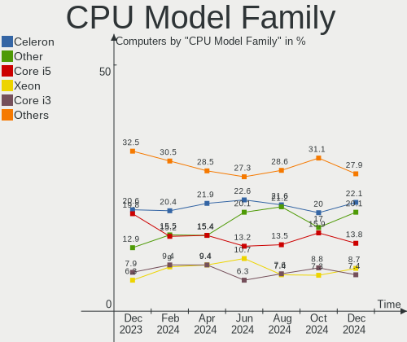

OPNsense - Hardware Trends
--------------------------

A project to identify most popular hardware characteristics and track their change
over time based on data collected by BSD users at https://BSD-Hardware.info.

Anyone can contribute to this report by the [hw-probe](https://github.com/linuxhw/hw-probe/blob/master/INSTALL.BSD.md) tool:

    hw-probe -all -upload

This report is for one last month. Overall report since the beginning of time: [TestCoverage](https://github.com/bsdhw/TestCoverage)

Period: Aug, 2022.

Contents
--------

* [ System ](#system)
  - [ OS                       ](#os)
  - [ OS Family                ](#os-family)
  - [ Arch                     ](#arch)
  - [ DE                       ](#de)
  - [ Display Server           ](#display-server)
  - [ Display Manager          ](#display-manager)
  - [ OS Lang                  ](#os-lang)
  - [ Boot Mode                ](#boot-mode)
  - [ Filesystem               ](#filesystem)
  - [ Part. scheme             ](#part-scheme)

* [ Board ](#board)
  - [ Vendor                   ](#vendor)
  - [ Model                    ](#model)
  - [ Model Family             ](#model-family)
  - [ MFG Year                 ](#mfg-year)
  - [ Form Factor              ](#form-factor)
  - [ Coreboot                 ](#coreboot)
  - [ RAM Size                 ](#ram-size)
  - [ RAM Used                 ](#ram-used)
  - [ Total Drives             ](#total-drives)
  - [ Has CD-ROM               ](#has-cd-rom)
  - [ Has Ethernet             ](#has-ethernet)
  - [ Has WiFi                 ](#has-wifi)
  - [ Has Bluetooth            ](#has-bluetooth)

* [ Location ](#location)
  - [ Country                  ](#country)
  - [ City                     ](#city)

* [ Drives ](#drives)
  - [ Drive Vendor             ](#drive-vendor)
  - [ Drive Model              ](#drive-model)
  - [ HDD Vendor               ](#hdd-vendor)
  - [ SSD Vendor               ](#ssd-vendor)
  - [ Drive Kind               ](#drive-kind)
  - [ Drive Connector          ](#drive-connector)
  - [ Drive Size               ](#drive-size)
  - [ Space Total              ](#space-total)
  - [ Space Used               ](#space-used)
  - [ Malfunc. Drives          ](#malfunc-drives)
  - [ Malfunc. Drive Vendor    ](#malfunc-drive-vendor)
  - [ Malfunc. HDD Vendor      ](#malfunc-hdd-vendor)
  - [ Malfunc. Drive Kind      ](#malfunc-drive-kind)
  - [ Failed Drives            ](#failed-drives)
  - [ Failed Drive Vendor      ](#failed-drive-vendor)
  - [ Drive Status             ](#drive-status)

* [ Storage controller ](#storage-controller)
  - [ Storage Vendor           ](#storage-vendor)
  - [ Storage Model            ](#storage-model)
  - [ Storage Kind             ](#storage-kind)

* [ Processor ](#processor)
  - [ CPU Vendor               ](#cpu-vendor)
  - [ CPU Model                ](#cpu-model)
  - [ CPU Model Family         ](#cpu-model-family)
  - [ CPU Cores                ](#cpu-cores)
  - [ CPU Sockets              ](#cpu-sockets)
  - [ CPU Threads              ](#cpu-threads)
  - [ CPU Microarch            ](#cpu-microarch)

* [ Graphics ](#graphics)
  - [ GPU Vendor               ](#gpu-vendor)
  - [ GPU Model                ](#gpu-model)
  - [ GPU Combo                ](#gpu-combo)
  - [ GPU Driver               ](#gpu-driver)
  - [ GPU Memory               ](#gpu-memory)

* [ Monitor ](#monitor)
  - [ Monitor Vendor           ](#monitor-vendor)
  - [ Monitor Model            ](#monitor-model)
  - [ Monitor Resolution       ](#monitor-resolution)
  - [ Monitor Diagonal         ](#monitor-diagonal)
  - [ Monitor Width            ](#monitor-width)
  - [ Aspect Ratio             ](#aspect-ratio)
  - [ Monitor Area             ](#monitor-area)
  - [ Pixel Density            ](#pixel-density)
  - [ Multiple Monitors        ](#multiple-monitors)

* [ Network ](#network)
  - [ Net Controller Vendor    ](#net-controller-vendor)
  - [ Net Controller Model     ](#net-controller-model)
  - [ Wireless Vendor          ](#wireless-vendor)
  - [ Wireless Model           ](#wireless-model)
  - [ Ethernet Vendor          ](#ethernet-vendor)
  - [ Ethernet Model           ](#ethernet-model)
  - [ Net Controller Kind      ](#net-controller-kind)
  - [ Used Controller          ](#used-controller)
  - [ NICs                     ](#nics)
  - [ IPv6                     ](#ipv6)

* [ Bluetooth ](#bluetooth)
  - [ Bluetooth Vendor         ](#bluetooth-vendor)
  - [ Bluetooth Model          ](#bluetooth-model)

* [ Sound ](#sound)
  - [ Sound Vendor             ](#sound-vendor)
  - [ Sound Model              ](#sound-model)

* [ Memory ](#memory)
  - [ Memory Vendor            ](#memory-vendor)
  - [ Memory Model             ](#memory-model)
  - [ Memory Kind              ](#memory-kind)
  - [ Memory Form Factor       ](#memory-form-factor)
  - [ Memory Size              ](#memory-size)
  - [ Memory Speed             ](#memory-speed)

* [ Printers & scanners ](#printers--scanners)
  - [ Printer Vendor           ](#printer-vendor)
  - [ Printer Model            ](#printer-model)
  - [ Scanner Vendor           ](#scanner-vendor)
  - [ Scanner Model            ](#scanner-model)

* [ Camera ](#camera)
  - [ Camera Vendor            ](#camera-vendor)
  - [ Camera Model             ](#camera-model)

* [ Security ](#security)
  - [ Fingerprint Vendor       ](#fingerprint-vendor)
  - [ Fingerprint Model        ](#fingerprint-model)
  - [ Chipcard Vendor          ](#chipcard-vendor)
  - [ Chipcard Model           ](#chipcard-model)

* [ Unsupported ](#unsupported)
  - [ Unsupported Devices      ](#unsupported-devices)
  - [ Unsupported Device Types ](#unsupported-device-types)

System
------

OS
--

Installed operating systems

| Name             | Computers | Percent |
|------------------|-----------|---------|
| OPNsense 22.7.2  | 107       | 36.9%   |
| OPNsense 22.7    | 77        | 26.55%  |
| OPNsense 22.7.1  | 63        | 21.72%  |
| OPNsense 22.1.10 | 23        | 7.93%   |
| OPNsense 23.1    | 6         | 2.07%   |
| OPNsense 22.4.3  | 5         | 1.72%   |
| OPNsense 21.7.8  | 3         | 1.03%   |
| OPNsense 22.1.8  | 2         | 0.69%   |
| OPNsense 22.1    | 2         | 0.69%   |
| OPNsense 22.4.2  | 1         | 0.34%   |
| OPNsense 21.7.6  | 1         | 0.34%   |

OS Family
---------

OS without a version

| Name     | Computers | Percent |
|----------|-----------|---------|
| OPNsense | 290       | 100%    |

Arch
----

OS architecture (x86_64, i586, etc.)

| Name  | Computers | Percent |
|-------|-----------|---------|
| amd64 | 289       | 99.66%  |
| arm64 | 1         | 0.34%   |

DE
--

Desktop Environment

| Name    | Computers | Percent |
|---------|-----------|---------|
| Console | 290       | 100%    |

Display Server
--------------

X11 or Wayland

| Name    | Computers | Percent |
|---------|-----------|---------|
| Console | 290       | 100%    |

Display Manager
---------------

SDDM, LightDM, etc.

| Name    | Computers | Percent |
|---------|-----------|---------|
| Console | 290       | 100%    |

OS Lang
-------

Language

| Lang    | Computers | Percent |
|---------|-----------|---------|
| Unknown | 286       | 98.62%  |
| C       | 4         | 1.38%   |

Boot Mode
---------

EFI or BIOS

| Mode | Computers | Percent |
|------|-----------|---------|
| EFI  | 275       | 94.83%  |
| BIOS | 15        | 5.17%   |

Filesystem
----------

Type of filesystem

| Type | Computers | Percent |
|------|-----------|---------|
| Ufs  | 168       | 57.93%  |
| Zfs  | 122       | 42.07%  |

Part. scheme
------------

Scheme of partitioning

| Type    | Computers | Percent |
|---------|-----------|---------|
| GPT     | 277       | 95.52%  |
| MBR     | 8         | 2.76%   |
| Unknown | 5         | 1.72%   |

Board
-----

Vendor
------

Motherboard manufacturer

| Name                          | Computers | Percent |
|-------------------------------|-----------|---------|
| Dell                          | 48        | 16.55%  |
| Unknown                       | 35        | 12.07%  |
| Hewlett-Packard               | 23        | 7.93%   |
| Intel                         | 18        | 6.21%   |
| Supermicro                    | 16        | 5.52%   |
| Protectli                     | 14        | 4.83%   |
| Fujitsu                       | 13        | 4.48%   |
| Lenovo                        | 12        | 4.14%   |
| AMI                           | 11        | 3.79%   |
| ASUSTek Computer              | 10        | 3.45%   |
| PC Engines                    | 9         | 3.1%    |
| Gigabyte Technology           | 8         | 2.76%   |
| ASRock                        | 7         | 2.41%   |
| Sophos                        | 6         | 2.07%   |
| Deciso                        | 5         | 1.72%   |
| BESSTAR Tech                  | 5         | 1.72%   |
| MSI                           | 4         | 1.38%   |
| YANYU                         | 3         | 1.03%   |
| MW                            | 3         | 1.03%   |
| AZW                           | 3         | 1.03%   |
| Acer                          | 3         | 1.03%   |
| ZOTAC                         | 2         | 0.69%   |
| SmbiosType2_BoardManufacturer | 2         | 0.69%   |
| Inventec                      | 2         | 0.69%   |
| iEi                           | 2         | 0.69%   |
| CompuLab                      | 2         | 0.69%   |
| Cisco                         | 2         | 0.69%   |
| AWOW                          | 2         | 0.69%   |
| WlanCN                        | 1         | 0.34%   |
| Wistron                       | 1         | 0.34%   |
| Shuttle                       | 1         | 0.34%   |
| Seeed Studio                  | 1         | 0.34%   |
| Samsung Electronics           | 1         | 0.34%   |
| Pegatron                      | 1         | 0.34%   |
| NF792                         | 1         | 0.34%   |
| NF541                         | 1         | 0.34%   |
| MiTAC                         | 1         | 0.34%   |
| maiyunda                      | 1         | 0.34%   |
| Lex                           | 1         | 0.34%   |
| Jingsha                       | 1         | 0.34%   |
| IceWhale Technology           | 1         | 0.34%   |
| Foxconn                       | 1         | 0.34%   |
| CncTion                       | 1         | 0.34%   |
| Cisco Systems                 | 1         | 0.34%   |
| CheckPoint                    | 1         | 0.34%   |
| ASRockRack                    | 1         | 0.34%   |
| AOpen                         | 1         | 0.34%   |
| AMD                           | 1         | 0.34%   |

Model
-----

Motherboard model

| Name                                                        | Computers | Percent |
|-------------------------------------------------------------|-----------|---------|
| Unknown                                                     | 35        | 12.07%  |
| Fujitsu FUTRO S920                                          | 8         | 2.76%   |
| Protectli FW4B                                              | 7         | 2.41%   |
| PC Engines APU2                                             | 7         | 2.41%   |
| HP t620 PLUS Quad Core TC                                   | 7         | 2.41%   |
| AMI Aptio CRB                                               | 7         | 2.41%   |
| Dell Wyse 5070 Extended Thin Client                         | 6         | 2.07%   |
| Protectli FW6                                               | 4         | 1.38%   |
| Intel Q3XXG4-P V1.0                                         | 4         | 1.38%   |
| HP t730 Thin Client                                         | 4         | 1.38%   |
| Dell PowerEdge R210 II                                      | 4         | 1.38%   |
| Supermicro Super Server                                     | 3         | 1.03%   |
| Sophos SG                                                   | 3         | 1.03%   |
| Protectli VP2410                                            | 3         | 1.03%   |
| MW GMLK-2_5G4L                                              | 3         | 1.03%   |
| HP ProDesk 600 G3 SFF                                       | 3         | 1.03%   |
| Dell OptiPlex 3020                                          | 3         | 1.03%   |
| ZOTAC ZBOX-CI329NANO                                        | 2         | 0.69%   |
| Supermicro A1SAi                                            | 2         | 0.69%   |
| Sophos UTM                                                  | 2         | 0.69%   |
| SmbiosType2_BoardManufacturer SmbiosType1_SystemProductName | 2         | 0.69%   |
| PC Engines apu4                                             | 2         | 0.69%   |
| Lenovo ThinkCentre M75s Gen 2 11R8000JUS                    | 2         | 0.69%   |
| Inventec Z CLASS                                            | 2         | 0.69%   |
| Intel DENLOW_WS                                             | 2         | 0.69%   |
| Dell PowerEdge R710                                         | 2         | 0.69%   |
| Dell PowerEdge R630                                         | 2         | 0.69%   |
| Dell PowerEdge R620                                         | 2         | 0.69%   |
| Dell OptiPlex 9020                                          | 2         | 0.69%   |
| Dell OptiPlex 7050                                          | 2         | 0.69%   |
| Dell OptiPlex 5060                                          | 2         | 0.69%   |
| Dell OptiPlex 3010                                          | 2         | 0.69%   |
| Deciso NetBoard-A10                                         | 2         | 0.69%   |
| CompuLab fitlet2                                            | 2         | 0.69%   |
| Cisco SALEEN                                                | 2         | 0.69%   |
| BESSTAR Tech TH50                                           | 2         | 0.69%   |
| AZW GK55                                                    | 2         | 0.69%   |
| AWOW PC BOX                                                 | 2         | 0.69%   |
| YANYU R250                                                  | 1         | 0.34%   |
| YANYU H67SL                                                 | 1         | 0.34%   |
| YANYU D19SL_B                                               | 1         | 0.34%   |
| WlanCN 6000 Series                                          | 1         | 0.34%   |
| Wistron ProLiant ML110 G6                                   | 1         | 0.34%   |
| Supermicro X8DTL                                            | 1         | 0.34%   |
| Supermicro X10SLM+-LN4F                                     | 1         | 0.34%   |
| Supermicro X10SBA-L                                         | 1         | 0.34%   |
| Supermicro TS-150                                           | 1         | 0.34%   |
| Supermicro SYS-E300-9A-4C                                   | 1         | 0.34%   |
| Supermicro SYS-E300-8D                                      | 1         | 0.34%   |
| Supermicro SYS-5018D-FN8T                                   | 1         | 0.34%   |
| Supermicro SYS-1019D-4C-FHN13TP                             | 1         | 0.34%   |
| Supermicro PIO-618U-T4T+-ST031                              | 1         | 0.34%   |
| Supermicro PIO-518D-N6TRF-ST031                             | 1         | 0.34%   |
| Supermicro PDSMi                                            | 1         | 0.34%   |
| Sophos XG                                                   | 1         | 0.34%   |
| Shuttle TERRA_PC                                            | 1         | 0.34%   |
| Seeed Studio ODYSSEY-X86J4105                               | 1         | 0.34%   |
| Samsung NC210/NC110                                         | 1         | 0.34%   |
| Pegatron IPMIP-GS                                           | 1         | 0.34%   |
| NF792 1.0                                                   | 1         | 0.34%   |

Model Family
------------

Motherboard model prefix

| Name                                      | Computers | Percent |
|-------------------------------------------|-----------|---------|
| Unknown                                   | 35        | 12.07%  |
| Dell OptiPlex                             | 18        | 6.21%   |
| Dell PowerEdge                            | 15        | 5.17%   |
| Lenovo ThinkCentre                        | 11        | 3.79%   |
| Fujitsu FUTRO                             | 9         | 3.1%    |
| HP t620                                   | 8         | 2.76%   |
| Protectli FW4B                            | 7         | 2.41%   |
| PC Engines APU2                           | 7         | 2.41%   |
| AMI Aptio                                 | 7         | 2.41%   |
| Dell Wyse                                 | 6         | 2.07%   |
| Protectli FW6                             | 4         | 1.38%   |
| Intel Q3XXG4-P                            | 4         | 1.38%   |
| HP t730                                   | 4         | 1.38%   |
| Supermicro Super                          | 3         | 1.03%   |
| Sophos SG                                 | 3         | 1.03%   |
| Protectli VP2410                          | 3         | 1.03%   |
| MW GMLK-2                                 | 3         | 1.03%   |
| HP ProDesk                                | 3         | 1.03%   |
| HP EliteDesk                              | 3         | 1.03%   |
| Fujitsu ESPRIMO                           | 3         | 1.03%   |
| Dell Precision                            | 3         | 1.03%   |
| Dell Inspiron                             | 3         | 1.03%   |
| ZOTAC ZBOX-CI329NANO                      | 2         | 0.69%   |
| Supermicro A1SAi                          | 2         | 0.69%   |
| Sophos UTM                                | 2         | 0.69%   |
| SmbiosType2_BoardManufacturer SmbiosType1 | 2         | 0.69%   |
| PC Engines apu4                           | 2         | 0.69%   |
| Inventec Z                                | 2         | 0.69%   |
| Intel DENLOW                              | 2         | 0.69%   |
| HP ProLiant                               | 2         | 0.69%   |
| HP Compaq                                 | 2         | 0.69%   |
| Gigabyte H61M-DS2                         | 2         | 0.69%   |
| Deciso NetBoard-A10                       | 2         | 0.69%   |
| Deciso Netboard                           | 2         | 0.69%   |
| CompuLab fitlet2                          | 2         | 0.69%   |
| Cisco SALEEN                              | 2         | 0.69%   |
| BESSTAR Tech TH50                         | 2         | 0.69%   |
| AZW GK55                                  | 2         | 0.69%   |
| AWOW PC                                   | 2         | 0.69%   |
| ASUS PRIME                                | 2         | 0.69%   |
| Acer Aspire                               | 2         | 0.69%   |
| YANYU R250                                | 1         | 0.34%   |
| YANYU H67SL                               | 1         | 0.34%   |
| YANYU D19SL                               | 1         | 0.34%   |
| WlanCN 6000                               | 1         | 0.34%   |
| Wistron ProLiant                          | 1         | 0.34%   |
| Supermicro X8DTL                          | 1         | 0.34%   |
| Supermicro X10SLM+-LN4F                   | 1         | 0.34%   |
| Supermicro X10SBA-L                       | 1         | 0.34%   |
| Supermicro TS-150                         | 1         | 0.34%   |
| Supermicro SYS-E300-9A-4C                 | 1         | 0.34%   |
| Supermicro SYS-E300-8D                    | 1         | 0.34%   |
| Supermicro SYS-5018D-FN8T                 | 1         | 0.34%   |
| Supermicro SYS-1019D-4C-FHN13TP           | 1         | 0.34%   |
| Supermicro PIO-618U-T4T+-ST031            | 1         | 0.34%   |
| Supermicro PIO-518D-N6TRF-ST031           | 1         | 0.34%   |
| Supermicro PDSMi                          | 1         | 0.34%   |
| Sophos XG                                 | 1         | 0.34%   |
| Shuttle TERRA                             | 1         | 0.34%   |
| Seeed Studio ODYSSEY-X86J4105             | 1         | 0.34%   |

MFG Year
--------

Motherboard manufacture year

| Year    | Computers | Percent |
|---------|-----------|---------|
| 2014    | 31        | 10.69%  |
| 2019    | 30        | 10.34%  |
| 2020    | 29        | 10%     |
| 2016    | 29        | 10%     |
| 2021    | 28        | 9.66%   |
| 2018    | 28        | 9.66%   |
| 2022    | 26        | 8.97%   |
| 2017    | 21        | 7.24%   |
| 2013    | 15        | 5.17%   |
| 2015    | 14        | 4.83%   |
| 2012    | 14        | 4.83%   |
| 2011    | 10        | 3.45%   |
| 2010    | 8         | 2.76%   |
| 2009    | 3         | 1.03%   |
| 2008    | 2         | 0.69%   |
| 2006    | 1         | 0.34%   |
| Unknown | 1         | 0.34%   |

Form Factor
-----------

Physical design of the computer

| Name        | Computers | Percent |
|-------------|-----------|---------|
| Desktop     | 208       | 71.72%  |
| Mini pc     | 35        | 12.07%  |
| Server      | 29        | 10%     |
| Notebook    | 10        | 3.45%   |
| Firewall    | 6         | 2.07%   |
| Convertible | 1         | 0.34%   |
| All in one  | 1         | 0.34%   |

Coreboot
--------

Have coreboot on board

| Used | Computers | Percent |
|------|-----------|---------|
| No   | 277       | 95.52%  |
| Yes  | 13        | 4.48%   |

RAM Size
--------

Total RAM memory

| Size in GB  | Computers | Percent |
|-------------|-----------|---------|
| 8.01-16.0   | 127       | 43.79%  |
| 16.01-24.0  | 64        | 22.07%  |
| 4.01-8.0    | 50        | 17.24%  |
| 32.01-64.0  | 22        | 7.59%   |
| 2.01-3.0    | 13        | 4.48%   |
| 64.01-256.0 | 8         | 2.76%   |
| 24.01-32.0  | 4         | 1.38%   |
| 3.01-4.0    | 1         | 0.34%   |
| 1.01-2.0    | 1         | 0.34%   |

RAM Used
--------

Used RAM memory

| Used GB  | Computers | Percent |
|----------|-----------|---------|
| 0.01-0.5 | 156       | 53.79%  |
| 0.51-1.0 | 95        | 32.76%  |
| 1.01-2.0 | 27        | 9.31%   |
| 4.01-8.0 | 4         | 1.38%   |
| 3.01-4.0 | 4         | 1.38%   |
| 2.01-3.0 | 4         | 1.38%   |

Total Drives
------------

Number of drives on board

| Drives | Computers | Percent |
|--------|-----------|---------|
| 1      | 233       | 80.34%  |
| 0      | 38        | 13.1%   |
| 2      | 17        | 5.86%   |
| 3      | 2         | 0.69%   |

Has CD-ROM
----------

Has CD-ROM on board

| Presented | Computers | Percent |
|-----------|-----------|---------|
| No        | 255       | 87.93%  |
| Yes       | 35        | 12.07%  |

Has Ethernet
------------

Has Ethernet on board

| Presented | Computers | Percent |
|-----------|-----------|---------|
| Yes       | 290       | 100%    |

Has WiFi
--------

Has WiFi module

| Presented | Computers | Percent |
|-----------|-----------|---------|
| No        | 233       | 80.34%  |
| Yes       | 57        | 19.66%  |

Has Bluetooth
-------------

Has Bluetooth module

| Presented | Computers | Percent |
|-----------|-----------|---------|
| No        | 261       | 90%     |
| Yes       | 29        | 10%     |

Location
--------

Country
-------

Geographic location (country)

| Country      | Computers | Percent |
|--------------|-----------|---------|
| USA          | 93        | 32.07%  |
| Germany      | 51        | 17.59%  |
| Canada       | 14        | 4.83%   |
| UK           | 12        | 4.14%   |
| Italy        | 10        | 3.45%   |
| France       | 10        | 3.45%   |
| Switzerland  | 9         | 3.1%    |
| Poland       | 9         | 3.1%    |
| Netherlands  | 7         | 2.41%   |
| Spain        | 6         | 2.07%   |
| Austria      | 5         | 1.72%   |
| Sweden       | 4         | 1.38%   |
| South Korea  | 4         | 1.38%   |
| Brazil       | 4         | 1.38%   |
| Russia       | 3         | 1.03%   |
| New Zealand  | 3         | 1.03%   |
| Indonesia    | 3         | 1.03%   |
| Greece       | 3         | 1.03%   |
| Finland      | 3         | 1.03%   |
| Belgium      | 3         | 1.03%   |
| Australia    | 3         | 1.03%   |
| Vietnam      | 2         | 0.69%   |
| Slovenia     | 2         | 0.69%   |
| Romania      | 2         | 0.69%   |
| Pakistan     | 2         | 0.69%   |
| Denmark      | 2         | 0.69%   |
| Taiwan       | 1         | 0.34%   |
| South Africa | 1         | 0.34%   |
| Serbia       | 1         | 0.34%   |
| Philippines  | 1         | 0.34%   |
| Peru         | 1         | 0.34%   |
| Paraguay     | 1         | 0.34%   |
| Norway       | 1         | 0.34%   |
| Mexico       | 1         | 0.34%   |
| Malaysia     | 1         | 0.34%   |
| Lithuania    | 1         | 0.34%   |
| Japan        | 1         | 0.34%   |
| Israel       | 1         | 0.34%   |
| Isle of Man  | 1         | 0.34%   |
| India        | 1         | 0.34%   |
| Hungary      | 1         | 0.34%   |
| Czechia      | 1         | 0.34%   |
| Croatia      | 1         | 0.34%   |
| Costa Rica   | 1         | 0.34%   |
| China        | 1         | 0.34%   |
| Bahamas      | 1         | 0.34%   |
| Argentina    | 1         | 0.34%   |

City
----

Geographic location (city)

| City                 | Computers | Percent |
|----------------------|-----------|---------|
| Essex                | 4         | 1.38%   |
| Winterthur           | 3         | 1.03%   |
| Warsaw               | 3         | 1.03%   |
| Vienna               | 3         | 1.03%   |
| Legionowo            | 3         | 1.03%   |
| Victoria             | 2         | 0.69%   |
| Verona               | 2         | 0.69%   |
| Toronto              | 2         | 0.69%   |
| Statesboro           | 2         | 0.69%   |
| Siegen               | 2         | 0.69%   |
| Seoul                | 2         | 0.69%   |
| Sao José dos Campos | 2         | 0.69%   |
| Philadelphia         | 2         | 0.69%   |
| Perth                | 2         | 0.69%   |
| Paris                | 2         | 0.69%   |
| Ottawa               | 2         | 0.69%   |
| Munich               | 2         | 0.69%   |
| Las Vegas            | 2         | 0.69%   |
| Houston              | 2         | 0.69%   |
| Horgen               | 2         | 0.69%   |
| Ho Chi Minh City     | 2         | 0.69%   |
| Fredericksburg       | 2         | 0.69%   |
| Florianópolis       | 2         | 0.69%   |
| Federal Way          | 2         | 0.69%   |
| Dresden              | 2         | 0.69%   |
| Cileungsir           | 2         | 0.69%   |
| Chicago              | 2         | 0.69%   |
| Burnaby              | 2         | 0.69%   |
| Berlin               | 2         | 0.69%   |
| Bellingham           | 2         | 0.69%   |
| Atlanta              | 2         | 0.69%   |
| Zeist                | 1         | 0.34%   |
| Zagreb               | 1         | 0.34%   |
| Wuppertal            | 1         | 0.34%   |
| Worms                | 1         | 0.34%   |
| Wolfsburg            | 1         | 0.34%   |
| Winter Park          | 1         | 0.34%   |
| Winschoten           | 1         | 0.34%   |
| Wiesbaden            | 1         | 0.34%   |
| West Orange          | 1         | 0.34%   |
| Wellington           | 1         | 0.34%   |
| Watford              | 1         | 0.34%   |
| Vantaa               | 1         | 0.34%   |
| Vancouver            | 1         | 0.34%   |
| Upice                | 1         | 0.34%   |
| Tucson               | 1         | 0.34%   |
| Tres Cantos          | 1         | 0.34%   |
| Trento               | 1         | 0.34%   |
| Tokyo                | 1         | 0.34%   |
| Targoviste           | 1         | 0.34%   |
| Suwanee              | 1         | 0.34%   |
| Sutton               | 1         | 0.34%   |
| Summerville          | 1         | 0.34%   |
| Suffolk              | 1         | 0.34%   |
| Stuttgart            | 1         | 0.34%   |
| Straelen             | 1         | 0.34%   |
| Springboro           | 1         | 0.34%   |
| Southampton          | 1         | 0.34%   |
| South Tangerang      | 1         | 0.34%   |
| Soltau               | 1         | 0.34%   |

Drives
------

Drive Vendor
------------

Hard drive vendors

| Vendor              | Computers | Drives | Percent |
|---------------------|-----------|--------|---------|
| Samsung Electronics | 40        | 42     | 15.21%  |
| Transcend           | 28        | 28     | 10.65%  |
| Kingston            | 25        | 25     | 9.51%   |
| WDC                 | 17        | 19     | 6.46%   |
| Seagate             | 14        | 16     | 5.32%   |
| SanDisk             | 14        | 14     | 5.32%   |
| Intel               | 12        | 13     | 4.56%   |
| China               | 12        | 12     | 4.56%   |
| Hoodisk             | 10        | 10     | 3.8%    |
| Crucial             | 8         | 8      | 3.04%   |
| A-DATA Technology   | 8         | 9      | 3.04%   |
| Toshiba             | 7         | 8      | 2.66%   |
| Innodisk            | 6         | 6      | 2.28%   |
| FORESEE             | 5         | 5      | 1.9%    |
| Dogfish             | 5         | 5      | 1.9%    |
| Micron Technology   | 4         | 4      | 1.52%   |
| PNY                 | 3         | 4      | 1.14%   |
| KIOXIA              | 3         | 3      | 1.14%   |
| Intenso             | 3         | 3      | 1.14%   |
| SK hynix            | 2         | 2      | 0.76%   |
| ShiJi               | 2         | 2      | 0.76%   |
| Protectli           | 2         | 2      | 0.76%   |
| Phison              | 2         | 2      | 0.76%   |
| Patriot             | 2         | 2      | 0.76%   |
| LITEON              | 2         | 2      | 0.76%   |
| HGST                | 2         | 2      | 0.76%   |
| Hewlett-Packard     | 2         | 3      | 0.76%   |
| BIWIN               | 2         | 2      | 0.76%   |
| Apacer              | 2         | 2      | 0.76%   |
| Verbatim            | 1         | 1      | 0.38%   |
| Team                | 1         | 1      | 0.38%   |
| SPCC                | 1         | 1      | 0.38%   |
| Silicon Motion      | 1         | 1      | 0.38%   |
| OCZ                 | 1         | 1      | 0.38%   |
| Netac               | 1         | 1      | 0.38%   |
| MARVELL             | 1         | 1      | 0.38%   |
| LuminouTek          | 1         | 1      | 0.38%   |
| Integral            | 1         | 1      | 0.38%   |
| INDMEM              | 1         | 1      | 0.38%   |
| Indilinx            | 1         | 1      | 0.38%   |
| HP Phison           | 1         | 1      | 0.38%   |
| Hitachi             | 1         | 1      | 0.38%   |
| HCiPC               | 1         | 1      | 0.38%   |
| FLEXXON             | 1         | 1      | 0.38%   |
| Corsair             | 1         | 1      | 0.38%   |
| Cisco               | 1         | 1      | 0.38%   |
| BR                  | 1         | 1      | 0.38%   |
| AMD                 | 1         | 1      | 0.38%   |

Drive Model
-----------

Hard drive models

| Model                                 | Computers | Percent |
|---------------------------------------|-----------|---------|
| Kingston SA400S37240G 240GB           | 6         | 2.26%   |
| Transcend TS128GMSA230S 128GB         | 5         | 1.89%   |
| Transcend TS64GMSA370 64GB            | 3         | 1.13%   |
| Transcend TS128GMSA370 128GB          | 3         | 1.13%   |
| Kingston SUV500MS240G 240GB           | 3         | 1.13%   |
| Kingston SA400S37120G 120GB           | 3         | 1.13%   |
| Hoodisk SSD 32GB                      | 3         | 1.13%   |
| Hoodisk SSD 256GB                     | 3         | 1.13%   |
| Hoodisk SSD 128GB                     | 3         | 1.13%   |
| Crucial CT250MX500SSD1 250GB          | 3         | 1.13%   |
| Transcend TS64GMSA230S 64GB           | 2         | 0.75%   |
| Transcend TS256GMTS952T2 256GB        | 2         | 0.75%   |
| Transcend TS256GMTE652T2 256GB        | 2         | 0.75%   |
| ShiJi SSD 128GB                       | 2         | 0.75%   |
| Seagate ST500DM002-1BD142 500GB       | 2         | 0.75%   |
| Samsung SSD 980 500GB                 | 2         | 0.75%   |
| Samsung SSD 850 EVO 250GB             | 2         | 0.75%   |
| Samsung SSD 840 Series 120GB          | 2         | 0.75%   |
| Samsung SSD 840 EVO 250GB             | 2         | 0.75%   |
| Samsung SSD 750 EVO 120GB             | 2         | 0.75%   |
| Kingston SKC600MS256G 256GB           | 2         | 0.75%   |
| Kingston OM8PDP3512B-A01 512GB        | 2         | 0.75%   |
| Intel SSDSCKKF128G8 SATA 128GB        | 2         | 0.75%   |
| Intel SSDSC2KW256G8 256GB             | 2         | 0.75%   |
| Innodisk DEMSR- 08GB mSATA 3ME3       | 2         | 0.75%   |
| FORESEE 64GB SSD                      | 2         | 0.75%   |
| FORESEE 128GB SSD                     | 2         | 0.75%   |
| Dogfish SSD 128GB                     | 2         | 0.75%   |
| China SATA SSD 64GB                   | 2         | 0.75%   |
| China SATA SSD 32GB                   | 2         | 0.75%   |
| China SATA SSD 16GB                   | 2         | 0.75%   |
| China SATA SSD 120GB                  | 2         | 0.75%   |
| China NGFF 2280 256GB SSD             | 2         | 0.75%   |
| BIWIN SSD 128GB                       | 2         | 0.75%   |
| Apacer 16GB SATA Flash Drive          | 2         | 0.75%   |
| A-DATA SU650 120GB                    | 2         | 0.75%   |
| WDC WDS500G3X0C-00SJG0 500GB          | 1         | 0.38%   |
| WDC WDS500G2B0C-00PXH0 500GB          | 1         | 0.38%   |
| WDC WDS500G2B0A-00SM50 500GB          | 1         | 0.38%   |
| WDC WDS120G2G0A-00JH30 120GB          | 1         | 0.38%   |
| WDC WDS120G1G0A-00SS50 120GB          | 1         | 0.38%   |
| WDC WD5003AZEX-00K3CA0 500GB          | 1         | 0.38%   |
| WDC WD5003ABYX-18WERA0 500GB          | 1         | 0.38%   |
| WDC WD5003ABYX-01WERA2 500GB          | 1         | 0.38%   |
| WDC WD5000AAKS-00M9A0 500GB           | 1         | 0.38%   |
| WDC WD2503ABYX-01WERA1 256GB          | 1         | 0.38%   |
| WDC WD2500AAJS-07M0A0 250GB           | 1         | 0.38%   |
| WDC WD1600JS-70SGB1 160GB             | 1         | 0.38%   |
| WDC WD1600BEVS-07RST0 160GB           | 1         | 0.38%   |
| WDC WD1600BEKT-66F3T2 160GB           | 1         | 0.38%   |
| WDC WD10EZEX-00ZF5A0 1TB              | 1         | 0.38%   |
| WDC WD1001FAES-75W7A0 1TB             | 1         | 0.38%   |
| WDC PC SN730 SDBQNTY-512G-1001 512GB  | 1         | 0.38%   |
| WDC PC SN520 SDAPNUW-512G-1006 512GB  | 1         | 0.38%   |
| Verbatim Vi560 SATA III M.2 SSD 256GB | 1         | 0.38%   |
| Transcend TS64GSSD420K 64GB           | 1         | 0.38%   |
| Transcend TS64GSSD370 64GB            | 1         | 0.38%   |
| Transcend TS32GMSA740 32GB            | 1         | 0.38%   |
| Transcend TS2GCF200I 2GB              | 1         | 0.38%   |
| Transcend TS128GSSD420K 128GB         | 1         | 0.38%   |

HDD Vendor
----------

Hard disk drive vendors

| Vendor          | Computers | Drives | Percent |
|-----------------|-----------|--------|---------|
| Seagate         | 13        | 15     | 38.24%  |
| WDC             | 11        | 12     | 32.35%  |
| Toshiba         | 3         | 4      | 8.82%   |
| HGST            | 2         | 2      | 5.88%   |
| Hewlett-Packard | 2         | 3      | 5.88%   |
| MARVELL         | 1         | 1      | 2.94%   |
| Hitachi         | 1         | 1      | 2.94%   |
| Cisco           | 1         | 1      | 2.94%   |

SSD Vendor
----------

Solid state drive vendors

| Vendor              | Computers | Drives | Percent |
|---------------------|-----------|--------|---------|
| Samsung Electronics | 31        | 33     | 15.74%  |
| Transcend           | 26        | 26     | 13.2%   |
| Kingston            | 21        | 21     | 10.66%  |
| SanDisk             | 14        | 14     | 7.11%   |
| Intel               | 12        | 13     | 6.09%   |
| China               | 12        | 12     | 6.09%   |
| Hoodisk             | 9         | 9      | 4.57%   |
| Crucial             | 8         | 8      | 4.06%   |
| Innodisk            | 6         | 6      | 3.05%   |
| A-DATA Technology   | 6         | 7      | 3.05%   |
| FORESEE             | 5         | 5      | 2.54%   |
| Dogfish             | 5         | 5      | 2.54%   |
| Micron Technology   | 4         | 4      | 2.03%   |
| WDC                 | 3         | 3      | 1.52%   |
| PNY                 | 3         | 4      | 1.52%   |
| Intenso             | 3         | 3      | 1.52%   |
| SK hynix            | 2         | 2      | 1.02%   |
| ShiJi               | 2         | 2      | 1.02%   |
| Protectli           | 2         | 2      | 1.02%   |
| Patriot             | 2         | 2      | 1.02%   |
| LITEON              | 2         | 2      | 1.02%   |
| BIWIN               | 2         | 2      | 1.02%   |
| Apacer              | 2         | 2      | 1.02%   |
| Verbatim            | 1         | 1      | 0.51%   |
| Toshiba             | 1         | 1      | 0.51%   |
| SPCC                | 1         | 1      | 0.51%   |
| Seagate             | 1         | 1      | 0.51%   |
| OCZ                 | 1         | 1      | 0.51%   |
| Netac               | 1         | 1      | 0.51%   |
| Integral            | 1         | 1      | 0.51%   |
| INDMEM              | 1         | 1      | 0.51%   |
| Indilinx            | 1         | 1      | 0.51%   |
| HP Phison           | 1         | 1      | 0.51%   |
| HCiPC               | 1         | 1      | 0.51%   |
| FLEXXON             | 1         | 1      | 0.51%   |
| Corsair             | 1         | 1      | 0.51%   |
| BR                  | 1         | 1      | 0.51%   |
| AMD                 | 1         | 1      | 0.51%   |

Drive Kind
----------

HDD or SSD

| Kind | Computers | Drives | Percent |
|------|-----------|--------|---------|
| SSD  | 194       | 202    | 74.9%   |
| NVMe | 33        | 33     | 12.74%  |
| HDD  | 32        | 39     | 12.36%  |

Drive Connector
---------------

SATA, SAS, NVMe, etc.

| Type | Computers | Drives | Percent |
|------|-----------|--------|---------|
| SATA | 224       | 241    | 87.16%  |
| NVMe | 33        | 33     | 12.84%  |

Drive Size
----------

Size of hard drive

| Size in TB | Computers | Drives | Percent |
|------------|-----------|--------|---------|
| 0.01-0.5   | 212       | 225    | 93.81%  |
| 0.51-1.0   | 12        | 14     | 5.31%   |
| 2.01-3.0   | 1         | 1      | 0.44%   |
| 1.01-2.0   | 1         | 1      | 0.44%   |

Space Total
-----------

Amount of disk space available on the file system

| Size in GB | Computers | Percent |
|------------|-----------|---------|
| 101-250    | 166       | 57.24%  |
| 251-500    | 39        | 13.45%  |
| 51-100     | 24        | 8.28%   |
| 21-50      | 23        | 7.93%   |
| 1-20       | 21        | 7.24%   |
| 501-1000   | 13        | 4.48%   |
| 1001-2000  | 3         | 1.03%   |
| 2001-3000  | 1         | 0.34%   |

Space Used
----------

Amount of used disk space

| Used GB | Computers | Percent |
|---------|-----------|---------|
| 1-20    | 276       | 95.17%  |
| 21-50   | 10        | 3.45%   |
| 51-100  | 4         | 1.38%   |

Malfunc. Drives
---------------

Drive models with a malfunction

| Model                                        | Computers | Drives | Percent |
|----------------------------------------------|-----------|--------|---------|
| WDC WD5000AAKS-00M9A0 500GB                  | 1         | 1      | 3.57%   |
| WDC WD1600BEKT-66F3T2 160GB                  | 1         | 1      | 3.57%   |
| Toshiba THNSNK128GCS8 SATA 128GB             | 1         | 1      | 3.57%   |
| Seagate ST500DM002-1BD142 500GB              | 1         | 1      | 3.57%   |
| Seagate ST380815AS 80GB                      | 1         | 1      | 3.57%   |
| Seagate ST3500418AS 500GB                    | 1         | 1      | 3.57%   |
| Seagate ST3250620NS 250GB                    | 1         | 1      | 3.57%   |
| Seagate ST1000DM003-1CH162 1TB               | 1         | 1      | 3.57%   |
| SanDisk SDCFHS-016G                          | 1         | 1      | 3.57%   |
| SanDisk SD8TB8U-256G-1006 256GB              | 1         | 1      | 3.57%   |
| Samsung Electronics MZMTE128HMGR-00007 128GB | 1         | 1      | 3.57%   |
| Micron Technology C400 RealSSD mSATA 128GB   | 1         | 1      | 3.57%   |
| LITEON CS1-SP32-11 M.2 2242 32GB             | 1         | 1      | 3.57%   |
| Kingston SV300S37A60G 64GB                   | 1         | 1      | 3.57%   |
| Kingston SUV400S37120G 120GB                 | 1         | 1      | 3.57%   |
| Intel SSDSC2KW256G8 256GB                    | 1         | 1      | 3.57%   |
| Intel SSDSC2BW120H6 120GB                    | 1         | 1      | 3.57%   |
| Intel SSDSC2BB480G4 480GB                    | 1         | 1      | 3.57%   |
| Intel SSDSA2M160G2GC 160GB                   | 1         | 1      | 3.57%   |
| Intel SSDSA2M080G2GC 80GB                    | 1         | 1      | 3.57%   |
| INDMEM SSD mSATA 128GB                       | 1         | 1      | 3.57%   |
| HP Phison PSSBN016GA27MC0 16GB               | 1         | 1      | 3.57%   |
| HGST HTS725050A7E630 500GB                   | 1         | 1      | 3.57%   |
| Hewlett-Packard VB0160EAVEQ 160GB            | 1         | 1      | 3.57%   |
| Dogfish SSD 128GB                            | 1         | 1      | 3.57%   |
| China SATA SSD 32GB                          | 1         | 1      | 3.57%   |
| Apacer 16GB SATA Flash Drive                 | 1         | 1      | 3.57%   |
| A-DATA Technology ASU800SS-256GT 256GB       | 1         | 1      | 3.57%   |

Malfunc. Drive Vendor
---------------------

Vendors of faulty drives

| Vendor              | Computers | Drives | Percent |
|---------------------|-----------|--------|---------|
| Seagate             | 5         | 5      | 17.86%  |
| Intel               | 5         | 5      | 17.86%  |
| WDC                 | 2         | 2      | 7.14%   |
| SanDisk             | 2         | 2      | 7.14%   |
| Kingston            | 2         | 2      | 7.14%   |
| Toshiba             | 1         | 1      | 3.57%   |
| Samsung Electronics | 1         | 1      | 3.57%   |
| Micron Technology   | 1         | 1      | 3.57%   |
| LITEON              | 1         | 1      | 3.57%   |
| INDMEM              | 1         | 1      | 3.57%   |
| HP Phison           | 1         | 1      | 3.57%   |
| HGST                | 1         | 1      | 3.57%   |
| Hewlett-Packard     | 1         | 1      | 3.57%   |
| Dogfish             | 1         | 1      | 3.57%   |
| China               | 1         | 1      | 3.57%   |
| Apacer              | 1         | 1      | 3.57%   |
| A-DATA Technology   | 1         | 1      | 3.57%   |

Malfunc. HDD Vendor
-------------------

Vendors of faulty HDD drives

| Vendor          | Computers | Drives | Percent |
|-----------------|-----------|--------|---------|
| Seagate         | 5         | 5      | 55.56%  |
| WDC             | 2         | 2      | 22.22%  |
| HGST            | 1         | 1      | 11.11%  |
| Hewlett-Packard | 1         | 1      | 11.11%  |

Malfunc. Drive Kind
-------------------

Kinds of faulty drives

| Kind | Computers | Drives | Percent |
|------|-----------|--------|---------|
| SSD  | 19        | 19     | 67.86%  |
| HDD  | 9         | 9      | 32.14%  |

Failed Drives
-------------

Failed drive models

Zero info for selected period =(

Failed Drive Vendor
-------------------

Failed drive vendors

Zero info for selected period =(

Drive Status
------------

Number of failed and malfunc. drives

| Status   | Computers | Drives | Percent |
|----------|-----------|--------|---------|
| Works    | 223       | 242    | 87.45%  |
| Malfunc  | 28        | 28     | 10.98%  |
| Detected | 4         | 4      | 1.57%   |

Storage controller
------------------

Storage Vendor
--------------

Storage controller vendors

| Vendor                      | Computers | Percent |
|-----------------------------|-----------|---------|
| Intel                       | 231       | 67.94%  |
| AMD                         | 51        | 15%     |
| Broadcom / LSI              | 12        | 3.53%   |
| Samsung Electronics         | 9         | 2.65%   |
| SanDisk                     | 6         | 1.76%   |
| Toshiba                     | 5         | 1.47%   |
| ASMedia Technology          | 5         | 1.47%   |
| Kingston Technology Company | 4         | 1.18%   |
| Silicon Motion              | 3         | 0.88%   |
| Phison Electronics          | 3         | 0.88%   |
| Marvell Technology Group    | 2         | 0.59%   |
| Chelsio Communications      | 2         | 0.59%   |
| Unknown                     | 2         | 0.59%   |
| MAXIO Technology (Hangzhou) | 1         | 0.29%   |
| KIOXIA                      | 1         | 0.29%   |
| Hewlett-Packard             | 1         | 0.29%   |
| Biwin Storage Technology    | 1         | 0.29%   |
| ADATA Technology            | 1         | 0.29%   |

Storage Model
-------------

Storage controller models

| Model                                                                            | Computers | Percent |
|----------------------------------------------------------------------------------|-----------|---------|
| AMD FCH SATA Controller [AHCI mode]                                              | 39        | 10.43%  |
| Intel Celeron/Pentium Silver Processor SATA Controller                           | 31        | 8.29%   |
| Intel 8 Series/C220 Series Chipset Family 6-port SATA Controller 1 [AHCI mode]   | 21        | 5.61%   |
| Intel Sunrise Point-LP SATA Controller [AHCI mode]                               | 17        | 4.55%   |
| Intel 6 Series/C200 Series Chipset Family 6 port Desktop SATA AHCI Controller    | 14        | 3.74%   |
| Intel Atom Processor E3800 Series SATA AHCI Controller                           | 13        | 3.48%   |
| Intel Atom/Celeron/Pentium Processor x5-E8000/J3xxx/N3xxx Series SATA Controller | 12        | 3.21%   |
| Intel 200 Series PCH SATA controller [AHCI mode]                                 | 12        | 3.21%   |
| Intel Celeron N3350/Pentium N4200/Atom E3900 Series SATA AHCI Controller         | 10        | 2.67%   |
| Intel Q170/Q150/B150/H170/H110/Z170/CM236 Chipset SATA Controller [AHCI Mode]    | 8         | 2.14%   |
| Intel Wildcat Point-LP SATA Controller [AHCI Mode]                               | 7         | 1.87%   |
| AMD SB7x0/SB8x0/SB9x0 SATA Controller [AHCI mode]                                | 7         | 1.87%   |
| Intel C600/X79 series chipset 6-Port SATA AHCI Controller                        | 6         | 1.6%    |
| Intel 7 Series/C210 Series Chipset Family 6-port SATA Controller [AHCI mode]     | 6         | 1.6%    |
| Intel 5 Series/3400 Series Chipset 6 port SATA AHCI Controller                   | 6         | 1.6%    |
| Intel SATA Controller [RAID mode]                                                | 5         | 1.34%   |
| Intel C610/X99 series chipset sSATA Controller [AHCI mode]                       | 5         | 1.34%   |
| ASMedia ASM1062 Serial ATA Controller                                            | 5         | 1.34%   |
| AMD SB7x0/SB8x0/SB9x0 IDE Controller                                             | 5         | 1.34%   |
| Unknown                                                                          | 5         | 1.34%   |
| Samsung NVMe SSD Controller SM981/PM981/PM983                                    | 4         | 1.07%   |
| Intel Tiger Lake-LP SATA Controller                                              | 4         | 1.07%   |
| Intel NM10/ICH7 Family SATA Controller [AHCI mode]                               | 4         | 1.07%   |
| Intel Jasper Lake SATA AHCI Controller                                           | 4         | 1.07%   |
| Intel Cannon Lake PCH SATA AHCI Controller                                       | 4         | 1.07%   |
| Intel C610/X99 series chipset 6-Port SATA Controller [AHCI mode]                 | 4         | 1.07%   |
| Intel Atom processor C2000 AHCI SATA3 Controller                                 | 4         | 1.07%   |
| AMD FCH IDE Controller                                                           | 4         | 1.07%   |
| Kingston Company OM3PDP3 NVMe SSD                                                | 3         | 0.8%    |
| Intel C620 Series Chipset Family SSATA Controller [AHCI mode]                    | 3         | 0.8%    |
| Intel 82801IB (ICH9) 2 port SATA Controller [IDE mode]                           | 3         | 0.8%    |
| Intel 82801G (ICH7 Family) IDE Controller                                        | 3         | 0.8%    |
| Intel 400 Series Chipset Family SATA AHCI Controller                             | 3         | 0.8%    |
| AMD FCH SATA Controller [IDE mode]                                               | 3         | 0.8%    |
| Toshiba BG3 NVMe SSD Controller                                                  | 2         | 0.53%   |
| Silicon Motion SM2263EN/SM2263XT SSD Controller                                  | 2         | 0.53%   |
| SanDisk WD Blue SN570 NVMe SSD                                                   | 2         | 0.53%   |
| SanDisk WD Black SN750 / PC SN730 NVMe SSD                                       | 2         | 0.53%   |
| Samsung NVMe SSD Controller SM961/PM961/SM963                                    | 2         | 0.53%   |
| Samsung NVMe SSD Controller 980                                                  | 2         | 0.53%   |
| Phison E12 NVMe Controller                                                       | 2         | 0.53%   |
| Intel NM10/ICH7 Family SATA Controller [IDE mode]                                | 2         | 0.53%   |
| Intel DH89xxCC 4 Port SATA AHCI Controller                                       | 2         | 0.53%   |
| Intel C600/X79 series chipset SATA RAID Controller                               | 2         | 0.53%   |
| Intel Atom Processor E3800 Series SATA IDE Controller                            | 2         | 0.53%   |
| Intel Atom processor C2000 AHCI SATA2 Controller                                 | 2         | 0.53%   |
| Intel 82801HM/HEM (ICH8M/ICH8M-E) SATA Controller [IDE mode]                     | 2         | 0.53%   |
| Intel 82801HM/HEM (ICH8M/ICH8M-E) IDE Controller                                 | 2         | 0.53%   |
| Intel 8 Series SATA Controller 1 [AHCI mode]                                     | 2         | 0.53%   |
| Intel 7 Series/C210 Series Chipset Family 4-port SATA Controller [IDE mode]      | 2         | 0.53%   |
| Intel 7 Series/C210 Series Chipset Family 2-port SATA Controller [IDE mode]      | 2         | 0.53%   |
| Chelsio T420-CR Unified Wire Storage Controller                                  | 2         | 0.53%   |
| Broadcom / LSI MegaRAID SAS-3 3108 [Invader]                                     | 2         | 0.53%   |
| Broadcom / LSI MegaRAID SAS 2208 [Thunderbolt]                                   | 2         | 0.53%   |
| Broadcom / LSI MegaRAID SAS 2008 [Falcon]                                        | 2         | 0.53%   |
| Broadcom / LSI MegaRAID SAS 1078                                                 | 2         | 0.53%   |
| AMD 500 Series Chipset SATA Controller                                           | 2         | 0.53%   |
| AMD 400 Series Chipset SATA Controller                                           | 2         | 0.53%   |
| Toshiba XG6 NVMe SSD Controller                                                  | 1         | 0.27%   |
| Toshiba XG4 NVMe SSD Controller                                                  | 1         | 0.27%   |

Storage Kind
------------

Kind of storage controller (IDE, SATA, NVMe, SAS, ...)

| Kind | Computers | Percent |
|------|-----------|---------|
| SATA | 255       | 73.28%  |
| NVMe | 36        | 10.34%  |
| IDE  | 33        | 9.48%   |
| RAID | 21        | 6.03%   |
| SCSI | 2         | 0.57%   |
| SAS  | 1         | 0.29%   |

Processor
---------

CPU Vendor
----------

Processor vendors

| Vendor | Computers | Percent |
|--------|-----------|---------|
| Intel  | 235       | 81.03%  |
| AMD    | 54        | 18.62%  |
| ARM    | 1         | 0.34%   |

CPU Model
---------

Processor models

| Model                                      | Computers | Percent |
|--------------------------------------------|-----------|---------|
| Intel Celeron J4125 CPU @ 2.00GHz          | 19        | 6.55%   |
| Intel Celeron CPU J3160 @ 1.60GHz          | 9         | 3.1%    |
| Intel Celeron CPU J1900 @ 1.99GHz          | 9         | 3.1%    |
| AMD GX-412TC SOC                           | 9         | 3.1%    |
| Intel Core i5-3470 CPU @ 3.20GHz           | 8         | 2.76%   |
| AMD GX-420CA SOC with Radeon HD Graphics   | 7         | 2.41%   |
| AMD GX-415GA SOC with Radeon HD Graphics   | 7         | 2.41%   |
| Intel Pentium Silver J5005 CPU @ 1.50GHz   | 6         | 2.07%   |
| Intel Celeron N5105 @ 2.00GHz              | 6         | 2.07%   |
| Intel Core i7-7500U CPU @ 2.70GHz          | 4         | 1.38%   |
| Intel Core i5-6500 CPU @ 3.20GHz           | 4         | 1.38%   |
| AMD RX-427BB with AMD Radeon R7 Graphics   | 4         | 1.38%   |
| Intel Xeon CPU D-1518 @ 2.20GHz            | 3         | 1.03%   |
| Intel Core i7-4770 CPU @ 3.40GHz           | 3         | 1.03%   |
| Intel Core i5-7500 CPU @ 3.40GHz           | 3         | 1.03%   |
| Intel Core i5-7200U CPU @ 2.50GHz          | 3         | 1.03%   |
| Intel Core i3-7100U CPU @ 2.40GHz          | 3         | 1.03%   |
| Intel Celeron N4100 CPU @ 1.10GHz          | 3         | 1.03%   |
| Intel Xeon CPU X3430 @ 2.40GHz             | 2         | 0.69%   |
| Intel Xeon CPU E5520 @ 2.27GHz             | 2         | 0.69%   |
| Intel Xeon CPU E5-2609 v2 @ 2.50GHz        | 2         | 0.69%   |
| Intel Xeon CPU E31230 @ 3.20GHz            | 2         | 0.69%   |
| Intel Xeon CPU E31220 @ 3.10GHz            | 2         | 0.69%   |
| Intel Xeon                                 | 2         | 0.69%   |
| Intel Core i7-7700K CPU @ 4.20GHz          | 2         | 0.69%   |
| Intel Core i5-9500 CPU @ 3.00GHz           | 2         | 0.69%   |
| Intel Core i5-5250U CPU @ 1.60GHz          | 2         | 0.69%   |
| Intel Core i5-5200U CPU @ 2.20GHz          | 2         | 0.69%   |
| Intel Core i5-4570 CPU @ 3.20GHz           | 2         | 0.69%   |
| Intel Core i3-7167U CPU @ 2.80GHz          | 2         | 0.69%   |
| Intel Core i3-7100 CPU @ 3.90GHz           | 2         | 0.69%   |
| Intel Core i3 CPU 530 @ 2.93GHz            | 2         | 0.69%   |
| Intel Celeron J4105 CPU @ 1.50GHz          | 2         | 0.69%   |
| Intel Celeron CPU N3450 @ 1.10GHz          | 2         | 0.69%   |
| Intel Celeron CPU N3160 @ 1.60GHz          | 2         | 0.69%   |
| Intel Celeron CPU J3455E @ 1.50GHz         | 2         | 0.69%   |
| Intel Celeron CPU J3455 @ 1.50GHz          | 2         | 0.69%   |
| Intel Celeron CPU 3865U @ 1.80GHz          | 2         | 0.69%   |
| Intel Celeron CPU 1037U @ 1.80GHz          | 2         | 0.69%   |
| Intel Atom Processor E3930 @ 1.30GHz       | 2         | 0.69%   |
| Intel Atom CPU C2758 @ 2.40GHz             | 2         | 0.69%   |
| Intel Atom CPU C2558 @ 2.40GHz             | 2         | 0.69%   |
| Intel 11th Gen Core i5-11320H @ 3.20GHz    | 2         | 0.69%   |
| AMD Ryzen Embedded V1500B                  | 2         | 0.69%   |
| AMD Ryzen 7 2700 Eight-Core Processor      | 2         | 0.69%   |
| AMD Ryzen 5 PRO 5650G with Radeon Graphics | 2         | 0.69%   |
| AMD Ryzen 5 5600G with Radeon Graphics     | 2         | 0.69%   |
| AMD GX-420MC SOC                           | 2         | 0.69%   |
| AMD GX-222GC SOC with Radeon R5E Graphics  | 2         | 0.69%   |
| AMD G-T56N Processor                       | 2         | 0.69%   |
| AMD FX-6300 Six-Core Processor             | 2         | 0.69%   |
| AMD EPYC 3201 8-Core Processor             | 2         | 0.69%   |
| Intel Xeon Gold 6234 CPU @ 3.30GHz         | 1         | 0.34%   |
| Intel Xeon E-2336 CPU @ 2.90GHz            | 1         | 0.34%   |
| Intel Xeon D-2145NT CPU @ 1.90GHz          | 1         | 0.34%   |
| Intel Xeon D-2123IT CPU @ 2.20GHz          | 1         | 0.34%   |
| Intel Xeon CPU X5550 @ 2.67GHz             | 1         | 0.34%   |
| Intel Xeon CPU L3426 @ 1.87GHz             | 1         | 0.34%   |
| Intel Xeon CPU E7-4820 v3 @ 1.90GHz        | 1         | 0.34%   |
| Intel Xeon CPU E5620 @ 2.40GHz             | 1         | 0.34%   |

CPU Model Family
----------------

Processor model prefix

| Model                   | Computers | Percent |
|-------------------------|-----------|---------|
| Intel Celeron           | 68        | 23.45%  |
| Intel Core i5           | 45        | 15.52%  |
| Intel Xeon              | 41        | 14.14%  |
| AMD GX                  | 28        | 9.66%   |
| Intel Core i7           | 21        | 7.24%   |
| Intel Core i3           | 21        | 7.24%   |
| Intel Atom              | 16        | 5.52%   |
| Other                   | 10        | 3.45%   |
| Intel Pentium Silver    | 7         | 2.41%   |
| Intel Pentium           | 5         | 1.72%   |
| Intel Core 2 Duo        | 3         | 1.03%   |
| AMD Ryzen 5             | 3         | 1.03%   |
| AMD Ryzen Embedded      | 2         | 0.69%   |
| AMD Ryzen 7             | 2         | 0.69%   |
| AMD Ryzen 5 PRO         | 2         | 0.69%   |
| AMD G                   | 2         | 0.69%   |
| AMD FX                  | 2         | 0.69%   |
| AMD EPYC                | 2         | 0.69%   |
| Intel Xeon Gold         | 1         | 0.34%   |
| Intel Pentium Dual-Core | 1         | 0.34%   |
| Intel Pentium 4         | 1         | 0.34%   |
| Intel Genuine           | 1         | 0.34%   |
| ARM Cortex              | 1         | 0.34%   |
| AMD Sempron             | 1         | 0.34%   |
| AMD Phenom              | 1         | 0.34%   |
| AMD E                   | 1         | 0.34%   |
| AMD Athlon              | 1         | 0.34%   |
| AMD A10                 | 1         | 0.34%   |

CPU Cores
---------

Number of processor cores

| Number  | Computers | Percent |
|---------|-----------|---------|
| 4       | 169       | 58.28%  |
| 2       | 68        | 23.45%  |
| 8       | 15        | 5.17%   |
| 6       | 15        | 5.17%   |
| 12      | 7         | 2.41%   |
| 16      | 4         | 1.38%   |
| Unknown | 4         | 1.38%   |
| 1       | 3         | 1.03%   |
| 20      | 2         | 0.69%   |
| 40      | 1         | 0.34%   |
| 32      | 1         | 0.34%   |
| 3       | 1         | 0.34%   |

CPU Sockets
-----------

Number of sockets

| Number  | Computers | Percent |
|---------|-----------|---------|
| 1       | 275       | 94.83%  |
| 2       | 12        | 4.14%   |
| Unknown | 2         | 0.69%   |
| 4       | 1         | 0.34%   |

CPU Threads
-----------

Threads per core (Hyper-Threading)

| Number  | Computers | Percent |
|---------|-----------|---------|
| 1       | 191       | 65.86%  |
| 2       | 95        | 32.76%  |
| Unknown | 4         | 1.38%   |

CPU Microarch
-------------

Microarchitecture

| Name          | Computers | Percent |
|---------------|-----------|---------|
| KabyLake      | 34        | 11.72%  |
| Silvermont    | 31        | 10.69%  |
| Goldmont plus | 31        | 10.69%  |
| Haswell       | 25        | 8.62%   |
| IvyBridge     | 22        | 7.59%   |
| Skylake       | 16        | 5.52%   |
| Puma          | 15        | 5.17%   |
| Jaguar        | 14        | 4.83%   |
| Broadwell     | 14        | 4.83%   |
| SandyBridge   | 13        | 4.48%   |
| Goldmont      | 11        | 3.79%   |
| Unknown       | 10        | 3.45%   |
| Nehalem       | 7         | 2.41%   |
| Westmere      | 5         | 1.72%   |
| Zen+          | 4         | 1.38%   |
| Zen 3         | 4         | 1.38%   |
| Zen           | 4         | 1.38%   |
| TigerLake     | 4         | 1.38%   |
| Steamroller   | 4         | 1.38%   |
| Penryn        | 4         | 1.38%   |
| Bonnell       | 4         | 1.38%   |
| CometLake     | 3         | 1.03%   |
| Bobcat        | 3         | 1.03%   |
| Piledriver    | 2         | 0.69%   |
| K10           | 2         | 0.69%   |
| Core          | 2         | 0.69%   |
| NetBurst      | 1         | 0.34%   |
| Excavator     | 1         | 0.34%   |

Graphics
--------

GPU Vendor
----------

Vendors of graphics cards

| Vendor                     | Computers | Percent |
|----------------------------|-----------|---------|
| Intel                      | 179       | 66.79%  |
| AMD                        | 40        | 14.93%  |
| Matrox Electronics Systems | 23        | 8.58%   |
| ASPEED Technology          | 20        | 7.46%   |
| Nvidia                     | 6         | 2.24%   |

GPU Model
---------

Graphics card models

| Model                                                                                    | Computers | Percent |
|------------------------------------------------------------------------------------------|-----------|---------|
| Intel GeminiLake [UHD Graphics 600]                                                      | 24        | 8.92%   |
| ASPEED Technology ASPEED Graphics Family                                                 | 20        | 7.43%   |
| Intel Xeon E3-1200 v2/3rd Gen Core processor Graphics Controller                         | 14        | 5.2%    |
| Intel Atom Processor Z36xxx/Z37xxx Series Graphics & Display                             | 14        | 5.2%    |
| Intel Atom/Celeron/Pentium Processor x5-E8000/J3xxx/N3xxx Integrated Graphics Controller | 12        | 4.46%   |
| Intel Xeon E3-1200 v3/4th Gen Core Processor Integrated Graphics Controller              | 11        | 4.09%   |
| Intel HD Graphics 620                                                                    | 10        | 3.72%   |
| Matrox Electronics Systems MGA G200eW WPCM450                                            | 9         | 3.35%   |
| Matrox Electronics Systems G200eR2                                                       | 9         | 3.35%   |
| Intel HD Graphics 500                                                                    | 9         | 3.35%   |
| Intel HD Graphics 630                                                                    | 8         | 2.97%   |
| Intel HD Graphics 530                                                                    | 8         | 2.97%   |
| Intel CoffeeLake-S GT2 [UHD Graphics 630]                                                | 8         | 2.97%   |
| Intel GeminiLake [UHD Graphics 605]                                                      | 7         | 2.6%    |
| AMD Kabini [Radeon HD 8400E]                                                             | 7         | 2.6%    |
| AMD Kabini [Radeon HD 8330E]                                                             | 7         | 2.6%    |
| Intel JasperLake [UHD Graphics]                                                          | 6         | 2.23%   |
| Intel TigerLake-LP GT2 [Iris Xe Graphics]                                                | 4         | 1.49%   |
| Intel HD Graphics 5500                                                                   | 4         | 1.49%   |
| Intel Atom Processor D4xx/D5xx/N4xx/N5xx Integrated Graphics Controller                  | 4         | 1.49%   |
| Intel 4 Series Chipset Integrated Graphics Controller                                    | 4         | 1.49%   |
| AMD Kaveri [Radeon R7 Graphics]                                                          | 4         | 1.49%   |
| AMD Cezanne                                                                              | 4         | 1.49%   |
| Matrox Electronics Systems MGA G200e [Pilot] ServerEngines (SEP1)                        | 3         | 1.12%   |
| Intel CometLake-S GT2 [UHD Graphics 630]                                                 | 3         | 1.12%   |
| Intel 4th Generation Core Processor Family Integrated Graphics Controller                | 3         | 1.12%   |
| Intel 2nd Generation Core Processor Family Integrated Graphics Controller                | 3         | 1.12%   |
| AMD Wrestler [Radeon HD 6320]                                                            | 3         | 1.12%   |
| AMD Mullins [Radeon R4/R5 Graphics]                                                      | 3         | 1.12%   |
| Nvidia GK208B [GeForce GT 710]                                                           | 2         | 0.74%   |
| Matrox Electronics Systems MGA G200EH                                                    | 2         | 0.74%   |
| Intel Skylake GT2 [HD Graphics 520]                                                      | 2         | 0.74%   |
| Intel Kaby Lake-U GT1 Integrated Graphics Controller                                     | 2         | 0.74%   |
| Intel Iris Plus Graphics 650                                                             | 2         | 0.74%   |
| Intel HD Graphics 6000                                                                   | 2         | 0.74%   |
| Intel Core Processor Integrated Graphics Controller                                      | 2         | 0.74%   |
| Intel 3rd Gen Core processor Graphics Controller                                         | 2         | 0.74%   |
| AMD Picasso/Raven 2 [Radeon Vega Series / Radeon Vega Mobile Series]                     | 2         | 0.74%   |
| Nvidia NV44 [GeForce 6200 LE]                                                            | 1         | 0.37%   |
| Nvidia GM107 [GeForce GTX 745]                                                           | 1         | 0.37%   |
| Nvidia GK104 [GeForce GTX 680]                                                           | 1         | 0.37%   |
| Nvidia GF108 [GeForce GT 440]                                                            | 1         | 0.37%   |
| Intel WhiskeyLake-U GT2 [UHD Graphics 620]                                               | 1         | 0.37%   |
| Intel UHD Graphics 620                                                                   | 1         | 0.37%   |
| Intel IvyBridge GT2 [HD Graphics 4000]                                                   | 1         | 0.37%   |
| Intel Iris Pro Graphics 6200                                                             | 1         | 0.37%   |
| Intel Iris Graphics 6100                                                                 | 1         | 0.37%   |
| Intel Iris Graphics 540                                                                  | 1         | 0.37%   |
| Intel HD Graphics P530                                                                   | 1         | 0.37%   |
| Intel Haswell-ULT Integrated Graphics Controller                                         | 1         | 0.37%   |
| Intel Haswell-ULT High Definition Audio Controller [HD Graphics]                         | 1         | 0.37%   |
| Intel CometLake-U GT2 [UHD Graphics]                                                     | 1         | 0.37%   |
| Intel Celeron N3350/Pentium N4200/Atom E3900 Series Integrated Graphics Controller       | 1         | 0.37%   |
| AMD Wani [Radeon R5/R6/R7 Graphics]                                                      | 1         | 0.37%   |
| AMD RV620 LE [Radeon HD 3450]                                                            | 1         | 0.37%   |
| AMD RS880 [Radeon HD 4200]                                                               | 1         | 0.37%   |
| AMD RS780L [Radeon 3000]                                                                 | 1         | 0.37%   |
| AMD RS740 [Radeon 2100]                                                                  | 1         | 0.37%   |
| AMD Rage 3 [Rage XL PCI]                                                                 | 1         | 0.37%   |
| AMD Oland [Radeon HD 8570 / R5 430 OEM / R7 240/340 / Radeon 520 OEM]                    | 1         | 0.37%   |

GPU Combo
---------

Combinations of graphics cards

| Name           | Computers | Percent |
|----------------|-----------|---------|
| 1 x Intel      | 172       | 59.31%  |
| 1 x AMD        | 40        | 13.79%  |
| Other          | 23        | 7.93%   |
| 1 x Matrox     | 23        | 7.93%   |
| 1 x ASPEED     | 19        | 6.55%   |
| 2 x Intel      | 6         | 2.07%   |
| 1 x Nvidia     | 6         | 2.07%   |
| Intel + ASPEED | 1         | 0.34%   |

GPU Driver
----------

Free vs proprietary

| Driver  | Computers | Percent |
|---------|-----------|---------|
| Free    | 267       | 92.07%  |
| Unknown | 23        | 7.93%   |

GPU Memory
----------

Total video memory

| Size in GB | Computers | Percent |
|------------|-----------|---------|
| Unknown    | 290       | 100%    |

Monitor
-------

Monitor Vendor
--------------

Monitor vendors

Zero info for selected period =(

Monitor Model
-------------

Monitor models

Zero info for selected period =(

Monitor Resolution
------------------

Monitor screen resolution

Zero info for selected period =(

Monitor Diagonal
----------------

Diagonal size in inches

Zero info for selected period =(

Monitor Width
-------------

Physical width

Zero info for selected period =(

Aspect Ratio
------------

Proportional relationship between the width and the height

Zero info for selected period =(

Monitor Area
------------

Area in inch²

Zero info for selected period =(

Pixel Density
-------------

Pixels per inch

Zero info for selected period =(

Multiple Monitors
-----------------

Total monitors connected

| Total | Computers | Percent |
|-------|-----------|---------|
| 0     | 290       | 100%    |

Network
-------

Net Controller Vendor
---------------------

Controller vendors

| Vendor                     | Computers | Percent |
|----------------------------|-----------|---------|
| Intel                      | 236       | 56.59%  |
| Realtek Semiconductor      | 99        | 23.74%  |
| Broadcom                   | 32        | 7.67%   |
| Qualcomm Atheros           | 16        | 3.84%   |
| AMD                        | 4         | 0.96%   |
| Mellanox Technologies      | 3         | 0.72%   |
| Chelsio Communications     | 3         | 0.72%   |
| Solarflare Communications  | 2         | 0.48%   |
| MediaTek                   | 2         | 0.48%   |
| Marvell Technology Group   | 2         | 0.48%   |
| IMC Networks               | 2         | 0.48%   |
| ZyXEL Communications       | 1         | 0.24%   |
| ZTE WCDMA Technologies MSM | 1         | 0.24%   |
| VIA Technologies           | 1         | 0.24%   |
| U-Blox                     | 1         | 0.24%   |
| SysKonnect                 | 1         | 0.24%   |
| Sitecom Europe             | 1         | 0.24%   |
| Samsung Electronics        | 1         | 0.24%   |
| Ralink Technology          | 1         | 0.24%   |
| Ralink                     | 1         | 0.24%   |
| Nuvoton                    | 1         | 0.24%   |
| Novatel Wireless           | 1         | 0.24%   |
| Insyde Software            | 1         | 0.24%   |
| IBM                        | 1         | 0.24%   |
| Huawei Technologies        | 1         | 0.24%   |
| American Megatrends        | 1         | 0.24%   |
| 3Com                       | 1         | 0.24%   |

Net Controller Model
--------------------

Controller models

| Model                                                                         | Computers | Percent |
|-------------------------------------------------------------------------------|-----------|---------|
| Realtek RTL8111/8168/8411 PCI Express Gigabit Ethernet Controller             | 91        | 17.81%  |
| Intel I211 Gigabit Network Connection                                         | 51        | 9.98%   |
| Intel I210 Gigabit Network Connection                                         | 32        | 6.26%   |
| Intel I350 Gigabit Network Connection                                         | 26        | 5.09%   |
| Intel Ethernet Controller I225-V                                              | 19        | 3.72%   |
| Intel 82574L Gigabit Network Connection                                       | 13        | 2.54%   |
| Intel 82580 Gigabit Network Connection                                        | 10        | 1.96%   |
| Intel 82571EB/82571GB Gigabit Ethernet Controller D0/D1 (copper applications) | 10        | 1.96%   |
| Intel 82583V Gigabit Network Connection                                       | 9         | 1.76%   |
| Intel 82579LM Gigabit Network Connection (Lewisville)                         | 9         | 1.76%   |
| Intel Gemini Lake PCH CNVi WiFi                                               | 7         | 1.37%   |
| Intel Ethernet Controller 10-Gigabit X540-AT2                                 | 7         | 1.37%   |
| Intel 82599ES 10-Gigabit SFI/SFP+ Network Connection                          | 7         | 1.37%   |
| Intel 82576 Gigabit Network Connection                                        | 7         | 1.37%   |
| Intel 82571EB/82571GB Gigabit Ethernet Controller (Copper)                    | 6         | 1.17%   |
| Broadcom NetXtreme II BCM5709 Gigabit Ethernet                                | 6         | 1.17%   |
| Broadcom NetXtreme BCM5720 Gigabit Ethernet PCIe                              | 6         | 1.17%   |
| Realtek RTL8125 2.5GbE Controller                                             | 5         | 0.98%   |
| Intel Ethernet Connection I217-LM                                             | 5         | 0.98%   |
| Intel Ethernet Connection (5) I219-LM                                         | 5         | 0.98%   |
| Broadcom NetXtreme II BCM5716 Gigabit Ethernet                                | 5         | 0.98%   |
| Intel Wireless 3165                                                           | 4         | 0.78%   |
| Intel Ethernet Controller X550                                                | 4         | 0.78%   |
| Intel Ethernet Connection I354                                                | 4         | 0.78%   |
| AMD Family 17h Processor 10 Gb Ethernet Controller Port 0                     | 4         | 0.78%   |
| Unknown                                                                       | 4         | 0.78%   |
| Qualcomm Atheros AR928X Wireless Network Adapter (PCI-Express)                | 3         | 0.59%   |
| Mellanox MT27500 Family [ConnectX-3]                                          | 3         | 0.59%   |
| Intel Wi-Fi 6 AX200                                                           | 3         | 0.59%   |
| Intel Ethernet Controller X710 for 10GbE SFP+                                 | 3         | 0.59%   |
| Intel Ethernet Connection X552 10 GbE SFP+                                    | 3         | 0.59%   |
| Intel Ethernet Connection I219-V                                              | 3         | 0.59%   |
| Intel Ethernet Connection (7) I219-V                                          | 3         | 0.59%   |
| Intel Ethernet Connection (2) I219-V                                          | 3         | 0.59%   |
| Intel DH8900CC Null Device                                                    | 3         | 0.59%   |
| Intel 82572EI Gigabit Ethernet Controller (Copper)                            | 3         | 0.59%   |
| Intel 82541PI Gigabit Ethernet Controller                                     | 3         | 0.59%   |
| Broadcom NetXtreme II BCM57800 1/10 Gigabit Ethernet                          | 3         | 0.59%   |
| Solarflare SFC9020 10G Ethernet Controller                                    | 2         | 0.39%   |
| Realtek RTL8188EUS 802.11n Wireless Network Adapter                           | 2         | 0.39%   |
| Qualcomm Atheros QCA986x/988x 802.11ac Wireless Network Adapter               | 2         | 0.39%   |
| Qualcomm Atheros QCA9565 / AR9565 Wireless Network Adapter                    | 2         | 0.39%   |
| Qualcomm Atheros AR93xx Wireless Network Adapter                              | 2         | 0.39%   |
| Qualcomm Atheros AR9287 Wireless Network Adapter (PCI-Express)                | 2         | 0.39%   |
| Qualcomm Atheros AR9285 Wireless Network Adapter (PCI-Express)                | 2         | 0.39%   |
| MediaTek MT7921K (RZ608) Wi-Fi 6E 80MHz                                       | 2         | 0.39%   |
| Intel Wireless 8260                                                           | 2         | 0.39%   |
| Intel Wireless 7265                                                           | 2         | 0.39%   |
| Intel I210 Gigabit Fiber Network Connection                                   | 2         | 0.39%   |
| Intel Ethernet Controller I225-LM                                             | 2         | 0.39%   |
| Intel Ethernet Connection X722 for 10GbE SFP+                                 | 2         | 0.39%   |
| Intel Ethernet Connection I217-V                                              | 2         | 0.39%   |
| Intel Ethernet Connection (12) I219-V                                         | 2         | 0.39%   |
| Intel DH8900CC Series Gigabit Network Connection                              | 2         | 0.39%   |
| Intel Centrino Advanced-N 6235                                                | 2         | 0.39%   |
| Intel 82599 10 Gigabit Network Connection                                     | 2         | 0.39%   |
| Intel 82578DC Gigabit Network Connection                                      | 2         | 0.39%   |
| Intel 82576NS Gigabit Network Connection                                      | 2         | 0.39%   |
| Intel 82575GB Gigabit Network Connection                                      | 2         | 0.39%   |
| Intel 82571EB Gigabit Ethernet Controller                                     | 2         | 0.39%   |

Wireless Vendor
---------------

Wireless vendors

| Vendor                   | Computers | Percent |
|--------------------------|-----------|---------|
| Intel                    | 23        | 40.35%  |
| Qualcomm Atheros         | 15        | 26.32%  |
| Realtek Semiconductor    | 5         | 8.77%   |
| Broadcom                 | 5         | 8.77%   |
| MediaTek                 | 2         | 3.51%   |
| IMC Networks             | 2         | 3.51%   |
| ZyXEL Communications     | 1         | 1.75%   |
| Sitecom Europe           | 1         | 1.75%   |
| Ralink Technology        | 1         | 1.75%   |
| Ralink                   | 1         | 1.75%   |
| Marvell Technology Group | 1         | 1.75%   |

Wireless Model
--------------

Wireless models

| Model                                                           | Computers | Percent |
|-----------------------------------------------------------------|-----------|---------|
| Intel Gemini Lake PCH CNVi WiFi                                 | 7         | 12.07%  |
| Intel Wireless 3165                                             | 4         | 6.9%    |
| Qualcomm Atheros AR928X Wireless Network Adapter (PCI-Express)  | 3         | 5.17%   |
| Intel Wi-Fi 6 AX200                                             | 3         | 5.17%   |
| Realtek RTL8188EUS 802.11n Wireless Network Adapter             | 2         | 3.45%   |
| Qualcomm Atheros QCA986x/988x 802.11ac Wireless Network Adapter | 2         | 3.45%   |
| Qualcomm Atheros QCA9565 / AR9565 Wireless Network Adapter      | 2         | 3.45%   |
| Qualcomm Atheros AR93xx Wireless Network Adapter                | 2         | 3.45%   |
| Qualcomm Atheros AR9287 Wireless Network Adapter (PCI-Express)  | 2         | 3.45%   |
| Qualcomm Atheros AR9285 Wireless Network Adapter (PCI-Express)  | 2         | 3.45%   |
| MediaTek MT7921K (RZ608) Wi-Fi 6E 80MHz                         | 2         | 3.45%   |
| Intel Wireless 8260                                             | 2         | 3.45%   |
| Intel Wireless 7265                                             | 2         | 3.45%   |
| IMC Networks 802.11 n/g/b Wireless LAN USB Mini-Card            | 2         | 3.45%   |
| ZyXEL NWD2105 802.11bgn Wireless Adapter [Ralink RT3070]        | 1         | 1.72%   |
| Sitecom Europe 802.11n WLAN Adapter                             | 1         | 1.72%   |
| Realtek RTL8821AE 802.11ac PCIe Wireless Network Adapter        | 1         | 1.72%   |
| Realtek RTL8192EU 802.11b/g/n WLAN Adapter                      | 1         | 1.72%   |
| Realtek RTL8188CUS 802.11n WLAN Adapter                         | 1         | 1.72%   |
| Ralink RT5370 Wireless Adapter                                  | 1         | 1.72%   |
| Ralink RT2790 Wireless 802.11n 1T/2R PCIe                       | 1         | 1.72%   |
| Qualcomm Atheros QCA9377 802.11ac Wireless Network Adapter      | 1         | 1.72%   |
| Qualcomm Atheros AR9485 Wireless Network Adapter                | 1         | 1.72%   |
| Qualcomm Atheros AR5212/5213/2414 Wireless Network Adapter      | 1         | 1.72%   |
| Marvell Group 88W8897 [AVASTAR] 802.11ac Wireless               | 1         | 1.72%   |
| Intel Wireless 8265 / 8275                                      | 1         | 1.72%   |
| Intel Wireless 3160                                             | 1         | 1.72%   |
| Intel WiFi Link 5100                                            | 1         | 1.72%   |
| Intel Dual Band Wireless-AC 3165 Plus Bluetooth                 | 1         | 1.72%   |
| Intel Centrino Advanced-N 6235                                  | 1         | 1.72%   |
| Broadcom BCM4352 802.11ac Wireless Network Adapter              | 1         | 1.72%   |
| Broadcom BCM43228 802.11a/b/g/n                                 | 1         | 1.72%   |
| Broadcom BCM43225 802.11b/g/n                                   | 1         | 1.72%   |
| Broadcom BCM43224 802.11a/b/g/n                                 | 1         | 1.72%   |
| Broadcom BCM4313 802.11bgn Wireless Network Adapter             | 1         | 1.72%   |

Ethernet Vendor
---------------

Ethernet vendors

| Vendor                     | Computers | Percent |
|----------------------------|-----------|---------|
| Intel                      | 226       | 61.25%  |
| Realtek Semiconductor      | 97        | 26.29%  |
| Broadcom                   | 27        | 7.32%   |
| AMD                        | 4         | 1.08%   |
| Solarflare Communications  | 2         | 0.54%   |
| Chelsio Communications     | 2         | 0.54%   |
| ZTE WCDMA Technologies MSM | 1         | 0.27%   |
| VIA Technologies           | 1         | 0.27%   |
| SysKonnect                 | 1         | 0.27%   |
| Samsung Electronics        | 1         | 0.27%   |
| Qualcomm Atheros           | 1         | 0.27%   |
| Novatel Wireless           | 1         | 0.27%   |
| Marvell Technology Group   | 1         | 0.27%   |
| Insyde Software            | 1         | 0.27%   |
| IBM                        | 1         | 0.27%   |
| American Megatrends        | 1         | 0.27%   |
| 3Com                       | 1         | 0.27%   |

Ethernet Model
--------------

Ethernet models

| Model                                                                         | Computers | Percent |
|-------------------------------------------------------------------------------|-----------|---------|
| Realtek RTL8111/8168/8411 PCI Express Gigabit Ethernet Controller             | 91        | 20.73%  |
| Intel I211 Gigabit Network Connection                                         | 51        | 11.62%  |
| Intel I210 Gigabit Network Connection                                         | 32        | 7.29%   |
| Intel I350 Gigabit Network Connection                                         | 26        | 5.92%   |
| Intel Ethernet Controller I225-V                                              | 19        | 4.33%   |
| Intel 82574L Gigabit Network Connection                                       | 13        | 2.96%   |
| Intel 82580 Gigabit Network Connection                                        | 10        | 2.28%   |
| Intel 82571EB/82571GB Gigabit Ethernet Controller D0/D1 (copper applications) | 10        | 2.28%   |
| Intel 82583V Gigabit Network Connection                                       | 9         | 2.05%   |
| Intel 82579LM Gigabit Network Connection (Lewisville)                         | 9         | 2.05%   |
| Intel Ethernet Controller 10-Gigabit X540-AT2                                 | 7         | 1.59%   |
| Intel 82599ES 10-Gigabit SFI/SFP+ Network Connection                          | 7         | 1.59%   |
| Intel 82576 Gigabit Network Connection                                        | 7         | 1.59%   |
| Intel 82571EB/82571GB Gigabit Ethernet Controller (Copper)                    | 6         | 1.37%   |
| Broadcom NetXtreme II BCM5709 Gigabit Ethernet                                | 6         | 1.37%   |
| Broadcom NetXtreme BCM5720 Gigabit Ethernet PCIe                              | 6         | 1.37%   |
| Realtek RTL8125 2.5GbE Controller                                             | 5         | 1.14%   |
| Intel Ethernet Connection I217-LM                                             | 5         | 1.14%   |
| Intel Ethernet Connection (5) I219-LM                                         | 5         | 1.14%   |
| Broadcom NetXtreme II BCM5716 Gigabit Ethernet                                | 5         | 1.14%   |
| Intel Ethernet Controller X550                                                | 4         | 0.91%   |
| Intel Ethernet Connection I354                                                | 4         | 0.91%   |
| AMD Family 17h Processor 10 Gb Ethernet Controller Port 0                     | 4         | 0.91%   |
| Intel Ethernet Controller X710 for 10GbE SFP+                                 | 3         | 0.68%   |
| Intel Ethernet Connection X552 10 GbE SFP+                                    | 3         | 0.68%   |
| Intel Ethernet Connection I219-V                                              | 3         | 0.68%   |
| Intel Ethernet Connection (7) I219-V                                          | 3         | 0.68%   |
| Intel Ethernet Connection (2) I219-V                                          | 3         | 0.68%   |
| Intel 82572EI Gigabit Ethernet Controller (Copper)                            | 3         | 0.68%   |
| Intel 82541PI Gigabit Ethernet Controller                                     | 3         | 0.68%   |
| Broadcom NetXtreme II BCM57800 1/10 Gigabit Ethernet                          | 3         | 0.68%   |
| Solarflare SFC9020 10G Ethernet Controller                                    | 2         | 0.46%   |
| Intel I210 Gigabit Fiber Network Connection                                   | 2         | 0.46%   |
| Intel Ethernet Controller I225-LM                                             | 2         | 0.46%   |
| Intel Ethernet Connection X722 for 10GbE SFP+                                 | 2         | 0.46%   |
| Intel Ethernet Connection I217-V                                              | 2         | 0.46%   |
| Intel Ethernet Connection (12) I219-V                                         | 2         | 0.46%   |
| Intel DH8900CC Series Gigabit Network Connection                              | 2         | 0.46%   |
| Intel 82599 10 Gigabit Network Connection                                     | 2         | 0.46%   |
| Intel 82578DC Gigabit Network Connection                                      | 2         | 0.46%   |
| Intel 82576NS Gigabit Network Connection                                      | 2         | 0.46%   |
| Intel 82575GB Gigabit Network Connection                                      | 2         | 0.46%   |
| Intel 82571EB Gigabit Ethernet Controller                                     | 2         | 0.46%   |
| Chelsio T420-CR Unified Wire Ethernet Controller                              | 2         | 0.46%   |
| Broadcom NetXtreme BCM5719 Gigabit Ethernet PCIe                              | 2         | 0.46%   |
| Unknown                                                                       | 2         | 0.46%   |
| ZTE WCDMA MSM AT Interface                                                    | 1         | 0.23%   |
| VIA VT6105/VT6106S [Rhine-III]                                                | 1         | 0.23%   |
| SysKonnect SK-98xx V2.0 Gigabit Ethernet Adapter [Marvell 88E8001]            | 1         | 0.23%   |
| Samsung GT-I9070 (network tethering, USB debugging enabled)                   | 1         | 0.23%   |
| Realtek RTL8169 PCI Gigabit Ethernet Controller                               | 1         | 0.23%   |
| Realtek RTL810xE PCI Express Fast Ethernet controller                         | 1         | 0.23%   |
| Realtek RTL-8100/8101L/8139 PCI Fast Ethernet Adapter                         | 1         | 0.23%   |
| Qualcomm Atheros AR8131 Gigabit Ethernet                                      | 1         | 0.23%   |
| Novatel Wireless M2000 RNDIS Control RNDIS Ethernet Data                      | 1         | 0.23%   |
| Marvell Group 88E8052 PCI-E ASF Gigabit Ethernet Controller                   | 1         | 0.23%   |
| Marvell Group 88E8001 Gigabit Ethernet Controller                             | 1         | 0.23%   |
| Intel I350 Gigabit Fiber Network Connection                                   | 1         | 0.23%   |
| Intel Ethernet Controller X710/X557-AT 10GBASE-T                              | 1         | 0.23%   |
| Intel Ethernet Connection X722 for 10GBASE-T                                  | 1         | 0.23%   |

Net Controller Kind
-------------------

Ethernet, WiFi or modem

| Kind     | Computers | Percent |
|----------|-----------|---------|
| Ethernet | 290       | 80.33%  |
| WiFi     | 57        | 15.79%  |
| Unknown  | 12        | 3.32%   |
| Modem    | 2         | 0.55%   |

Used Controller
---------------

Currently used network controller

| Kind     | Computers | Percent |
|----------|-----------|---------|
| Ethernet | 288       | 100%    |

NICs
----

Total network controllers on board

| Total | Computers | Percent |
|-------|-----------|---------|
| 4     | 70        | 24.14%  |
| 3     | 56        | 19.31%  |
| 2     | 48        | 16.55%  |
| 5     | 39        | 13.45%  |
| 6     | 37        | 12.76%  |
| 8     | 14        | 4.83%   |
| 1     | 9         | 3.1%    |
| 9     | 5         | 1.72%   |
| 7     | 4         | 1.38%   |
| 13    | 2         | 0.69%   |
| 12    | 2         | 0.69%   |
| 10    | 2         | 0.69%   |
| 20    | 1         | 0.34%   |
| 16    | 1         | 0.34%   |

IPv6
----

IPv6 vs IPv4

| Used | Computers | Percent |
|------|-----------|---------|
| No   | 229       | 78.97%  |
| Yes  | 61        | 21.03%  |

Bluetooth
---------

Bluetooth Vendor
----------------

Controller vendors

| Vendor                          | Computers | Percent |
|---------------------------------|-----------|---------|
| Intel                           | 22        | 75.86%  |
| Qualcomm Atheros Communications | 2         | 6.9%    |
| MediaTek                        | 2         | 6.9%    |
| IMC Networks                    | 2         | 6.9%    |
| Broadcom                        | 1         | 3.45%   |

Bluetooth Model
---------------

Controller models

| Model                                                  | Computers | Percent |
|--------------------------------------------------------|-----------|---------|
| Intel Bluetooth wireless interface                     | 10        | 34.48%  |
| Intel Bluetooth 9460/9560 Jefferson Peak (JfP)         | 7         | 24.14%  |
| Intel AX200 Bluetooth                                  | 3         | 10.34%  |
| Qualcomm Atheros AR9462 Bluetooth                      | 2         | 6.9%    |
| MediaTek Wireless_Device                               | 2         | 6.9%    |
| Intel Centrino Bluetooth Wireless Transceiver          | 2         | 6.9%    |
| IMC Networks Realtek Bluetooth 4.0 + High Speed Chip   | 1         | 3.45%   |
| IMC Networks Qualcomm Atheros Bluetooth 4.1            | 1         | 3.45%   |
| Broadcom Broadcom BCM2070 Bluetooth 2.1+EDR USB Device | 1         | 3.45%   |

Sound
-----

Sound Vendor
------------

Sound card vendors

| Vendor | Computers | Percent |
|--------|-----------|---------|
| Intel  | 152       | 75.62%  |
| AMD    | 44        | 21.89%  |
| Nvidia | 5         | 2.49%   |

Sound Model
-----------

Sound card models

| Model                                                                                             | Computers | Percent |
|---------------------------------------------------------------------------------------------------|-----------|---------|
| Intel Celeron/Pentium Silver Processor High Definition Audio                                      | 24        | 9.76%   |
| AMD FCH Azalia Controller                                                                         | 20        | 8.13%   |
| AMD Kabini HDMI/DP Audio                                                                          | 19        | 7.72%   |
| Intel 8 Series/C220 Series Chipset High Definition Audio Controller                               | 13        | 5.28%   |
| Intel Xeon E3-1200 v3/4th Gen Core Processor HD Audio Controller                                  | 11        | 4.47%   |
| Intel Sunrise Point-LP HD Audio                                                                   | 11        | 4.47%   |
| Intel Atom/Celeron/Pentium Processor x5-E8000/J3xxx/N3xxx Series High Definition Audio Controller | 11        | 4.47%   |
| Intel 200 Series PCH HD Audio                                                                     | 11        | 4.47%   |
| Intel Atom Processor Z36xxx/Z37xxx Series High Definition Audio Controller                        | 10        | 4.07%   |
| Intel Celeron N3350/Pentium N4200/Atom E3900 Series Audio Cluster                                 | 9         | 3.66%   |
| Intel 7 Series/C216 Chipset Family High Definition Audio Controller                               | 9         | 3.66%   |
| Intel 6 Series/C200 Series Chipset Family High Definition Audio Controller                        | 8         | 3.25%   |
| Intel 100 Series/C230 Series Chipset Family HD Audio Controller                                   | 8         | 3.25%   |
| Intel Broadwell-U Audio Controller                                                                | 7         | 2.85%   |
| Intel Wildcat Point-LP High Definition Audio Controller                                           | 6         | 2.44%   |
| Intel Jasper Lake HD Audio                                                                        | 6         | 2.44%   |
| AMD Family 17h/19h HD Audio Controller                                                            | 6         | 2.44%   |
| Intel Tiger Lake-LP Smart Sound Technology Audio Controller                                       | 4         | 1.63%   |
| AMD Renoir Radeon High Definition Audio Controller                                                | 4         | 1.63%   |
| AMD Kaveri HDMI/DP Audio Controller                                                               | 4         | 1.63%   |
| AMD Family 17h (Models 00h-0fh) HD Audio Controller                                               | 4         | 1.63%   |
| Intel NM10/ICH7 Family High Definition Audio Controller                                           | 3         | 1.22%   |
| Intel Comet Lake PCH-V cAVS                                                                       | 3         | 1.22%   |
| Intel Cannon Lake PCH cAVS                                                                        | 3         | 1.22%   |
| AMD Wrestler HDMI Audio                                                                           | 3         | 1.22%   |
| AMD SBx00 Azalia (Intel HDA)                                                                      | 3         | 1.22%   |
| Nvidia GK208 HDMI/DP Audio Controller                                                             | 2         | 0.81%   |
| Intel C600/X79 series chipset High Definition Audio Controller                                    | 2         | 0.81%   |
| Intel 82801JI (ICH10 Family) HD Audio Controller                                                  | 2         | 0.81%   |
| Intel 5 Series/3400 Series Chipset High Definition Audio                                          | 2         | 0.81%   |
| AMD Raven/Raven2/Fenghuang HDMI/DP Audio Controller                                               | 2         | 0.81%   |
| Nvidia GM107 High Definition Audio Controller [GeForce 940MX]                                     | 1         | 0.41%   |
| Nvidia GK104 HDMI Audio Controller                                                                | 1         | 0.41%   |
| Nvidia GF108 High Definition Audio Controller                                                     | 1         | 0.41%   |
| Intel Haswell-ULT HD Audio Controller                                                             | 1         | 0.41%   |
| Intel Comet Lake PCH-LP cAVS                                                                      | 1         | 0.41%   |
| Intel Cannon Point-LP High Definition Audio Controller                                            | 1         | 0.41%   |
| Intel Alder Lake-S HD Audio Controller                                                            | 1         | 0.41%   |
| Intel 82801JD/DO (ICH10 Family) HD Audio Controller                                               | 1         | 0.41%   |
| Intel 82801I (ICH9 Family) HD Audio Controller                                                    | 1         | 0.41%   |
| Intel 82801H (ICH8 Family) HD Audio Controller                                                    | 1         | 0.41%   |
| Intel 8 Series HD Audio Controller                                                                | 1         | 0.41%   |
| AMD RS880 HDMI Audio [Radeon HD 4200 Series]                                                      | 1         | 0.41%   |
| AMD RS780 HDMI Audio [Radeon 3000/3100 / HD 3200/3300]                                            | 1         | 0.41%   |
| AMD Oland/Hainan/Cape Verde/Pitcairn HDMI Audio [Radeon HD 7000 Series]                           | 1         | 0.41%   |
| AMD Family 15h (Models 60h-6fh) Audio Controller                                                  | 1         | 0.41%   |
| AMD Caicos HDMI Audio [Radeon HD 6450 / 7450/8450/8490 OEM / R5 230/235/235X OEM]                 | 1         | 0.41%   |

Memory
------

Memory Vendor
-------------

Memory module vendors

| Vendor              | Computers | Percent |
|---------------------|-----------|---------|
| Samsung Electronics | 57        | 17.81%  |
| SK hynix            | 54        | 16.88%  |
| Kingston            | 35        | 10.94%  |
| Crucial             | 33        | 10.31%  |
| Unknown             | 26        | 8.13%   |
| Micron Technology   | 22        | 6.88%   |
| Unknown             | 18        | 5.63%   |
| Transcend           | 11        | 3.44%   |
| Corsair             | 11        | 3.44%   |
| G.Skill             | 10        | 3.13%   |
| Unknown (ABCD)      | 6         | 1.88%   |
| Ramaxel Technology  | 5         | 1.56%   |
| Nanya Technology    | 3         | 0.94%   |
| Kimtigo             | 3         | 0.94%   |
| Hewlett-Packard     | 2         | 0.63%   |
| GOODRAM             | 2         | 0.63%   |
| Apacer              | 2         | 0.63%   |
| A-DATA Technology   | 2         | 0.63%   |
| 019400B300CE        | 2         | 0.63%   |
| Unknown (AB)        | 1         | 0.31%   |
| Unknown (0B45)      | 1         | 0.31%   |
| Unifosa             | 1         | 0.31%   |
| Undefined-0002      | 1         | 0.31%   |
| Toshiba             | 1         | 0.31%   |
| Team                | 1         | 0.31%   |
| PNY                 | 1         | 0.31%   |
| Patriot             | 1         | 0.31%   |
| OCZ                 | 1         | 0.31%   |
| Hitachi             | 1         | 0.31%   |
| Heoriady            | 1         | 0.31%   |
| Goldenmars          | 1         | 0.31%   |
| Essencore           | 1         | 0.31%   |
| ATP                 | 1         | 0.31%   |
| ASint Technology    | 1         | 0.31%   |
| 48spaces            | 1         | 0.31%   |

Memory Model
------------

Memory module models

| Model                                                             | Computers | Percent |
|-------------------------------------------------------------------|-----------|---------|
| Unknown                                                           | 18        | 5.37%   |
| Unknown RAM Module 4GB SODIMM DDR3 1333MT/s                       | 5         | 1.49%   |
| Unknown (ABCD) RAM 123456789012345678 1536MB DIMM LPDDR3 2400MT/s | 5         | 1.49%   |
| Unknown RAM Module 8GB 1600MT/s                                   | 3         | 0.9%    |
| Transcend RAM TS1GLH64V6BL 8GB SODIMM DDR4 2667MT/s               | 3         | 0.9%    |
| SK hynix RAM HMT451U6AFR8C-PB 4GB DIMM DDR3 1600MT/s              | 3         | 0.9%    |
| SK hynix RAM HMT451S6BFR8A-PB 4GB SODIMM DDR3 1600MT/s            | 3         | 0.9%    |
| SK hynix RAM HMT351U6EFR8C-PB 4GB DIMM DDR3 1600MT/s              | 3         | 0.9%    |
| SK hynix RAM HMT351U6CFR8C-PB 4GB DIMM DDR3 1600MT/s              | 3         | 0.9%    |
| SK hynix RAM HMA851S6JJR6N-VK 4GB SODIMM DDR4 2666MT/s            | 3         | 0.9%    |
| SK hynix RAM HMA81GU6AFR8N-UH 8GB DIMM DDR4 2400MT/s              | 3         | 0.9%    |
| Samsung RAM M471B5173QH0-YK0 4GB SODIMM DDR3 1600MT/s             | 3         | 0.9%    |
| Unknown RAM Module 8GB DIMM DDR3 1600MT/s                         | 2         | 0.6%    |
| Unknown RAM Module 2GB DIMM DDR3 1600MT/s                         | 2         | 0.6%    |
| Transcend RAM TS512MLK72V6H 4GB DIMM DDR3 1600MT/s                | 2         | 0.6%    |
| SK hynix RAM Module 4GB DIMM DDR3 1333MT/s                        | 2         | 0.6%    |
| SK hynix RAM HMT451U6BFR8C-PB 4GB DIMM DDR3 1600MT/s              | 2         | 0.6%    |
| SK hynix RAM HMA851S6AFR6N-UH 4GB SODIMM DDR4 2400MT/s            | 2         | 0.6%    |
| SK hynix RAM HKNNNFBMAVAR-NEH 2GB Row Of Chips LPDDR4 3200MT/s    | 2         | 0.6%    |
| Samsung RAM Module 8GB SODIMM DDR4 2133MT/s                       | 2         | 0.6%    |
| Samsung RAM M471B5173DB0-YK0 4GB SODIMM DDR3 1600MT/s             | 2         | 0.6%    |
| Samsung RAM M471B1G73DB0-YK0 8GB DIMM DDR3 1600MT/s               | 2         | 0.6%    |
| Samsung RAM M471A1K43BB1-CRC 8GB SODIMM DDR4 2400MT/s             | 2         | 0.6%    |
| Samsung RAM M393A2G40DB0-CPB 16GB DIMM DDR4 2133MT/s              | 2         | 0.6%    |
| Samsung RAM M378B5673FH0-CH9 2GB DIMM DDR3 1333MT/s               | 2         | 0.6%    |
| Samsung RAM M378A2G43AB3-CWE 16GB DIMM DDR4 3200MT/s              | 2         | 0.6%    |
| Samsung RAM M378A1K43CB2-CRC 8GB DIMM DDR4 2400MT/s               | 2         | 0.6%    |
| Kingston RAM KHX1600C9S3L/4G 4GB SODIMM DDR3 1600MT/s             | 2         | 0.6%    |
| Kingston RAM KF2666C15S4/8G 8GB SODIMM DDR4 2667MT/s              | 2         | 0.6%    |
| Kingston RAM 99U5471-066.A00LF 8GB DIMM DDR3 1600MT/s             | 2         | 0.6%    |
| Kimtigo RAM KT8GS3EDF 8GB SODIMM DDR3 1600MT/s                    | 2         | 0.6%    |
| G.Skill RAM F4-3000C16-8GISB 8GB DIMM DDR4 2933MT/s               | 2         | 0.6%    |
| Crucial RAM CT4G4SFS8266.M8FG 4GB SODIMM DDR4 2667MT/s            | 2         | 0.6%    |
| Crucial RAM CT102464BF160B.M16 8GB SODIMM DDR3 1600MT/s           | 2         | 0.6%    |
| Crucial RAM CT102464BF160B.C16 8GB SODIMM DDR3 1600MT/s           | 2         | 0.6%    |
| 019400B300CE RAM SH5721G4FJ8P6TNSQS 8GB DIMM DDR3 1600MT/s        | 2         | 0.6%    |
| Unknown RAM Module 8GB SODIMM DDR3 1600MT/s                       | 1         | 0.3%    |
| Unknown RAM Module 8GB DIMM DDR4 2400MT/s                         | 1         | 0.3%    |
| Unknown RAM Module 4GB DIMM SDRAM                                 | 1         | 0.3%    |
| Unknown RAM Module 4GB DIMM DDR3 1600MT/s                         | 1         | 0.3%    |
| Unknown RAM Module 4GB DIMM DDR3 1333MT/s                         | 1         | 0.3%    |
| Unknown RAM Module 2GB SODIMM DDR3 800MT/s                        | 1         | 0.3%    |
| Unknown RAM Module 2GB SODIMM DDR3 1333MT/s                       | 1         | 0.3%    |
| Unknown RAM Module 2GB SODIMM DDR2 667MT/s                        | 1         | 0.3%    |
| Unknown RAM Module 2GB DIMM DDR3 1333MT/s                         | 1         | 0.3%    |
| Unknown RAM Module 2GB DIMM DDR3 1332MT/s                         | 1         | 0.3%    |
| Unknown RAM Module 2GB DIMM DDR2 800MT/s                          | 1         | 0.3%    |
| Unknown RAM Module 2GB DIMM DDR2                                  | 1         | 0.3%    |
| Unknown RAM Module 1GB DIMM DDR2 800MT/s                          | 1         | 0.3%    |
| Unknown RAM Module 1GB DIMM DDR2 533MT/s                          | 1         | 0.3%    |
| Unknown (ABCD) RAM 123456789012345678 2GB SODIMM LPDDR4 2133MT/s  | 1         | 0.3%    |
| Unknown (AB) RAM Module 1GB DIMM LPDDR3 1600MT/s                  | 1         | 0.3%    |
| Unknown (0B45) RAM WPBC26D416SWM-16G 16GB SODIMM DDR4 2667MT/s    | 1         | 0.3%    |
| Unifosa RAM HU6B4303EP0200 2GB SODIMM DDR3 1333MT/s               | 1         | 0.3%    |
| Undefined-0002 RAM 1600 CL10 Series 8GB DIMM DDR3 1067MT/s        | 1         | 0.3%    |
| Transcend RAM TS512MSK64W6N 4GB SODIMM DDR3 1600MT/s              | 1         | 0.3%    |
| Transcend RAM TS512MSK64V3H 4GB SODIMM DDR3 667MT/s               | 1         | 0.3%    |
| Transcend RAM TS512MLK64W6H 4GB DIMM DDR3 1600MT/s                | 1         | 0.3%    |
| Transcend RAM TS512MLH72V1H 4GB DIMM DDR4 2133MT/s                | 1         | 0.3%    |
| Transcend RAM TS1GSK64W6H 8GB SODIMM DDR3 800MT/s                 | 1         | 0.3%    |

Memory Kind
-----------

Memory module kinds

| Kind    | Computers | Percent |
|---------|-----------|---------|
| DDR3    | 146       | 51.59%  |
| DDR4    | 110       | 38.87%  |
| DDR2    | 10        | 3.53%   |
| LPDDR4  | 8         | 2.83%   |
| Unknown | 7         | 2.47%   |
| SDRAM   | 1         | 0.35%   |
| LPDDR3  | 1         | 0.35%   |

Memory Form Factor
------------------

Physical design of the memory module

| Name         | Computers | Percent |
|--------------|-----------|---------|
| DIMM         | 152       | 54.09%  |
| SODIMM       | 123       | 43.77%  |
| Unknown      | 3         | 1.07%   |
| Row Of Chips | 2         | 0.71%   |
| Chip         | 1         | 0.36%   |

Memory Size
-----------

Memory module size

| Size  | Computers | Percent |
|-------|-----------|---------|
| 8192  | 118       | 39.73%  |
| 4096  | 97        | 32.66%  |
| 16384 | 36        | 12.12%  |
| 2048  | 33        | 11.11%  |
| 1024  | 8         | 2.69%   |
| 32768 | 4         | 1.35%   |
| 65536 | 1         | 0.34%   |

Memory Speed
------------

Memory module speed

| Speed   | Computers | Percent |
|---------|-----------|---------|
| 1600    | 108       | 35.88%  |
| 2400    | 45        | 14.95%  |
| 1333    | 33        | 10.96%  |
| 2667    | 31        | 10.3%   |
| 2133    | 25        | 8.31%   |
| 3200    | 12        | 3.99%   |
| 2666    | 8         | 2.66%   |
| 667     | 7         | 2.33%   |
| 1066    | 5         | 1.66%   |
| 800     | 5         | 1.66%   |
| 2933    | 4         | 1.33%   |
| 1067    | 4         | 1.33%   |
| 1866    | 3         | 1%      |
| Unknown | 3         | 1%      |
| 3600    | 2         | 0.66%   |
| 1867    | 2         | 0.66%   |
| 3000    | 1         | 0.33%   |
| 1334    | 1         | 0.33%   |
| 1332    | 1         | 0.33%   |
| 533     | 1         | 0.33%   |

Printers & scanners
-------------------

Printer Vendor
--------------

Printer device vendors

Zero info for selected period =(

Printer Model
-------------

Printer device models

Zero info for selected period =(

Scanner Vendor
--------------

Scanner device vendors

Zero info for selected period =(

Scanner Model
-------------

Scanner device models

Zero info for selected period =(

Camera
------

Camera Vendor
-------------

Camera device vendors

| Vendor         | Computers | Percent |
|----------------|-----------|---------|
| Silicon Motion | 1         | 100%    |

Camera Model
------------

Camera device models

| Model                           | Computers | Percent |
|---------------------------------|-----------|---------|
| Silicon Motion WebCam SCB-0385N | 1         | 100%    |

Security
--------

Fingerprint Vendor
------------------

Fingerprint sensor vendors

Zero info for selected period =(

Fingerprint Model
-----------------

Fingerprint sensor models

Zero info for selected period =(

Chipcard Vendor
---------------

Chipcard module vendors

Zero info for selected period =(

Chipcard Model
--------------

Chipcard module models

Zero info for selected period =(

Unsupported
-----------

Unsupported Devices
-------------------

Total unsupported devices on board

| Total | Computers | Percent |
|-------|-----------|---------|
| 0     | 113       | 38.97%  |
| 1     | 109       | 37.59%  |
| 2     | 51        | 17.59%  |
| 3     | 15        | 5.17%   |
| 4     | 2         | 0.69%   |

Unsupported Device Types
------------------------

Types of unsupported devices

| Type                     | Computers | Percent |
|--------------------------|-----------|---------|
| Communication controller | 168       | 77.42%  |
| Bluetooth                | 20        | 9.22%   |
| Net/wireless             | 12        | 5.53%   |
| Card reader              | 7         | 3.23%   |
| Network                  | 6         | 2.76%   |
| Firewire controller      | 2         | 0.92%   |
| Sound                    | 1         | 0.46%   |
| Net/ethernet             | 1         | 0.46%   |

