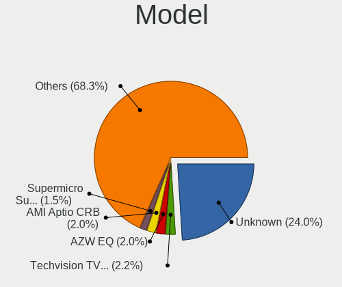
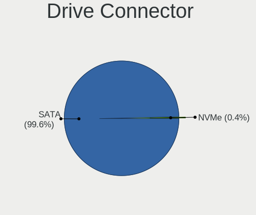
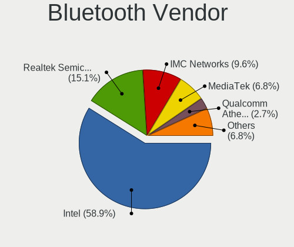

OPNsense Hardware Trends
------------------------

A project to identify most popular hardware characteristics and track their change
over time based on data collected by OPNsense users at https://BSD-Hardware.info.

Anyone can contribute to the study by uploading probes of their computers by
the [hw-probe](https://github.com/linuxhw/hw-probe/blob/master/INSTALL.BSD.md) tool:

    hw-probe -all -upload

Full-feature report is available here: https://bsd-hardware.info/?view=trends

Period: Feb, 2021.

Contents
--------

- [ OS                       ](#os)
- [ OS Family                ](#os-family)
- [ Arch                     ](#arch)
- [ DE                       ](#de)
- [ Display Server           ](#display-server)
- [ Display Manager          ](#display-manager)
- [ OS Lang                  ](#os-lang)
- [ Boot Mode                ](#boot-mode)
- [ Filesystem               ](#filesystem)
- [ Part. scheme             ](#part-scheme)
- [ Country                  ](#country)
- [ City                     ](#city)
- [ Vendor                   ](#vendor)
- [ Model                    ](#model)
- [ Model Family             ](#model-family)
- [ MFG Year                 ](#mfg-year)
- [ Form Factor              ](#form-factor)
- [ Coreboot                 ](#coreboot)
- [ RAM Size                 ](#ram-size)
- [ RAM Used                 ](#ram-used)
- [ Has CD-ROM               ](#has-cd-rom)
- [ Total Drives             ](#total-drives)
- [ Has Ethernet             ](#has-ethernet)
- [ Drive Vendor             ](#drive-vendor)
- [ Drive Model              ](#drive-model)
- [ HDD Vendor               ](#hdd-vendor)
- [ SSD Vendor               ](#ssd-vendor)
- [ Drive Kind               ](#drive-kind)
- [ Drive Connector          ](#drive-connector)
- [ Drive Size               ](#drive-size)
- [ Space Total              ](#space-total)
- [ Space Used               ](#space-used)
- [ Malfunc. Drives          ](#malfunc-drives)
- [ Malfunc. Drive Vendor    ](#malfunc-drive-vendor)
- [ Malfunc. HDD Vendor      ](#malfunc-hdd-vendor)
- [ Malfunc. Drive Kind      ](#malfunc-drive-kind)
- [ Failed Drives            ](#failed-drives)
- [ Failed Drive Vendor      ](#failed-drive-vendor)
- [ Drive Status             ](#drive-status)
- [ Storage Vendor           ](#storage-vendor)
- [ Storage Model            ](#storage-model)
- [ Storage Kind             ](#storage-kind)
- [ CPU Vendor               ](#cpu-vendor)
- [ CPU Model                ](#cpu-model)
- [ CPU Model Family         ](#cpu-model-family)
- [ CPU Cores                ](#cpu-cores)
- [ CPU Sockets              ](#cpu-sockets)
- [ CPU Threads              ](#cpu-threads)
- [ CPU Microarch            ](#cpu-microarch)
- [ GPU Vendor               ](#gpu-vendor)
- [ GPU Model                ](#gpu-model)
- [ GPU Combo                ](#gpu-combo)
- [ GPU Driver               ](#gpu-driver)
- [ GPU Memory               ](#gpu-memory)
- [ Monitor Vendor           ](#monitor-vendor)
- [ Monitor Model            ](#monitor-model)
- [ Monitor Resolution       ](#monitor-resolution)
- [ Monitor Diagonal         ](#monitor-diagonal)
- [ Monitor Width            ](#monitor-width)
- [ Aspect Ratio             ](#aspect-ratio)
- [ Monitor Area             ](#monitor-area)
- [ Pixel Density            ](#pixel-density)
- [ Multiple Monitors        ](#multiple-monitors)
- [ Net Controller Vendor    ](#net-controller-vendor)
- [ Net Controller Model     ](#net-controller-model)
- [ Wireless Vendor          ](#wireless-vendor)
- [ Wireless Model           ](#wireless-model)
- [ Ethernet Vendor          ](#ethernet-vendor)
- [ Ethernet Model           ](#ethernet-model)
- [ Net Controller Kind      ](#net-controller-kind)
- [ Used Controller          ](#used-controller)
- [ NICs                     ](#nics)
- [ Memory Vendor            ](#memory-vendor)
- [ Memory Model             ](#memory-model)
- [ Memory Kind              ](#memory-kind)
- [ Memory Form Factor       ](#memory-form-factor)
- [ Memory Size              ](#memory-size)
- [ Memory Speed             ](#memory-speed)
- [ Sound Vendor             ](#sound-vendor)
- [ Sound Model              ](#sound-model)
- [ Camera Vendor            ](#camera-vendor)
- [ Camera Model             ](#camera-model)
- [ Fingerprint Vendor       ](#fingerprint-vendor)
- [ Fingerprint Model        ](#fingerprint-model)
- [ Chipcard Vendor          ](#chipcard-vendor)
- [ Chipcard Model           ](#chipcard-model)
- [ Printer Vendor           ](#printer-vendor)
- [ Printer Model            ](#printer-model)
- [ Scanner Vendor           ](#scanner-vendor)
- [ Scanner Model            ](#scanner-model)
- [ Bluetooth Vendor         ](#bluetooth-vendor)
- [ Bluetooth Model          ](#bluetooth-model)
- [ Unsupported Devices      ](#unsupported-devices)
- [ Unsupported Device Types ](#unsupported-device-types)

OS
--

Installed operating systems

| Name            | Computers | Percent |
|-----------------|-----------|---------|
| OPNsense 21.1.1 | 150       | 40.87%  |
| OPNsense 21.1   | 125       | 34.06%  |
| OPNsense 21.1.2 | 65        | 17.71%  |
| OPNsense 20.7.8 | 19        | 5.18%   |
| OPNsense 21.7   | 3         | 0.82%   |
| OPNsense 20.7   | 2         | 0.54%   |
| OPNsense 20.7.7 | 1         | 0.27%   |
| OPNsense 20.7.5 | 1         | 0.27%   |
| OPNsense 20.7.3 | 1         | 0.27%   |

OS Family
---------

OS without a version

| Name     | Computers | Percent |
|----------|-----------|---------|
| OPNsense | 367       | 100%    |

Arch
----

OS architecture (x86_64, i586, etc.)

| Name  | Computers | Percent |
|-------|-----------|---------|
| amd64 | 367       | 100%    |

DE
--

Desktop Environment

| Name    | Computers | Percent |
|---------|-----------|---------|
| Console | 367       | 100%    |

Display Server
--------------

X11 or Wayland

| Name    | Computers | Percent |
|---------|-----------|---------|
| Console | 367       | 100%    |

Display Manager
---------------

SDDM, LightDM, etc.

| Name    | Computers | Percent |
|---------|-----------|---------|
| Console | 367       | 100%    |

OS Lang
-------

Language

| Lang    | Computers | Percent |
|---------|-----------|---------|
| Unknown | 367       | 100%    |

Boot Mode
---------

EFI or BIOS

| Mode | Computers | Percent |
|------|-----------|---------|
| EFI  | 330       | 89.92%  |
| BIOS | 37        | 10.08%  |

Filesystem
----------

Type of filesystem

| Type | Computers | Percent |
|------|-----------|---------|
| Ufs  | 366       | 99.73%  |
| Zfs  | 1         | 0.27%   |

Part. scheme
------------

Scheme of partitioning

| Type    | Computers | Percent |
|---------|-----------|---------|
| GPT     | 330       | 89.92%  |
| MBR     | 33        | 8.99%   |
| Unknown | 4         | 1.09%   |

Country
-------

Geographic location (country)

| Country                  | Computers | Percent |
|--------------------------|-----------|---------|
| Germany                  | 113       | 30.79%  |
| USA                      | 86        | 23.43%  |
| UK                       | 18        | 4.9%    |
| Netherlands              | 14        | 3.81%   |
| France                   | 14        | 3.81%   |
| Canada                   | 13        | 3.54%   |
| Brazil                   | 12        | 3.27%   |
| Australia                | 9         | 2.45%   |
| Russia                   | 8         | 2.18%   |
| Poland                   | 7         | 1.91%   |
| Switzerland              | 6         | 1.63%   |
| Sweden                   | 6         | 1.63%   |
| Portugal                 | 6         | 1.63%   |
| China                    | 5         | 1.36%   |
| Romania                  | 4         | 1.09%   |
| Taiwan                   | 3         | 0.82%   |
| South Africa             | 3         | 0.82%   |
| New Zealand              | 3         | 0.82%   |
| Mexico                   | 3         | 0.82%   |
| Latvia                   | 3         | 0.82%   |
| Italy                    | 3         | 0.82%   |
| Indonesia                | 3         | 0.82%   |
| Austria                  | 3         | 0.82%   |
| Spain                    | 2         | 0.54%   |
| Slovakia                 | 2         | 0.54%   |
| Venezuela                | 1         | 0.27%   |
| Ukraine                  | 1         | 0.27%   |
| Turks and Caicos Islands | 1         | 0.27%   |
| Turkey                   | 1         | 0.27%   |
| Thailand                 | 1         | 0.27%   |
| Singapore                | 1         | 0.27%   |
| Norway                   | 1         | 0.27%   |
| Kuwait                   | 1         | 0.27%   |
| Korea, Republic of       | 1         | 0.27%   |
| Israel                   | 1         | 0.27%   |
| Iraq                     | 1         | 0.27%   |
| Hungary                  | 1         | 0.27%   |
| Greece                   | 1         | 0.27%   |
| Denmark                  | 1         | 0.27%   |
| Czech Republic           | 1         | 0.27%   |
| Costa Rica               | 1         | 0.27%   |
| Bulgaria                 | 1         | 0.27%   |
| Unknown                  | 1         | 0.27%   |

City
----

Geographic location (city)

| City                  | Computers | Percent |
|-----------------------|-----------|---------|
| Berlin                | 11        | 3%      |
| Hanover               | 5         | 1.36%   |
| Hamburg               | 5         | 1.36%   |
| Paris                 | 4         | 1.09%   |
| Moscow                | 4         | 1.09%   |
| Frankfurt am Main     | 4         | 1.09%   |
| Bucharest             | 4         | 1.09%   |
| Toronto               | 3         | 0.82%   |
| Lingen                | 3         | 0.82%   |
| Dresden               | 3         | 0.82%   |
| Columbus              | 3         | 0.82%   |
| Zurich                | 2         | 0.54%   |
| Vienna                | 2         | 0.54%   |
| Taipei                | 2         | 0.54%   |
| São José dos Campos | 2         | 0.54%   |
| Simpsonville          | 2         | 0.54%   |
| Pirapora              | 2         | 0.54%   |
| Peoria                | 2         | 0.54%   |
| Pensacola             | 2         | 0.54%   |
| Montreal              | 2         | 0.54%   |
| Lübeck               | 2         | 0.54%   |
| Lueblow               | 2         | 0.54%   |
| Los Angeles           | 2         | 0.54%   |
| Lisbon                | 2         | 0.54%   |
| Jelgava               | 2         | 0.54%   |
| Jakarta               | 2         | 0.54%   |
| Heidelberg            | 2         | 0.54%   |
| Gifhorn               | 2         | 0.54%   |
| Eisenach              | 2         | 0.54%   |
| Düsseldorf           | 2         | 0.54%   |
| Darmstadt             | 2         | 0.54%   |
| Croydon               | 2         | 0.54%   |
| Cleveland             | 2         | 0.54%   |
| Brooklyn              | 2         | 0.54%   |
| Brisbane              | 2         | 0.54%   |
| Bremen                | 2         | 0.54%   |
| Bothell               | 2         | 0.54%   |
| Bielefeld             | 2         | 0.54%   |
| Auckland              | 2         | 0.54%   |
| Łódź               | 1         | 0.27%   |
| Échirolles           | 1         | 0.27%   |
| Zarechnyy             | 1         | 0.27%   |
| Wurmberg              | 1         | 0.27%   |
| Wuppertal             | 1         | 0.27%   |
| Woodstock             | 1         | 0.27%   |
| Wolfenbüttel         | 1         | 0.27%   |
| Windsor               | 1         | 0.27%   |
| Westfield             | 1         | 0.27%   |
| West Winfield         | 1         | 0.27%   |
| Wassenaar             | 1         | 0.27%   |
| Warsaw                | 1         | 0.27%   |
| Walla Walla           | 1         | 0.27%   |
| Vladimir              | 1         | 0.27%   |
| Vlaardingen           | 1         | 0.27%   |
| Victoria              | 1         | 0.27%   |
| Vichy                 | 1         | 0.27%   |
| Vellinge              | 1         | 0.27%   |
| Varna                 | 1         | 0.27%   |
| Valparaiso            | 1         | 0.27%   |
| Uznach                | 1         | 0.27%   |

Vendor
------

Motherboard manufacturer

| Name                 | Computers | Percent |
|----------------------|-----------|---------|
| Dell                 | 48        | 13.08%  |
| Unknown              | 34        | 9.26%   |
| Intel                | 33        | 8.99%   |
| Supermicro           | 31        | 8.45%   |
| PC Engines           | 22        | 5.99%   |
| Hewlett-Packard      | 22        | 5.99%   |
| Protectli            | 20        | 5.45%   |
| ASRock               | 19        | 5.18%   |
| ASUSTek Computer     | 15        | 4.09%   |
| AMI                  | 15        | 4.09%   |
| Lenovo               | 14        | 3.81%   |
| Gigabyte Technology  | 9         | 2.45%   |
| MSI                  | 8         | 2.18%   |
| HARDKERNEL           | 7         | 1.91%   |
| Sophos               | 6         | 1.63%   |
| Fujitsu              | 6         | 1.63%   |
| ZOTAC                | 5         | 1.36%   |
| Shuttle              | 5         | 1.36%   |
| BESSTAR Tech         | 5         | 1.36%   |
| Deciso               | 4         | 1.09%   |
| Compulab             | 4         | 1.09%   |
| Yanling              | 3         | 0.82%   |
| AWOW                 | 3         | 0.82%   |
| YANYU                | 2         | 0.54%   |
| Thomas-Krenn.AG      | 2         | 0.54%   |
| NEXCOM               | 2         | 0.54%   |
| Biostar              | 2         | 0.54%   |
| Apple                | 2         | 0.54%   |
| Acer                 | 2         | 0.54%   |
| TYAN Computer        | 1         | 0.27%   |
| Toshiba              | 1         | 0.27%   |
| SeeedStudio          | 1         | 0.27%   |
| Sangoma Technologies | 1         | 0.27%   |
| Radxa                | 1         | 0.27%   |
| QOTOM                | 1         | 0.27%   |
| Positivo             | 1         | 0.27%   |
| Packard Bell         | 1         | 0.27%   |
| NU591                | 1         | 0.27%   |
| NF541                | 1         | 0.27%   |
| MiTAC                | 1         | 0.27%   |
| IBM                  | 1         | 0.27%   |
| Foxconn              | 1         | 0.27%   |
| DFI                  | 1         | 0.27%   |
| Chuwi                | 1         | 0.27%   |
| AZW                  | 1         | 0.27%   |
| ASRockRack           | 1         | 0.27%   |

Model
-----

Motherboard model

| Name                                             | Computers | Percent |
|--------------------------------------------------|-----------|---------|
| Unknown                                          | 34        | 9.26%   |
| AMI Aptio CRB                                    | 14        | 3.81%   |
| Protectli FW6                                    | 13        | 3.54%   |
| PC Engines apu2                                  | 11        | 3%      |
| Intel Q3XXG4-P V1.0                              | 10        | 2.72%   |
| Supermicro Super Server                          | 8         | 2.18%   |
| HARDKERNEL ODROID-H2                             | 7         | 1.91%   |
| PC Engines apu4                                  | 6         | 1.63%   |
| Sophos SG                                        | 5         | 1.36%   |
| Dell PowerEdge R210 II                           | 5         | 1.36%   |
| Protectli FW4B                                   | 4         | 1.09%   |
| HP t620 PLUS Quad Core TC                        | 4         | 1.09%   |
| Yanling YL-KBR6L                                 | 3         | 0.82%   |
| PC Engines apu3                                  | 3         | 0.82%   |
| HP Compaq Elite 8300 SFF                         | 3         | 0.82%   |
| Dell PowerEdge R710                              | 3         | 0.82%   |
| Dell OptiPlex 9020                               | 3         | 0.82%   |
| Compulab fitlet2                                 | 3         | 0.82%   |
| BESSTAR Tech X35G                                | 3         | 0.82%   |
| AWOW PC BOX                                      | 3         | 0.82%   |
| Thomas-Krenn.AG LES network+                     | 2         | 0.54%   |
| Supermicro X9SCL/X9SCM                           | 2         | 0.54%   |
| Supermicro SYS-5019A-FTN4                        | 2         | 0.54%   |
| Supermicro SYS-5018D-FN8T                        | 2         | 0.54%   |
| Supermicro 1HE Intel Single-CPU RI1102D-F Server | 2         | 0.54%   |
| Shuttle DS61                                     | 2         | 0.54%   |
| Protectli FW2B                                   | 2         | 0.54%   |
| PC Engines APU                                   | 2         | 0.54%   |
| NEXCOM UTM                                       | 2         | 0.54%   |
| Intel SKYBAY                                     | 2         | 0.54%   |
| Intel NUC5PPYB H76558-107                        | 2         | 0.54%   |
| Intel Bearlake Bearlake Fab A                    | 2         | 0.54%   |
| HP ProDesk 490 G3 MT Business PC                 | 2         | 0.54%   |
| Dell PowerEdge R610                              | 2         | 0.54%   |
| Dell PowerEdge R320                              | 2         | 0.54%   |
| Dell PowerEdge R240                              | 2         | 0.54%   |
| Dell OptiPlex 380                                | 2         | 0.54%   |
| Dell OptiPlex 3020                               | 2         | 0.54%   |
| ASUS All Series                                  | 2         | 0.54%   |
| ASRock J3455M                                    | 2         | 0.54%   |
| ASRock J3355B-ITX                                | 2         | 0.54%   |
| ASRock D1800B-ITX                                | 2         | 0.54%   |
| ASRock B450 Steel Legend                         | 2         | 0.54%   |
| ZOTAC ZBOX-MI522NANO/MI542NANO                   | 1         | 0.27%   |
| ZOTAC ZBOX-CI620/CI640/CI660                     | 1         | 0.27%   |
| ZOTAC ZBOX-CI341                                 | 1         | 0.27%   |
| ZOTAC ZBOX-CI329NANO                             | 1         | 0.27%   |
| ZOTAC ZBOX-CI327NANO-GS-01                       | 1         | 0.27%   |
| YANYU H87SL VER:1.3                              | 1         | 0.27%   |
| YANYU H67SL                                      | 1         | 0.27%   |
| TYAN S2925                                       | 1         | 0.27%   |
| Toshiba Satellite L450                           | 1         | 0.27%   |
| Supermicro X8SIU                                 | 1         | 0.27%   |
| Supermicro X8SIL                                 | 1         | 0.27%   |
| Supermicro X8DTU-LN4+                            | 1         | 0.27%   |
| Supermicro X7SPA-HF                              | 1         | 0.27%   |
| Supermicro X7SBi                                 | 1         | 0.27%   |
| Supermicro X10SLH-F/X10SLM+-F                    | 1         | 0.27%   |
| Supermicro SYS-E50-9AP-N5                        | 1         | 0.27%   |
| Supermicro SYS-E300-9D-8CN8TP                    | 1         | 0.27%   |

Model Family
------------

Motherboard model prefix

| Name                       | Computers | Percent |
|----------------------------|-----------|---------|
| Unknown                    | 34        | 9.26%   |
| Dell PowerEdge             | 23        | 6.27%   |
| Dell OptiPlex              | 14        | 3.81%   |
| AMI Aptio                  | 14        | 3.81%   |
| Protectli FW6              | 13        | 3.54%   |
| PC Engines apu2            | 11        | 3%      |
| Intel Q3XXG4-P             | 10        | 2.72%   |
| Lenovo ThinkCentre         | 9         | 2.45%   |
| Supermicro Super           | 8         | 2.18%   |
| HARDKERNEL ODROID-H2       | 7         | 1.91%   |
| PC Engines apu4            | 6         | 1.63%   |
| Sophos SG                  | 5         | 1.36%   |
| Protectli FW4B             | 4         | 1.09%   |
| HP t620                    | 4         | 1.09%   |
| HP ProLiant                | 4         | 1.09%   |
| HP ProDesk                 | 4         | 1.09%   |
| HP Compaq                  | 4         | 1.09%   |
| Dell Inspiron              | 4         | 1.09%   |
| Deciso Netboard            | 4         | 1.09%   |
| Yanling YL-KBR6L           | 3         | 0.82%   |
| PC Engines apu3            | 3         | 0.82%   |
| Lenovo ThinkPad            | 3         | 0.82%   |
| HP EliteDesk               | 3         | 0.82%   |
| Dell Precision             | 3         | 0.82%   |
| Compulab fitlet2           | 3         | 0.82%   |
| BESSTAR Tech X35G          | 3         | 0.82%   |
| AWOW PC                    | 3         | 0.82%   |
| Thomas-Krenn.AG LES        | 2         | 0.54%   |
| Supermicro X9SCL           | 2         | 0.54%   |
| Supermicro SYS-5019A-FTN4  | 2         | 0.54%   |
| Supermicro SYS-5018D-FN8T  | 2         | 0.54%   |
| Supermicro 1HE             | 2         | 0.54%   |
| Shuttle DS61               | 2         | 0.54%   |
| Protectli FW2B             | 2         | 0.54%   |
| PC Engines APU             | 2         | 0.54%   |
| NEXCOM UTM                 | 2         | 0.54%   |
| Intel SKYBAY               | 2         | 0.54%   |
| Intel NUC5PPYB             | 2         | 0.54%   |
| Intel Bearlake             | 2         | 0.54%   |
| Fujitsu FUTRO              | 2         | 0.54%   |
| Dell Latitude              | 2         | 0.54%   |
| ASUS All                   | 2         | 0.54%   |
| ASRock J3455M              | 2         | 0.54%   |
| ASRock J3355B-ITX          | 2         | 0.54%   |
| ASRock D1800B-ITX          | 2         | 0.54%   |
| ASRock B450                | 2         | 0.54%   |
| Acer Aspire                | 2         | 0.54%   |
| ZOTAC ZBOX-MI522NANO       | 1         | 0.27%   |
| ZOTAC ZBOX-CI620           | 1         | 0.27%   |
| ZOTAC ZBOX-CI341           | 1         | 0.27%   |
| ZOTAC ZBOX-CI329NANO       | 1         | 0.27%   |
| ZOTAC ZBOX-CI327NANO-GS-01 | 1         | 0.27%   |
| YANYU H87SL                | 1         | 0.27%   |
| YANYU H67SL                | 1         | 0.27%   |
| TYAN S2925                 | 1         | 0.27%   |
| Toshiba Satellite          | 1         | 0.27%   |
| Supermicro X8SIU           | 1         | 0.27%   |
| Supermicro X8SIL           | 1         | 0.27%   |
| Supermicro X8DTU-LN4+      | 1         | 0.27%   |
| Supermicro X7SPA-HF        | 1         | 0.27%   |

MFG Year
--------

Motherboard manufacture year

| Year    | Computers | Percent |
|---------|-----------|---------|
| 2020    | 81        | 22.07%  |
| 2019    | 72        | 19.62%  |
| 2018    | 65        | 17.71%  |
| 2016    | 24        | 6.54%   |
| 2013    | 19        | 5.18%   |
| 2015    | 17        | 4.63%   |
| 2014    | 16        | 4.36%   |
| 2017    | 13        | 3.54%   |
| 2010    | 13        | 3.54%   |
| 2011    | 12        | 3.27%   |
| 2021    | 10        | 2.72%   |
| 2012    | 10        | 2.72%   |
| 2009    | 7         | 1.91%   |
| 2008    | 5         | 1.36%   |
| 2007    | 2         | 0.54%   |
| Unknown | 1         | 0.27%   |

Form Factor
-----------

Physical design of the computer

| Name        | Computers | Percent |
|-------------|-----------|---------|
| Desktop     | 264       | 71.93%  |
| Server      | 44        | 11.99%  |
| Mini pc     | 37        | 10.08%  |
| Notebook    | 19        | 5.18%   |
| Firewall    | 1         | 0.27%   |
| Convertible | 1         | 0.27%   |
| All in one  | 1         | 0.27%   |

Coreboot
--------

Have coreboot on board

| Used | Computers | Percent |
|------|-----------|---------|
| No   | 337       | 91.83%  |
| Yes  | 30        | 8.17%   |

RAM Size
--------

Total RAM memory

| Size in GB  | Computers | Percent |
|-------------|-----------|---------|
| 8.01-16.0   | 133       | 36.24%  |
| 4.01-8.0    | 106       | 28.88%  |
| 16.01-24.0  | 76        | 20.71%  |
| 32.01-64.0  | 22        | 5.99%   |
| 2.01-3.0    | 13        | 3.54%   |
| 64.01-256.0 | 8         | 2.18%   |
| 3.01-4.0    | 4         | 1.09%   |
| 24.01-32.0  | 3         | 0.82%   |
| 0.51-1.0    | 2         | 0.54%   |

RAM Used
--------

Used RAM memory

| Used GB    | Computers | Percent |
|------------|-----------|---------|
| 0.01-0.5   | 215       | 58.58%  |
| 0.51-1.0   | 106       | 28.88%  |
| 1.01-2.0   | 28        | 7.63%   |
| 4.01-8.0   | 9         | 2.45%   |
| 3.01-4.0   | 3         | 0.82%   |
| 2.01-3.0   | 3         | 0.82%   |
| 16.01-24.0 | 2         | 0.54%   |
| 32.01-64.0 | 1         | 0.27%   |

Has CD-ROM
----------

Has CD-ROM on board

| Presented | Computers | Percent |
|-----------|-----------|---------|
| No        | 319       | 86.92%  |
| Yes       | 48        | 13.08%  |

Total Drives
------------

Number of drives on board

| Drives | Computers | Percent |
|--------|-----------|---------|
| 1      | 295       | 80.38%  |
| 0      | 39        | 10.63%  |
| 2      | 27        | 7.36%   |
| 3      | 4         | 1.09%   |
| 8      | 1         | 0.27%   |
| 4      | 1         | 0.27%   |

Has Ethernet
------------

Has Ethernet on board

| Presented | Computers | Percent |
|-----------|-----------|---------|
| Yes       | 367       | 100%    |

Drive Vendor
------------

Hard drive vendors

| Vendor              | Computers | Drives | Percent |
|---------------------|-----------|--------|---------|
| Samsung Electronics | 51        | 56     | 14.45%  |
| Kingston            | 43        | 44     | 12.18%  |
| WDC                 | 31        | 35     | 8.78%   |
| Transcend           | 22        | 22     | 6.23%   |
| Seagate             | 22        | 34     | 6.23%   |
| Intel               | 22        | 22     | 6.23%   |
| Hoodisk             | 21        | 21     | 5.95%   |
| SanDisk             | 20        | 20     | 5.67%   |
| Phison              | 14        | 14     | 3.97%   |
| Crucial             | 12        | 12     | 3.4%    |
| Toshiba             | 10        | 10     | 2.83%   |
| Hitachi             | 7         | 7      | 1.98%   |
| FORESEE             | 7         | 7      | 1.98%   |
| Hewlett-Packard     | 5         | 5      | 1.42%   |
| DOGFISH             | 5         | 5      | 1.42%   |
| TCSUNBOW            | 4         | 4      | 1.13%   |
| Micron Technology   | 4         | 5      | 1.13%   |
| Kston               | 4         | 4      | 1.13%   |
| SPCC                | 3         | 3      | 0.85%   |
| PLEXTOR             | 3         | 3      | 0.85%   |
| LITEON              | 3         | 3      | 0.85%   |
| Intenso             | 3         | 5      | 0.85%   |
| Fujitsu             | 3         | 3      | 0.85%   |
| Corsair             | 3         | 3      | 0.85%   |
| BIWIN               | 3         | 3      | 0.85%   |
| A-DATA Technology   | 3         | 3      | 0.85%   |
| SK Hynix            | 2         | 2      | 0.57%   |
| PNY                 | 2         | 2      | 0.57%   |
| OCZ                 | 2         | 2      | 0.57%   |
| LITEONIT            | 2         | 2      | 0.57%   |
| Drevo               | 2         | 2      | 0.57%   |
| Apple               | 2         | 2      | 0.57%   |
| Zheino              | 1         | 1      | 0.28%   |
| SMI                 | 1         | 1      | 0.28%   |
| Pioneer             | 1         | 1      | 0.28%   |
| Maxtor              | 1         | 1      | 0.28%   |
| LSILOGIC            | 1         | 1      | 0.28%   |
| Lexar               | 1         | 1      | 0.28%   |
| KingSpec            | 1         | 1      | 0.28%   |
| Innodisk            | 1         | 1      | 0.28%   |
| HGST                | 1         | 1      | 0.28%   |
| Gigabyte Technology | 1         | 1      | 0.28%   |
| faspeed             | 1         | 1      | 0.28%   |
| ATP                 | 1         | 1      | 0.28%   |
| Apacer              | 1         | 1      | 0.28%   |

Drive Model
-----------

Hard drive models

| Model                          | Computers | Percent |
|--------------------------------|-----------|---------|
| Kingston SUV500MS120G 120GB    | 11        | 3.07%   |
| Hoodisk SSD 64GB               | 9         | 2.51%   |
| Samsung SSD 850 EVO 250GB      | 7         | 1.96%   |
| Phison SATA SSD 16GB           | 7         | 1.96%   |
| Samsung SSD 860 PRO 256GB      | 5         | 1.4%    |
| Kingston SA400S37120G 120GB    | 5         | 1.4%    |
| Hoodisk SSD 32GB               | 5         | 1.4%    |
| Crucial CT120BX500SSD1 120GB   | 5         | 1.4%    |
| SanDisk SSD PLUS 120GB         | 4         | 1.12%   |
| Kingston SA400S37240G 240GB    | 4         | 1.12%   |
| Hoodisk SSD 128GB              | 4         | 1.12%   |
| FORESEE 128GB SSD              | 4         | 1.12%   |
| Transcend TS128GMSA230S 128GB  | 3         | 0.84%   |
| TCSUNBOW M1 32GB               | 3         | 0.84%   |
| Seagate ST1000DM003-1CH162 1TB | 3         | 0.84%   |
| Samsung SSD 850 EVO 500GB      | 3         | 0.84%   |
| Samsung SSD 840 EVO 250GB      | 3         | 0.84%   |
| Phison SATA SSD 32GB           | 3         | 0.84%   |
| Kston SSD 64GB                 | 3         | 0.84%   |
| Kingston SV300S37A60G 64GB     | 3         | 0.84%   |
| Kingston SUV500MS240G 240GB    | 3         | 0.84%   |
| Kingston OM8PDP3512B-A01 512GB | 3         | 0.84%   |
| Intel SSDSC2BW120A4 120GB      | 3         | 0.84%   |
| Crucial CT525MX300SSD1 528GB   | 3         | 0.84%   |
| BIWIN SSD 128GB                | 3         | 0.84%   |
| WDC WDS120G2G0A-00JH30 120GB   | 2         | 0.56%   |
| WDC WD5003ABYZ-011FA0 500GB    | 2         | 0.56%   |
| WDC WD10EZEX-22MFCA0 1TB       | 2         | 0.56%   |
| Transcend TS64GMSA230S 64GB    | 2         | 0.56%   |
| Transcend TS256GMTS430S 256GB  | 2         | 0.56%   |
| Transcend TS120GMTS420S 120GB  | 2         | 0.56%   |
| SPCC Solid State Disk 128GB    | 2         | 0.56%   |
| Samsung SSD 970 EVO Plus 250GB | 2         | 0.56%   |
| Samsung SSD 860 EVO 250GB      | 2         | 0.56%   |
| Samsung SSD 840 EVO 120GB      | 2         | 0.56%   |
| Kingston SMS200S360G 64GB      | 2         | 0.56%   |
| Kingston SA400S37480G 480GB    | 2         | 0.56%   |
| Kingston SA2000M8250G 250GB    | 2         | 0.56%   |
| Intenso SSD Sata III 120GB     | 2         | 0.56%   |
| Intel SSDSC2KG240G8 240GB      | 2         | 0.56%   |
| Hoodisk SSD 16GB               | 2         | 0.56%   |
| HP RAID 0 250GB                | 2         | 0.56%   |
| FORESEE 32GB SSD               | 2         | 0.56%   |
| Drevo X1 pro 64G               | 2         | 0.56%   |
| DOGFISH SSD 512GB              | 2         | 0.56%   |
| Dogfish SSD 256GB              | 2         | 0.56%   |
| Crucial CT256MX100SSD1 256GB   | 2         | 0.56%   |
| Zheino CHN-mSATAM3-256 256GB   | 1         | 0.28%   |
| WDC WDS512G1X0C-00ENX0 512GB   | 1         | 0.28%   |
| WDC WDS250G2B0C-00PXH0 250GB   | 1         | 0.28%   |
| WDC WDS240G2G0B-00EPW0 240GB   | 1         | 0.28%   |
| WDC WDS120G1G0A-00SS50 120GB   | 1         | 0.28%   |
| WDC WD5003AZEX-00K3CA0 500GB   | 1         | 0.28%   |
| WDC WD5003ABYX-18WERA0 500GB   | 1         | 0.28%   |
| WDC WD5002ABYS-18B1B0 500GB    | 1         | 0.28%   |
| WDC WD5000HHTZ-75N21V0 500GB   | 1         | 0.28%   |
| WDC WD5000AZLX-75K2TA0 500GB   | 1         | 0.28%   |
| WDC WD5000AAKX-753CA1 500GB    | 1         | 0.28%   |
| WDC WD5000AAKX-60U6AA0 500GB   | 1         | 0.28%   |
| WDC WD5000AAKS-22V1A0 500GB    | 1         | 0.28%   |

HDD Vendor
----------

Hard disk drive vendors

| Vendor              | Computers | Drives | Percent |
|---------------------|-----------|--------|---------|
| WDC                 | 24        | 28     | 33.8%   |
| Seagate             | 22        | 34     | 30.99%  |
| Toshiba             | 8         | 8      | 11.27%  |
| Hitachi             | 7         | 7      | 9.86%   |
| Fujitsu             | 3         | 3      | 4.23%   |
| Hewlett-Packard     | 2         | 2      | 2.82%   |
| Samsung Electronics | 1         | 1      | 1.41%   |
| Maxtor              | 1         | 1      | 1.41%   |
| LSILOGIC            | 1         | 1      | 1.41%   |
| HGST                | 1         | 1      | 1.41%   |
| Apple               | 1         | 1      | 1.41%   |

SSD Vendor
----------

Solid state drive vendors

| Vendor              | Computers | Drives | Percent |
|---------------------|-----------|--------|---------|
| Samsung Electronics | 42        | 47     | 16.22%  |
| Kingston            | 38        | 39     | 14.67%  |
| Transcend           | 22        | 22     | 8.49%   |
| Intel               | 21        | 21     | 8.11%   |
| Hoodisk             | 21        | 21     | 8.11%   |
| SanDisk             | 20        | 20     | 7.72%   |
| Phison              | 13        | 13     | 5.02%   |
| Crucial             | 12        | 12     | 4.63%   |
| FORESEE             | 7         | 7      | 2.7%    |
| DOGFISH             | 5         | 5      | 1.93%   |
| WDC                 | 4         | 4      | 1.54%   |
| TCSUNBOW            | 4         | 4      | 1.54%   |
| Kston               | 4         | 4      | 1.54%   |
| SPCC                | 3         | 3      | 1.16%   |
| PLEXTOR             | 3         | 3      | 1.16%   |
| Micron Technology   | 3         | 3      | 1.16%   |
| LITEON              | 3         | 3      | 1.16%   |
| Intenso             | 3         | 5      | 1.16%   |
| Hewlett-Packard     | 3         | 3      | 1.16%   |
| Corsair             | 3         | 3      | 1.16%   |
| BIWIN               | 3         | 3      | 1.16%   |
| PNY                 | 2         | 2      | 0.77%   |
| OCZ                 | 2         | 2      | 0.77%   |
| LITEONIT            | 2         | 2      | 0.77%   |
| Drevo               | 2         | 2      | 0.77%   |
| A-DATA Technology   | 2         | 2      | 0.77%   |
| Zheino              | 1         | 1      | 0.39%   |
| Toshiba             | 1         | 1      | 0.39%   |
| SMI                 | 1         | 1      | 0.39%   |
| SK Hynix            | 1         | 1      | 0.39%   |
| Pioneer             | 1         | 1      | 0.39%   |
| Lexar               | 1         | 1      | 0.39%   |
| KingSpec            | 1         | 1      | 0.39%   |
| Innodisk            | 1         | 1      | 0.39%   |
| Gigabyte Technology | 1         | 1      | 0.39%   |
| faspeed             | 1         | 1      | 0.39%   |
| Apple               | 1         | 1      | 0.39%   |
| Apacer              | 1         | 1      | 0.39%   |

Drive Kind
----------

HDD or SSD

| Kind | Computers | Drives | Percent |
|------|-----------|--------|---------|
| SSD  | 250       | 267    | 73.96%  |
| HDD  | 65        | 87     | 19.23%  |
| NVMe | 23        | 24     | 6.8%    |

Drive Connector
---------------

SATA, SAS, NVMe, etc.

| Type | Computers | Drives | Percent |
|------|-----------|--------|---------|
| SATA | 306       | 354    | 93.01%  |
| NVMe | 23        | 24     | 6.99%   |

Drive Size
----------

Size of hard drive

| Size in TB | Computers | Drives | Percent |
|------------|-----------|--------|---------|
| 0.01-0.5   | 287       | 318    | 90.25%  |
| 0.51-1.0   | 22        | 26     | 6.92%   |
| 1.01-2.0   | 6         | 7      | 1.89%   |
| 2.01-3.0   | 2         | 2      | 0.63%   |
| 4.01-10.0  | 1         | 1      | 0.31%   |

Space Total
-----------

Amount of disk space available on the file system

| Size in GB | Computers | Percent |
|------------|-----------|---------|
| 101-250    | 156       | 42.51%  |
| 21-50      | 61        | 16.62%  |
| 51-100     | 52        | 14.17%  |
| 251-500    | 50        | 13.62%  |
| 1-20       | 27        | 7.36%   |
| 501-1000   | 17        | 4.63%   |
| 1001-2000  | 4         | 1.09%   |

Space Used
----------

Amount of used disk space

| Used GB | Computers | Percent |
|---------|-----------|---------|
| 1-20    | 357       | 97.28%  |
| 21-50   | 8         | 2.18%   |
| 101-250 | 2         | 0.54%   |

Malfunc. Drives
---------------

Drive models with a malfunction

| Model                                 | Computers | Drives | Percent |
|---------------------------------------|-----------|--------|---------|
| WDC WD5003ABYX-18WERA0 500GB          | 1         | 2      | 2.94%   |
| WDC WD5000AAKS-22V1A0 500GB           | 1         | 1      | 2.94%   |
| WDC WD1600AAJS-75M0A0 160GB           | 1         | 1      | 2.94%   |
| Toshiba THNSNK256GVN8 M.2 2280 256GB  | 1         | 1      | 2.94%   |
| SMI SSD DISK 120GB                    | 1         | 1      | 2.94%   |
| SK Hynix SC210 mSATA 256GB            | 1         | 1      | 2.94%   |
| Seagate ST9320320AS 320GB             | 1         | 1      | 2.94%   |
| Seagate ST500DM002-1BD142 500GB       | 1         | 1      | 2.94%   |
| Seagate ST3320418AS 320GB             | 1         | 1      | 2.94%   |
| Seagate ST3250310AS 250GB             | 1         | 1      | 2.94%   |
| Seagate ST320LT007-9ZV142 320GB       | 1         | 1      | 2.94%   |
| Seagate ST3160815AS 160GB             | 1         | 1      | 2.94%   |
| Seagate ST1000VM002-1CT162 1TB        | 1         | 1      | 2.94%   |
| Seagate ST1000LM024 HN-M101MBB 1TB    | 1         | 1      | 2.94%   |
| SanDisk SSD P4 16GB                   | 1         | 1      | 2.94%   |
| SanDisk SSD i100 32GB                 | 1         | 1      | 2.94%   |
| Samsung Electronics SSD 840 EVO 120GB | 1         | 1      | 2.94%   |
| Samsung Electronics HM121HI 120GB     | 1         | 1      | 2.94%   |
| OCZ VERTEX3 120GB                     | 1         | 1      | 2.94%   |
| Maxtor 6Y160M0 160GB                  | 1         | 1      | 2.94%   |
| LITEON CV8-8E128-HP 128GB             | 1         | 1      | 2.94%   |
| Kingston SNS4151S316GD 16GB           | 1         | 1      | 2.94%   |
| Kingston SNS4151S316G 16GB            | 1         | 1      | 2.94%   |
| Kingston SMS200S360G 64GB             | 1         | 1      | 2.94%   |
| Intel SSDSC2CW060A3 64GB              | 1         | 1      | 2.94%   |
| Intel SSDSC2CT180A3 180GB             | 1         | 1      | 2.94%   |
| Intel SSDSC2BA200G3T 200GB            | 1         | 1      | 2.94%   |
| Hitachi HTS725025A9A364 250GB         | 1         | 1      | 2.94%   |
| Hitachi HTS723216L9A360 160GB         | 1         | 1      | 2.94%   |
| Hitachi HTS542525K9SA00 250GB         | 1         | 1      | 2.94%   |
| Hitachi HTS541612J9SA00 120GB         | 1         | 1      | 2.94%   |
| DOGFISH SSD 480GB                     | 1         | 1      | 2.94%   |
| Crucial CT525MX300SSD1 528GB          | 1         | 1      | 2.94%   |
| Corsair Force 3 SSD 120GB             | 1         | 1      | 2.94%   |

Malfunc. Drive Vendor
---------------------

Vendors of faulty drives

| Vendor              | Computers | Drives | Percent |
|---------------------|-----------|--------|---------|
| Seagate             | 8         | 8      | 23.53%  |
| Hitachi             | 4         | 4      | 11.76%  |
| WDC                 | 3         | 4      | 8.82%   |
| Kingston            | 3         | 3      | 8.82%   |
| Intel               | 3         | 3      | 8.82%   |
| SanDisk             | 2         | 2      | 5.88%   |
| Samsung Electronics | 2         | 2      | 5.88%   |
| Toshiba             | 1         | 1      | 2.94%   |
| SMI                 | 1         | 1      | 2.94%   |
| SK Hynix            | 1         | 1      | 2.94%   |
| OCZ                 | 1         | 1      | 2.94%   |
| Maxtor              | 1         | 1      | 2.94%   |
| LITEON              | 1         | 1      | 2.94%   |
| DOGFISH             | 1         | 1      | 2.94%   |
| Crucial             | 1         | 1      | 2.94%   |
| Corsair             | 1         | 1      | 2.94%   |

Malfunc. HDD Vendor
-------------------

Vendors of faulty HDD drives

| Vendor              | Computers | Drives | Percent |
|---------------------|-----------|--------|---------|
| Seagate             | 8         | 8      | 47.06%  |
| Hitachi             | 4         | 4      | 23.53%  |
| WDC                 | 3         | 4      | 17.65%  |
| Samsung Electronics | 1         | 1      | 5.88%   |
| Maxtor              | 1         | 1      | 5.88%   |

Malfunc. Drive Kind
-------------------

Kinds of faulty drives

| Kind | Computers | Drives | Percent |
|------|-----------|--------|---------|
| SSD  | 17        | 17     | 50%     |
| HDD  | 17        | 18     | 50%     |

Failed Drives
-------------

Failed drive models

| Model                      | Computers | Drives | Percent |
|----------------------------|-----------|--------|---------|
| Kingston SV300S37A60G 64GB | 1         | 1      | 100%    |

Failed Drive Vendor
-------------------

Failed drive vendors

| Vendor   | Computers | Drives | Percent |
|----------|-----------|--------|---------|
| Kingston | 1         | 1      | 100%    |

Drive Status
------------

Number of failed and malfunc. drives

| Status   | Computers | Drives | Percent |
|----------|-----------|--------|---------|
| Works    | 290       | 335    | 87.35%  |
| Malfunc  | 34        | 35     | 10.24%  |
| Detected | 7         | 7      | 2.11%   |
| Failed   | 1         | 1      | 0.3%    |

Storage Vendor
--------------

Storage controller vendors

| Vendor                        | Computers | Percent |
|-------------------------------|-----------|---------|
| Intel                         | 303       | 73.72%  |
| AMD                           | 56        | 13.63%  |
| Broadcom / LSI                | 14        | 3.41%   |
| Samsung Electronics           | 8         | 1.95%   |
| Kingston Technology Company   | 5         | 1.22%   |
| ASMedia Technology            | 5         | 1.22%   |
| Sandisk                       | 3         | 0.73%   |
| Marvell Technology Group      | 3         | 0.73%   |
| Nvidia                        | 2         | 0.49%   |
| Hewlett-Packard               | 2         | 0.49%   |
| Toshiba                       | 1         | 0.24%   |
| SK Hynix                      | 1         | 0.24%   |
| Silicon Image                 | 1         | 0.24%   |
| Phison Electronics            | 1         | 0.24%   |
| Micron Technology             | 1         | 0.24%   |
| JMicron Technology            | 1         | 0.24%   |
| Integrated Technology Express | 1         | 0.24%   |
| Dell                          | 1         | 0.24%   |
| ATP ELECTRONICS               | 1         | 0.24%   |
| ADATA Technology              | 1         | 0.24%   |

Storage Model
-------------

Storage controller models

| Model                                                                                   | Computers | Percent |
|-----------------------------------------------------------------------------------------|-----------|---------|
| Intel Sunrise Point-LP SATA Controller [AHCI mode]                                      | 40        | 8.6%    |
| AMD FCH SATA Controller [AHCI mode]                                                     | 38        | 8.17%   |
| Intel 8 Series/C220 Series Chipset Family 6-port SATA Controller 1 [AHCI mode]          | 27        | 5.81%   |
| Intel Atom Processor E3800 Series SATA AHCI Controller                                  | 23        | 4.95%   |
| Intel Celeron N3350/Pentium N4200/Atom E3900 Series SATA AHCI Controller                | 18        | 3.87%   |
| Intel Atom/Celeron/Pentium Processor x5-E8000/J3xxx/N3xxx Series SATA Controller        | 17        | 3.66%   |
| Intel Celeron/Pentium Silver Processor SATA Controller                                  | 13        | 2.8%    |
| Intel 6 Series/C200 Series Chipset Family 6 port Desktop SATA AHCI Controller           | 12        | 2.58%   |
| Intel Q170/Q150/B150/H170/H110/Z170/CM236 Chipset SATA Controller [AHCI Mode]           | 10        | 2.15%   |
| Intel 8 Series SATA Controller 1 [AHCI mode]                                            | 10        | 2.15%   |
| Intel 7 Series/C210 Series Chipset Family 6-port SATA Controller [AHCI mode]            | 10        | 2.15%   |
| Intel Wildcat Point-LP SATA Controller [AHCI Mode]                                      | 9         | 1.94%   |
| Intel NM10/ICH7 Family SATA Controller [IDE mode]                                       | 9         | 1.94%   |
| Intel 82801G (ICH7 Family) IDE Controller                                               | 9         | 1.94%   |
| Intel 5 Series/3400 Series Chipset 6 port SATA AHCI Controller                          | 8         | 1.72%   |
| AMD FCH SATA Controller [IDE mode]                                                      | 7         | 1.51%   |
| Intel NM10/ICH7 Family SATA Controller [AHCI mode]                                      | 6         | 1.29%   |
| Intel C600/X79 series chipset 6-Port SATA AHCI Controller                               | 6         | 1.29%   |
| Intel Atom Processor C3000 Series SATA Controller 1                                     | 6         | 1.29%   |
| Intel 82801JI (ICH10 Family) SATA AHCI Controller                                       | 6         | 1.29%   |
| Intel 200 Series PCH SATA controller [AHCI mode]                                        | 6         | 1.29%   |
| AMD 400 Series Chipset SATA Controller                                                  | 6         | 1.29%   |
| Samsung NVMe SSD Controller SM981/PM981/PM983                                           | 5         | 1.08%   |
| Intel Cannon Lake PCH SATA AHCI Controller                                              | 5         | 1.08%   |
| Intel Atom Processor C3000 Series SATA Controller 0                                     | 5         | 1.08%   |
| Intel 82801IB (ICH9) 2 port SATA Controller [IDE mode]                                  | 5         | 1.08%   |
| Intel 82801 Mobile SATA Controller [RAID mode]                                          | 5         | 1.08%   |
| Intel 6 Series/C200 Series Chipset Family 6 port Mobile SATA AHCI Controller            | 5         | 1.08%   |
| ASMedia ASM1062 Serial ATA Controller                                                   | 5         | 1.08%   |
| AMD SB7x0/SB8x0/SB9x0 SATA Controller [AHCI mode]                                       | 5         | 1.08%   |
| Intel C620 Series Chipset Family SSATA Controller [AHCI mode]                           | 4         | 0.86%   |
| Intel C620 Series Chipset Family SATA Controller [AHCI mode]                            | 4         | 0.86%   |
| Intel 82801JI (ICH10 Family) 4 port SATA IDE Controller #1                              | 4         | 0.86%   |
| Intel 82801JI (ICH10 Family) 2 port SATA IDE Controller #2                              | 4         | 0.86%   |
| Intel 82801I (ICH9 Family) 2 port SATA Controller [IDE mode]                            | 4         | 0.86%   |
| Intel 6 Series/C200 Series Chipset Family Desktop SATA Controller (IDE mode, ports 4-5) | 4         | 0.86%   |
| Intel 6 Series/C200 Series Chipset Family Desktop SATA Controller (IDE mode, ports 0-3) | 4         | 0.86%   |
| Intel 400 Series Chipset Family SATA AHCI Controller                                    | 4         | 0.86%   |
| AMD FCH IDE Controller                                                                  | 4         | 0.86%   |
| Kingston Company OM3PDP3 NVMe SSD                                                       | 3         | 0.65%   |
| Intel SATA Controller [RAID mode]                                                       | 3         | 0.65%   |
| Intel Atom processor C2000 AHCI SATA3 Controller                                        | 3         | 0.65%   |
| Intel 7 Series Chipset Family 6-port SATA Controller [AHCI mode]                        | 3         | 0.65%   |
| Broadcom / LSI SAS2008 PCI-Express Fusion-MPT SAS-2 [Falcon]                            | 3         | 0.65%   |
| Broadcom / LSI MegaRAID SAS 1078                                                        | 3         | 0.65%   |
| AMD SB7x0/SB8x0/SB9x0 IDE Controller                                                    | 3         | 0.65%   |
| Unknown                                                                                 | 3         | 0.65%   |
| Kingston Company A2000 NVMe SSD                                                         | 2         | 0.43%   |
| Intel Cannon Point-LP SATA Controller [AHCI Mode]                                       | 2         | 0.43%   |
| Intel C602 chipset 4-Port SATA Storage Control Unit                                     | 2         | 0.43%   |
| Intel C600/X79 series chipset SATA RAID Controller                                      | 2         | 0.43%   |
| Intel 82801IR/IO/IH (ICH9R/DO/DH) 4 port SATA Controller [IDE mode]                     | 2         | 0.43%   |
| Intel 82801HM/HEM (ICH8M/ICH8M-E) IDE Controller                                        | 2         | 0.43%   |
| HP Smart Array G6 controllers                                                           | 2         | 0.43%   |
| Broadcom / LSI MegaRAID SAS-3 3108 [Invader]                                            | 2         | 0.43%   |
| Broadcom / LSI MegaRAID SAS-3 3008 [Fury]                                               | 2         | 0.43%   |
| Broadcom / LSI MegaRAID SAS 2108 [Liberator]                                            | 2         | 0.43%   |
| AMD SB7x0/SB8x0/SB9x0 SATA Controller [IDE mode]                                        | 2         | 0.43%   |
| Toshiba BG3 NVMe SSD Controller                                                         | 1         | 0.22%   |
| SK Hynix hynix unknown                                                                  | 1         | 0.22%   |

Storage Kind
------------

Kind of storage controller (IDE, SATA, NVMe, SAS, ...)

| Kind | Computers | Percent |
|------|-----------|---------|
| SATA | 309       | 74.28%  |
| IDE  | 52        | 12.5%   |
| RAID | 27        | 6.49%   |
| NVMe | 23        | 5.53%   |
| SAS  | 4         | 0.96%   |
| SCSI | 1         | 0.24%   |

CPU Vendor
----------

Processor vendors

| Vendor | Computers | Percent |
|--------|-----------|---------|
| Intel  | 309       | 84.2%   |
| AMD    | 58        | 15.8%   |

CPU Model
---------

Processor models

| Model                                    | Computers | Percent |
|------------------------------------------|-----------|---------|
| AMD GX-412TC SOC                         | 20        | 5.45%   |
| Intel Celeron CPU J1900 @ 1.99GHz        | 14        | 3.81%   |
| Intel Core i5-7200U CPU @ 2.50GHz        | 10        | 2.72%   |
| Intel Celeron CPU J3455 @ 1.50GHz        | 8         | 2.18%   |
| Intel Celeron CPU J3160 @ 1.60GHz        | 8         | 2.18%   |
| Intel Core i3-7100U CPU @ 2.40GHz        | 7         | 1.91%   |
| Intel Celeron J4115 CPU @ 1.80GHz        | 7         | 1.91%   |
| Intel Core i5-6500 CPU @ 3.20GHz         | 5         | 1.36%   |
| Intel Celeron CPU 3865U @ 1.80GHz        | 5         | 1.36%   |
| AMD GX-420CA SOC with Radeon HD Graphics | 5         | 1.36%   |
| Intel Xeon CPU D-1518 @ 2.20GHz          | 4         | 1.09%   |
| Intel Pentium CPU N3700 @ 1.60GHz        | 4         | 1.09%   |
| Intel Core i5-8250U CPU @ 1.60GHz        | 4         | 1.09%   |
| Intel Celeron CPU J1800 @ 2.41GHz        | 4         | 1.09%   |
| Intel Atom CPU C3758 @ 2.20GHz           | 4         | 1.09%   |
| Intel Xeon CPU X5650 @ 2.67GHz           | 3         | 0.82%   |
| Intel Xeon CPU E5506 @ 2.13GHz           | 3         | 0.82%   |
| Intel Core i5-6200U CPU @ 2.30GHz        | 3         | 0.82%   |
| Intel Core i5-4590 CPU @ 3.30GHz         | 3         | 0.82%   |
| Intel Core i5-3470 CPU @ 3.20GHz         | 3         | 0.82%   |
| Intel Core i3-4130 CPU @ 3.40GHz         | 3         | 0.82%   |
| Intel Core i3-1005G1 CPU @ 1.20GHz       | 3         | 0.82%   |
| Intel Atom CPU E3845 @ 1.91GHz           | 3         | 0.82%   |
| Intel Atom CPU D525 @ 1.80GHz            | 3         | 0.82%   |
| AMD A4-5000 APU with Radeon HD Graphics  | 3         | 0.82%   |
| Intel Xeon CPU X3430 @ 2.40GHz           | 2         | 0.54%   |
| Intel Xeon CPU E5620 @ 2.40GHz           | 2         | 0.54%   |
| Intel Xeon CPU E5-2660 0 @ 2.20GHz       | 2         | 0.54%   |
| Intel Xeon CPU E3-1285L v4 @ 3.40GHz     | 2         | 0.54%   |
| Intel Xeon                               | 2         | 0.54%   |
| Intel Pentium Gold G5420 CPU @ 3.80GHz   | 2         | 0.54%   |
| Intel Pentium CPU G3420 @ 3.20GHz        | 2         | 0.54%   |
| Intel Core i7-7500U CPU @ 2.70GHz        | 2         | 0.54%   |
| Intel Core i5-4210U CPU @ 1.70GHz        | 2         | 0.54%   |
| Intel Core i5-3570 CPU @ 3.40GHz         | 2         | 0.54%   |
| Intel Core i5-2320 CPU @ 3.00GHz         | 2         | 0.54%   |
| Intel Core i3-8145U CPU @ 2.10GHz        | 2         | 0.54%   |
| Intel Core i3-6100 CPU @ 3.70GHz         | 2         | 0.54%   |
| Intel Core i3-5020U CPU @ 2.20GHz        | 2         | 0.54%   |
| Intel Core i3-5010U CPU @ 2.10GHz        | 2         | 0.54%   |
| Intel Core i3-4170 CPU @ 3.70GHz         | 2         | 0.54%   |
| Intel Core i3-4150 CPU @ 3.50GHz         | 2         | 0.54%   |
| Intel Core i3-4030U CPU @ 1.90GHz        | 2         | 0.54%   |
| Intel Core i3-3240 CPU @ 3.40GHz         | 2         | 0.54%   |
| Intel Core 2 Quad CPU Q9300 @ 2.50GHz    | 2         | 0.54%   |
| Intel Core 2 Quad                        | 2         | 0.54%   |
| Intel Core 2 Duo                         | 2         | 0.54%   |
| Intel Celeron N4100 CPU @ 1.10GHz        | 2         | 0.54%   |
| Intel Celeron J4005 CPU @ 2.00GHz        | 2         | 0.54%   |
| Intel Celeron CPU N3450 @ 1.10GHz        | 2         | 0.54%   |
| Intel Celeron CPU N3150 @ 1.60GHz        | 2         | 0.54%   |
| Intel Celeron CPU N2940 @ 1.83GHz        | 2         | 0.54%   |
| Intel Celeron CPU J3355 @ 2.00GHz        | 2         | 0.54%   |
| Intel Celeron CPU J3060 @ 1.60GHz        | 2         | 0.54%   |
| Intel Celeron CPU 3855U @ 1.60GHz        | 2         | 0.54%   |
| Intel Celeron                            | 2         | 0.54%   |
| Intel Atom Processor E3930 @ 1.30GHz     | 2         | 0.54%   |
| Intel Atom CPU C3558 @ 2.20GHz           | 2         | 0.54%   |
| Intel Atom CPU C2558 @ 2.40GHz           | 2         | 0.54%   |
| AMD Ryzen 7 3700X 8-Core Processor       | 2         | 0.54%   |

CPU Model Family
----------------

Processor model prefix

| Model                   | Computers | Percent |
|-------------------------|-----------|---------|
| Intel Celeron           | 74        | 20.16%  |
| Intel Core i5           | 64        | 17.44%  |
| Intel Xeon              | 50        | 13.62%  |
| Intel Core i3           | 41        | 11.17%  |
| AMD GX                  | 29        | 7.9%    |
| Intel Core i7           | 22        | 5.99%   |
| Intel Atom              | 22        | 5.99%   |
| Intel Pentium           | 12        | 3.27%   |
| Intel Core 2 Quad       | 6         | 1.63%   |
| Other                   | 5         | 1.36%   |
| Intel Pentium Gold      | 3         | 0.82%   |
| Intel Pentium Dual-Core | 3         | 0.82%   |
| Intel Pentium Dual      | 3         | 0.82%   |
| Intel Core 2 Duo        | 3         | 0.82%   |
| AMD Ryzen 5 PRO         | 3         | 0.82%   |
| AMD Ryzen 5             | 3         | 0.82%   |
| AMD G                   | 3         | 0.82%   |
| AMD A4                  | 3         | 0.82%   |
| Intel Core 2            | 2         | 0.54%   |
| AMD Ryzen 7             | 2         | 0.54%   |
| AMD Athlon 64 X2        | 2         | 0.54%   |
| Intel Xeon Silver       | 1         | 0.27%   |
| Intel Xeon Bronze       | 1         | 0.27%   |
| AMD Turion II Neo       | 1         | 0.27%   |
| AMD Ryzen Embedded      | 1         | 0.27%   |
| AMD PRO A8              | 1         | 0.27%   |
| AMD Phenom II X4        | 1         | 0.27%   |
| AMD FX                  | 1         | 0.27%   |
| AMD EPYC                | 1         | 0.27%   |
| AMD E2                  | 1         | 0.27%   |
| AMD E                   | 1         | 0.27%   |
| AMD Athlon              | 1         | 0.27%   |
| AMD A6                  | 1         | 0.27%   |

CPU Cores
---------

Number of processor cores

| Number  | Computers | Percent |
|---------|-----------|---------|
| 4       | 175       | 47.68%  |
| 2       | 139       | 37.87%  |
| 8       | 21        | 5.72%   |
| 6       | 9         | 2.45%   |
| Unknown | 9         | 2.45%   |
| 12      | 8         | 2.18%   |
| 16      | 4         | 1.09%   |
| 24      | 1         | 0.27%   |
| 1       | 1         | 0.27%   |

CPU Sockets
-----------

Number of sockets

| Number | Computers | Percent |
|--------|-----------|---------|
| 1      | 352       | 95.91%  |
| 2      | 15        | 4.09%   |

CPU Threads
-----------

Threads per core (Hyper-Threading)

| Number  | Computers | Percent |
|---------|-----------|---------|
| 1       | 212       | 57.77%  |
| 2       | 145       | 39.51%  |
| Unknown | 10        | 2.72%   |

CPU Microarch
-------------

Microarchitecture

| Name          | Computers | Percent |
|---------------|-----------|---------|
| KabyLake      | 48        | 13.08%  |
| Silvermont    | 44        | 11.99%  |
| Haswell       | 34        | 9.26%   |
| Skylake       | 26        | 7.08%   |
| Goldmont      | 24        | 6.54%   |
| SandyBridge   | 22        | 5.99%   |
| Puma          | 21        | 5.72%   |
| IvyBridge     | 20        | 5.45%   |
| Broadwell     | 19        | 5.18%   |
| Penryn        | 15        | 4.09%   |
| Westmere      | 13        | 3.54%   |
| Goldmont plus | 13        | 3.54%   |
| Jaguar        | 12        | 3.27%   |
| Nehalem       | 8         | 2.18%   |
| Core          | 8         | 2.18%   |
| Bonnell       | 6         | 1.63%   |
| Zen           | 5         | 1.36%   |
| CometLake     | 5         | 1.36%   |
| Bobcat        | 5         | 1.36%   |
| Zen 2         | 4         | 1.09%   |
| Steamroller   | 3         | 0.82%   |
| K8 Hammer     | 3         | 0.82%   |
| IceLake       | 3         | 0.82%   |
| Piledriver    | 2         | 0.54%   |
| K10           | 2         | 0.54%   |
| Zen+          | 1         | 0.27%   |
| NetBurst      | 1         | 0.27%   |

GPU Vendor
----------

Vendors of graphics cards

| Vendor                                       | Computers | Percent |
|----------------------------------------------|-----------|---------|
| Intel                                        | 234       | 69.03%  |
| AMD                                          | 34        | 10.03%  |
| Matrox Electronics Systems                   | 32        | 9.44%   |
| ASPEED Technology                            | 27        | 7.96%   |
| Nvidia                                       | 10        | 2.95%   |
| XGI Technology (eXtreme Graphics Innovation) | 1         | 0.29%   |
| Tseng Labs                                   | 1         | 0.29%   |

GPU Model
---------

Graphics card models

| Model                                                                                    | Computers | Percent |
|------------------------------------------------------------------------------------------|-----------|---------|
| ASPEED Technology ASPEED Graphics Family                                                 | 27        | 7.94%   |
| Intel Atom Processor Z36xxx/Z37xxx Series Graphics & Display                             | 23        | 6.76%   |
| Matrox Electronics Systems MGA G200eW WPCM450                                            | 21        | 6.18%   |
| Intel HD Graphics 620                                                                    | 19        | 5.59%   |
| Intel HD Graphics 500                                                                    | 17        | 5%      |
| Intel Atom/Celeron/Pentium Processor x5-E8000/J3xxx/N3xxx Integrated Graphics Controller | 17        | 5%      |
| Intel Xeon E3-1200 v2/3rd Gen Core processor Graphics Controller                         | 13        | 3.82%   |
| Intel GeminiLake [UHD Graphics 600]                                                      | 13        | 3.82%   |
| Intel Xeon E3-1200 v3/4th Gen Core Processor Integrated Graphics Controller              | 12        | 3.53%   |
| Intel HD Graphics 530                                                                    | 10        | 2.94%   |
| Intel 2nd Generation Core Processor Family Integrated Graphics Controller                | 10        | 2.94%   |
| Intel Haswell-ULT Integrated Graphics Controller                                         | 9         | 2.65%   |
| Intel 4 Series Chipset Integrated Graphics Controller                                    | 9         | 2.65%   |
| Intel Kaby Lake-U GT1 Integrated Graphics Controller                                     | 6         | 1.76%   |
| Intel HD Graphics 5500                                                                   | 6         | 1.76%   |
| Intel 4th Generation Core Processor Family Integrated Graphics Controller                | 6         | 1.76%   |
| Intel UHD Graphics 620                                                                   | 5         | 1.47%   |
| Intel Skylake GT2 [HD Graphics 520]                                                      | 5         | 1.47%   |
| Intel CometLake-S GT2 [UHD Graphics 630]                                                 | 5         | 1.47%   |
| AMD Kabini [Radeon HD 8400E]                                                             | 5         | 1.47%   |
| Matrox Electronics Systems G200eR2                                                       | 4         | 1.18%   |
| Intel WhiskeyLake-U GT2 [UHD Graphics 620]                                               | 4         | 1.18%   |
| Intel Core Processor Integrated Graphics Controller                                      | 4         | 1.18%   |
| AMD Raven Ridge [Radeon Vega Series / Radeon Vega Mobile Series]                         | 4         | 1.18%   |
| Matrox Electronics Systems MGA G200e [Pilot] ServerEngines (SEP1)                        | 3         | 0.88%   |
| Matrox Electronics Systems Integrated Matrox G200eW3 Graphics Controller                 | 3         | 0.88%   |
| Intel Iris Plus Graphics G1 (Ice Lake)                                                   | 3         | 0.88%   |
| Intel HD Graphics 510                                                                    | 3         | 0.88%   |
| Intel 3rd Gen Core processor Graphics Controller                                         | 3         | 0.88%   |
| AMD Kaveri [Radeon R7 Graphics]                                                          | 3         | 0.88%   |
| AMD Kabini [Radeon HD 8330]                                                              | 3         | 0.88%   |
| AMD ES1000                                                                               | 3         | 0.88%   |
| Nvidia GK208B [GeForce GT 710]                                                           | 2         | 0.59%   |
| Intel Xeon E3-1200 v3 Processor Integrated Graphics Controller                           | 2         | 0.59%   |
| Intel Iris Graphics 540                                                                  | 2         | 0.59%   |
| Intel HD Graphics 630                                                                    | 2         | 0.59%   |
| Intel HD Graphics 6000                                                                   | 2         | 0.59%   |
| Intel CoffeeLake-S GT1 [UHD Graphics 610]                                                | 2         | 0.59%   |
| Intel Atom Processor D4xx/D5xx/N4xx/N5xx Integrated Graphics Controller                  | 2         | 0.59%   |
| Intel Atom Processor D2xxx/N2xxx Integrated Graphics Controller                          | 2         | 0.59%   |
| Intel 82Q35 Express Integrated Graphics Controller                                       | 2         | 0.59%   |
| Intel 82946GZ/GL Integrated Graphics Controller                                          | 2         | 0.59%   |
| AMD Caicos [Radeon HD 6450/7450/8450 / R5 230 OEM]                                       | 2         | 0.59%   |
| XGI Technology (eXtreme Graphics Innovation) Z7/Z9 (XG20 core)                           | 1         | 0.29%   |
| Tseng Labs ET4000/W32p rev C                                                             | 1         | 0.29%   |
| Nvidia GT218 [ION]                                                                       | 1         | 0.29%   |
| Nvidia GT218 [GeForce 8400 GS Rev. 3]                                                    | 1         | 0.29%   |
| Nvidia GP108 [GeForce GT 1030]                                                           | 1         | 0.29%   |
| Nvidia G98 [Quadro NVS 295]                                                              | 1         | 0.29%   |
| Nvidia G98 [GeForce 8400 GS Rev. 2]                                                      | 1         | 0.29%   |
| Nvidia G92 [GeForce GTS 250]                                                             | 1         | 0.29%   |
| Nvidia G84GL [Quadro FX 1700]                                                            | 1         | 0.29%   |
| Nvidia C61 [GeForce 6150SE nForce 430]                                                   | 1         | 0.29%   |
| Matrox Electronics Systems MGA G200EV                                                    | 1         | 0.29%   |
| Intel UHD Graphics                                                                       | 1         | 0.29%   |
| Intel Mobile GM965/GL960 Integrated Graphics Controller (secondary)                      | 1         | 0.29%   |
| Intel Mobile GM965/GL960 Integrated Graphics Controller (primary)                        | 1         | 0.29%   |
| Intel Mobile 4 Series Chipset Integrated Graphics Controller                             | 1         | 0.29%   |
| Intel Iris Plus Graphics 650                                                             | 1         | 0.29%   |
| Intel Iris Graphics 6100                                                                 | 1         | 0.29%   |

GPU Combo
---------

Combinations of graphics cards

| Name           | Computers | Percent |
|----------------|-----------|---------|
| 1 x Intel      | 222       | 60.49%  |
| 1 x AMD        | 33        | 8.99%   |
| 1 x Matrox     | 32        | 8.72%   |
| Other          | 31        | 8.45%   |
| 1 x ASPEED     | 25        | 6.81%   |
| 1 x Nvidia     | 10        | 2.72%   |
| 2 x Intel      | 9         | 2.45%   |
| Intel + ASPEED | 2         | 0.54%   |
| 1 x XGI        | 1         | 0.27%   |
| 1 x Tseng Labs | 1         | 0.27%   |
| Intel + AMD    | 1         | 0.27%   |

GPU Driver
----------

Free vs proprietary

| Driver  | Computers | Percent |
|---------|-----------|---------|
| Free    | 336       | 91.55%  |
| Unknown | 31        | 8.45%   |

GPU Memory
----------

Total video memory

| Size in GB | Computers | Percent |
|------------|-----------|---------|
| Unknown    | 367       | 100%    |

Monitor Vendor
--------------

Monitor vendors

Zero info for selected period =(

Monitor Model
-------------

Monitor models

Zero info for selected period =(

Monitor Resolution
------------------

Monitor screen resolution

Zero info for selected period =(

Monitor Diagonal
----------------

Diagonal size in inches

Zero info for selected period =(

Monitor Width
-------------

Physical width

Zero info for selected period =(

Aspect Ratio
------------

Proportional relationship between the width and the height

Zero info for selected period =(

Monitor Area
------------

Area in inch²

Zero info for selected period =(

Pixel Density
-------------

Pixels per inch

Zero info for selected period =(

Multiple Monitors
-----------------

Total monitors connected

| Total | Computers | Percent |
|-------|-----------|---------|
| 0     | 367       | 100%    |

Net Controller Vendor
---------------------

Controller vendors

| Vendor                         | Computers | Percent |
|--------------------------------|-----------|---------|
| Intel                          | 304       | 61.29%  |
| Realtek Semiconductor          | 112       | 22.58%  |
| Broadcom Inc. and subsidiaries | 38        | 7.66%   |
| Qualcomm Atheros               | 14        | 2.82%   |
| Ralink Technology              | 6         | 1.21%   |
| IMC Networks                   | 6         | 1.21%   |
| D-Link System                  | 3         | 0.6%    |
| TP-Link                        | 2         | 0.4%    |
| Marvell Technology Group       | 2         | 0.4%    |
| Emulex                         | 2         | 0.4%    |
| Realtek                        | 1         | 0.2%    |
| Mellanox Technologies          | 1         | 0.2%    |
| IBM                            | 1         | 0.2%    |
| Davicom Semiconductor          | 1         | 0.2%    |
| Aquantia                       | 1         | 0.2%    |
| American Megatrends            | 1         | 0.2%    |
| AMD                            | 1         | 0.2%    |

Net Controller Model
--------------------

Controller models

| Model                                                                         | Computers | Percent |
|-------------------------------------------------------------------------------|-----------|---------|
| Realtek RTL8111/8168/8411 PCI Express Gigabit Ethernet Controller             | 94        | 14.99%  |
| Intel I211 Gigabit Network Connection                                         | 75        | 11.96%  |
| Intel I210 Gigabit Network Connection                                         | 44        | 7.02%   |
| Intel I350 Gigabit Network Connection                                         | 38        | 6.06%   |
| Intel 82574L Gigabit Network Connection                                       | 32        | 5.1%    |
| Intel 82583V Gigabit Network Connection                                       | 24        | 3.83%   |
| Intel 82580 Gigabit Network Connection                                        | 18        | 2.87%   |
| Intel 82579LM Gigabit Network Connection (Lewisville)                         | 14        | 2.23%   |
| Intel 82571EB/82571GB Gigabit Ethernet Controller D0/D1 (copper applications) | 12        | 1.91%   |
| Intel 82576 Gigabit Network Connection                                        | 11        | 1.75%   |
| Intel Ethernet Connection I217-LM                                             | 9         | 1.44%   |
| Realtek RTL8125 2.5GbE Controller                                             | 8         | 1.28%   |
| Intel 82571EB/82571GB Gigabit Ethernet Controller (Copper)                    | 8         | 1.28%   |
| Broadcom Inc. and subsidiaries NetXtreme II BCM5709 Gigabit Ethernet          | 8         | 1.28%   |
| Intel Wireless 3165                                                           | 7         | 1.12%   |
| Intel 82599ES 10-Gigabit SFI/SFP+ Network Connection                          | 7         | 1.12%   |
| Broadcom Inc. and subsidiaries NetXtreme II BCM5716 Gigabit Ethernet          | 7         | 1.12%   |
| Intel Ethernet Controller 10G X550T                                           | 6         | 0.96%   |
| Intel Ethernet Connection X552 10 GbE SFP+                                    | 6         | 0.96%   |
| IMC Networks 802.11 n/g/b Wireless LAN USB Mini-Card                          | 6         | 0.96%   |
| Intel Ethernet Connection X553 1GbE                                           | 5         | 0.8%    |
| Broadcom Inc. and subsidiaries NetXtreme BCM5720 2-port Gigabit Ethernet PCIe | 5         | 0.8%    |
| Qualcomm Atheros AR928X Wireless Network Adapter (PCI-Express)                | 4         | 0.64%   |
| Intel Wireless 7265                                                           | 4         | 0.64%   |
| Intel Wireless 7260                                                           | 4         | 0.64%   |
| Intel Wi-Fi 6 AX200                                                           | 4         | 0.64%   |
| Intel Ethernet Connection (2) I219-V                                          | 4         | 0.64%   |
| Intel Ethernet Connection (2) I219-LM                                         | 4         | 0.64%   |
| Intel Dual Band Wireless-AC 3168NGW [Stone Peak]                              | 4         | 0.64%   |
| Intel 82557/8/9/0/1 Ethernet Pro 100                                          | 4         | 0.64%   |
| Broadcom Inc. and subsidiaries NetXtreme BCM57762 Gigabit Ethernet PCIe       | 4         | 0.64%   |
| Realtek RTL-8100/8101L/8139 PCI Fast Ethernet Adapter                         | 3         | 0.48%   |
| Ralink RT5370 Wireless Adapter                                                | 3         | 0.48%   |
| Qualcomm Atheros QCA9377 802.11ac Wireless Network Adapter                    | 3         | 0.48%   |
| Intel Ethernet Connection X722 for 10GBASE-T                                  | 3         | 0.48%   |
| Intel Ethernet Connection I354                                                | 3         | 0.48%   |
| Intel Ethernet Connection (7) I219-V                                          | 3         | 0.48%   |
| Intel Ethernet Connection (5) I219-LM                                         | 3         | 0.48%   |
| Intel AC 1550i Wireless                                                       | 3         | 0.48%   |
| Intel 82579V Gigabit Network Connection                                       | 3         | 0.48%   |
| Broadcom Inc. and subsidiaries NetXtreme II BCM57810 10 Gigabit Ethernet      | 3         | 0.48%   |
| Realtek RTL8821CE 802.11ac PCIe Wireless Network Adapter                      | 2         | 0.32%   |
| Realtek RTL8169 PCI Gigabit Ethernet Controller                               | 2         | 0.32%   |
| Realtek RTL810xE PCI Express Fast Ethernet controller                         | 2         | 0.32%   |
| Qualcomm Atheros AR93xx Wireless Network Adapter                              | 2         | 0.32%   |
| Intel Wireless 8260                                                           | 2         | 0.32%   |
| Intel Wireless 3160                                                           | 2         | 0.32%   |
| Intel I210 Gigabit Fiber Network Connection                                   | 2         | 0.32%   |
| Intel Ethernet Controller X710 for 10GbE SFP+                                 | 2         | 0.32%   |
| Intel Ethernet Controller 10-Gigabit X540-AT2                                 | 2         | 0.32%   |
| Intel Ethernet Connection X722 for 10GbE SFP+                                 | 2         | 0.32%   |
| Intel Ethernet Connection X552/X557-AT 10GBASE-T                              | 2         | 0.32%   |
| Intel Ethernet Connection I219-LM                                             | 2         | 0.32%   |
| Intel 82577LM Gigabit Network Connection                                      | 2         | 0.32%   |
| Intel 82576NS Gigabit Network Connection                                      | 2         | 0.32%   |
| Intel 82575EB Gigabit Backplane Connection                                    | 2         | 0.32%   |
| Intel 82573L Gigabit Ethernet Controller                                      | 2         | 0.32%   |
| Intel 82541PI Gigabit Ethernet Controller                                     | 2         | 0.32%   |
| Intel 82541GI Gigabit Ethernet Controller                                     | 2         | 0.32%   |
| Broadcom Inc. and subsidiaries NetXtreme BCM57765 Gigabit Ethernet PCIe       | 2         | 0.32%   |

Wireless Vendor
---------------

Wireless vendors

| Vendor                         | Computers | Percent |
|--------------------------------|-----------|---------|
| Intel                          | 38        | 51.35%  |
| Qualcomm Atheros               | 12        | 16.22%  |
| Realtek Semiconductor          | 7         | 9.46%   |
| Ralink Technology              | 6         | 8.11%   |
| IMC Networks                   | 6         | 8.11%   |
| Broadcom Inc. and subsidiaries | 3         | 4.05%   |
| TP-Link                        | 2         | 2.7%    |

Wireless Model
--------------

Wireless models

| Model                                                                                         | Computers | Percent |
|-----------------------------------------------------------------------------------------------|-----------|---------|
| Intel Wireless 3165                                                                           | 7         | 9.46%   |
| IMC Networks 802.11 n/g/b Wireless LAN USB Mini-Card                                          | 6         | 8.11%   |
| Qualcomm Atheros AR928X Wireless Network Adapter (PCI-Express)                                | 4         | 5.41%   |
| Intel Wireless 7265                                                                           | 4         | 5.41%   |
| Intel Wireless 7260                                                                           | 4         | 5.41%   |
| Intel Wi-Fi 6 AX200                                                                           | 4         | 5.41%   |
| Intel Dual Band Wireless-AC 3168NGW [Stone Peak]                                              | 4         | 5.41%   |
| Ralink RT5370 Wireless Adapter                                                                | 3         | 4.05%   |
| Qualcomm Atheros QCA9377 802.11ac Wireless Network Adapter                                    | 3         | 4.05%   |
| Intel AC 1550i Wireless                                                                       | 3         | 4.05%   |
| Realtek RTL8821CE 802.11ac PCIe Wireless Network Adapter                                      | 2         | 2.7%    |
| Qualcomm Atheros AR93xx Wireless Network Adapter                                              | 2         | 2.7%    |
| Intel Wireless 8260                                                                           | 2         | 2.7%    |
| Intel Wireless 3160                                                                           | 2         | 2.7%    |
| Broadcom Inc. and subsidiaries BCM4331 802.11a/b/g/n                                          | 2         | 2.7%    |
| TP-Link TL-WN722N v2/v3 [Realtek RTL8188EUS]                                                  | 1         | 1.35%   |
| TP-Link RTL8812AU Archer T4U 802.11ac                                                         | 1         | 1.35%   |
| Realtek RTL8821AE 802.11ac PCIe Wireless Network Adapter                                      | 1         | 1.35%   |
| Realtek RTL8723BE PCIe Wireless Network Adapter                                               | 1         | 1.35%   |
| Realtek RTL8192CU 802.11n WLAN Adapter                                                        | 1         | 1.35%   |
| Realtek RTL8191SEvA Wireless LAN Controller                                                   | 1         | 1.35%   |
| Realtek Realtek 8812AU/8821AU 802.11ac WLAN Adapter [USB Wireless Dual-Band Adapter 2.4/5Ghz] | 1         | 1.35%   |
| Ralink RT5572 Wireless Adapter                                                                | 1         | 1.35%   |
| Ralink RT5372 Wireless Adapter                                                                | 1         | 1.35%   |
| Ralink RT3572 Wireless Adapter                                                                | 1         | 1.35%   |
| Qualcomm Atheros QCA6174 802.11ac Wireless Network Adapter                                    | 1         | 1.35%   |
| Qualcomm Atheros AR9287 Wireless Network Adapter (PCI-Express)                                | 1         | 1.35%   |
| Qualcomm Atheros AR9285 Wireless Network Adapter (PCI-Express)                                | 1         | 1.35%   |
| Intel Wireless-AC 9560 [Jefferson Peak]                                                       | 1         | 1.35%   |
| Intel Wireless 8265 / 8275                                                                    | 1         | 1.35%   |
| Intel WiFi Link 5100                                                                          | 1         | 1.35%   |
| Intel PRO/Wireless 4965 AG or AGN [Kedron] Network Connection                                 | 1         | 1.35%   |
| Intel PRO/Wireless 3945ABG [Golan] Network Connection                                         | 1         | 1.35%   |
| Intel Comet Lake PCH-LP CNVi WiFi                                                             | 1         | 1.35%   |
| Intel Centrino Advanced-N 6205 [Taylor Peak]                                                  | 1         | 1.35%   |
| Intel Cannon Point-LP CNVi [Wireless-AC]                                                      | 1         | 1.35%   |
| Broadcom Inc. and subsidiaries BCM4313 802.11bgn Wireless Network Adapter                     | 1         | 1.35%   |

Ethernet Vendor
---------------

Ethernet vendors

| Vendor                         | Computers | Percent |
|--------------------------------|-----------|---------|
| Intel                          | 282       | 64.09%  |
| Realtek Semiconductor          | 107       | 24.32%  |
| Broadcom Inc. and subsidiaries | 37        | 8.41%   |
| Qualcomm Atheros               | 2         | 0.45%   |
| Marvell Technology Group       | 2         | 0.45%   |
| Emulex                         | 2         | 0.45%   |
| D-Link System                  | 2         | 0.45%   |
| Realtek                        | 1         | 0.23%   |
| IBM                            | 1         | 0.23%   |
| Davicom Semiconductor          | 1         | 0.23%   |
| Aquantia                       | 1         | 0.23%   |
| American Megatrends            | 1         | 0.23%   |
| AMD                            | 1         | 0.23%   |

Ethernet Model
--------------

Ethernet models

| Model                                                                         | Computers | Percent |
|-------------------------------------------------------------------------------|-----------|---------|
| Realtek RTL8111/8168/8411 PCI Express Gigabit Ethernet Controller             | 94        | 17.06%  |
| Intel I211 Gigabit Network Connection                                         | 75        | 13.61%  |
| Intel I210 Gigabit Network Connection                                         | 44        | 7.99%   |
| Intel I350 Gigabit Network Connection                                         | 38        | 6.9%    |
| Intel 82574L Gigabit Network Connection                                       | 32        | 5.81%   |
| Intel 82583V Gigabit Network Connection                                       | 24        | 4.36%   |
| Intel 82580 Gigabit Network Connection                                        | 18        | 3.27%   |
| Intel 82579LM Gigabit Network Connection (Lewisville)                         | 14        | 2.54%   |
| Intel 82571EB/82571GB Gigabit Ethernet Controller D0/D1 (copper applications) | 12        | 2.18%   |
| Intel 82576 Gigabit Network Connection                                        | 11        | 2%      |
| Intel Ethernet Connection I217-LM                                             | 9         | 1.63%   |
| Realtek RTL8125 2.5GbE Controller                                             | 8         | 1.45%   |
| Intel 82571EB/82571GB Gigabit Ethernet Controller (Copper)                    | 8         | 1.45%   |
| Broadcom Inc. and subsidiaries NetXtreme II BCM5709 Gigabit Ethernet          | 8         | 1.45%   |
| Intel 82599ES 10-Gigabit SFI/SFP+ Network Connection                          | 7         | 1.27%   |
| Broadcom Inc. and subsidiaries NetXtreme II BCM5716 Gigabit Ethernet          | 7         | 1.27%   |
| Intel Ethernet Controller 10G X550T                                           | 6         | 1.09%   |
| Intel Ethernet Connection X552 10 GbE SFP+                                    | 6         | 1.09%   |
| Intel Ethernet Connection X553 1GbE                                           | 5         | 0.91%   |
| Broadcom Inc. and subsidiaries NetXtreme BCM5720 2-port Gigabit Ethernet PCIe | 5         | 0.91%   |
| Intel Ethernet Connection (2) I219-V                                          | 4         | 0.73%   |
| Intel Ethernet Connection (2) I219-LM                                         | 4         | 0.73%   |
| Intel 82557/8/9/0/1 Ethernet Pro 100                                          | 4         | 0.73%   |
| Broadcom Inc. and subsidiaries NetXtreme BCM57762 Gigabit Ethernet PCIe       | 4         | 0.73%   |
| Realtek RTL-8100/8101L/8139 PCI Fast Ethernet Adapter                         | 3         | 0.54%   |
| Intel Ethernet Connection X722 for 10GBASE-T                                  | 3         | 0.54%   |
| Intel Ethernet Connection I354                                                | 3         | 0.54%   |
| Intel Ethernet Connection (7) I219-V                                          | 3         | 0.54%   |
| Intel Ethernet Connection (5) I219-LM                                         | 3         | 0.54%   |
| Intel 82579V Gigabit Network Connection                                       | 3         | 0.54%   |
| Broadcom Inc. and subsidiaries NetXtreme II BCM57810 10 Gigabit Ethernet      | 3         | 0.54%   |
| Realtek RTL8169 PCI Gigabit Ethernet Controller                               | 2         | 0.36%   |
| Realtek RTL810xE PCI Express Fast Ethernet controller                         | 2         | 0.36%   |
| Intel I210 Gigabit Fiber Network Connection                                   | 2         | 0.36%   |
| Intel Ethernet Controller X710 for 10GbE SFP+                                 | 2         | 0.36%   |
| Intel Ethernet Controller 10-Gigabit X540-AT2                                 | 2         | 0.36%   |
| Intel Ethernet Connection X722 for 10GbE SFP+                                 | 2         | 0.36%   |
| Intel Ethernet Connection X552/X557-AT 10GBASE-T                              | 2         | 0.36%   |
| Intel Ethernet Connection I219-LM                                             | 2         | 0.36%   |
| Intel 82577LM Gigabit Network Connection                                      | 2         | 0.36%   |
| Intel 82576NS Gigabit Network Connection                                      | 2         | 0.36%   |
| Intel 82575EB Gigabit Backplane Connection                                    | 2         | 0.36%   |
| Intel 82573L Gigabit Ethernet Controller                                      | 2         | 0.36%   |
| Intel 82541PI Gigabit Ethernet Controller                                     | 2         | 0.36%   |
| Intel 82541GI Gigabit Ethernet Controller                                     | 2         | 0.36%   |
| Broadcom Inc. and subsidiaries NetXtreme BCM57765 Gigabit Ethernet PCIe       | 2         | 0.36%   |
| Broadcom Inc. and subsidiaries NetXtreme BCM5722 Gigabit Ethernet PCI Express | 2         | 0.36%   |
| Broadcom Inc. and subsidiaries NetXtreme BCM5719 Gigabit Ethernet PCIe        | 2         | 0.36%   |
| Broadcom Inc. and subsidiaries NetXtreme BCM5715 Gigabit Ethernet             | 2         | 0.36%   |
| Broadcom Inc. and subsidiaries NetLink BCM57780 Gigabit Ethernet PCIe         | 2         | 0.36%   |
| Realtek RTL-8100/8101L/8139 PCI Fast Ethernet Adapter                         | 1         | 0.18%   |
| Qualcomm Atheros AR8152 v2.0 Fast Ethernet                                    | 1         | 0.18%   |
| Qualcomm Atheros AR8121/AR8113/AR8114 Gigabit or Fast Ethernet                | 1         | 0.18%   |
| Marvell Group 88E8056 PCI-E Gigabit Ethernet Controller                       | 1         | 0.18%   |
| Marvell Group 88E8001 Gigabit Ethernet Controller                             | 1         | 0.18%   |
| Intel NM10/ICH7 Family LAN Controller                                         | 1         | 0.18%   |
| Intel I350 Gigabit Fiber Network Connection                                   | 1         | 0.18%   |
| Intel Ethernet Controller X710 for 10GbE backplane                            | 1         | 0.18%   |
| Intel Ethernet Connection X553 10 GbE SFP+                                    | 1         | 0.18%   |
| Intel Ethernet Connection I219-V                                              | 1         | 0.18%   |

Net Controller Kind
-------------------

Ethernet, WiFi or modem

| Kind     | Computers | Percent |
|----------|-----------|---------|
| Ethernet | 367       | 82.84%  |
| WiFi     | 74        | 16.7%   |
| Unknown  | 2         | 0.45%   |

Used Controller
---------------

Currently used network controller

| Kind     | Computers | Percent |
|----------|-----------|---------|
| Ethernet | 365       | 99.46%  |
| WiFi     | 1         | 0.27%   |
| Unknown  | 1         | 0.27%   |

NICs
----

Total network controllers on board

| Total | Computers | Percent |
|-------|-----------|---------|
| 4     | 80        | 21.8%   |
| 3     | 77        | 20.98%  |
| 2     | 72        | 19.62%  |
| 6     | 67        | 18.26%  |
| 5     | 26        | 7.08%   |
| 1     | 14        | 3.81%   |
| 8     | 12        | 3.27%   |
| 7     | 6         | 1.63%   |
| 10    | 5         | 1.36%   |
| 12    | 4         | 1.09%   |
| 14    | 2         | 0.54%   |
| 9     | 2         | 0.54%   |

Memory Vendor
-------------

Memory module vendors

| Vendor              | Computers | Percent |
|---------------------|-----------|---------|
| Samsung Electronics | 78        | 20.97%  |
| Unknown             | 62        | 16.67%  |
| Kingston            | 45        | 12.1%   |
| SK Hynix            | 37        | 9.95%   |
| Crucial             | 34        | 9.14%   |
| Micron Technology   | 31        | 8.33%   |
| Corsair             | 16        | 4.3%    |
| G.Skill             | 15        | 4.03%   |
| Unknown (ABCD)      | 8         | 2.15%   |
| Nanya Technology    | 6         | 1.61%   |
| Transcend           | 5         | 1.34%   |
| Patriot             | 5         | 1.34%   |
| Team                | 3         | 0.81%   |
| Elpida              | 3         | 0.81%   |
| Apacer              | 3         | 0.81%   |
| A-DATA Technology   | 3         | 0.81%   |
| Toshiba             | 2         | 0.54%   |
| ATP                 | 2         | 0.54%   |
| Unknown (0x8C26)    | 1         | 0.27%   |
| Unknown (07FB)      | 1         | 0.27%   |
| Teikon              | 1         | 0.27%   |
| TakeMS              | 1         | 0.27%   |
| Smart               | 1         | 0.27%   |
| RZX                 | 1         | 0.27%   |
| Ramaxel Technology  | 1         | 0.27%   |
| Qimonda             | 1         | 0.27%   |
| InnoDisk            | 1         | 0.27%   |
| GOODRAM             | 1         | 0.27%   |
| Goldenmars          | 1         | 0.27%   |
| G-Alantic           | 1         | 0.27%   |
| AMD                 | 1         | 0.27%   |
| 873E0000873E        | 1         | 0.27%   |

Memory Model
------------

Memory module models

| Model                                                             | Computers | Percent |
|-------------------------------------------------------------------|-----------|---------|
| Unknown RAM Module 4GB SODIMM DDR3 1333MT/s                       | 11        | 2.75%   |
| Unknown (ABCD) RAM 123456789012345678 1536MB DIMM LPDDR4 2400MT/s | 8         | 2%      |
| Samsung RAM M471B5173QH0-YK0 4GB SODIMM DDR3 1600MT/s             | 7         | 1.75%   |
| Samsung RAM M471B5273DH0-CH9 4GB SODIMM DDR3 1334MT/s             | 4         | 1%      |
| Samsung RAM M378B5173EB0-CK0 4GB DIMM DDR3 1600MT/s               | 4         | 1%      |
| Unknown RAM Module 4GB SODIMM DDR3 667MT/s                        | 3         | 0.75%   |
| Unknown RAM Module 4GB DIMM DDR3 1333MT/s                         | 3         | 0.75%   |
| Unknown RAM Module 2GB DIMM DDR2 667MT/s                          | 3         | 0.75%   |
| SK Hynix RAM HMT451S6BFR8A-PB 4GB SODIMM DDR3 1600MT/s            | 3         | 0.75%   |
| Samsung RAM M471B5773DH0-CH9 2GB SODIMM DDR3 1333MT/s             | 3         | 0.75%   |
| Samsung RAM M471A1K43CB1-CTD 8GB SODIMM DDR4 2667MT/s             | 3         | 0.75%   |
| Micron RAM Module 8GB Row Of Chips LPDDR4 3200MT/s                | 3         | 0.75%   |
| Unknown RAM X4C08QD8BNTDSE-7-TO 8GB DIMM DDR4 2667MT/s            | 2         | 0.5%    |
| Unknown RAM Module 8GB SODIMM DDR3 1600MT/s                       | 2         | 0.5%    |
| Unknown RAM Module 2GB SODIMM DDR3 1333MT/s                       | 2         | 0.5%    |
| Unknown RAM Module 2GB SODIMM DDR2 667MT/s                        | 2         | 0.5%    |
| Unknown RAM Module 2GB DIMM DDR3 1333MT/s                         | 2         | 0.5%    |
| Unknown RAM Module 2GB DIMM DDR2 800MT/s                          | 2         | 0.5%    |
| Unknown RAM Module 1GB DIMM 667MT/s                               | 2         | 0.5%    |
| SK Hynix RAM HMT451S6BFR8A-PB 4GB DIMM DDR3 1600MT/s              | 2         | 0.5%    |
| SK Hynix RAM HMT351U6CFR8C-PB 4GB DIMM DDR3 1600MT/s              | 2         | 0.5%    |
| SK Hynix RAM HMA81GS6AFR8N-UH 8GB SODIMM DDR4 2400MT/s            | 2         | 0.5%    |
| Samsung RAM Module 8GB SODIMM DDR4 2133MT/s                       | 2         | 0.5%    |
| Samsung RAM M471B5674QH0-YK0 2GB SODIMM DDR3 1600MT/s             | 2         | 0.5%    |
| Samsung RAM M471B5273CH0-CH9 4GB SODIMM 1333MT/s                  | 2         | 0.5%    |
| Samsung RAM M471B5173EB0-YK0 4GB SODIMM DDR3 1600MT/s             | 2         | 0.5%    |
| Samsung RAM M471B5173CB0-YK0 4GB SODIMM DDR3 1600MT/s             | 2         | 0.5%    |
| Samsung RAM M471B1G73DH0-YK0 8GB DIMM DDR3 1600MT/s               | 2         | 0.5%    |
| Samsung RAM M391B5273CH0-YH9 4GB DIMM DDR3 1333MT/s               | 2         | 0.5%    |
| Samsung RAM M378B5673FH0-CH9 2GB DIMM DDR3 1333MT/s               | 2         | 0.5%    |
| Samsung RAM M378B5273CH0-CH9 4GB DIMM DDR3 1333MT/s               | 2         | 0.5%    |
| Samsung RAM M378B5173QH0-CK0 4GB DIMM DDR3 1600MT/s               | 2         | 0.5%    |
| Samsung RAM M378B5173DB0-CK0 4GB DIMM DDR3 1600MT/s               | 2         | 0.5%    |
| Samsung RAM M378A1G43DB0-CPB 8GB DIMM DDR4 2133MT/s               | 2         | 0.5%    |
| Samsung RAM CSXD4EC2133-1R8-8G 8GB DIMM DDR4 2133MT/s             | 2         | 0.5%    |
| Patriot RAM PSD38G1600L2S 8GB SODIMM DDR3 1600MT/s                | 2         | 0.5%    |
| Nanya RAM NT2GC64B88B0NS-CG 2GB SODIMM DDR3 1333MT/s              | 2         | 0.5%    |
| Micron RAM 8KTF51264HZ-1G6N1 4GB SODIMM DDR3 1600MT/s             | 2         | 0.5%    |
| Micron RAM 8KTF51264HZ-1G6E1 4GB SODIMM DDR3 1600MT/s             | 2         | 0.5%    |
| Micron RAM 8JTF51264AZ-1G6E1 4GB DIMM DDR3 1600MT/s               | 2         | 0.5%    |
| Micron RAM 4ATF51264HZ-2G6E1 4GB SODIMM DDR4 2400MT/s             | 2         | 0.5%    |
| Micron RAM 36ASF2G72PZ-2G1A2 16GB DIMM DDR4 2133MT/s              | 2         | 0.5%    |
| Micron RAM 16JTF51264AZ-1G6M1 4GB DIMM DDR3 1600MT/s              | 2         | 0.5%    |
| Kingston RAM KHX2400C14S4/8G 8GB SODIMM DDR4 2400MT/s             | 2         | 0.5%    |
| Kingston RAM CBD26D4S9S1ME-8 8GB SODIMM DDR4 2667MT/s             | 2         | 0.5%    |
| Kingston RAM 99U5700-028.A00G 8GB SODIMM DDR4 2400MT/s            | 2         | 0.5%    |
| Kingston RAM 9965525-085.A00LF 4GB DIMM DDR3 1333MT/s             | 2         | 0.5%    |
| G.Skill RAM F4-2400C16-16GRS 16GB SODIMM DDR4 2400MT/s            | 2         | 0.5%    |
| Crucial RAM CT51264BF160BJ.M8F 4GB DIMM DDR3 1600MT/s             | 2         | 0.5%    |
| Crucial RAM CT51264BF160BJ.C8F 4GB SODIMM DDR3 1600MT/s           | 2         | 0.5%    |
| Crucial RAM CT4G4SFS6266.C4FJ 4GB SODIMM DDR4 2400MT/s            | 2         | 0.5%    |
| Crucial RAM CT16G4SFD824A.C16FDD 16GB SODIMM DDR4 2400MT/s        | 2         | 0.5%    |
| Crucial RAM CT102464BF160B.C16 8GB DIMM DDR3 1600MT/s             | 2         | 0.5%    |
| Corsair RAM CMZ4GX3M1A1600C9 4GB DIMM DDR3 1333MT/s               | 2         | 0.5%    |
| A-DATA RAM Module 4GB DIMM DDR3 1600MT/s                          | 2         | 0.5%    |
| Unknown RAM R3 4G 1600 CL11 4GB DIMM DDR3 1600MT/s                | 1         | 0.25%   |
| Unknown RAM Module 8GB SODIMM DDR4 2400MT/s                       | 1         | 0.25%   |
| Unknown RAM Module 8GB SODIMM DDR4 2133MT/s                       | 1         | 0.25%   |
| Unknown RAM Module 8GB DIMM DDR4 2666MT/s                         | 1         | 0.25%   |
| Unknown RAM Module 8GB DIMM DDR4 2400MT/s                         | 1         | 0.25%   |

Memory Kind
-----------

Memory module kinds

| Kind    | Computers | Percent |
|---------|-----------|---------|
| DDR3    | 198       | 58.06%  |
| DDR4    | 102       | 29.91%  |
| DDR2    | 16        | 4.69%   |
| LPDDR4  | 11        | 3.23%   |
| Unknown | 10        | 2.93%   |
| SDRAM   | 2         | 0.59%   |
| DDR     | 2         | 0.59%   |

Memory Form Factor
------------------

Physical design of the memory module

| Name         | Computers | Percent |
|--------------|-----------|---------|
| DIMM         | 197       | 57.77%  |
| SODIMM       | 138       | 40.47%  |
| Row Of Chips | 3         | 0.88%   |
| Unknown      | 3         | 0.88%   |

Memory Size
-----------

Memory module size

| Size  | Computers | Percent |
|-------|-----------|---------|
| 4096  | 138       | 38.76%  |
| 8192  | 114       | 32.02%  |
| 2048  | 54        | 15.17%  |
| 16384 | 35        | 9.83%   |
| 1024  | 11        | 3.09%   |
| 32768 | 3         | 0.84%   |
| 512   | 1         | 0.28%   |

Memory Speed
------------

Memory module speed

| Speed   | Computers | Percent |
|---------|-----------|---------|
| 1600    | 104       | 29.8%   |
| 1333    | 73        | 20.92%  |
| 2400    | 55        | 15.76%  |
| 2133    | 21        | 6.02%   |
| 2667    | 19        | 5.44%   |
| 800     | 12        | 3.44%   |
| 667     | 12        | 3.44%   |
| 3200    | 10        | 2.87%   |
| 1066    | 10        | 2.87%   |
| 2666    | 7         | 2.01%   |
| Unknown | 5         | 1.43%   |
| 1334    | 4         | 1.15%   |
| 1867    | 3         | 0.86%   |
| 1866    | 3         | 0.86%   |
| 1400    | 2         | 0.57%   |
| 1067    | 2         | 0.57%   |
| 59392   | 1         | 0.29%   |
| 2933    | 1         | 0.29%   |
| 1419    | 1         | 0.29%   |
| 533     | 1         | 0.29%   |
| 400     | 1         | 0.29%   |
| 333     | 1         | 0.29%   |
| 133     | 1         | 0.29%   |

Sound Vendor
------------

Sound card vendors

| Vendor              | Computers | Percent |
|---------------------|-----------|---------|
| Intel               | 184       | 81.78%  |
| AMD                 | 34        | 15.11%  |
| Nvidia              | 6         | 2.67%   |
| C-Media Electronics | 1         | 0.44%   |

Sound Model
-----------

Sound card models

| Model                                                                                             | Computers | Percent |
|---------------------------------------------------------------------------------------------------|-----------|---------|
| Intel Sunrise Point-LP HD Audio                                                                   | 21        | 7.87%   |
| Intel Atom Processor Z36xxx/Z37xxx Series High Definition Audio Controller                        | 19        | 7.12%   |
| Intel Xeon E3-1200 v3/4th Gen Core Processor HD Audio Controller                                  | 17        | 6.37%   |
| Intel Atom/Celeron/Pentium Processor x5-E8000/J3xxx/N3xxx Series High Definition Audio Controller | 14        | 5.24%   |
| Intel 8 Series/C220 Series Chipset High Definition Audio Controller                               | 14        | 5.24%   |
| AMD FCH Azalia Controller                                                                         | 14        | 5.24%   |
| Intel Celeron/Pentium Silver Processor High Definition Audio                                      | 13        | 4.87%   |
| Intel Celeron N3350/Pentium N4200/Atom E3900 Series Audio Cluster                                 | 11        | 4.12%   |
| Intel 7 Series/C216 Chipset Family High Definition Audio Controller                               | 11        | 4.12%   |
| Intel NM10/ICH7 Family High Definition Audio Controller                                           | 10        | 3.75%   |
| Intel Haswell-ULT HD Audio Controller                                                             | 10        | 3.75%   |
| Intel 8 Series HD Audio Controller                                                                | 9         | 3.37%   |
| Intel 6 Series/C200 Series Chipset Family High Definition Audio Controller                        | 8         | 3%      |
| Intel 100 Series/C230 Series Chipset Family HD Audio Controller                                   | 8         | 3%      |
| AMD Kabini HDMI/DP Audio                                                                          | 8         | 3%      |
| Intel Wildcat Point-LP High Definition Audio Controller                                           | 7         | 2.62%   |
| Intel Broadwell-U Audio Controller                                                                | 7         | 2.62%   |
| Intel 200 Series PCH HD Audio                                                                     | 5         | 1.87%   |
| AMD Raven/Raven2/Fenghuang HDMI/DP Audio Controller                                               | 5         | 1.87%   |
| Intel Cannon Point-LP High Definition Audio Controller                                            | 4         | 1.5%    |
| Intel Cannon Lake PCH cAVS                                                                        | 4         | 1.5%    |
| AMD Family 17h (Models 10h-1fh) HD Audio Controller                                               | 4         | 1.5%    |
| Intel Ice Lake-LP Smart Sound Technology Audio Controller                                         | 3         | 1.12%   |
| Intel 82801JI (ICH10 Family) HD Audio Controller                                                  | 3         | 1.12%   |
| Intel 5 Series/3400 Series Chipset High Definition Audio                                          | 3         | 1.12%   |
| AMD Wrestler HDMI Audio                                                                           | 3         | 1.12%   |
| AMD Starship/Matisse HD Audio Controller                                                          | 3         | 1.12%   |
| AMD SBx00 Azalia (Intel HDA)                                                                      | 3         | 1.12%   |
| AMD Kaveri HDMI/DP Audio Controller                                                               | 3         | 1.12%   |
| AMD Caicos HDMI Audio [Radeon HD 6450 / 7450/8450/8490 OEM / R5 230/235/235X OEM]                 | 3         | 1.12%   |
| Nvidia High Definition Audio Controller                                                           | 2         | 0.75%   |
| Nvidia GK208 HDMI/DP Audio Controller                                                             | 2         | 0.75%   |
| Intel 82801I (ICH9 Family) HD Audio Controller                                                    | 2         | 0.75%   |
| Intel 82801H (ICH8 Family) HD Audio Controller                                                    | 2         | 0.75%   |
| Nvidia MCP61 High Definition Audio                                                                | 1         | 0.37%   |
| Nvidia GP108 High Definition Audio Controller                                                     | 1         | 0.37%   |
| Intel Comet Lake PCH-LP cAVS                                                                      | 1         | 0.37%   |
| Intel Comet Lake PCH cAVS                                                                         | 1         | 0.37%   |
| Intel C600/X79 series chipset High Definition Audio Controller                                    | 1         | 0.37%   |
| Intel 82801JD/DO (ICH10 Family) HD Audio Controller                                               | 1         | 0.37%   |
| C-Media Electronics CMI8788 [Oxygen HD Audio]                                                     | 1         | 0.37%   |
| AMD Trinity HDMI Audio Controller                                                                 | 1         | 0.37%   |
| AMD Renoir Radeon High Definition Audio Controller                                                | 1         | 0.37%   |
| AMD Oland/Hainan/Cape Verde/Pitcairn HDMI Audio [Radeon HD 7000 Series]                           | 1         | 0.37%   |
| AMD Family 17h (Models 00h-0fh) HD Audio Controller                                               | 1         | 0.37%   |
| Unknown                                                                                           | 1         | 0.37%   |

Camera Vendor
-------------

Camera device vendors

| Vendor                | Computers | Percent |
|-----------------------|-----------|---------|
| Chicony Electronics   | 2         | 28.57%  |
| Syntek                | 1         | 14.29%  |
| Suyin                 | 1         | 14.29%  |
| Realtek Semiconductor | 1         | 14.29%  |
| Microdia              | 1         | 14.29%  |
| Apple                 | 1         | 14.29%  |

Camera Model
------------

Camera device models

| Model                                    | Computers | Percent |
|------------------------------------------|-----------|---------|
| Syntek EasyCamera                        | 1         | 14.29%  |
| Suyin UVC 1.3MPixel WebCam               | 1         | 14.29%  |
| Realtek Integrated Webcam HD             | 1         | 14.29%  |
| Microdia Laptop_Integrated_Webcam_0.3M   | 1         | 14.29%  |
| Chicony Lenovo Integrated Camera (0.3MP) | 1         | 14.29%  |
| Chicony Camera                           | 1         | 14.29%  |
| Apple FaceTime HD Camera                 | 1         | 14.29%  |

Fingerprint Vendor
------------------

Fingerprint sensor vendors

| Vendor           | Computers | Percent |
|------------------|-----------|---------|
| Validity Sensors | 1         | 50%     |
| AuthenTec        | 1         | 50%     |

Fingerprint Model
-----------------

Fingerprint sensor models

| Model                                | Computers | Percent |
|--------------------------------------|-----------|---------|
| Validity Sensors Synaptics WBDI      | 1         | 50%     |
| AuthenTec AES2550 Fingerprint Sensor | 1         | 50%     |

Chipcard Vendor
---------------

Chipcard module vendors

Zero info for selected period =(

Chipcard Model
--------------

Chipcard module models

Zero info for selected period =(

Printer Vendor
--------------

Printer device vendors

Zero info for selected period =(

Printer Model
-------------

Printer device models

Zero info for selected period =(

Scanner Vendor
--------------

Scanner device vendors

Zero info for selected period =(

Scanner Model
-------------

Scanner device models

Zero info for selected period =(

Bluetooth Vendor
----------------

Controller vendors

| Vendor                          | Computers | Percent |
|---------------------------------|-----------|---------|
| Intel                           | 22        | 66.67%  |
| IMC Networks                    | 5         | 15.15%  |
| Qualcomm Atheros Communications | 2         | 6.06%   |
| Apple                           | 2         | 6.06%   |
| Foxconn / Hon Hai               | 1         | 3.03%   |
| Broadcom                        | 1         | 3.03%   |

Bluetooth Model
---------------

Controller models

| Model                                                | Computers | Percent |
|------------------------------------------------------|-----------|---------|
| Intel Bluetooth wireless interface                   | 9         | 27.27%  |
| Intel Bluetooth 9460/9560 Jefferson Peak (JfP)       | 5         | 15.15%  |
| Intel AX200 Bluetooth                                | 4         | 12.12%  |
| Intel Wireless-AC 3168 Bluetooth                     | 3         | 9.09%   |
| IMC Networks Realtek Bluetooth 4.0 + High Speed Chip | 2         | 6.06%   |
| IMC Networks Qualcomm Atheros Bluetooth 4.1          | 2         | 6.06%   |
| Apple Bluetooth Host Controller                      | 2         | 6.06%   |
| Qualcomm Atheros  QCA9377 Bluetooth 4.1              | 1         | 3.03%   |
| Qualcomm Atheros Dell Wireless 1820 Bluetooth 4.1LE  | 1         | 3.03%   |
| Intel Intel Wireless Bluetooth                       | 1         | 3.03%   |
| IMC Networks Realtek Bluetooth Adapter               | 1         | 3.03%   |
| Foxconn / Hon Hai Bluetooth USB Module               | 1         | 3.03%   |
| Broadcom BCM2045B (BDC-2) [Bluetooth Controller]     | 1         | 3.03%   |

Unsupported Devices
-------------------

Total unsupported devices on board

| Total | Computers | Percent |
|-------|-----------|---------|
| 1     | 157       | 42.78%  |
| 0     | 153       | 41.69%  |
| 2     | 36        | 9.81%   |
| 3     | 10        | 2.72%   |
| 4     | 8         | 2.18%   |
| 5     | 3         | 0.82%   |

Unsupported Device Types
------------------------

Types of unsupported devices

| Type                     | Computers | Percent |
|--------------------------|-----------|---------|
| Communication controller | 200       | 75.76%  |
| Net/wireless             | 20        | 7.58%   |
| Card reader              | 17        | 6.44%   |
| Bluetooth                | 11        | 4.17%   |
| Firewire controller      | 6         | 2.27%   |
| Net/ethernet             | 4         | 1.52%   |
| Sound                    | 3         | 1.14%   |
| Fingerprint reader       | 2         | 0.76%   |
| Storage/raid             | 1         | 0.38%   |

