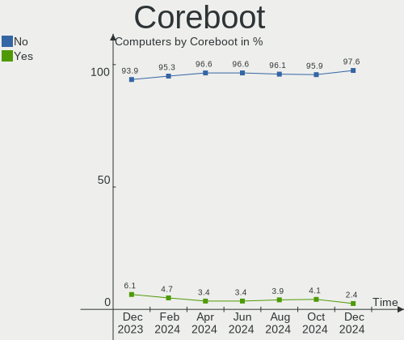
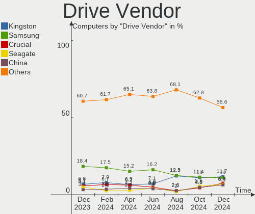
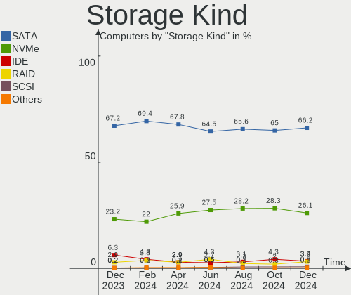
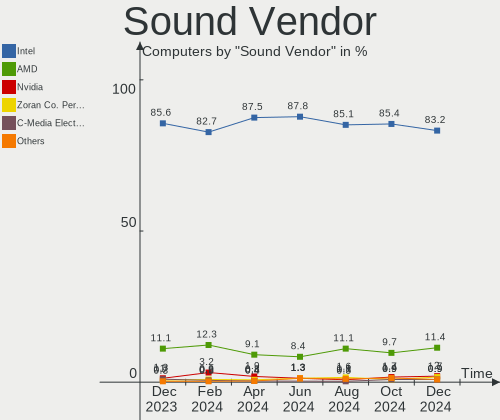

OPNsense Hardware Trends
------------------------

A project to identify most popular hardware characteristics and track their change
over time based on data collected by OPNsense users at https://BSD-Hardware.info.

Anyone can contribute to this report by the [hw-probe](https://github.com/linuxhw/hw-probe/blob/master/INSTALL.BSD.md) tool:

    hw-probe -all -upload

Full-feature report is available here: https://bsd-hardware.info/?view=trends

Period: Aug, 2021.

Contents
--------

* [ System ](#system)
  - [ OS                       ](#os)
  - [ OS Family                ](#os-family)
  - [ Arch                     ](#arch)
  - [ DE                       ](#de)
  - [ Display Server           ](#display-server)
  - [ Display Manager          ](#display-manager)
  - [ OS Lang                  ](#os-lang)
  - [ Boot Mode                ](#boot-mode)
  - [ Filesystem               ](#filesystem)
  - [ Part. scheme             ](#part-scheme)

* [ Board ](#board)
  - [ Vendor                   ](#vendor)
  - [ Model                    ](#model)
  - [ Model Family             ](#model-family)
  - [ MFG Year                 ](#mfg-year)
  - [ Form Factor              ](#form-factor)
  - [ Coreboot                 ](#coreboot)
  - [ RAM Size                 ](#ram-size)
  - [ RAM Used                 ](#ram-used)
  - [ Total Drives             ](#total-drives)
  - [ Has CD-ROM               ](#has-cd-rom)
  - [ Has Ethernet             ](#has-ethernet)
  - [ Has WiFi                 ](#has-wifi)
  - [ Has Bluetooth            ](#has-bluetooth)

* [ Location ](#location)
  - [ Country                  ](#country)
  - [ City                     ](#city)

* [ Drives ](#drives)
  - [ Drive Vendor             ](#drive-vendor)
  - [ Drive Model              ](#drive-model)
  - [ HDD Vendor               ](#hdd-vendor)
  - [ SSD Vendor               ](#ssd-vendor)
  - [ Drive Kind               ](#drive-kind)
  - [ Drive Connector          ](#drive-connector)
  - [ Drive Size               ](#drive-size)
  - [ Space Total              ](#space-total)
  - [ Space Used               ](#space-used)
  - [ Malfunc. Drives          ](#malfunc-drives)
  - [ Malfunc. Drive Vendor    ](#malfunc-drive-vendor)
  - [ Malfunc. HDD Vendor      ](#malfunc-hdd-vendor)
  - [ Malfunc. Drive Kind      ](#malfunc-drive-kind)
  - [ Failed Drives            ](#failed-drives)
  - [ Failed Drive Vendor      ](#failed-drive-vendor)
  - [ Drive Status             ](#drive-status)

* [ Storage controller ](#storage-controller)
  - [ Storage Vendor           ](#storage-vendor)
  - [ Storage Model            ](#storage-model)
  - [ Storage Kind             ](#storage-kind)

* [ Processor ](#processor)
  - [ CPU Vendor               ](#cpu-vendor)
  - [ CPU Model                ](#cpu-model)
  - [ CPU Model Family         ](#cpu-model-family)
  - [ CPU Cores                ](#cpu-cores)
  - [ CPU Sockets              ](#cpu-sockets)
  - [ CPU Threads              ](#cpu-threads)
  - [ CPU Microarch            ](#cpu-microarch)

* [ Graphics ](#graphics)
  - [ GPU Vendor               ](#gpu-vendor)
  - [ GPU Model                ](#gpu-model)
  - [ GPU Combo                ](#gpu-combo)
  - [ GPU Driver               ](#gpu-driver)
  - [ GPU Memory               ](#gpu-memory)

* [ Monitor ](#monitor)
  - [ Monitor Vendor           ](#monitor-vendor)
  - [ Monitor Model            ](#monitor-model)
  - [ Monitor Resolution       ](#monitor-resolution)
  - [ Monitor Diagonal         ](#monitor-diagonal)
  - [ Monitor Width            ](#monitor-width)
  - [ Aspect Ratio             ](#aspect-ratio)
  - [ Monitor Area             ](#monitor-area)
  - [ Pixel Density            ](#pixel-density)
  - [ Multiple Monitors        ](#multiple-monitors)

* [ Network ](#network)
  - [ Net Controller Vendor    ](#net-controller-vendor)
  - [ Net Controller Model     ](#net-controller-model)
  - [ Wireless Vendor          ](#wireless-vendor)
  - [ Wireless Model           ](#wireless-model)
  - [ Ethernet Vendor          ](#ethernet-vendor)
  - [ Ethernet Model           ](#ethernet-model)
  - [ Net Controller Kind      ](#net-controller-kind)
  - [ Used Controller          ](#used-controller)
  - [ NICs                     ](#nics)
  - [ IPv6                     ](#ipv6)

* [ Bluetooth ](#bluetooth)
  - [ Bluetooth Vendor         ](#bluetooth-vendor)
  - [ Bluetooth Model          ](#bluetooth-model)

* [ Sound ](#sound)
  - [ Sound Vendor             ](#sound-vendor)
  - [ Sound Model              ](#sound-model)

* [ Memory ](#memory)
  - [ Memory Vendor            ](#memory-vendor)
  - [ Memory Model             ](#memory-model)
  - [ Memory Kind              ](#memory-kind)
  - [ Memory Form Factor       ](#memory-form-factor)
  - [ Memory Size              ](#memory-size)
  - [ Memory Speed             ](#memory-speed)

* [ Printers & scanners ](#printers--scanners)
  - [ Printer Vendor           ](#printer-vendor)
  - [ Printer Model            ](#printer-model)
  - [ Scanner Vendor           ](#scanner-vendor)
  - [ Scanner Model            ](#scanner-model)

* [ Camera ](#camera)
  - [ Camera Vendor            ](#camera-vendor)
  - [ Camera Model             ](#camera-model)

* [ Security ](#security)
  - [ Fingerprint Vendor       ](#fingerprint-vendor)
  - [ Fingerprint Model        ](#fingerprint-model)
  - [ Chipcard Vendor          ](#chipcard-vendor)
  - [ Chipcard Model           ](#chipcard-model)

* [ Unsupported ](#unsupported)
  - [ Unsupported Devices      ](#unsupported-devices)
  - [ Unsupported Device Types ](#unsupported-device-types)

System
------

OS
--

Installed operating systems

| Name                   | Computers | Percent |
|------------------------|-----------|---------|
| OPNsense 21.7.1        | 194       | 75.78%  |
| OPNsense 21.7          | 36        | 14.06%  |
| OPNsense 21.1.9        | 16        | 6.25%   |
| OPNsense 21.1.8        | 5         | 1.95%   |
| OPNsense 21.1.6        | 3         | 1.17%   |
| OPNsense 21.1.7        | 1         | 0.39%   |
| OPNsense 12.1-p19-HBSD | 1         | 0.39%   |

OS Family
---------

OS without a version

| Name     | Computers | Percent |
|----------|-----------|---------|
| OPNsense | 256       | 100%    |

Arch
----

OS architecture (x86_64, i586, etc.)

| Name  | Computers | Percent |
|-------|-----------|---------|
| amd64 | 256       | 100%    |

DE
--

Desktop Environment

| Name    | Computers | Percent |
|---------|-----------|---------|
| Console | 256       | 100%    |

Display Server
--------------

X11 or Wayland

| Name    | Computers | Percent |
|---------|-----------|---------|
| Console | 256       | 100%    |

Display Manager
---------------

SDDM, LightDM, etc.

| Name    | Computers | Percent |
|---------|-----------|---------|
| Console | 256       | 100%    |

OS Lang
-------

Language

| Lang    | Computers | Percent |
|---------|-----------|---------|
| Unknown | 256       | 100%    |

Boot Mode
---------

EFI or BIOS

| Mode | Computers | Percent |
|------|-----------|---------|
| EFI  | 221       | 86.33%  |
| BIOS | 35        | 13.67%  |

Filesystem
----------

Type of filesystem

| Type | Computers | Percent |
|------|-----------|---------|
| Ufs  | 204       | 79.69%  |
| Zfs  | 52        | 20.31%  |

Part. scheme
------------

Scheme of partitioning

| Type    | Computers | Percent |
|---------|-----------|---------|
| GPT     | 227       | 88.67%  |
| MBR     | 27        | 10.55%  |
| BSD     | 1         | 0.39%   |
| Unknown | 1         | 0.39%   |

Board
-----

Vendor
------

Motherboard manufacturer

| Name                       | Computers | Percent |
|----------------------------|-----------|---------|
| Unknown                    | 26        | 10.16%  |
| Dell                       | 25        | 9.77%   |
| Hewlett-Packard            | 22        | 8.59%   |
| PC Engines                 | 19        | 7.42%   |
| Supermicro                 | 18        | 7.03%   |
| Protectli                  | 16        | 6.25%   |
| Intel                      | 14        | 5.47%   |
| Gigabyte Technology        | 12        | 4.69%   |
| ASRock                     | 12        | 4.69%   |
| ASUSTek Computer           | 9         | 3.52%   |
| AMI                        | 8         | 3.13%   |
| Sophos                     | 7         | 2.73%   |
| Shuttle                    | 7         | 2.73%   |
| MSI                        | 6         | 2.34%   |
| Lenovo                     | 4         | 1.56%   |
| BESSTAR Tech               | 4         | 1.56%   |
| Apple                      | 4         | 1.56%   |
| SeeedStudio                | 3         | 1.17%   |
| NF541                      | 3         | 1.17%   |
| HPE                        | 3         | 1.17%   |
| Fujitsu                    | 3         | 1.17%   |
| ZOTAC                      | 2         | 0.78%   |
| Pegatron                   | 2         | 0.78%   |
| NU941                      | 2         | 0.78%   |
| Deciso                     | 2         | 0.78%   |
| Acer                       | 2         | 0.78%   |
| Yanling                    | 1         | 0.39%   |
| Winston Marriot            | 1         | 0.39%   |
| Silicom                    | 1         | 0.39%   |
| ShenZhen MinWin Technology | 1         | 0.39%   |
| PAIQ                       | 1         | 0.39%   |
| NEXCOM                     | 1         | 0.39%   |
| Lanner                     | 1         | 0.39%   |
| Insyde                     | 1         | 0.39%   |
| IBM                        | 1         | 0.39%   |
| HARDKERNEL                 | 1         | 0.39%   |
| Google                     | 1         | 0.39%   |
| Foxconn                    | 1         | 0.39%   |
| ECS                        | 1         | 0.39%   |
| CNCTION-IAF-E3845          | 1         | 0.39%   |
| Caswell                    | 1         | 0.39%   |
| Biostar                    | 1         | 0.39%   |
| BCM Advanced Research      | 1         | 0.39%   |
| Barracuda Networks         | 1         | 0.39%   |
| AWOW Techonology           | 1         | 0.39%   |
| ASRockRack                 | 1         | 0.39%   |
| AOpen                      | 1         | 0.39%   |

Model
-----

Motherboard model

| Name                                      | Computers | Percent |
|-------------------------------------------|-----------|---------|
| Unknown                                   | 28        | 10.94%  |
| PC Engines apu4                           | 10        | 3.91%   |
| PC Engines APU2                           | 9         | 3.52%   |
| Intel Q3XXG4-P V1.0                       | 7         | 2.73%   |
| Protectli FW4B                            | 6         | 2.34%   |
| AMI Aptio CRB                             | 6         | 2.34%   |
| Supermicro Super Server                   | 5         | 1.95%   |
| Protectli FW6                             | 5         | 1.95%   |
| Supermicro X10SLH-N6-ST031                | 4         | 1.56%   |
| HP t620 PLUS Quad Core TC                 | 4         | 1.56%   |
| Sophos SG                                 | 3         | 1.17%   |
| NF541 1.0                                 | 3         | 1.17%   |
| Dell OptiPlex 7010                        | 3         | 1.17%   |
| Sophos XG                                 | 2         | 0.78%   |
| Sophos UTM                                | 2         | 0.78%   |
| Shuttle DS10U                             | 2         | 0.78%   |
| SeeedStudio ODYSSEY-X86J4125              | 2         | 0.78%   |
| Protectli FW6E                            | 2         | 0.78%   |
| NU941 1.0                                 | 2         | 0.78%   |
| Intel DH67BL AAG10189-211                 | 2         | 0.78%   |
| HP t730 Thin Client                       | 2         | 0.78%   |
| HP ProLiant MicroServer Gen8              | 2         | 0.78%   |
| Gigabyte H61M-S2-B3                       | 2         | 0.78%   |
| Dell OptiPlex 9020                        | 2         | 0.78%   |
| Deciso Netboard A20                       | 2         | 0.78%   |
| BESSTAR Tech X35G                         | 2         | 0.78%   |
| ASRock X570 PG Velocita                   | 2         | 0.78%   |
| Apple Macmini7,1                          | 2         | 0.78%   |
| ZOTAC ZBOX-CI329NANO                      | 1         | 0.39%   |
| Yanling LES plus                          | 1         | 0.39%   |
| Winston Marriot PICO PC YANYU             | 1         | 0.39%   |
| Supermicro X9SCL/X9SCM                    | 1         | 0.39%   |
| Supermicro X8SIL                          | 1         | 0.39%   |
| Supermicro X8DTU-LN4+                     | 1         | 0.39%   |
| Supermicro X7SBL                          | 1         | 0.39%   |
| Supermicro X10SL7-F                       | 1         | 0.39%   |
| Supermicro SYS-E300-9D                    | 1         | 0.39%   |
| Supermicro SYS-5019D-FN8TP                | 1         | 0.39%   |
| Supermicro SSG-6028R-E1CR12T              | 1         | 0.39%   |
| Supermicro A1SAi                          | 1         | 0.39%   |
| Silicom Minnowboard Turbot D0/D1 PLATFORM | 1         | 0.39%   |
| Shuttle SH87R                             | 1         | 0.39%   |
| Shuttle SH81R                             | 1         | 0.39%   |
| Shuttle DS61                              | 1         | 0.39%   |
| Shuttle DH370                             | 1         | 0.39%   |
| Shuttle DH170                             | 1         | 0.39%   |
| ShenZhen MinWin MW-NANO-APL-4L            | 1         | 0.39%   |
| SeeedStudio ODYSSEY-X86J4105              | 1         | 0.39%   |
| Protectli VP2410                          | 1         | 0.39%   |
| Protectli FW4A                            | 1         | 0.39%   |
| Protectli FW2B                            | 1         | 0.39%   |
| Pegatron IPM41-D3                         | 1         | 0.39%   |
| Pegatron Compaq dx2400 Microtower PC      | 1         | 0.39%   |
| PAIQ EC3-BT19D4L                          | 1         | 0.39%   |
| NEXCOM ASG                                | 1         | 0.39%   |
| MSI MS-S0891                              | 1         | 0.39%   |
| MSI MS-7C09                               | 1         | 0.39%   |
| MSI MS-7996                               | 1         | 0.39%   |
| MSI MS-7721                               | 1         | 0.39%   |
| MSI MS-7418                               | 1         | 0.39%   |

Model Family
------------

Motherboard model prefix

| Name                           | Computers | Percent |
|--------------------------------|-----------|---------|
| Unknown                        | 28        | 10.94%  |
| Dell OptiPlex                  | 14        | 5.47%   |
| PC Engines apu4                | 10        | 3.91%   |
| PC Engines APU2                | 9         | 3.52%   |
| HP ProLiant                    | 9         | 3.52%   |
| Dell PowerEdge                 | 9         | 3.52%   |
| Intel Q3XXG4-P                 | 7         | 2.73%   |
| Protectli FW4B                 | 6         | 2.34%   |
| AMI Aptio                      | 6         | 2.34%   |
| Supermicro Super               | 5         | 1.95%   |
| Protectli FW6                  | 5         | 1.95%   |
| Supermicro X10SLH-N6-ST031     | 4         | 1.56%   |
| HP t620                        | 4         | 1.56%   |
| HP Compaq                      | 4         | 1.56%   |
| Sophos SG                      | 3         | 1.17%   |
| NF541 1.0                      | 3         | 1.17%   |
| Lenovo ThinkCentre             | 3         | 1.17%   |
| Sophos XG                      | 2         | 0.78%   |
| Sophos UTM                     | 2         | 0.78%   |
| Shuttle DS10U                  | 2         | 0.78%   |
| SeeedStudio ODYSSEY-X86J4125   | 2         | 0.78%   |
| Protectli FW6E                 | 2         | 0.78%   |
| NU941 1.0                      | 2         | 0.78%   |
| Intel DH67BL                   | 2         | 0.78%   |
| HPE ProLiant                   | 2         | 0.78%   |
| HP t730                        | 2         | 0.78%   |
| HP EliteDesk                   | 2         | 0.78%   |
| Gigabyte H61M-S2-B3            | 2         | 0.78%   |
| Deciso Netboard                | 2         | 0.78%   |
| BESSTAR Tech X35G              | 2         | 0.78%   |
| ASRock X570                    | 2         | 0.78%   |
| Apple Macmini7                 | 2         | 0.78%   |
| Apple Macmini5                 | 2         | 0.78%   |
| Acer Veriton                   | 2         | 0.78%   |
| ZOTAC ZBOX-CI329NANO           | 1         | 0.39%   |
| Yanling LES                    | 1         | 0.39%   |
| Winston Marriot PICO           | 1         | 0.39%   |
| Supermicro X9SCL               | 1         | 0.39%   |
| Supermicro X8SIL               | 1         | 0.39%   |
| Supermicro X8DTU-LN4+          | 1         | 0.39%   |
| Supermicro X7SBL               | 1         | 0.39%   |
| Supermicro X10SL7-F            | 1         | 0.39%   |
| Supermicro SYS-E300-9D         | 1         | 0.39%   |
| Supermicro SYS-5019D-FN8TP     | 1         | 0.39%   |
| Supermicro SSG-6028R-E1CR12T   | 1         | 0.39%   |
| Supermicro A1SAi               | 1         | 0.39%   |
| Silicom Minnowboard            | 1         | 0.39%   |
| Shuttle SH87R                  | 1         | 0.39%   |
| Shuttle SH81R                  | 1         | 0.39%   |
| Shuttle DS61                   | 1         | 0.39%   |
| Shuttle DH370                  | 1         | 0.39%   |
| Shuttle DH170                  | 1         | 0.39%   |
| ShenZhen MinWin MW-NANO-APL-4L | 1         | 0.39%   |
| SeeedStudio ODYSSEY-X86J4105   | 1         | 0.39%   |
| Protectli VP2410               | 1         | 0.39%   |
| Protectli FW4A                 | 1         | 0.39%   |
| Protectli FW2B                 | 1         | 0.39%   |
| Pegatron IPM41-D3              | 1         | 0.39%   |
| Pegatron Compaq                | 1         | 0.39%   |
| PAIQ EC3-BT19D4L               | 1         | 0.39%   |

MFG Year
--------

Motherboard manufacture year

| Year | Computers | Percent |
|------|-----------|---------|
| 2020 | 47        | 18.36%  |
| 2018 | 40        | 15.63%  |
| 2019 | 37        | 14.45%  |
| 2021 | 25        | 9.77%   |
| 2014 | 19        | 7.42%   |
| 2015 | 17        | 6.64%   |
| 2017 | 13        | 5.08%   |
| 2016 | 13        | 5.08%   |
| 2011 | 13        | 5.08%   |
| 2013 | 11        | 4.3%    |
| 2012 | 8         | 3.13%   |
| 2010 | 8         | 3.13%   |
| 2008 | 4         | 1.56%   |
| 2009 | 1         | 0.39%   |

Form Factor
-----------

Physical design of the computer

| Name       | Computers | Percent |
|------------|-----------|---------|
| Desktop    | 195       | 76.17%  |
| Server     | 28        | 10.94%  |
| Mini pc    | 17        | 6.64%   |
| Firewall   | 9         | 3.52%   |
| Notebook   | 6         | 2.34%   |
| All in one | 1         | 0.39%   |

Coreboot
--------

Have coreboot on board

| Used | Computers | Percent |
|------|-----------|---------|
| No   | 229       | 89.45%  |
| Yes  | 27        | 10.55%  |

RAM Size
--------

Total RAM memory

| Size in GB  | Computers | Percent |
|-------------|-----------|---------|
| 8.01-16.0   | 106       | 41.41%  |
| 4.01-8.0    | 63        | 24.61%  |
| 16.01-24.0  | 51        | 19.92%  |
| 2.01-3.0    | 15        | 5.86%   |
| 32.01-64.0  | 13        | 5.08%   |
| 24.01-32.0  | 3         | 1.17%   |
| 64.01-256.0 | 3         | 1.17%   |
| 3.01-4.0    | 1         | 0.39%   |
| 1.01-2.0    | 1         | 0.39%   |

RAM Used
--------

Used RAM memory

| Used GB    | Computers | Percent |
|------------|-----------|---------|
| 0.01-0.5   | 151       | 58.98%  |
| 0.51-1.0   | 76        | 29.69%  |
| 1.01-2.0   | 13        | 5.08%   |
| 3.01-4.0   | 4         | 1.56%   |
| 2.01-3.0   | 4         | 1.56%   |
| 4.01-8.0   | 3         | 1.17%   |
| 8.01-16.0  | 3         | 1.17%   |
| 32.01-64.0 | 1         | 0.39%   |
| 16.01-24.0 | 1         | 0.39%   |

Total Drives
------------

Number of drives on board

| Drives | Computers | Percent |
|--------|-----------|---------|
| 1      | 206       | 80.47%  |
| 0      | 31        | 12.11%  |
| 2      | 18        | 7.03%   |
| 4      | 1         | 0.39%   |

Has CD-ROM
----------

Has CD-ROM on board

| Presented | Computers | Percent |
|-----------|-----------|---------|
| No        | 221       | 86.33%  |
| Yes       | 35        | 13.67%  |

Has Ethernet
------------

Has Ethernet on board

| Presented | Computers | Percent |
|-----------|-----------|---------|
| Yes       | 256       | 100%    |

Has WiFi
--------

Has WiFi module

| Presented | Computers | Percent |
|-----------|-----------|---------|
| No        | 204       | 79.69%  |
| Yes       | 52        | 20.31%  |

Has Bluetooth
-------------

Has Bluetooth module

| Presented | Computers | Percent |
|-----------|-----------|---------|
| No        | 228       | 89.06%  |
| Yes       | 28        | 10.94%  |

Location
--------

Country
-------

Geographic location (country)

| Country      | Computers | Percent |
|--------------|-----------|---------|
| USA          | 77        | 30.08%  |
| Germany      | 54        | 21.09%  |
| France       | 12        | 4.69%   |
| Switzerland  | 10        | 3.91%   |
| Netherlands  | 10        | 3.91%   |
| Canada       | 10        | 3.91%   |
| UK           | 9         | 3.52%   |
| China        | 8         | 3.13%   |
| Brazil       | 7         | 2.73%   |
| Austria      | 6         | 2.34%   |
| Sweden       | 5         | 1.95%   |
| Czechia      | 5         | 1.95%   |
| Australia    | 5         | 1.95%   |
| Taiwan       | 3         | 1.17%   |
| Poland       | 3         | 1.17%   |
| Indonesia    | 3         | 1.17%   |
| South Africa | 2         | 0.78%   |
| Russia       | 2         | 0.78%   |
| Mexico       | 2         | 0.78%   |
| Luxembourg   | 2         | 0.78%   |
| Italy        | 2         | 0.78%   |
| Hungary      | 2         | 0.78%   |
| Vietnam      | 1         | 0.39%   |
| Ukraine      | 1         | 0.39%   |
| UAE          | 1         | 0.39%   |
| Turkey       | 1         | 0.39%   |
| Spain        | 1         | 0.39%   |
| South Korea  | 1         | 0.39%   |
| Slovenia     | 1         | 0.39%   |
| Slovakia     | 1         | 0.39%   |
| Singapore    | 1         | 0.39%   |
| Romania      | 1         | 0.39%   |
| Norway       | 1         | 0.39%   |
| Namibia      | 1         | 0.39%   |
| Japan        | 1         | 0.39%   |
| Greece       | 1         | 0.39%   |
| Finland      | 1         | 0.39%   |
| Chile        | 1         | 0.39%   |
| Argentina    | 1         | 0.39%   |

City
----

Geographic location (city)

| City             | Computers | Percent |
|------------------|-----------|---------|
| Berlin           | 7         | 2.73%   |
| Hamburg          | 6         | 2.34%   |
| Paris            | 4         | 1.56%   |
| Gachnang         | 4         | 1.56%   |
| Sydney           | 3         | 1.17%   |
| Shanghai         | 3         | 1.17%   |
| San Francisco    | 3         | 1.17%   |
| Jacksonville     | 3         | 1.17%   |
| Zurich           | 2         | 0.78%   |
| West Valley City | 2         | 0.78%   |
| Vienna           | 2         | 0.78%   |
| Vauvillers       | 2         | 0.78%   |
| Tainan City      | 2         | 0.78%   |
| San Antonio      | 2         | 0.78%   |
| Rudna            | 2         | 0.78%   |
| Rio Claro        | 2         | 0.78%   |
| Philadelphia     | 2         | 0.78%   |
| Peine            | 2         | 0.78%   |
| Munich           | 2         | 0.78%   |
| Montreal         | 2         | 0.78%   |
| Luxembourg       | 2         | 0.78%   |
| Las Vegas        | 2         | 0.78%   |
| Johannesburg     | 2         | 0.78%   |
| Jakarta          | 2         | 0.78%   |
| Heilbronn        | 2         | 0.78%   |
| Hanover          | 2         | 0.78%   |
| Groningen        | 2         | 0.78%   |
| Goslar           | 2         | 0.78%   |
| Denver           | 2         | 0.78%   |
| Cologne          | 2         | 0.78%   |
| Belmond          | 2         | 0.78%   |
| Yeovil           | 1         | 0.39%   |
| Yancheng         | 1         | 0.39%   |
| Wolfenb??ttel    | 1         | 0.39%   |
| Winterthur       | 1         | 0.39%   |
| Windhoek         | 1         | 0.39%   |
| Westland         | 1         | 0.39%   |
| Warminster       | 1         | 0.39%   |
| Vleuten          | 1         | 0.39%   |
| Virginia Beach   | 1         | 0.39%   |
| Vantaa           | 1         | 0.39%   |
| Toulouse         | 1         | 0.39%   |
| Toronto          | 1         | 0.39%   |
| Topeka           | 1         | 0.39%   |
| The Hague        | 1         | 0.39%   |
| Ten Boer         | 1         | 0.39%   |
| Swansea          | 1         | 0.39%   |
| Swanley          | 1         | 0.39%   |
| Stuttgart        | 1         | 0.39%   |
| Stroemstad       | 1         | 0.39%   |
| Stralsund        | 1         | 0.39%   |
| Sterling Heights | 1         | 0.39%   |
| Stavanger        | 1         | 0.39%   |
| St. Gallen       | 1         | 0.39%   |
| Spring           | 1         | 0.39%   |
| Southbury        | 1         | 0.39%   |
| Sonthofen        | 1         | 0.39%   |
| Sollentuna       | 1         | 0.39%   |
| Sinsheim         | 1         | 0.39%   |
| Singapore        | 1         | 0.39%   |

Drives
------

Drive Vendor
------------

Hard drive vendors

| Vendor              | Computers | Drives | Percent |
|---------------------|-----------|--------|---------|
| Samsung Electronics | 28        | 30     | 11.76%  |
| WDC                 | 24        | 25     | 10.08%  |
| Kingston            | 23        | 24     | 9.66%   |
| Seagate             | 19        | 20     | 7.98%   |
| Transcend           | 16        | 16     | 6.72%   |
| SanDisk             | 12        | 12     | 5.04%   |
| Phison              | 11        | 11     | 4.62%   |
| Intel               | 11        | 11     | 4.62%   |
| Crucial             | 11        | 13     | 4.62%   |
| Hoodisk             | 10        | 10     | 4.2%    |
| Toshiba             | 9         | 9      | 3.78%   |
| Protectli           | 5         | 5      | 2.1%    |
| Hewlett-Packard     | 5         | 6      | 2.1%    |
| FORESEE             | 5         | 5      | 2.1%    |
| A-DATA Technology   | 5         | 5      | 2.1%    |
| Hitachi             | 4         | 4      | 1.68%   |
| MEMXPRO             | 3         | 3      | 1.26%   |
| LITEON              | 3         | 3      | 1.26%   |
| SPCC                | 2         | 2      | 0.84%   |
| Micron Technology   | 2         | 2      | 0.84%   |
| Kston               | 2         | 2      | 0.84%   |
| Intenso             | 2         | 2      | 0.84%   |
| HGST                | 2         | 2      | 0.84%   |
| Corsair             | 2         | 2      | 0.84%   |
| China               | 2         | 2      | 0.84%   |
| Apacer              | 2         | 2      | 0.84%   |
| Zheino              | 1         | 1      | 0.42%   |
| VisionTek           | 1         | 1      | 0.42%   |
| Team                | 1         | 1      | 0.42%   |
| SK Hynix            | 1         | 1      | 0.42%   |
| PNY                 | 1         | 1      | 0.42%   |
| PLEXTOR             | 1         | 1      | 0.42%   |
| OCZ                 | 1         | 1      | 0.42%   |
| MAXTOR              | 1         | 1      | 0.42%   |
| Integral            | 1         | 1      | 0.42%   |
| Innodisk            | 1         | 1      | 0.42%   |
| HPE                 | 1         | 1      | 0.42%   |
| Gigabyte Technology | 1         | 1      | 0.42%   |
| Fujitsu             | 1         | 1      | 0.42%   |
| faspeed             | 1         | 1      | 0.42%   |
| BIWIN               | 1         | 1      | 0.42%   |
| ATP                 | 1         | 1      | 0.42%   |
| Apple               | 1         | 1      | 0.42%   |
| Advantech           | 1         | 1      | 0.42%   |

Drive Model
-----------

Hard drive models

| Model                                | Computers | Percent |
|--------------------------------------|-----------|---------|
| Phison SATA SSD 16GB                 | 7         | 2.9%    |
| Transcend TS128GMSA230S 128GB        | 6         | 2.49%   |
| Hoodisk SSD 128GB                    | 5         | 2.07%   |
| WDC WDS120G2G0A-00JH30 120GB         | 3         | 1.24%   |
| Samsung SSD 860 EVO 500GB            | 3         | 1.24%   |
| Protectli 120GB mSATA                | 3         | 1.24%   |
| MEMXPRO mSATA M3B 32GB               | 3         | 1.24%   |
| Kingston SUV500MS240G 240GB          | 3         | 1.24%   |
| Kingston SUV500MS120G 120GB          | 3         | 1.24%   |
| Kingston SA400S37120G 120GB          | 3         | 1.24%   |
| Intel SSDSC2CW240A3 240GB            | 3         | 1.24%   |
| HP RAID 1(1+0) 146GB                 | 3         | 1.24%   |
| FORESEE 128GB SSD                    | 3         | 1.24%   |
| Crucial CT120BX500SSD1 120GB         | 3         | 1.24%   |
| WDC WD3200BPVT-22JJ5T0 320GB         | 2         | 0.83%   |
| Transcend TS64GMSA370 64GB           | 2         | 0.83%   |
| Transcend TS256GMTS952T2 256GB       | 2         | 0.83%   |
| Seagate ST500DM002-1BD142 500GB      | 2         | 0.83%   |
| Seagate ST1000DM010-2EP102 1TB       | 2         | 0.83%   |
| SanDisk SSD PLUS 120GB               | 2         | 0.83%   |
| Samsung SSD 850 EVO 250GB            | 2         | 0.83%   |
| Samsung MZ7LN128HCHP-000H1 128GB     | 2         | 0.83%   |
| Kston SSD 128GB                      | 2         | 0.83%   |
| Kingston SV300S37A120G 120GB         | 2         | 0.83%   |
| Hoodisk SSD 64GB                     | 2         | 0.83%   |
| Hoodisk SSD 32GB                     | 2         | 0.83%   |
| A-DATA SX8200PNP 512GB               | 2         | 0.83%   |
| Zheino CHN-mSATAM1-32 32GB           | 1         | 0.41%   |
| WDC WDS500G2B0B-00YS70 500GB         | 1         | 0.41%   |
| WDC WDS250G2B0A-00SM50 250GB         | 1         | 0.41%   |
| WDC WDS240G2G0A-00JH30 240GB         | 1         | 0.41%   |
| WDC WDS120G2G0B-00EPW0 120GB         | 1         | 0.41%   |
| WDC WDS120G1G0A-00SS50 120GB         | 1         | 0.41%   |
| WDC WD5003ABYZ-011FA0 500GB          | 1         | 0.41%   |
| WDC WD5000LPVX-22V0TT0 500GB         | 1         | 0.41%   |
| WDC WD5000AAVS-00G9B1 500GB          | 1         | 0.41%   |
| WDC WD5000AAKS-00V1A0 500GB          | 1         | 0.41%   |
| WDC WD5000AAKS-00TMA0 500GB          | 1         | 0.41%   |
| WDC WD3201ABYS-01B9A0 320GB          | 1         | 0.41%   |
| WDC WD3200BEKT-00A25T0 320GB         | 1         | 0.41%   |
| WDC WD2502ABYS-18B7A0 250GB          | 1         | 0.41%   |
| WDC WD2500BEVS-60UST0 250GB          | 1         | 0.41%   |
| WDC WD2500AAKX-603CA0 250GB          | 1         | 0.41%   |
| WDC WD2500AAKX-321CA0 250GB          | 1         | 0.41%   |
| WDC WD1600BEVT-22ZCT0 160GB          | 1         | 0.41%   |
| WDC WD1600BEKT-66F3T2 160GB          | 1         | 0.41%   |
| WDC WD1600AAJS-75M0A0 160GB          | 1         | 0.41%   |
| WDC PC SN520 SDAPNUW-128G-1014 128GB | 1         | 0.41%   |
| VisionTek mSATA 120GB                | 1         | 0.41%   |
| Transcend TS64GSSD25S-M 64GB         | 1         | 0.41%   |
| Transcend TS32GMSA370 32GB           | 1         | 0.41%   |
| Transcend TS256GMSA230S 256GB        | 1         | 0.41%   |
| Transcend TS128GMTS400S 128GB        | 1         | 0.41%   |
| Transcend TS128GMSA370S 128GB        | 1         | 0.41%   |
| Transcend TS128GMSA370 128GB         | 1         | 0.41%   |
| Toshiba TR150 120GB                  | 1         | 0.41%   |
| Toshiba THNSNK256GVN8 M.2 2280 256GB | 1         | 0.41%   |
| Toshiba THNSNH128GBST                | 1         | 0.41%   |
| Toshiba THNSNF128GMCS 128GB          | 1         | 0.41%   |
| Toshiba MQ04ABF100 1TB               | 1         | 0.41%   |

HDD Vendor
----------

Hard disk drive vendors

| Vendor              | Computers | Drives | Percent |
|---------------------|-----------|--------|---------|
| Seagate             | 17        | 18     | 32.08%  |
| WDC                 | 15        | 16     | 28.3%   |
| Hewlett-Packard     | 5         | 6      | 9.43%   |
| Toshiba             | 4         | 4      | 7.55%   |
| Hitachi             | 4         | 4      | 7.55%   |
| Samsung Electronics | 3         | 3      | 5.66%   |
| HGST                | 2         | 2      | 3.77%   |
| MAXTOR              | 1         | 1      | 1.89%   |
| Fujitsu             | 1         | 1      | 1.89%   |
| Apple               | 1         | 1      | 1.89%   |

SSD Vendor
----------

Solid state drive vendors

| Vendor              | Computers | Drives | Percent |
|---------------------|-----------|--------|---------|
| Kingston            | 22        | 23     | 12.79%  |
| Samsung Electronics | 20        | 22     | 11.63%  |
| Transcend           | 16        | 16     | 9.3%    |
| SanDisk             | 12        | 12     | 6.98%   |
| Intel               | 11        | 11     | 6.4%    |
| Crucial             | 11        | 13     | 6.4%    |
| Phison              | 10        | 10     | 5.81%   |
| Hoodisk             | 10        | 10     | 5.81%   |
| WDC                 | 8         | 8      | 4.65%   |
| Protectli           | 5         | 5      | 2.91%   |
| Toshiba             | 4         | 4      | 2.33%   |
| FORESEE             | 4         | 4      | 2.33%   |
| MEMXPRO             | 3         | 3      | 1.74%   |
| LITEON              | 3         | 3      | 1.74%   |
| A-DATA Technology   | 3         | 3      | 1.74%   |
| SPCC                | 2         | 2      | 1.16%   |
| Micron Technology   | 2         | 2      | 1.16%   |
| Kston               | 2         | 2      | 1.16%   |
| Intenso             | 2         | 2      | 1.16%   |
| Corsair             | 2         | 2      | 1.16%   |
| China               | 2         | 2      | 1.16%   |
| Apacer              | 2         | 2      | 1.16%   |
| Zheino              | 1         | 1      | 0.58%   |
| VisionTek           | 1         | 1      | 0.58%   |
| Team                | 1         | 1      | 0.58%   |
| SK Hynix            | 1         | 1      | 0.58%   |
| Seagate             | 1         | 1      | 0.58%   |
| PNY                 | 1         | 1      | 0.58%   |
| PLEXTOR             | 1         | 1      | 0.58%   |
| OCZ                 | 1         | 1      | 0.58%   |
| Integral            | 1         | 1      | 0.58%   |
| Innodisk            | 1         | 1      | 0.58%   |
| HPE                 | 1         | 1      | 0.58%   |
| Gigabyte Technology | 1         | 1      | 0.58%   |
| faspeed             | 1         | 1      | 0.58%   |
| BIWIN               | 1         | 1      | 0.58%   |
| ATP                 | 1         | 1      | 0.58%   |
| Advantech           | 1         | 1      | 0.58%   |

Drive Kind
----------

HDD or SSD

| Kind | Computers | Drives | Percent |
|------|-----------|--------|---------|
| SSD  | 167       | 177    | 72.61%  |
| HDD  | 50        | 56     | 21.74%  |
| NVMe | 13        | 13     | 5.65%   |

Drive Connector
---------------

SATA, SAS, NVMe, etc.

| Type | Computers | Drives | Percent |
|------|-----------|--------|---------|
| SATA | 213       | 233    | 94.25%  |
| NVMe | 13        | 13     | 5.75%   |

Drive Size
----------

Size of hard drive

| Size in TB | Computers | Drives | Percent |
|------------|-----------|--------|---------|
| 0.01-0.5   | 198       | 214    | 92.09%  |
| 0.51-1.0   | 15        | 17     | 6.98%   |
| 2.01-3.0   | 1         | 1      | 0.47%   |
| 1.01-2.0   | 1         | 1      | 0.47%   |

Space Total
-----------

Amount of disk space available on the file system

| Size in GB | Computers | Percent |
|------------|-----------|---------|
| 101-250    | 120       | 46.88%  |
| 51-100     | 43        | 16.8%   |
| 251-500    | 31        | 12.11%  |
| 21-50      | 27        | 10.55%  |
| 1-20       | 20        | 7.81%   |
| 501-1000   | 14        | 5.47%   |
| 1001-2000  | 1         | 0.39%   |

Space Used
----------

Amount of used disk space

| Used GB | Computers | Percent |
|---------|-----------|---------|
| 1-20    | 247       | 96.48%  |
| 21-50   | 7         | 2.73%   |
| 51-100  | 2         | 0.78%   |

Malfunc. Drives
---------------

Drive models with a malfunction

| Model                                        | Computers | Drives | Percent |
|----------------------------------------------|-----------|--------|---------|
| Kingston SV300S37A120G 120GB                 | 2         | 2      | 6.9%    |
| WDC WD5000LPVX-22V0TT0 500GB                 | 1         | 1      | 3.45%   |
| WDC WD5000AAVS-00G9B1 500GB                  | 1         | 1      | 3.45%   |
| WDC WD5000AAKS-00V1A0 500GB                  | 1         | 1      | 3.45%   |
| WDC WD2500BEVS-60UST0 250GB                  | 1         | 1      | 3.45%   |
| WDC WD1600BEKT-66F3T2 160GB                  | 1         | 1      | 3.45%   |
| WDC WD1600AAJS-75M0A0 160GB                  | 1         | 1      | 3.45%   |
| VisionTek mSATA 120GB                        | 1         | 1      | 3.45%   |
| Toshiba THNSNK256GVN8 M.2 2280 256GB         | 1         | 1      | 3.45%   |
| Seagate ST3500413AS 500GB                    | 1         | 1      | 3.45%   |
| Seagate ST3250318AS 250GB                    | 1         | 1      | 3.45%   |
| Seagate ST3250310AS 250GB                    | 1         | 1      | 3.45%   |
| Seagate ST320LT007-9ZV142 320GB              | 1         | 1      | 3.45%   |
| Seagate ST3160815AS 160GB                    | 1         | 1      | 3.45%   |
| Seagate ST3160318AS 160GB                    | 1         | 1      | 3.45%   |
| Seagate ST31000340NS 1TB                     | 1         | 1      | 3.45%   |
| Seagate ST1000NM0011 1TB                     | 1         | 1      | 3.45%   |
| Samsung Electronics SSD 840 PRO Series 256GB | 1         | 1      | 3.45%   |
| Kingston SMS200S3120G 120GB                  | 1         | 1      | 3.45%   |
| Intel SSDSA2M160G2HP 160GB                   | 1         | 1      | 3.45%   |
| Intel SSDSA2M160G2GC 160GB                   | 1         | 1      | 3.45%   |
| Intel SSDMCEAC060B3 64GB                     | 1         | 1      | 3.45%   |
| Hitachi HTS541612J9SA00 120GB                | 1         | 1      | 3.45%   |
| Crucial CT128MX100SSD1 128GB                 | 1         | 1      | 3.45%   |
| Crucial CT120M500SSD1 120GB                  | 1         | 1      | 3.45%   |
| Corsair Force LS SSD 64GB                    | 1         | 1      | 3.45%   |
| Apacer 32GB SATA Flash Drive                 | 1         | 1      | 3.45%   |
| A-DATA Technology SU650 120GB                | 1         | 1      | 3.45%   |

Malfunc. Drive Vendor
---------------------

Vendors of faulty drives

| Vendor              | Computers | Drives | Percent |
|---------------------|-----------|--------|---------|
| Seagate             | 8         | 8      | 27.59%  |
| WDC                 | 6         | 6      | 20.69%  |
| Kingston            | 3         | 3      | 10.34%  |
| Intel               | 3         | 3      | 10.34%  |
| Crucial             | 2         | 2      | 6.9%    |
| VisionTek           | 1         | 1      | 3.45%   |
| Toshiba             | 1         | 1      | 3.45%   |
| Samsung Electronics | 1         | 1      | 3.45%   |
| Hitachi             | 1         | 1      | 3.45%   |
| Corsair             | 1         | 1      | 3.45%   |
| Apacer              | 1         | 1      | 3.45%   |
| A-DATA Technology   | 1         | 1      | 3.45%   |

Malfunc. HDD Vendor
-------------------

Vendors of faulty HDD drives

| Vendor  | Computers | Drives | Percent |
|---------|-----------|--------|---------|
| Seagate | 8         | 8      | 53.33%  |
| WDC     | 6         | 6      | 40%     |
| Hitachi | 1         | 1      | 6.67%   |

Malfunc. Drive Kind
-------------------

Kinds of faulty drives

| Kind | Computers | Drives | Percent |
|------|-----------|--------|---------|
| HDD  | 15        | 15     | 51.72%  |
| SSD  | 14        | 14     | 48.28%  |

Failed Drives
-------------

Failed drive models

Zero info for selected period =(

Failed Drive Vendor
-------------------

Failed drive vendors

Zero info for selected period =(

Drive Status
------------

Number of failed and malfunc. drives

| Status   | Computers | Drives | Percent |
|----------|-----------|--------|---------|
| Works    | 194       | 208    | 83.98%  |
| Malfunc  | 29        | 29     | 12.55%  |
| Detected | 8         | 9      | 3.46%   |

Storage controller
------------------

Storage Vendor
--------------

Storage controller vendors

| Vendor                       | Computers | Percent |
|------------------------------|-----------|---------|
| Intel                        | 209       | 74.38%  |
| AMD                          | 38        | 13.52%  |
| Broadcom / LSI               | 8         | 2.85%   |
| Samsung Electronics          | 5         | 1.78%   |
| Hewlett-Packard              | 4         | 1.42%   |
| ASMedia Technology           | 4         | 1.42%   |
| Chelsio Communications       | 3         | 1.07%   |
| Phison Electronics           | 2         | 0.71%   |
| ADATA Technology             | 2         | 0.71%   |
| Toshiba                      | 1         | 0.36%   |
| Shenzhen Longsys Electronics | 1         | 0.36%   |
| Seagate Technology           | 1         | 0.36%   |
| Sandisk                      | 1         | 0.36%   |
| Kingston Technology Company  | 1         | 0.36%   |
| Adaptec                      | 1         | 0.36%   |

Storage Model
-------------

Storage controller models

| Model                                                                                   | Computers | Percent |
|-----------------------------------------------------------------------------------------|-----------|---------|
| AMD FCH SATA Controller [AHCI mode]                                                     | 29        | 9.24%   |
| Intel 8 Series/C220 Series Chipset Family 6-port SATA Controller 1 [AHCI mode]          | 24        | 7.64%   |
| Intel Atom/Celeron/Pentium Processor x5-E8000/J3xxx/N3xxx Series SATA Controller        | 21        | 6.69%   |
| Intel Sunrise Point-LP SATA Controller [AHCI mode]                                      | 19        | 6.05%   |
| Intel 6 Series/C200 Series Chipset Family 6 port Desktop SATA AHCI Controller           | 17        | 5.41%   |
| Intel Atom Processor E3800 Series SATA AHCI Controller                                  | 15        | 4.78%   |
| Intel Q170/Q150/B150/H170/H110/Z170/CM236 Chipset SATA Controller [AHCI Mode]           | 10        | 3.18%   |
| Intel Celeron/Pentium Silver Processor SATA Controller                                  | 9         | 2.87%   |
| Intel 8 Series SATA Controller 1 [AHCI mode]                                            | 9         | 2.87%   |
| Intel 82801G (ICH7 Family) IDE Controller                                               | 7         | 2.23%   |
| Intel 7 Series/C210 Series Chipset Family 6-port SATA Controller [AHCI mode]            | 7         | 2.23%   |
| Intel SATA Controller [RAID mode]                                                       | 6         | 1.91%   |
| Intel NM10/ICH7 Family SATA Controller [IDE mode]                                       | 6         | 1.91%   |
| AMD FCH SATA Controller [IDE mode]                                                      | 6         | 1.91%   |
| Intel Wildcat Point-LP SATA Controller [AHCI Mode]                                      | 5         | 1.59%   |
| Intel Cannon Point-LP SATA Controller [AHCI Mode]                                       | 5         | 1.59%   |
| Intel Cannon Lake PCH SATA AHCI Controller                                              | 4         | 1.27%   |
| Intel 82801JI (ICH10 Family) 4 port SATA IDE Controller #1                              | 4         | 1.27%   |
| Intel 82801HM/HEM (ICH8M/ICH8M-E) IDE Controller                                        | 4         | 1.27%   |
| ASMedia ASM1062 Serial ATA Controller                                                   | 4         | 1.27%   |
| Samsung NVMe SSD Controller SM981/PM981/PM983                                           | 3         | 0.96%   |
| Intel NM10/ICH7 Family SATA Controller [AHCI mode]                                      | 3         | 0.96%   |
| Intel Comet Lake SATA AHCI Controller                                                   | 3         | 0.96%   |
| Intel C610/X99 series chipset 6-Port SATA Controller [AHCI mode]                        | 3         | 0.96%   |
| Intel Atom Processor C3000 Series SATA Controller 1                                     | 3         | 0.96%   |
| Intel Atom processor C2000 AHCI SATA3 Controller                                        | 3         | 0.96%   |
| Intel 6 Series/C200 Series Chipset Family Desktop SATA Controller (IDE mode, ports 4-5) | 3         | 0.96%   |
| Intel 6 Series/C200 Series Chipset Family Desktop SATA Controller (IDE mode, ports 0-3) | 3         | 0.96%   |
| Intel 6 Series/C200 Series Chipset Family 6 port Mobile SATA AHCI Controller            | 3         | 0.96%   |
| HP Smart Array G6 controllers                                                           | 3         | 0.96%   |
| Chelsio T520-CR Unified Wire Storage Controller                                         | 3         | 0.96%   |
| Samsung NVMe SSD Controller PM9A1/PM9A3/980PRO                                          | 2         | 0.64%   |
| Intel Celeron N3350/Pentium N4200/Atom E3900 Series SATA AHCI Controller                | 2         | 0.64%   |
| Intel C610/X99 series chipset sSATA Controller [AHCI mode]                              | 2         | 0.64%   |
| Intel Atom Processor C3000 Series SATA Controller 0                                     | 2         | 0.64%   |
| Intel Atom processor C2000 AHCI SATA2 Controller                                        | 2         | 0.64%   |
| Intel 9 Series Chipset Family SATA Controller [AHCI Mode]                               | 2         | 0.64%   |
| Intel 82801JI (ICH10 Family) 2 port SATA IDE Controller #2                              | 2         | 0.64%   |
| Intel 82801JD/DO (ICH10 Family) SATA AHCI Controller                                    | 2         | 0.64%   |
| Intel 82801IR/IO/IH (ICH9R/DO/DH) 6 port SATA Controller [AHCI mode]                    | 2         | 0.64%   |
| Intel 82801HM/HEM (ICH8M/ICH8M-E) SATA Controller [IDE mode]                            | 2         | 0.64%   |
| Intel 82801HM/HEM (ICH8M/ICH8M-E) SATA Controller [AHCI mode]                           | 2         | 0.64%   |
| Intel 82801 Mobile SATA Controller [RAID mode]                                          | 2         | 0.64%   |
| Intel 5 Series/3400 Series Chipset 6 port SATA AHCI Controller                          | 2         | 0.64%   |
| Intel 400 Series Chipset Family SATA AHCI Controller                                    | 2         | 0.64%   |
| Broadcom / LSI MegaRAID SAS-3 3108 [Invader]                                            | 2         | 0.64%   |
| Broadcom / LSI MegaRAID SAS-3 3008 [Fury]                                               | 2         | 0.64%   |
| Broadcom / LSI MegaRAID SAS 2208 [Thunderbolt]                                          | 2         | 0.64%   |
| AMD SB7x0/SB8x0/SB9x0 SATA Controller [AHCI mode]                                       | 2         | 0.64%   |
| AMD FCH SATA Controller D                                                               | 2         | 0.64%   |
| AMD FCH IDE Controller                                                                  | 2         | 0.64%   |
| AMD 400 Series Chipset SATA Controller                                                  | 2         | 0.64%   |
| ADATA XPG SX8200 Pro PCIe Gen3x4 M.2 2280 Solid State Drive                             | 2         | 0.64%   |
| Toshiba BG3 NVMe SSD Controller                                                         | 1         | 0.32%   |
| Seagate FireCuda 510 SSD                                                                | 1         | 0.32%   |
| Sandisk WD Blue SN500 / PC SN520 NVMe SSD                                               | 1         | 0.32%   |
| Phison PS5013 E13 NVMe Controller                                                       | 1         | 0.32%   |
| Phison E12 NVMe Controller                                                              | 1         | 0.32%   |
| Kingston Company OM3PDP3 NVMe SSD                                                       | 1         | 0.32%   |
| Intel Cannon Lake Mobile PCH SATA AHCI Controller                                       | 1         | 0.32%   |

Storage Kind
------------

Kind of storage controller (IDE, SATA, NVMe, SAS, ...)

| Kind | Computers | Percent |
|------|-----------|---------|
| SATA | 217       | 75.87%  |
| IDE  | 31        | 10.84%  |
| RAID | 19        | 6.64%   |
| NVMe | 14        | 4.9%    |
| SCSI | 3         | 1.05%   |
| SAS  | 2         | 0.7%    |

Processor
---------

CPU Vendor
----------

Processor vendors

| Vendor | Computers | Percent |
|--------|-----------|---------|
| Intel  | 218       | 85.16%  |
| AMD    | 38        | 14.84%  |

CPU Model
---------

Processor models

| Model                                       | Computers | Percent |
|---------------------------------------------|-----------|---------|
| AMD GX-412TC SOC                            | 19        | 7.42%   |
| Intel Celeron CPU J3160 @ 1.60GHz           | 12        | 4.69%   |
| Intel Celeron CPU J1900 @ 1.99GHz           | 7         | 2.73%   |
| Intel Core i3-7100U CPU @ 2.40GHz           | 5         | 1.95%   |
| Intel Core i7-4790 CPU @ 3.60GHz            | 4         | 1.56%   |
| Intel Core i5-3470 CPU @ 3.20GHz            | 4         | 1.56%   |
| Intel Celeron J4125 CPU @ 2.00GHz           | 4         | 1.56%   |
| Intel Celeron CPU N3160 @ 1.60GHz           | 4         | 1.56%   |
| Intel Celeron CPU 3865U @ 1.80GHz           | 4         | 1.56%   |
| AMD GX-420CA SOC with Radeon HD Graphics    | 4         | 1.56%   |
| Intel Xeon CPU E5520 @ 2.27GHz              | 3         | 1.17%   |
| Intel Xeon CPU E3-1220 v3 @ 3.10GHz         | 3         | 1.17%   |
| Intel Core i5-4590S CPU @ 3.00GHz           | 3         | 1.17%   |
| Intel Core i5-3570 CPU @ 3.40GHz            | 3         | 1.17%   |
| Intel Core i5-2400 CPU @ 3.10GHz            | 3         | 1.17%   |
| Intel Core i3-2120 CPU @ 3.30GHz            | 3         | 1.17%   |
| Intel Celeron CPU J1800 @ 2.41GHz           | 3         | 1.17%   |
| Intel Celeron CPU E3400 @ 2.60GHz           | 3         | 1.17%   |
| Intel Xeon CPU E5-2620 v3 @ 2.40GHz         | 2         | 0.78%   |
| Intel Xeon CPU E3-1270 v3 @ 3.50GHz         | 2         | 0.78%   |
| Intel Xeon                                  | 2         | 0.78%   |
| Intel Pentium Dual-Core CPU E5200 @ 2.50GHz | 2         | 0.78%   |
| Intel Core i7-8565U CPU @ 1.80GHz           | 2         | 0.78%   |
| Intel Core i7-8550U CPU @ 1.80GHz           | 2         | 0.78%   |
| Intel Core i7-7500U CPU @ 2.70GHz           | 2         | 0.78%   |
| Intel Core i7-6700 CPU @ 3.40GHz            | 2         | 0.78%   |
| Intel Core i7-3770 CPU @ 3.40GHz            | 2         | 0.78%   |
| Intel Core i5-7200U CPU @ 2.50GHz           | 2         | 0.78%   |
| Intel Core i5-4590 CPU @ 3.30GHz            | 2         | 0.78%   |
| Intel Core i5-4278U CPU @ 2.60GHz           | 2         | 0.78%   |
| Intel Core i5-4200U CPU @ 1.60GHz           | 2         | 0.78%   |
| Intel Core i5-2520M CPU @ 2.50GHz           | 2         | 0.78%   |
| Intel Core i3-5020U CPU @ 2.20GHz           | 2         | 0.78%   |
| Intel Core i3-2100 CPU                      | 2         | 0.78%   |
| Intel Core i3-10100 CPU @ 3.60GHz           | 2         | 0.78%   |
| Intel Core i3-1005G1 CPU @ 1.20GHz          | 2         | 0.78%   |
| Intel Celeron J4105 CPU @ 1.50GHz           | 2         | 0.78%   |
| Intel Celeron CPU N3150 @ 1.60GHz           | 2         | 0.78%   |
| Intel Celeron CPU G1820 @ 2.70GHz           | 2         | 0.78%   |
| Intel Celeron 2955U @ 1.40GHz               | 2         | 0.78%   |
| Intel Atom CPU N450 @ 1.66GHz               | 2         | 0.78%   |
| Intel Atom CPU E3845 @ 1.91GHz              | 2         | 0.78%   |
| Intel Atom CPU D525 @ 1.80GHz               | 2         | 0.78%   |
| Intel Atom CPU C3558 @ 2.20GHz              | 2         | 0.78%   |
| AMD RX-427BB with AMD Radeon R7 Graphics    | 2         | 0.78%   |
| AMD EPYC 3201 8-Core Processor              | 2         | 0.78%   |
| AMD Athlon 3000G with Radeon Vega Graphics  | 2         | 0.78%   |
| Intel Xeon Silver 4208 CPU @ 2.10GHz        | 1         | 0.39%   |
| Intel Xeon E-2224G CPU @ 3.50GHz            | 1         | 0.39%   |
| Intel Xeon E-2224 CPU @ 3.40GHz             | 1         | 0.39%   |
| Intel Xeon D-2146NT CPU @ 2.30GHz           | 1         | 0.39%   |
| Intel Xeon D-2123IT CPU @ 2.20GHz           | 1         | 0.39%   |
| Intel Xeon CPU X5650 @ 2.67GHz              | 1         | 0.39%   |
| Intel Xeon CPU X3440 @ 2.53GHz              | 1         | 0.39%   |
| Intel Xeon CPU X3430 @ 2.40GHz              | 1         | 0.39%   |
| Intel Xeon CPU L5630 @ 2.13GHz              | 1         | 0.39%   |
| Intel Xeon CPU E5506 @ 2.13GHz              | 1         | 0.39%   |
| Intel Xeon CPU E5-2650 v4 @ 2.20GHz         | 1         | 0.39%   |
| Intel Xeon CPU E5-2640 v2 @ 2.00GHz         | 1         | 0.39%   |
| Intel Xeon CPU E5-2620 0 @ 2.00GHz          | 1         | 0.39%   |

CPU Model Family
----------------

Processor model prefix

| Model                   | Computers | Percent |
|-------------------------|-----------|---------|
| Intel Celeron           | 55        | 21.48%  |
| Intel Core i5           | 40        | 15.63%  |
| Intel Xeon              | 34        | 13.28%  |
| Intel Core i3           | 34        | 13.28%  |
| AMD GX                  | 23        | 8.98%   |
| Intel Core i7           | 18        | 7.03%   |
| Intel Atom              | 17        | 6.64%   |
| Intel Pentium           | 8         | 3.13%   |
| Other                   | 4         | 1.56%   |
| AMD Ryzen 5             | 3         | 1.17%   |
| Intel Pentium Gold      | 2         | 0.78%   |
| Intel Pentium Dual-Core | 2         | 0.78%   |
| Intel Core 2 Quad       | 2         | 0.78%   |
| Intel Core 2 Duo        | 2         | 0.78%   |
| AMD EPYC                | 2         | 0.78%   |
| AMD Athlon              | 2         | 0.78%   |
| AMD A4                  | 2         | 0.78%   |
| Intel Xeon Silver       | 1         | 0.39%   |
| Intel Pentium Silver    | 1         | 0.39%   |
| AMD Turion II Neo       | 1         | 0.39%   |
| AMD Ryzen 7             | 1         | 0.39%   |
| AMD G                   | 1         | 0.39%   |
| AMD E1                  | 1         | 0.39%   |

CPU Cores
---------

Number of processor cores

| Number  | Computers | Percent |
|---------|-----------|---------|
| 4       | 145       | 56.64%  |
| 2       | 85        | 33.2%   |
| 8       | 8         | 3.13%   |
| 6       | 5         | 1.95%   |
| Unknown | 4         | 1.56%   |
| 12      | 3         | 1.17%   |
| 1       | 3         | 1.17%   |
| 16      | 2         | 0.78%   |
| 24      | 1         | 0.39%   |

CPU Sockets
-----------

Number of sockets

| Number | Computers | Percent |
|--------|-----------|---------|
| 1      | 251       | 98.05%  |
| 2      | 5         | 1.95%   |

CPU Threads
-----------

Threads per core (Hyper-Threading)

| Number  | Computers | Percent |
|---------|-----------|---------|
| 1       | 151       | 58.98%  |
| 2       | 101       | 39.45%  |
| Unknown | 4         | 1.56%   |

CPU Microarch
-------------

Microarchitecture

| Name          | Computers | Percent |
|---------------|-----------|---------|
| Silvermont    | 41        | 16.02%  |
| Haswell       | 40        | 15.63%  |
| KabyLake      | 31        | 12.11%  |
| SandyBridge   | 20        | 7.81%   |
| Puma          | 19        | 7.42%   |
| Skylake       | 17        | 6.64%   |
| IvyBridge     | 14        | 5.47%   |
| Penryn        | 10        | 3.91%   |
| Goldmont plus | 9         | 3.52%   |
| Nehalem       | 7         | 2.73%   |
| Bonnell       | 7         | 2.73%   |
| Jaguar        | 6         | 2.34%   |
| Broadwell     | 6         | 2.34%   |
| Goldmont      | 5         | 1.95%   |
| CometLake     | 4         | 1.56%   |
| Zen+          | 3         | 1.17%   |
| Zen           | 3         | 1.17%   |
| Westmere      | 3         | 1.17%   |
| Zen 3         | 2         | 0.78%   |
| Steamroller   | 2         | 0.78%   |
| IceLake       | 2         | 0.78%   |
| Piledriver    | 1         | 0.39%   |
| K10           | 1         | 0.39%   |
| Core          | 1         | 0.39%   |
| Bobcat        | 1         | 0.39%   |
| Unknown       | 1         | 0.39%   |

Graphics
--------

GPU Vendor
----------

Vendors of graphics cards

| Vendor                                       | Computers | Percent |
|----------------------------------------------|-----------|---------|
| Intel                                        | 171       | 72.77%  |
| AMD                                          | 23        | 9.79%   |
| Matrox Electronics Systems                   | 19        | 8.09%   |
| ASPEED Technology                            | 18        | 7.66%   |
| Nvidia                                       | 3         | 1.28%   |
| XGI Technology (eXtreme Graphics Innovation) | 1         | 0.43%   |

GPU Model
---------

Graphics card models

| Model                                                                                    | Computers | Percent |
|------------------------------------------------------------------------------------------|-----------|---------|
| Intel Atom/Celeron/Pentium Processor x5-E8000/J3xxx/N3xxx Integrated Graphics Controller | 22        | 9.36%   |
| ASPEED Technology ASPEED Graphics Family                                                 | 18        | 7.66%   |
| Intel Xeon E3-1200 v3/4th Gen Core Processor Integrated Graphics Controller              | 17        | 7.23%   |
| Intel Atom Processor Z36xxx/Z37xxx Series Graphics & Display                             | 15        | 6.38%   |
| Intel 2nd Generation Core Processor Family Integrated Graphics Controller                | 14        | 5.96%   |
| Intel Xeon E3-1200 v2/3rd Gen Core processor Graphics Controller                         | 10        | 4.26%   |
| Intel HD Graphics 620                                                                    | 9         | 3.83%   |
| Intel Haswell-ULT Integrated Graphics Controller                                         | 9         | 3.83%   |
| Intel GeminiLake [UHD Graphics 600]                                                      | 8         | 3.4%    |
| Intel HD Graphics 530                                                                    | 7         | 2.98%   |
| Intel 4 Series Chipset Integrated Graphics Controller                                    | 7         | 2.98%   |
| Matrox Electronics Systems MGA G200eW WPCM450                                            | 6         | 2.55%   |
| Matrox Electronics Systems G200eR2                                                       | 6         | 2.55%   |
| Intel Atom Processor D4xx/D5xx/N4xx/N5xx Integrated Graphics Controller                  | 5         | 2.13%   |
| Matrox Electronics Systems MGA G200EH                                                    | 4         | 1.7%    |
| Intel Kaby Lake-U GT1 Integrated Graphics Controller                                     | 4         | 1.7%    |
| Intel CometLake-S GT2 [UHD Graphics 630]                                                 | 4         | 1.7%    |
| AMD Kabini [Radeon HD 8400E]                                                             | 4         | 1.7%    |
| Intel WhiskeyLake-U GT2 [UHD Graphics 620]                                               | 3         | 1.28%   |
| Intel UHD Graphics 620                                                                   | 3         | 1.28%   |
| Intel HD Graphics 5500                                                                   | 3         | 1.28%   |
| Intel 4th Generation Core Processor Family Integrated Graphics Controller                | 3         | 1.28%   |
| AMD Picasso                                                                              | 3         | 1.28%   |
| AMD ES1000                                                                               | 3         | 1.28%   |
| Matrox Electronics Systems MGA G200eH3                                                   | 2         | 0.85%   |
| Intel Iris Plus Graphics G1 (Ice Lake)                                                   | 2         | 0.85%   |
| Intel HD Graphics 510                                                                    | 2         | 0.85%   |
| Intel HD Graphics 500                                                                    | 2         | 0.85%   |
| Intel Comet Lake UHD Graphics                                                            | 2         | 0.85%   |
| Intel Coffee Lake UHD 610 Graphics Controller                                            | 2         | 0.85%   |
| Intel 82G33/G31 Express Integrated Graphics Controller                                   | 2         | 0.85%   |
| AMD Kaveri [Radeon R7 Graphics]                                                          | 2         | 0.85%   |
| AMD Cedar [Radeon HD 5000/6000/7350/8350 Series]                                         | 2         | 0.85%   |
| XGI Technology (eXtreme Graphics Innovation) Z9s/Z9m (XG21 core)                         | 1         | 0.43%   |
| Nvidia GT218 [GeForce 210]                                                               | 1         | 0.43%   |
| Nvidia GT216M [GeForce GT 330M]                                                          | 1         | 0.43%   |
| Nvidia G73 [GeForce 7600 GS]                                                             | 1         | 0.43%   |
| Matrox Electronics Systems MGA G200e [Pilot] ServerEngines (SEP1)                        | 1         | 0.43%   |
| Intel Skylake GT2 [HD Graphics 520]                                                      | 1         | 0.43%   |
| Intel RocketLake-S GT1 [UHD Graphics 750]                                                | 1         | 0.43%   |
| Intel Iris Plus Graphics 650                                                             | 1         | 0.43%   |
| Intel Iris Graphics 6100                                                                 | 1         | 0.43%   |
| Intel Iris Graphics 550                                                                  | 1         | 0.43%   |
| Intel HD Graphics P530                                                                   | 1         | 0.43%   |
| Intel HD Graphics 6000                                                                   | 1         | 0.43%   |
| Intel GeminiLake [UHD Graphics 605]                                                      | 1         | 0.43%   |
| Intel CometLake-U GT2 [UHD Graphics]                                                     | 1         | 0.43%   |
| Intel CoffeeLake-S GT2 [UHD Graphics P630]                                               | 1         | 0.43%   |
| Intel CoffeeLake-S GT2 [UHD Graphics 630]                                                | 1         | 0.43%   |
| Intel CoffeeLake-S GT1 [UHD Graphics 610]                                                | 1         | 0.43%   |
| Intel CoffeeLake-H GT2 [UHD Graphics 630]                                                | 1         | 0.43%   |
| Intel Atom Processor D2xxx/N2xxx Integrated Graphics Controller                          | 1         | 0.43%   |
| Intel 82Q35 Express Integrated Graphics Controller                                       | 1         | 0.43%   |
| Intel 82945G/GZ Integrated Graphics Controller                                           | 1         | 0.43%   |
| AMD Wrestler [Radeon HD 6320]                                                            | 1         | 0.43%   |
| AMD Whistler [Radeon HD 6630M/6650M/6750M/7670M/7690M]                                   | 1         | 0.43%   |
| AMD Tonga XT / Amethyst XT [Radeon R9 380X / R9 M295X]                                   | 1         | 0.43%   |
| AMD RS880M [Mobility Radeon HD 4225/4250]                                                | 1         | 0.43%   |
| AMD Richland [Radeon HD 8370D]                                                           | 1         | 0.43%   |
| AMD Oland [Radeon HD 8570 / R5 430 OEM / R7 240/340 / Radeon 520 OEM]                    | 1         | 0.43%   |

GPU Combo
---------

Combinations of graphics cards

| Name            | Computers | Percent |
|-----------------|-----------|---------|
| 1 x Intel       | 159       | 62.11%  |
| Other           | 25        | 9.77%   |
| 1 x AMD         | 22        | 8.59%   |
| 1 x Matrox      | 19        | 7.42%   |
| 1 x ASPEED      | 15        | 5.86%   |
| 2 x Intel       | 9         | 3.52%   |
| 1 x Nvidia      | 2         | 0.78%   |
| Intel + ASPEED  | 2         | 0.78%   |
| 1 x XGI         | 1         | 0.39%   |
| Nvidia + ASPEED | 1         | 0.39%   |
| Intel + AMD     | 1         | 0.39%   |

GPU Driver
----------

Free vs proprietary

| Driver  | Computers | Percent |
|---------|-----------|---------|
| Free    | 231       | 90.23%  |
| Unknown | 25        | 9.77%   |

GPU Memory
----------

Total video memory

| Size in GB | Computers | Percent |
|------------|-----------|---------|
| Unknown    | 255       | 99.61%  |
| 1.01-2.0   | 1         | 0.39%   |

Monitor
-------

Monitor Vendor
--------------

Monitor vendors

Zero info for selected period =(

Monitor Model
-------------

Monitor models

Zero info for selected period =(

Monitor Resolution
------------------

Monitor screen resolution

Zero info for selected period =(

Monitor Diagonal
----------------

Diagonal size in inches

Zero info for selected period =(

Monitor Width
-------------

Physical width

Zero info for selected period =(

Aspect Ratio
------------

Proportional relationship between the width and the height

Zero info for selected period =(

Monitor Area
------------

Area in inch

Zero info for selected period =(

Pixel Density
-------------

Pixels per inch

Zero info for selected period =(

Multiple Monitors
-----------------

Total monitors connected

| Total | Computers | Percent |
|-------|-----------|---------|
| 0     | 256       | 100%    |

Network
-------

Net Controller Vendor
---------------------

Controller vendors

| Vendor                            | Computers | Percent |
|-----------------------------------|-----------|---------|
| Intel                             | 208       | 58.26%  |
| Realtek Semiconductor             | 72        | 20.17%  |
| Broadcom                          | 32        | 8.96%   |
| Qualcomm Atheros                  | 20        | 5.6%    |
| Mellanox Technologies             | 4         | 1.12%   |
| Chelsio Communications            | 3         | 0.84%   |
| Edimax Technology                 | 2         | 0.56%   |
| AMD                               | 2         | 0.56%   |
| VIA Technologies                  | 1         | 0.28%   |
| U-Blox                            | 1         | 0.28%   |
| Solarflare Communications         | 1         | 0.28%   |
| Seeed Technology                  | 1         | 0.28%   |
| Novatel Wireless                  | 1         | 0.28%   |
| MYRICOM                           | 1         | 0.28%   |
| Marvell Technology Group          | 1         | 0.28%   |
| IMC Networks                      | 1         | 0.28%   |
| IBM                               | 1         | 0.28%   |
| Hewlett-Packard                   | 1         | 0.28%   |
| Ericsson Business Mobile Networks | 1         | 0.28%   |
| Digital Equipment                 | 1         | 0.28%   |
| D-Link System                     | 1         | 0.28%   |
| American Megatrends               | 1         | 0.28%   |

Net Controller Model
--------------------

Controller models

| Model                                                                         | Computers | Percent |
|-------------------------------------------------------------------------------|-----------|---------|
| Realtek RTL8111/8168/8411 PCI Express Gigabit Ethernet Controller             | 62        | 13.63%  |
| Intel I211 Gigabit Network Connection                                         | 56        | 12.31%  |
| Intel I210 Gigabit Network Connection                                         | 41        | 9.01%   |
| Intel I350 Gigabit Network Connection                                         | 23        | 5.05%   |
| Intel 82574L Gigabit Network Connection                                       | 13        | 2.86%   |
| Intel 82579LM Gigabit Network Connection (Lewisville)                         | 12        | 2.64%   |
| Intel 82571EB/82571GB Gigabit Ethernet Controller D0/D1 (copper applications) | 12        | 2.64%   |
| Intel 82583V Gigabit Network Connection                                       | 10        | 2.2%    |
| Intel 82580 Gigabit Network Connection                                        | 10        | 2.2%    |
| Broadcom NetXtreme BCM5720 Gigabit Ethernet PCIe                              | 9         | 1.98%   |
| Realtek RTL8125 2.5GbE Controller                                             | 7         | 1.54%   |
| Intel Ethernet Connection I217-LM                                             | 7         | 1.54%   |
| Broadcom NetXtreme II BCM5709 Gigabit Ethernet                                | 7         | 1.54%   |
| Intel Ethernet Controller 10-Gigabit X540-AT2                                 | 6         | 1.32%   |
| Intel 82576 Gigabit Network Connection                                        | 6         | 1.32%   |
| Broadcom NetXtreme BCM5719 Gigabit Ethernet PCIe                              | 6         | 1.32%   |
| Intel Wi-Fi 6 AX200                                                           | 5         | 1.1%    |
| Intel 82599ES 10-Gigabit SFI/SFP+ Network Connection                          | 5         | 1.1%    |
| Intel 82571EB/82571GB Gigabit Ethernet Controller (Copper)                    | 5         | 1.1%    |
| Qualcomm Atheros AR928X Wireless Network Adapter (PCI-Express)                | 4         | 0.88%   |
| Intel Gemini Lake PCH CNVi WiFi                                               | 4         | 0.88%   |
| Mellanox MT27500 Family [ConnectX-3]                                          | 3         | 0.66%   |
| Intel Wireless 7260                                                           | 3         | 0.66%   |
| Intel Wireless 3160                                                           | 3         | 0.66%   |
| Intel Ethernet Connection X553 1GbE                                           | 3         | 0.66%   |
| Intel Ethernet Connection I354                                                | 3         | 0.66%   |
| Intel 82579V Gigabit Network Connection                                       | 3         | 0.66%   |
| Intel 82572EI Gigabit Ethernet Controller (Copper)                            | 3         | 0.66%   |
| Chelsio T520-CR Unified Wire Ethernet Controller                              | 3         | 0.66%   |
| Broadcom NetXtreme BCM57762 Gigabit Ethernet PCIe                             | 3         | 0.66%   |
| Realtek RTL8821CE 802.11ac PCIe Wireless Network Adapter                      | 2         | 0.44%   |
| Realtek RTL8821AE 802.11ac PCIe Wireless Network Adapter                      | 2         | 0.44%   |
| Realtek RTL8169 PCI Gigabit Ethernet Controller                               | 2         | 0.44%   |
| Realtek Killer E3000 2.5GbE Controller                                        | 2         | 0.44%   |
| Qualcomm Atheros QCA9377 802.11ac Wireless Network Adapter                    | 2         | 0.44%   |
| Qualcomm Atheros AR9287 Wireless Network Adapter (PCI-Express)                | 2         | 0.44%   |
| Qualcomm Atheros AR9285 Wireless Network Adapter (PCI-Express)                | 2         | 0.44%   |
| Qualcomm Atheros AR8161 Gigabit Ethernet                                      | 2         | 0.44%   |
| Qualcomm Atheros AR8151 v2.0 Gigabit Ethernet                                 | 2         | 0.44%   |
| Intel NM10/ICH7 Family LAN Controller                                         | 2         | 0.44%   |
| Intel I350 Gigabit Fiber Network Connection                                   | 2         | 0.44%   |
| Intel I210 Gigabit Fiber Network Connection                                   | 2         | 0.44%   |
| Intel Ethernet Connection X722 for 10GBASE-T                                  | 2         | 0.44%   |
| Intel Ethernet Connection I218-V                                              | 2         | 0.44%   |
| Intel Ethernet Connection I217-V                                              | 2         | 0.44%   |
| Intel Ethernet Connection (7) I219-V                                          | 2         | 0.44%   |
| Intel Ethernet Connection (7) I219-LM                                         | 2         | 0.44%   |
| Intel Ethernet Connection (6) I219-LM                                         | 2         | 0.44%   |
| Intel Ethernet Connection (2) I219-LM                                         | 2         | 0.44%   |
| Intel Ethernet Connection (12) I219-V                                         | 2         | 0.44%   |
| Intel Ethernet Connection (11) I219-V                                         | 2         | 0.44%   |
| Intel Dual Band Wireless-AC 3168NGW [Stone Peak]                              | 2         | 0.44%   |
| Broadcom NetXtreme II BCM57810 10 Gigabit Ethernet                            | 2         | 0.44%   |
| Broadcom NetXtreme II BCM5716 Gigabit Ethernet                                | 2         | 0.44%   |
| Broadcom NetXtreme BCM57766 Gigabit Ethernet PCIe                             | 2         | 0.44%   |
| Broadcom NetXtreme BCM57765 Gigabit Ethernet PCIe                             | 2         | 0.44%   |
| Broadcom NetXtreme BCM5723 Gigabit Ethernet PCIe                              | 2         | 0.44%   |
| Broadcom BCM4360 802.11ac Wireless Network Adapter                            | 2         | 0.44%   |
| Broadcom BCM4331 802.11a/b/g/n                                                | 2         | 0.44%   |
| Broadcom BCM43224 802.11a/b/g/n                                               | 2         | 0.44%   |

Wireless Vendor
---------------

Wireless vendors

| Vendor                | Computers | Percent |
|-----------------------|-----------|---------|
| Intel                 | 23        | 42.59%  |
| Qualcomm Atheros      | 14        | 25.93%  |
| Realtek Semiconductor | 7         | 12.96%  |
| Broadcom              | 7         | 12.96%  |
| Edimax Technology     | 2         | 3.7%    |
| IMC Networks          | 1         | 1.85%   |

Wireless Model
--------------

Wireless models

| Model                                                                                 | Computers | Percent |
|---------------------------------------------------------------------------------------|-----------|---------|
| Intel Wi-Fi 6 AX200                                                                   | 5         | 9.09%   |
| Qualcomm Atheros AR928X Wireless Network Adapter (PCI-Express)                        | 4         | 7.27%   |
| Intel Gemini Lake PCH CNVi WiFi                                                       | 4         | 7.27%   |
| Intel Wireless 7260                                                                   | 3         | 5.45%   |
| Intel Wireless 3160                                                                   | 3         | 5.45%   |
| Realtek RTL8821CE 802.11ac PCIe Wireless Network Adapter                              | 2         | 3.64%   |
| Realtek RTL8821AE 802.11ac PCIe Wireless Network Adapter                              | 2         | 3.64%   |
| Qualcomm Atheros QCA9377 802.11ac Wireless Network Adapter                            | 2         | 3.64%   |
| Qualcomm Atheros AR9287 Wireless Network Adapter (PCI-Express)                        | 2         | 3.64%   |
| Qualcomm Atheros AR9285 Wireless Network Adapter (PCI-Express)                        | 2         | 3.64%   |
| Intel Dual Band Wireless-AC 3168NGW [Stone Peak]                                      | 2         | 3.64%   |
| Broadcom BCM4360 802.11ac Wireless Network Adapter                                    | 2         | 3.64%   |
| Broadcom BCM4331 802.11a/b/g/n                                                        | 2         | 3.64%   |
| Broadcom BCM43224 802.11a/b/g/n                                                       | 2         | 3.64%   |
| Realtek RTL8723BE PCIe Wireless Network Adapter                                       | 1         | 1.82%   |
| Realtek RTL8188EE Wireless Network Adapter                                            | 1         | 1.82%   |
| Realtek RTL8188CE 802.11b/g/n WiFi Adapter                                            | 1         | 1.82%   |
| Qualcomm Atheros QCA986x/988x 802.11ac Wireless Network Adapter                       | 1         | 1.82%   |
| Qualcomm Atheros AR9485 Wireless Network Adapter                                      | 1         | 1.82%   |
| Qualcomm Atheros AR9462 Wireless Network Adapter                                      | 1         | 1.82%   |
| Qualcomm Atheros AR5418 Wireless Network Adapter [AR5008E 802.11(a)bgn] (PCI-Express) | 1         | 1.82%   |
| Intel Wireless 8260                                                                   | 1         | 1.82%   |
| Intel WiFi Link 5100                                                                  | 1         | 1.82%   |
| Intel Wi-Fi 6 AX210/AX211/AX411 160MHz                                                | 1         | 1.82%   |
| Intel Centrino Wireless-N 6150                                                        | 1         | 1.82%   |
| Intel Centrino WiMAX 6150                                                             | 1         | 1.82%   |
| Intel Centrino Advanced-N 6205 [Taylor Peak]                                          | 1         | 1.82%   |
| Intel Cannon Lake PCH CNVi WiFi                                                       | 1         | 1.82%   |
| IMC Networks 802.11 n/g/b Wireless LAN USB Mini-Card                                  | 1         | 1.82%   |
| Edimax EW-7811Un 802.11n Wireless Adapter [Realtek RTL8188CUS]                        | 1         | 1.82%   |
| Edimax EW-7711UTn nLite Wireless Adapter [Ralink RT3070]                              | 1         | 1.82%   |
| Broadcom BCM43228 802.11a/b/g/n                                                       | 1         | 1.82%   |

Ethernet Vendor
---------------

Ethernet vendors

| Vendor                    | Computers | Percent |
|---------------------------|-----------|---------|
| Intel                     | 200       | 63.29%  |
| Realtek Semiconductor     | 68        | 21.52%  |
| Broadcom                  | 29        | 9.18%   |
| Qualcomm Atheros          | 6         | 1.9%    |
| Chelsio Communications    | 3         | 0.95%   |
| AMD                       | 2         | 0.63%   |
| VIA Technologies          | 1         | 0.32%   |
| Solarflare Communications | 1         | 0.32%   |
| Novatel Wireless          | 1         | 0.32%   |
| Marvell Technology Group  | 1         | 0.32%   |
| IBM                       | 1         | 0.32%   |
| Digital Equipment         | 1         | 0.32%   |
| D-Link System             | 1         | 0.32%   |
| American Megatrends       | 1         | 0.32%   |

Ethernet Model
--------------

Ethernet models

| Model                                                                         | Computers | Percent |
|-------------------------------------------------------------------------------|-----------|---------|
| Realtek RTL8111/8168/8411 PCI Express Gigabit Ethernet Controller             | 62        | 15.94%  |
| Intel I211 Gigabit Network Connection                                         | 56        | 14.4%   |
| Intel I210 Gigabit Network Connection                                         | 41        | 10.54%  |
| Intel I350 Gigabit Network Connection                                         | 23        | 5.91%   |
| Intel 82574L Gigabit Network Connection                                       | 13        | 3.34%   |
| Intel 82579LM Gigabit Network Connection (Lewisville)                         | 12        | 3.08%   |
| Intel 82571EB/82571GB Gigabit Ethernet Controller D0/D1 (copper applications) | 12        | 3.08%   |
| Intel 82583V Gigabit Network Connection                                       | 10        | 2.57%   |
| Intel 82580 Gigabit Network Connection                                        | 10        | 2.57%   |
| Broadcom NetXtreme BCM5720 Gigabit Ethernet PCIe                              | 9         | 2.31%   |
| Realtek RTL8125 2.5GbE Controller                                             | 7         | 1.8%    |
| Intel Ethernet Connection I217-LM                                             | 7         | 1.8%    |
| Broadcom NetXtreme II BCM5709 Gigabit Ethernet                                | 7         | 1.8%    |
| Intel Ethernet Controller 10-Gigabit X540-AT2                                 | 6         | 1.54%   |
| Intel 82576 Gigabit Network Connection                                        | 6         | 1.54%   |
| Broadcom NetXtreme BCM5719 Gigabit Ethernet PCIe                              | 6         | 1.54%   |
| Intel 82599ES 10-Gigabit SFI/SFP+ Network Connection                          | 5         | 1.29%   |
| Intel 82571EB/82571GB Gigabit Ethernet Controller (Copper)                    | 5         | 1.29%   |
| Intel Ethernet Connection X553 1GbE                                           | 3         | 0.77%   |
| Intel Ethernet Connection I354                                                | 3         | 0.77%   |
| Intel 82579V Gigabit Network Connection                                       | 3         | 0.77%   |
| Intel 82572EI Gigabit Ethernet Controller (Copper)                            | 3         | 0.77%   |
| Chelsio T520-CR Unified Wire Ethernet Controller                              | 3         | 0.77%   |
| Broadcom NetXtreme BCM57762 Gigabit Ethernet PCIe                             | 3         | 0.77%   |
| Realtek RTL8169 PCI Gigabit Ethernet Controller                               | 2         | 0.51%   |
| Qualcomm Atheros AR8161 Gigabit Ethernet                                      | 2         | 0.51%   |
| Qualcomm Atheros AR8151 v2.0 Gigabit Ethernet                                 | 2         | 0.51%   |
| Intel NM10/ICH7 Family LAN Controller                                         | 2         | 0.51%   |
| Intel I350 Gigabit Fiber Network Connection                                   | 2         | 0.51%   |
| Intel I210 Gigabit Fiber Network Connection                                   | 2         | 0.51%   |
| Intel Ethernet Connection X722 for 10GBASE-T                                  | 2         | 0.51%   |
| Intel Ethernet Connection I218-V                                              | 2         | 0.51%   |
| Intel Ethernet Connection I217-V                                              | 2         | 0.51%   |
| Intel Ethernet Connection (7) I219-V                                          | 2         | 0.51%   |
| Intel Ethernet Connection (7) I219-LM                                         | 2         | 0.51%   |
| Intel Ethernet Connection (6) I219-LM                                         | 2         | 0.51%   |
| Intel Ethernet Connection (2) I219-LM                                         | 2         | 0.51%   |
| Intel Ethernet Connection (12) I219-V                                         | 2         | 0.51%   |
| Intel Ethernet Connection (11) I219-V                                         | 2         | 0.51%   |
| Broadcom NetXtreme II BCM57810 10 Gigabit Ethernet                            | 2         | 0.51%   |
| Broadcom NetXtreme II BCM5716 Gigabit Ethernet                                | 2         | 0.51%   |
| Broadcom NetXtreme BCM57766 Gigabit Ethernet PCIe                             | 2         | 0.51%   |
| Broadcom NetXtreme BCM57765 Gigabit Ethernet PCIe                             | 2         | 0.51%   |
| Broadcom NetXtreme BCM5723 Gigabit Ethernet PCIe                              | 2         | 0.51%   |
| AMD Family 17h Processor 10 Gb Ethernet Controller Port 0                     | 2         | 0.51%   |
| VIA VT6105/VT6106S [Rhine-III]                                                | 1         | 0.26%   |
| Solarflare SFC9120 10G Ethernet Controller                                    | 1         | 0.26%   |
| Realtek RTL810xE PCI Express Fast Ethernet controller                         | 1         | 0.26%   |
| Realtek RTL-8100/8101L/8139 PCI Fast Ethernet Adapter                         | 1         | 0.26%   |
| Qualcomm Atheros Killer E220x Gigabit Ethernet Controller                     | 1         | 0.26%   |
| Qualcomm Atheros AR8121/AR8113/AR8114 Gigabit or Fast Ethernet                | 1         | 0.26%   |
| Novatel Wireless MiFi 7730L RNDIS Control RNDIS Ethernet Data                 | 1         | 0.26%   |
| Marvell Group 88E8057 PCI-E Gigabit Ethernet Controller                       | 1         | 0.26%   |
| Intel I210 Gigabit Backplane Connection                                       | 1         | 0.26%   |
| Intel Ethernet Controller X710 for 10GbE SFP+                                 | 1         | 0.26%   |
| Intel Ethernet Controller I225-V                                              | 1         | 0.26%   |
| Intel Ethernet Controller I225-LM                                             | 1         | 0.26%   |
| Intel Ethernet Controller 10G X550T                                           | 1         | 0.26%   |
| Intel Ethernet Connection X722 for 10GbE SFP+                                 | 1         | 0.26%   |
| Intel Ethernet Connection I219-V                                              | 1         | 0.26%   |

Net Controller Kind
-------------------

Ethernet, WiFi or modem

| Kind     | Computers | Percent |
|----------|-----------|---------|
| Ethernet | 256       | 80.25%  |
| WiFi     | 52        | 16.3%   |
| Unknown  | 8         | 2.51%   |
| Modem    | 3         | 0.94%   |

Used Controller
---------------

Currently used network controller

| Kind     | Computers | Percent |
|----------|-----------|---------|
| Ethernet | 255       | 99.61%  |
| WiFi     | 1         | 0.39%   |

NICs
----

Total network controllers on board

| Total | Computers | Percent |
|-------|-----------|---------|
| 4     | 61        | 23.83%  |
| 2     | 47        | 18.36%  |
| 3     | 43        | 16.8%   |
| 6     | 34        | 13.28%  |
| 5     | 26        | 10.16%  |
| 7     | 15        | 5.86%   |
| 8     | 9         | 3.52%   |
| 1     | 8         | 3.13%   |
| 10    | 7         | 2.73%   |
| 12    | 2         | 0.78%   |
| 14    | 1         | 0.39%   |
| 13    | 1         | 0.39%   |
| 11    | 1         | 0.39%   |
| 9     | 1         | 0.39%   |

IPv6
----

IPv6 vs IPv4

| Used | Computers | Percent |
|------|-----------|---------|
| No   | 181       | 70.7%   |
| Yes  | 75        | 29.3%   |

Bluetooth
---------

Bluetooth Vendor
----------------

Controller vendors

| Vendor                          | Computers | Percent |
|---------------------------------|-----------|---------|
| Intel                           | 14        | 48.28%  |
| IMC Networks                    | 8         | 27.59%  |
| Apple                           | 4         | 13.79%  |
| Qualcomm Atheros Communications | 1         | 3.45%   |
| Qcom                            | 1         | 3.45%   |
| Cambridge Silicon Radio         | 1         | 3.45%   |

Bluetooth Model
---------------

Controller models

| Model                                                | Computers | Percent |
|------------------------------------------------------|-----------|---------|
| Intel Bluetooth 9460/9560 Jefferson Peak (JfP)       | 5         | 17.24%  |
| Intel AX200 Bluetooth                                | 5         | 17.24%  |
| Apple Bluetooth Host Controller                      | 4         | 13.79%  |
| IMC Networks Realtek Bluetooth 4.0 + High Speed Chip | 3         | 10.34%  |
| IMC Networks Qualcomm Atheros Bluetooth 4.1          | 3         | 10.34%  |
| Intel Wireless-AC 3168 Bluetooth                     | 2         | 6.9%    |
| Intel Bluetooth wireless interface                   | 2         | 6.9%    |
| IMC Networks Realtek Bluetooth Adapter               | 2         | 6.9%    |
| Qualcomm Atheros AR3012 Bluetooth 4.0                | 1         | 3.45%   |
| Qcom Broadcom BCM2070 Bluetooth 2.1+EDR USB Device   | 1         | 3.45%   |
| Cambridge Silicon Radio Bluetooth Dongle (HCI mode)  | 1         | 3.45%   |

Sound
-----

Sound Vendor
------------

Sound card vendors

| Vendor              | Computers | Percent |
|---------------------|-----------|---------|
| Intel               | 137       | 85.63%  |
| AMD                 | 20        | 12.5%   |
| Nvidia              | 2         | 1.25%   |
| C-Media Electronics | 1         | 0.63%   |

Sound Model
-----------

Sound card models

| Model                                                                                             | Computers | Percent |
|---------------------------------------------------------------------------------------------------|-----------|---------|
| Intel Atom/Celeron/Pentium Processor x5-E8000/J3xxx/N3xxx Series High Definition Audio Controller | 20        | 10.26%  |
| Intel Xeon E3-1200 v3/4th Gen Core Processor HD Audio Controller                                  | 18        | 9.23%   |
| Intel 6 Series/C200 Series Chipset Family High Definition Audio Controller                        | 15        | 7.69%   |
| Intel 8 Series/C220 Series Chipset High Definition Audio Controller                               | 13        | 6.67%   |
| Intel Sunrise Point-LP HD Audio                                                                   | 10        | 5.13%   |
| Intel Atom Processor Z36xxx/Z37xxx Series High Definition Audio Controller                        | 10        | 5.13%   |
| Intel Haswell-ULT HD Audio Controller                                                             | 9         | 4.62%   |
| Intel 8 Series HD Audio Controller                                                                | 8         | 4.1%    |
| Intel Celeron/Pentium Silver Processor High Definition Audio                                      | 7         | 3.59%   |
| Intel 7 Series/C216 Chipset Family High Definition Audio Controller                               | 6         | 3.08%   |
| Intel 100 Series/C230 Series Chipset Family HD Audio Controller                                   | 6         | 3.08%   |
| AMD Kabini HDMI/DP Audio                                                                          | 6         | 3.08%   |
| AMD FCH Azalia Controller                                                                         | 6         | 3.08%   |
| Intel Wildcat Point-LP High Definition Audio Controller                                           | 5         | 2.56%   |
| Intel Cannon Point-LP High Definition Audio Controller                                            | 5         | 2.56%   |
| Intel Cannon Lake PCH cAVS                                                                        | 5         | 2.56%   |
| Intel Broadwell-U Audio Controller                                                                | 5         | 2.56%   |
| Intel NM10/ICH7 Family High Definition Audio Controller                                           | 4         | 2.05%   |
| AMD Raven/Raven2/Fenghuang HDMI/DP Audio Controller                                               | 3         | 1.54%   |
| Intel Ice Lake-LP Smart Sound Technology Audio Controller                                         | 2         | 1.03%   |
| Intel Comet Lake PCH-V Smart Sound Technology Audio Controller                                    | 2         | 1.03%   |
| Intel 9 Series Chipset Family HD Audio Controller                                                 | 2         | 1.03%   |
| Intel 82801JD/DO (ICH10 Family) HD Audio Controller                                               | 2         | 1.03%   |
| Intel 82801I (ICH9 Family) HD Audio Controller                                                    | 2         | 1.03%   |
| AMD Kaveri HDMI/DP Audio Controller                                                               | 2         | 1.03%   |
| AMD Family 17h (Models 10h-1fh) HD Audio Controller                                               | 2         | 1.03%   |
| AMD Family 17h (Models 00h-0fh) HD Audio Controller                                               | 2         | 1.03%   |
| Nvidia High Definition Audio Controller                                                           | 1         | 0.51%   |
| Nvidia GT216 HDMI Audio Controller                                                                | 1         | 0.51%   |
| Intel Tiger Lake-H HD Audio Controller                                                            | 1         | 0.51%   |
| Intel Comet Lake PCH-LP cAVS                                                                      | 1         | 0.51%   |
| Intel Comet Lake PCH cAVS                                                                         | 1         | 0.51%   |
| Intel Celeron N3350/Pentium N4200/Atom E3900 Series Audio Cluster                                 | 1         | 0.51%   |
| Intel 82801JI (ICH10 Family) HD Audio Controller                                                  | 1         | 0.51%   |
| Intel 82801H (ICH8 Family) HD Audio Controller                                                    | 1         | 0.51%   |
| Intel 5 Series/3400 Series Chipset High Definition Audio                                          | 1         | 0.51%   |
| Intel 200 Series PCH HD Audio                                                                     | 1         | 0.51%   |
| C-Media Electronics CMI8738/CMI8768 PCI Audio                                                     | 1         | 0.51%   |
| AMD Wrestler HDMI Audio                                                                           | 1         | 0.51%   |
| AMD Turks HDMI Audio [Radeon HD 6500/6600 / 6700M Series]                                         | 1         | 0.51%   |
| AMD Trinity HDMI Audio Controller                                                                 | 1         | 0.51%   |
| AMD Tonga HDMI Audio [Radeon R9 285/380]                                                          | 1         | 0.51%   |
| AMD Starship/Matisse HD Audio Controller                                                          | 1         | 0.51%   |
| AMD Renoir Radeon High Definition Audio Controller                                                | 1         | 0.51%   |
| AMD Oland/Hainan/Cape Verde/Pitcairn HDMI Audio [Radeon HD 7000 Series]                           | 1         | 0.51%   |

Memory
------

Memory Vendor
-------------

Memory module vendors

| Vendor              | Computers | Percent |
|---------------------|-----------|---------|
| Unknown             | 52        | 18.91%  |
| Samsung Electronics | 40        | 14.55%  |
| Kingston            | 40        | 14.55%  |
| Crucial             | 36        | 13.09%  |
| SK Hynix            | 34        | 12.36%  |
| Micron Technology   | 19        | 6.91%   |
| Corsair             | 10        | 3.64%   |
| G.Skill             | 7         | 2.55%   |
| Unknown (ABCD)      | 5         | 1.82%   |
| Transcend           | 4         | 1.45%   |
| Nanya Technology    | 3         | 1.09%   |
| Toshiba             | 2         | 0.73%   |
| TIMETEC             | 2         | 0.73%   |
| Team                | 2         | 0.73%   |
| Patriot             | 2         | 0.73%   |
| HPE                 | 2         | 0.73%   |
| Hewlett-Packard     | 2         | 0.73%   |
| ELPIDA              | 2         | 0.73%   |
| ATP                 | 2         | 0.73%   |
| A-DATA Technology   | 2         | 0.73%   |
| Unknown (07FB)      | 1         | 0.36%   |
| Tigo                | 1         | 0.36%   |
| Super Talent        | 1         | 0.36%   |
| Multilaser          | 1         | 0.36%   |
| Innodisk            | 1         | 0.36%   |
| Goldenmars          | 1         | 0.36%   |
| GeIL                | 1         | 0.36%   |

Memory Model
------------

Memory module models

| Model                                                          | Computers | Percent |
|----------------------------------------------------------------|-----------|---------|
| Unknown RAM Module 4GB SODIMM DDR3 1333MT/s                    | 12        | 4.12%   |
| Crucial RAM CT102464BF160B.M16 8GB DIMM DDR3 1600MT/s          | 6         | 2.06%   |
| Unknown (ABCD) RAM 123456789012345678 2GB DIMM LPDDR4 2400MT/s | 5         | 1.72%   |
| Unknown RAM Module 4GB DIMM DDR3 1333MT/s                      | 4         | 1.37%   |
| Unknown RAM Module 4GB SODIMM DDR3 667MT/s                     | 3         | 1.03%   |
| Unknown RAM Module 2GB DIMM DDR3 1333MT/s                      | 3         | 1.03%   |
| Samsung RAM M378B5173QH0-CK0 4GB DIMM DDR3 1600MT/s            | 3         | 1.03%   |
| Unknown RAM Module 8GB SODIMM DDR3 1600MT/s                    | 2         | 0.69%   |
| Unknown RAM Module 8GB DIMM 1333MT/s                           | 2         | 0.69%   |
| Unknown RAM Module 8GB 1600MT/s                                | 2         | 0.69%   |
| Unknown RAM Module 4GB DIMM 1333MT/s                           | 2         | 0.69%   |
| Unknown RAM Module 4GB 1600MT/s                                | 2         | 0.69%   |
| Unknown RAM Module 2GB SODIMM DDR2 800MT/s                     | 2         | 0.69%   |
| Unknown RAM Module 2GB SODIMM DDR2 667MT/s                     | 2         | 0.69%   |
| Unknown RAM Module 2GB DIMM DDR2 800MT/s                       | 2         | 0.69%   |
| Unknown RAM Module 2GB DIMM DDR2                               | 2         | 0.69%   |
| Unknown RAM Module 1GB DIMM SDRAM                              | 2         | 0.69%   |
| Transcend RAM TS1GLH64V6B3 8GB SODIMM DDR4 1333MT/s            | 2         | 0.69%   |
| TIMETEC RAM SD3-1600 8GB SODIMM DDR3 1600MT/s                  | 2         | 0.69%   |
| SK Hynix RAM Module 4GB SODIMM DDR3 1600MT/s                   | 2         | 0.69%   |
| SK Hynix RAM HMT451U6BFR8A-PB 4GB DIMM DDR3 1600MT/s           | 2         | 0.69%   |
| SK Hynix RAM HMT451U6AFR8C-PB 4GB DIMM DDR3 1600MT/s           | 2         | 0.69%   |
| SK Hynix RAM HMA451U7AFR8N-TF 4GB DIMM DDR4 2133MT/s           | 2         | 0.69%   |
| Samsung RAM M471B5273DH0-YK0 4GB DIMM DDR3 1600MT/s            | 2         | 0.69%   |
| Samsung RAM M471B5173DB0-YK0 4GB SODIMM DDR3 1600MT/s          | 2         | 0.69%   |
| Samsung RAM M471A5244CB0-CTD 4GB SODIMM DDR4 2667MT/s          | 2         | 0.69%   |
| Samsung RAM M471A1K43CB1-CRC 8GB SODIMM DDR4 2400MT/s          | 2         | 0.69%   |
| Samsung RAM M378B5173DB0-CK0 4GB DIMM DDR3 1600MT/s            | 2         | 0.69%   |
| Nanya RAM NT2GT64U8HD0BY-AD 2GB DIMM DDR2 800MT/s              | 2         | 0.69%   |
| Micron RAM Module 8GB Row Of Chips LPDDR4 3200MT/s             | 2         | 0.69%   |
| Micron RAM 18ASF2G72PDZ-2G3D1 16GB DIMM DDR4 2400MT/s          | 2         | 0.69%   |
| Kingston RAM Module 4GB DIMM DDR3 1333MT/s                     | 2         | 0.69%   |
| Kingston RAM KHX1600C10D3/8GX 8GB DIMM DDR3 1600MT/s           | 2         | 0.69%   |
| Kingston RAM 99U5469-045.A00LF 4GB DIMM DDR3 1600MT/s          | 2         | 0.69%   |
| Kingston RAM 99U5428-018.A00LF 8GB SODIMM DDR3 1600MT/s        | 2         | 0.69%   |
| G.Skill RAM F4-3600C16-16GVKC 16GB DIMM DDR4 3200MT/s          | 2         | 0.69%   |
| Crucial RAM CT51264BF160BJ.M8F 4GB DIMM DDR3 1600MT/s          | 2         | 0.69%   |
| Crucial RAM CT51264BF160B.C16F 4GB DIMM DDR3 1600MT/s          | 2         | 0.69%   |
| Crucial RAM CT51264BA1339.C16F 4GB DIMM DDR3 1333MT/s          | 2         | 0.69%   |
| Crucial RAM BLS8G3D1609DS1S00. 8GB DIMM DDR3 1600MT/s          | 2         | 0.69%   |
| Crucial RAM BLS4G4D240FSE.8FBD 4GB DIMM DDR4 2400MT/s          | 2         | 0.69%   |
| Unknown RAM Module 8GB DIMM DDR3 1600MT/s                      | 1         | 0.34%   |
| Unknown RAM Module 8GB DIMM DDR3 1333MT/s                      | 1         | 0.34%   |
| Unknown RAM Module 4GB SODIMM DDR2 800MT/s                     | 1         | 0.34%   |
| Unknown RAM Module 4GB SODIMM 533MT/s                          | 1         | 0.34%   |
| Unknown RAM Module 4GB DIMM DDR3 1066MT/s                      | 1         | 0.34%   |
| Unknown RAM Module 2GB SODIMM DDR3 1333MT/s                    | 1         | 0.34%   |
| Unknown RAM Module 1GB DIMM SDRAM 667MT/s                      | 1         | 0.34%   |
| Unknown RAM Module 1GB DIMM DDR3 1333MT/s                      | 1         | 0.34%   |
| Unknown RAM Module 1GB DIMM DDR2 667MT/s                       | 1         | 0.34%   |
| Unknown RAM Module 1GB DIMM DDR2 1033MT/s                      | 1         | 0.34%   |
| Unknown RAM IM38GS48A16-BBBHB0 8GB DIMM DDR3 1600MT/s          | 1         | 0.34%   |
| Unknown (07FB) RAM GSA8G4SCL156P-21 8GB SODIMM DDR4 2133MT/s   | 1         | 0.34%   |
| Transcend RAM TS512MSK64V6N 4GB SODIMM DDR3 1600MT/s           | 1         | 0.34%   |
| Transcend RAM TS1GLH64V1H 8GB DIMM DDR4 2133MT/s               | 1         | 0.34%   |
| Toshiba RAM 9965527-025.A00LF 8GB SODIMM DDR3 1600MT/s         | 1         | 0.34%   |
| Toshiba RAM 9965527-021.A00LF 8GB DIMM DDR3 1333MT/s           | 1         | 0.34%   |
| Tigo RAM 1600Mhz-4G 4GB SODIMM DDR3 1600MT/s                   | 1         | 0.34%   |
| Team RAM TEAMGROUP-UD3-1333 4GB DIMM DDR3 1333MT/s             | 1         | 0.34%   |
| Team RAM TEAMGROUP-SD3-1600 8GB DIMM DDR3 1600MT/s             | 1         | 0.34%   |

Memory Kind
-----------

Memory module kinds

| Kind    | Computers | Percent |
|---------|-----------|---------|
| DDR3    | 147       | 59.76%  |
| DDR4    | 67        | 27.24%  |
| DDR2    | 13        | 5.28%   |
| Unknown | 9         | 3.66%   |
| LPDDR4  | 7         | 2.85%   |
| SDRAM   | 3         | 1.22%   |

Memory Form Factor
------------------

Physical design of the memory module

| Name         | Computers | Percent |
|--------------|-----------|---------|
| DIMM         | 152       | 61.79%  |
| SODIMM       | 88        | 35.77%  |
| Unknown      | 4         | 1.63%   |
| Row Of Chips | 2         | 0.81%   |

Memory Size
-----------

Memory module size

| Size  | Computers | Percent |
|-------|-----------|---------|
| 4096  | 111       | 43.36%  |
| 8192  | 85        | 33.2%   |
| 2048  | 30        | 11.72%  |
| 16384 | 22        | 8.59%   |
| 1024  | 7         | 2.73%   |
| 32768 | 1         | 0.39%   |

Memory Speed
------------

Memory module speed

| Speed   | Computers | Percent |
|---------|-----------|---------|
| 1600    | 96        | 36.64%  |
| 1333    | 58        | 22.14%  |
| 2400    | 31        | 11.83%  |
| 2133    | 21        | 8.02%   |
| 2667    | 12        | 4.58%   |
| 800     | 9         | 3.44%   |
| 667     | 8         | 3.05%   |
| 3200    | 6         | 2.29%   |
| 2666    | 5         | 1.91%   |
| Unknown | 4         | 1.53%   |
| 2933    | 3         | 1.15%   |
| 1066    | 3         | 1.15%   |
| 1867    | 1         | 0.38%   |
| 1777    | 1         | 0.38%   |
| 1334    | 1         | 0.38%   |
| 1067    | 1         | 0.38%   |
| 1033    | 1         | 0.38%   |
| 533     | 1         | 0.38%   |

Printers & scanners
-------------------

Printer Vendor
--------------

Printer device vendors

Zero info for selected period =(

Printer Model
-------------

Printer device models

Zero info for selected period =(

Scanner Vendor
--------------

Scanner device vendors

Zero info for selected period =(

Scanner Model
-------------

Scanner device models

Zero info for selected period =(

Camera
------

Camera Vendor
-------------

Camera device vendors

| Vendor                | Computers | Percent |
|-----------------------|-----------|---------|
| Sonix Technology      | 1         | 50%     |
| Realtek Semiconductor | 1         | 50%     |

Camera Model
------------

Camera device models

| Model                        | Computers | Percent |
|------------------------------|-----------|---------|
| Sonix USB 2.0 Camera         | 1         | 50%     |
| Realtek Integrated Webcam HD | 1         | 50%     |

Security
--------

Fingerprint Vendor
------------------

Fingerprint sensor vendors

| Vendor    | Computers | Percent |
|-----------|-----------|---------|
| AuthenTec | 1         | 100%    |

Fingerprint Model
-----------------

Fingerprint sensor models

| Model                                | Computers | Percent |
|--------------------------------------|-----------|---------|
| AuthenTec AES2550 Fingerprint Sensor | 1         | 100%    |

Chipcard Vendor
---------------

Chipcard module vendors

Zero info for selected period =(

Chipcard Model
--------------

Chipcard module models

Zero info for selected period =(

Unsupported
-----------

Unsupported Devices
-------------------

Total unsupported devices on board

| Total | Computers | Percent |
|-------|-----------|---------|
| 0     | 106       | 41.41%  |
| 1     | 100       | 39.06%  |
| 2     | 29        | 11.33%  |
| 3     | 12        | 4.69%   |
| 4     | 7         | 2.73%   |
| 5     | 2         | 0.78%   |

Unsupported Device Types
------------------------

Types of unsupported devices

| Type                     | Computers | Percent |
|--------------------------|-----------|---------|
| Communication controller | 136       | 66.34%  |
| Net/wireless             | 26        | 12.68%  |
| Card reader              | 15        | 7.32%   |
| Bluetooth                | 12        | 5.85%   |
| Network                  | 4         | 1.95%   |
| Firewire controller      | 4         | 1.95%   |
| Sound                    | 3         | 1.46%   |
| Net/ethernet             | 3         | 1.46%   |
| Storage                  | 1         | 0.49%   |
| Fingerprint reader       | 1         | 0.49%   |

