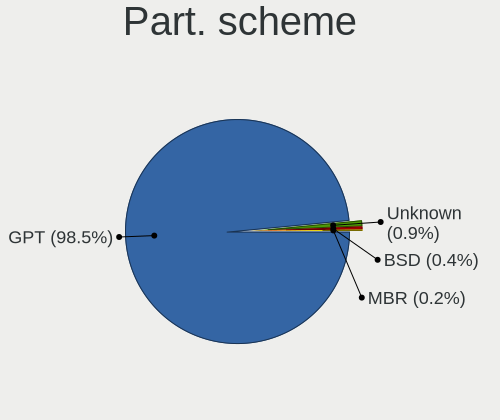
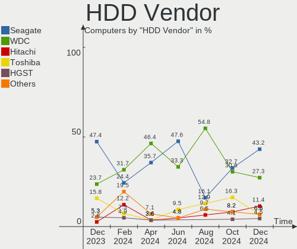
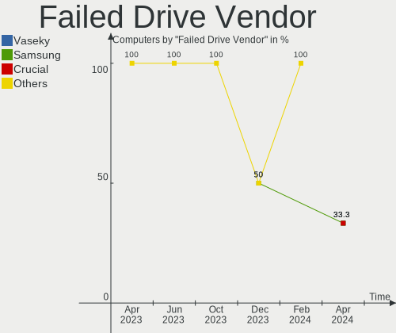
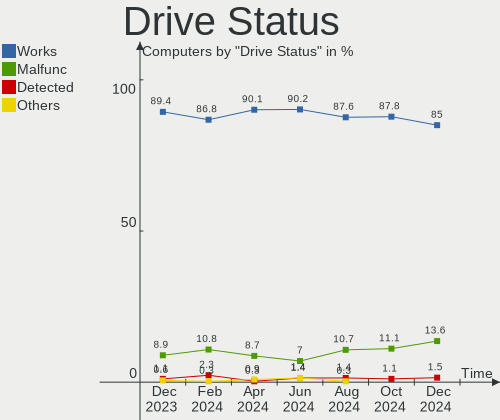
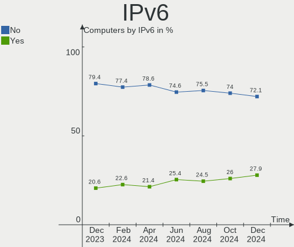

OPNsense - Hardware Trends
--------------------------

A project to identify most popular hardware characteristics and track their change
over time based on data collected by BSD users at https://BSD-Hardware.info.

Anyone can contribute to this report by the [hw-probe](https://github.com/linuxhw/hw-probe/blob/master/INSTALL.BSD.md) tool:

    hw-probe -all -upload

This report is for one last month. Overall report since the beginning of time: [TestDays](https://github.com/bsdhw/TestDays)

Period: Sep, 2023.

Contents
--------

* [ System ](#system)
  - [ OS                       ](#os)
  - [ OS Family                ](#os-family)
  - [ Arch                     ](#arch)
  - [ DE                       ](#de)
  - [ Display Server           ](#display-server)
  - [ Display Manager          ](#display-manager)
  - [ OS Lang                  ](#os-lang)
  - [ Boot Mode                ](#boot-mode)
  - [ Filesystem               ](#filesystem)
  - [ Part. scheme             ](#part-scheme)

* [ Board ](#board)
  - [ Vendor                   ](#vendor)
  - [ Model                    ](#model)
  - [ Model Family             ](#model-family)
  - [ MFG Year                 ](#mfg-year)
  - [ Form Factor              ](#form-factor)
  - [ Coreboot                 ](#coreboot)
  - [ RAM Size                 ](#ram-size)
  - [ RAM Used                 ](#ram-used)
  - [ Total Drives             ](#total-drives)
  - [ Has CD-ROM               ](#has-cd-rom)
  - [ Has Ethernet             ](#has-ethernet)
  - [ Has WiFi                 ](#has-wifi)
  - [ Has Bluetooth            ](#has-bluetooth)

* [ Location ](#location)
  - [ Country                  ](#country)
  - [ City                     ](#city)

* [ Drives ](#drives)
  - [ Drive Vendor             ](#drive-vendor)
  - [ Drive Model              ](#drive-model)
  - [ HDD Vendor               ](#hdd-vendor)
  - [ SSD Vendor               ](#ssd-vendor)
  - [ Drive Kind               ](#drive-kind)
  - [ Drive Connector          ](#drive-connector)
  - [ Drive Size               ](#drive-size)
  - [ Space Total              ](#space-total)
  - [ Space Used               ](#space-used)
  - [ Malfunc. Drives          ](#malfunc-drives)
  - [ Malfunc. Drive Vendor    ](#malfunc-drive-vendor)
  - [ Malfunc. HDD Vendor      ](#malfunc-hdd-vendor)
  - [ Malfunc. Drive Kind      ](#malfunc-drive-kind)
  - [ Failed Drives            ](#failed-drives)
  - [ Failed Drive Vendor      ](#failed-drive-vendor)
  - [ Drive Status             ](#drive-status)

* [ Storage controller ](#storage-controller)
  - [ Storage Vendor           ](#storage-vendor)
  - [ Storage Model            ](#storage-model)
  - [ Storage Kind             ](#storage-kind)

* [ Processor ](#processor)
  - [ CPU Vendor               ](#cpu-vendor)
  - [ CPU Model                ](#cpu-model)
  - [ CPU Model Family         ](#cpu-model-family)
  - [ CPU Cores                ](#cpu-cores)
  - [ CPU Sockets              ](#cpu-sockets)
  - [ CPU Threads              ](#cpu-threads)
  - [ CPU Microarch            ](#cpu-microarch)

* [ Graphics ](#graphics)
  - [ GPU Vendor               ](#gpu-vendor)
  - [ GPU Model                ](#gpu-model)
  - [ GPU Combo                ](#gpu-combo)
  - [ GPU Driver               ](#gpu-driver)
  - [ GPU Memory               ](#gpu-memory)

* [ Monitor ](#monitor)
  - [ Monitor Vendor           ](#monitor-vendor)
  - [ Monitor Model            ](#monitor-model)
  - [ Monitor Resolution       ](#monitor-resolution)
  - [ Monitor Diagonal         ](#monitor-diagonal)
  - [ Monitor Width            ](#monitor-width)
  - [ Aspect Ratio             ](#aspect-ratio)
  - [ Monitor Area             ](#monitor-area)
  - [ Pixel Density            ](#pixel-density)
  - [ Multiple Monitors        ](#multiple-monitors)

* [ Network ](#network)
  - [ Net Controller Vendor    ](#net-controller-vendor)
  - [ Net Controller Model     ](#net-controller-model)
  - [ Wireless Vendor          ](#wireless-vendor)
  - [ Wireless Model           ](#wireless-model)
  - [ Ethernet Vendor          ](#ethernet-vendor)
  - [ Ethernet Model           ](#ethernet-model)
  - [ Net Controller Kind      ](#net-controller-kind)
  - [ Used Controller          ](#used-controller)
  - [ NICs                     ](#nics)
  - [ IPv6                     ](#ipv6)

* [ Bluetooth ](#bluetooth)
  - [ Bluetooth Vendor         ](#bluetooth-vendor)
  - [ Bluetooth Model          ](#bluetooth-model)

* [ Sound ](#sound)
  - [ Sound Vendor             ](#sound-vendor)
  - [ Sound Model              ](#sound-model)

* [ Memory ](#memory)
  - [ Memory Vendor            ](#memory-vendor)
  - [ Memory Model             ](#memory-model)
  - [ Memory Kind              ](#memory-kind)
  - [ Memory Form Factor       ](#memory-form-factor)
  - [ Memory Size              ](#memory-size)
  - [ Memory Speed             ](#memory-speed)

* [ Printers & scanners ](#printers--scanners)
  - [ Printer Vendor           ](#printer-vendor)
  - [ Printer Model            ](#printer-model)
  - [ Scanner Vendor           ](#scanner-vendor)
  - [ Scanner Model            ](#scanner-model)

* [ Camera ](#camera)
  - [ Camera Vendor            ](#camera-vendor)
  - [ Camera Model             ](#camera-model)

* [ Security ](#security)
  - [ Fingerprint Vendor       ](#fingerprint-vendor)
  - [ Fingerprint Model        ](#fingerprint-model)
  - [ Chipcard Vendor          ](#chipcard-vendor)
  - [ Chipcard Model           ](#chipcard-model)

* [ Unsupported ](#unsupported)
  - [ Unsupported Devices      ](#unsupported-devices)
  - [ Unsupported Device Types ](#unsupported-device-types)

System
------

OS
--

Installed operating systems

| Name             | Computers | Percent |
|------------------|-----------|---------|
| OPNsense 23.7.3  | 118       | 40.41%  |
| OPNsense 23.7.4  | 97        | 33.22%  |
| OPNsense 23.7.5  | 45        | 15.41%  |
| OPNsense 23.1.11 | 10        | 3.42%   |
| OPNsense 23.7.1  | 9         | 3.08%   |
| OPNsense 24.1    | 4         | 1.37%   |
| OPNsense 23.7    | 3         | 1.03%   |
| OPNsense 23.4.2  | 2         | 0.68%   |
| OPNsense 23.7.2  | 1         | 0.34%   |
| OPNsense 22.7.6  | 1         | 0.34%   |
| OPNsense 22.7.11 | 1         | 0.34%   |
| OPNsense 22.1.10 | 1         | 0.34%   |

OS Family
---------

OS without a version

| Name     | Computers | Percent |
|----------|-----------|---------|
| OPNsense | 292       | 100%    |

Arch
----

OS architecture (x86_64, i586, etc.)

| Name  | Computers | Percent |
|-------|-----------|---------|
| amd64 | 291       | 99.66%  |
| arm64 | 1         | 0.34%   |

DE
--

Desktop Environment

| Name    | Computers | Percent |
|---------|-----------|---------|
| Console | 292       | 100%    |

Display Server
--------------

X11 or Wayland

| Name    | Computers | Percent |
|---------|-----------|---------|
| Console | 292       | 100%    |

Display Manager
---------------

SDDM, LightDM, etc.

| Name    | Computers | Percent |
|---------|-----------|---------|
| Console | 292       | 100%    |

OS Lang
-------

Language

| Lang    | Computers | Percent |
|---------|-----------|---------|
| Unknown | 286       | 97.95%  |
| C       | 6         | 2.05%   |

Boot Mode
---------

EFI or BIOS

| Mode | Computers | Percent |
|------|-----------|---------|
| EFI  | 284       | 97.26%  |
| BIOS | 8         | 2.74%   |

Filesystem
----------

Type of filesystem

| Type | Computers | Percent |
|------|-----------|---------|
| Ufs  | 163       | 55.82%  |
| Zfs  | 129       | 44.18%  |

Part. scheme
------------

Scheme of partitioning

| Type    | Computers | Percent |
|---------|-----------|---------|
| GPT     | 287       | 98.29%  |
| MBR     | 3         | 1.03%   |
| Unknown | 2         | 0.68%   |

Board
-----

Vendor
------

Motherboard manufacturer

| Name                                 | Computers | Percent |
|--------------------------------------|-----------|---------|
| Unknown                              | 57        | 19.52%  |
| Dell                                 | 33        | 11.3%   |
| Hewlett-Packard                      | 18        | 6.16%   |
| Intel                                | 16        | 5.48%   |
| Lenovo                               | 15        | 5.14%   |
| Supermicro                           | 14        | 4.79%   |
| Protectli                            | 14        | 4.79%   |
| ASUSTek Computer                     | 13        | 4.45%   |
| AMI                                  | 12        | 4.11%   |
| Techvision                           | 11        | 3.77%   |
| ASRock                               | 8         | 2.74%   |
| Gigabyte Technology                  | 7         | 2.4%    |
| Sophos                               | 6         | 2.05%   |
| PC Engines                           | 6         | 2.05%   |
| MSI                                  | 5         | 1.71%   |
| Fujitsu                              | 5         | 1.71%   |
| Deciso                               | 4         | 1.37%   |
| MW                                   | 3         | 1.03%   |
| IceWhale Technology                  | 3         | 1.03%   |
| CWWK                                 | 3         | 1.03%   |
| CncTion                              | 3         | 1.03%   |
| AZW                                  | 3         | 1.03%   |
| Shuttle                              | 2         | 0.68%   |
| ShenZhen MinWin Technology           | 2         | 0.68%   |
| Inventec                             | 2         | 0.68%   |
| Hardkernel                           | 2         | 0.68%   |
| GoWin Solution                       | 2         | 0.68%   |
| ZOTAC                                | 1         | 0.34%   |
| Yanling                              | 1         | 0.34%   |
| Win element                          | 1         | 0.34%   |
| TYAN Computer                        | 1         | 0.34%   |
| TONK                                 | 1         | 0.34%   |
| Shenzhen Meigao Electronic Equipment | 1         | 0.34%   |
| Seeed Studio                         | 1         | 0.34%   |
| ReachingTech                         | 1         | 0.34%   |
| Raspberry Pi Foundation              | 1         | 0.34%   |
| Premio                               | 1         | 0.34%   |
| PAIQ                                 | 1         | 0.34%   |
| NU591                                | 1         | 0.34%   |
| Lex                                  | 1         | 0.34%   |

Model
-----

Motherboard model

| Name                                | Computers | Percent |
|-------------------------------------|-----------|---------|
| Unknown                             | 57        | 19.52%  |
| Techvision TVI7309X                 | 11        | 3.77%   |
| AMI Aptio CRB                       | 8         | 2.74%   |
| Sophos SG                           | 5         | 1.71%   |
| Protectli VP2420                    | 5         | 1.71%   |
| Protectli FW4B                      | 4         | 1.37%   |
| PC Engines APU2                     | 4         | 1.37%   |
| Intel Q3XXG4-P V1.0                 | 4         | 1.37%   |
| MW GMLK-2_5G4L                      | 3         | 1.03%   |
| Dell Wyse 5070 Extended Thin Client | 3         | 1.03%   |
| Dell PowerEdge R320                 | 3         | 1.03%   |
| Dell OptiPlex 7050                  | 3         | 1.03%   |
| Dell OptiPlex 7040                  | 3         | 1.03%   |
| CWWK CW-AD4L-N V1                   | 3         | 1.03%   |
| Supermicro Super Server             | 2         | 0.68%   |
| Supermicro HYVE-ZEUS                | 2         | 0.68%   |
| Protectli FW6                       | 2         | 0.68%   |
| Protectli FW4C                      | 2         | 0.68%   |
| Lenovo ThinkCentre M720q 10T7002CUS | 2         | 0.68%   |
| IceWhale ZimaBoard 432 ZMB          | 2         | 0.68%   |
| HP t730 Thin Client                 | 2         | 0.68%   |
| GoWin Solution R86S                 | 2         | 0.68%   |
| Fujitsu FUTRO S920                  | 2         | 0.68%   |
| Dell OptiPlex 7060                  | 2         | 0.68%   |
| Dell OptiPlex 7020                  | 2         | 0.68%   |
| Dell OptiPlex 3040                  | 2         | 0.68%   |
| Deciso NetBoard-A10                 | 2         | 0.68%   |
| AZW EQ                              | 2         | 0.68%   |
| ASUS P8H67-M PRO                    | 2         | 0.68%   |
| AMI Barracuda NG Firewall F12       | 2         | 0.68%   |
| ZOTAC ZBOX-CI329NANO                | 1         | 0.34%   |
| Yanling LES network 6L              | 1         | 0.34%   |
| Win element M600                    | 1         | 0.34%   |
| TYAN S5510HE                        | 1         | 0.34%   |
| TONK TN2800                         | 1         | 0.34%   |
| Supermicro X9SCL/X9SCM              | 1         | 0.34%   |
| Supermicro X9SCI/X9SCA              | 1         | 0.34%   |
| Supermicro SYS-E300-9A              | 1         | 0.34%   |
| Supermicro SYS-5018D-MTF            | 1         | 0.34%   |
| Supermicro SYS-5018A-FTN4           | 1         | 0.34%   |

Model Family
------------

Motherboard model prefix

| Name                      | Computers | Percent |
|---------------------------|-----------|---------|
| Unknown                   | 57        | 19.52%  |
| Dell OptiPlex             | 20        | 6.85%   |
| Lenovo ThinkCentre        | 13        | 4.45%   |
| Techvision TVI7309X       | 11        | 3.77%   |
| Dell PowerEdge            | 9         | 3.08%   |
| AMI Aptio                 | 8         | 2.74%   |
| Sophos SG                 | 5         | 1.71%   |
| Protectli VP2420          | 5         | 1.71%   |
| HP ProDesk                | 5         | 1.71%   |
| HP EliteDesk              | 5         | 1.71%   |
| Protectli FW4B            | 4         | 1.37%   |
| PC Engines APU2           | 4         | 1.37%   |
| Intel Q3XXG4-P            | 4         | 1.37%   |
| Fujitsu FUTRO             | 4         | 1.37%   |
| MW GMLK-2                 | 3         | 1.03%   |
| IceWhale ZimaBoard        | 3         | 1.03%   |
| Dell Wyse                 | 3         | 1.03%   |
| CWWK CW-AD4L-N            | 3         | 1.03%   |
| Supermicro Super          | 2         | 0.68%   |
| Supermicro HYVE-ZEUS      | 2         | 0.68%   |
| Protectli FW6             | 2         | 0.68%   |
| Protectli FW4C            | 2         | 0.68%   |
| HP t730                   | 2         | 0.68%   |
| GoWin Solution R86S       | 2         | 0.68%   |
| Deciso NetBoard-A10       | 2         | 0.68%   |
| AZW EQ                    | 2         | 0.68%   |
| ASUS PRIME                | 2         | 0.68%   |
| ASUS P8H67-M              | 2         | 0.68%   |
| AMI Barracuda             | 2         | 0.68%   |
| ZOTAC ZBOX-CI329NANO      | 1         | 0.34%   |
| Yanling LES               | 1         | 0.34%   |
| Win element M600          | 1         | 0.34%   |
| TYAN S5510HE              | 1         | 0.34%   |
| TONK TN2800               | 1         | 0.34%   |
| Supermicro X9SCL          | 1         | 0.34%   |
| Supermicro X9SCI          | 1         | 0.34%   |
| Supermicro SYS-E300-9A    | 1         | 0.34%   |
| Supermicro SYS-5018D-MTF  | 1         | 0.34%   |
| Supermicro SYS-5018A-FTN4 | 1         | 0.34%   |
| Supermicro Pro546267      | 1         | 0.34%   |

MFG Year
--------

Motherboard manufacture year

| Year | Computers | Percent |
|------|-----------|---------|
| 2022 | 54        | 18.49%  |
| 2023 | 34        | 11.64%  |
| 2021 | 30        | 10.27%  |
| 2018 | 29        | 9.93%   |
| 2016 | 25        | 8.56%   |
| 2019 | 24        | 8.22%   |
| 2012 | 18        | 6.16%   |
| 2015 | 17        | 5.82%   |
| 2017 | 16        | 5.48%   |
| 2014 | 15        | 5.14%   |
| 2020 | 13        | 4.45%   |
| 2011 | 6         | 2.05%   |
| 2013 | 5         | 1.71%   |
| 2008 | 3         | 1.03%   |
| 2010 | 1         | 0.34%   |
| 2009 | 1         | 0.34%   |
| 2007 | 1         | 0.34%   |

Form Factor
-----------

Physical design of the computer

| Name           | Computers | Percent |
|----------------|-----------|---------|
| Desktop        | 225       | 77.05%  |
| Mini pc        | 30        | 10.27%  |
| Server         | 18        | 6.16%   |
| Notebook       | 12        | 4.11%   |
| Firewall       | 6         | 2.05%   |
| System on chip | 1         | 0.34%   |

Coreboot
--------

Have coreboot on board

| Used | Computers | Percent |
|------|-----------|---------|
| No   | 285       | 97.6%   |
| Yes  | 7         | 2.4%    |

RAM Size
--------

Total RAM memory

| Size in GB      | Computers | Percent |
|-----------------|-----------|---------|
| 8.01-16.0       | 122       | 41.78%  |
| 16.01-24.0      | 76        | 26.03%  |
| 4.01-8.0        | 44        | 15.07%  |
| 32.01-64.0      | 32        | 10.96%  |
| 2.01-3.0        | 9         | 3.08%   |
| 64.01-256.0     | 7         | 2.4%    |
| More than 256.0 | 1         | 0.34%   |
| 24.01-32.0      | 1         | 0.34%   |

RAM Used
--------

Used RAM memory

| Used GB    | Computers | Percent |
|------------|-----------|---------|
| 0.01-0.5   | 140       | 47.95%  |
| 0.51-1.0   | 106       | 36.3%   |
| 1.01-2.0   | 39        | 13.36%  |
| 2.01-3.0   | 3         | 1.03%   |
| 4.01-8.0   | 2         | 0.68%   |
| 32.01-64.0 | 1         | 0.34%   |
| 3.01-4.0   | 1         | 0.34%   |

Total Drives
------------

Number of drives on board

| Drives | Computers | Percent |
|--------|-----------|---------|
| 1      | 232       | 79.45%  |
| 0      | 33        | 11.3%   |
| 2      | 25        | 8.56%   |
| 4      | 2         | 0.68%   |

Has CD-ROM
----------

Has CD-ROM on board

| Presented | Computers | Percent |
|-----------|-----------|---------|
| No        | 265       | 90.75%  |
| Yes       | 27        | 9.25%   |

Has Ethernet
------------

Has Ethernet on board

| Presented | Computers | Percent |
|-----------|-----------|---------|
| Yes       | 291       | 99.66%  |
| No        | 1         | 0.34%   |

Has WiFi
--------

Has WiFi module

| Presented | Computers | Percent |
|-----------|-----------|---------|
| No        | 247       | 84.59%  |
| Yes       | 45        | 15.41%  |

Has Bluetooth
-------------

Has Bluetooth module

| Presented | Computers | Percent |
|-----------|-----------|---------|
| No        | 267       | 91.44%  |
| Yes       | 25        | 8.56%   |

Location
--------

Country
-------

Geographic location (country)

| Country         | Computers | Percent |
|-----------------|-----------|---------|
| USA             | 102       | 34.93%  |
| Germany         | 56        | 19.18%  |
| Canada          | 21        | 7.19%   |
| UK              | 10        | 3.42%   |
| Poland          | 9         | 3.08%   |
| France          | 9         | 3.08%   |
| Australia       | 8         | 2.74%   |
| Switzerland     | 7         | 2.4%    |
| Netherlands     | 7         | 2.4%    |
| Sweden          | 6         | 2.05%   |
| Finland         | 4         | 1.37%   |
| Bulgaria        | 4         | 1.37%   |
| Belgium         | 4         | 1.37%   |
| Austria         | 4         | 1.37%   |
| Taiwan          | 3         | 1.03%   |
| Singapore       | 3         | 1.03%   |
| Norway          | 3         | 1.03%   |
| New Zealand     | 3         | 1.03%   |
| Brazil          | 3         | 1.03%   |
| South Korea     | 2         | 0.68%   |
| Russia          | 2         | 0.68%   |
| India           | 2         | 0.68%   |
| Denmark         | 2         | 0.68%   |
| Turkey          | 1         | 0.34%   |
| Spain           | 1         | 0.34%   |
| Romania         | 1         | 0.34%   |
| Paraguay        | 1         | 0.34%   |
| Pakistan        | 1         | 0.34%   |
| North Macedonia | 1         | 0.34%   |
| Mexico          | 1         | 0.34%   |
| Malta           | 1         | 0.34%   |
| Malaysia        | 1         | 0.34%   |
| Lithuania       | 1         | 0.34%   |
| Japan           | 1         | 0.34%   |
| Italy           | 1         | 0.34%   |
| Indonesia       | 1         | 0.34%   |
| Iceland         | 1         | 0.34%   |
| Hungary         | 1         | 0.34%   |
| Hong Kong       | 1         | 0.34%   |
| Greece          | 1         | 0.34%   |

City
----

Geographic location (city)

| City                 | Computers | Percent |
|----------------------|-----------|---------|
| Sydney               | 4         | 1.37%   |
| Sofia                | 4         | 1.37%   |
| Montreal             | 4         | 1.37%   |
| Singapore            | 3         | 1.03%   |
| Orlando              | 3         | 1.03%   |
| London               | 3         | 1.03%   |
| Karlsruhe            | 3         | 1.03%   |
| Helsinki             | 3         | 1.03%   |
| Calgary              | 3         | 1.03%   |
| Berlin               | 3         | 1.03%   |
| Zurich               | 2         | 0.68%   |
| Toronto              | 2         | 0.68%   |
| Taipei               | 2         | 0.68%   |
| Springville          | 2         | 0.68%   |
| South San Francisco  | 2         | 0.68%   |
| Seattle              | 2         | 0.68%   |
| Riverside            | 2         | 0.68%   |
| Raversbeuren         | 2         | 0.68%   |
| Raleigh              | 2         | 0.68%   |
| Pittsburgh           | 2         | 0.68%   |
| Perth                | 2         | 0.68%   |
| Oklahoma City        | 2         | 0.68%   |
| Meeuwen              | 2         | 0.68%   |
| Mainz                | 2         | 0.68%   |
| Kamieniec Zabkowicki | 2         | 0.68%   |
| Gdansk               | 2         | 0.68%   |
| Edmonton             | 2         | 0.68%   |
| Darmstadt            | 2         | 0.68%   |
| Charlotte            | 2         | 0.68%   |
| Bietigheim-Bissingen | 2         | 0.68%   |
| Auckland             | 2         | 0.68%   |
| Arvada               | 2         | 0.68%   |
| Aresing              | 2         | 0.68%   |
| Włocławek          | 1         | 0.34%   |
| Wroclaw              | 1         | 0.34%   |
| Worcester            | 1         | 0.34%   |
| Wood Dale            | 1         | 0.34%   |
| Wiesbaden            | 1         | 0.34%   |
| Westminster          | 1         | 0.34%   |
| Wesel                | 1         | 0.34%   |

Drives
------

Drive Vendor
------------

Hard drive vendors

| Vendor              | Computers | Drives | Percent |
|---------------------|-----------|--------|---------|
| Samsung Electronics | 42        | 44     | 15.5%   |
| Kingston            | 24        | 25     | 8.86%   |
| Intel               | 19        | 21     | 7.01%   |
| WDC                 | 17        | 17     | 6.27%   |
| Transcend           | 15        | 17     | 5.54%   |
| Crucial             | 14        | 16     | 5.17%   |
| Hoodisk             | 12        | 12     | 4.43%   |
| SanDisk             | 9         | 12     | 3.32%   |
| Toshiba             | 6         | 6      | 2.21%   |
| Silicon Motion      | 6         | 6      | 2.21%   |
| Seagate             | 6         | 6      | 2.21%   |
| China               | 6         | 6      | 2.21%   |
| A-DATA Technology   | 6         | 6      | 2.21%   |
| SPCC                | 5         | 5      | 1.85%   |
| Protectli           | 5         | 5      | 1.85%   |
| Micron Technology   | 4         | 4      | 1.48%   |
| Intenso             | 4         | 5      | 1.48%   |
| Fanxiang            | 4         | 5      | 1.48%   |
| VICKTER             | 3         | 3      | 1.11%   |
| Team                | 3         | 3      | 1.11%   |
| SK hynix            | 3         | 3      | 1.11%   |
| PNY                 | 3         | 4      | 1.11%   |
| OCZ                 | 3         | 3      | 1.11%   |
| Innodisk            | 3         | 3      | 1.11%   |
| Hewlett-Packard     | 3         | 4      | 1.11%   |
| BIWIN               | 3         | 3      | 1.11%   |
| Vaseky              | 2         | 2      | 0.74%   |
| Timetec             | 2         | 2      | 0.74%   |
| SHAREVDI            | 2         | 2      | 0.74%   |
| Phison              | 2         | 2      | 0.74%   |
| Patriot             | 2         | 2      | 0.74%   |
| Lexar               | 2         | 2      | 0.74%   |
| Leven               | 2         | 2      | 0.74%   |
| HPE                 | 2         | 3      | 0.74%   |
| Gigabyte Technology | 2         | 2      | 0.74%   |
| Dogfish             | 2         | 2      | 0.74%   |
| CWDISK              | 2         | 2      | 0.74%   |
| Corsair             | 2         | 2      | 0.74%   |
| Apacer              | 2         | 2      | 0.74%   |
| Zheino              | 1         | 1      | 0.37%   |

Drive Model
-----------

Hard drive models

| Model                            | Computers | Percent |
|----------------------------------|-----------|---------|
| Hoodisk SSD 64GB                 | 6         | 2.2%    |
| Transcend TS256GMSA230S 256GB    | 4         | 1.47%   |
| Kingston SKC600MS256G 256GB      | 4         | 1.47%   |
| VICKTER SSD 64GB                 | 3         | 1.1%    |
| Samsung SSD 870 EVO 500GB        | 3         | 1.1%    |
| Samsung SSD 860 EVO 250GB        | 3         | 1.1%    |
| Samsung MZVLW256HEHP-000L7 256GB | 3         | 1.1%    |
| Intenso SSD 120GB                | 3         | 1.1%    |
| Hoodisk SSD 32GB                 | 3         | 1.1%    |
| Hoodisk SSD 128GB                | 3         | 1.1%    |
| Fanxiang S501 128GB              | 3         | 1.1%    |
| A-DATA IM2S3134N-064GM 64GB      | 3         | 1.1%    |
| Transcend TS256GMTE710T 256GB    | 2         | 0.73%   |
| Timetec 35TTFP6PCIE-256G         | 2         | 0.73%   |
| Team TM8FP6256G 256GB            | 2         | 0.73%   |
| SPCC Solid State Disk 128GB      | 2         | 0.73%   |
| Silicon Motion SZBKHDTEK128GB    | 2         | 0.73%   |
| SHAREVDI 128GB SSD               | 2         | 0.73%   |
| SanDisk SD7TB3Q-128G-1006 128GB  | 2         | 0.73%   |
| Samsung SSD 980 PRO 500GB        | 2         | 0.73%   |
| Samsung SSD 970 EVO Plus 250GB   | 2         | 0.73%   |
| Samsung SSD 860 EVO 1TB          | 2         | 0.73%   |
| Samsung SSD 840 EVO 120GB        | 2         | 0.73%   |
| Samsung MZVLB256HAHQ-000L7 256GB | 2         | 0.73%   |
| Protectli 240GB M.2              | 2         | 0.73%   |
| Lexar SSD NM620 1TB              | 2         | 0.73%   |
| Kingston SV300S37A120G 120GB     | 2         | 0.73%   |
| Kingston SM2280S3120G 120GB      | 2         | 0.73%   |
| Kingston SA400S37240G 240GB      | 2         | 0.73%   |
| Kingston SA400S37120G 120GB      | 2         | 0.73%   |
| Intel SSDSC2KI128G8 80GB         | 2         | 0.73%   |
| Intel SSDSC2BW180A4 180GB        | 2         | 0.73%   |
| Intel SSDPEK1A118GA 118GB        | 2         | 0.73%   |
| HP SSD EX900 250GB               | 2         | 0.73%   |
| Crucial CT500P3PSSD8 500GB       | 2         | 0.73%   |
| Crucial CT250MX500SSD1 250GB     | 2         | 0.73%   |
| Crucial CT240BX500SSD1 240GB     | 2         | 0.73%   |
| Crucial CT1000P3SSD8 1TB         | 2         | 0.73%   |
| China SSE128GMLCT-SBC-2S 128GB   | 2         | 0.73%   |
| China SATA SSD 16GB              | 2         | 0.73%   |

HDD Vendor
----------

Hard disk drive vendors

| Vendor          | Computers | Drives | Percent |
|-----------------|-----------|--------|---------|
| WDC             | 11        | 11     | 52.38%  |
| Seagate         | 6         | 6      | 28.57%  |
| Toshiba         | 2         | 2      | 9.52%   |
| HGST            | 1         | 1      | 4.76%   |
| Hewlett-Packard | 1         | 2      | 4.76%   |

SSD Vendor
----------

Solid state drive vendors

| Vendor              | Computers | Drives | Percent |
|---------------------|-----------|--------|---------|
| Samsung Electronics | 25        | 27     | 13.66%  |
| Kingston            | 24        | 25     | 13.11%  |
| Intel               | 15        | 17     | 8.2%    |
| Transcend           | 13        | 15     | 7.1%    |
| Hoodisk             | 12        | 12     | 6.56%   |
| SanDisk             | 9         | 12     | 4.92%   |
| Crucial             | 8         | 10     | 4.37%   |
| China               | 6         | 6      | 3.28%   |
| A-DATA Technology   | 6         | 6      | 3.28%   |
| Protectli           | 5         | 5      | 2.73%   |
| SPCC                | 4         | 4      | 2.19%   |
| Micron Technology   | 4         | 4      | 2.19%   |
| Intenso             | 4         | 5      | 2.19%   |
| VICKTER             | 3         | 3      | 1.64%   |
| PNY                 | 3         | 4      | 1.64%   |
| OCZ                 | 3         | 3      | 1.64%   |
| Innodisk            | 3         | 3      | 1.64%   |
| BIWIN               | 3         | 3      | 1.64%   |
| WDC                 | 2         | 2      | 1.09%   |
| Toshiba             | 2         | 2      | 1.09%   |
| SHAREVDI            | 2         | 2      | 1.09%   |
| Leven               | 2         | 2      | 1.09%   |
| HPE                 | 2         | 3      | 1.09%   |
| Dogfish             | 2         | 2      | 1.09%   |
| CWDISK              | 2         | 2      | 1.09%   |
| Corsair             | 2         | 2      | 1.09%   |
| Apacer              | 2         | 2      | 1.09%   |
| Zheino              | 1         | 1      | 0.55%   |
| Vaseky              | 1         | 1      | 0.55%   |
| Team                | 1         | 1      | 0.55%   |
| SK hynix            | 1         | 1      | 0.55%   |
| Patriot             | 1         | 1      | 0.55%   |
| Mushkin             | 1         | 1      | 0.55%   |
| LITEONIT            | 1         | 1      | 0.55%   |
| LITEON              | 1         | 2      | 0.55%   |
| KingDian            | 1         | 1      | 0.55%   |
| GOODRAM             | 1         | 1      | 0.55%   |
| GLOWAY              | 1         | 1      | 0.55%   |
| Gigastone           | 1         | 1      | 0.55%   |
| Gigabyte Technology | 1         | 1      | 0.55%   |

Drive Kind
----------

HDD or SSD

| Kind | Computers | Drives | Percent |
|------|-----------|--------|---------|
| SSD  | 179       | 199    | 67.04%  |
| NVMe | 67        | 69     | 25.09%  |
| HDD  | 21        | 22     | 7.87%   |

Drive Connector
---------------

SATA, SAS, NVMe, etc.

| Type | Computers | Drives | Percent |
|------|-----------|--------|---------|
| SATA | 196       | 221    | 74.52%  |
| NVMe | 67        | 69     | 25.48%  |

Drive Size
----------

Size of hard drive

| Size in TB | Computers | Drives | Percent |
|------------|-----------|--------|---------|
| 0.01-0.5   | 184       | 205    | 92.46%  |
| 0.51-1.0   | 10        | 10     | 5.03%   |
| 1.01-2.0   | 4         | 5      | 2.01%   |
| 3.01-4.0   | 1         | 1      | 0.5%    |

Space Total
-----------

Amount of disk space available on the file system

| Size in GB | Computers | Percent |
|------------|-----------|---------|
| 101-250    | 157       | 53.77%  |
| 251-500    | 42        | 14.38%  |
| 51-100     | 28        | 9.59%   |
| 21-50      | 27        | 9.25%   |
| 501-1000   | 17        | 5.82%   |
| 1-20       | 16        | 5.48%   |
| 1001-2000  | 4         | 1.37%   |
| 2001-3000  | 1         | 0.34%   |

Space Used
----------

Amount of used disk space

| Used GB | Computers | Percent |
|---------|-----------|---------|
| 1-20    | 276       | 94.52%  |
| 21-50   | 11        | 3.77%   |
| 51-100  | 4         | 1.37%   |
| 101-250 | 1         | 0.34%   |

Malfunc. Drives
---------------

Drive models with a malfunction

| Model                                      | Computers | Drives | Percent |
|--------------------------------------------|-----------|--------|---------|
| WDC WD6400AAKS-22A7B2 640GB                | 1         | 1      | 3.7%    |
| WDC WD5003ABYZ-011FA0 500GB                | 1         | 1      | 3.7%    |
| WDC WD2500BEKT-75PVMT0 250GB               | 1         | 1      | 3.7%    |
| WDC WD2500AAJS-75M0A0 250GB                | 1         | 1      | 3.7%    |
| WDC WD2500AAJS-00L7A0 250GB                | 1         | 1      | 3.7%    |
| WDC WD1600HLFS-75G6U1 160GB                | 1         | 1      | 3.7%    |
| Toshiba THNSNK256GVN8 M.2 2280 256GB       | 1         | 1      | 3.7%    |
| Seagate ST95005620AS 500GB                 | 1         | 1      | 3.7%    |
| Seagate ST9500325AS 500GB                  | 1         | 1      | 3.7%    |
| Seagate ST500DM002-1BD142 500GB            | 1         | 1      | 3.7%    |
| Seagate ST1000DM003-9YN162 1TB             | 1         | 1      | 3.7%    |
| SanDisk SSD i110 32GB                      | 1         | 1      | 3.7%    |
| Samsung Electronics SSD RBX Series 128GB M | 1         | 1      | 3.7%    |
| Patriot Pyro SE 120GB                      | 1         | 1      | 3.7%    |
| OCZ AGILITY3 120GB                         | 1         | 1      | 3.7%    |
| Mushkin MKNSSDEC512GB                      | 1         | 1      | 3.7%    |
| Micron Technology M550_mSATA_256GB         | 1         | 1      | 3.7%    |
| Kingston SV300S37A60G 64GB                 | 1         | 1      | 3.7%    |
| Kingston SV300S37A120G 120GB               | 1         | 1      | 3.7%    |
| Kingston SNS4151S316GD 16GB                | 1         | 1      | 3.7%    |
| Kingston SMS200S330G 32GB                  | 1         | 1      | 3.7%    |
| Kingston SMS200S3120G 120GB                | 1         | 1      | 3.7%    |
| Intel SSDSC2CW120A3 120GB                  | 1         | 1      | 3.7%    |
| Intel SSDSC2BW180A4 180GB                  | 1         | 1      | 3.7%    |
| GLOWAY VAL32GS3-mSATA 32GB                 | 1         | 1      | 3.7%    |
| Corsair CSSD-F120GB2                       | 1         | 1      | 3.7%    |
| Apacer 16GB SATA Flash Drive               | 1         | 1      | 3.7%    |

Malfunc. Drive Vendor
---------------------

Vendors of faulty drives

| Vendor              | Computers | Drives | Percent |
|---------------------|-----------|--------|---------|
| WDC                 | 6         | 6      | 22.22%  |
| Kingston            | 5         | 5      | 18.52%  |
| Seagate             | 4         | 4      | 14.81%  |
| Intel               | 2         | 2      | 7.41%   |
| Toshiba             | 1         | 1      | 3.7%    |
| SanDisk             | 1         | 1      | 3.7%    |
| Samsung Electronics | 1         | 1      | 3.7%    |
| Patriot             | 1         | 1      | 3.7%    |
| OCZ                 | 1         | 1      | 3.7%    |
| Mushkin             | 1         | 1      | 3.7%    |
| Micron Technology   | 1         | 1      | 3.7%    |
| GLOWAY              | 1         | 1      | 3.7%    |
| Corsair             | 1         | 1      | 3.7%    |
| Apacer              | 1         | 1      | 3.7%    |

Malfunc. HDD Vendor
-------------------

Vendors of faulty HDD drives

| Vendor  | Computers | Drives | Percent |
|---------|-----------|--------|---------|
| WDC     | 6         | 6      | 60%     |
| Seagate | 4         | 4      | 40%     |

Malfunc. Drive Kind
-------------------

Kinds of faulty drives

| Kind | Computers | Drives | Percent |
|------|-----------|--------|---------|
| SSD  | 17        | 17     | 62.96%  |
| HDD  | 10        | 10     | 37.04%  |

Failed Drives
-------------

Failed drive models

| Model                                        | Computers | Drives | Percent |
|----------------------------------------------|-----------|--------|---------|
| Samsung Electronics MZALQ256HBJD-00BL2 256GB | 1         | 1      | 25%     |
| Kingston SM2280S3120G 120GB                  | 1         | 1      | 25%     |
| Intel SSDMCEAW120A4 120GB                    | 1         | 1      | 25%     |
| Hoodisk SSD 64GB                             | 1         | 1      | 25%     |

Failed Drive Vendor
-------------------

Failed drive vendors

| Vendor              | Computers | Drives | Percent |
|---------------------|-----------|--------|---------|
| Samsung Electronics | 1         | 1      | 25%     |
| Kingston            | 1         | 1      | 25%     |
| Intel               | 1         | 1      | 25%     |
| Hoodisk             | 1         | 1      | 25%     |

Drive Status
------------

Number of failed and malfunc. drives

| Status   | Computers | Drives | Percent |
|----------|-----------|--------|---------|
| Works    | 227       | 257    | 87.31%  |
| Malfunc  | 27        | 27     | 10.38%  |
| Failed   | 4         | 4      | 1.54%   |
| Detected | 2         | 2      | 0.77%   |

Storage controller
------------------

Storage Vendor
--------------

Storage controller vendors

| Vendor                           | Computers | Percent |
|----------------------------------|-----------|---------|
| Intel                            | 250       | 68.49%  |
| AMD                              | 24        | 6.58%   |
| Samsung Electronics              | 17        | 4.66%   |
| Silicon Motion                   | 16        | 4.38%   |
| SanDisk                          | 8         | 2.19%   |
| Broadcom / LSI                   | 8         | 2.19%   |
| MAXIO Technology (Hangzhou)      | 7         | 1.92%   |
| Micron/Crucial Technology        | 6         | 1.64%   |
| Phison Electronics               | 4         | 1.1%    |
| VIA Technologies                 | 3         | 0.82%   |
| Toshiba                          | 3         | 0.82%   |
| Realtek Semiconductor            | 3         | 0.82%   |
| Transcend                        | 2         | 0.55%   |
| SK hynix                         | 2         | 0.55%   |
| Chelsio Communications           | 2         | 0.55%   |
| ASMedia Technology               | 2         | 0.55%   |
| Solidigm                         | 1         | 0.27%   |
| Silicon Integrated Systems [SiS] | 1         | 0.27%   |
| Shenzhen Longsys Electronics     | 1         | 0.27%   |
| KIOXIA                           | 1         | 0.27%   |
| JMicron Technology               | 1         | 0.27%   |
| Hosin Global Electronics         | 1         | 0.27%   |
| Hewlett-Packard                  | 1         | 0.27%   |
| Adaptec                          | 1         | 0.27%   |

Storage Model
-------------

Storage controller models

| Model                                                                                   | Computers | Percent |
|-----------------------------------------------------------------------------------------|-----------|---------|
| Intel Jasper Lake SATA AHCI Controller                                                  | 30        | 7.69%   |
| Intel 8 Series/C220 Series Chipset Family 6-port SATA Controller 1 [AHCI mode]          | 22        | 5.64%   |
| Intel Celeron/Pentium Silver Processor SATA Controller                                  | 18        | 4.62%   |
| Silicon Motion SM2263EN/SM2263XT (DRAM-less) NVMe SSD Controllers                       | 16        | 4.1%    |
| Intel Atom Processor E3800 Series SATA AHCI Controller                                  | 16        | 4.1%    |
| Unknown                                                                                 | 16        | 4.1%    |
| AMD FCH SATA Controller [AHCI mode]                                                     | 15        | 3.85%   |
| Intel Sunrise Point-LP SATA Controller [AHCI mode]                                      | 13        | 3.33%   |
| Intel Q170/Q150/B150/H170/H110/Z170/CM236 Chipset SATA Controller [AHCI Mode]           | 13        | 3.33%   |
| Intel Cannon Lake PCH SATA AHCI Controller                                              | 12        | 3.08%   |
| Intel Celeron N3350/Pentium N4200/Atom E3900 Series SATA AHCI Controller                | 11        | 2.82%   |
| Intel Atom/Celeron/Pentium Processor x5-E8000/J3xxx/N3xxx Series SATA Controller        | 11        | 2.82%   |
| Intel 200 Series PCH SATA controller [AHCI mode]                                        | 10        | 2.56%   |
| Samsung NVMe SSD Controller SM981/PM981/PM983                                           | 8         | 2.05%   |
| Intel Elkhart Lake SATA AHCI                                                            | 8         | 2.05%   |
| Intel 6 Series/C200 Series Chipset Family 6 port Desktop SATA AHCI Controller           | 8         | 2.05%   |
| MAXIO (Hangzhou) NVMe SSD Controller MAP1202                                            | 7         | 1.79%   |
| Intel C600/X79 series chipset 6-Port SATA AHCI Controller                               | 7         | 1.79%   |
| Micron/Crucial P2 [Nick P2] / P3 / P3 Plus NVMe PCIe SSD (DRAM-less)                    | 6         | 1.54%   |
| Intel Tiger Lake-LP SATA Controller                                                     | 5         | 1.28%   |
| Intel 6 Series/C200 Series Chipset Family Desktop SATA Controller (IDE mode, ports 4-5) | 5         | 1.28%   |
| Intel 6 Series/C200 Series Chipset Family Desktop SATA Controller (IDE mode, ports 0-3) | 5         | 1.28%   |
| Intel Wildcat Point-LP SATA Controller [AHCI Mode]                                      | 4         | 1.03%   |
| Intel 7 Series/C210 Series Chipset Family 6-port SATA Controller [AHCI mode]            | 4         | 1.03%   |
| SanDisk WD Black SN750 / PC SN730 NVMe SSD                                              | 3         | 0.77%   |
| Samsung NVMe SSD Controller SM961/PM961/SM963                                           | 3         | 0.77%   |
| Samsung NVMe SSD Controller 980                                                         | 3         | 0.77%   |
| Realtek RTS5765DL NVMe SSD Controller (DRAM-less)                                       | 3         | 0.77%   |
| Intel Comet Lake SATA AHCI Controller                                                   | 3         | 0.77%   |
| Intel 82801HM/HEM (ICH8M/ICH8M-E) IDE Controller                                        | 3         | 0.77%   |
| Intel 82801G (ICH7 Family) IDE Controller                                               | 3         | 0.77%   |
| Broadcom / LSI MegaRAID SAS-3 3108 [Invader]                                            | 3         | 0.77%   |
| AMD SB7x0/SB8x0/SB9x0 SATA Controller [AHCI mode]                                       | 3         | 0.77%   |
| AMD FCH SATA Controller [IDE mode]                                                      | 3         | 0.77%   |
| AMD 400 Series Chipset SATA Controller                                                  | 3         | 0.77%   |
| VIA VT6415 PATA IDE Host Controller                                                     | 2         | 0.51%   |
| SK hynix Gold P31/BC711/PC711 NVMe Solid State Drive                                    | 2         | 0.51%   |
| Samsung NVMe SSD Controller PM9A1/PM9A3/980PRO                                          | 2         | 0.51%   |
| Phison E16 PCIe4 NVMe Controller                                                        | 2         | 0.51%   |
| Intel Optane NVME SSD P1600X Series                                                     | 2         | 0.51%   |

Storage Kind
------------

Kind of storage controller (IDE, SATA, NVMe, SAS, ...)

| Kind | Computers | Percent |
|------|-----------|---------|
| SATA | 256       | 69.38%  |
| NVMe | 76        | 20.6%   |
| IDE  | 22        | 5.96%   |
| RAID | 9         | 2.44%   |
| SAS  | 4         | 1.08%   |
| SCSI | 2         | 0.54%   |

Processor
---------

CPU Vendor
----------

Processor vendors

| Vendor | Computers | Percent |
|--------|-----------|---------|
| Intel  | 261       | 89.38%  |
| AMD    | 29        | 9.93%   |
| VIA    | 1         | 0.34%   |
| ARM    | 1         | 0.34%   |

CPU Model
---------

Processor models

| Model                                    | Computers | Percent |
|------------------------------------------|-----------|---------|
| Intel Celeron N5105 @ 2.00GHz            | 23        | 7.88%   |
| Intel N100                               | 14        | 4.79%   |
| Intel Celeron J4125 CPU @ 2.00GHz        | 10        | 3.42%   |
| Intel Celeron CPU J1900 @ 1.99GHz        | 10        | 3.42%   |
| Intel Pentium Silver N6005 @ 2.00GHz     | 6         | 2.05%   |
| Intel Core i5-6500 CPU @ 3.20GHz         | 6         | 2.05%   |
| Intel Celeron J6412 @ 2.00GHz            | 6         | 2.05%   |
| AMD GX-412TC SOC                         | 6         | 2.05%   |
| Intel Core i5-7200U CPU @ 2.50GHz        | 5         | 1.71%   |
| Intel Pentium Silver J5005 CPU @ 1.50GHz | 4         | 1.37%   |
| Intel Celeron N5100 @ 1.10GHz            | 4         | 1.37%   |
| Intel Celeron CPU J3160 @ 1.60GHz        | 4         | 1.37%   |
| Intel Pentium CPU N3700 @ 1.60GHz        | 3         | 1.03%   |
| Intel Core i5-8500T CPU @ 2.10GHz        | 3         | 1.03%   |
| Intel Core i5-8500 CPU @ 3.00GHz         | 3         | 1.03%   |
| Intel Core i5-7500 CPU @ 3.40GHz         | 3         | 1.03%   |
| Intel Core i5-6500T CPU @ 2.50GHz        | 3         | 1.03%   |
| Intel Core i5-4590 CPU @ 3.30GHz         | 3         | 1.03%   |
| Intel Core i5-4570 CPU @ 3.20GHz         | 3         | 1.03%   |
| Intel Core i3-6100 CPU @ 3.70GHz         | 3         | 1.03%   |
| Intel Celeron J4105 CPU @ 1.50GHz        | 3         | 1.03%   |
| Intel Celeron CPU N3350 @ 1.10GHz        | 3         | 1.03%   |
| Intel Celeron CPU J3455 @ 1.50GHz        | 3         | 1.03%   |
| Intel Celeron CPU 3865U @ 1.80GHz        | 3         | 1.03%   |
| Intel 11th Gen Core i7-1165G7 @ 2.80GHz  | 3         | 1.03%   |
| Intel Xeon CPU E3-1240 v5 @ 3.50GHz      | 2         | 0.68%   |
| Intel Xeon CPU E3-1225 V2 @ 3.20GHz      | 2         | 0.68%   |
| Intel Xeon CPU D-1518 @ 2.20GHz          | 2         | 0.68%   |
| Intel Pentium CPU J3710 @ 1.60GHz        | 2         | 0.68%   |
| Intel N95                                | 2         | 0.68%   |
| Intel Core i7-8550U CPU @ 1.80GHz        | 2         | 0.68%   |
| Intel Core i7-6700T CPU @ 2.80GHz        | 2         | 0.68%   |
| Intel Core i7-2600 CPU @ 3.40GHz         | 2         | 0.68%   |
| Intel Core i5-8400 CPU @ 2.80GHz         | 2         | 0.68%   |
| Intel Core i5-5300U CPU @ 2.30GHz        | 2         | 0.68%   |
| Intel Core i5-4590S CPU @ 3.00GHz        | 2         | 0.68%   |
| Intel Core i3-4330 CPU @ 3.50GHz         | 2         | 0.68%   |
| Intel Celeron J6413 @ 1.80GHz            | 2         | 0.68%   |
| Intel Celeron CPU N3450 @ 1.10GHz        | 2         | 0.68%   |
| Intel Celeron CPU E3400 @ 2.60GHz        | 2         | 0.68%   |

CPU Model Family
----------------

Processor model prefix

| Model                | Computers | Percent |
|----------------------|-----------|---------|
| Intel Celeron        | 89        | 30.48%  |
| Intel Core i5        | 52        | 17.81%  |
| Other                | 28        | 9.59%   |
| Intel Xeon           | 28        | 9.59%   |
| Intel Core i3        | 16        | 5.48%   |
| Intel Core i7        | 14        | 4.79%   |
| Intel Atom           | 14        | 4.79%   |
| Intel Pentium Silver | 10        | 3.42%   |
| AMD GX               | 10        | 3.42%   |
| Intel Pentium        | 9         | 3.08%   |
| AMD Ryzen 5          | 5         | 1.71%   |
| AMD Ryzen Embedded   | 3         | 1.03%   |
| AMD Ryzen 7          | 3         | 1.03%   |
| Intel Xeon Silver    | 2         | 0.68%   |
| Intel Core 2 Duo     | 2         | 0.68%   |
| AMD FX               | 2         | 0.68%   |
| AMD EPYC             | 2         | 0.68%   |
| ARM Cortex           | 1         | 0.34%   |
| AMD G                | 1         | 0.34%   |
| AMD A10              | 1         | 0.34%   |

CPU Cores
---------

Number of processor cores

| Number  | Computers | Percent |
|---------|-----------|---------|
| 4       | 180       | 61.64%  |
| 2       | 63        | 21.58%  |
| 6       | 17        | 5.82%   |
| 8       | 11        | 3.77%   |
| 12      | 7         | 2.4%    |
| 16      | 5         | 1.71%   |
| Unknown | 4         | 1.37%   |
| 24      | 2         | 0.68%   |
| 10      | 2         | 0.68%   |
| 1       | 1         | 0.34%   |

CPU Sockets
-----------

Number of sockets

| Number  | Computers | Percent |
|---------|-----------|---------|
| 1       | 284       | 97.26%  |
| 2       | 7         | 2.4%    |
| Unknown | 1         | 0.34%   |

CPU Threads
-----------

Threads per core (Hyper-Threading)

| Number  | Computers | Percent |
|---------|-----------|---------|
| 1       | 214       | 73.29%  |
| 2       | 74        | 25.34%  |
| Unknown | 4         | 1.37%   |

CPU Microarch
-------------

Microarchitecture

| Name          | Computers | Percent |
|---------------|-----------|---------|
| Unknown       | 65        | 22.26%  |
| KabyLake      | 34        | 11.64%  |
| Silvermont    | 30        | 10.27%  |
| Haswell       | 26        | 8.9%    |
| Skylake       | 23        | 7.88%   |
| IvyBridge     | 18        | 6.16%   |
| Goldmont plus | 18        | 6.16%   |
| Goldmont      | 14        | 4.79%   |
| SandyBridge   | 12        | 4.11%   |
| Puma          | 8         | 2.74%   |
| Zen           | 7         | 2.4%    |
| Broadwell     | 6         | 2.05%   |
| TigerLake     | 5         | 1.71%   |
| Steamroller   | 3         | 1.03%   |
| Penryn        | 3         | 1.03%   |
| Core          | 3         | 1.03%   |
| Bonnell       | 3         | 1.03%   |
| Zen+          | 2         | 0.68%   |
| Zen 3         | 2         | 0.68%   |
| Jaguar        | 2         | 0.68%   |
| CometLake     | 2         | 0.68%   |
| Zen 2         | 1         | 0.34%   |
| Westmere      | 1         | 0.34%   |
| Piledriver    | 1         | 0.34%   |
| Nehalem       | 1         | 0.34%   |
| Bulldozer     | 1         | 0.34%   |
| Bobcat        | 1         | 0.34%   |

Graphics
--------

GPU Vendor
----------

Vendors of graphics cards

| Vendor                           | Computers | Percent |
|----------------------------------|-----------|---------|
| Intel                            | 224       | 80.58%  |
| Matrox Electronics Systems       | 17        | 6.12%   |
| AMD                              | 16        | 5.76%   |
| ASPEED Technology                | 15        | 5.4%    |
| Nvidia                           | 4         | 1.44%   |
| VIA Technologies                 | 1         | 0.36%   |
| Silicon Integrated Systems [SiS] | 1         | 0.36%   |

GPU Model
---------

Graphics card models

| Model                                                                                    | Computers | Percent |
|------------------------------------------------------------------------------------------|-----------|---------|
| Intel JasperLake [UHD Graphics]                                                          | 34        | 12.1%   |
| Intel Xeon E3-1200 v3/4th Gen Core Processor Integrated Graphics Controller              | 18        | 6.41%   |
| Intel Atom Processor Z36xxx/Z37xxx Series Graphics & Display                             | 17        | 6.05%   |
| Intel Alder Lake-N [UHD Graphics]                                                        | 17        | 6.05%   |
| Intel HD Graphics 530                                                                    | 16        | 5.69%   |
| ASPEED Technology ASPEED Graphics Family                                                 | 15        | 5.34%   |
| Intel GeminiLake [UHD Graphics 600]                                                      | 14        | 4.98%   |
| Intel CoffeeLake-S GT2 [UHD Graphics 630]                                                | 13        | 4.63%   |
| Intel HD Graphics 500                                                                    | 11        | 3.91%   |
| Intel Atom/Celeron/Pentium Processor x5-E8000/J3xxx/N3xxx Integrated Graphics Controller | 11        | 3.91%   |
| Intel Elkhart Lake [UHD Graphics Gen11 16EU]                                             | 8         | 2.85%   |
| Intel 2nd Generation Core Processor Family Integrated Graphics Controller                | 7         | 2.49%   |
| Matrox Electronics Systems MGA G200eW WPCM450                                            | 6         | 2.14%   |
| Matrox Electronics Systems G200eR2                                                       | 6         | 2.14%   |
| Intel Xeon E3-1200 v2/3rd Gen Core processor Graphics Controller                         | 6         | 2.14%   |
| Intel HD Graphics 620                                                                    | 6         | 2.14%   |
| Intel TigerLake-LP GT2 [Iris Xe Graphics]                                                | 4         | 1.42%   |
| Intel HD Graphics 630                                                                    | 4         | 1.42%   |
| Intel GeminiLake [UHD Graphics 605]                                                      | 4         | 1.42%   |
| Intel HD Graphics 610                                                                    | 3         | 1.07%   |
| Intel HD Graphics 5500                                                                   | 3         | 1.07%   |
| Intel 3rd Gen Core processor Graphics Controller                                         | 3         | 1.07%   |
| AMD Raven Ridge [Radeon Vega Series / Radeon Vega Mobile Series]                         | 3         | 1.07%   |
| AMD Kaveri [Radeon R7 Graphics]                                                          | 3         | 1.07%   |
| Matrox Electronics Systems Integrated Matrox G200eW3 Graphics Controller                 | 2         | 0.71%   |
| Intel Xeon E3-1200 v3 Processor Integrated Graphics Controller                           | 2         | 0.71%   |
| Intel UHD Graphics 620                                                                   | 2         | 0.71%   |
| Intel HD Graphics 510                                                                    | 2         | 0.71%   |
| Intel Haswell-ULT Integrated Graphics Controller                                         | 2         | 0.71%   |
| Intel Atom Processor D4xx/D5xx/N4xx/N5xx Integrated Graphics Controller                  | 2         | 0.71%   |
| Intel 4 Series Chipset Integrated Graphics Controller                                    | 2         | 0.71%   |
| AMD Mullins [Radeon R4/R5 Graphics]                                                      | 2         | 0.71%   |
| AMD Kabini [Radeon HD 8330E]                                                             | 2         | 0.71%   |
| AMD Cezanne [Radeon Vega Series / Radeon Vega Mobile Series]                             | 2         | 0.71%   |
| VIA Technologies VX900 Graphics [Chrome9 HD]                                             | 1         | 0.36%   |
| Silicon Integrated Systems [SiS] 771/671 PCIE VGA Display Adapter                        | 1         | 0.36%   |
| Nvidia GT218 [GeForce 210]                                                               | 1         | 0.36%   |
| Nvidia GT216GLM [Quadro FX 880M]                                                         | 1         | 0.36%   |
| Nvidia GK208B [GeForce GT 710]                                                           | 1         | 0.36%   |
| Nvidia GF110 [GeForce GTX 570 Rev. 2]                                                    | 1         | 0.36%   |

GPU Combo
---------

Combinations of graphics cards

| Name       | Computers | Percent |
|------------|-----------|---------|
| 1 x Intel  | 220       | 75.34%  |
| 1 x Matrox | 17        | 5.82%   |
| 1 x ASPEED | 15        | 5.14%   |
| 1 x AMD    | 15        | 5.14%   |
| Other      | 14        | 4.79%   |
| 2 x Intel  | 4         | 1.37%   |
| 1 x Nvidia | 4         | 1.37%   |
| 2 x AMD    | 1         | 0.34%   |
| 1 x VIA    | 1         | 0.34%   |
| 1 x SiS    | 1         | 0.34%   |

GPU Driver
----------

Free vs proprietary

| Driver  | Computers | Percent |
|---------|-----------|---------|
| Free    | 278       | 95.21%  |
| Unknown | 14        | 4.79%   |

GPU Memory
----------

Total video memory

| Size in GB | Computers | Percent |
|------------|-----------|---------|
| Unknown    | 292       | 100%    |

Monitor
-------

Monitor Vendor
--------------

Monitor vendors

Zero info for selected period =(

Monitor Model
-------------

Monitor models

Zero info for selected period =(

Monitor Resolution
------------------

Monitor screen resolution

Zero info for selected period =(

Monitor Diagonal
----------------

Diagonal size in inches

Zero info for selected period =(

Monitor Width
-------------

Physical width

Zero info for selected period =(

Aspect Ratio
------------

Proportional relationship between the width and the height

Zero info for selected period =(

Monitor Area
------------

Area in inch²

Zero info for selected period =(

Pixel Density
-------------

Pixels per inch

Zero info for selected period =(

Multiple Monitors
-----------------

Total monitors connected

| Total | Computers | Percent |
|-------|-----------|---------|
| 0     | 292       | 100%    |

Network
-------

Net Controller Vendor
---------------------

Controller vendors

| Vendor                 | Computers | Percent |
|------------------------|-----------|---------|
| Intel                  | 250       | 64.6%   |
| Realtek Semiconductor  | 72        | 18.6%   |
| Broadcom               | 27        | 6.98%   |
| Qualcomm Atheros       | 7         | 1.81%   |
| Mellanox Technologies  | 7         | 1.81%   |
| IMC Networks           | 4         | 1.03%   |
| AMD                    | 4         | 1.03%   |
| Chelsio Communications | 3         | 0.78%   |
| U-Blox                 | 2         | 0.52%   |
| Ralink Technology      | 2         | 0.52%   |
| 3Com                   | 2         | 0.52%   |
| TP-Link                | 1         | 0.26%   |
| Ralink                 | 1         | 0.26%   |
| MediaTek               | 1         | 0.26%   |
| Google                 | 1         | 0.26%   |
| Emulex                 | 1         | 0.26%   |
| D-Link System          | 1         | 0.26%   |
| American Megatrends    | 1         | 0.26%   |

Net Controller Model
--------------------

Controller models

| Model                                                                         | Computers | Percent |
|-------------------------------------------------------------------------------|-----------|---------|
| Realtek RTL8111/8168/8411 PCI Express Gigabit Ethernet Controller             | 64        | 12.98%  |
| Intel Ethernet Controller I226-V                                              | 43        | 8.72%   |
| Intel I211 Gigabit Network Connection                                         | 39        | 7.91%   |
| Intel I210 Gigabit Network Connection                                         | 35        | 7.1%    |
| Intel Ethernet Controller I225-V                                              | 32        | 6.49%   |
| Intel I350 Gigabit Network Connection                                         | 24        | 4.87%   |
| Intel 82599ES 10-Gigabit SFI/SFP+ Network Connection                          | 14        | 2.84%   |
| Intel 82574L Gigabit Network Connection                                       | 14        | 2.84%   |
| Intel 82583V Gigabit Network Connection                                       | 9         | 1.83%   |
| Intel 82580 Gigabit Network Connection                                        | 9         | 1.83%   |
| Intel Ethernet Connection I217-LM                                             | 8         | 1.62%   |
| Intel Ethernet Connection (2) I219-LM                                         | 8         | 1.62%   |
| Intel 82579LM Gigabit Network Connection (Lewisville)                         | 8         | 1.62%   |
| Broadcom NetXtreme BCM5719 Gigabit Ethernet PCIe                              | 8         | 1.62%   |
| Intel 82576 Gigabit Network Connection                                        | 7         | 1.42%   |
| Intel 82571EB/82571GB Gigabit Ethernet Controller (Copper)                    | 7         | 1.42%   |
| Broadcom NetXtreme BCM5720 Gigabit Ethernet PCIe                              | 7         | 1.42%   |
| Realtek RTL8125 2.5GbE Controller                                             | 6         | 1.22%   |
| Intel Ethernet Controller 10-Gigabit X540-AT2                                 | 6         | 1.22%   |
| Intel Ethernet Connection (7) I219-LM                                         | 6         | 1.22%   |
| Intel Ethernet Connection (7) I219-V                                          | 5         | 1.01%   |
| Mellanox MT27500 Family [ConnectX-3]                                          | 4         | 0.81%   |
| Intel I210 Gigabit Fiber Network Connection                                   | 4         | 0.81%   |
| Intel Ethernet Connection (5) I219-LM                                         | 4         | 0.81%   |
| IMC Networks 802.11 n/g/b Wireless LAN USB Mini-Card                          | 4         | 0.81%   |
| Broadcom NetXtreme II BCM57810 10 Gigabit Ethernet                            | 4         | 0.81%   |
| AMD Family 17h Processor 10 Gb Ethernet Controller Port 0                     | 4         | 0.81%   |
| Realtek RTL8821CE 802.11ac PCIe Wireless Network Adapter                      | 3         | 0.61%   |
| Mellanox MT27520 Family [ConnectX-3 Pro]                                      | 3         | 0.61%   |
| Intel Wireless 8265 / 8275                                                    | 3         | 0.61%   |
| Intel I350 Gigabit Fiber Network Connection                                   | 3         | 0.61%   |
| Intel Ethernet Controller X710 for 10GbE SFP+                                 | 3         | 0.61%   |
| Intel Ethernet Controller I225-LM                                             | 3         | 0.61%   |
| Intel 82571EB/82571GB Gigabit Ethernet Controller D0/D1 (copper applications) | 3         | 0.61%   |
| Broadcom NetXtreme BCM5722 Gigabit Ethernet PCI Express                       | 3         | 0.61%   |
| U-Blox [u-blox 7]                                                             | 2         | 0.41%   |
| Intel Wireless 8260                                                           | 2         | 0.41%   |
| Intel Wireless 7265                                                           | 2         | 0.41%   |
| Intel Wi-Fi 6 AX201                                                           | 2         | 0.41%   |
| Intel Wi-Fi 6 AX200                                                           | 2         | 0.41%   |

Wireless Vendor
---------------

Wireless vendors

| Vendor                | Computers | Percent |
|-----------------------|-----------|---------|
| Intel                 | 21        | 45.65%  |
| Realtek Semiconductor | 9         | 19.57%  |
| Qualcomm Atheros      | 6         | 13.04%  |
| IMC Networks          | 4         | 8.7%    |
| Ralink Technology     | 2         | 4.35%   |
| TP-Link               | 1         | 2.17%   |
| Ralink                | 1         | 2.17%   |
| MediaTek              | 1         | 2.17%   |
| Broadcom              | 1         | 2.17%   |

Wireless Model
--------------

Wireless models

| Model                                                           | Computers | Percent |
|-----------------------------------------------------------------|-----------|---------|
| IMC Networks 802.11 n/g/b Wireless LAN USB Mini-Card            | 4         | 8.7%    |
| Realtek RTL8821CE 802.11ac PCIe Wireless Network Adapter        | 3         | 6.52%   |
| Intel Wireless 8265 / 8275                                      | 3         | 6.52%   |
| Intel Wireless 8260                                             | 2         | 4.35%   |
| Intel Wireless 7265                                             | 2         | 4.35%   |
| Intel Wi-Fi 6 AX201                                             | 2         | 4.35%   |
| Intel Wi-Fi 6 AX200                                             | 2         | 4.35%   |
| Intel Gemini Lake PCH CNVi WiFi                                 | 2         | 4.35%   |
| Intel Dual Band Wireless-AC 3168NGW [Stone Peak]                | 2         | 4.35%   |
| TP-Link Archer T2U PLUS [RTL8821AU]                             | 1         | 2.17%   |
| Realtek RTL8812AU 802.11a/b/g/n/ac 2T2R DB WLAN Adapter         | 1         | 2.17%   |
| Realtek RTL8723BE PCIe Wireless Network Adapter                 | 1         | 2.17%   |
| Realtek RTL8192EU 802.11b/g/n WLAN Adapter                      | 1         | 2.17%   |
| Realtek RTL8192CU 802.11n WLAN Adapter                          | 1         | 2.17%   |
| Realtek RTL8192CE PCIe Wireless Network Adapter                 | 1         | 2.17%   |
| Realtek RTL8188EE Wireless Network Adapter                      | 1         | 2.17%   |
| Ralink RT5572 Wireless Adapter                                  | 1         | 2.17%   |
| Ralink RT5370 Wireless Adapter                                  | 1         | 2.17%   |
| Ralink RT2561/RT61 rev B 802.11g                                | 1         | 2.17%   |
| Qualcomm Atheros QCA986x/988x 802.11ac Wireless Network Adapter | 1         | 2.17%   |
| Qualcomm Atheros QCA9377 802.11ac Wireless Network Adapter      | 1         | 2.17%   |
| Qualcomm Atheros QCA6174 802.11ac Wireless Network Adapter      | 1         | 2.17%   |
| Qualcomm Atheros AR928X Wireless Network Adapter (PCI-Express)  | 1         | 2.17%   |
| Qualcomm Atheros AR9287 Wireless Network Adapter (PCI-Express)  | 1         | 2.17%   |
| Qualcomm Atheros AR9285 Wireless Network Adapter (PCI-Express)  | 1         | 2.17%   |
| MediaTek MT7921K (RZ608) Wi-Fi 6E 80MHz                         | 1         | 2.17%   |
| Intel Wireless 7260                                             | 1         | 2.17%   |
| Intel Wireless 3165                                             | 1         | 2.17%   |
| Intel Wi-Fi 6 AX210/AX211/AX411 160MHz                          | 1         | 2.17%   |
| Intel Wi-Fi 6 AX201 160MHz                                      | 1         | 2.17%   |
| Intel PRO/Wireless 4965 AG or AGN [Kedron] Network Connection   | 1         | 2.17%   |
| Intel Cannon Lake PCH CNVi WiFi                                 | 1         | 2.17%   |
| Broadcom BCM4313 802.11bgn Wireless Network Adapter             | 1         | 2.17%   |

Ethernet Vendor
---------------

Ethernet vendors

| Vendor                 | Computers | Percent |
|------------------------|-----------|---------|
| Intel                  | 246       | 69.89%  |
| Realtek Semiconductor  | 69        | 19.6%   |
| Broadcom               | 26        | 7.39%   |
| AMD                    | 4         | 1.14%   |
| Chelsio Communications | 2         | 0.57%   |
| Qualcomm Atheros       | 1         | 0.28%   |
| Emulex                 | 1         | 0.28%   |
| D-Link System          | 1         | 0.28%   |
| American Megatrends    | 1         | 0.28%   |
| 3Com                   | 1         | 0.28%   |

Ethernet Model
--------------

Ethernet models

| Model                                                                         | Computers | Percent |
|-------------------------------------------------------------------------------|-----------|---------|
| Realtek RTL8111/8168/8411 PCI Express Gigabit Ethernet Controller             | 64        | 14.75%  |
| Intel Ethernet Controller I226-V                                              | 43        | 9.91%   |
| Intel I211 Gigabit Network Connection                                         | 39        | 8.99%   |
| Intel I210 Gigabit Network Connection                                         | 35        | 8.06%   |
| Intel Ethernet Controller I225-V                                              | 32        | 7.37%   |
| Intel I350 Gigabit Network Connection                                         | 24        | 5.53%   |
| Intel 82599ES 10-Gigabit SFI/SFP+ Network Connection                          | 14        | 3.23%   |
| Intel 82574L Gigabit Network Connection                                       | 14        | 3.23%   |
| Intel 82583V Gigabit Network Connection                                       | 9         | 2.07%   |
| Intel 82580 Gigabit Network Connection                                        | 9         | 2.07%   |
| Intel Ethernet Connection I217-LM                                             | 8         | 1.84%   |
| Intel Ethernet Connection (2) I219-LM                                         | 8         | 1.84%   |
| Intel 82579LM Gigabit Network Connection (Lewisville)                         | 8         | 1.84%   |
| Broadcom NetXtreme BCM5719 Gigabit Ethernet PCIe                              | 8         | 1.84%   |
| Intel 82576 Gigabit Network Connection                                        | 7         | 1.61%   |
| Intel 82571EB/82571GB Gigabit Ethernet Controller (Copper)                    | 7         | 1.61%   |
| Broadcom NetXtreme BCM5720 Gigabit Ethernet PCIe                              | 7         | 1.61%   |
| Realtek RTL8125 2.5GbE Controller                                             | 6         | 1.38%   |
| Intel Ethernet Controller 10-Gigabit X540-AT2                                 | 6         | 1.38%   |
| Intel Ethernet Connection (7) I219-LM                                         | 6         | 1.38%   |
| Intel Ethernet Connection (7) I219-V                                          | 5         | 1.15%   |
| Intel I210 Gigabit Fiber Network Connection                                   | 4         | 0.92%   |
| Intel Ethernet Connection (5) I219-LM                                         | 4         | 0.92%   |
| Broadcom NetXtreme II BCM57810 10 Gigabit Ethernet                            | 4         | 0.92%   |
| AMD Family 17h Processor 10 Gb Ethernet Controller Port 0                     | 4         | 0.92%   |
| Intel I350 Gigabit Fiber Network Connection                                   | 3         | 0.69%   |
| Intel Ethernet Controller X710 for 10GbE SFP+                                 | 3         | 0.69%   |
| Intel Ethernet Controller I225-LM                                             | 3         | 0.69%   |
| Intel 82571EB/82571GB Gigabit Ethernet Controller D0/D1 (copper applications) | 3         | 0.69%   |
| Broadcom NetXtreme BCM5722 Gigabit Ethernet PCI Express                       | 3         | 0.69%   |
| Intel Ethernet Connection X553 1GbE                                           | 2         | 0.46%   |
| Intel Ethernet Connection X552 10 GbE SFP+                                    | 2         | 0.46%   |
| Intel Ethernet Connection I354                                                | 2         | 0.46%   |
| Intel Ethernet Connection I219-LM                                             | 2         | 0.46%   |
| Intel Ethernet 10G 2P X520 Adapter                                            | 2         | 0.46%   |
| Intel 82575GB Gigabit Network Connection                                      | 2         | 0.46%   |
| Intel 82572EI Gigabit Ethernet Controller (Copper)                            | 2         | 0.46%   |
| Broadcom NetXtreme II BCM57800 1/10 Gigabit Ethernet                          | 2         | 0.46%   |
| Broadcom NetXtreme II BCM5709 Gigabit Ethernet                                | 2         | 0.46%   |
| Realtek RTL8169 PCI Gigabit Ethernet Controller                               | 1         | 0.23%   |

Net Controller Kind
-------------------

Ethernet, WiFi or modem

| Kind     | Computers | Percent |
|----------|-----------|---------|
| Ethernet | 291       | 83.38%  |
| WiFi     | 45        | 12.89%  |
| Unknown  | 11        | 3.15%   |
| Modem    | 2         | 0.57%   |

Used Controller
---------------

Currently used network controller

| Kind     | Computers | Percent |
|----------|-----------|---------|
| Ethernet | 286       | 100%    |

NICs
----

Total network controllers on board

| Total | Computers | Percent |
|-------|-----------|---------|
| 4     | 91        | 31.16%  |
| 2     | 53        | 18.15%  |
| 3     | 45        | 15.41%  |
| 6     | 42        | 14.38%  |
| 5     | 35        | 11.99%  |
| 8     | 9         | 3.08%   |
| 1     | 5         | 1.71%   |
| 10    | 3         | 1.03%   |
| 9     | 3         | 1.03%   |
| 7     | 2         | 0.68%   |
| 14    | 1         | 0.34%   |
| 12    | 1         | 0.34%   |
| 11    | 1         | 0.34%   |
| 0     | 1         | 0.34%   |

IPv6
----

IPv6 vs IPv4

| Used | Computers | Percent |
|------|-----------|---------|
| No   | 222       | 76.03%  |
| Yes  | 70        | 23.97%  |

Bluetooth
---------

Bluetooth Vendor
----------------

Controller vendors

| Vendor                          | Computers | Percent |
|---------------------------------|-----------|---------|
| Intel                           | 18        | 72%     |
| Realtek Semiconductor           | 3         | 12%     |
| IMC Networks                    | 2         | 8%      |
| Qualcomm Atheros Communications | 1         | 4%      |
| MediaTek                        | 1         | 4%      |

Bluetooth Model
---------------

Controller models

| Model                                                | Computers | Percent |
|------------------------------------------------------|-----------|---------|
| Intel Bluetooth wireless interface                   | 8         | 32%     |
| Realtek Bluetooth Adapter                            | 3         | 12%     |
| Intel Bluetooth 9460/9560 Jefferson Peak (JfP)       | 3         | 12%     |
| Intel AX201 Bluetooth                                | 3         | 12%     |
| Intel Wireless-AC 3168 Bluetooth                     | 2         | 8%      |
| Intel AX200 Bluetooth                                | 2         | 8%      |
| Qualcomm Atheros QCA61x4 Bluetooth 4.0               | 1         | 4%      |
| MediaTek RZ608 Bluetooth Adapter                     | 1         | 4%      |
| IMC Networks Realtek Bluetooth 4.0 + High Speed Chip | 1         | 4%      |
| IMC Networks Qualcomm Atheros Bluetooth 4.1          | 1         | 4%      |

Sound
-----

Sound Vendor
------------

Sound card vendors

| Vendor                                       | Computers | Percent |
|----------------------------------------------|-----------|---------|
| Intel                                        | 185       | 83.71%  |
| AMD                                          | 23        | 10.41%  |
| Zoran Co. Personal Media Division (Nogatech) | 5         | 2.26%   |
| Nvidia                                       | 4         | 1.81%   |
| C-Media Electronics                          | 2         | 0.9%    |
| VIA Technologies                             | 1         | 0.45%   |
| Realtek Semiconductor                        | 1         | 0.45%   |

Sound Model
-----------

Sound card models

| Model                                                                                             | Computers | Percent |
|---------------------------------------------------------------------------------------------------|-----------|---------|
| Intel Jasper Lake HD Audio                                                                        | 34        | 13.55%  |
| Intel Xeon E3-1200 v3/4th Gen Core Processor HD Audio Controller                                  | 16        | 6.37%   |
| Intel Celeron/Pentium Silver Processor High Definition Audio                                      | 16        | 6.37%   |
| Intel Alder Lake-N HD Graphics SGPC                                                               | 15        | 5.98%   |
| Intel Atom Processor Z36xxx/Z37xxx Series High Definition Audio Controller                        | 14        | 5.58%   |
| Intel Sunrise Point-LP HD Audio                                                                   | 11        | 4.38%   |
| Intel 8 Series/C220 Series Chipset High Definition Audio Controller                               | 11        | 4.38%   |
| Intel Atom/Celeron/Pentium Processor x5-E8000/J3xxx/N3xxx Series High Definition Audio Controller | 10        | 3.98%   |
| Intel Cannon Lake PCH cAVS                                                                        | 8         | 3.19%   |
| AMD Family 17h/19h HD Audio Controller                                                            | 8         | 3.19%   |
| Intel 6 Series/C200 Series Chipset Family High Definition Audio Controller                        | 7         | 2.79%   |
| Intel 200 Series PCH HD Audio                                                                     | 7         | 2.79%   |
| Intel Elkhart Lake High Density Audio bus interface                                               | 6         | 2.39%   |
| Intel Celeron N3350/Pentium N4200/Atom E3900 Series Audio Cluster                                 | 6         | 2.39%   |
| Intel 100 Series/C230 Series Chipset Family HD Audio Controller                                   | 6         | 2.39%   |
| AMD FCH Azalia Controller                                                                         | 6         | 2.39%   |
| Zoran Co. Personal Media Division (Nogatech) USB Audio and HID                                    | 5         | 1.99%   |
| Intel Tiger Lake-LP Smart Sound Technology Audio Controller                                       | 5         | 1.99%   |
| Intel 7 Series/C216 Chipset Family High Definition Audio Controller                               | 5         | 1.99%   |
| Intel Wildcat Point-LP High Definition Audio Controller                                           | 4         | 1.59%   |
| Intel Broadwell-U Audio Controller                                                                | 4         | 1.59%   |
| AMD Kabini HDMI/DP Audio                                                                          | 4         | 1.59%   |
| AMD Family 17h (Models 00h-0fh) HD Audio Controller                                               | 4         | 1.59%   |
| AMD Renoir Radeon High Definition Audio Controller                                                | 3         | 1.2%    |
| AMD Raven/Raven2/Fenghuang HDMI/DP Audio Controller                                               | 3         | 1.2%    |
| AMD Kaveri HDMI/DP Audio Controller                                                               | 3         | 1.2%    |
| Intel NM10/ICH7 Family High Definition Audio Controller                                           | 2         | 0.8%    |
| Intel Haswell-ULT HD Audio Controller                                                             | 2         | 0.8%    |
| Intel Comet Lake PCH-LP cAVS                                                                      | 2         | 0.8%    |
| Intel 82801JI (ICH10 Family) HD Audio Controller                                                  | 2         | 0.8%    |
| Intel 82801H (ICH8 Family) HD Audio Controller                                                    | 2         | 0.8%    |
| Intel 8 Series HD Audio Controller                                                                | 2         | 0.8%    |
| Intel 700 Series Chipset Family Precise Touch and Stylus Port #1                                  | 2         | 0.8%    |
| C-Media Electronics Audio Adapter (Unitek Y-247A)                                                 | 2         | 0.8%    |
| AMD SBx00 Azalia (Intel HDA)                                                                      | 2         | 0.8%    |
| VIA Technologies VX900/VT8xxx High Definition Audio Controller                                    | 1         | 0.4%    |
| VIA Technologies High Definition Audio Controller                                                 | 1         | 0.4%    |
| Realtek Semiconductor USB Audio                                                                   | 1         | 0.4%    |
| Nvidia High Definition Audio Controller                                                           | 1         | 0.4%    |
| Nvidia GT216 HDMI Audio Controller                                                                | 1         | 0.4%    |

Memory
------

Memory Vendor
-------------

Memory module vendors

| Vendor                       | Computers | Percent |
|------------------------------|-----------|---------|
| Samsung Electronics          | 57        | 18.39%  |
| SK hynix                     | 45        | 14.52%  |
| Crucial                      | 41        | 13.23%  |
| Micron Technology            | 29        | 9.35%   |
| Kingston                     | 24        | 7.74%   |
| Unknown                      | 20        | 6.45%   |
| Corsair                      | 12        | 3.87%   |
| Unknown                      | 12        | 3.87%   |
| Team                         | 10        | 3.23%   |
| G.Skill                      | 10        | 3.23%   |
| A-DATA Technology            | 7         | 2.26%   |
| Unknown (ABCD)               | 6         | 1.94%   |
| Transcend                    | 5         | 1.61%   |
| Ramaxel Technology           | 5         | 1.61%   |
| Kimtigo                      | 4         | 1.29%   |
| Unknown (AB)                 | 3         | 0.97%   |
| Nanya Technology             | 3         | 0.97%   |
| ATP                          | 2         | 0.65%   |
| Unknown (89EC)               | 1         | 0.32%   |
| Unknown (0x0C26)             | 1         | 0.32%   |
| Unknown (0B38)               | 1         | 0.32%   |
| Toshiba                      | 1         | 0.32%   |
| TakeMS                       | 1         | 0.32%   |
| Silicon Power                | 1         | 0.32%   |
| Shenzhen Giant Hui Kang Tech | 1         | 0.32%   |
| Patriot                      | 1         | 0.32%   |
| Innodisk                     | 1         | 0.32%   |
| HPE                          | 1         | 0.32%   |
| Hewlett-Packard              | 1         | 0.32%   |
| Gold Key                     | 1         | 0.32%   |
| Elpida                       | 1         | 0.32%   |
| Apacer                       | 1         | 0.32%   |
| 019400B300CE                 | 1         | 0.32%   |

Memory Model
------------

Memory module models

| Model                                                        | Computers | Percent |
|--------------------------------------------------------------|-----------|---------|
| Unknown                                                      | 12        | 3.75%   |
| Samsung RAM M471A1K43CB1-CTD 8GB SODIMM DDR4 2667MT/s        | 7         | 2.19%   |
| Unknown (ABCD) RAM 123456789012345678 4GB DIMM DDR4 2400MT/s | 6         | 1.88%   |
| SK hynix RAM HMT451S6BFR8A-PB 4GB SODIMM DDR3 1600MT/s       | 4         | 1.25%   |
| SK hynix RAM HMA851S6AFR6N-UH 4GB SODIMM DDR4 2400MT/s       | 4         | 1.25%   |
| Samsung RAM M425R1GB4BB0-CQKOL 8GB SODIMM DDR5 4800MT/s      | 4         | 1.25%   |
| Unknown RAM Module 4GB SODIMM DDR3 1333MT/s                  | 3         | 0.94%   |
| SK hynix RAM HMA81GU6AFR8N-UH 8GB DIMM DDR4 2400MT/s         | 3         | 0.94%   |
| Kimtigo RAM KT8GS3EDF 8GB SODIMM DDR3 1600MT/s               | 3         | 0.94%   |
| Crucial RAM CT16G48C40S5.M8A1 16GB SODIMM DDR5 4800MT/s      | 3         | 0.94%   |
| Unknown RAM Module 8GB SODIMM DDR3 1600MT/s                  | 2         | 0.63%   |
| Unknown RAM Module 2GB DIMM DDR2 800MT/s                     | 2         | 0.63%   |
| Unknown (AB) RAM Module 2GB DIMM LPDDR4 1600MT/s             | 2         | 0.63%   |
| Transcend RAM TS1GLH64V6BL 8GB SODIMM DDR4 2667MT/s          | 2         | 0.63%   |
| Team RAM TEAMGROUP-SD4-3200 32GB SODIMM DDR4 3200MT/s        | 2         | 0.63%   |
| Team RAM TEAMGROUP-SD3-1600 8GB SODIMM DDR3 1600MT/s         | 2         | 0.63%   |
| SK hynix RAM Module 16GB SODIMM DDR4 3200MT/s                | 2         | 0.63%   |
| SK hynix RAM HMT451U6BFR8A-PB 4GB DIMM DDR3 1600MT/s         | 2         | 0.63%   |
| SK hynix RAM HMT41GU7AFR8A-PB 8GB DIMM DDR3 1600MT/s         | 2         | 0.63%   |
| SK hynix RAM HMT351U6EFR8C-PB 4GB DIMM DDR3 1600MT/s         | 2         | 0.63%   |
| SK hynix RAM HMA451U6AFR8N-TF 4GB DIMM DDR4 2133MT/s         | 2         | 0.63%   |
| Samsung RAM Module 2GB Row Of Chips LPDDR5 6400MT/s          | 2         | 0.63%   |
| Samsung RAM M471B5173EB0-YK0 4GB SODIMM DDR3 1600MT/s        | 2         | 0.63%   |
| Samsung RAM M471B5173DB0-YK0 4GB SODIMM DDR3 1600MT/s        | 2         | 0.63%   |
| Samsung RAM M471B1G73QH0-YK0 8GB DIMM DDR3 1600MT/s          | 2         | 0.63%   |
| Samsung RAM M471B1G73DB0-YK0 8GB DIMM DDR3 1600MT/s          | 2         | 0.63%   |
| Samsung RAM M471A1K43CB1-CWE 8GB SODIMM DDR4 3200MT/s        | 2         | 0.63%   |
| Samsung RAM M471A1K43CB1-CRC 8GB SODIMM DDR4 2667MT/s        | 2         | 0.63%   |
| Samsung RAM M378B5173EB0-YK0 4GB DIMM DDR3 1600MT/s          | 2         | 0.63%   |
| Micron RAM Module 4GB Row Of Chips LPDDR5 6400MT/s           | 2         | 0.63%   |
| Micron RAM 8JTF51264AZ-1G6E1 4GB DIMM DDR3 1600MT/s          | 2         | 0.63%   |
| Micron RAM 8ATF1G64HZ-3G2R1 8GB SODIMM DDR4 3200MT/s         | 2         | 0.63%   |
| Kingston RAM 99U5469-045.A00LF 4GB DIMM DDR3 1600MT/s        | 2         | 0.63%   |
| G.Skill RAM F4-2400C16-4GRS 4GB SODIMM DDR4 2400MT/s         | 2         | 0.63%   |
| G.Skill RAM F3-12800CL10-8GBXL 8GB DIMM DDR3 1600MT/s        | 2         | 0.63%   |
| Crucial RAM CT32G4SFD832A.C16FF 32GB SODIMM DDR4 3200MT/s    | 2         | 0.63%   |
| Crucial RAM CT16G56C46S5.M8G1 16GB SODIMM DDR5 5600MT/s      | 2         | 0.63%   |
| Crucial RAM CT16G4SFRA32A.C16FP 16GB SODIMM DDR4 3200MT/s    | 2         | 0.63%   |
| Unknown RAM X4C08QD8BNTDSE-7-TO 8GB DIMM DDR4 2667MT/s       | 1         | 0.31%   |
| Unknown RAM Module 8GB SODIMM DDR4 2400MT/s                  | 1         | 0.31%   |

Memory Kind
-----------

Memory module kinds

| Kind    | Computers | Percent |
|---------|-----------|---------|
| DDR4    | 134       | 48.03%  |
| DDR3    | 109       | 39.07%  |
| DDR5    | 15        | 5.38%   |
| LPDDR4  | 8         | 2.87%   |
| LPDDR5  | 4         | 1.43%   |
| DDR2    | 4         | 1.43%   |
| Unknown | 3         | 1.08%   |
| SDRAM   | 2         | 0.72%   |

Memory Form Factor
------------------

Physical design of the memory module

| Name         | Computers | Percent |
|--------------|-----------|---------|
| SODIMM       | 141       | 50.54%  |
| DIMM         | 131       | 46.95%  |
| Row Of Chips | 6         | 2.15%   |
| Unknown      | 1         | 0.36%   |

Memory Size
-----------

Memory module size

| Size  | Computers | Percent |
|-------|-----------|---------|
| 8192  | 118       | 40.69%  |
| 4096  | 88        | 30.34%  |
| 16384 | 47        | 16.21%  |
| 2048  | 19        | 6.55%   |
| 32768 | 15        | 5.17%   |
| 1024  | 3         | 1.03%   |

Memory Speed
------------

Memory module speed

| Speed   | Computers | Percent |
|---------|-----------|---------|
| 1600    | 93        | 31.74%  |
| 2400    | 41        | 13.99%  |
| 3200    | 38        | 12.97%  |
| 2667    | 35        | 11.95%  |
| 1333    | 22        | 7.51%   |
| 2133    | 18        | 6.14%   |
| 4800    | 12        | 4.1%    |
| 2666    | 5         | 1.71%   |
| 6400    | 4         | 1.37%   |
| 5600    | 3         | 1.02%   |
| 1066    | 3         | 1.02%   |
| 800     | 3         | 1.02%   |
| 667     | 3         | 1.02%   |
| Unknown | 3         | 1.02%   |
| 3600    | 2         | 0.68%   |
| 3000    | 2         | 0.68%   |
| 1067    | 2         | 0.68%   |
| 4267    | 1         | 0.34%   |
| 3733    | 1         | 0.34%   |
| 1867    | 1         | 0.34%   |
| 1334    | 1         | 0.34%   |

Printers & scanners
-------------------

Printer Vendor
--------------

Printer device vendors

Zero info for selected period =(

Printer Model
-------------

Printer device models

Zero info for selected period =(

Scanner Vendor
--------------

Scanner device vendors

Zero info for selected period =(

Scanner Model
-------------

Scanner device models

Zero info for selected period =(

Camera
------

Camera Vendor
-------------

Camera device vendors

Zero info for selected period =(

Camera Model
------------

Camera device models

Zero info for selected period =(

Security
--------

Fingerprint Vendor
------------------

Fingerprint sensor vendors

| Vendor             | Computers | Percent |
|--------------------|-----------|---------|
| STMicroelectronics | 1         | 100%    |

Fingerprint Model
-----------------

Fingerprint sensor models

| Model                                 | Computers | Percent |
|---------------------------------------|-----------|---------|
| STMicroelectronics Fingerprint Reader | 1         | 100%    |

Chipcard Vendor
---------------

Chipcard module vendors

Zero info for selected period =(

Chipcard Model
--------------

Chipcard module models

Zero info for selected period =(

Unsupported
-----------

Unsupported Devices
-------------------

Total unsupported devices on board

| Total | Computers | Percent |
|-------|-----------|---------|
| 1     | 152       | 52.05%  |
| 0     | 81        | 27.74%  |
| 2     | 44        | 15.07%  |
| 3     | 14        | 4.79%   |
| 4     | 1         | 0.34%   |

Unsupported Device Types
------------------------

Types of unsupported devices

| Type                     | Computers | Percent |
|--------------------------|-----------|---------|
| Communication controller | 205       | 86.5%   |
| Bluetooth                | 17        | 7.17%   |
| Net/wireless             | 6         | 2.53%   |
| Card reader              | 4         | 1.69%   |
| Firewire controller      | 2         | 0.84%   |
| Network                  | 1         | 0.42%   |
| Net/ethernet             | 1         | 0.42%   |
| Fingerprint reader       | 1         | 0.42%   |

