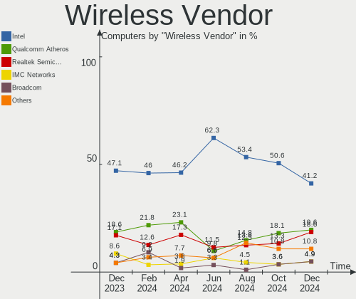

OPNsense Hardware Trends
------------------------

A project to identify most popular hardware characteristics and track their change
over time based on data collected by OPNsense users at https://BSD-Hardware.info.

Anyone can contribute to this report by the [hw-probe](https://github.com/linuxhw/hw-probe/blob/master/INSTALL.BSD.md) tool:

    hw-probe -all -upload

Full-feature report is available here: https://bsd-hardware.info/?view=trends

Period: Sep, 2021.

Contents
--------

* [ System ](#system)
  - [ OS                       ](#os)
  - [ OS Family                ](#os-family)
  - [ Arch                     ](#arch)
  - [ DE                       ](#de)
  - [ Display Server           ](#display-server)
  - [ Display Manager          ](#display-manager)
  - [ OS Lang                  ](#os-lang)
  - [ Boot Mode                ](#boot-mode)
  - [ Filesystem               ](#filesystem)
  - [ Part. scheme             ](#part-scheme)

* [ Board ](#board)
  - [ Vendor                   ](#vendor)
  - [ Model                    ](#model)
  - [ Model Family             ](#model-family)
  - [ MFG Year                 ](#mfg-year)
  - [ Form Factor              ](#form-factor)
  - [ Coreboot                 ](#coreboot)
  - [ RAM Size                 ](#ram-size)
  - [ RAM Used                 ](#ram-used)
  - [ Total Drives             ](#total-drives)
  - [ Has CD-ROM               ](#has-cd-rom)
  - [ Has Ethernet             ](#has-ethernet)
  - [ Has WiFi                 ](#has-wifi)
  - [ Has Bluetooth            ](#has-bluetooth)

* [ Location ](#location)
  - [ Country                  ](#country)
  - [ City                     ](#city)

* [ Drives ](#drives)
  - [ Drive Vendor             ](#drive-vendor)
  - [ Drive Model              ](#drive-model)
  - [ HDD Vendor               ](#hdd-vendor)
  - [ SSD Vendor               ](#ssd-vendor)
  - [ Drive Kind               ](#drive-kind)
  - [ Drive Connector          ](#drive-connector)
  - [ Drive Size               ](#drive-size)
  - [ Space Total              ](#space-total)
  - [ Space Used               ](#space-used)
  - [ Malfunc. Drives          ](#malfunc-drives)
  - [ Malfunc. Drive Vendor    ](#malfunc-drive-vendor)
  - [ Malfunc. HDD Vendor      ](#malfunc-hdd-vendor)
  - [ Malfunc. Drive Kind      ](#malfunc-drive-kind)
  - [ Failed Drives            ](#failed-drives)
  - [ Failed Drive Vendor      ](#failed-drive-vendor)
  - [ Drive Status             ](#drive-status)

* [ Storage controller ](#storage-controller)
  - [ Storage Vendor           ](#storage-vendor)
  - [ Storage Model            ](#storage-model)
  - [ Storage Kind             ](#storage-kind)

* [ Processor ](#processor)
  - [ CPU Vendor               ](#cpu-vendor)
  - [ CPU Model                ](#cpu-model)
  - [ CPU Model Family         ](#cpu-model-family)
  - [ CPU Cores                ](#cpu-cores)
  - [ CPU Sockets              ](#cpu-sockets)
  - [ CPU Threads              ](#cpu-threads)
  - [ CPU Microarch            ](#cpu-microarch)

* [ Graphics ](#graphics)
  - [ GPU Vendor               ](#gpu-vendor)
  - [ GPU Model                ](#gpu-model)
  - [ GPU Combo                ](#gpu-combo)
  - [ GPU Driver               ](#gpu-driver)
  - [ GPU Memory               ](#gpu-memory)

* [ Monitor ](#monitor)
  - [ Monitor Vendor           ](#monitor-vendor)
  - [ Monitor Model            ](#monitor-model)
  - [ Monitor Resolution       ](#monitor-resolution)
  - [ Monitor Diagonal         ](#monitor-diagonal)
  - [ Monitor Width            ](#monitor-width)
  - [ Aspect Ratio             ](#aspect-ratio)
  - [ Monitor Area             ](#monitor-area)
  - [ Pixel Density            ](#pixel-density)
  - [ Multiple Monitors        ](#multiple-monitors)

* [ Network ](#network)
  - [ Net Controller Vendor    ](#net-controller-vendor)
  - [ Net Controller Model     ](#net-controller-model)
  - [ Wireless Vendor          ](#wireless-vendor)
  - [ Wireless Model           ](#wireless-model)
  - [ Ethernet Vendor          ](#ethernet-vendor)
  - [ Ethernet Model           ](#ethernet-model)
  - [ Net Controller Kind      ](#net-controller-kind)
  - [ Used Controller          ](#used-controller)
  - [ NICs                     ](#nics)
  - [ IPv6                     ](#ipv6)

* [ Bluetooth ](#bluetooth)
  - [ Bluetooth Vendor         ](#bluetooth-vendor)
  - [ Bluetooth Model          ](#bluetooth-model)

* [ Sound ](#sound)
  - [ Sound Vendor             ](#sound-vendor)
  - [ Sound Model              ](#sound-model)

* [ Memory ](#memory)
  - [ Memory Vendor            ](#memory-vendor)
  - [ Memory Model             ](#memory-model)
  - [ Memory Kind              ](#memory-kind)
  - [ Memory Form Factor       ](#memory-form-factor)
  - [ Memory Size              ](#memory-size)
  - [ Memory Speed             ](#memory-speed)

* [ Printers & scanners ](#printers--scanners)
  - [ Printer Vendor           ](#printer-vendor)
  - [ Printer Model            ](#printer-model)
  - [ Scanner Vendor           ](#scanner-vendor)
  - [ Scanner Model            ](#scanner-model)

* [ Camera ](#camera)
  - [ Camera Vendor            ](#camera-vendor)
  - [ Camera Model             ](#camera-model)

* [ Security ](#security)
  - [ Fingerprint Vendor       ](#fingerprint-vendor)
  - [ Fingerprint Model        ](#fingerprint-model)
  - [ Chipcard Vendor          ](#chipcard-vendor)
  - [ Chipcard Model           ](#chipcard-model)

* [ Unsupported ](#unsupported)
  - [ Unsupported Devices      ](#unsupported-devices)
  - [ Unsupported Device Types ](#unsupported-device-types)

System
------

OS
--

Installed operating systems

| Name            | Computers | Percent |
|-----------------|-----------|---------|
| OPNsense 21.7.2 | 89        | 43.63%  |
| OPNsense 21.7.3 | 59        | 28.92%  |
| OPNsense 21.7.1 | 41        | 20.1%   |
| OPNsense 21.7   | 7         | 3.43%   |
| OPNsense 21.1.9 | 5         | 2.45%   |
| OPNsense 21.1.8 | 1         | 0.49%   |
| OPNsense 21.1.7 | 1         | 0.49%   |
| OPNsense 21.1   | 1         | 0.49%   |

OS Family
---------

OS without a version

| Name     | Computers | Percent |
|----------|-----------|---------|
| OPNsense | 204       | 100%    |

Arch
----

OS architecture (x86_64, i586, etc.)

| Name  | Computers | Percent |
|-------|-----------|---------|
| amd64 | 203       | 99.51%  |
| arm64 | 1         | 0.49%   |

DE
--

Desktop Environment

| Name    | Computers | Percent |
|---------|-----------|---------|
| Console | 204       | 100%    |

Display Server
--------------

X11 or Wayland

| Name    | Computers | Percent |
|---------|-----------|---------|
| Console | 204       | 100%    |

Display Manager
---------------

SDDM, LightDM, etc.

| Name    | Computers | Percent |
|---------|-----------|---------|
| Console | 204       | 100%    |

OS Lang
-------

Language

| Lang    | Computers | Percent |
|---------|-----------|---------|
| Unknown | 204       | 100%    |

Boot Mode
---------

EFI or BIOS

| Mode | Computers | Percent |
|------|-----------|---------|
| EFI  | 187       | 91.67%  |
| BIOS | 17        | 8.33%   |

Filesystem
----------

Type of filesystem

| Type | Computers | Percent |
|------|-----------|---------|
| Ufs  | 152       | 74.51%  |
| Zfs  | 52        | 25.49%  |

Part. scheme
------------

Scheme of partitioning

| Type    | Computers | Percent |
|---------|-----------|---------|
| GPT     | 195       | 95.59%  |
| MBR     | 8         | 3.92%   |
| Unknown | 1         | 0.49%   |

Board
-----

Vendor
------

Motherboard manufacturer

| Name                       | Computers | Percent |
|----------------------------|-----------|---------|
| Unknown                    | 23        | 11.27%  |
| Supermicro                 | 21        | 10.29%  |
| Dell                       | 21        | 10.29%  |
| Hewlett-Packard            | 15        | 7.35%   |
| Intel                      | 12        | 5.88%   |
| ASUSTek Computer           | 12        | 5.88%   |
| ASRock                     | 11        | 5.39%   |
| Protectli                  | 10        | 4.9%    |
| Gigabyte Technology        | 9         | 4.41%   |
| PC Engines                 | 8         | 3.92%   |
| ZOTAC                      | 7         | 3.43%   |
| Fujitsu                    | 7         | 3.43%   |
| AMI                        | 7         | 3.43%   |
| Lenovo                     | 5         | 2.45%   |
| MSI                        | 4         | 1.96%   |
| Sophos                     | 3         | 1.47%   |
| Biostar                    | 3         | 1.47%   |
| BESSTAR Tech               | 3         | 1.47%   |
| Shuttle                    | 2         | 0.98%   |
| SeeedStudio                | 2         | 0.98%   |
| AWOW                       | 2         | 0.98%   |
| YANYU                      | 1         | 0.49%   |
| Yanling                    | 1         | 0.49%   |
| ShenZhen MinWin Technology | 1         | 0.49%   |
| PCWare                     | 1         | 0.49%   |
| NEC Computers              | 1         | 0.49%   |
| Lex                        | 1         | 0.49%   |
| HPE                        | 1         | 0.49%   |
| friendlyelec               | 1         | 0.49%   |
| Foxconn                    | 1         | 0.49%   |
| Essentiel B                | 1         | 0.49%   |
| ECS                        | 1         | 0.49%   |
| Deciso                     | 1         | 0.49%   |
| Compulab                   | 1         | 0.49%   |
| CNCTION-IAF-E3845          | 1         | 0.49%   |
| ASRockRack                 | 1         | 0.49%   |
| Apple                      | 1         | 0.49%   |
| Acer                       | 1         | 0.49%   |

Model
-----

Motherboard model

| Name                              | Computers | Percent |
|-----------------------------------|-----------|---------|
| Unknown                           | 24        | 11.76%  |
| Supermicro Super Server           | 9         | 4.41%   |
| AMI Aptio CRB                     | 5         | 2.45%   |
| Supermicro X10SLH-N6-ST031        | 4         | 1.96%   |
| PC Engines apu4                   | 4         | 1.96%   |
| PC Engines APU2                   | 4         | 1.96%   |
| Dell PowerEdge R210 II            | 4         | 1.96%   |
| ZOTAC ZBOX-CI323NANO              | 3         | 1.47%   |
| Protectli FW4B                    | 3         | 1.47%   |
| Intel Q3XXG4-P V1.0               | 3         | 1.47%   |
| Fujitsu FUTRO S920                | 3         | 1.47%   |
| Sophos SG                         | 2         | 0.98%   |
| Protectli FW6                     | 2         | 0.98%   |
| HP t730 Thin Client               | 2         | 0.98%   |
| HP t620 PLUS Quad Core TC         | 2         | 0.98%   |
| HP Compaq Elite 8300 SFF          | 2         | 0.98%   |
| Dell OptiPlex 9020                | 2         | 0.98%   |
| Dell OptiPlex 7010                | 2         | 0.98%   |
| AWOW PC BOX                       | 2         | 0.98%   |
| ASUS All Series                   | 2         | 0.98%   |
| ZOTAC ZBOX-MI640/MI660/MI620NANO  | 1         | 0.49%   |
| ZOTAC ZBOX-CI341                  | 1         | 0.49%   |
| ZOTAC ZBOX-CI329NANO              | 1         | 0.49%   |
| ZOTAC ZBOX-CI327NANO-GS-01        | 1         | 0.49%   |
| YANYU ITX-N29 VER:1.5 baytrail    | 1         | 0.49%   |
| Yanling YL-KBR6L                  | 1         | 0.49%   |
| Supermicro X8SIL                  | 1         | 0.49%   |
| Supermicro X8DTU-LN4+             | 1         | 0.49%   |
| Supermicro X7SLA                  | 1         | 0.49%   |
| Supermicro X10SLM+-LN4F           | 1         | 0.49%   |
| Supermicro SYS-E300-8D            | 1         | 0.49%   |
| Supermicro SYS-5019A-FTN4         | 1         | 0.49%   |
| Supermicro HYVE-ZEUS              | 1         | 0.49%   |
| Supermicro A1SRM-2758F            | 1         | 0.49%   |
| Sophos UTM                        | 1         | 0.49%   |
| Shuttle XH310V2                   | 1         | 0.49%   |
| Shuttle DS10U                     | 1         | 0.49%   |
| ShenZhen MinWin 3865U-6L          | 1         | 0.49%   |
| SeeedStudio ODYSSEY-X86J4125      | 1         | 0.49%   |
| SeeedStudio ODYSSEY-X86J4105      | 1         | 0.49%   |
| Protectli VP2410                  | 1         | 0.49%   |
| Protectli FW6E                    | 1         | 0.49%   |
| Protectli FW6D                    | 1         | 0.49%   |
| Protectli FW2                     | 1         | 0.49%   |
| Protectli FW1                     | 1         | 0.49%   |
| PCWare PW-945GCX                  | 1         | 0.49%   |
| NEC Computers SHARKBAY            | 1         | 0.49%   |
| MSI MS-7B31                       | 1         | 0.49%   |
| MSI MS-7891                       | 1         | 0.49%   |
| MSI MS-7846                       | 1         | 0.49%   |
| MSI MS-7677                       | 1         | 0.49%   |
| Lex Pineview-D                    | 1         | 0.49%   |
| Lenovo ThinkPad X1 Carbon 3443CTO | 1         | 0.49%   |
| Lenovo ThinkPad W540 20BG0014US   | 1         | 0.49%   |
| Lenovo ThinkCentre M91p 7033HS8   | 1         | 0.49%   |
| Lenovo ThinkCentre M83 10AHS0EW00 | 1         | 0.49%   |
| Lenovo ThinkCentre M78 10BU0008US | 1         | 0.49%   |
| Intel SHARKBAY                    | 1         | 0.49%   |
| Intel SandyBridge Platform        | 1         | 0.49%   |
| Intel PL-20-00                    | 1         | 0.49%   |

Model Family
------------

Motherboard model prefix

| Name                         | Computers | Percent |
|------------------------------|-----------|---------|
| Unknown                      | 24        | 11.76%  |
| Dell PowerEdge               | 10        | 4.9%    |
| Supermicro Super             | 9         | 4.41%   |
| Dell OptiPlex                | 9         | 4.41%   |
| Fujitsu FUTRO                | 5         | 2.45%   |
| AMI Aptio                    | 5         | 2.45%   |
| Supermicro X10SLH-N6-ST031   | 4         | 1.96%   |
| PC Engines apu4              | 4         | 1.96%   |
| PC Engines APU2              | 4         | 1.96%   |
| HP Compaq                    | 4         | 1.96%   |
| ZOTAC ZBOX-CI323NANO         | 3         | 1.47%   |
| Protectli FW4B               | 3         | 1.47%   |
| Lenovo ThinkCentre           | 3         | 1.47%   |
| Intel Q3XXG4-P               | 3         | 1.47%   |
| ASUS PRIME                   | 3         | 1.47%   |
| Sophos SG                    | 2         | 0.98%   |
| Protectli FW6                | 2         | 0.98%   |
| Lenovo ThinkPad              | 2         | 0.98%   |
| HP t730                      | 2         | 0.98%   |
| HP t620                      | 2         | 0.98%   |
| HP ProLiant                  | 2         | 0.98%   |
| HP ProDesk                   | 2         | 0.98%   |
| HP EliteDesk                 | 2         | 0.98%   |
| AWOW PC                      | 2         | 0.98%   |
| ASUS All                     | 2         | 0.98%   |
| ZOTAC ZBOX-MI640             | 1         | 0.49%   |
| ZOTAC ZBOX-CI341             | 1         | 0.49%   |
| ZOTAC ZBOX-CI329NANO         | 1         | 0.49%   |
| ZOTAC ZBOX-CI327NANO-GS-01   | 1         | 0.49%   |
| YANYU ITX-N29                | 1         | 0.49%   |
| Yanling YL-KBR6L             | 1         | 0.49%   |
| Supermicro X8SIL             | 1         | 0.49%   |
| Supermicro X8DTU-LN4+        | 1         | 0.49%   |
| Supermicro X7SLA             | 1         | 0.49%   |
| Supermicro X10SLM+-LN4F      | 1         | 0.49%   |
| Supermicro SYS-E300-8D       | 1         | 0.49%   |
| Supermicro SYS-5019A-FTN4    | 1         | 0.49%   |
| Supermicro HYVE-ZEUS         | 1         | 0.49%   |
| Supermicro A1SRM-2758F       | 1         | 0.49%   |
| Sophos UTM                   | 1         | 0.49%   |
| Shuttle XH310V2              | 1         | 0.49%   |
| Shuttle DS10U                | 1         | 0.49%   |
| ShenZhen MinWin 3865U-6L     | 1         | 0.49%   |
| SeeedStudio ODYSSEY-X86J4125 | 1         | 0.49%   |
| SeeedStudio ODYSSEY-X86J4105 | 1         | 0.49%   |
| Protectli VP2410             | 1         | 0.49%   |
| Protectli FW6E               | 1         | 0.49%   |
| Protectli FW6D               | 1         | 0.49%   |
| Protectli FW2                | 1         | 0.49%   |
| Protectli FW1                | 1         | 0.49%   |
| PCWare PW-945GCX             | 1         | 0.49%   |
| NEC Computers SHARKBAY       | 1         | 0.49%   |
| MSI MS-7B31                  | 1         | 0.49%   |
| MSI MS-7891                  | 1         | 0.49%   |
| MSI MS-7846                  | 1         | 0.49%   |
| MSI MS-7677                  | 1         | 0.49%   |
| Lex Pineview-D               | 1         | 0.49%   |
| Intel SHARKBAY               | 1         | 0.49%   |
| Intel SandyBridge            | 1         | 0.49%   |
| Intel PL-20-00               | 1         | 0.49%   |

MFG Year
--------

Motherboard manufacture year

| Year    | Computers | Percent |
|---------|-----------|---------|
| 2020    | 31        | 15.2%   |
| 2019    | 30        | 14.71%  |
| 2018    | 30        | 14.71%  |
| 2021    | 28        | 13.73%  |
| 2014    | 19        | 9.31%   |
| 2017    | 13        | 6.37%   |
| 2016    | 11        | 5.39%   |
| 2015    | 10        | 4.9%    |
| 2013    | 10        | 4.9%    |
| 2012    | 6         | 2.94%   |
| 2011    | 5         | 2.45%   |
| 2010    | 4         | 1.96%   |
| 2009    | 4         | 1.96%   |
| 2008    | 1         | 0.49%   |
| 2006    | 1         | 0.49%   |
| Unknown | 1         | 0.49%   |

Form Factor
-----------

Physical design of the computer

| Name       | Computers | Percent |
|------------|-----------|---------|
| Desktop    | 142       | 69.61%  |
| Server     | 32        | 15.69%  |
| Mini pc    | 21        | 10.29%  |
| Notebook   | 5         | 2.45%   |
| Firewall   | 3         | 1.47%   |
| All in one | 1         | 0.49%   |

Coreboot
--------

Have coreboot on board

| Used | Computers | Percent |
|------|-----------|---------|
| No   | 190       | 93.14%  |
| Yes  | 14        | 6.86%   |

RAM Size
--------

Total RAM memory

| Size in GB  | Computers | Percent |
|-------------|-----------|---------|
| 8.01-16.0   | 84        | 41.18%  |
| 4.01-8.0    | 46        | 22.55%  |
| 16.01-24.0  | 38        | 18.63%  |
| 32.01-64.0  | 15        | 7.35%   |
| 2.01-3.0    | 7         | 3.43%   |
| 3.01-4.0    | 4         | 1.96%   |
| 24.01-32.0  | 4         | 1.96%   |
| 64.01-256.0 | 3         | 1.47%   |
| 1.01-2.0    | 3         | 1.47%   |

RAM Used
--------

Used RAM memory

| Used GB    | Computers | Percent |
|------------|-----------|---------|
| 0.01-0.5   | 109       | 53.43%  |
| 0.51-1.0   | 58        | 28.43%  |
| 1.01-2.0   | 19        | 9.31%   |
| 2.01-3.0   | 8         | 3.92%   |
| 4.01-8.0   | 3         | 1.47%   |
| 3.01-4.0   | 3         | 1.47%   |
| 24.01-32.0 | 2         | 0.98%   |
| 32.01-64.0 | 1         | 0.49%   |
| 8.01-16.0  | 1         | 0.49%   |

Total Drives
------------

Number of drives on board

| Drives | Computers | Percent |
|--------|-----------|---------|
| 1      | 167       | 81.86%  |
| 2      | 17        | 8.33%   |
| 0      | 16        | 7.84%   |
| 4      | 2         | 0.98%   |
| 3      | 2         | 0.98%   |

Has CD-ROM
----------

Has CD-ROM on board

| Presented | Computers | Percent |
|-----------|-----------|---------|
| No        | 175       | 85.78%  |
| Yes       | 29        | 14.22%  |

Has Ethernet
------------

Has Ethernet on board

| Presented | Computers | Percent |
|-----------|-----------|---------|
| Yes       | 203       | 99.51%  |
| No        | 1         | 0.49%   |

Has WiFi
--------

Has WiFi module

| Presented | Computers | Percent |
|-----------|-----------|---------|
| No        | 162       | 79.41%  |
| Yes       | 42        | 20.59%  |

Has Bluetooth
-------------

Has Bluetooth module

| Presented | Computers | Percent |
|-----------|-----------|---------|
| No        | 185       | 90.69%  |
| Yes       | 19        | 9.31%   |

Location
--------

Country
-------

Geographic location (country)

| Country      | Computers | Percent |
|--------------|-----------|---------|
| USA          | 68        | 33.33%  |
| Germany      | 44        | 21.57%  |
| Australia    | 9         | 4.41%   |
| UK           | 8         | 3.92%   |
| Netherlands  | 8         | 3.92%   |
| Canada       | 8         | 3.92%   |
| South Africa | 5         | 2.45%   |
| Poland       | 5         | 2.45%   |
| China        | 4         | 1.96%   |
| Spain        | 3         | 1.47%   |
| Romania      | 3         | 1.47%   |
| New Zealand  | 3         | 1.47%   |
| Japan        | 3         | 1.47%   |
| Israel       | 3         | 1.47%   |
| Brazil       | 3         | 1.47%   |
| Austria      | 3         | 1.47%   |
| Singapore    | 2         | 0.98%   |
| Russia       | 2         | 0.98%   |
| India        | 2         | 0.98%   |
| France       | 2         | 0.98%   |
| Denmark      | 2         | 0.98%   |
| Czechia      | 2         | 0.98%   |
| Switzerland  | 1         | 0.49%   |
| Slovenia     | 1         | 0.49%   |
| Slovakia     | 1         | 0.49%   |
| Philippines  | 1         | 0.49%   |
| Paraguay     | 1         | 0.49%   |
| Norway       | 1         | 0.49%   |
| Nigeria      | 1         | 0.49%   |
| Latvia       | 1         | 0.49%   |
| Italy        | 1         | 0.49%   |
| Indonesia    | 1         | 0.49%   |
| Finland      | 1         | 0.49%   |
| Argentina    | 1         | 0.49%   |

City
----

Geographic location (city)

| City                        | Computers | Percent |
|-----------------------------|-----------|---------|
| Perth                       | 3         | 1.47%   |
| Munich                      | 3         | 1.47%   |
| London                      | 3         | 1.47%   |
| Johannesburg                | 3         | 1.47%   |
| Tulsa                       | 2         | 0.98%   |
| Sydney                      | 2         | 0.98%   |
| Singapore                   | 2         | 0.98%   |
| Round Rock                  | 2         | 0.98%   |
| Koblenz                     | 2         | 0.98%   |
| Groningen                   | 2         | 0.98%   |
| Gdansk                      | 2         | 0.98%   |
| Dortmund                    | 2         | 0.98%   |
| Cologne                     | 2         | 0.98%   |
| Bucharest                   | 2         | 0.98%   |
| Bielefeld                   | 2         | 0.98%   |
| Barrington                  | 2         | 0.98%   |
| Zurich                      | 1         | 0.49%   |
| Zaltbommel                  | 1         | 0.49%   |
| Yokohama                    | 1         | 0.49%   |
| Wylie                       | 1         | 0.49%   |
| Woodmead                    | 1         | 0.49%   |
| Wittenberg                  | 1         | 0.49%   |
| Williston                   | 1         | 0.49%   |
| Wentzville                  | 1         | 0.49%   |
| Waiuku                      | 1         | 0.49%   |
| Violet                      | 1         | 0.49%   |
| Vienna                      | 1         | 0.49%   |
| Victoria                    | 1         | 0.49%   |
| Valkenswaard                | 1         | 0.49%   |
| Upeslejas                   | 1         | 0.49%   |
| Twin Falls                  | 1         | 0.49%   |
| Toulouse                    | 1         | 0.49%   |
| Tokyo                       | 1         | 0.49%   |
| Todtnau                     | 1         | 0.49%   |
| The Hague                   | 1         | 0.49%   |
| Tempe                       | 1         | 0.49%   |
| Tel Aviv                    | 1         | 0.49%   |
| Swansea                     | 1         | 0.49%   |
| Suleja                      | 1         | 0.49%   |
| Sterling                    | 1         | 0.49%   |
| Statesboro                  | 1         | 0.49%   |
| Springfield                 | 1         | 0.49%   |
| Sittard                     | 1         | 0.49%   |
| Singen                      | 1         | 0.49%   |
| Shanghai                    | 1         | 0.49%   |
| Seattle                     | 1         | 0.49%   |
| Scottsdale                  | 1         | 0.49%   |
| Sassenburg                  | 1         | 0.49%   |
| Sant Boi de Llobregat       | 1         | 0.49%   |
| Sankt Veit an der Glan      | 1         | 0.49%   |
| San Sebasti??n de los Reyes | 1         | 0.49%   |
| San Mateo                   | 1         | 0.49%   |
| San Marcos                  | 1         | 0.49%   |
| San Bruno                   | 1         | 0.49%   |
| Saint Paul                  | 1         | 0.49%   |
| Rudna                       | 1         | 0.49%   |
| Royal Oak                   | 1         | 0.49%   |
| Rottenburg an der Laaber    | 1         | 0.49%   |
| Rotherham                   | 1         | 0.49%   |
| Rome                        | 1         | 0.49%   |

Drives
------

Drive Vendor
------------

Hard drive vendors

| Vendor              | Computers | Drives | Percent |
|---------------------|-----------|--------|---------|
| Samsung Electronics | 23        | 24     | 11.17%  |
| Transcend           | 20        | 21     | 9.71%   |
| Kingston            | 20        | 20     | 9.71%   |
| WDC                 | 18        | 20     | 8.74%   |
| Seagate             | 16        | 17     | 7.77%   |
| SanDisk             | 14        | 14     | 6.8%    |
| Intel               | 11        | 13     | 5.34%   |
| Crucial             | 10        | 11     | 4.85%   |
| Toshiba             | 7         | 8      | 3.4%    |
| Phison              | 6         | 6      | 2.91%   |
| OCZ                 | 4         | 4      | 1.94%   |
| Hoodisk             | 4         | 4      | 1.94%   |
| A-DATA Technology   | 4         | 4      | 1.94%   |
| SPCC                | 3         | 4      | 1.46%   |
| Protectli           | 3         | 3      | 1.46%   |
| Micron Technology   | 3         | 3      | 1.46%   |
| FORESEE             | 3         | 3      | 1.46%   |
| China               | 3         | 3      | 1.46%   |
| PNY                 | 2         | 2      | 0.97%   |
| LITEONIT            | 2         | 2      | 0.97%   |
| Intenso             | 2         | 2      | 0.97%   |
| Hitachi             | 2         | 2      | 0.97%   |
| Hewlett-Packard     | 2         | 2      | 0.97%   |
| Corsair             | 2         | 2      | 0.97%   |
| XPG                 | 1         | 1      | 0.49%   |
| Vaseky              | 1         | 1      | 0.49%   |
| SK Hynix            | 1         | 1      | 0.49%   |
| SATADOM             | 1         | 1      | 0.49%   |
| PLEXTOR             | 1         | 1      | 0.49%   |
| Pioneer             | 1         | 1      | 0.49%   |
| Patriot             | 1         | 1      | 0.49%   |
| Netac               | 1         | 1      | 0.49%   |
| MAXTOR              | 1         | 1      | 0.49%   |
| LITEON              | 1         | 1      | 0.49%   |
| Kston               | 1         | 1      | 0.49%   |
| Integral            | 1         | 1      | 0.49%   |
| INDMEM              | 1         | 1      | 0.49%   |
| Indilinx            | 1         | 1      | 0.49%   |
| Hikvision           | 1         | 1      | 0.49%   |
| HGST                | 1         | 1      | 0.49%   |
| GOODRAM             | 1         | 1      | 0.49%   |
| Fordisk             | 1         | 1      | 0.49%   |
| Dogfish             | 1         | 1      | 0.49%   |
| BIWIN               | 1         | 1      | 0.49%   |
| Advantech           | 1         | 1      | 0.49%   |
| Adaptec             | 1         | 1      | 0.49%   |

Drive Model
-----------

Hard drive models

| Model                            | Computers | Percent |
|----------------------------------|-----------|---------|
| Kingston SUV500MS120G 120GB      | 5         | 2.43%   |
| Crucial CT250MX500SSD1 250GB     | 5         | 2.43%   |
| Transcend TS128GMSA230S 128GB    | 4         | 1.94%   |
| Transcend TS64GSSD25S-M 64GB     | 3         | 1.46%   |
| Seagate ST500DM002-1BD142 500GB  | 3         | 1.46%   |
| Samsung SSD 850 EVO mSATA 250GB  | 3         | 1.46%   |
| Phison SATA SSD 16GB             | 3         | 1.46%   |
| Kingston SA400S37240G 240GB      | 3         | 1.46%   |
| Kingston SA400S37120G 120GB      | 3         | 1.46%   |
| Hoodisk SSD 128GB                | 3         | 1.46%   |
| Transcend TS32GMSA370 32GB       | 2         | 0.97%   |
| Toshiba MQ01ABF050 500GB         | 2         | 0.97%   |
| SPCC Solid State Disk 128GB      | 2         | 0.97%   |
| Seagate ST380815AS 80GB          | 2         | 0.97%   |
| Seagate ST250DM000-1BD141 250GB  | 2         | 0.97%   |
| SanDisk SSD PLUS 240GB           | 2         | 0.97%   |
| SanDisk SDSSDA120G 120GB         | 2         | 0.97%   |
| SanDisk SDSA6MM-016G-1006 16GB   | 2         | 0.97%   |
| Samsung SSD 850 EVO 120GB        | 2         | 0.97%   |
| Protectli 120GB mSATA            | 2         | 0.97%   |
| Phison SATA SSD 32GB             | 2         | 0.97%   |
| Intenso SSD 120GB                | 2         | 0.97%   |
| Intel SSDSC2KB240G8 240GB        | 2         | 0.97%   |
| HP RAID 1(1+0) 200GB             | 2         | 0.97%   |
| A-DATA SU650 120GB               | 2         | 0.97%   |
| XPG GAMMIX S11 Pro 512GB         | 1         | 0.49%   |
| WDC WDS500G2B0B-00YS70 500GB     | 1         | 0.49%   |
| WDC WDS500G2B0A-00SM50 500GB     | 1         | 0.49%   |
| WDC WDS500G1R0A-68A4W0 500GB     | 1         | 0.49%   |
| WDC WD5003ABYZ-011FA0 500GB      | 1         | 0.49%   |
| WDC WD5002ABYS-18B1B0 500GB      | 1         | 0.49%   |
| WDC WD5000LPVT-80G33T2 500GB     | 1         | 0.49%   |
| WDC WD5000BPVT-08HXZT3 500GB     | 1         | 0.49%   |
| WDC WD5000AAKX-22ERMA0 500GB     | 1         | 0.49%   |
| WDC WD3200AAJS-56M0A0 320GB      | 1         | 0.49%   |
| WDC WD2503ABYX-01WERA1 256GB     | 1         | 0.49%   |
| WDC WD2500JS-75NCB2 250GB        | 1         | 0.49%   |
| WDC WD2500AAKX-07U6AA0 250GB     | 1         | 0.49%   |
| WDC WD20EARS-00MVWB0 2TB         | 1         | 0.49%   |
| WDC WD2005FBYZ-01YCBB1 2TB       | 1         | 0.49%   |
| WDC WD1600BEVS-75RST0 160GB      | 1         | 0.49%   |
| WDC WD1600AVJS-63WNA0 160GB      | 1         | 0.49%   |
| WDC WD10EZEX-22MFCA0 1TB         | 1         | 0.49%   |
| WDC WD10EZEX-08WN4A0 1TB         | 1         | 0.49%   |
| Vaseky V800-32G                  | 1         | 0.49%   |
| Transcend TS64GSSD420K 64GB      | 1         | 0.49%   |
| Transcend TS64GSSD370S 64GB      | 1         | 0.49%   |
| Transcend TS64GMSA230S 64GB      | 1         | 0.49%   |
| Transcend TS4GCF133 4GB          | 1         | 0.49%   |
| Transcend TS32GSSD370 32GB       | 1         | 0.49%   |
| Transcend TS32GSSD340K 32GB      | 1         | 0.49%   |
| Transcend TS256GMSA370S 256GB    | 1         | 0.49%   |
| Transcend TS256GMSA230S 256GB    | 1         | 0.49%   |
| Transcend TS1TSSD230S 1TB        | 1         | 0.49%   |
| Transcend TS128GMSA370 128GB     | 1         | 0.49%   |
| Transcend TS120GMTS420S 120GB    | 1         | 0.49%   |
| Toshiba THNSN5256GPUK NVMe 256GB | 1         | 0.49%   |
| Toshiba MQ01ABD100 1TB           | 1         | 0.49%   |
| Toshiba MK2561GSY 250GB          | 1         | 0.49%   |
| Toshiba MG03ACA100 1TB           | 1         | 0.49%   |

HDD Vendor
----------

Hard disk drive vendors

| Vendor              | Computers | Drives | Percent |
|---------------------|-----------|--------|---------|
| WDC                 | 15        | 17     | 33.33%  |
| Seagate             | 15        | 15     | 33.33%  |
| Toshiba             | 6         | 7      | 13.33%  |
| Samsung Electronics | 2         | 3      | 4.44%   |
| Hitachi             | 2         | 2      | 4.44%   |
| Hewlett-Packard     | 2         | 2      | 4.44%   |
| MAXTOR              | 1         | 1      | 2.22%   |
| HGST                | 1         | 1      | 2.22%   |
| Adaptec             | 1         | 1      | 2.22%   |

SSD Vendor
----------

Solid state drive vendors

| Vendor              | Computers | Drives | Percent |
|---------------------|-----------|--------|---------|
| Transcend           | 20        | 21     | 13.33%  |
| Kingston            | 20        | 20     | 13.33%  |
| Samsung Electronics | 16        | 16     | 10.67%  |
| SanDisk             | 13        | 13     | 8.67%   |
| Intel               | 10        | 12     | 6.67%   |
| Crucial             | 10        | 11     | 6.67%   |
| Phison              | 6         | 6      | 4%      |
| OCZ                 | 4         | 4      | 2.67%   |
| Hoodisk             | 4         | 4      | 2.67%   |
| A-DATA Technology   | 4         | 4      | 2.67%   |
| WDC                 | 3         | 3      | 2%      |
| Protectli           | 3         | 3      | 2%      |
| FORESEE             | 3         | 3      | 2%      |
| China               | 3         | 3      | 2%      |
| SPCC                | 2         | 3      | 1.33%   |
| PNY                 | 2         | 2      | 1.33%   |
| Micron Technology   | 2         | 2      | 1.33%   |
| LITEONIT            | 2         | 2      | 1.33%   |
| Intenso             | 2         | 2      | 1.33%   |
| Corsair             | 2         | 2      | 1.33%   |
| Vaseky              | 1         | 1      | 0.67%   |
| SK Hynix            | 1         | 1      | 0.67%   |
| Seagate             | 1         | 2      | 0.67%   |
| SATADOM             | 1         | 1      | 0.67%   |
| PLEXTOR             | 1         | 1      | 0.67%   |
| Pioneer             | 1         | 1      | 0.67%   |
| Patriot             | 1         | 1      | 0.67%   |
| Netac               | 1         | 1      | 0.67%   |
| LITEON              | 1         | 1      | 0.67%   |
| Kston               | 1         | 1      | 0.67%   |
| Integral            | 1         | 1      | 0.67%   |
| INDMEM              | 1         | 1      | 0.67%   |
| Indilinx            | 1         | 1      | 0.67%   |
| Hikvision           | 1         | 1      | 0.67%   |
| GOODRAM             | 1         | 1      | 0.67%   |
| Fordisk             | 1         | 1      | 0.67%   |
| Dogfish             | 1         | 1      | 0.67%   |
| BIWIN               | 1         | 1      | 0.67%   |
| Advantech           | 1         | 1      | 0.67%   |

Drive Kind
----------

HDD or SSD

| Kind | Computers | Drives | Percent |
|------|-----------|--------|---------|
| SSD  | 146       | 156    | 73.74%  |
| HDD  | 41        | 49     | 20.71%  |
| NVMe | 11        | 11     | 5.56%   |

Drive Connector
---------------

SATA, SAS, NVMe, etc.

| Type | Computers | Drives | Percent |
|------|-----------|--------|---------|
| SATA | 178       | 205    | 94.18%  |
| NVMe | 11        | 11     | 5.82%   |

Drive Size
----------

Size of hard drive

| Size in TB | Computers | Drives | Percent |
|------------|-----------|--------|---------|
| 0.01-0.5   | 166       | 182    | 91.21%  |
| 0.51-1.0   | 12        | 13     | 6.59%   |
| 1.01-2.0   | 4         | 10     | 2.2%    |

Space Total
-----------

Amount of disk space available on the file system

| Size in GB     | Computers | Percent |
|----------------|-----------|---------|
| 101-250        | 91        | 44.61%  |
| 51-100         | 34        | 16.67%  |
| 21-50          | 26        | 12.75%  |
| 251-500        | 23        | 11.27%  |
| 1-20           | 13        | 6.37%   |
| 501-1000       | 13        | 6.37%   |
| More than 3000 | 2         | 0.98%   |
| 1001-2000      | 2         | 0.98%   |

Space Used
----------

Amount of used disk space

| Used GB | Computers | Percent |
|---------|-----------|---------|
| 1-20    | 190       | 93.14%  |
| 21-50   | 12        | 5.88%   |
| 101-250 | 1         | 0.49%   |
| 51-100  | 1         | 0.49%   |

Malfunc. Drives
---------------

Drive models with a malfunction

| Model                           | Computers | Drives | Percent |
|---------------------------------|-----------|--------|---------|
| Seagate ST500DM002-1BD142 500GB | 3         | 3      | 18.75%  |
| WDC WD3200AAJS-56M0A0 320GB     | 1         | 1      | 6.25%   |
| Seagate ST96023AS 58GB          | 1         | 1      | 6.25%   |
| Seagate ST9160827AS 160GB       | 1         | 1      | 6.25%   |
| Seagate ST380815AS 80GB         | 1         | 1      | 6.25%   |
| Seagate ST3500418AS 500GB       | 1         | 1      | 6.25%   |
| Seagate ST250DM000-1BD141 250GB | 1         | 1      | 6.25%   |
| Seagate ST1000DL002-9TT153 1TB  | 1         | 1      | 6.25%   |
| Kingston SMS200S3120G 120GB     | 1         | 1      | 6.25%   |
| Intel SSDSC2CW060A3 64GB        | 1         | 1      | 6.25%   |
| Intel SSDSC2BF240A5 240GB       | 1         | 1      | 6.25%   |
| Intel SSDSA2M120G2GC 120GB      | 1         | 1      | 6.25%   |
| Dogfish SSD 128GB               | 1         | 1      | 6.25%   |
| Crucial CT128MX100SSD1 128GB    | 1         | 1      | 6.25%   |

Malfunc. Drive Vendor
---------------------

Vendors of faulty drives

| Vendor   | Computers | Drives | Percent |
|----------|-----------|--------|---------|
| Seagate  | 9         | 9      | 56.25%  |
| Intel    | 3         | 3      | 18.75%  |
| WDC      | 1         | 1      | 6.25%   |
| Kingston | 1         | 1      | 6.25%   |
| Dogfish  | 1         | 1      | 6.25%   |
| Crucial  | 1         | 1      | 6.25%   |

Malfunc. HDD Vendor
-------------------

Vendors of faulty HDD drives

| Vendor  | Computers | Drives | Percent |
|---------|-----------|--------|---------|
| Seagate | 9         | 9      | 90%     |
| WDC     | 1         | 1      | 10%     |

Malfunc. Drive Kind
-------------------

Kinds of faulty drives

| Kind | Computers | Drives | Percent |
|------|-----------|--------|---------|
| HDD  | 10        | 10     | 62.5%   |
| SSD  | 6         | 6      | 37.5%   |

Failed Drives
-------------

Failed drive models

Zero info for selected period =(

Failed Drive Vendor
-------------------

Failed drive vendors

Zero info for selected period =(

Drive Status
------------

Number of failed and malfunc. drives

| Status   | Computers | Drives | Percent |
|----------|-----------|--------|---------|
| Works    | 171       | 194    | 88.6%   |
| Malfunc  | 16        | 16     | 8.29%   |
| Detected | 6         | 6      | 3.11%   |

Storage controller
------------------

Storage Vendor
--------------

Storage controller vendors

| Vendor                 | Computers | Percent |
|------------------------|-----------|---------|
| Intel                  | 175       | 77.43%  |
| AMD                    | 27        | 11.95%  |
| Samsung Electronics    | 6         | 2.65%   |
| Broadcom / LSI         | 4         | 1.77%   |
| Phison Electronics     | 2         | 0.88%   |
| Hewlett-Packard        | 2         | 0.88%   |
| Chelsio Communications | 2         | 0.88%   |
| XenSource              | 1         | 0.44%   |
| Toshiba                | 1         | 0.44%   |
| Silicon Image          | 1         | 0.44%   |
| Sandisk                | 1         | 0.44%   |
| Micron Technology      | 1         | 0.44%   |
| ASMedia Technology     | 1         | 0.44%   |
| ADATA Technology       | 1         | 0.44%   |
| Adaptec                | 1         | 0.44%   |

Storage Model
-------------

Storage controller models

| Model                                                                            | Computers | Percent |
|----------------------------------------------------------------------------------|-----------|---------|
| Intel 8 Series/C220 Series Chipset Family 6-port SATA Controller 1 [AHCI mode]   | 26        | 10.4%   |
| AMD FCH SATA Controller [AHCI mode]                                              | 22        | 8.8%    |
| Intel Atom Processor E3800 Series SATA AHCI Controller                           | 17        | 6.8%    |
| Intel 6 Series/C200 Series Chipset Family 6 port Desktop SATA AHCI Controller    | 16        | 6.4%    |
| Intel Atom/Celeron/Pentium Processor x5-E8000/J3xxx/N3xxx Series SATA Controller | 11        | 4.4%    |
| Intel Sunrise Point-LP SATA Controller [AHCI mode]                               | 10        | 4%      |
| Intel Celeron/Pentium Silver Processor SATA Controller                           | 8         | 3.2%    |
| Intel Cannon Lake PCH SATA AHCI Controller                                       | 8         | 3.2%    |
| Intel 7 Series/C210 Series Chipset Family 6-port SATA Controller [AHCI mode]     | 8         | 3.2%    |
| Intel SATA Controller [RAID mode]                                                | 6         | 2.4%    |
| Intel Q170/Q150/B150/H170/H110/Z170/CM236 Chipset SATA Controller [AHCI Mode]    | 6         | 2.4%    |
| Intel Celeron N3350/Pentium N4200/Atom E3900 Series SATA AHCI Controller         | 6         | 2.4%    |
| Intel 82801G (ICH7 Family) IDE Controller                                        | 6         | 2.4%    |
| Intel 8 Series SATA Controller 1 [AHCI mode]                                     | 5         | 2%      |
| Intel Wildcat Point-LP SATA Controller [AHCI Mode]                               | 4         | 1.6%    |
| Intel NM10/ICH7 Family SATA Controller [IDE mode]                                | 4         | 1.6%    |
| AMD 400 Series Chipset SATA Controller                                           | 4         | 1.6%    |
| Intel NM10/ICH7 Family SATA Controller [AHCI mode]                               | 3         | 1.2%    |
| Intel C600/X79 series chipset 6-Port SATA AHCI Controller                        | 3         | 1.2%    |
| Intel 82801JI (ICH10 Family) 4 port SATA IDE Controller #1                       | 3         | 1.2%    |
| Intel 82801HM/HEM (ICH8M/ICH8M-E) IDE Controller                                 | 3         | 1.2%    |
| Intel 200 Series PCH SATA controller [AHCI mode]                                 | 3         | 1.2%    |
| AMD FCH SATA Controller [IDE mode]                                               | 3         | 1.2%    |
| Samsung NVMe SSD Controller SM981/PM981/PM983                                    | 2         | 0.8%    |
| Samsung NVMe SSD Controller 980                                                  | 2         | 0.8%    |
| Phison PS5013 E13 NVMe Controller                                                | 2         | 0.8%    |
| Intel Comet Lake SATA AHCI Controller                                            | 2         | 0.8%    |
| Intel Cannon Point-LP SATA Controller [AHCI Mode]                                | 2         | 0.8%    |
| Intel Atom Processor C3000 Series SATA Controller 1                              | 2         | 0.8%    |
| Intel Atom Processor C3000 Series SATA Controller 0                              | 2         | 0.8%    |
| Intel 9 Series Chipset Family SATA Controller [AHCI Mode]                        | 2         | 0.8%    |
| Intel 82801HM/HEM (ICH8M/ICH8M-E) SATA Controller [AHCI mode]                    | 2         | 0.8%    |
| Intel 82801 Mobile SATA Controller [RAID mode]                                   | 2         | 0.8%    |
| Intel 7 Series Chipset Family 6-port SATA Controller [AHCI mode]                 | 2         | 0.8%    |
| Intel 6 Series/C200 Series Chipset Family 6 port Mobile SATA AHCI Controller     | 2         | 0.8%    |
| Intel 500 Series Chipset Family SATA AHCI Controller                             | 2         | 0.8%    |
| Intel 5 Series/3400 Series Chipset 6 port SATA AHCI Controller                   | 2         | 0.8%    |
| Intel 400 Series Chipset Family SATA AHCI Controller                             | 2         | 0.8%    |
| HP Smart Array G6 controllers                                                    | 2         | 0.8%    |
| AMD FCH IDE Controller                                                           | 2         | 0.8%    |
| XenSource Xen Platform Device                                                    | 1         | 0.4%    |
| Toshiba XG4 NVMe SSD Controller                                                  | 1         | 0.4%    |
| Silicon Image PCI0680 Ultra ATA-133 Host Controller                              | 1         | 0.4%    |
| Sandisk WD Black SN850                                                           | 1         | 0.4%    |
| Samsung SM951 AHCI                                                               | 1         | 0.4%    |
| Samsung NVMe SSD Controller SM961/PM961/SM963                                    | 1         | 0.4%    |
| Intel SSD 660P Series                                                            | 1         | 0.4%    |
| Intel C620 Series Chipset Family SSATA Controller [AHCI mode]                    | 1         | 0.4%    |
| Intel C620 Series Chipset Family SATA Controller [AHCI mode]                     | 1         | 0.4%    |
| Intel C602 chipset 4-Port SATA Storage Control Unit                              | 1         | 0.4%    |
| Intel Atom processor C2000 AHCI SATA3 Controller                                 | 1         | 0.4%    |
| Intel Atom processor C2000 AHCI SATA2 Controller                                 | 1         | 0.4%    |
| Intel 82801JI (ICH10 Family) 2 port SATA IDE Controller #2                       | 1         | 0.4%    |
| Intel 82801IR/IO/IH (ICH9R/DO/DH) 6 port SATA Controller [AHCI mode]             | 1         | 0.4%    |
| Intel 82801IB (ICH9) 2 port SATA Controller [IDE mode]                           | 1         | 0.4%    |
| Intel 82801HM/HEM (ICH8M/ICH8M-E) SATA Controller [IDE mode]                     | 1         | 0.4%    |
| Intel 82371SB PIIX3 IDE [Natoma/Triton II]                                       | 1         | 0.4%    |
| Chelsio T520-CR Unified Wire Storage Controller                                  | 1         | 0.4%    |
| Chelsio T420-CR Unified Wire Storage Controller                                  | 1         | 0.4%    |
| Broadcom / LSI MegaRAID SAS-3 3008 [Fury]                                        | 1         | 0.4%    |

Storage Kind
------------

Kind of storage controller (IDE, SATA, NVMe, SAS, ...)

| Kind | Computers | Percent |
|------|-----------|---------|
| SATA | 181       | 78.35%  |
| IDE  | 19        | 8.23%   |
| RAID | 15        | 6.49%   |
| NVMe | 12        | 5.19%   |
| SCSI | 3         | 1.3%    |
| SAS  | 1         | 0.43%   |

Processor
---------

CPU Vendor
----------

Processor vendors

| Vendor  | Computers | Percent |
|---------|-----------|---------|
| Intel   | 175       | 85.78%  |
| AMD     | 28        | 13.73%  |
| Unknown | 1         | 0.49%   |

CPU Model
---------

Processor models

| Model                                       | Computers | Percent |
|---------------------------------------------|-----------|---------|
| Intel Core i5-3470 CPU @ 3.20GHz            | 7         | 3.43%   |
| Intel Celeron CPU J1900 @ 1.99GHz           | 7         | 3.43%   |
| AMD GX-412TC SOC                            | 7         | 3.43%   |
| Intel Celeron CPU J3160 @ 1.60GHz           | 5         | 2.45%   |
| Intel Celeron J4125 CPU @ 2.00GHz           | 4         | 1.96%   |
| Intel Xeon CPU D-1518 @ 2.20GHz             | 3         | 1.47%   |
| Intel Core i5-4570 CPU @ 3.20GHz            | 3         | 1.47%   |
| Intel Celeron CPU N3150 @ 1.60GHz           | 3         | 1.47%   |
| Intel Celeron CPU J3455 @ 1.50GHz           | 3         | 1.47%   |
| Intel Celeron CPU J1800 @ 2.41GHz           | 3         | 1.47%   |
| AMD GX-222GC SOC with Radeon R5E Graphics   | 3         | 1.47%   |
| Intel Xeon CPU E31220 @ 3.10GHz             | 2         | 0.98%   |
| Intel Xeon CPU E3-1231 v3 @ 3.40GHz         | 2         | 0.98%   |
| Intel Pentium CPU N3700 @ 1.60GHz           | 2         | 0.98%   |
| Intel Core i7-7500U CPU @ 2.70GHz           | 2         | 0.98%   |
| Intel Core i7-5550U CPU @ 2.00GHz           | 2         | 0.98%   |
| Intel Core i7-4790 CPU @ 3.60GHz            | 2         | 0.98%   |
| Intel Core i7-4770 CPU @ 3.40GHz            | 2         | 0.98%   |
| Intel Core i7-4500U CPU @ 1.80GHz           | 2         | 0.98%   |
| Intel Core i5-8250U CPU @ 1.60GHz           | 2         | 0.98%   |
| Intel Core i5-7400 CPU @ 3.00GHz            | 2         | 0.98%   |
| Intel Core i5-6500 CPU @ 3.20GHz            | 2         | 0.98%   |
| Intel Core i5-4590S CPU @ 3.00GHz           | 2         | 0.98%   |
| Intel Core i5-2405S CPU @ 2.50GHz           | 2         | 0.98%   |
| Intel Core i5-2400 CPU @ 3.10GHz            | 2         | 0.98%   |
| Intel Core i3-9100F CPU @ 3.60GHz           | 2         | 0.98%   |
| Intel Core i3-9100 CPU @ 3.60GHz            | 2         | 0.98%   |
| Intel Core i3-7100U CPU @ 2.40GHz           | 2         | 0.98%   |
| Intel Core i3-2120 CPU @ 3.30GHz            | 2         | 0.98%   |
| Intel Core i3-10100 CPU @ 3.60GHz           | 2         | 0.98%   |
| Intel Celeron N4100 CPU @ 1.10GHz           | 2         | 0.98%   |
| Intel Celeron CPU N2940 @ 1.83GHz           | 2         | 0.98%   |
| Intel Celeron CPU N2930 @ 1.83GHz           | 2         | 0.98%   |
| AMD RX-427BB with AMD Radeon R7 Graphics    | 2         | 0.98%   |
| AMD GX-420CA SOC with Radeon HD Graphics    | 2         | 0.98%   |
| Intel Xeon E-2236 CPU @ 3.40GHz             | 1         | 0.49%   |
| Intel Xeon E-2224 CPU @ 3.40GHz             | 1         | 0.49%   |
| Intel Xeon D-2123IT CPU @ 2.20GHz           | 1         | 0.49%   |
| Intel Xeon CPU X5650 @ 2.67GHz              | 1         | 0.49%   |
| Intel Xeon CPU X5560 @ 2.80GHz              | 1         | 0.49%   |
| Intel Xeon CPU X3440 @ 2.53GHz              | 1         | 0.49%   |
| Intel Xeon CPU L5630 @ 2.13GHz              | 1         | 0.49%   |
| Intel Xeon CPU E5502 @ 1.87GHz              | 1         | 0.49%   |
| Intel Xeon CPU E5-2650 v2 @ 2.60GHz         | 1         | 0.49%   |
| Intel Xeon CPU E5-2450L 0 @ 1.80GHz         | 1         | 0.49%   |
| Intel Xeon CPU E5-2420 0 @ 1.90GHz          | 1         | 0.49%   |
| Intel Xeon CPU E3-1270 v3 @ 3.50GHz         | 1         | 0.49%   |
| Intel Xeon CPU E3-1270 V2 @ 3.50GHz         | 1         | 0.49%   |
| Intel Xeon CPU E3-1246 v3 @ 3.50GHz         | 1         | 0.49%   |
| Intel Xeon CPU E3-1230 v5 @ 3.40GHz         | 1         | 0.49%   |
| Intel Xeon CPU E3-1230 V2 @ 3.30GHz         | 1         | 0.49%   |
| Intel Xeon CPU E3-1225 v3 @ 3.20GHz         | 1         | 0.49%   |
| Intel Xeon CPU E3-1225 V2 @ 3.20GHz         | 1         | 0.49%   |
| Intel Xeon CPU E3-1220 V2 @ 3.10GHz         | 1         | 0.49%   |
| Intel Xeon CPU E3-1220 V2 @ 3.10GH          | 1         | 0.49%   |
| Intel Xeon CPU D-1540 @ 2.00GHz             | 1         | 0.49%   |
| Intel Xeon CPU D-1521 @ 2.40GHz             | 1         | 0.49%   |
| Intel Pentium Silver J5005 CPU @ 1.50GHz    | 1         | 0.49%   |
| Intel Pentium Gold G5400 CPU @ 3.70GHz      | 1         | 0.49%   |
| Intel Pentium Dual-Core CPU E5400 @ 2.70GHz | 1         | 0.49%   |

CPU Model Family
----------------

Processor model prefix

| Model                   | Computers | Percent |
|-------------------------|-----------|---------|
| Intel Celeron           | 40        | 19.61%  |
| Intel Core i5           | 35        | 17.16%  |
| Intel Xeon              | 29        | 14.22%  |
| Intel Core i3           | 26        | 12.75%  |
| Intel Core i7           | 18        | 8.82%   |
| AMD GX                  | 14        | 6.86%   |
| Intel Atom              | 12        | 5.88%   |
| Intel Pentium           | 7         | 3.43%   |
| Other                   | 5         | 2.45%   |
| AMD Ryzen 5             | 3         | 1.47%   |
| AMD E1                  | 2         | 0.98%   |
| Intel Pentium Silver    | 1         | 0.49%   |
| Intel Pentium Gold      | 1         | 0.49%   |
| Intel Pentium Dual-Core | 1         | 0.49%   |
| Intel Pentium D         | 1         | 0.49%   |
| Intel Core 2 Quad       | 1         | 0.49%   |
| Intel Core 2 Duo        | 1         | 0.49%   |
| Intel Core 2            | 1         | 0.49%   |
| AMD Ryzen 7             | 1         | 0.49%   |
| AMD Ryzen 3             | 1         | 0.49%   |
| AMD FX                  | 1         | 0.49%   |
| AMD Athlon              | 1         | 0.49%   |
| AMD A4                  | 1         | 0.49%   |
| AMD A10                 | 1         | 0.49%   |

CPU Cores
---------

Number of processor cores

| Number  | Computers | Percent |
|---------|-----------|---------|
| 4       | 126       | 61.76%  |
| 2       | 55        | 26.96%  |
| 8       | 9         | 4.41%   |
| 6       | 5         | 2.45%   |
| Unknown | 3         | 1.47%   |
| 16      | 2         | 0.98%   |
| 12      | 2         | 0.98%   |
| 1       | 2         | 0.98%   |

CPU Sockets
-----------

Number of sockets

| Number | Computers | Percent |
|--------|-----------|---------|
| 1      | 201       | 98.53%  |
| 2      | 3         | 1.47%   |

CPU Threads
-----------

Threads per core (Hyper-Threading)

| Number  | Computers | Percent |
|---------|-----------|---------|
| 1       | 129       | 63.24%  |
| 2       | 72        | 35.29%  |
| Unknown | 3         | 1.47%   |

CPU Microarch
-------------

Microarchitecture

| Name          | Computers | Percent |
|---------------|-----------|---------|
| Silvermont    | 30        | 14.71%  |
| Haswell       | 30        | 14.71%  |
| KabyLake      | 27        | 13.24%  |
| IvyBridge     | 19        | 9.31%   |
| SandyBridge   | 14        | 6.86%   |
| Puma          | 12        | 5.88%   |
| Broadwell     | 9         | 4.41%   |
| Skylake       | 8         | 3.92%   |
| Goldmont plus | 8         | 3.92%   |
| Goldmont      | 8         | 3.92%   |
| Jaguar        | 5         | 2.45%   |
| Bonnell       | 5         | 2.45%   |
| Zen+          | 4         | 1.96%   |
| CometLake     | 4         | 1.96%   |
| Steamroller   | 3         | 1.47%   |
| Nehalem       | 3         | 1.47%   |
| Core          | 3         | 1.47%   |
| Westmere      | 2         | 0.98%   |
| Piledriver    | 2         | 0.98%   |
| Penryn        | 2         | 0.98%   |
| Unknown       | 2         | 0.98%   |
| Zen 2         | 1         | 0.49%   |
| Zen           | 1         | 0.49%   |
| NetBurst      | 1         | 0.49%   |
| IceLake       | 1         | 0.49%   |

Graphics
--------

GPU Vendor
----------

Vendors of graphics cards

| Vendor                     | Computers | Percent |
|----------------------------|-----------|---------|
| Intel                      | 138       | 69.35%  |
| AMD                        | 22        | 11.06%  |
| ASPEED Technology          | 20        | 10.05%  |
| Matrox Electronics Systems | 15        | 7.54%   |
| Nvidia                     | 2         | 1.01%   |
| Silicon Motion             | 1         | 0.5%    |
| Cirrus Logic               | 1         | 0.5%    |

GPU Model
---------

Graphics card models

| Model                                                                                    | Computers | Percent |
|------------------------------------------------------------------------------------------|-----------|---------|
| ASPEED Technology ASPEED Graphics Family                                                 | 20        | 10%     |
| Intel Atom Processor Z36xxx/Z37xxx Series Graphics & Display                             | 17        | 8.5%    |
| Intel Xeon E3-1200 v3/4th Gen Core Processor Integrated Graphics Controller              | 15        | 7.5%    |
| Intel Xeon E3-1200 v2/3rd Gen Core processor Graphics Controller                         | 12        | 6%      |
| Intel Atom/Celeron/Pentium Processor x5-E8000/J3xxx/N3xxx Integrated Graphics Controller | 12        | 6%      |
| Intel 2nd Generation Core Processor Family Integrated Graphics Controller                | 10        | 5%      |
| Matrox Electronics Systems MGA G200eW WPCM450                                            | 9         | 4.5%    |
| Intel GeminiLake [UHD Graphics 600]                                                      | 7         | 3.5%    |
| Intel HD Graphics 500                                                                    | 6         | 3%      |
| Intel HD Graphics 630                                                                    | 5         | 2.5%    |
| Intel Haswell-ULT Integrated Graphics Controller                                         | 5         | 2.5%    |
| Intel CometLake-S GT2 [UHD Graphics 630]                                                 | 5         | 2.5%    |
| Intel UHD Graphics 620                                                                   | 4         | 2%      |
| Intel HD Graphics 620                                                                    | 4         | 2%      |
| Matrox Electronics Systems G200eR2                                                       | 3         | 1.5%    |
| Intel HD Graphics 530                                                                    | 3         | 1.5%    |
| Intel CoffeeLake-S GT2 [UHD Graphics 630]                                                | 3         | 1.5%    |
| Intel Atom Processor D4xx/D5xx/N4xx/N5xx Integrated Graphics Controller                  | 3         | 1.5%    |
| AMD Picasso                                                                              | 3         | 1.5%    |
| AMD Mullins [Radeon R4/R5 Graphics]                                                      | 3         | 1.5%    |
| AMD Kaveri [Radeon R7 Graphics]                                                          | 3         | 1.5%    |
| Intel Xeon E3-1200 v3 Processor Integrated Graphics Controller                           | 2         | 1%      |
| Intel Skylake GT2 [HD Graphics 520]                                                      | 2         | 1%      |
| Intel HD Graphics 6000                                                                   | 2         | 1%      |
| Intel Coffee Lake UHD 610 Graphics Controller                                            | 2         | 1%      |
| Intel 82G33/G31 Express Integrated Graphics Controller                                   | 2         | 1%      |
| Intel 82945G/GZ Integrated Graphics Controller                                           | 2         | 1%      |
| Intel 4th Generation Core Processor Family Integrated Graphics Controller                | 2         | 1%      |
| Intel 3rd Gen Core processor Graphics Controller                                         | 2         | 1%      |
| AMD Kabini [Radeon HD 8400E]                                                             | 2         | 1%      |
| AMD ES1000                                                                               | 2         | 1%      |
| Silicon Motion SM712 LynxEM+                                                             | 1         | 0.5%    |
| Nvidia GP108 [GeForce GT 1030]                                                           | 1         | 0.5%    |
| Nvidia GK107GLM [Quadro K1100M]                                                          | 1         | 0.5%    |
| Matrox Electronics Systems MGA G200eH3                                                   | 1         | 0.5%    |
| Matrox Electronics Systems MGA G200e [Pilot] ServerEngines (SEP1)                        | 1         | 0.5%    |
| Matrox Electronics Systems Integrated Matrox G200eW3 Graphics Controller                 | 1         | 0.5%    |
| Intel RocketLake-S GT1 [UHD Graphics 750]                                                | 1         | 0.5%    |
| Intel Iris Plus Graphics G1 (Ice Lake)                                                   | 1         | 0.5%    |
| Intel Iris Graphics 6100                                                                 | 1         | 0.5%    |
| Intel HD Graphics 5500                                                                   | 1         | 0.5%    |
| Intel HD Graphics 510                                                                    | 1         | 0.5%    |
| Intel GeminiLake [UHD Graphics 605]                                                      | 1         | 0.5%    |
| Intel CometLake-U GT2 [UHD Graphics]                                                     | 1         | 0.5%    |
| Intel CoffeeLake-S GT1 [UHD Graphics 610]                                                | 1         | 0.5%    |
| Intel Atom Processor D2xxx/N2xxx Integrated Graphics Controller                          | 1         | 0.5%    |
| Intel 82Q35 Express Integrated Graphics Controller                                       | 1         | 0.5%    |
| Intel 4th Gen Core Processor Integrated Graphics Controller                              | 1         | 0.5%    |
| Cirrus Logic GD 5446                                                                     | 1         | 0.5%    |
| AMD Whistler [Radeon HD 6630M/6650M/6750M/7670M/7690M]                                   | 1         | 0.5%    |
| AMD RV370 [Radeon X300]                                                                  | 1         | 0.5%    |
| AMD RV370 [Radeon X300 SE]                                                               | 1         | 0.5%    |
| AMD RV100 [Radeon 7000 / Radeon VE]                                                      | 1         | 0.5%    |
| AMD RS780L [Radeon 3000]                                                                 | 1         | 0.5%    |
| AMD Richland [Radeon HD 8370D]                                                           | 1         | 0.5%    |
| AMD Raven Ridge [Radeon Vega Series / Radeon Vega Mobile Series]                         | 1         | 0.5%    |
| AMD Kabini [Radeon HD 8280E]                                                             | 1         | 0.5%    |
| AMD Kabini [Radeon HD 8240 / R3 Series]                                                  | 1         | 0.5%    |
| AMD Kabini [Radeon HD 8210]                                                              | 1         | 0.5%    |

GPU Combo
---------

Combinations of graphics cards

| Name               | Computers | Percent |
|--------------------|-----------|---------|
| 1 x Intel          | 129       | 63.24%  |
| 1 x AMD            | 20        | 9.8%    |
| 1 x ASPEED         | 17        | 8.33%   |
| 1 x Matrox         | 14        | 6.86%   |
| Other              | 12        | 5.88%   |
| 2 x Intel          | 3         | 1.47%   |
| Intel + ASPEED     | 3         | 1.47%   |
| Intel + Nvidia     | 2         | 0.98%   |
| 2 x AMD            | 1         | 0.49%   |
| 1 x Silicon Motion | 1         | 0.49%   |
| Intel + AMD        | 1         | 0.49%   |
| 1 x Cirrus Logic   | 1         | 0.49%   |

GPU Driver
----------

Free vs proprietary

| Driver  | Computers | Percent |
|---------|-----------|---------|
| Free    | 192       | 94.12%  |
| Unknown | 12        | 5.88%   |

GPU Memory
----------

Total video memory

| Size in GB | Computers | Percent |
|------------|-----------|---------|
| Unknown    | 204       | 100%    |

Monitor
-------

Monitor Vendor
--------------

Monitor vendors

Zero info for selected period =(

Monitor Model
-------------

Monitor models

Zero info for selected period =(

Monitor Resolution
------------------

Monitor screen resolution

Zero info for selected period =(

Monitor Diagonal
----------------

Diagonal size in inches

Zero info for selected period =(

Monitor Width
-------------

Physical width

Zero info for selected period =(

Aspect Ratio
------------

Proportional relationship between the width and the height

Zero info for selected period =(

Monitor Area
------------

Area in inch

Zero info for selected period =(

Pixel Density
-------------

Pixels per inch

Zero info for selected period =(

Multiple Monitors
-----------------

Total monitors connected

| Total | Computers | Percent |
|-------|-----------|---------|
| 0     | 203       | 99.51%  |
| 1     | 1         | 0.49%   |

Network
-------

Net Controller Vendor
---------------------

Controller vendors

| Vendor                            | Computers | Percent |
|-----------------------------------|-----------|---------|
| Intel                             | 174       | 58.59%  |
| Realtek Semiconductor             | 76        | 25.59%  |
| Broadcom                          | 21        | 7.07%   |
| Qualcomm Atheros                  | 10        | 3.37%   |
| Chelsio Communications            | 3         | 1.01%   |
| IMC Networks                      | 2         | 0.67%   |
| TP-Link                           | 1         | 0.34%   |
| Solarflare Communications         | 1         | 0.34%   |
| Seeed Technology                  | 1         | 0.34%   |
| Ralink Technology                 | 1         | 0.34%   |
| QLogic                            | 1         | 0.34%   |
| ICS Advent                        | 1         | 0.34%   |
| Ericsson Business Mobile Networks | 1         | 0.34%   |
| D-Link System                     | 1         | 0.34%   |
| Bluegiga Technologies             | 1         | 0.34%   |
| American Megatrends               | 1         | 0.34%   |
| 3Com                              | 1         | 0.34%   |

Net Controller Model
--------------------

Controller models

| Model                                                                         | Computers | Percent |
|-------------------------------------------------------------------------------|-----------|---------|
| Realtek RTL8111/8168/8411 PCI Express Gigabit Ethernet Controller             | 70        | 18.52%  |
| Intel I211 Gigabit Network Connection                                         | 33        | 8.73%   |
| Intel I210 Gigabit Network Connection                                         | 28        | 7.41%   |
| Intel I350 Gigabit Network Connection                                         | 21        | 5.56%   |
| Intel 82574L Gigabit Network Connection                                       | 15        | 3.97%   |
| Intel 82571EB/82571GB Gigabit Ethernet Controller D0/D1 (copper applications) | 12        | 3.17%   |
| Intel 82571EB/82571GB Gigabit Ethernet Controller (Copper)                    | 12        | 3.17%   |
| Intel 82579LM Gigabit Network Connection (Lewisville)                         | 11        | 2.91%   |
| Intel 82576 Gigabit Network Connection                                        | 11        | 2.91%   |
| Intel 82583V Gigabit Network Connection                                       | 9         | 2.38%   |
| Intel Ethernet Connection I217-LM                                             | 8         | 2.12%   |
| Intel 82580 Gigabit Network Connection                                        | 8         | 2.12%   |
| Intel Wireless 3165                                                           | 6         | 1.59%   |
| Intel Ethernet Controller 10-Gigabit X540-AT2                                 | 6         | 1.59%   |
| Broadcom NetXtreme II BCM5716 Gigabit Ethernet                                | 4         | 1.06%   |
| Broadcom NetXtreme II BCM5709 Gigabit Ethernet                                | 4         | 1.06%   |
| Broadcom NetXtreme BCM5720 Gigabit Ethernet PCIe                              | 4         | 1.06%   |
| Intel Ethernet Controller 10G X550T                                           | 3         | 0.79%   |
| Intel Ethernet Connection X552 10 GbE SFP+                                    | 3         | 0.79%   |
| Intel 82599ES 10-Gigabit SFI/SFP+ Network Connection                          | 3         | 0.79%   |
| Realtek RTL8169 PCI Gigabit Ethernet Controller                               | 2         | 0.53%   |
| Realtek RTL810xE PCI Express Fast Ethernet controller                         | 2         | 0.53%   |
| Qualcomm Atheros AR9485 Wireless Network Adapter                              | 2         | 0.53%   |
| Qualcomm Atheros AR928X Wireless Network Adapter (PCI-Express)                | 2         | 0.53%   |
| Intel Wireless 7265                                                           | 2         | 0.53%   |
| Intel Wireless 7260                                                           | 2         | 0.53%   |
| Intel Wireless 3160                                                           | 2         | 0.53%   |
| Intel I350 Gigabit Fiber Network Connection                                   | 2         | 0.53%   |
| Intel Gemini Lake PCH CNVi WiFi                                               | 2         | 0.53%   |
| Intel Ethernet Connection X553 1GbE                                           | 2         | 0.53%   |
| Intel Ethernet Connection X552/X557-AT 10GBASE-T                              | 2         | 0.53%   |
| Intel Ethernet Connection I217-V                                              | 2         | 0.53%   |
| Intel Ethernet Connection (7) I219-V                                          | 2         | 0.53%   |
| Intel Ethernet 10G 2P X520 Adapter                                            | 2         | 0.53%   |
| Intel Centrino Wireless-N 2230                                                | 2         | 0.53%   |
| Intel 82579V Gigabit Network Connection                                       | 2         | 0.53%   |
| Intel 82557/8/9/0/1 Ethernet Pro 100                                          | 2         | 0.53%   |
| IMC Networks 802.11 n/g/b Wireless LAN USB Mini-Card                          | 2         | 0.53%   |
| Broadcom NetXtreme II BCM57810 10 Gigabit Ethernet                            | 2         | 0.53%   |
| Broadcom NetXtreme BCM5722 Gigabit Ethernet PCI Express                       | 2         | 0.53%   |
| TP-Link TL-WN823N v2/v3 [Realtek RTL8192EU]                                   | 1         | 0.26%   |
| Solarflare SFC9120 10G Ethernet Controller                                    | 1         | 0.26%   |
| Seeed Seeeduino_Cortex_M0+                                                    | 1         | 0.26%   |
| Realtek RTL8821CE 802.11ac PCIe Wireless Network Adapter                      | 1         | 0.26%   |
| Realtek RTL8812AU 802.11a/b/g/n/ac 2T2R DB WLAN Adapter                       | 1         | 0.26%   |
| Realtek RTL8811AU 802.11a/b/g/n/ac WLAN Adapter                               | 1         | 0.26%   |
| Realtek RTL8723BE PCIe Wireless Network Adapter                               | 1         | 0.26%   |
| Realtek RTL8192CU 802.11n WLAN Adapter                                        | 1         | 0.26%   |
| Realtek RTL8188EUS 802.11n Wireless Network Adapter                           | 1         | 0.26%   |
| Realtek RTL8188EE Wireless Network Adapter                                    | 1         | 0.26%   |
| Realtek RTL8188CE 802.11b/g/n WiFi Adapter                                    | 1         | 0.26%   |
| Realtek RTL8125 2.5GbE Controller                                             | 1         | 0.26%   |
| Ralink RT5572 Wireless Adapter                                                | 1         | 0.26%   |
| Qualcomm Atheros QCA9377 802.11ac Wireless Network Adapter                    | 1         | 0.26%   |
| Qualcomm Atheros Killer E220x Gigabit Ethernet Controller                     | 1         | 0.26%   |
| Qualcomm Atheros AR9462 Wireless Network Adapter                              | 1         | 0.26%   |
| Qualcomm Atheros AR93xx Wireless Network Adapter                              | 1         | 0.26%   |
| Qualcomm Atheros AR922X Wireless Network Adapter                              | 1         | 0.26%   |
| Qualcomm Atheros AR8121/AR8113/AR8114 Gigabit or Fast Ethernet                | 1         | 0.26%   |
| QLogic cLOM8214 1/10GbE Controller                                            | 1         | 0.26%   |

Wireless Vendor
---------------

Wireless vendors

| Vendor                | Computers | Percent |
|-----------------------|-----------|---------|
| Intel                 | 21        | 46.67%  |
| Qualcomm Atheros      | 8         | 17.78%  |
| Realtek Semiconductor | 7         | 15.56%  |
| Broadcom              | 5         | 11.11%  |
| IMC Networks          | 2         | 4.44%   |
| TP-Link               | 1         | 2.22%   |
| Ralink Technology     | 1         | 2.22%   |

Wireless Model
--------------

Wireless models

| Model                                                          | Computers | Percent |
|----------------------------------------------------------------|-----------|---------|
| Intel Wireless 3165                                            | 6         | 13.04%  |
| Qualcomm Atheros AR9485 Wireless Network Adapter               | 2         | 4.35%   |
| Qualcomm Atheros AR928X Wireless Network Adapter (PCI-Express) | 2         | 4.35%   |
| Intel Wireless 7265                                            | 2         | 4.35%   |
| Intel Wireless 7260                                            | 2         | 4.35%   |
| Intel Wireless 3160                                            | 2         | 4.35%   |
| Intel Gemini Lake PCH CNVi WiFi                                | 2         | 4.35%   |
| Intel Centrino Wireless-N 2230                                 | 2         | 4.35%   |
| IMC Networks 802.11 n/g/b Wireless LAN USB Mini-Card           | 2         | 4.35%   |
| TP-Link TL-WN823N v2/v3 [Realtek RTL8192EU]                    | 1         | 2.17%   |
| Realtek RTL8821CE 802.11ac PCIe Wireless Network Adapter       | 1         | 2.17%   |
| Realtek RTL8812AU 802.11a/b/g/n/ac 2T2R DB WLAN Adapter        | 1         | 2.17%   |
| Realtek RTL8811AU 802.11a/b/g/n/ac WLAN Adapter                | 1         | 2.17%   |
| Realtek RTL8723BE PCIe Wireless Network Adapter                | 1         | 2.17%   |
| Realtek RTL8192CU 802.11n WLAN Adapter                         | 1         | 2.17%   |
| Realtek RTL8188EUS 802.11n Wireless Network Adapter            | 1         | 2.17%   |
| Realtek RTL8188EE Wireless Network Adapter                     | 1         | 2.17%   |
| Realtek RTL8188CE 802.11b/g/n WiFi Adapter                     | 1         | 2.17%   |
| Ralink RT5572 Wireless Adapter                                 | 1         | 2.17%   |
| Qualcomm Atheros QCA9377 802.11ac Wireless Network Adapter     | 1         | 2.17%   |
| Qualcomm Atheros AR9462 Wireless Network Adapter               | 1         | 2.17%   |
| Qualcomm Atheros AR93xx Wireless Network Adapter               | 1         | 2.17%   |
| Qualcomm Atheros AR922X Wireless Network Adapter               | 1         | 2.17%   |
| Intel Wi-Fi 6 AX210/AX211/AX411 160MHz                         | 1         | 2.17%   |
| Intel Wi-Fi 6 AX200                                            | 1         | 2.17%   |
| Intel Dual Band Wireless-AC 3168NGW [Stone Peak]               | 1         | 2.17%   |
| Intel Centrino Advanced-N 6205 [Taylor Peak]                   | 1         | 2.17%   |
| Intel Cannon Lake PCH CNVi WiFi                                | 1         | 2.17%   |
| Broadcom BCM4360 802.11ac Wireless Network Adapter             | 1         | 2.17%   |
| Broadcom BCM4331 802.11a/b/g/n                                 | 1         | 2.17%   |
| Broadcom BCM43228 802.11a/b/g/n                                | 1         | 2.17%   |
| Broadcom BCM43224 802.11a/b/g/n                                | 1         | 2.17%   |
| Broadcom BCM4313 802.11bgn Wireless Network Adapter            | 1         | 2.17%   |

Ethernet Vendor
---------------

Ethernet vendors

| Vendor                    | Computers | Percent |
|---------------------------|-----------|---------|
| Intel                     | 161       | 61.69%  |
| Realtek Semiconductor     | 73        | 27.97%  |
| Broadcom                  | 17        | 6.51%   |
| Qualcomm Atheros          | 2         | 0.77%   |
| Chelsio Communications    | 2         | 0.77%   |
| Solarflare Communications | 1         | 0.38%   |
| QLogic                    | 1         | 0.38%   |
| ICS Advent                | 1         | 0.38%   |
| D-Link System             | 1         | 0.38%   |
| American Megatrends       | 1         | 0.38%   |
| 3Com                      | 1         | 0.38%   |

Ethernet Model
--------------

Ethernet models

| Model                                                                         | Computers | Percent |
|-------------------------------------------------------------------------------|-----------|---------|
| Realtek RTL8111/8168/8411 PCI Express Gigabit Ethernet Controller             | 70        | 21.47%  |
| Intel I211 Gigabit Network Connection                                         | 33        | 10.12%  |
| Intel I210 Gigabit Network Connection                                         | 28        | 8.59%   |
| Intel I350 Gigabit Network Connection                                         | 21        | 6.44%   |
| Intel 82574L Gigabit Network Connection                                       | 15        | 4.6%    |
| Intel 82571EB/82571GB Gigabit Ethernet Controller D0/D1 (copper applications) | 12        | 3.68%   |
| Intel 82571EB/82571GB Gigabit Ethernet Controller (Copper)                    | 12        | 3.68%   |
| Intel 82579LM Gigabit Network Connection (Lewisville)                         | 11        | 3.37%   |
| Intel 82576 Gigabit Network Connection                                        | 11        | 3.37%   |
| Intel 82583V Gigabit Network Connection                                       | 9         | 2.76%   |
| Intel Ethernet Connection I217-LM                                             | 8         | 2.45%   |
| Intel 82580 Gigabit Network Connection                                        | 8         | 2.45%   |
| Intel Ethernet Controller 10-Gigabit X540-AT2                                 | 6         | 1.84%   |
| Broadcom NetXtreme II BCM5716 Gigabit Ethernet                                | 4         | 1.23%   |
| Broadcom NetXtreme II BCM5709 Gigabit Ethernet                                | 4         | 1.23%   |
| Broadcom NetXtreme BCM5720 Gigabit Ethernet PCIe                              | 4         | 1.23%   |
| Intel Ethernet Controller 10G X550T                                           | 3         | 0.92%   |
| Intel Ethernet Connection X552 10 GbE SFP+                                    | 3         | 0.92%   |
| Intel 82599ES 10-Gigabit SFI/SFP+ Network Connection                          | 3         | 0.92%   |
| Realtek RTL8169 PCI Gigabit Ethernet Controller                               | 2         | 0.61%   |
| Realtek RTL810xE PCI Express Fast Ethernet controller                         | 2         | 0.61%   |
| Intel I350 Gigabit Fiber Network Connection                                   | 2         | 0.61%   |
| Intel Ethernet Connection X553 1GbE                                           | 2         | 0.61%   |
| Intel Ethernet Connection X552/X557-AT 10GBASE-T                              | 2         | 0.61%   |
| Intel Ethernet Connection I217-V                                              | 2         | 0.61%   |
| Intel Ethernet Connection (7) I219-V                                          | 2         | 0.61%   |
| Intel Ethernet 10G 2P X520 Adapter                                            | 2         | 0.61%   |
| Intel 82579V Gigabit Network Connection                                       | 2         | 0.61%   |
| Intel 82557/8/9/0/1 Ethernet Pro 100                                          | 2         | 0.61%   |
| Broadcom NetXtreme II BCM57810 10 Gigabit Ethernet                            | 2         | 0.61%   |
| Broadcom NetXtreme BCM5722 Gigabit Ethernet PCI Express                       | 2         | 0.61%   |
| Solarflare SFC9120 10G Ethernet Controller                                    | 1         | 0.31%   |
| Realtek RTL8125 2.5GbE Controller                                             | 1         | 0.31%   |
| Qualcomm Atheros Killer E220x Gigabit Ethernet Controller                     | 1         | 0.31%   |
| Qualcomm Atheros AR8121/AR8113/AR8114 Gigabit or Fast Ethernet                | 1         | 0.31%   |
| QLogic cLOM8214 1/10GbE Controller                                            | 1         | 0.31%   |
| Intel NM10/ICH7 Family LAN Controller                                         | 1         | 0.31%   |
| Intel I210 Gigabit Fiber Network Connection                                   | 1         | 0.31%   |
| Intel Ethernet Controller I225-V                                              | 1         | 0.31%   |
| Intel Ethernet Connection X722 for 10GbE SFP+                                 | 1         | 0.31%   |
| Intel Ethernet Connection X722 for 10GBASE-T                                  | 1         | 0.31%   |
| Intel Ethernet Connection I354                                                | 1         | 0.31%   |
| Intel Ethernet Connection I218-V                                              | 1         | 0.31%   |
| Intel Ethernet Connection (7) I219-LM                                         | 1         | 0.31%   |
| Intel Ethernet Connection (6) I219-LM                                         | 1         | 0.31%   |
| Intel Ethernet Connection (5) I219-V                                          | 1         | 0.31%   |
| Intel Ethernet Connection (2) I219-V                                          | 1         | 0.31%   |
| Intel Ethernet Connection (2) I219-LM                                         | 1         | 0.31%   |
| Intel Ethernet Connection (14) I219-V                                         | 1         | 0.31%   |
| Intel Ethernet Connection (12) I219-V                                         | 1         | 0.31%   |
| Intel Ethernet Connection (11) I219-V                                         | 1         | 0.31%   |
| Intel 82598EB 10-Gigabit AF Dual Port Network Connection                      | 1         | 0.31%   |
| Intel 82576NS Gigabit Network Connection                                      | 1         | 0.31%   |
| Intel 82575GB Gigabit Network Connection                                      | 1         | 0.31%   |
| Intel 82575EB Gigabit Network Connection                                      | 1         | 0.31%   |
| Intel 82573L Gigabit Ethernet Controller                                      | 1         | 0.31%   |
| Intel 82566DM-2 Gigabit Network Connection                                    | 1         | 0.31%   |
| Intel 82541PI Gigabit Ethernet Controller                                     | 1         | 0.31%   |
| ICS Advent DM9601 Fast Ethernet Adapter                                       | 1         | 0.31%   |
| D-Link System DGE-528T Gigabit Ethernet Adapter                               | 1         | 0.31%   |

Net Controller Kind
-------------------

Ethernet, WiFi or modem

| Kind     | Computers | Percent |
|----------|-----------|---------|
| Ethernet | 203       | 80.88%  |
| WiFi     | 42        | 16.73%  |
| Modem    | 3         | 1.2%    |
| Unknown  | 3         | 1.2%    |

Used Controller
---------------

Currently used network controller

| Kind     | Computers | Percent |
|----------|-----------|---------|
| Ethernet | 202       | 99.51%  |
| WiFi     | 1         | 0.49%   |

NICs
----

Total network controllers on board

| Total | Computers | Percent |
|-------|-----------|---------|
| 3     | 52        | 25.49%  |
| 4     | 41        | 20.1%   |
| 5     | 30        | 14.71%  |
| 2     | 29        | 14.22%  |
| 6     | 25        | 12.25%  |
| 8     | 9         | 4.41%   |
| 10    | 7         | 3.43%   |
| 1     | 6         | 2.94%   |
| 7     | 3         | 1.47%   |
| 15    | 1         | 0.49%   |
| 11    | 1         | 0.49%   |

IPv6
----

IPv6 vs IPv4

| Used | Computers | Percent |
|------|-----------|---------|
| No   | 164       | 80.39%  |
| Yes  | 40        | 19.61%  |

Bluetooth
---------

Bluetooth Vendor
----------------

Controller vendors

| Vendor                          | Computers | Percent |
|---------------------------------|-----------|---------|
| Intel                           | 10        | 50%     |
| IMC Networks                    | 4         | 20%     |
| Cambridge Silicon Radio         | 2         | 10%     |
| Apple                           | 2         | 10%     |
| Qualcomm Atheros Communications | 1         | 5%      |
| Broadcom                        | 1         | 5%      |

Bluetooth Model
---------------

Controller models

| Model                                                | Computers | Percent |
|------------------------------------------------------|-----------|---------|
| Intel Bluetooth wireless interface                   | 3         | 15%     |
| Intel Bluetooth 9460/9560 Jefferson Peak (JfP)       | 3         | 15%     |
| Intel Centrino Bluetooth Wireless Transceiver        | 2         | 10%     |
| Cambridge Silicon Radio Bluetooth Dongle (HCI mode)  | 2         | 10%     |
| Qualcomm Atheros AR3012 Bluetooth 4.0                | 1         | 5%      |
| Intel Wireless-AC 3168 Bluetooth                     | 1         | 5%      |
| Intel AX200 Bluetooth                                | 1         | 5%      |
| IMC Networks Realtek Bluetooth Adapter               | 1         | 5%      |
| IMC Networks Realtek Bluetooth 4.0 + High Speed Chip | 1         | 5%      |
| IMC Networks Qualcomm Atheros Bluetooth 4.1          | 1         | 5%      |
| IMC Networks Atheros AR3012 Bluetooth 4.0 Adapter    | 1         | 5%      |
| Broadcom BCM20702 Bluetooth 4.0 [ThinkPad]           | 1         | 5%      |
| Apple Bluetooth Host Controller                      | 1         | 5%      |
| Apple Apple Broadcom Built-in Bluetooth              | 1         | 5%      |

Sound
-----

Sound Vendor
------------

Sound card vendors

| Vendor | Computers | Percent |
|--------|-----------|---------|
| Intel  | 110       | 84.62%  |
| AMD    | 19        | 14.62%  |
| Nvidia | 1         | 0.77%   |

Sound Model
-----------

Sound card models

| Model                                                                                             | Computers | Percent |
|---------------------------------------------------------------------------------------------------|-----------|---------|
| Intel Xeon E3-1200 v3/4th Gen Core Processor HD Audio Controller                                  | 18        | 11.25%  |
| Intel Atom Processor Z36xxx/Z37xxx Series High Definition Audio Controller                        | 14        | 8.75%   |
| Intel 8 Series/C220 Series Chipset High Definition Audio Controller                               | 11        | 6.88%   |
| Intel 7 Series/C216 Chipset Family High Definition Audio Controller                               | 11        | 6.88%   |
| Intel Atom/Celeron/Pentium Processor x5-E8000/J3xxx/N3xxx Series High Definition Audio Controller | 9         | 5.63%   |
| AMD Kabini HDMI/DP Audio                                                                          | 8         | 5%      |
| Intel Sunrise Point-LP HD Audio                                                                   | 7         | 4.38%   |
| Intel Celeron/Pentium Silver Processor High Definition Audio                                      | 7         | 4.38%   |
| Intel Celeron N3350/Pentium N4200/Atom E3900 Series Audio Cluster                                 | 6         | 3.75%   |
| Intel 6 Series/C200 Series Chipset Family High Definition Audio Controller                        | 6         | 3.75%   |
| AMD FCH Azalia Controller                                                                         | 6         | 3.75%   |
| Intel Haswell-ULT HD Audio Controller                                                             | 5         | 3.13%   |
| Intel 8 Series HD Audio Controller                                                                | 5         | 3.13%   |
| Intel Wildcat Point-LP High Definition Audio Controller                                           | 4         | 2.5%    |
| Intel Broadwell-U Audio Controller                                                                | 4         | 2.5%    |
| Intel 100 Series/C230 Series Chipset Family HD Audio Controller                                   | 4         | 2.5%    |
| Intel NM10/ICH7 Family High Definition Audio Controller                                           | 3         | 1.88%   |
| Intel Cannon Lake PCH cAVS                                                                        | 3         | 1.88%   |
| Intel 200 Series PCH HD Audio                                                                     | 3         | 1.88%   |
| AMD Raven/Raven2/Fenghuang HDMI/DP Audio Controller                                               | 3         | 1.88%   |
| AMD Kaveri HDMI/DP Audio Controller                                                               | 3         | 1.88%   |
| Intel Comet Lake PCH-V Smart Sound Technology Audio Controller                                    | 2         | 1.25%   |
| Intel 9 Series Chipset Family HD Audio Controller                                                 | 2         | 1.25%   |
| AMD Family 17h (Models 10h-1fh) HD Audio Controller                                               | 2         | 1.25%   |
| Nvidia GP108 High Definition Audio Controller                                                     | 1         | 0.63%   |
| Intel Tiger Lake-H HD Audio Controller                                                            | 1         | 0.63%   |
| Intel Ice Lake-LP Smart Sound Technology Audio Controller                                         | 1         | 0.63%   |
| Intel Comet Lake PCH-LP cAVS                                                                      | 1         | 0.63%   |
| Intel Comet Lake PCH cAVS                                                                         | 1         | 0.63%   |
| Intel Cannon Point-LP High Definition Audio Controller                                            | 1         | 0.63%   |
| Intel 82801H (ICH8 Family) HD Audio Controller                                                    | 1         | 0.63%   |
| AMD Turks HDMI Audio [Radeon HD 6500/6600 / 6700M Series]                                         | 1         | 0.63%   |
| AMD Trinity HDMI Audio Controller                                                                 | 1         | 0.63%   |
| AMD Starship/Matisse HD Audio Controller                                                          | 1         | 0.63%   |
| AMD SBx00 Azalia (Intel HDA)                                                                      | 1         | 0.63%   |
| AMD RS780 HDMI Audio [Radeon 3000/3100 / HD 3200/3300]                                            | 1         | 0.63%   |
| AMD Family 17h (Models 00h-0fh) HD Audio Controller                                               | 1         | 0.63%   |
| Unknown                                                                                           | 1         | 0.63%   |

Memory
------

Memory Vendor
-------------

Memory module vendors

| Vendor                 | Computers | Percent |
|------------------------|-----------|---------|
| Samsung Electronics    | 36        | 17.73%  |
| Unknown                | 29        | 14.29%  |
| Kingston               | 28        | 13.79%  |
| SK Hynix               | 24        | 11.82%  |
| Crucial                | 18        | 8.87%   |
| Micron Technology      | 15        | 7.39%   |
| G.Skill                | 10        | 4.93%   |
| Corsair                | 7         | 3.45%   |
| Transcend              | 5         | 2.46%   |
| Unknown (ABCD)         | 4         | 1.97%   |
| Nanya Technology       | 4         | 1.97%   |
| Team                   | 2         | 0.99%   |
| PNY                    | 2         | 0.99%   |
| Patriot                | 2         | 0.99%   |
| GeIL                   | 2         | 0.99%   |
| Elpida                 | 2         | 0.99%   |
| Unknown                | 2         | 0.99%   |
| Unknown (07FB)         | 1         | 0.49%   |
| Unknown (00000000FFFF) | 1         | 0.49%   |
| TIMETEC                | 1         | 0.49%   |
| Teikon                 | 1         | 0.49%   |
| Sesame                 | 1         | 0.49%   |
| Ramaxel Technology     | 1         | 0.49%   |
| Klevv                  | 1         | 0.49%   |
| HPE                    | 1         | 0.49%   |
| GOODRAM                | 1         | 0.49%   |
| ATP                    | 1         | 0.49%   |
| A-DATA Technology      | 1         | 0.49%   |

Memory Model
------------

Memory module models

| Model                                                          | Computers | Percent |
|----------------------------------------------------------------|-----------|---------|
| Unknown RAM Module 4GB SODIMM DDR3 1333MT/s                    | 5         | 2.31%   |
| Unknown RAM Module 2GB DIMM SDRAM                              | 5         | 2.31%   |
| Unknown (ABCD) RAM 123456789012345678 2GB DIMM LPDDR4 2400MT/s | 4         | 1.85%   |
| Unknown RAM Module 4GB DIMM DDR3 1333MT/s                      | 3         | 1.39%   |
| SK Hynix RAM HMT451U6AFR8C-PB 4GB DIMM DDR3 1600MT/s           | 3         | 1.39%   |
| Samsung RAM M378B5173QH0-CK0 4GB DIMM DDR3 1600MT/s            | 3         | 1.39%   |
| Samsung RAM M378B5173DB0-CK0 4GB DIMM DDR3 1600MT/s            | 3         | 1.39%   |
| Unknown RAM Module 8GB SODIMM DDR3 1600MT/s                    | 2         | 0.93%   |
| Unknown RAM Module 8GB 1600MT/s                                | 2         | 0.93%   |
| Unknown RAM Module 2GB DIMM DDR3 1333MT/s                      | 2         | 0.93%   |
| SK Hynix RAM HMT351U6CFR8C-H9 4GB DIMM DDR3 1333MT/s           | 2         | 0.93%   |
| SK Hynix RAM HMA851U6AFR6N-UH 4GB DIMM DDR4 2400MT/s           | 2         | 0.93%   |
| Samsung RAM M471B5273DH0-CH9 4GB SODIMM DDR3 1334MT/s          | 2         | 0.93%   |
| Samsung RAM M471B5173QH0-YK0 4GB SODIMM DDR3 1600MT/s          | 2         | 0.93%   |
| Samsung RAM M471B1G73DH0-YK0 8GB DIMM DDR3 1600MT/s            | 2         | 0.93%   |
| Samsung RAM M378B5273CH0-CK0 4GB DIMM DDR3 1600MT/s            | 2         | 0.93%   |
| Micron RAM 8KTF51264HZ-1G9P1 4GB SODIMM DDR3 1867MT/s          | 2         | 0.93%   |
| Micron RAM 8JTF51264AZ-1G6E1 4GB DIMM DDR3 1600MT/s            | 2         | 0.93%   |
| Kingston RAM 99U5469-045.A00LF 4GB DIMM DDR3 1600MT/s          | 2         | 0.93%   |
| Elpida RAM EBJ21UE8BDS0-DJ-F 2GB SODIMM DDR3 1333MT/s          | 2         | 0.93%   |
| Crucial RAM CT102464BF160B.C16 8GB SODIMM DDR3 1600MT/s        | 2         | 0.93%   |
| Crucial RAM CT102464BF160B.C16 8GB DIMM DDR3 1600MT/s          | 2         | 0.93%   |
| Corsair RAM CMX8GX3M2B1600C9 4GB DIMM DDR3 1600MT/s            | 2         | 0.93%   |
| Unknown                                                        | 2         | 0.93%   |
| Unknown RAM XinJuHuo 8GB DIMM DDR3 1600MT/s                    | 1         | 0.46%   |
| Unknown RAM TE416G26D819K-VKC 16GB DIMM DDR4 2666MT/s          | 1         | 0.46%   |
| Unknown RAM Module 8GB DIMM DDR4 2133MT/s                      | 1         | 0.46%   |
| Unknown RAM Module 8GB DIMM DDR3 1600MT/s                      | 1         | 0.46%   |
| Unknown RAM Module 8GB DIMM DDR3 1333MT/s                      | 1         | 0.46%   |
| Unknown RAM Module 8GB DIMM 1600MT/s                           | 1         | 0.46%   |
| Unknown RAM Module 512MB DIMM DDR2 667MT/s                     | 1         | 0.46%   |
| Unknown RAM Module 4GB SODIMM DDR3 800MT/s                     | 1         | 0.46%   |
| Unknown RAM Module 4GB DIMM DDR2 800MT/s                       | 1         | 0.46%   |
| Unknown RAM Module 4GB DIMM 1600MT/s                           | 1         | 0.46%   |
| Unknown RAM Module 2GB SODIMM DDR2 667MT/s                     | 1         | 0.46%   |
| Unknown RAM Module 2GB DIMM DDR3 1067MT/s                      | 1         | 0.46%   |
| Unknown RAM Module 2GB DIMM DDR3 1066MT/s                      | 1         | 0.46%   |
| Unknown RAM Module 1GB DIMM DDR2 667MT/s                       | 1         | 0.46%   |
| Unknown (07FB) RAM GSA8G4SCL156P-21 8GB SODIMM DDR4 2133MT/s   | 1         | 0.46%   |
| Unknown (00000000FFFF) RAM Module 4GB DIMM DDR3 1333MT/s       | 1         | 0.46%   |
| Transcend RAM TS512MSK64V6N 4GB SODIMM DDR3 1600MT/s           | 1         | 0.46%   |
| Transcend RAM TS256MSK64W6X 2GB DIMM DDR3 1066MT/s             | 1         | 0.46%   |
| Transcend RAM TS1GLK72V6H 8GB DIMM DDR3 1600MT/s               | 1         | 0.46%   |
| Transcend RAM JM1600KLN-4G 4GB DIMM DDR3 1600MT/s              | 1         | 0.46%   |
| Transcend RAM JM1333KLN-4G 4GB DIMM DDR3 1333MT/s              | 1         | 0.46%   |
| TIMETEC RAM SD3-1600 8GB SODIMM DDR3 1600MT/s                  | 1         | 0.46%   |
| Teikon RAM TMTS8G58DFRBFIR-16 8GB SODIMM DDR3 1600MT/s         | 1         | 0.46%   |
| Team RAM TEAMGROUP-UD4-2666 8GB DIMM DDR4 2667MT/s             | 1         | 0.46%   |
| Team RAM TEAMGROUP-UD4-2400 4GB DIMM DDR4 2400MT/s             | 1         | 0.46%   |
| SK Hynix RAM Module 8GB DIMM DDR4 2133MT/s                     | 1         | 0.46%   |
| SK Hynix RAM Module 8GB DIMM DDR3 1600MT/s                     | 1         | 0.46%   |
| SK Hynix RAM Module 4GB SODIMM DDR3 1333MT/s                   | 1         | 0.46%   |
| SK Hynix RAM Module 2GB DIMM DDR3 1066MT/s                     | 1         | 0.46%   |
| SK Hynix RAM HMT451U6DFR8A-PB 4GB DIMM DDR3 1600MT/s           | 1         | 0.46%   |
| SK Hynix RAM HMT451S6DFR8A-PB 4GB DIMM DDR3 1600MT/s           | 1         | 0.46%   |
| SK Hynix RAM HMT451S6BFR8A-PB 4GB SODIMM DDR3 1600MT/s         | 1         | 0.46%   |
| SK Hynix RAM HMT42GR7AMR4C-G7 16GB DIMM DDR3 1066MT/s          | 1         | 0.46%   |
| SK Hynix RAM HMT41GU7MFR8C-PB 8GB DIMM DDR3 1600MT/s           | 1         | 0.46%   |
| SK Hynix RAM HMT41GS6BFR8A-PB 8GB DIMM DDR3 1600MT/s           | 1         | 0.46%   |
| SK Hynix RAM HMT325U7BFR8A-H9 2GB DIMM DDR3 1333MT/s           | 1         | 0.46%   |

Memory Kind
-----------

Memory module kinds

| Kind    | Computers | Percent |
|---------|-----------|---------|
| DDR3    | 112       | 59.57%  |
| DDR4    | 57        | 30.32%  |
| SDRAM   | 5         | 2.66%   |
| LPDDR4  | 5         | 2.66%   |
| DDR2    | 4         | 2.13%   |
| Unknown | 4         | 2.13%   |
| RAM     | 1         | 0.53%   |

Memory Form Factor
------------------

Physical design of the memory module

| Name         | Computers | Percent |
|--------------|-----------|---------|
| DIMM         | 130       | 69.15%  |
| SODIMM       | 53        | 28.19%  |
| Unknown      | 3         | 1.6%    |
| Row Of Chips | 1         | 0.53%   |
| Chip         | 1         | 0.53%   |

Memory Size
-----------

Memory module size

| Size  | Computers | Percent |
|-------|-----------|---------|
| 4096  | 83        | 42.13%  |
| 8192  | 70        | 35.53%  |
| 2048  | 22        | 11.17%  |
| 16384 | 17        | 8.63%   |
| 1024  | 2         | 1.02%   |
| 32768 | 1         | 0.51%   |
| 1556  | 1         | 0.51%   |
| 512   | 1         | 0.51%   |

Memory Speed
------------

Memory module speed

| Speed   | Computers | Percent |
|---------|-----------|---------|
| 1600    | 70        | 35.53%  |
| 1333    | 39        | 19.8%   |
| 2400    | 29        | 14.72%  |
| 2667    | 13        | 6.6%    |
| 2133    | 9         | 4.57%   |
| Unknown | 6         | 3.05%   |
| 3200    | 5         | 2.54%   |
| 2666    | 5         | 2.54%   |
| 1066    | 5         | 2.54%   |
| 1867    | 4         | 2.03%   |
| 667     | 3         | 1.52%   |
| 2933    | 2         | 1.02%   |
| 1334    | 2         | 1.02%   |
| 800     | 2         | 1.02%   |
| 3600    | 1         | 0.51%   |
| 1866    | 1         | 0.51%   |
| 1067    | 1         | 0.51%   |

Printers & scanners
-------------------

Printer Vendor
--------------

Printer device vendors

Zero info for selected period =(

Printer Model
-------------

Printer device models

Zero info for selected period =(

Scanner Vendor
--------------

Scanner device vendors

Zero info for selected period =(

Scanner Model
-------------

Scanner device models

Zero info for selected period =(

Camera
------

Camera Vendor
-------------

Camera device vendors

| Vendor | Computers | Percent |
|--------|-----------|---------|
| Acer   | 2         | 66.67%  |
| Apple  | 1         | 33.33%  |

Camera Model
------------

Camera device models

| Model                    | Computers | Percent |
|--------------------------|-----------|---------|
| Acer Integrated Camera   | 2         | 66.67%  |
| Apple FaceTime HD Camera | 1         | 33.33%  |

Security
--------

Fingerprint Vendor
------------------

Fingerprint sensor vendors

| Vendor           | Computers | Percent |
|------------------|-----------|---------|
| Validity Sensors | 1         | 100%    |

Fingerprint Model
-----------------

Fingerprint sensor models

| Model                                        | Computers | Percent |
|----------------------------------------------|-----------|---------|
| Validity Sensors VFS 5011 fingerprint sensor | 1         | 100%    |

Chipcard Vendor
---------------

Chipcard module vendors

Zero info for selected period =(

Chipcard Model
--------------

Chipcard module models

Zero info for selected period =(

Unsupported
-----------

Unsupported Devices
-------------------

Total unsupported devices on board

| Total | Computers | Percent |
|-------|-----------|---------|
| 0     | 85        | 41.67%  |
| 1     | 73        | 35.78%  |
| 2     | 29        | 14.22%  |
| 3     | 13        | 6.37%   |
| 4     | 3         | 1.47%   |
| 5     | 1         | 0.49%   |

Unsupported Device Types
------------------------

Types of unsupported devices

| Type                     | Computers | Percent |
|--------------------------|-----------|---------|
| Communication controller | 115       | 76.67%  |
| Net/wireless             | 13        | 8.67%   |
| Card reader              | 10        | 6.67%   |
| Bluetooth                | 6         | 4%      |
| Network                  | 2         | 1.33%   |
| Sound                    | 1         | 0.67%   |
| Net/ethernet             | 1         | 0.67%   |
| Firewire controller      | 1         | 0.67%   |
| Fingerprint reader       | 1         | 0.67%   |

