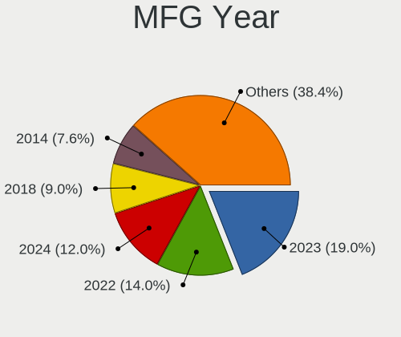
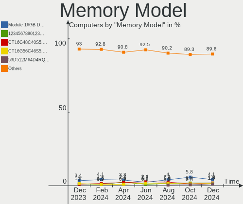

OPNsense Hardware Trends
------------------------

A project to identify most popular hardware characteristics and track their change
over time based on data collected by OPNsense users at https://BSD-Hardware.info.

Anyone can contribute to this report by the [hw-probe](https://github.com/linuxhw/hw-probe/blob/master/INSTALL.BSD.md) tool:

    hw-probe -all -upload

Full-feature report is available here: https://bsd-hardware.info/?view=trends

Period: Dec, 2021.

Contents
--------

* [ System ](#system)
  - [ OS                       ](#os)
  - [ OS Family                ](#os-family)
  - [ Arch                     ](#arch)
  - [ DE                       ](#de)
  - [ Display Server           ](#display-server)
  - [ Display Manager          ](#display-manager)
  - [ OS Lang                  ](#os-lang)
  - [ Boot Mode                ](#boot-mode)
  - [ Filesystem               ](#filesystem)
  - [ Part. scheme             ](#part-scheme)

* [ Board ](#board)
  - [ Vendor                   ](#vendor)
  - [ Model                    ](#model)
  - [ Model Family             ](#model-family)
  - [ MFG Year                 ](#mfg-year)
  - [ Form Factor              ](#form-factor)
  - [ Coreboot                 ](#coreboot)
  - [ RAM Size                 ](#ram-size)
  - [ RAM Used                 ](#ram-used)
  - [ Total Drives             ](#total-drives)
  - [ Has CD-ROM               ](#has-cd-rom)
  - [ Has Ethernet             ](#has-ethernet)
  - [ Has WiFi                 ](#has-wifi)
  - [ Has Bluetooth            ](#has-bluetooth)

* [ Location ](#location)
  - [ Country                  ](#country)
  - [ City                     ](#city)

* [ Drives ](#drives)
  - [ Drive Vendor             ](#drive-vendor)
  - [ Drive Model              ](#drive-model)
  - [ HDD Vendor               ](#hdd-vendor)
  - [ SSD Vendor               ](#ssd-vendor)
  - [ Drive Kind               ](#drive-kind)
  - [ Drive Connector          ](#drive-connector)
  - [ Drive Size               ](#drive-size)
  - [ Space Total              ](#space-total)
  - [ Space Used               ](#space-used)
  - [ Malfunc. Drives          ](#malfunc-drives)
  - [ Malfunc. Drive Vendor    ](#malfunc-drive-vendor)
  - [ Malfunc. HDD Vendor      ](#malfunc-hdd-vendor)
  - [ Malfunc. Drive Kind      ](#malfunc-drive-kind)
  - [ Failed Drives            ](#failed-drives)
  - [ Failed Drive Vendor      ](#failed-drive-vendor)
  - [ Drive Status             ](#drive-status)

* [ Storage controller ](#storage-controller)
  - [ Storage Vendor           ](#storage-vendor)
  - [ Storage Model            ](#storage-model)
  - [ Storage Kind             ](#storage-kind)

* [ Processor ](#processor)
  - [ CPU Vendor               ](#cpu-vendor)
  - [ CPU Model                ](#cpu-model)
  - [ CPU Model Family         ](#cpu-model-family)
  - [ CPU Cores                ](#cpu-cores)
  - [ CPU Sockets              ](#cpu-sockets)
  - [ CPU Threads              ](#cpu-threads)
  - [ CPU Microarch            ](#cpu-microarch)

* [ Graphics ](#graphics)
  - [ GPU Vendor               ](#gpu-vendor)
  - [ GPU Model                ](#gpu-model)
  - [ GPU Combo                ](#gpu-combo)
  - [ GPU Driver               ](#gpu-driver)
  - [ GPU Memory               ](#gpu-memory)

* [ Monitor ](#monitor)
  - [ Monitor Vendor           ](#monitor-vendor)
  - [ Monitor Model            ](#monitor-model)
  - [ Monitor Resolution       ](#monitor-resolution)
  - [ Monitor Diagonal         ](#monitor-diagonal)
  - [ Monitor Width            ](#monitor-width)
  - [ Aspect Ratio             ](#aspect-ratio)
  - [ Monitor Area             ](#monitor-area)
  - [ Pixel Density            ](#pixel-density)
  - [ Multiple Monitors        ](#multiple-monitors)

* [ Network ](#network)
  - [ Net Controller Vendor    ](#net-controller-vendor)
  - [ Net Controller Model     ](#net-controller-model)
  - [ Wireless Vendor          ](#wireless-vendor)
  - [ Wireless Model           ](#wireless-model)
  - [ Ethernet Vendor          ](#ethernet-vendor)
  - [ Ethernet Model           ](#ethernet-model)
  - [ Net Controller Kind      ](#net-controller-kind)
  - [ Used Controller          ](#used-controller)
  - [ NICs                     ](#nics)
  - [ IPv6                     ](#ipv6)

* [ Bluetooth ](#bluetooth)
  - [ Bluetooth Vendor         ](#bluetooth-vendor)
  - [ Bluetooth Model          ](#bluetooth-model)

* [ Sound ](#sound)
  - [ Sound Vendor             ](#sound-vendor)
  - [ Sound Model              ](#sound-model)

* [ Memory ](#memory)
  - [ Memory Vendor            ](#memory-vendor)
  - [ Memory Model             ](#memory-model)
  - [ Memory Kind              ](#memory-kind)
  - [ Memory Form Factor       ](#memory-form-factor)
  - [ Memory Size              ](#memory-size)
  - [ Memory Speed             ](#memory-speed)

* [ Printers & scanners ](#printers--scanners)
  - [ Printer Vendor           ](#printer-vendor)
  - [ Printer Model            ](#printer-model)
  - [ Scanner Vendor           ](#scanner-vendor)
  - [ Scanner Model            ](#scanner-model)

* [ Camera ](#camera)
  - [ Camera Vendor            ](#camera-vendor)
  - [ Camera Model             ](#camera-model)

* [ Security ](#security)
  - [ Fingerprint Vendor       ](#fingerprint-vendor)
  - [ Fingerprint Model        ](#fingerprint-model)
  - [ Chipcard Vendor          ](#chipcard-vendor)
  - [ Chipcard Model           ](#chipcard-model)

* [ Unsupported ](#unsupported)
  - [ Unsupported Devices      ](#unsupported-devices)
  - [ Unsupported Device Types ](#unsupported-device-types)

System
------

OS
--

Installed operating systems

| Name                   | Computers | Percent |
|------------------------|-----------|---------|
| OPNsense 21.7.7        | 104       | 46.22%  |
| OPNsense 21.7.6        | 93        | 41.33%  |
| OPNsense 22.1          | 9         | 4%      |
| OPNsense 21.1.9        | 4         | 1.78%   |
| OPNsense 21.7.4        | 3         | 1.33%   |
| OPNsense 12.1-p21-HBSD | 3         | 1.33%   |
| OPNsense 21.7.5        | 2         | 0.89%   |
| OPNsense 21.7.3        | 2         | 0.89%   |
| OPNsense 21.7.2        | 2         | 0.89%   |
| OPNsense 21.7.1        | 1         | 0.44%   |
| OPNsense 12.1-p20-HBSD | 1         | 0.44%   |
| OPNsense 12.1-p19-HBSD | 1         | 0.44%   |

OS Family
---------

OS without a version

| Name     | Computers | Percent |
|----------|-----------|---------|
| OPNsense | 225       | 100%    |

Arch
----

OS architecture (x86_64, i586, etc.)

| Name  | Computers | Percent |
|-------|-----------|---------|
| amd64 | 223       | 99.11%  |
| arm64 | 2         | 0.89%   |

DE
--

Desktop Environment

| Name         | Computers | Percent |
|--------------|-----------|---------|
| Console      | 224       | 99.56%  |
| helloDesktop | 1         | 0.44%   |

Display Server
--------------

X11 or Wayland

| Name    | Computers | Percent |
|---------|-----------|---------|
| Console | 225       | 100%    |

Display Manager
---------------

SDDM, LightDM, etc.

| Name    | Computers | Percent |
|---------|-----------|---------|
| Console | 225       | 100%    |

OS Lang
-------

Language

| Lang    | Computers | Percent |
|---------|-----------|---------|
| Unknown | 225       | 100%    |

Boot Mode
---------

EFI or BIOS

| Mode | Computers | Percent |
|------|-----------|---------|
| EFI  | 204       | 90.67%  |
| BIOS | 21        | 9.33%   |

Filesystem
----------

Type of filesystem

| Type | Computers | Percent |
|------|-----------|---------|
| Ufs  | 164       | 72.89%  |
| Zfs  | 61        | 27.11%  |

Part. scheme
------------

Scheme of partitioning

| Type    | Computers | Percent |
|---------|-----------|---------|
| GPT     | 209       | 92.89%  |
| MBR     | 11        | 4.89%   |
| Unknown | 4         | 1.78%   |
| BSD     | 1         | 0.44%   |

Board
-----

Vendor
------

Motherboard manufacturer

| Name                        | Computers | Percent |
|-----------------------------|-----------|---------|
| Unknown                     | 33        | 14.67%  |
| Dell                        | 25        | 11.11%  |
| Hewlett-Packard             | 21        | 9.33%   |
| Protectli                   | 17        | 7.56%   |
| Supermicro                  | 15        | 6.67%   |
| Intel                       | 13        | 5.78%   |
| Sophos                      | 11        | 4.89%   |
| ASRock                      | 11        | 4.89%   |
| PC Engines                  | 10        | 4.44%   |
| ASUSTek Computer            | 8         | 3.56%   |
| ZOTAC                       | 6         | 2.67%   |
| Lenovo                      | 6         | 2.67%   |
| Fujitsu                     | 6         | 2.67%   |
| MSI                         | 5         | 2.22%   |
| Deciso                      | 5         | 2.22%   |
| Gigabyte Technology         | 4         | 1.78%   |
| AMI                         | 4         | 1.78%   |
| Biostar                     | 3         | 1.33%   |
| AWOW                        | 3         | 1.33%   |
| NEXCOM                      | 2         | 0.89%   |
| HPE                         | 2         | 0.89%   |
| YANYU                       | 1         | 0.44%   |
| ShenZhen MinWin Technology  | 1         | 0.44%   |
| OEM                         | 1         | 0.44%   |
| NU591                       | 1         | 0.44%   |
| Netgate                     | 1         | 0.44%   |
| Lex                         | 1         | 0.44%   |
| Jetway                      | 1         | 0.44%   |
| HARDKERNEL                  | 1         | 0.44%   |
| Elitegroup Computer Systems | 1         | 0.44%   |
| Chuwi                       | 1         | 0.44%   |
| CheckPoint                  | 1         | 0.44%   |
| BESSTAR Tech                | 1         | 0.44%   |
| ASRockRack                  | 1         | 0.44%   |
| Apple                       | 1         | 0.44%   |
| Advantech                   | 1         | 0.44%   |

Model
-----

Motherboard model

| Name                                    | Computers | Percent |
|-----------------------------------------|-----------|---------|
| Unknown                                 | 33        | 14.67%  |
| PC Engines apu4                         | 7         | 3.11%   |
| Sophos XG                               | 6         | 2.67%   |
| Protectli FW4B                          | 6         | 2.67%   |
| Supermicro Super Server                 | 5         | 2.22%   |
| Protectli FW6                           | 5         | 2.22%   |
| Intel Q3XXG4-P V1.0                     | 5         | 2.22%   |
| Dell OptiPlex 3010                      | 5         | 2.22%   |
| Dell OptiPlex 9020                      | 4         | 1.78%   |
| Sophos UTM                              | 3         | 1.33%   |
| Protectli FW6E                          | 3         | 1.33%   |
| Deciso Netboard A20                     | 3         | 1.33%   |
| ZOTAC ZBOX-CI327NANO-GS-01              | 2         | 0.89%   |
| ZOTAC ZBOX-CI323NANO                    | 2         | 0.89%   |
| Supermicro A1SAi                        | 2         | 0.89%   |
| Sophos SG                               | 2         | 0.89%   |
| Protectli FW6D                          | 2         | 0.89%   |
| PC Engines APU2                         | 2         | 0.89%   |
| MSI MS-7592                             | 2         | 0.89%   |
| HP t730 Thin Client                     | 2         | 0.89%   |
| HP t620 PLUS Quad Core TC               | 2         | 0.89%   |
| HP ProDesk 600 G2 SFF                   | 2         | 0.89%   |
| HP ProDesk 600 G1 SFF                   | 2         | 0.89%   |
| Dell PowerEdge R410                     | 2         | 0.89%   |
| Dell PowerEdge R210 II                  | 2         | 0.89%   |
| Deciso DEC2700 - OPNsense Appliance     | 2         | 0.89%   |
| AWOW PC BOX                             | 2         | 0.89%   |
| AMI Aptio CRB                           | 2         | 0.89%   |
| ZOTAC ZBOX-CI527/CI547                  | 1         | 0.44%   |
| ZOTAC ZBOX-CI321NANO                    | 1         | 0.44%   |
| YANYU H67SL                             | 1         | 0.44%   |
| Supermicro X8SIL                        | 1         | 0.44%   |
| Supermicro X11SSN-L                     | 1         | 0.44%   |
| Supermicro X10SLM+-LN4F                 | 1         | 0.44%   |
| Supermicro X10SLH-N6-ST031              | 1         | 0.44%   |
| Supermicro SYS-E300-9D-8CN8TP           | 1         | 0.44%   |
| Supermicro SYS-5019A-FTN4               | 1         | 0.44%   |
| Supermicro SYS-1019D-4C-FHN13TP         | 1         | 0.44%   |
| Supermicro A2SDi-4C-HLN4F               | 1         | 0.44%   |
| ShenZhen MinWin 3865U-6L                | 1         | 0.44%   |
| Protectli FW4A                          | 1         | 0.44%   |
| PC Engines APU                          | 1         | 0.44%   |
| OEM AR-B5800                            | 1         | 0.44%   |
| NU591 LES v3                            | 1         | 0.44%   |
| NEXCOM NDIS B322                        | 1         | 0.44%   |
| NEXCOM ASG                              | 1         | 0.44%   |
| Netgate SG-5100                         | 1         | 0.44%   |
| MSI MS-7B31                             | 1         | 0.44%   |
| MSI MS-7846                             | 1         | 0.44%   |
| MSI MS-7799                             | 1         | 0.44%   |
| Lex Pineview-D                          | 1         | 0.44%   |
| Lenovo ThinkPad T430s 2356JH4           | 1         | 0.44%   |
| Lenovo ThinkCentre M93 10A4-A00DGE      | 1         | 0.44%   |
| Lenovo ThinkCentre M83 10E8S00800       | 1         | 0.44%   |
| Lenovo ThinkCentre M720q 10T8S2A30S     | 1         | 0.44%   |
| Lenovo ThinkCentre M710s 10M8S6JL00     | 1         | 0.44%   |
| Lenovo IdeaCentre 300S-08IHH 90F10030US | 1         | 0.44%   |
| Jetway 1.0                              | 1         | 0.44%   |
| Intel SKYBAY                            | 1         | 0.44%   |
| Intel S1200KP AAG34877-201              | 1         | 0.44%   |

Model Family
------------

Motherboard model prefix

| Name                            | Computers | Percent |
|---------------------------------|-----------|---------|
| Unknown                         | 33        | 14.67%  |
| Dell OptiPlex                   | 14        | 6.22%   |
| Dell PowerEdge                  | 8         | 3.56%   |
| PC Engines apu4                 | 7         | 3.11%   |
| Sophos XG                       | 6         | 2.67%   |
| Protectli FW4B                  | 6         | 2.67%   |
| HP ProDesk                      | 6         | 2.67%   |
| Supermicro Super                | 5         | 2.22%   |
| Protectli FW6                   | 5         | 2.22%   |
| Intel Q3XXG4-P                  | 5         | 2.22%   |
| Lenovo ThinkCentre              | 4         | 1.78%   |
| HP ProLiant                     | 4         | 1.78%   |
| Sophos UTM                      | 3         | 1.33%   |
| Protectli FW6E                  | 3         | 1.33%   |
| HP Compaq                       | 3         | 1.33%   |
| Fujitsu FUTRO                   | 3         | 1.33%   |
| Fujitsu ESPRIMO                 | 3         | 1.33%   |
| Deciso Netboard                 | 3         | 1.33%   |
| ZOTAC ZBOX-CI327NANO-GS-01      | 2         | 0.89%   |
| ZOTAC ZBOX-CI323NANO            | 2         | 0.89%   |
| Supermicro A1SAi                | 2         | 0.89%   |
| Sophos SG                       | 2         | 0.89%   |
| Protectli FW6D                  | 2         | 0.89%   |
| PC Engines APU2                 | 2         | 0.89%   |
| MSI MS-7592                     | 2         | 0.89%   |
| HPE ProLiant                    | 2         | 0.89%   |
| HP t730                         | 2         | 0.89%   |
| HP t620                         | 2         | 0.89%   |
| Dell Precision                  | 2         | 0.89%   |
| Deciso DEC2700                  | 2         | 0.89%   |
| AWOW PC                         | 2         | 0.89%   |
| AMI Aptio                       | 2         | 0.89%   |
| ZOTAC ZBOX-CI527                | 1         | 0.44%   |
| ZOTAC ZBOX-CI321NANO            | 1         | 0.44%   |
| YANYU H67SL                     | 1         | 0.44%   |
| Supermicro X8SIL                | 1         | 0.44%   |
| Supermicro X11SSN-L             | 1         | 0.44%   |
| Supermicro X10SLM+-LN4F         | 1         | 0.44%   |
| Supermicro X10SLH-N6-ST031      | 1         | 0.44%   |
| Supermicro SYS-E300-9D-8CN8TP   | 1         | 0.44%   |
| Supermicro SYS-5019A-FTN4       | 1         | 0.44%   |
| Supermicro SYS-1019D-4C-FHN13TP | 1         | 0.44%   |
| Supermicro A2SDi-4C-HLN4F       | 1         | 0.44%   |
| ShenZhen MinWin 3865U-6L        | 1         | 0.44%   |
| Protectli FW4A                  | 1         | 0.44%   |
| PC Engines APU                  | 1         | 0.44%   |
| OEM AR-B5800                    | 1         | 0.44%   |
| NU591 LES                       | 1         | 0.44%   |
| NEXCOM NDIS                     | 1         | 0.44%   |
| NEXCOM ASG                      | 1         | 0.44%   |
| Netgate SG-5100                 | 1         | 0.44%   |
| MSI MS-7B31                     | 1         | 0.44%   |
| MSI MS-7846                     | 1         | 0.44%   |
| MSI MS-7799                     | 1         | 0.44%   |
| Lex Pineview-D                  | 1         | 0.44%   |
| Lenovo ThinkPad                 | 1         | 0.44%   |
| Lenovo IdeaCentre               | 1         | 0.44%   |
| Jetway 1.0                      | 1         | 0.44%   |
| Intel SKYBAY                    | 1         | 0.44%   |
| Intel S1200KP                   | 1         | 0.44%   |

MFG Year
--------

Motherboard manufacture year

| Year    | Computers | Percent |
|---------|-----------|---------|
| 2021    | 47        | 20.89%  |
| 2018    | 32        | 14.22%  |
| 2019    | 29        | 12.89%  |
| 2020    | 26        | 11.56%  |
| 2014    | 19        | 8.44%   |
| 2013    | 17        | 7.56%   |
| 2017    | 13        | 5.78%   |
| 2016    | 10        | 4.44%   |
| 2012    | 8         | 3.56%   |
| 2011    | 7         | 3.11%   |
| 2010    | 5         | 2.22%   |
| 2015    | 4         | 1.78%   |
| 2009    | 3         | 1.33%   |
| 2008    | 3         | 1.33%   |
| Unknown | 2         | 0.89%   |

Form Factor
-----------

Physical design of the computer

| Name     | Computers | Percent |
|----------|-----------|---------|
| Desktop  | 165       | 73.33%  |
| Mini pc  | 20        | 8.89%   |
| Server   | 18        | 8%      |
| Firewall | 11        | 4.89%   |
| Notebook | 11        | 4.89%   |

Coreboot
--------

Have coreboot on board

| Used | Computers | Percent |
|------|-----------|---------|
| No   | 213       | 94.67%  |
| Yes  | 12        | 5.33%   |

RAM Size
--------

Total RAM memory

| Size in GB  | Computers | Percent |
|-------------|-----------|---------|
| 8.01-16.0   | 92        | 40.89%  |
| 4.01-8.0    | 55        | 24.44%  |
| 16.01-24.0  | 41        | 18.22%  |
| 32.01-64.0  | 15        | 6.67%   |
| 2.01-3.0    | 13        | 5.78%   |
| 64.01-256.0 | 5         | 2.22%   |
| 3.01-4.0    | 3         | 1.33%   |
| 24.01-32.0  | 1         | 0.44%   |

RAM Used
--------

Used RAM memory

| Used GB   | Computers | Percent |
|-----------|-----------|---------|
| 0.01-0.5  | 138       | 61.33%  |
| 0.51-1.0  | 53        | 23.56%  |
| 1.01-2.0  | 19        | 8.44%   |
| 4.01-8.0  | 8         | 3.56%   |
| 2.01-3.0  | 4         | 1.78%   |
| 3.01-4.0  | 2         | 0.89%   |
| 8.01-16.0 | 1         | 0.44%   |

Total Drives
------------

Number of drives on board

| Drives | Computers | Percent |
|--------|-----------|---------|
| 1      | 189       | 84%     |
| 0      | 18        | 8%      |
| 2      | 14        | 6.22%   |
| 4      | 2         | 0.89%   |
| 3      | 2         | 0.89%   |

Has CD-ROM
----------

Has CD-ROM on board

| Presented | Computers | Percent |
|-----------|-----------|---------|
| No        | 198       | 88%     |
| Yes       | 27        | 12%     |

Has Ethernet
------------

Has Ethernet on board

| Presented | Computers | Percent |
|-----------|-----------|---------|
| Yes       | 225       | 100%    |

Has WiFi
--------

Has WiFi module

| Presented | Computers | Percent |
|-----------|-----------|---------|
| No        | 175       | 77.78%  |
| Yes       | 50        | 22.22%  |

Has Bluetooth
-------------

Has Bluetooth module

| Presented | Computers | Percent |
|-----------|-----------|---------|
| No        | 208       | 92.44%  |
| Yes       | 17        | 7.56%   |

Location
--------

Country
-------

Geographic location (country)

| Country      | Computers | Percent |
|--------------|-----------|---------|
| USA          | 74        | 32.89%  |
| Germany      | 59        | 26.22%  |
| Netherlands  | 12        | 5.33%   |
| Austria      | 7         | 3.11%   |
| Switzerland  | 6         | 2.67%   |
| France       | 6         | 2.67%   |
| Sweden       | 5         | 2.22%   |
| Spain        | 5         | 2.22%   |
| Canada       | 5         | 2.22%   |
| Poland       | 4         | 1.78%   |
| Denmark      | 4         | 1.78%   |
| UK           | 3         | 1.33%   |
| South Korea  | 3         | 1.33%   |
| Russia       | 3         | 1.33%   |
| Romania      | 3         | 1.33%   |
| Hungary      | 3         | 1.33%   |
| Australia    | 3         | 1.33%   |
| Taiwan       | 2         | 0.89%   |
| South Africa | 2         | 0.89%   |
| New Zealand  | 2         | 0.89%   |
| Italy        | 2         | 0.89%   |
| India        | 2         | 0.89%   |
| Ukraine      | 1         | 0.44%   |
| Singapore    | 1         | 0.44%   |
| Qatar        | 1         | 0.44%   |
| Portugal     | 1         | 0.44%   |
| Peru         | 1         | 0.44%   |
| Japan        | 1         | 0.44%   |
| Isle of Man  | 1         | 0.44%   |
| Ireland      | 1         | 0.44%   |
| Indonesia    | 1         | 0.44%   |
| Belgium      | 1         | 0.44%   |

City
----

Geographic location (city)

| City              | Computers | Percent |
|-------------------|-----------|---------|
| Berlin            | 6         | 2.67%   |
| Munich            | 5         | 2.22%   |
| Moscow            | 4         | 1.78%   |
| Zeitz             | 3         | 1.33%   |
| Woodbridge        | 3         | 1.33%   |
| Krakow            | 3         | 1.33%   |
| Karlsruhe         | 3         | 1.33%   |
| Valencia          | 2         | 0.89%   |
| San Diego         | 2         | 0.89%   |
| Rochester         | 2         | 0.89%   |
| Potsdam           | 2         | 0.89%   |
| Portland          | 2         | 0.89%   |
| New York          | 2         | 0.89%   |
| Mountain View     | 2         | 0.89%   |
| Milwaukee         | 2         | 0.89%   |
| Madison           | 2         | 0.89%   |
| Jena              | 2         | 0.89%   |
| Jeju City         | 2         | 0.89%   |
| Frankfurt am Main | 2         | 0.89%   |
| Duisburg          | 2         | 0.89%   |
| Cologne           | 2         | 0.89%   |
| Brooklyn          | 2         | 0.89%   |
| Bothell           | 2         | 0.89%   |
| Zwickau           | 1         | 0.44%   |
| Zurich            | 1         | 0.44%   |
| Zoetermeer        | 1         | 0.44%   |
| Zaltbommel        | 1         | 0.44%   |
| Yeosu             | 1         | 0.44%   |
| Windsor Mill      | 1         | 0.44%   |
| Whitewater        | 1         | 0.44%   |
| Westminster       | 1         | 0.44%   |
| Werl              | 1         | 0.44%   |
| Wellington        | 1         | 0.44%   |
| Warsaw            | 1         | 0.44%   |
| Warren            | 1         | 0.44%   |
| Waltham           | 1         | 0.44%   |
| Vienna            | 1         | 0.44%   |
| Victoria          | 1         | 0.44%   |
| Upplands Vasby    | 1         | 0.44%   |
| Udine             | 1         | 0.44%   |
| Trenton           | 1         | 0.44%   |
| Toronto           | 1         | 0.44%   |
| The Villages      | 1         | 0.44%   |
| The Hague         | 1         | 0.44%   |
| Tarragona         | 1         | 0.44%   |
| Tainan City       | 1         | 0.44%   |
| Szigetszentmiklos | 1         | 0.44%   |
| Sz?©kesfeh?©rv??r | 1         | 0.44%   |
| Stralsund         | 1         | 0.44%   |
| Stockholm         | 1         | 0.44%   |
| Statesboro        | 1         | 0.44%   |
| Solms             | 1         | 0.44%   |
| Solleftea         | 1         | 0.44%   |
| Soborg            | 1         | 0.44%   |
| Sioux Falls       | 1         | 0.44%   |
| Singen            | 1         | 0.44%   |
| Sindelfingen      | 1         | 0.44%   |
| Silver Spring     | 1         | 0.44%   |
| Seattle           | 1         | 0.44%   |
| Schwerte          | 1         | 0.44%   |

Drives
------

Drive Vendor
------------

Hard drive vendors

| Vendor              | Computers | Drives | Percent |
|---------------------|-----------|--------|---------|
| Samsung Electronics | 29        | 33     | 13.36%  |
| Transcend           | 22        | 22     | 10.14%  |
| Kingston            | 16        | 16     | 7.37%   |
| Intel               | 12        | 12     | 5.53%   |
| SanDisk             | 11        | 12     | 5.07%   |
| WDC                 | 10        | 10     | 4.61%   |
| Seagate             | 9         | 11     | 4.15%   |
| Crucial             | 9         | 10     | 4.15%   |
| A-DATA Technology   | 9         | 10     | 4.15%   |
| Hoodisk             | 8         | 8      | 3.69%   |
| Toshiba             | 7         | 7      | 3.23%   |
| Phison              | 7         | 7      | 3.23%   |
| Intenso             | 6         | 6      | 2.76%   |
| HGST                | 5         | 8      | 2.3%    |
| DOGFISH             | 5         | 5      | 2.3%    |
| Micron Technology   | 4         | 4      | 1.84%   |
| SK Hynix            | 3         | 3      | 1.38%   |
| OCZ                 | 3         | 3      | 1.38%   |
| Hewlett-Packard     | 3         | 5      | 1.38%   |
| FORESEE             | 3         | 3      | 1.38%   |
| China               | 3         | 3      | 1.38%   |
| Protectli           | 2         | 2      | 0.92%   |
| Netac               | 2         | 2      | 0.92%   |
| MyDigitalSSD        | 2         | 2      | 0.92%   |
| Kston               | 2         | 2      | 0.92%   |
| Innodisk            | 2         | 2      | 0.92%   |
| Advantech           | 2         | 2      | 0.92%   |
| Yeyian              | 1         | 2      | 0.46%   |
| Verbatim            | 1         | 1      | 0.46%   |
| Terabit             | 1         | 1      | 0.46%   |
| SuperMicro          | 1         | 1      | 0.46%   |
| SPCC                | 1         | 1      | 0.46%   |
| PLEXTOR             | 1         | 1      | 0.46%   |
| Patriot             | 1         | 1      | 0.46%   |
| Mushkin             | 1         | 1      | 0.46%   |
| MAXTOR              | 1         | 1      | 0.46%   |
| LITEONIT            | 1         | 1      | 0.46%   |
| LITEON              | 1         | 1      | 0.46%   |
| KIOXIA              | 1         | 1      | 0.46%   |
| KingSpec            | 1         | 1      | 0.46%   |
| Indilinx            | 1         | 1      | 0.46%   |
| IBM-207x            | 1         | 1      | 0.46%   |
| HPE                 | 1         | 1      | 0.46%   |
| HCiPC               | 1         | 1      | 0.46%   |
| Gigabyte Technology | 1         | 1      | 0.46%   |
| Fujitsu             | 1         | 1      | 0.46%   |
| BIWIN               | 1         | 1      | 0.46%   |
| Apacer              | 1         | 1      | 0.46%   |

Drive Model
-----------

Hard drive models

| Model                                     | Computers | Percent |
|-------------------------------------------|-----------|---------|
| Kingston SUV500MS120G 120GB               | 6         | 2.75%   |
| Hoodisk SSD 128GB                         | 4         | 1.83%   |
| Transcend TS64GMSA370 64GB                | 3         | 1.38%   |
| Transcend TS256GMTS952T2 256GB            | 3         | 1.38%   |
| Samsung SSD 840 Series 120GB              | 3         | 1.38%   |
| Kingston SV300S37A120G 120GB              | 3         | 1.38%   |
| FORESEE 128GB SSD                         | 3         | 1.38%   |
| Crucial CT250MX500SSD1 250GB              | 3         | 1.38%   |
| China XJH-128GB                           | 3         | 1.38%   |
| WDC WD10EFRX-68JCSN0 1TB                  | 2         | 0.92%   |
| Transcend TS64GMSA230S 64GB               | 2         | 0.92%   |
| Transcend TS32GSSD370 32GB                | 2         | 0.92%   |
| Transcend TS256GMTE652T2 256GB            | 2         | 0.92%   |
| Transcend TS128GMSA230S 128GB             | 2         | 0.92%   |
| Toshiba DT01ACA050 500GB                  | 2         | 0.92%   |
| Samsung SSD 840 EVO 250GB                 | 2         | 0.92%   |
| Samsung SSD 840 EVO 120GB mSATA           | 2         | 0.92%   |
| Phison SATA SSD 16GB                      | 2         | 0.92%   |
| MyDigitalSSD SB2 128GB                    | 2         | 0.92%   |
| Kston SSD 128GB                           | 2         | 0.92%   |
| Kingston SKC600MS512G 512GB               | 2         | 0.92%   |
| Intenso SSD Sata III 128GB                | 2         | 0.92%   |
| Intel SSDSC2BW180A4 180GB                 | 2         | 0.92%   |
| HGST HTS545050A7E680 500GB                | 2         | 0.92%   |
| HP RAID 1(1+0) 73GB                       | 2         | 0.92%   |
| Dogfish SSD 128GB                         | 2         | 0.92%   |
| Crucial CT240BX500SSD1 240GB              | 2         | 0.92%   |
| A-DATA SP900 64GB                         | 2         | 0.92%   |
| Yeyian VALK 3000 250GB                    | 1         | 0.46%   |
| WDC WDS500G2B0A-00SM50 500GB              | 1         | 0.46%   |
| WDC WDS250G3X0C-00SJG0 250GB              | 1         | 0.46%   |
| WDC WD800JD-08LSA0 80GB                   | 1         | 0.46%   |
| WDC WD5000AAKS-00A7B2 500GB               | 1         | 0.46%   |
| WDC WD2503ABYX-01WERA1 256GB              | 1         | 0.46%   |
| WDC WD2500AAKX-07U6AA0 250GB              | 1         | 0.46%   |
| WDC WD2500AAJS-07M0A0 250GB               | 1         | 0.46%   |
| WDC WD10EFRX-68FYTN0 1TB                  | 1         | 0.46%   |
| Verbatim Vi550 S3 SSD 128GB               | 1         | 0.46%   |
| Transcend TS64GSSD370 64GB                | 1         | 0.46%   |
| Transcend TS32GMTS600 32GB                | 1         | 0.46%   |
| Transcend TS32GCF170 32GB                 | 1         | 0.46%   |
| Transcend TS256GMSA370S 256GB             | 1         | 0.46%   |
| Transcend TS256GMSA230S 256GB             | 1         | 0.46%   |
| Transcend TS16EPTMM1600L 16GB             | 1         | 0.46%   |
| Transcend TS128GMTS600 128GB              | 1         | 0.46%   |
| Transcend TS128GMSA370 128GB              | 1         | 0.46%   |
| Toshiba THNSNJ128GMCU 128GB               | 1         | 0.46%   |
| Toshiba THNSNH060GCST 64GB                | 1         | 0.46%   |
| Toshiba MQ01ABD100 1TB                    | 1         | 0.46%   |
| Toshiba MQ01ABD032 320GB                  | 1         | 0.46%   |
| Toshiba DT01ACA100 1TB                    | 1         | 0.46%   |
| Terabit T50S3STMLC-256G                   | 1         | 0.46%   |
| SuperMicro SSD 64GB                       | 1         | 0.46%   |
| SPCC Solid State Disk 128GB               | 1         | 0.46%   |
| SK Hynix SKHynix_HFS256GD9TNG-L5B0B 256GB | 1         | 0.46%   |
| SK Hynix SHGS31-250GS-2 250GB             | 1         | 0.46%   |
| SK Hynix SC311 SATA 128GB                 | 1         | 0.46%   |
| Seagate ST9120822AS 120GB                 | 1         | 0.46%   |
| Seagate ST500NM0011 500GB                 | 1         | 0.46%   |
| Seagate ST500LM021-1KJ152 500GB           | 1         | 0.46%   |

HDD Vendor
----------

Hard disk drive vendors

| Vendor          | Computers | Drives | Percent |
|-----------------|-----------|--------|---------|
| Seagate         | 9         | 11     | 26.47%  |
| WDC             | 8         | 8      | 23.53%  |
| Toshiba         | 5         | 5      | 14.71%  |
| HGST            | 5         | 8      | 14.71%  |
| Hewlett-Packard | 3         | 5      | 8.82%   |
| MAXTOR          | 1         | 1      | 2.94%   |
| IBM-207x        | 1         | 1      | 2.94%   |
| HPE             | 1         | 1      | 2.94%   |
| Fujitsu         | 1         | 1      | 2.94%   |

SSD Vendor
----------

Solid state drive vendors

| Vendor              | Computers | Drives | Percent |
|---------------------|-----------|--------|---------|
| Transcend           | 20        | 20     | 12.12%  |
| Samsung Electronics | 19        | 20     | 11.52%  |
| Kingston            | 16        | 16     | 9.7%    |
| Intel               | 12        | 12     | 7.27%   |
| SanDisk             | 11        | 12     | 6.67%   |
| Hoodisk             | 8         | 8      | 4.85%   |
| Crucial             | 8         | 9      | 4.85%   |
| A-DATA Technology   | 8         | 9      | 4.85%   |
| Phison              | 6         | 6      | 3.64%   |
| Intenso             | 6         | 6      | 3.64%   |
| Dogfish             | 5         | 5      | 3.03%   |
| Micron Technology   | 4         | 4      | 2.42%   |
| OCZ                 | 3         | 3      | 1.82%   |
| FORESEE             | 3         | 3      | 1.82%   |
| China               | 3         | 3      | 1.82%   |
| Toshiba             | 2         | 2      | 1.21%   |
| SK Hynix            | 2         | 2      | 1.21%   |
| Protectli           | 2         | 2      | 1.21%   |
| Netac               | 2         | 2      | 1.21%   |
| MyDigitalSSD        | 2         | 2      | 1.21%   |
| Kston               | 2         | 2      | 1.21%   |
| Innodisk            | 2         | 2      | 1.21%   |
| Advantech           | 2         | 2      | 1.21%   |
| Yeyian              | 1         | 2      | 0.61%   |
| WDC                 | 1         | 1      | 0.61%   |
| Verbatim            | 1         | 1      | 0.61%   |
| Terabit             | 1         | 1      | 0.61%   |
| SuperMicro          | 1         | 1      | 0.61%   |
| SPCC                | 1         | 1      | 0.61%   |
| PLEXTOR             | 1         | 1      | 0.61%   |
| Patriot             | 1         | 1      | 0.61%   |
| Mushkin             | 1         | 1      | 0.61%   |
| LITEONIT            | 1         | 1      | 0.61%   |
| LITEON              | 1         | 1      | 0.61%   |
| KingSpec            | 1         | 1      | 0.61%   |
| Indilinx            | 1         | 1      | 0.61%   |
| HCiPC               | 1         | 1      | 0.61%   |
| Gigabyte Technology | 1         | 1      | 0.61%   |
| BIWIN               | 1         | 1      | 0.61%   |
| Apacer              | 1         | 1      | 0.61%   |

Drive Kind
----------

HDD or SSD

| Kind | Computers | Drives | Percent |
|------|-----------|--------|---------|
| SSD  | 159       | 170    | 75.36%  |
| HDD  | 34        | 41     | 16.11%  |
| NVMe | 18        | 21     | 8.53%   |

Drive Connector
---------------

SATA, SAS, NVMe, etc.

| Type | Computers | Drives | Percent |
|------|-----------|--------|---------|
| SATA | 189       | 211    | 91.3%   |
| NVMe | 18        | 21     | 8.7%    |

Drive Size
----------

Size of hard drive

| Size in TB | Computers | Drives | Percent |
|------------|-----------|--------|---------|
| 0.01-0.5   | 173       | 187    | 90.1%   |
| 0.51-1.0   | 17        | 17     | 8.85%   |
| 1.01-2.0   | 1         | 3      | 0.52%   |
| 4.01-10.0  | 1         | 4      | 0.52%   |

Space Total
-----------

Amount of disk space available on the file system

| Size in GB     | Computers | Percent |
|----------------|-----------|---------|
| 101-250        | 112       | 49.78%  |
| 21-50          | 30        | 13.33%  |
| 51-100         | 30        | 13.33%  |
| 251-500        | 25        | 11.11%  |
| 1-20           | 13        | 5.78%   |
| 501-1000       | 13        | 5.78%   |
| More than 3000 | 1         | 0.44%   |
| 1001-2000      | 1         | 0.44%   |

Space Used
----------

Amount of used disk space

| Used GB | Computers | Percent |
|---------|-----------|---------|
| 1-20    | 220       | 97.78%  |
| 21-50   | 4         | 1.78%   |
| 101-250 | 1         | 0.44%   |

Malfunc. Drives
---------------

Drive models with a malfunction

| Model                                       | Computers | Drives | Percent |
|---------------------------------------------|-----------|--------|---------|
| MyDigitalSSD SB2 128GB                      | 2         | 2      | 10.53%  |
| Terabit T50S3STMLC-256G                     | 1         | 1      | 5.26%   |
| Seagate ST9120822AS 120GB                   | 1         | 1      | 5.26%   |
| Seagate ST500NM0011 500GB                   | 1         | 2      | 5.26%   |
| Seagate ST500LM021-1KJ152 500GB             | 1         | 1      | 5.26%   |
| Seagate ST3500418AS 500GB                   | 1         | 1      | 5.26%   |
| Seagate ST320LM010-1KJ15C 320GB             | 1         | 1      | 5.26%   |
| SanDisk SD8TB8U-256G-1006 256GB             | 1         | 1      | 5.26%   |
| Samsung Electronics MZMPA016HMCD-000L1 16GB | 1         | 1      | 5.26%   |
| PLEXTOR PX-128G7Ne 128GB                    | 1         | 1      | 5.26%   |
| Phison SATA SSD 32GB                        | 1         | 1      | 5.26%   |
| MAXTOR STM3250310AS 250GB                   | 1         | 1      | 5.26%   |
| LITEON CV8-8E128-HP 128GB                   | 1         | 1      | 5.26%   |
| Kingston SV300S37A120G 120GB                | 1         | 1      | 5.26%   |
| Intel SSDSC2BW120A3 120GB                   | 1         | 1      | 5.26%   |
| Intel SSDSA2BW160G3H 160GB                  | 1         | 1      | 5.26%   |
| HPE MB0500EBNCR 500GB                       | 1         | 1      | 5.26%   |
| A-DATA Technology SU650 120GB               | 1         | 1      | 5.26%   |

Malfunc. Drive Vendor
---------------------

Vendors of faulty drives

| Vendor              | Computers | Drives | Percent |
|---------------------|-----------|--------|---------|
| Seagate             | 5         | 6      | 26.32%  |
| MyDigitalSSD        | 2         | 2      | 10.53%  |
| Intel               | 2         | 2      | 10.53%  |
| Terabit             | 1         | 1      | 5.26%   |
| SanDisk             | 1         | 1      | 5.26%   |
| Samsung Electronics | 1         | 1      | 5.26%   |
| PLEXTOR             | 1         | 1      | 5.26%   |
| Phison              | 1         | 1      | 5.26%   |
| MAXTOR              | 1         | 1      | 5.26%   |
| LITEON              | 1         | 1      | 5.26%   |
| Kingston            | 1         | 1      | 5.26%   |
| HPE                 | 1         | 1      | 5.26%   |
| A-DATA Technology   | 1         | 1      | 5.26%   |

Malfunc. HDD Vendor
-------------------

Vendors of faulty HDD drives

| Vendor  | Computers | Drives | Percent |
|---------|-----------|--------|---------|
| Seagate | 5         | 6      | 71.43%  |
| MAXTOR  | 1         | 1      | 14.29%  |
| HPE     | 1         | 1      | 14.29%  |

Malfunc. Drive Kind
-------------------

Kinds of faulty drives

| Kind | Computers | Drives | Percent |
|------|-----------|--------|---------|
| SSD  | 12        | 12     | 63.16%  |
| HDD  | 7         | 8      | 36.84%  |

Failed Drives
-------------

Failed drive models

Zero info for selected period =(

Failed Drive Vendor
-------------------

Failed drive vendors

Zero info for selected period =(

Drive Status
------------

Number of failed and malfunc. drives

| Status   | Computers | Drives | Percent |
|----------|-----------|--------|---------|
| Works    | 185       | 207    | 88.52%  |
| Malfunc  | 19        | 20     | 9.09%   |
| Detected | 5         | 5      | 2.39%   |

Storage controller
------------------

Storage Vendor
--------------

Storage controller vendors

| Vendor                    | Computers | Percent |
|---------------------------|-----------|---------|
| Intel                     | 188       | 74.31%  |
| AMD                       | 27        | 10.67%  |
| Samsung Electronics       | 10        | 3.95%   |
| Broadcom / LSI            | 5         | 1.98%   |
| ASMedia Technology        | 4         | 1.58%   |
| Marvell Technology Group  | 3         | 1.19%   |
| Phison Electronics        | 2         | 0.79%   |
| Hewlett-Packard           | 2         | 0.79%   |
| Chelsio Communications    | 2         | 0.79%   |
| Unknown                   | 2         | 0.79%   |
| SK Hynix                  | 1         | 0.4%    |
| Silicon Image             | 1         | 0.4%    |
| Sandisk                   | 1         | 0.4%    |
| Nvidia                    | 1         | 0.4%    |
| Micron/Crucial Technology | 1         | 0.4%    |
| KIOXIA                    | 1         | 0.4%    |
| Dell                      | 1         | 0.4%    |
| ADATA Technology          | 1         | 0.4%    |

Storage Model
-------------

Storage controller models

| Model                                                                            | Computers | Percent |
|----------------------------------------------------------------------------------|-----------|---------|
| Intel Sunrise Point-LP SATA Controller [AHCI mode]                               | 23        | 8.16%   |
| Intel 8 Series/C220 Series Chipset Family 6-port SATA Controller 1 [AHCI mode]   | 21        | 7.45%   |
| AMD FCH SATA Controller [AHCI mode]                                              | 19        | 6.74%   |
| Intel Atom/Celeron/Pentium Processor x5-E8000/J3xxx/N3xxx Series SATA Controller | 16        | 5.67%   |
| Intel 6 Series/C200 Series Chipset Family 6 port Desktop SATA AHCI Controller    | 16        | 5.67%   |
| Intel Q170/Q150/B150/H170/H110/Z170/CM236 Chipset SATA Controller [AHCI Mode]    | 11        | 3.9%    |
| Intel Celeron N3350/Pentium N4200/Atom E3900 Series SATA AHCI Controller         | 8         | 2.84%   |
| Intel Celeron/Pentium Silver Processor SATA Controller                           | 7         | 2.48%   |
| Intel 82801HM/HEM (ICH8M/ICH8M-E) IDE Controller                                 | 7         | 2.48%   |
| Intel Atom Processor C3000 Series SATA Controller 0                              | 6         | 2.13%   |
| Intel 7 Series/C210 Series Chipset Family 6-port SATA Controller [AHCI mode]     | 6         | 2.13%   |
| Intel Wildcat Point-LP SATA Controller [AHCI Mode]                               | 5         | 1.77%   |
| Intel NM10/ICH7 Family SATA Controller [IDE mode]                                | 5         | 1.77%   |
| Intel Atom Processor E3800 Series SATA AHCI Controller                           | 5         | 1.77%   |
| Intel Atom Processor C3000 Series SATA Controller 1                              | 5         | 1.77%   |
| Intel 8 Series SATA Controller 1 [AHCI mode]                                     | 5         | 1.77%   |
| Intel 82801HM/HEM (ICH8M/ICH8M-E) SATA Controller [IDE mode]                     | 4         | 1.42%   |
| Intel 82801G (ICH7 Family) IDE Controller                                        | 4         | 1.42%   |
| Intel 200 Series PCH SATA controller [AHCI mode]                                 | 4         | 1.42%   |
| ASMedia ASM1062 Serial ATA Controller                                            | 4         | 1.42%   |
| AMD FCH SATA Controller [IDE mode]                                               | 4         | 1.42%   |
| Samsung NVMe SSD Controller SM961/PM961/SM963                                    | 3         | 1.06%   |
| Intel SATA Controller [RAID mode]                                                | 3         | 1.06%   |
| Intel NM10/ICH7 Family SATA Controller [AHCI mode]                               | 3         | 1.06%   |
| Intel Comet Lake SATA AHCI Controller                                            | 3         | 1.06%   |
| Intel Cannon Lake PCH SATA AHCI Controller                                       | 3         | 1.06%   |
| Intel Atom processor C2000 AHCI SATA3 Controller                                 | 3         | 1.06%   |
| Intel Atom processor C2000 AHCI SATA2 Controller                                 | 3         | 1.06%   |
| Intel 82801HM/HEM (ICH8M/ICH8M-E) SATA Controller [AHCI mode]                    | 3         | 1.06%   |
| Intel 7 Series Chipset Family 6-port SATA Controller [AHCI mode]                 | 3         | 1.06%   |
| AMD SB7x0/SB8x0/SB9x0 SATA Controller [AHCI mode]                                | 3         | 1.06%   |
| Samsung NVMe SSD Controller SM981/PM981/PM983                                    | 2         | 0.71%   |
| Samsung NVMe SSD Controller PM9A1/PM9A3/980PRO                                   | 2         | 0.71%   |
| Samsung NVMe SSD Controller 980                                                  | 2         | 0.71%   |
| Marvell Group 88SE9172 SATA 6Gb/s Controller                                     | 2         | 0.71%   |
| Intel C620 Series Chipset Family SSATA Controller [AHCI mode]                    | 2         | 0.71%   |
| Intel 400 Series Chipset Family SATA AHCI Controller                             | 2         | 0.71%   |
| Broadcom / LSI SAS1068E PCI-Express Fusion-MPT SAS                               | 2         | 0.71%   |
| AMD FCH IDE Controller                                                           | 2         | 0.71%   |
| Unknown                                                                          | 2         | 0.71%   |
| SK Hynix hynix unknown                                                           | 1         | 0.35%   |
| Silicon Image PCI0680 Ultra ATA-133 Host Controller                              | 1         | 0.35%   |
| Sandisk WD Black SN750 / PC SN730 NVMe SSD                                       | 1         | 0.35%   |
| Samsung NVMe SSD Controller SM951/PM951                                          | 1         | 0.35%   |
| Phison PS5013 E13 NVMe Controller                                                | 1         | 0.35%   |
| Phison E12 NVMe Controller                                                       | 1         | 0.35%   |
| Nvidia MCP61 SATA Controller                                                     | 1         | 0.35%   |
| Nvidia MCP61 IDE                                                                 | 1         | 0.35%   |
| Micron/Crucial NVMe Controller                                                   | 1         | 0.35%   |
| Marvell Group 88SE9230 PCIe 2.0 x2 4-port SATA 6 Gb/s RAID Controller            | 1         | 0.35%   |
| KIOXIA unknown                                                                   | 1         | 0.35%   |
| Intel Volume Management Device NVMe RAID Controller                              | 1         | 0.35%   |
| Intel Tiger Lake-LP SATA Controller [AHCI mode]                                  | 1         | 0.35%   |
| Intel Cannon Point-LP SATA Controller [AHCI Mode]                                | 1         | 0.35%   |
| Intel C620 Series Chipset Family SATA Controller [AHCI mode]                     | 1         | 0.35%   |
| Intel C600/X79 series chipset 6-Port SATA AHCI Controller                        | 1         | 0.35%   |
| Intel C600/X79 series chipset 4-Port SATA IDE Controller                         | 1         | 0.35%   |
| Intel 9 Series Chipset Family SATA Controller [AHCI Mode]                        | 1         | 0.35%   |
| Intel 82801JI (ICH10 Family) SATA AHCI Controller                                | 1         | 0.35%   |
| Intel 82801JI (ICH10 Family) 4 port SATA IDE Controller #1                       | 1         | 0.35%   |

Storage Kind
------------

Kind of storage controller (IDE, SATA, NVMe, SAS, ...)

| Kind | Computers | Percent |
|------|-----------|---------|
| SATA | 190       | 74.22%  |
| IDE  | 32        | 12.5%   |
| NVMe | 19        | 7.42%   |
| RAID | 9         | 3.52%   |
| SCSI | 5         | 1.95%   |
| SAS  | 1         | 0.39%   |

Processor
---------

CPU Vendor
----------

Processor vendors

| Vendor | Computers | Percent |
|--------|-----------|---------|
| Intel  | 192       | 85.33%  |
| AMD    | 31        | 13.78%  |
| ARM    | 2         | 0.89%   |

CPU Model
---------

Processor models

| Model                                    | Computers | Percent |
|------------------------------------------|-----------|---------|
| Intel Celeron CPU J3160 @ 1.60GHz        | 10        | 4.44%   |
| AMD GX-412TC SOC                         | 9         | 4%      |
| Intel Core i5-6500 CPU @ 3.20GHz         | 7         | 3.11%   |
| Intel Core i7-8550U CPU @ 1.80GHz        | 5         | 2.22%   |
| Intel Core i5-3470 CPU @ 3.20GHz         | 5         | 2.22%   |
| Intel Core i5-8250U CPU @ 1.60GHz        | 4         | 1.78%   |
| Intel Celeron CPU N3450 @ 1.10GHz        | 4         | 1.78%   |
| Intel Atom CPU D525 @ 1.80GHz            | 4         | 1.78%   |
| Intel Core i7-7500U CPU @ 2.70GHz        | 3         | 1.33%   |
| Intel Core i5-4570 CPU @ 3.20GHz         | 3         | 1.33%   |
| Intel Core i3-7100U CPU @ 2.40GHz        | 3         | 1.33%   |
| Intel Core i3-10100 CPU @ 3.60GHz        | 3         | 1.33%   |
| Intel Celeron CPU N3160 @ 1.60GHz        | 3         | 1.33%   |
| Intel Atom CPU C3758 @ 2.20GHz           | 3         | 1.33%   |
| Intel Atom CPU C3558 @ 2.20GHz           | 3         | 1.33%   |
| AMD EPYC 3201 8-Core Processor           | 3         | 1.33%   |
| Intel Xeon CPU E5530 @ 2.40GHz           | 2         | 0.89%   |
| Intel Xeon CPU E31220 @ 3.10GHz          | 2         | 0.89%   |
| Intel Xeon                               | 2         | 0.89%   |
| Intel Pentium Silver J5005 CPU @ 1.50GHz | 2         | 0.89%   |
| Intel Pentium CPU G4400 @ 3.30GHz        | 2         | 0.89%   |
| Intel Core i7-5550U CPU @ 2.00GHz        | 2         | 0.89%   |
| Intel Core i7-4790 CPU @ 3.60GHz         | 2         | 0.89%   |
| Intel Core i5-7200U CPU @ 2.50GHz        | 2         | 0.89%   |
| Intel Core i5-4690 CPU @ 3.50GHz         | 2         | 0.89%   |
| Intel Core i5-4590 CPU @ 3.30GHz         | 2         | 0.89%   |
| Intel Core i5-4570S CPU @ 2.90GHz        | 2         | 0.89%   |
| Intel Core i5-3570 CPU @ 3.40GHz         | 2         | 0.89%   |
| Intel Core i3-4130T CPU @ 2.90GHz        | 2         | 0.89%   |
| Intel Core i3-3220 CPU @ 3.30GHz         | 2         | 0.89%   |
| Intel Core 2 Quad CPU Q6600 @ 2.40GHz    | 2         | 0.89%   |
| Intel Core 2 Duo                         | 2         | 0.89%   |
| Intel Celeron J4125 CPU @ 2.00GHz        | 2         | 0.89%   |
| Intel Celeron CPU N3150 @ 1.60GHz        | 2         | 0.89%   |
| Intel Celeron CPU G3900 @ 2.80GHz        | 2         | 0.89%   |
| Intel Celeron CPU 3865U @ 1.80GHz        | 2         | 0.89%   |
| Intel Celeron                            | 2         | 0.89%   |
| Intel Atom Processor E3930 @ 1.30GHz     | 2         | 0.89%   |
| Intel Atom CPU E3845 @ 1.91GHz           | 2         | 0.89%   |
| ARM Cortex-A53 r0p4                      | 2         | 0.89%   |
| AMD Ryzen Embedded V1500B                | 2         | 0.89%   |
| AMD RX-427BB with AMD Radeon R7 Graphics | 2         | 0.89%   |
| AMD GX-420CA SOC with Radeon HD Graphics | 2         | 0.89%   |
| Intel Xeon D-2146NT CPU @ 2.30GHz        | 1         | 0.44%   |
| Intel Xeon D-2123IT CPU @ 2.20GHz        | 1         | 0.44%   |
| Intel Xeon CPU X3430 @ 2.40GHz           | 1         | 0.44%   |
| Intel Xeon CPU E5520 @ 2.27GHz           | 1         | 0.44%   |
| Intel Xeon CPU E5-2680 v2 @ 2.80GHz      | 1         | 0.44%   |
| Intel Xeon CPU E5-2630 0 @ 2.30GHz       | 1         | 0.44%   |
| Intel Xeon CPU E3-1270 v6 @ 3.80GHz      | 1         | 0.44%   |
| Intel Xeon CPU E3-1270 v3 @ 3.50GHz      | 1         | 0.44%   |
| Intel Xeon CPU E3-1225 v5 @ 3.30GHz      | 1         | 0.44%   |
| Intel Xeon CPU E3-1225 v3 @ 3.20GHz      | 1         | 0.44%   |
| Intel Xeon CPU E3-1225 V2 @ 3.20GHz      | 1         | 0.44%   |
| Intel Xeon CPU E3-1220 V2 @ 3.10GHz      | 1         | 0.44%   |
| Intel Xeon CPU D-1541 @ 2.10GHz          | 1         | 0.44%   |
| Intel Pentium Gold G5420 CPU @ 3.80GHz   | 1         | 0.44%   |
| Intel Pentium Dual-Core CPU E6600        | 1         | 0.44%   |
| Intel Pentium CPU N4200 @ 1.10GHz        | 1         | 0.44%   |
| Intel Pentium CPU N3700 @ 1.60GHz        | 1         | 0.44%   |

CPU Model Family
----------------

Processor model prefix

| Model                   | Computers | Percent |
|-------------------------|-----------|---------|
| Intel Core i5           | 48        | 21.33%  |
| Intel Celeron           | 43        | 19.11%  |
| Intel Atom              | 23        | 10.22%  |
| Intel Core i7           | 20        | 8.89%   |
| Intel Xeon              | 19        | 8.44%   |
| Intel Core i3           | 17        | 7.56%   |
| AMD GX                  | 13        | 5.78%   |
| Intel Pentium           | 7         | 3.11%   |
| Other                   | 5         | 2.22%   |
| Intel Core 2 Duo        | 5         | 2.22%   |
| AMD EPYC                | 4         | 1.78%   |
| Intel Core 2 Quad       | 3         | 1.33%   |
| Intel Pentium Silver    | 2         | 0.89%   |
| ARM Cortex              | 2         | 0.89%   |
| AMD Ryzen Embedded      | 2         | 0.89%   |
| AMD G                   | 2         | 0.89%   |
| AMD FX                  | 2         | 0.89%   |
| Intel Pentium Gold      | 1         | 0.44%   |
| Intel Pentium Dual-Core | 1         | 0.44%   |
| AMD Ryzen 7             | 1         | 0.44%   |
| AMD Ryzen 5             | 1         | 0.44%   |
| AMD Opteron             | 1         | 0.44%   |
| AMD E1                  | 1         | 0.44%   |
| AMD A8                  | 1         | 0.44%   |
| AMD A4                  | 1         | 0.44%   |

CPU Cores
---------

Number of processor cores

| Number  | Computers | Percent |
|---------|-----------|---------|
| 4       | 126       | 56%     |
| 2       | 68        | 30.22%  |
| 8       | 17        | 7.56%   |
| 6       | 5         | 2.22%   |
| Unknown | 3         | 1.33%   |
| 12      | 2         | 0.89%   |
| 1       | 2         | 0.89%   |
| 20      | 1         | 0.44%   |
| 16      | 1         | 0.44%   |

CPU Sockets
-----------

Number of sockets

| Number  | Computers | Percent |
|---------|-----------|---------|
| 1       | 217       | 96.44%  |
| 2       | 6         | 2.67%   |
| Unknown | 2         | 0.89%   |

CPU Threads
-----------

Threads per core (Hyper-Threading)

| Number  | Computers | Percent |
|---------|-----------|---------|
| 1       | 149       | 66.22%  |
| 2       | 73        | 32.44%  |
| Unknown | 3         | 1.33%   |

CPU Microarch
-------------

Microarchitecture

| Name          | Computers | Percent |
|---------------|-----------|---------|
| KabyLake      | 29        | 12.89%  |
| Haswell       | 27        | 12%     |
| Silvermont    | 25        | 11.11%  |
| IvyBridge     | 20        | 8.89%   |
| Skylake       | 19        | 8.44%   |
| Goldmont      | 16        | 7.11%   |
| SandyBridge   | 10        | 4.44%   |
| Puma          | 10        | 4.44%   |
| Penryn        | 7         | 3.11%   |
| Goldmont plus | 7         | 3.11%   |
| Bonnell       | 7         | 3.11%   |
| Zen           | 6         | 2.67%   |
| Broadwell     | 6         | 2.67%   |
| Jaguar        | 5         | 2.22%   |
| Core          | 5         | 2.22%   |
| Nehalem       | 4         | 1.78%   |
| CometLake     | 4         | 1.78%   |
| Unknown       | 4         | 1.78%   |
| Steamroller   | 2         | 0.89%   |
| Piledriver    | 2         | 0.89%   |
| Bobcat        | 2         | 0.89%   |
| Zen 3         | 1         | 0.44%   |
| Zen 2         | 1         | 0.44%   |
| Westmere      | 1         | 0.44%   |
| TigerLake     | 1         | 0.44%   |
| NetBurst      | 1         | 0.44%   |
| IceLake       | 1         | 0.44%   |
| Excavator     | 1         | 0.44%   |
| Bulldozer     | 1         | 0.44%   |

Graphics
--------

GPU Vendor
----------

Vendors of graphics cards

| Vendor                     | Computers | Percent |
|----------------------------|-----------|---------|
| Intel                      | 156       | 76.47%  |
| AMD                        | 16        | 7.84%   |
| ASPEED Technology          | 15        | 7.35%   |
| Matrox Electronics Systems | 11        | 5.39%   |
| Nvidia                     | 6         | 2.94%   |

GPU Model
---------

Graphics card models

| Model                                                                                    | Computers | Percent |
|------------------------------------------------------------------------------------------|-----------|---------|
| Intel Atom/Celeron/Pentium Processor x5-E8000/J3xxx/N3xxx Integrated Graphics Controller | 17        | 8.25%   |
| Intel Xeon E3-1200 v3/4th Gen Core Processor Integrated Graphics Controller              | 15        | 7.28%   |
| ASPEED Technology ASPEED Graphics Family                                                 | 15        | 7.28%   |
| Intel Xeon E3-1200 v2/3rd Gen Core processor Graphics Controller                         | 11        | 5.34%   |
| Intel UHD Graphics 620                                                                   | 9         | 4.37%   |
| Intel HD Graphics 620                                                                    | 8         | 3.88%   |
| Intel HD Graphics 530                                                                    | 8         | 3.88%   |
| Intel HD Graphics 500                                                                    | 8         | 3.88%   |
| Intel 4 Series Chipset Integrated Graphics Controller                                    | 8         | 3.88%   |
| Intel Atom Processor D4xx/D5xx/N4xx/N5xx Integrated Graphics Controller                  | 7         | 3.4%    |
| Matrox Electronics Systems MGA G200eW WPCM450                                            | 6         | 2.91%   |
| Intel 2nd Generation Core Processor Family Integrated Graphics Controller                | 6         | 2.91%   |
| Intel GeminiLake [UHD Graphics 600]                                                      | 5         | 2.43%   |
| Intel Atom Processor Z36xxx/Z37xxx Series Graphics & Display                             | 5         | 2.43%   |
| Intel 4th Generation Core Processor Family Integrated Graphics Controller                | 5         | 2.43%   |
| Intel HD Graphics 510                                                                    | 4         | 1.94%   |
| Intel Haswell-ULT Integrated Graphics Controller                                         | 4         | 1.94%   |
| Intel CometLake-S GT2 [UHD Graphics 630]                                                 | 4         | 1.94%   |
| Matrox Electronics Systems MGA G200EH                                                    | 3         | 1.46%   |
| Intel Skylake GT2 [HD Graphics 520]                                                      | 3         | 1.46%   |
| Intel IvyBridge GT2 [HD Graphics 4000]                                                   | 3         | 1.46%   |
| Intel HD Graphics 6000                                                                   | 3         | 1.46%   |
| Intel Kaby Lake-U GT1 Integrated Graphics Controller                                     | 2         | 0.97%   |
| Intel HD Graphics 630                                                                    | 2         | 0.97%   |
| Intel GeminiLake [UHD Graphics 605]                                                      | 2         | 0.97%   |
| Intel CometLake-U GT2 [UHD Graphics]                                                     | 2         | 0.97%   |
| Intel CoffeeLake-S GT2 [UHD Graphics 630]                                                | 2         | 0.97%   |
| Intel 3rd Gen Core processor Graphics Controller                                         | 2         | 0.97%   |
| AMD Kaveri [Radeon R7 Graphics]                                                          | 2         | 0.97%   |
| AMD Kabini [Radeon HD 8400E]                                                             | 2         | 0.97%   |
| Nvidia GT218 [GeForce G210]                                                              | 1         | 0.49%   |
| Nvidia GT218 [GeForce 210]                                                               | 1         | 0.49%   |
| Nvidia GP108 [GeForce GT 1030]                                                           | 1         | 0.49%   |
| Nvidia G96 [GeForce GT 120 Mac Edition]                                                  | 1         | 0.49%   |
| Nvidia G86GLM [Quadro FX 360M]                                                           | 1         | 0.49%   |
| Nvidia C61 [GeForce 7025 / nForce 630a]                                                  | 1         | 0.49%   |
| Matrox Electronics Systems MGA G200eH3                                                   | 1         | 0.49%   |
| Matrox Electronics Systems G200eR2                                                       | 1         | 0.49%   |
| Intel Xeon E3-1200 v3 Processor Integrated Graphics Controller                           | 1         | 0.49%   |
| Intel WhiskeyLake-U GT2 [UHD Graphics 620]                                               | 1         | 0.49%   |
| Intel TigerLake-LP GT2 [Iris Xe Graphics]                                                | 1         | 0.49%   |
| Intel RocketLake-S GT1 [UHD Graphics 750]                                                | 1         | 0.49%   |
| Intel Iris Plus Graphics G1 (Ice Lake)                                                   | 1         | 0.49%   |
| Intel HD Graphics P530                                                                   | 1         | 0.49%   |
| Intel HD Graphics 5500                                                                   | 1         | 0.49%   |
| Intel HD Graphics                                                                        | 1         | 0.49%   |
| Intel Haswell-ULT High Definition Audio Controller [HD Graphics]                         | 1         | 0.49%   |
| Intel Celeron N3350/Pentium N4200/Atom E3900 Series Integrated Graphics Controller       | 1         | 0.49%   |
| Intel AlderLake-S GT1                                                                    | 1         | 0.49%   |
| Intel 82Q963/Q965 Integrated Graphics Controller                                         | 1         | 0.49%   |
| AMD Wrestler [Radeon HD 6250]                                                            | 1         | 0.49%   |
| AMD Wani [Radeon R5/R6/R7 Graphics]                                                      | 1         | 0.49%   |
| AMD RV410 [Radeon X700 PRO] (Secondary)                                                  | 1         | 0.49%   |
| AMD RV410 [Radeon X700 PRO]                                                              | 1         | 0.49%   |
| AMD RV100 [Radeon 7000 / Radeon VE]                                                      | 1         | 0.49%   |
| AMD Richland [Radeon HD 8510G]                                                           | 1         | 0.49%   |
| AMD Renoir                                                                               | 1         | 0.49%   |
| AMD Mullins [Radeon R4/R5 Graphics]                                                      | 1         | 0.49%   |
| AMD Kabini [Radeon HD 8330]                                                              | 1         | 0.49%   |
| AMD Kabini [Radeon HD 8330E]                                                             | 1         | 0.49%   |

GPU Combo
---------

Combinations of graphics cards

| Name       | Computers | Percent |
|------------|-----------|---------|
| 1 x Intel  | 143       | 63.56%  |
| Other      | 21        | 9.33%   |
| 1 x ASPEED | 15        | 6.67%   |
| 1 x AMD    | 15        | 6.67%   |
| 2 x Intel  | 13        | 5.78%   |
| 1 x Matrox | 11        | 4.89%   |
| 1 x Nvidia | 6         | 2.67%   |
| 2 x AMD    | 1         | 0.44%   |

GPU Driver
----------

Free vs proprietary

| Driver  | Computers | Percent |
|---------|-----------|---------|
| Free    | 204       | 90.67%  |
| Unknown | 21        | 9.33%   |

GPU Memory
----------

Total video memory

| Size in GB | Computers | Percent |
|------------|-----------|---------|
| Unknown    | 225       | 100%    |

Monitor
-------

Monitor Vendor
--------------

Monitor vendors

Zero info for selected period =(

Monitor Model
-------------

Monitor models

Zero info for selected period =(

Monitor Resolution
------------------

Monitor screen resolution

Zero info for selected period =(

Monitor Diagonal
----------------

Diagonal size in inches

Zero info for selected period =(

Monitor Width
-------------

Physical width

Zero info for selected period =(

Aspect Ratio
------------

Proportional relationship between the width and the height

Zero info for selected period =(

Monitor Area
------------

Area in inch²

Zero info for selected period =(

Pixel Density
-------------

Pixels per inch

Zero info for selected period =(

Multiple Monitors
-----------------

Total monitors connected

| Total | Computers | Percent |
|-------|-----------|---------|
| 0     | 225       | 100%    |

Network
-------

Net Controller Vendor
---------------------

Controller vendors

| Vendor                   | Computers | Percent |
|--------------------------|-----------|---------|
| Intel                    | 192       | 59.44%  |
| Realtek Semiconductor    | 73        | 22.6%   |
| Qualcomm Atheros         | 16        | 4.95%   |
| Broadcom                 | 16        | 4.95%   |
| AMD                      | 5         | 1.55%   |
| Ralink Technology        | 4         | 1.24%   |
| IMC Networks             | 4         | 1.24%   |
| U-Blox                   | 2         | 0.62%   |
| Mellanox Technologies    | 2         | 0.62%   |
| Chelsio Communications   | 2         | 0.62%   |
| Sequans Communications   | 1         | 0.31%   |
| Samsung Electronics      | 1         | 0.31%   |
| Ralink                   | 1         | 0.31%   |
| Novatel Wireless         | 1         | 0.31%   |
| Marvell Technology Group | 1         | 0.31%   |
| Edimax Technology        | 1         | 0.31%   |
| D-Link System            | 1         | 0.31%   |

Net Controller Model
--------------------

Controller models

| Model                                                                         | Computers | Percent |
|-------------------------------------------------------------------------------|-----------|---------|
| Realtek RTL8111/8168/8411 PCI Express Gigabit Ethernet Controller             | 65        | 15.59%  |
| Intel I211 Gigabit Network Connection                                         | 49        | 11.75%  |
| Intel I210 Gigabit Network Connection                                         | 31        | 7.43%   |
| Intel I350 Gigabit Network Connection                                         | 27        | 6.47%   |
| Intel 82576 Gigabit Network Connection                                        | 11        | 2.64%   |
| Intel 82574L Gigabit Network Connection                                       | 11        | 2.64%   |
| Intel Ethernet Connection I217-LM                                             | 10        | 2.4%    |
| Intel 82579LM Gigabit Network Connection (Lewisville)                         | 10        | 2.4%    |
| Intel 82583V Gigabit Network Connection                                       | 9         | 2.16%   |
| Intel 82599ES 10-Gigabit SFI/SFP+ Network Connection                          | 8         | 1.92%   |
| Intel 82580 Gigabit Network Connection                                        | 8         | 1.92%   |
| Intel 82571EB/82571GB Gigabit Ethernet Controller D0/D1 (copper applications) | 8         | 1.92%   |
| Intel Ethernet Connection X553 1GbE                                           | 7         | 1.68%   |
| Intel 82571EB/82571GB Gigabit Ethernet Controller (Copper)                    | 7         | 1.68%   |
| Realtek RTL8125 2.5GbE Controller                                             | 5         | 1.2%    |
| Intel Ethernet Controller 10-Gigabit X540-AT2                                 | 5         | 1.2%    |
| Intel Ethernet Connection (2) I219-LM                                         | 5         | 1.2%    |
| AMD Family 17h Processor 10 Gb Ethernet Controller Port 0                     | 5         | 1.2%    |
| Intel Wireless 3165                                                           | 4         | 0.96%   |
| Intel Wireless 3160                                                           | 4         | 0.96%   |
| Intel Wi-Fi 6 AX200                                                           | 4         | 0.96%   |
| Intel I210 Gigabit Fiber Network Connection                                   | 4         | 0.96%   |
| IMC Networks 802.11 n/g/b Wireless LAN USB Mini-Card                          | 4         | 0.96%   |
| Broadcom NetXtreme II BCM5716 Gigabit Ethernet                                | 4         | 0.96%   |
| Qualcomm Atheros QCA986x/988x 802.11ac Wireless Network Adapter               | 3         | 0.72%   |
| Qualcomm Atheros AR9485 Wireless Network Adapter                              | 3         | 0.72%   |
| Qualcomm Atheros AR928X Wireless Network Adapter (PCI-Express)                | 3         | 0.72%   |
| Intel Ethernet Controller X710 for 10GbE SFP+                                 | 3         | 0.72%   |
| Intel Ethernet Connection I354                                                | 3         | 0.72%   |
| Intel Ethernet Connection I219-LM                                             | 3         | 0.72%   |
| Intel 82579V Gigabit Network Connection                                       | 3         | 0.72%   |
| U-Blox [u-blox 7]                                                             | 2         | 0.48%   |
| Realtek RTL-8100/8101L/8139 PCI Fast Ethernet Adapter                         | 2         | 0.48%   |
| Ralink RT3572 Wireless Adapter                                                | 2         | 0.48%   |
| Qualcomm Atheros QCA9377 802.11ac Wireless Network Adapter                    | 2         | 0.48%   |
| Qualcomm Atheros AR93xx Wireless Network Adapter                              | 2         | 0.48%   |
| Intel Wireless 7265                                                           | 2         | 0.48%   |
| Intel Wi-Fi 6 AX210/AX211/AX411 160MHz                                        | 2         | 0.48%   |
| Intel I350 Gigabit Fiber Network Connection                                   | 2         | 0.48%   |
| Intel Ethernet Controller I225-V                                              | 2         | 0.48%   |
| Intel Ethernet Connection X722 for 10GbE SFP+                                 | 2         | 0.48%   |
| Intel Ethernet Connection X722 for 10GBASE-T                                  | 2         | 0.48%   |
| Intel Ethernet 10G 2P X520 Adapter                                            | 2         | 0.48%   |
| Intel 82576NS Gigabit Network Connection                                      | 2         | 0.48%   |
| Intel 82546EB Gigabit Ethernet Controller (Copper)                            | 2         | 0.48%   |
| Intel 82541PI Gigabit Ethernet Controller                                     | 2         | 0.48%   |
| Broadcom NetXtreme BCM5751 Gigabit Ethernet PCI Express                       | 2         | 0.48%   |
| Broadcom NetXtreme BCM5720 Gigabit Ethernet PCIe                              | 2         | 0.48%   |
| Broadcom NetXtreme BCM5719 Gigabit Ethernet PCIe                              | 2         | 0.48%   |
| Sequans SQN                                                                   | 1         | 0.24%   |
| Samsung GT-I9070 (network tethering, USB debugging enabled)                   | 1         | 0.24%   |
| Realtek RTL8192EU 802.11b/g/n WLAN Adapter                                    | 1         | 0.24%   |
| Realtek RTL8188EUS 802.11n Wireless Network Adapter                           | 1         | 0.24%   |
| Realtek RTL8169 PCI Gigabit Ethernet Controller                               | 1         | 0.24%   |
| Ralink RT5572 Wireless Adapter                                                | 1         | 0.24%   |
| Ralink RT5370 Wireless Adapter                                                | 1         | 0.24%   |
| Ralink RT2790 Wireless 802.11n 1T/2R PCIe                                     | 1         | 0.24%   |
| Qualcomm Atheros QCA8171 Gigabit Ethernet                                     | 1         | 0.24%   |
| Qualcomm Atheros QCA6174 802.11ac Wireless Network Adapter                    | 1         | 0.24%   |
| Qualcomm Atheros AR958x 802.11abgn Wireless Network Adapter                   | 1         | 0.24%   |

Wireless Vendor
---------------

Wireless vendors

| Vendor                | Computers | Percent |
|-----------------------|-----------|---------|
| Intel                 | 24        | 46.15%  |
| Qualcomm Atheros      | 14        | 26.92%  |
| Ralink Technology     | 4         | 7.69%   |
| IMC Networks          | 4         | 7.69%   |
| Realtek Semiconductor | 2         | 3.85%   |
| Broadcom              | 2         | 3.85%   |
| Ralink                | 1         | 1.92%   |
| Edimax Technology     | 1         | 1.92%   |

Wireless Model
--------------

Wireless models

| Model                                                           | Computers | Percent |
|-----------------------------------------------------------------|-----------|---------|
| Intel Wireless 3165                                             | 4         | 7.55%   |
| Intel Wireless 3160                                             | 4         | 7.55%   |
| Intel Wi-Fi 6 AX200                                             | 4         | 7.55%   |
| IMC Networks 802.11 n/g/b Wireless LAN USB Mini-Card            | 4         | 7.55%   |
| Qualcomm Atheros QCA986x/988x 802.11ac Wireless Network Adapter | 3         | 5.66%   |
| Qualcomm Atheros AR9485 Wireless Network Adapter                | 3         | 5.66%   |
| Qualcomm Atheros AR928X Wireless Network Adapter (PCI-Express)  | 3         | 5.66%   |
| Ralink RT3572 Wireless Adapter                                  | 2         | 3.77%   |
| Qualcomm Atheros QCA9377 802.11ac Wireless Network Adapter      | 2         | 3.77%   |
| Qualcomm Atheros AR93xx Wireless Network Adapter                | 2         | 3.77%   |
| Intel Wireless 7265                                             | 2         | 3.77%   |
| Intel Wi-Fi 6 AX210/AX211/AX411 160MHz                          | 2         | 3.77%   |
| Realtek RTL8192EU 802.11b/g/n WLAN Adapter                      | 1         | 1.89%   |
| Realtek RTL8188EUS 802.11n Wireless Network Adapter             | 1         | 1.89%   |
| Ralink RT5572 Wireless Adapter                                  | 1         | 1.89%   |
| Ralink RT5370 Wireless Adapter                                  | 1         | 1.89%   |
| Ralink RT2790 Wireless 802.11n 1T/2R PCIe                       | 1         | 1.89%   |
| Qualcomm Atheros QCA6174 802.11ac Wireless Network Adapter      | 1         | 1.89%   |
| Qualcomm Atheros AR958x 802.11abgn Wireless Network Adapter     | 1         | 1.89%   |
| Intel Wireless-AC 9260                                          | 1         | 1.89%   |
| Intel Wireless 7260                                             | 1         | 1.89%   |
| Intel PRO/Wireless 3945ABG [Golan] Network Connection           | 1         | 1.89%   |
| Intel Gemini Lake PCH CNVi WiFi                                 | 1         | 1.89%   |
| Intel Centrino Wireless-N 105                                   | 1         | 1.89%   |
| Intel Centrino Advanced-N 6235                                  | 1         | 1.89%   |
| Intel Centrino Advanced-N 6205 [Taylor Peak]                    | 1         | 1.89%   |
| Intel 600 Series Chipset Family Wireless-AC 9560                | 1         | 1.89%   |
| Edimax EW-7811Un 802.11n Wireless Adapter [Realtek RTL8188CUS]  | 1         | 1.89%   |
| Broadcom BCM4352 802.11ac Wireless Network Adapter              | 1         | 1.89%   |
| Broadcom BCM43224 802.11a/b/g/n                                 | 1         | 1.89%   |

Ethernet Vendor
---------------

Ethernet vendors

| Vendor                   | Computers | Percent |
|--------------------------|-----------|---------|
| Intel                    | 180       | 64.75%  |
| Realtek Semiconductor    | 71        | 25.54%  |
| Broadcom                 | 14        | 5.04%   |
| AMD                      | 5         | 1.8%    |
| Qualcomm Atheros         | 2         | 0.72%   |
| Chelsio Communications   | 2         | 0.72%   |
| Samsung Electronics      | 1         | 0.36%   |
| Novatel Wireless         | 1         | 0.36%   |
| Marvell Technology Group | 1         | 0.36%   |
| D-Link System            | 1         | 0.36%   |

Ethernet Model
--------------

Ethernet models

| Model                                                                         | Computers | Percent |
|-------------------------------------------------------------------------------|-----------|---------|
| Realtek RTL8111/8168/8411 PCI Express Gigabit Ethernet Controller             | 65        | 18.16%  |
| Intel I211 Gigabit Network Connection                                         | 49        | 13.69%  |
| Intel I210 Gigabit Network Connection                                         | 31        | 8.66%   |
| Intel I350 Gigabit Network Connection                                         | 27        | 7.54%   |
| Intel 82576 Gigabit Network Connection                                        | 11        | 3.07%   |
| Intel 82574L Gigabit Network Connection                                       | 11        | 3.07%   |
| Intel Ethernet Connection I217-LM                                             | 10        | 2.79%   |
| Intel 82579LM Gigabit Network Connection (Lewisville)                         | 10        | 2.79%   |
| Intel 82583V Gigabit Network Connection                                       | 9         | 2.51%   |
| Intel 82599ES 10-Gigabit SFI/SFP+ Network Connection                          | 8         | 2.23%   |
| Intel 82580 Gigabit Network Connection                                        | 8         | 2.23%   |
| Intel 82571EB/82571GB Gigabit Ethernet Controller D0/D1 (copper applications) | 8         | 2.23%   |
| Intel Ethernet Connection X553 1GbE                                           | 7         | 1.96%   |
| Intel 82571EB/82571GB Gigabit Ethernet Controller (Copper)                    | 7         | 1.96%   |
| Realtek RTL8125 2.5GbE Controller                                             | 5         | 1.4%    |
| Intel Ethernet Controller 10-Gigabit X540-AT2                                 | 5         | 1.4%    |
| Intel Ethernet Connection (2) I219-LM                                         | 5         | 1.4%    |
| AMD Family 17h Processor 10 Gb Ethernet Controller Port 0                     | 5         | 1.4%    |
| Intel I210 Gigabit Fiber Network Connection                                   | 4         | 1.12%   |
| Broadcom NetXtreme II BCM5716 Gigabit Ethernet                                | 4         | 1.12%   |
| Intel Ethernet Controller X710 for 10GbE SFP+                                 | 3         | 0.84%   |
| Intel Ethernet Connection I354                                                | 3         | 0.84%   |
| Intel Ethernet Connection I219-LM                                             | 3         | 0.84%   |
| Intel 82579V Gigabit Network Connection                                       | 3         | 0.84%   |
| Realtek RTL-8100/8101L/8139 PCI Fast Ethernet Adapter                         | 2         | 0.56%   |
| Intel I350 Gigabit Fiber Network Connection                                   | 2         | 0.56%   |
| Intel Ethernet Controller I225-V                                              | 2         | 0.56%   |
| Intel Ethernet Connection X722 for 10GbE SFP+                                 | 2         | 0.56%   |
| Intel Ethernet Connection X722 for 10GBASE-T                                  | 2         | 0.56%   |
| Intel Ethernet 10G 2P X520 Adapter                                            | 2         | 0.56%   |
| Intel 82576NS Gigabit Network Connection                                      | 2         | 0.56%   |
| Intel 82546EB Gigabit Ethernet Controller (Copper)                            | 2         | 0.56%   |
| Intel 82541PI Gigabit Ethernet Controller                                     | 2         | 0.56%   |
| Broadcom NetXtreme BCM5751 Gigabit Ethernet PCI Express                       | 2         | 0.56%   |
| Broadcom NetXtreme BCM5720 Gigabit Ethernet PCIe                              | 2         | 0.56%   |
| Broadcom NetXtreme BCM5719 Gigabit Ethernet PCIe                              | 2         | 0.56%   |
| Samsung GT-I9070 (network tethering, USB debugging enabled)                   | 1         | 0.28%   |
| Realtek RTL8169 PCI Gigabit Ethernet Controller                               | 1         | 0.28%   |
| Qualcomm Atheros QCA8171 Gigabit Ethernet                                     | 1         | 0.28%   |
| Qualcomm Atheros AR8131 Gigabit Ethernet                                      | 1         | 0.28%   |
| Novatel Wireless MiFi 8800L RNDIS Control RNDIS Ethernet Data                 | 1         | 0.28%   |
| Marvell Group 88E8056 PCI-E Gigabit Ethernet Controller                       | 1         | 0.28%   |
| Intel Ethernet Controller XXV710 for 25GbE SFP28                              | 1         | 0.28%   |
| Intel Ethernet Controller I225-LM                                             | 1         | 0.28%   |
| Intel Ethernet Connection I218-V                                              | 1         | 0.28%   |
| Intel Ethernet Connection I217-V                                              | 1         | 0.28%   |
| Intel Ethernet Connection (7) I219-V                                          | 1         | 0.28%   |
| Intel Ethernet Connection (5) I219-V                                          | 1         | 0.28%   |
| Intel Ethernet Connection (5) I219-LM                                         | 1         | 0.28%   |
| Intel Ethernet Connection (2) I219-V                                          | 1         | 0.28%   |
| Intel Ethernet Connection (14) I219-V                                         | 1         | 0.28%   |
| Intel Ethernet Connection (12) I219-V                                         | 1         | 0.28%   |
| Intel Ethernet Connection (11) I219-LM                                        | 1         | 0.28%   |
| Intel 82580 Gigabit Fiber Network Connection                                  | 1         | 0.28%   |
| Intel 82575GB Gigabit Network Connection                                      | 1         | 0.28%   |
| Intel 82571EB Gigabit Ethernet Controller                                     | 1         | 0.28%   |
| Intel 82567V-3 Gigabit Network Connection                                     | 1         | 0.28%   |
| Intel 82567LM-3 Gigabit Network Connection                                    | 1         | 0.28%   |
| Intel 82546EB Gigabit Ethernet Controller                                     | 1         | 0.28%   |
| Intel 82541GI Gigabit Ethernet Controller                                     | 1         | 0.28%   |

Net Controller Kind
-------------------

Ethernet, WiFi or modem

| Kind     | Computers | Percent |
|----------|-----------|---------|
| Ethernet | 225       | 80.07%  |
| WiFi     | 50        | 17.79%  |
| Unknown  | 4         | 1.42%   |
| Modem    | 2         | 0.71%   |

Used Controller
---------------

Currently used network controller

| Kind     | Computers | Percent |
|----------|-----------|---------|
| Ethernet | 224       | 98.68%  |
| WiFi     | 3         | 1.32%   |

NICs
----

Total network controllers on board

| Total | Computers | Percent |
|-------|-----------|---------|
| 6     | 46        | 20.44%  |
| 4     | 41        | 18.22%  |
| 3     | 35        | 15.56%  |
| 2     | 33        | 14.67%  |
| 5     | 30        | 13.33%  |
| 8     | 16        | 7.11%   |
| 1     | 7         | 3.11%   |
| 9     | 4         | 1.78%   |
| 7     | 4         | 1.78%   |
| 14    | 3         | 1.33%   |
| 12    | 2         | 0.89%   |
| 10    | 2         | 0.89%   |
| 13    | 1         | 0.44%   |
| 11    | 1         | 0.44%   |

IPv6
----

IPv6 vs IPv4

| Used | Computers | Percent |
|------|-----------|---------|
| No   | 174       | 77.33%  |
| Yes  | 51        | 22.67%  |

Bluetooth
---------

Bluetooth Vendor
----------------

Controller vendors

| Vendor                          | Computers | Percent |
|---------------------------------|-----------|---------|
| Intel                           | 11        | 64.71%  |
| Qualcomm Atheros Communications | 3         | 17.65%  |
| Broadcom                        | 2         | 11.76%  |
| IMC Networks                    | 1         | 5.88%   |

Bluetooth Model
---------------

Controller models

| Model                                          | Computers | Percent |
|------------------------------------------------|-----------|---------|
| Intel AX200 Bluetooth                          | 4         | 23.53%  |
| Intel Bluetooth wireless interface             | 2         | 11.76%  |
| Intel AX210 Bluetooth                          | 2         | 11.76%  |
| Qualcomm Atheros  QCA9377 Bluetooth 4.1        | 1         | 5.88%   |
| Qualcomm Atheros QCA61x4 Bluetooth 4.0         | 1         | 5.88%   |
| Qualcomm Atheros AR3012 Bluetooth 4.0          | 1         | 5.88%   |
| Intel Centrino Bluetooth Wireless Transceiver  | 1         | 5.88%   |
| Intel Bluetooth 9460/9560 Jefferson Peak (JfP) | 1         | 5.88%   |
| Intel AX201 Bluetooth                          | 1         | 5.88%   |
| IMC Networks Qualcomm Atheros Bluetooth 4.1    | 1         | 5.88%   |
| Broadcom Broadcom 20702 Bluetooth 4.0 Adapter  | 1         | 5.88%   |
| Broadcom BCM20702 Bluetooth 4.0 [ThinkPad]     | 1         | 5.88%   |

Sound
-----

Sound Vendor
------------

Sound card vendors

| Vendor              | Computers | Percent |
|---------------------|-----------|---------|
| Intel               | 125       | 84.46%  |
| AMD                 | 19        | 12.84%  |
| Nvidia              | 3         | 2.03%   |
| C-Media Electronics | 1         | 0.68%   |

Sound Model
-----------

Sound card models

| Model                                                                                             | Computers | Percent |
|---------------------------------------------------------------------------------------------------|-----------|---------|
| Intel Xeon E3-1200 v3/4th Gen Core Processor HD Audio Controller                                  | 19        | 10.98%  |
| Intel Atom/Celeron/Pentium Processor x5-E8000/J3xxx/N3xxx Series High Definition Audio Controller | 14        | 8.09%   |
| Intel Sunrise Point-LP HD Audio                                                                   | 13        | 7.51%   |
| Intel 8 Series/C220 Series Chipset High Definition Audio Controller                               | 12        | 6.94%   |
| Intel 6 Series/C200 Series Chipset Family High Definition Audio Controller                        | 11        | 6.36%   |
| Intel 100 Series/C230 Series Chipset Family HD Audio Controller                                   | 10        | 5.78%   |
| Intel Celeron/Pentium Silver Processor High Definition Audio                                      | 7         | 4.05%   |
| Intel Celeron N3350/Pentium N4200/Atom E3900 Series Audio Cluster                                 | 7         | 4.05%   |
| Intel 7 Series/C216 Chipset Family High Definition Audio Controller                               | 7         | 4.05%   |
| AMD Kabini HDMI/DP Audio                                                                          | 6         | 3.47%   |
| Intel Haswell-ULT HD Audio Controller                                                             | 5         | 2.89%   |
| Intel Wildcat Point-LP High Definition Audio Controller                                           | 4         | 2.31%   |
| Intel 82801H (ICH8 Family) HD Audio Controller                                                    | 4         | 2.31%   |
| Intel 8 Series HD Audio Controller                                                                | 4         | 2.31%   |
| Intel 200 Series PCH HD Audio                                                                     | 4         | 2.31%   |
| AMD FCH Azalia Controller                                                                         | 4         | 2.31%   |
| AMD Family 17h (Models 10h-1fh) HD Audio Controller                                               | 4         | 2.31%   |
| AMD Family 17h (Models 00h-0fh) HD Audio Controller                                               | 4         | 2.31%   |
| Intel NM10/ICH7 Family High Definition Audio Controller                                           | 3         | 1.73%   |
| Intel Comet Lake PCH-V cAVS                                                                       | 3         | 1.73%   |
| Nvidia High Definition Audio Controller                                                           | 2         | 1.16%   |
| Intel Comet Lake PCH-LP cAVS                                                                      | 2         | 1.16%   |
| Intel Cannon Lake PCH cAVS                                                                        | 2         | 1.16%   |
| Intel Broadwell-U Audio Controller                                                                | 2         | 1.16%   |
| Intel Atom Processor Z36xxx/Z37xxx Series High Definition Audio Controller                        | 2         | 1.16%   |
| AMD SBx00 Azalia (Intel HDA)                                                                      | 2         | 1.16%   |
| AMD Renoir Radeon High Definition Audio Controller                                                | 2         | 1.16%   |
| AMD Kaveri HDMI/DP Audio Controller                                                               | 2         | 1.16%   |
| Nvidia GP108 High Definition Audio Controller                                                     | 1         | 0.58%   |
| Intel Tiger Lake-LP Smart Sound Technology Audio Controller                                       | 1         | 0.58%   |
| Intel Tiger Lake-H HD Audio Controller                                                            | 1         | 0.58%   |
| Intel Ice Lake-LP Smart Sound Technology Audio Controller                                         | 1         | 0.58%   |
| Intel Comet Lake PCH cAVS                                                                         | 1         | 0.58%   |
| Intel Cannon Point-LP High Definition Audio Controller                                            | 1         | 0.58%   |
| Intel C600/X79 series chipset High Definition Audio Controller                                    | 1         | 0.58%   |
| Intel 82801JI (ICH10 Family) HD Audio Controller                                                  | 1         | 0.58%   |
| Intel 600 Series Chipset Family Smart Sound Technology (SST) Audio Controller                     | 1         | 0.58%   |
| C-Media Electronics Audio Adapter                                                                 | 1         | 0.58%   |
| AMD Wrestler HDMI Audio                                                                           | 1         | 0.58%   |
| AMD Trinity HDMI Audio Controller                                                                 | 1         | 0.58%   |

Memory
------

Memory Vendor
-------------

Memory module vendors

| Vendor              | Computers | Percent |
|---------------------|-----------|---------|
| Samsung Electronics | 37        | 15.88%  |
| Unknown             | 29        | 12.45%  |
| Crucial             | 28        | 12.02%  |
| SK Hynix            | 25        | 10.73%  |
| Kingston            | 22        | 9.44%   |
| Micron Technology   | 14        | 6.01%   |
| G.Skill             | 13        | 5.58%   |
| Transcend           | 11        | 4.72%   |
| Corsair             | 9         | 3.86%   |
| Unknown             | 8         | 3.43%   |
| Unknown (ABCD)      | 5         | 2.15%   |
| Toshiba             | 4         | 1.72%   |
| Patriot             | 4         | 1.72%   |
| Ramaxel Technology  | 3         | 1.29%   |
| Nanya Technology    | 3         | 1.29%   |
| A-DATA Technology   | 3         | 1.29%   |
| Apacer              | 2         | 0.86%   |
| Team                | 1         | 0.43%   |
| Silicon Power       | 1         | 0.43%   |
| SHARETRONIC         | 1         | 0.43%   |
| Sesame              | 1         | 0.43%   |
| Qimonda             | 1         | 0.43%   |
| PNY                 | 1         | 0.43%   |
| Kimtigo             | 1         | 0.43%   |
| InnoDisk            | 1         | 0.43%   |
| HPE                 | 1         | 0.43%   |
| Hewlett-Packard     | 1         | 0.43%   |
| GOODRAM             | 1         | 0.43%   |
| Apac                | 1         | 0.43%   |
| 83130000802C        | 1         | 0.43%   |

Memory Model
------------

Memory module models

| Model                                                             | Computers | Percent |
|-------------------------------------------------------------------|-----------|---------|
| Unknown                                                           | 8         | 3.28%   |
| Unknown RAM Module 4GB SODIMM DDR3 1333MT/s                       | 6         | 2.46%   |
| Unknown (ABCD) RAM 123456789012345678 1536MB DIMM LPDDR3 2400MT/s | 5         | 2.05%   |
| Samsung RAM M471B5173QH0-YK0 4GB SODIMM DDR3 1600MT/s             | 5         | 2.05%   |
| Unknown RAM Module 4GB DIMM DDR3 1333MT/s                         | 3         | 1.23%   |
| Transcend RAM TS1GLH64V6B3 8GB SODIMM DDR4 1333MT/s               | 3         | 1.23%   |
| SK Hynix RAM HMA851U6AFR6N-UH 4GB DIMM DDR4 2400MT/s              | 3         | 1.23%   |
| Samsung RAM M471B1G73QH0-YK0 8GB DIMM DDR3 1600MT/s               | 3         | 1.23%   |
| Samsung RAM M471A1K43CB1-CTD 8GB SODIMM DDR4 2667MT/s             | 3         | 1.23%   |
| Crucial RAM CT102464BF160B.C16 8GB DIMM DDR3 1600MT/s             | 3         | 1.23%   |
| Unknown RAM Module 8GB DIMM DDR3 1600MT/s                         | 2         | 0.82%   |
| Unknown RAM Module 4GB DIMM SDRAM 1066MT/s                        | 2         | 0.82%   |
| Unknown RAM Module 2GB SODIMM DDR2 800MT/s                        | 2         | 0.82%   |
| Unknown RAM Module 2GB DIMM DDR2 800MT/s                          | 2         | 0.82%   |
| Transcend RAM TS1GLH64V6BL 8GB SODIMM DDR4 2667MT/s               | 2         | 0.82%   |
| SK Hynix RAM HMT351U6CFR8C-PB 4GB DIMM DDR3 1600MT/s              | 2         | 0.82%   |
| SK Hynix RAM HMA81GU6AFR8N-UH 8GB DIMM DDR4 2400MT/s              | 2         | 0.82%   |
| SK Hynix RAM HMA451U6AFR8N-TF 4GB DIMM DDR4 2133MT/s              | 2         | 0.82%   |
| Samsung RAM M471B1G73DB0-YK0 8GB SODIMM DDR3 1600MT/s             | 2         | 0.82%   |
| Samsung RAM M393A2K40CB1-CRC 16GB DIMM DDR4 2400MT/s              | 2         | 0.82%   |
| Ramaxel RAM RMR5030MN68F9F1600 4GB DIMM DDR3 1600MT/s             | 2         | 0.82%   |
| Nanya RAM NT4GC64B8HG0NF-CG 4GB DIMM DDR3 1333MT/s                | 2         | 0.82%   |
| Micron RAM 9ASF1G72AZ-2G3B1 8GB DIMM DDR4 2400MT/s                | 2         | 0.82%   |
| Micron RAM 8JTF25664AZ-1G4M1 2GB DIMM DDR3 1333MT/s               | 2         | 0.82%   |
| Kingston RAM 99U5469-045.A00LF 4GB DIMM DDR3 1600MT/s             | 2         | 0.82%   |
| Kingston RAM 9905402-171.A00LF 2GB DIMM DDR3 1333MT/s             | 2         | 0.82%   |
| Crucial RAM CT8G4SFRA266.M8FRS 8GB SODIMM DDR4 2667MT/s           | 2         | 0.82%   |
| Unknown RAM XinJuHuo 8GB DIMM DDR3 1600MT/s                       | 1         | 0.41%   |
| Unknown RAM Module 8GB SODIMM DDR3 1600MT/s                       | 1         | 0.41%   |
| Unknown RAM Module 8GB DIMM 1333MT/s                              | 1         | 0.41%   |
| Unknown RAM Module 8GB 1600MT/s                                   | 1         | 0.41%   |
| Unknown RAM Module 4GB SODIMM DDR3 800MT/s                        | 1         | 0.41%   |
| Unknown RAM Module 4GB DIMM DDR2 800MT/s                          | 1         | 0.41%   |
| Unknown RAM Module 4GB 1600MT/s                                   | 1         | 0.41%   |
| Unknown RAM Module 2GB SODIMM DDR3 800MT/s                        | 1         | 0.41%   |
| Unknown RAM Module 2GB SODIMM DDR2 667MT/s                        | 1         | 0.41%   |
| Unknown RAM Module 2GB DIMM DDR2 667MT/s                          | 1         | 0.41%   |
| Unknown RAM Module 2GB DIMM                                       | 1         | 0.41%   |
| Unknown RAM Module 1GB DIMM DDR2 800MT/s                          | 1         | 0.41%   |
| Transcend RAM TS512MSK64W6H 4GB DIMM DDR3 1333MT/s                | 1         | 0.41%   |
| Transcend RAM TS512MLH72V1H 4GB DIMM DDR4 2133MT/s                | 1         | 0.41%   |
| Transcend RAM TS256MSK64W6N 2GB DIMM DDR3 1333MT/s                | 1         | 0.41%   |
| Transcend RAM TS256MLK72V3U 2GB DIMM DDR3 1333MT/s                | 1         | 0.41%   |
| Transcend RAM TS1GLK64W6H 8GB DIMM DDR3 1600MT/s                  | 1         | 0.41%   |
| Transcend RAM TS1GKR72V3H 8GB DIMM DDR3 1333MT/s                  | 1         | 0.41%   |
| Toshiba RAM 99U5471-052.A00LF 8GB DIMM DDR3 1333MT/s              | 1         | 0.41%   |
| Toshiba RAM 9965527-021.A00LF 8GB SODIMM DDR3 1600MT/s            | 1         | 0.41%   |
| Toshiba RAM 9965526-017.A00LF 4GB SODIMM DDR3 1600MT/s            | 1         | 0.41%   |
| Toshiba RAM 9965526-013.A00LF 4GB SODIMM DDR3 1600MT/s            | 1         | 0.41%   |
| Toshiba RAM 9905624-023.A00G 8GB SODIMM DDR4 2133MT/s             | 1         | 0.41%   |
| Team RAM TEAMGROUP-SD4-2400 8GB SODIMM DDR4 2400MT/s              | 1         | 0.41%   |
| SK Hynix RAM Module 8GB DIMM DDR3 1600MT/s                        | 1         | 0.41%   |
| SK Hynix RAM Module 4GB DIMM DDR4 2133MT/s                        | 1         | 0.41%   |
| SK Hynix RAM Module 4GB DIMM DDR3 1333MT/s                        | 1         | 0.41%   |
| SK Hynix RAM Module 2GB DIMM DDR3 1066MT/s                        | 1         | 0.41%   |
| SK Hynix RAM HYMP112U64CP8-S6 1GB DIMM DDR2 800MT/s               | 1         | 0.41%   |
| SK Hynix RAM HMT451S6MFR8C-PB 4GB DIMM DDR3 1600MT/s              | 1         | 0.41%   |
| SK Hynix RAM HMT41GS6BFR8A-PB 8GB SODIMM DDR3 1600MT/s            | 1         | 0.41%   |
| SK Hynix RAM HMT41GS6AFR8A-PB 8GB SODIMM DDR3 1600MT/s            | 1         | 0.41%   |
| SK Hynix RAM HMT351U7EFR8A-PB 4GB DIMM DDR3 1600MT/s              | 1         | 0.41%   |

Memory Kind
-----------

Memory module kinds

| Kind    | Computers | Percent |
|---------|-----------|---------|
| DDR3    | 110       | 51.89%  |
| DDR4    | 72        | 33.96%  |
| DDR2    | 14        | 6.6%    |
| LPDDR4  | 7         | 3.3%    |
| Unknown | 6         | 2.83%   |
| SDRAM   | 2         | 0.94%   |
| DDR     | 1         | 0.47%   |

Memory Form Factor
------------------

Physical design of the memory module

| Name         | Computers | Percent |
|--------------|-----------|---------|
| DIMM         | 122       | 57.55%  |
| SODIMM       | 85        | 40.09%  |
| Unknown      | 2         | 0.94%   |
| Row Of Chips | 1         | 0.47%   |
| RIMM         | 1         | 0.47%   |
| FB-DIMM      | 1         | 0.47%   |

Memory Size
-----------

Memory module size

| Size  | Computers | Percent |
|-------|-----------|---------|
| 8192  | 81        | 36.99%  |
| 4096  | 74        | 33.79%  |
| 2048  | 32        | 14.61%  |
| 16384 | 24        | 10.96%  |
| 32768 | 4         | 1.83%   |
| 1024  | 4         | 1.83%   |

Memory Speed
------------

Memory module speed

| Speed   | Computers | Percent |
|---------|-----------|---------|
| 1600    | 70        | 31.96%  |
| 1333    | 40        | 18.26%  |
| 2400    | 32        | 14.61%  |
| 2667    | 23        | 10.5%   |
| 2133    | 16        | 7.31%   |
| 800     | 11        | 5.02%   |
| 3200    | 5         | 2.28%   |
| 1066    | 5         | 2.28%   |
| 667     | 4         | 1.83%   |
| 2666    | 3         | 1.37%   |
| 1866    | 2         | 0.91%   |
| 1067    | 2         | 0.91%   |
| 2933    | 1         | 0.46%   |
| 1867    | 1         | 0.46%   |
| 1033    | 1         | 0.46%   |
| 400     | 1         | 0.46%   |
| 200     | 1         | 0.46%   |
| Unknown | 1         | 0.46%   |

Printers & scanners
-------------------

Printer Vendor
--------------

Printer device vendors

Zero info for selected period =(

Printer Model
-------------

Printer device models

Zero info for selected period =(

Scanner Vendor
--------------

Scanner device vendors

Zero info for selected period =(

Scanner Model
-------------

Scanner device models

Zero info for selected period =(

Camera
------

Camera Vendor
-------------

Camera device vendors

| Vendor | Computers | Percent |
|--------|-----------|---------|
| Acer   | 1         | 100%    |

Camera Model
------------

Camera device models

| Model                  | Computers | Percent |
|------------------------|-----------|---------|
| Acer Integrated Camera | 1         | 100%    |

Security
--------

Fingerprint Vendor
------------------

Fingerprint sensor vendors

Zero info for selected period =(

Fingerprint Model
-----------------

Fingerprint sensor models

Zero info for selected period =(

Chipcard Vendor
---------------

Chipcard module vendors

Zero info for selected period =(

Chipcard Model
--------------

Chipcard module models

Zero info for selected period =(

Unsupported
-----------

Unsupported Devices
-------------------

Total unsupported devices on board

| Total | Computers | Percent |
|-------|-----------|---------|
| 1     | 105       | 46.67%  |
| 0     | 85        | 37.78%  |
| 2     | 23        | 10.22%  |
| 3     | 6         | 2.67%   |
| 4     | 4         | 1.78%   |
| 5     | 2         | 0.89%   |

Unsupported Device Types
------------------------

Types of unsupported devices

| Type                     | Computers | Percent |
|--------------------------|-----------|---------|
| Communication controller | 130       | 75.14%  |
| Net/wireless             | 17        | 9.83%   |
| Card reader              | 7         | 4.05%   |
| Bluetooth                | 7         | 4.05%   |
| Net/ethernet             | 4         | 2.31%   |
| Network                  | 3         | 1.73%   |
| Sound                    | 2         | 1.16%   |
| Firewire controller      | 2         | 1.16%   |
| Storage/raid             | 1         | 0.58%   |

