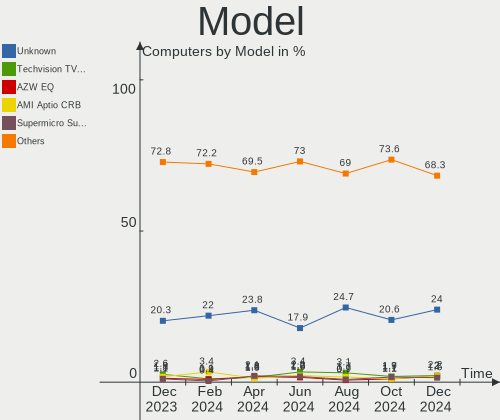

OPNsense - Hardware Trends
--------------------------

A project to identify most popular hardware characteristics and track their change
over time based on data collected by BSD users at https://BSD-Hardware.info.

Anyone can contribute to this report by the [hw-probe](https://github.com/linuxhw/hw-probe/blob/master/INSTALL.BSD.md) tool:

    hw-probe -all -upload

This report is for one last month. Overall report since the beginning of time: [TestCoverage](https://github.com/bsdhw/TestCoverage)

Period: Sep, 2022.

Contents
--------

* [ System ](#system)
  - [ OS                       ](#os)
  - [ OS Family                ](#os-family)
  - [ Arch                     ](#arch)
  - [ DE                       ](#de)
  - [ Display Server           ](#display-server)
  - [ Display Manager          ](#display-manager)
  - [ OS Lang                  ](#os-lang)
  - [ Boot Mode                ](#boot-mode)
  - [ Filesystem               ](#filesystem)
  - [ Part. scheme             ](#part-scheme)

* [ Board ](#board)
  - [ Vendor                   ](#vendor)
  - [ Model                    ](#model)
  - [ Model Family             ](#model-family)
  - [ MFG Year                 ](#mfg-year)
  - [ Form Factor              ](#form-factor)
  - [ Coreboot                 ](#coreboot)
  - [ RAM Size                 ](#ram-size)
  - [ RAM Used                 ](#ram-used)
  - [ Total Drives             ](#total-drives)
  - [ Has CD-ROM               ](#has-cd-rom)
  - [ Has Ethernet             ](#has-ethernet)
  - [ Has WiFi                 ](#has-wifi)
  - [ Has Bluetooth            ](#has-bluetooth)

* [ Location ](#location)
  - [ Country                  ](#country)
  - [ City                     ](#city)

* [ Drives ](#drives)
  - [ Drive Vendor             ](#drive-vendor)
  - [ Drive Model              ](#drive-model)
  - [ HDD Vendor               ](#hdd-vendor)
  - [ SSD Vendor               ](#ssd-vendor)
  - [ Drive Kind               ](#drive-kind)
  - [ Drive Connector          ](#drive-connector)
  - [ Drive Size               ](#drive-size)
  - [ Space Total              ](#space-total)
  - [ Space Used               ](#space-used)
  - [ Malfunc. Drives          ](#malfunc-drives)
  - [ Malfunc. Drive Vendor    ](#malfunc-drive-vendor)
  - [ Malfunc. HDD Vendor      ](#malfunc-hdd-vendor)
  - [ Malfunc. Drive Kind      ](#malfunc-drive-kind)
  - [ Failed Drives            ](#failed-drives)
  - [ Failed Drive Vendor      ](#failed-drive-vendor)
  - [ Drive Status             ](#drive-status)

* [ Storage controller ](#storage-controller)
  - [ Storage Vendor           ](#storage-vendor)
  - [ Storage Model            ](#storage-model)
  - [ Storage Kind             ](#storage-kind)

* [ Processor ](#processor)
  - [ CPU Vendor               ](#cpu-vendor)
  - [ CPU Model                ](#cpu-model)
  - [ CPU Model Family         ](#cpu-model-family)
  - [ CPU Cores                ](#cpu-cores)
  - [ CPU Sockets              ](#cpu-sockets)
  - [ CPU Threads              ](#cpu-threads)
  - [ CPU Microarch            ](#cpu-microarch)

* [ Graphics ](#graphics)
  - [ GPU Vendor               ](#gpu-vendor)
  - [ GPU Model                ](#gpu-model)
  - [ GPU Combo                ](#gpu-combo)
  - [ GPU Driver               ](#gpu-driver)
  - [ GPU Memory               ](#gpu-memory)

* [ Monitor ](#monitor)
  - [ Monitor Vendor           ](#monitor-vendor)
  - [ Monitor Model            ](#monitor-model)
  - [ Monitor Resolution       ](#monitor-resolution)
  - [ Monitor Diagonal         ](#monitor-diagonal)
  - [ Monitor Width            ](#monitor-width)
  - [ Aspect Ratio             ](#aspect-ratio)
  - [ Monitor Area             ](#monitor-area)
  - [ Pixel Density            ](#pixel-density)
  - [ Multiple Monitors        ](#multiple-monitors)

* [ Network ](#network)
  - [ Net Controller Vendor    ](#net-controller-vendor)
  - [ Net Controller Model     ](#net-controller-model)
  - [ Wireless Vendor          ](#wireless-vendor)
  - [ Wireless Model           ](#wireless-model)
  - [ Ethernet Vendor          ](#ethernet-vendor)
  - [ Ethernet Model           ](#ethernet-model)
  - [ Net Controller Kind      ](#net-controller-kind)
  - [ Used Controller          ](#used-controller)
  - [ NICs                     ](#nics)
  - [ IPv6                     ](#ipv6)

* [ Bluetooth ](#bluetooth)
  - [ Bluetooth Vendor         ](#bluetooth-vendor)
  - [ Bluetooth Model          ](#bluetooth-model)

* [ Sound ](#sound)
  - [ Sound Vendor             ](#sound-vendor)
  - [ Sound Model              ](#sound-model)

* [ Memory ](#memory)
  - [ Memory Vendor            ](#memory-vendor)
  - [ Memory Model             ](#memory-model)
  - [ Memory Kind              ](#memory-kind)
  - [ Memory Form Factor       ](#memory-form-factor)
  - [ Memory Size              ](#memory-size)
  - [ Memory Speed             ](#memory-speed)

* [ Printers & scanners ](#printers--scanners)
  - [ Printer Vendor           ](#printer-vendor)
  - [ Printer Model            ](#printer-model)
  - [ Scanner Vendor           ](#scanner-vendor)
  - [ Scanner Model            ](#scanner-model)

* [ Camera ](#camera)
  - [ Camera Vendor            ](#camera-vendor)
  - [ Camera Model             ](#camera-model)

* [ Security ](#security)
  - [ Fingerprint Vendor       ](#fingerprint-vendor)
  - [ Fingerprint Model        ](#fingerprint-model)
  - [ Chipcard Vendor          ](#chipcard-vendor)
  - [ Chipcard Model           ](#chipcard-model)

* [ Unsupported ](#unsupported)
  - [ Unsupported Devices      ](#unsupported-devices)
  - [ Unsupported Device Types ](#unsupported-device-types)

System
------

OS
--

Installed operating systems

| Name             | Computers | Percent |
|------------------|-----------|---------|
| OPNsense 22.7.4  | 183       | 68.03%  |
| OPNsense 22.7.3  | 51        | 18.96%  |
| OPNsense 22.7.2  | 14        | 5.2%    |
| OPNsense 22.1.10 | 8         | 2.97%   |
| OPNsense 22.4.3  | 5         | 1.86%   |
| OPNsense 21.7.8  | 4         | 1.49%   |
| OPNsense 23.1    | 3         | 1.12%   |
| OPNsense 22.7    | 1         | 0.37%   |

OS Family
---------

OS without a version

| Name     | Computers | Percent |
|----------|-----------|---------|
| OPNsense | 269       | 100%    |

Arch
----

OS architecture (x86_64, i586, etc.)

| Name  | Computers | Percent |
|-------|-----------|---------|
| amd64 | 268       | 99.63%  |
| arm64 | 1         | 0.37%   |

DE
--

Desktop Environment

| Name    | Computers | Percent |
|---------|-----------|---------|
| Console | 269       | 100%    |

Display Server
--------------

X11 or Wayland

| Name    | Computers | Percent |
|---------|-----------|---------|
| Console | 269       | 100%    |

Display Manager
---------------

SDDM, LightDM, etc.

| Name    | Computers | Percent |
|---------|-----------|---------|
| Console | 269       | 100%    |

OS Lang
-------

Language

| Lang    | Computers | Percent |
|---------|-----------|---------|
| Unknown | 267       | 99.26%  |
| C       | 2         | 0.74%   |

Boot Mode
---------

EFI or BIOS

| Mode | Computers | Percent |
|------|-----------|---------|
| EFI  | 259       | 96.28%  |
| BIOS | 10        | 3.72%   |

Filesystem
----------

Type of filesystem

| Type | Computers | Percent |
|------|-----------|---------|
| Ufs  | 152       | 56.51%  |
| Zfs  | 117       | 43.49%  |

Part. scheme
------------

Scheme of partitioning

| Type    | Computers | Percent |
|---------|-----------|---------|
| GPT     | 264       | 98.14%  |
| Unknown | 3         | 1.12%   |
| MBR     | 1         | 0.37%   |
| BSD     | 1         | 0.37%   |

Board
-----

Vendor
------

Motherboard manufacturer

| Name                       | Computers | Percent |
|----------------------------|-----------|---------|
| Unknown                    | 31        | 11.52%  |
| Intel                      | 27        | 10.04%  |
| Dell                       | 25        | 9.29%   |
| Hewlett-Packard            | 24        | 8.92%   |
| Supermicro                 | 14        | 5.2%    |
| Protectli                  | 11        | 4.09%   |
| Lenovo                     | 11        | 4.09%   |
| ASUSTek Computer           | 10        | 3.72%   |
| ASRock                     | 10        | 3.72%   |
| Techvision                 | 9         | 3.35%   |
| Sophos                     | 9         | 3.35%   |
| Deciso                     | 9         | 3.35%   |
| Gigabyte Technology        | 8         | 2.97%   |
| Fujitsu                    | 8         | 2.97%   |
| AMI                        | 7         | 2.6%    |
| PC Engines                 | 5         | 1.86%   |
| MSI                        | 5         | 1.86%   |
| BESSTAR Tech               | 5         | 1.86%   |
| maiyunda                   | 3         | 1.12%   |
| MW                         | 2         | 0.74%   |
| CncTion                    | 2         | 0.74%   |
| Cisco                      | 2         | 0.74%   |
| Biostar                    | 2         | 0.74%   |
| AZW                        | 2         | 0.74%   |
| ASRockRack                 | 2         | 0.74%   |
| AMD                        | 2         | 0.74%   |
| ZOTAC                      | 1         | 0.37%   |
| YANYU                      | 1         | 0.37%   |
| Yanling                    | 1         | 0.37%   |
| TYAN Computer              | 1         | 0.37%   |
| Standard                   | 1         | 0.37%   |
| SIEMENS                    | 1         | 0.37%   |
| ShenZhen MinWin Technology | 1         | 0.37%   |
| Maxtang                    | 1         | 0.37%   |
| Jingsha                    | 1         | 0.37%   |
| Intel BOXJ4117             | 1         | 0.37%   |
| iEi                        | 1         | 0.37%   |
| IceWhale Technology        | 1         | 0.37%   |
| Foxconn                    | 1         | 0.37%   |
| EPSON DIRECT               | 1         | 0.37%   |

Model
-----

Motherboard model

| Name                               | Computers | Percent |
|------------------------------------|-----------|---------|
| Unknown                            | 31        | 11.52%  |
| Techvision TVI7309X                | 9         | 3.35%   |
| Protectli FW4B                     | 9         | 3.35%   |
| Intel Q3XXG4-P V1.0                | 6         | 2.23%   |
| AMI Aptio CRB                      | 6         | 2.23%   |
| Fujitsu FUTRO S920                 | 5         | 1.86%   |
| Sophos SG                          | 4         | 1.49%   |
| PC Engines APU2                    | 4         | 1.49%   |
| Sophos UTM                         | 3         | 1.12%   |
| maiyunda www.maiyunda.com          | 3         | 1.12%   |
| HP t730 Thin Client                | 3         | 1.12%   |
| HP t620 PLUS Quad Core TC          | 3         | 1.12%   |
| HP ProDesk 600 G1 SFF              | 3         | 1.12%   |
| ASUS M5A78L-M/USB3                 | 3         | 1.12%   |
| Supermicro X9SCL/X9SCM             | 2         | 0.74%   |
| Supermicro PIO-518D-N6TRF-ST031    | 2         | 0.74%   |
| Sophos XG                          | 2         | 0.74%   |
| MW GMLK-2_5G4L                     | 2         | 0.74%   |
| MSI MS-7721                        | 2         | 0.74%   |
| Intel MAHOBAY                      | 2         | 0.74%   |
| HP ProLiant DL360 G5               | 2         | 0.74%   |
| HP ProLiant DL20 Gen9              | 2         | 0.74%   |
| Dell OptiPlex 3020                 | 2         | 0.74%   |
| Dell OptiPlex 3010                 | 2         | 0.74%   |
| Deciso NetBoard-A10                | 2         | 0.74%   |
| Deciso Netboard A20                | 2         | 0.74%   |
| Deciso Netboard A10 GEN2 Model G   | 2         | 0.74%   |
| Cisco SALEEN                       | 2         | 0.74%   |
| BESSTAR Tech GK41                  | 2         | 0.74%   |
| AZW Green G1                       | 2         | 0.74%   |
| ASUS Rampage II Extreme            | 2         | 0.74%   |
| ZOTAC ZBOX-MI522NANO/MI542NANO     | 1         | 0.37%   |
| YANYU H67SL                        | 1         | 0.37%   |
| Yanling YL-KBR6L                   | 1         | 0.37%   |
| TYAN 1X8-X6 CACHEH                 | 1         | 0.37%   |
| Supermicro X9SCI/X9SCA             | 1         | 0.37%   |
| Supermicro SYS-E300-9A             | 1         | 0.37%   |
| Supermicro SYS-E300-8D             | 1         | 0.37%   |
| Supermicro SYS-E200-9B             | 1         | 0.37%   |
| Supermicro SYS-5019D-FN8TP-2-NC041 | 1         | 0.37%   |

Model Family
------------

Motherboard model prefix

| Name                            | Computers | Percent |
|---------------------------------|-----------|---------|
| Unknown                         | 31        | 11.52%  |
| Dell OptiPlex                   | 12        | 4.46%   |
| Techvision TVI7309X             | 9         | 3.35%   |
| Protectli FW4B                  | 9         | 3.35%   |
| Dell PowerEdge                  | 8         | 2.97%   |
| Lenovo ThinkCentre              | 7         | 2.6%    |
| HP ProLiant                     | 7         | 2.6%    |
| Fujitsu FUTRO                   | 7         | 2.6%    |
| Intel Q3XXG4-P                  | 6         | 2.23%   |
| AMI Aptio                       | 6         | 2.23%   |
| Deciso Netboard                 | 5         | 1.86%   |
| Sophos SG                       | 4         | 1.49%   |
| PC Engines APU2                 | 4         | 1.49%   |
| Sophos UTM                      | 3         | 1.12%   |
| maiyunda www.maiyunda.com       | 3         | 1.12%   |
| HP t730                         | 3         | 1.12%   |
| HP t620                         | 3         | 1.12%   |
| HP ProDesk                      | 3         | 1.12%   |
| HP Compaq                       | 3         | 1.12%   |
| Dell Inspiron                   | 3         | 1.12%   |
| ASUS PRIME                      | 3         | 1.12%   |
| ASUS M5A78L-M                   | 3         | 1.12%   |
| Supermicro X9SCL                | 2         | 0.74%   |
| Supermicro PIO-518D-N6TRF-ST031 | 2         | 0.74%   |
| Sophos XG                       | 2         | 0.74%   |
| MW GMLK-2                       | 2         | 0.74%   |
| MSI MS-7721                     | 2         | 0.74%   |
| Lenovo ThinkPad                 | 2         | 0.74%   |
| Intel MAHOBAY                   | 2         | 0.74%   |
| HP EliteDesk                    | 2         | 0.74%   |
| Gigabyte X570                   | 2         | 0.74%   |
| Deciso NetBoard-A10             | 2         | 0.74%   |
| Cisco SALEEN                    | 2         | 0.74%   |
| BESSTAR Tech GK41               | 2         | 0.74%   |
| AZW Green                       | 2         | 0.74%   |
| ASUS Rampage                    | 2         | 0.74%   |
| ASRock Z97                      | 2         | 0.74%   |
| ZOTAC ZBOX-MI522NANO            | 1         | 0.37%   |
| YANYU H67SL                     | 1         | 0.37%   |
| Yanling YL-KBR6L                | 1         | 0.37%   |

MFG Year
--------

Motherboard manufacture year

| Year | Computers | Percent |
|------|-----------|---------|
| 2022 | 39        | 14.5%   |
| 2018 | 32        | 11.9%   |
| 2021 | 26        | 9.67%   |
| 2019 | 24        | 8.92%   |
| 2014 | 23        | 8.55%   |
| 2016 | 22        | 8.18%   |
| 2015 | 18        | 6.69%   |
| 2013 | 18        | 6.69%   |
| 2020 | 15        | 5.58%   |
| 2011 | 13        | 4.83%   |
| 2017 | 12        | 4.46%   |
| 2012 | 11        | 4.09%   |
| 2010 | 6         | 2.23%   |
| 2009 | 4         | 1.49%   |
| 2008 | 4         | 1.49%   |
| 2007 | 2         | 0.74%   |

Form Factor
-----------

Physical design of the computer

| Name     | Computers | Percent |
|----------|-----------|---------|
| Desktop  | 201       | 74.72%  |
| Mini pc  | 22        | 8.18%   |
| Server   | 21        | 7.81%   |
| Notebook | 16        | 5.95%   |
| Firewall | 9         | 3.35%   |

Coreboot
--------

Have coreboot on board

| Used | Computers | Percent |
|------|-----------|---------|
| No   | 256       | 95.17%  |
| Yes  | 13        | 4.83%   |

RAM Size
--------

Total RAM memory

| Size in GB  | Computers | Percent |
|-------------|-----------|---------|
| 8.01-16.0   | 114       | 42.38%  |
| 16.01-24.0  | 68        | 25.28%  |
| 4.01-8.0    | 50        | 18.59%  |
| 32.01-64.0  | 14        | 5.2%    |
| 2.01-3.0    | 10        | 3.72%   |
| 24.01-32.0  | 6         | 2.23%   |
| 64.01-256.0 | 6         | 2.23%   |
| 0.51-1.0    | 1         | 0.37%   |

RAM Used
--------

Used RAM memory

| Used GB  | Computers | Percent |
|----------|-----------|---------|
| 0.01-0.5 | 146       | 54.28%  |
| 0.51-1.0 | 95        | 35.32%  |
| 1.01-2.0 | 23        | 8.55%   |
| 3.01-4.0 | 3         | 1.12%   |
| 4.01-8.0 | 2         | 0.74%   |

Total Drives
------------

Number of drives on board

| Drives | Computers | Percent |
|--------|-----------|---------|
| 1      | 216       | 80.3%   |
| 0      | 30        | 11.15%  |
| 2      | 19        | 7.06%   |
| 3      | 2         | 0.74%   |
| 6      | 1         | 0.37%   |
| 5      | 1         | 0.37%   |

Has CD-ROM
----------

Has CD-ROM on board

| Presented | Computers | Percent |
|-----------|-----------|---------|
| No        | 237       | 88.1%   |
| Yes       | 32        | 11.9%   |

Has Ethernet
------------

Has Ethernet on board

| Presented | Computers | Percent |
|-----------|-----------|---------|
| Yes       | 268       | 99.63%  |
| No        | 1         | 0.37%   |

Has WiFi
--------

Has WiFi module

| Presented | Computers | Percent |
|-----------|-----------|---------|
| No        | 215       | 79.93%  |
| Yes       | 54        | 20.07%  |

Has Bluetooth
-------------

Has Bluetooth module

| Presented | Computers | Percent |
|-----------|-----------|---------|
| No        | 237       | 88.1%   |
| Yes       | 32        | 11.9%   |

Location
--------

Country
-------

Geographic location (country)

| Country      | Computers | Percent |
|--------------|-----------|---------|
| USA          | 79        | 29.37%  |
| Germany      | 45        | 16.73%  |
| UK           | 10        | 3.72%   |
| Canada       | 10        | 3.72%   |
| France       | 9         | 3.35%   |
| Australia    | 9         | 3.35%   |
| Netherlands  | 8         | 2.97%   |
| Poland       | 7         | 2.6%    |
| Brazil       | 7         | 2.6%    |
| Austria      | 7         | 2.6%    |
| Switzerland  | 6         | 2.23%   |
| Italy        | 6         | 2.23%   |
| Indonesia    | 6         | 2.23%   |
| China        | 5         | 1.86%   |
| Denmark      | 4         | 1.49%   |
| South Africa | 3         | 1.12%   |
| Norway       | 3         | 1.12%   |
| Israel       | 3         | 1.12%   |
| India        | 3         | 1.12%   |
| Finland      | 3         | 1.12%   |
| Vietnam      | 2         | 0.74%   |
| Spain        | 2         | 0.74%   |
| South Korea  | 2         | 0.74%   |
| Slovenia     | 2         | 0.74%   |
| Russia       | 2         | 0.74%   |
| Portugal     | 2         | 0.74%   |
| Philippines  | 2         | 0.74%   |
| Hong Kong    | 2         | 0.74%   |
| Greece       | 2         | 0.74%   |
| Belgium      | 2         | 0.74%   |
| UAE          | 1         | 0.37%   |
| Turkey       | 1         | 0.37%   |
| Thailand     | 1         | 0.37%   |
| Sweden       | 1         | 0.37%   |
| Saudi Arabia | 1         | 0.37%   |
| Romania      | 1         | 0.37%   |
| New Zealand  | 1         | 0.37%   |
| Moldova      | 1         | 0.37%   |
| Mexico       | 1         | 0.37%   |
| Malaysia     | 1         | 0.37%   |

City
----

Geographic location (city)

| City                 | Computers | Percent |
|----------------------|-----------|---------|
| Melbourne            | 5         | 1.86%   |
| New York             | 3         | 1.12%   |
| Munich               | 3         | 1.12%   |
| Jakarta              | 3         | 1.12%   |
| Berlin               | 3         | 1.12%   |
| Wels                 | 2         | 0.74%   |
| Vancouver            | 2         | 0.74%   |
| Tel Aviv             | 2         | 0.74%   |
| Sydney               | 2         | 0.74%   |
| Stuttgart            | 2         | 0.74%   |
| Sao José dos Campos | 2         | 0.74%   |
| San Antonio          | 2         | 0.74%   |
| Mountain View        | 2         | 0.74%   |
| Madrid               | 2         | 0.74%   |
| Ho Chi Minh City     | 2         | 0.74%   |
| Hamburg              | 2         | 0.74%   |
| Frankfurt am Main    | 2         | 0.74%   |
| Fort Worth           | 2         | 0.74%   |
| Cologne              | 2         | 0.74%   |
| Central              | 2         | 0.74%   |
| Blitar               | 2         | 0.74%   |
| Austin               | 2         | 0.74%   |
| Atlanta              | 2         | 0.74%   |
| Ancona               | 2         | 0.74%   |
| Unknown              | 2         | 0.74%   |
| Zurich               | 1         | 0.37%   |
| Yehud                | 1         | 0.37%   |
| Yangpu               | 1         | 0.37%   |
| Xi'an                | 1         | 0.37%   |
| Wuhan                | 1         | 0.37%   |
| Woodstock            | 1         | 0.37%   |
| Winter Park          | 1         | 0.37%   |
| Wembley              | 1         | 0.37%   |
| Watsonville          | 1         | 0.37%   |
| Waterloo             | 1         | 0.37%   |
| Warsaw               | 1         | 0.37%   |
| Warminster           | 1         | 0.37%   |
| Villavicencio        | 1         | 0.37%   |
| Villa Bartolomea     | 1         | 0.37%   |
| Viersen              | 1         | 0.37%   |

Drives
------

Drive Vendor
------------

Hard drive vendors

| Vendor              | Computers | Drives | Percent |
|---------------------|-----------|--------|---------|
| Samsung Electronics | 34        | 39     | 13.33%  |
| Transcend           | 26        | 27     | 10.2%   |
| Kingston            | 22        | 23     | 8.63%   |
| WDC                 | 18        | 21     | 7.06%   |
| Seagate             | 14        | 14     | 5.49%   |
| Intel               | 12        | 13     | 4.71%   |
| SanDisk             | 11        | 11     | 4.31%   |
| Hoodisk             | 10        | 10     | 3.92%   |
| Silicon Motion      | 7         | 7      | 2.75%   |
| Crucial             | 7         | 8      | 2.75%   |
| China               | 7         | 7      | 2.75%   |
| PNY                 | 6         | 8      | 2.35%   |
| A-DATA Technology   | 6         | 7      | 2.35%   |
| Innodisk            | 5         | 5      | 1.96%   |
| Apacer              | 5         | 5      | 1.96%   |
| Toshiba             | 4         | 4      | 1.57%   |
| Protectli           | 4         | 4      | 1.57%   |
| Patriot             | 4         | 4      | 1.57%   |
| HGST                | 4         | 7      | 1.57%   |
| Hewlett-Packard     | 4         | 6      | 1.57%   |
| SPCC                | 3         | 3      | 1.18%   |
| Phison              | 3         | 3      | 1.18%   |
| OCZ                 | 3         | 3      | 1.18%   |
| FORESEE             | 3         | 3      | 1.18%   |
| SK hynix            | 2         | 2      | 0.78%   |
| Plextor             | 2         | 2      | 0.78%   |
| Maxtor              | 2         | 2      | 0.78%   |
| KIOXIA              | 2         | 2      | 0.78%   |
| KingDian            | 2         | 2      | 0.78%   |
| Intenso             | 2         | 2      | 0.78%   |
| Hitachi             | 2         | 2      | 0.78%   |
| Gigabyte Technology | 2         | 2      | 0.78%   |
| Wicgtyp             | 1         | 1      | 0.39%   |
| Verbatim            | 1         | 1      | 0.39%   |
| Vaseky              | 1         | 1      | 0.39%   |
| V-GeN               | 1         | 1      | 0.39%   |
| ShiJi               | 1         | 1      | 0.39%   |
| SATADOM             | 1         | 1      | 0.39%   |
| Netac               | 1         | 1      | 0.39%   |
| Mushkin             | 1         | 1      | 0.39%   |

Drive Model
-----------

Hard drive models

| Model                                | Computers | Percent |
|--------------------------------------|-----------|---------|
| Kingston SA400S37240G 240GB          | 4         | 1.54%   |
| Hoodisk SSD 128GB                    | 4         | 1.54%   |
| Transcend TS256GMTS952T2 256GB       | 3         | 1.16%   |
| Transcend TS128GMSA370 128GB         | 3         | 1.16%   |
| Transcend TS128GMSA230S 128GB        | 3         | 1.16%   |
| Samsung SSD 860 EVO 250GB            | 3         | 1.16%   |
| Samsung SSD 850 EVO 250GB            | 3         | 1.16%   |
| PNY CS900 120GB SSD                  | 3         | 1.16%   |
| Phison Sabrent 256GB                 | 3         | 1.16%   |
| Kingston SUV500MS120G 120GB          | 3         | 1.16%   |
| HP RAID 1(1+0) 240GB                 | 3         | 1.16%   |
| WDC PC SN730 SDBQNTY-512G-1001 512GB | 2         | 0.77%   |
| Transcend TS64GMSA230S 64GB          | 2         | 0.77%   |
| Transcend TS256GMTE652T2 256GB       | 2         | 0.77%   |
| Transcend TS128GMTE110S 128GB        | 2         | 0.77%   |
| Silicon Motion Fanxiang S500 128GB   | 2         | 0.77%   |
| Silicon Motion 128GB                 | 2         | 0.77%   |
| Seagate ST500LT012-1DG142 500GB      | 2         | 0.77%   |
| SanDisk SSD PLUS 240GB               | 2         | 0.77%   |
| SanDisk SDSSDA240G 240GB             | 2         | 0.77%   |
| SanDisk SDSSDA120G 120GB             | 2         | 0.77%   |
| Samsung SSD 980 500GB                | 2         | 0.77%   |
| Samsung SSD 970 EVO Plus 500GB       | 2         | 0.77%   |
| Samsung SSD 870 EVO 250GB            | 2         | 0.77%   |
| Kingston OM8PDP3512B-A01 512GB       | 2         | 0.77%   |
| Intel SSDSC2KG240G8 240GB            | 2         | 0.77%   |
| Intel MEMPEK1W032GA 32GB             | 2         | 0.77%   |
| Innodisk DEMSR- 16GB mSATA 3ME3      | 2         | 0.77%   |
| Hoodisk SSD 32GB                     | 2         | 0.77%   |
| Hoodisk SSD 16GB                     | 2         | 0.77%   |
| FORESEE 64GB SSD                     | 2         | 0.77%   |
| China NGFF 2280 128GB SSD            | 2         | 0.77%   |
| Apacer 16GB SATA Flash Drive         | 2         | 0.77%   |
| A-DATA SU650 120GB                   | 2         | 0.77%   |
| Wicgtyp M900-128 128GB               | 1         | 0.39%   |
| WDC WDS500G3X0C-00SJG0 500GB         | 1         | 0.39%   |
| WDC WDS250G2X0C-00L350 250GB         | 1         | 0.39%   |
| WDC WDS240G2G0B-00EPW0 240GB         | 1         | 0.39%   |
| WDC WDBRPG0010BNC-WRSN 1TB           | 1         | 0.39%   |
| WDC WD7500BPKX-00HPJT0 752GB         | 1         | 0.39%   |

HDD Vendor
----------

Hard disk drive vendors

| Vendor          | Computers | Drives | Percent |
|-----------------|-----------|--------|---------|
| Seagate         | 14        | 14     | 35%     |
| WDC             | 11        | 14     | 27.5%   |
| HGST            | 4         | 7      | 10%     |
| Hewlett-Packard | 4         | 6      | 10%     |
| Toshiba         | 3         | 3      | 7.5%    |
| Maxtor          | 2         | 2      | 5%      |
| Hitachi         | 2         | 2      | 5%      |

SSD Vendor
----------

Solid state drive vendors

| Vendor              | Computers | Drives | Percent |
|---------------------|-----------|--------|---------|
| Transcend           | 22        | 23     | 12.94%  |
| Samsung Electronics | 21        | 26     | 12.35%  |
| Kingston            | 18        | 19     | 10.59%  |
| SanDisk             | 11        | 11     | 6.47%   |
| Hoodisk             | 10        | 10     | 5.88%   |
| Intel               | 9         | 10     | 5.29%   |
| Crucial             | 7         | 8      | 4.12%   |
| China               | 7         | 7      | 4.12%   |
| PNY                 | 6         | 8      | 3.53%   |
| A-DATA Technology   | 6         | 7      | 3.53%   |
| Innodisk            | 5         | 5      | 2.94%   |
| Apacer              | 5         | 5      | 2.94%   |
| Protectli           | 4         | 4      | 2.35%   |
| SPCC                | 3         | 3      | 1.76%   |
| Patriot             | 3         | 3      | 1.76%   |
| OCZ                 | 3         | 3      | 1.76%   |
| FORESEE             | 3         | 3      | 1.76%   |
| KingDian            | 2         | 2      | 1.18%   |
| Intenso             | 2         | 2      | 1.18%   |
| Gigabyte Technology | 2         | 2      | 1.18%   |
| Wicgtyp             | 1         | 1      | 0.59%   |
| WDC                 | 1         | 1      | 0.59%   |
| Verbatim            | 1         | 1      | 0.59%   |
| Vaseky              | 1         | 1      | 0.59%   |
| V-GeN               | 1         | 1      | 0.59%   |
| Toshiba             | 1         | 1      | 0.59%   |
| SK hynix            | 1         | 1      | 0.59%   |
| ShiJi               | 1         | 1      | 0.59%   |
| SATADOM             | 1         | 1      | 0.59%   |
| Plextor             | 1         | 1      | 0.59%   |
| Netac               | 1         | 1      | 0.59%   |
| Mushkin             | 1         | 1      | 0.59%   |
| LITEON              | 1         | 1      | 0.59%   |
| Lenovo              | 1         | 1      | 0.59%   |
| Indilinx            | 1         | 1      | 0.59%   |
| GOODRAM             | 1         | 1      | 0.59%   |
| Dogfish             | 1         | 1      | 0.59%   |
| CWDISK              | 1         | 1      | 0.59%   |
| BIWIN               | 1         | 1      | 0.59%   |
| BAITITON            | 1         | 1      | 0.59%   |

Drive Kind
----------

HDD or SSD

| Kind | Computers | Drives | Percent |
|------|-----------|--------|---------|
| SSD  | 165       | 182    | 66%     |
| NVMe | 45        | 45     | 18%     |
| HDD  | 40        | 48     | 16%     |

Drive Connector
---------------

SATA, SAS, NVMe, etc.

| Type | Computers | Drives | Percent |
|------|-----------|--------|---------|
| SATA | 200       | 230    | 81.63%  |
| NVMe | 45        | 45     | 18.37%  |

Drive Size
----------

Size of hard drive

| Size in TB | Computers | Drives | Percent |
|------------|-----------|--------|---------|
| 0.01-0.5   | 188       | 209    | 92.16%  |
| 0.51-1.0   | 12        | 13     | 5.88%   |
| 1.01-2.0   | 3         | 4      | 1.47%   |
| 4.01-10.0  | 1         | 4      | 0.49%   |

Space Total
-----------

Amount of disk space available on the file system

| Size in GB | Computers | Percent |
|------------|-----------|---------|
| 101-250    | 136       | 50.56%  |
| 251-500    | 42        | 15.61%  |
| 51-100     | 30        | 11.15%  |
| 21-50      | 27        | 10.04%  |
| 1-20       | 20        | 7.43%   |
| 501-1000   | 10        | 3.72%   |
| 1001-2000  | 3         | 1.12%   |
| 2001-3000  | 1         | 0.37%   |

Space Used
----------

Amount of used disk space

| Used GB | Computers | Percent |
|---------|-----------|---------|
| 1-20    | 253       | 94.05%  |
| 21-50   | 13        | 4.83%   |
| 51-100  | 3         | 1.12%   |

Malfunc. Drives
---------------

Drive models with a malfunction

| Model                                 | Computers | Drives | Percent |
|---------------------------------------|-----------|--------|---------|
| Apacer 16GB SATA Flash Drive          | 2         | 2      | 6.06%   |
| WDC WD7500BPKX-00HPJT0 752GB          | 1         | 2      | 3.03%   |
| WDC WD6400AAKS-22A7B2 640GB           | 1         | 1      | 3.03%   |
| WDC WD5000AAKX-75U6AA0 500GB          | 1         | 1      | 3.03%   |
| WDC WD20EFRX-68EUZN0 2TB              | 1         | 2      | 3.03%   |
| WDC WD1600AAJS-08L7A0 160GB           | 1         | 1      | 3.03%   |
| Toshiba THNSNK256GCS8 SATA 256GB      | 1         | 1      | 3.03%   |
| Toshiba MK5076GSX 500GB               | 1         | 1      | 3.03%   |
| SK hynix SC308 SATA 128GB             | 1         | 1      | 3.03%   |
| Seagate ST9500420ASG 500GB            | 1         | 1      | 3.03%   |
| Seagate ST500DM002-1BD142 500GB       | 1         | 1      | 3.03%   |
| Seagate ST3750330NS 752GB             | 1         | 1      | 3.03%   |
| Seagate ST3500413AS 500GB             | 1         | 1      | 3.03%   |
| Seagate ST3160318AS 160GB             | 1         | 1      | 3.03%   |
| Seagate ST31000520AS 1TB              | 1         | 1      | 3.03%   |
| Samsung Electronics SSD 970 EVO 500GB | 1         | 1      | 3.03%   |
| Samsung Electronics SSD 870 EVO 250GB | 1         | 1      | 3.03%   |
| Samsung Electronics SSD 850 PRO 256GB | 1         | 2      | 3.03%   |
| OCZ AGILITY3 240GB                    | 1         | 1      | 3.03%   |
| OCZ AGILITY2 64GB                     | 1         | 1      | 3.03%   |
| Maxtor STM380815AS 80GB               | 1         | 1      | 3.03%   |
| Maxtor STM3250820AS 250GB             | 1         | 1      | 3.03%   |
| Kingston SV300S37A60G 64GB            | 1         | 1      | 3.03%   |
| Kingston SV300S37A120G 120GB          | 1         | 1      | 3.03%   |
| KingDian S100 32GB                    | 1         | 1      | 3.03%   |
| Intel SSDSC2BA200G3 200GB             | 1         | 1      | 3.03%   |
| Intel SSDSA2M160G2GC 160GB            | 1         | 1      | 3.03%   |
| Intel SSDSA2M080G2GC 80GB             | 1         | 1      | 3.03%   |
| Hitachi HDT722516DLAT80 164GB         | 1         | 1      | 3.03%   |
| HGST HTS725050A7E630 500GB            | 1         | 1      | 3.03%   |
| HGST HTE725032A7E630 320GB            | 1         | 1      | 3.03%   |
| A-DATA Technology SSD S510 120GB      | 1         | 1      | 3.03%   |

Malfunc. Drive Vendor
---------------------

Vendors of faulty drives

| Vendor              | Computers | Drives | Percent |
|---------------------|-----------|--------|---------|
| Seagate             | 6         | 6      | 18.18%  |
| WDC                 | 5         | 7      | 15.15%  |
| Samsung Electronics | 3         | 4      | 9.09%   |
| Intel               | 3         | 3      | 9.09%   |
| Toshiba             | 2         | 2      | 6.06%   |
| OCZ                 | 2         | 2      | 6.06%   |
| Maxtor              | 2         | 2      | 6.06%   |
| Kingston            | 2         | 2      | 6.06%   |
| HGST                | 2         | 2      | 6.06%   |
| Apacer              | 2         | 2      | 6.06%   |
| SK hynix            | 1         | 1      | 3.03%   |
| KingDian            | 1         | 1      | 3.03%   |
| Hitachi             | 1         | 1      | 3.03%   |
| A-DATA Technology   | 1         | 1      | 3.03%   |

Malfunc. HDD Vendor
-------------------

Vendors of faulty HDD drives

| Vendor  | Computers | Drives | Percent |
|---------|-----------|--------|---------|
| Seagate | 6         | 6      | 35.29%  |
| WDC     | 5         | 7      | 29.41%  |
| Maxtor  | 2         | 2      | 11.76%  |
| HGST    | 2         | 2      | 11.76%  |
| Toshiba | 1         | 1      | 5.88%   |
| Hitachi | 1         | 1      | 5.88%   |

Malfunc. Drive Kind
-------------------

Kinds of faulty drives

| Kind | Computers | Drives | Percent |
|------|-----------|--------|---------|
| HDD  | 17        | 19     | 51.52%  |
| SSD  | 15        | 16     | 45.45%  |
| NVMe | 1         | 1      | 3.03%   |

Failed Drives
-------------

Failed drive models

Zero info for selected period =(

Failed Drive Vendor
-------------------

Failed drive vendors

Zero info for selected period =(

Drive Status
------------

Number of failed and malfunc. drives

| Status   | Computers | Drives | Percent |
|----------|-----------|--------|---------|
| Works    | 205       | 228    | 83%     |
| Malfunc  | 33        | 36     | 13.36%  |
| Detected | 9         | 11     | 3.64%   |

Storage controller
------------------

Storage Vendor
--------------

Storage controller vendors

| Vendor                       | Computers | Percent |
|------------------------------|-----------|---------|
| Intel                        | 212       | 65.23%  |
| AMD                          | 49        | 15.08%  |
| Samsung Electronics          | 13        | 4%      |
| Silicon Motion               | 8         | 2.46%   |
| SanDisk                      | 8         | 2.46%   |
| Broadcom / LSI               | 6         | 1.85%   |
| Kingston Technology Company  | 4         | 1.23%   |
| Hewlett-Packard              | 4         | 1.23%   |
| Phison Electronics           | 3         | 0.92%   |
| Chelsio Communications       | 3         | 0.92%   |
| Unknown                      | 3         | 0.92%   |
| Nvidia                       | 2         | 0.62%   |
| JMicron Technology           | 2         | 0.62%   |
| ASMedia Technology           | 2         | 0.62%   |
| Toshiba                      | 1         | 0.31%   |
| SK hynix                     | 1         | 0.31%   |
| Shenzhen Longsys Electronics | 1         | 0.31%   |
| MAXIO Technology (Hangzhou)  | 1         | 0.31%   |
| Lite-On Technology           | 1         | 0.31%   |
| KIOXIA                       | 1         | 0.31%   |

Storage Model
-------------

Storage controller models

| Model                                                                            | Computers | Percent |
|----------------------------------------------------------------------------------|-----------|---------|
| AMD FCH SATA Controller [AHCI mode]                                              | 35        | 9.7%    |
| Intel 8 Series/C220 Series Chipset Family 6-port SATA Controller 1 [AHCI mode]   | 26        | 7.2%    |
| Intel Jasper Lake SATA AHCI Controller                                           | 19        | 5.26%   |
| Intel Celeron/Pentium Silver Processor SATA Controller                           | 19        | 5.26%   |
| Intel 6 Series/C200 Series Chipset Family 6 port Desktop SATA AHCI Controller    | 18        | 4.99%   |
| Intel Atom/Celeron/Pentium Processor x5-E8000/J3xxx/N3xxx Series SATA Controller | 16        | 4.43%   |
| Intel Atom Processor E3800 Series SATA AHCI Controller                           | 12        | 3.32%   |
| AMD SB7x0/SB8x0/SB9x0 SATA Controller [AHCI mode]                                | 9         | 2.49%   |
| Silicon Motion SM2263EN/SM2263XT SSD Controller                                  | 8         | 2.22%   |
| Intel Q170/Q150/B150/H170/H110/Z170/CM236 Chipset SATA Controller [AHCI Mode]    | 7         | 1.94%   |
| Intel Atom Processor C3000 Series SATA Controller 0                              | 7         | 1.94%   |
| Samsung NVMe SSD Controller SM981/PM981/PM983                                    | 6         | 1.66%   |
| Intel Sunrise Point-LP SATA Controller [AHCI mode]                               | 6         | 1.66%   |
| Intel Cannon Lake PCH SATA AHCI Controller                                       | 6         | 1.66%   |
| Intel Atom Processor C3000 Series SATA Controller 1                              | 6         | 1.66%   |
| Unknown                                                                          | 6         | 1.66%   |
| Intel Wildcat Point-LP SATA Controller [AHCI Mode]                               | 5         | 1.39%   |
| Intel 82801HM/HEM (ICH8M/ICH8M-E) IDE Controller                                 | 5         | 1.39%   |
| Intel 8 Series SATA Controller 1 [AHCI mode]                                     | 5         | 1.39%   |
| SanDisk WD Black SN750 / PC SN730 NVMe SSD                                       | 4         | 1.11%   |
| Samsung NVMe SSD Controller 980                                                  | 4         | 1.11%   |
| Intel Celeron N3350/Pentium N4200/Atom E3900 Series SATA AHCI Controller         | 4         | 1.11%   |
| Intel 82801HM/HEM (ICH8M/ICH8M-E) SATA Controller [AHCI mode]                    | 4         | 1.11%   |
| Intel 631xESB/632xESB IDE Controller                                             | 4         | 1.11%   |
| Intel 200 Series PCH SATA controller [AHCI mode]                                 | 4         | 1.11%   |
| AMD SB7x0/SB8x0/SB9x0 IDE Controller                                             | 4         | 1.11%   |
| AMD 400 Series Chipset SATA Controller                                           | 4         | 1.11%   |
| Phison E12 NVMe Controller                                                       | 3         | 0.83%   |
| Intel 82801JI (ICH10 Family) SATA AHCI Controller                                | 3         | 0.83%   |
| Intel 82801G (ICH7 Family) IDE Controller                                        | 3         | 0.83%   |
| Intel 7 Series Chipset Family 6-port SATA Controller [AHCI mode]                 | 3         | 0.83%   |
| Intel 5 Series/3400 Series Chipset 6 port SATA AHCI Controller                   | 3         | 0.83%   |
| Intel 400 Series Chipset Family SATA AHCI Controller                             | 3         | 0.83%   |
| HP Smart Array Controller                                                        | 3         | 0.83%   |
| Broadcom / LSI SAS2008 PCI-Express Fusion-MPT SAS-2 [Falcon]                     | 3         | 0.83%   |
| AMD FCH IDE Controller                                                           | 3         | 0.83%   |
| SanDisk WD Blue SN570 NVMe SSD                                                   | 2         | 0.55%   |
| Kingston Company OM3PDP3 NVMe SSD                                                | 2         | 0.55%   |
| JMicron JMB363 SATA/IDE Controller                                               | 2         | 0.55%   |
| Intel Tiger Lake-LP SATA Controller                                              | 2         | 0.55%   |

Storage Kind
------------

Kind of storage controller (IDE, SATA, NVMe, SAS, ...)

| Kind | Computers | Percent |
|------|-----------|---------|
| SATA | 243       | 70.85%  |
| NVMe | 48        | 13.99%  |
| IDE  | 33        | 9.62%   |
| RAID | 13        | 3.79%   |
| SCSI | 4         | 1.17%   |
| SAS  | 2         | 0.58%   |

Processor
---------

CPU Vendor
----------

Processor vendors

| Vendor | Computers | Percent |
|--------|-----------|---------|
| Intel  | 214       | 79.55%  |
| AMD    | 54        | 20.07%  |
| ARM    | 1         | 0.37%   |

CPU Model
---------

Processor models

| Model                                    | Computers | Percent |
|------------------------------------------|-----------|---------|
| Intel Celeron N5105 @ 2.00GHz            | 19        | 7.06%   |
| Intel Celeron J4125 CPU @ 2.00GHz        | 14        | 5.2%    |
| Intel Celeron CPU J3160 @ 1.60GHz        | 10        | 3.72%   |
| Intel Celeron CPU J1900 @ 1.99GHz        | 7         | 2.6%    |
| AMD GX-415GA SOC with Radeon HD Graphics | 4         | 1.49%   |
| AMD GX-412TC SOC                         | 4         | 1.49%   |
| Intel Xeon CPU E3-1275 V2 @ 3.50GHz      | 3         | 1.12%   |
| Intel Xeon                               | 3         | 1.12%   |
| Intel Pentium CPU N3700 @ 1.60GHz        | 3         | 1.12%   |
| Intel Core i5-4570 CPU @ 3.20GHz         | 3         | 1.12%   |
| Intel Core i3-4160 CPU @ 3.60GHz         | 3         | 1.12%   |
| Intel Celeron CPU G1820 @ 2.70GHz        | 3         | 1.12%   |
| Intel Atom CPU N450 @ 1.66GHz            | 3         | 1.12%   |
| Intel Atom CPU C3558 @ 2.20GHz           | 3         | 1.12%   |
| AMD Ryzen Embedded V1500B                | 3         | 1.12%   |
| AMD RX-427BB with AMD Radeon R7 Graphics | 3         | 1.12%   |
| AMD GX-420MC SOC                         | 3         | 1.12%   |
| AMD GX-420CA SOC with Radeon HD Graphics | 3         | 1.12%   |
| AMD EPYC 3201 8-Core Processor           | 3         | 1.12%   |
| Intel Xeon CPU E5645 @ 2.40GHz           | 2         | 0.74%   |
| Intel Xeon CPU E31260L @ 2.40GHz         | 2         | 0.74%   |
| Intel Xeon CPU E31220 @ 3.10GHz          | 2         | 0.74%   |
| Intel Xeon CPU E3-1270 v3 @ 3.50GHz      | 2         | 0.74%   |
| Intel Xeon CPU E3-1220 v5 @ 3.00GHz      | 2         | 0.74%   |
| Intel Xeon CPU E3-1220 v3 @ 3.10GHz      | 2         | 0.74%   |
| Intel Core i7-7700 CPU @ 3.60GHz         | 2         | 0.74%   |
| Intel Core i7-4770 CPU @ 3.40GHz         | 2         | 0.74%   |
| Intel Core i5-9500 CPU @ 3.00GHz         | 2         | 0.74%   |
| Intel Core i5-8250U CPU @ 1.60GHz        | 2         | 0.74%   |
| Intel Core i5-3470S CPU @ 2.90GHz        | 2         | 0.74%   |
| Intel Core i5-3470 CPU @ 3.20GHz         | 2         | 0.74%   |
| Intel Core i5-2400S CPU @ 2.50GHz        | 2         | 0.74%   |
| Intel Core i5-2400 CPU @ 3.10GHz         | 2         | 0.74%   |
| Intel Core i5-10210U CPU @ 1.60GHz       | 2         | 0.74%   |
| Intel Core i3-5010U CPU @ 2.10GHz        | 2         | 0.74%   |
| Intel Core i3-4010U CPU @ 1.70GHz        | 2         | 0.74%   |
| Intel Celeron J4105 CPU @ 1.50GHz        | 2         | 0.74%   |
| Intel Celeron CPU N3450 @ 1.10GHz        | 2         | 0.74%   |
| Intel Celeron CPU N3160 @ 1.60GHz        | 2         | 0.74%   |
| Intel Atom CPU C3758 @ 2.20GHz           | 2         | 0.74%   |

CPU Model Family
----------------

Processor model prefix

| Model                   | Computers | Percent |
|-------------------------|-----------|---------|
| Intel Celeron           | 68        | 25.28%  |
| Intel Xeon              | 36        | 13.38%  |
| Intel Core i5           | 35        | 13.01%  |
| Intel Core i3           | 25        | 9.29%   |
| Intel Atom              | 18        | 6.69%   |
| AMD GX                  | 18        | 6.69%   |
| Intel Core i7           | 11        | 4.09%   |
| Intel Pentium           | 8         | 2.97%   |
| Other                   | 6         | 2.23%   |
| AMD Ryzen 7             | 4         | 1.49%   |
| AMD FX                  | 4         | 1.49%   |
| AMD EPYC                | 4         | 1.49%   |
| Intel Pentium Silver    | 3         | 1.12%   |
| Intel Pentium Dual-Core | 3         | 1.12%   |
| AMD Ryzen Embedded      | 3         | 1.12%   |
| AMD Ryzen 5             | 3         | 1.12%   |
| AMD G                   | 3         | 1.12%   |
| Intel Core i9           | 2         | 0.74%   |
| Intel Core 2 Duo        | 2         | 0.74%   |
| AMD Ryzen 3             | 2         | 0.74%   |
| AMD A4                  | 2         | 0.74%   |
| Intel Core 2 Quad       | 1         | 0.37%   |
| ARM Cortex              | 1         | 0.37%   |
| AMD Ryzen 7 PRO         | 1         | 0.37%   |
| AMD Ryzen 5 PRO         | 1         | 0.37%   |
| AMD Phenom II X4        | 1         | 0.37%   |
| AMD C-50                | 1         | 0.37%   |
| AMD Athlon II X4        | 1         | 0.37%   |
| AMD Athlon II X3        | 1         | 0.37%   |
| AMD A10                 | 1         | 0.37%   |

CPU Cores
---------

Number of processor cores

| Number  | Computers | Percent |
|---------|-----------|---------|
| 4       | 159       | 59.11%  |
| 2       | 61        | 22.68%  |
| 8       | 15        | 5.58%   |
| 6       | 10        | 3.72%   |
| 16      | 8         | 2.97%   |
| 12      | 7         | 2.6%    |
| 1       | 4         | 1.49%   |
| Unknown | 3         | 1.12%   |
| 10      | 1         | 0.37%   |
| 3       | 1         | 0.37%   |

CPU Sockets
-----------

Number of sockets

| Number  | Computers | Percent |
|---------|-----------|---------|
| 1       | 262       | 97.4%   |
| 2       | 5         | 1.86%   |
| 4       | 1         | 0.37%   |
| Unknown | 1         | 0.37%   |

CPU Threads
-----------

Threads per core (Hyper-Threading)

| Number  | Computers | Percent |
|---------|-----------|---------|
| 1       | 189       | 70.26%  |
| 2       | 77        | 28.62%  |
| Unknown | 3         | 1.12%   |

CPU Microarch
-------------

Microarchitecture

| Name          | Computers | Percent |
|---------------|-----------|---------|
| Haswell       | 33        | 12.27%  |
| Silvermont    | 30        | 11.15%  |
| Unknown       | 23        | 8.55%   |
| KabyLake      | 21        | 7.81%   |
| Goldmont plus | 19        | 7.06%   |
| IvyBridge     | 16        | 5.95%   |
| SandyBridge   | 14        | 5.2%    |
| Goldmont      | 12        | 4.46%   |
| Puma          | 11        | 4.09%   |
| Skylake       | 9         | 3.35%   |
| Penryn        | 9         | 3.35%   |
| Zen           | 8         | 2.97%   |
| Jaguar        | 8         | 2.97%   |
| Westmere      | 6         | 2.23%   |
| Broadwell     | 6         | 2.23%   |
| Zen 2         | 5         | 1.86%   |
| Piledriver    | 5         | 1.86%   |
| CometLake     | 5         | 1.86%   |
| Bonnell       | 5         | 1.86%   |
| Zen 3         | 4         | 1.49%   |
| Steamroller   | 4         | 1.49%   |
| Core          | 4         | 1.49%   |
| Bobcat        | 4         | 1.49%   |
| K10           | 3         | 1.12%   |
| TigerLake     | 2         | 0.74%   |
| Zen+          | 1         | 0.37%   |
| Nehalem       | 1         | 0.37%   |
| IceLake       | 1         | 0.37%   |

Graphics
--------

GPU Vendor
----------

Vendors of graphics cards

| Vendor                     | Computers | Percent |
|----------------------------|-----------|---------|
| Intel                      | 162       | 66.39%  |
| AMD                        | 33        | 13.52%  |
| Matrox Electronics Systems | 18        | 7.38%   |
| ASPEED Technology          | 18        | 7.38%   |
| Nvidia                     | 12        | 4.92%   |
| Silicon Motion             | 1         | 0.41%   |

GPU Model
---------

Graphics card models

| Model                                                                                    | Computers | Percent |
|------------------------------------------------------------------------------------------|-----------|---------|
| Intel JasperLake [UHD Graphics]                                                          | 20        | 8.16%   |
| ASPEED Technology ASPEED Graphics Family                                                 | 18        | 7.35%   |
| Intel GeminiLake [UHD Graphics 600]                                                      | 17        | 6.94%   |
| Intel Atom/Celeron/Pentium Processor x5-E8000/J3xxx/N3xxx Integrated Graphics Controller | 16        | 6.53%   |
| Intel Xeon E3-1200 v3/4th Gen Core Processor Integrated Graphics Controller              | 13        | 5.31%   |
| Intel Atom Processor Z36xxx/Z37xxx Series Graphics & Display                             | 11        | 4.49%   |
| Intel 2nd Generation Core Processor Family Integrated Graphics Controller                | 8         | 3.27%   |
| Matrox Electronics Systems MGA G200eW WPCM450                                            | 7         | 2.86%   |
| Intel Xeon E3-1200 v2/3rd Gen Core processor Graphics Controller                         | 7         | 2.86%   |
| Intel CoffeeLake-S GT2 [UHD Graphics 630]                                                | 6         | 2.45%   |
| Intel 4th Generation Core Processor Family Integrated Graphics Controller                | 6         | 2.45%   |
| Intel Haswell-ULT Integrated Graphics Controller                                         | 5         | 2.04%   |
| Matrox Electronics Systems MGA G200e [Pilot] ServerEngines (SEP1)                        | 4         | 1.63%   |
| Intel HD Graphics 5500                                                                   | 4         | 1.63%   |
| Intel HD Graphics 530                                                                    | 4         | 1.63%   |
| Intel Atom Processor D4xx/D5xx/N4xx/N5xx Integrated Graphics Controller                  | 4         | 1.63%   |
| Intel 4 Series Chipset Integrated Graphics Controller                                    | 4         | 1.63%   |
| AMD Kaveri [Radeon R7 Graphics]                                                          | 4         | 1.63%   |
| AMD Kabini [Radeon HD 8330E]                                                             | 4         | 1.63%   |
| AMD ES1000                                                                               | 4         | 1.63%   |
| Matrox Electronics Systems MGA G200EH                                                    | 3         | 1.22%   |
| Matrox Electronics Systems G200eR2                                                       | 3         | 1.22%   |
| Intel HD Graphics 500                                                                    | 3         | 1.22%   |
| Intel CometLake-S GT2 [UHD Graphics 630]                                                 | 3         | 1.22%   |
| Intel 3rd Gen Core processor Graphics Controller                                         | 3         | 1.22%   |
| AMD RS780L [Radeon 3000]                                                                 | 3         | 1.22%   |
| AMD Renoir                                                                               | 3         | 1.22%   |
| AMD Mullins [Radeon R4/R5 Graphics]                                                      | 3         | 1.22%   |
| AMD Kabini [Radeon HD 8400E]                                                             | 3         | 1.22%   |
| AMD Cezanne                                                                              | 3         | 1.22%   |
| Nvidia GP107 [GeForce GTX 1050 Ti]                                                       | 2         | 0.82%   |
| Intel UHD Graphics 620                                                                   | 2         | 0.82%   |
| Intel TigerLake-LP GT2 [Iris Xe Graphics]                                                | 2         | 0.82%   |
| Intel Skylake GT2 [HD Graphics 520]                                                      | 2         | 0.82%   |
| Intel HD Graphics 630                                                                    | 2         | 0.82%   |
| Intel HD Graphics 620                                                                    | 2         | 0.82%   |
| Intel GeminiLake [UHD Graphics 605]                                                      | 2         | 0.82%   |
| Intel CometLake-U GT2 [UHD Graphics]                                                     | 2         | 0.82%   |
| Silicon Motion SM712 LynxEM+                                                             | 1         | 0.41%   |
| Nvidia GT218 [NVS 300]                                                                   | 1         | 0.41%   |

GPU Combo
---------

Combinations of graphics cards

| Name               | Computers | Percent |
|--------------------|-----------|---------|
| 1 x Intel          | 151       | 56.13%  |
| 1 x AMD            | 33        | 12.27%  |
| Other              | 29        | 10.78%  |
| 1 x Matrox         | 18        | 6.69%   |
| 1 x ASPEED         | 17        | 6.32%   |
| 1 x Nvidia         | 9         | 3.35%   |
| 2 x Intel          | 8         | 2.97%   |
| Intel + Nvidia     | 2         | 0.74%   |
| 1 x Silicon Motion | 1         | 0.37%   |
| Intel + ASPEED     | 1         | 0.37%   |

GPU Driver
----------

Free vs proprietary

| Driver  | Computers | Percent |
|---------|-----------|---------|
| Free    | 241       | 89.59%  |
| Unknown | 28        | 10.41%  |

GPU Memory
----------

Total video memory

| Size in GB | Computers | Percent |
|------------|-----------|---------|
| Unknown    | 269       | 100%    |

Monitor
-------

Monitor Vendor
--------------

Monitor vendors

Zero info for selected period =(

Monitor Model
-------------

Monitor models

Zero info for selected period =(

Monitor Resolution
------------------

Monitor screen resolution

Zero info for selected period =(

Monitor Diagonal
----------------

Diagonal size in inches

Zero info for selected period =(

Monitor Width
-------------

Physical width

Zero info for selected period =(

Aspect Ratio
------------

Proportional relationship between the width and the height

Zero info for selected period =(

Monitor Area
------------

Area in inch²

Zero info for selected period =(

Pixel Density
-------------

Pixels per inch

Zero info for selected period =(

Multiple Monitors
-----------------

Total monitors connected

| Total | Computers | Percent |
|-------|-----------|---------|
| 0     | 269       | 100%    |

Network
-------

Net Controller Vendor
---------------------

Controller vendors

| Vendor                     | Computers | Percent |
|----------------------------|-----------|---------|
| Intel                      | 228       | 59.53%  |
| Realtek Semiconductor      | 78        | 20.37%  |
| Broadcom                   | 26        | 6.79%   |
| Qualcomm Atheros           | 14        | 3.66%   |
| AMD                        | 6         | 1.57%   |
| IMC Networks               | 4         | 1.04%   |
| Chelsio Communications     | 4         | 1.04%   |
| Mellanox Technologies      | 3         | 0.78%   |
| Marvell Technology Group   | 3         | 0.78%   |
| Ralink Technology          | 2         | 0.52%   |
| ZTE WCDMA Technologies MSM | 1         | 0.26%   |
| U-Blox                     | 1         | 0.26%   |
| TP-Link                    | 1         | 0.26%   |
| Solarflare Communications  | 1         | 0.26%   |
| Samsung Electronics        | 1         | 0.26%   |
| Nvidia                     | 1         | 0.26%   |
| Novatel Wireless           | 1         | 0.26%   |
| Netronome Systems          | 1         | 0.26%   |
| Netchip Technology         | 1         | 0.26%   |
| MediaTek                   | 1         | 0.26%   |
| ICS Advent                 | 1         | 0.26%   |
| ASUSTek Computer           | 1         | 0.26%   |
| American Megatrends        | 1         | 0.26%   |
| ADMtek                     | 1         | 0.26%   |
| Unknown                    | 1         | 0.26%   |

Net Controller Model
--------------------

Controller models

| Model                                                                         | Computers | Percent |
|-------------------------------------------------------------------------------|-----------|---------|
| Realtek RTL8111/8168/8411 PCI Express Gigabit Ethernet Controller             | 73        | 15.18%  |
| Intel I210 Gigabit Network Connection                                         | 36        | 7.48%   |
| Intel I211 Gigabit Network Connection                                         | 34        | 7.07%   |
| Intel Ethernet Controller I225-V                                              | 31        | 6.44%   |
| Intel I350 Gigabit Network Connection                                         | 24        | 4.99%   |
| Intel 82574L Gigabit Network Connection                                       | 19        | 3.95%   |
| Intel 82579LM Gigabit Network Connection (Lewisville)                         | 12        | 2.49%   |
| Intel 82599ES 10-Gigabit SFI/SFP+ Network Connection                          | 11        | 2.29%   |
| Intel 82583V Gigabit Network Connection                                       | 10        | 2.08%   |
| Intel 82571EB/82571GB Gigabit Ethernet Controller D0/D1 (copper applications) | 10        | 2.08%   |
| Intel Wi-Fi 6 AX200                                                           | 9         | 1.87%   |
| Intel 82580 Gigabit Network Connection                                        | 9         | 1.87%   |
| Intel 82576 Gigabit Network Connection                                        | 8         | 1.66%   |
| Intel Ethernet Connection X553 1GbE                                           | 7         | 1.46%   |
| Intel Wireless 3165                                                           | 6         | 1.25%   |
| Intel Ethernet Connection I217-LM                                             | 6         | 1.25%   |
| Broadcom NetXtreme BCM5720 Gigabit Ethernet PCIe                              | 6         | 1.25%   |
| AMD Family 17h Processor 10 Gb Ethernet Controller Port 0                     | 6         | 1.25%   |
| Unknown                                                                       | 6         | 1.25%   |
| Realtek RTL8125 2.5GbE Controller                                             | 5         | 1.04%   |
| Intel Ethernet Controller 10-Gigabit X540-AT2                                 | 5         | 1.04%   |
| Intel I350 Gigabit Fiber Network Connection                                   | 4         | 0.83%   |
| Intel Ethernet Connection I217-V                                              | 4         | 0.83%   |
| Intel 82571EB/82571GB Gigabit Ethernet Controller (Copper)                    | 4         | 0.83%   |
| IMC Networks 802.11 n/g/b Wireless LAN USB Mini-Card                          | 4         | 0.83%   |
| Broadcom NetXtreme II BCM5709 Gigabit Ethernet                                | 4         | 0.83%   |
| Broadcom NetXtreme BCM5722 Gigabit Ethernet PCI Express                       | 4         | 0.83%   |
| Mellanox MT27500 Family [ConnectX-3]                                          | 3         | 0.62%   |
| Intel I210 Gigabit Fiber Network Connection                                   | 3         | 0.62%   |
| Intel Ethernet Controller X550                                                | 3         | 0.62%   |
| Intel Ethernet Connection (7) I219-LM                                         | 3         | 0.62%   |
| Broadcom NetXtreme II BCM57810 10 Gigabit Ethernet                            | 3         | 0.62%   |
| Qualcomm Atheros QCA986x/988x 802.11ac Wireless Network Adapter               | 2         | 0.42%   |
| Qualcomm Atheros QCA9377 802.11ac Wireless Network Adapter                    | 2         | 0.42%   |
| Qualcomm Atheros Killer E220x Gigabit Ethernet Controller                     | 2         | 0.42%   |
| Marvell Group 88E8056 PCI-E Gigabit Ethernet Controller                       | 2         | 0.42%   |
| Intel Wireless 7260                                                           | 2         | 0.42%   |
| Intel Ethernet Connection X553 10 GbE SFP+                                    | 2         | 0.42%   |
| Intel Ethernet Connection I354                                                | 2         | 0.42%   |
| Intel Ethernet Connection I219-V                                              | 2         | 0.42%   |

Wireless Vendor
---------------

Wireless vendors

| Vendor                | Computers | Percent |
|-----------------------|-----------|---------|
| Intel                 | 25        | 45.45%  |
| Qualcomm Atheros      | 12        | 21.82%  |
| Realtek Semiconductor | 5         | 9.09%   |
| IMC Networks          | 4         | 7.27%   |
| Broadcom              | 4         | 7.27%   |
| Ralink Technology     | 2         | 3.64%   |
| TP-Link               | 1         | 1.82%   |
| MediaTek              | 1         | 1.82%   |
| ASUSTek Computer      | 1         | 1.82%   |

Wireless Model
--------------

Wireless models

| Model                                                              | Computers | Percent |
|--------------------------------------------------------------------|-----------|---------|
| Intel Wi-Fi 6 AX200                                                | 9         | 16.36%  |
| Intel Wireless 3165                                                | 6         | 10.91%  |
| IMC Networks 802.11 n/g/b Wireless LAN USB Mini-Card               | 4         | 7.27%   |
| Qualcomm Atheros QCA986x/988x 802.11ac Wireless Network Adapter    | 2         | 3.64%   |
| Qualcomm Atheros QCA9377 802.11ac Wireless Network Adapter         | 2         | 3.64%   |
| Intel Wireless 7260                                                | 2         | 3.64%   |
| TP-Link Archer T4U ver.3                                           | 1         | 1.82%   |
| Realtek RTL88x2bu [AC1200 Techkey]                                 | 1         | 1.82%   |
| Realtek RTL8822CE 802.11ac PCIe Wireless Network Adapter           | 1         | 1.82%   |
| Realtek RTL8812AE 802.11ac PCIe Wireless Network Adapter           | 1         | 1.82%   |
| Realtek RTL8188EUS 802.11n Wireless Network Adapter                | 1         | 1.82%   |
| Realtek RTL8188EE Wireless Network Adapter                         | 1         | 1.82%   |
| Ralink RT5370 Wireless Adapter                                     | 1         | 1.82%   |
| Ralink MT7601U Wireless Adapter                                    | 1         | 1.82%   |
| Qualcomm Atheros QCA9565 / AR9565 Wireless Network Adapter         | 1         | 1.82%   |
| Qualcomm Atheros AR958x 802.11abgn Wireless Network Adapter        | 1         | 1.82%   |
| Qualcomm Atheros AR9462 Wireless Network Adapter                   | 1         | 1.82%   |
| Qualcomm Atheros AR93xx Wireless Network Adapter                   | 1         | 1.82%   |
| Qualcomm Atheros AR928X Wireless Network Adapter (PCI-Express)     | 1         | 1.82%   |
| Qualcomm Atheros AR9287 Wireless Network Adapter (PCI-Express)     | 1         | 1.82%   |
| Qualcomm Atheros AR9285 Wireless Network Adapter (PCI-Express)     | 1         | 1.82%   |
| Qualcomm Atheros AR5212/5213/2414 Wireless Network Adapter         | 1         | 1.82%   |
| MediaTek MT7921K (RZ608) Wi-Fi 6E 80MHz                            | 1         | 1.82%   |
| Intel Wireless-AC 9260                                             | 1         | 1.82%   |
| Intel Wireless 8265 / 8275                                         | 1         | 1.82%   |
| Intel Wireless 8260                                                | 1         | 1.82%   |
| Intel Wireless 7265                                                | 1         | 1.82%   |
| Intel Wireless 3160                                                | 1         | 1.82%   |
| Intel Comet Lake PCH-LP CNVi WiFi                                  | 1         | 1.82%   |
| Intel Centrino Ultimate-N 6300                                     | 1         | 1.82%   |
| Intel Cannon Point-LP CNVi [Wireless-AC]                           | 1         | 1.82%   |
| Broadcom BCM4331 802.11a/b/g/n                                     | 1         | 1.82%   |
| Broadcom BCM43228 802.11a/b/g/n                                    | 1         | 1.82%   |
| Broadcom BCM43224 802.11a/b/g/n                                    | 1         | 1.82%   |
| Broadcom BCM4312 802.11b/g LP-PHY                                  | 1         | 1.82%   |
| ASUS USB-N13 802.11n Network Adapter (rev. B1) [Realtek RTL8192CU] | 1         | 1.82%   |

Ethernet Vendor
---------------

Ethernet vendors

| Vendor                    | Computers | Percent |
|---------------------------|-----------|---------|
| Intel                     | 218       | 64.12%  |
| Realtek Semiconductor     | 76        | 22.35%  |
| Broadcom                  | 23        | 6.76%   |
| AMD                       | 6         | 1.76%   |
| Qualcomm Atheros          | 3         | 0.88%   |
| Marvell Technology Group  | 3         | 0.88%   |
| Chelsio Communications    | 3         | 0.88%   |
| Solarflare Communications | 1         | 0.29%   |
| Samsung Electronics       | 1         | 0.29%   |
| Nvidia                    | 1         | 0.29%   |
| Novatel Wireless          | 1         | 0.29%   |
| Netchip Technology        | 1         | 0.29%   |
| ICS Advent                | 1         | 0.29%   |
| American Megatrends       | 1         | 0.29%   |
| ADMtek                    | 1         | 0.29%   |

Ethernet Model
--------------

Ethernet models

| Model                                                                         | Computers | Percent |
|-------------------------------------------------------------------------------|-----------|---------|
| Realtek RTL8111/8168/8411 PCI Express Gigabit Ethernet Controller             | 73        | 17.55%  |
| Intel I210 Gigabit Network Connection                                         | 36        | 8.65%   |
| Intel I211 Gigabit Network Connection                                         | 34        | 8.17%   |
| Intel Ethernet Controller I225-V                                              | 31        | 7.45%   |
| Intel I350 Gigabit Network Connection                                         | 24        | 5.77%   |
| Intel 82574L Gigabit Network Connection                                       | 19        | 4.57%   |
| Intel 82579LM Gigabit Network Connection (Lewisville)                         | 12        | 2.88%   |
| Intel 82599ES 10-Gigabit SFI/SFP+ Network Connection                          | 11        | 2.64%   |
| Intel 82583V Gigabit Network Connection                                       | 10        | 2.4%    |
| Intel 82571EB/82571GB Gigabit Ethernet Controller D0/D1 (copper applications) | 10        | 2.4%    |
| Intel 82580 Gigabit Network Connection                                        | 9         | 2.16%   |
| Intel 82576 Gigabit Network Connection                                        | 8         | 1.92%   |
| Intel Ethernet Connection X553 1GbE                                           | 7         | 1.68%   |
| Intel Ethernet Connection I217-LM                                             | 6         | 1.44%   |
| Broadcom NetXtreme BCM5720 Gigabit Ethernet PCIe                              | 6         | 1.44%   |
| AMD Family 17h Processor 10 Gb Ethernet Controller Port 0                     | 6         | 1.44%   |
| Realtek RTL8125 2.5GbE Controller                                             | 5         | 1.2%    |
| Intel Ethernet Controller 10-Gigabit X540-AT2                                 | 5         | 1.2%    |
| Unknown                                                                       | 5         | 1.2%    |
| Intel I350 Gigabit Fiber Network Connection                                   | 4         | 0.96%   |
| Intel Ethernet Connection I217-V                                              | 4         | 0.96%   |
| Intel 82571EB/82571GB Gigabit Ethernet Controller (Copper)                    | 4         | 0.96%   |
| Broadcom NetXtreme II BCM5709 Gigabit Ethernet                                | 4         | 0.96%   |
| Broadcom NetXtreme BCM5722 Gigabit Ethernet PCI Express                       | 4         | 0.96%   |
| Intel I210 Gigabit Fiber Network Connection                                   | 3         | 0.72%   |
| Intel Ethernet Controller X550                                                | 3         | 0.72%   |
| Intel Ethernet Connection (7) I219-LM                                         | 3         | 0.72%   |
| Broadcom NetXtreme II BCM57810 10 Gigabit Ethernet                            | 3         | 0.72%   |
| Qualcomm Atheros Killer E220x Gigabit Ethernet Controller                     | 2         | 0.48%   |
| Marvell Group 88E8056 PCI-E Gigabit Ethernet Controller                       | 2         | 0.48%   |
| Intel Ethernet Connection X553 10 GbE SFP+                                    | 2         | 0.48%   |
| Intel Ethernet Connection I354                                                | 2         | 0.48%   |
| Intel Ethernet Connection I219-V                                              | 2         | 0.48%   |
| Intel Ethernet Connection (6) I219-V                                          | 2         | 0.48%   |
| Intel Ethernet Connection (2) I219-LM                                         | 2         | 0.48%   |
| Intel 82575GB Gigabit Network Connection                                      | 2         | 0.48%   |
| Intel 82571EB Gigabit Ethernet Controller                                     | 2         | 0.48%   |
| Intel 82567LM-3 Gigabit Network Connection                                    | 2         | 0.48%   |
| Broadcom NetXtreme II BCM5716 Gigabit Ethernet                                | 2         | 0.48%   |
| Broadcom NetXtreme II BCM5708 Gigabit Ethernet                                | 2         | 0.48%   |

Net Controller Kind
-------------------

Ethernet, WiFi or modem

| Kind     | Computers | Percent |
|----------|-----------|---------|
| Ethernet | 268       | 80.72%  |
| WiFi     | 54        | 16.27%  |
| Unknown  | 9         | 2.71%   |
| Modem    | 1         | 0.3%    |

Used Controller
---------------

Currently used network controller

| Kind     | Computers | Percent |
|----------|-----------|---------|
| Ethernet | 265       | 100%    |

NICs
----

Total network controllers on board

| Total | Computers | Percent |
|-------|-----------|---------|
| 4     | 81        | 30.11%  |
| 3     | 49        | 18.22%  |
| 2     | 41        | 15.24%  |
| 6     | 32        | 11.9%   |
| 5     | 27        | 10.04%  |
| 8     | 11        | 4.09%   |
| 1     | 10        | 3.72%   |
| 7     | 7         | 2.6%    |
| 9     | 5         | 1.86%   |
| 10    | 4         | 1.49%   |
| 14    | 1         | 0.37%   |
| 0     | 1         | 0.37%   |

IPv6
----

IPv6 vs IPv4

| Used | Computers | Percent |
|------|-----------|---------|
| No   | 205       | 76.21%  |
| Yes  | 64        | 23.79%  |

Bluetooth
---------

Bluetooth Vendor
----------------

Controller vendors

| Vendor                          | Computers | Percent |
|---------------------------------|-----------|---------|
| Intel                           | 22        | 68.75%  |
| IMC Networks                    | 3         | 9.38%   |
| Qualcomm Atheros Communications | 2         | 6.25%   |
| MediaTek                        | 1         | 3.13%   |
| Hewlett-Packard                 | 1         | 3.13%   |
| Foxconn / Hon Hai               | 1         | 3.13%   |
| Broadcom                        | 1         | 3.13%   |
| Apple                           | 1         | 3.13%   |

Bluetooth Model
---------------

Controller models

| Model                                                      | Computers | Percent |
|------------------------------------------------------------|-----------|---------|
| Intel Bluetooth wireless interface                         | 11        | 34.38%  |
| Intel AX200 Bluetooth                                      | 9         | 28.13%  |
| IMC Networks Qualcomm Atheros Bluetooth 4.1                | 2         | 6.25%   |
| Qualcomm Atheros Atheros AR9462 Bluetooth 3.0 + HS Adapter | 1         | 3.13%   |
| Qualcomm Atheros AR9462 Bluetooth                          | 1         | 3.13%   |
| MediaTek Wireless_Device                                   | 1         | 3.13%   |
| Intel Wireless-AC 9260 Bluetooth Adapter                   | 1         | 3.13%   |
| Intel AX201 Bluetooth                                      | 1         | 3.13%   |
| IMC Networks Bluetooth Radio                               | 1         | 3.13%   |
| HP Bluetooth 2.0 Interface [Broadcom BCM2045]              | 1         | 3.13%   |
| Foxconn / Hon Hai Broadcom Bluetooth 2.1 Device            | 1         | 3.13%   |
| Broadcom BCM20702 Bluetooth 4.0 [ThinkPad]                 | 1         | 3.13%   |
| Apple Bluetooth Host Controller                            | 1         | 3.13%   |

Sound
-----

Sound Vendor
------------

Sound card vendors

| Vendor                                       | Computers | Percent |
|----------------------------------------------|-----------|---------|
| Intel                                        | 138       | 72.63%  |
| AMD                                          | 44        | 23.16%  |
| Nvidia                                       | 7         | 3.68%   |
| Zoran Co. Personal Media Division (Nogatech) | 1         | 0.53%   |

Sound Model
-----------

Sound card models

| Model                                                                                             | Computers | Percent |
|---------------------------------------------------------------------------------------------------|-----------|---------|
| Intel Jasper Lake HD Audio                                                                        | 20        | 8.55%   |
| Intel Xeon E3-1200 v3/4th Gen Core Processor HD Audio Controller                                  | 18        | 7.69%   |
| Intel Celeron/Pentium Silver Processor High Definition Audio                                      | 17        | 7.26%   |
| AMD FCH Azalia Controller                                                                         | 15        | 6.41%   |
| Intel Atom/Celeron/Pentium Processor x5-E8000/J3xxx/N3xxx Series High Definition Audio Controller | 13        | 5.56%   |
| Intel 8 Series/C220 Series Chipset High Definition Audio Controller                               | 12        | 5.13%   |
| AMD Kabini HDMI/DP Audio                                                                          | 11        | 4.7%    |
| AMD Family 17h/19h HD Audio Controller                                                            | 11        | 4.7%    |
| Intel Atom Processor Z36xxx/Z37xxx Series High Definition Audio Controller                        | 9         | 3.85%   |
| Intel 6 Series/C200 Series Chipset Family High Definition Audio Controller                        | 8         | 3.42%   |
| AMD SBx00 Azalia (Intel HDA)                                                                      | 7         | 2.99%   |
| AMD Renoir Radeon High Definition Audio Controller                                                | 6         | 2.56%   |
| Intel Haswell-ULT HD Audio Controller                                                             | 5         | 2.14%   |
| Intel 8 Series HD Audio Controller                                                                | 5         | 2.14%   |
| Intel 7 Series/C216 Chipset Family High Definition Audio Controller                               | 5         | 2.14%   |
| Intel Wildcat Point-LP High Definition Audio Controller                                           | 4         | 1.71%   |
| Intel Celeron N3350/Pentium N4200/Atom E3900 Series Audio Cluster                                 | 4         | 1.71%   |
| Intel Cannon Lake PCH cAVS                                                                        | 4         | 1.71%   |
| Intel Broadwell-U Audio Controller                                                                | 4         | 1.71%   |
| Intel 100 Series/C230 Series Chipset Family HD Audio Controller                                   | 4         | 1.71%   |
| AMD Kaveri HDMI/DP Audio Controller                                                               | 4         | 1.71%   |
| Intel Sunrise Point-LP HD Audio                                                                   | 3         | 1.28%   |
| Intel 200 Series PCH HD Audio                                                                     | 3         | 1.28%   |
| AMD Starship/Matisse HD Audio Controller                                                          | 3         | 1.28%   |
| AMD RS780 HDMI Audio [Radeon 3000/3100 / HD 3200/3300]                                            | 3         | 1.28%   |
| AMD Family 17h (Models 00h-0fh) HD Audio Controller                                               | 3         | 1.28%   |
| Nvidia GP107GL High Definition Audio Controller                                                   | 2         | 0.85%   |
| Intel Tiger Lake-LP Smart Sound Technology Audio Controller                                       | 2         | 0.85%   |
| Intel NM10/ICH7 Family High Definition Audio Controller                                           | 2         | 0.85%   |
| Intel Comet Lake PCH-V cAVS                                                                       | 2         | 0.85%   |
| Intel Comet Lake PCH-LP cAVS                                                                      | 2         | 0.85%   |
| Intel Comet Lake PCH cAVS                                                                         | 2         | 0.85%   |
| Intel 9 Series Chipset Family HD Audio Controller                                                 | 2         | 0.85%   |
| Intel 82801JD/DO (ICH10 Family) HD Audio Controller                                               | 2         | 0.85%   |
| Intel 82801H (ICH8 Family) HD Audio Controller                                                    | 2         | 0.85%   |
| AMD Raven/Raven2/Fenghuang HDMI/DP Audio Controller                                               | 2         | 0.85%   |
| Unknown                                                                                           | 2         | 0.85%   |
| Zoran Co. Personal Media Division (Nogatech) USB Audio and HID                                    | 1         | 0.43%   |
| Nvidia MCP73 High Definition Audio                                                                | 1         | 0.43%   |
| Nvidia High Definition Audio Controller                                                           | 1         | 0.43%   |

Memory
------

Memory Vendor
-------------

Memory module vendors

| Vendor              | Computers | Percent |
|---------------------|-----------|---------|
| SK hynix            | 40        | 14.04%  |
| Samsung Electronics | 37        | 12.98%  |
| Unknown             | 36        | 12.63%  |
| Crucial             | 29        | 10.18%  |
| Kingston            | 28        | 9.82%   |
| Micron Technology   | 23        | 8.07%   |
| Unknown             | 18        | 6.32%   |
| Transcend           | 9         | 3.16%   |
| G.Skill             | 9         | 3.16%   |
| Corsair             | 8         | 2.81%   |
| Unknown (ABCD)      | 7         | 2.46%   |
| Kimtigo             | 4         | 1.4%    |
| Ramaxel Technology  | 3         | 1.05%   |
| Patriot             | 3         | 1.05%   |
| Nanya Technology    | 3         | 1.05%   |
| Hewlett-Packard     | 3         | 1.05%   |
| GOODRAM             | 3         | 1.05%   |
| Timetec             | 2         | 0.7%    |
| Team                | 2         | 0.7%    |
| Smart               | 2         | 0.7%    |
| Apacer              | 2         | 0.7%    |
| A-DATA Technology   | 2         | 0.7%    |
| Vasekey             | 1         | 0.35%   |
| Unknown (0x0C26)    | 1         | 0.35%   |
| Toshiba             | 1         | 0.35%   |
| Teikon              | 1         | 0.35%   |
| Smart Modular       | 1         | 0.35%   |
| SK_Hynix            | 1         | 0.35%   |
| PNY                 | 1         | 0.35%   |
| OSCOO               | 1         | 0.35%   |
| Mushkin             | 1         | 0.35%   |
| Goldenmars          | 1         | 0.35%   |
| GeIL                | 1         | 0.35%   |
| Elpida              | 1         | 0.35%   |

Memory Model
------------

Memory module models

| Model                                                             | Computers | Percent |
|-------------------------------------------------------------------|-----------|---------|
| Unknown                                                           | 18        | 6.02%   |
| Unknown (ABCD) RAM 123456789012345678 1536MB DIMM LPDDR3 2400MT/s | 7         | 2.34%   |
| Unknown RAM Module 8GB DIMM DDR3 1600MT/s                         | 4         | 1.34%   |
| Unknown RAM Module 8GB 1600MT/s                                   | 3         | 1%      |
| Unknown RAM Module 4GB FB-DIMM DDR2 667MT/s                       | 3         | 1%      |
| Unknown RAM Module 2GB SODIMM DDR2 667MT/s                        | 3         | 1%      |
| Transcend RAM TS1GLH64V6BL 8GB SODIMM DDR4 2667MT/s               | 3         | 1%      |
| Kimtigo RAM KT8GS3EDF 8GB SODIMM DDR3 1600MT/s                    | 3         | 1%      |
| Unknown RAM Module 8GB DIMM 1333MT/s                              | 2         | 0.67%   |
| Unknown RAM Module 4GB SODIMM DDR3 1333MT/s                       | 2         | 0.67%   |
| Unknown RAM Module 4GB DIMM DDR3 1600MT/s                         | 2         | 0.67%   |
| Unknown RAM Module 4GB DIMM DDR3 1333MT/s                         | 2         | 0.67%   |
| Unknown RAM Module 4GB DIMM 1333MT/s                              | 2         | 0.67%   |
| Unknown RAM Module 4GB 1600MT/s                                   | 2         | 0.67%   |
| Unknown RAM Module 2GB DIMM DDR2 667MT/s                          | 2         | 0.67%   |
| Transcend RAM TS1GLH64V6B3 8GB SODIMM DDR4 1333MT/s               | 2         | 0.67%   |
| SK hynix RAM HMT451S6BFR8A-PB 4GB SODIMM DDR3 1600MT/s            | 2         | 0.67%   |
| SK hynix RAM HMT41GU7AFR8A-PB 8GB DIMM DDR3 1600MT/s              | 2         | 0.67%   |
| SK hynix RAM HMT41GS6BFR8A-PB 8GB SODIMM DDR3 1600MT/s            | 2         | 0.67%   |
| SK hynix RAM HMT351U7BFR8A-H9 4GB DIMM DDR3 1333MT/s              | 2         | 0.67%   |
| SK hynix RAM HMT351U6EFR8C-PB 4GB DIMM DDR3 1600MT/s              | 2         | 0.67%   |
| SK hynix RAM HMA81GU6AFR8N-UH 8GB DIMM DDR4 2400MT/s              | 2         | 0.67%   |
| SK hynix RAM HMA81GS6AFR8N-UH 8GB SODIMM DDR4 2400MT/s            | 2         | 0.67%   |
| Samsung RAM M471B1G73DB0-YK0 8GB DIMM DDR3 1600MT/s               | 2         | 0.67%   |
| Samsung RAM M378B5173QH0-CK0 4GB DIMM DDR3 1600MT/s               | 2         | 0.67%   |
| Samsung RAM M378B5173DB0-CK0 4GB DIMM DDR3 1600MT/s               | 2         | 0.67%   |
| Crucial RAM CT51264BA160B.C16F 4GB DIMM DDR3 1600MT/s             | 2         | 0.67%   |
| Crucial RAM CT16G4SFRA32A.C16FR 16GB SODIMM DDR4 3200MT/s         | 2         | 0.67%   |
| Vasekey RAM M471A5244CB0-CTD 4GB SODIMM DDR4 2667MT/s             | 1         | 0.33%   |
| Unknown RAM Module 8GB SODIMM DDR3 1600MT/s                       | 1         | 0.33%   |
| Unknown RAM Module 8GB DIMM DDR4 2400MT/s                         | 1         | 0.33%   |
| Unknown RAM Module 4GB SODIMM DDR2 667MT/s                        | 1         | 0.33%   |
| Unknown RAM Module 4GB DIMM DDR3                                  | 1         | 0.33%   |
| Unknown RAM Module 4GB DIMM DDR2 667MT/s                          | 1         | 0.33%   |
| Unknown RAM Module 4GB DIMM 667MT/s                               | 1         | 0.33%   |
| Unknown RAM Module 2GB SODIMM DDR3 1333MT/s                       | 1         | 0.33%   |
| Unknown RAM Module 2GB FB-DIMM DDR2 667MT/s                       | 1         | 0.33%   |
| Unknown RAM Module 2GB DIMM DDR3 1600MT/s                         | 1         | 0.33%   |
| Unknown RAM Module 2GB DIMM 1333MT/s                              | 1         | 0.33%   |
| Unknown RAM Module 2GB DIMM                                       | 1         | 0.33%   |

Memory Kind
-----------

Memory module kinds

| Kind    | Computers | Percent |
|---------|-----------|---------|
| DDR3    | 117       | 45.53%  |
| DDR4    | 98        | 38.13%  |
| Unknown | 16        | 6.23%   |
| DDR2    | 14        | 5.45%   |
| LPDDR4  | 11        | 4.28%   |
| SDRAM   | 1         | 0.39%   |

Memory Form Factor
------------------

Physical design of the memory module

| Name         | Computers | Percent |
|--------------|-----------|---------|
| DIMM         | 140       | 54.47%  |
| SODIMM       | 105       | 40.86%  |
| Unknown      | 5         | 1.95%   |
| FB-DIMM      | 3         | 1.17%   |
| Row Of Chips | 2         | 0.78%   |
| Chip         | 2         | 0.78%   |

Memory Size
-----------

Memory module size

| Size  | Computers | Percent |
|-------|-----------|---------|
| 8192  | 114       | 42.07%  |
| 4096  | 83        | 30.63%  |
| 16384 | 36        | 13.28%  |
| 2048  | 31        | 11.44%  |
| 1024  | 4         | 1.48%   |
| 32768 | 3         | 1.11%   |

Memory Speed
------------

Memory module speed

| Speed   | Computers | Percent |
|---------|-----------|---------|
| 1600    | 93        | 34.19%  |
| 2400    | 34        | 12.5%   |
| 1333    | 31        | 11.4%   |
| 2667    | 29        | 10.66%  |
| 3200    | 26        | 9.56%   |
| 667     | 18        | 6.62%   |
| 2133    | 17        | 6.25%   |
| 2666    | 4         | 1.47%   |
| 800     | 4         | 1.47%   |
| Unknown | 4         | 1.47%   |
| 1867    | 3         | 1.1%    |
| 1067    | 3         | 1.1%    |
| 1866    | 2         | 0.74%   |
| 1066    | 2         | 0.74%   |
| 5354    | 1         | 0.37%   |
| 3000    | 1         | 0.37%   |

Printers & scanners
-------------------

Printer Vendor
--------------

Printer device vendors

Zero info for selected period =(

Printer Model
-------------

Printer device models

Zero info for selected period =(

Scanner Vendor
--------------

Scanner device vendors

Zero info for selected period =(

Scanner Model
-------------

Scanner device models

Zero info for selected period =(

Camera
------

Camera Vendor
-------------

Camera device vendors

| Vendor              | Computers | Percent |
|---------------------|-----------|---------|
| Suyin               | 1         | 25%     |
| Chicony Electronics | 1         | 25%     |
| Apple               | 1         | 25%     |
| Acer                | 1         | 25%     |

Camera Model
------------

Camera device models

| Model                                | Computers | Percent |
|--------------------------------------|-----------|---------|
| Suyin HP Webcam                      | 1         | 25%     |
| Chicony Integrated Camera [ThinkPad] | 1         | 25%     |
| Apple FaceTime HD Camera             | 1         | 25%     |
| Acer Lenovo Integrated Webcam        | 1         | 25%     |

Security
--------

Fingerprint Vendor
------------------

Fingerprint sensor vendors

| Vendor           | Computers | Percent |
|------------------|-----------|---------|
| Validity Sensors | 1         | 100%    |

Fingerprint Model
-----------------

Fingerprint sensor models

| Model                                             | Computers | Percent |
|---------------------------------------------------|-----------|---------|
| Validity Sensors VFS7500 Touch Fingerprint Sensor | 1         | 100%    |

Chipcard Vendor
---------------

Chipcard module vendors

Zero info for selected period =(

Chipcard Model
--------------

Chipcard module models

Zero info for selected period =(

Unsupported
-----------

Unsupported Devices
-------------------

Total unsupported devices on board

| Total | Computers | Percent |
|-------|-----------|---------|
| 1     | 116       | 43.12%  |
| 0     | 102       | 37.92%  |
| 2     | 38        | 14.13%  |
| 3     | 11        | 4.09%   |
| 5     | 1         | 0.37%   |
| 4     | 1         | 0.37%   |

Unsupported Device Types
------------------------

Types of unsupported devices

| Type                     | Computers | Percent |
|--------------------------|-----------|---------|
| Communication controller | 150       | 72.82%  |
| Bluetooth                | 19        | 9.22%   |
| Net/wireless             | 11        | 5.34%   |
| Firewire controller      | 7         | 3.4%    |
| Card reader              | 7         | 3.4%    |
| Network                  | 5         | 2.43%   |
| Storage/raid             | 2         | 0.97%   |
| Sound                    | 2         | 0.97%   |
| Net/ethernet             | 2         | 0.97%   |
| Fingerprint reader       | 1         | 0.49%   |

