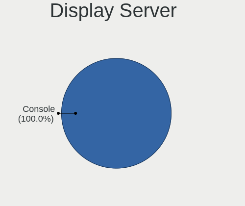
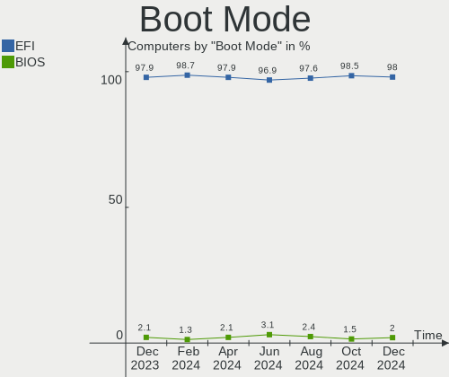
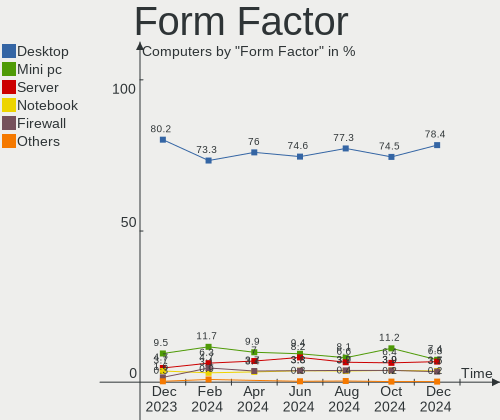
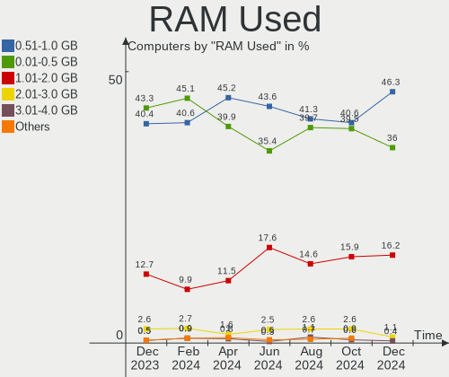
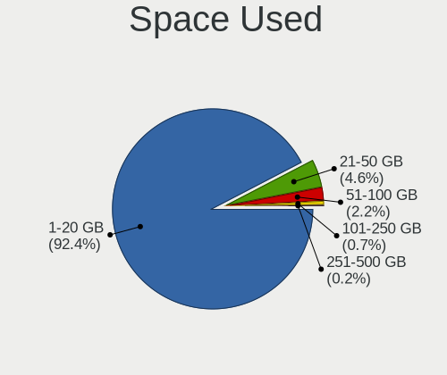
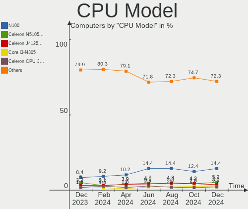
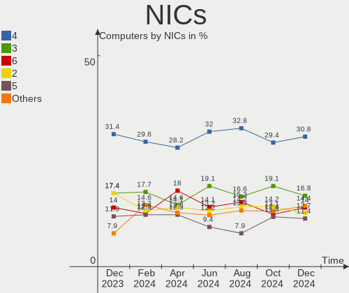

OPNsense - Hardware Trends
--------------------------

A project to identify most popular hardware characteristics and track their change
over time based on data collected by BSD users at https://BSD-Hardware.info.

Anyone can contribute to this report by the [hw-probe](https://github.com/linuxhw/hw-probe/blob/master/INSTALL.BSD.md) tool:

    hw-probe -all -upload

This report is for one last month. Overall report since the beginning of time: [TestCoverage](https://github.com/bsdhw/TestCoverage)

Period: Nov, 2022.

Contents
--------

* [ System ](#system)
  - [ OS                       ](#os)
  - [ OS Family                ](#os-family)
  - [ Arch                     ](#arch)
  - [ DE                       ](#de)
  - [ Display Server           ](#display-server)
  - [ Display Manager          ](#display-manager)
  - [ OS Lang                  ](#os-lang)
  - [ Boot Mode                ](#boot-mode)
  - [ Filesystem               ](#filesystem)
  - [ Part. scheme             ](#part-scheme)

* [ Board ](#board)
  - [ Vendor                   ](#vendor)
  - [ Model                    ](#model)
  - [ Model Family             ](#model-family)
  - [ MFG Year                 ](#mfg-year)
  - [ Form Factor              ](#form-factor)
  - [ Coreboot                 ](#coreboot)
  - [ RAM Size                 ](#ram-size)
  - [ RAM Used                 ](#ram-used)
  - [ Total Drives             ](#total-drives)
  - [ Has CD-ROM               ](#has-cd-rom)
  - [ Has Ethernet             ](#has-ethernet)
  - [ Has WiFi                 ](#has-wifi)
  - [ Has Bluetooth            ](#has-bluetooth)

* [ Location ](#location)
  - [ Country                  ](#country)
  - [ City                     ](#city)

* [ Drives ](#drives)
  - [ Drive Vendor             ](#drive-vendor)
  - [ Drive Model              ](#drive-model)
  - [ HDD Vendor               ](#hdd-vendor)
  - [ SSD Vendor               ](#ssd-vendor)
  - [ Drive Kind               ](#drive-kind)
  - [ Drive Connector          ](#drive-connector)
  - [ Drive Size               ](#drive-size)
  - [ Space Total              ](#space-total)
  - [ Space Used               ](#space-used)
  - [ Malfunc. Drives          ](#malfunc-drives)
  - [ Malfunc. Drive Vendor    ](#malfunc-drive-vendor)
  - [ Malfunc. HDD Vendor      ](#malfunc-hdd-vendor)
  - [ Malfunc. Drive Kind      ](#malfunc-drive-kind)
  - [ Failed Drives            ](#failed-drives)
  - [ Failed Drive Vendor      ](#failed-drive-vendor)
  - [ Drive Status             ](#drive-status)

* [ Storage controller ](#storage-controller)
  - [ Storage Vendor           ](#storage-vendor)
  - [ Storage Model            ](#storage-model)
  - [ Storage Kind             ](#storage-kind)

* [ Processor ](#processor)
  - [ CPU Vendor               ](#cpu-vendor)
  - [ CPU Model                ](#cpu-model)
  - [ CPU Model Family         ](#cpu-model-family)
  - [ CPU Cores                ](#cpu-cores)
  - [ CPU Sockets              ](#cpu-sockets)
  - [ CPU Threads              ](#cpu-threads)
  - [ CPU Microarch            ](#cpu-microarch)

* [ Graphics ](#graphics)
  - [ GPU Vendor               ](#gpu-vendor)
  - [ GPU Model                ](#gpu-model)
  - [ GPU Combo                ](#gpu-combo)
  - [ GPU Driver               ](#gpu-driver)
  - [ GPU Memory               ](#gpu-memory)

* [ Monitor ](#monitor)
  - [ Monitor Vendor           ](#monitor-vendor)
  - [ Monitor Model            ](#monitor-model)
  - [ Monitor Resolution       ](#monitor-resolution)
  - [ Monitor Diagonal         ](#monitor-diagonal)
  - [ Monitor Width            ](#monitor-width)
  - [ Aspect Ratio             ](#aspect-ratio)
  - [ Monitor Area             ](#monitor-area)
  - [ Pixel Density            ](#pixel-density)
  - [ Multiple Monitors        ](#multiple-monitors)

* [ Network ](#network)
  - [ Net Controller Vendor    ](#net-controller-vendor)
  - [ Net Controller Model     ](#net-controller-model)
  - [ Wireless Vendor          ](#wireless-vendor)
  - [ Wireless Model           ](#wireless-model)
  - [ Ethernet Vendor          ](#ethernet-vendor)
  - [ Ethernet Model           ](#ethernet-model)
  - [ Net Controller Kind      ](#net-controller-kind)
  - [ Used Controller          ](#used-controller)
  - [ NICs                     ](#nics)
  - [ IPv6                     ](#ipv6)

* [ Bluetooth ](#bluetooth)
  - [ Bluetooth Vendor         ](#bluetooth-vendor)
  - [ Bluetooth Model          ](#bluetooth-model)

* [ Sound ](#sound)
  - [ Sound Vendor             ](#sound-vendor)
  - [ Sound Model              ](#sound-model)

* [ Memory ](#memory)
  - [ Memory Vendor            ](#memory-vendor)
  - [ Memory Model             ](#memory-model)
  - [ Memory Kind              ](#memory-kind)
  - [ Memory Form Factor       ](#memory-form-factor)
  - [ Memory Size              ](#memory-size)
  - [ Memory Speed             ](#memory-speed)

* [ Printers & scanners ](#printers--scanners)
  - [ Printer Vendor           ](#printer-vendor)
  - [ Printer Model            ](#printer-model)
  - [ Scanner Vendor           ](#scanner-vendor)
  - [ Scanner Model            ](#scanner-model)

* [ Camera ](#camera)
  - [ Camera Vendor            ](#camera-vendor)
  - [ Camera Model             ](#camera-model)

* [ Security ](#security)
  - [ Fingerprint Vendor       ](#fingerprint-vendor)
  - [ Fingerprint Model        ](#fingerprint-model)
  - [ Chipcard Vendor          ](#chipcard-vendor)
  - [ Chipcard Model           ](#chipcard-model)

* [ Unsupported ](#unsupported)
  - [ Unsupported Devices      ](#unsupported-devices)
  - [ Unsupported Device Types ](#unsupported-device-types)

System
------

OS
--

Installed operating systems

| Name             | Computers | Percent |
|------------------|-----------|---------|
| OPNsense 22.7.8  | 114       | 42.38%  |
| OPNsense 22.7.7  | 113       | 42.01%  |
| OPNsense 22.7.6  | 25        | 9.29%   |
| OPNsense 22.10   | 9         | 3.35%   |
| OPNsense 23.1    | 3         | 1.12%   |
| OPNsense 22.1.10 | 3         | 1.12%   |
| OPNsense 22.7.5  | 1         | 0.37%   |
| OPNsense 22.1.1  | 1         | 0.37%   |

OS Family
---------

OS without a version

| Name     | Computers | Percent |
|----------|-----------|---------|
| OPNsense | 269       | 100%    |

Arch
----

OS architecture (x86_64, i586, etc.)

| Name  | Computers | Percent |
|-------|-----------|---------|
| amd64 | 269       | 100%    |

DE
--

Desktop Environment

| Name    | Computers | Percent |
|---------|-----------|---------|
| Console | 269       | 100%    |

Display Server
--------------

X11 or Wayland

| Name    | Computers | Percent |
|---------|-----------|---------|
| Console | 269       | 100%    |

Display Manager
---------------

SDDM, LightDM, etc.

| Name    | Computers | Percent |
|---------|-----------|---------|
| Console | 269       | 100%    |

OS Lang
-------

Language

| Lang    | Computers | Percent |
|---------|-----------|---------|
| Unknown | 264       | 98.14%  |
| C       | 5         | 1.86%   |

Boot Mode
---------

EFI or BIOS

| Mode | Computers | Percent |
|------|-----------|---------|
| EFI  | 259       | 96.28%  |
| BIOS | 10        | 3.72%   |

Filesystem
----------

Type of filesystem

| Type | Computers | Percent |
|------|-----------|---------|
| Ufs  | 162       | 60.22%  |
| Zfs  | 107       | 39.78%  |

Part. scheme
------------

Scheme of partitioning

| Type    | Computers | Percent |
|---------|-----------|---------|
| GPT     | 263       | 97.77%  |
| MBR     | 5         | 1.86%   |
| Unknown | 1         | 0.37%   |

Board
-----

Vendor
------

Motherboard manufacturer

| Name                       | Computers | Percent |
|----------------------------|-----------|---------|
| Hewlett-Packard            | 31        | 11.52%  |
| Dell                       | 29        | 10.78%  |
| Unknown                    | 25        | 9.29%   |
| Protectli                  | 16        | 5.95%   |
| ASUSTek Computer           | 15        | 5.58%   |
| Intel                      | 13        | 4.83%   |
| Supermicro                 | 12        | 4.46%   |
| Sophos                     | 12        | 4.46%   |
| PC Engines                 | 11        | 4.09%   |
| Lenovo                     | 11        | 4.09%   |
| ASRock                     | 10        | 3.72%   |
| Fujitsu                    | 9         | 3.35%   |
| Gigabyte Technology        | 8         | 2.97%   |
| Deciso                     | 7         | 2.6%    |
| AMI                        | 7         | 2.6%    |
| MW                         | 6         | 2.23%   |
| Techvision                 | 5         | 1.86%   |
| MSI                        | 5         | 1.86%   |
| ZOTAC                      | 3         | 1.12%   |
| Shuttle                    | 3         | 1.12%   |
| IceWhale Technology        | 2         | 0.74%   |
| Hardkernel                 | 2         | 0.74%   |
| Datto                      | 2         | 0.74%   |
| Cisco                      | 2         | 0.74%   |
| BESSTAR Tech               | 2         | 0.74%   |
| AZW                        | 2         | 0.74%   |
| AWOW                       | 2         | 0.74%   |
| YANYU                      | 1         | 0.37%   |
| Thomas-Krenn.AG            | 1         | 0.37%   |
| ShenZhen MinWin Technology | 1         | 0.37%   |
| Seeed Studio               | 1         | 0.37%   |
| OEM                        | 1         | 0.37%   |
| Infoblox                   | 1         | 0.37%   |
| Foxconn                    | 1         | 0.37%   |
| CompuLab                   | 1         | 0.37%   |
| CncTion                    | 1         | 0.37%   |
| Cisco Systems              | 1         | 0.37%   |
| CheckPoint                 | 1         | 0.37%   |
| ASRock Industrial          | 1         | 0.37%   |
| Apple                      | 1         | 0.37%   |

Model
-----

Motherboard model

| Name                                             | Computers | Percent |
|--------------------------------------------------|-----------|---------|
| Unknown                                          | 25        | 9.29%   |
| Sophos SG                                        | 8         | 2.97%   |
| Protectli FW4B                                   | 6         | 2.23%   |
| MW GMLK-2_5G4L                                   | 6         | 2.23%   |
| Fujitsu FUTRO S920                               | 6         | 2.23%   |
| AMI Aptio CRB                                    | 6         | 2.23%   |
| Techvision TVI7309X                              | 5         | 1.86%   |
| Protectli FW6                                    | 5         | 1.86%   |
| PC Engines apu4                                  | 5         | 1.86%   |
| PC Engines APU2                                  | 5         | 1.86%   |
| Supermicro Super Server                          | 4         | 1.49%   |
| Sophos XG                                        | 3         | 1.12%   |
| Intel Q3XXG4-P V1.0                              | 3         | 1.12%   |
| Protectli FW2B                                   | 2         | 0.74%   |
| Intel D54250WYK H13922-303                       | 2         | 0.74%   |
| Intel CRESCENTBAY                                | 2         | 0.74%   |
| HP Slim Desktop 290-p0xxx                        | 2         | 0.74%   |
| HP ProDesk 600 G1 SFF                            | 2         | 0.74%   |
| Gigabyte J3455N-D3H                              | 2         | 0.74%   |
| Dell Wyse 5070 Extended Thin Client              | 2         | 0.74%   |
| Dell PowerEdge R710                              | 2         | 0.74%   |
| Deciso NetBoard-A20                              | 2         | 0.74%   |
| Deciso NetBoard-A10                              | 2         | 0.74%   |
| Datto SSD                                        | 2         | 0.74%   |
| AWOW PC BOX                                      | 2         | 0.74%   |
| ASRock H670M-ITX/ax                              | 2         | 0.74%   |
| ZOTAC ZBOX-CI622/CI642/CI662NANO                 | 1         | 0.37%   |
| ZOTAC ZBOX-CI341                                 | 1         | 0.37%   |
| ZOTAC ZBOX-CI327NANO-GS-01                       | 1         | 0.37%   |
| YANYU R250                                       | 1         | 0.37%   |
| Thomas-Krenn.AG P9A-I/2550/4L                    | 1         | 0.37%   |
| Supermicro X7SPA-HF                              | 1         | 0.37%   |
| Supermicro X10SLH-N6-ST031                       | 1         | 0.37%   |
| Supermicro SYS-E200-9A                           | 1         | 0.37%   |
| Supermicro SYS-5019D-4C-FN8TP                    | 1         | 0.37%   |
| Supermicro SYS-1018GR-TA02-CG009                 | 1         | 0.37%   |
| Supermicro NSMPX-17500                           | 1         | 0.37%   |
| Supermicro A2SDi-4C-HLN4F                        | 1         | 0.37%   |
| Supermicro 1HE Intel Single-CPU RI1102D-F Server | 1         | 0.37%   |
| Sophos UTM                                       | 1         | 0.37%   |

Model Family
------------

Motherboard model prefix

| Name                | Computers | Percent |
|---------------------|-----------|---------|
| Unknown             | 25        | 9.29%   |
| Dell PowerEdge      | 11        | 4.09%   |
| Dell OptiPlex       | 10        | 3.72%   |
| Sophos SG           | 8         | 2.97%   |
| HP ProLiant         | 7         | 2.6%    |
| HP ProDesk          | 7         | 2.6%    |
| Protectli FW4B      | 6         | 2.23%   |
| MW GMLK-2           | 6         | 2.23%   |
| Fujitsu FUTRO       | 6         | 2.23%   |
| AMI Aptio           | 6         | 2.23%   |
| Techvision TVI7309X | 5         | 1.86%   |
| Protectli FW6       | 5         | 1.86%   |
| PC Engines apu4     | 5         | 1.86%   |
| PC Engines APU2     | 5         | 1.86%   |
| Lenovo ThinkCentre  | 5         | 1.86%   |
| HP EliteDesk        | 5         | 1.86%   |
| Supermicro Super    | 4         | 1.49%   |
| HP Compaq           | 4         | 1.49%   |
| Sophos XG           | 3         | 1.12%   |
| Intel Q3XXG4-P      | 3         | 1.12%   |
| HP Slim             | 3         | 1.12%   |
| Fujitsu PRIMERGY    | 3         | 1.12%   |
| Dell Wyse           | 3         | 1.12%   |
| Dell Inspiron       | 3         | 1.12%   |
| Protectli FW2B      | 2         | 0.74%   |
| Intel D54250WYK     | 2         | 0.74%   |
| Intel CRESCENTBAY   | 2         | 0.74%   |
| IceWhale ZimaBoard  | 2         | 0.74%   |
| Gigabyte J3455N-D3H | 2         | 0.74%   |
| Gigabyte B450M      | 2         | 0.74%   |
| Deciso NetBoard-A20 | 2         | 0.74%   |
| Deciso NetBoard-A10 | 2         | 0.74%   |
| Deciso Netboard     | 2         | 0.74%   |
| Datto SSD           | 2         | 0.74%   |
| AWOW PC             | 2         | 0.74%   |
| ASUS TUF            | 2         | 0.74%   |
| ASUS PRIME          | 2         | 0.74%   |
| ASRock H670M-ITX    | 2         | 0.74%   |
| ZOTAC ZBOX-CI622    | 1         | 0.37%   |
| ZOTAC ZBOX-CI341    | 1         | 0.37%   |

MFG Year
--------

Motherboard manufacture year

| Year | Computers | Percent |
|------|-----------|---------|
| 2018 | 41        | 15.24%  |
| 2022 | 36        | 13.38%  |
| 2021 | 32        | 11.9%   |
| 2016 | 24        | 8.92%   |
| 2020 | 23        | 8.55%   |
| 2014 | 23        | 8.55%   |
| 2013 | 19        | 7.06%   |
| 2019 | 15        | 5.58%   |
| 2015 | 14        | 5.2%    |
| 2017 | 13        | 4.83%   |
| 2012 | 8         | 2.97%   |
| 2010 | 8         | 2.97%   |
| 2011 | 7         | 2.6%    |
| 2009 | 3         | 1.12%   |
| 2007 | 2         | 0.74%   |
| 2008 | 1         | 0.37%   |

Form Factor
-----------

Physical design of the computer

| Name     | Computers | Percent |
|----------|-----------|---------|
| Desktop  | 193       | 71.75%  |
| Server   | 30        | 11.15%  |
| Mini pc  | 25        | 9.29%   |
| Firewall | 14        | 5.2%    |
| Notebook | 7         | 2.6%    |

Coreboot
--------

Have coreboot on board

| Used | Computers | Percent |
|------|-----------|---------|
| No   | 255       | 94.8%   |
| Yes  | 14        | 5.2%    |

RAM Size
--------

Total RAM memory

| Size in GB      | Computers | Percent |
|-----------------|-----------|---------|
| 8.01-16.0       | 101       | 37.55%  |
| 16.01-24.0      | 68        | 25.28%  |
| 4.01-8.0        | 61        | 22.68%  |
| 32.01-64.0      | 20        | 7.43%   |
| 2.01-3.0        | 6         | 2.23%   |
| 64.01-256.0     | 6         | 2.23%   |
| 24.01-32.0      | 5         | 1.86%   |
| More than 256.0 | 1         | 0.37%   |
| 1.01-2.0        | 1         | 0.37%   |

RAM Used
--------

Used RAM memory

| Used GB     | Computers | Percent |
|-------------|-----------|---------|
| 0.01-0.5    | 151       | 56.13%  |
| 0.51-1.0    | 90        | 33.46%  |
| 1.01-2.0    | 19        | 7.06%   |
| 2.01-3.0    | 5         | 1.86%   |
| 3.01-4.0    | 2         | 0.74%   |
| 64.01-256.0 | 1         | 0.37%   |
| 16.01-24.0  | 1         | 0.37%   |

Total Drives
------------

Number of drives on board

| Drives | Computers | Percent |
|--------|-----------|---------|
| 1      | 209       | 77.7%   |
| 0      | 31        | 11.52%  |
| 2      | 25        | 9.29%   |
| 3      | 2         | 0.74%   |
| 25     | 1         | 0.37%   |
| 4      | 1         | 0.37%   |

Has CD-ROM
----------

Has CD-ROM on board

| Presented | Computers | Percent |
|-----------|-----------|---------|
| No        | 229       | 85.13%  |
| Yes       | 40        | 14.87%  |

Has Ethernet
------------

Has Ethernet on board

| Presented | Computers | Percent |
|-----------|-----------|---------|
| Yes       | 267       | 99.26%  |
| No        | 2         | 0.74%   |

Has WiFi
--------

Has WiFi module

| Presented | Computers | Percent |
|-----------|-----------|---------|
| No        | 212       | 78.81%  |
| Yes       | 57        | 21.19%  |

Has Bluetooth
-------------

Has Bluetooth module

| Presented | Computers | Percent |
|-----------|-----------|---------|
| No        | 234       | 86.99%  |
| Yes       | 35        | 13.01%  |

Location
--------

Country
-------

Geographic location (country)

| Country     | Computers | Percent |
|-------------|-----------|---------|
| USA         | 90        | 33.46%  |
| Germany     | 50        | 18.59%  |
| Canada      | 16        | 5.95%   |
| UK          | 14        | 5.2%    |
| France      | 10        | 3.72%   |
| Brazil      | 8         | 2.97%   |
| Sweden      | 6         | 2.23%   |
| Indonesia   | 6         | 2.23%   |
| Denmark     | 5         | 1.86%   |
| Belgium     | 5         | 1.86%   |
| Austria     | 5         | 1.86%   |
| Switzerland | 4         | 1.49%   |
| South Korea | 4         | 1.49%   |
| Netherlands | 4         | 1.49%   |
| Czechia     | 4         | 1.49%   |
| Taiwan      | 3         | 1.12%   |
| Spain       | 3         | 1.12%   |
| Portugal    | 3         | 1.12%   |
| Poland      | 2         | 0.74%   |
| New Zealand | 2         | 0.74%   |
| India       | 2         | 0.74%   |
| Finland     | 2         | 0.74%   |
| Chile       | 2         | 0.74%   |
| Bulgaria    | 2         | 0.74%   |
| Australia   | 2         | 0.74%   |
| Turkey      | 1         | 0.37%   |
| Slovenia    | 1         | 0.37%   |
| Slovakia    | 1         | 0.37%   |
| Singapore   | 1         | 0.37%   |
| Russia      | 1         | 0.37%   |
| Philippines | 1         | 0.37%   |
| Paraguay    | 1         | 0.37%   |
| Norway      | 1         | 0.37%   |
| Latvia      | 1         | 0.37%   |
| Israel      | 1         | 0.37%   |
| Hungary     | 1         | 0.37%   |
| Greece      | 1         | 0.37%   |
| Estonia     | 1         | 0.37%   |
| Colombia    | 1         | 0.37%   |
| China       | 1         | 0.37%   |

City
----

Geographic location (city)

| City                 | Computers | Percent |
|----------------------|-----------|---------|
| Munich               | 4         | 1.49%   |
| Paris                | 3         | 1.12%   |
| Oakland              | 3         | 1.12%   |
| London               | 3         | 1.12%   |
| Karlsruhe            | 3         | 1.12%   |
| Vienna               | 2         | 0.74%   |
| Teplice              | 2         | 0.74%   |
| Taichung City        | 2         | 0.74%   |
| Stuttgart            | 2         | 0.74%   |
| Sofia                | 2         | 0.74%   |
| Seattle              | 2         | 0.74%   |
| Sao José dos Campos | 2         | 0.74%   |
| Renton               | 2         | 0.74%   |
| Plano                | 2         | 0.74%   |
| Phoenix              | 2         | 0.74%   |
| Philadelphia         | 2         | 0.74%   |
| Leipzig              | 2         | 0.74%   |
| Jakarta              | 2         | 0.74%   |
| Ingolstadt           | 2         | 0.74%   |
| Hamburg              | 2         | 0.74%   |
| Frankfurt am Main    | 2         | 0.74%   |
| El Paso              | 2         | 0.74%   |
| Denver               | 2         | 0.74%   |
| City of Westminster  | 2         | 0.74%   |
| Cileungsir           | 2         | 0.74%   |
| Cedar Rapids         | 2         | 0.74%   |
| Brookline            | 2         | 0.74%   |
| Bochum               | 2         | 0.74%   |
| Atlanta              | 2         | 0.74%   |
| Amsterdam            | 2         | 0.74%   |
| Zusmarshausen        | 1         | 0.37%   |
| Zurich               | 1         | 0.37%   |
| Wuppertal            | 1         | 0.37%   |
| Wroclaw              | 1         | 0.37%   |
| Worcester            | 1         | 0.37%   |
| Wismar               | 1         | 0.37%   |
| Williamsburg         | 1         | 0.37%   |
| White Haven          | 1         | 0.37%   |
| Wermelskirchen       | 1         | 0.37%   |
| Wels                 | 1         | 0.37%   |

Drives
------

Drive Vendor
------------

Hard drive vendors

| Vendor              | Computers | Drives | Percent |
|---------------------|-----------|--------|---------|
| Samsung Electronics | 29        | 33     | 11.55%  |
| Transcend           | 28        | 32     | 11.16%  |
| Kingston            | 21        | 22     | 8.37%   |
| WDC                 | 20        | 20     | 7.97%   |
| Intel               | 14        | 14     | 5.58%   |
| Crucial             | 14        | 14     | 5.58%   |
| Seagate             | 13        | 14     | 5.18%   |
| Hoodisk             | 9         | 9      | 3.59%   |
| A-DATA Technology   | 9         | 9      | 3.59%   |
| SanDisk             | 7         | 9      | 2.79%   |
| SK hynix            | 6         | 6      | 2.39%   |
| China               | 6         | 6      | 2.39%   |
| Toshiba             | 5         | 9      | 1.99%   |
| Hewlett-Packard     | 5         | 6      | 1.99%   |
| FORESEE             | 5         | 5      | 1.99%   |
| Protectli           | 4         | 4      | 1.59%   |
| Silicon Motion      | 3         | 3      | 1.2%    |
| ShiJi               | 3         | 3      | 1.2%    |
| PNY                 | 3         | 4      | 1.2%    |
| BIWIN               | 3         | 3      | 1.2%    |
| Apacer              | 3         | 3      | 1.2%    |
| SPCC                | 2         | 2      | 0.8%    |
| OCZ                 | 2         | 2      | 0.8%    |
| LITEON              | 2         | 2      | 0.8%    |
| KIOXIA              | 2         | 2      | 0.8%    |
| Intenso             | 2         | 2      | 0.8%    |
| Innodisk            | 2         | 2      | 0.8%    |
| Hitachi             | 2         | 2      | 0.8%    |
| CWDISK              | 2         | 2      | 0.8%    |
| Zheino              | 1         | 1      | 0.4%    |
| Yeyian              | 1         | 2      | 0.4%    |
| Verbatim            | 1         | 1      | 0.4%    |
| Vaseky              | 1         | 1      | 0.4%    |
| Timetec             | 1         | 1      | 0.4%    |
| Supermicro          | 1         | 1      | 0.4%    |
| Phison              | 1         | 1      | 0.4%    |
| ORTIAL              | 1         | 1      | 0.4%    |
| NETAPP              | 1         | 2      | 0.4%    |
| Mushkin             | 1         | 1      | 0.4%    |
| Micron Technology   | 1         | 1      | 0.4%    |

Drive Model
-----------

Hard drive models

| Model                                | Computers | Percent |
|--------------------------------------|-----------|---------|
| Kingston SKC600MS256G 256GB          | 6         | 2.38%   |
| Hoodisk SSD 64GB                     | 4         | 1.59%   |
| Hoodisk SSD 32GB                     | 4         | 1.59%   |
| HP RAID 1(1+0) 119GB                 | 4         | 1.59%   |
| FORESEE 128GB SSD                    | 4         | 1.59%   |
| Transcend TS64GSSD370 64GB           | 3         | 1.19%   |
| Transcend TS256GMTS952T2 256GB       | 3         | 1.19%   |
| Samsung SSD 860 EVO 500GB            | 3         | 1.19%   |
| Crucial CT480BX500SSD1 480GB         | 3         | 1.19%   |
| Crucial CT240BX500SSD1 240GB         | 3         | 1.19%   |
| BIWIN SSD 128GB                      | 3         | 1.19%   |
| A-DATA IM2S3134N-064GM 64GB          | 3         | 1.19%   |
| WDC WDS240G2G0B-00EPW0 240GB         | 2         | 0.79%   |
| WDC PC SN730 SDBQNTY-256G-1001 256GB | 2         | 0.79%   |
| Transcend TS64GMSA230S 64GB          | 2         | 0.79%   |
| Transcend TS256GSSD452K2 256GB       | 2         | 0.79%   |
| Transcend TS256GMTE652T2 256GB       | 2         | 0.79%   |
| Transcend TS256GMSA230S 256GB        | 2         | 0.79%   |
| SK hynix SC311 SATA 256GB            | 2         | 0.79%   |
| ShiJi SSD 128GB                      | 2         | 0.79%   |
| Seagate ST500DM002-1BD142 500GB      | 2         | 0.79%   |
| SanDisk SSD PLUS 120GB               | 2         | 0.79%   |
| Samsung SSD 860 EVO M.2 250GB        | 2         | 0.79%   |
| Samsung SSD 850 PRO 256GB            | 2         | 0.79%   |
| Kingston SUV500MS120G 120GB          | 2         | 0.79%   |
| Kingston SFYRS1000G 1TB              | 2         | 0.79%   |
| Kingston SA400S37240G 240GB          | 2         | 0.79%   |
| Kingston SA400S37120G 120GB          | 2         | 0.79%   |
| Intel SSDSC2BW180A4 180GB            | 2         | 0.79%   |
| Innodisk DEMSR- 08GB mSATA 3ME3      | 2         | 0.79%   |
| Crucial CT500MX500SSD1 500GB         | 2         | 0.79%   |
| China SATA SSD 256GB                 | 2         | 0.79%   |
| A-DATA SU630 240GB                   | 2         | 0.79%   |
| Zheino CHN mSATA01M 060 64GB         | 1         | 0.4%    |
| Yeyian VALK 3000 250GB               | 1         | 0.4%    |
| WDC WDS500G2B0A 500GB                | 1         | 0.4%    |
| WDC WDS500G1X0E-00AFY0 500GB         | 1         | 0.4%    |
| WDC WDBRPG5000ANC-WRSN 500GB         | 1         | 0.4%    |
| WDC WD6400AAKS-22A7B2 640GB          | 1         | 0.4%    |
| WDC WD5000AZLX-60K2TA0 500GB         | 1         | 0.4%    |

HDD Vendor
----------

Hard disk drive vendors

| Vendor              | Computers | Drives | Percent |
|---------------------|-----------|--------|---------|
| Seagate             | 13        | 14     | 38.24%  |
| WDC                 | 9         | 9      | 26.47%  |
| Toshiba             | 3         | 7      | 8.82%   |
| Hitachi             | 2         | 2      | 5.88%   |
| Samsung Electronics | 1         | 1      | 2.94%   |
| NETAPP              | 1         | 2      | 2.94%   |
| HGST                | 1         | 1      | 2.94%   |
| Hewlett-Packard     | 1         | 2      | 2.94%   |
| Dell                | 1         | 23     | 2.94%   |
| Cisco               | 1         | 1      | 2.94%   |
| Apple               | 1         | 1      | 2.94%   |

SSD Vendor
----------

Solid state drive vendors

| Vendor              | Computers | Drives | Percent |
|---------------------|-----------|--------|---------|
| Transcend           | 26        | 30     | 14.53%  |
| Samsung Electronics | 20        | 24     | 11.17%  |
| Kingston            | 19        | 20     | 10.61%  |
| Crucial             | 13        | 13     | 7.26%   |
| Intel               | 11        | 11     | 6.15%   |
| Hoodisk             | 9         | 9      | 5.03%   |
| A-DATA Technology   | 8         | 8      | 4.47%   |
| SanDisk             | 7         | 9      | 3.91%   |
| China               | 6         | 6      | 3.35%   |
| FORESEE             | 5         | 5      | 2.79%   |
| SK hynix            | 4         | 4      | 2.23%   |
| Protectli           | 4         | 4      | 2.23%   |
| Hewlett-Packard     | 4         | 4      | 2.23%   |
| WDC                 | 3         | 3      | 1.68%   |
| ShiJi               | 3         | 3      | 1.68%   |
| PNY                 | 3         | 4      | 1.68%   |
| BIWIN               | 3         | 3      | 1.68%   |
| Apacer              | 3         | 3      | 1.68%   |
| Toshiba             | 2         | 2      | 1.12%   |
| OCZ                 | 2         | 2      | 1.12%   |
| LITEON              | 2         | 2      | 1.12%   |
| Intenso             | 2         | 2      | 1.12%   |
| Innodisk            | 2         | 2      | 1.12%   |
| Zheino              | 1         | 1      | 0.56%   |
| Yeyian              | 1         | 2      | 0.56%   |
| Verbatim            | 1         | 1      | 0.56%   |
| Vaseky              | 1         | 1      | 0.56%   |
| Supermicro          | 1         | 1      | 0.56%   |
| SPCC                | 1         | 1      | 0.56%   |
| ORTIAL              | 1         | 1      | 0.56%   |
| Mushkin             | 1         | 1      | 0.56%   |
| Micron Technology   | 1         | 1      | 0.56%   |
| Maximus             | 1         | 1      | 0.56%   |
| MARVELL             | 1         | 1      | 0.56%   |
| Integral            | 1         | 1      | 0.56%   |
| Hikvision           | 1         | 1      | 0.56%   |
| Dogfish             | 1         | 1      | 0.56%   |
| CWDISK              | 1         | 1      | 0.56%   |
| Corsair             | 1         | 1      | 0.56%   |
| BORY                | 1         | 1      | 0.56%   |

Drive Kind
----------

HDD or SSD

| Kind | Computers | Drives | Percent |
|------|-----------|--------|---------|
| SSD  | 178       | 192    | 71.49%  |
| NVMe | 38        | 38     | 15.26%  |
| HDD  | 33        | 63     | 13.25%  |

Drive Connector
---------------

SATA, SAS, NVMe, etc.

| Type | Computers | Drives | Percent |
|------|-----------|--------|---------|
| SATA | 206       | 255    | 84.43%  |
| NVMe | 38        | 38     | 15.57%  |

Drive Size
----------

Size of hard drive

| Size in TB | Computers | Drives | Percent |
|------------|-----------|--------|---------|
| 0.01-0.5   | 189       | 234    | 90.87%  |
| 0.51-1.0   | 15        | 17     | 7.21%   |
| 1.01-2.0   | 2         | 2      | 0.96%   |
| 3.01-4.0   | 1         | 1      | 0.48%   |
| 2.01-3.0   | 1         | 1      | 0.48%   |

Space Total
-----------

Amount of disk space available on the file system

| Size in GB | Computers | Percent |
|------------|-----------|---------|
| 101-250    | 132       | 49.07%  |
| 251-500    | 46        | 17.1%   |
| 21-50      | 33        | 12.27%  |
| 51-100     | 25        | 9.29%   |
| 501-1000   | 15        | 5.58%   |
| 1-20       | 14        | 5.2%    |
| 1001-2000  | 2         | 0.74%   |
| 2001-3000  | 1         | 0.37%   |
| Unknown    | 1         | 0.37%   |

Space Used
----------

Amount of used disk space

| Used GB | Computers | Percent |
|---------|-----------|---------|
| 1-20    | 258       | 95.91%  |
| 21-50   | 6         | 2.23%   |
| 51-100  | 3         | 1.12%   |
| 101-250 | 1         | 0.37%   |
| Unknown | 1         | 0.37%   |

Malfunc. Drives
---------------

Drive models with a malfunction

| Model                                 | Computers | Drives | Percent |
|---------------------------------------|-----------|--------|---------|
| Seagate ST500DM002-1BD142 500GB       | 2         | 2      | 10.53%  |
| Crucial CT480BX500SSD1 480GB          | 2         | 2      | 10.53%  |
| WDC WD6400AAKS-22A7B2 640GB           | 1         | 1      | 5.26%   |
| WDC WD4000AAKS-00C8A0 400GB           | 1         | 1      | 5.26%   |
| Toshiba DT01ACA100 1TB                | 1         | 1      | 5.26%   |
| Seagate ST500LT012-1DG142 500GB       | 1         | 1      | 5.26%   |
| Seagate ST500LM021-1KJ152 500GB       | 1         | 1      | 5.26%   |
| Seagate ST320LT007-9ZV142 320GB       | 1         | 1      | 5.26%   |
| Seagate ST31000340NS 1TB              | 1         | 1      | 5.26%   |
| Samsung Electronics SSD 970 EVO 500GB | 1         | 1      | 5.26%   |
| Samsung Electronics SSD 960 PRO 512GB | 1         | 1      | 5.26%   |
| Samsung Electronics SSD 850 PRO 256GB | 1         | 2      | 5.26%   |
| Samsung Electronics HD502HJ 500GB     | 1         | 1      | 5.26%   |
| Intel SSDSC2CT060A3 64GB              | 1         | 1      | 5.26%   |
| HGST HTS725050A7E630 500GB            | 1         | 1      | 5.26%   |
| Crucial CT240M500SSD1 240GB           | 1         | 1      | 5.26%   |
| A-DATA Technology SX300 128GB         | 1         | 1      | 5.26%   |

Malfunc. Drive Vendor
---------------------

Vendors of faulty drives

| Vendor              | Computers | Drives | Percent |
|---------------------|-----------|--------|---------|
| Seagate             | 6         | 6      | 31.58%  |
| Samsung Electronics | 4         | 5      | 21.05%  |
| Crucial             | 3         | 3      | 15.79%  |
| WDC                 | 2         | 2      | 10.53%  |
| Toshiba             | 1         | 1      | 5.26%   |
| Intel               | 1         | 1      | 5.26%   |
| HGST                | 1         | 1      | 5.26%   |
| A-DATA Technology   | 1         | 1      | 5.26%   |

Malfunc. HDD Vendor
-------------------

Vendors of faulty HDD drives

| Vendor              | Computers | Drives | Percent |
|---------------------|-----------|--------|---------|
| Seagate             | 6         | 6      | 54.55%  |
| WDC                 | 2         | 2      | 18.18%  |
| Toshiba             | 1         | 1      | 9.09%   |
| Samsung Electronics | 1         | 1      | 9.09%   |
| HGST                | 1         | 1      | 9.09%   |

Malfunc. Drive Kind
-------------------

Kinds of faulty drives

| Kind | Computers | Drives | Percent |
|------|-----------|--------|---------|
| HDD  | 11        | 11     | 57.89%  |
| SSD  | 6         | 7      | 31.58%  |
| NVMe | 2         | 2      | 10.53%  |

Failed Drives
-------------

Failed drive models

| Model                        | Computers | Drives | Percent |
|------------------------------|-----------|--------|---------|
| WDC WD3200BPVT-16JJ5T0 320GB | 1         | 1      | 33.33%  |
| SK hynix SC308 SATA 256GB    | 1         | 1      | 33.33%  |
| Seagate ST3500418AS 500GB    | 1         | 1      | 33.33%  |

Failed Drive Vendor
-------------------

Failed drive vendors

| Vendor   | Computers | Drives | Percent |
|----------|-----------|--------|---------|
| WDC      | 1         | 1      | 33.33%  |
| SK hynix | 1         | 1      | 33.33%  |
| Seagate  | 1         | 1      | 33.33%  |

Drive Status
------------

Number of failed and malfunc. drives

| Status   | Computers | Drives | Percent |
|----------|-----------|--------|---------|
| Works    | 214       | 263    | 88.43%  |
| Malfunc  | 19        | 20     | 7.85%   |
| Detected | 6         | 7      | 2.48%   |
| Failed   | 3         | 3      | 1.24%   |

Storage controller
------------------

Storage Vendor
--------------

Storage controller vendors

| Vendor                      | Computers | Percent |
|-----------------------------|-----------|---------|
| Intel                       | 224       | 68.5%   |
| AMD                         | 36        | 11.01%  |
| Broadcom / LSI              | 13        | 3.98%   |
| SanDisk                     | 11        | 3.36%   |
| Silicon Motion              | 8         | 2.45%   |
| Samsung Electronics         | 8         | 2.45%   |
| ASMedia Technology          | 6         | 1.83%   |
| Hewlett-Packard             | 5         | 1.53%   |
| Transcend                   | 2         | 0.61%   |
| SK hynix                    | 2         | 0.61%   |
| KIOXIA                      | 2         | 0.61%   |
| Kingston Technology Company | 2         | 0.61%   |
| VIA Technologies            | 1         | 0.31%   |
| Phison Electronics          | 1         | 0.31%   |
| Micron/Crucial Technology   | 1         | 0.31%   |
| MAXIO Technology (Hangzhou) | 1         | 0.31%   |
| Marvell Technology Group    | 1         | 0.31%   |
| JMicron Technology          | 1         | 0.31%   |
| ADATA Technology            | 1         | 0.31%   |
| 3ware                       | 1         | 0.31%   |

Storage Model
-------------

Storage controller models

| Model                                                                            | Computers | Percent |
|----------------------------------------------------------------------------------|-----------|---------|
| Intel Celeron/Pentium Silver Processor SATA Controller                           | 26        | 7.26%   |
| AMD FCH SATA Controller [AHCI mode]                                              | 24        | 6.7%    |
| Intel 8 Series/C220 Series Chipset Family 6-port SATA Controller 1 [AHCI mode]   | 20        | 5.59%   |
| Intel Q170/Q150/B150/H170/H110/Z170/CM236 Chipset SATA Controller [AHCI Mode]    | 15        | 4.19%   |
| Intel Atom Processor E3800 Series SATA AHCI Controller                           | 13        | 3.63%   |
| Intel Jasper Lake SATA AHCI Controller                                           | 12        | 3.35%   |
| Intel Atom/Celeron/Pentium Processor x5-E8000/J3xxx/N3xxx Series SATA Controller | 10        | 2.79%   |
| Intel Sunrise Point-LP SATA Controller [AHCI mode]                               | 9         | 2.51%   |
| Intel 7 Series/C210 Series Chipset Family 6-port SATA Controller [AHCI mode]     | 9         | 2.51%   |
| Silicon Motion SM2263EN/SM2263XT SSD Controller                                  | 8         | 2.23%   |
| Intel Celeron N3350/Pentium N4200/Atom E3900 Series SATA AHCI Controller         | 8         | 2.23%   |
| Intel 6 Series/C200 Series Chipset Family 6 port Desktop SATA AHCI Controller    | 8         | 2.23%   |
| Unknown                                                                          | 8         | 2.23%   |
| Intel Wildcat Point-LP SATA Controller [AHCI Mode]                               | 6         | 1.68%   |
| Intel Cannon Lake PCH SATA AHCI Controller                                       | 6         | 1.68%   |
| Intel Atom Processor C3000 Series SATA Controller 0                              | 6         | 1.68%   |
| Intel Atom processor C2000 AHCI SATA3 Controller                                 | 6         | 1.68%   |
| Intel 8 Series SATA Controller 1 [AHCI mode]                                     | 6         | 1.68%   |
| Intel 200 Series PCH SATA controller [AHCI mode]                                 | 6         | 1.68%   |
| ASMedia ASM1062 Serial ATA Controller                                            | 6         | 1.68%   |
| AMD FCH SATA Controller [IDE mode]                                               | 6         | 1.68%   |
| Intel C610/X99 series chipset 6-Port SATA Controller [AHCI mode]                 | 5         | 1.4%    |
| Intel 82801JI (ICH10 Family) 4 port SATA IDE Controller #1                       | 5         | 1.4%    |
| Broadcom / LSI MegaRAID SAS 2108 [Liberator]                                     | 5         | 1.4%    |
| AMD 400 Series Chipset SATA Controller                                           | 5         | 1.4%    |
| Intel SATA Controller [RAID mode]                                                | 4         | 1.12%   |
| Intel Comet Lake SATA AHCI Controller                                            | 4         | 1.12%   |
| Intel 500 Series Chipset Family SATA AHCI Controller                             | 4         | 1.12%   |
| SanDisk WD Blue SN500 / PC SN520 NVMe SSD                                        | 3         | 0.84%   |
| Samsung NVMe SSD Controller SM981/PM981/PM983                                    | 3         | 0.84%   |
| Samsung NVMe SSD Controller SM961/PM961/SM963                                    | 3         | 0.84%   |
| Intel C610/X99 series chipset sSATA Controller [AHCI mode]                       | 3         | 0.84%   |
| Intel C600/X79 series chipset 6-Port SATA AHCI Controller                        | 3         | 0.84%   |
| Intel Alder Lake-S PCH SATA Controller [AHCI Mode]                               | 3         | 0.84%   |
| Intel 400 Series Chipset Family SATA AHCI Controller                             | 3         | 0.84%   |
| HP Smart Array G6 controllers                                                    | 3         | 0.84%   |
| Broadcom / LSI MegaRAID SAS-3 3108 [Invader]                                     | 3         | 0.84%   |
| Broadcom / LSI MegaRAID SAS 2208 [Thunderbolt]                                   | 3         | 0.84%   |
| AMD SB7x0/SB8x0/SB9x0 SATA Controller [AHCI mode]                                | 3         | 0.84%   |
| SanDisk WD Black SN750 / PC SN730 NVMe SSD                                       | 2         | 0.56%   |

Storage Kind
------------

Kind of storage controller (IDE, SATA, NVMe, SAS, ...)

| Kind | Computers | Percent |
|------|-----------|---------|
| SATA | 231       | 70.21%  |
| NVMe | 42        | 12.77%  |
| IDE  | 30        | 9.12%   |
| RAID | 24        | 7.29%   |
| SAS  | 2         | 0.61%   |

Processor
---------

CPU Vendor
----------

Processor vendors

| Vendor | Computers | Percent |
|--------|-----------|---------|
| Intel  | 230       | 85.5%   |
| AMD    | 38        | 14.13%  |
| VIA    | 1         | 0.37%   |

CPU Model
---------

Processor models

| Model                                       | Computers | Percent |
|---------------------------------------------|-----------|---------|
| Intel Celeron J4125 CPU @ 2.00GHz           | 17        | 6.32%   |
| AMD GX-412TC SOC                            | 11        | 4.09%   |
| Intel Celeron N5105 @ 2.00GHz               | 9         | 3.35%   |
| Intel Celeron CPU J3160 @ 1.60GHz           | 6         | 2.23%   |
| Intel Celeron CPU J1900 @ 1.99GHz           | 6         | 2.23%   |
| Intel Celeron CPU J3455 @ 1.50GHz           | 4         | 1.49%   |
| Intel Atom CPU C3558 @ 2.20GHz              | 4         | 1.49%   |
| Intel Atom CPU C2558 @ 2.40GHz              | 4         | 1.49%   |
| AMD GX-415GA SOC with Radeon HD Graphics    | 4         | 1.49%   |
| AMD EPYC 3201 8-Core Processor              | 4         | 1.49%   |
| Intel Core i5-6500T CPU @ 2.50GHz           | 3         | 1.12%   |
| Intel Core i5-6500 CPU @ 3.20GHz            | 3         | 1.12%   |
| Intel Celeron J4105 CPU @ 1.50GHz           | 3         | 1.12%   |
| Intel Atom CPU D525 @ 1.80GHz               | 3         | 1.12%   |
| Intel Xeon CPU E5-2420 v2 @ 2.20GHz         | 2         | 0.74%   |
| Intel Xeon CPU E3-1220 v3 @ 3.10GHz         | 2         | 0.74%   |
| Intel Xeon CPU D-1537 @ 1.70GHz             | 2         | 0.74%   |
| Intel Pentium Silver N6005 @ 2.00GHz        | 2         | 0.74%   |
| Intel Pentium Silver J5005 CPU @ 1.50GHz    | 2         | 0.74%   |
| Intel Pentium Gold G7400                    | 2         | 0.74%   |
| Intel Core i5-9500 CPU @ 3.00GHz            | 2         | 0.74%   |
| Intel Core i5-5200U CPU @ 2.20GHz           | 2         | 0.74%   |
| Intel Core i5-4570 CPU @ 3.20GHz            | 2         | 0.74%   |
| Intel Core i5-4250U CPU @ 1.30GHz           | 2         | 0.74%   |
| Intel Core i5-3570 CPU @ 3.40GHz            | 2         | 0.74%   |
| Intel Core i5-3470 CPU @ 3.20GHz            | 2         | 0.74%   |
| Intel Core i3-7100U CPU @ 2.40GHz           | 2         | 0.74%   |
| Intel Core i3-7100 CPU @ 3.90GHz            | 2         | 0.74%   |
| Intel Core i3-5005U CPU @ 2.00GHz           | 2         | 0.74%   |
| Intel Core i3-10100 CPU @ 3.60GHz           | 2         | 0.74%   |
| Intel Celeron CPU N3450 @ 1.10GHz           | 2         | 0.74%   |
| Intel Celeron CPU J3060 @ 1.60GHz           | 2         | 0.74%   |
| Intel Celeron CPU J1800 @ 2.41GHz           | 2         | 0.74%   |
| Intel Celeron CPU 3865U @ 1.80GHz           | 2         | 0.74%   |
| Intel Atom CPU C3508 @ 1.60GHz              | 2         | 0.74%   |
| Intel 11th Gen Core i5-11400 @ 2.60GHz      | 2         | 0.74%   |
| AMD Ryzen Embedded V1500B                   | 2         | 0.74%   |
| AMD Ryzen 3 3200G with Radeon Vega Graphics | 2         | 0.74%   |
| AMD GX-222GC SOC with Radeon R5E Graphics   | 2         | 0.74%   |
| VIA Nano U3500@1000MHz                      | 1         | 0.37%   |

CPU Model Family
----------------

Processor model prefix

| Model                | Computers | Percent |
|----------------------|-----------|---------|
| Intel Celeron        | 68        | 25.28%  |
| Intel Core i5        | 47        | 17.47%  |
| Intel Xeon           | 37        | 13.75%  |
| Intel Core i3        | 21        | 7.81%   |
| Intel Atom           | 19        | 7.06%   |
| AMD GX               | 19        | 7.06%   |
| Intel Core i7        | 10        | 3.72%   |
| Other                | 8         | 2.97%   |
| Intel Pentium        | 7         | 2.6%    |
| Intel Pentium Silver | 6         | 2.23%   |
| AMD EPYC             | 5         | 1.86%   |
| Intel Pentium Gold   | 3         | 1.12%   |
| Intel Core 2 Quad    | 2         | 0.74%   |
| AMD Ryzen Embedded   | 2         | 0.74%   |
| AMD Ryzen 3          | 2         | 0.74%   |
| AMD G                | 2         | 0.74%   |
| Intel Xeon Gold      | 1         | 0.37%   |
| Intel Genuine        | 1         | 0.37%   |
| Intel Core i9        | 1         | 0.37%   |
| Intel Core 2 Duo     | 1         | 0.37%   |
| AMD Ryzen 9          | 1         | 0.37%   |
| AMD Ryzen 7          | 1         | 0.37%   |
| AMD Ryzen 5 PRO      | 1         | 0.37%   |
| AMD Ryzen 5          | 1         | 0.37%   |
| AMD Opteron          | 1         | 0.37%   |
| AMD FX               | 1         | 0.37%   |
| AMD A10              | 1         | 0.37%   |

CPU Cores
---------

Number of processor cores

| Number  | Computers | Percent |
|---------|-----------|---------|
| 4       | 158       | 58.74%  |
| 2       | 63        | 23.42%  |
| 8       | 17        | 6.32%   |
| 6       | 12        | 4.46%   |
| 12      | 7         | 2.6%    |
| 16      | 4         | 1.49%   |
| 10      | 2         | 0.74%   |
| Unknown | 2         | 0.74%   |
| 64      | 1         | 0.37%   |
| 40      | 1         | 0.37%   |
| 24      | 1         | 0.37%   |
| 1       | 1         | 0.37%   |

CPU Sockets
-----------

Number of sockets

| Number | Computers | Percent |
|--------|-----------|---------|
| 1      | 255       | 94.8%   |
| 2      | 12        | 4.46%   |
| 4      | 2         | 0.74%   |

CPU Threads
-----------

Threads per core (Hyper-Threading)

| Number  | Computers | Percent |
|---------|-----------|---------|
| 1       | 178       | 66.17%  |
| 2       | 89        | 33.09%  |
| Unknown | 2         | 0.74%   |

CPU Microarch
-------------

Microarchitecture

| Name          | Computers | Percent |
|---------------|-----------|---------|
| Silvermont    | 31        | 11.52%  |
| Haswell       | 29        | 10.78%  |
| KabyLake      | 26        | 9.67%   |
| Goldmont plus | 26        | 9.67%   |
| Unknown       | 20        | 7.43%   |
| IvyBridge     | 18        | 6.69%   |
| Skylake       | 17        | 6.32%   |
| Puma          | 14        | 5.2%    |
| Goldmont      | 14        | 5.2%    |
| Broadwell     | 10        | 3.72%   |
| Westmere      | 9         | 3.35%   |
| SandyBridge   | 9         | 3.35%   |
| CometLake     | 8         | 2.97%   |
| Zen           | 7         | 2.6%    |
| Jaguar        | 5         | 1.86%   |
| Zen+          | 3         | 1.12%   |
| Penryn        | 3         | 1.12%   |
| Nehalem       | 3         | 1.12%   |
| Core          | 3         | 1.12%   |
| Bonnell       | 3         | 1.12%   |
| Zen 2         | 2         | 0.74%   |
| TigerLake     | 2         | 0.74%   |
| Piledriver    | 2         | 0.74%   |
| Bobcat        | 2         | 0.74%   |
| Zen 3         | 1         | 0.37%   |
| Steamroller   | 1         | 0.37%   |
| Excavator     | 1         | 0.37%   |

Graphics
--------

GPU Vendor
----------

Vendors of graphics cards

| Vendor                     | Computers | Percent |
|----------------------------|-----------|---------|
| Intel                      | 174       | 69.32%  |
| Matrox Electronics Systems | 24        | 9.56%   |
| ASPEED Technology          | 23        | 9.16%   |
| AMD                        | 19        | 7.57%   |
| Nvidia                     | 10        | 3.98%   |
| VIA Technologies           | 1         | 0.4%    |

GPU Model
---------

Graphics card models

| Model                                                                                    | Computers | Percent |
|------------------------------------------------------------------------------------------|-----------|---------|
| ASPEED Technology ASPEED Graphics Family                                                 | 23        | 9.13%   |
| Intel GeminiLake [UHD Graphics 600]                                                      | 22        | 8.73%   |
| Intel Atom Processor Z36xxx/Z37xxx Series Graphics & Display                             | 13        | 5.16%   |
| Intel Xeon E3-1200 v3/4th Gen Core Processor Integrated Graphics Controller              | 12        | 4.76%   |
| Intel JasperLake [UHD Graphics]                                                          | 12        | 4.76%   |
| Intel HD Graphics 530                                                                    | 12        | 4.76%   |
| Intel Atom/Celeron/Pentium Processor x5-E8000/J3xxx/N3xxx Integrated Graphics Controller | 12        | 4.76%   |
| Matrox Electronics Systems MGA G200eW WPCM450                                            | 9         | 3.57%   |
| Intel HD Graphics 500                                                                    | 8         | 3.17%   |
| Matrox Electronics Systems G200eR2                                                       | 7         | 2.78%   |
| Intel Xeon E3-1200 v2/3rd Gen Core processor Graphics Controller                         | 7         | 2.78%   |
| Intel HD Graphics 630                                                                    | 6         | 2.38%   |
| Intel Haswell-ULT Integrated Graphics Controller                                         | 6         | 2.38%   |
| Intel CoffeeLake-S GT2 [UHD Graphics 630]                                                | 6         | 2.38%   |
| Intel HD Graphics 5500                                                                   | 5         | 1.98%   |
| Intel CometLake-S GT2 [UHD Graphics 630]                                                 | 5         | 1.98%   |
| AMD ES1000                                                                               | 5         | 1.98%   |
| Matrox Electronics Systems MGA G200e [Pilot] ServerEngines (SEP1)                        | 4         | 1.59%   |
| Intel GeminiLake [UHD Graphics 605]                                                      | 4         | 1.59%   |
| Intel 2nd Generation Core Processor Family Integrated Graphics Controller                | 4         | 1.59%   |
| AMD Kabini [Radeon HD 8330E]                                                             | 4         | 1.59%   |
| Matrox Electronics Systems MGA G200EH                                                    | 3         | 1.19%   |
| Intel HD Graphics 620                                                                    | 3         | 1.19%   |
| Intel HD Graphics 610                                                                    | 3         | 1.19%   |
| Intel CometLake-U GT2 [UHD Graphics]                                                     | 3         | 1.19%   |
| Intel 4 Series Chipset Integrated Graphics Controller                                    | 3         | 1.19%   |
| Nvidia GP107 [GeForce GTX 1050 Ti]                                                       | 2         | 0.79%   |
| Intel UHD Graphics 620                                                                   | 2         | 0.79%   |
| Intel TigerLake-LP GT2 [Iris Xe Graphics]                                                | 2         | 0.79%   |
| Intel RocketLake-S GT1 [UHD Graphics 730]                                                | 2         | 0.79%   |
| Intel IvyBridge GT2 [HD Graphics 4000]                                                   | 2         | 0.79%   |
| Intel HD Graphics 510                                                                    | 2         | 0.79%   |
| Intel CometLake-S GT1 [UHD Graphics 610]                                                 | 2         | 0.79%   |
| Intel Alder Lake-S GT1 [UHD Graphics 710]                                                | 2         | 0.79%   |
| Intel 3rd Gen Core processor Graphics Controller                                         | 2         | 0.79%   |
| AMD Picasso/Raven 2 [Radeon Vega Series / Radeon Vega Mobile Series]                     | 2         | 0.79%   |
| AMD Mullins [Radeon R4/R5 Graphics]                                                      | 2         | 0.79%   |
| VIA Technologies VX900 Graphics [Chrome9 HD]                                             | 1         | 0.4%    |
| Nvidia GT218 [ION]                                                                       | 1         | 0.4%    |
| Nvidia GP106 [GeForce GTX 1060 6GB]                                                      | 1         | 0.4%    |

GPU Combo
---------

Combinations of graphics cards

| Name           | Computers | Percent |
|----------------|-----------|---------|
| 1 x Intel      | 168       | 62.45%  |
| 1 x Matrox     | 23        | 8.55%   |
| 1 x ASPEED     | 23        | 8.55%   |
| Other          | 22        | 8.18%   |
| 1 x AMD        | 19        | 7.06%   |
| 1 x Nvidia     | 9         | 3.35%   |
| 2 x Intel      | 3         | 1.12%   |
| 1 x VIA        | 1         | 0.37%   |
| Intel + Matrox | 1         | 0.37%   |

GPU Driver
----------

Free vs proprietary

| Driver  | Computers | Percent |
|---------|-----------|---------|
| Free    | 247       | 91.82%  |
| Unknown | 22        | 8.18%   |

GPU Memory
----------

Total video memory

| Size in GB | Computers | Percent |
|------------|-----------|---------|
| Unknown    | 269       | 100%    |

Monitor
-------

Monitor Vendor
--------------

Monitor vendors

Zero info for selected period =(

Monitor Model
-------------

Monitor models

Zero info for selected period =(

Monitor Resolution
------------------

Monitor screen resolution

Zero info for selected period =(

Monitor Diagonal
----------------

Diagonal size in inches

Zero info for selected period =(

Monitor Width
-------------

Physical width

Zero info for selected period =(

Aspect Ratio
------------

Proportional relationship between the width and the height

Zero info for selected period =(

Monitor Area
------------

Area in inch²

Zero info for selected period =(

Pixel Density
-------------

Pixels per inch

Zero info for selected period =(

Multiple Monitors
-----------------

Total monitors connected

| Total | Computers | Percent |
|-------|-----------|---------|
| 0     | 269       | 100%    |

Network
-------

Net Controller Vendor
---------------------

Controller vendors

| Vendor                   | Computers | Percent |
|--------------------------|-----------|---------|
| Intel                    | 224       | 58.64%  |
| Realtek Semiconductor    | 87        | 22.77%  |
| Broadcom                 | 26        | 6.81%   |
| Qualcomm Atheros         | 10        | 2.62%   |
| AMD                      | 6         | 1.57%   |
| Mellanox Technologies    | 5         | 1.31%   |
| IMC Networks             | 5         | 1.31%   |
| Marvell Technology Group | 3         | 0.79%   |
| QLogic                   | 2         | 0.52%   |
| TP-Link                  | 1         | 0.26%   |
| SysKonnect               | 1         | 0.26%   |
| Ralink Technology        | 1         | 0.26%   |
| Novatel Wireless         | 1         | 0.26%   |
| Microchip Technology     | 1         | 0.26%   |
| MediaTek                 | 1         | 0.26%   |
| IBM                      | 1         | 0.26%   |
| Emulex                   | 1         | 0.26%   |
| Edimax Technology        | 1         | 0.26%   |
| Dell                     | 1         | 0.26%   |
| Chelsio Communications   | 1         | 0.26%   |
| ASUSTek Computer         | 1         | 0.26%   |
| Apple                    | 1         | 0.26%   |
| Accton Technology        | 1         | 0.26%   |

Net Controller Model
--------------------

Controller models

| Model                                                                         | Computers | Percent |
|-------------------------------------------------------------------------------|-----------|---------|
| Realtek RTL8111/8168/8411 PCI Express Gigabit Ethernet Controller             | 79        | 16.53%  |
| Intel I211 Gigabit Network Connection                                         | 51        | 10.67%  |
| Intel I350 Gigabit Network Connection                                         | 22        | 4.6%    |
| Intel I210 Gigabit Network Connection                                         | 21        | 4.39%   |
| Intel Ethernet Controller I225-V                                              | 20        | 4.18%   |
| Intel 82574L Gigabit Network Connection                                       | 17        | 3.56%   |
| Intel 82579LM Gigabit Network Connection (Lewisville)                         | 13        | 2.72%   |
| Realtek RTL8125 2.5GbE Controller                                             | 10        | 2.09%   |
| Intel Ethernet Controller 10-Gigabit X540-AT2                                 | 10        | 2.09%   |
| Intel 82576 Gigabit Network Connection                                        | 10        | 2.09%   |
| Intel 82571EB/82571GB Gigabit Ethernet Controller D0/D1 (copper applications) | 10        | 2.09%   |
| Intel 82583V Gigabit Network Connection                                       | 9         | 1.88%   |
| Intel 82580 Gigabit Network Connection                                        | 9         | 1.88%   |
| Intel 82599ES 10-Gigabit SFI/SFP+ Network Connection                          | 7         | 1.46%   |
| Broadcom NetXtreme II BCM5709 Gigabit Ethernet                                | 7         | 1.46%   |
| Intel Wireless 3165                                                           | 6         | 1.26%   |
| Intel Ethernet Connection X553 1GbE                                           | 6         | 1.26%   |
| Intel Ethernet Connection I354                                                | 6         | 1.26%   |
| Broadcom NetXtreme BCM5720 Gigabit Ethernet PCIe                              | 6         | 1.26%   |
| AMD Family 17h Processor 10 Gb Ethernet Controller Port 0                     | 6         | 1.26%   |
| Intel I210 Gigabit Fiber Network Connection                                   | 5         | 1.05%   |
| Intel Ethernet Controller I226-V                                              | 5         | 1.05%   |
| Intel Ethernet Connection I217-LM                                             | 5         | 1.05%   |
| IMC Networks 802.11 n/g/b Wireless LAN USB Mini-Card                          | 5         | 1.05%   |
| Qualcomm Atheros AR928X Wireless Network Adapter (PCI-Express)                | 4         | 0.84%   |
| Mellanox MT27500 Family [ConnectX-3]                                          | 4         | 0.84%   |
| Intel Ethernet Connection (2) I219-LM                                         | 4         | 0.84%   |
| Broadcom NetXtreme II BCM57810 10 Gigabit Ethernet                            | 4         | 0.84%   |
| Qualcomm Atheros AR9485 Wireless Network Adapter                              | 3         | 0.63%   |
| Intel Wireless 7265                                                           | 3         | 0.63%   |
| Intel Wireless 7260                                                           | 3         | 0.63%   |
| Intel Ethernet Controller X550                                                | 3         | 0.63%   |
| Intel Ethernet Connection X552 10 GbE SFP+                                    | 3         | 0.63%   |
| Intel Ethernet Connection (7) I219-LM                                         | 3         | 0.63%   |
| Intel 82575EB Gigabit Network Connection                                      | 3         | 0.63%   |
| Intel 82571EB/82571GB Gigabit Ethernet Controller (Copper)                    | 3         | 0.63%   |
| Broadcom NetXtreme BCM5719 Gigabit Ethernet PCIe                              | 3         | 0.63%   |
| Realtek RTL8821CE 802.11ac PCIe Wireless Network Adapter                      | 2         | 0.42%   |
| Realtek RTL8723AE PCIe Wireless Network Adapter                               | 2         | 0.42%   |
| Realtek RTL8169 PCI Gigabit Ethernet Controller                               | 2         | 0.42%   |

Wireless Vendor
---------------

Wireless vendors

| Vendor                   | Computers | Percent |
|--------------------------|-----------|---------|
| Intel                    | 29        | 50%     |
| Qualcomm Atheros         | 9         | 15.52%  |
| Realtek Semiconductor    | 6         | 10.34%  |
| IMC Networks             | 5         | 8.62%   |
| Broadcom                 | 2         | 3.45%   |
| TP-Link                  | 1         | 1.72%   |
| Ralink Technology        | 1         | 1.72%   |
| MediaTek                 | 1         | 1.72%   |
| Marvell Technology Group | 1         | 1.72%   |
| Edimax Technology        | 1         | 1.72%   |
| ASUSTek Computer         | 1         | 1.72%   |
| Accton Technology        | 1         | 1.72%   |

Wireless Model
--------------

Wireless models

| Model                                                          | Computers | Percent |
|----------------------------------------------------------------|-----------|---------|
| Intel Wireless 3165                                            | 6         | 10.34%  |
| IMC Networks 802.11 n/g/b Wireless LAN USB Mini-Card           | 5         | 8.62%   |
| Qualcomm Atheros AR928X Wireless Network Adapter (PCI-Express) | 4         | 6.9%    |
| Qualcomm Atheros AR9485 Wireless Network Adapter               | 3         | 5.17%   |
| Intel Wireless 7265                                            | 3         | 5.17%   |
| Intel Wireless 7260                                            | 3         | 5.17%   |
| Realtek RTL8821CE 802.11ac PCIe Wireless Network Adapter       | 2         | 3.45%   |
| Realtek RTL8723AE PCIe Wireless Network Adapter                | 2         | 3.45%   |
| Intel Wi-Fi 6 AX210/AX211/AX411 160MHz                         | 2         | 3.45%   |
| Intel Gemini Lake PCH CNVi WiFi                                | 2         | 3.45%   |
| Intel Comet Lake PCH-LP CNVi WiFi                              | 2         | 3.45%   |
| Intel Alder Lake-S PCH CNVi WiFi                               | 2         | 3.45%   |
| TP-Link TP-Link Wireless MU-MIMO USB Adapter                   | 1         | 1.72%   |
| Realtek RTL8822CE 802.11ac PCIe Wireless Network Adapter       | 1         | 1.72%   |
| Realtek RTL8192EE PCIe Wireless Network Adapter                | 1         | 1.72%   |
| Ralink RT5572 Wireless Adapter                                 | 1         | 1.72%   |
| Qualcomm Atheros AR9462 Wireless Network Adapter               | 1         | 1.72%   |
| Qualcomm Atheros AR93xx Wireless Network Adapter               | 1         | 1.72%   |
| MediaTek MT7921K (RZ608) Wi-Fi 6E 80MHz                        | 1         | 1.72%   |
| Marvell Group 88W8897 [AVASTAR] 802.11ac Wireless              | 1         | 1.72%   |
| Intel Wireless-AC 9260                                         | 1         | 1.72%   |
| Intel Wireless 8265 / 8275                                     | 1         | 1.72%   |
| Intel Wireless 8260                                            | 1         | 1.72%   |
| Intel Wireless 3160                                            | 1         | 1.72%   |
| Intel Dual Band Wireless-AC 3168NGW [Stone Peak]               | 1         | 1.72%   |
| Intel Centrino Advanced-N 6235                                 | 1         | 1.72%   |
| Intel Cannon Point-LP CNVi [Wireless-AC]                       | 1         | 1.72%   |
| Intel Cannon Lake PCH CNVi WiFi                                | 1         | 1.72%   |
| Intel Alder Lake-P PCH CNVi WiFi                               | 1         | 1.72%   |
| Edimax EW-7811Un 802.11n Wireless Adapter [Realtek RTL8188CUS] | 1         | 1.72%   |
| Broadcom BCM4360 802.11ac Wireless Network Adapter             | 1         | 1.72%   |
| Broadcom BCM43526 802.11a/b/g/n/ac (2x2) Wireless Adapter      | 1         | 1.72%   |
| ASUS ASUS USB-AC53 Nano USB Wieless adapter                    | 1         | 1.72%   |
| Accton Speedport W 102 Stick IEEE 802.11n USB 2.0 Adapter      | 1         | 1.72%   |

Ethernet Vendor
---------------

Ethernet vendors

| Vendor                   | Computers | Percent |
|--------------------------|-----------|---------|
| Intel                    | 209       | 62.57%  |
| Realtek Semiconductor    | 85        | 25.45%  |
| Broadcom                 | 25        | 7.49%   |
| AMD                      | 6         | 1.8%    |
| QLogic                   | 2         | 0.6%    |
| Marvell Technology Group | 2         | 0.6%    |
| SysKonnect               | 1         | 0.3%    |
| Qualcomm Atheros         | 1         | 0.3%    |
| Novatel Wireless         | 1         | 0.3%    |
| IBM                      | 1         | 0.3%    |
| Apple                    | 1         | 0.3%    |

Ethernet Model
--------------

Ethernet models

| Model                                                                         | Computers | Percent |
|-------------------------------------------------------------------------------|-----------|---------|
| Realtek RTL8111/8168/8411 PCI Express Gigabit Ethernet Controller             | 79        | 19.27%  |
| Intel I211 Gigabit Network Connection                                         | 51        | 12.44%  |
| Intel I350 Gigabit Network Connection                                         | 22        | 5.37%   |
| Intel I210 Gigabit Network Connection                                         | 21        | 5.12%   |
| Intel Ethernet Controller I225-V                                              | 20        | 4.88%   |
| Intel 82574L Gigabit Network Connection                                       | 17        | 4.15%   |
| Intel 82579LM Gigabit Network Connection (Lewisville)                         | 13        | 3.17%   |
| Realtek RTL8125 2.5GbE Controller                                             | 10        | 2.44%   |
| Intel Ethernet Controller 10-Gigabit X540-AT2                                 | 10        | 2.44%   |
| Intel 82576 Gigabit Network Connection                                        | 10        | 2.44%   |
| Intel 82571EB/82571GB Gigabit Ethernet Controller D0/D1 (copper applications) | 10        | 2.44%   |
| Intel 82583V Gigabit Network Connection                                       | 9         | 2.2%    |
| Intel 82580 Gigabit Network Connection                                        | 9         | 2.2%    |
| Intel 82599ES 10-Gigabit SFI/SFP+ Network Connection                          | 7         | 1.71%   |
| Broadcom NetXtreme II BCM5709 Gigabit Ethernet                                | 7         | 1.71%   |
| Intel Ethernet Connection X553 1GbE                                           | 6         | 1.46%   |
| Intel Ethernet Connection I354                                                | 6         | 1.46%   |
| Broadcom NetXtreme BCM5720 Gigabit Ethernet PCIe                              | 6         | 1.46%   |
| AMD Family 17h Processor 10 Gb Ethernet Controller Port 0                     | 6         | 1.46%   |
| Intel I210 Gigabit Fiber Network Connection                                   | 5         | 1.22%   |
| Intel Ethernet Controller I226-V                                              | 5         | 1.22%   |
| Intel Ethernet Connection I217-LM                                             | 5         | 1.22%   |
| Intel Ethernet Connection (2) I219-LM                                         | 4         | 0.98%   |
| Broadcom NetXtreme II BCM57810 10 Gigabit Ethernet                            | 4         | 0.98%   |
| Intel Ethernet Controller X550                                                | 3         | 0.73%   |
| Intel Ethernet Connection X552 10 GbE SFP+                                    | 3         | 0.73%   |
| Intel Ethernet Connection (7) I219-LM                                         | 3         | 0.73%   |
| Intel 82575EB Gigabit Network Connection                                      | 3         | 0.73%   |
| Intel 82571EB/82571GB Gigabit Ethernet Controller (Copper)                    | 3         | 0.73%   |
| Broadcom NetXtreme BCM5719 Gigabit Ethernet PCIe                              | 3         | 0.73%   |
| Realtek RTL8169 PCI Gigabit Ethernet Controller                               | 2         | 0.49%   |
| QLogic cLOM8214 1/10GbE Controller                                            | 2         | 0.49%   |
| Marvell Group 88E8056 PCI-E Gigabit Ethernet Controller                       | 2         | 0.49%   |
| Intel I350 Gigabit Fiber Network Connection                                   | 2         | 0.49%   |
| Intel Ethernet Connection X722 for 10GbE SFP+                                 | 2         | 0.49%   |
| Intel Ethernet Connection I218-V                                              | 2         | 0.49%   |
| Intel Ethernet Connection I217-V                                              | 2         | 0.49%   |
| Intel Ethernet Connection (6) I219-V                                          | 2         | 0.49%   |
| Intel Ethernet Connection (5) I219-LM                                         | 2         | 0.49%   |
| Intel Ethernet Connection (2) I219-V                                          | 2         | 0.49%   |

Net Controller Kind
-------------------

Ethernet, WiFi or modem

| Kind     | Computers | Percent |
|----------|-----------|---------|
| Ethernet | 267       | 80.42%  |
| WiFi     | 57        | 17.17%  |
| Unknown  | 7         | 2.11%   |
| Modem    | 1         | 0.3%    |

Used Controller
---------------

Currently used network controller

| Kind     | Computers | Percent |
|----------|-----------|---------|
| Ethernet | 265       | 99.62%  |
| WiFi     | 1         | 0.38%   |

NICs
----

Total network controllers on board

| Total | Computers | Percent |
|-------|-----------|---------|
| 4     | 72        | 26.77%  |
| 3     | 56        | 20.82%  |
| 2     | 43        | 15.99%  |
| 6     | 37        | 13.75%  |
| 5     | 19        | 7.06%   |
| 8     | 16        | 5.95%   |
| 1     | 11        | 4.09%   |
| 9     | 6         | 2.23%   |
| 7     | 5         | 1.86%   |
| 10    | 4         | 1.49%   |

IPv6
----

IPv6 vs IPv4

| Used | Computers | Percent |
|------|-----------|---------|
| No   | 206       | 76.58%  |
| Yes  | 63        | 23.42%  |

Bluetooth
---------

Bluetooth Vendor
----------------

Controller vendors

| Vendor                  | Computers | Percent |
|-------------------------|-----------|---------|
| Intel                   | 25        | 71.43%  |
| Realtek Semiconductor   | 3         | 8.57%   |
| IMC Networks            | 2         | 5.71%   |
| Foxconn / Hon Hai       | 2         | 5.71%   |
| MediaTek                | 1         | 2.86%   |
| Cambridge Silicon Radio | 1         | 2.86%   |
| Apple                   | 1         | 2.86%   |

Bluetooth Model
---------------

Controller models

| Model                                                       | Computers | Percent |
|-------------------------------------------------------------|-----------|---------|
| Intel Bluetooth wireless interface                          | 12        | 34.29%  |
| Intel Bluetooth 9460/9560 Jefferson Peak (JfP)              | 4         | 11.43%  |
| Intel Intel Wireless Bluetooth                              | 3         | 8.57%   |
| Realtek  Bluetooth 4.2 Adapter                              | 2         | 5.71%   |
| Intel Centrino Bluetooth Wireless Transceiver               | 2         | 5.71%   |
| Realtek RTL8723A Bluetooth                                  | 1         | 2.86%   |
| MediaTek Wireless_Device                                    | 1         | 2.86%   |
| Intel Wireless-AC 9260 Bluetooth Adapter                    | 1         | 2.86%   |
| Intel Wireless-AC 3168 Bluetooth                            | 1         | 2.86%   |
| Intel AX210 Bluetooth                                       | 1         | 2.86%   |
| Intel AX201 Bluetooth                                       | 1         | 2.86%   |
| IMC Networks Bluetooth Radio                                | 1         | 2.86%   |
| IMC Networks Bluetooth                                      | 1         | 2.86%   |
| Foxconn / Hon Hai Qualcomm Atheros AR3012 Bluetooth Adapter | 1         | 2.86%   |
| Foxconn / Hon Hai Bluetooth USB Module                      | 1         | 2.86%   |
| Cambridge Silicon Radio Bluetooth Dongle (HCI mode)         | 1         | 2.86%   |
| Apple Bluetooth Host Controller                             | 1         | 2.86%   |

Sound
-----

Sound Vendor
------------

Sound card vendors

| Vendor                                       | Computers | Percent |
|----------------------------------------------|-----------|---------|
| Intel                                        | 146       | 80.22%  |
| AMD                                          | 23        | 12.64%  |
| Nvidia                                       | 10        | 5.49%   |
| Zoran Co. Personal Media Division (Nogatech) | 1         | 0.55%   |
| VIA Technologies                             | 1         | 0.55%   |
| KTMicro                                      | 1         | 0.55%   |

Sound Model
-----------

Sound card models

| Model                                                                                             | Computers | Percent |
|---------------------------------------------------------------------------------------------------|-----------|---------|
| Intel Celeron/Pentium Silver Processor High Definition Audio                                      | 21        | 10.05%  |
| Intel Jasper Lake HD Audio                                                                        | 12        | 5.74%   |
| Intel Xeon E3-1200 v3/4th Gen Core Processor HD Audio Controller                                  | 11        | 5.26%   |
| Intel 7 Series/C216 Chipset Family High Definition Audio Controller                               | 11        | 5.26%   |
| Intel 100 Series/C230 Series Chipset Family HD Audio Controller                                   | 10        | 4.78%   |
| Intel Atom/Celeron/Pentium Processor x5-E8000/J3xxx/N3xxx Series High Definition Audio Controller | 9         | 4.31%   |
| Intel Celeron N3350/Pentium N4200/Atom E3900 Series Audio Cluster                                 | 8         | 3.83%   |
| Intel Atom Processor Z36xxx/Z37xxx Series High Definition Audio Controller                        | 8         | 3.83%   |
| Intel 8 Series/C220 Series Chipset High Definition Audio Controller                               | 8         | 3.83%   |
| AMD Kabini HDMI/DP Audio                                                                          | 8         | 3.83%   |
| Intel 200 Series PCH HD Audio                                                                     | 7         | 3.35%   |
| Intel Haswell-ULT HD Audio Controller                                                             | 6         | 2.87%   |
| Intel 8 Series HD Audio Controller                                                                | 6         | 2.87%   |
| Intel 6 Series/C200 Series Chipset Family High Definition Audio Controller                        | 6         | 2.87%   |
| AMD FCH Azalia Controller                                                                         | 6         | 2.87%   |
| Intel Cannon Lake PCH cAVS                                                                        | 5         | 2.39%   |
| Intel Broadwell-U Audio Controller                                                                | 5         | 2.39%   |
| AMD Family 17h (Models 00h-0fh) HD Audio Controller                                               | 5         | 2.39%   |
| Intel Sunrise Point-LP HD Audio                                                                   | 4         | 1.91%   |
| AMD Family 17h/19h HD Audio Controller                                                            | 4         | 1.91%   |
| Intel Wildcat Point-LP High Definition Audio Controller                                           | 3         | 1.44%   |
| Intel Comet Lake PCH cAVS                                                                         | 3         | 1.44%   |
| Intel Alder Lake-S HD Audio Controller                                                            | 3         | 1.44%   |
| Unknown                                                                                           | 3         | 1.44%   |
| Nvidia GP107GL High Definition Audio Controller                                                   | 2         | 0.96%   |
| Nvidia GK208 HDMI/DP Audio Controller                                                             | 2         | 0.96%   |
| Intel Tiger Lake-LP Smart Sound Technology Audio Controller                                       | 2         | 0.96%   |
| Intel Comet Lake PCH-V cAVS                                                                       | 2         | 0.96%   |
| Intel Comet Lake PCH-LP cAVS                                                                      | 2         | 0.96%   |
| AMD SBx00 Azalia (Intel HDA)                                                                      | 2         | 0.96%   |
| AMD Raven/Raven2/Fenghuang HDMI/DP Audio Controller                                               | 2         | 0.96%   |
| Zoran Co. Personal Media Division (Nogatech) USB Audio and HID                                    | 1         | 0.48%   |
| VIA Technologies VX900/VT8xxx High Definition Audio Controller                                    | 1         | 0.48%   |
| VIA Technologies High Definition Audio Controller                                                 | 1         | 0.48%   |
| Nvidia High Definition Audio Controller                                                           | 1         | 0.48%   |
| Nvidia GP106 High Definition Audio Controller                                                     | 1         | 0.48%   |
| Nvidia GF119 HDMI Audio Controller                                                                | 1         | 0.48%   |
| Nvidia GF108 High Definition Audio Controller                                                     | 1         | 0.48%   |
| Nvidia GF106 High Definition Audio Controller                                                     | 1         | 0.48%   |
| Nvidia GA106 High Definition Audio Controller                                                     | 1         | 0.48%   |

Memory
------

Memory Vendor
-------------

Memory module vendors

| Vendor                       | Computers | Percent |
|------------------------------|-----------|---------|
| Samsung Electronics          | 57        | 19.66%  |
| SK hynix                     | 53        | 18.28%  |
| Kingston                     | 27        | 9.31%   |
| Unknown                      | 24        | 8.28%   |
| Crucial                      | 24        | 8.28%   |
| Micron Technology            | 21        | 7.24%   |
| Unknown                      | 15        | 5.17%   |
| A-DATA Technology            | 8         | 2.76%   |
| Corsair                      | 7         | 2.41%   |
| Unknown (ABCD)               | 6         | 2.07%   |
| Transcend                    | 6         | 2.07%   |
| Team                         | 6         | 2.07%   |
| G.Skill                      | 6         | 2.07%   |
| Nanya Technology             | 5         | 1.72%   |
| Hewlett-Packard              | 3         | 1.03%   |
| Teikon                       | 2         | 0.69%   |
| Patriot                      | 2         | 0.69%   |
| Kimtigo                      | 2         | 0.69%   |
| Vasekey                      | 1         | 0.34%   |
| Unknown (AB)                 | 1         | 0.34%   |
| Unknown (0x0DD5)             | 1         | 0.34%   |
| Unknown (0x0C26)             | 1         | 0.34%   |
| Unknown (0B45)               | 1         | 0.34%   |
| Unknown (0B38)               | 1         | 0.34%   |
| Toshiba                      | 1         | 0.34%   |
| Silicon Power                | 1         | 0.34%   |
| Sesame                       | 1         | 0.34%   |
| Ramaxel Technology           | 1         | 0.34%   |
| Patriot Memory (PDP Systems) | 1         | 0.34%   |
| KomputerBay                  | 1         | 0.34%   |
| Essencore Limited            | 1         | 0.34%   |
| Elpida                       | 1         | 0.34%   |
| DSL                          | 1         | 0.34%   |
| Apacer                       | 1         | 0.34%   |

Memory Model
------------

Memory module models

| Model                                                             | Computers | Percent |
|-------------------------------------------------------------------|-----------|---------|
| Unknown                                                           | 15        | 4.89%   |
| Unknown (ABCD) RAM 123456789012345678 1536MB DIMM LPDDR3 2400MT/s | 6         | 1.95%   |
| Unknown RAM Module 4GB SODIMM DDR3 1333MT/s                       | 4         | 1.3%    |
| Unknown RAM Module 4GB DIMM DDR3 1333MT/s                         | 4         | 1.3%    |
| SK hynix RAM HMA81GU6AFR8N-UH 8GB DIMM DDR4 2400MT/s              | 4         | 1.3%    |
| Samsung RAM M471A1K43CB1-CTD 8GB SODIMM DDR4 2667MT/s             | 4         | 1.3%    |
| Samsung RAM M471B1G73DB0-YK0 8GB DIMM DDR3 1600MT/s               | 3         | 0.98%   |
| Unknown RAM Module 2GB SODIMM DDR3 800MT/s                        | 2         | 0.65%   |
| Transcend RAM TS1GLH64V6BL 8GB SODIMM DDR4 2667MT/s               | 2         | 0.65%   |
| SK hynix RAM Module 8GB DIMM DDR4 2133MT/s                        | 2         | 0.65%   |
| SK hynix RAM HMT451U6BFR8A-PB 4GB DIMM DDR3 1600MT/s              | 2         | 0.65%   |
| SK hynix RAM HMT451S6BFR8A-PB 4GB SODIMM DDR3 1600MT/s            | 2         | 0.65%   |
| SK hynix RAM HMT425S6CFR6A-PB 2GB SODIMM DDR3 1600MT/s            | 2         | 0.65%   |
| SK hynix RAM HMA851S6JJR6N-VK 4GB SODIMM DDR4 2666MT/s            | 2         | 0.65%   |
| SK hynix RAM HMA82GS6DJR8N-XN 16GB SODIMM DDR4 3200MT/s           | 2         | 0.65%   |
| SK hynix RAM HMA81GS6JJR8N-VK 8GB SODIMM DDR4 2667MT/s            | 2         | 0.65%   |
| SK hynix RAM HMA81GR7CJR8N-VK 8GB DIMM DDR4 2667MT/s              | 2         | 0.65%   |
| Samsung RAM Module 8GB DIMM DDR4 2133MT/s                         | 2         | 0.65%   |
| Samsung RAM Module 4GB SODIMM DDR4 2133MT/s                       | 2         | 0.65%   |
| Samsung RAM M471B5173EB0-YK0 4GB SODIMM DDR3 1600MT/s             | 2         | 0.65%   |
| Samsung RAM M471A1K43DB1-CTD 8GB SODIMM DDR4 2667MT/s             | 2         | 0.65%   |
| Samsung RAM M471A1K43BB1-CRC 8GB SODIMM DDR4 2400MT/s             | 2         | 0.65%   |
| Samsung RAM M378B5173DB0-CK0 4GB DIMM DDR3 1600MT/s               | 2         | 0.65%   |
| Kingston RAM 99U5428-082.A00LF 8GB DIMM DDR3 1600MT/s             | 2         | 0.65%   |
| Kingston RAM 99U5428-018.A00LF 8GB DIMM DDR3 1600MT/s             | 2         | 0.65%   |
| Crucial RAM CT4G4SFS824A.C8FBD 4GB SODIMM DDR4 2400MT/s           | 2         | 0.65%   |
| Crucial RAM BLS16G4D32AESE.M16FE 16GB DIMM DDR4 2400MT/s          | 2         | 0.65%   |
| A-DATA RAM Module 4GB DIMM DDR4 2133MT/s                          | 2         | 0.65%   |
| A-DATA RAM Module 4GB DIMM DDR4 1866MT/s                          | 2         | 0.65%   |
| A-DATA RAM Module 2GB DIMM DDR4 2133MT/s                          | 2         | 0.65%   |
| A-DATA RAM Module 2GB DIMM DDR3 1600MT/s                          | 2         | 0.65%   |
| Vasekey RAM Module 8GB SODIMM DDR4 2400MT/s                       | 1         | 0.33%   |
| Unknown RAM X4C08QD8BNTDSE-7-TO 8GB DIMM DDR4 2667MT/s            | 1         | 0.33%   |
| Unknown RAM Module 8GB SODIMM DDR4 2400MT/s                       | 1         | 0.33%   |
| Unknown RAM Module 8GB DIMM DDR3 1600MT/s                         | 1         | 0.33%   |
| Unknown RAM Module 4GB SODIMM DDR3 667MT/s                        | 1         | 0.33%   |
| Unknown RAM Module 4GB FB-DIMM DDR2 667MT/s                       | 1         | 0.33%   |
| Unknown RAM Module 4GB DIMM DDR3 1600MT/s                         | 1         | 0.33%   |
| Unknown RAM Module 4GB DIMM DDR3                                  | 1         | 0.33%   |
| Unknown RAM Module 4GB DIMM DDR2 800MT/s                          | 1         | 0.33%   |

Memory Kind
-----------

Memory module kinds

| Kind    | Computers | Percent |
|---------|-----------|---------|
| DDR3    | 119       | 46.3%   |
| DDR4    | 117       | 45.53%  |
| LPDDR4  | 9         | 3.5%    |
| Unknown | 6         | 2.33%   |
| DDR2    | 4         | 1.56%   |
| SDRAM   | 1         | 0.39%   |
| DDR     | 1         | 0.39%   |

Memory Form Factor
------------------

Physical design of the memory module

| Name         | Computers | Percent |
|--------------|-----------|---------|
| DIMM         | 143       | 55.86%  |
| SODIMM       | 106       | 41.41%  |
| Unknown      | 3         | 1.17%   |
| Row Of Chips | 2         | 0.78%   |
| FB-DIMM      | 2         | 0.78%   |

Memory Size
-----------

Memory module size

| Size  | Computers | Percent |
|-------|-----------|---------|
| 8192  | 105       | 38.04%  |
| 4096  | 95        | 34.42%  |
| 16384 | 35        | 12.68%  |
| 2048  | 33        | 11.96%  |
| 1024  | 4         | 1.45%   |
| 32768 | 3         | 1.09%   |
| 32767 | 1         | 0.36%   |

Memory Speed
------------

Memory module speed

| Speed   | Computers | Percent |
|---------|-----------|---------|
| 1600    | 81        | 29.89%  |
| 2400    | 53        | 19.56%  |
| 1333    | 36        | 13.28%  |
| 2667    | 28        | 10.33%  |
| 2133    | 19        | 7.01%   |
| 3200    | 18        | 6.64%   |
| 2666    | 6         | 2.21%   |
| 800     | 6         | 2.21%   |
| 1867    | 5         | 1.85%   |
| 667     | 5         | 1.85%   |
| 1866    | 3         | 1.11%   |
| Unknown | 3         | 1.11%   |
| 3600    | 2         | 0.74%   |
| 3000    | 1         | 0.37%   |
| 2933    | 1         | 0.37%   |
| 1400    | 1         | 0.37%   |
| 1200    | 1         | 0.37%   |
| 1067    | 1         | 0.37%   |
| 1066    | 1         | 0.37%   |

Printers & scanners
-------------------

Printer Vendor
--------------

Printer device vendors

Zero info for selected period =(

Printer Model
-------------

Printer device models

Zero info for selected period =(

Scanner Vendor
--------------

Scanner device vendors

Zero info for selected period =(

Scanner Model
-------------

Scanner device models

Zero info for selected period =(

Camera
------

Camera Vendor
-------------

Camera device vendors

| Vendor              | Computers | Percent |
|---------------------|-----------|---------|
| Chicony Electronics | 1         | 100%    |

Camera Model
------------

Camera device models

| Model                     | Computers | Percent |
|---------------------------|-----------|---------|
| Chicony Integrated Camera | 1         | 100%    |

Security
--------

Fingerprint Vendor
------------------

Fingerprint sensor vendors

| Vendor           | Computers | Percent |
|------------------|-----------|---------|
| Validity Sensors | 1         | 100%    |

Fingerprint Model
-----------------

Fingerprint sensor models

| Model                                        | Computers | Percent |
|----------------------------------------------|-----------|---------|
| Validity Sensors VFS 5011 fingerprint sensor | 1         | 100%    |

Chipcard Vendor
---------------

Chipcard module vendors

Zero info for selected period =(

Chipcard Model
--------------

Chipcard module models

Zero info for selected period =(

Unsupported
-----------

Unsupported Devices
-------------------

Total unsupported devices on board

| Total | Computers | Percent |
|-------|-----------|---------|
| 1     | 115       | 42.75%  |
| 0     | 98        | 36.43%  |
| 2     | 40        | 14.87%  |
| 3     | 15        | 5.58%   |
| 4     | 1         | 0.37%   |

Unsupported Device Types
------------------------

Types of unsupported devices

| Type                     | Computers | Percent |
|--------------------------|-----------|---------|
| Communication controller | 161       | 76.67%  |
| Bluetooth                | 24        | 11.43%  |
| Net/wireless             | 12        | 5.71%   |
| Card reader              | 6         | 2.86%   |
| Network                  | 2         | 0.95%   |
| Firewire controller      | 2         | 0.95%   |
| Storage/raid             | 1         | 0.48%   |
| Sound                    | 1         | 0.48%   |
| Fingerprint reader       | 1         | 0.48%   |

