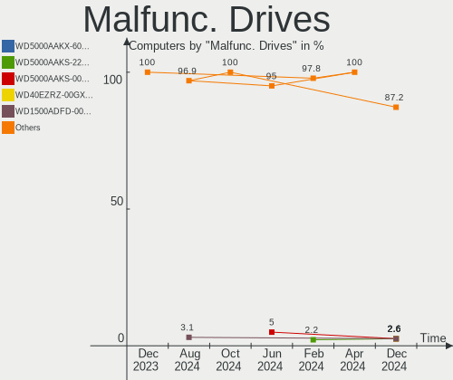
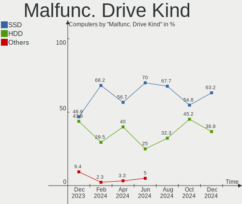
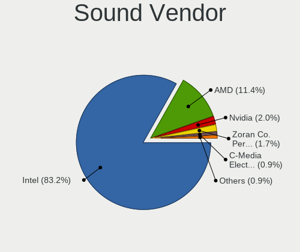
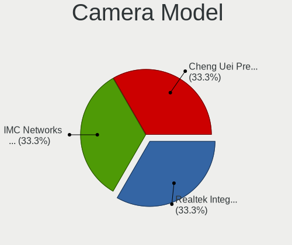

OPNsense - Hardware Trends
--------------------------

A project to identify most popular hardware characteristics and track their change
over time based on data collected by BSD users at https://BSD-Hardware.info.

Anyone can contribute to this report by the [hw-probe](https://github.com/linuxhw/hw-probe/blob/master/INSTALL.BSD.md) tool:

    hw-probe -all -upload

This report is for one last month. Overall report since the beginning of time: [TestCoverage](https://github.com/bsdhw/TestCoverage)

Period: Jun, 2022.

Contents
--------

* [ System ](#system)
  - [ OS                       ](#os)
  - [ OS Family                ](#os-family)
  - [ Arch                     ](#arch)
  - [ DE                       ](#de)
  - [ Display Server           ](#display-server)
  - [ Display Manager          ](#display-manager)
  - [ OS Lang                  ](#os-lang)
  - [ Boot Mode                ](#boot-mode)
  - [ Filesystem               ](#filesystem)
  - [ Part. scheme             ](#part-scheme)

* [ Board ](#board)
  - [ Vendor                   ](#vendor)
  - [ Model                    ](#model)
  - [ Model Family             ](#model-family)
  - [ MFG Year                 ](#mfg-year)
  - [ Form Factor              ](#form-factor)
  - [ Coreboot                 ](#coreboot)
  - [ RAM Size                 ](#ram-size)
  - [ RAM Used                 ](#ram-used)
  - [ Total Drives             ](#total-drives)
  - [ Has CD-ROM               ](#has-cd-rom)
  - [ Has Ethernet             ](#has-ethernet)
  - [ Has WiFi                 ](#has-wifi)
  - [ Has Bluetooth            ](#has-bluetooth)

* [ Location ](#location)
  - [ Country                  ](#country)
  - [ City                     ](#city)

* [ Drives ](#drives)
  - [ Drive Vendor             ](#drive-vendor)
  - [ Drive Model              ](#drive-model)
  - [ HDD Vendor               ](#hdd-vendor)
  - [ SSD Vendor               ](#ssd-vendor)
  - [ Drive Kind               ](#drive-kind)
  - [ Drive Connector          ](#drive-connector)
  - [ Drive Size               ](#drive-size)
  - [ Space Total              ](#space-total)
  - [ Space Used               ](#space-used)
  - [ Malfunc. Drives          ](#malfunc-drives)
  - [ Malfunc. Drive Vendor    ](#malfunc-drive-vendor)
  - [ Malfunc. HDD Vendor      ](#malfunc-hdd-vendor)
  - [ Malfunc. Drive Kind      ](#malfunc-drive-kind)
  - [ Failed Drives            ](#failed-drives)
  - [ Failed Drive Vendor      ](#failed-drive-vendor)
  - [ Drive Status             ](#drive-status)

* [ Storage controller ](#storage-controller)
  - [ Storage Vendor           ](#storage-vendor)
  - [ Storage Model            ](#storage-model)
  - [ Storage Kind             ](#storage-kind)

* [ Processor ](#processor)
  - [ CPU Vendor               ](#cpu-vendor)
  - [ CPU Model                ](#cpu-model)
  - [ CPU Model Family         ](#cpu-model-family)
  - [ CPU Cores                ](#cpu-cores)
  - [ CPU Sockets              ](#cpu-sockets)
  - [ CPU Threads              ](#cpu-threads)
  - [ CPU Microarch            ](#cpu-microarch)

* [ Graphics ](#graphics)
  - [ GPU Vendor               ](#gpu-vendor)
  - [ GPU Model                ](#gpu-model)
  - [ GPU Combo                ](#gpu-combo)
  - [ GPU Driver               ](#gpu-driver)
  - [ GPU Memory               ](#gpu-memory)

* [ Monitor ](#monitor)
  - [ Monitor Vendor           ](#monitor-vendor)
  - [ Monitor Model            ](#monitor-model)
  - [ Monitor Resolution       ](#monitor-resolution)
  - [ Monitor Diagonal         ](#monitor-diagonal)
  - [ Monitor Width            ](#monitor-width)
  - [ Aspect Ratio             ](#aspect-ratio)
  - [ Monitor Area             ](#monitor-area)
  - [ Pixel Density            ](#pixel-density)
  - [ Multiple Monitors        ](#multiple-monitors)

* [ Network ](#network)
  - [ Net Controller Vendor    ](#net-controller-vendor)
  - [ Net Controller Model     ](#net-controller-model)
  - [ Wireless Vendor          ](#wireless-vendor)
  - [ Wireless Model           ](#wireless-model)
  - [ Ethernet Vendor          ](#ethernet-vendor)
  - [ Ethernet Model           ](#ethernet-model)
  - [ Net Controller Kind      ](#net-controller-kind)
  - [ Used Controller          ](#used-controller)
  - [ NICs                     ](#nics)
  - [ IPv6                     ](#ipv6)

* [ Bluetooth ](#bluetooth)
  - [ Bluetooth Vendor         ](#bluetooth-vendor)
  - [ Bluetooth Model          ](#bluetooth-model)

* [ Sound ](#sound)
  - [ Sound Vendor             ](#sound-vendor)
  - [ Sound Model              ](#sound-model)

* [ Memory ](#memory)
  - [ Memory Vendor            ](#memory-vendor)
  - [ Memory Model             ](#memory-model)
  - [ Memory Kind              ](#memory-kind)
  - [ Memory Form Factor       ](#memory-form-factor)
  - [ Memory Size              ](#memory-size)
  - [ Memory Speed             ](#memory-speed)

* [ Printers & scanners ](#printers--scanners)
  - [ Printer Vendor           ](#printer-vendor)
  - [ Printer Model            ](#printer-model)
  - [ Scanner Vendor           ](#scanner-vendor)
  - [ Scanner Model            ](#scanner-model)

* [ Camera ](#camera)
  - [ Camera Vendor            ](#camera-vendor)
  - [ Camera Model             ](#camera-model)

* [ Security ](#security)
  - [ Fingerprint Vendor       ](#fingerprint-vendor)
  - [ Fingerprint Model        ](#fingerprint-model)
  - [ Chipcard Vendor          ](#chipcard-vendor)
  - [ Chipcard Model           ](#chipcard-model)

* [ Unsupported ](#unsupported)
  - [ Unsupported Devices      ](#unsupported-devices)
  - [ Unsupported Device Types ](#unsupported-device-types)

System
------

OS
--

Installed operating systems

| Name            | Computers | Percent |
|-----------------|-----------|---------|
| OPNsense 22.1.8 | 152       | 69.09%  |
| OPNsense 22.1.9 | 48        | 21.82%  |
| OPNsense 22.7   | 4         | 1.82%   |
| OPNsense 22.4.1 | 4         | 1.82%   |
| OPNsense 22.1.7 | 4         | 1.82%   |
| OPNsense 22.1.6 | 2         | 0.91%   |
| OPNsense 22.1   | 2         | 0.91%   |
| OPNsense 22.1.5 | 1         | 0.45%   |
| OPNsense 22.1.3 | 1         | 0.45%   |
| OPNsense 21.7.7 | 1         | 0.45%   |
| OPNsense 21.7.6 | 1         | 0.45%   |

OS Family
---------

OS without a version

| Name     | Computers | Percent |
|----------|-----------|---------|
| OPNsense | 220       | 100%    |

Arch
----

OS architecture (x86_64, i586, etc.)

| Name  | Computers | Percent |
|-------|-----------|---------|
| amd64 | 220       | 100%    |

DE
--

Desktop Environment

| Name    | Computers | Percent |
|---------|-----------|---------|
| Console | 220       | 100%    |

Display Server
--------------

X11 or Wayland

| Name    | Computers | Percent |
|---------|-----------|---------|
| Console | 220       | 100%    |

Display Manager
---------------

SDDM, LightDM, etc.

| Name    | Computers | Percent |
|---------|-----------|---------|
| Console | 220       | 100%    |

OS Lang
-------

Language

| Lang    | Computers | Percent |
|---------|-----------|---------|
| Unknown | 220       | 100%    |

Boot Mode
---------

EFI or BIOS

| Mode | Computers | Percent |
|------|-----------|---------|
| EFI  | 209       | 95%     |
| BIOS | 11        | 5%      |

Filesystem
----------

Type of filesystem

| Type | Computers | Percent |
|------|-----------|---------|
| Ufs  | 161       | 73.18%  |
| Zfs  | 59        | 26.82%  |

Part. scheme
------------

Scheme of partitioning

| Type    | Computers | Percent |
|---------|-----------|---------|
| GPT     | 210       | 95.45%  |
| MBR     | 7         | 3.18%   |
| Unknown | 3         | 1.36%   |

Board
-----

Vendor
------

Motherboard manufacturer

| Name                          | Computers | Percent |
|-------------------------------|-----------|---------|
| Dell                          | 29        | 13.18%  |
| Unknown                       | 23        | 10.45%  |
| Hewlett-Packard               | 18        | 8.18%   |
| Supermicro                    | 14        | 6.36%   |
| Protectli                     | 14        | 6.36%   |
| Intel                         | 14        | 6.36%   |
| ASUSTek Computer              | 12        | 5.45%   |
| Gigabyte Technology           | 10        | 4.55%   |
| AMI                           | 10        | 4.55%   |
| PC Engines                    | 8         | 3.64%   |
| AWOW                          | 7         | 3.18%   |
| ASRock                        | 7         | 3.18%   |
| Sophos                        | 6         | 2.73%   |
| Lenovo                        | 5         | 2.27%   |
| MSI                           | 4         | 1.82%   |
| Fujitsu                       | 4         | 1.82%   |
| Biostar                       | 4         | 1.82%   |
| ZOTAC                         | 3         | 1.36%   |
| Seeed Studio                  | 2         | 0.91%   |
| Pegatron                      | 2         | 0.91%   |
| MW                            | 2         | 0.91%   |
| Deciso                        | 2         | 0.91%   |
| BESSTAR Tech                  | 2         | 0.91%   |
| AZW                           | 2         | 0.91%   |
| YANYU                         | 1         | 0.45%   |
| TYAN Computer                 | 1         | 0.45%   |
| Thomas-Krenn.AG               | 1         | 0.45%   |
| SmbiosType2_BoardManufacturer | 1         | 0.45%   |
| ShenZhen MinWin Technology    | 1         | 0.45%   |
| NF692                         | 1         | 0.45%   |
| Lanner                        | 1         | 0.45%   |
| Lanix                         | 1         | 0.45%   |
| CompuLab                      | 1         | 0.45%   |
| CloudGenix                    | 1         | 0.45%   |
| Cisco                         | 1         | 0.45%   |
| Apple                         | 1         | 0.45%   |
| AOpen                         | 1         | 0.45%   |
| AMD                           | 1         | 0.45%   |
| ADI                           | 1         | 0.45%   |
| Acer                          | 1         | 0.45%   |

Model
-----

Motherboard model

| Name                                                        | Computers | Percent |
|-------------------------------------------------------------|-----------|---------|
| Unknown                                                     | 23        | 10.45%  |
| AMI Aptio CRB                                               | 9         | 4.09%   |
| Protectli FW6                                               | 6         | 2.73%   |
| Supermicro Super Server                                     | 5         | 2.27%   |
| Protectli FW4B                                              | 5         | 2.27%   |
| PC Engines APU2                                             | 5         | 2.27%   |
| Intel Q3XXG4-P V1.0                                         | 5         | 2.27%   |
| Dell OptiPlex 3020                                          | 4         | 1.82%   |
| Sophos SG                                                   | 3         | 1.36%   |
| HP EliteDesk 800 G1 SFF                                     | 3         | 1.36%   |
| AWOW PC BOX                                                 | 3         | 1.36%   |
| Sophos UTM                                                  | 2         | 0.91%   |
| Protectli VP2410                                            | 2         | 0.91%   |
| PC Engines apu4                                             | 2         | 0.91%   |
| MW GMLK-2_5G4L                                              | 2         | 0.91%   |
| MSI MS-7817                                                 | 2         | 0.91%   |
| Intel NUC8i5BEH                                             | 2         | 0.91%   |
| Intel MAHOBAY                                               | 2         | 0.91%   |
| HP t730 Thin Client                                         | 2         | 0.91%   |
| Fujitsu FUTRO S920                                          | 2         | 0.91%   |
| Dell PowerEdge R630                                         | 2         | 0.91%   |
| Dell OptiPlex 9020                                          | 2         | 0.91%   |
| Dell OptiPlex 790                                           | 2         | 0.91%   |
| Dell OptiPlex 7020                                          | 2         | 0.91%   |
| AWOW AK34Pro                                                | 2         | 0.91%   |
| AWOW AK34                                                   | 2         | 0.91%   |
| ZOTAC ZBOX-CI331NANO                                        | 1         | 0.45%   |
| ZOTAC ZBOX-CI327NANO-GS-01                                  | 1         | 0.45%   |
| ZOTAC ZBOX-CI323NANO                                        | 1         | 0.45%   |
| YANYU EPIC-N31 Ver:1.1                                      | 1         | 0.45%   |
| TYAN Tiger K8W Dual AMD Opteron, S2875                      | 1         | 0.45%   |
| Thomas-Krenn.AG LES network 6L                              | 1         | 0.45%   |
| Supermicro X9SCL/X9SCM                                      | 1         | 0.45%   |
| Supermicro X7SPA-HF                                         | 1         | 0.45%   |
| Supermicro X11SSQ-L                                         | 1         | 0.45%   |
| Supermicro X10SLH-N6-ST031                                  | 1         | 0.45%   |
| Supermicro X10SBA                                           | 1         | 0.45%   |
| Supermicro SYS-E300-9D-8CN8TP                               | 1         | 0.45%   |
| Supermicro SYS-5019A-12TN4                                  | 1         | 0.45%   |
| Supermicro mGuard centerport2                               | 1         | 0.45%   |
| Supermicro A1SRM-2758F                                      | 1         | 0.45%   |
| Sophos XG                                                   | 1         | 0.45%   |
| SmbiosType2_BoardManufacturer SmbiosType1_SystemProductName | 1         | 0.45%   |
| ShenZhen MinWin MW-GMLK-2.5G6L                              | 1         | 0.45%   |
| Seeed Studio ODYSSEY-X86J4125                               | 1         | 0.45%   |
| Seeed Studio ODYSSEY-X86J4105                               | 1         | 0.45%   |
| Protectli FW6D                                              | 1         | 0.45%   |
| Pegatron Pro 3405 Series                                    | 1         | 0.45%   |
| Pegatron Pro 3010 Microtower PC                             | 1         | 0.45%   |
| PC Engines APU                                              | 1         | 0.45%   |
| NF692 1.0                                                   | 1         | 0.45%   |
| MSI MS-7B31                                                 | 1         | 0.45%   |
| MSI MS-7592                                                 | 1         | 0.45%   |
| Lenovo ThinkCentre M93p 10A8S2F405                          | 1         | 0.45%   |
| Lenovo ThinkCentre M73 10B7S01300                           | 1         | 0.45%   |
| Lenovo ThinkCentre M720q 10T8SKLB00                         | 1         | 0.45%   |
| Lenovo ThinkCentre M720q 10T7004BMB                         | 1         | 0.45%   |
| Lenovo IdeaCentre 3 07ADA05 90MV007UGE                      | 1         | 0.45%   |
| Lanner GP-7543                                              | 1         | 0.45%   |
| Lanix X7DVL-3                                               | 1         | 0.45%   |

Model Family
------------

Motherboard model prefix

| Name                                      | Computers | Percent |
|-------------------------------------------|-----------|---------|
| Unknown                                   | 23        | 10.45%  |
| Dell OptiPlex                             | 15        | 6.82%   |
| Dell PowerEdge                            | 11        | 5%      |
| AMI Aptio                                 | 10        | 4.55%   |
| Protectli FW6                             | 6         | 2.73%   |
| Supermicro Super                          | 5         | 2.27%   |
| Protectli FW4B                            | 5         | 2.27%   |
| PC Engines APU2                           | 5         | 2.27%   |
| Intel Q3XXG4-P                            | 5         | 2.27%   |
| HP ProLiant                               | 5         | 2.27%   |
| Lenovo ThinkCentre                        | 4         | 1.82%   |
| HP EliteDesk                              | 4         | 1.82%   |
| Sophos SG                                 | 3         | 1.36%   |
| HP ProDesk                                | 3         | 1.36%   |
| Fujitsu FUTRO                             | 3         | 1.36%   |
| AWOW PC                                   | 3         | 1.36%   |
| ASUS PRIME                                | 3         | 1.36%   |
| Sophos UTM                                | 2         | 0.91%   |
| Protectli VP2410                          | 2         | 0.91%   |
| Pegatron Pro                              | 2         | 0.91%   |
| PC Engines apu4                           | 2         | 0.91%   |
| MW GMLK-2                                 | 2         | 0.91%   |
| MSI MS-7817                               | 2         | 0.91%   |
| Intel NUC8i5BEH                           | 2         | 0.91%   |
| Intel MAHOBAY                             | 2         | 0.91%   |
| HP t730                                   | 2         | 0.91%   |
| HP Compaq                                 | 2         | 0.91%   |
| AWOW AK34Pro                              | 2         | 0.91%   |
| AWOW AK34                                 | 2         | 0.91%   |
| ASUS ROG                                  | 2         | 0.91%   |
| ZOTAC ZBOX-CI331NANO                      | 1         | 0.45%   |
| ZOTAC ZBOX-CI327NANO-GS-01                | 1         | 0.45%   |
| ZOTAC ZBOX-CI323NANO                      | 1         | 0.45%   |
| YANYU EPIC-N31                            | 1         | 0.45%   |
| TYAN Tiger                                | 1         | 0.45%   |
| Thomas-Krenn.AG LES                       | 1         | 0.45%   |
| Supermicro X9SCL                          | 1         | 0.45%   |
| Supermicro X7SPA-HF                       | 1         | 0.45%   |
| Supermicro X11SSQ-L                       | 1         | 0.45%   |
| Supermicro X10SLH-N6-ST031                | 1         | 0.45%   |
| Supermicro X10SBA                         | 1         | 0.45%   |
| Supermicro SYS-E300-9D-8CN8TP             | 1         | 0.45%   |
| Supermicro SYS-5019A-12TN4                | 1         | 0.45%   |
| Supermicro mGuard                         | 1         | 0.45%   |
| Supermicro A1SRM-2758F                    | 1         | 0.45%   |
| Sophos XG                                 | 1         | 0.45%   |
| SmbiosType2_BoardManufacturer SmbiosType1 | 1         | 0.45%   |
| ShenZhen MinWin MW-GMLK-2.5G6L            | 1         | 0.45%   |
| Seeed Studio ODYSSEY-X86J4125             | 1         | 0.45%   |
| Seeed Studio ODYSSEY-X86J4105             | 1         | 0.45%   |
| Protectli FW6D                            | 1         | 0.45%   |
| PC Engines APU                            | 1         | 0.45%   |
| NF692 1.0                                 | 1         | 0.45%   |
| MSI MS-7B31                               | 1         | 0.45%   |
| MSI MS-7592                               | 1         | 0.45%   |
| Lenovo IdeaCentre                         | 1         | 0.45%   |
| Lanner GP-7543                            | 1         | 0.45%   |
| Lanix X7DVL-3                             | 1         | 0.45%   |
| Intel SKYBAY                              | 1         | 0.45%   |
| Intel S5500BC                             | 1         | 0.45%   |

MFG Year
--------

Motherboard manufacture year

| Year | Computers | Percent |
|------|-----------|---------|
| 2021 | 36        | 16.36%  |
| 2018 | 28        | 12.73%  |
| 2019 | 26        | 11.82%  |
| 2014 | 21        | 9.55%   |
| 2020 | 20        | 9.09%   |
| 2016 | 16        | 7.27%   |
| 2015 | 14        | 6.36%   |
| 2022 | 12        | 5.45%   |
| 2017 | 11        | 5%      |
| 2011 | 10        | 4.55%   |
| 2013 | 9         | 4.09%   |
| 2012 | 6         | 2.73%   |
| 2008 | 4         | 1.82%   |
| 2010 | 3         | 1.36%   |
| 2009 | 3         | 1.36%   |
| 2004 | 1         | 0.45%   |

Form Factor
-----------

Physical design of the computer

| Name     | Computers | Percent |
|----------|-----------|---------|
| Desktop  | 152       | 69.09%  |
| Mini pc  | 29        | 13.18%  |
| Server   | 27        | 12.27%  |
| Firewall | 7         | 3.18%   |
| Notebook | 5         | 2.27%   |

Coreboot
--------

Have coreboot on board

| Used | Computers | Percent |
|------|-----------|---------|
| No   | 211       | 95.91%  |
| Yes  | 9         | 4.09%   |

RAM Size
--------

Total RAM memory

| Size in GB  | Computers | Percent |
|-------------|-----------|---------|
| 8.01-16.0   | 88        | 40%     |
| 4.01-8.0    | 57        | 25.91%  |
| 16.01-24.0  | 37        | 16.82%  |
| 32.01-64.0  | 18        | 8.18%   |
| 64.01-256.0 | 9         | 4.09%   |
| 2.01-3.0    | 7         | 3.18%   |
| 24.01-32.0  | 3         | 1.36%   |
| 0.51-1.0    | 1         | 0.45%   |

RAM Used
--------

Used RAM memory

| Used GB    | Computers | Percent |
|------------|-----------|---------|
| 0.01-0.5   | 140       | 63.64%  |
| 0.51-1.0   | 53        | 24.09%  |
| 1.01-2.0   | 20        | 9.09%   |
| 2.01-3.0   | 4         | 1.82%   |
| 3.01-4.0   | 2         | 0.91%   |
| 16.01-24.0 | 1         | 0.45%   |

Total Drives
------------

Number of drives on board

| Drives | Computers | Percent |
|--------|-----------|---------|
| 1      | 181       | 82.27%  |
| 0      | 19        | 8.64%   |
| 2      | 16        | 7.27%   |
| 3      | 3         | 1.36%   |
| 5      | 1         | 0.45%   |

Has CD-ROM
----------

Has CD-ROM on board

| Presented | Computers | Percent |
|-----------|-----------|---------|
| No        | 193       | 87.73%  |
| Yes       | 27        | 12.27%  |

Has Ethernet
------------

Has Ethernet on board

| Presented | Computers | Percent |
|-----------|-----------|---------|
| Yes       | 220       | 100%    |

Has WiFi
--------

Has WiFi module

| Presented | Computers | Percent |
|-----------|-----------|---------|
| No        | 178       | 80.91%  |
| Yes       | 42        | 19.09%  |

Has Bluetooth
-------------

Has Bluetooth module

| Presented | Computers | Percent |
|-----------|-----------|---------|
| No        | 191       | 86.82%  |
| Yes       | 29        | 13.18%  |

Location
--------

Country
-------

Geographic location (country)

| Country            | Computers | Percent |
|--------------------|-----------|---------|
| USA                | 67        | 30.45%  |
| Germany            | 55        | 25%     |
| Canada             | 12        | 5.45%   |
| UK                 | 7         | 3.18%   |
| Switzerland        | 7         | 3.18%   |
| South Korea        | 4         | 1.82%   |
| Italy              | 4         | 1.82%   |
| France             | 4         | 1.82%   |
| Belgium            | 4         | 1.82%   |
| Austria            | 4         | 1.82%   |
| Australia          | 4         | 1.82%   |
| Sweden             | 3         | 1.36%   |
| Lithuania          | 3         | 1.36%   |
| Colombia           | 3         | 1.36%   |
| Brazil             | 3         | 1.36%   |
| Russia             | 2         | 0.91%   |
| Poland             | 2         | 0.91%   |
| Philippines        | 2         | 0.91%   |
| Paraguay           | 2         | 0.91%   |
| Hungary            | 2         | 0.91%   |
| Finland            | 2         | 0.91%   |
| China              | 2         | 0.91%   |
| Chile              | 2         | 0.91%   |
| UAE                | 1         | 0.45%   |
| Thailand           | 1         | 0.45%   |
| Taiwan             | 1         | 0.45%   |
| Spain              | 1         | 0.45%   |
| South Africa       | 1         | 0.45%   |
| Singapore          | 1         | 0.45%   |
| Portugal           | 1         | 0.45%   |
| Netherlands        | 1         | 0.45%   |
| Morocco            | 1         | 0.45%   |
| Mexico             | 1         | 0.45%   |
| Malaysia           | 1         | 0.45%   |
| Japan              | 1         | 0.45%   |
| Isle of Man        | 1         | 0.45%   |
| Indonesia          | 1         | 0.45%   |
| Estonia            | 1         | 0.45%   |
| Dominican Republic | 1         | 0.45%   |
| Denmark            | 1         | 0.45%   |
| Czechia            | 1         | 0.45%   |
| Costa Rica         | 1         | 0.45%   |
| Bolivia            | 1         | 0.45%   |

City
----

Geographic location (city)

| City                  | Computers | Percent |
|-----------------------|-----------|---------|
| Toronto               | 3         | 1.36%   |
| Munich                | 3         | 1.36%   |
| Austin                | 3         | 1.36%   |
| Wexford               | 2         | 0.91%   |
| Vienna                | 2         | 0.91%   |
| Quezon City           | 2         | 0.91%   |
| Montreal              | 2         | 0.91%   |
| Medellín             | 2         | 0.91%   |
| Las Condes            | 2         | 0.91%   |
| Karlsruhe             | 2         | 0.91%   |
| Himmelpforten         | 2         | 0.91%   |
| Gachnang              | 2         | 0.91%   |
| Fremont               | 2         | 0.91%   |
| Frankfurt am Main     | 2         | 0.91%   |
| Dovilai               | 2         | 0.91%   |
| Bochum                | 2         | 0.91%   |
| Berlin                | 2         | 0.91%   |
| Bergisch Gladbach     | 2         | 0.91%   |
| Zurich                | 1         | 0.45%   |
| Worcester             | 1         | 0.45%   |
| Wolfhagen             | 1         | 0.45%   |
| Winter Haven          | 1         | 0.45%   |
| Winnipeg              | 1         | 0.45%   |
| Windsor               | 1         | 0.45%   |
| Willich               | 1         | 0.45%   |
| West Hanningfield     | 1         | 0.45%   |
| Wentorf bei Hamburg   | 1         | 0.45%   |
| Webberville           | 1         | 0.45%   |
| Warminster            | 1         | 0.45%   |
| Wallan                | 1         | 0.45%   |
| Wallaceburg           | 1         | 0.45%   |
| Walkerton             | 1         | 0.45%   |
| Viersen               | 1         | 0.45%   |
| Victoria              | 1         | 0.45%   |
| Vénissieux           | 1         | 0.45%   |
| Unterschleissheim     | 1         | 0.45%   |
| Ulm                   | 1         | 0.45%   |
| Tewksbury             | 1         | 0.45%   |
| Tatabánya            | 1         | 0.45%   |
| Tannersville          | 1         | 0.45%   |
| Sydney                | 1         | 0.45%   |
| Suwon                 | 1         | 0.45%   |
| Sunbury               | 1         | 0.45%   |
| Summerville           | 1         | 0.45%   |
| Stouffville           | 1         | 0.45%   |
| Statesboro            | 1         | 0.45%   |
| Spring                | 1         | 0.45%   |
| Somersworth           | 1         | 0.45%   |
| Solingen              | 1         | 0.45%   |
| Singapore             | 1         | 0.45%   |
| Shenzhen              | 1         | 0.45%   |
| Seto                  | 1         | 0.45%   |
| Scunthorpe            | 1         | 0.45%   |
| Santo Domingo Este    | 1         | 0.45%   |
| Santiago de Cali      | 1         | 0.45%   |
| Sandhausen            | 1         | 0.45%   |
| San Miguel de Allende | 1         | 0.45%   |
| San José             | 1         | 0.45%   |
| Roswell               | 1         | 0.45%   |
| Rome                  | 1         | 0.45%   |

Drives
------

Drive Vendor
------------

Hard drive vendors

| Vendor              | Computers | Drives | Percent |
|---------------------|-----------|--------|---------|
| Samsung Electronics | 26        | 28     | 12.38%  |
| Kingston            | 20        | 21     | 9.52%   |
| Transcend           | 19        | 19     | 9.05%   |
| WDC                 | 16        | 17     | 7.62%   |
| Seagate             | 14        | 15     | 6.67%   |
| Crucial             | 13        | 13     | 6.19%   |
| Intel               | 10        | 12     | 4.76%   |
| SanDisk             | 6         | 6      | 2.86%   |
| Hoodisk             | 6         | 6      | 2.86%   |
| China               | 6         | 6      | 2.86%   |
| Toshiba             | 5         | 7      | 2.38%   |
| OCZ                 | 5         | 6      | 2.38%   |
| FORESEE             | 5         | 5      | 2.38%   |
| A-DATA Technology   | 5         | 6      | 2.38%   |
| ShiJi               | 4         | 4      | 1.9%    |
| Apacer              | 4         | 4      | 1.9%    |
| Protectli           | 3         | 3      | 1.43%   |
| Micron Technology   | 3         | 6      | 1.43%   |
| Intenso             | 3         | 3      | 1.43%   |
| Hewlett-Packard     | 3         | 5      | 1.43%   |
| SPCC                | 2         | 2      | 0.95%   |
| Plextor             | 2         | 2      | 0.95%   |
| LITEONIT            | 2         | 2      | 0.95%   |
| KingSpec            | 2         | 2      | 0.95%   |
| Hitachi             | 2         | 2      | 0.95%   |
| Dogfish             | 2         | 2      | 0.95%   |
| AirDisk             | 2         | 2      | 0.95%   |
| Verbatim            | 1         | 1      | 0.48%   |
| Team                | 1         | 1      | 0.48%   |
| SK hynix            | 1         | 1      | 0.48%   |
| PNY                 | 1         | 1      | 0.48%   |
| Phison              | 1         | 1      | 0.48%   |
| Mushkin             | 1         | 1      | 0.48%   |
| Maxtor              | 1         | 2      | 0.48%   |
| Lexar               | 1         | 1      | 0.48%   |
| KIOXIA              | 1         | 1      | 0.48%   |
| Kingchuxing         | 1         | 1      | 0.48%   |
| INDMEM              | 1         | 1      | 0.48%   |
| HPE                 | 1         | 2      | 0.48%   |
| HGST                | 1         | 1      | 0.48%   |
| FLEXXON             | 1         | 1      | 0.48%   |
| Corsair             | 1         | 1      | 0.48%   |
| BR                  | 1         | 1      | 0.48%   |
| BIWIN               | 1         | 1      | 0.48%   |
| Axiom               | 1         | 1      | 0.48%   |
| ATP                 | 1         | 1      | 0.48%   |
| Advantech           | 1         | 1      | 0.48%   |

Drive Model
-----------

Hard drive models

| Model                                | Computers | Percent |
|--------------------------------------|-----------|---------|
| Kingston SA400S37240G 240GB          | 6         | 2.83%   |
| Transcend TS128GMSA230S 128GB        | 5         | 2.36%   |
| FORESEE 128GB SSD                    | 4         | 1.89%   |
| Crucial CT240BX500SSD1 240GB         | 4         | 1.89%   |
| SanDisk SDSSDA120G 120GB             | 3         | 1.42%   |
| Samsung SSD 850 EVO 500GB            | 3         | 1.42%   |
| Samsung SSD 850 EVO 250GB            | 3         | 1.42%   |
| WDC WD2503ABYX-01WERA1 256GB         | 2         | 0.94%   |
| Transcend TS64GSSD370S 64GB          | 2         | 0.94%   |
| Transcend TS256GMSA230S 256GB        | 2         | 0.94%   |
| Transcend TS128GMTE110S 128GB        | 2         | 0.94%   |
| ShiJi SSD 128GB                      | 2         | 0.94%   |
| Seagate ST500DM002-1BD142 500GB      | 2         | 0.94%   |
| Seagate ST3250318AS 250GB            | 2         | 0.94%   |
| Seagate ST1000LM035-1RK172 1TB       | 2         | 0.94%   |
| Samsung SSD 850 EVO mSATA 120GB      | 2         | 0.94%   |
| Samsung SSD 850 EVO 120GB            | 2         | 0.94%   |
| Samsung MZMPC032HBCD-000H1 32GB      | 2         | 0.94%   |
| Protectli 120GB mSATA                | 2         | 0.94%   |
| Kingston SUV500MS120G 120GB          | 2         | 0.94%   |
| Kingston SA400S37120G 120GB          | 2         | 0.94%   |
| Intel HBRPEKNX0101AH 256GB           | 2         | 0.94%   |
| Hoodisk SSD 32GB                     | 2         | 0.94%   |
| Hoodisk SSD 128GB                    | 2         | 0.94%   |
| HP RAID 1(1+0) 2TB                   | 2         | 0.94%   |
| Crucial CT500MX500SSD1 500GB         | 2         | 0.94%   |
| Crucial CT480BX500SSD1 480GB         | 2         | 0.94%   |
| Crucial CT250MX500SSD1 250GB         | 2         | 0.94%   |
| China SATA SSD 16GB                  | 2         | 0.94%   |
| Apacer 32GB SATA Flash Drive         | 2         | 0.94%   |
| AirDisk 128GB SSD                    | 2         | 0.94%   |
| A-DATA SU800 128GB                   | 2         | 0.94%   |
| WDC WDS500G2B0A-00SM50 500GB         | 1         | 0.47%   |
| WDC WDS120G2G0A-00JH30 120GB         | 1         | 0.47%   |
| WDC WD6400AAKS-22A7B2 640GB          | 1         | 0.47%   |
| WDC WD5003ABYX-18WERA0 500GB         | 1         | 0.47%   |
| WDC WD2503ABYX-01WERA0 256GB         | 1         | 0.47%   |
| WDC WD2500BEVT-75ZCT2 250GB          | 1         | 0.47%   |
| WDC WD1500HLFS-01G6U0 150GB          | 1         | 0.47%   |
| WDC WD10SPZX-24Z10T0 1TB             | 1         | 0.47%   |
| WDC WD10JFCX-68N6GN0 1TB             | 1         | 0.47%   |
| WDC WD10EZRX-00L4HB0 1TB             | 1         | 0.47%   |
| WDC PC SN730 SDBQNTY-256G-1001 256GB | 1         | 0.47%   |
| WDC PC SN530 SDBPNPZ-1T00-1006 1TB   | 1         | 0.47%   |
| WDC PC SN530 SDBPMPZ-256G-1001 256GB | 1         | 0.47%   |
| WDC PC SN520 SDAPNUW-512G-1006 512GB | 1         | 0.47%   |
| Verbatim Vi550 S3 128GB              | 1         | 0.47%   |
| Transcend TS64GMTS400SD 64GB         | 1         | 0.47%   |
| Transcend TS64GMSA370 64GB           | 1         | 0.47%   |
| Transcend TS512GMTS830S 512GB        | 1         | 0.47%   |
| Transcend TS4GCF170 4GB              | 1         | 0.47%   |
| Transcend TS256GMTS952T2 256GB       | 1         | 0.47%   |
| Transcend TS128VSDMD15LAP 128GB      | 1         | 0.47%   |
| Transcend TS128GMTS430S 128GB        | 1         | 0.47%   |
| Transcend TS120GMTS820S 120GB        | 1         | 0.47%   |
| Toshiba THNSNH256GMCT 256GB          | 1         | 0.47%   |
| Toshiba THNSF8120CCSE 120GB          | 1         | 0.47%   |
| Toshiba MQ01ABD075 752GB             | 1         | 0.47%   |
| Toshiba DT01ACA100 1TB               | 1         | 0.47%   |
| Toshiba DT01ACA050 500GB             | 1         | 0.47%   |

HDD Vendor
----------

Hard disk drive vendors

| Vendor              | Computers | Drives | Percent |
|---------------------|-----------|--------|---------|
| Seagate             | 13        | 14     | 37.14%  |
| WDC                 | 10        | 11     | 28.57%  |
| Toshiba             | 3         | 5      | 8.57%   |
| Hewlett-Packard     | 3         | 5      | 8.57%   |
| Hitachi             | 2         | 2      | 5.71%   |
| Samsung Electronics | 1         | 1      | 2.86%   |
| Maxtor              | 1         | 2      | 2.86%   |
| HPE                 | 1         | 2      | 2.86%   |
| HGST                | 1         | 1      | 2.86%   |

SSD Vendor
----------

Solid state drive vendors

| Vendor              | Computers | Drives | Percent |
|---------------------|-----------|--------|---------|
| Samsung Electronics | 20        | 21     | 12.9%   |
| Kingston            | 20        | 21     | 12.9%   |
| Transcend           | 17        | 17     | 10.97%  |
| Crucial             | 12        | 12     | 7.74%   |
| Intel               | 8         | 10     | 5.16%   |
| SanDisk             | 6         | 6      | 3.87%   |
| Hoodisk             | 6         | 6      | 3.87%   |
| China               | 6         | 6      | 3.87%   |
| OCZ                 | 5         | 6      | 3.23%   |
| FORESEE             | 5         | 5      | 3.23%   |
| A-DATA Technology   | 5         | 6      | 3.23%   |
| Apacer              | 4         | 4      | 2.58%   |
| ShiJi               | 3         | 3      | 1.94%   |
| Protectli           | 3         | 3      | 1.94%   |
| Micron Technology   | 3         | 6      | 1.94%   |
| Intenso             | 3         | 3      | 1.94%   |
| WDC                 | 2         | 2      | 1.29%   |
| Toshiba             | 2         | 2      | 1.29%   |
| SPCC                | 2         | 2      | 1.29%   |
| Plextor             | 2         | 2      | 1.29%   |
| LITEONIT            | 2         | 2      | 1.29%   |
| KingSpec            | 2         | 2      | 1.29%   |
| Dogfish             | 2         | 2      | 1.29%   |
| AirDisk             | 2         | 2      | 1.29%   |
| Verbatim            | 1         | 1      | 0.65%   |
| Team                | 1         | 1      | 0.65%   |
| SK hynix            | 1         | 1      | 0.65%   |
| PNY                 | 1         | 1      | 0.65%   |
| Mushkin             | 1         | 1      | 0.65%   |
| Kingchuxing         | 1         | 1      | 0.65%   |
| INDMEM              | 1         | 1      | 0.65%   |
| FLEXXON             | 1         | 1      | 0.65%   |
| BR                  | 1         | 1      | 0.65%   |
| BIWIN               | 1         | 1      | 0.65%   |
| Axiom               | 1         | 1      | 0.65%   |
| ATP                 | 1         | 1      | 0.65%   |
| Advantech           | 1         | 1      | 0.65%   |

Drive Kind
----------

HDD or SSD

| Kind | Computers | Drives | Percent |
|------|-----------|--------|---------|
| SSD  | 152       | 164    | 73.43%  |
| HDD  | 34        | 43     | 16.43%  |
| NVMe | 21        | 21     | 10.14%  |

Drive Connector
---------------

SATA, SAS, NVMe, etc.

| Type | Computers | Drives | Percent |
|------|-----------|--------|---------|
| SATA | 182       | 207    | 89.66%  |
| NVMe | 21        | 21     | 10.34%  |

Drive Size
----------

Size of hard drive

| Size in TB | Computers | Drives | Percent |
|------------|-----------|--------|---------|
| 0.01-0.5   | 168       | 189    | 90.81%  |
| 0.51-1.0   | 14        | 15     | 7.57%   |
| 1.01-2.0   | 3         | 3      | 1.62%   |

Space Total
-----------

Amount of disk space available on the file system

| Size in GB | Computers | Percent |
|------------|-----------|---------|
| 101-250    | 118       | 53.64%  |
| 251-500    | 33        | 15%     |
| 51-100     | 27        | 12.27%  |
| 21-50      | 24        | 10.91%  |
| 501-1000   | 10        | 4.55%   |
| 1-20       | 6         | 2.73%   |
| 1001-2000  | 2         | 0.91%   |

Space Used
----------

Amount of used disk space

| Used GB | Computers | Percent |
|---------|-----------|---------|
| 1-20    | 197       | 89.55%  |
| 21-50   | 17        | 7.73%   |
| 51-100  | 4         | 1.82%   |
| 101-250 | 2         | 0.91%   |

Malfunc. Drives
---------------

Drive models with a malfunction

| Model                                 | Computers | Drives | Percent |
|---------------------------------------|-----------|--------|---------|
| WDC WDS500G2B0A-00SM50 500GB          | 1         | 1      | 4.55%   |
| WDC WD6400AAKS-22A7B2 640GB           | 1         | 1      | 4.55%   |
| WDC WD5003ABYX-18WERA0 500GB          | 1         | 2      | 4.55%   |
| WDC WD2503ABYX-01WERA1 256GB          | 1         | 1      | 4.55%   |
| WDC WD2503ABYX-01WERA0 256GB          | 1         | 1      | 4.55%   |
| Toshiba MQ01ABD075 752GB              | 1         | 1      | 4.55%   |
| SPCC Solid State Disk 128GB           | 1         | 1      | 4.55%   |
| Seagate ST9500530NS 42D0743 500GB     | 1         | 1      | 4.55%   |
| Seagate ST500DM002-1BD142 500GB       | 1         | 1      | 4.55%   |
| Seagate ST380811AS 80GB               | 1         | 1      | 4.55%   |
| Seagate ST380013AS 80GB               | 1         | 1      | 4.55%   |
| Seagate ST3500413AS 500GB             | 1         | 1      | 4.55%   |
| SanDisk SDSSDP064G 64GB               | 1         | 1      | 4.55%   |
| Samsung Electronics SSD 850 EVO 500GB | 1         | 1      | 4.55%   |
| Kingston SUV400S37120G 120GB          | 1         | 2      | 4.55%   |
| Kingston SMS200S360G 64GB             | 1         | 1      | 4.55%   |
| Kingston SH103S3240G 240GB            | 1         | 1      | 4.55%   |
| Kingston SA400S37120G 120GB           | 1         | 1      | 4.55%   |
| Intel SSDSA2M160G2GC 160GB            | 1         | 1      | 4.55%   |
| Hitachi HCS5C1032CLA382 320GB         | 1         | 1      | 4.55%   |
| Dogfish SSD 480GB                     | 1         | 1      | 4.55%   |
| Apacer 16GB SATA Flash Drive          | 1         | 1      | 4.55%   |

Malfunc. Drive Vendor
---------------------

Vendors of faulty drives

| Vendor              | Computers | Drives | Percent |
|---------------------|-----------|--------|---------|
| WDC                 | 5         | 6      | 22.73%  |
| Seagate             | 5         | 5      | 22.73%  |
| Kingston            | 4         | 5      | 18.18%  |
| Toshiba             | 1         | 1      | 4.55%   |
| SPCC                | 1         | 1      | 4.55%   |
| SanDisk             | 1         | 1      | 4.55%   |
| Samsung Electronics | 1         | 1      | 4.55%   |
| Intel               | 1         | 1      | 4.55%   |
| Hitachi             | 1         | 1      | 4.55%   |
| Dogfish             | 1         | 1      | 4.55%   |
| Apacer              | 1         | 1      | 4.55%   |

Malfunc. HDD Vendor
-------------------

Vendors of faulty HDD drives

| Vendor  | Computers | Drives | Percent |
|---------|-----------|--------|---------|
| Seagate | 5         | 5      | 45.45%  |
| WDC     | 4         | 5      | 36.36%  |
| Toshiba | 1         | 1      | 9.09%   |
| Hitachi | 1         | 1      | 9.09%   |

Malfunc. Drive Kind
-------------------

Kinds of faulty drives

| Kind | Computers | Drives | Percent |
|------|-----------|--------|---------|
| SSD  | 11        | 12     | 52.38%  |
| HDD  | 10        | 12     | 47.62%  |

Failed Drives
-------------

Failed drive models

Zero info for selected period =(

Failed Drive Vendor
-------------------

Failed drive vendors

Zero info for selected period =(

Drive Status
------------

Number of failed and malfunc. drives

| Status   | Computers | Drives | Percent |
|----------|-----------|--------|---------|
| Works    | 176       | 198    | 87.56%  |
| Malfunc  | 21        | 24     | 10.45%  |
| Detected | 4         | 6      | 1.99%   |

Storage controller
------------------

Storage Vendor
--------------

Storage controller vendors

| Vendor                       | Computers | Percent |
|------------------------------|-----------|---------|
| Intel                        | 187       | 72.76%  |
| AMD                          | 29        | 11.28%  |
| Broadcom / LSI               | 9         | 3.5%    |
| Samsung Electronics          | 6         | 2.33%   |
| SanDisk                      | 5         | 1.95%   |
| Hewlett-Packard              | 3         | 1.17%   |
| Silicon Motion               | 2         | 0.78%   |
| Silicon Image                | 2         | 0.78%   |
| Shenzhen Longsys Electronics | 2         | 0.78%   |
| Phison Electronics           | 2         | 0.78%   |
| Marvell Technology Group     | 2         | 0.78%   |
| Chelsio Communications       | 2         | 0.78%   |
| ASMedia Technology           | 2         | 0.78%   |
| Seagate Technology           | 1         | 0.39%   |
| Micron/Crucial Technology    | 1         | 0.39%   |
| KIOXIA                       | 1         | 0.39%   |
| Unknown                      | 1         | 0.39%   |

Storage Model
-------------

Storage controller models

| Model                                                                            | Computers | Percent |
|----------------------------------------------------------------------------------|-----------|---------|
| Intel 8 Series/C220 Series Chipset Family 6-port SATA Controller 1 [AHCI mode]   | 25        | 8.83%   |
| AMD FCH SATA Controller [AHCI mode]                                              | 24        | 8.48%   |
| Intel Celeron/Pentium Silver Processor SATA Controller                           | 23        | 8.13%   |
| Intel Sunrise Point-LP SATA Controller [AHCI mode]                               | 14        | 4.95%   |
| Intel Q170/Q150/B150/H170/H110/Z170/CM236 Chipset SATA Controller [AHCI Mode]    | 13        | 4.59%   |
| Intel Atom Processor E3800 Series SATA AHCI Controller                           | 13        | 4.59%   |
| Intel Celeron N3350/Pentium N4200/Atom E3900 Series SATA AHCI Controller         | 11        | 3.89%   |
| Intel Atom/Celeron/Pentium Processor x5-E8000/J3xxx/N3xxx Series SATA Controller | 11        | 3.89%   |
| Intel 6 Series/C200 Series Chipset Family 6 port Desktop SATA AHCI Controller    | 8         | 2.83%   |
| Unknown                                                                          | 6         | 2.12%   |
| Intel Cannon Lake PCH SATA AHCI Controller                                       | 5         | 1.77%   |
| Intel 7 Series/C210 Series Chipset Family 6-port SATA Controller [AHCI mode]     | 5         | 1.77%   |
| Intel Wildcat Point-LP SATA Controller [AHCI Mode]                               | 4         | 1.41%   |
| Intel 82801G (ICH7 Family) IDE Controller                                        | 4         | 1.41%   |
| Intel 200 Series PCH SATA controller [AHCI mode]                                 | 4         | 1.41%   |
| AMD 400 Series Chipset SATA Controller                                           | 4         | 1.41%   |
| Intel NM10/ICH7 Family SATA Controller [AHCI mode]                               | 3         | 1.06%   |
| Intel C610/X99 series chipset sSATA Controller [AHCI mode]                       | 3         | 1.06%   |
| Intel C610/X99 series chipset 6-Port SATA Controller [AHCI mode]                 | 3         | 1.06%   |
| Intel 82801JI (ICH10 Family) SATA AHCI Controller                                | 3         | 1.06%   |
| HP Smart Array G6 controllers                                                    | 3         | 1.06%   |
| AMD SB7x0/SB8x0/SB9x0 SATA Controller [AHCI mode]                                | 3         | 1.06%   |
| Silicon Motion SM2263EN/SM2263XT SSD Controller                                  | 2         | 0.71%   |
| Samsung NVMe SSD Controller SM981/PM981/PM983                                    | 2         | 0.71%   |
| Samsung NVMe SSD Controller SM961/PM961/SM963                                    | 2         | 0.71%   |
| Samsung NVMe SSD Controller 980                                                  | 2         | 0.71%   |
| Intel SATA Controller [RAID mode]                                                | 2         | 0.71%   |
| Intel NM10/ICH7 Family SATA Controller [IDE mode]                                | 2         | 0.71%   |
| Intel Jasper Lake SATA AHCI Controller                                           | 2         | 0.71%   |
| Intel Comet Lake SATA AHCI Controller                                            | 2         | 0.71%   |
| Intel C620 Series Chipset Family SSATA Controller [AHCI mode]                    | 2         | 0.71%   |
| Intel C620 Series Chipset Family SATA Controller [AHCI mode]                     | 2         | 0.71%   |
| Intel Atom processor C2000 AHCI SATA3 Controller                                 | 2         | 0.71%   |
| Intel Atom processor C2000 AHCI SATA2 Controller                                 | 2         | 0.71%   |
| Intel Alder Lake-S PCH SATA Controller [AHCI Mode]                               | 2         | 0.71%   |
| Intel 82801JI (ICH10 Family) 4 port SATA IDE Controller #1                       | 2         | 0.71%   |
| Intel 82801JI (ICH10 Family) 2 port SATA IDE Controller #2                       | 2         | 0.71%   |
| Intel 82801IR/IO/IH (ICH9R/DO/DH) 4 port SATA Controller [IDE mode]              | 2         | 0.71%   |
| Intel 82801IB (ICH9) 2 port SATA Controller [IDE mode]                           | 2         | 0.71%   |
| Intel 82801 Mobile SATA Controller [RAID mode]                                   | 2         | 0.71%   |
| Intel 631xESB/632xESB/3100 Chipset SATA IDE Controller                           | 2         | 0.71%   |
| Intel 500 Series Chipset Family SATA AHCI Controller                             | 2         | 0.71%   |
| Intel 5 Series/3400 Series Chipset 6 port SATA AHCI Controller                   | 2         | 0.71%   |
| Intel 400 Series Chipset Family SATA AHCI Controller                             | 2         | 0.71%   |
| Chelsio T520-CR Unified Wire Storage Controller                                  | 2         | 0.71%   |
| Broadcom / LSI MegaRAID SAS-3 3108 [Invader]                                     | 2         | 0.71%   |
| Broadcom / LSI MegaRAID SAS 1078                                                 | 2         | 0.71%   |
| ASMedia ASM1062 Serial ATA Controller                                            | 2         | 0.71%   |
| AMD FCH IDE Controller                                                           | 2         | 0.71%   |
| Silicon Image SiI 3114 [SATALink/SATARaid] Serial ATA Controller                 | 1         | 0.35%   |
| Silicon Image PCI0680 Ultra ATA-133 Host Controller                              | 1         | 0.35%   |
| Seagate FireCuda 520 SSD                                                         | 1         | 0.35%   |
| SanDisk WD Blue SN570 NVMe SSD                                                   | 1         | 0.35%   |
| SanDisk WD Blue SN550 NVMe SSD                                                   | 1         | 0.35%   |
| SanDisk WD Blue SN500 / PC SN520 NVMe SSD                                        | 1         | 0.35%   |
| SanDisk WD Black SN750 / PC SN730 NVMe SSD                                       | 1         | 0.35%   |
| SanDisk PC SN530                                                                 | 1         | 0.35%   |
| Phison E16 PCIe4 NVMe Controller                                                 | 1         | 0.35%   |
| Phison E12 NVMe Controller                                                       | 1         | 0.35%   |
| Marvell Group 88SE9230 PCIe 2.0 x2 4-port SATA 6 Gb/s RAID Controller            | 1         | 0.35%   |

Storage Kind
------------

Kind of storage controller (IDE, SATA, NVMe, SAS, ...)

| Kind | Computers | Percent |
|------|-----------|---------|
| SATA | 196       | 75.1%   |
| NVMe | 23        | 8.81%   |
| IDE  | 20        | 7.66%   |
| RAID | 17        | 6.51%   |
| SCSI | 5         | 1.92%   |

Processor
---------

CPU Vendor
----------

Processor vendors

| Vendor | Computers | Percent |
|--------|-----------|---------|
| Intel  | 190       | 86.36%  |
| AMD    | 30        | 13.64%  |

CPU Model
---------

Processor models

| Model                                    | Computers | Percent |
|------------------------------------------|-----------|---------|
| Intel Celeron J4125 CPU @ 2.00GHz        | 17        | 7.73%   |
| Intel Celeron CPU J3160 @ 1.60GHz        | 7         | 3.18%   |
| Intel Celeron CPU J1900 @ 1.99GHz        | 7         | 3.18%   |
| AMD GX-412TC SOC                         | 7         | 3.18%   |
| Intel Core i5-4590 CPU @ 3.30GHz         | 6         | 2.73%   |
| Intel Celeron J4105 CPU @ 1.50GHz        | 4         | 1.82%   |
| Intel Celeron CPU N3450 @ 1.10GHz        | 4         | 1.82%   |
| Intel Core i7-4790 CPU @ 3.60GHz         | 3         | 1.36%   |
| Intel Core i5-7200U CPU @ 2.50GHz        | 3         | 1.36%   |
| Intel Core i5-4570 CPU @ 3.20GHz         | 3         | 1.36%   |
| Intel Celeron CPU N2940 @ 1.83GHz        | 3         | 1.36%   |
| Intel Xeon CPU X5650 @ 2.67GHz           | 2         | 0.91%   |
| Intel Xeon CPU E5620 @ 2.40GHz           | 2         | 0.91%   |
| Intel Xeon CPU E5-2620 v3 @ 2.40GHz      | 2         | 0.91%   |
| Intel Xeon CPU E3-1220 v3 @ 3.10GHz      | 2         | 0.91%   |
| Intel Core i7-10510U CPU @ 1.80GHz       | 2         | 0.91%   |
| Intel Core i5-8500 CPU @ 3.00GHz         | 2         | 0.91%   |
| Intel Core i5-8259U CPU @ 2.30GHz        | 2         | 0.91%   |
| Intel Core i5-8250U CPU @ 1.60GHz        | 2         | 0.91%   |
| Intel Core i5-6500T CPU @ 2.50GHz        | 2         | 0.91%   |
| Intel Core i5-3570K CPU @ 3.40GHz        | 2         | 0.91%   |
| Intel Core i5-2400 CPU @ 3.10GH          | 2         | 0.91%   |
| Intel Core i5-10400 CPU @ 2.90GHz        | 2         | 0.91%   |
| Intel Core i3-7100U CPU @ 2.40GHz        | 2         | 0.91%   |
| Intel Core i3-4160 CPU @ 3.60GHz         | 2         | 0.91%   |
| Intel Core i3-4150 CPU @ 3.50GHz         | 2         | 0.91%   |
| Intel Celeron CPU N3150 @ 1.60GHz        | 2         | 0.91%   |
| Intel Celeron CPU N2930 @ 1.83GHz        | 2         | 0.91%   |
| Intel Celeron CPU J3455E @ 1.50GHz       | 2         | 0.91%   |
| Intel Celeron CPU J3455 @ 1.50GHz        | 2         | 0.91%   |
| Intel Celeron CPU G3900 @ 2.80GHz        | 2         | 0.91%   |
| Intel Celeron CPU 3865U @ 1.80GHz        | 2         | 0.91%   |
| AMD RX-427BB with AMD Radeon R7 Graphics | 2         | 0.91%   |
| AMD GX-415GA SOC with Radeon HD Graphics | 2         | 0.91%   |
| Intel Xeon processor                     | 1         | 0.45%   |
| Intel Xeon Gold 5218R CPU @ 2.10GHz      | 1         | 0.45%   |
| Intel Xeon D-2146NT CPU @ 2.30GHz        | 1         | 0.45%   |
| Intel Xeon CPU X3360 @ 2.83GHz           | 1         | 0.45%   |
| Intel Xeon CPU E5645 @ 2.40GHz           | 1         | 0.45%   |
| Intel Xeon CPU E5520 @ 2.27GHz           | 1         | 0.45%   |
| Intel Xeon CPU E5504 @ 2.00GHz           | 1         | 0.45%   |
| Intel Xeon CPU E5440 @ 2.83GHz           | 1         | 0.45%   |
| Intel Xeon CPU E5-2660 v3 @ 2.60GHz      | 1         | 0.45%   |
| Intel Xeon CPU E5-2640 v3 @ 2.60GHz      | 1         | 0.45%   |
| Intel Xeon CPU E31260L @ 2.40GHz         | 1         | 0.45%   |
| Intel Xeon CPU E31230 @ 3.20GHz          | 1         | 0.45%   |
| Intel Xeon CPU E3-1275 V2 @ 3.50GHz      | 1         | 0.45%   |
| Intel Xeon CPU E3-1240L v5 @ 2.10GHz     | 1         | 0.45%   |
| Intel Xeon CPU E3-1240 v5 @ 3.50GHz      | 1         | 0.45%   |
| Intel Xeon CPU E3-1230 v5 @ 3.40GHz      | 1         | 0.45%   |
| Intel Xeon CPU E3-1225 v5 @ 3.30GHz      | 1         | 0.45%   |
| Intel Xeon CPU E3-1225 v3 @ 3.20GHz      | 1         | 0.45%   |
| Intel Xeon CPU E3-1220L V2 @ 2.30GHz     | 1         | 0.45%   |
| Intel Xeon CPU E3-1220 v5 @ 3.00GHz      | 1         | 0.45%   |
| Intel Xeon CPU E3-1220 V2 @ 3.10GHz      | 1         | 0.45%   |
| Intel Xeon CPU D-1518 @ 2.20GHz          | 1         | 0.45%   |
| Intel Xeon CPU 5130 @ 2.00GHz            | 1         | 0.45%   |
| Intel Xeon                               | 1         | 0.45%   |
| Intel Pentium Silver J5005 CPU @ 1.50GHz | 1         | 0.45%   |
| Intel Pentium Gold G7400                 | 1         | 0.45%   |

CPU Model Family
----------------

Processor model prefix

| Model                   | Computers | Percent |
|-------------------------|-----------|---------|
| Intel Celeron           | 64        | 29.09%  |
| Intel Core i5           | 36        | 16.36%  |
| Intel Xeon              | 31        | 14.09%  |
| Intel Core i3           | 19        | 8.64%   |
| Intel Core i7           | 14        | 6.36%   |
| Intel Atom              | 10        | 4.55%   |
| AMD GX                  | 10        | 4.55%   |
| Intel Pentium           | 5         | 2.27%   |
| Other                   | 4         | 1.82%   |
| Intel Pentium Dual-Core | 3         | 1.36%   |
| AMD Ryzen 7             | 3         | 1.36%   |
| Intel Pentium Gold      | 2         | 0.91%   |
| AMD G                   | 2         | 0.91%   |
| AMD FX                  | 2         | 0.91%   |
| AMD A10                 | 2         | 0.91%   |
| Intel Xeon Gold         | 1         | 0.45%   |
| Intel Pentium Silver    | 1         | 0.45%   |
| Intel Core 2 Duo        | 1         | 0.45%   |
| Intel Core 2            | 1         | 0.45%   |
| AMD Ryzen Threadripper  | 1         | 0.45%   |
| AMD Ryzen Embedded      | 1         | 0.45%   |
| AMD Ryzen 5 PRO         | 1         | 0.45%   |
| AMD Ryzen 5             | 1         | 0.45%   |
| AMD Ryzen 3             | 1         | 0.45%   |
| AMD Opteron             | 1         | 0.45%   |
| AMD EPYC                | 1         | 0.45%   |
| AMD E2                  | 1         | 0.45%   |
| AMD Athlon              | 1         | 0.45%   |

CPU Cores
---------

Number of processor cores

| Number | Computers | Percent |
|--------|-----------|---------|
| 4      | 134       | 60.91%  |
| 2      | 52        | 23.64%  |
| 8      | 12        | 5.45%   |
| 6      | 10        | 4.55%   |
| 12     | 4         | 1.82%   |
| 16     | 3         | 1.36%   |
| 1      | 2         | 0.91%   |
| 32     | 1         | 0.45%   |
| 20     | 1         | 0.45%   |
| 10     | 1         | 0.45%   |

CPU Sockets
-----------

Number of sockets

| Number | Computers | Percent |
|--------|-----------|---------|
| 1      | 209       | 95%     |
| 2      | 11        | 5%      |

CPU Threads
-----------

Threads per core (Hyper-Threading)

| Number | Computers | Percent |
|--------|-----------|---------|
| 1      | 149       | 67.73%  |
| 2      | 71        | 32.27%  |

CPU Microarch
-------------

Microarchitecture

| Name          | Computers | Percent |
|---------------|-----------|---------|
| KabyLake      | 31        | 14.09%  |
| Haswell       | 30        | 13.64%  |
| Silvermont    | 27        | 12.27%  |
| Goldmont plus | 23        | 10.45%  |
| Skylake       | 14        | 6.36%   |
| Goldmont      | 12        | 5.45%   |
| IvyBridge     | 9         | 4.09%   |
| Puma          | 8         | 3.64%   |
| Westmere      | 7         | 3.18%   |
| SandyBridge   | 7         | 3.18%   |
| Penryn        | 7         | 3.18%   |
| Broadwell     | 5         | 2.27%   |
| Unknown       | 5         | 2.27%   |
| Zen           | 4         | 1.82%   |
| CometLake     | 4         | 1.82%   |
| Zen+          | 3         | 1.36%   |
| Steamroller   | 3         | 1.36%   |
| Jaguar        | 3         | 1.36%   |
| Core          | 3         | 1.36%   |
| Zen 3         | 2         | 0.91%   |
| Nehalem       | 2         | 0.91%   |
| Bonnell       | 2         | 0.91%   |
| Bobcat        | 2         | 0.91%   |
| Zen 2         | 1         | 0.45%   |
| TigerLake     | 1         | 0.45%   |
| Piledriver    | 1         | 0.45%   |
| NetBurst      | 1         | 0.45%   |
| K8 Hammer     | 1         | 0.45%   |
| K10 Llano     | 1         | 0.45%   |
| Excavator     | 1         | 0.45%   |

Graphics
--------

GPU Vendor
----------

Vendors of graphics cards

| Vendor                                       | Computers | Percent |
|----------------------------------------------|-----------|---------|
| Intel                                        | 153       | 74.63%  |
| AMD                                          | 21        | 10.24%  |
| Matrox Electronics Systems                   | 16        | 7.8%    |
| ASPEED Technology                            | 11        | 5.37%   |
| Nvidia                                       | 3         | 1.46%   |
| XGI Technology (eXtreme Graphics Innovation) | 1         | 0.49%   |

GPU Model
---------

Graphics card models

| Model                                                                                    | Computers | Percent |
|------------------------------------------------------------------------------------------|-----------|---------|
| Intel GeminiLake [UHD Graphics 600]                                                      | 22        | 10.73%  |
| Intel Xeon E3-1200 v3/4th Gen Core Processor Integrated Graphics Controller              | 16        | 7.8%    |
| Intel Atom Processor Z36xxx/Z37xxx Series Graphics & Display                             | 14        | 6.83%   |
| Intel Atom/Celeron/Pentium Processor x5-E8000/J3xxx/N3xxx Integrated Graphics Controller | 11        | 5.37%   |
| ASPEED Technology ASPEED Graphics Family                                                 | 11        | 5.37%   |
| Intel HD Graphics 500                                                                    | 10        | 4.88%   |
| Intel CoffeeLake-S GT2 [UHD Graphics 630]                                                | 7         | 3.41%   |
| Matrox Electronics Systems MGA G200eW WPCM450                                            | 6         | 2.93%   |
| Intel HD Graphics 620                                                                    | 6         | 2.93%   |
| Intel 4th Generation Core Processor Family Integrated Graphics Controller                | 5         | 2.44%   |
| Intel 4 Series Chipset Integrated Graphics Controller                                    | 5         | 2.44%   |
| Intel 2nd Generation Core Processor Family Integrated Graphics Controller                | 5         | 2.44%   |
| Matrox Electronics Systems MGA G200e [Pilot] ServerEngines (SEP1)                        | 4         | 1.95%   |
| Intel Kaby Lake-U GT1 Integrated Graphics Controller                                     | 4         | 1.95%   |
| AMD ES1000                                                                               | 4         | 1.95%   |
| Matrox Electronics Systems G200eR2                                                       | 3         | 1.46%   |
| Intel Xeon E3-1200 v2/3rd Gen Core processor Graphics Controller                         | 3         | 1.46%   |
| Intel UHD Graphics 620                                                                   | 3         | 1.46%   |
| Intel IvyBridge GT2 [HD Graphics 4000]                                                   | 3         | 1.46%   |
| Intel HD Graphics 630                                                                    | 3         | 1.46%   |
| Intel HD Graphics 530                                                                    | 3         | 1.46%   |
| Intel CometLake-S GT2 [UHD Graphics 630]                                                 | 3         | 1.46%   |
| AMD Kaveri [Radeon R7 Graphics]                                                          | 3         | 1.46%   |
| Unknown                                                                                  | 3         | 1.46%   |
| Matrox Electronics Systems MGA G200EH                                                    | 2         | 0.98%   |
| Intel JasperLake [UHD Graphics]                                                          | 2         | 0.98%   |
| Intel HD Graphics 610                                                                    | 2         | 0.98%   |
| Intel HD Graphics 6000                                                                   | 2         | 0.98%   |
| Intel HD Graphics 5500                                                                   | 2         | 0.98%   |
| Intel HD Graphics 510                                                                    | 2         | 0.98%   |
| Intel CometLake-U GT2 [UHD Graphics]                                                     | 2         | 0.98%   |
| Intel CoffeeLake-U GT3e [Iris Plus Graphics 655]                                         | 2         | 0.98%   |
| AMD RV100 [Radeon 7000 / Radeon VE]                                                      | 2         | 0.98%   |
| AMD Picasso/Raven 2 [Radeon Vega Series / Radeon Vega Mobile Series]                     | 2         | 0.98%   |
| AMD Kabini [Radeon HD 8330E]                                                             | 2         | 0.98%   |
| XGI Technology (eXtreme Graphics Innovation) Z7/Z9 (XG20 core)                           | 1         | 0.49%   |
| Nvidia GP107 [GeForce GTX 1050 Ti]                                                       | 1         | 0.49%   |
| Nvidia GK107 [NVS 510]                                                                   | 1         | 0.49%   |
| Nvidia GF108 [GeForce GT 730]                                                            | 1         | 0.49%   |
| Matrox Electronics Systems Integrated Matrox G200eW3 Graphics Controller                 | 1         | 0.49%   |
| Intel Xeon E3-1200 Processor Family Integrated Graphics Controller                       | 1         | 0.49%   |
| Intel WhiskeyLake-U GT2 [UHD Graphics 620]                                               | 1         | 0.49%   |
| Intel TigerLake-LP GT2 [Iris Xe Graphics]                                                | 1         | 0.49%   |
| Intel Skylake GT2 [HD Graphics 520]                                                      | 1         | 0.49%   |
| Intel HD Graphics P530                                                                   | 1         | 0.49%   |
| Intel Haswell-ULT Integrated Graphics Controller                                         | 1         | 0.49%   |
| Intel GeminiLake [UHD Graphics 605]                                                      | 1         | 0.49%   |
| Intel CometLake-H GT2 [UHD Graphics]                                                     | 1         | 0.49%   |
| Intel CoffeeLake-S GT1 [UHD Graphics 610]                                                | 1         | 0.49%   |
| Intel Celeron N3350/Pentium N4200/Atom E3900 Series Integrated Graphics Controller       | 1         | 0.49%   |
| Intel Atom Processor D4xx/D5xx/N4xx/N5xx Integrated Graphics Controller                  | 1         | 0.49%   |
| Intel 82Q963/Q965 Integrated Graphics Controller                                         | 1         | 0.49%   |
| Intel 3rd Gen Core processor Graphics Controller                                         | 1         | 0.49%   |
| AMD Wrestler [Radeon HD 6250]                                                            | 1         | 0.49%   |
| AMD Wani [Radeon R5/R6/R7 Graphics]                                                      | 1         | 0.49%   |
| AMD Turks PRO [Radeon HD 6570/7570/8550 / R5 230]                                        | 1         | 0.49%   |
| AMD SuperSumo [Radeon HD 6370D]                                                          | 1         | 0.49%   |
| AMD Raven Ridge [Radeon Vega Series / Radeon Vega Mobile Series]                         | 1         | 0.49%   |
| AMD Mullins [Radeon R6 Graphics]                                                         | 1         | 0.49%   |
| AMD Juniper XT [Radeon HD 5770]                                                          | 1         | 0.49%   |

GPU Combo
---------

Combinations of graphics cards

| Name       | Computers | Percent |
|------------|-----------|---------|
| 1 x Intel  | 149       | 67.73%  |
| 1 x AMD    | 21        | 9.55%   |
| Other      | 16        | 7.27%   |
| 1 x Matrox | 15        | 6.82%   |
| 1 x ASPEED | 11        | 5%      |
| 2 x Intel  | 4         | 1.82%   |
| 1 x Nvidia | 3         | 1.36%   |
| 1 x XGI    | 1         | 0.45%   |

GPU Driver
----------

Free vs proprietary

| Driver  | Computers | Percent |
|---------|-----------|---------|
| Free    | 204       | 92.73%  |
| Unknown | 16        | 7.27%   |

GPU Memory
----------

Total video memory

| Size in GB | Computers | Percent |
|------------|-----------|---------|
| Unknown    | 220       | 100%    |

Monitor
-------

Monitor Vendor
--------------

Monitor vendors

Zero info for selected period =(

Monitor Model
-------------

Monitor models

Zero info for selected period =(

Monitor Resolution
------------------

Monitor screen resolution

Zero info for selected period =(

Monitor Diagonal
----------------

Diagonal size in inches

Zero info for selected period =(

Monitor Width
-------------

Physical width

Zero info for selected period =(

Aspect Ratio
------------

Proportional relationship between the width and the height

Zero info for selected period =(

Monitor Area
------------

Area in inch²

Zero info for selected period =(

Pixel Density
-------------

Pixels per inch

Zero info for selected period =(

Multiple Monitors
-----------------

Total monitors connected

| Total | Computers | Percent |
|-------|-----------|---------|
| 0     | 220       | 100%    |

Network
-------

Net Controller Vendor
---------------------

Controller vendors

| Vendor                    | Computers | Percent |
|---------------------------|-----------|---------|
| Intel                     | 188       | 61.44%  |
| Realtek Semiconductor     | 75        | 24.51%  |
| Broadcom                  | 18        | 5.88%   |
| Qualcomm Atheros          | 7         | 2.29%   |
| IMC Networks              | 4         | 1.31%   |
| Chelsio Communications    | 3         | 0.98%   |
| AMD                       | 2         | 0.65%   |
| U-Blox                    | 1         | 0.33%   |
| TP-Link                   | 1         | 0.33%   |
| Solarflare Communications | 1         | 0.33%   |
| Seeed Technology          | 1         | 0.33%   |
| Ralink Technology         | 1         | 0.33%   |
| QLogic                    | 1         | 0.33%   |
| Huawei Technologies       | 1         | 0.33%   |
| D-Link                    | 1         | 0.33%   |
| Aquantia                  | 1         | 0.33%   |

Net Controller Model
--------------------

Controller models

| Model                                                                         | Computers | Percent |
|-------------------------------------------------------------------------------|-----------|---------|
| Realtek RTL8111/8168/8411 PCI Express Gigabit Ethernet Controller             | 66        | 17.46%  |
| Intel I211 Gigabit Network Connection                                         | 45        | 11.9%   |
| Intel I210 Gigabit Network Connection                                         | 25        | 6.61%   |
| Intel I350 Gigabit Network Connection                                         | 17        | 4.5%    |
| Intel 82574L Gigabit Network Connection                                       | 15        | 3.97%   |
| Intel Ethernet Controller I225-V                                              | 11        | 2.91%   |
| Intel 82571EB/82571GB Gigabit Ethernet Controller D0/D1 (copper applications) | 11        | 2.91%   |
| Intel Ethernet Connection I217-LM                                             | 10        | 2.65%   |
| Intel 82583V Gigabit Network Connection                                       | 9         | 2.38%   |
| Intel 82576 Gigabit Network Connection                                        | 8         | 2.12%   |
| Intel 82571EB/82571GB Gigabit Ethernet Controller (Copper)                    | 8         | 2.12%   |
| Intel Wireless 3165                                                           | 7         | 1.85%   |
| Intel 82579LM Gigabit Network Connection (Lewisville)                         | 7         | 1.85%   |
| Realtek RTL8125 2.5GbE Controller                                             | 6         | 1.59%   |
| Intel 82580 Gigabit Network Connection                                        | 6         | 1.59%   |
| Intel Ethernet Controller 10-Gigabit X540-AT2                                 | 5         | 1.32%   |
| Intel 82599ES 10-Gigabit SFI/SFP+ Network Connection                          | 5         | 1.32%   |
| Broadcom NetXtreme BCM5720 Gigabit Ethernet PCIe                              | 5         | 1.32%   |
| Intel Wireless 7265                                                           | 4         | 1.06%   |
| Intel Ethernet Controller X710 for 10GbE SFP+                                 | 4         | 1.06%   |
| IMC Networks 802.11 n/g/b Wireless LAN USB Mini-Card                          | 4         | 1.06%   |
| Broadcom NetXtreme II BCM5709 Gigabit Ethernet                                | 4         | 1.06%   |
| Intel Wi-Fi 6 AX200                                                           | 3         | 0.79%   |
| Intel Ethernet Connection (2) I219-LM                                         | 3         | 0.79%   |
| Intel 82572EI Gigabit Ethernet Controller (Copper)                            | 3         | 0.79%   |
| Realtek RTL8169 PCI Gigabit Ethernet Controller                               | 2         | 0.53%   |
| Qualcomm Atheros QCA986x/988x 802.11ac Wireless Network Adapter               | 2         | 0.53%   |
| Qualcomm Atheros AR8132 Fast Ethernet                                         | 2         | 0.53%   |
| Intel I350 Gigabit Fiber Network Connection                                   | 2         | 0.53%   |
| Intel Ethernet Connection I354                                                | 2         | 0.53%   |
| Intel Ethernet Connection (7) I219-V                                          | 2         | 0.53%   |
| Intel Ethernet Connection (7) I219-LM                                         | 2         | 0.53%   |
| Intel Ethernet Connection (6) I219-V                                          | 2         | 0.53%   |
| Intel Ethernet Connection (2) I219-V                                          | 2         | 0.53%   |
| Intel Ethernet Connection (17) I219-V                                         | 2         | 0.53%   |
| Intel Centrino Advanced-N 6235                                                | 2         | 0.53%   |
| Intel Cannon Point-LP CNVi [Wireless-AC]                                      | 2         | 0.53%   |
| Intel 82541GI Gigabit Ethernet Controller                                     | 2         | 0.53%   |
| Intel 80003ES2LAN Gigabit Ethernet Controller (Copper)                        | 2         | 0.53%   |
| Chelsio T520-CR Unified Wire Ethernet Controller                              | 2         | 0.53%   |
| Broadcom NetXtreme BCM5722 Gigabit Ethernet PCI Express                       | 2         | 0.53%   |
| Broadcom NetXtreme BCM5721 Gigabit Ethernet PCI Express                       | 2         | 0.53%   |
| Broadcom NetXtreme BCM5719 Gigabit Ethernet PCIe                              | 2         | 0.53%   |
| AMD Family 17h Processor 10 Gb Ethernet Controller Port 0                     | 2         | 0.53%   |
| U-Blox [u-blox 7]                                                             | 1         | 0.26%   |
| TP-Link RTL8812AU Archer T4U 802.11ac                                         | 1         | 0.26%   |
| Solarflare SFC9020 10G Ethernet Controller                                    | 1         | 0.26%   |
| Seeed Seeeduino_Cortex_M0+                                                    | 1         | 0.26%   |
| Realtek RTL8821CE 802.11ac PCIe Wireless Network Adapter                      | 1         | 0.26%   |
| Realtek RTL8821AE 802.11ac PCIe Wireless Network Adapter                      | 1         | 0.26%   |
| Realtek RTL-8100/8101L/8139 PCI Fast Ethernet Adapter                         | 1         | 0.26%   |
| Ralink RT5572 Wireless Adapter                                                | 1         | 0.26%   |
| Qualcomm Atheros QCA9377 802.11ac Wireless Network Adapter                    | 1         | 0.26%   |
| Qualcomm Atheros AR9462 Wireless Network Adapter                              | 1         | 0.26%   |
| Qualcomm Atheros AR928X Wireless Network Adapter (PCI-Express)                | 1         | 0.26%   |
| Qualcomm Atheros AR9285 Wireless Network Adapter (PCI-Express)                | 1         | 0.26%   |
| QLogic cLOM8214 1/10GbE Controller                                            | 1         | 0.26%   |
| Intel Wireless-AC 9260                                                        | 1         | 0.26%   |
| Intel Wireless 8265 / 8275                                                    | 1         | 0.26%   |
| Intel Wireless 8260                                                           | 1         | 0.26%   |

Wireless Vendor
---------------

Wireless vendors

| Vendor                | Computers | Percent |
|-----------------------|-----------|---------|
| Intel                 | 26        | 60.47%  |
| Qualcomm Atheros      | 6         | 13.95%  |
| IMC Networks          | 4         | 9.3%    |
| Realtek Semiconductor | 2         | 4.65%   |
| Broadcom              | 2         | 4.65%   |
| TP-Link               | 1         | 2.33%   |
| Ralink Technology     | 1         | 2.33%   |
| D-Link                | 1         | 2.33%   |

Wireless Model
--------------

Wireless models

| Model                                                           | Computers | Percent |
|-----------------------------------------------------------------|-----------|---------|
| Intel Wireless 3165                                             | 7         | 16.28%  |
| Intel Wireless 7265                                             | 4         | 9.3%    |
| IMC Networks 802.11 n/g/b Wireless LAN USB Mini-Card            | 4         | 9.3%    |
| Intel Wi-Fi 6 AX200                                             | 3         | 6.98%   |
| Qualcomm Atheros QCA986x/988x 802.11ac Wireless Network Adapter | 2         | 4.65%   |
| Intel Centrino Advanced-N 6235                                  | 2         | 4.65%   |
| Intel Cannon Point-LP CNVi [Wireless-AC]                        | 2         | 4.65%   |
| TP-Link RTL8812AU Archer T4U 802.11ac                           | 1         | 2.33%   |
| Realtek RTL8821CE 802.11ac PCIe Wireless Network Adapter        | 1         | 2.33%   |
| Realtek RTL8821AE 802.11ac PCIe Wireless Network Adapter        | 1         | 2.33%   |
| Ralink RT5572 Wireless Adapter                                  | 1         | 2.33%   |
| Qualcomm Atheros QCA9377 802.11ac Wireless Network Adapter      | 1         | 2.33%   |
| Qualcomm Atheros AR9462 Wireless Network Adapter                | 1         | 2.33%   |
| Qualcomm Atheros AR928X Wireless Network Adapter (PCI-Express)  | 1         | 2.33%   |
| Qualcomm Atheros AR9285 Wireless Network Adapter (PCI-Express)  | 1         | 2.33%   |
| Intel Wireless-AC 9260                                          | 1         | 2.33%   |
| Intel Wireless 8265 / 8275                                      | 1         | 2.33%   |
| Intel Wireless 8260                                             | 1         | 2.33%   |
| Intel Wireless 3160                                             | 1         | 2.33%   |
| Intel Wi-Fi 6 AX201 160MHz                                      | 1         | 2.33%   |
| Intel Gemini Lake PCH CNVi WiFi                                 | 1         | 2.33%   |
| Intel Dual Band Wireless-AC 3168NGW [Stone Peak]                | 1         | 2.33%   |
| Intel Alder Lake-S PCH CNVi WiFi                                | 1         | 2.33%   |
| D-Link DWA-140 RangeBooster N Adapter(rev.B3) [Ralink RT5372]   | 1         | 2.33%   |
| Broadcom BCM4352 802.11ac Wireless Network Adapter              | 1         | 2.33%   |
| Broadcom BCM4322 802.11a/b/g/n Wireless LAN Controller          | 1         | 2.33%   |

Ethernet Vendor
---------------

Ethernet vendors

| Vendor                    | Computers | Percent |
|---------------------------|-----------|---------|
| Intel                     | 174       | 63.74%  |
| Realtek Semiconductor     | 74        | 27.11%  |
| Broadcom                  | 16        | 5.86%   |
| Qualcomm Atheros          | 2         | 0.73%   |
| Chelsio Communications    | 2         | 0.73%   |
| AMD                       | 2         | 0.73%   |
| Solarflare Communications | 1         | 0.37%   |
| QLogic                    | 1         | 0.37%   |
| Aquantia                  | 1         | 0.37%   |

Ethernet Model
--------------

Ethernet models

| Model                                                                         | Computers | Percent |
|-------------------------------------------------------------------------------|-----------|---------|
| Realtek RTL8111/8168/8411 PCI Express Gigabit Ethernet Controller             | 66        | 20.06%  |
| Intel I211 Gigabit Network Connection                                         | 45        | 13.68%  |
| Intel I210 Gigabit Network Connection                                         | 25        | 7.6%    |
| Intel I350 Gigabit Network Connection                                         | 17        | 5.17%   |
| Intel 82574L Gigabit Network Connection                                       | 15        | 4.56%   |
| Intel Ethernet Controller I225-V                                              | 11        | 3.34%   |
| Intel 82571EB/82571GB Gigabit Ethernet Controller D0/D1 (copper applications) | 11        | 3.34%   |
| Intel Ethernet Connection I217-LM                                             | 10        | 3.04%   |
| Intel 82583V Gigabit Network Connection                                       | 9         | 2.74%   |
| Intel 82576 Gigabit Network Connection                                        | 8         | 2.43%   |
| Intel 82571EB/82571GB Gigabit Ethernet Controller (Copper)                    | 8         | 2.43%   |
| Intel 82579LM Gigabit Network Connection (Lewisville)                         | 7         | 2.13%   |
| Realtek RTL8125 2.5GbE Controller                                             | 6         | 1.82%   |
| Intel 82580 Gigabit Network Connection                                        | 6         | 1.82%   |
| Intel Ethernet Controller 10-Gigabit X540-AT2                                 | 5         | 1.52%   |
| Intel 82599ES 10-Gigabit SFI/SFP+ Network Connection                          | 5         | 1.52%   |
| Broadcom NetXtreme BCM5720 Gigabit Ethernet PCIe                              | 5         | 1.52%   |
| Intel Ethernet Controller X710 for 10GbE SFP+                                 | 4         | 1.22%   |
| Broadcom NetXtreme II BCM5709 Gigabit Ethernet                                | 4         | 1.22%   |
| Intel Ethernet Connection (2) I219-LM                                         | 3         | 0.91%   |
| Intel 82572EI Gigabit Ethernet Controller (Copper)                            | 3         | 0.91%   |
| Realtek RTL8169 PCI Gigabit Ethernet Controller                               | 2         | 0.61%   |
| Qualcomm Atheros AR8132 Fast Ethernet                                         | 2         | 0.61%   |
| Intel I350 Gigabit Fiber Network Connection                                   | 2         | 0.61%   |
| Intel Ethernet Connection I354                                                | 2         | 0.61%   |
| Intel Ethernet Connection (7) I219-V                                          | 2         | 0.61%   |
| Intel Ethernet Connection (7) I219-LM                                         | 2         | 0.61%   |
| Intel Ethernet Connection (6) I219-V                                          | 2         | 0.61%   |
| Intel Ethernet Connection (2) I219-V                                          | 2         | 0.61%   |
| Intel Ethernet Connection (17) I219-V                                         | 2         | 0.61%   |
| Intel 82541GI Gigabit Ethernet Controller                                     | 2         | 0.61%   |
| Intel 80003ES2LAN Gigabit Ethernet Controller (Copper)                        | 2         | 0.61%   |
| Chelsio T520-CR Unified Wire Ethernet Controller                              | 2         | 0.61%   |
| Broadcom NetXtreme BCM5722 Gigabit Ethernet PCI Express                       | 2         | 0.61%   |
| Broadcom NetXtreme BCM5721 Gigabit Ethernet PCI Express                       | 2         | 0.61%   |
| Broadcom NetXtreme BCM5719 Gigabit Ethernet PCIe                              | 2         | 0.61%   |
| AMD Family 17h Processor 10 Gb Ethernet Controller Port 0                     | 2         | 0.61%   |
| Solarflare SFC9020 10G Ethernet Controller                                    | 1         | 0.3%    |
| Realtek RTL-8100/8101L/8139 PCI Fast Ethernet Adapter                         | 1         | 0.3%    |
| QLogic cLOM8214 1/10GbE Controller                                            | 1         | 0.3%    |
| Intel I210 Gigabit Fiber Network Connection                                   | 1         | 0.3%    |
| Intel Ethernet Controller X550                                                | 1         | 0.3%    |
| Intel Ethernet Controller E810-XXV for SFP                                    | 1         | 0.3%    |
| Intel Ethernet Connection X722 for 10GbE SFP+                                 | 1         | 0.3%    |
| Intel Ethernet Connection X722 for 10GBASE-T                                  | 1         | 0.3%    |
| Intel Ethernet Connection X552 10 GbE SFP+                                    | 1         | 0.3%    |
| Intel Ethernet Connection I217-V                                              | 1         | 0.3%    |
| Intel Ethernet Connection (5) I219-V                                          | 1         | 0.3%    |
| Intel Ethernet Connection (14) I219-V                                         | 1         | 0.3%    |
| Intel 82599 10 Gigabit Network Connection                                     | 1         | 0.3%    |
| Intel 82576NS Gigabit Network Connection                                      | 1         | 0.3%    |
| Intel 82571EB Gigabit Ethernet Controller                                     | 1         | 0.3%    |
| Intel 82567LM-2 Gigabit Network Connection                                    | 1         | 0.3%    |
| Intel 82566DM Gigabit Network Connection                                      | 1         | 0.3%    |
| Intel 82557/8/9/0/1 Ethernet Pro 100                                          | 1         | 0.3%    |
| Intel 82546EB Gigabit Ethernet Controller (Copper)                            | 1         | 0.3%    |
| Intel 82544EI Gigabit Ethernet Controller (Copper)                            | 1         | 0.3%    |
| Broadcom NetXtreme II BCM5716 Gigabit Ethernet                                | 1         | 0.3%    |
| Broadcom NetXtreme BCM5755 Gigabit Ethernet PCI Express                       | 1         | 0.3%    |
| Broadcom NetXtreme BCM5718 Gigabit Ethernet PCIe                              | 1         | 0.3%    |

Net Controller Kind
-------------------

Ethernet, WiFi or modem

| Kind     | Computers | Percent |
|----------|-----------|---------|
| Ethernet | 220       | 82.09%  |
| WiFi     | 42        | 15.67%  |
| Unknown  | 4         | 1.49%   |
| Modem    | 2         | 0.75%   |

Used Controller
---------------

Currently used network controller

| Kind     | Computers | Percent |
|----------|-----------|---------|
| Ethernet | 219       | 100%    |

NICs
----

Total network controllers on board

| Total | Computers | Percent |
|-------|-----------|---------|
| 4     | 50        | 22.73%  |
| 3     | 44        | 20%     |
| 5     | 36        | 16.36%  |
| 2     | 35        | 15.91%  |
| 6     | 32        | 14.55%  |
| 8     | 9         | 4.09%   |
| 7     | 5         | 2.27%   |
| 1     | 4         | 1.82%   |
| 10    | 2         | 0.91%   |
| 9     | 2         | 0.91%   |
| 12    | 1         | 0.45%   |

IPv6
----

IPv6 vs IPv4

| Used | Computers | Percent |
|------|-----------|---------|
| No   | 179       | 81.36%  |
| Yes  | 41        | 18.64%  |

Bluetooth
---------

Bluetooth Vendor
----------------

Controller vendors

| Vendor                | Computers | Percent |
|-----------------------|-----------|---------|
| Intel                 | 25        | 83.33%  |
| Realtek Semiconductor | 2         | 6.67%   |
| IMC Networks          | 1         | 3.33%   |
| Foxconn / Hon Hai     | 1         | 3.33%   |
| Apple                 | 1         | 3.33%   |

Bluetooth Model
---------------

Controller models

| Model                                                       | Computers | Percent |
|-------------------------------------------------------------|-----------|---------|
| Intel Bluetooth wireless interface                          | 13        | 43.33%  |
| Intel Bluetooth 9460/9560 Jefferson Peak (JfP)              | 4         | 13.33%  |
| Intel AX200 Bluetooth                                       | 3         | 10%     |
| Intel Centrino Bluetooth Wireless Transceiver               | 2         | 6.67%   |
| Realtek RTL8822BE Bluetooth 4.2 Adapter                     | 1         | 3.33%   |
| Realtek  Bluetooth 4.2 Adapter                              | 1         | 3.33%   |
| Intel Wireless-AC 9260 Bluetooth Adapter                    | 1         | 3.33%   |
| Intel Wireless-AC 3168 Bluetooth                            | 1         | 3.33%   |
| Intel AX201 Bluetooth                                       | 1         | 3.33%   |
| IMC Networks Realtek Bluetooth 4.0 + High Speed Chip        | 1         | 3.33%   |
| Foxconn / Hon Hai Qualcomm Atheros AR3011 Bluetooth Adapter | 1         | 3.33%   |
| Apple Built-in Bluetooth 2.0+EDR HCI                        | 1         | 3.33%   |

Sound
-----

Sound Vendor
------------

Sound card vendors

| Vendor               | Computers | Percent |
|----------------------|-----------|---------|
| Intel                | 134       | 83.23%  |
| AMD                  | 22        | 13.66%  |
| Nvidia               | 3         | 1.86%   |
| Giga-Byte Technology | 1         | 0.62%   |
| ESS Technology       | 1         | 0.62%   |

Sound Model
-----------

Sound card models

| Model                                                                                             | Computers | Percent |
|---------------------------------------------------------------------------------------------------|-----------|---------|
| Intel Celeron/Pentium Silver Processor High Definition Audio                                      | 22        | 11.64%  |
| Intel Xeon E3-1200 v3/4th Gen Core Processor HD Audio Controller                                  | 19        | 10.05%  |
| Intel 8 Series/C220 Series Chipset High Definition Audio Controller                               | 17        | 8.99%   |
| Intel Atom Processor Z36xxx/Z37xxx Series High Definition Audio Controller                        | 12        | 6.35%   |
| Intel Sunrise Point-LP HD Audio                                                                   | 10        | 5.29%   |
| Intel Celeron N3350/Pentium N4200/Atom E3900 Series Audio Cluster                                 | 9         | 4.76%   |
| Intel Atom/Celeron/Pentium Processor x5-E8000/J3xxx/N3xxx Series High Definition Audio Controller | 9         | 4.76%   |
| Intel 100 Series/C230 Series Chipset Family HD Audio Controller                                   | 8         | 4.23%   |
| Intel Cannon Lake PCH cAVS                                                                        | 5         | 2.65%   |
| Intel 6 Series/C200 Series Chipset Family High Definition Audio Controller                        | 5         | 2.65%   |
| AMD FCH Azalia Controller                                                                         | 5         | 2.65%   |
| Intel Wildcat Point-LP High Definition Audio Controller                                           | 4         | 2.12%   |
| Intel 7 Series/C216 Chipset Family High Definition Audio Controller                               | 4         | 2.12%   |
| AMD Kabini HDMI/DP Audio                                                                          | 4         | 2.12%   |
| Intel NM10/ICH7 Family High Definition Audio Controller                                           | 3         | 1.59%   |
| Intel Cannon Point-LP High Definition Audio Controller                                            | 3         | 1.59%   |
| Intel Alder Lake-S HD Audio Controller                                                            | 3         | 1.59%   |
| Intel 200 Series PCH HD Audio                                                                     | 3         | 1.59%   |
| AMD Raven/Raven2/Fenghuang HDMI/DP Audio Controller                                               | 3         | 1.59%   |
| AMD Kaveri HDMI/DP Audio Controller                                                               | 3         | 1.59%   |
| AMD Family 17h/19h HD Audio Controller                                                            | 3         | 1.59%   |
| AMD Family 17h (Models 00h-0fh) HD Audio Controller                                               | 3         | 1.59%   |
| Intel Jasper Lake HD Audio                                                                        | 2         | 1.06%   |
| Intel Comet Lake PCH-LP cAVS                                                                      | 2         | 1.06%   |
| Intel Broadwell-U Audio Controller                                                                | 2         | 1.06%   |
| Intel 82801JI (ICH10 Family) HD Audio Controller                                                  | 2         | 1.06%   |
| AMD Starship/Matisse HD Audio Controller                                                          | 2         | 1.06%   |
| AMD SBx00 Azalia (Intel HDA)                                                                      | 2         | 1.06%   |
| Nvidia GP107GL High Definition Audio Controller                                                   | 1         | 0.53%   |
| Nvidia GK107 HDMI Audio Controller                                                                | 1         | 0.53%   |
| Nvidia GF108 High Definition Audio Controller                                                     | 1         | 0.53%   |
| Intel Tiger Lake-LP Smart Sound Technology Audio Controller                                       | 1         | 0.53%   |
| Intel Haswell-ULT HD Audio Controller                                                             | 1         | 0.53%   |
| Intel Comet Lake PCH-V cAVS                                                                       | 1         | 0.53%   |
| Intel Comet Lake PCH cAVS                                                                         | 1         | 0.53%   |
| Intel CM238 HD Audio Controller                                                                   | 1         | 0.53%   |
| Intel C610/X99 series chipset HD Audio Controller                                                 | 1         | 0.53%   |
| Intel 82801H (ICH8 Family) HD Audio Controller                                                    | 1         | 0.53%   |
| Intel 8 Series HD Audio Controller                                                                | 1         | 0.53%   |
| Giga-Byte Technology USB Audio                                                                    | 1         | 0.53%   |
| ESS Technology ESS USB DAC                                                                        | 1         | 0.53%   |
| AMD Wrestler HDMI Audio                                                                           | 1         | 0.53%   |
| AMD Turks HDMI Audio [Radeon HD 6500/6600 / 6700M Series]                                         | 1         | 0.53%   |
| AMD Renoir Radeon High Definition Audio Controller                                                | 1         | 0.53%   |
| AMD Juniper HDMI Audio [Radeon HD 5700 Series]                                                    | 1         | 0.53%   |
| AMD Family 15h (Models 60h-6fh) Audio Controller                                                  | 1         | 0.53%   |
| AMD AMD-8111 AC97 Audio                                                                           | 1         | 0.53%   |
| Unknown                                                                                           | 1         | 0.53%   |

Memory
------

Memory Vendor
-------------

Memory module vendors

| Vendor              | Computers | Percent |
|---------------------|-----------|---------|
| Samsung Electronics | 43        | 17.48%  |
| SK hynix            | 36        | 14.63%  |
| Kingston            | 28        | 11.38%  |
| Unknown             | 28        | 11.38%  |
| Crucial             | 23        | 9.35%   |
| Micron Technology   | 18        | 7.32%   |
| G.Skill             | 11        | 4.47%   |
| Unknown (ABCD)      | 10        | 4.07%   |
| Transcend           | 5         | 2.03%   |
| Ramaxel Technology  | 5         | 2.03%   |
| Nanya Technology    | 5         | 2.03%   |
| Corsair             | 5         | 2.03%   |
| A-DATA Technology   | 5         | 2.03%   |
| Toshiba             | 3         | 1.22%   |
| Team                | 3         | 1.22%   |
| Tigo                | 2         | 0.81%   |
| Kimtigo             | 2         | 0.81%   |
| Hewlett-Packard     | 2         | 0.81%   |
| Apacer              | 2         | 0.81%   |
| V-GeN               | 1         | 0.41%   |
| Smart Modular       | 1         | 0.41%   |
| Silicon Power       | 1         | 0.41%   |
| OCZ                 | 1         | 0.41%   |
| Avant               | 1         | 0.41%   |
| ATP                 | 1         | 0.41%   |
| 2C0C0843D7349CA2    | 1         | 0.41%   |
| 2C0C0843D7349C9D    | 1         | 0.41%   |
| 2C080815D82F5C7B    | 1         | 0.41%   |
| 2C0108214C359D20    | 1         | 0.41%   |

Memory Model
------------

Memory module models

| Model                                                             | Computers | Percent |
|-------------------------------------------------------------------|-----------|---------|
| Unknown                                                           | 28        | 10.77%  |
| Unknown (ABCD) RAM 123456789012345678 1536MB DIMM LPDDR3 2400MT/s | 10        | 3.85%   |
| Samsung RAM M378B1G73DB0-CK0 8GB DIMM DDR3 1600MT/s               | 3         | 1.15%   |
| SK hynix RAM HMT451U6BFR8C-PB 4GB DIMM DDR3 1600MT/s              | 2         | 0.77%   |
| SK hynix RAM HMT451U6BFR8A-PB 4GB DIMM DDR3 1600MT/s              | 2         | 0.77%   |
| SK hynix RAM HMT451S6BFR8A-PB 4GB SODIMM DDR3 1600MT/s            | 2         | 0.77%   |
| SK hynix RAM HMT325U6CFR8C-PB 2GB DIMM DDR3 1600MT/s              | 2         | 0.77%   |
| SK hynix RAM HMA41GR7AFR4N-TF 8GB DIMM DDR4 2133MT/s              | 2         | 0.77%   |
| Samsung RAM M471B1G73EB0-YK0 8GB DIMM DDR3 1600MT/s               | 2         | 0.77%   |
| Samsung RAM M471B1G73DB0-YK0 8GB DIMM DDR3 1600MT/s               | 2         | 0.77%   |
| Samsung RAM M471A5244CB0-CWE 4GB SODIMM DDR4 3200MT/s             | 2         | 0.77%   |
| Samsung RAM M471A2K43DB1-CWE 16GB SODIMM DDR4 3200MT/s            | 2         | 0.77%   |
| Samsung RAM M378B5173EB0-YK0 4GB DIMM DDR3 1600MT/s               | 2         | 0.77%   |
| Samsung RAM M378B5173DB0-CK0 4GB DIMM DDR3 1600MT/s               | 2         | 0.77%   |
| Nanya RAM NT2GC64B88G0NF-CG 2GB DIMM DDR3 1333MT/s                | 2         | 0.77%   |
| Micron RAM M471A1K43BB1-CRC 8GB SODIMM DDR4 2667MT/s              | 2         | 0.77%   |
| Kingston RAM 99U5471-052.A00LF 8GB DIMM DDR3 1333MT/s             | 2         | 0.77%   |
| Kimtigo RAM KT8GS3EDF 8GB SODIMM DDR3 1600MT/s                    | 2         | 0.77%   |
| G.Skill RAM F4-3200C16-8GVKB 8GB DIMM DDR4 3200MT/s               | 2         | 0.77%   |
| G.Skill RAM F3-1600C9-8GXM 8GB DIMM DDR3 1600MT/s                 | 2         | 0.77%   |
| Crucial RAM BLS4G4D240FSC.8FBD 4GB DIMM DDR4 2400MT/s             | 2         | 0.77%   |
| V-GeN RAM D4S8GL26A8 8GB DIMM DDR4 2667MT/s                       | 1         | 0.38%   |
| Transcend RAM TS512MLH64V6HL 4GB SODIMM DDR4 2667MT/s             | 1         | 0.38%   |
| Transcend RAM TS4L30BA20SNS1 4GB SODIMM DDR3 800MT/s              | 1         | 0.38%   |
| Transcend RAM TS256MSK64W6N 2GB DIMM DDR3 1600MT/s                | 1         | 0.38%   |
| Transcend RAM TS1GLH64V6BL 8GB SODIMM DDR4 2667MT/s               | 1         | 0.38%   |
| Transcend RAM TS128MSK64V1U 1GB SODIMM DDR3 1066MT/s              | 1         | 0.38%   |
| Toshiba RAM KCDT82-MIE 4GB SODIMM DDR4 2400MT/s                   | 1         | 0.38%   |
| Toshiba RAM 9965525-140.A00LF 8GB DIMM DDR3 1333MT/s              | 1         | 0.38%   |
| Toshiba RAM 9905665-017.A00G 4GB DIMM DDR4 2400MT/s               | 1         | 0.38%   |
| Tigo RAM 2666MHz-4G 4GB SODIMM DDR4 2400MT/s                      | 1         | 0.38%   |
| Tigo RAM 1600Mhz-4G 4GB DIMM DDR3 1600MT/s                        | 1         | 0.38%   |
| Team RAM TEAMGROUP-UD4-2666 16GB DIMM DDR4 2667MT/s               | 1         | 0.38%   |
| Team RAM TEAMGROUP-SD4-2400 8GB SODIMM DDR4 2400MT/s              | 1         | 0.38%   |
| Team RAM TEAMGROUP-SD3-1600 8GB DIMM DDR3 1600MT/s                | 1         | 0.38%   |
| Smart Modular RAM Module 4GB DIMM DDR3 1333MT/s                   | 1         | 0.38%   |
| SK hynix RAM Module 8GB DIMM DDR4 2400MT/s                        | 1         | 0.38%   |
| SK hynix RAM Module 8GB DIMM DDR3 1600MT/s                        | 1         | 0.38%   |
| SK hynix RAM Module 4GB DIMM DDR3 1333MT/s                        | 1         | 0.38%   |
| SK hynix RAM HYMP564U64CP8-Y5 512MB DIMM DDR2 667MT/s             | 1         | 0.38%   |
| SK hynix RAM HYMP512F72CP8N3-Y5 1GB FB-DIMM DDR2 667MT/s          | 1         | 0.38%   |
| SK hynix RAM HYMP512F72BP8N3-Y5 1GB FB-DIMM DDR2 667MT/s          | 1         | 0.38%   |
| SK hynix RAM HYMP125U72CP8-Y5 2GB DIMM DDR2 667MT/s               | 1         | 0.38%   |
| SK hynix RAM HMT42GR7BMR4C-G7.. 16GB DIMM DDR3 1066MT/s           | 1         | 0.38%   |
| SK hynix RAM HMT41GU7AFR8A-PB 4GB DIMM DDR3 1600MT/s              | 1         | 0.38%   |
| SK hynix RAM HMT351S6EFR8A-PB 4GB SODIMM DDR3 1600MT/s            | 1         | 0.38%   |
| SK hynix RAM HMT325U6EFR8C-PB 2GB DIMM DDR3 1600MT/s              | 1         | 0.38%   |
| SK hynix RAM HMT325U6BFR8C-H9 2GB DIMM 1066MT/s                   | 1         | 0.38%   |
| SK hynix RAM HMT151R7BFR4C-G7 4GB DIMM DDR3 1066MT/s              | 1         | 0.38%   |
| SK hynix RAM HMA851U6JJR6N-VK 4GB DIMM DDR4 2666MT/s              | 1         | 0.38%   |
| SK hynix RAM HMA851U6CJR6N-UH 4GB DIMM DDR4 2400MT/s              | 1         | 0.38%   |
| SK hynix RAM HMA851U6AFR6N-UH 4GB DIMM DDR4 2400MT/s              | 1         | 0.38%   |
| SK hynix RAM HMA851S6CJR6N-VK 4GB SODIMM DDR4 2667MT/s            | 1         | 0.38%   |
| SK hynix RAM HMA84GR7CJR4N-WM 32GB DIMM DDR4 2933MT/s             | 1         | 0.38%   |
| SK hynix RAM HMA84GR7AFR4N-UH 32GB DIMM DDR4 2400MT/s             | 1         | 0.38%   |
| SK hynix RAM HMA82GU7MFR8N-TF 16GB DIMM DDR4 2133MT/s             | 1         | 0.38%   |
| SK hynix RAM HMA82GS6DJR8N-XN 16GB SODIMM DDR4 3200MT/s           | 1         | 0.38%   |
| SK hynix RAM HMA82GS6DJR8N-VK 16GB SODIMM DDR4 2667MT/s           | 1         | 0.38%   |
| SK hynix RAM HMA82GR7DJR8N-XN 16GB DIMM DDR4 3200MT/s             | 1         | 0.38%   |
| SK hynix RAM HMA81GU7AFR8N-UH 8GB DIMM DDR4 2400MT/s              | 1         | 0.38%   |

Memory Kind
-----------

Memory module kinds

| Kind    | Computers | Percent |
|---------|-----------|---------|
| DDR3    | 104       | 48.83%  |
| DDR4    | 83        | 38.97%  |
| LPDDR4  | 11        | 5.16%   |
| DDR2    | 9         | 4.23%   |
| Unknown | 4         | 1.88%   |
| SDRAM   | 2         | 0.94%   |

Memory Form Factor
------------------

Physical design of the memory module

| Name    | Computers | Percent |
|---------|-----------|---------|
| DIMM    | 134       | 62.91%  |
| SODIMM  | 74        | 34.74%  |
| FB-DIMM | 2         | 0.94%   |
| Unknown | 2         | 0.94%   |
| RIMM    | 1         | 0.47%   |

Memory Size
-----------

Memory module size

| Size  | Computers | Percent |
|-------|-----------|---------|
| 8192  | 76        | 34.39%  |
| 4096  | 73        | 33.03%  |
| 16384 | 35        | 15.84%  |
| 2048  | 27        | 12.22%  |
| 32768 | 5         | 2.26%   |
| 1024  | 4         | 1.81%   |
| 512   | 1         | 0.45%   |

Memory Speed
------------

Memory module speed

| Speed   | Computers | Percent |
|---------|-----------|---------|
| 1600    | 64        | 28.07%  |
| 2400    | 44        | 19.3%   |
| 1333    | 26        | 11.4%   |
| 2667    | 23        | 10.09%  |
| 3200    | 15        | 6.58%   |
| 2133    | 15        | 6.58%   |
| 1066    | 8         | 3.51%   |
| 667     | 7         | 3.07%   |
| 800     | 5         | 2.19%   |
| 2666    | 4         | 1.75%   |
| 1867    | 4         | 1.75%   |
| 1067    | 3         | 1.32%   |
| Unknown | 2         | 0.88%   |
| 65535   | 1         | 0.44%   |
| 5200    | 1         | 0.44%   |
| 3600    | 1         | 0.44%   |
| 2933    | 1         | 0.44%   |
| 1866    | 1         | 0.44%   |
| 1400    | 1         | 0.44%   |
| 533     | 1         | 0.44%   |
| 400     | 1         | 0.44%   |

Printers & scanners
-------------------

Printer Vendor
--------------

Printer device vendors

Zero info for selected period =(

Printer Model
-------------

Printer device models

Zero info for selected period =(

Scanner Vendor
--------------

Scanner device vendors

Zero info for selected period =(

Scanner Model
-------------

Scanner device models

Zero info for selected period =(

Camera
------

Camera Vendor
-------------

Camera device vendors

| Vendor | Computers | Percent |
|--------|-----------|---------|
| ALi    | 1         | 100%    |

Camera Model
------------

Camera device models

| Model              | Computers | Percent |
|--------------------|-----------|---------|
| ALi Gateway Webcam | 1         | 100%    |

Security
--------

Fingerprint Vendor
------------------

Fingerprint sensor vendors

Zero info for selected period =(

Fingerprint Model
-----------------

Fingerprint sensor models

Zero info for selected period =(

Chipcard Vendor
---------------

Chipcard module vendors

Zero info for selected period =(

Chipcard Model
--------------

Chipcard module models

Zero info for selected period =(

Unsupported
-----------

Unsupported Devices
-------------------

Total unsupported devices on board

| Total | Computers | Percent |
|-------|-----------|---------|
| 1     | 102       | 46.36%  |
| 0     | 70        | 31.82%  |
| 2     | 32        | 14.55%  |
| 3     | 9         | 4.09%   |
| 4     | 6         | 2.73%   |
| 5     | 1         | 0.45%   |

Unsupported Device Types
------------------------

Types of unsupported devices

| Type                     | Computers | Percent |
|--------------------------|-----------|---------|
| Communication controller | 136       | 71.96%  |
| Bluetooth                | 24        | 12.7%   |
| Net/wireless             | 11        | 5.82%   |
| Card reader              | 8         | 4.23%   |
| Net/ethernet             | 4         | 2.12%   |
| Network                  | 3         | 1.59%   |
| Firewire controller      | 3         | 1.59%   |

