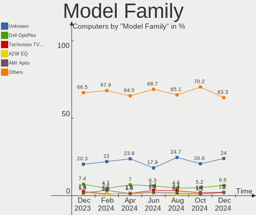
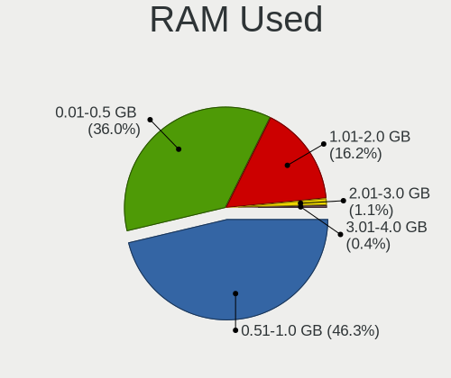
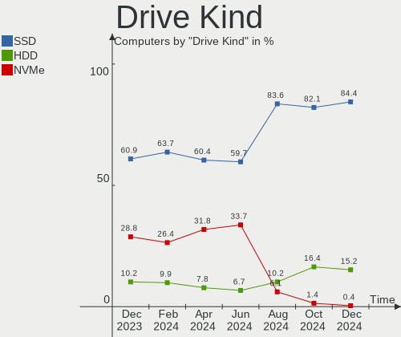

OPNsense - Hardware Trends
--------------------------

A project to identify most popular hardware characteristics and track their change
over time based on data collected by BSD users at https://BSD-Hardware.info.

Anyone can contribute to this report by the [hw-probe](https://github.com/linuxhw/hw-probe/blob/master/INSTALL.BSD.md) tool:

    hw-probe -all -upload

This report is for one last month. Overall report since the beginning of time: [TestDays](https://github.com/bsdhw/TestDays)

Period: Jul, 2023.

Contents
--------

* [ System ](#system)
  - [ OS                       ](#os)
  - [ OS Family                ](#os-family)
  - [ Arch                     ](#arch)
  - [ DE                       ](#de)
  - [ Display Server           ](#display-server)
  - [ Display Manager          ](#display-manager)
  - [ OS Lang                  ](#os-lang)
  - [ Boot Mode                ](#boot-mode)
  - [ Filesystem               ](#filesystem)
  - [ Part. scheme             ](#part-scheme)

* [ Board ](#board)
  - [ Vendor                   ](#vendor)
  - [ Model                    ](#model)
  - [ Model Family             ](#model-family)
  - [ MFG Year                 ](#mfg-year)
  - [ Form Factor              ](#form-factor)
  - [ Coreboot                 ](#coreboot)
  - [ RAM Size                 ](#ram-size)
  - [ RAM Used                 ](#ram-used)
  - [ Total Drives             ](#total-drives)
  - [ Has CD-ROM               ](#has-cd-rom)
  - [ Has Ethernet             ](#has-ethernet)
  - [ Has WiFi                 ](#has-wifi)
  - [ Has Bluetooth            ](#has-bluetooth)

* [ Location ](#location)
  - [ Country                  ](#country)
  - [ City                     ](#city)

* [ Drives ](#drives)
  - [ Drive Vendor             ](#drive-vendor)
  - [ Drive Model              ](#drive-model)
  - [ HDD Vendor               ](#hdd-vendor)
  - [ SSD Vendor               ](#ssd-vendor)
  - [ Drive Kind               ](#drive-kind)
  - [ Drive Connector          ](#drive-connector)
  - [ Drive Size               ](#drive-size)
  - [ Space Total              ](#space-total)
  - [ Space Used               ](#space-used)
  - [ Malfunc. Drives          ](#malfunc-drives)
  - [ Malfunc. Drive Vendor    ](#malfunc-drive-vendor)
  - [ Malfunc. HDD Vendor      ](#malfunc-hdd-vendor)
  - [ Malfunc. Drive Kind      ](#malfunc-drive-kind)
  - [ Failed Drives            ](#failed-drives)
  - [ Failed Drive Vendor      ](#failed-drive-vendor)
  - [ Drive Status             ](#drive-status)

* [ Storage controller ](#storage-controller)
  - [ Storage Vendor           ](#storage-vendor)
  - [ Storage Model            ](#storage-model)
  - [ Storage Kind             ](#storage-kind)

* [ Processor ](#processor)
  - [ CPU Vendor               ](#cpu-vendor)
  - [ CPU Model                ](#cpu-model)
  - [ CPU Model Family         ](#cpu-model-family)
  - [ CPU Cores                ](#cpu-cores)
  - [ CPU Sockets              ](#cpu-sockets)
  - [ CPU Threads              ](#cpu-threads)
  - [ CPU Microarch            ](#cpu-microarch)

* [ Graphics ](#graphics)
  - [ GPU Vendor               ](#gpu-vendor)
  - [ GPU Model                ](#gpu-model)
  - [ GPU Combo                ](#gpu-combo)
  - [ GPU Driver               ](#gpu-driver)
  - [ GPU Memory               ](#gpu-memory)

* [ Monitor ](#monitor)
  - [ Monitor Vendor           ](#monitor-vendor)
  - [ Monitor Model            ](#monitor-model)
  - [ Monitor Resolution       ](#monitor-resolution)
  - [ Monitor Diagonal         ](#monitor-diagonal)
  - [ Monitor Width            ](#monitor-width)
  - [ Aspect Ratio             ](#aspect-ratio)
  - [ Monitor Area             ](#monitor-area)
  - [ Pixel Density            ](#pixel-density)
  - [ Multiple Monitors        ](#multiple-monitors)

* [ Network ](#network)
  - [ Net Controller Vendor    ](#net-controller-vendor)
  - [ Net Controller Model     ](#net-controller-model)
  - [ Wireless Vendor          ](#wireless-vendor)
  - [ Wireless Model           ](#wireless-model)
  - [ Ethernet Vendor          ](#ethernet-vendor)
  - [ Ethernet Model           ](#ethernet-model)
  - [ Net Controller Kind      ](#net-controller-kind)
  - [ Used Controller          ](#used-controller)
  - [ NICs                     ](#nics)
  - [ IPv6                     ](#ipv6)

* [ Bluetooth ](#bluetooth)
  - [ Bluetooth Vendor         ](#bluetooth-vendor)
  - [ Bluetooth Model          ](#bluetooth-model)

* [ Sound ](#sound)
  - [ Sound Vendor             ](#sound-vendor)
  - [ Sound Model              ](#sound-model)

* [ Memory ](#memory)
  - [ Memory Vendor            ](#memory-vendor)
  - [ Memory Model             ](#memory-model)
  - [ Memory Kind              ](#memory-kind)
  - [ Memory Form Factor       ](#memory-form-factor)
  - [ Memory Size              ](#memory-size)
  - [ Memory Speed             ](#memory-speed)

* [ Printers & scanners ](#printers--scanners)
  - [ Printer Vendor           ](#printer-vendor)
  - [ Printer Model            ](#printer-model)
  - [ Scanner Vendor           ](#scanner-vendor)
  - [ Scanner Model            ](#scanner-model)

* [ Camera ](#camera)
  - [ Camera Vendor            ](#camera-vendor)
  - [ Camera Model             ](#camera-model)

* [ Security ](#security)
  - [ Fingerprint Vendor       ](#fingerprint-vendor)
  - [ Fingerprint Model        ](#fingerprint-model)
  - [ Chipcard Vendor          ](#chipcard-vendor)
  - [ Chipcard Model           ](#chipcard-model)

* [ Unsupported ](#unsupported)
  - [ Unsupported Devices      ](#unsupported-devices)
  - [ Unsupported Device Types ](#unsupported-device-types)

System
------

OS
--

Installed operating systems

| Name             | Computers | Percent |
|------------------|-----------|---------|
| OPNsense 23.1.11 | 275       | 85.4%   |
| OPNsense 23.7    | 18        | 5.59%   |
| OPNsense 23.1.9  | 6         | 1.86%   |
| OPNsense 22.7.11 | 6         | 1.86%   |
| OPNsense 23.1.7  | 4         | 1.24%   |
| OPNsense 23.1.10 | 4         | 1.24%   |
| OPNsense 23.4.1  | 2         | 0.62%   |
| OPNsense 23.1.5  | 2         | 0.62%   |
| OPNsense 23.1    | 2         | 0.62%   |
| OPNsense 22.7.10 | 1         | 0.31%   |
| OPNsense 22.7    | 1         | 0.31%   |
| OPNsense 22.1.10 | 1         | 0.31%   |

OS Family
---------

OS without a version

| Name     | Computers | Percent |
|----------|-----------|---------|
| OPNsense | 322       | 100%    |

Arch
----

OS architecture (x86_64, i586, etc.)

| Name  | Computers | Percent |
|-------|-----------|---------|
| amd64 | 320       | 99.38%  |
| arm64 | 2         | 0.62%   |

DE
--

Desktop Environment

| Name    | Computers | Percent |
|---------|-----------|---------|
| Console | 321       | 99.69%  |
| GNOME   | 1         | 0.31%   |

Display Server
--------------

X11 or Wayland

| Name    | Computers | Percent |
|---------|-----------|---------|
| Console | 322       | 100%    |

Display Manager
---------------

SDDM, LightDM, etc.

| Name    | Computers | Percent |
|---------|-----------|---------|
| Console | 321       | 99.69%  |
| GDM     | 1         | 0.31%   |

OS Lang
-------

Language

| Lang    | Computers | Percent |
|---------|-----------|---------|
| Unknown | 315       | 97.83%  |
| C       | 7         | 2.17%   |

Boot Mode
---------

EFI or BIOS

| Mode | Computers | Percent |
|------|-----------|---------|
| EFI  | 317       | 98.45%  |
| BIOS | 5         | 1.55%   |

Filesystem
----------

Type of filesystem

| Type | Computers | Percent |
|------|-----------|---------|
| Ufs  | 173       | 53.73%  |
| Zfs  | 149       | 46.27%  |

Part. scheme
------------

Scheme of partitioning

| Type    | Computers | Percent |
|---------|-----------|---------|
| GPT     | 319       | 99.07%  |
| MBR     | 2         | 0.62%   |
| Unknown | 1         | 0.31%   |

Board
-----

Vendor
------

Motherboard manufacturer

| Name                | Computers | Percent |
|---------------------|-----------|---------|
| Unknown             | 50        | 15.53%  |
| Dell                | 36        | 11.18%  |
| Hewlett-Packard     | 30        | 9.32%   |
| Protectli           | 23        | 7.14%   |
| Intel               | 17        | 5.28%   |
| Supermicro          | 13        | 4.04%   |
| Techvision          | 12        | 3.73%   |
| ASUSTek Computer    | 12        | 3.73%   |
| PC Engines          | 11        | 3.42%   |
| Lenovo              | 10        | 3.11%   |
| Gigabyte Technology | 10        | 3.11%   |
| ASRock              | 8         | 2.48%   |
| Sophos              | 7         | 2.17%   |
| Fujitsu             | 7         | 2.17%   |
| Deciso              | 7         | 2.17%   |
| AZW                 | 7         | 2.17%   |
| AMI                 | 7         | 2.17%   |
| MW                  | 5         | 1.55%   |
| ZOTAC               | 4         | 1.24%   |
| Shuttle             | 4         | 1.24%   |
| IceWhale Technology | 4         | 1.24%   |
| Yanling             | 3         | 0.93%   |
| Hardkernel          | 3         | 0.93%   |
| Seeed Studio        | 2         | 0.62%   |
| CWWK                | 2         | 0.62%   |
| CompuLab            | 2         | 0.62%   |
| BESSTAR Tech        | 2         | 0.62%   |
| YANYU               | 1         | 0.31%   |
| VSP                 | 1         | 0.31%   |
| Premio              | 1         | 0.31%   |
| PICO PC             | 1         | 0.31%   |
| OEM                 | 1         | 0.31%   |
| NF541               | 1         | 0.31%   |
| NEC Computers       | 1         | 0.31%   |
| MSI                 | 1         | 0.31%   |
| MiTAC               | 1         | 0.31%   |
| Lex                 | 1         | 0.31%   |
| Iwill Norge AS      | 1         | 0.31%   |
| GoWin Solution      | 1         | 0.31%   |
| Foxconn             | 1         | 0.31%   |

Model
-----

Motherboard model

| Name                        | Computers | Percent |
|-----------------------------|-----------|---------|
| Unknown                     | 50        | 15.53%  |
| Techvision TVI7309X         | 12        | 3.73%   |
| Protectli FW4B              | 7         | 2.17%   |
| PC Engines APU2             | 6         | 1.86%   |
| AMI Aptio CRB               | 6         | 1.86%   |
| Supermicro Super Server     | 5         | 1.55%   |
| MW GMLK-2_5G4L              | 5         | 1.55%   |
| Fujitsu FUTRO S920          | 5         | 1.55%   |
| Protectli VP2420            | 4         | 1.24%   |
| Protectli FW6               | 4         | 1.24%   |
| PC Engines apu4             | 4         | 1.24%   |
| AZW EQ                      | 4         | 1.24%   |
| Sophos XG                   | 3         | 0.93%   |
| Intel Q3XXG4-P V1.0         | 3         | 0.93%   |
| Intel CRESCENTBAY           | 3         | 0.93%   |
| HP EliteDesk 800 G3 SFF     | 3         | 0.93%   |
| Gigabyte B150N Phoenix-WIFI | 3         | 0.93%   |
| Dell OptiPlex 7060          | 3         | 0.93%   |
| Dell OptiPlex 3020          | 3         | 0.93%   |
| Deciso Netboard A20         | 3         | 0.93%   |
| ZOTAC ZBOX-CI323NANO        | 2         | 0.62%   |
| Sophos SG                   | 2         | 0.62%   |
| Protectli VP2410            | 2         | 0.62%   |
| Protectli FW1               | 2         | 0.62%   |
| IceWhale ZimaBoard 832 ZMB  | 2         | 0.62%   |
| IceWhale ZimaBoard 432 ZMB  | 2         | 0.62%   |
| HP t620 PLUS Quad Core TC   | 2         | 0.62%   |
| HP ProLiant DL360 G7        | 2         | 0.62%   |
| HP EliteDesk 800 G1 TWR     | 2         | 0.62%   |
| HP Compaq Pro 6300 SFF      | 2         | 0.62%   |
| HP Compaq 8200 Elite SFF PC | 2         | 0.62%   |
| HP 500-459                  | 2         | 0.62%   |
| Hardkernel ODROID-H3        | 2         | 0.62%   |
| Dell PowerEdge R210 II      | 2         | 0.62%   |
| Dell OptiPlex 9020          | 2         | 0.62%   |
| Dell OptiPlex 7040          | 2         | 0.62%   |
| Dell OptiPlex 3040          | 2         | 0.62%   |
| Deciso NetBoard-A20         | 2         | 0.62%   |
| Deciso NetBoard-A10         | 2         | 0.62%   |
| CompuLab fitlet2            | 2         | 0.62%   |

Model Family
------------

Motherboard model prefix

| Name                 | Computers | Percent |
|----------------------|-----------|---------|
| Unknown              | 50        | 15.53%  |
| Dell OptiPlex        | 23        | 7.14%   |
| Techvision TVI7309X  | 12        | 3.73%   |
| HP EliteDesk         | 10        | 3.11%   |
| Dell PowerEdge       | 10        | 3.11%   |
| Protectli FW4B       | 7         | 2.17%   |
| PC Engines APU2      | 6         | 1.86%   |
| Lenovo ThinkCentre   | 6         | 1.86%   |
| Fujitsu FUTRO        | 6         | 1.86%   |
| AMI Aptio            | 6         | 1.86%   |
| Supermicro Super     | 5         | 1.55%   |
| MW GMLK-2            | 5         | 1.55%   |
| HP Compaq            | 5         | 1.55%   |
| Protectli VP2420     | 4         | 1.24%   |
| Protectli FW6        | 4         | 1.24%   |
| PC Engines apu4      | 4         | 1.24%   |
| IceWhale ZimaBoard   | 4         | 1.24%   |
| HP ProLiant          | 4         | 1.24%   |
| AZW EQ               | 4         | 1.24%   |
| Sophos XG            | 3         | 0.93%   |
| Intel Q3XXG4-P       | 3         | 0.93%   |
| Intel CRESCENTBAY    | 3         | 0.93%   |
| HP ProDesk           | 3         | 0.93%   |
| Gigabyte B150N       | 3         | 0.93%   |
| Deciso Netboard      | 3         | 0.93%   |
| ASUS PRIME           | 3         | 0.93%   |
| ZOTAC ZBOX-CI323NANO | 2         | 0.62%   |
| Sophos SG            | 2         | 0.62%   |
| Protectli VP2410     | 2         | 0.62%   |
| Protectli FW1        | 2         | 0.62%   |
| HP t620              | 2         | 0.62%   |
| HP 500-459           | 2         | 0.62%   |
| Hardkernel ODROID-H3 | 2         | 0.62%   |
| Gigabyte B450M       | 2         | 0.62%   |
| Deciso NetBoard-A20  | 2         | 0.62%   |
| Deciso NetBoard-A10  | 2         | 0.62%   |
| CompuLab fitlet2     | 2         | 0.62%   |
| BESSTAR Tech GK41    | 2         | 0.62%   |
| AZW U59              | 2         | 0.62%   |
| ASUS TUF             | 2         | 0.62%   |

MFG Year
--------

Motherboard manufacture year

| Year    | Computers | Percent |
|---------|-----------|---------|
| 2022    | 64        | 19.88%  |
| 2021    | 44        | 13.66%  |
| 2018    | 39        | 12.11%  |
| 2023    | 26        | 8.07%   |
| 2016    | 24        | 7.45%   |
| 2014    | 21        | 6.52%   |
| 2017    | 17        | 5.28%   |
| 2019    | 16        | 4.97%   |
| 2015    | 15        | 4.66%   |
| 2013    | 12        | 3.73%   |
| 2020    | 11        | 3.42%   |
| 2011    | 11        | 3.42%   |
| 2012    | 7         | 2.17%   |
| 2009    | 6         | 1.86%   |
| 2008    | 4         | 1.24%   |
| 2010    | 2         | 0.62%   |
| Unknown | 2         | 0.62%   |
| 2006    | 1         | 0.31%   |

Form Factor
-----------

Physical design of the computer

| Name     | Computers | Percent |
|----------|-----------|---------|
| Desktop  | 250       | 77.64%  |
| Mini pc  | 26        | 8.07%   |
| Server   | 26        | 8.07%   |
| Notebook | 12        | 3.73%   |
| Firewall | 8         | 2.48%   |

Coreboot
--------

Have coreboot on board

| Used | Computers | Percent |
|------|-----------|---------|
| No   | 308       | 95.65%  |
| Yes  | 14        | 4.35%   |

RAM Size
--------

Total RAM memory

| Size in GB  | Computers | Percent |
|-------------|-----------|---------|
| 8.01-16.0   | 127       | 39.44%  |
| 16.01-24.0  | 99        | 30.75%  |
| 4.01-8.0    | 52        | 16.15%  |
| 32.01-64.0  | 21        | 6.52%   |
| 64.01-256.0 | 12        | 3.73%   |
| 2.01-3.0    | 6         | 1.86%   |
| 24.01-32.0  | 3         | 0.93%   |
| 0.51-1.0    | 2         | 0.62%   |

RAM Used
--------

Used RAM memory

| Used GB  | Computers | Percent |
|----------|-----------|---------|
| 0.01-0.5 | 158       | 49.07%  |
| 0.51-1.0 | 122       | 37.89%  |
| 1.01-2.0 | 31        | 9.63%   |
| 2.01-3.0 | 7         | 2.17%   |
| 4.01-8.0 | 2         | 0.62%   |
| 3.01-4.0 | 2         | 0.62%   |

Total Drives
------------

Number of drives on board

| Drives | Computers | Percent |
|--------|-----------|---------|
| 1      | 253       | 78.57%  |
| 0      | 42        | 13.04%  |
| 2      | 25        | 7.76%   |
| 4      | 2         | 0.62%   |

Has CD-ROM
----------

Has CD-ROM on board

| Presented | Computers | Percent |
|-----------|-----------|---------|
| No        | 281       | 87.27%  |
| Yes       | 41        | 12.73%  |

Has Ethernet
------------

Has Ethernet on board

| Presented | Computers | Percent |
|-----------|-----------|---------|
| Yes       | 321       | 99.69%  |
| No        | 1         | 0.31%   |

Has WiFi
--------

Has WiFi module

| Presented | Computers | Percent |
|-----------|-----------|---------|
| No        | 251       | 77.95%  |
| Yes       | 71        | 22.05%  |

Has Bluetooth
-------------

Has Bluetooth module

| Presented | Computers | Percent |
|-----------|-----------|---------|
| No        | 269       | 83.54%  |
| Yes       | 53        | 16.46%  |

Location
--------

Country
-------

Geographic location (country)

| Country      | Computers | Percent |
|--------------|-----------|---------|
| USA          | 115       | 35.71%  |
| Germany      | 52        | 16.15%  |
| Canada       | 16        | 4.97%   |
| Netherlands  | 14        | 4.35%   |
| Brazil       | 10        | 3.11%   |
| UK           | 9         | 2.8%    |
| Australia    | 9         | 2.8%    |
| France       | 8         | 2.48%   |
| Poland       | 7         | 2.17%   |
| Belgium      | 7         | 2.17%   |
| Switzerland  | 5         | 1.55%   |
| Sweden       | 5         | 1.55%   |
| Russia       | 5         | 1.55%   |
| Romania      | 5         | 1.55%   |
| China        | 5         | 1.55%   |
| Italy        | 4         | 1.24%   |
| South Africa | 3         | 0.93%   |
| Portugal     | 3         | 0.93%   |
| Japan        | 3         | 0.93%   |
| India        | 3         | 0.93%   |
| Denmark      | 3         | 0.93%   |
| Austria      | 3         | 0.93%   |
| Uruguay      | 2         | 0.62%   |
| Spain        | 2         | 0.62%   |
| South Korea  | 2         | 0.62%   |
| Norway       | 2         | 0.62%   |
| Vietnam      | 1         | 0.31%   |
| Uganda       | 1         | 0.31%   |
| Turkey       | 1         | 0.31%   |
| Thailand     | 1         | 0.31%   |
| Taiwan       | 1         | 0.31%   |
| Slovenia     | 1         | 0.31%   |
| Singapore    | 1         | 0.31%   |
| Serbia       | 1         | 0.31%   |
| Philippines  | 1         | 0.31%   |
| Paraguay     | 1         | 0.31%   |
| Pakistan     | 1         | 0.31%   |
| New Zealand  | 1         | 0.31%   |
| Luxembourg   | 1         | 0.31%   |
| Indonesia    | 1         | 0.31%   |

City
----

Geographic location (city)

| City                 | Computers | Percent |
|----------------------|-----------|---------|
| Seattle              | 4         | 1.24%   |
| Melbourne            | 4         | 1.24%   |
| Oakland              | 3         | 0.93%   |
| Longueuil            | 3         | 0.93%   |
| Dresden              | 3         | 0.93%   |
| Winterthur           | 2         | 0.62%   |
| Tucson               | 2         | 0.62%   |
| Tokyo                | 2         | 0.62%   |
| Tampa                | 2         | 0.62%   |
| Sydney               | 2         | 0.62%   |
| Shenzhen             | 2         | 0.62%   |
| Reading              | 2         | 0.62%   |
| Portland             | 2         | 0.62%   |
| Pittsburgh           | 2         | 0.62%   |
| Montevideo           | 2         | 0.62%   |
| Miramar              | 2         | 0.62%   |
| Louisville           | 2         | 0.62%   |
| Los Angeles          | 2         | 0.62%   |
| Jinrongjie           | 2         | 0.62%   |
| Indianapolis         | 2         | 0.62%   |
| Hamburg              | 2         | 0.62%   |
| Düsseldorf          | 2         | 0.62%   |
| Dearborn Heights     | 2         | 0.62%   |
| Columbus             | 2         | 0.62%   |
| Columbia             | 2         | 0.62%   |
| Cologne              | 2         | 0.62%   |
| Campinas             | 2         | 0.62%   |
| Boston               | 2         | 0.62%   |
| Bietigheim-Bissingen | 2         | 0.62%   |
| Berlin               | 2         | 0.62%   |
| Zottegem             | 1         | 0.31%   |
| Youngsville          | 1         | 0.31%   |
| York Haven           | 1         | 0.31%   |
| Wyk auf Foehr        | 1         | 0.31%   |
| Wroclaw              | 1         | 0.31%   |
| Woodbury             | 1         | 0.31%   |
| Wolfville            | 1         | 0.31%   |
| Wolfsburg            | 1         | 0.31%   |
| Westminster          | 1         | 0.31%   |
| West Covina          | 1         | 0.31%   |

Drives
------

Drive Vendor
------------

Hard drive vendors

| Vendor              | Computers | Drives | Percent |
|---------------------|-----------|--------|---------|
| Samsung Electronics | 47        | 51     | 15.99%  |
| Kingston            | 34        | 37     | 11.56%  |
| Transcend           | 22        | 23     | 7.48%   |
| WDC                 | 21        | 22     | 7.14%   |
| Crucial             | 14        | 15     | 4.76%   |
| Seagate             | 12        | 12     | 4.08%   |
| Intel               | 12        | 15     | 4.08%   |
| China               | 11        | 11     | 3.74%   |
| Toshiba             | 8         | 8      | 2.72%   |
| SanDisk             | 7         | 7      | 2.38%   |
| Micron Technology   | 7         | 7      | 2.38%   |
| SPCC                | 6         | 6      | 2.04%   |
| Protectli           | 6         | 6      | 2.04%   |
| Hoodisk             | 6         | 6      | 2.04%   |
| Fanxiang            | 6         | 6      | 2.04%   |
| A-DATA Technology   | 6         | 7      | 2.04%   |
| SK hynix            | 5         | 5      | 1.7%    |
| Patriot             | 5         | 5      | 1.7%    |
| Innodisk            | 5         | 5      | 1.7%    |
| FORESEE             | 5         | 5      | 1.7%    |
| Hewlett-Packard     | 4         | 5      | 1.36%   |
| Apacer              | 4         | 5      | 1.36%   |
| Silicon Motion      | 3         | 3      | 1.02%   |
| PNY                 | 3         | 3      | 1.02%   |
| Vaseky              | 2         | 2      | 0.68%   |
| Team                | 2         | 2      | 0.68%   |
| Phison              | 2         | 2      | 0.68%   |
| OCZ                 | 2         | 2      | 0.68%   |
| LITEON              | 2         | 3      | 0.68%   |
| KIOXIA              | 2         | 2      | 0.68%   |
| Dogfish             | 2         | 2      | 0.68%   |
| BIWIN               | 2         | 2      | 0.68%   |
| ZOTAC               | 1         | 1      | 0.34%   |
| VICK                | 1         | 1      | 0.34%   |
| Verbatim            | 1         | 1      | 0.34%   |
| SUNEAST             | 1         | 2      | 0.34%   |
| SSSTC               | 1         | 1      | 0.34%   |
| SHAREVDI            | 1         | 1      | 0.34%   |
| Qunion              | 1         | 1      | 0.34%   |
| Netac               | 1         | 1      | 0.34%   |

Drive Model
-----------

Hard drive models

| Model                            | Computers | Percent |
|----------------------------------|-----------|---------|
| Kingston SKC600MS256G 256GB      | 6         | 2.01%   |
| Transcend TS256GMTS952T2 256GB   | 5         | 1.68%   |
| Samsung SSD 850 EVO 250GB        | 5         | 1.68%   |
| Kingston SA400S37240G 240GB      | 5         | 1.68%   |
| Fanxiang S501 128GB              | 5         | 1.68%   |
| Kingston SA400S37120G 120GB      | 4         | 1.34%   |
| Innodisk DEMSR- 08GB mSATA 3ME3  | 4         | 1.34%   |
| Transcend TS64GMSA230S 64GB      | 3         | 1.01%   |
| Seagate ST500DM002-1BD142 496GB  | 3         | 1.01%   |
| Samsung SSD 870 EVO 500GB        | 3         | 1.01%   |
| Samsung SSD 850 EVO 500GB        | 3         | 1.01%   |
| PNY CS900 120GB SSD              | 3         | 1.01%   |
| Kingston SUV500MS120G 120GB      | 3         | 1.01%   |
| Hoodisk SSD 64GB                 | 3         | 1.01%   |
| FORESEE 128GB SSD                | 3         | 1.01%   |
| WDC WDS500G2B0B-00YS70 500GB     | 2         | 0.67%   |
| WDC WD6400AAKS-00A7B0 640GB      | 2         | 0.67%   |
| Transcend TS64GSSD370S 64GB      | 2         | 0.67%   |
| Transcend TS32GMSA370 32GB       | 2         | 0.67%   |
| Transcend TS256GMTE710T 256GB    | 2         | 0.67%   |
| Transcend TS256GMSA230S 256GB    | 2         | 0.67%   |
| Toshiba MQ01ABD050 500GB         | 2         | 0.67%   |
| SPCC Solid State Disk 256GB      | 2         | 0.67%   |
| SPCC Solid State Disk 128GB      | 2         | 0.67%   |
| Samsung SSD 970 PRO 512GB        | 2         | 0.67%   |
| Samsung SSD 970 EVO Plus 500GB   | 2         | 0.67%   |
| Samsung SSD 960 EVO 250GB        | 2         | 0.67%   |
| Samsung SSD 860 EVO 250GB        | 2         | 0.67%   |
| Samsung MZVLB256HAHQ-000L7 256GB | 2         | 0.67%   |
| Patriot Burst Elite 120GB        | 2         | 0.67%   |
| KIOXIA KBG50ZNS256G NVMe 256GB   | 2         | 0.67%   |
| Intel SSDSA2CW080G3 80GB         | 2         | 0.67%   |
| Hoodisk SSD 32GB                 | 2         | 0.67%   |
| Crucial CT500P3SSD8 500GB        | 2         | 0.67%   |
| Crucial CT250MX500SSD1 250GB     | 2         | 0.67%   |
| China SATA SSD 16GB              | 2         | 0.67%   |
| China IM128-P130 128GB           | 2         | 0.67%   |
| China FPT310M4SSD256G 256GB      | 2         | 0.67%   |
| BIWIN SSD 128GB                  | 2         | 0.67%   |
| A-DATA IM2S3134N-064GM 64GB      | 2         | 0.67%   |

HDD Vendor
----------

Hard disk drive vendors

| Vendor          | Computers | Drives | Percent |
|-----------------|-----------|--------|---------|
| Seagate         | 11        | 11     | 37.93%  |
| WDC             | 10        | 11     | 34.48%  |
| Toshiba         | 5         | 5      | 17.24%  |
| Hewlett-Packard | 2         | 2      | 6.9%    |
| HGST            | 1         | 1      | 3.45%   |

SSD Vendor
----------

Solid state drive vendors

| Vendor              | Computers | Drives | Percent |
|---------------------|-----------|--------|---------|
| Samsung Electronics | 32        | 35     | 15.76%  |
| Kingston            | 30        | 32     | 14.78%  |
| Transcend           | 20        | 21     | 9.85%   |
| China               | 11        | 11     | 5.42%   |
| Crucial             | 10        | 11     | 4.93%   |
| Intel               | 8         | 10     | 3.94%   |
| SanDisk             | 7         | 7      | 3.45%   |
| WDC                 | 6         | 6      | 2.96%   |
| Protectli           | 6         | 6      | 2.96%   |
| Hoodisk             | 6         | 6      | 2.96%   |
| A-DATA Technology   | 6         | 7      | 2.96%   |
| SPCC                | 5         | 5      | 2.46%   |
| Innodisk            | 5         | 5      | 2.46%   |
| FORESEE             | 5         | 5      | 2.46%   |
| Patriot             | 4         | 4      | 1.97%   |
| Micron Technology   | 4         | 4      | 1.97%   |
| PNY                 | 3         | 3      | 1.48%   |
| Apacer              | 3         | 4      | 1.48%   |
| Vaseky              | 2         | 2      | 0.99%   |
| SK hynix            | 2         | 2      | 0.99%   |
| OCZ                 | 2         | 2      | 0.99%   |
| LITEON              | 2         | 3      | 0.99%   |
| Dogfish             | 2         | 2      | 0.99%   |
| BIWIN               | 2         | 2      | 0.99%   |
| ZOTAC               | 1         | 1      | 0.49%   |
| VICK                | 1         | 1      | 0.49%   |
| Verbatim            | 1         | 1      | 0.49%   |
| Toshiba             | 1         | 1      | 0.49%   |
| Team                | 1         | 1      | 0.49%   |
| SUNEAST             | 1         | 2      | 0.49%   |
| SSSTC               | 1         | 1      | 0.49%   |
| SHAREVDI            | 1         | 1      | 0.49%   |
| Seagate             | 1         | 1      | 0.49%   |
| Qunion              | 1         | 1      | 0.49%   |
| Netac               | 1         | 1      | 0.49%   |
| KingSpec            | 1         | 1      | 0.49%   |
| KingDian            | 1         | 1      | 0.49%   |
| Indilinx            | 1         | 1      | 0.49%   |
| Hitachi             | 1         | 1      | 0.49%   |
| Hewlett-Packard     | 1         | 2      | 0.49%   |

Drive Kind
----------

HDD or SSD

| Kind | Computers | Drives | Percent |
|------|-----------|--------|---------|
| SSD  | 198       | 217    | 68.51%  |
| NVMe | 63        | 65     | 21.8%   |
| HDD  | 28        | 30     | 9.69%   |

Drive Connector
---------------

SATA, SAS, NVMe, etc.

| Type | Computers | Drives | Percent |
|------|-----------|--------|---------|
| SATA | 222       | 247    | 77.89%  |
| NVMe | 63        | 65     | 22.11%  |

Drive Size
----------

Size of hard drive

| Size in TB | Computers | Drives | Percent |
|------------|-----------|--------|---------|
| 0.01-0.5   | 202       | 223    | 90.18%  |
| 0.51-1.0   | 16        | 18     | 7.14%   |
| 1.01-2.0   | 4         | 4      | 1.79%   |
| 3.01-4.0   | 1         | 1      | 0.45%   |
| 2.01-3.0   | 1         | 1      | 0.45%   |

Space Total
-----------

Amount of disk space available on the file system

| Size in GB     | Computers | Percent |
|----------------|-----------|---------|
| 101-250        | 152       | 47.2%   |
| 251-500        | 62        | 19.25%  |
| 51-100         | 45        | 13.98%  |
| 21-50          | 27        | 8.39%   |
| 1-20           | 16        | 4.97%   |
| 501-1000       | 16        | 4.97%   |
| 1001-2000      | 3         | 0.93%   |
| More than 3000 | 1         | 0.31%   |

Space Used
----------

Amount of used disk space

| Used GB | Computers | Percent |
|---------|-----------|---------|
| 1-20    | 306       | 95.03%  |
| 21-50   | 11        | 3.42%   |
| 51-100  | 5         | 1.55%   |

Malfunc. Drives
---------------

Drive models with a malfunction

| Model                                      | Computers | Drives | Percent |
|--------------------------------------------|-----------|--------|---------|
| Seagate ST500DM002-1BD142 496GB            | 2         | 2      | 8%      |
| Patriot Burst Elite 120GB                  | 2         | 2      | 8%      |
| WDC WD6400AAKS-00A7B0 640GB                | 1         | 1      | 4%      |
| WDC WD2503ABYX-01WERA1 256GB               | 1         | 1      | 4%      |
| WDC WD1002FAEX-00Y9A0 1TB                  | 1         | 1      | 4%      |
| VICK SSD 256GB                             | 1         | 1      | 4%      |
| SUNEAST SE900 SSD 256GB                    | 1         | 2      | 4%      |
| SSSTC CVB-8D128-HP 128GB                   | 1         | 1      | 4%      |
| SK hynix SC215 M.2 2242 32GB               | 1         | 1      | 4%      |
| Seagate ST9320325AS 320GB                  | 1         | 1      | 4%      |
| Seagate ST3160827AS 160GB                  | 1         | 1      | 4%      |
| Seagate ST1000DM010-2EP102 1TB             | 1         | 1      | 4%      |
| SanDisk SSD P4 16GB                        | 1         | 1      | 4%      |
| SanDisk SD8TN8U-256G-1006 256GB            | 1         | 1      | 4%      |
| Samsung Electronics 470 Series SSD 64GB    | 1         | 1      | 4%      |
| Micron Technology M550_MTFDDAK128MAY 128GB | 1         | 1      | 4%      |
| Kingston SUV400S37240G 240GB               | 1         | 1      | 4%      |
| Kingston SMS200S360G 64GB                  | 1         | 1      | 4%      |
| KingDian S100 32GB                         | 1         | 1      | 4%      |
| Intel SSDPEKKW256G7 256GB                  | 1         | 1      | 4%      |
| Crucial CT500MX500SSD1 500GB               | 1         | 1      | 4%      |
| Apacer 16GB SATA Flash Drive               | 1         | 1      | 4%      |
| A-DATA Technology SU700 120GB              | 1         | 1      | 4%      |

Malfunc. Drive Vendor
---------------------

Vendors of faulty drives

| Vendor              | Computers | Drives | Percent |
|---------------------|-----------|--------|---------|
| Seagate             | 5         | 5      | 20%     |
| WDC                 | 3         | 3      | 12%     |
| SanDisk             | 2         | 2      | 8%      |
| Patriot             | 2         | 2      | 8%      |
| Kingston            | 2         | 2      | 8%      |
| VICK                | 1         | 1      | 4%      |
| SUNEAST             | 1         | 2      | 4%      |
| SSSTC               | 1         | 1      | 4%      |
| SK hynix            | 1         | 1      | 4%      |
| Samsung Electronics | 1         | 1      | 4%      |
| Micron Technology   | 1         | 1      | 4%      |
| KingDian            | 1         | 1      | 4%      |
| Intel               | 1         | 1      | 4%      |
| Crucial             | 1         | 1      | 4%      |
| Apacer              | 1         | 1      | 4%      |
| A-DATA Technology   | 1         | 1      | 4%      |

Malfunc. HDD Vendor
-------------------

Vendors of faulty HDD drives

| Vendor  | Computers | Drives | Percent |
|---------|-----------|--------|---------|
| Seagate | 5         | 5      | 62.5%   |
| WDC     | 3         | 3      | 37.5%   |

Malfunc. Drive Kind
-------------------

Kinds of faulty drives

| Kind | Computers | Drives | Percent |
|------|-----------|--------|---------|
| SSD  | 16        | 17     | 64%     |
| HDD  | 8         | 8      | 32%     |
| NVMe | 1         | 1      | 4%      |

Failed Drives
-------------

Failed drive models

| Model                                            | Computers | Drives | Percent |
|--------------------------------------------------|-----------|--------|---------|
| WDC WD3200L 320GB                                | 1         | 1      | 16.67%  |
| Transcend TS32GSSD370S 32GB                      | 1         | 1      | 16.67%  |
| SK hynix BC501 HFM256GDJTNG-8310A 256GB          | 1         | 1      | 16.67%  |
| Samsung Electronics SSD PM830 2.5-inch 7mm 256GB | 1         | 1      | 16.67%  |
| Samsung Electronics MZVLW256HEHP-00000 256GB     | 1         | 1      | 16.67%  |
| Crucial CT500P3SSD8 500GB                        | 1         | 1      | 16.67%  |

Failed Drive Vendor
-------------------

Failed drive vendors

| Vendor              | Computers | Drives | Percent |
|---------------------|-----------|--------|---------|
| Samsung Electronics | 2         | 2      | 33.33%  |
| WDC                 | 1         | 1      | 16.67%  |
| Transcend           | 1         | 1      | 16.67%  |
| SK hynix            | 1         | 1      | 16.67%  |
| Crucial             | 1         | 1      | 16.67%  |

Drive Status
------------

Number of failed and malfunc. drives

| Status   | Computers | Drives | Percent |
|----------|-----------|--------|---------|
| Works    | 249       | 277    | 87.99%  |
| Malfunc  | 25        | 26     | 8.83%   |
| Failed   | 6         | 6      | 2.12%   |
| Detected | 3         | 3      | 1.06%   |

Storage controller
------------------

Storage Vendor
--------------

Storage controller vendors

| Vendor                       | Computers | Percent |
|------------------------------|-----------|---------|
| Intel                        | 261       | 64.6%   |
| AMD                          | 45        | 11.14%  |
| Samsung Electronics          | 16        | 3.96%   |
| Silicon Motion               | 11        | 2.72%   |
| SanDisk                      | 10        | 2.48%   |
| MAXIO Technology (Hangzhou)  | 8         | 1.98%   |
| Broadcom / LSI               | 8         | 1.98%   |
| ASMedia Technology           | 7         | 1.73%   |
| Kingston Technology Company  | 5         | 1.24%   |
| Micron/Crucial Technology    | 4         | 0.99%   |
| Micron Technology            | 4         | 0.99%   |
| Marvell Technology Group     | 4         | 0.99%   |
| SK hynix                     | 3         | 0.74%   |
| KIOXIA                       | 3         | 0.74%   |
| Hewlett-Packard              | 3         | 0.74%   |
| Transcend                    | 2         | 0.5%    |
| Shenzhen Longsys Electronics | 2         | 0.5%    |
| Phison Electronics           | 2         | 0.5%    |
| JMicron Technology           | 2         | 0.5%    |
| Toshiba                      | 1         | 0.25%   |
| Realtek Semiconductor        | 1         | 0.25%   |
| Dell                         | 1         | 0.25%   |
| Chelsio Communications       | 1         | 0.25%   |

Storage Model
-------------

Storage controller models

| Model                                                                                   | Computers | Percent |
|-----------------------------------------------------------------------------------------|-----------|---------|
| AMD FCH SATA Controller [AHCI mode]                                                     | 33        | 7.6%    |
| Intel Celeron/Pentium Silver Processor SATA Controller                                  | 31        | 7.14%   |
| Intel 8 Series/C220 Series Chipset Family 6-port SATA Controller 1 [AHCI mode]          | 29        | 6.68%   |
| Intel Jasper Lake SATA AHCI Controller                                                  | 22        | 5.07%   |
| Intel Atom/Celeron/Pentium Processor x5-E8000/J3xxx/N3xxx Series SATA Controller        | 16        | 3.69%   |
| Intel Q170/Q150/B150/H170/H110/Z170/CM236 Chipset SATA Controller [AHCI Mode]           | 13        | 3%      |
| Intel Atom Processor E3800 Series SATA AHCI Controller                                  | 12        | 2.76%   |
| Unknown                                                                                 | 12        | 2.76%   |
| Silicon Motion SM2263EN/SM2263XT (DRAM-less) NVMe SSD Controllers                       | 11        | 2.53%   |
| Intel 6 Series/C200 Series Chipset Family 6 port Desktop SATA AHCI Controller           | 11        | 2.53%   |
| Intel Cannon Lake PCH SATA AHCI Controller                                              | 10        | 2.3%    |
| Samsung NVMe SSD Controller SM981/PM981/PM983                                           | 9         | 2.07%   |
| Intel SATA Controller [RAID mode]                                                       | 9         | 2.07%   |
| MAXIO (Hangzhou) NVMe SSD Controller MAP1202                                            | 8         | 1.84%   |
| Intel Tiger Lake-LP SATA Controller                                                     | 8         | 1.84%   |
| Intel Sunrise Point-LP SATA Controller [AHCI mode]                                      | 7         | 1.61%   |
| Intel Celeron N3350/Pentium N4200/Atom E3900 Series SATA AHCI Controller                | 7         | 1.61%   |
| Intel Elkhart Lake SATA AHCI                                                            | 6         | 1.38%   |
| Intel 7 Series/C210 Series Chipset Family 6-port SATA Controller [AHCI mode]            | 6         | 1.38%   |
| Intel 200 Series PCH SATA controller [AHCI mode]                                        | 6         | 1.38%   |
| Intel Comet Lake SATA AHCI Controller                                                   | 5         | 1.15%   |
| Intel 8 Series SATA Controller 1 [AHCI mode]                                            | 5         | 1.15%   |
| ASMedia ASM1062 Serial ATA Controller                                                   | 5         | 1.15%   |
| AMD 400 Series Chipset SATA Controller                                                  | 5         | 1.15%   |
| Micron/Crucial P2 [Nick P2] / P3 / P3 Plus NVMe PCIe SSD (DRAM-less)                    | 4         | 0.92%   |
| Intel Wildcat Point-LP SATA Controller [AHCI Mode]                                      | 4         | 0.92%   |
| Intel Atom Processor C3000 Series SATA Controller 0                                     | 4         | 0.92%   |
| Intel 5 Series/3400 Series Chipset 6 port SATA AHCI Controller                          | 4         | 0.92%   |
| Broadcom / LSI MegaRAID SAS-3 3108 [Invader]                                            | 4         | 0.92%   |
| AMD 500 Series Chipset SATA Controller                                                  | 4         | 0.92%   |
| SanDisk WD Blue SN570 NVMe SSD 1TB                                                      | 3         | 0.69%   |
| Samsung NVMe SSD Controller SM961/PM961/SM963                                           | 3         | 0.69%   |
| Intel NM10/ICH7 Family SATA Controller [AHCI mode]                                      | 3         | 0.69%   |
| Intel C610/X99 series chipset 6-Port SATA Controller [AHCI mode]                        | 3         | 0.69%   |
| Intel 82801G (ICH7 Family) IDE Controller                                               | 3         | 0.69%   |
| Intel 6 Series/C200 Series Chipset Family Desktop SATA Controller (IDE mode, ports 4-5) | 3         | 0.69%   |
| Intel 6 Series/C200 Series Chipset Family Desktop SATA Controller (IDE mode, ports 0-3) | 3         | 0.69%   |
| Intel 6 Series/C200 Series Chipset Family 6 port Mobile SATA AHCI Controller            | 3         | 0.69%   |
| Intel 500 Series Chipset Family SATA AHCI Controller                                    | 3         | 0.69%   |
| AMD FCH SATA Controller [IDE mode]                                                      | 3         | 0.69%   |

Storage Kind
------------

Kind of storage controller (IDE, SATA, NVMe, SAS, ...)

| Kind | Computers | Percent |
|------|-----------|---------|
| SATA | 281       | 69.9%   |
| NVMe | 75        | 18.66%  |
| RAID | 22        | 5.47%   |
| IDE  | 21        | 5.22%   |
| SAS  | 2         | 0.5%    |
| SCSI | 1         | 0.25%   |

Processor
---------

CPU Vendor
----------

Processor vendors

| Vendor | Computers | Percent |
|--------|-----------|---------|
| Intel  | 272       | 84.47%  |
| AMD    | 48        | 14.91%  |
| ARM    | 2         | 0.62%   |

CPU Model
---------

Processor models

| Model                                     | Computers | Percent |
|-------------------------------------------|-----------|---------|
| Intel Celeron J4125 CPU @ 2.00GHz         | 25        | 7.76%   |
| Intel Celeron N5105 @ 2.00GHz             | 21        | 6.52%   |
| AMD GX-412TC SOC                          | 10        | 3.11%   |
| Intel Core i5-6500 CPU @ 3.20GHz          | 8         | 2.48%   |
| Intel Celeron CPU J3160 @ 1.60GHz         | 8         | 2.48%   |
| Intel N100                                | 6         | 1.86%   |
| Intel Celeron CPU J1900 @ 1.99GHz         | 6         | 1.86%   |
| Intel Core i5-4570 CPU @ 3.20GHz          | 5         | 1.55%   |
| Intel Celeron J6412 @ 2.00GHz             | 5         | 1.55%   |
| Intel 11th Gen Core i7-1165G7 @ 2.80GHz   | 5         | 1.55%   |
| Intel Core i5-8500 CPU @ 3.00GHz          | 4         | 1.24%   |
| Intel Core i5-7500 CPU @ 3.40GHz          | 4         | 1.24%   |
| Intel Core i5-4590 CPU @ 3.30GHz          | 4         | 1.24%   |
| Intel Celeron CPU N3450 @ 1.10GHz         | 4         | 1.24%   |
| Intel Atom CPU C3558 @ 2.20GHz            | 4         | 1.24%   |
| AMD Ryzen 5 5600G with Radeon Graphics    | 4         | 1.24%   |
| AMD EPYC 3201 8-Core Processor            | 4         | 1.24%   |
| Intel Pentium Silver N6005 @ 2.00GHz      | 3         | 0.93%   |
| Intel Core i5-3570 CPU @ 3.40GHz          | 3         | 0.93%   |
| Intel Core i3-6100 CPU @ 3.70GHz          | 3         | 0.93%   |
| Intel Core i3-10110U CPU @ 2.10GHz        | 3         | 0.93%   |
| Intel Celeron N5100 @ 1.10GHz             | 3         | 0.93%   |
| Intel Celeron CPU N3150 @ 1.60GHz         | 3         | 0.93%   |
| Intel 11th Gen Core i5-1135G7 @ 2.40GHz   | 3         | 0.93%   |
| AMD GX-222GC SOC with Radeon R5E Graphics | 3         | 0.93%   |
| Intel N95                                 | 2         | 0.62%   |
| Intel Core i7-6700 CPU @ 3.40GHz          | 2         | 0.62%   |
| Intel Core i7-3770 CPU @ 3.40GHz          | 2         | 0.62%   |
| Intel Core i5-6500T CPU @ 2.50GHz         | 2         | 0.62%   |
| Intel Core i5-4460 CPU @ 3.20GHz          | 2         | 0.62%   |
| Intel Core i5-4430 CPU @ 3.00GHz          | 2         | 0.62%   |
| Intel Core i5-3470 CPU @ 3.20GHz          | 2         | 0.62%   |
| Intel Core i3-N305                        | 2         | 0.62%   |
| Intel Core i3-8300 CPU @ 3.70GHz          | 2         | 0.62%   |
| Intel Core i3-7100U CPU @ 2.40GHz         | 2         | 0.62%   |
| Intel Core i3-4130 CPU @ 3.40GHz          | 2         | 0.62%   |
| Intel Core i3-4010U CPU @ 1.70GHz         | 2         | 0.62%   |
| Intel Core i3-2120 CPU @ 3.30GHz          | 2         | 0.62%   |
| Intel Celeron J4105 CPU @ 1.50GHz         | 2         | 0.62%   |
| ARM Cortex-A55 r2p0                       | 2         | 0.62%   |

CPU Model Family
----------------

Processor model prefix

| Model                   | Computers | Percent |
|-------------------------|-----------|---------|
| Intel Celeron           | 88        | 27.33%  |
| Intel Core i5           | 53        | 16.46%  |
| Intel Core i3           | 33        | 10.25%  |
| Intel Xeon              | 26        | 8.07%   |
| Other                   | 24        | 7.45%   |
| AMD GX                  | 18        | 5.59%   |
| Intel Core i7           | 15        | 4.66%   |
| Intel Atom              | 14        | 4.35%   |
| Intel Pentium           | 6         | 1.86%   |
| Intel Pentium Silver    | 5         | 1.55%   |
| AMD Ryzen 7             | 5         | 1.55%   |
| AMD Ryzen 5             | 5         | 1.55%   |
| AMD EPYC                | 5         | 1.55%   |
| Intel Pentium Gold      | 3         | 0.93%   |
| Intel Core 2 Quad       | 3         | 0.93%   |
| AMD Ryzen Embedded      | 3         | 0.93%   |
| Intel Xeon Silver       | 2         | 0.62%   |
| ARM Cortex              | 2         | 0.62%   |
| AMD Ryzen 5 PRO         | 2         | 0.62%   |
| AMD G                   | 2         | 0.62%   |
| Intel Pentium Dual-Core | 1         | 0.31%   |
| Intel Core 2            | 1         | 0.31%   |
| AMD Ryzen 3 PRO         | 1         | 0.31%   |
| AMD Ryzen 3             | 1         | 0.31%   |
| AMD FX                  | 1         | 0.31%   |
| AMD E1                  | 1         | 0.31%   |
| AMD A8                  | 1         | 0.31%   |
| AMD A6                  | 1         | 0.31%   |

CPU Cores
---------

Number of processor cores

| Number  | Computers | Percent |
|---------|-----------|---------|
| 4       | 215       | 66.77%  |
| 2       | 60        | 18.63%  |
| 8       | 14        | 4.35%   |
| 12      | 10        | 3.11%   |
| 6       | 10        | 3.11%   |
| 16      | 7         | 2.17%   |
| Unknown | 3         | 0.93%   |
| 24      | 1         | 0.31%   |
| 20      | 1         | 0.31%   |
| 10      | 1         | 0.31%   |

CPU Sockets
-----------

Number of sockets

| Number  | Computers | Percent |
|---------|-----------|---------|
| 1       | 311       | 96.58%  |
| 2       | 9         | 2.8%    |
| Unknown | 2         | 0.62%   |

CPU Threads
-----------

Threads per core (Hyper-Threading)

| Number  | Computers | Percent |
|---------|-----------|---------|
| 1       | 227       | 70.5%   |
| 2       | 92        | 28.57%  |
| Unknown | 3         | 0.93%   |

CPU Microarch
-------------

Microarchitecture

| Name          | Computers | Percent |
|---------------|-----------|---------|
| Unknown       | 53        | 16.46%  |
| Haswell       | 34        | 10.56%  |
| Goldmont plus | 31        | 9.63%   |
| Silvermont    | 30        | 9.32%   |
| KabyLake      | 23        | 7.14%   |
| Skylake       | 22        | 6.83%   |
| Puma          | 15        | 4.66%   |
| IvyBridge     | 14        | 4.35%   |
| SandyBridge   | 12        | 3.73%   |
| Goldmont      | 11        | 3.42%   |
| Broadwell     | 11        | 3.42%   |
| Zen           | 10        | 3.11%   |
| TigerLake     | 10        | 3.11%   |
| Zen 3         | 6         | 1.86%   |
| Westmere      | 5         | 1.55%   |
| CometLake     | 5         | 1.55%   |
| Zen+          | 4         | 1.24%   |
| Nehalem       | 4         | 1.24%   |
| Jaguar        | 4         | 1.24%   |
| Bonnell       | 4         | 1.24%   |
| Penryn        | 3         | 0.93%   |
| Steamroller   | 2         | 0.62%   |
| Piledriver    | 2         | 0.62%   |
| Core          | 2         | 0.62%   |
| Bobcat        | 2         | 0.62%   |
| Zen 2         | 1         | 0.31%   |
| NetBurst      | 1         | 0.31%   |
| Excavator     | 1         | 0.31%   |

Graphics
--------

GPU Vendor
----------

Vendors of graphics cards

| Vendor                     | Computers | Percent |
|----------------------------|-----------|---------|
| Intel                      | 232       | 77.08%  |
| AMD                        | 33        | 10.96%  |
| ASPEED Technology          | 16        | 5.32%   |
| Matrox Electronics Systems | 15        | 4.98%   |
| Nvidia                     | 5         | 1.66%   |

GPU Model
---------

Graphics card models

| Model                                                                                    | Computers | Percent |
|------------------------------------------------------------------------------------------|-----------|---------|
| Intel GeminiLake [UHD Graphics 600]                                                      | 29        | 9.63%   |
| Intel JasperLake [UHD Graphics]                                                          | 27        | 8.97%   |
| Intel Xeon E3-1200 v3/4th Gen Core Processor Integrated Graphics Controller              | 19        | 6.31%   |
| Intel HD Graphics 530                                                                    | 17        | 5.65%   |
| Intel Atom/Celeron/Pentium Processor x5-E8000/J3xxx/N3xxx Integrated Graphics Controller | 16        | 5.32%   |
| ASPEED Technology ASPEED Graphics Family                                                 | 16        | 5.32%   |
| Intel Atom Processor Z36xxx/Z37xxx Series Graphics & Display                             | 12        | 3.99%   |
| Intel 2nd Generation Core Processor Family Integrated Graphics Controller                | 11        | 3.65%   |
| Intel Alder Lake-N [UHD Graphics]                                                        | 10        | 3.32%   |
| Intel CoffeeLake-S GT2 [UHD Graphics 630]                                                | 9         | 2.99%   |
| Intel TigerLake-LP GT2 [Iris Xe Graphics]                                                | 8         | 2.66%   |
| Matrox Electronics Systems MGA G200eW WPCM450                                            | 7         | 2.33%   |
| Intel Xeon E3-1200 v2/3rd Gen Core processor Graphics Controller                         | 7         | 2.33%   |
| Intel Elkhart Lake [UHD Graphics Gen11 16EU]                                             | 6         | 1.99%   |
| Intel HD Graphics 500                                                                    | 5         | 1.66%   |
| Intel Haswell-ULT Integrated Graphics Controller                                         | 5         | 1.66%   |
| Intel 4th Generation Core Processor Family Integrated Graphics Controller                | 5         | 1.66%   |
| AMD Cezanne [Radeon Vega Series / Radeon Vega Mobile Series]                             | 5         | 1.66%   |
| Intel HD Graphics 630                                                                    | 4         | 1.33%   |
| AMD Mullins [Radeon R4/R5 Graphics]                                                      | 4         | 1.33%   |
| Matrox Electronics Systems Integrated Matrox G200eW3 Graphics Controller                 | 3         | 1%      |
| Intel HD Graphics 620                                                                    | 3         | 1%      |
| Intel CometLake-S GT2 [UHD Graphics 630]                                                 | 3         | 1%      |
| Matrox Electronics Systems MGA G200EH                                                    | 2         | 0.66%   |
| Matrox Electronics Systems MGA G200e [Pilot] ServerEngines (SEP1)                        | 2         | 0.66%   |
| Intel UHD Graphics 620                                                                   | 2         | 0.66%   |
| Intel Tiger Lake-LP GT2 [UHD Graphics G4]                                                | 2         | 0.66%   |
| Intel Skylake GT2 [HD Graphics 520]                                                      | 2         | 0.66%   |
| Intel IvyBridge GT2 [HD Graphics 4000]                                                   | 2         | 0.66%   |
| Intel HD Graphics 5500                                                                   | 2         | 0.66%   |
| Intel GeminiLake [UHD Graphics 605]                                                      | 2         | 0.66%   |
| Intel Core Processor Integrated Graphics Controller                                      | 2         | 0.66%   |
| Intel CometLake-U GT2 [UHD Graphics]                                                     | 2         | 0.66%   |
| Intel Comet Lake UHD Graphics                                                            | 2         | 0.66%   |
| Intel Atom Processor D4xx/D5xx/N4xx/N5xx Integrated Graphics Controller                  | 2         | 0.66%   |
| Intel Apollo Lake [HD Graphics 505]                                                      | 2         | 0.66%   |
| Intel Alder Lake-UP3 GT1 [UHD Graphics]                                                  | 2         | 0.66%   |
| Intel 4 Series Chipset Integrated Graphics Controller                                    | 2         | 0.66%   |
| AMD Raven Ridge [Radeon Vega Series / Radeon Vega Mobile Series]                         | 2         | 0.66%   |
| AMD Picasso/Raven 2 [Radeon Vega Series / Radeon Vega Mobile Series]                     | 2         | 0.66%   |

GPU Combo
---------

Combinations of graphics cards

| Name           | Computers | Percent |
|----------------|-----------|---------|
| 1 x Intel      | 226       | 70.19%  |
| 1 x AMD        | 31        | 9.63%   |
| Other          | 24        | 7.45%   |
| 1 x ASPEED     | 16        | 4.97%   |
| 1 x Matrox     | 15        | 4.66%   |
| 1 x Nvidia     | 4         | 1.24%   |
| 2 x Intel      | 3         | 0.93%   |
| Intel + AMD    | 2         | 0.62%   |
| Intel + Nvidia | 1         | 0.31%   |

GPU Driver
----------

Free vs proprietary

| Driver  | Computers | Percent |
|---------|-----------|---------|
| Free    | 298       | 92.55%  |
| Unknown | 24        | 7.45%   |

GPU Memory
----------

Total video memory

| Size in GB | Computers | Percent |
|------------|-----------|---------|
| Unknown    | 322       | 100%    |

Monitor
-------

Monitor Vendor
--------------

Monitor vendors

Zero info for selected period =(

Monitor Model
-------------

Monitor models

Zero info for selected period =(

Monitor Resolution
------------------

Monitor screen resolution

Zero info for selected period =(

Monitor Diagonal
----------------

Diagonal size in inches

Zero info for selected period =(

Monitor Width
-------------

Physical width

Zero info for selected period =(

Aspect Ratio
------------

Proportional relationship between the width and the height

Zero info for selected period =(

Monitor Area
------------

Area in inch²

Zero info for selected period =(

Pixel Density
-------------

Pixels per inch

Zero info for selected period =(

Multiple Monitors
-----------------

Total monitors connected

| Total | Computers | Percent |
|-------|-----------|---------|
| 0     | 322       | 100%    |

Network
-------

Net Controller Vendor
---------------------

Controller vendors

| Vendor                          | Computers | Percent |
|---------------------------------|-----------|---------|
| Intel                           | 274       | 60.49%  |
| Realtek Semiconductor           | 100       | 22.08%  |
| Broadcom                        | 25        | 5.52%   |
| Qualcomm Atheros                | 15        | 3.31%   |
| AMD                             | 7         | 1.55%   |
| Ralink Technology               | 4         | 0.88%   |
| Mellanox Technologies           | 4         | 0.88%   |
| IMC Networks                    | 4         | 0.88%   |
| Solarflare Communications       | 3         | 0.66%   |
| Marvell Technology Group        | 3         | 0.66%   |
| Aquantia                        | 2         | 0.44%   |
| ZTE WCDMA Technologies MSM      | 1         | 0.22%   |
| U-Blox                          | 1         | 0.22%   |
| TP-Link                         | 1         | 0.22%   |
| Seeed Technology                | 1         | 0.22%   |
| Qualcomm Atheros Communications | 1         | 0.22%   |
| QLogic                          | 1         | 0.22%   |
| MediaTek                        | 1         | 0.22%   |
| Emulex                          | 1         | 0.22%   |
| D-Link System                   | 1         | 0.22%   |
| Chelsio Communications          | 1         | 0.22%   |
| American Megatrends             | 1         | 0.22%   |
| 3Com                            | 1         | 0.22%   |

Net Controller Model
--------------------

Controller models

| Model                                                                         | Computers | Percent |
|-------------------------------------------------------------------------------|-----------|---------|
| Realtek RTL8111/8168/8411 PCI Express Gigabit Ethernet Controller             | 88        | 15.47%  |
| Intel Ethernet Controller I225-V                                              | 44        | 7.73%   |
| Intel I211 Gigabit Network Connection                                         | 42        | 7.38%   |
| Intel I210 Gigabit Network Connection                                         | 32        | 5.62%   |
| Intel Ethernet Controller I226-V                                              | 32        | 5.62%   |
| Intel I350 Gigabit Network Connection                                         | 22        | 3.87%   |
| Intel 82579LM Gigabit Network Connection (Lewisville)                         | 14        | 2.46%   |
| Realtek RTL8125 2.5GbE Controller                                             | 10        | 1.76%   |
| Intel 82599ES 10-Gigabit SFI/SFP+ Network Connection                          | 10        | 1.76%   |
| Intel Ethernet Connection I217-LM                                             | 9         | 1.58%   |
| Intel 82580 Gigabit Network Connection                                        | 9         | 1.58%   |
| Intel 82576 Gigabit Network Connection                                        | 9         | 1.58%   |
| Intel 82583V Gigabit Network Connection                                       | 8         | 1.41%   |
| Intel 82574L Gigabit Network Connection                                       | 8         | 1.41%   |
| Intel Ethernet Controller X550                                                | 7         | 1.23%   |
| Intel 82571EB/82571GB Gigabit Ethernet Controller (Copper)                    | 7         | 1.23%   |
| Broadcom NetXtreme II BCM5709 Gigabit Ethernet                                | 7         | 1.23%   |
| AMD Family 17h Processor 10 Gb Ethernet Controller Port 0                     | 7         | 1.23%   |
| Intel Ethernet Connection (2) I219-V                                          | 6         | 1.05%   |
| Intel Ethernet Connection (2) I219-LM                                         | 6         | 1.05%   |
| Intel 82571EB/82571GB Gigabit Ethernet Controller D0/D1 (copper applications) | 6         | 1.05%   |
| Broadcom NetXtreme BCM5719 Gigabit Ethernet PCIe                              | 6         | 1.05%   |
| Intel Ethernet Controller X710 for 10GbE SFP+                                 | 5         | 0.88%   |
| Intel Ethernet Connection (7) I219-LM                                         | 5         | 0.88%   |
| Intel 82575EB Gigabit Network Connection                                      | 5         | 0.88%   |
| Broadcom NetXtreme BCM5720 Gigabit Ethernet PCIe                              | 5         | 0.88%   |
| Intel Wi-Fi 6 AX200                                                           | 4         | 0.7%    |
| Intel I210 Gigabit Fiber Network Connection                                   | 4         | 0.7%    |
| Intel Ethernet Connection X553 1GbE                                           | 4         | 0.7%    |
| Intel CNVi: Wi-Fi                                                             | 4         | 0.7%    |
| IMC Networks 802.11 n/g/b Wireless LAN USB Mini-Card                          | 4         | 0.7%    |
| Broadcom NetXtreme II BCM5716 Gigabit Ethernet                                | 4         | 0.7%    |
| Realtek RTL8821CE 802.11ac PCIe Wireless Network Adapter                      | 3         | 0.53%   |
| Realtek RTL8188EE Wireless Network Adapter                                    | 3         | 0.53%   |
| Qualcomm Atheros QCA9377 802.11ac Wireless Network Adapter                    | 3         | 0.53%   |
| Qualcomm Atheros QCA6174 802.11ac Wireless Network Adapter                    | 3         | 0.53%   |
| Qualcomm Atheros AR9485 Wireless Network Adapter                              | 3         | 0.53%   |
| Qualcomm Atheros AR9287 Wireless Network Adapter (PCI-Express)                | 3         | 0.53%   |
| Mellanox MT27500 Family [ConnectX-3]                                          | 3         | 0.53%   |
| Intel Wireless 8260                                                           | 3         | 0.53%   |

Wireless Vendor
---------------

Wireless vendors

| Vendor                          | Computers | Percent |
|---------------------------------|-----------|---------|
| Intel                           | 40        | 54.05%  |
| Qualcomm Atheros                | 14        | 18.92%  |
| Realtek Semiconductor           | 8         | 10.81%  |
| Ralink Technology               | 4         | 5.41%   |
| IMC Networks                    | 4         | 5.41%   |
| Broadcom                        | 2         | 2.7%    |
| Qualcomm Atheros Communications | 1         | 1.35%   |
| MediaTek                        | 1         | 1.35%   |

Wireless Model
--------------

Wireless models

| Model                                                          | Computers | Percent |
|----------------------------------------------------------------|-----------|---------|
| Intel Wi-Fi 6 AX200                                            | 4         | 5.41%   |
| Intel CNVi: Wi-Fi                                              | 4         | 5.41%   |
| IMC Networks 802.11 n/g/b Wireless LAN USB Mini-Card           | 4         | 5.41%   |
| Realtek RTL8821CE 802.11ac PCIe Wireless Network Adapter       | 3         | 4.05%   |
| Realtek RTL8188EE Wireless Network Adapter                     | 3         | 4.05%   |
| Qualcomm Atheros QCA9377 802.11ac Wireless Network Adapter     | 3         | 4.05%   |
| Qualcomm Atheros QCA6174 802.11ac Wireless Network Adapter     | 3         | 4.05%   |
| Qualcomm Atheros AR9485 Wireless Network Adapter               | 3         | 4.05%   |
| Qualcomm Atheros AR9287 Wireless Network Adapter (PCI-Express) | 3         | 4.05%   |
| Intel Wireless 8260                                            | 3         | 4.05%   |
| Intel Wireless 7265                                            | 3         | 4.05%   |
| Intel Wi-Fi 6 AX201 160MHz                                     | 3         | 4.05%   |
| Intel Gemini Lake PCH CNVi WiFi                                | 3         | 4.05%   |
| Intel Wireless-AC 9260                                         | 2         | 2.7%    |
| Intel Wireless 8265 / 8275                                     | 2         | 2.7%    |
| Intel Wireless 7260                                            | 2         | 2.7%    |
| Intel Wireless 3160                                            | 2         | 2.7%    |
| Intel Wi-Fi 6 AX201                                            | 2         | 2.7%    |
| Realtek RTL8812AU 802.11a/b/g/n/ac 2T2R DB WLAN Adapter        | 1         | 1.35%   |
| Realtek RTL8188EUS 802.11n Wireless Network Adapter            | 1         | 1.35%   |
| Ralink RT5572 Wireless Adapter                                 | 1         | 1.35%   |
| Ralink RT5370 Wireless Adapter                                 | 1         | 1.35%   |
| Ralink RT2870/RT3070 Wireless Adapter                          | 1         | 1.35%   |
| Ralink MT7601U Wireless Adapter                                | 1         | 1.35%   |
| Qualcomm Atheros AR9271 802.11n                                | 1         | 1.35%   |
| Qualcomm Atheros AR93xx Wireless Network Adapter               | 1         | 1.35%   |
| Qualcomm Atheros AR928X Wireless Network Adapter (PCI-Express) | 1         | 1.35%   |
| MediaTek MT7612U 802.11a/b/g/n/ac Wireless Adapter             | 1         | 1.35%   |
| Intel Wireless 3165                                            | 1         | 1.35%   |
| Intel WiFi Link 5100                                           | 1         | 1.35%   |
| Intel Wi-Fi 6 AX210/AX211/AX411 160MHz                         | 1         | 1.35%   |
| Intel Tiger Lake PCH CNVi WiFi                                 | 1         | 1.35%   |
| Intel PRO/Wireless 5100 AGN [Shiloh] Network Connection        | 1         | 1.35%   |
| Intel Dual Band Wireless-AC 3168NGW [Stone Peak]               | 1         | 1.35%   |
| Intel Dual Band Wireless-AC 3165 Plus Bluetooth                | 1         | 1.35%   |
| Intel Centrino Ultimate-N 6300                                 | 1         | 1.35%   |
| Intel Centrino Advanced-N 6205 [Taylor Peak]                   | 1         | 1.35%   |
| Intel Centrino Advanced-N 6200                                 | 1         | 1.35%   |
| Broadcom BCM4331 802.11a/b/g/n                                 | 1         | 1.35%   |
| Broadcom BCM43142 802.11b/g/n                                  | 1         | 1.35%   |

Ethernet Vendor
---------------

Ethernet vendors

| Vendor                    | Computers | Percent |
|---------------------------|-----------|---------|
| Intel                     | 261       | 64.6%   |
| Realtek Semiconductor     | 98        | 24.26%  |
| Broadcom                  | 25        | 6.19%   |
| AMD                       | 7         | 1.73%   |
| Solarflare Communications | 3         | 0.74%   |
| TP-Link                   | 1         | 0.25%   |
| Qualcomm Atheros          | 1         | 0.25%   |
| QLogic                    | 1         | 0.25%   |
| Marvell Technology Group  | 1         | 0.25%   |
| Emulex                    | 1         | 0.25%   |
| D-Link System             | 1         | 0.25%   |
| Chelsio Communications    | 1         | 0.25%   |
| Aquantia                  | 1         | 0.25%   |
| American Megatrends       | 1         | 0.25%   |
| 3Com                      | 1         | 0.25%   |

Ethernet Model
--------------

Ethernet models

| Model                                                                         | Computers | Percent |
|-------------------------------------------------------------------------------|-----------|---------|
| Realtek RTL8111/8168/8411 PCI Express Gigabit Ethernet Controller             | 88        | 18.14%  |
| Intel Ethernet Controller I225-V                                              | 44        | 9.07%   |
| Intel I211 Gigabit Network Connection                                         | 42        | 8.66%   |
| Intel I210 Gigabit Network Connection                                         | 32        | 6.6%    |
| Intel Ethernet Controller I226-V                                              | 32        | 6.6%    |
| Intel I350 Gigabit Network Connection                                         | 22        | 4.54%   |
| Intel 82579LM Gigabit Network Connection (Lewisville)                         | 14        | 2.89%   |
| Realtek RTL8125 2.5GbE Controller                                             | 10        | 2.06%   |
| Intel 82599ES 10-Gigabit SFI/SFP+ Network Connection                          | 10        | 2.06%   |
| Intel Ethernet Connection I217-LM                                             | 9         | 1.86%   |
| Intel 82580 Gigabit Network Connection                                        | 9         | 1.86%   |
| Intel 82576 Gigabit Network Connection                                        | 9         | 1.86%   |
| Intel 82583V Gigabit Network Connection                                       | 8         | 1.65%   |
| Intel 82574L Gigabit Network Connection                                       | 8         | 1.65%   |
| Intel Ethernet Controller X550                                                | 7         | 1.44%   |
| Intel 82571EB/82571GB Gigabit Ethernet Controller (Copper)                    | 7         | 1.44%   |
| Broadcom NetXtreme II BCM5709 Gigabit Ethernet                                | 7         | 1.44%   |
| AMD Family 17h Processor 10 Gb Ethernet Controller Port 0                     | 7         | 1.44%   |
| Intel Ethernet Connection (2) I219-V                                          | 6         | 1.24%   |
| Intel Ethernet Connection (2) I219-LM                                         | 6         | 1.24%   |
| Intel 82571EB/82571GB Gigabit Ethernet Controller D0/D1 (copper applications) | 6         | 1.24%   |
| Broadcom NetXtreme BCM5719 Gigabit Ethernet PCIe                              | 6         | 1.24%   |
| Intel Ethernet Controller X710 for 10GbE SFP+                                 | 5         | 1.03%   |
| Intel Ethernet Connection (7) I219-LM                                         | 5         | 1.03%   |
| Intel 82575EB Gigabit Network Connection                                      | 5         | 1.03%   |
| Broadcom NetXtreme BCM5720 Gigabit Ethernet PCIe                              | 5         | 1.03%   |
| Intel I210 Gigabit Fiber Network Connection                                   | 4         | 0.82%   |
| Intel Ethernet Connection X553 1GbE                                           | 4         | 0.82%   |
| Broadcom NetXtreme II BCM5716 Gigabit Ethernet                                | 4         | 0.82%   |
| Intel Ethernet Connection I217-V                                              | 3         | 0.62%   |
| Intel Ethernet Connection (5) I219-LM                                         | 3         | 0.62%   |
| Solarflare SFC9020 10G Ethernet Controller                                    | 2         | 0.41%   |
| Realtek RTL8169 PCI Gigabit Ethernet Controller                               | 2         | 0.41%   |
| Intel Ethernet Controller 10-Gigabit X540-AT2                                 | 2         | 0.41%   |
| Intel Ethernet Connection X552/X557-AT 10GBASE-T                              | 2         | 0.41%   |
| Intel Ethernet Connection I354                                                | 2         | 0.41%   |
| Intel Ethernet Connection (14) I219-V                                         | 2         | 0.41%   |
| Intel Ethernet 10G 2P X520 Adapter                                            | 2         | 0.41%   |
| TP-Link M7350 4G Mi-Fi Router                                                 | 1         | 0.21%   |
| Solarflare SFC9120 10G Ethernet Controller                                    | 1         | 0.21%   |

Net Controller Kind
-------------------

Ethernet, WiFi or modem

| Kind     | Computers | Percent |
|----------|-----------|---------|
| Ethernet | 321       | 79.85%  |
| WiFi     | 71        | 17.66%  |
| Unknown  | 7         | 1.74%   |
| Modem    | 3         | 0.75%   |

Used Controller
---------------

Currently used network controller

| Kind     | Computers | Percent |
|----------|-----------|---------|
| Ethernet | 321       | 100%    |

NICs
----

Total network controllers on board

| Total | Computers | Percent |
|-------|-----------|---------|
| 4     | 82        | 25.47%  |
| 2     | 60        | 18.63%  |
| 3     | 59        | 18.32%  |
| 6     | 49        | 15.22%  |
| 5     | 41        | 12.73%  |
| 7     | 10        | 3.11%   |
| 8     | 8         | 2.48%   |
| 10    | 4         | 1.24%   |
| 1     | 4         | 1.24%   |
| 9     | 3         | 0.93%   |
| 12    | 1         | 0.31%   |
| 11    | 1         | 0.31%   |

IPv6
----

IPv6 vs IPv4

| Used | Computers | Percent |
|------|-----------|---------|
| No   | 244       | 75.78%  |
| Yes  | 78        | 24.22%  |

Bluetooth
---------

Bluetooth Vendor
----------------

Controller vendors

| Vendor                          | Computers | Percent |
|---------------------------------|-----------|---------|
| Intel                           | 39        | 73.58%  |
| IMC Networks                    | 3         | 5.66%   |
| Realtek Semiconductor           | 2         | 3.77%   |
| Qualcomm Atheros Communications | 2         | 3.77%   |
| Broadcom                        | 2         | 3.77%   |
| Lite-On Technology              | 1         | 1.89%   |
| Dell                            | 1         | 1.89%   |
| Cambridge Silicon Radio         | 1         | 1.89%   |
| ASUSTek Computer                | 1         | 1.89%   |
| Apple                           | 1         | 1.89%   |

Bluetooth Model
---------------

Controller models

| Model                                               | Computers | Percent |
|-----------------------------------------------------|-----------|---------|
| Intel Bluetooth wireless interface                  | 16        | 30.19%  |
| Intel AX201 Bluetooth                               | 9         | 16.98%  |
| Intel Bluetooth 9460/9560 Jefferson Peak (JfP)      | 4         | 7.55%   |
| Intel AX200 Bluetooth                               | 4         | 7.55%   |
| Realtek Bluetooth Adapter                           | 2         | 3.77%   |
| Intel Wireless-AC 9260 Bluetooth Adapter            | 2         | 3.77%   |
| Intel Wireless-AC 3168 Bluetooth                    | 2         | 3.77%   |
| IMC Networks Qualcomm Atheros Bluetooth 4.1         | 2         | 3.77%   |
| Qualcomm Atheros QCA61x4 Bluetooth 4.0              | 1         | 1.89%   |
| Qualcomm Atheros AR3012 Bluetooth 4.0               | 1         | 1.89%   |
| Lite-On Qualcomm Atheros QCA9377 Bluetooth          | 1         | 1.89%   |
| Intel Centrino Bluetooth Wireless Transceiver       | 1         | 1.89%   |
| Intel AX210 Bluetooth                               | 1         | 1.89%   |
| IMC Networks Realtek Bluetooth Adapter              | 1         | 1.89%   |
| Dell Wireless 355C Bluetooth 2.0 + EDR module       | 1         | 1.89%   |
| Cambridge Silicon Radio Bluetooth Dongle (HCI mode) | 1         | 1.89%   |
| Broadcom BCM43142 Bluetooth 4.0                     | 1         | 1.89%   |
| Broadcom BCM2045B (BDC-2.1)                         | 1         | 1.89%   |
| ASUS Qualcomm Bluetooth 4.1                         | 1         | 1.89%   |
| Apple Bluetooth Host Controller                     | 1         | 1.89%   |

Sound
-----

Sound Vendor
------------

Sound card vendors

| Vendor                                       | Computers | Percent |
|----------------------------------------------|-----------|---------|
| Intel                                        | 202       | 80.8%   |
| AMD                                          | 39        | 15.6%   |
| Zoran Co. Personal Media Division (Nogatech) | 3         | 1.2%    |
| Nvidia                                       | 3         | 1.2%    |
| KTMicro                                      | 2         | 0.8%    |
| ESS Technology                               | 1         | 0.4%    |

Sound Model
-----------

Sound card models

| Model                                                                                             | Computers | Percent |
|---------------------------------------------------------------------------------------------------|-----------|---------|
| Intel Celeron/Pentium Silver Processor High Definition Audio                                      | 28        | 9.49%   |
| Intel Jasper Lake HD Audio                                                                        | 26        | 8.81%   |
| Intel Xeon E3-1200 v3/4th Gen Core Processor HD Audio Controller                                  | 22        | 7.46%   |
| Intel 8 Series/C220 Series Chipset High Definition Audio Controller                               | 21        | 7.12%   |
| Intel Atom/Celeron/Pentium Processor x5-E8000/J3xxx/N3xxx Series High Definition Audio Controller | 14        | 4.75%   |
| AMD Family 17h/19h HD Audio Controller                                                            | 13        | 4.41%   |
| Intel 6 Series/C200 Series Chipset Family High Definition Audio Controller                        | 12        | 4.07%   |
| Intel 100 Series/C230 Series Chipset Family HD Audio Controller                                   | 11        | 3.73%   |
| AMD Kabini HDMI/DP Audio                                                                          | 10        | 3.39%   |
| Intel Tiger Lake-LP Smart Sound Technology Audio Controller                                       | 9         | 3.05%   |
| Intel Atom Processor Z36xxx/Z37xxx Series High Definition Audio Controller                        | 9         | 3.05%   |
| Intel Alder Lake-N HD Graphics SGPC                                                               | 8         | 2.71%   |
| AMD FCH Azalia Controller                                                                         | 8         | 2.71%   |
| Intel 7 Series/C216 Chipset Family High Definition Audio Controller                               | 7         | 2.37%   |
| AMD Renoir Radeon High Definition Audio Controller                                                | 7         | 2.37%   |
| AMD Family 17h (Models 00h-0fh) HD Audio Controller                                               | 7         | 2.37%   |
| Intel Elkhart Lake High Density Audio bus interface                                               | 6         | 2.03%   |
| Intel Cannon Lake PCH cAVS                                                                        | 6         | 2.03%   |
| Intel 200 Series PCH HD Audio                                                                     | 6         | 2.03%   |
| Intel Celeron N3350/Pentium N4200/Atom E3900 Series Audio Cluster                                 | 5         | 1.69%   |
| Intel 8 Series HD Audio Controller                                                                | 5         | 1.69%   |
| Intel Wildcat Point-LP High Definition Audio Controller                                           | 4         | 1.36%   |
| Intel Sunrise Point-LP HD Audio                                                                   | 4         | 1.36%   |
| Intel Haswell-ULT HD Audio Controller                                                             | 4         | 1.36%   |
| Intel Comet Lake PCH-LP cAVS                                                                      | 4         | 1.36%   |
| AMD Raven/Raven2/Fenghuang HDMI/DP Audio Controller                                               | 4         | 1.36%   |
| Zoran Co. Personal Media Division (Nogatech) USB Audio and HID                                    | 3         | 1.02%   |
| Intel Broadwell-U Audio Controller                                                                | 3         | 1.02%   |
| Nvidia GK208 HDMI/DP Audio Controller                                                             | 2         | 0.68%   |
| KTMicro KT USB Audio                                                                              | 2         | 0.68%   |
| Intel Alder Lake PCH-P High Definition Audio Controller                                           | 2         | 0.68%   |
| Intel 82801H (ICH8 Family) HD Audio Controller                                                    | 2         | 0.68%   |
| Intel 5 Series/3400 Series Chipset High Definition Audio                                          | 2         | 0.68%   |
| AMD SBx00 Azalia (Intel HDA)                                                                      | 2         | 0.68%   |
| AMD Kaveri HDMI/DP Audio Controller                                                               | 2         | 0.68%   |
| AMD Caicos HDMI Audio [Radeon HD 6450 / 7450/8450/8490 OEM / R5 230/235/235X OEM]                 | 2         | 0.68%   |
| Nvidia GP104 High Definition Audio Controller                                                     | 1         | 0.34%   |
| Intel Tiger Lake-H HD Audio Controller                                                            | 1         | 0.34%   |
| Intel Smart Sound Technology (SST) Audio Controller                                               | 1         | 0.34%   |
| Intel Comet Lake PCH-V cAVS                                                                       | 1         | 0.34%   |

Memory
------

Memory Vendor
-------------

Memory module vendors

| Vendor              | Computers | Percent |
|---------------------|-----------|---------|
| Samsung Electronics | 64        | 18.5%   |
| Crucial             | 48        | 13.87%  |
| SK hynix            | 38        | 10.98%  |
| Kingston            | 32        | 9.25%   |
| Unknown             | 30        | 8.67%   |
| Micron Technology   | 30        | 8.67%   |
| G.Skill             | 17        | 4.91%   |
| Unknown             | 17        | 4.91%   |
| Unknown (ABCD)      | 9         | 2.6%    |
| Transcend           | 8         | 2.31%   |
| Team                | 7         | 2.02%   |
| Corsair             | 7         | 2.02%   |
| A-DATA Technology   | 7         | 2.02%   |
| Patriot             | 5         | 1.45%   |
| Ramaxel Technology  | 3         | 0.87%   |
| Kimtigo             | 3         | 0.87%   |
| Wodposit            | 2         | 0.58%   |
| Unknown (AB)        | 2         | 0.58%   |
| Timetec             | 2         | 0.58%   |
| Hewlett-Packard     | 2         | 0.58%   |
| Elpida              | 2         | 0.58%   |
| CSX                 | 2         | 0.58%   |
| ATP                 | 2         | 0.58%   |
| Wintec Industries   | 1         | 0.29%   |
| Vasekey             | 1         | 0.29%   |
| Smart               | 1         | 0.29%   |
| Silicon Power       | 1         | 0.29%   |
| Shenzhen Longsys    | 1         | 0.29%   |
| Nanya Technology    | 1         | 0.29%   |
| Essencore Limited   | 1         | 0.29%   |

Memory Model
------------

Memory module models

| Model                                                          | Computers | Percent |
|----------------------------------------------------------------|-----------|---------|
| Unknown                                                        | 17        | 4.58%   |
| Unknown RAM Module 4GB SODIMM DDR3 1333MT/s                    | 9         | 2.43%   |
| Unknown (ABCD) RAM 123456789012345678 2GB DIMM LPDDR4 2400MT/s | 9         | 2.43%   |
| Samsung RAM M378B5173DB0-CK0 4GB DIMM DDR3 1600MT/s            | 5         | 1.35%   |
| Transcend RAM TS1GLH64V6BL 8GB SODIMM DDR4 2667MT/s            | 4         | 1.08%   |
| SK hynix RAM HMA81GS6AFR8N-UH 8GB SODIMM DDR4 2400MT/s         | 4         | 1.08%   |
| Unknown RAM Module 2GB DIMM DDR2 800MT/s                       | 3         | 0.81%   |
| Transcend RAM TS1GLH64V6B3 8GB SODIMM DDR4 1333MT/s            | 3         | 0.81%   |
| SK hynix RAM HMT41GU6BFR8A-PB 8GB DIMM DDR3 1600MT/s           | 3         | 0.81%   |
| Samsung RAM M378B1G73EB0-YK0 8GB DIMM DDR3 1600MT/s            | 3         | 0.81%   |
| Micron RAM 8JTF51264AZ-1G6E1 4GB DIMM DDR3 1600MT/s            | 3         | 0.81%   |
| Crucial RAM CT8G48C40S5.M4A1 8GB SODIMM DDR5 4800MT/s          | 3         | 0.81%   |
| Crucial RAM CT102464BF160B.M16 8GB SODIMM DDR3 1600MT/s        | 3         | 0.81%   |
| Wodposit RAM WPBH26D408SWA-8G 8GB SODIMM DDR4 2400MT/s         | 2         | 0.54%   |
| Unknown RAM Module 8GB DIMM DDR3 1333MT/s                      | 2         | 0.54%   |
| Unknown RAM Module 4GB DIMM DDR3 1600MT/s                      | 2         | 0.54%   |
| Unknown RAM Module 4GB DIMM DDR3 1333MT/s                      | 2         | 0.54%   |
| Unknown (AB) RAM Module 2GB DIMM LPDDR4 1600MT/s               | 2         | 0.54%   |
| SK hynix RAM Module 4GB DIMM DDR3 1333MT/s                     | 2         | 0.54%   |
| SK hynix RAM HMT41GS6AFR8A-PB 8GB DIMM DDR3 1600MT/s           | 2         | 0.54%   |
| SK hynix RAM HMA451S6AFR8N-TF 4GB SODIMM DDR4 2133MT/s         | 2         | 0.54%   |
| Samsung RAM Module 2GB Row Of Chips LPDDR5 6400MT/s            | 2         | 0.54%   |
| Samsung RAM Module 2GB DIMM DDR3 1333MT/s                      | 2         | 0.54%   |
| Samsung RAM M471B5173QH0-YK0 4GB SODIMM DDR3 1600MT/s          | 2         | 0.54%   |
| Samsung RAM M471B5173EB0-YK0 4GB SODIMM DDR3 1600MT/s          | 2         | 0.54%   |
| Samsung RAM M471B1G73DB0-YK0 8GB DIMM DDR3 1600MT/s            | 2         | 0.54%   |
| Samsung RAM M471A2K43EB1-CWE 16GB SODIMM DDR4 3200MT/s         | 2         | 0.54%   |
| Samsung RAM M471A2K43DB1-CWE 16GB SODIMM DDR4 3200MT/s         | 2         | 0.54%   |
| Samsung RAM M471A2K43CB1-CTD 16GB SODIMM DDR4 2667MT/s         | 2         | 0.54%   |
| Samsung RAM M471A1K43DB1-CWE 8GB SODIMM DDR4 3200MT/s          | 2         | 0.54%   |
| Samsung RAM M471A1K43DB1-CTD 8GB SODIMM DDR4 2667MT/s          | 2         | 0.54%   |
| Samsung RAM M471A1K43CB1-CWE 8GB SODIMM DDR4 3200MT/s          | 2         | 0.54%   |
| Samsung RAM M378B5273DH0-CH9 4GB DIMM DDR3 1333MT/s            | 2         | 0.54%   |
| Samsung RAM M378B5173QH0-CK0 4GB DIMM DDR3 1600MT/s            | 2         | 0.54%   |
| Samsung RAM M378B5173EB0-YK0 4GB DIMM DDR3 1600MT/s            | 2         | 0.54%   |
| Samsung RAM M378A5244CB0-CRC 4GB DIMM DDR4 2666MT/s            | 2         | 0.54%   |
| Micron RAM Module 4GB DIMM DDR3 1333MT/s                       | 2         | 0.54%   |
| Micron RAM 8ATF1G64HZ-2G6E1 8GB SODIMM DDR4 2667MT/s           | 2         | 0.54%   |
| Micron RAM 8ATF1G64AZ-2G6E1 8GB DIMM DDR4 2667MT/s             | 2         | 0.54%   |
| Kingston RAM 99U5469-045.A00LF 4GB DIMM DDR3 1600MT/s          | 2         | 0.54%   |

Memory Kind
-----------

Memory module kinds

| Kind    | Computers | Percent |
|---------|-----------|---------|
| DDR4    | 150       | 47.77%  |
| DDR3    | 128       | 40.76%  |
| LPDDR4  | 10        | 3.18%   |
| DDR5    | 9         | 2.87%   |
| DDR2    | 7         | 2.23%   |
| Unknown | 4         | 1.27%   |
| SDRAM   | 3         | 0.96%   |
| LPDDR5  | 2         | 0.64%   |
| DRAM    | 1         | 0.32%   |

Memory Form Factor
------------------

Physical design of the memory module

| Name         | Computers | Percent |
|--------------|-----------|---------|
| DIMM         | 161       | 51.27%  |
| SODIMM       | 148       | 47.13%  |
| Row Of Chips | 3         | 0.96%   |
| Unknown      | 2         | 0.64%   |

Memory Size
-----------

Memory module size

| Size  | Computers | Percent |
|-------|-----------|---------|
| 8192  | 143       | 42.81%  |
| 4096  | 89        | 26.65%  |
| 16384 | 57        | 17.07%  |
| 2048  | 28        | 8.38%   |
| 32768 | 12        | 3.59%   |
| 1024  | 5         | 1.5%    |

Memory Speed
------------

Memory module speed

| Speed   | Computers | Percent |
|---------|-----------|---------|
| 1600    | 91        | 27.49%  |
| 2400    | 48        | 14.5%   |
| 3200    | 46        | 13.9%   |
| 2667    | 40        | 12.08%  |
| 1333    | 34        | 10.27%  |
| 2133    | 29        | 8.76%   |
| 4800    | 8         | 2.42%   |
| 2666    | 4         | 1.21%   |
| 1867    | 4         | 1.21%   |
| 1067    | 4         | 1.21%   |
| 800     | 4         | 1.21%   |
| Unknown | 4         | 1.21%   |
| 1066    | 3         | 0.91%   |
| 667     | 3         | 0.91%   |
| 6400    | 2         | 0.6%    |
| 5600    | 1         | 0.3%    |
| 4267    | 1         | 0.3%    |
| 3600    | 1         | 0.3%    |
| 1866    | 1         | 0.3%    |
| 1200    | 1         | 0.3%    |
| 1033    | 1         | 0.3%    |
| 400     | 1         | 0.3%    |

Printers & scanners
-------------------

Printer Vendor
--------------

Printer device vendors

Zero info for selected period =(

Printer Model
-------------

Printer device models

Zero info for selected period =(

Scanner Vendor
--------------

Scanner device vendors

Zero info for selected period =(

Scanner Model
-------------

Scanner device models

Zero info for selected period =(

Camera
------

Camera Vendor
-------------

Camera device vendors

| Vendor              | Computers | Percent |
|---------------------|-----------|---------|
| Chicony Electronics | 1         | 100%    |

Camera Model
------------

Camera device models

| Model                                    | Computers | Percent |
|------------------------------------------|-----------|---------|
| Chicony Lenovo Integrated Camera (0.3MP) | 1         | 100%    |

Security
--------

Fingerprint Vendor
------------------

Fingerprint sensor vendors

| Vendor | Computers | Percent |
|--------|-----------|---------|
| Upek   | 1         | 100%    |

Fingerprint Model
-----------------

Fingerprint sensor models

| Model                                                  | Computers | Percent |
|--------------------------------------------------------|-----------|---------|
| Upek Biometric Touchchip/Touchstrip Fingerprint Sensor | 1         | 100%    |

Chipcard Vendor
---------------

Chipcard module vendors

Zero info for selected period =(

Chipcard Model
--------------

Chipcard module models

Zero info for selected period =(

Unsupported
-----------

Unsupported Devices
-------------------

Total unsupported devices on board

| Total | Computers | Percent |
|-------|-----------|---------|
| 1     | 146       | 45.34%  |
| 0     | 98        | 30.43%  |
| 2     | 58        | 18.01%  |
| 3     | 15        | 4.66%   |
| 4     | 5         | 1.55%   |

Unsupported Device Types
------------------------

Types of unsupported devices

| Type                     | Computers | Percent |
|--------------------------|-----------|---------|
| Communication controller | 209       | 74.64%  |
| Bluetooth                | 39        | 13.93%  |
| Net/wireless             | 18        | 6.43%   |
| Network                  | 4         | 1.43%   |
| Firewire controller      | 3         | 1.07%   |
| Net/ethernet             | 2         | 0.71%   |
| Card reader              | 2         | 0.71%   |
| Storage/raid             | 1         | 0.36%   |
| Sound                    | 1         | 0.36%   |
| Fingerprint reader       | 1         | 0.36%   |

