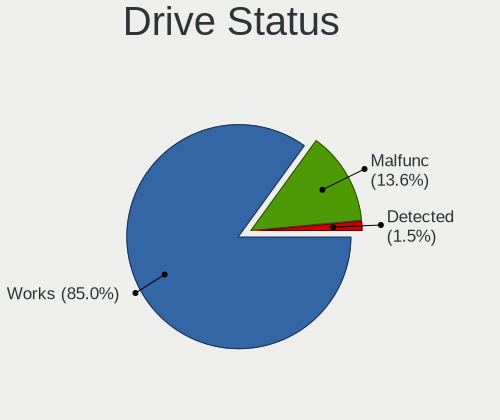
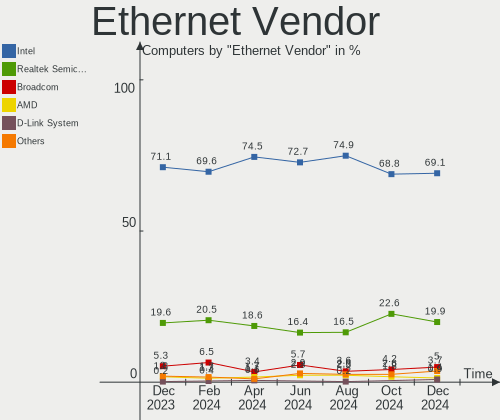
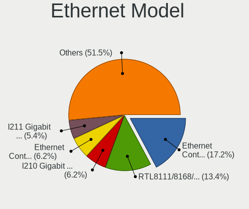
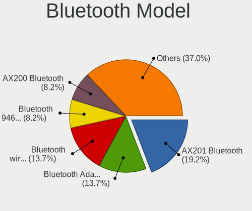
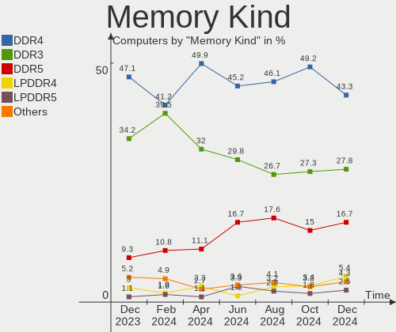

OPNsense Hardware Trends
------------------------

A project to identify most popular hardware characteristics and track their change
over time based on data collected by OPNsense users at https://BSD-Hardware.info.

Anyone can contribute to this report by the [hw-probe](https://github.com/linuxhw/hw-probe/blob/master/INSTALL.BSD.md) tool:

    hw-probe -all -upload

Full-feature report is available here: https://bsd-hardware.info/?view=trends

Period: Jan, 2022.

Contents
--------

* [ System ](#system)
  - [ OS                       ](#os)
  - [ OS Family                ](#os-family)
  - [ Arch                     ](#arch)
  - [ DE                       ](#de)
  - [ Display Server           ](#display-server)
  - [ Display Manager          ](#display-manager)
  - [ OS Lang                  ](#os-lang)
  - [ Boot Mode                ](#boot-mode)
  - [ Filesystem               ](#filesystem)
  - [ Part. scheme             ](#part-scheme)

* [ Board ](#board)
  - [ Vendor                   ](#vendor)
  - [ Model                    ](#model)
  - [ Model Family             ](#model-family)
  - [ MFG Year                 ](#mfg-year)
  - [ Form Factor              ](#form-factor)
  - [ Coreboot                 ](#coreboot)
  - [ RAM Size                 ](#ram-size)
  - [ RAM Used                 ](#ram-used)
  - [ Total Drives             ](#total-drives)
  - [ Has CD-ROM               ](#has-cd-rom)
  - [ Has Ethernet             ](#has-ethernet)
  - [ Has WiFi                 ](#has-wifi)
  - [ Has Bluetooth            ](#has-bluetooth)

* [ Location ](#location)
  - [ Country                  ](#country)
  - [ City                     ](#city)

* [ Drives ](#drives)
  - [ Drive Vendor             ](#drive-vendor)
  - [ Drive Model              ](#drive-model)
  - [ HDD Vendor               ](#hdd-vendor)
  - [ SSD Vendor               ](#ssd-vendor)
  - [ Drive Kind               ](#drive-kind)
  - [ Drive Connector          ](#drive-connector)
  - [ Drive Size               ](#drive-size)
  - [ Space Total              ](#space-total)
  - [ Space Used               ](#space-used)
  - [ Malfunc. Drives          ](#malfunc-drives)
  - [ Malfunc. Drive Vendor    ](#malfunc-drive-vendor)
  - [ Malfunc. HDD Vendor      ](#malfunc-hdd-vendor)
  - [ Malfunc. Drive Kind      ](#malfunc-drive-kind)
  - [ Failed Drives            ](#failed-drives)
  - [ Failed Drive Vendor      ](#failed-drive-vendor)
  - [ Drive Status             ](#drive-status)

* [ Storage controller ](#storage-controller)
  - [ Storage Vendor           ](#storage-vendor)
  - [ Storage Model            ](#storage-model)
  - [ Storage Kind             ](#storage-kind)

* [ Processor ](#processor)
  - [ CPU Vendor               ](#cpu-vendor)
  - [ CPU Model                ](#cpu-model)
  - [ CPU Model Family         ](#cpu-model-family)
  - [ CPU Cores                ](#cpu-cores)
  - [ CPU Sockets              ](#cpu-sockets)
  - [ CPU Threads              ](#cpu-threads)
  - [ CPU Microarch            ](#cpu-microarch)

* [ Graphics ](#graphics)
  - [ GPU Vendor               ](#gpu-vendor)
  - [ GPU Model                ](#gpu-model)
  - [ GPU Combo                ](#gpu-combo)
  - [ GPU Driver               ](#gpu-driver)
  - [ GPU Memory               ](#gpu-memory)

* [ Monitor ](#monitor)
  - [ Monitor Vendor           ](#monitor-vendor)
  - [ Monitor Model            ](#monitor-model)
  - [ Monitor Resolution       ](#monitor-resolution)
  - [ Monitor Diagonal         ](#monitor-diagonal)
  - [ Monitor Width            ](#monitor-width)
  - [ Aspect Ratio             ](#aspect-ratio)
  - [ Monitor Area             ](#monitor-area)
  - [ Pixel Density            ](#pixel-density)
  - [ Multiple Monitors        ](#multiple-monitors)

* [ Network ](#network)
  - [ Net Controller Vendor    ](#net-controller-vendor)
  - [ Net Controller Model     ](#net-controller-model)
  - [ Wireless Vendor          ](#wireless-vendor)
  - [ Wireless Model           ](#wireless-model)
  - [ Ethernet Vendor          ](#ethernet-vendor)
  - [ Ethernet Model           ](#ethernet-model)
  - [ Net Controller Kind      ](#net-controller-kind)
  - [ Used Controller          ](#used-controller)
  - [ NICs                     ](#nics)
  - [ IPv6                     ](#ipv6)

* [ Bluetooth ](#bluetooth)
  - [ Bluetooth Vendor         ](#bluetooth-vendor)
  - [ Bluetooth Model          ](#bluetooth-model)

* [ Sound ](#sound)
  - [ Sound Vendor             ](#sound-vendor)
  - [ Sound Model              ](#sound-model)

* [ Memory ](#memory)
  - [ Memory Vendor            ](#memory-vendor)
  - [ Memory Model             ](#memory-model)
  - [ Memory Kind              ](#memory-kind)
  - [ Memory Form Factor       ](#memory-form-factor)
  - [ Memory Size              ](#memory-size)
  - [ Memory Speed             ](#memory-speed)

* [ Printers & scanners ](#printers--scanners)
  - [ Printer Vendor           ](#printer-vendor)
  - [ Printer Model            ](#printer-model)
  - [ Scanner Vendor           ](#scanner-vendor)
  - [ Scanner Model            ](#scanner-model)

* [ Camera ](#camera)
  - [ Camera Vendor            ](#camera-vendor)
  - [ Camera Model             ](#camera-model)

* [ Security ](#security)
  - [ Fingerprint Vendor       ](#fingerprint-vendor)
  - [ Fingerprint Model        ](#fingerprint-model)
  - [ Chipcard Vendor          ](#chipcard-vendor)
  - [ Chipcard Model           ](#chipcard-model)

* [ Unsupported ](#unsupported)
  - [ Unsupported Devices      ](#unsupported-devices)
  - [ Unsupported Device Types ](#unsupported-device-types)

System
------

OS
--

Installed operating systems

| Name                   | Computers | Percent |
|------------------------|-----------|---------|
| OPNsense 21.7.7        | 180       | 66.42%  |
| OPNsense 22.1          | 75        | 27.68%  |
| OPNsense 21.7.8        | 10        | 3.69%   |
| OPNsense 12.1-p21-HBSD | 2         | 0.74%   |
| OPNsense 21.7.6        | 1         | 0.37%   |
| OPNsense 21.7.3        | 1         | 0.37%   |
| OPNsense 21.1.9        | 1         | 0.37%   |
| OPNsense 21.1.8        | 1         | 0.37%   |

OS Family
---------

OS without a version

| Name     | Computers | Percent |
|----------|-----------|---------|
| OPNsense | 271       | 100%    |

Arch
----

OS architecture (x86_64, i586, etc.)

| Name  | Computers | Percent |
|-------|-----------|---------|
| amd64 | 271       | 100%    |

DE
--

Desktop Environment

| Name    | Computers | Percent |
|---------|-----------|---------|
| Console | 271       | 100%    |

Display Server
--------------

X11 or Wayland

| Name    | Computers | Percent |
|---------|-----------|---------|
| Console | 271       | 100%    |

Display Manager
---------------

SDDM, LightDM, etc.

| Name    | Computers | Percent |
|---------|-----------|---------|
| Console | 271       | 100%    |

OS Lang
-------

Language

| Lang    | Computers | Percent |
|---------|-----------|---------|
| Unknown | 266       | 98.15%  |
| C       | 5         | 1.85%   |

Boot Mode
---------

EFI or BIOS

| Mode | Computers | Percent |
|------|-----------|---------|
| EFI  | 249       | 91.88%  |
| BIOS | 22        | 8.12%   |

Filesystem
----------

Type of filesystem

| Type | Computers | Percent |
|------|-----------|---------|
| Ufs  | 203       | 74.91%  |
| Zfs  | 68        | 25.09%  |

Part. scheme
------------

Scheme of partitioning

| Type    | Computers | Percent |
|---------|-----------|---------|
| GPT     | 255       | 94.1%   |
| MBR     | 14        | 5.17%   |
| Unknown | 2         | 0.74%   |

Board
-----

Vendor
------

Motherboard manufacturer

| Name                | Computers | Percent |
|---------------------|-----------|---------|
| Unknown             | 30        | 11.07%  |
| Hewlett-Packard     | 29        | 10.7%   |
| Dell                | 29        | 10.7%   |
| Supermicro          | 18        | 6.64%   |
| PC Engines          | 17        | 6.27%   |
| ASRock              | 16        | 5.9%    |
| Intel               | 14        | 5.17%   |
| Protectli           | 12        | 4.43%   |
| ASUSTek Computer    | 10        | 3.69%   |
| Gigabyte Technology | 9         | 3.32%   |
| MSI                 | 7         | 2.58%   |
| Lenovo              | 7         | 2.58%   |
| Fujitsu             | 7         | 2.58%   |
| AMI                 | 7         | 2.58%   |
| Sophos              | 6         | 2.21%   |
| ZOTAC               | 5         | 1.85%   |
| Deciso              | 5         | 1.85%   |
| BESSTAR Tech        | 5         | 1.85%   |
| HARDKERNEL          | 4         | 1.48%   |
| Yanling             | 3         | 1.11%   |
| Biostar             | 3         | 1.11%   |
| AWOW                | 3         | 1.11%   |
| Intel CNCTION-IAF   | 2         | 0.74%   |
| CheckPoint          | 2         | 0.74%   |
| XtReAmEr            | 1         | 0.37%   |
| Wistron             | 1         | 0.37%   |
| Winston Marriot     | 1         | 0.37%   |
| Silicom             | 1         | 0.37%   |
| SIEMENS             | 1         | 0.37%   |
| RUNING              | 1         | 0.37%   |
| OEM                 | 1         | 0.37%   |
| NU591               | 1         | 0.37%   |
| MW                  | 1         | 0.37%   |
| Lanner              | 1         | 0.37%   |
| HPE                 | 1         | 0.37%   |
| Foxconn             | 1         | 0.37%   |
| Fanless Mini PC     | 1         | 0.37%   |
| ECS                 | 1         | 0.37%   |
| Cisco               | 1         | 0.37%   |
| AZW                 | 1         | 0.37%   |
| ASRockRack          | 1         | 0.37%   |
| Apple               | 1         | 0.37%   |
| AMD                 | 1         | 0.37%   |
| Acer                | 1         | 0.37%   |
| AAEON               | 1         | 0.37%   |

Model
-----

Motherboard model

| Name                                             | Computers | Percent |
|--------------------------------------------------|-----------|---------|
| Unknown                                          | 32        | 11.81%  |
| PC Engines APU2                                  | 7         | 2.58%   |
| AMI Aptio CRB                                    | 6         | 2.21%   |
| Protectli FW6                                    | 5         | 1.85%   |
| PC Engines apu4                                  | 5         | 1.85%   |
| Supermicro Super Server                          | 4         | 1.48%   |
| Protectli FW4B                                   | 4         | 1.48%   |
| Intel Q3XXG4-P V1.0                              | 4         | 1.48%   |
| HP t730 Thin Client                              | 4         | 1.48%   |
| HP t620 PLUS Quad Core TC                        | 4         | 1.48%   |
| HARDKERNEL ODROID-H2                             | 4         | 1.48%   |
| Dell OptiPlex 9020                               | 4         | 1.48%   |
| Yanling YL-KBR6L                                 | 3         | 1.11%   |
| Sophos SG                                        | 3         | 1.11%   |
| Dell PowerEdge R420                              | 3         | 1.11%   |
| Dell OptiPlex 7010                               | 3         | 1.11%   |
| Deciso Netboard A20                              | 3         | 1.11%   |
| AWOW PC BOX                                      | 3         | 1.11%   |
| ZOTAC ZBOX-CI327NANO-GS-01                       | 2         | 0.74%   |
| Supermicro A1SAi                                 | 2         | 0.74%   |
| Sophos UTM                                       | 2         | 0.74%   |
| Protectli FW1                                    | 2         | 0.74%   |
| PC Engines apu1                                  | 2         | 0.74%   |
| PC Engines APU                                   | 2         | 0.74%   |
| Lenovo ThinkCentre M71e 3134C3U                  | 2         | 0.74%   |
| Intel SKYBAY                                     | 2         | 0.74%   |
| Intel SHARKBAY                                   | 2         | 0.74%   |
| Intel CNCTION-IAF CNCTION-IAF                    | 2         | 0.74%   |
| HP ProLiant MicroServer Gen8                     | 2         | 0.74%   |
| HP ProDesk 600 G3 SFF                            | 2         | 0.74%   |
| HP ProDesk 600 G2 SFF                            | 2         | 0.74%   |
| HP EliteDesk 800 G1 SFF                          | 2         | 0.74%   |
| Dell OptiPlex 790                                | 2         | 0.74%   |
| Dell OptiPlex 7060                               | 2         | 0.74%   |
| Dell OptiPlex 3020                               | 2         | 0.74%   |
| Deciso Netboard A10 V2                           | 2         | 0.74%   |
| BESSTAR Tech GK41                                | 2         | 0.74%   |
| ZOTAC ZBOXNANO-ID67/ID68/ID69                    | 1         | 0.37%   |
| ZOTAC ZBOXNANO-ID63/ID64/ID65                    | 1         | 0.37%   |
| Wistron ProLiant DL120 G6                        | 1         | 0.37%   |
| Winston Marriot PICO PC(R)                       | 1         | 0.37%   |
| Supermicro X9SCI/X9SCA                           | 1         | 0.37%   |
| Supermicro X8SIL                                 | 1         | 0.37%   |
| Supermicro X8DTU-LN4+                            | 1         | 0.37%   |
| Supermicro X10SLL-F                              | 1         | 0.37%   |
| Supermicro X10SLH-F/X10SLM+-F                    | 1         | 0.37%   |
| Supermicro SYS-E200-9B                           | 1         | 0.37%   |
| Supermicro SYS-5019D-FN8TP-1-NC041               | 1         | 0.37%   |
| Supermicro SYS-5019A-12TN4                       | 1         | 0.37%   |
| Supermicro SYS-5018D-FN8T                        | 1         | 0.37%   |
| Supermicro HYVE-ZEUS                             | 1         | 0.37%   |
| Supermicro A2SDi-4C-HLN4F                        | 1         | 0.37%   |
| Supermicro 1HE Intel Single-CPU RI1102A-F Server | 1         | 0.37%   |
| Sophos XG                                        | 1         | 0.37%   |
| Silicom 80300-0134-g01                           | 1         | 0.37%   |
| SIEMENS SIMATIC IPC227E                          | 1         | 0.37%   |
| RUNING B75M INTEL H3V                            | 1         | 0.37%   |
| Protectli VP2410                                 | 1         | 0.37%   |
| PC Engines APU3                                  | 1         | 0.37%   |
| OEM 1.0                                          | 1         | 0.37%   |

Model Family
------------

Motherboard model prefix

| Name                               | Computers | Percent |
|------------------------------------|-----------|---------|
| Unknown                            | 32        | 11.81%  |
| Dell OptiPlex                      | 17        | 6.27%   |
| Dell PowerEdge                     | 8         | 2.95%   |
| PC Engines APU2                    | 7         | 2.58%   |
| HP ProLiant                        | 7         | 2.58%   |
| Lenovo ThinkCentre                 | 6         | 2.21%   |
| HP ProDesk                         | 6         | 2.21%   |
| AMI Aptio                          | 6         | 2.21%   |
| Protectli FW6                      | 5         | 1.85%   |
| PC Engines apu4                    | 5         | 1.85%   |
| Deciso Netboard                    | 5         | 1.85%   |
| Supermicro Super                   | 4         | 1.48%   |
| Protectli FW4B                     | 4         | 1.48%   |
| Intel Q3XXG4-P                     | 4         | 1.48%   |
| HP t730                            | 4         | 1.48%   |
| HP t620                            | 4         | 1.48%   |
| HP EliteDesk                       | 4         | 1.48%   |
| HARDKERNEL ODROID-H2               | 4         | 1.48%   |
| Fujitsu ESPRIMO                    | 4         | 1.48%   |
| Yanling YL-KBR6L                   | 3         | 1.11%   |
| Sophos SG                          | 3         | 1.11%   |
| Fujitsu FUTRO                      | 3         | 1.11%   |
| AWOW PC                            | 3         | 1.11%   |
| ZOTAC ZBOX-CI327NANO-GS-01         | 2         | 0.74%   |
| Supermicro A1SAi                   | 2         | 0.74%   |
| Sophos UTM                         | 2         | 0.74%   |
| Protectli FW1                      | 2         | 0.74%   |
| PC Engines apu1                    | 2         | 0.74%   |
| PC Engines APU                     | 2         | 0.74%   |
| Intel SKYBAY                       | 2         | 0.74%   |
| Intel SHARKBAY                     | 2         | 0.74%   |
| Intel CNCTION-IAF CNCTION-IAF      | 2         | 0.74%   |
| HP Compaq                          | 2         | 0.74%   |
| BESSTAR Tech GK41                  | 2         | 0.74%   |
| ZOTAC ZBOXNANO-ID67                | 1         | 0.37%   |
| ZOTAC ZBOXNANO-ID63                | 1         | 0.37%   |
| Wistron ProLiant                   | 1         | 0.37%   |
| Winston Marriot PICO               | 1         | 0.37%   |
| Supermicro X9SCI                   | 1         | 0.37%   |
| Supermicro X8SIL                   | 1         | 0.37%   |
| Supermicro X8DTU-LN4+              | 1         | 0.37%   |
| Supermicro X10SLL-F                | 1         | 0.37%   |
| Supermicro X10SLH-F                | 1         | 0.37%   |
| Supermicro SYS-E200-9B             | 1         | 0.37%   |
| Supermicro SYS-5019D-FN8TP-1-NC041 | 1         | 0.37%   |
| Supermicro SYS-5019A-12TN4         | 1         | 0.37%   |
| Supermicro SYS-5018D-FN8T          | 1         | 0.37%   |
| Supermicro HYVE-ZEUS               | 1         | 0.37%   |
| Supermicro A2SDi-4C-HLN4F          | 1         | 0.37%   |
| Supermicro 1HE                     | 1         | 0.37%   |
| Sophos XG                          | 1         | 0.37%   |
| Silicom 80300-0134-g01             | 1         | 0.37%   |
| SIEMENS SIMATIC                    | 1         | 0.37%   |
| RUNING B75M                        | 1         | 0.37%   |
| Protectli VP2410                   | 1         | 0.37%   |
| PC Engines APU3                    | 1         | 0.37%   |
| OEM 1.0                            | 1         | 0.37%   |
| NU591 1.0                          | 1         | 0.37%   |
| MW GMLK-2                          | 1         | 0.37%   |
| MSI MS-S0891                       | 1         | 0.37%   |

MFG Year
--------

Motherboard manufacture year

| Year | Computers | Percent |
|------|-----------|---------|
| 2018 | 45        | 16.61%  |
| 2020 | 28        | 10.33%  |
| 2021 | 26        | 9.59%   |
| 2014 | 26        | 9.59%   |
| 2016 | 24        | 8.86%   |
| 2019 | 23        | 8.49%   |
| 2017 | 22        | 8.12%   |
| 2015 | 22        | 8.12%   |
| 2013 | 16        | 5.9%    |
| 2012 | 15        | 5.54%   |
| 2011 | 9         | 3.32%   |
| 2010 | 9         | 3.32%   |
| 2009 | 5         | 1.85%   |
| 2007 | 1         | 0.37%   |

Form Factor
-----------

Physical design of the computer

| Name     | Computers | Percent |
|----------|-----------|---------|
| Desktop  | 204       | 75.28%  |
| Mini pc  | 26        | 9.59%   |
| Server   | 24        | 8.86%   |
| Firewall | 9         | 3.32%   |
| Notebook | 8         | 2.95%   |

Coreboot
--------

Have coreboot on board

| Used | Computers | Percent |
|------|-----------|---------|
| No   | 249       | 91.88%  |
| Yes  | 22        | 8.12%   |

RAM Size
--------

Total RAM memory

| Size in GB  | Computers | Percent |
|-------------|-----------|---------|
| 8.01-16.0   | 110       | 40.59%  |
| 4.01-8.0    | 69        | 25.46%  |
| 16.01-24.0  | 53        | 19.56%  |
| 32.01-64.0  | 16        | 5.9%    |
| 2.01-3.0    | 9         | 3.32%   |
| 64.01-256.0 | 8         | 2.95%   |
| 24.01-32.0  | 3         | 1.11%   |
| 3.01-4.0    | 2         | 0.74%   |
| 1.01-2.0    | 1         | 0.37%   |

RAM Used
--------

Used RAM memory

| Used GB    | Computers | Percent |
|------------|-----------|---------|
| 0.01-0.5   | 147       | 54.24%  |
| 0.51-1.0   | 81        | 29.89%  |
| 1.01-2.0   | 23        | 8.49%   |
| 4.01-8.0   | 7         | 2.58%   |
| 2.01-3.0   | 7         | 2.58%   |
| 3.01-4.0   | 2         | 0.74%   |
| 16.01-24.0 | 2         | 0.74%   |
| 8.01-16.0  | 2         | 0.74%   |

Total Drives
------------

Number of drives on board

| Drives | Computers | Percent |
|--------|-----------|---------|
| 1      | 221       | 81.55%  |
| 0      | 26        | 9.59%   |
| 2      | 21        | 7.75%   |
| 5      | 1         | 0.37%   |
| 4      | 1         | 0.37%   |
| 3      | 1         | 0.37%   |

Has CD-ROM
----------

Has CD-ROM on board

| Presented | Computers | Percent |
|-----------|-----------|---------|
| No        | 232       | 85.61%  |
| Yes       | 39        | 14.39%  |

Has Ethernet
------------

Has Ethernet on board

| Presented | Computers | Percent |
|-----------|-----------|---------|
| Yes       | 271       | 100%    |

Has WiFi
--------

Has WiFi module

| Presented | Computers | Percent |
|-----------|-----------|---------|
| No        | 225       | 83.03%  |
| Yes       | 46        | 16.97%  |

Has Bluetooth
-------------

Has Bluetooth module

| Presented | Computers | Percent |
|-----------|-----------|---------|
| No        | 249       | 91.88%  |
| Yes       | 22        | 8.12%   |

Location
--------

Country
-------

Geographic location (country)

| Country            | Computers | Percent |
|--------------------|-----------|---------|
| USA                | 82        | 30.26%  |
| Germany            | 55        | 20.3%   |
| France             | 14        | 5.17%   |
| UK                 | 13        | 4.8%    |
| Australia          | 11        | 4.06%   |
| Austria            | 9         | 3.32%   |
| Netherlands        | 8         | 2.95%   |
| Canada             | 8         | 2.95%   |
| Switzerland        | 7         | 2.58%   |
| Spain              | 6         | 2.21%   |
| Poland             | 5         | 1.85%   |
| Italy              | 5         | 1.85%   |
| Belgium            | 5         | 1.85%   |
| Sweden             | 3         | 1.11%   |
| South Africa       | 3         | 1.11%   |
| Russia             | 3         | 1.11%   |
| Brazil             | 3         | 1.11%   |
| Portugal           | 2         | 0.74%   |
| Japan              | 2         | 0.74%   |
| Israel             | 2         | 0.74%   |
| Indonesia          | 2         | 0.74%   |
| Greece             | 2         | 0.74%   |
| Finland            | 2         | 0.74%   |
| Czechia            | 2         | 0.74%   |
| Argentina          | 2         | 0.74%   |
| Ukraine            | 1         | 0.37%   |
| Singapore          | 1         | 0.37%   |
| Romania            | 1         | 0.37%   |
| Peru               | 1         | 0.37%   |
| Nigeria            | 1         | 0.37%   |
| New Zealand        | 1         | 0.37%   |
| Moldova            | 1         | 0.37%   |
| Mexico             | 1         | 0.37%   |
| Madagascar         | 1         | 0.37%   |
| Hungary            | 1         | 0.37%   |
| Dominican Republic | 1         | 0.37%   |
| Cuba               | 1         | 0.37%   |
| China              | 1         | 0.37%   |
| Bulgaria           | 1         | 0.37%   |
| Bahamas            | 1         | 0.37%   |

City
----

Geographic location (city)

| City         | Computers | Percent |
|--------------|-----------|---------|
| Vienna       | 4         | 1.48%   |
| Paris        | 4         | 1.48%   |
| Dresden      | 4         | 1.48%   |
| Berlin       | 4         | 1.48%   |
| Sydney       | 3         | 1.11%   |
| Seattle      | 3         | 1.11%   |
| New York     | 3         | 1.11%   |
| Cologne      | 3         | 1.11%   |
| Brisbane     | 3         | 1.11%   |
| Athens       | 3         | 1.11%   |
| Winnipeg     | 2         | 0.74%   |
| Watertown    | 2         | 0.74%   |
| Wadsworth    | 2         | 0.74%   |
| Tel Aviv     | 2         | 0.74%   |
| Plainsboro   | 2         | 0.74%   |
| Perth        | 2         | 0.74%   |
| Munich       | 2         | 0.74%   |
| Madrid       | 2         | 0.74%   |
| Madison      | 2         | 0.74%   |
| Karlsruhe    | 2         | 0.74%   |
| Johannesburg | 2         | 0.74%   |
| Jakarta      | 2         | 0.74%   |
| Helsinki     | 2         | 0.74%   |
| Hamburg      | 2         | 0.74%   |
| Gdansk       | 2         | 0.74%   |
| Exeter       | 2         | 0.74%   |
| Denver       | 2         | 0.74%   |
| Dallas       | 2         | 0.74%   |
| College Park | 2         | 0.74%   |
| Chicago      | 2         | 0.74%   |
| Amsterdam    | 2         | 0.74%   |
| Zwettl Stadt | 1         | 0.37%   |
| Zurich       | 1         | 0.37%   |
| Zaandam      | 1         | 0.37%   |
| Windsor Mill | 1         | 0.37%   |
| Wiesbaden    | 1         | 0.37%   |
| Whitewater   | 1         | 0.37%   |
| Werl         | 1         | 0.37%   |
| Wenatchee    | 1         | 0.37%   |
| Wedemark     | 1         | 0.37%   |
| Warsaw       | 1         | 0.37%   |
| Vigo         | 1         | 0.37%   |
| Venice       | 1         | 0.37%   |
| Valencia     | 1         | 0.37%   |
| Uster        | 1         | 0.37%   |
| Urbandale    | 1         | 0.37%   |
| Ulm          | 1         | 0.37%   |
| Trenton      | 1         | 0.37%   |
| Toronto      | 1         | 0.37%   |
| Tomsk        | 1         | 0.37%   |
| Todtnau      | 1         | 0.37%   |
| Temecula     | 1         | 0.37%   |
| Telford      | 1         | 0.37%   |
| Tahara       | 1         | 0.37%   |
| Stockerau    | 1         | 0.37%   |
| Stockbridge  | 1         | 0.37%   |
| Statesboro   | 1         | 0.37%   |
| Stafford     | 1         | 0.37%   |
| Spotsylvania | 1         | 0.37%   |
| Solleftea    | 1         | 0.37%   |

Drives
------

Drive Vendor
------------

Hard drive vendors

| Vendor              | Computers | Drives | Percent |
|---------------------|-----------|--------|---------|
| Samsung Electronics | 34        | 43     | 13.13%  |
| Transcend           | 23        | 23     | 8.88%   |
| Kingston            | 22        | 22     | 8.49%   |
| WDC                 | 21        | 21     | 8.11%   |
| Crucial             | 16        | 17     | 6.18%   |
| Seagate             | 13        | 15     | 5.02%   |
| SanDisk             | 13        | 13     | 5.02%   |
| Phison              | 11        | 11     | 4.25%   |
| Hoodisk             | 10        | 10     | 3.86%   |
| Intel               | 9         | 9      | 3.47%   |
| A-DATA Technology   | 7         | 8      | 2.7%    |
| Hewlett-Packard     | 6         | 7      | 2.32%   |
| Corsair             | 6         | 6      | 2.32%   |
| SPCC                | 5         | 5      | 1.93%   |
| China               | 5         | 5      | 1.93%   |
| Toshiba             | 4         | 4      | 1.54%   |
| OCZ                 | 4         | 4      | 1.54%   |
| FORESEE             | 4         | 4      | 1.54%   |
| Micron Technology   | 3         | 3      | 1.16%   |
| LITEON              | 3         | 3      | 1.16%   |
| Intenso             | 3         | 3      | 1.16%   |
| Innodisk            | 3         | 3      | 1.16%   |
| Hitachi             | 3         | 3      | 1.16%   |
| Dogfish             | 3         | 3      | 1.16%   |
| BIWIN               | 3         | 3      | 1.16%   |
| Apacer              | 3         | 3      | 1.16%   |
| SK Hynix            | 2         | 2      | 0.77%   |
| Protectli           | 2         | 2      | 0.77%   |
| Mushkin             | 2         | 2      | 0.77%   |
| LITEONIT            | 2         | 2      | 0.77%   |
| HGST                | 2         | 5      | 0.77%   |
| Gigabyte Technology | 2         | 2      | 0.77%   |
| Zheino              | 1         | 1      | 0.39%   |
| XUNZHE              | 1         | 1      | 0.39%   |
| XrayDisk            | 1         | 1      | 0.39%   |
| VisionTek           | 1         | 1      | 0.39%   |
| TCSUNBOW            | 1         | 1      | 0.39%   |
| Patriot             | 1         | 1      | 0.39%   |
| Leven               | 1         | 1      | 0.39%   |
| KIOXIA-EXCERIA      | 1         | 1      | 0.39%   |
| FLEXXON             | 1         | 1      | 0.39%   |
| faspeed             | 1         | 1      | 0.39%   |

Drive Model
-----------

Hard drive models

| Model                                | Computers | Percent |
|--------------------------------------|-----------|---------|
| Phison SATA SSD 16GB                 | 7         | 2.68%   |
| Kingston SA400S37120G 120GB          | 7         | 2.68%   |
| Transcend TS64GMSA230S 64GB          | 4         | 1.53%   |
| Transcend TS128GMSA230S 128GB        | 4         | 1.53%   |
| Samsung SSD 860 PRO 256GB            | 4         | 1.53%   |
| HP RAID 1(1+0) 2TB                   | 4         | 1.53%   |
| Crucial CT120BX500SSD1 120GB         | 4         | 1.53%   |
| Transcend TS256GMTS952T2 256GB       | 3         | 1.15%   |
| Samsung SSD 840 EVO 250GB            | 3         | 1.15%   |
| Phison SATA SSD 32GB                 | 3         | 1.15%   |
| Hoodisk SSD 128GB                    | 3         | 1.15%   |
| FORESEE 128GB SSD                    | 3         | 1.15%   |
| Crucial CT250MX500SSD1 250GB         | 3         | 1.15%   |
| WDC WDS120G2G0A-00JH30 120GB         | 2         | 0.77%   |
| WDC WD5000AAKX-75U6AA0 500GB         | 2         | 0.77%   |
| WDC WD2500AAKX-083CA1 250GB          | 2         | 0.77%   |
| SPCC Solid State Disk 128GB          | 2         | 0.77%   |
| SPCC Solid State Disk 120GB          | 2         | 0.77%   |
| Seagate ST500DM002-1BD142 500GB      | 2         | 0.77%   |
| Seagate ST3160815AS 160GB            | 2         | 0.77%   |
| SanDisk SDSSDA240G 240GB             | 2         | 0.77%   |
| SanDisk SD8SBAT128G1122 128GB        | 2         | 0.77%   |
| Samsung SSD 860 EVO 250GB            | 2         | 0.77%   |
| Protectli 120GB mSATA                | 2         | 0.77%   |
| Kingston SUV500MS240G 240GB          | 2         | 0.77%   |
| Kingston SA400M8240G 240GB           | 2         | 0.77%   |
| Hoodisk SSD 64GB                     | 2         | 0.77%   |
| Hoodisk SSD 32GB                     | 2         | 0.77%   |
| Gigabyte GP-GSTFS31120GNTD 120GB     | 2         | 0.77%   |
| Dogfish SSD 128GB                    | 2         | 0.77%   |
| Corsair Force LS SSD 64GB            | 2         | 0.77%   |
| A-DATA SU630 240GB                   | 2         | 0.77%   |
| Zheino CHN-mSATAM1-32 32GB           | 1         | 0.38%   |
| XUNZHE MSATA 64GB                    | 1         | 0.38%   |
| XrayDisk SSD 64GB                    | 1         | 0.38%   |
| WDC WDS250G2B0C-00PXH0 250GB         | 1         | 0.38%   |
| WDC WDS250G2B0A-00SM50 250GB         | 1         | 0.38%   |
| WDC WDS100T2B0A-00SM50 1TB           | 1         | 0.38%   |
| WDC WD800JD-75MSA3 80GB              | 1         | 0.38%   |
| WDC WD5003ABYX-18WERA0 500GB         | 1         | 0.38%   |
| WDC WD5000LPVT-80G33T2 500GB         | 1         | 0.38%   |
| WDC WD5000AZLX-60K2TA0 500GB         | 1         | 0.38%   |
| WDC WD3200BPVT-22JJ5T0 320GB         | 1         | 0.38%   |
| WDC WD2500AAJS-75M0A0 250GB          | 1         | 0.38%   |
| WDC WD2500AAJS-07M0A0 250GB          | 1         | 0.38%   |
| WDC WD1600BEVT-22ZCT0 160GB          | 1         | 0.38%   |
| WDC WD1600BEVS-08VAT1 160GB          | 1         | 0.38%   |
| WDC WD1600BEKT-00PVMT0 160GB         | 1         | 0.38%   |
| WDC WD1600AVJS-63WNA0 160GB          | 1         | 0.38%   |
| WDC PC SN530 SDBPNPZ-256G-1006 256GB | 1         | 0.38%   |
| VisionTek mSATA 120GB                | 1         | 0.38%   |
| Transcend TS64GMTS400S 64GB          | 1         | 0.38%   |
| Transcend TS64GMSA370 64GB           | 1         | 0.38%   |
| Transcend TS64GMSA340 64GB           | 1         | 0.38%   |
| Transcend TS32GMSA370 32GB           | 1         | 0.38%   |
| Transcend TS256GMSA452T2 256GB       | 1         | 0.38%   |
| Transcend TS256GMSA370 256GB         | 1         | 0.38%   |
| Transcend TS256GMSA230S 256GB        | 1         | 0.38%   |
| Transcend TS16GMSA370S 16GB          | 1         | 0.38%   |
| Transcend TS128GSSD420K 128GB        | 1         | 0.38%   |

HDD Vendor
----------

Hard disk drive vendors

| Vendor              | Computers | Drives | Percent |
|---------------------|-----------|--------|---------|
| WDC                 | 15        | 15     | 37.5%   |
| Seagate             | 11        | 11     | 27.5%   |
| Hewlett-Packard     | 5         | 6      | 12.5%   |
| Toshiba             | 3         | 3      | 7.5%    |
| Hitachi             | 3         | 3      | 7.5%    |
| HGST                | 2         | 5      | 5%      |
| Samsung Electronics | 1         | 1      | 2.5%    |

SSD Vendor
----------

Solid state drive vendors

| Vendor              | Computers | Drives | Percent |
|---------------------|-----------|--------|---------|
| Samsung Electronics | 25        | 30     | 12.32%  |
| Transcend           | 23        | 23     | 11.33%  |
| Kingston            | 21        | 21     | 10.34%  |
| Crucial             | 16        | 17     | 7.88%   |
| SanDisk             | 13        | 13     | 6.4%    |
| Phison              | 11        | 11     | 5.42%   |
| Hoodisk             | 10        | 10     | 4.93%   |
| Intel               | 9         | 9      | 4.43%   |
| Corsair             | 6         | 6      | 2.96%   |
| SPCC                | 5         | 5      | 2.46%   |
| China               | 5         | 5      | 2.46%   |
| A-DATA Technology   | 5         | 6      | 2.46%   |
| WDC                 | 4         | 4      | 1.97%   |
| OCZ                 | 4         | 4      | 1.97%   |
| FORESEE             | 4         | 4      | 1.97%   |
| Micron Technology   | 3         | 3      | 1.48%   |
| Intenso             | 3         | 3      | 1.48%   |
| Innodisk            | 3         | 3      | 1.48%   |
| Dogfish             | 3         | 3      | 1.48%   |
| BIWIN               | 3         | 3      | 1.48%   |
| Apacer              | 3         | 3      | 1.48%   |
| Seagate             | 2         | 4      | 0.99%   |
| Protectli           | 2         | 2      | 0.99%   |
| Mushkin             | 2         | 2      | 0.99%   |
| LITEONIT            | 2         | 2      | 0.99%   |
| LITEON              | 2         | 2      | 0.99%   |
| Gigabyte Technology | 2         | 2      | 0.99%   |
| Zheino              | 1         | 1      | 0.49%   |
| XUNZHE              | 1         | 1      | 0.49%   |
| XrayDisk            | 1         | 1      | 0.49%   |
| VisionTek           | 1         | 1      | 0.49%   |
| Toshiba             | 1         | 1      | 0.49%   |
| TCSUNBOW            | 1         | 1      | 0.49%   |
| Patriot             | 1         | 1      | 0.49%   |
| Leven               | 1         | 1      | 0.49%   |
| KIOXIA-EXCERIA      | 1         | 1      | 0.49%   |
| Hewlett-Packard     | 1         | 1      | 0.49%   |
| FLEXXON             | 1         | 1      | 0.49%   |
| faspeed             | 1         | 1      | 0.49%   |

Drive Kind
----------

HDD or SSD

| Kind | Computers | Drives | Percent |
|------|-----------|--------|---------|
| SSD  | 198       | 212    | 77.95%  |
| HDD  | 40        | 44     | 15.75%  |
| NVMe | 16        | 20     | 6.3%    |

Drive Connector
---------------

SATA, SAS, NVMe, etc.

| Type | Computers | Drives | Percent |
|------|-----------|--------|---------|
| SATA | 232       | 256    | 93.55%  |
| NVMe | 16        | 20     | 6.45%   |

Drive Size
----------

Size of hard drive

| Size in TB | Computers | Drives | Percent |
|------------|-----------|--------|---------|
| 0.01-0.5   | 211       | 226    | 89.41%  |
| 0.51-1.0   | 18        | 20     | 7.63%   |
| 1.01-2.0   | 6         | 6      | 2.54%   |
| 4.01-10.0  | 1         | 4      | 0.42%   |

Space Total
-----------

Amount of disk space available on the file system

| Size in GB     | Computers | Percent |
|----------------|-----------|---------|
| 101-250        | 139       | 51.29%  |
| 51-100         | 38        | 14.02%  |
| 21-50          | 34        | 12.55%  |
| 251-500        | 28        | 10.33%  |
| 1-20           | 18        | 6.64%   |
| 501-1000       | 10        | 3.69%   |
| 1001-2000      | 3         | 1.11%   |
| More than 3000 | 1         | 0.37%   |

Space Used
----------

Amount of used disk space

| Used GB | Computers | Percent |
|---------|-----------|---------|
| 1-20    | 263       | 97.05%  |
| 21-50   | 7         | 2.58%   |
| 51-100  | 1         | 0.37%   |

Malfunc. Drives
---------------

Drive models with a malfunction

| Model                                 | Computers | Drives | Percent |
|---------------------------------------|-----------|--------|---------|
| WDC WD1600BEVS-08VAT1 160GB           | 1         | 1      | 4.17%   |
| VisionTek mSATA 120GB                 | 1         | 1      | 4.17%   |
| Toshiba DT01ACA050 500GB              | 1         | 1      | 4.17%   |
| SPCC Solid State Disk 128GB           | 1         | 1      | 4.17%   |
| Seagate ST500LM000-SSHD-8GB           | 1         | 1      | 4.17%   |
| Seagate ST3500410AS 500GB             | 1         | 1      | 4.17%   |
| Seagate ST3160815AS 160GB             | 1         | 1      | 4.17%   |
| Seagate ST3160318AS 160GB             | 1         | 1      | 4.17%   |
| SanDisk SDSSDA240G 240GB              | 1         | 1      | 4.17%   |
| SanDisk SD8TB8U-256G-1006 256GB       | 1         | 1      | 4.17%   |
| Samsung Electronics SSD 960 PRO 512GB | 1         | 1      | 4.17%   |
| Samsung Electronics SSD 850 EVO 1TB   | 1         | 1      | 4.17%   |
| Phison SATA SSD 32GB                  | 1         | 1      | 4.17%   |
| OCZ VERTEX 32GB                       | 1         | 1      | 4.17%   |
| LITEON CV8-8E128-HP 128GB             | 1         | 1      | 4.17%   |
| Kingston SHPM2280P2-240G              | 1         | 1      | 4.17%   |
| Kingston RBU-SNS8350DES3128GP 128GB   | 1         | 1      | 4.17%   |
| Intel SSDSC2BW120A3 120GB             | 1         | 1      | 4.17%   |
| HGST HTS541010A9E680 1TB              | 1         | 1      | 4.17%   |
| Crucial CT525MX300SSD1 528GB          | 1         | 1      | 4.17%   |
| Crucial CT275MX300SSD4 275GB          | 1         | 1      | 4.17%   |
| Corsair Force LS SSD 64GB             | 1         | 1      | 4.17%   |
| BIWIN SSD 128GB                       | 1         | 1      | 4.17%   |
| Apacer 16GB SATA Flash Drive          | 1         | 1      | 4.17%   |

Malfunc. Drive Vendor
---------------------

Vendors of faulty drives

| Vendor              | Computers | Drives | Percent |
|---------------------|-----------|--------|---------|
| Seagate             | 4         | 4      | 16.67%  |
| SanDisk             | 2         | 2      | 8.33%   |
| Samsung Electronics | 2         | 2      | 8.33%   |
| Kingston            | 2         | 2      | 8.33%   |
| Crucial             | 2         | 2      | 8.33%   |
| WDC                 | 1         | 1      | 4.17%   |
| VisionTek           | 1         | 1      | 4.17%   |
| Toshiba             | 1         | 1      | 4.17%   |
| SPCC                | 1         | 1      | 4.17%   |
| Phison              | 1         | 1      | 4.17%   |
| OCZ                 | 1         | 1      | 4.17%   |
| LITEON              | 1         | 1      | 4.17%   |
| Intel               | 1         | 1      | 4.17%   |
| HGST                | 1         | 1      | 4.17%   |
| Corsair             | 1         | 1      | 4.17%   |
| BIWIN               | 1         | 1      | 4.17%   |
| Apacer              | 1         | 1      | 4.17%   |

Malfunc. HDD Vendor
-------------------

Vendors of faulty HDD drives

| Vendor  | Computers | Drives | Percent |
|---------|-----------|--------|---------|
| Seagate | 4         | 4      | 57.14%  |
| WDC     | 1         | 1      | 14.29%  |
| Toshiba | 1         | 1      | 14.29%  |
| HGST    | 1         | 1      | 14.29%  |

Malfunc. Drive Kind
-------------------

Kinds of faulty drives

| Kind | Computers | Drives | Percent |
|------|-----------|--------|---------|
| SSD  | 16        | 16     | 66.67%  |
| HDD  | 7         | 7      | 29.17%  |
| NVMe | 1         | 1      | 4.17%   |

Failed Drives
-------------

Failed drive models

Zero info for selected period =(

Failed Drive Vendor
-------------------

Failed drive vendors

Zero info for selected period =(

Drive Status
------------

Number of failed and malfunc. drives

| Status   | Computers | Drives | Percent |
|----------|-----------|--------|---------|
| Works    | 220       | 243    | 87.3%   |
| Malfunc  | 24        | 24     | 9.52%   |
| Detected | 8         | 9      | 3.17%   |

Storage controller
------------------

Storage Vendor
--------------

Storage controller vendors

| Vendor                      | Computers | Percent |
|-----------------------------|-----------|---------|
| Intel                       | 221       | 72.7%   |
| AMD                         | 48        | 15.79%  |
| Samsung Electronics         | 8         | 2.63%   |
| Broadcom / LSI              | 6         | 1.97%   |
| Hewlett-Packard             | 5         | 1.64%   |
| ASMedia Technology          | 4         | 1.32%   |
| SK Hynix                    | 2         | 0.66%   |
| Sandisk                     | 2         | 0.66%   |
| Kingston Technology Company | 2         | 0.66%   |
| Realtek Semiconductor       | 1         | 0.33%   |
| Marvell Technology Group    | 1         | 0.33%   |
| Lite-On Technology          | 1         | 0.33%   |
| JMicron Technology          | 1         | 0.33%   |
| Chelsio Communications      | 1         | 0.33%   |
| ADATA Technology            | 1         | 0.33%   |

Storage Model
-------------

Storage controller models

| Model                                                                                   | Computers | Percent |
|-----------------------------------------------------------------------------------------|-----------|---------|
| AMD FCH SATA Controller [AHCI mode]                                                     | 33        | 9.51%   |
| Intel 8 Series/C220 Series Chipset Family 6-port SATA Controller 1 [AHCI mode]          | 28        | 8.07%   |
| Intel Celeron/Pentium Silver Processor SATA Controller                                  | 19        | 5.48%   |
| Intel Atom/Celeron/Pentium Processor x5-E8000/J3xxx/N3xxx Series SATA Controller        | 18        | 5.19%   |
| Intel Atom Processor E3800 Series SATA AHCI Controller                                  | 15        | 4.32%   |
| Intel Sunrise Point-LP SATA Controller [AHCI mode]                                      | 13        | 3.75%   |
| Intel 6 Series/C200 Series Chipset Family 6 port Desktop SATA AHCI Controller           | 11        | 3.17%   |
| Intel Celeron N3350/Pentium N4200/Atom E3900 Series SATA AHCI Controller                | 10        | 2.88%   |
| Intel Q170/Q150/B150/H170/H110/Z170/CM236 Chipset SATA Controller [AHCI Mode]           | 9         | 2.59%   |
| Intel 7 Series/C210 Series Chipset Family 6-port SATA Controller [AHCI mode]            | 9         | 2.59%   |
| Intel NM10/ICH7 Family SATA Controller [IDE mode]                                       | 7         | 2.02%   |
| AMD FCH SATA Controller [IDE mode]                                                      | 7         | 2.02%   |
| AMD SB7x0/SB8x0/SB9x0 SATA Controller [AHCI mode]                                       | 6         | 1.73%   |
| Intel Cannon Lake PCH SATA AHCI Controller                                              | 5         | 1.44%   |
| Intel Atom processor C2000 AHCI SATA3 Controller                                        | 5         | 1.44%   |
| Intel 82801G (ICH7 Family) IDE Controller                                               | 5         | 1.44%   |
| AMD FCH IDE Controller                                                                  | 5         | 1.44%   |
| Intel SATA Controller [RAID mode]                                                       | 4         | 1.15%   |
| Intel C600/X79 series chipset 6-Port SATA AHCI Controller                               | 4         | 1.15%   |
| Intel Atom Processor C3000 Series SATA Controller 1                                     | 4         | 1.15%   |
| Intel Atom Processor C3000 Series SATA Controller 0                                     | 4         | 1.15%   |
| Intel Atom processor C2000 AHCI SATA2 Controller                                        | 4         | 1.15%   |
| Intel 8 Series SATA Controller 1 [AHCI mode]                                            | 4         | 1.15%   |
| Intel 200 Series PCH SATA controller [AHCI mode]                                        | 4         | 1.15%   |
| HP Smart Array G6 controllers                                                           | 4         | 1.15%   |
| ASMedia ASM1062 Serial ATA Controller                                                   | 4         | 1.15%   |
| Samsung NVMe SSD Controller SM981/PM981/PM983                                           | 3         | 0.86%   |
| Samsung NVMe SSD Controller PM9A1/PM9A3/980PRO                                          | 3         | 0.86%   |
| Intel Wildcat Point-LP SATA Controller [AHCI Mode]                                      | 3         | 0.86%   |
| Intel NM10/ICH7 Family SATA Controller [AHCI mode]                                      | 3         | 0.86%   |
| Intel Cannon Point-LP SATA Controller [AHCI Mode]                                       | 3         | 0.86%   |
| Intel 82801JI (ICH10 Family) 4 port SATA IDE Controller #1                              | 3         | 0.86%   |
| Intel 82801HM/HEM (ICH8M/ICH8M-E) IDE Controller                                        | 3         | 0.86%   |
| Intel 7 Series Chipset Family 6-port SATA Controller [AHCI mode]                        | 3         | 0.86%   |
| Intel 6 Series/C200 Series Chipset Family Desktop SATA Controller (IDE mode, ports 4-5) | 3         | 0.86%   |
| Intel 6 Series/C200 Series Chipset Family Desktop SATA Controller (IDE mode, ports 0-3) | 3         | 0.86%   |
| Intel 5 Series/3400 Series Chipset 6 port SATA AHCI Controller                          | 3         | 0.86%   |
| Intel 4 Series Chipset PT IDER Controller                                               | 3         | 0.86%   |
| Samsung NVMe SSD Controller SM961/PM961/SM963                                           | 2         | 0.58%   |
| Intel C620 Series Chipset Family SSATA Controller [AHCI mode]                           | 2         | 0.58%   |
| Intel C610/X99 series chipset sSATA Controller [AHCI mode]                              | 2         | 0.58%   |
| Intel C610/X99 series chipset 6-Port SATA Controller [AHCI mode]                        | 2         | 0.58%   |
| Intel C602 chipset 4-Port SATA Storage Control Unit                                     | 2         | 0.58%   |
| Intel 9 Series Chipset Family SATA Controller [AHCI Mode]                               | 2         | 0.58%   |
| Intel 82801JI (ICH10 Family) 2 port SATA IDE Controller #2                              | 2         | 0.58%   |
| Intel 82801JD/DO (ICH10 Family) SATA AHCI Controller                                    | 2         | 0.58%   |
| Intel 82801IB (ICH9) 2 port SATA Controller [IDE mode]                                  | 2         | 0.58%   |
| Intel 82801HM/HEM (ICH8M/ICH8M-E) SATA Controller [AHCI mode]                           | 2         | 0.58%   |
| Intel 7 Series/C210 Series Chipset Family 4-port SATA Controller [IDE mode]             | 2         | 0.58%   |
| Intel 7 Series/C210 Series Chipset Family 2-port SATA Controller [IDE mode]             | 2         | 0.58%   |
| Intel 400 Series Chipset Family SATA AHCI Controller                                    | 2         | 0.58%   |
| Broadcom / LSI MegaRAID SAS 2008 [Falcon]                                               | 2         | 0.58%   |
| AMD SB7x0/SB8x0/SB9x0 IDE Controller                                                    | 2         | 0.58%   |
| Unknown                                                                                 | 2         | 0.58%   |
| SK Hynix Gold P31 SSD                                                                   | 1         | 0.29%   |
| SK Hynix BC501 NVMe Solid State Drive                                                   | 1         | 0.29%   |
| Sandisk WD Blue SN550 NVMe SSD                                                          | 1         | 0.29%   |
| Sandisk unknown                                                                         | 1         | 0.29%   |
| Marvell Group 88SE9230 PCIe 2.0 x2 4-port SATA 6 Gb/s RAID Controller                   | 1         | 0.29%   |
| Kingston Company KC2000 NVMe SSD                                                        | 1         | 0.29%   |

Storage Kind
------------

Kind of storage controller (IDE, SATA, NVMe, SAS, ...)

| Kind | Computers | Percent |
|------|-----------|---------|
| SATA | 233       | 75.16%  |
| IDE  | 40        | 12.9%   |
| RAID | 17        | 5.48%   |
| NVMe | 16        | 5.16%   |
| SAS  | 3         | 0.97%   |
| SCSI | 1         | 0.32%   |

Processor
---------

CPU Vendor
----------

Processor vendors

| Vendor | Computers | Percent |
|--------|-----------|---------|
| Intel  | 223       | 82.29%  |
| AMD    | 48        | 17.71%  |

CPU Model
---------

Processor models

| Model                                    | Computers | Percent |
|------------------------------------------|-----------|---------|
| AMD GX-412TC SOC                         | 13        | 4.8%    |
| Intel Celeron J4125 CPU @ 2.00GHz        | 12        | 4.43%   |
| Intel Celeron CPU J1900 @ 1.99GHz        | 9         | 3.32%   |
| Intel Core i5-4570 CPU @ 3.20GHz         | 8         | 2.95%   |
| Intel Celeron CPU J3160 @ 1.60GHz        | 8         | 2.95%   |
| Intel Atom CPU E3845 @ 1.91GHz           | 5         | 1.85%   |
| Intel Core i5-8250U CPU @ 1.60GHz        | 4         | 1.48%   |
| Intel Core i5-6500 CPU @ 3.20GHz         | 4         | 1.48%   |
| Intel Celeron CPU J3455 @ 1.50GHz        | 4         | 1.48%   |
| Intel Atom CPU C3558 @ 2.20GHz           | 4         | 1.48%   |
| AMD RX-427BB with AMD Radeon R7 Graphics | 4         | 1.48%   |
| AMD GX-420CA SOC with Radeon HD Graphics | 4         | 1.48%   |
| AMD G-T40E Processor                     | 4         | 1.48%   |
| Intel Pentium CPU N3700 @ 1.60GHz        | 3         | 1.11%   |
| Intel Pentium CPU G3420 @ 3.20GHz        | 3         | 1.11%   |
| Intel Core i5-7200U CPU @ 2.50GHz        | 3         | 1.11%   |
| Intel Celeron J4115 CPU @ 1.80GHz        | 3         | 1.11%   |
| Intel Celeron CPU N3450 @ 1.10GHz        | 3         | 1.11%   |
| Intel Celeron CPU N3150 @ 1.60GHz        | 3         | 1.11%   |
| Intel Atom CPU D525 @ 1.80GHz            | 3         | 1.11%   |
| Intel Atom CPU C2558 @ 2.40GHz           | 3         | 1.11%   |
| Intel Xeon CPU X5650 @ 2.67GHz           | 2         | 0.74%   |
| Intel Xeon CPU E5645 @ 2.40GHz           | 2         | 0.74%   |
| Intel Xeon CPU E31220 @ 3.10GHz          | 2         | 0.74%   |
| Intel Pentium CPU G630 @ 2.70GHz         | 2         | 0.74%   |
| Intel Core i7-3770 CPU @ 3.40GHz         | 2         | 0.74%   |
| Intel Core i5-5250U CPU @ 1.60GHz        | 2         | 0.74%   |
| Intel Core i5-4460 CPU @ 3.20GHz         | 2         | 0.74%   |
| Intel Core i5-3570K CPU @ 3.40GHz        | 2         | 0.74%   |
| Intel Core i5-3470 CPU @ 3.20GHz         | 2         | 0.74%   |
| Intel Core i3-6100 CPU @ 3.70GHz         | 2         | 0.74%   |
| Intel Core i3-4160 CPU @ 3.60GHz         | 2         | 0.74%   |
| Intel Core i3-3225 CPU @ 3.30GHz         | 2         | 0.74%   |
| Intel Core i3-10100 CPU @ 3.60GHz        | 2         | 0.74%   |
| Intel Celeron J4105 CPU @ 1.50GHz        | 2         | 0.74%   |
| Intel Atom CPU N450 @ 1.66GHz            | 2         | 0.74%   |
| Intel Atom CPU C2758 @ 2.40GHz           | 2         | 0.74%   |
| AMD GX-416RA SOC                         | 2         | 0.74%   |
| AMD EPYC 3201 8-Core Processor           | 2         | 0.74%   |
| Intel Xeon D-2145NT CPU @ 1.90GHz        | 1         | 0.37%   |
| Intel Xeon D-2123IT CPU @ 2.20GHz        | 1         | 0.37%   |
| Intel Xeon CPU X3470 @ 2.93GHz           | 1         | 0.37%   |
| Intel Xeon CPU X3450 @ 2.67GHz           | 1         | 0.37%   |
| Intel Xeon CPU E5620 @ 2.40GHz           | 1         | 0.37%   |
| Intel Xeon CPU E5520 @ 2.27GHz           | 1         | 0.37%   |
| Intel Xeon CPU E5-2650 v2 @ 2.60GHz      | 1         | 0.37%   |
| Intel Xeon CPU E5-2630 v4 @ 2.20GHz      | 1         | 0.37%   |
| Intel Xeon CPU E5-2620 v4 @ 2.10GHz      | 1         | 0.37%   |
| Intel Xeon CPU E5-2620 v3 @ 2.40GHz      | 1         | 0.37%   |
| Intel Xeon CPU E5-2430L v2 @ 2.40GHz     | 1         | 0.37%   |
| Intel Xeon CPU E5-2430L 0 @ 2.00GHz      | 1         | 0.37%   |
| Intel Xeon CPU E5-2420 0 @ 1.90GHz       | 1         | 0.37%   |
| Intel Xeon CPU E5-2407 0 @ 2.20GHz       | 1         | 0.37%   |
| Intel Xeon CPU E5-1620 @ 3.60GHz         | 1         | 0.37%   |
| Intel Xeon CPU E31265L @ 2.40GHz         | 1         | 0.37%   |
| Intel Xeon CPU E3-1285 v4 @ 3.50GHz      | 1         | 0.37%   |
| Intel Xeon CPU E3-1270 v3 @ 3.50GHz      | 1         | 0.37%   |
| Intel Xeon CPU E3-1230L v3 @ 1.80GHz     | 1         | 0.37%   |
| Intel Xeon CPU E3-1226 v3 @ 3.30GHz      | 1         | 0.37%   |
| Intel Xeon CPU E3-1220L v3 @ 1.10GHz     | 1         | 0.37%   |

CPU Model Family
----------------

Processor model prefix

| Model                   | Computers | Percent |
|-------------------------|-----------|---------|
| Intel Celeron           | 61        | 22.51%  |
| Intel Core i5           | 49        | 18.08%  |
| Intel Xeon              | 31        | 11.44%  |
| Intel Atom              | 25        | 9.23%   |
| AMD GX                  | 23        | 8.49%   |
| Intel Core i3           | 20        | 7.38%   |
| Intel Pentium           | 13        | 4.8%    |
| Intel Core i7           | 13        | 4.8%    |
| Other                   | 6         | 2.21%   |
| AMD G                   | 5         | 1.85%   |
| Intel Pentium Dual-Core | 4         | 1.48%   |
| AMD EPYC                | 3         | 1.11%   |
| Intel Core 2 Quad       | 2         | 0.74%   |
| Intel Core 2 Duo        | 2         | 0.74%   |
| AMD Ryzen Embedded      | 2         | 0.74%   |
| AMD Athlon              | 2         | 0.74%   |
| AMD A4                  | 2         | 0.74%   |
| Intel Core i9           | 1         | 0.37%   |
| AMD Ryzen 9             | 1         | 0.37%   |
| AMD Ryzen 5 PRO         | 1         | 0.37%   |
| AMD Opteron             | 1         | 0.37%   |
| AMD FX                  | 1         | 0.37%   |
| AMD E1                  | 1         | 0.37%   |
| AMD C-70                | 1         | 0.37%   |
| AMD A10                 | 1         | 0.37%   |

CPU Cores
---------

Number of processor cores

| Number  | Computers | Percent |
|---------|-----------|---------|
| 4       | 166       | 61.25%  |
| 2       | 72        | 26.57%  |
| 8       | 11        | 4.06%   |
| 12      | 10        | 3.69%   |
| 6       | 5         | 1.85%   |
| 10      | 2         | 0.74%   |
| 1       | 2         | 0.74%   |
| Unknown | 2         | 0.74%   |
| 16      | 1         | 0.37%   |

CPU Sockets
-----------

Number of sockets

| Number | Computers | Percent |
|--------|-----------|---------|
| 1      | 262       | 96.68%  |
| 2      | 9         | 3.32%   |

CPU Threads
-----------

Threads per core (Hyper-Threading)

| Number  | Computers | Percent |
|---------|-----------|---------|
| 1       | 188       | 69.37%  |
| 2       | 81        | 29.89%  |
| Unknown | 2         | 0.74%   |

CPU Microarch
-------------

Microarchitecture

| Name          | Computers | Percent |
|---------------|-----------|---------|
| Silvermont    | 39        | 14.39%  |
| Haswell       | 36        | 13.28%  |
| KabyLake      | 22        | 8.12%   |
| SandyBridge   | 19        | 7.01%   |
| Goldmont plus | 19        | 7.01%   |
| Puma          | 16        | 5.9%    |
| IvyBridge     | 16        | 5.9%    |
| Goldmont      | 16        | 5.9%    |
| Skylake       | 14        | 5.17%   |
| Jaguar        | 10        | 3.69%   |
| Westmere      | 8         | 2.95%   |
| Broadwell     | 8         | 2.95%   |
| Penryn        | 7         | 2.58%   |
| Bonnell       | 7         | 2.58%   |
| Bobcat        | 6         | 2.21%   |
| Zen           | 5         | 1.85%   |
| Steamroller   | 4         | 1.48%   |
| CometLake     | 4         | 1.48%   |
| Nehalem       | 3         | 1.11%   |
| Zen+          | 2         | 0.74%   |
| Core          | 2         | 0.74%   |
| Unknown       | 2         | 0.74%   |
| Zen 3         | 1         | 0.37%   |
| Zen 2         | 1         | 0.37%   |
| TigerLake     | 1         | 0.37%   |
| Piledriver    | 1         | 0.37%   |
| K10 Llano     | 1         | 0.37%   |
| Excavator     | 1         | 0.37%   |

Graphics
--------

GPU Vendor
----------

Vendors of graphics cards

| Vendor                     | Computers | Percent |
|----------------------------|-----------|---------|
| Intel                      | 176       | 71.84%  |
| AMD                        | 30        | 12.24%  |
| ASPEED Technology          | 19        | 7.76%   |
| Matrox Electronics Systems | 17        | 6.94%   |
| Nvidia                     | 3         | 1.22%   |

GPU Model
---------

Graphics card models

| Model                                                                                    | Computers | Percent |
|------------------------------------------------------------------------------------------|-----------|---------|
| Intel Xeon E3-1200 v3/4th Gen Core Processor Integrated Graphics Controller              | 22        | 8.94%   |
| Intel GeminiLake [UHD Graphics 600]                                                      | 19        | 7.72%   |
| ASPEED Technology ASPEED Graphics Family                                                 | 19        | 7.72%   |
| Intel Atom/Celeron/Pentium Processor x5-E8000/J3xxx/N3xxx Integrated Graphics Controller | 18        | 7.32%   |
| Intel Atom Processor Z36xxx/Z37xxx Series Graphics & Display                             | 16        | 6.5%    |
| Intel HD Graphics 500                                                                    | 10        | 4.07%   |
| Intel 2nd Generation Core Processor Family Integrated Graphics Controller                | 10        | 4.07%   |
| Intel HD Graphics 530                                                                    | 9         | 3.66%   |
| Matrox Electronics Systems MGA G200eW WPCM450                                            | 8         | 3.25%   |
| Intel IvyBridge GT2 [HD Graphics 4000]                                                   | 7         | 2.85%   |
| Intel 4 Series Chipset Integrated Graphics Controller                                    | 7         | 2.85%   |
| Intel HD Graphics 620                                                                    | 6         | 2.44%   |
| Intel CoffeeLake-S GT2 [UHD Graphics 630]                                                | 5         | 2.03%   |
| Matrox Electronics Systems MGA G200EH                                                    | 4         | 1.63%   |
| Matrox Electronics Systems G200eR2                                                       | 4         | 1.63%   |
| Intel Xeon E3-1200 v2/3rd Gen Core processor Graphics Controller                         | 4         | 1.63%   |
| Intel UHD Graphics 620                                                                   | 4         | 1.63%   |
| Intel Haswell-ULT Integrated Graphics Controller                                         | 4         | 1.63%   |
| Intel CometLake-S GT2 [UHD Graphics 630]                                                 | 4         | 1.63%   |
| Intel Atom Processor D4xx/D5xx/N4xx/N5xx Integrated Graphics Controller                  | 4         | 1.63%   |
| AMD Kaveri [Radeon R7 Graphics]                                                          | 4         | 1.63%   |
| AMD Kabini [Radeon HD 8400E]                                                             | 4         | 1.63%   |
| AMD ES1000                                                                               | 4         | 1.63%   |
| Intel 4th Generation Core Processor Family Integrated Graphics Controller                | 3         | 1.22%   |
| Intel WhiskeyLake-U GT2 [UHD Graphics 620]                                               | 2         | 0.81%   |
| Intel HD Graphics 630                                                                    | 2         | 0.81%   |
| Intel HD Graphics 6000                                                                   | 2         | 0.81%   |
| Intel HD Graphics 510                                                                    | 2         | 0.81%   |
| Intel Core Processor Integrated Graphics Controller                                      | 2         | 0.81%   |
| Intel Atom Processor D2xxx/N2xxx Integrated Graphics Controller                          | 2         | 0.81%   |
| Intel 3rd Gen Core processor Graphics Controller                                         | 2         | 0.81%   |
| AMD Raven Ridge [Radeon Vega Series / Radeon Vega Mobile Series]                         | 2         | 0.81%   |
| AMD Picasso/Raven 2 [Radeon Vega Series / Radeon Vega Mobile Series]                     | 2         | 0.81%   |
| Nvidia GT218 [ION]                                                                       | 1         | 0.41%   |
| Nvidia GM107M [GeForce GTX 860M]                                                         | 1         | 0.41%   |
| Nvidia GK107GL [Quadro K2000]                                                            | 1         | 0.41%   |
| Matrox Electronics Systems MGA G200e [Pilot] ServerEngines (SEP1)                        | 1         | 0.41%   |
| Intel Xeon E3-1200 v3 Processor Integrated Graphics Controller                           | 1         | 0.41%   |
| Intel TigerLake-LP GT2 [Iris Xe Graphics]                                                | 1         | 0.41%   |
| Intel Skylake GT2 [HD Graphics 520]                                                      | 1         | 0.41%   |
| Intel Kaby Lake-U GT1 Integrated Graphics Controller                                     | 1         | 0.41%   |
| Intel JasperLake [UHD Graphics]                                                          | 1         | 0.41%   |
| Intel HD Graphics 5500                                                                   | 1         | 0.41%   |
| Intel CometLake-U GT2 [UHD Graphics]                                                     | 1         | 0.41%   |
| Intel CoffeeLake-U GT3e [Iris Plus Graphics 655]                                         | 1         | 0.41%   |
| Intel AlderLake-S GT1                                                                    | 1         | 0.41%   |
| Intel 82G33/G31 Express Integrated Graphics Controller                                   | 1         | 0.41%   |
| Intel 4th Gen Core Processor Integrated Graphics Controller                              | 1         | 0.41%   |
| AMD Wrestler [Radeon HD 7290]                                                            | 1         | 0.41%   |
| AMD Wrestler [Radeon HD 6320]                                                            | 1         | 0.41%   |
| AMD Wani [Radeon R5/R6/R7 Graphics]                                                      | 1         | 0.41%   |
| AMD SuperSumo [Radeon HD 6410D]                                                          | 1         | 0.41%   |
| AMD RS780L [Radeon 3000]                                                                 | 1         | 0.41%   |
| AMD Renoir                                                                               | 1         | 0.41%   |
| AMD Mullins [Radeon R6 Graphics]                                                         | 1         | 0.41%   |
| AMD Mullins [Radeon R4/R5 Graphics]                                                      | 1         | 0.41%   |
| AMD Kabini [Radeon HD 8330]                                                              | 1         | 0.41%   |
| AMD Kabini [Radeon HD 8330E]                                                             | 1         | 0.41%   |
| AMD Kabini [Radeon HD 8280E]                                                             | 1         | 0.41%   |
| AMD Kabini [Radeon HD 8240 / R3 Series]                                                  | 1         | 0.41%   |

GPU Combo
---------

Combinations of graphics cards

| Name           | Computers | Percent |
|----------------|-----------|---------|
| 1 x Intel      | 167       | 61.62%  |
| Other          | 29        | 10.7%   |
| 1 x AMD        | 29        | 10.7%   |
| 1 x Matrox     | 17        | 6.27%   |
| 1 x ASPEED     | 17        | 6.27%   |
| 2 x Intel      | 7         | 2.58%   |
| 1 x Nvidia     | 2         | 0.74%   |
| Intel + Nvidia | 1         | 0.37%   |
| Intel + ASPEED | 1         | 0.37%   |
| AMD + ASPEED   | 1         | 0.37%   |

GPU Driver
----------

Free vs proprietary

| Driver  | Computers | Percent |
|---------|-----------|---------|
| Free    | 242       | 89.3%   |
| Unknown | 29        | 10.7%   |

GPU Memory
----------

Total video memory

| Size in GB | Computers | Percent |
|------------|-----------|---------|
| Unknown    | 271       | 100%    |

Monitor
-------

Monitor Vendor
--------------

Monitor vendors

Zero info for selected period =(

Monitor Model
-------------

Monitor models

Zero info for selected period =(

Monitor Resolution
------------------

Monitor screen resolution

Zero info for selected period =(

Monitor Diagonal
----------------

Diagonal size in inches

Zero info for selected period =(

Monitor Width
-------------

Physical width

Zero info for selected period =(

Aspect Ratio
------------

Proportional relationship between the width and the height

Zero info for selected period =(

Monitor Area
------------

Area in inch

Zero info for selected period =(

Pixel Density
-------------

Pixels per inch

Zero info for selected period =(

Multiple Monitors
-----------------

Total monitors connected

| Total | Computers | Percent |
|-------|-----------|---------|
| 0     | 271       | 100%    |

Network
-------

Net Controller Vendor
---------------------

Controller vendors

| Vendor                          | Computers | Percent |
|---------------------------------|-----------|---------|
| Intel                           | 223       | 57.47%  |
| Realtek Semiconductor           | 104       | 26.8%   |
| Broadcom                        | 24        | 6.19%   |
| Qualcomm Atheros                | 8         | 2.06%   |
| IMC Networks                    | 4         | 1.03%   |
| TP-Link                         | 3         | 0.77%   |
| AMD                             | 3         | 0.77%   |
| ICS Advent                      | 2         | 0.52%   |
| Chelsio Communications          | 2         | 0.52%   |
| ZTE WCDMA Technologies MSM      | 1         | 0.26%   |
| Solarflare Communications       | 1         | 0.26%   |
| Ralink Technology               | 1         | 0.26%   |
| Ralink                          | 1         | 0.26%   |
| Qualcomm Atheros Communications | 1         | 0.26%   |
| QLogic                          | 1         | 0.26%   |
| Novatel Wireless                | 1         | 0.26%   |
| National Semiconductor          | 1         | 0.26%   |
| Napatech A/S                    | 1         | 0.26%   |
| Mellanox Technologies           | 1         | 0.26%   |
| MEDIATEK                        | 1         | 0.26%   |
| Edimax Technology               | 1         | 0.26%   |
| Dell                            | 1         | 0.26%   |
| Apple                           | 1         | 0.26%   |
| American Megatrends             | 1         | 0.26%   |

Net Controller Model
--------------------

Controller models

| Model                                                                         | Computers | Percent |
|-------------------------------------------------------------------------------|-----------|---------|
| Realtek RTL8111/8168/8411 PCI Express Gigabit Ethernet Controller             | 92        | 19.7%   |
| Intel I211 Gigabit Network Connection                                         | 42        | 8.99%   |
| Intel I210 Gigabit Network Connection                                         | 39        | 8.35%   |
| Intel I350 Gigabit Network Connection                                         | 23        | 4.93%   |
| Intel 82576 Gigabit Network Connection                                        | 16        | 3.43%   |
| Intel 82583V Gigabit Network Connection                                       | 15        | 3.21%   |
| Intel 82574L Gigabit Network Connection                                       | 14        | 3%      |
| Intel 82579LM Gigabit Network Connection (Lewisville)                         | 12        | 2.57%   |
| Intel Ethernet Connection I217-LM                                             | 10        | 2.14%   |
| Intel 82580 Gigabit Network Connection                                        | 10        | 2.14%   |
| Intel 82571EB/82571GB Gigabit Ethernet Controller (Copper)                    | 10        | 2.14%   |
| Intel Wireless 3165                                                           | 8         | 1.71%   |
| Broadcom NetXtreme BCM5720 Gigabit Ethernet PCIe                              | 8         | 1.71%   |
| Intel 82599ES 10-Gigabit SFI/SFP+ Network Connection                          | 6         | 1.28%   |
| Intel 82571EB/82571GB Gigabit Ethernet Controller D0/D1 (copper applications) | 6         | 1.28%   |
| Realtek RTL8125 2.5GbE Controller                                             | 5         | 1.07%   |
| Intel Ethernet Connection I354                                                | 5         | 1.07%   |
| Intel Ethernet Connection (2) I219-LM                                         | 5         | 1.07%   |
| Broadcom NetXtreme II BCM5709 Gigabit Ethernet                                | 5         | 1.07%   |
| Intel Ethernet Controller 10G X550T                                           | 4         | 0.86%   |
| Intel Ethernet Controller 10-Gigabit X540-AT2                                 | 4         | 0.86%   |
| IMC Networks 802.11 n/g/b Wireless LAN USB Mini-Card                          | 4         | 0.86%   |
| Intel Wireless 7265                                                           | 3         | 0.64%   |
| Intel Wireless 3160                                                           | 3         | 0.64%   |
| Intel I350 Gigabit Fiber Network Connection                                   | 3         | 0.64%   |
| Intel Ethernet Controller X710 for 10GbE SFP+                                 | 3         | 0.64%   |
| Intel Ethernet Controller I225-V                                              | 3         | 0.64%   |
| Intel Ethernet Connection X553 1GbE                                           | 3         | 0.64%   |
| Intel 82567LM-3 Gigabit Network Connection                                    | 3         | 0.64%   |
| AMD Family 17h Processor 10 Gb Ethernet Controller Port 0                     | 3         | 0.64%   |
| Realtek RTL8192CE PCIe Wireless Network Adapter                               | 2         | 0.43%   |
| Realtek RTL810xE PCI Express Fast Ethernet controller                         | 2         | 0.43%   |
| Qualcomm Atheros QCA9377 802.11ac Wireless Network Adapter                    | 2         | 0.43%   |
| Intel Ethernet Connection X722 for 10GbE SFP+                                 | 2         | 0.43%   |
| Intel Ethernet Connection X553 10 GbE SFP+                                    | 2         | 0.43%   |
| Intel Ethernet Connection I217-V                                              | 2         | 0.43%   |
| Intel Ethernet Connection (7) I219-LM                                         | 2         | 0.43%   |
| Intel Ethernet Connection (5) I219-LM                                         | 2         | 0.43%   |
| Intel Ethernet Connection (2) I219-V                                          | 2         | 0.43%   |
| Intel Dual Band Wireless-AC 3168NGW [Stone Peak]                              | 2         | 0.43%   |
| Intel 82541PI Gigabit Ethernet Controller                                     | 2         | 0.43%   |
| ICS Advent DM9601 Fast Ethernet Adapter                                       | 2         | 0.43%   |
| Broadcom NetXtreme II BCM57810 10 Gigabit Ethernet                            | 2         | 0.43%   |
| Broadcom NetXtreme BCM57762 Gigabit Ethernet PCIe                             | 2         | 0.43%   |
| ZTE WCDMA MSM ZTE WCDMA MSM                                                   | 1         | 0.21%   |
| TP-Link TP-Link Wireless MU-MIMO USB Adapter                                  | 1         | 0.21%   |
| TP-Link RTL8812AU Archer T4U 802.11ac                                         | 1         | 0.21%   |
| TP-Link Archer T3U [Realtek RTL8812BU]                                        | 1         | 0.21%   |
| Solarflare SFC9020 10G Ethernet Controller                                    | 1         | 0.21%   |
| Realtek RTL8723BE PCIe Wireless Network Adapter                               | 1         | 0.21%   |
| Realtek RTL8191SEvA Wireless LAN Controller                                   | 1         | 0.21%   |
| Realtek RTL8188EUS 802.11n Wireless Network Adapter                           | 1         | 0.21%   |
| Realtek RTL8169 PCI Gigabit Ethernet Controller                               | 1         | 0.21%   |
| Realtek RTL-8100/8101L/8139 PCI Fast Ethernet Adapter                         | 1         | 0.21%   |
| Ralink MT7601U Wireless Adapter                                               | 1         | 0.21%   |
| Ralink RT5390 Wireless 802.11n 1T/1R PCIe                                     | 1         | 0.21%   |
| Qualcomm Atheros QCA986x/988x 802.11ac Wireless Network Adapter               | 1         | 0.21%   |
| Qualcomm Atheros QCA8171 Gigabit Ethernet                                     | 1         | 0.21%   |
| Qualcomm Atheros QCA6174 802.11ac Wireless Network Adapter                    | 1         | 0.21%   |
| Qualcomm Atheros Killer E220x Gigabit Ethernet Controller                     | 1         | 0.21%   |

Wireless Vendor
---------------

Wireless vendors

| Vendor                          | Computers | Percent |
|---------------------------------|-----------|---------|
| Intel                           | 23        | 47.92%  |
| Realtek Semiconductor           | 5         | 10.42%  |
| Qualcomm Atheros                | 5         | 10.42%  |
| IMC Networks                    | 4         | 8.33%   |
| Broadcom                        | 4         | 8.33%   |
| TP-Link                         | 3         | 6.25%   |
| Ralink Technology               | 1         | 2.08%   |
| Ralink                          | 1         | 2.08%   |
| Qualcomm Atheros Communications | 1         | 2.08%   |
| Edimax Technology               | 1         | 2.08%   |

Wireless Model
--------------

Wireless models

| Model                                                           | Computers | Percent |
|-----------------------------------------------------------------|-----------|---------|
| Intel Wireless 3165                                             | 8         | 16.67%  |
| IMC Networks 802.11 n/g/b Wireless LAN USB Mini-Card            | 4         | 8.33%   |
| Intel Wireless 7265                                             | 3         | 6.25%   |
| Intel Wireless 3160                                             | 3         | 6.25%   |
| Realtek RTL8192CE PCIe Wireless Network Adapter                 | 2         | 4.17%   |
| Qualcomm Atheros QCA9377 802.11ac Wireless Network Adapter      | 2         | 4.17%   |
| Intel Dual Band Wireless-AC 3168NGW [Stone Peak]                | 2         | 4.17%   |
| TP-Link TP-Link Wireless MU-MIMO USB Adapter                    | 1         | 2.08%   |
| TP-Link RTL8812AU Archer T4U 802.11ac                           | 1         | 2.08%   |
| TP-Link Archer T3U [Realtek RTL8812BU]                          | 1         | 2.08%   |
| Realtek RTL8723BE PCIe Wireless Network Adapter                 | 1         | 2.08%   |
| Realtek RTL8191SEvA Wireless LAN Controller                     | 1         | 2.08%   |
| Realtek RTL8188EUS 802.11n Wireless Network Adapter             | 1         | 2.08%   |
| Ralink MT7601U Wireless Adapter                                 | 1         | 2.08%   |
| Ralink RT5390 Wireless 802.11n 1T/1R PCIe                       | 1         | 2.08%   |
| Qualcomm Atheros QCA986x/988x 802.11ac Wireless Network Adapter | 1         | 2.08%   |
| Qualcomm Atheros QCA6174 802.11ac Wireless Network Adapter      | 1         | 2.08%   |
| Qualcomm Atheros AR9271 802.11n                                 | 1         | 2.08%   |
| Qualcomm Atheros AR928X Wireless Network Adapter (PCI-Express)  | 1         | 2.08%   |
| Intel Wireless-AC 9260                                          | 1         | 2.08%   |
| Intel Wireless 7260                                             | 1         | 2.08%   |
| Intel WiFi Link 5100                                            | 1         | 2.08%   |
| Intel Wi-Fi 6 AX200                                             | 1         | 2.08%   |
| Intel Centrino Wireless-N 2230                                  | 1         | 2.08%   |
| Intel Cannon Point-LP CNVi [Wireless-AC]                        | 1         | 2.08%   |
| Intel Alder Lake-S PCH CNVi WiFi                                | 1         | 2.08%   |
| Edimax EW-7811Un 802.11n Wireless Adapter [Realtek RTL8188CUS]  | 1         | 2.08%   |
| Broadcom BCM4360 802.11ac Wireless Network Adapter              | 1         | 2.08%   |
| Broadcom BCM4352 802.11ac Wireless Network Adapter              | 1         | 2.08%   |
| Broadcom BCM43228 802.11a/b/g/n                                 | 1         | 2.08%   |
| Broadcom BCM4313 802.11bgn Wireless Network Adapter             | 1         | 2.08%   |

Ethernet Vendor
---------------

Ethernet vendors

| Vendor                    | Computers | Percent |
|---------------------------|-----------|---------|
| Intel                     | 205       | 60.12%  |
| Realtek Semiconductor     | 99        | 29.03%  |
| Broadcom                  | 22        | 6.45%   |
| Qualcomm Atheros          | 3         | 0.88%   |
| AMD                       | 3         | 0.88%   |
| ICS Advent                | 2         | 0.59%   |
| Solarflare Communications | 1         | 0.29%   |
| QLogic                    | 1         | 0.29%   |
| Novatel Wireless          | 1         | 0.29%   |
| National Semiconductor    | 1         | 0.29%   |
| Chelsio Communications    | 1         | 0.29%   |
| Apple                     | 1         | 0.29%   |
| American Megatrends       | 1         | 0.29%   |

Ethernet Model
--------------

Ethernet models

| Model                                                                         | Computers | Percent |
|-------------------------------------------------------------------------------|-----------|---------|
| Realtek RTL8111/8168/8411 PCI Express Gigabit Ethernet Controller             | 92        | 22.28%  |
| Intel I211 Gigabit Network Connection                                         | 42        | 10.17%  |
| Intel I210 Gigabit Network Connection                                         | 39        | 9.44%   |
| Intel I350 Gigabit Network Connection                                         | 23        | 5.57%   |
| Intel 82576 Gigabit Network Connection                                        | 16        | 3.87%   |
| Intel 82583V Gigabit Network Connection                                       | 15        | 3.63%   |
| Intel 82574L Gigabit Network Connection                                       | 14        | 3.39%   |
| Intel 82579LM Gigabit Network Connection (Lewisville)                         | 12        | 2.91%   |
| Intel Ethernet Connection I217-LM                                             | 10        | 2.42%   |
| Intel 82580 Gigabit Network Connection                                        | 10        | 2.42%   |
| Intel 82571EB/82571GB Gigabit Ethernet Controller (Copper)                    | 10        | 2.42%   |
| Broadcom NetXtreme BCM5720 Gigabit Ethernet PCIe                              | 8         | 1.94%   |
| Intel 82599ES 10-Gigabit SFI/SFP+ Network Connection                          | 6         | 1.45%   |
| Intel 82571EB/82571GB Gigabit Ethernet Controller D0/D1 (copper applications) | 6         | 1.45%   |
| Realtek RTL8125 2.5GbE Controller                                             | 5         | 1.21%   |
| Intel Ethernet Connection I354                                                | 5         | 1.21%   |
| Intel Ethernet Connection (2) I219-LM                                         | 5         | 1.21%   |
| Broadcom NetXtreme II BCM5709 Gigabit Ethernet                                | 5         | 1.21%   |
| Intel Ethernet Controller 10G X550T                                           | 4         | 0.97%   |
| Intel Ethernet Controller 10-Gigabit X540-AT2                                 | 4         | 0.97%   |
| Intel I350 Gigabit Fiber Network Connection                                   | 3         | 0.73%   |
| Intel Ethernet Controller X710 for 10GbE SFP+                                 | 3         | 0.73%   |
| Intel Ethernet Controller I225-V                                              | 3         | 0.73%   |
| Intel Ethernet Connection X553 1GbE                                           | 3         | 0.73%   |
| Intel 82567LM-3 Gigabit Network Connection                                    | 3         | 0.73%   |
| AMD Family 17h Processor 10 Gb Ethernet Controller Port 0                     | 3         | 0.73%   |
| Realtek RTL810xE PCI Express Fast Ethernet controller                         | 2         | 0.48%   |
| Intel Ethernet Connection X722 for 10GbE SFP+                                 | 2         | 0.48%   |
| Intel Ethernet Connection X553 10 GbE SFP+                                    | 2         | 0.48%   |
| Intel Ethernet Connection I217-V                                              | 2         | 0.48%   |
| Intel Ethernet Connection (7) I219-LM                                         | 2         | 0.48%   |
| Intel Ethernet Connection (5) I219-LM                                         | 2         | 0.48%   |
| Intel Ethernet Connection (2) I219-V                                          | 2         | 0.48%   |
| Intel 82541PI Gigabit Ethernet Controller                                     | 2         | 0.48%   |
| ICS Advent DM9601 Fast Ethernet Adapter                                       | 2         | 0.48%   |
| Broadcom NetXtreme II BCM57810 10 Gigabit Ethernet                            | 2         | 0.48%   |
| Broadcom NetXtreme BCM57762 Gigabit Ethernet PCIe                             | 2         | 0.48%   |
| Solarflare SFC9020 10G Ethernet Controller                                    | 1         | 0.24%   |
| Realtek RTL8169 PCI Gigabit Ethernet Controller                               | 1         | 0.24%   |
| Realtek RTL-8100/8101L/8139 PCI Fast Ethernet Adapter                         | 1         | 0.24%   |
| Qualcomm Atheros QCA8171 Gigabit Ethernet                                     | 1         | 0.24%   |
| Qualcomm Atheros Killer E220x Gigabit Ethernet Controller                     | 1         | 0.24%   |
| Qualcomm Atheros AR8161 Gigabit Ethernet                                      | 1         | 0.24%   |
| QLogic cLOM8214 1/10GbE Controller                                            | 1         | 0.24%   |
| Novatel Wireless MiFi 8800L RNDIS Control RNDIS Ethernet Data                 | 1         | 0.24%   |
| National DP83820 10/100/1000 Ethernet Controller                              | 1         | 0.24%   |
| Intel NM10/ICH7 Family LAN Controller                                         | 1         | 0.24%   |
| Intel I210 Gigabit Fiber Network Connection                                   | 1         | 0.24%   |
| Intel Ethernet Controller I225-LM                                             | 1         | 0.24%   |
| Intel Ethernet Connection X722 for 10GbE backplane                            | 1         | 0.24%   |
| Intel Ethernet Connection X722 for 10GBASE-T                                  | 1         | 0.24%   |
| Intel Ethernet Connection X553 Backplane                                      | 1         | 0.24%   |
| Intel Ethernet Connection X552/X557-AT 10GBASE-T                              | 1         | 0.24%   |
| Intel Ethernet Connection X552 10 GbE SFP+                                    | 1         | 0.24%   |
| Intel Ethernet Connection (6) I219-V                                          | 1         | 0.24%   |
| Intel Ethernet Connection (5) I219-V                                          | 1         | 0.24%   |
| Intel Ethernet Connection (2) I218-V                                          | 1         | 0.24%   |
| Intel Ethernet Connection (14) I219-V                                         | 1         | 0.24%   |
| Intel Ethernet Connection (12) I219-V                                         | 1         | 0.24%   |
| Intel Ethernet Connection (11) I219-V                                         | 1         | 0.24%   |

Net Controller Kind
-------------------

Ethernet, WiFi or modem

| Kind     | Computers | Percent |
|----------|-----------|---------|
| Ethernet | 271       | 83.9%   |
| WiFi     | 46        | 14.24%  |
| Unknown  | 5         | 1.55%   |
| Modem    | 1         | 0.31%   |

Used Controller
---------------

Currently used network controller

| Kind     | Computers | Percent |
|----------|-----------|---------|
| Ethernet | 268       | 100%    |

NICs
----

Total network controllers on board

| Total | Computers | Percent |
|-------|-----------|---------|
| 4     | 65        | 23.99%  |
| 3     | 54        | 19.93%  |
| 2     | 46        | 16.97%  |
| 6     | 44        | 16.24%  |
| 5     | 31        | 11.44%  |
| 1     | 12        | 4.43%   |
| 8     | 5         | 1.85%   |
| 10    | 4         | 1.48%   |
| 9     | 3         | 1.11%   |
| 7     | 3         | 1.11%   |
| 14    | 2         | 0.74%   |
| 12    | 1         | 0.37%   |
| 11    | 1         | 0.37%   |

IPv6
----

IPv6 vs IPv4

| Used | Computers | Percent |
|------|-----------|---------|
| No   | 219       | 80.81%  |
| Yes  | 52        | 19.19%  |

Bluetooth
---------

Bluetooth Vendor
----------------

Controller vendors

| Vendor                          | Computers | Percent |
|---------------------------------|-----------|---------|
| Intel                           | 16        | 72.73%  |
| IMC Networks                    | 3         | 13.64%  |
| Qualcomm Atheros Communications | 1         | 4.55%   |
| MediaTek                        | 1         | 4.55%   |
| Apple                           | 1         | 4.55%   |

Bluetooth Model
---------------

Controller models

| Model                                                | Computers | Percent |
|------------------------------------------------------|-----------|---------|
| Intel Bluetooth wireless interface                   | 11        | 50%     |
| Intel Wireless-AC 3168 Bluetooth                     | 2         | 9.09%   |
| IMC Networks Qualcomm Atheros Bluetooth 4.1          | 2         | 9.09%   |
| Qualcomm Atheros QCA61x4 Bluetooth 4.0               | 1         | 4.55%   |
| MediaTek Wireless_Device                             | 1         | 4.55%   |
| Intel Centrino Bluetooth Wireless Transceiver        | 1         | 4.55%   |
| Intel Bluetooth 9460/9560 Jefferson Peak (JfP)       | 1         | 4.55%   |
| Intel AX201 Bluetooth                                | 1         | 4.55%   |
| IMC Networks Realtek Bluetooth 4.0 + High Speed Chip | 1         | 4.55%   |
| Apple Bluetooth Host Controller                      | 1         | 4.55%   |

Sound
-----

Sound Vendor
------------

Sound card vendors

| Vendor                                       | Computers | Percent |
|----------------------------------------------|-----------|---------|
| Intel                                        | 143       | 80.79%  |
| AMD                                          | 29        | 16.38%  |
| Nvidia                                       | 2         | 1.13%   |
| Zoran Co. Personal Media Division (Nogatech) | 1         | 0.56%   |
| GN Netcom                                    | 1         | 0.56%   |
| C-Media Electronics                          | 1         | 0.56%   |

Sound Model
-----------

Sound card models

| Model                                                                                             | Computers | Percent |
|---------------------------------------------------------------------------------------------------|-----------|---------|
| Intel Xeon E3-1200 v3/4th Gen Core Processor HD Audio Controller                                  | 25        | 11.21%  |
| Intel 8 Series/C220 Series Chipset High Definition Audio Controller                               | 19        | 8.52%   |
| AMD FCH Azalia Controller                                                                         | 17        | 7.62%   |
| Intel Atom/Celeron/Pentium Processor x5-E8000/J3xxx/N3xxx Series High Definition Audio Controller | 15        | 6.73%   |
| Intel Celeron/Pentium Silver Processor High Definition Audio                                      | 14        | 6.28%   |
| Intel 7 Series/C216 Chipset Family High Definition Audio Controller                               | 11        | 4.93%   |
| Intel Atom Processor Z36xxx/Z37xxx Series High Definition Audio Controller                        | 10        | 4.48%   |
| AMD Kabini HDMI/DP Audio                                                                          | 10        | 4.48%   |
| Intel 100 Series/C230 Series Chipset Family HD Audio Controller                                   | 9         | 4.04%   |
| Intel Celeron N3350/Pentium N4200/Atom E3900 Series Audio Cluster                                 | 8         | 3.59%   |
| Intel 6 Series/C200 Series Chipset Family High Definition Audio Controller                        | 8         | 3.59%   |
| Intel Sunrise Point-LP HD Audio                                                                   | 7         | 3.14%   |
| Intel NM10/ICH7 Family High Definition Audio Controller                                           | 7         | 3.14%   |
| AMD Family 17h (Models 10h-1fh) HD Audio Controller                                               | 5         | 2.24%   |
| Intel Haswell-ULT HD Audio Controller                                                             | 4         | 1.79%   |
| Intel 8 Series HD Audio Controller                                                                | 4         | 1.79%   |
| Intel 200 Series PCH HD Audio                                                                     | 4         | 1.79%   |
| AMD Raven/Raven2/Fenghuang HDMI/DP Audio Controller                                               | 4         | 1.79%   |
| AMD Kaveri HDMI/DP Audio Controller                                                               | 4         | 1.79%   |
| Intel Wildcat Point-LP High Definition Audio Controller                                           | 3         | 1.35%   |
| Intel Cannon Lake PCH cAVS                                                                        | 3         | 1.35%   |
| Intel 82801JD/DO (ICH10 Family) HD Audio Controller                                               | 3         | 1.35%   |
| AMD Family 17h (Models 00h-0fh) HD Audio Controller                                               | 3         | 1.35%   |
| Intel Comet Lake PCH-V cAVS                                                                       | 2         | 0.9%    |
| Intel Cannon Point-LP High Definition Audio Controller                                            | 2         | 0.9%    |
| Intel 9 Series Chipset Family HD Audio Controller                                                 | 2         | 0.9%    |
| Intel 5 Series/3400 Series Chipset High Definition Audio                                          | 2         | 0.9%    |
| AMD SBx00 Azalia (Intel HDA)                                                                      | 2         | 0.9%    |
| AMD Renoir Radeon High Definition Audio Controller                                                | 2         | 0.9%    |
| Zoran Co. Personal Media Division (Nogatech) USB Audio and HID                                    | 1         | 0.45%   |
| Nvidia High Definition Audio Controller                                                           | 1         | 0.45%   |
| Nvidia GK107 HDMI Audio Controller                                                                | 1         | 0.45%   |
| Intel Tiger Lake-LP Smart Sound Technology Audio Controller                                       | 1         | 0.45%   |
| Intel Jasper Lake HD Audio                                                                        | 1         | 0.45%   |
| Intel Comet Lake PCH-LP cAVS                                                                      | 1         | 0.45%   |
| Intel Comet Lake PCH cAVS                                                                         | 1         | 0.45%   |
| Intel C600/X79 series chipset High Definition Audio Controller                                    | 1         | 0.45%   |
| Intel Broadwell-U Audio Controller                                                                | 1         | 0.45%   |
| Intel Alder Lake-S HD Audio Controller                                                            | 1         | 0.45%   |
| GN Netcom Jabra PRO 935                                                                           | 1         | 0.45%   |
| C-Media Electronics Audio Adapter (Unitek Y-247A)                                                 | 1         | 0.45%   |
| AMD Wrestler HDMI Audio                                                                           | 1         | 0.45%   |
| AMD RS780 HDMI Audio [Radeon 3000/3100 / HD 3200/3300]                                            | 1         | 0.45%   |

Memory
------

Memory Vendor
-------------

Memory module vendors

| Vendor              | Computers | Percent |
|---------------------|-----------|---------|
| Samsung Electronics | 50        | 18.18%  |
| Unknown             | 41        | 14.91%  |
| Kingston            | 29        | 10.55%  |
| SK Hynix            | 28        | 10.18%  |
| Crucial             | 28        | 10.18%  |
| Corsair             | 18        | 6.55%   |
| Micron Technology   | 16        | 5.82%   |
| Unknown (ABCD)      | 10        | 3.64%   |
| Transcend           | 10        | 3.64%   |
| G.Skill             | 9         | 3.27%   |
| Nanya Technology    | 7         | 2.55%   |
| Unknown             | 4         | 1.45%   |
| Toshiba             | 3         | 1.09%   |
| Ramaxel Technology  | 3         | 1.09%   |
| Unknown (07FB)      | 1         | 0.36%   |
| TIMETEC             | 1         | 0.36%   |
| Teikon              | 1         | 0.36%   |
| Smart Modular       | 1         | 0.36%   |
| SHARETRONIC         | 1         | 0.36%   |
| PNY                 | 1         | 0.36%   |
| Neo Forza           | 1         | 0.36%   |
| Magnum Tech         | 1         | 0.36%   |
| Intersil            | 1         | 0.36%   |
| Innodisk            | 1         | 0.36%   |
| Hewlett-Packard     | 1         | 0.36%   |
| Goldenmars          | 1         | 0.36%   |
| Elpida              | 1         | 0.36%   |
| DSL                 | 1         | 0.36%   |
| Cors                | 1         | 0.36%   |
| Avant               | 1         | 0.36%   |
| ATP                 | 1         | 0.36%   |
| Apacer              | 1         | 0.36%   |
| 019400B300CE        | 1         | 0.36%   |

Memory Model
------------

Memory module models

| Model                                                        | Computers | Percent |
|--------------------------------------------------------------|-----------|---------|
| Unknown (ABCD) RAM 123456789012345678 4GB DIMM DDR4 2400MT/s | 10        | 3.45%   |
| Unknown RAM Module 4GB SODIMM DDR3 1333MT/s                  | 7         | 2.41%   |
| Unknown RAM Module 4GB DIMM DDR3 1333MT/s                    | 5         | 1.72%   |
| Unknown RAM Module 8GB DIMM DDR3 1600MT/s                    | 4         | 1.38%   |
| Samsung RAM M471B5173QH0-YK0 4GB SODIMM DDR3 1600MT/s        | 4         | 1.38%   |
| Unknown                                                      | 4         | 1.38%   |
| Unknown RAM Module 8GB DIMM DDR3 1333MT/s                    | 3         | 1.03%   |
| SK Hynix RAM HMA81GS6AFR8N-UH 8GB SODIMM DDR4 2400MT/s       | 3         | 1.03%   |
| Unknown RAM Module 2GB SODIMM DDR2 800MT/s                   | 2         | 0.69%   |
| Unknown RAM Module 2GB SODIMM DDR2 667MT/s                   | 2         | 0.69%   |
| Unknown RAM Module 2GB DIMM SDRAM                            | 2         | 0.69%   |
| Unknown RAM Module 2GB DIMM DDR3 1333MT/s                    | 2         | 0.69%   |
| Transcend RAM TS1GSK64W6H 8GB DIMM DDR3 1600MT/s             | 2         | 0.69%   |
| Transcend RAM TS1GLH64V6B3 8GB SODIMM DDR4 1333MT/s          | 2         | 0.69%   |
| SK Hynix RAM HMT351U6CFR8C-PB 4GB DIMM DDR3 1600MT/s         | 2         | 0.69%   |
| SK Hynix RAM HMT325U6CFR8C-PB 2GB DIMM DDR3 1600MT/s         | 2         | 0.69%   |
| SK Hynix RAM HMT325U6CFR8C-H9 2GB DIMM DDR3 1333MT/s         | 2         | 0.69%   |
| SK Hynix RAM HMA81GU6AFR8N-UH 8GB DIMM DDR4 2400MT/s         | 2         | 0.69%   |
| Samsung RAM Module 4GB DIMM DDR4 2133MT/s                    | 2         | 0.69%   |
| Samsung RAM M471B5173EB0-YK0 4GB SODIMM DDR3 1600MT/s        | 2         | 0.69%   |
| Samsung RAM M471B5173DB0-YK0 4GB SODIMM DDR3 1600MT/s        | 2         | 0.69%   |
| Samsung RAM M471B5173DB0-YK0 4GB DIMM DDR3 1600MT/s          | 2         | 0.69%   |
| Samsung RAM M471B1G73QH0-YK0 8GB DIMM DDR3 1600MT/s          | 2         | 0.69%   |
| Samsung RAM M471B1G73DB0-YK0 8GB DIMM DDR3 1600MT/s          | 2         | 0.69%   |
| Samsung RAM M471A5244CB0-CTD 4GB SODIMM DDR4 2667MT/s        | 2         | 0.69%   |
| Ramaxel RAM RMR5030MN68F9F1600 4GB DIMM DDR3 1600MT/s        | 2         | 0.69%   |
| Nanya RAM NT4GC64B8HG0NF-CG 4GB DIMM DDR3 1333MT/s           | 2         | 0.69%   |
| Micron RAM Module 4GB DIMM DDR4 2133MT/s                     | 2         | 0.69%   |
| Micron RAM 8KTF25664AZ-1G4M1 2GB DIMM DDR3 1333MT/s          | 2         | 0.69%   |
| Micron RAM 8JTF51264AZ-1G6E1 4GB DIMM DDR3 1600MT/s          | 2         | 0.69%   |
| Micron RAM 36ASF2G72PZ-2G1A2 16GB DIMM DDR4 2133MT/s         | 2         | 0.69%   |
| Micron RAM 16KTF1G64HZ-1G9P1 8GB SODIMM DDR3 1777MT/s        | 2         | 0.69%   |
| Kingston RAM 99U5469-045.A00LF 4GB DIMM DDR3 1600MT/s        | 2         | 0.69%   |
| Crucial RAM CT8G4SFRA266.M8FRS 8GB SODIMM DDR4 2667MT/s      | 2         | 0.69%   |
| Crucial RAM CT102464BF160B.M16 8GB SODIMM DDR3 1600MT/s      | 2         | 0.69%   |
| Crucial RAM CT102464BF160B.C16 8GB SODIMM DDR3 1600MT/s      | 2         | 0.69%   |
| Crucial RAM BLS4G3D1609DS1S00. 4GB DIMM DDR3 1600MT/s        | 2         | 0.69%   |
| Corsair RAM CMZ16GX3M2A1600C10 8GB DIMM DDR3 1600MT/s        | 2         | 0.69%   |
| Corsair RAM CML8GX3M2A1600C9 4GB DIMM DDR3 1600MT/s          | 2         | 0.69%   |
| Unknown RAM R3 4G 1600 CL11 4GB DIMM DDR3 1600MT/s           | 1         | 0.34%   |
| Unknown RAM Module 8GB SODIMM DDR3 1600MT/s                  | 1         | 0.34%   |
| Unknown RAM Module 8GB DIMM DDR3 1067MT/s                    | 1         | 0.34%   |
| Unknown RAM Module 4GB SODIMM DDR3 667MT/s                   | 1         | 0.34%   |
| Unknown RAM Module 4GB SODIMM DDR2 800MT/s                   | 1         | 0.34%   |
| Unknown RAM Module 4GB DIMM DDR3 1600MT/s                    | 1         | 0.34%   |
| Unknown RAM Module 4GB DIMM 1600MT/s                         | 1         | 0.34%   |
| Unknown RAM Module 2GB SODIMM DDR3 1333MT/s                  | 1         | 0.34%   |
| Unknown RAM Module 2GB DIMM DDR3 1332MT/s                    | 1         | 0.34%   |
| Unknown RAM Module 2GB DIMM DDR3 1066MT/s                    | 1         | 0.34%   |
| Unknown RAM Module 2GB DIMM DDR2 800MT/s                     | 1         | 0.34%   |
| Unknown RAM Module 2GB DIMM DDR 1066MT/s                     | 1         | 0.34%   |
| Unknown RAM Module 2GB DIMM 1066MT/s                         | 1         | 0.34%   |
| Unknown RAM Module 1GB DIMM DDR2 533MT/s                     | 1         | 0.34%   |
| Unknown RAM HooDisk NB 4G 1600 4GB DIMM DDR3 1600MT/s        | 1         | 0.34%   |
| Unknown RAM AW24P64F8BLK0S 8GB DIMM DDR3 1600MT/s            | 1         | 0.34%   |
| Unknown (07FB) RAM GSA8G4SCL196P-26 8GB SODIMM DDR4 2667MT/s | 1         | 0.34%   |
| Transcend RAM TS512MSK64V6H 4GB SODIMM DDR3 1600MT/s         | 1         | 0.34%   |
| Transcend RAM TS512MSK64V3H 4GB SODIMM DDR3 667MT/s          | 1         | 0.34%   |
| Transcend RAM TS512MSH64V1H 4GB SODIMM DDR4 2133MT/s         | 1         | 0.34%   |
| Transcend RAM TS4L30BA20SNS1 4GB SODIMM DDR3 800MT/s         | 1         | 0.34%   |

Memory Kind
-----------

Memory module kinds

| Kind    | Computers | Percent |
|---------|-----------|---------|
| DDR3    | 156       | 61.66%  |
| DDR4    | 73        | 28.85%  |
| LPDDR4  | 10        | 3.95%   |
| DDR2    | 9         | 3.56%   |
| SDRAM   | 2         | 0.79%   |
| Unknown | 2         | 0.79%   |
| DDR     | 1         | 0.4%    |

Memory Form Factor
------------------

Physical design of the memory module

| Name   | Computers | Percent |
|--------|-----------|---------|
| DIMM   | 157       | 62.3%   |
| SODIMM | 95        | 37.7%   |

Memory Size
-----------

Memory module size

| Size  | Computers | Percent |
|-------|-----------|---------|
| 4096  | 102       | 38.64%  |
| 8192  | 100       | 37.88%  |
| 2048  | 30        | 11.36%  |
| 16384 | 27        | 10.23%  |
| 32768 | 3         | 1.14%   |
| 1024  | 2         | 0.76%   |

Memory Speed
------------

Memory module speed

| Speed   | Computers | Percent |
|---------|-----------|---------|
| 1600    | 94        | 35.74%  |
| 1333    | 49        | 18.63%  |
| 2400    | 38        | 14.45%  |
| 2667    | 15        | 5.7%    |
| 2133    | 14        | 5.32%   |
| 3200    | 9         | 3.42%   |
| 1066    | 7         | 2.66%   |
| 2666    | 6         | 2.28%   |
| 800     | 6         | 2.28%   |
| 667     | 5         | 1.9%    |
| 1067    | 4         | 1.52%   |
| 1334    | 3         | 1.14%   |
| 1867    | 2         | 0.76%   |
| 1866    | 2         | 0.76%   |
| 1777    | 2         | 0.76%   |
| Unknown | 2         | 0.76%   |
| 65535   | 1         | 0.38%   |
| 2933    | 1         | 0.38%   |
| 1332    | 1         | 0.38%   |
| 933     | 1         | 0.38%   |
| 533     | 1         | 0.38%   |

Printers & scanners
-------------------

Printer Vendor
--------------

Printer device vendors

Zero info for selected period =(

Printer Model
-------------

Printer device models

Zero info for selected period =(

Scanner Vendor
--------------

Scanner device vendors

Zero info for selected period =(

Scanner Model
-------------

Scanner device models

Zero info for selected period =(

Camera
------

Camera Vendor
-------------

Camera device vendors

| Vendor | Computers | Percent |
|--------|-----------|---------|
| Acer   | 1         | 100%    |

Camera Model
------------

Camera device models

| Model                  | Computers | Percent |
|------------------------|-----------|---------|
| Acer Lenovo EasyCamera | 1         | 100%    |

Security
--------

Fingerprint Vendor
------------------

Fingerprint sensor vendors

Zero info for selected period =(

Fingerprint Model
-----------------

Fingerprint sensor models

Zero info for selected period =(

Chipcard Vendor
---------------

Chipcard module vendors

Zero info for selected period =(

Chipcard Model
--------------

Chipcard module models

Zero info for selected period =(

Unsupported
-----------

Unsupported Devices
-------------------

Total unsupported devices on board

| Total | Computers | Percent |
|-------|-----------|---------|
| 0     | 114       | 42.07%  |
| 1     | 104       | 38.38%  |
| 2     | 41        | 15.13%  |
| 3     | 9         | 3.32%   |
| 4     | 2         | 0.74%   |
| 5     | 1         | 0.37%   |

Unsupported Device Types
------------------------

Types of unsupported devices

| Type                     | Computers | Percent |
|--------------------------|-----------|---------|
| Communication controller | 145       | 74.74%  |
| Net/wireless             | 19        | 9.79%   |
| Card reader              | 10        | 5.15%   |
| Bluetooth                | 7         | 3.61%   |
| Net/ethernet             | 4         | 2.06%   |
| Sound                    | 3         | 1.55%   |
| Storage/raid             | 2         | 1.03%   |
| Network                  | 2         | 1.03%   |
| Firewire controller      | 2         | 1.03%   |

