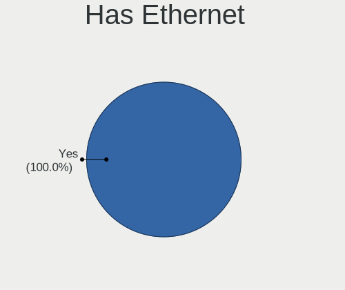
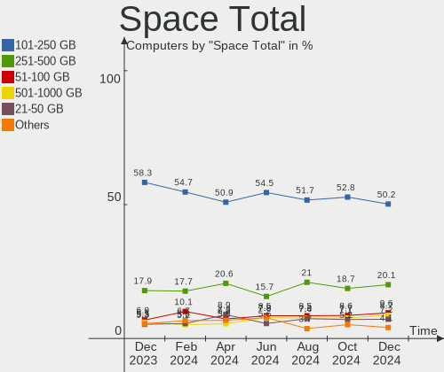
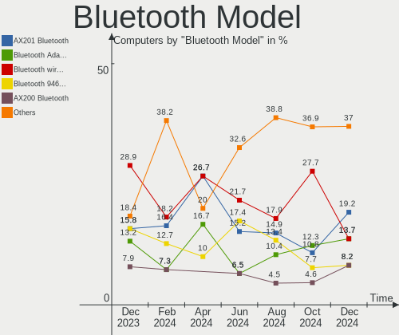
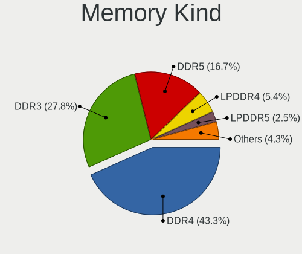

OPNsense Hardware Trends
------------------------

A project to identify most popular hardware characteristics and track their change
over time based on data collected by OPNsense users at https://BSD-Hardware.info.

Anyone can contribute to this report by the [hw-probe](https://github.com/linuxhw/hw-probe/blob/master/INSTALL.BSD.md) tool:

    hw-probe -all -upload

Full-feature report is available here: https://bsd-hardware.info/?view=trends

Period: Nov, 2021.

Contents
--------

* [ System ](#system)
  - [ OS                       ](#os)
  - [ OS Family                ](#os-family)
  - [ Arch                     ](#arch)
  - [ DE                       ](#de)
  - [ Display Server           ](#display-server)
  - [ Display Manager          ](#display-manager)
  - [ OS Lang                  ](#os-lang)
  - [ Boot Mode                ](#boot-mode)
  - [ Filesystem               ](#filesystem)
  - [ Part. scheme             ](#part-scheme)

* [ Board ](#board)
  - [ Vendor                   ](#vendor)
  - [ Model                    ](#model)
  - [ Model Family             ](#model-family)
  - [ MFG Year                 ](#mfg-year)
  - [ Form Factor              ](#form-factor)
  - [ Coreboot                 ](#coreboot)
  - [ RAM Size                 ](#ram-size)
  - [ RAM Used                 ](#ram-used)
  - [ Total Drives             ](#total-drives)
  - [ Has CD-ROM               ](#has-cd-rom)
  - [ Has Ethernet             ](#has-ethernet)
  - [ Has WiFi                 ](#has-wifi)
  - [ Has Bluetooth            ](#has-bluetooth)

* [ Location ](#location)
  - [ Country                  ](#country)
  - [ City                     ](#city)

* [ Drives ](#drives)
  - [ Drive Vendor             ](#drive-vendor)
  - [ Drive Model              ](#drive-model)
  - [ HDD Vendor               ](#hdd-vendor)
  - [ SSD Vendor               ](#ssd-vendor)
  - [ Drive Kind               ](#drive-kind)
  - [ Drive Connector          ](#drive-connector)
  - [ Drive Size               ](#drive-size)
  - [ Space Total              ](#space-total)
  - [ Space Used               ](#space-used)
  - [ Malfunc. Drives          ](#malfunc-drives)
  - [ Malfunc. Drive Vendor    ](#malfunc-drive-vendor)
  - [ Malfunc. HDD Vendor      ](#malfunc-hdd-vendor)
  - [ Malfunc. Drive Kind      ](#malfunc-drive-kind)
  - [ Failed Drives            ](#failed-drives)
  - [ Failed Drive Vendor      ](#failed-drive-vendor)
  - [ Drive Status             ](#drive-status)

* [ Storage controller ](#storage-controller)
  - [ Storage Vendor           ](#storage-vendor)
  - [ Storage Model            ](#storage-model)
  - [ Storage Kind             ](#storage-kind)

* [ Processor ](#processor)
  - [ CPU Vendor               ](#cpu-vendor)
  - [ CPU Model                ](#cpu-model)
  - [ CPU Model Family         ](#cpu-model-family)
  - [ CPU Cores                ](#cpu-cores)
  - [ CPU Sockets              ](#cpu-sockets)
  - [ CPU Threads              ](#cpu-threads)
  - [ CPU Microarch            ](#cpu-microarch)

* [ Graphics ](#graphics)
  - [ GPU Vendor               ](#gpu-vendor)
  - [ GPU Model                ](#gpu-model)
  - [ GPU Combo                ](#gpu-combo)
  - [ GPU Driver               ](#gpu-driver)
  - [ GPU Memory               ](#gpu-memory)

* [ Monitor ](#monitor)
  - [ Monitor Vendor           ](#monitor-vendor)
  - [ Monitor Model            ](#monitor-model)
  - [ Monitor Resolution       ](#monitor-resolution)
  - [ Monitor Diagonal         ](#monitor-diagonal)
  - [ Monitor Width            ](#monitor-width)
  - [ Aspect Ratio             ](#aspect-ratio)
  - [ Monitor Area             ](#monitor-area)
  - [ Pixel Density            ](#pixel-density)
  - [ Multiple Monitors        ](#multiple-monitors)

* [ Network ](#network)
  - [ Net Controller Vendor    ](#net-controller-vendor)
  - [ Net Controller Model     ](#net-controller-model)
  - [ Wireless Vendor          ](#wireless-vendor)
  - [ Wireless Model           ](#wireless-model)
  - [ Ethernet Vendor          ](#ethernet-vendor)
  - [ Ethernet Model           ](#ethernet-model)
  - [ Net Controller Kind      ](#net-controller-kind)
  - [ Used Controller          ](#used-controller)
  - [ NICs                     ](#nics)
  - [ IPv6                     ](#ipv6)

* [ Bluetooth ](#bluetooth)
  - [ Bluetooth Vendor         ](#bluetooth-vendor)
  - [ Bluetooth Model          ](#bluetooth-model)

* [ Sound ](#sound)
  - [ Sound Vendor             ](#sound-vendor)
  - [ Sound Model              ](#sound-model)

* [ Memory ](#memory)
  - [ Memory Vendor            ](#memory-vendor)
  - [ Memory Model             ](#memory-model)
  - [ Memory Kind              ](#memory-kind)
  - [ Memory Form Factor       ](#memory-form-factor)
  - [ Memory Size              ](#memory-size)
  - [ Memory Speed             ](#memory-speed)

* [ Printers & scanners ](#printers--scanners)
  - [ Printer Vendor           ](#printer-vendor)
  - [ Printer Model            ](#printer-model)
  - [ Scanner Vendor           ](#scanner-vendor)
  - [ Scanner Model            ](#scanner-model)

* [ Camera ](#camera)
  - [ Camera Vendor            ](#camera-vendor)
  - [ Camera Model             ](#camera-model)

* [ Security ](#security)
  - [ Fingerprint Vendor       ](#fingerprint-vendor)
  - [ Fingerprint Model        ](#fingerprint-model)
  - [ Chipcard Vendor          ](#chipcard-vendor)
  - [ Chipcard Model           ](#chipcard-model)

* [ Unsupported ](#unsupported)
  - [ Unsupported Devices      ](#unsupported-devices)
  - [ Unsupported Device Types ](#unsupported-device-types)

System
------

OS
--

Installed operating systems

| Name                   | Computers | Percent |
|------------------------|-----------|---------|
| OPNsense 21.7.5        | 111       | 51.15%  |
| OPNsense 21.7.4        | 55        | 25.35%  |
| OPNsense 21.7.6        | 33        | 15.21%  |
| OPNsense 21.7.3        | 11        | 5.07%   |
| OPNsense 22.1          | 4         | 1.84%   |
| OPNsense 21.7.1        | 1         | 0.46%   |
| OPNsense 20.7          | 1         | 0.46%   |
| OPNsense 12.1-p20-HBSD | 1         | 0.46%   |

OS Family
---------

OS without a version

| Name     | Computers | Percent |
|----------|-----------|---------|
| OPNsense | 217       | 100%    |

Arch
----

OS architecture (x86_64, i586, etc.)

| Name  | Computers | Percent |
|-------|-----------|---------|
| amd64 | 216       | 99.54%  |
| arm64 | 1         | 0.46%   |

DE
--

Desktop Environment

| Name    | Computers | Percent |
|---------|-----------|---------|
| Console | 217       | 100%    |

Display Server
--------------

X11 or Wayland

| Name    | Computers | Percent |
|---------|-----------|---------|
| Console | 217       | 100%    |

Display Manager
---------------

SDDM, LightDM, etc.

| Name    | Computers | Percent |
|---------|-----------|---------|
| Console | 217       | 100%    |

OS Lang
-------

Language

| Lang    | Computers | Percent |
|---------|-----------|---------|
| Unknown | 217       | 100%    |

Boot Mode
---------

EFI or BIOS

| Mode | Computers | Percent |
|------|-----------|---------|
| EFI  | 204       | 94.01%  |
| BIOS | 13        | 5.99%   |

Filesystem
----------

Type of filesystem

| Type | Computers | Percent |
|------|-----------|---------|
| Ufs  | 168       | 77.42%  |
| Zfs  | 49        | 22.58%  |

Part. scheme
------------

Scheme of partitioning

| Type    | Computers | Percent |
|---------|-----------|---------|
| GPT     | 207       | 95.39%  |
| MBR     | 6         | 2.76%   |
| Unknown | 3         | 1.38%   |
| BSD     | 1         | 0.46%   |

Board
-----

Vendor
------

Motherboard manufacturer

| Name                                       | Computers | Percent |
|--------------------------------------------|-----------|---------|
| Dell                                       | 31        | 14.29%  |
| Unknown                                    | 26        | 11.98%  |
| Hewlett-Packard                            | 19        | 8.76%   |
| PC Engines                                 | 13        | 5.99%   |
| Intel                                      | 13        | 5.99%   |
| ASUSTek Computer                           | 12        | 5.53%   |
| Supermicro                                 | 11        | 5.07%   |
| Protectli                                  | 11        | 5.07%   |
| ASRock                                     | 10        | 4.61%   |
| Gigabyte Technology                        | 7         | 3.23%   |
| Fujitsu                                    | 7         | 3.23%   |
| AMI                                        | 7         | 3.23%   |
| MSI                                        | 6         | 2.76%   |
| Shuttle                                    | 4         | 1.84%   |
| BESSTAR Tech                               | 4         | 1.84%   |
| Lenovo                                     | 3         | 1.38%   |
| HARDKERNEL                                 | 3         | 1.38%   |
| RUNING                                     | 2         | 0.92%   |
| HPE                                        | 2         | 0.92%   |
| ECS                                        | 2         | 0.92%   |
| ASRockRack                                 | 2         | 0.92%   |
| Acer                                       | 2         | 0.92%   |
| ZOTAC                                      | 1         | 0.46%   |
| Winston Marriot                            | 1         | 0.46%   |
| Sophos                                     | 1         | 0.46%   |
| ShenZhen MinWin Technology                 | 1         | 0.46%   |
| Seneca                                     | 1         | 0.46%   |
| SeeedStudio                                | 1         | 0.46%   |
| NF841                                      | 1         | 0.46%   |
| Lex                                        | 1         | 0.46%   |
| Inventec                                   | 1         | 0.46%   |
| GuoGuang                                   | 1         | 0.46%   |
| friendlyelec                               | 1         | 0.46%   |
| Dell EMC                                   | 1         | 0.46%   |
| Deciso                                     | 1         | 0.46%   |
| Datto                                      | 1         | 0.46%   |
| CompuLab                                   | 1         | 0.46%   |
| Colorful YuGong Technology And Development | 1         | 0.46%   |
| CheckPoint                                 | 1         | 0.46%   |
| AZW                                        | 1         | 0.46%   |
| AWOW                                       | 1         | 0.46%   |
| AAEON                                      | 1         | 0.46%   |

Model
-----

Motherboard model

| Name                                     | Computers | Percent |
|------------------------------------------|-----------|---------|
| Unknown                                  | 26        | 11.98%  |
| PC Engines APU2                          | 7         | 3.23%   |
| AMI Aptio CRB                            | 7         | 3.23%   |
| Intel Q3XXG4-P V1.0                      | 6         | 2.76%   |
| Protectli FW4B                           | 5         | 2.3%    |
| Supermicro Super Server                  | 4         | 1.84%   |
| PC Engines apu4                          | 4         | 1.84%   |
| Protectli FW2B                           | 3         | 1.38%   |
| HP t730 Thin Client                      | 3         | 1.38%   |
| HARDKERNEL ODROID-H2                     | 3         | 1.38%   |
| Dell OptiPlex 3020                       | 3         | 1.38%   |
| RUNING B75M INTEL H3V                    | 2         | 0.92%   |
| Protectli FW6                            | 2         | 0.92%   |
| PC Engines APU                           | 2         | 0.92%   |
| MSI MS-7721                              | 2         | 0.92%   |
| Fujitsu FUTRO S920                       | 2         | 0.92%   |
| Dell Wyse 5070 Extended Thin Client      | 2         | 0.92%   |
| Dell PowerEdge R410                      | 2         | 0.92%   |
| Dell PowerEdge R220                      | 2         | 0.92%   |
| Dell OptiPlex 9010                       | 2         | 0.92%   |
| BESSTAR Tech GK41                        | 2         | 0.92%   |
| ZOTAC ZBOX-CI327NANO-GS-01               | 1         | 0.46%   |
| Winston Marriot PICO PC                  | 1         | 0.46%   |
| Supermicro X8DTU-LN4+                    | 1         | 0.46%   |
| Supermicro X7SPA-HF                      | 1         | 0.46%   |
| Supermicro SYS-E300-8D                   | 1         | 0.46%   |
| Supermicro SYS-E200-9A                   | 1         | 0.46%   |
| Supermicro SYS-5019A-FTN4                | 1         | 0.46%   |
| Supermicro SYS-5018A-FTN4                | 1         | 0.46%   |
| Supermicro HYVE-ZEUS                     | 1         | 0.46%   |
| Sophos XG                                | 1         | 0.46%   |
| Shuttle XS35V3                           | 1         | 0.46%   |
| Shuttle DS437                            | 1         | 0.46%   |
| Shuttle DH470                            | 1         | 0.46%   |
| Shuttle DH370                            | 1         | 0.46%   |
| ShenZhen MinWin MW-NANO-APL-4L           | 1         | 0.46%   |
| Seneca pro469788                         | 1         | 0.46%   |
| SeeedStudio ODYSSEY-X86J4125             | 1         | 0.46%   |
| Protectli FW6E                           | 1         | 0.46%   |
| NF841 LES network                        | 1         | 0.46%   |
| MSI MS-S0891                             | 1         | 0.46%   |
| MSI MS-9899                              | 1         | 0.46%   |
| MSI MS-7D14                              | 1         | 0.46%   |
| MSI MS-7A71                              | 1         | 0.46%   |
| Lex Pineview-D                           | 1         | 0.46%   |
| Lenovo ThinkStation P330 Tiny 30CF000BUS | 1         | 0.46%   |
| Lenovo SHARKBAY SDK0E50510 WIN           | 1         | 0.46%   |
| Lenovo IdeaPad U430 Touch 20270          | 1         | 0.46%   |
| Inventec Z CLASS                         | 1         | 0.46%   |
| Intel NUC7i3BNK                          | 1         | 0.46%   |
| Intel NUC5i3RYB H41000-502               | 1         | 0.46%   |
| Intel HURONRIVER                         | 1         | 0.46%   |
| Intel DH55PJ AAE93812-303                | 1         | 0.46%   |
| Intel D510MO AAE76523-302                | 1         | 0.46%   |
| Intel D2500CC AAG81477-400               | 1         | 0.46%   |
| Intel CD1C64GK                           | 1         | 0.46%   |
| HPE ProLiant MicroServer Gen10 Plus      | 1         | 0.46%   |
| HPE ProLiant MicroServer Gen10           | 1         | 0.46%   |
| HP Z240 SFF Workstation                  | 1         | 0.46%   |
| HP t620 PLUS Quad Core TC                | 1         | 0.46%   |

Model Family
------------

Motherboard model prefix

| Name                           | Computers | Percent |
|--------------------------------|-----------|---------|
| Unknown                        | 26        | 11.98%  |
| Dell OptiPlex                  | 15        | 6.91%   |
| Dell PowerEdge                 | 11        | 5.07%   |
| PC Engines APU2                | 7         | 3.23%   |
| AMI Aptio                      | 7         | 3.23%   |
| Intel Q3XXG4-P                 | 6         | 2.76%   |
| HP Compaq                      | 6         | 2.76%   |
| Protectli FW4B                 | 5         | 2.3%    |
| Supermicro Super               | 4         | 1.84%   |
| PC Engines apu4                | 4         | 1.84%   |
| HP ProLiant                    | 4         | 1.84%   |
| HP ProDesk                     | 4         | 1.84%   |
| Protectli FW2B                 | 3         | 1.38%   |
| HP t730                        | 3         | 1.38%   |
| HARDKERNEL ODROID-H2           | 3         | 1.38%   |
| Fujitsu FUTRO                  | 3         | 1.38%   |
| RUNING B75M                    | 2         | 0.92%   |
| Protectli FW6                  | 2         | 0.92%   |
| PC Engines APU                 | 2         | 0.92%   |
| MSI MS-7721                    | 2         | 0.92%   |
| HPE ProLiant                   | 2         | 0.92%   |
| Fujitsu ESPRIMO                | 2         | 0.92%   |
| Dell Wyse                      | 2         | 0.92%   |
| BESSTAR Tech GK41              | 2         | 0.92%   |
| Acer Aspire                    | 2         | 0.92%   |
| ZOTAC ZBOX-CI327NANO-GS-01     | 1         | 0.46%   |
| Winston Marriot PICO           | 1         | 0.46%   |
| Supermicro X8DTU-LN4+          | 1         | 0.46%   |
| Supermicro X7SPA-HF            | 1         | 0.46%   |
| Supermicro SYS-E300-8D         | 1         | 0.46%   |
| Supermicro SYS-E200-9A         | 1         | 0.46%   |
| Supermicro SYS-5019A-FTN4      | 1         | 0.46%   |
| Supermicro SYS-5018A-FTN4      | 1         | 0.46%   |
| Supermicro HYVE-ZEUS           | 1         | 0.46%   |
| Sophos XG                      | 1         | 0.46%   |
| Shuttle XS35V3                 | 1         | 0.46%   |
| Shuttle DS437                  | 1         | 0.46%   |
| Shuttle DH470                  | 1         | 0.46%   |
| Shuttle DH370                  | 1         | 0.46%   |
| ShenZhen MinWin MW-NANO-APL-4L | 1         | 0.46%   |
| Seneca pro469788               | 1         | 0.46%   |
| SeeedStudio ODYSSEY-X86J4125   | 1         | 0.46%   |
| Protectli FW6E                 | 1         | 0.46%   |
| NF841 LES                      | 1         | 0.46%   |
| MSI MS-S0891                   | 1         | 0.46%   |
| MSI MS-9899                    | 1         | 0.46%   |
| MSI MS-7D14                    | 1         | 0.46%   |
| MSI MS-7A71                    | 1         | 0.46%   |
| Lex Pineview-D                 | 1         | 0.46%   |
| Lenovo ThinkStation            | 1         | 0.46%   |
| Lenovo SHARKBAY                | 1         | 0.46%   |
| Lenovo IdeaPad                 | 1         | 0.46%   |
| Inventec Z                     | 1         | 0.46%   |
| Intel NUC7i3BNK                | 1         | 0.46%   |
| Intel NUC5i3RYB                | 1         | 0.46%   |
| Intel HURONRIVER               | 1         | 0.46%   |
| Intel DH55PJ                   | 1         | 0.46%   |
| Intel D510MO                   | 1         | 0.46%   |
| Intel D2500CC                  | 1         | 0.46%   |
| Intel CD1C64GK                 | 1         | 0.46%   |

MFG Year
--------

Motherboard manufacture year

| Year | Computers | Percent |
|------|-----------|---------|
| 2021 | 38        | 17.51%  |
| 2018 | 34        | 15.67%  |
| 2019 | 31        | 14.29%  |
| 2020 | 24        | 11.06%  |
| 2014 | 18        | 8.29%   |
| 2015 | 16        | 7.37%   |
| 2017 | 14        | 6.45%   |
| 2012 | 10        | 4.61%   |
| 2016 | 9         | 4.15%   |
| 2013 | 8         | 3.69%   |
| 2011 | 5         | 2.3%    |
| 2010 | 5         | 2.3%    |
| 2009 | 4         | 1.84%   |
| 2006 | 1         | 0.46%   |

Form Factor
-----------

Physical design of the computer

| Name     | Computers | Percent |
|----------|-----------|---------|
| Desktop  | 163       | 75.12%  |
| Server   | 22        | 10.14%  |
| Mini pc  | 20        | 9.22%   |
| Notebook | 9         | 4.15%   |
| Firewall | 3         | 1.38%   |

Coreboot
--------

Have coreboot on board

| Used | Computers | Percent |
|------|-----------|---------|
| No   | 201       | 92.63%  |
| Yes  | 16        | 7.37%   |

RAM Size
--------

Total RAM memory

| Size in GB  | Computers | Percent |
|-------------|-----------|---------|
| 8.01-16.0   | 85        | 39.17%  |
| 4.01-8.0    | 62        | 28.57%  |
| 16.01-24.0  | 36        | 16.59%  |
| 32.01-64.0  | 14        | 6.45%   |
| 2.01-3.0    | 7         | 3.23%   |
| 64.01-256.0 | 7         | 3.23%   |
| 3.01-4.0    | 3         | 1.38%   |
| 24.01-32.0  | 2         | 0.92%   |
| 1.01-2.0    | 1         | 0.46%   |

RAM Used
--------

Used RAM memory

| Used GB    | Computers | Percent |
|------------|-----------|---------|
| 0.01-0.5   | 129       | 59.45%  |
| 0.51-1.0   | 50        | 23.04%  |
| 1.01-2.0   | 21        | 9.68%   |
| 4.01-8.0   | 5         | 2.3%    |
| 2.01-3.0   | 5         | 2.3%    |
| 8.01-16.0  | 3         | 1.38%   |
| 24.01-32.0 | 2         | 0.92%   |
| 32.01-64.0 | 1         | 0.46%   |
| 16.01-24.0 | 1         | 0.46%   |

Total Drives
------------

Number of drives on board

| Drives | Computers | Percent |
|--------|-----------|---------|
| 1      | 174       | 80.18%  |
| 2      | 20        | 9.22%   |
| 0      | 20        | 9.22%   |
| 3      | 2         | 0.92%   |
| 4      | 1         | 0.46%   |

Has CD-ROM
----------

Has CD-ROM on board

| Presented | Computers | Percent |
|-----------|-----------|---------|
| No        | 192       | 88.48%  |
| Yes       | 25        | 11.52%  |

Has Ethernet
------------

Has Ethernet on board

| Presented | Computers | Percent |
|-----------|-----------|---------|
| Yes       | 217       | 100%    |

Has WiFi
--------

Has WiFi module

| Presented | Computers | Percent |
|-----------|-----------|---------|
| No        | 173       | 79.72%  |
| Yes       | 44        | 20.28%  |

Has Bluetooth
-------------

Has Bluetooth module

| Presented | Computers | Percent |
|-----------|-----------|---------|
| No        | 195       | 89.86%  |
| Yes       | 22        | 10.14%  |

Location
--------

Country
-------

Geographic location (country)

| Country      | Computers | Percent |
|--------------|-----------|---------|
| USA          | 62        | 28.57%  |
| Germany      | 57        | 26.27%  |
| Netherlands  | 10        | 4.61%   |
| UK           | 9         | 4.15%   |
| Canada       | 9         | 4.15%   |
| Australia    | 7         | 3.23%   |
| China        | 6         | 2.76%   |
| France       | 5         | 2.3%    |
| Switzerland  | 4         | 1.84%   |
| Spain        | 4         | 1.84%   |
| Poland       | 4         | 1.84%   |
| Austria      | 4         | 1.84%   |
| Mexico       | 3         | 1.38%   |
| South Africa | 2         | 0.92%   |
| Singapore    | 2         | 0.92%   |
| Hong Kong    | 2         | 0.92%   |
| Finland      | 2         | 0.92%   |
| Belgium      | 2         | 0.92%   |
| Vietnam      | 1         | 0.46%   |
| Turkey       | 1         | 0.46%   |
| Sweden       | 1         | 0.46%   |
| South Korea  | 1         | 0.46%   |
| Slovenia     | 1         | 0.46%   |
| Slovakia     | 1         | 0.46%   |
| Romania      | 1         | 0.46%   |
| Portugal     | 1         | 0.46%   |
| Peru         | 1         | 0.46%   |
| Norway       | 1         | 0.46%   |
| New Zealand  | 1         | 0.46%   |
| Lithuania    | 1         | 0.46%   |
| Jersey       | 1         | 0.46%   |
| Italy        | 1         | 0.46%   |
| Israel       | 1         | 0.46%   |
| Indonesia    | 1         | 0.46%   |
| India        | 1         | 0.46%   |
| Hungary      | 1         | 0.46%   |
| Greece       | 1         | 0.46%   |
| Denmark      | 1         | 0.46%   |
| Czechia      | 1         | 0.46%   |
| Chile        | 1         | 0.46%   |
| Albania      | 1         | 0.46%   |

City
----

Geographic location (city)

| City                            | Computers | Percent |
|---------------------------------|-----------|---------|
| Munich                          | 5         | 2.3%    |
| Vlaardingen                     | 3         | 1.38%   |
| Cambridge                       | 3         | 1.38%   |
| Berlin                          | 3         | 1.38%   |
| Warsaw                          | 2         | 0.92%   |
| Singapore                       | 2         | 0.92%   |
| Poplar                          | 2         | 0.92%   |
| Playa del Carmen                | 2         | 0.92%   |
| Perth                           | 2         | 0.92%   |
| Newcastle upon Tyne             | 2         | 0.92%   |
| Johannesburg                    | 2         | 0.92%   |
| Frankfurt am Main               | 2         | 0.92%   |
| Dortmund                        | 2         | 0.92%   |
| Columbus                        | 2         | 0.92%   |
| Cologne                         | 2         | 0.92%   |
| Beijing                         | 2         | 0.92%   |
| Amsterdam                       | 2         | 0.92%   |
| Zurich                          | 1         | 0.46%   |
| Zuidhorn                        | 1         | 0.46%   |
| Zhengzhou                       | 1         | 0.46%   |
| Zell im Wiesental               | 1         | 0.46%   |
| Zarrentin                       | 1         | 0.46%   |
| Whitewater                      | 1         | 0.46%   |
| Wendell                         | 1         | 0.46%   |
| W??rzburg                       | 1         | 0.46%   |
| Watertown                       | 1         | 0.46%   |
| Warminster                      | 1         | 0.46%   |
| Vitoria-Gasteiz                 | 1         | 0.46%   |
| Vienna                          | 1         | 0.46%   |
| Victoria                        | 1         | 0.46%   |
| Valencia                        | 1         | 0.46%   |
| Ulm                             | 1         | 0.46%   |
| Treuchtlingen                   | 1         | 0.46%   |
| Trenton                         | 1         | 0.46%   |
| Tracy                           | 1         | 0.46%   |
| Toulouse                        | 1         | 0.46%   |
| Toronto                         | 1         | 0.46%   |
| Tirana                          | 1         | 0.46%   |
| Tampere                         | 1         | 0.46%   |
| Szeged                          | 1         | 0.46%   |
| Sydney                          | 1         | 0.46%   |
| Stralsund                       | 1         | 0.46%   |
| Stourbridge                     | 1         | 0.46%   |
| Stemwede                        | 1         | 0.46%   |
| Steinen                         | 1         | 0.46%   |
| Steenbergen                     | 1         | 0.46%   |
| Statesboro                      | 1         | 0.46%   |
| Spotsylvania                    | 1         | 0.46%   |
| Solingen                        | 1         | 0.46%   |
| Slavkov u Brna                  | 1         | 0.46%   |
| Sellersville                    | 1         | 0.46%   |
| Seattle                         | 1         | 0.46%   |
| Schwaikheim                     | 1         | 0.46%   |
| Sarnia                          | 1         | 0.46%   |
| Sankt Margarethen im Burgenland | 1         | 0.46%   |
| San Francisco                   | 1         | 0.46%   |
| San Antonio                     | 1         | 0.46%   |
| San Angelo                      | 1         | 0.46%   |
| Saint Helier                    | 1         | 0.46%   |
| Royal Oak                       | 1         | 0.46%   |

Drives
------

Drive Vendor
------------

Hard drive vendors

| Vendor              | Computers | Drives | Percent |
|---------------------|-----------|--------|---------|
| Samsung Electronics | 36        | 38     | 17.06%  |
| WDC                 | 24        | 27     | 11.37%  |
| Kingston            | 23        | 23     | 10.9%   |
| Seagate             | 15        | 16     | 7.11%   |
| Transcend           | 12        | 12     | 5.69%   |
| Intel               | 12        | 13     | 5.69%   |
| Crucial             | 10        | 10     | 4.74%   |
| Phison              | 8         | 8      | 3.79%   |
| Toshiba             | 6         | 6      | 2.84%   |
| SanDisk             | 6         | 7      | 2.84%   |
| Protectli           | 6         | 6      | 2.84%   |
| Micron Technology   | 6         | 6      | 2.84%   |
| A-DATA Technology   | 5         | 6      | 2.37%   |
| Hoodisk             | 4         | 4      | 1.9%    |
| HGST                | 3         | 6      | 1.42%   |
| TCSUNBOW            | 2         | 2      | 0.95%   |
| PNY                 | 2         | 2      | 0.95%   |
| Kston               | 2         | 2      | 0.95%   |
| Innodisk            | 2         | 2      | 0.95%   |
| HPE                 | 2         | 3      | 0.95%   |
| Dogfish             | 2         | 2      | 0.95%   |
| BIWIN               | 2         | 2      | 0.95%   |
| XUM                 | 1         | 1      | 0.47%   |
| V-GeN               | 1         | 1      | 0.47%   |
| SPCC                | 1         | 1      | 0.47%   |
| SK Hynix            | 1         | 1      | 0.47%   |
| Ramsta              | 1         | 1      | 0.47%   |
| OCZ                 | 1         | 1      | 0.47%   |
| MyDigitalSSD        | 1         | 1      | 0.47%   |
| Mushkin             | 1         | 1      | 0.47%   |
| Mach Xtreme         | 1         | 1      | 0.47%   |
| KIOXIA              | 1         | 1      | 0.47%   |
| Intenso             | 1         | 1      | 0.47%   |
| Hitachi             | 1         | 1      | 0.47%   |
| Hewlett-Packard     | 1         | 1      | 0.47%   |
| Gigabyte Technology | 1         | 1      | 0.47%   |
| FORESEE             | 1         | 1      | 0.47%   |
| Fordisk             | 1         | 1      | 0.47%   |
| Corsair             | 1         | 1      | 0.47%   |
| Colorful            | 1         | 1      | 0.47%   |
| ATP                 | 1         | 1      | 0.47%   |
| Apacer              | 1         | 1      | 0.47%   |
| Advantech           | 1         | 2      | 0.47%   |

Drive Model
-----------

Hard drive models

| Model                                | Computers | Percent |
|--------------------------------------|-----------|---------|
| Phison SATA SSD 16GB                 | 6         | 2.82%   |
| Kingston SUV500MS120G 120GB          | 5         | 2.35%   |
| Samsung SSD 860 EVO M.2 250GB        | 4         | 1.88%   |
| Samsung SSD 860 EVO 250GB            | 4         | 1.88%   |
| Samsung SSD 850 EVO 120GB            | 4         | 1.88%   |
| WDC WDS120G2G0B-00EPW0 120GB         | 3         | 1.41%   |
| Transcend TS128GMSA230S 128GB        | 3         | 1.41%   |
| Seagate ST500DM002-1BD142 500GB      | 3         | 1.41%   |
| Samsung SSD 850 EVO 250GB            | 3         | 1.41%   |
| Kingston SUV400S37240G 240GB         | 3         | 1.41%   |
| Crucial CT120BX500SSD1 120GB         | 3         | 1.41%   |
| WDC WDS500G3X0C-00SJG0 500GB         | 2         | 0.94%   |
| Transcend TS64GMSA370 64GB           | 2         | 0.94%   |
| Transcend TS32GSSD370S 32GB          | 2         | 0.94%   |
| Transcend TS32GMSA370 32GB           | 2         | 0.94%   |
| Seagate ST3160318AS 160GB            | 2         | 0.94%   |
| SanDisk SDSSDA120G 120GB             | 2         | 0.94%   |
| Samsung SSD 850 PRO 256GB            | 2         | 0.94%   |
| Samsung SSD 840 EVO 250GB            | 2         | 0.94%   |
| Samsung SSD 840 EVO 120GB            | 2         | 0.94%   |
| Samsung SSD 650 120GB                | 2         | 0.94%   |
| Protectli 240GB mSATA                | 2         | 0.94%   |
| Protectli 120GB mSATA                | 2         | 0.94%   |
| Micron MTFDDAT064MAM-1J2 64GB        | 2         | 0.94%   |
| Kston SSD 64GB                       | 2         | 0.94%   |
| Kingston SV300S37A240G 240GB         | 2         | 0.94%   |
| Kingston SV300S37A120G 120GB         | 2         | 0.94%   |
| Kingston SA400S37240G 240GB          | 2         | 0.94%   |
| Kingston SA400S37120G 120GB          | 2         | 0.94%   |
| Hoodisk SSD 128GB                    | 2         | 0.94%   |
| XUM HX128GSSDSATA3 256GB             | 1         | 0.47%   |
| WDC WDS500G3XHC-00SJG0 500GB         | 1         | 0.47%   |
| WDC WDS500G1R0B-68A4Z0 500GB         | 1         | 0.47%   |
| WDC WDS250G2B0A-00SM50 250GB         | 1         | 0.47%   |
| WDC WDS240G2G0A-00JH30 240GB         | 1         | 0.47%   |
| WDC WDS120G2G0A-00JH30 120GB         | 1         | 0.47%   |
| WDC WDS120G1G0A-00SS50 120GB         | 1         | 0.47%   |
| WDC WD800JD-60LSA5 80GB              | 1         | 0.47%   |
| WDC WD5000LPVX-22V0TT0 500GB         | 1         | 0.47%   |
| WDC WD5000AAKS-00TMA0 500GB          | 1         | 0.47%   |
| WDC WD3200BPVT-24JJ5T0 320GB         | 1         | 0.47%   |
| WDC WD3200BEKX-00B7WT0 320GB         | 1         | 0.47%   |
| WDC WD2500JS-75NCB2 250GB            | 1         | 0.47%   |
| WDC WD1600JS-56MHB1 160GB            | 1         | 0.47%   |
| WDC WD1600BEVS-75RST0 160GB          | 1         | 0.47%   |
| WDC WD1600BEKT-08PVMT1 160GB         | 1         | 0.47%   |
| WDC WD1600BEKT-00PVMT0 160GB         | 1         | 0.47%   |
| WDC WD10EZEX-22MFCA0 1TB             | 1         | 0.47%   |
| WDC WD10EFRX-68FYTN0 1TB             | 1         | 0.47%   |
| WDC PC SN730 SDBQNTY-256G-1001 256GB | 1         | 0.47%   |
| V-GeN V-GEN11SM18EG120GB             | 1         | 0.47%   |
| Transcend TS256GMTS952T2 256GB       | 1         | 0.47%   |
| Transcend TS256GMSA230S 256GB        | 1         | 0.47%   |
| Transcend TS120GMTS420S 120GB        | 1         | 0.47%   |
| Toshiba THNSNJ128GMCU 128GB          | 1         | 0.47%   |
| Toshiba MQ01ABD050 500GB             | 1         | 0.47%   |
| Toshiba MG04ACA100NY 1TB             | 1         | 0.47%   |
| Toshiba MG03ACA100 1TB               | 1         | 0.47%   |
| Toshiba DT01ACA100 1TB               | 1         | 0.47%   |
| Toshiba DT01ACA050 500GB             | 1         | 0.47%   |

HDD Vendor
----------

Hard disk drive vendors

| Vendor          | Computers | Drives | Percent |
|-----------------|-----------|--------|---------|
| Seagate         | 13        | 13     | 35.14%  |
| WDC             | 12        | 14     | 32.43%  |
| Toshiba         | 5         | 5      | 13.51%  |
| HGST            | 3         | 6      | 8.11%   |
| HPE             | 2         | 3      | 5.41%   |
| Hitachi         | 1         | 1      | 2.7%    |
| Hewlett-Packard | 1         | 1      | 2.7%    |

SSD Vendor
----------

Solid state drive vendors

| Vendor              | Computers | Drives | Percent |
|---------------------|-----------|--------|---------|
| Samsung Electronics | 31        | 32     | 20.26%  |
| Kingston            | 21        | 21     | 13.73%  |
| Transcend           | 12        | 12     | 7.84%   |
| Intel               | 11        | 12     | 7.19%   |
| Crucial             | 9         | 9      | 5.88%   |
| WDC                 | 8         | 8      | 5.23%   |
| Phison              | 7         | 7      | 4.58%   |
| SanDisk             | 6         | 7      | 3.92%   |
| Protectli           | 6         | 6      | 3.92%   |
| Micron Technology   | 5         | 5      | 3.27%   |
| Hoodisk             | 4         | 4      | 2.61%   |
| A-DATA Technology   | 3         | 4      | 1.96%   |
| TCSUNBOW            | 2         | 2      | 1.31%   |
| PNY                 | 2         | 2      | 1.31%   |
| Kston               | 2         | 2      | 1.31%   |
| InnoDisk            | 2         | 2      | 1.31%   |
| DOGFISH             | 2         | 2      | 1.31%   |
| BIWIN               | 2         | 2      | 1.31%   |
| XUM                 | 1         | 1      | 0.65%   |
| V-GeN               | 1         | 1      | 0.65%   |
| Toshiba             | 1         | 1      | 0.65%   |
| Seagate             | 1         | 2      | 0.65%   |
| Ramsta              | 1         | 1      | 0.65%   |
| OCZ                 | 1         | 1      | 0.65%   |
| MyDigitalSSD        | 1         | 1      | 0.65%   |
| Mushkin             | 1         | 1      | 0.65%   |
| Mach Xtreme         | 1         | 1      | 0.65%   |
| Intenso             | 1         | 1      | 0.65%   |
| Gigabyte Technology | 1         | 1      | 0.65%   |
| FORESEE             | 1         | 1      | 0.65%   |
| Fordisk             | 1         | 1      | 0.65%   |
| Corsair             | 1         | 1      | 0.65%   |
| Colorful            | 1         | 1      | 0.65%   |
| ATP                 | 1         | 1      | 0.65%   |
| Apacer              | 1         | 1      | 0.65%   |
| Advantech           | 1         | 2      | 0.65%   |

Drive Kind
----------

HDD or SSD

| Kind | Computers | Drives | Percent |
|------|-----------|--------|---------|
| SSD  | 146       | 159    | 71.92%  |
| HDD  | 36        | 43     | 17.73%  |
| NVMe | 21        | 23     | 10.34%  |

Drive Connector
---------------

SATA, SAS, NVMe, etc.

| Type | Computers | Drives | Percent |
|------|-----------|--------|---------|
| SATA | 177       | 202    | 89.39%  |
| NVMe | 21        | 23     | 10.61%  |

Drive Size
----------

Size of hard drive

| Size in TB | Computers | Drives | Percent |
|------------|-----------|--------|---------|
| 0.01-0.5   | 166       | 184    | 92.22%  |
| 0.51-1.0   | 12        | 13     | 6.67%   |
| 2.01-3.0   | 1         | 1      | 0.56%   |
| 4.01-10.0  | 1         | 4      | 0.56%   |

Space Total
-----------

Amount of disk space available on the file system

| Size in GB     | Computers | Percent |
|----------------|-----------|---------|
| 101-250        | 85        | 39.17%  |
| 51-100         | 43        | 19.82%  |
| 251-500        | 39        | 17.97%  |
| 21-50          | 23        | 10.6%   |
| 1-20           | 17        | 7.83%   |
| 501-1000       | 8         | 3.69%   |
| More than 3000 | 1         | 0.46%   |
| 2001-3000      | 1         | 0.46%   |

Space Used
----------

Amount of used disk space

| Used GB | Computers | Percent |
|---------|-----------|---------|
| 1-20    | 206       | 94.93%  |
| 21-50   | 7         | 3.23%   |
| 101-250 | 2         | 0.92%   |
| 51-100  | 2         | 0.92%   |

Malfunc. Drives
---------------

Drive models with a malfunction

| Model                                            | Computers | Drives | Percent |
|--------------------------------------------------|-----------|--------|---------|
| WDC WD3200BEKX-00B7WT0 320GB                     | 1         | 1      | 3.57%   |
| WDC WD1600JS-56MHB1 160GB                        | 1         | 1      | 3.57%   |
| WDC WD1600BEKT-08PVMT1 160GB                     | 1         | 2      | 3.57%   |
| Seagate ST500LT012-1DG142 500GB                  | 1         | 1      | 3.57%   |
| Seagate ST500DM002-1BD142 500GB                  | 1         | 1      | 3.57%   |
| Seagate ST500DM002-1BC142 500GB                  | 1         | 1      | 3.57%   |
| Seagate ST3500418AS 500GB                        | 1         | 1      | 3.57%   |
| Seagate ST3500413AS 500GB                        | 1         | 1      | 3.57%   |
| Seagate ST3320620AS 320GB                        | 1         | 1      | 3.57%   |
| Seagate ST3160318AS 160GB                        | 1         | 1      | 3.57%   |
| Seagate ST1000DL002-9TT153 1TB                   | 1         | 1      | 3.57%   |
| SanDisk SDSSDA120G 120GB                         | 1         | 1      | 3.57%   |
| SanDisk SD8TB8U-256G-1006 256GB                  | 1         | 1      | 3.57%   |
| Samsung Electronics SSD PM810 2.5-inch 7mm 256GB | 1         | 1      | 3.57%   |
| Samsung Electronics SSD 840 EVO 120GB            | 1         | 1      | 3.57%   |
| MyDigitalSSD SB2 128GB                           | 1         | 1      | 3.57%   |
| Kingston SV300S37A60G 64GB                       | 1         | 1      | 3.57%   |
| Kingston SV300S37A120G 120GB                     | 1         | 1      | 3.57%   |
| Kingston SUV400S37240G 240GB                     | 1         | 1      | 3.57%   |
| Kingston SNV425S264GB                            | 1         | 1      | 3.57%   |
| Kingston SNS4151S316G 16GB                       | 1         | 1      | 3.57%   |
| Intel SSDSC2CW060A3 64GB                         | 1         | 1      | 3.57%   |
| Intel SSDSC2CT120A3 120GB                        | 1         | 1      | 3.57%   |
| Intel SSDSA2BW160G3H 160GB                       | 1         | 1      | 3.57%   |
| HPE MB0500EBNCR 500GB                            | 1         | 1      | 3.57%   |
| Hitachi HTS545016B9SA02 160GB                    | 1         | 1      | 3.57%   |
| Colorful SL500 640GB                             | 1         | 1      | 3.57%   |
| BIWIN SSD 32GB                                   | 1         | 1      | 3.57%   |

Malfunc. Drive Vendor
---------------------

Vendors of faulty drives

| Vendor              | Computers | Drives | Percent |
|---------------------|-----------|--------|---------|
| Seagate             | 8         | 8      | 28.57%  |
| Kingston            | 5         | 5      | 17.86%  |
| WDC                 | 3         | 4      | 10.71%  |
| Intel               | 3         | 3      | 10.71%  |
| SanDisk             | 2         | 2      | 7.14%   |
| Samsung Electronics | 2         | 2      | 7.14%   |
| MyDigitalSSD        | 1         | 1      | 3.57%   |
| HPE                 | 1         | 1      | 3.57%   |
| Hitachi             | 1         | 1      | 3.57%   |
| Colorful            | 1         | 1      | 3.57%   |
| BIWIN               | 1         | 1      | 3.57%   |

Malfunc. HDD Vendor
-------------------

Vendors of faulty HDD drives

| Vendor  | Computers | Drives | Percent |
|---------|-----------|--------|---------|
| Seagate | 8         | 8      | 61.54%  |
| WDC     | 3         | 4      | 23.08%  |
| HPE     | 1         | 1      | 7.69%   |
| Hitachi | 1         | 1      | 7.69%   |

Malfunc. Drive Kind
-------------------

Kinds of faulty drives

| Kind | Computers | Drives | Percent |
|------|-----------|--------|---------|
| SSD  | 15        | 15     | 53.57%  |
| HDD  | 13        | 14     | 46.43%  |

Failed Drives
-------------

Failed drive models

Zero info for selected period =(

Failed Drive Vendor
-------------------

Failed drive vendors

Zero info for selected period =(

Drive Status
------------

Number of failed and malfunc. drives

| Status   | Computers | Drives | Percent |
|----------|-----------|--------|---------|
| Works    | 172       | 194    | 85.15%  |
| Malfunc  | 28        | 29     | 13.86%  |
| Detected | 2         | 2      | 0.99%   |

Storage controller
------------------

Storage Vendor
--------------

Storage controller vendors

| Vendor                      | Computers | Percent |
|-----------------------------|-----------|---------|
| Intel                       | 175       | 71.72%  |
| AMD                         | 34        | 13.93%  |
| Samsung Electronics         | 5         | 2.05%   |
| Sandisk                     | 4         | 1.64%   |
| Broadcom / LSI              | 4         | 1.64%   |
| ASMedia Technology          | 4         | 1.64%   |
| Realtek Semiconductor       | 2         | 0.82%   |
| Phison Electronics          | 2         | 0.82%   |
| Marvell Technology Group    | 2         | 0.82%   |
| Kingston Technology Company | 2         | 0.82%   |
| Chelsio Communications      | 2         | 0.82%   |
| SK Hynix                    | 1         | 0.41%   |
| Silicon Image               | 1         | 0.41%   |
| Seagate Technology          | 1         | 0.41%   |
| Nvidia                      | 1         | 0.41%   |
| Micron/Crucial Technology   | 1         | 0.41%   |
| Micron Technology           | 1         | 0.41%   |
| Hewlett-Packard             | 1         | 0.41%   |
| Dell                        | 1         | 0.41%   |

Storage Model
-------------

Storage controller models

| Model                                                                                   | Computers | Percent |
|-----------------------------------------------------------------------------------------|-----------|---------|
| AMD FCH SATA Controller [AHCI mode]                                                     | 21        | 7.78%   |
| Intel 8 Series/C220 Series Chipset Family 6-port SATA Controller 1 [AHCI mode]          | 19        | 7.04%   |
| Intel Sunrise Point-LP SATA Controller [AHCI mode]                                      | 16        | 5.93%   |
| Intel Atom/Celeron/Pentium Processor x5-E8000/J3xxx/N3xxx Series SATA Controller        | 12        | 4.44%   |
| Intel Q170/Q150/B150/H170/H110/Z170/CM236 Chipset SATA Controller [AHCI Mode]           | 10        | 3.7%    |
| Intel Celeron/Pentium Silver Processor SATA Controller                                  | 9         | 3.33%   |
| Intel 7 Series/C210 Series Chipset Family 6-port SATA Controller [AHCI mode]            | 9         | 3.33%   |
| Intel 6 Series/C200 Series Chipset Family 6 port Desktop SATA AHCI Controller           | 9         | 3.33%   |
| Intel Celeron N3350/Pentium N4200/Atom E3900 Series SATA AHCI Controller                | 8         | 2.96%   |
| Intel Atom Processor E3800 Series SATA AHCI Controller                                  | 8         | 2.96%   |
| AMD FCH SATA Controller [IDE mode]                                                      | 7         | 2.59%   |
| Intel Cannon Lake PCH SATA AHCI Controller                                              | 6         | 2.22%   |
| Intel Wildcat Point-LP SATA Controller [AHCI Mode]                                      | 5         | 1.85%   |
| Intel SATA Controller [RAID mode]                                                       | 5         | 1.85%   |
| Intel NM10/ICH7 Family SATA Controller [AHCI mode]                                      | 5         | 1.85%   |
| Intel 8 Series SATA Controller 1 [AHCI mode]                                            | 5         | 1.85%   |
| AMD SB7x0/SB8x0/SB9x0 SATA Controller [AHCI mode]                                       | 5         | 1.85%   |
| Intel Comet Lake SATA AHCI Controller                                                   | 4         | 1.48%   |
| Intel Atom Processor C3000 Series SATA Controller 0                                     | 4         | 1.48%   |
| ASMedia ASM1062 Serial ATA Controller                                                   | 4         | 1.48%   |
| Unknown                                                                                 | 4         | 1.48%   |
| Intel C620 Series Chipset Family SSATA Controller [AHCI mode]                           | 3         | 1.11%   |
| Intel C600/X79 series chipset 6-Port SATA AHCI Controller                               | 3         | 1.11%   |
| Intel Atom Processor C3000 Series SATA Controller 1                                     | 3         | 1.11%   |
| Intel Atom processor C2000 AHCI SATA3 Controller                                        | 3         | 1.11%   |
| Intel 7 Series Chipset Family 6-port SATA Controller [AHCI mode]                        | 3         | 1.11%   |
| Intel 6 Series/C200 Series Chipset Family Desktop SATA Controller (IDE mode, ports 4-5) | 3         | 1.11%   |
| Intel 6 Series/C200 Series Chipset Family Desktop SATA Controller (IDE mode, ports 0-3) | 3         | 1.11%   |
| Intel 500 Series Chipset Family SATA AHCI Controller                                    | 3         | 1.11%   |
| Intel 200 Series PCH SATA controller [AHCI mode]                                        | 3         | 1.11%   |
| AMD FCH IDE Controller                                                                  | 3         | 1.11%   |
| Sandisk WD Black SN750 / PC SN730 NVMe SSD                                              | 2         | 0.74%   |
| Sandisk WD Black 2018/SN750 / PC SN720 NVMe SSD                                         | 2         | 0.74%   |
| Marvell Group 88SE9230 PCIe 2.0 x2 4-port SATA 6 Gb/s RAID Controller                   | 2         | 0.74%   |
| Intel NM10/ICH7 Family SATA Controller [IDE mode]                                       | 2         | 0.74%   |
| Intel Cannon Point-LP SATA Controller [AHCI Mode]                                       | 2         | 0.74%   |
| Intel C620 Series Chipset Family SATA Controller [AHCI mode]                            | 2         | 0.74%   |
| Intel Atom processor C2000 AHCI SATA2 Controller                                        | 2         | 0.74%   |
| Intel 82801JI (ICH10 Family) SATA AHCI Controller                                       | 2         | 0.74%   |
| Intel 82801JI (ICH10 Family) 4 port SATA IDE Controller #1                              | 2         | 0.74%   |
| Intel 82801JI (ICH10 Family) 2 port SATA IDE Controller #2                              | 2         | 0.74%   |
| Intel 82801JD/DO (ICH10 Family) SATA AHCI Controller                                    | 2         | 0.74%   |
| Intel 82801IR/IO/IH (ICH9R/DO/DH) 6 port SATA Controller [AHCI mode]                    | 2         | 0.74%   |
| Intel 82801G (ICH7 Family) IDE Controller                                               | 2         | 0.74%   |
| Intel 400 Series Chipset Family SATA AHCI Controller                                    | 2         | 0.74%   |
| Intel 4 Series Chipset PT IDER Controller                                               | 2         | 0.74%   |
| Broadcom / LSI MegaRAID SAS 2108 [Liberator]                                            | 2         | 0.74%   |
| SK Hynix Gold P31 SSD                                                                   | 1         | 0.37%   |
| Silicon Image PCI0680 Ultra ATA-133 Host Controller                                     | 1         | 0.37%   |
| Seagate FireCuda 510 SSD                                                                | 1         | 0.37%   |
| Samsung NVMe SSD Controller SM981/PM981/PM983                                           | 1         | 0.37%   |
| Samsung NVMe SSD Controller SM961/PM961/SM963                                           | 1         | 0.37%   |
| Samsung NVMe SSD Controller SM951/PM951                                                 | 1         | 0.37%   |
| Samsung NVMe SSD Controller PM9A1/PM9A3/980PRO                                          | 1         | 0.37%   |
| Samsung NVMe SSD Controller 980                                                         | 1         | 0.37%   |
| Phison PS5013 E13 NVMe Controller                                                       | 1         | 0.37%   |
| Phison E12 NVMe Controller                                                              | 1         | 0.37%   |
| Nvidia MCP73 IDE Controller                                                             | 1         | 0.37%   |
| Nvidia GeForce 7100/nForce 630i SATA                                                    | 1         | 0.37%   |
| Micron/Crucial NVMe Controller                                                          | 1         | 0.37%   |

Storage Kind
------------

Kind of storage controller (IDE, SATA, NVMe, SAS, ...)

| Kind | Computers | Percent |
|------|-----------|---------|
| SATA | 187       | 76.33%  |
| IDE  | 24        | 9.8%    |
| NVMe | 20        | 8.16%   |
| RAID | 11        | 4.49%   |
| SCSI | 2         | 0.82%   |
| SAS  | 1         | 0.41%   |

Processor
---------

CPU Vendor
----------

Processor vendors

| Vendor  | Computers | Percent |
|---------|-----------|---------|
| Intel   | 181       | 83.41%  |
| AMD     | 35        | 16.13%  |
| Unknown | 1         | 0.46%   |

CPU Model
---------

Processor models

| Model                                       | Computers | Percent |
|---------------------------------------------|-----------|---------|
| AMD GX-412TC SOC                            | 11        | 5.07%   |
| Intel Celeron CPU J3160 @ 1.60GHz           | 8         | 3.69%   |
| Intel Celeron CPU 3865U @ 1.80GHz           | 6         | 2.76%   |
| Intel Core i5-6500 CPU @ 3.20GHz            | 5         | 2.3%    |
| Intel Core i5-3470 CPU @ 3.20GHz            | 5         | 2.3%    |
| Intel Celeron CPU J1900 @ 1.99GHz           | 5         | 2.3%    |
| Intel Celeron J4125 CPU @ 2.00GHz           | 4         | 1.84%   |
| Intel Core i7-7500U CPU @ 2.70GHz           | 3         | 1.38%   |
| Intel Core i3-2120 CPU @ 3.30GHz            | 3         | 1.38%   |
| Intel Celeron J4105 CPU @ 1.50GHz           | 3         | 1.38%   |
| Intel Celeron CPU N3450 @ 1.10GHz           | 3         | 1.38%   |
| Intel Celeron CPU J3060 @ 1.60GHz           | 3         | 1.38%   |
| AMD RX-427BB with AMD Radeon R7 Graphics    | 3         | 1.38%   |
| Intel Xeon CPU E5-2650 v2 @ 2.60GHz         | 2         | 0.92%   |
| Intel Pentium Silver J5005 CPU @ 1.50GHz    | 2         | 0.92%   |
| Intel Pentium Gold G5420 CPU @ 3.80GHz      | 2         | 0.92%   |
| Intel Core i5-7500 CPU @ 3.40GHz            | 2         | 0.92%   |
| Intel Core i5-5200U CPU @ 2.20GHz           | 2         | 0.92%   |
| Intel Core i5-4570 CPU @ 3.20GHz            | 2         | 0.92%   |
| Intel Core i5-2500K CPU @ 3.30GHz           | 2         | 0.92%   |
| Intel Core i5-10400 CPU @ 2.90GHz           | 2         | 0.92%   |
| Intel Core i3-7100U CPU @ 2.40GHz           | 2         | 0.92%   |
| Intel Core i3-4160 CPU @ 3.60GHz            | 2         | 0.92%   |
| Intel Core i3-4010U CPU @ 1.70GHz           | 2         | 0.92%   |
| Intel Core i3-10100 CPU @ 3.60GHz           | 2         | 0.92%   |
| Intel Core 2 Duo CPU E8400 @ 3.00GHz        | 2         | 0.92%   |
| Intel Celeron CPU J3455 @ 1.50GHz           | 2         | 0.92%   |
| Intel Celeron CPU J1800 @ 2.41GHz           | 2         | 0.92%   |
| Intel Celeron CPU 1037U @ 1.80GHz           | 2         | 0.92%   |
| Intel Atom CPU D2550 @ 1.86GHz              | 2         | 0.92%   |
| Intel Atom CPU C3758 @ 2.20GHz              | 2         | 0.92%   |
| AMD GX-420CA SOC with Radeon HD Graphics    | 2         | 0.92%   |
| AMD GX-415GA SOC with Radeon HD Graphics    | 2         | 0.92%   |
| AMD G-T40E Processor                        | 2         | 0.92%   |
| Intel Xeon Silver 4114 CPU @ 2.20GHz        | 1         | 0.46%   |
| Intel Xeon E-2386G CPU @ 3.50GHz            | 1         | 0.46%   |
| Intel Xeon E-2224 CPU @ 3.40GHz             | 1         | 0.46%   |
| Intel Xeon E-2176G CPU @ 3.70GHz            | 1         | 0.46%   |
| Intel Xeon D-2187NT CPU @ 2.00GHz           | 1         | 0.46%   |
| Intel Xeon D-2123IT CPU @ 2.20GHz           | 1         | 0.46%   |
| Intel Xeon CPU X5650 @ 2.67GHz              | 1         | 0.46%   |
| Intel Xeon CPU E7- 4830 @ 2.13GHz           | 1         | 0.46%   |
| Intel Xeon CPU E5645 @ 2.40GHz              | 1         | 0.46%   |
| Intel Xeon CPU E5606 @ 2.13GHz              | 1         | 0.46%   |
| Intel Xeon CPU E5530 @ 2.40GHz              | 1         | 0.46%   |
| Intel Xeon CPU E5-2680 0 @ 2.70GHz          | 1         | 0.46%   |
| Intel Xeon CPU E5-2430L 0 @ 2.00GHz         | 1         | 0.46%   |
| Intel Xeon CPU E31225 @ 3.10GHz             | 1         | 0.46%   |
| Intel Xeon CPU E3-1271 v3 @ 3.60GHz         | 1         | 0.46%   |
| Intel Xeon CPU E3-1241 v3 @ 3.50GHz         | 1         | 0.46%   |
| Intel Xeon CPU E3-1225 v5 @ 3.30GHz         | 1         | 0.46%   |
| Intel Xeon CPU E3-1220L v3 @ 1.10GHz        | 1         | 0.46%   |
| Intel Xeon CPU E3-1220L V2 @ 2.30GHz        | 1         | 0.46%   |
| Intel Xeon CPU E3-1220 v6 @ 3.00GHz         | 1         | 0.46%   |
| Intel Xeon CPU E3-1220 v3 @ 3.10GHz         | 1         | 0.46%   |
| Intel Xeon CPU D-1518 @ 2.20GHz             | 1         | 0.46%   |
| Intel Pentium Dual-Core CPU E5400 @ 2.70GHz | 1         | 0.46%   |
| Intel Pentium Dual-Core CPU E5300 @ 2.60GHz | 1         | 0.46%   |
| Intel Pentium Dual CPU E2160 @ 1.80GHz      | 1         | 0.46%   |
| Intel Pentium D CPU 3.20GHz                 | 1         | 0.46%   |

CPU Model Family
----------------

Processor model prefix

| Model                   | Computers | Percent |
|-------------------------|-----------|---------|
| Intel Core i5           | 47        | 21.66%  |
| Intel Celeron           | 45        | 20.74%  |
| Intel Xeon              | 23        | 10.6%   |
| Intel Core i3           | 23        | 10.6%   |
| Intel Atom              | 17        | 7.83%   |
| AMD GX                  | 16        | 7.37%   |
| Intel Core i7           | 12        | 5.53%   |
| Other                   | 5         | 2.3%    |
| Intel Core 2 Duo        | 4         | 1.84%   |
| AMD G                   | 4         | 1.84%   |
| Intel Pentium Silver    | 2         | 0.92%   |
| Intel Pentium Gold      | 2         | 0.92%   |
| Intel Pentium Dual-Core | 2         | 0.92%   |
| AMD Ryzen 7             | 2         | 0.92%   |
| AMD Ryzen 5             | 2         | 0.92%   |
| Intel Xeon Silver       | 1         | 0.46%   |
| Intel Pentium Dual      | 1         | 0.46%   |
| Intel Pentium D         | 1         | 0.46%   |
| AMD Ryzen Embedded      | 1         | 0.46%   |
| AMD Ryzen 3             | 1         | 0.46%   |
| AMD Opteron             | 1         | 0.46%   |
| AMD EPYC                | 1         | 0.46%   |
| AMD E                   | 1         | 0.46%   |
| AMD Athlon              | 1         | 0.46%   |
| AMD A6                  | 1         | 0.46%   |
| AMD A4                  | 1         | 0.46%   |

CPU Cores
---------

Number of processor cores

| Number  | Computers | Percent |
|---------|-----------|---------|
| 4       | 110       | 50.69%  |
| 2       | 74        | 34.1%   |
| 8       | 10        | 4.61%   |
| 6       | 10        | 4.61%   |
| 16      | 5         | 2.3%    |
| 12      | 3         | 1.38%   |
| Unknown | 3         | 1.38%   |
| 10      | 1         | 0.46%   |
| 1       | 1         | 0.46%   |

CPU Sockets
-----------

Number of sockets

| Number | Computers | Percent |
|--------|-----------|---------|
| 1      | 210       | 96.77%  |
| 2      | 7         | 3.23%   |

CPU Threads
-----------

Threads per core (Hyper-Threading)

| Number  | Computers | Percent |
|---------|-----------|---------|
| 1       | 144       | 66.36%  |
| 2       | 70        | 32.26%  |
| Unknown | 3         | 1.38%   |

CPU Microarch
-------------

Microarchitecture

| Name          | Computers | Percent |
|---------------|-----------|---------|
| KabyLake      | 27        | 12.44%  |
| Silvermont    | 25        | 11.52%  |
| Haswell       | 24        | 11.06%  |
| Skylake       | 16        | 7.37%   |
| IvyBridge     | 16        | 7.37%   |
| SandyBridge   | 15        | 6.91%   |
| Puma          | 12        | 5.53%   |
| Goldmont      | 12        | 5.53%   |
| Goldmont plus | 10        | 4.61%   |
| CometLake     | 7         | 3.23%   |
| Bonnell       | 7         | 3.23%   |
| Penryn        | 6         | 2.76%   |
| Broadwell     | 6         | 2.76%   |
| Westmere      | 5         | 2.3%    |
| Bobcat        | 5         | 2.3%    |
| Jaguar        | 4         | 1.84%   |
| Zen           | 3         | 1.38%   |
| Steamroller   | 3         | 1.38%   |
| Unknown       | 3         | 1.38%   |
| Zen+          | 2         | 0.92%   |
| Zen 2         | 2         | 0.92%   |
| Piledriver    | 2         | 0.92%   |
| Zen 3         | 1         | 0.46%   |
| NetBurst      | 1         | 0.46%   |
| Nehalem       | 1         | 0.46%   |
| Excavator     | 1         | 0.46%   |
| Core          | 1         | 0.46%   |

Graphics
--------

GPU Vendor
----------

Vendors of graphics cards

| Vendor                     | Computers | Percent |
|----------------------------|-----------|---------|
| Intel                      | 144       | 72.73%  |
| AMD                        | 20        | 10.1%   |
| Matrox Electronics Systems | 17        | 8.59%   |
| ASPEED Technology          | 14        | 7.07%   |
| Nvidia                     | 2         | 1.01%   |
| S3 Graphics                | 1         | 0.51%   |

GPU Model
---------

Graphics card models

| Model                                                                                    | Computers | Percent |
|------------------------------------------------------------------------------------------|-----------|---------|
| ASPEED Technology ASPEED Graphics Family                                                 | 14        | 7.04%   |
| Intel Atom/Celeron/Pentium Processor x5-E8000/J3xxx/N3xxx Integrated Graphics Controller | 13        | 6.53%   |
| Intel 2nd Generation Core Processor Family Integrated Graphics Controller                | 12        | 6.03%   |
| Intel Xeon E3-1200 v3/4th Gen Core Processor Integrated Graphics Controller              | 10        | 5.03%   |
| Intel HD Graphics 530                                                                    | 9         | 4.52%   |
| Intel Atom Processor Z36xxx/Z37xxx Series Graphics & Display                             | 9         | 4.52%   |
| Intel HD Graphics 500                                                                    | 8         | 4.02%   |
| Intel GeminiLake [UHD Graphics 600]                                                      | 8         | 4.02%   |
| Matrox Electronics Systems MGA G200eW WPCM450                                            | 7         | 3.52%   |
| Intel Xeon E3-1200 v2/3rd Gen Core processor Graphics Controller                         | 7         | 3.52%   |
| Intel Kaby Lake-U GT1 Integrated Graphics Controller                                     | 6         | 3.02%   |
| Intel CometLake-S GT2 [UHD Graphics 630]                                                 | 6         | 3.02%   |
| Intel HD Graphics 620                                                                    | 5         | 2.51%   |
| Intel CoffeeLake-S GT2 [UHD Graphics 630]                                                | 5         | 2.51%   |
| Intel 4th Generation Core Processor Family Integrated Graphics Controller                | 5         | 2.51%   |
| Matrox Electronics Systems MGA G200EH                                                    | 4         | 2.01%   |
| Intel IvyBridge GT2 [HD Graphics 4000]                                                   | 4         | 2.01%   |
| Intel Haswell-ULT Integrated Graphics Controller                                         | 4         | 2.01%   |
| Intel Atom Processor D2xxx/N2xxx Integrated Graphics Controller                          | 4         | 2.01%   |
| Matrox Electronics Systems G200eR2                                                       | 3         | 1.51%   |
| Intel Skylake GT2 [HD Graphics 520]                                                      | 3         | 1.51%   |
| Intel HD Graphics 630                                                                    | 3         | 1.51%   |
| Intel HD Graphics 5500                                                                   | 3         | 1.51%   |
| Intel 4 Series Chipset Integrated Graphics Controller                                    | 3         | 1.51%   |
| AMD Kaveri [Radeon R7 Graphics]                                                          | 3         | 1.51%   |
| Matrox Electronics Systems Integrated Matrox G200eW3 Graphics Controller                 | 2         | 1.01%   |
| Intel GeminiLake [UHD Graphics 605]                                                      | 2         | 1.01%   |
| Intel Atom Processor D4xx/D5xx/N4xx/N5xx Integrated Graphics Controller                  | 2         | 1.01%   |
| Intel 3rd Gen Core processor Graphics Controller                                         | 2         | 1.01%   |
| AMD Wrestler [Radeon HD 6320]                                                            | 2         | 1.01%   |
| AMD Raven Ridge [Radeon Vega Series / Radeon Vega Mobile Series]                         | 2         | 1.01%   |
| AMD Picasso/Raven 2 [Radeon Vega Series / Radeon Vega Mobile Series]                     | 2         | 1.01%   |
| AMD Kabini [Radeon HD 8400E]                                                             | 2         | 1.01%   |
| AMD Kabini [Radeon HD 8330E]                                                             | 2         | 1.01%   |
| S3 Graphics 86c375 [ViRGE/DX] or 86c385 [ViRGE/GX]                                       | 1         | 0.5%    |
| Nvidia GT218 [GeForce 210]                                                               | 1         | 0.5%    |
| Nvidia C73 [GeForce 7100 / nForce 630i]                                                  | 1         | 0.5%    |
| Matrox Electronics Systems MGA G200eH3                                                   | 1         | 0.5%    |
| Intel WhiskeyLake-U GT2 [UHD Graphics 620]                                               | 1         | 0.5%    |
| Intel UHD Graphics 620                                                                   | 1         | 0.5%    |
| Intel RocketLake-S GT1 [UHD Graphics 750]                                                | 1         | 0.5%    |
| Intel Iris Plus Graphics 650                                                             | 1         | 0.5%    |
| Intel HD Graphics P530                                                                   | 1         | 0.5%    |
| Intel HD Graphics 6000                                                                   | 1         | 0.5%    |
| Intel HD Graphics                                                                        | 1         | 0.5%    |
| Intel Haswell-ULT High Definition Audio Controller [HD Graphics]                         | 1         | 0.5%    |
| Intel Core Processor Integrated Graphics Controller                                      | 1         | 0.5%    |
| Intel CoffeeLake-U GT3e [Iris Plus Graphics 655]                                         | 1         | 0.5%    |
| Intel CoffeeLake-S GT1 [UHD Graphics 610]                                                | 1         | 0.5%    |
| Intel 82Q963/Q965 Integrated Graphics Controller                                         | 1         | 0.5%    |
| AMD Wrestler [Radeon HD 6250]                                                            | 1         | 0.5%    |
| AMD Wani [Radeon R5/R6/R7 Graphics]                                                      | 1         | 0.5%    |
| AMD RV100 [Radeon 7000 / Radeon VE]                                                      | 1         | 0.5%    |
| AMD Richland [Radeon HD 8470D]                                                           | 1         | 0.5%    |
| AMD Richland [Radeon HD 8370D]                                                           | 1         | 0.5%    |
| AMD Renoir                                                                               | 1         | 0.5%    |
| AMD Mullins [Radeon R4/R5 Graphics]                                                      | 1         | 0.5%    |

GPU Combo
---------

Combinations of graphics cards

| Name            | Computers | Percent |
|-----------------|-----------|---------|
| 1 x Intel       | 141       | 64.98%  |
| 1 x AMD         | 20        | 9.22%   |
| Other           | 19        | 8.76%   |
| 1 x Matrox      | 17        | 7.83%   |
| 1 x ASPEED      | 14        | 6.45%   |
| 2 x Intel       | 3         | 1.38%   |
| 1 x Nvidia      | 2         | 0.92%   |
| 1 x S3 Graphics | 1         | 0.46%   |

GPU Driver
----------

Free vs proprietary

| Driver  | Computers | Percent |
|---------|-----------|---------|
| Free    | 198       | 91.24%  |
| Unknown | 19        | 8.76%   |

GPU Memory
----------

Total video memory

| Size in GB | Computers | Percent |
|------------|-----------|---------|
| Unknown    | 217       | 100%    |

Monitor
-------

Monitor Vendor
--------------

Monitor vendors

Zero info for selected period =(

Monitor Model
-------------

Monitor models

Zero info for selected period =(

Monitor Resolution
------------------

Monitor screen resolution

Zero info for selected period =(

Monitor Diagonal
----------------

Diagonal size in inches

Zero info for selected period =(

Monitor Width
-------------

Physical width

Zero info for selected period =(

Aspect Ratio
------------

Proportional relationship between the width and the height

Zero info for selected period =(

Monitor Area
------------

Area in inch

Zero info for selected period =(

Pixel Density
-------------

Pixels per inch

Zero info for selected period =(

Multiple Monitors
-----------------

Total monitors connected

| Total | Computers | Percent |
|-------|-----------|---------|
| 0     | 217       | 100%    |

Network
-------

Net Controller Vendor
---------------------

Controller vendors

| Vendor                      | Computers | Percent |
|-----------------------------|-----------|---------|
| Intel                       | 176       | 57.7%   |
| Realtek Semiconductor       | 75        | 24.59%  |
| Broadcom                    | 19        | 6.23%   |
| Qualcomm Atheros            | 12        | 3.93%   |
| IMC Networks                | 3         | 0.98%   |
| Chelsio Communications      | 2         | 0.66%   |
| American Megatrends         | 2         | 0.66%   |
| U-Blox                      | 1         | 0.33%   |
| Standard Microsystems [SMC] | 1         | 0.33%   |
| Solarflare Communications   | 1         | 0.33%   |
| Seeed Technology            | 1         | 0.33%   |
| Ralink Technology           | 1         | 0.33%   |
| QLogic                      | 1         | 0.33%   |
| Novatel Wireless            | 1         | 0.33%   |
| Mellanox Technologies       | 1         | 0.33%   |
| Marvell Technology Group    | 1         | 0.33%   |
| Insyde Software             | 1         | 0.33%   |
| Huawei Technologies         | 1         | 0.33%   |
| Emulex                      | 1         | 0.33%   |
| Edimax Technology           | 1         | 0.33%   |
| D-Link System               | 1         | 0.33%   |
| Aquantia                    | 1         | 0.33%   |
| AMD                         | 1         | 0.33%   |

Net Controller Model
--------------------

Controller models

| Model                                                                         | Computers | Percent |
|-------------------------------------------------------------------------------|-----------|---------|
| Realtek RTL8111/8168/8411 PCI Express Gigabit Ethernet Controller             | 68        | 17.17%  |
| Intel I211 Gigabit Network Connection                                         | 45        | 11.36%  |
| Intel I210 Gigabit Network Connection                                         | 26        | 6.57%   |
| Intel I350 Gigabit Network Connection                                         | 20        | 5.05%   |
| Intel 82580 Gigabit Network Connection                                        | 12        | 3.03%   |
| Intel 82574L Gigabit Network Connection                                       | 12        | 3.03%   |
| Intel 82579LM Gigabit Network Connection (Lewisville)                         | 10        | 2.53%   |
| Intel 82571EB/82571GB Gigabit Ethernet Controller D0/D1 (copper applications) | 10        | 2.53%   |
| Broadcom NetXtreme BCM5720 Gigabit Ethernet PCIe                              | 9         | 2.27%   |
| Intel 82571EB/82571GB Gigabit Ethernet Controller (Copper)                    | 8         | 2.02%   |
| Realtek RTL8125 2.5GbE Controller                                             | 7         | 1.77%   |
| Intel 82583V Gigabit Network Connection                                       | 7         | 1.77%   |
| Intel 82576 Gigabit Network Connection                                        | 7         | 1.77%   |
| Intel Wireless 7265                                                           | 5         | 1.26%   |
| Intel Ethernet Controller 10G X550T                                           | 5         | 1.26%   |
| Intel Wi-Fi 6 AX200                                                           | 4         | 1.01%   |
| Intel Ethernet Controller 10-Gigabit X540-AT2                                 | 4         | 1.01%   |
| Intel Ethernet Connection X553 1GbE                                           | 4         | 1.01%   |
| Intel Ethernet Connection I217-V                                              | 4         | 1.01%   |
| Intel Ethernet Connection I217-LM                                             | 4         | 1.01%   |
| Intel Ethernet Connection (2) I219-LM                                         | 4         | 1.01%   |
| Qualcomm Atheros QCA9377 802.11ac Wireless Network Adapter                    | 3         | 0.76%   |
| Qualcomm Atheros AR928X Wireless Network Adapter (PCI-Express)                | 3         | 0.76%   |
| Intel Wireless 3165                                                           | 3         | 0.76%   |
| Intel Ethernet Connection I354                                                | 3         | 0.76%   |
| Intel Ethernet Connection (2) I219-V                                          | 3         | 0.76%   |
| Intel 82541PI Gigabit Ethernet Controller                                     | 3         | 0.76%   |
| IMC Networks 802.11 n/g/b Wireless LAN USB Mini-Card                          | 3         | 0.76%   |
| Broadcom NetXtreme II BCM5709 Gigabit Ethernet                                | 3         | 0.76%   |
| Realtek RTL8188CE 802.11b/g/n WiFi Adapter                                    | 2         | 0.51%   |
| Realtek RTL8169 PCI Gigabit Ethernet Controller                               | 2         | 0.51%   |
| Realtek RTL-8100/8101L/8139 PCI Fast Ethernet Adapter                         | 2         | 0.51%   |
| Qualcomm Atheros QCA986x/988x 802.11ac Wireless Network Adapter               | 2         | 0.51%   |
| Intel Wireless 7260                                                           | 2         | 0.51%   |
| Intel Gemini Lake PCH CNVi WiFi                                               | 2         | 0.51%   |
| Intel Ethernet Controller I225-V                                              | 2         | 0.51%   |
| Intel Ethernet Controller I225-LM                                             | 2         | 0.51%   |
| Intel Ethernet Connection X722 for 10GbE SFP+                                 | 2         | 0.51%   |
| Intel Ethernet Connection (7) I219-LM                                         | 2         | 0.51%   |
| Intel Ethernet Connection (11) I219-LM                                        | 2         | 0.51%   |
| Intel Ethernet 10G 2P X520 Adapter                                            | 2         | 0.51%   |
| Intel Dual Band Wireless-AC 3168NGW [Stone Peak]                              | 2         | 0.51%   |
| Intel 82599ES 10-Gigabit SFI/SFP+ Network Connection                          | 2         | 0.51%   |
| Intel 82579V Gigabit Network Connection                                       | 2         | 0.51%   |
| Intel 82572EI Gigabit Ethernet Controller (Copper)                            | 2         | 0.51%   |
| Intel 82567LM-3 Gigabit Network Connection                                    | 2         | 0.51%   |
| Broadcom NetXtreme II BCM5716 Gigabit Ethernet                                | 2         | 0.51%   |
| Broadcom NetXtreme BCM5721 Gigabit Ethernet PCI Express                       | 2         | 0.51%   |
| American Megatrends Virtual Ethernet                                          | 2         | 0.51%   |
| U-Blox [u-blox 8]                                                             | 1         | 0.25%   |
| Standard Microsystems [SMC] 83c170 EPIC/100 Fast Ethernet Adapter             | 1         | 0.25%   |
| Solarflare SFC9120 10G Ethernet Controller                                    | 1         | 0.25%   |
| Seeed Seeeduino_Cortex_M0+                                                    | 1         | 0.25%   |
| Realtek RTL8821AE 802.11ac PCIe Wireless Network Adapter                      | 1         | 0.25%   |
| Realtek RTL8814AU 802.11a/b/g/n/ac Wireless Adapter                           | 1         | 0.25%   |
| Realtek RTL8192SU 802.11n WLAN Adapter                                        | 1         | 0.25%   |
| Realtek RTL8188CUS 802.11n WLAN Adapter                                       | 1         | 0.25%   |
| Ralink RT5370 Wireless Adapter                                                | 1         | 0.25%   |
| Qualcomm Atheros QCA8171 Gigabit Ethernet                                     | 1         | 0.25%   |
| Qualcomm Atheros Killer E220x Gigabit Ethernet Controller                     | 1         | 0.25%   |

Wireless Vendor
---------------

Wireless vendors

| Vendor                | Computers | Percent |
|-----------------------|-----------|---------|
| Intel                 | 24        | 52.17%  |
| Qualcomm Atheros      | 10        | 21.74%  |
| Realtek Semiconductor | 6         | 13.04%  |
| IMC Networks          | 3         | 6.52%   |
| Ralink Technology     | 1         | 2.17%   |
| Edimax Technology     | 1         | 2.17%   |
| Broadcom              | 1         | 2.17%   |

Wireless Model
--------------

Wireless models

| Model                                                           | Computers | Percent |
|-----------------------------------------------------------------|-----------|---------|
| Intel Wireless 7265                                             | 5         | 10.87%  |
| Intel Wi-Fi 6 AX200                                             | 4         | 8.7%    |
| Qualcomm Atheros QCA9377 802.11ac Wireless Network Adapter      | 3         | 6.52%   |
| Qualcomm Atheros AR928X Wireless Network Adapter (PCI-Express)  | 3         | 6.52%   |
| Intel Wireless 3165                                             | 3         | 6.52%   |
| IMC Networks 802.11 n/g/b Wireless LAN USB Mini-Card            | 3         | 6.52%   |
| Realtek RTL8188CE 802.11b/g/n WiFi Adapter                      | 2         | 4.35%   |
| Qualcomm Atheros QCA986x/988x 802.11ac Wireless Network Adapter | 2         | 4.35%   |
| Intel Wireless 7260                                             | 2         | 4.35%   |
| Intel Gemini Lake PCH CNVi WiFi                                 | 2         | 4.35%   |
| Intel Dual Band Wireless-AC 3168NGW [Stone Peak]                | 2         | 4.35%   |
| Realtek RTL8821AE 802.11ac PCIe Wireless Network Adapter        | 1         | 2.17%   |
| Realtek RTL8814AU 802.11a/b/g/n/ac Wireless Adapter             | 1         | 2.17%   |
| Realtek RTL8192SU 802.11n WLAN Adapter                          | 1         | 2.17%   |
| Realtek RTL8188CUS 802.11n WLAN Adapter                         | 1         | 2.17%   |
| Ralink RT5370 Wireless Adapter                                  | 1         | 2.17%   |
| Qualcomm Atheros AR9485 Wireless Network Adapter                | 1         | 2.17%   |
| Qualcomm Atheros AR9462 Wireless Network Adapter                | 1         | 2.17%   |
| Intel Wireless 8265 / 8275                                      | 1         | 2.17%   |
| Intel Wireless 8260                                             | 1         | 2.17%   |
| Intel Wireless 3160                                             | 1         | 2.17%   |
| Intel Wi-Fi 6 AX210/AX211/AX411 160MHz                          | 1         | 2.17%   |
| Intel PRO/Wireless 5100 AGN [Shiloh] Network Connection         | 1         | 2.17%   |
| Intel Centrino Advanced-N 6205 [Taylor Peak]                    | 1         | 2.17%   |
| Edimax Edimax AC600 Wireless LAN USB Adapter                    | 1         | 2.17%   |
| Broadcom BCM43228 802.11a/b/g/n                                 | 1         | 2.17%   |

Ethernet Vendor
---------------

Ethernet vendors

| Vendor                      | Computers | Percent |
|-----------------------------|-----------|---------|
| Intel                       | 165       | 60.66%  |
| Realtek Semiconductor       | 73        | 26.84%  |
| Broadcom                    | 18        | 6.62%   |
| Qualcomm Atheros            | 2         | 0.74%   |
| Chelsio Communications      | 2         | 0.74%   |
| American Megatrends         | 2         | 0.74%   |
| Standard Microsystems [SMC] | 1         | 0.37%   |
| Solarflare Communications   | 1         | 0.37%   |
| QLogic                      | 1         | 0.37%   |
| Novatel Wireless            | 1         | 0.37%   |
| Marvell Technology Group    | 1         | 0.37%   |
| Insyde Software             | 1         | 0.37%   |
| Emulex                      | 1         | 0.37%   |
| D-Link System               | 1         | 0.37%   |
| Aquantia                    | 1         | 0.37%   |
| AMD                         | 1         | 0.37%   |

Ethernet Model
--------------

Ethernet models

| Model                                                                         | Computers | Percent |
|-------------------------------------------------------------------------------|-----------|---------|
| Realtek RTL8111/8168/8411 PCI Express Gigabit Ethernet Controller             | 68        | 19.65%  |
| Intel I211 Gigabit Network Connection                                         | 45        | 13.01%  |
| Intel I210 Gigabit Network Connection                                         | 26        | 7.51%   |
| Intel I350 Gigabit Network Connection                                         | 20        | 5.78%   |
| Intel 82580 Gigabit Network Connection                                        | 12        | 3.47%   |
| Intel 82574L Gigabit Network Connection                                       | 12        | 3.47%   |
| Intel 82579LM Gigabit Network Connection (Lewisville)                         | 10        | 2.89%   |
| Intel 82571EB/82571GB Gigabit Ethernet Controller D0/D1 (copper applications) | 10        | 2.89%   |
| Broadcom NetXtreme BCM5720 Gigabit Ethernet PCIe                              | 9         | 2.6%    |
| Intel 82571EB/82571GB Gigabit Ethernet Controller (Copper)                    | 8         | 2.31%   |
| Realtek RTL8125 2.5GbE Controller                                             | 7         | 2.02%   |
| Intel 82583V Gigabit Network Connection                                       | 7         | 2.02%   |
| Intel 82576 Gigabit Network Connection                                        | 7         | 2.02%   |
| Intel Ethernet Controller 10G X550T                                           | 5         | 1.45%   |
| Intel Ethernet Controller 10-Gigabit X540-AT2                                 | 4         | 1.16%   |
| Intel Ethernet Connection X553 1GbE                                           | 4         | 1.16%   |
| Intel Ethernet Connection I217-V                                              | 4         | 1.16%   |
| Intel Ethernet Connection I217-LM                                             | 4         | 1.16%   |
| Intel Ethernet Connection (2) I219-LM                                         | 4         | 1.16%   |
| Intel Ethernet Connection I354                                                | 3         | 0.87%   |
| Intel Ethernet Connection (2) I219-V                                          | 3         | 0.87%   |
| Intel 82541PI Gigabit Ethernet Controller                                     | 3         | 0.87%   |
| Broadcom NetXtreme II BCM5709 Gigabit Ethernet                                | 3         | 0.87%   |
| Realtek RTL8169 PCI Gigabit Ethernet Controller                               | 2         | 0.58%   |
| Realtek RTL-8100/8101L/8139 PCI Fast Ethernet Adapter                         | 2         | 0.58%   |
| Intel Ethernet Controller I225-V                                              | 2         | 0.58%   |
| Intel Ethernet Controller I225-LM                                             | 2         | 0.58%   |
| Intel Ethernet Connection X722 for 10GbE SFP+                                 | 2         | 0.58%   |
| Intel Ethernet Connection (7) I219-LM                                         | 2         | 0.58%   |
| Intel Ethernet Connection (11) I219-LM                                        | 2         | 0.58%   |
| Intel Ethernet 10G 2P X520 Adapter                                            | 2         | 0.58%   |
| Intel 82599ES 10-Gigabit SFI/SFP+ Network Connection                          | 2         | 0.58%   |
| Intel 82579V Gigabit Network Connection                                       | 2         | 0.58%   |
| Intel 82572EI Gigabit Ethernet Controller (Copper)                            | 2         | 0.58%   |
| Intel 82567LM-3 Gigabit Network Connection                                    | 2         | 0.58%   |
| Broadcom NetXtreme II BCM5716 Gigabit Ethernet                                | 2         | 0.58%   |
| Broadcom NetXtreme BCM5721 Gigabit Ethernet PCI Express                       | 2         | 0.58%   |
| American Megatrends Virtual Ethernet                                          | 2         | 0.58%   |
| Standard Microsystems [SMC] 83c170 EPIC/100 Fast Ethernet Adapter             | 1         | 0.29%   |
| Solarflare SFC9120 10G Ethernet Controller                                    | 1         | 0.29%   |
| Qualcomm Atheros QCA8171 Gigabit Ethernet                                     | 1         | 0.29%   |
| Qualcomm Atheros Killer E220x Gigabit Ethernet Controller                     | 1         | 0.29%   |
| QLogic cLOM8214 1/10GbE Controller                                            | 1         | 0.29%   |
| Novatel Wireless MiFi 8800L RNDIS Control RNDIS Ethernet Data                 | 1         | 0.29%   |
| Marvell Group 88E8056 PCI-E Gigabit Ethernet Controller                       | 1         | 0.29%   |
| Intel NM10/ICH7 Family LAN Controller                                         | 1         | 0.29%   |
| Intel Ethernet Controller X710 for 10GbE SFP+                                 | 1         | 0.29%   |
| Intel Ethernet Connection X722 for 10GbE backplane                            | 1         | 0.29%   |
| Intel Ethernet Connection X722 for 10GBASE-T                                  | 1         | 0.29%   |
| Intel Ethernet Connection X553 10 GbE SFP+                                    | 1         | 0.29%   |
| Intel Ethernet Connection X552 10 GbE SFP+                                    | 1         | 0.29%   |
| Intel Ethernet Connection I219-LM                                             | 1         | 0.29%   |
| Intel Ethernet Connection (5) I219-LM                                         | 1         | 0.29%   |
| Intel Ethernet Connection (4) I219-V                                          | 1         | 0.29%   |
| Intel Ethernet Connection (3) I218-V                                          | 1         | 0.29%   |
| Intel Ethernet Connection (14) I219-V                                         | 1         | 0.29%   |
| Intel Ethernet Connection (12) I219-V                                         | 1         | 0.29%   |
| Intel Ethernet Connection (11) I219-V                                         | 1         | 0.29%   |
| Intel 82598EB 10-Gigabit AT2 Server Adapter                                   | 1         | 0.29%   |
| Intel 82578DC Gigabit Network Connection                                      | 1         | 0.29%   |

Net Controller Kind
-------------------

Ethernet, WiFi or modem

| Kind     | Computers | Percent |
|----------|-----------|---------|
| Ethernet | 217       | 81.89%  |
| WiFi     | 44        | 16.6%   |
| Modem    | 2         | 0.75%   |
| Unknown  | 2         | 0.75%   |

Used Controller
---------------

Currently used network controller

| Kind     | Computers | Percent |
|----------|-----------|---------|
| Ethernet | 215       | 99.08%  |
| WiFi     | 2         | 0.92%   |

NICs
----

Total network controllers on board

| Total | Computers | Percent |
|-------|-----------|---------|
| 4     | 57        | 26.27%  |
| 2     | 50        | 23.04%  |
| 3     | 36        | 16.59%  |
| 6     | 32        | 14.75%  |
| 5     | 21        | 9.68%   |
| 8     | 5         | 2.3%    |
| 1     | 5         | 2.3%    |
| 10    | 3         | 1.38%   |
| 7     | 3         | 1.38%   |
| 11    | 2         | 0.92%   |
| 9     | 2         | 0.92%   |
| 13    | 1         | 0.46%   |

IPv6
----

IPv6 vs IPv4

| Used | Computers | Percent |
|------|-----------|---------|
| No   | 181       | 83.41%  |
| Yes  | 36        | 16.59%  |

Bluetooth
---------

Bluetooth Vendor
----------------

Controller vendors

| Vendor                          | Computers | Percent |
|---------------------------------|-----------|---------|
| Intel                           | 16        | 72.73%  |
| IMC Networks                    | 3         | 13.64%  |
| Qualcomm Atheros Communications | 2         | 9.09%   |
| Cambridge Silicon Radio         | 1         | 4.55%   |

Bluetooth Model
---------------

Controller models

| Model                                                | Computers | Percent |
|------------------------------------------------------|-----------|---------|
| Intel Bluetooth wireless interface                   | 8         | 36.36%  |
| Intel AX200 Bluetooth                                | 4         | 18.18%  |
| Intel Wireless-AC 3168 Bluetooth                     | 2         | 9.09%   |
| Intel Bluetooth 9460/9560 Jefferson Peak (JfP)       | 2         | 9.09%   |
| IMC Networks Qualcomm Atheros Bluetooth 4.1          | 2         | 9.09%   |
| Qualcomm Atheros AR3012 Bluetooth 4.0                | 1         | 4.55%   |
| Qualcomm Atheros AR3011 Bluetooth (no firmware)      | 1         | 4.55%   |
| IMC Networks Realtek Bluetooth 4.0 + High Speed Chip | 1         | 4.55%   |
| Cambridge Silicon Radio Bluetooth Dongle (HCI mode)  | 1         | 4.55%   |

Sound
-----

Sound Vendor
------------

Sound card vendors

| Vendor | Computers | Percent |
|--------|-----------|---------|
| Intel  | 118       | 83.69%  |
| AMD    | 21        | 14.89%  |
| Nvidia | 2         | 1.42%   |

Sound Model
-----------

Sound card models

| Model                                                                                             | Computers | Percent |
|---------------------------------------------------------------------------------------------------|-----------|---------|
| Intel Xeon E3-1200 v3/4th Gen Core Processor HD Audio Controller                                  | 14        | 8.14%   |
| Intel Sunrise Point-LP HD Audio                                                                   | 12        | 6.98%   |
| Intel 7 Series/C216 Chipset Family High Definition Audio Controller                               | 12        | 6.98%   |
| Intel 8 Series/C220 Series Chipset High Definition Audio Controller                               | 11        | 6.4%    |
| Intel Atom/Celeron/Pentium Processor x5-E8000/J3xxx/N3xxx Series High Definition Audio Controller | 10        | 5.81%   |
| Intel 100 Series/C230 Series Chipset Family HD Audio Controller                                   | 10        | 5.81%   |
| Intel Celeron/Pentium Silver Processor High Definition Audio                                      | 7         | 4.07%   |
| Intel Celeron N3350/Pentium N4200/Atom E3900 Series Audio Cluster                                 | 7         | 4.07%   |
| Intel 6 Series/C200 Series Chipset Family High Definition Audio Controller                        | 7         | 4.07%   |
| AMD FCH Azalia Controller                                                                         | 7         | 4.07%   |
| Intel Haswell-ULT HD Audio Controller                                                             | 5         | 2.91%   |
| Intel Atom Processor Z36xxx/Z37xxx Series High Definition Audio Controller                        | 5         | 2.91%   |
| Intel 8 Series HD Audio Controller                                                                | 5         | 2.91%   |
| AMD Kabini HDMI/DP Audio                                                                          | 5         | 2.91%   |
| Intel Wildcat Point-LP High Definition Audio Controller                                           | 4         | 2.33%   |
| Intel NM10/ICH7 Family High Definition Audio Controller                                           | 4         | 2.33%   |
| Intel Comet Lake PCH cAVS                                                                         | 4         | 2.33%   |
| AMD Raven/Raven2/Fenghuang HDMI/DP Audio Controller                                               | 4         | 2.33%   |
| AMD Family 17h (Models 10h-1fh) HD Audio Controller                                               | 4         | 2.33%   |
| Intel Cannon Lake PCH cAVS                                                                        | 3         | 1.74%   |
| Intel 200 Series PCH HD Audio                                                                     | 3         | 1.74%   |
| AMD Wrestler HDMI Audio                                                                           | 3         | 1.74%   |
| AMD Kaveri HDMI/DP Audio Controller                                                               | 3         | 1.74%   |
| Intel Comet Lake PCH-V cAVS                                                                       | 2         | 1.16%   |
| Intel Cannon Point-LP High Definition Audio Controller                                            | 2         | 1.16%   |
| Intel Broadwell-U Audio Controller                                                                | 2         | 1.16%   |
| Intel 82801JD/DO (ICH10 Family) HD Audio Controller                                               | 2         | 1.16%   |
| Intel 82801H (ICH8 Family) HD Audio Controller                                                    | 2         | 1.16%   |
| AMD Trinity HDMI Audio Controller                                                                 | 2         | 1.16%   |
| AMD Starship/Matisse HD Audio Controller                                                          | 2         | 1.16%   |
| AMD SBx00 Azalia (Intel HDA)                                                                      | 2         | 1.16%   |
| Nvidia MCP73 High Definition Audio                                                                | 1         | 0.58%   |
| Nvidia High Definition Audio Controller                                                           | 1         | 0.58%   |
| Intel Tiger Lake-H HD Audio Controller                                                            | 1         | 0.58%   |
| Intel 82801JI (ICH10 Family) HD Audio Controller                                                  | 1         | 0.58%   |
| Intel 5 Series/3400 Series Chipset High Definition Audio                                          | 1         | 0.58%   |
| AMD Renoir Radeon High Definition Audio Controller                                                | 1         | 0.58%   |
| AMD Family 17h (Models 00h-0fh) HD Audio Controller                                               | 1         | 0.58%   |

Memory
------

Memory Vendor
-------------

Memory module vendors

| Vendor              | Computers | Percent |
|---------------------|-----------|---------|
| Samsung Electronics | 46        | 20.63%  |
| Kingston            | 34        | 15.25%  |
| SK Hynix            | 27        | 12.11%  |
| Unknown             | 22        | 9.87%   |
| Micron Technology   | 20        | 8.97%   |
| Crucial             | 19        | 8.52%   |
| Corsair             | 9         | 4.04%   |
| G.Skill             | 7         | 3.14%   |
| Unknown (ABCD)      | 4         | 1.79%   |
| A-DATA Technology   | 4         | 1.79%   |
| Transcend           | 3         | 1.35%   |
| Nanya Technology    | 3         | 1.35%   |
| Hewlett-Packard     | 3         | 1.35%   |
| Elpida              | 3         | 1.35%   |
| Ramaxel Technology  | 2         | 0.9%    |
| PNY                 | 2         | 0.9%    |
| Kimtigo             | 2         | 0.9%    |
| Unknown             | 2         | 0.9%    |
| Unknown (8A26)      | 1         | 0.45%   |
| TIMETEC             | 1         | 0.45%   |
| Team                | 1         | 0.45%   |
| SK_Hynix            | 1         | 0.45%   |
| Patriot             | 1         | 0.45%   |
| Innodisk            | 1         | 0.45%   |
| HPE                 | 1         | 0.45%   |
| GOODRAM             | 1         | 0.45%   |
| Goldenmars          | 1         | 0.45%   |
| ATP                 | 1         | 0.45%   |
| Apacer              | 1         | 0.45%   |

Memory Model
------------

Memory module models

| Model                                                             | Computers | Percent |
|-------------------------------------------------------------------|-----------|---------|
| Unknown (ABCD) RAM 123456789012345678 1536MB DIMM LPDDR3 2400MT/s | 4         | 1.67%   |
| Unknown RAM Module 4GB SODIMM DDR3 1333MT/s                       | 3         | 1.26%   |
| Unknown RAM Module 2GB DIMM DDR3 1333MT/s                         | 3         | 1.26%   |
| Samsung RAM M378B5273CH0-CK0 4GB DIMM DDR3 1600MT/s               | 3         | 1.26%   |
| Unknown RAM Module 8GB 1600MT/s                                   | 2         | 0.84%   |
| Unknown RAM Module 4GB SODIMM DDR3 667MT/s                        | 2         | 0.84%   |
| Unknown RAM Module 2GB DIMM DDR2 800MT/s                          | 2         | 0.84%   |
| SK Hynix RAM HMT451S6BFR8A-PB 4GB SODIMM DDR3 1600MT/s            | 2         | 0.84%   |
| SK Hynix RAM HMT41GS6BFR8A-PB 8GB SODIMM DDR3 1600MT/s            | 2         | 0.84%   |
| SK Hynix RAM HMT351U6EFR8C-PB 4GB DIMM DDR3 1600MT/s              | 2         | 0.84%   |
| SK Hynix RAM HMT351U6CFR8C-PB 4GB DIMM DDR3 1600MT/s              | 2         | 0.84%   |
| Samsung RAM M471B5674QH0-YK0 2GB SODIMM DDR3 1600MT/s             | 2         | 0.84%   |
| Samsung RAM M471B5273DH0-CH9 4GB SODIMM DDR3 1334MT/s             | 2         | 0.84%   |
| Samsung RAM M471B5173EB0-YK0 4GB SODIMM DDR3 1600MT/s             | 2         | 0.84%   |
| Samsung RAM M471B5173DB0-YK0 4GB SODIMM DDR3 1600MT/s             | 2         | 0.84%   |
| Samsung RAM M471B1G73QH0-YK0 8GB DIMM DDR3 1600MT/s               | 2         | 0.84%   |
| Samsung RAM M471A5244CB0-CTD 4GB SODIMM DDR4 2667MT/s             | 2         | 0.84%   |
| Samsung RAM M471A1K43CB1-CTD 8GB SODIMM DDR4 2667MT/s             | 2         | 0.84%   |
| Samsung RAM M378B5173QH0-CK0 4GB DIMM DDR3 1600MT/s               | 2         | 0.84%   |
| Samsung RAM M378B5173DB0-CK0 4GB DIMM DDR3 1600MT/s               | 2         | 0.84%   |
| Micron RAM 9ASF1G72AZ-2G3B1 8GB DIMM DDR4 2400MT/s                | 2         | 0.84%   |
| Micron RAM 8KTF51264HZ-1G9P1 4GB SODIMM DDR3 1867MT/s             | 2         | 0.84%   |
| Kingston RAM CBD26D4S9S8K1C-8 8GB SODIMM DDR4 2667MT/s            | 2         | 0.84%   |
| Kingston RAM 99U5471-012.A00LF 4GB DIMM DDR3 1333MT/s             | 2         | 0.84%   |
| Kingston RAM 99U5428-065.A00LF 8GB SODIMM DDR3 1333MT/s           | 2         | 0.84%   |
| Kimtigo RAM KT8GS3EDF 8GB SODIMM DDR3 1600MT/s                    | 2         | 0.84%   |
| Elpida RAM EBJ21UE8BDS0-DJ-F 2GB SODIMM DDR3 1333MT/s             | 2         | 0.84%   |
| Crucial RAM CT8G4SFD824A.C16FF 8GB SODIMM DDR4 2400MT/s           | 2         | 0.84%   |
| Crucial RAM CT102464BF160B.M16 8GB DIMM DDR3 1600MT/s             | 2         | 0.84%   |
| Crucial RAM BLS4G3D1609DS1S00. 4GB DIMM DDR3 1600MT/s             | 2         | 0.84%   |
| Unknown                                                           | 2         | 0.84%   |
| Unknown RAM TE416G26D819K-VKC 16GB DIMM DDR4 2666MT/s             | 1         | 0.42%   |
| Unknown RAM Module 8GB SODIMM DDR3 1600MT/s                       | 1         | 0.42%   |
| Unknown RAM Module 8GB DIMM DDR3 1600MT/s                         | 1         | 0.42%   |
| Unknown RAM Module 4GB DIMM DDR3 1600MT/s                         | 1         | 0.42%   |
| Unknown RAM Module 4GB DIMM DDR3 1333MT/s                         | 1         | 0.42%   |
| Unknown RAM Module 4GB DIMM DDR3 1066MT/s                         | 1         | 0.42%   |
| Unknown RAM Module 4GB DIMM DDR3                                  | 1         | 0.42%   |
| Unknown RAM Module 2GB SODIMM DDR3 800MT/s                        | 1         | 0.42%   |
| Unknown RAM Module 2GB DIMM SDRAM                                 | 1         | 0.42%   |
| Unknown RAM Module 2GB DIMM DDR 800MT/s                           | 1         | 0.42%   |
| Unknown (8A26) RAM K000MD48S 8GB SODIMM DDR4 2667MT/s             | 1         | 0.42%   |
| Transcend RAM TS512MSK64W3N 4GB DIMM DDR3 1333MT/s                | 1         | 0.42%   |
| Transcend RAM TS2GSH64V1B 16GB SODIMM DDR4 2133MT/s               | 1         | 0.42%   |
| Transcend RAM TS1GLH64V6B3 8GB SODIMM DDR4 1333MT/s               | 1         | 0.42%   |
| TIMETEC RAM SD3-1600 8GB DIMM DDR3 1600MT/s                       | 1         | 0.42%   |
| Team RAM TEAMGROUP-SD4-2400 8GB SODIMM DDR4 2400MT/s              | 1         | 0.42%   |
| SK_Hynix RAM HMA851S6CJR6N-UH 4GB SODIMM DDR4 2400MT/s            | 1         | 0.42%   |
| SK Hynix RAM Module 4GB SODIMM DDR4 2133MT/s                      | 1         | 0.42%   |
| SK Hynix RAM Module 4GB SODIMM DDR3 1066MT/s                      | 1         | 0.42%   |
| SK Hynix RAM Module 4GB DIMM DDR4 2133MT/s                        | 1         | 0.42%   |
| SK Hynix RAM Module 2GB DIMM DDR2 800MT/s                         | 1         | 0.42%   |
| SK Hynix RAM Module 1GB DIMM DDR2 800MT/s                         | 1         | 0.42%   |
| SK Hynix RAM HMT451U6MFR8C-PB 4GB DIMM DDR3 1600MT/s              | 1         | 0.42%   |
| SK Hynix RAM HMT451U6BFR8A-PB 4GB DIMM DDR3 1600MT/s              | 1         | 0.42%   |
| SK Hynix RAM HMT451U6AFR8C-PB 4GB DIMM DDR3 1600MT/s              | 1         | 0.42%   |
| SK Hynix RAM HMT451U6AFR8A-PB 4GB DIMM DDR3 1600MT/s              | 1         | 0.42%   |
| SK Hynix RAM HMT451S6AFR8A-PB 4GB DIMM DDR3 1600MT/s              | 1         | 0.42%   |
| SK Hynix RAM HMT41GU7BFR8A-PB 8GB DIMM DDR3 1600MT/s              | 1         | 0.42%   |
| SK Hynix RAM HMT41GS6AFR8A-PB 8GB DIMM DDR3 1600MT/s              | 1         | 0.42%   |

Memory Kind
-----------

Memory module kinds

| Kind    | Computers | Percent |
|---------|-----------|---------|
| DDR3    | 120       | 58.25%  |
| DDR4    | 70        | 33.98%  |
| DDR2    | 8         | 3.88%   |
| LPDDR4  | 4         | 1.94%   |
| Unknown | 2         | 0.97%   |
| SDRAM   | 1         | 0.49%   |
| DDR     | 1         | 0.49%   |

Memory Form Factor
------------------

Physical design of the memory module

| Name    | Computers | Percent |
|---------|-----------|---------|
| DIMM    | 121       | 59.02%  |
| SODIMM  | 80        | 39.02%  |
| Unknown | 3         | 1.46%   |
| Chip    | 1         | 0.49%   |

Memory Size
-----------

Memory module size

| Size  | Computers | Percent |
|-------|-----------|---------|
| 4096  | 84        | 39.62%  |
| 8192  | 69        | 32.55%  |
| 16384 | 26        | 12.26%  |
| 2048  | 24        | 11.32%  |
| 1024  | 5         | 2.36%   |
| 32768 | 3         | 1.42%   |
| 512   | 1         | 0.47%   |

Memory Speed
------------

Memory module speed

| Speed   | Computers | Percent |
|---------|-----------|---------|
| 1600    | 77        | 35.81%  |
| 1333    | 36        | 16.74%  |
| 2400    | 29        | 13.49%  |
| 2667    | 20        | 9.3%    |
| 2133    | 12        | 5.58%   |
| 3200    | 8         | 3.72%   |
| 800     | 8         | 3.72%   |
| 2666    | 6         | 2.79%   |
| 667     | 4         | 1.86%   |
| 1866    | 3         | 1.4%    |
| 1066    | 3         | 1.4%    |
| 2933    | 2         | 0.93%   |
| 1867    | 2         | 0.93%   |
| 1334    | 2         | 0.93%   |
| Unknown | 2         | 0.93%   |
| 1067    | 1         | 0.47%   |

Printers & scanners
-------------------

Printer Vendor
--------------

Printer device vendors

Zero info for selected period =(

Printer Model
-------------

Printer device models

Zero info for selected period =(

Scanner Vendor
--------------

Scanner device vendors

Zero info for selected period =(

Scanner Model
-------------

Scanner device models

Zero info for selected period =(

Camera
------

Camera Vendor
-------------

Camera device vendors

| Vendor | Computers | Percent |
|--------|-----------|---------|
| Acer   | 1         | 100%    |

Camera Model
------------

Camera device models

| Model                  | Computers | Percent |
|------------------------|-----------|---------|
| Acer Lenovo EasyCamera | 1         | 100%    |

Security
--------

Fingerprint Vendor
------------------

Fingerprint sensor vendors

Zero info for selected period =(

Fingerprint Model
-----------------

Fingerprint sensor models

Zero info for selected period =(

Chipcard Vendor
---------------

Chipcard module vendors

Zero info for selected period =(

Chipcard Model
--------------

Chipcard module models

Zero info for selected period =(

Unsupported
-----------

Unsupported Devices
-------------------

Total unsupported devices on board

| Total | Computers | Percent |
|-------|-----------|---------|
| 1     | 103       | 47.47%  |
| 0     | 75        | 34.56%  |
| 2     | 19        | 8.76%   |
| 3     | 11        | 5.07%   |
| 4     | 8         | 3.69%   |
| 5     | 1         | 0.46%   |

Unsupported Device Types
------------------------

Types of unsupported devices

| Type                     | Computers | Percent |
|--------------------------|-----------|---------|
| Communication controller | 128       | 72.32%  |
| Net/wireless             | 17        | 9.6%    |
| Bluetooth                | 10        | 5.65%   |
| Card reader              | 8         | 4.52%   |
| Net/ethernet             | 6         | 3.39%   |
| Sound                    | 4         | 2.26%   |
| Firewire controller      | 2         | 1.13%   |
| Storage/raid             | 1         | 0.56%   |
| Storage                  | 1         | 0.56%   |

