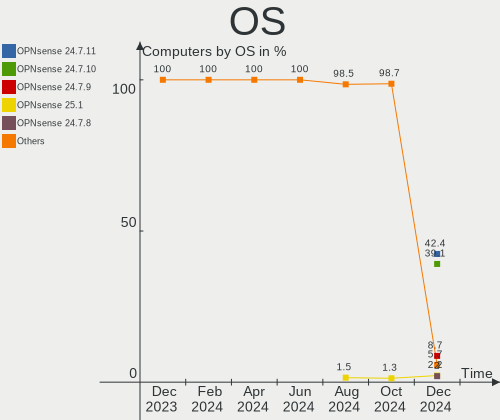
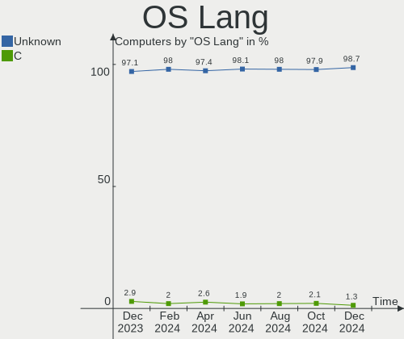
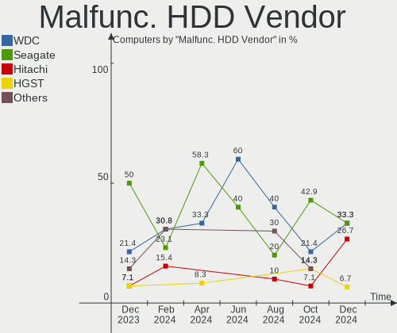
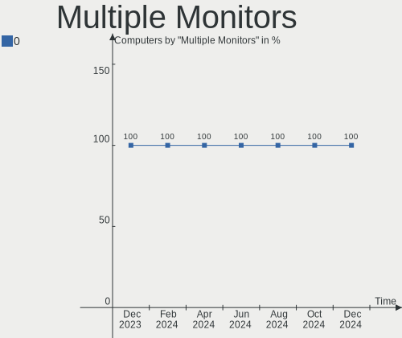
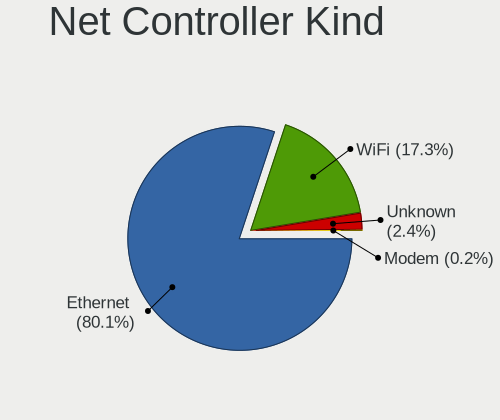
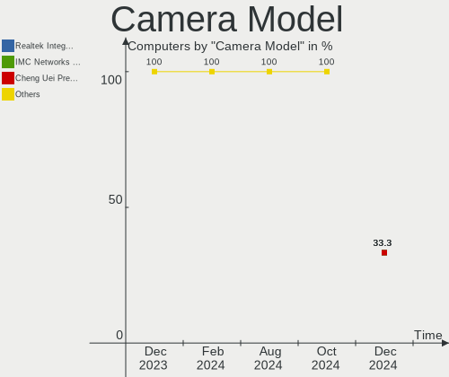

OPNsense - Hardware Trends
--------------------------

A project to identify most popular hardware characteristics and track their change
over time based on data collected by BSD users at https://BSD-Hardware.info.

Anyone can contribute to this report by the [hw-probe](https://github.com/linuxhw/hw-probe/blob/master/INSTALL.BSD.md) tool:

    hw-probe -all -upload

This report is for one last month. Overall report since the beginning of time: [TestCoverage](https://github.com/bsdhw/TestCoverage)

Period: May, 2022.

Contents
--------

* [ System ](#system)
  - [ OS                       ](#os)
  - [ OS Family                ](#os-family)
  - [ Arch                     ](#arch)
  - [ DE                       ](#de)
  - [ Display Server           ](#display-server)
  - [ Display Manager          ](#display-manager)
  - [ OS Lang                  ](#os-lang)
  - [ Boot Mode                ](#boot-mode)
  - [ Filesystem               ](#filesystem)
  - [ Part. scheme             ](#part-scheme)

* [ Board ](#board)
  - [ Vendor                   ](#vendor)
  - [ Model                    ](#model)
  - [ Model Family             ](#model-family)
  - [ MFG Year                 ](#mfg-year)
  - [ Form Factor              ](#form-factor)
  - [ Coreboot                 ](#coreboot)
  - [ RAM Size                 ](#ram-size)
  - [ RAM Used                 ](#ram-used)
  - [ Total Drives             ](#total-drives)
  - [ Has CD-ROM               ](#has-cd-rom)
  - [ Has Ethernet             ](#has-ethernet)
  - [ Has WiFi                 ](#has-wifi)
  - [ Has Bluetooth            ](#has-bluetooth)

* [ Location ](#location)
  - [ Country                  ](#country)
  - [ City                     ](#city)

* [ Drives ](#drives)
  - [ Drive Vendor             ](#drive-vendor)
  - [ Drive Model              ](#drive-model)
  - [ HDD Vendor               ](#hdd-vendor)
  - [ SSD Vendor               ](#ssd-vendor)
  - [ Drive Kind               ](#drive-kind)
  - [ Drive Connector          ](#drive-connector)
  - [ Drive Size               ](#drive-size)
  - [ Space Total              ](#space-total)
  - [ Space Used               ](#space-used)
  - [ Malfunc. Drives          ](#malfunc-drives)
  - [ Malfunc. Drive Vendor    ](#malfunc-drive-vendor)
  - [ Malfunc. HDD Vendor      ](#malfunc-hdd-vendor)
  - [ Malfunc. Drive Kind      ](#malfunc-drive-kind)
  - [ Failed Drives            ](#failed-drives)
  - [ Failed Drive Vendor      ](#failed-drive-vendor)
  - [ Drive Status             ](#drive-status)

* [ Storage controller ](#storage-controller)
  - [ Storage Vendor           ](#storage-vendor)
  - [ Storage Model            ](#storage-model)
  - [ Storage Kind             ](#storage-kind)

* [ Processor ](#processor)
  - [ CPU Vendor               ](#cpu-vendor)
  - [ CPU Model                ](#cpu-model)
  - [ CPU Model Family         ](#cpu-model-family)
  - [ CPU Cores                ](#cpu-cores)
  - [ CPU Sockets              ](#cpu-sockets)
  - [ CPU Threads              ](#cpu-threads)
  - [ CPU Microarch            ](#cpu-microarch)

* [ Graphics ](#graphics)
  - [ GPU Vendor               ](#gpu-vendor)
  - [ GPU Model                ](#gpu-model)
  - [ GPU Combo                ](#gpu-combo)
  - [ GPU Driver               ](#gpu-driver)
  - [ GPU Memory               ](#gpu-memory)

* [ Monitor ](#monitor)
  - [ Monitor Vendor           ](#monitor-vendor)
  - [ Monitor Model            ](#monitor-model)
  - [ Monitor Resolution       ](#monitor-resolution)
  - [ Monitor Diagonal         ](#monitor-diagonal)
  - [ Monitor Width            ](#monitor-width)
  - [ Aspect Ratio             ](#aspect-ratio)
  - [ Monitor Area             ](#monitor-area)
  - [ Pixel Density            ](#pixel-density)
  - [ Multiple Monitors        ](#multiple-monitors)

* [ Network ](#network)
  - [ Net Controller Vendor    ](#net-controller-vendor)
  - [ Net Controller Model     ](#net-controller-model)
  - [ Wireless Vendor          ](#wireless-vendor)
  - [ Wireless Model           ](#wireless-model)
  - [ Ethernet Vendor          ](#ethernet-vendor)
  - [ Ethernet Model           ](#ethernet-model)
  - [ Net Controller Kind      ](#net-controller-kind)
  - [ Used Controller          ](#used-controller)
  - [ NICs                     ](#nics)
  - [ IPv6                     ](#ipv6)

* [ Bluetooth ](#bluetooth)
  - [ Bluetooth Vendor         ](#bluetooth-vendor)
  - [ Bluetooth Model          ](#bluetooth-model)

* [ Sound ](#sound)
  - [ Sound Vendor             ](#sound-vendor)
  - [ Sound Model              ](#sound-model)

* [ Memory ](#memory)
  - [ Memory Vendor            ](#memory-vendor)
  - [ Memory Model             ](#memory-model)
  - [ Memory Kind              ](#memory-kind)
  - [ Memory Form Factor       ](#memory-form-factor)
  - [ Memory Size              ](#memory-size)
  - [ Memory Speed             ](#memory-speed)

* [ Printers & scanners ](#printers--scanners)
  - [ Printer Vendor           ](#printer-vendor)
  - [ Printer Model            ](#printer-model)
  - [ Scanner Vendor           ](#scanner-vendor)
  - [ Scanner Model            ](#scanner-model)

* [ Camera ](#camera)
  - [ Camera Vendor            ](#camera-vendor)
  - [ Camera Model             ](#camera-model)

* [ Security ](#security)
  - [ Fingerprint Vendor       ](#fingerprint-vendor)
  - [ Fingerprint Model        ](#fingerprint-model)
  - [ Chipcard Vendor          ](#chipcard-vendor)
  - [ Chipcard Model           ](#chipcard-model)

* [ Unsupported ](#unsupported)
  - [ Unsupported Devices      ](#unsupported-devices)
  - [ Unsupported Device Types ](#unsupported-device-types)

System
------

OS
--

Installed operating systems

| Name            | Computers | Percent |
|-----------------|-----------|---------|
| OPNsense 22.1.7 | 102       | 43.78%  |
| OPNsense 22.1.6 | 71        | 30.47%  |
| OPNsense 22.1.8 | 40        | 17.17%  |
| OPNsense 22.7   | 6         | 2.58%   |
| OPNsense 21.7.8 | 5         | 2.15%   |
| OPNsense 22.1.4 | 3         | 1.29%   |
| OPNsense 22.4   | 2         | 0.86%   |
| OPNsense 22.1.2 | 2         | 0.86%   |
| OPNsense 22.1   | 2         | 0.86%   |

OS Family
---------

OS without a version

| Name     | Computers | Percent |
|----------|-----------|---------|
| OPNsense | 233       | 100%    |

Arch
----

OS architecture (x86_64, i586, etc.)

| Name  | Computers | Percent |
|-------|-----------|---------|
| amd64 | 231       | 99.14%  |
| arm64 | 2         | 0.86%   |

DE
--

Desktop Environment

| Name    | Computers | Percent |
|---------|-----------|---------|
| Console | 233       | 100%    |

Display Server
--------------

X11 or Wayland

| Name    | Computers | Percent |
|---------|-----------|---------|
| Console | 233       | 100%    |

Display Manager
---------------

SDDM, LightDM, etc.

| Name    | Computers | Percent |
|---------|-----------|---------|
| Console | 233       | 100%    |

OS Lang
-------

Language

| Lang    | Computers | Percent |
|---------|-----------|---------|
| Unknown | 225       | 96.57%  |
| C       | 8         | 3.43%   |

Boot Mode
---------

EFI or BIOS

| Mode | Computers | Percent |
|------|-----------|---------|
| EFI  | 221       | 94.85%  |
| BIOS | 12        | 5.15%   |

Filesystem
----------

Type of filesystem

| Type | Computers | Percent |
|------|-----------|---------|
| Ufs  | 155       | 66.52%  |
| Zfs  | 78        | 33.48%  |

Part. scheme
------------

Scheme of partitioning

| Type    | Computers | Percent |
|---------|-----------|---------|
| GPT     | 224       | 96.14%  |
| MBR     | 7         | 3%      |
| Unknown | 2         | 0.86%   |

Board
-----

Vendor
------

Motherboard manufacturer

| Name                       | Computers | Percent |
|----------------------------|-----------|---------|
| Unknown                    | 27        | 11.59%  |
| Hewlett-Packard            | 23        | 9.87%   |
| Dell                       | 21        | 9.01%   |
| Protectli                  | 19        | 8.15%   |
| ASUSTek Computer           | 17        | 7.3%    |
| Intel                      | 14        | 6.01%   |
| Supermicro                 | 13        | 5.58%   |
| AMI                        | 9         | 3.86%   |
| ZOTAC                      | 7         | 3%      |
| Sophos                     | 7         | 3%      |
| Lenovo                     | 6         | 2.58%   |
| Gigabyte Technology        | 6         | 2.58%   |
| Fujitsu                    | 6         | 2.58%   |
| Deciso                     | 6         | 2.58%   |
| AWOW                       | 6         | 2.58%   |
| ASRock                     | 6         | 2.58%   |
| MSI                        | 5         | 2.15%   |
| BESSTAR Tech               | 5         | 2.15%   |
| MW                         | 4         | 1.72%   |
| PC Engines                 | 3         | 1.29%   |
| Biostar                    | 2         | 0.86%   |
| Acer                       | 2         | 0.86%   |
| YANYU                      | 1         | 0.43%   |
| SIEMENS                    | 1         | 0.43%   |
| Shuttle                    | 1         | 0.43%   |
| ShenZhen MinWin Technology | 1         | 0.43%   |
| Seeed Studio               | 1         | 0.43%   |
| radxa                      | 1         | 0.43%   |
| Pegatron                   | 1         | 0.43%   |
| NEXCOM                     | 1         | 0.43%   |
| JGINYUE                    | 1         | 0.43%   |
| iEi                        | 1         | 0.43%   |
| IBM                        | 1         | 0.43%   |
| HARDKERNEL                 | 1         | 0.43%   |
| friendlyelec               | 1         | 0.43%   |
| CompuLab                   | 1         | 0.43%   |
| CNCTION-IAF-E3845          | 1         | 0.43%   |
| BCM Advanced Research      | 1         | 0.43%   |
| AZW                        | 1         | 0.43%   |
| ADI Engineering            | 1         | 0.43%   |
| AAEON                      | 1         | 0.43%   |

Model
-----

Motherboard model

| Name                                     | Computers | Percent |
|------------------------------------------|-----------|---------|
| Unknown                                  | 28        | 12.02%  |
| Protectli FW4B                           | 8         | 3.43%   |
| AWOW PC BOX                              | 6         | 2.58%   |
| Intel Q3XXG4-P V1.0                      | 5         | 2.15%   |
| AMI Aptio CRB                            | 5         | 2.15%   |
| Supermicro Super Server                  | 4         | 1.72%   |
| Sophos SG                                | 4         | 1.72%   |
| Protectli FW6                            | 4         | 1.72%   |
| MW GMLK-2_5G4L                           | 4         | 1.72%   |
| Protectli FW2B                           | 3         | 1.29%   |
| MSI MS-7817                              | 3         | 1.29%   |
| Dell OptiPlex 3020                       | 3         | 1.29%   |
| Deciso Netboard A20                      | 3         | 1.29%   |
| ZOTAC ZBOX-CI323NANO                     | 2         | 0.86%   |
| Supermicro X9SCL/X9SCM                   | 2         | 0.86%   |
| Sophos UTM                               | 2         | 0.86%   |
| Protectli VP2410                         | 2         | 0.86%   |
| HP ProLiant MicroServer                  | 2         | 0.86%   |
| HP ProLiant DL360 G7                     | 2         | 0.86%   |
| Fujitsu PRIMERGY TX100 S3P               | 2         | 0.86%   |
| Fujitsu FUTRO S920                       | 2         | 0.86%   |
| Dell OptiPlex 990                        | 2         | 0.86%   |
| Dell OptiPlex 7010                       | 2         | 0.86%   |
| Deciso OPNsense Appliance                | 2         | 0.86%   |
| BESSTAR Tech GK41                        | 2         | 0.86%   |
| ASUS PRIME A320M-K                       | 2         | 0.86%   |
| AMI PEISIA E3845 VER1.0                  | 2         | 0.86%   |
| ZOTAC ZBOX-ID42-BE                       | 1         | 0.43%   |
| ZOTAC ZBOX-ID18                          | 1         | 0.43%   |
| ZOTAC ZBOX-CI341                         | 1         | 0.43%   |
| ZOTAC ZBOX-CI331NANO                     | 1         | 0.43%   |
| ZOTAC ZBOX-CI329NANO                     | 1         | 0.43%   |
| YANYU EPIC-N31 Ver:1.1                   | 1         | 0.43%   |
| Supermicro X9DRW                         | 1         | 0.43%   |
| Supermicro X7SPA-HF                      | 1         | 0.43%   |
| Supermicro SYS-6028R-TRT                 | 1         | 0.43%   |
| Supermicro SYS-5019D-FN8TP-2-NC041       | 1         | 0.43%   |
| Supermicro SYS-5019A-12TN4               | 1         | 0.43%   |
| Supermicro SYS-5018D-FN4T                | 1         | 0.43%   |
| Supermicro A1SAM-2550F                   | 1         | 0.43%   |
| Sophos XG                                | 1         | 0.43%   |
| SIEMENS SIMATIC IPC127E                  | 1         | 0.43%   |
| Shuttle DS10U                            | 1         | 0.43%   |
| ShenZhen MinWin MW-GMLK-2.5G6L           | 1         | 0.43%   |
| Seeed Studio ODYSSEY-X86J4125            | 1         | 0.43%   |
| radxa rock-pi-4                          | 1         | 0.43%   |
| Protectli FW6D                           | 1         | 0.43%   |
| Protectli FW4A                           | 1         | 0.43%   |
| Pegatron h8-1102nl                       | 1         | 0.43%   |
| PC Engines apu4                          | 1         | 0.43%   |
| PC Engines APU3                          | 1         | 0.43%   |
| PC Engines APU2                          | 1         | 0.43%   |
| NEXCOM NSA3110 B                         | 1         | 0.43%   |
| MSI Pro 3130 Small Form Factor PC        | 1         | 0.43%   |
| MSI MS-7C91                              | 1         | 0.43%   |
| Lenovo ThinkPad X240 20AMS1YG01          | 1         | 0.43%   |
| Lenovo ThinkCentre M92p 2121D5U          | 1         | 0.43%   |
| Lenovo ThinkCentre M82 2929CL6           | 1         | 0.43%   |
| Lenovo ThinkCentre M75s Gen 2 11R8000JUS | 1         | 0.43%   |
| Lenovo ThinkCentre M720q 10T7004BMB      | 1         | 0.43%   |

Model Family
------------

Motherboard model prefix

| Name                               | Computers | Percent |
|------------------------------------|-----------|---------|
| Unknown                            | 28        | 12.02%  |
| Dell OptiPlex                      | 12        | 5.15%   |
| HP ProLiant                        | 9         | 3.86%   |
| Protectli FW4B                     | 8         | 3.43%   |
| AWOW PC                            | 6         | 2.58%   |
| ASUS PRIME                         | 6         | 2.58%   |
| Intel Q3XXG4-P                     | 5         | 2.15%   |
| Dell PowerEdge                     | 5         | 2.15%   |
| AMI Aptio                          | 5         | 2.15%   |
| Supermicro Super                   | 4         | 1.72%   |
| Sophos SG                          | 4         | 1.72%   |
| Protectli FW6                      | 4         | 1.72%   |
| MW GMLK-2                          | 4         | 1.72%   |
| Lenovo ThinkCentre                 | 4         | 1.72%   |
| Deciso Netboard                    | 4         | 1.72%   |
| Protectli FW2B                     | 3         | 1.29%   |
| MSI MS-7817                        | 3         | 1.29%   |
| HP EliteBook                       | 3         | 1.29%   |
| HP Compaq                          | 3         | 1.29%   |
| ZOTAC ZBOX-CI323NANO               | 2         | 0.86%   |
| Supermicro X9SCL                   | 2         | 0.86%   |
| Sophos UTM                         | 2         | 0.86%   |
| Protectli VP2410                   | 2         | 0.86%   |
| HP ProDesk                         | 2         | 0.86%   |
| Fujitsu PRIMERGY                   | 2         | 0.86%   |
| Fujitsu FUTRO                      | 2         | 0.86%   |
| Fujitsu ESPRIMO                    | 2         | 0.86%   |
| Dell Precision                     | 2         | 0.86%   |
| Dell Inspiron                      | 2         | 0.86%   |
| Deciso OPNsense                    | 2         | 0.86%   |
| BESSTAR Tech GK41                  | 2         | 0.86%   |
| ASUS ROG                           | 2         | 0.86%   |
| AMI PEISIA                         | 2         | 0.86%   |
| Acer Aspire                        | 2         | 0.86%   |
| ZOTAC ZBOX-ID42-BE                 | 1         | 0.43%   |
| ZOTAC ZBOX-ID18                    | 1         | 0.43%   |
| ZOTAC ZBOX-CI341                   | 1         | 0.43%   |
| ZOTAC ZBOX-CI331NANO               | 1         | 0.43%   |
| ZOTAC ZBOX-CI329NANO               | 1         | 0.43%   |
| YANYU EPIC-N31                     | 1         | 0.43%   |
| Supermicro X9DRW                   | 1         | 0.43%   |
| Supermicro X7SPA-HF                | 1         | 0.43%   |
| Supermicro SYS-6028R-TRT           | 1         | 0.43%   |
| Supermicro SYS-5019D-FN8TP-2-NC041 | 1         | 0.43%   |
| Supermicro SYS-5019A-12TN4         | 1         | 0.43%   |
| Supermicro SYS-5018D-FN4T          | 1         | 0.43%   |
| Supermicro A1SAM-2550F             | 1         | 0.43%   |
| Sophos XG                          | 1         | 0.43%   |
| SIEMENS SIMATIC                    | 1         | 0.43%   |
| Shuttle DS10U                      | 1         | 0.43%   |
| ShenZhen MinWin MW-GMLK-2.5G6L     | 1         | 0.43%   |
| Seeed Studio ODYSSEY-X86J4125      | 1         | 0.43%   |
| radxa rock-pi-4                    | 1         | 0.43%   |
| Protectli FW6D                     | 1         | 0.43%   |
| Protectli FW4A                     | 1         | 0.43%   |
| Pegatron h8-1102nl                 | 1         | 0.43%   |
| PC Engines apu4                    | 1         | 0.43%   |
| PC Engines APU3                    | 1         | 0.43%   |
| PC Engines APU2                    | 1         | 0.43%   |
| NEXCOM NSA3110                     | 1         | 0.43%   |

MFG Year
--------

Motherboard manufacture year

| Year | Computers | Percent |
|------|-----------|---------|
| 2021 | 39        | 16.74%  |
| 2020 | 33        | 14.16%  |
| 2018 | 31        | 13.3%   |
| 2019 | 22        | 9.44%   |
| 2013 | 17        | 7.3%    |
| 2017 | 15        | 6.44%   |
| 2014 | 13        | 5.58%   |
| 2011 | 13        | 5.58%   |
| 2016 | 12        | 5.15%   |
| 2022 | 10        | 4.29%   |
| 2015 | 10        | 4.29%   |
| 2012 | 7         | 3%      |
| 2010 | 6         | 2.58%   |
| 2009 | 3         | 1.29%   |
| 2008 | 1         | 0.43%   |
| 2007 | 1         | 0.43%   |

Form Factor
-----------

Physical design of the computer

| Name     | Computers | Percent |
|----------|-----------|---------|
| Desktop  | 166       | 71.24%  |
| Mini pc  | 26        | 11.16%  |
| Server   | 18        | 7.73%   |
| Notebook | 16        | 6.87%   |
| Firewall | 7         | 3%      |

Coreboot
--------

Have coreboot on board

| Used | Computers | Percent |
|------|-----------|---------|
| No   | 225       | 96.57%  |
| Yes  | 8         | 3.43%   |

RAM Size
--------

Total RAM memory

| Size in GB      | Computers | Percent |
|-----------------|-----------|---------|
| 8.01-16.0       | 110       | 47.21%  |
| 4.01-8.0        | 53        | 22.75%  |
| 16.01-24.0      | 42        | 18.03%  |
| 32.01-64.0      | 13        | 5.58%   |
| 2.01-3.0        | 6         | 2.58%   |
| 64.01-256.0     | 4         | 1.72%   |
| More than 256.0 | 2         | 0.86%   |
| 24.01-32.0      | 2         | 0.86%   |
| 1.01-2.0        | 1         | 0.43%   |

RAM Used
--------

Used RAM memory

| Used GB  | Computers | Percent |
|----------|-----------|---------|
| 0.01-0.5 | 150       | 64.38%  |
| 0.51-1.0 | 58        | 24.89%  |
| 1.01-2.0 | 14        | 6.01%   |
| 4.01-8.0 | 5         | 2.15%   |
| 3.01-4.0 | 4         | 1.72%   |
| 2.01-3.0 | 2         | 0.86%   |

Total Drives
------------

Number of drives on board

| Drives | Computers | Percent |
|--------|-----------|---------|
| 1      | 187       | 80.26%  |
| 2      | 25        | 10.73%  |
| 0      | 19        | 8.15%   |
| 4      | 2         | 0.86%   |

Has CD-ROM
----------

Has CD-ROM on board

| Presented | Computers | Percent |
|-----------|-----------|---------|
| No        | 200       | 85.84%  |
| Yes       | 33        | 14.16%  |

Has Ethernet
------------

Has Ethernet on board

| Presented | Computers | Percent |
|-----------|-----------|---------|
| Yes       | 232       | 99.57%  |
| No        | 1         | 0.43%   |

Has WiFi
--------

Has WiFi module

| Presented | Computers | Percent |
|-----------|-----------|---------|
| No        | 187       | 80.26%  |
| Yes       | 46        | 19.74%  |

Has Bluetooth
-------------

Has Bluetooth module

| Presented | Computers | Percent |
|-----------|-----------|---------|
| No        | 200       | 85.84%  |
| Yes       | 33        | 14.16%  |

Location
--------

Country
-------

Geographic location (country)

| Country            | Computers | Percent |
|--------------------|-----------|---------|
| USA                | 71        | 30.47%  |
| Germany            | 47        | 20.17%  |
| Canada             | 13        | 5.58%   |
| UK                 | 7         | 3%      |
| Switzerland        | 6         | 2.58%   |
| Austria            | 6         | 2.58%   |
| France             | 5         | 2.15%   |
| Denmark            | 5         | 2.15%   |
| South Africa       | 4         | 1.72%   |
| Poland             | 4         | 1.72%   |
| Norway             | 4         | 1.72%   |
| Netherlands        | 4         | 1.72%   |
| Italy              | 4         | 1.72%   |
| Australia          | 4         | 1.72%   |
| Russia             | 3         | 1.29%   |
| Romania            | 3         | 1.29%   |
| Portugal           | 3         | 1.29%   |
| Dominican Republic | 3         | 1.29%   |
| Brazil             | 3         | 1.29%   |
| Belgium            | 3         | 1.29%   |
| Taiwan             | 2         | 0.86%   |
| Slovenia           | 2         | 0.86%   |
| Slovakia           | 2         | 0.86%   |
| Paraguay           | 2         | 0.86%   |
| New Zealand        | 2         | 0.86%   |
| Japan              | 2         | 0.86%   |
| Sweden             | 1         | 0.43%   |
| South Korea        | 1         | 0.43%   |
| Singapore          | 1         | 0.43%   |
| Peru               | 1         | 0.43%   |
| Monaco             | 1         | 0.43%   |
| Mexico             | 1         | 0.43%   |
| Malaysia           | 1         | 0.43%   |
| Lithuania          | 1         | 0.43%   |
| Israel             | 1         | 0.43%   |
| Indonesia          | 1         | 0.43%   |
| India              | 1         | 0.43%   |
| Hungary            | 1         | 0.43%   |
| Hong Kong          | 1         | 0.43%   |
| Greece             | 1         | 0.43%   |
| Czechia            | 1         | 0.43%   |
| Croatia            | 1         | 0.43%   |
| Colombia           | 1         | 0.43%   |
| China              | 1         | 0.43%   |
| Bolivia            | 1         | 0.43%   |

City
----

Geographic location (city)

| City               | Computers | Percent |
|--------------------|-----------|---------|
| Berlin             | 4         | 1.72%   |
| Austin             | 4         | 1.72%   |
| Vienna             | 3         | 1.29%   |
| Santo Domingo Este | 3         | 1.29%   |
| Zurich             | 2         | 0.86%   |
| Warsaw             | 2         | 0.86%   |
| Renton             | 2         | 0.86%   |
| Ponta Delgada      | 2         | 0.86%   |
| Pittsburgh         | 2         | 0.86%   |
| Perth              | 2         | 0.86%   |
| Ottawa             | 2         | 0.86%   |
| Orlando            | 2         | 0.86%   |
| Munich             | 2         | 0.86%   |
| Montreal           | 2         | 0.86%   |
| Melbourne          | 2         | 0.86%   |
| Hamm               | 2         | 0.86%   |
| Frankfurt am Main  | 2         | 0.86%   |
| Denver             | 2         | 0.86%   |
| Copenhagen         | 2         | 0.86%   |
| Bucharest          | 2         | 0.86%   |
| Bochum             | 2         | 0.86%   |
| Wichita Falls      | 1         | 0.43%   |
| West Fargo         | 1         | 0.43%   |
| Wendell            | 1         | 0.43%   |
| Wels               | 1         | 0.43%   |
| Watford            | 1         | 0.43%   |
| Warminster         | 1         | 0.43%   |
| Waldorf            | 1         | 0.43%   |
| Wachtberg          | 1         | 0.43%   |
| Victoria           | 1         | 0.43%   |
| Vénissieux        | 1         | 0.43%   |
| Velbert            | 1         | 0.43%   |
| Uppsala            | 1         | 0.43%   |
| Unterschleissheim  | 1         | 0.43%   |
| Trieste            | 1         | 0.43%   |
| Traverse City      | 1         | 0.43%   |
| Toulouse           | 1         | 0.43%   |
| Toronto            | 1         | 0.43%   |
| Tolmin             | 1         | 0.43%   |
| Tinley Park        | 1         | 0.43%   |
| Terrebonne         | 1         | 0.43%   |
| Teningen           | 1         | 0.43%   |
| Targoviste         | 1         | 0.43%   |
| Taipei             | 1         | 0.43%   |
| Tacoma             | 1         | 0.43%   |
| Taastrup           | 1         | 0.43%   |
| Surrey             | 1         | 0.43%   |
| Sunbury            | 1         | 0.43%   |
| Stuttgart          | 1         | 0.43%   |
| Stopnica           | 1         | 0.43%   |
| Statesboro         | 1         | 0.43%   |
| St-Malo            | 1         | 0.43%   |
| St Petersburg      | 1         | 0.43%   |
| Springfield        | 1         | 0.43%   |
| Somersworth        | 1         | 0.43%   |
| Skowhegan          | 1         | 0.43%   |
| Singapore          | 1         | 0.43%   |
| Scunthorpe         | 1         | 0.43%   |
| Schmallenberg      | 1         | 0.43%   |
| Sarnia             | 1         | 0.43%   |

Drives
------

Drive Vendor
------------

Hard drive vendors

| Vendor              | Computers | Drives | Percent |
|---------------------|-----------|--------|---------|
| Samsung Electronics | 29        | 29     | 12.45%  |
| Kingston            | 26        | 27     | 11.16%  |
| Transcend           | 20        | 20     | 8.58%   |
| WDC                 | 17        | 19     | 7.3%    |
| Seagate             | 11        | 12     | 4.72%   |
| Crucial             | 11        | 11     | 4.72%   |
| Intel               | 10        | 13     | 4.29%   |
| Hoodisk             | 8         | 8      | 3.43%   |
| FORESEE             | 8         | 8      | 3.43%   |
| China               | 8         | 8      | 3.43%   |
| SanDisk             | 7         | 8      | 3%      |
| A-DATA Technology   | 6         | 8      | 2.58%   |
| Toshiba             | 5         | 7      | 2.15%   |
| Hitachi             | 5         | 6      | 2.15%   |
| Hewlett-Packard     | 5         | 5      | 2.15%   |
| ShiJi               | 4         | 4      | 1.72%   |
| Intenso             | 4         | 4      | 1.72%   |
| Dogfish             | 4         | 4      | 1.72%   |
| BIWIN               | 4         | 4      | 1.72%   |
| Apacer              | 4         | 4      | 1.72%   |
| SPCC                | 3         | 3      | 1.29%   |
| Protectli           | 3         | 3      | 1.29%   |
| OCZ                 | 3         | 3      | 1.29%   |
| Wicgtyp             | 2         | 2      | 0.86%   |
| Phison              | 2         | 2      | 0.86%   |
| KingSpec            | 2         | 2      | 0.86%   |
| Verbatim            | 1         | 1      | 0.43%   |
| Vaseky              | 1         | 1      | 0.43%   |
| Team                | 1         | 1      | 0.43%   |
| SuperMicro          | 1         | 1      | 0.43%   |
| Patriot             | 1         | 1      | 0.43%   |
| ORTIAL              | 1         | 1      | 0.43%   |
| MyDigitalSSD        | 1         | 1      | 0.43%   |
| Micron Technology   | 1         | 1      | 0.43%   |
| LSI                 | 1         | 1      | 0.43%   |
| LITEONIT            | 1         | 1      | 0.43%   |
| Lexar               | 1         | 1      | 0.43%   |
| KIOXIA              | 1         | 1      | 0.43%   |
| Kingchuxing         | 1         | 1      | 0.43%   |
| InnoLite            | 1         | 1      | 0.43%   |
| HGST                | 1         | 2      | 0.43%   |
| Gigabyte Technology | 1         | 1      | 0.43%   |
| Fordisk             | 1         | 1      | 0.43%   |
| EAGET               | 1         | 1      | 0.43%   |
| DST                 | 1         | 1      | 0.43%   |
| Drevo               | 1         | 1      | 0.43%   |
| Corsair             | 1         | 1      | 0.43%   |
| AMD                 | 1         | 1      | 0.43%   |

Drive Model
-----------

Hard drive models

| Model                                | Computers | Percent |
|--------------------------------------|-----------|---------|
| FORESEE 128GB SSD                    | 7         | 2.98%   |
| Hoodisk SSD 32GB                     | 4         | 1.7%    |
| Crucial CT240BX500SSD1 240GB         | 4         | 1.7%    |
| BIWIN SSD 128GB                      | 4         | 1.7%    |
| Transcend TS64GMSA230S 64GB          | 3         | 1.28%   |
| ShiJi SSD 128GB                      | 3         | 1.28%   |
| Samsung SSD 850 EVO 250GB            | 3         | 1.28%   |
| Kingston SV300S37A60G 64GB           | 3         | 1.28%   |
| Kingston SKC600MS256G 256GB          | 3         | 1.28%   |
| Kingston SA400S37240G 240GB          | 3         | 1.28%   |
| Hoodisk SSD 128GB                    | 3         | 1.28%   |
| HP RAID 1(1+0) 146GB                 | 3         | 1.28%   |
| Wicgtyp M900-128 128GB               | 2         | 0.85%   |
| WDC WD2503ABYX-01WERA1 256GB         | 2         | 0.85%   |
| Transcend TS64GSSD370 64GB           | 2         | 0.85%   |
| Transcend TS64GMSA370 64GB           | 2         | 0.85%   |
| Transcend TS256GMTS952T2 256GB       | 2         | 0.85%   |
| Transcend TS256GMTE652T2 256GB       | 2         | 0.85%   |
| Transcend TS256GMSA230S 256GB        | 2         | 0.85%   |
| Transcend TS128GMSA230S 128GB        | 2         | 0.85%   |
| Toshiba DT01ACA100 1TB               | 2         | 0.85%   |
| SPCC Solid State Disk 1TB            | 2         | 0.85%   |
| Samsung SSD 860 EVO 500GB            | 2         | 0.85%   |
| Samsung SSD 850 PRO 128GB            | 2         | 0.85%   |
| Samsung SSD 850 EVO 500GB            | 2         | 0.85%   |
| Phison Sabrent 1TB                   | 2         | 0.85%   |
| Kingston SV300S37A120G 120GB         | 2         | 0.85%   |
| Kingston SUV500MS120G 120GB          | 2         | 0.85%   |
| Kingston SUV400S37120G 120GB         | 2         | 0.85%   |
| Kingston SA400S37120G 120GB          | 2         | 0.85%   |
| Kingston OM8PDP3256B-A01 256GB       | 2         | 0.85%   |
| Dogfish SSD 128GB                    | 2         | 0.85%   |
| Crucial CT500MX500SSD1 500GB         | 2         | 0.85%   |
| China FPT310M8SSD128G 128GB          | 2         | 0.85%   |
| Apacer 32GB SATA Flash Drive         | 2         | 0.85%   |
| Apacer 16GB SATA Flash Drive         | 2         | 0.85%   |
| WDC WDS120G2G0A-00JH30 120GB         | 1         | 0.43%   |
| WDC WD7500AAVS-00M4B0 752GB          | 1         | 0.43%   |
| WDC WD4000AAKS-00C8A0 400GB          | 1         | 0.43%   |
| WDC WD3200BEVT-22A23T0 320GB         | 1         | 0.43%   |
| WDC WD3200BEKT-00KA9T0 320GB         | 1         | 0.43%   |
| WDC WD3200AAJS-60M0A0 320GB          | 1         | 0.43%   |
| WDC WD2500AAKX-753CA1 250GB          | 1         | 0.43%   |
| WDC WD2500AAJS-07M0A0 250GB          | 1         | 0.43%   |
| WDC WD2003FYYS-02W0B0 2TB            | 1         | 0.43%   |
| WDC WD10EZRX-00L4HB0 1TB             | 1         | 0.43%   |
| WDC WD10EZEX-22MFCA0 1TB             | 1         | 0.43%   |
| WDC WD10EZEX-00RKKA0 1TB             | 1         | 0.43%   |
| WDC WD1002FAEX-00Y9A0 1TB            | 1         | 0.43%   |
| WDC PC SN730 SDBQNTY-512G-1001 512GB | 1         | 0.43%   |
| WDC PC SN520 SDAPNUW-512G-1006 512GB | 1         | 0.43%   |
| Verbatim Vi550 S3 SSD 512GB          | 1         | 0.43%   |
| Vaseky V850-64G                      | 1         | 0.43%   |
| Transcend TSG128MTS400ISI 128GB      | 1         | 0.43%   |
| Transcend TS256GSSD370 256GB         | 1         | 0.43%   |
| Transcend TS256GMTE220S 256GB        | 1         | 0.43%   |
| Transcend TS256GMSA452T2 256GB       | 1         | 0.43%   |
| Transcend TS120GSSD220S 120GB        | 1         | 0.43%   |
| Toshiba MQ01ABD075 752GB             | 1         | 0.43%   |
| Toshiba KBG30ZMS256G NVMe 256GB      | 1         | 0.43%   |

HDD Vendor
----------

Hard disk drive vendors

| Vendor              | Computers | Drives | Percent |
|---------------------|-----------|--------|---------|
| WDC                 | 14        | 16     | 33.33%  |
| Seagate             | 10        | 11     | 23.81%  |
| Hitachi             | 5         | 6      | 11.9%   |
| Hewlett-Packard     | 5         | 5      | 11.9%   |
| Toshiba             | 4         | 6      | 9.52%   |
| Samsung Electronics | 1         | 1      | 2.38%   |
| LSI                 | 1         | 1      | 2.38%   |
| InnoLite            | 1         | 1      | 2.38%   |
| HGST                | 1         | 2      | 2.38%   |

SSD Vendor
----------

Solid state drive vendors

| Vendor              | Computers | Drives | Percent |
|---------------------|-----------|--------|---------|
| Kingston            | 23        | 24     | 13.86%  |
| Samsung Electronics | 21        | 21     | 12.65%  |
| Transcend           | 17        | 17     | 10.24%  |
| Crucial             | 9         | 9      | 5.42%   |
| Intel               | 8         | 11     | 4.82%   |
| Hoodisk             | 8         | 8      | 4.82%   |
| FORESEE             | 8         | 8      | 4.82%   |
| China               | 8         | 8      | 4.82%   |
| SanDisk             | 7         | 8      | 4.22%   |
| A-DATA Technology   | 5         | 7      | 3.01%   |
| ShiJi               | 4         | 4      | 2.41%   |
| Intenso             | 4         | 4      | 2.41%   |
| Dogfish             | 4         | 4      | 2.41%   |
| BIWIN               | 4         | 4      | 2.41%   |
| Apacer              | 4         | 4      | 2.41%   |
| SPCC                | 3         | 3      | 1.81%   |
| Protectli           | 3         | 3      | 1.81%   |
| OCZ                 | 3         | 3      | 1.81%   |
| Wicgtyp             | 2         | 2      | 1.2%    |
| KingSpec            | 2         | 2      | 1.2%    |
| WDC                 | 1         | 1      | 0.6%    |
| Verbatim            | 1         | 1      | 0.6%    |
| Vaseky              | 1         | 1      | 0.6%    |
| Team                | 1         | 1      | 0.6%    |
| SuperMicro          | 1         | 1      | 0.6%    |
| Seagate             | 1         | 1      | 0.6%    |
| Patriot             | 1         | 1      | 0.6%    |
| MyDigitalSSD        | 1         | 1      | 0.6%    |
| Micron Technology   | 1         | 1      | 0.6%    |
| LITEONIT            | 1         | 1      | 0.6%    |
| Lexar               | 1         | 1      | 0.6%    |
| Kingchuxing         | 1         | 1      | 0.6%    |
| Gigabyte Technology | 1         | 1      | 0.6%    |
| Fordisk             | 1         | 1      | 0.6%    |
| EAGET               | 1         | 1      | 0.6%    |
| DST                 | 1         | 1      | 0.6%    |
| Drevo               | 1         | 1      | 0.6%    |
| Corsair             | 1         | 1      | 0.6%    |
| AMD                 | 1         | 1      | 0.6%    |

Drive Kind
----------

HDD or SSD

| Kind | Computers | Drives | Percent |
|------|-----------|--------|---------|
| SSD  | 160       | 173    | 71.43%  |
| HDD  | 39        | 49     | 17.41%  |
| NVMe | 25        | 25     | 11.16%  |

Drive Connector
---------------

SATA, SAS, NVMe, etc.

| Type | Computers | Drives | Percent |
|------|-----------|--------|---------|
| SATA | 191       | 222    | 88.43%  |
| NVMe | 25        | 25     | 11.57%  |

Drive Size
----------

Size of hard drive

| Size in TB | Computers | Drives | Percent |
|------------|-----------|--------|---------|
| 0.01-0.5   | 173       | 194    | 87.37%  |
| 0.51-1.0   | 18        | 19     | 9.09%   |
| 1.01-2.0   | 7         | 9      | 3.54%   |

Space Total
-----------

Amount of disk space available on the file system

| Size in GB     | Computers | Percent |
|----------------|-----------|---------|
| 101-250        | 126       | 54.08%  |
| 21-50          | 29        | 12.45%  |
| 251-500        | 24        | 10.3%   |
| 51-100         | 23        | 9.87%   |
| 501-1000       | 16        | 6.87%   |
| 1-20           | 8         | 3.43%   |
| 1001-2000      | 4         | 1.72%   |
| Unknown        | 2         | 0.86%   |
| More than 3000 | 1         | 0.43%   |

Space Used
----------

Amount of used disk space

| Used GB | Computers | Percent |
|---------|-----------|---------|
| 1-20    | 216       | 92.7%   |
| 21-50   | 7         | 3%      |
| 51-100  | 5         | 2.15%   |
| 101-250 | 3         | 1.29%   |
| Unknown | 2         | 0.86%   |

Malfunc. Drives
---------------

Drive models with a malfunction

| Model                              | Computers | Drives | Percent |
|------------------------------------|-----------|--------|---------|
| WDC WDS120G2G0A-00JH30 120GB       | 1         | 1      | 5.88%   |
| WDC WD4000AAKS-00C8A0 400GB        | 1         | 1      | 5.88%   |
| WDC WD3200BEVT-22A23T0 320GB       | 1         | 1      | 5.88%   |
| WDC WD3200AAJS-60M0A0 320GB        | 1         | 1      | 5.88%   |
| Toshiba MQ01ABD075 752GB           | 1         | 1      | 5.88%   |
| Seagate ST3500413AS 500GB          | 1         | 1      | 5.88%   |
| Seagate ST1000LM024 HN-M101MBB 1TB | 1         | 1      | 5.88%   |
| SanDisk SSD i110 32GB              | 1         | 1      | 5.88%   |
| SanDisk SD8TB8U-256G-1006 256GB    | 1         | 1      | 5.88%   |
| OCZ VERTEX3 90GB                   | 1         | 1      | 5.88%   |
| OCZ VERTEX 32GB                    | 1         | 1      | 5.88%   |
| MyDigitalSSD SB2 128GB             | 1         | 1      | 5.88%   |
| Kingston SV300S37A60G 64GB         | 1         | 1      | 5.88%   |
| InnoLite InnoDisk. - iCF 16GB      | 1         | 1      | 5.88%   |
| Hitachi HDS723015BLA642 1.5TB      | 1         | 1      | 5.88%   |
| Apacer 32GB SATA Flash Drive       | 1         | 1      | 5.88%   |
| Apacer 16GB SATA Flash Drive       | 1         | 1      | 5.88%   |

Malfunc. Drive Vendor
---------------------

Vendors of faulty drives

| Vendor       | Computers | Drives | Percent |
|--------------|-----------|--------|---------|
| WDC          | 4         | 4      | 23.53%  |
| Seagate      | 2         | 2      | 11.76%  |
| SanDisk      | 2         | 2      | 11.76%  |
| OCZ          | 2         | 2      | 11.76%  |
| Apacer       | 2         | 2      | 11.76%  |
| Toshiba      | 1         | 1      | 5.88%   |
| MyDigitalSSD | 1         | 1      | 5.88%   |
| Kingston     | 1         | 1      | 5.88%   |
| InnoLite     | 1         | 1      | 5.88%   |
| Hitachi      | 1         | 1      | 5.88%   |

Malfunc. HDD Vendor
-------------------

Vendors of faulty HDD drives

| Vendor   | Computers | Drives | Percent |
|----------|-----------|--------|---------|
| WDC      | 3         | 3      | 37.5%   |
| Seagate  | 2         | 2      | 25%     |
| Toshiba  | 1         | 1      | 12.5%   |
| InnoLite | 1         | 1      | 12.5%   |
| Hitachi  | 1         | 1      | 12.5%   |

Malfunc. Drive Kind
-------------------

Kinds of faulty drives

| Kind | Computers | Drives | Percent |
|------|-----------|--------|---------|
| SSD  | 9         | 9      | 52.94%  |
| HDD  | 8         | 8      | 47.06%  |

Failed Drives
-------------

Failed drive models

Zero info for selected period =(

Failed Drive Vendor
-------------------

Failed drive vendors

Zero info for selected period =(

Drive Status
------------

Number of failed and malfunc. drives

| Status   | Computers | Drives | Percent |
|----------|-----------|--------|---------|
| Works    | 197       | 225    | 89.95%  |
| Malfunc  | 17        | 17     | 7.76%   |
| Detected | 5         | 5      | 2.28%   |

Storage controller
------------------

Storage Vendor
--------------

Storage controller vendors

| Vendor                      | Computers | Percent |
|-----------------------------|-----------|---------|
| Intel                       | 198       | 76.74%  |
| AMD                         | 24        | 9.3%    |
| Samsung Electronics         | 7         | 2.71%   |
| Broadcom / LSI              | 6         | 2.33%   |
| Hewlett-Packard             | 4         | 1.55%   |
| Kingston Technology Company | 3         | 1.16%   |
| Silicon Motion              | 2         | 0.78%   |
| Sandisk                     | 2         | 0.78%   |
| Phison Electronics          | 2         | 0.78%   |
| Micron/Crucial Technology   | 2         | 0.78%   |
| Unknown                     | 2         | 0.78%   |
| Toshiba                     | 1         | 0.39%   |
| Marvell Technology Group    | 1         | 0.39%   |
| KIOXIA                      | 1         | 0.39%   |
| JMicron Technology          | 1         | 0.39%   |
| Chelsio Communications      | 1         | 0.39%   |
| ADATA Technology            | 1         | 0.39%   |

Storage Model
-------------

Storage controller models

| Model                                                                                   | Computers | Percent |
|-----------------------------------------------------------------------------------------|-----------|---------|
| Intel Celeron/Pentium Silver Processor SATA Controller                                  | 25        | 8.62%   |
| Intel 8 Series/C220 Series Chipset Family 6-port SATA Controller 1 [AHCI mode]          | 23        | 7.93%   |
| Intel Atom/Celeron/Pentium Processor x5-E8000/J3xxx/N3xxx Series SATA Controller        | 19        | 6.55%   |
| AMD FCH SATA Controller [AHCI mode]                                                     | 14        | 4.83%   |
| Intel Sunrise Point-LP SATA Controller [AHCI mode]                                      | 13        | 4.48%   |
| Intel 6 Series/C200 Series Chipset Family 6 port Desktop SATA AHCI Controller           | 12        | 4.14%   |
| Intel Atom Processor E3800 Series SATA AHCI Controller                                  | 11        | 3.79%   |
| Intel Celeron N3350/Pentium N4200/Atom E3900 Series SATA AHCI Controller                | 8         | 2.76%   |
| Intel 8 Series SATA Controller 1 [AHCI mode]                                            | 6         | 2.07%   |
| Intel 200 Series PCH SATA controller [AHCI mode]                                        | 6         | 2.07%   |
| Intel C620 Series Chipset Family SSATA Controller [AHCI mode]                           | 5         | 1.72%   |
| Intel C620 Series Chipset Family SATA Controller [AHCI mode]                            | 5         | 1.72%   |
| Intel Wildcat Point-LP SATA Controller [AHCI Mode]                                      | 4         | 1.38%   |
| Intel Cannon Point-LP SATA Controller [AHCI Mode]                                       | 4         | 1.38%   |
| Intel Cannon Lake PCH SATA AHCI Controller                                              | 4         | 1.38%   |
| Intel 82801JI (ICH10 Family) 4 port SATA IDE Controller #1                              | 4         | 1.38%   |
| Intel 7 Series/C210 Series Chipset Family 4-port SATA Controller [IDE mode]             | 4         | 1.38%   |
| Intel 7 Series/C210 Series Chipset Family 2-port SATA Controller [IDE mode]             | 4         | 1.38%   |
| HP Smart Array G6 controllers                                                           | 4         | 1.38%   |
| AMD SB7x0/SB8x0/SB9x0 SATA Controller [AHCI mode]                                       | 4         | 1.38%   |
| AMD 500 Series Chipset SATA Controller                                                  | 4         | 1.38%   |
| Unknown                                                                                 | 4         | 1.38%   |
| Samsung NVMe SSD Controller SM981/PM981/PM983                                           | 3         | 1.03%   |
| Intel Comet Lake SATA AHCI Controller                                                   | 3         | 1.03%   |
| Intel C610/X99 series chipset 6-Port SATA Controller [AHCI mode]                        | 3         | 1.03%   |
| Intel Atom processor C2000 AHCI SATA3 Controller                                        | 3         | 1.03%   |
| Intel 82801G (ICH7 Family) IDE Controller                                               | 3         | 1.03%   |
| Intel 7 Series/C210 Series Chipset Family 6-port SATA Controller [AHCI mode]            | 3         | 1.03%   |
| Intel 7 Series Chipset Family 6-port SATA Controller [AHCI mode]                        | 3         | 1.03%   |
| Samsung NVMe SSD Controller SM961/PM961/SM963                                           | 2         | 0.69%   |
| Phison E12 NVMe Controller                                                              | 2         | 0.69%   |
| Micron/Crucial P2 NVMe PCIe SSD                                                         | 2         | 0.69%   |
| Kingston Company OM3PDP3 NVMe SSD                                                       | 2         | 0.69%   |
| Intel Q170/Q150/B150/H170/H110/Z170/CM236 Chipset SATA Controller [AHCI Mode]           | 2         | 0.69%   |
| Intel NM10/ICH7 Family SATA Controller [IDE mode]                                       | 2         | 0.69%   |
| Intel NM10/ICH7 Family SATA Controller [AHCI mode]                                      | 2         | 0.69%   |
| Intel C610/X99 series chipset sSATA Controller [AHCI mode]                              | 2         | 0.69%   |
| Intel Atom processor C2000 AHCI SATA2 Controller                                        | 2         | 0.69%   |
| Intel Alder Lake-S PCH SATA Controller [AHCI Mode]                                      | 2         | 0.69%   |
| Intel 82801JI (ICH10 Family) SATA AHCI Controller                                       | 2         | 0.69%   |
| Intel 82801 Mobile SATA Controller [RAID mode]                                          | 2         | 0.69%   |
| Intel 6 Series/C200 Series Chipset Family Desktop SATA Controller (IDE mode, ports 4-5) | 2         | 0.69%   |
| Intel 6 Series/C200 Series Chipset Family Desktop SATA Controller (IDE mode, ports 0-3) | 2         | 0.69%   |
| Intel 6 Series/C200 Series Chipset Family 6 port Mobile SATA AHCI Controller            | 2         | 0.69%   |
| Intel 500 Series Chipset Family SATA AHCI Controller                                    | 2         | 0.69%   |
| Intel 5 Series/3400 Series Chipset 6 port SATA AHCI Controller                          | 2         | 0.69%   |
| Broadcom / LSI MegaRAID SAS-3 3108 [Invader]                                            | 2         | 0.69%   |
| AMD FCH SATA Controller D                                                               | 2         | 0.69%   |
| AMD 400 Series Chipset SATA Controller                                                  | 2         | 0.69%   |
| Toshiba BG3 NVMe SSD Controller                                                         | 1         | 0.34%   |
| Silicon Motion SM2263EN/SM2263XT SSD Controller                                         | 1         | 0.34%   |
| Silicon Motion SM2262/SM2262EN SSD Controller                                           | 1         | 0.34%   |
| Sandisk WD Blue SN500 / PC SN520 NVMe SSD                                               | 1         | 0.34%   |
| Sandisk WD Black SN750 / PC SN730 NVMe SSD                                              | 1         | 0.34%   |
| Samsung NVMe SSD Controller PM9A1/PM9A3/980PRO                                          | 1         | 0.34%   |
| Samsung NVMe SSD Controller 980                                                         | 1         | 0.34%   |
| Marvell Group 88SE9230 PCIe 2.0 x2 4-port SATA 6 Gb/s RAID Controller                   | 1         | 0.34%   |
| KIOXIA unknown                                                                          | 1         | 0.34%   |
| JMicron JMB363 SATA/IDE Controller                                                      | 1         | 0.34%   |
| Intel Volume Management Device NVMe RAID Controller                                     | 1         | 0.34%   |

Storage Kind
------------

Kind of storage controller (IDE, SATA, NVMe, SAS, ...)

| Kind | Computers | Percent |
|------|-----------|---------|
| SATA | 202       | 75.66%  |
| NVMe | 25        | 9.36%   |
| IDE  | 22        | 8.24%   |
| RAID | 14        | 5.24%   |
| SAS  | 2         | 0.75%   |
| SCSI | 2         | 0.75%   |

Processor
---------

CPU Vendor
----------

Processor vendors

| Vendor | Computers | Percent |
|--------|-----------|---------|
| Intel  | 202       | 86.7%   |
| AMD    | 29        | 12.45%  |
| ARM    | 2         | 0.86%   |

CPU Model
---------

Processor models

| Model                                       | Computers | Percent |
|---------------------------------------------|-----------|---------|
| Intel Celeron J4125 CPU @ 2.00GHz           | 21        | 9.01%   |
| Intel Celeron CPU J3160 @ 1.60GHz           | 11        | 4.72%   |
| Intel Celeron CPU J1900 @ 1.99GHz           | 6         | 2.58%   |
| Intel Xeon CPU E3-1220 v3 @ 3.10GHz         | 5         | 2.15%   |
| Intel Xeon D-2123IT CPU @ 2.20GHz           | 3         | 1.29%   |
| Intel Core i5-6500 CPU @ 3.20GHz            | 3         | 1.29%   |
| Intel Celeron CPU N3450 @ 1.10GHz           | 3         | 1.29%   |
| Intel Celeron CPU J3455E @ 1.50GHz          | 3         | 1.29%   |
| Intel Celeron CPU J3060 @ 1.60GHz           | 3         | 1.29%   |
| Intel Celeron CPU 3865U @ 1.80GHz           | 3         | 1.29%   |
| Intel Atom CPU E3845 @ 1.91GHz              | 3         | 1.29%   |
| AMD GX-412TC SOC                            | 3         | 1.29%   |
| Intel Xeon CPU E3-1225 V2 @ 3.20GHz         | 2         | 0.86%   |
| Intel Xeon CPU E3-1220 V2 @ 3.10GHz         | 2         | 0.86%   |
| Intel Pentium CPU N3700 @ 1.60GHz           | 2         | 0.86%   |
| Intel Core i7-10510U CPU @ 1.80GHz          | 2         | 0.86%   |
| Intel Core i5-8265U CPU @ 1.60GHz           | 2         | 0.86%   |
| Intel Core i5-8250U CPU @ 1.60GHz           | 2         | 0.86%   |
| Intel Core i5-6200U CPU @ 2.30GHz           | 2         | 0.86%   |
| Intel Core i5-4570 CPU @ 3.20GHz            | 2         | 0.86%   |
| Intel Core i5-3470 CPU @ 3.20GHz            | 2         | 0.86%   |
| Intel Core i5-2520M CPU @ 2.50GHz           | 2         | 0.86%   |
| Intel Core i5-10400 CPU @ 2.90GHz           | 2         | 0.86%   |
| Intel Core i3-7100U CPU @ 2.40GHz           | 2         | 0.86%   |
| Intel Core i3-4160 CPU @ 3.60GHz            | 2         | 0.86%   |
| Intel Core i3-4150 CPU @ 3.50GHz            | 2         | 0.86%   |
| Intel Core i3-4130 CPU @ 3.40GHz            | 2         | 0.86%   |
| Intel Celeron N4100 CPU @ 1.10GHz           | 2         | 0.86%   |
| Intel Celeron CPU N3150 @ 1.60GHz           | 2         | 0.86%   |
| Intel Celeron CPU G1820 @ 2.70GHz           | 2         | 0.86%   |
| ARM Cortex-A53 r0p4                         | 2         | 0.86%   |
| AMD Turion II Neo N40L Dual-Core Processor  | 2         | 0.86%   |
| AMD Ryzen Embedded V1500B                   | 2         | 0.86%   |
| AMD Ryzen 5 3600 6-Core Processor           | 2         | 0.86%   |
| AMD GX-415GA SOC with Radeon HD Graphics    | 2         | 0.86%   |
| AMD EPYC 3201 8-Core Processor              | 2         | 0.86%   |
| Intel Xeon Silver 4114 CPU @ 2.20GHz        | 1         | 0.43%   |
| Intel Xeon Gold 6126 CPU @ 2.60GHz          | 1         | 0.43%   |
| Intel Xeon CPU X5670 @ 2.93GHz              | 1         | 0.43%   |
| Intel Xeon CPU X5660 @ 2.80GHz              | 1         | 0.43%   |
| Intel Xeon CPU E5645 @ 2.40GHz              | 1         | 0.43%   |
| Intel Xeon CPU E5620 @ 2.40GHz              | 1         | 0.43%   |
| Intel Xeon CPU E5520 @ 2.27GHz              | 1         | 0.43%   |
| Intel Xeon CPU E5-2660 v4 @ 2.00GHz         | 1         | 0.43%   |
| Intel Xeon CPU E5-2660 v3 @ 2.60GHz         | 1         | 0.43%   |
| Intel Xeon CPU E5-2630 v4 @ 2.20GHz         | 1         | 0.43%   |
| Intel Xeon CPU E5-2620 0 @ 2.00GHz          | 1         | 0.43%   |
| Intel Xeon CPU E31240 @ 3.30GHz             | 1         | 0.43%   |
| Intel Xeon CPU E31220 @ 3.10GHz             | 1         | 0.43%   |
| Intel Xeon CPU E3-1265L V2 @ 2.50GHz        | 1         | 0.43%   |
| Intel Xeon CPU E3-1226 v3 @ 3.30GHz         | 1         | 0.43%   |
| Intel Xeon CPU E3-1225 v5 @ 3.30GHz         | 1         | 0.43%   |
| Intel Xeon CPU D-1540 @ 2.00GHz             | 1         | 0.43%   |
| Intel Xeon                                  | 1         | 0.43%   |
| Intel Pentium Gold G7400                    | 1         | 0.43%   |
| Intel Pentium Dual-Core CPU E6600           | 1         | 0.43%   |
| Intel Pentium Dual-Core CPU E5800 @ 3.20GHz | 1         | 0.43%   |
| Intel Pentium Dual CPU E2180 @ 2.00GHz      | 1         | 0.43%   |
| Intel Pentium CPU N3530 @ 2.16GHz           | 1         | 0.43%   |
| Intel Pentium CPU G4400T @ 2.90GHz          | 1         | 0.43%   |

CPU Model Family
----------------

Processor model prefix

| Model                   | Computers | Percent |
|-------------------------|-----------|---------|
| Intel Celeron           | 67        | 28.76%  |
| Intel Core i5           | 42        | 18.03%  |
| Intel Xeon              | 28        | 12.02%  |
| Intel Core i3           | 21        | 9.01%   |
| Intel Atom              | 11        | 4.72%   |
| Intel Core i7           | 10        | 4.29%   |
| Intel Pentium           | 9         | 3.86%   |
| AMD GX                  | 7         | 3%      |
| AMD Ryzen 5             | 5         | 2.15%   |
| AMD EPYC                | 4         | 1.72%   |
| Other                   | 3         | 1.29%   |
| Intel Core 2 Quad       | 3         | 1.29%   |
| AMD Ryzen 7             | 3         | 1.29%   |
| Intel Pentium Dual-Core | 2         | 0.86%   |
| Intel Core 2 Duo        | 2         | 0.86%   |
| ARM Cortex              | 2         | 0.86%   |
| AMD Turion II Neo       | 2         | 0.86%   |
| AMD Ryzen Embedded      | 2         | 0.86%   |
| Intel Xeon Silver       | 1         | 0.43%   |
| Intel Xeon Gold         | 1         | 0.43%   |
| Intel Pentium Gold      | 1         | 0.43%   |
| Intel Pentium Dual      | 1         | 0.43%   |
| AMD Ryzen 5 PRO         | 1         | 0.43%   |
| AMD Ryzen 3 PRO         | 1         | 0.43%   |
| AMD G                   | 1         | 0.43%   |
| AMD FX                  | 1         | 0.43%   |
| AMD E1                  | 1         | 0.43%   |
| AMD A4                  | 1         | 0.43%   |

CPU Cores
---------

Number of processor cores

| Number  | Computers | Percent |
|---------|-----------|---------|
| 4       | 124       | 53.22%  |
| 2       | 68        | 29.18%  |
| 6       | 10        | 4.29%   |
| 12      | 9         | 3.86%   |
| 8       | 9         | 3.86%   |
| Unknown | 4         | 1.72%   |
| 10      | 3         | 1.29%   |
| 16      | 2         | 0.86%   |
| 128     | 1         | 0.43%   |
| 28      | 1         | 0.43%   |
| 24      | 1         | 0.43%   |
| 1       | 1         | 0.43%   |

CPU Sockets
-----------

Number of sockets

| Number  | Computers | Percent |
|---------|-----------|---------|
| 1       | 223       | 95.71%  |
| 2       | 8         | 3.43%   |
| Unknown | 2         | 0.86%   |

CPU Threads
-----------

Threads per core (Hyper-Threading)

| Number  | Computers | Percent |
|---------|-----------|---------|
| 1       | 154       | 66.09%  |
| 2       | 75        | 32.19%  |
| Unknown | 4         | 1.72%   |

CPU Microarch
-------------

Microarchitecture

| Name          | Computers | Percent |
|---------------|-----------|---------|
| Silvermont    | 33        | 14.16%  |
| Haswell       | 31        | 13.3%   |
| KabyLake      | 26        | 11.16%  |
| Goldmont plus | 25        | 10.73%  |
| IvyBridge     | 16        | 6.87%   |
| Skylake       | 14        | 6.01%   |
| SandyBridge   | 11        | 4.72%   |
| Goldmont      | 9         | 3.86%   |
| Zen           | 7         | 3%      |
| Penryn        | 7         | 3%      |
| Broadwell     | 7         | 3%      |
| Westmere      | 6         | 2.58%   |
| Unknown       | 6         | 2.58%   |
| Puma          | 4         | 1.72%   |
| Jaguar        | 4         | 1.72%   |
| Core          | 4         | 1.72%   |
| CometLake     | 4         | 1.72%   |
| Zen+          | 3         | 1.29%   |
| Zen 3         | 3         | 1.29%   |
| Zen 2         | 3         | 1.29%   |
| Piledriver    | 2         | 0.86%   |
| K10           | 2         | 0.86%   |
| Bonnell       | 2         | 0.86%   |
| TigerLake     | 1         | 0.43%   |
| Nehalem       | 1         | 0.43%   |
| IceLake       | 1         | 0.43%   |
| Bobcat        | 1         | 0.43%   |

Graphics
--------

GPU Vendor
----------

Vendors of graphics cards

| Vendor                     | Computers | Percent |
|----------------------------|-----------|---------|
| Intel                      | 164       | 74.21%  |
| AMD                        | 21        | 9.5%    |
| Matrox Electronics Systems | 14        | 6.33%   |
| Nvidia                     | 11        | 4.98%   |
| ASPEED Technology          | 11        | 4.98%   |

GPU Model
---------

Graphics card models

| Model                                                                                    | Computers | Percent |
|------------------------------------------------------------------------------------------|-----------|---------|
| Intel GeminiLake [UHD Graphics 600]                                                      | 25        | 11.31%  |
| Intel Atom/Celeron/Pentium Processor x5-E8000/J3xxx/N3xxx Integrated Graphics Controller | 19        | 8.6%    |
| Intel Xeon E3-1200 v3/4th Gen Core Processor Integrated Graphics Controller              | 12        | 5.43%   |
| Intel Atom Processor Z36xxx/Z37xxx Series Graphics & Display                             | 11        | 4.98%   |
| ASPEED Technology ASPEED Graphics Family                                                 | 11        | 4.98%   |
| Intel Xeon E3-1200 v2/3rd Gen Core processor Graphics Controller                         | 9         | 4.07%   |
| Intel HD Graphics 500                                                                    | 8         | 3.62%   |
| Intel Haswell-ULT Integrated Graphics Controller                                         | 6         | 2.71%   |
| Intel 4th Generation Core Processor Family Integrated Graphics Controller                | 6         | 2.71%   |
| Intel 4 Series Chipset Integrated Graphics Controller                                    | 6         | 2.71%   |
| Intel 2nd Generation Core Processor Family Integrated Graphics Controller                | 6         | 2.71%   |
| AMD ES1000                                                                               | 6         | 2.71%   |
| Intel CoffeeLake-S GT2 [UHD Graphics 630]                                                | 5         | 2.26%   |
| Matrox Electronics Systems MGA G200eW WPCM450                                            | 4         | 1.81%   |
| Matrox Electronics Systems Integrated Matrox G200eW3 Graphics Controller                 | 3         | 1.36%   |
| Matrox Electronics Systems G200eR2                                                       | 3         | 1.36%   |
| Intel WhiskeyLake-U GT2 [UHD Graphics 620]                                               | 3         | 1.36%   |
| Intel Skylake GT2 [HD Graphics 520]                                                      | 3         | 1.36%   |
| Intel Kaby Lake-U GT1 Integrated Graphics Controller                                     | 3         | 1.36%   |
| Intel HD Graphics 630                                                                    | 3         | 1.36%   |
| Intel HD Graphics 620                                                                    | 3         | 1.36%   |
| Intel HD Graphics 5500                                                                   | 3         | 1.36%   |
| Intel HD Graphics 530                                                                    | 3         | 1.36%   |
| Intel CometLake-S GT2 [UHD Graphics 630]                                                 | 3         | 1.36%   |
| AMD Cezanne                                                                              | 3         | 1.36%   |
| Matrox Electronics Systems MGA G200EH                                                    | 2         | 0.9%    |
| Matrox Electronics Systems MGA G200e [Pilot] ServerEngines (SEP1)                        | 2         | 0.9%    |
| Intel UHD Graphics 620                                                                   | 2         | 0.9%    |
| Intel HD Graphics 510                                                                    | 2         | 0.9%    |
| Intel Core Processor Integrated Graphics Controller                                      | 2         | 0.9%    |
| Intel CometLake-U GT2 [UHD Graphics]                                                     | 2         | 0.9%    |
| Intel CoffeeLake-U GT3e [Iris Plus Graphics 655]                                         | 2         | 0.9%    |
| Intel 3rd Gen Core processor Graphics Controller                                         | 2         | 0.9%    |
| AMD Kabini [Radeon HD 8330E]                                                             | 2         | 0.9%    |
| Unknown                                                                                  | 2         | 0.9%    |
| Nvidia GT200b [GeForce GTX 275]                                                          | 1         | 0.45%   |
| Nvidia GP107 [GeForce GTX 1050 Ti]                                                       | 1         | 0.45%   |
| Nvidia GM107 [GeForce GTX 750 Ti]                                                        | 1         | 0.45%   |
| Nvidia GK208B [GeForce GT 710]                                                           | 1         | 0.45%   |
| Nvidia GK107 [GeForce GT 640]                                                            | 1         | 0.45%   |
| Nvidia GF119 [GeForce GT 610]                                                            | 1         | 0.45%   |
| Nvidia GF117M [GeForce 610M/710M/810M/820M / GT 620M/625M/630M/720M]                     | 1         | 0.45%   |
| Nvidia GF108 [GeForce GT 730]                                                            | 1         | 0.45%   |
| Nvidia GF108 [GeForce GT 530]                                                            | 1         | 0.45%   |
| Nvidia G96GLM [Quadro FX 770M]                                                           | 1         | 0.45%   |
| Nvidia G72 [GeForce 7500 LE]                                                             | 1         | 0.45%   |
| Intel Xeon E3-1200 v3 Processor Integrated Graphics Controller                           | 1         | 0.45%   |
| Intel TigerLake-LP GT2 [Iris Xe Graphics]                                                | 1         | 0.45%   |
| Intel RocketLake-S GT1 [UHD Graphics 730]                                                | 1         | 0.45%   |
| Intel JasperLake [UHD Graphics]                                                          | 1         | 0.45%   |
| Intel IvyBridge GT2 [HD Graphics 4000]                                                   | 1         | 0.45%   |
| Intel Iris Plus Graphics G1 (Ice Lake)                                                   | 1         | 0.45%   |
| Intel Iris Plus Graphics 650                                                             | 1         | 0.45%   |
| Intel HD Graphics P530                                                                   | 1         | 0.45%   |
| Intel HD Graphics 6000                                                                   | 1         | 0.45%   |
| Intel CometLake-S GT1 [UHD Graphics 610]                                                 | 1         | 0.45%   |
| Intel CoffeeLake-S GT1 [UHD Graphics 610]                                                | 1         | 0.45%   |
| Intel Atom Processor D4xx/D5xx/N4xx/N5xx Integrated Graphics Controller                  | 1         | 0.45%   |
| Intel 82Q35 Express Integrated Graphics Controller                                       | 1         | 0.45%   |
| AMD Wrestler [Radeon HD 6320]                                                            | 1         | 0.45%   |

GPU Combo
---------

Combinations of graphics cards

| Name           | Computers | Percent |
|----------------|-----------|---------|
| 1 x Intel      | 157       | 67.38%  |
| 1 x AMD        | 20        | 8.58%   |
| Other          | 14        | 6.01%   |
| 1 x Matrox     | 14        | 6.01%   |
| 1 x ASPEED     | 11        | 4.72%   |
| 1 x Nvidia     | 10        | 4.29%   |
| 2 x Intel      | 5         | 2.15%   |
| Intel + Nvidia | 1         | 0.43%   |
| Intel + AMD    | 1         | 0.43%   |

GPU Driver
----------

Free vs proprietary

| Driver  | Computers | Percent |
|---------|-----------|---------|
| Free    | 219       | 93.99%  |
| Unknown | 14        | 6.01%   |

GPU Memory
----------

Total video memory

| Size in GB | Computers | Percent |
|------------|-----------|---------|
| Unknown    | 233       | 100%    |

Monitor
-------

Monitor Vendor
--------------

Monitor vendors

Zero info for selected period =(

Monitor Model
-------------

Monitor models

Zero info for selected period =(

Monitor Resolution
------------------

Monitor screen resolution

Zero info for selected period =(

Monitor Diagonal
----------------

Diagonal size in inches

Zero info for selected period =(

Monitor Width
-------------

Physical width

Zero info for selected period =(

Aspect Ratio
------------

Proportional relationship between the width and the height

Zero info for selected period =(

Monitor Area
------------

Area in inch²

Zero info for selected period =(

Pixel Density
-------------

Pixels per inch

Zero info for selected period =(

Multiple Monitors
-----------------

Total monitors connected

| Total | Computers | Percent |
|-------|-----------|---------|
| 0     | 233       | 100%    |

Network
-------

Net Controller Vendor
---------------------

Controller vendors

| Vendor                    | Computers | Percent |
|---------------------------|-----------|---------|
| Intel                     | 205       | 60.29%  |
| Realtek Semiconductor     | 78        | 22.94%  |
| Broadcom                  | 23        | 6.76%   |
| Qualcomm Atheros          | 7         | 2.06%   |
| IMC Networks              | 5         | 1.47%   |
| AMD                       | 5         | 1.47%   |
| Ralink Technology         | 2         | 0.59%   |
| Mellanox Technologies     | 2         | 0.59%   |
| Marvell Technology Group  | 2         | 0.59%   |
| Texas Instruments         | 1         | 0.29%   |
| Solarflare Communications | 1         | 0.29%   |
| Sierra Wireless           | 1         | 0.29%   |
| Seeed Technology          | 1         | 0.29%   |
| QLogic                    | 1         | 0.29%   |
| Novatel Wireless          | 1         | 0.29%   |
| Microsoft                 | 1         | 0.29%   |
| Dell                      | 1         | 0.29%   |
| D-Link System             | 1         | 0.29%   |
| Chelsio Communications    | 1         | 0.29%   |
| Aquantia                  | 1         | 0.29%   |

Net Controller Model
--------------------

Controller models

| Model                                                                         | Computers | Percent |
|-------------------------------------------------------------------------------|-----------|---------|
| Realtek RTL8111/8168/8411 PCI Express Gigabit Ethernet Controller             | 72        | 17.14%  |
| Intel I211 Gigabit Network Connection                                         | 48        | 11.43%  |
| Intel I210 Gigabit Network Connection                                         | 27        | 6.43%   |
| Intel I350 Gigabit Network Connection                                         | 23        | 5.48%   |
| Intel 82579LM Gigabit Network Connection (Lewisville)                         | 17        | 4.05%   |
| Intel 82574L Gigabit Network Connection                                       | 14        | 3.33%   |
| Intel Ethernet Controller I225-V                                              | 12        | 2.86%   |
| Intel 82580 Gigabit Network Connection                                        | 11        | 2.62%   |
| Intel 82571EB/82571GB Gigabit Ethernet Controller D0/D1 (copper applications) | 9         | 2.14%   |
| Realtek RTL8125 2.5GbE Controller                                             | 8         | 1.9%    |
| Intel 82571EB/82571GB Gigabit Ethernet Controller (Copper)                    | 7         | 1.67%   |
| Intel Wireless 3165                                                           | 6         | 1.43%   |
| Intel 82583V Gigabit Network Connection                                       | 6         | 1.43%   |
| Intel 82576 Gigabit Network Connection                                        | 6         | 1.43%   |
| Broadcom NetXtreme BCM5720 Gigabit Ethernet PCIe                              | 6         | 1.43%   |
| IMC Networks 802.11 n/g/b Wireless LAN USB Mini-Card                          | 5         | 1.19%   |
| AMD Family 17h Processor 10 Gb Ethernet Controller Port 0                     | 5         | 1.19%   |
| Intel Wireless 7265                                                           | 4         | 0.95%   |
| Intel Wi-Fi 6 AX200                                                           | 4         | 0.95%   |
| Intel Ethernet Controller 10-Gigabit X540-AT2                                 | 4         | 0.95%   |
| Intel Ethernet Connection (2) I219-LM                                         | 4         | 0.95%   |
| Intel 82599ES 10-Gigabit SFI/SFP+ Network Connection                          | 4         | 0.95%   |
| Broadcom NetXtreme II BCM5709 Gigabit Ethernet                                | 4         | 0.95%   |
| Intel Wireless 3160                                                           | 3         | 0.71%   |
| Intel I350 Gigabit Fiber Network Connection                                   | 3         | 0.71%   |
| Intel Ethernet Controller X550                                                | 3         | 0.71%   |
| Intel Ethernet Connection X722 for 10GbE SFP+                                 | 3         | 0.71%   |
| Intel Ethernet Connection X722 for 10GBASE-T                                  | 3         | 0.71%   |
| Intel Ethernet Connection I354                                                | 3         | 0.71%   |
| Realtek RTL8821CE 802.11ac PCIe Wireless Network Adapter                      | 2         | 0.48%   |
| Realtek RTL8169 PCI Gigabit Ethernet Controller                               | 2         | 0.48%   |
| Qualcomm Atheros QCA9377 802.11ac Wireless Network Adapter                    | 2         | 0.48%   |
| Marvell Group 88E8056 PCI-E Gigabit Ethernet Controller                       | 2         | 0.48%   |
| Intel Gemini Lake PCH CNVi WiFi                                               | 2         | 0.48%   |
| Intel Ethernet Connection I218-LM                                             | 2         | 0.48%   |
| Intel Ethernet Connection I217-LM                                             | 2         | 0.48%   |
| Intel Ethernet Connection (7) I219-V                                          | 2         | 0.48%   |
| Intel Ethernet Connection (14) I219-V                                         | 2         | 0.48%   |
| Intel DH8900CC Null Device                                                    | 2         | 0.48%   |
| Intel Centrino Advanced-N 6235                                                | 2         | 0.48%   |
| Intel 82599 10 Gigabit Network Connection                                     | 2         | 0.48%   |
| Intel 82598EB 10-Gigabit AF Dual Port Network Connection                      | 2         | 0.48%   |
| Intel 82572EI Gigabit Ethernet Controller (Copper)                            | 2         | 0.48%   |
| Broadcom NetXtreme II BCM57810 10 Gigabit Ethernet                            | 2         | 0.48%   |
| Broadcom NetXtreme BCM5723 Gigabit Ethernet PCIe                              | 2         | 0.48%   |
| Broadcom NetXtreme BCM5719 Gigabit Ethernet PCIe                              | 2         | 0.48%   |
| Texas Instruments MSP430 User Experiment                                      | 1         | 0.24%   |
| Solarflare SFC9020 10G Ethernet Controller                                    | 1         | 0.24%   |
| Sierra Wireless EM7455                                                        | 1         | 0.24%   |
| Seeed Seeeduino_Cortex_M0+                                                    | 1         | 0.24%   |
| Realtek RTL8188EUS 802.11n Wireless Network Adapter                           | 1         | 0.24%   |
| Realtek RTL-8100/8101L/8139 PCI Fast Ethernet Adapter                         | 1         | 0.24%   |
| Ralink RT5572 Wireless Adapter                                                | 1         | 0.24%   |
| Ralink RT5370 Wireless Adapter                                                | 1         | 0.24%   |
| Qualcomm Atheros QCA9565 / AR9565 Wireless Network Adapter                    | 1         | 0.24%   |
| Qualcomm Atheros QCA8171 Gigabit Ethernet                                     | 1         | 0.24%   |
| Qualcomm Atheros QCA6174 802.11ac Wireless Network Adapter                    | 1         | 0.24%   |
| Qualcomm Atheros AR9287 Wireless Network Adapter (PCI-Express)                | 1         | 0.24%   |
| Qualcomm Atheros AR8151 v2.0 Gigabit Ethernet                                 | 1         | 0.24%   |
| QLogic FastLinQ QL41000 Series 10/25/40/50GbE Controller                      | 1         | 0.24%   |

Wireless Vendor
---------------

Wireless vendors

| Vendor                | Computers | Percent |
|-----------------------|-----------|---------|
| Intel                 | 30        | 62.5%   |
| Qualcomm Atheros      | 5         | 10.42%  |
| IMC Networks          | 5         | 10.42%  |
| Realtek Semiconductor | 3         | 6.25%   |
| Ralink Technology     | 2         | 4.17%   |
| Broadcom              | 2         | 4.17%   |
| Sierra Wireless       | 1         | 2.08%   |

Wireless Model
--------------

Wireless models

| Model                                                          | Computers | Percent |
|----------------------------------------------------------------|-----------|---------|
| Intel Wireless 3165                                            | 6         | 12.5%   |
| IMC Networks 802.11 n/g/b Wireless LAN USB Mini-Card           | 5         | 10.42%  |
| Intel Wireless 7265                                            | 4         | 8.33%   |
| Intel Wi-Fi 6 AX200                                            | 4         | 8.33%   |
| Intel Wireless 3160                                            | 3         | 6.25%   |
| Realtek RTL8821CE 802.11ac PCIe Wireless Network Adapter       | 2         | 4.17%   |
| Qualcomm Atheros QCA9377 802.11ac Wireless Network Adapter     | 2         | 4.17%   |
| Intel Gemini Lake PCH CNVi WiFi                                | 2         | 4.17%   |
| Intel Centrino Advanced-N 6235                                 | 2         | 4.17%   |
| Sierra Wireless EM7455                                         | 1         | 2.08%   |
| Realtek RTL8188EUS 802.11n Wireless Network Adapter            | 1         | 2.08%   |
| Ralink RT5572 Wireless Adapter                                 | 1         | 2.08%   |
| Ralink RT5370 Wireless Adapter                                 | 1         | 2.08%   |
| Qualcomm Atheros QCA9565 / AR9565 Wireless Network Adapter     | 1         | 2.08%   |
| Qualcomm Atheros QCA6174 802.11ac Wireless Network Adapter     | 1         | 2.08%   |
| Qualcomm Atheros AR9287 Wireless Network Adapter (PCI-Express) | 1         | 2.08%   |
| Intel Wireless 8260                                            | 1         | 2.08%   |
| Intel Wireless 7260                                            | 1         | 2.08%   |
| Intel WiFi Link 5100                                           | 1         | 2.08%   |
| Intel Wi-Fi 6 AX210/AX211/AX411 160MHz                         | 1         | 2.08%   |
| Intel Wi-Fi 6 AX201 160MHz                                     | 1         | 2.08%   |
| Intel Tiger Lake PCH CNVi WiFi                                 | 1         | 2.08%   |
| Intel Centrino Wireless-N 105                                  | 1         | 2.08%   |
| Intel Cannon Point-LP CNVi [Wireless-AC]                       | 1         | 2.08%   |
| Intel Alder Lake-S PCH CNVi WiFi                               | 1         | 2.08%   |
| Broadcom BCM43228 802.11a/b/g/n                                | 1         | 2.08%   |
| Broadcom BCM4313 802.11bgn Wireless Network Adapter            | 1         | 2.08%   |

Ethernet Vendor
---------------

Ethernet vendors

| Vendor                    | Computers | Percent |
|---------------------------|-----------|---------|
| Intel                     | 188       | 62.46%  |
| Realtek Semiconductor     | 76        | 25.25%  |
| Broadcom                  | 21        | 6.98%   |
| AMD                       | 5         | 1.66%   |
| Qualcomm Atheros          | 2         | 0.66%   |
| Marvell Technology Group  | 2         | 0.66%   |
| Solarflare Communications | 1         | 0.33%   |
| QLogic                    | 1         | 0.33%   |
| Novatel Wireless          | 1         | 0.33%   |
| Microsoft                 | 1         | 0.33%   |
| D-Link System             | 1         | 0.33%   |
| Chelsio Communications    | 1         | 0.33%   |
| Aquantia                  | 1         | 0.33%   |

Ethernet Model
--------------

Ethernet models

| Model                                                                         | Computers | Percent |
|-------------------------------------------------------------------------------|-----------|---------|
| Realtek RTL8111/8168/8411 PCI Express Gigabit Ethernet Controller             | 72        | 19.78%  |
| Intel I211 Gigabit Network Connection                                         | 48        | 13.19%  |
| Intel I210 Gigabit Network Connection                                         | 27        | 7.42%   |
| Intel I350 Gigabit Network Connection                                         | 23        | 6.32%   |
| Intel 82579LM Gigabit Network Connection (Lewisville)                         | 17        | 4.67%   |
| Intel 82574L Gigabit Network Connection                                       | 14        | 3.85%   |
| Intel Ethernet Controller I225-V                                              | 12        | 3.3%    |
| Intel 82580 Gigabit Network Connection                                        | 11        | 3.02%   |
| Intel 82571EB/82571GB Gigabit Ethernet Controller D0/D1 (copper applications) | 9         | 2.47%   |
| Realtek RTL8125 2.5GbE Controller                                             | 7         | 1.92%   |
| Intel 82571EB/82571GB Gigabit Ethernet Controller (Copper)                    | 7         | 1.92%   |
| Intel 82583V Gigabit Network Connection                                       | 6         | 1.65%   |
| Intel 82576 Gigabit Network Connection                                        | 6         | 1.65%   |
| Broadcom NetXtreme BCM5720 Gigabit Ethernet PCIe                              | 6         | 1.65%   |
| AMD Family 17h Processor 10 Gb Ethernet Controller Port 0                     | 5         | 1.37%   |
| Intel Ethernet Controller 10-Gigabit X540-AT2                                 | 4         | 1.1%    |
| Intel Ethernet Connection (2) I219-LM                                         | 4         | 1.1%    |
| Intel 82599ES 10-Gigabit SFI/SFP+ Network Connection                          | 4         | 1.1%    |
| Broadcom NetXtreme II BCM5709 Gigabit Ethernet                                | 4         | 1.1%    |
| Intel I350 Gigabit Fiber Network Connection                                   | 3         | 0.82%   |
| Intel Ethernet Controller X550                                                | 3         | 0.82%   |
| Intel Ethernet Connection X722 for 10GbE SFP+                                 | 3         | 0.82%   |
| Intel Ethernet Connection X722 for 10GBASE-T                                  | 3         | 0.82%   |
| Intel Ethernet Connection I354                                                | 3         | 0.82%   |
| Realtek RTL8169 PCI Gigabit Ethernet Controller                               | 2         | 0.55%   |
| Marvell Group 88E8056 PCI-E Gigabit Ethernet Controller                       | 2         | 0.55%   |
| Intel Ethernet Connection I218-LM                                             | 2         | 0.55%   |
| Intel Ethernet Connection I217-LM                                             | 2         | 0.55%   |
| Intel Ethernet Connection (7) I219-V                                          | 2         | 0.55%   |
| Intel Ethernet Connection (14) I219-V                                         | 2         | 0.55%   |
| Intel 82599 10 Gigabit Network Connection                                     | 2         | 0.55%   |
| Intel 82598EB 10-Gigabit AF Dual Port Network Connection                      | 2         | 0.55%   |
| Intel 82572EI Gigabit Ethernet Controller (Copper)                            | 2         | 0.55%   |
| Broadcom NetXtreme II BCM57810 10 Gigabit Ethernet                            | 2         | 0.55%   |
| Broadcom NetXtreme BCM5723 Gigabit Ethernet PCIe                              | 2         | 0.55%   |
| Broadcom NetXtreme BCM5719 Gigabit Ethernet PCIe                              | 2         | 0.55%   |
| Solarflare SFC9020 10G Ethernet Controller                                    | 1         | 0.27%   |
| Realtek RTL-8100/8101L/8139 PCI Fast Ethernet Adapter                         | 1         | 0.27%   |
| Qualcomm Atheros QCA8171 Gigabit Ethernet                                     | 1         | 0.27%   |
| Qualcomm Atheros AR8151 v2.0 Gigabit Ethernet                                 | 1         | 0.27%   |
| QLogic FastLinQ QL41000 Series 10/25/40/50GbE Controller                      | 1         | 0.27%   |
| Novatel Wireless MiFi 8800L RNDIS Control RNDIS Ethernet Data                 | 1         | 0.27%   |
| Microsoft RTL8153B GigE [Surface Ethernet Adapter]                            | 1         | 0.27%   |
| Marvell Group 88E8001 Gigabit Ethernet Controller                             | 1         | 0.27%   |
| Intel I210 Gigabit Fiber Network Connection                                   | 1         | 0.27%   |
| Intel Ethernet Controller X710 for 10GbE SFP+                                 | 1         | 0.27%   |
| Intel Ethernet Controller E810-C for QSFP                                     | 1         | 0.27%   |
| Intel Ethernet Connection X552/X557-AT 10GBASE-T                              | 1         | 0.27%   |
| Intel Ethernet Connection I218-V                                              | 1         | 0.27%   |
| Intel Ethernet Connection I217-V                                              | 1         | 0.27%   |
| Intel Ethernet Connection (6) I219-V                                          | 1         | 0.27%   |
| Intel Ethernet Connection (6) I219-LM                                         | 1         | 0.27%   |
| Intel Ethernet Connection (5) I219-V                                          | 1         | 0.27%   |
| Intel Ethernet Connection (5) I219-LM                                         | 1         | 0.27%   |
| Intel Ethernet Connection (3) I218-LM                                         | 1         | 0.27%   |
| Intel Ethernet Connection (2) I219-V                                          | 1         | 0.27%   |
| Intel Ethernet Connection (17) I219-V                                         | 1         | 0.27%   |
| Intel Ethernet Connection (11) I219-LM                                        | 1         | 0.27%   |
| Intel 82576NS Gigabit Network Connection                                      | 1         | 0.27%   |
| Intel 82575GB Gigabit Network Connection                                      | 1         | 0.27%   |

Net Controller Kind
-------------------

Ethernet, WiFi or modem

| Kind     | Computers | Percent |
|----------|-----------|---------|
| Ethernet | 232       | 81.4%   |
| WiFi     | 46        | 16.14%  |
| Unknown  | 5         | 1.75%   |
| Modem    | 2         | 0.7%    |

Used Controller
---------------

Currently used network controller

| Kind     | Computers | Percent |
|----------|-----------|---------|
| Ethernet | 230       | 100%    |

NICs
----

Total network controllers on board

| Total | Computers | Percent |
|-------|-----------|---------|
| 4     | 59        | 25.32%  |
| 3     | 46        | 19.74%  |
| 6     | 36        | 15.45%  |
| 2     | 34        | 14.59%  |
| 5     | 26        | 11.16%  |
| 8     | 10        | 4.29%   |
| 1     | 7         | 3%      |
| 7     | 6         | 2.58%   |
| 9     | 3         | 1.29%   |
| 14    | 2         | 0.86%   |
| 20    | 1         | 0.43%   |
| 15    | 1         | 0.43%   |
| 10    | 1         | 0.43%   |
| 0     | 1         | 0.43%   |

IPv6
----

IPv6 vs IPv4

| Used | Computers | Percent |
|------|-----------|---------|
| No   | 187       | 80.26%  |
| Yes  | 46        | 19.74%  |

Bluetooth
---------

Bluetooth Vendor
----------------

Controller vendors

| Vendor                | Computers | Percent |
|-----------------------|-----------|---------|
| Intel                 | 26        | 78.79%  |
| IMC Networks          | 3         | 9.09%   |
| Lite-On Technology    | 2         | 6.06%   |
| Realtek Semiconductor | 1         | 3.03%   |
| Broadcom              | 1         | 3.03%   |

Bluetooth Model
---------------

Controller models

| Model                                           | Computers | Percent |
|-------------------------------------------------|-----------|---------|
| Intel Bluetooth wireless interface              | 14        | 42.42%  |
| Intel Bluetooth 9460/9560 Jefferson Peak (JfP)  | 4         | 12.12%  |
| Intel AX200 Bluetooth                           | 3         | 9.09%   |
| Intel Centrino Bluetooth Wireless Transceiver   | 2         | 6.06%   |
| Intel AX201 Bluetooth                           | 2         | 6.06%   |
| IMC Networks Qualcomm Atheros Bluetooth 4.1     | 2         | 6.06%   |
| Realtek  Bluetooth 4.2 Adapter                  | 1         | 3.03%   |
| Lite-On Qualcomm Atheros QCA61x4A Bluetooth 4.1 | 1         | 3.03%   |
| Lite-On Atheros AR3012 Bluetooth                | 1         | 3.03%   |
| Intel AX210 Bluetooth                           | 1         | 3.03%   |
| IMC Networks Realtek Bluetooth Adapter          | 1         | 3.03%   |
| Broadcom BCM2070 Bluetooth 2.1 + EDR            | 1         | 3.03%   |

Sound
-----

Sound Vendor
------------

Sound card vendors

| Vendor                                       | Computers | Percent |
|----------------------------------------------|-----------|---------|
| Intel                                        | 149       | 81.42%  |
| AMD                                          | 24        | 13.11%  |
| Nvidia                                       | 7         | 3.83%   |
| Zoran Co. Personal Media Division (Nogatech) | 1         | 0.55%   |
| Giga-Byte Technology                         | 1         | 0.55%   |
| ESS Technology                               | 1         | 0.55%   |

Sound Model
-----------

Sound card models

| Model                                                                                             | Computers | Percent |
|---------------------------------------------------------------------------------------------------|-----------|---------|
| Intel Celeron/Pentium Silver Processor High Definition Audio                                      | 24        | 11.37%  |
| Intel Atom/Celeron/Pentium Processor x5-E8000/J3xxx/N3xxx Series High Definition Audio Controller | 19        | 9%      |
| Intel Xeon E3-1200 v3/4th Gen Core Processor HD Audio Controller                                  | 16        | 7.58%   |
| Intel 8 Series/C220 Series Chipset High Definition Audio Controller                               | 13        | 6.16%   |
| Intel 7 Series/C216 Chipset Family High Definition Audio Controller                               | 9         | 4.27%   |
| Intel 6 Series/C200 Series Chipset Family High Definition Audio Controller                        | 9         | 4.27%   |
| Intel Sunrise Point-LP HD Audio                                                                   | 8         | 3.79%   |
| Intel Celeron N3350/Pentium N4200/Atom E3900 Series Audio Cluster                                 | 8         | 3.79%   |
| Intel Atom Processor Z36xxx/Z37xxx Series High Definition Audio Controller                        | 7         | 3.32%   |
| Intel Haswell-ULT HD Audio Controller                                                             | 6         | 2.84%   |
| AMD FCH Azalia Controller                                                                         | 6         | 2.84%   |
| AMD Family 17h/19h HD Audio Controller                                                            | 6         | 2.84%   |
| Intel Cannon Point-LP High Definition Audio Controller                                            | 5         | 2.37%   |
| Intel 8 Series HD Audio Controller                                                                | 5         | 2.37%   |
| Intel Wildcat Point-LP High Definition Audio Controller                                           | 4         | 1.9%    |
| Intel 200 Series PCH HD Audio                                                                     | 4         | 1.9%    |
| AMD Family 17h (Models 00h-0fh) HD Audio Controller                                               | 4         | 1.9%    |
| Intel Cannon Lake PCH cAVS                                                                        | 3         | 1.42%   |
| Intel Broadwell-U Audio Controller                                                                | 3         | 1.42%   |
| Intel 100 Series/C230 Series Chipset Family HD Audio Controller                                   | 3         | 1.42%   |
| AMD Starship/Matisse HD Audio Controller                                                          | 3         | 1.42%   |
| AMD Renoir Radeon High Definition Audio Controller                                                | 3         | 1.42%   |
| AMD Kabini HDMI/DP Audio                                                                          | 3         | 1.42%   |
| Nvidia GF108 High Definition Audio Controller                                                     | 2         | 0.95%   |
| Intel NM10/ICH7 Family High Definition Audio Controller                                           | 2         | 0.95%   |
| Intel Comet Lake PCH-LP cAVS                                                                      | 2         | 0.95%   |
| Intel Alder Lake-S HD Audio Controller                                                            | 2         | 0.95%   |
| Intel 82801I (ICH9 Family) HD Audio Controller                                                    | 2         | 0.95%   |
| AMD SBx00 Azalia (Intel HDA)                                                                      | 2         | 0.95%   |
| AMD Raven/Raven2/Fenghuang HDMI/DP Audio Controller                                               | 2         | 0.95%   |
| Unknown                                                                                           | 2         | 0.95%   |
| Zoran Co. Personal Media Division (Nogatech) USB Audio and HID                                    | 1         | 0.47%   |
| Nvidia GP107GL High Definition Audio Controller                                                   | 1         | 0.47%   |
| Nvidia GM107 High Definition Audio Controller [GeForce 940MX]                                     | 1         | 0.47%   |
| Nvidia GK208 HDMI/DP Audio Controller                                                             | 1         | 0.47%   |
| Nvidia GK107 HDMI Audio Controller                                                                | 1         | 0.47%   |
| Nvidia GF119 HDMI Audio Controller                                                                | 1         | 0.47%   |
| Intel Tiger Lake-LP Smart Sound Technology Audio Controller                                       | 1         | 0.47%   |
| Intel Tiger Lake-H HD Audio Controller                                                            | 1         | 0.47%   |
| Intel Jasper Lake HD Audio                                                                        | 1         | 0.47%   |
| Intel Ice Lake-LP Smart Sound Technology Audio Controller                                         | 1         | 0.47%   |
| Intel Comet Lake PCH-V cAVS                                                                       | 1         | 0.47%   |
| Intel Comet Lake PCH cAVS                                                                         | 1         | 0.47%   |
| Intel CM238 HD Audio Controller                                                                   | 1         | 0.47%   |
| Intel C610/X99 series chipset HD Audio Controller                                                 | 1         | 0.47%   |
| Intel 82801JI (ICH10 Family) HD Audio Controller                                                  | 1         | 0.47%   |
| Intel 82801JD/DO (ICH10 Family) HD Audio Controller                                               | 1         | 0.47%   |
| Intel 82801H (ICH8 Family) HD Audio Controller                                                    | 1         | 0.47%   |
| Intel 5 Series/3400 Series Chipset High Definition Audio                                          | 1         | 0.47%   |
| Giga-Byte Technology USB Audio                                                                    | 1         | 0.47%   |
| ESS Technology ESS USB DAC                                                                        | 1         | 0.47%   |
| AMD Wrestler HDMI Audio                                                                           | 1         | 0.47%   |
| AMD Oland/Hainan/Cape Verde/Pitcairn HDMI Audio [Radeon HD 7000 Series]                           | 1         | 0.47%   |
| AMD Caicos HDMI Audio [Radeon HD 6450 / 7450/8450/8490 OEM / R5 230/235/235X OEM]                 | 1         | 0.47%   |
| AMD Baffin HDMI/DP Audio [Radeon RX 550 640SP / RX 560/560X]                                      | 1         | 0.47%   |

Memory
------

Memory Vendor
-------------

Memory module vendors

| Vendor              | Computers | Percent |
|---------------------|-----------|---------|
| Samsung Electronics | 42        | 17.14%  |
| Kingston            | 35        | 14.29%  |
| SK Hynix            | 32        | 13.06%  |
| Crucial             | 29        | 11.84%  |
| Unknown             | 23        | 9.39%   |
| Micron Technology   | 20        | 8.16%   |
| Unknown             | 13        | 5.31%   |
| Unknown (ABCD)      | 11        | 4.49%   |
| Transcend           | 6         | 2.45%   |
| Kimtigo             | 5         | 2.04%   |
| G.Skill             | 4         | 1.63%   |
| Corsair             | 4         | 1.63%   |
| Ramaxel Technology  | 3         | 1.22%   |
| Team                | 2         | 0.82%   |
| Patriot             | 2         | 0.82%   |
| GOODRAM             | 2         | 0.82%   |
| Elpida              | 2         | 0.82%   |
| Unknown (AB)        | 1         | 0.41%   |
| Unknown (0x0C26)    | 1         | 0.41%   |
| Toshiba             | 1         | 0.41%   |
| TIMETEC             | 1         | 0.41%   |
| Smart               | 1         | 0.41%   |
| Silicon Power       | 1         | 0.41%   |
| Neo Forza           | 1         | 0.41%   |
| Nanya Technology    | 1         | 0.41%   |
| Avant               | 1         | 0.41%   |
| A-DATA Technology   | 1         | 0.41%   |

Memory Model
------------

Memory module models

| Model                                                          | Computers | Percent |
|----------------------------------------------------------------|-----------|---------|
| Unknown                                                        | 13        | 5.04%   |
| Unknown (ABCD) RAM 123456789012345678 2GB DIMM LPDDR4 2400MT/s | 11        | 4.26%   |
| Samsung RAM M471B1G73DB0-YK0 8GB DIMM DDR3 1600MT/s            | 4         | 1.55%   |
| Unknown RAM Module 4GB DIMM DDR3 1600MT/s                      | 3         | 1.16%   |
| Unknown RAM Module 4GB DIMM DDR3 1333MT/s                      | 3         | 1.16%   |
| Transcend RAM TS1GLH64V6BL 8GB SODIMM DDR4 2667MT/s            | 3         | 1.16%   |
| SK Hynix RAM HMT451U6BFR8C-PB 4GB DIMM DDR3 1600MT/s           | 3         | 1.16%   |
| SK Hynix RAM HMT325U6CFR8C-H9 2GB DIMM DDR3 1333MT/s           | 3         | 1.16%   |
| Samsung RAM M471A1K43CB1-CTD 8GB SODIMM DDR4 2667MT/s          | 3         | 1.16%   |
| Kimtigo RAM KT8GS3EDF 8GB SODIMM DDR3 1600MT/s                 | 3         | 1.16%   |
| Unknown RAM Module 2GB DIMM DDR2 800MT/s                       | 2         | 0.78%   |
| Unknown RAM Module 2GB DIMM 1333MT/s                           | 2         | 0.78%   |
| SK Hynix RAM HMT351U6EFR8C-PB 4GB DIMM DDR3 1600MT/s           | 2         | 0.78%   |
| SK Hynix RAM HMA81GS6CJR8N-VK 8GB SODIMM DDR4 2667MT/s         | 2         | 0.78%   |
| Samsung RAM M471B5674EB0-YK0 2GB SODIMM DDR3 1600MT/s          | 2         | 0.78%   |
| Samsung RAM M471B1G73QH0-YK0 8GB DIMM DDR3 1600MT/s            | 2         | 0.78%   |
| Samsung RAM M471B1G73DB0-YK0 8GB SODIMM DDR3 1600MT/s          | 2         | 0.78%   |
| Samsung RAM M391B1G73QH0-YK0 8GB DIMM DDR3 1600MT/s            | 2         | 0.78%   |
| Micron RAM 16KTF51264HZ-1G6M1 4GB SODIMM DDR3 1600MT/s         | 2         | 0.78%   |
| Kingston RAM 99U5584-005.A00LF 4GB DIMM DDR3 1600MT/s          | 2         | 0.78%   |
| Kingston RAM 99U5471-052.A00LF 8GB DIMM DDR3 1333MT/s          | 2         | 0.78%   |
| Kimtigo RAM KT8GS3EDF 8GB DIMM DDR3 1600MT/s                   | 2         | 0.78%   |
| Crucial RAM CT51264BF160B.C16F 4GB DIMM DDR3 1600MT/s          | 2         | 0.78%   |
| Crucial RAM CT102464BF160B.C16 8GB DIMM DDR3 1600MT/s          | 2         | 0.78%   |
| Unknown RAM R3 4G 1600 CL11 4GB DIMM DDR3 1600MT/s             | 1         | 0.39%   |
| Unknown RAM Module 8GB SODIMM DDR4 2400MT/s                    | 1         | 0.39%   |
| Unknown RAM Module 8GB SODIMM DDR3 1600MT/s                    | 1         | 0.39%   |
| Unknown RAM Module 8GB DIMM DDR3 1866MT/s                      | 1         | 0.39%   |
| Unknown RAM Module 8GB DIMM DDR3 1600MT/s                      | 1         | 0.39%   |
| Unknown RAM Module 4GB SODIMM DDR3 667MT/s                     | 1         | 0.39%   |
| Unknown RAM Module 4GB SODIMM DDR3 1333MT/s                    | 1         | 0.39%   |
| Unknown RAM Module 4GB DIMM DDR2 800MT/s                       | 1         | 0.39%   |
| Unknown RAM Module 4GB DIMM 1333MT/s                           | 1         | 0.39%   |
| Unknown RAM Module 2GB SODIMM DDR3 800MT/s                     | 1         | 0.39%   |
| Unknown RAM Module 2GB SODIMM DDR2 667MT/s                     | 1         | 0.39%   |
| Unknown RAM Module 2GB DIMM DDR3 1600MT/s                      | 1         | 0.39%   |
| Unknown RAM Module 2GB DIMM DDR3 1333MT/s                      | 1         | 0.39%   |
| Unknown RAM Module 2GB DIMM DDR 800MT/s                        | 1         | 0.39%   |
| Unknown RAM Module 1GB DIMM DDR2 667MT/s                       | 1         | 0.39%   |
| Unknown RAM Module 16GB DIMM DDR4 2667MT/s                     | 1         | 0.39%   |
| Unknown (AB) RAM Module 1GB DIMM LPDDR3 1600MT/s               | 1         | 0.39%   |
| Unknown (0x0C26) RAM Timetec 36NU1R8-8G 8GB DIMM DDR4 3600MT/s | 1         | 0.39%   |
| Transcend RAM TS1GSH64V1H 8GB SODIMM DDR4 2133MT/s             | 1         | 0.39%   |
| Transcend RAM TS1GLK72V6H 8GB DIMM DDR3 1600MT/s               | 1         | 0.39%   |
| Transcend RAM TS1GLH64V6B3 8GB SODIMM DDR4 1333MT/s            | 1         | 0.39%   |
| Toshiba RAM 99U5584-007.A00LF 4GB DIMM DDR3 1333MT/s           | 1         | 0.39%   |
| TIMETEC RAM SD3-1600 8GB DIMM DDR3 1600MT/s                    | 1         | 0.39%   |
| Team RAM TEAMGROUP-UD4-2666 4GB DIMM DDR4 2666MT/s             | 1         | 0.39%   |
| Team RAM TEAMGROUP-SD4-2400 8GB SODIMM DDR4 2400MT/s           | 1         | 0.39%   |
| Smart RAM SH564568FH8N6PHSFG 2GB DIMM DDR3 1333MT/s            | 1         | 0.39%   |
| Smart RAM SH564568FH8N0QHSCG 2GB DIMM DDR3 1333MT/s            | 1         | 0.39%   |
| SK Hynix RAM Module 4GB DIMM DDR4 2133MT/s                     | 1         | 0.39%   |
| SK Hynix RAM Module 4GB DIMM DDR3 800MT/s                      | 1         | 0.39%   |
| SK Hynix RAM Module 4GB DIMM DDR3 1600MT/s                     | 1         | 0.39%   |
| SK Hynix RAM Module 4GB DIMM DDR3 1333MT/s                     | 1         | 0.39%   |
| SK Hynix RAM HYMP125S64CP8-S6 2GB SODIMM DDR2 800MT/s          | 1         | 0.39%   |
| SK Hynix RAM HMT451U6MFR8C-PB 8GB DIMM DDR3 1600MT/s           | 1         | 0.39%   |
| SK Hynix RAM HMT451U6AFR8C-PB 4GB DIMM DDR3 1600MT/s           | 1         | 0.39%   |
| SK Hynix RAM HMT451S6BFR8A-PB 4GB SODIMM DDR3 1600MT/s         | 1         | 0.39%   |
| SK Hynix RAM HMT451S6BFR8A-PB 4GB DIMM DDR3 1600MT/s           | 1         | 0.39%   |

Memory Kind
-----------

Memory module kinds

| Kind    | Computers | Percent |
|---------|-----------|---------|
| DDR3    | 109       | 49.1%   |
| DDR4    | 84        | 37.84%  |
| LPDDR4  | 13        | 5.86%   |
| DDR2    | 9         | 4.05%   |
| Unknown | 5         | 2.25%   |
| LPDDR3  | 1         | 0.45%   |
| DDR     | 1         | 0.45%   |

Memory Form Factor
------------------

Physical design of the memory module

| Name         | Computers | Percent |
|--------------|-----------|---------|
| DIMM         | 139       | 62.9%   |
| SODIMM       | 78        | 35.29%  |
| Row Of Chips | 1         | 0.45%   |
| RIMM         | 1         | 0.45%   |
| FB-DIMM      | 1         | 0.45%   |
| Unknown      | 1         | 0.45%   |

Memory Size
-----------

Memory module size

| Size  | Computers | Percent |
|-------|-----------|---------|
| 8192  | 93        | 40.26%  |
| 4096  | 69        | 29.87%  |
| 16384 | 34        | 14.72%  |
| 2048  | 28        | 12.12%  |
| 32768 | 4         | 1.73%   |
| 1024  | 3         | 1.3%    |

Memory Speed
------------

Memory module speed

| Speed   | Computers | Percent |
|---------|-----------|---------|
| 1600    | 71        | 30.87%  |
| 2400    | 38        | 16.52%  |
| 1333    | 32        | 13.91%  |
| 2667    | 24        | 10.43%  |
| 2133    | 16        | 6.96%   |
| 3200    | 13        | 5.65%   |
| 800     | 7         | 3.04%   |
| 2666    | 6         | 2.61%   |
| 667     | 5         | 2.17%   |
| 1867    | 4         | 1.74%   |
| 3600    | 2         | 0.87%   |
| 3000    | 2         | 0.87%   |
| 1067    | 2         | 0.87%   |
| 1066    | 2         | 0.87%   |
| 5200    | 1         | 0.43%   |
| 1866    | 1         | 0.43%   |
| 1334    | 1         | 0.43%   |
| 1200    | 1         | 0.43%   |
| 1033    | 1         | 0.43%   |
| Unknown | 1         | 0.43%   |

Printers & scanners
-------------------

Printer Vendor
--------------

Printer device vendors

Zero info for selected period =(

Printer Model
-------------

Printer device models

Zero info for selected period =(

Scanner Vendor
--------------

Scanner device vendors

Zero info for selected period =(

Scanner Model
-------------

Scanner device models

Zero info for selected period =(

Camera
------

Camera Vendor
-------------

Camera device vendors

| Vendor              | Computers | Percent |
|---------------------|-----------|---------|
| Chicony Electronics | 2         | 100%    |

Camera Model
------------

Camera device models

| Model                     | Computers | Percent |
|---------------------------|-----------|---------|
| Chicony Integrated Camera | 1         | 50%     |
| Chicony HD WebCam (Acer)  | 1         | 50%     |

Security
--------

Fingerprint Vendor
------------------

Fingerprint sensor vendors

| Vendor           | Computers | Percent |
|------------------|-----------|---------|
| Validity Sensors | 2         | 100%    |

Fingerprint Model
-----------------

Fingerprint sensor models

| Model                                        | Computers | Percent |
|----------------------------------------------|-----------|---------|
| Validity Sensors VFS495 Fingerprint Reader   | 1         | 50%     |
| Validity Sensors VFS 5011 fingerprint sensor | 1         | 50%     |

Chipcard Vendor
---------------

Chipcard module vendors

Zero info for selected period =(

Chipcard Model
--------------

Chipcard module models

Zero info for selected period =(

Unsupported
-----------

Unsupported Devices
-------------------

Total unsupported devices on board

| Total | Computers | Percent |
|-------|-----------|---------|
| 1     | 103       | 44.21%  |
| 0     | 81        | 34.76%  |
| 2     | 26        | 11.16%  |
| 3     | 18        | 7.73%   |
| 4     | 3         | 1.29%   |
| 5     | 2         | 0.86%   |

Unsupported Device Types
------------------------

Types of unsupported devices

| Type                     | Computers | Percent |
|--------------------------|-----------|---------|
| Communication controller | 139       | 68.47%  |
| Bluetooth                | 22        | 10.84%  |
| Net/wireless             | 15        | 7.39%   |
| Card reader              | 13        | 6.4%    |
| Network                  | 5         | 2.46%   |
| Net/ethernet             | 4         | 1.97%   |
| Firewire controller      | 2         | 0.99%   |
| Fingerprint reader       | 2         | 0.99%   |
| Sound                    | 1         | 0.49%   |

