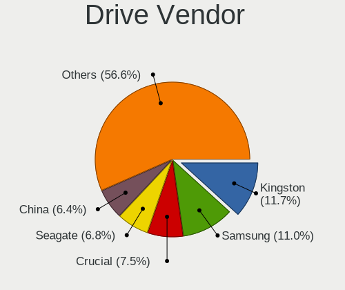
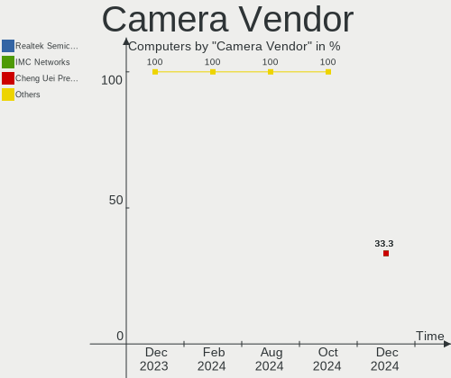

OPNsense Hardware Trends
------------------------

A project to identify most popular hardware characteristics and track their change
over time based on data collected by OPNsense users at https://BSD-Hardware.info.

Anyone can contribute to the study by uploading probes of their computers by
the [hw-probe](https://github.com/linuxhw/hw-probe/blob/master/INSTALL.BSD.md) tool:

    hw-probe -all -upload

Full-feature report is available here: https://bsd-hardware.info/?view=trends

Period: Jan, 2021.

Contents
--------

- [ OS                       ](#os)
- [ OS Family                ](#os-family)
- [ Arch                     ](#arch)
- [ DE                       ](#de)
- [ Display Server           ](#display-server)
- [ Display Manager          ](#display-manager)
- [ OS Lang                  ](#os-lang)
- [ Boot Mode                ](#boot-mode)
- [ Filesystem               ](#filesystem)
- [ Part. scheme             ](#part-scheme)
- [ Country                  ](#country)
- [ City                     ](#city)
- [ Vendor                   ](#vendor)
- [ Model                    ](#model)
- [ Model Family             ](#model-family)
- [ MFG Year                 ](#mfg-year)
- [ Form Factor              ](#form-factor)
- [ Coreboot                 ](#coreboot)
- [ RAM Size                 ](#ram-size)
- [ RAM Used                 ](#ram-used)
- [ Has CD-ROM               ](#has-cd-rom)
- [ Total Drives             ](#total-drives)
- [ Has Ethernet             ](#has-ethernet)
- [ Drive Vendor             ](#drive-vendor)
- [ Drive Model              ](#drive-model)
- [ HDD Vendor               ](#hdd-vendor)
- [ SSD Vendor               ](#ssd-vendor)
- [ Drive Kind               ](#drive-kind)
- [ Drive Connector          ](#drive-connector)
- [ Drive Size               ](#drive-size)
- [ Space Total              ](#space-total)
- [ Space Used               ](#space-used)
- [ Malfunc. Drives          ](#malfunc-drives)
- [ Malfunc. Drive Vendor    ](#malfunc-drive-vendor)
- [ Malfunc. HDD Vendor      ](#malfunc-hdd-vendor)
- [ Malfunc. Drive Kind      ](#malfunc-drive-kind)
- [ Failed Drives            ](#failed-drives)
- [ Failed Drive Vendor      ](#failed-drive-vendor)
- [ Drive Status             ](#drive-status)
- [ Storage Vendor           ](#storage-vendor)
- [ Storage Model            ](#storage-model)
- [ Storage Kind             ](#storage-kind)
- [ CPU Vendor               ](#cpu-vendor)
- [ CPU Model                ](#cpu-model)
- [ CPU Model Family         ](#cpu-model-family)
- [ CPU Cores                ](#cpu-cores)
- [ CPU Sockets              ](#cpu-sockets)
- [ CPU Threads              ](#cpu-threads)
- [ CPU Microarch            ](#cpu-microarch)
- [ GPU Vendor               ](#gpu-vendor)
- [ GPU Model                ](#gpu-model)
- [ GPU Combo                ](#gpu-combo)
- [ GPU Driver               ](#gpu-driver)
- [ GPU Memory               ](#gpu-memory)
- [ Monitor Vendor           ](#monitor-vendor)
- [ Monitor Model            ](#monitor-model)
- [ Monitor Resolution       ](#monitor-resolution)
- [ Monitor Diagonal         ](#monitor-diagonal)
- [ Monitor Width            ](#monitor-width)
- [ Aspect Ratio             ](#aspect-ratio)
- [ Monitor Area             ](#monitor-area)
- [ Pixel Density            ](#pixel-density)
- [ Multiple Monitors        ](#multiple-monitors)
- [ Net Controller Vendor    ](#net-controller-vendor)
- [ Net Controller Model     ](#net-controller-model)
- [ Wireless Vendor          ](#wireless-vendor)
- [ Wireless Model           ](#wireless-model)
- [ Ethernet Vendor          ](#ethernet-vendor)
- [ Ethernet Model           ](#ethernet-model)
- [ Net Controller Kind      ](#net-controller-kind)
- [ Used Controller          ](#used-controller)
- [ NICs                     ](#nics)
- [ Memory Vendor            ](#memory-vendor)
- [ Memory Model             ](#memory-model)
- [ Memory Kind              ](#memory-kind)
- [ Memory Form Factor       ](#memory-form-factor)
- [ Memory Size              ](#memory-size)
- [ Memory Speed             ](#memory-speed)
- [ Sound Vendor             ](#sound-vendor)
- [ Sound Model              ](#sound-model)
- [ Camera Vendor            ](#camera-vendor)
- [ Camera Model             ](#camera-model)
- [ Fingerprint Vendor       ](#fingerprint-vendor)
- [ Fingerprint Model        ](#fingerprint-model)
- [ Chipcard Vendor          ](#chipcard-vendor)
- [ Chipcard Model           ](#chipcard-model)
- [ Printer Vendor           ](#printer-vendor)
- [ Printer Model            ](#printer-model)
- [ Scanner Vendor           ](#scanner-vendor)
- [ Scanner Model            ](#scanner-model)
- [ Bluetooth Vendor         ](#bluetooth-vendor)
- [ Bluetooth Model          ](#bluetooth-model)
- [ Unsupported Devices      ](#unsupported-devices)
- [ Unsupported Device Types ](#unsupported-device-types)

OS
--

Installed operating systems

| Name            | Computers | Percent |
|-----------------|-----------|---------|
| OPNsense 20.7.8 | 184       | 68.15%  |
| OPNsense 21.1   | 65        | 24.07%  |
| OPNsense 20.7.7 | 15        | 5.56%   |
| OPNsense 20.7   | 4         | 1.48%   |
| OPNsense 20.7.5 | 2         | 0.74%   |

OS Family
---------

OS without a version

| Name     | Computers | Percent |
|----------|-----------|---------|
| OPNsense | 270       | 100%    |

Arch
----

OS architecture (x86_64, i586, etc.)

| Name  | Computers | Percent |
|-------|-----------|---------|
| amd64 | 270       | 100%    |

DE
--

Desktop Environment

| Name    | Computers | Percent |
|---------|-----------|---------|
| Console | 270       | 100%    |

Display Server
--------------

X11 or Wayland

| Name    | Computers | Percent |
|---------|-----------|---------|
| Console | 270       | 100%    |

Display Manager
---------------

SDDM, LightDM, etc.

| Name    | Computers | Percent |
|---------|-----------|---------|
| Console | 270       | 100%    |

OS Lang
-------

Language

| Lang    | Computers | Percent |
|---------|-----------|---------|
| Unknown | 270       | 100%    |

Boot Mode
---------

EFI or BIOS

| Mode | Computers | Percent |
|------|-----------|---------|
| EFI  | 242       | 89.63%  |
| BIOS | 28        | 10.37%  |

Filesystem
----------

Type of filesystem

| Type | Computers | Percent |
|------|-----------|---------|
| Ufs  | 266       | 98.52%  |
| Zfs  | 4         | 1.48%   |

Part. scheme
------------

Scheme of partitioning

| Type    | Computers | Percent |
|---------|-----------|---------|
| GPT     | 245       | 90.74%  |
| MBR     | 24        | 8.89%   |
| Unknown | 1         | 0.37%   |

Country
-------

Geographic location (country)

| Country        | Computers | Percent |
|----------------|-----------|---------|
| USA            | 73        | 27.04%  |
| Germany        | 67        | 24.81%  |
| UK             | 23        | 8.52%   |
| Netherlands    | 12        | 4.44%   |
| Canada         | 11        | 4.07%   |
| Switzerland    | 9         | 3.33%   |
| Sweden         | 7         | 2.59%   |
| Austria        | 7         | 2.59%   |
| Australia      | 7         | 2.59%   |
| Brazil         | 6         | 2.22%   |
| France         | 5         | 1.85%   |
| Italy          | 4         | 1.48%   |
| Belgium        | 4         | 1.48%   |
| Spain          | 3         | 1.11%   |
| Norway         | 3         | 1.11%   |
| Hungary        | 3         | 1.11%   |
| Taiwan         | 2         | 0.74%   |
| Mexico         | 2         | 0.74%   |
| Indonesia      | 2         | 0.74%   |
| Finland        | 2         | 0.74%   |
| Vietnam        | 1         | 0.37%   |
| Uruguay        | 1         | 0.37%   |
| Ukraine        | 1         | 0.37%   |
| UAE            | 1         | 0.37%   |
| South Africa   | 1         | 0.37%   |
| Russia         | 1         | 0.37%   |
| Portugal       | 1         | 0.37%   |
| Niue           | 1         | 0.37%   |
| New Zealand    | 1         | 0.37%   |
| Malaysia       | 1         | 0.37%   |
| Luxembourg     | 1         | 0.37%   |
| Liechtenstein  | 1         | 0.37%   |
| Latvia         | 1         | 0.37%   |
| Israel         | 1         | 0.37%   |
| Hong Kong      | 1         | 0.37%   |
| Denmark        | 1         | 0.37%   |
| Czech Republic | 1         | 0.37%   |
| Bulgaria       | 1         | 0.37%   |

City
----

Geographic location (city)

| City                  | Computers | Percent |
|-----------------------|-----------|---------|
| Berlin                | 8         | 2.96%   |
| Vienna                | 6         | 2.22%   |
| Frankfurt am Main     | 5         | 1.85%   |
| Umeå                 | 4         | 1.48%   |
| São José dos Campos | 4         | 1.48%   |
| Bothell               | 4         | 1.48%   |
| Seattle               | 3         | 1.11%   |
| Cologne               | 3         | 1.11%   |
| Taipei                | 2         | 0.74%   |
| Sydney                | 2         | 0.74%   |
| Stuttgart             | 2         | 0.74%   |
| Saint Paul            | 2         | 0.74%   |
| Rochester             | 2         | 0.74%   |
| Munich                | 2         | 0.74%   |
| Montreal              | 2         | 0.74%   |
| Milan                 | 2         | 0.74%   |
| Maastricht            | 2         | 0.74%   |
| Louisville            | 2         | 0.74%   |
| London                | 2         | 0.74%   |
| Kenosha               | 2         | 0.74%   |
| Jakarta               | 2         | 0.74%   |
| Hamburg               | 2         | 0.74%   |
| Essen                 | 2         | 0.74%   |
| Edmonton              | 2         | 0.74%   |
| Bruges                | 2         | 0.74%   |
| Bristol               | 2         | 0.74%   |
| Birmingham            | 2         | 0.74%   |
| Échirolles           | 1         | 0.37%   |
| Zutphen               | 1         | 0.37%   |
| Zaandam               | 1         | 0.37%   |
| Wolfratshausen        | 1         | 0.37%   |
| Wiesbaden             | 1         | 0.37%   |
| Wiedlisbach           | 1         | 0.37%   |
| Westland              | 1         | 0.37%   |
| Well                  | 1         | 0.37%   |
| Weehawken             | 1         | 0.37%   |
| Wallisellen           | 1         | 0.37%   |
| Vohenstrauss          | 1         | 0.37%   |
| Vlaardingen           | 1         | 0.37%   |
| Vista                 | 1         | 0.37%   |
| Vigodarzere           | 1         | 0.37%   |
| Varna                 | 1         | 0.37%   |
| Uznach                | 1         | 0.37%   |
| Upper Basildon        | 1         | 0.37%   |
| Ulm                   | 1         | 0.37%   |
| Triesenberg           | 1         | 0.37%   |
| Toulouse              | 1         | 0.37%   |
| Tittmoning            | 1         | 0.37%   |
| Tangermuende          | 1         | 0.37%   |
| Surrey                | 1         | 0.37%   |
| Sunnyvale             | 1         | 0.37%   |
| Sun Prairie           | 1         | 0.37%   |
| Stroud                | 1         | 0.37%   |
| Streatham             | 1         | 0.37%   |
| Stillwater            | 1         | 0.37%   |
| St. Marys             | 1         | 0.37%   |
| St Petersburg         | 1         | 0.37%   |
| Spring                | 1         | 0.37%   |
| Sneek                 | 1         | 0.37%   |
| Sinsheim              | 1         | 0.37%   |

Vendor
------

Motherboard manufacturer

| Name                       | Computers | Percent |
|----------------------------|-----------|---------|
| PC Engines                 | 33        | 12.22%  |
| Unknown                    | 29        | 10.74%  |
| Intel                      | 24        | 8.89%   |
| Hewlett-Packard            | 20        | 7.41%   |
| Supermicro                 | 17        | 6.3%    |
| Protectli                  | 17        | 6.3%    |
| Dell                       | 17        | 6.3%    |
| ASRock                     | 14        | 5.19%   |
| ASUSTek Computer           | 13        | 4.81%   |
| AMI                        | 11        | 4.07%   |
| ZOTAC                      | 9         | 3.33%   |
| Lenovo                     | 9         | 3.33%   |
| MSI                        | 7         | 2.59%   |
| Gigabyte Technology        | 7         | 2.59%   |
| Shuttle                    | 5         | 1.85%   |
| Sophos                     | 3         | 1.11%   |
| HARDKERNEL                 | 3         | 1.11%   |
| YANYU                      | 2         | 0.74%   |
| Yanling                    | 2         | 0.74%   |
| Lanner                     | 2         | 0.74%   |
| IBM                        | 2         | 0.74%   |
| Cisco                      | 2         | 0.74%   |
| Barracuda Networks         | 2         | 0.74%   |
| AAEON                      | 2         | 0.74%   |
| Sun Microsystems           | 1         | 0.37%   |
| STARFACE                   | 1         | 0.37%   |
| Silver Peak Systems        | 1         | 0.37%   |
| ShenZhen MinWin Technology | 1         | 0.37%   |
| Sangoma Technologies       | 1         | 0.37%   |
| PCWare                     | 1         | 0.37%   |
| NU941                      | 1         | 0.37%   |
| Jetway                     | 1         | 0.37%   |
| Inventec                   | 1         | 0.37%   |
| Fujitsu                    | 1         | 0.37%   |
| FSC                        | 1         | 0.37%   |
| CheckPoint                 | 1         | 0.37%   |
| Biostar                    | 1         | 0.37%   |
| AZW                        | 1         | 0.37%   |
| AWOW                       | 1         | 0.37%   |
| ADI Engineering            | 1         | 0.37%   |
| ADI                        | 1         | 0.37%   |
| Acer                       | 1         | 0.37%   |

Model
-----

Motherboard model

| Name                               | Computers | Percent |
|------------------------------------|-----------|---------|
| Unknown                            | 31        | 11.48%  |
| PC Engines apu2                    | 23        | 8.52%   |
| Intel Q3XXG4-P V1.0                | 14        | 5.19%   |
| Protectli FW4B                     | 12        | 4.44%   |
| PC Engines apu4                    | 9         | 3.33%   |
| AMI Aptio CRB                      | 9         | 3.33%   |
| Supermicro Super Server            | 8         | 2.96%   |
| HP t620 PLUS Quad Core TC          | 4         | 1.48%   |
| ASUS All Series                    | 4         | 1.48%   |
| Supermicro A1SAi                   | 3         | 1.11%   |
| Protectli FW6                      | 3         | 1.11%   |
| HP Compaq Elite 8300 SFF           | 3         | 1.11%   |
| HARDKERNEL ODROID-H2               | 3         | 1.11%   |
| Dell PowerEdge R710                | 3         | 1.11%   |
| Dell OptiPlex 3020                 | 3         | 1.11%   |
| ZOTAC ZBOX-MI640/MI660/MI620NANO   | 2         | 0.74%   |
| ZOTAC ZBOX-CI327NANO-GS-01         | 2         | 0.74%   |
| Yanling YL-KBR6L                   | 2         | 0.74%   |
| Supermicro SYS-E200-8D             | 2         | 0.74%   |
| Sophos SG                          | 2         | 0.74%   |
| HP t730 Thin Client                | 2         | 0.74%   |
| HP ProLiant DL360p Gen8            | 2         | 0.74%   |
| Gigabyte J3455N-D3H                | 2         | 0.74%   |
| Dell PowerEdge R210 II             | 2         | 0.74%   |
| Dell OptiPlex 9020                 | 2         | 0.74%   |
| Dell OptiPlex 9010                 | 2         | 0.74%   |
| Cisco VXC Class                    | 2         | 0.74%   |
| ASRock J3455-ITX                   | 2         | 0.74%   |
| ASRock B450M Pro4                  | 2         | 0.74%   |
| AAEON UP-APL01                     | 2         | 0.74%   |
| ZOTAC ZBOXNANO-AQ01                | 1         | 0.37%   |
| ZOTAC ZBOX-CI620/CI640/CI660       | 1         | 0.37%   |
| ZOTAC ZBOX-CI341                   | 1         | 0.37%   |
| ZOTAC ZBOX-CI329NANO               | 1         | 0.37%   |
| YANYU ITX-N38SL Ver                | 1         | 0.37%   |
| YANYU D19SL_B                      | 1         | 0.37%   |
| Supermicro X8STi                   | 1         | 0.37%   |
| Supermicro X8DTU-LN4+              | 1         | 0.37%   |
| Supermicro X11SSM-F                | 1         | 0.37%   |
| Supermicro SYS-1019D-4C-FHN13TP    | 1         | 0.37%   |
| Sun Microsystems Sun Fire X2200 M2 | 1         | 0.37%   |
| STARFACE Compact                   | 1         | 0.37%   |
| Sophos XG                          | 1         | 0.37%   |
| Shuttle XH110G                     | 1         | 0.37%   |
| Shuttle TERRA_PC                   | 1         | 0.37%   |
| Shuttle SH370V2                    | 1         | 0.37%   |
| Shuttle DS67U                      | 1         | 0.37%   |
| Shuttle DH110                      | 1         | 0.37%   |
| ShenZhen MinWin MW-NANO-APL-4L     | 1         | 0.37%   |
| Sangoma SNG040                     | 1         | 0.37%   |
| Protectli FW6E                     | 1         | 0.37%   |
| Protectli FW4A                     | 1         | 0.37%   |
| PCWare IPX1800G2                   | 1         | 0.37%   |
| PC Engines APU                     | 1         | 0.37%   |
| NU941 1.0                          | 1         | 0.37%   |
| MSI MS-7C37                        | 1         | 0.37%   |
| MSI MS-7B84                        | 1         | 0.37%   |
| MSI MS-7B22                        | 1         | 0.37%   |
| MSI MS-7A40                        | 1         | 0.37%   |
| MSI MS-7891                        | 1         | 0.37%   |

Model Family
------------

Motherboard model prefix

| Name                            | Computers | Percent |
|---------------------------------|-----------|---------|
| Unknown                         | 31        | 11.48%  |
| PC Engines apu2                 | 23        | 8.52%   |
| Intel Q3XXG4-P                  | 14        | 5.19%   |
| Protectli FW4B                  | 12        | 4.44%   |
| PC Engines apu4                 | 9         | 3.33%   |
| Dell OptiPlex                   | 9         | 3.33%   |
| AMI Aptio                       | 9         | 3.33%   |
| Supermicro Super                | 8         | 2.96%   |
| Dell PowerEdge                  | 8         | 2.96%   |
| Lenovo ThinkCentre              | 6         | 2.22%   |
| HP ProLiant                     | 5         | 1.85%   |
| HP t620                         | 4         | 1.48%   |
| ASUS All                        | 4         | 1.48%   |
| Supermicro A1SAi                | 3         | 1.11%   |
| Protectli FW6                   | 3         | 1.11%   |
| HP Compaq                       | 3         | 1.11%   |
| HARDKERNEL ODROID-H2            | 3         | 1.11%   |
| ZOTAC ZBOX-MI640                | 2         | 0.74%   |
| ZOTAC ZBOX-CI327NANO-GS-01      | 2         | 0.74%   |
| Yanling YL-KBR6L                | 2         | 0.74%   |
| Supermicro SYS-E200-8D          | 2         | 0.74%   |
| Sophos SG                       | 2         | 0.74%   |
| Lenovo ThinkStation             | 2         | 0.74%   |
| IBM System                      | 2         | 0.74%   |
| HP t730                         | 2         | 0.74%   |
| HP ProDesk                      | 2         | 0.74%   |
| HP EliteDesk                    | 2         | 0.74%   |
| Gigabyte J3455N-D3H             | 2         | 0.74%   |
| Cisco VXC                       | 2         | 0.74%   |
| Barracuda Networks Barracuda    | 2         | 0.74%   |
| ASRock J3455-ITX                | 2         | 0.74%   |
| ASRock B450M                    | 2         | 0.74%   |
| AAEON UP-APL01                  | 2         | 0.74%   |
| ZOTAC ZBOXNANO-AQ01             | 1         | 0.37%   |
| ZOTAC ZBOX-CI620                | 1         | 0.37%   |
| ZOTAC ZBOX-CI341                | 1         | 0.37%   |
| ZOTAC ZBOX-CI329NANO            | 1         | 0.37%   |
| YANYU ITX-N38SL                 | 1         | 0.37%   |
| YANYU D19SL                     | 1         | 0.37%   |
| Supermicro X8STi                | 1         | 0.37%   |
| Supermicro X8DTU-LN4+           | 1         | 0.37%   |
| Supermicro X11SSM-F             | 1         | 0.37%   |
| Supermicro SYS-1019D-4C-FHN13TP | 1         | 0.37%   |
| Sun Microsystems Sun            | 1         | 0.37%   |
| STARFACE Compact                | 1         | 0.37%   |
| Sophos XG                       | 1         | 0.37%   |
| Shuttle XH110G                  | 1         | 0.37%   |
| Shuttle TERRA                   | 1         | 0.37%   |
| Shuttle SH370V2                 | 1         | 0.37%   |
| Shuttle DS67U                   | 1         | 0.37%   |
| Shuttle DH110                   | 1         | 0.37%   |
| ShenZhen MinWin MW-NANO-APL-4L  | 1         | 0.37%   |
| Sangoma SNG040                  | 1         | 0.37%   |
| Protectli FW6E                  | 1         | 0.37%   |
| Protectli FW4A                  | 1         | 0.37%   |
| PCWare IPX1800G2                | 1         | 0.37%   |
| PC Engines APU                  | 1         | 0.37%   |
| NU941 1.0                       | 1         | 0.37%   |
| MSI MS-7C37                     | 1         | 0.37%   |
| MSI MS-7B84                     | 1         | 0.37%   |

MFG Year
--------

Motherboard manufacture year

| Year | Computers | Percent |
|------|-----------|---------|
| 2020 | 68        | 25.19%  |
| 2018 | 54        | 20%     |
| 2019 | 53        | 19.63%  |
| 2014 | 20        | 7.41%   |
| 2017 | 14        | 5.19%   |
| 2016 | 13        | 4.81%   |
| 2015 | 11        | 4.07%   |
| 2012 | 9         | 3.33%   |
| 2013 | 8         | 2.96%   |
| 2011 | 6         | 2.22%   |
| 2010 | 5         | 1.85%   |
| 2008 | 3         | 1.11%   |
| 2006 | 3         | 1.11%   |
| 2007 | 2         | 0.74%   |
| 2009 | 1         | 0.37%   |

Form Factor
-----------

Physical design of the computer

| Name     | Computers | Percent |
|----------|-----------|---------|
| Desktop  | 210       | 77.78%  |
| Server   | 27        | 10%     |
| Mini pc  | 26        | 9.63%   |
| Notebook | 4         | 1.48%   |
| Other    | 3         | 1.11%   |

Coreboot
--------

Have coreboot on board

| Used | Computers | Percent |
|------|-----------|---------|
| No   | 229       | 84.81%  |
| Yes  | 41        | 15.19%  |

RAM Size
--------

Total RAM memory

| Size in GB  | Computers | Percent |
|-------------|-----------|---------|
| 8.01-16.0   | 104       | 38.52%  |
| 4.01-8.0    | 80        | 29.63%  |
| 16.01-24.0  | 49        | 18.15%  |
| 32.01-64.0  | 17        | 6.3%    |
| 2.01-3.0    | 11        | 4.07%   |
| 3.01-4.0    | 3         | 1.11%   |
| 24.01-32.0  | 3         | 1.11%   |
| 64.01-256.0 | 3         | 1.11%   |

RAM Used
--------

Used RAM memory

| Used GB    | Computers | Percent |
|------------|-----------|---------|
| 0.01-0.5   | 171       | 63.33%  |
| 0.51-1.0   | 65        | 24.07%  |
| 1.01-2.0   | 15        | 5.56%   |
| 2.01-3.0   | 9         | 3.33%   |
| 8.01-16.0  | 7         | 2.59%   |
| 4.01-8.0   | 1         | 0.37%   |
| 32.01-64.0 | 1         | 0.37%   |
| 3.01-4.0   | 1         | 0.37%   |

Has CD-ROM
----------

Has CD-ROM on board

| Presented | Computers | Percent |
|-----------|-----------|---------|
| No        | 240       | 88.89%  |
| Yes       | 30        | 11.11%  |

Total Drives
------------

Number of drives on board

| Drives | Computers | Percent |
|--------|-----------|---------|
| 1      | 226       | 83.7%   |
| 0      | 28        | 10.37%  |
| 2      | 14        | 5.19%   |
| 4      | 1         | 0.37%   |
| 3      | 1         | 0.37%   |

Has Ethernet
------------

Has Ethernet on board

| Presented | Computers | Percent |
|-----------|-----------|---------|
| Yes       | 270       | 100%    |

Drive Vendor
------------

Hard drive vendors

| Vendor              | Computers | Drives | Percent |
|---------------------|-----------|--------|---------|
| Kingston            | 29        | 29     | 11.69%  |
| Samsung Electronics | 28        | 29     | 11.29%  |
| WDC                 | 23        | 28     | 9.27%   |
| Hoodisk             | 23        | 23     | 9.27%   |
| Phison              | 22        | 22     | 8.87%   |
| SanDisk             | 20        | 20     | 8.06%   |
| Transcend           | 18        | 19     | 7.26%   |
| Crucial             | 12        | 12     | 4.84%   |
| Intel               | 11        | 13     | 4.44%   |
| Seagate             | 9         | 10     | 3.63%   |
| A-DATA Technology   | 5         | 5      | 2.02%   |
| OCZ                 | 4         | 4      | 1.61%   |
| Hewlett-Packard     | 4         | 5      | 1.61%   |
| Dogfish             | 4         | 4      | 1.61%   |
| Toshiba             | 3         | 3      | 1.21%   |
| FORESEE             | 3         | 3      | 1.21%   |
| BIWIN               | 3         | 3      | 1.21%   |
| PNY                 | 2         | 2      | 0.81%   |
| Micron Technology   | 2         | 3      | 0.81%   |
| LSILOGIC            | 2         | 2      | 0.81%   |
| Intenso             | 2         | 2      | 0.81%   |
| Hitachi             | 2         | 2      | 0.81%   |
| HGST                | 2         | 2      | 0.81%   |
| Corsair             | 2         | 2      | 0.81%   |
| Zheino              | 1         | 1      | 0.4%    |
| Union Memory        | 1         | 1      | 0.4%    |
| TCSUNBOW            | 1         | 1      | 0.4%    |
| SPCC                | 1         | 1      | 0.4%    |
| SK Hynix            | 1         | 1      | 0.4%    |
| Patriot             | 1         | 1      | 0.4%    |
| LITEON              | 1         | 1      | 0.4%    |
| Kston               | 1         | 1      | 0.4%    |
| KingSpec            | 1         | 1      | 0.4%    |
| HPE                 | 1         | 1      | 0.4%    |
| China               | 1         | 2      | 0.4%    |
| Apacer              | 1         | 1      | 0.4%    |
| Adaptec             | 1         | 1      | 0.4%    |

Drive Model
-----------

Hard drive models

| Model                                           | Computers | Percent |
|-------------------------------------------------|-----------|---------|
| Phison SATA SSD 16GB                            | 13        | 5.22%   |
| Kingston SUV500MS120G 120GB                     | 8         | 3.21%   |
| Hoodisk SSD 64GB                                | 8         | 3.21%   |
| Kingston SA400S37120G 120GB                     | 7         | 2.81%   |
| Hoodisk SSD 128GB                               | 6         | 2.41%   |
| Samsung SSD 850 EVO 250GB                       | 5         | 2.01%   |
| Hoodisk SSD 32GB                                | 4         | 1.61%   |
| Crucial CT120BX500SSD1 120GB                    | 4         | 1.61%   |
| Transcend TS128GMSA370 128GB                    | 3         | 1.2%    |
| Phison SATA SSD 32GB                            | 3         | 1.2%    |
| Kingston SUV500MS240G 240GB                     | 3         | 1.2%    |
| Kingston SA400S37240G 240GB                     | 3         | 1.2%    |
| Hoodisk SSD 16GB                                | 3         | 1.2%    |
| HP RAID 1(1+0) 304GB                            | 3         | 1.2%    |
| WDC WDS120G2G0B-00EPW0 120GB                    | 2         | 0.8%    |
| WDC WDS120G2G0A-00JH30 120GB                    | 2         | 0.8%    |
| WDC WD5003ABYX-18WERA0 500GB                    | 2         | 0.8%    |
| Transcend TS64GMSA230S 64GB                     | 2         | 0.8%    |
| Transcend TS32GMSA370 32GB                      | 2         | 0.8%    |
| Transcend TS256GMSA230S 256GB                   | 2         | 0.8%    |
| Transcend TS128GMSA230S 128GB                   | 2         | 0.8%    |
| SanDisk SSD PLUS 240GB                          | 2         | 0.8%    |
| SanDisk SSD PLUS 120GB                          | 2         | 0.8%    |
| SanDisk SSD 128G                                | 2         | 0.8%    |
| SanDisk SDSSDA120G 120GB                        | 2         | 0.8%    |
| SanDisk SDSA6MM-032G-1006 32GB                  | 2         | 0.8%    |
| SanDisk SDSA6MM-016G-1006 16GB                  | 2         | 0.8%    |
| Samsung SSD 860 EVO 500GB                       | 2         | 0.8%    |
| Samsung SSD 850 EVO 120GB                       | 2         | 0.8%    |
| PNY CS900 120GB SSD                             | 2         | 0.8%    |
| Phison SATA SSD 128GB                           | 2         | 0.8%    |
| Phison Sabrent 512GB                            | 2         | 0.8%    |
| Kingston SMS200S330G 32GB                       | 2         | 0.8%    |
| Hoodisk SSD 256GB                               | 2         | 0.8%    |
| HGST HTS725050A7E630 500GB                      | 2         | 0.8%    |
| FORESEE 64GB SSD                                | 2         | 0.8%    |
| DOGFISH SSD 512GB                               | 2         | 0.8%    |
| BIWIN SSD 128GB                                 | 2         | 0.8%    |
| A-DATA SX300 128GB                              | 2         | 0.8%    |
| Zheino CHN-mSATAM3-256 256GB                    | 1         | 0.4%    |
| WDC WDS250G2B0A-00SM50 250GB                    | 1         | 0.4%    |
| WDC WD7500BPKX-00HPJT0 752GB                    | 1         | 0.4%    |
| WDC WD6400AAKS-75A7B2 640GB                     | 1         | 0.4%    |
| WDC WD6400AAKS-22A7B0 640GB                     | 1         | 0.4%    |
| WDC WD5003AZEX-00K3CA0 500GB                    | 1         | 0.4%    |
| WDC WD5000LPVX-22V0TT0 500GB                    | 1         | 0.4%    |
| WDC WD5000LPVT-24G33T1 500GB                    | 1         | 0.4%    |
| WDC WD5000BEKT-00KA9T0 500GB                    | 1         | 0.4%    |
| WDC WD5000AAKX-08U6AA0 500GB                    | 1         | 0.4%    |
| WDC WD5000AAKX-08ANVA0 500GB                    | 1         | 0.4%    |
| WDC WD3200LPVX-22V0TT0 320GB                    | 1         | 0.4%    |
| WDC WD2503ABYX-01WERA1 256GB                    | 1         | 0.4%    |
| WDC WD2500AAKX-321CA0 250GB                     | 1         | 0.4%    |
| WDC WD20EFAX-68FB5N0 2TB                        | 1         | 0.4%    |
| WDC WD2000JB-00FUA0 200GB                       | 1         | 0.4%    |
| WDC WD10JPLX-00MBPT0 1TB                        | 1         | 0.4%    |
| WDC WD10EFRX-68PJCN0 1TB                        | 1         | 0.4%    |
| WDC PC SN520 SDAPMUW-128G-1001 128GB            | 1         | 0.4%    |
| Union Memory UMIS LENSE40256GMSP34MESTB3A 256GB | 1         | 0.4%    |
| Transcend TS64GSSD370 64GB                      | 1         | 0.4%    |

HDD Vendor
----------

Hard disk drive vendors

| Vendor              | Computers | Drives | Percent |
|---------------------|-----------|--------|---------|
| WDC                 | 17        | 22     | 43.59%  |
| Seagate             | 9         | 10     | 23.08%  |
| Hewlett-Packard     | 4         | 5      | 10.26%  |
| LSILOGIC            | 2         | 2      | 5.13%   |
| Hitachi             | 2         | 2      | 5.13%   |
| HGST                | 2         | 2      | 5.13%   |
| Toshiba             | 1         | 1      | 2.56%   |
| Samsung Electronics | 1         | 1      | 2.56%   |
| Adaptec             | 1         | 1      | 2.56%   |

SSD Vendor
----------

Solid state drive vendors

| Vendor              | Computers | Drives | Percent |
|---------------------|-----------|--------|---------|
| Kingston            | 28        | 28     | 14.51%  |
| Hoodisk             | 23        | 23     | 11.92%  |
| SanDisk             | 20        | 20     | 10.36%  |
| Samsung Electronics | 20        | 21     | 10.36%  |
| Phison              | 20        | 20     | 10.36%  |
| Transcend           | 17        | 18     | 8.81%   |
| Intel               | 11        | 13     | 5.7%    |
| Crucial             | 11        | 11     | 5.7%    |
| WDC                 | 5         | 5      | 2.59%   |
| A-DATA Technology   | 5         | 5      | 2.59%   |
| OCZ                 | 4         | 4      | 2.07%   |
| DOGFISH             | 4         | 4      | 2.07%   |
| FORESEE             | 3         | 3      | 1.55%   |
| BIWIN               | 3         | 3      | 1.55%   |
| Toshiba             | 2         | 2      | 1.04%   |
| PNY                 | 2         | 2      | 1.04%   |
| Micron Technology   | 2         | 3      | 1.04%   |
| Intenso             | 2         | 2      | 1.04%   |
| Zheino              | 1         | 1      | 0.52%   |
| TCSUNBOW            | 1         | 1      | 0.52%   |
| SPCC                | 1         | 1      | 0.52%   |
| Patriot             | 1         | 1      | 0.52%   |
| LITEON              | 1         | 1      | 0.52%   |
| Kston               | 1         | 1      | 0.52%   |
| KingSpec            | 1         | 1      | 0.52%   |
| HPE                 | 1         | 1      | 0.52%   |
| Corsair             | 1         | 1      | 0.52%   |
| China               | 1         | 2      | 0.52%   |
| Apacer              | 1         | 1      | 0.52%   |

Drive Kind
----------

HDD or SSD

| Kind | Computers | Drives | Percent |
|------|-----------|--------|---------|
| SSD  | 189       | 199    | 77.46%  |
| HDD  | 39        | 46     | 15.98%  |
| NVMe | 16        | 16     | 6.56%   |

Drive Connector
---------------

SATA, SAS, NVMe, etc.

| Type | Computers | Drives | Percent |
|------|-----------|--------|---------|
| SATA | 227       | 245    | 93.42%  |
| NVMe | 16        | 16     | 6.58%   |

Drive Size
----------

Size of hard drive

| Size in TB | Computers | Drives | Percent |
|------------|-----------|--------|---------|
| 0.01-0.5   | 216       | 230    | 95.15%  |
| 0.51-1.0   | 10        | 14     | 4.41%   |
| 1.01-2.0   | 1         | 1      | 0.44%   |

Space Total
-----------

Amount of disk space available on the file system

| Size in GB | Computers | Percent |
|------------|-----------|---------|
| 101-250    | 105       | 38.89%  |
| 21-50      | 52        | 19.26%  |
| 51-100     | 45        | 16.67%  |
| 251-500    | 36        | 13.33%  |
| 1-20       | 23        | 8.52%   |
| 501-1000   | 7         | 2.59%   |
| 1001-2000  | 2         | 0.74%   |

Space Used
----------

Amount of used disk space

| Used GB | Computers | Percent |
|---------|-----------|---------|
| 1-20    | 255       | 94.44%  |
| 21-50   | 10        | 3.7%    |
| 51-100  | 4         | 1.48%   |
| 101-250 | 1         | 0.37%   |

Malfunc. Drives
---------------

Drive models with a malfunction

| Model                                 | Computers | Drives | Percent |
|---------------------------------------|-----------|--------|---------|
| A-DATA Technology SX300 128GB         | 2         | 2      | 8.33%   |
| WDC WD7500BPKX-00HPJT0 752GB          | 1         | 2      | 4.17%   |
| WDC WD6400AAKS-22A7B0 640GB           | 1         | 1      | 4.17%   |
| WDC WD3200LPVX-22V0TT0 320GB          | 1         | 1      | 4.17%   |
| Seagate ST9500620NS 500GB             | 1         | 1      | 4.17%   |
| Seagate ST9320320AS 320GB             | 1         | 1      | 4.17%   |
| Seagate ST500LT012-1DG142 500GB       | 1         | 1      | 4.17%   |
| Seagate ST500LM021-1KJ152 500GB       | 1         | 1      | 4.17%   |
| Seagate ST500DM002-1BD142 500GB       | 1         | 1      | 4.17%   |
| Samsung Electronics SSD 950 PRO 256GB | 1         | 1      | 4.17%   |
| Samsung Electronics HD502HJ 500GB     | 1         | 1      | 4.17%   |
| OCZ VERTEX3 64GB                      | 1         | 1      | 4.17%   |
| OCZ VECTOR150 120GB                   | 1         | 1      | 4.17%   |
| Kingston SV300S37A120G 120GB          | 1         | 1      | 4.17%   |
| Kingston SNS4151S316G 16GB            | 1         | 1      | 4.17%   |
| Kingston SMS200S330G 32GB             | 1         | 1      | 4.17%   |
| Kingston SMS200S3120G 120GB           | 1         | 1      | 4.17%   |
| Intel SSDSC1BG200G4R 200GB            | 1         | 2      | 4.17%   |
| Hitachi HTS723232A7A364 320GB         | 1         | 1      | 4.17%   |
| HGST HTS725050A7E630 500GB            | 1         | 1      | 4.17%   |
| Crucial CT525MX300SSD1 528GB          | 1         | 1      | 4.17%   |
| Crucial CT128MX100SSD1 128GB          | 1         | 1      | 4.17%   |
| Crucial CT128M550SSD3 128GB           | 1         | 1      | 4.17%   |

Malfunc. Drive Vendor
---------------------

Vendors of faulty drives

| Vendor              | Computers | Drives | Percent |
|---------------------|-----------|--------|---------|
| Seagate             | 5         | 5      | 20.83%  |
| Kingston            | 4         | 4      | 16.67%  |
| WDC                 | 3         | 4      | 12.5%   |
| Crucial             | 3         | 3      | 12.5%   |
| Samsung Electronics | 2         | 2      | 8.33%   |
| OCZ                 | 2         | 2      | 8.33%   |
| A-DATA Technology   | 2         | 2      | 8.33%   |
| Intel               | 1         | 2      | 4.17%   |
| Hitachi             | 1         | 1      | 4.17%   |
| HGST                | 1         | 1      | 4.17%   |

Malfunc. HDD Vendor
-------------------

Vendors of faulty HDD drives

| Vendor              | Computers | Drives | Percent |
|---------------------|-----------|--------|---------|
| Seagate             | 5         | 5      | 45.45%  |
| WDC                 | 3         | 4      | 27.27%  |
| Samsung Electronics | 1         | 1      | 9.09%   |
| Hitachi             | 1         | 1      | 9.09%   |
| HGST                | 1         | 1      | 9.09%   |

Malfunc. Drive Kind
-------------------

Kinds of faulty drives

| Kind | Computers | Drives | Percent |
|------|-----------|--------|---------|
| SSD  | 12        | 13     | 50%     |
| HDD  | 11        | 12     | 45.83%  |
| NVMe | 1         | 1      | 4.17%   |

Failed Drives
-------------

Failed drive models

Zero info for selected period =(

Failed Drive Vendor
-------------------

Failed drive vendors

Zero info for selected period =(

Drive Status
------------

Number of failed and malfunc. drives

| Status   | Computers | Drives | Percent |
|----------|-----------|--------|---------|
| Works    | 210       | 223    | 85.71%  |
| Malfunc  | 24        | 26     | 9.8%    |
| Detected | 11        | 12     | 4.49%   |

Storage Vendor
--------------

Storage controller vendors

| Vendor                      | Computers | Percent |
|-----------------------------|-----------|---------|
| Intel                       | 203       | 66.56%  |
| AMD                         | 56        | 18.36%  |
| Broadcom / LSI              | 11        | 3.61%   |
| Samsung Electronics         | 7         | 2.3%    |
| ASMedia Technology          | 7         | 2.3%    |
| Phison Electronics          | 3         | 0.98%   |
| Nvidia                      | 3         | 0.98%   |
| Hewlett-Packard             | 3         | 0.98%   |
| Chelsio Communications      | 2         | 0.66%   |
| Union Memory (Shenzhen)     | 1         | 0.33%   |
| SK Hynix                    | 1         | 0.33%   |
| Silicon Motion              | 1         | 0.33%   |
| Silicon Image               | 1         | 0.33%   |
| Sandisk                     | 1         | 0.33%   |
| Micron/Crucial Technology   | 1         | 0.33%   |
| Marvell Technology Group    | 1         | 0.33%   |
| Kingston Technology Company | 1         | 0.33%   |
| Dell                        | 1         | 0.33%   |
| Adaptec                     | 1         | 0.33%   |

Storage Model
-------------

Storage controller models

| Model                                                                            | Computers | Percent |
|----------------------------------------------------------------------------------|-----------|---------|
| AMD FCH SATA Controller [AHCI mode]                                              | 42        | 12.57%  |
| Intel Sunrise Point-LP SATA Controller [AHCI mode]                               | 31        | 9.28%   |
| Intel Atom/Celeron/Pentium Processor x5-E8000/J3xxx/N3xxx Series SATA Controller | 24        | 7.19%   |
| Intel Atom Processor E3800 Series SATA AHCI Controller                           | 24        | 7.19%   |
| Intel 8 Series/C220 Series Chipset Family 6-port SATA Controller 1 [AHCI mode]   | 21        | 6.29%   |
| Intel Celeron N3350/Pentium N4200/Atom E3900 Series SATA AHCI Controller         | 13        | 3.89%   |
| Intel Wildcat Point-LP SATA Controller [AHCI Mode]                               | 11        | 3.29%   |
| Intel 6 Series/C200 Series Chipset Family 6 port Desktop SATA AHCI Controller    | 9         | 2.69%   |
| Intel Cannon Lake PCH SATA AHCI Controller                                       | 7         | 2.1%    |
| Intel 7 Series/C210 Series Chipset Family 6-port SATA Controller [AHCI mode]     | 7         | 2.1%    |
| ASMedia ASM1062 Serial ATA Controller                                            | 7         | 2.1%    |
| Intel Q170/Q150/B150/H170/H110/Z170/CM236 Chipset SATA Controller [AHCI Mode]    | 6         | 1.8%    |
| Intel Atom processor C2000 AHCI SATA3 Controller                                 | 6         | 1.8%    |
| AMD SB7x0/SB8x0/SB9x0 SATA Controller [AHCI mode]                                | 6         | 1.8%    |
| AMD FCH SATA Controller [IDE mode]                                               | 6         | 1.8%    |
| Intel Celeron/Pentium Silver Processor SATA Controller                           | 5         | 1.5%    |
| AMD 400 Series Chipset SATA Controller                                           | 5         | 1.5%    |
| Samsung NVMe SSD Controller SM981/PM981/PM983                                    | 4         | 1.2%    |
| Intel Atom processor C2000 AHCI SATA2 Controller                                 | 4         | 1.2%    |
| Intel 8 Series SATA Controller 1 [AHCI mode]                                     | 4         | 1.2%    |
| Phison E12 NVMe Controller                                                       | 3         | 0.9%    |
| Intel NM10/ICH7 Family SATA Controller [IDE mode]                                | 3         | 0.9%    |
| Intel C600/X79 series chipset 6-Port SATA AHCI Controller                        | 3         | 0.9%    |
| Intel Atom Processor C3000 Series SATA Controller 1                              | 3         | 0.9%    |
| Intel Atom Processor C3000 Series SATA Controller 0                              | 3         | 0.9%    |
| Intel 82801JI (ICH10 Family) 4 port SATA IDE Controller #1                       | 3         | 0.9%    |
| Intel 200 Series PCH SATA controller [AHCI mode]                                 | 3         | 0.9%    |
| Broadcom / LSI MegaRAID SAS 2108 [Liberator]                                     | 3         | 0.9%    |
| Samsung NVMe SSD Controller SM961/PM961/SM963                                    | 2         | 0.6%    |
| Nvidia MCP51 Serial ATA Controller                                               | 2         | 0.6%    |
| Intel SATA Controller [RAID mode]                                                | 2         | 0.6%    |
| Intel 82801JI (ICH10 Family) SATA AHCI Controller                                | 2         | 0.6%    |
| Intel 82801JI (ICH10 Family) 2 port SATA IDE Controller #2                       | 2         | 0.6%    |
| Intel 82801IB (ICH9) 2 port SATA Controller [IDE mode]                           | 2         | 0.6%    |
| Intel 82801G (ICH7 Family) IDE Controller                                        | 2         | 0.6%    |
| Intel 82801EB/ER (ICH5/ICH5R) IDE Controller                                     | 2         | 0.6%    |
| Intel 7 Series/C210 Series Chipset Family 4-port SATA Controller [IDE mode]      | 2         | 0.6%    |
| Intel 7 Series/C210 Series Chipset Family 2-port SATA Controller [IDE mode]      | 2         | 0.6%    |
| Intel 5 Series/3400 Series Chipset 6 port SATA AHCI Controller                   | 2         | 0.6%    |
| Intel 400 Series Chipset Family SATA AHCI Controller                             | 2         | 0.6%    |
| HP Smart Array Gen8 Controllers                                                  | 2         | 0.6%    |
| Broadcom / LSI SAS1068E PCI-Express Fusion-MPT SAS                               | 2         | 0.6%    |
| Broadcom / LSI MegaRAID SAS 1078                                                 | 2         | 0.6%    |
| AMD SB7x0/SB8x0/SB9x0 IDE Controller                                             | 2         | 0.6%    |
| AMD FCH IDE Controller                                                           | 2         | 0.6%    |
| Union Memory (Shenzhen) NVMe 256G SSD device                                     | 1         | 0.3%    |
| SK Hynix hynix unknown                                                           | 1         | 0.3%    |
| Silicon Motion SM2263EN/SM2263XT SSD Controller                                  | 1         | 0.3%    |
| Silicon Image PCI0680 Ultra ATA-133 Host Controller                              | 1         | 0.3%    |
| Sandisk PC SN520 NVMe SSD                                                        | 1         | 0.3%    |
| Samsung NVMe SSD Controller SM951/PM951                                          | 1         | 0.3%    |
| Nvidia MCP55 SATA Controller                                                     | 1         | 0.3%    |
| Nvidia MCP55 IDE                                                                 | 1         | 0.3%    |
| Nvidia MCP51 IDE                                                                 | 1         | 0.3%    |
| Marvell Group 88SE9128 PCIe SATA 6 Gb/s RAID controller with HyperDuo            | 1         | 0.3%    |
| Kingston Company A2000 NVMe SSD                                                  | 1         | 0.3%    |
| Intel NM10/ICH7 Family SATA Controller [AHCI mode]                               | 1         | 0.3%    |
| Intel C620 Series Chipset Family SSATA Controller [AHCI mode]                    | 1         | 0.3%    |
| Intel C600/X79 series chipset 4-Port SATA IDE Controller                         | 1         | 0.3%    |
| Intel 9 Series Chipset Family SATA Controller [AHCI Mode]                        | 1         | 0.3%    |

Storage Kind
------------

Kind of storage controller (IDE, SATA, NVMe, SAS, ...)

| Kind | Computers | Percent |
|------|-----------|---------|
| SATA | 242       | 80.13%  |
| IDE  | 24        | 7.95%   |
| NVMe | 16        | 5.3%    |
| RAID | 13        | 4.3%    |
| SCSI | 6         | 1.99%   |
| SAS  | 1         | 0.33%   |

CPU Vendor
----------

Processor vendors

| Vendor | Computers | Percent |
|--------|-----------|---------|
| Intel  | 211       | 78.15%  |
| AMD    | 59        | 21.85%  |

CPU Model
---------

Processor models

| Model                                       | Computers | Percent |
|---------------------------------------------|-----------|---------|
| AMD GX-412TC SOC                            | 32        | 11.85%  |
| Intel Celeron CPU J3160 @ 1.60GHz           | 14        | 5.19%   |
| Intel Celeron CPU J1900 @ 1.99GHz           | 14        | 5.19%   |
| Intel Core i7-7500U CPU @ 2.70GHz           | 8         | 2.96%   |
| Intel Celeron CPU J3455 @ 1.50GHz           | 6         | 2.22%   |
| Intel Core i3-7100U CPU @ 2.40GHz           | 5         | 1.85%   |
| Intel Core i5-7200U CPU @ 2.50GHz           | 4         | 1.48%   |
| Intel Core i5-5250U CPU @ 1.60GHz           | 4         | 1.48%   |
| Intel Atom CPU E3845 @ 1.91GHz              | 4         | 1.48%   |
| AMD GX-420CA SOC with Radeon HD Graphics    | 4         | 1.48%   |
| Intel Xeon CPU E5645 @ 2.40GHz              | 3         | 1.11%   |
| Intel Xeon CPU E3-1220 v3 @ 3.10GHz         | 3         | 1.11%   |
| Intel Pentium CPU N3700 @ 1.60GHz           | 3         | 1.11%   |
| Intel Core i7-3770 CPU @ 3.40GHz            | 3         | 1.11%   |
| Intel Core i5-8250U CPU @ 1.60GHz           | 3         | 1.11%   |
| Intel Core i5-6500 CPU @ 3.20GHz            | 3         | 1.11%   |
| Intel Core i5-5200U CPU @ 2.20GHz           | 3         | 1.11%   |
| Intel Core i5-4590 CPU @ 3.30GHz            | 3         | 1.11%   |
| Intel Celeron J4115 CPU @ 1.80GHz           | 3         | 1.11%   |
| Intel Celeron CPU 3855U @ 1.60GHz           | 3         | 1.11%   |
| Intel Atom CPU C2558 @ 2.40GHz              | 3         | 1.11%   |
| Intel Atom CPU C2358 @ 1.74GHz              | 3         | 1.11%   |
| Intel Xeon CPU D-1528 @ 1.90GHz             | 2         | 0.74%   |
| Intel Pentium CPU N3710 @ 1.60GHz           | 2         | 0.74%   |
| Intel Core i7-8550U CPU @ 1.80GHz           | 2         | 0.74%   |
| Intel Core i7-4790 CPU @ 3.60GHz            | 2         | 0.74%   |
| Intel Core i5-3475S CPU @ 2.90GHz           | 2         | 0.74%   |
| Intel Core i5-2400 CPU @ 3.10GHz            | 2         | 0.74%   |
| Intel Core i3-4150 CPU @ 3.50GHz            | 2         | 0.74%   |
| Intel Core i3-4130 CPU @ 3.40GHz            | 2         | 0.74%   |
| Intel Core i3-3240 CPU @ 3.40GHz            | 2         | 0.74%   |
| Intel Celeron N4100 CPU @ 1.10GHz           | 2         | 0.74%   |
| Intel Celeron CPU N3450 @ 1.10GHz           | 2         | 0.74%   |
| Intel Celeron CPU N3350 @ 1.10GHz           | 2         | 0.74%   |
| Intel Celeron CPU N3150 @ 1.60GHz           | 2         | 0.74%   |
| Intel Celeron CPU N2940 @ 1.83GHz           | 2         | 0.74%   |
| Intel Celeron CPU J3060 @ 1.60GHz           | 2         | 0.74%   |
| Intel Celeron CPU J1800 @ 2.41GHz           | 2         | 0.74%   |
| Intel Celeron CPU 3865U @ 1.80GHz           | 2         | 0.74%   |
| Intel Atom CPU C3558 @ 2.20GHz              | 2         | 0.74%   |
| AMD Ryzen 5 3400G with Radeon Vega Graphics | 2         | 0.74%   |
| AMD RX-427BB with AMD Radeon R7 Graphics    | 2         | 0.74%   |
| AMD G-T56N Processor                        | 2         | 0.74%   |
| Intel Xeon MP                               | 1         | 0.37%   |
| Intel Xeon E-2236 CPU @ 3.40GHz             | 1         | 0.37%   |
| Intel Xeon E-2144G CPU @ 3.60GHz            | 1         | 0.37%   |
| Intel Xeon D-2123IT CPU @ 2.20GHz           | 1         | 0.37%   |
| Intel Xeon CPU X5650 @ 2.67GHz              | 1         | 0.37%   |
| Intel Xeon CPU L5640 @ 2.27GHz              | 1         | 0.37%   |
| Intel Xeon CPU E5640 @ 2.67GHz              | 1         | 0.37%   |
| Intel Xeon CPU E5530 @ 2.40GHz              | 1         | 0.37%   |
| Intel Xeon CPU E5520 @ 2.27GHz              | 1         | 0.37%   |
| Intel Xeon CPU E5506 @ 2.13GHz              | 1         | 0.37%   |
| Intel Xeon CPU E5-2650 v2 @ 2.60GHz         | 1         | 0.37%   |
| Intel Xeon CPU E5-2609 0 @ 2.40GHz          | 1         | 0.37%   |
| Intel Xeon CPU E5-2430L v2 @ 2.40GHz        | 1         | 0.37%   |
| Intel Xeon CPU E3-1245 v5 @ 3.50GHz         | 1         | 0.37%   |
| Intel Xeon CPU E3-1240 V2 @ 3.40GHz         | 1         | 0.37%   |
| Intel Xeon CPU E3-1226 v3 @ 3.30GHz         | 1         | 0.37%   |
| Intel Xeon CPU E3-1225 v5 @ 3.30GHz         | 1         | 0.37%   |

CPU Model Family
----------------

Processor model prefix

| Model                   | Computers | Percent |
|-------------------------|-----------|---------|
| Intel Celeron           | 63        | 23.33%  |
| Intel Core i5           | 40        | 14.81%  |
| AMD GX                  | 36        | 13.33%  |
| Intel Xeon              | 29        | 10.74%  |
| Intel Core i3           | 24        | 8.89%   |
| Intel Core i7           | 23        | 8.52%   |
| Intel Atom              | 18        | 6.67%   |
| Intel Pentium           | 8         | 2.96%   |
| Other                   | 4         | 1.48%   |
| AMD Ryzen 5             | 3         | 1.11%   |
| AMD G                   | 3         | 1.11%   |
| Intel Pentium Gold      | 2         | 0.74%   |
| AMD Ryzen 7             | 2         | 0.74%   |
| AMD Ryzen 3             | 2         | 0.74%   |
| AMD Athlon 64 X2        | 2         | 0.74%   |
| Intel Pentium Dual-Core | 1         | 0.37%   |
| Intel Pentium Dual      | 1         | 0.37%   |
| Intel Core 2 Quad       | 1         | 0.37%   |
| Intel Core 2 Duo        | 1         | 0.37%   |
| AMD Turion II Neo       | 1         | 0.37%   |
| AMD Phenom II X4        | 1         | 0.37%   |
| AMD E                   | 1         | 0.37%   |
| AMD Athlon Dual Core    | 1         | 0.37%   |
| AMD Athlon              | 1         | 0.37%   |
| AMD A4                  | 1         | 0.37%   |
| AMD A10                 | 1         | 0.37%   |

CPU Cores
---------

Number of processor cores

| Number  | Computers | Percent |
|---------|-----------|---------|
| 4       | 156       | 57.78%  |
| 2       | 86        | 31.85%  |
| 8       | 11        | 4.07%   |
| 6       | 7         | 2.59%   |
| 12      | 4         | 1.48%   |
| Unknown | 3         | 1.11%   |
| 16      | 2         | 0.74%   |
| 1       | 1         | 0.37%   |

CPU Sockets
-----------

Number of sockets

| Number | Computers | Percent |
|--------|-----------|---------|
| 1      | 259       | 95.93%  |
| 2      | 10        | 3.7%    |
| 4      | 1         | 0.37%   |

CPU Threads
-----------

Threads per core (Hyper-Threading)

| Number  | Computers | Percent |
|---------|-----------|---------|
| 1       | 182       | 67.41%  |
| 2       | 85        | 31.48%  |
| Unknown | 3         | 1.11%   |

CPU Microarch
-------------

Microarchitecture

| Name          | Computers | Percent |
|---------------|-----------|---------|
| Silvermont    | 56        | 20.74%  |
| KabyLake      | 39        | 14.44%  |
| Puma          | 32        | 11.85%  |
| Haswell       | 25        | 9.26%   |
| IvyBridge     | 17        | 6.3%    |
| Goldmont      | 13        | 4.81%   |
| Broadwell     | 13        | 4.81%   |
| Skylake       | 12        | 4.44%   |
| Westmere      | 7         | 2.59%   |
| SandyBridge   | 6         | 2.22%   |
| Jaguar        | 6         | 2.22%   |
| Goldmont plus | 6         | 2.22%   |
| K8 Hammer     | 5         | 1.85%   |
| Nehalem       | 4         | 1.48%   |
| Bobcat        | 4         | 1.48%   |
| Zen+          | 3         | 1.11%   |
| Zen           | 3         | 1.11%   |
| Steamroller   | 3         | 1.11%   |
| Core          | 3         | 1.11%   |
| Unknown       | 3         | 1.11%   |
| Penryn        | 2         | 0.74%   |
| NetBurst      | 2         | 0.74%   |
| K10           | 2         | 0.74%   |
| CometLake     | 2         | 0.74%   |
| Zen 2         | 1         | 0.37%   |
| Bonnell       | 1         | 0.37%   |

GPU Vendor
----------

Vendors of graphics cards

| Vendor                     | Computers | Percent |
|----------------------------|-----------|---------|
| Intel                      | 169       | 71.31%  |
| AMD                        | 23        | 9.7%    |
| ASPEED Technology          | 22        | 9.28%   |
| Matrox Electronics Systems | 15        | 6.33%   |
| Nvidia                     | 8         | 3.38%   |

GPU Model
---------

Graphics card models

| Model                                                                                    | Computers | Percent |
|------------------------------------------------------------------------------------------|-----------|---------|
| Intel Atom/Celeron/Pentium Processor x5-E8000/J3xxx/N3xxx Integrated Graphics Controller | 24        | 10.08%  |
| Intel Atom Processor Z36xxx/Z37xxx Series Graphics & Display                             | 23        | 9.66%   |
| ASPEED Technology ASPEED Graphics Family                                                 | 22        | 9.24%   |
| Intel HD Graphics 620                                                                    | 18        | 7.56%   |
| Intel HD Graphics 500                                                                    | 13        | 5.46%   |
| Intel Xeon E3-1200 v2/3rd Gen Core processor Graphics Controller                         | 12        | 5.04%   |
| Intel Xeon E3-1200 v3/4th Gen Core Processor Integrated Graphics Controller              | 11        | 4.62%   |
| Matrox Electronics Systems MGA G200eW WPCM450                                            | 8         | 3.36%   |
| Intel UHD Graphics 620                                                                   | 6         | 2.52%   |
| Intel HD Graphics 5500                                                                   | 6         | 2.52%   |
| Intel GeminiLake [UHD Graphics 600]                                                      | 6         | 2.52%   |
| Intel 4th Generation Core Processor Family Integrated Graphics Controller                | 6         | 2.52%   |
| Intel HD Graphics 6000                                                                   | 4         | 1.68%   |
| Intel HD Graphics 530                                                                    | 4         | 1.68%   |
| Intel Haswell-ULT Integrated Graphics Controller                                         | 4         | 1.68%   |
| Intel 2nd Generation Core Processor Family Integrated Graphics Controller                | 4         | 1.68%   |
| AMD Kabini [Radeon HD 8400E]                                                             | 4         | 1.68%   |
| Nvidia GK208B [GeForce GT 710]                                                           | 3         | 1.26%   |
| Matrox Electronics Systems MGA G200EH                                                    | 3         | 1.26%   |
| Intel HD Graphics 510                                                                    | 3         | 1.26%   |
| Intel CometLake-S GT2 [UHD Graphics 630]                                                 | 3         | 1.26%   |
| Intel CoffeeLake-S GT2 [UHD Graphics 630]                                                | 3         | 1.26%   |
| AMD Wrestler [Radeon HD 6310]                                                            | 3         | 1.26%   |
| AMD Kaveri [Radeon R7 Graphics]                                                          | 3         | 1.26%   |
| Matrox Electronics Systems MGA G200EV                                                    | 2         | 0.84%   |
| Intel Skylake GT2 [HD Graphics 520]                                                      | 2         | 0.84%   |
| Intel Kaby Lake-U GT1 Integrated Graphics Controller                                     | 2         | 0.84%   |
| Intel HD Graphics 630                                                                    | 2         | 0.84%   |
| Intel CoffeeLake-S GT1 [UHD Graphics 610]                                                | 2         | 0.84%   |
| Intel 4 Series Chipset Integrated Graphics Controller                                    | 2         | 0.84%   |
| AMD Raven Ridge [Radeon Vega Series / Radeon Vega Mobile Series]                         | 2         | 0.84%   |
| AMD Picasso                                                                              | 2         | 0.84%   |
| Nvidia GT218 [GeForce 210]                                                               | 1         | 0.42%   |
| Nvidia GP108 [GeForce GT 1030]                                                           | 1         | 0.42%   |
| Nvidia G84GL [Quadro FX 1700]                                                            | 1         | 0.42%   |
| Nvidia C51PV [GeForce 6150]                                                              | 1         | 0.42%   |
| Nvidia C51 [GeForce 6150 LE]                                                             | 1         | 0.42%   |
| Matrox Electronics Systems MGA G200e [Pilot] ServerEngines (SEP1)                        | 1         | 0.42%   |
| Matrox Electronics Systems G200eR2                                                       | 1         | 0.42%   |
| Intel Xeon E3-1200 v3 Processor Integrated Graphics Controller                           | 1         | 0.42%   |
| Intel WhiskeyLake-U GT2 [UHD Graphics 620]                                               | 1         | 0.42%   |
| Intel Mobile GM965/GL960 Integrated Graphics Controller (secondary)                      | 1         | 0.42%   |
| Intel Mobile GM965/GL960 Integrated Graphics Controller (primary)                        | 1         | 0.42%   |
| Intel HD Graphics P530                                                                   | 1         | 0.42%   |
| Intel HD Graphics 610                                                                    | 1         | 0.42%   |
| Intel HD Graphics                                                                        | 1         | 0.42%   |
| Intel Core Processor Integrated Graphics Controller                                      | 1         | 0.42%   |
| Intel Atom Processor D2xxx/N2xxx Integrated Graphics Controller                          | 1         | 0.42%   |
| Intel 82946GZ/GL Integrated Graphics Controller                                          | 1         | 0.42%   |
| AMD RV100 [Radeon 7000 / Radeon VE]                                                      | 1         | 0.42%   |
| AMD RS880M [Mobility Radeon HD 4225/4250]                                                | 1         | 0.42%   |
| AMD RS780L [Radeon 3000]                                                                 | 1         | 0.42%   |
| AMD RS780 [Radeon HD 3200]                                                               | 1         | 0.42%   |
| AMD RS690 [Radeon X1200]                                                                 | 1         | 0.42%   |
| AMD Rage 3 [Rage XL PCI]                                                                 | 1         | 0.42%   |
| AMD Kabini [Radeon HD 8400 / R3 Series]                                                  | 1         | 0.42%   |
| AMD Kabini [Radeon HD 8330]                                                              | 1         | 0.42%   |
| AMD ES1000                                                                               | 1         | 0.42%   |

GPU Combo
---------

Combinations of graphics cards

| Name            | Computers | Percent |
|-----------------|-----------|---------|
| 1 x Intel       | 164       | 60.74%  |
| Other           | 38        | 14.07%  |
| 1 x AMD         | 23        | 8.52%   |
| 1 x ASPEED      | 18        | 6.67%   |
| 1 x Matrox      | 14        | 5.19%   |
| 1 x Nvidia      | 7         | 2.59%   |
| Intel + ASPEED  | 4         | 1.48%   |
| 2 x Intel       | 1         | 0.37%   |
| Nvidia + Matrox | 1         | 0.37%   |

GPU Driver
----------

Free vs proprietary

| Driver  | Computers | Percent |
|---------|-----------|---------|
| Free    | 232       | 85.93%  |
| Unknown | 38        | 14.07%  |

GPU Memory
----------

Total video memory

| Size in GB | Computers | Percent |
|------------|-----------|---------|
| Unknown    | 270       | 100%    |

Monitor Vendor
--------------

Monitor vendors

Zero info for selected period =(

Monitor Model
-------------

Monitor models

Zero info for selected period =(

Monitor Resolution
------------------

Monitor screen resolution

Zero info for selected period =(

Monitor Diagonal
----------------

Diagonal size in inches

Zero info for selected period =(

Monitor Width
-------------

Physical width

Zero info for selected period =(

Aspect Ratio
------------

Proportional relationship between the width and the height

Zero info for selected period =(

Monitor Area
------------

Area in inch²

Zero info for selected period =(

Pixel Density
-------------

Pixels per inch

Zero info for selected period =(

Multiple Monitors
-----------------

Total monitors connected

| Total | Computers | Percent |
|-------|-----------|---------|
| 0     | 270       | 100%    |

Net Controller Vendor
---------------------

Controller vendors

| Vendor                         | Computers | Percent |
|--------------------------------|-----------|---------|
| Intel                          | 236       | 63.96%  |
| Realtek Semiconductor          | 73        | 19.78%  |
| Broadcom Inc. and subsidiaries | 24        | 6.5%    |
| Qualcomm Atheros               | 14        | 3.79%   |
| Chelsio Communications         | 4         | 1.08%   |
| Mellanox Technologies          | 3         | 0.81%   |
| IMC Networks                   | 3         | 0.81%   |
| IBM                            | 2         | 0.54%   |
| Huawei Technologies            | 2         | 0.54%   |
| Xiaomi                         | 1         | 0.27%   |
| TP-Link                        | 1         | 0.27%   |
| Realtek                        | 1         | 0.27%   |
| Ralink Technology              | 1         | 0.27%   |
| Gemtek                         | 1         | 0.27%   |
| Emulex                         | 1         | 0.27%   |
| D-Link System                  | 1         | 0.27%   |
| AMD                            | 1         | 0.27%   |

Net Controller Model
--------------------

Controller models

| Model                                                                         | Computers | Percent |
|-------------------------------------------------------------------------------|-----------|---------|
| Realtek RTL8111/8168/8411 PCI Express Gigabit Ethernet Controller             | 67        | 15.62%  |
| Intel I211 Gigabit Network Connection                                         | 65        | 15.15%  |
| Intel I210 Gigabit Network Connection                                         | 53        | 12.35%  |
| Intel I350 Gigabit Network Connection                                         | 21        | 4.9%    |
| Intel 82583V Gigabit Network Connection                                       | 13        | 3.03%   |
| Intel 82574L Gigabit Network Connection                                       | 12        | 2.8%    |
| Intel 82576 Gigabit Network Connection                                        | 10        | 2.33%   |
| Intel 82571EB/82571GB Gigabit Ethernet Controller (Copper)                    | 10        | 2.33%   |
| Intel 82580 Gigabit Network Connection                                        | 9         | 2.1%    |
| Intel 82571EB/82571GB Gigabit Ethernet Controller D0/D1 (copper applications) | 9         | 2.1%    |
| Intel Wireless 3165                                                           | 8         | 1.86%   |
| Intel 82599ES 10-Gigabit SFI/SFP+ Network Connection                          | 8         | 1.86%   |
| Broadcom Inc. and subsidiaries NetXtreme II BCM5709 Gigabit Ethernet          | 8         | 1.86%   |
| Intel Ethernet Connection I354                                                | 7         | 1.63%   |
| Intel Ethernet Connection I217-LM                                             | 7         | 1.63%   |
| Intel 82579LM Gigabit Network Connection (Lewisville)                         | 6         | 1.4%    |
| Realtek RTL8125 2.5GbE Controller                                             | 4         | 0.93%   |
| Intel Ethernet Connection (2) I219-LM                                         | 4         | 0.93%   |
| Qualcomm Atheros AR93xx Wireless Network Adapter                              | 3         | 0.7%    |
| Qualcomm Atheros AR928X Wireless Network Adapter (PCI-Express)                | 3         | 0.7%    |
| Qualcomm Atheros AR242x / AR542x Wireless Network Adapter (PCI-Express)       | 3         | 0.7%    |
| Intel Wireless 3160                                                           | 3         | 0.7%    |
| Intel Ethernet Connection (7) I219-V                                          | 3         | 0.7%    |
| IMC Networks 802.11 n/g/b Wireless LAN USB Mini-Card                          | 3         | 0.7%    |
| Broadcom Inc. and subsidiaries NetXtreme BCM5720 2-port Gigabit Ethernet PCIe | 3         | 0.7%    |
| Broadcom Inc. and subsidiaries NetXtreme BCM5719 Gigabit Ethernet PCIe        | 3         | 0.7%    |
| Qualcomm Atheros AR8161 Gigabit Ethernet                                      | 2         | 0.47%   |
| Mellanox MT27500 Family [ConnectX-3]                                          | 2         | 0.47%   |
| Intel Wireless 8265 / 8275                                                    | 2         | 0.47%   |
| Intel Ethernet Connection X553 1GbE                                           | 2         | 0.47%   |
| Intel Ethernet Connection X552/X557-AT 10GBASE-T                              | 2         | 0.47%   |
| Intel Ethernet Connection (2) I219-V                                          | 2         | 0.47%   |
| Intel 82579V Gigabit Network Connection                                       | 2         | 0.47%   |
| Intel 82571EB Gigabit Ethernet Controller                                     | 2         | 0.47%   |
| IBM IBM USB Remote NDIS Network Device                                        | 2         | 0.47%   |
| Huawei ME909u-521 mPCIe LTE/GPS card                                          | 2         | 0.47%   |
| Chelsio T320 10GbE Dual Port Adapter                                          | 2         | 0.47%   |
| Broadcom Inc. and subsidiaries NetXtreme II BCM5716 Gigabit Ethernet          | 2         | 0.47%   |
| Broadcom Inc. and subsidiaries BCM43228 802.11a/b/g/n                         | 2         | 0.47%   |
| Xiaomi Mi/Redmi series (RNDIS)                                                | 1         | 0.23%   |
| TP-Link RTL8812AU Archer T4U 802.11ac                                         | 1         | 0.23%   |
| Realtek RTL8821AE 802.11ac PCIe Wireless Network Adapter                      | 1         | 0.23%   |
| Realtek RTL-8110SC/8169SC Gigabit Ethernet                                    | 1         | 0.23%   |
| Realtek RTL-8100/8101L/8139 PCI Fast Ethernet Adapter                         | 1         | 0.23%   |
| Realtek RTL-8100/8101L/8139 PCI Fast Ethernet Adapter                         | 1         | 0.23%   |
| Ralink RT3572 Wireless Adapter                                                | 1         | 0.23%   |
| Qualcomm Atheros QCA9565 / AR9565 Wireless Network Adapter                    | 1         | 0.23%   |
| Qualcomm Atheros AR9285 Wireless Network Adapter (PCI-Express)                | 1         | 0.23%   |
| Qualcomm Atheros AR8151 v2.0 Gigabit Ethernet                                 | 1         | 0.23%   |
| Mellanox MT26448 [ConnectX EN 10GigE, PCIe 2.0 5GT/s]                         | 1         | 0.23%   |
| Intel Wireless 7265                                                           | 1         | 0.23%   |
| Intel WiFi Link 5100                                                          | 1         | 0.23%   |
| Intel Wi-Fi 6 AX200                                                           | 1         | 0.23%   |
| Intel NM10/ICH7 Family LAN Controller                                         | 1         | 0.23%   |
| Intel I350 Gigabit Fiber Network Connection                                   | 1         | 0.23%   |
| Intel I210 Gigabit Unprogrammed                                               | 1         | 0.23%   |
| Intel I210 Gigabit Fiber Network Connection                                   | 1         | 0.23%   |
| Intel Ethernet Controller X710 for 10GbE SFP+                                 | 1         | 0.23%   |
| Intel Ethernet Controller 10-Gigabit X540-AT2                                 | 1         | 0.23%   |
| Intel Ethernet Connection X722 for 10GbE SFP+                                 | 1         | 0.23%   |

Wireless Vendor
---------------

Wireless vendors

| Vendor                         | Computers | Percent |
|--------------------------------|-----------|---------|
| Intel                          | 19        | 46.34%  |
| Qualcomm Atheros               | 11        | 26.83%  |
| Broadcom Inc. and subsidiaries | 4         | 9.76%   |
| IMC Networks                   | 3         | 7.32%   |
| TP-Link                        | 1         | 2.44%   |
| Realtek Semiconductor          | 1         | 2.44%   |
| Ralink Technology              | 1         | 2.44%   |
| Gemtek                         | 1         | 2.44%   |

Wireless Model
--------------

Wireless models

| Model                                                                    | Computers | Percent |
|--------------------------------------------------------------------------|-----------|---------|
| Intel Wireless 3165                                                      | 8         | 19.51%  |
| Qualcomm Atheros AR93xx Wireless Network Adapter                         | 3         | 7.32%   |
| Qualcomm Atheros AR928X Wireless Network Adapter (PCI-Express)           | 3         | 7.32%   |
| Qualcomm Atheros AR242x / AR542x Wireless Network Adapter (PCI-Express)  | 3         | 7.32%   |
| Intel Wireless 3160                                                      | 3         | 7.32%   |
| IMC Networks 802.11 n/g/b Wireless LAN USB Mini-Card                     | 3         | 7.32%   |
| Intel Wireless 8265 / 8275                                               | 2         | 4.88%   |
| Broadcom Inc. and subsidiaries BCM43228 802.11a/b/g/n                    | 2         | 4.88%   |
| TP-Link RTL8812AU Archer T4U 802.11ac                                    | 1         | 2.44%   |
| Realtek RTL8821AE 802.11ac PCIe Wireless Network Adapter                 | 1         | 2.44%   |
| Ralink RT3572 Wireless Adapter                                           | 1         | 2.44%   |
| Qualcomm Atheros QCA9565 / AR9565 Wireless Network Adapter               | 1         | 2.44%   |
| Qualcomm Atheros AR9285 Wireless Network Adapter (PCI-Express)           | 1         | 2.44%   |
| Intel Wireless 7265                                                      | 1         | 2.44%   |
| Intel WiFi Link 5100                                                     | 1         | 2.44%   |
| Intel Wi-Fi 6 AX200                                                      | 1         | 2.44%   |
| Intel Dual Band Wireless-AC 3168NGW [Stone Peak]                         | 1         | 2.44%   |
| Intel Cannon Point-LP CNVi [Wireless-AC]                                 | 1         | 2.44%   |
| Intel AC 1550i Wireless                                                  | 1         | 2.44%   |
| Gemtek WUBR-177G [Ralink RT2571W]                                        | 1         | 2.44%   |
| Broadcom Inc. and subsidiaries BCM4352 802.11ac Wireless Network Adapter | 1         | 2.44%   |
| Broadcom Inc. and subsidiaries BCM43224 802.11a/b/g/n                    | 1         | 2.44%   |

Ethernet Vendor
---------------

Ethernet vendors

| Vendor                         | Computers | Percent |
|--------------------------------|-----------|---------|
| Intel                          | 221       | 68.42%  |
| Realtek Semiconductor          | 72        | 22.29%  |
| Broadcom Inc. and subsidiaries | 20        | 6.19%   |
| Qualcomm Atheros               | 3         | 0.93%   |
| Chelsio Communications         | 2         | 0.62%   |
| Xiaomi                         | 1         | 0.31%   |
| Realtek                        | 1         | 0.31%   |
| Emulex                         | 1         | 0.31%   |
| D-Link System                  | 1         | 0.31%   |
| AMD                            | 1         | 0.31%   |

Ethernet Model
--------------

Ethernet models

| Model                                                                         | Computers | Percent |
|-------------------------------------------------------------------------------|-----------|---------|
| Realtek RTL8111/8168/8411 PCI Express Gigabit Ethernet Controller             | 67        | 17.82%  |
| Intel I211 Gigabit Network Connection                                         | 65        | 17.29%  |
| Intel I210 Gigabit Network Connection                                         | 53        | 14.1%   |
| Intel I350 Gigabit Network Connection                                         | 21        | 5.59%   |
| Intel 82583V Gigabit Network Connection                                       | 13        | 3.46%   |
| Intel 82574L Gigabit Network Connection                                       | 12        | 3.19%   |
| Intel 82576 Gigabit Network Connection                                        | 10        | 2.66%   |
| Intel 82571EB/82571GB Gigabit Ethernet Controller (Copper)                    | 10        | 2.66%   |
| Intel 82580 Gigabit Network Connection                                        | 9         | 2.39%   |
| Intel 82571EB/82571GB Gigabit Ethernet Controller D0/D1 (copper applications) | 9         | 2.39%   |
| Intel 82599ES 10-Gigabit SFI/SFP+ Network Connection                          | 8         | 2.13%   |
| Broadcom Inc. and subsidiaries NetXtreme II BCM5709 Gigabit Ethernet          | 8         | 2.13%   |
| Intel Ethernet Connection I354                                                | 7         | 1.86%   |
| Intel Ethernet Connection I217-LM                                             | 7         | 1.86%   |
| Intel 82579LM Gigabit Network Connection (Lewisville)                         | 6         | 1.6%    |
| Realtek RTL8125 2.5GbE Controller                                             | 4         | 1.06%   |
| Intel Ethernet Connection (2) I219-LM                                         | 4         | 1.06%   |
| Intel Ethernet Connection (7) I219-V                                          | 3         | 0.8%    |
| Broadcom Inc. and subsidiaries NetXtreme BCM5720 2-port Gigabit Ethernet PCIe | 3         | 0.8%    |
| Broadcom Inc. and subsidiaries NetXtreme BCM5719 Gigabit Ethernet PCIe        | 3         | 0.8%    |
| Qualcomm Atheros AR8161 Gigabit Ethernet                                      | 2         | 0.53%   |
| Intel Ethernet Connection X553 1GbE                                           | 2         | 0.53%   |
| Intel Ethernet Connection X552/X557-AT 10GBASE-T                              | 2         | 0.53%   |
| Intel Ethernet Connection (2) I219-V                                          | 2         | 0.53%   |
| Intel 82579V Gigabit Network Connection                                       | 2         | 0.53%   |
| Intel 82571EB Gigabit Ethernet Controller                                     | 2         | 0.53%   |
| Broadcom Inc. and subsidiaries NetXtreme II BCM5716 Gigabit Ethernet          | 2         | 0.53%   |
| Xiaomi Mi/Redmi series (RNDIS)                                                | 1         | 0.27%   |
| Realtek RTL-8110SC/8169SC Gigabit Ethernet                                    | 1         | 0.27%   |
| Realtek RTL-8100/8101L/8139 PCI Fast Ethernet Adapter                         | 1         | 0.27%   |
| Realtek RTL-8100/8101L/8139 PCI Fast Ethernet Adapter                         | 1         | 0.27%   |
| Qualcomm Atheros AR8151 v2.0 Gigabit Ethernet                                 | 1         | 0.27%   |
| Intel NM10/ICH7 Family LAN Controller                                         | 1         | 0.27%   |
| Intel I350 Gigabit Fiber Network Connection                                   | 1         | 0.27%   |
| Intel I210 Gigabit Fiber Network Connection                                   | 1         | 0.27%   |
| Intel Ethernet Controller X710 for 10GbE SFP+                                 | 1         | 0.27%   |
| Intel Ethernet Controller 10-Gigabit X540-AT2                                 | 1         | 0.27%   |
| Intel Ethernet Connection X722 for 10GbE SFP+                                 | 1         | 0.27%   |
| Intel Ethernet Connection X722 for 10GBASE-T                                  | 1         | 0.27%   |
| Intel Ethernet Connection X553 10 GbE SFP+                                    | 1         | 0.27%   |
| Intel Ethernet Connection I219-LM                                             | 1         | 0.27%   |
| Intel Ethernet Connection (5) I219-LM                                         | 1         | 0.27%   |
| Intel Ethernet Connection (4) I219-V                                          | 1         | 0.27%   |
| Intel Ethernet Connection (2) I218-V                                          | 1         | 0.27%   |
| Intel Ethernet Connection (12) I219-V                                         | 1         | 0.27%   |
| Intel Ethernet 10G 2P X520 Adapter                                            | 1         | 0.27%   |
| Intel 82598EB 10-Gigabit AF Dual Port Network Connection                      | 1         | 0.27%   |
| Intel 82580 Gigabit Fiber Network Connection                                  | 1         | 0.27%   |
| Intel 82577LM Gigabit Network Connection                                      | 1         | 0.27%   |
| Intel 82575GB Gigabit Network Connection                                      | 1         | 0.27%   |
| Intel 82575EB Gigabit Network Connection                                      | 1         | 0.27%   |
| Intel 82557/8/9/0/1 Ethernet Pro 100                                          | 1         | 0.27%   |
| Intel 82546GB Gigabit Ethernet Controller                                     | 1         | 0.27%   |
| Intel 82546EB Gigabit Ethernet Controller                                     | 1         | 0.27%   |
| Intel 82541PI Gigabit Ethernet Controller                                     | 1         | 0.27%   |
| Intel 82541GI Gigabit Ethernet Controller                                     | 1         | 0.27%   |
| Intel 80003ES2LAN Gigabit Ethernet Controller (Copper)                        | 1         | 0.27%   |
| Emulex OneConnect OCe10100/OCe10102 Series 10 GbE                             | 1         | 0.27%   |
| D-Link System DGE-528T Gigabit Ethernet Adapter                               | 1         | 0.27%   |
| Chelsio T520-CR Unified Wire Ethernet Controller                              | 1         | 0.27%   |

Net Controller Kind
-------------------

Ethernet, WiFi or modem

| Kind     | Computers | Percent |
|----------|-----------|---------|
| Ethernet | 270       | 83.85%  |
| WiFi     | 40        | 12.42%  |
| Unknown  | 10        | 3.11%   |
| Modem    | 2         | 0.62%   |

Used Controller
---------------

Currently used network controller

| Kind     | Computers | Percent |
|----------|-----------|---------|
| Ethernet | 268       | 98.89%  |
| WiFi     | 3         | 1.11%   |

NICs
----

Total network controllers on board

| Total | Computers | Percent |
|-------|-----------|---------|
| 4     | 80        | 29.63%  |
| 3     | 56        | 20.74%  |
| 6     | 46        | 17.04%  |
| 2     | 40        | 14.81%  |
| 5     | 29        | 10.74%  |
| 8     | 5         | 1.85%   |
| 7     | 5         | 1.85%   |
| 10    | 2         | 0.74%   |
| 9     | 2         | 0.74%   |
| 1     | 2         | 0.74%   |
| 15    | 1         | 0.37%   |
| 14    | 1         | 0.37%   |
| 13    | 1         | 0.37%   |

Memory Vendor
-------------

Memory module vendors

| Vendor              | Computers | Percent |
|---------------------|-----------|---------|
| Unknown             | 58        | 21.48%  |
| Samsung Electronics | 45        | 16.67%  |
| Kingston            | 44        | 16.3%   |
| Crucial             | 27        | 10%     |
| SK Hynix            | 23        | 8.52%   |
| Corsair             | 19        | 7.04%   |
| Micron Technology   | 13        | 4.81%   |
| Unknown (ABCD)      | 6         | 2.22%   |
| G.Skill             | 5         | 1.85%   |
| Apacer              | 5         | 1.85%   |
| Transcend           | 4         | 1.48%   |
| Nanya Technology    | 4         | 1.48%   |
| Toshiba             | 2         | 0.74%   |
| Patriot             | 2         | 0.74%   |
| Elpida              | 2         | 0.74%   |
| Unknown (F301)      | 1         | 0.37%   |
| Smart               | 1         | 0.37%   |
| Ramaxel Technology  | 1         | 0.37%   |
| Qimonda             | 1         | 0.37%   |
| PNY                 | 1         | 0.37%   |
| Kimtigo             | 1         | 0.37%   |
| Hewlett-Packard     | 1         | 0.37%   |
| Goldenmars          | 1         | 0.37%   |
| CSX                 | 1         | 0.37%   |
| Cors                | 1         | 0.37%   |
| A-DATA Technology   | 1         | 0.37%   |

Memory Model
------------

Memory module models

| Model                                                        | Computers | Percent |
|--------------------------------------------------------------|-----------|---------|
| Unknown RAM Module 4GB SODIMM DDR3 1333MT/s                  | 22        | 7.83%   |
| Unknown (ABCD) RAM 123456789012345678 4GB DIMM DDR4 2400MT/s | 6         | 2.14%   |
| Unknown RAM Module 4GB DIMM DDR3 1333MT/s                    | 5         | 1.78%   |
| Samsung RAM M471B5173QH0-YK0 4GB SODIMM DDR3 1600MT/s        | 5         | 1.78%   |
| Samsung RAM M471B1G73DB0-YK0 8GB DIMM DDR3 1600MT/s          | 4         | 1.42%   |
| Samsung RAM M471A2K43CB1-CTD 16GB SODIMM DDR4 2667MT/s       | 4         | 1.42%   |
| Unknown RAM Module 8GB DIMM DDR3 1333MT/s                    | 3         | 1.07%   |
| SK Hynix RAM HMT451S6BFR8A-PB 4GB SODIMM DDR3 1600MT/s       | 3         | 1.07%   |
| Crucial RAM CT102464BF160B.C16 8GB DIMM DDR3 1600MT/s        | 3         | 1.07%   |
| Unknown RAM Module 8GB SODIMM DDR4 2133MT/s                  | 2         | 0.71%   |
| Unknown RAM Module 8GB DIMM 1333MT/s                         | 2         | 0.71%   |
| Unknown RAM Module 4GB SODIMM DDR3 667MT/s                   | 2         | 0.71%   |
| Unknown RAM Module 4GB DIMM DDR3 1600MT/s                    | 2         | 0.71%   |
| Unknown RAM Module 2GB SODIMM DDR3 1333MT/s                  | 2         | 0.71%   |
| Unknown RAM Module 2GB DIMM DDR2 667MT/s                     | 2         | 0.71%   |
| SK Hynix RAM HMT451U6BFR8C-PB 4GB DIMM DDR3 1600MT/s         | 2         | 0.71%   |
| SK Hynix RAM HMT451S6AFR8A-PB 4GB SODIMM DDR3 1600MT/s       | 2         | 0.71%   |
| SK Hynix RAM HMT351U6CFR8C-PB 4GB DIMM DDR3 1600MT/s         | 2         | 0.71%   |
| Samsung RAM M471B5273CH0-CH9 4GB SODIMM DDR3 1333MT/s        | 2         | 0.71%   |
| Samsung RAM M471B1G73DH0-YK0 8GB DIMM DDR3 1600MT/s          | 2         | 0.71%   |
| Samsung RAM M378B5273DH0-CK0 4GB DIMM DDR3 1600MT/s          | 2         | 0.71%   |
| Samsung RAM M378B5173QH0-CK0 4GB DIMM DDR3 1600MT/s          | 2         | 0.71%   |
| Nanya RAM NT4GC64B8HG0NF-DI 4GB DIMM DDR3 1600MT/s           | 2         | 0.71%   |
| Kingston RAM KHX1866C10D3/4G 4GB DIMM DDR3 1867MT/s          | 2         | 0.71%   |
| Kingston RAM KHX1600C9S3L/4G 4GB SODIMM DDR3 1600MT/s        | 2         | 0.71%   |
| Kingston RAM 99U5469-045.A00LF 4GB DIMM DDR3 1600MT/s        | 2         | 0.71%   |
| Crucial RAM CT102464BF160B.M16 8GB DIMM DDR3 1600MT/s        | 2         | 0.71%   |
| Crucial RAM CT102464BF160B.C16 8GB SODIMM DDR3 1600MT/s      | 2         | 0.71%   |
| Corsair RAM Module 4GB DIMM DDR4 2133MT/s                    | 2         | 0.71%   |
| Corsair RAM CMZ16GX3M2A1600C10 8GB DIMM DDR3 1600MT/s        | 2         | 0.71%   |
| Corsair RAM CMSO32GX4M2A2133C15 16GB SODIMM DDR4 2133MT/s    | 2         | 0.71%   |
| Corsair RAM CMSO16GX4M1A2133C15 16GB SODIMM DDR4 2133MT/s    | 2         | 0.71%   |
| Apacer RAM 37352E4138334331 2GB SODIMM DDR3 1333MT/s         | 2         | 0.71%   |
| Unknown RAM WL3SN608G10JSE-SPK 8GB DIMM DDR3 1066MT/s        | 1         | 0.36%   |
| Unknown RAM Module 8GB DIMM 1600MT/s                         | 1         | 0.36%   |
| Unknown RAM Module 8GB 1600MT/s                              | 1         | 0.36%   |
| Unknown RAM Module 4GB DIMM SDRAM                            | 1         | 0.36%   |
| Unknown RAM Module 4GB DIMM DDR4 2133MT/s                    | 1         | 0.36%   |
| Unknown RAM Module 4GB DIMM DDR2 667MT/s                     | 1         | 0.36%   |
| Unknown RAM Module 4GB DIMM 1333MT/s                         | 1         | 0.36%   |
| Unknown RAM Module 2GB SODIMM DDR2 667MT/s                   | 1         | 0.36%   |
| Unknown RAM Module 2GB DIMM SDRAM                            | 1         | 0.36%   |
| Unknown RAM Module 2GB DIMM DDR3 1333MT/s                    | 1         | 0.36%   |
| Unknown RAM Module 2GB DIMM DDR2                             | 1         | 0.36%   |
| Unknown RAM Module 2GB DIMM DDR 133MT/s                      | 1         | 0.36%   |
| Unknown RAM Module 2GB DIMM 800MT/s                          | 1         | 0.36%   |
| Unknown RAM Module 2GB DIMM 667MT/s                          | 1         | 0.36%   |
| Unknown RAM Module 2GB DIMM 1067MT/s                         | 1         | 0.36%   |
| Unknown RAM Module 1GB SODIMM DDR2 667MT/s                   | 1         | 0.36%   |
| Unknown RAM Module 1GB DIMM DDR 400MT/s                      | 1         | 0.36%   |
| Unknown RAM Module 1GB DIMM 667MT/s                          | 1         | 0.36%   |
| Unknown RAM JINJIANGXIN 4GB 4GB DIMM DDR3 1600MT/s           | 1         | 0.36%   |
| Unknown (F301) RAM G2JT-4AFR00 16GB SODIMM DDR4 2400MT/s     | 1         | 0.36%   |
| Transcend RAM TS512MLK72V6N 4GB DIMM DDR3 1600MT/s           | 1         | 0.36%   |
| Transcend RAM TS256MSK64W6N 2GB SODIMM DDR3 1600MT/s         | 1         | 0.36%   |
| Transcend RAM TS1GLK72V6H 8GB DIMM DDR3 1600MT/s             | 1         | 0.36%   |
| Transcend RAM TS1GLK64V6H 8GB DIMM DDR3 1600MT/s             | 1         | 0.36%   |
| Toshiba RAM 9965527-027.A00LF 8GB SODIMM DDR3 1600MT/s       | 1         | 0.36%   |
| Toshiba RAM 9965527-021.A00LF 8GB SODIMM DDR3 1600MT/s       | 1         | 0.36%   |
| Smart RAM SH564568FH8NZQNSCR 2GB DIMM DDR3 1600MT/s          | 1         | 0.36%   |

Memory Kind
-----------

Memory module kinds

| Kind    | Computers | Percent |
|---------|-----------|---------|
| DDR3    | 162       | 64.29%  |
| DDR4    | 64        | 25.4%   |
| Unknown | 10        | 3.97%   |
| LPDDR4  | 6         | 2.38%   |
| DDR2    | 6         | 2.38%   |
| SDRAM   | 2         | 0.79%   |
| DDR     | 2         | 0.79%   |

Memory Form Factor
------------------

Physical design of the memory module

| Name    | Computers | Percent |
|---------|-----------|---------|
| DIMM    | 149       | 59.13%  |
| SODIMM  | 97        | 38.49%  |
| Unknown | 6         | 2.38%   |

Memory Size
-----------

Memory module size

| Size  | Computers | Percent |
|-------|-----------|---------|
| 4096  | 120       | 45.8%   |
| 8192  | 86        | 32.82%  |
| 16384 | 28        | 10.69%  |
| 2048  | 23        | 8.78%   |
| 1024  | 4         | 1.53%   |
| 32768 | 1         | 0.38%   |

Memory Speed
------------

Memory module speed

| Speed   | Computers | Percent |
|---------|-----------|---------|
| 1600    | 93        | 36.61%  |
| 1333    | 63        | 24.8%   |
| 2400    | 28        | 11.02%  |
| 2133    | 17        | 6.69%   |
| 2667    | 16        | 6.3%    |
| 667     | 6         | 2.36%   |
| 1867    | 5         | 1.97%   |
| 2666    | 4         | 1.57%   |
| 1066    | 4         | 1.57%   |
| 800     | 4         | 1.57%   |
| 3200    | 3         | 1.18%   |
| Unknown | 3         | 1.18%   |
| 1067    | 2         | 0.79%   |
| 400     | 2         | 0.79%   |
| 3000    | 1         | 0.39%   |
| 2933    | 1         | 0.39%   |
| 1866    | 1         | 0.39%   |
| 133     | 1         | 0.39%   |

Sound Vendor
------------

Sound card vendors

| Vendor | Computers | Percent |
|--------|-----------|---------|
| Intel  | 135       | 82.82%  |
| AMD    | 21        | 12.88%  |
| Nvidia | 7         | 4.29%   |

Sound Model
-----------

Sound card models

| Model                                                                                             | Computers | Percent |
|---------------------------------------------------------------------------------------------------|-----------|---------|
| Intel Atom/Celeron/Pentium Processor x5-E8000/J3xxx/N3xxx Series High Definition Audio Controller | 23        | 11.56%  |
| Intel Sunrise Point-LP HD Audio                                                                   | 19        | 9.55%   |
| Intel Atom Processor Z36xxx/Z37xxx Series High Definition Audio Controller                        | 18        | 9.05%   |
| Intel Xeon E3-1200 v3/4th Gen Core Processor HD Audio Controller                                  | 15        | 7.54%   |
| Intel 8 Series/C220 Series Chipset High Definition Audio Controller                               | 13        | 6.53%   |
| Intel Wildcat Point-LP High Definition Audio Controller                                           | 10        | 5.03%   |
| Intel Broadwell-U Audio Controller                                                                | 10        | 5.03%   |
| Intel Celeron N3350/Pentium N4200/Atom E3900 Series Audio Cluster                                 | 9         | 4.52%   |
| Intel 7 Series/C216 Chipset Family High Definition Audio Controller                               | 8         | 4.02%   |
| AMD FCH Azalia Controller                                                                         | 7         | 3.52%   |
| AMD Kabini HDMI/DP Audio                                                                          | 6         | 3.02%   |
| Intel Celeron/Pentium Silver Processor High Definition Audio                                      | 5         | 2.51%   |
| Intel Cannon Lake PCH cAVS                                                                        | 5         | 2.51%   |
| Intel 100 Series/C230 Series Chipset Family HD Audio Controller                                   | 5         | 2.51%   |
| Intel Haswell-ULT HD Audio Controller                                                             | 4         | 2.01%   |
| Intel 8 Series HD Audio Controller                                                                | 4         | 2.01%   |
| AMD SBx00 Azalia (Intel HDA)                                                                      | 4         | 2.01%   |
| AMD Raven/Raven2/Fenghuang HDMI/DP Audio Controller                                               | 4         | 2.01%   |
| Nvidia GK208 HDMI/DP Audio Controller                                                             | 3         | 1.51%   |
| Intel 6 Series/C200 Series Chipset Family High Definition Audio Controller                        | 3         | 1.51%   |
| AMD Wrestler HDMI Audio                                                                           | 3         | 1.51%   |
| AMD Kaveri HDMI/DP Audio Controller                                                               | 3         | 1.51%   |
| Nvidia MCP51 High Definition Audio                                                                | 2         | 1.01%   |
| Intel NM10/ICH7 Family High Definition Audio Controller                                           | 2         | 1.01%   |
| Nvidia High Definition Audio Controller                                                           | 1         | 0.5%    |
| Nvidia GP108 High Definition Audio Controller                                                     | 1         | 0.5%    |
| Intel Cannon Point-LP High Definition Audio Controller                                            | 1         | 0.5%    |
| Intel C600/X79 series chipset High Definition Audio Controller                                    | 1         | 0.5%    |
| Intel 9 Series Chipset Family HD Audio Controller                                                 | 1         | 0.5%    |
| Intel 82801H (ICH8 Family) HD Audio Controller                                                    | 1         | 0.5%    |
| Intel 631xESB/632xESB High Definition Audio Controller                                            | 1         | 0.5%    |
| Intel 5 Series/3400 Series Chipset High Definition Audio                                          | 1         | 0.5%    |
| Intel 200 Series PCH HD Audio                                                                     | 1         | 0.5%    |
| AMD Starship/Matisse HD Audio Controller                                                          | 1         | 0.5%    |
| AMD RS780 HDMI Audio [Radeon 3000/3100 / HD 3200/3300]                                            | 1         | 0.5%    |
| AMD Family 17h (Models 10h-1fh) HD Audio Controller                                               | 1         | 0.5%    |
| AMD Family 17h (Models 00h-0fh) HD Audio Controller                                               | 1         | 0.5%    |
| Unknown                                                                                           | 1         | 0.5%    |

Camera Vendor
-------------

Camera device vendors

| Vendor | Computers | Percent |
|--------|-----------|---------|
| Suyin  | 1         | 100%    |

Camera Model
------------

Camera device models

| Model                      | Computers | Percent |
|----------------------------|-----------|---------|
| Suyin UVC 1.3MPixel WebCam | 1         | 100%    |

Fingerprint Vendor
------------------

Fingerprint sensor vendors

Zero info for selected period =(

Fingerprint Model
-----------------

Fingerprint sensor models

Zero info for selected period =(

Chipcard Vendor
---------------

Chipcard module vendors

Zero info for selected period =(

Chipcard Model
--------------

Chipcard module models

Zero info for selected period =(

Printer Vendor
--------------

Printer device vendors

Zero info for selected period =(

Printer Model
-------------

Printer device models

Zero info for selected period =(

Scanner Vendor
--------------

Scanner device vendors

Zero info for selected period =(

Scanner Model
-------------

Scanner device models

Zero info for selected period =(

Bluetooth Vendor
----------------

Controller vendors

| Vendor                          | Computers | Percent |
|---------------------------------|-----------|---------|
| Intel                           | 9         | 64.29%  |
| Qualcomm Atheros Communications | 2         | 14.29%  |
| Broadcom                        | 2         | 14.29%  |
| IMC Networks                    | 1         | 7.14%   |

Bluetooth Model
---------------

Controller models

| Model                                           | Computers | Percent |
|-------------------------------------------------|-----------|---------|
| Intel Bluetooth wireless interface              | 4         | 28.57%  |
| Intel Wireless-AC 3168 Bluetooth                | 2         | 14.29%  |
| Intel Bluetooth 9460/9560 Jefferson Peak (JfP)  | 2         | 14.29%  |
| Qualcomm Atheros AR3012 Bluetooth               | 1         | 7.14%   |
| Qualcomm Atheros AR3011 Bluetooth (no firmware) | 1         | 7.14%   |
| Intel AX200 Bluetooth                           | 1         | 7.14%   |
| IMC Networks Realtek Bluetooth 4.0 Adapter      | 1         | 7.14%   |
| Broadcom Broadcom Bluetooth 4.0 Adapter         | 1         | 7.14%   |
| Broadcom Broadcom 20702 Bluetooth 4.0 Adapter   | 1         | 7.14%   |

Unsupported Devices
-------------------

Total unsupported devices on board

| Total | Computers | Percent |
|-------|-----------|---------|
| 0     | 136       | 50.37%  |
| 1     | 106       | 39.26%  |
| 2     | 15        | 5.56%   |
| 3     | 12        | 4.44%   |
| 4     | 1         | 0.37%   |

Unsupported Device Types
------------------------

Types of unsupported devices

| Type                     | Computers | Percent |
|--------------------------|-----------|---------|
| Communication controller | 125       | 82.24%  |
| Net/wireless             | 7         | 4.61%   |
| Card reader              | 6         | 3.95%   |
| Bluetooth                | 6         | 3.95%   |
| Network                  | 3         | 1.97%   |
| Firewire controller      | 3         | 1.97%   |
| Sound                    | 2         | 1.32%   |

