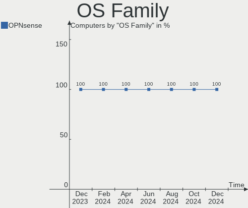
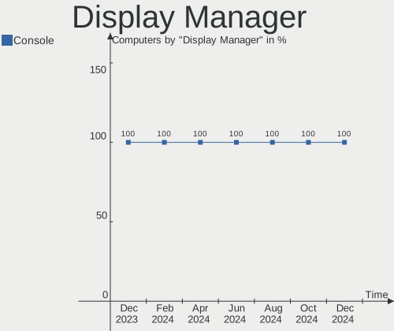
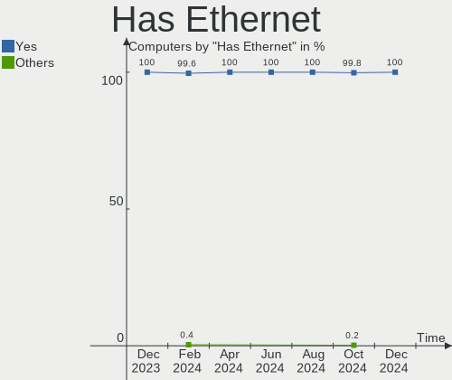

OPNsense - Hardware Trends
--------------------------

A project to identify most popular hardware characteristics and track their change
over time based on data collected by BSD users at https://BSD-Hardware.info.

Anyone can contribute to this report by the [hw-probe](https://github.com/linuxhw/hw-probe/blob/master/INSTALL.BSD.md) tool:

    hw-probe -all -upload

This report is for one last month. Overall report since the beginning of time: [TestDays](https://github.com/bsdhw/TestDays)

Period: Dec, 2023.

Contents
--------

* [ System ](#system)
  - [ OS                       ](#os)
  - [ OS Family                ](#os-family)
  - [ Arch                     ](#arch)
  - [ DE                       ](#de)
  - [ Display Server           ](#display-server)
  - [ Display Manager          ](#display-manager)
  - [ OS Lang                  ](#os-lang)
  - [ Boot Mode                ](#boot-mode)
  - [ Filesystem               ](#filesystem)
  - [ Part. scheme             ](#part-scheme)

* [ Board ](#board)
  - [ Vendor                   ](#vendor)
  - [ Model                    ](#model)
  - [ Model Family             ](#model-family)
  - [ MFG Year                 ](#mfg-year)
  - [ Form Factor              ](#form-factor)
  - [ Coreboot                 ](#coreboot)
  - [ RAM Size                 ](#ram-size)
  - [ RAM Used                 ](#ram-used)
  - [ Total Drives             ](#total-drives)
  - [ Has CD-ROM               ](#has-cd-rom)
  - [ Has Ethernet             ](#has-ethernet)
  - [ Has WiFi                 ](#has-wifi)
  - [ Has Bluetooth            ](#has-bluetooth)

* [ Location ](#location)
  - [ Country                  ](#country)
  - [ City                     ](#city)

* [ Drives ](#drives)
  - [ Drive Vendor             ](#drive-vendor)
  - [ Drive Model              ](#drive-model)
  - [ HDD Vendor               ](#hdd-vendor)
  - [ SSD Vendor               ](#ssd-vendor)
  - [ Drive Kind               ](#drive-kind)
  - [ Drive Connector          ](#drive-connector)
  - [ Drive Size               ](#drive-size)
  - [ Space Total              ](#space-total)
  - [ Space Used               ](#space-used)
  - [ Malfunc. Drives          ](#malfunc-drives)
  - [ Malfunc. Drive Vendor    ](#malfunc-drive-vendor)
  - [ Malfunc. HDD Vendor      ](#malfunc-hdd-vendor)
  - [ Malfunc. Drive Kind      ](#malfunc-drive-kind)
  - [ Failed Drives            ](#failed-drives)
  - [ Failed Drive Vendor      ](#failed-drive-vendor)
  - [ Drive Status             ](#drive-status)

* [ Storage controller ](#storage-controller)
  - [ Storage Vendor           ](#storage-vendor)
  - [ Storage Model            ](#storage-model)
  - [ Storage Kind             ](#storage-kind)

* [ Processor ](#processor)
  - [ CPU Vendor               ](#cpu-vendor)
  - [ CPU Model                ](#cpu-model)
  - [ CPU Model Family         ](#cpu-model-family)
  - [ CPU Cores                ](#cpu-cores)
  - [ CPU Sockets              ](#cpu-sockets)
  - [ CPU Threads              ](#cpu-threads)
  - [ CPU Microarch            ](#cpu-microarch)

* [ Graphics ](#graphics)
  - [ GPU Vendor               ](#gpu-vendor)
  - [ GPU Model                ](#gpu-model)
  - [ GPU Combo                ](#gpu-combo)
  - [ GPU Driver               ](#gpu-driver)
  - [ GPU Memory               ](#gpu-memory)

* [ Monitor ](#monitor)
  - [ Monitor Vendor           ](#monitor-vendor)
  - [ Monitor Model            ](#monitor-model)
  - [ Monitor Resolution       ](#monitor-resolution)
  - [ Monitor Diagonal         ](#monitor-diagonal)
  - [ Monitor Width            ](#monitor-width)
  - [ Aspect Ratio             ](#aspect-ratio)
  - [ Monitor Area             ](#monitor-area)
  - [ Pixel Density            ](#pixel-density)
  - [ Multiple Monitors        ](#multiple-monitors)

* [ Network ](#network)
  - [ Net Controller Vendor    ](#net-controller-vendor)
  - [ Net Controller Model     ](#net-controller-model)
  - [ Wireless Vendor          ](#wireless-vendor)
  - [ Wireless Model           ](#wireless-model)
  - [ Ethernet Vendor          ](#ethernet-vendor)
  - [ Ethernet Model           ](#ethernet-model)
  - [ Net Controller Kind      ](#net-controller-kind)
  - [ Used Controller          ](#used-controller)
  - [ NICs                     ](#nics)
  - [ IPv6                     ](#ipv6)

* [ Bluetooth ](#bluetooth)
  - [ Bluetooth Vendor         ](#bluetooth-vendor)
  - [ Bluetooth Model          ](#bluetooth-model)

* [ Sound ](#sound)
  - [ Sound Vendor             ](#sound-vendor)
  - [ Sound Model              ](#sound-model)

* [ Memory ](#memory)
  - [ Memory Vendor            ](#memory-vendor)
  - [ Memory Model             ](#memory-model)
  - [ Memory Kind              ](#memory-kind)
  - [ Memory Form Factor       ](#memory-form-factor)
  - [ Memory Size              ](#memory-size)
  - [ Memory Speed             ](#memory-speed)

* [ Printers & scanners ](#printers--scanners)
  - [ Printer Vendor           ](#printer-vendor)
  - [ Printer Model            ](#printer-model)
  - [ Scanner Vendor           ](#scanner-vendor)
  - [ Scanner Model            ](#scanner-model)

* [ Camera ](#camera)
  - [ Camera Vendor            ](#camera-vendor)
  - [ Camera Model             ](#camera-model)

* [ Security ](#security)
  - [ Fingerprint Vendor       ](#fingerprint-vendor)
  - [ Fingerprint Model        ](#fingerprint-model)
  - [ Chipcard Vendor          ](#chipcard-vendor)
  - [ Chipcard Model           ](#chipcard-model)

* [ Unsupported ](#unsupported)
  - [ Unsupported Devices      ](#unsupported-devices)
  - [ Unsupported Device Types ](#unsupported-device-types)

System
------

OS
--

Installed operating systems

| Name             | Computers | Percent |
|------------------|-----------|---------|
| OPNsense 23.7.10 | 211       | 55.67%  |
| OPNsense 23.7.9  | 137       | 36.15%  |
| OPNsense 23.1.11 | 6         | 1.58%   |
| OPNsense 23.7.7  | 5         | 1.32%   |
| OPNsense 23.7.8  | 4         | 1.06%   |
| OPNsense 24.1    | 3         | 0.79%   |
| OPNsense 23.10   | 2         | 0.53%   |
| OPNsense 22.7.11 | 2         | 0.53%   |
| OPNsense 21.7.8  | 2         | 0.53%   |
| OPNsense 23.7.6  | 1         | 0.26%   |
| OPNsense 23.7.5  | 1         | 0.26%   |
| OPNsense 23.7.4  | 1         | 0.26%   |
| OPNsense 23.7.2  | 1         | 0.26%   |
| OPNsense 23.7.1  | 1         | 0.26%   |
| OPNsense 23.10.1 | 1         | 0.26%   |
| OPNsense 23.1.5  | 1         | 0.26%   |

OS Family
---------

OS without a version

| Name     | Computers | Percent |
|----------|-----------|---------|
| OPNsense | 379       | 100%    |

Arch
----

OS architecture (x86_64, i586, etc.)

| Name  | Computers | Percent |
|-------|-----------|---------|
| amd64 | 378       | 99.74%  |
| arm64 | 1         | 0.26%   |

DE
--

Desktop Environment

| Name    | Computers | Percent |
|---------|-----------|---------|
| Console | 379       | 100%    |

Display Server
--------------

X11 or Wayland

| Name    | Computers | Percent |
|---------|-----------|---------|
| Console | 379       | 100%    |

Display Manager
---------------

SDDM, LightDM, etc.

| Name    | Computers | Percent |
|---------|-----------|---------|
| Console | 379       | 100%    |

OS Lang
-------

Language

| Lang    | Computers | Percent |
|---------|-----------|---------|
| Unknown | 368       | 97.1%   |
| C       | 11        | 2.9%    |

Boot Mode
---------

EFI or BIOS

| Mode | Computers | Percent |
|------|-----------|---------|
| EFI  | 371       | 97.89%  |
| BIOS | 8         | 2.11%   |

Filesystem
----------

Type of filesystem

| Type | Computers | Percent |
|------|-----------|---------|
| Ufs  | 207       | 54.62%  |
| Zfs  | 172       | 45.38%  |

Part. scheme
------------

Scheme of partitioning

| Type    | Computers | Percent |
|---------|-----------|---------|
| GPT     | 372       | 98.15%  |
| MBR     | 6         | 1.58%   |
| Unknown | 1         | 0.26%   |

Board
-----

Vendor
------

Motherboard manufacturer

| Name                | Computers | Percent |
|---------------------|-----------|---------|
| Unknown             | 77        | 20.32%  |
| Dell                | 42        | 11.08%  |
| Intel               | 27        | 7.12%   |
| Lenovo              | 26        | 6.86%   |
| Protectli           | 24        | 6.33%   |
| Hewlett-Packard     | 24        | 6.33%   |
| ASUSTek Computer    | 17        | 4.49%   |
| PC Engines          | 15        | 3.96%   |
| Supermicro          | 14        | 3.69%   |
| ASRock              | 13        | 3.43%   |
| Techvision          | 10        | 2.64%   |
| Gigabyte Technology | 10        | 2.64%   |
| Fujitsu             | 8         | 2.11%   |
| Deciso              | 8         | 2.11%   |
| AZW                 | 8         | 2.11%   |
| AMI                 | 8         | 2.11%   |
| Sophos              | 6         | 1.58%   |
| CWWK                | 4         | 1.06%   |
| ZOTAC               | 2         | 0.53%   |
| Yanling             | 2         | 0.53%   |
| MW                  | 2         | 0.53%   |
| MSI                 | 2         | 0.53%   |
| Apple               | 2         | 0.53%   |
| Advantech           | 2         | 0.53%   |
| Acer                | 2         | 0.53%   |
| ZX                  | 1         | 0.26%   |
| YANYU               | 1         | 0.26%   |
| Shuttle             | 1         | 0.26%   |
| SHANGZHAOYUAN       | 1         | 0.26%   |
| Seeed Studio        | 1         | 0.26%   |
| Pegatron            | 1         | 0.26%   |
| Orange Pi           | 1         | 0.26%   |
| MiTAC               | 1         | 0.26%   |
| Itautec             | 1         | 0.26%   |
| IGEL Technology     | 1         | 0.26%   |
| HPE                 | 1         | 0.26%   |
| Hardkernel          | 1         | 0.26%   |
| GoWin Solution      | 1         | 0.26%   |
| Google              | 1         | 0.26%   |
| GEEK+               | 1         | 0.26%   |

Model
-----

Motherboard model

| Name                                | Computers | Percent |
|-------------------------------------|-----------|---------|
| Unknown                             | 77        | 20.32%  |
| Techvision TVI7309X                 | 10        | 2.64%   |
| Protectli FW4B                      | 8         | 2.11%   |
| Protectli VP2420                    | 7         | 1.85%   |
| PC Engines APU2                     | 7         | 1.85%   |
| AMI Aptio CRB                       | 7         | 1.85%   |
| PC Engines apu4                     | 5         | 1.32%   |
| Intel Q3XXG4-P V1.0                 | 5         | 1.32%   |
| AZW EQ                              | 5         | 1.32%   |
| Supermicro Super Server             | 4         | 1.06%   |
| HP t730 Thin Client                 | 4         | 1.06%   |
| Dell OptiPlex 7020                  | 4         | 1.06%   |
| Deciso NetBoard-A10                 | 4         | 1.06%   |
| Sophos XG                           | 3         | 0.79%   |
| PC Engines APU3                     | 3         | 0.79%   |
| Intel Jasper Lake Client Platform   | 3         | 0.79%   |
| Fujitsu FUTRO S920                  | 3         | 0.79%   |
| Dell Wyse 5070 Extended Thin Client | 3         | 0.79%   |
| Dell OptiPlex 9020                  | 3         | 0.79%   |
| ZOTAC ZBOX-CI329NANO                | 2         | 0.53%   |
| Supermicro X10SLH-N6-ST031          | 2         | 0.53%   |
| Sophos UTM                          | 2         | 0.53%   |
| Protectli FW6                       | 2         | 0.53%   |
| Protectli FW4C                      | 2         | 0.53%   |
| Protectli FW4A                      | 2         | 0.53%   |
| Protectli FW2B                      | 2         | 0.53%   |
| MW GMLK-2_5G4L                      | 2         | 0.53%   |
| Intel QHSW02                        | 2         | 0.53%   |
| Intel NDISB533                      | 2         | 0.53%   |
| Intel NDiS 167                      | 2         | 0.53%   |
| HP ProDesk 400 G4 SFF               | 2         | 0.53%   |
| HP EliteDesk 800 G1 SFF             | 2         | 0.53%   |
| Fujitsu FUTRO S940                  | 2         | 0.53%   |
| Dell PowerEdge R440                 | 2         | 0.53%   |
| Dell PowerEdge R220                 | 2         | 0.53%   |
| Dell PowerEdge R210 II              | 2         | 0.53%   |
| Dell OptiPlex 9010                  | 2         | 0.53%   |
| Dell OptiPlex 780                   | 2         | 0.53%   |
| Dell OptiPlex 7060                  | 2         | 0.53%   |
| Dell OptiPlex 7050                  | 2         | 0.53%   |

Model Family
------------

Motherboard model prefix

| Name                       | Computers | Percent |
|----------------------------|-----------|---------|
| Unknown                    | 77        | 20.32%  |
| Dell OptiPlex              | 28        | 7.39%   |
| Lenovo ThinkCentre         | 20        | 5.28%   |
| HP ProDesk                 | 11        | 2.9%    |
| Techvision TVI7309X        | 10        | 2.64%   |
| Protectli FW4B             | 8         | 2.11%   |
| Protectli VP2420           | 7         | 1.85%   |
| PC Engines APU2            | 7         | 1.85%   |
| Dell PowerEdge             | 7         | 1.85%   |
| AMI Aptio                  | 7         | 1.85%   |
| Fujitsu FUTRO              | 6         | 1.58%   |
| PC Engines apu4            | 5         | 1.32%   |
| Intel Q3XXG4-P             | 5         | 1.32%   |
| AZW EQ                     | 5         | 1.32%   |
| Supermicro Super           | 4         | 1.06%   |
| HP t730                    | 4         | 1.06%   |
| HP EliteDesk               | 4         | 1.06%   |
| Dell Wyse                  | 4         | 1.06%   |
| Deciso NetBoard-A10        | 4         | 1.06%   |
| ASUS PRIME                 | 4         | 1.06%   |
| Sophos XG                  | 3         | 0.79%   |
| PC Engines APU3            | 3         | 0.79%   |
| Intel Jasper               | 3         | 0.79%   |
| ASUS TUF                   | 3         | 0.79%   |
| ZOTAC ZBOX-CI329NANO       | 2         | 0.53%   |
| Yanling LES                | 2         | 0.53%   |
| Supermicro X10SLH-N6-ST031 | 2         | 0.53%   |
| Sophos UTM                 | 2         | 0.53%   |
| Protectli FW6              | 2         | 0.53%   |
| Protectli FW4C             | 2         | 0.53%   |
| Protectli FW4A             | 2         | 0.53%   |
| Protectli FW2B             | 2         | 0.53%   |
| MW GMLK-2                  | 2         | 0.53%   |
| Intel QHSW02               | 2         | 0.53%   |
| Intel NDISB533             | 2         | 0.53%   |
| Intel NDiS                 | 2         | 0.53%   |
| HP Compaq                  | 2         | 0.53%   |
| Dell Precision             | 2         | 0.53%   |
| Deciso NetBoard-A20        | 2         | 0.53%   |
| CWWK CW-ADLN-6L            | 2         | 0.53%   |

MFG Year
--------

Motherboard manufacture year

| Year | Computers | Percent |
|------|-----------|---------|
| 2023 | 66        | 17.41%  |
| 2022 | 60        | 15.83%  |
| 2018 | 35        | 9.23%   |
| 2021 | 33        | 8.71%   |
| 2016 | 33        | 8.71%   |
| 2019 | 28        | 7.39%   |
| 2015 | 24        | 6.33%   |
| 2014 | 23        | 6.07%   |
| 2017 | 16        | 4.22%   |
| 2020 | 15        | 3.96%   |
| 2013 | 12        | 3.17%   |
| 2012 | 12        | 3.17%   |
| 2011 | 9         | 2.37%   |
| 2010 | 4         | 1.06%   |
| 2009 | 4         | 1.06%   |
| 2008 | 3         | 0.79%   |
| 2007 | 2         | 0.53%   |

Form Factor
-----------

Physical design of the computer

| Name           | Computers | Percent |
|----------------|-----------|---------|
| Desktop        | 304       | 80.21%  |
| Mini pc        | 36        | 9.5%    |
| Server         | 18        | 4.75%   |
| Notebook       | 14        | 3.69%   |
| Firewall       | 6         | 1.58%   |
| System on chip | 1         | 0.26%   |

Coreboot
--------

Have coreboot on board

| Used | Computers | Percent |
|------|-----------|---------|
| No   | 356       | 93.93%  |
| Yes  | 23        | 6.07%   |

RAM Size
--------

Total RAM memory

| Size in GB      | Computers | Percent |
|-----------------|-----------|---------|
| 8.01-16.0       | 150       | 39.58%  |
| 16.01-24.0      | 117       | 30.87%  |
| 4.01-8.0        | 52        | 13.72%  |
| 32.01-64.0      | 33        | 8.71%   |
| 64.01-256.0     | 13        | 3.43%   |
| 2.01-3.0        | 8         | 2.11%   |
| 3.01-4.0        | 3         | 0.79%   |
| 24.01-32.0      | 2         | 0.53%   |
| More than 256.0 | 1         | 0.26%   |

RAM Used
--------

Used RAM memory

| Used GB   | Computers | Percent |
|-----------|-----------|---------|
| 0.01-0.5  | 164       | 43.27%  |
| 0.51-1.0  | 153       | 40.37%  |
| 1.01-2.0  | 48        | 12.66%  |
| 2.01-3.0  | 10        | 2.64%   |
| 3.01-4.0  | 2         | 0.53%   |
| 4.01-8.0  | 1         | 0.26%   |
| 8.01-16.0 | 1         | 0.26%   |

Total Drives
------------

Number of drives on board

| Drives | Computers | Percent |
|--------|-----------|---------|
| 1      | 300       | 79.16%  |
| 0      | 38        | 10.03%  |
| 2      | 35        | 9.23%   |
| 3      | 4         | 1.06%   |
| 4      | 2         | 0.53%   |

Has CD-ROM
----------

Has CD-ROM on board

| Presented | Computers | Percent |
|-----------|-----------|---------|
| No        | 342       | 90.24%  |
| Yes       | 37        | 9.76%   |

Has Ethernet
------------

Has Ethernet on board

| Presented | Computers | Percent |
|-----------|-----------|---------|
| Yes       | 379       | 100%    |

Has WiFi
--------

Has WiFi module

| Presented | Computers | Percent |
|-----------|-----------|---------|
| No        | 310       | 81.79%  |
| Yes       | 69        | 18.21%  |

Has Bluetooth
-------------

Has Bluetooth module

| Presented | Computers | Percent |
|-----------|-----------|---------|
| No        | 341       | 89.97%  |
| Yes       | 38        | 10.03%  |

Location
--------

Country
-------

Geographic location (country)

| Country             | Computers | Percent |
|---------------------|-----------|---------|
| USA                 | 117       | 30.87%  |
| Germany             | 67        | 17.68%  |
| Canada              | 22        | 5.8%    |
| UK                  | 20        | 5.28%   |
| Netherlands         | 13        | 3.43%   |
| France              | 13        | 3.43%   |
| Austria             | 10        | 2.64%   |
| Australia           | 10        | 2.64%   |
| Italy               | 9         | 2.37%   |
| Brazil              | 9         | 2.37%   |
| Russia              | 7         | 1.85%   |
| Sweden              | 6         | 1.58%   |
| Belgium             | 6         | 1.58%   |
| Switzerland         | 5         | 1.32%   |
| Portugal            | 5         | 1.32%   |
| Taiwan              | 4         | 1.06%   |
| Romania             | 4         | 1.06%   |
| Poland              | 4         | 1.06%   |
| Norway              | 4         | 1.06%   |
| South Korea         | 3         | 0.79%   |
| Slovakia            | 3         | 0.79%   |
| New Zealand         | 3         | 0.79%   |
| Finland             | 3         | 0.79%   |
| South Africa        | 2         | 0.53%   |
| Greece              | 2         | 0.53%   |
| Denmark             | 2         | 0.53%   |
| Czechia             | 2         | 0.53%   |
| Chile               | 2         | 0.53%   |
| Turkey              | 1         | 0.26%   |
| Trinidad and Tobago | 1         | 0.26%   |
| Spain               | 1         | 0.26%   |
| Slovenia            | 1         | 0.26%   |
| Saudi Arabia        | 1         | 0.26%   |
| Qatar               | 1         | 0.26%   |
| North Macedonia     | 1         | 0.26%   |
| Moldova             | 1         | 0.26%   |
| Malaysia            | 1         | 0.26%   |
| Luxembourg          | 1         | 0.26%   |
| Lithuania           | 1         | 0.26%   |
| Liechtenstein       | 1         | 0.26%   |

City
----

Geographic location (city)

| City                     | Computers | Percent |
|--------------------------|-----------|---------|
| Berlin                   | 6         | 1.58%   |
| Vienna                   | 5         | 1.32%   |
| Paris                    | 5         | 1.32%   |
| Munich                   | 4         | 1.06%   |
| Brisbane                 | 4         | 1.06%   |
| Toronto                  | 3         | 0.79%   |
| South San Francisco      | 3         | 0.79%   |
| Ottawa                   | 3         | 0.79%   |
| Moscow                   | 3         | 0.79%   |
| Kooyong                  | 3         | 0.79%   |
| Fayetteville             | 3         | 0.79%   |
| Cologne                  | 3         | 0.79%   |
| Brooklyn                 | 3         | 0.79%   |
| Vancouver                | 2         | 0.53%   |
| Uetze                    | 2         | 0.53%   |
| Sydney                   | 2         | 0.53%   |
| Santiago                 | 2         | 0.53%   |
| Sainte-Marthe-sur-le-Lac | 2         | 0.53%   |
| Rotterdam                | 2         | 0.53%   |
| Montreal                 | 2         | 0.53%   |
| Milan                    | 2         | 0.53%   |
| Lisbon                   | 2         | 0.53%   |
| Lille                    | 2         | 0.53%   |
| Leeds                    | 2         | 0.53%   |
| Laval                    | 2         | 0.53%   |
| Kissing                  | 2         | 0.53%   |
| Hittisau                 | 2         | 0.53%   |
| Helsinki                 | 2         | 0.53%   |
| Hayward                  | 2         | 0.53%   |
| Flushing                 | 2         | 0.53%   |
| Denver                   | 2         | 0.53%   |
| Columbia                 | 2         | 0.53%   |
| Cary                     | 2         | 0.53%   |
| Calgary                  | 2         | 0.53%   |
| Bistriţa                | 2         | 0.53%   |
| Auckland                 | 2         | 0.53%   |
| Akron                    | 2         | 0.53%   |
| Zuzenhausen              | 1         | 0.26%   |
| Zurich                   | 1         | 0.26%   |
| Yongsan-dong             | 1         | 0.26%   |

Drives
------

Drive Vendor
------------

Hard drive vendors

| Vendor              | Computers | Drives | Percent |
|---------------------|-----------|--------|---------|
| Samsung Electronics | 68        | 77     | 18.43%  |
| Transcend           | 27        | 27     | 7.32%   |
| Kingston            | 25        | 26     | 6.78%   |
| WDC                 | 23        | 23     | 6.23%   |
| Crucial             | 21        | 22     | 5.69%   |
| Seagate             | 19        | 24     | 5.15%   |
| SK hynix            | 15        | 15     | 4.07%   |
| Hoodisk             | 15        | 15     | 4.07%   |
| Intel               | 14        | 19     | 3.79%   |
| SanDisk             | 13        | 13     | 3.52%   |
| China               | 12        | 12     | 3.25%   |
| Toshiba             | 9         | 9      | 2.44%   |
| Protectli           | 8         | 8      | 2.17%   |
| SPCC                | 7         | 8      | 1.9%    |
| Team                | 6         | 7      | 1.63%   |
| Fanxiang            | 6         | 6      | 1.63%   |
| Silicon Motion      | 5         | 5      | 1.36%   |
| Lexar               | 5         | 5      | 1.36%   |
| Gigabyte Technology | 5         | 5      | 1.36%   |
| OCZ                 | 4         | 4      | 1.08%   |
| Intenso             | 4         | 4      | 1.08%   |
| Hewlett-Packard     | 4         | 4      | 1.08%   |
| ShiJi               | 3         | 3      | 0.81%   |
| Patriot             | 3         | 4      | 0.81%   |
| Micron Technology   | 3         | 3      | 0.81%   |
| KingSpec            | 3         | 3      | 0.81%   |
| FORESEE             | 3         | 3      | 0.81%   |
| BIWIN               | 3         | 3      | 0.81%   |
| A-DATA Technology   | 3         | 3      | 0.81%   |
| SHAREVDI            | 2         | 2      | 0.54%   |
| PNY                 | 2         | 2      | 0.54%   |
| Phison              | 2         | 3      | 0.54%   |
| LITEON              | 2         | 2      | 0.54%   |
| KeepData            | 2         | 2      | 0.54%   |
| HGST                | 2         | 2      | 0.54%   |
| Dogfish             | 2         | 2      | 0.54%   |
| Wibtek              | 1         | 1      | 0.27%   |
| VICKTER             | 1         | 1      | 0.27%   |
| Verbatim            | 1         | 1      | 0.27%   |
| SSSTC               | 1         | 1      | 0.27%   |

Drive Model
-----------

Hard drive models

| Model                            | Computers | Percent |
|----------------------------------|-----------|---------|
| Hoodisk SSD 128GB                | 9         | 2.41%   |
| Kingston SKC600MS256G 256GB      | 7         | 1.87%   |
| Seagate ST500DM002-1BD142 500GB  | 6         | 1.6%    |
| Samsung SSD 840 EVO 250GB        | 5         | 1.34%   |
| Samsung MZVLB256HAHQ-000L7 256GB | 5         | 1.34%   |
| Crucial CT500P3SSD8 500GB        | 5         | 1.34%   |
| Samsung MZ7PD256HCGM-000H7 256GB | 4         | 1.07%   |
| Transcend TS256GMTS952T2 256GB   | 3         | 0.8%    |
| Transcend TS128GMSA230S 128GB    | 3         | 0.8%    |
| Team TM8FP6256G 256GB            | 3         | 0.8%    |
| SK hynix SC311 SATA 128GB        | 3         | 0.8%    |
| Samsung SSD 980 PRO 500GB        | 3         | 0.8%    |
| Samsung SSD 870 EVO 250GB        | 3         | 0.8%    |
| Protectli 120GB mSATA            | 3         | 0.8%    |
| Hoodisk SSD 32GB                 | 3         | 0.8%    |
| Transcend TS64GMSA230S 64GB      | 2         | 0.53%   |
| Transcend TS256GMTE652T2 256GB   | 2         | 0.53%   |
| Transcend TS256GMSA230S 256GB    | 2         | 0.53%   |
| Transcend TS16GMSA370 16GB       | 2         | 0.53%   |
| Transcend TS128GMTE110S 128GB    | 2         | 0.53%   |
| SK hynix SC300 M.2 2280 128GB    | 2         | 0.53%   |
| Silicon Motion GV128 128GB       | 2         | 0.53%   |
| SHAREVDI 128GB SSD               | 2         | 0.53%   |
| Samsung SSD 860 EVO M.2 250GB    | 2         | 0.53%   |
| Samsung SSD 860 EVO 250GB        | 2         | 0.53%   |
| Samsung SSD 850 EVO 250GB        | 2         | 0.53%   |
| Samsung SSD 840 PRO Series 128GB | 2         | 0.53%   |
| Samsung SSD 840 EVO 120GB        | 2         | 0.53%   |
| Samsung MZVLQ128HCHQ-00BH1 128GB | 2         | 0.53%   |
| Protectli 480GB M.2              | 2         | 0.53%   |
| Phison PCIe SSD 250GB            | 2         | 0.53%   |
| Lexar SSD NS100 256GB            | 2         | 0.53%   |
| Kingston SV300S37A120G 120GB     | 2         | 0.53%   |
| Kingston SUV500MS120G 120GB      | 2         | 0.53%   |
| Kingston SMS200S360G 64GB        | 2         | 0.53%   |
| Kingston SA400S37480G 480GB      | 2         | 0.53%   |
| Kingston SA400S37120G 120GB      | 2         | 0.53%   |
| KeepData GIM128 128GB            | 2         | 0.53%   |
| Hoodisk SSD 16GB                 | 2         | 0.53%   |
| HP SSD EX900 250GB               | 2         | 0.53%   |

HDD Vendor
----------

Hard disk drive vendors

| Vendor              | Computers | Drives | Percent |
|---------------------|-----------|--------|---------|
| Seagate             | 18        | 23     | 46.15%  |
| WDC                 | 9         | 9      | 23.08%  |
| Toshiba             | 6         | 6      | 15.38%  |
| HGST                | 2         | 2      | 5.13%   |
| Hewlett-Packard     | 2         | 2      | 5.13%   |
| Samsung Electronics | 1         | 1      | 2.56%   |
| Hitachi             | 1         | 1      | 2.56%   |

SSD Vendor
----------

Solid state drive vendors

| Vendor              | Computers | Drives | Percent |
|---------------------|-----------|--------|---------|
| Samsung Electronics | 41        | 47     | 18.14%  |
| Transcend           | 22        | 22     | 9.73%   |
| Kingston            | 22        | 23     | 9.73%   |
| Hoodisk             | 15        | 15     | 6.64%   |
| SanDisk             | 13        | 13     | 5.75%   |
| Crucial             | 13        | 14     | 5.75%   |
| China               | 12        | 12     | 5.31%   |
| SK hynix            | 10        | 10     | 4.42%   |
| Intel               | 9         | 13     | 3.98%   |
| Protectli           | 8         | 8      | 3.54%   |
| WDC                 | 6         | 6      | 2.65%   |
| SPCC                | 5         | 5      | 2.21%   |
| OCZ                 | 4         | 4      | 1.77%   |
| Lexar               | 3         | 3      | 1.33%   |
| KingSpec            | 3         | 3      | 1.33%   |
| Intenso             | 3         | 3      | 1.33%   |
| A-DATA Technology   | 3         | 3      | 1.33%   |
| SHAREVDI            | 2         | 2      | 0.88%   |
| Micron Technology   | 2         | 2      | 0.88%   |
| LITEON              | 2         | 2      | 0.88%   |
| KeepData            | 2         | 2      | 0.88%   |
| Gigabyte Technology | 2         | 2      | 0.88%   |
| FORESEE             | 2         | 2      | 0.88%   |
| Dogfish             | 2         | 2      | 0.88%   |
| BIWIN               | 2         | 2      | 0.88%   |
| Wibtek              | 1         | 1      | 0.44%   |
| VICKTER             | 1         | 1      | 0.44%   |
| Verbatim            | 1         | 1      | 0.44%   |
| Toshiba             | 1         | 1      | 0.44%   |
| Team                | 1         | 1      | 0.44%   |
| SSSTC               | 1         | 1      | 0.44%   |
| ShiJi               | 1         | 1      | 0.44%   |
| PNY                 | 1         | 1      | 0.44%   |
| Pccooler            | 1         | 1      | 0.44%   |
| Patriot             | 1         | 1      | 0.44%   |
| Netac               | 1         | 1      | 0.44%   |
| Mushkin             | 1         | 1      | 0.44%   |
| MACROVIP            | 1         | 1      | 0.44%   |
| Leven               | 1         | 1      | 0.44%   |
| Kingspeed           | 1         | 1      | 0.44%   |

Drive Kind
----------

HDD or SSD

| Kind | Computers | Drives | Percent |
|------|-----------|--------|---------|
| SSD  | 219       | 238    | 60.66%  |
| NVMe | 104       | 112    | 28.81%  |
| HDD  | 38        | 44     | 10.53%  |

Drive Connector
---------------

SATA, SAS, NVMe, etc.

| Type | Computers | Drives | Percent |
|------|-----------|--------|---------|
| SATA | 246       | 282    | 70.29%  |
| NVMe | 104       | 112    | 29.71%  |

Drive Size
----------

Size of hard drive

| Size in TB | Computers | Drives | Percent |
|------------|-----------|--------|---------|
| 0.01-0.5   | 223       | 247    | 87.11%  |
| 0.51-1.0   | 18        | 19     | 7.03%   |
| 1.01-2.0   | 11        | 12     | 4.3%    |
| 3.01-4.0   | 4         | 4      | 1.56%   |

Space Total
-----------

Amount of disk space available on the file system

| Size in GB     | Computers | Percent |
|----------------|-----------|---------|
| 101-250        | 221       | 58.31%  |
| 251-500        | 68        | 17.94%  |
| 51-100         | 26        | 6.86%   |
| 501-1000       | 23        | 6.07%   |
| 21-50          | 20        | 5.28%   |
| 1-20           | 11        | 2.9%    |
| 1001-2000      | 8         | 2.11%   |
| More than 3000 | 1         | 0.26%   |
| Unknown        | 1         | 0.26%   |

Space Used
----------

Amount of used disk space

| Used GB | Computers | Percent |
|---------|-----------|---------|
| 1-20    | 356       | 93.93%  |
| 21-50   | 16        | 4.22%   |
| 51-100  | 4         | 1.06%   |
| 101-250 | 2         | 0.53%   |
| Unknown | 1         | 0.26%   |

Malfunc. Drives
---------------

Drive models with a malfunction

| Model                                      | Computers | Drives | Percent |
|--------------------------------------------|-----------|--------|---------|
| Seagate ST500DM002-1BD142 500GB            | 3         | 3      | 9.38%   |
| WDC WD4000FYYZ-50UL1B0 4TB                 | 1         | 1      | 3.13%   |
| WDC WD3200AAKS-75L9A0 320GB                | 1         | 1      | 3.13%   |
| WDC WD2000FYYZ-01UL1B2 2TB                 | 1         | 1      | 3.13%   |
| Transcend TS8GMSM610 8GB                   | 1         | 1      | 3.13%   |
| Toshiba THNSNK128GCS8 SATA 128GB           | 1         | 1      | 3.13%   |
| Toshiba MK3261GSYN 320GB                   | 1         | 1      | 3.13%   |
| Toshiba MK2565GSX 250GB                    | 1         | 1      | 3.13%   |
| SSSTC CVB-8D128-HP 128GB                   | 1         | 1      | 3.13%   |
| SPCC Solid State Disk 512GB                | 1         | 1      | 3.13%   |
| SK hynix HFS256G39TND-N210A 256GB          | 1         | 1      | 3.13%   |
| SK hynix HFS064G3AMNB-2200A 64GB           | 1         | 1      | 3.13%   |
| Seagate ST9500420AS 500GB                  | 1         | 1      | 3.13%   |
| Seagate ST500LT012-9WS142 500GB            | 1         | 1      | 3.13%   |
| Seagate ST250DM000-1BD141 250GB            | 1         | 1      | 3.13%   |
| Seagate ST1000DM003-1SB102 1TB             | 1         | 1      | 3.13%   |
| SanDisk SDSSDHP256G 256GB                  | 1         | 1      | 3.13%   |
| Samsung Electronics SSD RBX Series 128GB M | 1         | 1      | 3.13%   |
| Samsung Electronics SSD 980 PRO 2TB        | 1         | 1      | 3.13%   |
| Samsung Electronics SSD 970 EVO Plus 2TB   | 1         | 1      | 3.13%   |
| Plextor PX-256M8PeG 256GB                  | 1         | 1      | 3.13%   |
| Patriot Pyro SE 120GB                      | 1         | 1      | 3.13%   |
| LITEON LCH-128V2S-11 2.5 7mm 128GB         | 1         | 1      | 3.13%   |
| Kingston SHFS37A120G 120GB                 | 1         | 1      | 3.13%   |
| KingSpec P4-120 120GB                      | 1         | 1      | 3.13%   |
| Intel SSDSC2BF180A4L 180GB                 | 1         | 1      | 3.13%   |
| Hitachi HTE543232A7A384 320GB              | 1         | 1      | 3.13%   |
| HGST HTE545032A7E380 320GB                 | 1         | 1      | 3.13%   |
| Crucial CT480BX500SSD1 480GB               | 1         | 1      | 3.13%   |
| Crucial CT275MX300SSD1 275GB               | 1         | 1      | 3.13%   |

Malfunc. Drive Vendor
---------------------

Vendors of faulty drives

| Vendor              | Computers | Drives | Percent |
|---------------------|-----------|--------|---------|
| Seagate             | 7         | 7      | 21.88%  |
| WDC                 | 3         | 3      | 9.38%   |
| Toshiba             | 3         | 3      | 9.38%   |
| Samsung Electronics | 3         | 3      | 9.38%   |
| SK hynix            | 2         | 2      | 6.25%   |
| Crucial             | 2         | 2      | 6.25%   |
| Transcend           | 1         | 1      | 3.13%   |
| SSSTC               | 1         | 1      | 3.13%   |
| SPCC                | 1         | 1      | 3.13%   |
| SanDisk             | 1         | 1      | 3.13%   |
| Plextor             | 1         | 1      | 3.13%   |
| Patriot             | 1         | 1      | 3.13%   |
| LITEON              | 1         | 1      | 3.13%   |
| Kingston            | 1         | 1      | 3.13%   |
| KingSpec            | 1         | 1      | 3.13%   |
| Intel               | 1         | 1      | 3.13%   |
| Hitachi             | 1         | 1      | 3.13%   |
| HGST                | 1         | 1      | 3.13%   |

Malfunc. HDD Vendor
-------------------

Vendors of faulty HDD drives

| Vendor  | Computers | Drives | Percent |
|---------|-----------|--------|---------|
| Seagate | 7         | 7      | 50%     |
| WDC     | 3         | 3      | 21.43%  |
| Toshiba | 2         | 2      | 14.29%  |
| Hitachi | 1         | 1      | 7.14%   |
| HGST    | 1         | 1      | 7.14%   |

Malfunc. Drive Kind
-------------------

Kinds of faulty drives

| Kind | Computers | Drives | Percent |
|------|-----------|--------|---------|
| SSD  | 15        | 15     | 46.88%  |
| HDD  | 14        | 14     | 43.75%  |
| NVMe | 3         | 3      | 9.38%   |

Failed Drives
-------------

Failed drive models

| Model                                        | Computers | Drives | Percent |
|----------------------------------------------|-----------|--------|---------|
| Transcend TS128GMTE110S 128GB                | 1         | 1      | 50%     |
| Samsung Electronics MZVLB256HBHQ-000H1 256GB | 1         | 1      | 50%     |

Failed Drive Vendor
-------------------

Failed drive vendors

| Vendor              | Computers | Drives | Percent |
|---------------------|-----------|--------|---------|
| Transcend           | 1         | 1      | 50%     |
| Samsung Electronics | 1         | 1      | 50%     |

Drive Status
------------

Number of failed and malfunc. drives

| Status   | Computers | Drives | Percent |
|----------|-----------|--------|---------|
| Works    | 311       | 354    | 89.37%  |
| Malfunc  | 31        | 32     | 8.91%   |
| Detected | 4         | 6      | 1.15%   |
| Failed   | 2         | 2      | 0.57%   |

Storage controller
------------------

Storage Vendor
--------------

Storage controller vendors

| Vendor                        | Computers | Percent |
|-------------------------------|-----------|---------|
| Intel                         | 310       | 64.99%  |
| AMD                           | 43        | 9.01%   |
| Samsung Electronics           | 28        | 5.87%   |
| Silicon Motion                | 14        | 2.94%   |
| SanDisk                       | 11        | 2.31%   |
| Phison Electronics            | 11        | 2.31%   |
| MAXIO Technology (Hangzhou)   | 10        | 2.1%    |
| Micron/Crucial Technology     | 8         | 1.68%   |
| Transcend                     | 5         | 1.05%   |
| SK hynix                      | 5         | 1.05%   |
| Hosin Global Electronics      | 4         | 0.84%   |
| Broadcom / LSI                | 4         | 0.84%   |
| Realtek Semiconductor         | 3         | 0.63%   |
| Kingston Technology Company   | 3         | 0.63%   |
| Toshiba                       | 2         | 0.42%   |
| Marvell Technology Group      | 2         | 0.42%   |
| JMicron Technology            | 2         | 0.42%   |
| Shenzhen Longsys Electronics  | 1         | 0.21%   |
| Seagate Technology            | 1         | 0.21%   |
| Nvidia                        | 1         | 0.21%   |
| Micron Technology             | 1         | 0.21%   |
| Lite-On Technology            | 1         | 0.21%   |
| KIOXIA                        | 1         | 0.21%   |
| Integrated Technology Express | 1         | 0.21%   |
| Hewlett-Packard               | 1         | 0.21%   |
| Chelsio Communications        | 1         | 0.21%   |
| Biwin Storage Technology      | 1         | 0.21%   |
| ATP ELECTRONICS               | 1         | 0.21%   |
| ASMedia Technology            | 1         | 0.21%   |

Storage Model
-------------

Storage controller models

| Model                                                                            | Computers | Percent |
|----------------------------------------------------------------------------------|-----------|---------|
| Intel unknown                                                                    | 34        | 6.53%   |
| AMD FCH SATA Controller [AHCI mode]                                              | 33        | 6.33%   |
| Intel 8 Series/C220 Series Chipset Family 6-port SATA Controller 1 [AHCI mode]   | 31        | 5.95%   |
| Intel Jasper Lake SATA AHCI Controller                                           | 25        | 4.8%    |
| Intel Celeron/Pentium Silver Processor SATA Controller                           | 24        | 4.61%   |
| Intel Q170/Q150/B150/H170/H110/Z170/CM236 Chipset SATA Controller [AHCI Mode]    | 20        | 3.84%   |
| Intel Atom/Celeron/Pentium Processor x5-E8000/J3xxx/N3xxx Series SATA Controller | 18        | 3.45%   |
| Intel Cannon Lake PCH SATA AHCI Controller                                       | 16        | 3.07%   |
| Silicon Motion SM2263EN/SM2263XT (DRAM-less) NVMe SSD Controllers                | 14        | 2.69%   |
| Intel Sunrise Point-LP SATA Controller [AHCI mode]                               | 14        | 2.69%   |
| Samsung NVMe SSD Controller SM981/PM981/PM983                                    | 13        | 2.5%    |
| MAXIO (Hangzhou) NVMe SSD Controller MAP1202                                     | 10        | 1.92%   |
| Intel Atom Processor E3800 Series SATA AHCI Controller                           | 10        | 1.92%   |
| Intel 200 Series PCH SATA controller [AHCI mode]                                 | 10        | 1.92%   |
| Intel Elkhart Lake SATA AHCI                                                     | 8         | 1.54%   |
| Micron/Crucial P2 [Nick P2] / P3 / P3 Plus NVMe PCIe SSD (DRAM-less)             | 7         | 1.34%   |
| Intel SATA Controller [RAID mode]                                                | 7         | 1.34%   |
| Samsung NVMe SSD Controller PM9A1/PM9A3/980PRO                                   | 6         | 1.15%   |
| Phison PS5013-E13 PCIe3 NVMe Controller (DRAM-less)                              | 6         | 1.15%   |
| Intel Wildcat Point-LP SATA Controller [AHCI Mode]                               | 6         | 1.15%   |
| Intel 8 Series SATA Controller 1 [AHCI mode]                                     | 6         | 1.15%   |
| Intel 6 Series/C200 Series Chipset Family 6 port Desktop SATA AHCI Controller    | 6         | 1.15%   |
| Unknown                                                                          | 6         | 1.15%   |
| SanDisk Extreme Pro / WD Black SN750 / PC SN730 / Red SN700 NVMe SSD             | 5         | 0.96%   |
| Intel Atom Processor C3000 Series SATA Controller 0                              | 5         | 0.96%   |
| Intel Alder Lake-S PCH SATA Controller [AHCI Mode]                               | 5         | 0.96%   |
| Intel 82801HM/HEM (ICH8M/ICH8M-E) SATA Controller [AHCI mode]                    | 5         | 0.96%   |
| Intel 82801HM/HEM (ICH8M/ICH8M-E) IDE Controller                                 | 5         | 0.96%   |
| AMD FCH SATA Controller [IDE mode]                                               | 5         | 0.96%   |
| Transcend NVMe PCIe SSD 110S/112S/120S/MTE300S/MTE400S/MTE652T2 (DRAM-less)      | 4         | 0.77%   |
| SK hynix Gold P31/BC711/PC711 NVMe Solid State Drive                             | 4         | 0.77%   |
| Samsung NVMe SSD Controller 980 (DRAM-less)                                      | 4         | 0.77%   |
| Intel Comet Lake SATA AHCI Controller                                            | 4         | 0.77%   |
| Intel 7 Series/C210 Series Chipset Family 6-port SATA Controller [AHCI mode]     | 4         | 0.77%   |
| AMD FCH IDE Controller                                                           | 4         | 0.77%   |
| AMD 500 Series Chipset SATA Controller                                           | 4         | 0.77%   |
| Realtek RTS5765DL NVMe SSD Controller (DRAM-less)                                | 3         | 0.58%   |
| Intel Tiger Lake-LP SATA Controller                                              | 3         | 0.58%   |
| Intel Celeron N3350/Pentium N4200/Atom E3900 Series SATA AHCI Controller         | 3         | 0.58%   |
| Intel C620 Series Chipset Family SSATA Controller [AHCI mode]                    | 3         | 0.58%   |

Storage Kind
------------

Kind of storage controller (IDE, SATA, NVMe, SAS, ...)

| Kind | Computers | Percent |
|------|-----------|---------|
| SATA | 330       | 67.21%  |
| NVMe | 114       | 23.22%  |
| IDE  | 31        | 6.31%   |
| RAID | 14        | 2.85%   |
| SAS  | 1         | 0.2%    |
| SCSI | 1         | 0.2%    |

Processor
---------

CPU Vendor
----------

Processor vendors

| Vendor   | Computers | Percent |
|----------|-----------|---------|
| Intel    | 328       | 86.54%  |
| AMD      | 50        | 13.19%  |
| Rockchip | 1         | 0.26%   |

CPU Model
---------

Processor models

| Model                                    | Computers | Percent |
|------------------------------------------|-----------|---------|
| Intel N100                               | 32        | 8.44%   |
| Intel Celeron N5105 @ 2.00GHz            | 19        | 5.01%   |
| AMD GX-412TC SOC                         | 15        | 3.96%   |
| Intel Celeron J4125 CPU @ 2.00GHz        | 12        | 3.17%   |
| Intel Celeron CPU J3160 @ 1.60GHz        | 10        | 2.64%   |
| Intel Celeron J6412 @ 2.00GHz            | 8         | 2.11%   |
| Intel Pentium Silver N6005 @ 2.00GHz     | 7         | 1.85%   |
| Intel Celeron CPU J1900 @ 1.99GHz        | 7         | 1.85%   |
| Intel Pentium Silver J5005 CPU @ 1.50GHz | 6         | 1.58%   |
| Intel Core i5-6500 CPU @ 3.20GHz         | 6         | 1.58%   |
| Intel Core i5-4590 CPU @ 3.30GHz         | 6         | 1.58%   |
| Intel Core i3-N305                       | 6         | 1.58%   |
| Intel Core i7-7500U CPU @ 2.70GHz        | 5         | 1.32%   |
| Intel Core i5-8500T CPU @ 2.10GHz        | 4         | 1.06%   |
| Intel Core i3-6100 CPU @ 3.70GHz         | 4         | 1.06%   |
| Intel Atom CPU C3558 @ 2.20GHz           | 4         | 1.06%   |
| AMD Ryzen Embedded V1500B                | 4         | 1.06%   |
| AMD RX-427BB with AMD Radeon R7 Graphics | 4         | 1.06%   |
| AMD EPYC 3201 8-Core Processor           | 4         | 1.06%   |
| Intel Pentium Gold G5400T CPU @ 3.10GHz  | 3         | 0.79%   |
| Intel Core i7-4770 CPU @ 3.40GHz         | 3         | 0.79%   |
| Intel Core i7-3770 CPU @ 3.40GHz         | 3         | 0.79%   |
| Intel Core i5-8500 CPU @ 3.00GHz         | 3         | 0.79%   |
| Intel Core i5-4590T CPU @ 2.00GHz        | 3         | 0.79%   |
| Intel Atom CPU N450 @ 1.66GHz            | 3         | 0.79%   |
| Intel Atom CPU E3845 @ 1.91GHz           | 3         | 0.79%   |
| Intel Atom CPU D525 @ 1.80GHz            | 3         | 0.79%   |
| AMD Ryzen 5 5600G with Radeon Graphics   | 3         | 0.79%   |
| Intel Xeon CPU E3-1270 v3 @ 3.50GHz      | 2         | 0.53%   |
| Intel Pentium CPU J3710 @ 1.60GHz        | 2         | 0.53%   |
| Intel N95                                | 2         | 0.53%   |
| Intel Core i7-8700K CPU @ 3.70GHz        | 2         | 0.53%   |
| Intel Core i7-6700T CPU @ 2.80GHz        | 2         | 0.53%   |
| Intel Core i5-9500T CPU @ 2.20GHz        | 2         | 0.53%   |
| Intel Core i5-8260U CPU @ 1.60GHz        | 2         | 0.53%   |
| Intel Core i5-8250U CPU @ 1.60GHz        | 2         | 0.53%   |
| Intel Core i5-7500 CPU @ 3.40GHz         | 2         | 0.53%   |
| Intel Core i5-7200U CPU @ 2.50GHz        | 2         | 0.53%   |
| Intel Core i5-6600 CPU @ 3.30GHz         | 2         | 0.53%   |
| Intel Core i5-6500T CPU @ 2.50GHz        | 2         | 0.53%   |

CPU Model Family
----------------

Processor model prefix

| Model                   | Computers | Percent |
|-------------------------|-----------|---------|
| Intel Celeron           | 78        | 20.58%  |
| Intel Core i5           | 75        | 19.79%  |
| Other                   | 49        | 12.93%  |
| Intel Core i3           | 30        | 7.92%   |
| Intel Xeon              | 24        | 6.33%   |
| Intel Core i7           | 23        | 6.07%   |
| Intel Atom              | 19        | 5.01%   |
| AMD GX                  | 19        | 5.01%   |
| Intel Pentium Silver    | 14        | 3.69%   |
| Intel Pentium           | 10        | 2.64%   |
| AMD Ryzen Embedded      | 5         | 1.32%   |
| AMD Ryzen 5             | 4         | 1.06%   |
| AMD EPYC                | 4         | 1.06%   |
| Intel Pentium Gold      | 3         | 0.79%   |
| AMD Ryzen 7             | 3         | 0.79%   |
| Intel Xeon Gold         | 2         | 0.53%   |
| Intel Genuine           | 2         | 0.53%   |
| Intel Core 2 Duo        | 2         | 0.53%   |
| AMD Athlon              | 2         | 0.53%   |
| Intel Pentium Dual-Core | 1         | 0.26%   |
| Intel Core i9           | 1         | 0.26%   |
| Intel Core 2 Quad       | 1         | 0.26%   |
| AMD Ryzen 9             | 1         | 0.26%   |
| AMD Ryzen 5 PRO         | 1         | 0.26%   |
| AMD Ryzen 3             | 1         | 0.26%   |
| AMD Opteron             | 1         | 0.26%   |
| AMD FX                  | 1         | 0.26%   |
| AMD E2                  | 1         | 0.26%   |
| AMD Athlon II X3        | 1         | 0.26%   |
| AMD Athlon 64 X2        | 1         | 0.26%   |

CPU Cores
---------

Number of processor cores

| Number  | Computers | Percent |
|---------|-----------|---------|
| 4       | 237       | 62.53%  |
| 2       | 75        | 19.79%  |
| 8       | 22        | 5.8%    |
| 6       | 21        | 5.54%   |
| 12      | 6         | 1.58%   |
| 16      | 5         | 1.32%   |
| 1       | 3         | 0.79%   |
| Unknown | 3         | 0.79%   |
| 32      | 2         | 0.53%   |
| 28      | 1         | 0.26%   |
| 22      | 1         | 0.26%   |
| 10      | 1         | 0.26%   |
| 5       | 1         | 0.26%   |
| 3       | 1         | 0.26%   |

CPU Sockets
-----------

Number of sockets

| Number  | Computers | Percent |
|---------|-----------|---------|
| 1       | 373       | 98.42%  |
| 2       | 5         | 1.32%   |
| Unknown | 1         | 0.26%   |

CPU Threads
-----------

Threads per core (Hyper-Threading)

| Number  | Computers | Percent |
|---------|-----------|---------|
| 1       | 266       | 70.18%  |
| 2       | 110       | 29.02%  |
| Unknown | 3         | 0.79%   |

CPU Microarch
-------------

Microarchitecture

| Name          | Computers | Percent |
|---------------|-----------|---------|
| Unknown       | 88        | 23.22%  |
| KabyLake      | 46        | 12.14%  |
| Haswell       | 40        | 10.55%  |
| Silvermont    | 33        | 8.71%   |
| Skylake       | 30        | 7.92%   |
| Goldmont plus | 24        | 6.33%   |
| Puma          | 17        | 4.49%   |
| IvyBridge     | 13        | 3.43%   |
| SandyBridge   | 11        | 2.9%    |
| Zen           | 9         | 2.37%   |
| Broadwell     | 9         | 2.37%   |
| Goldmont      | 8         | 2.11%   |
| Zen 3         | 7         | 1.85%   |
| Bonnell       | 7         | 1.85%   |
| CometLake     | 5         | 1.32%   |
| Zen+          | 4         | 1.06%   |
| Westmere      | 4         | 1.06%   |
| Steamroller   | 4         | 1.06%   |
| Penryn        | 4         | 1.06%   |
| TigerLake     | 3         | 0.79%   |
| Core          | 3         | 0.79%   |
| Nehalem       | 2         | 0.53%   |
| Jaguar        | 2         | 0.53%   |
| Piledriver    | 1         | 0.26%   |
| K8 Hammer     | 1         | 0.26%   |
| K10 Llano     | 1         | 0.26%   |
| K10           | 1         | 0.26%   |
| Excavator     | 1         | 0.26%   |
| Bulldozer     | 1         | 0.26%   |

Graphics
--------

GPU Vendor
----------

Vendors of graphics cards

| Vendor                     | Computers | Percent |
|----------------------------|-----------|---------|
| Intel                      | 293       | 84.2%   |
| AMD                        | 27        | 7.76%   |
| ASPEED Technology          | 14        | 4.02%   |
| Matrox Electronics Systems | 9         | 2.59%   |
| Nvidia                     | 5         | 1.44%   |

GPU Model
---------

Graphics card models

| Model                                                                                    | Computers | Percent |
|------------------------------------------------------------------------------------------|-----------|---------|
| Intel Alder Lake-N [UHD Graphics]                                                        | 40        | 11.49%  |
| Intel JasperLake [UHD Graphics]                                                          | 30        | 8.62%   |
| Intel HD Graphics 530                                                                    | 21        | 6.03%   |
| Intel Xeon E3-1200 v3/4th Gen Core Processor Integrated Graphics Controller              | 19        | 5.46%   |
| Intel CoffeeLake-S GT2 [UHD Graphics 630]                                                | 19        | 5.46%   |
| Intel Atom/Celeron/Pentium Processor x5-E8000/J3xxx/N3xxx Integrated Graphics Controller | 18        | 5.17%   |
| Intel GeminiLake [UHD Graphics 600]                                                      | 17        | 4.89%   |
| ASPEED Technology ASPEED Graphics Family                                                 | 14        | 4.02%   |
| Intel Atom Processor Z36xxx/Z37xxx Series Graphics & Display                             | 12        | 3.45%   |
| Intel 2nd Generation Core Processor Family Integrated Graphics Controller                | 9         | 2.59%   |
| Intel HD Graphics 620                                                                    | 8         | 2.3%    |
| Intel Elkhart Lake [UHD Graphics Gen11 16EU]                                             | 8         | 2.3%    |
| Intel GeminiLake [UHD Graphics 605]                                                      | 7         | 2.01%   |
| Intel HD Graphics 630                                                                    | 6         | 1.72%   |
| Intel Haswell-ULT Integrated Graphics Controller                                         | 6         | 1.72%   |
| Intel Atom Processor D4xx/D5xx/N4xx/N5xx Integrated Graphics Controller                  | 6         | 1.72%   |
| AMD Cezanne [Radeon Vega Series / Radeon Vega Mobile Series]                             | 6         | 1.72%   |
| Intel 4th Generation Core Processor Family Integrated Graphics Controller                | 5         | 1.44%   |
| Intel IvyBridge GT2 [HD Graphics 4000]                                                   | 4         | 1.15%   |
| Intel CometLake-S GT2 [UHD Graphics 630]                                                 | 4         | 1.15%   |
| AMD Kaveri [Radeon R7 Graphics]                                                          | 4         | 1.15%   |
| Matrox Electronics Systems MGA G200eW WPCM450                                            | 3         | 0.86%   |
| Matrox Electronics Systems G200eR2                                                       | 3         | 0.86%   |
| Intel UHD Graphics 620                                                                   | 3         | 0.86%   |
| Intel TigerLake-LP GT2 [Iris Xe Graphics]                                                | 3         | 0.86%   |
| Intel HD Graphics 610                                                                    | 3         | 0.86%   |
| Intel CoffeeLake-S GT1 [UHD Graphics 610]                                                | 3         | 0.86%   |
| Intel Alder Lake-S GT1 [UHD Graphics 730]                                                | 3         | 0.86%   |
| Intel 4 Series Chipset Integrated Graphics Controller                                    | 3         | 0.86%   |
| Intel 3rd Gen Core processor Graphics Controller                                         | 3         | 0.86%   |
| AMD Picasso/Raven 2 [Radeon Vega Series / Radeon Vega Mobile Series]                     | 3         | 0.86%   |
| Matrox Electronics Systems Integrated Matrox G200eW3 Graphics Controller                 | 2         | 0.57%   |
| Intel Xeon E3-1200 v3 Processor Integrated Graphics Controller                           | 2         | 0.57%   |
| Intel Xeon E3-1200 v2/3rd Gen Core processor Graphics Controller                         | 2         | 0.57%   |
| Intel Raptor Lake-S GT1 [UHD Graphics 770]                                               | 2         | 0.57%   |
| Intel HD Graphics P530                                                                   | 2         | 0.57%   |
| Intel HD Graphics 6000                                                                   | 2         | 0.57%   |
| Intel HD Graphics 5500                                                                   | 2         | 0.57%   |
| Intel HD Graphics 500                                                                    | 2         | 0.57%   |
| Intel HD Graphics                                                                        | 2         | 0.57%   |

GPU Combo
---------

Combinations of graphics cards

| Name           | Computers | Percent |
|----------------|-----------|---------|
| 1 x Intel      | 283       | 74.67%  |
| Other          | 32        | 8.44%   |
| 1 x AMD        | 27        | 7.12%   |
| 1 x ASPEED     | 13        | 3.43%   |
| 2 x Intel      | 9         | 2.37%   |
| 1 x Matrox     | 9         | 2.37%   |
| 1 x Nvidia     | 5         | 1.32%   |
| Intel + ASPEED | 1         | 0.26%   |

GPU Driver
----------

Free vs proprietary

| Driver  | Computers | Percent |
|---------|-----------|---------|
| Free    | 347       | 91.56%  |
| Unknown | 32        | 8.44%   |

GPU Memory
----------

Total video memory

| Size in GB | Computers | Percent |
|------------|-----------|---------|
| Unknown    | 379       | 100%    |

Monitor
-------

Monitor Vendor
--------------

Monitor vendors

Zero info for selected period =(

Monitor Model
-------------

Monitor models

Zero info for selected period =(

Monitor Resolution
------------------

Monitor screen resolution

Zero info for selected period =(

Monitor Diagonal
----------------

Diagonal size in inches

Zero info for selected period =(

Monitor Width
-------------

Physical width

Zero info for selected period =(

Aspect Ratio
------------

Proportional relationship between the width and the height

Zero info for selected period =(

Monitor Area
------------

Area in inch²

Zero info for selected period =(

Pixel Density
-------------

Pixels per inch

Zero info for selected period =(

Multiple Monitors
-----------------

Total monitors connected

| Total | Computers | Percent |
|-------|-----------|---------|
| 0     | 379       | 100%    |

Network
-------

Net Controller Vendor
---------------------

Controller vendors

| Vendor                 | Computers | Percent |
|------------------------|-----------|---------|
| Intel                  | 332       | 65.74%  |
| Realtek Semiconductor  | 94        | 18.61%  |
| Broadcom               | 26        | 5.15%   |
| Qualcomm Atheros       | 15        | 2.97%   |
| AMD                    | 8         | 1.58%   |
| Mellanox Technologies  | 6         | 1.19%   |
| IMC Networks           | 6         | 1.19%   |
| U-Blox                 | 4         | 0.79%   |
| Chelsio Communications | 2         | 0.4%    |
| Xiaomi                 | 1         | 0.2%    |
| VIA Technologies       | 1         | 0.2%    |
| Seeed Technology       | 1         | 0.2%    |
| Ralink Technology      | 1         | 0.2%    |
| QLogic                 | 1         | 0.2%    |
| MediaTek               | 1         | 0.2%    |
| JMicron Technology     | 1         | 0.2%    |
| Huawei Technologies    | 1         | 0.2%    |
| Edimax Technology      | 1         | 0.2%    |
| Davicom Semiconductor  | 1         | 0.2%    |
| D-Link System          | 1         | 0.2%    |
| Android                | 1         | 0.2%    |

Net Controller Model
--------------------

Controller models

| Model                                                                         | Computers | Percent |
|-------------------------------------------------------------------------------|-----------|---------|
| Realtek RTL8111/8168/8411 PCI Express Gigabit Ethernet Controller             | 82        | 12.83%  |
| Intel Ethernet Controller I226-V                                              | 59        | 9.23%   |
| Intel I211 Gigabit Network Connection                                         | 51        | 7.98%   |
| Intel Ethernet Controller I225-V                                              | 43        | 6.73%   |
| Intel I210 Gigabit Network Connection                                         | 35        | 5.48%   |
| Intel I350 Gigabit Network Connection                                         | 22        | 3.44%   |
| Intel Ethernet Connection I217-LM                                             | 17        | 2.66%   |
| Intel 82583V Gigabit Network Connection                                       | 15        | 2.35%   |
| Intel Ethernet Controller 10-Gigabit X540-AT2                                 | 13        | 2.03%   |
| Realtek RTL8125 2.5GbE Controller                                             | 10        | 1.56%   |
| Intel 82599ES 10-Gigabit SFI/SFP+ Network Connection                          | 10        | 1.56%   |
| Intel 82579LM Gigabit Network Connection (Lewisville)                         | 10        | 1.56%   |
| Intel 82574L Gigabit Network Connection                                       | 10        | 1.56%   |
| Intel Ethernet Connection (2) I219-V                                          | 9         | 1.41%   |
| Intel 82571EB/82571GB Gigabit Ethernet Controller D0/D1 (copper applications) | 9         | 1.41%   |
| Intel Ethernet Connection (7) I219-LM                                         | 8         | 1.25%   |
| Intel 82580 Gigabit Network Connection                                        | 8         | 1.25%   |
| Intel 82576 Gigabit Network Connection                                        | 8         | 1.25%   |
| AMD XGMAC 10GbE Controller                                                    | 8         | 1.25%   |
| Intel Ethernet Connection (7) I219-V                                          | 7         | 1.1%    |
| Intel Ethernet Connection (2) I219-LM                                         | 6         | 0.94%   |
| IMC Networks 802.11 n/g/b Wireless LAN USB Mini-Card                          | 6         | 0.94%   |
| Broadcom NetXtreme BCM5720 Gigabit Ethernet PCIe                              | 6         | 0.94%   |
| Intel Wireless 7260                                                           | 5         | 0.78%   |
| Intel Ethernet Controller X550                                                | 5         | 0.78%   |
| Intel CNVi: Wi-Fi                                                             | 5         | 0.78%   |
| Broadcom NetXtreme II BCM57810 10 Gigabit Ethernet                            | 5         | 0.78%   |
| Realtek RTL8821CE 802.11ac PCIe Wireless Network Adapter                      | 4         | 0.63%   |
| Qualcomm Atheros AR928X Wireless Network Adapter (PCI-Express)                | 4         | 0.63%   |
| Intel Ethernet Controller X710 for 10GbE SFP+                                 | 4         | 0.63%   |
| Intel Ethernet Connection X553 1GbE                                           | 4         | 0.63%   |
| Broadcom NetXtreme II BCM5709 Gigabit Ethernet                                | 4         | 0.63%   |
| Intel Wireless 7265                                                           | 3         | 0.47%   |
| Intel Wi-Fi 6 AX200                                                           | 3         | 0.47%   |
| Intel I210 Gigabit Fiber Network Connection                                   | 3         | 0.47%   |
| Intel Gemini Lake PCH CNVi WiFi                                               | 3         | 0.47%   |
| Intel Ethernet Connection I354                                                | 3         | 0.47%   |
| Intel Ethernet Connection (5) I219-LM                                         | 3         | 0.47%   |
| Intel 82579V Gigabit Network Connection                                       | 3         | 0.47%   |
| Intel 82575GB Gigabit Network Connection                                      | 3         | 0.47%   |

Wireless Vendor
---------------

Wireless vendors

| Vendor                | Computers | Percent |
|-----------------------|-----------|---------|
| Intel                 | 33        | 47.14%  |
| Qualcomm Atheros      | 13        | 18.57%  |
| Realtek Semiconductor | 12        | 17.14%  |
| IMC Networks          | 6         | 8.57%   |
| Broadcom              | 3         | 4.29%   |
| Ralink Technology     | 1         | 1.43%   |
| MediaTek              | 1         | 1.43%   |
| Edimax Technology     | 1         | 1.43%   |

Wireless Model
--------------

Wireless models

| Model                                                           | Computers | Percent |
|-----------------------------------------------------------------|-----------|---------|
| IMC Networks 802.11 n/g/b Wireless LAN USB Mini-Card            | 6         | 8.57%   |
| Intel Wireless 7260                                             | 5         | 7.14%   |
| Intel CNVi: Wi-Fi                                               | 5         | 7.14%   |
| Realtek RTL8821CE 802.11ac PCIe Wireless Network Adapter        | 4         | 5.71%   |
| Qualcomm Atheros AR928X Wireless Network Adapter (PCI-Express)  | 4         | 5.71%   |
| Intel Wireless 7265                                             | 3         | 4.29%   |
| Intel Wi-Fi 6 AX200                                             | 3         | 4.29%   |
| Intel Gemini Lake PCH CNVi WiFi                                 | 3         | 4.29%   |
| Realtek RTL8852BE PCIe 802.11ax Wireless Network Controller     | 2         | 2.86%   |
| Qualcomm Atheros QCA986x/988x 802.11ac Wireless Network Adapter | 2         | 2.86%   |
| Qualcomm Atheros AR93xx Wireless Network Adapter                | 2         | 2.86%   |
| Qualcomm Atheros AR9287 Wireless Network Adapter (PCI-Express)  | 2         | 2.86%   |
| Intel Wireless 8265 / 8275                                      | 2         | 2.86%   |
| Intel Cannon Lake PCH CNVi WiFi                                 | 2         | 2.86%   |
| Broadcom BCM4360 802.11ac Dual Band Wireless Network Adapter    | 2         | 2.86%   |
| Realtek RTL88x2bu [AC1200 Techkey]                              | 1         | 1.43%   |
| Realtek RTL8822CE 802.11ac PCIe Wireless Network Adapter        | 1         | 1.43%   |
| Realtek RTL8191SU 802.11n WLAN Adapter                          | 1         | 1.43%   |
| Realtek RTL8188EUS 802.11n Wireless Network Adapter             | 1         | 1.43%   |
| Realtek RTL8188ETV Wireless LAN 802.11n Network Adapter         | 1         | 1.43%   |
| Realtek RTL8188EE Wireless Network Adapter                      | 1         | 1.43%   |
| Ralink RT2870 Wireless Adapter                                  | 1         | 1.43%   |
| Qualcomm Atheros QCA9377 802.11ac Wireless Network Adapter      | 1         | 1.43%   |
| Qualcomm Atheros AR9485 Wireless Network Adapter                | 1         | 1.43%   |
| Qualcomm Atheros AR9285 Wireless Network Adapter (PCI-Express)  | 1         | 1.43%   |
| MediaTek MT7612U 802.11a/b/g/n/ac Wireless Adapter              | 1         | 1.43%   |
| Intel Wireless 8260                                             | 1         | 1.43%   |
| Intel Wireless 3165                                             | 1         | 1.43%   |
| Intel Wi-Fi 6 AX210/AX211/AX411 160MHz                          | 1         | 1.43%   |
| Intel Dual Band Wireless-AC 3168NGW [Stone Peak]                | 1         | 1.43%   |
| Intel Dual Band Wireless-AC 3165 Plus Bluetooth                 | 1         | 1.43%   |
| Intel Centrino Wireless-N 2230                                  | 1         | 1.43%   |
| Intel Centrino Wireless-N 2200                                  | 1         | 1.43%   |
| Intel Centrino Advanced-N 6235                                  | 1         | 1.43%   |
| Intel Cannon Point-LP CNVi [Wireless-AC]                        | 1         | 1.43%   |
| Intel Alder Lake-S PCH CNVi WiFi                                | 1         | 1.43%   |
| Edimax EW-7811Un 802.11n Wireless Adapter [Realtek RTL8188CUS]  | 1         | 1.43%   |
| Broadcom BCM4313 802.11bgn Wireless Network Adapter             | 1         | 1.43%   |

Ethernet Vendor
---------------

Ethernet vendors

| Vendor                 | Computers | Percent |
|------------------------|-----------|---------|
| Intel                  | 322       | 71.08%  |
| Realtek Semiconductor  | 89        | 19.65%  |
| Broadcom               | 24        | 5.3%    |
| AMD                    | 8         | 1.77%   |
| Qualcomm Atheros       | 2         | 0.44%   |
| Xiaomi                 | 1         | 0.22%   |
| VIA Technologies       | 1         | 0.22%   |
| QLogic                 | 1         | 0.22%   |
| JMicron Technology     | 1         | 0.22%   |
| Davicom Semiconductor  | 1         | 0.22%   |
| D-Link System          | 1         | 0.22%   |
| Chelsio Communications | 1         | 0.22%   |
| Android                | 1         | 0.22%   |

Ethernet Model
--------------

Ethernet models

| Model                                                                         | Computers | Percent |
|-------------------------------------------------------------------------------|-----------|---------|
| Realtek RTL8111/8168/8411 PCI Express Gigabit Ethernet Controller             | 82        | 14.77%  |
| Intel Ethernet Controller I226-V                                              | 59        | 10.63%  |
| Intel I211 Gigabit Network Connection                                         | 51        | 9.19%   |
| Intel Ethernet Controller I225-V                                              | 43        | 7.75%   |
| Intel I210 Gigabit Network Connection                                         | 35        | 6.31%   |
| Intel I350 Gigabit Network Connection                                         | 22        | 3.96%   |
| Intel Ethernet Connection I217-LM                                             | 17        | 3.06%   |
| Intel 82583V Gigabit Network Connection                                       | 15        | 2.7%    |
| Intel Ethernet Controller 10-Gigabit X540-AT2                                 | 13        | 2.34%   |
| Realtek RTL8125 2.5GbE Controller                                             | 10        | 1.8%    |
| Intel 82599ES 10-Gigabit SFI/SFP+ Network Connection                          | 10        | 1.8%    |
| Intel 82579LM Gigabit Network Connection (Lewisville)                         | 10        | 1.8%    |
| Intel 82574L Gigabit Network Connection                                       | 10        | 1.8%    |
| Intel Ethernet Connection (2) I219-V                                          | 9         | 1.62%   |
| Intel 82571EB/82571GB Gigabit Ethernet Controller D0/D1 (copper applications) | 9         | 1.62%   |
| Intel Ethernet Connection (7) I219-LM                                         | 8         | 1.44%   |
| Intel 82580 Gigabit Network Connection                                        | 8         | 1.44%   |
| Intel 82576 Gigabit Network Connection                                        | 8         | 1.44%   |
| AMD XGMAC 10GbE Controller                                                    | 8         | 1.44%   |
| Intel Ethernet Connection (7) I219-V                                          | 7         | 1.26%   |
| Intel Ethernet Connection (2) I219-LM                                         | 6         | 1.08%   |
| Broadcom NetXtreme BCM5720 Gigabit Ethernet PCIe                              | 6         | 1.08%   |
| Intel Ethernet Controller X550                                                | 5         | 0.9%    |
| Broadcom NetXtreme II BCM57810 10 Gigabit Ethernet                            | 5         | 0.9%    |
| Intel Ethernet Controller X710 for 10GbE SFP+                                 | 4         | 0.72%   |
| Intel Ethernet Connection X553 1GbE                                           | 4         | 0.72%   |
| Broadcom NetXtreme II BCM5709 Gigabit Ethernet                                | 4         | 0.72%   |
| Intel I210 Gigabit Fiber Network Connection                                   | 3         | 0.54%   |
| Intel Ethernet Connection I354                                                | 3         | 0.54%   |
| Intel Ethernet Connection (5) I219-LM                                         | 3         | 0.54%   |
| Intel 82579V Gigabit Network Connection                                       | 3         | 0.54%   |
| Intel 82575GB Gigabit Network Connection                                      | 3         | 0.54%   |
| Intel 82575EB Gigabit Network Connection                                      | 3         | 0.54%   |
| Intel 82571EB/82571GB Gigabit Ethernet Controller (Copper)                    | 3         | 0.54%   |
| Broadcom NetXtreme BCM5721 Gigabit Ethernet PCI Express                       | 3         | 0.54%   |
| Broadcom NetXtreme BCM5719 Gigabit Ethernet PCIe                              | 3         | 0.54%   |
| Intel Ethernet Controller X710/X557-AT 10GBASE-T                              | 2         | 0.36%   |
| Intel Ethernet Controller X710 for 10GBASE-T                                  | 2         | 0.36%   |
| Intel Ethernet Controller I225-LM                                             | 2         | 0.36%   |
| Intel Ethernet Connection X722 for 10GbE SFP+                                 | 2         | 0.36%   |

Net Controller Kind
-------------------

Ethernet, WiFi or modem

| Kind     | Computers | Percent |
|----------|-----------|---------|
| Ethernet | 379       | 82.03%  |
| WiFi     | 69        | 14.94%  |
| Unknown  | 10        | 2.16%   |
| Modem    | 4         | 0.87%   |

Used Controller
---------------

Currently used network controller

| Kind     | Computers | Percent |
|----------|-----------|---------|
| Ethernet | 376       | 100%    |

NICs
----

Total network controllers on board

| Total | Computers | Percent |
|-------|-----------|---------|
| 4     | 119       | 31.4%   |
| 3     | 66        | 17.41%  |
| 2     | 66        | 17.41%  |
| 6     | 53        | 13.98%  |
| 5     | 45        | 11.87%  |
| 1     | 9         | 2.37%   |
| 7     | 8         | 2.11%   |
| 8     | 6         | 1.58%   |
| 9     | 3         | 0.79%   |
| 10    | 2         | 0.53%   |
| 17    | 1         | 0.26%   |
| 12    | 1         | 0.26%   |

IPv6
----

IPv6 vs IPv4

| Used | Computers | Percent |
|------|-----------|---------|
| No   | 301       | 79.42%  |
| Yes  | 78        | 20.58%  |

Bluetooth
---------

Bluetooth Vendor
----------------

Controller vendors

| Vendor                | Computers | Percent |
|-----------------------|-----------|---------|
| Intel                 | 28        | 73.68%  |
| Realtek Semiconductor | 5         | 13.16%  |
| IMC Networks          | 2         | 5.26%   |
| Apple                 | 2         | 5.26%   |
| Lite-On Technology    | 1         | 2.63%   |

Bluetooth Model
---------------

Controller models

| Model                                          | Computers | Percent |
|------------------------------------------------|-----------|---------|
| Intel Bluetooth wireless interface             | 11        | 28.95%  |
| Intel Bluetooth 9460/9560 Jefferson Peak (JfP) | 6         | 15.79%  |
| Intel AX201 Bluetooth                          | 6         | 15.79%  |
| Realtek Bluetooth Adapter                      | 5         | 13.16%  |
| Intel AX200 Bluetooth                          | 3         | 7.89%   |
| IMC Networks Realtek Bluetooth Adapter         | 2         | 5.26%   |
| Lite-On Qualcomm Atheros QCA9377 Bluetooth     | 1         | 2.63%   |
| Intel Wireless-AC 3168 Bluetooth               | 1         | 2.63%   |
| Intel Centrino Bluetooth Wireless Transceiver  | 1         | 2.63%   |
| Apple Broadcom Built-in Bluetooth              | 1         | 2.63%   |
| Apple Bluetooth Host Controller                | 1         | 2.63%   |

Sound
-----

Sound Vendor
------------

Sound card vendors

| Vendor                                       | Computers | Percent |
|----------------------------------------------|-----------|---------|
| Intel                                        | 262       | 85.62%  |
| AMD                                          | 34        | 11.11%  |
| Nvidia                                       | 4         | 1.31%   |
| C-Media Electronics                          | 3         | 0.98%   |
| Zoran Co. Personal Media Division (Nogatech) | 2         | 0.65%   |
| MosArt Semiconductor                         | 1         | 0.33%   |

Sound Model
-----------

Sound card models

| Model                                                                                             | Computers | Percent |
|---------------------------------------------------------------------------------------------------|-----------|---------|
| Intel Alder Lake-N HD Graphics SGPC                                                               | 39        | 11.08%  |
| Intel Jasper Lake HD Audio                                                                        | 30        | 8.52%   |
| Intel Xeon E3-1200 v3/4th Gen Core Processor HD Audio Controller                                  | 24        | 6.82%   |
| Intel Celeron/Pentium Silver Processor High Definition Audio                                      | 20        | 5.68%   |
| Intel 8 Series/C220 Series Chipset High Definition Audio Controller                               | 19        | 5.4%    |
| Intel 100 Series/C230 Series Chipset Family HD Audio Controller                                   | 18        | 5.11%   |
| Intel Atom/Celeron/Pentium Processor x5-E8000/J3xxx/N3xxx Series High Definition Audio Controller | 16        | 4.55%   |
| Intel Cannon Lake PCH cAVS                                                                        | 15        | 4.26%   |
| Intel 7 Series/C216 Chipset Family High Definition Audio Controller                               | 12        | 3.41%   |
| AMD Family 17h/19h HD Audio Controller                                                            | 12        | 3.41%   |
| Intel Sunrise Point-LP HD Audio                                                                   | 11        | 3.13%   |
| Intel Elkhart Lake High Density Audio bus interface                                               | 8         | 2.27%   |
| Intel Atom Processor Z36xxx/Z37xxx Series High Definition Audio Controller                        | 8         | 2.27%   |
| Intel 200 Series PCH HD Audio                                                                     | 8         | 2.27%   |
| Intel Haswell-ULT HD Audio Controller                                                             | 7         | 1.99%   |
| Intel 8 Series HD Audio Controller                                                                | 7         | 1.99%   |
| Intel 6 Series/C200 Series Chipset Family High Definition Audio Controller                        | 7         | 1.99%   |
| AMD FCH Azalia Controller                                                                         | 7         | 1.99%   |
| AMD Renoir Radeon High Definition Audio Controller                                                | 6         | 1.7%    |
| Intel Wildcat Point-LP High Definition Audio Controller                                           | 5         | 1.42%   |
| Intel Broadwell-U Audio Controller                                                                | 5         | 1.42%   |
| AMD Kabini HDMI/DP Audio                                                                          | 5         | 1.42%   |
| Intel Alder Lake-S HD Audio Controller                                                            | 4         | 1.14%   |
| Intel 5 Series/3400 Series Chipset High Definition Audio                                          | 4         | 1.14%   |
| AMD Raven/Raven2/Fenghuang HDMI/DP Audio Controller                                               | 4         | 1.14%   |
| AMD Kaveri HDMI/DP Audio Controller                                                               | 4         | 1.14%   |
| Intel Tiger Lake-LP Smart Sound Technology Audio Controller                                       | 3         | 0.85%   |
| Intel Comet Lake PCH-LP cAVS                                                                      | 3         | 0.85%   |
| Intel Cannon Point-LP High Definition Audio Controller                                            | 3         | 0.85%   |
| Intel 82801JD/DO (ICH10 Family) HD Audio Controller                                               | 3         | 0.85%   |
| C-Media Electronics Audio Adapter (Unitek Y-247A)                                                 | 3         | 0.85%   |
| AMD SBx00 Azalia (Intel HDA)                                                                      | 3         | 0.85%   |
| AMD Family 17h (Models 00h-0fh) HD Audio Controller                                               | 3         | 0.85%   |
| Zoran Co. Personal Media Division (Nogatech) USB Audio and HID                                    | 2         | 0.57%   |
| Intel NM10/ICH7 Family High Definition Audio Controller                                           | 2         | 0.57%   |
| Intel Celeron N3350/Pentium N4200/Atom E3900 Series Audio Cluster                                 | 2         | 0.57%   |
| AMD RS880 HDMI Audio [Radeon HD 4200 Series]                                                      | 2         | 0.57%   |
| AMD Cedar HDMI Audio [Radeon HD 5400/6300/7300 Series]                                            | 2         | 0.57%   |
| Nvidia MCP61 High Definition Audio                                                                | 1         | 0.28%   |
| Nvidia GP108 High Definition Audio Controller                                                     | 1         | 0.28%   |

Memory
------

Memory Vendor
-------------

Memory module vendors

| Vendor                             | Computers | Percent |
|------------------------------------|-----------|---------|
| Samsung Electronics                | 77        | 19.2%   |
| Crucial                            | 59        | 14.71%  |
| SK hynix                           | 47        | 11.72%  |
| Kingston                           | 41        | 10.22%  |
| Micron Technology                  | 31        | 7.73%   |
| Unknown                            | 28        | 6.98%   |
| Corsair                            | 18        | 4.49%   |
| G.Skill                            | 15        | 3.74%   |
| Unknown                            | 14        | 3.49%   |
| A-DATA Technology                  | 11        | 2.74%   |
| Transcend                          | 9         | 2.24%   |
| Team                               | 9         | 2.24%   |
| Unknown (ABCD)                     | 5         | 1.25%   |
| Patriot                            | 5         | 1.25%   |
| Ramaxel Technology                 | 4         | 1%      |
| ATP                                | 4         | 1%      |
| Toshiba                            | 3         | 0.75%   |
| Kimtigo                            | 2         | 0.5%    |
| Elpida                             | 2         | 0.5%    |
| Apacer                             | 2         | 0.5%    |
| TBD                                | 1         | 0.25%   |
| Smart                              | 1         | 0.25%   |
| SK_Hynix                           | 1         | 0.25%   |
| Shenzhen Giant Hui Kang Tech       | 1         | 0.25%   |
| PUSKILL                            | 1         | 0.25%   |
| PDPSystems                         | 1         | 0.25%   |
| Nanya Technology                   | 1         | 0.25%   |
| Kimtigo Semiconductor (HK) Limited | 1         | 0.25%   |
| Innodisk                           | 1         | 0.25%   |
| Hewlett-Packard                    | 1         | 0.25%   |
| Goldenmars                         | 1         | 0.25%   |
| GeIL                               | 1         | 0.25%   |
| CSX                                | 1         | 0.25%   |
| AMD                                | 1         | 0.25%   |
| 48spaces                           | 1         | 0.25%   |

Memory Model
------------

Memory module models

| Model                                                             | Computers | Percent |
|-------------------------------------------------------------------|-----------|---------|
| Unknown                                                           | 14        | 3.37%   |
| Unknown RAM Module 4GB SODIMM DDR3 1333MT/s                       | 9         | 2.17%   |
| Crucial RAM CT16G56C46S5.M8G1 16GB SODIMM DDR5 5600MT/s           | 6         | 1.45%   |
| Unknown (ABCD) RAM 123456789012345678 1536MB DIMM LPDDR3 2400MT/s | 5         | 1.2%    |
| Unknown RAM Module 8GB 1600MT/s                                   | 4         | 0.96%   |
| Transcend RAM TS1GLH64V6BL 8GB SODIMM DDR4 2667MT/s               | 4         | 0.96%   |
| Samsung RAM M471A1K43CB1-CTD 8GB SODIMM DDR4 2667MT/s             | 4         | 0.96%   |
| Crucial RAM CT16G48C40S5.M8A1 16GB SODIMM DDR5 4800MT/s           | 4         | 0.96%   |
| Samsung RAM M471B5173DB0-YK0 4GB SODIMM DDR3 1600MT/s             | 3         | 0.72%   |
| Samsung RAM M471B1G73QH0-YK0 8GB DIMM DDR3 1600MT/s               | 3         | 0.72%   |
| Samsung RAM M471A2K43CB1-CRC 16GB SODIMM DDR4 2400MT/s            | 3         | 0.72%   |
| Samsung RAM M425R1GB4BB0-CQKOL 8GB SODIMM DDR5 4800MT/s           | 3         | 0.72%   |
| Samsung RAM M378B5173DB0-CK0 4GB DIMM DDR3 1600MT/s               | 3         | 0.72%   |
| Crucial RAM CT8G48C40S5.M4A1 8GB SODIMM DDR5 4800MT/s             | 3         | 0.72%   |
| Crucial RAM CT16G4SFRA32A.C8FF 16GB SODIMM DDR4 3200MT/s          | 3         | 0.72%   |
| Unknown RAM Module 4GB SODIMM DDR3 667MT/s                        | 2         | 0.48%   |
| Unknown RAM Module 4GB DIMM 1333MT/s                              | 2         | 0.48%   |
| Unknown RAM Module 2GB SODIMM DDR2 667MT/s                        | 2         | 0.48%   |
| Unknown RAM Module 2GB DIMM DDR2 800MT/s                          | 2         | 0.48%   |
| Transcend RAM TS512MLH64V6HL 4GB SODIMM DDR4 2667MT/s             | 2         | 0.48%   |
| Team RAM TEAMGROUP-SD4-2666 16GB SODIMM DDR4 2667MT/s             | 2         | 0.48%   |
| SK hynix RAM Module 16GB SODIMM DDR4 3200MT/s                     | 2         | 0.48%   |
| SK hynix RAM HMT41GU6MFR8C-PB 8GB DIMM DDR3 1600MT/s              | 2         | 0.48%   |
| SK hynix RAM HMCG78AEBSA092N 16GB SODIMM DDR5 4800MT/s            | 2         | 0.48%   |
| SK hynix RAM HMA851S6AFR6N-UH 4GB SODIMM DDR4 2400MT/s            | 2         | 0.48%   |
| SK hynix RAM HMA81GU6AFR8N-UH 8GB DIMM DDR4 2400MT/s              | 2         | 0.48%   |
| Samsung RAM Module 8GB DIMM DDR4 2133MT/s                         | 2         | 0.48%   |
| Samsung RAM Module 2GB Row Of Chips LPDDR5 6400MT/s               | 2         | 0.48%   |
| Samsung RAM M471B5173QH0-YK0 4GB SODIMM DDR3 1600MT/s             | 2         | 0.48%   |
| Samsung RAM M471B5173QH0-YK0 4GB DIMM DDR3 1600MT/s               | 2         | 0.48%   |
| Samsung RAM M471B5173EB0-YK0 4GB SODIMM DDR3 1600MT/s             | 2         | 0.48%   |
| Samsung RAM M471B5173EB0-YK0 4GB DIMM DDR3 1600MT/s               | 2         | 0.48%   |
| Samsung RAM M471A2K43CB1-CTD 16GB SODIMM DDR4 2667MT/s            | 2         | 0.48%   |
| Samsung RAM M471A1K43DB1-CTD 8GB SODIMM DDR4 2667MT/s             | 2         | 0.48%   |
| Samsung RAM M425R2GA3BBO-CQKOL 16GB SODIMM DDR5 4800MT/s          | 2         | 0.48%   |
| Samsung RAM M378B5173EB0-CK0 4GB DIMM DDR3 1600MT/s               | 2         | 0.48%   |
| Samsung RAM M378A1K43CB2-CTD 8GB DIMM DDR4 2667MT/s               | 2         | 0.48%   |
| Samsung RAM 53D512M64D4RQ-046 4GB Row Of Chips LPDDR4 3200MT/s    | 2         | 0.48%   |
| Micron RAM 8KTF51264HZ-1G9P1 4GB SODIMM DDR3 1867MT/s             | 2         | 0.48%   |
| Kingston RAM CBD26D4S9S8K1C-8 8GB SODIMM DDR4 2667MT/s            | 2         | 0.48%   |

Memory Kind
-----------

Memory module kinds

| Kind    | Computers | Percent |
|---------|-----------|---------|
| DDR4    | 172       | 47.12%  |
| DDR3    | 125       | 34.25%  |
| DDR5    | 34        | 9.32%   |
| LPDDR4  | 11        | 3.01%   |
| DDR2    | 10        | 2.74%   |
| Unknown | 6         | 1.64%   |
| LPDDR5  | 4         | 1.1%    |
| SDRAM   | 3         | 0.82%   |

Memory Form Factor
------------------

Physical design of the memory module

| Name         | Computers | Percent |
|--------------|-----------|---------|
| SODIMM       | 196       | 53.85%  |
| DIMM         | 152       | 41.76%  |
| Row Of Chips | 8         | 2.2%    |
| Unknown      | 6         | 1.65%   |
| FB-DIMM      | 1         | 0.27%   |
| Chip         | 1         | 0.27%   |

Memory Size
-----------

Memory module size

| Size  | Computers | Percent |
|-------|-----------|---------|
| 8192  | 156       | 41.27%  |
| 4096  | 99        | 26.19%  |
| 16384 | 70        | 18.52%  |
| 2048  | 31        | 8.2%    |
| 32768 | 17        | 4.5%    |
| 1024  | 2         | 0.53%   |
| 512   | 2         | 0.53%   |
| 65536 | 1         | 0.26%   |

Memory Speed
------------

Memory module speed

| Speed   | Computers | Percent |
|---------|-----------|---------|
| 1600    | 91        | 23.95%  |
| 2667    | 50        | 13.16%  |
| 3200    | 49        | 12.89%  |
| 2400    | 49        | 12.89%  |
| 1333    | 38        | 10%     |
| 2133    | 28        | 7.37%   |
| 4800    | 25        | 6.58%   |
| 5600    | 8         | 2.11%   |
| 800     | 8         | 2.11%   |
| 2666    | 7         | 1.84%   |
| 667     | 7         | 1.84%   |
| 6400    | 4         | 1.05%   |
| 3600    | 3         | 0.79%   |
| 1867    | 3         | 0.79%   |
| Unknown | 2         | 0.53%   |
| 5200    | 1         | 0.26%   |
| 3733    | 1         | 0.26%   |
| 3000    | 1         | 0.26%   |
| 2933    | 1         | 0.26%   |
| 2048    | 1         | 0.26%   |
| 1334    | 1         | 0.26%   |
| 1067    | 1         | 0.26%   |
| 533     | 1         | 0.26%   |

Printers & scanners
-------------------

Printer Vendor
--------------

Printer device vendors

Zero info for selected period =(

Printer Model
-------------

Printer device models

Zero info for selected period =(

Scanner Vendor
--------------

Scanner device vendors

Zero info for selected period =(

Scanner Model
-------------

Scanner device models

Zero info for selected period =(

Camera
------

Camera Vendor
-------------

Camera device vendors

| Vendor                        | Computers | Percent |
|-------------------------------|-----------|---------|
| Suyin                         | 1         | 50%     |
| Sunplus Innovation Technology | 1         | 50%     |

Camera Model
------------

Camera device models

| Model                                                       | Computers | Percent |
|-------------------------------------------------------------|-----------|---------|
| Suyin 1.3M WebCam (notebook emachines E730, Acer sub-brand) | 1         | 50%     |
| Sunplus Laptop Integrated Webcam HD                         | 1         | 50%     |

Security
--------

Fingerprint Vendor
------------------

Fingerprint sensor vendors

Zero info for selected period =(

Fingerprint Model
-----------------

Fingerprint sensor models

Zero info for selected period =(

Chipcard Vendor
---------------

Chipcard module vendors

Zero info for selected period =(

Chipcard Model
--------------

Chipcard module models

Zero info for selected period =(

Unsupported
-----------

Unsupported Devices
-------------------

Total unsupported devices on board

| Total | Computers | Percent |
|-------|-----------|---------|
| 1     | 217       | 57.26%  |
| 0     | 97        | 25.59%  |
| 2     | 49        | 12.93%  |
| 3     | 10        | 2.64%   |
| 4     | 6         | 1.58%   |

Unsupported Device Types
------------------------

Types of unsupported devices

| Type                     | Computers | Percent |
|--------------------------|-----------|---------|
| Communication controller | 269       | 84.06%  |
| Bluetooth                | 27        | 8.44%   |
| Net/wireless             | 13        | 4.06%   |
| Card reader              | 4         | 1.25%   |
| Firewire controller      | 3         | 0.94%   |
| Network                  | 2         | 0.63%   |
| Net/ethernet             | 2         | 0.63%   |

