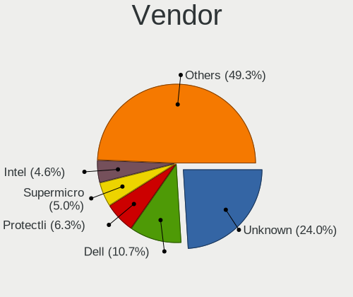
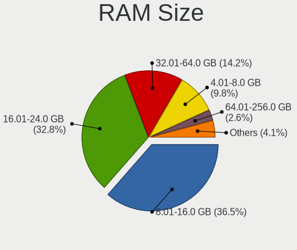
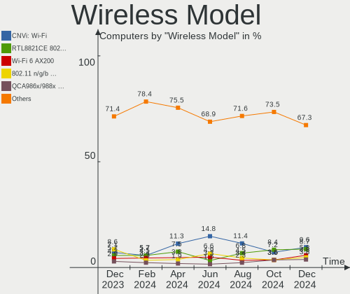

OPNsense Hardware Trends
------------------------

A project to identify most popular hardware characteristics and track their change
over time based on data collected by OPNsense users at https://BSD-Hardware.info.

Anyone can contribute to the study by uploading probes of their computers by
the [hw-probe](https://github.com/linuxhw/hw-probe/blob/master/INSTALL.BSD.md) tool:

    hw-probe -all -upload

Full-feature report is available here: https://bsd-hardware.info/?view=trends

Period: Jun, 2021.

Contents
--------

- [ OS                       ](#os)
- [ OS Family                ](#os-family)
- [ Arch                     ](#arch)
- [ DE                       ](#de)
- [ Display Server           ](#display-server)
- [ Display Manager          ](#display-manager)
- [ OS Lang                  ](#os-lang)
- [ Boot Mode                ](#boot-mode)
- [ Filesystem               ](#filesystem)
- [ Part. scheme             ](#part-scheme)
- [ Country                  ](#country)
- [ City                     ](#city)
- [ Vendor                   ](#vendor)
- [ Model                    ](#model)
- [ Model Family             ](#model-family)
- [ MFG Year                 ](#mfg-year)
- [ Form Factor              ](#form-factor)
- [ Coreboot                 ](#coreboot)
- [ RAM Size                 ](#ram-size)
- [ RAM Used                 ](#ram-used)
- [ Has CD-ROM               ](#has-cd-rom)
- [ Total Drives             ](#total-drives)
- [ Has Ethernet             ](#has-ethernet)
- [ Has WiFi                 ](#has-wifi)
- [ Has Bluetooth            ](#has-bluetooth)
- [ Drive Vendor             ](#drive-vendor)
- [ Drive Model              ](#drive-model)
- [ HDD Vendor               ](#hdd-vendor)
- [ SSD Vendor               ](#ssd-vendor)
- [ Drive Kind               ](#drive-kind)
- [ Drive Connector          ](#drive-connector)
- [ Drive Size               ](#drive-size)
- [ Space Total              ](#space-total)
- [ Space Used               ](#space-used)
- [ Malfunc. Drives          ](#malfunc-drives)
- [ Malfunc. Drive Vendor    ](#malfunc-drive-vendor)
- [ Malfunc. HDD Vendor      ](#malfunc-hdd-vendor)
- [ Malfunc. Drive Kind      ](#malfunc-drive-kind)
- [ Failed Drives            ](#failed-drives)
- [ Failed Drive Vendor      ](#failed-drive-vendor)
- [ Drive Status             ](#drive-status)
- [ Storage Vendor           ](#storage-vendor)
- [ Storage Model            ](#storage-model)
- [ Storage Kind             ](#storage-kind)
- [ CPU Vendor               ](#cpu-vendor)
- [ CPU Model                ](#cpu-model)
- [ CPU Model Family         ](#cpu-model-family)
- [ CPU Cores                ](#cpu-cores)
- [ CPU Sockets              ](#cpu-sockets)
- [ CPU Threads              ](#cpu-threads)
- [ CPU Microarch            ](#cpu-microarch)
- [ GPU Vendor               ](#gpu-vendor)
- [ GPU Model                ](#gpu-model)
- [ GPU Combo                ](#gpu-combo)
- [ GPU Driver               ](#gpu-driver)
- [ GPU Memory               ](#gpu-memory)
- [ Monitor Vendor           ](#monitor-vendor)
- [ Monitor Model            ](#monitor-model)
- [ Monitor Resolution       ](#monitor-resolution)
- [ Monitor Diagonal         ](#monitor-diagonal)
- [ Monitor Width            ](#monitor-width)
- [ Aspect Ratio             ](#aspect-ratio)
- [ Monitor Area             ](#monitor-area)
- [ Pixel Density            ](#pixel-density)
- [ Multiple Monitors        ](#multiple-monitors)
- [ Net Controller Vendor    ](#net-controller-vendor)
- [ Net Controller Model     ](#net-controller-model)
- [ Wireless Vendor          ](#wireless-vendor)
- [ Wireless Model           ](#wireless-model)
- [ Ethernet Vendor          ](#ethernet-vendor)
- [ Ethernet Model           ](#ethernet-model)
- [ Net Controller Kind      ](#net-controller-kind)
- [ Used Controller          ](#used-controller)
- [ NICs                     ](#nics)
- [ IPv6                     ](#ipv6)
- [ Memory Vendor            ](#memory-vendor)
- [ Memory Model             ](#memory-model)
- [ Memory Kind              ](#memory-kind)
- [ Memory Form Factor       ](#memory-form-factor)
- [ Memory Size              ](#memory-size)
- [ Memory Speed             ](#memory-speed)
- [ Sound Vendor             ](#sound-vendor)
- [ Sound Model              ](#sound-model)
- [ Camera Vendor            ](#camera-vendor)
- [ Camera Model             ](#camera-model)
- [ Fingerprint Vendor       ](#fingerprint-vendor)
- [ Fingerprint Model        ](#fingerprint-model)
- [ Chipcard Vendor          ](#chipcard-vendor)
- [ Chipcard Model           ](#chipcard-model)
- [ Printer Vendor           ](#printer-vendor)
- [ Printer Model            ](#printer-model)
- [ Scanner Vendor           ](#scanner-vendor)
- [ Scanner Model            ](#scanner-model)
- [ Bluetooth Vendor         ](#bluetooth-vendor)
- [ Bluetooth Model          ](#bluetooth-model)
- [ Unsupported Devices      ](#unsupported-devices)
- [ Unsupported Device Types ](#unsupported-device-types)

OS
--

Installed operating systems

| Name                   | Computers | Percent |
|------------------------|-----------|---------|
| OPNsense 21.1.6        | 94        | 48.21%  |
| OPNsense 21.1.7        | 86        | 44.1%   |
| OPNsense 21.1          | 7         | 3.59%   |
| OPNsense 21.1.5        | 4         | 2.05%   |
| OPNsense 21.1.1        | 2         | 1.03%   |
| OPNsense 21.7          | 1         | 0.51%   |
| OPNsense 12.1-p16-HBSD | 1         | 0.51%   |

OS Family
---------

OS without a version

| Name     | Computers | Percent |
|----------|-----------|---------|
| OPNsense | 195       | 100%    |

Arch
----

OS architecture (x86_64, i586, etc.)

| Name  | Computers | Percent |
|-------|-----------|---------|
| amd64 | 195       | 100%    |

DE
--

Desktop Environment

| Name    | Computers | Percent |
|---------|-----------|---------|
| Console | 195       | 100%    |

Display Server
--------------

X11 or Wayland

| Name    | Computers | Percent |
|---------|-----------|---------|
| Console | 195       | 100%    |

Display Manager
---------------

SDDM, LightDM, etc.

| Name    | Computers | Percent |
|---------|-----------|---------|
| Console | 195       | 100%    |

OS Lang
-------

Language

| Lang    | Computers | Percent |
|---------|-----------|---------|
| Unknown | 195       | 100%    |

Boot Mode
---------

EFI or BIOS

| Mode | Computers | Percent |
|------|-----------|---------|
| EFI  | 170       | 87.18%  |
| BIOS | 25        | 12.82%  |

Filesystem
----------

Type of filesystem

| Type | Computers | Percent |
|------|-----------|---------|
| Ufs  | 194       | 99.49%  |
| Zfs  | 1         | 0.51%   |

Part. scheme
------------

Scheme of partitioning

| Type | Computers | Percent |
|------|-----------|---------|
| GPT  | 172       | 88.21%  |
| MBR  | 23        | 11.79%  |

Country
-------

Geographic location (country)

| Country                | Computers | Percent |
|------------------------|-----------|---------|
| USA                    | 59        | 30.26%  |
| Germany                | 32        | 16.41%  |
| Canada                 | 13        | 6.67%   |
| UK                     | 8         | 4.1%    |
| Switzerland            | 8         | 4.1%    |
| France                 | 7         | 3.59%   |
| Australia              | 7         | 3.59%   |
| Netherlands            | 6         | 3.08%   |
| China                  | 6         | 3.08%   |
| Sweden                 | 4         | 2.05%   |
| Poland                 | 4         | 2.05%   |
| Russia                 | 3         | 1.54%   |
| Portugal               | 3         | 1.54%   |
| Hungary                | 3         | 1.54%   |
| Brazil                 | 3         | 1.54%   |
| Spain                  | 2         | 1.03%   |
| South Korea            | 2         | 1.03%   |
| Italy                  | 2         | 1.03%   |
| Israel                 | 2         | 1.03%   |
| Indonesia              | 2         | 1.03%   |
| Czechia                | 2         | 1.03%   |
| Austria                | 2         | 1.03%   |
| Taiwan                 | 1         | 0.51%   |
| Slovenia               | 1         | 0.51%   |
| Singapore              | 1         | 0.51%   |
| Romania                | 1         | 0.51%   |
| Malta                  | 1         | 0.51%   |
| Malaysia               | 1         | 0.51%   |
| India                  | 1         | 0.51%   |
| Hong Kong              | 1         | 0.51%   |
| Ghana                  | 1         | 0.51%   |
| Denmark                | 1         | 0.51%   |
| Cabo Verde             | 1         | 0.51%   |
| Bulgaria               | 1         | 0.51%   |
| Bosnia and Herzegovina | 1         | 0.51%   |
| Belgium                | 1         | 0.51%   |
| Algeria                | 1         | 0.51%   |

City
----

Geographic location (city)

| City              | Computers | Percent |
|-------------------|-----------|---------|
| Zurich            | 4         | 2.05%   |
| Moscow            | 3         | 1.54%   |
| Wolverhampton     | 2         | 1.03%   |
| Winterthur        | 2         | 1.03%   |
| Victoria          | 2         | 1.03%   |
| Sydney            | 2         | 1.03%   |
| Shanghai          | 2         | 1.03%   |
| San Jose          | 2         | 1.03%   |
| Rotterdam         | 2         | 1.03%   |
| Petaẖ Tiqwa     | 2         | 1.03%   |
| Paris             | 2         | 1.03%   |
| Ottawa            | 2         | 1.03%   |
| Munich            | 2         | 1.03%   |
| Montreal          | 2         | 1.03%   |
| Madison           | 2         | 1.03%   |
| Karlsruhe         | 2         | 1.03%   |
| Jacksonville      | 2         | 1.03%   |
| Frankfurt am Main | 2         | 1.03%   |
| Brunswick         | 2         | 1.03%   |
| Beijing           | 2         | 1.03%   |
| Austin            | 2         | 1.03%   |
| Zedelgem          | 1         | 0.51%   |
| Zaltbommel        | 1         | 0.51%   |
| Zaandam           | 1         | 0.51%   |
| Włocławek       | 1         | 0.51%   |
| Wylie             | 1         | 0.51%   |
| Wronowy           | 1         | 0.51%   |
| Wolfsburg         | 1         | 0.51%   |
| Westland          | 1         | 0.51%   |
| Warsaw            | 1         | 0.51%   |
| Warminster        | 1         | 0.51%   |
| Wake Forest       | 1         | 0.51%   |
| Vohringen         | 1         | 0.51%   |
| Vila Nova de Gaia | 1         | 0.51%   |
| Vienna            | 1         | 0.51%   |
| Veenendaal        | 1         | 0.51%   |
| Vecses            | 1         | 0.51%   |
| Valletta          | 1         | 0.51%   |
| Valencia          | 1         | 0.51%   |
| Tung Chung        | 1         | 0.51%   |
| Tulsa             | 1         | 0.51%   |
| Tucson            | 1         | 0.51%   |
| Toronto           | 1         | 0.51%   |
| Tornesch          | 1         | 0.51%   |
| Todtnau           | 1         | 0.51%   |
| Tisnov            | 1         | 0.51%   |
| Terrebonne        | 1         | 0.51%   |
| Taipei            | 1         | 0.51%   |
| Taby              | 1         | 0.51%   |
| São Paulo        | 1         | 0.51%   |
| Swanley           | 1         | 0.51%   |
| Statesboro        | 1         | 0.51%   |
| Southport         | 1         | 0.51%   |
| Sofia             | 1         | 0.51%   |
| Singapore         | 1         | 0.51%   |
| Sicklerville      | 1         | 0.51%   |
| Seattle           | 1         | 0.51%   |
| Schiltigheim      | 1         | 0.51%   |
| Sandhausen        | 1         | 0.51%   |
| Royal Oak         | 1         | 0.51%   |

Vendor
------

Motherboard manufacturer

| Name                                       | Computers | Percent |
|--------------------------------------------|-----------|---------|
| Hewlett-Packard                            | 26        | 13.33%  |
| Dell                                       | 21        | 10.77%  |
| Protectli                                  | 17        | 8.72%   |
| Unknown                                    | 17        | 8.72%   |
| PC Engines                                 | 12        | 6.15%   |
| Intel                                      | 12        | 6.15%   |
| Supermicro                                 | 11        | 5.64%   |
| Gigabyte Technology                        | 9         | 4.62%   |
| AMI                                        | 9         | 4.62%   |
| AWOW                                       | 7         | 3.59%   |
| ZOTAC                                      | 6         | 3.08%   |
| ASUSTek Computer                           | 6         | 3.08%   |
| Sophos                                     | 4         | 2.05%   |
| Lenovo                                     | 4         | 2.05%   |
| MSI                                        | 3         | 1.54%   |
| HPE                                        | 3         | 1.54%   |
| Shuttle                                    | 2         | 1.03%   |
| Fujitsu                                    | 2         | 1.03%   |
| Compulab                                   | 2         | 1.03%   |
| YANYU                                      | 1         | 0.51%   |
| ULTRATOP                                   | 1         | 0.51%   |
| TYAN Computer                              | 1         | 0.51%   |
| ShenZhen MinWin Technology                 | 1         | 0.51%   |
| SeeedStudio                                | 1         | 0.51%   |
| Samsung Electronics                        | 1         | 0.51%   |
| Nuage Networks                             | 1         | 0.51%   |
| NF541                                      | 1         | 0.51%   |
| Intel CNCTION-IAF                          | 1         | 0.51%   |
| HARDKERNEL                                 | 1         | 0.51%   |
| ECS                                        | 1         | 0.51%   |
| Dell EMC                                   | 1         | 0.51%   |
| Deciso                                     | 1         | 0.51%   |
| Colorful YuGong Technology And Development | 1         | 0.51%   |
| CNCTION-IAF-E3845                          | 1         | 0.51%   |
| CNCTION-IAF                                | 1         | 0.51%   |
| CheckPoint                                 | 1         | 0.51%   |
| Biostar                                    | 1         | 0.51%   |
| BESSTAR Tech                               | 1         | 0.51%   |
| ASRockRack                                 | 1         | 0.51%   |
| ASRock                                     | 1         | 0.51%   |
| Advantech                                  | 1         | 0.51%   |

Model
-----

Motherboard model

| Name                                             | Computers | Percent |
|--------------------------------------------------|-----------|---------|
| Unknown                                          | 17        | 8.72%   |
| Protectli FW6                                    | 8         | 4.1%    |
| AWOW PC BOX                                      | 7         | 3.59%   |
| AMI Aptio CRB                                    | 7         | 3.59%   |
| PC Engines apu4                                  | 6         | 3.08%   |
| Intel Q3XXG4-P V1.0                              | 6         | 3.08%   |
| PC Engines APU2                                  | 5         | 2.56%   |
| Protectli FW4B                                   | 4         | 2.05%   |
| HP t730 Thin Client                              | 4         | 2.05%   |
| ZOTAC ZBOX-CI323NANO                             | 3         | 1.54%   |
| Supermicro Super Server                          | 2         | 1.03%   |
| Sophos XG                                        | 2         | 1.03%   |
| Protectli FW6D                                   | 2         | 1.03%   |
| Protectli FW2B                                   | 2         | 1.03%   |
| Intel NUC8i5BEK                                  | 2         | 1.03%   |
| HP Compaq Pro 6300 SFF                           | 2         | 1.03%   |
| HP Compaq 8200 Elite SFF PC                      | 2         | 1.03%   |
| Gigabyte J1900N-D3V                              | 2         | 1.03%   |
| Dell PowerEdge 2950                              | 2         | 1.03%   |
| Dell OptiPlex 990                                | 2         | 1.03%   |
| Dell OptiPlex 7020                               | 2         | 1.03%   |
| Compulab fitlet2                                 | 2         | 1.03%   |
| ZOTAC ZBOX-MI640/MI660/MI620NANO                 | 1         | 0.51%   |
| ZOTAC ZBOX-MI522NANO/MI542NANO                   | 1         | 0.51%   |
| ZOTAC ZBOX-CI327NANO-GS-01                       | 1         | 0.51%   |
| YANYU H67SL                                      | 1         | 0.51%   |
| ULTRATOP C2017-LIVA-ZE                           | 1         | 0.51%   |
| TYAN S2925                                       | 1         | 0.51%   |
| Supermicro X9SCL/X9SCM                           | 1         | 0.51%   |
| Supermicro X8DTU-LN4+                            | 1         | 0.51%   |
| Supermicro X10SLH-F/X10SLM+-F                    | 1         | 0.51%   |
| Supermicro SYS-5018A-MLTN4                       | 1         | 0.51%   |
| Supermicro SSG-6028R-E1CR12T                     | 1         | 0.51%   |
| Supermicro H8SCM                                 | 1         | 0.51%   |
| Supermicro GN#16513                              | 1         | 0.51%   |
| Supermicro 1HE Intel Single-CPU RI1104H Server   | 1         | 0.51%   |
| Supermicro 1HE Intel Single-CPU RI1102D-F Server | 1         | 0.51%   |
| Sophos UTM                                       | 1         | 0.51%   |
| Sophos SG                                        | 1         | 0.51%   |
| Shuttle DH370                                    | 1         | 0.51%   |
| Shuttle DH110                                    | 1         | 0.51%   |
| ShenZhen MinWin MW-NANO-APL-4L                   | 1         | 0.51%   |
| SeeedStudio ODYSSEY-X86J4125                     | 1         | 0.51%   |
| Samsung 400T7A/400S7A                            | 1         | 0.51%   |
| Protectli VP2410                                 | 1         | 0.51%   |
| PC Engines apu3                                  | 1         | 0.51%   |
| Nuage Networks 7850 NSG-E                        | 1         | 0.51%   |
| NF541 1.0                                        | 1         | 0.51%   |
| MSI MS-7C08                                      | 1         | 0.51%   |
| MSI MS-7846                                      | 1         | 0.51%   |
| MSI MS-7680                                      | 1         | 0.51%   |
| Lenovo ThinkCentre M93p 10A8S16X0J               | 1         | 0.51%   |
| Lenovo ThinkCentre M920s 10SJ0041UK              | 1         | 0.51%   |
| Lenovo ThinkCentre M78 10BU0008US                | 1         | 0.51%   |
| Lenovo SHARKBAY 0B98401 WIN                      | 1         | 0.51%   |
| Intel NUC9i5QNX                                  | 1         | 0.51%   |
| Intel NDISB533                                   | 1         | 0.51%   |
| Intel D33217GKE G76540-207                       | 1         | 0.51%   |
| Intel CRESCENTBAY                                | 1         | 0.51%   |
| Intel CNCTION-IAF CNCTION-IAF                    | 1         | 0.51%   |

Model Family
------------

Motherboard model prefix

| Name                           | Computers | Percent |
|--------------------------------|-----------|---------|
| Unknown                        | 17        | 8.72%   |
| Dell PowerEdge                 | 9         | 4.62%   |
| Protectli FW6                  | 8         | 4.1%    |
| Dell OptiPlex                  | 8         | 4.1%    |
| HP ProLiant                    | 7         | 3.59%   |
| AWOW PC                        | 7         | 3.59%   |
| AMI Aptio                      | 7         | 3.59%   |
| PC Engines apu4                | 6         | 3.08%   |
| Intel Q3XXG4-P                 | 6         | 3.08%   |
| PC Engines APU2                | 5         | 2.56%   |
| Protectli FW4B                 | 4         | 2.05%   |
| HP t730                        | 4         | 2.05%   |
| HP Compaq                      | 4         | 2.05%   |
| ZOTAC ZBOX-CI323NANO           | 3         | 1.54%   |
| Lenovo ThinkCentre             | 3         | 1.54%   |
| HP ProDesk                     | 3         | 1.54%   |
| Supermicro Super               | 2         | 1.03%   |
| Supermicro 1HE                 | 2         | 1.03%   |
| Sophos XG                      | 2         | 1.03%   |
| Protectli FW6D                 | 2         | 1.03%   |
| Protectli FW2B                 | 2         | 1.03%   |
| Intel NUC8i5BEK                | 2         | 1.03%   |
| HPE ProLiant                   | 2         | 1.03%   |
| HP EliteDesk                   | 2         | 1.03%   |
| Gigabyte J1900N-D3V            | 2         | 1.03%   |
| Dell Inspiron                  | 2         | 1.03%   |
| Compulab fitlet2               | 2         | 1.03%   |
| ZOTAC ZBOX-MI640               | 1         | 0.51%   |
| ZOTAC ZBOX-MI522NANO           | 1         | 0.51%   |
| ZOTAC ZBOX-CI327NANO-GS-01     | 1         | 0.51%   |
| YANYU H67SL                    | 1         | 0.51%   |
| ULTRATOP C2017-LIVA-ZE         | 1         | 0.51%   |
| TYAN S2925                     | 1         | 0.51%   |
| Supermicro X9SCL               | 1         | 0.51%   |
| Supermicro X8DTU-LN4+          | 1         | 0.51%   |
| Supermicro X10SLH-F            | 1         | 0.51%   |
| Supermicro SYS-5018A-MLTN4     | 1         | 0.51%   |
| Supermicro SSG-6028R-E1CR12T   | 1         | 0.51%   |
| Supermicro H8SCM               | 1         | 0.51%   |
| Supermicro GN#16513            | 1         | 0.51%   |
| Sophos UTM                     | 1         | 0.51%   |
| Sophos SG                      | 1         | 0.51%   |
| Shuttle DH370                  | 1         | 0.51%   |
| Shuttle DH110                  | 1         | 0.51%   |
| ShenZhen MinWin MW-NANO-APL-4L | 1         | 0.51%   |
| SeeedStudio ODYSSEY-X86J4125   | 1         | 0.51%   |
| Samsung 400T7A                 | 1         | 0.51%   |
| Protectli VP2410               | 1         | 0.51%   |
| PC Engines apu3                | 1         | 0.51%   |
| Nuage Networks 7850            | 1         | 0.51%   |
| NF541 1.0                      | 1         | 0.51%   |
| MSI MS-7C08                    | 1         | 0.51%   |
| MSI MS-7846                    | 1         | 0.51%   |
| MSI MS-7680                    | 1         | 0.51%   |
| Lenovo SHARKBAY                | 1         | 0.51%   |
| Intel NUC9i5QNX                | 1         | 0.51%   |
| Intel NDISB533                 | 1         | 0.51%   |
| Intel D33217GKE                | 1         | 0.51%   |
| Intel CRESCENTBAY              | 1         | 0.51%   |
| Intel CNCTION-IAF CNCTION-IAF  | 1         | 0.51%   |

MFG Year
--------

Motherboard manufacture year

| Year | Computers | Percent |
|------|-----------|---------|
| 2020 | 43        | 22.05%  |
| 2019 | 31        | 15.9%   |
| 2018 | 24        | 12.31%  |
| 2021 | 20        | 10.26%  |
| 2016 | 13        | 6.67%   |
| 2017 | 11        | 5.64%   |
| 2015 | 11        | 5.64%   |
| 2013 | 11        | 5.64%   |
| 2014 | 6         | 3.08%   |
| 2012 | 6         | 3.08%   |
| 2011 | 6         | 3.08%   |
| 2010 | 5         | 2.56%   |
| 2009 | 4         | 2.05%   |
| 2008 | 3         | 1.54%   |
| 2006 | 1         | 0.51%   |

Form Factor
-----------

Physical design of the computer

| Name     | Computers | Percent |
|----------|-----------|---------|
| Desktop  | 129       | 66.15%  |
| Mini pc  | 33        | 16.92%  |
| Server   | 23        | 11.79%  |
| Notebook | 6         | 3.08%   |
| Firewall | 4         | 2.05%   |

Coreboot
--------

Have coreboot on board

| Used | Computers | Percent |
|------|-----------|---------|
| No   | 174       | 89.23%  |
| Yes  | 21        | 10.77%  |

RAM Size
--------

Total RAM memory

| Size in GB  | Computers | Percent |
|-------------|-----------|---------|
| 8.01-16.0   | 83        | 42.56%  |
| 4.01-8.0    | 55        | 28.21%  |
| 16.01-24.0  | 27        | 13.85%  |
| 2.01-3.0    | 11        | 5.64%   |
| 32.01-64.0  | 10        | 5.13%   |
| 24.01-32.0  | 4         | 2.05%   |
| 64.01-256.0 | 3         | 1.54%   |
| 3.01-4.0    | 2         | 1.03%   |

RAM Used
--------

Used RAM memory

| Used GB    | Computers | Percent |
|------------|-----------|---------|
| 0.01-0.5   | 131       | 67.18%  |
| 0.51-1.0   | 42        | 21.54%  |
| 1.01-2.0   | 14        | 7.18%   |
| 2.01-3.0   | 4         | 2.05%   |
| 3.01-4.0   | 2         | 1.03%   |
| 32.01-64.0 | 1         | 0.51%   |
| 16.01-24.0 | 1         | 0.51%   |

Has CD-ROM
----------

Has CD-ROM on board

| Presented | Computers | Percent |
|-----------|-----------|---------|
| No        | 163       | 83.59%  |
| Yes       | 32        | 16.41%  |

Total Drives
------------

Number of drives on board

| Drives | Computers | Percent |
|--------|-----------|---------|
| 1      | 164       | 84.1%   |
| 0      | 22        | 11.28%  |
| 2      | 8         | 4.1%    |
| 3      | 1         | 0.51%   |

Has Ethernet
------------

Has Ethernet on board

| Presented | Computers | Percent |
|-----------|-----------|---------|
| Yes       | 194       | 99.49%  |
| No        | 1         | 0.51%   |

Has WiFi
--------

Has WiFi module

| Presented | Computers | Percent |
|-----------|-----------|---------|
| No        | 150       | 76.92%  |
| Yes       | 45        | 23.08%  |

Has Bluetooth
-------------

Has Bluetooth module

| Presented | Computers | Percent |
|-----------|-----------|---------|
| No        | 179       | 91.79%  |
| Yes       | 16        | 8.21%   |

Drive Vendor
------------

Hard drive vendors

| Vendor              | Computers | Drives | Percent |
|---------------------|-----------|--------|---------|
| Samsung Electronics | 21        | 21     | 11.67%  |
| Kingston            | 21        | 21     | 11.67%  |
| Hoodisk             | 13        | 13     | 7.22%   |
| SanDisk             | 12        | 12     | 6.67%   |
| Seagate             | 11        | 12     | 6.11%   |
| WDC                 | 9         | 9      | 5%      |
| Transcend           | 8         | 8      | 4.44%   |
| Phison              | 7         | 7      | 3.89%   |
| FORESEE             | 7         | 7      | 3.89%   |
| Intel               | 6         | 6      | 3.33%   |
| Crucial             | 6         | 6      | 3.33%   |
| Toshiba             | 5         | 6      | 2.78%   |
| Protectli           | 5         | 5      | 2.78%   |
| Hewlett-Packard     | 5         | 5      | 2.78%   |
| Corsair             | 4         | 4      | 2.22%   |
| China               | 4         | 4      | 2.22%   |
| A-DATA Technology   | 3         | 3      | 1.67%   |
| Zheino              | 2         | 2      | 1.11%   |
| PNY                 | 2         | 2      | 1.11%   |
| OCZ                 | 2         | 2      | 1.11%   |
| KingSpec            | 2         | 2      | 1.11%   |
| HPE                 | 2         | 3      | 1.11%   |
| HGST                | 2         | 3      | 1.11%   |
| faspeed             | 2         | 2      | 1.11%   |
| ATP                 | 2         | 2      | 1.11%   |
| ZTC                 | 1         | 1      | 0.56%   |
| XUNZHE              | 1         | 1      | 0.56%   |
| VisionTek           | 1         | 1      | 0.56%   |
| SPCC                | 1         | 1      | 0.56%   |
| Micron Technology   | 1         | 1      | 0.56%   |
| MEMXPRO             | 1         | 1      | 0.56%   |
| LITEONIT            | 1         | 1      | 0.56%   |
| LITEON              | 1         | 1      | 0.56%   |
| Kston               | 1         | 1      | 0.56%   |
| KingDian            | 1         | 1      | 0.56%   |
| Intenso             | 1         | 1      | 0.56%   |
| INDMEM              | 1         | 1      | 0.56%   |
| Hitachi             | 1         | 1      | 0.56%   |
| Drevo               | 1         | 1      | 0.56%   |
| Dogfish             | 1         | 1      | 0.56%   |
| BIWIN               | 1         | 1      | 0.56%   |
| Apacer              | 1         | 1      | 0.56%   |

Drive Model
-----------

Hard drive models

| Model                           | Computers | Percent |
|---------------------------------|-----------|---------|
| Phison SATA SSD 16GB            | 6         | 3.31%   |
| Hoodisk SSD 32GB                | 6         | 3.31%   |
| FORESEE 128GB SSD               | 6         | 3.31%   |
| SanDisk SDSA6MM-032G-1006 32GB  | 4         | 2.21%   |
| Protectli 120GB mSATA           | 4         | 2.21%   |
| Toshiba MG03ACA100 1TB          | 3         | 1.66%   |
| Kingston SV300S37A120G 120GB    | 3         | 1.66%   |
| Kingston SUV500MS240G 240GB     | 3         | 1.66%   |
| Kingston SUV500MS120G 120GB     | 3         | 1.66%   |
| Kingston SA400S37240G 240GB     | 3         | 1.66%   |
| Kingston SA400S37120G 120GB     | 3         | 1.66%   |
| Hoodisk SSD 64GB                | 3         | 1.66%   |
| Hoodisk SSD 128GB               | 3         | 1.66%   |
| Transcend TS64GMSA230S 64GB     | 2         | 1.1%    |
| Transcend TS128GMSA370S 128GB   | 2         | 1.1%    |
| Seagate ST3500413AS 500GB       | 2         | 1.1%    |
| Samsung SSD 970 EVO Plus 250GB  | 2         | 1.1%    |
| Samsung SSD 960 EVO 250GB       | 2         | 1.1%    |
| PNY CS900 120GB SSD             | 2         | 1.1%    |
| KingSpec MT-64 64GB             | 2         | 1.1%    |
| HP RAID 1(1+0) 1TB              | 2         | 1.1%    |
| HP RAID 0 293GB                 | 2         | 1.1%    |
| faspeed K5M-32G                 | 2         | 1.1%    |
| Crucial CT250MX500SSD1 250GB    | 2         | 1.1%    |
| Crucial CT120BX500SSD1 120GB    | 2         | 1.1%    |
| ATP NVMe M.2 2280 SSD 240GB     | 2         | 1.1%    |
| A-DATA IM2S3134N-064GM 64GB     | 2         | 1.1%    |
| ZTC SM201-064G                  | 1         | 0.55%   |
| Zheino CHN-mSATAM3-256 256GB    | 1         | 0.55%   |
| Zheino CHN-mSATAM1-32 32GB      | 1         | 0.55%   |
| XUNZHE MSATA 128GB              | 1         | 0.55%   |
| WDC WDS240G2G0A-00JH30 240GB    | 1         | 0.55%   |
| WDC WDS120G2G0B-00EPW0 120GB    | 1         | 0.55%   |
| WDC WD5003ABYX-23 81Y9803 500GB | 1         | 0.55%   |
| WDC WD5000LPVX-22V0TT0 500GB    | 1         | 0.55%   |
| WDC WD5000AZLX-60K2TA0 500GB    | 1         | 0.55%   |
| WDC WD3200JS-22PDB0 320GB       | 1         | 0.55%   |
| WDC WD2500BEKT-75PVMT0 250GB    | 1         | 0.55%   |
| WDC WD1600BEVT-00A23T0 160GB    | 1         | 0.55%   |
| WDC PC SA530 SDASB8Y256G 256GB  | 1         | 0.55%   |
| VisionTek mSATA 120GB           | 1         | 0.55%   |
| Transcend TS64GSSD370 64GB      | 1         | 0.55%   |
| Transcend TS32GMSM610 32GB      | 1         | 0.55%   |
| Transcend TS256GMSA452T2 256GB  | 1         | 0.55%   |
| Transcend TS120GMTS420S 120GB   | 1         | 0.55%   |
| Toshiba THNSNH512GBST           | 1         | 0.55%   |
| Toshiba MK2561GSY 250GB         | 1         | 0.55%   |
| SPCC M.2 PCIe SSD 256GB         | 1         | 0.55%   |
| Seagate ST9250827AS 250GB       | 1         | 0.55%   |
| Seagate ST500LM000-1EJ162 500GB | 1         | 0.55%   |
| Seagate ST3500630NS 500GB       | 1         | 0.55%   |
| Seagate ST3500418AS 500GB       | 1         | 0.55%   |
| Seagate ST3500414CS 500GB       | 1         | 0.55%   |
| Seagate ST3320613AS 320GB       | 1         | 0.55%   |
| Seagate ST3160815AS 160GB       | 1         | 0.55%   |
| Seagate ST3160310CS 160GB       | 1         | 0.55%   |
| Seagate ST250DM000-1BD141 250GB | 1         | 0.55%   |
| Seagate ST1000DM010-2EP102 1TB  | 1         | 0.55%   |
| SanDisk SSD PLUS 120GB          | 1         | 0.55%   |
| SanDisk SSD i110 32GB           | 1         | 0.55%   |

HDD Vendor
----------

Hard disk drive vendors

| Vendor              | Computers | Drives | Percent |
|---------------------|-----------|--------|---------|
| Seagate             | 11        | 12     | 31.43%  |
| WDC                 | 6         | 6      | 17.14%  |
| Samsung Electronics | 5         | 5      | 14.29%  |
| Hewlett-Packard     | 5         | 5      | 14.29%  |
| Toshiba             | 4         | 5      | 11.43%  |
| HGST                | 2         | 3      | 5.71%   |
| HPE                 | 1         | 2      | 2.86%   |
| Hitachi             | 1         | 1      | 2.86%   |

SSD Vendor
----------

Solid state drive vendors

| Vendor              | Computers | Drives | Percent |
|---------------------|-----------|--------|---------|
| Kingston            | 19        | 19     | 14.39%  |
| Hoodisk             | 13        | 13     | 9.85%   |
| SanDisk             | 12        | 12     | 9.09%   |
| Samsung Electronics | 10        | 10     | 7.58%   |
| Transcend           | 8         | 8      | 6.06%   |
| Phison              | 7         | 7      | 5.3%    |
| FORESEE             | 7         | 7      | 5.3%    |
| Crucial             | 6         | 6      | 4.55%   |
| Protectli           | 5         | 5      | 3.79%   |
| Intel               | 5         | 5      | 3.79%   |
| China               | 4         | 4      | 3.03%   |
| WDC                 | 3         | 3      | 2.27%   |
| Corsair             | 3         | 3      | 2.27%   |
| A-DATA Technology   | 3         | 3      | 2.27%   |
| Zheino              | 2         | 2      | 1.52%   |
| PNY                 | 2         | 2      | 1.52%   |
| OCZ                 | 2         | 2      | 1.52%   |
| KingSpec            | 2         | 2      | 1.52%   |
| faspeed             | 2         | 2      | 1.52%   |
| ZTC                 | 1         | 1      | 0.76%   |
| XUNZHE              | 1         | 1      | 0.76%   |
| VisionTek           | 1         | 1      | 0.76%   |
| Toshiba             | 1         | 1      | 0.76%   |
| Micron Technology   | 1         | 1      | 0.76%   |
| MEMXPRO             | 1         | 1      | 0.76%   |
| LITEONIT            | 1         | 1      | 0.76%   |
| LITEON              | 1         | 1      | 0.76%   |
| Kston               | 1         | 1      | 0.76%   |
| KingDian            | 1         | 1      | 0.76%   |
| Intenso             | 1         | 1      | 0.76%   |
| INDMEM              | 1         | 1      | 0.76%   |
| HPE                 | 1         | 1      | 0.76%   |
| Drevo               | 1         | 1      | 0.76%   |
| Dogfish             | 1         | 1      | 0.76%   |
| BIWIN               | 1         | 1      | 0.76%   |
| Apacer              | 1         | 1      | 0.76%   |

Drive Kind
----------

HDD or SSD

| Kind | Computers | Drives | Percent |
|------|-----------|--------|---------|
| SSD  | 131       | 132    | 74.01%  |
| HDD  | 33        | 39     | 18.64%  |
| NVMe | 13        | 13     | 7.34%   |

Drive Connector
---------------

SATA, SAS, NVMe, etc.

| Type | Computers | Drives | Percent |
|------|-----------|--------|---------|
| SATA | 159       | 171    | 92.44%  |
| NVMe | 13        | 13     | 7.56%   |

Drive Size
----------

Size of hard drive

| Size in TB | Computers | Drives | Percent |
|------------|-----------|--------|---------|
| 0.01-0.5   | 153       | 162    | 95.03%  |
| 0.51-1.0   | 8         | 9      | 4.97%   |

Space Total
-----------

Amount of disk space available on the file system

| Size in GB | Computers | Percent |
|------------|-----------|---------|
| 101-250    | 70        | 35.9%   |
| 51-100     | 39        | 20%     |
| 21-50      | 36        | 18.46%  |
| 251-500    | 25        | 12.82%  |
| 1-20       | 15        | 7.69%   |
| 501-1000   | 9         | 4.62%   |
| 1001-2000  | 1         | 0.51%   |

Space Used
----------

Amount of used disk space

| Used GB | Computers | Percent |
|---------|-----------|---------|
| 1-20    | 190       | 97.44%  |
| 21-50   | 5         | 2.56%   |

Malfunc. Drives
---------------

Drive models with a malfunction

| Model                             | Computers | Drives | Percent |
|-----------------------------------|-----------|--------|---------|
| Kingston SV300S37A120G 120GB      | 3         | 3      | 12.5%   |
| ZTC SM201-064G                    | 1         | 1      | 4.17%   |
| WDC WD5003ABYX-23 81Y9803 500GB   | 1         | 1      | 4.17%   |
| WDC WD5000LPVX-22V0TT0 500GB      | 1         | 1      | 4.17%   |
| VisionTek mSATA 120GB             | 1         | 1      | 4.17%   |
| Transcend TS32GMSM610 32GB        | 1         | 1      | 4.17%   |
| Seagate ST3500418AS 500GB         | 1         | 1      | 4.17%   |
| Seagate ST3500413AS 500GB         | 1         | 1      | 4.17%   |
| Seagate ST3160815AS 160GB         | 1         | 1      | 4.17%   |
| Seagate ST3160310CS 160GB         | 1         | 1      | 4.17%   |
| Samsung Electronics HM500LI 500GB | 1         | 1      | 4.17%   |
| Samsung Electronics HD322HJ 320GB | 1         | 1      | 4.17%   |
| Samsung Electronics HD082GJ 80GB  | 1         | 1      | 4.17%   |
| LITEON CV8-8E128-HP 128GB         | 1         | 1      | 4.17%   |
| Kingston SUV400S37120G 120GB      | 1         | 1      | 4.17%   |
| Intel SSDSA2M160G2GC 160GB        | 1         | 1      | 4.17%   |
| HGST HTS725050A7E630 500GB        | 1         | 1      | 4.17%   |
| HGST HTS725032A7E630 320GB        | 1         | 2      | 4.17%   |
| Hewlett-Packard FB160C4081 160GB  | 1         | 1      | 4.17%   |
| Corsair Force 3 SSD 120GB         | 1         | 1      | 4.17%   |
| BIWIN SSD 32GB                    | 1         | 1      | 4.17%   |
| Apacer 16GB SATA Flash Drive      | 1         | 1      | 4.17%   |

Malfunc. Drive Vendor
---------------------

Vendors of faulty drives

| Vendor              | Computers | Drives | Percent |
|---------------------|-----------|--------|---------|
| Seagate             | 4         | 4      | 16.67%  |
| Kingston            | 4         | 4      | 16.67%  |
| Samsung Electronics | 3         | 3      | 12.5%   |
| WDC                 | 2         | 2      | 8.33%   |
| HGST                | 2         | 3      | 8.33%   |
| ZTC                 | 1         | 1      | 4.17%   |
| VisionTek           | 1         | 1      | 4.17%   |
| Transcend           | 1         | 1      | 4.17%   |
| LITEON              | 1         | 1      | 4.17%   |
| Intel               | 1         | 1      | 4.17%   |
| Hewlett-Packard     | 1         | 1      | 4.17%   |
| Corsair             | 1         | 1      | 4.17%   |
| BIWIN               | 1         | 1      | 4.17%   |
| Apacer              | 1         | 1      | 4.17%   |

Malfunc. HDD Vendor
-------------------

Vendors of faulty HDD drives

| Vendor              | Computers | Drives | Percent |
|---------------------|-----------|--------|---------|
| Seagate             | 4         | 4      | 33.33%  |
| Samsung Electronics | 3         | 3      | 25%     |
| WDC                 | 2         | 2      | 16.67%  |
| HGST                | 2         | 3      | 16.67%  |
| Hewlett-Packard     | 1         | 1      | 8.33%   |

Malfunc. Drive Kind
-------------------

Kinds of faulty drives

| Kind | Computers | Drives | Percent |
|------|-----------|--------|---------|
| SSD  | 12        | 12     | 50%     |
| HDD  | 12        | 13     | 50%     |

Failed Drives
-------------

Failed drive models

Zero info for selected period =(

Failed Drive Vendor
-------------------

Failed drive vendors

Zero info for selected period =(

Drive Status
------------

Number of failed and malfunc. drives

| Status   | Computers | Drives | Percent |
|----------|-----------|--------|---------|
| Works    | 147       | 155    | 84%     |
| Malfunc  | 24        | 25     | 13.71%  |
| Detected | 4         | 4      | 2.29%   |

Storage Vendor
--------------

Storage controller vendors

| Vendor                      | Computers | Percent |
|-----------------------------|-----------|---------|
| Intel                       | 161       | 72.2%   |
| AMD                         | 29        | 13%     |
| Broadcom / LSI              | 7         | 3.14%   |
| Samsung Electronics         | 6         | 2.69%   |
| Hewlett-Packard             | 4         | 1.79%   |
| Phison Electronics          | 3         | 1.35%   |
| Marvell Technology Group    | 3         | 1.35%   |
| ASMedia Technology          | 3         | 1.35%   |
| Kingston Technology Company | 2         | 0.9%    |
| ATP ELECTRONICS             | 2         | 0.9%    |
| XenSource                   | 1         | 0.45%   |
| Nvidia                      | 1         | 0.45%   |
| Dell                        | 1         | 0.45%   |

Storage Model
-------------

Storage controller models

| Model                                                                            | Computers | Percent |
|----------------------------------------------------------------------------------|-----------|---------|
| AMD FCH SATA Controller [AHCI mode]                                              | 21        | 8.33%   |
| Intel Sunrise Point-LP SATA Controller [AHCI mode]                               | 17        | 6.75%   |
| Intel 8 Series/C220 Series Chipset Family 6-port SATA Controller 1 [AHCI mode]   | 16        | 6.35%   |
| Intel Celeron N3350/Pentium N4200/Atom E3900 Series SATA AHCI Controller         | 15        | 5.95%   |
| Intel Atom Processor E3800 Series SATA AHCI Controller                           | 15        | 5.95%   |
| Intel Atom/Celeron/Pentium Processor x5-E8000/J3xxx/N3xxx Series SATA Controller | 14        | 5.56%   |
| Intel Q170/Q150/B150/H170/H110/Z170/CM236 Chipset SATA Controller [AHCI Mode]    | 11        | 4.37%   |
| Intel 6 Series/C200 Series Chipset Family 6 port Desktop SATA AHCI Controller    | 11        | 4.37%   |
| Intel Celeron/Pentium Silver Processor SATA Controller                           | 6         | 2.38%   |
| Intel 8 Series SATA Controller 1 [AHCI mode]                                     | 5         | 1.98%   |
| Samsung NVMe SSD Controller SM981/PM981/PM983                                    | 4         | 1.59%   |
| Intel Wildcat Point-LP SATA Controller [AHCI Mode]                               | 4         | 1.59%   |
| Intel Atom Processor C3000 Series SATA Controller 0                              | 4         | 1.59%   |
| Intel 82801HM/HEM (ICH8M/ICH8M-E) IDE Controller                                 | 4         | 1.59%   |
| AMD FCH IDE Controller                                                           | 4         | 1.59%   |
| Intel NM10/ICH7 Family SATA Controller [IDE mode]                                | 3         | 1.19%   |
| Intel Cannon Lake PCH SATA AHCI Controller                                       | 3         | 1.19%   |
| Intel 82801JI (ICH10 Family) SATA AHCI Controller                                | 3         | 1.19%   |
| Intel 7 Series/C210 Series Chipset Family 6-port SATA Controller [AHCI mode]     | 3         | 1.19%   |
| Intel 200 Series PCH SATA controller [AHCI mode]                                 | 3         | 1.19%   |
| HP Smart Array G6 controllers                                                    | 3         | 1.19%   |
| ASMedia ASM1062 Serial ATA Controller                                            | 3         | 1.19%   |
| AMD SB7x0/SB8x0/SB9x0 SATA Controller [IDE mode]                                 | 3         | 1.19%   |
| AMD SB7x0/SB8x0/SB9x0 IDE Controller                                             | 3         | 1.19%   |
| AMD FCH SATA Controller [IDE mode]                                               | 3         | 1.19%   |
| Samsung NVMe SSD Controller SM961/PM961/SM963                                    | 2         | 0.79%   |
| Phison PS5013 E13 NVMe Controller                                                | 2         | 0.79%   |
| Marvell Group 88SE9230 PCIe 2.0 x2 4-port SATA 6 Gb/s RAID Controller            | 2         | 0.79%   |
| Intel Cannon Point-LP SATA Controller [AHCI Mode]                                | 2         | 0.79%   |
| Intel Atom Processor C3000 Series SATA Controller 1                              | 2         | 0.79%   |
| Intel Atom processor C2000 AHCI SATA3 Controller                                 | 2         | 0.79%   |
| Intel Atom processor C2000 AHCI SATA2 Controller                                 | 2         | 0.79%   |
| Intel 82801HM/HEM (ICH8M/ICH8M-E) SATA Controller [IDE mode]                     | 2         | 0.79%   |
| Intel 82801HM/HEM (ICH8M/ICH8M-E) SATA Controller [AHCI mode]                    | 2         | 0.79%   |
| Intel 631xESB/632xESB IDE Controller                                             | 2         | 0.79%   |
| Broadcom / LSI MegaRAID SAS 1078                                                 | 2         | 0.79%   |
| AMD 400 Series Chipset SATA Controller                                           | 2         | 0.79%   |
| Unknown                                                                          | 2         | 0.79%   |
| XenSource Xen Platform Device                                                    | 1         | 0.4%    |
| Phison E12 NVMe Controller                                                       | 1         | 0.4%    |
| Nvidia MCP55 SATA Controller                                                     | 1         | 0.4%    |
| Nvidia MCP55 IDE                                                                 | 1         | 0.4%    |
| Marvell Group 88SE6111/6121 SATA II / PATA Controller                            | 1         | 0.4%    |
| Kingston Company U-SNS8154P3 NVMe SSD                                            | 1         | 0.4%    |
| Kingston Company A2000 NVMe SSD                                                  | 1         | 0.4%    |
| Intel SSD 600P Series                                                            | 1         | 0.4%    |
| Intel SATA Controller [RAID mode]                                                | 1         | 0.4%    |
| Intel Mobile 4 Series Chipset PT IDER Controller                                 | 1         | 0.4%    |
| Intel Cannon Lake Mobile PCH SATA AHCI Controller                                | 1         | 0.4%    |
| Intel C610/X99 series chipset sSATA Controller [AHCI mode]                       | 1         | 0.4%    |
| Intel C610/X99 series chipset 6-Port SATA Controller [AHCI mode]                 | 1         | 0.4%    |
| Intel C600/X79 series chipset SATA RAID Controller                               | 1         | 0.4%    |
| Intel C600/X79 series chipset 6-Port SATA AHCI Controller                        | 1         | 0.4%    |
| Intel 82801JI (ICH10 Family) 4 port SATA IDE Controller #1                       | 1         | 0.4%    |
| Intel 82801JD/DO (ICH10 Family) 4-port SATA IDE Controller                       | 1         | 0.4%    |
| Intel 82801JD/DO (ICH10 Family) 2-port SATA IDE Controller                       | 1         | 0.4%    |
| Intel 82801IR/IO/IH (ICH9R/DO/DH) 6 port SATA Controller [AHCI mode]             | 1         | 0.4%    |
| Intel 82801IBM/IEM (ICH9M/ICH9M-E) 4 port SATA Controller [AHCI mode]            | 1         | 0.4%    |
| Intel 82801IB (ICH9) 2 port SATA Controller [IDE mode]                           | 1         | 0.4%    |
| Intel 82801G (ICH7 Family) IDE Controller                                        | 1         | 0.4%    |

Storage Kind
------------

Kind of storage controller (IDE, SATA, NVMe, SAS, ...)

| Kind | Computers | Percent |
|------|-----------|---------|
| SATA | 167       | 73.57%  |
| IDE  | 31        | 13.66%  |
| NVMe | 14        | 6.17%   |
| RAID | 13        | 5.73%   |
| SCSI | 2         | 0.88%   |

CPU Vendor
----------

Processor vendors

| Vendor | Computers | Percent |
|--------|-----------|---------|
| Intel  | 164       | 84.1%   |
| AMD    | 31        | 15.9%   |

CPU Model
---------

Processor models

| Model                                    | Computers | Percent |
|------------------------------------------|-----------|---------|
| AMD GX-412TC SOC                         | 12        | 6.15%   |
| Intel Celeron CPU J3160 @ 1.60GHz        | 9         | 4.62%   |
| Intel Celeron CPU J1900 @ 1.99GHz        | 8         | 4.1%    |
| Intel Core i5-7200U CPU @ 2.50GHz        | 6         | 3.08%   |
| Intel Celeron CPU J3455 @ 1.50GHz        | 6         | 3.08%   |
| Intel Celeron J4125 CPU @ 2.00GHz        | 4         | 2.05%   |
| Intel Celeron CPU 3865U @ 1.80GHz        | 4         | 2.05%   |
| AMD RX-427BB with AMD Radeon R7 Graphics | 4         | 2.05%   |
| Intel Core i5-6500 CPU @ 3.20GHz         | 3         | 1.54%   |
| Intel Core i3-4010U CPU @ 1.70GHz        | 3         | 1.54%   |
| Intel Celeron CPU N3450 @ 1.10GHz        | 3         | 1.54%   |
| Intel Celeron CPU N3150 @ 1.60GHz        | 3         | 1.54%   |
| Intel Celeron CPU J3455E @ 1.50GHz       | 3         | 1.54%   |
| Intel Atom CPU C3558 @ 2.20GHz           | 3         | 1.54%   |
| Intel Xeon CPU E3-1220 V2 @ 3.10GHz      | 2         | 1.03%   |
| Intel Core i5-8259U CPU @ 2.30GHz        | 2         | 1.03%   |
| Intel Core i5-8250U CPU @ 1.60GHz        | 2         | 1.03%   |
| Intel Core i5-5200U CPU @ 2.20GHz        | 2         | 1.03%   |
| Intel Core i5-4570 CPU @ 3.20GHz         | 2         | 1.03%   |
| Intel Core i5-4460 CPU @ 3.20GHz         | 2         | 1.03%   |
| Intel Core i5-3470 CPU @ 3.20GHz         | 2         | 1.03%   |
| Intel Core i3-4160 CPU @ 3.60GHz         | 2         | 1.03%   |
| Intel Core 2 Duo                         | 2         | 1.03%   |
| Intel Celeron CPU N2940 @ 1.83GHz        | 2         | 1.03%   |
| Intel Celeron CPU J3060 @ 1.60GHz        | 2         | 1.03%   |
| Intel Xeon E-2224 CPU @ 3.40GHz          | 1         | 0.51%   |
| Intel Xeon CPU X5667 @ 3.07GHz           | 1         | 0.51%   |
| Intel Xeon CPU X5650 @ 2.67GHz           | 1         | 0.51%   |
| Intel Xeon CPU X5460 @ 3.16GHz           | 1         | 0.51%   |
| Intel Xeon CPU X3430 @ 2.40GHz           | 1         | 0.51%   |
| Intel Xeon CPU E5620 @ 2.40GHz           | 1         | 0.51%   |
| Intel Xeon CPU E5520 @ 2.27GHz           | 1         | 0.51%   |
| Intel Xeon CPU E5503 @ 2.00GHz           | 1         | 0.51%   |
| Intel Xeon CPU E5-2650 v4 @ 2.20GHz      | 1         | 0.51%   |
| Intel Xeon CPU E5-2430 0 @ 2.20GHz       | 1         | 0.51%   |
| Intel Xeon CPU E5-2420 0 @ 1.90GHz       | 1         | 0.51%   |
| Intel Xeon CPU E3-1280 v5 @ 3.70GHz      | 1         | 0.51%   |
| Intel Xeon CPU E3-1275L v3 @ 2.70GHz     | 1         | 0.51%   |
| Intel Xeon CPU E3-1270 v6 @ 3.80GHz      | 1         | 0.51%   |
| Intel Xeon CPU E3-1270 v5 @ 3.60GHz      | 1         | 0.51%   |
| Intel Xeon CPU E3-1240 V2 @ 3.40GHz      | 1         | 0.51%   |
| Intel Xeon CPU E3-1231 v3 @ 3.40GHz      | 1         | 0.51%   |
| Intel Xeon CPU E3-1230 V2 @ 3.30GHz      | 1         | 0.51%   |
| Intel Xeon CPU E3-1220 v3 @ 3.10GHz      | 1         | 0.51%   |
| Intel Xeon CPU D-1518 @ 2.20GHz          | 1         | 0.51%   |
| Intel Xeon CPU 5140 @ 2.33GHz            | 1         | 0.51%   |
| Intel Xeon                               | 1         | 0.51%   |
| Intel Pentium Silver J5005 CPU @ 1.50GHz | 1         | 0.51%   |
| Intel Pentium Gold G5400T CPU @ 3.10GHz  | 1         | 0.51%   |
| Intel Pentium Dual-Core CPU E6           | 1         | 0.51%   |
| Intel Pentium CPU N3540 @ 2.16GHz        | 1         | 0.51%   |
| Intel Pentium CPU G850 @ 2.90GHz         | 1         | 0.51%   |
| Intel Pentium CPU G4560 @ 3.50GHz        | 1         | 0.51%   |
| Intel Pentium CPU G4400 @ 3.30GHz        | 1         | 0.51%   |
| Intel Pentium CPU G3260T @ 2.90GHz       | 1         | 0.51%   |
| Intel Pentium CPU G3220 @ 3.00GHz        | 1         | 0.51%   |
| Intel Pentium CPU 4417U @ 2.30GHz        | 1         | 0.51%   |
| Intel Other                              | 1         | 0.51%   |
| Intel Core i7-6700K CPU @ 4.00GHz        | 1         | 0.51%   |
| Intel Core i7-5550U CPU @ 2.00GHz        | 1         | 0.51%   |

CPU Model Family
----------------

Processor model prefix

| Model                   | Computers | Percent |
|-------------------------|-----------|---------|
| Intel Celeron           | 50        | 25.64%  |
| Intel Core i5           | 35        | 17.95%  |
| Intel Xeon              | 24        | 12.31%  |
| Intel Core i3           | 20        | 10.26%  |
| Intel Atom              | 15        | 7.69%   |
| AMD GX                  | 14        | 7.18%   |
| Other                   | 7         | 3.59%   |
| Intel Pentium           | 7         | 3.59%   |
| Intel Core i7           | 4         | 2.05%   |
| Intel Core 2 Duo        | 4         | 2.05%   |
| AMD A4                  | 2         | 1.03%   |
| Intel Pentium Silver    | 1         | 0.51%   |
| Intel Pentium Gold      | 1         | 0.51%   |
| Intel Pentium Dual-Core | 1         | 0.51%   |
| Intel Core 2 Quad       | 1         | 0.51%   |
| AMD Ryzen Embedded      | 1         | 0.51%   |
| AMD Ryzen 7             | 1         | 0.51%   |
| AMD Ryzen 5             | 1         | 0.51%   |
| AMD Ryzen 3             | 1         | 0.51%   |
| AMD Opteron             | 1         | 0.51%   |
| AMD G                   | 1         | 0.51%   |
| AMD FX                  | 1         | 0.51%   |
| AMD Athlon 64 X2        | 1         | 0.51%   |
| AMD A10                 | 1         | 0.51%   |

CPU Cores
---------

Number of processor cores

| Number  | Computers | Percent |
|---------|-----------|---------|
| 4       | 115       | 58.97%  |
| 2       | 63        | 32.31%  |
| 8       | 5         | 2.56%   |
| Unknown | 4         | 2.05%   |
| 12      | 2         | 1.03%   |
| 6       | 2         | 1.03%   |
| 1       | 2         | 1.03%   |
| 24      | 1         | 0.51%   |
| 16      | 1         | 0.51%   |

CPU Sockets
-----------

Number of sockets

| Number | Computers | Percent |
|--------|-----------|---------|
| 1      | 186       | 95.38%  |
| 2      | 9         | 4.62%   |

CPU Threads
-----------

Threads per core (Hyper-Threading)

| Number  | Computers | Percent |
|---------|-----------|---------|
| 1       | 129       | 66.15%  |
| 2       | 62        | 31.79%  |
| Unknown | 4         | 2.05%   |

CPU Microarch
-------------

Microarchitecture

| Name          | Computers | Percent |
|---------------|-----------|---------|
| Silvermont    | 31        | 15.9%   |
| KabyLake      | 29        | 14.87%  |
| Haswell       | 21        | 10.77%  |
| Goldmont      | 19        | 9.74%   |
| Puma          | 13        | 6.67%   |
| Skylake       | 10        | 5.13%   |
| IvyBridge     | 10        | 5.13%   |
| SandyBridge   | 9         | 4.62%   |
| Goldmont plus | 6         | 3.08%   |
| Broadwell     | 6         | 3.08%   |
| Penryn        | 5         | 2.56%   |
| Westmere      | 4         | 2.05%   |
| Steamroller   | 4         | 2.05%   |
| Core          | 4         | 2.05%   |
| Bonnell       | 4         | 2.05%   |
| Nehalem       | 3         | 1.54%   |
| Jaguar        | 3         | 1.54%   |
| Zen+          | 2         | 1.03%   |
| Zen           | 2         | 1.03%   |
| K8 Hammer     | 2         | 1.03%   |
| Piledriver    | 1         | 0.51%   |
| NetBurst      | 1         | 0.51%   |
| K10           | 1         | 0.51%   |
| IceLake       | 1         | 0.51%   |
| Excavator     | 1         | 0.51%   |
| CometLake     | 1         | 0.51%   |
| Bulldozer     | 1         | 0.51%   |
| Bobcat        | 1         | 0.51%   |

GPU Vendor
----------

Vendors of graphics cards

| Vendor                                       | Computers | Percent |
|----------------------------------------------|-----------|---------|
| Intel                                        | 125       | 70.62%  |
| AMD                                          | 23        | 12.99%  |
| Matrox Electronics Systems                   | 14        | 7.91%   |
| ASPEED Technology                            | 10        | 5.65%   |
| Nvidia                                       | 3         | 1.69%   |
| XGI Technology (eXtreme Graphics Innovation) | 1         | 0.56%   |
| Cirrus Logic                                 | 1         | 0.56%   |

GPU Model
---------

Graphics card models

| Model                                                                                    | Computers | Percent |
|------------------------------------------------------------------------------------------|-----------|---------|
| Intel HD Graphics 500                                                                    | 15        | 8.38%   |
| Intel Atom Processor Z36xxx/Z37xxx Series Graphics & Display                             | 15        | 8.38%   |
| Intel Atom/Celeron/Pentium Processor x5-E8000/J3xxx/N3xxx Integrated Graphics Controller | 14        | 7.82%   |
| ASPEED Technology ASPEED Graphics Family                                                 | 10        | 5.59%   |
| Intel Xeon E3-1200 v3/4th Gen Core Processor Integrated Graphics Controller              | 9         | 5.03%   |
| Intel HD Graphics 620                                                                    | 8         | 4.47%   |
| Matrox Electronics Systems MGA G200eW WPCM450                                            | 6         | 3.35%   |
| AMD ES1000                                                                               | 6         | 3.35%   |
| Intel Kaby Lake-U GT1 Integrated Graphics Controller                                     | 5         | 2.79%   |
| Intel Haswell-ULT Integrated Graphics Controller                                         | 5         | 2.79%   |
| Intel GeminiLake [UHD Graphics 600]                                                      | 5         | 2.79%   |
| Intel 2nd Generation Core Processor Family Integrated Graphics Controller                | 5         | 2.79%   |
| Matrox Electronics Systems MGA G200EH                                                    | 4         | 2.23%   |
| Intel Xeon E3-1200 v2/3rd Gen Core processor Graphics Controller                         | 4         | 2.23%   |
| Intel HD Graphics 530                                                                    | 4         | 2.23%   |
| AMD Kaveri [Radeon R7 Graphics]                                                          | 4         | 2.23%   |
| Intel UHD Graphics 620                                                                   | 3         | 1.68%   |
| Intel HD Graphics 5500                                                                   | 3         | 1.68%   |
| Intel Atom Processor D4xx/D5xx/N4xx/N5xx Integrated Graphics Controller                  | 3         | 1.68%   |
| Intel 4th Generation Core Processor Family Integrated Graphics Controller                | 3         | 1.68%   |
| Matrox Electronics Systems G200eR2                                                       | 2         | 1.12%   |
| Intel HD Graphics 510                                                                    | 2         | 1.12%   |
| Intel CometLake-S GT2 [UHD Graphics 630]                                                 | 2         | 1.12%   |
| Intel CoffeeLake-U GT3e [Iris Plus Graphics 655]                                         | 2         | 1.12%   |
| Intel CoffeeLake-S GT2 [UHD Graphics 630]                                                | 2         | 1.12%   |
| Intel 4 Series Chipset Integrated Graphics Controller                                    | 2         | 1.12%   |
| AMD Cedar [Radeon HD 5000/6000/7350/8350 Series]                                         | 2         | 1.12%   |
| XGI Technology (eXtreme Graphics Innovation) Z7/Z9 (XG20 core)                           | 1         | 0.56%   |
| Nvidia GM206 [GeForce GTX 960]                                                           | 1         | 0.56%   |
| Nvidia G98 [Quadro NVS 295]                                                              | 1         | 0.56%   |
| Nvidia G96GLM [Quadro FX 770M]                                                           | 1         | 0.56%   |
| Matrox Electronics Systems MGA G200eH3                                                   | 1         | 0.56%   |
| Matrox Electronics Systems MGA G200e [Pilot] ServerEngines (SEP1)                        | 1         | 0.56%   |
| Intel Xeon E3-1200 v3 Processor Integrated Graphics Controller                           | 1         | 0.56%   |
| Intel Skylake GT2 [HD Graphics 520]                                                      | 1         | 0.56%   |
| Intel Mobile GM965/GL960 Integrated Graphics Controller (secondary)                      | 1         | 0.56%   |
| Intel Mobile GM965/GL960 Integrated Graphics Controller (primary)                        | 1         | 0.56%   |
| Intel Iris Plus Graphics G1 (Ice Lake)                                                   | 1         | 0.56%   |
| Intel HD Graphics 630                                                                    | 1         | 0.56%   |
| Intel HD Graphics 610                                                                    | 1         | 0.56%   |
| Intel HD Graphics 6000                                                                   | 1         | 0.56%   |
| Intel GeminiLake [UHD Graphics 605]                                                      | 1         | 0.56%   |
| Intel Core Processor Integrated Graphics Controller                                      | 1         | 0.56%   |
| Intel CoffeeLake-S GT1 [UHD Graphics 610]                                                | 1         | 0.56%   |
| Intel CoffeeLake-H GT2 [UHD Graphics 630]                                                | 1         | 0.56%   |
| Intel Atom Processor D2xxx/N2xxx Integrated Graphics Controller                          | 1         | 0.56%   |
| Intel 82G33/G31 Express Integrated Graphics Controller                                   | 1         | 0.56%   |
| Intel 4th Gen Core Processor Integrated Graphics Controller                              | 1         | 0.56%   |
| Intel 3rd Gen Core processor Graphics Controller                                         | 1         | 0.56%   |
| Cirrus Logic GD 5446                                                                     | 1         | 0.56%   |
| AMD Wrestler [Radeon HD 6320]                                                            | 1         | 0.56%   |
| AMD Wani [Radeon R5/R6/R7 Graphics]                                                      | 1         | 0.56%   |
| AMD RV100 [Radeon 7000 / Radeon VE]                                                      | 1         | 0.56%   |
| AMD RS780L [Radeon 3000]                                                                 | 1         | 0.56%   |
| AMD RS740 [Radeon 2100]                                                                  | 1         | 0.56%   |
| AMD Richland [Radeon HD 8370D]                                                           | 1         | 0.56%   |
| AMD Raven Ridge [Radeon Vega Series / Radeon Vega Mobile Series]                         | 1         | 0.56%   |
| AMD Picasso                                                                              | 1         | 0.56%   |
| AMD Mullins [Radeon R6 Graphics]                                                         | 1         | 0.56%   |
| AMD Kabini [Radeon HD 8400E]                                                             | 1         | 0.56%   |

GPU Combo
---------

Combinations of graphics cards

| Name             | Computers | Percent |
|------------------|-----------|---------|
| 1 x Intel        | 120       | 61.54%  |
| 1 x AMD          | 23        | 11.79%  |
| Other            | 18        | 9.23%   |
| 1 x Matrox       | 14        | 7.18%   |
| 1 x ASPEED       | 10        | 5.13%   |
| 2 x Intel        | 5         | 2.56%   |
| 1 x Nvidia       | 3         | 1.54%   |
| 1 x XGI          | 1         | 0.51%   |
| 1 x Cirrus Logic | 1         | 0.51%   |

GPU Driver
----------

Free vs proprietary

| Driver  | Computers | Percent |
|---------|-----------|---------|
| Free    | 177       | 90.77%  |
| Unknown | 18        | 9.23%   |

GPU Memory
----------

Total video memory

| Size in GB | Computers | Percent |
|------------|-----------|---------|
| Unknown    | 195       | 100%    |

Monitor Vendor
--------------

Monitor vendors

Zero info for selected period =(

Monitor Model
-------------

Monitor models

Zero info for selected period =(

Monitor Resolution
------------------

Monitor screen resolution

Zero info for selected period =(

Monitor Diagonal
----------------

Diagonal size in inches

Zero info for selected period =(

Monitor Width
-------------

Physical width

Zero info for selected period =(

Aspect Ratio
------------

Proportional relationship between the width and the height

Zero info for selected period =(

Monitor Area
------------

Area in inch²

Zero info for selected period =(

Pixel Density
-------------

Pixels per inch

Zero info for selected period =(

Multiple Monitors
-----------------

Total monitors connected

| Total | Computers | Percent |
|-------|-----------|---------|
| 0     | 195       | 100%    |

Net Controller Vendor
---------------------

Controller vendors

| Vendor                     | Computers | Percent |
|----------------------------|-----------|---------|
| Intel                      | 164       | 60.52%  |
| Realtek Semiconductor      | 52        | 19.19%  |
| Broadcom                   | 21        | 7.75%   |
| Qualcomm Atheros           | 10        | 3.69%   |
| IMC Networks               | 7         | 2.58%   |
| Mellanox Technologies      | 5         | 1.85%   |
| Ralink Technology          | 2         | 0.74%   |
| ZTE WCDMA Technologies MSM | 1         | 0.37%   |
| U-Blox                     | 1         | 0.37%   |
| Seeed Technology           | 1         | 0.37%   |
| QLogic                     | 1         | 0.37%   |
| MYRICOM                    | 1         | 0.37%   |
| Marvell Technology Group   | 1         | 0.37%   |
| Edimax Technology          | 1         | 0.37%   |
| Aquantia                   | 1         | 0.37%   |
| American Megatrends        | 1         | 0.37%   |
| 3Com                       | 1         | 0.37%   |

Net Controller Model
--------------------

Controller models

| Model                                                                         | Computers | Percent |
|-------------------------------------------------------------------------------|-----------|---------|
| Intel I211 Gigabit Network Connection                                         | 48        | 14.16%  |
| Realtek RTL8111/8168/8411 PCI Express Gigabit Ethernet Controller             | 46        | 13.57%  |
| Intel I210 Gigabit Network Connection                                         | 28        | 8.26%   |
| Intel 82583V Gigabit Network Connection                                       | 14        | 4.13%   |
| Intel I350 Gigabit Network Connection                                         | 13        | 3.83%   |
| Intel 82579LM Gigabit Network Connection (Lewisville)                         | 10        | 2.95%   |
| Intel 82574L Gigabit Network Connection                                       | 10        | 2.95%   |
| Intel Ethernet Connection I217-LM                                             | 7         | 2.06%   |
| Intel 82571EB/82571GB Gigabit Ethernet Controller D0/D1 (copper applications) | 7         | 2.06%   |
| IMC Networks 802.11 n/g/b Wireless LAN USB Mini-Card                          | 7         | 2.06%   |
| Intel Wireless 7265                                                           | 6         | 1.77%   |
| Intel 82580 Gigabit Network Connection                                        | 6         | 1.77%   |
| Intel 82576 Gigabit Network Connection                                        | 6         | 1.77%   |
| Broadcom NetXtreme II BCM5709 Gigabit Ethernet                                | 6         | 1.77%   |
| Intel Wireless 3165                                                           | 5         | 1.47%   |
| Intel 82599ES 10-Gigabit SFI/SFP+ Network Connection                          | 5         | 1.47%   |
| Broadcom NetXtreme BCM5720 Gigabit Ethernet PCIe                              | 5         | 1.47%   |
| Intel Ethernet Controller 10-Gigabit X540-AT2                                 | 4         | 1.18%   |
| Intel Ethernet Connection X553 1GbE                                           | 4         | 1.18%   |
| Intel Ethernet Connection (2) I219-V                                          | 4         | 1.18%   |
| Intel Ethernet Connection (2) I219-LM                                         | 4         | 1.18%   |
| Qualcomm Atheros AR928X Wireless Network Adapter (PCI-Express)                | 3         | 0.88%   |
| Intel Ethernet Connection I217-V                                              | 3         | 0.88%   |
| Intel Ethernet Connection (7) I219-LM                                         | 3         | 0.88%   |
| Intel 82575GB Gigabit Network Connection                                      | 3         | 0.88%   |
| Realtek RTL8811AU 802.11a/b/g/n/ac WLAN Adapter                               | 2         | 0.59%   |
| Realtek RTL8125 2.5GbE Controller                                             | 2         | 0.59%   |
| Mellanox MT27500 Family [ConnectX-3]                                          | 2         | 0.59%   |
| Mellanox MT26448 [ConnectX EN 10GigE, PCIe 2.0 5GT/s]                         | 2         | 0.59%   |
| Intel Wireless 3160                                                           | 2         | 0.59%   |
| Intel Wi-Fi 6 AX200                                                           | 2         | 0.59%   |
| Intel Gemini Lake PCH CNVi WiFi                                               | 2         | 0.59%   |
| Intel Ethernet Controller 10G X550T                                           | 2         | 0.59%   |
| Intel Ethernet Connection I354                                                | 2         | 0.59%   |
| Intel Ethernet Connection (6) I219-V                                          | 2         | 0.59%   |
| Intel Cannon Point-LP CNVi [Wireless-AC]                                      | 2         | 0.59%   |
| Intel 82576NS Gigabit Network Connection                                      | 2         | 0.59%   |
| Intel 82571EB/82571GB Gigabit Ethernet Controller (Copper)                    | 2         | 0.59%   |
| Broadcom NetXtreme II BCM5716 Gigabit Ethernet                                | 2         | 0.59%   |
| Broadcom NetXtreme II BCM5708 Gigabit Ethernet                                | 2         | 0.59%   |
| Broadcom NetXtreme BCM5721 Gigabit Ethernet PCI Express                       | 2         | 0.59%   |
| ZTE WCDMA MSM ZTE Mobile Broadband                                            | 1         | 0.29%   |
| U-Blox [u-blox 8]                                                             | 1         | 0.29%   |
| Seeed Seeeduino_Cortex_M0+                                                    | 1         | 0.29%   |
| Realtek RTL8822BE 802.11a/b/g/n/ac WiFi adapter                               | 1         | 0.29%   |
| Realtek RTL8169 PCI Gigabit Ethernet Controller                               | 1         | 0.29%   |
| Realtek RTL-8100/8101L/8139 PCI Fast Ethernet Adapter                         | 1         | 0.29%   |
| Ralink RT5370 Wireless Adapter                                                | 1         | 0.29%   |
| Ralink RT2870/RT3070 Wireless Adapter                                         | 1         | 0.29%   |
| Qualcomm Atheros QCA986x/988x 802.11ac Wireless Network Adapter               | 1         | 0.29%   |
| Qualcomm Atheros Killer E220x Gigabit Ethernet Controller                     | 1         | 0.29%   |
| Qualcomm Atheros Attansic L1 Gigabit Ethernet                                 | 1         | 0.29%   |
| Qualcomm Atheros AR9485 Wireless Network Adapter                              | 1         | 0.29%   |
| Qualcomm Atheros AR93xx Wireless Network Adapter                              | 1         | 0.29%   |
| Qualcomm Atheros AR922X Wireless Network Adapter                              | 1         | 0.29%   |
| Qualcomm Atheros AR8131 Gigabit Ethernet                                      | 1         | 0.29%   |
| QLogic cLOM8214 1/10GbE Controller                                            | 1         | 0.29%   |
| MYRICOM Myri-10G Dual-Protocol NIC                                            | 1         | 0.29%   |
| Mellanox MT27710 Family [ConnectX-4 Lx]                                       | 1         | 0.29%   |
| Marvell Group 88E8056 PCI-E Gigabit Ethernet Controller                       | 1         | 0.29%   |

Wireless Vendor
---------------

Wireless vendors

| Vendor                | Computers | Percent |
|-----------------------|-----------|---------|
| Intel                 | 24        | 52.17%  |
| Qualcomm Atheros      | 7         | 15.22%  |
| IMC Networks          | 7         | 15.22%  |
| Realtek Semiconductor | 3         | 6.52%   |
| Ralink Technology     | 2         | 4.35%   |
| Broadcom              | 2         | 4.35%   |
| Edimax Technology     | 1         | 2.17%   |

Wireless Model
--------------

Wireless models

| Model                                                           | Computers | Percent |
|-----------------------------------------------------------------|-----------|---------|
| IMC Networks 802.11 n/g/b Wireless LAN USB Mini-Card            | 7         | 15.22%  |
| Intel Wireless 7265                                             | 6         | 13.04%  |
| Intel Wireless 3165                                             | 5         | 10.87%  |
| Qualcomm Atheros AR928X Wireless Network Adapter (PCI-Express)  | 3         | 6.52%   |
| Realtek RTL8811AU 802.11a/b/g/n/ac WLAN Adapter                 | 2         | 4.35%   |
| Intel Wireless 3160                                             | 2         | 4.35%   |
| Intel Wi-Fi 6 AX200                                             | 2         | 4.35%   |
| Intel Gemini Lake PCH CNVi WiFi                                 | 2         | 4.35%   |
| Intel Cannon Point-LP CNVi [Wireless-AC]                        | 2         | 4.35%   |
| Realtek RTL8822BE 802.11a/b/g/n/ac WiFi adapter                 | 1         | 2.17%   |
| Ralink RT5370 Wireless Adapter                                  | 1         | 2.17%   |
| Ralink RT2870/RT3070 Wireless Adapter                           | 1         | 2.17%   |
| Qualcomm Atheros QCA986x/988x 802.11ac Wireless Network Adapter | 1         | 2.17%   |
| Qualcomm Atheros AR9485 Wireless Network Adapter                | 1         | 2.17%   |
| Qualcomm Atheros AR93xx Wireless Network Adapter                | 1         | 2.17%   |
| Qualcomm Atheros AR922X Wireless Network Adapter                | 1         | 2.17%   |
| Intel Wireless 8260                                             | 1         | 2.17%   |
| Intel Wireless 7260                                             | 1         | 2.17%   |
| Intel Ultimate N WiFi Link 5300                                 | 1         | 2.17%   |
| Intel PRO/Wireless 4965 AG or AGN [Kedron] Network Connection   | 1         | 2.17%   |
| Intel Centrino Advanced-N 6205 [Taylor Peak]                    | 1         | 2.17%   |
| Edimax EW-7811Un 802.11n Wireless Adapter [Realtek RTL8188CUS]  | 1         | 2.17%   |
| Broadcom BCM4360 802.11ac Wireless Network Adapter              | 1         | 2.17%   |
| Broadcom BCM43228 802.11a/b/g/n                                 | 1         | 2.17%   |

Ethernet Vendor
---------------

Ethernet vendors

| Vendor                   | Computers | Percent |
|--------------------------|-----------|---------|
| Intel                    | 150       | 66.08%  |
| Realtek Semiconductor    | 50        | 22.03%  |
| Broadcom                 | 19        | 8.37%   |
| Qualcomm Atheros         | 3         | 1.32%   |
| QLogic                   | 1         | 0.44%   |
| Marvell Technology Group | 1         | 0.44%   |
| Aquantia                 | 1         | 0.44%   |
| American Megatrends      | 1         | 0.44%   |
| 3Com                     | 1         | 0.44%   |

Ethernet Model
--------------

Ethernet models

| Model                                                                         | Computers | Percent |
|-------------------------------------------------------------------------------|-----------|---------|
| Intel I211 Gigabit Network Connection                                         | 48        | 16.9%   |
| Realtek RTL8111/8168/8411 PCI Express Gigabit Ethernet Controller             | 46        | 16.2%   |
| Intel I210 Gigabit Network Connection                                         | 28        | 9.86%   |
| Intel 82583V Gigabit Network Connection                                       | 14        | 4.93%   |
| Intel I350 Gigabit Network Connection                                         | 13        | 4.58%   |
| Intel 82579LM Gigabit Network Connection (Lewisville)                         | 10        | 3.52%   |
| Intel 82574L Gigabit Network Connection                                       | 10        | 3.52%   |
| Intel Ethernet Connection I217-LM                                             | 7         | 2.46%   |
| Intel 82571EB/82571GB Gigabit Ethernet Controller D0/D1 (copper applications) | 7         | 2.46%   |
| Intel 82580 Gigabit Network Connection                                        | 6         | 2.11%   |
| Intel 82576 Gigabit Network Connection                                        | 6         | 2.11%   |
| Broadcom NetXtreme II BCM5709 Gigabit Ethernet                                | 6         | 2.11%   |
| Intel 82599ES 10-Gigabit SFI/SFP+ Network Connection                          | 5         | 1.76%   |
| Broadcom NetXtreme BCM5720 Gigabit Ethernet PCIe                              | 5         | 1.76%   |
| Intel Ethernet Controller 10-Gigabit X540-AT2                                 | 4         | 1.41%   |
| Intel Ethernet Connection X553 1GbE                                           | 4         | 1.41%   |
| Intel Ethernet Connection (2) I219-V                                          | 4         | 1.41%   |
| Intel Ethernet Connection (2) I219-LM                                         | 4         | 1.41%   |
| Intel Ethernet Connection I217-V                                              | 3         | 1.06%   |
| Intel Ethernet Connection (7) I219-LM                                         | 3         | 1.06%   |
| Intel 82575GB Gigabit Network Connection                                      | 3         | 1.06%   |
| Realtek RTL8125 2.5GbE Controller                                             | 2         | 0.7%    |
| Intel Ethernet Controller 10G X550T                                           | 2         | 0.7%    |
| Intel Ethernet Connection I354                                                | 2         | 0.7%    |
| Intel Ethernet Connection (6) I219-V                                          | 2         | 0.7%    |
| Intel 82576NS Gigabit Network Connection                                      | 2         | 0.7%    |
| Intel 82571EB/82571GB Gigabit Ethernet Controller (Copper)                    | 2         | 0.7%    |
| Broadcom NetXtreme II BCM5716 Gigabit Ethernet                                | 2         | 0.7%    |
| Broadcom NetXtreme II BCM5708 Gigabit Ethernet                                | 2         | 0.7%    |
| Broadcom NetXtreme BCM5721 Gigabit Ethernet PCI Express                       | 2         | 0.7%    |
| Realtek RTL8169 PCI Gigabit Ethernet Controller                               | 1         | 0.35%   |
| Realtek RTL-8100/8101L/8139 PCI Fast Ethernet Adapter                         | 1         | 0.35%   |
| Qualcomm Atheros Killer E220x Gigabit Ethernet Controller                     | 1         | 0.35%   |
| Qualcomm Atheros Attansic L1 Gigabit Ethernet                                 | 1         | 0.35%   |
| Qualcomm Atheros AR8131 Gigabit Ethernet                                      | 1         | 0.35%   |
| QLogic cLOM8214 1/10GbE Controller                                            | 1         | 0.35%   |
| Marvell Group 88E8056 PCI-E Gigabit Ethernet Controller                       | 1         | 0.35%   |
| Intel I350 Gigabit Fiber Network Connection                                   | 1         | 0.35%   |
| Intel I210 Gigabit Fiber Network Connection                                   | 1         | 0.35%   |
| Intel Ethernet Controller X710 for 10GbE SFP+                                 | 1         | 0.35%   |
| Intel Ethernet Connection X553 10 GbE SFP+                                    | 1         | 0.35%   |
| Intel Ethernet Connection X552 10 GbE SFP+                                    | 1         | 0.35%   |
| Intel 82599 10 Gigabit Network Connection                                     | 1         | 0.35%   |
| Intel 82580 Gigabit Fiber Network Connection                                  | 1         | 0.35%   |
| Intel 82579V Gigabit Network Connection                                       | 1         | 0.35%   |
| Intel 82577LM Gigabit Network Connection                                      | 1         | 0.35%   |
| Intel 82567V-3 Gigabit Network Connection                                     | 1         | 0.35%   |
| Intel 82567LM-3 Gigabit Network Connection                                    | 1         | 0.35%   |
| Intel 82567LM Gigabit Network Connection                                      | 1         | 0.35%   |
| Intel 82546GB Gigabit Ethernet Controller (Copper)                            | 1         | 0.35%   |
| Intel 82541GI Gigabit Ethernet Controller                                     | 1         | 0.35%   |
| Broadcom NetXtreme II BCM57810 10 Gigabit Ethernet                            | 1         | 0.35%   |
| Broadcom NetXtreme BCM57762 Gigabit Ethernet PCIe                             | 1         | 0.35%   |
| Broadcom NetXtreme BCM5755M Gigabit Ethernet PCI Express                      | 1         | 0.35%   |
| Broadcom NetXtreme BCM5719 Gigabit Ethernet PCIe                              | 1         | 0.35%   |
| Broadcom NetXtreme BCM5717 Gigabit Ethernet PCIe                              | 1         | 0.35%   |
| Broadcom NetLink BCM57781 Gigabit Ethernet PCIe                               | 1         | 0.35%   |
| Aquantia AQC107 NBase-T/IEEE 802.3bz Ethernet Controller [AQtion]             | 1         | 0.35%   |
| American Megatrends Virtual Ethernet                                          | 1         | 0.35%   |
| 3Com 3c905C-TX/TX-M [Tornado]                                                 | 1         | 0.35%   |

Net Controller Kind
-------------------

Ethernet, WiFi or modem

| Kind     | Computers | Percent |
|----------|-----------|---------|
| Ethernet | 194       | 78.23%  |
| WiFi     | 45        | 18.15%  |
| Unknown  | 6         | 2.42%   |
| Modem    | 3         | 1.21%   |

Used Controller
---------------

Currently used network controller

| Kind     | Computers | Percent |
|----------|-----------|---------|
| Ethernet | 192       | 98.97%  |
| WiFi     | 2         | 1.03%   |

NICs
----

Total network controllers on board

| Total | Computers | Percent |
|-------|-----------|---------|
| 4     | 57        | 29.23%  |
| 3     | 40        | 20.51%  |
| 2     | 39        | 20%     |
| 6     | 30        | 15.38%  |
| 5     | 11        | 5.64%   |
| 7     | 5         | 2.56%   |
| 1     | 5         | 2.56%   |
| 8     | 4         | 2.05%   |
| 9     | 2         | 1.03%   |
| 10    | 1         | 0.51%   |
| 0     | 1         | 0.51%   |

IPv6
----

IPv6 vs IPv4

| Used | Computers | Percent |
|------|-----------|---------|
| No   | 156       | 80%     |
| Yes  | 39        | 20%     |

Memory Vendor
-------------

Memory module vendors

| Vendor              | Computers | Percent |
|---------------------|-----------|---------|
| Unknown             | 41        | 19.9%   |
| Samsung Electronics | 33        | 16.02%  |
| SK Hynix            | 30        | 14.56%  |
| Kingston            | 27        | 13.11%  |
| Micron Technology   | 19        | 9.22%   |
| Crucial             | 13        | 6.31%   |
| Unknown (ABCD)      | 9         | 4.37%   |
| Corsair             | 7         | 3.4%    |
| G.Skill             | 5         | 2.43%   |
| Transcend           | 4         | 1.94%   |
| Apacer              | 4         | 1.94%   |
| A-DATA Technology   | 3         | 1.46%   |
| Patriot             | 2         | 0.97%   |
| Nanya Technology    | 2         | 0.97%   |
| Toshiba             | 1         | 0.49%   |
| Team                | 1         | 0.49%   |
| Super Talent        | 1         | 0.49%   |
| Kimtigo             | 1         | 0.49%   |
| HPE                 | 1         | 0.49%   |
| Hewlett-Packard     | 1         | 0.49%   |
| GSkill              | 1         | 0.49%   |

Memory Model
------------

Memory module models

| Model                                                             | Computers | Percent |
|-------------------------------------------------------------------|-----------|---------|
| Unknown (ABCD) RAM 123456789012345678 1536MB DIMM LPDDR3 2400MT/s | 9         | 4.19%   |
| Unknown RAM Module 4GB SODIMM DDR3 1333MT/s                       | 7         | 3.26%   |
| Unknown RAM Module 4GB DIMM DDR3 1333MT/s                         | 4         | 1.86%   |
| Kingston RAM CBD24D4S7S8K1A-8 8GB SODIMM DDR4 2133MT/s            | 3         | 1.4%    |
| Crucial RAM CT102464BF160B.C16 8GB SODIMM DDR3 1600MT/s           | 3         | 1.4%    |
| Unknown RAM Module 8GB 1600MT/s                                   | 2         | 0.93%   |
| Unknown RAM Module 4GB SODIMM DDR3 667MT/s                        | 2         | 0.93%   |
| Unknown RAM 8G2400MHz 8GB SODIMM DDR4 2400MT/s                    | 2         | 0.93%   |
| SK Hynix RAM HYMP151F72CP4N3-Y5 4GB FB-DIMM DDR2 667MT/s          | 2         | 0.93%   |
| SK Hynix RAM HMT451U6BFR8A-PB 4GB DIMM DDR3 1600MT/s              | 2         | 0.93%   |
| SK Hynix RAM HMT451S6BFR8A-PB 4GB SODIMM DDR3 1600MT/s            | 2         | 0.93%   |
| SK Hynix RAM HMT351U7BFR8A-H9 4GB DIMM DDR3 1333MT/s              | 2         | 0.93%   |
| Samsung RAM Module 4GB DIMM DDR4 2133MT/s                         | 2         | 0.93%   |
| Samsung RAM M471B5173QH0-YK0 4GB SODIMM DDR3 1600MT/s             | 2         | 0.93%   |
| Samsung RAM M471B5173EB0-YK0 4GB SODIMM DDR3 1600MT/s             | 2         | 0.93%   |
| Samsung RAM M471B5173DB0-YK0 4GB SODIMM DDR3 1600MT/s             | 2         | 0.93%   |
| Micron RAM 8JTF51264AZ-1G6E1 4GB DIMM DDR3 1600MT/s               | 2         | 0.93%   |
| Kingston RAM KHX2400C15/8G 8GB DIMM DDR4 2400MT/s                 | 2         | 0.93%   |
| Crucial RAM CT102464BF160B.M16 8GB DIMM DDR3 1600MT/s             | 2         | 0.93%   |
| Apacer RAM 78.A2GF7.4000B 2GB SODIMM DDR4 2400MT/s                | 2         | 0.93%   |
| Unknown RAM XinJuHuo 8GB SODIMM DDR3 1600MT/s                     | 1         | 0.47%   |
| Unknown RAM XinJuHuo 8GB DIMM DDR3 1600MT/s                       | 1         | 0.47%   |
| Unknown RAM X4C16QE8BNTDSE-7-TN1 16GB DIMM DDR4 2667MT/s          | 1         | 0.47%   |
| Unknown RAM X4C08QD8BNTDSE-7-TO 8GB DIMM DDR4 2667MT/s            | 1         | 0.47%   |
| Unknown RAM Module 8GB SODIMM DDR3 1600MT/s                       | 1         | 0.47%   |
| Unknown RAM Module 8GB DIMM DDR4 2666MT/s                         | 1         | 0.47%   |
| Unknown RAM Module 8GB DIMM DDR4 2400MT/s                         | 1         | 0.47%   |
| Unknown RAM Module 8GB DIMM DDR3 1600MT/s                         | 1         | 0.47%   |
| Unknown RAM Module 8GB DIMM DDR3 1333MT/s                         | 1         | 0.47%   |
| Unknown RAM Module 4GB SODIMM DDR2 800MT/s                        | 1         | 0.47%   |
| Unknown RAM Module 4GB DIMM DDR3 1600MT/s                         | 1         | 0.47%   |
| Unknown RAM Module 4GB DIMM 1600MT/s                              | 1         | 0.47%   |
| Unknown RAM Module 4GB 1600MT/s                                   | 1         | 0.47%   |
| Unknown RAM Module 4092MB DIMM RAM                                | 1         | 0.47%   |
| Unknown RAM Module 2GB SODIMM DDR3 667MT/s                        | 1         | 0.47%   |
| Unknown RAM Module 2GB SODIMM DDR2 667MT/s                        | 1         | 0.47%   |
| Unknown RAM Module 2GB DIMM DDR3 1333MT/s                         | 1         | 0.47%   |
| Unknown RAM Module 2GB DIMM DDR2 800MT/s                          | 1         | 0.47%   |
| Unknown RAM Module 2GB DIMM DDR2 667MT/s                          | 1         | 0.47%   |
| Unknown RAM Module 2GB DIMM DDR2                                  | 1         | 0.47%   |
| Unknown RAM Module 2GB DIMM 800MT/s                               | 1         | 0.47%   |
| Unknown RAM Module 1GB DIMM DDR2 800MT/s                          | 1         | 0.47%   |
| Unknown RAM Module 1GB DIMM DDR2 400MT/s                          | 1         | 0.47%   |
| Unknown RAM KT8GS3EDF 8GB SODIMM DDR3 1600MT/s                    | 1         | 0.47%   |
| Transcend RAM TS512MSK64W3N 4GB DIMM DDR3 1333MT/s                | 1         | 0.47%   |
| Transcend RAM TS4L30BA20SNS1 4GB SODIMM DDR3 800MT/s              | 1         | 0.47%   |
| Transcend RAM TS256MSK64W6X 2GB DIMM DDR3 1066MT/s                | 1         | 0.47%   |
| Transcend RAM TS256MSK64W3N 2GB DIMM DDR3 1066MT/s                | 1         | 0.47%   |
| Toshiba RAM 9965432-068.A00LF 4GB DIMM DDR3 1600MT/s              | 1         | 0.47%   |
| Team RAM TEAMGROUP-UD3-1333 4GB DIMM DDR3 1333MT/s                | 1         | 0.47%   |
| Super Talent RAM SUPERTALENT02 8GB DIMM DDR3 1600MT/s             | 1         | 0.47%   |
| SK Hynix RAM Module 4GB DIMM DDR4 2133MT/s                        | 1         | 0.47%   |
| SK Hynix RAM Module 4GB DIMM DDR3 1333MT/s                        | 1         | 0.47%   |
| SK Hynix RAM Module 2GB DIMM DDR3 1333MT/s                        | 1         | 0.47%   |
| SK Hynix RAM M391B8G73BH0-PBA 8GB DIMM DDR3 1600MT/s              | 1         | 0.47%   |
| SK Hynix RAM HYMP512S64CP8-Y5 1GB SODIMM DDR 667MT/s              | 1         | 0.47%   |
| SK Hynix RAM HYMP125S64CP8-S6 2GB SODIMM DDR2 800MT/s             | 1         | 0.47%   |
| SK Hynix RAM HMT451S6AFR8A-PB 4GB SODIMM DDR3 1600MT/s            | 1         | 0.47%   |
| SK Hynix RAM HMT41GU7AFR8A-PB 8GB DIMM DDR3 1600MT/s              | 1         | 0.47%   |
| SK Hynix RAM HMT41GS6BFR8A-PB 8GB SODIMM DDR3 1600MT/s            | 1         | 0.47%   |

Memory Kind
-----------

Memory module kinds

| Kind    | Computers | Percent |
|---------|-----------|---------|
| DDR3    | 107       | 56.61%  |
| DDR4    | 53        | 28.04%  |
| DDR2    | 13        | 6.88%   |
| LPDDR4  | 10        | 5.29%   |
| Unknown | 5         | 2.65%   |
| RAM     | 1         | 0.53%   |

Memory Form Factor
------------------

Physical design of the memory module

| Name         | Computers | Percent |
|--------------|-----------|---------|
| DIMM         | 112       | 59.26%  |
| SODIMM       | 69        | 36.51%  |
| Unknown      | 5         | 2.65%   |
| FB-DIMM      | 2         | 1.06%   |
| Row Of Chips | 1         | 0.53%   |

Memory Size
-----------

Memory module size

| Size  | Computers | Percent |
|-------|-----------|---------|
| 4096  | 82        | 41%     |
| 8192  | 62        | 31%     |
| 2048  | 28        | 14%     |
| 16384 | 23        | 11.5%   |
| 1024  | 4         | 2%      |
| 4092  | 1         | 0.5%    |

Memory Speed
------------

Memory module speed

| Speed   | Computers | Percent |
|---------|-----------|---------|
| 1600    | 67        | 34.72%  |
| 1333    | 36        | 18.65%  |
| 2400    | 34        | 17.62%  |
| 2133    | 17        | 8.81%   |
| 2667    | 9         | 4.66%   |
| 800     | 8         | 4.15%   |
| 667     | 8         | 4.15%   |
| 1066    | 4         | 2.07%   |
| 2666    | 2         | 1.04%   |
| 400     | 2         | 1.04%   |
| Unknown | 2         | 1.04%   |
| 3600    | 1         | 0.52%   |
| 3200    | 1         | 0.52%   |
| 1867    | 1         | 0.52%   |
| 1334    | 1         | 0.52%   |

Sound Vendor
------------

Sound card vendors

| Vendor | Computers | Percent |
|--------|-----------|---------|
| Intel  | 104       | 86.67%  |
| AMD    | 15        | 12.5%   |
| Nvidia | 1         | 0.83%   |

Sound Model
-----------

Sound card models

| Model                                                                                             | Computers | Percent |
|---------------------------------------------------------------------------------------------------|-----------|---------|
| Intel Celeron N3350/Pentium N4200/Atom E3900 Series Audio Cluster                                 | 14        | 9.59%   |
| Intel Xeon E3-1200 v3/4th Gen Core Processor HD Audio Controller                                  | 13        | 8.9%    |
| Intel Atom/Celeron/Pentium Processor x5-E8000/J3xxx/N3xxx Series High Definition Audio Controller | 12        | 8.22%   |
| Intel Atom Processor Z36xxx/Z37xxx Series High Definition Audio Controller                        | 11        | 7.53%   |
| Intel 8 Series/C220 Series Chipset High Definition Audio Controller                               | 9         | 6.16%   |
| Intel Sunrise Point-LP HD Audio                                                                   | 8         | 5.48%   |
| AMD FCH Azalia Controller                                                                         | 8         | 5.48%   |
| Intel 6 Series/C200 Series Chipset Family High Definition Audio Controller                        | 6         | 4.11%   |
| Intel 100 Series/C230 Series Chipset Family HD Audio Controller                                   | 6         | 4.11%   |
| Intel Celeron/Pentium Silver Processor High Definition Audio                                      | 5         | 3.42%   |
| Intel 8 Series HD Audio Controller                                                                | 5         | 3.42%   |
| Intel Wildcat Point-LP High Definition Audio Controller                                           | 4         | 2.74%   |
| Intel Cannon Lake PCH cAVS                                                                        | 4         | 2.74%   |
| Intel Broadwell-U Audio Controller                                                                | 4         | 2.74%   |
| Intel 7 Series/C216 Chipset Family High Definition Audio Controller                               | 4         | 2.74%   |
| AMD Kaveri HDMI/DP Audio Controller                                                               | 4         | 2.74%   |
| Intel Haswell-ULT HD Audio Controller                                                             | 3         | 2.05%   |
| Intel 200 Series PCH HD Audio                                                                     | 3         | 2.05%   |
| AMD Kabini HDMI/DP Audio                                                                          | 3         | 2.05%   |
| Intel NM10/ICH7 Family High Definition Audio Controller                                           | 2         | 1.37%   |
| Intel 82801H (ICH8 Family) HD Audio Controller                                                    | 2         | 1.37%   |
| AMD SBx00 Azalia (Intel HDA)                                                                      | 2         | 1.37%   |
| AMD Raven/Raven2/Fenghuang HDMI/DP Audio Controller                                               | 2         | 1.37%   |
| AMD Family 17h (Models 10h-1fh) HD Audio Controller                                               | 2         | 1.37%   |
| Nvidia GM206 High Definition Audio Controller                                                     | 1         | 0.68%   |
| Intel Ice Lake-LP Smart Sound Technology Audio Controller                                         | 1         | 0.68%   |
| Intel Comet Lake PCH-V Smart Sound Technology Audio Controller                                    | 1         | 0.68%   |
| Intel Cannon Point-LP High Definition Audio Controller                                            | 1         | 0.68%   |
| Intel 82801JD/DO (ICH10 Family) HD Audio Controller                                               | 1         | 0.68%   |
| Intel 5 Series/3400 Series Chipset High Definition Audio                                          | 1         | 0.68%   |
| AMD Wrestler HDMI Audio                                                                           | 1         | 0.68%   |
| AMD Trinity HDMI Audio Controller                                                                 | 1         | 0.68%   |
| AMD RS780 HDMI Audio [Radeon 3000/3100 / HD 3200/3300]                                            | 1         | 0.68%   |
| AMD Family 17h (Models 00h-0fh) HD Audio Controller                                               | 1         | 0.68%   |

Camera Vendor
-------------

Camera device vendors

| Vendor             | Computers | Percent |
|--------------------|-----------|---------|
| Lite-On Technology | 1         | 100%    |

Camera Model
------------

Camera device models

| Model                        | Computers | Percent |
|------------------------------|-----------|---------|
| Lite-On HP HD Webcam [Fixed] | 1         | 100%    |

Fingerprint Vendor
------------------

Fingerprint sensor vendors

| Vendor           | Computers | Percent |
|------------------|-----------|---------|
| Validity Sensors | 1         | 50%     |
| AuthenTec        | 1         | 50%     |

Fingerprint Model
-----------------

Fingerprint sensor models

| Model                                      | Computers | Percent |
|--------------------------------------------|-----------|---------|
| Validity Sensors VFS495 Fingerprint Reader | 1         | 50%     |
| AuthenTec AES2550 Fingerprint Sensor       | 1         | 50%     |

Chipcard Vendor
---------------

Chipcard module vendors

Zero info for selected period =(

Chipcard Model
--------------

Chipcard module models

Zero info for selected period =(

Printer Vendor
--------------

Printer device vendors

Zero info for selected period =(

Printer Model
-------------

Printer device models

Zero info for selected period =(

Scanner Vendor
--------------

Scanner device vendors

Zero info for selected period =(

Scanner Model
-------------

Scanner device models

Zero info for selected period =(

Bluetooth Vendor
----------------

Controller vendors

| Vendor                  | Computers | Percent |
|-------------------------|-----------|---------|
| Intel                   | 12        | 75%     |
| ASUSTek Computer        | 2         | 12.5%   |
| Dell                    | 1         | 6.25%   |
| Cambridge Silicon Radio | 1         | 6.25%   |

Bluetooth Model
---------------

Controller models

| Model                                                 | Computers | Percent |
|-------------------------------------------------------|-----------|---------|
| Intel Bluetooth wireless interface                    | 8         | 50%     |
| Intel Bluetooth 9460/9560 Jefferson Peak (JfP)        | 2         | 12.5%   |
| Intel AX200 Bluetooth                                 | 2         | 12.5%   |
| Dell Dell Wireless 355C Bluetooth 2.0 + EDR module    | 1         | 6.25%   |
| Cambridge Silicon Radio Bluetooth Dongle (HCI mode)   | 1         | 6.25%   |
| ASUS Broadcom BCM20702 Single-Chip Bluetooth 4.0 + LE | 1         | 6.25%   |
| ASUS Bluetooth Controller                             | 1         | 6.25%   |

Unsupported Devices
-------------------

Total unsupported devices on board

| Total | Computers | Percent |
|-------|-----------|---------|
| 0     | 84        | 43.08%  |
| 1     | 75        | 38.46%  |
| 2     | 23        | 11.79%  |
| 4     | 6         | 3.08%   |
| 3     | 6         | 3.08%   |
| 5     | 1         | 0.51%   |

Unsupported Device Types
------------------------

Types of unsupported devices

| Type                     | Computers | Percent |
|--------------------------|-----------|---------|
| Communication controller | 106       | 72.11%  |
| Card reader              | 13        | 8.84%   |
| Net/wireless             | 10        | 6.8%    |
| Bluetooth                | 6         | 4.08%   |
| Network                  | 4         | 2.72%   |
| Firewire controller      | 3         | 2.04%   |
| Net/ethernet             | 2         | 1.36%   |
| Fingerprint reader       | 2         | 1.36%   |
| Sound                    | 1         | 0.68%   |

