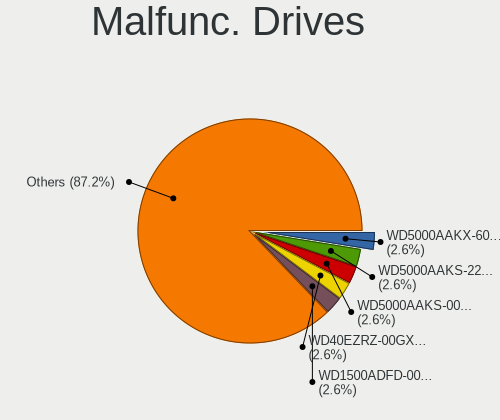
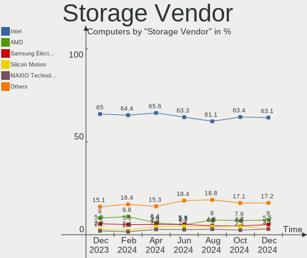
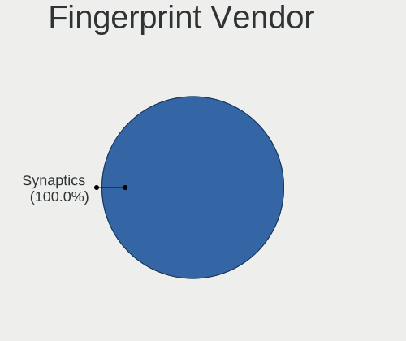
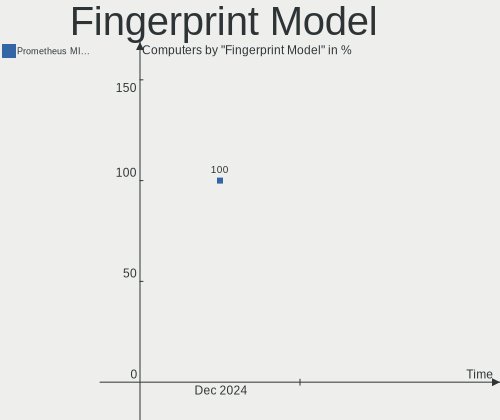

OPNsense - Hardware Trends
--------------------------

A project to identify most popular hardware characteristics and track their change
over time based on data collected by BSD users at https://BSD-Hardware.info.

Anyone can contribute to this report by the [hw-probe](https://github.com/linuxhw/hw-probe/blob/master/INSTALL.BSD.md) tool:

    hw-probe -all -upload

This report is for one last month. Overall report since the beginning of time: [TestDays](https://github.com/bsdhw/TestDays)

Period: Feb, 2023.

Contents
--------

* [ System ](#system)
  - [ OS                       ](#os)
  - [ OS Family                ](#os-family)
  - [ Arch                     ](#arch)
  - [ DE                       ](#de)
  - [ Display Server           ](#display-server)
  - [ Display Manager          ](#display-manager)
  - [ OS Lang                  ](#os-lang)
  - [ Boot Mode                ](#boot-mode)
  - [ Filesystem               ](#filesystem)
  - [ Part. scheme             ](#part-scheme)

* [ Board ](#board)
  - [ Vendor                   ](#vendor)
  - [ Model                    ](#model)
  - [ Model Family             ](#model-family)
  - [ MFG Year                 ](#mfg-year)
  - [ Form Factor              ](#form-factor)
  - [ Coreboot                 ](#coreboot)
  - [ RAM Size                 ](#ram-size)
  - [ RAM Used                 ](#ram-used)
  - [ Total Drives             ](#total-drives)
  - [ Has CD-ROM               ](#has-cd-rom)
  - [ Has Ethernet             ](#has-ethernet)
  - [ Has WiFi                 ](#has-wifi)
  - [ Has Bluetooth            ](#has-bluetooth)

* [ Location ](#location)
  - [ Country                  ](#country)
  - [ City                     ](#city)

* [ Drives ](#drives)
  - [ Drive Vendor             ](#drive-vendor)
  - [ Drive Model              ](#drive-model)
  - [ HDD Vendor               ](#hdd-vendor)
  - [ SSD Vendor               ](#ssd-vendor)
  - [ Drive Kind               ](#drive-kind)
  - [ Drive Connector          ](#drive-connector)
  - [ Drive Size               ](#drive-size)
  - [ Space Total              ](#space-total)
  - [ Space Used               ](#space-used)
  - [ Malfunc. Drives          ](#malfunc-drives)
  - [ Malfunc. Drive Vendor    ](#malfunc-drive-vendor)
  - [ Malfunc. HDD Vendor      ](#malfunc-hdd-vendor)
  - [ Malfunc. Drive Kind      ](#malfunc-drive-kind)
  - [ Failed Drives            ](#failed-drives)
  - [ Failed Drive Vendor      ](#failed-drive-vendor)
  - [ Drive Status             ](#drive-status)

* [ Storage controller ](#storage-controller)
  - [ Storage Vendor           ](#storage-vendor)
  - [ Storage Model            ](#storage-model)
  - [ Storage Kind             ](#storage-kind)

* [ Processor ](#processor)
  - [ CPU Vendor               ](#cpu-vendor)
  - [ CPU Model                ](#cpu-model)
  - [ CPU Model Family         ](#cpu-model-family)
  - [ CPU Cores                ](#cpu-cores)
  - [ CPU Sockets              ](#cpu-sockets)
  - [ CPU Threads              ](#cpu-threads)
  - [ CPU Microarch            ](#cpu-microarch)

* [ Graphics ](#graphics)
  - [ GPU Vendor               ](#gpu-vendor)
  - [ GPU Model                ](#gpu-model)
  - [ GPU Combo                ](#gpu-combo)
  - [ GPU Driver               ](#gpu-driver)
  - [ GPU Memory               ](#gpu-memory)

* [ Monitor ](#monitor)
  - [ Monitor Vendor           ](#monitor-vendor)
  - [ Monitor Model            ](#monitor-model)
  - [ Monitor Resolution       ](#monitor-resolution)
  - [ Monitor Diagonal         ](#monitor-diagonal)
  - [ Monitor Width            ](#monitor-width)
  - [ Aspect Ratio             ](#aspect-ratio)
  - [ Monitor Area             ](#monitor-area)
  - [ Pixel Density            ](#pixel-density)
  - [ Multiple Monitors        ](#multiple-monitors)

* [ Network ](#network)
  - [ Net Controller Vendor    ](#net-controller-vendor)
  - [ Net Controller Model     ](#net-controller-model)
  - [ Wireless Vendor          ](#wireless-vendor)
  - [ Wireless Model           ](#wireless-model)
  - [ Ethernet Vendor          ](#ethernet-vendor)
  - [ Ethernet Model           ](#ethernet-model)
  - [ Net Controller Kind      ](#net-controller-kind)
  - [ Used Controller          ](#used-controller)
  - [ NICs                     ](#nics)
  - [ IPv6                     ](#ipv6)

* [ Bluetooth ](#bluetooth)
  - [ Bluetooth Vendor         ](#bluetooth-vendor)
  - [ Bluetooth Model          ](#bluetooth-model)

* [ Sound ](#sound)
  - [ Sound Vendor             ](#sound-vendor)
  - [ Sound Model              ](#sound-model)

* [ Memory ](#memory)
  - [ Memory Vendor            ](#memory-vendor)
  - [ Memory Model             ](#memory-model)
  - [ Memory Kind              ](#memory-kind)
  - [ Memory Form Factor       ](#memory-form-factor)
  - [ Memory Size              ](#memory-size)
  - [ Memory Speed             ](#memory-speed)

* [ Printers & scanners ](#printers--scanners)
  - [ Printer Vendor           ](#printer-vendor)
  - [ Printer Model            ](#printer-model)
  - [ Scanner Vendor           ](#scanner-vendor)
  - [ Scanner Model            ](#scanner-model)

* [ Camera ](#camera)
  - [ Camera Vendor            ](#camera-vendor)
  - [ Camera Model             ](#camera-model)

* [ Security ](#security)
  - [ Fingerprint Vendor       ](#fingerprint-vendor)
  - [ Fingerprint Model        ](#fingerprint-model)
  - [ Chipcard Vendor          ](#chipcard-vendor)
  - [ Chipcard Model           ](#chipcard-model)

* [ Unsupported ](#unsupported)
  - [ Unsupported Devices      ](#unsupported-devices)
  - [ Unsupported Device Types ](#unsupported-device-types)

System
------

OS
--

Installed operating systems

| Name             | Computers | Percent |
|------------------|-----------|---------|
| OPNsense 23.1    | 137       | 42.55%  |
| OPNsense 23.1.1  | 130       | 40.37%  |
| OPNsense 22.7.11 | 27        | 8.39%   |
| OPNsense 23.7    | 8         | 2.48%   |
| OPNsense 22.1.10 | 6         | 1.86%   |
| OPNsense 22.10.2 | 4         | 1.24%   |
| OPNsense 22.7.9  | 3         | 0.93%   |
| OPNsense 22.7.10 | 3         | 0.93%   |
| OPNsense 22.7.8  | 1         | 0.31%   |
| OPNsense 22.10.1 | 1         | 0.31%   |
| OPNsense 21.7.8  | 1         | 0.31%   |
| OPNsense 21.1.9  | 1         | 0.31%   |

OS Family
---------

OS without a version

| Name     | Computers | Percent |
|----------|-----------|---------|
| OPNsense | 322       | 100%    |

Arch
----

OS architecture (x86_64, i586, etc.)

| Name  | Computers | Percent |
|-------|-----------|---------|
| amd64 | 322       | 100%    |

DE
--

Desktop Environment

| Name    | Computers | Percent |
|---------|-----------|---------|
| Console | 322       | 100%    |

Display Server
--------------

X11 or Wayland

| Name    | Computers | Percent |
|---------|-----------|---------|
| Console | 322       | 100%    |

Display Manager
---------------

SDDM, LightDM, etc.

| Name    | Computers | Percent |
|---------|-----------|---------|
| Console | 322       | 100%    |

OS Lang
-------

Language

| Lang    | Computers | Percent |
|---------|-----------|---------|
| Unknown | 314       | 97.52%  |
| C       | 8         | 2.48%   |

Boot Mode
---------

EFI or BIOS

| Mode | Computers | Percent |
|------|-----------|---------|
| EFI  | 315       | 97.83%  |
| BIOS | 7         | 2.17%   |

Filesystem
----------

Type of filesystem

| Type | Computers | Percent |
|------|-----------|---------|
| Ufs  | 189       | 58.7%   |
| Zfs  | 133       | 41.3%   |

Part. scheme
------------

Scheme of partitioning

| Type    | Computers | Percent |
|---------|-----------|---------|
| GPT     | 317       | 98.45%  |
| MBR     | 4         | 1.24%   |
| Unknown | 1         | 0.31%   |

Board
-----

Vendor
------

Motherboard manufacturer

| Name                | Computers | Percent |
|---------------------|-----------|---------|
| Dell                | 47        | 14.6%   |
| Unknown             | 47        | 14.6%   |
| Hewlett-Packard     | 23        | 7.14%   |
| Supermicro          | 21        | 6.52%   |
| Lenovo              | 16        | 4.97%   |
| Intel               | 16        | 4.97%   |
| Techvision          | 13        | 4.04%   |
| Fujitsu             | 13        | 4.04%   |
| Protectli           | 12        | 3.73%   |
| ASUSTek Computer    | 12        | 3.73%   |
| PC Engines          | 11        | 3.42%   |
| ASRock              | 10        | 3.11%   |
| Sophos              | 8         | 2.48%   |
| Gigabyte Technology | 8         | 2.48%   |
| AMI                 | 8         | 2.48%   |
| ZOTAC               | 6         | 1.86%   |
| Deciso              | 6         | 1.86%   |
| MSI                 | 4         | 1.24%   |
| CncTion             | 3         | 0.93%   |
| AZW                 | 3         | 0.93%   |
| Yanling             | 2         | 0.62%   |
| Shuttle             | 2         | 0.62%   |
| MW                  | 2         | 0.62%   |
| Hardkernel          | 2         | 0.62%   |
| CWWK                | 2         | 0.62%   |
| BESSTAR Tech        | 2         | 0.62%   |
| Acer                | 2         | 0.62%   |
| YANYU               | 1         | 0.31%   |
| TYAN Computer       | 1         | 0.31%   |
| Stonesoft           | 1         | 0.31%   |
| Seeed Studio        | 1         | 0.31%   |
| NF541               | 1         | 0.31%   |
| MiTAC               | 1         | 0.31%   |
| Jingsha             | 1         | 0.31%   |
| Inventec            | 1         | 0.31%   |
| Intel BOX4A200      | 1         | 0.31%   |
| IGEL Technology     | 1         | 0.31%   |
| IceWhale Technology | 1         | 0.31%   |
| IBM                 | 1         | 0.31%   |
| iBASE               | 1         | 0.31%   |

Model
-----

Motherboard model

| Name                                | Computers | Percent |
|-------------------------------------|-----------|---------|
| Unknown                             | 49        | 15.22%  |
| Techvision TVI7309X                 | 13        | 4.04%   |
| PC Engines APU2                     | 8         | 2.48%   |
| Supermicro Super Server             | 7         | 2.17%   |
| Sophos SG                           | 6         | 1.86%   |
| Dell OptiPlex 3020                  | 6         | 1.86%   |
| Fujitsu FUTRO S920                  | 4         | 1.24%   |
| Dell OptiPlex 7010                  | 4         | 1.24%   |
| Supermicro X7SPA-HF                 | 3         | 0.93%   |
| Protectli FW4B                      | 3         | 0.93%   |
| HP t730 Thin Client                 | 3         | 0.93%   |
| Dell Wyse 5070 Extended Thin Client | 3         | 0.93%   |
| Dell PowerEdge R210                 | 3         | 0.93%   |
| Dell OptiPlex 9010                  | 3         | 0.93%   |
| Dell OptiPlex 7060                  | 3         | 0.93%   |
| AMI Aptio CRB                       | 3         | 0.93%   |
| Supermicro X9SCL/X9SCM              | 2         | 0.62%   |
| Protectli VP2420                    | 2         | 0.62%   |
| Protectli VP2410                    | 2         | 0.62%   |
| Protectli FW6                       | 2         | 0.62%   |
| Protectli FW2B                      | 2         | 0.62%   |
| PC Engines apu4                     | 2         | 0.62%   |
| MW GMLK-2_5G4L                      | 2         | 0.62%   |
| Intel S1200BTL                      | 2         | 0.62%   |
| Intel Q3XXG4-P V1.0                 | 2         | 0.62%   |
| HP ProLiant DL360 G7                | 2         | 0.62%   |
| HP Compaq Elite 8300 CMT            | 2         | 0.62%   |
| Hardkernel ODROID-H2                | 2         | 0.62%   |
| Fujitsu FUTRO S930                  | 2         | 0.62%   |
| Dell PowerEdge R610                 | 2         | 0.62%   |
| Dell OptiPlex 9020                  | 2         | 0.62%   |
| Dell OptiPlex 7020                  | 2         | 0.62%   |
| Dell Inspiron 3470                  | 2         | 0.62%   |
| Deciso OPNsense Appliance           | 2         | 0.62%   |
| Deciso Netboard A20                 | 2         | 0.62%   |
| CncTion N5105-4L                    | 2         | 0.62%   |
| AZW U59                             | 2         | 0.62%   |
| AMI SG                              | 2         | 0.62%   |
| ZOTAC ZBOX-ID92/ZBOX-IQ01           | 1         | 0.31%   |
| ZOTAC ZBOX-ID88/ID89/ID90           | 1         | 0.31%   |

Model Family
------------

Motherboard model prefix

| Name                 | Computers | Percent |
|----------------------|-----------|---------|
| Unknown              | 49        | 15.22%  |
| Dell OptiPlex        | 25        | 7.76%   |
| Techvision TVI7309X  | 13        | 4.04%   |
| Lenovo ThinkCentre   | 10        | 3.11%   |
| Dell PowerEdge       | 10        | 3.11%   |
| Fujitsu FUTRO        | 9         | 2.8%    |
| PC Engines APU2      | 8         | 2.48%   |
| Supermicro Super     | 7         | 2.17%   |
| Sophos SG            | 6         | 1.86%   |
| HP Compaq            | 6         | 1.86%   |
| HP ProDesk           | 4         | 1.24%   |
| Dell Wyse            | 4         | 1.24%   |
| Dell Inspiron        | 4         | 1.24%   |
| ASUS PRIME           | 4         | 1.24%   |
| Supermicro X7SPA-HF  | 3         | 0.93%   |
| Protectli FW4B       | 3         | 0.93%   |
| Lenovo ThinkPad      | 3         | 0.93%   |
| HP t730              | 3         | 0.93%   |
| HP ProLiant          | 3         | 0.93%   |
| HP EliteDesk         | 3         | 0.93%   |
| Dell Precision       | 3         | 0.93%   |
| AMI Aptio            | 3         | 0.93%   |
| Supermicro X9SCL     | 2         | 0.62%   |
| Protectli VP2420     | 2         | 0.62%   |
| Protectli VP2410     | 2         | 0.62%   |
| Protectli FW6        | 2         | 0.62%   |
| Protectli FW2B       | 2         | 0.62%   |
| PC Engines apu4      | 2         | 0.62%   |
| MW GMLK-2            | 2         | 0.62%   |
| Intel S1200BTL       | 2         | 0.62%   |
| Intel Q3XXG4-P       | 2         | 0.62%   |
| Hardkernel ODROID-H2 | 2         | 0.62%   |
| Fujitsu PRIMERGY     | 2         | 0.62%   |
| Deciso OPNsense      | 2         | 0.62%   |
| Deciso Netboard      | 2         | 0.62%   |
| CncTion N5105-4L     | 2         | 0.62%   |
| AZW U59              | 2         | 0.62%   |
| ASUS H110I-PLUS      | 2         | 0.62%   |
| AMI SG               | 2         | 0.62%   |
| Acer Aspire          | 2         | 0.62%   |

MFG Year
--------

Motherboard manufacture year

| Year | Computers | Percent |
|------|-----------|---------|
| 2022 | 67        | 20.81%  |
| 2021 | 36        | 11.18%  |
| 2018 | 34        | 10.56%  |
| 2014 | 31        | 9.63%   |
| 2016 | 25        | 7.76%   |
| 2020 | 23        | 7.14%   |
| 2019 | 23        | 7.14%   |
| 2012 | 18        | 5.59%   |
| 2015 | 17        | 5.28%   |
| 2013 | 11        | 3.42%   |
| 2011 | 11        | 3.42%   |
| 2010 | 10        | 3.11%   |
| 2017 | 8         | 2.48%   |
| 2009 | 3         | 0.93%   |
| 2008 | 3         | 0.93%   |
| 2023 | 1         | 0.31%   |
| 2007 | 1         | 0.31%   |

Form Factor
-----------

Physical design of the computer

| Name     | Computers | Percent |
|----------|-----------|---------|
| Desktop  | 236       | 73.29%  |
| Mini pc  | 35        | 10.87%  |
| Server   | 29        | 9.01%   |
| Notebook | 14        | 4.35%   |
| Firewall | 8         | 2.48%   |

Coreboot
--------

Have coreboot on board

| Used | Computers | Percent |
|------|-----------|---------|
| No   | 308       | 95.65%  |
| Yes  | 14        | 4.35%   |

RAM Size
--------

Total RAM memory

| Size in GB  | Computers | Percent |
|-------------|-----------|---------|
| 8.01-16.0   | 135       | 41.93%  |
| 16.01-24.0  | 77        | 23.91%  |
| 4.01-8.0    | 52        | 16.15%  |
| 32.01-64.0  | 22        | 6.83%   |
| 2.01-3.0    | 19        | 5.9%    |
| 64.01-256.0 | 9         | 2.8%    |
| 24.01-32.0  | 7         | 2.17%   |
| 3.01-4.0    | 1         | 0.31%   |

RAM Used
--------

Used RAM memory

| Used GB  | Computers | Percent |
|----------|-----------|---------|
| 0.01-0.5 | 168       | 52.17%  |
| 0.51-1.0 | 113       | 35.09%  |
| 1.01-2.0 | 28        | 8.7%    |
| 2.01-3.0 | 10        | 3.11%   |
| 3.01-4.0 | 2         | 0.62%   |
| 4.01-8.0 | 1         | 0.31%   |

Total Drives
------------

Number of drives on board

| Drives | Computers | Percent |
|--------|-----------|---------|
| 1      | 243       | 75.47%  |
| 0      | 40        | 12.42%  |
| 2      | 34        | 10.56%  |
| 4      | 4         | 1.24%   |
| 3      | 1         | 0.31%   |

Has CD-ROM
----------

Has CD-ROM on board

| Presented | Computers | Percent |
|-----------|-----------|---------|
| No        | 273       | 84.78%  |
| Yes       | 49        | 15.22%  |

Has Ethernet
------------

Has Ethernet on board

| Presented | Computers | Percent |
|-----------|-----------|---------|
| Yes       | 322       | 100%    |

Has WiFi
--------

Has WiFi module

| Presented | Computers | Percent |
|-----------|-----------|---------|
| No        | 256       | 79.5%   |
| Yes       | 66        | 20.5%   |

Has Bluetooth
-------------

Has Bluetooth module

| Presented | Computers | Percent |
|-----------|-----------|---------|
| No        | 274       | 85.09%  |
| Yes       | 48        | 14.91%  |

Location
--------

Country
-------

Geographic location (country)

| Country     | Computers | Percent |
|-------------|-----------|---------|
| USA         | 111       | 34.47%  |
| Germany     | 62        | 19.25%  |
| Canada      | 18        | 5.59%   |
| Switzerland | 12        | 3.73%   |
| France      | 12        | 3.73%   |
| Netherlands | 10        | 3.11%   |
| UK          | 9         | 2.8%    |
| Poland      | 8         | 2.48%   |
| Brazil      | 7         | 2.17%   |
| Austria     | 6         | 1.86%   |
| Bulgaria    | 5         | 1.55%   |
| Australia   | 5         | 1.55%   |
| Russia      | 4         | 1.24%   |
| Italy       | 4         | 1.24%   |
| Finland     | 4         | 1.24%   |
| China       | 4         | 1.24%   |
| Sweden      | 3         | 0.93%   |
| Spain       | 3         | 0.93%   |
| South Korea | 3         | 0.93%   |
| Portugal    | 3         | 0.93%   |
| Indonesia   | 3         | 0.93%   |
| Belgium     | 3         | 0.93%   |
| Slovakia    | 2         | 0.62%   |
| New Zealand | 2         | 0.62%   |
| Japan       | 2         | 0.62%   |
| Hungary     | 2         | 0.62%   |
| Egypt       | 2         | 0.62%   |
| Thailand    | 1         | 0.31%   |
| Singapore   | 1         | 0.31%   |
| Romania     | 1         | 0.31%   |
| Puerto Rico | 1         | 0.31%   |
| Philippines | 1         | 0.31%   |
| Mexico      | 1         | 0.31%   |
| Malaysia    | 1         | 0.31%   |
| Luxembourg  | 1         | 0.31%   |
| Ireland     | 1         | 0.31%   |
| India       | 1         | 0.31%   |
| Estonia     | 1         | 0.31%   |
| Denmark     | 1         | 0.31%   |
| Croatia     | 1         | 0.31%   |

City
----

Geographic location (city)

| City             | Computers | Percent |
|------------------|-----------|---------|
| Berlin           | 6         | 1.86%   |
| Toronto          | 4         | 1.24%   |
| London           | 4         | 1.24%   |
| Zurich           | 3         | 0.93%   |
| New York         | 3         | 0.93%   |
| Munich           | 3         | 0.93%   |
| Moscow           | 3         | 0.93%   |
| Melbourne        | 3         | 0.93%   |
| Zhengzhou        | 2         | 0.62%   |
| Warsaw           | 2         | 0.62%   |
| Walnut Creek     | 2         | 0.62%   |
| Vienna           | 2         | 0.62%   |
| Varna            | 2         | 0.62%   |
| Statesboro       | 2         | 0.62%   |
| Sofia            | 2         | 0.62%   |
| San Francisco    | 2         | 0.62%   |
| Rio de Janeiro   | 2         | 0.62%   |
| Paris            | 2         | 0.62%   |
| Montreal         | 2         | 0.62%   |
| Mönchengladbach | 2         | 0.62%   |
| Medford          | 2         | 0.62%   |
| Madrid           | 2         | 0.62%   |
| Los Angeles      | 2         | 0.62%   |
| Lisbon           | 2         | 0.62%   |
| Jakarta          | 2         | 0.62%   |
| Hildesheim       | 2         | 0.62%   |
| Gomadingen       | 2         | 0.62%   |
| Denver           | 2         | 0.62%   |
| Chicago          | 2         | 0.62%   |
| Cairo            | 2         | 0.62%   |
| Auckland         | 2         | 0.62%   |
| Atlanta          | 2         | 0.62%   |
| Zeitz            | 1         | 0.31%   |
| Zagreb           | 1         | 0.31%   |
| Włocławek      | 1         | 0.31%   |
| Worms            | 1         | 0.31%   |
| Wokingham        | 1         | 0.31%   |
| Winterthur       | 1         | 0.31%   |
| Wiesbaden        | 1         | 0.31%   |
| Wiehl            | 1         | 0.31%   |

Drives
------

Drive Vendor
------------

Hard drive vendors

| Vendor              | Computers | Drives | Percent |
|---------------------|-----------|--------|---------|
| Samsung Electronics | 41        | 44     | 13.62%  |
| Kingston            | 29        | 31     | 9.63%   |
| Transcend           | 24        | 24     | 7.97%   |
| WDC                 | 23        | 31     | 7.64%   |
| Intel               | 21        | 22     | 6.98%   |
| Crucial             | 15        | 17     | 4.98%   |
| China               | 13        | 13     | 4.32%   |
| SanDisk             | 11        | 11     | 3.65%   |
| A-DATA Technology   | 11        | 12     | 3.65%   |
| Toshiba             | 10        | 14     | 3.32%   |
| Seagate             | 9         | 16     | 2.99%   |
| SPCC                | 7         | 7      | 2.33%   |
| SK hynix            | 6         | 7      | 1.99%   |
| Team                | 5         | 5      | 1.66%   |
| Hoodisk             | 5         | 5      | 1.66%   |
| Protectli           | 4         | 4      | 1.33%   |
| LITEON              | 4         | 4      | 1.33%   |
| Hitachi             | 4         | 4      | 1.33%   |
| Dogfish             | 4         | 4      | 1.33%   |
| Hewlett-Packard     | 3         | 3      | 1%      |
| FORESEE             | 3         | 3      | 1%      |
| Silicon Motion      | 2         | 2      | 0.66%   |
| Phison              | 2         | 2      | 0.66%   |
| Patriot             | 2         | 2      | 0.66%   |
| OCZ                 | 2         | 2      | 0.66%   |
| Mushkin             | 2         | 2      | 0.66%   |
| LITEONIT            | 2         | 2      | 0.66%   |
| Intenso             | 2         | 2      | 0.66%   |
| Innodisk            | 2         | 2      | 0.66%   |
| Fanxiang            | 2         | 2      | 0.66%   |
| Corsair             | 2         | 3      | 0.66%   |
| Apacer              | 2         | 2      | 0.66%   |
| Zheino              | 1         | 1      | 0.33%   |
| XrayDisk            | 1         | 1      | 0.33%   |
| Timetec             | 1         | 1      | 0.33%   |
| T-FORCE             | 1         | 1      | 0.33%   |
| Smartbuy            | 1         | 1      | 0.33%   |
| PNY                 | 1         | 1      | 0.33%   |
| Micron Technology   | 1         | 1      | 0.33%   |
| MARVELL             | 1         | 1      | 0.33%   |

Drive Model
-----------

Hard drive models

| Model                           | Computers | Percent |
|---------------------------------|-----------|---------|
| China SATA SSD 16GB             | 6         | 1.96%   |
| Transcend TS256GMTS952T2 256GB  | 5         | 1.63%   |
| Transcend TS64GMSA230S 64GB     | 3         | 0.98%   |
| Transcend TS128GMTE110S 128GB   | 3         | 0.98%   |
| Transcend TS128GMSA230S 128GB   | 3         | 0.98%   |
| Samsung SSD 850 EVO 250GB       | 3         | 0.98%   |
| Protectli 120GB M.2             | 3         | 0.98%   |
| Kingston SV300S37A120G 120GB    | 3         | 0.98%   |
| Kingston SUV500MS120G 120GB     | 3         | 0.98%   |
| Kingston SA400S37240G 240GB     | 3         | 0.98%   |
| Intel SSDSC2BW120A4 120GB       | 3         | 0.98%   |
| FORESEE 128GB SSD               | 3         | 0.98%   |
| Crucial CT250MX500SSD1 250GB    | 3         | 0.98%   |
| WDC WDS240G2G0A-00JH30 240GB    | 2         | 0.65%   |
| WDC WD1002FBYS-02A6B0 1TB       | 2         | 0.65%   |
| Transcend TS64GSSD370 64GB      | 2         | 0.65%   |
| SPCC Solid State Disk 256GB     | 2         | 0.65%   |
| SPCC Solid State Disk 128GB     | 2         | 0.65%   |
| Silicon Motion GV128 128GB      | 2         | 0.65%   |
| Seagate ST500DM002-1BD142 500GB | 2         | 0.65%   |
| SanDisk SSD U110 16GB           | 2         | 0.65%   |
| SanDisk SDSSDA120G 120GB        | 2         | 0.65%   |
| SanDisk SD7SN3Q512G1002 512GB   | 2         | 0.65%   |
| Samsung SSD 970 EVO Plus 1TB    | 2         | 0.65%   |
| Samsung SSD 960 EVO 250GB       | 2         | 0.65%   |
| Samsung SSD 870 EVO 2TB         | 2         | 0.65%   |
| Samsung SSD 860 EVO mSATA 250GB | 2         | 0.65%   |
| Samsung SSD 840 EVO 120GB       | 2         | 0.65%   |
| LITEON CV8-8E128-11 SATA 128GB  | 2         | 0.65%   |
| Kingston SUV500MS240G 240GB     | 2         | 0.65%   |
| Kingston SNVS500G 500GB         | 2         | 0.65%   |
| Kingston SA400S37480G 480GB     | 2         | 0.65%   |
| Kingston SA400S37120G 120GB     | 2         | 0.65%   |
| Intel SSDSA2CW160G3 160GB       | 2         | 0.65%   |
| Hoodisk SSD 32GB                | 2         | 0.65%   |
| Hoodisk SSD 128GB               | 2         | 0.65%   |
| HP RAID 1(1+0) 240GB            | 2         | 0.65%   |
| Crucial CT500P3SSD8 500GB       | 2         | 0.65%   |
| Crucial CT480BX500SSD1 480GB    | 2         | 0.65%   |
| Crucial CT240BX500SSD1 240GB    | 2         | 0.65%   |

HDD Vendor
----------

Hard disk drive vendors

| Vendor              | Computers | Drives | Percent |
|---------------------|-----------|--------|---------|
| WDC                 | 15        | 22     | 36.59%  |
| Seagate             | 8         | 14     | 19.51%  |
| Toshiba             | 6         | 10     | 14.63%  |
| Hitachi             | 4         | 4      | 9.76%   |
| Samsung Electronics | 3         | 4      | 7.32%   |
| Hewlett-Packard     | 3         | 3      | 7.32%   |
| HGST                | 1         | 1      | 2.44%   |
| FTS                 | 1         | 1      | 2.44%   |

SSD Vendor
----------

Solid state drive vendors

| Vendor              | Computers | Drives | Percent |
|---------------------|-----------|--------|---------|
| Samsung Electronics | 25        | 25     | 12.32%  |
| Kingston            | 23        | 25     | 11.33%  |
| Transcend           | 20        | 20     | 9.85%   |
| Intel               | 18        | 19     | 8.87%   |
| China               | 13        | 13     | 6.4%    |
| Crucial             | 12        | 14     | 5.91%   |
| SanDisk             | 11        | 11     | 5.42%   |
| A-DATA Technology   | 10        | 11     | 4.93%   |
| SPCC                | 5         | 5      | 2.46%   |
| Hoodisk             | 5         | 5      | 2.46%   |
| Team                | 4         | 4      | 1.97%   |
| Protectli           | 4         | 4      | 1.97%   |
| Dogfish             | 4         | 4      | 1.97%   |
| SK hynix            | 3         | 3      | 1.48%   |
| LITEON              | 3         | 3      | 1.48%   |
| FORESEE             | 3         | 3      | 1.48%   |
| WDC                 | 2         | 3      | 0.99%   |
| Patriot             | 2         | 2      | 0.99%   |
| OCZ                 | 2         | 2      | 0.99%   |
| Mushkin             | 2         | 2      | 0.99%   |
| LITEONIT            | 2         | 2      | 0.99%   |
| Intenso             | 2         | 2      | 0.99%   |
| Innodisk            | 2         | 2      | 0.99%   |
| Apacer              | 2         | 2      | 0.99%   |
| Zheino              | 1         | 1      | 0.49%   |
| XrayDisk            | 1         | 1      | 0.49%   |
| Timetec             | 1         | 1      | 0.49%   |
| T-FORCE             | 1         | 1      | 0.49%   |
| Smartbuy            | 1         | 1      | 0.49%   |
| Seagate             | 1         | 2      | 0.49%   |
| PNY                 | 1         | 1      | 0.49%   |
| Phison              | 1         | 1      | 0.49%   |
| Micron Technology   | 1         | 1      | 0.49%   |
| MARVELL             | 1         | 1      | 0.49%   |
| LSI                 | 1         | 1      | 0.49%   |
| Leven               | 1         | 1      | 0.49%   |
| Kston               | 1         | 1      | 0.49%   |
| KingSpec            | 1         | 1      | 0.49%   |
| KingDian            | 1         | 1      | 0.49%   |
| KeepData            | 1         | 1      | 0.49%   |

Drive Kind
----------

HDD or SSD

| Kind | Computers | Drives | Percent |
|------|-----------|--------|---------|
| SSD  | 199       | 211    | 67%     |
| NVMe | 57        | 61     | 19.19%  |
| HDD  | 41        | 59     | 13.8%   |

Drive Connector
---------------

SATA, SAS, NVMe, etc.

| Type | Computers | Drives | Percent |
|------|-----------|--------|---------|
| SATA | 231       | 270    | 80.21%  |
| NVMe | 57        | 61     | 19.79%  |

Drive Size
----------

Size of hard drive

| Size in TB | Computers | Drives | Percent |
|------------|-----------|--------|---------|
| 0.01-0.5   | 207       | 236    | 88.46%  |
| 0.51-1.0   | 17        | 21     | 7.26%   |
| 1.01-2.0   | 9         | 12     | 3.85%   |
| 4.01-10.0  | 1         | 1      | 0.43%   |

Space Total
-----------

Amount of disk space available on the file system

| Size in GB     | Computers | Percent |
|----------------|-----------|---------|
| 101-250        | 174       | 54.04%  |
| 251-500        | 45        | 13.98%  |
| 51-100         | 37        | 11.49%  |
| 21-50          | 24        | 7.45%   |
| 1-20           | 17        | 5.28%   |
| 501-1000       | 17        | 5.28%   |
| 1001-2000      | 6         | 1.86%   |
| More than 3000 | 2         | 0.62%   |

Space Used
----------

Amount of used disk space

| Used GB | Computers | Percent |
|---------|-----------|---------|
| 1-20    | 307       | 95.34%  |
| 21-50   | 13        | 4.04%   |
| 51-100  | 2         | 0.62%   |

Malfunc. Drives
---------------

Drive models with a malfunction

| Model                                 | Computers | Drives | Percent |
|---------------------------------------|-----------|--------|---------|
| WDC WDS240G2G0A-00JH30 240GB          | 2         | 3      | 7.69%   |
| WDC WD2503ABYX-01WERA0 256GB          | 1         | 1      | 3.85%   |
| WDC WD1600AAJS-60Z0A0 160GB           | 1         | 1      | 3.85%   |
| Toshiba MQ01ABD100 1TB                | 1         | 1      | 3.85%   |
| Seagate ST9500420AS 500GB             | 1         | 1      | 3.85%   |
| Seagate ST5000DM000-1FK178 5TB        | 1         | 1      | 3.85%   |
| Seagate ST3250310NS 250GB             | 1         | 2      | 3.85%   |
| SanDisk SDSSDH3512G 512GB             | 1         | 1      | 3.85%   |
| Samsung Electronics SSD 970 EVO 500GB | 1         | 1      | 3.85%   |
| Samsung Electronics SSD 950 PRO 256GB | 1         | 1      | 3.85%   |
| Samsung Electronics SSD 870 EVO 250GB | 1         | 1      | 3.85%   |
| Samsung Electronics HM320II 320GB     | 1         | 1      | 3.85%   |
| Samsung Electronics HM250HI 250GB     | 1         | 1      | 3.85%   |
| Phison SSD S7 64G                     | 1         | 1      | 3.85%   |
| OCZ VERTEX3 64GB                      | 1         | 1      | 3.85%   |
| LITEONIT LCT-128M3S 128GB             | 1         | 1      | 3.85%   |
| Intel SSDSC2CW120A3 120GB             | 1         | 1      | 3.85%   |
| Intel SSDSC2BB120G6R 120GB            | 1         | 1      | 3.85%   |
| HP Phison PSSBN016GA27BC0 16GB        | 1         | 1      | 3.85%   |
| Hitachi HTS542516K9SA00 160GB         | 1         | 1      | 3.85%   |
| HGST HTS725050A7E630 500GB            | 1         | 1      | 3.85%   |
| EDGE Boost Pro 120GB SSD              | 1         | 1      | 3.85%   |
| Crucial CT480BX500SSD1 480GB          | 1         | 1      | 3.85%   |
| China SH00M256GB                      | 1         | 1      | 3.85%   |
| A-DATA Technology SU800 128GB         | 1         | 1      | 3.85%   |

Malfunc. Drive Vendor
---------------------

Vendors of faulty drives

| Vendor              | Computers | Drives | Percent |
|---------------------|-----------|--------|---------|
| Samsung Electronics | 5         | 5      | 19.23%  |
| WDC                 | 4         | 5      | 15.38%  |
| Seagate             | 3         | 4      | 11.54%  |
| Intel               | 2         | 2      | 7.69%   |
| Toshiba             | 1         | 1      | 3.85%   |
| SanDisk             | 1         | 1      | 3.85%   |
| Phison              | 1         | 1      | 3.85%   |
| OCZ                 | 1         | 1      | 3.85%   |
| LITEONIT            | 1         | 1      | 3.85%   |
| HP Phison           | 1         | 1      | 3.85%   |
| Hitachi             | 1         | 1      | 3.85%   |
| HGST                | 1         | 1      | 3.85%   |
| EDGE                | 1         | 1      | 3.85%   |
| Crucial             | 1         | 1      | 3.85%   |
| China               | 1         | 1      | 3.85%   |
| A-DATA Technology   | 1         | 1      | 3.85%   |

Malfunc. HDD Vendor
-------------------

Vendors of faulty HDD drives

| Vendor              | Computers | Drives | Percent |
|---------------------|-----------|--------|---------|
| Seagate             | 3         | 4      | 30%     |
| WDC                 | 2         | 2      | 20%     |
| Samsung Electronics | 2         | 2      | 20%     |
| Toshiba             | 1         | 1      | 10%     |
| Hitachi             | 1         | 1      | 10%     |
| HGST                | 1         | 1      | 10%     |

Malfunc. Drive Kind
-------------------

Kinds of faulty drives

| Kind | Computers | Drives | Percent |
|------|-----------|--------|---------|
| SSD  | 14        | 15     | 53.85%  |
| HDD  | 10        | 11     | 38.46%  |
| NVMe | 2         | 2      | 7.69%   |

Failed Drives
-------------

Failed drive models

| Model                             | Computers | Drives | Percent |
|-----------------------------------|-----------|--------|---------|
| Samsung Electronics SSD 980 250GB | 1         | 1      | 50%     |
| Kingston SA2000M8500G 500GB       | 1         | 1      | 50%     |

Failed Drive Vendor
-------------------

Failed drive vendors

| Vendor              | Computers | Drives | Percent |
|---------------------|-----------|--------|---------|
| Samsung Electronics | 1         | 1      | 50%     |
| Kingston            | 1         | 1      | 50%     |

Drive Status
------------

Number of failed and malfunc. drives

| Status   | Computers | Drives | Percent |
|----------|-----------|--------|---------|
| Works    | 252       | 295    | 88.11%  |
| Malfunc  | 26        | 28     | 9.09%   |
| Detected | 6         | 6      | 2.1%    |
| Failed   | 2         | 2      | 0.7%    |

Storage controller
------------------

Storage Vendor
--------------

Storage controller vendors

| Vendor                       | Computers | Percent |
|------------------------------|-----------|---------|
| Intel                        | 258       | 67.89%  |
| AMD                          | 44        | 11.58%  |
| Samsung Electronics          | 15        | 3.95%   |
| SanDisk                      | 11        | 2.89%   |
| Broadcom / LSI               | 11        | 2.89%   |
| Silicon Motion               | 9         | 2.37%   |
| Kingston Technology Company  | 6         | 1.58%   |
| Toshiba                      | 4         | 1.05%   |
| SK hynix                     | 3         | 0.79%   |
| Micron/Crucial Technology    | 3         | 0.79%   |
| Hewlett-Packard              | 3         | 0.79%   |
| Transcend                    | 2         | 0.53%   |
| Phison Electronics           | 2         | 0.53%   |
| MAXIO Technology (Hangzhou)  | 2         | 0.53%   |
| Shenzhen Longsys Electronics | 1         | 0.26%   |
| Micron Technology            | 1         | 0.26%   |
| Marvell Technology Group     | 1         | 0.26%   |
| Lite-On Technology           | 1         | 0.26%   |
| ASMedia Technology           | 1         | 0.26%   |
| ADATA Technology             | 1         | 0.26%   |
| Adaptec                      | 1         | 0.26%   |

Storage Model
-------------

Storage controller models

| Model                                                                            | Computers | Percent |
|----------------------------------------------------------------------------------|-----------|---------|
| Intel Celeron/Pentium Silver Processor SATA Controller                           | 35        | 8.33%   |
| AMD FCH SATA Controller [AHCI mode]                                              | 35        | 8.33%   |
| Intel 8 Series/C220 Series Chipset Family 6-port SATA Controller 1 [AHCI mode]   | 34        | 8.1%    |
| Intel Jasper Lake SATA AHCI Controller                                           | 23        | 5.48%   |
| Intel Q170/Q150/B150/H170/H110/Z170/CM236 Chipset SATA Controller [AHCI Mode]    | 13        | 3.1%    |
| Intel Sunrise Point-LP SATA Controller [AHCI mode]                               | 12        | 2.86%   |
| Intel Cannon Lake PCH SATA AHCI Controller                                       | 12        | 2.86%   |
| Intel Atom/Celeron/Pentium Processor x5-E8000/J3xxx/N3xxx Series SATA Controller | 12        | 2.86%   |
| Unknown                                                                          | 11        | 2.62%   |
| Intel NM10/ICH7 Family SATA Controller [IDE mode]                                | 10        | 2.38%   |
| Intel 7 Series/C210 Series Chipset Family 6-port SATA Controller [AHCI mode]     | 10        | 2.38%   |
| Silicon Motion SM2263EN/SM2263XT SSD Controller                                  | 9         | 2.14%   |
| Intel Atom Processor E3800 Series SATA AHCI Controller                           | 8         | 1.9%    |
| Intel 82801G (ICH7 Family) IDE Controller                                        | 8         | 1.9%    |
| Samsung NVMe SSD Controller SM981/PM981/PM983                                    | 7         | 1.67%   |
| Intel 6 Series/C200 Series Chipset Family 6 port Desktop SATA AHCI Controller    | 7         | 1.67%   |
| Intel SATA Controller [RAID mode]                                                | 6         | 1.43%   |
| Intel Celeron N3350/Pentium N4200/Atom E3900 Series SATA AHCI Controller         | 6         | 1.43%   |
| Intel 82801HM/HEM (ICH8M/ICH8M-E) IDE Controller                                 | 6         | 1.43%   |
| Intel 82801IR/IO/IH (ICH9R/DO/DH) 4 port SATA Controller [IDE mode]              | 5         | 1.19%   |
| Intel 82801I (ICH9 Family) 2 port SATA Controller [IDE mode]                     | 5         | 1.19%   |
| Intel 200 Series PCH SATA controller [AHCI mode]                                 | 5         | 1.19%   |
| SanDisk WD Blue SN570 NVMe SSD                                                   | 4         | 0.95%   |
| Intel Elkhart Lake SATA AHCI                                                     | 4         | 0.95%   |
| Intel Comet Lake SATA AHCI Controller                                            | 4         | 0.95%   |
| Intel 82801HM/HEM (ICH8M/ICH8M-E) SATA Controller [AHCI mode]                    | 4         | 0.95%   |
| Intel 8 Series SATA Controller 1 [AHCI mode]                                     | 4         | 0.95%   |
| SanDisk WD Blue SN500 / PC SN520 NVMe SSD                                        | 3         | 0.71%   |
| Samsung NVMe SSD Controller SM961/PM961/SM963                                    | 3         | 0.71%   |
| Micron/Crucial P2 NVMe PCIe SSD                                                  | 3         | 0.71%   |
| Intel Tiger Lake-LP SATA Controller                                              | 3         | 0.71%   |
| Intel 9 Series Chipset Family SATA Controller [AHCI Mode]                        | 3         | 0.71%   |
| Intel 5 Series/3400 Series Chipset 6 port SATA AHCI Controller                   | 3         | 0.71%   |
| HP Smart Array G6 controllers                                                    | 3         | 0.71%   |
| AMD FCH SATA Controller [IDE mode]                                               | 3         | 0.71%   |
| AMD FCH IDE Controller                                                           | 3         | 0.71%   |
| AMD 500 Series Chipset SATA Controller                                           | 3         | 0.71%   |
| AMD 400 Series Chipset SATA Controller                                           | 3         | 0.71%   |
| Toshiba XG5 NVMe SSD Controller                                                  | 2         | 0.48%   |
| SK hynix Gold P31/PC711 NVMe Solid State Drive                                   | 2         | 0.48%   |

Storage Kind
------------

Kind of storage controller (IDE, SATA, NVMe, SAS, ...)

| Kind | Computers | Percent |
|------|-----------|---------|
| SATA | 264       | 68.39%  |
| NVMe | 62        | 16.06%  |
| IDE  | 37        | 9.59%   |
| RAID | 19        | 4.92%   |
| SAS  | 3         | 0.78%   |
| SCSI | 1         | 0.26%   |

Processor
---------

CPU Vendor
----------

Processor vendors

| Vendor | Computers | Percent |
|--------|-----------|---------|
| Intel  | 276       | 85.71%  |
| AMD    | 46        | 14.29%  |

CPU Model
---------

Processor models

| Model                                    | Computers | Percent |
|------------------------------------------|-----------|---------|
| Intel Celeron J4125 CPU @ 2.00GHz        | 21        | 6.52%   |
| Intel Celeron N5105 @ 2.00GHz            | 20        | 6.21%   |
| AMD GX-412TC SOC                         | 10        | 3.11%   |
| Intel Celeron CPU J3160 @ 1.60GHz        | 6         | 1.86%   |
| Intel Atom CPU D525 @ 1.80GHz            | 6         | 1.86%   |
| Intel Core i5-3570 CPU @ 3.40GHz         | 5         | 1.55%   |
| Intel Pentium Silver N6005 @ 2.00GHz     | 4         | 1.24%   |
| Intel Pentium Silver J5005 CPU @ 1.50GHz | 4         | 1.24%   |
| Intel Core i5-4590 CPU @ 3.30GHz         | 4         | 1.24%   |
| Intel Celeron CPU J1900 @ 1.99GHz        | 4         | 1.24%   |
| AMD GX-415GA SOC with Radeon HD Graphics | 4         | 1.24%   |
| AMD EPYC 3201 8-Core Processor           | 4         | 1.24%   |
| Intel Xeon CPU E5620 @ 2.40GHz           | 3         | 0.93%   |
| Intel Core i7-7500U CPU @ 2.70GHz        | 3         | 0.93%   |
| Intel Core i7-3770 CPU @ 3.40GHz         | 3         | 0.93%   |
| Intel Core i5-7200U CPU @ 2.50GHz        | 3         | 0.93%   |
| Intel Core i5-4590T CPU @ 2.00GHz        | 3         | 0.93%   |
| Intel Core i5-4570T CPU @ 2.90GHz        | 3         | 0.93%   |
| Intel Core i5-4570 CPU @ 3.20GHz         | 3         | 0.93%   |
| Intel Core i5-2400 CPU @ 3.10GHz         | 3         | 0.93%   |
| Intel Core i3-8100 CPU @ 3.60GHz         | 3         | 0.93%   |
| Intel Celeron J6413 @ 1.80GHz            | 3         | 0.93%   |
| Intel Celeron CPU N3350 @ 1.10GHz        | 3         | 0.93%   |
| AMD RX-427BB with AMD Radeon R7 Graphics | 3         | 0.93%   |
| Intel Xeon CPU X3430 @ 2.40GHz           | 2         | 0.62%   |
| Intel Pentium CPU G3420 @ 3.20GHz        | 2         | 0.62%   |
| Intel Core i7-8700 CPU @ 3.20GHz         | 2         | 0.62%   |
| Intel Core i5-8250U CPU @ 1.60GHz        | 2         | 0.62%   |
| Intel Core i5-6500T CPU @ 2.50GHz        | 2         | 0.62%   |
| Intel Core i5-6400 CPU @ 2.70GHz         | 2         | 0.62%   |
| Intel Core i5-4590S CPU @ 3.00GHz        | 2         | 0.62%   |
| Intel Core i5-4460 CPU @ 3.20GHz         | 2         | 0.62%   |
| Intel Core i3-8100T CPU @ 3.10GHz        | 2         | 0.62%   |
| Intel Core i3-4160 CPU @ 3.60GHz         | 2         | 0.62%   |
| Intel Core i3-4130 CPU @ 3.40GHz         | 2         | 0.62%   |
| Intel Core i3-10110U CPU @ 2.10GHz       | 2         | 0.62%   |
| Intel Celeron N5100 @ 1.10GHz            | 2         | 0.62%   |
| Intel Celeron J6412 @ 2.00GHz            | 2         | 0.62%   |
| Intel Celeron J4115 CPU @ 1.80GHz        | 2         | 0.62%   |
| Intel Celeron J4105 CPU @ 1.50GHz        | 2         | 0.62%   |

CPU Model Family
----------------

Processor model prefix

| Model                   | Computers | Percent |
|-------------------------|-----------|---------|
| Intel Celeron           | 87        | 27.02%  |
| Intel Core i5           | 55        | 17.08%  |
| Intel Xeon              | 38        | 11.8%   |
| Intel Core i3           | 21        | 6.52%   |
| Intel Core i7           | 17        | 5.28%   |
| Intel Atom              | 17        | 5.28%   |
| AMD GX                  | 17        | 5.28%   |
| Other                   | 11        | 3.42%   |
| Intel Pentium Silver    | 11        | 3.42%   |
| Intel Pentium           | 10        | 3.11%   |
| AMD EPYC                | 7         | 2.17%   |
| Intel Core 2 Duo        | 4         | 1.24%   |
| AMD Ryzen 5             | 4         | 1.24%   |
| AMD Ryzen 7             | 3         | 0.93%   |
| AMD G                   | 3         | 0.93%   |
| Intel Pentium Dual-Core | 2         | 0.62%   |
| Intel Core 2 Quad       | 2         | 0.62%   |
| AMD Ryzen Embedded      | 2         | 0.62%   |
| AMD Ryzen 5 PRO         | 2         | 0.62%   |
| AMD Athlon              | 2         | 0.62%   |
| AMD A4                  | 2         | 0.62%   |
| Intel Xeon Gold         | 1         | 0.31%   |
| Intel Pentium Gold      | 1         | 0.31%   |
| Intel Core i9           | 1         | 0.31%   |
| Intel Celeron D         | 1         | 0.31%   |
| AMD A8                  | 1         | 0.31%   |

CPU Cores
---------

Number of processor cores

| Number  | Computers | Percent |
|---------|-----------|---------|
| 4       | 194       | 60.25%  |
| 2       | 79        | 24.53%  |
| 8       | 15        | 4.66%   |
| 6       | 11        | 3.42%   |
| 12      | 10        | 3.11%   |
| 16      | 4         | 1.24%   |
| 1       | 4         | 1.24%   |
| 10      | 2         | 0.62%   |
| Unknown | 2         | 0.62%   |
| 32      | 1         | 0.31%   |

CPU Sockets
-----------

Number of sockets

| Number | Computers | Percent |
|--------|-----------|---------|
| 1      | 313       | 97.2%   |
| 2      | 9         | 2.8%    |

CPU Threads
-----------

Threads per core (Hyper-Threading)

| Number  | Computers | Percent |
|---------|-----------|---------|
| 1       | 229       | 71.12%  |
| 2       | 91        | 28.26%  |
| Unknown | 2         | 0.62%   |

CPU Microarch
-------------

Microarchitecture

| Name          | Computers | Percent |
|---------------|-----------|---------|
| Haswell       | 44        | 13.66%  |
| Unknown       | 38        | 11.8%   |
| KabyLake      | 37        | 11.49%  |
| Goldmont plus | 35        | 10.87%  |
| Silvermont    | 23        | 7.14%   |
| IvyBridge     | 20        | 6.21%   |
| Skylake       | 14        | 4.35%   |
| Puma          | 13        | 4.04%   |
| Zen           | 10        | 3.11%   |
| SandyBridge   | 10        | 3.11%   |
| Bonnell       | 10        | 3.11%   |
| Penryn        | 9         | 2.8%    |
| Goldmont      | 7         | 2.17%   |
| Westmere      | 6         | 1.86%   |
| Nehalem       | 6         | 1.86%   |
| Zen 3         | 5         | 1.55%   |
| Jaguar        | 5         | 1.55%   |
| Broadwell     | 5         | 1.55%   |
| TigerLake     | 4         | 1.24%   |
| Steamroller   | 4         | 1.24%   |
| CometLake     | 4         | 1.24%   |
| Zen+          | 3         | 0.93%   |
| Core          | 3         | 0.93%   |
| Bobcat        | 3         | 0.93%   |
| Zen 2         | 2         | 0.62%   |
| Piledriver    | 1         | 0.31%   |
| NetBurst      | 1         | 0.31%   |

Graphics
--------

GPU Vendor
----------

Vendors of graphics cards

| Vendor                     | Computers | Percent |
|----------------------------|-----------|---------|
| Intel                      | 230       | 75.16%  |
| AMD                        | 33        | 10.78%  |
| Matrox Electronics Systems | 24        | 7.84%   |
| ASPEED Technology          | 15        | 4.9%    |
| Nvidia                     | 4         | 1.31%   |

GPU Model
---------

Graphics card models

| Model                                                                                    | Computers | Percent |
|------------------------------------------------------------------------------------------|-----------|---------|
| Intel GeminiLake [UHD Graphics 600]                                                      | 28        | 9.15%   |
| Intel Xeon E3-1200 v3/4th Gen Core Processor Integrated Graphics Controller              | 27        | 8.82%   |
| Intel JasperLake [UHD Graphics]                                                          | 27        | 8.82%   |
| ASPEED Technology ASPEED Graphics Family                                                 | 15        | 4.9%    |
| Intel CoffeeLake-S GT2 [UHD Graphics 630]                                                | 14        | 4.58%   |
| Matrox Electronics Systems MGA G200eW WPCM450                                            | 13        | 4.25%   |
| Intel Atom/Celeron/Pentium Processor x5-E8000/J3xxx/N3xxx Integrated Graphics Controller | 12        | 3.92%   |
| Intel Atom Processor Z36xxx/Z37xxx Series Graphics & Display                             | 9         | 2.94%   |
| Intel Xeon E3-1200 v2/3rd Gen Core processor Graphics Controller                         | 8         | 2.61%   |
| Intel 4 Series Chipset Integrated Graphics Controller                                    | 8         | 2.61%   |
| Intel HD Graphics 620                                                                    | 7         | 2.29%   |
| Intel GeminiLake [UHD Graphics 605]                                                      | 7         | 2.29%   |
| Matrox Electronics Systems MGA G200e [Pilot] ServerEngines (SEP1)                        | 6         | 1.96%   |
| Intel HD Graphics 530                                                                    | 6         | 1.96%   |
| Intel Atom Processor D4xx/D5xx/N4xx/N5xx Integrated Graphics Controller                  | 6         | 1.96%   |
| Intel HD Graphics 500                                                                    | 5         | 1.63%   |
| Intel Elkhart Lake [UHD Graphics Gen11 16EU]                                             | 5         | 1.63%   |
| Intel 4th Generation Core Processor Family Integrated Graphics Controller                | 5         | 1.63%   |
| Intel 2nd Generation Core Processor Family Integrated Graphics Controller                | 5         | 1.63%   |
| Matrox Electronics Systems G200eR2                                                       | 4         | 1.31%   |
| Intel IvyBridge GT2 [HD Graphics 4000]                                                   | 4         | 1.31%   |
| Intel HD Graphics 630                                                                    | 4         | 1.31%   |
| Intel Haswell-ULT Integrated Graphics Controller                                         | 4         | 1.31%   |
| Intel 3rd Gen Core processor Graphics Controller                                         | 4         | 1.31%   |
| AMD Kaveri [Radeon R7 Graphics]                                                          | 4         | 1.31%   |
| AMD Kabini [Radeon HD 8330E]                                                             | 4         | 1.31%   |
| AMD ES1000                                                                               | 4         | 1.31%   |
| AMD Cezanne [Radeon Vega Series / Radeon Vega Mobile Series]                             | 4         | 1.31%   |
| Intel UHD Graphics 620                                                                   | 3         | 0.98%   |
| Intel Tiger Lake-LP GT2 [UHD Graphics G4]                                                | 3         | 0.98%   |
| Intel CometLake-S GT2 [UHD Graphics 630]                                                 | 3         | 0.98%   |
| Intel HD Graphics 510                                                                    | 2         | 0.65%   |
| Intel CometLake-U GT2 [UHD Graphics]                                                     | 2         | 0.65%   |
| Intel 82G33/G31 Express Integrated Graphics Controller                                   | 2         | 0.65%   |
| AMD Wrestler [Radeon HD 6320]                                                            | 2         | 0.65%   |
| AMD Raven Ridge [Radeon Vega Series / Radeon Vega Mobile Series]                         | 2         | 0.65%   |
| AMD Picasso/Raven 2 [Radeon Vega Series / Radeon Vega Mobile Series]                     | 2         | 0.65%   |
| AMD Mullins [Radeon R4/R5 Graphics]                                                      | 2         | 0.65%   |
| Nvidia GP107 [GeForce GTX 1050 Ti]                                                       | 1         | 0.33%   |
| Nvidia GK208B [GeForce GT 730]                                                           | 1         | 0.33%   |

GPU Combo
---------

Combinations of graphics cards

| Name           | Computers | Percent |
|----------------|-----------|---------|
| 1 x Intel      | 219       | 68.01%  |
| 1 x AMD        | 32        | 9.94%   |
| 1 x Matrox     | 24        | 7.45%   |
| Other          | 19        | 5.9%    |
| 1 x ASPEED     | 14        | 4.35%   |
| 2 x Intel      | 8         | 2.48%   |
| 1 x Nvidia     | 3         | 0.93%   |
| Intel + Nvidia | 1         | 0.31%   |
| Intel + ASPEED | 1         | 0.31%   |
| Intel + AMD    | 1         | 0.31%   |

GPU Driver
----------

Free vs proprietary

| Driver  | Computers | Percent |
|---------|-----------|---------|
| Free    | 303       | 94.1%   |
| Unknown | 19        | 5.9%    |

GPU Memory
----------

Total video memory

| Size in GB | Computers | Percent |
|------------|-----------|---------|
| Unknown    | 322       | 100%    |

Monitor
-------

Monitor Vendor
--------------

Monitor vendors

Zero info for selected period =(

Monitor Model
-------------

Monitor models

Zero info for selected period =(

Monitor Resolution
------------------

Monitor screen resolution

Zero info for selected period =(

Monitor Diagonal
----------------

Diagonal size in inches

Zero info for selected period =(

Monitor Width
-------------

Physical width

Zero info for selected period =(

Aspect Ratio
------------

Proportional relationship between the width and the height

Zero info for selected period =(

Monitor Area
------------

Area in inch²

Zero info for selected period =(

Pixel Density
-------------

Pixels per inch

Zero info for selected period =(

Multiple Monitors
-----------------

Total monitors connected

| Total | Computers | Percent |
|-------|-----------|---------|
| 0     | 322       | 100%    |

Network
-------

Net Controller Vendor
---------------------

Controller vendors

| Vendor                          | Computers | Percent |
|---------------------------------|-----------|---------|
| Intel                           | 278       | 61.37%  |
| Realtek Semiconductor           | 103       | 22.74%  |
| Broadcom                        | 31        | 6.84%   |
| Qualcomm Atheros                | 13        | 2.87%   |
| AMD                             | 6         | 1.32%   |
| U-Blox                          | 2         | 0.44%   |
| Solarflare Communications       | 2         | 0.44%   |
| Qualcomm Atheros Communications | 2         | 0.44%   |
| Mellanox Technologies           | 2         | 0.44%   |
| IMC Networks                    | 2         | 0.44%   |
| Huawei Technologies             | 2         | 0.44%   |
| D-Link System                   | 2         | 0.44%   |
| ZTE WCDMA Technologies MSM      | 1         | 0.22%   |
| STMicroelectronics              | 1         | 0.22%   |
| Seeed Technology                | 1         | 0.22%   |
| Ralink                          | 1         | 0.22%   |
| Motorola                        | 1         | 0.22%   |
| IBM                             | 1         | 0.22%   |
| Hewlett-Packard                 | 1         | 0.22%   |
| Aquantia                        | 1         | 0.22%   |

Net Controller Model
--------------------

Controller models

| Model                                                                         | Computers | Percent |
|-------------------------------------------------------------------------------|-----------|---------|
| Realtek RTL8111/8168/8411 PCI Express Gigabit Ethernet Controller             | 92        | 15.94%  |
| Intel I210 Gigabit Network Connection                                         | 39        | 6.76%   |
| Intel I211 Gigabit Network Connection                                         | 37        | 6.41%   |
| Intel Ethernet Controller I225-V                                              | 31        | 5.37%   |
| Intel I350 Gigabit Network Connection                                         | 27        | 4.68%   |
| Intel Ethernet Controller I226-V                                              | 22        | 3.81%   |
| Intel 82574L Gigabit Network Connection                                       | 20        | 3.47%   |
| Intel 82579LM Gigabit Network Connection (Lewisville)                         | 19        | 3.29%   |
| Intel 82576 Gigabit Network Connection                                        | 15        | 2.6%    |
| Intel 82583V Gigabit Network Connection                                       | 12        | 2.08%   |
| Intel 82580 Gigabit Network Connection                                        | 11        | 1.91%   |
| Intel 82571EB/82571GB Gigabit Ethernet Controller D0/D1 (copper applications) | 11        | 1.91%   |
| Intel Ethernet Connection I217-LM                                             | 10        | 1.73%   |
| Intel 82599ES 10-Gigabit SFI/SFP+ Network Connection                          | 9         | 1.56%   |
| Broadcom NetXtreme BCM5719 Gigabit Ethernet PCIe                              | 9         | 1.56%   |
| Realtek RTL8125 2.5GbE Controller                                             | 8         | 1.39%   |
| Intel Wireless 3165                                                           | 8         | 1.39%   |
| Broadcom NetXtreme II BCM5709 Gigabit Ethernet                                | 8         | 1.39%   |
| Intel Ethernet Controller 10-Gigabit X540-AT2                                 | 6         | 1.04%   |
| AMD Family 17h Processor 10 Gb Ethernet Controller Port 0                     | 6         | 1.04%   |
| Intel Ethernet Connection (7) I219-V                                          | 5         | 0.87%   |
| Intel Ethernet Connection (7) I219-LM                                         | 5         | 0.87%   |
| Intel 82571EB/82571GB Gigabit Ethernet Controller (Copper)                    | 5         | 0.87%   |
| Qualcomm Atheros QCA9565 / AR9565 Wireless Network Adapter                    | 4         | 0.69%   |
| Intel Wireless 8260                                                           | 4         | 0.69%   |
| Intel Wi-Fi 6 AX210/AX211/AX411 160MHz                                        | 4         | 0.69%   |
| Intel Ethernet Controller X550                                                | 4         | 0.69%   |
| Intel Ethernet Connection I217-V                                              | 4         | 0.69%   |
| Broadcom NetXtreme BCM5720 Gigabit Ethernet PCIe                              | 4         | 0.69%   |
| Realtek RTL8169 PCI Gigabit Ethernet Controller                               | 3         | 0.52%   |
| Intel Wireless 8265 / 8275                                                    | 3         | 0.52%   |
| Intel Wireless 3160                                                           | 3         | 0.52%   |
| Intel Wi-Fi 6 AX200                                                           | 3         | 0.52%   |
| Intel I210 Gigabit Fiber Network Connection                                   | 3         | 0.52%   |
| Intel Ethernet Controller X710 for 10GbE SFP+                                 | 3         | 0.52%   |
| Intel Dual Band Wireless-AC 3168NGW [Stone Peak]                              | 3         | 0.52%   |
| Intel Centrino Advanced-N 6235                                                | 3         | 0.52%   |
| Broadcom NetXtreme II BCM5716 Gigabit Ethernet                                | 3         | 0.52%   |
| U-Blox [u-blox 8]                                                             | 2         | 0.35%   |
| Realtek RTL-8100/8101L/8139 PCI Fast Ethernet Adapter                         | 2         | 0.35%   |

Wireless Vendor
---------------

Wireless vendors

| Vendor                          | Computers | Percent |
|---------------------------------|-----------|---------|
| Intel                           | 46        | 66.67%  |
| Realtek Semiconductor           | 9         | 13.04%  |
| Qualcomm Atheros                | 9         | 13.04%  |
| Qualcomm Atheros Communications | 2         | 2.9%    |
| IMC Networks                    | 2         | 2.9%    |
| Ralink                          | 1         | 1.45%   |

Wireless Model
--------------

Wireless models

| Model                                                          | Computers | Percent |
|----------------------------------------------------------------|-----------|---------|
| Intel Wireless 3165                                            | 8         | 11.59%  |
| Qualcomm Atheros QCA9565 / AR9565 Wireless Network Adapter     | 4         | 5.8%    |
| Intel Wireless 8260                                            | 4         | 5.8%    |
| Intel Wi-Fi 6 AX210/AX211/AX411 160MHz                         | 4         | 5.8%    |
| Intel Wireless 8265 / 8275                                     | 3         | 4.35%   |
| Intel Wireless 3160                                            | 3         | 4.35%   |
| Intel Wi-Fi 6 AX200                                            | 3         | 4.35%   |
| Intel Dual Band Wireless-AC 3168NGW [Stone Peak]               | 3         | 4.35%   |
| Intel Centrino Advanced-N 6235                                 | 3         | 4.35%   |
| Realtek Realtek 8811CU Wireless LAN 802.11ac USB NIC           | 2         | 2.9%    |
| Qualcomm Atheros AR9271 802.11n                                | 2         | 2.9%    |
| Qualcomm Atheros AR928X Wireless Network Adapter (PCI-Express) | 2         | 2.9%    |
| Intel Wireless-AC 9260                                         | 2         | 2.9%    |
| Intel Wireless 7260                                            | 2         | 2.9%    |
| Intel Gemini Lake PCH CNVi WiFi                                | 2         | 2.9%    |
| IMC Networks 802.11 n/g/b Wireless LAN USB Mini-Card           | 2         | 2.9%    |
| Realtek RTL88x2bu [AC1200 Techkey]                             | 1         | 1.45%   |
| Realtek RTL8822CE 802.11ac PCIe Wireless Network Adapter       | 1         | 1.45%   |
| Realtek RTL8821CE 802.11ac PCIe Wireless Network Adapter       | 1         | 1.45%   |
| Realtek RTL8812AE 802.11ac PCIe Wireless Network Adapter       | 1         | 1.45%   |
| Realtek RTL8188EUS 802.11n Wireless Network Adapter            | 1         | 1.45%   |
| Realtek RTL8188CE 802.11b/g/n WiFi Adapter                     | 1         | 1.45%   |
| Realtek Realtek Bluetooth Adapter                              | 1         | 1.45%   |
| Ralink RT2561/RT61 rev B 802.11g                               | 1         | 1.45%   |
| Qualcomm Atheros QCA9377 802.11ac Wireless Network Adapter     | 1         | 1.45%   |
| Qualcomm Atheros AR9485 Wireless Network Adapter               | 1         | 1.45%   |
| Qualcomm Atheros AR9462 Wireless Network Adapter               | 1         | 1.45%   |
| Intel Wi-Fi 6 AX201                                            | 1         | 1.45%   |
| Intel PRO/Wireless 4965 AG or AGN [Kedron] Network Connection  | 1         | 1.45%   |
| Intel Comet Lake PCH-LP CNVi WiFi                              | 1         | 1.45%   |
| Intel Centrino Wireless-N 2230                                 | 1         | 1.45%   |
| Intel Centrino Wireless-N 135                                  | 1         | 1.45%   |
| Intel Centrino Advanced-N 6205 [Taylor Peak]                   | 1         | 1.45%   |
| Intel Cannon Point-LP CNVi [Wireless-AC]                       | 1         | 1.45%   |
| Intel Cannon Lake PCH CNVi WiFi                                | 1         | 1.45%   |
| Intel Alder Lake-P PCH CNVi WiFi                               | 1         | 1.45%   |

Ethernet Vendor
---------------

Ethernet vendors

| Vendor                    | Computers | Percent |
|---------------------------|-----------|---------|
| Intel                     | 262       | 64.06%  |
| Realtek Semiconductor     | 99        | 24.21%  |
| Broadcom                  | 31        | 7.58%   |
| AMD                       | 6         | 1.47%   |
| Qualcomm Atheros          | 4         | 0.98%   |
| Solarflare Communications | 2         | 0.49%   |
| D-Link System             | 2         | 0.49%   |
| IBM                       | 1         | 0.24%   |
| Huawei Technologies       | 1         | 0.24%   |
| Aquantia                  | 1         | 0.24%   |

Ethernet Model
--------------

Ethernet models

| Model                                                                         | Computers | Percent |
|-------------------------------------------------------------------------------|-----------|---------|
| Realtek RTL8111/8168/8411 PCI Express Gigabit Ethernet Controller             | 92        | 18.55%  |
| Intel I210 Gigabit Network Connection                                         | 39        | 7.86%   |
| Intel I211 Gigabit Network Connection                                         | 37        | 7.46%   |
| Intel Ethernet Controller I225-V                                              | 31        | 6.25%   |
| Intel I350 Gigabit Network Connection                                         | 27        | 5.44%   |
| Intel Ethernet Controller I226-V                                              | 22        | 4.44%   |
| Intel 82574L Gigabit Network Connection                                       | 20        | 4.03%   |
| Intel 82579LM Gigabit Network Connection (Lewisville)                         | 19        | 3.83%   |
| Intel 82576 Gigabit Network Connection                                        | 15        | 3.02%   |
| Intel 82583V Gigabit Network Connection                                       | 12        | 2.42%   |
| Intel 82580 Gigabit Network Connection                                        | 11        | 2.22%   |
| Intel 82571EB/82571GB Gigabit Ethernet Controller D0/D1 (copper applications) | 11        | 2.22%   |
| Intel Ethernet Connection I217-LM                                             | 10        | 2.02%   |
| Intel 82599ES 10-Gigabit SFI/SFP+ Network Connection                          | 9         | 1.81%   |
| Broadcom NetXtreme BCM5719 Gigabit Ethernet PCIe                              | 9         | 1.81%   |
| Realtek RTL8125 2.5GbE Controller                                             | 8         | 1.61%   |
| Broadcom NetXtreme II BCM5709 Gigabit Ethernet                                | 8         | 1.61%   |
| Intel Ethernet Controller 10-Gigabit X540-AT2                                 | 6         | 1.21%   |
| AMD Family 17h Processor 10 Gb Ethernet Controller Port 0                     | 6         | 1.21%   |
| Intel Ethernet Connection (7) I219-V                                          | 5         | 1.01%   |
| Intel Ethernet Connection (7) I219-LM                                         | 5         | 1.01%   |
| Intel 82571EB/82571GB Gigabit Ethernet Controller (Copper)                    | 5         | 1.01%   |
| Intel Ethernet Controller X550                                                | 4         | 0.81%   |
| Intel Ethernet Connection I217-V                                              | 4         | 0.81%   |
| Broadcom NetXtreme BCM5720 Gigabit Ethernet PCIe                              | 4         | 0.81%   |
| Realtek RTL8169 PCI Gigabit Ethernet Controller                               | 3         | 0.6%    |
| Intel I210 Gigabit Fiber Network Connection                                   | 3         | 0.6%    |
| Intel Ethernet Controller X710 for 10GbE SFP+                                 | 3         | 0.6%    |
| Broadcom NetXtreme II BCM5716 Gigabit Ethernet                                | 3         | 0.6%    |
| Realtek RTL-8100/8101L/8139 PCI Fast Ethernet Adapter                         | 2         | 0.4%    |
| Intel NM10/ICH7 Family LAN Controller                                         | 2         | 0.4%    |
| Intel I350 Gigabit Fiber Network Connection                                   | 2         | 0.4%    |
| Intel Ethernet Controller X710 for 10GBASE-T                                  | 2         | 0.4%    |
| Intel Ethernet Connection X552/X557-AT 10GBASE-T                              | 2         | 0.4%    |
| Intel Ethernet Connection I354                                                | 2         | 0.4%    |
| Intel Ethernet Connection (2) I219-V                                          | 2         | 0.4%    |
| Intel Ethernet 10G 2P X520 Adapter                                            | 2         | 0.4%    |
| Intel 82575GB Gigabit Network Connection                                      | 2         | 0.4%    |
| Intel 82575EB Gigabit Network Connection                                      | 2         | 0.4%    |
| Intel 82573L Gigabit Ethernet Controller                                      | 2         | 0.4%    |

Net Controller Kind
-------------------

Ethernet, WiFi or modem

| Kind     | Computers | Percent |
|----------|-----------|---------|
| Ethernet | 322       | 80.5%   |
| WiFi     | 66        | 16.5%   |
| Modem    | 7         | 1.75%   |
| Unknown  | 5         | 1.25%   |

Used Controller
---------------

Currently used network controller

| Kind     | Computers | Percent |
|----------|-----------|---------|
| Ethernet | 321       | 100%    |

NICs
----

Total network controllers on board

| Total | Computers | Percent |
|-------|-----------|---------|
| 4     | 88        | 27.33%  |
| 3     | 60        | 18.63%  |
| 2     | 59        | 18.32%  |
| 6     | 44        | 13.66%  |
| 5     | 37        | 11.49%  |
| 8     | 13        | 4.04%   |
| 7     | 10        | 3.11%   |
| 1     | 5         | 1.55%   |
| 9     | 3         | 0.93%   |
| 10    | 2         | 0.62%   |
| 14    | 1         | 0.31%   |

IPv6
----

IPv6 vs IPv4

| Used | Computers | Percent |
|------|-----------|---------|
| No   | 257       | 79.81%  |
| Yes  | 65        | 20.19%  |

Bluetooth
---------

Bluetooth Vendor
----------------

Controller vendors

| Vendor                          | Computers | Percent |
|---------------------------------|-----------|---------|
| Intel                           | 39        | 79.59%  |
| Qualcomm Atheros Communications | 4         | 8.16%   |
| Realtek Semiconductor           | 2         | 4.08%   |
| Lite-On Technology              | 1         | 2.04%   |
| IMC Networks                    | 1         | 2.04%   |
| Foxconn / Hon Hai               | 1         | 2.04%   |
| Cambridge Silicon Radio         | 1         | 2.04%   |

Bluetooth Model
---------------

Controller models

| Model                                                       | Computers | Percent |
|-------------------------------------------------------------|-----------|---------|
| Intel Bluetooth wireless interface                          | 17        | 34.69%  |
| Intel Centrino Bluetooth Wireless Transceiver               | 5         | 10.2%   |
| Intel Bluetooth 9460/9560 Jefferson Peak (JfP)              | 4         | 8.16%   |
| Intel AX210 Bluetooth                                       | 4         | 8.16%   |
| Intel Wireless-AC 3168 Bluetooth                            | 3         | 6.12%   |
| Qualcomm Atheros Dell Wireless 1707 Bluetooth 4.0 LE Device | 2         | 4.08%   |
| Qualcomm Atheros AR3012 Bluetooth 4.0                       | 2         | 4.08%   |
| Intel Wireless-AC 9260 Bluetooth Adapter                    | 2         | 4.08%   |
| Intel AX200 Bluetooth                                       | 2         | 4.08%   |
| Realtek RTL8723A Bluetooth                                  | 1         | 2.04%   |
| Realtek  Bluetooth Adapter                                  | 1         | 2.04%   |
| Lite-On Qualcomm Atheros QCA9377 Bluetooth                  | 1         | 2.04%   |
| Intel Intel Wireless Bluetooth                              | 1         | 2.04%   |
| Intel AX201 Bluetooth                                       | 1         | 2.04%   |
| IMC Networks Bluetooth Radio                                | 1         | 2.04%   |
| Foxconn / Hon Hai Qualcomm Atheros Bluetooth 4.0            | 1         | 2.04%   |
| Cambridge Silicon Radio Bluetooth Dongle (HCI mode)         | 1         | 2.04%   |

Sound
-----

Sound Vendor
------------

Sound card vendors

| Vendor                                       | Computers | Percent |
|----------------------------------------------|-----------|---------|
| Intel                                        | 196       | 82.01%  |
| AMD                                          | 35        | 14.64%  |
| Nvidia                                       | 4         | 1.67%   |
| KTMicro                                      | 2         | 0.84%   |
| Zoran Co. Personal Media Division (Nogatech) | 1         | 0.42%   |
| C-Media Electronics                          | 1         | 0.42%   |

Sound Model
-----------

Sound card models

| Model                                                                                             | Computers | Percent |
|---------------------------------------------------------------------------------------------------|-----------|---------|
| Intel Celeron/Pentium Silver Processor High Definition Audio                                      | 33        | 11.46%  |
| Intel Xeon E3-1200 v3/4th Gen Core Processor HD Audio Controller                                  | 29        | 10.07%  |
| Intel Jasper Lake HD Audio                                                                        | 27        | 9.38%   |
| Intel 8 Series/C220 Series Chipset High Definition Audio Controller                               | 23        | 7.99%   |
| Intel Cannon Lake PCH cAVS                                                                        | 13        | 4.51%   |
| Intel 7 Series/C216 Chipset Family High Definition Audio Controller                               | 13        | 4.51%   |
| Intel Atom/Celeron/Pentium Processor x5-E8000/J3xxx/N3xxx Series High Definition Audio Controller | 10        | 3.47%   |
| AMD FCH Azalia Controller                                                                         | 10        | 3.47%   |
| AMD Family 17h/19h HD Audio Controller                                                            | 10        | 3.47%   |
| Intel Sunrise Point-LP HD Audio                                                                   | 8         | 2.78%   |
| AMD Kabini HDMI/DP Audio                                                                          | 8         | 2.78%   |
| Intel 100 Series/C230 Series Chipset Family HD Audio Controller                                   | 7         | 2.43%   |
| Intel Atom Processor Z36xxx/Z37xxx Series High Definition Audio Controller                        | 6         | 2.08%   |
| Intel 6 Series/C200 Series Chipset Family High Definition Audio Controller                        | 6         | 2.08%   |
| AMD Renoir Radeon High Definition Audio Controller                                                | 6         | 2.08%   |
| AMD Family 17h (Models 00h-0fh) HD Audio Controller                                               | 6         | 2.08%   |
| Intel Elkhart Lake High Density Audio bus interface                                               | 5         | 1.74%   |
| Intel Celeron N3350/Pentium N4200/Atom E3900 Series Audio Cluster                                 | 5         | 1.74%   |
| Intel Tiger Lake-LP Smart Sound Technology Audio Controller                                       | 4         | 1.39%   |
| Intel NM10/ICH7 Family High Definition Audio Controller                                           | 4         | 1.39%   |
| Intel Haswell-ULT HD Audio Controller                                                             | 4         | 1.39%   |
| Intel 8 Series HD Audio Controller                                                                | 4         | 1.39%   |
| AMD Raven/Raven2/Fenghuang HDMI/DP Audio Controller                                               | 4         | 1.39%   |
| AMD Kaveri HDMI/DP Audio Controller                                                               | 4         | 1.39%   |
| Intel 200 Series PCH HD Audio                                                                     | 3         | 1.04%   |
| KTMicro KT USB Audio                                                                              | 2         | 0.69%   |
| Intel Tiger Lake-H HD Audio Controller                                                            | 2         | 0.69%   |
| Intel Comet Lake PCH-LP cAVS                                                                      | 2         | 0.69%   |
| Intel C600/X79 series chipset High Definition Audio Controller                                    | 2         | 0.69%   |
| Intel 9 Series Chipset Family HD Audio Controller                                                 | 2         | 0.69%   |
| Intel 82801I (ICH9 Family) HD Audio Controller                                                    | 2         | 0.69%   |
| AMD Wrestler HDMI Audio                                                                           | 2         | 0.69%   |
| AMD SBx00 Azalia (Intel HDA)                                                                      | 2         | 0.69%   |
| AMD Caicos HDMI Audio [Radeon HD 6450 / 7450/8450/8490 OEM / R5 230/235/235X OEM]                 | 2         | 0.69%   |
| Zoran Co. Personal Media Division (Nogatech) USB Audio and HID                                    | 1         | 0.35%   |
| Nvidia GP107GL High Definition Audio Controller                                                   | 1         | 0.35%   |
| Nvidia GK208 HDMI/DP Audio Controller                                                             | 1         | 0.35%   |
| Nvidia GF108 High Definition Audio Controller                                                     | 1         | 0.35%   |
| Nvidia GF106 High Definition Audio Controller                                                     | 1         | 0.35%   |
| Intel Wildcat Point-LP High Definition Audio Controller                                           | 1         | 0.35%   |

Memory
------

Memory Vendor
-------------

Memory module vendors

| Vendor                                  | Computers | Percent |
|-----------------------------------------|-----------|---------|
| Samsung Electronics                     | 52        | 15.38%  |
| SK hynix                                | 46        | 13.61%  |
| Kingston                                | 39        | 11.54%  |
| Crucial                                 | 33        | 9.76%   |
| Unknown                                 | 32        | 9.47%   |
| Micron Technology                       | 28        | 8.28%   |
| Unknown                                 | 18        | 5.33%   |
| Transcend                               | 12        | 3.55%   |
| Corsair                                 | 12        | 3.55%   |
| G.Skill                                 | 10        | 2.96%   |
| Unknown (ABCD)                          | 9         | 2.66%   |
| Timetec                                 | 6         | 1.78%   |
| Team                                    | 6         | 1.78%   |
| A-DATA Technology                       | 4         | 1.18%   |
| Ramaxel Technology                      | 3         | 0.89%   |
| Patriot                                 | 3         | 0.89%   |
| Toshiba                                 | 2         | 0.59%   |
| SK_Hynix                                | 2         | 0.59%   |
| PNY                                     | 2         | 0.59%   |
| Nanya Technology                        | 2         | 0.59%   |
| ATP                                     | 2         | 0.59%   |
| Wilk                                    | 1         | 0.3%    |
| Unknown (0x5846)                        | 1         | 0.3%    |
| Unknown (0B45)                          | 1         | 0.3%    |
| Silicon Power Computer & Communications | 1         | 0.3%    |
| Sesame                                  | 1         | 0.3%    |
| Ramsta                                  | 1         | 0.3%    |
| Netac                                   | 1         | 0.3%    |
| J&A Information                         | 1         | 0.3%    |
| HPE                                     | 1         | 0.3%    |
| Hewlett-Packard                         | 1         | 0.3%    |
| Goldenmars                              | 1         | 0.3%    |
| Elpida                                  | 1         | 0.3%    |
| Centon                                  | 1         | 0.3%    |
| Avant                                   | 1         | 0.3%    |
| 0C26000000AD                            | 1         | 0.3%    |

Memory Model
------------

Memory module models

| Model                                                             | Computers | Percent |
|-------------------------------------------------------------------|-----------|---------|
| Unknown                                                           | 18        | 5.03%   |
| Unknown (ABCD) RAM 123456789012345678 1536MB DIMM LPDDR4 2400MT/s | 9         | 2.51%   |
| Unknown RAM Module 4GB SODIMM DDR3 1333MT/s                       | 5         | 1.4%    |
| SK hynix RAM HMT451S6BFR8A-PB 4GB SODIMM DDR3 1600MT/s            | 4         | 1.12%   |
| Samsung RAM M471A1K43CB1-CTD 8GB SODIMM DDR4 2667MT/s             | 4         | 1.12%   |
| Unknown RAM Module 2GB SODIMM DDR3 800MT/s                        | 3         | 0.84%   |
| Transcend RAM TS1GLH64V6BL 8GB SODIMM DDR4 2667MT/s               | 3         | 0.84%   |
| Timetec RAM SD3-1600 8GB DIMM DDR3 1600MT/s                       | 3         | 0.84%   |
| Micron RAM 8ATF1G64HZ-3G2R1 8GB SODIMM DDR4 3200MT/s              | 3         | 0.84%   |
| Unknown RAM Module 8GB DIMM DDR3 1333MT/s                         | 2         | 0.56%   |
| Unknown RAM Module 4GB DIMM 1333MT/s                              | 2         | 0.56%   |
| Unknown RAM Module 2GB SODIMM DDR3 1333MT/s                       | 2         | 0.56%   |
| Unknown RAM Module 2GB SODIMM DDR2 800MT/s                        | 2         | 0.56%   |
| Unknown RAM Module 2GB SODIMM DDR2 667MT/s                        | 2         | 0.56%   |
| Unknown RAM Module 2GB DIMM SDRAM                                 | 2         | 0.56%   |
| Unknown RAM Module 2GB DIMM DDR2 800MT/s                          | 2         | 0.56%   |
| Unknown RAM Module 2GB DIMM 800MT/s                               | 2         | 0.56%   |
| Unknown RAM Module 1GB DIMM SDRAM                                 | 2         | 0.56%   |
| Timetec RAM UD3-1600 8GB DIMM DDR3 1600MT/s                       | 2         | 0.56%   |
| Team RAM TEAMGROUP-SD4-2400 8GB SODIMM DDR4 2400MT/s              | 2         | 0.56%   |
| SK hynix RAM HMT451U6BFR8A-PB 4GB DIMM DDR3 1600MT/s              | 2         | 0.56%   |
| SK hynix RAM HMT451U6AFR8C-PB 4GB DIMM DDR3 1600MT/s              | 2         | 0.56%   |
| SK hynix RAM HMT41GS6BFR8A-PB 8GB SODIMM DDR3 1600MT/s            | 2         | 0.56%   |
| SK hynix RAM HMT351U7BFR8A-H9 4GB DIMM DDR3 1333MT/s              | 2         | 0.56%   |
| SK hynix RAM HMA851S6JJR6N-VK 4GB SODIMM DDR4 2667MT/s            | 2         | 0.56%   |
| SK hynix RAM HMA81GS6AFR8N-UH 8GB SODIMM DDR4 2400MT/s            | 2         | 0.56%   |
| Samsung RAM M471B5173QH0-YK0 4GB SODIMM DDR3 1600MT/s             | 2         | 0.56%   |
| Samsung RAM M471B1G73EB0-YK0 8GB SODIMM DDR3 1600MT/s             | 2         | 0.56%   |
| Samsung RAM M471A2K43CB1-CTD 16GB SODIMM DDR4 2667MT/s            | 2         | 0.56%   |
| Samsung RAM M471A1K43DB1-CTD 8GB SODIMM DDR4 2667MT/s             | 2         | 0.56%   |
| Samsung RAM M471A1K43CB1-CRC 8GB SODIMM DDR4 2400MT/s             | 2         | 0.56%   |
| Samsung RAM M471A1G44AB0-CWE 8GB SODIMM DDR4 3200MT/s             | 2         | 0.56%   |
| Samsung RAM M378A5244CB0-CRC 4GB DIMM DDR4 2666MT/s               | 2         | 0.56%   |
| Micron RAM 8KTF51264HZ-1G9P1 4GB SODIMM DDR3 1867MT/s             | 2         | 0.56%   |
| Micron RAM 8JTF51264AZ-1G6E1 4GB DIMM DDR3 1600MT/s               | 2         | 0.56%   |
| Micron RAM 8ATF1G64AZ-2G3E1 8GB DIMM DDR4 2400MT/s                | 2         | 0.56%   |
| Kingston RAM KHX1600C10D3/8G 8GB DIMM DDR3 1600MT/s               | 2         | 0.56%   |
| Kingston RAM KF3200C20S4/8G 8GB SODIMM DDR4 3200MT/s              | 2         | 0.56%   |
| Kingston RAM 9905584-015.A00LF 4GB DIMM DDR3 1600MT/s             | 2         | 0.56%   |
| G.Skill RAM F3-12800CL9-4GBXL 4GB DIMM DDR3 1600MT/s              | 2         | 0.56%   |

Memory Kind
-----------

Memory module kinds

| Kind    | Computers | Percent |
|---------|-----------|---------|
| DDR4    | 144       | 46.91%  |
| DDR3    | 131       | 42.67%  |
| LPDDR4  | 11        | 3.58%   |
| DDR2    | 10        | 3.26%   |
| Unknown | 6         | 1.95%   |
| SDRAM   | 4         | 1.3%    |
| DDR     | 1         | 0.33%   |

Memory Form Factor
------------------

Physical design of the memory module

| Name         | Computers | Percent |
|--------------|-----------|---------|
| DIMM         | 159       | 51.79%  |
| SODIMM       | 141       | 45.93%  |
| Unknown      | 3         | 0.98%   |
| Row Of Chips | 1         | 0.33%   |
| RIMM         | 1         | 0.33%   |
| FB-DIMM      | 1         | 0.33%   |
| Chip         | 1         | 0.33%   |

Memory Size
-----------

Memory module size

| Size  | Computers | Percent |
|-------|-----------|---------|
| 8192  | 142       | 43.16%  |
| 4096  | 90        | 27.36%  |
| 16384 | 45        | 13.68%  |
| 2048  | 37        | 11.25%  |
| 32768 | 8         | 2.43%   |
| 1024  | 7         | 2.13%   |

Memory Speed
------------

Memory module speed

| Speed   | Computers | Percent |
|---------|-----------|---------|
| 1600    | 83        | 25.54%  |
| 2400    | 51        | 15.69%  |
| 3200    | 49        | 15.08%  |
| 1333    | 42        | 12.92%  |
| 2667    | 37        | 11.38%  |
| 2133    | 19        | 5.85%   |
| 800     | 14        | 4.31%   |
| 2666    | 6         | 1.85%   |
| 1067    | 6         | 1.85%   |
| Unknown | 5         | 1.54%   |
| 667     | 4         | 1.23%   |
| 1867    | 2         | 0.62%   |
| 1334    | 2         | 0.62%   |
| 1066    | 2         | 0.62%   |
| 3000    | 1         | 0.31%   |
| 2933    | 1         | 0.31%   |
| 1200    | 1         | 0.31%   |

Printers & scanners
-------------------

Printer Vendor
--------------

Printer device vendors

Zero info for selected period =(

Printer Model
-------------

Printer device models

Zero info for selected period =(

Scanner Vendor
--------------

Scanner device vendors

Zero info for selected period =(

Scanner Model
-------------

Scanner device models

Zero info for selected period =(

Camera
------

Camera Vendor
-------------

Camera device vendors

| Vendor                | Computers | Percent |
|-----------------------|-----------|---------|
| Realtek Semiconductor | 1         | 25%     |
| Lite-On Technology    | 1         | 25%     |
| Chicony Electronics   | 1         | 25%     |
| Bison Electronics     | 1         | 25%     |

Camera Model
------------

Camera device models

| Model                                    | Computers | Percent |
|------------------------------------------|-----------|---------|
| Realtek Acer 640 x 480 laptop camera     | 1         | 25%     |
| Lite-On Integrated Camera                | 1         | 25%     |
| Chicony Lenovo Integrated Camera (0.3MP) | 1         | 25%     |
| Bison Integrated Camera                  | 1         | 25%     |

Security
--------

Fingerprint Vendor
------------------

Fingerprint sensor vendors

| Vendor           | Computers | Percent |
|------------------|-----------|---------|
| Validity Sensors | 2         | 66.67%  |
| Upek             | 1         | 33.33%  |

Fingerprint Model
-----------------

Fingerprint sensor models

| Model                                                  | Computers | Percent |
|--------------------------------------------------------|-----------|---------|
| Validity Sensors VFS 5011 fingerprint sensor           | 2         | 66.67%  |
| Upek Biometric Touchchip/Touchstrip Fingerprint Sensor | 1         | 33.33%  |

Chipcard Vendor
---------------

Chipcard module vendors

Zero info for selected period =(

Chipcard Model
--------------

Chipcard module models

Zero info for selected period =(

Unsupported
-----------

Unsupported Devices
-------------------

Total unsupported devices on board

| Total | Computers | Percent |
|-------|-----------|---------|
| 1     | 150       | 46.58%  |
| 0     | 100       | 31.06%  |
| 2     | 57        | 17.7%   |
| 3     | 14        | 4.35%   |
| 5     | 1         | 0.31%   |

Unsupported Device Types
------------------------

Types of unsupported devices

| Type                     | Computers | Percent |
|--------------------------|-----------|---------|
| Communication controller | 206       | 76.3%   |
| Bluetooth                | 35        | 12.96%  |
| Net/wireless             | 8         | 2.96%   |
| Card reader              | 8         | 2.96%   |
| Network                  | 3         | 1.11%   |
| Fingerprint reader       | 3         | 1.11%   |
| Sound                    | 2         | 0.74%   |
| Net/ethernet             | 2         | 0.74%   |
| Storage/raid             | 1         | 0.37%   |
| Modem                    | 1         | 0.37%   |
| Firewire controller      | 1         | 0.37%   |

