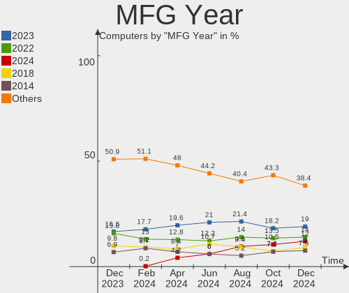
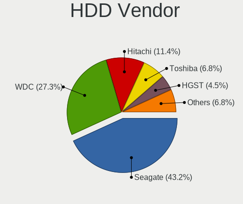
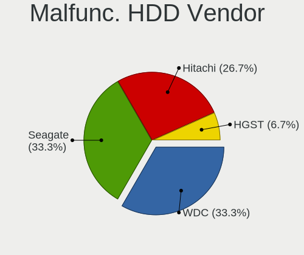
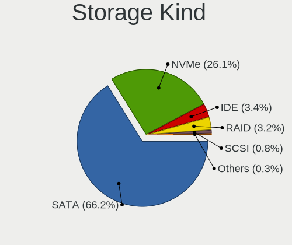
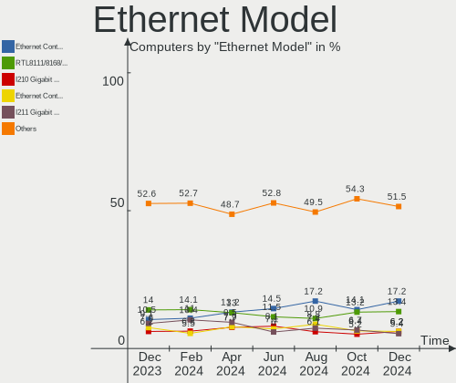
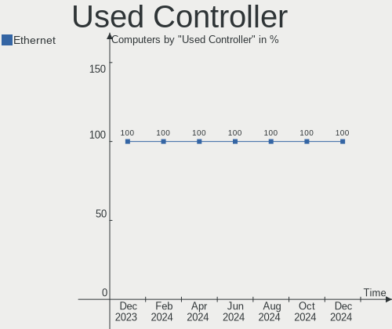

OPNsense - Hardware Trends
--------------------------

A project to identify most popular hardware characteristics and track their change
over time based on data collected by BSD users at https://BSD-Hardware.info.

Anyone can contribute to this report by the [hw-probe](https://github.com/linuxhw/hw-probe/blob/master/INSTALL.BSD.md) tool:

    hw-probe -all -upload

This report is for one last month. Overall report since the beginning of time: [TestCoverage](https://github.com/bsdhw/TestCoverage)

Period: Jan, 2023.

Contents
--------

* [ System ](#system)
  - [ OS                       ](#os)
  - [ OS Family                ](#os-family)
  - [ Arch                     ](#arch)
  - [ DE                       ](#de)
  - [ Display Server           ](#display-server)
  - [ Display Manager          ](#display-manager)
  - [ OS Lang                  ](#os-lang)
  - [ Boot Mode                ](#boot-mode)
  - [ Filesystem               ](#filesystem)
  - [ Part. scheme             ](#part-scheme)

* [ Board ](#board)
  - [ Vendor                   ](#vendor)
  - [ Model                    ](#model)
  - [ Model Family             ](#model-family)
  - [ MFG Year                 ](#mfg-year)
  - [ Form Factor              ](#form-factor)
  - [ Coreboot                 ](#coreboot)
  - [ RAM Size                 ](#ram-size)
  - [ RAM Used                 ](#ram-used)
  - [ Total Drives             ](#total-drives)
  - [ Has CD-ROM               ](#has-cd-rom)
  - [ Has Ethernet             ](#has-ethernet)
  - [ Has WiFi                 ](#has-wifi)
  - [ Has Bluetooth            ](#has-bluetooth)

* [ Location ](#location)
  - [ Country                  ](#country)
  - [ City                     ](#city)

* [ Drives ](#drives)
  - [ Drive Vendor             ](#drive-vendor)
  - [ Drive Model              ](#drive-model)
  - [ HDD Vendor               ](#hdd-vendor)
  - [ SSD Vendor               ](#ssd-vendor)
  - [ Drive Kind               ](#drive-kind)
  - [ Drive Connector          ](#drive-connector)
  - [ Drive Size               ](#drive-size)
  - [ Space Total              ](#space-total)
  - [ Space Used               ](#space-used)
  - [ Malfunc. Drives          ](#malfunc-drives)
  - [ Malfunc. Drive Vendor    ](#malfunc-drive-vendor)
  - [ Malfunc. HDD Vendor      ](#malfunc-hdd-vendor)
  - [ Malfunc. Drive Kind      ](#malfunc-drive-kind)
  - [ Failed Drives            ](#failed-drives)
  - [ Failed Drive Vendor      ](#failed-drive-vendor)
  - [ Drive Status             ](#drive-status)

* [ Storage controller ](#storage-controller)
  - [ Storage Vendor           ](#storage-vendor)
  - [ Storage Model            ](#storage-model)
  - [ Storage Kind             ](#storage-kind)

* [ Processor ](#processor)
  - [ CPU Vendor               ](#cpu-vendor)
  - [ CPU Model                ](#cpu-model)
  - [ CPU Model Family         ](#cpu-model-family)
  - [ CPU Cores                ](#cpu-cores)
  - [ CPU Sockets              ](#cpu-sockets)
  - [ CPU Threads              ](#cpu-threads)
  - [ CPU Microarch            ](#cpu-microarch)

* [ Graphics ](#graphics)
  - [ GPU Vendor               ](#gpu-vendor)
  - [ GPU Model                ](#gpu-model)
  - [ GPU Combo                ](#gpu-combo)
  - [ GPU Driver               ](#gpu-driver)
  - [ GPU Memory               ](#gpu-memory)

* [ Monitor ](#monitor)
  - [ Monitor Vendor           ](#monitor-vendor)
  - [ Monitor Model            ](#monitor-model)
  - [ Monitor Resolution       ](#monitor-resolution)
  - [ Monitor Diagonal         ](#monitor-diagonal)
  - [ Monitor Width            ](#monitor-width)
  - [ Aspect Ratio             ](#aspect-ratio)
  - [ Monitor Area             ](#monitor-area)
  - [ Pixel Density            ](#pixel-density)
  - [ Multiple Monitors        ](#multiple-monitors)

* [ Network ](#network)
  - [ Net Controller Vendor    ](#net-controller-vendor)
  - [ Net Controller Model     ](#net-controller-model)
  - [ Wireless Vendor          ](#wireless-vendor)
  - [ Wireless Model           ](#wireless-model)
  - [ Ethernet Vendor          ](#ethernet-vendor)
  - [ Ethernet Model           ](#ethernet-model)
  - [ Net Controller Kind      ](#net-controller-kind)
  - [ Used Controller          ](#used-controller)
  - [ NICs                     ](#nics)
  - [ IPv6                     ](#ipv6)

* [ Bluetooth ](#bluetooth)
  - [ Bluetooth Vendor         ](#bluetooth-vendor)
  - [ Bluetooth Model          ](#bluetooth-model)

* [ Sound ](#sound)
  - [ Sound Vendor             ](#sound-vendor)
  - [ Sound Model              ](#sound-model)

* [ Memory ](#memory)
  - [ Memory Vendor            ](#memory-vendor)
  - [ Memory Model             ](#memory-model)
  - [ Memory Kind              ](#memory-kind)
  - [ Memory Form Factor       ](#memory-form-factor)
  - [ Memory Size              ](#memory-size)
  - [ Memory Speed             ](#memory-speed)

* [ Printers & scanners ](#printers--scanners)
  - [ Printer Vendor           ](#printer-vendor)
  - [ Printer Model            ](#printer-model)
  - [ Scanner Vendor           ](#scanner-vendor)
  - [ Scanner Model            ](#scanner-model)

* [ Camera ](#camera)
  - [ Camera Vendor            ](#camera-vendor)
  - [ Camera Model             ](#camera-model)

* [ Security ](#security)
  - [ Fingerprint Vendor       ](#fingerprint-vendor)
  - [ Fingerprint Model        ](#fingerprint-model)
  - [ Chipcard Vendor          ](#chipcard-vendor)
  - [ Chipcard Model           ](#chipcard-model)

* [ Unsupported ](#unsupported)
  - [ Unsupported Devices      ](#unsupported-devices)
  - [ Unsupported Device Types ](#unsupported-device-types)

System
------

OS
--

Installed operating systems

| Name             | Computers | Percent |
|------------------|-----------|---------|
| OPNsense 22.7.10 | 169       | 50.9%   |
| OPNsense 22.7.11 | 80        | 24.1%   |
| OPNsense 23.1    | 60        | 18.07%  |
| OPNsense 22.1.10 | 8         | 2.41%   |
| OPNsense 22.10   | 6         | 1.81%   |
| OPNsense 21.7.8  | 2         | 0.6%    |
| OPNsense 23.7    | 1         | 0.3%    |
| OPNsense 22.7.9  | 1         | 0.3%    |
| OPNsense 22.7.8  | 1         | 0.3%    |
| OPNsense 22.7.5  | 1         | 0.3%    |
| OPNsense 22.7.2  | 1         | 0.3%    |
| OPNsense 22.7    | 1         | 0.3%    |
| OPNsense 21.1.9  | 1         | 0.3%    |

OS Family
---------

OS without a version

| Name     | Computers | Percent |
|----------|-----------|---------|
| OPNsense | 332       | 100%    |

Arch
----

OS architecture (x86_64, i586, etc.)

| Name  | Computers | Percent |
|-------|-----------|---------|
| amd64 | 332       | 100%    |

DE
--

Desktop Environment

| Name    | Computers | Percent |
|---------|-----------|---------|
| Console | 332       | 100%    |

Display Server
--------------

X11 or Wayland

| Name    | Computers | Percent |
|---------|-----------|---------|
| Console | 332       | 100%    |

Display Manager
---------------

SDDM, LightDM, etc.

| Name    | Computers | Percent |
|---------|-----------|---------|
| Console | 332       | 100%    |

OS Lang
-------

Language

| Lang    | Computers | Percent |
|---------|-----------|---------|
| Unknown | 326       | 98.19%  |
| C       | 6         | 1.81%   |

Boot Mode
---------

EFI or BIOS

| Mode | Computers | Percent |
|------|-----------|---------|
| EFI  | 321       | 96.69%  |
| BIOS | 11        | 3.31%   |

Filesystem
----------

Type of filesystem

| Type | Computers | Percent |
|------|-----------|---------|
| Ufs  | 211       | 63.55%  |
| Zfs  | 121       | 36.45%  |

Part. scheme
------------

Scheme of partitioning

| Type    | Computers | Percent |
|---------|-----------|---------|
| GPT     | 323       | 97.29%  |
| Unknown | 5         | 1.51%   |
| MBR     | 4         | 1.2%    |

Board
-----

Vendor
------

Motherboard manufacturer

| Name                                 | Computers | Percent |
|--------------------------------------|-----------|---------|
| Unknown                              | 48        | 14.46%  |
| Dell                                 | 40        | 12.05%  |
| Hewlett-Packard                      | 31        | 9.34%   |
| Techvision                           | 18        | 5.42%   |
| ASUSTek Computer                     | 16        | 4.82%   |
| Supermicro                           | 15        | 4.52%   |
| Intel                                | 14        | 4.22%   |
| AMI                                  | 13        | 3.92%   |
| Protectli                            | 12        | 3.61%   |
| Lenovo                               | 11        | 3.31%   |
| Gigabyte Technology                  | 11        | 3.31%   |
| PC Engines                           | 9         | 2.71%   |
| ASRock                               | 9         | 2.71%   |
| Sophos                               | 7         | 2.11%   |
| Fujitsu                              | 7         | 2.11%   |
| Deciso                               | 7         | 2.11%   |
| CncTion                              | 7         | 2.11%   |
| ZOTAC                                | 6         | 1.81%   |
| MSI                                  | 6         | 1.81%   |
| MW                                   | 4         | 1.2%    |
| Biostar                              | 4         | 1.2%    |
| Datto                                | 3         | 0.9%    |
| TYAN Computer                        | 2         | 0.6%    |
| ShenZhen MinWin Technology           | 2         | 0.6%    |
| BESSTAR Tech                         | 2         | 0.6%    |
| AZW                                  | 2         | 0.6%    |
| AMD                                  | 2         | 0.6%    |
| Acer                                 | 2         | 0.6%    |
| YANYU                                | 1         | 0.3%    |
| Wortmann AG                          | 1         | 0.3%    |
| Winston Marriot                      | 1         | 0.3%    |
| SmbiosType2_BoardManufacturer        | 1         | 0.3%    |
| Silicom                              | 1         | 0.3%    |
| Shuttle                              | 1         | 0.3%    |
| Shenzhen Meigao Electronic Equipment | 1         | 0.3%    |
| Samsung Electronics                  | 1         | 0.3%    |
| Lanner                               | 1         | 0.3%    |
| IGEL Technology                      | 1         | 0.3%    |
| IceWhale Technology                  | 1         | 0.3%    |
| Hardkernel                           | 1         | 0.3%    |

Model
-----

Motherboard model

| Name                                | Computers | Percent |
|-------------------------------------|-----------|---------|
| Unknown                             | 49        | 14.76%  |
| Techvision TVI7309X                 | 18        | 5.42%   |
| AMI Aptio CRB                       | 9         | 2.71%   |
| Protectli FW6                       | 7         | 2.11%   |
| PC Engines APU2                     | 5         | 1.51%   |
| Fujitsu FUTRO S920                  | 5         | 1.51%   |
| CncTion N5105-4L                    | 5         | 1.51%   |
| Supermicro Super Server             | 4         | 1.2%    |
| Sophos SG                           | 4         | 1.2%    |
| MW GMLK-2_5G4L                      | 4         | 1.2%    |
| HP t620 PLUS Quad Core TC           | 4         | 1.2%    |
| Sophos UTM                          | 3         | 0.9%    |
| Protectli FW4B                      | 3         | 0.9%    |
| PC Engines apu4                     | 3         | 0.9%    |
| Intel Q3XXG4-P V1.0                 | 3         | 0.9%    |
| HP t730 Thin Client                 | 3         | 0.9%    |
| HP EliteDesk 800 G3 SFF             | 3         | 0.9%    |
| Dell OptiPlex 7050                  | 3         | 0.9%    |
| Dell OptiPlex 7020                  | 3         | 0.9%    |
| Dell OptiPlex 3020                  | 3         | 0.9%    |
| Deciso NetBoard-A10                 | 3         | 0.9%    |
| AMI SG                              | 3         | 0.9%    |
| ZOTAC ZBOX-CI323NANO                | 2         | 0.6%    |
| Supermicro X9SCL/X9SCM              | 2         | 0.6%    |
| Supermicro X10SLL-F                 | 2         | 0.6%    |
| Intel SKYBAY                        | 2         | 0.6%    |
| HP ProDesk 400 G5 SFF               | 2         | 0.6%    |
| HP ProDesk 400 G4 MT                | 2         | 0.6%    |
| HP EliteDesk 800 G1 SFF             | 2         | 0.6%    |
| Dell Wyse 5070 Extended Thin Client | 2         | 0.6%    |
| Dell OptiPlex 7040                  | 2         | 0.6%    |
| Dell OptiPlex 7010                  | 2         | 0.6%    |
| Deciso Netboard A20                 | 2         | 0.6%    |
| Datto 1000                          | 2         | 0.6%    |
| CncTion J4125-4L-I225               | 2         | 0.6%    |
| ASUS ROG STRIX B450-F GAMING        | 2         | 0.6%    |
| ZOTAC ZBOX-ID92/ZBOX-IQ01           | 1         | 0.3%    |
| ZOTAC ZBOX-CI329NANO                | 1         | 0.3%    |
| ZOTAC ZBOX-CI325NANO                | 1         | 0.3%    |
| ZOTAC ZBOX-CI321NANO                | 1         | 0.3%    |

Model Family
------------

Motherboard model prefix

| Name                  | Computers | Percent |
|-----------------------|-----------|---------|
| Unknown               | 49        | 14.76%  |
| Dell OptiPlex         | 23        | 6.93%   |
| Techvision TVI7309X   | 18        | 5.42%   |
| HP EliteDesk          | 9         | 2.71%   |
| AMI Aptio             | 9         | 2.71%   |
| Dell PowerEdge        | 8         | 2.41%   |
| Protectli FW6         | 7         | 2.11%   |
| Lenovo ThinkCentre    | 7         | 2.11%   |
| HP ProDesk            | 6         | 1.81%   |
| Fujitsu FUTRO         | 6         | 1.81%   |
| PC Engines APU2       | 5         | 1.51%   |
| HP t620               | 5         | 1.51%   |
| CncTion N5105-4L      | 5         | 1.51%   |
| ASUS PRIME            | 5         | 1.51%   |
| Supermicro Super      | 4         | 1.2%    |
| Sophos SG             | 4         | 1.2%    |
| MW GMLK-2             | 4         | 1.2%    |
| ASUS ROG              | 4         | 1.2%    |
| Sophos UTM            | 3         | 0.9%    |
| Protectli FW4B        | 3         | 0.9%    |
| PC Engines apu4       | 3         | 0.9%    |
| Intel Q3XXG4-P        | 3         | 0.9%    |
| HP t730               | 3         | 0.9%    |
| HP ProLiant           | 3         | 0.9%    |
| Dell Wyse             | 3         | 0.9%    |
| Deciso NetBoard-A10   | 3         | 0.9%    |
| AMI SG                | 3         | 0.9%    |
| ZOTAC ZBOX-CI323NANO  | 2         | 0.6%    |
| Supermicro X9SCL      | 2         | 0.6%    |
| Supermicro X10SLL-F   | 2         | 0.6%    |
| Intel SKYBAY          | 2         | 0.6%    |
| HP Compaq             | 2         | 0.6%    |
| Dell Vostro           | 2         | 0.6%    |
| Dell Inspiron         | 2         | 0.6%    |
| Deciso Netboard       | 2         | 0.6%    |
| Datto 1000            | 2         | 0.6%    |
| CncTion J4125-4L-I225 | 2         | 0.6%    |
| Acer Aspire           | 2         | 0.6%    |
| ZOTAC ZBOX-ID92       | 1         | 0.3%    |
| ZOTAC ZBOX-CI329NANO  | 1         | 0.3%    |

MFG Year
--------

Motherboard manufacture year

| Year | Computers | Percent |
|------|-----------|---------|
| 2022 | 82        | 24.7%   |
| 2018 | 41        | 12.35%  |
| 2014 | 33        | 9.94%   |
| 2021 | 30        | 9.04%   |
| 2019 | 27        | 8.13%   |
| 2017 | 19        | 5.72%   |
| 2016 | 19        | 5.72%   |
| 2020 | 16        | 4.82%   |
| 2015 | 16        | 4.82%   |
| 2013 | 14        | 4.22%   |
| 2012 | 14        | 4.22%   |
| 2011 | 7         | 2.11%   |
| 2010 | 6         | 1.81%   |
| 2008 | 6         | 1.81%   |
| 2023 | 1         | 0.3%    |
| 2009 | 1         | 0.3%    |

Form Factor
-----------

Physical design of the computer

| Name       | Computers | Percent |
|------------|-----------|---------|
| Desktop    | 250       | 75.3%   |
| Mini pc    | 34        | 10.24%  |
| Server     | 21        | 6.33%   |
| Notebook   | 19        | 5.72%   |
| Firewall   | 7         | 2.11%   |
| All in one | 1         | 0.3%    |

Coreboot
--------

Have coreboot on board

| Used | Computers | Percent |
|------|-----------|---------|
| No   | 321       | 96.69%  |
| Yes  | 11        | 3.31%   |

RAM Size
--------

Total RAM memory

| Size in GB  | Computers | Percent |
|-------------|-----------|---------|
| 8.01-16.0   | 148       | 44.58%  |
| 16.01-24.0  | 81        | 24.4%   |
| 4.01-8.0    | 59        | 17.77%  |
| 32.01-64.0  | 29        | 8.73%   |
| 64.01-256.0 | 8         | 2.41%   |
| 2.01-3.0    | 5         | 1.51%   |
| 24.01-32.0  | 2         | 0.6%    |

RAM Used
--------

Used RAM memory

| Used GB   | Computers | Percent |
|-----------|-----------|---------|
| 0.01-0.5  | 180       | 54.22%  |
| 0.51-1.0  | 102       | 30.72%  |
| 1.01-2.0  | 42        | 12.65%  |
| 2.01-3.0  | 4         | 1.2%    |
| 3.01-4.0  | 2         | 0.6%    |
| 4.01-8.0  | 1         | 0.3%    |
| 8.01-16.0 | 1         | 0.3%    |

Total Drives
------------

Number of drives on board

| Drives | Computers | Percent |
|--------|-----------|---------|
| 1      | 273       | 82.23%  |
| 0      | 34        | 10.24%  |
| 2      | 21        | 6.33%   |
| 3      | 3         | 0.9%    |
| 5      | 1         | 0.3%    |

Has CD-ROM
----------

Has CD-ROM on board

| Presented | Computers | Percent |
|-----------|-----------|---------|
| No        | 298       | 89.76%  |
| Yes       | 34        | 10.24%  |

Has Ethernet
------------

Has Ethernet on board

| Presented | Computers | Percent |
|-----------|-----------|---------|
| Yes       | 332       | 100%    |

Has WiFi
--------

Has WiFi module

| Presented | Computers | Percent |
|-----------|-----------|---------|
| No        | 270       | 81.33%  |
| Yes       | 62        | 18.67%  |

Has Bluetooth
-------------

Has Bluetooth module

| Presented | Computers | Percent |
|-----------|-----------|---------|
| No        | 305       | 91.87%  |
| Yes       | 27        | 8.13%   |

Location
--------

Country
-------

Geographic location (country)

| Country      | Computers | Percent |
|--------------|-----------|---------|
| USA          | 111       | 33.43%  |
| Germany      | 57        | 17.17%  |
| Canada       | 17        | 5.12%   |
| UK           | 15        | 4.52%   |
| Russia       | 10        | 3.01%   |
| Sweden       | 9         | 2.71%   |
| Poland       | 9         | 2.71%   |
| Netherlands  | 9         | 2.71%   |
| Austria      | 8         | 2.41%   |
| Switzerland  | 7         | 2.11%   |
| Spain        | 7         | 2.11%   |
| France       | 7         | 2.11%   |
| Australia    | 7         | 2.11%   |
| Brazil       | 6         | 1.81%   |
| Italy        | 5         | 1.51%   |
| South Korea  | 4         | 1.2%    |
| Romania      | 4         | 1.2%    |
| Norway       | 4         | 1.2%    |
| Bulgaria     | 4         | 1.2%    |
| Hungary      | 3         | 0.9%    |
| Finland      | 3         | 0.9%    |
| Taiwan       | 2         | 0.6%    |
| Philippines  | 2         | 0.6%    |
| Luxembourg   | 2         | 0.6%    |
| Israel       | 2         | 0.6%    |
| Isle of Man  | 2         | 0.6%    |
| Denmark      | 2         | 0.6%    |
| Czechia      | 2         | 0.6%    |
| Belgium      | 2         | 0.6%    |
| Ukraine      | 1         | 0.3%    |
| South Africa | 1         | 0.3%    |
| Slovakia     | 1         | 0.3%    |
| Peru         | 1         | 0.3%    |
| New Zealand  | 1         | 0.3%    |
| Lithuania    | 1         | 0.3%    |
| Hong Kong    | 1         | 0.3%    |
| Croatia      | 1         | 0.3%    |
| Costa Rica   | 1         | 0.3%    |
| Bolivia      | 1         | 0.3%    |

City
----

Geographic location (city)

| City             | Computers | Percent |
|------------------|-----------|---------|
| London           | 5         | 1.51%   |
| Hamburg          | 5         | 1.51%   |
| Austin           | 5         | 1.51%   |
| Vienna           | 4         | 1.2%    |
| Seattle          | 4         | 1.2%    |
| Moscow           | 4         | 1.2%    |
| Warsaw           | 3         | 0.9%    |
| Sydney           | 3         | 0.9%    |
| Chandler         | 3         | 0.9%    |
| Calgary          | 3         | 0.9%    |
| Bucharest        | 3         | 0.9%    |
| Borken           | 3         | 0.9%    |
| Amsterdam        | 3         | 0.9%    |
| Zurich           | 2         | 0.6%    |
| Stockholm        | 2         | 0.6%    |
| St Petersburg    | 2         | 0.6%    |
| Saratoga Springs | 2         | 0.6%    |
| San Mateo        | 2         | 0.6%    |
| Pullman          | 2         | 0.6%    |
| Prior Lake       | 2         | 0.6%    |
| Portland         | 2         | 0.6%    |
| Oslo             | 2         | 0.6%    |
| Örebro          | 2         | 0.6%    |
| Munich           | 2         | 0.6%    |
| Mainz            | 2         | 0.6%    |
| Madrid           | 2         | 0.6%    |
| Luxembourg       | 2         | 0.6%    |
| Houston          | 2         | 0.6%    |
| Heemskerk        | 2         | 0.6%    |
| Daly City        | 2         | 0.6%    |
| Copenhagen       | 2         | 0.6%    |
| Brisbane         | 2         | 0.6%    |
| Berlin           | 2         | 0.6%    |
| Bayonne          | 2         | 0.6%    |
| Yekaterinburg    | 1         | 0.3%    |
| Wyoming          | 1         | 0.3%    |
| Wuppertal        | 1         | 0.3%    |
| Wrightstown      | 1         | 0.3%    |
| Woodbridge       | 1         | 0.3%    |
| Woking           | 1         | 0.3%    |

Drives
------

Drive Vendor
------------

Hard drive vendors

| Vendor              | Computers | Drives | Percent |
|---------------------|-----------|--------|---------|
| Samsung Electronics | 41        | 43     | 13.1%   |
| Kingston            | 29        | 31     | 9.27%   |
| WDC                 | 26        | 28     | 8.31%   |
| Transcend           | 22        | 23     | 7.03%   |
| SanDisk             | 16        | 16     | 5.11%   |
| Intel               | 14        | 14     | 4.47%   |
| Crucial             | 12        | 13     | 3.83%   |
| China               | 10        | 10     | 3.19%   |
| Seagate             | 9         | 11     | 2.88%   |
| Hoodisk             | 9         | 9      | 2.88%   |
| Toshiba             | 7         | 7      | 2.24%   |
| A-DATA Technology   | 7         | 7      | 2.24%   |
| SK hynix            | 6         | 6      | 1.92%   |
| Hitachi             | 6         | 6      | 1.92%   |
| Team                | 5         | 5      | 1.6%    |
| SPCC                | 5         | 5      | 1.6%    |
| PNY                 | 5         | 6      | 1.6%    |
| Phison              | 5         | 6      | 1.6%    |
| Micron Technology   | 5         | 5      | 1.6%    |
| Fanxiang            | 5         | 5      | 1.6%    |
| Silicon Motion      | 4         | 4      | 1.28%   |
| Patriot             | 4         | 4      | 1.28%   |
| OCZ                 | 4         | 4      | 1.28%   |
| LITEON              | 4         | 4      | 1.28%   |
| Protectli           | 3         | 3      | 0.96%   |
| Innodisk            | 3         | 3      | 0.96%   |
| Timetec             | 2         | 2      | 0.64%   |
| Kston               | 2         | 2      | 0.64%   |
| Intenso             | 2         | 2      | 0.64%   |
| Hewlett-Packard     | 2         | 2      | 0.64%   |
| GOODRAM             | 2         | 2      | 0.64%   |
| Gigabyte Technology | 2         | 2      | 0.64%   |
| FORESEE             | 2         | 2      | 0.64%   |
| Dogfish             | 2         | 2      | 0.64%   |
| BR                  | 2         | 2      | 0.64%   |
| BORY                | 2         | 2      | 0.64%   |
| BIWIN               | 2         | 2      | 0.64%   |
| Apacer              | 2         | 2      | 0.64%   |
| YMTC                | 1         | 1      | 0.32%   |
| XrayDisk            | 1         | 1      | 0.32%   |

Drive Model
-----------

Hard drive models

| Model                            | Computers | Percent |
|----------------------------------|-----------|---------|
| Samsung SSD 850 EVO 250GB        | 5         | 1.57%   |
| Hoodisk SSD 64GB                 | 5         | 1.57%   |
| Transcend TS64GSSD370 64GB       | 4         | 1.26%   |
| Transcend TS256GMTS952T2 256GB   | 4         | 1.26%   |
| Samsung SSD 980 500GB            | 4         | 1.26%   |
| Phison Sabrent 2TB               | 4         | 1.26%   |
| China SATA SSD 16GB              | 4         | 1.26%   |
| SanDisk SSD PLUS 240GB           | 3         | 0.94%   |
| PNY CS900 120GB SSD              | 3         | 0.94%   |
| Kingston SUV500MS120G 120GB      | 3         | 0.94%   |
| Kingston SUV400S37120G 120GB     | 3         | 0.94%   |
| Innodisk DEMSR- 08GB mSATA 3ME3  | 3         | 0.94%   |
| Hoodisk SSD 128GB                | 3         | 0.94%   |
| China SATA SSD 64GB              | 3         | 0.94%   |
| WDC WDBNCE5000PNC 500GB          | 2         | 0.63%   |
| Transcend TS64GMSA370 64GB       | 2         | 0.63%   |
| Transcend TS128GMTE110S 128GB    | 2         | 0.63%   |
| Team T253512GB                   | 2         | 0.63%   |
| SPCC Solid State Disk 128GB      | 2         | 0.63%   |
| SK hynix SC311 SATA 256GB        | 2         | 0.63%   |
| Silicon Motion GV128 128GB       | 2         | 0.63%   |
| Seagate ST500DM002-1BD142 500GB  | 2         | 0.63%   |
| SanDisk SDSSDP128G 128GB         | 2         | 0.63%   |
| Samsung SSD 980 250GB            | 2         | 0.63%   |
| Samsung SSD 860 EVO 500GB        | 2         | 0.63%   |
| Samsung SSD 840 EVO 120GB        | 2         | 0.63%   |
| Samsung MZ7LN128HCHP-000H1 128GB | 2         | 0.63%   |
| Protectli 240GB mSATA            | 2         | 0.63%   |
| Patriot M.2 P300 256GB           | 2         | 0.63%   |
| Kingston SNVS250G 250GB          | 2         | 0.63%   |
| Kingston SMS200S3120G 120GB      | 2         | 0.63%   |
| Kingston SM2280S3120G 120GB      | 2         | 0.63%   |
| Kingston SKC600MS512G 512GB      | 2         | 0.63%   |
| Kingston SKC600MS256G 256GB      | 2         | 0.63%   |
| Kingston SA400S37240G 240GB      | 2         | 0.63%   |
| Fanxiang S501 128GB              | 2         | 0.63%   |
| Fanxiang S500PRO 256GB           | 2         | 0.63%   |
| Crucial CT250P2SSD8 250GB        | 2         | 0.63%   |
| BORY M500 128G                   | 2         | 0.63%   |
| BIWIN SSD 128GB                  | 2         | 0.63%   |

HDD Vendor
----------

Hard disk drive vendors

| Vendor              | Computers | Drives | Percent |
|---------------------|-----------|--------|---------|
| WDC                 | 16        | 18     | 44.44%  |
| Seagate             | 9         | 11     | 25%     |
| Hitachi             | 6         | 6      | 16.67%  |
| Toshiba             | 3         | 3      | 8.33%   |
| Samsung Electronics | 1         | 1      | 2.78%   |
| HGST                | 1         | 4      | 2.78%   |

SSD Vendor
----------

Solid state drive vendors

| Vendor              | Computers | Drives | Percent |
|---------------------|-----------|--------|---------|
| Samsung Electronics | 24        | 26     | 11.37%  |
| Kingston            | 24        | 26     | 11.37%  |
| Transcend           | 19        | 20     | 9%      |
| SanDisk             | 16        | 16     | 7.58%   |
| Intel               | 12        | 12     | 5.69%   |
| China               | 10        | 10     | 4.74%   |
| Hoodisk             | 9         | 9      | 4.27%   |
| Crucial             | 9         | 9      | 4.27%   |
| A-DATA Technology   | 7         | 7      | 3.32%   |
| WDC                 | 5         | 5      | 2.37%   |
| Team                | 5         | 5      | 2.37%   |
| PNY                 | 5         | 6      | 2.37%   |
| Micron Technology   | 5         | 5      | 2.37%   |
| SK hynix            | 4         | 4      | 1.9%    |
| OCZ                 | 4         | 4      | 1.9%    |
| SPCC                | 3         | 3      | 1.42%   |
| Protectli           | 3         | 3      | 1.42%   |
| LITEON              | 3         | 3      | 1.42%   |
| Innodisk            | 3         | 3      | 1.42%   |
| Toshiba             | 2         | 2      | 0.95%   |
| Timetec             | 2         | 2      | 0.95%   |
| Kston               | 2         | 2      | 0.95%   |
| Intenso             | 2         | 2      | 0.95%   |
| Hewlett-Packard     | 2         | 2      | 0.95%   |
| GOODRAM             | 2         | 2      | 0.95%   |
| FORESEE             | 2         | 2      | 0.95%   |
| Dogfish             | 2         | 2      | 0.95%   |
| BORY                | 2         | 2      | 0.95%   |
| BIWIN               | 2         | 2      | 0.95%   |
| Apacer              | 2         | 2      | 0.95%   |
| Vaseky              | 1         | 1      | 0.47%   |
| Smartbuy            | 1         | 1      | 0.47%   |
| SATADOM             | 1         | 1      | 0.47%   |
| Ramsta              | 1         | 1      | 0.47%   |
| Patriot             | 1         | 1      | 0.47%   |
| ORTIAL              | 1         | 1      | 0.47%   |
| Netac               | 1         | 1      | 0.47%   |
| LITEONIT            | 1         | 1      | 0.47%   |
| Lenovo              | 1         | 1      | 0.47%   |
| KingSpec            | 1         | 1      | 0.47%   |

Drive Kind
----------

HDD or SSD

| Kind | Computers | Drives | Percent |
|------|-----------|--------|---------|
| SSD  | 204       | 217    | 66.89%  |
| NVMe | 66        | 68     | 21.64%  |
| HDD  | 35        | 43     | 11.48%  |

Drive Connector
---------------

SATA, SAS, NVMe, etc.

| Type | Computers | Drives | Percent |
|------|-----------|--------|---------|
| SATA | 234       | 260    | 78%     |
| NVMe | 66        | 68     | 22%     |

Drive Size
----------

Size of hard drive

| Size in TB | Computers | Drives | Percent |
|------------|-----------|--------|---------|
| 0.01-0.5   | 218       | 235    | 91.21%  |
| 0.51-1.0   | 14        | 15     | 5.86%   |
| 1.01-2.0   | 3         | 3      | 1.26%   |
| 3.01-4.0   | 1         | 1      | 0.42%   |
| 2.01-3.0   | 1         | 1      | 0.42%   |
| 10.01-20.0 | 1         | 1      | 0.42%   |
| 4.01-10.0  | 1         | 4      | 0.42%   |

Space Total
-----------

Amount of disk space available on the file system

| Size in GB     | Computers | Percent |
|----------------|-----------|---------|
| 101-250        | 184       | 55.42%  |
| 251-500        | 52        | 15.66%  |
| 51-100         | 38        | 11.45%  |
| 21-50          | 27        | 8.13%   |
| 1-20           | 18        | 5.42%   |
| 501-1000       | 7         | 2.11%   |
| 1001-2000      | 5         | 1.51%   |
| More than 3000 | 1         | 0.3%    |

Space Used
----------

Amount of used disk space

| Used GB | Computers | Percent |
|---------|-----------|---------|
| 1-20    | 322       | 96.99%  |
| 21-50   | 9         | 2.71%   |
| 51-100  | 1         | 0.3%    |

Malfunc. Drives
---------------

Drive models with a malfunction

| Model                                        | Computers | Drives | Percent |
|----------------------------------------------|-----------|--------|---------|
| Kingston SMS200S3120G 120GB                  | 2         | 2      | 6.9%    |
| WDC WDS240G2G0A-00JH30 240GB                 | 1         | 1      | 3.45%   |
| WDC WD6400AAKS-22A7B2 640GB                  | 1         | 1      | 3.45%   |
| WDC WD3200AAKX-001CA0 320GB                  | 1         | 1      | 3.45%   |
| WDC WD2001FASS-00W2B0 2TB                    | 1         | 1      | 3.45%   |
| WDC WD1600AAJS-00YZCA0 160GB                 | 1         | 1      | 3.45%   |
| WDC WD1600AABS-00PRA0 160GB                  | 1         | 1      | 3.45%   |
| WDC WD10EAVS-00D7B0 1TB                      | 1         | 1      | 3.45%   |
| Toshiba MQ01ABD100 1TB                       | 1         | 1      | 3.45%   |
| SK hynix SC210 2.5 7MM 256GB                 | 1         | 1      | 3.45%   |
| Seagate ST250DM000-1BD141 250GB              | 1         | 1      | 3.45%   |
| Seagate ST2000LM015-2E8174 2TB               | 1         | 1      | 3.45%   |
| SanDisk SSD PLUS 240GB                       | 1         | 1      | 3.45%   |
| SanDisk SD8TB8U-256G-1006 256GB              | 1         | 1      | 3.45%   |
| SanDisk SD8TB8U-128G-1006 128GB              | 1         | 1      | 3.45%   |
| Samsung Electronics SSD 840 PRO Series 256GB | 1         | 1      | 3.45%   |
| Samsung Electronics HM160HI 160GB            | 1         | 1      | 3.45%   |
| LITEONIT LCT-128M3S 128GB                    | 1         | 1      | 3.45%   |
| Kingston SNS4151S332GD 32GB                  | 1         | 1      | 3.45%   |
| Intel SSDSC2CT060A3 64GB                     | 1         | 1      | 3.45%   |
| Intel SSDSC2BW120H6 120GB                    | 1         | 1      | 3.45%   |
| Intel SSDPEKKW128G7 128GB                    | 1         | 1      | 3.45%   |
| HP Phison PSSBN016GA27MC0 16GB               | 1         | 1      | 3.45%   |
| Hitachi HTS725050A9A364 500GB                | 1         | 1      | 3.45%   |
| Hitachi HTS545050B9A300 500GB                | 1         | 1      | 3.45%   |
| Hitachi HDS722580VLSA80 82GB                 | 1         | 1      | 3.45%   |
| Crucial CT128MX100SSD1 128GB                 | 1         | 1      | 3.45%   |
| A-DATA Technology SU800 128GB                | 1         | 1      | 3.45%   |

Malfunc. Drive Vendor
---------------------

Vendors of faulty drives

| Vendor              | Computers | Drives | Percent |
|---------------------|-----------|--------|---------|
| WDC                 | 7         | 7      | 24.14%  |
| SanDisk             | 3         | 3      | 10.34%  |
| Kingston            | 3         | 3      | 10.34%  |
| Intel               | 3         | 3      | 10.34%  |
| Hitachi             | 3         | 3      | 10.34%  |
| Seagate             | 2         | 2      | 6.9%    |
| Samsung Electronics | 2         | 2      | 6.9%    |
| Toshiba             | 1         | 1      | 3.45%   |
| SK hynix            | 1         | 1      | 3.45%   |
| LITEONIT            | 1         | 1      | 3.45%   |
| HP Phison           | 1         | 1      | 3.45%   |
| Crucial             | 1         | 1      | 3.45%   |
| A-DATA Technology   | 1         | 1      | 3.45%   |

Malfunc. HDD Vendor
-------------------

Vendors of faulty HDD drives

| Vendor              | Computers | Drives | Percent |
|---------------------|-----------|--------|---------|
| WDC                 | 6         | 6      | 46.15%  |
| Hitachi             | 3         | 3      | 23.08%  |
| Seagate             | 2         | 2      | 15.38%  |
| Toshiba             | 1         | 1      | 7.69%   |
| Samsung Electronics | 1         | 1      | 7.69%   |

Malfunc. Drive Kind
-------------------

Kinds of faulty drives

| Kind | Computers | Drives | Percent |
|------|-----------|--------|---------|
| SSD  | 15        | 15     | 51.72%  |
| HDD  | 13        | 13     | 44.83%  |
| NVMe | 1         | 1      | 3.45%   |

Failed Drives
-------------

Failed drive models

| Model                                      | Computers | Drives | Percent |
|--------------------------------------------|-----------|--------|---------|
| WDC PC SN530 SDBPMPZ-256G-1101 256GB       | 1         | 1      | 33.33%  |
| Samsung Electronics SSD 980 250GB          | 1         | 1      | 33.33%  |
| Samsung Electronics SSD 970 EVO Plus 500GB | 1         | 1      | 33.33%  |

Failed Drive Vendor
-------------------

Failed drive vendors

| Vendor              | Computers | Drives | Percent |
|---------------------|-----------|--------|---------|
| Samsung Electronics | 2         | 2      | 66.67%  |
| WDC                 | 1         | 1      | 33.33%  |

Drive Status
------------

Number of failed and malfunc. drives

| Status   | Computers | Drives | Percent |
|----------|-----------|--------|---------|
| Works    | 267       | 291    | 88.41%  |
| Malfunc  | 29        | 29     | 9.6%    |
| Detected | 3         | 5      | 0.99%   |
| Failed   | 3         | 3      | 0.99%   |

Storage controller
------------------

Storage Vendor
--------------

Storage controller vendors

| Vendor                         | Computers | Percent |
|--------------------------------|-----------|---------|
| Intel                          | 262       | 64.85%  |
| AMD                            | 52        | 12.87%  |
| Samsung Electronics            | 16        | 3.96%   |
| Silicon Motion                 | 14        | 3.47%   |
| Broadcom / LSI                 | 10        | 2.48%   |
| SanDisk                        | 7         | 1.73%   |
| Phison Electronics             | 7         | 1.73%   |
| MAXIO Technology (Hangzhou)    | 5         | 1.24%   |
| Kingston Technology Company    | 5         | 1.24%   |
| Micron/Crucial Technology      | 4         | 0.99%   |
| Transcend                      | 3         | 0.74%   |
| ASMedia Technology             | 3         | 0.74%   |
| Toshiba                        | 2         | 0.5%    |
| SK hynix                       | 2         | 0.5%    |
| Yangtze Memory Technologies    | 1         | 0.25%   |
| Solid State Storage Technology | 1         | 0.25%   |
| Silicon Image                  | 1         | 0.25%   |
| Nvidia                         | 1         | 0.25%   |
| Micron Technology              | 1         | 0.25%   |
| Lite-On Technology             | 1         | 0.25%   |
| JMicron Technology             | 1         | 0.25%   |
| Innodisk                       | 1         | 0.25%   |
| Dell                           | 1         | 0.25%   |
| Chelsio Communications         | 1         | 0.25%   |
| Biwin Storage Technology       | 1         | 0.25%   |
| Unknown                        | 1         | 0.25%   |

Storage Model
-------------

Storage controller models

| Model                                                                            | Computers | Percent |
|----------------------------------------------------------------------------------|-----------|---------|
| Intel Jasper Lake SATA AHCI Controller                                           | 39        | 8.94%   |
| AMD FCH SATA Controller [AHCI mode]                                              | 39        | 8.94%   |
| Intel Celeron/Pentium Silver Processor SATA Controller                           | 27        | 6.19%   |
| Intel 8 Series/C220 Series Chipset Family 6-port SATA Controller 1 [AHCI mode]   | 26        | 5.96%   |
| Unknown                                                                          | 17        | 3.9%    |
| Intel Sunrise Point-LP SATA Controller [AHCI mode]                               | 15        | 3.44%   |
| Intel Atom Processor E3800 Series SATA AHCI Controller                           | 14        | 3.21%   |
| Silicon Motion SM2263EN/SM2263XT SSD Controller                                  | 13        | 2.98%   |
| Intel Q170/Q150/B150/H170/H110/Z170/CM236 Chipset SATA Controller [AHCI Mode]    | 13        | 2.98%   |
| Intel Atom/Celeron/Pentium Processor x5-E8000/J3xxx/N3xxx Series SATA Controller | 13        | 2.98%   |
| Intel 200 Series PCH SATA controller [AHCI mode]                                 | 13        | 2.98%   |
| Intel Cannon Lake PCH SATA AHCI Controller                                       | 10        | 2.29%   |
| Intel 6 Series/C200 Series Chipset Family 6 port Desktop SATA AHCI Controller    | 9         | 2.06%   |
| Samsung NVMe SSD Controller 980                                                  | 7         | 1.61%   |
| Intel SATA Controller [RAID mode]                                                | 7         | 1.61%   |
| Phison E12 NVMe Controller                                                       | 5         | 1.15%   |
| MAXIO (Hangzhou) NVMe SSD Controller MAP1202                                     | 5         | 1.15%   |
| Intel NM10/ICH7 Family SATA Controller [IDE mode]                                | 5         | 1.15%   |
| Intel Celeron N3350/Pentium N4200/Atom E3900 Series SATA AHCI Controller         | 5         | 1.15%   |
| Intel 8 Series SATA Controller 1 [AHCI mode]                                     | 5         | 1.15%   |
| Intel 7 Series Chipset Family 6-port SATA Controller [AHCI mode]                 | 5         | 1.15%   |
| AMD FCH SATA Controller [IDE mode]                                               | 5         | 1.15%   |
| AMD FCH IDE Controller                                                           | 5         | 1.15%   |
| AMD 400 Series Chipset SATA Controller                                           | 5         | 1.15%   |
| Samsung NVMe SSD Controller SM981/PM981/PM983                                    | 4         | 0.92%   |
| Micron/Crucial P2 NVMe PCIe SSD                                                  | 4         | 0.92%   |
| Intel Wildcat Point-LP SATA Controller [AHCI Mode]                               | 4         | 0.92%   |
| Intel 82801G (ICH7 Family) IDE Controller                                        | 4         | 0.92%   |
| Intel 7 Series/C210 Series Chipset Family 6-port SATA Controller [AHCI mode]     | 4         | 0.92%   |
| AMD SB7x0/SB8x0/SB9x0 SATA Controller [AHCI mode]                                | 4         | 0.92%   |
| Samsung NVMe SSD Controller SM961/PM961/SM963                                    | 3         | 0.69%   |
| Intel C600/X79 series chipset SATA RAID Controller                               | 3         | 0.69%   |
| Intel C600/X79 series chipset 6-Port SATA AHCI Controller                        | 3         | 0.69%   |
| Intel Atom Processor C3000 Series SATA Controller 0                              | 3         | 0.69%   |
| Intel Alder Lake-S PCH SATA Controller [AHCI Mode]                               | 3         | 0.69%   |
| Intel 82801HM/HEM (ICH8M/ICH8M-E) IDE Controller                                 | 3         | 0.69%   |
| Broadcom / LSI SAS2008 PCI-Express Fusion-MPT SAS-2 [Falcon]                     | 3         | 0.69%   |
| AMD FCH SATA Controller D                                                        | 3         | 0.69%   |
| SanDisk WD Blue SN570 NVMe SSD                                                   | 2         | 0.46%   |
| SanDisk WD Black SN750 / PC SN730 NVMe SSD                                       | 2         | 0.46%   |

Storage Kind
------------

Kind of storage controller (IDE, SATA, NVMe, SAS, ...)

| Kind | Computers | Percent |
|------|-----------|---------|
| SATA | 289       | 70.32%  |
| NVMe | 72        | 17.52%  |
| IDE  | 25        | 6.08%   |
| RAID | 19        | 4.62%   |
| SAS  | 3         | 0.73%   |
| SCSI | 3         | 0.73%   |

Processor
---------

CPU Vendor
----------

Processor vendors

| Vendor | Computers | Percent |
|--------|-----------|---------|
| Intel  | 273       | 82.23%  |
| AMD    | 59        | 17.77%  |

CPU Model
---------

Processor models

| Model                                     | Computers | Percent |
|-------------------------------------------|-----------|---------|
| Intel Celeron N5105 @ 2.00GHz             | 31        | 9.34%   |
| Intel Celeron J4125 CPU @ 2.00GHz         | 20        | 6.02%   |
| AMD GX-412TC SOC                          | 9         | 2.71%   |
| Intel Core i5-6500 CPU @ 3.20GHz          | 7         | 2.11%   |
| Intel Core i5-7500 CPU @ 3.40GHz          | 5         | 1.51%   |
| Intel Core i3-7100U CPU @ 2.40GHz         | 5         | 1.51%   |
| Intel Celeron N5100 @ 1.10GHz             | 5         | 1.51%   |
| Intel Celeron CPU J1900 @ 1.99GHz         | 5         | 1.51%   |
| AMD GX-415GA SOC with Radeon HD Graphics  | 5         | 1.51%   |
| Intel Pentium Silver N6005 @ 2.00GHz      | 4         | 1.2%    |
| Intel Pentium CPU N3700 @ 1.60GHz         | 4         | 1.2%    |
| Intel Celeron CPU N3160 @ 1.60GHz         | 4         | 1.2%    |
| Intel Atom CPU E3845 @ 1.91GHz            | 4         | 1.2%    |
| AMD GX-420CA SOC with Radeon HD Graphics  | 4         | 1.2%    |
| Intel Xeon CPU E3-1230 V2 @ 3.30GHz       | 3         | 0.9%    |
| Intel Pentium Silver J5005 CPU @ 1.50GHz  | 3         | 0.9%    |
| Intel Core i5-6600 CPU @ 3.30GHz          | 3         | 0.9%    |
| Intel Core i5-4590 CPU @ 3.30GHz          | 3         | 0.9%    |
| Intel Core i5-4570T CPU @ 2.90GHz         | 3         | 0.9%    |
| Intel Celeron J6413 @ 1.80GHz             | 3         | 0.9%    |
| Intel Celeron CPU J3160 @ 1.60GHz         | 3         | 0.9%    |
| Intel Atom CPU C3558 @ 2.20GHz            | 3         | 0.9%    |
| AMD Ryzen Embedded V1500B                 | 3         | 0.9%    |
| AMD RX-427BB with AMD Radeon R7 Graphics  | 3         | 0.9%    |
| AMD GX-222GC SOC with Radeon R5E Graphics | 3         | 0.9%    |
| AMD EPYC 3201 8-Core Processor            | 3         | 0.9%    |
| Intel Xeon CPU E5-2630 v3 @ 2.40GHz       | 2         | 0.6%    |
| Intel Xeon CPU E5-2620 v3 @ 2.40GHz       | 2         | 0.6%    |
| Intel Core i7-8700 CPU @ 3.20GHz          | 2         | 0.6%    |
| Intel Core i7-7500U CPU @ 2.70GHz         | 2         | 0.6%    |
| Intel Core i7-3770 CPU @ 3.40GHz          | 2         | 0.6%    |
| Intel Core i5-9500 CPU @ 3.00GHz          | 2         | 0.6%    |
| Intel Core i5-8500 CPU @ 3.00GHz          | 2         | 0.6%    |
| Intel Core i5-8400 CPU @ 2.80GHz          | 2         | 0.6%    |
| Intel Core i5-8250U CPU @ 1.60GHz         | 2         | 0.6%    |
| Intel Core i5-4570 CPU @ 3.20GHz          | 2         | 0.6%    |
| Intel Core i5-3470 CPU @ 3.20GHz          | 2         | 0.6%    |
| Intel Core i5-3320M CPU @ 2.60GHz         | 2         | 0.6%    |
| Intel Core i3-6100 CPU @ 3.70GHz          | 2         | 0.6%    |
| Intel Core i3-4170 CPU @ 3.70GHz          | 2         | 0.6%    |

CPU Model Family
----------------

Processor model prefix

| Model                   | Computers | Percent |
|-------------------------|-----------|---------|
| Intel Celeron           | 94        | 28.31%  |
| Intel Core i5           | 52        | 15.66%  |
| Intel Xeon              | 29        | 8.73%   |
| Intel Core i3           | 29        | 8.73%   |
| AMD GX                  | 24        | 7.23%   |
| Intel Atom              | 19        | 5.72%   |
| Intel Core i7           | 18        | 5.42%   |
| Other                   | 10        | 3.01%   |
| Intel Pentium           | 10        | 3.01%   |
| Intel Pentium Silver    | 8         | 2.41%   |
| AMD Ryzen 5             | 5         | 1.51%   |
| AMD EPYC                | 5         | 1.51%   |
| AMD Ryzen 7             | 4         | 1.2%    |
| Intel Core 2 Quad       | 3         | 0.9%    |
| AMD Ryzen Embedded      | 3         | 0.9%    |
| AMD A10                 | 3         | 0.9%    |
| Intel Core 2 Duo        | 2         | 0.6%    |
| AMD Ryzen 5 PRO         | 2         | 0.6%    |
| AMD Ryzen 3             | 2         | 0.6%    |
| AMD A4                  | 2         | 0.6%    |
| Intel Xeon Gold         | 1         | 0.3%    |
| Intel Pentium Dual-Core | 1         | 0.3%    |
| AMD Phenom II X4        | 1         | 0.3%    |
| AMD G                   | 1         | 0.3%    |
| AMD FX                  | 1         | 0.3%    |
| AMD E                   | 1         | 0.3%    |
| AMD Athlon II X2        | 1         | 0.3%    |
| AMD A6                  | 1         | 0.3%    |

CPU Cores
---------

Number of processor cores

| Number  | Computers | Percent |
|---------|-----------|---------|
| 4       | 194       | 58.43%  |
| 2       | 79        | 23.8%   |
| 8       | 19        | 5.72%   |
| 6       | 16        | 4.82%   |
| 16      | 9         | 2.71%   |
| 12      | 6         | 1.81%   |
| 1       | 5         | 1.51%   |
| Unknown | 2         | 0.6%    |
| 48      | 1         | 0.3%    |
| 24      | 1         | 0.3%    |

CPU Sockets
-----------

Number of sockets

| Number | Computers | Percent |
|--------|-----------|---------|
| 1      | 321       | 96.69%  |
| 2      | 11        | 3.31%   |

CPU Threads
-----------

Threads per core (Hyper-Threading)

| Number  | Computers | Percent |
|---------|-----------|---------|
| 1       | 235       | 70.78%  |
| 2       | 95        | 28.61%  |
| Unknown | 2         | 0.6%    |

CPU Microarch
-------------

Microarchitecture

| Name          | Computers | Percent |
|---------------|-----------|---------|
| Unknown       | 50        | 15.06%  |
| KabyLake      | 38        | 11.45%  |
| Haswell       | 38        | 11.45%  |
| Silvermont    | 29        | 8.73%   |
| Goldmont plus | 27        | 8.13%   |
| Skylake       | 24        | 7.23%   |
| IvyBridge     | 17        | 5.12%   |
| Puma          | 14        | 4.22%   |
| Jaguar        | 11        | 3.31%   |
| SandyBridge   | 10        | 3.01%   |
| Goldmont      | 10        | 3.01%   |
| Zen           | 9         | 2.71%   |
| Penryn        | 8         | 2.41%   |
| Zen+          | 6         | 1.81%   |
| Broadwell     | 6         | 1.81%   |
| Zen 2         | 4         | 1.2%    |
| Steamroller   | 4         | 1.2%    |
| Bonnell       | 4         | 1.2%    |
| Westmere      | 3         | 0.9%    |
| TigerLake     | 3         | 0.9%    |
| Piledriver    | 3         | 0.9%    |
| Zen 3         | 2         | 0.6%    |
| K10           | 2         | 0.6%    |
| Excavator     | 2         | 0.6%    |
| Core          | 2         | 0.6%    |
| CometLake     | 2         | 0.6%    |
| Bobcat        | 2         | 0.6%    |
| NetBurst      | 1         | 0.3%    |
| Nehalem       | 1         | 0.3%    |

Graphics
--------

GPU Vendor
----------

Vendors of graphics cards

| Vendor                     | Computers | Percent |
|----------------------------|-----------|---------|
| Intel                      | 235       | 75.81%  |
| AMD                        | 37        | 11.94%  |
| ASPEED Technology          | 16        | 5.16%   |
| Matrox Electronics Systems | 14        | 4.52%   |
| Nvidia                     | 7         | 2.26%   |
| S3 Graphics                | 1         | 0.32%   |

GPU Model
---------

Graphics card models

| Model                                                                                    | Computers | Percent |
|------------------------------------------------------------------------------------------|-----------|---------|
| Intel JasperLake [UHD Graphics]                                                          | 41        | 13.18%  |
| Intel GeminiLake [UHD Graphics 600]                                                      | 23        | 7.4%    |
| Intel HD Graphics 530                                                                    | 18        | 5.79%   |
| ASPEED Technology ASPEED Graphics Family                                                 | 16        | 5.14%   |
| Intel Xeon E3-1200 v3/4th Gen Core Processor Integrated Graphics Controller              | 15        | 4.82%   |
| Intel Atom Processor Z36xxx/Z37xxx Series Graphics & Display                             | 14        | 4.5%    |
| Intel Atom/Celeron/Pentium Processor x5-E8000/J3xxx/N3xxx Integrated Graphics Controller | 13        | 4.18%   |
| Intel CoffeeLake-S GT2 [UHD Graphics 630]                                                | 12        | 3.86%   |
| Matrox Electronics Systems MGA G200eW WPCM450                                            | 8         | 2.57%   |
| Intel HD Graphics 630                                                                    | 8         | 2.57%   |
| Intel HD Graphics 620                                                                    | 7         | 2.25%   |
| Intel 4th Generation Core Processor Family Integrated Graphics Controller                | 7         | 2.25%   |
| Intel 2nd Generation Core Processor Family Integrated Graphics Controller                | 7         | 2.25%   |
| Intel 4 Series Chipset Integrated Graphics Controller                                    | 5         | 1.61%   |
| Intel 3rd Gen Core processor Graphics Controller                                         | 5         | 1.61%   |
| AMD Kabini [Radeon HD 8330E]                                                             | 5         | 1.61%   |
| Intel HD Graphics 500                                                                    | 4         | 1.29%   |
| Intel GeminiLake [UHD Graphics 605]                                                      | 4         | 1.29%   |
| Intel Elkhart Lake [UHD Graphics Gen11 16EU]                                             | 4         | 1.29%   |
| AMD Kaveri [Radeon R7 Graphics]                                                          | 4         | 1.29%   |
| AMD Kabini [Radeon HD 8400E]                                                             | 4         | 1.29%   |
| Matrox Electronics Systems MGA G200EH                                                    | 3         | 0.96%   |
| Matrox Electronics Systems G200eR2                                                       | 3         | 0.96%   |
| Intel UHD Graphics 620                                                                   | 3         | 0.96%   |
| Intel HD Graphics 610                                                                    | 3         | 0.96%   |
| Intel Haswell-ULT Integrated Graphics Controller                                         | 3         | 0.96%   |
| Intel Atom Processor D4xx/D5xx/N4xx/N5xx Integrated Graphics Controller                  | 3         | 0.96%   |
| Intel 82G33/G31 Express Integrated Graphics Controller                                   | 3         | 0.96%   |
| AMD Renoir                                                                               | 3         | 0.96%   |
| AMD Mullins [Radeon R4/R5 Graphics]                                                      | 3         | 0.96%   |
| Nvidia GP107 [GeForce GTX 1050 Ti]                                                       | 2         | 0.64%   |
| Intel Xeon E3-1200 v3 Processor Integrated Graphics Controller                           | 2         | 0.64%   |
| Intel Xeon E3-1200 v2/3rd Gen Core processor Graphics Controller                         | 2         | 0.64%   |
| Intel TigerLake-LP GT2 [Iris Xe Graphics]                                                | 2         | 0.64%   |
| Intel Skylake GT2 [HD Graphics 520]                                                      | 2         | 0.64%   |
| Intel IvyBridge GT2 [HD Graphics 4000]                                                   | 2         | 0.64%   |
| Intel HD Graphics 5500                                                                   | 2         | 0.64%   |
| Intel HD Graphics 510                                                                    | 2         | 0.64%   |
| Intel Haswell-ULT High Definition Audio Controller [HD Graphics]                         | 2         | 0.64%   |
| AMD Picasso/Raven 2 [Radeon Vega Series / Radeon Vega Mobile Series]                     | 2         | 0.64%   |

GPU Combo
---------

Combinations of graphics cards

| Name            | Computers | Percent |
|-----------------|-----------|---------|
| 1 x Intel       | 229       | 68.98%  |
| 1 x AMD         | 37        | 11.14%  |
| Other           | 25        | 7.53%   |
| 1 x ASPEED      | 15        | 4.52%   |
| 1 x Matrox      | 14        | 4.22%   |
| 1 x Nvidia      | 5         | 1.51%   |
| 2 x Intel       | 4         | 1.2%    |
| 1 x S3 Graphics | 1         | 0.3%    |
| Intel + Nvidia  | 1         | 0.3%    |
| Intel + ASPEED  | 1         | 0.3%    |

GPU Driver
----------

Free vs proprietary

| Driver  | Computers | Percent |
|---------|-----------|---------|
| Free    | 307       | 92.47%  |
| Unknown | 25        | 7.53%   |

GPU Memory
----------

Total video memory

| Size in GB | Computers | Percent |
|------------|-----------|---------|
| Unknown    | 332       | 100%    |

Monitor
-------

Monitor Vendor
--------------

Monitor vendors

Zero info for selected period =(

Monitor Model
-------------

Monitor models

Zero info for selected period =(

Monitor Resolution
------------------

Monitor screen resolution

Zero info for selected period =(

Monitor Diagonal
----------------

Diagonal size in inches

Zero info for selected period =(

Monitor Width
-------------

Physical width

Zero info for selected period =(

Aspect Ratio
------------

Proportional relationship between the width and the height

Zero info for selected period =(

Monitor Area
------------

Area in inch²

Zero info for selected period =(

Pixel Density
-------------

Pixels per inch

Zero info for selected period =(

Multiple Monitors
-----------------

Total monitors connected

| Total | Computers | Percent |
|-------|-----------|---------|
| 0     | 332       | 100%    |

Network
-------

Net Controller Vendor
---------------------

Controller vendors

| Vendor                     | Computers | Percent |
|----------------------------|-----------|---------|
| Intel                      | 288       | 62.34%  |
| Realtek Semiconductor      | 96        | 20.78%  |
| Broadcom                   | 29        | 6.28%   |
| Qualcomm Atheros           | 15        | 3.25%   |
| AMD                        | 7         | 1.52%   |
| Mellanox Technologies      | 3         | 0.65%   |
| Solarflare Communications  | 2         | 0.43%   |
| IMC Networks               | 2         | 0.43%   |
| Huawei Technologies        | 2         | 0.43%   |
| ZTE WCDMA Technologies MSM | 1         | 0.22%   |
| VIA Technologies           | 1         | 0.22%   |
| TP-Link                    | 1         | 0.22%   |
| T & A Mobile Phones        | 1         | 0.22%   |
| Sierra Wireless            | 1         | 0.22%   |
| Sequans Communications     | 1         | 0.22%   |
| Senao                      | 1         | 0.22%   |
| Samsung Electronics        | 1         | 0.22%   |
| Ralink Technology          | 1         | 0.22%   |
| QLogic                     | 1         | 0.22%   |
| Nvidia                     | 1         | 0.22%   |
| Novatel Wireless           | 1         | 0.22%   |
| MediaTek                   | 1         | 0.22%   |
| Google                     | 1         | 0.22%   |
| Emulex                     | 1         | 0.22%   |
| Edimax Technology          | 1         | 0.22%   |
| Dell                       | 1         | 0.22%   |
| Chelsio Communications     | 1         | 0.22%   |

Net Controller Model
--------------------

Controller models

| Model                                                                         | Computers | Percent |
|-------------------------------------------------------------------------------|-----------|---------|
| Realtek RTL8111/8168/8411 PCI Express Gigabit Ethernet Controller             | 86        | 15.17%  |
| Intel Ethernet Controller I225-V                                              | 50        | 8.82%   |
| Intel I211 Gigabit Network Connection                                         | 46        | 8.11%   |
| Intel I350 Gigabit Network Connection                                         | 33        | 5.82%   |
| Intel I210 Gigabit Network Connection                                         | 25        | 4.41%   |
| Intel Ethernet Controller I226-V                                              | 21        | 3.7%    |
| Intel 82574L Gigabit Network Connection                                       | 20        | 3.53%   |
| Intel 82580 Gigabit Network Connection                                        | 15        | 2.65%   |
| Intel 82579LM Gigabit Network Connection (Lewisville)                         | 13        | 2.29%   |
| Intel Ethernet Connection I217-LM                                             | 12        | 2.12%   |
| Intel 82583V Gigabit Network Connection                                       | 11        | 1.94%   |
| Intel 82571EB/82571GB Gigabit Ethernet Controller (Copper)                    | 10        | 1.76%   |
| Intel 82571EB/82571GB Gigabit Ethernet Controller D0/D1 (copper applications) | 8         | 1.41%   |
| Realtek RTL8125 2.5GbE Controller                                             | 7         | 1.23%   |
| AMD Family 17h Processor 10 Gb Ethernet Controller Port 0                     | 7         | 1.23%   |
| Intel Ethernet Connection (5) I219-LM                                         | 6         | 1.06%   |
| Intel 82599ES 10-Gigabit SFI/SFP+ Network Connection                          | 6         | 1.06%   |
| Intel 82576 Gigabit Network Connection                                        | 6         | 1.06%   |
| Intel Wireless 3160                                                           | 5         | 0.88%   |
| Intel Ethernet Controller 10-Gigabit X540-AT2                                 | 5         | 0.88%   |
| Intel Ethernet Connection X553 1GbE                                           | 5         | 0.88%   |
| Intel Ethernet Connection (2) I219-LM                                         | 5         | 0.88%   |
| Broadcom NetXtreme BCM5719 Gigabit Ethernet PCIe                              | 5         | 0.88%   |
| Intel Wireless 3165                                                           | 4         | 0.71%   |
| Broadcom NetXtreme II BCM57810 10 Gigabit Ethernet                            | 4         | 0.71%   |
| Broadcom NetXtreme II BCM5709 Gigabit Ethernet                                | 4         | 0.71%   |
| Broadcom NetXtreme BCM5720 Gigabit Ethernet PCIe                              | 4         | 0.71%   |
| Broadcom BCM43228 802.11a/b/g/n                                               | 4         | 0.71%   |
| Qualcomm Atheros QCA986x/988x 802.11ac Wireless Network Adapter               | 3         | 0.53%   |
| Qualcomm Atheros AR93xx Wireless Network Adapter                              | 3         | 0.53%   |
| Intel Ethernet Controller X710 for 10GbE SFP+                                 | 3         | 0.53%   |
| Intel Ethernet Connection (7) I219-V                                          | 3         | 0.53%   |
| Intel Ethernet Connection (7) I219-LM                                         | 3         | 0.53%   |
| Intel Ethernet Connection (2) I219-V                                          | 3         | 0.53%   |
| Solarflare SFC9120 10G Ethernet Controller                                    | 2         | 0.35%   |
| Realtek RTL8188EUS 802.11n Wireless Network Adapter                           | 2         | 0.35%   |
| Realtek RTL8169 PCI Gigabit Ethernet Controller                               | 2         | 0.35%   |
| Realtek RTL-8100/8101L/8139 PCI Fast Ethernet Adapter                         | 2         | 0.35%   |
| Qualcomm Atheros AR9485 Wireless Network Adapter                              | 2         | 0.35%   |
| Qualcomm Atheros AR8151 v2.0 Gigabit Ethernet                                 | 2         | 0.35%   |

Wireless Vendor
---------------

Wireless vendors

| Vendor                | Computers | Percent |
|-----------------------|-----------|---------|
| Intel                 | 30        | 45.45%  |
| Qualcomm Atheros      | 13        | 19.7%   |
| Realtek Semiconductor | 8         | 12.12%  |
| Broadcom              | 6         | 9.09%   |
| IMC Networks          | 2         | 3.03%   |
| TP-Link               | 1         | 1.52%   |
| Sierra Wireless       | 1         | 1.52%   |
| Senao                 | 1         | 1.52%   |
| Ralink Technology     | 1         | 1.52%   |
| MediaTek              | 1         | 1.52%   |
| Edimax Technology     | 1         | 1.52%   |
| Dell                  | 1         | 1.52%   |

Wireless Model
--------------

Wireless models

| Model                                                           | Computers | Percent |
|-----------------------------------------------------------------|-----------|---------|
| Intel Wireless 3160                                             | 5         | 7.58%   |
| Intel Wireless 3165                                             | 4         | 6.06%   |
| Broadcom BCM43228 802.11a/b/g/n                                 | 4         | 6.06%   |
| Qualcomm Atheros QCA986x/988x 802.11ac Wireless Network Adapter | 3         | 4.55%   |
| Qualcomm Atheros AR93xx Wireless Network Adapter                | 3         | 4.55%   |
| Realtek RTL8188EUS 802.11n Wireless Network Adapter             | 2         | 3.03%   |
| Qualcomm Atheros AR9485 Wireless Network Adapter                | 2         | 3.03%   |
| Intel Wireless 8265 / 8275                                      | 2         | 3.03%   |
| Intel Wireless 7265                                             | 2         | 3.03%   |
| Intel Wireless 7260                                             | 2         | 3.03%   |
| Intel Wi-Fi 6 AX210/AX211/AX411 160MHz                          | 2         | 3.03%   |
| Intel Gemini Lake PCH CNVi WiFi                                 | 2         | 3.03%   |
| Intel Centrino Wireless-N 2230                                  | 2         | 3.03%   |
| Intel Centrino Advanced-N 6205 [Taylor Peak]                    | 2         | 3.03%   |
| IMC Networks 802.11 n/g/b Wireless LAN USB Mini-Card            | 2         | 3.03%   |
| TP-Link Archer T2U PLUS [RTL8821AU]                             | 1         | 1.52%   |
| Sierra Wireless Sierra Wireless EM7345 4G LTE                   | 1         | 1.52%   |
| Senao EUB9801 802.11abgn Wireless Adapter [Ralink RT3572]       | 1         | 1.52%   |
| Realtek RTL88x2bu [AC1200 Techkey]                              | 1         | 1.52%   |
| Realtek RTL8822CE 802.11ac PCIe Wireless Network Adapter        | 1         | 1.52%   |
| Realtek RTL8723AE PCIe Wireless Network Adapter                 | 1         | 1.52%   |
| Realtek RTL8192CU 802.11n WLAN Adapter                          | 1         | 1.52%   |
| Realtek RTL8191SU 802.11n WLAN Adapter                          | 1         | 1.52%   |
| Realtek RTL8188EE Wireless Network Adapter                      | 1         | 1.52%   |
| Ralink RT3572 Wireless Adapter                                  | 1         | 1.52%   |
| Qualcomm Atheros QCA9565 / AR9565 Wireless Network Adapter      | 1         | 1.52%   |
| Qualcomm Atheros QCA9377 802.11ac Wireless Network Adapter      | 1         | 1.52%   |
| Qualcomm Atheros AR9462 Wireless Network Adapter                | 1         | 1.52%   |
| Qualcomm Atheros AR928X Wireless Network Adapter (PCI-Express)  | 1         | 1.52%   |
| Qualcomm Atheros AR9287 Wireless Network Adapter (PCI-Express)  | 1         | 1.52%   |
| MediaTek MT7921K (RZ608) Wi-Fi 6E 80MHz                         | 1         | 1.52%   |
| Intel Wireless-AC 9260                                          | 1         | 1.52%   |
| Intel Wireless 8260                                             | 1         | 1.52%   |
| Intel Wi-Fi 6 AX200                                             | 1         | 1.52%   |
| Intel Ultimate N WiFi Link 5300                                 | 1         | 1.52%   |
| Intel Dual Band Wireless-AC 3168NGW [Stone Peak]                | 1         | 1.52%   |
| Intel Centrino Advanced-N 6235                                  | 1         | 1.52%   |
| Intel Alder Lake-S PCH CNVi WiFi                                | 1         | 1.52%   |
| Edimax EW-7711UTn nLite Wireless Adapter [Ralink RT3070]        | 1         | 1.52%   |
| Dell Dell Wireless 5550 HSPA+ Mini-Card Network Adapter         | 1         | 1.52%   |

Ethernet Vendor
---------------

Ethernet vendors

| Vendor                     | Computers | Percent |
|----------------------------|-----------|---------|
| Intel                      | 273       | 66.42%  |
| Realtek Semiconductor      | 92        | 22.38%  |
| Broadcom                   | 25        | 6.08%   |
| AMD                        | 7         | 1.7%    |
| Solarflare Communications  | 2         | 0.49%   |
| Qualcomm Atheros           | 2         | 0.49%   |
| ZTE WCDMA Technologies MSM | 1         | 0.24%   |
| VIA Technologies           | 1         | 0.24%   |
| T & A Mobile Phones        | 1         | 0.24%   |
| Samsung Electronics        | 1         | 0.24%   |
| QLogic                     | 1         | 0.24%   |
| Nvidia                     | 1         | 0.24%   |
| Novatel Wireless           | 1         | 0.24%   |
| Huawei Technologies        | 1         | 0.24%   |
| Emulex                     | 1         | 0.24%   |
| Chelsio Communications     | 1         | 0.24%   |

Ethernet Model
--------------

Ethernet models

| Model                                                                         | Computers | Percent |
|-------------------------------------------------------------------------------|-----------|---------|
| Realtek RTL8111/8168/8411 PCI Express Gigabit Ethernet Controller             | 86        | 17.37%  |
| Intel Ethernet Controller I225-V                                              | 50        | 10.1%   |
| Intel I211 Gigabit Network Connection                                         | 46        | 9.29%   |
| Intel I350 Gigabit Network Connection                                         | 33        | 6.67%   |
| Intel I210 Gigabit Network Connection                                         | 25        | 5.05%   |
| Intel Ethernet Controller I226-V                                              | 21        | 4.24%   |
| Intel 82574L Gigabit Network Connection                                       | 20        | 4.04%   |
| Intel 82580 Gigabit Network Connection                                        | 15        | 3.03%   |
| Intel 82579LM Gigabit Network Connection (Lewisville)                         | 13        | 2.63%   |
| Intel Ethernet Connection I217-LM                                             | 12        | 2.42%   |
| Intel 82583V Gigabit Network Connection                                       | 11        | 2.22%   |
| Intel 82571EB/82571GB Gigabit Ethernet Controller (Copper)                    | 10        | 2.02%   |
| Intel 82571EB/82571GB Gigabit Ethernet Controller D0/D1 (copper applications) | 8         | 1.62%   |
| Realtek RTL8125 2.5GbE Controller                                             | 7         | 1.41%   |
| AMD Family 17h Processor 10 Gb Ethernet Controller Port 0                     | 7         | 1.41%   |
| Intel Ethernet Connection (5) I219-LM                                         | 6         | 1.21%   |
| Intel 82599ES 10-Gigabit SFI/SFP+ Network Connection                          | 6         | 1.21%   |
| Intel 82576 Gigabit Network Connection                                        | 6         | 1.21%   |
| Intel Ethernet Controller 10-Gigabit X540-AT2                                 | 5         | 1.01%   |
| Intel Ethernet Connection X553 1GbE                                           | 5         | 1.01%   |
| Intel Ethernet Connection (2) I219-LM                                         | 5         | 1.01%   |
| Broadcom NetXtreme BCM5719 Gigabit Ethernet PCIe                              | 5         | 1.01%   |
| Broadcom NetXtreme II BCM57810 10 Gigabit Ethernet                            | 4         | 0.81%   |
| Broadcom NetXtreme II BCM5709 Gigabit Ethernet                                | 4         | 0.81%   |
| Broadcom NetXtreme BCM5720 Gigabit Ethernet PCIe                              | 4         | 0.81%   |
| Intel Ethernet Controller X710 for 10GbE SFP+                                 | 3         | 0.61%   |
| Intel Ethernet Connection (7) I219-V                                          | 3         | 0.61%   |
| Intel Ethernet Connection (7) I219-LM                                         | 3         | 0.61%   |
| Intel Ethernet Connection (2) I219-V                                          | 3         | 0.61%   |
| Solarflare SFC9120 10G Ethernet Controller                                    | 2         | 0.4%    |
| Realtek RTL8169 PCI Gigabit Ethernet Controller                               | 2         | 0.4%    |
| Realtek RTL-8100/8101L/8139 PCI Fast Ethernet Adapter                         | 2         | 0.4%    |
| Qualcomm Atheros AR8151 v2.0 Gigabit Ethernet                                 | 2         | 0.4%    |
| Intel I350 Gigabit Fiber Network Connection                                   | 2         | 0.4%    |
| Intel I210 Gigabit Fiber Network Connection                                   | 2         | 0.4%    |
| Intel Ethernet Controller X550                                                | 2         | 0.4%    |
| Intel Ethernet Controller I225-LM                                             | 2         | 0.4%    |
| Intel Ethernet Connection X722 for 10GbE SFP+                                 | 2         | 0.4%    |
| Intel Ethernet Connection X553 10 GbE SFP+                                    | 2         | 0.4%    |
| Intel Ethernet Connection I354                                                | 2         | 0.4%    |

Net Controller Kind
-------------------

Ethernet, WiFi or modem

| Kind     | Computers | Percent |
|----------|-----------|---------|
| Ethernet | 332       | 83%     |
| WiFi     | 62        | 15.5%   |
| Unknown  | 6         | 1.5%    |

Used Controller
---------------

Currently used network controller

| Kind     | Computers | Percent |
|----------|-----------|---------|
| Ethernet | 331       | 100%    |

NICs
----

Total network controllers on board

| Total | Computers | Percent |
|-------|-----------|---------|
| 4     | 96        | 28.92%  |
| 2     | 59        | 17.77%  |
| 3     | 51        | 15.36%  |
| 5     | 45        | 13.55%  |
| 6     | 43        | 12.95%  |
| 8     | 12        | 3.61%   |
| 7     | 9         | 2.71%   |
| 1     | 7         | 2.11%   |
| 9     | 5         | 1.51%   |
| 10    | 4         | 1.2%    |
| 16    | 1         | 0.3%    |

IPv6
----

IPv6 vs IPv4

| Used | Computers | Percent |
|------|-----------|---------|
| No   | 261       | 78.61%  |
| Yes  | 71        | 21.39%  |

Bluetooth
---------

Bluetooth Vendor
----------------

Controller vendors

| Vendor                  | Computers | Percent |
|-------------------------|-----------|---------|
| Intel                   | 20        | 74.07%  |
| IMC Networks            | 2         | 7.41%   |
| MediaTek                | 1         | 3.7%    |
| Lite-On Technology      | 1         | 3.7%    |
| Foxconn / Hon Hai       | 1         | 3.7%    |
| Cambridge Silicon Radio | 1         | 3.7%    |
| Apple                   | 1         | 3.7%    |

Bluetooth Model
---------------

Controller models

| Model                                               | Computers | Percent |
|-----------------------------------------------------|-----------|---------|
| Intel Bluetooth wireless interface                  | 11        | 40.74%  |
| Intel Centrino Bluetooth Wireless Transceiver       | 3         | 11.11%  |
| Intel Bluetooth 9460/9560 Jefferson Peak (JfP)      | 2         | 7.41%   |
| MediaTek Wireless_Device                            | 1         | 3.7%    |
| Lite-On Qualcomm Atheros QCA9377 Bluetooth          | 1         | 3.7%    |
| Intel Wireless-AC 9260 Bluetooth Adapter            | 1         | 3.7%    |
| Intel Wireless-AC 3168 Bluetooth                    | 1         | 3.7%    |
| Intel Intel Wireless Bluetooth                      | 1         | 3.7%    |
| Intel AX210 Bluetooth                               | 1         | 3.7%    |
| IMC Networks Bluetooth Radio                        | 1         | 3.7%    |
| IMC Networks Bluetooth                              | 1         | 3.7%    |
| Foxconn / Hon Hai Qualcomm Atheros Bluetooth 4.0    | 1         | 3.7%    |
| Cambridge Silicon Radio Bluetooth Dongle (HCI mode) | 1         | 3.7%    |
| Apple Apple Broadcom Built-in Bluetooth             | 1         | 3.7%    |

Sound
-----

Sound Vendor
------------

Sound card vendors

| Vendor                                       | Computers | Percent |
|----------------------------------------------|-----------|---------|
| Intel                                        | 191       | 76.71%  |
| AMD                                          | 48        | 19.28%  |
| Nvidia                                       | 6         | 2.41%   |
| Zoran Co. Personal Media Division (Nogatech) | 2         | 0.8%    |
| KTMicro                                      | 1         | 0.4%    |
| C-Media Electronics                          | 1         | 0.4%    |

Sound Model
-----------

Sound card models

| Model                                                                                             | Computers | Percent |
|---------------------------------------------------------------------------------------------------|-----------|---------|
| Intel Jasper Lake HD Audio                                                                        | 41        | 13.76%  |
| Intel Celeron/Pentium Silver Processor High Definition Audio                                      | 23        | 7.72%   |
| Intel Xeon E3-1200 v3/4th Gen Core Processor HD Audio Controller                                  | 22        | 7.38%   |
| AMD FCH Azalia Controller                                                                         | 17        | 5.7%    |
| AMD Kabini HDMI/DP Audio                                                                          | 15        | 5.03%   |
| Intel 8 Series/C220 Series Chipset High Definition Audio Controller                               | 14        | 4.7%    |
| Intel 200 Series PCH HD Audio                                                                     | 13        | 4.36%   |
| Intel Atom/Celeron/Pentium Processor x5-E8000/J3xxx/N3xxx Series High Definition Audio Controller | 11        | 3.69%   |
| Intel 7 Series/C216 Chipset Family High Definition Audio Controller                               | 10        | 3.36%   |
| Intel 100 Series/C230 Series Chipset Family HD Audio Controller                                   | 9         | 3.02%   |
| Intel Atom Processor Z36xxx/Z37xxx Series High Definition Audio Controller                        | 8         | 2.68%   |
| AMD Family 17h/19h HD Audio Controller                                                            | 8         | 2.68%   |
| AMD Family 17h (Models 00h-0fh) HD Audio Controller                                               | 8         | 2.68%   |
| Intel Sunrise Point-LP HD Audio                                                                   | 7         | 2.35%   |
| Intel Cannon Lake PCH cAVS                                                                        | 7         | 2.35%   |
| Intel 6 Series/C200 Series Chipset Family High Definition Audio Controller                        | 7         | 2.35%   |
| Intel Haswell-ULT HD Audio Controller                                                             | 5         | 1.68%   |
| Intel 8 Series HD Audio Controller                                                                | 5         | 1.68%   |
| AMD Renoir Radeon High Definition Audio Controller                                                | 5         | 1.68%   |
| Intel Celeron N3350/Pentium N4200/Atom E3900 Series Audio Cluster                                 | 4         | 1.34%   |
| AMD SBx00 Azalia (Intel HDA)                                                                      | 4         | 1.34%   |
| AMD Kaveri HDMI/DP Audio Controller                                                               | 4         | 1.34%   |
| Unknown                                                                                           | 4         | 1.34%   |
| Intel Wildcat Point-LP High Definition Audio Controller                                           | 3         | 1.01%   |
| Intel Tiger Lake-LP Smart Sound Technology Audio Controller                                       | 3         | 1.01%   |
| Intel Broadwell-U Audio Controller                                                                | 3         | 1.01%   |
| AMD Raven/Raven2/Fenghuang HDMI/DP Audio Controller                                               | 3         | 1.01%   |
| Zoran Co. Personal Media Division (Nogatech) USB Audio and HID                                    | 2         | 0.67%   |
| Nvidia GP107GL High Definition Audio Controller                                                   | 2         | 0.67%   |
| Intel NM10/ICH7 Family High Definition Audio Controller                                           | 2         | 0.67%   |
| Intel Comet Lake PCH-LP cAVS                                                                      | 2         | 0.67%   |
| Intel Cannon Point-LP High Definition Audio Controller                                            | 2         | 0.67%   |
| Intel Alder Lake-S HD Audio Controller                                                            | 2         | 0.67%   |
| Intel 82801JI (ICH10 Family) HD Audio Controller                                                  | 2         | 0.67%   |
| AMD Wrestler HDMI Audio                                                                           | 2         | 0.67%   |
| AMD Trinity HDMI Audio Controller                                                                 | 2         | 0.67%   |
| AMD Family 15h (Models 60h-6fh) Audio Controller                                                  | 2         | 0.67%   |
| Nvidia MCP72XE/MCP72P/MCP78U/MCP78S High Definition Audio                                         | 1         | 0.34%   |
| Nvidia GK208 HDMI/DP Audio Controller                                                             | 1         | 0.34%   |
| Nvidia GK107 HDMI Audio Controller                                                                | 1         | 0.34%   |

Memory
------

Memory Vendor
-------------

Memory module vendors

| Vendor                                  | Computers | Percent |
|-----------------------------------------|-----------|---------|
| Samsung Electronics                     | 50        | 13.97%  |
| Crucial                                 | 44        | 12.29%  |
| SK hynix                                | 42        | 11.73%  |
| Kingston                                | 35        | 9.78%   |
| Micron Technology                       | 33        | 9.22%   |
| Unknown                                 | 30        | 8.38%   |
| Unknown                                 | 14        | 3.91%   |
| Transcend                               | 12        | 3.35%   |
| G.Skill                                 | 11        | 3.07%   |
| Corsair                                 | 11        | 3.07%   |
| Patriot                                 | 5         | 1.4%    |
| Nanya Technology                        | 5         | 1.4%    |
| Apacer                                  | 5         | 1.4%    |
| A-DATA Technology                       | 5         | 1.4%    |
| Team                                    | 4         | 1.12%   |
| Silicon Power                           | 4         | 1.12%   |
| Ramaxel Technology                      | 4         | 1.12%   |
| PNY                                     | 4         | 1.12%   |
| Unknown (ABCD)                          | 3         | 0.84%   |
| Kimtigo                                 | 3         | 0.84%   |
| Heoriady                                | 3         | 0.84%   |
| AMD                                     | 2         | 0.56%   |
| Wilk                                    | 1         | 0.28%   |
| Unknown (AB)                            | 1         | 0.28%   |
| Unknown (0x0DD5)                        | 1         | 0.28%   |
| Unknown (0B45)                          | 1         | 0.28%   |
| Unknown (09C7)                          | 1         | 0.28%   |
| Timetec                                 | 1         | 0.28%   |
| Smart Modular                           | 1         | 0.28%   |
| SK_Hynix                                | 1         | 0.28%   |
| Silicon_Power                           | 1         | 0.28%   |
| Silicon Power Computer & Communications | 1         | 0.28%   |
| Shenzhen Jinge Information              | 1         | 0.28%   |
| Ramsta                                  | 1         | 0.28%   |
| Qimonda                                 | 1         | 0.28%   |
| Patriot Memory (PDP Systems)            | 1         | 0.28%   |
| Patriot Memory                          | 1         | 0.28%   |
| Netac                                   | 1         | 0.28%   |
| Mushkin                                 | 1         | 0.28%   |
| Lexar Co Limited                        | 1         | 0.28%   |

Memory Model
------------

Memory module models

| Model                                                          | Computers | Percent |
|----------------------------------------------------------------|-----------|---------|
| Unknown                                                        | 14        | 3.71%   |
| SK hynix RAM HMT451S6BFR8A-PB 4GB SODIMM DDR3 1600MT/s         | 7         | 1.86%   |
| Unknown RAM Module 4GB SODIMM DDR3 1333MT/s                    | 6         | 1.59%   |
| Transcend RAM TS1GLH64V6BL 8GB SODIMM DDR4 2667MT/s            | 4         | 1.06%   |
| Samsung RAM Module 8GB DIMM DDR4 2133MT/s                      | 4         | 1.06%   |
| Samsung RAM M471A1K43CB1-CTD 8GB SODIMM DDR4 2667MT/s          | 4         | 1.06%   |
| Crucial RAM CT8G4SFRA32A.M4FF 8GB SODIMM DDR4 3200MT/s         | 4         | 1.06%   |
| Unknown RAM Module 8GB SODIMM DDR3 1600MT/s                    | 3         | 0.8%    |
| Unknown RAM Module 4GB DIMM DDR3 1600MT/s                      | 3         | 0.8%    |
| Unknown (ABCD) RAM 123456789012345678 2GB DIMM LPDDR4 2400MT/s | 3         | 0.8%    |
| Team RAM TEAMGROUP-SD4-3200 8GB SODIMM DDR4 3200MT/s           | 3         | 0.8%    |
| SK hynix RAM HMT451U6BFR8A-PB 4GB DIMM DDR3 1600MT/s           | 3         | 0.8%    |
| SK hynix RAM HMT41GU6BFR8A-PB 8GB DIMM DDR3 1600MT/s           | 3         | 0.8%    |
| Samsung RAM M471A5244CB0-CWE 4GB SODIMM DDR4 3200MT/s          | 3         | 0.8%    |
| Micron RAM 8JTF51264AZ-1G6E1 4GB DIMM DDR3 1600MT/s            | 3         | 0.8%    |
| Crucial RAM CT16G4SFS832A.C8FB 16GB SODIMM DDR4 3200MT/s       | 3         | 0.8%    |
| Unknown RAM Module 8GB DIMM DDR4 2400MT/s                      | 2         | 0.53%   |
| Unknown RAM Module 8GB DIMM DDR3 1600MT/s                      | 2         | 0.53%   |
| Unknown RAM Module 2GB SODIMM DDR2 667MT/s                     | 2         | 0.53%   |
| Unknown RAM Module 2GB DIMM 800MT/s                            | 2         | 0.53%   |
| Transcend RAM TS512MLH64V6HL 4GB SODIMM DDR4 2667MT/s          | 2         | 0.53%   |
| SK hynix RAM HMT351U6EFR8C-PB 4GB DIMM DDR3 1600MT/s           | 2         | 0.53%   |
| SK hynix RAM HMT351S6CFR8C-PB 4GB SODIMM DDR3 1600MT/s         | 2         | 0.53%   |
| SK hynix RAM HMA81GU6AFR8N-UH 8GB DIMM DDR4 2400MT/s           | 2         | 0.53%   |
| Silicon Power RAM SP008GXLZU320BSA 8GB DIMM DDR4 2666MT/s      | 2         | 0.53%   |
| Samsung RAM M471B5173DB0-YK0 4096MB SODIMM DDR3 1600MT/s       | 2         | 0.53%   |
| Samsung RAM M471A5244CB0-CTD 4GB SODIMM DDR4 2667MT/s          | 2         | 0.53%   |
| Samsung RAM M471A5244CB0-CRC 4GB SODIMM DDR4 2400MT/s          | 2         | 0.53%   |
| Samsung RAM M378B5773SB0-CK0 2GB DIMM DDR3 1600MT/s            | 2         | 0.53%   |
| Patriot RAM PSD38G16002 8GB DIMM DDR3 1600MT/s                 | 2         | 0.53%   |
| Micron RAM 8KTF51264HZ-1G9P1 4GB SODIMM DDR3 1867MT/s          | 2         | 0.53%   |
| Micron RAM 8ATF1G64HZ-2G3H1 8GB SODIMM DDR4 2400MT/s           | 2         | 0.53%   |
| Micron RAM 16KTF1G64HZ-1G6E1 8GB SODIMM DDR3 1600MT/s          | 2         | 0.53%   |
| Kingston RAM 99U5428-065.A00LF 8GB SODIMM DDR3 1333MT/s        | 2         | 0.53%   |
| Kingston RAM 99U5428-018.A00LF 8GB SODIMM DDR3 1600MT/s        | 2         | 0.53%   |
| Kingston RAM 9965525-116.A00LF 8GB DIMM DDR3 1600MT/s          | 2         | 0.53%   |
| Kingston RAM 9965525-026.A00LF 8GB DIMM DDR3 1333MT/s          | 2         | 0.53%   |
| Kimtigo RAM KT8GS3EDF 8GB SODIMM DDR3 1600MT/s                 | 2         | 0.53%   |
| Heoriady RAM Module 16GB SODIMM DDR4 3200MT/s                  | 2         | 0.53%   |
| Crucial RAM CT4G4SFS824A.C8FF 4GB SODIMM DDR4 2666MT/s         | 2         | 0.53%   |

Memory Kind
-----------

Memory module kinds

| Kind    | Computers | Percent |
|---------|-----------|---------|
| DDR4    | 168       | 51.69%  |
| DDR3    | 137       | 42.15%  |
| DDR2    | 8         | 2.46%   |
| LPDDR4  | 4         | 1.23%   |
| Unknown | 4         | 1.23%   |
| SDRAM   | 2         | 0.62%   |
| DDR5    | 2         | 0.62%   |

Memory Form Factor
------------------

Physical design of the memory module

| Name         | Computers | Percent |
|--------------|-----------|---------|
| SODIMM       | 160       | 49.23%  |
| DIMM         | 160       | 49.23%  |
| FB-DIMM      | 2         | 0.62%   |
| Unknown      | 2         | 0.62%   |
| Row Of Chips | 1         | 0.31%   |

Memory Size
-----------

Memory module size

| Size  | Computers | Percent |
|-------|-----------|---------|
| 8192  | 155       | 45.72%  |
| 4096  | 110       | 32.45%  |
| 16384 | 37        | 10.91%  |
| 2048  | 25        | 7.37%   |
| 32768 | 9         | 2.65%   |
| 1024  | 3         | 0.88%   |

Memory Speed
------------

Memory module speed

| Speed   | Computers | Percent |
|---------|-----------|---------|
| 1600    | 101       | 29.97%  |
| 2400    | 53        | 15.73%  |
| 3200    | 42        | 12.46%  |
| 2667    | 42        | 12.46%  |
| 1333    | 29        | 8.61%   |
| 2133    | 26        | 7.72%   |
| 800     | 9         | 2.67%   |
| 2666    | 8         | 2.37%   |
| 667     | 7         | 2.08%   |
| 1867    | 4         | 1.19%   |
| 1066    | 3         | 0.89%   |
| 1866    | 2         | 0.59%   |
| Unknown | 2         | 0.59%   |
| 5600    | 1         | 0.3%    |
| 4800    | 1         | 0.3%    |
| 3600    | 1         | 0.3%    |
| 3000    | 1         | 0.3%    |
| 2933    | 1         | 0.3%    |
| 2600    | 1         | 0.3%    |
| 1400    | 1         | 0.3%    |
| 1067    | 1         | 0.3%    |
| 400     | 1         | 0.3%    |

Printers & scanners
-------------------

Printer Vendor
--------------

Printer device vendors

Zero info for selected period =(

Printer Model
-------------

Printer device models

Zero info for selected period =(

Scanner Vendor
--------------

Scanner device vendors

Zero info for selected period =(

Scanner Model
-------------

Scanner device models

Zero info for selected period =(

Camera
------

Camera Vendor
-------------

Camera device vendors

| Vendor                | Computers | Percent |
|-----------------------|-----------|---------|
| Realtek Semiconductor | 1         | 50%     |
| Acer                  | 1         | 50%     |

Camera Model
------------

Camera device models

| Model                                 | Computers | Percent |
|---------------------------------------|-----------|---------|
| Realtek Acer 640 x 480 laptop camera  | 1         | 50%     |
| Acer SunplusIT INC. Integrated Camera | 1         | 50%     |

Security
--------

Fingerprint Vendor
------------------

Fingerprint sensor vendors

| Vendor           | Computers | Percent |
|------------------|-----------|---------|
| Validity Sensors | 1         | 50%     |
| Broadcom         | 1         | 50%     |

Fingerprint Model
-----------------

Fingerprint sensor models

| Model                                                                        | Computers | Percent |
|------------------------------------------------------------------------------|-----------|---------|
| Validity Sensors VFS 5011 fingerprint sensor                                 | 1         | 50%     |
| Broadcom BCM5880 Secure Applications Processor with fingerprint swipe sensor | 1         | 50%     |

Chipcard Vendor
---------------

Chipcard module vendors

Zero info for selected period =(

Chipcard Model
--------------

Chipcard module models

Zero info for selected period =(

Unsupported
-----------

Unsupported Devices
-------------------

Total unsupported devices on board

| Total | Computers | Percent |
|-------|-----------|---------|
| 1     | 181       | 54.52%  |
| 0     | 99        | 29.82%  |
| 2     | 43        | 12.95%  |
| 3     | 7         | 2.11%   |
| 4     | 2         | 0.6%    |

Unsupported Device Types
------------------------

Types of unsupported devices

| Type                     | Computers | Percent |
|--------------------------|-----------|---------|
| Communication controller | 212       | 81.54%  |
| Bluetooth                | 17        | 6.54%   |
| Net/wireless             | 12        | 4.62%   |
| Card reader              | 6         | 2.31%   |
| Net/ethernet             | 5         | 1.92%   |
| Firewire controller      | 3         | 1.15%   |
| Sound                    | 2         | 0.77%   |
| Fingerprint reader       | 2         | 0.77%   |
| Network                  | 1         | 0.38%   |

