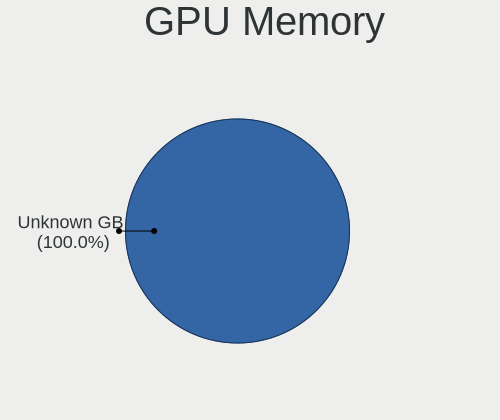
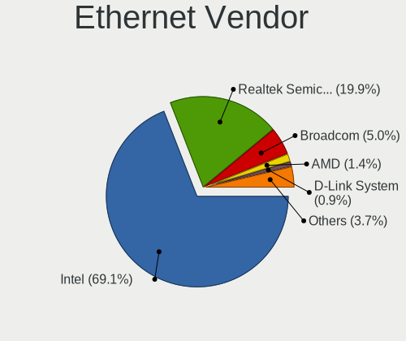

OPNsense - Hardware Trends
--------------------------

A project to identify most popular hardware characteristics and track their change
over time based on data collected by BSD users at https://BSD-Hardware.info.

Anyone can contribute to this report by the [hw-probe](https://github.com/linuxhw/hw-probe/blob/master/INSTALL.BSD.md) tool:

    hw-probe -all -upload

This report is for one last month. Overall report since the beginning of time: [TestCoverage](https://github.com/bsdhw/TestCoverage)

Period: Oct, 2022.

Contents
--------

* [ System ](#system)
  - [ OS                       ](#os)
  - [ OS Family                ](#os-family)
  - [ Arch                     ](#arch)
  - [ DE                       ](#de)
  - [ Display Server           ](#display-server)
  - [ Display Manager          ](#display-manager)
  - [ OS Lang                  ](#os-lang)
  - [ Boot Mode                ](#boot-mode)
  - [ Filesystem               ](#filesystem)
  - [ Part. scheme             ](#part-scheme)

* [ Board ](#board)
  - [ Vendor                   ](#vendor)
  - [ Model                    ](#model)
  - [ Model Family             ](#model-family)
  - [ MFG Year                 ](#mfg-year)
  - [ Form Factor              ](#form-factor)
  - [ Coreboot                 ](#coreboot)
  - [ RAM Size                 ](#ram-size)
  - [ RAM Used                 ](#ram-used)
  - [ Total Drives             ](#total-drives)
  - [ Has CD-ROM               ](#has-cd-rom)
  - [ Has Ethernet             ](#has-ethernet)
  - [ Has WiFi                 ](#has-wifi)
  - [ Has Bluetooth            ](#has-bluetooth)

* [ Location ](#location)
  - [ Country                  ](#country)
  - [ City                     ](#city)

* [ Drives ](#drives)
  - [ Drive Vendor             ](#drive-vendor)
  - [ Drive Model              ](#drive-model)
  - [ HDD Vendor               ](#hdd-vendor)
  - [ SSD Vendor               ](#ssd-vendor)
  - [ Drive Kind               ](#drive-kind)
  - [ Drive Connector          ](#drive-connector)
  - [ Drive Size               ](#drive-size)
  - [ Space Total              ](#space-total)
  - [ Space Used               ](#space-used)
  - [ Malfunc. Drives          ](#malfunc-drives)
  - [ Malfunc. Drive Vendor    ](#malfunc-drive-vendor)
  - [ Malfunc. HDD Vendor      ](#malfunc-hdd-vendor)
  - [ Malfunc. Drive Kind      ](#malfunc-drive-kind)
  - [ Failed Drives            ](#failed-drives)
  - [ Failed Drive Vendor      ](#failed-drive-vendor)
  - [ Drive Status             ](#drive-status)

* [ Storage controller ](#storage-controller)
  - [ Storage Vendor           ](#storage-vendor)
  - [ Storage Model            ](#storage-model)
  - [ Storage Kind             ](#storage-kind)

* [ Processor ](#processor)
  - [ CPU Vendor               ](#cpu-vendor)
  - [ CPU Model                ](#cpu-model)
  - [ CPU Model Family         ](#cpu-model-family)
  - [ CPU Cores                ](#cpu-cores)
  - [ CPU Sockets              ](#cpu-sockets)
  - [ CPU Threads              ](#cpu-threads)
  - [ CPU Microarch            ](#cpu-microarch)

* [ Graphics ](#graphics)
  - [ GPU Vendor               ](#gpu-vendor)
  - [ GPU Model                ](#gpu-model)
  - [ GPU Combo                ](#gpu-combo)
  - [ GPU Driver               ](#gpu-driver)
  - [ GPU Memory               ](#gpu-memory)

* [ Monitor ](#monitor)
  - [ Monitor Vendor           ](#monitor-vendor)
  - [ Monitor Model            ](#monitor-model)
  - [ Monitor Resolution       ](#monitor-resolution)
  - [ Monitor Diagonal         ](#monitor-diagonal)
  - [ Monitor Width            ](#monitor-width)
  - [ Aspect Ratio             ](#aspect-ratio)
  - [ Monitor Area             ](#monitor-area)
  - [ Pixel Density            ](#pixel-density)
  - [ Multiple Monitors        ](#multiple-monitors)

* [ Network ](#network)
  - [ Net Controller Vendor    ](#net-controller-vendor)
  - [ Net Controller Model     ](#net-controller-model)
  - [ Wireless Vendor          ](#wireless-vendor)
  - [ Wireless Model           ](#wireless-model)
  - [ Ethernet Vendor          ](#ethernet-vendor)
  - [ Ethernet Model           ](#ethernet-model)
  - [ Net Controller Kind      ](#net-controller-kind)
  - [ Used Controller          ](#used-controller)
  - [ NICs                     ](#nics)
  - [ IPv6                     ](#ipv6)

* [ Bluetooth ](#bluetooth)
  - [ Bluetooth Vendor         ](#bluetooth-vendor)
  - [ Bluetooth Model          ](#bluetooth-model)

* [ Sound ](#sound)
  - [ Sound Vendor             ](#sound-vendor)
  - [ Sound Model              ](#sound-model)

* [ Memory ](#memory)
  - [ Memory Vendor            ](#memory-vendor)
  - [ Memory Model             ](#memory-model)
  - [ Memory Kind              ](#memory-kind)
  - [ Memory Form Factor       ](#memory-form-factor)
  - [ Memory Size              ](#memory-size)
  - [ Memory Speed             ](#memory-speed)

* [ Printers & scanners ](#printers--scanners)
  - [ Printer Vendor           ](#printer-vendor)
  - [ Printer Model            ](#printer-model)
  - [ Scanner Vendor           ](#scanner-vendor)
  - [ Scanner Model            ](#scanner-model)

* [ Camera ](#camera)
  - [ Camera Vendor            ](#camera-vendor)
  - [ Camera Model             ](#camera-model)

* [ Security ](#security)
  - [ Fingerprint Vendor       ](#fingerprint-vendor)
  - [ Fingerprint Model        ](#fingerprint-model)
  - [ Chipcard Vendor          ](#chipcard-vendor)
  - [ Chipcard Model           ](#chipcard-model)

* [ Unsupported ](#unsupported)
  - [ Unsupported Devices      ](#unsupported-devices)
  - [ Unsupported Device Types ](#unsupported-device-types)

System
------

OS
--

Installed operating systems

| Name             | Computers | Percent |
|------------------|-----------|---------|
| OPNsense 22.7.6  | 156       | 53.24%  |
| OPNsense 22.7.5  | 67        | 22.87%  |
| OPNsense 22.7.4  | 41        | 13.99%  |
| OPNsense 22.1.10 | 10        | 3.41%   |
| OPNsense 23.1    | 4         | 1.37%   |
| OPNsense 22.4.3  | 4         | 1.37%   |
| OPNsense 22.7.2  | 3         | 1.02%   |
| OPNsense 22.7    | 3         | 1.02%   |
| OPNsense 22.10   | 1         | 0.34%   |
| OPNsense 22.1.9  | 1         | 0.34%   |
| OPNsense 22.1    | 1         | 0.34%   |
| OPNsense 21.7.8  | 1         | 0.34%   |
| OPNsense 20.7.5  | 1         | 0.34%   |

OS Family
---------

OS without a version

| Name     | Computers | Percent |
|----------|-----------|---------|
| OPNsense | 293       | 100%    |

Arch
----

OS architecture (x86_64, i586, etc.)

| Name  | Computers | Percent |
|-------|-----------|---------|
| amd64 | 292       | 99.66%  |
| arm64 | 1         | 0.34%   |

DE
--

Desktop Environment

| Name    | Computers | Percent |
|---------|-----------|---------|
| Console | 293       | 100%    |

Display Server
--------------

X11 or Wayland

| Name    | Computers | Percent |
|---------|-----------|---------|
| Console | 293       | 100%    |

Display Manager
---------------

SDDM, LightDM, etc.

| Name    | Computers | Percent |
|---------|-----------|---------|
| Console | 293       | 100%    |

OS Lang
-------

Language

| Lang    | Computers | Percent |
|---------|-----------|---------|
| Unknown | 286       | 97.61%  |
| C       | 7         | 2.39%   |

Boot Mode
---------

EFI or BIOS

| Mode | Computers | Percent |
|------|-----------|---------|
| EFI  | 276       | 94.2%   |
| BIOS | 17        | 5.8%    |

Filesystem
----------

Type of filesystem

| Type   | Computers | Percent |
|--------|-----------|---------|
| Ufs    | 173       | 59.04%  |
| Zfs    | 119       | 40.61%  |
| Cd9660 | 1         | 0.34%   |

Part. scheme
------------

Scheme of partitioning

| Type    | Computers | Percent |
|---------|-----------|---------|
| GPT     | 280       | 95.56%  |
| MBR     | 7         | 2.39%   |
| Unknown | 5         | 1.71%   |
| BSD     | 1         | 0.34%   |

Board
-----

Vendor
------

Motherboard manufacturer

| Name                       | Computers | Percent |
|----------------------------|-----------|---------|
| Unknown                    | 46        | 15.7%   |
| Dell                       | 32        | 10.92%  |
| Protectli                  | 18        | 6.14%   |
| Hewlett-Packard            | 16        | 5.46%   |
| Supermicro                 | 14        | 4.78%   |
| Intel                      | 14        | 4.78%   |
| ASRock                     | 14        | 4.78%   |
| PC Engines                 | 13        | 4.44%   |
| Lenovo                     | 13        | 4.44%   |
| Sophos                     | 11        | 3.75%   |
| ASUSTek Computer           | 8         | 2.73%   |
| Gigabyte Technology        | 7         | 2.39%   |
| AMI                        | 6         | 2.05%   |
| MW                         | 5         | 1.71%   |
| MSI                        | 5         | 1.71%   |
| Fujitsu                    | 5         | 1.71%   |
| CncTion                    | 5         | 1.71%   |
| Techvision                 | 4         | 1.37%   |
| BESSTAR Tech               | 4         | 1.37%   |
| ZOTAC                      | 3         | 1.02%   |
| YANYU                      | 3         | 1.02%   |
| maiyunda                   | 3         | 1.02%   |
| Hardkernel                 | 3         | 1.02%   |
| Cisco                      | 3         | 1.02%   |
| AWOW                       | 3         | 1.02%   |
| Acer                       | 3         | 1.02%   |
| Shuttle                    | 2         | 0.68%   |
| Seeed Studio               | 2         | 0.68%   |
| Deciso                     | 2         | 0.68%   |
| Cisco Systems              | 2         | 0.68%   |
| AZW                        | 2         | 0.68%   |
| Yanling                    | 1         | 0.34%   |
| TYAN Computer              | 1         | 0.34%   |
| Thomas-Krenn.AG            | 1         | 0.34%   |
| ShenZhen MinWin Technology | 1         | 0.34%   |
| Quanmax                    | 1         | 0.34%   |
| Pegatron                   | 1         | 0.34%   |
| PCWare                     | 1         | 0.34%   |
| NU941                      | 1         | 0.34%   |
| NF541                      | 1         | 0.34%   |

Model
-----

Motherboard model

| Name                                             | Computers | Percent |
|--------------------------------------------------|-----------|---------|
| Unknown                                          | 46        | 15.7%   |
| Protectli FW4B                                   | 10        | 3.41%   |
| PC Engines APU2                                  | 8         | 2.73%   |
| Protectli FW6                                    | 6         | 2.05%   |
| Dell OptiPlex 3020                               | 6         | 2.05%   |
| Sophos SG                                        | 5         | 1.71%   |
| MW GMLK-2_5G4L                                   | 5         | 1.71%   |
| Techvision TVI7309X                              | 4         | 1.37%   |
| Sophos XG                                        | 4         | 1.37%   |
| Fujitsu FUTRO S920                               | 4         | 1.37%   |
| AMI Aptio CRB                                    | 4         | 1.37%   |
| Supermicro Super Server                          | 3         | 1.02%   |
| PC Engines apu1                                  | 3         | 1.02%   |
| maiyunda www.maiyunda.com                        | 3         | 1.02%   |
| Intel Q3XXG4-P V1.0                              | 3         | 1.02%   |
| HP t730 Thin Client                              | 3         | 1.02%   |
| Dell PowerEdge R630                              | 3         | 1.02%   |
| Dell PowerEdge R220                              | 3         | 1.02%   |
| Dell OptiPlex 9020                               | 3         | 1.02%   |
| CncTion N5105-4L                                 | 3         | 1.02%   |
| Cisco SALEEN                                     | 3         | 1.02%   |
| Supermicro 1HE Intel Single-CPU RI1102D-F Server | 2         | 0.68%   |
| Sophos UTM                                       | 2         | 0.68%   |
| Seeed Studio ODYSSEY-X86J4125                    | 2         | 0.68%   |
| PC Engines apu4                                  | 2         | 0.68%   |
| Lenovo ThinkCentre M720q 10T7004BMB              | 2         | 0.68%   |
| Intel H81U                                       | 2         | 0.68%   |
| HP ProDesk 600 G1 SFF                            | 2         | 0.68%   |
| Hardkernel ODROID-H2                             | 2         | 0.68%   |
| Dell Wyse 5070 Extended Thin Client              | 2         | 0.68%   |
| Dell PowerEdge R210 II                           | 2         | 0.68%   |
| Dell OptiPlex 7040                               | 2         | 0.68%   |
| Deciso NetBoard-A10                              | 2         | 0.68%   |
| Cisco Systems UCSC-C240-M5SX                     | 2         | 0.68%   |
| BESSTAR Tech GK41                                | 2         | 0.68%   |
| ZOTAC ZBOX-MI522NANO/MI542NANO                   | 1         | 0.34%   |
| ZOTAC ZBOX-CI527/CI547                           | 1         | 0.34%   |
| ZOTAC ZBOX-CI341                                 | 1         | 0.34%   |
| YANYU R250                                       | 1         | 0.34%   |
| YANYU ITX-M9F VER:1.1                            | 1         | 0.34%   |

Model Family
------------

Motherboard model prefix

| Name                          | Computers | Percent |
|-------------------------------|-----------|---------|
| Unknown                       | 46        | 15.7%   |
| Dell OptiPlex                 | 15        | 5.12%   |
| Dell PowerEdge                | 12        | 4.1%    |
| Protectli FW4B                | 10        | 3.41%   |
| Lenovo ThinkCentre            | 9         | 3.07%   |
| PC Engines APU2               | 8         | 2.73%   |
| Protectli FW6                 | 6         | 2.05%   |
| Sophos SG                     | 5         | 1.71%   |
| MW GMLK-2                     | 5         | 1.71%   |
| Techvision TVI7309X           | 4         | 1.37%   |
| Sophos XG                     | 4         | 1.37%   |
| HP ProDesk                    | 4         | 1.37%   |
| Fujitsu FUTRO                 | 4         | 1.37%   |
| AMI Aptio                     | 4         | 1.37%   |
| Supermicro Super              | 3         | 1.02%   |
| PC Engines apu1               | 3         | 1.02%   |
| maiyunda www.maiyunda.com     | 3         | 1.02%   |
| Intel Q3XXG4-P                | 3         | 1.02%   |
| HP t730                       | 3         | 1.02%   |
| HP ProLiant                   | 3         | 1.02%   |
| CncTion N5105-4L              | 3         | 1.02%   |
| Cisco SALEEN                  | 3         | 1.02%   |
| Supermicro 1HE                | 2         | 0.68%   |
| Sophos UTM                    | 2         | 0.68%   |
| Seeed Studio ODYSSEY-X86J4125 | 2         | 0.68%   |
| PC Engines apu4               | 2         | 0.68%   |
| Intel H81U                    | 2         | 0.68%   |
| HP Compaq                     | 2         | 0.68%   |
| Hardkernel ODROID-H2          | 2         | 0.68%   |
| Dell Wyse                     | 2         | 0.68%   |
| Deciso NetBoard-A10           | 2         | 0.68%   |
| Cisco Systems UCSC-C240-M5SX  | 2         | 0.68%   |
| BESSTAR Tech GK41             | 2         | 0.68%   |
| ASUS TUF                      | 2         | 0.68%   |
| ZOTAC ZBOX-MI522NANO          | 1         | 0.34%   |
| ZOTAC ZBOX-CI527              | 1         | 0.34%   |
| ZOTAC ZBOX-CI341              | 1         | 0.34%   |
| YANYU R250                    | 1         | 0.34%   |
| YANYU ITX-M9F                 | 1         | 0.34%   |
| YANYU H67SL                   | 1         | 0.34%   |

MFG Year
--------

Motherboard manufacture year

| Year | Computers | Percent |
|------|-----------|---------|
| 2022 | 52        | 17.75%  |
| 2018 | 39        | 13.31%  |
| 2021 | 34        | 11.6%   |
| 2019 | 29        | 9.9%    |
| 2013 | 22        | 7.51%   |
| 2016 | 21        | 7.17%   |
| 2020 | 18        | 6.14%   |
| 2017 | 18        | 6.14%   |
| 2015 | 16        | 5.46%   |
| 2014 | 16        | 5.46%   |
| 2012 | 9         | 3.07%   |
| 2011 | 5         | 1.71%   |
| 2010 | 4         | 1.37%   |
| 2008 | 4         | 1.37%   |
| 2009 | 2         | 0.68%   |
| 2007 | 2         | 0.68%   |
| 2006 | 1         | 0.34%   |
| 2004 | 1         | 0.34%   |

Form Factor
-----------

Physical design of the computer

| Name     | Computers | Percent |
|----------|-----------|---------|
| Desktop  | 216       | 73.72%  |
| Mini pc  | 29        | 9.9%    |
| Server   | 25        | 8.53%   |
| Notebook | 12        | 4.1%    |
| Firewall | 11        | 3.75%   |

Coreboot
--------

Have coreboot on board

| Used | Computers | Percent |
|------|-----------|---------|
| No   | 274       | 93.52%  |
| Yes  | 19        | 6.48%   |

RAM Size
--------

Total RAM memory

| Size in GB  | Computers | Percent |
|-------------|-----------|---------|
| 8.01-16.0   | 129       | 44.03%  |
| 16.01-24.0  | 64        | 21.84%  |
| 4.01-8.0    | 59        | 20.14%  |
| 32.01-64.0  | 14        | 4.78%   |
| 64.01-256.0 | 12        | 4.1%    |
| 2.01-3.0    | 10        | 3.41%   |
| 24.01-32.0  | 2         | 0.68%   |
| 0.51-1.0    | 2         | 0.68%   |
| 3.01-4.0    | 1         | 0.34%   |

RAM Used
--------

Used RAM memory

| Used GB  | Computers | Percent |
|----------|-----------|---------|
| 0.01-0.5 | 161       | 54.95%  |
| 0.51-1.0 | 97        | 33.11%  |
| 1.01-2.0 | 23        | 7.85%   |
| 3.01-4.0 | 5         | 1.71%   |
| 2.01-3.0 | 5         | 1.71%   |
| 4.01-8.0 | 2         | 0.68%   |

Total Drives
------------

Number of drives on board

| Drives | Computers | Percent |
|--------|-----------|---------|
| 1      | 234       | 79.86%  |
| 0      | 36        | 12.29%  |
| 2      | 17        | 5.8%    |
| 3      | 5         | 1.71%   |
| 5      | 1         | 0.34%   |

Has CD-ROM
----------

Has CD-ROM on board

| Presented | Computers | Percent |
|-----------|-----------|---------|
| No        | 264       | 90.1%   |
| Yes       | 29        | 9.9%    |

Has Ethernet
------------

Has Ethernet on board

| Presented | Computers | Percent |
|-----------|-----------|---------|
| Yes       | 292       | 99.66%  |
| No        | 1         | 0.34%   |

Has WiFi
--------

Has WiFi module

| Presented | Computers | Percent |
|-----------|-----------|---------|
| No        | 233       | 79.52%  |
| Yes       | 60        | 20.48%  |

Has Bluetooth
-------------

Has Bluetooth module

| Presented | Computers | Percent |
|-----------|-----------|---------|
| No        | 256       | 87.37%  |
| Yes       | 37        | 12.63%  |

Location
--------

Country
-------

Geographic location (country)

| Country      | Computers | Percent |
|--------------|-----------|---------|
| USA          | 87        | 29.69%  |
| Germany      | 62        | 21.16%  |
| UK           | 13        | 4.44%   |
| Australia    | 12        | 4.1%    |
| Canada       | 11        | 3.75%   |
| Brazil       | 9         | 3.07%   |
| France       | 8         | 2.73%   |
| Italy        | 7         | 2.39%   |
| Belgium      | 6         | 2.05%   |
| Russia       | 5         | 1.71%   |
| Poland       | 5         | 1.71%   |
| Netherlands  | 5         | 1.71%   |
| China        | 5         | 1.71%   |
| Switzerland  | 4         | 1.37%   |
| Spain        | 4         | 1.37%   |
| Portugal     | 4         | 1.37%   |
| Sweden       | 3         | 1.02%   |
| Romania      | 3         | 1.02%   |
| Indonesia    | 3         | 1.02%   |
| Greece       | 3         | 1.02%   |
| Finland      | 3         | 1.02%   |
| Czechia      | 3         | 1.02%   |
| Austria      | 3         | 1.02%   |
| New Zealand  | 2         | 0.68%   |
| Latvia       | 2         | 0.68%   |
| Israel       | 2         | 0.68%   |
| Iran         | 2         | 0.68%   |
| India        | 2         | 0.68%   |
| Denmark      | 2         | 0.68%   |
| Turkey       | 1         | 0.34%   |
| Taiwan       | 1         | 0.34%   |
| South Africa | 1         | 0.34%   |
| Slovenia     | 1         | 0.34%   |
| Norway       | 1         | 0.34%   |
| Mexico       | 1         | 0.34%   |
| Luxembourg   | 1         | 0.34%   |
| Jersey       | 1         | 0.34%   |
| Japan        | 1         | 0.34%   |
| Ireland      | 1         | 0.34%   |
| Iceland      | 1         | 0.34%   |

City
----

Geographic location (city)

| City                               | Computers | Percent |
|------------------------------------|-----------|---------|
| Berlin                             | 6         | 2.05%   |
| Sydney                             | 5         | 1.71%   |
| Munich                             | 4         | 1.37%   |
| Wiesbaden                          | 3         | 1.02%   |
| Melbourne                          | 3         | 1.02%   |
| Beijing                            | 3         | 1.02%   |
| Woodstock                          | 2         | 0.68%   |
| Wels                               | 2         | 0.68%   |
| Oakland                            | 2         | 0.68%   |
| Montreal                           | 2         | 0.68%   |
| Milwaukee                          | 2         | 0.68%   |
| Miami                              | 2         | 0.68%   |
| Hofstetten                         | 2         | 0.68%   |
| Hamburg                            | 2         | 0.68%   |
| Dallas                             | 2         | 0.68%   |
| Conway                             | 2         | 0.68%   |
| Cologne                            | 2         | 0.68%   |
| City of London                     | 2         | 0.68%   |
| Cileungsir                         | 2         | 0.68%   |
| Chernogolovka                      | 2         | 0.68%   |
| Auckland                           | 2         | 0.68%   |
| Adelaide                           | 2         | 0.68%   |
| Zele                               | 1         | 0.34%   |
| Yehud                              | 1         | 0.34%   |
| Yakima                             | 1         | 0.34%   |
| Wroclaw                            | 1         | 0.34%   |
| Winterthur                         | 1         | 0.34%   |
| Wijchen                            | 1         | 0.34%   |
| Wiesendangen / Wiesendangen (Dorf) | 1         | 0.34%   |
| Weissach                           | 1         | 0.34%   |
| Weippe                             | 1         | 0.34%   |
| Warminster                         | 1         | 0.34%   |
| Waltrop                            | 1         | 0.34%   |
| Waldmuhlen                         | 1         | 0.34%   |
| Villa Regina                       | 1         | 0.34%   |
| Vienna                             | 1         | 0.34%   |
| Ventura                            | 1         | 0.34%   |
| Venlo                              | 1         | 0.34%   |
| Venice                             | 1         | 0.34%   |
| Veliko Tarnovo                     | 1         | 0.34%   |

Drives
------

Drive Vendor
------------

Hard drive vendors

| Vendor              | Computers | Drives | Percent |
|---------------------|-----------|--------|---------|
| Samsung Electronics | 42        | 44     | 15.5%   |
| Kingston            | 28        | 29     | 10.33%  |
| Crucial             | 20        | 21     | 7.38%   |
| WDC                 | 17        | 17     | 6.27%   |
| Transcend           | 17        | 17     | 6.27%   |
| China               | 17        | 18     | 6.27%   |
| Seagate             | 13        | 14     | 4.8%    |
| A-DATA Technology   | 10        | 10     | 3.69%   |
| SanDisk             | 8         | 8      | 2.95%   |
| Intel               | 8         | 10     | 2.95%   |
| Hoodisk             | 8         | 8      | 2.95%   |
| FORESEE             | 7         | 7      | 2.58%   |
| PNY                 | 5         | 7      | 1.85%   |
| Micron Technology   | 5         | 5      | 1.85%   |
| Toshiba             | 4         | 5      | 1.48%   |
| SPCC                | 4         | 4      | 1.48%   |
| SK hynix            | 4         | 4      | 1.48%   |
| Dogfish             | 4         | 4      | 1.48%   |
| Silicon Motion      | 3         | 3      | 1.11%   |
| ShiJi               | 3         | 3      | 1.11%   |
| Protectli           | 3         | 3      | 1.11%   |
| Innodisk            | 3         | 3      | 1.11%   |
| Hewlett-Packard     | 3         | 5      | 1.11%   |
| Vaseky              | 2         | 2      | 0.74%   |
| Phison              | 2         | 2      | 0.74%   |
| Netac               | 2         | 2      | 0.74%   |
| Intenso             | 2         | 2      | 0.74%   |
| HGST                | 2         | 5      | 0.74%   |
| Cisco               | 2         | 2      | 0.74%   |
| BIWIN               | 2         | 2      | 0.74%   |
| Zheino              | 1         | 1      | 0.37%   |
| Yeyian              | 1         | 2      | 0.37%   |
| V-GeN               | 1         | 1      | 0.37%   |
| Team                | 1         | 1      | 0.37%   |
| Silicon             | 1         | 1      | 0.37%   |
| Plextor             | 1         | 1      | 0.37%   |
| Patriot             | 1         | 1      | 0.37%   |
| ORICO               | 1         | 1      | 0.37%   |
| OCZ                 | 1         | 1      | 0.37%   |
| Mushkin             | 1         | 1      | 0.37%   |

Drive Model
-----------

Hard drive models

| Model                            | Computers | Percent |
|----------------------------------|-----------|---------|
| China SATA SSD 16GB              | 8         | 2.92%   |
| Kingston SA400S37240G 240GB      | 5         | 1.82%   |
| Crucial CT240BX500SSD1 240GB     | 5         | 1.82%   |
| A-DATA IM2S3134N-064GM 64GB      | 5         | 1.82%   |
| Seagate ST500DM002-1BD142 500GB  | 4         | 1.46%   |
| Hoodisk SSD 128GB                | 4         | 1.46%   |
| FORESEE 128GB SSD                | 4         | 1.46%   |
| Transcend TS128GMSA230S 128GB    | 3         | 1.09%   |
| Kingston SUV500MS120G 120GB      | 3         | 1.09%   |
| Hoodisk SSD 64GB                 | 3         | 1.09%   |
| Dogfish SSD 128GB                | 3         | 1.09%   |
| Crucial CT250P2SSD8 250GB        | 3         | 1.09%   |
| Crucial CT120BX500SSD1 120GB     | 3         | 1.09%   |
| China MSATA 32GB SSD             | 3         | 1.09%   |
| Transcend TS64GMSA230S 64GB      | 2         | 0.73%   |
| Transcend TS256GMSA230S 256GB    | 2         | 0.73%   |
| ShiJi SSD 128GB                  | 2         | 0.73%   |
| Seagate ST3500413AS 500GB        | 2         | 0.73%   |
| Seagate ST1000LM035-1RK172 1TB   | 2         | 0.73%   |
| SanDisk SSD PLUS 120GB           | 2         | 0.73%   |
| SanDisk SD6SB1M256G1022I 256GB   | 2         | 0.73%   |
| Samsung SSD 980 500GB            | 2         | 0.73%   |
| Samsung SSD 970 EVO Plus 250GB   | 2         | 0.73%   |
| Samsung SSD 850 EVO 250GB        | 2         | 0.73%   |
| Samsung MZVLB256HAHQ-000L7 256GB | 2         | 0.73%   |
| Protectli 32GB mSATA             | 2         | 0.73%   |
| PNY CS900 120GB SSD              | 2         | 0.73%   |
| Phison Sabrent 2TB               | 2         | 0.73%   |
| Kingston SV300S37A120G 120GB     | 2         | 0.73%   |
| Kingston SNVS250G 250GB          | 2         | 0.73%   |
| Kingston SKC600MS256G 256GB      | 2         | 0.73%   |
| Crucial CT500MX500SSD1 500GB     | 2         | 0.73%   |
| Crucial CT275MX300SSD1 275GB     | 2         | 0.73%   |
| Cisco UCSC-RAID12GP-4G           | 2         | 0.73%   |
| China SATA SSD 128GB             | 2         | 0.73%   |
| Zheino CHN-mSATAQ3-120 120GB     | 1         | 0.36%   |
| Yeyian VALK 3000 250GB           | 1         | 0.36%   |
| WDC WDS500G3X0C-00SJG0 500GB     | 1         | 0.36%   |
| WDC WDS250G2B0B-00YS70 250GB     | 1         | 0.36%   |
| WDC WDS250G2B0A-00SM50 250GB     | 1         | 0.36%   |

HDD Vendor
----------

Hard disk drive vendors

| Vendor              | Computers | Drives | Percent |
|---------------------|-----------|--------|---------|
| Seagate             | 13        | 14     | 43.33%  |
| WDC                 | 6         | 6      | 20%     |
| Toshiba             | 3         | 4      | 10%     |
| Samsung Electronics | 2         | 3      | 6.67%   |
| HGST                | 2         | 5      | 6.67%   |
| Hewlett-Packard     | 2         | 4      | 6.67%   |
| Cisco               | 2         | 2      | 6.67%   |

SSD Vendor
----------

Solid state drive vendors

| Vendor              | Computers | Drives | Percent |
|---------------------|-----------|--------|---------|
| Samsung Electronics | 21        | 22     | 11.11%  |
| Kingston            | 21        | 22     | 11.11%  |
| Crucial             | 17        | 18     | 8.99%   |
| China               | 17        | 18     | 8.99%   |
| Transcend           | 15        | 15     | 7.94%   |
| A-DATA Technology   | 10        | 10     | 5.29%   |
| SanDisk             | 8         | 8      | 4.23%   |
| Hoodisk             | 8         | 8      | 4.23%   |
| Intel               | 7         | 9      | 3.7%    |
| FORESEE             | 6         | 6      | 3.17%   |
| Micron Technology   | 5         | 5      | 2.65%   |
| WDC                 | 4         | 4      | 2.12%   |
| PNY                 | 4         | 6      | 2.12%   |
| Dogfish             | 4         | 4      | 2.12%   |
| SK hynix            | 3         | 3      | 1.59%   |
| ShiJi               | 3         | 3      | 1.59%   |
| Protectli           | 3         | 3      | 1.59%   |
| Innodisk            | 3         | 3      | 1.59%   |
| Vaseky              | 2         | 2      | 1.06%   |
| SPCC                | 2         | 2      | 1.06%   |
| Netac               | 2         | 2      | 1.06%   |
| Intenso             | 2         | 2      | 1.06%   |
| BIWIN               | 2         | 2      | 1.06%   |
| Zheino              | 1         | 1      | 0.53%   |
| Yeyian              | 1         | 2      | 0.53%   |
| V-GeN               | 1         | 1      | 0.53%   |
| Toshiba             | 1         | 1      | 0.53%   |
| Silicon             | 1         | 1      | 0.53%   |
| Plextor             | 1         | 1      | 0.53%   |
| Patriot             | 1         | 1      | 0.53%   |
| ORICO               | 1         | 1      | 0.53%   |
| OCZ                 | 1         | 1      | 0.53%   |
| Mushkin             | 1         | 1      | 0.53%   |
| LITEONIT            | 1         | 1      | 0.53%   |
| LITEON              | 1         | 1      | 0.53%   |
| Hewlett-Packard     | 1         | 1      | 0.53%   |
| Fordisk             | 1         | 1      | 0.53%   |
| Drevo               | 1         | 1      | 0.53%   |
| BORY                | 1         | 1      | 0.53%   |
| ATP                 | 1         | 1      | 0.53%   |

Drive Kind
----------

HDD or SSD

| Kind | Computers | Drives | Percent |
|------|-----------|--------|---------|
| SSD  | 186       | 198    | 69.4%   |
| NVMe | 52        | 52     | 19.4%   |
| HDD  | 30        | 38     | 11.19%  |

Drive Connector
---------------

SATA, SAS, NVMe, etc.

| Type | Computers | Drives | Percent |
|------|-----------|--------|---------|
| SATA | 214       | 236    | 80.45%  |
| NVMe | 52        | 52     | 19.55%  |

Drive Size
----------

Size of hard drive

| Size in TB | Computers | Drives | Percent |
|------------|-----------|--------|---------|
| 0.01-0.5   | 195       | 212    | 91.12%  |
| 0.51-1.0   | 13        | 15     | 6.07%   |
| 1.01-2.0   | 3         | 3      | 1.4%    |
| 2.01-3.0   | 2         | 2      | 0.93%   |
| 4.01-10.0  | 1         | 4      | 0.47%   |

Space Total
-----------

Amount of disk space available on the file system

| Size in GB | Computers | Percent |
|------------|-----------|---------|
| 101-250    | 143       | 48.81%  |
| 251-500    | 47        | 16.04%  |
| 21-50      | 38        | 12.97%  |
| 51-100     | 31        | 10.58%  |
| 1-20       | 22        | 7.51%   |
| 501-1000   | 6         | 2.05%   |
| 2001-3000  | 3         | 1.02%   |
| 1001-2000  | 3         | 1.02%   |

Space Used
----------

Amount of used disk space

| Used GB | Computers | Percent |
|---------|-----------|---------|
| 1-20    | 277       | 94.54%  |
| 21-50   | 13        | 4.44%   |
| 51-100  | 3         | 1.02%   |

Malfunc. Drives
---------------

Drive models with a malfunction

| Model                                        | Computers | Drives | Percent |
|----------------------------------------------|-----------|--------|---------|
| Seagate ST500DM002-1BD142 500GB              | 2         | 2      | 7.41%   |
| Crucial CT275MX300SSD1 275GB                 | 2         | 2      | 7.41%   |
| Toshiba THNSNK256GVN8 M.2 2280 256GB         | 1         | 1      | 3.7%    |
| Toshiba MQ01ACF050 500GB                     | 1         | 2      | 3.7%    |
| Toshiba MK6034GSX 64GB                       | 1         | 1      | 3.7%    |
| Toshiba DT01ACA100 1TB                       | 1         | 1      | 3.7%    |
| SK hynix SC308 SATA 128GB                    | 1         | 1      | 3.7%    |
| Seagate ST96812AS 64GB                       | 1         | 1      | 3.7%    |
| Seagate ST3500413AS 500GB                    | 1         | 1      | 3.7%    |
| Seagate ST2000DL001-9VT156 2TB               | 1         | 1      | 3.7%    |
| SanDisk SD7SB3Q128G1001 128GB                | 1         | 1      | 3.7%    |
| Samsung Electronics SSD PM810 2.5-inch 256GB | 1         | 1      | 3.7%    |
| Samsung Electronics SSD 960 PRO 512GB        | 1         | 1      | 3.7%    |
| Samsung Electronics HM320II 320GB            | 1         | 1      | 3.7%    |
| Samsung Electronics HD501LJ 500GB            | 1         | 1      | 3.7%    |
| Netac SSD 128GB                              | 1         | 1      | 3.7%    |
| Mushkin MKNSSDEC512GB                        | 1         | 1      | 3.7%    |
| Micron Technology C400-MTFDDAT064MAM 64GB    | 1         | 1      | 3.7%    |
| Kingston SUV400S37240G 240GB                 | 1         | 1      | 3.7%    |
| Kingston SA400S37120G 120GB                  | 1         | 1      | 3.7%    |
| Intel SSDSC2CW060A3 64GB                     | 1         | 1      | 3.7%    |
| Intel SSDSC2BX200G4R 200GB                   | 1         | 2      | 3.7%    |
| HGST HTS725050A7E630 500GB                   | 1         | 1      | 3.7%    |
| China SATA SSD 64GB                          | 1         | 1      | 3.7%    |
| BIWIN SSD 8GB                                | 1         | 1      | 3.7%    |

Malfunc. Drive Vendor
---------------------

Vendors of faulty drives

| Vendor              | Computers | Drives | Percent |
|---------------------|-----------|--------|---------|
| Seagate             | 5         | 5      | 18.52%  |
| Toshiba             | 4         | 5      | 14.81%  |
| Samsung Electronics | 4         | 4      | 14.81%  |
| Kingston            | 2         | 2      | 7.41%   |
| Intel               | 2         | 3      | 7.41%   |
| Crucial             | 2         | 2      | 7.41%   |
| SK hynix            | 1         | 1      | 3.7%    |
| SanDisk             | 1         | 1      | 3.7%    |
| Netac               | 1         | 1      | 3.7%    |
| Mushkin             | 1         | 1      | 3.7%    |
| Micron Technology   | 1         | 1      | 3.7%    |
| HGST                | 1         | 1      | 3.7%    |
| China               | 1         | 1      | 3.7%    |
| BIWIN               | 1         | 1      | 3.7%    |

Malfunc. HDD Vendor
-------------------

Vendors of faulty HDD drives

| Vendor              | Computers | Drives | Percent |
|---------------------|-----------|--------|---------|
| Seagate             | 5         | 5      | 45.45%  |
| Toshiba             | 3         | 4      | 27.27%  |
| Samsung Electronics | 2         | 2      | 18.18%  |
| HGST                | 1         | 1      | 9.09%   |

Malfunc. Drive Kind
-------------------

Kinds of faulty drives

| Kind | Computers | Drives | Percent |
|------|-----------|--------|---------|
| SSD  | 15        | 16     | 55.56%  |
| HDD  | 11        | 12     | 40.74%  |
| NVMe | 1         | 1      | 3.7%    |

Failed Drives
-------------

Failed drive models

Zero info for selected period =(

Failed Drive Vendor
-------------------

Failed drive vendors

Zero info for selected period =(

Drive Status
------------

Number of failed and malfunc. drives

| Status   | Computers | Drives | Percent |
|----------|-----------|--------|---------|
| Works    | 230       | 250    | 87.45%  |
| Malfunc  | 26        | 29     | 9.89%   |
| Detected | 7         | 9      | 2.66%   |

Storage controller
------------------

Storage Vendor
--------------

Storage controller vendors

| Vendor                       | Computers | Percent |
|------------------------------|-----------|---------|
| Intel                        | 246       | 68.91%  |
| AMD                          | 37        | 10.36%  |
| Samsung Electronics          | 19        | 5.32%   |
| SanDisk                      | 9         | 2.52%   |
| Broadcom / LSI               | 9         | 2.52%   |
| Silicon Motion               | 6         | 1.68%   |
| Kingston Technology Company  | 5         | 1.4%    |
| Phison Electronics           | 4         | 1.12%   |
| Marvell Technology Group     | 4         | 1.12%   |
| Micron/Crucial Technology    | 3         | 0.84%   |
| ASMedia Technology           | 3         | 0.84%   |
| Hewlett-Packard              | 2         | 0.56%   |
| Unknown                      | 2         | 0.56%   |
| SK hynix                     | 1         | 0.28%   |
| Silicon Image                | 1         | 0.28%   |
| Shenzhen Longsys Electronics | 1         | 0.28%   |
| Realtek Semiconductor        | 1         | 0.28%   |
| Nvidia                       | 1         | 0.28%   |
| MAXIO Technology (Hangzhou)  | 1         | 0.28%   |
| KIOXIA                       | 1         | 0.28%   |
| Chelsio Communications       | 1         | 0.28%   |

Storage Model
-------------

Storage controller models

| Model                                                                            | Computers | Percent |
|----------------------------------------------------------------------------------|-----------|---------|
| Intel Celeron/Pentium Silver Processor SATA Controller                           | 30        | 7.67%   |
| Intel 8 Series/C220 Series Chipset Family 6-port SATA Controller 1 [AHCI mode]   | 25        | 6.39%   |
| Intel Jasper Lake SATA AHCI Controller                                           | 24        | 6.14%   |
| AMD FCH SATA Controller [AHCI mode]                                              | 22        | 5.63%   |
| Intel Atom/Celeron/Pentium Processor x5-E8000/J3xxx/N3xxx Series SATA Controller | 15        | 3.84%   |
| Intel Sunrise Point-LP SATA Controller [AHCI mode]                               | 14        | 3.58%   |
| Intel Q170/Q150/B150/H170/H110/Z170/CM236 Chipset SATA Controller [AHCI Mode]    | 12        | 3.07%   |
| Intel Celeron N3350/Pentium N4200/Atom E3900 Series SATA AHCI Controller         | 10        | 2.56%   |
| Intel Atom Processor E3800 Series SATA AHCI Controller                           | 10        | 2.56%   |
| Samsung NVMe SSD Controller SM981/PM981/PM983                                    | 9         | 2.3%    |
| Intel 6 Series/C200 Series Chipset Family 6 port Desktop SATA AHCI Controller    | 9         | 2.3%    |
| Unknown                                                                          | 9         | 2.3%    |
| Intel Cannon Lake PCH SATA AHCI Controller                                       | 8         | 2.05%   |
| Intel 8 Series SATA Controller 1 [AHCI mode]                                     | 7         | 1.79%   |
| Silicon Motion SM2263EN/SM2263XT SSD Controller                                  | 6         | 1.53%   |
| Intel 200 Series PCH SATA controller [AHCI mode]                                 | 6         | 1.53%   |
| AMD FCH SATA Controller [IDE mode]                                               | 6         | 1.53%   |
| Samsung NVMe SSD Controller 980                                                  | 5         | 1.28%   |
| Intel SATA Controller [RAID mode]                                                | 5         | 1.28%   |
| Intel NM10/ICH7 Family SATA Controller [IDE mode]                                | 5         | 1.28%   |
| Intel Comet Lake SATA AHCI Controller                                            | 5         | 1.28%   |
| Intel Atom Processor C3000 Series SATA Controller 0                              | 5         | 1.28%   |
| Intel 5 Series/3400 Series Chipset 6 port SATA AHCI Controller                   | 5         | 1.28%   |
| Intel C610/X99 series chipset sSATA Controller [AHCI mode]                       | 4         | 1.02%   |
| Intel 82801G (ICH7 Family) IDE Controller                                        | 4         | 1.02%   |
| Intel 400 Series Chipset Family SATA AHCI Controller                             | 4         | 1.02%   |
| AMD SB7x0/SB8x0/SB9x0 SATA Controller [AHCI mode]                                | 4         | 1.02%   |
| AMD SB7x0/SB8x0/SB9x0 IDE Controller                                             | 4         | 1.02%   |
| SanDisk WD Black SN750 / PC SN730 NVMe SSD                                       | 3         | 0.77%   |
| Micron/Crucial P2 NVMe PCIe SSD                                                  | 3         | 0.77%   |
| Intel C620 Series Chipset Family SSATA Controller [AHCI mode]                    | 3         | 0.77%   |
| Intel C610/X99 series chipset 6-Port SATA Controller [AHCI mode]                 | 3         | 0.77%   |
| Intel C600/X79 series chipset SATA RAID Controller                               | 3         | 0.77%   |
| Intel C600/X79 series chipset 6-Port SATA AHCI Controller                        | 3         | 0.77%   |
| Intel 7 Series/C210 Series Chipset Family 6-port SATA Controller [AHCI mode]     | 3         | 0.77%   |
| Broadcom / LSI MegaRAID SAS-3 3108 [Invader]                                     | 3         | 0.77%   |
| ASMedia ASM1062 Serial ATA Controller                                            | 3         | 0.77%   |
| AMD FCH IDE Controller                                                           | 3         | 0.77%   |
| AMD 400 Series Chipset SATA Controller                                           | 3         | 0.77%   |
| SanDisk WD Blue SN570 NVMe SSD                                                   | 2         | 0.51%   |

Storage Kind
------------

Kind of storage controller (IDE, SATA, NVMe, SAS, ...)

| Kind | Computers | Percent |
|------|-----------|---------|
| SATA | 255       | 70.05%  |
| NVMe | 54        | 14.84%  |
| IDE  | 33        | 9.07%   |
| RAID | 19        | 5.22%   |
| SAS  | 2         | 0.55%   |
| SCSI | 1         | 0.27%   |

Processor
---------

CPU Vendor
----------

Processor vendors

| Vendor | Computers | Percent |
|--------|-----------|---------|
| Intel  | 252       | 86.01%  |
| AMD    | 40        | 13.65%  |
| ARM    | 1         | 0.34%   |

CPU Model
---------

Processor models

| Model                                     | Computers | Percent |
|-------------------------------------------|-----------|---------|
| Intel Celeron N5105 @ 2.00GHz             | 22        | 7.51%   |
| Intel Celeron J4125 CPU @ 2.00GHz         | 20        | 6.83%   |
| Intel Celeron CPU J3160 @ 1.60GHz         | 12        | 4.1%    |
| AMD GX-412TC SOC                          | 10        | 3.41%   |
| Intel Celeron CPU J1900 @ 1.99GHz         | 5         | 1.71%   |
| Intel Pentium Silver N6005 @ 2.00GHz      | 4         | 1.37%   |
| Intel Core i5-4570 CPU @ 3.20GHz          | 4         | 1.37%   |
| Intel Core i3-4010U CPU @ 1.70GHz         | 4         | 1.37%   |
| Intel Celeron CPU J3455 @ 1.50GHz         | 4         | 1.37%   |
| Intel Celeron CPU J1800 @ 2.41GHz         | 4         | 1.37%   |
| Intel Core i7-7700 CPU @ 3.60GHz          | 3         | 1.02%   |
| Intel Core i5-8400T CPU @ 1.70GHz         | 3         | 1.02%   |
| Intel Core i5-7200U CPU @ 2.50GHz         | 3         | 1.02%   |
| Intel Core i5-6500 CPU @ 3.20GHz          | 3         | 1.02%   |
| Intel Core i5-4590 CPU @ 3.30GHz          | 3         | 1.02%   |
| Intel Core i5-3470 CPU @ 3.20GHz          | 3         | 1.02%   |
| Intel Core i5-10400 CPU @ 2.90GHz         | 3         | 1.02%   |
| Intel Celeron J6413 @ 1.80GHz             | 3         | 1.02%   |
| Intel Celeron J4105 CPU @ 1.50GHz         | 3         | 1.02%   |
| Intel Atom CPU C3508 @ 1.60GHz            | 3         | 1.02%   |
| AMD RX-427BB with AMD Radeon R7 Graphics  | 3         | 1.02%   |
| AMD GX-222GC SOC with Radeon R5E Graphics | 3         | 1.02%   |
| AMD G-T40E Processor                      | 3         | 1.02%   |
| Intel Xeon Gold 6234 CPU @ 3.30GHz        | 2         | 0.68%   |
| Intel Xeon CPU E5-2697 v4 @ 2.30GHz       | 2         | 0.68%   |
| Intel Xeon CPU E3-1245 v3 @ 3.40GHz       | 2         | 0.68%   |
| Intel Xeon CPU D-1518 @ 2.20GHz           | 2         | 0.68%   |
| Intel Pentium Silver J5005 CPU @ 1.50GHz  | 2         | 0.68%   |
| Intel Core i7-8550U CPU @ 1.80GHz         | 2         | 0.68%   |
| Intel Core i7-4770 CPU @ 3.40GHz          | 2         | 0.68%   |
| Intel Core i5-8250U CPU @ 1.60GHz         | 2         | 0.68%   |
| Intel Core i5-7400 CPU @ 3.00GHz          | 2         | 0.68%   |
| Intel Core i5-10210U CPU @ 1.60GHz        | 2         | 0.68%   |
| Intel Core i3-8100 CPU @ 3.60GHz          | 2         | 0.68%   |
| Intel Core i3-4160 CPU @ 3.60GHz          | 2         | 0.68%   |
| Intel Core i3-4130 CPU @ 3.40GHz          | 2         | 0.68%   |
| Intel Celeron J4115 CPU @ 1.80GHz         | 2         | 0.68%   |
| Intel Celeron CPU J3355 @ 2.00GHz         | 2         | 0.68%   |
| Intel Celeron CPU 3865U @ 1.80GHz         | 2         | 0.68%   |
| Intel Celeron CPU 1037U @ 1.80GHz         | 2         | 0.68%   |

CPU Model Family
----------------

Processor model prefix

| Model                   | Computers | Percent |
|-------------------------|-----------|---------|
| Intel Celeron           | 92        | 31.4%   |
| Intel Core i5           | 46        | 15.7%   |
| Intel Xeon              | 32        | 10.92%  |
| Intel Core i3           | 26        | 8.87%   |
| Intel Core i7           | 16        | 5.46%   |
| Intel Atom              | 16        | 5.46%   |
| AMD GX                  | 15        | 5.12%   |
| Intel Pentium Silver    | 7         | 2.39%   |
| Intel Pentium           | 7         | 2.39%   |
| AMD G                   | 5         | 1.71%   |
| Other                   | 4         | 1.37%   |
| AMD Ryzen 5             | 4         | 1.37%   |
| Intel Xeon Gold         | 2         | 0.68%   |
| AMD Ryzen Embedded      | 2         | 0.68%   |
| AMD Ryzen 3             | 2         | 0.68%   |
| Intel Pentium Gold      | 1         | 0.34%   |
| Intel Pentium Dual-Core | 1         | 0.34%   |
| Intel Pentium 4         | 1         | 0.34%   |
| Intel Genuine           | 1         | 0.34%   |
| Intel Core 2 Quad       | 1         | 0.34%   |
| Intel Core 2 Duo        | 1         | 0.34%   |
| Intel Core 2            | 1         | 0.34%   |
| ARM Cortex              | 1         | 0.34%   |
| AMD Ryzen 9             | 1         | 0.34%   |
| AMD Ryzen 7 PRO         | 1         | 0.34%   |
| AMD Phenom II X4        | 1         | 0.34%   |
| AMD Opteron             | 1         | 0.34%   |
| AMD FX                  | 1         | 0.34%   |
| AMD E2                  | 1         | 0.34%   |
| AMD E                   | 1         | 0.34%   |
| AMD Athlon              | 1         | 0.34%   |
| AMD A8                  | 1         | 0.34%   |

CPU Cores
---------

Number of processor cores

| Number  | Computers | Percent |
|---------|-----------|---------|
| 4       | 179       | 61.09%  |
| 2       | 72        | 24.57%  |
| 6       | 13        | 4.44%   |
| 8       | 8         | 2.73%   |
| 12      | 7         | 2.39%   |
| Unknown | 6         | 2.05%   |
| 36      | 2         | 0.68%   |
| 16      | 2         | 0.68%   |
| 1       | 2         | 0.68%   |
| 32      | 1         | 0.34%   |
| 20      | 1         | 0.34%   |

CPU Sockets
-----------

Number of sockets

| Number  | Computers | Percent |
|---------|-----------|---------|
| 1       | 283       | 96.59%  |
| 2       | 9         | 3.07%   |
| Unknown | 1         | 0.34%   |

CPU Threads
-----------

Threads per core (Hyper-Threading)

| Number  | Computers | Percent |
|---------|-----------|---------|
| 1       | 200       | 68.26%  |
| 2       | 87        | 29.69%  |
| Unknown | 6         | 2.05%   |

CPU Microarch
-------------

Microarchitecture

| Name          | Computers | Percent |
|---------------|-----------|---------|
| KabyLake      | 40        | 13.65%  |
| Haswell       | 34        | 11.6%   |
| Unknown       | 31        | 10.58%  |
| Goldmont plus | 30        | 10.24%  |
| Silvermont    | 29        | 9.9%    |
| IvyBridge     | 16        | 5.46%   |
| Goldmont      | 15        | 5.12%   |
| Puma          | 14        | 4.78%   |
| Skylake       | 12        | 4.1%    |
| SandyBridge   | 10        | 3.41%   |
| CometLake     | 10        | 3.41%   |
| Broadwell     | 7         | 2.39%   |
| Bobcat        | 6         | 2.05%   |
| Penryn        | 5         | 1.71%   |
| Bonnell       | 4         | 1.37%   |
| Zen 3         | 3         | 1.02%   |
| Zen           | 3         | 1.02%   |
| Steamroller   | 3         | 1.02%   |
| Nehalem       | 3         | 1.02%   |
| Jaguar        | 3         | 1.02%   |
| Core          | 3         | 1.02%   |
| Zen+          | 2         | 0.68%   |
| Zen 2         | 2         | 0.68%   |
| Westmere      | 2         | 0.68%   |
| NetBurst      | 1         | 0.34%   |
| K8 Hammer     | 1         | 0.34%   |
| K10 Llano     | 1         | 0.34%   |
| K10           | 1         | 0.34%   |
| IceLake       | 1         | 0.34%   |
| Bulldozer     | 1         | 0.34%   |

Graphics
--------

GPU Vendor
----------

Vendors of graphics cards

| Vendor                                       | Computers | Percent |
|----------------------------------------------|-----------|---------|
| Intel                                        | 205       | 75.09%  |
| AMD                                          | 24        | 8.79%   |
| ASPEED Technology                            | 20        | 7.33%   |
| Matrox Electronics Systems                   | 18        | 6.59%   |
| Nvidia                                       | 5         | 1.83%   |
| XGI Technology (eXtreme Graphics Innovation) | 1         | 0.37%   |

GPU Model
---------

Graphics card models

| Model                                                                                    | Computers | Percent |
|------------------------------------------------------------------------------------------|-----------|---------|
| Intel GeminiLake [UHD Graphics 600]                                                      | 27        | 9.82%   |
| Intel JasperLake [UHD Graphics]                                                          | 26        | 9.45%   |
| ASPEED Technology ASPEED Graphics Family                                                 | 20        | 7.27%   |
| Intel Atom/Celeron/Pentium Processor x5-E8000/J3xxx/N3xxx Integrated Graphics Controller | 15        | 5.45%   |
| Intel Xeon E3-1200 v3/4th Gen Core Processor Integrated Graphics Controller              | 13        | 4.73%   |
| Intel CoffeeLake-S GT2 [UHD Graphics 630]                                                | 11        | 4%      |
| Intel Atom Processor Z36xxx/Z37xxx Series Graphics & Display                             | 11        | 4%      |
| Intel HD Graphics 500                                                                    | 10        | 3.64%   |
| Matrox Electronics Systems G200eR2                                                       | 9         | 3.27%   |
| Intel HD Graphics 530                                                                    | 8         | 2.91%   |
| Intel HD Graphics 620                                                                    | 7         | 2.55%   |
| Intel Xeon E3-1200 v2/3rd Gen Core processor Graphics Controller                         | 6         | 2.18%   |
| Intel Haswell-ULT Integrated Graphics Controller                                         | 6         | 2.18%   |
| Intel CometLake-S GT2 [UHD Graphics 630]                                                 | 6         | 2.18%   |
| Matrox Electronics Systems MGA G200eW WPCM450                                            | 5         | 1.82%   |
| Intel HD Graphics 630                                                                    | 5         | 1.82%   |
| Intel 2nd Generation Core Processor Family Integrated Graphics Controller                | 5         | 1.82%   |
| Intel UHD Graphics 620                                                                   | 4         | 1.45%   |
| Intel 4th Generation Core Processor Family Integrated Graphics Controller                | 4         | 1.45%   |
| AMD Mullins [Radeon R4/R5 Graphics]                                                      | 4         | 1.45%   |
| Intel Kaby Lake-U GT1 Integrated Graphics Controller                                     | 3         | 1.09%   |
| Intel GeminiLake [UHD Graphics 605]                                                      | 3         | 1.09%   |
| Intel 4 Series Chipset Integrated Graphics Controller                                    | 3         | 1.09%   |
| AMD Kaveri [Radeon R7 Graphics]                                                          | 3         | 1.09%   |
| Unknown                                                                                  | 3         | 1.09%   |
| Matrox Electronics Systems MGA G200EH                                                    | 2         | 0.73%   |
| Matrox Electronics Systems MGA G200e [Pilot] ServerEngines (SEP1)                        | 2         | 0.73%   |
| Intel Xeon E3-1200 v3 Processor Integrated Graphics Controller                           | 2         | 0.73%   |
| Intel CometLake-U GT2 [UHD Graphics]                                                     | 2         | 0.73%   |
| Intel Comet Lake UHD Graphics                                                            | 2         | 0.73%   |
| Intel CoffeeLake-H GT2 [UHD Graphics 630]                                                | 2         | 0.73%   |
| Intel Atom Processor D4xx/D5xx/N4xx/N5xx Integrated Graphics Controller                  | 2         | 0.73%   |
| Intel 3rd Gen Core processor Graphics Controller                                         | 2         | 0.73%   |
| AMD Renoir                                                                               | 2         | 0.73%   |
| AMD Kabini [Radeon HD 8330E]                                                             | 2         | 0.73%   |
| AMD Cezanne                                                                              | 2         | 0.73%   |
| XGI Technology (eXtreme Graphics Innovation) Z7/Z9 (XG20 core)                           | 1         | 0.36%   |
| Nvidia TU116 [GeForce GTX 1660]                                                          | 1         | 0.36%   |
| Nvidia NV44 [GeForce 6200 LE]                                                            | 1         | 0.36%   |
| Nvidia GK208B [GeForce GT 710]                                                           | 1         | 0.36%   |

GPU Combo
---------

Combinations of graphics cards

| Name           | Computers | Percent |
|----------------|-----------|---------|
| 1 x Intel      | 198       | 67.58%  |
| 1 x AMD        | 23        | 7.85%   |
| Other          | 22        | 7.51%   |
| 1 x ASPEED     | 19        | 6.48%   |
| 1 x Matrox     | 18        | 6.14%   |
| 2 x Intel      | 5         | 1.71%   |
| 1 x Nvidia     | 4         | 1.37%   |
| 2 x AMD        | 1         | 0.34%   |
| 1 x XGI        | 1         | 0.34%   |
| Intel + Nvidia | 1         | 0.34%   |
| Intel + ASPEED | 1         | 0.34%   |

GPU Driver
----------

Free vs proprietary

| Driver  | Computers | Percent |
|---------|-----------|---------|
| Free    | 271       | 92.49%  |
| Unknown | 22        | 7.51%   |

GPU Memory
----------

Total video memory

| Size in GB | Computers | Percent |
|------------|-----------|---------|
| Unknown    | 293       | 100%    |

Monitor
-------

Monitor Vendor
--------------

Monitor vendors

Zero info for selected period =(

Monitor Model
-------------

Monitor models

Zero info for selected period =(

Monitor Resolution
------------------

Monitor screen resolution

Zero info for selected period =(

Monitor Diagonal
----------------

Diagonal size in inches

Zero info for selected period =(

Monitor Width
-------------

Physical width

Zero info for selected period =(

Aspect Ratio
------------

Proportional relationship between the width and the height

Zero info for selected period =(

Monitor Area
------------

Area in inch

Zero info for selected period =(

Pixel Density
-------------

Pixels per inch

Zero info for selected period =(

Multiple Monitors
-----------------

Total monitors connected

| Total | Computers | Percent |
|-------|-----------|---------|
| 0     | 293       | 100%    |

Network
-------

Net Controller Vendor
---------------------

Controller vendors

| Vendor                     | Computers | Percent |
|----------------------------|-----------|---------|
| Intel                      | 255       | 64.07%  |
| Realtek Semiconductor      | 85        | 21.36%  |
| Broadcom                   | 18        | 4.52%   |
| Qualcomm Atheros           | 13        | 3.27%   |
| Mellanox Technologies      | 4         | 1.01%   |
| IMC Networks               | 4         | 1.01%   |
| ZTE WCDMA Technologies MSM | 2         | 0.5%    |
| Seeed Technology           | 2         | 0.5%    |
| AMD                        | 2         | 0.5%    |
| U-Blox                     | 1         | 0.25%   |
| TP-Link                    | 1         | 0.25%   |
| STMicroelectronics         | 1         | 0.25%   |
| Sierra Wireless            | 1         | 0.25%   |
| Ralink Technology          | 1         | 0.25%   |
| QNAP System                | 1         | 0.25%   |
| NetGear                    | 1         | 0.25%   |
| Huawei Technologies        | 1         | 0.25%   |
| Google                     | 1         | 0.25%   |
| D-Link System              | 1         | 0.25%   |
| Chelsio Communications     | 1         | 0.25%   |
| Aquantia                   | 1         | 0.25%   |
| 3Com                       | 1         | 0.25%   |

Net Controller Model
--------------------

Controller models

| Model                                                                         | Computers | Percent |
|-------------------------------------------------------------------------------|-----------|---------|
| Realtek RTL8111/8168/8411 PCI Express Gigabit Ethernet Controller             | 77        | 15.07%  |
| Intel I211 Gigabit Network Connection                                         | 53        | 10.37%  |
| Intel I210 Gigabit Network Connection                                         | 32        | 6.26%   |
| Intel Ethernet Controller I225-V                                              | 28        | 5.48%   |
| Intel I350 Gigabit Network Connection                                         | 27        | 5.28%   |
| Intel 82599ES 10-Gigabit SFI/SFP+ Network Connection                          | 19        | 3.72%   |
| Unknown                                                                       | 16        | 3.13%   |
| Intel 82574L Gigabit Network Connection                                       | 13        | 2.54%   |
| Intel 82583V Gigabit Network Connection                                       | 10        | 1.96%   |
| Intel Ethernet Connection I217-LM                                             | 9         | 1.76%   |
| Intel 82580 Gigabit Network Connection                                        | 9         | 1.76%   |
| Intel 82571EB/82571GB Gigabit Ethernet Controller D0/D1 (copper applications) | 9         | 1.76%   |
| Intel 82576 Gigabit Network Connection                                        | 8         | 1.57%   |
| Broadcom NetXtreme BCM5720 Gigabit Ethernet PCIe                              | 7         | 1.37%   |
| Intel Wireless 3165                                                           | 6         | 1.17%   |
| Intel Ethernet Connection (2) I219-LM                                         | 6         | 1.17%   |
| Intel 82571EB/82571GB Gigabit Ethernet Controller (Copper)                    | 6         | 1.17%   |
| Realtek RTL8125 2.5GbE Controller                                             | 5         | 0.98%   |
| Intel I210 Gigabit Fiber Network Connection                                   | 5         | 0.98%   |
| Intel Ethernet Connection X553 1GbE                                           | 5         | 0.98%   |
| Intel Ethernet Connection (7) I219-LM                                         | 5         | 0.98%   |
| Intel Ethernet Controller X550                                                | 4         | 0.78%   |
| Intel Ethernet Controller 10-Gigabit X540-AT2                                 | 4         | 0.78%   |
| Intel Ethernet Connection (7) I219-V                                          | 4         | 0.78%   |
| Intel 82579LM Gigabit Network Connection (Lewisville)                         | 4         | 0.78%   |
| Intel 82575EB Gigabit Network Connection                                      | 4         | 0.78%   |
| IMC Networks 802.11 n/g/b Wireless LAN USB Mini-Card                          | 4         | 0.78%   |
| Qualcomm Atheros AR9485 Wireless Network Adapter                              | 3         | 0.59%   |
| Intel Wi-Fi 6 AX210/AX211/AX411 160MHz                                        | 3         | 0.59%   |
| Intel Wi-Fi 6 AX200                                                           | 3         | 0.59%   |
| Intel Ethernet Connection X552 10 GbE SFP+                                    | 3         | 0.59%   |
| Intel Ethernet Connection I354                                                | 3         | 0.59%   |
| Intel Ethernet Connection (2) I219-V                                          | 3         | 0.59%   |
| Intel Dual Band Wireless-AC 3168NGW [Stone Peak]                              | 3         | 0.59%   |
| Intel 82572EI Gigabit Ethernet Controller (Copper)                            | 3         | 0.59%   |
| Broadcom NetXtreme II BCM5716 Gigabit Ethernet                                | 3         | 0.59%   |
| Seeed Seeeduino_Cortex_M0+                                                    | 2         | 0.39%   |
| Realtek RTL8822CE 802.11ac PCIe Wireless Network Adapter                      | 2         | 0.39%   |
| Realtek RTL8192CU 802.11n WLAN Adapter                                        | 2         | 0.39%   |
| Qualcomm Atheros QCA9377 802.11ac Wireless Network Adapter                    | 2         | 0.39%   |

Wireless Vendor
---------------

Wireless vendors

| Vendor                | Computers | Percent |
|-----------------------|-----------|---------|
| Intel                 | 34        | 53.13%  |
| Qualcomm Atheros      | 11        | 17.19%  |
| Realtek Semiconductor | 8         | 12.5%   |
| IMC Networks          | 4         | 6.25%   |
| Broadcom              | 3         | 4.69%   |
| TP-Link               | 1         | 1.56%   |
| Sierra Wireless       | 1         | 1.56%   |
| Ralink Technology     | 1         | 1.56%   |
| NetGear               | 1         | 1.56%   |

Wireless Model
--------------

Wireless models

| Model                                                               | Computers | Percent |
|---------------------------------------------------------------------|-----------|---------|
| Intel Wireless 3165                                                 | 6         | 9.38%   |
| IMC Networks 802.11 n/g/b Wireless LAN USB Mini-Card                | 4         | 6.25%   |
| Qualcomm Atheros AR9485 Wireless Network Adapter                    | 3         | 4.69%   |
| Intel Wi-Fi 6 AX210/AX211/AX411 160MHz                              | 3         | 4.69%   |
| Intel Wi-Fi 6 AX200                                                 | 3         | 4.69%   |
| Intel Dual Band Wireless-AC 3168NGW [Stone Peak]                    | 3         | 4.69%   |
| Realtek RTL8822CE 802.11ac PCIe Wireless Network Adapter            | 2         | 3.13%   |
| Realtek RTL8192CU 802.11n WLAN Adapter                              | 2         | 3.13%   |
| Qualcomm Atheros QCA9377 802.11ac Wireless Network Adapter          | 2         | 3.13%   |
| Qualcomm Atheros AR9285 Wireless Network Adapter (PCI-Express)      | 2         | 3.13%   |
| Intel Wireless-AC 9260                                              | 2         | 3.13%   |
| Intel Wireless 8265 / 8275                                          | 2         | 3.13%   |
| Intel Wireless 8260                                                 | 2         | 3.13%   |
| Intel Wireless 7265                                                 | 2         | 3.13%   |
| Intel Centrino Advanced-N 6235                                      | 2         | 3.13%   |
| TP-Link Archer T4U ver.3                                            | 1         | 1.56%   |
| Sierra Wireless EM7455                                              | 1         | 1.56%   |
| Realtek RTL8811AU 802.11a/b/g/n/ac WLAN Adapter                     | 1         | 1.56%   |
| Realtek RTL8192EU 802.11b/g/n WLAN Adapter                          | 1         | 1.56%   |
| Realtek RTL8192EE PCIe Wireless Network Adapter                     | 1         | 1.56%   |
| Realtek RTL8188EUS 802.11n Wireless Network Adapter                 | 1         | 1.56%   |
| Ralink RT5370 Wireless Adapter                                      | 1         | 1.56%   |
| Qualcomm Atheros QCA6174 802.11ac Wireless Network Adapter          | 1         | 1.56%   |
| Qualcomm Atheros AR93xx Wireless Network Adapter                    | 1         | 1.56%   |
| Qualcomm Atheros AR928X Wireless Network Adapter (PCI-Express)      | 1         | 1.56%   |
| Qualcomm Atheros AR9287 Wireless Network Adapter (PCI-Express)      | 1         | 1.56%   |
| NetGear A6200 802.11a/b/g/n/ac Wireless Adapter [Broadcom BCM43526] | 1         | 1.56%   |
| Intel Wireless 7260                                                 | 1         | 1.56%   |
| Intel Wireless 3160                                                 | 1         | 1.56%   |
| Intel PRO/Wireless 4965 AG or AGN [Kedron] Network Connection       | 1         | 1.56%   |
| Intel Gemini Lake PCH CNVi WiFi                                     | 1         | 1.56%   |
| Intel Comet Lake PCH-LP CNVi WiFi                                   | 1         | 1.56%   |
| Intel Comet Lake PCH CNVi WiFi                                      | 1         | 1.56%   |
| Intel Centrino Wireless-N 1000 [Condor Peak]                        | 1         | 1.56%   |
| Intel Cannon Point-LP CNVi [Wireless-AC]                            | 1         | 1.56%   |
| Intel Cannon Lake PCH CNVi WiFi                                     | 1         | 1.56%   |
| Broadcom BCM4331 802.11a/b/g/n                                      | 1         | 1.56%   |
| Broadcom BCM43228 802.11a/b/g/n                                     | 1         | 1.56%   |
| Broadcom BCM43224 802.11a/b/g/n                                     | 1         | 1.56%   |

Ethernet Vendor
---------------

Ethernet vendors

| Vendor                     | Computers | Percent |
|----------------------------|-----------|---------|
| Intel                      | 245       | 69.01%  |
| Realtek Semiconductor      | 84        | 23.66%  |
| Broadcom                   | 16        | 4.51%   |
| Qualcomm Atheros           | 2         | 0.56%   |
| AMD                        | 2         | 0.56%   |
| ZTE WCDMA Technologies MSM | 1         | 0.28%   |
| QNAP System                | 1         | 0.28%   |
| D-Link System              | 1         | 0.28%   |
| Chelsio Communications     | 1         | 0.28%   |
| Aquantia                   | 1         | 0.28%   |
| 3Com                       | 1         | 0.28%   |

Ethernet Model
--------------

Ethernet models

| Model                                                                         | Computers | Percent |
|-------------------------------------------------------------------------------|-----------|---------|
| Realtek RTL8111/8168/8411 PCI Express Gigabit Ethernet Controller             | 77        | 17.66%  |
| Intel I211 Gigabit Network Connection                                         | 53        | 12.16%  |
| Intel I210 Gigabit Network Connection                                         | 32        | 7.34%   |
| Intel Ethernet Controller I225-V                                              | 28        | 6.42%   |
| Intel I350 Gigabit Network Connection                                         | 27        | 6.19%   |
| Intel 82599ES 10-Gigabit SFI/SFP+ Network Connection                          | 19        | 4.36%   |
| Unknown                                                                       | 16        | 3.67%   |
| Intel 82574L Gigabit Network Connection                                       | 13        | 2.98%   |
| Intel 82583V Gigabit Network Connection                                       | 10        | 2.29%   |
| Intel Ethernet Connection I217-LM                                             | 9         | 2.06%   |
| Intel 82580 Gigabit Network Connection                                        | 9         | 2.06%   |
| Intel 82571EB/82571GB Gigabit Ethernet Controller D0/D1 (copper applications) | 9         | 2.06%   |
| Intel 82576 Gigabit Network Connection                                        | 8         | 1.83%   |
| Broadcom NetXtreme BCM5720 Gigabit Ethernet PCIe                              | 7         | 1.61%   |
| Intel Ethernet Connection (2) I219-LM                                         | 6         | 1.38%   |
| Intel 82571EB/82571GB Gigabit Ethernet Controller (Copper)                    | 6         | 1.38%   |
| Realtek RTL8125 2.5GbE Controller                                             | 5         | 1.15%   |
| Intel I210 Gigabit Fiber Network Connection                                   | 5         | 1.15%   |
| Intel Ethernet Connection X553 1GbE                                           | 5         | 1.15%   |
| Intel Ethernet Connection (7) I219-LM                                         | 5         | 1.15%   |
| Intel Ethernet Controller X550                                                | 4         | 0.92%   |
| Intel Ethernet Controller 10-Gigabit X540-AT2                                 | 4         | 0.92%   |
| Intel Ethernet Connection (7) I219-V                                          | 4         | 0.92%   |
| Intel 82579LM Gigabit Network Connection (Lewisville)                         | 4         | 0.92%   |
| Intel 82575EB Gigabit Network Connection                                      | 4         | 0.92%   |
| Intel Ethernet Connection X552 10 GbE SFP+                                    | 3         | 0.69%   |
| Intel Ethernet Connection I354                                                | 3         | 0.69%   |
| Intel Ethernet Connection (2) I219-V                                          | 3         | 0.69%   |
| Intel 82572EI Gigabit Ethernet Controller (Copper)                            | 3         | 0.69%   |
| Broadcom NetXtreme II BCM5716 Gigabit Ethernet                                | 3         | 0.69%   |
| Intel Ethernet Connection (6) I219-V                                          | 2         | 0.46%   |
| Intel Ethernet Connection (12) I219-V                                         | 2         | 0.46%   |
| Intel 82599 10 Gigabit Network Connection                                     | 2         | 0.46%   |
| Broadcom NetXtreme BCM5721 Gigabit Ethernet PCI Express                       | 2         | 0.46%   |
| AMD Family 17h Processor 10 Gb Ethernet Controller Port 0                     | 2         | 0.46%   |
| ZTE WCDMA MSM AT Interface                                                    | 1         | 0.23%   |
| Realtek RTL8169 PCI Gigabit Ethernet Controller                               | 1         | 0.23%   |
| Realtek RTL810xE PCI Express Fast Ethernet controller                         | 1         | 0.23%   |
| Realtek RTL-8110SC/8169SC Gigabit Ethernet                                    | 1         | 0.23%   |
| Realtek RTL-8100/8101L/8139 PCI Fast Ethernet Adapter                         | 1         | 0.23%   |

Net Controller Kind
-------------------

Ethernet, WiFi or modem

| Kind     | Computers | Percent |
|----------|-----------|---------|
| Ethernet | 292       | 80.44%  |
| WiFi     | 60        | 16.53%  |
| Unknown  | 6         | 1.65%   |
| Modem    | 5         | 1.38%   |

Used Controller
---------------

Currently used network controller

| Kind     | Computers | Percent |
|----------|-----------|---------|
| Ethernet | 290       | 100%    |

NICs
----

Total network controllers on board

| Total | Computers | Percent |
|-------|-----------|---------|
| 4     | 84        | 28.67%  |
| 3     | 53        | 18.09%  |
| 2     | 48        | 16.38%  |
| 6     | 41        | 13.99%  |
| 5     | 38        | 12.97%  |
| 8     | 12        | 4.1%    |
| 9     | 4         | 1.37%   |
| 7     | 4         | 1.37%   |
| 1     | 4         | 1.37%   |
| 10    | 3         | 1.02%   |
| 13    | 1         | 0.34%   |
| 0     | 1         | 0.34%   |

IPv6
----

IPv6 vs IPv4

| Used | Computers | Percent |
|------|-----------|---------|
| No   | 219       | 74.74%  |
| Yes  | 74        | 25.26%  |

Bluetooth
---------

Bluetooth Vendor
----------------

Controller vendors

| Vendor                          | Computers | Percent |
|---------------------------------|-----------|---------|
| Intel                           | 30        | 78.95%  |
| IMC Networks                    | 3         | 7.89%   |
| Realtek Semiconductor           | 1         | 2.63%   |
| Qualcomm Atheros Communications | 1         | 2.63%   |
| Lite-On Technology              | 1         | 2.63%   |
| Broadcom                        | 1         | 2.63%   |
| Apple                           | 1         | 2.63%   |

Bluetooth Model
---------------

Controller models

| Model                                             | Computers | Percent |
|---------------------------------------------------|-----------|---------|
| Intel Bluetooth wireless interface                | 14        | 36.84%  |
| Intel Wireless-AC 3168 Bluetooth                  | 3         | 7.89%   |
| Intel AX200 Bluetooth                             | 3         | 7.89%   |
| Intel Wireless-AC 9260 Bluetooth Adapter          | 2         | 5.26%   |
| Intel Centrino Bluetooth Wireless Transceiver     | 2         | 5.26%   |
| Intel Bluetooth 9460/9560 Jefferson Peak (JfP)    | 2         | 5.26%   |
| Intel AX210 Bluetooth                             | 2         | 5.26%   |
| Intel AX201 Bluetooth                             | 2         | 5.26%   |
| Realtek  Bluetooth 4.2 Adapter                    | 1         | 2.63%   |
| Qualcomm Atheros AR3012 Bluetooth 4.0             | 1         | 2.63%   |
| Lite-On Qualcomm Atheros QCA9377 Bluetooth        | 1         | 2.63%   |
| IMC Networks Qualcomm Atheros Bluetooth 4.1       | 1         | 2.63%   |
| IMC Networks Bluetooth Radio                      | 1         | 2.63%   |
| IMC Networks Atheros AR3012 Bluetooth 4.0 Adapter | 1         | 2.63%   |
| Broadcom Bluetooth                                | 1         | 2.63%   |
| Apple Bluetooth Host Controller                   | 1         | 2.63%   |

Sound
-----

Sound Vendor
------------

Sound card vendors

| Vendor  | Computers | Percent |
|---------|-----------|---------|
| Intel   | 172       | 85.57%  |
| AMD     | 25        | 12.44%  |
| Nvidia  | 3         | 1.49%   |
| KTMicro | 1         | 0.5%    |

Sound Model
-----------

Sound card models

| Model                                                                                             | Computers | Percent |
|---------------------------------------------------------------------------------------------------|-----------|---------|
| Intel Jasper Lake HD Audio                                                                        | 26        | 10.83%  |
| Intel Celeron/Pentium Silver Processor High Definition Audio                                      | 26        | 10.83%  |
| Intel Xeon E3-1200 v3/4th Gen Core Processor HD Audio Controller                                  | 18        | 7.5%    |
| Intel Atom/Celeron/Pentium Processor x5-E8000/J3xxx/N3xxx Series High Definition Audio Controller | 14        | 5.83%   |
| Intel 8 Series/C220 Series Chipset High Definition Audio Controller                               | 13        | 5.42%   |
| Intel Sunrise Point-LP HD Audio                                                                   | 11        | 4.58%   |
| Intel Cannon Lake PCH cAVS                                                                        | 8         | 3.33%   |
| Intel Atom Processor Z36xxx/Z37xxx Series High Definition Audio Controller                        | 8         | 3.33%   |
| AMD Family 17h/19h HD Audio Controller                                                            | 8         | 3.33%   |
| Intel Haswell-ULT HD Audio Controller                                                             | 7         | 2.92%   |
| Intel Celeron N3350/Pentium N4200/Atom E3900 Series Audio Cluster                                 | 7         | 2.92%   |
| Intel 8 Series HD Audio Controller                                                                | 7         | 2.92%   |
| Intel 7 Series/C216 Chipset Family High Definition Audio Controller                               | 7         | 2.92%   |
| Intel 6 Series/C200 Series Chipset Family High Definition Audio Controller                        | 7         | 2.92%   |
| AMD Kabini HDMI/DP Audio                                                                          | 7         | 2.92%   |
| AMD FCH Azalia Controller                                                                         | 7         | 2.92%   |
| Intel 100 Series/C230 Series Chipset Family HD Audio Controller                                   | 5         | 2.08%   |
| Intel NM10/ICH7 Family High Definition Audio Controller                                           | 4         | 1.67%   |
| Intel 200 Series PCH HD Audio                                                                     | 4         | 1.67%   |
| AMD SBx00 Azalia (Intel HDA)                                                                      | 4         | 1.67%   |
| AMD Renoir Radeon High Definition Audio Controller                                                | 4         | 1.67%   |
| Intel Comet Lake PCH-V cAVS                                                                       | 3         | 1.25%   |
| Intel Comet Lake PCH-LP cAVS                                                                      | 3         | 1.25%   |
| Intel Comet Lake PCH cAVS                                                                         | 3         | 1.25%   |
| AMD Wrestler HDMI Audio                                                                           | 3         | 1.25%   |
| AMD Kaveri HDMI/DP Audio Controller                                                               | 3         | 1.25%   |
| Unknown                                                                                           | 3         | 1.25%   |
| Intel Wildcat Point-LP High Definition Audio Controller                                           | 2         | 0.83%   |
| Intel Broadwell-U Audio Controller                                                                | 2         | 0.83%   |
| AMD Raven/Raven2/Fenghuang HDMI/DP Audio Controller                                               | 2         | 0.83%   |
| Nvidia TU116 High Definition Audio Controller                                                     | 1         | 0.42%   |
| Nvidia GK208 HDMI/DP Audio Controller                                                             | 1         | 0.42%   |
| Nvidia GF108 High Definition Audio Controller                                                     | 1         | 0.42%   |
| Nvidia GA106 High Definition Audio Controller                                                     | 1         | 0.42%   |
| KTMicro KT USB Audio                                                                              | 1         | 0.42%   |
| Intel Tiger Lake-H HD Audio Controller                                                            | 1         | 0.42%   |
| Intel Ice Lake-LP Smart Sound Technology Audio Controller                                         | 1         | 0.42%   |
| Intel Cannon Point-LP High Definition Audio Controller                                            | 1         | 0.42%   |
| Intel C600/X79 series chipset High Definition Audio Controller                                    | 1         | 0.42%   |
| Intel 82801JD/DO (ICH10 Family) HD Audio Controller                                               | 1         | 0.42%   |

Memory
------

Memory Vendor
-------------

Memory module vendors

| Vendor                                  | Computers | Percent |
|-----------------------------------------|-----------|---------|
| Samsung Electronics                     | 51        | 16.4%   |
| SK hynix                                | 40        | 12.86%  |
| Crucial                                 | 33        | 10.61%  |
| Kingston                                | 32        | 10.29%  |
| Unknown                                 | 31        | 9.97%   |
| Micron Technology                       | 27        | 8.68%   |
| A-DATA Technology                       | 11        | 3.54%   |
| Unknown                                 | 11        | 3.54%   |
| G.Skill                                 | 10        | 3.22%   |
| Corsair                                 | 10        | 3.22%   |
| Unknown (ABCD)                          | 8         | 2.57%   |
| Transcend                               | 4         | 1.29%   |
| Shenzhen Jinge Information              | 3         | 0.96%   |
| Ramaxel Technology                      | 3         | 0.96%   |
| Elpida                                  | 3         | 0.96%   |
| Timetec                                 | 2         | 0.64%   |
| Team                                    | 2         | 0.64%   |
| Smart Modular                           | 2         | 0.64%   |
| Patriot                                 | 2         | 0.64%   |
| Kimtigo                                 | 2         | 0.64%   |
| Hewlett-Packard                         | 2         | 0.64%   |
| GOODRAM                                 | 2         | 0.64%   |
| ATP                                     | 2         | 0.64%   |
| Unknown (0x5846)                        | 1         | 0.32%   |
| Unknown (0x0C26)                        | 1         | 0.32%   |
| Unknown (0B45)                          | 1         | 0.32%   |
| Unknown (0B38)                          | 1         | 0.32%   |
| Toshiba                                 | 1         | 0.32%   |
| Teikon                                  | 1         | 0.32%   |
| Smart                                   | 1         | 0.32%   |
| Silicon Power Computer & Communications | 1         | 0.32%   |
| Patriot Memory (PDP Systems)            | 1         | 0.32%   |
| OCZ                                     | 1         | 0.32%   |
| Nanya Technology                        | 1         | 0.32%   |
| Mushkin                                 | 1         | 0.32%   |
| Innodisk                                | 1         | 0.32%   |
| GeIL                                    | 1         | 0.32%   |
| DSL                                     | 1         | 0.32%   |
| Apacer                                  | 1         | 0.32%   |
| Apac                                    | 1         | 0.32%   |

Memory Model
------------

Memory module models

| Model                                                                     | Computers | Percent |
|---------------------------------------------------------------------------|-----------|---------|
| Unknown                                                                   | 11        | 3.42%   |
| Samsung RAM M471A1K43CB1-CTD 8GB SODIMM DDR4 2667MT/s                     | 9         | 2.8%    |
| Unknown (ABCD) RAM 123456789012345678 1536MB DIMM LPDDR4 2400MT/s         | 8         | 2.48%   |
| Unknown RAM Module 4GB SODIMM DDR3 1333MT/s                               | 6         | 1.86%   |
| Unknown RAM Module 8GB DIMM DDR3 1600MT/s                                 | 3         | 0.93%   |
| Unknown RAM Module 8GB 1600MT/s                                           | 3         | 0.93%   |
| Unknown RAM Module 4GB DIMM DDR3 1333MT/s                                 | 3         | 0.93%   |
| Samsung RAM M471B1G73DB0-YK0 8GB DIMM DDR3 1600MT/s                       | 3         | 0.93%   |
| Crucial RAM CT8G4SFRA32A.C8FN 8GB SODIMM DDR4 3200MT/s                    | 3         | 0.93%   |
| A-DATA RAM Module 4GB DIMM DDR4 1866MT/s                                  | 3         | 0.93%   |
| Unknown RAM Module 2GB DIMM 667MT/s                                       | 2         | 0.62%   |
| Unknown RAM Module 1GB DIMM SDRAM                                         | 2         | 0.62%   |
| Timetec RAM UD3-1600 8GB DIMM DDR3 1600MT/s                               | 2         | 0.62%   |
| Smart Modular RAM Module 4GB DIMM DDR3 1333MT/s                           | 2         | 0.62%   |
| SK hynix RAM Module 4GB DIMM DDR3 1333MT/s                                | 2         | 0.62%   |
| SK hynix RAM HMT451S6AFR8A-PB 4GB SODIMM DDR3 1600MT/s                    | 2         | 0.62%   |
| SK hynix RAM HMA82GR7MFR8N-UH 16GB DIMM DDR4 2400MT/s                     | 2         | 0.62%   |
| SK hynix RAM HMA81GU6AFR8N-UH 8GB DIMM DDR4 2400MT/s                      | 2         | 0.62%   |
| Shenzhen Jinge Information RAM BRBN2G816G8C3200 16GB SODIMM DDR4 3200MT/s | 2         | 0.62%   |
| Samsung RAM M471B5173QH0-YK0 4GB DIMM DDR3 1600MT/s                       | 2         | 0.62%   |
| Samsung RAM M471B1G73EB0-YK0 8GB SODIMM DDR3 1600MT/s                     | 2         | 0.62%   |
| Samsung RAM M471B1G73EB0-YK0 8GB DIMM DDR3 1600MT/s                       | 2         | 0.62%   |
| Samsung RAM M471A5244CB0-CTD 4GB SODIMM DDR4 2667MT/s                     | 2         | 0.62%   |
| Samsung RAM M393A2K40DB2-CVF 16GB DIMM DDR4 2933MT/s                      | 2         | 0.62%   |
| Samsung RAM M378B5173DB0-CK0 4GB DIMM DDR3 1600MT/s                       | 2         | 0.62%   |
| Micron RAM 8KTF51264HZ-1G9P1 4GB SODIMM DDR3 1867MT/s                     | 2         | 0.62%   |
| Micron RAM 16ATF2G64HZ-2G6E1 16GB SODIMM DDR4 2667MT/s                    | 2         | 0.62%   |
| Kingston RAM 99U5428-018.A00LF 8GB SODIMM DDR3 1600MT/s                   | 2         | 0.62%   |
| Kimtigo RAM KT8GS3EDF 8GB SODIMM DDR3 1600MT/s                            | 2         | 0.62%   |
| Crucial RAM CT8G4SFRA32A.M4FF 8GB SODIMM DDR4 3200MT/s                    | 2         | 0.62%   |
| Crucial RAM CT8G4SFRA32A.M4FE 8GB SODIMM DDR4 3200MT/s                    | 2         | 0.62%   |
| Crucial RAM BLS4G4D240FSC.8FBD 4GB DIMM DDR4 2400MT/s                     | 2         | 0.62%   |
| Corsair RAM CMSX16GX4M2A2400C16 8GB SODIMM DDR4 2400MT/s                  | 2         | 0.62%   |
| A-DATA RAM Module 4GB SODIMM DDR3 1600MT/s                                | 2         | 0.62%   |
| Unknown RAM X4C08QD8BNTDSE-7-TO 8GB DIMM DDR4 2667MT/s                    | 1         | 0.31%   |
| Unknown RAM Module 8GB SODIMM DDR3 1600MT/s                               | 1         | 0.31%   |
| Unknown RAM Module 4GB FB-DIMM DDR2 667MT/s                               | 1         | 0.31%   |
| Unknown RAM Module 4GB DIMM DDR3 1600MT/s                                 | 1         | 0.31%   |
| Unknown RAM Module 4GB DIMM DDR3                                          | 1         | 0.31%   |
| Unknown RAM Module 4GB DIMM DDR2 800MT/s                                  | 1         | 0.31%   |

Memory Kind
-----------

Memory module kinds

| Kind    | Computers | Percent |
|---------|-----------|---------|
| DDR4    | 136       | 48.06%  |
| DDR3    | 123       | 43.46%  |
| LPDDR4  | 9         | 3.18%   |
| Unknown | 7         | 2.47%   |
| DDR2    | 5         | 1.77%   |
| SDRAM   | 3         | 1.06%   |

Memory Form Factor
------------------

Physical design of the memory module

| Name         | Computers | Percent |
|--------------|-----------|---------|
| DIMM         | 145       | 51.24%  |
| SODIMM       | 131       | 46.29%  |
| Unknown      | 5         | 1.77%   |
| Row Of Chips | 1         | 0.35%   |
| FB-DIMM      | 1         | 0.35%   |

Memory Size
-----------

Memory module size

| Size  | Computers | Percent |
|-------|-----------|---------|
| 8192  | 120       | 41.1%   |
| 4096  | 91        | 31.16%  |
| 16384 | 44        | 15.07%  |
| 2048  | 28        | 9.59%   |
| 32768 | 4         | 1.37%   |
| 1024  | 4         | 1.37%   |
| 65536 | 1         | 0.34%   |

Memory Speed
------------

Memory module speed

| Speed   | Computers | Percent |
|---------|-----------|---------|
| 1600    | 79        | 26.69%  |
| 2400    | 49        | 16.55%  |
| 2667    | 41        | 13.85%  |
| 1333    | 38        | 12.84%  |
| 3200    | 33        | 11.15%  |
| 2133    | 17        | 5.74%   |
| 800     | 6         | 2.03%   |
| 667     | 6         | 2.03%   |
| 1866    | 5         | 1.69%   |
| Unknown | 5         | 1.69%   |
| 2666    | 4         | 1.35%   |
| 2933    | 3         | 1.01%   |
| 1066    | 3         | 1.01%   |
| 1867    | 2         | 0.68%   |
| 1067    | 2         | 0.68%   |
| 3600    | 1         | 0.34%   |
| 3000    | 1         | 0.34%   |
| 1334    | 1         | 0.34%   |

Printers & scanners
-------------------

Printer Vendor
--------------

Printer device vendors

Zero info for selected period =(

Printer Model
-------------

Printer device models

Zero info for selected period =(

Scanner Vendor
--------------

Scanner device vendors

Zero info for selected period =(

Scanner Model
-------------

Scanner device models

Zero info for selected period =(

Camera
------

Camera Vendor
-------------

Camera device vendors

| Vendor              | Computers | Percent |
|---------------------|-----------|---------|
| Suyin               | 1         | 25%     |
| Lite-On Technology  | 1         | 25%     |
| Chicony Electronics | 1         | 25%     |
| Apple               | 1         | 25%     |

Camera Model
------------

Camera device models

| Model                             | Computers | Percent |
|-----------------------------------|-----------|---------|
| Suyin Acer/Lenovo Webcam [CN0316] | 1         | 25%     |
| Lite-On Integrated Camera         | 1         | 25%     |
| Chicony HD Webcam                 | 1         | 25%     |
| Apple FaceTime HD Camera          | 1         | 25%     |

Security
--------

Fingerprint Vendor
------------------

Fingerprint sensor vendors

Zero info for selected period =(

Fingerprint Model
-----------------

Fingerprint sensor models

Zero info for selected period =(

Chipcard Vendor
---------------

Chipcard module vendors

Zero info for selected period =(

Chipcard Model
--------------

Chipcard module models

Zero info for selected period =(

Unsupported
-----------

Unsupported Devices
-------------------

Total unsupported devices on board

| Total | Computers | Percent |
|-------|-----------|---------|
| 1     | 147       | 50.17%  |
| 0     | 89        | 30.38%  |
| 2     | 40        | 13.65%  |
| 3     | 15        | 5.12%   |
| 4     | 2         | 0.68%   |

Unsupported Device Types
------------------------

Types of unsupported devices

| Type                     | Computers | Percent |
|--------------------------|-----------|---------|
| Communication controller | 193       | 77.82%  |
| Bluetooth                | 29        | 11.69%  |
| Net/wireless             | 12        | 4.84%   |
| Card reader              | 6         | 2.42%   |
| Net/ethernet             | 3         | 1.21%   |
| Firewire controller      | 3         | 1.21%   |
| Network                  | 2         | 0.81%   |

