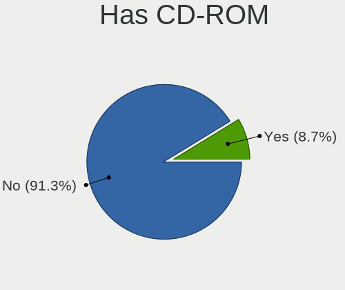
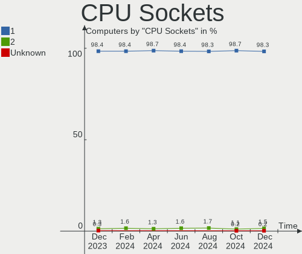
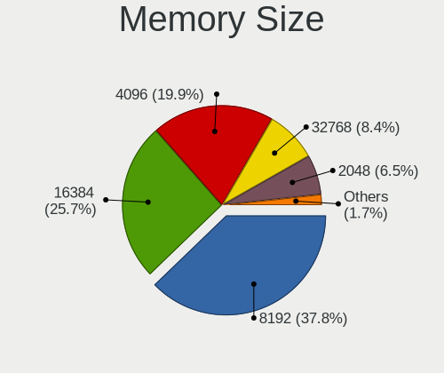

OPNsense - Hardware Trends
--------------------------

A project to identify most popular hardware characteristics and track their change
over time based on data collected by BSD users at https://BSD-Hardware.info.

Anyone can contribute to this report by the [hw-probe](https://github.com/linuxhw/hw-probe/blob/master/INSTALL.BSD.md) tool:

    hw-probe -all -upload

This report is for one last month. Overall report since the beginning of time: [TestDays](https://github.com/bsdhw/TestDays)

Period: Oct, 2023.

Contents
--------

* [ System ](#system)
  - [ OS                       ](#os)
  - [ OS Family                ](#os-family)
  - [ Arch                     ](#arch)
  - [ DE                       ](#de)
  - [ Display Server           ](#display-server)
  - [ Display Manager          ](#display-manager)
  - [ OS Lang                  ](#os-lang)
  - [ Boot Mode                ](#boot-mode)
  - [ Filesystem               ](#filesystem)
  - [ Part. scheme             ](#part-scheme)

* [ Board ](#board)
  - [ Vendor                   ](#vendor)
  - [ Model                    ](#model)
  - [ Model Family             ](#model-family)
  - [ MFG Year                 ](#mfg-year)
  - [ Form Factor              ](#form-factor)
  - [ Coreboot                 ](#coreboot)
  - [ RAM Size                 ](#ram-size)
  - [ RAM Used                 ](#ram-used)
  - [ Total Drives             ](#total-drives)
  - [ Has CD-ROM               ](#has-cd-rom)
  - [ Has Ethernet             ](#has-ethernet)
  - [ Has WiFi                 ](#has-wifi)
  - [ Has Bluetooth            ](#has-bluetooth)

* [ Location ](#location)
  - [ Country                  ](#country)
  - [ City                     ](#city)

* [ Drives ](#drives)
  - [ Drive Vendor             ](#drive-vendor)
  - [ Drive Model              ](#drive-model)
  - [ HDD Vendor               ](#hdd-vendor)
  - [ SSD Vendor               ](#ssd-vendor)
  - [ Drive Kind               ](#drive-kind)
  - [ Drive Connector          ](#drive-connector)
  - [ Drive Size               ](#drive-size)
  - [ Space Total              ](#space-total)
  - [ Space Used               ](#space-used)
  - [ Malfunc. Drives          ](#malfunc-drives)
  - [ Malfunc. Drive Vendor    ](#malfunc-drive-vendor)
  - [ Malfunc. HDD Vendor      ](#malfunc-hdd-vendor)
  - [ Malfunc. Drive Kind      ](#malfunc-drive-kind)
  - [ Failed Drives            ](#failed-drives)
  - [ Failed Drive Vendor      ](#failed-drive-vendor)
  - [ Drive Status             ](#drive-status)

* [ Storage controller ](#storage-controller)
  - [ Storage Vendor           ](#storage-vendor)
  - [ Storage Model            ](#storage-model)
  - [ Storage Kind             ](#storage-kind)

* [ Processor ](#processor)
  - [ CPU Vendor               ](#cpu-vendor)
  - [ CPU Model                ](#cpu-model)
  - [ CPU Model Family         ](#cpu-model-family)
  - [ CPU Cores                ](#cpu-cores)
  - [ CPU Sockets              ](#cpu-sockets)
  - [ CPU Threads              ](#cpu-threads)
  - [ CPU Microarch            ](#cpu-microarch)

* [ Graphics ](#graphics)
  - [ GPU Vendor               ](#gpu-vendor)
  - [ GPU Model                ](#gpu-model)
  - [ GPU Combo                ](#gpu-combo)
  - [ GPU Driver               ](#gpu-driver)
  - [ GPU Memory               ](#gpu-memory)

* [ Monitor ](#monitor)
  - [ Monitor Vendor           ](#monitor-vendor)
  - [ Monitor Model            ](#monitor-model)
  - [ Monitor Resolution       ](#monitor-resolution)
  - [ Monitor Diagonal         ](#monitor-diagonal)
  - [ Monitor Width            ](#monitor-width)
  - [ Aspect Ratio             ](#aspect-ratio)
  - [ Monitor Area             ](#monitor-area)
  - [ Pixel Density            ](#pixel-density)
  - [ Multiple Monitors        ](#multiple-monitors)

* [ Network ](#network)
  - [ Net Controller Vendor    ](#net-controller-vendor)
  - [ Net Controller Model     ](#net-controller-model)
  - [ Wireless Vendor          ](#wireless-vendor)
  - [ Wireless Model           ](#wireless-model)
  - [ Ethernet Vendor          ](#ethernet-vendor)
  - [ Ethernet Model           ](#ethernet-model)
  - [ Net Controller Kind      ](#net-controller-kind)
  - [ Used Controller          ](#used-controller)
  - [ NICs                     ](#nics)
  - [ IPv6                     ](#ipv6)

* [ Bluetooth ](#bluetooth)
  - [ Bluetooth Vendor         ](#bluetooth-vendor)
  - [ Bluetooth Model          ](#bluetooth-model)

* [ Sound ](#sound)
  - [ Sound Vendor             ](#sound-vendor)
  - [ Sound Model              ](#sound-model)

* [ Memory ](#memory)
  - [ Memory Vendor            ](#memory-vendor)
  - [ Memory Model             ](#memory-model)
  - [ Memory Kind              ](#memory-kind)
  - [ Memory Form Factor       ](#memory-form-factor)
  - [ Memory Size              ](#memory-size)
  - [ Memory Speed             ](#memory-speed)

* [ Printers & scanners ](#printers--scanners)
  - [ Printer Vendor           ](#printer-vendor)
  - [ Printer Model            ](#printer-model)
  - [ Scanner Vendor           ](#scanner-vendor)
  - [ Scanner Model            ](#scanner-model)

* [ Camera ](#camera)
  - [ Camera Vendor            ](#camera-vendor)
  - [ Camera Model             ](#camera-model)

* [ Security ](#security)
  - [ Fingerprint Vendor       ](#fingerprint-vendor)
  - [ Fingerprint Model        ](#fingerprint-model)
  - [ Chipcard Vendor          ](#chipcard-vendor)
  - [ Chipcard Model           ](#chipcard-model)

* [ Unsupported ](#unsupported)
  - [ Unsupported Devices      ](#unsupported-devices)
  - [ Unsupported Device Types ](#unsupported-device-types)

System
------

OS
--

Installed operating systems

| Name             | Computers | Percent |
|------------------|-----------|---------|
| OPNsense 23.7.6  | 123       | 36.94%  |
| OPNsense 23.7.5  | 105       | 31.53%  |
| OPNsense 23.7.7  | 68        | 20.42%  |
| OPNsense 23.1.11 | 9         | 2.7%    |
| OPNsense 24.1    | 6         | 1.8%    |
| OPNsense 23.4.2  | 5         | 1.5%    |
| OPNsense 23.7.3  | 4         | 1.2%    |
| OPNsense 23.7.1  | 3         | 0.9%    |
| OPNsense 23.7.4  | 2         | 0.6%    |
| OPNsense 23.1.10 | 2         | 0.6%    |
| OPNsense 23.10   | 1         | 0.3%    |
| OPNsense 23.1.6  | 1         | 0.3%    |
| OPNsense 22.7.9  | 1         | 0.3%    |
| OPNsense 22.7.8  | 1         | 0.3%    |
| OPNsense 22.7.11 | 1         | 0.3%    |
| OPNsense 22.1.10 | 1         | 0.3%    |

OS Family
---------

OS without a version

| Name     | Computers | Percent |
|----------|-----------|---------|
| OPNsense | 333       | 100%    |

Arch
----

OS architecture (x86_64, i586, etc.)

| Name  | Computers | Percent |
|-------|-----------|---------|
| amd64 | 332       | 99.7%   |
| arm64 | 1         | 0.3%    |

DE
--

Desktop Environment

| Name    | Computers | Percent |
|---------|-----------|---------|
| Console | 333       | 100%    |

Display Server
--------------

X11 or Wayland

| Name    | Computers | Percent |
|---------|-----------|---------|
| Console | 333       | 100%    |

Display Manager
---------------

SDDM, LightDM, etc.

| Name    | Computers | Percent |
|---------|-----------|---------|
| Console | 333       | 100%    |

OS Lang
-------

Language

| Lang    | Computers | Percent |
|---------|-----------|---------|
| Unknown | 328       | 98.5%   |
| C       | 5         | 1.5%    |

Boot Mode
---------

EFI or BIOS

| Mode | Computers | Percent |
|------|-----------|---------|
| EFI  | 322       | 96.7%   |
| BIOS | 11        | 3.3%    |

Filesystem
----------

Type of filesystem

| Type | Computers | Percent |
|------|-----------|---------|
| Ufs  | 188       | 56.46%  |
| Zfs  | 145       | 43.54%  |

Part. scheme
------------

Scheme of partitioning

| Type    | Computers | Percent |
|---------|-----------|---------|
| GPT     | 325       | 97.6%   |
| MBR     | 4         | 1.2%    |
| Unknown | 4         | 1.2%    |

Board
-----

Vendor
------

Motherboard manufacturer

| Name                                 | Computers | Percent |
|--------------------------------------|-----------|---------|
| Unknown                              | 56        | 16.82%  |
| Dell                                 | 38        | 11.41%  |
| Intel                                | 20        | 6.01%   |
| Hewlett-Packard                      | 17        | 5.11%   |
| Supermicro                           | 14        | 4.2%    |
| Lenovo                               | 14        | 4.2%    |
| Fujitsu                              | 14        | 4.2%    |
| Sophos                               | 12        | 3.6%    |
| Protectli                            | 12        | 3.6%    |
| Gigabyte Technology                  | 11        | 3.3%    |
| Deciso                               | 10        | 3%      |
| ASUSTek Computer                     | 10        | 3%      |
| ASRock                               | 10        | 3%      |
| AMI                                  | 9         | 2.7%    |
| PC Engines                           | 8         | 2.4%    |
| Techvision                           | 7         | 2.1%    |
| CWWK                                 | 5         | 1.5%    |
| AZW                                  | 5         | 1.5%    |
| MW                                   | 4         | 1.2%    |
| Yanling                              | 3         | 0.9%    |
| Win element                          | 3         | 0.9%    |
| Hardkernel                           | 3         | 0.9%    |
| GoWin Solution                       | 3         | 0.9%    |
| CncTion                              | 3         | 0.9%    |
| Apple                                | 3         | 0.9%    |
| ZOTAC                                | 2         | 0.6%    |
| Shuttle                              | 2         | 0.6%    |
| ShenZhen MinWin Technology           | 2         | 0.6%    |
| Shenzhen Meigao Electronic Equipment | 2         | 0.6%    |
| MSI                                  | 2         | 0.6%    |
| Acer                                 | 2         | 0.6%    |
| YANYU                                | 1         | 0.3%    |
| YanRay Technology                    | 1         | 0.3%    |
| Winston Marriot                      | 1         | 0.3%    |
| TONK                                 | 1         | 0.3%    |
| Seeed Studio                         | 1         | 0.3%    |
| Seco                                 | 1         | 0.3%    |
| PICO PC                              | 1         | 0.3%    |
| Pegatron                             | 1         | 0.3%    |
| OEM                                  | 1         | 0.3%    |

Model
-----

Motherboard model

| Name                                | Computers | Percent |
|-------------------------------------|-----------|---------|
| Unknown                             | 57        | 17.12%  |
| Sophos SG                           | 10        | 3%      |
| Techvision TVI7309X                 | 7         | 2.1%    |
| Fujitsu FUTRO S920                  | 7         | 2.1%    |
| Supermicro Super Server             | 5         | 1.5%    |
| AZW EQ                              | 5         | 1.5%    |
| AMI Aptio CRB                       | 5         | 1.5%    |
| PC Engines APU2                     | 4         | 1.2%    |
| MW GMLK-2_5G4L                      | 4         | 1.2%    |
| Win element M600                    | 3         | 0.9%    |
| Protectli FW4B                      | 3         | 0.9%    |
| PC Engines apu4                     | 3         | 0.9%    |
| Intel Q3XXG4-P V1.0                 | 3         | 0.9%    |
| Intel MAHOBAY                       | 3         | 0.9%    |
| HP Compaq Elite 8300 SFF            | 3         | 0.9%    |
| GoWin Solution R86S                 | 3         | 0.9%    |
| Dell OptiPlex 7050                  | 3         | 0.9%    |
| Dell OptiPlex 7010                  | 3         | 0.9%    |
| Dell OptiPlex 3050                  | 3         | 0.9%    |
| Deciso NetBoard-A20                 | 3         | 0.9%    |
| Deciso NetBoard-A10                 | 3         | 0.9%    |
| Yanling YL-KBR6L                    | 2         | 0.6%    |
| Protectli VP2410                    | 2         | 0.6%    |
| Protectli FW6                       | 2         | 0.6%    |
| Intel NUC11TNHi3                    | 2         | 0.6%    |
| HP t730 Thin Client                 | 2         | 0.6%    |
| HP EliteDesk 800 G3 SFF             | 2         | 0.6%    |
| Hardkernel ODROID-H3                | 2         | 0.6%    |
| Fujitsu FUTRO S940                  | 2         | 0.6%    |
| Dell Wyse 5070 Extended Thin Client | 2         | 0.6%    |
| Dell OptiPlex 5050                  | 2         | 0.6%    |
| Deciso Netboard A20                 | 2         | 0.6%    |
| CWWK CW-MBX-AD12                    | 2         | 0.6%    |
| CncTion N5105-4L                    | 2         | 0.6%    |
| Apple Macmini5,1                    | 2         | 0.6%    |
| AMI SG                              | 2         | 0.6%    |
| ZOTAC ZBOX-CI341                    | 1         | 0.3%    |
| ZOTAC ZBOX-CI329NANO                | 1         | 0.3%    |
| YANYU M9F baytrail                  | 1         | 0.3%    |
| YanRay B1904                        | 1         | 0.3%    |

Model Family
------------

Motherboard model prefix

| Name                 | Computers | Percent |
|----------------------|-----------|---------|
| Unknown              | 57        | 17.12%  |
| Dell OptiPlex        | 21        | 6.31%   |
| Sophos SG            | 10        | 3%      |
| Lenovo ThinkCentre   | 10        | 3%      |
| Fujitsu FUTRO        | 9         | 2.7%    |
| Dell PowerEdge       | 9         | 2.7%    |
| Techvision TVI7309X  | 7         | 2.1%    |
| HP EliteDesk         | 7         | 2.1%    |
| Supermicro Super     | 5         | 1.5%    |
| AZW EQ               | 5         | 1.5%    |
| AMI Aptio            | 5         | 1.5%    |
| PC Engines APU2      | 4         | 1.2%    |
| MW GMLK-2            | 4         | 1.2%    |
| Win element M600     | 3         | 0.9%    |
| Protectli FW4B       | 3         | 0.9%    |
| PC Engines apu4      | 3         | 0.9%    |
| Intel Q3XXG4-P       | 3         | 0.9%    |
| Intel MAHOBAY        | 3         | 0.9%    |
| HP Compaq            | 3         | 0.9%    |
| GoWin Solution R86S  | 3         | 0.9%    |
| Dell Wyse            | 3         | 0.9%    |
| Dell Precision       | 3         | 0.9%    |
| Deciso NetBoard-A20  | 3         | 0.9%    |
| Deciso NetBoard-A10  | 3         | 0.9%    |
| Deciso Netboard      | 3         | 0.9%    |
| Yanling YL-KBR6L     | 2         | 0.6%    |
| Supermicro 1HE       | 2         | 0.6%    |
| Protectli VP2410     | 2         | 0.6%    |
| Protectli FW6        | 2         | 0.6%    |
| Intel NUC11TNHi3     | 2         | 0.6%    |
| HP t730              | 2         | 0.6%    |
| Hardkernel ODROID-H3 | 2         | 0.6%    |
| Fujitsu PRIMERGY     | 2         | 0.6%    |
| CWWK CW-MBX-AD12     | 2         | 0.6%    |
| CncTion N5105-4L     | 2         | 0.6%    |
| Apple Macmini5       | 2         | 0.6%    |
| AMI SG               | 2         | 0.6%    |
| ZOTAC ZBOX-CI341     | 1         | 0.3%    |
| ZOTAC ZBOX-CI329NANO | 1         | 0.3%    |
| YANYU M9F            | 1         | 0.3%    |

MFG Year
--------

Motherboard manufacture year

| Year    | Computers | Percent |
|---------|-----------|---------|
| 2023    | 58        | 17.42%  |
| 2022    | 49        | 14.71%  |
| 2021    | 37        | 11.11%  |
| 2018    | 33        | 9.91%   |
| 2014    | 25        | 7.51%   |
| 2016    | 21        | 6.31%   |
| 2017    | 20        | 6.01%   |
| 2020    | 19        | 5.71%   |
| 2019    | 18        | 5.41%   |
| 2015    | 12        | 3.6%    |
| 2012    | 12        | 3.6%    |
| 2011    | 9         | 2.7%    |
| 2013    | 7         | 2.1%    |
| 2010    | 4         | 1.2%    |
| 2009    | 4         | 1.2%    |
| 2008    | 2         | 0.6%    |
| 2007    | 2         | 0.6%    |
| Unknown | 1         | 0.3%    |

Form Factor
-----------

Physical design of the computer

| Name     | Computers | Percent |
|----------|-----------|---------|
| Desktop  | 246       | 73.87%  |
| Mini pc  | 32        | 9.61%   |
| Server   | 22        | 6.61%   |
| Notebook | 20        | 6.01%   |
| Firewall | 13        | 3.9%    |

Coreboot
--------

Have coreboot on board

| Used | Computers | Percent |
|------|-----------|---------|
| No   | 322       | 96.7%   |
| Yes  | 11        | 3.3%    |

RAM Size
--------

Total RAM memory

| Size in GB  | Computers | Percent |
|-------------|-----------|---------|
| 8.01-16.0   | 135       | 40.54%  |
| 16.01-24.0  | 101       | 30.33%  |
| 4.01-8.0    | 40        | 12.01%  |
| 32.01-64.0  | 35        | 10.51%  |
| 2.01-3.0    | 9         | 2.7%    |
| 64.01-256.0 | 9         | 2.7%    |
| 24.01-32.0  | 2         | 0.6%    |
| 3.01-4.0    | 1         | 0.3%    |
| 0.51-1.0    | 1         | 0.3%    |

RAM Used
--------

Used RAM memory

| Used GB    | Computers | Percent |
|------------|-----------|---------|
| 0.01-0.5   | 154       | 46.25%  |
| 0.51-1.0   | 132       | 39.64%  |
| 1.01-2.0   | 40        | 12.01%  |
| 2.01-3.0   | 5         | 1.5%    |
| 3.01-4.0   | 1         | 0.3%    |
| 16.01-24.0 | 1         | 0.3%    |

Total Drives
------------

Number of drives on board

| Drives | Computers | Percent |
|--------|-----------|---------|
| 1      | 270       | 81.08%  |
| 0      | 35        | 10.51%  |
| 2      | 25        | 7.51%   |
| 3      | 3         | 0.9%    |

Has CD-ROM
----------

Has CD-ROM on board

| Presented | Computers | Percent |
|-----------|-----------|---------|
| No        | 307       | 92.19%  |
| Yes       | 26        | 7.81%   |

Has Ethernet
------------

Has Ethernet on board

| Presented | Computers | Percent |
|-----------|-----------|---------|
| Yes       | 332       | 99.7%   |
| No        | 1         | 0.3%    |

Has WiFi
--------

Has WiFi module

| Presented | Computers | Percent |
|-----------|-----------|---------|
| No        | 262       | 78.68%  |
| Yes       | 71        | 21.32%  |

Has Bluetooth
-------------

Has Bluetooth module

| Presented | Computers | Percent |
|-----------|-----------|---------|
| No        | 286       | 85.89%  |
| Yes       | 47        | 14.11%  |

Location
--------

Country
-------

Geographic location (country)

| Country      | Computers | Percent |
|--------------|-----------|---------|
| USA          | 87        | 26.13%  |
| Germany      | 72        | 21.62%  |
| UK           | 16        | 4.8%    |
| Canada       | 16        | 4.8%    |
| Australia    | 12        | 3.6%    |
| Netherlands  | 10        | 3%      |
| France       | 10        | 3%      |
| Italy        | 9         | 2.7%    |
| Austria      | 9         | 2.7%    |
| Switzerland  | 8         | 2.4%    |
| Poland       | 7         | 2.1%    |
| Sweden       | 5         | 1.5%    |
| Russia       | 4         | 1.2%    |
| Romania      | 4         | 1.2%    |
| Mexico       | 4         | 1.2%    |
| Finland      | 4         | 1.2%    |
| China        | 4         | 1.2%    |
| Turkey       | 3         | 0.9%    |
| Taiwan       | 3         | 0.9%    |
| South Korea  | 3         | 0.9%    |
| New Zealand  | 3         | 0.9%    |
| Greece       | 3         | 0.9%    |
| Denmark      | 3         | 0.9%    |
| Spain        | 2         | 0.6%    |
| Singapore    | 2         | 0.6%    |
| Norway       | 2         | 0.6%    |
| Latvia       | 2         | 0.6%    |
| Czechia      | 2         | 0.6%    |
| Brazil       | 2         | 0.6%    |
| Vietnam      | 1         | 0.3%    |
| UAE          | 1         | 0.3%    |
| Tunisia      | 1         | 0.3%    |
| Thailand     | 1         | 0.3%    |
| South Africa | 1         | 0.3%    |
| Slovenia     | 1         | 0.3%    |
| Paraguay     | 1         | 0.3%    |
| Malaysia     | 1         | 0.3%    |
| Japan        | 1         | 0.3%    |
| Isle of Man  | 1         | 0.3%    |
| India        | 1         | 0.3%    |

City
----

Geographic location (city)

| City              | Computers | Percent |
|-------------------|-----------|---------|
| Hamburg           | 5         | 1.5%    |
| Berlin            | 5         | 1.5%    |
| Perth             | 4         | 1.2%    |
| Paris             | 4         | 1.2%    |
| Melbourne         | 4         | 1.2%    |
| Frankfurt am Main | 4         | 1.2%    |
| Vienna            | 3         | 0.9%    |
| Charlottesville   | 3         | 0.9%    |
| Cabo San Lucas    | 3         | 0.9%    |
| Boston            | 3         | 0.9%    |
| Zurich            | 2         | 0.6%    |
| Worthing          | 2         | 0.6%    |
| Victoria          | 2         | 0.6%    |
| Uckfield          | 2         | 0.6%    |
| Tampa             | 2         | 0.6%    |
| Sydney            | 2         | 0.6%    |
| Singapore         | 2         | 0.6%    |
| Riga              | 2         | 0.6%    |
| Raleigh           | 2         | 0.6%    |
| Magdeburg         | 2         | 0.6%    |
| Los Angeles       | 2         | 0.6%    |
| London            | 2         | 0.6%    |
| Leipzig           | 2         | 0.6%    |
| Landshut          | 2         | 0.6%    |
| Helsinki          | 2         | 0.6%    |
| Glasgow           | 2         | 0.6%    |
| Gelsenkirchen     | 2         | 0.6%    |
| Dearborn Heights  | 2         | 0.6%    |
| Dallas            | 2         | 0.6%    |
| Columbus          | 2         | 0.6%    |
| Benediktbeuern    | 2         | 0.6%    |
| Auckland          | 2         | 0.6%    |
| Athens            | 2         | 0.6%    |
| Zhongli District  | 1         | 0.3%    |
| Zhengzhou         | 1         | 0.3%    |
| Zagreb            | 1         | 0.3%    |
| Yuma              | 1         | 0.3%    |
| York Haven        | 1         | 0.3%    |
| Yekaterinburg     | 1         | 0.3%    |
| Würzburg         | 1         | 0.3%    |

Drives
------

Drive Vendor
------------

Hard drive vendors

| Vendor              | Computers | Drives | Percent |
|---------------------|-----------|--------|---------|
| Samsung Electronics | 52        | 57     | 16.67%  |
| Transcend           | 34        | 36     | 10.9%   |
| Crucial             | 25        | 26     | 8.01%   |
| Kingston            | 22        | 22     | 7.05%   |
| WDC                 | 18        | 18     | 5.77%   |
| Intel               | 16        | 18     | 5.13%   |
| SanDisk             | 12        | 13     | 3.85%   |
| Toshiba             | 9         | 10     | 2.88%   |
| Seagate             | 9         | 9      | 2.88%   |
| A-DATA Technology   | 9         | 9      | 2.88%   |
| China               | 8         | 8      | 2.56%   |
| FORESEE             | 7         | 7      | 2.24%   |
| Silicon Motion      | 6         | 6      | 1.92%   |
| Phison              | 6         | 6      | 1.92%   |
| SPCC                | 5         | 6      | 1.6%    |
| Protectli           | 5         | 5      | 1.6%    |
| Innodisk            | 5         | 5      | 1.6%    |
| Hoodisk             | 4         | 4      | 1.28%   |
| SK hynix            | 3         | 3      | 0.96%   |
| Micron Technology   | 3         | 4      | 0.96%   |
| Intenso             | 3         | 3      | 0.96%   |
| HGST                | 3         | 3      | 0.96%   |
| Hewlett-Packard     | 3         | 3      | 0.96%   |
| Fanxiang            | 3         | 3      | 0.96%   |
| ATP                 | 3         | 3      | 0.96%   |
| Apacer              | 3         | 3      | 0.96%   |
| OCZ                 | 2         | 2      | 0.64%   |
| Dogfish             | 2         | 2      | 0.64%   |
| XUNZHE              | 1         | 1      | 0.32%   |
| VICKTER             | 1         | 1      | 0.32%   |
| Vaseky              | 1         | 1      | 0.32%   |
| TrueNAS             | 1         | 1      | 0.32%   |
| Timetec             | 1         | 2      | 0.32%   |
| Team                | 1         | 1      | 0.32%   |
| Silicon Power       | 1         | 1      | 0.32%   |
| ShiJi               | 1         | 1      | 0.32%   |
| PNY                 | 1         | 1      | 0.32%   |
| Plextor             | 1         | 1      | 0.32%   |
| Patriot             | 1         | 1      | 0.32%   |
| Netac               | 1         | 1      | 0.32%   |

Drive Model
-----------

Hard drive models

| Model                              | Computers | Percent |
|------------------------------------|-----------|---------|
| Transcend TS64GSSD370 64GB         | 6         | 1.92%   |
| Transcend TS256GMTS952T2 256GB     | 5         | 1.6%    |
| Crucial CT240BX500SSD1 240GB       | 5         | 1.6%    |
| Crucial CT500P3SSD8 500GB          | 4         | 1.28%   |
| Samsung SSD 970 EVO Plus 500GB     | 3         | 0.96%   |
| Samsung SSD 840 EVO 120GB          | 3         | 0.96%   |
| Phison PCIe SSD 512GB              | 3         | 0.96%   |
| Kingston SKC600MS256G 256GB        | 3         | 0.96%   |
| Kingston SA400S37240G 240GB        | 3         | 0.96%   |
| FORESEE 64GB SSD                   | 3         | 0.96%   |
| FORESEE 128GB SSD                  | 3         | 0.96%   |
| Crucial CT500P3PSSD8 500GB         | 3         | 0.96%   |
| Crucial CT250MX500SSD1 250GB       | 3         | 0.96%   |
| China SATA SSD 16GB                | 3         | 0.96%   |
| Transcend TS32GMSA370S 32GB        | 2         | 0.64%   |
| Transcend TS256GMTE652T2 256GB     | 2         | 0.64%   |
| SPCC Solid State Disk 512GB        | 2         | 0.64%   |
| Samsung SSD 980 PRO 1TB            | 2         | 0.64%   |
| Samsung SSD 980 500GB              | 2         | 0.64%   |
| Samsung SSD 980 250GB              | 2         | 0.64%   |
| Samsung SSD 870 EVO 500GB          | 2         | 0.64%   |
| Samsung SSD 870 EVO 250GB          | 2         | 0.64%   |
| Samsung SSD 860 EVO M.2 250GB      | 2         | 0.64%   |
| Samsung SSD 850 PRO 256GB          | 2         | 0.64%   |
| Samsung SSD 850 EVO 250GB          | 2         | 0.64%   |
| Samsung SSD 840 PRO Series 256GB   | 2         | 0.64%   |
| Samsung MZVLB256HAHQ-000L7 256GB   | 2         | 0.64%   |
| Protectli 480GB mSATA              | 2         | 0.64%   |
| Kingston SA400S37480G 480GB        | 2         | 0.64%   |
| Intel SSDSC2KI128G8 80GB           | 2         | 0.64%   |
| Innodisk DEMSR- 08GB mSATA 3ME3    | 2         | 0.64%   |
| Innodisk DEM24-32GM41BC1DC-PC 32GB | 2         | 0.64%   |
| Hoodisk SSD 64GB                   | 2         | 0.64%   |
| Hoodisk SSD 32GB                   | 2         | 0.64%   |
| Fanxiang S501 128GB                | 2         | 0.64%   |
| Dogfish SSD 128GB                  | 2         | 0.64%   |
| Crucial CT250P2SSD8 250GB          | 2         | 0.64%   |
| Crucial CT1000P3PSSD8 1TB          | 2         | 0.64%   |
| A-DATA IM2S3134N-064GM 64GB        | 2         | 0.64%   |
| XUNZHE MSATA 128GB                 | 1         | 0.32%   |

HDD Vendor
----------

Hard disk drive vendors

| Vendor          | Computers | Drives | Percent |
|-----------------|-----------|--------|---------|
| WDC             | 9         | 9      | 33.33%  |
| Seagate         | 9         | 9      | 33.33%  |
| Toshiba         | 4         | 5      | 14.81%  |
| HGST            | 3         | 3      | 11.11%  |
| Hitachi         | 1         | 1      | 3.7%    |
| Hewlett-Packard | 1         | 1      | 3.7%    |

SSD Vendor
----------

Solid state drive vendors

| Vendor              | Computers | Drives | Percent |
|---------------------|-----------|--------|---------|
| Transcend           | 29        | 31     | 14.29%  |
| Samsung Electronics | 28        | 29     | 13.79%  |
| Kingston            | 17        | 17     | 8.37%   |
| Intel               | 15        | 17     | 7.39%   |
| Crucial             | 14        | 15     | 6.9%    |
| SanDisk             | 12        | 13     | 5.91%   |
| China               | 8         | 8      | 3.94%   |
| A-DATA Technology   | 7         | 7      | 3.45%   |
| FORESEE             | 6         | 6      | 2.96%   |
| WDC                 | 5         | 5      | 2.46%   |
| Protectli           | 5         | 5      | 2.46%   |
| Innodisk            | 5         | 5      | 2.46%   |
| Hoodisk             | 4         | 4      | 1.97%   |
| Toshiba             | 3         | 3      | 1.48%   |
| SPCC                | 3         | 4      | 1.48%   |
| SK hynix            | 3         | 3      | 1.48%   |
| Intenso             | 3         | 3      | 1.48%   |
| ATP                 | 3         | 3      | 1.48%   |
| OCZ                 | 2         | 2      | 0.99%   |
| Dogfish             | 2         | 2      | 0.99%   |
| Apacer              | 2         | 2      | 0.99%   |
| XUNZHE              | 1         | 1      | 0.49%   |
| VICKTER             | 1         | 1      | 0.49%   |
| Vaseky              | 1         | 1      | 0.49%   |
| TrueNAS             | 1         | 1      | 0.49%   |
| Timetec             | 1         | 2      | 0.49%   |
| Team                | 1         | 1      | 0.49%   |
| Silicon Power       | 1         | 1      | 0.49%   |
| ShiJi               | 1         | 1      | 0.49%   |
| PNY                 | 1         | 1      | 0.49%   |
| Patriot             | 1         | 1      | 0.49%   |
| Micron Technology   | 1         | 2      | 0.49%   |
| LITEONIT            | 1         | 1      | 0.49%   |
| LITEON              | 1         | 1      | 0.49%   |
| Lexar               | 1         | 1      | 0.49%   |
| KingSpec            | 1         | 1      | 0.49%   |
| KeepData            | 1         | 1      | 0.49%   |
| INDMEM              | 1         | 1      | 0.49%   |
| Indilinx            | 1         | 1      | 0.49%   |
| HPE                 | 1         | 1      | 0.49%   |

Drive Kind
----------

HDD or SSD

| Kind | Computers | Drives | Percent |
|------|-----------|--------|---------|
| SSD  | 198       | 213    | 65.35%  |
| NVMe | 80        | 86     | 26.4%   |
| HDD  | 25        | 28     | 8.25%   |

Drive Connector
---------------

SATA, SAS, NVMe, etc.

| Type | Computers | Drives | Percent |
|------|-----------|--------|---------|
| SATA | 220       | 241    | 73.33%  |
| NVMe | 80        | 86     | 26.67%  |

Drive Size
----------

Size of hard drive

| Size in TB | Computers | Drives | Percent |
|------------|-----------|--------|---------|
| 0.01-0.5   | 198       | 208    | 88.79%  |
| 0.51-1.0   | 20        | 26     | 8.97%   |
| 1.01-2.0   | 5         | 7      | 2.24%   |

Space Total
-----------

Amount of disk space available on the file system

| Size in GB     | Computers | Percent |
|----------------|-----------|---------|
| 101-250        | 171       | 51.35%  |
| 251-500        | 68        | 20.42%  |
| 21-50          | 29        | 8.71%   |
| 51-100         | 28        | 8.41%   |
| 501-1000       | 19        | 5.71%   |
| 1-20           | 14        | 4.2%    |
| 1001-2000      | 3         | 0.9%    |
| More than 3000 | 1         | 0.3%    |

Space Used
----------

Amount of used disk space

| Used GB | Computers | Percent |
|---------|-----------|---------|
| 1-20    | 306       | 91.89%  |
| 21-50   | 17        | 5.11%   |
| 51-100  | 6         | 1.8%    |
| 101-250 | 3         | 0.9%    |
| 251-500 | 1         | 0.3%    |

Malfunc. Drives
---------------

Drive models with a malfunction

| Model                                     | Computers | Drives | Percent |
|-------------------------------------------|-----------|--------|---------|
| WDC WD5003ABYX-18WERA0 500GB              | 1         | 1      | 5%      |
| WDC WD5000AAKX-75U6AA0 500GB              | 1         | 1      | 5%      |
| WDC WD10EZRZ-00Z5HB0 1TB                  | 1         | 1      | 5%      |
| Transcend TS8GMSM610 8GB                  | 1         | 1      | 5%      |
| Toshiba THNSNK256GVN8 M.2 2280 256GB      | 1         | 1      | 5%      |
| Seagate ST1000DM003-1SB102 1TB            | 1         | 1      | 5%      |
| SanDisk SSD PLUS 480GB                    | 1         | 1      | 5%      |
| Samsung Electronics SSD 870 EVO 250GB     | 1         | 1      | 5%      |
| Samsung Electronics SSD 850 EVO mSATA 1TB | 1         | 1      | 5%      |
| OCZ AGILITY3 120GB                        | 1         | 1      | 5%      |
| Micron Technology 2200S NVMe 256GB        | 1         | 1      | 5%      |
| Kingston SHFS37A120G 120GB                | 1         | 1      | 5%      |
| Intel SSDSA2M120G2GC 120GB                | 1         | 1      | 5%      |
| Intel SSDSA2BW120G3H 120GB                | 1         | 1      | 5%      |
| HGST HTS725032A7E630 320GB                | 1         | 1      | 5%      |
| GLOWAY VAL32GS3-mSATA 32GB                | 1         | 1      | 5%      |
| Dogfish SSD 128GB                         | 1         | 1      | 5%      |
| China SH00M128GB                          | 1         | 1      | 5%      |
| China SATA SSD 32GB                       | 1         | 1      | 5%      |
| A-DATA Technology ASU800SS-128GT 128GB    | 1         | 1      | 5%      |

Malfunc. Drive Vendor
---------------------

Vendors of faulty drives

| Vendor              | Computers | Drives | Percent |
|---------------------|-----------|--------|---------|
| WDC                 | 3         | 3      | 15%     |
| Samsung Electronics | 2         | 2      | 10%     |
| Intel               | 2         | 2      | 10%     |
| China               | 2         | 2      | 10%     |
| Transcend           | 1         | 1      | 5%      |
| Toshiba             | 1         | 1      | 5%      |
| Seagate             | 1         | 1      | 5%      |
| SanDisk             | 1         | 1      | 5%      |
| OCZ                 | 1         | 1      | 5%      |
| Micron Technology   | 1         | 1      | 5%      |
| Kingston            | 1         | 1      | 5%      |
| HGST                | 1         | 1      | 5%      |
| GLOWAY              | 1         | 1      | 5%      |
| Dogfish             | 1         | 1      | 5%      |
| A-DATA Technology   | 1         | 1      | 5%      |

Malfunc. HDD Vendor
-------------------

Vendors of faulty HDD drives

| Vendor  | Computers | Drives | Percent |
|---------|-----------|--------|---------|
| WDC     | 3         | 3      | 60%     |
| Seagate | 1         | 1      | 20%     |
| HGST    | 1         | 1      | 20%     |

Malfunc. Drive Kind
-------------------

Kinds of faulty drives

| Kind | Computers | Drives | Percent |
|------|-----------|--------|---------|
| SSD  | 14        | 14     | 70%     |
| HDD  | 5         | 5      | 25%     |
| NVMe | 1         | 1      | 5%      |

Failed Drives
-------------

Failed drive models

| Model                       | Computers | Drives | Percent |
|-----------------------------|-----------|--------|---------|
| Kingston SA2000M8500G 500GB | 1         | 1      | 50%     |
| Intel SSDSC2KB019T8 1.9TB   | 1         | 2      | 50%     |

Failed Drive Vendor
-------------------

Failed drive vendors

| Vendor   | Computers | Drives | Percent |
|----------|-----------|--------|---------|
| Kingston | 1         | 1      | 50%     |
| Intel    | 1         | 2      | 50%     |

Drive Status
------------

Number of failed and malfunc. drives

| Status   | Computers | Drives | Percent |
|----------|-----------|--------|---------|
| Works    | 275       | 300    | 91.67%  |
| Malfunc  | 20        | 20     | 6.67%   |
| Detected | 3         | 4      | 1%      |
| Failed   | 2         | 3      | 0.67%   |

Storage controller
------------------

Storage Vendor
--------------

Storage controller vendors

| Vendor                       | Computers | Percent |
|------------------------------|-----------|---------|
| Intel                        | 273       | 65.47%  |
| AMD                          | 37        | 8.87%   |
| Samsung Electronics          | 26        | 6.24%   |
| Micron/Crucial Technology    | 11        | 2.64%   |
| Silicon Motion               | 9         | 2.16%   |
| Phison Electronics           | 9         | 2.16%   |
| Broadcom / LSI               | 8         | 1.92%   |
| SanDisk                      | 7         | 1.68%   |
| Transcend                    | 5         | 1.2%    |
| Kingston Technology Company  | 5         | 1.2%    |
| Realtek Semiconductor        | 3         | 0.72%   |
| Micron Technology            | 3         | 0.72%   |
| MAXIO Technology (Hangzhou)  | 3         | 0.72%   |
| Hosin Global Electronics     | 3         | 0.72%   |
| Toshiba                      | 2         | 0.48%   |
| Shenzhen Longsys Electronics | 2         | 0.48%   |
| Marvell Technology Group     | 2         | 0.48%   |
| O2 Micro                     | 1         | 0.24%   |
| Netac Technology             | 1         | 0.24%   |
| Lite-On Technology           | 1         | 0.24%   |
| KIOXIA                       | 1         | 0.24%   |
| Hewlett-Packard              | 1         | 0.24%   |
| Chelsio Communications       | 1         | 0.24%   |
| ASMedia Technology           | 1         | 0.24%   |
| ADATA Technology             | 1         | 0.24%   |
| Adaptec                      | 1         | 0.24%   |

Storage Model
-------------

Storage controller models

| Model                                                                            | Computers | Percent |
|----------------------------------------------------------------------------------|-----------|---------|
| Intel Celeron/Pentium Silver Processor SATA Controller                           | 28        | 6.33%   |
| AMD FCH SATA Controller [AHCI mode]                                              | 25        | 5.66%   |
| Unknown                                                                          | 24        | 5.43%   |
| Intel 8 Series/C220 Series Chipset Family 6-port SATA Controller 1 [AHCI mode]   | 22        | 4.98%   |
| Intel Jasper Lake SATA AHCI Controller                                           | 17        | 3.85%   |
| Intel Atom Processor E3800 Series SATA AHCI Controller                           | 14        | 3.17%   |
| Intel Atom/Celeron/Pentium Processor x5-E8000/J3xxx/N3xxx Series SATA Controller | 13        | 2.94%   |
| Micron/Crucial P2 [Nick P2] / P3 / P3 Plus NVMe PCIe SSD (DRAM-less)             | 11        | 2.49%   |
| Intel Q170/Q150/B150/H170/H110/Z170/CM236 Chipset SATA Controller [AHCI Mode]    | 11        | 2.49%   |
| Samsung NVMe SSD Controller SM981/PM981/PM983                                    | 10        | 2.26%   |
| Intel Cannon Lake PCH SATA AHCI Controller                                       | 10        | 2.26%   |
| Intel 7 Series/C210 Series Chipset Family 6-port SATA Controller [AHCI mode]     | 10        | 2.26%   |
| Intel 200 Series PCH SATA controller [AHCI mode]                                 | 10        | 2.26%   |
| Silicon Motion SM2263EN/SM2263XT (DRAM-less) NVMe SSD Controllers                | 9         | 2.04%   |
| Intel Sunrise Point-LP SATA Controller [AHCI mode]                               | 8         | 1.81%   |
| Intel Wildcat Point-LP SATA Controller [AHCI Mode]                               | 7         | 1.58%   |
| Intel Comet Lake SATA AHCI Controller                                            | 7         | 1.58%   |
| Samsung NVMe SSD Controller 980 (DRAM-less)                                      | 6         | 1.36%   |
| Intel SATA Controller [RAID mode]                                                | 6         | 1.36%   |
| Intel Celeron N3350/Pentium N4200/Atom E3900 Series SATA AHCI Controller         | 6         | 1.36%   |
| Intel Alder Lake-P SATA AHCI Controller                                          | 6         | 1.36%   |
| Intel 6 Series/C200 Series Chipset Family 6 port Desktop SATA AHCI Controller    | 6         | 1.36%   |
| AMD FCH SATA Controller [IDE mode]                                               | 6         | 1.36%   |
| Intel Tiger Lake-LP SATA Controller                                              | 5         | 1.13%   |
| Intel Atom Processor C3000 Series SATA Controller 0                              | 5         | 1.13%   |
| Intel Atom processor C2000 AHCI SATA3 Controller                                 | 5         | 1.13%   |
| Intel 8 Series SATA Controller 1 [AHCI mode]                                     | 5         | 1.13%   |
| Samsung NVMe SSD Controller SM961/PM961/SM963                                    | 4         | 0.9%    |
| Samsung NVMe SSD Controller PM9A1/PM9A3/980PRO                                   | 4         | 0.9%    |
| Phison PS5013-E13 PCIe3 NVMe Controller (DRAM-less)                              | 4         | 0.9%    |
| Intel Atom Processor C3000 Series SATA Controller 1                              | 4         | 0.9%    |
| Intel 82801G (ICH7 Family) IDE Controller                                        | 4         | 0.9%    |
| Intel NM10/ICH7 Family SATA Controller [IDE mode]                                | 3         | 0.68%   |
| Intel Elkhart Lake SATA AHCI                                                     | 3         | 0.68%   |
| Intel 7 Series/C210 Series Chipset Family 4-port SATA Controller [IDE mode]      | 3         | 0.68%   |
| Intel 7 Series/C210 Series Chipset Family 2-port SATA Controller [IDE mode]      | 3         | 0.68%   |
| Intel 6 Series/C200 Series Chipset Family 6 port Mobile SATA AHCI Controller     | 3         | 0.68%   |
| Intel 500 Series Chipset Family SATA AHCI Controller                             | 3         | 0.68%   |
| AMD FCH IDE Controller                                                           | 3         | 0.68%   |
| Transcend NVMe PCIe SSD 110S/112S/120S/MTE300S/MTE400S/MTE652T2 (DRAM-less)      | 2         | 0.45%   |

Storage Kind
------------

Kind of storage controller (IDE, SATA, NVMe, SAS, ...)

| Kind | Computers | Percent |
|------|-----------|---------|
| SATA | 289       | 68.32%  |
| NVMe | 91        | 21.51%  |
| IDE  | 21        | 4.96%   |
| RAID | 18        | 4.26%   |
| SAS  | 2         | 0.47%   |
| SCSI | 2         | 0.47%   |

Processor
---------

CPU Vendor
----------

Processor vendors

| Vendor | Computers | Percent |
|--------|-----------|---------|
| Intel  | 289       | 86.79%  |
| AMD    | 43        | 12.91%  |
| ARM    | 1         | 0.3%    |

CPU Model
---------

Processor models

| Model                                    | Computers | Percent |
|------------------------------------------|-----------|---------|
| Intel N100                               | 25        | 7.51%   |
| Intel Celeron J4125 CPU @ 2.00GHz        | 19        | 5.71%   |
| Intel Celeron N5105 @ 2.00GHz            | 14        | 4.2%    |
| Intel Celeron CPU J3160 @ 1.60GHz        | 8         | 2.4%    |
| AMD GX-412TC SOC                         | 8         | 2.4%    |
| Intel Celeron CPU J1900 @ 1.99GHz        | 7         | 2.1%    |
| Intel Pentium Silver N6005 @ 2.00GHz     | 5         | 1.5%    |
| Intel Pentium Silver J5005 CPU @ 1.50GHz | 5         | 1.5%    |
| Intel Core i5-6500 CPU @ 3.20GHz         | 5         | 1.5%    |
| AMD GX-415GA SOC with Radeon HD Graphics | 5         | 1.5%    |
| AMD EPYC 3201 8-Core Processor           | 5         | 1.5%    |
| Intel Core i5-3470 CPU @ 3.20GHz         | 4         | 1.2%    |
| Intel Atom CPU C3558 @ 2.20GHz           | 4         | 1.2%    |
| Intel Core i7-6700 CPU @ 3.40GHz         | 3         | 0.9%    |
| Intel Core i5-8500T CPU @ 2.10GHz        | 3         | 0.9%    |
| Intel Core i5-7500 CPU @ 3.40GHz         | 3         | 0.9%    |
| Intel Core i5-5200U CPU @ 2.20GHz        | 3         | 0.9%    |
| Intel Core i5-4570 CPU @ 3.20GHz         | 3         | 0.9%    |
| Intel Core i5-4460 CPU @ 3.20GHz         | 3         | 0.9%    |
| Intel Core i5-10210U CPU @ 1.60GHz       | 3         | 0.9%    |
| AMD Ryzen Embedded V1500B                | 3         | 0.9%    |
| AMD Ryzen 5 6600H with Radeon Graphics   | 3         | 0.9%    |
| Intel Xeon E-2236 CPU @ 3.40GHz          | 2         | 0.6%    |
| Intel Xeon CPU E3-1246 v3 @ 3.50GHz      | 2         | 0.6%    |
| Intel Pentium Gold 8505                  | 2         | 0.6%    |
| Intel Core i7-7700 CPU @ 3.60GHz         | 2         | 0.6%    |
| Intel Core i5-9400 CPU @ 2.90GHz         | 2         | 0.6%    |
| Intel Core i5-8500 CPU @ 3.00GHz         | 2         | 0.6%    |
| Intel Core i5-8250U CPU @ 1.60GHz        | 2         | 0.6%    |
| Intel Core i5-7200U CPU @ 2.50GHz        | 2         | 0.6%    |
| Intel Core i5-6600 CPU @ 3.30GHz         | 2         | 0.6%    |
| Intel Core i5-4590T CPU @ 2.00GHz        | 2         | 0.6%    |
| Intel Core i5-4590 CPU @ 3.30GHz         | 2         | 0.6%    |
| Intel Core i5-4570S CPU @ 2.90GHz        | 2         | 0.6%    |
| Intel Core i5-4250U CPU @ 1.30GHz        | 2         | 0.6%    |
| Intel Core i5-2415M CPU @ 2.30GHz        | 2         | 0.6%    |
| Intel Core i3-N305                       | 2         | 0.6%    |
| Intel Core i3-8100T CPU @ 3.10GHz        | 2         | 0.6%    |
| Intel Core i3-3220 CPU @ 3.30GHz         | 2         | 0.6%    |
| Intel Core i3-10110U CPU @ 2.10GHz       | 2         | 0.6%    |

CPU Model Family
----------------

Processor model prefix

| Model                   | Computers | Percent |
|-------------------------|-----------|---------|
| Intel Celeron           | 75        | 22.52%  |
| Intel Core i5           | 68        | 20.42%  |
| Other                   | 40        | 12.01%  |
| Intel Xeon              | 25        | 7.51%   |
| Intel Atom              | 19        | 5.71%   |
| Intel Core i3           | 17        | 5.11%   |
| AMD GX                  | 17        | 5.11%   |
| Intel Core i7           | 15        | 4.5%    |
| Intel Pentium Silver    | 10        | 3%      |
| Intel Pentium           | 9         | 2.7%    |
| AMD EPYC                | 8         | 2.4%    |
| AMD Ryzen 5             | 5         | 1.5%    |
| Intel Pentium Gold      | 3         | 0.9%    |
| AMD Ryzen Embedded      | 3         | 0.9%    |
| Intel Core 2 Quad       | 2         | 0.6%    |
| Intel Core 2 Duo        | 2         | 0.6%    |
| AMD FX                  | 2         | 0.6%    |
| Intel Xeon Silver       | 1         | 0.3%    |
| Intel Xeon Gold         | 1         | 0.3%    |
| Intel Pentium Dual-Core | 1         | 0.3%    |
| Intel Pentium Dual      | 1         | 0.3%    |
| Intel Core i9           | 1         | 0.3%    |
| Intel Core 2            | 1         | 0.3%    |
| ARM Cortex              | 1         | 0.3%    |
| AMD Ryzen 9             | 1         | 0.3%    |
| AMD Ryzen 7 PRO         | 1         | 0.3%    |
| AMD Ryzen 7             | 1         | 0.3%    |
| AMD Phenom              | 1         | 0.3%    |
| AMD Athlon              | 1         | 0.3%    |
| AMD A8                  | 1         | 0.3%    |

CPU Cores
---------

Number of processor cores

| Number  | Computers | Percent |
|---------|-----------|---------|
| 4       | 209       | 62.76%  |
| 2       | 62        | 18.62%  |
| 6       | 19        | 5.71%   |
| 8       | 18        | 5.41%   |
| 12      | 10        | 3%      |
| 16      | 3         | 0.9%    |
| 10      | 3         | 0.9%    |
| Unknown | 3         | 0.9%    |
| 32      | 1         | 0.3%    |
| 24      | 1         | 0.3%    |
| 22      | 1         | 0.3%    |
| 5       | 1         | 0.3%    |
| 3       | 1         | 0.3%    |
| 1       | 1         | 0.3%    |

CPU Sockets
-----------

Number of sockets

| Number  | Computers | Percent |
|---------|-----------|---------|
| 1       | 327       | 98.2%   |
| 2       | 5         | 1.5%    |
| Unknown | 1         | 0.3%    |

CPU Threads
-----------

Threads per core (Hyper-Threading)

| Number  | Computers | Percent |
|---------|-----------|---------|
| 1       | 242       | 72.67%  |
| 2       | 88        | 26.43%  |
| Unknown | 3         | 0.9%    |

CPU Microarch
-------------

Microarchitecture

| Name          | Computers | Percent |
|---------------|-----------|---------|
| Unknown       | 67        | 20.12%  |
| KabyLake      | 41        | 12.31%  |
| Silvermont    | 32        | 9.61%   |
| Goldmont plus | 29        | 8.71%   |
| Haswell       | 27        | 8.11%   |
| Skylake       | 18        | 5.41%   |
| IvyBridge     | 17        | 5.11%   |
| Goldmont      | 13        | 3.9%    |
| SandyBridge   | 12        | 3.6%    |
| Puma          | 11        | 3.3%    |
| Zen           | 10        | 3%      |
| Broadwell     | 9         | 2.7%    |
| TigerLake     | 6         | 1.8%    |
| Penryn        | 6         | 1.8%    |
| Jaguar        | 6         | 1.8%    |
| CometLake     | 6         | 1.8%    |
| Westmere      | 5         | 1.5%    |
| Zen 3         | 4         | 1.2%    |
| Core          | 4         | 1.2%    |
| Steamroller   | 2         | 0.6%    |
| Zen+          | 1         | 0.3%    |
| Zen 2         | 1         | 0.3%    |
| Piledriver    | 1         | 0.3%    |
| Nehalem       | 1         | 0.3%    |
| K10 Llano     | 1         | 0.3%    |
| K10           | 1         | 0.3%    |
| Bulldozer     | 1         | 0.3%    |
| Bonnell       | 1         | 0.3%    |

Graphics
--------

GPU Vendor
----------

Vendors of graphics cards

| Vendor                     | Computers | Percent |
|----------------------------|-----------|---------|
| Intel                      | 248       | 78.48%  |
| AMD                        | 24        | 7.59%   |
| ASPEED Technology          | 22        | 6.96%   |
| Matrox Electronics Systems | 12        | 3.8%    |
| Nvidia                     | 10        | 3.16%   |

GPU Model
---------

Graphics card models

| Model                                                                                    | Computers | Percent |
|------------------------------------------------------------------------------------------|-----------|---------|
| Intel Alder Lake-N [UHD Graphics]                                                        | 27        | 8.49%   |
| Intel GeminiLake [UHD Graphics 600]                                                      | 24        | 7.55%   |
| ASPEED Technology ASPEED Graphics Family                                                 | 22        | 6.92%   |
| Intel JasperLake [UHD Graphics]                                                          | 21        | 6.6%    |
| Intel Xeon E3-1200 v3/4th Gen Core Processor Integrated Graphics Controller              | 16        | 5.03%   |
| Intel CoffeeLake-S GT2 [UHD Graphics 630]                                                | 14        | 4.4%    |
| Intel Atom Processor Z36xxx/Z37xxx Series Graphics & Display                             | 14        | 4.4%    |
| Intel Atom/Celeron/Pentium Processor x5-E8000/J3xxx/N3xxx Integrated Graphics Controller | 13        | 4.09%   |
| Intel HD Graphics 530                                                                    | 11        | 3.46%   |
| Intel Xeon E3-1200 v2/3rd Gen Core processor Graphics Controller                         | 9         | 2.83%   |
| Intel 2nd Generation Core Processor Family Integrated Graphics Controller                | 9         | 2.83%   |
| Intel HD Graphics 630                                                                    | 7         | 2.2%    |
| Intel HD Graphics 500                                                                    | 6         | 1.89%   |
| Intel Haswell-ULT Integrated Graphics Controller                                         | 5         | 1.57%   |
| Intel GeminiLake [UHD Graphics 605]                                                      | 5         | 1.57%   |
| AMD Kabini [Radeon HD 8330E]                                                             | 5         | 1.57%   |
| Matrox Electronics Systems MGA G200eW WPCM450                                            | 4         | 1.26%   |
| Intel HD Graphics 620                                                                    | 4         | 1.26%   |
| Intel HD Graphics 5500                                                                   | 4         | 1.26%   |
| Intel 4 Series Chipset Integrated Graphics Controller                                    | 4         | 1.26%   |
| Matrox Electronics Systems Integrated Matrox G200eW3 Graphics Controller                 | 3         | 0.94%   |
| Intel TigerLake-LP GT2 [Iris Xe Graphics]                                                | 3         | 0.94%   |
| Intel Tiger Lake-LP GT2 [UHD Graphics G4]                                                | 3         | 0.94%   |
| Intel Elkhart Lake [UHD Graphics Gen11 16EU]                                             | 3         | 0.94%   |
| Intel CometLake-U GT2 [UHD Graphics]                                                     | 3         | 0.94%   |
| Intel CometLake-S GT2 [UHD Graphics 630]                                                 | 3         | 0.94%   |
| Intel Alder Lake-UP3 GT1 [UHD Graphics]                                                  | 3         | 0.94%   |
| AMD Rembrandt [Radeon 680M]                                                              | 3         | 0.94%   |
| AMD Mullins [Radeon R4/R5 Graphics]                                                      | 3         | 0.94%   |
| AMD Cezanne [Radeon Vega Series / Radeon Vega Mobile Series]                             | 3         | 0.94%   |
| Nvidia GK208B [GeForce GT 710]                                                           | 2         | 0.63%   |
| Matrox Electronics Systems MGA G200e [Pilot] ServerEngines (SEP1)                        | 2         | 0.63%   |
| Matrox Electronics Systems G200eR2                                                       | 2         | 0.63%   |
| Intel Xeon E3-1200 v3 Processor Integrated Graphics Controller                           | 2         | 0.63%   |
| Intel UHD Graphics 620                                                                   | 2         | 0.63%   |
| Intel IvyBridge GT2 [HD Graphics 4000]                                                   | 2         | 0.63%   |
| Intel HD Graphics 610                                                                    | 2         | 0.63%   |
| Intel HD Graphics 6000                                                                   | 2         | 0.63%   |
| Intel HD Graphics 510                                                                    | 2         | 0.63%   |
| Intel Comet Lake UHD Graphics                                                            | 2         | 0.63%   |

GPU Combo
---------

Combinations of graphics cards

| Name            | Computers | Percent |
|-----------------|-----------|---------|
| 1 x Intel       | 238       | 71.47%  |
| Other           | 23        | 6.91%   |
| 1 x AMD         | 21        | 6.31%   |
| 1 x ASPEED      | 19        | 5.71%   |
| 1 x Matrox      | 12        | 3.6%    |
| 1 x Nvidia      | 8         | 2.4%    |
| 2 x Intel       | 5         | 1.5%    |
| Intel + Nvidia  | 2         | 0.6%    |
| Intel + ASPEED  | 2         | 0.6%    |
| 2 x AMD         | 1         | 0.3%    |
| Intel + 2 x AMD | 1         | 0.3%    |
| AMD + ASPEED    | 1         | 0.3%    |

GPU Driver
----------

Free vs proprietary

| Driver  | Computers | Percent |
|---------|-----------|---------|
| Free    | 310       | 93.09%  |
| Unknown | 23        | 6.91%   |

GPU Memory
----------

Total video memory

| Size in GB | Computers | Percent |
|------------|-----------|---------|
| Unknown    | 333       | 100%    |

Monitor
-------

Monitor Vendor
--------------

Monitor vendors

Zero info for selected period =(

Monitor Model
-------------

Monitor models

Zero info for selected period =(

Monitor Resolution
------------------

Monitor screen resolution

Zero info for selected period =(

Monitor Diagonal
----------------

Diagonal size in inches

Zero info for selected period =(

Monitor Width
-------------

Physical width

Zero info for selected period =(

Aspect Ratio
------------

Proportional relationship between the width and the height

Zero info for selected period =(

Monitor Area
------------

Area in inch²

Zero info for selected period =(

Pixel Density
-------------

Pixels per inch

Zero info for selected period =(

Multiple Monitors
-----------------

Total monitors connected

| Total | Computers | Percent |
|-------|-----------|---------|
| 0     | 333       | 100%    |

Network
-------

Net Controller Vendor
---------------------

Controller vendors

| Vendor                          | Computers | Percent |
|---------------------------------|-----------|---------|
| Intel                           | 280       | 61%     |
| Realtek Semiconductor           | 90        | 19.61%  |
| Broadcom                        | 34        | 7.41%   |
| Qualcomm Atheros                | 14        | 3.05%   |
| Mellanox Technologies           | 10        | 2.18%   |
| AMD                             | 9         | 1.96%   |
| TP-Link                         | 4         | 0.87%   |
| U-Blox                          | 2         | 0.44%   |
| MediaTek                        | 2         | 0.44%   |
| IMC Networks                    | 2         | 0.44%   |
| Aquantia                        | 2         | 0.44%   |
| Seeed Technology                | 1         | 0.22%   |
| Ralink Technology               | 1         | 0.22%   |
| Qualcomm Atheros Communications | 1         | 0.22%   |
| Insyde Software                 | 1         | 0.22%   |
| ICS Advent                      | 1         | 0.22%   |
| Dell                            | 1         | 0.22%   |
| D-Link System                   | 1         | 0.22%   |
| Chelsio Communications          | 1         | 0.22%   |
| Android                         | 1         | 0.22%   |
| American Megatrends             | 1         | 0.22%   |

Net Controller Model
--------------------

Controller models

| Model                                                                         | Computers | Percent |
|-------------------------------------------------------------------------------|-----------|---------|
| Realtek RTL8111/8168/8411 PCI Express Gigabit Ethernet Controller             | 70        | 11.95%  |
| Intel Ethernet Controller I226-V                                              | 46        | 7.85%   |
| Intel I211 Gigabit Network Connection                                         | 45        | 7.68%   |
| Intel Ethernet Controller I225-V                                              | 36        | 6.14%   |
| Intel I210 Gigabit Network Connection                                         | 33        | 5.63%   |
| Intel I350 Gigabit Network Connection                                         | 32        | 5.46%   |
| Realtek RTL8125 2.5GbE Controller                                             | 16        | 2.73%   |
| Intel 82599ES 10-Gigabit SFI/SFP+ Network Connection                          | 11        | 1.88%   |
| Intel 82576 Gigabit Network Connection                                        | 11        | 1.88%   |
| Intel Ethernet Connection I217-LM                                             | 9         | 1.54%   |
| Intel 82580 Gigabit Network Connection                                        | 9         | 1.54%   |
| Intel 82574L Gigabit Network Connection                                       | 9         | 1.54%   |
| AMD XGMAC 10GbE Controller                                                    | 9         | 1.54%   |
| Intel Ethernet Connection (7) I219-LM                                         | 8         | 1.37%   |
| Intel 82583V Gigabit Network Connection                                       | 8         | 1.37%   |
| Intel 82579LM Gigabit Network Connection (Lewisville)                         | 8         | 1.37%   |
| Intel Ethernet Connection (7) I219-V                                          | 7         | 1.19%   |
| Intel 82571EB/82571GB Gigabit Ethernet Controller (Copper)                    | 7         | 1.19%   |
| Broadcom NetXtreme BCM5720 Gigabit Ethernet PCIe                              | 7         | 1.19%   |
| Mellanox MT27500 Family [ConnectX-3]                                          | 6         | 1.02%   |
| Intel Ethernet Connection (5) I219-LM                                         | 6         | 1.02%   |
| Intel Ethernet Connection (2) I219-LM                                         | 6         | 1.02%   |
| Intel I210 Gigabit Fiber Network Connection                                   | 5         | 0.85%   |
| Intel Ethernet Connection X553 1GbE                                           | 5         | 0.85%   |
| Intel Ethernet Connection I354                                                | 5         | 0.85%   |
| Broadcom NetXtreme II BCM5709 Gigabit Ethernet                                | 5         | 0.85%   |
| Realtek RTL8821CE 802.11ac PCIe Wireless Network Adapter                      | 4         | 0.68%   |
| Qualcomm Atheros AR93xx Wireless Network Adapter                              | 4         | 0.68%   |
| Intel Wireless 8265 / 8275                                                    | 4         | 0.68%   |
| Intel Wireless 7260                                                           | 4         | 0.68%   |
| Intel Ethernet Controller X710 for 10GbE SFP+                                 | 4         | 0.68%   |
| Intel CNVi: Wi-Fi                                                             | 4         | 0.68%   |
| Intel 82575EB Gigabit Network Connection                                      | 4         | 0.68%   |
| Intel 82571EB/82571GB Gigabit Ethernet Controller D0/D1 (copper applications) | 4         | 0.68%   |
| Realtek RTL-8100/8101L/8139 PCI Fast Ethernet Adapter                         | 3         | 0.51%   |
| Mellanox MT26448 [ConnectX EN 10GigE, PCIe 2.0 5GT/s]                         | 3         | 0.51%   |
| Intel Wireless 3165                                                           | 3         | 0.51%   |
| Intel Wi-Fi 6 AX201 160MHz                                                    | 3         | 0.51%   |
| Intel Wi-Fi 6 AX200                                                           | 3         | 0.51%   |
| Intel Gemini Lake PCH CNVi WiFi                                               | 3         | 0.51%   |

Wireless Vendor
---------------

Wireless vendors

| Vendor                          | Computers | Percent |
|---------------------------------|-----------|---------|
| Intel                           | 35        | 47.95%  |
| Realtek Semiconductor           | 11        | 15.07%  |
| Qualcomm Atheros                | 10        | 13.7%   |
| Broadcom                        | 7         | 9.59%   |
| TP-Link                         | 4         | 5.48%   |
| MediaTek                        | 2         | 2.74%   |
| IMC Networks                    | 2         | 2.74%   |
| Ralink Technology               | 1         | 1.37%   |
| Qualcomm Atheros Communications | 1         | 1.37%   |

Wireless Model
--------------

Wireless models

| Model                                                          | Computers | Percent |
|----------------------------------------------------------------|-----------|---------|
| Realtek RTL8821CE 802.11ac PCIe Wireless Network Adapter       | 4         | 5.48%   |
| Qualcomm Atheros AR93xx Wireless Network Adapter               | 4         | 5.48%   |
| Intel Wireless 8265 / 8275                                     | 4         | 5.48%   |
| Intel Wireless 7260                                            | 4         | 5.48%   |
| Intel CNVi: Wi-Fi                                              | 4         | 5.48%   |
| Intel Wireless 3165                                            | 3         | 4.11%   |
| Intel Wi-Fi 6 AX201 160MHz                                     | 3         | 4.11%   |
| Intel Wi-Fi 6 AX200                                            | 3         | 4.11%   |
| Intel Gemini Lake PCH CNVi WiFi                                | 3         | 4.11%   |
| Realtek RTL8192CU 802.11n WLAN Adapter                         | 2         | 2.74%   |
| Qualcomm Atheros QCA9377 802.11ac Wireless Network Adapter     | 2         | 2.74%   |
| MediaTek MT7921K (RZ608) Wi-Fi 6E 80MHz                        | 2         | 2.74%   |
| Intel Wireless 7265                                            | 2         | 2.74%   |
| Intel Cannon Lake PCH CNVi WiFi                                | 2         | 2.74%   |
| IMC Networks 802.11 n/g/b Wireless LAN USB Mini-Card           | 2         | 2.74%   |
| Broadcom BCM4360 802.11ac Dual Band Wireless Network Adapter   | 2         | 2.74%   |
| Broadcom BCM4331 802.11a/b/g/n                                 | 2         | 2.74%   |
| TP-Link Wireless USB Adapter                                   | 1         | 1.37%   |
| TP-Link Archer T3U [Realtek RTL8812BU]                         | 1         | 1.37%   |
| TP-Link Archer T2U PLUS [RTL8821AU]                            | 1         | 1.37%   |
| TP-Link AC600 wireless Realtek RTL8811AU [Archer T2U Nano]     | 1         | 1.37%   |
| Realtek RTL8814AU 802.11a/b/g/n/ac Wireless Adapter            | 1         | 1.37%   |
| Realtek RTL8723BE PCIe Wireless Network Adapter                | 1         | 1.37%   |
| Realtek RTL8191SEvA Wireless LAN Controller                    | 1         | 1.37%   |
| Realtek RTL8188CE 802.11b/g/n WiFi Adapter                     | 1         | 1.37%   |
| Realtek RTL8187SE Wireless LAN Controller                      | 1         | 1.37%   |
| Ralink RT5572 Wireless Adapter                                 | 1         | 1.37%   |
| Qualcomm Atheros AR9271 802.11n                                | 1         | 1.37%   |
| Qualcomm Atheros AR9485 Wireless Network Adapter               | 1         | 1.37%   |
| Qualcomm Atheros AR928X Wireless Network Adapter (PCI-Express) | 1         | 1.37%   |
| Qualcomm Atheros AR9287 Wireless Network Adapter (PCI-Express) | 1         | 1.37%   |
| Qualcomm Atheros AR9285 Wireless Network Adapter (PCI-Express) | 1         | 1.37%   |
| Intel Wireless-AC 9260                                         | 1         | 1.37%   |
| Intel Wi-Fi 6 AX210/AX211/AX411 160MHz                         | 1         | 1.37%   |
| Intel Wi-Fi 6 AX201                                            | 1         | 1.37%   |
| Intel Ultimate N WiFi Link 5300                                | 1         | 1.37%   |
| Intel Raptor Lake PCH CNVi WiFi                                | 1         | 1.37%   |
| Intel PRO/Wireless 4965 AG or AGN [Kedron] Network Connection  | 1         | 1.37%   |
| Intel Dual Band Wireless-AC 3168NGW [Stone Peak]               | 1         | 1.37%   |
| Broadcom BCM43224 802.11a/b/g/n                                | 1         | 1.37%   |

Ethernet Vendor
---------------

Ethernet vendors

| Vendor                 | Computers | Percent |
|------------------------|-----------|---------|
| Intel                  | 272       | 66.18%  |
| Realtek Semiconductor  | 88        | 21.41%  |
| Broadcom               | 30        | 7.3%    |
| AMD                    | 9         | 2.19%   |
| Qualcomm Atheros       | 4         | 0.97%   |
| Aquantia               | 2         | 0.49%   |
| Insyde Software        | 1         | 0.24%   |
| ICS Advent             | 1         | 0.24%   |
| D-Link System          | 1         | 0.24%   |
| Chelsio Communications | 1         | 0.24%   |
| Android                | 1         | 0.24%   |
| American Megatrends    | 1         | 0.24%   |

Ethernet Model
--------------

Ethernet models

| Model                                                                         | Computers | Percent |
|-------------------------------------------------------------------------------|-----------|---------|
| Realtek RTL8111/8168/8411 PCI Express Gigabit Ethernet Controller             | 70        | 14.11%  |
| Intel Ethernet Controller I226-V                                              | 46        | 9.27%   |
| Intel I211 Gigabit Network Connection                                         | 45        | 9.07%   |
| Intel Ethernet Controller I225-V                                              | 36        | 7.26%   |
| Intel I210 Gigabit Network Connection                                         | 33        | 6.65%   |
| Intel I350 Gigabit Network Connection                                         | 32        | 6.45%   |
| Realtek RTL8125 2.5GbE Controller                                             | 16        | 3.23%   |
| Intel 82599ES 10-Gigabit SFI/SFP+ Network Connection                          | 11        | 2.22%   |
| Intel 82576 Gigabit Network Connection                                        | 11        | 2.22%   |
| Intel Ethernet Connection I217-LM                                             | 9         | 1.81%   |
| Intel 82580 Gigabit Network Connection                                        | 9         | 1.81%   |
| Intel 82574L Gigabit Network Connection                                       | 9         | 1.81%   |
| AMD XGMAC 10GbE Controller                                                    | 9         | 1.81%   |
| Intel Ethernet Connection (7) I219-LM                                         | 8         | 1.61%   |
| Intel 82583V Gigabit Network Connection                                       | 8         | 1.61%   |
| Intel 82579LM Gigabit Network Connection (Lewisville)                         | 8         | 1.61%   |
| Intel Ethernet Connection (7) I219-V                                          | 7         | 1.41%   |
| Intel 82571EB/82571GB Gigabit Ethernet Controller (Copper)                    | 7         | 1.41%   |
| Broadcom NetXtreme BCM5720 Gigabit Ethernet PCIe                              | 7         | 1.41%   |
| Intel Ethernet Connection (5) I219-LM                                         | 6         | 1.21%   |
| Intel Ethernet Connection (2) I219-LM                                         | 6         | 1.21%   |
| Intel I210 Gigabit Fiber Network Connection                                   | 5         | 1.01%   |
| Intel Ethernet Connection X553 1GbE                                           | 5         | 1.01%   |
| Intel Ethernet Connection I354                                                | 5         | 1.01%   |
| Broadcom NetXtreme II BCM5709 Gigabit Ethernet                                | 5         | 1.01%   |
| Intel Ethernet Controller X710 for 10GbE SFP+                                 | 4         | 0.81%   |
| Intel 82575EB Gigabit Network Connection                                      | 4         | 0.81%   |
| Intel 82571EB/82571GB Gigabit Ethernet Controller D0/D1 (copper applications) | 4         | 0.81%   |
| Realtek RTL-8100/8101L/8139 PCI Fast Ethernet Adapter                         | 3         | 0.6%    |
| Intel Ethernet Controller I225-LM                                             | 3         | 0.6%    |
| Intel 82575GB Gigabit Network Connection                                      | 3         | 0.6%    |
| Broadcom NetXtreme II BCM57810 10 Gigabit Ethernet                            | 3         | 0.6%    |
| Broadcom NetXtreme II BCM5716 Gigabit Ethernet                                | 3         | 0.6%    |
| Broadcom NetXtreme BCM5719 Gigabit Ethernet PCIe                              | 3         | 0.6%    |
| Realtek RTL810xE PCI Express Fast Ethernet controller                         | 2         | 0.4%    |
| Intel I350 Gigabit Fiber Network Connection                                   | 2         | 0.4%    |
| Intel Ethernet Controller 10-Gigabit X540-AT2                                 | 2         | 0.4%    |
| Intel Ethernet Connection X553 10 GbE SFP+                                    | 2         | 0.4%    |
| Intel Ethernet Connection (5) I219-V                                          | 2         | 0.4%    |
| Intel Ethernet Connection (11) I219-V                                         | 2         | 0.4%    |

Net Controller Kind
-------------------

Ethernet, WiFi or modem

| Kind     | Computers | Percent |
|----------|-----------|---------|
| Ethernet | 332       | 79.05%  |
| WiFi     | 71        | 16.9%   |
| Unknown  | 13        | 3.1%    |
| Modem    | 4         | 0.95%   |

Used Controller
---------------

Currently used network controller

| Kind     | Computers | Percent |
|----------|-----------|---------|
| Ethernet | 327       | 100%    |

NICs
----

Total network controllers on board

| Total | Computers | Percent |
|-------|-----------|---------|
| 4     | 91        | 27.33%  |
| 3     | 61        | 18.32%  |
| 6     | 58        | 17.42%  |
| 2     | 52        | 15.62%  |
| 5     | 38        | 11.41%  |
| 8     | 11        | 3.3%    |
| 1     | 6         | 1.8%    |
| 9     | 5         | 1.5%    |
| 7     | 4         | 1.2%    |
| 10    | 3         | 0.9%    |
| 20    | 1         | 0.3%    |
| 13    | 1         | 0.3%    |
| 12    | 1         | 0.3%    |
| 0     | 1         | 0.3%    |

IPv6
----

IPv6 vs IPv4

| Used | Computers | Percent |
|------|-----------|---------|
| No   | 264       | 79.28%  |
| Yes  | 69        | 20.72%  |

Bluetooth
---------

Bluetooth Vendor
----------------

Controller vendors

| Vendor                | Computers | Percent |
|-----------------------|-----------|---------|
| Intel                 | 33        | 70.21%  |
| Apple                 | 4         | 8.51%   |
| Realtek Semiconductor | 3         | 6.38%   |
| IMC Networks          | 3         | 6.38%   |
| MediaTek              | 2         | 4.26%   |
| Lite-On Technology    | 2         | 4.26%   |

Bluetooth Model
---------------

Controller models

| Model                                                | Computers | Percent |
|------------------------------------------------------|-----------|---------|
| Intel Bluetooth wireless interface                   | 11        | 23.4%   |
| Intel AX201 Bluetooth                                | 9         | 19.15%  |
| Intel Bluetooth 9460/9560 Jefferson Peak (JfP)       | 5         | 10.64%  |
| Intel AX200 Bluetooth                                | 4         | 8.51%   |
| Apple Bluetooth Host Controller                      | 4         | 8.51%   |
| Realtek Bluetooth Adapter                            | 3         | 6.38%   |
| MediaTek RZ608 Bluetooth Adapter                     | 2         | 4.26%   |
| Lite-On Qualcomm Atheros QCA9377 Bluetooth           | 1         | 2.13%   |
| Lite-On BCM43142A0 Bluetooth Module                  | 1         | 2.13%   |
| Intel Wireless-AC 9260 Bluetooth Adapter             | 1         | 2.13%   |
| Intel Wireless-AC 3168 Bluetooth                     | 1         | 2.13%   |
| Intel Centrino Bluetooth Wireless Transceiver        | 1         | 2.13%   |
| Intel AX210 Bluetooth                                | 1         | 2.13%   |
| IMC Networks Realtek Bluetooth Adapter               | 1         | 2.13%   |
| IMC Networks Realtek Bluetooth 4.0 + High Speed Chip | 1         | 2.13%   |
| IMC Networks Qualcomm Atheros Bluetooth 4.1          | 1         | 2.13%   |

Sound
-----

Sound Vendor
------------

Sound card vendors

| Vendor                                       | Computers | Percent |
|----------------------------------------------|-----------|---------|
| Intel                                        | 214       | 83.27%  |
| AMD                                          | 31        | 12.06%  |
| Nvidia                                       | 6         | 2.33%   |
| Zoran Co. Personal Media Division (Nogatech) | 3         | 1.17%   |
| C-Media Electronics                          | 2         | 0.78%   |
| Realtek Semiconductor                        | 1         | 0.39%   |

Sound Model
-----------

Sound card models

| Model                                                                                             | Computers | Percent |
|---------------------------------------------------------------------------------------------------|-----------|---------|
| Intel Alder Lake-N HD Graphics SGPC                                                               | 26        | 8.93%   |
| Intel Celeron/Pentium Silver Processor High Definition Audio                                      | 24        | 8.25%   |
| Intel Jasper Lake HD Audio                                                                        | 21        | 7.22%   |
| Intel Xeon E3-1200 v3/4th Gen Core Processor HD Audio Controller                                  | 15        | 5.15%   |
| Intel 8 Series/C220 Series Chipset High Definition Audio Controller                               | 13        | 4.47%   |
| Intel Cannon Lake PCH cAVS                                                                        | 12        | 4.12%   |
| Intel Atom/Celeron/Pentium Processor x5-E8000/J3xxx/N3xxx Series High Definition Audio Controller | 12        | 4.12%   |
| Intel 200 Series PCH HD Audio                                                                     | 12        | 4.12%   |
| Intel 7 Series/C216 Chipset Family High Definition Audio Controller                               | 11        | 3.78%   |
| AMD Family 17h/19h HD Audio Controller                                                            | 11        | 3.78%   |
| Intel 100 Series/C230 Series Chipset Family HD Audio Controller                                   | 9         | 3.09%   |
| Intel Atom Processor Z36xxx/Z37xxx Series High Definition Audio Controller                        | 8         | 2.75%   |
| AMD Kabini HDMI/DP Audio                                                                          | 8         | 2.75%   |
| Intel Wildcat Point-LP High Definition Audio Controller                                           | 6         | 2.06%   |
| Intel Comet Lake PCH-LP cAVS                                                                      | 6         | 2.06%   |
| Intel Broadwell-U Audio Controller                                                                | 6         | 2.06%   |
| Intel 6 Series/C200 Series Chipset Family High Definition Audio Controller                        | 6         | 2.06%   |
| AMD FCH Azalia Controller                                                                         | 6         | 2.06%   |
| Intel Tiger Lake-LP Smart Sound Technology Audio Controller                                       | 5         | 1.72%   |
| Intel Sunrise Point-LP HD Audio                                                                   | 5         | 1.72%   |
| Intel Haswell-ULT HD Audio Controller                                                             | 5         | 1.72%   |
| Intel Alder Lake PCH-P High Definition Audio Controller                                           | 5         | 1.72%   |
| Intel 8 Series HD Audio Controller                                                                | 5         | 1.72%   |
| AMD Family 17h (Models 00h-0fh) HD Audio Controller                                               | 5         | 1.72%   |
| Zoran Co. Personal Media Division (Nogatech) USB Audio and HID                                    | 3         | 1.03%   |
| Intel NM10/ICH7 Family High Definition Audio Controller                                           | 3         | 1.03%   |
| Intel Elkhart Lake High Density Audio bus interface                                               | 3         | 1.03%   |
| AMD SBx00 Azalia (Intel HDA)                                                                      | 3         | 1.03%   |
| AMD Renoir Radeon High Definition Audio Controller                                                | 3         | 1.03%   |
| Nvidia GK208 HDMI/DP Audio Controller                                                             | 2         | 0.69%   |
| Intel Smart Sound Technology (SST) Audio Controller                                               | 2         | 0.69%   |
| Intel Celeron N3350/Pentium N4200/Atom E3900 Series Audio Cluster                                 | 2         | 0.69%   |
| Intel Cannon Point-LP High Definition Audio Controller                                            | 2         | 0.69%   |
| Intel C600/X79 series chipset High Definition Audio Controller                                    | 2         | 0.69%   |
| Intel Alder Lake-S HD Audio Controller                                                            | 2         | 0.69%   |
| C-Media Electronics Audio Adapter (Unitek Y-247A)                                                 | 2         | 0.69%   |
| AMD Rembrandt Radeon High Definition Audio Controller                                             | 2         | 0.69%   |
| AMD Kaveri HDMI/DP Audio Controller                                                               | 2         | 0.69%   |
| Realtek Semiconductor USB Audio                                                                   | 1         | 0.34%   |
| Nvidia High Definition Audio Controller                                                           | 1         | 0.34%   |

Memory
------

Memory Vendor
-------------

Memory module vendors

| Vendor                                  | Computers | Percent |
|-----------------------------------------|-----------|---------|
| Samsung Electronics                     | 58        | 16.96%  |
| Crucial                                 | 44        | 12.87%  |
| SK hynix                                | 43        | 12.57%  |
| Micron Technology                       | 32        | 9.36%   |
| Kingston                                | 29        | 8.48%   |
| Unknown                                 | 21        | 6.14%   |
| Corsair                                 | 20        | 5.85%   |
| Unknown                                 | 16        | 4.68%   |
| Transcend                               | 15        | 4.39%   |
| G.Skill                                 | 10        | 2.92%   |
| A-DATA Technology                       | 8         | 2.34%   |
| Team                                    | 6         | 1.75%   |
| Unknown (ABCD)                          | 5         | 1.46%   |
| Ramaxel Technology                      | 5         | 1.46%   |
| Patriot                                 | 3         | 0.88%   |
| Nanya Technology                        | 2         | 0.58%   |
| Heoriady                                | 2         | 0.58%   |
| ATP                                     | 2         | 0.58%   |
| Apacer                                  | 2         | 0.58%   |
| Wodposit                                | 1         | 0.29%   |
| Unknown (AB)                            | 1         | 0.29%   |
| Unknown (0x0B45)                        | 1         | 0.29%   |
| Toshiba                                 | 1         | 0.29%   |
| Timetec                                 | 1         | 0.29%   |
| Teikon                                  | 1         | 0.29%   |
| SK_Hynix                                | 1         | 0.29%   |
| Silicon Power Computer & Communications | 1         | 0.29%   |
| PUSKILL                                 | 1         | 0.29%   |
| PNY                                     | 1         | 0.29%   |
| Kimtigo                                 | 1         | 0.29%   |
| HPE                                     | 1         | 0.29%   |
| GOODRAM                                 | 1         | 0.29%   |
| Elpida                                  | 1         | 0.29%   |
| CSX                                     | 1         | 0.29%   |
| AMD                                     | 1         | 0.29%   |
| 83250000802C                            | 1         | 0.29%   |
| 83130000802C                            | 1         | 0.29%   |
| 06F104B306F1                            | 1         | 0.29%   |

Memory Model
------------

Memory module models

| Model                                                          | Computers | Percent |
|----------------------------------------------------------------|-----------|---------|
| Unknown                                                        | 16        | 4.44%   |
| Transcend RAM TS1GLH64V6BL 8GB SODIMM DDR4 2667MT/s            | 6         | 1.67%   |
| Crucial RAM CT16G48C40S5.M8A1 16GB SODIMM DDR5 4800MT/s        | 6         | 1.67%   |
| Unknown (ABCD) RAM 123456789012345678 2GB DIMM LPDDR4 2400MT/s | 5         | 1.39%   |
| SK hynix RAM HMA81GS6AFR8N-UH 8GB SODIMM DDR4 2400MT/s         | 5         | 1.39%   |
| Unknown RAM Module 4GB DIMM DDR3 1333MT/s                      | 3         | 0.83%   |
| SK hynix RAM HMT451U6AFR8C-PB 4GB DIMM DDR3 1600MT/s           | 3         | 0.83%   |
| SK hynix RAM HMT451S6BFR8A-PB 4GB SODIMM DDR3 1600MT/s         | 3         | 0.83%   |
| Samsung RAM M471A1K43CB1-CTD 8GB SODIMM DDR4 2667MT/s          | 3         | 0.83%   |
| Samsung RAM M471A1K43CB1-CRC 8GB SODIMM DDR4 2667MT/s          | 3         | 0.83%   |
| Micron RAM MTC4C10163S1SC48BA1 8GB SODIMM DDR5 4800MT/s        | 3         | 0.83%   |
| Crucial RAM CT8G48C40S5.M4A1 8GB SODIMM DDR5 4800MT/s          | 3         | 0.83%   |
| Crucial RAM CT16G56C46S5.M8G1 16GB SODIMM DDR5 5600MT/s        | 3         | 0.83%   |
| Corsair RAM CMK16GX4M2B3200C16 8GB DIMM DDR4 3200MT/s          | 3         | 0.83%   |
| Unknown RAM Module 8GB SODIMM DDR3 1600MT/s                    | 2         | 0.56%   |
| Unknown RAM Module 8GB 1600MT/s                                | 2         | 0.56%   |
| Unknown RAM Module 4GB SODIMM DDR3 1333MT/s                    | 2         | 0.56%   |
| Unknown RAM Module 2GB DIMM DDR2 800MT/s                       | 2         | 0.56%   |
| Transcend RAM TS512MLK64W6H 4GB DIMM DDR3 1600MT/s             | 2         | 0.56%   |
| SK hynix RAM HMT451U6BFR8C-PB 4GB DIMM DDR3 1600MT/s           | 2         | 0.56%   |
| SK hynix RAM HMT451U6BFR8A-PB 4GB DIMM DDR3 1600MT/s           | 2         | 0.56%   |
| SK hynix RAM HMT41GS6BFR8A-PB 8GB SODIMM DDR3 1600MT/s         | 2         | 0.56%   |
| SK hynix RAM HMT151R7BFR4C-H9 4GB DIMM DDR3 1333MT/s           | 2         | 0.56%   |
| SK hynix RAM HMA81GU7AFR8N-UH 8GB DIMM DDR4 2400MT/s           | 2         | 0.56%   |
| SK hynix RAM HMA81GS6MFR8N-UH 8GB SODIMM DDR4 2400MT/s         | 2         | 0.56%   |
| Samsung RAM Module 8GB DIMM DDR4 2133MT/s                      | 2         | 0.56%   |
| Samsung RAM Module 4GB SODIMM DDR3 1333MT/s                    | 2         | 0.56%   |
| Samsung RAM M471B5173QH0-YK0 4GB SODIMM DDR3 1600MT/s          | 2         | 0.56%   |
| Samsung RAM M471B5173EB0-YK0 4GB SODIMM DDR3 1600MT/s          | 2         | 0.56%   |
| Samsung RAM M471B1G73EB0-YK0 8GB DIMM DDR3 1600MT/s            | 2         | 0.56%   |
| Samsung RAM M471A1K43DB1-CTD 8GB SODIMM DDR4 2667MT/s          | 2         | 0.56%   |
| Samsung RAM M425R1GB4BB0-CQKOL 8GB SODIMM DDR5 4800MT/s        | 2         | 0.56%   |
| Samsung RAM M378B5273DH0-CH9 4GB DIMM DDR3 1333MT/s            | 2         | 0.56%   |
| Samsung RAM M378B5173DB0-CK0 4GB DIMM DDR3 1600MT/s            | 2         | 0.56%   |
| Ramaxel RAM RMSA3260MH78HAF-2666 8GB SODIMM DDR4 2667MT/s      | 2         | 0.56%   |
| Micron RAM Module 16GB Row Of Chips LPDDR4 4267MT/s            | 2         | 0.56%   |
| Micron RAM 8KTF51264HZ-1G9P1 4GB SODIMM DDR3 1867MT/s          | 2         | 0.56%   |
| Micron RAM 8JTF51264AZ-1G6E1 4GB DIMM DDR3 1600MT/s            | 2         | 0.56%   |
| Micron RAM 18ASF2G72PDZ-2G6J1 16GB DIMM DDR4 2667MT/s          | 2         | 0.56%   |
| Kingston RAM HP698650-154-MCN 4GB DIMM DDR3 1600MT/s           | 2         | 0.56%   |

Memory Kind
-----------

Memory module kinds

| Kind    | Computers | Percent |
|---------|-----------|---------|
| DDR4    | 145       | 45.89%  |
| DDR3    | 114       | 36.08%  |
| DDR5    | 28        | 8.86%   |
| DDR2    | 10        | 3.16%   |
| LPDDR4  | 9         | 2.85%   |
| Unknown | 5         | 1.58%   |
| LPDDR5  | 4         | 1.27%   |
| SDRAM   | 1         | 0.32%   |

Memory Form Factor
------------------

Physical design of the memory module

| Name         | Computers | Percent |
|--------------|-----------|---------|
| SODIMM       | 162       | 51.27%  |
| DIMM         | 141       | 44.62%  |
| Row Of Chips | 8         | 2.53%   |
| Unknown      | 3         | 0.95%   |
| FB-DIMM      | 2         | 0.63%   |

Memory Size
-----------

Memory module size

| Size  | Computers | Percent |
|-------|-----------|---------|
| 8192  | 141       | 42.47%  |
| 4096  | 86        | 25.9%   |
| 16384 | 63        | 18.98%  |
| 2048  | 24        | 7.23%   |
| 32768 | 11        | 3.31%   |
| 1024  | 5         | 1.51%   |
| 3072  | 1         | 0.3%    |
| 512   | 1         | 0.3%    |

Memory Speed
------------

Memory module speed

| Speed   | Computers | Percent |
|---------|-----------|---------|
| 1600    | 84        | 25.61%  |
| 3200    | 48        | 14.63%  |
| 2400    | 44        | 13.41%  |
| 2667    | 40        | 12.2%   |
| 1333    | 33        | 10.06%  |
| 4800    | 23        | 7.01%   |
| 2133    | 11        | 3.35%   |
| 2666    | 8         | 2.44%   |
| 800     | 7         | 2.13%   |
| 6400    | 5         | 1.52%   |
| 5600    | 3         | 0.91%   |
| 1867    | 3         | 0.91%   |
| 1866    | 3         | 0.91%   |
| 1066    | 3         | 0.91%   |
| 667     | 3         | 0.91%   |
| 4267    | 2         | 0.61%   |
| 1067    | 2         | 0.61%   |
| 5200    | 1         | 0.3%    |
| 3600    | 1         | 0.3%    |
| 3000    | 1         | 0.3%    |
| 1033    | 1         | 0.3%    |
| 533     | 1         | 0.3%    |
| Unknown | 1         | 0.3%    |

Printers & scanners
-------------------

Printer Vendor
--------------

Printer device vendors

Zero info for selected period =(

Printer Model
-------------

Printer device models

Zero info for selected period =(

Scanner Vendor
--------------

Scanner device vendors

Zero info for selected period =(

Scanner Model
-------------

Scanner device models

Zero info for selected period =(

Camera
------

Camera Vendor
-------------

Camera device vendors

| Vendor                | Computers | Percent |
|-----------------------|-----------|---------|
| Realtek Semiconductor | 1         | 50%     |
| Bison Electronics     | 1         | 50%     |

Camera Model
------------

Camera device models

| Model                   | Computers | Percent |
|-------------------------|-----------|---------|
| Realtek USB Camera      | 1         | 50%     |
| Bison Integrated Camera | 1         | 50%     |

Security
--------

Fingerprint Vendor
------------------

Fingerprint sensor vendors

| Vendor           | Computers | Percent |
|------------------|-----------|---------|
| Validity Sensors | 1         | 100%    |

Fingerprint Model
-----------------

Fingerprint sensor models

| Model                                        | Computers | Percent |
|----------------------------------------------|-----------|---------|
| Validity Sensors VFS 5011 fingerprint sensor | 1         | 100%    |

Chipcard Vendor
---------------

Chipcard module vendors

Zero info for selected period =(

Chipcard Model
--------------

Chipcard module models

Zero info for selected period =(

Unsupported
-----------

Unsupported Devices
-------------------

Total unsupported devices on board

| Total | Computers | Percent |
|-------|-----------|---------|
| 1     | 168       | 50.45%  |
| 0     | 93        | 27.93%  |
| 2     | 54        | 16.22%  |
| 3     | 12        | 3.6%    |
| 4     | 6         | 1.8%    |

Unsupported Device Types
------------------------

Types of unsupported devices

| Type                     | Computers | Percent |
|--------------------------|-----------|---------|
| Communication controller | 226       | 76.61%  |
| Bluetooth                | 32        | 10.85%  |
| Net/wireless             | 18        | 6.1%    |
| Net/ethernet             | 5         | 1.69%   |
| Firewire controller      | 4         | 1.36%   |
| Card reader              | 4         | 1.36%   |
| Network                  | 3         | 1.02%   |
| Storage/raid             | 1         | 0.34%   |
| Sound                    | 1         | 0.34%   |
| Fingerprint reader       | 1         | 0.34%   |

