OpenBSD Hardware Trends
-----------------------

A project to identify most popular hardware characteristics and track their change
over time based on data collected by OpenBSD users at https://BSD-Hardware.info.

Anyone can contribute to the study by uploading probes of their computers by
the [hw-probe](https://github.com/linuxhw/hw-probe/blob/master/INSTALL.BSD.md) tool:

    hw-probe -all -upload

This is a report for all computer types. See also reports for [desktops](/Dist/OpenBSD/Desktop/README.md) and [notebooks](/Dist/OpenBSD/Notebook/README.md).

Full-feature report is available here: https://bsd-hardware.info/?view=trends

Period: May, 2020.

Contents
--------

- [ OS                       ](#os)
- [ OS Family                ](#os-family)
- [ Arch                     ](#arch)
- [ DE                       ](#de)
- [ Display Server           ](#display-server)
- [ Display Manager          ](#display-manager)
- [ OS Lang                  ](#os-lang)
- [ Boot Mode                ](#boot-mode)
- [ Filesystem               ](#filesystem)
- [ Part. scheme             ](#part-scheme)
- [ Country                  ](#country)
- [ City                     ](#city)
- [ Vendor                   ](#vendor)
- [ Model                    ](#model)
- [ Model Family             ](#model-family)
- [ MFG Year                 ](#mfg-year)
- [ Form Factor              ](#form-factor)
- [ Coreboot                 ](#coreboot)
- [ RAM Size                 ](#ram-size)
- [ RAM Used                 ](#ram-used)
- [ Drive Vendor             ](#drive-vendor)
- [ Drive Model              ](#drive-model)
- [ Drive Kind               ](#drive-kind)
- [ Drive Connector          ](#drive-connector)
- [ Drive Size               ](#drive-size)
- [ Space Total              ](#space-total)
- [ Space Used               ](#space-used)
- [ Malfunc. Drives          ](#malfunc-drives)
- [ Malfunc. Drive Vendor    ](#malfunc-drive-vendor)
- [ Malfunc. Drive Kind      ](#malfunc-drive-kind)
- [ Failed Drives            ](#failed-drives)
- [ Failed Drive Vendor      ](#failed-drive-vendor)
- [ Drive Status             ](#drive-status)
- [ Storage Vendor           ](#storage-vendor)
- [ Storage Model            ](#storage-model)
- [ Storage Kind             ](#storage-kind)
- [ CPU Vendor               ](#cpu-vendor)
- [ CPU Model                ](#cpu-model)
- [ CPU Model Family         ](#cpu-model-family)
- [ CPU Cores                ](#cpu-cores)
- [ CPU Sockets              ](#cpu-sockets)
- [ CPU Threads              ](#cpu-threads)
- [ CPU Microarch            ](#cpu-microarch)
- [ GPU Vendor               ](#gpu-vendor)
- [ GPU Model                ](#gpu-model)
- [ GPU Combo                ](#gpu-combo)
- [ GPU Driver               ](#gpu-driver)
- [ GPU Memory               ](#gpu-memory)
- [ Monitor Vendor           ](#monitor-vendor)
- [ Monitor Model            ](#monitor-model)
- [ Monitor Resolution       ](#monitor-resolution)
- [ Monitor Diagonal         ](#monitor-diagonal)
- [ Monitor Width            ](#monitor-width)
- [ Aspect Ratio             ](#aspect-ratio)
- [ Monitor Area             ](#monitor-area)
- [ Pixel Density            ](#pixel-density)
- [ Multiple Monitors        ](#multiple-monitors)
- [ Net Controller Vendor    ](#net-controller-vendor)
- [ Net Controller Model     ](#net-controller-model)
- [ Net Controller Kind      ](#net-controller-kind)
- [ Used Controller          ](#used-controller)
- [ NICs                     ](#nics)
- [ Unsupported Devices      ](#unsupported-devices)
- [ Unsupported Device Types ](#unsupported-device-types)

OS
--

Installed operating systems

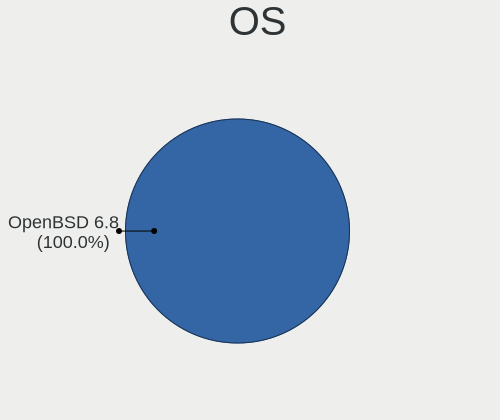

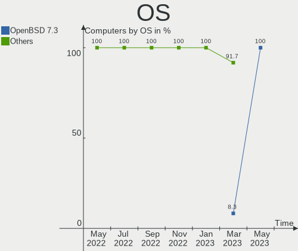

| Name        | Computers | Percent |
|-------------|-----------|---------|
| OpenBSD 6.7 | 20        | 95.24%  |
| OpenBSD 6.6 | 1         | 4.76%   |

OS Family
---------

OS without a version

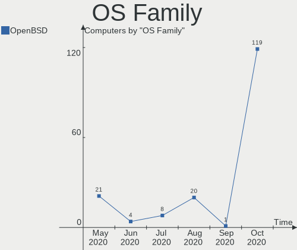

| Name    | Computers | Percent |
|---------|-----------|---------|
| OpenBSD | 21        | 100%    |

Arch
----

OS architecture (x86_64, i586, etc.)

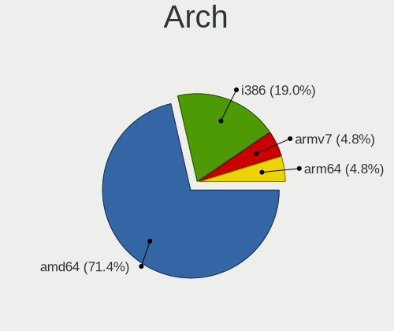

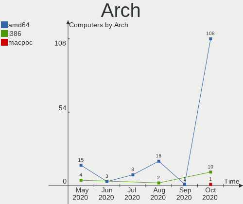

| Name  | Computers | Percent |
|-------|-----------|---------|
| amd64 | 15        | 71.43%  |
| i386  | 4         | 19.05%  |
| armv7 | 1         | 4.76%   |
| arm64 | 1         | 4.76%   |

DE
--

Desktop Environment

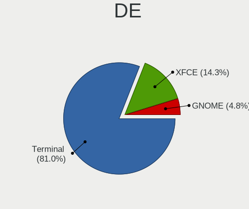

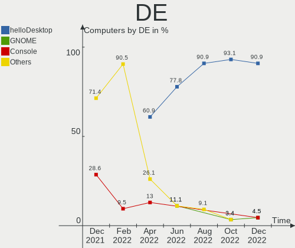

| Name     | Computers | Percent |
|----------|-----------|---------|
| Terminal | 17        | 80.95%  |
| XFCE     | 3         | 14.29%  |
| GNOME    | 1         | 4.76%   |

Display Server
--------------

X11 or Wayland

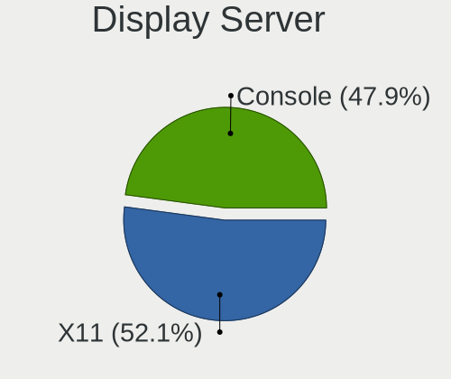

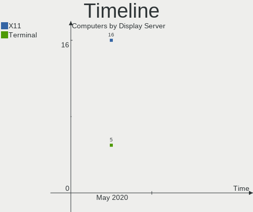

| Name     | Computers | Percent |
|----------|-----------|---------|
| X11      | 16        | 76.19%  |
| Terminal | 5         | 23.81%  |

Display Manager
---------------

SDDM, LightDM, etc.

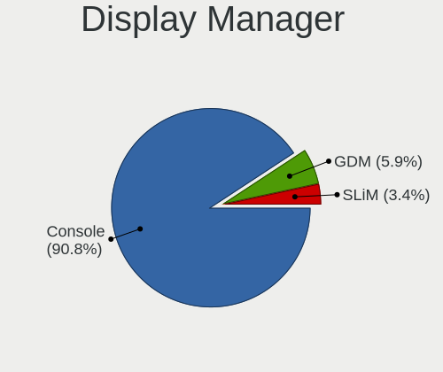

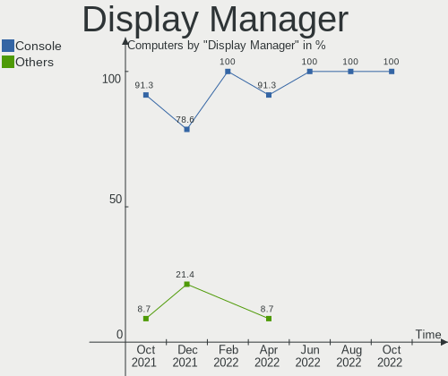

| Name     | Computers | Percent |
|----------|-----------|---------|
| Terminal | 20        | 95.24%  |
| SLiM     | 1         | 4.76%   |

OS Lang
-------

Language

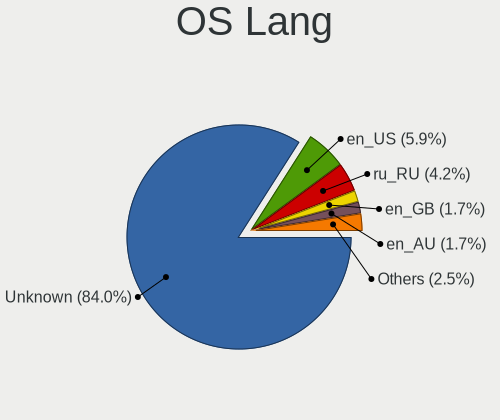

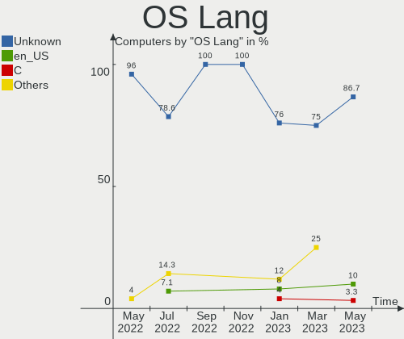

| Lang    | Computers | Percent |
|---------|-----------|---------|
| Unknown | 12        | 57.14%  |
| en_US   | 7         | 33.33%  |
| ru_RU   | 1         | 4.76%   |
| en_GB   | 1         | 4.76%   |

Boot Mode
---------

EFI or BIOS

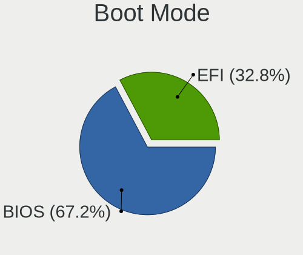

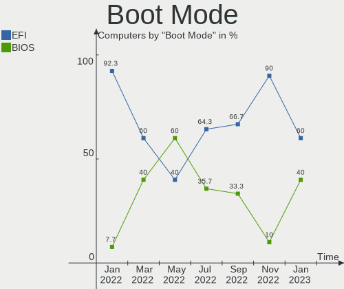

| Mode | Computers | Percent |
|------|-----------|---------|
| BIOS | 16        | 76.19%  |
| EFI  | 5         | 23.81%  |

Filesystem
----------

Type of filesystem

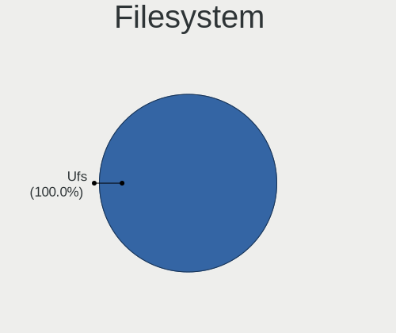

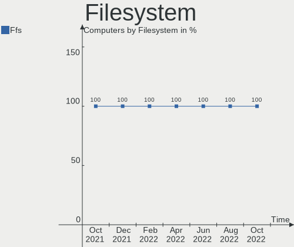

| Type | Computers | Percent |
|------|-----------|---------|
| Ufs  | 21        | 100%    |

Part. scheme
------------

Scheme of partitioning

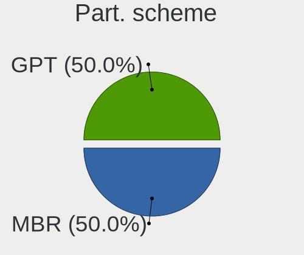

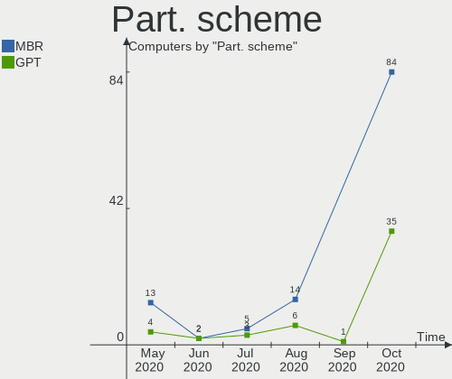

| Type    | Computers | Percent |
|---------|-----------|---------|
| MBR     | 13        | 61.9%   |
| GPT     | 4         | 19.05%  |
| Unknown | 4         | 19.05%  |

Country
-------

Geographic location (country)

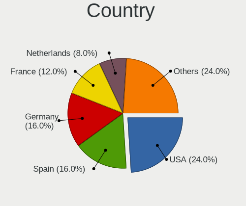

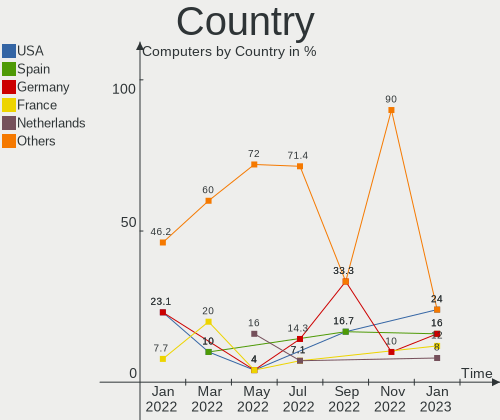

| Country     | Computers | Percent |
|-------------|-----------|---------|
| Russia      | 6         | 28.57%  |
| USA         | 4         | 19.05%  |
| Germany     | 3         | 14.29%  |
| Switzerland | 2         | 9.52%   |
| UK          | 1         | 4.76%   |
| Italy       | 1         | 4.76%   |
| France      | 1         | 4.76%   |
| Finland     | 1         | 4.76%   |
| Croatia     | 1         | 4.76%   |
| Australia   | 1         | 4.76%   |

City
----

Geographic location (city)

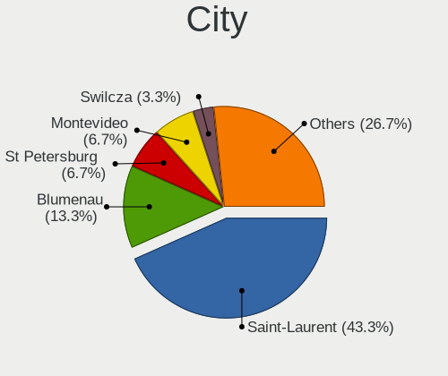

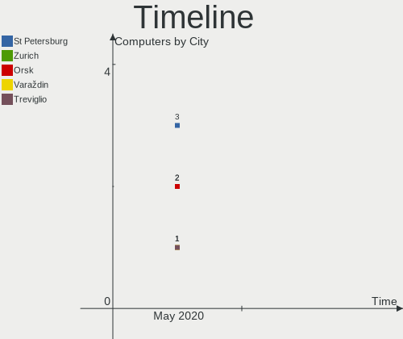

| City               | Computers | Percent |
|--------------------|-----------|---------|
| St Petersburg      | 3         | 14.29%  |
| Zurich             | 2         | 9.52%   |
| Orsk               | 2         | 9.52%   |
| Varaždin          | 1         | 4.76%   |
| Treviglio          | 1         | 4.76%   |
| San Francisco      | 1         | 4.76%   |
| Portland           | 1         | 4.76%   |
| Pine Mountain Club | 1         | 4.76%   |
| Paris              | 1         | 4.76%   |
| Lysterfield        | 1         | 4.76%   |
| Krasnogorsk        | 1         | 4.76%   |
| Kouvola            | 1         | 4.76%   |
| Hope               | 1         | 4.76%   |
| Herne              | 1         | 4.76%   |
| Erlangen           | 1         | 4.76%   |
| Bromskirchen       | 1         | 4.76%   |
| Bothell            | 1         | 4.76%   |

Vendor
------

Motherboard manufacturer

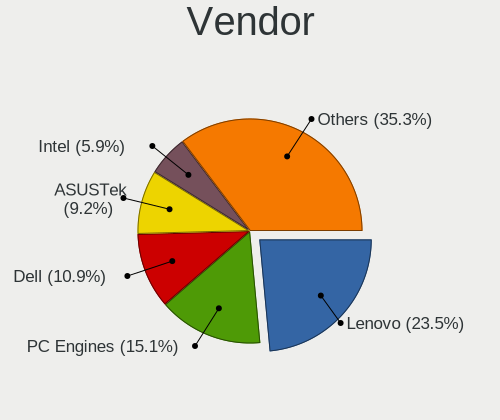

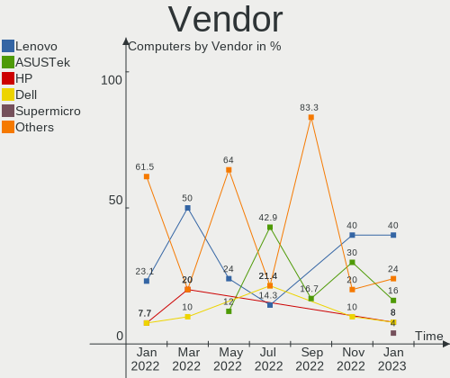

| Name                | Computers | Percent |
|---------------------|-----------|---------|
| Lenovo              | 9         | 42.86%  |
| Gigabyte Technology | 3         | 14.29%  |
| IBM                 | 2         | 9.52%   |
| Unknown             | 2         | 9.52%   |
| Sony UK             | 1         | 4.76%   |
| Panasonic           | 1         | 4.76%   |
| Fujitsu             | 1         | 4.76%   |
| Dell                | 1         | 4.76%   |
| ASUSTek Computer    | 1         | 4.76%   |

Model
-----

Motherboard model

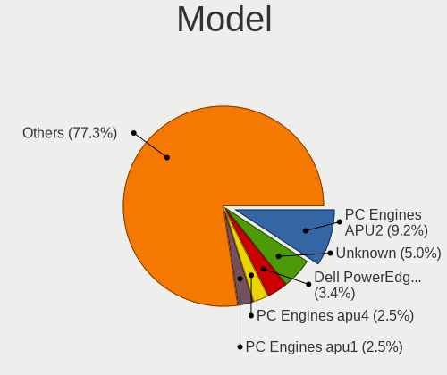

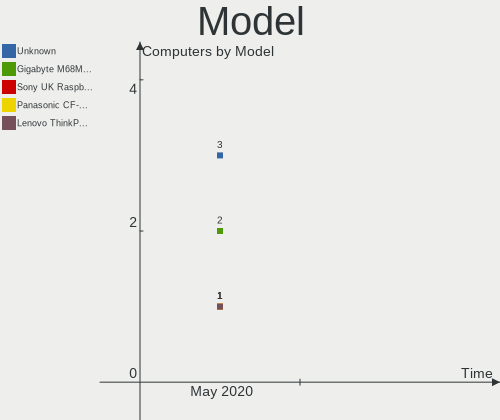

| Name                                     | Computers | Percent |
|------------------------------------------|-----------|---------|
| Unknown                                  | 3         | 14.29%  |
| Gigabyte M68MT-S2P                       | 2         | 9.52%   |
| Sony UK Raspberry Pi 4 Model B           | 1         | 4.76%   |
| Panasonic CF-19ADUAX1M                   | 1         | 4.76%   |
| Lenovo ThinkPad X260 20F5S1H800          | 1         | 4.76%   |
| Lenovo ThinkPad X230 2324A57             | 1         | 4.76%   |
| Lenovo ThinkPad X220 4291C35             | 1         | 4.76%   |
| Lenovo ThinkPad X1 Carbon 6th 20KH002RUS | 1         | 4.76%   |
| Lenovo ThinkPad T495 20NJCTO1WW          | 1         | 4.76%   |
| Lenovo ThinkPad T440s 20AR003VMS         | 1         | 4.76%   |
| Lenovo ThinkPad T440p 20AN00DEUS         | 1         | 4.76%   |
| Lenovo ThinkPad T440 20B7S1C600          | 1         | 4.76%   |
| Lenovo ThinkPad T420 4180B39             | 1         | 4.76%   |
| IBM ThinkPad X41 2525FAG                 | 1         | 4.76%   |
| IBM 81832BG                              | 1         | 4.76%   |
| Fujitsu LIFEBOOK A357                    | 1         | 4.76%   |
| Dell PowerEdge T320                      | 1         | 4.76%   |
| ASUS P4P800-VM                           | 1         | 4.76%   |

Model Family
------------

Motherboard model prefix

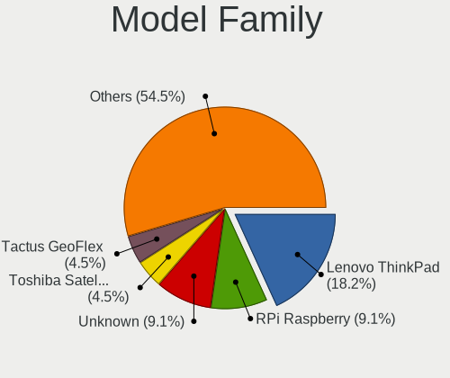

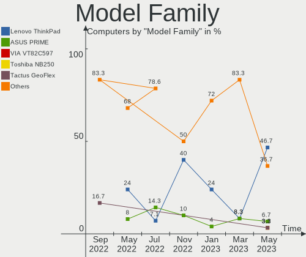

| Name                   | Computers | Percent |
|------------------------|-----------|---------|
| Lenovo ThinkPad        | 9         | 42.86%  |
| Unknown                | 3         | 14.29%  |
| Gigabyte M68MT-S2P     | 2         | 9.52%   |
| Sony UK Raspberry      | 1         | 4.76%   |
| Panasonic CF-19ADUAX1M | 1         | 4.76%   |
| IBM ThinkPad           | 1         | 4.76%   |
| IBM 81832BG            | 1         | 4.76%   |
| Fujitsu LIFEBOOK       | 1         | 4.76%   |
| Dell PowerEdge         | 1         | 4.76%   |
| ASUS P4P800-VM         | 1         | 4.76%   |

MFG Year
--------

Motherboard manufacture year

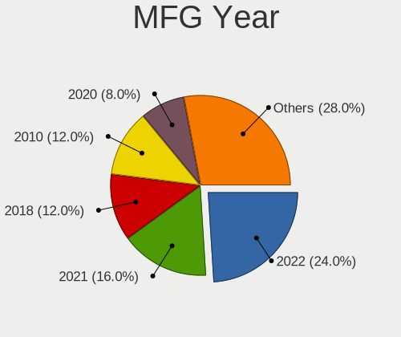

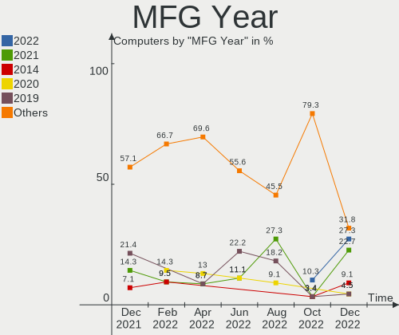

| Year    | Computers | Percent |
|---------|-----------|---------|
| 2019    | 3         | 14.29%  |
| 2016    | 3         | 14.29%  |
| 2020    | 2         | 9.52%   |
| 2018    | 2         | 9.52%   |
| 2010    | 2         | 9.52%   |
| 2005    | 2         | 9.52%   |
| Unknown | 2         | 9.52%   |
| 2017    | 1         | 4.76%   |
| 2015    | 1         | 4.76%   |
| 2012    | 1         | 4.76%   |
| 2011    | 1         | 4.76%   |
| 2006    | 1         | 4.76%   |

Form Factor
-----------

Physical design of the computer

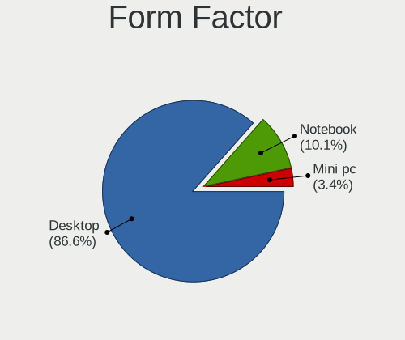

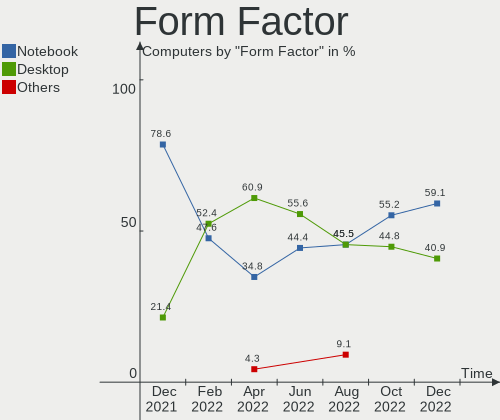

| Name     | Computers | Percent |
|----------|-----------|---------|
| Notebook | 12        | 57.14%  |
| Desktop  | 9         | 42.86%  |

Coreboot
--------

Have coreboot on board

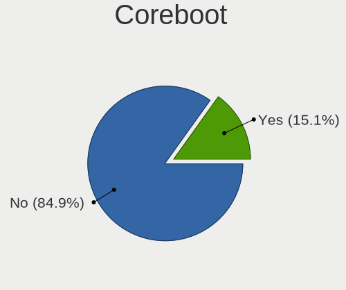

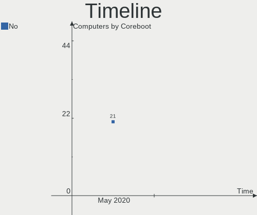

| Used | Computers | Percent |
|------|-----------|---------|
| No   | 21        | 100%    |

RAM Size
--------

Total RAM memory

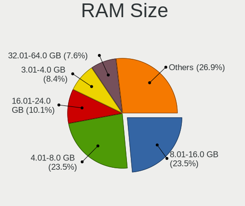

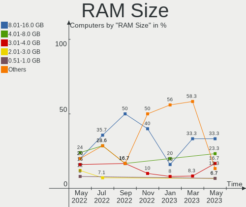

| Size in GB | Computers | Percent |
|------------|-----------|---------|
| 8.01-16.0  | 9         | 42.86%  |
| 2.01-3.0   | 3         | 14.29%  |
| 4.01-8.0   | 2         | 9.52%   |
| 32.01-64.0 | 2         | 9.52%   |
| 16.01-24.0 | 2         | 9.52%   |
| 0.01-1.0   | 2         | 9.52%   |
| 1.01-2.0   | 1         | 4.76%   |

RAM Used
--------

Used RAM memory

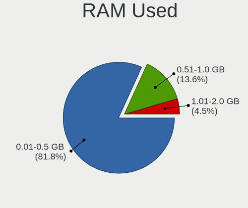

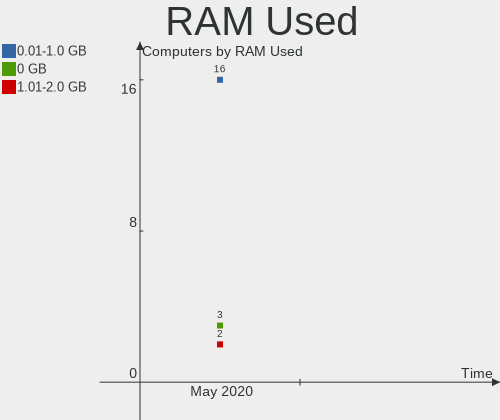

| Used GB  | Computers | Percent |
|----------|-----------|---------|
| 0.01-1.0 | 16        | 76.19%  |
| 0        | 3         | 14.29%  |
| 1.01-2.0 | 2         | 9.52%   |

Drive Vendor
------------

Hard drive vendors

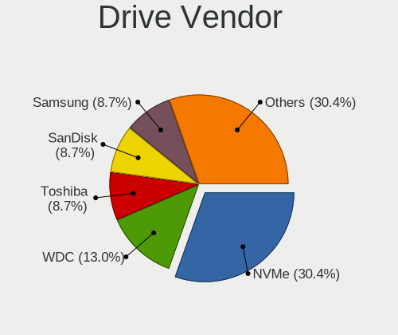

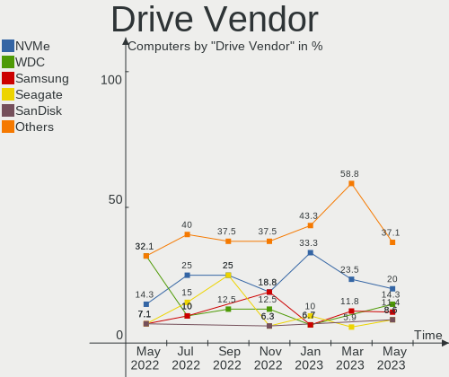

| Vendor              | Computers | Drives | Percent |
|---------------------|-----------|--------|---------|
| Samsung Electronics | 6         | 6      | 22.22%  |
| Seagate             | 4         | 4      | 14.81%  |
| WDC                 | 3         | 3      | 11.11%  |
| SanDisk             | 2         | 3      | 7.41%   |
| NVMe                | 2         | 2      | 7.41%   |
| Hitachi             | 2         | 2      | 7.41%   |
| Transcend           | 1         | 1      | 3.7%    |
| OPENBSD             | 1         | 1      | 3.7%    |
| Micron Technology   | 1         | 1      | 3.7%    |
| LSI                 | 1         | 1      | 3.7%    |
| Leven               | 1         | 1      | 3.7%    |
| Kingston            | 1         | 1      | 3.7%    |
| Intel               | 1         | 1      | 3.7%    |
| Gigabyte Technology | 1         | 1      | 3.7%    |

Drive Model
-----------

Hard drive models

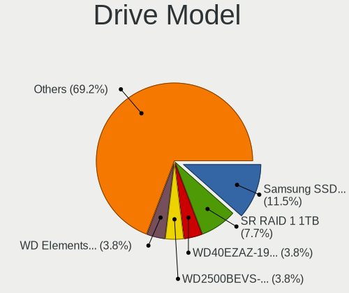

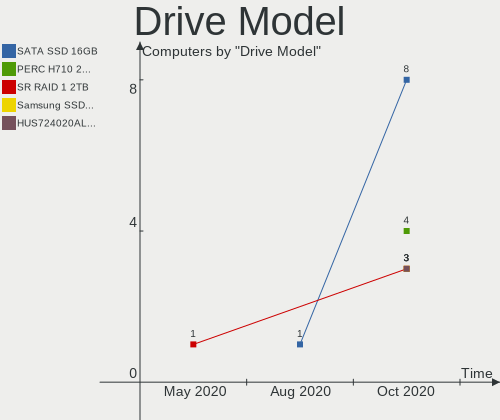

| Model                    | Computers | Percent |
|--------------------------|-----------|---------|
| WD6400AARS-00Y5B1 640GB  | 2         | 7.41%   |
| ST250DM000-1BD141 250GB  | 2         | 7.41%   |
| WDS100T2B0A-00SM50 1TB   | 1         | 3.7%    |
| WDC PC SN720 SDA 1TB     | 1         | 3.7%    |
| Ultra Fit 64GB           | 1         | 3.7%    |
| TS128GMTS430S 128GB      | 1         | 3.7%    |
| ST3250318AS 250GB        | 1         | 3.7%    |
| ST3000DM001-1CH166 3TB   | 1         | 3.7%    |
| SSDSC2BW240A3L 240GB     | 1         | 3.7%    |
| SSD 860 EVO 500GB        | 1         | 3.7%    |
| SSD 850 EVO 1TB          | 1         | 3.7%    |
| SSD 850 EVO 120GB        | 1         | 3.7%    |
| SR RAID 1 16GB           | 1         | 3.7%    |
| SA400S37120G 120GB       | 1         | 3.7%    |
| MZMTE1T0HMJH-00000 1TB   | 1         | 3.7%    |
| MZ7PC128HAFU-000L1 128GB | 1         | 3.7%    |
| Logical Volume 240GB     | 1         | 3.7%    |
| LENSE30512GMSP34 512GB   | 1         | 3.7%    |
| JAJS600M512C 512GB       | 1         | 3.7%    |
| HTC426060G9AT00 64GB     | 1         | 3.7%    |
| HDS721010CLA332 1TB      | 1         | 3.7%    |
| GP-GSTFS31120GNTD 120GB  | 1         | 3.7%    |
| Flash Drive FIT 64GB     | 1         | 3.7%    |
| Cruzer Fit 16GB          | 1         | 3.7%    |
| 1100_MTFDDAK256TBN 256GB | 1         | 3.7%    |

Drive Kind
----------

HDD or SSD

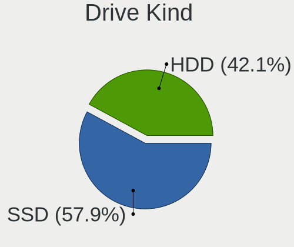

| Kind | Computers | Drives | Percent |
|------|-----------|--------|---------|
| SSD  | 13        | 16     | 56.52%  |
| HDD  | 10        | 12     | 43.48%  |

Drive Connector
---------------

SATA, SAS, NVMe, etc.

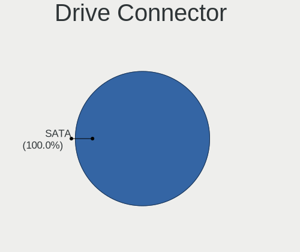

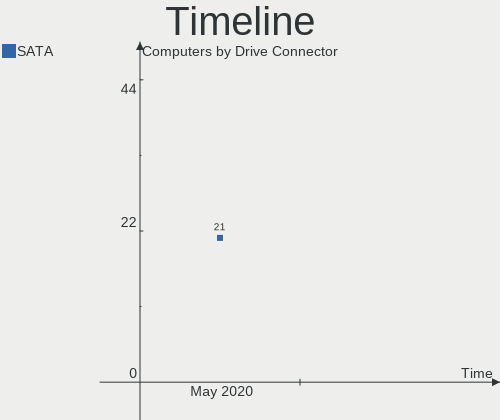

| Type | Computers | Drives | Percent |
|------|-----------|--------|---------|
| SATA | 21        | 28     | 100%    |

Drive Size
----------

Size of hard drive

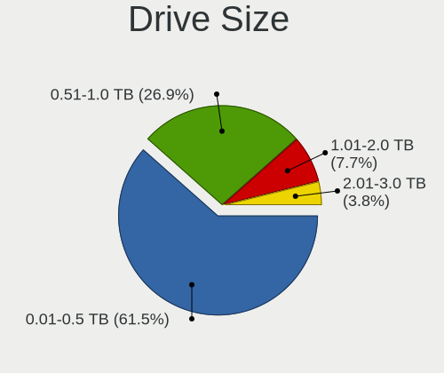

| Size in TB | Computers | Drives | Percent |
|------------|-----------|--------|---------|
| 0.01-0.5   | 16        | 18     | 61.54%  |
| 0.51-1.0   | 7         | 7      | 26.92%  |
| 1.01-2.0   | 2         | 2      | 7.69%   |
| 2.01-3.0   | 1         | 1      | 3.85%   |

Space Total
-----------

Amount of disk space available on the file system

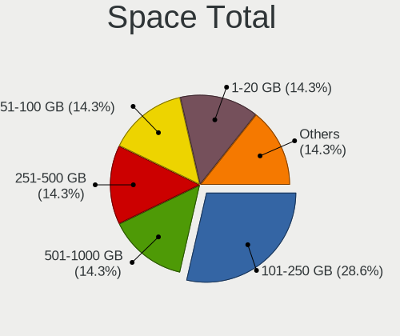

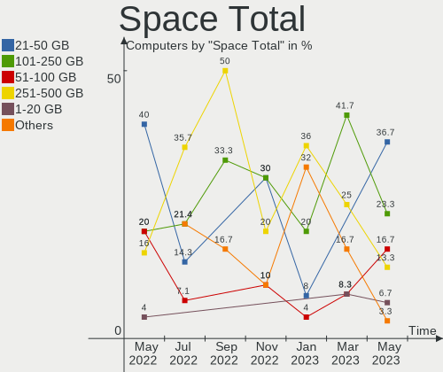

| Size in GB | Computers | Percent |
|------------|-----------|---------|
| 101-250    | 6         | 28.57%  |
| 251-500    | 3         | 14.29%  |
| 1-20       | 3         | 14.29%  |
| 501-1000   | 3         | 14.29%  |
| 51-100     | 3         | 14.29%  |
| 21-50      | 2         | 9.52%   |
| 1001-2000  | 1         | 4.76%   |

Space Used
----------

Amount of used disk space

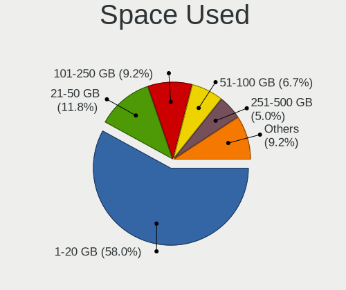

| Used GB  | Computers | Percent |
|----------|-----------|---------|
| 1-20     | 12        | 57.14%  |
| 21-50    | 4         | 19.05%  |
| 101-250  | 3         | 14.29%  |
| 501-1000 | 1         | 4.76%   |
| 51-100   | 1         | 4.76%   |

Malfunc. Drives
---------------

Drive models with a malfunction

| Model                | Computers | Drives | Percent |
|----------------------|-----------|--------|---------|
| HTC426060G9AT00 64GB | 1         | 1      | 50%     |
| HDS721010CLA332 1TB  | 1         | 1      | 50%     |

Malfunc. Drive Vendor
---------------------

Vendors of faulty drives

| Vendor  | Computers | Drives | Percent |
|---------|-----------|--------|---------|
| Hitachi | 2         | 2      | 100%    |

Malfunc. Drive Kind
-------------------

Kinds of faulty drives

| Kind | Computers | Drives | Percent |
|------|-----------|--------|---------|
| HDD  | 2         | 2      | 100%    |

Failed Drives
-------------

Failed drive models

Zero info for selected period =(

Failed Drive Vendor
-------------------

Failed drive vendors

Zero info for selected period =(

Drive Status
------------

Number of failed and malfunc. drives

| Status   | Computers | Drives | Percent |
|----------|-----------|--------|---------|
| Works    | 15        | 18     | 68.18%  |
| Detected | 5         | 8      | 22.73%  |
| Malfunc  | 2         | 2      | 9.09%   |

Storage Vendor
--------------

Storage controller vendors

| Vendor             | Computers | Percent |
|--------------------|-----------|---------|
| Intel              | 15        | 68.18%  |
| Nvidia             | 2         | 9.09%   |
| Sandisk            | 1         | 4.55%   |
| Lenovo             | 1         | 4.55%   |
| Broadcom / LSI     | 1         | 4.55%   |
| ASMedia Technology | 1         | 4.55%   |
| AMD                | 1         | 4.55%   |

Storage Model
-------------

Storage controller models

| Model                                                                    | Computers | Percent |
|--------------------------------------------------------------------------|-----------|---------|
| 6 Series/C200 Series Chipset Family 6 port Mobile SATA AHCI Controller   | 4         | 16.67%  |
| Sunrise Point-LP SATA Controller [AHCI mode]                             | 2         | 8.33%   |
| MCP61 SATA Controller                                                    | 2         | 8.33%   |
| 82801EB/ER (ICH5/ICH5R) IDE Controller                                   | 2         | 8.33%   |
| 82801EB (ICH5) SATA Controller                                           | 2         | 8.33%   |
| 8 Series SATA Controller 1 [AHCI mode]                                   | 2         | 8.33%   |
| WD Black 2018/PC SN720 NVMe SSD                                          | 1         | 4.17%   |
| unknown                                                                  | 1         | 4.17%   |
| SAS2008 PCI-Express Fusion-MPT SAS-2 [Falcon]                            | 1         | 4.17%   |
| CS5536 [Geode companion] IDE                                             | 1         | 4.17%   |
| Celeron N3350/Pentium N4200/Atom E3900 Series SATA AHCI Controller       | 1         | 4.17%   |
| C600/X79 series chipset 6-Port SATA AHCI Controller                      | 1         | 4.17%   |
| ASM1062 Serial ATA Controller                                            | 1         | 4.17%   |
| 82801FBM (ICH6M) SATA Controller                                         | 1         | 4.17%   |
| 8 Series/C220 Series Chipset Family 6-port SATA Controller 1 [AHCI mode] | 1         | 4.17%   |
| 7 Series Chipset Family 6-port SATA Controller [AHCI mode]               | 1         | 4.17%   |

Storage Kind
------------

Kind of storage controller (IDE, SATA, NVMe, SAS, ...)

| Kind | Computers | Percent |
|------|-----------|---------|
| SATA | 12        | 57.14%  |
| IDE  | 6         | 28.57%  |
| NVMe | 2         | 9.52%   |
| SAS  | 1         | 4.76%   |

CPU Vendor
----------

Processor vendors

| Vendor | Computers | Percent |
|--------|-----------|---------|
| Intel  | 15        | 71.43%  |
| AMD    | 4         | 19.05%  |
| ARM    | 2         | 9.52%   |

CPU Model
---------

Processor models

| Model                                                            | Computers | Percent |
|------------------------------------------------------------------|-----------|---------|
| Intel Core i5-2520M CPU @ 2.50GHz                                | 3         | 14.29%  |
| AMD Athlon II X3 455 Processor                                   | 2         | 9.52%   |
| Intel Xeon CPU E5-2403 0 @ 1.80GHz                               | 1         | 4.76%   |
| Intel Pentium M processor                                        | 1         | 4.76%   |
| Intel Pentium 4 CPU 2.80GHz ("GenuineIntel" 686-class)           | 1         | 4.76%   |
| Intel Pentium 4 CPU 2.66GHz                                      | 1         | 4.76%   |
| Intel Core i7-8650U CPU @ 1.90GHz                                | 1         | 4.76%   |
| Intel Core i5-6300U CPU @ 2.40GHz                                | 1         | 4.76%   |
| Intel Core i5-4300U CPU @ 1.90GHz                                | 1         | 4.76%   |
| Intel Core i5-4210U CPU @ 1.70GHz                                | 1         | 4.76%   |
| Intel Core i5-4210M CPU @ 2.60GHz                                | 1         | 4.76%   |
| Intel Core i5-3320M CPU @ 2.60GHz                                | 1         | 4.76%   |
| Intel Core i3-6006U CPU @ 2.00GHz                                | 1         | 4.76%   |
| Intel Celeron CPU J3455 @ 1.50GHz                                | 1         | 4.76%   |
| ARM Cortex-A8 r3p2                                               | 1         | 4.76%   |
| ARM Cortex-A72 r0p3                                              | 1         | 4.76%   |
| AMD Ryzen 7 PRO 3700U w/ Radeon Vega Mobile Gfx                  | 1         | 4.76%   |
| AMD Geode Integrated Processor by PCS ("AuthenticAMD" 586-class) | 1         | 4.76%   |

CPU Model Family
----------------

Processor model prefix

| Model                | Computers | Percent |
|----------------------|-----------|---------|
| Intel Core i5        | 8         | 38.1%   |
| Other                | 2         | 9.52%   |
| Intel Pentium 4      | 2         | 9.52%   |
| AMD Athlon II X3     | 2         | 9.52%   |
| Intel Xeon           | 1         | 4.76%   |
| Intel Pentium M      | 1         | 4.76%   |
| Intel Core i7        | 1         | 4.76%   |
| Intel Core i3        | 1         | 4.76%   |
| Intel Celeron        | 1         | 4.76%   |
| AMD Ryzen 7 PRO      | 1         | 4.76%   |
| AMD Geode Integrated | 1         | 4.76%   |

CPU Cores
---------

Number of processor cores

| Number  | Computers | Percent |
|---------|-----------|---------|
| 2       | 9         | 42.86%  |
| 1       | 5         | 23.81%  |
| 4       | 3         | 14.29%  |
| 3       | 2         | 9.52%   |
| 8       | 1         | 4.76%   |
| Unknown | 1         | 4.76%   |

CPU Sockets
-----------

Number of sockets

| Number  | Computers | Percent |
|---------|-----------|---------|
| 1       | 18        | 85.71%  |
| Unknown | 3         | 14.29%  |

CPU Threads
-----------

Threads per core (Hyper-Threading)

| Number  | Computers | Percent |
|---------|-----------|---------|
| 2       | 10        | 47.62%  |
| 1       | 6         | 28.57%  |
| Unknown | 5         | 23.81%  |

CPU Microarch
-------------

Microarchitecture

| Name        | Computers | Percent |
|-------------|-----------|---------|
| SandyBridge | 4         | 19.05%  |
| Haswell     | 3         | 14.29%  |
| Skylake     | 2         | 9.52%   |
| NetBurst    | 2         | 9.52%   |
| K10         | 2         | 9.52%   |
| Unknown     | 2         | 9.52%   |
| Zen+        | 1         | 4.76%   |
| P6          | 1         | 4.76%   |
| KabyLake    | 1         | 4.76%   |
| IvyBridge   | 1         | 4.76%   |
| Goldmont    | 1         | 4.76%   |
| Geode       | 1         | 4.76%   |

GPU Vendor
----------

Vendors of graphics cards

| Vendor                     | Computers | Percent |
|----------------------------|-----------|---------|
| Intel                      | 15        | 75%     |
| AMD                        | 4         | 20%     |
| Matrox Electronics Systems | 1         | 5%      |

GPU Model
---------

Graphics card models

| Model                                                               | Computers | Percent |
|---------------------------------------------------------------------|-----------|---------|
| 2nd Generation Core Processor Family Integrated Graphics Controller | 4         | 20%     |
| Skylake GT2 [HD Graphics 520]                                       | 2         | 10%     |
| RV710/M92 [Mobility Radeon HD 4350/4550]                            | 2         | 10%     |
| Haswell-ULT Integrated Graphics Controller                          | 2         | 10%     |
| 82865G Integrated Graphics Controller                               | 2         | 10%     |
| UHD Graphics 620                                                    | 1         | 5%      |
| Robson CE [Radeon HD 6370M/7370M]                                   | 1         | 5%      |
| Picasso                                                             | 1         | 5%      |
| Mobile 915GM/GMS/910GML Express Graphics Controller                 | 1         | 5%      |
| HD Graphics 500                                                     | 1         | 5%      |
| G200eR2                                                             | 1         | 5%      |
| 4th Gen Core Processor Integrated Graphics Controller               | 1         | 5%      |
| 3rd Gen Core processor Graphics Controller                          | 1         | 5%      |

GPU Combo
---------

Combinations of graphics cards

| Name       | Computers | Percent |
|------------|-----------|---------|
| 1 x Intel  | 13        | 61.9%   |
| Other      | 3         | 14.29%  |
| 1 x AMD    | 3         | 14.29%  |
| 2 x Intel  | 1         | 4.76%   |
| 1 x Matrox | 1         | 4.76%   |

GPU Driver
----------

Free vs proprietary

| Driver  | Computers | Percent |
|---------|-----------|---------|
| Free    | 18        | 85.71%  |
| Unknown | 3         | 14.29%  |

GPU Memory
----------

Total video memory

| Size in GB | Computers | Percent |
|------------|-----------|---------|
| Unknown    | 21        | 100%    |

Monitor Vendor
--------------

Monitor vendors

| Vendor               | Computers | Percent |
|----------------------|-----------|---------|
| LG Display           | 3         | 27.27%  |
| Chimei Innolux       | 2         | 18.18%  |
| AU Optronics         | 2         | 18.18%  |
| Ancor Communications | 2         | 18.18%  |
| Hewlett-Packard      | 1         | 9.09%   |
| Goldstar             | 1         | 9.09%   |

Monitor Model
-------------

Monitor models

| Model                                             | Computers | Percent |
|---------------------------------------------------|-----------|---------|
| ASUS VW199 ACI19ED 1440x900 410x260mm 19.1-inch   | 2         | 18.18%  |
| W2242 GSM5677 1680x1050 490x320mm 23.0-inch       | 1         | 9.09%   |
| LCD Monitor LGD058B 2560x1440 310x170mm 13.9-inch | 1         | 9.09%   |
| LCD Monitor LGD04A3 1366x768 280x160mm 12.7-inch  | 1         | 9.09%   |
| LCD Monitor LGD045E 1366x768 310x170mm 13.9-inch  | 1         | 9.09%   |
| LCD Monitor CMN15DB 1366x768 340x190mm 15.3-inch  | 1         | 9.09%   |
| LCD Monitor CMN14F2 1920x1080 310x170mm 13.9-inch | 1         | 9.09%   |
| LCD Monitor AUO2A3C 1366x768 310x170mm 13.9-inch  | 1         | 9.09%   |
| LCD Monitor AUO106C 1366x768 280x160mm 12.7-inch  | 1         | 9.09%   |
| LA2405 HWP284B 1920x1200 520x320mm 24.0-inch      | 1         | 9.09%   |

Monitor Resolution
------------------

Monitor screen resolution

| Resolution         | Computers | Percent |
|--------------------|-----------|---------|
| 1366x768 (WXGA)    | 5         | 45.45%  |
| 1440x900 (WXGA+)   | 2         | 18.18%  |
| 2560x1440 (QHD)    | 1         | 9.09%   |
| 1920x1200 (WUXGA)  | 1         | 9.09%   |
| 1920x1080 (FHD)    | 1         | 9.09%   |
| 1680x1050 (WSXGA+) | 1         | 9.09%   |

Monitor Diagonal
----------------

Diagonal size in inches

| Inches | Computers | Percent |
|--------|-----------|---------|
| 13     | 4         | 36.36%  |
| 19     | 2         | 18.18%  |
| 12     | 2         | 18.18%  |
| 24     | 1         | 9.09%   |
| 23     | 1         | 9.09%   |
| 15     | 1         | 9.09%   |

Monitor Width
-------------

Physical width

| Width in mm | Computers | Percent |
|-------------|-----------|---------|
| 301-350     | 5         | 45.45%  |
| 401-500     | 3         | 27.27%  |
| 201-300     | 2         | 18.18%  |
| 501-600     | 1         | 9.09%   |

Aspect Ratio
------------

Proportional relationship between the width and the height

| Ratio | Computers | Percent |
|-------|-----------|---------|
| 16/9  | 7         | 63.64%  |
| 16/10 | 3         | 27.27%  |
| 3/2   | 1         | 9.09%   |

Monitor Area
------------

Area in inch²

| Area in inch² | Computers | Percent |
|----------------|-----------|---------|
| 81-90          | 4         | 36.36%  |
| 61-70          | 2         | 18.18%  |
| 151-200        | 2         | 18.18%  |
| 251-300        | 1         | 9.09%   |
| 201-250        | 1         | 9.09%   |
| 91-100         | 1         | 9.09%   |

Pixel Density
-------------

Pixels per inch

| Density | Computers | Percent |
|---------|-----------|---------|
| 51-100  | 4         | 36.36%  |
| 121-160 | 3         | 27.27%  |
| 101-120 | 3         | 27.27%  |
| 161-240 | 1         | 9.09%   |

Multiple Monitors
-----------------

Total monitors connected

| Total | Computers | Percent |
|-------|-----------|---------|
| 1     | 15        | 71.43%  |
| 0     | 4         | 19.05%  |
| 2     | 2         | 9.52%   |

Net Controller Vendor
---------------------

Controller vendors

| Vendor                         | Computers | Percent |
|--------------------------------|-----------|---------|
| Intel                          | 15        | 62.5%   |
| Realtek Semiconductor          | 3         | 12.5%   |
| Broadcom Inc. and subsidiaries | 2         | 8.33%   |
| VIA Technologies               | 1         | 4.17%   |
| Qualcomm Atheros               | 1         | 4.17%   |
| Emulex                         | 1         | 4.17%   |
| Accton Technology              | 1         | 4.17%   |

Net Controller Model
--------------------

Controller models

| Model                                                     | Computers | Percent |
|-----------------------------------------------------------|-----------|---------|
| Centrino Advanced-N 6205 [Taylor Peak]                    | 4         | 11.76%  |
| 82579LM Gigabit Network Connection (Lewisville)           | 4         | 11.76%  |
| Wireless 7260                                             | 3         | 8.82%   |
| RTL8111/8168/8411 PCI Express Gigabit Ethernet Controller | 3         | 8.82%   |
| Wireless-AC 9260                                          | 1         | 2.94%   |
| Wireless 8265 / 8275                                      | 1         | 2.94%   |
| Wireless 8260                                             | 1         | 2.94%   |
| Wireless 7265                                             | 1         | 2.94%   |
| VT6105M [Rhine-III]                                       | 1         | 2.94%   |
| SMC2-1211TX                                               | 1         | 2.94%   |
| PRO/Wireless 2915ABG [Calexico2] Network Connection       | 1         | 2.94%   |
| OneConnect 10Gb NIC (be3)                                 | 1         | 2.94%   |
| NetXtreme BCM5751M Gigabit Ethernet PCI Express           | 1         | 2.94%   |
| NetXtreme BCM5720 2-port Gigabit Ethernet PCIe            | 1         | 2.94%   |
| NetXtreme BCM5719 Gigabit Ethernet PCIe                   | 1         | 2.94%   |
| Ethernet Connection I219-LM                               | 1         | 2.94%   |
| Ethernet Connection I218-V                                | 1         | 2.94%   |
| Ethernet Connection I218-LM                               | 1         | 2.94%   |
| Ethernet Connection I217-LM                               | 1         | 2.94%   |
| Ethernet Connection (4) I219-LM                           | 1         | 2.94%   |
| Centrino Wireless-N 6150                                  | 1         | 2.94%   |
| AR8152 v2.0 Fast Ethernet                                 | 1         | 2.94%   |
| 82562EZ 10/100 Ethernet Controller                        | 1         | 2.94%   |
| 82541EI Gigabit Ethernet Controller                       | 1         | 2.94%   |

Net Controller Kind
-------------------

Ethernet, WiFi or modem

| Kind     | Computers | Percent |
|----------|-----------|---------|
| Ethernet | 18        | 58.06%  |
| WiFi     | 13        | 41.94%  |

Used Controller
---------------

Currently used network controller

| Kind     | Computers | Percent |
|----------|-----------|---------|
| WiFi     | 11        | 57.89%  |
| Ethernet | 8         | 42.11%  |

NICs
----

Total network controllers on board

| Total | Computers | Percent |
|-------|-----------|---------|
| 2     | 13        | 61.9%   |
| 0     | 4         | 19.05%  |
| 1     | 3         | 14.29%  |
| 3     | 1         | 4.76%   |

Unsupported Devices
-------------------

Total unsupported devices on board

| Total | Computers | Percent |
|-------|-----------|---------|
| 1     | 10        | 47.62%  |
| 0     | 7         | 33.33%  |
| 2     | 4         | 19.05%  |

Unsupported Device Types
------------------------

Types of unsupported devices

| Type                     | Computers | Percent |
|--------------------------|-----------|---------|
| Communication controller | 14        | 73.68%  |
| Firewire controller      | 3         | 15.79%  |
| Network                  | 1         | 5.26%   |
| Graphics card            | 1         | 5.26%   |

