OpenBSD - Hardware Trends
-------------------------

A project to identify most popular hardware characteristics and track their change
over time based on data collected by BSD users at https://BSD-Hardware.info.

Anyone can contribute to this report by the [hw-probe](https://github.com/linuxhw/hw-probe/blob/master/INSTALL.BSD.md) tool:

    hw-probe -all -upload

This is a report for all computer types. See also reports for [desktops](/Dist/OpenBSD/Desktop/README.md) and [notebooks](/Dist/OpenBSD/Notebook/README.md).

This report is for one last month. Overall report since the beginning of time: [TestCoverage](https://github.com/bsdhw/TestCoverage)

Period: Jan, 2023.

Contents
--------

* [ System ](#system)
  - [ OS                       ](#os)
  - [ OS Family                ](#os-family)
  - [ Arch                     ](#arch)
  - [ DE                       ](#de)
  - [ Display Server           ](#display-server)
  - [ Display Manager          ](#display-manager)
  - [ OS Lang                  ](#os-lang)
  - [ Boot Mode                ](#boot-mode)
  - [ Filesystem               ](#filesystem)
  - [ Part. scheme             ](#part-scheme)

* [ Board ](#board)
  - [ Vendor                   ](#vendor)
  - [ Model                    ](#model)
  - [ Model Family             ](#model-family)
  - [ MFG Year                 ](#mfg-year)
  - [ Form Factor              ](#form-factor)
  - [ Coreboot                 ](#coreboot)
  - [ RAM Size                 ](#ram-size)
  - [ RAM Used                 ](#ram-used)
  - [ Total Drives             ](#total-drives)
  - [ Has CD-ROM               ](#has-cd-rom)
  - [ Has Ethernet             ](#has-ethernet)
  - [ Has WiFi                 ](#has-wifi)
  - [ Has Bluetooth            ](#has-bluetooth)

* [ Location ](#location)
  - [ Country                  ](#country)
  - [ City                     ](#city)

* [ Drives ](#drives)
  - [ Drive Vendor             ](#drive-vendor)
  - [ Drive Model              ](#drive-model)
  - [ HDD Vendor               ](#hdd-vendor)
  - [ SSD Vendor               ](#ssd-vendor)
  - [ Drive Kind               ](#drive-kind)
  - [ Drive Connector          ](#drive-connector)
  - [ Drive Size               ](#drive-size)
  - [ Space Total              ](#space-total)
  - [ Space Used               ](#space-used)
  - [ Malfunc. Drives          ](#malfunc-drives)
  - [ Malfunc. Drive Vendor    ](#malfunc-drive-vendor)
  - [ Malfunc. HDD Vendor      ](#malfunc-hdd-vendor)
  - [ Malfunc. Drive Kind      ](#malfunc-drive-kind)
  - [ Failed Drives            ](#failed-drives)
  - [ Failed Drive Vendor      ](#failed-drive-vendor)
  - [ Drive Status             ](#drive-status)

* [ Storage controller ](#storage-controller)
  - [ Storage Vendor           ](#storage-vendor)
  - [ Storage Model            ](#storage-model)
  - [ Storage Kind             ](#storage-kind)

* [ Processor ](#processor)
  - [ CPU Vendor               ](#cpu-vendor)
  - [ CPU Model                ](#cpu-model)
  - [ CPU Model Family         ](#cpu-model-family)
  - [ CPU Cores                ](#cpu-cores)
  - [ CPU Sockets              ](#cpu-sockets)
  - [ CPU Threads              ](#cpu-threads)
  - [ CPU Microarch            ](#cpu-microarch)

* [ Graphics ](#graphics)
  - [ GPU Vendor               ](#gpu-vendor)
  - [ GPU Model                ](#gpu-model)
  - [ GPU Combo                ](#gpu-combo)
  - [ GPU Driver               ](#gpu-driver)
  - [ GPU Memory               ](#gpu-memory)

* [ Monitor ](#monitor)
  - [ Monitor Vendor           ](#monitor-vendor)
  - [ Monitor Model            ](#monitor-model)
  - [ Monitor Resolution       ](#monitor-resolution)
  - [ Monitor Diagonal         ](#monitor-diagonal)
  - [ Monitor Width            ](#monitor-width)
  - [ Aspect Ratio             ](#aspect-ratio)
  - [ Monitor Area             ](#monitor-area)
  - [ Pixel Density            ](#pixel-density)
  - [ Multiple Monitors        ](#multiple-monitors)

* [ Network ](#network)
  - [ Net Controller Vendor    ](#net-controller-vendor)
  - [ Net Controller Model     ](#net-controller-model)
  - [ Wireless Vendor          ](#wireless-vendor)
  - [ Wireless Model           ](#wireless-model)
  - [ Ethernet Vendor          ](#ethernet-vendor)
  - [ Ethernet Model           ](#ethernet-model)
  - [ Net Controller Kind      ](#net-controller-kind)
  - [ Used Controller          ](#used-controller)
  - [ NICs                     ](#nics)
  - [ IPv6                     ](#ipv6)

* [ Bluetooth ](#bluetooth)
  - [ Bluetooth Vendor         ](#bluetooth-vendor)
  - [ Bluetooth Model          ](#bluetooth-model)

* [ Sound ](#sound)
  - [ Sound Vendor             ](#sound-vendor)
  - [ Sound Model              ](#sound-model)

* [ Memory ](#memory)
  - [ Memory Vendor            ](#memory-vendor)
  - [ Memory Model             ](#memory-model)
  - [ Memory Kind              ](#memory-kind)
  - [ Memory Form Factor       ](#memory-form-factor)
  - [ Memory Size              ](#memory-size)
  - [ Memory Speed             ](#memory-speed)

* [ Printers & scanners ](#printers--scanners)
  - [ Printer Vendor           ](#printer-vendor)
  - [ Printer Model            ](#printer-model)
  - [ Scanner Vendor           ](#scanner-vendor)
  - [ Scanner Model            ](#scanner-model)

* [ Camera ](#camera)
  - [ Camera Vendor            ](#camera-vendor)
  - [ Camera Model             ](#camera-model)

* [ Security ](#security)
  - [ Fingerprint Vendor       ](#fingerprint-vendor)
  - [ Fingerprint Model        ](#fingerprint-model)
  - [ Chipcard Vendor          ](#chipcard-vendor)
  - [ Chipcard Model           ](#chipcard-model)

* [ Unsupported ](#unsupported)
  - [ Unsupported Devices      ](#unsupported-devices)
  - [ Unsupported Device Types ](#unsupported-device-types)

System
------

OS
--

Installed operating systems

| Name        | Computers | Percent |
|-------------|-----------|---------|
| OpenBSD 7.2 | 24        | 96%     |
| OpenBSD 7.0 | 1         | 4%      |

OS Family
---------

OS without a version

| Name    | Computers | Percent |
|---------|-----------|---------|
| OpenBSD | 25        | 100%    |

Arch
----

OS architecture (x86_64, i586, etc.)

| Name  | Computers | Percent |
|-------|-----------|---------|
| amd64 | 24        | 96%     |
| i386  | 1         | 4%      |

DE
--

Desktop Environment

| Name         | Computers | Percent |
|--------------|-----------|---------|
| helloDesktop | 22        | 88%     |
| XFCE         | 2         | 8%      |
| GNOME        | 1         | 4%      |

Display Server
--------------

X11 or Wayland

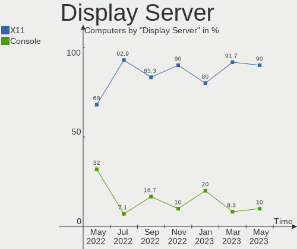

| Name    | Computers | Percent |
|---------|-----------|---------|
| X11     | 20        | 80%     |
| Console | 5         | 20%     |

Display Manager
---------------

SDDM, LightDM, etc.

| Name    | Computers | Percent |
|---------|-----------|---------|
| Console | 24        | 96%     |
| SLiM    | 1         | 4%      |

OS Lang
-------

Language

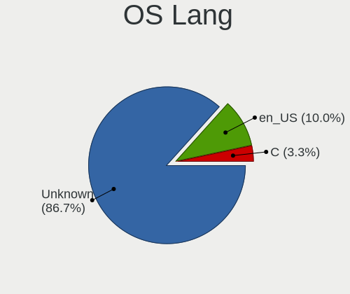

| Lang       | Computers | Percent |
|------------|-----------|---------|
| Unknown    | 19        | 76%     |
| en_US      | 2         | 8%      |
| pl_PL      | 1         | 4%      |
| ISO8859-15 | 1         | 4%      |
| es_ES      | 1         | 4%      |
| C          | 1         | 4%      |

Boot Mode
---------

EFI or BIOS

| Mode | Computers | Percent |
|------|-----------|---------|
| EFI  | 15        | 60%     |
| BIOS | 10        | 40%     |

Filesystem
----------

Type of filesystem

| Type | Computers | Percent |
|------|-----------|---------|
| Ffs  | 25        | 100%    |

Part. scheme
------------

Scheme of partitioning

| Type | Computers | Percent |
|------|-----------|---------|
| GPT  | 14        | 56%     |
| MBR  | 11        | 44%     |

Board
-----

Vendor
------

Motherboard manufacturer

| Name                | Computers | Percent |
|---------------------|-----------|---------|
| Lenovo              | 10        | 40%     |
| ASUSTek Computer    | 4         | 16%     |
| Hewlett-Packard     | 2         | 8%      |
| Dell                | 2         | 8%      |
| Supermicro          | 1         | 4%      |
| PC Engines          | 1         | 4%      |
| Notebook            | 1         | 4%      |
| Google              | 1         | 4%      |
| Gigabyte Technology | 1         | 4%      |
| Fujitsu             | 1         | 4%      |
| Apple               | 1         | 4%      |

Model
-----

Motherboard model

| Name                                       | Computers | Percent |
|--------------------------------------------|-----------|---------|
| Supermicro Super Server                    | 1         | 4%      |
| PC Engines apu4                            | 1         | 4%      |
| Notebook NS5x_NS7xPU                       | 1         | 4%      |
| Lenovo ThinkStation D20 415575G            | 1         | 4%      |
| Lenovo ThinkPad X260 20F5S10W0H            | 1         | 4%      |
| Lenovo ThinkPad X1 Carbon Gen 9 20XW00QGUS | 1         | 4%      |
| Lenovo ThinkPad T480 20L5CTO1WW            | 1         | 4%      |
| Lenovo ThinkPad T410 2518C3U               | 1         | 4%      |
| Lenovo ThinkPad E15 Gen 4 21EDCTO1WW       | 1         | 4%      |
| Lenovo ThinkPad E14 Gen 4 21EB001FGE       | 1         | 4%      |
| Lenovo ThinkCentre Edge72 34971AG          | 1         | 4%      |
| Lenovo H30-05 90BJ0085SP                   | 1         | 4%      |
| Lenovo G50-80 80E5                         | 1         | 4%      |
| HP ProBook 455 G7                          | 1         | 4%      |
| HP Presario V2000 (EZ621UA#ABA)            | 1         | 4%      |
| Google Kefka                               | 1         | 4%      |
| Gigabyte Z390 AORUS ELITE                  | 1         | 4%      |
| Fujitsu PRIMERGY RX200 S6                  | 1         | 4%      |
| Dell PowerEdge R710                        | 1         | 4%      |
| Dell OptiPlex 3040                         | 1         | 4%      |
| ASUS TUF Gaming B550-PLUS                  | 1         | 4%      |
| ASUS PRO A520M-C                           | 1         | 4%      |
| ASUS PRIME B460M-A                         | 1         | 4%      |
| ASUS F2A85-M                               | 1         | 4%      |
| Apple MacBookAir7,2                        | 1         | 4%      |

Model Family
------------

Motherboard model prefix

| Name                | Computers | Percent |
|---------------------|-----------|---------|
| Lenovo ThinkPad     | 6         | 24%     |
| Supermicro Super    | 1         | 4%      |
| PC Engines apu4     | 1         | 4%      |
| Notebook NS5x       | 1         | 4%      |
| Lenovo ThinkStation | 1         | 4%      |
| Lenovo ThinkCentre  | 1         | 4%      |
| Lenovo H30-05       | 1         | 4%      |
| Lenovo G50-80       | 1         | 4%      |
| HP ProBook          | 1         | 4%      |
| HP Presario         | 1         | 4%      |
| Google Kefka        | 1         | 4%      |
| Gigabyte Z390       | 1         | 4%      |
| Fujitsu PRIMERGY    | 1         | 4%      |
| Dell PowerEdge      | 1         | 4%      |
| Dell OptiPlex       | 1         | 4%      |
| ASUS TUF            | 1         | 4%      |
| ASUS PRO            | 1         | 4%      |
| ASUS PRIME          | 1         | 4%      |
| ASUS F2A85-M        | 1         | 4%      |
| Apple MacBookAir7   | 1         | 4%      |

MFG Year
--------

Motherboard manufacture year

| Year | Computers | Percent |
|------|-----------|---------|
| 2022 | 6         | 24%     |
| 2021 | 4         | 16%     |
| 2018 | 3         | 12%     |
| 2010 | 3         | 12%     |
| 2020 | 2         | 8%      |
| 2015 | 2         | 8%      |
| 2013 | 2         | 8%      |
| 2023 | 1         | 4%      |
| 2016 | 1         | 4%      |
| 2006 | 1         | 4%      |

Form Factor
-----------

Physical design of the computer

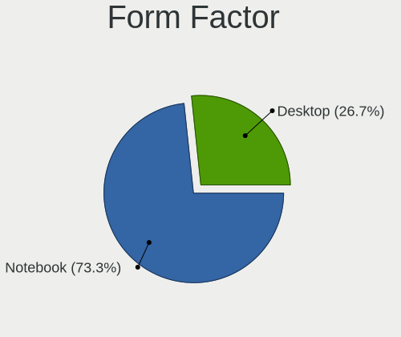

| Name     | Computers | Percent |
|----------|-----------|---------|
| Desktop  | 12        | 48%     |
| Notebook | 12        | 48%     |
| Server   | 1         | 4%      |

Coreboot
--------

Have coreboot on board

| Used | Computers | Percent |
|------|-----------|---------|
| No   | 23        | 92%     |
| Yes  | 2         | 8%      |

RAM Size
--------

Total RAM memory

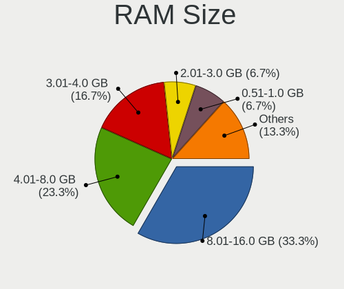

| Size in GB  | Computers | Percent |
|-------------|-----------|---------|
| 4.01-8.0    | 5         | 20%     |
| 64.01-256.0 | 5         | 20%     |
| 16.01-24.0  | 5         | 20%     |
| 8.01-16.0   | 4         | 16%     |
| 32.01-64.0  | 2         | 8%      |
| 3.01-4.0    | 2         | 8%      |
| 24.01-32.0  | 1         | 4%      |
| 1.01-2.0    | 1         | 4%      |

RAM Used
--------

Used RAM memory

| Used GB  | Computers | Percent |
|----------|-----------|---------|
| 0.01-0.5 | 17        | 68%     |
| 0.51-1.0 | 3         | 12%     |
| 3.01-4.0 | 2         | 8%      |
| 1.01-2.0 | 2         | 8%      |
| 4.01-8.0 | 1         | 4%      |

Total Drives
------------

Number of drives on board

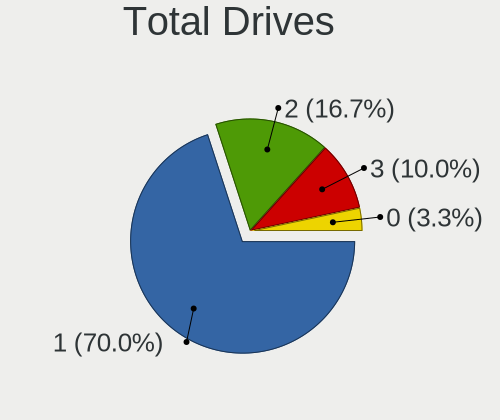

| Drives | Computers | Percent |
|--------|-----------|---------|
| 1      | 13        | 52%     |
| 2      | 7         | 28%     |
| 8      | 1         | 4%      |
| 5      | 1         | 4%      |
| 4      | 1         | 4%      |
| 3      | 1         | 4%      |
| 0      | 1         | 4%      |

Has CD-ROM
----------

Has CD-ROM on board

| Presented | Computers | Percent |
|-----------|-----------|---------|
| No        | 23        | 92%     |
| Yes       | 2         | 8%      |

Has Ethernet
------------

Has Ethernet on board

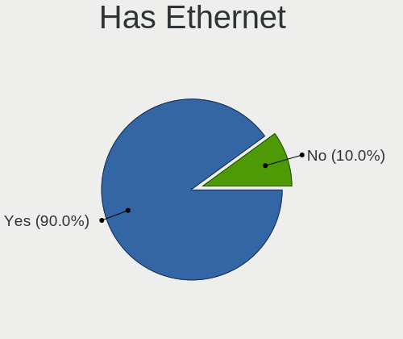

| Presented | Computers | Percent |
|-----------|-----------|---------|
| Yes       | 22        | 88%     |
| No        | 3         | 12%     |

Has WiFi
--------

Has WiFi module

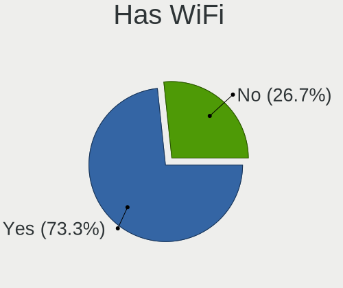

| Presented | Computers | Percent |
|-----------|-----------|---------|
| Yes       | 14        | 56%     |
| No        | 11        | 44%     |

Has Bluetooth
-------------

Has Bluetooth module

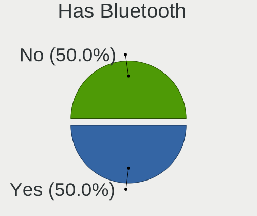

| Presented | Computers | Percent |
|-----------|-----------|---------|
| No        | 13        | 52%     |
| Yes       | 12        | 48%     |

Location
--------

Country
-------

Geographic location (country)

| Country     | Computers | Percent |
|-------------|-----------|---------|
| USA         | 6         | 24%     |
| Spain       | 4         | 16%     |
| Germany     | 4         | 16%     |
| France      | 3         | 12%     |
| Netherlands | 2         | 8%      |
| Switzerland | 1         | 4%      |
| Slovakia    | 1         | 4%      |
| Poland      | 1         | 4%      |
| Italy       | 1         | 4%      |
| Bulgaria    | 1         | 4%      |
| Australia   | 1         | 4%      |

City
----

Geographic location (city)

| City              | Computers | Percent |
|-------------------|-----------|---------|
| Paris             | 2         | 8%      |
| Lafayette         | 2         | 8%      |
| Fayetteville      | 2         | 8%      |
| Zurich            | 1         | 4%      |
| Verona            | 1         | 4%      |
| Sydney            | 1         | 4%      |
| Sun Prairie       | 1         | 4%      |
| Sofia             | 1         | 4%      |
| Rhoon             | 1         | 4%      |
| Remseck am Neckar | 1         | 4%      |
| Nuremberg         | 1         | 4%      |
| Navalcarnero      | 1         | 4%      |
| Krakow            | 1         | 4%      |
| Košice           | 1         | 4%      |
| Giessen           | 1         | 4%      |
| Charleston        | 1         | 4%      |
| Cergy             | 1         | 4%      |
| Barcelona         | 1         | 4%      |
| Badalona          | 1         | 4%      |
| Amsterdam         | 1         | 4%      |
| Alcover           | 1         | 4%      |
| Aalen             | 1         | 4%      |

Drives
------

Drive Vendor
------------

Hard drive vendors

| Vendor              | Computers | Drives | Percent |
|---------------------|-----------|--------|---------|
| NVMe                | 10        | 13     | 33.33%  |
| Seagate             | 3         | 4      | 10%     |
| WDC                 | 2         | 2      | 6.67%   |
| Samsung Electronics | 2         | 7      | 6.67%   |
| Kingston            | 2         | 2      | 6.67%   |
| Intel               | 2         | 2      | 6.67%   |
| Crucial             | 2         | 2      | 6.67%   |
| Toshiba             | 1         | 1      | 3.33%   |
| OPENBSD             | 1         | 1      | 3.33%   |
| KingSpec            | 1         | 1      | 3.33%   |
| KingDian            | 1         | 1      | 3.33%   |
| Dell                | 1         | 2      | 3.33%   |
| Apple               | 1         | 1      | 3.33%   |
| Apacer              | 1         | 1      | 3.33%   |

Drive Model
-----------

Hard drive models

| Model                           | Computers | Percent |
|---------------------------------|-----------|---------|
| NVMe Samsung SSD 980 1TB        | 4         | 12.12%  |
| WDC WD10JPCX-24UE4T0 1TB        | 1         | 3.03%   |
| WDC WD Elements 2621 1TB        | 1         | 3.03%   |
| Toshiba MQ01ACF032 320GB        | 1         | 3.03%   |
| Seagate ST500DM009-2F110A 500GB | 1         | 3.03%   |
| Seagate ST500DM002-1BD142 500GB | 1         | 3.03%   |
| Seagate Portable 5TB            | 1         | 3.03%   |
| Seagate Desktop 8TB             | 1         | 3.03%   |
| Samsung SSD 870 QVO 2TB         | 1         | 3.03%   |
| Samsung SSD 850 EVO 500GB       | 1         | 3.03%   |
| OPENBSD SR RAID 5 9.9TB         | 1         | 3.03%   |
| NVMe WDC PC SN720 SDA 512GB     | 1         | 3.03%   |
| NVMe WD PC SN740 SDDQ 1TB       | 1         | 3.03%   |
| NVMe SAMSUNG MZVLQ256 256GB     | 1         | 3.03%   |
| NVMe Micron MTFDKCD25 256GB     | 1         | 3.03%   |
| NVMe KIOXIA-EXCERIA P 1TB       | 1         | 3.03%   |
| NVMe JAJP600M512C 512GB         | 1         | 3.03%   |
| NVMe CT500P2SSD8 500GB          | 1         | 3.03%   |
| NVMe CT1000P5PSSD8 1TB          | 1         | 3.03%   |
| Kingston SA400S37480G 480GB     | 1         | 3.03%   |
| Kingston SA400M8240G 240GB      | 1         | 3.03%   |
| KingSpec P3-512 512GB           | 1         | 3.03%   |
| KingDian S280 240GB             | 1         | 3.03%   |
| Intel SSDSC2KF128G8 SATA 128GB  | 1         | 3.03%   |
| Intel SSDSC2BB120G4 120GB       | 1         | 3.03%   |
| Dell PERC 6-i 1.1TB             | 1         | 3.03%   |
| Crucial CT2000BX500SSD1 2TB     | 1         | 3.03%   |
| Crucial CT1000BX500SSD1 1TB     | 1         | 3.03%   |
| Apple SSD SM0128G 121GB         | 1         | 3.03%   |
| Apacer AS340 240GB              | 1         | 3.03%   |

HDD Vendor
----------

Hard disk drive vendors

| Vendor  | Computers | Drives | Percent |
|---------|-----------|--------|---------|
| NVMe    | 6         | 6      | 42.86%  |
| Seagate | 3         | 4      | 21.43%  |
| WDC     | 2         | 2      | 14.29%  |
| Toshiba | 1         | 1      | 7.14%   |
| OPENBSD | 1         | 1      | 7.14%   |
| Dell    | 1         | 2      | 7.14%   |

SSD Vendor
----------

Solid state drive vendors

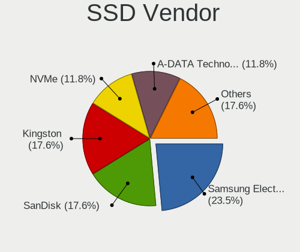

| Vendor              | Computers | Drives | Percent |
|---------------------|-----------|--------|---------|
| NVMe                | 6         | 7      | 33.33%  |
| Samsung Electronics | 2         | 7      | 11.11%  |
| Kingston            | 2         | 2      | 11.11%  |
| Intel               | 2         | 2      | 11.11%  |
| Crucial             | 2         | 2      | 11.11%  |
| KingSpec            | 1         | 1      | 5.56%   |
| KingDian            | 1         | 1      | 5.56%   |
| Apple               | 1         | 1      | 5.56%   |
| Apacer              | 1         | 1      | 5.56%   |

Drive Kind
----------

HDD or SSD

| Kind | Computers | Drives | Percent |
|------|-----------|--------|---------|
| SSD  | 14        | 24     | 51.85%  |
| HDD  | 13        | 16     | 48.15%  |

Drive Connector
---------------

SATA, SAS, NVMe, etc.

| Type | Computers | Drives | Percent |
|------|-----------|--------|---------|
| SATA | 22        | 40     | 100%    |

Drive Size
----------

Size of hard drive

| Size in TB | Computers | Drives | Percent |
|------------|-----------|--------|---------|
| 0.01-0.5   | 12        | 14     | 41.38%  |
| 0.51-1.0   | 11        | 13     | 37.93%  |
| 1.01-2.0   | 4         | 10     | 13.79%  |
| 4.01-10.0  | 2         | 3      | 6.9%    |

Space Total
-----------

Amount of disk space available on the file system

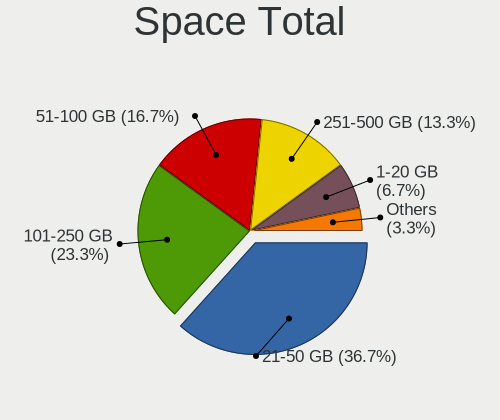

| Size in GB     | Computers | Percent |
|----------------|-----------|---------|
| 251-500        | 9         | 36%     |
| 101-250        | 5         | 20%     |
| 1001-2000      | 4         | 16%     |
| 501-1000       | 3         | 12%     |
| 21-50          | 2         | 8%      |
| More than 3000 | 1         | 4%      |
| 51-100         | 1         | 4%      |

Space Used
----------

Amount of used disk space

| Used GB  | Computers | Percent |
|----------|-----------|---------|
| 1-20     | 15        | 60%     |
| 21-50    | 3         | 12%     |
| 51-100   | 3         | 12%     |
| 251-500  | 2         | 8%      |
| 101-250  | 1         | 4%      |
| 501-1000 | 1         | 4%      |

Malfunc. Drives
---------------

Drive models with a malfunction

| Model                    | Computers | Drives | Percent |
|--------------------------|-----------|--------|---------|
| Toshiba MQ01ACF032 320GB | 1         | 1      | 50%     |
| KingSpec P3-512 512GB    | 1         | 1      | 50%     |

Malfunc. Drive Vendor
---------------------

Vendors of faulty drives

| Vendor   | Computers | Drives | Percent |
|----------|-----------|--------|---------|
| Toshiba  | 1         | 1      | 50%     |
| KingSpec | 1         | 1      | 50%     |

Malfunc. HDD Vendor
-------------------

Vendors of faulty HDD drives

| Vendor  | Computers | Drives | Percent |
|---------|-----------|--------|---------|
| Toshiba | 1         | 1      | 100%    |

Malfunc. Drive Kind
-------------------

Kinds of faulty drives

| Kind | Computers | Drives | Percent |
|------|-----------|--------|---------|
| SSD  | 1         | 1      | 50%     |
| HDD  | 1         | 1      | 50%     |

Failed Drives
-------------

Failed drive models

Zero info for selected period =(

Failed Drive Vendor
-------------------

Failed drive vendors

Zero info for selected period =(

Drive Status
------------

Number of failed and malfunc. drives

| Status   | Computers | Drives | Percent |
|----------|-----------|--------|---------|
| Detected | 12        | 18     | 46.15%  |
| Works    | 12        | 20     | 46.15%  |
| Malfunc  | 2         | 2      | 7.69%   |

Storage controller
------------------

Storage Vendor
--------------

Storage controller vendors

| Vendor                    | Computers | Percent |
|---------------------------|-----------|---------|
| Intel                     | 11        | 33.33%  |
| AMD                       | 7         | 21.21%  |
| Samsung Electronics       | 6         | 18.18%  |
| SanDisk                   | 2         | 6.06%   |
| Micron/Crucial Technology | 2         | 6.06%   |
| Broadcom / LSI            | 2         | 6.06%   |
| Silicon Motion            | 1         | 3.03%   |
| Micron Technology         | 1         | 3.03%   |
| KIOXIA                    | 1         | 3.03%   |

Storage Model
-------------

Storage controller models

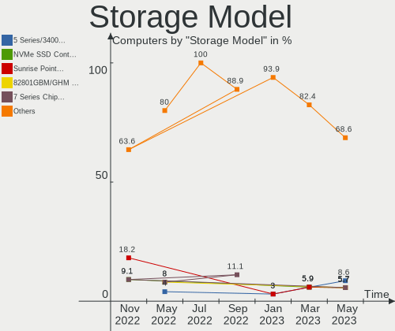

| Model                                                                          | Computers | Percent |
|--------------------------------------------------------------------------------|-----------|---------|
| Samsung NVMe SSD Controller PM9A1/PM9A3/980PRO                                 | 4         | 12.12%  |
| AMD FCH SATA Controller [AHCI mode]                                            | 4         | 12.12%  |
| Intel 82801JI (ICH10 Family) SATA AHCI Controller                              | 2         | 6.06%   |
| AMD 500 Series Chipset SATA Controller                                         | 2         | 6.06%   |
| Silicon Motion SM2263EN/SM2263XT SSD Controller                                | 1         | 3.03%   |
| SanDisk WD Black 2018/SN750 / PC SN720 NVMe SSD                                | 1         | 3.03%   |
| Sandisk unknown                                                                | 1         | 3.03%   |
| Samsung SM951 AHCI                                                             | 1         | 3.03%   |
| Samsung NVMe SSD Controller 980                                                | 1         | 3.03%   |
| Micron/Crucial P5 Plus NVMe PCIe SSD                                           | 1         | 3.03%   |
| Micron/Crucial P2 NVMe PCIe SSD                                                | 1         | 3.03%   |
| Micron unknown                                                                 | 1         | 3.03%   |
| KIOXIA unknown                                                                 | 1         | 3.03%   |
| Intel Wildcat Point-LP SATA Controller [AHCI Mode]                             | 1         | 3.03%   |
| Intel Sunrise Point-LP SATA Controller [AHCI mode]                             | 1         | 3.03%   |
| Intel Q170/Q150/B150/H170/H110/Z170/CM236 Chipset SATA Controller [AHCI Mode]  | 1         | 3.03%   |
| Intel Cannon Lake PCH SATA AHCI Controller                                     | 1         | 3.03%   |
| Intel 82801IB (ICH9) 2 port SATA Controller [IDE mode]                         | 1         | 3.03%   |
| Intel 8 Series/C220 Series Chipset Family 6-port SATA Controller 1 [AHCI mode] | 1         | 3.03%   |
| Intel 6 Series/C200 Series Chipset Family 6 port Desktop SATA AHCI Controller  | 1         | 3.03%   |
| Intel 5 Series/3400 Series Chipset 6 port SATA AHCI Controller                 | 1         | 3.03%   |
| Intel 400 Series Chipset Family SATA AHCI Controller                           | 1         | 3.03%   |
| Broadcom / LSI SAS2008 PCI-Express Fusion-MPT SAS-2 [Falcon]                   | 1         | 3.03%   |
| Broadcom / LSI MegaRAID SAS 1078                                               | 1         | 3.03%   |
| AMD IXP SB4x0 IDE Controller                                                   | 1         | 3.03%   |

Storage Kind
------------

Kind of storage controller (IDE, SATA, NVMe, SAS, ...)

| Kind | Computers | Percent |
|------|-----------|---------|
| SATA | 17        | 54.84%  |
| NVMe | 10        | 32.26%  |
| RAID | 2         | 6.45%   |
| IDE  | 2         | 6.45%   |

Processor
---------

CPU Vendor
----------

Processor vendors

| Vendor | Computers | Percent |
|--------|-----------|---------|
| Intel  | 16        | 64%     |
| AMD    | 9         | 36%     |

CPU Model
---------

Processor models

| Model                                                       | Computers | Percent |
|-------------------------------------------------------------|-----------|---------|
| Intel Xeon CPU X5690 @ 3.47GHz                              | 1         | 4%      |
| Intel Xeon CPU X5650 @ 2.67GHz                              | 1         | 4%      |
| Intel Xeon CPU E5540 @ 2.53GHz                              | 1         | 4%      |
| Intel Xeon CPU D-1528 @ 1.90GHz                             | 1         | 4%      |
| Intel Core i9-9900K CPU @ 3.60GHz                           | 1         | 4%      |
| Intel Core i7-8550U CPU @ 1.80GHz                           | 1         | 4%      |
| Intel Core i7-5500U CPU @ 2.40GHz                           | 1         | 4%      |
| Intel Core i5-6500T CPU @ 2.50GHz                           | 1         | 4%      |
| Intel Core i5-6300U CPU @ 2.40GHz                           | 1         | 4%      |
| Intel Core i5-5250U CPU @ 1.60GHz                           | 1         | 4%      |
| Intel Core i5 CPU M 540 @ 2.53GHz                           | 1         | 4%      |
| Intel Core i3-3220 CPU @ 3.30GHz ("GenuineIntel" 686-class) | 1         | 4%      |
| Intel Core i3-10100 CPU @ 3.60GHz                           | 1         | 4%      |
| Intel Celeron CPU N3060 @ 1.60GHz                           | 1         | 4%      |
| Intel 12th Gen Core i7-1260P                                | 1         | 4%      |
| Intel 11th Gen Core i7-1185G7 @ 3.00GHz                     | 1         | 4%      |
| AMD Turion 64 Mobile Technology ML-34                       | 1         | 4%      |
| AMD Ryzen 9 5950X 16-Core Processor                         | 1         | 4%      |
| AMD Ryzen 9 5900X 12-Core Processor                         | 1         | 4%      |
| AMD Ryzen 7 5825U with Radeon Graphics                      | 1         | 4%      |
| AMD Ryzen 5 5625U with Radeon Graphics                      | 1         | 4%      |
| AMD Ryzen 5 4500U with Radeon Graphics                      | 1         | 4%      |
| AMD GX-412TC SOC                                            | 1         | 4%      |
| AMD E1-7010 APU with AMD Radeon R2 Graphics                 | 1         | 4%      |
| AMD A10-5700 APU with Radeon HD Graphics                    | 1         | 4%      |

CPU Model Family
----------------

Processor model prefix

| Model                | Computers | Percent |
|----------------------|-----------|---------|
| Intel Xeon           | 4         | 16%     |
| Intel Core i5        | 4         | 16%     |
| Other                | 2         | 8%      |
| Intel Core i7        | 2         | 8%      |
| Intel Core i3        | 2         | 8%      |
| AMD Ryzen 9          | 2         | 8%      |
| AMD Ryzen 5          | 2         | 8%      |
| Intel Core i9        | 1         | 4%      |
| Intel Celeron        | 1         | 4%      |
| AMD Turion 64 Mobile | 1         | 4%      |
| AMD Ryzen 7          | 1         | 4%      |
| AMD GX               | 1         | 4%      |
| AMD E1               | 1         | 4%      |
| AMD A10              | 1         | 4%      |

CPU Cores
---------

Number of processor cores

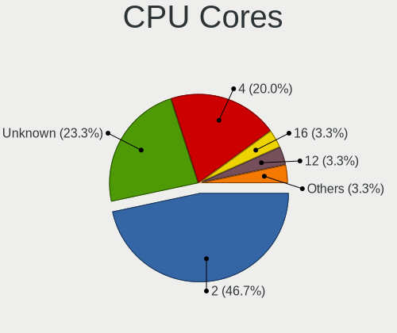

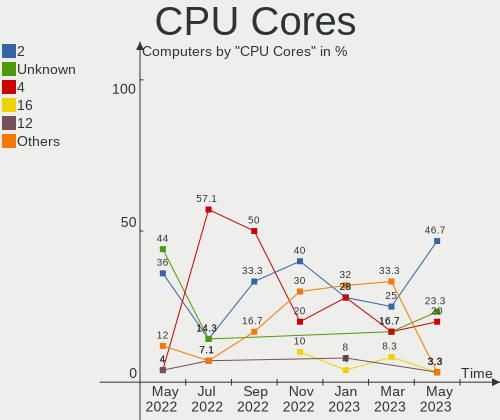

| Number | Computers | Percent |
|--------|-----------|---------|
| 4      | 7         | 28%     |
| 2      | 7         | 28%     |
| 6      | 3         | 12%     |
| 12     | 2         | 8%      |
| 8      | 2         | 8%      |
| 32     | 1         | 4%      |
| 24     | 1         | 4%      |
| 16     | 1         | 4%      |
| 1      | 1         | 4%      |

CPU Sockets
-----------

Number of sockets

| Number | Computers | Percent |
|--------|-----------|---------|
| 1      | 24        | 96%     |
| 2      | 1         | 4%      |

CPU Threads
-----------

Threads per core (Hyper-Threading)

| Number | Computers | Percent |
|--------|-----------|---------|
| 2      | 14        | 56%     |
| 1      | 11        | 44%     |

CPU Microarch
-------------

Microarchitecture

| Name       | Computers | Percent |
|------------|-----------|---------|
| Zen 3      | 4         | 16%     |
| Westmere   | 3         | 12%     |
| Broadwell  | 3         | 12%     |
| Skylake    | 2         | 8%      |
| Puma       | 2         | 8%      |
| KabyLake   | 2         | 8%      |
| Zen 2      | 1         | 4%      |
| TigerLake  | 1         | 4%      |
| Silvermont | 1         | 4%      |
| Piledriver | 1         | 4%      |
| Nehalem    | 1         | 4%      |
| K8 Hammer  | 1         | 4%      |
| IvyBridge  | 1         | 4%      |
| CometLake  | 1         | 4%      |
| Unknown    | 1         | 4%      |

Graphics
--------

GPU Vendor
----------

Vendors of graphics cards

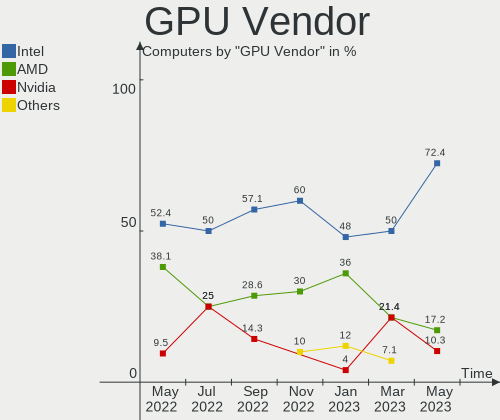

| Vendor                     | Computers | Percent |
|----------------------------|-----------|---------|
| Intel                      | 12        | 48%     |
| AMD                        | 9         | 36%     |
| Matrox Electronics Systems | 2         | 8%      |
| Nvidia                     | 1         | 4%      |
| ASPEED Technology          | 1         | 4%      |

GPU Model
---------

Graphics card models

| Model                                                                                    | Computers | Percent |
|------------------------------------------------------------------------------------------|-----------|---------|
| AMD Barcelo                                                                              | 2         | 8%      |
| Nvidia GK208B [GeForce GT 710]                                                           | 1         | 4%      |
| Matrox Electronics Systems MGA G200eW WPCM450                                            | 1         | 4%      |
| Matrox Electronics Systems MGA G200e [Pilot] ServerEngines (SEP1)                        | 1         | 4%      |
| Intel Xeon E3-1200 v2/3rd Gen Core processor Graphics Controller                         | 1         | 4%      |
| Intel UHD Graphics 620                                                                   | 1         | 4%      |
| Intel TigerLake-LP GT2 [Iris Xe Graphics]                                                | 1         | 4%      |
| Intel Skylake GT2 [HD Graphics 520]                                                      | 1         | 4%      |
| Intel HD Graphics 6000                                                                   | 1         | 4%      |
| Intel HD Graphics 5500                                                                   | 1         | 4%      |
| Intel HD Graphics 530                                                                    | 1         | 4%      |
| Intel Core Processor Integrated Graphics Controller                                      | 1         | 4%      |
| Intel CometLake-S GT2 [UHD Graphics 630]                                                 | 1         | 4%      |
| Intel CoffeeLake-S GT2 [UHD Graphics 630]                                                | 1         | 4%      |
| Intel Atom/Celeron/Pentium Processor x5-E8000/J3xxx/N3xxx Integrated Graphics Controller | 1         | 4%      |
| Intel Alder Lake-P Integrated Graphics Controller                                        | 1         | 4%      |
| ASPEED Technology ASPEED Graphics Family                                                 | 1         | 4%      |
| AMD Trinity [Radeon HD 7660D]                                                            | 1         | 4%      |
| AMD RS480M [Mobility Radeon Xpress 200]                                                  | 1         | 4%      |
| AMD Renoir                                                                               | 1         | 4%      |
| AMD Oland [Radeon HD 8570 / R5 430 OEM / R7 240/340 / Radeon 520 OEM]                    | 1         | 4%      |
| AMD Mullins [Radeon R2 Graphics]                                                         | 1         | 4%      |
| AMD Ellesmere [Radeon RX 470/480/570/570X/580/580X/590]                                  | 1         | 4%      |
| AMD Caicos [Radeon HD 6450/7450/8450 / R5 230 OEM]                                       | 1         | 4%      |

GPU Combo
---------

Combinations of graphics cards

| Name       | Computers | Percent |
|------------|-----------|---------|
| 1 x Intel  | 11        | 44%     |
| 1 x AMD    | 9         | 36%     |
| 1 x Matrox | 2         | 8%      |
| Other      | 1         | 4%      |
| 1 x Nvidia | 1         | 4%      |
| 1 x ASPEED | 1         | 4%      |

GPU Driver
----------

Free vs proprietary

| Driver  | Computers | Percent |
|---------|-----------|---------|
| Free    | 21        | 84%     |
| Unknown | 4         | 16%     |

GPU Memory
----------

Total video memory

| Size in GB | Computers | Percent |
|------------|-----------|---------|
| Unknown    | 25        | 100%    |

Monitor
-------

Monitor Vendor
--------------

Monitor vendors

| Vendor               | Computers | Percent |
|----------------------|-----------|---------|
| Dell                 | 3         | 14.29%  |
| AU Optronics         | 3         | 14.29%  |
| Philips              | 2         | 9.52%   |
| BOE                  | 2         | 9.52%   |
| Samsung Electronics  | 1         | 4.76%   |
| Quanta Display       | 1         | 4.76%   |
| MSI                  | 1         | 4.76%   |
| LG Display           | 1         | 4.76%   |
| Lenovo               | 1         | 4.76%   |
| Goldstar             | 1         | 4.76%   |
| Chimei Innolux       | 1         | 4.76%   |
| Apple                | 1         | 4.76%   |
| AOC                  | 1         | 4.76%   |
| Ancor Communications | 1         | 4.76%   |
| Acer                 | 1         | 4.76%   |

Monitor Model
-------------

Monitor models

| Model                                                                | Computers | Percent |
|----------------------------------------------------------------------|-----------|---------|
| Samsung Electronics LCD Monitor SDC4852 1366x768 340x190mm 15.3-inch | 1         | 4.76%   |
| Quanta Display LCD Monitor QDS0020 1280x768 310x180mm 14.1-inch      | 1         | 4.76%   |
| Philips PHL 240B9 PHL0966 1920x1200 520x320mm 24.0-inch              | 1         | 4.76%   |
| Philips 227E4LH PHLC0AC 1920x1080 480x270mm 21.7-inch                | 1         | 4.76%   |
| MSI MP242 MSI30A1 1920x1080 530x300mm 24.0-inch                      | 1         | 4.76%   |
| LG Display LCD Monitor LGD062E 1920x1080 340x190mm 15.3-inch         | 1         | 4.76%   |
| Lenovo LCD Monitor LEN4035 1280x800 300x190mm 14.0-inch              | 1         | 4.76%   |
| Goldstar L1918S GSM4B31 1280x1024 380x300mm 19.1-inch                | 1         | 4.76%   |
| Dell U2515H DELD06F 2560x1440 550x310mm 24.9-inch                    | 1         | 4.76%   |
| Dell S2721D DELA19A 2560x1440 590x330mm 26.6-inch                    | 1         | 4.76%   |
| Dell P780 DEL510F 1600x1200 330x240mm 16.1-inch                      | 1         | 4.76%   |
| Chimei Innolux LCD Monitor CMN140A 1920x1080 310x170mm 13.9-inch     | 1         | 4.76%   |
| BOE LCD Monitor BOE08E2 1920x1080 340x190mm 15.3-inch                | 1         | 4.76%   |
| BOE LCD Monitor BOE07D8 1920x1080 340x190mm 15.3-inch                | 1         | 4.76%   |
| AU Optronics LCD Monitor AUOD291 1920x1200 300x190mm 14.0-inch       | 1         | 4.76%   |
| AU Optronics LCD Monitor AUO2336 2560x1440 310x170mm 13.9-inch       | 1         | 4.76%   |
| AU Optronics LCD Monitor AUO125C 1366x768 260x140mm 11.6-inch        | 1         | 4.76%   |
| Apple Color LCD APP9CF0 1440x900 290x180mm 13.4-inch                 | 1         | 4.76%   |
| AOC 2050W AOC2050 1600x900 430x240mm 19.4-inch                       | 1         | 4.76%   |
| Ancor Communications VK246 ACI24F1 1920x1080 530x300mm 24.0-inch     | 1         | 4.76%   |
| Acer AT1945 ACR1945 1440x900 400x250mm 18.6-inch                     | 1         | 4.76%   |

Monitor Resolution
------------------

Monitor screen resolution

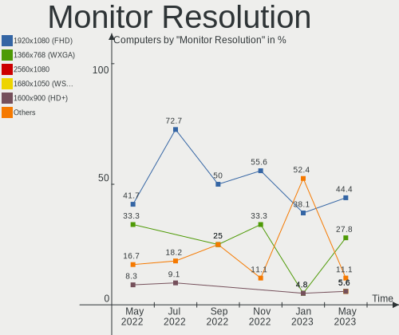

| Resolution        | Computers | Percent |
|-------------------|-----------|---------|
| 1920x1080 (FHD)   | 8         | 38.1%   |
| 2560x1440 (QHD)   | 3         | 14.29%  |
| 1920x1200 (WUXGA) | 2         | 9.52%   |
| 1440x900 (WXGA+)  | 2         | 9.52%   |
| 1600x900 (HD+)    | 1         | 4.76%   |
| 1600x1200         | 1         | 4.76%   |
| 1366x768 (WXGA)   | 1         | 4.76%   |
| 1280x800 (WXGA)   | 1         | 4.76%   |
| 1280x768          | 1         | 4.76%   |
| 1280x1024 (SXGA)  | 1         | 4.76%   |

Monitor Diagonal
----------------

Diagonal size in inches

| Inches | Computers | Percent |
|--------|-----------|---------|
| 24     | 4         | 19.05%  |
| 15     | 4         | 19.05%  |
| 14     | 3         | 14.29%  |
| 13     | 3         | 14.29%  |
| 19     | 2         | 9.52%   |
| 26     | 1         | 4.76%   |
| 21     | 1         | 4.76%   |
| 18     | 1         | 4.76%   |
| 16     | 1         | 4.76%   |
| 11     | 1         | 4.76%   |

Monitor Width
-------------

Physical width

| Width in mm | Computers | Percent |
|-------------|-----------|---------|
| 301-350     | 8         | 38.1%   |
| 501-600     | 5         | 23.81%  |
| 201-300     | 4         | 19.05%  |
| 401-500     | 2         | 9.52%   |
| 351-400     | 2         | 9.52%   |

Aspect Ratio
------------

Proportional relationship between the width and the height

| Ratio | Computers | Percent |
|-------|-----------|---------|
| 16/9  | 13        | 65%     |
| 16/10 | 5         | 25%     |
| 5/4   | 1         | 5%      |
| 4/3   | 1         | 5%      |

Monitor Area
------------

Area in inch²

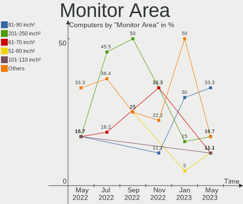

| Area in inch² | Computers | Percent |
|----------------|-----------|---------|
| 81-90          | 6         | 30%     |
| 91-100         | 4         | 20%     |
| 201-250        | 3         | 15%     |
| 251-300        | 2         | 10%     |
| 151-200        | 2         | 10%     |
| 51-60          | 1         | 5%      |
| 301-350        | 1         | 5%      |
| 121-130        | 1         | 5%      |

Pixel Density
-------------

Pixels per inch

| Density | Computers | Percent |
|---------|-----------|---------|
| 121-160 | 7         | 35%     |
| 101-120 | 6         | 30%     |
| 51-100  | 5         | 25%     |
| 161-240 | 2         | 10%     |

Multiple Monitors
-----------------

Total monitors connected

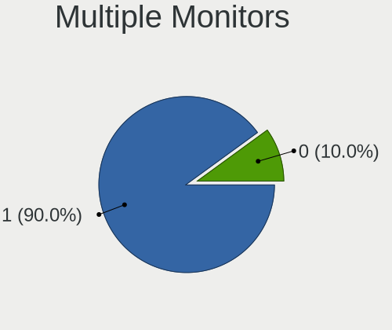

| Total | Computers | Percent |
|-------|-----------|---------|
| 1     | 16        | 64%     |
| 0     | 6         | 24%     |
| 2     | 3         | 12%     |

Network
-------

Net Controller Vendor
---------------------

Controller vendors

| Vendor                | Computers | Percent |
|-----------------------|-----------|---------|
| Realtek Semiconductor | 14        | 37.84%  |
| Intel                 | 14        | 37.84%  |
| Broadcom              | 4         | 10.81%  |
| TP-Link               | 1         | 2.7%    |
| Qualcomm Atheros      | 1         | 2.7%    |
| MediaTek              | 1         | 2.7%    |
| D-Link System         | 1         | 2.7%    |
| AMD                   | 1         | 2.7%    |

Net Controller Model
--------------------

Controller models

| Model                                                                      | Computers | Percent |
|----------------------------------------------------------------------------|-----------|---------|
| Realtek RTL8111/8168/8411 PCI Express Gigabit Ethernet Controller          | 10        | 21.28%  |
| Intel Wireless 8260                                                        | 2         | 4.26%   |
| Intel Wi-Fi 6 AX200                                                        | 2         | 4.26%   |
| TP-Link Archer T2U PLUS [RTL8821AU]                                        | 1         | 2.13%   |
| TP-Link AC600 wireless Realtek RTL8811AU [Archer T2U Nano]                 | 1         | 2.13%   |
| Realtek RTL8191SEvB Wireless LAN Controller                                | 1         | 2.13%   |
| Realtek RTL8188CUS 802.11n WLAN Adapter                                    | 1         | 2.13%   |
| Realtek RTL8125 2.5GbE Controller                                          | 1         | 2.13%   |
| Realtek RTL810xE PCI Express Fast Ethernet controller                      | 1         | 2.13%   |
| Realtek RTL-8100/8101L/8139 PCI Fast Ethernet Adapter                      | 1         | 2.13%   |
| Qualcomm Atheros QCA9565 / AR9565 Wireless Network Adapter                 | 1         | 2.13%   |
| MediaTek MT7921 802.11ax PCI Express Wireless Network Adapter              | 1         | 2.13%   |
| Intel Wireless 8265 / 8275                                                 | 1         | 2.13%   |
| Intel Wireless 7265                                                        | 1         | 2.13%   |
| Intel Wireless 3160                                                        | 1         | 2.13%   |
| Intel Wi-Fi 6 AX210/AX211/AX411 160MHz                                     | 1         | 2.13%   |
| Intel Wi-Fi 6 AX201                                                        | 1         | 2.13%   |
| Intel Intel Centrino WiMAX 6250 Function                                   | 1         | 2.13%   |
| Intel I350 Gigabit Network Connection                                      | 1         | 2.13%   |
| Intel I211 Gigabit Network Connection                                      | 1         | 2.13%   |
| Intel I210 Gigabit Network Connection                                      | 1         | 2.13%   |
| Intel Ethernet Connection X552/X557-AT 10GBASE-T                           | 1         | 2.13%   |
| Intel Ethernet Connection I219-LM                                          | 1         | 2.13%   |
| Intel Ethernet Connection (7) I219-V                                       | 1         | 2.13%   |
| Intel Ethernet Connection (4) I219-V                                       | 1         | 2.13%   |
| Intel Centrino Advanced-N + WiMAX 6250 [Kilmer Peak]                       | 1         | 2.13%   |
| Intel 82599ES 10-Gigabit SFI/SFP+ Network Connection                       | 1         | 2.13%   |
| Intel 82577LM Gigabit Network Connection                                   | 1         | 2.13%   |
| Intel 82575EB Gigabit Network Connection                                   | 1         | 2.13%   |
| D-Link System AirPlus G DWL-G122 Wireless Adapter(rev.C1) [Ralink RT2571W] | 1         | 2.13%   |
| Broadcom NetXtreme II BCM5709 Gigabit Ethernet                             | 1         | 2.13%   |
| Broadcom NetXtreme BCM5755 Gigabit Ethernet PCI Express                    | 1         | 2.13%   |
| Broadcom NetXtreme BCM5754 Gigabit Ethernet PCI Express                    | 1         | 2.13%   |
| Broadcom BCM4360 802.11ac Wireless Network Adapter                         | 1         | 2.13%   |
| Broadcom BCM4318 [AirForce One 54g] 802.11g Wireless LAN Controller        | 1         | 2.13%   |
| AMD IXP SB400 AC'97 Modem Controller                                       | 1         | 2.13%   |

Wireless Vendor
---------------

Wireless vendors

| Vendor                | Computers | Percent |
|-----------------------|-----------|---------|
| Intel                 | 9         | 56.25%  |
| Broadcom              | 2         | 12.5%   |
| TP-Link               | 1         | 6.25%   |
| Realtek Semiconductor | 1         | 6.25%   |
| Qualcomm Atheros      | 1         | 6.25%   |
| MediaTek              | 1         | 6.25%   |
| D-Link System         | 1         | 6.25%   |

Wireless Model
--------------

Wireless models

| Model                                                                      | Computers | Percent |
|----------------------------------------------------------------------------|-----------|---------|
| Intel Wireless 8260                                                        | 2         | 11.11%  |
| Intel Wi-Fi 6 AX200                                                        | 2         | 11.11%  |
| TP-Link Archer T2U PLUS [RTL8821AU]                                        | 1         | 5.56%   |
| TP-Link AC600 wireless Realtek RTL8811AU [Archer T2U Nano]                 | 1         | 5.56%   |
| Realtek RTL8191SEvB Wireless LAN Controller                                | 1         | 5.56%   |
| Realtek RTL8188CUS 802.11n WLAN Adapter                                    | 1         | 5.56%   |
| Qualcomm Atheros QCA9565 / AR9565 Wireless Network Adapter                 | 1         | 5.56%   |
| MediaTek MT7921 802.11ax PCI Express Wireless Network Adapter              | 1         | 5.56%   |
| Intel Wireless 8265 / 8275                                                 | 1         | 5.56%   |
| Intel Wireless 7265                                                        | 1         | 5.56%   |
| Intel Wireless 3160                                                        | 1         | 5.56%   |
| Intel Wi-Fi 6 AX210/AX211/AX411 160MHz                                     | 1         | 5.56%   |
| Intel Wi-Fi 6 AX201                                                        | 1         | 5.56%   |
| D-Link System AirPlus G DWL-G122 Wireless Adapter(rev.C1) [Ralink RT2571W] | 1         | 5.56%   |
| Broadcom BCM4360 802.11ac Wireless Network Adapter                         | 1         | 5.56%   |
| Broadcom BCM4318 [AirForce One 54g] 802.11g Wireless LAN Controller        | 1         | 5.56%   |

Ethernet Vendor
---------------

Ethernet vendors

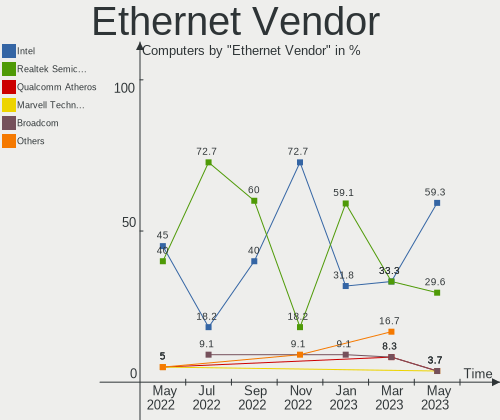

| Vendor                | Computers | Percent |
|-----------------------|-----------|---------|
| Realtek Semiconductor | 13        | 59.09%  |
| Intel                 | 7         | 31.82%  |
| Broadcom              | 2         | 9.09%   |

Ethernet Model
--------------

Ethernet models

| Model                                                             | Computers | Percent |
|-------------------------------------------------------------------|-----------|---------|
| Realtek RTL8111/8168/8411 PCI Express Gigabit Ethernet Controller | 10        | 38.46%  |
| Realtek RTL8125 2.5GbE Controller                                 | 1         | 3.85%   |
| Realtek RTL810xE PCI Express Fast Ethernet controller             | 1         | 3.85%   |
| Realtek RTL-8100/8101L/8139 PCI Fast Ethernet Adapter             | 1         | 3.85%   |
| Intel I350 Gigabit Network Connection                             | 1         | 3.85%   |
| Intel I211 Gigabit Network Connection                             | 1         | 3.85%   |
| Intel I210 Gigabit Network Connection                             | 1         | 3.85%   |
| Intel Ethernet Connection X552/X557-AT 10GBASE-T                  | 1         | 3.85%   |
| Intel Ethernet Connection I219-LM                                 | 1         | 3.85%   |
| Intel Ethernet Connection (7) I219-V                              | 1         | 3.85%   |
| Intel Ethernet Connection (4) I219-V                              | 1         | 3.85%   |
| Intel 82599ES 10-Gigabit SFI/SFP+ Network Connection              | 1         | 3.85%   |
| Intel 82577LM Gigabit Network Connection                          | 1         | 3.85%   |
| Intel 82575EB Gigabit Network Connection                          | 1         | 3.85%   |
| Broadcom NetXtreme II BCM5709 Gigabit Ethernet                    | 1         | 3.85%   |
| Broadcom NetXtreme BCM5755 Gigabit Ethernet PCI Express           | 1         | 3.85%   |
| Broadcom NetXtreme BCM5754 Gigabit Ethernet PCI Express           | 1         | 3.85%   |

Net Controller Kind
-------------------

Ethernet, WiFi or modem

| Kind     | Computers | Percent |
|----------|-----------|---------|
| Ethernet | 22        | 57.89%  |
| WiFi     | 14        | 36.84%  |
| Modem    | 1         | 2.63%   |
| Unknown  | 1         | 2.63%   |

Used Controller
---------------

Currently used network controller

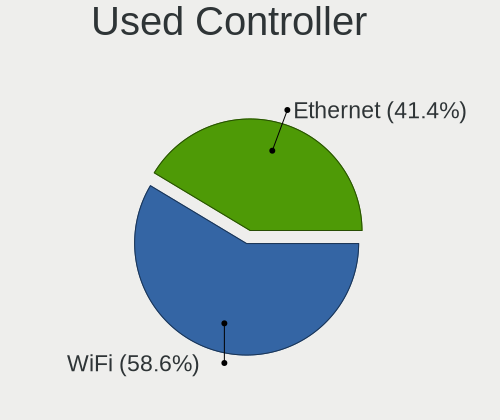

| Kind     | Computers | Percent |
|----------|-----------|---------|
| Ethernet | 12        | 52.17%  |
| WiFi     | 10        | 43.48%  |
| Unknown  | 1         | 4.35%   |

NICs
----

Total network controllers on board

| Total | Computers | Percent |
|-------|-----------|---------|
| 2     | 12        | 48%     |
| 1     | 9         | 36%     |
| 4     | 3         | 12%     |
| 5     | 1         | 4%      |

IPv6
----

IPv6 vs IPv4

| Used | Computers | Percent |
|------|-----------|---------|
| No   | 25        | 100%    |

Bluetooth
---------

Bluetooth Vendor
----------------

Controller vendors

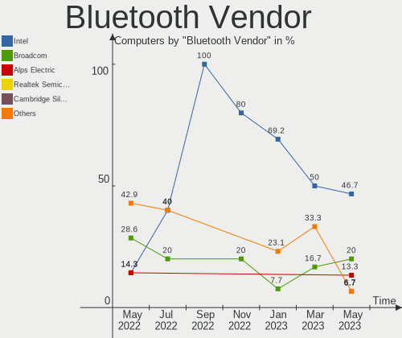

| Vendor                          | Computers | Percent |
|---------------------------------|-----------|---------|
| Intel                           | 9         | 69.23%  |
| Qualcomm Atheros Communications | 1         | 7.69%   |
| Foxconn / Hon Hai               | 1         | 7.69%   |
| Broadcom                        | 1         | 7.69%   |
| Apple                           | 1         | 7.69%   |

Bluetooth Model
---------------

Controller models

| Model                                   | Computers | Percent |
|-----------------------------------------|-----------|---------|
| Intel Bluetooth wireless interface      | 5         | 38.46%  |
| Intel AX200 Bluetooth                   | 2         | 15.38%  |
| Qualcomm Atheros AR3012 Bluetooth 4.0   | 1         | 7.69%   |
| Intel AX210 Bluetooth                   | 1         | 7.69%   |
| Intel AX201 Bluetooth                   | 1         | 7.69%   |
| Foxconn / Hon Hai Wireless_Device       | 1         | 7.69%   |
| Broadcom BCM20702A0 Bluetooth 4.0       | 1         | 7.69%   |
| Apple Apple Broadcom Built-in Bluetooth | 1         | 7.69%   |

Sound
-----

Sound Vendor
------------

Sound card vendors

| Vendor                               | Computers | Percent |
|--------------------------------------|-----------|---------|
| Intel                                | 13        | 48.15%  |
| AMD                                  | 10        | 37.04%  |
| Thesycon Systemsoftware & Consulting | 1         | 3.7%    |
| Texas Instruments                    | 1         | 3.7%    |
| Nvidia                               | 1         | 3.7%    |
| JMTek                                | 1         | 3.7%    |

Sound Model
-----------

Sound card models

| Model                                                                                             | Computers | Percent |
|---------------------------------------------------------------------------------------------------|-----------|---------|
| AMD Renoir Radeon High Definition Audio Controller                                                | 3         | 8.57%   |
| AMD Family 17h/19h HD Audio Controller                                                            | 3         | 8.57%   |
| Intel Wildcat Point-LP High Definition Audio Controller                                           | 2         | 5.71%   |
| Intel Sunrise Point-LP HD Audio                                                                   | 2         | 5.71%   |
| Intel Broadwell-U Audio Controller                                                                | 2         | 5.71%   |
| AMD Starship/Matisse HD Audio Controller                                                          | 2         | 5.71%   |
| AMD FCH Azalia Controller                                                                         | 2         | 5.71%   |
| Thesycon Systemsoftware & Consulting Topping DX3 Pro Audio Control                                | 1         | 2.86%   |
| Texas Instruments PCM2902 Audio Codec                                                             | 1         | 2.86%   |
| Nvidia GK208 HDMI/DP Audio Controller                                                             | 1         | 2.86%   |
| JMTek USB PnP Audio Device                                                                        | 1         | 2.86%   |
| Intel Tiger Lake-LP Smart Sound Technology Audio Controller                                       | 1         | 2.86%   |
| Intel Comet Lake PCH-V cAVS                                                                       | 1         | 2.86%   |
| Intel Cannon Lake PCH cAVS                                                                        | 1         | 2.86%   |
| Intel Atom/Celeron/Pentium Processor x5-E8000/J3xxx/N3xxx Series High Definition Audio Controller | 1         | 2.86%   |
| Intel Alder Lake PCH-P High Definition Audio Controller                                           | 1         | 2.86%   |
| Intel 82801JI (ICH10 Family) HD Audio Controller                                                  | 1         | 2.86%   |
| Intel 6 Series/C200 Series Chipset Family High Definition Audio Controller                        | 1         | 2.86%   |
| Intel 5 Series/3400 Series Chipset High Definition Audio                                          | 1         | 2.86%   |
| Intel 100 Series/C230 Series Chipset Family HD Audio Controller                                   | 1         | 2.86%   |
| AMD Trinity HDMI Audio Controller                                                                 | 1         | 2.86%   |
| AMD Oland/Hainan/Cape Verde/Pitcairn HDMI Audio [Radeon HD 7000 Series]                           | 1         | 2.86%   |
| AMD Kabini HDMI/DP Audio                                                                          | 1         | 2.86%   |
| AMD IXP SB400 AC'97 Audio Controller                                                              | 1         | 2.86%   |
| AMD Ellesmere HDMI Audio [Radeon RX 470/480 / 570/580/590]                                        | 1         | 2.86%   |
| AMD Caicos HDMI Audio [Radeon HD 6450 / 7450/8450/8490 OEM / R5 230/235/235X OEM]                 | 1         | 2.86%   |

Memory
------

Memory Vendor
-------------

Memory module vendors

| Vendor | Computers | Percent |
|--------|-----------|---------|
| Elpida | 1         | 100%    |

Memory Model
------------

Memory module models

| Model                                                 | Computers | Percent |
|-------------------------------------------------------|-----------|---------|
| Elpida RAM EBJ41UF8BCS0-DJ-F 4GB SODIMM DDR3 1334MT/s | 1         | 50%     |
| Elpida RAM EBJ21UE8BDS0-AE-F 2GB SODIMM DDR3 1067MT/s | 1         | 50%     |

Memory Kind
-----------

Memory module kinds

| Kind | Computers | Percent |
|------|-----------|---------|
| DDR3 | 1         | 100%    |

Memory Form Factor
------------------

Physical design of the memory module

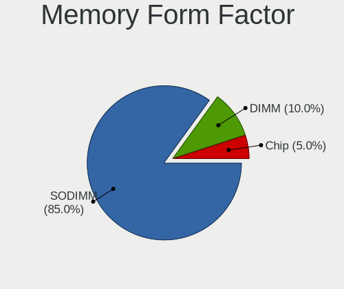

| Name   | Computers | Percent |
|--------|-----------|---------|
| SODIMM | 1         | 100%    |

Memory Size
-----------

Memory module size

| Size | Computers | Percent |
|------|-----------|---------|
| 4096 | 1         | 50%     |
| 2048 | 1         | 50%     |

Memory Speed
------------

Memory module speed

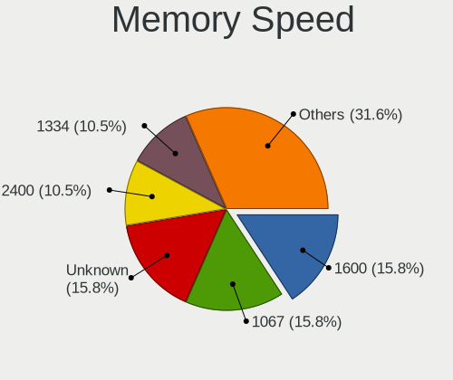

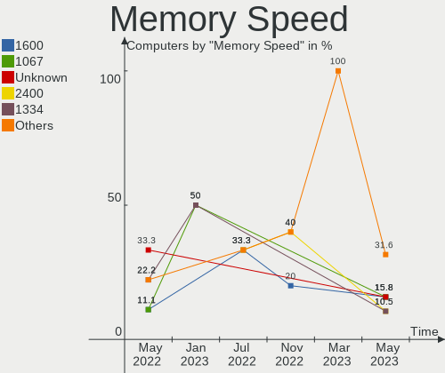

| Speed | Computers | Percent |
|-------|-----------|---------|
| 1334  | 1         | 50%     |
| 1067  | 1         | 50%     |

Printers & scanners
-------------------

Printer Vendor
--------------

Printer device vendors

Zero info for selected period =(

Printer Model
-------------

Printer device models

Zero info for selected period =(

Scanner Vendor
--------------

Scanner device vendors

Zero info for selected period =(

Scanner Model
-------------

Scanner device models

Zero info for selected period =(

Camera
------

Camera Vendor
-------------

Camera device vendors

| Vendor                | Computers | Percent |
|-----------------------|-----------|---------|
| Chicony Electronics   | 3         | 30%     |
| Acer                  | 3         | 30%     |
| Realtek Semiconductor | 1         | 10%     |
| Quanta                | 1         | 10%     |
| Microdia              | 1         | 10%     |
| Lite-On Technology    | 1         | 10%     |

Camera Model
------------

Camera device models

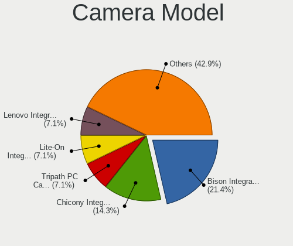

| Model                            | Computers | Percent |
|----------------------------------|-----------|---------|
| Chicony Ltd., Integrated Camera  | 2         | 18.18%  |
| Realtek Integrated_Webcam_HD     | 1         | 9.09%   |
| Quanta HP Universal Camera       | 1         | 9.09%   |
| Microdia USB 2.0 Camera          | 1         | 9.09%   |
| Lite-On Integrated Camera        | 1         | 9.09%   |
| Chicony Chicony USB2.0 Camera    | 1         | 9.09%   |
| Acer SunplusIT Integrated Camera | 1         | 9.09%   |
| Acer Lenovo EasyCamera           | 1         | 9.09%   |
| Acer Integrated RGB Camera       | 1         | 9.09%   |
| Acer Integrated Camera           | 1         | 9.09%   |

Security
--------

Fingerprint Vendor
------------------

Fingerprint sensor vendors

| Vendor    | Computers | Percent |
|-----------|-----------|---------|
| Synaptics | 2         | 100%    |

Fingerprint Model
-----------------

Fingerprint sensor models

| Model                                                     | Computers | Percent |
|-----------------------------------------------------------|-----------|---------|
| Synaptics  FS7604 Touch Fingerprint Sensor with PurePrint | 1         | 50%     |
| Synaptics Metallica MIS Touch Fingerprint Reader          | 1         | 50%     |

Chipcard Vendor
---------------

Chipcard module vendors

Zero info for selected period =(

Chipcard Model
--------------

Chipcard module models

Zero info for selected period =(

Unsupported
-----------

Unsupported Devices
-------------------

Total unsupported devices on board

| Total | Computers | Percent |
|-------|-----------|---------|
| 1     | 13        | 52%     |
| 0     | 7         | 28%     |
| 2     | 2         | 8%      |
| 5     | 1         | 4%      |
| 4     | 1         | 4%      |
| 3     | 1         | 4%      |

Unsupported Device Types
------------------------

Types of unsupported devices

| Type                     | Computers | Percent |
|--------------------------|-----------|---------|
| Communication controller | 12        | 44.44%  |
| Net/wireless             | 4         | 14.81%  |
| Storage/ata              | 3         | 11.11%  |
| Graphics card            | 2         | 7.41%   |
| Firewire controller      | 2         | 7.41%   |
| Storage                  | 1         | 3.7%    |
| Sound                    | 1         | 3.7%    |
| Network                  | 1         | 3.7%    |
| Modem                    | 1         | 3.7%    |

