OpenBSD - Hardware Trends (Desktops)
------------------------------------

A project to identify most popular hardware characteristics and track their change
over time based on data collected by BSD users at https://BSD-Hardware.info.

Anyone can contribute to this report by the [hw-probe](https://github.com/linuxhw/hw-probe/blob/master/INSTALL.BSD.md) tool:

    hw-probe -all -upload

This report is for one last month. Overall report since the beginning of time: [TestCoverage](https://github.com/bsdhw/TestCoverage)

Period: Oct, 2022.

Contents
--------

* [ System ](#system)
  - [ OS                       ](#os)
  - [ OS Family                ](#os-family)
  - [ Arch                     ](#arch)
  - [ DE                       ](#de)
  - [ Display Server           ](#display-server)
  - [ Display Manager          ](#display-manager)
  - [ OS Lang                  ](#os-lang)
  - [ Boot Mode                ](#boot-mode)
  - [ Filesystem               ](#filesystem)
  - [ Part. scheme             ](#part-scheme)

* [ Board ](#board)
  - [ Vendor                   ](#vendor)
  - [ Model                    ](#model)
  - [ Model Family             ](#model-family)
  - [ MFG Year                 ](#mfg-year)
  - [ Form Factor              ](#form-factor)
  - [ Coreboot                 ](#coreboot)
  - [ RAM Size                 ](#ram-size)
  - [ RAM Used                 ](#ram-used)
  - [ Total Drives             ](#total-drives)
  - [ Has CD-ROM               ](#has-cd-rom)
  - [ Has Ethernet             ](#has-ethernet)
  - [ Has WiFi                 ](#has-wifi)
  - [ Has Bluetooth            ](#has-bluetooth)

* [ Location ](#location)
  - [ Country                  ](#country)
  - [ City                     ](#city)

* [ Drives ](#drives)
  - [ Drive Vendor             ](#drive-vendor)
  - [ Drive Model              ](#drive-model)
  - [ HDD Vendor               ](#hdd-vendor)
  - [ SSD Vendor               ](#ssd-vendor)
  - [ Drive Kind               ](#drive-kind)
  - [ Drive Connector          ](#drive-connector)
  - [ Drive Size               ](#drive-size)
  - [ Space Total              ](#space-total)
  - [ Space Used               ](#space-used)
  - [ Malfunc. Drives          ](#malfunc-drives)
  - [ Malfunc. Drive Vendor    ](#malfunc-drive-vendor)
  - [ Malfunc. HDD Vendor      ](#malfunc-hdd-vendor)
  - [ Malfunc. Drive Kind      ](#malfunc-drive-kind)
  - [ Failed Drives            ](#failed-drives)
  - [ Failed Drive Vendor      ](#failed-drive-vendor)
  - [ Drive Status             ](#drive-status)

* [ Storage controller ](#storage-controller)
  - [ Storage Vendor           ](#storage-vendor)
  - [ Storage Model            ](#storage-model)
  - [ Storage Kind             ](#storage-kind)

* [ Processor ](#processor)
  - [ CPU Vendor               ](#cpu-vendor)
  - [ CPU Model                ](#cpu-model)
  - [ CPU Model Family         ](#cpu-model-family)
  - [ CPU Cores                ](#cpu-cores)
  - [ CPU Sockets              ](#cpu-sockets)
  - [ CPU Threads              ](#cpu-threads)
  - [ CPU Microarch            ](#cpu-microarch)

* [ Graphics ](#graphics)
  - [ GPU Vendor               ](#gpu-vendor)
  - [ GPU Model                ](#gpu-model)
  - [ GPU Combo                ](#gpu-combo)
  - [ GPU Driver               ](#gpu-driver)
  - [ GPU Memory               ](#gpu-memory)

* [ Monitor ](#monitor)
  - [ Monitor Vendor           ](#monitor-vendor)
  - [ Monitor Model            ](#monitor-model)
  - [ Monitor Resolution       ](#monitor-resolution)
  - [ Monitor Diagonal         ](#monitor-diagonal)
  - [ Monitor Width            ](#monitor-width)
  - [ Aspect Ratio             ](#aspect-ratio)
  - [ Monitor Area             ](#monitor-area)
  - [ Pixel Density            ](#pixel-density)
  - [ Multiple Monitors        ](#multiple-monitors)

* [ Network ](#network)
  - [ Net Controller Vendor    ](#net-controller-vendor)
  - [ Net Controller Model     ](#net-controller-model)
  - [ Wireless Vendor          ](#wireless-vendor)
  - [ Wireless Model           ](#wireless-model)
  - [ Ethernet Vendor          ](#ethernet-vendor)
  - [ Ethernet Model           ](#ethernet-model)
  - [ Net Controller Kind      ](#net-controller-kind)
  - [ Used Controller          ](#used-controller)
  - [ NICs                     ](#nics)
  - [ IPv6                     ](#ipv6)

* [ Bluetooth ](#bluetooth)
  - [ Bluetooth Vendor         ](#bluetooth-vendor)
  - [ Bluetooth Model          ](#bluetooth-model)

* [ Sound ](#sound)
  - [ Sound Vendor             ](#sound-vendor)
  - [ Sound Model              ](#sound-model)

* [ Memory ](#memory)
  - [ Memory Vendor            ](#memory-vendor)
  - [ Memory Model             ](#memory-model)
  - [ Memory Kind              ](#memory-kind)
  - [ Memory Form Factor       ](#memory-form-factor)
  - [ Memory Size              ](#memory-size)
  - [ Memory Speed             ](#memory-speed)

* [ Printers & scanners ](#printers--scanners)
  - [ Printer Vendor           ](#printer-vendor)
  - [ Printer Model            ](#printer-model)
  - [ Scanner Vendor           ](#scanner-vendor)
  - [ Scanner Model            ](#scanner-model)

* [ Camera ](#camera)
  - [ Camera Vendor            ](#camera-vendor)
  - [ Camera Model             ](#camera-model)

* [ Security ](#security)
  - [ Fingerprint Vendor       ](#fingerprint-vendor)
  - [ Fingerprint Model        ](#fingerprint-model)
  - [ Chipcard Vendor          ](#chipcard-vendor)
  - [ Chipcard Model           ](#chipcard-model)

* [ Unsupported ](#unsupported)
  - [ Unsupported Devices      ](#unsupported-devices)
  - [ Unsupported Device Types ](#unsupported-device-types)

System
------

OS
--

Installed operating systems

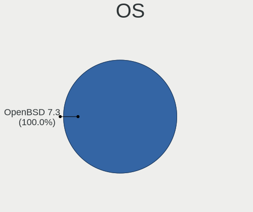

| Name        | Desktops | Percent |
|-------------|----------|---------|
| OpenBSD 7.2 | 7        | 53.85%  |
| OpenBSD 7.1 | 6        | 46.15%  |

OS Family
---------

OS without a version

| Name    | Desktops | Percent |
|---------|----------|---------|
| OpenBSD | 13       | 100%    |

Arch
----

OS architecture (x86_64, i586, etc.)

| Name  | Desktops | Percent |
|-------|----------|---------|
| amd64 | 12       | 92.31%  |
| i386  | 1        | 7.69%   |

DE
--

Desktop Environment

| Name         | Desktops | Percent |
|--------------|----------|---------|
| helloDesktop | 12       | 92.31%  |
| XFCE         | 1        | 7.69%   |

Display Server
--------------

X11 or Wayland

| Name    | Desktops | Percent |
|---------|----------|---------|
| X11     | 9        | 69.23%  |
| Console | 4        | 30.77%  |

Display Manager
---------------

SDDM, LightDM, etc.

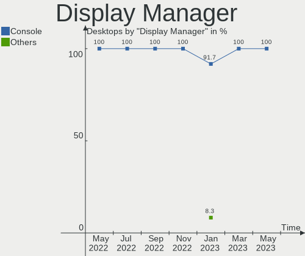

| Name    | Desktops | Percent |
|---------|----------|---------|
| Console | 13       | 100%    |

OS Lang
-------

Language

| Lang    | Desktops | Percent |
|---------|----------|---------|
| Unknown | 10       | 76.92%  |
| ru_RU   | 1        | 7.69%   |
| fr_FR   | 1        | 7.69%   |
| en_US   | 1        | 7.69%   |

Boot Mode
---------

EFI or BIOS

| Mode | Desktops | Percent |
|------|----------|---------|
| BIOS | 8        | 61.54%  |
| EFI  | 5        | 38.46%  |

Filesystem
----------

Type of filesystem

| Type | Desktops | Percent |
|------|----------|---------|
| Ffs  | 13       | 100%    |

Part. scheme
------------

Scheme of partitioning

| Type | Desktops | Percent |
|------|----------|---------|
| MBR  | 10       | 76.92%  |
| GPT  | 3        | 23.08%  |

Board
-----

Vendor
------

Motherboard manufacturer

| Name                | Desktops | Percent |
|---------------------|----------|---------|
| ASUSTek Computer    | 3        | 23.08%  |
| Lenovo              | 2        | 15.38%  |
| Hewlett-Packard     | 2        | 15.38%  |
| Supermicro          | 1        | 7.69%   |
| Soekris Engineering | 1        | 7.69%   |
| PC Engines          | 1        | 7.69%   |
| Clevo               | 1        | 7.69%   |
| ASRock              | 1        | 7.69%   |
| Unknown             | 1        | 7.69%   |

Model
-----

Motherboard model

| Name                          | Desktops | Percent |
|-------------------------------|----------|---------|
| Supermicro X8DTH-i/6/iF/6F    | 1        | 7.69%   |
| Soekris Engineering net6501   | 1        | 7.69%   |
| PC Engines APU2               | 1        | 7.69%   |
| Lenovo ThinkPad T60 2613CTO   | 1        | 7.69%   |
| Lenovo IdeaPad 5 15ITL05 82FG | 1        | 7.69%   |
| HP Compaq nw8440 (RND39ET)    | 1        | 7.69%   |
| HP 260 G3 DM                  | 1        | 7.69%   |
| Clevo R130T                   | 1        | 7.69%   |
| ASUS TUF Gaming B550-PLUS     | 1        | 7.69%   |
| ASUS P8Z68-V GEN3             | 1        | 7.69%   |
| ASUS P10S-I Series            | 1        | 7.69%   |
| ASRock Q1900M                 | 1        | 7.69%   |
| Unknown                       | 1        | 7.69%   |

Model Family
------------

Motherboard model prefix

| Name                        | Desktops | Percent |
|-----------------------------|----------|---------|
| Supermicro X8DTH-i          | 1        | 7.69%   |
| Soekris Engineering net6501 | 1        | 7.69%   |
| PC Engines APU2             | 1        | 7.69%   |
| Lenovo ThinkPad             | 1        | 7.69%   |
| Lenovo IdeaPad              | 1        | 7.69%   |
| HP Compaq                   | 1        | 7.69%   |
| HP 260                      | 1        | 7.69%   |
| Clevo R130T                 | 1        | 7.69%   |
| ASUS TUF                    | 1        | 7.69%   |
| ASUS P8Z68-V                | 1        | 7.69%   |
| ASUS P10S-I                 | 1        | 7.69%   |
| ASRock Q1900M               | 1        | 7.69%   |
| Unknown                     | 1        | 7.69%   |

MFG Year
--------

Motherboard manufacture year

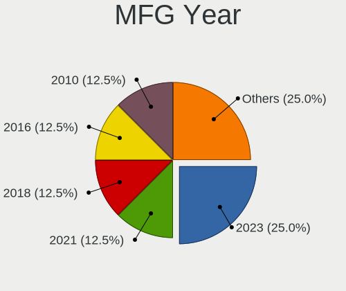

| Year    | Desktops | Percent |
|---------|----------|---------|
| 2022    | 3        | 23.08%  |
| 2012    | 2        | 15.38%  |
| 2021    | 1        | 7.69%   |
| 2019    | 1        | 7.69%   |
| 2018    | 1        | 7.69%   |
| 2016    | 1        | 7.69%   |
| 2014    | 1        | 7.69%   |
| 2009    | 1        | 7.69%   |
| 2007    | 1        | 7.69%   |
| Unknown | 1        | 7.69%   |

Form Factor
-----------

Physical design of the computer

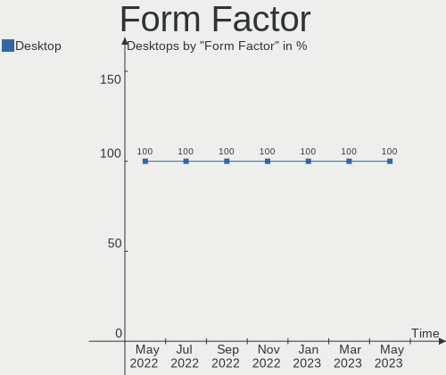

| Name    | Desktops | Percent |
|---------|----------|---------|
| Desktop | 13       | 100%    |

Coreboot
--------

Have coreboot on board

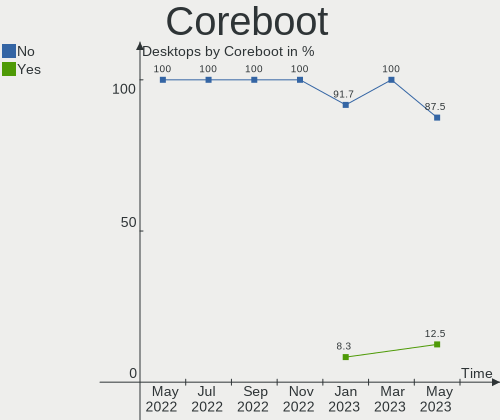

| Used | Desktops | Percent |
|------|----------|---------|
| No   | 11       | 84.62%  |
| Yes  | 2        | 15.38%  |

RAM Size
--------

Total RAM memory

| Size in GB  | Desktops | Percent |
|-------------|----------|---------|
| 8.01-16.0   | 4        | 30.77%  |
| 3.01-4.0    | 2        | 15.38%  |
| 16.01-24.0  | 2        | 15.38%  |
| 4.01-8.0    | 1        | 7.69%   |
| 24.01-32.0  | 1        | 7.69%   |
| 64.01-256.0 | 1        | 7.69%   |
| 1.01-2.0    | 1        | 7.69%   |
| 0.51-1.0    | 1        | 7.69%   |

RAM Used
--------

Used RAM memory

| Used GB  | Desktops | Percent |
|----------|----------|---------|
| 0.01-0.5 | 10       | 76.92%  |
| 4.01-8.0 | 1        | 7.69%   |
| 0.51-1.0 | 1        | 7.69%   |
| 0        | 1        | 7.69%   |

Total Drives
------------

Number of drives on board

| Drives | Desktops | Percent |
|--------|----------|---------|
| 1      | 8        | 61.54%  |
| 2      | 2        | 15.38%  |
| 14     | 1        | 7.69%   |
| 8      | 1        | 7.69%   |
| 6      | 1        | 7.69%   |

Has CD-ROM
----------

Has CD-ROM on board

| Presented | Desktops | Percent |
|-----------|----------|---------|
| No        | 13       | 100%    |

Has Ethernet
------------

Has Ethernet on board

| Presented | Desktops | Percent |
|-----------|----------|---------|
| Yes       | 12       | 92.31%  |
| No        | 1        | 7.69%   |

Has WiFi
--------

Has WiFi module

| Presented | Desktops | Percent |
|-----------|----------|---------|
| No        | 9        | 69.23%  |
| Yes       | 4        | 30.77%  |

Has Bluetooth
-------------

Has Bluetooth module

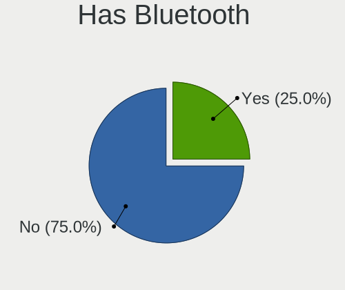

| Presented | Desktops | Percent |
|-----------|----------|---------|
| No        | 9        | 69.23%  |
| Yes       | 4        | 30.77%  |

Location
--------

Country
-------

Geographic location (country)

| Country   | Desktops | Percent |
|-----------|----------|---------|
| Russia    | 4        | 30.77%  |
| France    | 4        | 30.77%  |
| USA       | 1        | 7.69%   |
| Ukraine   | 1        | 7.69%   |
| Italy     | 1        | 7.69%   |
| Germany   | 1        | 7.69%   |
| Australia | 1        | 7.69%   |

City
----

Geographic location (city)

| City         | Desktops | Percent |
|--------------|----------|---------|
| Paris        | 2        | 15.38%  |
| Moscow       | 2        | 15.38%  |
| Anglet       | 2        | 15.38%  |
| Vidnoye      | 1        | 7.69%   |
| Sydney       | 1        | 7.69%   |
| Reutov       | 1        | 7.69%   |
| Odessa       | 1        | 7.69%   |
| Nuremberg    | 1        | 7.69%   |
| Lee's Summit | 1        | 7.69%   |
| Gallarate    | 1        | 7.69%   |

Drives
------

Drive Vendor
------------

Hard drive vendors

| Vendor              | Desktops | Drives | Percent |
|---------------------|----------|--------|---------|
| NVMe                | 5        | 5      | 20.83%  |
| Samsung Electronics | 3        | 8      | 12.5%   |
| OPENBSD             | 3        | 3      | 12.5%   |
| WDC                 | 2        | 5      | 8.33%   |
| HGST                | 2        | 2      | 8.33%   |
| Toshiba             | 1        | 1      | 4.17%   |
| SPCC                | 1        | 1      | 4.17%   |
| Seagate             | 1        | 8      | 4.17%   |
| OCZ                 | 1        | 1      | 4.17%   |
| LSI                 | 1        | 1      | 4.17%   |
| Kingston            | 1        | 1      | 4.17%   |
| Hitachi             | 1        | 1      | 4.17%   |
| Fujitsu             | 1        | 1      | 4.17%   |
| Corsair             | 1        | 1      | 4.17%   |

Drive Model
-----------

Hard drive models

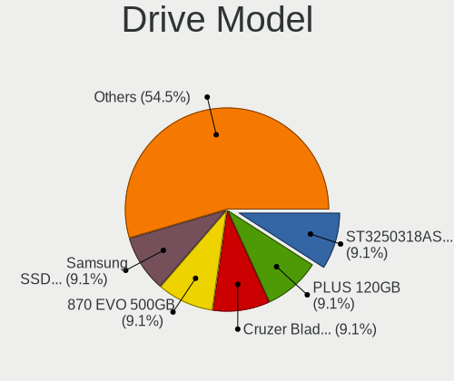

| Model                        | Desktops | Percent |
|------------------------------|----------|---------|
| OPENBSD SR RAID 1 2TB        | 2        | 6.06%   |
| WDC WD7500AACS-00ZJB0 752GB  | 1        | 3.03%   |
| WDC WD20PURX-64P6ZY0 2TB     | 1        | 3.03%   |
| WDC WD20EARX-00PASB0 2TB     | 1        | 3.03%   |
| WDC WD15EARS-00Z5B1 1.5TB    | 1        | 3.03%   |
| WDC WD My Passport 25E7 2TB  | 1        | 3.03%   |
| Toshiba MK5065GSX 500GB      | 1        | 3.03%   |
| SPCC Solid State Disk 128GB  | 1        | 3.03%   |
| Seagate ST3000DM001 137GB    | 1        | 3.03%   |
| Seagate OneTouch HDD 5TB     | 1        | 3.03%   |
| Seagate Expansion HDD 5TB    | 1        | 3.03%   |
| Seagate Expansion Desk 4TB   | 1        | 3.03%   |
| Seagate Expansion 4TB        | 1        | 3.03%   |
| Seagate BUP Slim BK 2TB      | 1        | 3.03%   |
| Seagate BUP Portable 5TB     | 1        | 3.03%   |
| Samsung SSD 870 QVO 2TB      | 1        | 3.03%   |
| Samsung HM320II 320GB        | 1        | 3.03%   |
| Samsung Flash Drive FIT 32GB | 1        | 3.03%   |
| OPENBSD SR RAID 5 9.9TB      | 1        | 3.03%   |
| OCZ VERTEX3 120GB            | 1        | 3.03%   |
| NVMe XPG GAMMIX S50 L 512GB  | 1        | 3.03%   |
| NVMe TOSHIBA-RC100 240GB     | 1        | 3.03%   |
| NVMe Samsung SSD 980 1TB     | 1        | 3.03%   |
| NVMe SAMSUNG MZALQ512 512GB  | 1        | 3.03%   |
| NVMe CT500P2SSD8 500GB       | 1        | 3.03%   |
| LSI MR9271-8i 438GB          | 1        | 3.03%   |
| Kingston SMS200S330G 32GB    | 1        | 3.03%   |
| Hitachi HUA723020ALA640 2TB  | 1        | 3.03%   |
| HGST HUS724020ALA640 2TB     | 1        | 3.03%   |
| HGST HTS721010A9E630 1TB     | 1        | 3.03%   |
| Fujitsu MHY2040BS 40GB       | 1        | 3.03%   |
| Corsair Force LS SSD 120GB   | 1        | 3.03%   |

HDD Vendor
----------

Hard disk drive vendors

| Vendor              | Desktops | Drives | Percent |
|---------------------|----------|--------|---------|
| OPENBSD             | 3        | 3      | 17.65%  |
| NVMe                | 3        | 3      | 17.65%  |
| WDC                 | 2        | 5      | 11.76%  |
| Samsung Electronics | 2        | 2      | 11.76%  |
| HGST                | 2        | 2      | 11.76%  |
| Toshiba             | 1        | 1      | 5.88%   |
| Seagate             | 1        | 8      | 5.88%   |
| LSI                 | 1        | 1      | 5.88%   |
| Hitachi             | 1        | 1      | 5.88%   |
| Fujitsu             | 1        | 1      | 5.88%   |

SSD Vendor
----------

Solid state drive vendors

| Vendor              | Desktops | Drives | Percent |
|---------------------|----------|--------|---------|
| NVMe                | 2        | 2      | 28.57%  |
| SPCC                | 1        | 1      | 14.29%  |
| Samsung Electronics | 1        | 6      | 14.29%  |
| OCZ                 | 1        | 1      | 14.29%  |
| Kingston            | 1        | 1      | 14.29%  |
| Corsair             | 1        | 1      | 14.29%  |

Drive Kind
----------

HDD or SSD

| Kind | Desktops | Drives | Percent |
|------|----------|--------|---------|
| HDD  | 10       | 27     | 62.5%   |
| SSD  | 6        | 12     | 37.5%   |

Drive Connector
---------------

SATA, SAS, NVMe, etc.

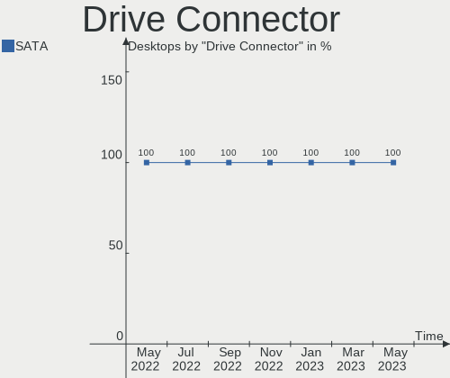

| Type | Desktops | Drives | Percent |
|------|----------|--------|---------|
| SATA | 13       | 39     | 100%    |

Drive Size
----------

Size of hard drive

| Size in TB | Desktops | Drives | Percent |
|------------|----------|--------|---------|
| 0.01-0.5   | 10       | 12     | 47.62%  |
| 0.51-1.0   | 5        | 5      | 23.81%  |
| 1.01-2.0   | 3        | 15     | 14.29%  |
| 4.01-10.0  | 2        | 4      | 9.52%   |
| 3.01-4.0   | 1        | 3      | 4.76%   |

Space Total
-----------

Amount of disk space available on the file system

| Size in GB     | Desktops | Percent |
|----------------|----------|---------|
| 251-500        | 5        | 38.46%  |
| More than 3000 | 3        | 23.08%  |
| 21-50          | 2        | 15.38%  |
| 101-250        | 2        | 15.38%  |
| 501-1000       | 1        | 7.69%   |

Space Used
----------

Amount of used disk space

| Used GB        | Desktops | Percent |
|----------------|----------|---------|
| 1-20           | 8        | 61.54%  |
| 101-250        | 2        | 15.38%  |
| More than 3000 | 1        | 7.69%   |
| 21-50          | 1        | 7.69%   |
| 2001-3000      | 1        | 7.69%   |

Malfunc. Drives
---------------

Drive models with a malfunction

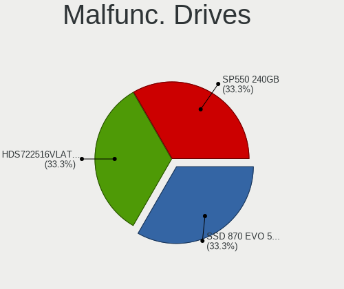

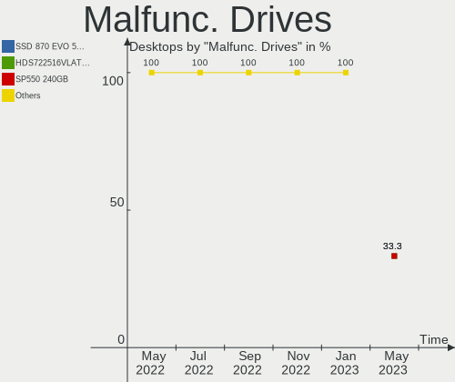

| Model                       | Desktops | Drives | Percent |
|-----------------------------|----------|--------|---------|
| WDC WD7500AACS-00ZJB0 752GB | 1        | 1      | 14.29%  |
| WDC WD15EARS-00Z5B1 1.5TB   | 1        | 1      | 14.29%  |
| Toshiba MK5065GSX 500GB     | 1        | 1      | 14.29%  |
| OCZ VERTEX3 120GB           | 1        | 1      | 14.29%  |
| Kingston SMS200S330G 32GB   | 1        | 1      | 14.29%  |
| HGST HTS721010A9E630 1TB    | 1        | 1      | 14.29%  |
| Corsair Force LS SSD 120GB  | 1        | 1      | 14.29%  |

Malfunc. Drive Vendor
---------------------

Vendors of faulty drives

| Vendor   | Desktops | Drives | Percent |
|----------|----------|--------|---------|
| WDC      | 1        | 2      | 16.67%  |
| Toshiba  | 1        | 1      | 16.67%  |
| OCZ      | 1        | 1      | 16.67%  |
| Kingston | 1        | 1      | 16.67%  |
| HGST     | 1        | 1      | 16.67%  |
| Corsair  | 1        | 1      | 16.67%  |

Malfunc. HDD Vendor
-------------------

Vendors of faulty HDD drives

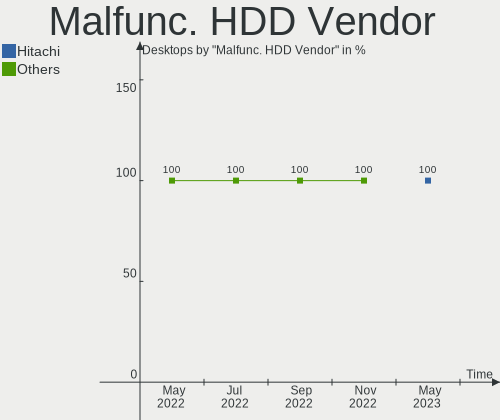

| Vendor  | Desktops | Drives | Percent |
|---------|----------|--------|---------|
| WDC     | 1        | 2      | 33.33%  |
| Toshiba | 1        | 1      | 33.33%  |
| HGST    | 1        | 1      | 33.33%  |

Malfunc. Drive Kind
-------------------

Kinds of faulty drives

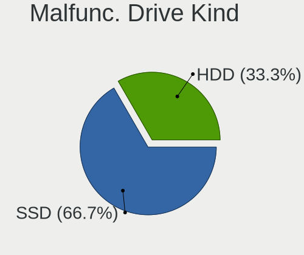

| Kind | Desktops | Drives | Percent |
|------|----------|--------|---------|
| SSD  | 3        | 3      | 50%     |
| HDD  | 3        | 4      | 50%     |

Failed Drives
-------------

Failed drive models

Zero info for selected period =(

Failed Drive Vendor
-------------------

Failed drive vendors

Zero info for selected period =(

Drive Status
------------

Number of failed and malfunc. drives

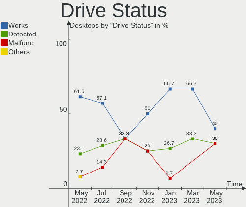

| Status   | Desktops | Drives | Percent |
|----------|----------|--------|---------|
| Detected | 8        | 16     | 44.44%  |
| Malfunc  | 6        | 7      | 33.33%  |
| Works    | 4        | 16     | 22.22%  |

Storage controller
------------------

Storage Vendor
--------------

Storage controller vendors

| Vendor                    | Desktops | Percent |
|---------------------------|----------|---------|
| Intel                     | 10       | 55.56%  |
| Samsung Electronics       | 2        | 11.11%  |
| AMD                       | 2        | 11.11%  |
| Toshiba                   | 1        | 5.56%   |
| Micron/Crucial Technology | 1        | 5.56%   |
| Broadcom / LSI            | 1        | 5.56%   |
| ADATA Technology          | 1        | 5.56%   |

Storage Model
-------------

Storage controller models

| Model                                                                         | Desktops | Percent |
|-------------------------------------------------------------------------------|----------|---------|
| Intel 82801GBM/GHM (ICH7-M Family) SATA Controller [AHCI mode]                | 2        | 10%     |
| Intel 82801G (ICH7 Family) IDE Controller                                     | 2        | 10%     |
| Toshiba BG3 NVMe SSD Controller                                               | 1        | 5%      |
| Samsung NVMe SSD Controller PM9A1/PM9A3/980PRO                                | 1        | 5%      |
| Samsung NVMe SSD Controller 980                                               | 1        | 5%      |
| Micron/Crucial P2 NVMe PCIe SSD                                               | 1        | 5%      |
| Intel Tiger Lake-LP SATA Controller                                           | 1        | 5%      |
| Intel Sunrise Point-LP SATA Controller [AHCI mode]                            | 1        | 5%      |
| Intel Q170/Q150/B150/H170/H110/Z170/CM236 Chipset SATA Controller [AHCI Mode] | 1        | 5%      |
| Intel Platform Controller Hub EG20T SATA AHCI Controller                      | 1        | 5%      |
| Intel Jasper Lake SATA AHCI Controller                                        | 1        | 5%      |
| Intel Atom Processor E3800 Series SATA AHCI Controller                        | 1        | 5%      |
| Intel 82801IBM/IEM (ICH9M/ICH9M-E) 2 port SATA Controller [IDE mode]          | 1        | 5%      |
| Intel 6 Series/C200 Series Chipset Family 6 port Desktop SATA AHCI Controller | 1        | 5%      |
| Broadcom / LSI MegaRAID SAS 2208 [Thunderbolt]                                | 1        | 5%      |
| AMD FCH SATA Controller [AHCI mode]                                           | 1        | 5%      |
| AMD 500 Series Chipset SATA Controller                                        | 1        | 5%      |
| ADATA Technology unknown                                                      | 1        | 5%      |

Storage Kind
------------

Kind of storage controller (IDE, SATA, NVMe, SAS, ...)

| Kind | Desktops | Percent |
|------|----------|---------|
| SATA | 11       | 55%     |
| NVMe | 5        | 25%     |
| IDE  | 3        | 15%     |
| RAID | 1        | 5%      |

Processor
---------

CPU Vendor
----------

Processor vendors

| Vendor | Desktops | Percent |
|--------|----------|---------|
| Intel  | 11       | 84.62%  |
| AMD    | 2        | 15.38%  |

CPU Model
---------

Processor models

| Model                                                  | Desktops | Percent |
|--------------------------------------------------------|----------|---------|
| Intel Xeon CPU X5675 @ 3.07GHz                         | 1        | 7.69%   |
| Intel Xeon CPU E3-1220 v5 @ 3.00GHz                    | 1        | 7.69%   |
| Intel Genuine CPU @ 1.00GHz ("GenuineIntel" 686-class) | 1        | 7.69%   |
| Intel Core i5-3570K CPU @ 3.40GHz                      | 1        | 7.69%   |
| Intel Core i3-7130U CPU @ 2.70GHz                      | 1        | 7.69%   |
| Intel Core 2 Duo CPU U9400 @ 1.40GHz                   | 1        | 7.69%   |
| Intel Core 2 CPU T7400 @ 2.16GHz                       | 1        | 7.69%   |
| Intel Core 2 CPU T5600 @ 1.83GHz                       | 1        | 7.69%   |
| Intel Celeron N5105 @ 2.00GHz                          | 1        | 7.69%   |
| Intel Celeron CPU J1900 @ 1.99GHz                      | 1        | 7.69%   |
| Intel 11th Gen Core i7-1165G7 @ 2.80GHz                | 1        | 7.69%   |
| AMD Ryzen 9 5950X 16-Core Processor                    | 1        | 7.69%   |
| AMD GX-412TC SOC                                       | 1        | 7.69%   |

CPU Model Family
----------------

Processor model prefix

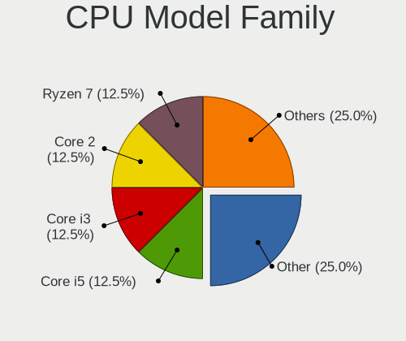

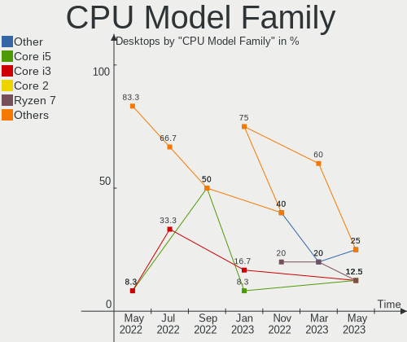

| Model            | Desktops | Percent |
|------------------|----------|---------|
| Intel Xeon       | 2        | 15.38%  |
| Intel Core 2     | 2        | 15.38%  |
| Intel Celeron    | 2        | 15.38%  |
| Other            | 1        | 7.69%   |
| Intel Genuine    | 1        | 7.69%   |
| Intel Core i5    | 1        | 7.69%   |
| Intel Core i3    | 1        | 7.69%   |
| Intel Core 2 Duo | 1        | 7.69%   |
| AMD Ryzen 9      | 1        | 7.69%   |
| AMD GX           | 1        | 7.69%   |

CPU Cores
---------

Number of processor cores

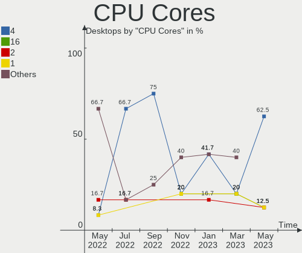

| Number  | Desktops | Percent |
|---------|----------|---------|
| 4       | 6        | 46.15%  |
| Unknown | 4        | 30.77%  |
| 32      | 1        | 7.69%   |
| 6       | 1        | 7.69%   |
| 2       | 1        | 7.69%   |

CPU Sockets
-----------

Number of sockets

| Number  | Desktops | Percent |
|---------|----------|---------|
| 1       | 9        | 69.23%  |
| Unknown | 4        | 30.77%  |

CPU Threads
-----------

Threads per core (Hyper-Threading)

| Number  | Desktops | Percent |
|---------|----------|---------|
| 1       | 6        | 46.15%  |
| Unknown | 4        | 30.77%  |
| 2       | 3        | 23.08%  |

CPU Microarch
-------------

Microarchitecture

| Name       | Desktops | Percent |
|------------|----------|---------|
| Core       | 2        | 15.38%  |
| Zen 3      | 1        | 7.69%   |
| Westmere   | 1        | 7.69%   |
| TigerLake  | 1        | 7.69%   |
| Skylake    | 1        | 7.69%   |
| Silvermont | 1        | 7.69%   |
| Puma       | 1        | 7.69%   |
| Penryn     | 1        | 7.69%   |
| KabyLake   | 1        | 7.69%   |
| IvyBridge  | 1        | 7.69%   |
| Bonnell    | 1        | 7.69%   |
| Unknown    | 1        | 7.69%   |

Graphics
--------

GPU Vendor
----------

Vendors of graphics cards

| Vendor                     | Desktops | Percent |
|----------------------------|----------|---------|
| Intel                      | 6        | 50%     |
| AMD                        | 3        | 25%     |
| Nvidia                     | 1        | 8.33%   |
| Matrox Electronics Systems | 1        | 8.33%   |
| ASPEED Technology          | 1        | 8.33%   |

GPU Model
---------

Graphics card models

| Model                                                        | Desktops | Percent |
|--------------------------------------------------------------|----------|---------|
| Nvidia GK208B [GeForce GT 710]                               | 1        | 8.33%   |
| Matrox Electronics Systems MGA G200eW WPCM450                | 1        | 8.33%   |
| Intel TigerLake-LP GT2 [Iris Xe Graphics]                    | 1        | 8.33%   |
| Intel Mobile 4 Series Chipset Integrated Graphics Controller | 1        | 8.33%   |
| Intel JasperLake [UHD Graphics]                              | 1        | 8.33%   |
| Intel IvyBridge GT2 [HD Graphics 4000]                       | 1        | 8.33%   |
| Intel HD Graphics 620                                        | 1        | 8.33%   |
| Intel Atom Processor Z36xxx/Z37xxx Series Graphics & Display | 1        | 8.33%   |
| ASPEED Technology ASPEED Graphics Family                     | 1        | 8.33%   |
| AMD RV530/M56-P [Mobility Radeon X1600]                      | 1        | 8.33%   |
| AMD RV515/M54 [Mobility Radeon X1400]                        | 1        | 8.33%   |
| AMD Caicos PRO [Radeon HD 7450]                              | 1        | 8.33%   |

GPU Combo
---------

Combinations of graphics cards

| Name         | Desktops | Percent |
|--------------|----------|---------|
| 1 x Intel    | 5        | 38.46%  |
| Other        | 2        | 15.38%  |
| 1 x AMD      | 2        | 15.38%  |
| 2 x Intel    | 1        | 7.69%   |
| 1 x Nvidia   | 1        | 7.69%   |
| 1 x ASPEED   | 1        | 7.69%   |
| AMD + Matrox | 1        | 7.69%   |

GPU Driver
----------

Free vs proprietary

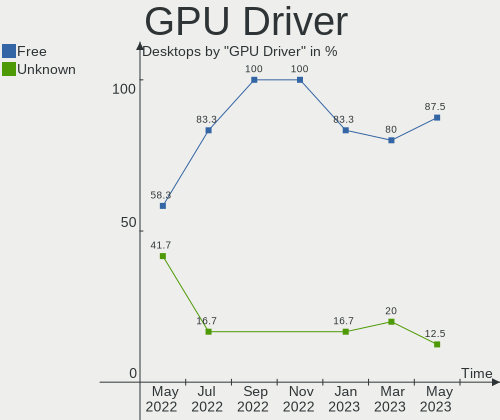

| Driver  | Desktops | Percent |
|---------|----------|---------|
| Free    | 9        | 69.23%  |
| Unknown | 4        | 30.77%  |

GPU Memory
----------

Total video memory

| Size in GB | Desktops | Percent |
|------------|----------|---------|
| Unknown    | 13       | 100%    |

Monitor
-------

Monitor Vendor
--------------

Monitor vendors

| Vendor               | Desktops | Percent |
|----------------------|----------|---------|
| Acer                 | 2        | 25%     |
| Samsung Electronics  | 1        | 12.5%   |
| Philips              | 1        | 12.5%   |
| Lenovo               | 1        | 12.5%   |
| AU Optronics         | 1        | 12.5%   |
| Apple                | 1        | 12.5%   |
| Ancor Communications | 1        | 12.5%   |

Monitor Model
-------------

Monitor models

| Model                                                                 | Desktops | Percent |
|-----------------------------------------------------------------------|----------|---------|
| Acer V223HQ ACR0070 1920x1080 470x270mm 21.3-inch                     | 2        | 25%     |
| Samsung Electronics S24E650 SAM0CC3 1920x1200 520x320mm 24.0-inch     | 1        | 12.5%   |
| Philips 227E4LH PHLC0AC 1920x1080 480x270mm 21.7-inch                 | 1        | 12.5%   |
| Lenovo LCD Monitor LEN4022 1400x1050 290x210mm 14.1-inch              | 1        | 12.5%   |
| AU Optronics LCD Monitor AUOE48D 1920x1080 340x190mm 15.3-inch        | 1        | 12.5%   |
| Apple LCD Monitor APP9C73 1280x800 290x180mm 13.4-inch                | 1        | 12.5%   |
| Ancor Communications ASUS VS247 ACI249A 1920x1080 520x290mm 23.4-inch | 1        | 12.5%   |

Monitor Resolution
------------------

Monitor screen resolution

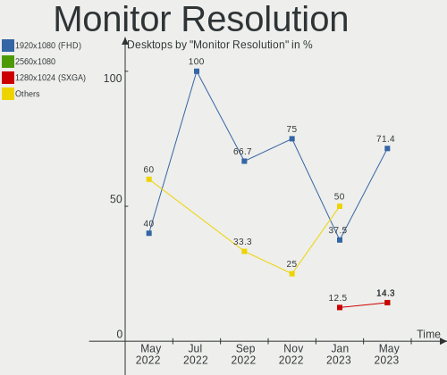

| Resolution        | Desktops | Percent |
|-------------------|----------|---------|
| 1920x1080 (FHD)   | 5        | 62.5%   |
| 1920x1200 (WUXGA) | 1        | 12.5%   |
| 1400x1050         | 1        | 12.5%   |
| 1280x800 (WXGA)   | 1        | 12.5%   |

Monitor Diagonal
----------------

Diagonal size in inches

| Inches | Desktops | Percent |
|--------|----------|---------|
| 21     | 3        | 37.5%   |
| 24     | 1        | 12.5%   |
| 23     | 1        | 12.5%   |
| 15     | 1        | 12.5%   |
| 14     | 1        | 12.5%   |
| 13     | 1        | 12.5%   |

Monitor Width
-------------

Physical width

| Width in mm | Desktops | Percent |
|-------------|----------|---------|
| 401-500     | 3        | 37.5%   |
| 501-600     | 2        | 25%     |
| 201-300     | 2        | 25%     |
| 301-350     | 1        | 12.5%   |

Aspect Ratio
------------

Proportional relationship between the width and the height

| Ratio | Desktops | Percent |
|-------|----------|---------|
| 16/9  | 5        | 62.5%   |
| 16/10 | 2        | 25%     |
| 4/3   | 1        | 12.5%   |

Monitor Area
------------

Area in inch²

| Area in inch² | Desktops | Percent |
|----------------|----------|---------|
| 201-250        | 2        | 25%     |
| 151-200        | 2        | 25%     |
| 91-100         | 2        | 25%     |
| 81-90          | 1        | 12.5%   |
| 251-300        | 1        | 12.5%   |

Pixel Density
-------------

Pixels per inch

| Density | Desktops | Percent |
|---------|----------|---------|
| 101-120 | 4        | 50%     |
| 121-160 | 2        | 25%     |
| 51-100  | 2        | 25%     |

Multiple Monitors
-----------------

Total monitors connected

| Total | Desktops | Percent |
|-------|----------|---------|
| 1     | 8        | 61.54%  |
| 0     | 5        | 38.46%  |

Network
-------

Net Controller Vendor
---------------------

Controller vendors

| Vendor                | Desktops | Percent |
|-----------------------|----------|---------|
| Intel                 | 9        | 64.29%  |
| Realtek Semiconductor | 4        | 28.57%  |
| Broadcom              | 1        | 7.14%   |

Net Controller Model
--------------------

Controller models

| Model                                                             | Desktops | Percent |
|-------------------------------------------------------------------|----------|---------|
| Realtek RTL8111/8168/8411 PCI Express Gigabit Ethernet Controller | 3        | 16.67%  |
| Intel PRO/Wireless 3945ABG [Golan] Network Connection             | 2        | 11.11%  |
| Intel I210 Gigabit Network Connection                             | 2        | 11.11%  |
| Realtek RTL8191SEvB Wireless LAN Controller                       | 1        | 5.56%   |
| Realtek RTL8125 2.5GbE Controller                                 | 1        | 5.56%   |
| Intel Wi-Fi 6 AX201                                               | 1        | 5.56%   |
| Intel Platform Controller Hub EG20T Gigabit Ethernet Controller   | 1        | 5.56%   |
| Intel I350 Gigabit Network Connection                             | 1        | 5.56%   |
| Intel I226-V                                                      | 1        | 5.56%   |
| Intel 82579V Gigabit Network Connection                           | 1        | 5.56%   |
| Intel 82576 Gigabit Network Connection                            | 1        | 5.56%   |
| Intel 82574L Gigabit Network Connection                           | 1        | 5.56%   |
| Intel 82573L Gigabit Ethernet Controller                          | 1        | 5.56%   |
| Broadcom NetXtreme BCM5753M Gigabit Ethernet PCI Express          | 1        | 5.56%   |

Wireless Vendor
---------------

Wireless vendors

| Vendor                | Desktops | Percent |
|-----------------------|----------|---------|
| Intel                 | 3        | 75%     |
| Realtek Semiconductor | 1        | 25%     |

Wireless Model
--------------

Wireless models

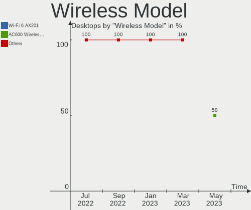

| Model                                                 | Desktops | Percent |
|-------------------------------------------------------|----------|---------|
| Intel PRO/Wireless 3945ABG [Golan] Network Connection | 2        | 50%     |
| Realtek RTL8191SEvB Wireless LAN Controller           | 1        | 25%     |
| Intel Wi-Fi 6 AX201                                   | 1        | 25%     |

Ethernet Vendor
---------------

Ethernet vendors

| Vendor                | Desktops | Percent |
|-----------------------|----------|---------|
| Intel                 | 7        | 58.33%  |
| Realtek Semiconductor | 4        | 33.33%  |
| Broadcom              | 1        | 8.33%   |

Ethernet Model
--------------

Ethernet models

| Model                                                             | Desktops | Percent |
|-------------------------------------------------------------------|----------|---------|
| Realtek RTL8111/8168/8411 PCI Express Gigabit Ethernet Controller | 3        | 21.43%  |
| Intel I210 Gigabit Network Connection                             | 2        | 14.29%  |
| Realtek RTL8125 2.5GbE Controller                                 | 1        | 7.14%   |
| Intel Platform Controller Hub EG20T Gigabit Ethernet Controller   | 1        | 7.14%   |
| Intel I350 Gigabit Network Connection                             | 1        | 7.14%   |
| Intel I226-V                                                      | 1        | 7.14%   |
| Intel 82579V Gigabit Network Connection                           | 1        | 7.14%   |
| Intel 82576 Gigabit Network Connection                            | 1        | 7.14%   |
| Intel 82574L Gigabit Network Connection                           | 1        | 7.14%   |
| Intel 82573L Gigabit Ethernet Controller                          | 1        | 7.14%   |
| Broadcom NetXtreme BCM5753M Gigabit Ethernet PCI Express          | 1        | 7.14%   |

Net Controller Kind
-------------------

Ethernet, WiFi or modem

| Kind     | Desktops | Percent |
|----------|----------|---------|
| Ethernet | 12       | 75%     |
| WiFi     | 4        | 25%     |

Used Controller
---------------

Currently used network controller

| Kind     | Desktops | Percent |
|----------|----------|---------|
| Ethernet | 7        | 70%     |
| WiFi     | 3        | 30%     |

NICs
----

Total network controllers on board

| Total | Desktops | Percent |
|-------|----------|---------|
| 1     | 5        | 38.46%  |
| 2     | 4        | 30.77%  |
| 4     | 2        | 15.38%  |
| 5     | 1        | 7.69%   |
| 3     | 1        | 7.69%   |

IPv6
----

IPv6 vs IPv4

| Used | Desktops | Percent |
|------|----------|---------|
| No   | 13       | 100%    |

Bluetooth
---------

Bluetooth Vendor
----------------

Controller vendors

| Vendor                  | Desktops | Percent |
|-------------------------|----------|---------|
| Intel                   | 1        | 25%     |
| Hewlett-Packard         | 1        | 25%     |
| Cambridge Silicon Radio | 1        | 25%     |
| Broadcom                | 1        | 25%     |

Bluetooth Model
---------------

Controller models

| Model                                               | Desktops | Percent |
|-----------------------------------------------------|----------|---------|
| Intel AX201 Bluetooth                               | 1        | 25%     |
| HP Bluetooth 2.0 Interface [Broadcom BCM2045]       | 1        | 25%     |
| Cambridge Silicon Radio Bluetooth Dongle (HCI mode) | 1        | 25%     |
| Broadcom BCM2045B (BDC-2) [Bluetooth Controller]    | 1        | 25%     |

Sound
-----

Sound Vendor
------------

Sound card vendors

| Vendor           | Desktops | Percent |
|------------------|----------|---------|
| Intel            | 7        | 58.33%  |
| AMD              | 2        | 16.67%  |
| VIA Technologies | 1        | 8.33%   |
| Nvidia           | 1        | 8.33%   |
| JMTek            | 1        | 8.33%   |

Sound Model
-----------

Sound card models

| Model                                                                             | Desktops | Percent |
|-----------------------------------------------------------------------------------|----------|---------|
| Intel NM10/ICH7 Family High Definition Audio Controller                           | 2        | 16.67%  |
| VIA Technologies VT1720/24 [Envy24PT/HT] PCI Multi-Channel Audio Controller       | 1        | 8.33%   |
| Nvidia GK208 HDMI/DP Audio Controller                                             | 1        | 8.33%   |
| JMTek USB PnP Audio Device                                                        | 1        | 8.33%   |
| Intel Tiger Lake-LP Smart Sound Technology Audio Controller                       | 1        | 8.33%   |
| Intel Sunrise Point-LP HD Audio                                                   | 1        | 8.33%   |
| Intel Jasper Lake HD Audio                                                        | 1        | 8.33%   |
| Intel Atom Processor Z36xxx/Z37xxx Series High Definition Audio Controller        | 1        | 8.33%   |
| Intel 82801I (ICH9 Family) HD Audio Controller                                    | 1        | 8.33%   |
| AMD Starship/Matisse HD Audio Controller                                          | 1        | 8.33%   |
| AMD Caicos HDMI Audio [Radeon HD 6450 / 7450/8450/8490 OEM / R5 230/235/235X OEM] | 1        | 8.33%   |

Memory
------

Memory Vendor
-------------

Memory module vendors

| Vendor   | Desktops | Percent |
|----------|----------|---------|
| Kingston | 1        | 100%    |

Memory Model
------------

Memory module models

| Model                                                 | Desktops | Percent |
|-------------------------------------------------------|----------|---------|
| Kingston RAM KF3600C18D4/32GX 32GB DIMM DDR4 2400MT/s | 1        | 100%    |

Memory Kind
-----------

Memory module kinds

| Kind | Desktops | Percent |
|------|----------|---------|
| DDR4 | 1        | 100%    |

Memory Form Factor
------------------

Physical design of the memory module

| Name | Desktops | Percent |
|------|----------|---------|
| DIMM | 1        | 100%    |

Memory Size
-----------

Memory module size

| Size  | Desktops | Percent |
|-------|----------|---------|
| 32768 | 1        | 100%    |

Memory Speed
------------

Memory module speed

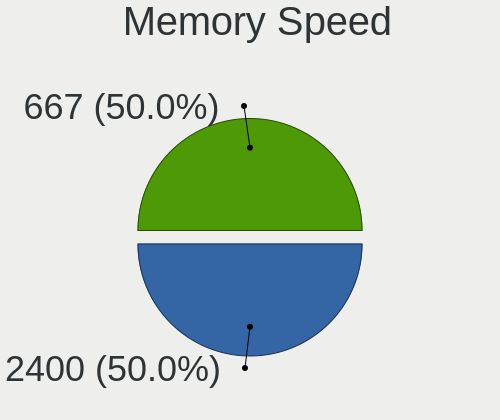

| Speed | Desktops | Percent |
|-------|----------|---------|
| 2400  | 1        | 100%    |

Printers & scanners
-------------------

Printer Vendor
--------------

Printer device vendors

Zero info for selected period =(

Printer Model
-------------

Printer device models

Zero info for selected period =(

Scanner Vendor
--------------

Scanner device vendors

Zero info for selected period =(

Scanner Model
-------------

Scanner device models

Zero info for selected period =(

Camera
------

Camera Vendor
-------------

Camera device vendors

Zero info for selected period =(

Camera Model
------------

Camera device models

Zero info for selected period =(

Security
--------

Fingerprint Vendor
------------------

Fingerprint sensor vendors

| Vendor                     | Desktops | Percent |
|----------------------------|----------|---------|
| Upek                       | 1        | 25%     |
| STMicroelectronics         | 1        | 25%     |
| Shenzhen Goodix Technology | 1        | 25%     |
| AuthenTec                  | 1        | 25%     |

Fingerprint Model
-----------------

Fingerprint sensor models

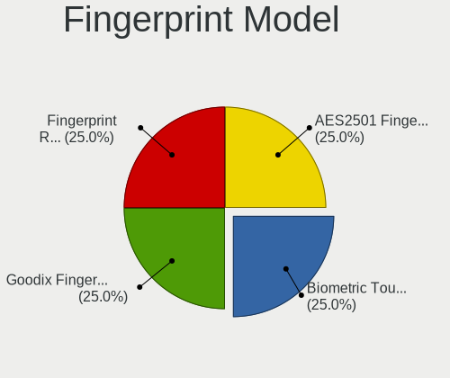

| Model                                                  | Desktops | Percent |
|--------------------------------------------------------|----------|---------|
| Upek Biometric Touchchip/Touchstrip Fingerprint Sensor | 1        | 25%     |
| STMicroelectronics Fingerprint Reader                  | 1        | 25%     |
| Shenzhen Goodix  FingerPrint Device                    | 1        | 25%     |
| AuthenTec AES2501 Fingerprint Sensor                   | 1        | 25%     |

Chipcard Vendor
---------------

Chipcard module vendors

Zero info for selected period =(

Chipcard Model
--------------

Chipcard module models

Zero info for selected period =(

Unsupported
-----------

Unsupported Devices
-------------------

Total unsupported devices on board

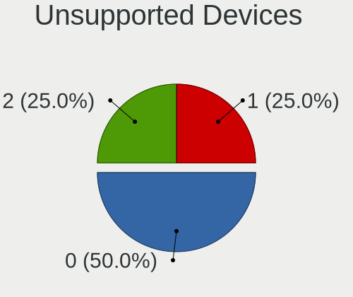

| Total | Desktops | Percent |
|-------|----------|---------|
| 1     | 6        | 46.15%  |
| 2     | 3        | 23.08%  |
| 0     | 3        | 23.08%  |
| 3     | 1        | 7.69%   |

Unsupported Device Types
------------------------

Types of unsupported devices

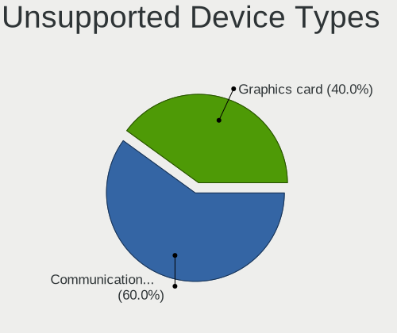

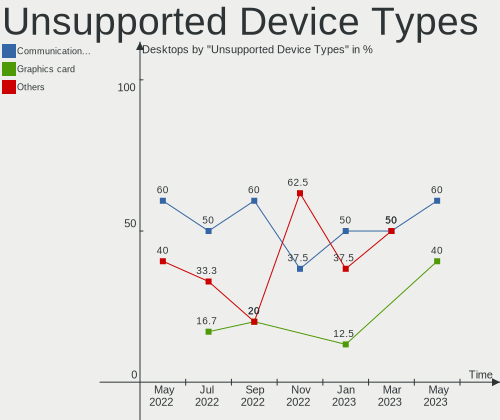

| Type                     | Desktops | Percent |
|--------------------------|----------|---------|
| Communication controller | 6        | 42.86%  |
| Graphics card            | 4        | 28.57%  |
| Storage                  | 1        | 7.14%   |
| Net/wireless             | 1        | 7.14%   |
| Net/ethernet             | 1        | 7.14%   |
| Firewire controller      | 1        | 7.14%   |

