OpenBSD Hardware Trends (Desktop)
---------------------------------

A project to identify most popular hardware characteristics and track their change
over time based on data collected by OpenBSD users at https://BSD-Hardware.info.

Anyone can contribute to the study by uploading probes of their computers by
the [hw-probe](https://github.com/linuxhw/hw-probe/blob/master/INSTALL.BSD.md) tool:

    hw-probe -all -upload

Full-feature report is available here: https://bsd-hardware.info/?view=trends&formfactor=desktop

Period: May, 2020.

Contents
--------

- [ OS                       ](#os)
- [ OS Family                ](#os-family)
- [ Arch                     ](#arch)
- [ DE                       ](#de)
- [ Display Server           ](#display-server)
- [ Display Manager          ](#display-manager)
- [ OS Lang                  ](#os-lang)
- [ Boot Mode                ](#boot-mode)
- [ Filesystem               ](#filesystem)
- [ Part. scheme             ](#part-scheme)
- [ Country                  ](#country)
- [ City                     ](#city)
- [ Vendor                   ](#vendor)
- [ Model                    ](#model)
- [ Model Family             ](#model-family)
- [ MFG Year                 ](#mfg-year)
- [ Form Factor              ](#form-factor)
- [ Coreboot                 ](#coreboot)
- [ RAM Size                 ](#ram-size)
- [ RAM Used                 ](#ram-used)
- [ Drive Vendor             ](#drive-vendor)
- [ Drive Model              ](#drive-model)
- [ Drive Kind               ](#drive-kind)
- [ Drive Connector          ](#drive-connector)
- [ Drive Size               ](#drive-size)
- [ Space Total              ](#space-total)
- [ Space Used               ](#space-used)
- [ Malfunc. Drives          ](#malfunc-drives)
- [ Malfunc. Drive Vendor    ](#malfunc-drive-vendor)
- [ Malfunc. HDD Vendor      ](#malfunc-hdd-vendor)
- [ Malfunc. Drive Kind      ](#malfunc-drive-kind)
- [ Failed Drives            ](#failed-drives)
- [ Failed Drive Vendor      ](#failed-drive-vendor)
- [ Drive Status             ](#drive-status)
- [ Storage Vendor           ](#storage-vendor)
- [ Storage Model            ](#storage-model)
- [ Storage Kind             ](#storage-kind)
- [ CPU Vendor               ](#cpu-vendor)
- [ CPU Model                ](#cpu-model)
- [ CPU Model Family         ](#cpu-model-family)
- [ CPU Cores                ](#cpu-cores)
- [ CPU Sockets              ](#cpu-sockets)
- [ CPU Threads              ](#cpu-threads)
- [ CPU Microarch            ](#cpu-microarch)
- [ GPU Vendor               ](#gpu-vendor)
- [ GPU Model                ](#gpu-model)
- [ GPU Combo                ](#gpu-combo)
- [ GPU Driver               ](#gpu-driver)
- [ GPU Memory               ](#gpu-memory)
- [ Monitor Vendor           ](#monitor-vendor)
- [ Monitor Model            ](#monitor-model)
- [ Monitor Resolution       ](#monitor-resolution)
- [ Monitor Diagonal         ](#monitor-diagonal)
- [ Monitor Width            ](#monitor-width)
- [ Aspect Ratio             ](#aspect-ratio)
- [ Monitor Area             ](#monitor-area)
- [ Pixel Density            ](#pixel-density)
- [ Multiple Monitors        ](#multiple-monitors)
- [ Net Controller Vendor    ](#net-controller-vendor)
- [ Net Controller Model     ](#net-controller-model)
- [ Wireless Vendor          ](#wireless-vendor)
- [ Wireless Model           ](#wireless-model)
- [ Ethernet Vendor          ](#ethernet-vendor)
- [ Ethernet Model           ](#ethernet-model)
- [ Net Controller Kind      ](#net-controller-kind)
- [ Used Controller          ](#used-controller)
- [ NICs                     ](#nics)
- [ Bluetooth Vendor         ](#bluetooth-vendor)
- [ Bluetooth Model          ](#bluetooth-model)
- [ Unsupported Devices      ](#unsupported-devices)
- [ Unsupported Device Types ](#unsupported-device-types)

OS
--

Installed operating systems

| Name        | Computers | Percent |
|-------------|-----------|---------|
| OpenBSD 6.7 | 9         | 100%    |

OS Family
---------

OS without a version

| Name    | Computers | Percent |
|---------|-----------|---------|
| OpenBSD | 9         | 100%    |

Arch
----

OS architecture (x86_64, i586, etc.)

| Name  | Computers | Percent |
|-------|-----------|---------|
| amd64 | 4         | 44.44%  |
| i386  | 3         | 33.33%  |
| armv7 | 1         | 11.11%  |
| arm64 | 1         | 11.11%  |

DE
--

Desktop Environment

| Name     | Computers | Percent |
|----------|-----------|---------|
| Terminal | 8         | 88.89%  |
| XFCE     | 1         | 11.11%  |

Display Server
--------------

X11 or Wayland

| Name     | Computers | Percent |
|----------|-----------|---------|
| Terminal | 5         | 55.56%  |
| X11      | 4         | 44.44%  |

Display Manager
---------------

SDDM, LightDM, etc.

| Name     | Computers | Percent |
|----------|-----------|---------|
| Terminal | 9         | 100%    |

OS Lang
-------

Language

| Lang    | Computers | Percent |
|---------|-----------|---------|
| Unknown | 8         | 88.89%  |
| ru_RU   | 1         | 11.11%  |

Boot Mode
---------

EFI or BIOS

| Mode | Computers | Percent |
|------|-----------|---------|
| BIOS | 7         | 77.78%  |
| EFI  | 2         | 22.22%  |

Filesystem
----------

Type of filesystem

| Type | Computers | Percent |
|------|-----------|---------|
| Ufs  | 9         | 100%    |

Part. scheme
------------

Scheme of partitioning

| Type | Computers | Percent |
|------|-----------|---------|
| MBR  | 8         | 88.89%  |
| GPT  | 1         | 11.11%  |

Country
-------

Geographic location (country)

| Country     | Computers | Percent |
|-------------|-----------|---------|
| Russia      | 5         | 55.56%  |
| UK          | 1         | 11.11%  |
| Switzerland | 1         | 11.11%  |
| Germany     | 1         | 11.11%  |
| Finland     | 1         | 11.11%  |

City
----

Geographic location (city)

| City          | Computers | Percent |
|---------------|-----------|---------|
| St Petersburg | 2         | 22.22%  |
| Orsk          | 2         | 22.22%  |
| Zurich        | 1         | 11.11%  |
| Krasnogorsk   | 1         | 11.11%  |
| Kouvola       | 1         | 11.11%  |
| Hope          | 1         | 11.11%  |
| Bromskirchen  | 1         | 11.11%  |

Vendor
------

Motherboard manufacturer

| Name                | Computers | Percent |
|---------------------|-----------|---------|
| Gigabyte Technology | 3         | 33.33%  |
| Unknown             | 2         | 22.22%  |
| Sony UK             | 1         | 11.11%  |
| IBM                 | 1         | 11.11%  |
| Dell                | 1         | 11.11%  |
| ASUSTek Computer    | 1         | 11.11%  |

Model
-----

Motherboard model

| Name                           | Computers | Percent |
|--------------------------------|-----------|---------|
| Unknown                        | 3         | 33.33%  |
| Gigabyte M68MT-S2P             | 2         | 22.22%  |
| Sony UK Raspberry Pi 4 Model B | 1         | 11.11%  |
| IBM 81832BG                    | 1         | 11.11%  |
| Dell PowerEdge T320            | 1         | 11.11%  |
| ASUS P4P800-VM                 | 1         | 11.11%  |

Model Family
------------

Motherboard model prefix

| Name               | Computers | Percent |
|--------------------|-----------|---------|
| Unknown            | 3         | 33.33%  |
| Gigabyte M68MT-S2P | 2         | 22.22%  |
| Sony UK Raspberry  | 1         | 11.11%  |
| IBM 81832BG        | 1         | 11.11%  |
| Dell PowerEdge     | 1         | 11.11%  |
| ASUS P4P800-VM     | 1         | 11.11%  |

MFG Year
--------

Motherboard manufacture year

| Year    | Computers | Percent |
|---------|-----------|---------|
| 2010    | 2         | 22.22%  |
| 2005    | 2         | 22.22%  |
| Unknown | 2         | 22.22%  |
| 2020    | 1         | 11.11%  |
| 2018    | 1         | 11.11%  |
| 2015    | 1         | 11.11%  |

Form Factor
-----------

Physical design of the computer

| Name    | Computers | Percent |
|---------|-----------|---------|
| Desktop | 9         | 100%    |

Coreboot
--------

Have coreboot on board

| Used | Computers | Percent |
|------|-----------|---------|
| No   | 9         | 100%    |

RAM Size
--------

Total RAM memory

| Size in GB | Computers | Percent |
|------------|-----------|---------|
| 2.01-3.0   | 3         | 33.33%  |
| 4.01-8.0   | 2         | 22.22%  |
| 0.01-1.0   | 2         | 22.22%  |
| 32.01-64.0 | 1         | 11.11%  |
| 8.01-16.0  | 1         | 11.11%  |

RAM Used
--------

Used RAM memory

| Used GB  | Computers | Percent |
|----------|-----------|---------|
| 0.01-1.0 | 6         | 66.67%  |
| 0        | 2         | 22.22%  |
| 1.01-2.0 | 1         | 11.11%  |

Drive Vendor
------------

Hard drive vendors

| Vendor              | Computers | Drives | Percent |
|---------------------|-----------|--------|---------|
| Seagate             | 4         | 4      | 33.33%  |
| WDC                 | 2         | 2      | 16.67%  |
| SanDisk             | 2         | 3      | 16.67%  |
| Samsung Electronics | 1         | 1      | 8.33%   |
| OPENBSD             | 1         | 1      | 8.33%   |
| LSI                 | 1         | 1      | 8.33%   |
| Hitachi             | 1         | 1      | 8.33%   |

Drive Model
-----------

Hard drive models

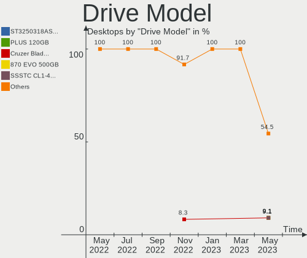

| Model                   | Computers | Percent |
|-------------------------|-----------|---------|
| WD6400AARS-00Y5B1 640GB | 2         | 16.67%  |
| ST250DM000-1BD141 250GB | 2         | 16.67%  |
| Ultra Fit 64GB          | 1         | 8.33%   |
| ST3250318AS 250GB       | 1         | 8.33%   |
| ST3000DM001-1CH166 3TB  | 1         | 8.33%   |
| SR RAID 1 16GB          | 1         | 8.33%   |
| Logical Volume 240GB    | 1         | 8.33%   |
| HDS721010CLA332 1TB     | 1         | 8.33%   |
| Flash Drive FIT 64GB    | 1         | 8.33%   |
| Cruzer Fit 16GB         | 1         | 8.33%   |

Drive Kind
----------

HDD or SSD

| Kind | Computers | Drives | Percent |
|------|-----------|--------|---------|
| HDD  | 7         | 9      | 70%     |
| SSD  | 3         | 4      | 30%     |

Drive Connector
---------------

SATA, SAS, NVMe, etc.

| Type | Computers | Drives | Percent |
|------|-----------|--------|---------|
| SATA | 8         | 13     | 100%    |

Drive Size
----------

Size of hard drive

| Size in TB | Computers | Drives | Percent |
|------------|-----------|--------|---------|
| 0.01-0.5   | 7         | 9      | 63.64%  |
| 0.51-1.0   | 3         | 3      | 27.27%  |
| 2.01-3.0   | 1         | 1      | 9.09%   |

Space Total
-----------

Amount of disk space available on the file system

| Size in GB | Computers | Percent |
|------------|-----------|---------|
| 1-20       | 3         | 33.33%  |
| 101-250    | 2         | 22.22%  |
| 51-100     | 2         | 22.22%  |
| 21-50      | 1         | 11.11%  |
| 501-1000   | 1         | 11.11%  |

Space Used
----------

Amount of used disk space

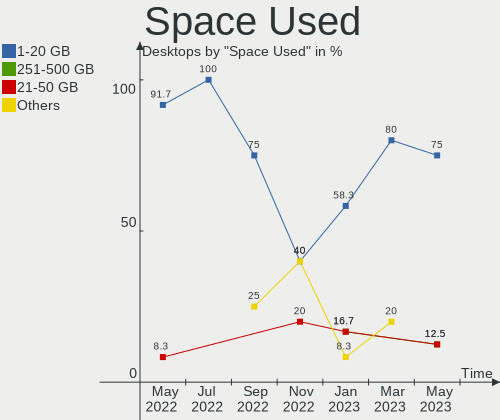

| Used GB  | Computers | Percent |
|----------|-----------|---------|
| 1-20     | 6         | 66.67%  |
| 21-50    | 1         | 11.11%  |
| 101-250  | 1         | 11.11%  |
| 501-1000 | 1         | 11.11%  |

Malfunc. Drives
---------------

Drive models with a malfunction

| Model               | Computers | Drives | Percent |
|---------------------|-----------|--------|---------|
| HDS721010CLA332 1TB | 1         | 1      | 100%    |

Malfunc. Drive Vendor
---------------------

Vendors of faulty drives

| Vendor  | Computers | Drives | Percent |
|---------|-----------|--------|---------|
| Hitachi | 1         | 1      | 100%    |

Malfunc. HDD Vendor
-------------------

Vendors of faulty HDD drives

| Vendor  | Computers | Drives | Percent |
|---------|-----------|--------|---------|
| Hitachi | 1         | 1      | 100%    |

Malfunc. Drive Kind
-------------------

Kinds of faulty drives

| Kind | Computers | Drives | Percent |
|------|-----------|--------|---------|
| HDD  | 1         | 1      | 100%    |

Failed Drives
-------------

Failed drive models

Zero info for selected period =(

Failed Drive Vendor
-------------------

Failed drive vendors

Zero info for selected period =(

Drive Status
------------

Number of failed and malfunc. drives

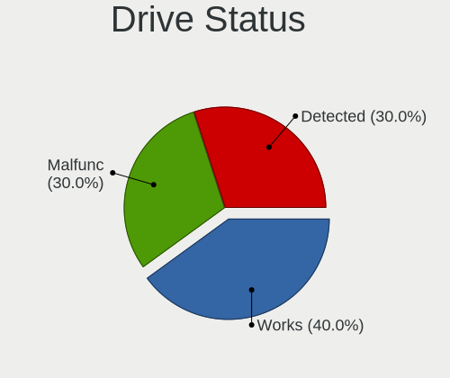

| Status   | Computers | Drives | Percent |
|----------|-----------|--------|---------|
| Detected | 4         | 7      | 44.44%  |
| Works    | 4         | 5      | 44.44%  |
| Malfunc  | 1         | 1      | 11.11%  |

Storage Vendor
--------------

Storage controller vendors

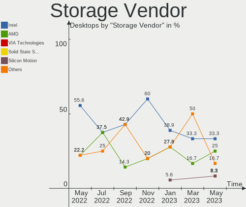

| Vendor             | Computers | Percent |
|--------------------|-----------|---------|
| Intel              | 4         | 44.44%  |
| Nvidia             | 2         | 22.22%  |
| Broadcom / LSI     | 1         | 11.11%  |
| ASMedia Technology | 1         | 11.11%  |
| AMD                | 1         | 11.11%  |

Storage Model
-------------

Storage controller models

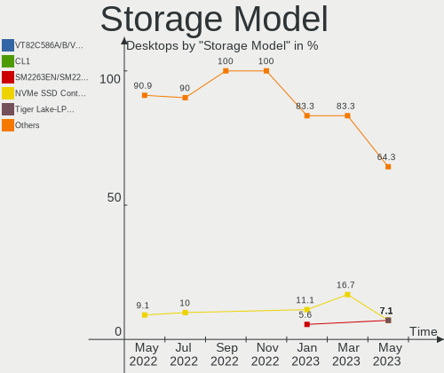

| Model                                                              | Computers | Percent |
|--------------------------------------------------------------------|-----------|---------|
| MCP61 SATA Controller                                              | 2         | 18.18%  |
| 82801EB/ER (ICH5/ICH5R) IDE Controller                             | 2         | 18.18%  |
| 82801EB (ICH5) SATA Controller                                     | 2         | 18.18%  |
| SAS2008 PCI-Express Fusion-MPT SAS-2 [Falcon]                      | 1         | 9.09%   |
| CS5536 [Geode companion] IDE                                       | 1         | 9.09%   |
| Celeron N3350/Pentium N4200/Atom E3900 Series SATA AHCI Controller | 1         | 9.09%   |
| C600/X79 series chipset 6-Port SATA AHCI Controller                | 1         | 9.09%   |
| ASM1062 Serial ATA Controller                                      | 1         | 9.09%   |

Storage Kind
------------

Kind of storage controller (IDE, SATA, NVMe, SAS, ...)

| Kind | Computers | Percent |
|------|-----------|---------|
| IDE  | 5         | 62.5%   |
| SATA | 2         | 25%     |
| SAS  | 1         | 12.5%   |

CPU Vendor
----------

Processor vendors

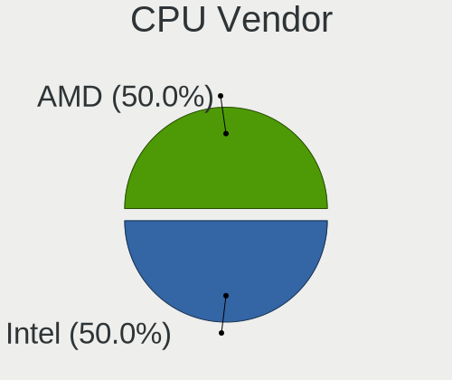

| Vendor | Computers | Percent |
|--------|-----------|---------|
| Intel  | 4         | 44.44%  |
| AMD    | 3         | 33.33%  |
| ARM    | 2         | 22.22%  |

CPU Model
---------

Processor models

| Model                                                            | Computers | Percent |
|------------------------------------------------------------------|-----------|---------|
| AMD Athlon II X3 455 Processor                                   | 2         | 22.22%  |
| Intel Xeon CPU E5-2403 0 @ 1.80GHz                               | 1         | 11.11%  |
| Intel Pentium 4 CPU 2.80GHz ("GenuineIntel" 686-class)           | 1         | 11.11%  |
| Intel Pentium 4 CPU 2.66GHz                                      | 1         | 11.11%  |
| Intel Celeron CPU J3455 @ 1.50GHz                                | 1         | 11.11%  |
| ARM Cortex-A8 r3p2                                               | 1         | 11.11%  |
| ARM Cortex-A72 r0p3                                              | 1         | 11.11%  |
| AMD Geode Integrated Processor by PCS ("AuthenticAMD" 586-class) | 1         | 11.11%  |

CPU Model Family
----------------

Processor model prefix

| Model                | Computers | Percent |
|----------------------|-----------|---------|
| Other                | 2         | 22.22%  |
| Intel Pentium 4      | 2         | 22.22%  |
| AMD Athlon II X3     | 2         | 22.22%  |
| Intel Xeon           | 1         | 11.11%  |
| Intel Celeron        | 1         | 11.11%  |
| AMD Geode Integrated | 1         | 11.11%  |

CPU Cores
---------

Number of processor cores

| Number  | Computers | Percent |
|---------|-----------|---------|
| 1       | 4         | 44.44%  |
| 4       | 2         | 22.22%  |
| 3       | 2         | 22.22%  |
| Unknown | 1         | 11.11%  |

CPU Sockets
-----------

Number of sockets

| Number  | Computers | Percent |
|---------|-----------|---------|
| 1       | 6         | 66.67%  |
| Unknown | 3         | 33.33%  |

CPU Threads
-----------

Threads per core (Hyper-Threading)

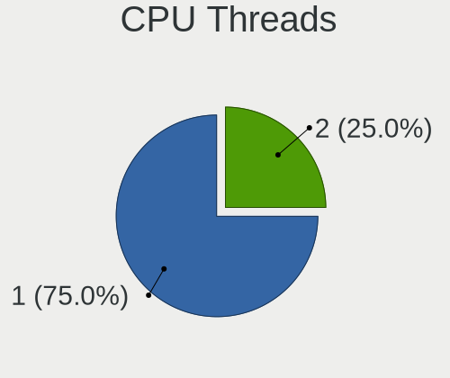

| Number  | Computers | Percent |
|---------|-----------|---------|
| 1       | 5         | 55.56%  |
| Unknown | 4         | 44.44%  |

CPU Microarch
-------------

Microarchitecture

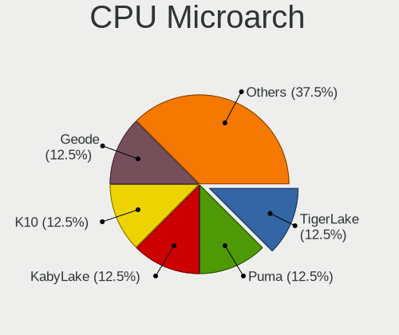

| Name        | Computers | Percent |
|-------------|-----------|---------|
| NetBurst    | 2         | 22.22%  |
| K10         | 2         | 22.22%  |
| Unknown     | 2         | 22.22%  |
| SandyBridge | 1         | 11.11%  |
| Goldmont    | 1         | 11.11%  |
| Geode       | 1         | 11.11%  |

GPU Vendor
----------

Vendors of graphics cards

| Vendor                     | Computers | Percent |
|----------------------------|-----------|---------|
| Intel                      | 3         | 50%     |
| AMD                        | 2         | 33.33%  |
| Matrox Electronics Systems | 1         | 16.67%  |

GPU Model
---------

Graphics card models

| Model                                    | Computers | Percent |
|------------------------------------------|-----------|---------|
| RV710/M92 [Mobility Radeon HD 4350/4550] | 2         | 33.33%  |
| 82865G Integrated Graphics Controller    | 2         | 33.33%  |
| HD Graphics 500                          | 1         | 16.67%  |
| G200eR2                                  | 1         | 16.67%  |

GPU Combo
---------

Combinations of graphics cards

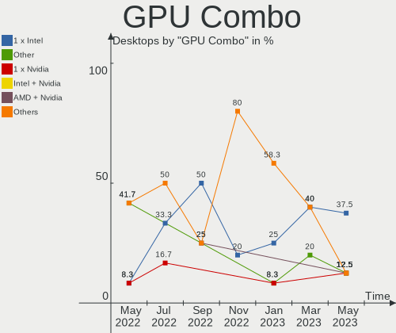

| Name       | Computers | Percent |
|------------|-----------|---------|
| Other      | 3         | 33.33%  |
| 1 x Intel  | 3         | 33.33%  |
| 1 x AMD    | 2         | 22.22%  |
| 1 x Matrox | 1         | 11.11%  |

GPU Driver
----------

Free vs proprietary

| Driver  | Computers | Percent |
|---------|-----------|---------|
| Free    | 6         | 66.67%  |
| Unknown | 3         | 33.33%  |

GPU Memory
----------

Total video memory

| Size in GB | Computers | Percent |
|------------|-----------|---------|
| Unknown    | 9         | 100%    |

Monitor Vendor
--------------

Monitor vendors

| Vendor               | Computers | Percent |
|----------------------|-----------|---------|
| Ancor Communications | 2         | 66.67%  |
| Hewlett-Packard      | 1         | 33.33%  |

Monitor Model
-------------

Monitor models

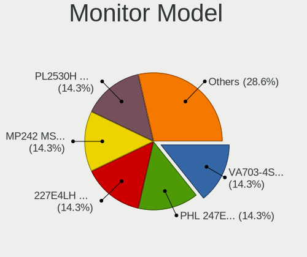

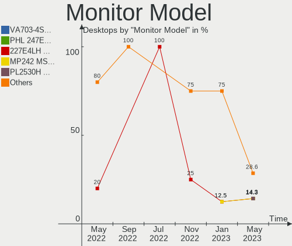

| Model                                           | Computers | Percent |
|-------------------------------------------------|-----------|---------|
| ASUS VW199 ACI19ED 1440x900 410x260mm 19.1-inch | 2         | 66.67%  |
| LA2405 HWP284B 1920x1200 520x320mm 24.0-inch    | 1         | 33.33%  |

Monitor Resolution
------------------

Monitor screen resolution

| Resolution        | Computers | Percent |
|-------------------|-----------|---------|
| 1440x900 (WXGA+)  | 2         | 66.67%  |
| 1920x1200 (WUXGA) | 1         | 33.33%  |

Monitor Diagonal
----------------

Diagonal size in inches

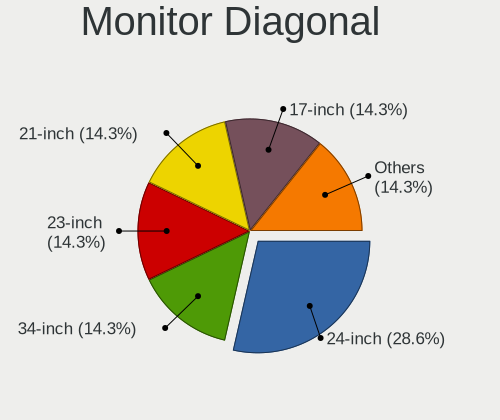

| Inches | Computers | Percent |
|--------|-----------|---------|
| 19     | 2         | 66.67%  |
| 24     | 1         | 33.33%  |

Monitor Width
-------------

Physical width

| Width in mm | Computers | Percent |
|-------------|-----------|---------|
| 401-500     | 2         | 66.67%  |
| 501-600     | 1         | 33.33%  |

Aspect Ratio
------------

Proportional relationship between the width and the height

| Ratio | Computers | Percent |
|-------|-----------|---------|
| 16/10 | 3         | 100%    |

Monitor Area
------------

Area in inch²

| Area in inch² | Computers | Percent |
|----------------|-----------|---------|
| 151-200        | 2         | 66.67%  |
| 251-300        | 1         | 33.33%  |

Pixel Density
-------------

Pixels per inch

| Density | Computers | Percent |
|---------|-----------|---------|
| 51-100  | 3         | 100%    |

Multiple Monitors
-----------------

Total monitors connected

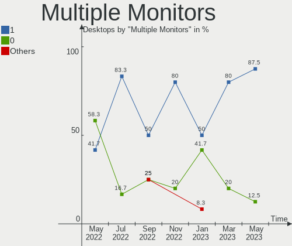

| Total | Computers | Percent |
|-------|-----------|---------|
| 1     | 5         | 55.56%  |
| 0     | 4         | 44.44%  |

Net Controller Vendor
---------------------

Controller vendors

| Vendor                          | Computers | Percent |
|---------------------------------|-----------|---------|
| Realtek Semiconductor           | 2         | 22.22%  |
| Intel                           | 2         | 22.22%  |
| VIA Technologies                | 1         | 11.11%  |
| Qualcomm Atheros Communications | 1         | 11.11%  |
| Emulex                          | 1         | 11.11%  |
| Broadcom Inc. and subsidiaries  | 1         | 11.11%  |
| Accton Technology               | 1         | 11.11%  |

Net Controller Model
--------------------

Controller models

| Model                                                               | Computers | Percent |
|---------------------------------------------------------------------|-----------|---------|
| VT6105M [Rhine-III]                                                 | 1         | 10%     |
| TP-Link TL-WN821N v3 / TL-WN822N v2 802.11n [Atheros AR7010+AR9287] | 1         | 10%     |
| SMC2-1211TX                                                         | 1         | 10%     |
| RTL8111/8168/8411 PCI Express Gigabit Ethernet Controller           | 1         | 10%     |
| OneConnect 10Gb NIC (be3)                                           | 1         | 10%     |
| NetXtreme BCM5720 2-port Gigabit Ethernet PCIe                      | 1         | 10%     |
| NetXtreme BCM5719 Gigabit Ethernet PCIe                             | 1         | 10%     |
| 82562EZ 10/100 Ethernet Controller                                  | 1         | 10%     |
| 82541EI Gigabit Ethernet Controller                                 | 1         | 10%     |
| 802.11n WLAN Adapter                                                | 1         | 10%     |

Wireless Vendor
---------------

Wireless vendors

| Vendor                          | Computers | Percent |
|---------------------------------|-----------|---------|
| Realtek Semiconductor           | 1         | 50%     |
| Qualcomm Atheros Communications | 1         | 50%     |

Wireless Model
--------------

Wireless models

| Model                                                               | Computers | Percent |
|---------------------------------------------------------------------|-----------|---------|
| TP-Link TL-WN821N v3 / TL-WN822N v2 802.11n [Atheros AR7010+AR9287] | 1         | 50%     |
| 802.11n WLAN Adapter                                                | 1         | 50%     |

Ethernet Vendor
---------------

Ethernet vendors

| Vendor                         | Computers | Percent |
|--------------------------------|-----------|---------|
| Intel                          | 2         | 28.57%  |
| VIA Technologies               | 1         | 14.29%  |
| Realtek Semiconductor          | 1         | 14.29%  |
| Emulex                         | 1         | 14.29%  |
| Broadcom Inc. and subsidiaries | 1         | 14.29%  |
| Accton Technology              | 1         | 14.29%  |

Ethernet Model
--------------

Ethernet models

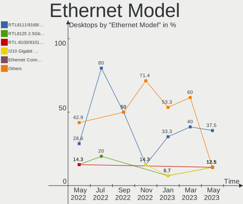

| Model                                                     | Computers | Percent |
|-----------------------------------------------------------|-----------|---------|
| VT6105M [Rhine-III]                                       | 1         | 12.5%   |
| SMC2-1211TX                                               | 1         | 12.5%   |
| RTL8111/8168/8411 PCI Express Gigabit Ethernet Controller | 1         | 12.5%   |
| OneConnect 10Gb NIC (be3)                                 | 1         | 12.5%   |
| NetXtreme BCM5720 2-port Gigabit Ethernet PCIe            | 1         | 12.5%   |
| NetXtreme BCM5719 Gigabit Ethernet PCIe                   | 1         | 12.5%   |
| 82562EZ 10/100 Ethernet Controller                        | 1         | 12.5%   |
| 82541EI Gigabit Ethernet Controller                       | 1         | 12.5%   |

Net Controller Kind
-------------------

Ethernet, WiFi or modem

| Kind     | Computers | Percent |
|----------|-----------|---------|
| Ethernet | 5         | 71.43%  |
| WiFi     | 2         | 28.57%  |

Used Controller
---------------

Currently used network controller

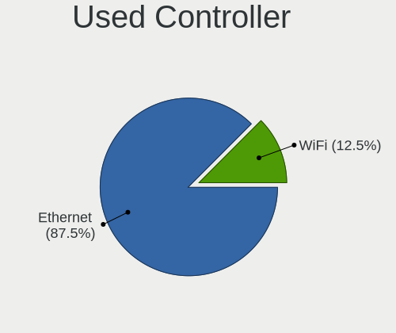

| Kind     | Computers | Percent |
|----------|-----------|---------|
| Ethernet | 3         | 60%     |
| WiFi     | 2         | 40%     |

NICs
----

Total network controllers on board

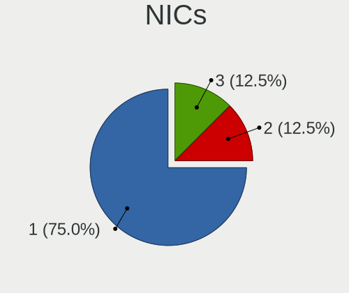

| Total | Computers | Percent |
|-------|-----------|---------|
| 0     | 4         | 44.44%  |
| 1     | 3         | 33.33%  |
| 3     | 1         | 11.11%  |
| 2     | 1         | 11.11%  |

Bluetooth Vendor
----------------

Controller vendors

Zero info for selected period =(

Bluetooth Model
---------------

Controller models

Zero info for selected period =(

Unsupported Devices
-------------------

Total unsupported devices on board

| Total | Computers | Percent |
|-------|-----------|---------|
| 0     | 7         | 77.78%  |
| 2     | 1         | 11.11%  |
| 1     | 1         | 11.11%  |

Unsupported Device Types
------------------------

Types of unsupported devices

| Type                     | Computers | Percent |
|--------------------------|-----------|---------|
| Communication controller | 2         | 100%    |

