OpenBSD - Hardware Trends (Desktops)
------------------------------------

A project to identify most popular hardware characteristics and track their change
over time based on data collected by BSD users at https://BSD-Hardware.info.

Anyone can contribute to this report by the [hw-probe](https://github.com/linuxhw/hw-probe/blob/master/INSTALL.BSD.md) tool:

    hw-probe -all -upload

This report is for one last month. Overall report since the beginning of time: [TestCoverage](https://github.com/bsdhw/TestCoverage)

Period: Dec, 2022.

Contents
--------

* [ System ](#system)
  - [ OS                       ](#os)
  - [ OS Family                ](#os-family)
  - [ Arch                     ](#arch)
  - [ DE                       ](#de)
  - [ Display Server           ](#display-server)
  - [ Display Manager          ](#display-manager)
  - [ OS Lang                  ](#os-lang)
  - [ Boot Mode                ](#boot-mode)
  - [ Filesystem               ](#filesystem)
  - [ Part. scheme             ](#part-scheme)

* [ Board ](#board)
  - [ Vendor                   ](#vendor)
  - [ Model                    ](#model)
  - [ Model Family             ](#model-family)
  - [ MFG Year                 ](#mfg-year)
  - [ Form Factor              ](#form-factor)
  - [ Coreboot                 ](#coreboot)
  - [ RAM Size                 ](#ram-size)
  - [ RAM Used                 ](#ram-used)
  - [ Total Drives             ](#total-drives)
  - [ Has CD-ROM               ](#has-cd-rom)
  - [ Has Ethernet             ](#has-ethernet)
  - [ Has WiFi                 ](#has-wifi)
  - [ Has Bluetooth            ](#has-bluetooth)

* [ Location ](#location)
  - [ Country                  ](#country)
  - [ City                     ](#city)

* [ Drives ](#drives)
  - [ Drive Vendor             ](#drive-vendor)
  - [ Drive Model              ](#drive-model)
  - [ HDD Vendor               ](#hdd-vendor)
  - [ SSD Vendor               ](#ssd-vendor)
  - [ Drive Kind               ](#drive-kind)
  - [ Drive Connector          ](#drive-connector)
  - [ Drive Size               ](#drive-size)
  - [ Space Total              ](#space-total)
  - [ Space Used               ](#space-used)
  - [ Malfunc. Drives          ](#malfunc-drives)
  - [ Malfunc. Drive Vendor    ](#malfunc-drive-vendor)
  - [ Malfunc. HDD Vendor      ](#malfunc-hdd-vendor)
  - [ Malfunc. Drive Kind      ](#malfunc-drive-kind)
  - [ Failed Drives            ](#failed-drives)
  - [ Failed Drive Vendor      ](#failed-drive-vendor)
  - [ Drive Status             ](#drive-status)

* [ Storage controller ](#storage-controller)
  - [ Storage Vendor           ](#storage-vendor)
  - [ Storage Model            ](#storage-model)
  - [ Storage Kind             ](#storage-kind)

* [ Processor ](#processor)
  - [ CPU Vendor               ](#cpu-vendor)
  - [ CPU Model                ](#cpu-model)
  - [ CPU Model Family         ](#cpu-model-family)
  - [ CPU Cores                ](#cpu-cores)
  - [ CPU Sockets              ](#cpu-sockets)
  - [ CPU Threads              ](#cpu-threads)
  - [ CPU Microarch            ](#cpu-microarch)

* [ Graphics ](#graphics)
  - [ GPU Vendor               ](#gpu-vendor)
  - [ GPU Model                ](#gpu-model)
  - [ GPU Combo                ](#gpu-combo)
  - [ GPU Driver               ](#gpu-driver)
  - [ GPU Memory               ](#gpu-memory)

* [ Monitor ](#monitor)
  - [ Monitor Vendor           ](#monitor-vendor)
  - [ Monitor Model            ](#monitor-model)
  - [ Monitor Resolution       ](#monitor-resolution)
  - [ Monitor Diagonal         ](#monitor-diagonal)
  - [ Monitor Width            ](#monitor-width)
  - [ Aspect Ratio             ](#aspect-ratio)
  - [ Monitor Area             ](#monitor-area)
  - [ Pixel Density            ](#pixel-density)
  - [ Multiple Monitors        ](#multiple-monitors)

* [ Network ](#network)
  - [ Net Controller Vendor    ](#net-controller-vendor)
  - [ Net Controller Model     ](#net-controller-model)
  - [ Wireless Vendor          ](#wireless-vendor)
  - [ Wireless Model           ](#wireless-model)
  - [ Ethernet Vendor          ](#ethernet-vendor)
  - [ Ethernet Model           ](#ethernet-model)
  - [ Net Controller Kind      ](#net-controller-kind)
  - [ Used Controller          ](#used-controller)
  - [ NICs                     ](#nics)
  - [ IPv6                     ](#ipv6)

* [ Bluetooth ](#bluetooth)
  - [ Bluetooth Vendor         ](#bluetooth-vendor)
  - [ Bluetooth Model          ](#bluetooth-model)

* [ Sound ](#sound)
  - [ Sound Vendor             ](#sound-vendor)
  - [ Sound Model              ](#sound-model)

* [ Memory ](#memory)
  - [ Memory Vendor            ](#memory-vendor)
  - [ Memory Model             ](#memory-model)
  - [ Memory Kind              ](#memory-kind)
  - [ Memory Form Factor       ](#memory-form-factor)
  - [ Memory Size              ](#memory-size)
  - [ Memory Speed             ](#memory-speed)

* [ Printers & scanners ](#printers--scanners)
  - [ Printer Vendor           ](#printer-vendor)
  - [ Printer Model            ](#printer-model)
  - [ Scanner Vendor           ](#scanner-vendor)
  - [ Scanner Model            ](#scanner-model)

* [ Camera ](#camera)
  - [ Camera Vendor            ](#camera-vendor)
  - [ Camera Model             ](#camera-model)

* [ Security ](#security)
  - [ Fingerprint Vendor       ](#fingerprint-vendor)
  - [ Fingerprint Model        ](#fingerprint-model)
  - [ Chipcard Vendor          ](#chipcard-vendor)
  - [ Chipcard Model           ](#chipcard-model)

* [ Unsupported ](#unsupported)
  - [ Unsupported Devices      ](#unsupported-devices)
  - [ Unsupported Device Types ](#unsupported-device-types)

System
------

OS
--

Installed operating systems

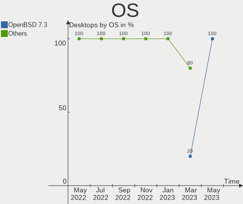

| Name        | Desktops | Percent |
|-------------|----------|---------|
| OpenBSD 7.2 | 6        | 66.67%  |
| OpenBSD 7.1 | 2        | 22.22%  |
| OpenBSD 7.0 | 1        | 11.11%  |

OS Family
---------

OS without a version

| Name    | Desktops | Percent |
|---------|----------|---------|
| OpenBSD | 9        | 100%    |

Arch
----

OS architecture (x86_64, i586, etc.)

| Name  | Desktops | Percent |
|-------|----------|---------|
| amd64 | 6        | 66.67%  |
| arm64 | 3        | 33.33%  |

DE
--

Desktop Environment

| Name         | Desktops | Percent |
|--------------|----------|---------|
| helloDesktop | 8        | 88.89%  |
| Console      | 1        | 11.11%  |

Display Server
--------------

X11 or Wayland

| Name    | Desktops | Percent |
|---------|----------|---------|
| X11     | 6        | 66.67%  |
| Console | 3        | 33.33%  |

Display Manager
---------------

SDDM, LightDM, etc.

| Name    | Desktops | Percent |
|---------|----------|---------|
| Console | 9        | 100%    |

OS Lang
-------

Language

| Lang    | Desktops | Percent |
|---------|----------|---------|
| Unknown | 8        | 88.89%  |
| en_US   | 1        | 11.11%  |

Boot Mode
---------

EFI or BIOS

| Mode | Desktops | Percent |
|------|----------|---------|
| EFI  | 6        | 66.67%  |
| BIOS | 3        | 33.33%  |

Filesystem
----------

Type of filesystem

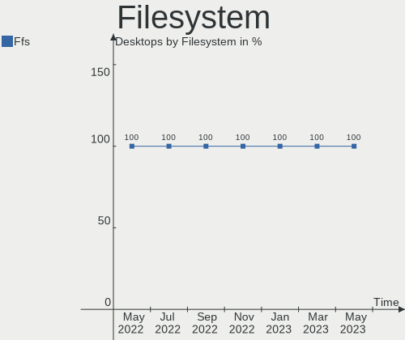

| Type | Desktops | Percent |
|------|----------|---------|
| Ffs  | 9        | 100%    |

Part. scheme
------------

Scheme of partitioning

| Type | Desktops | Percent |
|------|----------|---------|
| MBR  | 5        | 55.56%  |
| GPT  | 4        | 44.44%  |

Board
-----

Vendor
------

Motherboard manufacturer

| Name                    | Desktops | Percent |
|-------------------------|----------|---------|
| Raspberry Pi Foundation | 2        | 22.22%  |
| Unknown                 | 2        | 22.22%  |
| MSI                     | 1        | 11.11%  |
| Lenovo                  | 1        | 11.11%  |
| Gigabyte Technology     | 1        | 11.11%  |
| ASUSTek Computer        | 1        | 11.11%  |
| Acer                    | 1        | 11.11%  |

Model
-----

Motherboard model

| Name                               | Desktops | Percent |
|------------------------------------|----------|---------|
| Unknown                            | 2        | 22.22%  |
| RPi Raspberry Pi 400               | 1        | 11.11%  |
| RPi Raspberry Pi 4 Model B         | 1        | 11.11%  |
| MSI MS-7922                        | 1        | 11.11%  |
| Lenovo ThinkCentre M93p 10A8S0CE09 | 1        | 11.11%  |
| Gigabyte Z390 AORUS ELITE          | 1        | 11.11%  |
| ASUS ROG STRIX X670E-I GAMING WIFI | 1        | 11.11%  |
| Acer Aspire XC-105                 | 1        | 11.11%  |

Model Family
------------

Motherboard model prefix

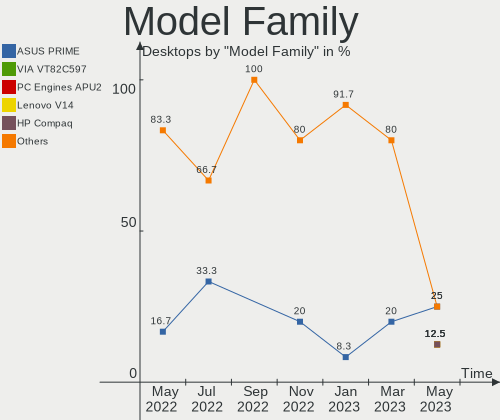

| Name               | Desktops | Percent |
|--------------------|----------|---------|
| RPi Raspberry      | 2        | 22.22%  |
| Unknown            | 2        | 22.22%  |
| MSI MS-7922        | 1        | 11.11%  |
| Lenovo ThinkCentre | 1        | 11.11%  |
| Gigabyte Z390      | 1        | 11.11%  |
| ASUS ROG           | 1        | 11.11%  |
| Acer Aspire        | 1        | 11.11%  |

MFG Year
--------

Motherboard manufacture year

| Year    | Desktops | Percent |
|---------|----------|---------|
| 2021    | 3        | 33.33%  |
| 2014    | 2        | 22.22%  |
| 2022    | 1        | 11.11%  |
| 2020    | 1        | 11.11%  |
| 2013    | 1        | 11.11%  |
| Unknown | 1        | 11.11%  |

Form Factor
-----------

Physical design of the computer

| Name    | Desktops | Percent |
|---------|----------|---------|
| Desktop | 9        | 100%    |

Coreboot
--------

Have coreboot on board

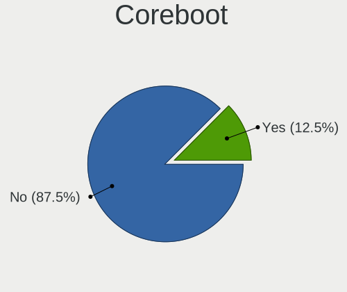

| Used | Desktops | Percent |
|------|----------|---------|
| No   | 9        | 100%    |

RAM Size
--------

Total RAM memory

| Size in GB  | Desktops | Percent |
|-------------|----------|---------|
| 3.01-4.0    | 3        | 33.33%  |
| 16.01-24.0  | 3        | 33.33%  |
| 64.01-256.0 | 1        | 11.11%  |
| 1.01-2.0    | 1        | 11.11%  |
| 8.01-16.0   | 1        | 11.11%  |

RAM Used
--------

Used RAM memory

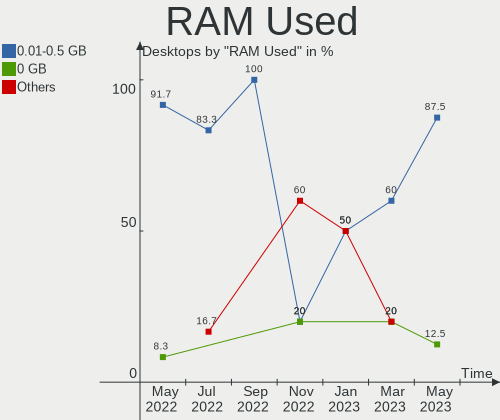

| Used GB  | Desktops | Percent |
|----------|----------|---------|
| 0.01-0.5 | 8        | 88.89%  |
| 1.01-2.0 | 1        | 11.11%  |

Total Drives
------------

Number of drives on board

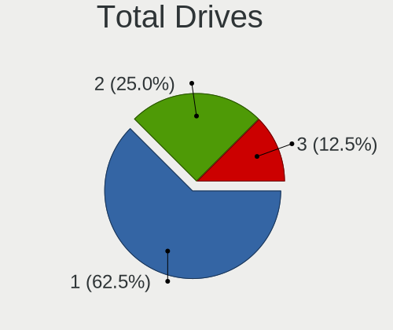

| Drives | Desktops | Percent |
|--------|----------|---------|
| 1      | 5        | 55.56%  |
| 3      | 2        | 22.22%  |
| 6      | 1        | 11.11%  |
| 0      | 1        | 11.11%  |

Has CD-ROM
----------

Has CD-ROM on board

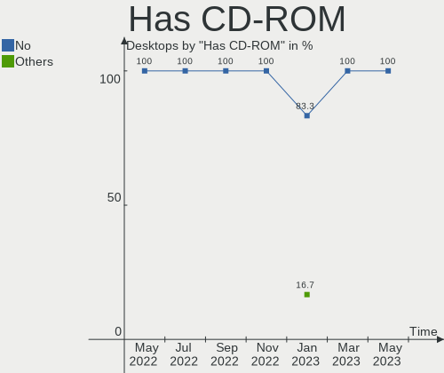

| Presented | Desktops | Percent |
|-----------|----------|---------|
| No        | 9        | 100%    |

Has Ethernet
------------

Has Ethernet on board

| Presented | Desktops | Percent |
|-----------|----------|---------|
| Yes       | 6        | 66.67%  |
| No        | 3        | 33.33%  |

Has WiFi
--------

Has WiFi module

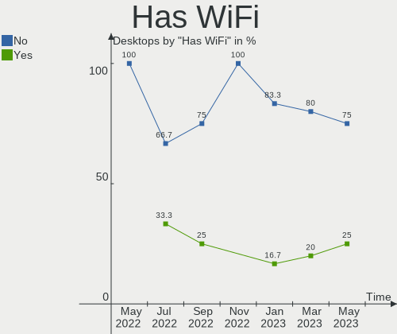

| Presented | Desktops | Percent |
|-----------|----------|---------|
| No        | 6        | 66.67%  |
| Yes       | 3        | 33.33%  |

Has Bluetooth
-------------

Has Bluetooth module

| Presented | Desktops | Percent |
|-----------|----------|---------|
| No        | 8        | 88.89%  |
| Yes       | 1        | 11.11%  |

Location
--------

Country
-------

Geographic location (country)

| Country | Desktops | Percent |
|---------|----------|---------|
| UK      | 2        | 22.22%  |
| Canada  | 2        | 22.22%  |
| USA     | 1        | 11.11%  |
| Russia  | 1        | 11.11%  |
| Italy   | 1        | 11.11%  |
| France  | 1        | 11.11%  |
| Cyprus  | 1        | 11.11%  |

City
----

Geographic location (city)

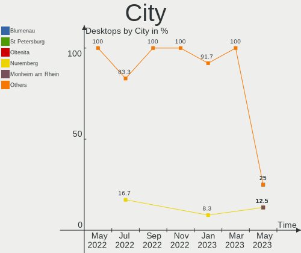

| City             | Desktops | Percent |
|------------------|----------|---------|
| London           | 2        | 22.22%  |
| Rome             | 1        | 11.11%  |
| Ottawa           | 1        | 11.11%  |
| Larnaca          | 1        | 11.11%  |
| Lafayette        | 1        | 11.11%  |
| Krasnodar        | 1        | 11.11%  |
| Cenon-sur-Vienne | 1        | 11.11%  |
| Cambridge        | 1        | 11.11%  |

Drives
------

Drive Vendor
------------

Hard drive vendors

| Vendor              | Desktops | Drives | Percent |
|---------------------|----------|--------|---------|
| WDC                 | 2        | 5      | 18.18%  |
| SanDisk             | 2        | 2      | 18.18%  |
| OPENBSD             | 2        | 3      | 18.18%  |
| Seagate             | 1        | 1      | 9.09%   |
| Samsung Electronics | 1        | 1      | 9.09%   |
| NVMe                | 1        | 1      | 9.09%   |
| Crucial             | 1        | 1      | 9.09%   |
| Argon               | 1        | 1      | 9.09%   |

Drive Model
-----------

Hard drive models

| Model                          | Desktops | Percent |
|--------------------------------|----------|---------|
| OPENBSD SR RAID 1 1TB          | 2        | 15.38%  |
| WDC WD40EZAZ-19SF3B0 4TB       | 1        | 7.69%   |
| WDC WD Elements 25A2 1TB       | 1        | 7.69%   |
| WDC WD Elements 25A1 4TB       | 1        | 7.69%   |
| WDC WD Elements 1078 1TB       | 1        | 7.69%   |
| Seagate ST4000LM024-2AN17V 4TB | 1        | 7.69%   |
| SanDisk Ultra Fit 128GB        | 1        | 7.69%   |
| SanDisk Gaming Xbox 360 8GB    | 1        | 7.69%   |
| Samsung SSD 860 EVO 500GB      | 1        | 7.69%   |
| NVMe Samsung SSD 980 2TB       | 1        | 7.69%   |
| Crucial CT480BX500SSD1 480GB   | 1        | 7.69%   |
| Argon Forty 240GB              | 1        | 7.69%   |

HDD Vendor
----------

Hard disk drive vendors

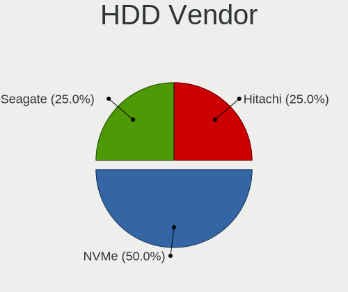

| Vendor  | Desktops | Drives | Percent |
|---------|----------|--------|---------|
| WDC     | 2        | 5      | 40%     |
| OPENBSD | 2        | 3      | 40%     |
| Seagate | 1        | 1      | 20%     |

SSD Vendor
----------

Solid state drive vendors

| Vendor              | Desktops | Drives | Percent |
|---------------------|----------|--------|---------|
| SanDisk             | 2        | 2      | 33.33%  |
| Samsung Electronics | 1        | 1      | 16.67%  |
| NVMe                | 1        | 1      | 16.67%  |
| Crucial             | 1        | 1      | 16.67%  |
| Argon               | 1        | 1      | 16.67%  |

Drive Kind
----------

HDD or SSD

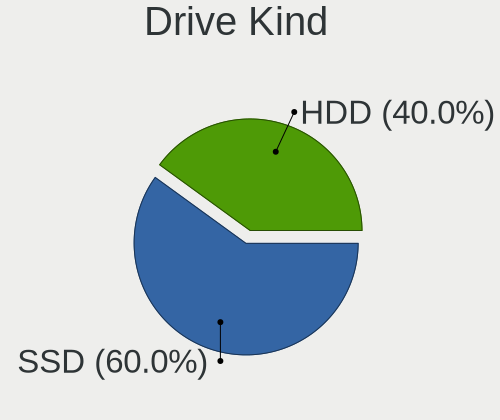

| Kind | Desktops | Drives | Percent |
|------|----------|--------|---------|
| SSD  | 5        | 6      | 62.5%   |
| HDD  | 3        | 9      | 37.5%   |

Drive Connector
---------------

SATA, SAS, NVMe, etc.

| Type | Desktops | Drives | Percent |
|------|----------|--------|---------|
| SATA | 7        | 15     | 100%    |

Drive Size
----------

Size of hard drive

| Size in TB | Desktops | Drives | Percent |
|------------|----------|--------|---------|
| 0.01-0.5   | 5        | 5      | 45.45%  |
| 3.01-4.0   | 3        | 4      | 27.27%  |
| 0.51-1.0   | 2        | 5      | 18.18%  |
| 1.01-2.0   | 1        | 1      | 9.09%   |

Space Total
-----------

Amount of disk space available on the file system

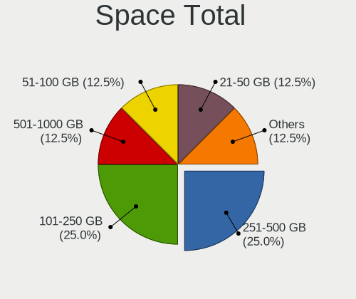

| Size in GB     | Desktops | Percent |
|----------------|----------|---------|
| 251-500        | 5        | 55.56%  |
| 101-250        | 3        | 33.33%  |
| More than 3000 | 1        | 11.11%  |

Space Used
----------

Amount of used disk space

| Used GB   | Desktops | Percent |
|-----------|----------|---------|
| 1-20      | 6        | 66.67%  |
| 251-500   | 1        | 11.11%  |
| 21-50     | 1        | 11.11%  |
| 1001-2000 | 1        | 11.11%  |

Malfunc. Drives
---------------

Drive models with a malfunction

Zero info for selected period =(

Malfunc. Drive Vendor
---------------------

Vendors of faulty drives

Zero info for selected period =(

Malfunc. HDD Vendor
-------------------

Vendors of faulty HDD drives

Zero info for selected period =(

Malfunc. Drive Kind
-------------------

Kinds of faulty drives

Zero info for selected period =(

Failed Drives
-------------

Failed drive models

Zero info for selected period =(

Failed Drive Vendor
-------------------

Failed drive vendors

Zero info for selected period =(

Drive Status
------------

Number of failed and malfunc. drives

| Status   | Desktops | Drives | Percent |
|----------|----------|--------|---------|
| Works    | 7        | 8      | 70%     |
| Detected | 3        | 7      | 30%     |

Storage controller
------------------

Storage Vendor
--------------

Storage controller vendors

| Vendor              | Desktops | Percent |
|---------------------|----------|---------|
| Intel               | 4        | 57.14%  |
| AMD                 | 2        | 28.57%  |
| Samsung Electronics | 1        | 14.29%  |

Storage Model
-------------

Storage controller models

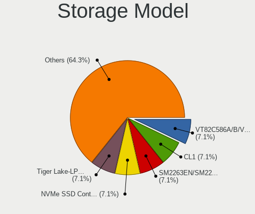

| Model                                                                          | Desktops | Percent |
|--------------------------------------------------------------------------------|----------|---------|
| Intel 8 Series/C220 Series Chipset Family 6-port SATA Controller 1 [AHCI mode] | 2        | 28.57%  |
| Samsung NVMe SSD Controller PM9A1/PM9A3/980PRO                                 | 1        | 14.29%  |
| Intel Cannon Lake PCH SATA AHCI Controller                                     | 1        | 14.29%  |
| Intel 9 Series Chipset Family SATA Controller [AHCI Mode]                      | 1        | 14.29%  |
| AMD unknown                                                                    | 1        | 14.29%  |
| AMD FCH SATA Controller [IDE mode]                                             | 1        | 14.29%  |

Storage Kind
------------

Kind of storage controller (IDE, SATA, NVMe, SAS, ...)

| Kind | Desktops | Percent |
|------|----------|---------|
| SATA | 6        | 85.71%  |
| NVMe | 1        | 14.29%  |

Processor
---------

CPU Vendor
----------

Processor vendors

| Vendor | Desktops | Percent |
|--------|----------|---------|
| Intel  | 4        | 44.44%  |
| ARM    | 3        | 33.33%  |
| AMD    | 2        | 22.22%  |

CPU Model
---------

Processor models

| Model                                   | Desktops | Percent |
|-----------------------------------------|----------|---------|
| ARM Cortex-A72 r0p3                     | 2        | 22.22%  |
| Intel Xeon CPU E5-2620 v3 @ 2.40GHz     | 1        | 11.11%  |
| Intel Core i9-9900K CPU @ 3.60GHz       | 1        | 11.11%  |
| Intel Core i5-4690K CPU @ 3.50GHz       | 1        | 11.11%  |
| Intel Core i5-4570 CPU @ 3.20GHz        | 1        | 11.11%  |
| ARM Cortex-A53 r0p4                     | 1        | 11.11%  |
| AMD Ryzen 9 7950X 16-Core Processor     | 1        | 11.11%  |
| AMD A4-5000 APU with Radeon HD Graphics | 1        | 11.11%  |

CPU Model Family
----------------

Processor model prefix

| Model         | Desktops | Percent |
|---------------|----------|---------|
| ARM Cortex    | 3        | 33.33%  |
| Intel Core i5 | 2        | 22.22%  |
| Intel Xeon    | 1        | 11.11%  |
| Intel Core i9 | 1        | 11.11%  |
| AMD Ryzen 9   | 1        | 11.11%  |
| AMD A4        | 1        | 11.11%  |

CPU Cores
---------

Number of processor cores

| Number  | Desktops | Percent |
|---------|----------|---------|
| 4       | 3        | 33.33%  |
| Unknown | 3        | 33.33%  |
| 32      | 1        | 11.11%  |
| 8       | 1        | 11.11%  |
| 6       | 1        | 11.11%  |

CPU Sockets
-----------

Number of sockets

| Number  | Desktops | Percent |
|---------|----------|---------|
| 1       | 6        | 66.67%  |
| Unknown | 3        | 33.33%  |

CPU Threads
-----------

Threads per core (Hyper-Threading)

| Number  | Desktops | Percent |
|---------|----------|---------|
| 1       | 4        | 44.44%  |
| Unknown | 3        | 33.33%  |
| 2       | 2        | 22.22%  |

CPU Microarch
-------------

Microarchitecture

| Name     | Desktops | Percent |
|----------|----------|---------|
| Unknown  | 4        | 44.44%  |
| Haswell  | 3        | 33.33%  |
| KabyLake | 1        | 11.11%  |
| Jaguar   | 1        | 11.11%  |

Graphics
--------

GPU Vendor
----------

Vendors of graphics cards

| Vendor | Desktops | Percent |
|--------|----------|---------|
| AMD    | 5        | 71.43%  |
| Intel  | 2        | 28.57%  |

GPU Model
---------

Graphics card models

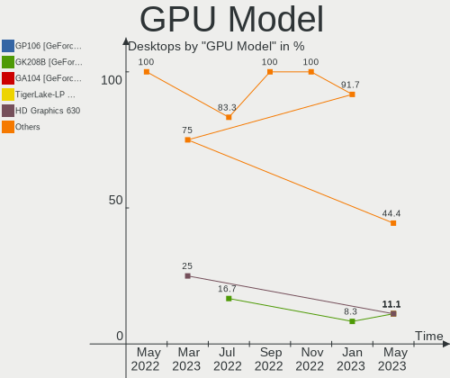

| Model                                                                       | Desktops | Percent |
|-----------------------------------------------------------------------------|----------|---------|
| Intel Xeon E3-1200 v3/4th Gen Core Processor Integrated Graphics Controller | 1        | 12.5%   |
| Intel CoffeeLake-S GT2 [UHD Graphics 630]                                   | 1        | 12.5%   |
| AMD Raphael                                                                 | 1        | 12.5%   |
| AMD Navi 23 [Radeon RX 6600/6600 XT/6600M]                                  | 1        | 12.5%   |
| AMD Navi 22 [Radeon RX 6700/6700 XT/6750 XT / 6800M]                        | 1        | 12.5%   |
| AMD Kabini [Radeon HD 8330]                                                 | 1        | 12.5%   |
| AMD Ellesmere [Radeon RX 470/480/570/570X/580/580X/590]                     | 1        | 12.5%   |
| AMD Curacao PRO [Radeon R7 370 / R9 270/370 OEM]                            | 1        | 12.5%   |

GPU Combo
---------

Combinations of graphics cards

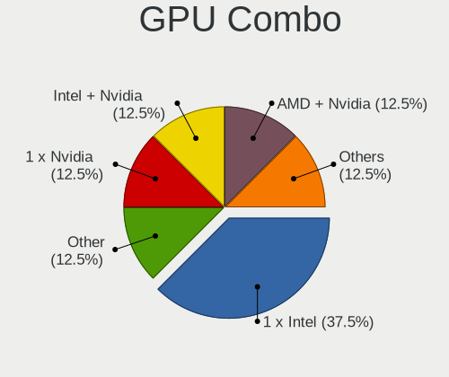

| Name        | Desktops | Percent |
|-------------|----------|---------|
| Other       | 3        | 33.33%  |
| 1 x AMD     | 3        | 33.33%  |
| 2 x AMD     | 1        | 11.11%  |
| Intel + AMD | 1        | 11.11%  |
| 1 x Intel   | 1        | 11.11%  |

GPU Driver
----------

Free vs proprietary

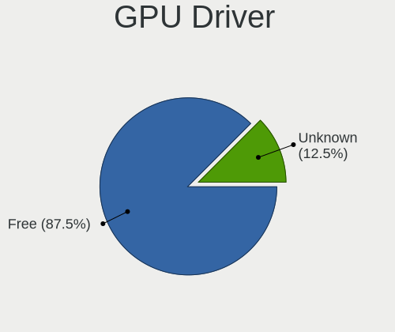

| Driver  | Desktops | Percent |
|---------|----------|---------|
| Free    | 6        | 66.67%  |
| Unknown | 3        | 33.33%  |

GPU Memory
----------

Total video memory

| Size in GB | Desktops | Percent |
|------------|----------|---------|
| Unknown    | 9        | 100%    |

Monitor
-------

Monitor Vendor
--------------

Monitor vendors

| Vendor              | Desktops | Percent |
|---------------------|----------|---------|
| Samsung Electronics | 2        | 40%     |
| DSC                 | 1        | 20%     |
| Dell                | 1        | 20%     |
| ASUSTek Computer    | 1        | 20%     |

Monitor Model
-------------

Monitor models

| Model                                                               | Desktops | Percent |
|---------------------------------------------------------------------|----------|---------|
| Samsung Electronics SyncMaster SAM0226 1440x900 410x260mm 19.1-inch | 1        | 20%     |
| Samsung Electronics S24D300 SAM0B43 1920x1080 530x300mm 24.0-inch   | 1        | 20%     |
| DSC LCD Monitor DSC0001 2200x1650 200x150mm 9.8-inch                | 1        | 20%     |
| Dell P780 DEL510F 1600x1200 330x240mm 16.1-inch                     | 1        | 20%     |
| ASUSTek Computer ROG PG259QN AUS25B5 1920x1080 540x300mm 24.3-inch  | 1        | 20%     |

Monitor Resolution
------------------

Monitor screen resolution

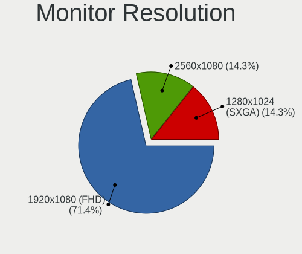

| Resolution       | Desktops | Percent |
|------------------|----------|---------|
| 1920x1080 (FHD)  | 2        | 40%     |
| 2200x1650        | 1        | 20%     |
| 1600x1200        | 1        | 20%     |
| 1440x900 (WXGA+) | 1        | 20%     |

Monitor Diagonal
----------------

Diagonal size in inches

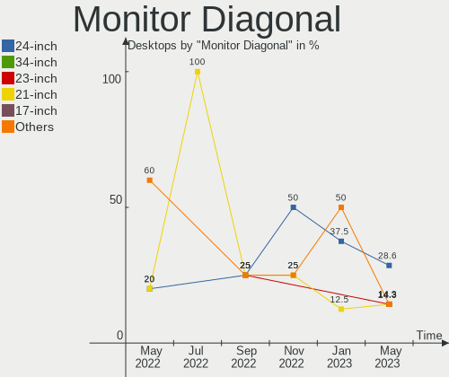

| Inches | Desktops | Percent |
|--------|----------|---------|
| 24     | 2        | 40%     |
| 19     | 1        | 20%     |
| 16     | 1        | 20%     |
| 9      | 1        | 20%     |

Monitor Width
-------------

Physical width

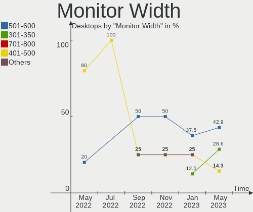

| Width in mm | Desktops | Percent |
|-------------|----------|---------|
| 501-600     | 2        | 40%     |
| 401-500     | 1        | 20%     |
| 301-350     | 1        | 20%     |
| 101-200     | 1        | 20%     |

Aspect Ratio
------------

Proportional relationship between the width and the height

| Ratio | Desktops | Percent |
|-------|----------|---------|
| 4/3   | 2        | 40%     |
| 16/9  | 2        | 40%     |
| 16/10 | 1        | 20%     |

Monitor Area
------------

Area in inch²

| Area in inch² | Desktops | Percent |
|----------------|----------|---------|
| 41-50          | 1        | 20%     |
| 251-300        | 1        | 20%     |
| 201-250        | 1        | 20%     |
| 151-200        | 1        | 20%     |
| 121-130        | 1        | 20%     |

Pixel Density
-------------

Pixels per inch

| Density       | Desktops | Percent |
|---------------|----------|---------|
| 51-100        | 3        | 60%     |
| More than 240 | 1        | 20%     |
| 121-160       | 1        | 20%     |

Multiple Monitors
-----------------

Total monitors connected

| Total | Desktops | Percent |
|-------|----------|---------|
| 1     | 5        | 55.56%  |
| 0     | 4        | 44.44%  |

Network
-------

Net Controller Vendor
---------------------

Controller vendors

| Vendor                          | Desktops | Percent |
|---------------------------------|----------|---------|
| Realtek Semiconductor           | 4        | 40%     |
| Intel                           | 4        | 40%     |
| Qualcomm Atheros Communications | 1        | 10%     |
| MediaTek                        | 1        | 10%     |

Net Controller Model
--------------------

Controller models

| Model                                                             | Desktops | Percent |
|-------------------------------------------------------------------|----------|---------|
| Realtek RTL8111/8168/8411 PCI Express Gigabit Ethernet Controller | 4        | 36.36%  |
| Realtek RTL8169 PCI Gigabit Ethernet Controller                   | 1        | 9.09%   |
| Qualcomm Atheros AR9271 802.11n                                   | 1        | 9.09%   |
| MediaTek MT7922 802.11ax PCI Express Wireless Network Adapter     | 1        | 9.09%   |
| Intel Wi-Fi 6 AX210/AX211/AX411 160MHz                            | 1        | 9.09%   |
| Intel Ethernet Controller I225-V                                  | 1        | 9.09%   |
| Intel Ethernet Connection I217-LM                                 | 1        | 9.09%   |
| Intel Ethernet Connection (7) I219-V                              | 1        | 9.09%   |

Wireless Vendor
---------------

Wireless vendors

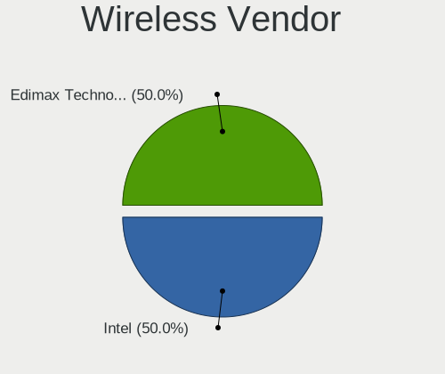

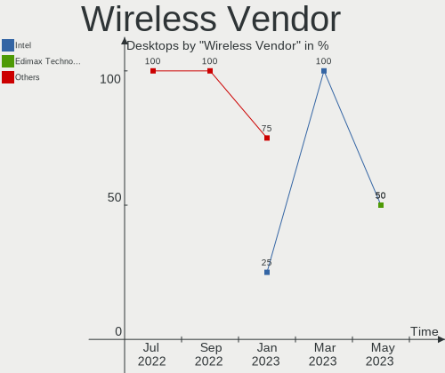

| Vendor                          | Desktops | Percent |
|---------------------------------|----------|---------|
| Qualcomm Atheros Communications | 1        | 33.33%  |
| MediaTek                        | 1        | 33.33%  |
| Intel                           | 1        | 33.33%  |

Wireless Model
--------------

Wireless models

| Model                                                         | Desktops | Percent |
|---------------------------------------------------------------|----------|---------|
| Qualcomm Atheros AR9271 802.11n                               | 1        | 33.33%  |
| MediaTek MT7922 802.11ax PCI Express Wireless Network Adapter | 1        | 33.33%  |
| Intel Wi-Fi 6 AX210/AX211/AX411 160MHz                        | 1        | 33.33%  |

Ethernet Vendor
---------------

Ethernet vendors

| Vendor                | Desktops | Percent |
|-----------------------|----------|---------|
| Realtek Semiconductor | 4        | 57.14%  |
| Intel                 | 3        | 42.86%  |

Ethernet Model
--------------

Ethernet models

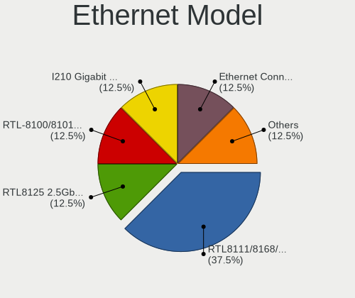

| Model                                                             | Desktops | Percent |
|-------------------------------------------------------------------|----------|---------|
| Realtek RTL8111/8168/8411 PCI Express Gigabit Ethernet Controller | 4        | 50%     |
| Realtek RTL8169 PCI Gigabit Ethernet Controller                   | 1        | 12.5%   |
| Intel Ethernet Controller I225-V                                  | 1        | 12.5%   |
| Intel Ethernet Connection I217-LM                                 | 1        | 12.5%   |
| Intel Ethernet Connection (7) I219-V                              | 1        | 12.5%   |

Net Controller Kind
-------------------

Ethernet, WiFi or modem

| Kind     | Desktops | Percent |
|----------|----------|---------|
| Ethernet | 6        | 66.67%  |
| WiFi     | 3        | 33.33%  |

Used Controller
---------------

Currently used network controller

| Kind     | Desktops | Percent |
|----------|----------|---------|
| Ethernet | 6        | 100%    |

NICs
----

Total network controllers on board

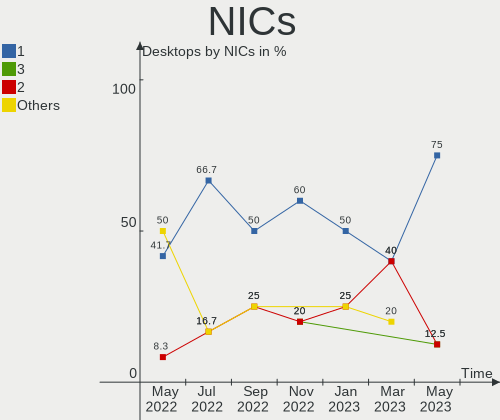

| Total | Desktops | Percent |
|-------|----------|---------|
| 1     | 3        | 33.33%  |
| 0     | 3        | 33.33%  |
| 3     | 2        | 22.22%  |
| 2     | 1        | 11.11%  |

IPv6
----

IPv6 vs IPv4

| Used | Desktops | Percent |
|------|----------|---------|
| No   | 9        | 100%    |

Bluetooth
---------

Bluetooth Vendor
----------------

Controller vendors

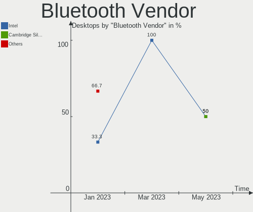

| Vendor                | Desktops | Percent |
|-----------------------|----------|---------|
| Realtek Semiconductor | 1        | 100%    |

Bluetooth Model
---------------

Controller models

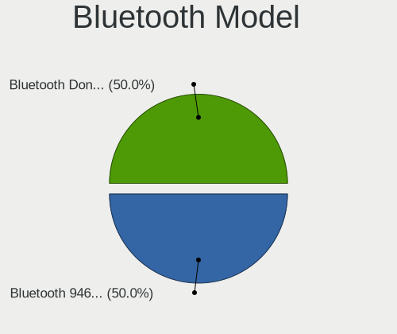

| Model                      | Desktops | Percent |
|----------------------------|----------|---------|
| Realtek  Bluetooth Adapter | 1        | 100%    |

Sound
-----

Sound Vendor
------------

Sound card vendors

| Vendor                               | Desktops | Percent |
|--------------------------------------|----------|---------|
| AMD                                  | 5        | 38.46%  |
| Intel                                | 4        | 30.77%  |
| Thesycon Systemsoftware & Consulting | 1        | 7.69%   |
| Texas Instruments                    | 1        | 7.69%   |
| Generalplus Technology               | 1        | 7.69%   |
| Elgato Systems                       | 1        | 7.69%   |

Sound Model
-----------

Sound card models

| Model                                                                   | Desktops | Percent |
|-------------------------------------------------------------------------|----------|---------|
| AMD Navi 21/23 HDMI/DP Audio Controller                                 | 2        | 13.33%  |
| Thesycon Systemsoftware & Consulting Topping DX3 Pro Audio Control      | 1        | 6.67%   |
| Texas Instruments PCM2902 Audio Codec                                   | 1        | 6.67%   |
| Intel Xeon E3-1200 v3/4th Gen Core Processor HD Audio Controller        | 1        | 6.67%   |
| Intel Cannon Lake PCH cAVS                                              | 1        | 6.67%   |
| Intel 9 Series Chipset Family HD Audio Controller                       | 1        | 6.67%   |
| Intel 8 Series/C220 Series Chipset High Definition Audio Controller     | 1        | 6.67%   |
| Generalplus Technology USB Audio Device                                 | 1        | 6.67%   |
| Elgato Systems Elgato Wave:3                                            | 1        | 6.67%   |
| AMD Rembrandt Radeon High Definition Audio Controller                   | 1        | 6.67%   |
| AMD Oland/Hainan/Cape Verde/Pitcairn HDMI Audio [Radeon HD 7000 Series] | 1        | 6.67%   |
| AMD Kabini HDMI/DP Audio                                                | 1        | 6.67%   |
| AMD FCH Azalia Controller                                               | 1        | 6.67%   |
| AMD Ellesmere HDMI Audio [Radeon RX 470/480 / 570/580/590]              | 1        | 6.67%   |

Memory
------

Memory Vendor
-------------

Memory module vendors

| Vendor  | Desktops | Percent |
|---------|----------|---------|
| Corsair | 1        | 100%    |

Memory Model
------------

Memory module models

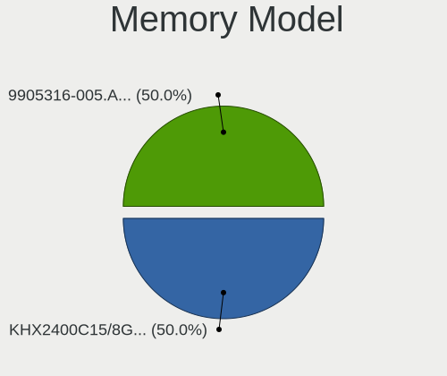

| Model                                                  | Desktops | Percent |
|--------------------------------------------------------|----------|---------|
| Corsair RAM CMK64GX5M2B5200C40 32GB DIMM DDR5 4800MT/s | 1        | 100%    |

Memory Kind
-----------

Memory module kinds

| Kind | Desktops | Percent |
|------|----------|---------|
| DDR5 | 1        | 100%    |

Memory Form Factor
------------------

Physical design of the memory module

| Name | Desktops | Percent |
|------|----------|---------|
| DIMM | 1        | 100%    |

Memory Size
-----------

Memory module size

| Size  | Desktops | Percent |
|-------|----------|---------|
| 32768 | 1        | 100%    |

Memory Speed
------------

Memory module speed

| Speed | Desktops | Percent |
|-------|----------|---------|
| 4800  | 1        | 100%    |

Printers & scanners
-------------------

Printer Vendor
--------------

Printer device vendors

Zero info for selected period =(

Printer Model
-------------

Printer device models

Zero info for selected period =(

Scanner Vendor
--------------

Scanner device vendors

Zero info for selected period =(

Scanner Model
-------------

Scanner device models

Zero info for selected period =(

Camera
------

Camera Vendor
-------------

Camera device vendors

Zero info for selected period =(

Camera Model
------------

Camera device models

Zero info for selected period =(

Security
--------

Fingerprint Vendor
------------------

Fingerprint sensor vendors

Zero info for selected period =(

Fingerprint Model
-----------------

Fingerprint sensor models

Zero info for selected period =(

Chipcard Vendor
---------------

Chipcard module vendors

Zero info for selected period =(

Chipcard Model
--------------

Chipcard module models

Zero info for selected period =(

Unsupported
-----------

Unsupported Devices
-------------------

Total unsupported devices on board

| Total | Desktops | Percent |
|-------|----------|---------|
| 1     | 4        | 44.44%  |
| 0     | 3        | 33.33%  |
| 2     | 2        | 22.22%  |

Unsupported Device Types
------------------------

Types of unsupported devices

| Type                     | Desktops | Percent |
|--------------------------|----------|---------|
| Communication controller | 3        | 37.5%   |
| Net/wireless             | 2        | 25%     |
| Storage/ata              | 1        | 12.5%   |
| Sound                    | 1        | 12.5%   |
| Graphics card            | 1        | 12.5%   |

