OpenBSD - Hardware Trends (Desktops)
------------------------------------

A project to identify most popular hardware characteristics and track their change
over time based on data collected by BSD users at https://BSD-Hardware.info.

Anyone can contribute to this report by the [hw-probe](https://github.com/linuxhw/hw-probe/blob/master/INSTALL.BSD.md) tool:

    hw-probe -all -upload

This report is for one last month. Overall report since the beginning of time: [TestDays](https://github.com/bsdhw/TestDays)

Period: May, 2023.

Contents
--------

* [ System ](#system)
  - [ OS                       ](#os)
  - [ OS Family                ](#os-family)
  - [ Arch                     ](#arch)
  - [ DE                       ](#de)
  - [ Display Server           ](#display-server)
  - [ Display Manager          ](#display-manager)
  - [ OS Lang                  ](#os-lang)
  - [ Boot Mode                ](#boot-mode)
  - [ Filesystem               ](#filesystem)
  - [ Part. scheme             ](#part-scheme)

* [ Board ](#board)
  - [ Vendor                   ](#vendor)
  - [ Model                    ](#model)
  - [ Model Family             ](#model-family)
  - [ MFG Year                 ](#mfg-year)
  - [ Form Factor              ](#form-factor)
  - [ Coreboot                 ](#coreboot)
  - [ RAM Size                 ](#ram-size)
  - [ RAM Used                 ](#ram-used)
  - [ Total Drives             ](#total-drives)
  - [ Has CD-ROM               ](#has-cd-rom)
  - [ Has Ethernet             ](#has-ethernet)
  - [ Has WiFi                 ](#has-wifi)
  - [ Has Bluetooth            ](#has-bluetooth)

* [ Location ](#location)
  - [ Country                  ](#country)
  - [ City                     ](#city)

* [ Drives ](#drives)
  - [ Drive Vendor             ](#drive-vendor)
  - [ Drive Model              ](#drive-model)
  - [ HDD Vendor               ](#hdd-vendor)
  - [ SSD Vendor               ](#ssd-vendor)
  - [ Drive Kind               ](#drive-kind)
  - [ Drive Connector          ](#drive-connector)
  - [ Drive Size               ](#drive-size)
  - [ Space Total              ](#space-total)
  - [ Space Used               ](#space-used)
  - [ Malfunc. Drives          ](#malfunc-drives)
  - [ Malfunc. Drive Vendor    ](#malfunc-drive-vendor)
  - [ Malfunc. HDD Vendor      ](#malfunc-hdd-vendor)
  - [ Malfunc. Drive Kind      ](#malfunc-drive-kind)
  - [ Failed Drives            ](#failed-drives)
  - [ Failed Drive Vendor      ](#failed-drive-vendor)
  - [ Drive Status             ](#drive-status)

* [ Storage controller ](#storage-controller)
  - [ Storage Vendor           ](#storage-vendor)
  - [ Storage Model            ](#storage-model)
  - [ Storage Kind             ](#storage-kind)

* [ Processor ](#processor)
  - [ CPU Vendor               ](#cpu-vendor)
  - [ CPU Model                ](#cpu-model)
  - [ CPU Model Family         ](#cpu-model-family)
  - [ CPU Cores                ](#cpu-cores)
  - [ CPU Sockets              ](#cpu-sockets)
  - [ CPU Threads              ](#cpu-threads)
  - [ CPU Microarch            ](#cpu-microarch)

* [ Graphics ](#graphics)
  - [ GPU Vendor               ](#gpu-vendor)
  - [ GPU Model                ](#gpu-model)
  - [ GPU Combo                ](#gpu-combo)
  - [ GPU Driver               ](#gpu-driver)
  - [ GPU Memory               ](#gpu-memory)

* [ Monitor ](#monitor)
  - [ Monitor Vendor           ](#monitor-vendor)
  - [ Monitor Model            ](#monitor-model)
  - [ Monitor Resolution       ](#monitor-resolution)
  - [ Monitor Diagonal         ](#monitor-diagonal)
  - [ Monitor Width            ](#monitor-width)
  - [ Aspect Ratio             ](#aspect-ratio)
  - [ Monitor Area             ](#monitor-area)
  - [ Pixel Density            ](#pixel-density)
  - [ Multiple Monitors        ](#multiple-monitors)

* [ Network ](#network)
  - [ Net Controller Vendor    ](#net-controller-vendor)
  - [ Net Controller Model     ](#net-controller-model)
  - [ Wireless Vendor          ](#wireless-vendor)
  - [ Wireless Model           ](#wireless-model)
  - [ Ethernet Vendor          ](#ethernet-vendor)
  - [ Ethernet Model           ](#ethernet-model)
  - [ Net Controller Kind      ](#net-controller-kind)
  - [ Used Controller          ](#used-controller)
  - [ NICs                     ](#nics)
  - [ IPv6                     ](#ipv6)

* [ Bluetooth ](#bluetooth)
  - [ Bluetooth Vendor         ](#bluetooth-vendor)
  - [ Bluetooth Model          ](#bluetooth-model)

* [ Sound ](#sound)
  - [ Sound Vendor             ](#sound-vendor)
  - [ Sound Model              ](#sound-model)

* [ Memory ](#memory)
  - [ Memory Vendor            ](#memory-vendor)
  - [ Memory Model             ](#memory-model)
  - [ Memory Kind              ](#memory-kind)
  - [ Memory Form Factor       ](#memory-form-factor)
  - [ Memory Size              ](#memory-size)
  - [ Memory Speed             ](#memory-speed)

* [ Printers & scanners ](#printers--scanners)
  - [ Printer Vendor           ](#printer-vendor)
  - [ Printer Model            ](#printer-model)
  - [ Scanner Vendor           ](#scanner-vendor)
  - [ Scanner Model            ](#scanner-model)

* [ Camera ](#camera)
  - [ Camera Vendor            ](#camera-vendor)
  - [ Camera Model             ](#camera-model)

* [ Security ](#security)
  - [ Fingerprint Vendor       ](#fingerprint-vendor)
  - [ Fingerprint Model        ](#fingerprint-model)
  - [ Chipcard Vendor          ](#chipcard-vendor)
  - [ Chipcard Model           ](#chipcard-model)

* [ Unsupported ](#unsupported)
  - [ Unsupported Devices      ](#unsupported-devices)
  - [ Unsupported Device Types ](#unsupported-device-types)

System
------

OS
--

Installed operating systems

| Name        | Desktops | Percent |
|-------------|----------|---------|
| OpenBSD 7.3 | 8        | 100%    |

OS Family
---------

OS without a version

| Name    | Desktops | Percent |
|---------|----------|---------|
| OpenBSD | 8        | 100%    |

Arch
----

OS architecture (x86_64, i586, etc.)

| Name  | Desktops | Percent |
|-------|----------|---------|
| amd64 | 7        | 87.5%   |
| i386  | 1        | 12.5%   |

DE
--

Desktop Environment

| Name         | Desktops | Percent |
|--------------|----------|---------|
| helloDesktop | 6        | 75%     |
| XFCE         | 1        | 12.5%   |
| GNOME        | 1        | 12.5%   |

Display Server
--------------

X11 or Wayland

| Name    | Desktops | Percent |
|---------|----------|---------|
| X11     | 7        | 87.5%   |
| Console | 1        | 12.5%   |

Display Manager
---------------

SDDM, LightDM, etc.

| Name    | Desktops | Percent |
|---------|----------|---------|
| Console | 8        | 100%    |

OS Lang
-------

Language

| Lang    | Desktops | Percent |
|---------|----------|---------|
| Unknown | 7        | 87.5%   |
| en_US   | 1        | 12.5%   |

Boot Mode
---------

EFI or BIOS

| Mode | Desktops | Percent |
|------|----------|---------|
| BIOS | 4        | 50%     |
| EFI  | 4        | 50%     |

Filesystem
----------

Type of filesystem

| Type | Desktops | Percent |
|------|----------|---------|
| Ffs  | 8        | 100%    |

Part. scheme
------------

Scheme of partitioning

| Type | Desktops | Percent |
|------|----------|---------|
| MBR  | 4        | 50%     |
| GPT  | 4        | 50%     |

Board
-----

Vendor
------

Motherboard manufacturer

| Name                | Desktops | Percent |
|---------------------|----------|---------|
| ASUSTek Computer    | 3        | 37.5%   |
| VIA Technologies    | 1        | 12.5%   |
| PC Engines          | 1        | 12.5%   |
| Lenovo              | 1        | 12.5%   |
| Hewlett-Packard     | 1        | 12.5%   |
| Gigabyte Technology | 1        | 12.5%   |

Model
-----

Motherboard model

| Name                        | Desktops | Percent |
|-----------------------------|----------|---------|
| VIA VT82C597                | 1        | 12.5%   |
| PC Engines APU2             | 1        | 12.5%   |
| Lenovo V14 G2 ITL 82NM      | 1        | 12.5%   |
| HP Compaq dc5700 Microtower | 1        | 12.5%   |
| Gigabyte B250M-Gaming 3     | 1        | 12.5%   |
| ASUS PRIME B650-PLUS        | 1        | 12.5%   |
| ASUS PRIME B460M-A          | 1        | 12.5%   |
| ASUS M3A78-EMH HDMI         | 1        | 12.5%   |

Model Family
------------

Motherboard model prefix

| Name                  | Desktops | Percent |
|-----------------------|----------|---------|
| ASUS PRIME            | 2        | 25%     |
| VIA VT82C597          | 1        | 12.5%   |
| PC Engines APU2       | 1        | 12.5%   |
| Lenovo V14            | 1        | 12.5%   |
| HP Compaq             | 1        | 12.5%   |
| Gigabyte B250M-Gaming | 1        | 12.5%   |
| ASUS M3A78-EMH        | 1        | 12.5%   |

MFG Year
--------

Motherboard manufacture year

| Year    | Desktops | Percent |
|---------|----------|---------|
| 2023    | 2        | 25%     |
| 2021    | 1        | 12.5%   |
| 2018    | 1        | 12.5%   |
| 2016    | 1        | 12.5%   |
| 2010    | 1        | 12.5%   |
| 2006    | 1        | 12.5%   |
| Unknown | 1        | 12.5%   |

Form Factor
-----------

Physical design of the computer

| Name    | Desktops | Percent |
|---------|----------|---------|
| Desktop | 8        | 100%    |

Coreboot
--------

Have coreboot on board

| Used | Desktops | Percent |
|------|----------|---------|
| No   | 7        | 87.5%   |
| Yes  | 1        | 12.5%   |

RAM Size
--------

Total RAM memory

| Size in GB | Desktops | Percent |
|------------|----------|---------|
| 8.01-16.0  | 4        | 50%     |
| 4.01-8.0   | 2        | 25%     |
| 16.01-24.0 | 1        | 12.5%   |
| 0.01-0.5   | 1        | 12.5%   |

RAM Used
--------

Used RAM memory

| Used GB  | Desktops | Percent |
|----------|----------|---------|
| 0.01-0.5 | 7        | 87.5%   |
| 0        | 1        | 12.5%   |

Total Drives
------------

Number of drives on board

| Drives | Desktops | Percent |
|--------|----------|---------|
| 1      | 5        | 62.5%   |
| 2      | 2        | 25%     |
| 3      | 1        | 12.5%   |

Has CD-ROM
----------

Has CD-ROM on board

| Presented | Desktops | Percent |
|-----------|----------|---------|
| No        | 8        | 100%    |

Has Ethernet
------------

Has Ethernet on board

| Presented | Desktops | Percent |
|-----------|----------|---------|
| Yes       | 8        | 100%    |

Has WiFi
--------

Has WiFi module

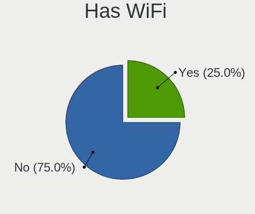

| Presented | Desktops | Percent |
|-----------|----------|---------|
| No        | 6        | 75%     |
| Yes       | 2        | 25%     |

Has Bluetooth
-------------

Has Bluetooth module

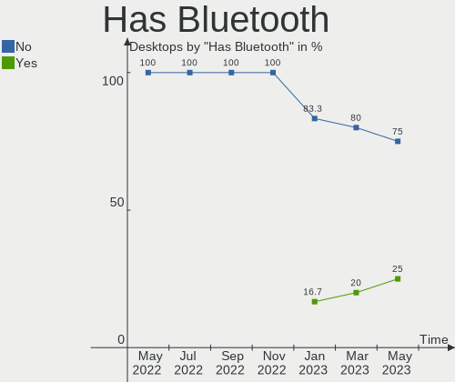

| Presented | Desktops | Percent |
|-----------|----------|---------|
| No        | 6        | 75%     |
| Yes       | 2        | 25%     |

Location
--------

Country
-------

Geographic location (country)

| Country | Desktops | Percent |
|---------|----------|---------|
| Germany | 2        | 25%     |
| Brazil  | 2        | 25%     |
| Spain   | 1        | 12.5%   |
| Russia  | 1        | 12.5%   |
| Romania | 1        | 12.5%   |
| Italy   | 1        | 12.5%   |

City
----

Geographic location (city)

| City             | Desktops | Percent |
|------------------|----------|---------|
| Blumenau         | 2        | 25%     |
| St Petersburg    | 1        | 12.5%   |
| Oltenita         | 1        | 12.5%   |
| Nuremberg        | 1        | 12.5%   |
| Monheim am Rhein | 1        | 12.5%   |
| Milan            | 1        | 12.5%   |
| Barcelona        | 1        | 12.5%   |

Drives
------

Drive Vendor
------------

Hard drive vendors

| Vendor              | Desktops | Drives | Percent |
|---------------------|----------|--------|---------|
| NVMe                | 3        | 3      | 30%     |
| Seagate             | 1        | 1      | 10%     |
| SanDisk             | 1        | 2      | 10%     |
| Samsung Electronics | 1        | 1      | 10%     |
| Kingston            | 1        | 1      | 10%     |
| Hitachi             | 1        | 1      | 10%     |
| Crucial             | 1        | 1      | 10%     |
| A-DATA Technology   | 1        | 1      | 10%     |

Drive Model
-----------

Hard drive models

| Model                         | Desktops | Percent |
|-------------------------------|----------|---------|
| Seagate ST3250318AS 250GB     | 1        | 9.09%   |
| SanDisk SSD PLUS 120GB        | 1        | 9.09%   |
| SanDisk Cruzer Blade 64GB     | 1        | 9.09%   |
| Samsung SSD 870 EVO 500GB     | 1        | 9.09%   |
| NVMe SSSTC CL1-4D256 256GB    | 1        | 9.09%   |
| NVMe Samsung SSD 980 500GB    | 1        | 9.09%   |
| NVMe Asgard AN1TNVMe- 1TB     | 1        | 9.09%   |
| Kingston SA400S37480G 480GB   | 1        | 9.09%   |
| Hitachi HDS722516VLAT80 164GB | 1        | 9.09%   |
| Crucial CT500BX500SSD1 500GB  | 1        | 9.09%   |
| A-DATA SP550 240GB            | 1        | 9.09%   |

HDD Vendor
----------

Hard disk drive vendors

| Vendor  | Desktops | Drives | Percent |
|---------|----------|--------|---------|
| NVMe    | 2        | 2      | 50%     |
| Seagate | 1        | 1      | 25%     |
| Hitachi | 1        | 1      | 25%     |

SSD Vendor
----------

Solid state drive vendors

| Vendor              | Desktops | Drives | Percent |
|---------------------|----------|--------|---------|
| SanDisk             | 1        | 2      | 16.67%  |
| Samsung Electronics | 1        | 1      | 16.67%  |
| NVMe                | 1        | 1      | 16.67%  |
| Kingston            | 1        | 1      | 16.67%  |
| Crucial             | 1        | 1      | 16.67%  |
| A-DATA Technology   | 1        | 1      | 16.67%  |

Drive Kind
----------

HDD or SSD

| Kind | Desktops | Drives | Percent |
|------|----------|--------|---------|
| SSD  | 6        | 7      | 60%     |
| HDD  | 4        | 4      | 40%     |

Drive Connector
---------------

SATA, SAS, NVMe, etc.

| Type | Desktops | Drives | Percent |
|------|----------|--------|---------|
| SATA | 7        | 11     | 100%    |

Drive Size
----------

Size of hard drive

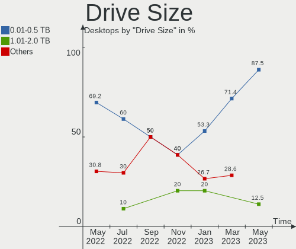

| Size in TB | Desktops | Drives | Percent |
|------------|----------|--------|---------|
| 0.01-0.5   | 7        | 10     | 87.5%   |
| 1.01-2.0   | 1        | 1      | 12.5%   |

Space Total
-----------

Amount of disk space available on the file system

| Size in GB | Desktops | Percent |
|------------|----------|---------|
| 251-500    | 2        | 25%     |
| 101-250    | 2        | 25%     |
| 21-50      | 1        | 12.5%   |
| 1-20       | 1        | 12.5%   |
| 501-1000   | 1        | 12.5%   |
| 51-100     | 1        | 12.5%   |

Space Used
----------

Amount of used disk space

| Used GB | Desktops | Percent |
|---------|----------|---------|
| 1-20    | 6        | 75%     |
| 251-500 | 1        | 12.5%   |
| 21-50   | 1        | 12.5%   |

Malfunc. Drives
---------------

Drive models with a malfunction

| Model                                 | Desktops | Drives | Percent |
|---------------------------------------|----------|--------|---------|
| Samsung Electronics SSD 870 EVO 500GB | 1        | 1      | 33.33%  |
| Hitachi HDS722516VLAT80 164GB         | 1        | 1      | 33.33%  |
| A-DATA Technology SP550 240GB         | 1        | 1      | 33.33%  |

Malfunc. Drive Vendor
---------------------

Vendors of faulty drives

| Vendor              | Desktops | Drives | Percent |
|---------------------|----------|--------|---------|
| Samsung Electronics | 1        | 1      | 33.33%  |
| Hitachi             | 1        | 1      | 33.33%  |
| A-DATA Technology   | 1        | 1      | 33.33%  |

Malfunc. HDD Vendor
-------------------

Vendors of faulty HDD drives

| Vendor  | Desktops | Drives | Percent |
|---------|----------|--------|---------|
| Hitachi | 1        | 1      | 100%    |

Malfunc. Drive Kind
-------------------

Kinds of faulty drives

| Kind | Desktops | Drives | Percent |
|------|----------|--------|---------|
| SSD  | 2        | 2      | 66.67%  |
| HDD  | 1        | 1      | 33.33%  |

Failed Drives
-------------

Failed drive models

Zero info for selected period =(

Failed Drive Vendor
-------------------

Failed drive vendors

Zero info for selected period =(

Drive Status
------------

Number of failed and malfunc. drives

| Status   | Desktops | Drives | Percent |
|----------|----------|--------|---------|
| Works    | 4        | 5      | 40%     |
| Detected | 3        | 3      | 30%     |
| Malfunc  | 3        | 3      | 30%     |

Storage controller
------------------

Storage Vendor
--------------

Storage controller vendors

| Vendor                         | Desktops | Percent |
|--------------------------------|----------|---------|
| Intel                          | 4        | 33.33%  |
| AMD                            | 3        | 25%     |
| VIA Technologies               | 1        | 8.33%   |
| Solid State Storage Technology | 1        | 8.33%   |
| Silicon Motion                 | 1        | 8.33%   |
| Samsung Electronics            | 1        | 8.33%   |
| Artop Electronic               | 1        | 8.33%   |

Storage Model
-------------

Storage controller models

| Model                                                               | Desktops | Percent |
|---------------------------------------------------------------------|----------|---------|
| VIA VT82C586A/B/VT82C686/A/B/VT823x/A/C PIPC Bus Master IDE         | 1        | 7.14%   |
| Solid State Storage CL1                                             | 1        | 7.14%   |
| Silicon Motion SM2263EN/SM2263XT SSD Controller                     | 1        | 7.14%   |
| Samsung NVMe SSD Controller PM9A1/PM9A3/980PRO                      | 1        | 7.14%   |
| Intel Tiger Lake-LP SATA Controller                                 | 1        | 7.14%   |
| Intel 82801HR/HO/HH (ICH8R/DO/DH) 2 port SATA Controller [IDE mode] | 1        | 7.14%   |
| Intel 82801H (ICH8 Family) 4 port SATA Controller [IDE mode]        | 1        | 7.14%   |
| Intel 400 Series Chipset Family SATA AHCI Controller                | 1        | 7.14%   |
| Intel 200 Series PCH SATA controller [AHCI mode]                    | 1        | 7.14%   |
| Artop Electronic AEC6712U SCSI                                      | 1        | 7.14%   |
| AMD SB7x0/SB8x0/SB9x0 SATA Controller [AHCI mode]                   | 1        | 7.14%   |
| AMD SB7x0/SB8x0/SB9x0 IDE Controller                                | 1        | 7.14%   |
| AMD FCH SATA Controller [IDE mode]                                  | 1        | 7.14%   |
| AMD FCH SATA Controller [AHCI mode]                                 | 1        | 7.14%   |

Storage Kind
------------

Kind of storage controller (IDE, SATA, NVMe, SAS, ...)

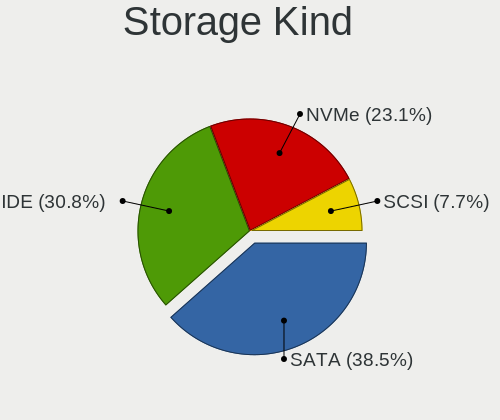

| Kind | Desktops | Percent |
|------|----------|---------|
| SATA | 5        | 38.46%  |
| IDE  | 4        | 30.77%  |
| NVMe | 3        | 23.08%  |
| SCSI | 1        | 7.69%   |

Processor
---------

CPU Vendor
----------

Processor vendors

| Vendor | Desktops | Percent |
|--------|----------|---------|
| Intel  | 4        | 50%     |
| AMD    | 4        | 50%     |

CPU Model
---------

Processor models

| Model                                   | Desktops | Percent |
|-----------------------------------------|----------|---------|
| Intel Core i5-7400 CPU @ 3.00GHz        | 1        | 12.5%   |
| Intel Core i3-10100 CPU @ 3.60GHz       | 1        | 12.5%   |
| Intel Core 2 CPU 6420 @ 2.13GHz         | 1        | 12.5%   |
| Intel 11th Gen Core i5-1135G7 @ 2.40GHz | 1        | 12.5%   |
| AMD Ryzen 7 7700X 8-Core Processor      | 1        | 12.5%   |
| AMD Phenom 9550 Quad-Core Processor     | 1        | 12.5%   |
| AMD K6                                  | 1        | 12.5%   |
| AMD GX-412TC SOC                        | 1        | 12.5%   |

CPU Model Family
----------------

Processor model prefix

| Model         | Desktops | Percent |
|---------------|----------|---------|
| Other         | 2        | 25%     |
| Intel Core i5 | 1        | 12.5%   |
| Intel Core i3 | 1        | 12.5%   |
| Intel Core 2  | 1        | 12.5%   |
| AMD Ryzen 7   | 1        | 12.5%   |
| AMD Phenom    | 1        | 12.5%   |
| AMD GX        | 1        | 12.5%   |

CPU Cores
---------

Number of processor cores

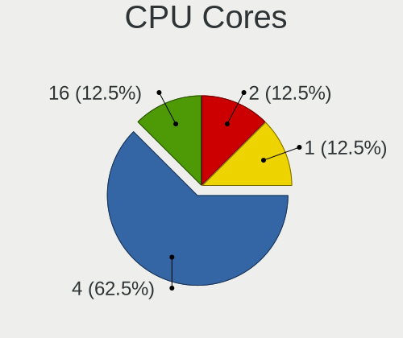

| Number | Desktops | Percent |
|--------|----------|---------|
| 4      | 5        | 62.5%   |
| 16     | 1        | 12.5%   |
| 2      | 1        | 12.5%   |
| 1      | 1        | 12.5%   |

CPU Sockets
-----------

Number of sockets

| Number | Desktops | Percent |
|--------|----------|---------|
| 1      | 7        | 87.5%   |
| 2      | 1        | 12.5%   |

CPU Threads
-----------

Threads per core (Hyper-Threading)

| Number | Desktops | Percent |
|--------|----------|---------|
| 1      | 6        | 75%     |
| 2      | 2        | 25%     |

CPU Microarch
-------------

Microarchitecture

| Name      | Desktops | Percent |
|-----------|----------|---------|
| TigerLake | 1        | 12.5%   |
| Puma      | 1        | 12.5%   |
| KabyLake  | 1        | 12.5%   |
| K10       | 1        | 12.5%   |
| Geode     | 1        | 12.5%   |
| Core      | 1        | 12.5%   |
| CometLake | 1        | 12.5%   |
| Unknown   | 1        | 12.5%   |

Graphics
--------

GPU Vendor
----------

Vendors of graphics cards

| Vendor | Desktops | Percent |
|--------|----------|---------|
| Intel  | 4        | 44.44%  |
| Nvidia | 3        | 33.33%  |
| AMD    | 2        | 22.22%  |

GPU Model
---------

Graphics card models

| Model                                            | Desktops | Percent |
|--------------------------------------------------|----------|---------|
| Nvidia GP106 [GeForce GTX 1060 6GB]              | 1        | 11.11%  |
| Nvidia GK208B [GeForce GT 710]                   | 1        | 11.11%  |
| Nvidia GA104 [GeForce RTX 3070 Lite Hash Rate]   | 1        | 11.11%  |
| Intel TigerLake-LP GT2 [Iris Xe Graphics]        | 1        | 11.11%  |
| Intel HD Graphics 630                            | 1        | 11.11%  |
| Intel CometLake-S GT2 [UHD Graphics 630]         | 1        | 11.11%  |
| Intel 82Q963/Q965 Integrated Graphics Controller | 1        | 11.11%  |
| AMD RV200 [Radeon 7500/7500 LE]                  | 1        | 11.11%  |
| AMD Raphael                                      | 1        | 11.11%  |

GPU Combo
---------

Combinations of graphics cards

| Name           | Desktops | Percent |
|----------------|----------|---------|
| 1 x Intel      | 3        | 37.5%   |
| Other          | 1        | 12.5%   |
| 1 x Nvidia     | 1        | 12.5%   |
| Intel + Nvidia | 1        | 12.5%   |
| AMD + Nvidia   | 1        | 12.5%   |
| 1 x AMD        | 1        | 12.5%   |

GPU Driver
----------

Free vs proprietary

| Driver  | Desktops | Percent |
|---------|----------|---------|
| Free    | 7        | 87.5%   |
| Unknown | 1        | 12.5%   |

GPU Memory
----------

Total video memory

| Size in GB | Desktops | Percent |
|------------|----------|---------|
| Unknown    | 8        | 100%    |

Monitor
-------

Monitor Vendor
--------------

Monitor vendors

| Vendor         | Desktops | Percent |
|----------------|----------|---------|
| Philips        | 2        | 28.57%  |
| ViewSonic      | 1        | 14.29%  |
| MSI            | 1        | 14.29%  |
| Iiyama         | 1        | 14.29%  |
| Goldstar       | 1        | 14.29%  |
| Chimei Innolux | 1        | 14.29%  |

Monitor Model
-------------

Monitor models

| Model                                                            | Desktops | Percent |
|------------------------------------------------------------------|----------|---------|
| ViewSonic VA703-4SERIES VSC6A1E 1280x1024 340x270mm 17.1-inch    | 1        | 14.29%  |
| Philips PHL 247E6 PHLC0E7 1920x1080 520x290mm 23.4-inch          | 1        | 14.29%  |
| Philips 227E4LH PHLC0AC 1920x1080 480x270mm 21.7-inch            | 1        | 14.29%  |
| MSI MP242 MSI30A1 1920x1080 530x300mm 24.0-inch                  | 1        | 14.29%  |
| Iiyama PL2530H IVM6131 1920x1080 540x300mm 24.3-inch             | 1        | 14.29%  |
| Goldstar LG ULTRAWIDE GSM76F9 2560x1080 800x340mm 34.2-inch      | 1        | 14.29%  |
| Chimei Innolux LCD Monitor CMN14E5 1920x1080 310x170mm 13.9-inch | 1        | 14.29%  |

Monitor Resolution
------------------

Monitor screen resolution

| Resolution       | Desktops | Percent |
|------------------|----------|---------|
| 1920x1080 (FHD)  | 5        | 71.43%  |
| 2560x1080        | 1        | 14.29%  |
| 1280x1024 (SXGA) | 1        | 14.29%  |

Monitor Diagonal
----------------

Diagonal size in inches

| Inches | Desktops | Percent |
|--------|----------|---------|
| 24     | 2        | 28.57%  |
| 34     | 1        | 14.29%  |
| 23     | 1        | 14.29%  |
| 21     | 1        | 14.29%  |
| 17     | 1        | 14.29%  |
| 13     | 1        | 14.29%  |

Monitor Width
-------------

Physical width

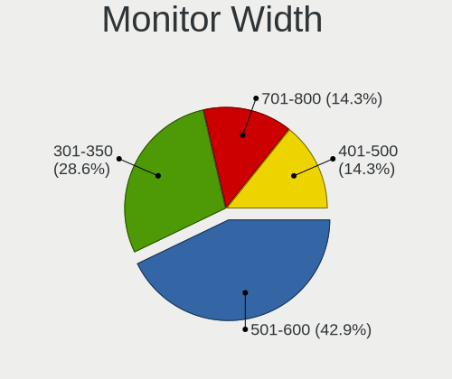

| Width in mm | Desktops | Percent |
|-------------|----------|---------|
| 501-600     | 3        | 42.86%  |
| 301-350     | 2        | 28.57%  |
| 701-800     | 1        | 14.29%  |
| 401-500     | 1        | 14.29%  |

Aspect Ratio
------------

Proportional relationship between the width and the height

| Ratio | Desktops | Percent |
|-------|----------|---------|
| 16/9  | 5        | 71.43%  |
| 5/4   | 1        | 14.29%  |
| 21/9  | 1        | 14.29%  |

Monitor Area
------------

Area in inch²

| Area in inch² | Desktops | Percent |
|----------------|----------|---------|
| 201-250        | 3        | 42.86%  |
| 81-90          | 1        | 14.29%  |
| 351-500        | 1        | 14.29%  |
| 251-300        | 1        | 14.29%  |
| 141-150        | 1        | 14.29%  |

Pixel Density
-------------

Pixels per inch

| Density | Desktops | Percent |
|---------|----------|---------|
| 51-100  | 5        | 71.43%  |
| 121-160 | 1        | 14.29%  |
| 101-120 | 1        | 14.29%  |

Multiple Monitors
-----------------

Total monitors connected

| Total | Desktops | Percent |
|-------|----------|---------|
| 1     | 7        | 87.5%   |
| 0     | 1        | 12.5%   |

Network
-------

Net Controller Vendor
---------------------

Controller vendors

| Vendor                | Desktops | Percent |
|-----------------------|----------|---------|
| Realtek Semiconductor | 5        | 50%     |
| Intel                 | 3        | 30%     |
| Edimax Technology     | 1        | 10%     |
| Broadcom              | 1        | 10%     |

Net Controller Model
--------------------

Controller models

| Model                                                             | Desktops | Percent |
|-------------------------------------------------------------------|----------|---------|
| Realtek RTL8111/8168/8411 PCI Express Gigabit Ethernet Controller | 3        | 30%     |
| Realtek RTL8125 2.5GbE Controller                                 | 1        | 10%     |
| Realtek RTL-8100/8101L/8139 PCI Fast Ethernet Adapter             | 1        | 10%     |
| Intel Wi-Fi 6 AX201                                               | 1        | 10%     |
| Intel I210 Gigabit Network Connection                             | 1        | 10%     |
| Intel Ethernet Connection (2) I219-V                              | 1        | 10%     |
| Edimax AC600 Wireless LAN USB Adapter                             | 1        | 10%     |
| Broadcom NetXtreme BCM5755 Gigabit Ethernet PCI Express           | 1        | 10%     |

Wireless Vendor
---------------

Wireless vendors

| Vendor            | Desktops | Percent |
|-------------------|----------|---------|
| Intel             | 1        | 50%     |
| Edimax Technology | 1        | 50%     |

Wireless Model
--------------

Wireless models

| Model                                 | Desktops | Percent |
|---------------------------------------|----------|---------|
| Intel Wi-Fi 6 AX201                   | 1        | 50%     |
| Edimax AC600 Wireless LAN USB Adapter | 1        | 50%     |

Ethernet Vendor
---------------

Ethernet vendors

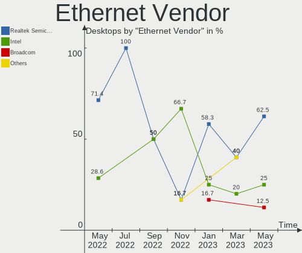

| Vendor                | Desktops | Percent |
|-----------------------|----------|---------|
| Realtek Semiconductor | 5        | 62.5%   |
| Intel                 | 2        | 25%     |
| Broadcom              | 1        | 12.5%   |

Ethernet Model
--------------

Ethernet models

| Model                                                             | Desktops | Percent |
|-------------------------------------------------------------------|----------|---------|
| Realtek RTL8111/8168/8411 PCI Express Gigabit Ethernet Controller | 3        | 37.5%   |
| Realtek RTL8125 2.5GbE Controller                                 | 1        | 12.5%   |
| Realtek RTL-8100/8101L/8139 PCI Fast Ethernet Adapter             | 1        | 12.5%   |
| Intel I210 Gigabit Network Connection                             | 1        | 12.5%   |
| Intel Ethernet Connection (2) I219-V                              | 1        | 12.5%   |
| Broadcom NetXtreme BCM5755 Gigabit Ethernet PCI Express           | 1        | 12.5%   |

Net Controller Kind
-------------------

Ethernet, WiFi or modem

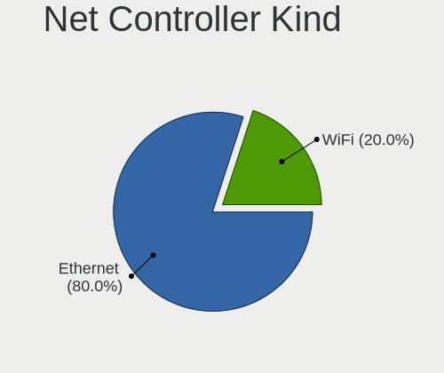

| Kind     | Desktops | Percent |
|----------|----------|---------|
| Ethernet | 8        | 80%     |
| WiFi     | 2        | 20%     |

Used Controller
---------------

Currently used network controller

| Kind     | Desktops | Percent |
|----------|----------|---------|
| Ethernet | 7        | 87.5%   |
| WiFi     | 1        | 12.5%   |

NICs
----

Total network controllers on board

| Total | Desktops | Percent |
|-------|----------|---------|
| 1     | 6        | 75%     |
| 3     | 1        | 12.5%   |
| 2     | 1        | 12.5%   |

IPv6
----

IPv6 vs IPv4

| Used | Desktops | Percent |
|------|----------|---------|
| No   | 8        | 100%    |

Bluetooth
---------

Bluetooth Vendor
----------------

Controller vendors

| Vendor                  | Desktops | Percent |
|-------------------------|----------|---------|
| Intel                   | 1        | 50%     |
| Cambridge Silicon Radio | 1        | 50%     |

Bluetooth Model
---------------

Controller models

| Model                                               | Desktops | Percent |
|-----------------------------------------------------|----------|---------|
| Intel Bluetooth 9460/9560 Jefferson Peak (JfP)      | 1        | 50%     |
| Cambridge Silicon Radio Bluetooth Dongle (HCI mode) | 1        | 50%     |

Sound
-----

Sound Vendor
------------

Sound card vendors

| Vendor | Desktops | Percent |
|--------|----------|---------|
| Intel  | 4        | 44.44%  |
| Nvidia | 3        | 33.33%  |
| AMD    | 2        | 22.22%  |

Sound Model
-----------

Sound card models

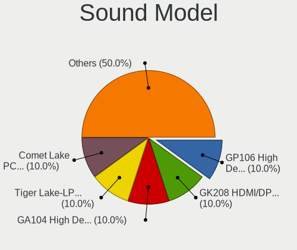

| Model                                                       | Desktops | Percent |
|-------------------------------------------------------------|----------|---------|
| Nvidia GP106 High Definition Audio Controller               | 1        | 10%     |
| Nvidia GK208 HDMI/DP Audio Controller                       | 1        | 10%     |
| Nvidia GA104 High Definition Audio Controller               | 1        | 10%     |
| Intel Tiger Lake-LP Smart Sound Technology Audio Controller | 1        | 10%     |
| Intel Comet Lake PCH-V cAVS                                 | 1        | 10%     |
| Intel 82801H (ICH8 Family) HD Audio Controller              | 1        | 10%     |
| Intel 200 Series PCH HD Audio                               | 1        | 10%     |
| AMD SBx00 Azalia (Intel HDA)                                | 1        | 10%     |
| AMD Rembrandt Radeon High Definition Audio Controller       | 1        | 10%     |
| AMD Family 17h/19h HD Audio Controller                      | 1        | 10%     |

Memory
------

Memory Vendor
-------------

Memory module vendors

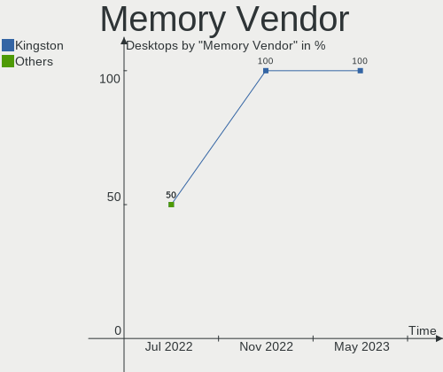

| Vendor   | Desktops | Percent |
|----------|----------|---------|
| Kingston | 2        | 100%    |

Memory Model
------------

Memory module models

| Model                                                | Desktops | Percent |
|------------------------------------------------------|----------|---------|
| Kingston RAM KHX2400C15/8G 8GB DIMM DDR4 2400MT/s    | 1        | 50%     |
| Kingston RAM 9905316-005.A04LF 1GB DIMM DDR2 667MT/s | 1        | 50%     |

Memory Kind
-----------

Memory module kinds

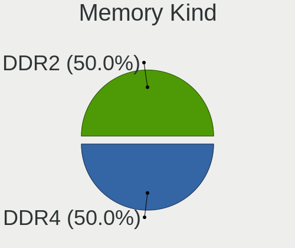

| Kind | Desktops | Percent |
|------|----------|---------|
| DDR4 | 1        | 50%     |
| DDR2 | 1        | 50%     |

Memory Form Factor
------------------

Physical design of the memory module

| Name | Desktops | Percent |
|------|----------|---------|
| DIMM | 2        | 100%    |

Memory Size
-----------

Memory module size

| Size | Desktops | Percent |
|------|----------|---------|
| 8192 | 1        | 50%     |
| 1024 | 1        | 50%     |

Memory Speed
------------

Memory module speed

| Speed | Desktops | Percent |
|-------|----------|---------|
| 2400  | 1        | 50%     |
| 667   | 1        | 50%     |

Printers & scanners
-------------------

Printer Vendor
--------------

Printer device vendors

Zero info for selected period =(

Printer Model
-------------

Printer device models

Zero info for selected period =(

Scanner Vendor
--------------

Scanner device vendors

Zero info for selected period =(

Scanner Model
-------------

Scanner device models

Zero info for selected period =(

Camera
------

Camera Vendor
-------------

Camera device vendors

| Vendor              | Desktops | Percent |
|---------------------|----------|---------|
| Chicony Electronics | 1        | 100%    |

Camera Model
------------

Camera device models

| Model                     | Desktops | Percent |
|---------------------------|----------|---------|
| Chicony Integrated Camera | 1        | 100%    |

Security
--------

Fingerprint Vendor
------------------

Fingerprint sensor vendors

Zero info for selected period =(

Fingerprint Model
-----------------

Fingerprint sensor models

Zero info for selected period =(

Chipcard Vendor
---------------

Chipcard module vendors

Zero info for selected period =(

Chipcard Model
--------------

Chipcard module models

Zero info for selected period =(

Unsupported
-----------

Unsupported Devices
-------------------

Total unsupported devices on board

| Total | Desktops | Percent |
|-------|----------|---------|
| 0     | 4        | 50%     |
| 2     | 2        | 25%     |
| 1     | 2        | 25%     |

Unsupported Device Types
------------------------

Types of unsupported devices

| Type                     | Desktops | Percent |
|--------------------------|----------|---------|
| Communication controller | 3        | 60%     |
| Graphics card            | 2        | 40%     |

