OpenBSD Hardware Trends (Desktop)
---------------------------------

A project to identify most popular hardware characteristics and track their change
over time based on data collected by OpenBSD users at https://BSD-Hardware.info.

Anyone can contribute to the study by uploading probes of their computers by
the [hw-probe](https://github.com/linuxhw/hw-probe/blob/master/INSTALL.BSD.md) tool:

    hw-probe -all -upload

Full-feature report is available here: https://bsd-hardware.info/?view=trends&formfactor=desktop

Period: Oct, 2020.

Contents
--------

- [ OS                       ](#os)
- [ OS Family                ](#os-family)
- [ Arch                     ](#arch)
- [ DE                       ](#de)
- [ Display Server           ](#display-server)
- [ Display Manager          ](#display-manager)
- [ OS Lang                  ](#os-lang)
- [ Boot Mode                ](#boot-mode)
- [ Filesystem               ](#filesystem)
- [ Part. scheme             ](#part-scheme)
- [ Country                  ](#country)
- [ City                     ](#city)
- [ Vendor                   ](#vendor)
- [ Model                    ](#model)
- [ Model Family             ](#model-family)
- [ MFG Year                 ](#mfg-year)
- [ Form Factor              ](#form-factor)
- [ Coreboot                 ](#coreboot)
- [ RAM Size                 ](#ram-size)
- [ RAM Used                 ](#ram-used)
- [ Has CD-ROM               ](#has-cd-rom)
- [ Total Drives             ](#total-drives)
- [ Has Ethernet             ](#has-ethernet)
- [ Drive Vendor             ](#drive-vendor)
- [ HDD Vendor               ](#hdd-vendor)
- [ SSD Vendor               ](#ssd-vendor)
- [ Drive Model              ](#drive-model)
- [ Drive Kind               ](#drive-kind)
- [ Drive Connector          ](#drive-connector)
- [ Drive Size               ](#drive-size)
- [ Space Total              ](#space-total)
- [ Space Used               ](#space-used)
- [ Malfunc. Drives          ](#malfunc-drives)
- [ Malfunc. Drive Vendor    ](#malfunc-drive-vendor)
- [ Malfunc. HDD Vendor      ](#malfunc-hdd-vendor)
- [ Malfunc. Drive Kind      ](#malfunc-drive-kind)
- [ Failed Drives            ](#failed-drives)
- [ Failed Drive Vendor      ](#failed-drive-vendor)
- [ Drive Status             ](#drive-status)
- [ Storage Vendor           ](#storage-vendor)
- [ Storage Model            ](#storage-model)
- [ Storage Kind             ](#storage-kind)
- [ CPU Vendor               ](#cpu-vendor)
- [ CPU Model                ](#cpu-model)
- [ CPU Model Family         ](#cpu-model-family)
- [ CPU Cores                ](#cpu-cores)
- [ CPU Sockets              ](#cpu-sockets)
- [ CPU Threads              ](#cpu-threads)
- [ CPU Microarch            ](#cpu-microarch)
- [ GPU Vendor               ](#gpu-vendor)
- [ GPU Model                ](#gpu-model)
- [ GPU Combo                ](#gpu-combo)
- [ GPU Driver               ](#gpu-driver)
- [ GPU Memory               ](#gpu-memory)
- [ Monitor Vendor           ](#monitor-vendor)
- [ Monitor Model            ](#monitor-model)
- [ Monitor Resolution       ](#monitor-resolution)
- [ Monitor Diagonal         ](#monitor-diagonal)
- [ Monitor Width            ](#monitor-width)
- [ Aspect Ratio             ](#aspect-ratio)
- [ Monitor Area             ](#monitor-area)
- [ Pixel Density            ](#pixel-density)
- [ Multiple Monitors        ](#multiple-monitors)
- [ Net Controller Vendor    ](#net-controller-vendor)
- [ Net Controller Model     ](#net-controller-model)
- [ Wireless Vendor          ](#wireless-vendor)
- [ Wireless Model           ](#wireless-model)
- [ Ethernet Vendor          ](#ethernet-vendor)
- [ Ethernet Model           ](#ethernet-model)
- [ Net Controller Kind      ](#net-controller-kind)
- [ Used Controller          ](#used-controller)
- [ NICs                     ](#nics)
- [ Memory Vendor            ](#memory-vendor)
- [ Memory Model             ](#memory-model)
- [ Memory Kind              ](#memory-kind)
- [ Memory Form Factor       ](#memory-form-factor)
- [ Memory Size              ](#memory-size)
- [ Memory Speed             ](#memory-speed)
- [ Sound Vendor             ](#sound-vendor)
- [ Sound Model              ](#sound-model)
- [ Camera Vendor            ](#camera-vendor)
- [ Camera Model             ](#camera-model)
- [ Fingerprint Vendor       ](#fingerprint-vendor)
- [ Fingerprint Model        ](#fingerprint-model)
- [ Chipcard Vendor          ](#chipcard-vendor)
- [ Chipcard Model           ](#chipcard-model)
- [ Printer Vendor           ](#printer-vendor)
- [ Printer Model            ](#printer-model)
- [ Scanner Vendor           ](#scanner-vendor)
- [ Scanner Model            ](#scanner-model)
- [ Bluetooth Vendor         ](#bluetooth-vendor)
- [ Bluetooth Model          ](#bluetooth-model)
- [ Unsupported Devices      ](#unsupported-devices)
- [ Unsupported Device Types ](#unsupported-device-types)

OS
--

Installed operating systems

| Name        | Desktops | Percent |
|-------------|----------|---------|
| OpenBSD 6.8 | 103      | 100%    |

OS Family
---------

OS without a version

| Name    | Desktops | Percent |
|---------|----------|---------|
| OpenBSD | 103      | 100%    |

Arch
----

OS architecture (x86_64, i586, etc.)

| Name   | Desktops | Percent |
|--------|----------|---------|
| amd64  | 96       | 93.2%   |
| i386   | 6        | 5.83%   |
| macppc | 1        | 0.97%   |

DE
--

Desktop Environment

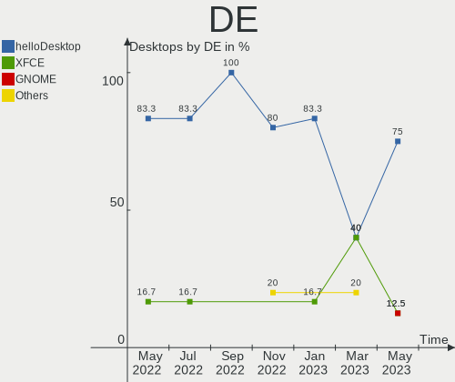

| Name    | Desktops | Percent |
|---------|----------|---------|
| fvwm    | 61       | 59.22%  |
| Console | 41       | 39.81%  |
| XFCE    | 1        | 0.97%   |

Display Server
--------------

X11 or Wayland

| Name    | Desktops | Percent |
|---------|----------|---------|
| Console | 52       | 50.49%  |
| X11     | 51       | 49.51%  |

Display Manager
---------------

SDDM, LightDM, etc.

| Name    | Desktops | Percent |
|---------|----------|---------|
| Console | 96       | 93.2%   |
| GDM     | 4        | 3.88%   |
| SLiM    | 3        | 2.91%   |

OS Lang
-------

Language

| Lang    | Desktops | Percent |
|---------|----------|---------|
| Unknown | 87       | 84.47%  |
| en_US   | 6        | 5.83%   |
| ru_RU   | 5        | 4.85%   |
| en_GB   | 2        | 1.94%   |
| pl_PL   | 1        | 0.97%   |
| ja_JP   | 1        | 0.97%   |
| en_AU   | 1        | 0.97%   |

Boot Mode
---------

EFI or BIOS

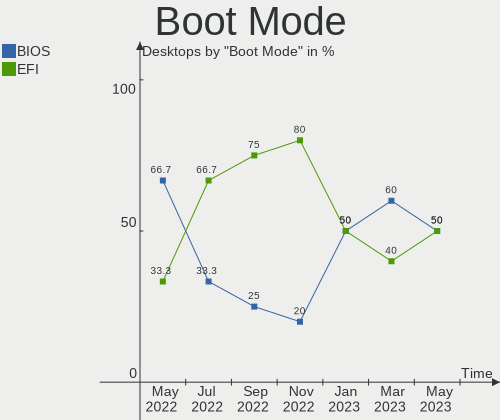

| Mode | Desktops | Percent |
|------|----------|---------|
| BIOS | 70       | 67.96%  |
| EFI  | 33       | 32.04%  |

Filesystem
----------

Type of filesystem

| Type | Desktops | Percent |
|------|----------|---------|
| Ufs  | 103      | 100%    |

Part. scheme
------------

Scheme of partitioning

| Type | Desktops | Percent |
|------|----------|---------|
| MBR  | 74       | 71.84%  |
| GPT  | 29       | 28.16%  |

Country
-------

Geographic location (country)

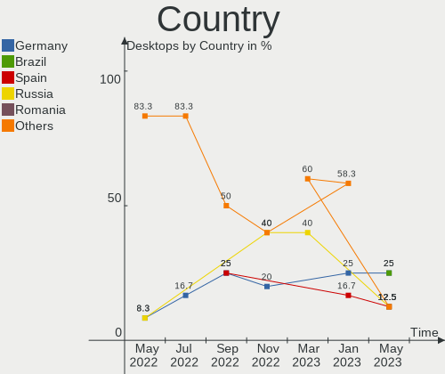

| Country              | Desktops | Percent |
|----------------------|----------|---------|
| Germany              | 17       | 16.5%   |
| USA                  | 13       | 12.62%  |
| Russia               | 13       | 12.62%  |
| France               | 10       | 9.71%   |
| Netherlands          | 7        | 6.8%    |
| Canada               | 6        | 5.83%   |
| UK                   | 4        | 3.88%   |
| Spain                | 4        | 3.88%   |
| Austria              | 4        | 3.88%   |
| Norway               | 3        | 2.91%   |
| Italy                | 3        | 2.91%   |
| Switzerland          | 2        | 1.94%   |
| Poland               | 2        | 1.94%   |
| Finland              | 2        | 1.94%   |
| Denmark              | 2        | 1.94%   |
| UAE                  | 1        | 0.97%   |
| Slovenia             | 1        | 0.97%   |
| New Zealand          | 1        | 0.97%   |
| Moldova, Republic of | 1        | 0.97%   |
| Latvia               | 1        | 0.97%   |
| Japan                | 1        | 0.97%   |
| Estonia              | 1        | 0.97%   |
| Croatia              | 1        | 0.97%   |
| Bulgaria             | 1        | 0.97%   |
| Brazil               | 1        | 0.97%   |
| Australia            | 1        | 0.97%   |

City
----

Geographic location (city)

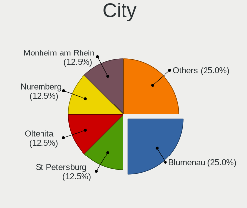

| City                  | Desktops | Percent |
|-----------------------|----------|---------|
| Moscow                | 7        | 6.8%    |
| Utrecht               | 5        | 4.85%   |
| Montreal              | 4        | 3.88%   |
| Vladivostok           | 3        | 2.91%   |
| Vienna                | 3        | 2.91%   |
| Ibiza Town            | 3        | 2.91%   |
| Berlin                | 3        | 2.91%   |
| Skien                 | 2        | 1.94%   |
| Saint-Herblain        | 2        | 1.94%   |
| Paris                 | 2        | 1.94%   |
| Odense                | 2        | 1.94%   |
| Leipzig               | 2        | 1.94%   |
| Grenoble              | 2        | 1.94%   |
| Zurich                | 1        | 0.97%   |
| Zhukovskiy            | 1        | 0.97%   |
| Zerkow                | 1        | 0.97%   |
| Zagreb                | 1        | 0.97%   |
| Wolmirstedt           | 1        | 0.97%   |
| Wetzlar               | 1        | 0.97%   |
| Waukesha              | 1        | 0.97%   |
| Wackersberg           | 1        | 0.97%   |
| Vantaa                | 1        | 0.97%   |
| Tustin                | 1        | 0.97%   |
| Turin                 | 1        | 0.97%   |
| Taufkirchen           | 1        | 0.97%   |
| Tallinn               | 1        | 0.97%   |
| Sydney                | 1        | 0.97%   |
| Stezzano              | 1        | 0.97%   |
| St Petersburg         | 1        | 0.97%   |
| Sofia                 | 1        | 0.97%   |
| Sencur                | 1        | 0.97%   |
| Seattle               | 1        | 0.97%   |
| Saint Michael         | 1        | 0.97%   |
| Roubaix               | 1        | 0.97%   |
| Riga                  | 1        | 0.97%   |
| Porto Alegre          | 1        | 0.97%   |
| Phoenix               | 1        | 0.97%   |
| Peterborough          | 1        | 0.97%   |
| Oxenhope              | 1        | 0.97%   |
| Oviedo                | 1        | 0.97%   |
| Oslo                  | 1        | 0.97%   |
| Osaka                 | 1        | 0.97%   |
| Nérac                | 1        | 0.97%   |
| Nuremberg             | 1        | 0.97%   |
| Notaresco             | 1        | 0.97%   |
| New Brighton          | 1        | 0.97%   |
| Milwaukee             | 1        | 0.97%   |
| Ludwigshafen am Rhein | 1        | 0.97%   |
| Liverpool             | 1        | 0.97%   |
| Lebanon               | 1        | 0.97%   |
| Lausanne              | 1        | 0.97%   |
| Krakow                | 1        | 0.97%   |
| Kouvola               | 1        | 0.97%   |
| Katy                  | 1        | 0.97%   |
| Karlsruhe             | 1        | 0.97%   |
| Ithaca                | 1        | 0.97%   |
| Homps                 | 1        | 0.97%   |
| Groebzig              | 1        | 0.97%   |
| Gornyak               | 1        | 0.97%   |
| Frankfurt am Main     | 1        | 0.97%   |

Vendor
------

Motherboard manufacturer

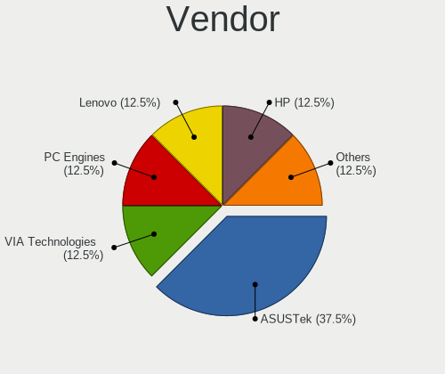

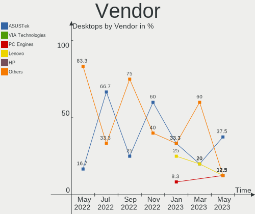

| Name                | Desktops | Percent |
|---------------------|----------|---------|
| Lenovo              | 23       | 22.33%  |
| PC Engines          | 18       | 17.48%  |
| Dell                | 12       | 11.65%  |
| ASUSTek Computer    | 11       | 10.68%  |
| ASRock              | 5        | 4.85%   |
| Unknown             | 5        | 4.85%   |
| Intel               | 4        | 3.88%   |
| IBM                 | 3        | 2.91%   |
| Gigabyte Technology | 3        | 2.91%   |
| Supermicro          | 2        | 1.94%   |
| Panasonic           | 2        | 1.94%   |
| MSI                 | 2        | 1.94%   |
| Hewlett-Packard     | 2        | 1.94%   |
| Acer                | 2        | 1.94%   |
| ZOTAC               | 1        | 0.97%   |
| Shuttle             | 1        | 0.97%   |
| NA                  | 1        | 0.97%   |
| Foxconn             | 1        | 0.97%   |
| eMachines           | 1        | 0.97%   |
| ECS                 | 1        | 0.97%   |
| Bluechip Computer   | 1        | 0.97%   |
| AZW                 | 1        | 0.97%   |
| Apple               | 1        | 0.97%   |

Model
-----

Motherboard model

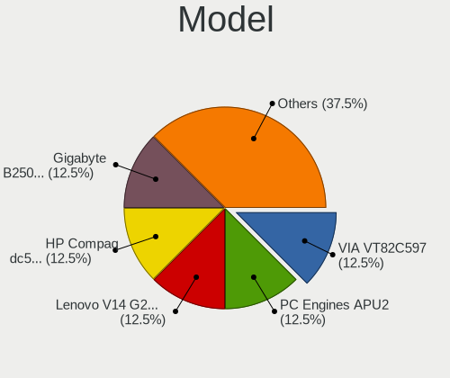

| Name                                             | Desktops | Percent |
|--------------------------------------------------|----------|---------|
| PC Engines apu2                                  | 11       | 10.68%  |
| Unknown                                          | 6        | 5.83%   |
| Dell PowerEdge R620                              | 4        | 3.88%   |
| PC Engines apu4                                  | 3        | 2.91%   |
| PC Engines apu1                                  | 3        | 2.91%   |
| Lenovo ThinkPad X1 Carbon 3rd 20BSCTO1WW         | 2        | 1.94%   |
| ZOTAC XXXXXX                                     | 1        | 0.97%   |
| Supermicro X8STi                                 | 1        | 0.97%   |
| Supermicro X11SSW-F                              | 1        | 0.97%   |
| Shuttle DS77U                                    | 1        | 0.97%   |
| PC Engines APU                                   | 1        | 0.97%   |
| Panasonic CF-C1BT02EGE                           | 1        | 0.97%   |
| Panasonic CF-52PFPBSFQ                           | 1        | 0.97%   |
| MSI MS-7816                                      | 1        | 0.97%   |
| MSI MS-7345                                      | 1        | 0.97%   |
| Lenovo ThinkPad X270 20HNA004CD                  | 1        | 0.97%   |
| Lenovo ThinkPad X250 20CLS4WV08                  | 1        | 0.97%   |
| Lenovo ThinkPad X240 20AMS2QD0C                  | 1        | 0.97%   |
| Lenovo ThinkPad X240 20AL00DKRT                  | 1        | 0.97%   |
| Lenovo ThinkPad X230 2325Y36                     | 1        | 0.97%   |
| Lenovo ThinkPad X230 2325R74                     | 1        | 0.97%   |
| Lenovo ThinkPad X230 2325AJ9                     | 1        | 0.97%   |
| Lenovo ThinkPad X1 Carbon 5th 20HRCTO1WW         | 1        | 0.97%   |
| Lenovo ThinkPad X1 Carbon 2nd 20A7002CUK         | 1        | 0.97%   |
| Lenovo ThinkPad W540 20BG001KUK                  | 1        | 0.97%   |
| Lenovo ThinkPad T560 20FJS0CE00                  | 1        | 0.97%   |
| Lenovo ThinkPad T500 2087A16                     | 1        | 0.97%   |
| Lenovo ThinkPad T480 20L6S4GR02                  | 1        | 0.97%   |
| Lenovo ThinkPad T460 20FMS1BC01                  | 1        | 0.97%   |
| Lenovo ThinkPad T450 20BV0005US                  | 1        | 0.97%   |
| Lenovo ThinkPad T430 2347GZU                     | 1        | 0.97%   |
| Lenovo ThinkPad T410 2537N24                     | 1        | 0.97%   |
| Lenovo ThinkPad Edge E531 68852HG                | 1        | 0.97%   |
| Lenovo ThinkPad E485 20KUCTO1WW                  | 1        | 0.97%   |
| Lenovo ThinkCentre M93p 10AAS1MD00               | 1        | 0.97%   |
| Lenovo IdeaPad 1 14IGL05 81VU                    | 1        | 0.97%   |
| Intel S3000AH                                    | 1        | 0.97%   |
| Intel D945GCLF2                                  | 1        | 0.97%   |
| Intel D2500HN                                    | 1        | 0.97%   |
| Intel CRESCENTBAY                                | 1        | 0.97%   |
| IBM ThinkPad X41 2525F8G                         | 1        | 0.97%   |
| IBM 81832BG                                      | 1        | 0.97%   |
| IBM 8173KUB                                      | 1        | 0.97%   |
| HP ProLiant MicroServer                          | 1        | 0.97%   |
| HP 120-1136                                      | 1        | 0.97%   |
| Gigabyte X58A-UD5                                | 1        | 0.97%   |
| Gigabyte X570 AORUS ELITE                        | 1        | 0.97%   |
| Gigabyte GA-MA770T-UD3P                          | 1        | 0.97%   |
| Foxconn AT-7000 Series                           | 1        | 0.97%   |
| eMachines EL1200                                 | 1        | 0.97%   |
| ECS BSWI-D2                                      | 1        | 0.97%   |
| Dell Precision WorkStation T7500                 | 1        | 0.97%   |
| Dell Precision 3510                              | 1        | 0.97%   |
| Dell PowerEdge T320                              | 1        | 0.97%   |
| Dell PowerEdge R610                              | 1        | 0.97%   |
| Dell PowerEdge R230                              | 1        | 0.97%   |
| Dell PowerEdge 1950                              | 1        | 0.97%   |
| Dell OptiPlex 7020                               | 1        | 0.97%   |
| Dell OptiPlex 3060                               | 1        | 0.97%   |
| Bluechip Computer bluechip BUSINESSline Workstat | 1        | 0.97%   |

Model Family
------------

Motherboard model prefix

| Name                       | Desktops | Percent |
|----------------------------|----------|---------|
| Lenovo ThinkPad            | 21       | 20.39%  |
| PC Engines apu2            | 11       | 10.68%  |
| Dell PowerEdge             | 8        | 7.77%   |
| Unknown                    | 6        | 5.83%   |
| PC Engines apu4            | 3        | 2.91%   |
| PC Engines apu1            | 3        | 2.91%   |
| Dell Precision             | 2        | 1.94%   |
| Dell OptiPlex              | 2        | 1.94%   |
| ASUS VivoBook              | 2        | 1.94%   |
| ASUS PRIME                 | 2        | 1.94%   |
| ZOTAC XXXXXX               | 1        | 0.97%   |
| Supermicro X8STi           | 1        | 0.97%   |
| Supermicro X11SSW-F        | 1        | 0.97%   |
| Shuttle DS77U              | 1        | 0.97%   |
| PC Engines APU             | 1        | 0.97%   |
| Panasonic CF-C1BT02EGE     | 1        | 0.97%   |
| Panasonic CF-52PFPBSFQ     | 1        | 0.97%   |
| MSI MS-7816                | 1        | 0.97%   |
| MSI MS-7345                | 1        | 0.97%   |
| Lenovo ThinkCentre         | 1        | 0.97%   |
| Lenovo IdeaPad             | 1        | 0.97%   |
| Intel S3000AH              | 1        | 0.97%   |
| Intel D945GCLF2            | 1        | 0.97%   |
| Intel D2500HN              | 1        | 0.97%   |
| Intel CRESCENTBAY          | 1        | 0.97%   |
| IBM ThinkPad               | 1        | 0.97%   |
| IBM 81832BG                | 1        | 0.97%   |
| IBM 8173KUB                | 1        | 0.97%   |
| HP ProLiant                | 1        | 0.97%   |
| HP 120-1136                | 1        | 0.97%   |
| Gigabyte X58A-UD5          | 1        | 0.97%   |
| Gigabyte X570              | 1        | 0.97%   |
| Gigabyte GA-MA770T-UD3P    | 1        | 0.97%   |
| Foxconn AT-7000            | 1        | 0.97%   |
| eMachines EL1200           | 1        | 0.97%   |
| ECS BSWI-D2                | 1        | 0.97%   |
| Bluechip Computer bluechip | 1        | 0.97%   |
| AZW Z83                    | 1        | 0.97%   |
| ASUS Z170-K                | 1        | 0.97%   |
| ASUS X102BA                | 1        | 0.97%   |
| ASUS P10S-I                | 1        | 0.97%   |
| ASUS K53SV                 | 1        | 0.97%   |
| ASUS G551JW                | 1        | 0.97%   |
| ASUS B75M-A                | 1        | 0.97%   |
| ASUS 1000HE                | 1        | 0.97%   |
| ASRock N68C-S              | 1        | 0.97%   |
| ASRock N3160               | 1        | 0.97%   |
| ASRock IMB-191             | 1        | 0.97%   |
| ASRock DN2800MT            | 1        | 0.97%   |
| ASRock A75M-ITX            | 1        | 0.97%   |
| Apple PowerBook6           | 1        | 0.97%   |
| Acer Veriton               | 1        | 0.97%   |
| Acer Aspire                | 1        | 0.97%   |

MFG Year
--------

Motherboard manufacture year

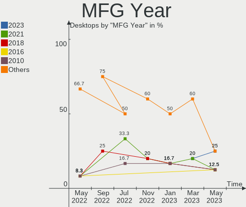

| Year    | Desktops | Percent |
|---------|----------|---------|
| 2019    | 20       | 19.42%  |
| 2020    | 16       | 15.53%  |
| 2013    | 10       | 9.71%   |
| Unknown | 7        | 6.8%    |
| 2018    | 6        | 5.83%   |
| 2017    | 6        | 5.83%   |
| 2016    | 6        | 5.83%   |
| 2011    | 6        | 5.83%   |
| 2015    | 5        | 4.85%   |
| 2012    | 5        | 4.85%   |
| 2010    | 4        | 3.88%   |
| 2008    | 4        | 3.88%   |
| 2014    | 3        | 2.91%   |
| 2006    | 2        | 1.94%   |
| 2009    | 1        | 0.97%   |
| 2007    | 1        | 0.97%   |
| 2005    | 1        | 0.97%   |

Form Factor
-----------

Physical design of the computer

| Name    | Desktops | Percent |
|---------|----------|---------|
| Desktop | 103      | 100%    |

Coreboot
--------

Have coreboot on board

| Used | Desktops | Percent |
|------|----------|---------|
| No   | 85       | 82.52%  |
| Yes  | 18       | 17.48%  |

RAM Size
--------

Total RAM memory

| Size in GB      | Desktops | Percent |
|-----------------|----------|---------|
| 4.01-8.0        | 27       | 26.21%  |
| 8.01-16.0       | 23       | 22.33%  |
| 16.01-24.0      | 12       | 11.65%  |
| 3.01-4.0        | 8        | 7.77%   |
| 32.01-64.0      | 6        | 5.83%   |
| 2.01-3.0        | 6        | 5.83%   |
| 1.01-2.0        | 6        | 5.83%   |
| 64.01-256.0     | 5        | 4.85%   |
| 24.01-32.0      | 4        | 3.88%   |
| 0.01-1.0        | 4        | 3.88%   |
| More than 256.0 | 1        | 0.97%   |
| Unknown         | 1        | 0.97%   |

RAM Used
--------

Used RAM memory

| Used GB   | Desktops | Percent |
|-----------|----------|---------|
| 0.01-1.0  | 90       | 87.38%  |
| 0         | 5        | 4.85%   |
| 4.01-8.0  | 3        | 2.91%   |
| 1.01-2.0  | 3        | 2.91%   |
| 8.01-16.0 | 1        | 0.97%   |
| Unknown   | 1        | 0.97%   |

Has CD-ROM
----------

Has CD-ROM on board

| Presented | Desktops | Percent |
|-----------|----------|---------|
| No        | 103      | 100%    |

Total Drives
------------

Number of drives on board

| Drives | Desktops | Percent |
|--------|----------|---------|
| 1      | 61       | 59.22%  |
| 2      | 25       | 24.27%  |
| 3      | 9        | 8.74%   |
| 4      | 5        | 4.85%   |
| 10     | 1        | 0.97%   |
| 7      | 1        | 0.97%   |
| 5      | 1        | 0.97%   |

Has Ethernet
------------

Has Ethernet on board

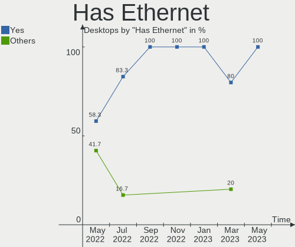

| Presented | Desktops | Percent |
|-----------|----------|---------|
| Yes       | 98       | 95.15%  |
| No        | 5        | 4.85%   |

Drive Vendor
------------

Hard drive vendors

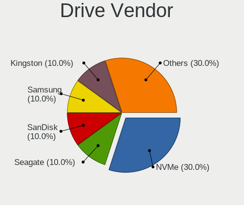

| Vendor              | Desktops | Drives | Percent |
|---------------------|----------|--------|---------|
| WDC                 | 19       | 26     | 14.29%  |
| Kingston            | 15       | 15     | 11.28%  |
| Seagate             | 14       | 20     | 10.53%  |
| Samsung Electronics | 13       | 16     | 9.77%   |
| NVMe                | 10       | 11     | 7.52%   |
| Phison              | 9        | 9      | 6.77%   |
| SanDisk             | 7        | 7      | 5.26%   |
| Dell                | 6        | 10     | 4.51%   |
| Transcend           | 5        | 5      | 3.76%   |
| HGST                | 5        | 5      | 3.76%   |
| Crucial             | 5        | 5      | 3.76%   |
| OPENBSD             | 4        | 4      | 3.01%   |
| Intel               | 4        | 4      | 3.01%   |
| Hitachi             | 3        | 3      | 2.26%   |
| PNY                 | 2        | 2      | 1.5%    |
| Generic             | 2        | 2      | 1.5%    |
| SK Hynix            | 1        | 1      | 0.75%   |
| SABRENT             | 1        | 1      | 0.75%   |
| QUMO                | 1        | 1      | 0.75%   |
| OCZ                 | 1        | 1      | 0.75%   |
| LSI                 | 1        | 1      | 0.75%   |
| LITEONIT            | 1        | 1      | 0.75%   |
| LITEON              | 1        | 1      | 0.75%   |
| IBM                 | 1        | 1      | 0.75%   |
| Hoodisk             | 1        | 1      | 0.75%   |
| A-DATA Technology   | 1        | 1      | 0.75%   |

HDD Vendor
----------

Hard disk drive vendors

| Vendor              | Desktops | Drives | Percent |
|---------------------|----------|--------|---------|
| WDC                 | 17       | 24     | 27.42%  |
| Seagate             | 14       | 20     | 22.58%  |
| NVMe                | 6        | 6      | 9.68%   |
| Dell                | 6        | 10     | 9.68%   |
| HGST                | 5        | 5      | 8.06%   |
| OPENBSD             | 4        | 4      | 6.45%   |
| Samsung Electronics | 3        | 4      | 4.84%   |
| Hitachi             | 3        | 3      | 4.84%   |
| Generic             | 2        | 2      | 3.23%   |
| SABRENT             | 1        | 1      | 1.61%   |
| IBM                 | 1        | 1      | 1.61%   |

SSD Vendor
----------

Solid state drive vendors

| Vendor              | Desktops | Drives | Percent |
|---------------------|----------|--------|---------|
| Kingston            | 15       | 15     | 20.83%  |
| Samsung Electronics | 10       | 12     | 13.89%  |
| Phison              | 9        | 9      | 12.5%   |
| SanDisk             | 7        | 7      | 9.72%   |
| Transcend           | 5        | 5      | 6.94%   |
| NVMe                | 5        | 5      | 6.94%   |
| Crucial             | 5        | 5      | 6.94%   |
| Intel               | 4        | 4      | 5.56%   |
| WDC                 | 2        | 2      | 2.78%   |
| PNY                 | 2        | 2      | 2.78%   |
| SK Hynix            | 1        | 1      | 1.39%   |
| QUMO                | 1        | 1      | 1.39%   |
| OCZ                 | 1        | 1      | 1.39%   |
| LSI                 | 1        | 1      | 1.39%   |
| LITEONIT            | 1        | 1      | 1.39%   |
| LITEON              | 1        | 1      | 1.39%   |
| Hoodisk             | 1        | 1      | 1.39%   |
| A-DATA Technology   | 1        | 1      | 1.39%   |

Drive Model
-----------

Hard drive models

| Model                       | Desktops | Percent |
|-----------------------------|----------|---------|
| SATA SSD 16GB               | 8        | 5.59%   |
| PERC H710 2.9TB             | 4        | 2.8%    |
| SR RAID 1 2TB               | 3        | 2.1%    |
| HUS724020ALA640 2TB         | 3        | 2.1%    |
| SUV500MS240G 240GB          | 2        | 1.4%    |
| SUV500MS120G 120GB          | 2        | 1.4%    |
| SUV500240G 240GB            | 2        | 1.4%    |
| ST1000LM024 HN-M101MBB 1TB  | 2        | 1.4%    |
| SMS200S360G 64GB            | 2        | 1.4%    |
| Samsung SSD 970 250GB       | 2        | 1.4%    |
| SA400S37240G 240GB          | 2        | 1.4%    |
| X400 M.2 2280 512GB         | 1        | 0.7%    |
| WDS500G2B0A-00SM50 500GB    | 1        | 0.7%    |
| WDS240G2G0A-00JH30 240GB    | 1        | 0.7%    |
| WDC PC SN520 SDA 512GB      | 1        | 0.7%    |
| WD7500BPKX-00HPJT0 752GB    | 1        | 0.7%    |
| WD7500BPKT-00PK4T0 752GB    | 1        | 0.7%    |
| WD5000LPLX-00ZNTT0 500GB    | 1        | 0.7%    |
| WD5000BPKX-00HPJT0 500GB    | 1        | 0.7%    |
| WD5000AAKX-603CA0 500GB     | 1        | 0.7%    |
| WD5000AAKS-00UU3A0 500GB    | 1        | 0.7%    |
| WD5000AAKS-00D2B0 500GB     | 1        | 0.7%    |
| WD30EZRZ-00Z5HB0 3TB        | 1        | 0.7%    |
| WD30EZRZ-00GXCB0 3TB        | 1        | 0.7%    |
| WD2500BEVT-22A23T0 250GB    | 1        | 0.7%    |
| WD20PURX-64P6ZY0 2TB        | 1        | 0.7%    |
| WD20EFAX-68FB5N0 2TB        | 1        | 0.7%    |
| WD2002FAEX-007BA0 2TB       | 1        | 0.7%    |
| WD2000FYYZ-01UL1B1 2TB      | 1        | 0.7%    |
| WD1600BEVE-00WZT0 160GB     | 1        | 0.7%    |
| WD15EADS-00P8B0 1.5TB       | 1        | 0.7%    |
| WD10SPZX-24Z10 1TB          | 1        | 0.7%    |
| WD10PURX-64D85Y0 1TB        | 1        | 0.7%    |
| WD10JPVX-08JC3T5 1TB        | 1        | 0.7%    |
| WD10JPLX-00MBPT0 1TB        | 1        | 0.7%    |
| WD10EADS-00M2B0 1TB         | 1        | 0.7%    |
| WD Elements 25A1 3TB        | 1        | 0.7%    |
| VERTEX3 64GB                | 1        | 0.7%    |
| UMIS RPJTJ128MEE 128GB      | 1        | 0.7%    |
| TS64GMSA370 64GB            | 1        | 0.7%    |
| TS512GMSA370 512GB          | 1        | 0.7%    |
| TS32GMSA370 32GB            | 1        | 0.7%    |
| TS256GMTS400 256GB          | 1        | 0.7%    |
| TS240GMTS420S 240GB         | 1        | 0.7%    |
| TOSHIBA-RC100 240GB         | 1        | 0.7%    |
| SV300S37A120G 120GB         | 1        | 0.7%    |
| SUV300S37A240G 240GB        | 1        | 0.7%    |
| ST9500325AS 500GB           | 1        | 0.7%    |
| ST500LM012 HN-M500MBB 500GB | 1        | 0.7%    |
| ST4000DM004-2CV104 4TB      | 1        | 0.7%    |
| ST3750640NS 752GB           | 1        | 0.7%    |
| ST3250318AS 250GB           | 1        | 0.7%    |
| ST3120211AS 120GB           | 1        | 0.7%    |
| ST3120022A 120GB            | 1        | 0.7%    |
| ST3000DM007-1WY10G 3TB      | 1        | 0.7%    |
| ST2000VN000-1HJ164 2TB      | 1        | 0.7%    |
| ST2000NE0025-2FL101 2TB     | 1        | 0.7%    |
| ST1000NM0055-1V410C 1TB     | 1        | 0.7%    |
| ST1000LM035-1RK172 1TB      | 1        | 0.7%    |
| ST1000DM010-2EP102 1TB      | 1        | 0.7%    |

Drive Kind
----------

HDD or SSD

| Kind | Desktops | Drives | Percent |
|------|----------|--------|---------|
| SSD  | 67       | 74     | 58.26%  |
| HDD  | 48       | 80     | 41.74%  |

Drive Connector
---------------

SATA, SAS, NVMe, etc.

| Type | Desktops | Drives | Percent |
|------|----------|--------|---------|
| SATA | 100      | 154    | 100%    |

Drive Size
----------

Size of hard drive

| Size in TB | Desktops | Drives | Percent |
|------------|----------|--------|---------|
| 0.01-0.5   | 74       | 86     | 61.67%  |
| 0.51-1.0   | 25       | 29     | 20.83%  |
| 1.01-2.0   | 13       | 25     | 10.83%  |
| 2.01-3.0   | 6        | 12     | 5%      |
| 3.01-4.0   | 2        | 2      | 1.67%   |

Space Total
-----------

Amount of disk space available on the file system

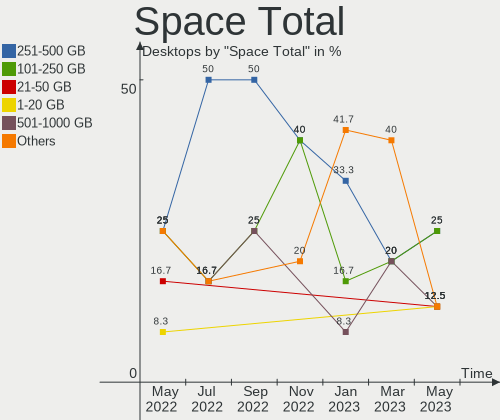

| Size in GB     | Desktops | Percent |
|----------------|----------|---------|
| 101-250        | 32       | 31.07%  |
| 251-500        | 19       | 18.45%  |
| 1-20           | 13       | 12.62%  |
| 21-50          | 11       | 10.68%  |
| 51-100         | 9        | 8.74%   |
| 1001-2000      | 7        | 6.8%    |
| More than 3000 | 5        | 4.85%   |
| 501-1000       | 4        | 3.88%   |
| 2001-3000      | 3        | 2.91%   |

Space Used
----------

Amount of used disk space

| Used GB        | Desktops | Percent |
|----------------|----------|---------|
| 1-20           | 60       | 58.25%  |
| 21-50          | 13       | 12.62%  |
| 101-250        | 11       | 10.68%  |
| 51-100         | 6        | 5.83%   |
| 251-500        | 5        | 4.85%   |
| 501-1000       | 4        | 3.88%   |
| 1001-2000      | 3        | 2.91%   |
| More than 3000 | 1        | 0.97%   |

Malfunc. Drives
---------------

Drive models with a malfunction

| Model                 | Desktops | Drives | Percent |
|-----------------------|----------|--------|---------|
| WD10SPZX-24Z10 1TB    | 1        | 1      | 7.69%   |
| SV300S37A120G 120GB   | 1        | 1      | 7.69%   |
| ST9500325AS 500GB     | 1        | 1      | 7.69%   |
| ST3750640NS 752GB     | 1        | 2      | 7.69%   |
| ST3120211AS 120GB     | 1        | 1      | 7.69%   |
| SSDSC2BB080G4 80GB    | 1        | 1      | 7.69%   |
| SMSM151S3128GD 128GB  | 1        | 1      | 7.69%   |
| SMS200S330G 32GB      | 1        | 1      | 7.69%   |
| SD7UB3Q256G1001 256GB | 1        | 1      | 7.69%   |
| HTS541010A7E630 1TB   | 1        | 1      | 7.69%   |
| HM500JI 500GB         | 1        | 1      | 7.69%   |
| HDP725016GLA380 160GB | 1        | 1      | 7.69%   |
| HD154UI 1.5TB         | 1        | 1      | 7.69%   |

Malfunc. Drive Vendor
---------------------

Vendors of faulty drives

| Vendor              | Desktops | Drives | Percent |
|---------------------|----------|--------|---------|
| Seagate             | 3        | 4      | 23.08%  |
| Kingston            | 3        | 3      | 23.08%  |
| Samsung Electronics | 2        | 2      | 15.38%  |
| WDC                 | 1        | 1      | 7.69%   |
| SanDisk             | 1        | 1      | 7.69%   |
| Intel               | 1        | 1      | 7.69%   |
| Hitachi             | 1        | 1      | 7.69%   |
| HGST                | 1        | 1      | 7.69%   |

Malfunc. HDD Vendor
-------------------

Vendors of faulty HDD drives

| Vendor              | Desktops | Drives | Percent |
|---------------------|----------|--------|---------|
| Seagate             | 3        | 4      | 37.5%   |
| Samsung Electronics | 2        | 2      | 25%     |
| WDC                 | 1        | 1      | 12.5%   |
| Hitachi             | 1        | 1      | 12.5%   |
| HGST                | 1        | 1      | 12.5%   |

Malfunc. Drive Kind
-------------------

Kinds of faulty drives

| Kind | Desktops | Drives | Percent |
|------|----------|--------|---------|
| HDD  | 8        | 9      | 61.54%  |
| SSD  | 5        | 5      | 38.46%  |

Failed Drives
-------------

Failed drive models

| Model       | Desktops | Drives | Percent |
|-------------|----------|--------|---------|
| HD204UI 2TB | 1        | 2      | 100%    |

Failed Drive Vendor
-------------------

Failed drive vendors

| Vendor              | Desktops | Drives | Percent |
|---------------------|----------|--------|---------|
| Samsung Electronics | 1        | 2      | 100%    |

Drive Status
------------

Number of failed and malfunc. drives

| Status   | Desktops | Drives | Percent |
|----------|----------|--------|---------|
| Works    | 76       | 98     | 66.09%  |
| Detected | 25       | 40     | 21.74%  |
| Malfunc  | 13       | 14     | 11.3%   |
| Failed   | 1        | 2      | 0.87%   |

Storage Vendor
--------------

Storage controller vendors

| Vendor                      | Desktops | Percent |
|-----------------------------|----------|---------|
| Intel                       | 64       | 57.14%  |
| AMD                         | 30       | 26.79%  |
| Broadcom / LSI              | 6        | 5.36%   |
| Samsung Electronics         | 4        | 3.57%   |
| Nvidia                      | 2        | 1.79%   |
| Union Memory (Shenzhen)     | 1        | 0.89%   |
| Toshiba                     | 1        | 0.89%   |
| Sandisk                     | 1        | 0.89%   |
| Lenovo                      | 1        | 0.89%   |
| Kingston Technology Company | 1        | 0.89%   |
| Dell                        | 1        | 0.89%   |

Storage Model
-------------

Storage controller models

| Model                                                                      | Desktops | Percent |
|----------------------------------------------------------------------------|----------|---------|
| FCH SATA Controller [AHCI mode]                                            | 11       | 8.66%   |
| FCH SATA Controller [IDE mode]                                             | 10       | 7.87%   |
| SB7x0/SB8x0/SB9x0 SATA Controller [AHCI mode]                              | 7        | 5.51%   |
| Q170/Q150/B150/H170/H110/Z170/CM236 Chipset SATA Controller [AHCI Mode]    | 6        | 4.72%   |
| 8 Series/C220 Series Chipset Family 6-port SATA Controller 1 [AHCI mode]   | 6        | 4.72%   |
| 7 Series Chipset Family 6-port SATA Controller [AHCI mode]                 | 6        | 4.72%   |
| Wildcat Point-LP SATA Controller [AHCI Mode]                               | 4        | 3.15%   |
| Sunrise Point-LP SATA Controller [AHCI mode]                               | 4        | 3.15%   |
| MegaRAID SAS 2208 [Thunderbolt]                                            | 4        | 3.15%   |
| C600/X79 series chipset 6-Port SATA AHCI Controller                        | 4        | 3.15%   |
| SB7x0/SB8x0/SB9x0 IDE Controller                                           | 3        | 2.36%   |
| NM10/ICH7 Family SATA Controller [IDE mode]                                | 3        | 2.36%   |
| 82801G (ICH7 Family) IDE Controller                                        | 3        | 2.36%   |
| 8 Series SATA Controller 1 [AHCI mode]                                     | 3        | 2.36%   |
| unknown                                                                    | 2        | 1.57%   |
| SSD Pro 7600p/760p/E 6100p Series                                          | 2        | 1.57%   |
| NVMe SSD Controller SM981/PM981/PM983                                      | 2        | 1.57%   |
| NM10/ICH7 Family SATA Controller [AHCI mode]                               | 2        | 1.57%   |
| MCP61 SATA Controller                                                      | 2        | 1.57%   |
| MCP61 IDE                                                                  | 2        | 1.57%   |
| FCH IDE Controller                                                         | 2        | 1.57%   |
| Cannon Lake PCH SATA AHCI Controller                                       | 2        | 1.57%   |
| Atom/Celeron/Pentium Processor x5-E8000/J3xxx/N3xxx Series SATA Controller | 2        | 1.57%   |
| 82801JI (ICH10 Family) SATA AHCI Controller                                | 2        | 1.57%   |
| 6 Series/C200 Series Chipset Family 6 port Mobile SATA AHCI Controller     | 2        | 1.57%   |
| 5 Series/3400 Series Chipset 6 port SATA AHCI Controller                   | 2        | 1.57%   |
| SSD 660P Series                                                            | 1        | 0.79%   |
| SM951 AHCI                                                                 | 1        | 0.79%   |
| SB7x0/SB8x0/SB9x0 SATA Controller [Non-RAID5 mode]                         | 1        | 0.79%   |
| SAS2008 PCI-Express Fusion-MPT SAS-2 [Falcon]                              | 1        | 0.79%   |
| PowerEdge Expandable RAID controller 5                                     | 1        | 0.79%   |
| NVMe SSD Controller SM961/PM961                                            | 1        | 0.79%   |
| Memory unknown                                                             | 1        | 0.79%   |
| MegaRAID SAS 2108 [Liberator]                                              | 1        | 0.79%   |
| CS5536 [Geode companion] IDE                                               | 1        | 0.79%   |
| Comet Lake SATA AHCI Controller                                            | 1        | 0.79%   |
| C610/X99 series chipset 6-Port SATA Controller [AHCI mode]                 | 1        | 0.79%   |
| BG3 NVMe SSD Controller                                                    | 1        | 0.79%   |
| A2000, M.2, 500GB                                                          | 1        | 0.79%   |
| 82801JI (ICH10 Family) 4 port SATA IDE Controller #1                       | 1        | 0.79%   |
| 82801JI (ICH10 Family) 2 port SATA IDE Controller #2                       | 1        | 0.79%   |
| 82801IR/IO/IH (ICH9R/DO/DH) 6 port SATA Controller [AHCI mode]             | 1        | 0.79%   |
| 82801IBM/IEM (ICH9M/ICH9M-E) 4 port SATA Controller [AHCI mode]            | 1        | 0.79%   |
| 82801IB (ICH9) 2 port SATA Controller [IDE mode]                           | 1        | 0.79%   |
| 82801GBM/GHM (ICH7-M Family) SATA Controller [IDE mode]                    | 1        | 0.79%   |
| 82801FBM (ICH6M) SATA Controller                                           | 1        | 0.79%   |
| 82801FB/FBM/FR/FW/FRW (ICH6 Family) IDE Controller                         | 1        | 0.79%   |
| 82801EB/ER (ICH5/ICH5R) IDE Controller                                     | 1        | 0.79%   |
| 82801EB (ICH5) SATA Controller                                             | 1        | 0.79%   |
| 82371AB/EB/MB PIIX4 IDE                                                    | 1        | 0.79%   |
| 7 Series/C210 Series Chipset Family 6-port SATA Controller [AHCI mode]     | 1        | 0.79%   |
| 631xESB/632xESB IDE Controller                                             | 1        | 0.79%   |
| 6 Series/C200 Series Chipset Family IDE-r Controller                       | 1        | 0.79%   |
| 6 Series/C200 Series Chipset Family 6 port Desktop SATA AHCI Controller    | 1        | 0.79%   |
| 200 Series PCH SATA controller [AHCI mode]                                 | 1        | 0.79%   |

Storage Kind
------------

Kind of storage controller (IDE, SATA, NVMe, SAS, ...)

| Kind | Desktops | Percent |
|------|----------|---------|
| SATA | 81       | 68.07%  |
| IDE  | 20       | 16.81%  |
| NVMe | 10       | 8.4%    |
| RAID | 7        | 5.88%   |
| SAS  | 1        | 0.84%   |

CPU Vendor
----------

Processor vendors

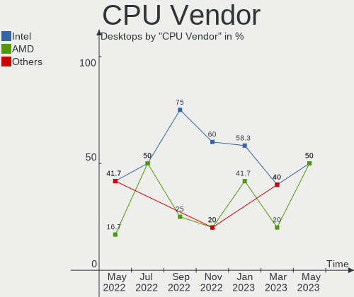

| Vendor  | Desktops | Percent |
|---------|----------|---------|
| Intel   | 70       | 67.96%  |
| AMD     | 32       | 31.07%  |
| PowerPC | 1        | 0.97%   |

CPU Model
---------

Processor models

| Model                                                        | Desktops | Percent |
|--------------------------------------------------------------|----------|---------|
| AMD GX-412TC SOC                                             | 14       | 13.59%  |
| Intel Core i5-3320M CPU @ 2.60GHz                            | 4        | 3.88%   |
| AMD G-T40E Processor                                         | 4        | 3.88%   |
| Intel Xeon CPU E5-2630 0 @ 2.30GHz                           | 2        | 1.94%   |
| Intel Xeon CPU E3-1220 v5 @ 3.00GHz                          | 2        | 1.94%   |
| Intel Core i5-5200U CPU @ 2.20GHz                            | 2        | 1.94%   |
| Intel Core i5 CPU M 520 @ 2.40GHz                            | 2        | 1.94%   |
| AMD Ryzen 5 2500U with Radeon Vega Mobile Gfx                | 2        | 1.94%   |
| AMD E2-1800 APU with Radeon HD Graphics                      | 2        | 1.94%   |
| PowerPC 7447A (Revision 0x105)                               | 1        | 0.97%   |
| Intel Xeon E-2278G CPU @ 3.40GHz                             | 1        | 0.97%   |
| Intel Xeon CPU X5680 @ 3.33GHz                               | 1        | 0.97%   |
| Intel Xeon CPU W3530 @ 2.80GHz                               | 1        | 0.97%   |
| Intel Xeon CPU E5620 @ 2.40GHz                               | 1        | 0.97%   |
| Intel Xeon CPU E5410 @ 2.33GHz                               | 1        | 0.97%   |
| Intel Xeon CPU E5320 @ 1.86GHz                               | 1        | 0.97%   |
| Intel Xeon CPU E5-2690 0 @ 2.90GHz                           | 1        | 0.97%   |
| Intel Xeon CPU E5-2640 0 @ 2.50GHz                           | 1        | 0.97%   |
| Intel Xeon CPU E5-2620 v3 @ 2.40GHz                          | 1        | 0.97%   |
| Intel Xeon CPU E5-2403 0 @ 1.80GHz                           | 1        | 0.97%   |
| Intel Xeon CPU E3-1230 v6 @ 3.50GHz                          | 1        | 0.97%   |
| Intel Pentium Silver N5030 CPU @ 1.10GHz                     | 1        | 0.97%   |
| Intel Pentium M processor 1.60GHz ("GenuineIntel" 686-class) | 1        | 0.97%   |
| Intel Pentium Dual-Core CPU E5700 @ 3.00GHz                  | 1        | 0.97%   |
| Intel Pentium D CPU 2.80GHz                                  | 1        | 0.97%   |
| Intel Pentium CPU G4560 @ 3.50GHz                            | 1        | 0.97%   |
| Intel Pentium 4 CPU 3.20GHz ("GenuineIntel" 686-class)       | 1        | 0.97%   |
| Intel Pentium 4 CPU 2.66GHz                                  | 1        | 0.97%   |
| Intel Core m3-7Y30 CPU @ 1.00GHz                             | 1        | 0.97%   |
| Intel Core i7-7700K CPU @ 4.20GHz                            | 1        | 0.97%   |
| Intel Core i7-7600U CPU @ 2.80GHz                            | 1        | 0.97%   |
| Intel Core i7-7500U CPU @ 2.70GHz                            | 1        | 0.97%   |
| Intel Core i7-6700HQ CPU @ 2.60GHz                           | 1        | 0.97%   |
| Intel Core i7-6700 CPU @ 3.40GHz                             | 1        | 0.97%   |
| Intel Core i7-6600U CPU @ 2.60GHz                            | 1        | 0.97%   |
| Intel Core i7-5600U CPU @ 2.60GHz                            | 1        | 0.97%   |
| Intel Core i7-4770R CPU @ 3.20GHz                            | 1        | 0.97%   |
| Intel Core i7-4770 CPU @ 3.40GHz                             | 1        | 0.97%   |
| Intel Core i7-4720HQ CPU @ 2.60GHz                           | 1        | 0.97%   |
| Intel Core i7-4700MQ CPU @ 2.40GHz                           | 1        | 0.97%   |
| Intel Core i7-4600U CPU @ 2.10GHz                            | 1        | 0.97%   |
| Intel Core i7-3770 CPU @ 3.40GHz                             | 1        | 0.97%   |
| Intel Core i7-2670QM CPU @ 2.20GHz                           | 1        | 0.97%   |
| Intel Core i7-10510U CPU @ 1.80GHz                           | 1        | 0.97%   |
| Intel Core i7 CPU 970 @ 3.20GHz                              | 1        | 0.97%   |
| Intel Core i5-8500T CPU @ 2.10GHz                            | 1        | 0.97%   |
| Intel Core i5-7300U CPU @ 2.60GHz                            | 1        | 0.97%   |
| Intel Core i5-6300U CPU @ 2.40GHz                            | 1        | 0.97%   |
| Intel Core i5-5300U CPU @ 2.30GHz                            | 1        | 0.97%   |
| Intel Core i5-5250U CPU @ 1.60GHz                            | 1        | 0.97%   |
| Intel Core i5-4570T CPU @ 2.90GHz                            | 1        | 0.97%   |
| Intel Core i5-4440 CPU @ 3.10GHz                             | 1        | 0.97%   |
| Intel Core i5-4300U CPU @ 1.90GHz                            | 1        | 0.97%   |
| Intel Core i5-4200U CPU @ 1.60GHz                            | 1        | 0.97%   |
| Intel Core i5-3230M CPU @ 2.60GHz                            | 1        | 0.97%   |
| Intel Core i5-2520M CPU @ 2.50GHz                            | 1        | 0.97%   |
| Intel Core i5-2400 CPU @ 3.10GHz                             | 1        | 0.97%   |
| Intel Core i3-3217U CPU @ 1.80GHz                            | 1        | 0.97%   |
| Intel Core 2 Duo CPU T9400 @ 2.53GHz                         | 1        | 0.97%   |
| Intel Celeron CPU N3160 @ 1.60GHz                            | 1        | 0.97%   |

CPU Model Family
----------------

Processor model prefix

| Model                   | Desktops | Percent |
|-------------------------|----------|---------|
| Intel Core i5           | 20       | 19.42%  |
| Intel Core i7           | 16       | 15.53%  |
| Intel Xeon              | 15       | 14.56%  |
| AMD GX                  | 14       | 13.59%  |
| Intel Atom              | 5        | 4.85%   |
| Intel Celeron           | 4        | 3.88%   |
| AMD G                   | 4        | 3.88%   |
| AMD Ryzen 5             | 3        | 2.91%   |
| Intel Pentium 4         | 2        | 1.94%   |
| AMD E2                  | 2        | 1.94%   |
| AMD A4                  | 2        | 1.94%   |
| Other                   | 1        | 0.97%   |
| Intel Pentium Silver    | 1        | 0.97%   |
| Intel Pentium M         | 1        | 0.97%   |
| Intel Pentium Dual-Core | 1        | 0.97%   |
| Intel Pentium D         | 1        | 0.97%   |
| Intel Pentium           | 1        | 0.97%   |
| Intel Core m3           | 1        | 0.97%   |
| Intel Core i3           | 1        | 0.97%   |
| Intel Core 2 Duo        | 1        | 0.97%   |
| AMD V120                | 1        | 0.97%   |
| AMD Turion II Neo       | 1        | 0.97%   |
| AMD Ryzen 7             | 1        | 0.97%   |
| AMD Phenom II X6        | 1        | 0.97%   |
| AMD Phenom II X4        | 1        | 0.97%   |
| AMD Geode Integrated    | 1        | 0.97%   |
| AMD Athlon              | 1        | 0.97%   |

CPU Cores
---------

Number of processor cores

| Number  | Desktops | Percent |
|---------|----------|---------|
| 2       | 36       | 34.95%  |
| 4       | 35       | 33.98%  |
| Unknown | 10       | 9.71%   |
| 1       | 7        | 6.8%    |
| 8       | 5        | 4.85%   |
| 6       | 5        | 4.85%   |
| 12      | 4        | 3.88%   |
| 16      | 1        | 0.97%   |

CPU Sockets
-----------

Number of sockets

| Number  | Desktops | Percent |
|---------|----------|---------|
| 1       | 86       | 83.5%   |
| Unknown | 13       | 12.62%  |
| 2       | 4        | 3.88%   |

CPU Threads
-----------

Threads per core (Hyper-Threading)

| Number  | Desktops | Percent |
|---------|----------|---------|
| 2       | 46       | 44.66%  |
| 1       | 43       | 41.75%  |
| Unknown | 14       | 13.59%  |

CPU Microarch
-------------

Microarchitecture

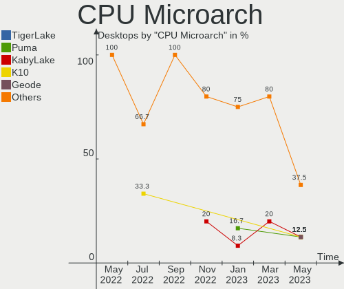

| Name          | Desktops | Percent |
|---------------|----------|---------|
| Puma          | 14       | 13.59%  |
| KabyLake      | 11       | 10.68%  |
| Haswell       | 10       | 9.71%   |
| SandyBridge   | 8        | 7.77%   |
| IvyBridge     | 7        | 6.8%    |
| Skylake       | 6        | 5.83%   |
| Bobcat        | 6        | 5.83%   |
| Westmere      | 5        | 4.85%   |
| Broadwell     | 5        | 4.85%   |
| K10           | 4        | 3.88%   |
| Bonnell       | 4        | 3.88%   |
| Silvermont    | 3        | 2.91%   |
| NetBurst      | 3        | 2.91%   |
| Unknown       | 3        | 2.91%   |
| Zen 2         | 2        | 1.94%   |
| Zen           | 2        | 1.94%   |
| Penryn        | 2        | 1.94%   |
| P6            | 1        | 0.97%   |
| Nehalem       | 1        | 0.97%   |
| K8 Hammer     | 1        | 0.97%   |
| K10 Llano     | 1        | 0.97%   |
| Jaguar        | 1        | 0.97%   |
| Goldmont plus | 1        | 0.97%   |
| Geode         | 1        | 0.97%   |
| Core          | 1        | 0.97%   |

GPU Vendor
----------

Vendors of graphics cards

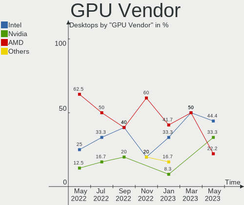

| Vendor                     | Desktops | Percent |
|----------------------------|----------|---------|
| Intel                      | 51       | 56.67%  |
| AMD                        | 22       | 24.44%  |
| Matrox Electronics Systems | 8        | 8.89%   |
| Nvidia                     | 7        | 7.78%   |
| ASPEED Technology          | 2        | 2.22%   |

GPU Model
---------

Graphics card models

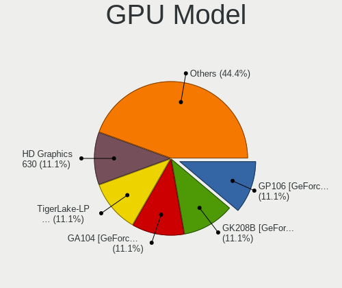

| Model                                                                              | Desktops | Percent |
|------------------------------------------------------------------------------------|----------|---------|
| G200eR2                                                                            | 6        | 6.59%   |
| 3rd Gen Core processor Graphics Controller                                         | 6        | 6.59%   |
| HD Graphics 5500                                                                   | 4        | 4.4%    |
| Ellesmere [Radeon RX 470/480/570/570X/580/580X/590]                                | 4        | 4.4%    |
| HD Graphics 620                                                                    | 3        | 3.3%    |
| Haswell-ULT Integrated Graphics Controller                                         | 3        | 3.3%    |
| Atom/Celeron/Pentium Processor x5-E8000/J3xxx/N3xxx Integrated Graphics Controller | 3        | 3.3%    |
| 2nd Generation Core Processor Family Integrated Graphics Controller                | 3        | 3.3%    |
| Xeon E3-1200 v3/4th Gen Core Processor Integrated Graphics Controller              | 2        | 2.2%    |
| Wrestler [Radeon HD 7340]                                                          | 2        | 2.2%    |
| Skylake GT2 [HD Graphics 520]                                                      | 2        | 2.2%    |
| RS880M [Mobility Radeon HD 4225/4250]                                              | 2        | 2.2%    |
| Raven Ridge [Radeon Vega Series / Radeon Vega Mobile Series]                       | 2        | 2.2%    |
| MGA G200eW WPCM450                                                                 | 2        | 2.2%    |
| HD Graphics 530                                                                    | 2        | 2.2%    |
| ES1000                                                                             | 2        | 2.2%    |
| Core Processor Integrated Graphics Controller                                      | 2        | 2.2%    |
| Atom Processor D2xxx/N2xxx Integrated Graphics Controller                          | 2        | 2.2%    |
| ASPEED Graphics Family                                                             | 2        | 2.2%    |
| 4th Gen Core Processor Integrated Graphics Controller                              | 2        | 2.2%    |
| Xeon E3-1200 v2/3rd Gen Core processor Graphics Controller                         | 1        | 1.1%    |
| UHD Graphics 630 (Desktop)                                                         | 1        | 1.1%    |
| UHD Graphics 605                                                                   | 1        | 1.1%    |
| UHD Graphics                                                                       | 1        | 1.1%    |
| SuperSumo [Radeon HD 6410D]                                                        | 1        | 1.1%    |
| RV635/M86 [Mobility Radeon HD 3650]                                                | 1        | 1.1%    |
| RV360/M12 [Mobility Radeon 9550]                                                   | 1        | 1.1%    |
| Rage Mobility AGP 2x Series                                                        | 1        | 1.1%    |
| Navi 10 [Radeon RX 5600 OEM/5600 XT / 5700/5700 XT]                                | 1        | 1.1%    |
| Mobile 945GSE Express Integrated Graphics Controller                               | 1        | 1.1%    |
| Mobile 945GM/GMS/GME, 943/940GML Express Integrated Graphics Controller            | 1        | 1.1%    |
| Mobile 915GM/GMS/910GML Express Graphics Controller                                | 1        | 1.1%    |
| Mobile 4 Series Chipset Integrated Graphics Controller                             | 1        | 1.1%    |
| Kaby Lake-U GT1 Integrated Graphics Controller                                     | 1        | 1.1%    |
| Kabini [Radeon HD 8180]                                                            | 1        | 1.1%    |
| HD Graphics 615                                                                    | 1        | 1.1%    |
| HD Graphics 610                                                                    | 1        | 1.1%    |
| HD Graphics 6000                                                                   | 1        | 1.1%    |
| GP107M [GeForce GTX 1050 Mobile]                                                   | 1        | 1.1%    |
| GM107M [GeForce GTX 960M]                                                          | 1        | 1.1%    |
| GK107GLM [Quadro K1100M]                                                           | 1        | 1.1%    |
| GF110 [GeForce GTX 580]                                                            | 1        | 1.1%    |
| GF108M [GeForce GT 540M]                                                           | 1        | 1.1%    |
| G92 [GeForce GTS 250]                                                              | 1        | 1.1%    |
| Crystal Well Integrated Iris Pro Graphics 5200                                     | 1        | 1.1%    |
| Coffee Lake UHD Graphics                                                           | 1        | 1.1%    |
| Cedar [Radeon HD 5000/6000/7350/8350 Series]                                       | 1        | 1.1%    |
| Cape Verde PRO / Venus LE / Tropo PRO-L [Radeon HD 8830M / R7 250 / R7 M465X]      | 1        | 1.1%    |
| Caicos [Radeon HD 6450/7450/8450 / R5 230 OEM]                                     | 1        | 1.1%    |
| C61 [GeForce 6150SE nForce 430]                                                    | 1        | 1.1%    |
| Barts XT [Radeon HD 6870]                                                          | 1        | 1.1%    |
| 82945G/GZ Integrated Graphics Controller                                           | 1        | 1.1%    |
| 82915G/GV/910GL Integrated Graphics Controller                                     | 1        | 1.1%    |
| 82865G Integrated Graphics Controller                                              | 1        | 1.1%    |
| 4 Series Chipset Integrated Graphics Controller                                    | 1        | 1.1%    |

GPU Combo
---------

Combinations of graphics cards

| Name           | Desktops | Percent |
|----------------|----------|---------|
| 1 x Intel      | 44       | 42.72%  |
| Other          | 19       | 18.45%  |
| 1 x AMD        | 19       | 18.45%  |
| 1 x Matrox     | 8        | 7.77%   |
| 1 x Nvidia     | 3        | 2.91%   |
| Intel + Nvidia | 3        | 2.91%   |
| 2 x Intel      | 2        | 1.94%   |
| Intel + AMD    | 2        | 1.94%   |
| 1 x ASPEED     | 2        | 1.94%   |
| AMD + Nvidia   | 1        | 0.97%   |

GPU Driver
----------

Free vs proprietary

| Driver  | Desktops | Percent |
|---------|----------|---------|
| Free    | 80       | 77.67%  |
| Unknown | 23       | 22.33%  |

GPU Memory
----------

Total video memory

| Size in GB | Desktops | Percent |
|------------|----------|---------|
| Unknown    | 103      | 100%    |

Monitor Vendor
--------------

Monitor vendors

| Vendor               | Desktops | Percent |
|----------------------|----------|---------|
| LG Display           | 8        | 17.39%  |
| Samsung Electronics  | 6        | 13.04%  |
| AU Optronics         | 5        | 10.87%  |
| Goldstar             | 4        | 8.7%    |
| BOE                  | 3        | 6.52%   |
| Philips              | 2        | 4.35%   |
| Dell                 | 2        | 4.35%   |
| Chimei Innolux       | 2        | 4.35%   |
| BenQ                 | 2        | 4.35%   |
| Ancor Communications | 2        | 4.35%   |
| PANDA                | 1        | 2.17%   |
| NEC Computers        | 1        | 2.17%   |
| LTM                  | 1        | 2.17%   |
| Lenovo               | 1        | 2.17%   |
| InfoVision           | 1        | 2.17%   |
| IBM                  | 1        | 2.17%   |
| Hewlett-Packard      | 1        | 2.17%   |
| Eizo                 | 1        | 2.17%   |
| Apple                | 1        | 2.17%   |
| AOC                  | 1        | 2.17%   |

Monitor Model
-------------

Monitor models

| Model                                              | Desktops | Percent |
|----------------------------------------------------|----------|---------|
| LCD Monitor LGD0418 2560x1440 310x170mm 13.9-inch  | 2        | 4.35%   |
| T24D390 SAM0B6E 1920x1080 520x290mm 23.4-inch      | 1        | 2.17%   |
| SyncMaster SAM00A1 1280x1024 340x270mm 17.1-inch   | 1        | 2.17%   |
| SMB2340 SAM0691 1920x1080 510x290mm 23.1-inch      | 1        | 2.17%   |
| SE790C SAM0BFE 3440x1440 800x330mm 34.1-inch       | 1        | 2.17%   |
| PHL 328E9Q PHLC180 1920x1080 700x390mm 31.5-inch   | 1        | 2.17%   |
| PA249 ACI24B2 1920x1200 520x320mm 24.0-inch        | 1        | 2.17%   |
| P2417H DELA0DC 1920x1080 530x300mm 24.0-inch       | 1        | 2.17%   |
| LG ULTRAWIDE GSM5AE2 3440x1440 800x340mm 34.2-inch | 1        | 2.17%   |
| LG Ultra HD GSM5B08 3840x2160 600x340mm 27.2-inch  | 1        | 2.17%   |
| LEN T24i-10 LEN61CE 1920x1080 530x300mm 24.0-inch  | 1        | 2.17%   |
| LCD190V NEC66D3 1280x1024 380x300mm 19.1-inch      | 1        | 2.17%   |
| LCD Monitor SEC304C 1366x768 310x170mm 13.9-inch   | 1        | 2.17%   |
| LCD Monitor SDC314D 1366x768 310x170mm 13.9-inch   | 1        | 2.17%   |
| LCD Monitor NCP0046 1920x1080 340x190mm 15.3-inch  | 1        | 2.17%   |
| LCD Monitor LTM3937 720x1280 130x80mm 6.0-inch     | 1        | 2.17%   |
| LCD Monitor LGD058B 2560x1440 310x170mm 13.9-inch  | 1        | 2.17%   |
| LCD Monitor LGD049B 1920x1080 340x190mm 15.3-inch  | 1        | 2.17%   |
| LCD Monitor LGD0437 1920x1080 280x160mm 12.7-inch  | 1        | 2.17%   |
| LCD Monitor LGD03DB 1366x768 350x190mm 15.7-inch   | 1        | 2.17%   |
| LCD Monitor LGD03A3 1366x768 280x160mm 12.7-inch   | 1        | 2.17%   |
| LCD Monitor LGD02DC 1366x768 340x190mm 15.3-inch   | 1        | 2.17%   |
| LCD Monitor IVO057D 1920x1080 310x170mm 13.9-inch  | 1        | 2.17%   |
| LCD Monitor IBM2887 1680x1050 330x210mm 15.4-inch  | 1        | 2.17%   |
| LCD Monitor HWP4218 1600x900 440x250mm 19.9-inch   | 1        | 2.17%   |
| LCD Monitor CMN14D6 1366x768 310x170mm 13.9-inch   | 1        | 2.17%   |
| LCD Monitor CMN14B1 1920x1080 310x170mm 13.9-inch  | 1        | 2.17%   |
| LCD Monitor BOE0742 1920x1080 310x170mm 13.9-inch  | 1        | 2.17%   |
| LCD Monitor BOE0630 1920x1080 340x190mm 15.3-inch  | 1        | 2.17%   |
| LCD Monitor BOE05E0 1366x768 280x160mm 12.7-inch   | 1        | 2.17%   |
| LCD Monitor AUO38ED 1920x1080 340x190mm 15.3-inch  | 1        | 2.17%   |
| LCD Monitor AUO34ED 1920x1080 340x190mm 15.3-inch  | 1        | 2.17%   |
| LCD Monitor AUO226D 1920x1080 280x160mm 12.7-inch  | 1        | 2.17%   |
| LCD Monitor AUO21EC 1366x768 340x190mm 15.3-inch   | 1        | 2.17%   |
| LCD Monitor AUO10DC 1366x768 220x130mm 10.1-inch   | 1        | 2.17%   |
| L1530P GSM3B99 1024x768 300x230mm 14.9-inch        | 1        | 2.17%   |
| GW2480 BNQ78E7 1920x1080 530x300mm 24.0-inch       | 1        | 2.17%   |
| GL940 BNQ7883 1366x768 410x230mm 18.5-inch         | 1        | 2.17%   |
| EV2450 ENC2530 1920x1080 530x300mm 24.0-inch       | 1        | 2.17%   |
| E2214H DELA09E 1920x1080 480x270mm 21.7-inch       | 1        | 2.17%   |
| Color LCD APP9C45 1024x768 250x180mm 12.1-inch     | 1        | 2.17%   |
| ASUS VN247 ACI24C3 1920x1080 520x290mm 23.4-inch   | 1        | 2.17%   |
| 27MP33 GSM5AAE 1920x1080 600x340mm 27.2-inch       | 1        | 2.17%   |
| 2270W AOC2270 1920x1080 480x270mm 21.7-inch        | 1        | 2.17%   |
| 190S PHL086B 1280x1024 380x300mm 19.1-inch         | 1        | 2.17%   |

Monitor Resolution
------------------

Monitor screen resolution

| Resolution         | Desktops | Percent |
|--------------------|----------|---------|
| 1920x1080 (FHD)    | 20       | 44.44%  |
| 1366x768 (WXGA)    | 10       | 22.22%  |
| 2560x1440 (QHD)    | 3        | 6.67%   |
| 1280x1024 (SXGA)   | 3        | 6.67%   |
| 3440x1440          | 2        | 4.44%   |
| 1024x768 (XGA)     | 2        | 4.44%   |
| 720x1280           | 1        | 2.22%   |
| 3840x2160 (4K)     | 1        | 2.22%   |
| 1920x1200 (WUXGA)  | 1        | 2.22%   |
| 1680x1050 (WSXGA+) | 1        | 2.22%   |
| 1600x900 (HD+)     | 1        | 2.22%   |

Monitor Diagonal
----------------

Diagonal size in inches

| Inches | Desktops | Percent |
|--------|----------|---------|
| 15     | 9        | 19.57%  |
| 13     | 9        | 19.57%  |
| 24     | 5        | 10.87%  |
| 12     | 5        | 10.87%  |
| 23     | 3        | 6.52%   |
| 19     | 3        | 6.52%   |
| 34     | 2        | 4.35%   |
| 27     | 2        | 4.35%   |
| 21     | 2        | 4.35%   |
| 31     | 1        | 2.17%   |
| 18     | 1        | 2.17%   |
| 17     | 1        | 2.17%   |
| 14     | 1        | 2.17%   |
| 10     | 1        | 2.17%   |
| 6      | 1        | 2.17%   |

Monitor Width
-------------

Physical width

| Width in mm | Desktops | Percent |
|-------------|----------|---------|
| 301-350     | 19       | 42.22%  |
| 501-600     | 9        | 20%     |
| 201-300     | 7        | 15.56%  |
| 401-500     | 4        | 8.89%   |
| 701-800     | 2        | 4.44%   |
| 351-400     | 2        | 4.44%   |
| 601-700     | 1        | 2.22%   |
| 101-200     | 1        | 2.22%   |

Aspect Ratio
------------

Proportional relationship between the width and the height

| Ratio | Desktops | Percent |
|-------|----------|---------|
| 16/9  | 34       | 77.27%  |
| 5/4   | 3        | 6.82%   |
| 16/10 | 3        | 6.82%   |
| 4/3   | 2        | 4.55%   |
| 21/9  | 2        | 4.55%   |

Monitor Area
------------

Area in inch²

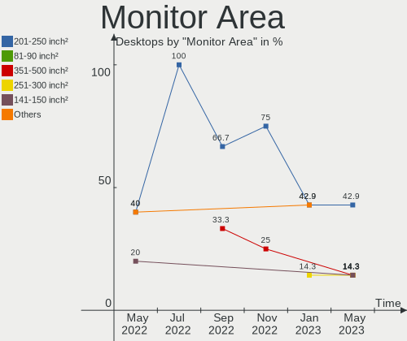

| Area in inch² | Desktops | Percent |
|----------------|----------|---------|
| 81-90          | 9        | 20%     |
| 201-250        | 8        | 17.78%  |
| 91-100         | 7        | 15.56%  |
| 61-70          | 5        | 11.11%  |
| 351-500        | 3        | 6.67%   |
| 151-200        | 3        | 6.67%   |
| 101-110        | 3        | 6.67%   |
| 301-350        | 2        | 4.44%   |
| 141-150        | 2        | 4.44%   |
| 41-50          | 1        | 2.22%   |
| 1-40           | 1        | 2.22%   |
| 251-300        | 1        | 2.22%   |

Pixel Density
-------------

Pixels per inch

| Density       | Desktops | Percent |
|---------------|----------|---------|
| 51-100        | 15       | 34.09%  |
| 121-160       | 12       | 27.27%  |
| 101-120       | 10       | 22.73%  |
| 161-240       | 6        | 13.64%  |
| More than 240 | 1        | 2.27%   |

Multiple Monitors
-----------------

Total monitors connected

| Total | Desktops | Percent |
|-------|----------|---------|
| 1     | 51       | 49.51%  |
| 0     | 48       | 46.6%   |
| 2     | 3        | 2.91%   |
| 3     | 1        | 0.97%   |

Net Controller Vendor
---------------------

Controller vendors

| Vendor                            | Desktops | Percent |
|-----------------------------------|----------|---------|
| Intel                             | 64       | 49.23%  |
| Realtek Semiconductor             | 33       | 25.38%  |
| Qualcomm Atheros                  | 13       | 10%     |
| Broadcom Inc. and subsidiaries    | 10       | 7.69%   |
| Ralink                            | 2        | 1.54%   |
| Edimax Technology                 | 2        | 1.54%   |
| VIA Technologies                  | 1        | 0.77%   |
| Ericsson Business Mobile Networks | 1        | 0.77%   |
| Emulex                            | 1        | 0.77%   |
| Davicom Semiconductor             | 1        | 0.77%   |
| Apple                             | 1        | 0.77%   |
| Accton Technology                 | 1        | 0.77%   |

Net Controller Model
--------------------

Controller models

| Model                                                      | Desktops | Percent |
|------------------------------------------------------------|----------|---------|
| RTL8111/8168/8411 PCI Express Gigabit Ethernet Controller  | 27       | 16.56%  |
| I210 Gigabit Network Connection                            | 14       | 8.59%   |
| I211 Gigabit Network Connection                            | 6        | 3.68%   |
| 82579LM Gigabit Network Connection (Lewisville)            | 6        | 3.68%   |
| Wireless 7265                                              | 5        | 3.07%   |
| Wireless 7260                                              | 5        | 3.07%   |
| Wireless 8265 / 8275                                       | 4        | 2.45%   |
| I350 Gigabit Network Connection                            | 4        | 2.45%   |
| Centrino Advanced-N 6205 [Taylor Peak]                     | 4        | 2.45%   |
| AR928X Wireless Network Adapter (PCI-Express)              | 4        | 2.45%   |
| 82574L Gigabit Network Connection                          | 4        | 2.45%   |
| Wireless 8260                                              | 3        | 1.84%   |
| Ethernet Connection I219-LM                                | 3        | 1.84%   |
| Ethernet Connection I217-LM                                | 3        | 1.84%   |
| RTL8188EUS 802.11n Wireless Network Adapter                | 2        | 1.23%   |
| RTL810xE PCI Express Fast Ethernet controller              | 2        | 1.23%   |
| QCA9377 802.11ac Wireless Network Adapter                  | 2        | 1.23%   |
| NetXtreme BCM5720 2-port Gigabit Ethernet PCIe             | 2        | 1.23%   |
| EW-7811Un 802.11n Wireless Adapter [Realtek RTL8188CUS]    | 2        | 1.23%   |
| Ethernet Connection I218-LM                                | 2        | 1.23%   |
| Ethernet Connection (4) I219-LM                            | 2        | 1.23%   |
| Ethernet Connection (3) I218-V                             | 2        | 1.23%   |
| Ethernet Connection (3) I218-LM                            | 2        | 1.23%   |
| Ethernet Connection (2) I219-V                             | 2        | 1.23%   |
| Centrino Wireless-N 2200                                   | 2        | 1.23%   |
| Centrino Advanced-N 6200                                   | 2        | 1.23%   |
| AR5212/5213/2414 Wireless Network Adapter                  | 2        | 1.23%   |
| 82577LM Gigabit Network Connection                         | 2        | 1.23%   |
| Wireless 3160                                              | 1        | 0.61%   |
| VT6105M [Rhine-III]                                        | 1        | 0.61%   |
| UniNorth 2 GMAC (Sun GEM)                                  | 1        | 0.61%   |
| Ultimate N WiFi Link 5300                                  | 1        | 0.61%   |
| SMC2-1211TX                                                | 1        | 0.61%   |
| RTL8821CE 802.11ac PCIe Wireless Network Adapter           | 1        | 0.61%   |
| RTL8192EU 802.11b/g/n WLAN Adapter                         | 1        | 0.61%   |
| RTL8188EE Wireless Network Adapter                         | 1        | 0.61%   |
| RTL-8100/8101L/8139 PCI Fast Ethernet Adapter              | 1        | 0.61%   |
| RT5390 Wireless 802.11n 1T/1R PCIe                         | 1        | 0.61%   |
| RT2790 Wireless 802.11n 1T/2R PCIe                         | 1        | 0.61%   |
| PRO/Wireless 2915ABG [Calexico2] Network Connection        | 1        | 0.61%   |
| OneConnect 10Gb NIC (be3)                                  | 1        | 0.61%   |
| NM10/ICH7 Family LAN Controller                            | 1        | 0.61%   |
| NetXtreme II BCM5709 Gigabit Ethernet                      | 1        | 0.61%   |
| NetXtreme II BCM5708 Gigabit Ethernet                      | 1        | 0.61%   |
| NetXtreme BCM5761 Gigabit Ethernet PCIe                    | 1        | 0.61%   |
| NetXtreme BCM5751M Gigabit Ethernet PCI Express            | 1        | 0.61%   |
| NetXtreme BCM5723 Gigabit Ethernet PCIe                    | 1        | 0.61%   |
| NetXtreme BCM5719 Gigabit Ethernet PCIe                    | 1        | 0.61%   |
| NetXtreme BCM5705_2 Gigabit Ethernet                       | 1        | 0.61%   |
| NetLink BCM57780 Gigabit Ethernet PCIe                     | 1        | 0.61%   |
| N5321 gw Mobile Broadband Serial Port III                  | 1        | 0.61%   |
| Ethernet Connection I218-V                                 | 1        | 0.61%   |
| Ethernet Connection (7) I219-LM                            | 1        | 0.61%   |
| Ethernet Connection (4) I219-V                             | 1        | 0.61%   |
| Ethernet Connection (2) I219-LM                            | 1        | 0.61%   |
| Centrino Wireless-N 2230                                   | 1        | 0.61%   |
| BCM43225 802.11b/g/n                                       | 1        | 0.61%   |
| BCM4318 [AirForce One 54g] 802.11g Wireless LAN Controller | 1        | 0.61%   |
| AR9485 Wireless Network Adapter                            | 1        | 0.61%   |
| AR9287 Wireless Network Adapter (PCI-Express)              | 1        | 0.61%   |

Wireless Vendor
---------------

Wireless vendors

| Vendor                         | Desktops | Percent |
|--------------------------------|----------|---------|
| Intel                          | 28       | 53.85%  |
| Qualcomm Atheros               | 13       | 25%     |
| Realtek Semiconductor          | 5        | 9.62%   |
| Ralink                         | 2        | 3.85%   |
| Edimax Technology              | 2        | 3.85%   |
| Broadcom Inc. and subsidiaries | 2        | 3.85%   |

Wireless Model
--------------

Wireless models

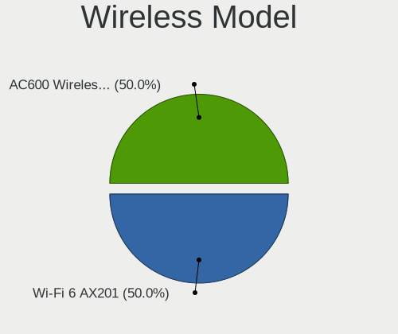

| Model                                                      | Desktops | Percent |
|------------------------------------------------------------|----------|---------|
| Wireless 7265                                              | 5        | 9.62%   |
| Wireless 7260                                              | 5        | 9.62%   |
| Wireless 8265 / 8275                                       | 4        | 7.69%   |
| Centrino Advanced-N 6205 [Taylor Peak]                     | 4        | 7.69%   |
| AR928X Wireless Network Adapter (PCI-Express)              | 4        | 7.69%   |
| Wireless 8260                                              | 3        | 5.77%   |
| RTL8188EUS 802.11n Wireless Network Adapter                | 2        | 3.85%   |
| QCA9377 802.11ac Wireless Network Adapter                  | 2        | 3.85%   |
| EW-7811Un 802.11n Wireless Adapter [Realtek RTL8188CUS]    | 2        | 3.85%   |
| Centrino Wireless-N 2200                                   | 2        | 3.85%   |
| AR5212/5213/2414 Wireless Network Adapter                  | 2        | 3.85%   |
| Wireless 3160                                              | 1        | 1.92%   |
| Ultimate N WiFi Link 5300                                  | 1        | 1.92%   |
| RTL8821CE 802.11ac PCIe Wireless Network Adapter           | 1        | 1.92%   |
| RTL8192EU 802.11b/g/n WLAN Adapter                         | 1        | 1.92%   |
| RTL8188EE Wireless Network Adapter                         | 1        | 1.92%   |
| RT5390 Wireless 802.11n 1T/1R PCIe                         | 1        | 1.92%   |
| RT2790 Wireless 802.11n 1T/2R PCIe                         | 1        | 1.92%   |
| PRO/Wireless 2915ABG [Calexico2] Network Connection        | 1        | 1.92%   |
| Centrino Wireless-N 2230                                   | 1        | 1.92%   |
| Centrino Advanced-N 6200                                   | 1        | 1.92%   |
| BCM43225 802.11b/g/n                                       | 1        | 1.92%   |
| BCM4318 [AirForce One 54g] 802.11g Wireless LAN Controller | 1        | 1.92%   |
| AR9485 Wireless Network Adapter                            | 1        | 1.92%   |
| AR9287 Wireless Network Adapter (PCI-Express)              | 1        | 1.92%   |
| AR9285 Wireless Network Adapter (PCI-Express)              | 1        | 1.92%   |
| AR922X Wireless Network Adapter                            | 1        | 1.92%   |
| AR242x / AR542x Wireless Network Adapter (PCI-Express)     | 1        | 1.92%   |

Ethernet Vendor
---------------

Ethernet vendors

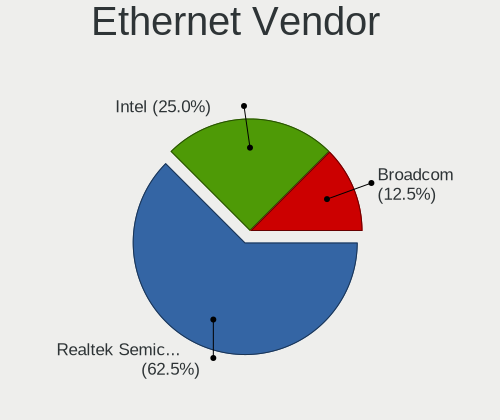

| Vendor                         | Desktops | Percent |
|--------------------------------|----------|---------|
| Intel                          | 57       | 55.88%  |
| Realtek Semiconductor          | 30       | 29.41%  |
| Broadcom Inc. and subsidiaries | 9        | 8.82%   |
| VIA Technologies               | 1        | 0.98%   |
| Qualcomm Atheros               | 1        | 0.98%   |
| Emulex                         | 1        | 0.98%   |
| Davicom Semiconductor          | 1        | 0.98%   |
| Apple                          | 1        | 0.98%   |
| Accton Technology              | 1        | 0.98%   |

Ethernet Model
--------------

Ethernet models

| Model                                                                   | Desktops | Percent |
|-------------------------------------------------------------------------|----------|---------|
| RTL8111/8168/8411 PCI Express Gigabit Ethernet Controller               | 27       | 25%     |
| I210 Gigabit Network Connection                                         | 14       | 12.96%  |
| I211 Gigabit Network Connection                                         | 6        | 5.56%   |
| 82579LM Gigabit Network Connection (Lewisville)                         | 6        | 5.56%   |
| I350 Gigabit Network Connection                                         | 4        | 3.7%    |
| 82574L Gigabit Network Connection                                       | 4        | 3.7%    |
| Ethernet Connection I219-LM                                             | 3        | 2.78%   |
| Ethernet Connection I217-LM                                             | 3        | 2.78%   |
| RTL810xE PCI Express Fast Ethernet controller                           | 2        | 1.85%   |
| NetXtreme BCM5720 2-port Gigabit Ethernet PCIe                          | 2        | 1.85%   |
| Ethernet Connection I218-LM                                             | 2        | 1.85%   |
| Ethernet Connection (4) I219-LM                                         | 2        | 1.85%   |
| Ethernet Connection (3) I218-V                                          | 2        | 1.85%   |
| Ethernet Connection (3) I218-LM                                         | 2        | 1.85%   |
| Ethernet Connection (2) I219-V                                          | 2        | 1.85%   |
| 82577LM Gigabit Network Connection                                      | 2        | 1.85%   |
| VT6105M [Rhine-III]                                                     | 1        | 0.93%   |
| UniNorth 2 GMAC (Sun GEM)                                               | 1        | 0.93%   |
| SMC2-1211TX                                                             | 1        | 0.93%   |
| RTL-8100/8101L/8139 PCI Fast Ethernet Adapter                           | 1        | 0.93%   |
| OneConnect 10Gb NIC (be3)                                               | 1        | 0.93%   |
| NM10/ICH7 Family LAN Controller                                         | 1        | 0.93%   |
| NetXtreme II BCM5709 Gigabit Ethernet                                   | 1        | 0.93%   |
| NetXtreme II BCM5708 Gigabit Ethernet                                   | 1        | 0.93%   |
| NetXtreme BCM5761 Gigabit Ethernet PCIe                                 | 1        | 0.93%   |
| NetXtreme BCM5751M Gigabit Ethernet PCI Express                         | 1        | 0.93%   |
| NetXtreme BCM5723 Gigabit Ethernet PCIe                                 | 1        | 0.93%   |
| NetXtreme BCM5719 Gigabit Ethernet PCIe                                 | 1        | 0.93%   |
| NetXtreme BCM5705_2 Gigabit Ethernet                                    | 1        | 0.93%   |
| NetLink BCM57780 Gigabit Ethernet PCIe                                  | 1        | 0.93%   |
| Ethernet Connection I218-V                                              | 1        | 0.93%   |
| Ethernet Connection (7) I219-LM                                         | 1        | 0.93%   |
| Ethernet Connection (4) I219-V                                          | 1        | 0.93%   |
| Ethernet Connection (2) I219-LM                                         | 1        | 0.93%   |
| AR8121/AR8113/AR8114 Gigabit or Fast Ethernet                           | 1        | 0.93%   |
| 82573E Gigabit Ethernet Controller (Copper)                             | 1        | 0.93%   |
| 82571EB/82571GB Gigabit Ethernet Controller D0/D1 (copper applications) | 1        | 0.93%   |
| 82567LM Gigabit Network Connection                                      | 1        | 0.93%   |
| 82541GI Gigabit Ethernet Controller                                     | 1        | 0.93%   |
| 82541EI Gigabit Ethernet Controller                                     | 1        | 0.93%   |
| 21x4x DEC-Tulip compatible 10/100 Ethernet                              | 1        | 0.93%   |

Net Controller Kind
-------------------

Ethernet, WiFi or modem

| Kind     | Desktops | Percent |
|----------|----------|---------|
| Ethernet | 98       | 66.67%  |
| WiFi     | 46       | 31.29%  |
| Modem    | 2        | 1.36%   |
| Unknown  | 1        | 0.68%   |

Used Controller
---------------

Currently used network controller

| Kind     | Desktops | Percent |
|----------|----------|---------|
| Ethernet | 58       | 61.05%  |
| WiFi     | 36       | 37.89%  |
| Unknown  | 1        | 1.05%   |

NICs
----

Total network controllers on board

| Total | Desktops | Percent |
|-------|----------|---------|
| 2     | 49       | 47.57%  |
| 1     | 47       | 45.63%  |
| 3     | 4        | 3.88%   |
| 0     | 3        | 2.91%   |

Memory Vendor
-------------

Memory module vendors

| Vendor             | Desktops | Percent |
|--------------------|----------|---------|
| Unknown            | 5        | 62.5%   |
| Transcend          | 1        | 12.5%   |
| Ramaxel Technology | 1        | 12.5%   |
| Kingston           | 1        | 12.5%   |

Memory Model
------------

Memory module models

| Model                                              | Desktops | Percent |
|----------------------------------------------------|----------|---------|
| RAM Module 4096MB SODIMM DDR3 1333MT/s             | 2        | 22.22%  |
| RAM TS1GSK64W6H 8192MB DIMM DDR3 1600MT/s          | 1        | 11.11%  |
| RAM RMT3170ME68F9F1600 4096MB SODIMM DDR3 1600MT/s | 1        | 11.11%  |
| RAM Module 512MB DIMM DDR 400MT/s                  | 1        | 11.11%  |
| RAM Module 2048MB DIMM DDR2 266MT/s                | 1        | 11.11%  |
| RAM Module 1024MB DIMM DDR                         | 1        | 11.11%  |
| RAM KHX2400C15D4/4G 4096MB DIMM DDR4 2400MT/s      | 1        | 11.11%  |
| RAM KHX2400C15/8G 8192MB DIMM DDR4 2400MT/s        | 1        | 11.11%  |

Memory Kind
-----------

Memory module kinds

| Kind | Desktops | Percent |
|------|----------|---------|
| DDR3 | 4        | 50%     |
| DDR  | 2        | 25%     |
| DDR4 | 1        | 12.5%   |
| DDR2 | 1        | 12.5%   |

Memory Form Factor
------------------

Physical design of the memory module

| Name   | Desktops | Percent |
|--------|----------|---------|
| DIMM   | 5        | 62.5%   |
| SODIMM | 3        | 37.5%   |

Memory Size
-----------

Memory module size

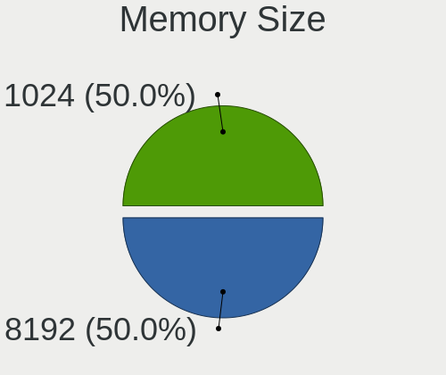

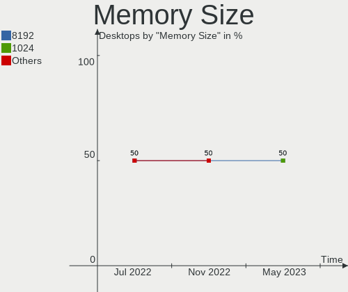

| Size | Desktops | Percent |
|------|----------|---------|
| 4096 | 4        | 44.44%  |
| 8192 | 2        | 22.22%  |
| 2048 | 1        | 11.11%  |
| 1024 | 1        | 11.11%  |
| 512  | 1        | 11.11%  |

Memory Speed
------------

Memory module speed

| Speed   | Desktops | Percent |
|---------|----------|---------|
| 1600    | 2        | 25%     |
| 1333    | 2        | 25%     |
| 2400    | 1        | 12.5%   |
| 400     | 1        | 12.5%   |
| 266     | 1        | 12.5%   |
| Unknown | 1        | 12.5%   |

Sound Vendor
------------

Sound card vendors

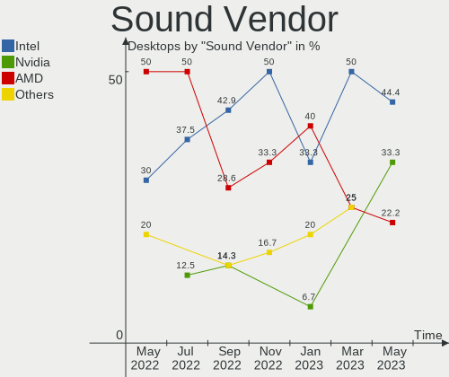

| Vendor              | Desktops | Percent |
|---------------------|----------|---------|
| Intel               | 49       | 70%     |
| AMD                 | 16       | 22.86%  |
| Nvidia              | 3        | 4.29%   |
| ESS Technology      | 1        | 1.43%   |
| C-Media Electronics | 1        | 1.43%   |

Sound Model
-----------

Sound card models

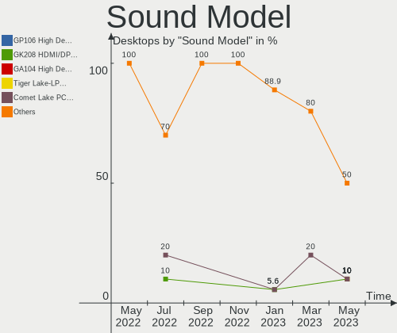

| Model                                                                                       | Desktops | Percent |
|---------------------------------------------------------------------------------------------|----------|---------|
| 7 Series/C216 Chipset Family High Definition Audio Controller                               | 7        | 7.78%   |
| Sunrise Point-LP HD Audio                                                                   | 6        | 6.67%   |
| Wildcat Point-LP High Definition Audio Controller                                           | 5        | 5.56%   |
| Broadwell-U Audio Controller                                                                | 5        | 5.56%   |
| SBx00 Azalia (Intel HDA)                                                                    | 4        | 4.44%   |
| Ellesmere HDMI Audio [Radeon RX 470/480 / 570/580/590]                                      | 4        | 4.44%   |
| 8 Series/C220 Series Chipset High Definition Audio Controller                               | 4        | 4.44%   |
| Xeon E3-1200 v3/4th Gen Core Processor HD Audio Controller                                  | 3        | 3.33%   |
| Haswell-ULT HD Audio Controller                                                             | 3        | 3.33%   |
| 8 Series HD Audio Controller                                                                | 3        | 3.33%   |
| 6 Series/C200 Series Chipset Family High Definition Audio Controller                        | 3        | 3.33%   |
| 100 Series/C230 Series Chipset Family HD Audio Controller                                   | 3        | 3.33%   |
| Starship/Matisse HD Audio Controller                                                        | 2        | 2.22%   |
| RS880 HDMI Audio [Radeon HD 4200 Series]                                                    | 2        | 2.22%   |
| Raven/Raven2/Fenghuang HDMI/DP Audio Controller                                             | 2        | 2.22%   |
| NM10/ICH7 Family High Definition Audio Controller                                           | 2        | 2.22%   |
| MCP61 High Definition Audio                                                                 | 2        | 2.22%   |
| FCH Azalia Controller                                                                       | 2        | 2.22%   |
| Family 17h (Models 10h-1fh) HD Audio Controller                                             | 2        | 2.22%   |
| Cannon Lake PCH cAVS                                                                        | 2        | 2.22%   |
| 82801JI (ICH10 Family) HD Audio Controller                                                  | 2        | 2.22%   |
| 82801I (ICH9 Family) HD Audio Controller                                                    | 2        | 2.22%   |
| 5 Series/3400 Series Chipset High Definition Audio                                          | 2        | 2.22%   |
| Wrestler HDMI Audio                                                                         | 1        | 1.11%   |
| Navi 10 HDMI Audio                                                                          | 1        | 1.11%   |
| Kabini HDMI/DP Audio                                                                        | 1        | 1.11%   |
| GF110 High Definition Audio Controller                                                      | 1        | 1.11%   |
| ES1968 Maestro 2                                                                            | 1        | 1.11%   |
| Crystal Well HD Audio Controller                                                            | 1        | 1.11%   |
| Comet Lake PCH-LP cAVS                                                                      | 1        | 1.11%   |
| CMI8788 [Oxygen HD Audio]                                                                   | 1        | 1.11%   |
| Celeron/Pentium Silver Processor High Definition Audio                                      | 1        | 1.11%   |
| Cedar HDMI Audio [Radeon HD 5400/6300/7300 Series]                                          | 1        | 1.11%   |
| Caicos HDMI Audio [Radeon HD 6450 / 7450/8450/8490 OEM / R5 230/235/235X OEM]               | 1        | 1.11%   |
| C610/X99 series chipset HD Audio Controller                                                 | 1        | 1.11%   |
| BeaverCreek HDMI Audio [Radeon HD 6500D and 6400G-6600G series]                             | 1        | 1.11%   |
| Barts HDMI Audio [Radeon HD 6790/6850/6870 / 7720 OEM]                                      | 1        | 1.11%   |
| Atom/Celeron/Pentium Processor x5-E8000/J3xxx/N3xxx Series High Definition Audio Controller | 1        | 1.11%   |
| 82801FB/FBM/FR/FW/FRW (ICH6 Family) AC'97 Audio Controller                                  | 1        | 1.11%   |
| 82801EB/ER (ICH5/ICH5R) AC'97 Audio Controller                                              | 1        | 1.11%   |
| 200 Series PCH HD Audio                                                                     | 1        | 1.11%   |

Camera Vendor
-------------

Camera device vendors

| Vendor                        | Desktops | Percent |
|-------------------------------|----------|---------|
| Chicony Electronics           | 12       | 48%     |
| Lite-On Technology            | 3        | 12%     |
| IMC Networks                  | 3        | 12%     |
| Logitech                      | 2        | 8%      |
| Suyin                         | 1        | 4%      |
| Sunplus Innovation Technology | 1        | 4%      |
| Realtek Semiconductor         | 1        | 4%      |
| Alcor Micro                   | 1        | 4%      |
| Acer                          | 1        | 4%      |

Camera Model
------------

Camera device models

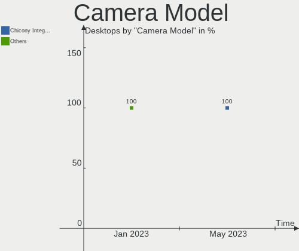

| Model                                                 | Desktops | Percent |
|-------------------------------------------------------|----------|---------|
| Integrated Camera                                     | 11       | 44%     |
| USB2.0 VGA UVC WebCam                                 | 2        | 8%      |
| Webcam C310                                           | 1        | 4%      |
| USB2.0 UVC HD Webcam                                  | 1        | 4%      |
| OrbiCam                                               | 1        | 4%      |
| Ltd., USB2.0 HD UVC WebCam                            | 1        | 4%      |
| Ltd., HP 0.3MP Webcam                                 | 1        | 4%      |
| Integrated Camera [ThinkPad]                          | 1        | 4%      |
| Integrated Camera (1280x720@30)                       | 1        | 4%      |
| EasyCamera                                            | 1        | 4%      |
| Dell E5570 integrated webcam                          | 1        | 4%      |
| Asus Integrated Webcam                                | 1        | 4%      |
| 2.0M UVC Webcam / CNF7129                             | 1        | 4%      |
| 1.3M WebCam (notebook emachines E730, Acer sub-brand) | 1        | 4%      |

Fingerprint Vendor
------------------

Fingerprint sensor vendors

| Vendor             | Desktops | Percent |
|--------------------|----------|---------|
| Validity Sensors   | 6        | 75%     |
| STMicroelectronics | 1        | 12.5%   |
| AuthenTec          | 1        | 12.5%   |

Fingerprint Model
-----------------

Fingerprint sensor models

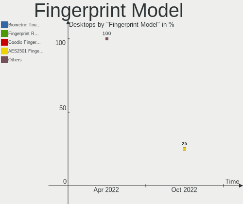

| Model                       | Desktops | Percent |
|-----------------------------|----------|---------|
| VFS 5011 fingerprint sensor | 3        | 37.5%   |
| Synaptics WBDI              | 2        | 25%     |
| VFS5011 Fingerprint Reader  | 1        | 12.5%   |
| Fingerprint Reader          | 1        | 12.5%   |
| AES2810                     | 1        | 12.5%   |

Chipcard Vendor
---------------

Chipcard module vendors

Zero info for selected period =(

Chipcard Model
--------------

Chipcard module models

Zero info for selected period =(

Printer Vendor
--------------

Printer device vendors

Zero info for selected period =(

Printer Model
-------------

Printer device models

Zero info for selected period =(

Scanner Vendor
--------------

Scanner device vendors

Zero info for selected period =(

Scanner Model
-------------

Scanner device models

Zero info for selected period =(

Bluetooth Vendor
----------------

Controller vendors

| Vendor           | Desktops | Percent |
|------------------|----------|---------|
| Intel            | 11       | 52.38%  |
| Broadcom         | 4        | 19.05%  |
| IMC Networks     | 3        | 14.29%  |
| Alps Electric    | 2        | 9.52%   |
| ASUSTek Computer | 1        | 4.76%   |

Bluetooth Model
---------------

Controller models

| Model                                     | Desktops | Percent |
|-------------------------------------------|----------|---------|
| Bluetooth wireless interface              | 10       | 47.62%  |
| BCM20702 Bluetooth 4.0 [ThinkPad]         | 3        | 14.29%  |
| UGTZ4 Bluetooth                           | 2        | 9.52%   |
| Realtek Bluetooth Adapter                 | 1        | 4.76%   |
| Qualcomm Atheros Bluetooth 4.1            | 1        | 4.76%   |
| Centrino Bluetooth Wireless Transceiver   | 1        | 4.76%   |
| Broadcom Bluetooth 2.1                    | 1        | 4.76%   |
| BCM2045B (BDC-2.1) [Bluetooth Controller] | 1        | 4.76%   |
| Asus Integrated Bluetooth module [AR3011] | 1        | 4.76%   |

Unsupported Devices
-------------------

Total unsupported devices on board

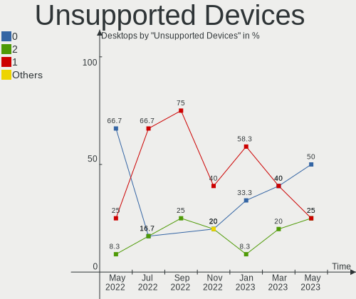

| Total | Desktops | Percent |
|-------|----------|---------|
| 0     | 45       | 43.69%  |
| 1     | 36       | 34.95%  |
| 2     | 18       | 17.48%  |
| 3     | 2        | 1.94%   |
| 8     | 1        | 0.97%   |
| 5     | 1        | 0.97%   |

Unsupported Device Types
------------------------

Types of unsupported devices

| Type                     | Desktops | Percent |
|--------------------------|----------|---------|
| Communication controller | 47       | 58.02%  |
| Graphics card            | 9        | 11.11%  |
| Net/wireless             | 7        | 8.64%   |
| Firewire controller      | 6        | 7.41%   |
| Sound                    | 4        | 4.94%   |
| Storage/ata              | 3        | 3.7%    |
| Network                  | 2        | 2.47%   |
| Net/ethernet             | 1        | 1.23%   |
| Modem                    | 1        | 1.23%   |
| Card reader              | 1        | 1.23%   |

