OpenBSD - Hardware Trends (Desktops)
------------------------------------

A project to identify most popular hardware characteristics and track their change
over time based on data collected by BSD users at https://BSD-Hardware.info.

Anyone can contribute to this report by the [hw-probe](https://github.com/linuxhw/hw-probe/blob/master/INSTALL.BSD.md) tool:

    hw-probe -all -upload

This report is for one last month. Overall report since the beginning of time: [TestCoverage](https://github.com/bsdhw/TestCoverage)

Period: Jan, 2023.

Contents
--------

* [ System ](#system)
  - [ OS                       ](#os)
  - [ OS Family                ](#os-family)
  - [ Arch                     ](#arch)
  - [ DE                       ](#de)
  - [ Display Server           ](#display-server)
  - [ Display Manager          ](#display-manager)
  - [ OS Lang                  ](#os-lang)
  - [ Boot Mode                ](#boot-mode)
  - [ Filesystem               ](#filesystem)
  - [ Part. scheme             ](#part-scheme)

* [ Board ](#board)
  - [ Vendor                   ](#vendor)
  - [ Model                    ](#model)
  - [ Model Family             ](#model-family)
  - [ MFG Year                 ](#mfg-year)
  - [ Form Factor              ](#form-factor)
  - [ Coreboot                 ](#coreboot)
  - [ RAM Size                 ](#ram-size)
  - [ RAM Used                 ](#ram-used)
  - [ Total Drives             ](#total-drives)
  - [ Has CD-ROM               ](#has-cd-rom)
  - [ Has Ethernet             ](#has-ethernet)
  - [ Has WiFi                 ](#has-wifi)
  - [ Has Bluetooth            ](#has-bluetooth)

* [ Location ](#location)
  - [ Country                  ](#country)
  - [ City                     ](#city)

* [ Drives ](#drives)
  - [ Drive Vendor             ](#drive-vendor)
  - [ Drive Model              ](#drive-model)
  - [ HDD Vendor               ](#hdd-vendor)
  - [ SSD Vendor               ](#ssd-vendor)
  - [ Drive Kind               ](#drive-kind)
  - [ Drive Connector          ](#drive-connector)
  - [ Drive Size               ](#drive-size)
  - [ Space Total              ](#space-total)
  - [ Space Used               ](#space-used)
  - [ Malfunc. Drives          ](#malfunc-drives)
  - [ Malfunc. Drive Vendor    ](#malfunc-drive-vendor)
  - [ Malfunc. HDD Vendor      ](#malfunc-hdd-vendor)
  - [ Malfunc. Drive Kind      ](#malfunc-drive-kind)
  - [ Failed Drives            ](#failed-drives)
  - [ Failed Drive Vendor      ](#failed-drive-vendor)
  - [ Drive Status             ](#drive-status)

* [ Storage controller ](#storage-controller)
  - [ Storage Vendor           ](#storage-vendor)
  - [ Storage Model            ](#storage-model)
  - [ Storage Kind             ](#storage-kind)

* [ Processor ](#processor)
  - [ CPU Vendor               ](#cpu-vendor)
  - [ CPU Model                ](#cpu-model)
  - [ CPU Model Family         ](#cpu-model-family)
  - [ CPU Cores                ](#cpu-cores)
  - [ CPU Sockets              ](#cpu-sockets)
  - [ CPU Threads              ](#cpu-threads)
  - [ CPU Microarch            ](#cpu-microarch)

* [ Graphics ](#graphics)
  - [ GPU Vendor               ](#gpu-vendor)
  - [ GPU Model                ](#gpu-model)
  - [ GPU Combo                ](#gpu-combo)
  - [ GPU Driver               ](#gpu-driver)
  - [ GPU Memory               ](#gpu-memory)

* [ Monitor ](#monitor)
  - [ Monitor Vendor           ](#monitor-vendor)
  - [ Monitor Model            ](#monitor-model)
  - [ Monitor Resolution       ](#monitor-resolution)
  - [ Monitor Diagonal         ](#monitor-diagonal)
  - [ Monitor Width            ](#monitor-width)
  - [ Aspect Ratio             ](#aspect-ratio)
  - [ Monitor Area             ](#monitor-area)
  - [ Pixel Density            ](#pixel-density)
  - [ Multiple Monitors        ](#multiple-monitors)

* [ Network ](#network)
  - [ Net Controller Vendor    ](#net-controller-vendor)
  - [ Net Controller Model     ](#net-controller-model)
  - [ Wireless Vendor          ](#wireless-vendor)
  - [ Wireless Model           ](#wireless-model)
  - [ Ethernet Vendor          ](#ethernet-vendor)
  - [ Ethernet Model           ](#ethernet-model)
  - [ Net Controller Kind      ](#net-controller-kind)
  - [ Used Controller          ](#used-controller)
  - [ NICs                     ](#nics)
  - [ IPv6                     ](#ipv6)

* [ Bluetooth ](#bluetooth)
  - [ Bluetooth Vendor         ](#bluetooth-vendor)
  - [ Bluetooth Model          ](#bluetooth-model)

* [ Sound ](#sound)
  - [ Sound Vendor             ](#sound-vendor)
  - [ Sound Model              ](#sound-model)

* [ Memory ](#memory)
  - [ Memory Vendor            ](#memory-vendor)
  - [ Memory Model             ](#memory-model)
  - [ Memory Kind              ](#memory-kind)
  - [ Memory Form Factor       ](#memory-form-factor)
  - [ Memory Size              ](#memory-size)
  - [ Memory Speed             ](#memory-speed)

* [ Printers & scanners ](#printers--scanners)
  - [ Printer Vendor           ](#printer-vendor)
  - [ Printer Model            ](#printer-model)
  - [ Scanner Vendor           ](#scanner-vendor)
  - [ Scanner Model            ](#scanner-model)

* [ Camera ](#camera)
  - [ Camera Vendor            ](#camera-vendor)
  - [ Camera Model             ](#camera-model)

* [ Security ](#security)
  - [ Fingerprint Vendor       ](#fingerprint-vendor)
  - [ Fingerprint Model        ](#fingerprint-model)
  - [ Chipcard Vendor          ](#chipcard-vendor)
  - [ Chipcard Model           ](#chipcard-model)

* [ Unsupported ](#unsupported)
  - [ Unsupported Devices      ](#unsupported-devices)
  - [ Unsupported Device Types ](#unsupported-device-types)

System
------

OS
--

Installed operating systems

| Name        | Desktops | Percent |
|-------------|----------|---------|
| OpenBSD 7.2 | 11       | 91.67%  |
| OpenBSD 7.0 | 1        | 8.33%   |

OS Family
---------

OS without a version

| Name    | Desktops | Percent |
|---------|----------|---------|
| OpenBSD | 12       | 100%    |

Arch
----

OS architecture (x86_64, i586, etc.)

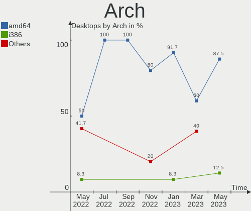

| Name  | Desktops | Percent |
|-------|----------|---------|
| amd64 | 11       | 91.67%  |
| i386  | 1        | 8.33%   |

DE
--

Desktop Environment

| Name         | Desktops | Percent |
|--------------|----------|---------|
| helloDesktop | 10       | 83.33%  |
| XFCE         | 2        | 16.67%  |

Display Server
--------------

X11 or Wayland

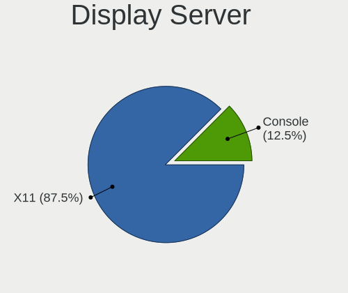

| Name    | Desktops | Percent |
|---------|----------|---------|
| X11     | 8        | 66.67%  |
| Console | 4        | 33.33%  |

Display Manager
---------------

SDDM, LightDM, etc.

| Name    | Desktops | Percent |
|---------|----------|---------|
| Console | 11       | 91.67%  |
| SLiM    | 1        | 8.33%   |

OS Lang
-------

Language

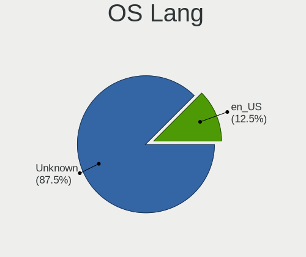

| Lang       | Desktops | Percent |
|------------|----------|---------|
| Unknown    | 10       | 83.33%  |
| ISO8859-15 | 1        | 8.33%   |
| en_US      | 1        | 8.33%   |

Boot Mode
---------

EFI or BIOS

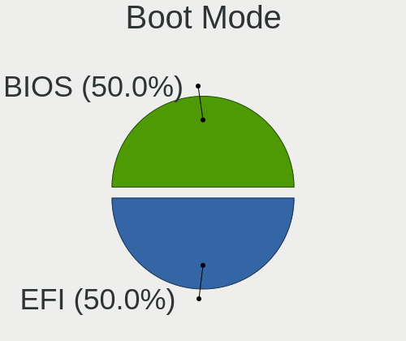

| Mode | Desktops | Percent |
|------|----------|---------|
| BIOS | 6        | 50%     |
| EFI  | 6        | 50%     |

Filesystem
----------

Type of filesystem

| Type | Desktops | Percent |
|------|----------|---------|
| Ffs  | 12       | 100%    |

Part. scheme
------------

Scheme of partitioning

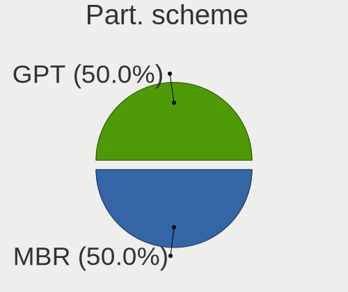

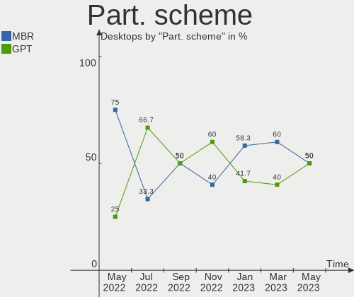

| Type | Desktops | Percent |
|------|----------|---------|
| MBR  | 7        | 58.33%  |
| GPT  | 5        | 41.67%  |

Board
-----

Vendor
------

Motherboard manufacturer

| Name                | Desktops | Percent |
|---------------------|----------|---------|
| ASUSTek Computer    | 4        | 33.33%  |
| Lenovo              | 3        | 25%     |
| Dell                | 2        | 16.67%  |
| PC Engines          | 1        | 8.33%   |
| Gigabyte Technology | 1        | 8.33%   |
| Fujitsu             | 1        | 8.33%   |

Model
-----

Motherboard model

| Name                              | Desktops | Percent |
|-----------------------------------|----------|---------|
| PC Engines apu4                   | 1        | 8.33%   |
| Lenovo ThinkStation D20 415575G   | 1        | 8.33%   |
| Lenovo ThinkCentre Edge72 34971AG | 1        | 8.33%   |
| Lenovo H30-05 90BJ0085SP          | 1        | 8.33%   |
| Gigabyte Z390 AORUS ELITE         | 1        | 8.33%   |
| Fujitsu PRIMERGY RX200 S6         | 1        | 8.33%   |
| Dell PowerEdge R710               | 1        | 8.33%   |
| Dell OptiPlex 3040                | 1        | 8.33%   |
| ASUS TUF Gaming B550-PLUS         | 1        | 8.33%   |
| ASUS PRO A520M-C                  | 1        | 8.33%   |
| ASUS PRIME B460M-A                | 1        | 8.33%   |
| ASUS F2A85-M                      | 1        | 8.33%   |

Model Family
------------

Motherboard model prefix

| Name                | Desktops | Percent |
|---------------------|----------|---------|
| PC Engines apu4     | 1        | 8.33%   |
| Lenovo ThinkStation | 1        | 8.33%   |
| Lenovo ThinkCentre  | 1        | 8.33%   |
| Lenovo H30-05       | 1        | 8.33%   |
| Gigabyte Z390       | 1        | 8.33%   |
| Fujitsu PRIMERGY    | 1        | 8.33%   |
| Dell PowerEdge      | 1        | 8.33%   |
| Dell OptiPlex       | 1        | 8.33%   |
| ASUS TUF            | 1        | 8.33%   |
| ASUS PRO            | 1        | 8.33%   |
| ASUS PRIME          | 1        | 8.33%   |
| ASUS F2A85-M        | 1        | 8.33%   |

MFG Year
--------

Motherboard manufacture year

| Year | Desktops | Percent |
|------|----------|---------|
| 2022 | 3        | 25%     |
| 2021 | 2        | 16.67%  |
| 2018 | 2        | 16.67%  |
| 2013 | 2        | 16.67%  |
| 2010 | 2        | 16.67%  |
| 2015 | 1        | 8.33%   |

Form Factor
-----------

Physical design of the computer

| Name    | Desktops | Percent |
|---------|----------|---------|
| Desktop | 12       | 100%    |

Coreboot
--------

Have coreboot on board

| Used | Desktops | Percent |
|------|----------|---------|
| No   | 11       | 91.67%  |
| Yes  | 1        | 8.33%   |

RAM Size
--------

Total RAM memory

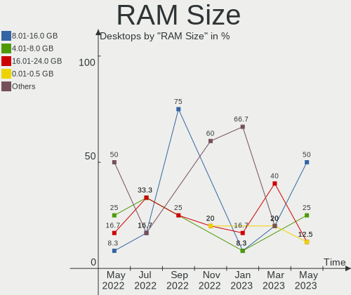

| Size in GB  | Desktops | Percent |
|-------------|----------|---------|
| 64.01-256.0 | 3        | 25%     |
| 32.01-64.0  | 2        | 16.67%  |
| 3.01-4.0    | 2        | 16.67%  |
| 16.01-24.0  | 2        | 16.67%  |
| 4.01-8.0    | 1        | 8.33%   |
| 24.01-32.0  | 1        | 8.33%   |
| 8.01-16.0   | 1        | 8.33%   |

RAM Used
--------

Used RAM memory

| Used GB  | Desktops | Percent |
|----------|----------|---------|
| 0.01-0.5 | 6        | 50%     |
| 0.51-1.0 | 3        | 25%     |
| 3.01-4.0 | 2        | 16.67%  |
| 4.01-8.0 | 1        | 8.33%   |

Total Drives
------------

Number of drives on board

| Drives | Desktops | Percent |
|--------|----------|---------|
| 1      | 8        | 66.67%  |
| 8      | 1        | 8.33%   |
| 5      | 1        | 8.33%   |
| 3      | 1        | 8.33%   |
| 2      | 1        | 8.33%   |

Has CD-ROM
----------

Has CD-ROM on board

| Presented | Desktops | Percent |
|-----------|----------|---------|
| No        | 10       | 83.33%  |
| Yes       | 2        | 16.67%  |

Has Ethernet
------------

Has Ethernet on board

| Presented | Desktops | Percent |
|-----------|----------|---------|
| Yes       | 12       | 100%    |

Has WiFi
--------

Has WiFi module

| Presented | Desktops | Percent |
|-----------|----------|---------|
| No        | 10       | 83.33%  |
| Yes       | 2        | 16.67%  |

Has Bluetooth
-------------

Has Bluetooth module

| Presented | Desktops | Percent |
|-----------|----------|---------|
| No        | 10       | 83.33%  |
| Yes       | 2        | 16.67%  |

Location
--------

Country
-------

Geographic location (country)

| Country     | Desktops | Percent |
|-------------|----------|---------|
| Germany     | 3        | 25%     |
| Spain       | 2        | 16.67%  |
| France      | 2        | 16.67%  |
| USA         | 1        | 8.33%   |
| Switzerland | 1        | 8.33%   |
| Italy       | 1        | 8.33%   |
| Bulgaria    | 1        | 8.33%   |
| Australia   | 1        | 8.33%   |

City
----

Geographic location (city)

| City              | Desktops | Percent |
|-------------------|----------|---------|
| Zurich            | 1        | 8.33%   |
| Verona            | 1        | 8.33%   |
| Sydney            | 1        | 8.33%   |
| Sofia             | 1        | 8.33%   |
| Remseck am Neckar | 1        | 8.33%   |
| Paris             | 1        | 8.33%   |
| Nuremberg         | 1        | 8.33%   |
| Lafayette         | 1        | 8.33%   |
| Giessen           | 1        | 8.33%   |
| Cergy             | 1        | 8.33%   |
| Barcelona         | 1        | 8.33%   |
| Alcover           | 1        | 8.33%   |

Drives
------

Drive Vendor
------------

Hard drive vendors

| Vendor              | Desktops | Drives | Percent |
|---------------------|----------|--------|---------|
| Seagate             | 3        | 4      | 17.65%  |
| NVMe                | 3        | 4      | 17.65%  |
| Kingston            | 2        | 2      | 11.76%  |
| Intel               | 2        | 2      | 11.76%  |
| Crucial             | 2        | 2      | 11.76%  |
| Samsung Electronics | 1        | 6      | 5.88%   |
| OPENBSD             | 1        | 1      | 5.88%   |
| KingSpec            | 1        | 1      | 5.88%   |
| KingDian            | 1        | 1      | 5.88%   |
| Dell                | 1        | 2      | 5.88%   |

Drive Model
-----------

Hard drive models

| Model                           | Desktops | Percent |
|---------------------------------|----------|---------|
| NVMe Samsung SSD 980 1TB        | 2        | 10.53%  |
| Seagate ST500DM009-2F110A 500GB | 1        | 5.26%   |
| Seagate ST500DM002-1BD142 500GB | 1        | 5.26%   |
| Seagate Portable 5TB            | 1        | 5.26%   |
| Seagate Desktop 8TB             | 1        | 5.26%   |
| Samsung SSD 870 QVO 2TB         | 1        | 5.26%   |
| OPENBSD SR RAID 5 9.9TB         | 1        | 5.26%   |
| NVMe JAJP600M512C 512GB         | 1        | 5.26%   |
| NVMe CT500P2SSD8 500GB          | 1        | 5.26%   |
| Kingston SA400S37480G 480GB     | 1        | 5.26%   |
| Kingston SA400M8240G 240GB      | 1        | 5.26%   |
| KingSpec P3-512 512GB           | 1        | 5.26%   |
| KingDian S280 240GB             | 1        | 5.26%   |
| Intel SSDSC2KF128G8 SATA 128GB  | 1        | 5.26%   |
| Intel SSDSC2BB120G4 120GB       | 1        | 5.26%   |
| Dell PERC 6-i 1.1TB             | 1        | 5.26%   |
| Crucial CT2000BX500SSD1 2TB     | 1        | 5.26%   |
| Crucial CT1000BX500SSD1 1TB     | 1        | 5.26%   |

HDD Vendor
----------

Hard disk drive vendors

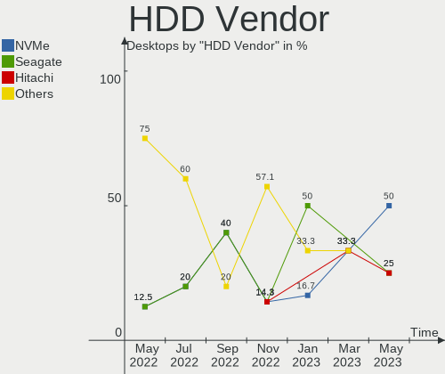

| Vendor  | Desktops | Drives | Percent |
|---------|----------|--------|---------|
| Seagate | 3        | 4      | 50%     |
| OPENBSD | 1        | 1      | 16.67%  |
| NVMe    | 1        | 1      | 16.67%  |
| Dell    | 1        | 2      | 16.67%  |

SSD Vendor
----------

Solid state drive vendors

| Vendor              | Desktops | Drives | Percent |
|---------------------|----------|--------|---------|
| NVMe                | 3        | 3      | 25%     |
| Kingston            | 2        | 2      | 16.67%  |
| Intel               | 2        | 2      | 16.67%  |
| Crucial             | 2        | 2      | 16.67%  |
| Samsung Electronics | 1        | 6      | 8.33%   |
| KingSpec            | 1        | 1      | 8.33%   |
| KingDian            | 1        | 1      | 8.33%   |

Drive Kind
----------

HDD or SSD

| Kind | Desktops | Drives | Percent |
|------|----------|--------|---------|
| SSD  | 8        | 17     | 57.14%  |
| HDD  | 6        | 8      | 42.86%  |

Drive Connector
---------------

SATA, SAS, NVMe, etc.

| Type | Desktops | Drives | Percent |
|------|----------|--------|---------|
| SATA | 11       | 25     | 100%    |

Drive Size
----------

Size of hard drive

| Size in TB | Desktops | Drives | Percent |
|------------|----------|--------|---------|
| 0.01-0.5   | 6        | 8      | 40%     |
| 0.51-1.0   | 4        | 5      | 26.67%  |
| 1.01-2.0   | 3        | 9      | 20%     |
| 4.01-10.0  | 2        | 3      | 13.33%  |

Space Total
-----------

Amount of disk space available on the file system

| Size in GB     | Desktops | Percent |
|----------------|----------|---------|
| 251-500        | 4        | 33.33%  |
| 1001-2000      | 3        | 25%     |
| 101-250        | 2        | 16.67%  |
| More than 3000 | 1        | 8.33%   |
| 501-1000       | 1        | 8.33%   |
| 51-100         | 1        | 8.33%   |

Space Used
----------

Amount of used disk space

| Used GB | Desktops | Percent |
|---------|----------|---------|
| 1-20    | 7        | 58.33%  |
| 251-500 | 2        | 16.67%  |
| 21-50   | 2        | 16.67%  |
| 101-250 | 1        | 8.33%   |

Malfunc. Drives
---------------

Drive models with a malfunction

| Model                 | Desktops | Drives | Percent |
|-----------------------|----------|--------|---------|
| KingSpec P3-512 512GB | 1        | 1      | 100%    |

Malfunc. Drive Vendor
---------------------

Vendors of faulty drives

| Vendor   | Desktops | Drives | Percent |
|----------|----------|--------|---------|
| KingSpec | 1        | 1      | 100%    |

Malfunc. HDD Vendor
-------------------

Vendors of faulty HDD drives

Zero info for selected period =(

Malfunc. Drive Kind
-------------------

Kinds of faulty drives

| Kind | Desktops | Drives | Percent |
|------|----------|--------|---------|
| SSD  | 1        | 1      | 100%    |

Failed Drives
-------------

Failed drive models

Zero info for selected period =(

Failed Drive Vendor
-------------------

Failed drive vendors

Zero info for selected period =(

Drive Status
------------

Number of failed and malfunc. drives

| Status   | Desktops | Drives | Percent |
|----------|----------|--------|---------|
| Works    | 9        | 16     | 60%     |
| Detected | 5        | 8      | 33.33%  |
| Malfunc  | 1        | 1      | 6.67%   |

Storage controller
------------------

Storage Vendor
--------------

Storage controller vendors

| Vendor                    | Desktops | Percent |
|---------------------------|----------|---------|
| Intel                     | 7        | 38.89%  |
| AMD                       | 5        | 27.78%  |
| Samsung Electronics       | 2        | 11.11%  |
| Broadcom / LSI            | 2        | 11.11%  |
| Silicon Motion            | 1        | 5.56%   |
| Micron/Crucial Technology | 1        | 5.56%   |

Storage Model
-------------

Storage controller models

| Model                                                                         | Desktops | Percent |
|-------------------------------------------------------------------------------|----------|---------|
| AMD FCH SATA Controller [AHCI mode]                                           | 3        | 16.67%  |
| Samsung NVMe SSD Controller PM9A1/PM9A3/980PRO                                | 2        | 11.11%  |
| Intel 82801JI (ICH10 Family) SATA AHCI Controller                             | 2        | 11.11%  |
| AMD 500 Series Chipset SATA Controller                                        | 2        | 11.11%  |
| Silicon Motion SM2263EN/SM2263XT SSD Controller                               | 1        | 5.56%   |
| Micron/Crucial P2 NVMe PCIe SSD                                               | 1        | 5.56%   |
| Intel Q170/Q150/B150/H170/H110/Z170/CM236 Chipset SATA Controller [AHCI Mode] | 1        | 5.56%   |
| Intel Cannon Lake PCH SATA AHCI Controller                                    | 1        | 5.56%   |
| Intel 82801IB (ICH9) 2 port SATA Controller [IDE mode]                        | 1        | 5.56%   |
| Intel 6 Series/C200 Series Chipset Family 6 port Desktop SATA AHCI Controller | 1        | 5.56%   |
| Intel 400 Series Chipset Family SATA AHCI Controller                          | 1        | 5.56%   |
| Broadcom / LSI SAS2008 PCI-Express Fusion-MPT SAS-2 [Falcon]                  | 1        | 5.56%   |
| Broadcom / LSI MegaRAID SAS 1078                                              | 1        | 5.56%   |

Storage Kind
------------

Kind of storage controller (IDE, SATA, NVMe, SAS, ...)

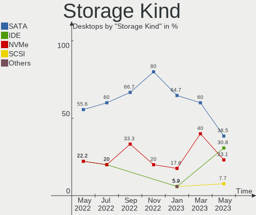

| Kind | Desktops | Percent |
|------|----------|---------|
| SATA | 11       | 64.71%  |
| NVMe | 3        | 17.65%  |
| RAID | 2        | 11.76%  |
| IDE  | 1        | 5.88%   |

Processor
---------

CPU Vendor
----------

Processor vendors

| Vendor | Desktops | Percent |
|--------|----------|---------|
| Intel  | 7        | 58.33%  |
| AMD    | 5        | 41.67%  |

CPU Model
---------

Processor models

| Model                                                       | Desktops | Percent |
|-------------------------------------------------------------|----------|---------|
| Intel Xeon CPU X5690 @ 3.47GHz                              | 1        | 8.33%   |
| Intel Xeon CPU X5650 @ 2.67GHz                              | 1        | 8.33%   |
| Intel Xeon CPU E5540 @ 2.53GHz                              | 1        | 8.33%   |
| Intel Core i9-9900K CPU @ 3.60GHz                           | 1        | 8.33%   |
| Intel Core i5-6500T CPU @ 2.50GHz                           | 1        | 8.33%   |
| Intel Core i3-3220 CPU @ 3.30GHz ("GenuineIntel" 686-class) | 1        | 8.33%   |
| Intel Core i3-10100 CPU @ 3.60GHz                           | 1        | 8.33%   |
| AMD Ryzen 9 5950X 16-Core Processor                         | 1        | 8.33%   |
| AMD Ryzen 9 5900X 12-Core Processor                         | 1        | 8.33%   |
| AMD GX-412TC SOC                                            | 1        | 8.33%   |
| AMD E1-7010 APU with AMD Radeon R2 Graphics                 | 1        | 8.33%   |
| AMD A10-5700 APU with Radeon HD Graphics                    | 1        | 8.33%   |

CPU Model Family
----------------

Processor model prefix

| Model         | Desktops | Percent |
|---------------|----------|---------|
| Intel Xeon    | 3        | 25%     |
| Intel Core i3 | 2        | 16.67%  |
| AMD Ryzen 9   | 2        | 16.67%  |
| Intel Core i9 | 1        | 8.33%   |
| Intel Core i5 | 1        | 8.33%   |
| AMD GX        | 1        | 8.33%   |
| AMD E1        | 1        | 8.33%   |
| AMD A10       | 1        | 8.33%   |

CPU Cores
---------

Number of processor cores

| Number | Desktops | Percent |
|--------|----------|---------|
| 4      | 5        | 41.67%  |
| 2      | 2        | 16.67%  |
| 32     | 1        | 8.33%   |
| 24     | 1        | 8.33%   |
| 12     | 1        | 8.33%   |
| 8      | 1        | 8.33%   |
| 6      | 1        | 8.33%   |

CPU Sockets
-----------

Number of sockets

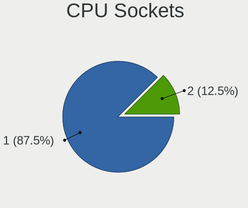

| Number | Desktops | Percent |
|--------|----------|---------|
| 1      | 11       | 91.67%  |
| 2      | 1        | 8.33%   |

CPU Threads
-----------

Threads per core (Hyper-Threading)

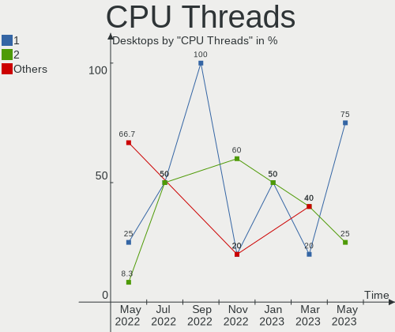

| Number | Desktops | Percent |
|--------|----------|---------|
| 2      | 6        | 50%     |
| 1      | 6        | 50%     |

CPU Microarch
-------------

Microarchitecture

| Name       | Desktops | Percent |
|------------|----------|---------|
| Zen 3      | 2        | 16.67%  |
| Westmere   | 2        | 16.67%  |
| Puma       | 2        | 16.67%  |
| Skylake    | 1        | 8.33%   |
| Piledriver | 1        | 8.33%   |
| Nehalem    | 1        | 8.33%   |
| KabyLake   | 1        | 8.33%   |
| IvyBridge  | 1        | 8.33%   |
| CometLake  | 1        | 8.33%   |

Graphics
--------

GPU Vendor
----------

Vendors of graphics cards

| Vendor                     | Desktops | Percent |
|----------------------------|----------|---------|
| AMD                        | 5        | 41.67%  |
| Intel                      | 4        | 33.33%  |
| Matrox Electronics Systems | 2        | 16.67%  |
| Nvidia                     | 1        | 8.33%   |

GPU Model
---------

Graphics card models

| Model                                                                 | Desktops | Percent |
|-----------------------------------------------------------------------|----------|---------|
| Nvidia GK208B [GeForce GT 710]                                        | 1        | 8.33%   |
| Matrox Electronics Systems MGA G200eW WPCM450                         | 1        | 8.33%   |
| Matrox Electronics Systems MGA G200e [Pilot] ServerEngines (SEP1)     | 1        | 8.33%   |
| Intel Xeon E3-1200 v2/3rd Gen Core processor Graphics Controller      | 1        | 8.33%   |
| Intel HD Graphics 530                                                 | 1        | 8.33%   |
| Intel CometLake-S GT2 [UHD Graphics 630]                              | 1        | 8.33%   |
| Intel CoffeeLake-S GT2 [UHD Graphics 630]                             | 1        | 8.33%   |
| AMD Trinity [Radeon HD 7660D]                                         | 1        | 8.33%   |
| AMD Oland [Radeon HD 8570 / R5 430 OEM / R7 240/340 / Radeon 520 OEM] | 1        | 8.33%   |
| AMD Mullins [Radeon R2 Graphics]                                      | 1        | 8.33%   |
| AMD Ellesmere [Radeon RX 470/480/570/570X/580/580X/590]               | 1        | 8.33%   |
| AMD Caicos [Radeon HD 6450/7450/8450 / R5 230 OEM]                    | 1        | 8.33%   |

GPU Combo
---------

Combinations of graphics cards

| Name       | Desktops | Percent |
|------------|----------|---------|
| 1 x AMD    | 5        | 41.67%  |
| 1 x Intel  | 3        | 25%     |
| 1 x Matrox | 2        | 16.67%  |
| Other      | 1        | 8.33%   |
| 1 x Nvidia | 1        | 8.33%   |

GPU Driver
----------

Free vs proprietary

| Driver  | Desktops | Percent |
|---------|----------|---------|
| Free    | 10       | 83.33%  |
| Unknown | 2        | 16.67%  |

GPU Memory
----------

Total video memory

| Size in GB | Desktops | Percent |
|------------|----------|---------|
| Unknown    | 12       | 100%    |

Monitor
-------

Monitor Vendor
--------------

Monitor vendors

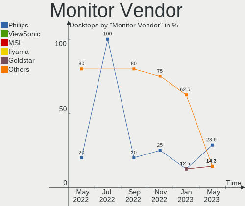

| Vendor               | Desktops | Percent |
|----------------------|----------|---------|
| Dell                 | 2        | 25%     |
| Philips              | 1        | 12.5%   |
| MSI                  | 1        | 12.5%   |
| Goldstar             | 1        | 12.5%   |
| AOC                  | 1        | 12.5%   |
| Ancor Communications | 1        | 12.5%   |
| Acer                 | 1        | 12.5%   |

Monitor Model
-------------

Monitor models

| Model                                                            | Desktops | Percent |
|------------------------------------------------------------------|----------|---------|
| Philips 227E4LH PHLC0AC 1920x1080 480x270mm 21.7-inch            | 1        | 12.5%   |
| MSI MP242 MSI30A1 1920x1080 530x300mm 24.0-inch                  | 1        | 12.5%   |
| Goldstar L1918S GSM4B31 1280x1024 380x300mm 19.1-inch            | 1        | 12.5%   |
| Dell U2515H DELD06F 2560x1440 550x310mm 24.9-inch                | 1        | 12.5%   |
| Dell P780 DEL510F 1600x1200 330x240mm 16.1-inch                  | 1        | 12.5%   |
| AOC 2050W AOC2050 1600x900 430x240mm 19.4-inch                   | 1        | 12.5%   |
| Ancor Communications VK246 ACI24F1 1920x1080 530x300mm 24.0-inch | 1        | 12.5%   |
| Acer AT1945 ACR1945 1440x900 400x250mm 18.6-inch                 | 1        | 12.5%   |

Monitor Resolution
------------------

Monitor screen resolution

| Resolution       | Desktops | Percent |
|------------------|----------|---------|
| 1920x1080 (FHD)  | 3        | 37.5%   |
| 2560x1440 (QHD)  | 1        | 12.5%   |
| 1600x900 (HD+)   | 1        | 12.5%   |
| 1600x1200        | 1        | 12.5%   |
| 1440x900 (WXGA+) | 1        | 12.5%   |
| 1280x1024 (SXGA) | 1        | 12.5%   |

Monitor Diagonal
----------------

Diagonal size in inches

| Inches | Desktops | Percent |
|--------|----------|---------|
| 24     | 3        | 37.5%   |
| 19     | 2        | 25%     |
| 21     | 1        | 12.5%   |
| 18     | 1        | 12.5%   |
| 16     | 1        | 12.5%   |

Monitor Width
-------------

Physical width

| Width in mm | Desktops | Percent |
|-------------|----------|---------|
| 501-600     | 3        | 37.5%   |
| 401-500     | 2        | 25%     |
| 351-400     | 2        | 25%     |
| 301-350     | 1        | 12.5%   |

Aspect Ratio
------------

Proportional relationship between the width and the height

| Ratio | Desktops | Percent |
|-------|----------|---------|
| 16/9  | 5        | 62.5%   |
| 5/4   | 1        | 12.5%   |
| 4/3   | 1        | 12.5%   |
| 16/10 | 1        | 12.5%   |

Monitor Area
------------

Area in inch²

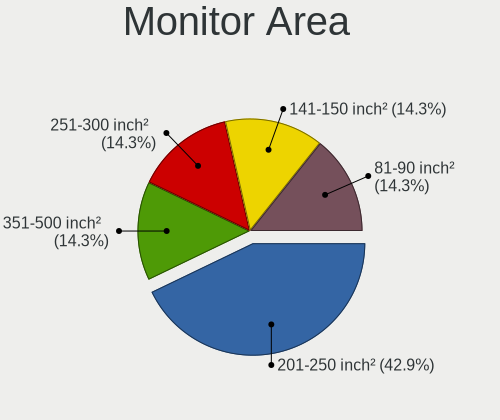

| Area in inch² | Desktops | Percent |
|----------------|----------|---------|
| 201-250        | 3        | 42.86%  |
| 151-200        | 2        | 28.57%  |
| 251-300        | 1        | 14.29%  |
| 121-130        | 1        | 14.29%  |

Pixel Density
-------------

Pixels per inch

| Density | Desktops | Percent |
|---------|----------|---------|
| 51-100  | 4        | 57.14%  |
| 101-120 | 2        | 28.57%  |
| 121-160 | 1        | 14.29%  |

Multiple Monitors
-----------------

Total monitors connected

| Total | Desktops | Percent |
|-------|----------|---------|
| 1     | 6        | 50%     |
| 0     | 5        | 41.67%  |
| 2     | 1        | 8.33%   |

Network
-------

Net Controller Vendor
---------------------

Controller vendors

| Vendor                | Desktops | Percent |
|-----------------------|----------|---------|
| Realtek Semiconductor | 7        | 43.75%  |
| Intel                 | 4        | 25%     |
| Broadcom              | 2        | 12.5%   |
| TP-Link               | 1        | 6.25%   |
| Qualcomm Atheros      | 1        | 6.25%   |
| D-Link System         | 1        | 6.25%   |

Net Controller Model
--------------------

Controller models

| Model                                                                      | Desktops | Percent |
|----------------------------------------------------------------------------|----------|---------|
| Realtek RTL8111/8168/8411 PCI Express Gigabit Ethernet Controller          | 5        | 25%     |
| TP-Link Archer T2U PLUS [RTL8821AU]                                        | 1        | 5%      |
| TP-Link AC600 wireless Realtek RTL8811AU [Archer T2U Nano]                 | 1        | 5%      |
| Realtek RTL8125 2.5GbE Controller                                          | 1        | 5%      |
| Realtek RTL810xE PCI Express Fast Ethernet controller                      | 1        | 5%      |
| Qualcomm Atheros QCA9565 / AR9565 Wireless Network Adapter                 | 1        | 5%      |
| Intel Wireless 8260                                                        | 1        | 5%      |
| Intel I211 Gigabit Network Connection                                      | 1        | 5%      |
| Intel I210 Gigabit Network Connection                                      | 1        | 5%      |
| Intel Ethernet Connection (7) I219-V                                       | 1        | 5%      |
| Intel 82599ES 10-Gigabit SFI/SFP+ Network Connection                       | 1        | 5%      |
| Intel 82575EB Gigabit Network Connection                                   | 1        | 5%      |
| D-Link System AirPlus G DWL-G122 Wireless Adapter(rev.C1) [Ralink RT2571W] | 1        | 5%      |
| Broadcom NetXtreme II BCM5709 Gigabit Ethernet                             | 1        | 5%      |
| Broadcom NetXtreme BCM5755 Gigabit Ethernet PCI Express                    | 1        | 5%      |
| Broadcom NetXtreme BCM5754 Gigabit Ethernet PCI Express                    | 1        | 5%      |

Wireless Vendor
---------------

Wireless vendors

| Vendor           | Desktops | Percent |
|------------------|----------|---------|
| TP-Link          | 1        | 25%     |
| Qualcomm Atheros | 1        | 25%     |
| Intel            | 1        | 25%     |
| D-Link System    | 1        | 25%     |

Wireless Model
--------------

Wireless models

| Model                                                                      | Desktops | Percent |
|----------------------------------------------------------------------------|----------|---------|
| TP-Link Archer T2U PLUS [RTL8821AU]                                        | 1        | 20%     |
| TP-Link AC600 wireless Realtek RTL8811AU [Archer T2U Nano]                 | 1        | 20%     |
| Qualcomm Atheros QCA9565 / AR9565 Wireless Network Adapter                 | 1        | 20%     |
| Intel Wireless 8260                                                        | 1        | 20%     |
| D-Link System AirPlus G DWL-G122 Wireless Adapter(rev.C1) [Ralink RT2571W] | 1        | 20%     |

Ethernet Vendor
---------------

Ethernet vendors

| Vendor                | Desktops | Percent |
|-----------------------|----------|---------|
| Realtek Semiconductor | 7        | 58.33%  |
| Intel                 | 3        | 25%     |
| Broadcom              | 2        | 16.67%  |

Ethernet Model
--------------

Ethernet models

| Model                                                             | Desktops | Percent |
|-------------------------------------------------------------------|----------|---------|
| Realtek RTL8111/8168/8411 PCI Express Gigabit Ethernet Controller | 5        | 33.33%  |
| Realtek RTL8125 2.5GbE Controller                                 | 1        | 6.67%   |
| Realtek RTL810xE PCI Express Fast Ethernet controller             | 1        | 6.67%   |
| Intel I211 Gigabit Network Connection                             | 1        | 6.67%   |
| Intel I210 Gigabit Network Connection                             | 1        | 6.67%   |
| Intel Ethernet Connection (7) I219-V                              | 1        | 6.67%   |
| Intel 82599ES 10-Gigabit SFI/SFP+ Network Connection              | 1        | 6.67%   |
| Intel 82575EB Gigabit Network Connection                          | 1        | 6.67%   |
| Broadcom NetXtreme II BCM5709 Gigabit Ethernet                    | 1        | 6.67%   |
| Broadcom NetXtreme BCM5755 Gigabit Ethernet PCI Express           | 1        | 6.67%   |
| Broadcom NetXtreme BCM5754 Gigabit Ethernet PCI Express           | 1        | 6.67%   |

Net Controller Kind
-------------------

Ethernet, WiFi or modem

| Kind     | Desktops | Percent |
|----------|----------|---------|
| Ethernet | 12       | 85.71%  |
| WiFi     | 2        | 14.29%  |

Used Controller
---------------

Currently used network controller

| Kind     | Desktops | Percent |
|----------|----------|---------|
| Ethernet | 8        | 88.89%  |
| WiFi     | 1        | 11.11%  |

NICs
----

Total network controllers on board

| Total | Desktops | Percent |
|-------|----------|---------|
| 1     | 6        | 50%     |
| 2     | 3        | 25%     |
| 4     | 2        | 16.67%  |
| 5     | 1        | 8.33%   |

IPv6
----

IPv6 vs IPv4

| Used | Desktops | Percent |
|------|----------|---------|
| No   | 12       | 100%    |

Bluetooth
---------

Bluetooth Vendor
----------------

Controller vendors

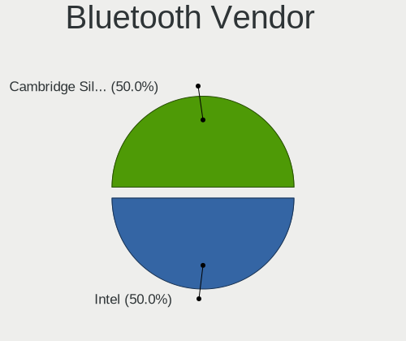

| Vendor                          | Desktops | Percent |
|---------------------------------|----------|---------|
| Qualcomm Atheros Communications | 1        | 33.33%  |
| Intel                           | 1        | 33.33%  |
| Broadcom                        | 1        | 33.33%  |

Bluetooth Model
---------------

Controller models

| Model                                 | Desktops | Percent |
|---------------------------------------|----------|---------|
| Qualcomm Atheros AR3012 Bluetooth 4.0 | 1        | 33.33%  |
| Intel Bluetooth wireless interface    | 1        | 33.33%  |
| Broadcom BCM20702A0 Bluetooth 4.0     | 1        | 33.33%  |

Sound
-----

Sound Vendor
------------

Sound card vendors

| Vendor                               | Desktops | Percent |
|--------------------------------------|----------|---------|
| AMD                                  | 6        | 40%     |
| Intel                                | 5        | 33.33%  |
| Thesycon Systemsoftware & Consulting | 1        | 6.67%   |
| Texas Instruments                    | 1        | 6.67%   |
| Nvidia                               | 1        | 6.67%   |
| JMTek                                | 1        | 6.67%   |

Sound Model
-----------

Sound card models

| Model                                                                             | Desktops | Percent |
|-----------------------------------------------------------------------------------|----------|---------|
| AMD Starship/Matisse HD Audio Controller                                          | 2        | 11.11%  |
| AMD FCH Azalia Controller                                                         | 2        | 11.11%  |
| Thesycon Systemsoftware & Consulting Topping DX3 Pro Audio Control                | 1        | 5.56%   |
| Texas Instruments PCM2902 Audio Codec                                             | 1        | 5.56%   |
| Nvidia GK208 HDMI/DP Audio Controller                                             | 1        | 5.56%   |
| JMTek USB PnP Audio Device                                                        | 1        | 5.56%   |
| Intel Comet Lake PCH-V cAVS                                                       | 1        | 5.56%   |
| Intel Cannon Lake PCH cAVS                                                        | 1        | 5.56%   |
| Intel 82801JI (ICH10 Family) HD Audio Controller                                  | 1        | 5.56%   |
| Intel 6 Series/C200 Series Chipset Family High Definition Audio Controller        | 1        | 5.56%   |
| Intel 100 Series/C230 Series Chipset Family HD Audio Controller                   | 1        | 5.56%   |
| AMD Trinity HDMI Audio Controller                                                 | 1        | 5.56%   |
| AMD Oland/Hainan/Cape Verde/Pitcairn HDMI Audio [Radeon HD 7000 Series]           | 1        | 5.56%   |
| AMD Kabini HDMI/DP Audio                                                          | 1        | 5.56%   |
| AMD Ellesmere HDMI Audio [Radeon RX 470/480 / 570/580/590]                        | 1        | 5.56%   |
| AMD Caicos HDMI Audio [Radeon HD 6450 / 7450/8450/8490 OEM / R5 230/235/235X OEM] | 1        | 5.56%   |

Memory
------

Memory Vendor
-------------

Memory module vendors

Zero info for selected period =(

Memory Model
------------

Memory module models

Zero info for selected period =(

Memory Kind
-----------

Memory module kinds

Zero info for selected period =(

Memory Form Factor
------------------

Physical design of the memory module

Zero info for selected period =(

Memory Size
-----------

Memory module size

Zero info for selected period =(

Memory Speed
------------

Memory module speed

Zero info for selected period =(

Printers & scanners
-------------------

Printer Vendor
--------------

Printer device vendors

Zero info for selected period =(

Printer Model
-------------

Printer device models

Zero info for selected period =(

Scanner Vendor
--------------

Scanner device vendors

Zero info for selected period =(

Scanner Model
-------------

Scanner device models

Zero info for selected period =(

Camera
------

Camera Vendor
-------------

Camera device vendors

| Vendor   | Desktops | Percent |
|----------|----------|---------|
| Microdia | 1        | 100%    |

Camera Model
------------

Camera device models

| Model                   | Desktops | Percent |
|-------------------------|----------|---------|
| Microdia USB 2.0 Camera | 1        | 100%    |

Security
--------

Fingerprint Vendor
------------------

Fingerprint sensor vendors

Zero info for selected period =(

Fingerprint Model
-----------------

Fingerprint sensor models

Zero info for selected period =(

Chipcard Vendor
---------------

Chipcard module vendors

Zero info for selected period =(

Chipcard Model
--------------

Chipcard module models

Zero info for selected period =(

Unsupported
-----------

Unsupported Devices
-------------------

Total unsupported devices on board

| Total | Desktops | Percent |
|-------|----------|---------|
| 1     | 7        | 58.33%  |
| 0     | 4        | 33.33%  |
| 2     | 1        | 8.33%   |

Unsupported Device Types
------------------------

Types of unsupported devices

| Type                     | Desktops | Percent |
|--------------------------|----------|---------|
| Communication controller | 4        | 50%     |
| Storage/ata              | 1        | 12.5%   |
| Net/wireless             | 1        | 12.5%   |
| Graphics card            | 1        | 12.5%   |
| Firewire controller      | 1        | 12.5%   |

