OpenBSD - Hardware Trends (Notebooks)
-------------------------------------

A project to identify most popular hardware characteristics and track their change
over time based on data collected by BSD users at https://BSD-Hardware.info.

Anyone can contribute to this report by the [hw-probe](https://github.com/linuxhw/hw-probe/blob/master/INSTALL.BSD.md) tool:

    hw-probe -all -upload

This report is for one last month. Overall report since the beginning of time: [TestCoverage](https://github.com/bsdhw/TestCoverage)

Period: Jan, 2023.

Contents
--------

* [ System ](#system)
  - [ OS                       ](#os)
  - [ OS Family                ](#os-family)
  - [ Arch                     ](#arch)
  - [ DE                       ](#de)
  - [ Display Server           ](#display-server)
  - [ Display Manager          ](#display-manager)
  - [ OS Lang                  ](#os-lang)
  - [ Boot Mode                ](#boot-mode)
  - [ Filesystem               ](#filesystem)
  - [ Part. scheme             ](#part-scheme)

* [ Board ](#board)
  - [ Vendor                   ](#vendor)
  - [ Model                    ](#model)
  - [ Model Family             ](#model-family)
  - [ MFG Year                 ](#mfg-year)
  - [ Form Factor              ](#form-factor)
  - [ Coreboot                 ](#coreboot)
  - [ RAM Size                 ](#ram-size)
  - [ RAM Used                 ](#ram-used)
  - [ Total Drives             ](#total-drives)
  - [ Has CD-ROM               ](#has-cd-rom)
  - [ Has Ethernet             ](#has-ethernet)
  - [ Has WiFi                 ](#has-wifi)
  - [ Has Bluetooth            ](#has-bluetooth)

* [ Location ](#location)
  - [ Country                  ](#country)
  - [ City                     ](#city)

* [ Drives ](#drives)
  - [ Drive Vendor             ](#drive-vendor)
  - [ Drive Model              ](#drive-model)
  - [ HDD Vendor               ](#hdd-vendor)
  - [ SSD Vendor               ](#ssd-vendor)
  - [ Drive Kind               ](#drive-kind)
  - [ Drive Connector          ](#drive-connector)
  - [ Drive Size               ](#drive-size)
  - [ Space Total              ](#space-total)
  - [ Space Used               ](#space-used)
  - [ Malfunc. Drives          ](#malfunc-drives)
  - [ Malfunc. Drive Vendor    ](#malfunc-drive-vendor)
  - [ Malfunc. HDD Vendor      ](#malfunc-hdd-vendor)
  - [ Malfunc. Drive Kind      ](#malfunc-drive-kind)
  - [ Failed Drives            ](#failed-drives)
  - [ Failed Drive Vendor      ](#failed-drive-vendor)
  - [ Drive Status             ](#drive-status)

* [ Storage controller ](#storage-controller)
  - [ Storage Vendor           ](#storage-vendor)
  - [ Storage Model            ](#storage-model)
  - [ Storage Kind             ](#storage-kind)

* [ Processor ](#processor)
  - [ CPU Vendor               ](#cpu-vendor)
  - [ CPU Model                ](#cpu-model)
  - [ CPU Model Family         ](#cpu-model-family)
  - [ CPU Cores                ](#cpu-cores)
  - [ CPU Sockets              ](#cpu-sockets)
  - [ CPU Threads              ](#cpu-threads)
  - [ CPU Microarch            ](#cpu-microarch)

* [ Graphics ](#graphics)
  - [ GPU Vendor               ](#gpu-vendor)
  - [ GPU Model                ](#gpu-model)
  - [ GPU Combo                ](#gpu-combo)
  - [ GPU Driver               ](#gpu-driver)
  - [ GPU Memory               ](#gpu-memory)

* [ Monitor ](#monitor)
  - [ Monitor Vendor           ](#monitor-vendor)
  - [ Monitor Model            ](#monitor-model)
  - [ Monitor Resolution       ](#monitor-resolution)
  - [ Monitor Diagonal         ](#monitor-diagonal)
  - [ Monitor Width            ](#monitor-width)
  - [ Aspect Ratio             ](#aspect-ratio)
  - [ Monitor Area             ](#monitor-area)
  - [ Pixel Density            ](#pixel-density)
  - [ Multiple Monitors        ](#multiple-monitors)

* [ Network ](#network)
  - [ Net Controller Vendor    ](#net-controller-vendor)
  - [ Net Controller Model     ](#net-controller-model)
  - [ Wireless Vendor          ](#wireless-vendor)
  - [ Wireless Model           ](#wireless-model)
  - [ Ethernet Vendor          ](#ethernet-vendor)
  - [ Ethernet Model           ](#ethernet-model)
  - [ Net Controller Kind      ](#net-controller-kind)
  - [ Used Controller          ](#used-controller)
  - [ NICs                     ](#nics)
  - [ IPv6                     ](#ipv6)

* [ Bluetooth ](#bluetooth)
  - [ Bluetooth Vendor         ](#bluetooth-vendor)
  - [ Bluetooth Model          ](#bluetooth-model)

* [ Sound ](#sound)
  - [ Sound Vendor             ](#sound-vendor)
  - [ Sound Model              ](#sound-model)

* [ Memory ](#memory)
  - [ Memory Vendor            ](#memory-vendor)
  - [ Memory Model             ](#memory-model)
  - [ Memory Kind              ](#memory-kind)
  - [ Memory Form Factor       ](#memory-form-factor)
  - [ Memory Size              ](#memory-size)
  - [ Memory Speed             ](#memory-speed)

* [ Printers & scanners ](#printers--scanners)
  - [ Printer Vendor           ](#printer-vendor)
  - [ Printer Model            ](#printer-model)
  - [ Scanner Vendor           ](#scanner-vendor)
  - [ Scanner Model            ](#scanner-model)

* [ Camera ](#camera)
  - [ Camera Vendor            ](#camera-vendor)
  - [ Camera Model             ](#camera-model)

* [ Security ](#security)
  - [ Fingerprint Vendor       ](#fingerprint-vendor)
  - [ Fingerprint Model        ](#fingerprint-model)
  - [ Chipcard Vendor          ](#chipcard-vendor)
  - [ Chipcard Model           ](#chipcard-model)

* [ Unsupported ](#unsupported)
  - [ Unsupported Devices      ](#unsupported-devices)
  - [ Unsupported Device Types ](#unsupported-device-types)

System
------

OS
--

Installed operating systems

| Name        | Notebooks | Percent |
|-------------|-----------|---------|
| OpenBSD 7.2 | 12        | 100%    |

OS Family
---------

OS without a version

| Name    | Notebooks | Percent |
|---------|-----------|---------|
| OpenBSD | 12        | 100%    |

Arch
----

OS architecture (x86_64, i586, etc.)

| Name  | Notebooks | Percent |
|-------|-----------|---------|
| amd64 | 12        | 100%    |

DE
--

Desktop Environment

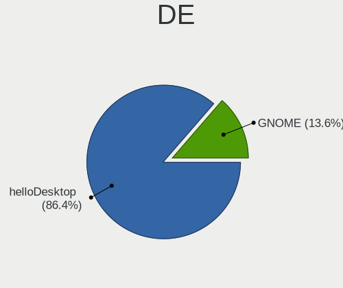

| Name         | Notebooks | Percent |
|--------------|-----------|---------|
| helloDesktop | 11        | 91.67%  |
| GNOME        | 1         | 8.33%   |

Display Server
--------------

X11 or Wayland

| Name | Notebooks | Percent |
|------|-----------|---------|
| X11  | 12        | 100%    |

Display Manager
---------------

SDDM, LightDM, etc.

| Name    | Notebooks | Percent |
|---------|-----------|---------|
| Console | 12        | 100%    |

OS Lang
-------

Language

| Lang    | Notebooks | Percent |
|---------|-----------|---------|
| Unknown | 8         | 66.67%  |
| pl_PL   | 1         | 8.33%   |
| es_ES   | 1         | 8.33%   |
| en_US   | 1         | 8.33%   |
| C       | 1         | 8.33%   |

Boot Mode
---------

EFI or BIOS

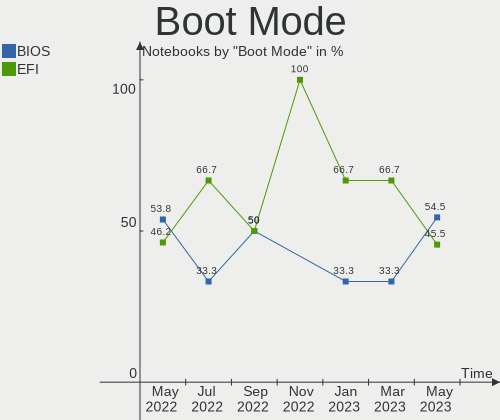

| Mode | Notebooks | Percent |
|------|-----------|---------|
| EFI  | 8         | 66.67%  |
| BIOS | 4         | 33.33%  |

Filesystem
----------

Type of filesystem

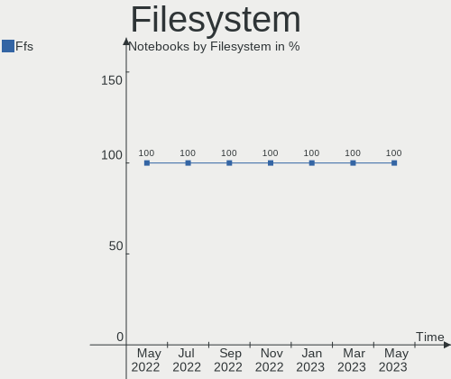

| Type | Notebooks | Percent |
|------|-----------|---------|
| Ffs  | 12        | 100%    |

Part. scheme
------------

Scheme of partitioning

| Type | Notebooks | Percent |
|------|-----------|---------|
| GPT  | 8         | 66.67%  |
| MBR  | 4         | 33.33%  |

Board
-----

Vendor
------

Motherboard manufacturer

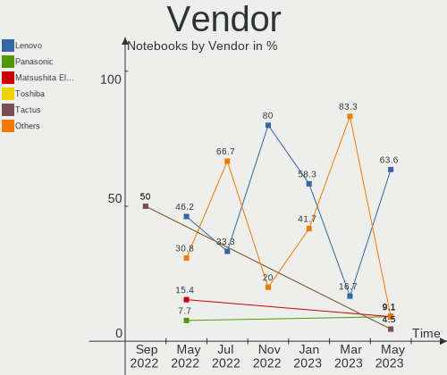

| Name            | Notebooks | Percent |
|-----------------|-----------|---------|
| Lenovo          | 7         | 58.33%  |
| Hewlett-Packard | 2         | 16.67%  |
| Notebook        | 1         | 8.33%   |
| Google          | 1         | 8.33%   |
| Apple           | 1         | 8.33%   |

Model
-----

Motherboard model

| Name                                       | Notebooks | Percent |
|--------------------------------------------|-----------|---------|
| Notebook NS5x_NS7xPU                       | 1         | 8.33%   |
| Lenovo ThinkPad X260 20F5S10W0H            | 1         | 8.33%   |
| Lenovo ThinkPad X1 Carbon Gen 9 20XW00QGUS | 1         | 8.33%   |
| Lenovo ThinkPad T480 20L5CTO1WW            | 1         | 8.33%   |
| Lenovo ThinkPad T410 2518C3U               | 1         | 8.33%   |
| Lenovo ThinkPad E15 Gen 4 21EDCTO1WW       | 1         | 8.33%   |
| Lenovo ThinkPad E14 Gen 4 21EB001FGE       | 1         | 8.33%   |
| Lenovo G50-80 80E5                         | 1         | 8.33%   |
| HP ProBook 455 G7                          | 1         | 8.33%   |
| HP Presario V2000 (EZ621UA#ABA)            | 1         | 8.33%   |
| Google Kefka                               | 1         | 8.33%   |
| Apple MacBookAir7,2                        | 1         | 8.33%   |

Model Family
------------

Motherboard model prefix

| Name              | Notebooks | Percent |
|-------------------|-----------|---------|
| Lenovo ThinkPad   | 6         | 50%     |
| Notebook NS5x     | 1         | 8.33%   |
| Lenovo G50-80     | 1         | 8.33%   |
| HP ProBook        | 1         | 8.33%   |
| HP Presario       | 1         | 8.33%   |
| Google Kefka      | 1         | 8.33%   |
| Apple MacBookAir7 | 1         | 8.33%   |

MFG Year
--------

Motherboard manufacture year

| Year | Notebooks | Percent |
|------|-----------|---------|
| 2022 | 3         | 25%     |
| 2020 | 2         | 16.67%  |
| 2023 | 1         | 8.33%   |
| 2021 | 1         | 8.33%   |
| 2018 | 1         | 8.33%   |
| 2016 | 1         | 8.33%   |
| 2015 | 1         | 8.33%   |
| 2010 | 1         | 8.33%   |
| 2006 | 1         | 8.33%   |

Form Factor
-----------

Physical design of the computer

| Name     | Notebooks | Percent |
|----------|-----------|---------|
| Notebook | 12        | 100%    |

Coreboot
--------

Have coreboot on board

| Used | Notebooks | Percent |
|------|-----------|---------|
| No   | 11        | 91.67%  |
| Yes  | 1         | 8.33%   |

RAM Size
--------

Total RAM memory

| Size in GB  | Notebooks | Percent |
|-------------|-----------|---------|
| 4.01-8.0    | 4         | 33.33%  |
| 16.01-24.0  | 3         | 25%     |
| 8.01-16.0   | 3         | 25%     |
| 64.01-256.0 | 1         | 8.33%   |
| 1.01-2.0    | 1         | 8.33%   |

RAM Used
--------

Used RAM memory

| Used GB  | Notebooks | Percent |
|----------|-----------|---------|
| 0.01-0.5 | 11        | 91.67%  |
| 1.01-2.0 | 1         | 8.33%   |

Total Drives
------------

Number of drives on board

| Drives | Notebooks | Percent |
|--------|-----------|---------|
| 2      | 5         | 41.67%  |
| 1      | 5         | 41.67%  |
| 4      | 1         | 8.33%   |
| 0      | 1         | 8.33%   |

Has CD-ROM
----------

Has CD-ROM on board

| Presented | Notebooks | Percent |
|-----------|-----------|---------|
| No        | 12        | 100%    |

Has Ethernet
------------

Has Ethernet on board

| Presented | Notebooks | Percent |
|-----------|-----------|---------|
| Yes       | 9         | 75%     |
| No        | 3         | 25%     |

Has WiFi
--------

Has WiFi module

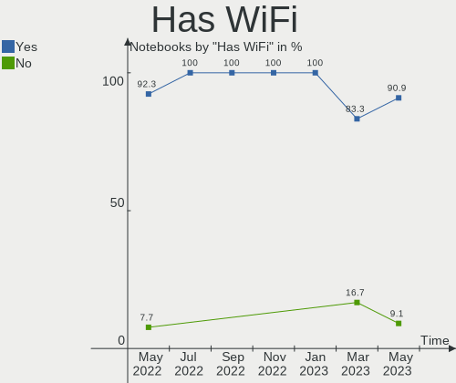

| Presented | Notebooks | Percent |
|-----------|-----------|---------|
| Yes       | 12        | 100%    |

Has Bluetooth
-------------

Has Bluetooth module

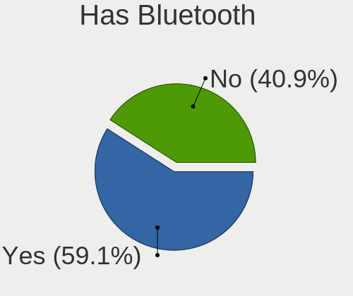

| Presented | Notebooks | Percent |
|-----------|-----------|---------|
| Yes       | 10        | 83.33%  |
| No        | 2         | 16.67%  |

Location
--------

Country
-------

Geographic location (country)

| Country     | Notebooks | Percent |
|-------------|-----------|---------|
| USA         | 5         | 41.67%  |
| Spain       | 2         | 16.67%  |
| Slovakia    | 1         | 8.33%   |
| Poland      | 1         | 8.33%   |
| Netherlands | 1         | 8.33%   |
| Germany     | 1         | 8.33%   |
| France      | 1         | 8.33%   |

City
----

Geographic location (city)

| City         | Notebooks | Percent |
|--------------|-----------|---------|
| Fayetteville | 2         | 16.67%  |
| Sun Prairie  | 1         | 8.33%   |
| Rhoon        | 1         | 8.33%   |
| Paris        | 1         | 8.33%   |
| Navalcarnero | 1         | 8.33%   |
| Lafayette    | 1         | 8.33%   |
| Krakow       | 1         | 8.33%   |
| Košice      | 1         | 8.33%   |
| Charleston   | 1         | 8.33%   |
| Badalona     | 1         | 8.33%   |
| Aalen        | 1         | 8.33%   |

Drives
------

Drive Vendor
------------

Hard drive vendors

| Vendor              | Notebooks | Drives | Percent |
|---------------------|-----------|--------|---------|
| NVMe                | 6         | 8      | 50%     |
| WDC                 | 2         | 2      | 16.67%  |
| Toshiba             | 1         | 1      | 8.33%   |
| Samsung Electronics | 1         | 1      | 8.33%   |
| Apple               | 1         | 1      | 8.33%   |
| Apacer              | 1         | 1      | 8.33%   |

Drive Model
-----------

Hard drive models

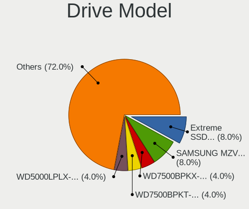

| Model                       | Notebooks | Percent |
|-----------------------------|-----------|---------|
| NVMe Samsung SSD 980 1TB    | 2         | 15.38%  |
| WDC WD10JPCX-24UE4T0 1TB    | 1         | 7.69%   |
| WDC WD Elements 2621 1TB    | 1         | 7.69%   |
| Toshiba MQ01ACF032 320GB    | 1         | 7.69%   |
| Samsung SSD 850 EVO 500GB   | 1         | 7.69%   |
| NVMe WDC PC SN720 SDA 512GB | 1         | 7.69%   |
| NVMe WD PC SN740 SDDQ 1TB   | 1         | 7.69%   |
| NVMe SAMSUNG MZVLQ256 256GB | 1         | 7.69%   |
| NVMe Micron MTFDKCD25 256GB | 1         | 7.69%   |
| NVMe CT1000P5PSSD8 1TB      | 1         | 7.69%   |
| Apple SSD SM0128G 121GB     | 1         | 7.69%   |
| Apacer AS340 240GB          | 1         | 7.69%   |

HDD Vendor
----------

Hard disk drive vendors

| Vendor  | Notebooks | Drives | Percent |
|---------|-----------|--------|---------|
| NVMe    | 4         | 4      | 57.14%  |
| WDC     | 2         | 2      | 28.57%  |
| Toshiba | 1         | 1      | 14.29%  |

SSD Vendor
----------

Solid state drive vendors

| Vendor              | Notebooks | Drives | Percent |
|---------------------|-----------|--------|---------|
| NVMe                | 3         | 4      | 50%     |
| Samsung Electronics | 1         | 1      | 16.67%  |
| Apple               | 1         | 1      | 16.67%  |
| Apacer              | 1         | 1      | 16.67%  |

Drive Kind
----------

HDD or SSD

| Kind | Notebooks | Drives | Percent |
|------|-----------|--------|---------|
| SSD  | 6         | 7      | 50%     |
| HDD  | 6         | 7      | 50%     |

Drive Connector
---------------

SATA, SAS, NVMe, etc.

| Type | Notebooks | Drives | Percent |
|------|-----------|--------|---------|
| SATA | 10        | 14     | 100%    |

Drive Size
----------

Size of hard drive

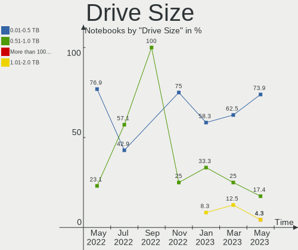

| Size in TB | Notebooks | Drives | Percent |
|------------|-----------|--------|---------|
| 0.51-1.0   | 6         | 7      | 46.15%  |
| 0.01-0.5   | 6         | 6      | 46.15%  |
| 1.01-2.0   | 1         | 1      | 7.69%   |

Space Total
-----------

Amount of disk space available on the file system

| Size in GB | Notebooks | Percent |
|------------|-----------|---------|
| 251-500    | 5         | 41.67%  |
| 101-250    | 3         | 25%     |
| 21-50      | 2         | 16.67%  |
| 1001-2000  | 1         | 8.33%   |
| 501-1000   | 1         | 8.33%   |

Space Used
----------

Amount of used disk space

| Used GB  | Notebooks | Percent |
|----------|-----------|---------|
| 1-20     | 7         | 58.33%  |
| 51-100   | 3         | 25%     |
| 21-50    | 1         | 8.33%   |
| 501-1000 | 1         | 8.33%   |

Malfunc. Drives
---------------

Drive models with a malfunction

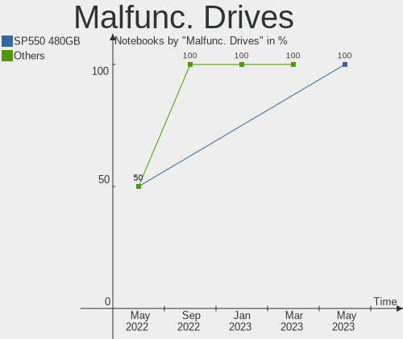

| Model                    | Notebooks | Drives | Percent |
|--------------------------|-----------|--------|---------|
| Toshiba MQ01ACF032 320GB | 1         | 1      | 100%    |

Malfunc. Drive Vendor
---------------------

Vendors of faulty drives

| Vendor  | Notebooks | Drives | Percent |
|---------|-----------|--------|---------|
| Toshiba | 1         | 1      | 100%    |

Malfunc. HDD Vendor
-------------------

Vendors of faulty HDD drives

| Vendor  | Notebooks | Drives | Percent |
|---------|-----------|--------|---------|
| Toshiba | 1         | 1      | 100%    |

Malfunc. Drive Kind
-------------------

Kinds of faulty drives

| Kind | Notebooks | Drives | Percent |
|------|-----------|--------|---------|
| HDD  | 1         | 1      | 100%    |

Failed Drives
-------------

Failed drive models

Zero info for selected period =(

Failed Drive Vendor
-------------------

Failed drive vendors

Zero info for selected period =(

Drive Status
------------

Number of failed and malfunc. drives

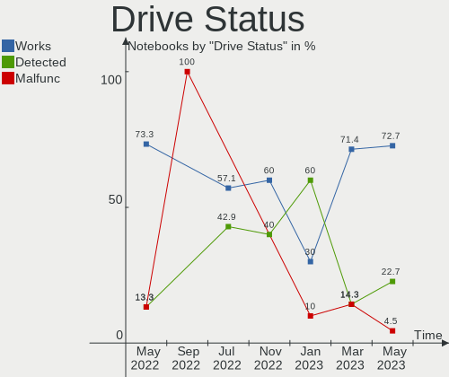

| Status   | Notebooks | Drives | Percent |
|----------|-----------|--------|---------|
| Detected | 6         | 9      | 60%     |
| Works    | 3         | 4      | 30%     |
| Malfunc  | 1         | 1      | 10%     |

Storage controller
------------------

Storage Vendor
--------------

Storage controller vendors

| Vendor                    | Notebooks | Percent |
|---------------------------|-----------|---------|
| Samsung Electronics       | 4         | 30.77%  |
| Intel                     | 3         | 23.08%  |
| Sandisk                   | 2         | 15.38%  |
| AMD                       | 2         | 15.38%  |
| Micron/Crucial Technology | 1         | 7.69%   |
| Micron Technology         | 1         | 7.69%   |

Storage Model
-------------

Storage controller models

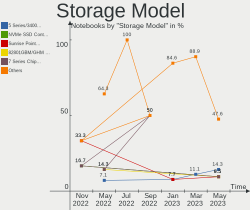

| Model                                                          | Notebooks | Percent |
|----------------------------------------------------------------|-----------|---------|
| Samsung NVMe SSD Controller PM9A1/PM9A3/980PRO                 | 2         | 15.38%  |
| SanDisk WD Black 2018/SN750 / PC SN720 NVMe SSD                | 1         | 7.69%   |
| Sandisk unknown                                                | 1         | 7.69%   |
| Samsung SM951 AHCI                                             | 1         | 7.69%   |
| Samsung NVMe SSD Controller 980                                | 1         | 7.69%   |
| Micron/Crucial P5 Plus NVMe PCIe SSD                           | 1         | 7.69%   |
| Micron unknown                                                 | 1         | 7.69%   |
| Intel Wildcat Point-LP SATA Controller [AHCI Mode]             | 1         | 7.69%   |
| Intel Sunrise Point-LP SATA Controller [AHCI mode]             | 1         | 7.69%   |
| Intel 5 Series/3400 Series Chipset 6 port SATA AHCI Controller | 1         | 7.69%   |
| AMD IXP SB4x0 IDE Controller                                   | 1         | 7.69%   |
| AMD FCH SATA Controller [AHCI mode]                            | 1         | 7.69%   |

Storage Kind
------------

Kind of storage controller (IDE, SATA, NVMe, SAS, ...)

| Kind | Notebooks | Percent |
|------|-----------|---------|
| NVMe | 6         | 50%     |
| SATA | 5         | 41.67%  |
| IDE  | 1         | 8.33%   |

Processor
---------

CPU Vendor
----------

Processor vendors

| Vendor | Notebooks | Percent |
|--------|-----------|---------|
| Intel  | 8         | 66.67%  |
| AMD    | 4         | 33.33%  |

CPU Model
---------

Processor models

| Model                                   | Notebooks | Percent |
|-----------------------------------------|-----------|---------|
| Intel Core i7-8550U CPU @ 1.80GHz       | 1         | 8.33%   |
| Intel Core i7-5500U CPU @ 2.40GHz       | 1         | 8.33%   |
| Intel Core i5-6300U CPU @ 2.40GHz       | 1         | 8.33%   |
| Intel Core i5-5250U CPU @ 1.60GHz       | 1         | 8.33%   |
| Intel Core i5 CPU M 540 @ 2.53GHz       | 1         | 8.33%   |
| Intel Celeron CPU N3060 @ 1.60GHz       | 1         | 8.33%   |
| Intel 12th Gen Core i7-1260P            | 1         | 8.33%   |
| Intel 11th Gen Core i7-1185G7 @ 3.00GHz | 1         | 8.33%   |
| AMD Turion 64 Mobile Technology ML-34   | 1         | 8.33%   |
| AMD Ryzen 7 5825U with Radeon Graphics  | 1         | 8.33%   |
| AMD Ryzen 5 5625U with Radeon Graphics  | 1         | 8.33%   |
| AMD Ryzen 5 4500U with Radeon Graphics  | 1         | 8.33%   |

CPU Model Family
----------------

Processor model prefix

| Model                | Notebooks | Percent |
|----------------------|-----------|---------|
| Intel Core i5        | 3         | 25%     |
| Other                | 2         | 16.67%  |
| Intel Core i7        | 2         | 16.67%  |
| AMD Ryzen 5          | 2         | 16.67%  |
| Intel Celeron        | 1         | 8.33%   |
| AMD Turion 64 Mobile | 1         | 8.33%   |
| AMD Ryzen 7          | 1         | 8.33%   |

CPU Cores
---------

Number of processor cores

| Number | Notebooks | Percent |
|--------|-----------|---------|
| 2      | 5         | 41.67%  |
| 4      | 2         | 16.67%  |
| 16     | 1         | 8.33%   |
| 12     | 1         | 8.33%   |
| 8      | 1         | 8.33%   |
| 6      | 1         | 8.33%   |
| 1      | 1         | 8.33%   |

CPU Sockets
-----------

Number of sockets

| Number | Notebooks | Percent |
|--------|-----------|---------|
| 1      | 12        | 100%    |

CPU Threads
-----------

Threads per core (Hyper-Threading)

| Number | Notebooks | Percent |
|--------|-----------|---------|
| 2      | 7         | 58.33%  |
| 1      | 5         | 41.67%  |

CPU Microarch
-------------

Microarchitecture

| Name       | Notebooks | Percent |
|------------|-----------|---------|
| Zen 3      | 2         | 16.67%  |
| Broadwell  | 2         | 16.67%  |
| Zen 2      | 1         | 8.33%   |
| Westmere   | 1         | 8.33%   |
| TigerLake  | 1         | 8.33%   |
| Skylake    | 1         | 8.33%   |
| Silvermont | 1         | 8.33%   |
| KabyLake   | 1         | 8.33%   |
| K8 Hammer  | 1         | 8.33%   |
| Unknown    | 1         | 8.33%   |

Graphics
--------

GPU Vendor
----------

Vendors of graphics cards

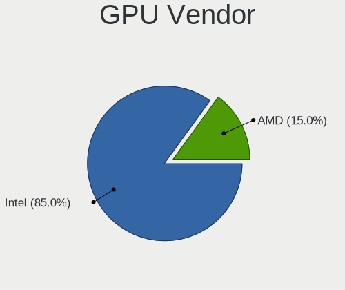

| Vendor | Notebooks | Percent |
|--------|-----------|---------|
| Intel  | 8         | 66.67%  |
| AMD    | 4         | 33.33%  |

GPU Model
---------

Graphics card models

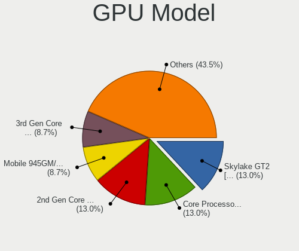

| Model                                                                                    | Notebooks | Percent |
|------------------------------------------------------------------------------------------|-----------|---------|
| AMD Barcelo                                                                              | 2         | 16.67%  |
| Intel UHD Graphics 620                                                                   | 1         | 8.33%   |
| Intel TigerLake-LP GT2 [Iris Xe Graphics]                                                | 1         | 8.33%   |
| Intel Skylake GT2 [HD Graphics 520]                                                      | 1         | 8.33%   |
| Intel HD Graphics 6000                                                                   | 1         | 8.33%   |
| Intel HD Graphics 5500                                                                   | 1         | 8.33%   |
| Intel Core Processor Integrated Graphics Controller                                      | 1         | 8.33%   |
| Intel Atom/Celeron/Pentium Processor x5-E8000/J3xxx/N3xxx Integrated Graphics Controller | 1         | 8.33%   |
| Intel Alder Lake-P Integrated Graphics Controller                                        | 1         | 8.33%   |
| AMD RS480M [Mobility Radeon Xpress 200]                                                  | 1         | 8.33%   |
| AMD Renoir                                                                               | 1         | 8.33%   |

GPU Combo
---------

Combinations of graphics cards

| Name      | Notebooks | Percent |
|-----------|-----------|---------|
| 1 x Intel | 8         | 66.67%  |
| 1 x AMD   | 4         | 33.33%  |

GPU Driver
----------

Free vs proprietary

| Driver  | Notebooks | Percent |
|---------|-----------|---------|
| Free    | 11        | 91.67%  |
| Unknown | 1         | 8.33%   |

GPU Memory
----------

Total video memory

| Size in GB | Notebooks | Percent |
|------------|-----------|---------|
| Unknown    | 12        | 100%    |

Monitor
-------

Monitor Vendor
--------------

Monitor vendors

| Vendor              | Notebooks | Percent |
|---------------------|-----------|---------|
| AU Optronics        | 3         | 23.08%  |
| BOE                 | 2         | 15.38%  |
| Samsung Electronics | 1         | 7.69%   |
| Quanta Display      | 1         | 7.69%   |
| Philips             | 1         | 7.69%   |
| LG Display          | 1         | 7.69%   |
| Lenovo              | 1         | 7.69%   |
| Dell                | 1         | 7.69%   |
| Chimei Innolux      | 1         | 7.69%   |
| Apple               | 1         | 7.69%   |

Monitor Model
-------------

Monitor models

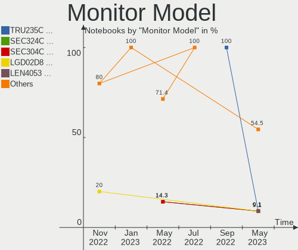

| Model                                                                | Notebooks | Percent |
|----------------------------------------------------------------------|-----------|---------|
| Samsung Electronics LCD Monitor SDC4852 1366x768 340x190mm 15.3-inch | 1         | 7.69%   |
| Quanta Display LCD Monitor QDS0020 1280x768 310x180mm 14.1-inch      | 1         | 7.69%   |
| Philips PHL 240B9 PHL0966 1920x1200 520x320mm 24.0-inch              | 1         | 7.69%   |
| LG Display LCD Monitor LGD062E 1920x1080 340x190mm 15.3-inch         | 1         | 7.69%   |
| Lenovo LCD Monitor LEN4035 1280x800 300x190mm 14.0-inch              | 1         | 7.69%   |
| Dell S2721D DELA19A 2560x1440 590x330mm 26.6-inch                    | 1         | 7.69%   |
| Chimei Innolux LCD Monitor CMN140A 1920x1080 310x170mm 13.9-inch     | 1         | 7.69%   |
| BOE LCD Monitor BOE08E2 1920x1080 340x190mm 15.3-inch                | 1         | 7.69%   |
| BOE LCD Monitor BOE07D8 1920x1080 340x190mm 15.3-inch                | 1         | 7.69%   |
| AU Optronics LCD Monitor AUOD291 1920x1200 300x190mm 14.0-inch       | 1         | 7.69%   |
| AU Optronics LCD Monitor AUO2336 2560x1440 310x170mm 13.9-inch       | 1         | 7.69%   |
| AU Optronics LCD Monitor AUO125C 1366x768 260x140mm 11.6-inch        | 1         | 7.69%   |
| Apple Color LCD APP9CF0 1440x900 290x180mm 13.4-inch                 | 1         | 7.69%   |

Monitor Resolution
------------------

Monitor screen resolution

| Resolution        | Notebooks | Percent |
|-------------------|-----------|---------|
| 1920x1080 (FHD)   | 5         | 38.46%  |
| 2560x1440 (QHD)   | 2         | 15.38%  |
| 1920x1200 (WUXGA) | 2         | 15.38%  |
| 1440x900 (WXGA+)  | 1         | 7.69%   |
| 1366x768 (WXGA)   | 1         | 7.69%   |
| 1280x800 (WXGA)   | 1         | 7.69%   |
| 1280x768          | 1         | 7.69%   |

Monitor Diagonal
----------------

Diagonal size in inches

| Inches | Notebooks | Percent |
|--------|-----------|---------|
| 15     | 4         | 30.77%  |
| 14     | 3         | 23.08%  |
| 13     | 3         | 23.08%  |
| 26     | 1         | 7.69%   |
| 24     | 1         | 7.69%   |
| 11     | 1         | 7.69%   |

Monitor Width
-------------

Physical width

| Width in mm | Notebooks | Percent |
|-------------|-----------|---------|
| 301-350     | 7         | 53.85%  |
| 201-300     | 4         | 30.77%  |
| 501-600     | 2         | 15.38%  |

Aspect Ratio
------------

Proportional relationship between the width and the height

| Ratio | Notebooks | Percent |
|-------|-----------|---------|
| 16/9  | 8         | 66.67%  |
| 16/10 | 4         | 33.33%  |

Monitor Area
------------

Area in inch²

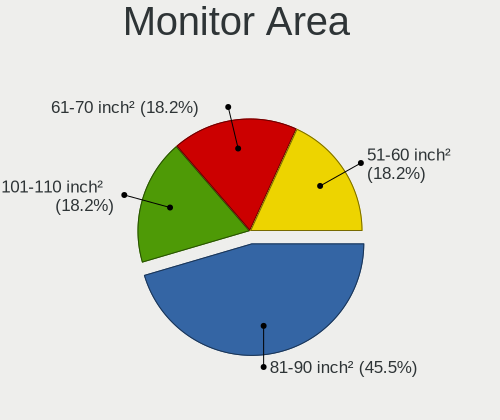

| Area in inch² | Notebooks | Percent |
|----------------|-----------|---------|
| 81-90          | 6         | 46.15%  |
| 91-100         | 4         | 30.77%  |
| 51-60          | 1         | 7.69%   |
| 301-350        | 1         | 7.69%   |
| 251-300        | 1         | 7.69%   |

Pixel Density
-------------

Pixels per inch

| Density | Notebooks | Percent |
|---------|-----------|---------|
| 121-160 | 6         | 46.15%  |
| 101-120 | 4         | 30.77%  |
| 161-240 | 2         | 15.38%  |
| 51-100  | 1         | 7.69%   |

Multiple Monitors
-----------------

Total monitors connected

| Total | Notebooks | Percent |
|-------|-----------|---------|
| 1     | 10        | 83.33%  |
| 2     | 2         | 16.67%  |

Network
-------

Net Controller Vendor
---------------------

Controller vendors

| Vendor                | Notebooks | Percent |
|-----------------------|-----------|---------|
| Intel                 | 9         | 45%     |
| Realtek Semiconductor | 7         | 35%     |
| Broadcom              | 2         | 10%     |
| MediaTek              | 1         | 5%      |
| AMD                   | 1         | 5%      |

Net Controller Model
--------------------

Controller models

| Model                                                               | Notebooks | Percent |
|---------------------------------------------------------------------|-----------|---------|
| Realtek RTL8111/8168/8411 PCI Express Gigabit Ethernet Controller   | 5         | 20%     |
| Intel Wi-Fi 6 AX200                                                 | 2         | 8%      |
| Realtek RTL8191SEvB Wireless LAN Controller                         | 1         | 4%      |
| Realtek RTL8188CUS 802.11n WLAN Adapter                             | 1         | 4%      |
| Realtek RTL-8100/8101L/8139 PCI Fast Ethernet Adapter               | 1         | 4%      |
| MediaTek MT7921 802.11ax PCI Express Wireless Network Adapter       | 1         | 4%      |
| Intel Wireless 8265 / 8275                                          | 1         | 4%      |
| Intel Wireless 8260                                                 | 1         | 4%      |
| Intel Wireless 7265                                                 | 1         | 4%      |
| Intel Wireless 3160                                                 | 1         | 4%      |
| Intel Wi-Fi 6 AX210/AX211/AX411 160MHz                              | 1         | 4%      |
| Intel Wi-Fi 6 AX201                                                 | 1         | 4%      |
| Intel Intel Centrino WiMAX 6250 Function                            | 1         | 4%      |
| Intel Ethernet Connection I219-LM                                   | 1         | 4%      |
| Intel Ethernet Connection (4) I219-V                                | 1         | 4%      |
| Intel Centrino Advanced-N + WiMAX 6250 [Kilmer Peak]                | 1         | 4%      |
| Intel 82577LM Gigabit Network Connection                            | 1         | 4%      |
| Broadcom BCM4360 802.11ac Wireless Network Adapter                  | 1         | 4%      |
| Broadcom BCM4318 [AirForce One 54g] 802.11g Wireless LAN Controller | 1         | 4%      |
| AMD IXP SB400 AC'97 Modem Controller                                | 1         | 4%      |

Wireless Vendor
---------------

Wireless vendors

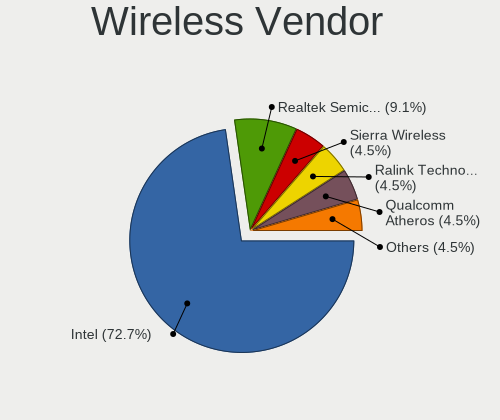

| Vendor                | Notebooks | Percent |
|-----------------------|-----------|---------|
| Intel                 | 8         | 66.67%  |
| Broadcom              | 2         | 16.67%  |
| Realtek Semiconductor | 1         | 8.33%   |
| MediaTek              | 1         | 8.33%   |

Wireless Model
--------------

Wireless models

| Model                                                               | Notebooks | Percent |
|---------------------------------------------------------------------|-----------|---------|
| Intel Wi-Fi 6 AX200                                                 | 2         | 15.38%  |
| Realtek RTL8191SEvB Wireless LAN Controller                         | 1         | 7.69%   |
| Realtek RTL8188CUS 802.11n WLAN Adapter                             | 1         | 7.69%   |
| MediaTek MT7921 802.11ax PCI Express Wireless Network Adapter       | 1         | 7.69%   |
| Intel Wireless 8265 / 8275                                          | 1         | 7.69%   |
| Intel Wireless 8260                                                 | 1         | 7.69%   |
| Intel Wireless 7265                                                 | 1         | 7.69%   |
| Intel Wireless 3160                                                 | 1         | 7.69%   |
| Intel Wi-Fi 6 AX210/AX211/AX411 160MHz                              | 1         | 7.69%   |
| Intel Wi-Fi 6 AX201                                                 | 1         | 7.69%   |
| Broadcom BCM4360 802.11ac Wireless Network Adapter                  | 1         | 7.69%   |
| Broadcom BCM4318 [AirForce One 54g] 802.11g Wireless LAN Controller | 1         | 7.69%   |

Ethernet Vendor
---------------

Ethernet vendors

| Vendor                | Notebooks | Percent |
|-----------------------|-----------|---------|
| Realtek Semiconductor | 6         | 66.67%  |
| Intel                 | 3         | 33.33%  |

Ethernet Model
--------------

Ethernet models

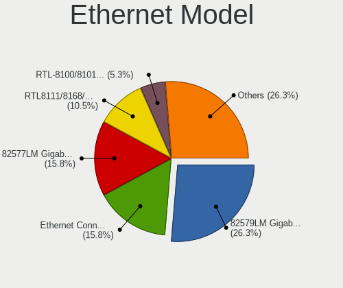

| Model                                                             | Notebooks | Percent |
|-------------------------------------------------------------------|-----------|---------|
| Realtek RTL8111/8168/8411 PCI Express Gigabit Ethernet Controller | 5         | 55.56%  |
| Realtek RTL-8100/8101L/8139 PCI Fast Ethernet Adapter             | 1         | 11.11%  |
| Intel Ethernet Connection I219-LM                                 | 1         | 11.11%  |
| Intel Ethernet Connection (4) I219-V                              | 1         | 11.11%  |
| Intel 82577LM Gigabit Network Connection                          | 1         | 11.11%  |

Net Controller Kind
-------------------

Ethernet, WiFi or modem

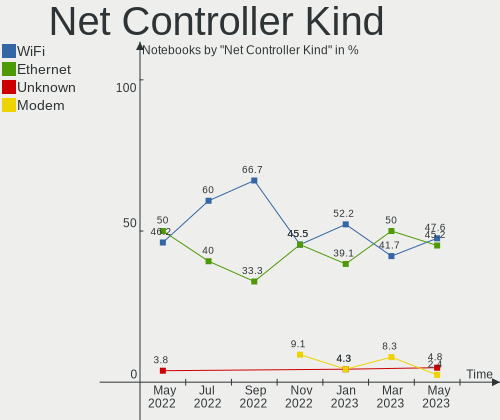

| Kind     | Notebooks | Percent |
|----------|-----------|---------|
| WiFi     | 12        | 52.17%  |
| Ethernet | 9         | 39.13%  |
| Modem    | 1         | 4.35%   |
| Unknown  | 1         | 4.35%   |

Used Controller
---------------

Currently used network controller

| Kind     | Notebooks | Percent |
|----------|-----------|---------|
| WiFi     | 9         | 64.29%  |
| Ethernet | 4         | 28.57%  |
| Unknown  | 1         | 7.14%   |

NICs
----

Total network controllers on board

| Total | Notebooks | Percent |
|-------|-----------|---------|
| 2     | 9         | 75%     |
| 1     | 3         | 25%     |

IPv6
----

IPv6 vs IPv4

| Used | Notebooks | Percent |
|------|-----------|---------|
| No   | 12        | 100%    |

Bluetooth
---------

Bluetooth Vendor
----------------

Controller vendors

| Vendor            | Notebooks | Percent |
|-------------------|-----------|---------|
| Intel             | 8         | 80%     |
| Foxconn / Hon Hai | 1         | 10%     |
| Apple             | 1         | 10%     |

Bluetooth Model
---------------

Controller models

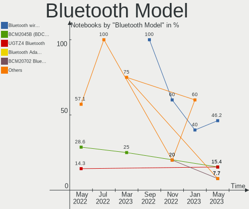

| Model                                   | Notebooks | Percent |
|-----------------------------------------|-----------|---------|
| Intel Bluetooth wireless interface      | 4         | 40%     |
| Intel AX200 Bluetooth                   | 2         | 20%     |
| Intel AX210 Bluetooth                   | 1         | 10%     |
| Intel AX201 Bluetooth                   | 1         | 10%     |
| Foxconn / Hon Hai Wireless_Device       | 1         | 10%     |
| Apple Apple Broadcom Built-in Bluetooth | 1         | 10%     |

Sound
-----

Sound Vendor
------------

Sound card vendors

| Vendor | Notebooks | Percent |
|--------|-----------|---------|
| Intel  | 8         | 66.67%  |
| AMD    | 4         | 33.33%  |

Sound Model
-----------

Sound card models

| Model                                                                                             | Notebooks | Percent |
|---------------------------------------------------------------------------------------------------|-----------|---------|
| AMD Renoir Radeon High Definition Audio Controller                                                | 3         | 17.65%  |
| AMD Family 17h/19h HD Audio Controller                                                            | 3         | 17.65%  |
| Intel Wildcat Point-LP High Definition Audio Controller                                           | 2         | 11.76%  |
| Intel Sunrise Point-LP HD Audio                                                                   | 2         | 11.76%  |
| Intel Broadwell-U Audio Controller                                                                | 2         | 11.76%  |
| Intel Tiger Lake-LP Smart Sound Technology Audio Controller                                       | 1         | 5.88%   |
| Intel Atom/Celeron/Pentium Processor x5-E8000/J3xxx/N3xxx Series High Definition Audio Controller | 1         | 5.88%   |
| Intel Alder Lake PCH-P High Definition Audio Controller                                           | 1         | 5.88%   |
| Intel 5 Series/3400 Series Chipset High Definition Audio                                          | 1         | 5.88%   |
| AMD IXP SB400 AC'97 Audio Controller                                                              | 1         | 5.88%   |

Memory
------

Memory Vendor
-------------

Memory module vendors

| Vendor | Notebooks | Percent |
|--------|-----------|---------|
| Elpida | 1         | 100%    |

Memory Model
------------

Memory module models

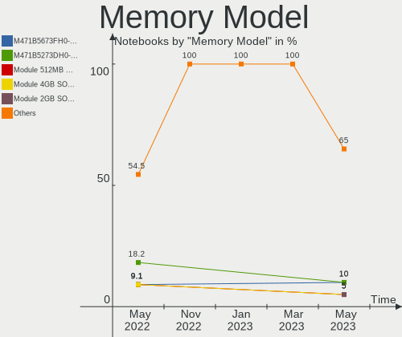

| Model                                                 | Notebooks | Percent |
|-------------------------------------------------------|-----------|---------|
| Elpida RAM EBJ41UF8BCS0-DJ-F 4GB SODIMM DDR3 1334MT/s | 1         | 50%     |
| Elpida RAM EBJ21UE8BDS0-AE-F 2GB SODIMM DDR3 1067MT/s | 1         | 50%     |

Memory Kind
-----------

Memory module kinds

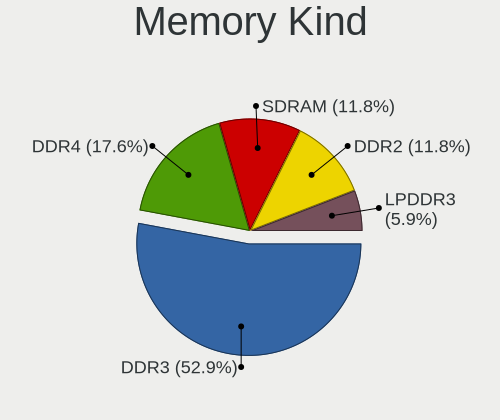

| Kind | Notebooks | Percent |
|------|-----------|---------|
| DDR3 | 1         | 100%    |

Memory Form Factor
------------------

Physical design of the memory module

| Name   | Notebooks | Percent |
|--------|-----------|---------|
| SODIMM | 1         | 100%    |

Memory Size
-----------

Memory module size

| Size | Notebooks | Percent |
|------|-----------|---------|
| 4096 | 1         | 50%     |
| 2048 | 1         | 50%     |

Memory Speed
------------

Memory module speed

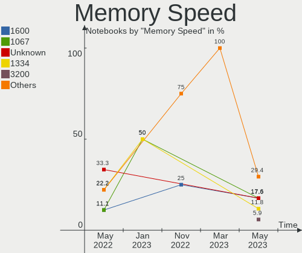

| Speed | Notebooks | Percent |
|-------|-----------|---------|
| 1334  | 1         | 50%     |
| 1067  | 1         | 50%     |

Printers & scanners
-------------------

Printer Vendor
--------------

Printer device vendors

Zero info for selected period =(

Printer Model
-------------

Printer device models

Zero info for selected period =(

Scanner Vendor
--------------

Scanner device vendors

Zero info for selected period =(

Scanner Model
-------------

Scanner device models

Zero info for selected period =(

Camera
------

Camera Vendor
-------------

Camera device vendors

| Vendor                | Notebooks | Percent |
|-----------------------|-----------|---------|
| Chicony Electronics   | 3         | 33.33%  |
| Acer                  | 3         | 33.33%  |
| Realtek Semiconductor | 1         | 11.11%  |
| Quanta                | 1         | 11.11%  |
| Lite-On Technology    | 1         | 11.11%  |

Camera Model
------------

Camera device models

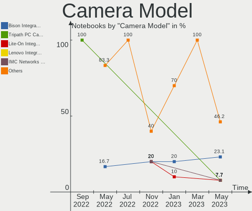

| Model                            | Notebooks | Percent |
|----------------------------------|-----------|---------|
| Chicony Ltd., Integrated Camera  | 2         | 20%     |
| Realtek Integrated_Webcam_HD     | 1         | 10%     |
| Quanta HP Universal Camera       | 1         | 10%     |
| Lite-On Integrated Camera        | 1         | 10%     |
| Chicony Chicony USB2.0 Camera    | 1         | 10%     |
| Acer SunplusIT Integrated Camera | 1         | 10%     |
| Acer Lenovo EasyCamera           | 1         | 10%     |
| Acer Integrated RGB Camera       | 1         | 10%     |
| Acer Integrated Camera           | 1         | 10%     |

Security
--------

Fingerprint Vendor
------------------

Fingerprint sensor vendors

| Vendor    | Notebooks | Percent |
|-----------|-----------|---------|
| Synaptics | 2         | 100%    |

Fingerprint Model
-----------------

Fingerprint sensor models

| Model                                                     | Notebooks | Percent |
|-----------------------------------------------------------|-----------|---------|
| Synaptics  FS7604 Touch Fingerprint Sensor with PurePrint | 1         | 50%     |
| Synaptics Metallica MIS Touch Fingerprint Reader          | 1         | 50%     |

Chipcard Vendor
---------------

Chipcard module vendors

Zero info for selected period =(

Chipcard Model
--------------

Chipcard module models

Zero info for selected period =(

Unsupported
-----------

Unsupported Devices
-------------------

Total unsupported devices on board

| Total | Notebooks | Percent |
|-------|-----------|---------|
| 1     | 6         | 50%     |
| 0     | 3         | 25%     |
| 5     | 1         | 8.33%   |
| 3     | 1         | 8.33%   |
| 2     | 1         | 8.33%   |

Unsupported Device Types
------------------------

Types of unsupported devices

| Type                     | Notebooks | Percent |
|--------------------------|-----------|---------|
| Communication controller | 7         | 43.75%  |
| Net/wireless             | 3         | 18.75%  |
| Storage/ata              | 1         | 6.25%   |
| Storage                  | 1         | 6.25%   |
| Sound                    | 1         | 6.25%   |
| Network                  | 1         | 6.25%   |
| Modem                    | 1         | 6.25%   |
| Firewire controller      | 1         | 6.25%   |

