OpenBSD - Hardware Trends (Notebooks)
-------------------------------------

A project to identify most popular hardware characteristics and track their change
over time based on data collected by BSD users at https://BSD-Hardware.info.

Anyone can contribute to this report by the [hw-probe](https://github.com/linuxhw/hw-probe/blob/master/INSTALL.BSD.md) tool:

    hw-probe -all -upload

This report is for one last month. Overall report since the beginning of time: [TestDays](https://github.com/bsdhw/TestDays)

Period: May, 2023.

Contents
--------

* [ System ](#system)
  - [ OS                       ](#os)
  - [ OS Family                ](#os-family)
  - [ Arch                     ](#arch)
  - [ DE                       ](#de)
  - [ Display Server           ](#display-server)
  - [ Display Manager          ](#display-manager)
  - [ OS Lang                  ](#os-lang)
  - [ Boot Mode                ](#boot-mode)
  - [ Filesystem               ](#filesystem)
  - [ Part. scheme             ](#part-scheme)

* [ Board ](#board)
  - [ Vendor                   ](#vendor)
  - [ Model                    ](#model)
  - [ Model Family             ](#model-family)
  - [ MFG Year                 ](#mfg-year)
  - [ Form Factor              ](#form-factor)
  - [ Coreboot                 ](#coreboot)
  - [ RAM Size                 ](#ram-size)
  - [ RAM Used                 ](#ram-used)
  - [ Total Drives             ](#total-drives)
  - [ Has CD-ROM               ](#has-cd-rom)
  - [ Has Ethernet             ](#has-ethernet)
  - [ Has WiFi                 ](#has-wifi)
  - [ Has Bluetooth            ](#has-bluetooth)

* [ Location ](#location)
  - [ Country                  ](#country)
  - [ City                     ](#city)

* [ Drives ](#drives)
  - [ Drive Vendor             ](#drive-vendor)
  - [ Drive Model              ](#drive-model)
  - [ HDD Vendor               ](#hdd-vendor)
  - [ SSD Vendor               ](#ssd-vendor)
  - [ Drive Kind               ](#drive-kind)
  - [ Drive Connector          ](#drive-connector)
  - [ Drive Size               ](#drive-size)
  - [ Space Total              ](#space-total)
  - [ Space Used               ](#space-used)
  - [ Malfunc. Drives          ](#malfunc-drives)
  - [ Malfunc. Drive Vendor    ](#malfunc-drive-vendor)
  - [ Malfunc. HDD Vendor      ](#malfunc-hdd-vendor)
  - [ Malfunc. Drive Kind      ](#malfunc-drive-kind)
  - [ Failed Drives            ](#failed-drives)
  - [ Failed Drive Vendor      ](#failed-drive-vendor)
  - [ Drive Status             ](#drive-status)

* [ Storage controller ](#storage-controller)
  - [ Storage Vendor           ](#storage-vendor)
  - [ Storage Model            ](#storage-model)
  - [ Storage Kind             ](#storage-kind)

* [ Processor ](#processor)
  - [ CPU Vendor               ](#cpu-vendor)
  - [ CPU Model                ](#cpu-model)
  - [ CPU Model Family         ](#cpu-model-family)
  - [ CPU Cores                ](#cpu-cores)
  - [ CPU Sockets              ](#cpu-sockets)
  - [ CPU Threads              ](#cpu-threads)
  - [ CPU Microarch            ](#cpu-microarch)

* [ Graphics ](#graphics)
  - [ GPU Vendor               ](#gpu-vendor)
  - [ GPU Model                ](#gpu-model)
  - [ GPU Combo                ](#gpu-combo)
  - [ GPU Driver               ](#gpu-driver)
  - [ GPU Memory               ](#gpu-memory)

* [ Monitor ](#monitor)
  - [ Monitor Vendor           ](#monitor-vendor)
  - [ Monitor Model            ](#monitor-model)
  - [ Monitor Resolution       ](#monitor-resolution)
  - [ Monitor Diagonal         ](#monitor-diagonal)
  - [ Monitor Width            ](#monitor-width)
  - [ Aspect Ratio             ](#aspect-ratio)
  - [ Monitor Area             ](#monitor-area)
  - [ Pixel Density            ](#pixel-density)
  - [ Multiple Monitors        ](#multiple-monitors)

* [ Network ](#network)
  - [ Net Controller Vendor    ](#net-controller-vendor)
  - [ Net Controller Model     ](#net-controller-model)
  - [ Wireless Vendor          ](#wireless-vendor)
  - [ Wireless Model           ](#wireless-model)
  - [ Ethernet Vendor          ](#ethernet-vendor)
  - [ Ethernet Model           ](#ethernet-model)
  - [ Net Controller Kind      ](#net-controller-kind)
  - [ Used Controller          ](#used-controller)
  - [ NICs                     ](#nics)
  - [ IPv6                     ](#ipv6)

* [ Bluetooth ](#bluetooth)
  - [ Bluetooth Vendor         ](#bluetooth-vendor)
  - [ Bluetooth Model          ](#bluetooth-model)

* [ Sound ](#sound)
  - [ Sound Vendor             ](#sound-vendor)
  - [ Sound Model              ](#sound-model)

* [ Memory ](#memory)
  - [ Memory Vendor            ](#memory-vendor)
  - [ Memory Model             ](#memory-model)
  - [ Memory Kind              ](#memory-kind)
  - [ Memory Form Factor       ](#memory-form-factor)
  - [ Memory Size              ](#memory-size)
  - [ Memory Speed             ](#memory-speed)

* [ Printers & scanners ](#printers--scanners)
  - [ Printer Vendor           ](#printer-vendor)
  - [ Printer Model            ](#printer-model)
  - [ Scanner Vendor           ](#scanner-vendor)
  - [ Scanner Model            ](#scanner-model)

* [ Camera ](#camera)
  - [ Camera Vendor            ](#camera-vendor)
  - [ Camera Model             ](#camera-model)

* [ Security ](#security)
  - [ Fingerprint Vendor       ](#fingerprint-vendor)
  - [ Fingerprint Model        ](#fingerprint-model)
  - [ Chipcard Vendor          ](#chipcard-vendor)
  - [ Chipcard Model           ](#chipcard-model)

* [ Unsupported ](#unsupported)
  - [ Unsupported Devices      ](#unsupported-devices)
  - [ Unsupported Device Types ](#unsupported-device-types)

System
------

OS
--

Installed operating systems

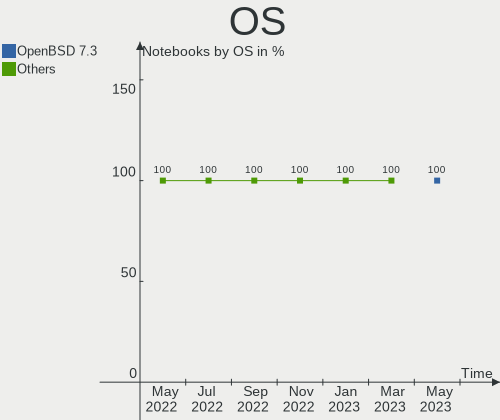

| Name        | Notebooks | Percent |
|-------------|-----------|---------|
| OpenBSD 7.3 | 22        | 100%    |

OS Family
---------

OS without a version

| Name    | Notebooks | Percent |
|---------|-----------|---------|
| OpenBSD | 22        | 100%    |

Arch
----

OS architecture (x86_64, i586, etc.)

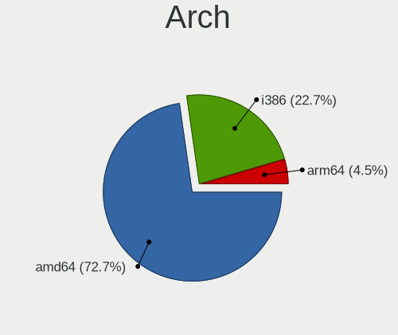

| Name  | Notebooks | Percent |
|-------|-----------|---------|
| amd64 | 16        | 72.73%  |
| i386  | 5         | 22.73%  |
| arm64 | 1         | 4.55%   |

DE
--

Desktop Environment

| Name         | Notebooks | Percent |
|--------------|-----------|---------|
| helloDesktop | 19        | 86.36%  |
| GNOME        | 3         | 13.64%  |

Display Server
--------------

X11 or Wayland

| Name    | Notebooks | Percent |
|---------|-----------|---------|
| X11     | 20        | 90.91%  |
| Console | 2         | 9.09%   |

Display Manager
---------------

SDDM, LightDM, etc.

| Name    | Notebooks | Percent |
|---------|-----------|---------|
| Console | 22        | 100%    |

OS Lang
-------

Language

| Lang    | Notebooks | Percent |
|---------|-----------|---------|
| Unknown | 19        | 86.36%  |
| en_US   | 2         | 9.09%   |
| C       | 1         | 4.55%   |

Boot Mode
---------

EFI or BIOS

| Mode | Notebooks | Percent |
|------|-----------|---------|
| BIOS | 12        | 54.55%  |
| EFI  | 10        | 45.45%  |

Filesystem
----------

Type of filesystem

| Type | Notebooks | Percent |
|------|-----------|---------|
| Ffs  | 22        | 100%    |

Part. scheme
------------

Scheme of partitioning

| Type | Notebooks | Percent |
|------|-----------|---------|
| MBR  | 12        | 54.55%  |
| GPT  | 10        | 45.45%  |

Board
-----

Vendor
------

Motherboard manufacturer

| Name                           | Notebooks | Percent |
|--------------------------------|-----------|---------|
| Lenovo                         | 14        | 63.64%  |
| Panasonic                      | 2         | 9.09%   |
| Matsushita Electric Industrial | 2         | 9.09%   |
| Toshiba                        | 1         | 4.55%   |
| Tactus                         | 1         | 4.55%   |
| ASUSTek Computer               | 1         | 4.55%   |
| Unknown                        | 1         | 4.55%   |

Model
-----

Motherboard model

| Name                                        | Notebooks | Percent |
|---------------------------------------------|-----------|---------|
| Toshiba NB250                               | 1         | 4.55%   |
| Tactus GeoFlex 110                          | 1         | 4.55%   |
| Panasonic CF-53AAGHYDM                      | 1         | 4.55%   |
| Panasonic CF-52PFPBSFQ                      | 1         | 4.55%   |
| Matsushita Electric Industrial CF-51RCVDNLM | 1         | 4.55%   |
| Matsushita Electric Industrial CF-48V4KNDQM | 1         | 4.55%   |
| Lenovo ThinkPad X270 W10DG 20K5S0TT1N       | 1         | 4.55%   |
| Lenovo ThinkPad X260 20F5S2GM00             | 1         | 4.55%   |
| Lenovo ThinkPad X230 2325T4T                | 1         | 4.55%   |
| Lenovo ThinkPad X220 429043U                | 1         | 4.55%   |
| Lenovo ThinkPad X201 3323BBG                | 1         | 4.55%   |
| Lenovo ThinkPad X140e 20BMS03E00            | 1         | 4.55%   |
| Lenovo ThinkPad X1 Carbon 4th 20FCS13H00    | 1         | 4.55%   |
| Lenovo ThinkPad T61 7659AS5                 | 1         | 4.55%   |
| Lenovo ThinkPad T500 205663G                | 1         | 4.55%   |
| Lenovo ThinkPad T480s 20L8A00KCL            | 1         | 4.55%   |
| Lenovo ThinkPad T430 2347GZU                | 1         | 4.55%   |
| Lenovo ThinkPad T420s 41742BU               | 1         | 4.55%   |
| Lenovo ThinkPad T410 2537N24                | 1         | 4.55%   |
| Lenovo ThinkPad T14 Gen 1 20UES5NW00        | 1         | 4.55%   |
| ASUS 1000HE                                 | 1         | 4.55%   |
| Unknown                                     | 1         | 4.55%   |

Model Family
------------

Motherboard model prefix

| Name                                        | Notebooks | Percent |
|---------------------------------------------|-----------|---------|
| Lenovo ThinkPad                             | 14        | 63.64%  |
| Toshiba NB250                               | 1         | 4.55%   |
| Tactus GeoFlex                              | 1         | 4.55%   |
| Panasonic CF-53AAGHYDM                      | 1         | 4.55%   |
| Panasonic CF-52PFPBSFQ                      | 1         | 4.55%   |
| Matsushita Electric Industrial CF-51RCVDNLM | 1         | 4.55%   |
| Matsushita Electric Industrial CF-48V4KNDQM | 1         | 4.55%   |
| ASUS 1000HE                                 | 1         | 4.55%   |
| Unknown                                     | 1         | 4.55%   |

MFG Year
--------

Motherboard manufacture year

| Year    | Notebooks | Percent |
|---------|-----------|---------|
| 2011    | 4         | 18.18%  |
| 2010    | 4         | 18.18%  |
| 2018    | 2         | 9.09%   |
| 2021    | 1         | 4.55%   |
| 2020    | 1         | 4.55%   |
| 2017    | 1         | 4.55%   |
| 2016    | 1         | 4.55%   |
| 2015    | 1         | 4.55%   |
| 2013    | 1         | 4.55%   |
| 2012    | 1         | 4.55%   |
| 2009    | 1         | 4.55%   |
| 2007    | 1         | 4.55%   |
| 2006    | 1         | 4.55%   |
| 2002    | 1         | 4.55%   |
| Unknown | 1         | 4.55%   |

Form Factor
-----------

Physical design of the computer

| Name     | Notebooks | Percent |
|----------|-----------|---------|
| Notebook | 22        | 100%    |

Coreboot
--------

Have coreboot on board

| Used | Notebooks | Percent |
|------|-----------|---------|
| No   | 22        | 100%    |

RAM Size
--------

Total RAM memory

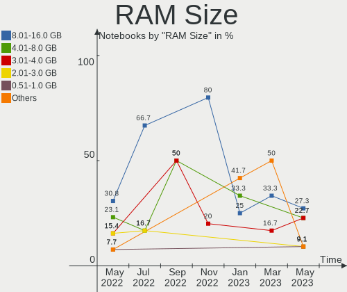

| Size in GB | Notebooks | Percent |
|------------|-----------|---------|
| 8.01-16.0  | 6         | 27.27%  |
| 4.01-8.0   | 5         | 22.73%  |
| 3.01-4.0   | 5         | 22.73%  |
| 2.01-3.0   | 2         | 9.09%   |
| 0.51-1.0   | 2         | 9.09%   |
| 24.01-32.0 | 1         | 4.55%   |
| 1.01-2.0   | 1         | 4.55%   |

RAM Used
--------

Used RAM memory

| Used GB  | Notebooks | Percent |
|----------|-----------|---------|
| 0.01-0.5 | 18        | 81.82%  |
| 0        | 3         | 13.64%  |
| 0.51-1.0 | 1         | 4.55%   |

Total Drives
------------

Number of drives on board

| Drives | Notebooks | Percent |
|--------|-----------|---------|
| 1      | 16        | 72.73%  |
| 2      | 3         | 13.64%  |
| 3      | 2         | 9.09%   |
| 0      | 1         | 4.55%   |

Has CD-ROM
----------

Has CD-ROM on board

| Presented | Notebooks | Percent |
|-----------|-----------|---------|
| No        | 22        | 100%    |

Has Ethernet
------------

Has Ethernet on board

| Presented | Notebooks | Percent |
|-----------|-----------|---------|
| Yes       | 19        | 86.36%  |
| No        | 3         | 13.64%  |

Has WiFi
--------

Has WiFi module

| Presented | Notebooks | Percent |
|-----------|-----------|---------|
| Yes       | 20        | 90.91%  |
| No        | 2         | 9.09%   |

Has Bluetooth
-------------

Has Bluetooth module

| Presented | Notebooks | Percent |
|-----------|-----------|---------|
| Yes       | 13        | 59.09%  |
| No        | 9         | 40.91%  |

Location
--------

Country
-------

Geographic location (country)

| Country | Notebooks | Percent |
|---------|-----------|---------|
| Canada  | 13        | 59.09%  |
| Uruguay | 2         | 9.09%   |
| Brazil  | 2         | 9.09%   |
| USA     | 1         | 4.55%   |
| Russia  | 1         | 4.55%   |
| Romania | 1         | 4.55%   |
| Poland  | 1         | 4.55%   |
| Germany | 1         | 4.55%   |

City
----

Geographic location (city)

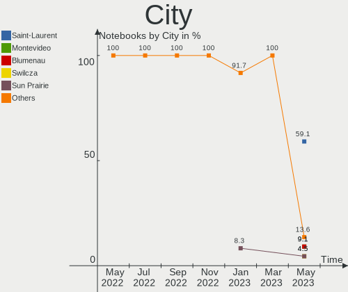

| City          | Notebooks | Percent |
|---------------|-----------|---------|
| Saint-Laurent | 13        | 59.09%  |
| Montevideo    | 2         | 9.09%   |
| Blumenau      | 2         | 9.09%   |
| Swilcza       | 1         | 4.55%   |
| Sun Prairie   | 1         | 4.55%   |
| St Petersburg | 1         | 4.55%   |
| Lübeck       | 1         | 4.55%   |
| Brasov        | 1         | 4.55%   |

Drives
------

Drive Vendor
------------

Hard drive vendors

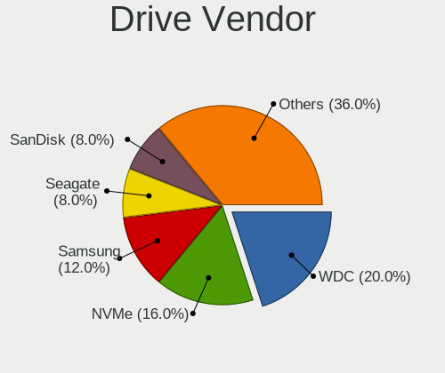

| Vendor              | Notebooks | Drives | Percent |
|---------------------|-----------|--------|---------|
| WDC                 | 5         | 5      | 20%     |
| NVMe                | 4         | 4      | 16%     |
| Samsung Electronics | 3         | 3      | 12%     |
| Seagate             | 2         | 2      | 8%      |
| SanDisk             | 2         | 2      | 8%      |
| Kingston            | 2         | 2      | 8%      |
| Hitachi             | 2         | 2      | 8%      |
| Verbatim            | 1         | 1      | 4%      |
| Union Memory        | 1         | 1      | 4%      |
| SMI                 | 1         | 1      | 4%      |
| Intenso             | 1         | 1      | 4%      |
| A-DATA Technology   | 1         | 1      | 4%      |

Drive Model
-----------

Hard drive models

| Model                               | Notebooks | Percent |
|-------------------------------------|-----------|---------|
| SanDisk Extreme SSD 500GB           | 2         | 8%      |
| NVMe SAMSUNG MZVLW256 256GB         | 2         | 8%      |
| WDC WD7500BPKX-00HPJT0 752GB        | 1         | 4%      |
| WDC WD7500BPKT-00PK4T0 752GB        | 1         | 4%      |
| WDC WD5000LPLX-00ZNTT0 500GB        | 1         | 4%      |
| WDC WD3200BEVE-00A0HT0 320GB        | 1         | 4%      |
| WDC WD10JPLX-00MBPT0 1TB            | 1         | 4%      |
| Verbatim STORE N GO 64GB            | 1         | 4%      |
| Union Memory RTOTJ128VGD2EYX 128GB  | 1         | 4%      |
| SMI USB DISK 18302PB                | 1         | 4%      |
| Seagate ST9160821A 160GB            | 1         | 4%      |
| Seagate ST500LM012 HN-M500MBB 500GB | 1         | 4%      |
| Samsung SSD 860 EVO M.2 1TB         | 1         | 4%      |
| Samsung MZ7TD128HAFV-000L1 128GB    | 1         | 4%      |
| Samsung MZ7PC128HAFU-000L1 128GB    | 1         | 4%      |
| NVMe KINGSTON SNVS200 2TB           | 1         | 4%      |
| NVMe APPLE SSD AP0512 500GB         | 1         | 4%      |
| Kingston SA400S37240G 240GB         | 1         | 4%      |
| Kingston SA400S37120G 120GB         | 1         | 4%      |
| Intenso SSD 256GB                   | 1         | 4%      |
| Hitachi HTS723232A7A364 320GB       | 1         | 4%      |
| Hitachi HTS545016B9A300 160GB       | 1         | 4%      |
| A-DATA SP550 480GB                  | 1         | 4%      |

HDD Vendor
----------

Hard disk drive vendors

| Vendor   | Notebooks | Drives | Percent |
|----------|-----------|--------|---------|
| WDC      | 5         | 5      | 35.71%  |
| NVMe     | 3         | 3      | 21.43%  |
| Seagate  | 2         | 2      | 14.29%  |
| Hitachi  | 2         | 2      | 14.29%  |
| Verbatim | 1         | 1      | 7.14%   |
| SMI      | 1         | 1      | 7.14%   |

SSD Vendor
----------

Solid state drive vendors

| Vendor              | Notebooks | Drives | Percent |
|---------------------|-----------|--------|---------|
| Samsung Electronics | 3         | 3      | 27.27%  |
| SanDisk             | 2         | 2      | 18.18%  |
| Kingston            | 2         | 2      | 18.18%  |
| Union Memory        | 1         | 1      | 9.09%   |
| NVMe                | 1         | 1      | 9.09%   |
| Intenso             | 1         | 1      | 9.09%   |
| A-DATA Technology   | 1         | 1      | 9.09%   |

Drive Kind
----------

HDD or SSD

| Kind | Notebooks | Drives | Percent |
|------|-----------|--------|---------|
| HDD  | 13        | 14     | 54.17%  |
| SSD  | 11        | 11     | 45.83%  |

Drive Connector
---------------

SATA, SAS, NVMe, etc.

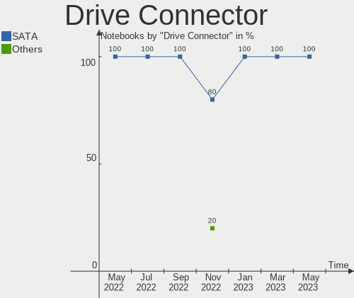

| Type | Notebooks | Drives | Percent |
|------|-----------|--------|---------|
| SATA | 21        | 25     | 100%    |

Drive Size
----------

Size of hard drive

| Size in TB      | Notebooks | Drives | Percent |
|-----------------|-----------|--------|---------|
| 0.01-0.5        | 17        | 19     | 73.91%  |
| 0.51-1.0        | 4         | 4      | 17.39%  |
| More than 100.0 | 1         | 1      | 4.35%   |
| 1.01-2.0        | 1         | 1      | 4.35%   |

Space Total
-----------

Amount of disk space available on the file system

| Size in GB | Notebooks | Percent |
|------------|-----------|---------|
| 21-50      | 10        | 45.45%  |
| 101-250    | 5         | 22.73%  |
| 51-100     | 4         | 18.18%  |
| 251-500    | 2         | 9.09%   |
| 1-20       | 1         | 4.55%   |

Space Used
----------

Amount of used disk space

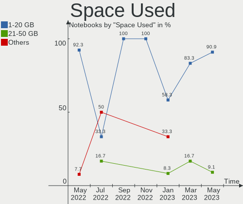

| Used GB | Notebooks | Percent |
|---------|-----------|---------|
| 1-20    | 20        | 90.91%  |
| 21-50   | 2         | 9.09%   |

Malfunc. Drives
---------------

Drive models with a malfunction

| Model                         | Notebooks | Drives | Percent |
|-------------------------------|-----------|--------|---------|
| A-DATA Technology SP550 480GB | 1         | 1      | 100%    |

Malfunc. Drive Vendor
---------------------

Vendors of faulty drives

| Vendor            | Notebooks | Drives | Percent |
|-------------------|-----------|--------|---------|
| A-DATA Technology | 1         | 1      | 100%    |

Malfunc. HDD Vendor
-------------------

Vendors of faulty HDD drives

Zero info for selected period =(

Malfunc. Drive Kind
-------------------

Kinds of faulty drives

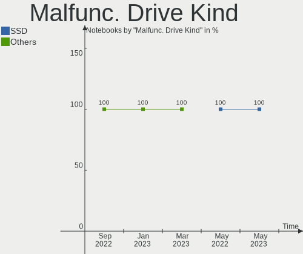

| Kind | Notebooks | Drives | Percent |
|------|-----------|--------|---------|
| SSD  | 1         | 1      | 100%    |

Failed Drives
-------------

Failed drive models

Zero info for selected period =(

Failed Drive Vendor
-------------------

Failed drive vendors

Zero info for selected period =(

Drive Status
------------

Number of failed and malfunc. drives

| Status   | Notebooks | Drives | Percent |
|----------|-----------|--------|---------|
| Works    | 16        | 17     | 72.73%  |
| Detected | 5         | 7      | 22.73%  |
| Malfunc  | 1         | 1      | 4.55%   |

Storage controller
------------------

Storage Vendor
--------------

Storage controller vendors

| Vendor                      | Notebooks | Percent |
|-----------------------------|-----------|---------|
| Intel                       | 16        | 80%     |
| Samsung Electronics         | 2         | 10%     |
| Kingston Technology Company | 1         | 5%      |
| AMD                         | 1         | 5%      |

Storage Model
-------------

Storage controller models

| Model                                                                                  | Notebooks | Percent |
|----------------------------------------------------------------------------------------|-----------|---------|
| Intel 5 Series/3400 Series Chipset 6 port SATA AHCI Controller                         | 3         | 14.29%  |
| Samsung NVMe SSD Controller SM961/PM961/SM963                                          | 2         | 9.52%   |
| Intel Sunrise Point-LP SATA Controller [AHCI mode]                                     | 2         | 9.52%   |
| Intel 82801GBM/GHM (ICH7-M Family) SATA Controller [IDE mode]                          | 2         | 9.52%   |
| Intel 7 Series Chipset Family 6-port SATA Controller [AHCI mode]                       | 2         | 9.52%   |
| Intel 6 Series/C200 Series Chipset Family 6 port Mobile SATA AHCI Controller           | 2         | 9.52%   |
| Kingston Company SNVS2000G [NV1 NVMe PCIe SSD 2TB]                                     | 1         | 4.76%   |
| Intel Celeron/Pentium Silver Processor SATA Controller                                 | 1         | 4.76%   |
| Intel 82801IBM/IEM (ICH9M/ICH9M-E) 4 port SATA Controller [AHCI mode]                  | 1         | 4.76%   |
| Intel 82801HM/HEM (ICH8M/ICH8M-E) SATA Controller [AHCI mode]                          | 1         | 4.76%   |
| Intel 82801CAM IDE U100 Controller                                                     | 1         | 4.76%   |
| Intel 6 Series/C200 Series Chipset Family Mobile SATA Controller (IDE mode, ports 4-5) | 1         | 4.76%   |
| Intel 6 Series/C200 Series Chipset Family Mobile SATA Controller (IDE mode, ports 0-3) | 1         | 4.76%   |
| AMD FCH SATA Controller [IDE mode]                                                     | 1         | 4.76%   |

Storage Kind
------------

Kind of storage controller (IDE, SATA, NVMe, SAS, ...)

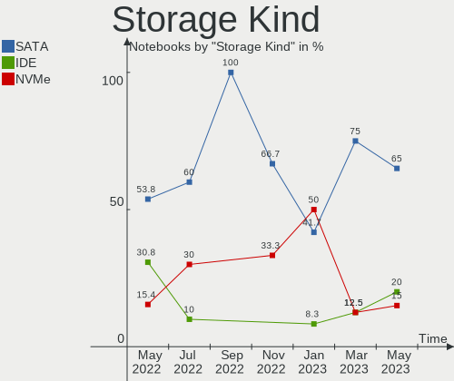

| Kind | Notebooks | Percent |
|------|-----------|---------|
| SATA | 13        | 65%     |
| IDE  | 4         | 20%     |
| NVMe | 3         | 15%     |

Processor
---------

CPU Vendor
----------

Processor vendors

| Vendor  | Notebooks | Percent |
|---------|-----------|---------|
| Intel   | 19        | 86.36%  |
| AMD     | 2         | 9.09%   |
| Unknown | 1         | 4.55%   |

CPU Model
---------

Processor models

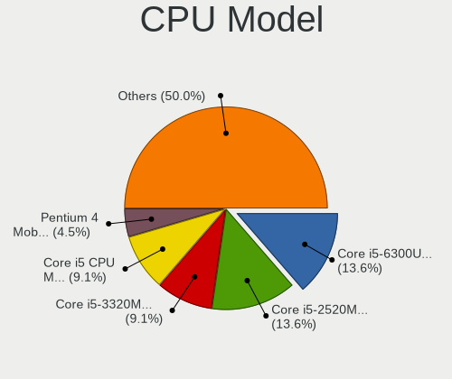

| Model                                                           | Notebooks | Percent |
|-----------------------------------------------------------------|-----------|---------|
| Intel Core i5-6300U CPU @ 2.40GHz                               | 3         | 13.64%  |
| Intel Core i5-2520M CPU @ 2.50GHz                               | 3         | 13.64%  |
| Intel Core i5-3320M CPU @ 2.60GHz                               | 2         | 9.09%   |
| Intel Core i5 CPU M 520 @ 2.40GHz                               | 2         | 9.09%   |
| Intel Pentium 4 Mobile CPU 1.60GHz                              | 1         | 4.55%   |
| Intel Genuine CPU T2300 @ 1.66GHz                               | 1         | 4.55%   |
| Intel Core i7-8650U CPU @ 1.90GHz                               | 1         | 4.55%   |
| Intel Core i3 CPU M 350 @ 2.27GHz                               | 1         | 4.55%   |
| Intel Core 2 Duo CPU T9400 @ 2.53GHz                            | 1         | 4.55%   |
| Intel Core 2 Duo CPU T7100 @ 1.80GHz ("GenuineIntel" 686-class) | 1         | 4.55%   |
| Intel Celeron N4020 CPU @ 1.10GHz                               | 1         | 4.55%   |
| Intel Atom CPU N455 @ 1.66GHz ("GenuineIntel" 686-class)        | 1         | 4.55%   |
| Intel Atom CPU N280 @ 1.66GHz                                   | 1         | 4.55%   |
| AMD Ryzen 5 PRO 4650U with Radeon Graphics                      | 1         | 4.55%   |
| AMD E1-2500 APU with Radeon HD Graphics                         | 1         | 4.55%   |
|                                                                 | 1         | 4.55%   |

CPU Model Family
----------------

Processor model prefix

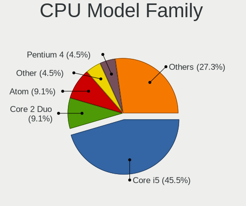

| Model            | Notebooks | Percent |
|------------------|-----------|---------|
| Intel Core i5    | 10        | 45.45%  |
| Intel Core 2 Duo | 2         | 9.09%   |
| Intel Atom       | 2         | 9.09%   |
| Other            | 1         | 4.55%   |
| Intel Pentium 4  | 1         | 4.55%   |
| Intel Genuine    | 1         | 4.55%   |
| Intel Core i7    | 1         | 4.55%   |
| Intel Core i3    | 1         | 4.55%   |
| Intel Celeron    | 1         | 4.55%   |
| AMD Ryzen 5 PRO  | 1         | 4.55%   |
| AMD E1           | 1         | 4.55%   |

CPU Cores
---------

Number of processor cores

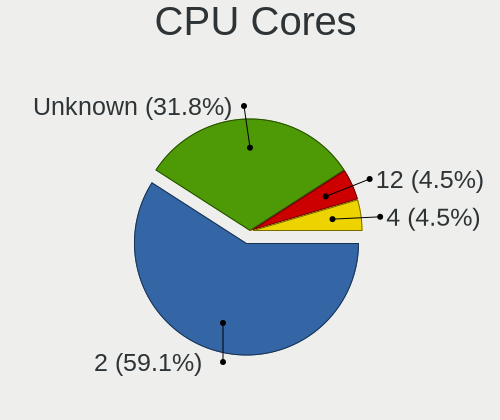

| Number  | Notebooks | Percent |
|---------|-----------|---------|
| 2       | 13        | 59.09%  |
| Unknown | 7         | 31.82%  |
| 12      | 1         | 4.55%   |
| 4       | 1         | 4.55%   |

CPU Sockets
-----------

Number of sockets

| Number  | Notebooks | Percent |
|---------|-----------|---------|
| 1       | 18        | 81.82%  |
| Unknown | 4         | 18.18%  |

CPU Threads
-----------

Threads per core (Hyper-Threading)

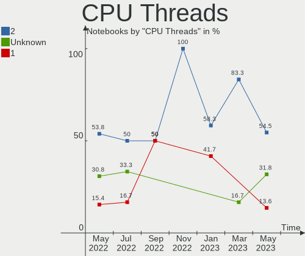

| Number  | Notebooks | Percent |
|---------|-----------|---------|
| 2       | 12        | 54.55%  |
| Unknown | 7         | 31.82%  |
| 1       | 3         | 13.64%  |

CPU Microarch
-------------

Microarchitecture

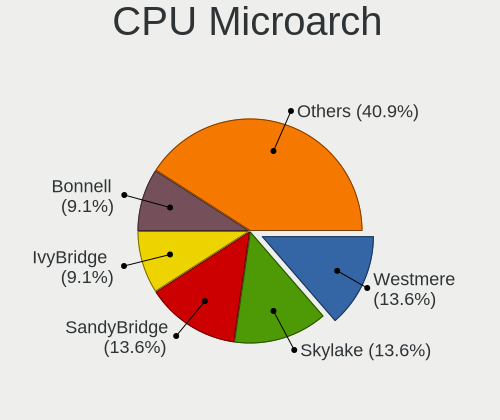

| Name          | Notebooks | Percent |
|---------------|-----------|---------|
| Westmere      | 3         | 13.64%  |
| Skylake       | 3         | 13.64%  |
| SandyBridge   | 3         | 13.64%  |
| IvyBridge     | 2         | 9.09%   |
| Bonnell       | 2         | 9.09%   |
| Zen 2         | 1         | 4.55%   |
| Penryn        | 1         | 4.55%   |
| P6            | 1         | 4.55%   |
| NetBurst      | 1         | 4.55%   |
| KabyLake      | 1         | 4.55%   |
| Jaguar        | 1         | 4.55%   |
| Goldmont plus | 1         | 4.55%   |
| Core          | 1         | 4.55%   |
| Unknown       | 1         | 4.55%   |

Graphics
--------

GPU Vendor
----------

Vendors of graphics cards

| Vendor | Notebooks | Percent |
|--------|-----------|---------|
| Intel  | 17        | 85%     |
| AMD    | 3         | 15%     |

GPU Model
---------

Graphics card models

| Model                                                                         | Notebooks | Percent |
|-------------------------------------------------------------------------------|-----------|---------|
| Intel Skylake GT2 [HD Graphics 520]                                           | 3         | 13.04%  |
| Intel Core Processor Integrated Graphics Controller                           | 3         | 13.04%  |
| Intel 2nd Generation Core Processor Family Integrated Graphics Controller     | 3         | 13.04%  |
| Intel Mobile 945GM/GMS/GME, 943/940GML Express Integrated Graphics Controller | 2         | 8.7%    |
| Intel 3rd Gen Core processor Graphics Controller                              | 2         | 8.7%    |
| Intel UHD Graphics 620                                                        | 1         | 4.35%   |
| Intel Mobile GM965/GL960 Integrated Graphics Controller (secondary)           | 1         | 4.35%   |
| Intel Mobile GM965/GL960 Integrated Graphics Controller (primary)             | 1         | 4.35%   |
| Intel Mobile 945GSE Express Integrated Graphics Controller                    | 1         | 4.35%   |
| Intel Mobile 945GM/GMS, 943/940GML Express Integrated Graphics Controller     | 1         | 4.35%   |
| Intel Mobile 4 Series Chipset Integrated Graphics Controller                  | 1         | 4.35%   |
| Intel GeminiLake [UHD Graphics 600]                                           | 1         | 4.35%   |
| AMD RV200/M7 [Mobility Radeon 7500]                                           | 1         | 4.35%   |
| AMD Renoir                                                                    | 1         | 4.35%   |
| AMD Kabini [Radeon HD 8240 / R3 Series]                                       | 1         | 4.35%   |

GPU Combo
---------

Combinations of graphics cards

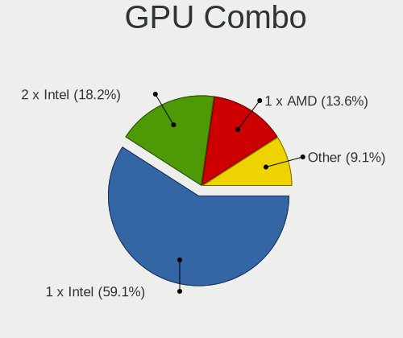

| Name      | Notebooks | Percent |
|-----------|-----------|---------|
| 1 x Intel | 13        | 59.09%  |
| 2 x Intel | 4         | 18.18%  |
| 1 x AMD   | 3         | 13.64%  |
| Other     | 2         | 9.09%   |

GPU Driver
----------

Free vs proprietary

| Driver  | Notebooks | Percent |
|---------|-----------|---------|
| Free    | 18        | 81.82%  |
| Unknown | 4         | 18.18%  |

GPU Memory
----------

Total video memory

| Size in GB | Notebooks | Percent |
|------------|-----------|---------|
| Unknown    | 22        | 100%    |

Monitor
-------

Monitor Vendor
--------------

Monitor vendors

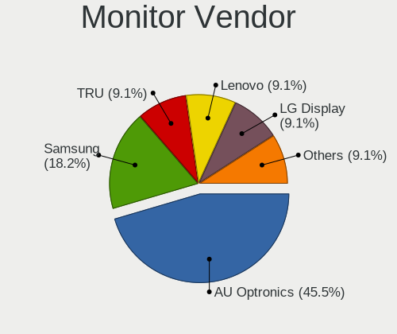

| Vendor              | Notebooks | Percent |
|---------------------|-----------|---------|
| AU Optronics        | 5         | 45.45%  |
| Samsung Electronics | 2         | 18.18%  |
| TRU                 | 1         | 9.09%   |
| LG Display          | 1         | 9.09%   |
| Lenovo              | 1         | 9.09%   |
| Chimei Innolux      | 1         | 9.09%   |

Monitor Model
-------------

Monitor models

| Model                                                                | Notebooks | Percent |
|----------------------------------------------------------------------|-----------|---------|
| TRU LCD Monitor TRU235C 1366x768 260x140mm 11.6-inch                 | 1         | 9.09%   |
| Samsung Electronics LCD Monitor SEC324C 1600x900 310x170mm 13.9-inch | 1         | 9.09%   |
| Samsung Electronics LCD Monitor SEC304C 1366x768 310x170mm 13.9-inch | 1         | 9.09%   |
| LG Display LCD Monitor LGD02D8 1366x768 280x160mm 12.7-inch          | 1         | 9.09%   |
| Lenovo LCD Monitor LEN4053 1680x1050 330x210mm 15.4-inch             | 1         | 9.09%   |
| Chimei Innolux LCD Monitor CMN14C9 1920x1080 310x170mm 13.9-inch     | 1         | 9.09%   |
| AU Optronics LCD Monitor AUO403D 1920x1080 310x170mm 13.9-inch       | 1         | 9.09%   |
| AU Optronics LCD Monitor AUO315C 1366x768 260x140mm 11.6-inch        | 1         | 9.09%   |
| AU Optronics LCD Monitor AUO173D 1920x1080 310x170mm 13.9-inch       | 1         | 9.09%   |
| AU Optronics LCD Monitor AUO1147 1440x900 300x190mm 14.0-inch        | 1         | 9.09%   |
| AU Optronics LCD Monitor AUO106C 1366x768 280x160mm 12.7-inch        | 1         | 9.09%   |

Monitor Resolution
------------------

Monitor screen resolution

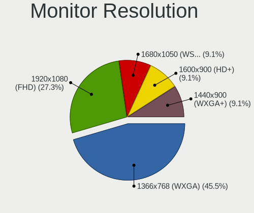

| Resolution         | Notebooks | Percent |
|--------------------|-----------|---------|
| 1366x768 (WXGA)    | 5         | 45.45%  |
| 1920x1080 (FHD)    | 3         | 27.27%  |
| 1680x1050 (WSXGA+) | 1         | 9.09%   |
| 1600x900 (HD+)     | 1         | 9.09%   |
| 1440x900 (WXGA+)   | 1         | 9.09%   |

Monitor Diagonal
----------------

Diagonal size in inches

| Inches | Notebooks | Percent |
|--------|-----------|---------|
| 13     | 4         | 36.36%  |
| 15     | 2         | 18.18%  |
| 12     | 2         | 18.18%  |
| 11     | 2         | 18.18%  |
| 14     | 1         | 9.09%   |

Monitor Width
-------------

Physical width

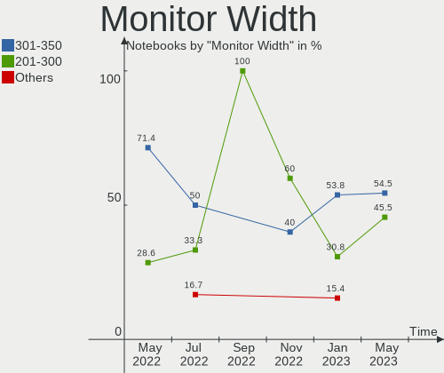

| Width in mm | Notebooks | Percent |
|-------------|-----------|---------|
| 301-350     | 6         | 54.55%  |
| 201-300     | 5         | 45.45%  |

Aspect Ratio
------------

Proportional relationship between the width and the height

| Ratio | Notebooks | Percent |
|-------|-----------|---------|
| 16/9  | 9         | 81.82%  |
| 16/10 | 2         | 18.18%  |

Monitor Area
------------

Area in inch²

| Area in inch² | Notebooks | Percent |
|----------------|-----------|---------|
| 81-90          | 5         | 45.45%  |
| 61-70          | 2         | 18.18%  |
| 51-60          | 2         | 18.18%  |
| 101-110        | 2         | 18.18%  |

Pixel Density
-------------

Pixels per inch

| Density | Notebooks | Percent |
|---------|-----------|---------|
| 121-160 | 10        | 90.91%  |
| 51-100  | 1         | 9.09%   |

Multiple Monitors
-----------------

Total monitors connected

| Total | Notebooks | Percent |
|-------|-----------|---------|
| 1     | 20        | 90.91%  |
| 0     | 2         | 9.09%   |

Network
-------

Net Controller Vendor
---------------------

Controller vendors

| Vendor                            | Notebooks | Percent |
|-----------------------------------|-----------|---------|
| Intel                             | 17        | 60.71%  |
| Realtek Semiconductor             | 4         | 14.29%  |
| Ericsson Business Mobile Networks | 2         | 7.14%   |
| Sierra Wireless                   | 1         | 3.57%   |
| Ralink Technology                 | 1         | 3.57%   |
| Qualcomm Atheros                  | 1         | 3.57%   |
| Marvell Technology Group          | 1         | 3.57%   |
| Broadcom                          | 1         | 3.57%   |

Net Controller Model
--------------------

Controller models

| Model                                                                       | Notebooks | Percent |
|-----------------------------------------------------------------------------|-----------|---------|
| Intel Centrino Advanced-N 6205 [Taylor Peak]                                | 5         | 11.11%  |
| Intel 82579LM Gigabit Network Connection (Lewisville)                       | 5         | 11.11%  |
| Intel Wireless 8260                                                         | 3         | 6.67%   |
| Intel Ethernet Connection I219-LM                                           | 3         | 6.67%   |
| Intel 82577LM Gigabit Network Connection                                    | 3         | 6.67%   |
| Realtek RTL8111/8168/8411 PCI Express Gigabit Ethernet Controller           | 2         | 4.44%   |
| Intel PRO/Wireless 3945ABG [Golan] Network Connection                       | 2         | 4.44%   |
| Intel Centrino Advanced-N 6200                                              | 2         | 4.44%   |
| Sierra Wireless EM7455                                                      | 1         | 2.22%   |
| Realtek RTL8852AE 802.11ax PCIe Wireless Network Adapter                    | 1         | 2.22%   |
| Realtek RTL8192EU 802.11b/g/n WLAN Adapter                                  | 1         | 2.22%   |
| Realtek RTL8191SEvB Wireless LAN Controller                                 | 1         | 2.22%   |
| Realtek RTL-8100/8101L/8139 PCI Fast Ethernet Adapter                       | 1         | 2.22%   |
| Ralink RT2501/RT2573 Wireless Adapter                                       | 1         | 2.22%   |
| Qualcomm Atheros AR928X Wireless Network Adapter (PCI-Express)              | 1         | 2.22%   |
| Qualcomm Atheros AR8121/AR8113/AR8114 Gigabit or Fast Ethernet              | 1         | 2.22%   |
| Marvell Group 88E8053 PCI-E Gigabit Ethernet Controller                     | 1         | 2.22%   |
| Intel Wireless 8265 / 8275                                                  | 1         | 2.22%   |
| Intel Wireless 7265                                                         | 1         | 2.22%   |
| Intel Wireless 7260                                                         | 1         | 2.22%   |
| Intel PRO/Wireless 5100 AGN [Shiloh] Network Connection                     | 1         | 2.22%   |
| Intel Ethernet Connection (4) I219-LM                                       | 1         | 2.22%   |
| Intel 82567LM Gigabit Network Connection                                    | 1         | 2.22%   |
| Intel 82566MM Gigabit Network Connection                                    | 1         | 2.22%   |
| Ericsson Business Mobile Networks H5321 gw Mobile Broadband Module          | 1         | 2.22%   |
| Ericsson Business Mobile Networks F5521 gw Mobile Broadband Serial Port III | 1         | 2.22%   |
| Broadcom BRCM4378 Wireless Network Adapter                                  | 1         | 2.22%   |
| Broadcom BRCM4378 Bluetooth Controller                                      | 1         | 2.22%   |

Wireless Vendor
---------------

Wireless vendors

| Vendor                | Notebooks | Percent |
|-----------------------|-----------|---------|
| Intel                 | 16        | 72.73%  |
| Realtek Semiconductor | 2         | 9.09%   |
| Sierra Wireless       | 1         | 4.55%   |
| Ralink Technology     | 1         | 4.55%   |
| Qualcomm Atheros      | 1         | 4.55%   |
| Broadcom              | 1         | 4.55%   |

Wireless Model
--------------

Wireless models

| Model                                                          | Notebooks | Percent |
|----------------------------------------------------------------|-----------|---------|
| Intel Centrino Advanced-N 6205 [Taylor Peak]                   | 5         | 21.74%  |
| Intel Wireless 8260                                            | 3         | 13.04%  |
| Intel PRO/Wireless 3945ABG [Golan] Network Connection          | 2         | 8.7%    |
| Intel Centrino Advanced-N 6200                                 | 2         | 8.7%    |
| Sierra Wireless EM7455                                         | 1         | 4.35%   |
| Realtek RTL8852AE 802.11ax PCIe Wireless Network Adapter       | 1         | 4.35%   |
| Realtek RTL8192EU 802.11b/g/n WLAN Adapter                     | 1         | 4.35%   |
| Realtek RTL8191SEvB Wireless LAN Controller                    | 1         | 4.35%   |
| Ralink RT2501/RT2573 Wireless Adapter                          | 1         | 4.35%   |
| Qualcomm Atheros AR928X Wireless Network Adapter (PCI-Express) | 1         | 4.35%   |
| Intel Wireless 8265 / 8275                                     | 1         | 4.35%   |
| Intel Wireless 7265                                            | 1         | 4.35%   |
| Intel Wireless 7260                                            | 1         | 4.35%   |
| Intel PRO/Wireless 5100 AGN [Shiloh] Network Connection        | 1         | 4.35%   |
| Broadcom BRCM4378 Wireless Network Adapter                     | 1         | 4.35%   |

Ethernet Vendor
---------------

Ethernet vendors

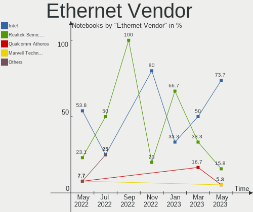

| Vendor                   | Notebooks | Percent |
|--------------------------|-----------|---------|
| Intel                    | 14        | 73.68%  |
| Realtek Semiconductor    | 3         | 15.79%  |
| Qualcomm Atheros         | 1         | 5.26%   |
| Marvell Technology Group | 1         | 5.26%   |

Ethernet Model
--------------

Ethernet models

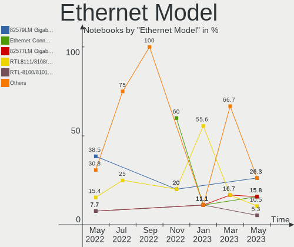

| Model                                                             | Notebooks | Percent |
|-------------------------------------------------------------------|-----------|---------|
| Intel 82579LM Gigabit Network Connection (Lewisville)             | 5         | 26.32%  |
| Intel Ethernet Connection I219-LM                                 | 3         | 15.79%  |
| Intel 82577LM Gigabit Network Connection                          | 3         | 15.79%  |
| Realtek RTL8111/8168/8411 PCI Express Gigabit Ethernet Controller | 2         | 10.53%  |
| Realtek RTL-8100/8101L/8139 PCI Fast Ethernet Adapter             | 1         | 5.26%   |
| Qualcomm Atheros AR8121/AR8113/AR8114 Gigabit or Fast Ethernet    | 1         | 5.26%   |
| Marvell Group 88E8053 PCI-E Gigabit Ethernet Controller           | 1         | 5.26%   |
| Intel Ethernet Connection (4) I219-LM                             | 1         | 5.26%   |
| Intel 82567LM Gigabit Network Connection                          | 1         | 5.26%   |
| Intel 82566MM Gigabit Network Connection                          | 1         | 5.26%   |

Net Controller Kind
-------------------

Ethernet, WiFi or modem

| Kind     | Notebooks | Percent |
|----------|-----------|---------|
| WiFi     | 20        | 47.62%  |
| Ethernet | 19        | 45.24%  |
| Unknown  | 2         | 4.76%   |
| Modem    | 1         | 2.38%   |

Used Controller
---------------

Currently used network controller

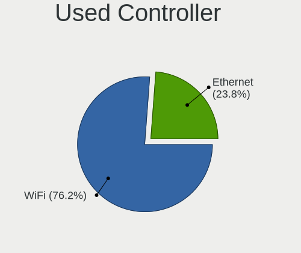

| Kind     | Notebooks | Percent |
|----------|-----------|---------|
| WiFi     | 16        | 76.19%  |
| Ethernet | 5         | 23.81%  |

NICs
----

Total network controllers on board

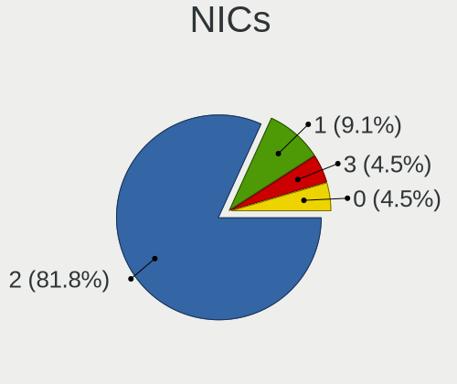

| Total | Notebooks | Percent |
|-------|-----------|---------|
| 2     | 18        | 81.82%  |
| 1     | 2         | 9.09%   |
| 3     | 1         | 4.55%   |
| 0     | 1         | 4.55%   |

IPv6
----

IPv6 vs IPv4

| Used | Notebooks | Percent |
|------|-----------|---------|
| No   | 22        | 100%    |

Bluetooth
---------

Bluetooth Vendor
----------------

Controller vendors

| Vendor                | Notebooks | Percent |
|-----------------------|-----------|---------|
| Intel                 | 6         | 46.15%  |
| Broadcom              | 3         | 23.08%  |
| Alps Electric         | 2         | 15.38%  |
| Realtek Semiconductor | 1         | 7.69%   |
| ASUSTek Computer      | 1         | 7.69%   |

Bluetooth Model
---------------

Controller models

| Model                                      | Notebooks | Percent |
|--------------------------------------------|-----------|---------|
| Intel Bluetooth wireless interface         | 6         | 46.15%  |
| Broadcom BCM2045B (BDC-2.1)                | 2         | 15.38%  |
| Alps Electric UGTZ4 Bluetooth              | 2         | 15.38%  |
| Realtek Bluetooth Adapter                  | 1         | 7.69%   |
| Broadcom BCM20702 Bluetooth 4.0 [ThinkPad] | 1         | 7.69%   |
| ASUS Broadcom Bluetooth 2.1                | 1         | 7.69%   |

Sound
-----

Sound Vendor
------------

Sound card vendors

| Vendor | Notebooks | Percent |
|--------|-----------|---------|
| Intel  | 18        | 90%     |
| AMD    | 2         | 10%     |

Sound Model
-----------

Sound card models

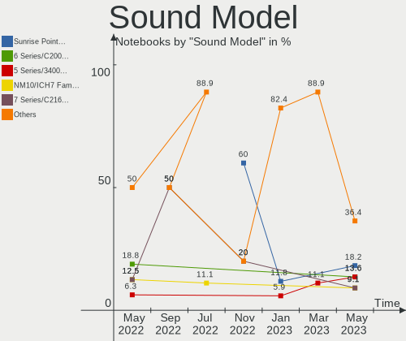

| Model                                                                      | Notebooks | Percent |
|----------------------------------------------------------------------------|-----------|---------|
| Intel Sunrise Point-LP HD Audio                                            | 4         | 18.18%  |
| Intel 6 Series/C200 Series Chipset Family High Definition Audio Controller | 3         | 13.64%  |
| Intel 5 Series/3400 Series Chipset High Definition Audio                   | 3         | 13.64%  |
| Intel NM10/ICH7 Family High Definition Audio Controller                    | 2         | 9.09%   |
| Intel 7 Series/C216 Chipset Family High Definition Audio Controller        | 2         | 9.09%   |
| Intel Celeron/Pentium Silver Processor High Definition Audio               | 1         | 4.55%   |
| Intel 82801I (ICH9 Family) HD Audio Controller                             | 1         | 4.55%   |
| Intel 82801H (ICH8 Family) HD Audio Controller                             | 1         | 4.55%   |
| Intel 82801CA/CAM AC'97 Audio Controller                                   | 1         | 4.55%   |
| AMD Renoir Radeon High Definition Audio Controller                         | 1         | 4.55%   |
| AMD Kabini HDMI/DP Audio                                                   | 1         | 4.55%   |
| AMD FCH Azalia Controller                                                  | 1         | 4.55%   |
| AMD Family 17h/19h HD Audio Controller                                     | 1         | 4.55%   |

Memory
------

Memory Vendor
-------------

Memory module vendors

| Vendor              | Notebooks | Percent |
|---------------------|-----------|---------|
| Samsung Electronics | 8         | 44.44%  |
| Unknown             | 5         | 27.78%  |
| SK hynix            | 4         | 22.22%  |
| Unknown             | 1         | 5.56%   |

Memory Model
------------

Memory module models

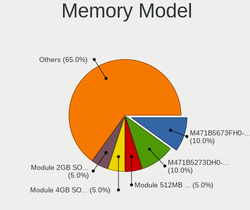

| Model                                                   | Notebooks | Percent |
|---------------------------------------------------------|-----------|---------|
| Samsung RAM M471B5673FH0-CF8 2GB SODIMM DDR3 1067MT/s   | 2         | 10%     |
| Samsung RAM M471B5273DH0-CH9 4GB SODIMM DDR3 1334MT/s   | 2         | 10%     |
| Unknown RAM Module 512MB SODIMM SDRAM                   | 1         | 5%      |
| Unknown RAM Module 4GB SODIMM DDR3 1333MT/s             | 1         | 5%      |
| Unknown RAM Module 2GB SODIMM DDR3 1067MT/s             | 1         | 5%      |
| Unknown RAM Module 2GB SODIMM DDR2 667MT/s              | 1         | 5%      |
| Unknown RAM Module 1GB SODIMM DDR2                      | 1         | 5%      |
| SK hynix RAM HMT451S6BFR8A-PB 4GB SODIMM DDR3 1600MT/s  | 1         | 5%      |
| SK hynix RAM HMT351S6EFR8A-PB 4GB SODIMM DDR3 1600MT/s  | 1         | 5%      |
| SK hynix RAM HMAB2GS6AMR6N-XN 16GB SODIMM DDR4 3200MT/s | 1         | 5%      |
| SK hynix RAM H9CCNNNBJTMLAR 4GB SODIMM LPDDR3 1867MT/s  | 1         | 5%      |
| SK hynix RAM H9CCNNNBJTMLAR 4GB Chip LPDDR3 1867MT/s    | 1         | 5%      |
| Samsung RAM M471B5673EH1-CF8 2GB SODIMM DDR3 1067MT/s   | 1         | 5%      |
| Samsung RAM M471B5173QH0-YK0 4GB SODIMM DDR3 1600MT/s   | 1         | 5%      |
| Samsung RAM M471B5173BH0-CK0 4GB SODIMM DDR3 1600MT/s   | 1         | 5%      |
| Samsung RAM M471A1K43CB1-CRC 8GB SODIMM DDR4 2400MT/s   | 1         | 5%      |
| Samsung RAM M471A1K43BB0-CPB 8GB SODIMM DDR4 2133MT/s   | 1         | 5%      |
| Unknown                                                 | 1         | 5%      |

Memory Kind
-----------

Memory module kinds

| Kind   | Notebooks | Percent |
|--------|-----------|---------|
| DDR3   | 9         | 52.94%  |
| DDR4   | 3         | 17.65%  |
| SDRAM  | 2         | 11.76%  |
| DDR2   | 2         | 11.76%  |
| LPDDR3 | 1         | 5.88%   |

Memory Form Factor
------------------

Physical design of the memory module

| Name   | Notebooks | Percent |
|--------|-----------|---------|
| SODIMM | 17        | 94.44%  |
| Chip   | 1         | 5.56%   |

Memory Size
-----------

Memory module size

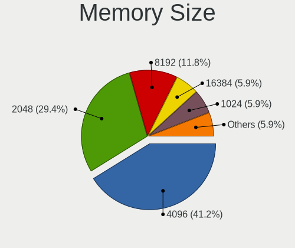

| Size  | Notebooks | Percent |
|-------|-----------|---------|
| 4096  | 7         | 41.18%  |
| 2048  | 5         | 29.41%  |
| 8192  | 2         | 11.76%  |
| 16384 | 1         | 5.88%   |
| 1024  | 1         | 5.88%   |
| 512   | 1         | 5.88%   |

Memory Speed
------------

Memory module speed

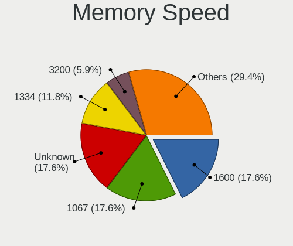

| Speed   | Notebooks | Percent |
|---------|-----------|---------|
| 1600    | 3         | 17.65%  |
| 1067    | 3         | 17.65%  |
| Unknown | 3         | 17.65%  |
| 1334    | 2         | 11.76%  |
| 3200    | 1         | 5.88%   |
| 2400    | 1         | 5.88%   |
| 2133    | 1         | 5.88%   |
| 1867    | 1         | 5.88%   |
| 1333    | 1         | 5.88%   |
| 667     | 1         | 5.88%   |

Printers & scanners
-------------------

Printer Vendor
--------------

Printer device vendors

Zero info for selected period =(

Printer Model
-------------

Printer device models

Zero info for selected period =(

Scanner Vendor
--------------

Scanner device vendors

Zero info for selected period =(

Scanner Model
-------------

Scanner device models

Zero info for selected period =(

Camera
------

Camera Vendor
-------------

Camera device vendors

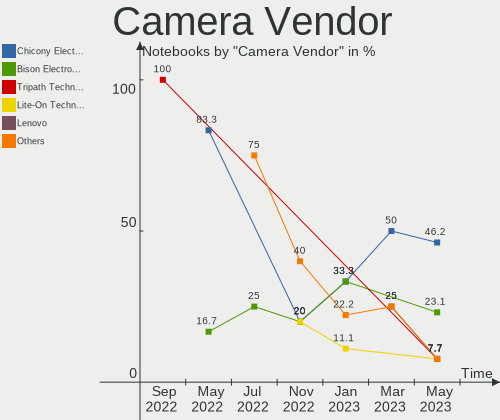

| Vendor              | Notebooks | Percent |
|---------------------|-----------|---------|
| Chicony Electronics | 6         | 46.15%  |
| Bison Electronics   | 3         | 23.08%  |
| Tripath Technology  | 1         | 7.69%   |
| Lite-On Technology  | 1         | 7.69%   |
| Lenovo              | 1         | 7.69%   |
| IMC Networks        | 1         | 7.69%   |

Camera Model
------------

Camera device models

| Model                                    | Notebooks | Percent |
|------------------------------------------|-----------|---------|
| Bison Integrated Camera                  | 3         | 23.08%  |
| Tripath PC Camera                        | 1         | 7.69%   |
| Lite-On Integrated Camera                | 1         | 7.69%   |
| Lenovo Integrated Webcam                 | 1         | 7.69%   |
| IMC Networks Integrated Camera           | 1         | 7.69%   |
| Chicony Sonix ST50220 USB Video Camera   | 1         | 7.69%   |
| Chicony Lenovo Integrated Camera (0.3MP) | 1         | 7.69%   |
| Chicony Integrated Camera [ThinkPad]     | 1         | 7.69%   |
| Chicony Integrated Camera (1280x720@30)  | 1         | 7.69%   |
| Chicony integrated camera                | 1         | 7.69%   |
| Chicony 2.0M UVC Webcam / CNF7129        | 1         | 7.69%   |

Security
--------

Fingerprint Vendor
------------------

Fingerprint sensor vendors

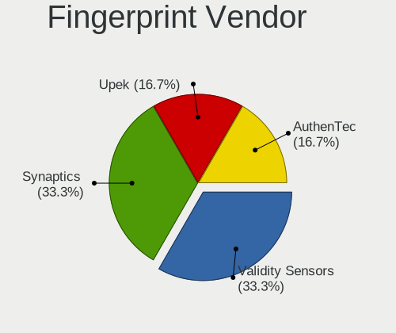

| Vendor           | Notebooks | Percent |
|------------------|-----------|---------|
| Validity Sensors | 2         | 33.33%  |
| Synaptics        | 2         | 33.33%  |
| Upek             | 1         | 16.67%  |
| AuthenTec        | 1         | 16.67%  |

Fingerprint Model
-----------------

Fingerprint sensor models

| Model                                                  | Notebooks | Percent |
|--------------------------------------------------------|-----------|---------|
| Validity Sensors VFS7500 Touch Fingerprint Sensor      | 1         | 16.67%  |
| Validity Sensors VFS 5011 fingerprint sensor           | 1         | 16.67%  |
| Upek Biometric Touchchip/Touchstrip Fingerprint Sensor | 1         | 16.67%  |
| Synaptics Prometheus MIS Touch Fingerprint Reader      | 1         | 16.67%  |
| Synaptics Metallica MIS Touch Fingerprint Reader       | 1         | 16.67%  |
| AuthenTec AES2810                                      | 1         | 16.67%  |

Chipcard Vendor
---------------

Chipcard module vendors

Zero info for selected period =(

Chipcard Model
--------------

Chipcard module models

Zero info for selected period =(

Unsupported
-----------

Unsupported Devices
-------------------

Total unsupported devices on board

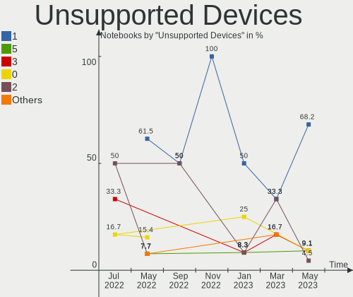

| Total | Notebooks | Percent |
|-------|-----------|---------|
| 1     | 15        | 68.18%  |
| 5     | 2         | 9.09%   |
| 3     | 2         | 9.09%   |
| 0     | 2         | 9.09%   |
| 2     | 1         | 4.55%   |

Unsupported Device Types
------------------------

Types of unsupported devices

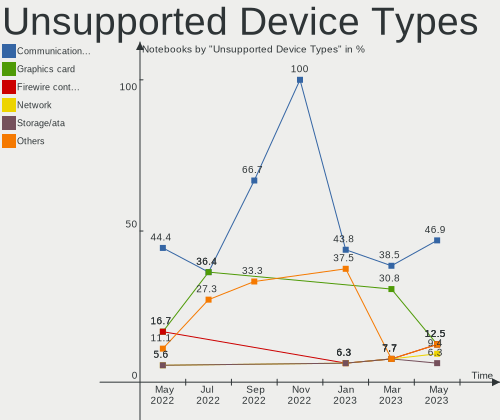

| Type                     | Notebooks | Percent |
|--------------------------|-----------|---------|
| Communication controller | 15        | 46.88%  |
| Graphics card            | 4         | 12.5%   |
| Firewire controller      | 4         | 12.5%   |
| Network                  | 3         | 9.38%   |
| Storage/ata              | 2         | 6.25%   |
| Sound                    | 2         | 6.25%   |
| Net/wireless             | 2         | 6.25%   |

