OpenBSD - Hardware Trends (Notebooks)
-------------------------------------

A project to identify most popular hardware characteristics and track their change
over time based on data collected by BSD users at https://BSD-Hardware.info.

Anyone can contribute to this report by the [hw-probe](https://github.com/linuxhw/hw-probe/blob/master/INSTALL.BSD.md) tool:

    hw-probe -all -upload

This report is for one last month. Overall report since the beginning of time: [TestCoverage](https://github.com/bsdhw/TestCoverage)

Period: Oct, 2022.

Contents
--------

* [ System ](#system)
  - [ OS                       ](#os)
  - [ OS Family                ](#os-family)
  - [ Arch                     ](#arch)
  - [ DE                       ](#de)
  - [ Display Server           ](#display-server)
  - [ Display Manager          ](#display-manager)
  - [ OS Lang                  ](#os-lang)
  - [ Boot Mode                ](#boot-mode)
  - [ Filesystem               ](#filesystem)
  - [ Part. scheme             ](#part-scheme)

* [ Board ](#board)
  - [ Vendor                   ](#vendor)
  - [ Model                    ](#model)
  - [ Model Family             ](#model-family)
  - [ MFG Year                 ](#mfg-year)
  - [ Form Factor              ](#form-factor)
  - [ Coreboot                 ](#coreboot)
  - [ RAM Size                 ](#ram-size)
  - [ RAM Used                 ](#ram-used)
  - [ Total Drives             ](#total-drives)
  - [ Has CD-ROM               ](#has-cd-rom)
  - [ Has Ethernet             ](#has-ethernet)
  - [ Has WiFi                 ](#has-wifi)
  - [ Has Bluetooth            ](#has-bluetooth)

* [ Location ](#location)
  - [ Country                  ](#country)
  - [ City                     ](#city)

* [ Drives ](#drives)
  - [ Drive Vendor             ](#drive-vendor)
  - [ Drive Model              ](#drive-model)
  - [ HDD Vendor               ](#hdd-vendor)
  - [ SSD Vendor               ](#ssd-vendor)
  - [ Drive Kind               ](#drive-kind)
  - [ Drive Connector          ](#drive-connector)
  - [ Drive Size               ](#drive-size)
  - [ Space Total              ](#space-total)
  - [ Space Used               ](#space-used)
  - [ Malfunc. Drives          ](#malfunc-drives)
  - [ Malfunc. Drive Vendor    ](#malfunc-drive-vendor)
  - [ Malfunc. HDD Vendor      ](#malfunc-hdd-vendor)
  - [ Malfunc. Drive Kind      ](#malfunc-drive-kind)
  - [ Failed Drives            ](#failed-drives)
  - [ Failed Drive Vendor      ](#failed-drive-vendor)
  - [ Drive Status             ](#drive-status)

* [ Storage controller ](#storage-controller)
  - [ Storage Vendor           ](#storage-vendor)
  - [ Storage Model            ](#storage-model)
  - [ Storage Kind             ](#storage-kind)

* [ Processor ](#processor)
  - [ CPU Vendor               ](#cpu-vendor)
  - [ CPU Model                ](#cpu-model)
  - [ CPU Model Family         ](#cpu-model-family)
  - [ CPU Cores                ](#cpu-cores)
  - [ CPU Sockets              ](#cpu-sockets)
  - [ CPU Threads              ](#cpu-threads)
  - [ CPU Microarch            ](#cpu-microarch)

* [ Graphics ](#graphics)
  - [ GPU Vendor               ](#gpu-vendor)
  - [ GPU Model                ](#gpu-model)
  - [ GPU Combo                ](#gpu-combo)
  - [ GPU Driver               ](#gpu-driver)
  - [ GPU Memory               ](#gpu-memory)

* [ Monitor ](#monitor)
  - [ Monitor Vendor           ](#monitor-vendor)
  - [ Monitor Model            ](#monitor-model)
  - [ Monitor Resolution       ](#monitor-resolution)
  - [ Monitor Diagonal         ](#monitor-diagonal)
  - [ Monitor Width            ](#monitor-width)
  - [ Aspect Ratio             ](#aspect-ratio)
  - [ Monitor Area             ](#monitor-area)
  - [ Pixel Density            ](#pixel-density)
  - [ Multiple Monitors        ](#multiple-monitors)

* [ Network ](#network)
  - [ Net Controller Vendor    ](#net-controller-vendor)
  - [ Net Controller Model     ](#net-controller-model)
  - [ Wireless Vendor          ](#wireless-vendor)
  - [ Wireless Model           ](#wireless-model)
  - [ Ethernet Vendor          ](#ethernet-vendor)
  - [ Ethernet Model           ](#ethernet-model)
  - [ Net Controller Kind      ](#net-controller-kind)
  - [ Used Controller          ](#used-controller)
  - [ NICs                     ](#nics)
  - [ IPv6                     ](#ipv6)

* [ Bluetooth ](#bluetooth)
  - [ Bluetooth Vendor         ](#bluetooth-vendor)
  - [ Bluetooth Model          ](#bluetooth-model)

* [ Sound ](#sound)
  - [ Sound Vendor             ](#sound-vendor)
  - [ Sound Model              ](#sound-model)

* [ Memory ](#memory)
  - [ Memory Vendor            ](#memory-vendor)
  - [ Memory Model             ](#memory-model)
  - [ Memory Kind              ](#memory-kind)
  - [ Memory Form Factor       ](#memory-form-factor)
  - [ Memory Size              ](#memory-size)
  - [ Memory Speed             ](#memory-speed)

* [ Printers & scanners ](#printers--scanners)
  - [ Printer Vendor           ](#printer-vendor)
  - [ Printer Model            ](#printer-model)
  - [ Scanner Vendor           ](#scanner-vendor)
  - [ Scanner Model            ](#scanner-model)

* [ Camera ](#camera)
  - [ Camera Vendor            ](#camera-vendor)
  - [ Camera Model             ](#camera-model)

* [ Security ](#security)
  - [ Fingerprint Vendor       ](#fingerprint-vendor)
  - [ Fingerprint Model        ](#fingerprint-model)
  - [ Chipcard Vendor          ](#chipcard-vendor)
  - [ Chipcard Model           ](#chipcard-model)

* [ Unsupported ](#unsupported)
  - [ Unsupported Devices      ](#unsupported-devices)
  - [ Unsupported Device Types ](#unsupported-device-types)

System
------

OS
--

Installed operating systems

| Name        | Notebooks | Percent |
|-------------|-----------|---------|
| OpenBSD 7.2 | 14        | 87.5%   |
| OpenBSD 7.1 | 2         | 12.5%   |

OS Family
---------

OS without a version

| Name    | Notebooks | Percent |
|---------|-----------|---------|
| OpenBSD | 16        | 100%    |

Arch
----

OS architecture (x86_64, i586, etc.)

| Name  | Notebooks | Percent |
|-------|-----------|---------|
| amd64 | 13        | 81.25%  |
| i386  | 3         | 18.75%  |

DE
--

Desktop Environment

| Name         | Notebooks | Percent |
|--------------|-----------|---------|
| helloDesktop | 15        | 93.75%  |
| GNOME        | 1         | 6.25%   |

Display Server
--------------

X11 or Wayland

| Name    | Notebooks | Percent |
|---------|-----------|---------|
| X11     | 15        | 93.75%  |
| Console | 1         | 6.25%   |

Display Manager
---------------

SDDM, LightDM, etc.

| Name    | Notebooks | Percent |
|---------|-----------|---------|
| Console | 16        | 100%    |

OS Lang
-------

Language

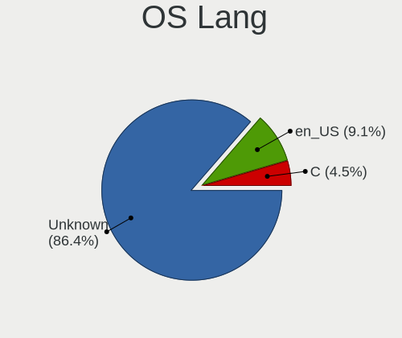

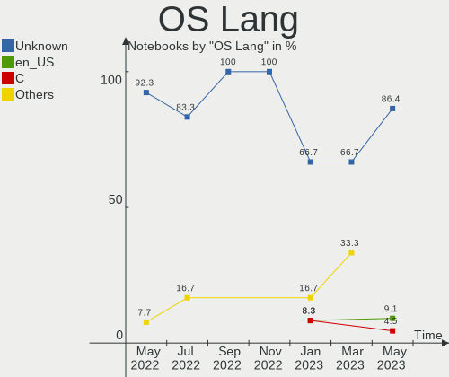

| Lang    | Notebooks | Percent |
|---------|-----------|---------|
| Unknown | 14        | 87.5%   |
| fr_FR   | 1         | 6.25%   |
| C       | 1         | 6.25%   |

Boot Mode
---------

EFI or BIOS

| Mode | Notebooks | Percent |
|------|-----------|---------|
| BIOS | 10        | 62.5%   |
| EFI  | 6         | 37.5%   |

Filesystem
----------

Type of filesystem

| Type | Notebooks | Percent |
|------|-----------|---------|
| Ffs  | 16        | 100%    |

Part. scheme
------------

Scheme of partitioning

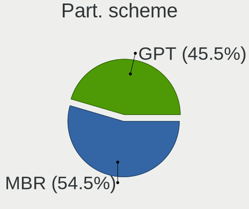

| Type | Notebooks | Percent |
|------|-----------|---------|
| MBR  | 11        | 68.75%  |
| GPT  | 5         | 31.25%  |

Board
-----

Vendor
------

Motherboard manufacturer

| Name                           | Notebooks | Percent |
|--------------------------------|-----------|---------|
| Lenovo                         | 6         | 37.5%   |
| Panasonic                      | 2         | 12.5%   |
| Matsushita Electric Industrial | 2         | 12.5%   |
| Fujitsu                        | 2         | 12.5%   |
| ASUSTek Computer               | 2         | 12.5%   |
| Dell                           | 1         | 6.25%   |
| Alienware                      | 1         | 6.25%   |

Model
-----

Motherboard model

| Name                                        | Notebooks | Percent |
|---------------------------------------------|-----------|---------|
| Fujitsu LIFEBOOK E752                       | 2         | 12.5%   |
| Panasonic CF-53AAGHYDM                      | 1         | 6.25%   |
| Panasonic CF-52PFPBSFQ                      | 1         | 6.25%   |
| Matsushita Electric Industrial CF-51RCVDNLM | 1         | 6.25%   |
| Matsushita Electric Industrial CF-48V4KNDQM | 1         | 6.25%   |
| Lenovo ThinkPad X220 429043U                | 1         | 6.25%   |
| Lenovo ThinkPad T430 2347GZU                | 1         | 6.25%   |
| Lenovo ThinkPad T420s 4174DL7               | 1         | 6.25%   |
| Lenovo ThinkPad T420s 41742BU               | 1         | 6.25%   |
| Lenovo ThinkPad T410 2537N24                | 1         | 6.25%   |
| Lenovo ThinkPad T410 2518C3U                | 1         | 6.25%   |
| Dell Latitude E6420                         | 1         | 6.25%   |
| ASUS K53TA                                  | 1         | 6.25%   |
| ASUS 1000HE                                 | 1         | 6.25%   |
| Alienware m15                               | 1         | 6.25%   |

Model Family
------------

Motherboard model prefix

| Name                                        | Notebooks | Percent |
|---------------------------------------------|-----------|---------|
| Lenovo ThinkPad                             | 6         | 37.5%   |
| Fujitsu LIFEBOOK                            | 2         | 12.5%   |
| Panasonic CF-53AAGHYDM                      | 1         | 6.25%   |
| Panasonic CF-52PFPBSFQ                      | 1         | 6.25%   |
| Matsushita Electric Industrial CF-51RCVDNLM | 1         | 6.25%   |
| Matsushita Electric Industrial CF-48V4KNDQM | 1         | 6.25%   |
| Dell Latitude                               | 1         | 6.25%   |
| ASUS K53TA                                  | 1         | 6.25%   |
| ASUS 1000HE                                 | 1         | 6.25%   |
| Alienware m15                               | 1         | 6.25%   |

MFG Year
--------

Motherboard manufacture year

| Year | Notebooks | Percent |
|------|-----------|---------|
| 2011 | 6         | 37.5%   |
| 2010 | 3         | 18.75%  |
| 2012 | 2         | 12.5%   |
| 2018 | 1         | 6.25%   |
| 2013 | 1         | 6.25%   |
| 2009 | 1         | 6.25%   |
| 2006 | 1         | 6.25%   |
| 2002 | 1         | 6.25%   |

Form Factor
-----------

Physical design of the computer

| Name     | Notebooks | Percent |
|----------|-----------|---------|
| Notebook | 16        | 100%    |

Coreboot
--------

Have coreboot on board

| Used | Notebooks | Percent |
|------|-----------|---------|
| No   | 16        | 100%    |

RAM Size
--------

Total RAM memory

| Size in GB | Notebooks | Percent |
|------------|-----------|---------|
| 8.01-16.0  | 5         | 31.25%  |
| 4.01-8.0   | 4         | 25%     |
| 3.01-4.0   | 3         | 18.75%  |
| 2.01-3.0   | 2         | 12.5%   |
| 32.01-64.0 | 1         | 6.25%   |
| 0.51-1.0   | 1         | 6.25%   |

RAM Used
--------

Used RAM memory

| Used GB  | Notebooks | Percent |
|----------|-----------|---------|
| 0.01-0.5 | 13        | 81.25%  |
| 0        | 2         | 12.5%   |
| 0.51-1.0 | 1         | 6.25%   |

Total Drives
------------

Number of drives on board

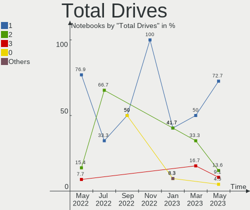

| Drives | Notebooks | Percent |
|--------|-----------|---------|
| 1      | 13        | 81.25%  |
| 2      | 2         | 12.5%   |
| 0      | 1         | 6.25%   |

Has CD-ROM
----------

Has CD-ROM on board

| Presented | Notebooks | Percent |
|-----------|-----------|---------|
| No        | 16        | 100%    |

Has Ethernet
------------

Has Ethernet on board

| Presented | Notebooks | Percent |
|-----------|-----------|---------|
| Yes       | 16        | 100%    |

Has WiFi
--------

Has WiFi module

| Presented | Notebooks | Percent |
|-----------|-----------|---------|
| Yes       | 15        | 93.75%  |
| No        | 1         | 6.25%   |

Has Bluetooth
-------------

Has Bluetooth module

| Presented | Notebooks | Percent |
|-----------|-----------|---------|
| Yes       | 9         | 56.25%  |
| No        | 7         | 43.75%  |

Location
--------

Country
-------

Geographic location (country)

| Country            | Notebooks | Percent |
|--------------------|-----------|---------|
| Canada             | 10        | 62.5%   |
| USA                | 2         | 12.5%   |
| Germany            | 2         | 12.5%   |
| Netherlands        | 1         | 6.25%   |
| Dominican Republic | 1         | 6.25%   |

City
----

Geographic location (city)

| City               | Notebooks | Percent |
|--------------------|-----------|---------|
| Montreal           | 10        | 62.5%   |
| Sun Prairie        | 1         | 6.25%   |
| Santo Domingo Este | 1         | 6.25%   |
| Nuremberg          | 1         | 6.25%   |
| Memphis            | 1         | 6.25%   |
| Lübeck            | 1         | 6.25%   |
| Amsterdam          | 1         | 6.25%   |

Drives
------

Drive Vendor
------------

Hard drive vendors

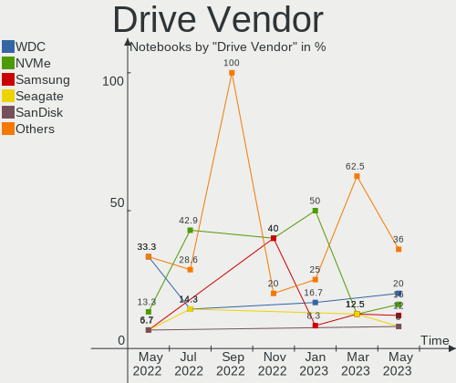

| Vendor              | Notebooks | Drives | Percent |
|---------------------|-----------|--------|---------|
| WDC                 | 6         | 6      | 37.5%   |
| Hitachi             | 2         | 2      | 12.5%   |
| Toshiba             | 1         | 1      | 6.25%   |
| Seagate             | 1         | 1      | 6.25%   |
| Samsung Electronics | 1         | 1      | 6.25%   |
| NVMe                | 1         | 2      | 6.25%   |
| Kingston            | 1         | 1      | 6.25%   |
| Intenso             | 1         | 1      | 6.25%   |
| Crucial             | 1         | 1      | 6.25%   |
| A-DATA Technology   | 1         | 1      | 6.25%   |

Drive Model
-----------

Hard drive models

| Model                            | Notebooks | Percent |
|----------------------------------|-----------|---------|
| WDC WD7500BPKX-00HPJT0 752GB     | 1         | 6.25%   |
| WDC WD7500BPKT-75PK4T0 752GB     | 1         | 6.25%   |
| WDC WD7500BPKT-00PK4T0 752GB     | 1         | 6.25%   |
| WDC WD5000LPLX-00ZNTT0 500GB     | 1         | 6.25%   |
| WDC WD3200BEVE-00A0HT0 320GB     | 1         | 6.25%   |
| WDC WD10JPLX-00MBPT0 1TB         | 1         | 6.25%   |
| Toshiba MQ01ACF032 320GB         | 1         | 6.25%   |
| Seagate ST9160821A 160GB         | 1         | 6.25%   |
| Samsung MZ7PC128HAFU-000L1 128GB | 1         | 6.25%   |
| NVMe KXG50ZNV1T02 NVM 1TB        | 1         | 6.25%   |
| Kingston SA400S37240G 240GB      | 1         | 6.25%   |
| Intenso SSD 128GB                | 1         | 6.25%   |
| Hitachi HTS723232A7A364 320GB    | 1         | 6.25%   |
| Hitachi HTS547564A9E384 640GB    | 1         | 6.25%   |
| Crucial CT1000BX500SSD1 1TB      | 1         | 6.25%   |
| A-DATA SP550 480GB               | 1         | 6.25%   |

HDD Vendor
----------

Hard disk drive vendors

| Vendor  | Notebooks | Drives | Percent |
|---------|-----------|--------|---------|
| WDC     | 6         | 6      | 54.55%  |
| Hitachi | 2         | 2      | 18.18%  |
| Toshiba | 1         | 1      | 9.09%   |
| Seagate | 1         | 1      | 9.09%   |
| NVMe    | 1         | 2      | 9.09%   |

SSD Vendor
----------

Solid state drive vendors

| Vendor              | Notebooks | Drives | Percent |
|---------------------|-----------|--------|---------|
| Samsung Electronics | 1         | 1      | 20%     |
| Kingston            | 1         | 1      | 20%     |
| Intenso             | 1         | 1      | 20%     |
| Crucial             | 1         | 1      | 20%     |
| A-DATA Technology   | 1         | 1      | 20%     |

Drive Kind
----------

HDD or SSD

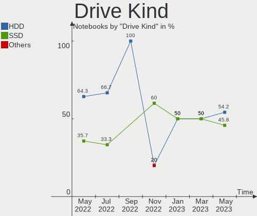

| Kind | Notebooks | Drives | Percent |
|------|-----------|--------|---------|
| HDD  | 11        | 12     | 73.33%  |
| SSD  | 4         | 5      | 26.67%  |

Drive Connector
---------------

SATA, SAS, NVMe, etc.

| Type | Notebooks | Drives | Percent |
|------|-----------|--------|---------|
| SATA | 15        | 17     | 100%    |

Drive Size
----------

Size of hard drive

| Size in TB | Notebooks | Drives | Percent |
|------------|-----------|--------|---------|
| 0.01-0.5   | 9         | 9      | 56.25%  |
| 0.51-1.0   | 6         | 6      | 37.5%   |
| 1.01-2.0   | 1         | 2      | 6.25%   |

Space Total
-----------

Amount of disk space available on the file system

| Size in GB | Notebooks | Percent |
|------------|-----------|---------|
| 21-50      | 8         | 50%     |
| 101-250    | 3         | 18.75%  |
| 51-100     | 2         | 12.5%   |
| 251-500    | 1         | 6.25%   |
| 1-20       | 1         | 6.25%   |
| 501-1000   | 1         | 6.25%   |

Space Used
----------

Amount of used disk space

| Used GB | Notebooks | Percent |
|---------|-----------|---------|
| 1-20    | 14        | 87.5%   |
| 21-50   | 1         | 6.25%   |
| 101-250 | 1         | 6.25%   |

Malfunc. Drives
---------------

Drive models with a malfunction

| Model                         | Notebooks | Drives | Percent |
|-------------------------------|-----------|--------|---------|
| Toshiba MQ01ACF032 320GB      | 1         | 1      | 50%     |
| A-DATA Technology SP550 480GB | 1         | 1      | 50%     |

Malfunc. Drive Vendor
---------------------

Vendors of faulty drives

| Vendor            | Notebooks | Drives | Percent |
|-------------------|-----------|--------|---------|
| Toshiba           | 1         | 1      | 50%     |
| A-DATA Technology | 1         | 1      | 50%     |

Malfunc. HDD Vendor
-------------------

Vendors of faulty HDD drives

| Vendor  | Notebooks | Drives | Percent |
|---------|-----------|--------|---------|
| Toshiba | 1         | 1      | 100%    |

Malfunc. Drive Kind
-------------------

Kinds of faulty drives

| Kind | Notebooks | Drives | Percent |
|------|-----------|--------|---------|
| SSD  | 1         | 1      | 50%     |
| HDD  | 1         | 1      | 50%     |

Failed Drives
-------------

Failed drive models

Zero info for selected period =(

Failed Drive Vendor
-------------------

Failed drive vendors

Zero info for selected period =(

Drive Status
------------

Number of failed and malfunc. drives

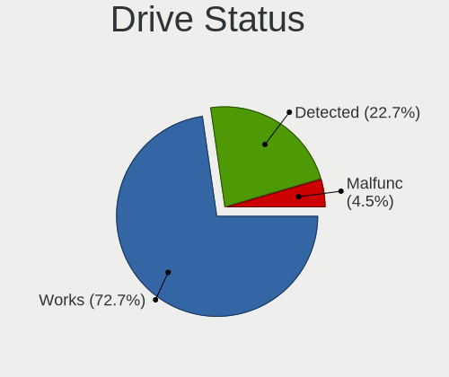

| Status   | Notebooks | Drives | Percent |
|----------|-----------|--------|---------|
| Works    | 12        | 13     | 80%     |
| Malfunc  | 2         | 2      | 13.33%  |
| Detected | 1         | 2      | 6.67%   |

Storage controller
------------------

Storage Vendor
--------------

Storage controller vendors

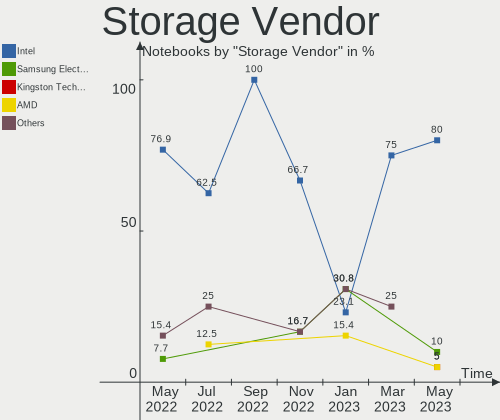

| Vendor  | Notebooks | Percent |
|---------|-----------|---------|
| Intel   | 15        | 88.24%  |
| Toshiba | 1         | 5.88%   |
| AMD     | 1         | 5.88%   |

Storage Model
-------------

Storage controller models

| Model                                                                                  | Notebooks | Percent |
|----------------------------------------------------------------------------------------|-----------|---------|
| Intel 7 Series Chipset Family 6-port SATA Controller [AHCI mode]                       | 3         | 15.79%  |
| Intel 6 Series/C200 Series Chipset Family 6 port Mobile SATA AHCI Controller           | 3         | 15.79%  |
| Intel 5 Series/3400 Series Chipset 6 port SATA AHCI Controller                         | 3         | 15.79%  |
| Intel 82801GBM/GHM (ICH7-M Family) SATA Controller [IDE mode]                          | 2         | 10.53%  |
| Intel 6 Series/C200 Series Chipset Family Mobile SATA Controller (IDE mode, ports 4-5) | 2         | 10.53%  |
| Intel 6 Series/C200 Series Chipset Family Mobile SATA Controller (IDE mode, ports 0-3) | 2         | 10.53%  |
| Toshiba unknown                                                                        | 1         | 5.26%   |
| Intel Cannon Lake Mobile PCH SATA AHCI Controller                                      | 1         | 5.26%   |
| Intel 82801CAM IDE U100 Controller                                                     | 1         | 5.26%   |
| AMD FCH SATA Controller [AHCI mode]                                                    | 1         | 5.26%   |

Storage Kind
------------

Kind of storage controller (IDE, SATA, NVMe, SAS, ...)

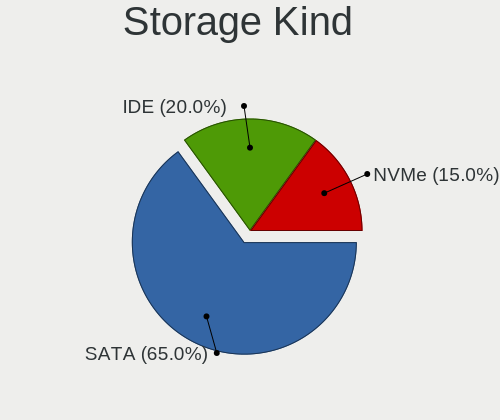

| Kind | Notebooks | Percent |
|------|-----------|---------|
| SATA | 11        | 64.71%  |
| IDE  | 5         | 29.41%  |
| NVMe | 1         | 5.88%   |

Processor
---------

CPU Vendor
----------

Processor vendors

| Vendor | Notebooks | Percent |
|--------|-----------|---------|
| Intel  | 15        | 93.75%  |
| AMD    | 1         | 6.25%   |

CPU Model
---------

Processor models

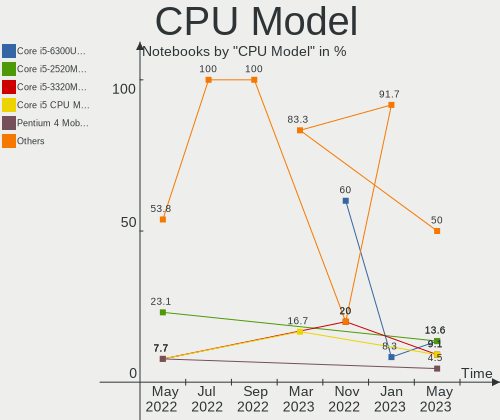

| Model                                    | Notebooks | Percent |
|------------------------------------------|-----------|---------|
| Intel Core i5-2520M CPU @ 2.50GHz        | 4         | 25%     |
| Intel Core i5-3320M CPU @ 2.60GHz        | 2         | 12.5%   |
| Intel Core i5 CPU M 520 @ 2.40GHz        | 2         | 12.5%   |
| Intel Pentium 4 Mobile CPU 1.60GHz       | 1         | 6.25%   |
| Intel Genuine CPU T2300 @ 1.66GHz        | 1         | 6.25%   |
| Intel Core i7-8750H CPU @ 2.20GHz        | 1         | 6.25%   |
| Intel Core i7-3520M CPU @ 2.90GHz        | 1         | 6.25%   |
| Intel Core i5-2540M CPU @ 2.60GHz        | 1         | 6.25%   |
| Intel Core i5 CPU M 540 @ 2.53GHz        | 1         | 6.25%   |
| Intel Atom CPU N280 @ 1.66GHz            | 1         | 6.25%   |
| AMD A6-3400M APU with Radeon HD Graphics | 1         | 6.25%   |

CPU Model Family
----------------

Processor model prefix

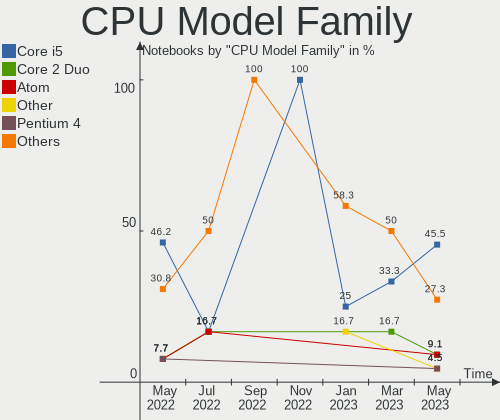

| Model           | Notebooks | Percent |
|-----------------|-----------|---------|
| Intel Core i5   | 10        | 62.5%   |
| Intel Core i7   | 2         | 12.5%   |
| Intel Pentium 4 | 1         | 6.25%   |
| Intel Genuine   | 1         | 6.25%   |
| Intel Atom      | 1         | 6.25%   |
| AMD A6          | 1         | 6.25%   |

CPU Cores
---------

Number of processor cores

| Number  | Notebooks | Percent |
|---------|-----------|---------|
| 2       | 11        | 68.75%  |
| Unknown | 3         | 18.75%  |
| 6       | 1         | 6.25%   |
| 4       | 1         | 6.25%   |

CPU Sockets
-----------

Number of sockets

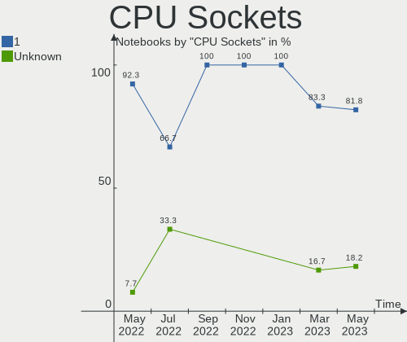

| Number | Notebooks | Percent |
|--------|-----------|---------|
| 1      | 16        | 100%    |

CPU Threads
-----------

Threads per core (Hyper-Threading)

| Number  | Notebooks | Percent |
|---------|-----------|---------|
| 2       | 12        | 75%     |
| Unknown | 3         | 18.75%  |
| 1       | 1         | 6.25%   |

CPU Microarch
-------------

Microarchitecture

| Name        | Notebooks | Percent |
|-------------|-----------|---------|
| SandyBridge | 5         | 31.25%  |
| Westmere    | 3         | 18.75%  |
| IvyBridge   | 3         | 18.75%  |
| P6          | 1         | 6.25%   |
| NetBurst    | 1         | 6.25%   |
| KabyLake    | 1         | 6.25%   |
| K10 Llano   | 1         | 6.25%   |
| Bonnell     | 1         | 6.25%   |

Graphics
--------

GPU Vendor
----------

Vendors of graphics cards

| Vendor | Notebooks | Percent |
|--------|-----------|---------|
| Intel  | 14        | 82.35%  |
| AMD    | 2         | 11.76%  |
| Nvidia | 1         | 5.88%   |

GPU Model
---------

Graphics card models

| Model                                                                         | Notebooks | Percent |
|-------------------------------------------------------------------------------|-----------|---------|
| Intel 2nd Generation Core Processor Family Integrated Graphics Controller     | 5         | 25%     |
| Intel Core Processor Integrated Graphics Controller                           | 3         | 15%     |
| Intel 3rd Gen Core processor Graphics Controller                              | 3         | 15%     |
| Intel Mobile 945GM/GMS/GME, 943/940GML Express Integrated Graphics Controller | 2         | 10%     |
| Nvidia GP104M [GeForce GTX 1070 Mobile]                                       | 1         | 5%      |
| Intel Mobile 945GSE Express Integrated Graphics Controller                    | 1         | 5%      |
| Intel Mobile 945GM/GMS, 943/940GML Express Integrated Graphics Controller     | 1         | 5%      |
| Intel CoffeeLake-H GT2 [UHD Graphics 630]                                     | 1         | 5%      |
| AMD Whistler [Radeon HD 6630M/6650M/6750M/7670M/7690M]                        | 1         | 5%      |
| AMD Sumo [Radeon HD 6520G]                                                    | 1         | 5%      |
| AMD RV200/M7 [Mobility Radeon 7500]                                           | 1         | 5%      |

GPU Combo
---------

Combinations of graphics cards

| Name           | Notebooks | Percent |
|----------------|-----------|---------|
| 1 x Intel      | 11        | 68.75%  |
| 2 x Intel      | 2         | 12.5%   |
| 2 x AMD        | 1         | 6.25%   |
| Intel + Nvidia | 1         | 6.25%   |
| 1 x AMD        | 1         | 6.25%   |

GPU Driver
----------

Free vs proprietary

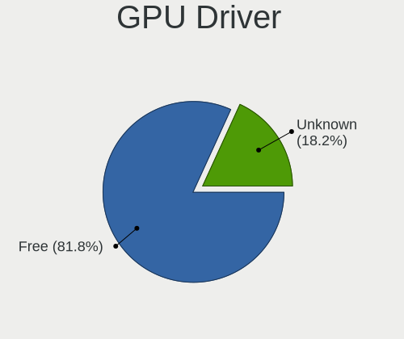

| Driver  | Notebooks | Percent |
|---------|-----------|---------|
| Free    | 14        | 87.5%   |
| Unknown | 2         | 12.5%   |

GPU Memory
----------

Total video memory

| Size in GB | Notebooks | Percent |
|------------|-----------|---------|
| Unknown    | 16        | 100%    |

Monitor
-------

Monitor Vendor
--------------

Monitor vendors

| Vendor                  | Notebooks | Percent |
|-------------------------|-----------|---------|
| AU Optronics            | 3         | 33.33%  |
| Samsung Electronics     | 2         | 22.22%  |
| LG Display              | 2         | 22.22%  |
| Lenovo                  | 1         | 11.11%  |
| Chi Mei Optoelectronics | 1         | 11.11%  |

Monitor Model
-------------

Monitor models

| Model                                                                    | Notebooks | Percent |
|--------------------------------------------------------------------------|-----------|---------|
| Samsung Electronics LCD Monitor SEC324C 1600x900 310x170mm 13.9-inch     | 1         | 11.11%  |
| Samsung Electronics LCD Monitor SEC304C 1366x768 310x170mm 13.9-inch     | 1         | 11.11%  |
| LG Display LCD Monitor LGD02EB 1366x768 310x170mm 13.9-inch              | 1         | 11.11%  |
| LG Display LCD Monitor LGD0215 1920x1080 350x190mm 15.7-inch             | 1         | 11.11%  |
| Lenovo LCD Monitor LEN40B1 1600x900 350x190mm 15.7-inch                  | 1         | 11.11%  |
| Chi Mei Optoelectronics LCD Monitor CMO15A7 1366x768 350x190mm 15.7-inch | 1         | 11.11%  |
| AU Optronics LCD Monitor AUO34EB 3840x2160 340x190mm 15.3-inch           | 1         | 11.11%  |
| AU Optronics LCD Monitor AUO213E 1600x900 310x170mm 13.9-inch            | 1         | 11.11%  |
| AU Optronics LCD Monitor AUO106C 1366x768 280x160mm 12.7-inch            | 1         | 11.11%  |

Monitor Resolution
------------------

Monitor screen resolution

| Resolution      | Notebooks | Percent |
|-----------------|-----------|---------|
| 1366x768 (WXGA) | 4         | 44.44%  |
| 1600x900 (HD+)  | 3         | 33.33%  |
| 3840x2160 (4K)  | 1         | 11.11%  |
| 1920x1080 (FHD) | 1         | 11.11%  |

Monitor Diagonal
----------------

Diagonal size in inches

| Inches | Notebooks | Percent |
|--------|-----------|---------|
| 15     | 5         | 55.56%  |
| 13     | 3         | 33.33%  |
| 12     | 1         | 11.11%  |

Monitor Width
-------------

Physical width

| Width in mm | Notebooks | Percent |
|-------------|-----------|---------|
| 301-350     | 8         | 88.89%  |
| 201-300     | 1         | 11.11%  |

Aspect Ratio
------------

Proportional relationship between the width and the height

| Ratio | Notebooks | Percent |
|-------|-----------|---------|
| 16/9  | 9         | 100%    |

Monitor Area
------------

Area in inch²

| Area in inch² | Notebooks | Percent |
|----------------|-----------|---------|
| 101-110        | 4         | 44.44%  |
| 81-90          | 3         | 33.33%  |
| 61-70          | 1         | 11.11%  |
| 91-100         | 1         | 11.11%  |

Pixel Density
-------------

Pixels per inch

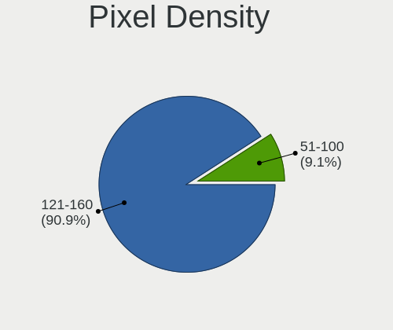

| Density       | Notebooks | Percent |
|---------------|-----------|---------|
| 121-160       | 4         | 44.44%  |
| 101-120       | 2         | 22.22%  |
| 51-100        | 2         | 22.22%  |
| More than 240 | 1         | 11.11%  |

Multiple Monitors
-----------------

Total monitors connected

| Total | Notebooks | Percent |
|-------|-----------|---------|
| 1     | 15        | 93.75%  |
| 0     | 1         | 6.25%   |

Network
-------

Net Controller Vendor
---------------------

Controller vendors

| Vendor                            | Notebooks | Percent |
|-----------------------------------|-----------|---------|
| Intel                             | 13        | 61.9%   |
| Realtek Semiconductor             | 3         | 14.29%  |
| Qualcomm Atheros                  | 3         | 14.29%  |
| Marvell Technology Group          | 1         | 4.76%   |
| Ericsson Business Mobile Networks | 1         | 4.76%   |

Net Controller Model
--------------------

Controller models

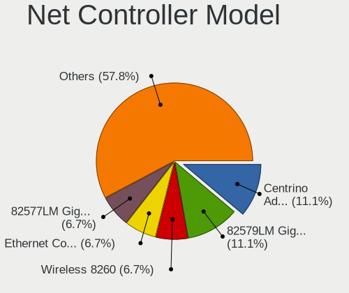

| Model                                                                       | Notebooks | Percent |
|-----------------------------------------------------------------------------|-----------|---------|
| Intel Centrino Advanced-N 6205 [Taylor Peak]                                | 8         | 24.24%  |
| Intel 82579LM Gigabit Network Connection (Lewisville)                       | 7         | 21.21%  |
| Intel 82577LM Gigabit Network Connection                                    | 3         | 9.09%   |
| Intel Centrino Advanced-N 6200                                              | 2         | 6.06%   |
| Realtek RTL8191SEvB Wireless LAN Controller                                 | 1         | 3.03%   |
| Realtek RTL8188CUS 802.11n WLAN Adapter                                     | 1         | 3.03%   |
| Realtek RTL8111/8168/8411 PCI Express Gigabit Ethernet Controller           | 1         | 3.03%   |
| Realtek RTL-8100/8101L/8139 PCI Fast Ethernet Adapter                       | 1         | 3.03%   |
| Qualcomm Atheros Killer E2500 Gigabit Ethernet Controller                   | 1         | 3.03%   |
| Qualcomm Atheros AR928X Wireless Network Adapter (PCI-Express)              | 1         | 3.03%   |
| Qualcomm Atheros AR9285 Wireless Network Adapter (PCI-Express)              | 1         | 3.03%   |
| Qualcomm Atheros AR8121/AR8113/AR8114 Gigabit or Fast Ethernet              | 1         | 3.03%   |
| Marvell Group 88E8053 PCI-E Gigabit Ethernet Controller                     | 1         | 3.03%   |
| Intel Wireless-AC 9260                                                      | 1         | 3.03%   |
| Intel PRO/Wireless 3945ABG [Golan] Network Connection                       | 1         | 3.03%   |
| Intel 82579V Gigabit Network Connection                                     | 1         | 3.03%   |
| Ericsson Business Mobile Networks F5521 gw Mobile Broadband Serial Port III | 1         | 3.03%   |

Wireless Vendor
---------------

Wireless vendors

| Vendor                | Notebooks | Percent |
|-----------------------|-----------|---------|
| Intel                 | 12        | 80%     |
| Qualcomm Atheros      | 2         | 13.33%  |
| Realtek Semiconductor | 1         | 6.67%   |

Wireless Model
--------------

Wireless models

| Model                                                          | Notebooks | Percent |
|----------------------------------------------------------------|-----------|---------|
| Intel Centrino Advanced-N 6205 [Taylor Peak]                   | 8         | 50%     |
| Intel Centrino Advanced-N 6200                                 | 2         | 12.5%   |
| Realtek RTL8191SEvB Wireless LAN Controller                    | 1         | 6.25%   |
| Realtek RTL8188CUS 802.11n WLAN Adapter                        | 1         | 6.25%   |
| Qualcomm Atheros AR928X Wireless Network Adapter (PCI-Express) | 1         | 6.25%   |
| Qualcomm Atheros AR9285 Wireless Network Adapter (PCI-Express) | 1         | 6.25%   |
| Intel Wireless-AC 9260                                         | 1         | 6.25%   |
| Intel PRO/Wireless 3945ABG [Golan] Network Connection          | 1         | 6.25%   |

Ethernet Vendor
---------------

Ethernet vendors

| Vendor                   | Notebooks | Percent |
|--------------------------|-----------|---------|
| Intel                    | 11        | 68.75%  |
| Realtek Semiconductor    | 2         | 12.5%   |
| Qualcomm Atheros         | 2         | 12.5%   |
| Marvell Technology Group | 1         | 6.25%   |

Ethernet Model
--------------

Ethernet models

| Model                                                             | Notebooks | Percent |
|-------------------------------------------------------------------|-----------|---------|
| Intel 82579LM Gigabit Network Connection (Lewisville)             | 7         | 43.75%  |
| Intel 82577LM Gigabit Network Connection                          | 3         | 18.75%  |
| Realtek RTL8111/8168/8411 PCI Express Gigabit Ethernet Controller | 1         | 6.25%   |
| Realtek RTL-8100/8101L/8139 PCI Fast Ethernet Adapter             | 1         | 6.25%   |
| Qualcomm Atheros Killer E2500 Gigabit Ethernet Controller         | 1         | 6.25%   |
| Qualcomm Atheros AR8121/AR8113/AR8114 Gigabit or Fast Ethernet    | 1         | 6.25%   |
| Marvell Group 88E8053 PCI-E Gigabit Ethernet Controller           | 1         | 6.25%   |
| Intel 82579V Gigabit Network Connection                           | 1         | 6.25%   |

Net Controller Kind
-------------------

Ethernet, WiFi or modem

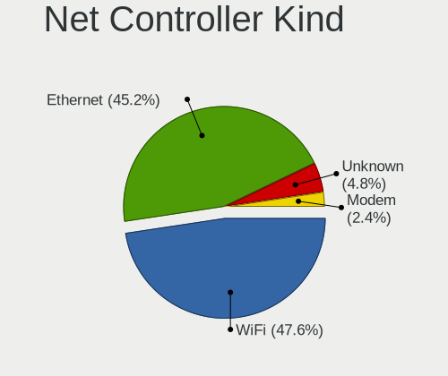

| Kind     | Notebooks | Percent |
|----------|-----------|---------|
| Ethernet | 16        | 50%     |
| WiFi     | 15        | 46.88%  |
| Unknown  | 1         | 3.13%   |

Used Controller
---------------

Currently used network controller

| Kind     | Notebooks | Percent |
|----------|-----------|---------|
| WiFi     | 14        | 73.68%  |
| Ethernet | 5         | 26.32%  |

NICs
----

Total network controllers on board

| Total | Notebooks | Percent |
|-------|-----------|---------|
| 2     | 15        | 93.75%  |
| 1     | 1         | 6.25%   |

IPv6
----

IPv6 vs IPv4

| Used | Notebooks | Percent |
|------|-----------|---------|
| No   | 16        | 100%    |

Bluetooth
---------

Bluetooth Vendor
----------------

Controller vendors

| Vendor            | Notebooks | Percent |
|-------------------|-----------|---------|
| Broadcom          | 3         | 33.33%  |
| Foxconn / Hon Hai | 2         | 22.22%  |
| Alps Electric     | 2         | 22.22%  |
| Intel             | 1         | 11.11%  |
| ASUSTek Computer  | 1         | 11.11%  |

Bluetooth Model
---------------

Controller models

| Model                                                    | Notebooks | Percent |
|----------------------------------------------------------|-----------|---------|
| Broadcom BCM2045B (BDC-2.1)                              | 3         | 33.33%  |
| Foxconn / Hon Hai Broadcom BCM20702 Bluetooth USB Device | 2         | 22.22%  |
| Alps Electric UGTZ4 Bluetooth                            | 2         | 22.22%  |
| Intel Wireless-AC 9260 Bluetooth Adapter                 | 1         | 11.11%  |
| ASUS Broadcom Bluetooth 2.1                              | 1         | 11.11%  |

Sound
-----

Sound Vendor
------------

Sound card vendors

| Vendor | Notebooks | Percent |
|--------|-----------|---------|
| Intel  | 15        | 93.75%  |
| AMD    | 1         | 6.25%   |

Sound Model
-----------

Sound card models

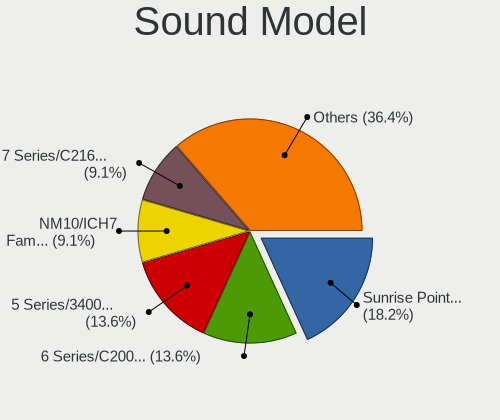

| Model                                                                      | Notebooks | Percent |
|----------------------------------------------------------------------------|-----------|---------|
| Intel 6 Series/C200 Series Chipset Family High Definition Audio Controller | 5         | 29.41%  |
| Intel 7 Series/C216 Chipset Family High Definition Audio Controller        | 3         | 17.65%  |
| Intel 5 Series/3400 Series Chipset High Definition Audio                   | 3         | 17.65%  |
| Intel NM10/ICH7 Family High Definition Audio Controller                    | 2         | 11.76%  |
| Intel Cannon Lake PCH cAVS                                                 | 1         | 5.88%   |
| Intel 82801CA/CAM AC'97 Audio Controller                                   | 1         | 5.88%   |
| AMD FCH Azalia Controller                                                  | 1         | 5.88%   |
| AMD BeaverCreek HDMI Audio [Radeon HD 6500D and 6400G-6600G series]        | 1         | 5.88%   |

Memory
------

Memory Vendor
-------------

Memory module vendors

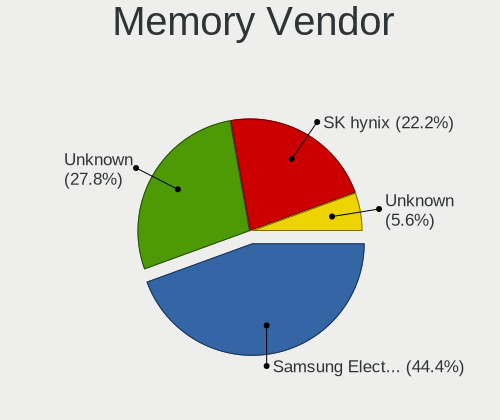

| Vendor              | Notebooks | Percent |
|---------------------|-----------|---------|
| Unknown             | 4         | 33.33%  |
| Samsung Electronics | 4         | 33.33%  |
| SK hynix            | 2         | 16.67%  |
| Micron Technology   | 1         | 8.33%   |
| Unknown             | 1         | 8.33%   |

Memory Model
------------

Memory module models

| Model                                                  | Notebooks | Percent |
|--------------------------------------------------------|-----------|---------|
| Samsung RAM M471B5273DH0-CH9 4GB SODIMM DDR3 1334MT/s  | 2         | 15.38%  |
| Unknown RAM Module 512MB SODIMM SDRAM                  | 1         | 7.69%   |
| Unknown RAM Module 4GB SODIMM DDR3 1333MT/s            | 1         | 7.69%   |
| Unknown RAM Module 2GB SODIMM DDR3 1067MT/s            | 1         | 7.69%   |
| Unknown RAM Module 1GB SODIMM DDR2                     | 1         | 7.69%   |
| SK hynix RAM HMT351S6EFR8A-PB 4GB SODIMM DDR3 1600MT/s | 1         | 7.69%   |
| SK hynix RAM HMT325S6BFR8C-H9 2GB SODIMM DDR3 1333MT/s | 1         | 7.69%   |
| Samsung RAM M471B5673FH0-CF8 2GB SODIMM DDR3 1067MT/s  | 1         | 7.69%   |
| Samsung RAM M471B5673EH1-CF8 2GB SODIMM DDR3 1067MT/s  | 1         | 7.69%   |
| Samsung RAM M471B5173BH0-CK0 4GB SODIMM DDR3 1600MT/s  | 1         | 7.69%   |
| Micron RAM 16ATF2G64HZ-2G6E1 16GB SODIMM DDR4 2667MT/s | 1         | 7.69%   |
| Unknown                                                | 1         | 7.69%   |

Memory Kind
-----------

Memory module kinds

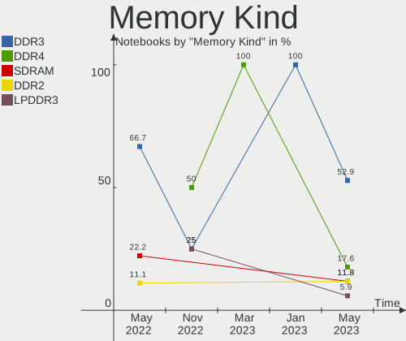

| Kind  | Notebooks | Percent |
|-------|-----------|---------|
| DDR3  | 7         | 63.64%  |
| SDRAM | 2         | 18.18%  |
| DDR4  | 1         | 9.09%   |
| DDR2  | 1         | 9.09%   |

Memory Form Factor
------------------

Physical design of the memory module

| Name   | Notebooks | Percent |
|--------|-----------|---------|
| SODIMM | 11        | 100%    |

Memory Size
-----------

Memory module size

| Size  | Notebooks | Percent |
|-------|-----------|---------|
| 4096  | 4         | 36.36%  |
| 2048  | 4         | 36.36%  |
| 16384 | 1         | 9.09%   |
| 1024  | 1         | 9.09%   |
| 512   | 1         | 9.09%   |

Memory Speed
------------

Memory module speed

| Speed   | Notebooks | Percent |
|---------|-----------|---------|
| Unknown | 3         | 27.27%  |
| 1334    | 2         | 18.18%  |
| 1333    | 2         | 18.18%  |
| 1067    | 2         | 18.18%  |
| 2667    | 1         | 9.09%   |
| 1600    | 1         | 9.09%   |

Printers & scanners
-------------------

Printer Vendor
--------------

Printer device vendors

Zero info for selected period =(

Printer Model
-------------

Printer device models

Zero info for selected period =(

Scanner Vendor
--------------

Scanner device vendors

Zero info for selected period =(

Scanner Model
-------------

Scanner device models

Zero info for selected period =(

Camera
------

Camera Vendor
-------------

Camera device vendors

| Vendor                        | Notebooks | Percent |
|-------------------------------|-----------|---------|
| Chicony Electronics           | 5         | 50%     |
| Sunplus Innovation Technology | 1         | 10%     |
| Ricoh                         | 1         | 10%     |
| Lenovo                        | 1         | 10%     |
| Alcor Micro                   | 1         | 10%     |
| Acer                          | 1         | 10%     |

Camera Model
------------

Camera device models

| Model                                    | Notebooks | Percent |
|------------------------------------------|-----------|---------|
| Chicony integrated camera                | 2         | 20%     |
| Sunplus Integrated_Webcam_FHD            | 1         | 10%     |
| Ricoh Laptop_Integrated_Webcam_FHD       | 1         | 10%     |
| Lenovo Integrated Webcam [R5U877]        | 1         | 10%     |
| Chicony Lenovo Integrated Camera (0.3MP) | 1         | 10%     |
| Chicony FJ Camera                        | 1         | 10%     |
| Chicony 2.0M UVC Webcam / CNF7129        | 1         | 10%     |
| Alcor Micro ASUS USB2.0 WebCam           | 1         | 10%     |
| Acer Integrated Camera                   | 1         | 10%     |

Security
--------

Fingerprint Vendor
------------------

Fingerprint sensor vendors

| Vendor    | Notebooks | Percent |
|-----------|-----------|---------|
| Upek      | 2         | 66.67%  |
| AuthenTec | 1         | 33.33%  |

Fingerprint Model
-----------------

Fingerprint sensor models

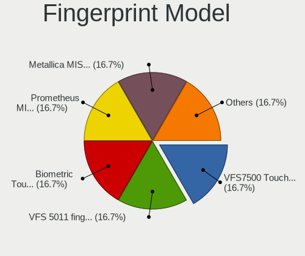

| Model                                                  | Notebooks | Percent |
|--------------------------------------------------------|-----------|---------|
| Upek Biometric Touchchip/Touchstrip Fingerprint Sensor | 2         | 66.67%  |
| AuthenTec AuthenTec Inc. AES2660                       | 1         | 33.33%  |

Chipcard Vendor
---------------

Chipcard module vendors

Zero info for selected period =(

Chipcard Model
--------------

Chipcard module models

Zero info for selected period =(

Unsupported
-----------

Unsupported Devices
-------------------

Total unsupported devices on board

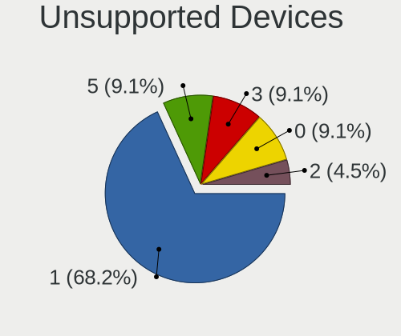

| Total | Notebooks | Percent |
|-------|-----------|---------|
| 1     | 10        | 62.5%   |
| 5     | 2         | 12.5%   |
| 2     | 2         | 12.5%   |
| 4     | 1         | 6.25%   |
| 0     | 1         | 6.25%   |

Unsupported Device Types
------------------------

Types of unsupported devices

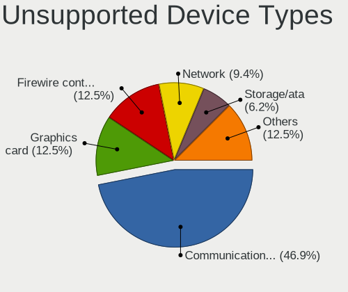

| Type                     | Notebooks | Percent |
|--------------------------|-----------|---------|
| Communication controller | 12        | 46.15%  |
| Graphics card            | 3         | 11.54%  |
| Firewire controller      | 3         | 11.54%  |
| Storage/ata              | 2         | 7.69%   |
| Sound                    | 2         | 7.69%   |
| Network                  | 2         | 7.69%   |
| Storage                  | 1         | 3.85%   |
| Net/wireless             | 1         | 3.85%   |

