OpenBSD - Hardware Trends (Notebooks)
-------------------------------------

A project to identify most popular hardware characteristics and track their change
over time based on data collected by BSD users at https://BSD-Hardware.info.

Anyone can contribute to this report by the [hw-probe](https://github.com/linuxhw/hw-probe/blob/master/INSTALL.BSD.md) tool:

    hw-probe -all -upload

This report is for one last month. Overall report since the beginning of time: [TestCoverage](https://github.com/bsdhw/TestCoverage)

Period: Dec, 2022.

Contents
--------

* [ System ](#system)
  - [ OS                       ](#os)
  - [ OS Family                ](#os-family)
  - [ Arch                     ](#arch)
  - [ DE                       ](#de)
  - [ Display Server           ](#display-server)
  - [ Display Manager          ](#display-manager)
  - [ OS Lang                  ](#os-lang)
  - [ Boot Mode                ](#boot-mode)
  - [ Filesystem               ](#filesystem)
  - [ Part. scheme             ](#part-scheme)

* [ Board ](#board)
  - [ Vendor                   ](#vendor)
  - [ Model                    ](#model)
  - [ Model Family             ](#model-family)
  - [ MFG Year                 ](#mfg-year)
  - [ Form Factor              ](#form-factor)
  - [ Coreboot                 ](#coreboot)
  - [ RAM Size                 ](#ram-size)
  - [ RAM Used                 ](#ram-used)
  - [ Total Drives             ](#total-drives)
  - [ Has CD-ROM               ](#has-cd-rom)
  - [ Has Ethernet             ](#has-ethernet)
  - [ Has WiFi                 ](#has-wifi)
  - [ Has Bluetooth            ](#has-bluetooth)

* [ Location ](#location)
  - [ Country                  ](#country)
  - [ City                     ](#city)

* [ Drives ](#drives)
  - [ Drive Vendor             ](#drive-vendor)
  - [ Drive Model              ](#drive-model)
  - [ HDD Vendor               ](#hdd-vendor)
  - [ SSD Vendor               ](#ssd-vendor)
  - [ Drive Kind               ](#drive-kind)
  - [ Drive Connector          ](#drive-connector)
  - [ Drive Size               ](#drive-size)
  - [ Space Total              ](#space-total)
  - [ Space Used               ](#space-used)
  - [ Malfunc. Drives          ](#malfunc-drives)
  - [ Malfunc. Drive Vendor    ](#malfunc-drive-vendor)
  - [ Malfunc. HDD Vendor      ](#malfunc-hdd-vendor)
  - [ Malfunc. Drive Kind      ](#malfunc-drive-kind)
  - [ Failed Drives            ](#failed-drives)
  - [ Failed Drive Vendor      ](#failed-drive-vendor)
  - [ Drive Status             ](#drive-status)

* [ Storage controller ](#storage-controller)
  - [ Storage Vendor           ](#storage-vendor)
  - [ Storage Model            ](#storage-model)
  - [ Storage Kind             ](#storage-kind)

* [ Processor ](#processor)
  - [ CPU Vendor               ](#cpu-vendor)
  - [ CPU Model                ](#cpu-model)
  - [ CPU Model Family         ](#cpu-model-family)
  - [ CPU Cores                ](#cpu-cores)
  - [ CPU Sockets              ](#cpu-sockets)
  - [ CPU Threads              ](#cpu-threads)
  - [ CPU Microarch            ](#cpu-microarch)

* [ Graphics ](#graphics)
  - [ GPU Vendor               ](#gpu-vendor)
  - [ GPU Model                ](#gpu-model)
  - [ GPU Combo                ](#gpu-combo)
  - [ GPU Driver               ](#gpu-driver)
  - [ GPU Memory               ](#gpu-memory)

* [ Monitor ](#monitor)
  - [ Monitor Vendor           ](#monitor-vendor)
  - [ Monitor Model            ](#monitor-model)
  - [ Monitor Resolution       ](#monitor-resolution)
  - [ Monitor Diagonal         ](#monitor-diagonal)
  - [ Monitor Width            ](#monitor-width)
  - [ Aspect Ratio             ](#aspect-ratio)
  - [ Monitor Area             ](#monitor-area)
  - [ Pixel Density            ](#pixel-density)
  - [ Multiple Monitors        ](#multiple-monitors)

* [ Network ](#network)
  - [ Net Controller Vendor    ](#net-controller-vendor)
  - [ Net Controller Model     ](#net-controller-model)
  - [ Wireless Vendor          ](#wireless-vendor)
  - [ Wireless Model           ](#wireless-model)
  - [ Ethernet Vendor          ](#ethernet-vendor)
  - [ Ethernet Model           ](#ethernet-model)
  - [ Net Controller Kind      ](#net-controller-kind)
  - [ Used Controller          ](#used-controller)
  - [ NICs                     ](#nics)
  - [ IPv6                     ](#ipv6)

* [ Bluetooth ](#bluetooth)
  - [ Bluetooth Vendor         ](#bluetooth-vendor)
  - [ Bluetooth Model          ](#bluetooth-model)

* [ Sound ](#sound)
  - [ Sound Vendor             ](#sound-vendor)
  - [ Sound Model              ](#sound-model)

* [ Memory ](#memory)
  - [ Memory Vendor            ](#memory-vendor)
  - [ Memory Model             ](#memory-model)
  - [ Memory Kind              ](#memory-kind)
  - [ Memory Form Factor       ](#memory-form-factor)
  - [ Memory Size              ](#memory-size)
  - [ Memory Speed             ](#memory-speed)

* [ Printers & scanners ](#printers--scanners)
  - [ Printer Vendor           ](#printer-vendor)
  - [ Printer Model            ](#printer-model)
  - [ Scanner Vendor           ](#scanner-vendor)
  - [ Scanner Model            ](#scanner-model)

* [ Camera ](#camera)
  - [ Camera Vendor            ](#camera-vendor)
  - [ Camera Model             ](#camera-model)

* [ Security ](#security)
  - [ Fingerprint Vendor       ](#fingerprint-vendor)
  - [ Fingerprint Model        ](#fingerprint-model)
  - [ Chipcard Vendor          ](#chipcard-vendor)
  - [ Chipcard Model           ](#chipcard-model)

* [ Unsupported ](#unsupported)
  - [ Unsupported Devices      ](#unsupported-devices)
  - [ Unsupported Device Types ](#unsupported-device-types)

System
------

OS
--

Installed operating systems

| Name        | Notebooks | Percent |
|-------------|-----------|---------|
| OpenBSD 7.2 | 13        | 100%    |

OS Family
---------

OS without a version

| Name    | Notebooks | Percent |
|---------|-----------|---------|
| OpenBSD | 13        | 100%    |

Arch
----

OS architecture (x86_64, i586, etc.)

| Name  | Notebooks | Percent |
|-------|-----------|---------|
| amd64 | 12        | 92.31%  |
| i386  | 1         | 7.69%   |

DE
--

Desktop Environment

| Name         | Notebooks | Percent |
|--------------|-----------|---------|
| helloDesktop | 12        | 92.31%  |
| GNOME        | 1         | 7.69%   |

Display Server
--------------

X11 or Wayland

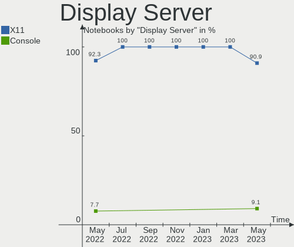

| Name | Notebooks | Percent |
|------|-----------|---------|
| X11  | 13        | 100%    |

Display Manager
---------------

SDDM, LightDM, etc.

| Name    | Notebooks | Percent |
|---------|-----------|---------|
| Console | 13        | 100%    |

OS Lang
-------

Language

| Lang    | Notebooks | Percent |
|---------|-----------|---------|
| Unknown | 10        | 76.92%  |
| ja_JP   | 1         | 7.69%   |
| en_US   | 1         | 7.69%   |
| C       | 1         | 7.69%   |

Boot Mode
---------

EFI or BIOS

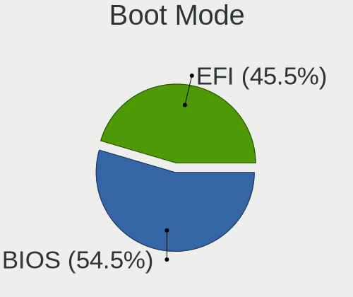

| Mode | Notebooks | Percent |
|------|-----------|---------|
| EFI  | 8         | 61.54%  |
| BIOS | 5         | 38.46%  |

Filesystem
----------

Type of filesystem

| Type | Notebooks | Percent |
|------|-----------|---------|
| Ffs  | 13        | 100%    |

Part. scheme
------------

Scheme of partitioning

| Type | Notebooks | Percent |
|------|-----------|---------|
| GPT  | 7         | 53.85%  |
| MBR  | 6         | 46.15%  |

Board
-----

Vendor
------

Motherboard manufacturer

| Name             | Notebooks | Percent |
|------------------|-----------|---------|
| Lenovo           | 4         | 30.77%  |
| TUXEDO           | 2         | 15.38%  |
| Toshiba          | 1         | 7.69%   |
| Tactus           | 1         | 7.69%   |
| Star Labs        | 1         | 7.69%   |
| Panasonic        | 1         | 7.69%   |
| Hewlett-Packard  | 1         | 7.69%   |
| Framework        | 1         | 7.69%   |
| ASUSTek Computer | 1         | 7.69%   |

Model
-----

Motherboard model

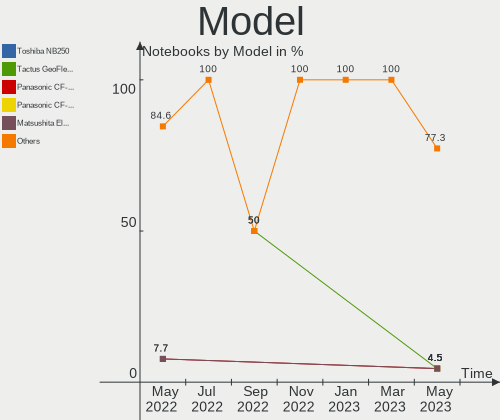

| Name                                 | Notebooks | Percent |
|--------------------------------------|-----------|---------|
| TUXEDO Pulse 15 Gen1                 | 1         | 7.69%   |
| TUXEDO InfinityBook Pro 14 Gen6      | 1         | 7.69%   |
| Toshiba Satellite BE96-F299          | 1         | 7.69%   |
| Tactus GeoFlex 110                   | 1         | 7.69%   |
| Star Labs Lite                       | 1         | 7.69%   |
| Panasonic CF-54-1                    | 1         | 7.69%   |
| Lenovo ThinkPad X200 Tablet 744943U  | 1         | 7.69%   |
| Lenovo ThinkPad T60 1951A47          | 1         | 7.69%   |
| Lenovo ThinkPad T480 20L6S13100      | 1         | 7.69%   |
| Lenovo ThinkPad T410 2518C3U         | 1         | 7.69%   |
| HP ProBook 430 G7                    | 1         | 7.69%   |
| Framework Laptop                     | 1         | 7.69%   |
| ASUS ASUS EXPERTBOOK B9450FA_B9450FA | 1         | 7.69%   |

Model Family
------------

Motherboard model prefix

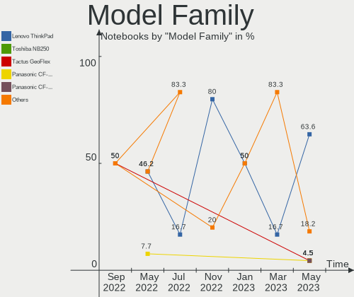

| Name                | Notebooks | Percent |
|---------------------|-----------|---------|
| Lenovo ThinkPad     | 4         | 30.77%  |
| TUXEDO Pulse        | 1         | 7.69%   |
| TUXEDO InfinityBook | 1         | 7.69%   |
| Toshiba Satellite   | 1         | 7.69%   |
| Tactus GeoFlex      | 1         | 7.69%   |
| Star Labs Lite      | 1         | 7.69%   |
| Panasonic CF-54-1   | 1         | 7.69%   |
| HP ProBook          | 1         | 7.69%   |
| Framework Laptop    | 1         | 7.69%   |
| ASUS ASUS           | 1         | 7.69%   |

MFG Year
--------

Motherboard manufacture year

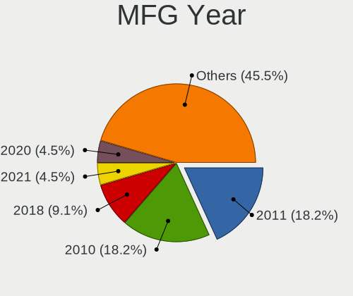

| Year | Notebooks | Percent |
|------|-----------|---------|
| 2022 | 5         | 38.46%  |
| 2021 | 2         | 15.38%  |
| 2019 | 1         | 7.69%   |
| 2018 | 1         | 7.69%   |
| 2015 | 1         | 7.69%   |
| 2012 | 1         | 7.69%   |
| 2010 | 1         | 7.69%   |
| 2006 | 1         | 7.69%   |

Form Factor
-----------

Physical design of the computer

| Name     | Notebooks | Percent |
|----------|-----------|---------|
| Notebook | 13        | 100%    |

Coreboot
--------

Have coreboot on board

| Used | Notebooks | Percent |
|------|-----------|---------|
| No   | 11        | 84.62%  |
| Yes  | 2         | 15.38%  |

RAM Size
--------

Total RAM memory

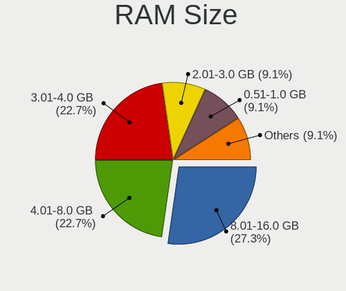

| Size in GB | Notebooks | Percent |
|------------|-----------|---------|
| 4.01-8.0   | 3         | 23.08%  |
| 32.01-64.0 | 3         | 23.08%  |
| 3.01-4.0   | 3         | 23.08%  |
| 16.01-24.0 | 2         | 15.38%  |
| 8.01-16.0  | 2         | 15.38%  |

RAM Used
--------

Used RAM memory

| Used GB  | Notebooks | Percent |
|----------|-----------|---------|
| 0.01-0.5 | 10        | 76.92%  |
| 0.51-1.0 | 3         | 23.08%  |

Total Drives
------------

Number of drives on board

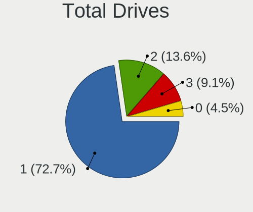

| Drives | Notebooks | Percent |
|--------|-----------|---------|
| 1      | 7         | 53.85%  |
| 2      | 5         | 38.46%  |
| 0      | 1         | 7.69%   |

Has CD-ROM
----------

Has CD-ROM on board

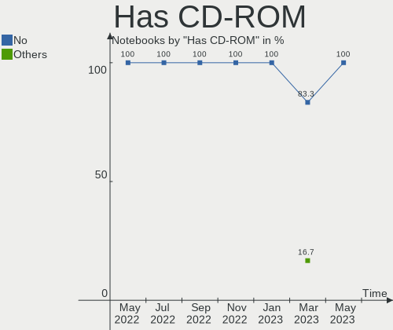

| Presented | Notebooks | Percent |
|-----------|-----------|---------|
| No        | 13        | 100%    |

Has Ethernet
------------

Has Ethernet on board

| Presented | Notebooks | Percent |
|-----------|-----------|---------|
| Yes       | 9         | 69.23%  |
| No        | 4         | 30.77%  |

Has WiFi
--------

Has WiFi module

| Presented | Notebooks | Percent |
|-----------|-----------|---------|
| Yes       | 13        | 100%    |

Has Bluetooth
-------------

Has Bluetooth module

| Presented | Notebooks | Percent |
|-----------|-----------|---------|
| Yes       | 9         | 69.23%  |
| No        | 4         | 30.77%  |

Location
--------

Country
-------

Geographic location (country)

| Country | Notebooks | Percent |
|---------|-----------|---------|
| USA     | 4         | 30.77%  |
| Germany | 3         | 23.08%  |
| UK      | 1         | 7.69%   |
| Spain   | 1         | 7.69%   |
| Japan   | 1         | 7.69%   |
| Egypt   | 1         | 7.69%   |
| Cyprus  | 1         | 7.69%   |
| Canada  | 1         | 7.69%   |

City
----

Geographic location (city)

| City               | Notebooks | Percent |
|--------------------|-----------|---------|
| Yokohama           | 1         | 7.69%   |
| Tala               | 1         | 7.69%   |
| Sun Prairie        | 1         | 7.69%   |
| Pine Mountain Club | 1         | 7.69%   |
| Navalcarnero       | 1         | 7.69%   |
| Montreal           | 1         | 7.69%   |
| Lübeck            | 1         | 7.69%   |
| Larnaca            | 1         | 7.69%   |
| Lafayette          | 1         | 7.69%   |
| Karlsruhe          | 1         | 7.69%   |
| Fürth             | 1         | 7.69%   |
| Farnborough        | 1         | 7.69%   |
| Dallas             | 1         | 7.69%   |

Drives
------

Drive Vendor
------------

Hard drive vendors

| Vendor              | Notebooks | Drives | Percent |
|---------------------|-----------|--------|---------|
| NVMe                | 6         | 7      | 50%     |
| Toshiba             | 2         | 2      | 16.67%  |
| WDC                 | 1         | 1      | 8.33%   |
| Team                | 1         | 1      | 8.33%   |
| Star Drive          | 1         | 1      | 8.33%   |
| Samsung Electronics | 1         | 1      | 8.33%   |

Drive Model
-----------

Hard drive models

| Model                       | Notebooks | Percent |
|-----------------------------|-----------|---------|
| NVMe Samsung SSD 980 2TB    | 2         | 15.38%  |
| WDC WD2500BEVS-22UST0 250GB | 1         | 7.69%   |
| Toshiba MQ01ACF032 320GB    | 1         | 7.69%   |
| Toshiba MK6475GSX 640GB     | 1         | 7.69%   |
| Team TEAML5Lite3D120G 120GB | 1         | 7.69%   |
| Star Drive SATA SSD 960GB   | 1         | 7.69%   |
| Samsung SSD 860 EVO 1TB     | 1         | 7.69%   |
| NVMe WDS100T3X0C-00SJ 1TB   | 1         | 7.69%   |
| NVMe SK hynix BC501 H 512GB | 1         | 7.69%   |
| NVMe SAMSUNG MZVLQ512 512GB | 1         | 7.69%   |
| NVMe SAMSUNG MZVLB256 256GB | 1         | 7.69%   |
| NVMe ADATA SX8200PNP 1TB    | 1         | 7.69%   |

HDD Vendor
----------

Hard disk drive vendors

| Vendor  | Notebooks | Drives | Percent |
|---------|-----------|--------|---------|
| NVMe    | 4         | 5      | 57.14%  |
| Toshiba | 2         | 2      | 28.57%  |
| WDC     | 1         | 1      | 14.29%  |

SSD Vendor
----------

Solid state drive vendors

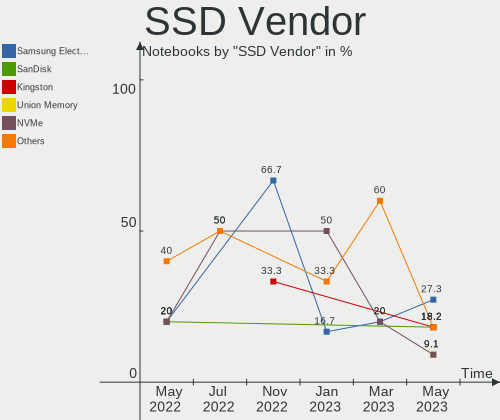

| Vendor              | Notebooks | Drives | Percent |
|---------------------|-----------|--------|---------|
| NVMe                | 2         | 2      | 40%     |
| Team                | 1         | 1      | 20%     |
| Star Drive          | 1         | 1      | 20%     |
| Samsung Electronics | 1         | 1      | 20%     |

Drive Kind
----------

HDD or SSD

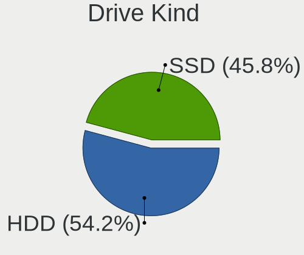

| Kind | Notebooks | Drives | Percent |
|------|-----------|--------|---------|
| HDD  | 7         | 8      | 58.33%  |
| SSD  | 5         | 5      | 41.67%  |

Drive Connector
---------------

SATA, SAS, NVMe, etc.

| Type | Notebooks | Drives | Percent |
|------|-----------|--------|---------|
| SATA | 12        | 13     | 100%    |

Drive Size
----------

Size of hard drive

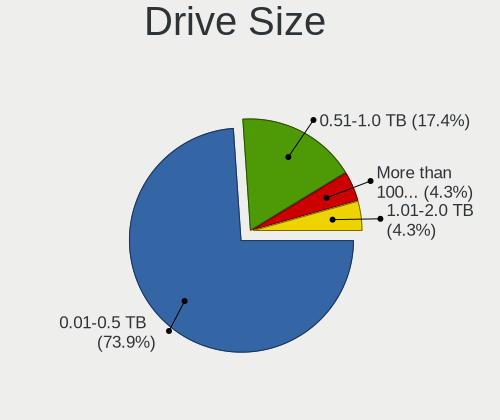

| Size in TB | Notebooks | Drives | Percent |
|------------|-----------|--------|---------|
| 0.51-1.0   | 6         | 6      | 46.15%  |
| 0.01-0.5   | 4         | 4      | 30.77%  |
| 1.01-2.0   | 3         | 3      | 23.08%  |

Space Total
-----------

Amount of disk space available on the file system

| Size in GB | Notebooks | Percent |
|------------|-----------|---------|
| 251-500    | 6         | 46.15%  |
| 101-250    | 3         | 23.08%  |
| 51-100     | 2         | 15.38%  |
| 1001-2000  | 1         | 7.69%   |
| 501-1000   | 1         | 7.69%   |

Space Used
----------

Amount of used disk space

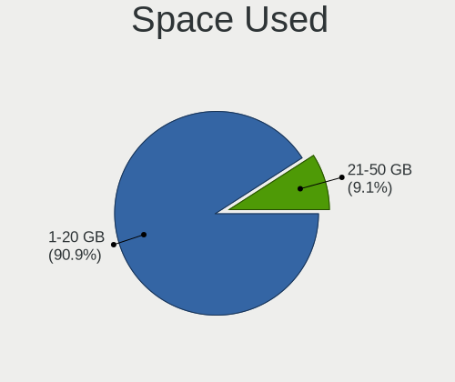

| Used GB | Notebooks | Percent |
|---------|-----------|---------|
| 1-20    | 7         | 53.85%  |
| 21-50   | 3         | 23.08%  |
| 51-100  | 2         | 15.38%  |
| 251-500 | 1         | 7.69%   |

Malfunc. Drives
---------------

Drive models with a malfunction

| Model                       | Notebooks | Drives | Percent |
|-----------------------------|-----------|--------|---------|
| WDC WD2500BEVS-22UST0 250GB | 1         | 1      | 33.33%  |
| Toshiba MQ01ACF032 320GB    | 1         | 1      | 33.33%  |
| Toshiba MK6475GSX 640GB     | 1         | 1      | 33.33%  |

Malfunc. Drive Vendor
---------------------

Vendors of faulty drives

| Vendor  | Notebooks | Drives | Percent |
|---------|-----------|--------|---------|
| Toshiba | 2         | 2      | 66.67%  |
| WDC     | 1         | 1      | 33.33%  |

Malfunc. HDD Vendor
-------------------

Vendors of faulty HDD drives

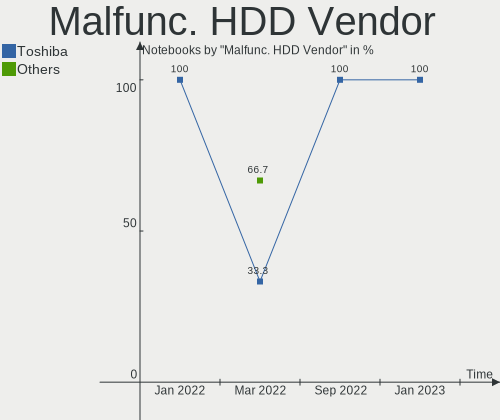

| Vendor  | Notebooks | Drives | Percent |
|---------|-----------|--------|---------|
| Toshiba | 2         | 2      | 66.67%  |
| WDC     | 1         | 1      | 33.33%  |

Malfunc. Drive Kind
-------------------

Kinds of faulty drives

| Kind | Notebooks | Drives | Percent |
|------|-----------|--------|---------|
| HDD  | 3         | 3      | 100%    |

Failed Drives
-------------

Failed drive models

Zero info for selected period =(

Failed Drive Vendor
-------------------

Failed drive vendors

Zero info for selected period =(

Drive Status
------------

Number of failed and malfunc. drives

| Status   | Notebooks | Drives | Percent |
|----------|-----------|--------|---------|
| Detected | 6         | 7      | 50%     |
| Malfunc  | 3         | 3      | 25%     |
| Works    | 3         | 3      | 25%     |

Storage controller
------------------

Storage Vendor
--------------

Storage controller vendors

| Vendor              | Notebooks | Percent |
|---------------------|-----------|---------|
| Intel               | 8         | 50%     |
| Samsung Electronics | 4         | 25%     |
| SK hynix            | 1         | 6.25%   |
| SanDisk             | 1         | 6.25%   |
| AMD                 | 1         | 6.25%   |
| ADATA Technology    | 1         | 6.25%   |

Storage Model
-------------

Storage controller models

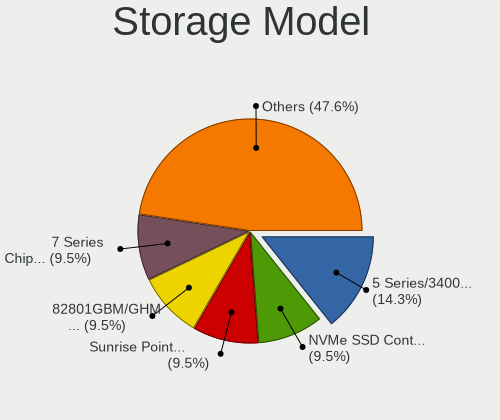

| Model                                                                 | Notebooks | Percent |
|-----------------------------------------------------------------------|-----------|---------|
| Samsung NVMe SSD Controller PM9A1/PM9A3/980PRO                        | 2         | 11.76%  |
| Intel Celeron/Pentium Silver Processor SATA Controller                | 2         | 11.76%  |
| SK hynix BC501 NVMe Solid State Drive                                 | 1         | 5.88%   |
| SanDisk WD Black SN750 / PC SN730 NVMe SSD                            | 1         | 5.88%   |
| Samsung NVMe SSD Controller SM981/PM981/PM983                         | 1         | 5.88%   |
| Samsung NVMe SSD Controller 980                                       | 1         | 5.88%   |
| Intel Wildcat Point-LP SATA Controller [AHCI Mode]                    | 1         | 5.88%   |
| Intel Comet Lake SATA AHCI Controller                                 | 1         | 5.88%   |
| Intel 82801IBM/IEM (ICH9M/ICH9M-E) 4 port SATA Controller [AHCI mode] | 1         | 5.88%   |
| Intel 82801GBM/GHM (ICH7-M Family) SATA Controller [AHCI mode]        | 1         | 5.88%   |
| Intel 82801G (ICH7 Family) IDE Controller                             | 1         | 5.88%   |
| Intel 7 Series Chipset Family 6-port SATA Controller [AHCI mode]      | 1         | 5.88%   |
| Intel 5 Series/3400 Series Chipset 6 port SATA AHCI Controller        | 1         | 5.88%   |
| AMD FCH SATA Controller [AHCI mode]                                   | 1         | 5.88%   |
| ADATA XPG SX8200 Pro PCIe Gen3x4 M.2 2280 Solid State Drive           | 1         | 5.88%   |

Storage Kind
------------

Kind of storage controller (IDE, SATA, NVMe, SAS, ...)

| Kind | Notebooks | Percent |
|------|-----------|---------|
| SATA | 9         | 56.25%  |
| NVMe | 6         | 37.5%   |
| IDE  | 1         | 6.25%   |

Processor
---------

CPU Vendor
----------

Processor vendors

| Vendor | Notebooks | Percent |
|--------|-----------|---------|
| Intel  | 12        | 92.31%  |
| AMD    | 1         | 7.69%   |

CPU Model
---------

Processor models

| Model                                                         | Notebooks | Percent |
|---------------------------------------------------------------|-----------|---------|
| Intel Pentium Silver N5030 CPU @ 1.10GHz                      | 1         | 7.69%   |
| Intel Core i7-8650U CPU @ 1.90GHz                             | 1         | 7.69%   |
| Intel Core i7-10510U CPU @ 1.80GHz                            | 1         | 7.69%   |
| Intel Core i5-5300U CPU @ 2.30GHz                             | 1         | 7.69%   |
| Intel Core i5-10210U CPU @ 1.60GHz                            | 1         | 7.69%   |
| Intel Core i5 CPU M 540 @ 2.53GHz                             | 1         | 7.69%   |
| Intel Core i3-3120M CPU @ 2.50GHz                             | 1         | 7.69%   |
| Intel Core Duo CPU T2500 @ 2.00GHz ("GenuineIntel" 686-class) | 1         | 7.69%   |
| Intel Core 2 Duo CPU L9600 @ 2.13GHz                          | 1         | 7.69%   |
| Intel Celeron N4020 CPU @ 1.10GHz                             | 1         | 7.69%   |
| Intel 11th Gen Core i7-11370H @ 3.30GHz                       | 1         | 7.69%   |
| Intel 11th Gen Core i5-1135G7 @ 2.40GHz                       | 1         | 7.69%   |
| AMD Ryzen 7 4800H with Radeon Graphics                        | 1         | 7.69%   |

CPU Model Family
----------------

Processor model prefix

| Model                | Notebooks | Percent |
|----------------------|-----------|---------|
| Intel Core i5        | 3         | 23.08%  |
| Other                | 2         | 15.38%  |
| Intel Core i7        | 2         | 15.38%  |
| Intel Pentium Silver | 1         | 7.69%   |
| Intel Core i3        | 1         | 7.69%   |
| Intel Core Duo       | 1         | 7.69%   |
| Intel Core 2 Duo     | 1         | 7.69%   |
| Intel Celeron        | 1         | 7.69%   |
| AMD Ryzen 7          | 1         | 7.69%   |

CPU Cores
---------

Number of processor cores

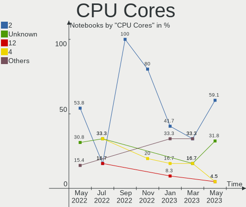

| Number  | Notebooks | Percent |
|---------|-----------|---------|
| 4       | 6         | 46.15%  |
| 2       | 4         | 30.77%  |
| Unknown | 2         | 15.38%  |
| 16      | 1         | 7.69%   |

CPU Sockets
-----------

Number of sockets

| Number  | Notebooks | Percent |
|---------|-----------|---------|
| 1       | 11        | 84.62%  |
| Unknown | 2         | 15.38%  |

CPU Threads
-----------

Threads per core (Hyper-Threading)

| Number  | Notebooks | Percent |
|---------|-----------|---------|
| 2       | 8         | 61.54%  |
| 1       | 3         | 23.08%  |
| Unknown | 2         | 15.38%  |

CPU Microarch
-------------

Microarchitecture

| Name          | Notebooks | Percent |
|---------------|-----------|---------|
| KabyLake      | 3         | 23.08%  |
| TigerLake     | 2         | 15.38%  |
| Goldmont plus | 2         | 15.38%  |
| Zen 2         | 1         | 7.69%   |
| Westmere      | 1         | 7.69%   |
| Penryn        | 1         | 7.69%   |
| P6            | 1         | 7.69%   |
| IvyBridge     | 1         | 7.69%   |
| Broadwell     | 1         | 7.69%   |

Graphics
--------

GPU Vendor
----------

Vendors of graphics cards

| Vendor | Notebooks | Percent |
|--------|-----------|---------|
| Intel  | 12        | 85.71%  |
| Nvidia | 1         | 7.14%   |
| AMD    | 1         | 7.14%   |

GPU Model
---------

Graphics card models

| Model                                                                         | Notebooks | Percent |
|-------------------------------------------------------------------------------|-----------|---------|
| Intel TigerLake-LP GT2 [Iris Xe Graphics]                                     | 2         | 13.33%  |
| Intel CometLake-U GT2 [UHD Graphics]                                          | 2         | 13.33%  |
| Nvidia GP108M [GeForce MX150]                                                 | 1         | 6.67%   |
| Intel UHD Graphics 620                                                        | 1         | 6.67%   |
| Intel Mobile 945GM/GMS/GME, 943/940GML Express Integrated Graphics Controller | 1         | 6.67%   |
| Intel Mobile 945GM/GMS, 943/940GML Express Integrated Graphics Controller     | 1         | 6.67%   |
| Intel Mobile 4 Series Chipset Integrated Graphics Controller                  | 1         | 6.67%   |
| Intel HD Graphics 5500                                                        | 1         | 6.67%   |
| Intel GeminiLake [UHD Graphics 605]                                           | 1         | 6.67%   |
| Intel GeminiLake [UHD Graphics 600]                                           | 1         | 6.67%   |
| Intel Core Processor Integrated Graphics Controller                           | 1         | 6.67%   |
| Intel 3rd Gen Core processor Graphics Controller                              | 1         | 6.67%   |
| AMD Renoir                                                                    | 1         | 6.67%   |

GPU Combo
---------

Combinations of graphics cards

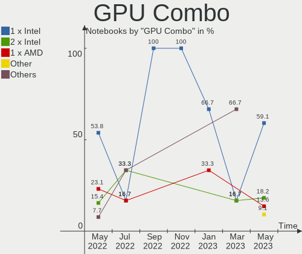

| Name           | Notebooks | Percent |
|----------------|-----------|---------|
| 1 x Intel      | 9         | 69.23%  |
| 2 x Intel      | 2         | 15.38%  |
| Intel + Nvidia | 1         | 7.69%   |
| 1 x AMD        | 1         | 7.69%   |

GPU Driver
----------

Free vs proprietary

| Driver  | Notebooks | Percent |
|---------|-----------|---------|
| Free    | 12        | 92.31%  |
| Unknown | 1         | 7.69%   |

GPU Memory
----------

Total video memory

| Size in GB | Notebooks | Percent |
|------------|-----------|---------|
| Unknown    | 13        | 100%    |

Monitor
-------

Monitor Vendor
--------------

Monitor vendors

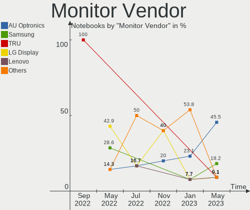

| Vendor       | Notebooks | Percent |
|--------------|-----------|---------|
| BOE          | 4         | 33.33%  |
| LG Display   | 2         | 16.67%  |
| Lenovo       | 2         | 16.67%  |
| TRU          | 1         | 8.33%   |
| Dell         | 1         | 8.33%   |
| CSO          | 1         | 8.33%   |
| AU Optronics | 1         | 8.33%   |

Monitor Model
-------------

Monitor models

| Model                                                          | Notebooks | Percent |
|----------------------------------------------------------------|-----------|---------|
| TRU LCD Monitor TRU235C 1366x768 260x140mm 11.6-inch           | 1         | 8.33%   |
| LG Display LCD Monitor LGD058B 2560x1440 310x170mm 13.9-inch   | 1         | 8.33%   |
| LG Display LCD Monitor LGD045E 1366x768 310x170mm 13.9-inch    | 1         | 8.33%   |
| Lenovo LCD Monitor LEN4035 1280x800 300x190mm 14.0-inch        | 1         | 8.33%   |
| Lenovo LCD Monitor LEN4011 1280x800 260x160mm 12.0-inch        | 1         | 8.33%   |
| Dell P1917S DELD093 1280x1024 380x300mm 19.1-inch              | 1         | 8.33%   |
| CSO LCD Monitor CSO1402 2880x1800 300x190mm 14.0-inch          | 1         | 8.33%   |
| BOE LCD Monitor BOE096F 1920x1080 250x140mm 11.3-inch          | 1         | 8.33%   |
| BOE LCD Monitor BOE095F 2256x1504 280x190mm 13.3-inch          | 1         | 8.33%   |
| BOE LCD Monitor BOE0900 1920x1080 340x190mm 15.3-inch          | 1         | 8.33%   |
| BOE LCD Monitor BOE08A6 1920x1080 290x170mm 13.2-inch          | 1         | 8.33%   |
| AU Optronics LCD Monitor AUO623D 1920x1080 310x170mm 13.9-inch | 1         | 8.33%   |

Monitor Resolution
------------------

Monitor screen resolution

| Resolution       | Notebooks | Percent |
|------------------|-----------|---------|
| 1920x1080 (FHD)  | 4         | 33.33%  |
| 1366x768 (WXGA)  | 2         | 16.67%  |
| 1280x800 (WXGA)  | 2         | 16.67%  |
| 2880x1800        | 1         | 8.33%   |
| 2560x1440 (QHD)  | 1         | 8.33%   |
| 2256x1504        | 1         | 8.33%   |
| 1280x1024 (SXGA) | 1         | 8.33%   |

Monitor Diagonal
----------------

Diagonal size in inches

| Inches | Notebooks | Percent |
|--------|-----------|---------|
| 13     | 5         | 41.67%  |
| 14     | 2         | 16.67%  |
| 11     | 2         | 16.67%  |
| 19     | 1         | 8.33%   |
| 15     | 1         | 8.33%   |
| 12     | 1         | 8.33%   |

Monitor Width
-------------

Physical width

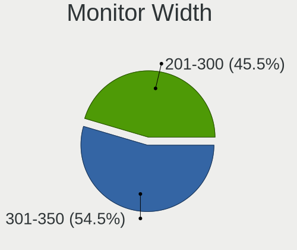

| Width in mm | Notebooks | Percent |
|-------------|-----------|---------|
| 201-300     | 7         | 58.33%  |
| 301-350     | 4         | 33.33%  |
| 351-400     | 1         | 8.33%   |

Aspect Ratio
------------

Proportional relationship between the width and the height

| Ratio | Notebooks | Percent |
|-------|-----------|---------|
| 16/9  | 7         | 58.33%  |
| 3/2   | 2         | 16.67%  |
| 16/10 | 2         | 16.67%  |
| 5/4   | 1         | 8.33%   |

Monitor Area
------------

Area in inch²

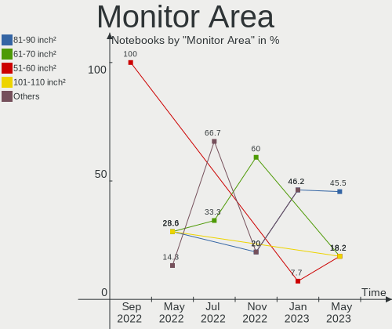

| Area in inch² | Notebooks | Percent |
|----------------|-----------|---------|
| 81-90          | 6         | 50%     |
| 51-60          | 2         | 16.67%  |
| 71-80          | 1         | 8.33%   |
| 61-70          | 1         | 8.33%   |
| 151-200        | 1         | 8.33%   |
| 91-100         | 1         | 8.33%   |

Pixel Density
-------------

Pixels per inch

| Density       | Notebooks | Percent |
|---------------|-----------|---------|
| 161-240       | 4         | 33.33%  |
| 121-160       | 4         | 33.33%  |
| 101-120       | 2         | 16.67%  |
| More than 240 | 1         | 8.33%   |
| 51-100        | 1         | 8.33%   |

Multiple Monitors
-----------------

Total monitors connected

| Total | Notebooks | Percent |
|-------|-----------|---------|
| 1     | 12        | 92.31%  |
| 2     | 1         | 7.69%   |

Network
-------

Net Controller Vendor
---------------------

Controller vendors

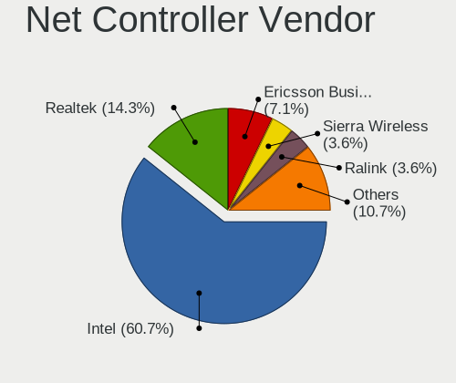

| Vendor                | Notebooks | Percent |
|-----------------------|-----------|---------|
| Intel                 | 12        | 63.16%  |
| Realtek Semiconductor | 4         | 21.05%  |
| Qualcomm Atheros      | 2         | 10.53%  |
| Sierra Wireless       | 1         | 5.26%   |

Net Controller Model
--------------------

Controller models

| Model                                                             | Notebooks | Percent |
|-------------------------------------------------------------------|-----------|---------|
| Realtek RTL8111/8168/8411 PCI Express Gigabit Ethernet Controller | 2         | 8%      |
| Intel Wireless 7265                                               | 2         | 8%      |
| Intel Wi-Fi 6 AX201                                               | 2         | 8%      |
| Intel Comet Lake PCH-LP CNVi WiFi                                 | 2         | 8%      |
| Sierra Wireless EM7305 Modem                                      | 1         | 4%      |
| Realtek RTL8723AE PCIe Wireless Network Adapter                   | 1         | 4%      |
| Realtek RTL8191SEvB Wireless LAN Controller                       | 1         | 4%      |
| Realtek RTL8188FTV 802.11b/g/n 1T1R 2.4G WLAN Adapter             | 1         | 4%      |
| Realtek RTL8188CUS 802.11n WLAN Adapter                           | 1         | 4%      |
| Realtek RTL810xE PCI Express Fast Ethernet controller             | 1         | 4%      |
| Qualcomm Atheros AR9285 Wireless Network Adapter (PCI-Express)    | 1         | 4%      |
| Qualcomm Atheros AR5212 802.11abg NIC                             | 1         | 4%      |
| Intel Wireless 8265 / 8275                                        | 1         | 4%      |
| Intel Wi-Fi 6 AX200                                               | 1         | 4%      |
| Intel Gemini Lake PCH CNVi WiFi                                   | 1         | 4%      |
| Intel Ethernet Connection (4) I219-LM                             | 1         | 4%      |
| Intel Ethernet Connection (3) I218-LM                             | 1         | 4%      |
| Intel Ethernet Connection (10) I219-V                             | 1         | 4%      |
| Intel 82577LM Gigabit Network Connection                          | 1         | 4%      |
| Intel 82573L Gigabit Ethernet Controller                          | 1         | 4%      |
| Intel 82567LM Gigabit Network Connection                          | 1         | 4%      |

Wireless Vendor
---------------

Wireless vendors

| Vendor                | Notebooks | Percent |
|-----------------------|-----------|---------|
| Intel                 | 9         | 69.23%  |
| Realtek Semiconductor | 2         | 15.38%  |
| Qualcomm Atheros      | 2         | 15.38%  |

Wireless Model
--------------

Wireless models

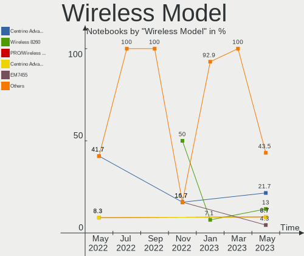

| Model                                                          | Notebooks | Percent |
|----------------------------------------------------------------|-----------|---------|
| Intel Wireless 7265                                            | 2         | 13.33%  |
| Intel Wi-Fi 6 AX201                                            | 2         | 13.33%  |
| Intel Comet Lake PCH-LP CNVi WiFi                              | 2         | 13.33%  |
| Realtek RTL8723AE PCIe Wireless Network Adapter                | 1         | 6.67%   |
| Realtek RTL8191SEvB Wireless LAN Controller                    | 1         | 6.67%   |
| Realtek RTL8188FTV 802.11b/g/n 1T1R 2.4G WLAN Adapter          | 1         | 6.67%   |
| Realtek RTL8188CUS 802.11n WLAN Adapter                        | 1         | 6.67%   |
| Qualcomm Atheros AR9285 Wireless Network Adapter (PCI-Express) | 1         | 6.67%   |
| Qualcomm Atheros AR5212 802.11abg NIC                          | 1         | 6.67%   |
| Intel Wireless 8265 / 8275                                     | 1         | 6.67%   |
| Intel Wi-Fi 6 AX200                                            | 1         | 6.67%   |
| Intel Gemini Lake PCH CNVi WiFi                                | 1         | 6.67%   |

Ethernet Vendor
---------------

Ethernet vendors

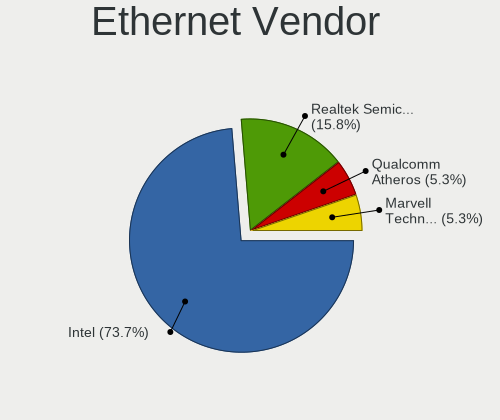

| Vendor                | Notebooks | Percent |
|-----------------------|-----------|---------|
| Intel                 | 6         | 66.67%  |
| Realtek Semiconductor | 3         | 33.33%  |

Ethernet Model
--------------

Ethernet models

| Model                                                             | Notebooks | Percent |
|-------------------------------------------------------------------|-----------|---------|
| Realtek RTL8111/8168/8411 PCI Express Gigabit Ethernet Controller | 2         | 22.22%  |
| Realtek RTL810xE PCI Express Fast Ethernet controller             | 1         | 11.11%  |
| Intel Ethernet Connection (4) I219-LM                             | 1         | 11.11%  |
| Intel Ethernet Connection (3) I218-LM                             | 1         | 11.11%  |
| Intel Ethernet Connection (10) I219-V                             | 1         | 11.11%  |
| Intel 82577LM Gigabit Network Connection                          | 1         | 11.11%  |
| Intel 82573L Gigabit Ethernet Controller                          | 1         | 11.11%  |
| Intel 82567LM Gigabit Network Connection                          | 1         | 11.11%  |

Net Controller Kind
-------------------

Ethernet, WiFi or modem

| Kind     | Notebooks | Percent |
|----------|-----------|---------|
| WiFi     | 13        | 56.52%  |
| Ethernet | 9         | 39.13%  |
| Unknown  | 1         | 4.35%   |

Used Controller
---------------

Currently used network controller

| Kind | Notebooks | Percent |
|------|-----------|---------|
| WiFi | 12        | 100%    |

NICs
----

Total network controllers on board

| Total | Notebooks | Percent |
|-------|-----------|---------|
| 2     | 9         | 69.23%  |
| 1     | 4         | 30.77%  |

IPv6
----

IPv6 vs IPv4

| Used | Notebooks | Percent |
|------|-----------|---------|
| No   | 12        | 92.31%  |
| Yes  | 1         | 7.69%   |

Bluetooth
---------

Bluetooth Vendor
----------------

Controller vendors

| Vendor   | Notebooks | Percent |
|----------|-----------|---------|
| Intel    | 7         | 77.78%  |
| Broadcom | 2         | 22.22%  |

Bluetooth Model
---------------

Controller models

| Model                                              | Notebooks | Percent |
|----------------------------------------------------|-----------|---------|
| Intel AX201 Bluetooth                              | 3         | 33.33%  |
| Intel Bluetooth wireless interface                 | 2         | 22.22%  |
| Intel Bluetooth 9460/9560 Jefferson Peak (JfP)     | 1         | 11.11%  |
| Intel AX200 Bluetooth                              | 1         | 11.11%  |
| Broadcom BCM2045B (BDC-2.1) [Bluetooth Controller] | 1         | 11.11%  |
| Broadcom BCM2045B (BDC-2) [Bluetooth Controller]   | 1         | 11.11%  |

Sound
-----

Sound Vendor
------------

Sound card vendors

| Vendor | Notebooks | Percent |
|--------|-----------|---------|
| Intel  | 12        | 92.31%  |
| AMD    | 1         | 7.69%   |

Sound Model
-----------

Sound card models

| Model                                                               | Notebooks | Percent |
|---------------------------------------------------------------------|-----------|---------|
| Intel Tiger Lake-LP Smart Sound Technology Audio Controller         | 2         | 13.33%  |
| Intel Comet Lake PCH-LP cAVS                                        | 2         | 13.33%  |
| Intel Celeron/Pentium Silver Processor High Definition Audio        | 2         | 13.33%  |
| Intel Wildcat Point-LP High Definition Audio Controller             | 1         | 6.67%   |
| Intel Sunrise Point-LP HD Audio                                     | 1         | 6.67%   |
| Intel NM10/ICH7 Family High Definition Audio Controller             | 1         | 6.67%   |
| Intel Broadwell-U Audio Controller                                  | 1         | 6.67%   |
| Intel 82801I (ICH9 Family) HD Audio Controller                      | 1         | 6.67%   |
| Intel 7 Series/C216 Chipset Family High Definition Audio Controller | 1         | 6.67%   |
| Intel 5 Series/3400 Series Chipset High Definition Audio            | 1         | 6.67%   |
| AMD Renoir Radeon High Definition Audio Controller                  | 1         | 6.67%   |
| AMD Family 17h/19h HD Audio Controller                              | 1         | 6.67%   |

Memory
------

Memory Vendor
-------------

Memory module vendors

Zero info for selected period =(

Memory Model
------------

Memory module models

Zero info for selected period =(

Memory Kind
-----------

Memory module kinds

Zero info for selected period =(

Memory Form Factor
------------------

Physical design of the memory module

Zero info for selected period =(

Memory Size
-----------

Memory module size

Zero info for selected period =(

Memory Speed
------------

Memory module speed

Zero info for selected period =(

Printers & scanners
-------------------

Printer Vendor
--------------

Printer device vendors

Zero info for selected period =(

Printer Model
-------------

Printer device models

Zero info for selected period =(

Scanner Vendor
--------------

Scanner device vendors

Zero info for selected period =(

Scanner Model
-------------

Scanner device models

Zero info for selected period =(

Camera
------

Camera Vendor
-------------

Camera device vendors

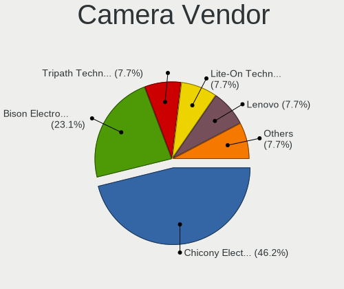

| Vendor                                 | Notebooks | Percent |
|----------------------------------------|-----------|---------|
| Tripath Technology                     | 1         | 14.29%  |
| Realtek Semiconductor                  | 1         | 14.29%  |
| Microdia                               | 1         | 14.29%  |
| IMC Networks                           | 1         | 14.29%  |
| Chicony Electronics                    | 1         | 14.29%  |
| Cheng Uei Precision Industry (Foxlink) | 1         | 14.29%  |
| Acer                                   | 1         | 14.29%  |

Camera Model
------------

Camera device models

| Model                                                                      | Notebooks | Percent |
|----------------------------------------------------------------------------|-----------|---------|
| Tripath PC Camera                                                          | 1         | 12.5%   |
| Realtek Laptop Camera                                                      | 1         | 12.5%   |
| Microdia Ltd., USB 2.0 Camera                                              | 1         | 12.5%   |
| IMC Networks USB2.0 HD IR UVC WebCam                                       | 1         | 12.5%   |
| Chicony HD Webcam                                                          | 1         | 12.5%   |
| Cheng Uei Precision Industry (Foxlink) HP Wide Vision HD Integrated Webcam | 1         | 12.5%   |
| Acer SunplusIT Integrated Camera                                           | 1         | 12.5%   |
| Acer Integrated Camera                                                     | 1         | 12.5%   |

Security
--------

Fingerprint Vendor
------------------

Fingerprint sensor vendors

| Vendor    | Notebooks | Percent |
|-----------|-----------|---------|
| Synaptics | 1         | 50%     |
| AuthenTec | 1         | 50%     |

Fingerprint Model
-----------------

Fingerprint sensor models

| Model                                                     | Notebooks | Percent |
|-----------------------------------------------------------|-----------|---------|
| Synaptics  FS7604 Touch Fingerprint Sensor with PurePrint | 1         | 50%     |
| AuthenTec AES2810                                         | 1         | 50%     |

Chipcard Vendor
---------------

Chipcard module vendors

Zero info for selected period =(

Chipcard Model
--------------

Chipcard module models

Zero info for selected period =(

Unsupported
-----------

Unsupported Devices
-------------------

Total unsupported devices on board

| Total | Notebooks | Percent |
|-------|-----------|---------|
| 1     | 6         | 46.15%  |
| 2     | 3         | 23.08%  |
| 0     | 3         | 23.08%  |
| 5     | 1         | 7.69%   |

Unsupported Device Types
------------------------

Types of unsupported devices

| Type                     | Notebooks | Percent |
|--------------------------|-----------|---------|
| Communication controller | 8         | 53.33%  |
| Graphics card            | 3         | 20%     |
| Storage/ata              | 1         | 6.67%   |
| Sound                    | 1         | 6.67%   |
| Network                  | 1         | 6.67%   |
| Net/wireless             | 1         | 6.67%   |

