OpenBSD Hardware Trends (Notebook)
----------------------------------

A project to identify most popular hardware characteristics and track their change
over time based on data collected by OpenBSD users at https://BSD-Hardware.info.

Anyone can contribute to the study by uploading probes of their computers by
the [hw-probe](https://github.com/linuxhw/hw-probe/blob/master/INSTALL.BSD.md) tool:

    hw-probe -all -upload

Full-feature report is available here: https://bsd-hardware.info/?view=trends&formfactor=notebook

Period: Oct, 2020.

Contents
--------

- [ OS                       ](#os)
- [ OS Family                ](#os-family)
- [ Arch                     ](#arch)
- [ DE                       ](#de)
- [ Display Server           ](#display-server)
- [ Display Manager          ](#display-manager)
- [ OS Lang                  ](#os-lang)
- [ Boot Mode                ](#boot-mode)
- [ Filesystem               ](#filesystem)
- [ Part. scheme             ](#part-scheme)
- [ Country                  ](#country)
- [ City                     ](#city)
- [ Vendor                   ](#vendor)
- [ Model                    ](#model)
- [ Model Family             ](#model-family)
- [ MFG Year                 ](#mfg-year)
- [ Form Factor              ](#form-factor)
- [ Coreboot                 ](#coreboot)
- [ RAM Size                 ](#ram-size)
- [ RAM Used                 ](#ram-used)
- [ Has CD-ROM               ](#has-cd-rom)
- [ Total Drives             ](#total-drives)
- [ Has Ethernet             ](#has-ethernet)
- [ Drive Vendor             ](#drive-vendor)
- [ HDD Vendor               ](#hdd-vendor)
- [ SSD Vendor               ](#ssd-vendor)
- [ Drive Model              ](#drive-model)
- [ Drive Kind               ](#drive-kind)
- [ Drive Connector          ](#drive-connector)
- [ Drive Size               ](#drive-size)
- [ Space Total              ](#space-total)
- [ Space Used               ](#space-used)
- [ Malfunc. Drives          ](#malfunc-drives)
- [ Malfunc. Drive Vendor    ](#malfunc-drive-vendor)
- [ Malfunc. HDD Vendor      ](#malfunc-hdd-vendor)
- [ Malfunc. Drive Kind      ](#malfunc-drive-kind)
- [ Failed Drives            ](#failed-drives)
- [ Failed Drive Vendor      ](#failed-drive-vendor)
- [ Drive Status             ](#drive-status)
- [ Storage Vendor           ](#storage-vendor)
- [ Storage Model            ](#storage-model)
- [ Storage Kind             ](#storage-kind)
- [ CPU Vendor               ](#cpu-vendor)
- [ CPU Model                ](#cpu-model)
- [ CPU Model Family         ](#cpu-model-family)
- [ CPU Cores                ](#cpu-cores)
- [ CPU Sockets              ](#cpu-sockets)
- [ CPU Threads              ](#cpu-threads)
- [ CPU Microarch            ](#cpu-microarch)
- [ GPU Vendor               ](#gpu-vendor)
- [ GPU Model                ](#gpu-model)
- [ GPU Combo                ](#gpu-combo)
- [ GPU Driver               ](#gpu-driver)
- [ GPU Memory               ](#gpu-memory)
- [ Monitor Vendor           ](#monitor-vendor)
- [ Monitor Model            ](#monitor-model)
- [ Monitor Resolution       ](#monitor-resolution)
- [ Monitor Diagonal         ](#monitor-diagonal)
- [ Monitor Width            ](#monitor-width)
- [ Aspect Ratio             ](#aspect-ratio)
- [ Monitor Area             ](#monitor-area)
- [ Pixel Density            ](#pixel-density)
- [ Multiple Monitors        ](#multiple-monitors)
- [ Net Controller Vendor    ](#net-controller-vendor)
- [ Net Controller Model     ](#net-controller-model)
- [ Wireless Vendor          ](#wireless-vendor)
- [ Wireless Model           ](#wireless-model)
- [ Ethernet Vendor          ](#ethernet-vendor)
- [ Ethernet Model           ](#ethernet-model)
- [ Net Controller Kind      ](#net-controller-kind)
- [ Used Controller          ](#used-controller)
- [ NICs                     ](#nics)
- [ Memory Vendor            ](#memory-vendor)
- [ Memory Model             ](#memory-model)
- [ Memory Kind              ](#memory-kind)
- [ Memory Form Factor       ](#memory-form-factor)
- [ Memory Size              ](#memory-size)
- [ Memory Speed             ](#memory-speed)
- [ Sound Vendor             ](#sound-vendor)
- [ Sound Model              ](#sound-model)
- [ Camera Vendor            ](#camera-vendor)
- [ Camera Model             ](#camera-model)
- [ Fingerprint Vendor       ](#fingerprint-vendor)
- [ Fingerprint Model        ](#fingerprint-model)
- [ Chipcard Vendor          ](#chipcard-vendor)
- [ Chipcard Model           ](#chipcard-model)
- [ Printer Vendor           ](#printer-vendor)
- [ Printer Model            ](#printer-model)
- [ Scanner Vendor           ](#scanner-vendor)
- [ Scanner Model            ](#scanner-model)
- [ Bluetooth Vendor         ](#bluetooth-vendor)
- [ Bluetooth Model          ](#bluetooth-model)
- [ Unsupported Devices      ](#unsupported-devices)
- [ Unsupported Device Types ](#unsupported-device-types)

OS
--

Installed operating systems

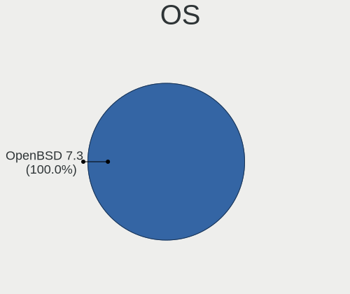

| Name        | Notebooks | Percent |
|-------------|-----------|---------|
| OpenBSD 6.8 | 12        | 100%    |

OS Family
---------

OS without a version

| Name    | Notebooks | Percent |
|---------|-----------|---------|
| OpenBSD | 12        | 100%    |

Arch
----

OS architecture (x86_64, i586, etc.)

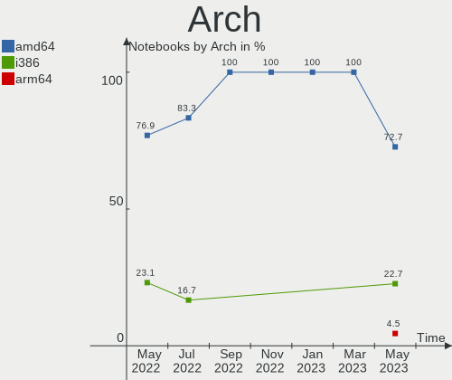

| Name  | Notebooks | Percent |
|-------|-----------|---------|
| amd64 | 8         | 66.67%  |
| i386  | 4         | 33.33%  |

DE
--

Desktop Environment

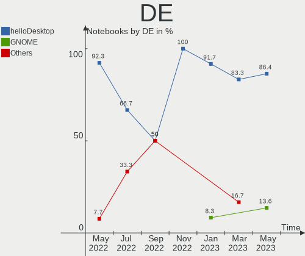

| Name    | Notebooks | Percent |
|---------|-----------|---------|
| fvwm    | 10        | 83.33%  |
| Console | 2         | 16.67%  |

Display Server
--------------

X11 or Wayland

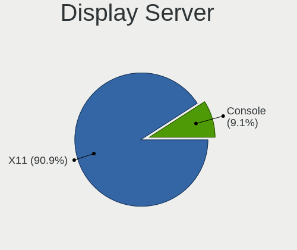

| Name    | Notebooks | Percent |
|---------|-----------|---------|
| X11     | 10        | 83.33%  |
| Console | 2         | 16.67%  |

Display Manager
---------------

SDDM, LightDM, etc.

| Name    | Notebooks | Percent |
|---------|-----------|---------|
| Console | 8         | 66.67%  |
| GDM     | 3         | 25%     |
| SLiM    | 1         | 8.33%   |

OS Lang
-------

Language

| Lang    | Notebooks | Percent |
|---------|-----------|---------|
| Unknown | 9         | 75%     |
| es_ES   | 1         | 8.33%   |
| en_US   | 1         | 8.33%   |
| en_AU   | 1         | 8.33%   |

Boot Mode
---------

EFI or BIOS

| Mode | Notebooks | Percent |
|------|-----------|---------|
| BIOS | 9         | 75%     |
| EFI  | 3         | 25%     |

Filesystem
----------

Type of filesystem

| Type | Notebooks | Percent |
|------|-----------|---------|
| Ufs  | 12        | 100%    |

Part. scheme
------------

Scheme of partitioning

| Type | Notebooks | Percent |
|------|-----------|---------|
| MBR  | 8         | 66.67%  |
| GPT  | 4         | 33.33%  |

Country
-------

Geographic location (country)

| Country        | Notebooks | Percent |
|----------------|-----------|---------|
| Spain          | 2         | 16.67%  |
| Russia         | 2         | 16.67%  |
| USA            | 1         | 8.33%   |
| Saudi Arabia   | 1         | 8.33%   |
| Germany        | 1         | 8.33%   |
| France         | 1         | 8.33%   |
| Czech Republic | 1         | 8.33%   |
| Croatia        | 1         | 8.33%   |
| Canada         | 1         | 8.33%   |
| Australia      | 1         | 8.33%   |

City
----

Geographic location (city)

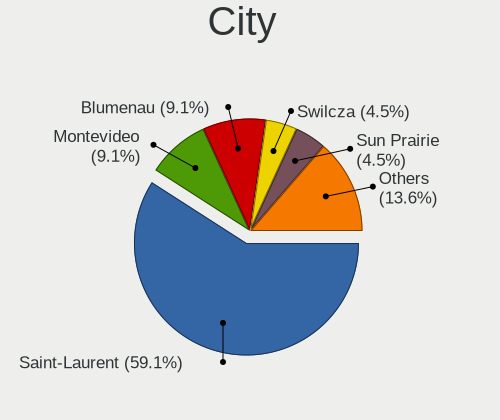

| City                | Notebooks | Percent |
|---------------------|-----------|---------|
| Vladivostok         | 2         | 16.67%  |
| České Budějovice | 1         | 8.33%   |
| Zagreb              | 1         | 8.33%   |
| Sydney              | 1         | 8.33%   |
| Rosny-sous-Bois     | 1         | 8.33%   |
| Montreal            | 1         | 8.33%   |
| Jeddah              | 1         | 8.33%   |
| Ibiza Town          | 1         | 8.33%   |
| Gettysburg          | 1         | 8.33%   |
| Erlangen            | 1         | 8.33%   |
| Barcelona           | 1         | 8.33%   |

Vendor
------

Motherboard manufacturer

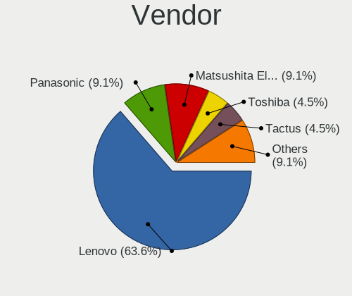

| Name                           | Notebooks | Percent |
|--------------------------------|-----------|---------|
| Lenovo                         | 5         | 41.67%  |
| Apple                          | 2         | 16.67%  |
| Matsushita Electric Industrial | 1         | 8.33%   |
| Hewlett-Packard                | 1         | 8.33%   |
| Dell                           | 1         | 8.33%   |
| Alienware                      | 1         | 8.33%   |
| Acer                           | 1         | 8.33%   |

Model
-----

Motherboard model

| Name                                        | Notebooks | Percent |
|---------------------------------------------|-----------|---------|
| Matsushita Electric Industrial CF-51RCVDNLM | 1         | 8.33%   |
| Lenovo ThinkPad X60s 17033JM                | 1         | 8.33%   |
| Lenovo ThinkPad W530 2436CTO                | 1         | 8.33%   |
| Lenovo ThinkPad S5-S540 20B3001XFR          | 1         | 8.33%   |
| Lenovo G50-80 80E5                          | 1         | 8.33%   |
| Lenovo 3000 N100 0768B9G                    | 1         | 8.33%   |
| HP OmniBook PC                              | 1         | 8.33%   |
| Dell Latitude C400                          | 1         | 8.33%   |
| Apple MacBookAir7,2                         | 1         | 8.33%   |
| Apple MacBookAir6,2                         | 1         | 8.33%   |
| Alienware m15                               | 1         | 8.33%   |
| Acer Extensa 2540                           | 1         | 8.33%   |

Model Family
------------

Motherboard model prefix

| Name                                        | Notebooks | Percent |
|---------------------------------------------|-----------|---------|
| Lenovo ThinkPad                             | 3         | 25%     |
| Matsushita Electric Industrial CF-51RCVDNLM | 1         | 8.33%   |
| Lenovo G50-80                               | 1         | 8.33%   |
| Lenovo 3000                                 | 1         | 8.33%   |
| HP OmniBook                                 | 1         | 8.33%   |
| Dell Latitude                               | 1         | 8.33%   |
| Apple MacBookAir7                           | 1         | 8.33%   |
| Apple MacBookAir6                           | 1         | 8.33%   |
| Alienware m15                               | 1         | 8.33%   |
| Acer Extensa                                | 1         | 8.33%   |

MFG Year
--------

Motherboard manufacture year

| Year | Notebooks | Percent |
|------|-----------|---------|
| 2018 | 3         | 25%     |
| 2020 | 2         | 16.67%  |
| 2007 | 2         | 16.67%  |
| 2019 | 1         | 8.33%   |
| 2015 | 1         | 8.33%   |
| 2006 | 1         | 8.33%   |
| 2004 | 1         | 8.33%   |
| 2003 | 1         | 8.33%   |

Form Factor
-----------

Physical design of the computer

| Name     | Notebooks | Percent |
|----------|-----------|---------|
| Notebook | 12        | 100%    |

Coreboot
--------

Have coreboot on board

| Used | Notebooks | Percent |
|------|-----------|---------|
| No   | 12        | 100%    |

RAM Size
--------

Total RAM memory

| Size in GB | Notebooks | Percent |
|------------|-----------|---------|
| 8.01-16.0  | 3         | 25%     |
| 0.01-1.0   | 3         | 25%     |
| 32.01-64.0 | 2         | 16.67%  |
| 4.01-8.0   | 1         | 8.33%   |
| 3.01-4.0   | 1         | 8.33%   |
| 2.01-3.0   | 1         | 8.33%   |
| 1.01-2.0   | 1         | 8.33%   |

RAM Used
--------

Used RAM memory

| Used GB  | Notebooks | Percent |
|----------|-----------|---------|
| 0.01-1.0 | 8         | 66.67%  |
| 0        | 4         | 33.33%  |

Has CD-ROM
----------

Has CD-ROM on board

| Presented | Notebooks | Percent |
|-----------|-----------|---------|
| No        | 12        | 100%    |

Total Drives
------------

Number of drives on board

| Drives | Notebooks | Percent |
|--------|-----------|---------|
| 1      | 7         | 58.33%  |
| 2      | 3         | 25%     |
| 4      | 1         | 8.33%   |
| 3      | 1         | 8.33%   |

Has Ethernet
------------

Has Ethernet on board

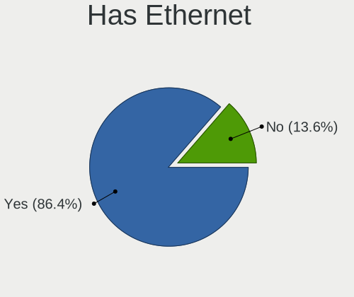

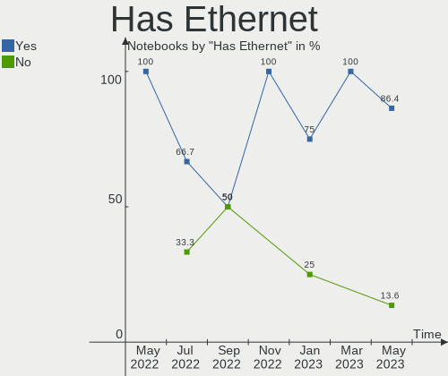

| Presented | Notebooks | Percent |
|-----------|-----------|---------|
| Yes       | 10        | 83.33%  |
| No        | 2         | 16.67%  |

Drive Vendor
------------

Hard drive vendors

| Vendor              | Notebooks | Drives | Percent |
|---------------------|-----------|--------|---------|
| WDC                 | 4         | 4      | 26.67%  |
| Samsung Electronics | 2         | 2      | 13.33%  |
| Apple               | 2         | 2      | 13.33%  |
| Toshiba             | 1         | 1      | 6.67%   |
| SanDisk             | 1         | 1      | 6.67%   |
| NVMe                | 1         | 2      | 6.67%   |
| Hitachi             | 1         | 1      | 6.67%   |
| Dogfish             | 1         | 1      | 6.67%   |
| Crucial             | 1         | 1      | 6.67%   |
| Apacer              | 1         | 1      | 6.67%   |

HDD Vendor
----------

Hard disk drive vendors

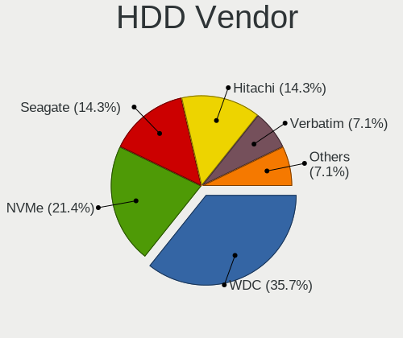

| Vendor  | Notebooks | Drives | Percent |
|---------|-----------|--------|---------|
| WDC     | 3         | 3      | 50%     |
| Toshiba | 1         | 1      | 16.67%  |
| NVMe    | 1         | 2      | 16.67%  |
| Hitachi | 1         | 1      | 16.67%  |

SSD Vendor
----------

Solid state drive vendors

| Vendor              | Notebooks | Drives | Percent |
|---------------------|-----------|--------|---------|
| Samsung Electronics | 2         | 2      | 22.22%  |
| Apple               | 2         | 2      | 22.22%  |
| WDC                 | 1         | 1      | 11.11%  |
| SanDisk             | 1         | 1      | 11.11%  |
| Dogfish             | 1         | 1      | 11.11%  |
| Crucial             | 1         | 1      | 11.11%  |
| Apacer              | 1         | 1      | 11.11%  |

Drive Model
-----------

Hard drive models

| Model                    | Notebooks | Percent |
|--------------------------|-----------|---------|
| WDBNCE5000PNC 500GB      | 1         | 6.67%   |
| WD5000LPCX-21VHAT0 500GB | 1         | 6.67%   |
| WD3200BEVE-00A0HT0 320GB | 1         | 6.67%   |
| WD10JPCX-24UE4T0 1TB     | 1         | 6.67%   |
| SSD U110 16GB            | 1         | 6.67%   |
| SSD SM0128G 121GB        | 1         | 6.67%   |
| SSD SD0128F 121GB        | 1         | 6.67%   |
| SSD 850 EVO 500GB        | 1         | 6.67%   |
| SSD 64GB                 | 1         | 6.67%   |
| MZ7TD256HAFV-000L7 256GB | 1         | 6.67%   |
| MK1517GAP 16GB           | 1         | 6.67%   |
| KXG50ZNV1T02 NVM 1TB     | 1         | 6.67%   |
| DK23AA-12 12GB           | 1         | 6.67%   |
| CT1000MX500SSD1 1TB      | 1         | 6.67%   |
| AS350 256GB              | 1         | 6.67%   |

Drive Kind
----------

HDD or SSD

| Kind | Notebooks | Drives | Percent |
|------|-----------|--------|---------|
| SSD  | 7         | 9      | 53.85%  |
| HDD  | 6         | 7      | 46.15%  |

Drive Connector
---------------

SATA, SAS, NVMe, etc.

| Type | Notebooks | Drives | Percent |
|------|-----------|--------|---------|
| SATA | 12        | 16     | 100%    |

Drive Size
----------

Size of hard drive

| Size in TB | Notebooks | Drives | Percent |
|------------|-----------|--------|---------|
| 0.01-0.5   | 11        | 12     | 78.57%  |
| 0.51-1.0   | 2         | 2      | 14.29%  |
| 1.01-2.0   | 1         | 2      | 7.14%   |

Space Total
-----------

Amount of disk space available on the file system

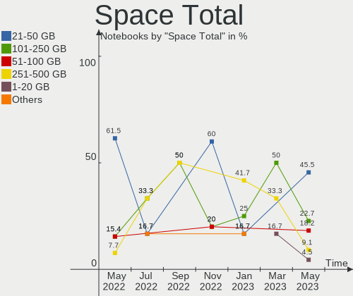

| Size in GB | Notebooks | Percent |
|------------|-----------|---------|
| 251-500    | 3         | 25%     |
| 101-250    | 3         | 25%     |
| 1001-2000  | 2         | 16.67%  |
| 1-20       | 2         | 16.67%  |
| 21-50      | 1         | 8.33%   |
| 51-100     | 1         | 8.33%   |

Space Used
----------

Amount of used disk space

| Used GB  | Notebooks | Percent |
|----------|-----------|---------|
| 1-20     | 7         | 58.33%  |
| 51-100   | 2         | 16.67%  |
| 251-500  | 1         | 8.33%   |
| 21-50    | 1         | 8.33%   |
| 501-1000 | 1         | 8.33%   |

Malfunc. Drives
---------------

Drive models with a malfunction

| Model          | Notebooks | Drives | Percent |
|----------------|-----------|--------|---------|
| DK23AA-12 12GB | 1         | 1      | 100%    |

Malfunc. Drive Vendor
---------------------

Vendors of faulty drives

| Vendor  | Notebooks | Drives | Percent |
|---------|-----------|--------|---------|
| Hitachi | 1         | 1      | 100%    |

Malfunc. HDD Vendor
-------------------

Vendors of faulty HDD drives

| Vendor  | Notebooks | Drives | Percent |
|---------|-----------|--------|---------|
| Hitachi | 1         | 1      | 100%    |

Malfunc. Drive Kind
-------------------

Kinds of faulty drives

| Kind | Notebooks | Drives | Percent |
|------|-----------|--------|---------|
| HDD  | 1         | 1      | 100%    |

Failed Drives
-------------

Failed drive models

Zero info for selected period =(

Failed Drive Vendor
-------------------

Failed drive vendors

Zero info for selected period =(

Drive Status
------------

Number of failed and malfunc. drives

| Status   | Notebooks | Drives | Percent |
|----------|-----------|--------|---------|
| Works    | 10        | 13     | 83.33%  |
| Detected | 1         | 2      | 8.33%   |
| Malfunc  | 1         | 1      | 8.33%   |

Storage Vendor
--------------

Storage controller vendors

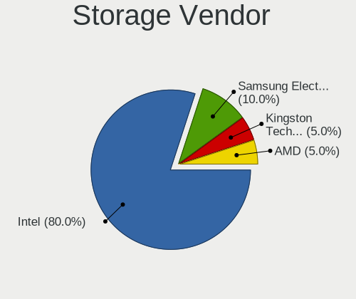

| Vendor                   | Notebooks | Percent |
|--------------------------|-----------|---------|
| Intel                    | 10        | 76.92%  |
| Toshiba                  | 1         | 7.69%   |
| Samsung Electronics      | 1         | 7.69%   |
| Marvell Technology Group | 1         | 7.69%   |

Storage Model
-------------

Storage controller models

| Model                                                      | Notebooks | Percent |
|------------------------------------------------------------|-----------|---------|
| 82801GBM/GHM (ICH7-M Family) SATA Controller [IDE mode]    | 2         | 14.29%  |
| 82801CAM IDE U100 Controller                               | 2         | 14.29%  |
| Wildcat Point-LP SATA Controller [AHCI Mode]               | 1         | 7.14%   |
| unknown                                                    | 1         | 7.14%   |
| Sunrise Point-LP SATA Controller [AHCI mode]               | 1         | 7.14%   |
| SM951 AHCI                                                 | 1         | 7.14%   |
| Cannon Lake Mobile PCH SATA AHCI Controller                | 1         | 7.14%   |
| 88SS9183 PCIe SSD Controller                               | 1         | 7.14%   |
| 82801GBM/GHM (ICH7-M Family) SATA Controller [AHCI mode]   | 1         | 7.14%   |
| 82801G (ICH7 Family) IDE Controller                        | 1         | 7.14%   |
| 8 Series SATA Controller 1 [AHCI mode]                     | 1         | 7.14%   |
| 7 Series Chipset Family 6-port SATA Controller [AHCI mode] | 1         | 7.14%   |

Storage Kind
------------

Kind of storage controller (IDE, SATA, NVMe, SAS, ...)

| Kind | Notebooks | Percent |
|------|-----------|---------|
| SATA | 8         | 57.14%  |
| IDE  | 5         | 35.71%  |
| NVMe | 1         | 7.14%   |

CPU Vendor
----------

Processor vendors

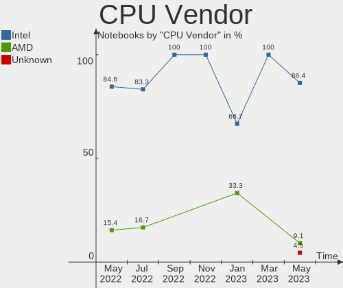

| Vendor | Notebooks | Percent |
|--------|-----------|---------|
| Intel  | 12        | 100%    |

CPU Model
---------

Processor models

| Model                                                               | Notebooks | Percent |
|---------------------------------------------------------------------|-----------|---------|
| Intel Mobile Pentium III CPU - M 1200MHz ("GenuineIntel" 686-class) | 1         | 8.33%   |
| Intel Mobile Pentium III CPU - M 1000MHz ("GenuineIntel" 686-class) | 1         | 8.33%   |
| Intel CPU T2300 @ 1.66GHz ("GenuineIntel" 686-class)                | 1         | 8.33%   |
| Intel Core i7-8750H CPU @ 2.20GHz                                   | 1         | 8.33%   |
| Intel Core i7-5500U CPU @ 2.40GHz                                   | 1         | 8.33%   |
| Intel Core i7-3820QM CPU @ 2.70GHz                                  | 1         | 8.33%   |
| Intel Core i5-5350U CPU @ 1.80GHz                                   | 1         | 8.33%   |
| Intel Core i5-4260U CPU @ 1.40GHz                                   | 1         | 8.33%   |
| Intel Core i5-4200U CPU @ 1.60GHz                                   | 1         | 8.33%   |
| Intel Core i3-6006U CPU @ 2.00GHz                                   | 1         | 8.33%   |
| Intel Core Duo CPU L2400 @ 1.66GHz ("GenuineIntel" 686-class)       | 1         | 8.33%   |
| Intel Core 2 CPU T5500 @ 1.66GHz                                    | 1         | 8.33%   |

CPU Model Family
----------------

Processor model prefix

| Model          | Notebooks | Percent |
|----------------|-----------|---------|
| Other          | 3         | 25%     |
| Intel Core i7  | 3         | 25%     |
| Intel Core i5  | 3         | 25%     |
| Intel Core i3  | 1         | 8.33%   |
| Intel Core Duo | 1         | 8.33%   |
| Intel Core 2   | 1         | 8.33%   |

CPU Cores
---------

Number of processor cores

| Number  | Notebooks | Percent |
|---------|-----------|---------|
| 2       | 5         | 41.67%  |
| Unknown | 3         | 25%     |
| 1       | 2         | 16.67%  |
| 6       | 1         | 8.33%   |
| 4       | 1         | 8.33%   |

CPU Sockets
-----------

Number of sockets

| Number  | Notebooks | Percent |
|---------|-----------|---------|
| 1       | 7         | 58.33%  |
| Unknown | 5         | 41.67%  |

CPU Threads
-----------

Threads per core (Hyper-Threading)

| Number  | Notebooks | Percent |
|---------|-----------|---------|
| 2       | 7         | 58.33%  |
| Unknown | 5         | 41.67%  |

CPU Microarch
-------------

Microarchitecture

| Name      | Notebooks | Percent |
|-----------|-----------|---------|
| P6        | 3         | 25%     |
| Haswell   | 2         | 16.67%  |
| Broadwell | 2         | 16.67%  |
| Skylake   | 1         | 8.33%   |
| KabyLake  | 1         | 8.33%   |
| IvyBridge | 1         | 8.33%   |
| Core      | 1         | 8.33%   |
| Unknown   | 1         | 8.33%   |

GPU Vendor
----------

Vendors of graphics cards

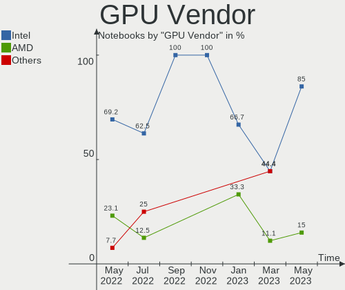

| Vendor | Notebooks | Percent |
|--------|-----------|---------|
| Intel  | 11        | 78.57%  |
| AMD    | 2         | 14.29%  |
| Nvidia | 1         | 7.14%   |

GPU Model
---------

Graphics card models

| Model                                                                     | Notebooks | Percent |
|---------------------------------------------------------------------------|-----------|---------|
| Mobile 945GM/GMS/GME, 943/940GML Express Integrated Graphics Controller   | 3         | 17.65%  |
| Mobile 945GM/GMS, 943/940GML Express Integrated Graphics Controller       | 3         | 17.65%  |
| Haswell-ULT Integrated Graphics Controller                                | 2         | 11.76%  |
| UHD Graphics 630 (Mobile)                                                 | 1         | 5.88%   |
| Sun XT [Radeon HD 8670A/8670M/8690M / R5 M330 / M430 / Radeon 520 Mobile] | 1         | 5.88%   |
| Skylake GT2 [HD Graphics 520]                                             | 1         | 5.88%   |
| RV100/M6 [Rage/Radeon Mobility Series]                                    | 1         | 5.88%   |
| HD Graphics 6000                                                          | 1         | 5.88%   |
| HD Graphics 5500                                                          | 1         | 5.88%   |
| GP104M [GeForce GTX 1070 Mobile]                                          | 1         | 5.88%   |
| 82830M/MG Integrated Graphics Controller                                  | 1         | 5.88%   |
| 3rd Gen Core processor Graphics Controller                                | 1         | 5.88%   |

GPU Combo
---------

Combinations of graphics cards

| Name           | Notebooks | Percent |
|----------------|-----------|---------|
| 1 x Intel      | 6         | 50%     |
| 2 x Intel      | 3         | 25%     |
| Intel + Nvidia | 1         | 8.33%   |
| Intel + AMD    | 1         | 8.33%   |
| 1 x AMD        | 1         | 8.33%   |

GPU Driver
----------

Free vs proprietary

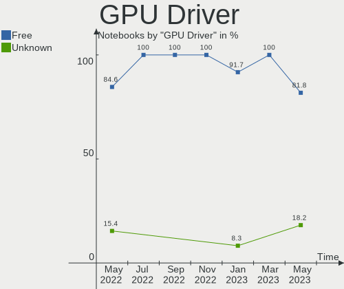

| Driver | Notebooks | Percent |
|--------|-----------|---------|
| Free   | 12        | 100%    |

GPU Memory
----------

Total video memory

| Size in GB | Notebooks | Percent |
|------------|-----------|---------|
| Unknown    | 12        | 100%    |

Monitor Vendor
--------------

Monitor vendors

| Vendor              | Notebooks | Percent |
|---------------------|-----------|---------|
| AU Optronics        | 2         | 33.33%  |
| Samsung Electronics | 1         | 16.67%  |
| Lenovo              | 1         | 16.67%  |
| BOE                 | 1         | 16.67%  |
| Apple               | 1         | 16.67%  |

Monitor Model
-------------

Monitor models

| Model                                             | Notebooks | Percent |
|---------------------------------------------------|-----------|---------|
| LCD Monitor SDC4852 1366x768 340x190mm 15.3-inch  | 1         | 16.67%  |
| LCD Monitor LEN40B2 1920x1080 340x190mm 15.3-inch | 1         | 16.67%  |
| LCD Monitor BOE0675 1366x768 340x190mm 15.3-inch  | 1         | 16.67%  |
| LCD Monitor AUO34ED 1920x1080 340x190mm 15.3-inch | 1         | 16.67%  |
| LCD Monitor AUO34EB 3840x2160 340x190mm 15.3-inch | 1         | 16.67%  |
| Color LCD APPA01B 1440x900 290x180mm 13.4-inch    | 1         | 16.67%  |

Monitor Resolution
------------------

Monitor screen resolution

| Resolution       | Notebooks | Percent |
|------------------|-----------|---------|
| 1920x1080 (FHD)  | 2         | 33.33%  |
| 1366x768 (WXGA)  | 2         | 33.33%  |
| 3840x2160 (4K)   | 1         | 16.67%  |
| 1440x900 (WXGA+) | 1         | 16.67%  |

Monitor Diagonal
----------------

Diagonal size in inches

| Inches | Notebooks | Percent |
|--------|-----------|---------|
| 15     | 5         | 83.33%  |
| 13     | 1         | 16.67%  |

Monitor Width
-------------

Physical width

| Width in mm | Notebooks | Percent |
|-------------|-----------|---------|
| 301-350     | 5         | 83.33%  |
| 201-300     | 1         | 16.67%  |

Aspect Ratio
------------

Proportional relationship between the width and the height

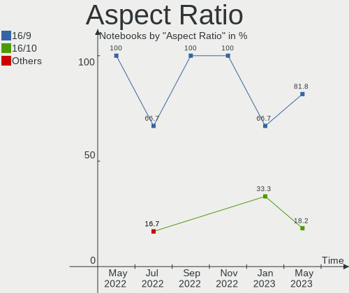

| Ratio | Notebooks | Percent |
|-------|-----------|---------|
| 16/9  | 5         | 83.33%  |
| 16/10 | 1         | 16.67%  |

Monitor Area
------------

Area in inch²

| Area in inch² | Notebooks | Percent |
|----------------|-----------|---------|
| 91-100         | 5         | 83.33%  |
| 81-90          | 1         | 16.67%  |

Pixel Density
-------------

Pixels per inch

| Density       | Notebooks | Percent |
|---------------|-----------|---------|
| 121-160       | 3         | 50%     |
| 101-120       | 2         | 33.33%  |
| More than 240 | 1         | 16.67%  |

Multiple Monitors
-----------------

Total monitors connected

| Total | Notebooks | Percent |
|-------|-----------|---------|
| 1     | 10        | 83.33%  |
| 0     | 2         | 16.67%  |

Net Controller Vendor
---------------------

Controller vendors

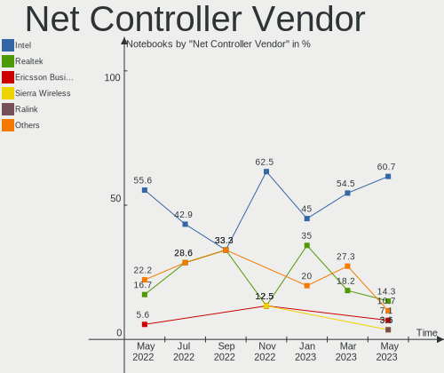

| Vendor                          | Notebooks | Percent |
|---------------------------------|-----------|---------|
| Intel                           | 10        | 47.62%  |
| Realtek Semiconductor           | 5         | 23.81%  |
| Broadcom Inc. and subsidiaries  | 2         | 9.52%   |
| Qualcomm Atheros Communications | 1         | 4.76%   |
| Qualcomm Atheros                | 1         | 4.76%   |
| Marvell Technology Group        | 1         | 4.76%   |
| 3Com                            | 1         | 4.76%   |

Net Controller Model
--------------------

Controller models

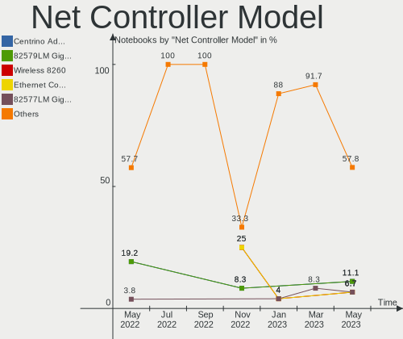

| Model                                                     | Notebooks | Percent |
|-----------------------------------------------------------|-----------|---------|
| RTL8111/8168/8411 PCI Express Gigabit Ethernet Controller | 3         | 13.04%  |
| PRO/Wireless 3945ABG [Golan] Network Connection           | 3         | 13.04%  |
| BCM4360 802.11ac Wireless Network Adapter                 | 2         | 8.7%    |
| Wireless-AC 9260                                          | 1         | 4.35%   |
| Wireless 7260                                             | 1         | 4.35%   |
| Wireless 3160                                             | 1         | 4.35%   |
| RTL8188EUS 802.11n Wireless Network Adapter               | 1         | 4.35%   |
| RTL-8100/8101L/8139 PCI Fast Ethernet Adapter             | 1         | 4.35%   |
| Killer E2500 Gigabit Ethernet Controller                  | 1         | 4.35%   |
| Dual Band Wireless-AC 3168NGW [Stone Peak]                | 1         | 4.35%   |
| Centrino Advanced-N 6205 [Taylor Peak]                    | 1         | 4.35%   |
| AR9271 802.11n                                            | 1         | 4.35%   |
| 88E8053 PCI-E Gigabit Ethernet Controller                 | 1         | 4.35%   |
| 82801CAM (ICH3) PRO/100 VM (KM) Ethernet Controller       | 1         | 4.35%   |
| 82801CA/CAM AC'97 Modem Controller                        | 1         | 4.35%   |
| 82579LM Gigabit Network Connection (Lewisville)           | 1         | 4.35%   |
| 82573L Gigabit Ethernet Controller                        | 1         | 4.35%   |
| 3c905C-TX/TX-M [Tornado]                                  | 1         | 4.35%   |

Wireless Vendor
---------------

Wireless vendors

| Vendor                          | Notebooks | Percent |
|---------------------------------|-----------|---------|
| Intel                           | 8         | 66.67%  |
| Broadcom Inc. and subsidiaries  | 2         | 16.67%  |
| Realtek Semiconductor           | 1         | 8.33%   |
| Qualcomm Atheros Communications | 1         | 8.33%   |

Wireless Model
--------------

Wireless models

| Model                                           | Notebooks | Percent |
|-------------------------------------------------|-----------|---------|
| PRO/Wireless 3945ABG [Golan] Network Connection | 3         | 25%     |
| BCM4360 802.11ac Wireless Network Adapter       | 2         | 16.67%  |
| Wireless-AC 9260                                | 1         | 8.33%   |
| Wireless 7260                                   | 1         | 8.33%   |
| Wireless 3160                                   | 1         | 8.33%   |
| RTL8188EUS 802.11n Wireless Network Adapter     | 1         | 8.33%   |
| Dual Band Wireless-AC 3168NGW [Stone Peak]      | 1         | 8.33%   |
| Centrino Advanced-N 6205 [Taylor Peak]          | 1         | 8.33%   |
| AR9271 802.11n                                  | 1         | 8.33%   |

Ethernet Vendor
---------------

Ethernet vendors

| Vendor                   | Notebooks | Percent |
|--------------------------|-----------|---------|
| Realtek Semiconductor    | 4         | 40%     |
| Intel                    | 3         | 30%     |
| Qualcomm Atheros         | 1         | 10%     |
| Marvell Technology Group | 1         | 10%     |
| 3Com                     | 1         | 10%     |

Ethernet Model
--------------

Ethernet models

| Model                                                     | Notebooks | Percent |
|-----------------------------------------------------------|-----------|---------|
| RTL8111/8168/8411 PCI Express Gigabit Ethernet Controller | 3         | 30%     |
| RTL-8100/8101L/8139 PCI Fast Ethernet Adapter             | 1         | 10%     |
| Killer E2500 Gigabit Ethernet Controller                  | 1         | 10%     |
| 88E8053 PCI-E Gigabit Ethernet Controller                 | 1         | 10%     |
| 82801CAM (ICH3) PRO/100 VM (KM) Ethernet Controller       | 1         | 10%     |
| 82579LM Gigabit Network Connection (Lewisville)           | 1         | 10%     |
| 82573L Gigabit Ethernet Controller                        | 1         | 10%     |
| 3c905C-TX/TX-M [Tornado]                                  | 1         | 10%     |

Net Controller Kind
-------------------

Ethernet, WiFi or modem

| Kind     | Notebooks | Percent |
|----------|-----------|---------|
| WiFi     | 10        | 47.62%  |
| Ethernet | 10        | 47.62%  |
| Modem    | 1         | 4.76%   |

Used Controller
---------------

Currently used network controller

| Kind     | Notebooks | Percent |
|----------|-----------|---------|
| WiFi     | 7         | 58.33%  |
| Ethernet | 5         | 41.67%  |

NICs
----

Total network controllers on board

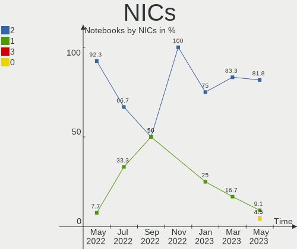

| Total | Notebooks | Percent |
|-------|-----------|---------|
| 2     | 8         | 66.67%  |
| 1     | 4         | 33.33%  |

Memory Vendor
-------------

Memory module vendors

| Vendor              | Notebooks | Percent |
|---------------------|-----------|---------|
| Unknown             | 2         | 40%     |
| Crucial             | 2         | 40%     |
| Samsung Electronics | 1         | 20%     |

Memory Model
------------

Memory module models

| Model                                              | Notebooks | Percent |
|----------------------------------------------------|-----------|---------|
| RAM CT102464BF160B.M16 8192MB SODIMM DDR3 1600MT/s | 2         | 40%     |
| RAM Module 256MB SODIMM DRAM                       | 1         | 20%     |
| RAM Module 128MB SODIMM DRAM                       | 1         | 20%     |
| RAM M471B1G73DB0-YK0 8192MB SODIMM DDR3 1600MT/s   | 1         | 20%     |

Memory Kind
-----------

Memory module kinds

| Kind | Notebooks | Percent |
|------|-----------|---------|
| DDR3 | 3         | 60%     |
| DRAM | 2         | 40%     |

Memory Form Factor
------------------

Physical design of the memory module

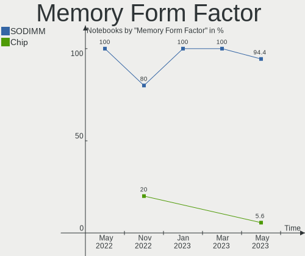

| Name   | Notebooks | Percent |
|--------|-----------|---------|
| SODIMM | 5         | 100%    |

Memory Size
-----------

Memory module size

| Size | Notebooks | Percent |
|------|-----------|---------|
| 8192 | 3         | 60%     |
| 256  | 1         | 20%     |
| 128  | 1         | 20%     |

Memory Speed
------------

Memory module speed

| Speed   | Notebooks | Percent |
|---------|-----------|---------|
| 1600    | 3         | 60%     |
| Unknown | 2         | 40%     |

Sound Vendor
------------

Sound card vendors

| Vendor         | Notebooks | Percent |
|----------------|-----------|---------|
| Intel          | 11        | 91.67%  |
| ESS Technology | 1         | 8.33%   |

Sound Model
-----------

Sound card models

| Model                                                         | Notebooks | Percent |
|---------------------------------------------------------------|-----------|---------|
| NM10/ICH7 Family High Definition Audio Controller             | 3         | 18.75%  |
| Wildcat Point-LP High Definition Audio Controller             | 2         | 12.5%   |
| Haswell-ULT HD Audio Controller                               | 2         | 12.5%   |
| Broadwell-U Audio Controller                                  | 2         | 12.5%   |
| 8 Series HD Audio Controller                                  | 2         | 12.5%   |
| Sunrise Point-LP HD Audio                                     | 1         | 6.25%   |
| ES1988 Allegro-1                                              | 1         | 6.25%   |
| Cannon Lake PCH cAVS                                          | 1         | 6.25%   |
| 82801CA/CAM AC'97 Audio Controller                            | 1         | 6.25%   |
| 7 Series/C216 Chipset Family High Definition Audio Controller | 1         | 6.25%   |

Camera Vendor
-------------

Camera device vendors

| Vendor                        | Notebooks | Percent |
|-------------------------------|-----------|---------|
| Acer                          | 2         | 33.33%  |
| Sunplus Innovation Technology | 1         | 16.67%  |
| Realtek Semiconductor         | 1         | 16.67%  |
| Microdia                      | 1         | 16.67%  |
| Chicony Electronics           | 1         | 16.67%  |

Camera Model
------------

Camera device models

| Model                        | Notebooks | Percent |
|------------------------------|-----------|---------|
| Lenovo EasyCamera            | 2         | 33.33%  |
| PC Camera (SN9C201 + OV9650) | 1         | 16.67%  |
| Integrated_Webcam_FHD        | 1         | 16.67%  |
| Integrated Camera [ThinkPad] | 1         | 16.67%  |
| Acer 640 x 480 laptop camera | 1         | 16.67%  |

Fingerprint Vendor
------------------

Fingerprint sensor vendors

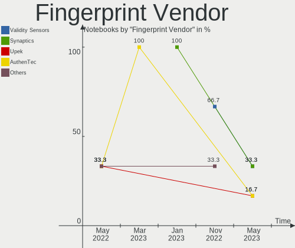

| Vendor    | Notebooks | Percent |
|-----------|-----------|---------|
| AuthenTec | 1         | 100%    |

Fingerprint Model
-----------------

Fingerprint sensor models

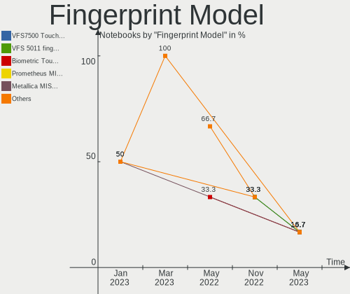

| Model                      | Notebooks | Percent |
|----------------------------|-----------|---------|
| AES2501 Fingerprint Sensor | 1         | 100%    |

Chipcard Vendor
---------------

Chipcard module vendors

Zero info for selected period =(

Chipcard Model
--------------

Chipcard module models

Zero info for selected period =(

Printer Vendor
--------------

Printer device vendors

Zero info for selected period =(

Printer Model
-------------

Printer device models

Zero info for selected period =(

Scanner Vendor
--------------

Scanner device vendors

Zero info for selected period =(

Scanner Model
-------------

Scanner device models

Zero info for selected period =(

Bluetooth Vendor
----------------

Controller vendors

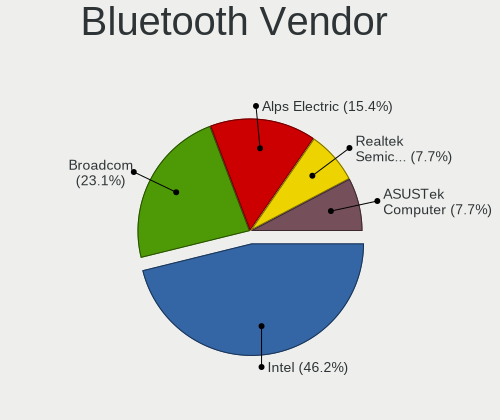

| Vendor   | Notebooks | Percent |
|----------|-----------|---------|
| Intel    | 3         | 42.86%  |
| Broadcom | 2         | 28.57%  |
| Apple    | 2         | 28.57%  |

Bluetooth Model
---------------

Controller models

| Model                              | Notebooks | Percent |
|------------------------------------|-----------|---------|
| Apple Broadcom Built-in Bluetooth  | 2         | 28.57%  |
| Wireless-AC 9260 Bluetooth Adapter | 1         | 14.29%  |
| Wireless-AC 3168 Bluetooth         | 1         | 14.29%  |
| Bluetooth wireless interface       | 1         | 14.29%  |
| BCM20702A0 Bluetooth 4.0           | 1         | 14.29%  |
| BCM2045 Bluetooth                  | 1         | 14.29%  |

Unsupported Devices
-------------------

Total unsupported devices on board

| Total | Notebooks | Percent |
|-------|-----------|---------|
| 1     | 6         | 50%     |
| 2     | 5         | 41.67%  |
| 4     | 1         | 8.33%   |

Unsupported Device Types
------------------------

Types of unsupported devices

| Type                     | Notebooks | Percent |
|--------------------------|-----------|---------|
| Communication controller | 8         | 44.44%  |
| Graphics card            | 4         | 22.22%  |
| Firewire controller      | 3         | 16.67%  |
| Net/wireless             | 2         | 11.11%  |
| Modem                    | 1         | 5.56%   |

