OpenBSD - Hardware Trends
-------------------------

A project to identify most popular hardware characteristics and track their change
over time based on data collected by BSD users at https://BSD-Hardware.info.

Anyone can contribute to this report by the [hw-probe](https://github.com/linuxhw/hw-probe/blob/master/INSTALL.BSD.md) tool:

    hw-probe -all -upload

This is a report for all computer types. See also reports for [desktops](/Dist/OpenBSD/Desktop/README.md) and [notebooks](/Dist/OpenBSD/Notebook/README.md).

This report is for one last month. Overall report since the beginning of time: [TestCoverage](https://github.com/bsdhw/TestCoverage)

Period: Dec, 2022.

Contents
--------

* [ System ](#system)
  - [ OS                       ](#os)
  - [ OS Family                ](#os-family)
  - [ Arch                     ](#arch)
  - [ DE                       ](#de)
  - [ Display Server           ](#display-server)
  - [ Display Manager          ](#display-manager)
  - [ OS Lang                  ](#os-lang)
  - [ Boot Mode                ](#boot-mode)
  - [ Filesystem               ](#filesystem)
  - [ Part. scheme             ](#part-scheme)

* [ Board ](#board)
  - [ Vendor                   ](#vendor)
  - [ Model                    ](#model)
  - [ Model Family             ](#model-family)
  - [ MFG Year                 ](#mfg-year)
  - [ Form Factor              ](#form-factor)
  - [ Coreboot                 ](#coreboot)
  - [ RAM Size                 ](#ram-size)
  - [ RAM Used                 ](#ram-used)
  - [ Total Drives             ](#total-drives)
  - [ Has CD-ROM               ](#has-cd-rom)
  - [ Has Ethernet             ](#has-ethernet)
  - [ Has WiFi                 ](#has-wifi)
  - [ Has Bluetooth            ](#has-bluetooth)

* [ Location ](#location)
  - [ Country                  ](#country)
  - [ City                     ](#city)

* [ Drives ](#drives)
  - [ Drive Vendor             ](#drive-vendor)
  - [ Drive Model              ](#drive-model)
  - [ HDD Vendor               ](#hdd-vendor)
  - [ SSD Vendor               ](#ssd-vendor)
  - [ Drive Kind               ](#drive-kind)
  - [ Drive Connector          ](#drive-connector)
  - [ Drive Size               ](#drive-size)
  - [ Space Total              ](#space-total)
  - [ Space Used               ](#space-used)
  - [ Malfunc. Drives          ](#malfunc-drives)
  - [ Malfunc. Drive Vendor    ](#malfunc-drive-vendor)
  - [ Malfunc. HDD Vendor      ](#malfunc-hdd-vendor)
  - [ Malfunc. Drive Kind      ](#malfunc-drive-kind)
  - [ Failed Drives            ](#failed-drives)
  - [ Failed Drive Vendor      ](#failed-drive-vendor)
  - [ Drive Status             ](#drive-status)

* [ Storage controller ](#storage-controller)
  - [ Storage Vendor           ](#storage-vendor)
  - [ Storage Model            ](#storage-model)
  - [ Storage Kind             ](#storage-kind)

* [ Processor ](#processor)
  - [ CPU Vendor               ](#cpu-vendor)
  - [ CPU Model                ](#cpu-model)
  - [ CPU Model Family         ](#cpu-model-family)
  - [ CPU Cores                ](#cpu-cores)
  - [ CPU Sockets              ](#cpu-sockets)
  - [ CPU Threads              ](#cpu-threads)
  - [ CPU Microarch            ](#cpu-microarch)

* [ Graphics ](#graphics)
  - [ GPU Vendor               ](#gpu-vendor)
  - [ GPU Model                ](#gpu-model)
  - [ GPU Combo                ](#gpu-combo)
  - [ GPU Driver               ](#gpu-driver)
  - [ GPU Memory               ](#gpu-memory)

* [ Monitor ](#monitor)
  - [ Monitor Vendor           ](#monitor-vendor)
  - [ Monitor Model            ](#monitor-model)
  - [ Monitor Resolution       ](#monitor-resolution)
  - [ Monitor Diagonal         ](#monitor-diagonal)
  - [ Monitor Width            ](#monitor-width)
  - [ Aspect Ratio             ](#aspect-ratio)
  - [ Monitor Area             ](#monitor-area)
  - [ Pixel Density            ](#pixel-density)
  - [ Multiple Monitors        ](#multiple-monitors)

* [ Network ](#network)
  - [ Net Controller Vendor    ](#net-controller-vendor)
  - [ Net Controller Model     ](#net-controller-model)
  - [ Wireless Vendor          ](#wireless-vendor)
  - [ Wireless Model           ](#wireless-model)
  - [ Ethernet Vendor          ](#ethernet-vendor)
  - [ Ethernet Model           ](#ethernet-model)
  - [ Net Controller Kind      ](#net-controller-kind)
  - [ Used Controller          ](#used-controller)
  - [ NICs                     ](#nics)
  - [ IPv6                     ](#ipv6)

* [ Bluetooth ](#bluetooth)
  - [ Bluetooth Vendor         ](#bluetooth-vendor)
  - [ Bluetooth Model          ](#bluetooth-model)

* [ Sound ](#sound)
  - [ Sound Vendor             ](#sound-vendor)
  - [ Sound Model              ](#sound-model)

* [ Memory ](#memory)
  - [ Memory Vendor            ](#memory-vendor)
  - [ Memory Model             ](#memory-model)
  - [ Memory Kind              ](#memory-kind)
  - [ Memory Form Factor       ](#memory-form-factor)
  - [ Memory Size              ](#memory-size)
  - [ Memory Speed             ](#memory-speed)

* [ Printers & scanners ](#printers--scanners)
  - [ Printer Vendor           ](#printer-vendor)
  - [ Printer Model            ](#printer-model)
  - [ Scanner Vendor           ](#scanner-vendor)
  - [ Scanner Model            ](#scanner-model)

* [ Camera ](#camera)
  - [ Camera Vendor            ](#camera-vendor)
  - [ Camera Model             ](#camera-model)

* [ Security ](#security)
  - [ Fingerprint Vendor       ](#fingerprint-vendor)
  - [ Fingerprint Model        ](#fingerprint-model)
  - [ Chipcard Vendor          ](#chipcard-vendor)
  - [ Chipcard Model           ](#chipcard-model)

* [ Unsupported ](#unsupported)
  - [ Unsupported Devices      ](#unsupported-devices)
  - [ Unsupported Device Types ](#unsupported-device-types)

System
------

OS
--

Installed operating systems

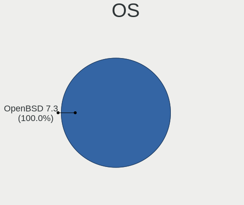

| Name        | Computers | Percent |
|-------------|-----------|---------|
| OpenBSD 7.2 | 19        | 86.36%  |
| OpenBSD 7.1 | 2         | 9.09%   |
| OpenBSD 7.0 | 1         | 4.55%   |

OS Family
---------

OS without a version

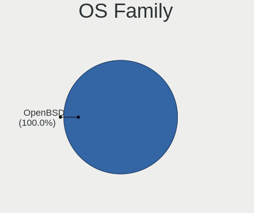

| Name    | Computers | Percent |
|---------|-----------|---------|
| OpenBSD | 22        | 100%    |

Arch
----

OS architecture (x86_64, i586, etc.)

| Name  | Computers | Percent |
|-------|-----------|---------|
| amd64 | 18        | 81.82%  |
| arm64 | 3         | 13.64%  |
| i386  | 1         | 4.55%   |

DE
--

Desktop Environment

| Name         | Computers | Percent |
|--------------|-----------|---------|
| helloDesktop | 20        | 90.91%  |
| GNOME        | 1         | 4.55%   |
| Console      | 1         | 4.55%   |

Display Server
--------------

X11 or Wayland

| Name    | Computers | Percent |
|---------|-----------|---------|
| X11     | 19        | 86.36%  |
| Console | 3         | 13.64%  |

Display Manager
---------------

SDDM, LightDM, etc.

| Name    | Computers | Percent |
|---------|-----------|---------|
| Console | 22        | 100%    |

OS Lang
-------

Language

| Lang    | Computers | Percent |
|---------|-----------|---------|
| Unknown | 18        | 81.82%  |
| en_US   | 2         | 9.09%   |
| ja_JP   | 1         | 4.55%   |
| C       | 1         | 4.55%   |

Boot Mode
---------

EFI or BIOS

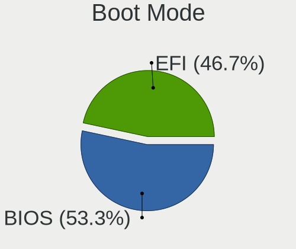

| Mode | Computers | Percent |
|------|-----------|---------|
| EFI  | 14        | 63.64%  |
| BIOS | 8         | 36.36%  |

Filesystem
----------

Type of filesystem

| Type | Computers | Percent |
|------|-----------|---------|
| Ffs  | 22        | 100%    |

Part. scheme
------------

Scheme of partitioning

| Type | Computers | Percent |
|------|-----------|---------|
| MBR  | 11        | 50%     |
| GPT  | 11        | 50%     |

Board
-----

Vendor
------

Motherboard manufacturer

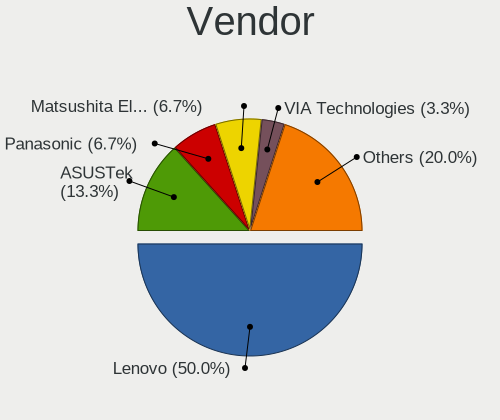

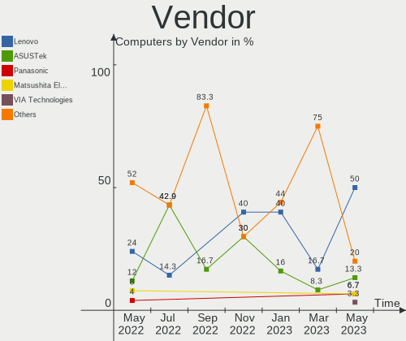

| Name                    | Computers | Percent |
|-------------------------|-----------|---------|
| Lenovo                  | 5         | 22.73%  |
| TUXEDO                  | 2         | 9.09%   |
| Raspberry Pi Foundation | 2         | 9.09%   |
| ASUSTek Computer        | 2         | 9.09%   |
| Unknown                 | 2         | 9.09%   |
| Toshiba                 | 1         | 4.55%   |
| Tactus                  | 1         | 4.55%   |
| Star Labs               | 1         | 4.55%   |
| Panasonic               | 1         | 4.55%   |
| MSI                     | 1         | 4.55%   |
| Hewlett-Packard         | 1         | 4.55%   |
| Gigabyte Technology     | 1         | 4.55%   |
| Framework               | 1         | 4.55%   |
| Acer                    | 1         | 4.55%   |

Model
-----

Motherboard model

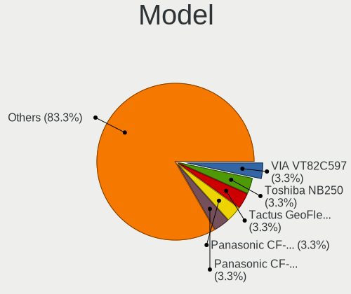

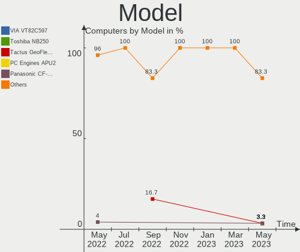

| Name                                 | Computers | Percent |
|--------------------------------------|-----------|---------|
| Unknown                              | 2         | 9.09%   |
| TUXEDO Pulse 15 Gen1                 | 1         | 4.55%   |
| TUXEDO InfinityBook Pro 14 Gen6      | 1         | 4.55%   |
| Toshiba Satellite BE96-F299          | 1         | 4.55%   |
| Tactus GeoFlex 110                   | 1         | 4.55%   |
| Star Labs Lite                       | 1         | 4.55%   |
| RPi Raspberry Pi 400                 | 1         | 4.55%   |
| RPi Raspberry Pi 4 Model B           | 1         | 4.55%   |
| Panasonic CF-54-1                    | 1         | 4.55%   |
| MSI MS-7922                          | 1         | 4.55%   |
| Lenovo ThinkPad X200 Tablet 744943U  | 1         | 4.55%   |
| Lenovo ThinkPad T60 1951A47          | 1         | 4.55%   |
| Lenovo ThinkPad T480 20L6S13100      | 1         | 4.55%   |
| Lenovo ThinkPad T410 2518C3U         | 1         | 4.55%   |
| Lenovo ThinkCentre M93p 10A8S0CE09   | 1         | 4.55%   |
| HP ProBook 430 G7                    | 1         | 4.55%   |
| Gigabyte Z390 AORUS ELITE            | 1         | 4.55%   |
| Framework Laptop                     | 1         | 4.55%   |
| ASUS ROG STRIX X670E-I GAMING WIFI   | 1         | 4.55%   |
| ASUS ASUS EXPERTBOOK B9450FA_B9450FA | 1         | 4.55%   |
| Acer Aspire XC-105                   | 1         | 4.55%   |

Model Family
------------

Motherboard model prefix

| Name                | Computers | Percent |
|---------------------|-----------|---------|
| Lenovo ThinkPad     | 4         | 18.18%  |
| RPi Raspberry       | 2         | 9.09%   |
| Unknown             | 2         | 9.09%   |
| TUXEDO Pulse        | 1         | 4.55%   |
| TUXEDO InfinityBook | 1         | 4.55%   |
| Toshiba Satellite   | 1         | 4.55%   |
| Tactus GeoFlex      | 1         | 4.55%   |
| Star Labs Lite      | 1         | 4.55%   |
| Panasonic CF-54-1   | 1         | 4.55%   |
| MSI MS-7922         | 1         | 4.55%   |
| Lenovo ThinkCentre  | 1         | 4.55%   |
| HP ProBook          | 1         | 4.55%   |
| Gigabyte Z390       | 1         | 4.55%   |
| Framework Laptop    | 1         | 4.55%   |
| ASUS ROG            | 1         | 4.55%   |
| ASUS ASUS           | 1         | 4.55%   |
| Acer Aspire         | 1         | 4.55%   |

MFG Year
--------

Motherboard manufacture year

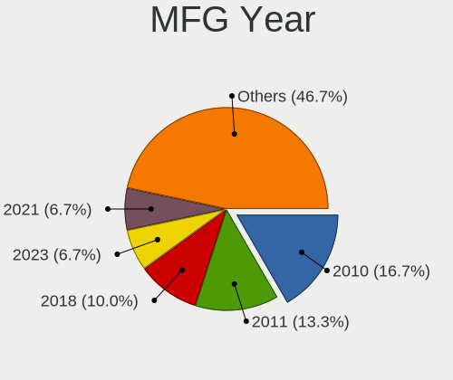

| Year    | Computers | Percent |
|---------|-----------|---------|
| 2022    | 6         | 27.27%  |
| 2021    | 5         | 22.73%  |
| 2014    | 2         | 9.09%   |
| 2020    | 1         | 4.55%   |
| 2019    | 1         | 4.55%   |
| 2018    | 1         | 4.55%   |
| 2015    | 1         | 4.55%   |
| 2013    | 1         | 4.55%   |
| 2012    | 1         | 4.55%   |
| 2010    | 1         | 4.55%   |
| 2006    | 1         | 4.55%   |
| Unknown | 1         | 4.55%   |

Form Factor
-----------

Physical design of the computer

| Name     | Computers | Percent |
|----------|-----------|---------|
| Notebook | 13        | 59.09%  |
| Desktop  | 9         | 40.91%  |

Coreboot
--------

Have coreboot on board

| Used | Computers | Percent |
|------|-----------|---------|
| No   | 20        | 90.91%  |
| Yes  | 2         | 9.09%   |

RAM Size
--------

Total RAM memory

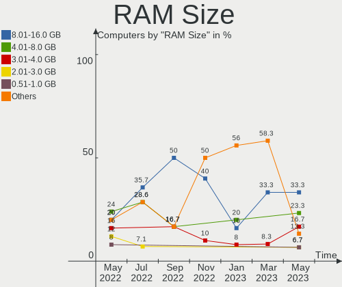

| Size in GB  | Computers | Percent |
|-------------|-----------|---------|
| 3.01-4.0    | 6         | 27.27%  |
| 16.01-24.0  | 5         | 22.73%  |
| 4.01-8.0    | 3         | 13.64%  |
| 32.01-64.0  | 3         | 13.64%  |
| 8.01-16.0   | 3         | 13.64%  |
| 64.01-256.0 | 1         | 4.55%   |
| 1.01-2.0    | 1         | 4.55%   |

RAM Used
--------

Used RAM memory

| Used GB  | Computers | Percent |
|----------|-----------|---------|
| 0.01-0.5 | 18        | 81.82%  |
| 0.51-1.0 | 3         | 13.64%  |
| 1.01-2.0 | 1         | 4.55%   |

Total Drives
------------

Number of drives on board

| Drives | Computers | Percent |
|--------|-----------|---------|
| 1      | 12        | 54.55%  |
| 2      | 5         | 22.73%  |
| 3      | 2         | 9.09%   |
| 0      | 2         | 9.09%   |
| 6      | 1         | 4.55%   |

Has CD-ROM
----------

Has CD-ROM on board

| Presented | Computers | Percent |
|-----------|-----------|---------|
| No        | 22        | 100%    |

Has Ethernet
------------

Has Ethernet on board

| Presented | Computers | Percent |
|-----------|-----------|---------|
| Yes       | 15        | 68.18%  |
| No        | 7         | 31.82%  |

Has WiFi
--------

Has WiFi module

| Presented | Computers | Percent |
|-----------|-----------|---------|
| Yes       | 16        | 72.73%  |
| No        | 6         | 27.27%  |

Has Bluetooth
-------------

Has Bluetooth module

| Presented | Computers | Percent |
|-----------|-----------|---------|
| No        | 12        | 54.55%  |
| Yes       | 10        | 45.45%  |

Location
--------

Country
-------

Geographic location (country)

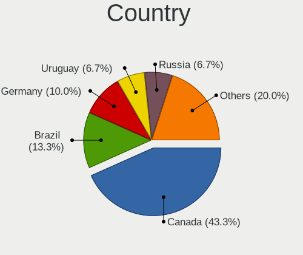

| Country | Computers | Percent |
|---------|-----------|---------|
| USA     | 5         | 22.73%  |
| UK      | 3         | 13.64%  |
| Germany | 3         | 13.64%  |
| Canada  | 3         | 13.64%  |
| Cyprus  | 2         | 9.09%   |
| Spain   | 1         | 4.55%   |
| Russia  | 1         | 4.55%   |
| Japan   | 1         | 4.55%   |
| Italy   | 1         | 4.55%   |
| France  | 1         | 4.55%   |
| Egypt   | 1         | 4.55%   |

City
----

Geographic location (city)

| City               | Computers | Percent |
|--------------------|-----------|---------|
| London             | 2         | 9.09%   |
| Larnaca            | 2         | 9.09%   |
| Lafayette          | 2         | 9.09%   |
| Yokohama           | 1         | 4.55%   |
| Tala               | 1         | 4.55%   |
| Sun Prairie        | 1         | 4.55%   |
| Rome               | 1         | 4.55%   |
| Pine Mountain Club | 1         | 4.55%   |
| Ottawa             | 1         | 4.55%   |
| Navalcarnero       | 1         | 4.55%   |
| Montreal           | 1         | 4.55%   |
| Lübeck            | 1         | 4.55%   |
| Krasnodar          | 1         | 4.55%   |
| Karlsruhe          | 1         | 4.55%   |
| Fürth             | 1         | 4.55%   |
| Farnborough        | 1         | 4.55%   |
| Dallas             | 1         | 4.55%   |
| Cenon-sur-Vienne   | 1         | 4.55%   |
| Cambridge          | 1         | 4.55%   |

Drives
------

Drive Vendor
------------

Hard drive vendors

| Vendor              | Computers | Drives | Percent |
|---------------------|-----------|--------|---------|
| NVMe                | 7         | 8      | 30.43%  |
| WDC                 | 3         | 6      | 13.04%  |
| Toshiba             | 2         | 2      | 8.7%    |
| SanDisk             | 2         | 2      | 8.7%    |
| Samsung Electronics | 2         | 2      | 8.7%    |
| OPENBSD             | 2         | 3      | 8.7%    |
| Team                | 1         | 1      | 4.35%   |
| Star Drive          | 1         | 1      | 4.35%   |
| Seagate             | 1         | 1      | 4.35%   |
| Crucial             | 1         | 1      | 4.35%   |
| Argon               | 1         | 1      | 4.35%   |

Drive Model
-----------

Hard drive models

| Model                          | Computers | Percent |
|--------------------------------|-----------|---------|
| NVMe Samsung SSD 980 2TB       | 3         | 11.54%  |
| OPENBSD SR RAID 1 1TB          | 2         | 7.69%   |
| WDC WD40EZAZ-19SF3B0 4TB       | 1         | 3.85%   |
| WDC WD2500BEVS-22UST0 250GB    | 1         | 3.85%   |
| WDC WD Elements 25A2 1TB       | 1         | 3.85%   |
| WDC WD Elements 25A1 4TB       | 1         | 3.85%   |
| WDC WD Elements 1078 1TB       | 1         | 3.85%   |
| Toshiba MQ01ACF032 320GB       | 1         | 3.85%   |
| Toshiba MK6475GSX 640GB        | 1         | 3.85%   |
| Team TEAML5Lite3D120G 120GB    | 1         | 3.85%   |
| Star Drive SATA SSD 960GB      | 1         | 3.85%   |
| Seagate ST4000LM024-2AN17V 4TB | 1         | 3.85%   |
| SanDisk Ultra Fit 128GB        | 1         | 3.85%   |
| SanDisk Gaming Xbox 360 8GB    | 1         | 3.85%   |
| Samsung SSD 860 EVO 500GB      | 1         | 3.85%   |
| Samsung SSD 860 EVO 1TB        | 1         | 3.85%   |
| NVMe WDS100T3X0C-00SJ 1TB      | 1         | 3.85%   |
| NVMe SK hynix BC501 H 512GB    | 1         | 3.85%   |
| NVMe SAMSUNG MZVLQ512 512GB    | 1         | 3.85%   |
| NVMe SAMSUNG MZVLB256 256GB    | 1         | 3.85%   |
| NVMe ADATA SX8200PNP 1TB       | 1         | 3.85%   |
| Crucial CT480BX500SSD1 480GB   | 1         | 3.85%   |
| Argon Forty 240GB              | 1         | 3.85%   |

HDD Vendor
----------

Hard disk drive vendors

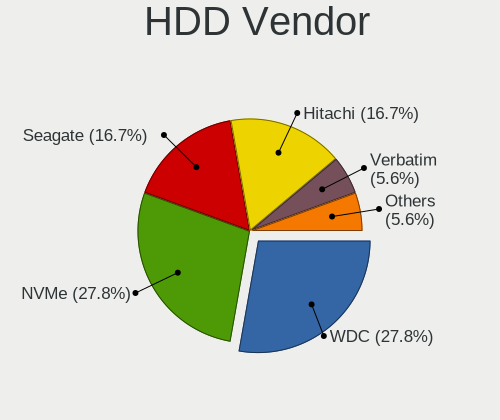

| Vendor  | Computers | Drives | Percent |
|---------|-----------|--------|---------|
| NVMe    | 4         | 5      | 33.33%  |
| WDC     | 3         | 6      | 25%     |
| Toshiba | 2         | 2      | 16.67%  |
| OPENBSD | 2         | 3      | 16.67%  |
| Seagate | 1         | 1      | 8.33%   |

SSD Vendor
----------

Solid state drive vendors

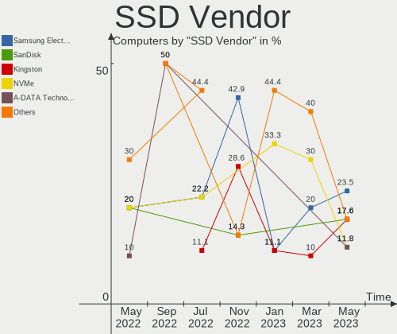

| Vendor              | Computers | Drives | Percent |
|---------------------|-----------|--------|---------|
| NVMe                | 3         | 3      | 27.27%  |
| SanDisk             | 2         | 2      | 18.18%  |
| Samsung Electronics | 2         | 2      | 18.18%  |
| Team                | 1         | 1      | 9.09%   |
| Star Drive          | 1         | 1      | 9.09%   |
| Crucial             | 1         | 1      | 9.09%   |
| Argon               | 1         | 1      | 9.09%   |

Drive Kind
----------

HDD or SSD

| Kind | Computers | Drives | Percent |
|------|-----------|--------|---------|
| SSD  | 10        | 11     | 50%     |
| HDD  | 10        | 17     | 50%     |

Drive Connector
---------------

SATA, SAS, NVMe, etc.

| Type | Computers | Drives | Percent |
|------|-----------|--------|---------|
| SATA | 19        | 28     | 100%    |

Drive Size
----------

Size of hard drive

| Size in TB | Computers | Drives | Percent |
|------------|-----------|--------|---------|
| 0.01-0.5   | 9         | 9      | 37.5%   |
| 0.51-1.0   | 8         | 11     | 33.33%  |
| 1.01-2.0   | 4         | 4      | 16.67%  |
| 3.01-4.0   | 3         | 4      | 12.5%   |

Space Total
-----------

Amount of disk space available on the file system

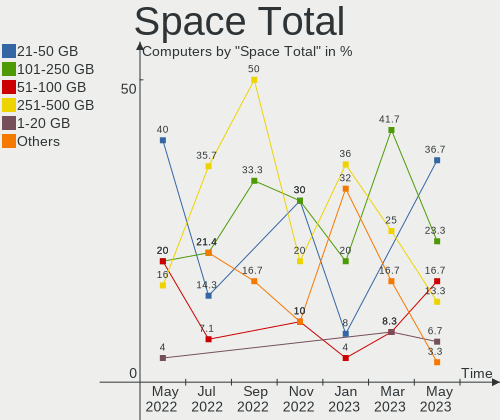

| Size in GB     | Computers | Percent |
|----------------|-----------|---------|
| 251-500        | 11        | 50%     |
| 101-250        | 6         | 27.27%  |
| 51-100         | 2         | 9.09%   |
| More than 3000 | 1         | 4.55%   |
| 1001-2000      | 1         | 4.55%   |
| 501-1000       | 1         | 4.55%   |

Space Used
----------

Amount of used disk space

| Used GB   | Computers | Percent |
|-----------|-----------|---------|
| 1-20      | 13        | 59.09%  |
| 21-50     | 4         | 18.18%  |
| 251-500   | 2         | 9.09%   |
| 51-100    | 2         | 9.09%   |
| 1001-2000 | 1         | 4.55%   |

Malfunc. Drives
---------------

Drive models with a malfunction

| Model                       | Computers | Drives | Percent |
|-----------------------------|-----------|--------|---------|
| WDC WD2500BEVS-22UST0 250GB | 1         | 1      | 33.33%  |
| Toshiba MQ01ACF032 320GB    | 1         | 1      | 33.33%  |
| Toshiba MK6475GSX 640GB     | 1         | 1      | 33.33%  |

Malfunc. Drive Vendor
---------------------

Vendors of faulty drives

| Vendor  | Computers | Drives | Percent |
|---------|-----------|--------|---------|
| Toshiba | 2         | 2      | 66.67%  |
| WDC     | 1         | 1      | 33.33%  |

Malfunc. HDD Vendor
-------------------

Vendors of faulty HDD drives

| Vendor  | Computers | Drives | Percent |
|---------|-----------|--------|---------|
| Toshiba | 2         | 2      | 66.67%  |
| WDC     | 1         | 1      | 33.33%  |

Malfunc. Drive Kind
-------------------

Kinds of faulty drives

| Kind | Computers | Drives | Percent |
|------|-----------|--------|---------|
| HDD  | 3         | 3      | 100%    |

Failed Drives
-------------

Failed drive models

Zero info for selected period =(

Failed Drive Vendor
-------------------

Failed drive vendors

Zero info for selected period =(

Drive Status
------------

Number of failed and malfunc. drives

| Status   | Computers | Drives | Percent |
|----------|-----------|--------|---------|
| Works    | 10        | 11     | 45.45%  |
| Detected | 9         | 14     | 40.91%  |
| Malfunc  | 3         | 3      | 13.64%  |

Storage controller
------------------

Storage Vendor
--------------

Storage controller vendors

| Vendor              | Computers | Percent |
|---------------------|-----------|---------|
| Intel               | 12        | 52.17%  |
| Samsung Electronics | 5         | 21.74%  |
| AMD                 | 3         | 13.04%  |
| SK hynix            | 1         | 4.35%   |
| SanDisk             | 1         | 4.35%   |
| ADATA Technology    | 1         | 4.35%   |

Storage Model
-------------

Storage controller models

| Model                                                                          | Computers | Percent |
|--------------------------------------------------------------------------------|-----------|---------|
| Samsung NVMe SSD Controller PM9A1/PM9A3/980PRO                                 | 3         | 12.5%   |
| Intel Celeron/Pentium Silver Processor SATA Controller                         | 2         | 8.33%   |
| Intel 8 Series/C220 Series Chipset Family 6-port SATA Controller 1 [AHCI mode] | 2         | 8.33%   |
| SK hynix BC501 NVMe Solid State Drive                                          | 1         | 4.17%   |
| SanDisk WD Black SN750 / PC SN730 NVMe SSD                                     | 1         | 4.17%   |
| Samsung NVMe SSD Controller SM981/PM981/PM983                                  | 1         | 4.17%   |
| Samsung NVMe SSD Controller 980                                                | 1         | 4.17%   |
| Intel Wildcat Point-LP SATA Controller [AHCI Mode]                             | 1         | 4.17%   |
| Intel Comet Lake SATA AHCI Controller                                          | 1         | 4.17%   |
| Intel Cannon Lake PCH SATA AHCI Controller                                     | 1         | 4.17%   |
| Intel 9 Series Chipset Family SATA Controller [AHCI Mode]                      | 1         | 4.17%   |
| Intel 82801IBM/IEM (ICH9M/ICH9M-E) 4 port SATA Controller [AHCI mode]          | 1         | 4.17%   |
| Intel 82801GBM/GHM (ICH7-M Family) SATA Controller [AHCI mode]                 | 1         | 4.17%   |
| Intel 82801G (ICH7 Family) IDE Controller                                      | 1         | 4.17%   |
| Intel 7 Series Chipset Family 6-port SATA Controller [AHCI mode]               | 1         | 4.17%   |
| Intel 5 Series/3400 Series Chipset 6 port SATA AHCI Controller                 | 1         | 4.17%   |
| AMD unknown                                                                    | 1         | 4.17%   |
| AMD FCH SATA Controller [IDE mode]                                             | 1         | 4.17%   |
| AMD FCH SATA Controller [AHCI mode]                                            | 1         | 4.17%   |
| ADATA XPG SX8200 Pro PCIe Gen3x4 M.2 2280 Solid State Drive                    | 1         | 4.17%   |

Storage Kind
------------

Kind of storage controller (IDE, SATA, NVMe, SAS, ...)

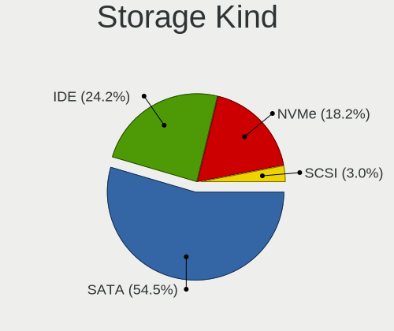

| Kind | Computers | Percent |
|------|-----------|---------|
| SATA | 15        | 65.22%  |
| NVMe | 7         | 30.43%  |
| IDE  | 1         | 4.35%   |

Processor
---------

CPU Vendor
----------

Processor vendors

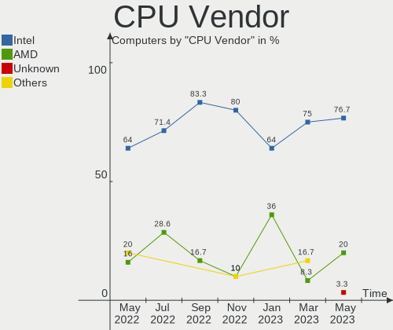

| Vendor | Computers | Percent |
|--------|-----------|---------|
| Intel  | 16        | 72.73%  |
| ARM    | 3         | 13.64%  |
| AMD    | 3         | 13.64%  |

CPU Model
---------

Processor models

| Model                                                         | Computers | Percent |
|---------------------------------------------------------------|-----------|---------|
| ARM Cortex-A72 r0p3                                           | 2         | 9.09%   |
| Intel Xeon CPU E5-2620 v3 @ 2.40GHz                           | 1         | 4.55%   |
| Intel Pentium Silver N5030 CPU @ 1.10GHz                      | 1         | 4.55%   |
| Intel Core i9-9900K CPU @ 3.60GHz                             | 1         | 4.55%   |
| Intel Core i7-8650U CPU @ 1.90GHz                             | 1         | 4.55%   |
| Intel Core i7-10510U CPU @ 1.80GHz                            | 1         | 4.55%   |
| Intel Core i5-5300U CPU @ 2.30GHz                             | 1         | 4.55%   |
| Intel Core i5-4690K CPU @ 3.50GHz                             | 1         | 4.55%   |
| Intel Core i5-4570 CPU @ 3.20GHz                              | 1         | 4.55%   |
| Intel Core i5-10210U CPU @ 1.60GHz                            | 1         | 4.55%   |
| Intel Core i5 CPU M 540 @ 2.53GHz                             | 1         | 4.55%   |
| Intel Core i3-3120M CPU @ 2.50GHz                             | 1         | 4.55%   |
| Intel Core Duo CPU T2500 @ 2.00GHz ("GenuineIntel" 686-class) | 1         | 4.55%   |
| Intel Core 2 Duo CPU L9600 @ 2.13GHz                          | 1         | 4.55%   |
| Intel Celeron N4020 CPU @ 1.10GHz                             | 1         | 4.55%   |
| Intel 11th Gen Core i7-11370H @ 3.30GHz                       | 1         | 4.55%   |
| Intel 11th Gen Core i5-1135G7 @ 2.40GHz                       | 1         | 4.55%   |
| ARM Cortex-A53 r0p4                                           | 1         | 4.55%   |
| AMD Ryzen 9 7950X 16-Core Processor                           | 1         | 4.55%   |
| AMD Ryzen 7 4800H with Radeon Graphics                        | 1         | 4.55%   |
| AMD A4-5000 APU with Radeon HD Graphics                       | 1         | 4.55%   |

CPU Model Family
----------------

Processor model prefix

| Model                | Computers | Percent |
|----------------------|-----------|---------|
| Intel Core i5        | 5         | 22.73%  |
| ARM Cortex           | 3         | 13.64%  |
| Other                | 2         | 9.09%   |
| Intel Core i7        | 2         | 9.09%   |
| Intel Xeon           | 1         | 4.55%   |
| Intel Pentium Silver | 1         | 4.55%   |
| Intel Core i9        | 1         | 4.55%   |
| Intel Core i3        | 1         | 4.55%   |
| Intel Core Duo       | 1         | 4.55%   |
| Intel Core 2 Duo     | 1         | 4.55%   |
| Intel Celeron        | 1         | 4.55%   |
| AMD Ryzen 9          | 1         | 4.55%   |
| AMD Ryzen 7          | 1         | 4.55%   |
| AMD A4               | 1         | 4.55%   |

CPU Cores
---------

Number of processor cores

| Number  | Computers | Percent |
|---------|-----------|---------|
| 4       | 9         | 40.91%  |
| Unknown | 5         | 22.73%  |
| 2       | 4         | 18.18%  |
| 32      | 1         | 4.55%   |
| 16      | 1         | 4.55%   |
| 8       | 1         | 4.55%   |
| 6       | 1         | 4.55%   |

CPU Sockets
-----------

Number of sockets

| Number  | Computers | Percent |
|---------|-----------|---------|
| 1       | 17        | 77.27%  |
| Unknown | 5         | 22.73%  |

CPU Threads
-----------

Threads per core (Hyper-Threading)

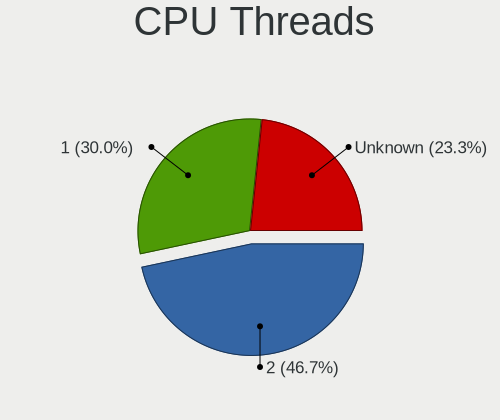

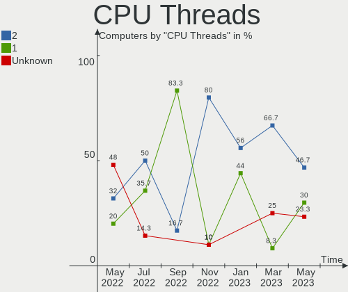

| Number  | Computers | Percent |
|---------|-----------|---------|
| 2       | 10        | 45.45%  |
| 1       | 7         | 31.82%  |
| Unknown | 5         | 22.73%  |

CPU Microarch
-------------

Microarchitecture

| Name          | Computers | Percent |
|---------------|-----------|---------|
| KabyLake      | 4         | 18.18%  |
| Unknown       | 4         | 18.18%  |
| Haswell       | 3         | 13.64%  |
| TigerLake     | 2         | 9.09%   |
| Goldmont plus | 2         | 9.09%   |
| Zen 2         | 1         | 4.55%   |
| Westmere      | 1         | 4.55%   |
| Penryn        | 1         | 4.55%   |
| P6            | 1         | 4.55%   |
| Jaguar        | 1         | 4.55%   |
| IvyBridge     | 1         | 4.55%   |
| Broadwell     | 1         | 4.55%   |

Graphics
--------

GPU Vendor
----------

Vendors of graphics cards

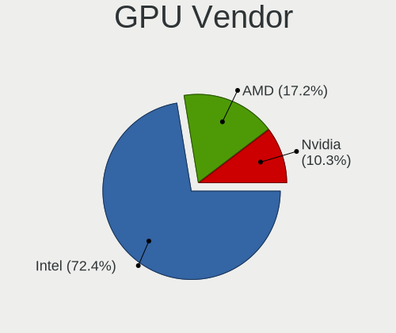

| Vendor | Computers | Percent |
|--------|-----------|---------|
| Intel  | 14        | 66.67%  |
| AMD    | 6         | 28.57%  |
| Nvidia | 1         | 4.76%   |

GPU Model
---------

Graphics card models

| Model                                                                         | Computers | Percent |
|-------------------------------------------------------------------------------|-----------|---------|
| Intel TigerLake-LP GT2 [Iris Xe Graphics]                                     | 2         | 8.7%    |
| Intel CometLake-U GT2 [UHD Graphics]                                          | 2         | 8.7%    |
| Nvidia GP108M [GeForce MX150]                                                 | 1         | 4.35%   |
| Intel Xeon E3-1200 v3/4th Gen Core Processor Integrated Graphics Controller   | 1         | 4.35%   |
| Intel UHD Graphics 620                                                        | 1         | 4.35%   |
| Intel Mobile 945GM/GMS/GME, 943/940GML Express Integrated Graphics Controller | 1         | 4.35%   |
| Intel Mobile 945GM/GMS, 943/940GML Express Integrated Graphics Controller     | 1         | 4.35%   |
| Intel Mobile 4 Series Chipset Integrated Graphics Controller                  | 1         | 4.35%   |
| Intel HD Graphics 5500                                                        | 1         | 4.35%   |
| Intel GeminiLake [UHD Graphics 605]                                           | 1         | 4.35%   |
| Intel GeminiLake [UHD Graphics 600]                                           | 1         | 4.35%   |
| Intel Core Processor Integrated Graphics Controller                           | 1         | 4.35%   |
| Intel CoffeeLake-S GT2 [UHD Graphics 630]                                     | 1         | 4.35%   |
| Intel 3rd Gen Core processor Graphics Controller                              | 1         | 4.35%   |
| AMD Renoir                                                                    | 1         | 4.35%   |
| AMD Raphael                                                                   | 1         | 4.35%   |
| AMD Navi 23 [Radeon RX 6600/6600 XT/6600M]                                    | 1         | 4.35%   |
| AMD Navi 22 [Radeon RX 6700/6700 XT/6750 XT / 6800M]                          | 1         | 4.35%   |
| AMD Kabini [Radeon HD 8330]                                                   | 1         | 4.35%   |
| AMD Ellesmere [Radeon RX 470/480/570/570X/580/580X/590]                       | 1         | 4.35%   |
| AMD Curacao PRO [Radeon R7 370 / R9 270/370 OEM]                              | 1         | 4.35%   |

GPU Combo
---------

Combinations of graphics cards

| Name           | Computers | Percent |
|----------------|-----------|---------|
| 1 x Intel      | 10        | 45.45%  |
| 1 x AMD        | 4         | 18.18%  |
| Other          | 3         | 13.64%  |
| 2 x Intel      | 2         | 9.09%   |
| 2 x AMD        | 1         | 4.55%   |
| Intel + Nvidia | 1         | 4.55%   |
| Intel + AMD    | 1         | 4.55%   |

GPU Driver
----------

Free vs proprietary

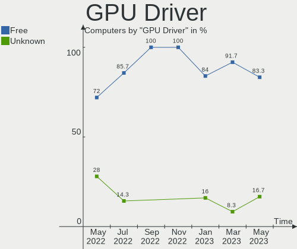

| Driver  | Computers | Percent |
|---------|-----------|---------|
| Free    | 18        | 81.82%  |
| Unknown | 4         | 18.18%  |

GPU Memory
----------

Total video memory

| Size in GB | Computers | Percent |
|------------|-----------|---------|
| Unknown    | 22        | 100%    |

Monitor
-------

Monitor Vendor
--------------

Monitor vendors

| Vendor              | Computers | Percent |
|---------------------|-----------|---------|
| BOE                 | 4         | 23.53%  |
| Samsung Electronics | 2         | 11.76%  |
| LG Display          | 2         | 11.76%  |
| Lenovo              | 2         | 11.76%  |
| Dell                | 2         | 11.76%  |
| TRU                 | 1         | 5.88%   |
| DSC                 | 1         | 5.88%   |
| CSO                 | 1         | 5.88%   |
| AU Optronics        | 1         | 5.88%   |
| ASUSTek Computer    | 1         | 5.88%   |

Monitor Model
-------------

Monitor models

| Model                                                               | Computers | Percent |
|---------------------------------------------------------------------|-----------|---------|
| TRU LCD Monitor TRU235C 1366x768 260x140mm 11.6-inch                | 1         | 5.88%   |
| Samsung Electronics SyncMaster SAM0226 1440x900 410x260mm 19.1-inch | 1         | 5.88%   |
| Samsung Electronics S24D300 SAM0B43 1920x1080 530x300mm 24.0-inch   | 1         | 5.88%   |
| LG Display LCD Monitor LGD058B 2560x1440 310x170mm 13.9-inch        | 1         | 5.88%   |
| LG Display LCD Monitor LGD045E 1366x768 310x170mm 13.9-inch         | 1         | 5.88%   |
| Lenovo LCD Monitor LEN4035 1280x800 300x190mm 14.0-inch             | 1         | 5.88%   |
| Lenovo LCD Monitor LEN4011 1280x800 260x160mm 12.0-inch             | 1         | 5.88%   |
| DSC LCD Monitor DSC0001 2200x1650 200x150mm 9.8-inch                | 1         | 5.88%   |
| Dell P780 DEL510F 1600x1200 330x240mm 16.1-inch                     | 1         | 5.88%   |
| Dell P1917S DELD093 1280x1024 380x300mm 19.1-inch                   | 1         | 5.88%   |
| CSO LCD Monitor CSO1402 2880x1800 300x190mm 14.0-inch               | 1         | 5.88%   |
| BOE LCD Monitor BOE096F 1920x1080 250x140mm 11.3-inch               | 1         | 5.88%   |
| BOE LCD Monitor BOE095F 2256x1504 280x190mm 13.3-inch               | 1         | 5.88%   |
| BOE LCD Monitor BOE0900 1920x1080 340x190mm 15.3-inch               | 1         | 5.88%   |
| BOE LCD Monitor BOE08A6 1920x1080 290x170mm 13.2-inch               | 1         | 5.88%   |
| AU Optronics LCD Monitor AUO623D 1920x1080 310x170mm 13.9-inch      | 1         | 5.88%   |
| ASUSTek Computer ROG PG259QN AUS25B5 1920x1080 540x300mm 24.3-inch  | 1         | 5.88%   |

Monitor Resolution
------------------

Monitor screen resolution

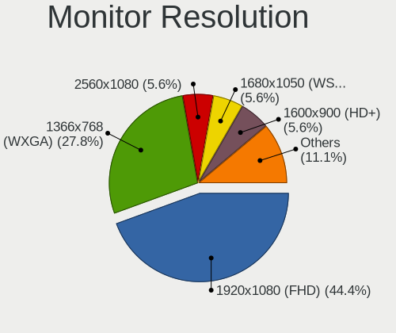

| Resolution       | Computers | Percent |
|------------------|-----------|---------|
| 1920x1080 (FHD)  | 6         | 35.29%  |
| 1366x768 (WXGA)  | 2         | 11.76%  |
| 1280x800 (WXGA)  | 2         | 11.76%  |
| 2880x1800        | 1         | 5.88%   |
| 2560x1440 (QHD)  | 1         | 5.88%   |
| 2256x1504        | 1         | 5.88%   |
| 2200x1650        | 1         | 5.88%   |
| 1600x1200        | 1         | 5.88%   |
| 1440x900 (WXGA+) | 1         | 5.88%   |
| 1280x1024 (SXGA) | 1         | 5.88%   |

Monitor Diagonal
----------------

Diagonal size in inches

| Inches | Computers | Percent |
|--------|-----------|---------|
| 13     | 5         | 29.41%  |
| 24     | 2         | 11.76%  |
| 19     | 2         | 11.76%  |
| 14     | 2         | 11.76%  |
| 11     | 2         | 11.76%  |
| 16     | 1         | 5.88%   |
| 15     | 1         | 5.88%   |
| 12     | 1         | 5.88%   |
| 9      | 1         | 5.88%   |

Monitor Width
-------------

Physical width

| Width in mm | Computers | Percent |
|-------------|-----------|---------|
| 201-300     | 7         | 41.18%  |
| 301-350     | 5         | 29.41%  |
| 501-600     | 2         | 11.76%  |
| 401-500     | 1         | 5.88%   |
| 351-400     | 1         | 5.88%   |
| 101-200     | 1         | 5.88%   |

Aspect Ratio
------------

Proportional relationship between the width and the height

| Ratio | Computers | Percent |
|-------|-----------|---------|
| 16/9  | 9         | 52.94%  |
| 16/10 | 3         | 17.65%  |
| 4/3   | 2         | 11.76%  |
| 3/2   | 2         | 11.76%  |
| 5/4   | 1         | 5.88%   |

Monitor Area
------------

Area in inch²

| Area in inch² | Computers | Percent |
|----------------|-----------|---------|
| 81-90          | 6         | 35.29%  |
| 51-60          | 2         | 11.76%  |
| 151-200        | 2         | 11.76%  |
| 71-80          | 1         | 5.88%   |
| 61-70          | 1         | 5.88%   |
| 41-50          | 1         | 5.88%   |
| 251-300        | 1         | 5.88%   |
| 201-250        | 1         | 5.88%   |
| 121-130        | 1         | 5.88%   |
| 91-100         | 1         | 5.88%   |

Pixel Density
-------------

Pixels per inch

| Density       | Computers | Percent |
|---------------|-----------|---------|
| 121-160       | 5         | 29.41%  |
| 161-240       | 4         | 23.53%  |
| 51-100        | 4         | 23.53%  |
| More than 240 | 2         | 11.76%  |
| 101-120       | 2         | 11.76%  |

Multiple Monitors
-----------------

Total monitors connected

| Total | Computers | Percent |
|-------|-----------|---------|
| 1     | 17        | 77.27%  |
| 0     | 4         | 18.18%  |
| 2     | 1         | 4.55%   |

Network
-------

Net Controller Vendor
---------------------

Controller vendors

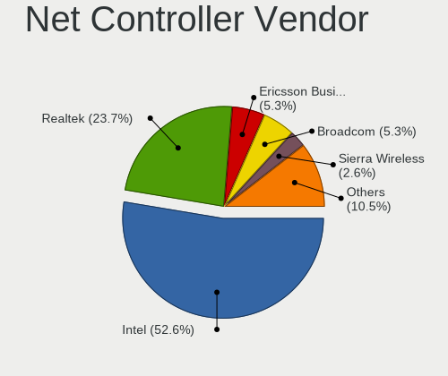

| Vendor                          | Computers | Percent |
|---------------------------------|-----------|---------|
| Intel                           | 16        | 55.17%  |
| Realtek Semiconductor           | 8         | 27.59%  |
| Qualcomm Atheros                | 2         | 6.9%    |
| Sierra Wireless                 | 1         | 3.45%   |
| Qualcomm Atheros Communications | 1         | 3.45%   |
| MediaTek                        | 1         | 3.45%   |

Net Controller Model
--------------------

Controller models

| Model                                                             | Computers | Percent |
|-------------------------------------------------------------------|-----------|---------|
| Realtek RTL8111/8168/8411 PCI Express Gigabit Ethernet Controller | 6         | 16.67%  |
| Intel Wireless 7265                                               | 2         | 5.56%   |
| Intel Wi-Fi 6 AX201                                               | 2         | 5.56%   |
| Intel Comet Lake PCH-LP CNVi WiFi                                 | 2         | 5.56%   |
| Sierra Wireless EM7305 Modem                                      | 1         | 2.78%   |
| Realtek RTL8723AE PCIe Wireless Network Adapter                   | 1         | 2.78%   |
| Realtek RTL8191SEvB Wireless LAN Controller                       | 1         | 2.78%   |
| Realtek RTL8188FTV 802.11b/g/n 1T1R 2.4G WLAN Adapter             | 1         | 2.78%   |
| Realtek RTL8188CUS 802.11n WLAN Adapter                           | 1         | 2.78%   |
| Realtek RTL8169 PCI Gigabit Ethernet Controller                   | 1         | 2.78%   |
| Realtek RTL810xE PCI Express Fast Ethernet controller             | 1         | 2.78%   |
| Qualcomm Atheros AR9271 802.11n                                   | 1         | 2.78%   |
| Qualcomm Atheros AR9285 Wireless Network Adapter (PCI-Express)    | 1         | 2.78%   |
| Qualcomm Atheros AR5212 802.11abg NIC                             | 1         | 2.78%   |
| MediaTek MT7922 802.11ax PCI Express Wireless Network Adapter     | 1         | 2.78%   |
| Intel Wireless 8265 / 8275                                        | 1         | 2.78%   |
| Intel Wi-Fi 6 AX210/AX211/AX411 160MHz                            | 1         | 2.78%   |
| Intel Wi-Fi 6 AX200                                               | 1         | 2.78%   |
| Intel Gemini Lake PCH CNVi WiFi                                   | 1         | 2.78%   |
| Intel Ethernet Controller I225-V                                  | 1         | 2.78%   |
| Intel Ethernet Connection I217-LM                                 | 1         | 2.78%   |
| Intel Ethernet Connection (7) I219-V                              | 1         | 2.78%   |
| Intel Ethernet Connection (4) I219-LM                             | 1         | 2.78%   |
| Intel Ethernet Connection (3) I218-LM                             | 1         | 2.78%   |
| Intel Ethernet Connection (10) I219-V                             | 1         | 2.78%   |
| Intel 82577LM Gigabit Network Connection                          | 1         | 2.78%   |
| Intel 82573L Gigabit Ethernet Controller                          | 1         | 2.78%   |
| Intel 82567LM Gigabit Network Connection                          | 1         | 2.78%   |

Wireless Vendor
---------------

Wireless vendors

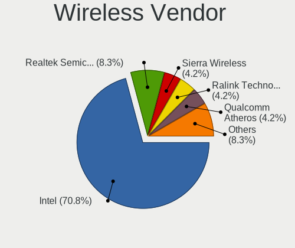

| Vendor                          | Computers | Percent |
|---------------------------------|-----------|---------|
| Intel                           | 10        | 62.5%   |
| Realtek Semiconductor           | 2         | 12.5%   |
| Qualcomm Atheros                | 2         | 12.5%   |
| Qualcomm Atheros Communications | 1         | 6.25%   |
| MediaTek                        | 1         | 6.25%   |

Wireless Model
--------------

Wireless models

| Model                                                          | Computers | Percent |
|----------------------------------------------------------------|-----------|---------|
| Intel Wireless 7265                                            | 2         | 11.11%  |
| Intel Wi-Fi 6 AX201                                            | 2         | 11.11%  |
| Intel Comet Lake PCH-LP CNVi WiFi                              | 2         | 11.11%  |
| Realtek RTL8723AE PCIe Wireless Network Adapter                | 1         | 5.56%   |
| Realtek RTL8191SEvB Wireless LAN Controller                    | 1         | 5.56%   |
| Realtek RTL8188FTV 802.11b/g/n 1T1R 2.4G WLAN Adapter          | 1         | 5.56%   |
| Realtek RTL8188CUS 802.11n WLAN Adapter                        | 1         | 5.56%   |
| Qualcomm Atheros AR9271 802.11n                                | 1         | 5.56%   |
| Qualcomm Atheros AR9285 Wireless Network Adapter (PCI-Express) | 1         | 5.56%   |
| Qualcomm Atheros AR5212 802.11abg NIC                          | 1         | 5.56%   |
| MediaTek MT7922 802.11ax PCI Express Wireless Network Adapter  | 1         | 5.56%   |
| Intel Wireless 8265 / 8275                                     | 1         | 5.56%   |
| Intel Wi-Fi 6 AX210/AX211/AX411 160MHz                         | 1         | 5.56%   |
| Intel Wi-Fi 6 AX200                                            | 1         | 5.56%   |
| Intel Gemini Lake PCH CNVi WiFi                                | 1         | 5.56%   |

Ethernet Vendor
---------------

Ethernet vendors

| Vendor                | Computers | Percent |
|-----------------------|-----------|---------|
| Intel                 | 9         | 56.25%  |
| Realtek Semiconductor | 7         | 43.75%  |

Ethernet Model
--------------

Ethernet models

| Model                                                             | Computers | Percent |
|-------------------------------------------------------------------|-----------|---------|
| Realtek RTL8111/8168/8411 PCI Express Gigabit Ethernet Controller | 6         | 35.29%  |
| Realtek RTL8169 PCI Gigabit Ethernet Controller                   | 1         | 5.88%   |
| Realtek RTL810xE PCI Express Fast Ethernet controller             | 1         | 5.88%   |
| Intel Ethernet Controller I225-V                                  | 1         | 5.88%   |
| Intel Ethernet Connection I217-LM                                 | 1         | 5.88%   |
| Intel Ethernet Connection (7) I219-V                              | 1         | 5.88%   |
| Intel Ethernet Connection (4) I219-LM                             | 1         | 5.88%   |
| Intel Ethernet Connection (3) I218-LM                             | 1         | 5.88%   |
| Intel Ethernet Connection (10) I219-V                             | 1         | 5.88%   |
| Intel 82577LM Gigabit Network Connection                          | 1         | 5.88%   |
| Intel 82573L Gigabit Ethernet Controller                          | 1         | 5.88%   |
| Intel 82567LM Gigabit Network Connection                          | 1         | 5.88%   |

Net Controller Kind
-------------------

Ethernet, WiFi or modem

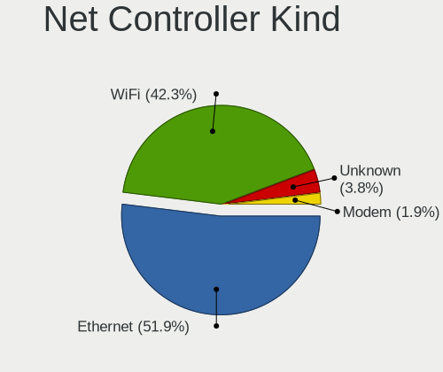

| Kind     | Computers | Percent |
|----------|-----------|---------|
| WiFi     | 16        | 50%     |
| Ethernet | 15        | 46.88%  |
| Unknown  | 1         | 3.13%   |

Used Controller
---------------

Currently used network controller

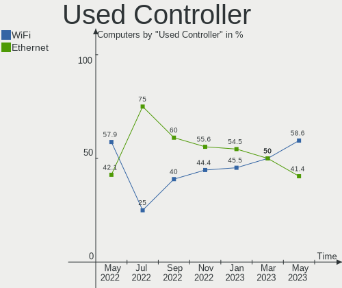

| Kind     | Computers | Percent |
|----------|-----------|---------|
| WiFi     | 12        | 66.67%  |
| Ethernet | 6         | 33.33%  |

NICs
----

Total network controllers on board

| Total | Computers | Percent |
|-------|-----------|---------|
| 2     | 10        | 45.45%  |
| 1     | 7         | 31.82%  |
| 0     | 3         | 13.64%  |
| 3     | 2         | 9.09%   |

IPv6
----

IPv6 vs IPv4

| Used | Computers | Percent |
|------|-----------|---------|
| No   | 21        | 95.45%  |
| Yes  | 1         | 4.55%   |

Bluetooth
---------

Bluetooth Vendor
----------------

Controller vendors

| Vendor                | Computers | Percent |
|-----------------------|-----------|---------|
| Intel                 | 7         | 70%     |
| Broadcom              | 2         | 20%     |
| Realtek Semiconductor | 1         | 10%     |

Bluetooth Model
---------------

Controller models

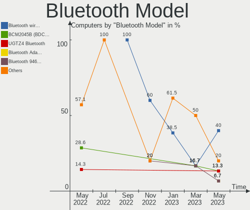

| Model                                              | Computers | Percent |
|----------------------------------------------------|-----------|---------|
| Intel AX201 Bluetooth                              | 3         | 30%     |
| Intel Bluetooth wireless interface                 | 2         | 20%     |
| Realtek  Bluetooth Adapter                         | 1         | 10%     |
| Intel Bluetooth 9460/9560 Jefferson Peak (JfP)     | 1         | 10%     |
| Intel AX200 Bluetooth                              | 1         | 10%     |
| Broadcom BCM2045B (BDC-2.1) [Bluetooth Controller] | 1         | 10%     |
| Broadcom BCM2045B (BDC-2) [Bluetooth Controller]   | 1         | 10%     |

Sound
-----

Sound Vendor
------------

Sound card vendors

| Vendor                               | Computers | Percent |
|--------------------------------------|-----------|---------|
| Intel                                | 16        | 61.54%  |
| AMD                                  | 6         | 23.08%  |
| Thesycon Systemsoftware & Consulting | 1         | 3.85%   |
| Texas Instruments                    | 1         | 3.85%   |
| Generalplus Technology               | 1         | 3.85%   |
| Elgato Systems                       | 1         | 3.85%   |

Sound Model
-----------

Sound card models

| Model                                                                   | Computers | Percent |
|-------------------------------------------------------------------------|-----------|---------|
| Intel Tiger Lake-LP Smart Sound Technology Audio Controller             | 2         | 6.67%   |
| Intel Comet Lake PCH-LP cAVS                                            | 2         | 6.67%   |
| Intel Celeron/Pentium Silver Processor High Definition Audio            | 2         | 6.67%   |
| AMD Navi 21/23 HDMI/DP Audio Controller                                 | 2         | 6.67%   |
| Thesycon Systemsoftware & Consulting Topping DX3 Pro Audio Control      | 1         | 3.33%   |
| Texas Instruments PCM2902 Audio Codec                                   | 1         | 3.33%   |
| Intel Xeon E3-1200 v3/4th Gen Core Processor HD Audio Controller        | 1         | 3.33%   |
| Intel Wildcat Point-LP High Definition Audio Controller                 | 1         | 3.33%   |
| Intel Sunrise Point-LP HD Audio                                         | 1         | 3.33%   |
| Intel NM10/ICH7 Family High Definition Audio Controller                 | 1         | 3.33%   |
| Intel Cannon Lake PCH cAVS                                              | 1         | 3.33%   |
| Intel Broadwell-U Audio Controller                                      | 1         | 3.33%   |
| Intel 9 Series Chipset Family HD Audio Controller                       | 1         | 3.33%   |
| Intel 82801I (ICH9 Family) HD Audio Controller                          | 1         | 3.33%   |
| Intel 8 Series/C220 Series Chipset High Definition Audio Controller     | 1         | 3.33%   |
| Intel 7 Series/C216 Chipset Family High Definition Audio Controller     | 1         | 3.33%   |
| Intel 5 Series/3400 Series Chipset High Definition Audio                | 1         | 3.33%   |
| Generalplus Technology USB Audio Device                                 | 1         | 3.33%   |
| Elgato Systems Elgato Wave:3                                            | 1         | 3.33%   |
| AMD Renoir Radeon High Definition Audio Controller                      | 1         | 3.33%   |
| AMD Rembrandt Radeon High Definition Audio Controller                   | 1         | 3.33%   |
| AMD Oland/Hainan/Cape Verde/Pitcairn HDMI Audio [Radeon HD 7000 Series] | 1         | 3.33%   |
| AMD Kabini HDMI/DP Audio                                                | 1         | 3.33%   |
| AMD FCH Azalia Controller                                               | 1         | 3.33%   |
| AMD Family 17h/19h HD Audio Controller                                  | 1         | 3.33%   |
| AMD Ellesmere HDMI Audio [Radeon RX 470/480 / 570/580/590]              | 1         | 3.33%   |

Memory
------

Memory Vendor
-------------

Memory module vendors

| Vendor  | Computers | Percent |
|---------|-----------|---------|
| Corsair | 1         | 100%    |

Memory Model
------------

Memory module models

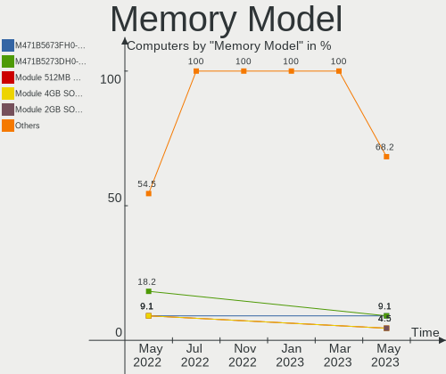

| Model                                                  | Computers | Percent |
|--------------------------------------------------------|-----------|---------|
| Corsair RAM CMK64GX5M2B5200C40 32GB DIMM DDR5 4800MT/s | 1         | 100%    |

Memory Kind
-----------

Memory module kinds

| Kind | Computers | Percent |
|------|-----------|---------|
| DDR5 | 1         | 100%    |

Memory Form Factor
------------------

Physical design of the memory module

| Name | Computers | Percent |
|------|-----------|---------|
| DIMM | 1         | 100%    |

Memory Size
-----------

Memory module size

| Size  | Computers | Percent |
|-------|-----------|---------|
| 32768 | 1         | 100%    |

Memory Speed
------------

Memory module speed

| Speed | Computers | Percent |
|-------|-----------|---------|
| 4800  | 1         | 100%    |

Printers & scanners
-------------------

Printer Vendor
--------------

Printer device vendors

Zero info for selected period =(

Printer Model
-------------

Printer device models

Zero info for selected period =(

Scanner Vendor
--------------

Scanner device vendors

Zero info for selected period =(

Scanner Model
-------------

Scanner device models

Zero info for selected period =(

Camera
------

Camera Vendor
-------------

Camera device vendors

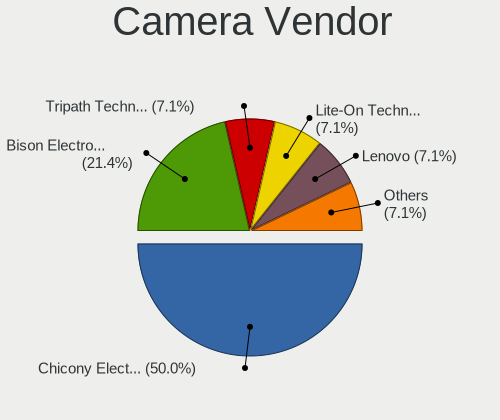

| Vendor                                 | Computers | Percent |
|----------------------------------------|-----------|---------|
| Tripath Technology                     | 1         | 14.29%  |
| Realtek Semiconductor                  | 1         | 14.29%  |
| Microdia                               | 1         | 14.29%  |
| IMC Networks                           | 1         | 14.29%  |
| Chicony Electronics                    | 1         | 14.29%  |
| Cheng Uei Precision Industry (Foxlink) | 1         | 14.29%  |
| Acer                                   | 1         | 14.29%  |

Camera Model
------------

Camera device models

| Model                                                                      | Computers | Percent |
|----------------------------------------------------------------------------|-----------|---------|
| Tripath PC Camera                                                          | 1         | 12.5%   |
| Realtek Laptop Camera                                                      | 1         | 12.5%   |
| Microdia Ltd., USB 2.0 Camera                                              | 1         | 12.5%   |
| IMC Networks USB2.0 HD IR UVC WebCam                                       | 1         | 12.5%   |
| Chicony HD Webcam                                                          | 1         | 12.5%   |
| Cheng Uei Precision Industry (Foxlink) HP Wide Vision HD Integrated Webcam | 1         | 12.5%   |
| Acer SunplusIT Integrated Camera                                           | 1         | 12.5%   |
| Acer Integrated Camera                                                     | 1         | 12.5%   |

Security
--------

Fingerprint Vendor
------------------

Fingerprint sensor vendors

| Vendor    | Computers | Percent |
|-----------|-----------|---------|
| Synaptics | 1         | 50%     |
| AuthenTec | 1         | 50%     |

Fingerprint Model
-----------------

Fingerprint sensor models

| Model                                                     | Computers | Percent |
|-----------------------------------------------------------|-----------|---------|
| Synaptics  FS7604 Touch Fingerprint Sensor with PurePrint | 1         | 50%     |
| AuthenTec AES2810                                         | 1         | 50%     |

Chipcard Vendor
---------------

Chipcard module vendors

Zero info for selected period =(

Chipcard Model
--------------

Chipcard module models

Zero info for selected period =(

Unsupported
-----------

Unsupported Devices
-------------------

Total unsupported devices on board

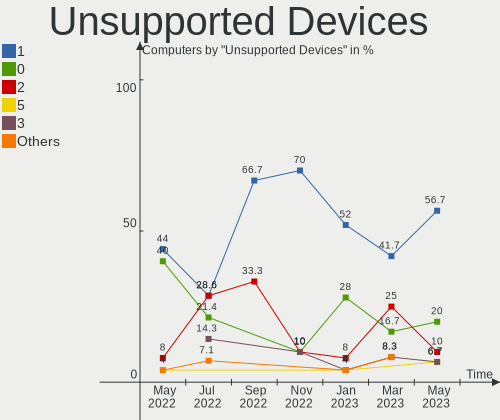

| Total | Computers | Percent |
|-------|-----------|---------|
| 1     | 10        | 45.45%  |
| 0     | 6         | 27.27%  |
| 2     | 5         | 22.73%  |
| 5     | 1         | 4.55%   |

Unsupported Device Types
------------------------

Types of unsupported devices

| Type                     | Computers | Percent |
|--------------------------|-----------|---------|
| Communication controller | 11        | 47.83%  |
| Graphics card            | 4         | 17.39%  |
| Net/wireless             | 3         | 13.04%  |
| Storage/ata              | 2         | 8.7%    |
| Sound                    | 2         | 8.7%    |
| Network                  | 1         | 4.35%   |

