OpenBSD Hardware Trends
-----------------------

A project to identify most popular hardware characteristics and track their change
over time based on data collected by OpenBSD users at https://BSD-Hardware.info.

Anyone can contribute to the study by uploading probes of their computers by
the [hw-probe](https://github.com/linuxhw/hw-probe/blob/master/INSTALL.BSD.md) tool:

    hw-probe -all -upload

This is a report for all computer types. See also reports for [desktops](/Dist/OpenBSD/Desktop/README.md) and [notebooks](/Dist/OpenBSD/Notebook/README.md).

Full-feature report is available here: https://bsd-hardware.info/?view=trends

Period: Oct, 2020.

Contents
--------

- [ OS                       ](#os)
- [ OS Family                ](#os-family)
- [ Arch                     ](#arch)
- [ DE                       ](#de)
- [ Display Server           ](#display-server)
- [ Display Manager          ](#display-manager)
- [ OS Lang                  ](#os-lang)
- [ Boot Mode                ](#boot-mode)
- [ Filesystem               ](#filesystem)
- [ Part. scheme             ](#part-scheme)
- [ Country                  ](#country)
- [ City                     ](#city)
- [ Vendor                   ](#vendor)
- [ Model                    ](#model)
- [ Model Family             ](#model-family)
- [ MFG Year                 ](#mfg-year)
- [ Form Factor              ](#form-factor)
- [ Coreboot                 ](#coreboot)
- [ RAM Size                 ](#ram-size)
- [ RAM Used                 ](#ram-used)
- [ Has CD-ROM               ](#has-cd-rom)
- [ Total Drives             ](#total-drives)
- [ Has Ethernet             ](#has-ethernet)
- [ Drive Vendor             ](#drive-vendor)
- [ HDD Vendor               ](#hdd-vendor)
- [ SSD Vendor               ](#ssd-vendor)
- [ Drive Model              ](#drive-model)
- [ Drive Kind               ](#drive-kind)
- [ Drive Connector          ](#drive-connector)
- [ Drive Size               ](#drive-size)
- [ Space Total              ](#space-total)
- [ Space Used               ](#space-used)
- [ Malfunc. Drives          ](#malfunc-drives)
- [ Malfunc. Drive Vendor    ](#malfunc-drive-vendor)
- [ Malfunc. HDD Vendor      ](#malfunc-hdd-vendor)
- [ Malfunc. Drive Kind      ](#malfunc-drive-kind)
- [ Failed Drives            ](#failed-drives)
- [ Failed Drive Vendor      ](#failed-drive-vendor)
- [ Drive Status             ](#drive-status)
- [ Storage Vendor           ](#storage-vendor)
- [ Storage Model            ](#storage-model)
- [ Storage Kind             ](#storage-kind)
- [ CPU Vendor               ](#cpu-vendor)
- [ CPU Model                ](#cpu-model)
- [ CPU Model Family         ](#cpu-model-family)
- [ CPU Cores                ](#cpu-cores)
- [ CPU Sockets              ](#cpu-sockets)
- [ CPU Threads              ](#cpu-threads)
- [ CPU Microarch            ](#cpu-microarch)
- [ GPU Vendor               ](#gpu-vendor)
- [ GPU Model                ](#gpu-model)
- [ GPU Combo                ](#gpu-combo)
- [ GPU Driver               ](#gpu-driver)
- [ GPU Memory               ](#gpu-memory)
- [ Monitor Vendor           ](#monitor-vendor)
- [ Monitor Model            ](#monitor-model)
- [ Monitor Resolution       ](#monitor-resolution)
- [ Monitor Diagonal         ](#monitor-diagonal)
- [ Monitor Width            ](#monitor-width)
- [ Aspect Ratio             ](#aspect-ratio)
- [ Monitor Area             ](#monitor-area)
- [ Pixel Density            ](#pixel-density)
- [ Multiple Monitors        ](#multiple-monitors)
- [ Net Controller Vendor    ](#net-controller-vendor)
- [ Net Controller Model     ](#net-controller-model)
- [ Wireless Vendor          ](#wireless-vendor)
- [ Wireless Model           ](#wireless-model)
- [ Ethernet Vendor          ](#ethernet-vendor)
- [ Ethernet Model           ](#ethernet-model)
- [ Net Controller Kind      ](#net-controller-kind)
- [ Used Controller          ](#used-controller)
- [ NICs                     ](#nics)
- [ Memory Vendor            ](#memory-vendor)
- [ Memory Model             ](#memory-model)
- [ Memory Kind              ](#memory-kind)
- [ Memory Form Factor       ](#memory-form-factor)
- [ Memory Size              ](#memory-size)
- [ Memory Speed             ](#memory-speed)
- [ Sound Vendor             ](#sound-vendor)
- [ Sound Model              ](#sound-model)
- [ Camera Vendor            ](#camera-vendor)
- [ Camera Model             ](#camera-model)
- [ Fingerprint Vendor       ](#fingerprint-vendor)
- [ Fingerprint Model        ](#fingerprint-model)
- [ Chipcard Vendor          ](#chipcard-vendor)
- [ Chipcard Model           ](#chipcard-model)
- [ Printer Vendor           ](#printer-vendor)
- [ Printer Model            ](#printer-model)
- [ Scanner Vendor           ](#scanner-vendor)
- [ Scanner Model            ](#scanner-model)
- [ Bluetooth Vendor         ](#bluetooth-vendor)
- [ Bluetooth Model          ](#bluetooth-model)
- [ Unsupported Devices      ](#unsupported-devices)
- [ Unsupported Device Types ](#unsupported-device-types)

OS
--

Installed operating systems

| Name        | Computers | Percent |
|-------------|-----------|---------|
| OpenBSD 6.8 | 119       | 100%    |

OS Family
---------

OS without a version

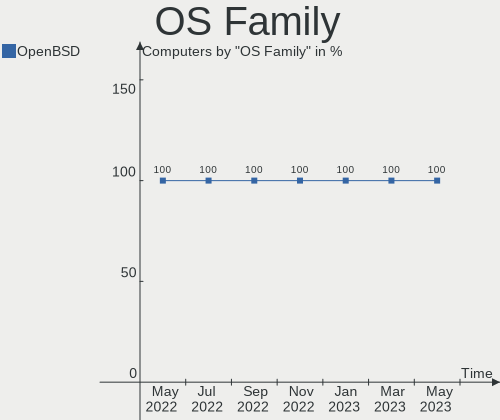

| Name    | Computers | Percent |
|---------|-----------|---------|
| OpenBSD | 119       | 100%    |

Arch
----

OS architecture (x86_64, i586, etc.)

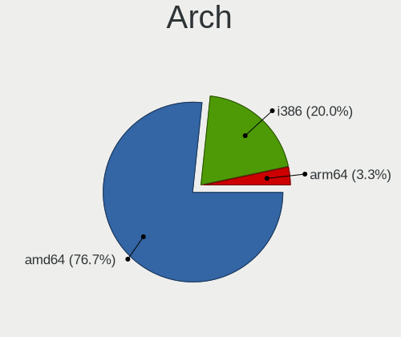

| Name   | Computers | Percent |
|--------|-----------|---------|
| amd64  | 108       | 90.76%  |
| i386   | 10        | 8.4%    |
| macppc | 1         | 0.84%   |

DE
--

Desktop Environment

| Name    | Computers | Percent |
|---------|-----------|---------|
| fvwm    | 72        | 60.5%   |
| Console | 46        | 38.66%  |
| XFCE    | 1         | 0.84%   |

Display Server
--------------

X11 or Wayland

| Name    | Computers | Percent |
|---------|-----------|---------|
| X11     | 62        | 52.1%   |
| Console | 57        | 47.9%   |

Display Manager
---------------

SDDM, LightDM, etc.

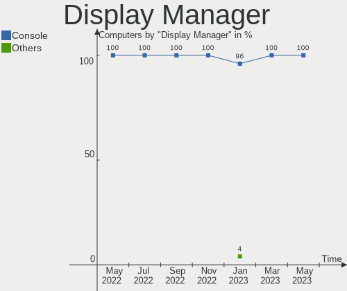

| Name    | Computers | Percent |
|---------|-----------|---------|
| Console | 108       | 90.76%  |
| GDM     | 7         | 5.88%   |
| SLiM    | 4         | 3.36%   |

OS Lang
-------

Language

| Lang    | Computers | Percent |
|---------|-----------|---------|
| Unknown | 100       | 84.03%  |
| en_US   | 7         | 5.88%   |
| ru_RU   | 5         | 4.2%    |
| en_GB   | 2         | 1.68%   |
| en_AU   | 2         | 1.68%   |
| pl_PL   | 1         | 0.84%   |
| ja_JP   | 1         | 0.84%   |
| es_ES   | 1         | 0.84%   |

Boot Mode
---------

EFI or BIOS

| Mode | Computers | Percent |
|------|-----------|---------|
| BIOS | 80        | 67.23%  |
| EFI  | 39        | 32.77%  |

Filesystem
----------

Type of filesystem

| Type | Computers | Percent |
|------|-----------|---------|
| Ufs  | 119       | 100%    |

Part. scheme
------------

Scheme of partitioning

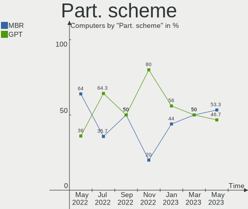

| Type | Computers | Percent |
|------|-----------|---------|
| MBR  | 84        | 70.59%  |
| GPT  | 35        | 29.41%  |

Country
-------

Geographic location (country)

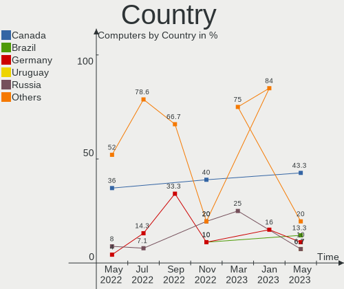

| Country              | Computers | Percent |
|----------------------|-----------|---------|
| Germany              | 19        | 15.97%  |
| Russia               | 15        | 12.61%  |
| USA                  | 14        | 11.76%  |
| France               | 11        | 9.24%   |
| Netherlands          | 8         | 6.72%   |
| Canada               | 7         | 5.88%   |
| Spain                | 6         | 5.04%   |
| UK                   | 4         | 3.36%   |
| Austria              | 4         | 3.36%   |
| Norway               | 3         | 2.52%   |
| Italy                | 3         | 2.52%   |
| Switzerland          | 2         | 1.68%   |
| Poland               | 2         | 1.68%   |
| Japan                | 2         | 1.68%   |
| Finland              | 2         | 1.68%   |
| Denmark              | 2         | 1.68%   |
| Croatia              | 2         | 1.68%   |
| Australia            | 2         | 1.68%   |
| UAE                  | 1         | 0.84%   |
| Sweden               | 1         | 0.84%   |
| Slovenia             | 1         | 0.84%   |
| Saudi Arabia         | 1         | 0.84%   |
| New Zealand          | 1         | 0.84%   |
| Moldova, Republic of | 1         | 0.84%   |
| Latvia               | 1         | 0.84%   |
| Estonia              | 1         | 0.84%   |
| Czech Republic       | 1         | 0.84%   |
| Bulgaria             | 1         | 0.84%   |
| Brazil               | 1         | 0.84%   |

City
----

Geographic location (city)

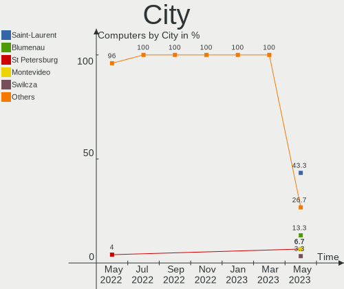

| City                  | Computers | Percent |
|-----------------------|-----------|---------|
| Moscow                | 7         | 5.88%   |
| Utrecht               | 6         | 5.04%   |
| Vladivostok           | 5         | 4.2%    |
| Montreal              | 5         | 4.2%    |
| Ibiza Town            | 4         | 3.36%   |
| Vienna                | 3         | 2.52%   |
| Berlin                | 3         | 2.52%   |
| Zagreb                | 2         | 1.68%   |
| Sydney                | 2         | 1.68%   |
| Skien                 | 2         | 1.68%   |
| Saint-Herblain        | 2         | 1.68%   |
| Paris                 | 2         | 1.68%   |
| Odense                | 2         | 1.68%   |
| Leipzig               | 2         | 1.68%   |
| Grenoble              | 2         | 1.68%   |
| Erding                | 2         | 1.68%   |
| České Budějovice   | 1         | 0.84%   |
| Zurich                | 1         | 0.84%   |
| Zhukovskiy            | 1         | 0.84%   |
| Zerkow                | 1         | 0.84%   |
| Wolmirstedt           | 1         | 0.84%   |
| Wetzlar               | 1         | 0.84%   |
| Waukesha              | 1         | 0.84%   |
| Wackersberg           | 1         | 0.84%   |
| Vantaa                | 1         | 0.84%   |
| Tyreso Strand         | 1         | 0.84%   |
| Tustin                | 1         | 0.84%   |
| Turin                 | 1         | 0.84%   |
| Taufkirchen           | 1         | 0.84%   |
| Tallinn               | 1         | 0.84%   |
| Stezzano              | 1         | 0.84%   |
| St Petersburg         | 1         | 0.84%   |
| Sofia                 | 1         | 0.84%   |
| Sencur                | 1         | 0.84%   |
| Seattle               | 1         | 0.84%   |
| Saint Michael         | 1         | 0.84%   |
| Sagamihara            | 1         | 0.84%   |
| Roubaix               | 1         | 0.84%   |
| Rosny-sous-Bois       | 1         | 0.84%   |
| Riga                  | 1         | 0.84%   |
| Porto Alegre          | 1         | 0.84%   |
| Phoenix               | 1         | 0.84%   |
| Peterborough          | 1         | 0.84%   |
| Oxenhope              | 1         | 0.84%   |
| Oviedo                | 1         | 0.84%   |
| Oslo                  | 1         | 0.84%   |
| Osaka                 | 1         | 0.84%   |
| Nérac                | 1         | 0.84%   |
| Nuremberg             | 1         | 0.84%   |
| Notaresco             | 1         | 0.84%   |
| New Brighton          | 1         | 0.84%   |
| Milwaukee             | 1         | 0.84%   |
| Ludwigshafen am Rhein | 1         | 0.84%   |
| Liverpool             | 1         | 0.84%   |
| Lebanon               | 1         | 0.84%   |
| Lausanne              | 1         | 0.84%   |
| Krakow                | 1         | 0.84%   |
| Kouvola               | 1         | 0.84%   |
| Katy                  | 1         | 0.84%   |
| Karlsruhe             | 1         | 0.84%   |

Vendor
------

Motherboard manufacturer

| Name                           | Computers | Percent |
|--------------------------------|-----------|---------|
| Lenovo                         | 28        | 23.53%  |
| PC Engines                     | 18        | 15.13%  |
| Dell                           | 13        | 10.92%  |
| ASUSTek Computer               | 11        | 9.24%   |
| Intel                          | 7         | 5.88%   |
| ASRock                         | 5         | 4.2%    |
| Unknown                        | 5         | 4.2%    |
| Apple                          | 4         | 3.36%   |
| IBM                            | 3         | 2.52%   |
| Hewlett-Packard                | 3         | 2.52%   |
| Gigabyte Technology            | 3         | 2.52%   |
| Acer                           | 3         | 2.52%   |
| Supermicro                     | 2         | 1.68%   |
| Panasonic                      | 2         | 1.68%   |
| MSI                            | 2         | 1.68%   |
| ZOTAC                          | 1         | 0.84%   |
| Shuttle                        | 1         | 0.84%   |
| NA                             | 1         | 0.84%   |
| Matsushita Electric Industrial | 1         | 0.84%   |
| Foxconn                        | 1         | 0.84%   |
| eMachines                      | 1         | 0.84%   |
| ECS                            | 1         | 0.84%   |
| Bluechip Computer              | 1         | 0.84%   |
| AZW                            | 1         | 0.84%   |
| Alienware                      | 1         | 0.84%   |

Model
-----

Motherboard model

| Name                                        | Computers | Percent |
|---------------------------------------------|-----------|---------|
| PC Engines APU2                             | 11        | 9.24%   |
| Unknown                                     | 6         | 5.04%   |
| Dell PowerEdge R620                         | 4         | 3.36%   |
| PC Engines apu4                             | 3         | 2.52%   |
| PC Engines apu1                             | 3         | 2.52%   |
| Lenovo ThinkPad X1 Carbon 3rd 20BSCTO1WW    | 2         | 1.68%   |
| ZOTAC XXXXXX                                | 1         | 0.84%   |
| Supermicro X8STi                            | 1         | 0.84%   |
| Supermicro X11SSW-F                         | 1         | 0.84%   |
| Shuttle DS77U                               | 1         | 0.84%   |
| PC Engines APU                              | 1         | 0.84%   |
| Panasonic CF-C1BT02EGE                      | 1         | 0.84%   |
| Panasonic CF-52PFPBSFQ                      | 1         | 0.84%   |
| MSI MS-7816                                 | 1         | 0.84%   |
| MSI MS-7345                                 | 1         | 0.84%   |
| Matsushita Electric Industrial CF-51RCVDNLM | 1         | 0.84%   |
| Lenovo ThinkPad X60s 17033JM                | 1         | 0.84%   |
| Lenovo ThinkPad X270 20HNA004CD             | 1         | 0.84%   |
| Lenovo ThinkPad X250 20CLS4WV08             | 1         | 0.84%   |
| Lenovo ThinkPad X240 20AMS2QD0C             | 1         | 0.84%   |
| Lenovo ThinkPad X240 20AL00DKRT             | 1         | 0.84%   |
| Lenovo ThinkPad X230 2325Y36                | 1         | 0.84%   |
| Lenovo ThinkPad X230 2325R74                | 1         | 0.84%   |
| Lenovo ThinkPad X230 2325AJ9                | 1         | 0.84%   |
| Lenovo ThinkPad X1 Carbon 5th 20HRCTO1WW    | 1         | 0.84%   |
| Lenovo ThinkPad X1 Carbon 2nd 20A7002CUK    | 1         | 0.84%   |
| Lenovo ThinkPad W540 20BG001KUK             | 1         | 0.84%   |
| Lenovo ThinkPad W530 2436CTO                | 1         | 0.84%   |
| Lenovo ThinkPad T560 20FJS0CE00             | 1         | 0.84%   |
| Lenovo ThinkPad T500 2087A16                | 1         | 0.84%   |
| Lenovo ThinkPad T480 20L6S4GR02             | 1         | 0.84%   |
| Lenovo ThinkPad T460 20FMS1BC01             | 1         | 0.84%   |
| Lenovo ThinkPad T450 20BV0005US             | 1         | 0.84%   |
| Lenovo ThinkPad T430 2347GZU                | 1         | 0.84%   |
| Lenovo ThinkPad T410 2537N24                | 1         | 0.84%   |
| Lenovo ThinkPad S5-S540 20B3001XFR          | 1         | 0.84%   |
| Lenovo ThinkPad Edge E531 68852HG           | 1         | 0.84%   |
| Lenovo ThinkPad E485 20KUCTO1WW             | 1         | 0.84%   |
| Lenovo ThinkCentre M93p 10AAS1MD00          | 1         | 0.84%   |
| Lenovo IdeaPad 1 14IGL05 81VU               | 1         | 0.84%   |
| Lenovo G50-80 80E5                          | 1         | 0.84%   |
| Lenovo 3000 N100 0768B9G                    | 1         | 0.84%   |
| Intel S3000AH                               | 1         | 0.84%   |
| Intel NUC7i5BNH                             | 1         | 0.84%   |
| Intel NUC5i3RYB                             | 1         | 0.84%   |
| Intel NUC5CPYB                              | 1         | 0.84%   |
| Intel D945GCLF2                             | 1         | 0.84%   |
| Intel D2500HN                               | 1         | 0.84%   |
| Intel CRESCENTBAY                           | 1         | 0.84%   |
| IBM ThinkPad X41 2525F8G                    | 1         | 0.84%   |
| IBM 81832BG                                 | 1         | 0.84%   |
| IBM 8173KUB                                 | 1         | 0.84%   |
| HP ProLiant MicroServer                     | 1         | 0.84%   |
| HP OmniBook PC                              | 1         | 0.84%   |
| HP 120-1136                                 | 1         | 0.84%   |
| Gigabyte X58A-UD5                           | 1         | 0.84%   |
| Gigabyte X570 AORUS ELITE                   | 1         | 0.84%   |
| Gigabyte GA-MA770T-UD3P                     | 1         | 0.84%   |
| Foxconn AT-7000 Series                      | 1         | 0.84%   |
| eMachines EL1200                            | 1         | 0.84%   |

Model Family
------------

Motherboard model prefix

| Name                                        | Computers | Percent |
|---------------------------------------------|-----------|---------|
| Lenovo ThinkPad                             | 24        | 20.17%  |
| PC Engines APU2                             | 11        | 9.24%   |
| Dell PowerEdge                              | 8         | 6.72%   |
| Unknown                                     | 6         | 5.04%   |
| PC Engines apu4                             | 3         | 2.52%   |
| PC Engines apu1                             | 3         | 2.52%   |
| Dell Precision                              | 2         | 1.68%   |
| Dell OptiPlex                               | 2         | 1.68%   |
| ASUS VivoBook                               | 2         | 1.68%   |
| ASUS PRIME                                  | 2         | 1.68%   |
| ZOTAC XXXXXX                                | 1         | 0.84%   |
| Supermicro X8STi                            | 1         | 0.84%   |
| Supermicro X11SSW-F                         | 1         | 0.84%   |
| Shuttle DS77U                               | 1         | 0.84%   |
| PC Engines APU                              | 1         | 0.84%   |
| Panasonic CF-C1BT02EGE                      | 1         | 0.84%   |
| Panasonic CF-52PFPBSFQ                      | 1         | 0.84%   |
| MSI MS-7816                                 | 1         | 0.84%   |
| MSI MS-7345                                 | 1         | 0.84%   |
| Matsushita Electric Industrial CF-51RCVDNLM | 1         | 0.84%   |
| Lenovo ThinkCentre                          | 1         | 0.84%   |
| Lenovo IdeaPad                              | 1         | 0.84%   |
| Lenovo G50-80                               | 1         | 0.84%   |
| Lenovo 3000                                 | 1         | 0.84%   |
| Intel S3000AH                               | 1         | 0.84%   |
| Intel NUC7i5BNH                             | 1         | 0.84%   |
| Intel NUC5i3RYB                             | 1         | 0.84%   |
| Intel NUC5CPYB                              | 1         | 0.84%   |
| Intel D945GCLF2                             | 1         | 0.84%   |
| Intel D2500HN                               | 1         | 0.84%   |
| Intel CRESCENTBAY                           | 1         | 0.84%   |
| IBM ThinkPad                                | 1         | 0.84%   |
| IBM 81832BG                                 | 1         | 0.84%   |
| IBM 8173KUB                                 | 1         | 0.84%   |
| HP ProLiant                                 | 1         | 0.84%   |
| HP OmniBook                                 | 1         | 0.84%   |
| HP 120-1136                                 | 1         | 0.84%   |
| Gigabyte X58A-UD5                           | 1         | 0.84%   |
| Gigabyte X570                               | 1         | 0.84%   |
| Gigabyte GA-MA770T-UD3P                     | 1         | 0.84%   |
| Foxconn AT-7000                             | 1         | 0.84%   |
| eMachines EL1200                            | 1         | 0.84%   |
| ECS BSWI-D2                                 | 1         | 0.84%   |
| Dell Latitude                               | 1         | 0.84%   |
| Bluechip Computer bluechip                  | 1         | 0.84%   |
| AZW Z83                                     | 1         | 0.84%   |
| ASUS Z170-K                                 | 1         | 0.84%   |
| ASUS X102BA                                 | 1         | 0.84%   |
| ASUS P10S-I                                 | 1         | 0.84%   |
| ASUS K53SV                                  | 1         | 0.84%   |
| ASUS G551JW                                 | 1         | 0.84%   |
| ASUS B75M-A                                 | 1         | 0.84%   |
| ASUS 1000HE                                 | 1         | 0.84%   |
| ASRock N68C-S                               | 1         | 0.84%   |
| ASRock N3160                                | 1         | 0.84%   |
| ASRock IMB-191                              | 1         | 0.84%   |
| ASRock DN2800MT                             | 1         | 0.84%   |
| ASRock A75M-ITX                             | 1         | 0.84%   |
| Apple PowerBook6                            | 1         | 0.84%   |
| Apple Macmini7                              | 1         | 0.84%   |

MFG Year
--------

Motherboard manufacture year

| Year    | Computers | Percent |
|---------|-----------|---------|
| 2019    | 22        | 18.49%  |
| 2020    | 19        | 15.97%  |
| 2013    | 10        | 8.4%    |
| 2018    | 9         | 7.56%   |
| 2017    | 7         | 5.88%   |
| 2015    | 7         | 5.88%   |
| Unknown | 7         | 5.88%   |
| 2016    | 6         | 5.04%   |
| 2011    | 6         | 5.04%   |
| 2012    | 5         | 4.2%    |
| 2010    | 4         | 3.36%   |
| 2008    | 4         | 3.36%   |
| 2014    | 3         | 2.52%   |
| 2007    | 3         | 2.52%   |
| 2006    | 3         | 2.52%   |
| 2009    | 1         | 0.84%   |
| 2005    | 1         | 0.84%   |
| 2004    | 1         | 0.84%   |
| 2003    | 1         | 0.84%   |

Form Factor
-----------

Physical design of the computer

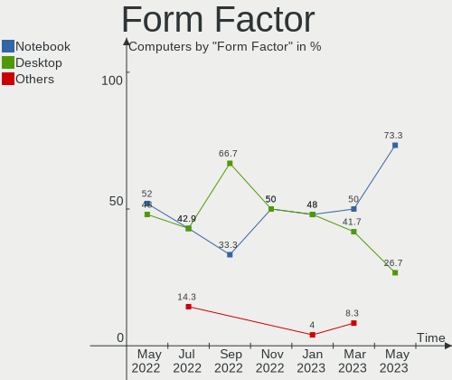

| Name     | Computers | Percent |
|----------|-----------|---------|
| Desktop  | 103       | 86.55%  |
| Notebook | 12        | 10.08%  |
| Mini pc  | 4         | 3.36%   |

Coreboot
--------

Have coreboot on board

| Used | Computers | Percent |
|------|-----------|---------|
| No   | 101       | 84.87%  |
| Yes  | 18        | 15.13%  |

RAM Size
--------

Total RAM memory

| Size in GB      | Computers | Percent |
|-----------------|-----------|---------|
| 4.01-8.0        | 28        | 23.53%  |
| 8.01-16.0       | 28        | 23.53%  |
| 16.01-24.0      | 12        | 10.08%  |
| 3.01-4.0        | 10        | 8.4%    |
| 32.01-64.0      | 9         | 7.56%   |
| 2.01-3.0        | 7         | 5.88%   |
| 1.01-2.0        | 7         | 5.88%   |
| 0.01-1.0        | 7         | 5.88%   |
| 64.01-256.0     | 5         | 4.2%    |
| 24.01-32.0      | 4         | 3.36%   |
| More than 256.0 | 1         | 0.84%   |
| Unknown         | 1         | 0.84%   |

RAM Used
--------

Used RAM memory

| Used GB   | Computers | Percent |
|-----------|-----------|---------|
| 0.01-1.0  | 102       | 85.71%  |
| 0         | 9         | 7.56%   |
| 4.01-8.0  | 3         | 2.52%   |
| 1.01-2.0  | 3         | 2.52%   |
| 8.01-16.0 | 1         | 0.84%   |
| Unknown   | 1         | 0.84%   |

Has CD-ROM
----------

Has CD-ROM on board

| Presented | Computers | Percent |
|-----------|-----------|---------|
| No        | 119       | 100%    |

Total Drives
------------

Number of drives on board

| Drives | Computers | Percent |
|--------|-----------|---------|
| 1      | 70        | 58.82%  |
| 2      | 30        | 25.21%  |
| 3      | 10        | 8.4%    |
| 4      | 6         | 5.04%   |
| 10     | 1         | 0.84%   |
| 7      | 1         | 0.84%   |
| 5      | 1         | 0.84%   |

Has Ethernet
------------

Has Ethernet on board

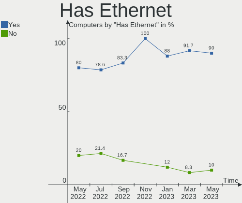

| Presented | Computers | Percent |
|-----------|-----------|---------|
| Yes       | 112       | 94.12%  |
| No        | 7         | 5.88%   |

Drive Vendor
------------

Hard drive vendors

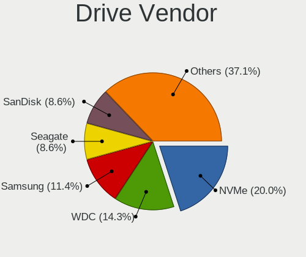

| Vendor              | Computers | Drives | Percent |
|---------------------|-----------|--------|---------|
| WDC                 | 24        | 31     | 15.58%  |
| Samsung Electronics | 18        | 21     | 11.69%  |
| Kingston            | 15        | 15     | 9.74%   |
| Seagate             | 14        | 20     | 9.09%   |
| NVMe                | 12        | 14     | 7.79%   |
| Phison              | 9         | 9      | 5.84%   |
| SanDisk             | 8         | 8      | 5.19%   |
| Dell                | 6         | 10     | 3.9%    |
| Crucial             | 6         | 6      | 3.9%    |
| Transcend           | 5         | 5      | 3.25%   |
| HGST                | 5         | 5      | 3.25%   |
| OPENBSD             | 4         | 4      | 2.6%    |
| Intel               | 4         | 4      | 2.6%    |
| Hitachi             | 4         | 4      | 2.6%    |
| Apple               | 3         | 3      | 1.95%   |
| PNY                 | 2         | 2      | 1.3%    |
| Generic             | 2         | 2      | 1.3%    |
| Toshiba             | 1         | 1      | 0.65%   |
| SK Hynix            | 1         | 1      | 0.65%   |
| SABRENT             | 1         | 1      | 0.65%   |
| QUMO                | 1         | 1      | 0.65%   |
| OCZ                 | 1         | 1      | 0.65%   |
| LSI                 | 1         | 1      | 0.65%   |
| LITEONIT            | 1         | 1      | 0.65%   |
| LITEON              | 1         | 1      | 0.65%   |
| IBM                 | 1         | 1      | 0.65%   |
| Hoodisk             | 1         | 1      | 0.65%   |
| Dogfish             | 1         | 1      | 0.65%   |
| Apacer              | 1         | 1      | 0.65%   |
| A-DATA Technology   | 1         | 1      | 0.65%   |

HDD Vendor
----------

Hard disk drive vendors

| Vendor              | Computers | Drives | Percent |
|---------------------|-----------|--------|---------|
| WDC                 | 21        | 28     | 30%     |
| Seagate             | 14        | 20     | 20%     |
| NVMe                | 7         | 8      | 10%     |
| Dell                | 6         | 10     | 8.57%   |
| HGST                | 5         | 5      | 7.14%   |
| OPENBSD             | 4         | 4      | 5.71%   |
| Hitachi             | 4         | 4      | 5.71%   |
| Samsung Electronics | 3         | 4      | 4.29%   |
| Generic             | 2         | 2      | 2.86%   |
| Toshiba             | 1         | 1      | 1.43%   |
| SABRENT             | 1         | 1      | 1.43%   |
| IBM                 | 1         | 1      | 1.43%   |
| Apple               | 1         | 1      | 1.43%   |

SSD Vendor
----------

Solid state drive vendors

| Vendor              | Computers | Drives | Percent |
|---------------------|-----------|--------|---------|
| Samsung Electronics | 15        | 17     | 17.65%  |
| Kingston            | 15        | 15     | 17.65%  |
| Phison              | 9         | 9      | 10.59%  |
| SanDisk             | 8         | 8      | 9.41%   |
| NVMe                | 6         | 6      | 7.06%   |
| Crucial             | 6         | 6      | 7.06%   |
| Transcend           | 5         | 5      | 5.88%   |
| Intel               | 4         | 4      | 4.71%   |
| WDC                 | 3         | 3      | 3.53%   |
| PNY                 | 2         | 2      | 2.35%   |
| Apple               | 2         | 2      | 2.35%   |
| SK Hynix            | 1         | 1      | 1.18%   |
| QUMO                | 1         | 1      | 1.18%   |
| OCZ                 | 1         | 1      | 1.18%   |
| LSI                 | 1         | 1      | 1.18%   |
| LITEONIT            | 1         | 1      | 1.18%   |
| LITEON              | 1         | 1      | 1.18%   |
| Hoodisk             | 1         | 1      | 1.18%   |
| Dogfish             | 1         | 1      | 1.18%   |
| Apacer              | 1         | 1      | 1.18%   |
| A-DATA Technology   | 1         | 1      | 1.18%   |

Drive Model
-----------

Hard drive models

| Model                       | Computers | Percent |
|-----------------------------|-----------|---------|
| SATA SSD 16GB               | 8         | 4.88%   |
| PERC H710 2.9TB             | 4         | 2.44%   |
| SR RAID 1 2TB               | 3         | 1.83%   |
| Samsung SSD 970 250GB       | 3         | 1.83%   |
| HUS724020ALA640 2TB         | 3         | 1.83%   |
| SUV500MS240G 240GB          | 2         | 1.22%   |
| SUV500MS120G 120GB          | 2         | 1.22%   |
| SUV500240G 240GB            | 2         | 1.22%   |
| ST1000LM024 HN-M101MBB 1TB  | 2         | 1.22%   |
| SSD U110 16GB               | 2         | 1.22%   |
| SSD 860 EVO 2TB             | 2         | 1.22%   |
| SSD 850 EVO 500GB           | 2         | 1.22%   |
| SSD 64GB                    | 2         | 1.22%   |
| SMS200S360G 64GB            | 2         | 1.22%   |
| SA400S37240G 240GB          | 2         | 1.22%   |
| CT1000MX500SSD1 1TB         | 2         | 1.22%   |
| X400 M.2 2280 512GB         | 1         | 0.61%   |
| WDS500G2B0A-00SM50 500GB    | 1         | 0.61%   |
| WDS240G2G0A-00JH30 240GB    | 1         | 0.61%   |
| WDC PC SN520 SDA 512GB      | 1         | 0.61%   |
| WDBNCE5000PNC 500GB         | 1         | 0.61%   |
| WD7500BPKX-00HPJT0 752GB    | 1         | 0.61%   |
| WD7500BPKT-00PK4T0 752GB    | 1         | 0.61%   |
| WD5000LPLX-00ZNTT0 500GB    | 1         | 0.61%   |
| WD5000LPCX-21VHAT0 500GB    | 1         | 0.61%   |
| WD5000BPKX-00HPJT0 500GB    | 1         | 0.61%   |
| WD5000AAKX-603CA0 500GB     | 1         | 0.61%   |
| WD5000AAKS-00UU3A0 500GB    | 1         | 0.61%   |
| WD5000AAKS-00D2B0 500GB     | 1         | 0.61%   |
| WD3200BEVE-00A0HT0 320GB    | 1         | 0.61%   |
| WD30EZRZ-00Z5HB0 3TB        | 1         | 0.61%   |
| WD30EZRZ-00GXCB0 3TB        | 1         | 0.61%   |
| WD2500BEVT-22A23T0 250GB    | 1         | 0.61%   |
| WD20PURX-64P6ZY0 2TB        | 1         | 0.61%   |
| WD20EFAX-68FB5N0 2TB        | 1         | 0.61%   |
| WD2002FAEX-007BA0 2TB       | 1         | 0.61%   |
| WD2000FYYZ-01UL1B1 2TB      | 1         | 0.61%   |
| WD1600BEVE-00WZT0 160GB     | 1         | 0.61%   |
| WD15EADS-00P8B0 1.5TB       | 1         | 0.61%   |
| WD10SPZX-24Z10 1TB          | 1         | 0.61%   |
| WD10PURX-64D85Y0 1TB        | 1         | 0.61%   |
| WD10JPVX-08JC3T5 1TB        | 1         | 0.61%   |
| WD10JPLX-00MBPT0 1TB        | 1         | 0.61%   |
| WD10JPCX-24UE4T0 1TB        | 1         | 0.61%   |
| WD10EADS-00M2B0 1TB         | 1         | 0.61%   |
| WD Elements 25A2 2TB        | 1         | 0.61%   |
| WD Elements 25A1 3TB        | 1         | 0.61%   |
| VERTEX3 64GB                | 1         | 0.61%   |
| UMIS RPJTJ128MEE 128GB      | 1         | 0.61%   |
| TS64GMSA370 64GB            | 1         | 0.61%   |
| TS512GMSA370 512GB          | 1         | 0.61%   |
| TS32GMSA370 32GB            | 1         | 0.61%   |
| TS256GMTS400 256GB          | 1         | 0.61%   |
| TS240GMTS420S 240GB         | 1         | 0.61%   |
| TOSHIBA-RC100 240GB         | 1         | 0.61%   |
| SV300S37A120G 120GB         | 1         | 0.61%   |
| SUV300S37A240G 240GB        | 1         | 0.61%   |
| ST9500325AS 500GB           | 1         | 0.61%   |
| ST500LM012 HN-M500MBB 500GB | 1         | 0.61%   |
| ST4000DM004-2CV104 4TB      | 1         | 0.61%   |

Drive Kind
----------

HDD or SSD

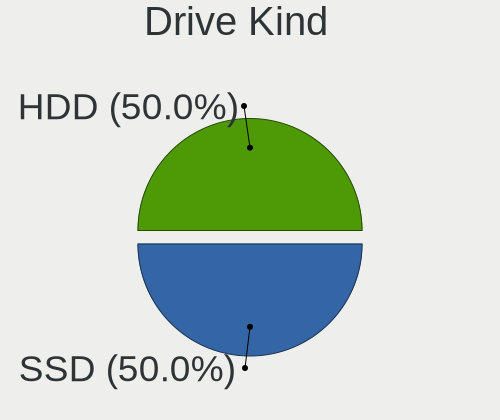

| Kind | Computers | Drives | Percent |
|------|-----------|--------|---------|
| SSD  | 77        | 87     | 57.89%  |
| HDD  | 56        | 89     | 42.11%  |

Drive Connector
---------------

SATA, SAS, NVMe, etc.

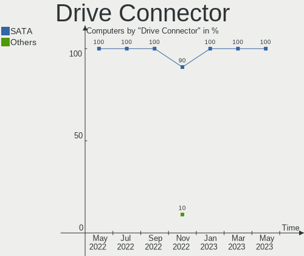

| Type | Computers | Drives | Percent |
|------|-----------|--------|---------|
| SATA | 116       | 176    | 100%    |

Drive Size
----------

Size of hard drive

| Size in TB | Computers | Drives | Percent |
|------------|-----------|--------|---------|
| 0.01-0.5   | 89        | 102    | 63.57%  |
| 0.51-1.0   | 27        | 31     | 19.29%  |
| 1.01-2.0   | 16        | 29     | 11.43%  |
| 2.01-3.0   | 6         | 12     | 4.29%   |
| 3.01-4.0   | 2         | 2      | 1.43%   |

Space Total
-----------

Amount of disk space available on the file system

| Size in GB     | Computers | Percent |
|----------------|-----------|---------|
| 101-250        | 36        | 30.25%  |
| 251-500        | 23        | 19.33%  |
| 1-20           | 15        | 12.61%  |
| 21-50          | 12        | 10.08%  |
| 1001-2000      | 10        | 8.4%    |
| 51-100         | 10        | 8.4%    |
| More than 3000 | 5         | 4.2%    |
| 2001-3000      | 4         | 3.36%   |
| 501-1000       | 4         | 3.36%   |

Space Used
----------

Amount of used disk space

| Used GB        | Computers | Percent |
|----------------|-----------|---------|
| 1-20           | 69        | 57.98%  |
| 21-50          | 14        | 11.76%  |
| 101-250        | 11        | 9.24%   |
| 51-100         | 8         | 6.72%   |
| 251-500        | 6         | 5.04%   |
| 1001-2000      | 5         | 4.2%    |
| 501-1000       | 5         | 4.2%    |
| More than 3000 | 1         | 0.84%   |

Malfunc. Drives
---------------

Drive models with a malfunction

| Model                 | Computers | Drives | Percent |
|-----------------------|-----------|--------|---------|
| WD10SPZX-24Z10 1TB    | 1         | 1      | 7.14%   |
| SV300S37A120G 120GB   | 1         | 1      | 7.14%   |
| ST9500325AS 500GB     | 1         | 1      | 7.14%   |
| ST3750640NS 752GB     | 1         | 2      | 7.14%   |
| ST3120211AS 120GB     | 1         | 1      | 7.14%   |
| SSDSC2BB080G4 80GB    | 1         | 1      | 7.14%   |
| SMSM151S3128GD 128GB  | 1         | 1      | 7.14%   |
| SMS200S330G 32GB      | 1         | 1      | 7.14%   |
| SD7UB3Q256G1001 256GB | 1         | 1      | 7.14%   |
| HTS541010A7E630 1TB   | 1         | 1      | 7.14%   |
| HM500JI 500GB         | 1         | 1      | 7.14%   |
| HDP725016GLA380 160GB | 1         | 1      | 7.14%   |
| HD154UI 1.5TB         | 1         | 1      | 7.14%   |
| DK23AA-12 12GB        | 1         | 1      | 7.14%   |

Malfunc. Drive Vendor
---------------------

Vendors of faulty drives

| Vendor              | Computers | Drives | Percent |
|---------------------|-----------|--------|---------|
| Seagate             | 3         | 4      | 21.43%  |
| Kingston            | 3         | 3      | 21.43%  |
| Samsung Electronics | 2         | 2      | 14.29%  |
| Hitachi             | 2         | 2      | 14.29%  |
| WDC                 | 1         | 1      | 7.14%   |
| SanDisk             | 1         | 1      | 7.14%   |
| Intel               | 1         | 1      | 7.14%   |
| HGST                | 1         | 1      | 7.14%   |

Malfunc. HDD Vendor
-------------------

Vendors of faulty HDD drives

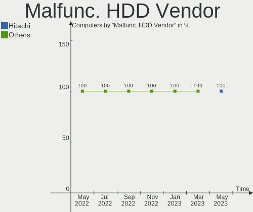

| Vendor              | Computers | Drives | Percent |
|---------------------|-----------|--------|---------|
| Seagate             | 3         | 4      | 33.33%  |
| Samsung Electronics | 2         | 2      | 22.22%  |
| Hitachi             | 2         | 2      | 22.22%  |
| WDC                 | 1         | 1      | 11.11%  |
| HGST                | 1         | 1      | 11.11%  |

Malfunc. Drive Kind
-------------------

Kinds of faulty drives

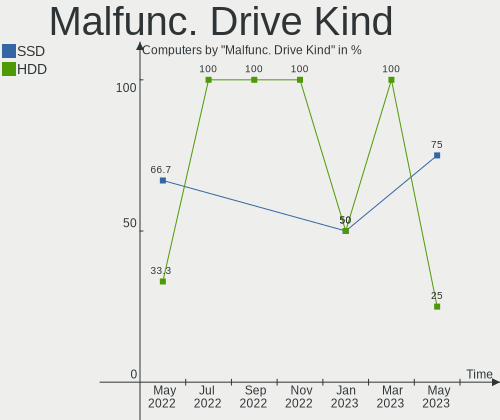

| Kind | Computers | Drives | Percent |
|------|-----------|--------|---------|
| HDD  | 9         | 10     | 64.29%  |
| SSD  | 5         | 5      | 35.71%  |

Failed Drives
-------------

Failed drive models

| Model       | Computers | Drives | Percent |
|-------------|-----------|--------|---------|
| HD204UI 2TB | 1         | 2      | 100%    |

Failed Drive Vendor
-------------------

Failed drive vendors

| Vendor              | Computers | Drives | Percent |
|---------------------|-----------|--------|---------|
| Samsung Electronics | 1         | 2      | 100%    |

Drive Status
------------

Number of failed and malfunc. drives

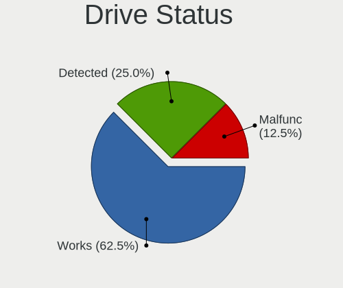

| Status   | Computers | Drives | Percent |
|----------|-----------|--------|---------|
| Works    | 90        | 116    | 68.18%  |
| Detected | 27        | 43     | 20.45%  |
| Malfunc  | 14        | 15     | 10.61%  |
| Failed   | 1         | 2      | 0.76%   |

Storage Vendor
--------------

Storage controller vendors

| Vendor                      | Computers | Percent |
|-----------------------------|-----------|---------|
| Intel                       | 78        | 60%     |
| AMD                         | 30        | 23.08%  |
| Samsung Electronics         | 6         | 4.62%   |
| Broadcom / LSI              | 6         | 4.62%   |
| Toshiba                     | 2         | 1.54%   |
| Nvidia                      | 2         | 1.54%   |
| Union Memory (Shenzhen)     | 1         | 0.77%   |
| Sandisk                     | 1         | 0.77%   |
| Marvell Technology Group    | 1         | 0.77%   |
| Lenovo                      | 1         | 0.77%   |
| Kingston Technology Company | 1         | 0.77%   |
| Dell                        | 1         | 0.77%   |

Storage Model
-------------

Storage controller models

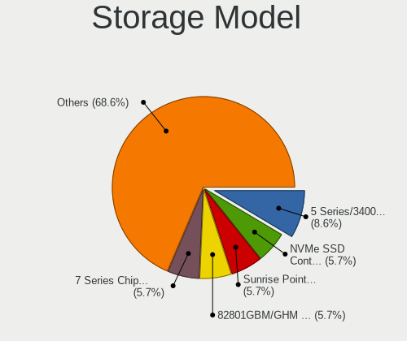

| Model                                                                      | Computers | Percent |
|----------------------------------------------------------------------------|-----------|---------|
| FCH SATA Controller [AHCI mode]                                            | 11        | 7.53%   |
| FCH SATA Controller [IDE mode]                                             | 10        | 6.85%   |
| SB7x0/SB8x0/SB9x0 SATA Controller [AHCI mode]                              | 7         | 4.79%   |
| 7 Series Chipset Family 6-port SATA Controller [AHCI mode]                 | 7         | 4.79%   |
| Wildcat Point-LP SATA Controller [AHCI Mode]                               | 6         | 4.11%   |
| Sunrise Point-LP SATA Controller [AHCI mode]                               | 6         | 4.11%   |
| Q170/Q150/B150/H170/H110/Z170/CM236 Chipset SATA Controller [AHCI Mode]    | 6         | 4.11%   |
| 8 Series/C220 Series Chipset Family 6-port SATA Controller 1 [AHCI mode]   | 6         | 4.11%   |
| 8 Series SATA Controller 1 [AHCI mode]                                     | 5         | 3.42%   |
| MegaRAID SAS 2208 [Thunderbolt]                                            | 4         | 2.74%   |
| C600/X79 series chipset 6-Port SATA AHCI Controller                        | 4         | 2.74%   |
| 82801G (ICH7 Family) IDE Controller                                        | 4         | 2.74%   |
| unknown                                                                    | 3         | 2.05%   |
| SB7x0/SB8x0/SB9x0 IDE Controller                                           | 3         | 2.05%   |
| NVMe SSD Controller SM981/PM981/PM983                                      | 3         | 2.05%   |
| NM10/ICH7 Family SATA Controller [IDE mode]                                | 3         | 2.05%   |
| Atom/Celeron/Pentium Processor x5-E8000/J3xxx/N3xxx Series SATA Controller | 3         | 2.05%   |
| 82801GBM/GHM (ICH7-M Family) SATA Controller [IDE mode]                    | 3         | 2.05%   |
| SSD Pro 7600p/760p/E 6100p Series                                          | 2         | 1.37%   |
| SM951 AHCI                                                                 | 2         | 1.37%   |
| NM10/ICH7 Family SATA Controller [AHCI mode]                               | 2         | 1.37%   |
| MCP61 SATA Controller                                                      | 2         | 1.37%   |
| MCP61 IDE                                                                  | 2         | 1.37%   |
| FCH IDE Controller                                                         | 2         | 1.37%   |
| Cannon Lake PCH SATA AHCI Controller                                       | 2         | 1.37%   |
| 82801JI (ICH10 Family) SATA AHCI Controller                                | 2         | 1.37%   |
| 82801CAM IDE U100 Controller                                               | 2         | 1.37%   |
| 6 Series/C200 Series Chipset Family 6 port Mobile SATA AHCI Controller     | 2         | 1.37%   |
| 5 Series/3400 Series Chipset 6 port SATA AHCI Controller                   | 2         | 1.37%   |
| SSD 660P Series                                                            | 1         | 0.68%   |
| SB7x0/SB8x0/SB9x0 SATA Controller [Non-RAID5 mode]                         | 1         | 0.68%   |
| SAS2008 PCI-Express Fusion-MPT SAS-2 [Falcon]                              | 1         | 0.68%   |
| PowerEdge Expandable RAID controller 5                                     | 1         | 0.68%   |
| NVMe SSD Controller SM961/PM961                                            | 1         | 0.68%   |
| Memory unknown                                                             | 1         | 0.68%   |
| MegaRAID SAS 2108 [Liberator]                                              | 1         | 0.68%   |
| CS5536 [Geode companion] IDE                                               | 1         | 0.68%   |
| Comet Lake SATA AHCI Controller                                            | 1         | 0.68%   |
| Cannon Lake Mobile PCH SATA AHCI Controller                                | 1         | 0.68%   |
| C610/X99 series chipset 6-Port SATA Controller [AHCI mode]                 | 1         | 0.68%   |
| BG3 NVMe SSD Controller                                                    | 1         | 0.68%   |
| A2000, M.2, 500GB                                                          | 1         | 0.68%   |
| 88SS9183 PCIe SSD Controller                                               | 1         | 0.68%   |
| 82801JI (ICH10 Family) 4 port SATA IDE Controller #1                       | 1         | 0.68%   |
| 82801JI (ICH10 Family) 2 port SATA IDE Controller #2                       | 1         | 0.68%   |
| 82801IR/IO/IH (ICH9R/DO/DH) 6 port SATA Controller [AHCI mode]             | 1         | 0.68%   |
| 82801IBM/IEM (ICH9M/ICH9M-E) 4 port SATA Controller [AHCI mode]            | 1         | 0.68%   |
| 82801IB (ICH9) 2 port SATA Controller [IDE mode]                           | 1         | 0.68%   |
| 82801GBM/GHM (ICH7-M Family) SATA Controller [AHCI mode]                   | 1         | 0.68%   |
| 82801FBM (ICH6M) SATA Controller                                           | 1         | 0.68%   |
| 82801FB/FBM/FR/FW/FRW (ICH6 Family) IDE Controller                         | 1         | 0.68%   |
| 82801EB/ER (ICH5/ICH5R) IDE Controller                                     | 1         | 0.68%   |
| 82801EB (ICH5) SATA Controller                                             | 1         | 0.68%   |
| 82371AB/EB/MB PIIX4 IDE                                                    | 1         | 0.68%   |
| 7 Series/C210 Series Chipset Family 6-port SATA Controller [AHCI mode]     | 1         | 0.68%   |
| 631xESB/632xESB IDE Controller                                             | 1         | 0.68%   |
| 6 Series/C200 Series Chipset Family IDE-r Controller                       | 1         | 0.68%   |
| 6 Series/C200 Series Chipset Family 6 port Desktop SATA AHCI Controller    | 1         | 0.68%   |
| 200 Series PCH SATA controller [AHCI mode]                                 | 1         | 0.68%   |

Storage Kind
------------

Kind of storage controller (IDE, SATA, NVMe, SAS, ...)

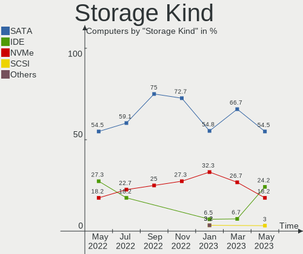

| Kind | Computers | Percent |
|------|-----------|---------|
| SATA | 93        | 67.39%  |
| IDE  | 25        | 18.12%  |
| NVMe | 12        | 8.7%    |
| RAID | 7         | 5.07%   |
| SAS  | 1         | 0.72%   |

CPU Vendor
----------

Processor vendors

| Vendor  | Computers | Percent |
|---------|-----------|---------|
| Intel   | 86        | 72.27%  |
| AMD     | 32        | 26.89%  |
| PowerPC | 1         | 0.84%   |

CPU Model
---------

Processor models

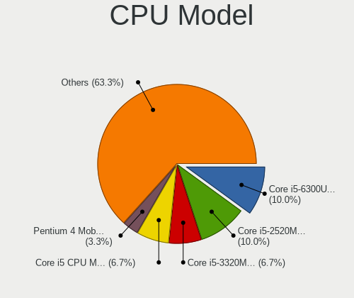

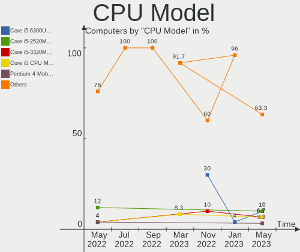

| Model                                                               | Computers | Percent |
|---------------------------------------------------------------------|-----------|---------|
| AMD GX-412TC SOC                                                    | 14        | 11.76%  |
| Intel Core i5-3320M CPU @ 2.60GHz                                   | 4         | 3.36%   |
| AMD G-T40E Processor                                                | 4         | 3.36%   |
| Intel Xeon CPU E5-2630 0 @ 2.30GHz                                  | 2         | 1.68%   |
| Intel Xeon CPU E3-1220 v5 @ 3.00GHz                                 | 2         | 1.68%   |
| Intel Core i5-5200U CPU @ 2.20GHz                                   | 2         | 1.68%   |
| Intel Core i5-4260U CPU @ 1.40GHz                                   | 2         | 1.68%   |
| Intel Core i5-4200U CPU @ 1.60GHz                                   | 2         | 1.68%   |
| Intel Core i5 CPU M 520 @ 2.40GHz                                   | 2         | 1.68%   |
| Intel Celeron CPU N3050 @ 1.60GHz                                   | 2         | 1.68%   |
| AMD Ryzen 5 2500U with Radeon Vega Mobile Gfx                       | 2         | 1.68%   |
| AMD E2-1800 APU with Radeon HD Graphics                             | 2         | 1.68%   |
| PowerPC 7447A (Revision 0x105)                                      | 1         | 0.84%   |
| Intel Xeon E-2278G CPU @ 3.40GHz                                    | 1         | 0.84%   |
| Intel Xeon CPU X5680 @ 3.33GHz                                      | 1         | 0.84%   |
| Intel Xeon CPU W3530 @ 2.80GHz                                      | 1         | 0.84%   |
| Intel Xeon CPU E5620 @ 2.40GHz                                      | 1         | 0.84%   |
| Intel Xeon CPU E5410 @ 2.33GHz                                      | 1         | 0.84%   |
| Intel Xeon CPU E5320 @ 1.86GHz                                      | 1         | 0.84%   |
| Intel Xeon CPU E5-2690 0 @ 2.90GHz                                  | 1         | 0.84%   |
| Intel Xeon CPU E5-2640 0 @ 2.50GHz                                  | 1         | 0.84%   |
| Intel Xeon CPU E5-2620 v3 @ 2.40GHz                                 | 1         | 0.84%   |
| Intel Xeon CPU E5-2403 0 @ 1.80GHz                                  | 1         | 0.84%   |
| Intel Xeon CPU E3-1230 v6 @ 3.50GHz                                 | 1         | 0.84%   |
| Intel Pentium Silver N5030 CPU @ 1.10GHz                            | 1         | 0.84%   |
| Intel Pentium M processor 1.60GHz ("GenuineIntel" 686-class)        | 1         | 0.84%   |
| Intel Pentium Dual-Core CPU E5700 @ 3.00GHz                         | 1         | 0.84%   |
| Intel Pentium D CPU 2.80GHz                                         | 1         | 0.84%   |
| Intel Pentium CPU G4560 @ 3.50GHz                                   | 1         | 0.84%   |
| Intel Pentium 4 CPU 3.20GHz ("GenuineIntel" 686-class)              | 1         | 0.84%   |
| Intel Pentium 4 CPU 2.66GHz                                         | 1         | 0.84%   |
| Intel Mobile Pentium III CPU - M 1200MHz ("GenuineIntel" 686-class) | 1         | 0.84%   |
| Intel Mobile Pentium III CPU - M 1000MHz ("GenuineIntel" 686-class) | 1         | 0.84%   |
| Intel CPU T2300 @ 1.66GHz ("GenuineIntel" 686-class)                | 1         | 0.84%   |
| Intel Core m3-7Y30 CPU @ 1.00GHz                                    | 1         | 0.84%   |
| Intel Core i7-8750H CPU @ 2.20GHz                                   | 1         | 0.84%   |
| Intel Core i7-7700K CPU @ 4.20GHz                                   | 1         | 0.84%   |
| Intel Core i7-7600U CPU @ 2.80GHz                                   | 1         | 0.84%   |
| Intel Core i7-7500U CPU @ 2.70GHz                                   | 1         | 0.84%   |
| Intel Core i7-6700HQ CPU @ 2.60GHz                                  | 1         | 0.84%   |
| Intel Core i7-6700 CPU @ 3.40GHz                                    | 1         | 0.84%   |
| Intel Core i7-6600U CPU @ 2.60GHz                                   | 1         | 0.84%   |
| Intel Core i7-5600U CPU @ 2.60GHz                                   | 1         | 0.84%   |
| Intel Core i7-5500U CPU @ 2.40GHz                                   | 1         | 0.84%   |
| Intel Core i7-4770R CPU @ 3.20GHz                                   | 1         | 0.84%   |
| Intel Core i7-4770 CPU @ 3.40GHz                                    | 1         | 0.84%   |
| Intel Core i7-4720HQ CPU @ 2.60GHz                                  | 1         | 0.84%   |
| Intel Core i7-4700MQ CPU @ 2.40GHz                                  | 1         | 0.84%   |
| Intel Core i7-4600U CPU @ 2.10GHz                                   | 1         | 0.84%   |
| Intel Core i7-3820QM CPU @ 2.70GHz                                  | 1         | 0.84%   |
| Intel Core i7-3770 CPU @ 3.40GHz                                    | 1         | 0.84%   |
| Intel Core i7-2670QM CPU @ 2.20GHz                                  | 1         | 0.84%   |
| Intel Core i7-10510U CPU @ 1.80GHz                                  | 1         | 0.84%   |
| Intel Core i7 CPU 970 @ 3.20GHz                                     | 1         | 0.84%   |
| Intel Core i5-8500T CPU @ 2.10GHz                                   | 1         | 0.84%   |
| Intel Core i5-7300U CPU @ 2.60GHz                                   | 1         | 0.84%   |
| Intel Core i5-7260U CPU @ 2.20GHz                                   | 1         | 0.84%   |
| Intel Core i5-6300U CPU @ 2.40GHz                                   | 1         | 0.84%   |
| Intel Core i5-5350U CPU @ 1.80GHz                                   | 1         | 0.84%   |
| Intel Core i5-5300U CPU @ 2.30GHz                                   | 1         | 0.84%   |

CPU Model Family
----------------

Processor model prefix

| Model                   | Computers | Percent |
|-------------------------|-----------|---------|
| Intel Core i5           | 25        | 21.01%  |
| Intel Core i7           | 19        | 15.97%  |
| Intel Xeon              | 15        | 12.61%  |
| AMD GX                  | 14        | 11.76%  |
| Intel Celeron           | 5         | 4.2%    |
| Intel Atom              | 5         | 4.2%    |
| Other                   | 4         | 3.36%   |
| AMD G                   | 4         | 3.36%   |
| Intel Core i3           | 3         | 2.52%   |
| AMD Ryzen 5             | 3         | 2.52%   |
| Intel Pentium 4         | 2         | 1.68%   |
| AMD E2                  | 2         | 1.68%   |
| AMD A4                  | 2         | 1.68%   |
| Intel Pentium Silver    | 1         | 0.84%   |
| Intel Pentium M         | 1         | 0.84%   |
| Intel Pentium Dual-Core | 1         | 0.84%   |
| Intel Pentium D         | 1         | 0.84%   |
| Intel Pentium           | 1         | 0.84%   |
| Intel Core m3           | 1         | 0.84%   |
| Intel Core Duo          | 1         | 0.84%   |
| Intel Core 2 Duo        | 1         | 0.84%   |
| Intel Core 2            | 1         | 0.84%   |
| AMD V120                | 1         | 0.84%   |
| AMD Turion II Neo       | 1         | 0.84%   |
| AMD Ryzen 7             | 1         | 0.84%   |
| AMD Phenom II X6        | 1         | 0.84%   |
| AMD Phenom II X4        | 1         | 0.84%   |
| AMD Geode Integrated    | 1         | 0.84%   |
| AMD Athlon              | 1         | 0.84%   |

CPU Cores
---------

Number of processor cores

| Number  | Computers | Percent |
|---------|-----------|---------|
| 2       | 45        | 37.82%  |
| 4       | 36        | 30.25%  |
| Unknown | 13        | 10.92%  |
| 1       | 9         | 7.56%   |
| 6       | 6         | 5.04%   |
| 8       | 5         | 4.2%    |
| 12      | 4         | 3.36%   |
| 16      | 1         | 0.84%   |

CPU Sockets
-----------

Number of sockets

| Number  | Computers | Percent |
|---------|-----------|---------|
| 1       | 97        | 81.51%  |
| Unknown | 18        | 15.13%  |
| 2       | 4         | 3.36%   |

CPU Threads
-----------

Threads per core (Hyper-Threading)

| Number  | Computers | Percent |
|---------|-----------|---------|
| 2       | 56        | 47.06%  |
| 1       | 44        | 36.97%  |
| Unknown | 19        | 15.97%  |

CPU Microarch
-------------

Microarchitecture

| Name          | Computers | Percent |
|---------------|-----------|---------|
| Puma          | 14        | 11.76%  |
| KabyLake      | 13        | 10.92%  |
| Haswell       | 13        | 10.92%  |
| SandyBridge   | 8         | 6.72%   |
| IvyBridge     | 8         | 6.72%   |
| Broadwell     | 8         | 6.72%   |
| Skylake       | 7         | 5.88%   |
| Bobcat        | 6         | 5.04%   |
| Westmere      | 5         | 4.2%    |
| Silvermont    | 4         | 3.36%   |
| P6            | 4         | 3.36%   |
| K10           | 4         | 3.36%   |
| Bonnell       | 4         | 3.36%   |
| Unknown       | 4         | 3.36%   |
| NetBurst      | 3         | 2.52%   |
| Zen 2         | 2         | 1.68%   |
| Zen           | 2         | 1.68%   |
| Penryn        | 2         | 1.68%   |
| Core          | 2         | 1.68%   |
| Nehalem       | 1         | 0.84%   |
| K8 Hammer     | 1         | 0.84%   |
| K10 Llano     | 1         | 0.84%   |
| Jaguar        | 1         | 0.84%   |
| Goldmont plus | 1         | 0.84%   |
| Geode         | 1         | 0.84%   |

GPU Vendor
----------

Vendors of graphics cards

| Vendor                     | Computers | Percent |
|----------------------------|-----------|---------|
| Intel                      | 66        | 61.11%  |
| AMD                        | 24        | 22.22%  |
| Nvidia                     | 8         | 7.41%   |
| Matrox Electronics Systems | 8         | 7.41%   |
| ASPEED Technology          | 2         | 1.85%   |

GPU Model
---------

Graphics card models

| Model                                                                              | Computers | Percent |
|------------------------------------------------------------------------------------|-----------|---------|
| 3rd Gen Core processor Graphics Controller                                         | 7         | 6.25%   |
| HD Graphics 5500                                                                   | 6         | 5.36%   |
| Haswell-ULT Integrated Graphics Controller                                         | 6         | 5.36%   |
| G200eR2                                                                            | 6         | 5.36%   |
| Mobile 945GM/GMS/GME, 943/940GML Express Integrated Graphics Controller            | 4         | 3.57%   |
| Ellesmere [Radeon RX 470/480/570/570X/580/580X/590]                                | 4         | 3.57%   |
| Atom/Celeron/Pentium Processor x5-E8000/J3xxx/N3xxx Integrated Graphics Controller | 4         | 3.57%   |
| Skylake GT2 [HD Graphics 520]                                                      | 3         | 2.68%   |
| Mobile 945GM/GMS, 943/940GML Express Integrated Graphics Controller                | 3         | 2.68%   |
| HD Graphics 620                                                                    | 3         | 2.68%   |
| 2nd Generation Core Processor Family Integrated Graphics Controller                | 3         | 2.68%   |
| Xeon E3-1200 v3/4th Gen Core Processor Integrated Graphics Controller              | 2         | 1.79%   |
| Wrestler [Radeon HD 7340]                                                          | 2         | 1.79%   |
| RS880M [Mobility Radeon HD 4225/4250]                                              | 2         | 1.79%   |
| Raven Ridge [Radeon Vega Series / Radeon Vega Mobile Series]                       | 2         | 1.79%   |
| MGA G200eW WPCM450                                                                 | 2         | 1.79%   |
| HD Graphics 6000                                                                   | 2         | 1.79%   |
| HD Graphics 530                                                                    | 2         | 1.79%   |
| ES1000                                                                             | 2         | 1.79%   |
| Core Processor Integrated Graphics Controller                                      | 2         | 1.79%   |
| Atom Processor D2xxx/N2xxx Integrated Graphics Controller                          | 2         | 1.79%   |
| ASPEED Graphics Family                                                             | 2         | 1.79%   |
| 4th Gen Core Processor Integrated Graphics Controller                              | 2         | 1.79%   |
| Xeon E3-1200 v2/3rd Gen Core processor Graphics Controller                         | 1         | 0.89%   |
| UHD Graphics 630 (Mobile)                                                          | 1         | 0.89%   |
| UHD Graphics 630 (Desktop)                                                         | 1         | 0.89%   |
| UHD Graphics 605                                                                   | 1         | 0.89%   |
| UHD Graphics                                                                       | 1         | 0.89%   |
| SuperSumo [Radeon HD 6410D]                                                        | 1         | 0.89%   |
| Sun XT [Radeon HD 8670A/8670M/8690M / R5 M330 / M430 / Radeon 520 Mobile]          | 1         | 0.89%   |
| RV635/M86 [Mobility Radeon HD 3650]                                                | 1         | 0.89%   |
| RV360/M12 [Mobility Radeon 9550]                                                   | 1         | 0.89%   |
| RV100/M6 [Rage/Radeon Mobility Series]                                             | 1         | 0.89%   |
| Rage Mobility AGP 2x Series                                                        | 1         | 0.89%   |
| Navi 10 [Radeon RX 5600 OEM/5600 XT / 5700/5700 XT]                                | 1         | 0.89%   |
| Mobile 945GSE Express Integrated Graphics Controller                               | 1         | 0.89%   |
| Mobile 915GM/GMS/910GML Express Graphics Controller                                | 1         | 0.89%   |
| Mobile 4 Series Chipset Integrated Graphics Controller                             | 1         | 0.89%   |
| Kaby Lake-U GT1 Integrated Graphics Controller                                     | 1         | 0.89%   |
| Kabini [Radeon HD 8180]                                                            | 1         | 0.89%   |
| Iris Plus Graphics 640                                                             | 1         | 0.89%   |
| HD Graphics 615                                                                    | 1         | 0.89%   |
| HD Graphics 610                                                                    | 1         | 0.89%   |
| GP107M [GeForce GTX 1050 Mobile]                                                   | 1         | 0.89%   |
| GP104M [GeForce GTX 1070 Mobile]                                                   | 1         | 0.89%   |
| GM107M [GeForce GTX 960M]                                                          | 1         | 0.89%   |
| GK107GLM [Quadro K1100M]                                                           | 1         | 0.89%   |
| GF110 [GeForce GTX 580]                                                            | 1         | 0.89%   |
| GF108M [GeForce GT 540M]                                                           | 1         | 0.89%   |
| G92 [GeForce GTS 250]                                                              | 1         | 0.89%   |
| Crystal Well Integrated Iris Pro Graphics 5200                                     | 1         | 0.89%   |
| Coffee Lake UHD Graphics                                                           | 1         | 0.89%   |
| Cedar [Radeon HD 5000/6000/7350/8350 Series]                                       | 1         | 0.89%   |
| Cape Verde PRO / Venus LE / Tropo PRO-L [Radeon HD 8830M / R7 250 / R7 M465X]      | 1         | 0.89%   |
| Caicos [Radeon HD 6450/7450/8450 / R5 230 OEM]                                     | 1         | 0.89%   |
| C61 [GeForce 6150SE nForce 430]                                                    | 1         | 0.89%   |
| Barts XT [Radeon HD 6870]                                                          | 1         | 0.89%   |
| 82945G/GZ Integrated Graphics Controller                                           | 1         | 0.89%   |
| 82915G/GV/910GL Integrated Graphics Controller                                     | 1         | 0.89%   |
| 82865G Integrated Graphics Controller                                              | 1         | 0.89%   |

GPU Combo
---------

Combinations of graphics cards

| Name           | Computers | Percent |
|----------------|-----------|---------|
| 1 x Intel      | 54        | 45.38%  |
| 1 x AMD        | 20        | 16.81%  |
| Other          | 19        | 15.97%  |
| 1 x Matrox     | 8         | 6.72%   |
| 2 x Intel      | 5         | 4.2%    |
| Intel + Nvidia | 4         | 3.36%   |
| 1 x Nvidia     | 3         | 2.52%   |
| Intel + AMD    | 3         | 2.52%   |
| 1 x ASPEED     | 2         | 1.68%   |
| AMD + Nvidia   | 1         | 0.84%   |

GPU Driver
----------

Free vs proprietary

| Driver  | Computers | Percent |
|---------|-----------|---------|
| Free    | 96        | 80.67%  |
| Unknown | 23        | 19.33%  |

GPU Memory
----------

Total video memory

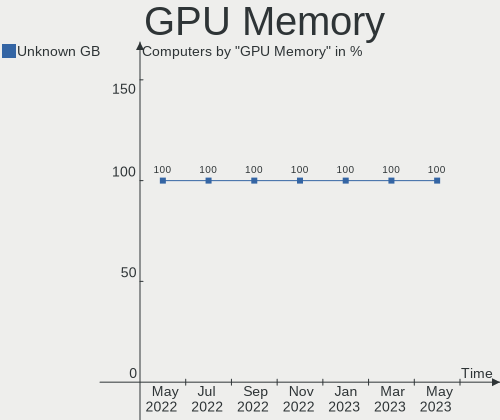

| Size in GB | Computers | Percent |
|------------|-----------|---------|
| Unknown    | 119       | 100%    |

Monitor Vendor
--------------

Monitor vendors

| Vendor               | Computers | Percent |
|----------------------|-----------|---------|
| Samsung Electronics  | 8         | 15.09%  |
| LG Display           | 8         | 15.09%  |
| AU Optronics         | 7         | 13.21%  |
| Goldstar             | 4         | 7.55%   |
| BOE                  | 4         | 7.55%   |
| Philips              | 2         | 3.77%   |
| Lenovo               | 2         | 3.77%   |
| Dell                 | 2         | 3.77%   |
| Chimei Innolux       | 2         | 3.77%   |
| BenQ                 | 2         | 3.77%   |
| Apple                | 2         | 3.77%   |
| Ancor Communications | 2         | 3.77%   |
| PANDA                | 1         | 1.89%   |
| NEC Computers        | 1         | 1.89%   |
| LTM                  | 1         | 1.89%   |
| InfoVision           | 1         | 1.89%   |
| IBM                  | 1         | 1.89%   |
| Hewlett-Packard      | 1         | 1.89%   |
| Eizo                 | 1         | 1.89%   |
| AOC                  | 1         | 1.89%   |

Monitor Model
-------------

Monitor models

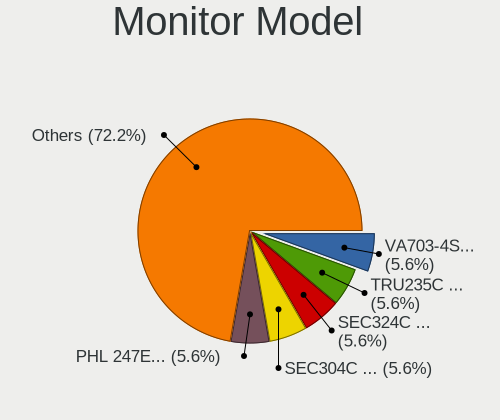

| Model                                              | Computers | Percent |
|----------------------------------------------------|-----------|---------|
| LCD Monitor LGD0418 2560x1440 310x170mm 13.9-inch  | 2         | 3.77%   |
| LCD Monitor AUO34ED 1920x1080 340x190mm 15.3-inch  | 2         | 3.77%   |
| T24D390 SAM0B6E 1920x1080 520x290mm 23.4-inch      | 1         | 1.89%   |
| SyncMaster SAM00A1 1280x1024 340x270mm 17.1-inch   | 1         | 1.89%   |
| SMB2340 SAM0691 1920x1080 510x290mm 23.1-inch      | 1         | 1.89%   |
| SE790C SAM0BFE 3440x1440 800x330mm 34.1-inch       | 1         | 1.89%   |
| S24C450 SAM09CF 1920x1200 520x320mm 24.0-inch      | 1         | 1.89%   |
| PHL 328E9Q PHLC180 1920x1080 700x390mm 31.5-inch   | 1         | 1.89%   |
| PA249 ACI24B2 1920x1200 520x320mm 24.0-inch        | 1         | 1.89%   |
| P2417H DELA0DC 1920x1080 530x300mm 24.0-inch       | 1         | 1.89%   |
| LG ULTRAWIDE GSM5AE2 3440x1440 800x340mm 34.2-inch | 1         | 1.89%   |
| LG Ultra HD GSM5B08 3840x2160 600x340mm 27.2-inch  | 1         | 1.89%   |
| LEN T24i-10 LEN61CE 1920x1080 530x300mm 24.0-inch  | 1         | 1.89%   |
| LCD190V NEC66D3 1280x1024 380x300mm 19.1-inch      | 1         | 1.89%   |
| LCD Monitor SEC304C 1366x768 310x170mm 13.9-inch   | 1         | 1.89%   |
| LCD Monitor SDC4852 1366x768 340x190mm 15.3-inch   | 1         | 1.89%   |
| LCD Monitor SDC314D 1366x768 310x170mm 13.9-inch   | 1         | 1.89%   |
| LCD Monitor NCP0046 1920x1080 340x190mm 15.3-inch  | 1         | 1.89%   |
| LCD Monitor LTM3937 720x1280 130x80mm 6.0-inch     | 1         | 1.89%   |
| LCD Monitor LGD058B 2560x1440 310x170mm 13.9-inch  | 1         | 1.89%   |
| LCD Monitor LGD049B 1920x1080 340x190mm 15.3-inch  | 1         | 1.89%   |
| LCD Monitor LGD0437 1920x1080 280x160mm 12.7-inch  | 1         | 1.89%   |
| LCD Monitor LGD03DB 1366x768 350x190mm 15.7-inch   | 1         | 1.89%   |
| LCD Monitor LGD03A3 1366x768 280x160mm 12.7-inch   | 1         | 1.89%   |
| LCD Monitor LGD02DC 1366x768 340x190mm 15.3-inch   | 1         | 1.89%   |
| LCD Monitor LEN40B2 1920x1080 340x190mm 15.3-inch  | 1         | 1.89%   |
| LCD Monitor IVO057D 1920x1080 310x170mm 13.9-inch  | 1         | 1.89%   |
| LCD Monitor IBM2887 1680x1050 330x210mm 15.4-inch  | 1         | 1.89%   |
| LCD Monitor HWP4218 1600x900 440x250mm 19.9-inch   | 1         | 1.89%   |
| LCD Monitor CMN14D6 1366x768 310x170mm 13.9-inch   | 1         | 1.89%   |
| LCD Monitor CMN14B1 1920x1080 310x170mm 13.9-inch  | 1         | 1.89%   |
| LCD Monitor BOE0742 1920x1080 310x170mm 13.9-inch  | 1         | 1.89%   |
| LCD Monitor BOE0675 1366x768 340x190mm 15.3-inch   | 1         | 1.89%   |
| LCD Monitor BOE0630 1920x1080 340x190mm 15.3-inch  | 1         | 1.89%   |
| LCD Monitor BOE05E0 1366x768 280x160mm 12.7-inch   | 1         | 1.89%   |
| LCD Monitor AUO38ED 1920x1080 340x190mm 15.3-inch  | 1         | 1.89%   |
| LCD Monitor AUO34EB 3840x2160 340x190mm 15.3-inch  | 1         | 1.89%   |
| LCD Monitor AUO226D 1920x1080 280x160mm 12.7-inch  | 1         | 1.89%   |
| LCD Monitor AUO21EC 1366x768 340x190mm 15.3-inch   | 1         | 1.89%   |
| LCD Monitor AUO10DC 1366x768 220x130mm 10.1-inch   | 1         | 1.89%   |
| L1530P GSM3B99 1024x768 300x230mm 14.9-inch        | 1         | 1.89%   |
| GW2480 BNQ78E7 1920x1080 530x300mm 24.0-inch       | 1         | 1.89%   |
| GL940 BNQ7883 1366x768 410x230mm 18.5-inch         | 1         | 1.89%   |
| EV2450 ENC2530 1920x1080 530x300mm 24.0-inch       | 1         | 1.89%   |
| E2214H DELA09E 1920x1080 480x270mm 21.7-inch       | 1         | 1.89%   |
| Color LCD APPA01B 1440x900 290x180mm 13.4-inch     | 1         | 1.89%   |
| Color LCD APP9C45 1024x768 250x180mm 12.1-inch     | 1         | 1.89%   |
| ASUS VN247 ACI24C3 1920x1080 520x290mm 23.4-inch   | 1         | 1.89%   |
| 27MP33 GSM5AAE 1920x1080 600x340mm 27.2-inch       | 1         | 1.89%   |
| 2270W AOC2270 1920x1080 480x270mm 21.7-inch        | 1         | 1.89%   |
| 190S PHL086B 1280x1024 380x300mm 19.1-inch         | 1         | 1.89%   |

Monitor Resolution
------------------

Monitor screen resolution

| Resolution         | Computers | Percent |
|--------------------|-----------|---------|
| 1920x1080 (FHD)    | 22        | 42.31%  |
| 1366x768 (WXGA)    | 12        | 23.08%  |
| 2560x1440 (QHD)    | 3         | 5.77%   |
| 1280x1024 (SXGA)   | 3         | 5.77%   |
| 3840x2160 (4K)     | 2         | 3.85%   |
| 3440x1440          | 2         | 3.85%   |
| 1920x1200 (WUXGA)  | 2         | 3.85%   |
| 1024x768 (XGA)     | 2         | 3.85%   |
| 720x1280           | 1         | 1.92%   |
| 1680x1050 (WSXGA+) | 1         | 1.92%   |
| 1600x900 (HD+)     | 1         | 1.92%   |
| 1440x900 (WXGA+)   | 1         | 1.92%   |

Monitor Diagonal
----------------

Diagonal size in inches

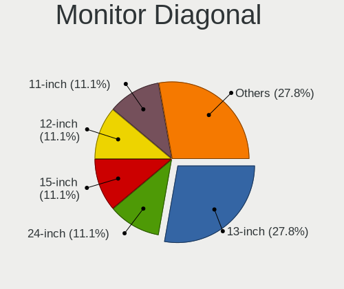

| Inches | Computers | Percent |
|--------|-----------|---------|
| 15     | 14        | 26.42%  |
| 13     | 10        | 18.87%  |
| 24     | 6         | 11.32%  |
| 12     | 5         | 9.43%   |
| 23     | 3         | 5.66%   |
| 19     | 3         | 5.66%   |
| 34     | 2         | 3.77%   |
| 27     | 2         | 3.77%   |
| 21     | 2         | 3.77%   |
| 31     | 1         | 1.89%   |
| 18     | 1         | 1.89%   |
| 17     | 1         | 1.89%   |
| 14     | 1         | 1.89%   |
| 10     | 1         | 1.89%   |
| 6      | 1         | 1.89%   |

Monitor Width
-------------

Physical width

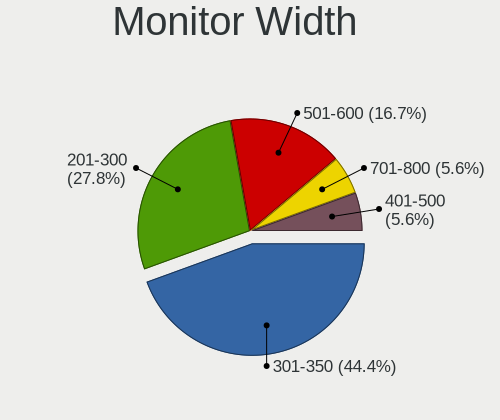

| Width in mm | Computers | Percent |
|-------------|-----------|---------|
| 301-350     | 24        | 46.15%  |
| 501-600     | 10        | 19.23%  |
| 201-300     | 8         | 15.38%  |
| 401-500     | 4         | 7.69%   |
| 701-800     | 2         | 3.85%   |
| 351-400     | 2         | 3.85%   |
| 601-700     | 1         | 1.92%   |
| 101-200     | 1         | 1.92%   |

Aspect Ratio
------------

Proportional relationship between the width and the height

| Ratio | Computers | Percent |
|-------|-----------|---------|
| 16/9  | 39        | 76.47%  |
| 16/10 | 5         | 9.8%    |
| 5/4   | 3         | 5.88%   |
| 4/3   | 2         | 3.92%   |
| 21/9  | 2         | 3.92%   |

Monitor Area
------------

Area in inch²

| Area in inch² | Computers | Percent |
|----------------|-----------|---------|
| 91-100         | 12        | 23.08%  |
| 81-90          | 10        | 19.23%  |
| 201-250        | 8         | 15.38%  |
| 61-70          | 5         | 9.62%   |
| 351-500        | 3         | 5.77%   |
| 151-200        | 3         | 5.77%   |
| 101-110        | 3         | 5.77%   |
| 301-350        | 2         | 3.85%   |
| 251-300        | 2         | 3.85%   |
| 141-150        | 2         | 3.85%   |
| 41-50          | 1         | 1.92%   |
| 1-40           | 1         | 1.92%   |

Pixel Density
-------------

Pixels per inch

| Density       | Computers | Percent |
|---------------|-----------|---------|
| 51-100        | 16        | 31.37%  |
| 121-160       | 15        | 29.41%  |
| 101-120       | 12        | 23.53%  |
| 161-240       | 6         | 11.76%  |
| More than 240 | 2         | 3.92%   |

Multiple Monitors
-----------------

Total monitors connected

| Total | Computers | Percent |
|-------|-----------|---------|
| 1     | 62        | 52.1%   |
| 0     | 53        | 44.54%  |
| 2     | 3         | 2.52%   |
| 3     | 1         | 0.84%   |

Net Controller Vendor
---------------------

Controller vendors

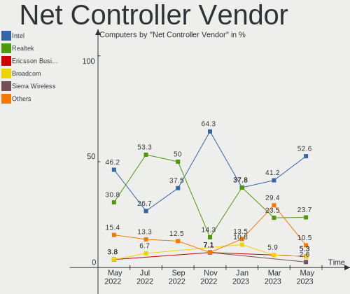

| Vendor                            | Computers | Percent |
|-----------------------------------|-----------|---------|
| Intel                             | 77        | 49.36%  |
| Realtek Semiconductor             | 39        | 25%     |
| Qualcomm Atheros                  | 14        | 8.97%   |
| Broadcom Inc. and subsidiaries    | 13        | 8.33%   |
| Ralink                            | 2         | 1.28%   |
| Edimax Technology                 | 2         | 1.28%   |
| VIA Technologies                  | 1         | 0.64%   |
| Qualcomm Atheros Communications   | 1         | 0.64%   |
| Marvell Technology Group          | 1         | 0.64%   |
| Ericsson Business Mobile Networks | 1         | 0.64%   |
| Emulex                            | 1         | 0.64%   |
| Davicom Semiconductor             | 1         | 0.64%   |
| Apple                             | 1         | 0.64%   |
| Accton Technology                 | 1         | 0.64%   |
| 3Com                              | 1         | 0.64%   |

Net Controller Model
--------------------

Controller models

| Model                                                     | Computers | Percent |
|-----------------------------------------------------------|-----------|---------|
| RTL8111/8168/8411 PCI Express Gigabit Ethernet Controller | 31        | 16.06%  |
| I210 Gigabit Network Connection                           | 14        | 7.25%   |
| 82579LM Gigabit Network Connection (Lewisville)           | 7         | 3.63%   |
| Wireless 7265                                             | 6         | 3.11%   |
| Wireless 7260                                             | 6         | 3.11%   |
| I211 Gigabit Network Connection                           | 6         | 3.11%   |
| Centrino Advanced-N 6205 [Taylor Peak]                    | 5         | 2.59%   |
| Wireless 8265 / 8275                                      | 4         | 2.07%   |
| I350 Gigabit Network Connection                           | 4         | 2.07%   |
| AR928X Wireless Network Adapter (PCI-Express)             | 4         | 2.07%   |
| 82574L Gigabit Network Connection                         | 4         | 2.07%   |
| Wireless 8260                                             | 3         | 1.55%   |
| RTL8188EUS 802.11n Wireless Network Adapter               | 3         | 1.55%   |
| PRO/Wireless 3945ABG [Golan] Network Connection           | 3         | 1.55%   |
| Ethernet Connection I219-LM                               | 3         | 1.55%   |
| Ethernet Connection I217-LM                               | 3         | 1.55%   |
| Ethernet Connection (3) I218-V                            | 3         | 1.55%   |
| BCM4360 802.11ac Wireless Network Adapter                 | 3         | 1.55%   |
| Wireless 3160                                             | 2         | 1.04%   |
| RTL810xE PCI Express Fast Ethernet controller             | 2         | 1.04%   |
| RTL-8100/8101L/8139 PCI Fast Ethernet Adapter             | 2         | 1.04%   |
| QCA9377 802.11ac Wireless Network Adapter                 | 2         | 1.04%   |
| NetXtreme BCM5720 2-port Gigabit Ethernet PCIe            | 2         | 1.04%   |
| EW-7811Un 802.11n Wireless Adapter [Realtek RTL8188CUS]   | 2         | 1.04%   |
| Ethernet Connection I218-LM                               | 2         | 1.04%   |
| Ethernet Connection (4) I219-V                            | 2         | 1.04%   |
| Ethernet Connection (4) I219-LM                           | 2         | 1.04%   |
| Ethernet Connection (3) I218-LM                           | 2         | 1.04%   |
| Ethernet Connection (2) I219-V                            | 2         | 1.04%   |
| Centrino Wireless-N 2200                                  | 2         | 1.04%   |
| Centrino Advanced-N 6200                                  | 2         | 1.04%   |
| AR5212/5213/2414 Wireless Network Adapter                 | 2         | 1.04%   |
| 82577LM Gigabit Network Connection                        | 2         | 1.04%   |
| Wireless-AC 9260                                          | 1         | 0.52%   |
| Wireless 3165                                             | 1         | 0.52%   |
| VT6105M [Rhine-III]                                       | 1         | 0.52%   |
| UniNorth 2 GMAC (Sun GEM)                                 | 1         | 0.52%   |
| Ultimate N WiFi Link 5300                                 | 1         | 0.52%   |
| SMC2-1211TX                                               | 1         | 0.52%   |
| RTL8821CE 802.11ac PCIe Wireless Network Adapter          | 1         | 0.52%   |
| RTL8192EU 802.11b/g/n WLAN Adapter                        | 1         | 0.52%   |
| RTL8188EE Wireless Network Adapter                        | 1         | 0.52%   |
| RT5390 Wireless 802.11n 1T/1R PCIe                        | 1         | 0.52%   |
| RT2790 Wireless 802.11n 1T/2R PCIe                        | 1         | 0.52%   |
| PRO/Wireless 2915ABG [Calexico2] Network Connection       | 1         | 0.52%   |
| OneConnect 10Gb NIC (be3)                                 | 1         | 0.52%   |
| NM10/ICH7 Family LAN Controller                           | 1         | 0.52%   |
| NetXtreme II BCM5709 Gigabit Ethernet                     | 1         | 0.52%   |
| NetXtreme II BCM5708 Gigabit Ethernet                     | 1         | 0.52%   |
| NetXtreme BCM57766 Gigabit Ethernet PCIe                  | 1         | 0.52%   |
| NetXtreme BCM5761 Gigabit Ethernet PCIe                   | 1         | 0.52%   |
| NetXtreme BCM5751M Gigabit Ethernet PCI Express           | 1         | 0.52%   |
| NetXtreme BCM5723 Gigabit Ethernet PCIe                   | 1         | 0.52%   |
| NetXtreme BCM5719 Gigabit Ethernet PCIe                   | 1         | 0.52%   |
| NetXtreme BCM5705_2 Gigabit Ethernet                      | 1         | 0.52%   |
| NetLink BCM57780 Gigabit Ethernet PCIe                    | 1         | 0.52%   |
| N5321 gw Mobile Broadband Serial Port III                 | 1         | 0.52%   |
| Killer E2500 Gigabit Ethernet Controller                  | 1         | 0.52%   |
| Ethernet Connection I218-V                                | 1         | 0.52%   |
| Ethernet Connection (7) I219-LM                           | 1         | 0.52%   |

Wireless Vendor
---------------

Wireless vendors

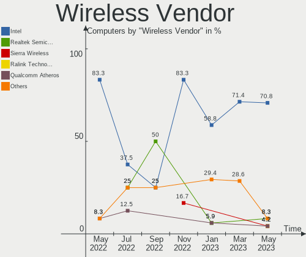

| Vendor                          | Computers | Percent |
|---------------------------------|-----------|---------|
| Intel                           | 38        | 56.72%  |
| Qualcomm Atheros                | 13        | 19.4%   |
| Realtek Semiconductor           | 6         | 8.96%   |
| Broadcom Inc. and subsidiaries  | 5         | 7.46%   |
| Ralink                          | 2         | 2.99%   |
| Edimax Technology               | 2         | 2.99%   |
| Qualcomm Atheros Communications | 1         | 1.49%   |

Wireless Model
--------------

Wireless models

| Model                                                      | Computers | Percent |
|------------------------------------------------------------|-----------|---------|
| Wireless 7265                                              | 6         | 8.96%   |
| Wireless 7260                                              | 6         | 8.96%   |
| Centrino Advanced-N 6205 [Taylor Peak]                     | 5         | 7.46%   |
| Wireless 8265 / 8275                                       | 4         | 5.97%   |
| AR928X Wireless Network Adapter (PCI-Express)              | 4         | 5.97%   |
| Wireless 8260                                              | 3         | 4.48%   |
| RTL8188EUS 802.11n Wireless Network Adapter                | 3         | 4.48%   |
| PRO/Wireless 3945ABG [Golan] Network Connection            | 3         | 4.48%   |
| BCM4360 802.11ac Wireless Network Adapter                  | 3         | 4.48%   |
| Wireless 3160                                              | 2         | 2.99%   |
| QCA9377 802.11ac Wireless Network Adapter                  | 2         | 2.99%   |
| EW-7811Un 802.11n Wireless Adapter [Realtek RTL8188CUS]    | 2         | 2.99%   |
| Centrino Wireless-N 2200                                   | 2         | 2.99%   |
| AR5212/5213/2414 Wireless Network Adapter                  | 2         | 2.99%   |
| Wireless-AC 9260                                           | 1         | 1.49%   |
| Wireless 3165                                              | 1         | 1.49%   |
| Ultimate N WiFi Link 5300                                  | 1         | 1.49%   |
| RTL8821CE 802.11ac PCIe Wireless Network Adapter           | 1         | 1.49%   |
| RTL8192EU 802.11b/g/n WLAN Adapter                         | 1         | 1.49%   |
| RTL8188EE Wireless Network Adapter                         | 1         | 1.49%   |
| RT5390 Wireless 802.11n 1T/1R PCIe                         | 1         | 1.49%   |
| RT2790 Wireless 802.11n 1T/2R PCIe                         | 1         | 1.49%   |
| PRO/Wireless 2915ABG [Calexico2] Network Connection        | 1         | 1.49%   |
| Dual Band Wireless-AC 3168NGW [Stone Peak]                 | 1         | 1.49%   |
| Centrino Wireless-N 2230                                   | 1         | 1.49%   |
| Centrino Advanced-N 6200                                   | 1         | 1.49%   |
| BCM43225 802.11b/g/n                                       | 1         | 1.49%   |
| BCM4318 [AirForce One 54g] 802.11g Wireless LAN Controller | 1         | 1.49%   |
| AR9485 Wireless Network Adapter                            | 1         | 1.49%   |
| AR9287 Wireless Network Adapter (PCI-Express)              | 1         | 1.49%   |
| AR9285 Wireless Network Adapter (PCI-Express)              | 1         | 1.49%   |
| AR9271 802.11n                                             | 1         | 1.49%   |
| AR922X Wireless Network Adapter                            | 1         | 1.49%   |
| AR242x / AR542x Wireless Network Adapter (PCI-Express)     | 1         | 1.49%   |

Ethernet Vendor
---------------

Ethernet vendors

| Vendor                         | Computers | Percent |
|--------------------------------|-----------|---------|
| Intel                          | 62        | 53.45%  |
| Realtek Semiconductor          | 35        | 30.17%  |
| Broadcom Inc. and subsidiaries | 10        | 8.62%   |
| Qualcomm Atheros               | 2         | 1.72%   |
| VIA Technologies               | 1         | 0.86%   |
| Marvell Technology Group       | 1         | 0.86%   |
| Emulex                         | 1         | 0.86%   |
| Davicom Semiconductor          | 1         | 0.86%   |
| Apple                          | 1         | 0.86%   |
| Accton Technology              | 1         | 0.86%   |
| 3Com                           | 1         | 0.86%   |

Ethernet Model
--------------

Ethernet models

| Model                                                                   | Computers | Percent |
|-------------------------------------------------------------------------|-----------|---------|
| RTL8111/8168/8411 PCI Express Gigabit Ethernet Controller               | 31        | 25.41%  |
| I210 Gigabit Network Connection                                         | 14        | 11.48%  |
| 82579LM Gigabit Network Connection (Lewisville)                         | 7         | 5.74%   |
| I211 Gigabit Network Connection                                         | 6         | 4.92%   |
| I350 Gigabit Network Connection                                         | 4         | 3.28%   |
| 82574L Gigabit Network Connection                                       | 4         | 3.28%   |
| Ethernet Connection I219-LM                                             | 3         | 2.46%   |
| Ethernet Connection I217-LM                                             | 3         | 2.46%   |
| Ethernet Connection (3) I218-V                                          | 3         | 2.46%   |
| RTL810xE PCI Express Fast Ethernet controller                           | 2         | 1.64%   |
| RTL-8100/8101L/8139 PCI Fast Ethernet Adapter                           | 2         | 1.64%   |
| NetXtreme BCM5720 2-port Gigabit Ethernet PCIe                          | 2         | 1.64%   |
| Ethernet Connection I218-LM                                             | 2         | 1.64%   |
| Ethernet Connection (4) I219-V                                          | 2         | 1.64%   |
| Ethernet Connection (4) I219-LM                                         | 2         | 1.64%   |
| Ethernet Connection (3) I218-LM                                         | 2         | 1.64%   |
| Ethernet Connection (2) I219-V                                          | 2         | 1.64%   |
| 82577LM Gigabit Network Connection                                      | 2         | 1.64%   |
| VT6105M [Rhine-III]                                                     | 1         | 0.82%   |
| UniNorth 2 GMAC (Sun GEM)                                               | 1         | 0.82%   |
| SMC2-1211TX                                                             | 1         | 0.82%   |
| OneConnect 10Gb NIC (be3)                                               | 1         | 0.82%   |
| NM10/ICH7 Family LAN Controller                                         | 1         | 0.82%   |
| NetXtreme II BCM5709 Gigabit Ethernet                                   | 1         | 0.82%   |
| NetXtreme II BCM5708 Gigabit Ethernet                                   | 1         | 0.82%   |
| NetXtreme BCM57766 Gigabit Ethernet PCIe                                | 1         | 0.82%   |
| NetXtreme BCM5761 Gigabit Ethernet PCIe                                 | 1         | 0.82%   |
| NetXtreme BCM5751M Gigabit Ethernet PCI Express                         | 1         | 0.82%   |
| NetXtreme BCM5723 Gigabit Ethernet PCIe                                 | 1         | 0.82%   |
| NetXtreme BCM5719 Gigabit Ethernet PCIe                                 | 1         | 0.82%   |
| NetXtreme BCM5705_2 Gigabit Ethernet                                    | 1         | 0.82%   |
| NetLink BCM57780 Gigabit Ethernet PCIe                                  | 1         | 0.82%   |
| Killer E2500 Gigabit Ethernet Controller                                | 1         | 0.82%   |
| Ethernet Connection I218-V                                              | 1         | 0.82%   |
| Ethernet Connection (7) I219-LM                                         | 1         | 0.82%   |
| Ethernet Connection (2) I219-LM                                         | 1         | 0.82%   |
| AR8121/AR8113/AR8114 Gigabit or Fast Ethernet                           | 1         | 0.82%   |
| 88E8053 PCI-E Gigabit Ethernet Controller                               | 1         | 0.82%   |
| 82801CAM (ICH3) PRO/100 VM (KM) Ethernet Controller                     | 1         | 0.82%   |
| 82573L Gigabit Ethernet Controller                                      | 1         | 0.82%   |
| 82573E Gigabit Ethernet Controller (Copper)                             | 1         | 0.82%   |
| 82571EB/82571GB Gigabit Ethernet Controller D0/D1 (copper applications) | 1         | 0.82%   |
| 82567LM Gigabit Network Connection                                      | 1         | 0.82%   |
| 82541GI Gigabit Ethernet Controller                                     | 1         | 0.82%   |
| 82541EI Gigabit Ethernet Controller                                     | 1         | 0.82%   |
| 3c905C-TX/TX-M [Tornado]                                                | 1         | 0.82%   |
| 21x4x DEC-Tulip compatible 10/100 Ethernet                              | 1         | 0.82%   |

Net Controller Kind
-------------------

Ethernet, WiFi or modem

| Kind     | Computers | Percent |
|----------|-----------|---------|
| Ethernet | 112       | 64%     |
| WiFi     | 59        | 33.71%  |
| Modem    | 3         | 1.71%   |
| Unknown  | 1         | 0.57%   |

Used Controller
---------------

Currently used network controller

| Kind     | Computers | Percent |
|----------|-----------|---------|
| Ethernet | 67        | 60.36%  |
| WiFi     | 43        | 38.74%  |
| Unknown  | 1         | 0.9%    |

NICs
----

Total network controllers on board

| Total | Computers | Percent |
|-------|-----------|---------|
| 2     | 60        | 50.42%  |
| 1     | 52        | 43.7%   |
| 3     | 4         | 3.36%   |
| 0     | 3         | 2.52%   |

Memory Vendor
-------------

Memory module vendors

| Vendor              | Computers | Percent |
|---------------------|-----------|---------|
| Unknown             | 7         | 53.85%  |
| Crucial             | 2         | 15.38%  |
| Transcend           | 1         | 7.69%   |
| Samsung Electronics | 1         | 7.69%   |
| Ramaxel Technology  | 1         | 7.69%   |
| Kingston            | 1         | 7.69%   |

Memory Model
------------

Memory module models

| Model                                              | Computers | Percent |
|----------------------------------------------------|-----------|---------|
| RAM Module 4096MB SODIMM DDR3 1333MT/s             | 2         | 14.29%  |
| RAM CT102464BF160B.M16 8192MB SODIMM DDR3 1600MT/s | 2         | 14.29%  |
| RAM TS1GSK64W6H 8192MB DIMM DDR3 1600MT/s          | 1         | 7.14%   |
| RAM RMT3170ME68F9F1600 4096MB SODIMM DDR3 1600MT/s | 1         | 7.14%   |
| RAM Module 512MB DIMM DDR 400MT/s                  | 1         | 7.14%   |
| RAM Module 256MB SODIMM DRAM                       | 1         | 7.14%   |
| RAM Module 2048MB DIMM DDR2 266MT/s                | 1         | 7.14%   |
| RAM Module 128MB SODIMM DRAM                       | 1         | 7.14%   |
| RAM Module 1024MB DIMM DDR                         | 1         | 7.14%   |
| RAM M471B1G73DB0-YK0 8192MB SODIMM DDR3 1600MT/s   | 1         | 7.14%   |
| RAM KHX2400C15D4/4G 4096MB DIMM DDR4 2400MT/s      | 1         | 7.14%   |
| RAM KHX2400C15/8G 8192MB DIMM DDR4 2400MT/s        | 1         | 7.14%   |

Memory Kind
-----------

Memory module kinds

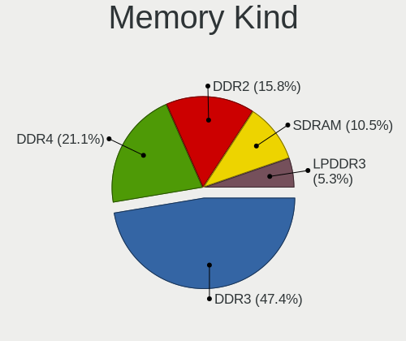

| Kind | Computers | Percent |
|------|-----------|---------|
| DDR3 | 7         | 53.85%  |
| DRAM | 2         | 15.38%  |
| DDR  | 2         | 15.38%  |
| DDR4 | 1         | 7.69%   |
| DDR2 | 1         | 7.69%   |

Memory Form Factor
------------------

Physical design of the memory module

| Name   | Computers | Percent |
|--------|-----------|---------|
| SODIMM | 8         | 61.54%  |
| DIMM   | 5         | 38.46%  |

Memory Size
-----------

Memory module size

| Size | Computers | Percent |
|------|-----------|---------|
| 8192 | 5         | 35.71%  |
| 4096 | 4         | 28.57%  |
| 2048 | 1         | 7.14%   |
| 1024 | 1         | 7.14%   |
| 512  | 1         | 7.14%   |
| 256  | 1         | 7.14%   |
| 128  | 1         | 7.14%   |

Memory Speed
------------

Memory module speed

| Speed   | Computers | Percent |
|---------|-----------|---------|
| 1600    | 5         | 38.46%  |
| Unknown | 3         | 23.08%  |
| 1333    | 2         | 15.38%  |
| 2400    | 1         | 7.69%   |
| 400     | 1         | 7.69%   |
| 266     | 1         | 7.69%   |

Sound Vendor
------------

Sound card vendors

| Vendor              | Computers | Percent |
|---------------------|-----------|---------|
| Intel               | 63        | 74.12%  |
| AMD                 | 16        | 18.82%  |
| Nvidia              | 3         | 3.53%   |
| ESS Technology      | 2         | 2.35%   |
| C-Media Electronics | 1         | 1.18%   |

Sound Model
-----------

Sound card models

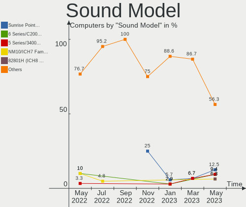

| Model                                                                                       | Computers | Percent |
|---------------------------------------------------------------------------------------------|-----------|---------|
| Wildcat Point-LP High Definition Audio Controller                                           | 8         | 7.21%   |
| Sunrise Point-LP HD Audio                                                                   | 8         | 7.21%   |
| Broadwell-U Audio Controller                                                                | 8         | 7.21%   |
| 7 Series/C216 Chipset Family High Definition Audio Controller                               | 8         | 7.21%   |
| Haswell-ULT HD Audio Controller                                                             | 6         | 5.41%   |
| 8 Series HD Audio Controller                                                                | 6         | 5.41%   |
| NM10/ICH7 Family High Definition Audio Controller                                           | 5         | 4.5%    |
| SBx00 Azalia (Intel HDA)                                                                    | 4         | 3.6%    |
| Ellesmere HDMI Audio [Radeon RX 470/480 / 570/580/590]                                      | 4         | 3.6%    |
| 8 Series/C220 Series Chipset High Definition Audio Controller                               | 4         | 3.6%    |
| Xeon E3-1200 v3/4th Gen Core Processor HD Audio Controller                                  | 3         | 2.7%    |
| Cannon Lake PCH cAVS                                                                        | 3         | 2.7%    |
| 6 Series/C200 Series Chipset Family High Definition Audio Controller                        | 3         | 2.7%    |
| 100 Series/C230 Series Chipset Family HD Audio Controller                                   | 3         | 2.7%    |
| Starship/Matisse HD Audio Controller                                                        | 2         | 1.8%    |
| RS880 HDMI Audio [Radeon HD 4200 Series]                                                    | 2         | 1.8%    |
| Raven/Raven2/Fenghuang HDMI/DP Audio Controller                                             | 2         | 1.8%    |
| MCP61 High Definition Audio                                                                 | 2         | 1.8%    |
| FCH Azalia Controller                                                                       | 2         | 1.8%    |
| Family 17h (Models 10h-1fh) HD Audio Controller                                             | 2         | 1.8%    |
| 82801JI (ICH10 Family) HD Audio Controller                                                  | 2         | 1.8%    |
| 82801I (ICH9 Family) HD Audio Controller                                                    | 2         | 1.8%    |
| 5 Series/3400 Series Chipset High Definition Audio                                          | 2         | 1.8%    |
| Wrestler HDMI Audio                                                                         | 1         | 0.9%    |
| Navi 10 HDMI Audio                                                                          | 1         | 0.9%    |
| Kabini HDMI/DP Audio                                                                        | 1         | 0.9%    |
| GF110 High Definition Audio Controller                                                      | 1         | 0.9%    |
| ES1988 Allegro-1                                                                            | 1         | 0.9%    |
| ES1968 Maestro 2                                                                            | 1         | 0.9%    |
| Crystal Well HD Audio Controller                                                            | 1         | 0.9%    |
| Comet Lake PCH-LP cAVS                                                                      | 1         | 0.9%    |
| CMI8788 [Oxygen HD Audio]                                                                   | 1         | 0.9%    |
| Celeron/Pentium Silver Processor High Definition Audio                                      | 1         | 0.9%    |
| Cedar HDMI Audio [Radeon HD 5400/6300/7300 Series]                                          | 1         | 0.9%    |
| Caicos HDMI Audio [Radeon HD 6450 / 7450/8450/8490 OEM / R5 230/235/235X OEM]               | 1         | 0.9%    |
| C610/X99 series chipset HD Audio Controller                                                 | 1         | 0.9%    |
| BeaverCreek HDMI Audio [Radeon HD 6500D and 6400G-6600G series]                             | 1         | 0.9%    |
| Barts HDMI Audio [Radeon HD 6790/6850/6870 / 7720 OEM]                                      | 1         | 0.9%    |
| Atom/Celeron/Pentium Processor x5-E8000/J3xxx/N3xxx Series High Definition Audio Controller | 1         | 0.9%    |
| 82801FB/FBM/FR/FW/FRW (ICH6 Family) AC'97 Audio Controller                                  | 1         | 0.9%    |
| 82801EB/ER (ICH5/ICH5R) AC'97 Audio Controller                                              | 1         | 0.9%    |
| 82801CA/CAM AC'97 Audio Controller                                                          | 1         | 0.9%    |
| 200 Series PCH HD Audio                                                                     | 1         | 0.9%    |

Camera Vendor
-------------

Camera device vendors

| Vendor                        | Computers | Percent |
|-------------------------------|-----------|---------|
| Chicony Electronics           | 13        | 41.94%  |
| Lite-On Technology            | 3         | 9.68%   |
| IMC Networks                  | 3         | 9.68%   |
| Acer                          | 3         | 9.68%   |
| Sunplus Innovation Technology | 2         | 6.45%   |
| Realtek Semiconductor         | 2         | 6.45%   |
| Logitech                      | 2         | 6.45%   |
| Suyin                         | 1         | 3.23%   |
| Microdia                      | 1         | 3.23%   |
| Alcor Micro                   | 1         | 3.23%   |

Camera Model
------------

Camera device models

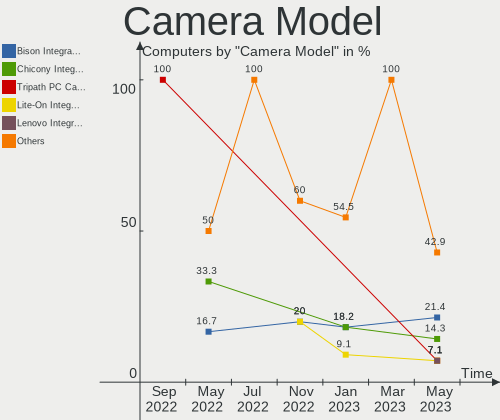

| Model                                                 | Computers | Percent |
|-------------------------------------------------------|-----------|---------|
| Integrated Camera                                     | 11        | 35.48%  |
| USB2.0 VGA UVC WebCam                                 | 2         | 6.45%   |
| Lenovo EasyCamera                                     | 2         | 6.45%   |
| Integrated Camera [ThinkPad]                          | 2         | 6.45%   |
| Webcam C310                                           | 1         | 3.23%   |
| USB2.0 UVC HD Webcam                                  | 1         | 3.23%   |
| PC Camera (SN9C201 + OV9650)                          | 1         | 3.23%   |
| OrbiCam                                               | 1         | 3.23%   |
| Ltd., USB2.0 HD UVC WebCam                            | 1         | 3.23%   |
| Ltd., HP 0.3MP Webcam                                 | 1         | 3.23%   |
| Integrated_Webcam_FHD                                 | 1         | 3.23%   |
| Integrated Camera (1280x720@30)                       | 1         | 3.23%   |
| EasyCamera                                            | 1         | 3.23%   |
| Dell E5570 integrated webcam                          | 1         | 3.23%   |
| Asus Integrated Webcam                                | 1         | 3.23%   |
| Acer 640 x 480 laptop camera                          | 1         | 3.23%   |
| 2.0M UVC Webcam / CNF7129                             | 1         | 3.23%   |
| 1.3M WebCam (notebook emachines E730, Acer sub-brand) | 1         | 3.23%   |

Fingerprint Vendor
------------------

Fingerprint sensor vendors

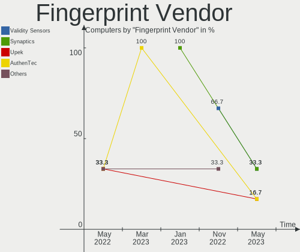

| Vendor             | Computers | Percent |
|--------------------|-----------|---------|
| Validity Sensors   | 6         | 66.67%  |
| AuthenTec          | 2         | 22.22%  |
| STMicroelectronics | 1         | 11.11%  |

Fingerprint Model
-----------------

Fingerprint sensor models

| Model                       | Computers | Percent |
|-----------------------------|-----------|---------|
| VFS 5011 fingerprint sensor | 3         | 33.33%  |
| Synaptics WBDI              | 2         | 22.22%  |
| VFS5011 Fingerprint Reader  | 1         | 11.11%  |
| Fingerprint Reader          | 1         | 11.11%  |
| AES2810                     | 1         | 11.11%  |
| AES2501 Fingerprint Sensor  | 1         | 11.11%  |

Chipcard Vendor
---------------

Chipcard module vendors

Zero info for selected period =(

Chipcard Model
--------------

Chipcard module models

Zero info for selected period =(

Printer Vendor
--------------

Printer device vendors

Zero info for selected period =(

Printer Model
-------------

Printer device models

Zero info for selected period =(

Scanner Vendor
--------------

Scanner device vendors

Zero info for selected period =(

Scanner Model
-------------

Scanner device models

Zero info for selected period =(

Bluetooth Vendor
----------------

Controller vendors

| Vendor           | Computers | Percent |
|------------------|-----------|---------|
| Intel            | 16        | 51.61%  |
| Broadcom         | 6         | 19.35%  |
| IMC Networks     | 3         | 9.68%   |
| Apple            | 3         | 9.68%   |
| Alps Electric    | 2         | 6.45%   |
| ASUSTek Computer | 1         | 3.23%   |

Bluetooth Model
---------------

Controller models

| Model                                     | Computers | Percent |
|-------------------------------------------|-----------|---------|
| Bluetooth wireless interface              | 13        | 41.94%  |
| BCM20702 Bluetooth 4.0 [ThinkPad]         | 3         | 9.68%   |
| UGTZ4 Bluetooth                           | 2         | 6.45%   |
| Apple Broadcom Built-in Bluetooth         | 2         | 6.45%   |
| Wireless-AC 9260 Bluetooth Adapter        | 1         | 3.23%   |
| Wireless-AC 3168 Bluetooth                | 1         | 3.23%   |
| Realtek Bluetooth Adapter                 | 1         | 3.23%   |
| Qualcomm Atheros Bluetooth 4.1            | 1         | 3.23%   |
| Centrino Bluetooth Wireless Transceiver   | 1         | 3.23%   |
| Broadcom Bluetooth 2.1                    | 1         | 3.23%   |
| Bluetooth Host Controller                 | 1         | 3.23%   |
| BCM20702A0 Bluetooth 4.0                  | 1         | 3.23%   |
| BCM2045B (BDC-2.1) [Bluetooth Controller] | 1         | 3.23%   |
| BCM2045 Bluetooth                         | 1         | 3.23%   |
| Asus Integrated Bluetooth module [AR3011] | 1         | 3.23%   |

Unsupported Devices
-------------------

Total unsupported devices on board

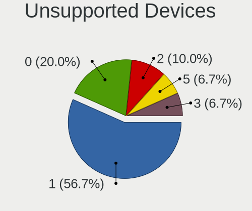

| Total | Computers | Percent |
|-------|-----------|---------|
| 0     | 46        | 38.66%  |
| 1     | 44        | 36.97%  |
| 2     | 24        | 20.17%  |
| 3     | 2         | 1.68%   |
| 8     | 1         | 0.84%   |
| 5     | 1         | 0.84%   |
| 4     | 1         | 0.84%   |

Unsupported Device Types
------------------------

Types of unsupported devices

| Type                     | Computers | Percent |
|--------------------------|-----------|---------|
| Communication controller | 58        | 56.31%  |
| Graphics card            | 13        | 12.62%  |
| Net/wireless             | 10        | 9.71%   |
| Firewire controller      | 9         | 8.74%   |
| Sound                    | 4         | 3.88%   |
| Storage/ata              | 3         | 2.91%   |
| Network                  | 2         | 1.94%   |
| Modem                    | 2         | 1.94%   |
| Net/ethernet             | 1         | 0.97%   |
| Card reader              | 1         | 0.97%   |

