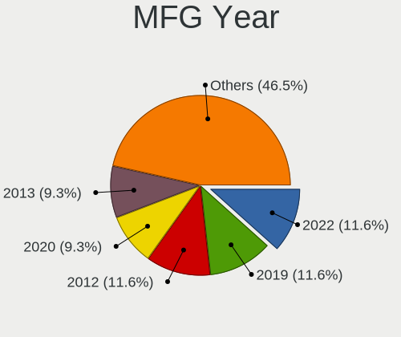
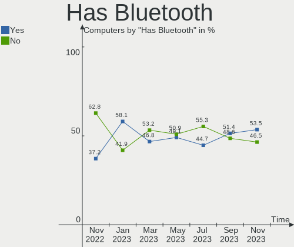
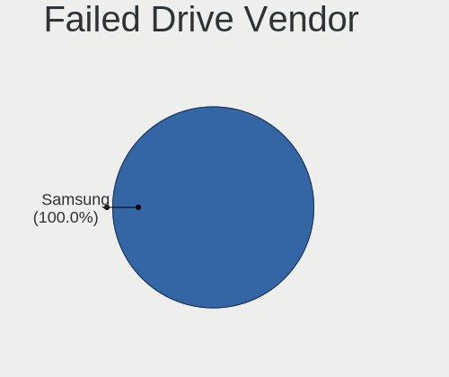
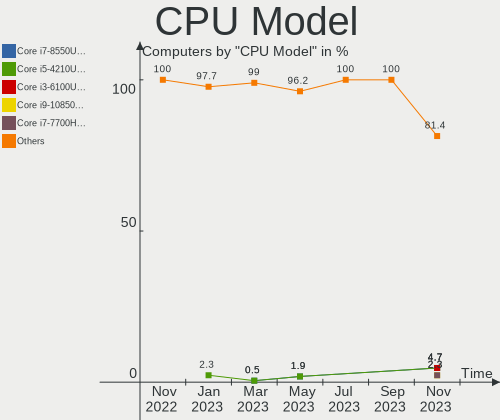
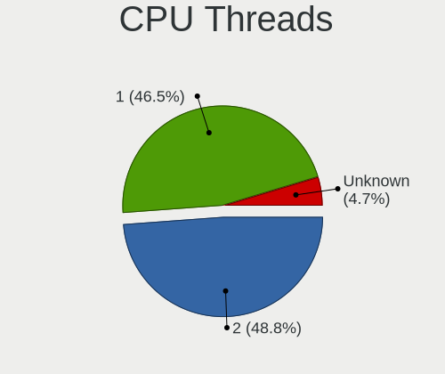
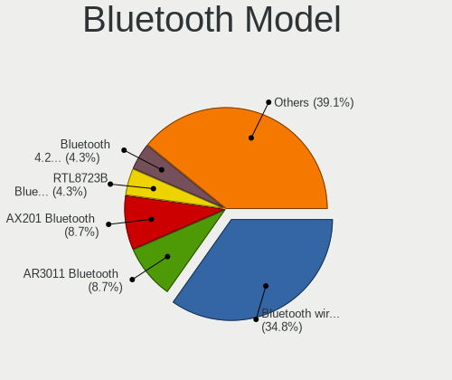
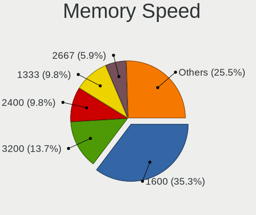
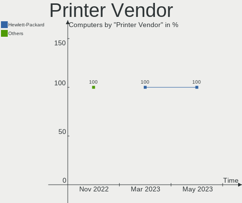
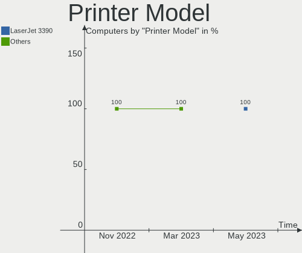

helloSystem - Hardware Trends
-----------------------------

A project to identify most popular hardware characteristics and track their change
over time based on data collected by BSD users at https://BSD-Hardware.info.

Anyone can contribute to this report by the [hw-probe](https://github.com/linuxhw/hw-probe/blob/master/INSTALL.BSD.md) tool:

    hw-probe -all -upload

This is a report for all computer types. See also reports for [desktops](/Dist/helloSystem/Desktop/README.md) and [notebooks](/Dist/helloSystem/Notebook/README.md).

This report is for one last month. Overall report since the beginning of time: [TestDays](https://github.com/bsdhw/TestDays)

Period: Mar, 2023.

Contents
--------

* [ System ](#system)
  - [ OS                       ](#os)
  - [ OS Family                ](#os-family)
  - [ Arch                     ](#arch)
  - [ DE                       ](#de)
  - [ Display Server           ](#display-server)
  - [ Display Manager          ](#display-manager)
  - [ OS Lang                  ](#os-lang)
  - [ Boot Mode                ](#boot-mode)
  - [ Filesystem               ](#filesystem)
  - [ Part. scheme             ](#part-scheme)

* [ Board ](#board)
  - [ Vendor                   ](#vendor)
  - [ Model                    ](#model)
  - [ Model Family             ](#model-family)
  - [ MFG Year                 ](#mfg-year)
  - [ Form Factor              ](#form-factor)
  - [ Coreboot                 ](#coreboot)
  - [ RAM Size                 ](#ram-size)
  - [ RAM Used                 ](#ram-used)
  - [ Total Drives             ](#total-drives)
  - [ Has CD-ROM               ](#has-cd-rom)
  - [ Has Ethernet             ](#has-ethernet)
  - [ Has WiFi                 ](#has-wifi)
  - [ Has Bluetooth            ](#has-bluetooth)

* [ Location ](#location)
  - [ Country                  ](#country)
  - [ City                     ](#city)

* [ Drives ](#drives)
  - [ Drive Vendor             ](#drive-vendor)
  - [ Drive Model              ](#drive-model)
  - [ HDD Vendor               ](#hdd-vendor)
  - [ SSD Vendor               ](#ssd-vendor)
  - [ Drive Kind               ](#drive-kind)
  - [ Drive Connector          ](#drive-connector)
  - [ Drive Size               ](#drive-size)
  - [ Space Total              ](#space-total)
  - [ Space Used               ](#space-used)
  - [ Malfunc. Drives          ](#malfunc-drives)
  - [ Malfunc. Drive Vendor    ](#malfunc-drive-vendor)
  - [ Malfunc. HDD Vendor      ](#malfunc-hdd-vendor)
  - [ Malfunc. Drive Kind      ](#malfunc-drive-kind)
  - [ Failed Drives            ](#failed-drives)
  - [ Failed Drive Vendor      ](#failed-drive-vendor)
  - [ Drive Status             ](#drive-status)

* [ Storage controller ](#storage-controller)
  - [ Storage Vendor           ](#storage-vendor)
  - [ Storage Model            ](#storage-model)
  - [ Storage Kind             ](#storage-kind)

* [ Processor ](#processor)
  - [ CPU Vendor               ](#cpu-vendor)
  - [ CPU Model                ](#cpu-model)
  - [ CPU Model Family         ](#cpu-model-family)
  - [ CPU Cores                ](#cpu-cores)
  - [ CPU Sockets              ](#cpu-sockets)
  - [ CPU Threads              ](#cpu-threads)
  - [ CPU Microarch            ](#cpu-microarch)

* [ Graphics ](#graphics)
  - [ GPU Vendor               ](#gpu-vendor)
  - [ GPU Model                ](#gpu-model)
  - [ GPU Combo                ](#gpu-combo)
  - [ GPU Driver               ](#gpu-driver)
  - [ GPU Memory               ](#gpu-memory)

* [ Monitor ](#monitor)
  - [ Monitor Vendor           ](#monitor-vendor)
  - [ Monitor Model            ](#monitor-model)
  - [ Monitor Resolution       ](#monitor-resolution)
  - [ Monitor Diagonal         ](#monitor-diagonal)
  - [ Monitor Width            ](#monitor-width)
  - [ Aspect Ratio             ](#aspect-ratio)
  - [ Monitor Area             ](#monitor-area)
  - [ Pixel Density            ](#pixel-density)
  - [ Multiple Monitors        ](#multiple-monitors)

* [ Network ](#network)
  - [ Net Controller Vendor    ](#net-controller-vendor)
  - [ Net Controller Model     ](#net-controller-model)
  - [ Wireless Vendor          ](#wireless-vendor)
  - [ Wireless Model           ](#wireless-model)
  - [ Ethernet Vendor          ](#ethernet-vendor)
  - [ Ethernet Model           ](#ethernet-model)
  - [ Net Controller Kind      ](#net-controller-kind)
  - [ Used Controller          ](#used-controller)
  - [ NICs                     ](#nics)
  - [ IPv6                     ](#ipv6)

* [ Bluetooth ](#bluetooth)
  - [ Bluetooth Vendor         ](#bluetooth-vendor)
  - [ Bluetooth Model          ](#bluetooth-model)

* [ Sound ](#sound)
  - [ Sound Vendor             ](#sound-vendor)
  - [ Sound Model              ](#sound-model)

* [ Memory ](#memory)
  - [ Memory Vendor            ](#memory-vendor)
  - [ Memory Model             ](#memory-model)
  - [ Memory Kind              ](#memory-kind)
  - [ Memory Form Factor       ](#memory-form-factor)
  - [ Memory Size              ](#memory-size)
  - [ Memory Speed             ](#memory-speed)

* [ Printers & scanners ](#printers--scanners)
  - [ Printer Vendor           ](#printer-vendor)
  - [ Printer Model            ](#printer-model)
  - [ Scanner Vendor           ](#scanner-vendor)
  - [ Scanner Model            ](#scanner-model)

* [ Camera ](#camera)
  - [ Camera Vendor            ](#camera-vendor)
  - [ Camera Model             ](#camera-model)

* [ Security ](#security)
  - [ Fingerprint Vendor       ](#fingerprint-vendor)
  - [ Fingerprint Model        ](#fingerprint-model)
  - [ Chipcard Vendor          ](#chipcard-vendor)
  - [ Chipcard Model           ](#chipcard-model)

* [ Unsupported ](#unsupported)
  - [ Unsupported Devices      ](#unsupported-devices)
  - [ Unsupported Device Types ](#unsupported-device-types)

System
------

OS
--

Installed operating systems

| Name              | Computers | Percent |
|-------------------|-----------|---------|
| helloSystem 0.8.1 | 178       | 86.83%  |
| helloSystem 0.8.0 | 15        | 7.32%   |
| helloSystem 0.8.2 | 9         | 4.39%   |
| helloSystem 0.7.0 | 3         | 1.46%   |

OS Family
---------

OS without a version

| Name        | Computers | Percent |
|-------------|-----------|---------|
| helloSystem | 205       | 100%    |

Arch
----

OS architecture (x86_64, i586, etc.)

| Name  | Computers | Percent |
|-------|-----------|---------|
| amd64 | 205       | 100%    |

DE
--

Desktop Environment

| Name         | Computers | Percent |
|--------------|-----------|---------|
| helloDesktop | 204       | 99.51%  |
| GNOME        | 1         | 0.49%   |

Display Server
--------------

X11 or Wayland

| Name | Computers | Percent |
|------|-----------|---------|
| X11  | 205       | 100%    |

Display Manager
---------------

SDDM, LightDM, etc.

| Name | Computers | Percent |
|------|-----------|---------|
| SLiM | 205       | 100%    |

OS Lang
-------

Language

| Lang    | Computers | Percent |
|---------|-----------|---------|
| en_US   | 79        | 38.54%  |
| fr_FR   | 50        | 24.39%  |
| ru_RU   | 15        | 7.32%   |
| de_DE   | 13        | 6.34%   |
| es_ES   | 11        | 5.37%   |
| en      | 8         | 3.9%    |
| pl_PL   | 5         | 2.44%   |
| Unknown | 5         | 2.44%   |
| pt_BR   | 4         | 1.95%   |
| zh_CN   | 2         | 0.98%   |
| ko_KR   | 2         | 0.98%   |
| jp_JP   | 2         | 0.98%   |
| it_IT   | 2         | 0.98%   |
| fr      | 2         | 0.98%   |
| es      | 2         | 0.98%   |
| ru      | 1         | 0.49%   |
| nl_NL   | 1         | 0.49%   |
| fi_FI   | 1         | 0.49%   |

Boot Mode
---------

EFI or BIOS

| Mode | Computers | Percent |
|------|-----------|---------|
| EFI  | 202       | 98.54%  |
| BIOS | 3         | 1.46%   |

Filesystem
----------

Type of filesystem

| Type   | Computers | Percent |
|--------|-----------|---------|
| Cd9660 | 115       | 56.1%   |
| Zfs    | 90        | 43.9%   |

Part. scheme
------------

Scheme of partitioning

| Type | Computers | Percent |
|------|-----------|---------|
| GPT  | 202       | 98.54%  |
| MBR  | 3         | 1.46%   |

Board
-----

Vendor
------

Motherboard manufacturer

| Name                | Computers | Percent |
|---------------------|-----------|---------|
| Lenovo              | 46        | 22.44%  |
| ASUSTek Computer    | 28        | 13.66%  |
| Hewlett-Packard     | 21        | 10.24%  |
| Dell                | 21        | 10.24%  |
| Gigabyte Technology | 17        | 8.29%   |
| MSI                 | 9         | 4.39%   |
| Acer                | 9         | 4.39%   |
| Toshiba             | 6         | 2.93%   |
| Fujitsu             | 6         | 2.93%   |
| Intel               | 5         | 2.44%   |
| Samsung Electronics | 4         | 1.95%   |
| Apple               | 4         | 1.95%   |
| Unknown             | 4         | 1.95%   |
| Sony                | 3         | 1.46%   |
| ASRock              | 3         | 1.46%   |
| T-bao               | 2         | 0.98%   |
| LG Electronics      | 2         | 0.98%   |
| Fujitsu Siemens     | 2         | 0.98%   |
| Foxconn             | 2         | 0.98%   |
| MECHREVO S1 Series  | 1         | 0.49%   |
| Irbis               | 1         | 0.49%   |
| IGEL Technology     | 1         | 0.49%   |
| Google              | 1         | 0.49%   |
| Dynabook Europe     | 1         | 0.49%   |
| DNS                 | 1         | 0.49%   |
| Clevo               | 1         | 0.49%   |
| Biostar             | 1         | 0.49%   |
| BESSTAR Tech        | 1         | 0.49%   |
| AZW                 | 1         | 0.49%   |
| Axiomtek            | 1         | 0.49%   |

Model
-----

Motherboard model

| Name                                  | Computers | Percent |
|---------------------------------------|-----------|---------|
| Unknown                               | 5         | 2.44%   |
| T-bao MINI PC                         | 2         | 0.98%   |
| MSI MS-7788                           | 2         | 0.98%   |
| HP Compaq Elite 8300 USDT             | 2         | 0.98%   |
| Dell OptiPlex 3020                    | 2         | 0.98%   |
| Toshiba Satellite P300                | 1         | 0.49%   |
| Toshiba Satellite L675D               | 1         | 0.49%   |
| Toshiba Satellite L50-B               | 1         | 0.49%   |
| Toshiba Satellite L40                 | 1         | 0.49%   |
| Toshiba Satellite C845                | 1         | 0.49%   |
| Toshiba Satellite A200                | 1         | 0.49%   |
| Sony VGN-FZ19VN                       | 1         | 0.49%   |
| Sony SVL2412Z1EB                      | 1         | 0.49%   |
| Sony SVE1511C5E                       | 1         | 0.49%   |
| Samsung R520/R522/R620                | 1         | 0.49%   |
| Samsung R468/R418                     | 1         | 0.49%   |
| Samsung 305E4A/305E5A/305E7A          | 1         | 0.49%   |
| Samsung 275E4E/275E5E                 | 1         | 0.49%   |
| MSI MS-7C95                           | 1         | 0.49%   |
| MSI MS-7C91                           | 1         | 0.49%   |
| MSI MS-7C51                           | 1         | 0.49%   |
| MSI MS-7C09                           | 1         | 0.49%   |
| MSI MS-7B86                           | 1         | 0.49%   |
| MSI MS-7599                           | 1         | 0.49%   |
| MSI Compaq dx2200 MT                  | 1         | 0.49%   |
| MECHREVO S1 Series S1 Series          | 1         | 0.49%   |
| LG E500-L.A2M4A2                      | 1         | 0.49%   |
| LG COLUMBIA                           | 1         | 0.49%   |
| Lenovo ZIUS6                          | 1         | 0.49%   |
| Lenovo Yoga Slim 7 Pro 14ACH5 82MS    | 1         | 0.49%   |
| Lenovo ThinkPad X61s 7667WQS          | 1         | 0.49%   |
| Lenovo ThinkPad X270 W10DG 20K5S0DB05 | 1         | 0.49%   |
| Lenovo ThinkPad X230 Tablet 34352TU   | 1         | 0.49%   |
| Lenovo ThinkPad X230 232578G          | 1         | 0.49%   |
| Lenovo ThinkPad X230 23252G8          | 1         | 0.49%   |
| Lenovo ThinkPad X220 4291AN9          | 1         | 0.49%   |
| Lenovo ThinkPad X220 4290DK6          | 1         | 0.49%   |
| Lenovo ThinkPad X220 4286CTO          | 1         | 0.49%   |
| Lenovo ThinkPad X201 36801T6          | 1         | 0.49%   |
| Lenovo ThinkPad X200 74591P0          | 1         | 0.49%   |

Model Family
------------

Motherboard model prefix

| Name                    | Computers | Percent |
|-------------------------|-----------|---------|
| Lenovo ThinkPad         | 29        | 14.15%  |
| Lenovo ThinkCentre      | 8         | 3.9%    |
| Dell OptiPlex           | 7         | 3.41%   |
| Dell Latitude           | 7         | 3.41%   |
| Toshiba Satellite       | 6         | 2.93%   |
| Lenovo IdeaPad          | 5         | 2.44%   |
| Dell Inspiron           | 5         | 2.44%   |
| ASUS ROG                | 5         | 2.44%   |
| ASUS PRIME              | 5         | 2.44%   |
| Unknown                 | 5         | 2.44%   |
| HP Pavilion             | 4         | 1.95%   |
| HP Laptop               | 3         | 1.46%   |
| HP EliteDesk            | 3         | 1.46%   |
| HP EliteBook            | 3         | 1.46%   |
| Acer Aspire             | 3         | 1.46%   |
| T-bao MINI              | 2         | 0.98%   |
| MSI MS-7788             | 2         | 0.98%   |
| HP Compaq               | 2         | 0.98%   |
| Fujitsu Siemens ESPRIMO | 2         | 0.98%   |
| Fujitsu LIFEBOOK        | 2         | 0.98%   |
| ASUS TUF                | 2         | 0.98%   |
| Acer TravelMate         | 2         | 0.98%   |
| Sony VGN-FZ19VN         | 1         | 0.49%   |
| Sony SVL2412Z1EB        | 1         | 0.49%   |
| Sony SVE1511C5E         | 1         | 0.49%   |
| Samsung R520            | 1         | 0.49%   |
| Samsung R468            | 1         | 0.49%   |
| Samsung 305E4A          | 1         | 0.49%   |
| Samsung 275E4E          | 1         | 0.49%   |
| MSI MS-7C95             | 1         | 0.49%   |
| MSI MS-7C91             | 1         | 0.49%   |
| MSI MS-7C51             | 1         | 0.49%   |
| MSI MS-7C09             | 1         | 0.49%   |
| MSI MS-7B86             | 1         | 0.49%   |
| MSI MS-7599             | 1         | 0.49%   |
| MSI Compaq              | 1         | 0.49%   |
| MECHREVO S1 Series S1   | 1         | 0.49%   |
| LG E500-L.A2M4A2        | 1         | 0.49%   |
| LG COLUMBIA             | 1         | 0.49%   |
| Lenovo ZIUS6            | 1         | 0.49%   |

MFG Year
--------

Motherboard manufacture year

| Year    | Computers | Percent |
|---------|-----------|---------|
| 2012    | 20        | 9.76%   |
| 2022    | 18        | 8.78%   |
| 2013    | 18        | 8.78%   |
| 2021    | 16        | 7.8%    |
| 2018    | 16        | 7.8%    |
| 2019    | 15        | 7.32%   |
| 2020    | 14        | 6.83%   |
| 2011    | 12        | 5.85%   |
| 2009    | 12        | 5.85%   |
| 2014    | 11        | 5.37%   |
| 2016    | 10        | 4.88%   |
| 2010    | 10        | 4.88%   |
| 2017    | 8         | 3.9%    |
| 2015    | 8         | 3.9%    |
| 2008    | 6         | 2.93%   |
| 2007    | 6         | 2.93%   |
| 2023    | 2         | 0.98%   |
| 2006    | 2         | 0.98%   |
| Unknown | 1         | 0.49%   |

Form Factor
-----------

Physical design of the computer

| Name        | Computers | Percent |
|-------------|-----------|---------|
| Notebook    | 100       | 48.78%  |
| Desktop     | 97        | 47.32%  |
| Mini pc     | 3         | 1.46%   |
| Convertible | 2         | 0.98%   |
| All in one  | 2         | 0.98%   |
| Server      | 1         | 0.49%   |

Coreboot
--------

Have coreboot on board

| Used | Computers | Percent |
|------|-----------|---------|
| No   | 202       | 98.54%  |
| Yes  | 3         | 1.46%   |

RAM Size
--------

Total RAM memory

| Size in GB  | Computers | Percent |
|-------------|-----------|---------|
| 8.01-16.0   | 75        | 36.59%  |
| 4.01-8.0    | 53        | 25.85%  |
| 16.01-24.0  | 44        | 21.46%  |
| 32.01-64.0  | 15        | 7.32%   |
| 2.01-3.0    | 12        | 5.85%   |
| 3.01-4.0    | 3         | 1.46%   |
| 24.01-32.0  | 2         | 0.98%   |
| 64.01-256.0 | 1         | 0.49%   |

RAM Used
--------

Used RAM memory

| Used GB  | Computers | Percent |
|----------|-----------|---------|
| 0.01-0.5 | 113       | 55.12%  |
| 0.51-1.0 | 68        | 33.17%  |
| 1.01-2.0 | 19        | 9.27%   |
| 2.01-3.0 | 4         | 1.95%   |
| 3.01-4.0 | 1         | 0.49%   |

Total Drives
------------

Number of drives on board

| Drives | Computers | Percent |
|--------|-----------|---------|
| 1      | 126       | 61.46%  |
| 2      | 40        | 19.51%  |
| 3      | 14        | 6.83%   |
| 0      | 14        | 6.83%   |
| 5      | 6         | 2.93%   |
| 4      | 2         | 0.98%   |
| 9      | 1         | 0.49%   |
| 7      | 1         | 0.49%   |
| 6      | 1         | 0.49%   |

Has CD-ROM
----------

Has CD-ROM on board

| Presented | Computers | Percent |
|-----------|-----------|---------|
| No        | 132       | 64.39%  |
| Yes       | 73        | 35.61%  |

Has Ethernet
------------

Has Ethernet on board

| Presented | Computers | Percent |
|-----------|-----------|---------|
| Yes       | 188       | 91.71%  |
| No        | 17        | 8.29%   |

Has WiFi
--------

Has WiFi module

| Presented | Computers | Percent |
|-----------|-----------|---------|
| Yes       | 137       | 66.83%  |
| No        | 68        | 33.17%  |

Has Bluetooth
-------------

Has Bluetooth module

| Presented | Computers | Percent |
|-----------|-----------|---------|
| No        | 109       | 53.17%  |
| Yes       | 96        | 46.83%  |

Location
--------

Country
-------

Geographic location (country)

| Country            | Computers | Percent |
|--------------------|-----------|---------|
| USA                | 31        | 15.12%  |
| Russia             | 23        | 11.22%  |
| Germany            | 17        | 8.29%   |
| Spain              | 13        | 6.34%   |
| Poland             | 13        | 6.34%   |
| Italy              | 8         | 3.9%    |
| France             | 8         | 3.9%    |
| Brazil             | 8         | 3.9%    |
| Indonesia          | 6         | 2.93%   |
| Romania            | 5         | 2.44%   |
| India              | 5         | 2.44%   |
| Serbia             | 4         | 1.95%   |
| Hungary            | 4         | 1.95%   |
| Canada             | 4         | 1.95%   |
| UK                 | 3         | 1.46%   |
| Turkey             | 3         | 1.46%   |
| China              | 3         | 1.46%   |
| Bulgaria           | 3         | 1.46%   |
| Australia          | 3         | 1.46%   |
| Switzerland        | 2         | 0.98%   |
| South Korea        | 2         | 0.98%   |
| Portugal           | 2         | 0.98%   |
| Netherlands        | 2         | 0.98%   |
| Mexico             | 2         | 0.98%   |
| Lithuania          | 2         | 0.98%   |
| Japan              | 2         | 0.98%   |
| Greece             | 2         | 0.98%   |
| Dominican Republic | 2         | 0.98%   |
| Argentina          | 2         | 0.98%   |
| Vietnam            | 1         | 0.49%   |
| Ukraine            | 1         | 0.49%   |
| Sweden             | 1         | 0.49%   |
| Slovenia           | 1         | 0.49%   |
| Slovakia           | 1         | 0.49%   |
| Philippines        | 1         | 0.49%   |
| Peru               | 1         | 0.49%   |
| Norway             | 1         | 0.49%   |
| Kosovo             | 1         | 0.49%   |
| Israel             | 1         | 0.49%   |
| Ireland            | 1         | 0.49%   |

City
----

Geographic location (city)

| City                  | Computers | Percent |
|-----------------------|-----------|---------|
| Berlin                | 5         | 2.44%   |
| Moscow                | 4         | 1.95%   |
| Sao Paulo             | 3         | 1.46%   |
| Krakow                | 3         | 1.46%   |
| Wroclaw               | 2         | 0.98%   |
| Warsaw                | 2         | 0.98%   |
| Valencia              | 2         | 0.98%   |
| Sydney                | 2         | 0.98%   |
| St Petersburg         | 2         | 0.98%   |
| Santo Domingo Este    | 2         | 0.98%   |
| Paris                 | 2         | 0.98%   |
| Montreal              | 2         | 0.98%   |
| Madrid                | 2         | 0.98%   |
| Los Angeles           | 2         | 0.98%   |
| Krasnodar             | 2         | 0.98%   |
| Kirov                 | 2         | 0.98%   |
| Bogor                 | 2         | 0.98%   |
| Belgrade              | 2         | 0.98%   |
| Zurich                | 1         | 0.49%   |
| Yuzhong Chengguanzhen | 1         | 0.49%   |
| Yokohama              | 1         | 0.49%   |
| Yeosu                 | 1         | 0.49%   |
| Yekaterinburg         | 1         | 0.49%   |
| Woodbridge            | 1         | 0.49%   |
| West Plains           | 1         | 0.49%   |
| Wausau                | 1         | 0.49%   |
| Volgodonsk            | 1         | 0.49%   |
| Vogogna               | 1         | 0.49%   |
| Virovitica            | 1         | 0.49%   |
| Vilnius               | 1         | 0.49%   |
| Villena               | 1         | 0.49%   |
| Villemomble           | 1         | 0.49%   |
| Vila Nova de Gaia     | 1         | 0.49%   |
| Vienna                | 1         | 0.49%   |
| Venice                | 1         | 0.49%   |
| Vecses                | 1         | 0.49%   |
| Valderrobres          | 1         | 0.49%   |
| Uiwang-si             | 1         | 0.49%   |
| Ubstadt-Weiher        | 1         | 0.49%   |
| Twinsburg             | 1         | 0.49%   |

Drives
------

Drive Vendor
------------

Hard drive vendors

| Vendor              | Computers | Drives | Percent |
|---------------------|-----------|--------|---------|
| Samsung Electronics | 43        | 51     | 15.81%  |
| WDC                 | 42        | 59     | 15.44%  |
| Seagate             | 28        | 34     | 10.29%  |
| Kingston            | 25        | 25     | 9.19%   |
| Toshiba             | 20        | 20     | 7.35%   |
| SanDisk             | 16        | 16     | 5.88%   |
| Hitachi             | 11        | 12     | 4.04%   |
| Crucial             | 10        | 12     | 3.68%   |
| Micron Technology   | 7         | 7      | 2.57%   |
| HGST                | 7         | 7      | 2.57%   |
| A-DATA Technology   | 5         | 6      | 1.84%   |
| KingSpec            | 4         | 4      | 1.47%   |
| Intel               | 4         | 4      | 1.47%   |
| China               | 4         | 5      | 1.47%   |
| Transcend           | 3         | 3      | 1.1%    |
| SK hynix            | 3         | 3      | 1.1%    |
| PNY                 | 3         | 3      | 1.1%    |
| Patriot             | 3         | 3      | 1.1%    |
| Maxtor              | 3         | 3      | 1.1%    |
| OCZ                 | 2         | 2      | 0.74%   |
| Intenso             | 2         | 2      | 0.74%   |
| GOODRAM             | 2         | 2      | 0.74%   |
| Colorful            | 2         | 2      | 0.74%   |
| XrayDisk            | 1         | 1      | 0.37%   |
| Verbatim            | 1         | 1      | 0.37%   |
| Team                | 1         | 1      | 0.37%   |
| SPCC                | 1         | 1      | 0.37%   |
| SETHRISE            | 1         | 1      | 0.37%   |
| QUANTUM             | 1         | 1      | 0.37%   |
| Plextor             | 1         | 1      | 0.37%   |
| Pioneer             | 1         | 1      | 0.37%   |
| Palit               | 1         | 1      | 0.37%   |
| Netac               | 1         | 1      | 0.37%   |
| Kston               | 1         | 1      | 0.37%   |
| KIOXIA-EXCERIA      | 1         | 1      | 0.37%   |
| Gigabyte Technology | 1         | 1      | 0.37%   |
| Fujitsu             | 1         | 1      | 0.37%   |
| FORESEE             | 1         | 1      | 0.37%   |
| EDGE                | 1         | 1      | 0.37%   |
| Dogfish             | 1         | 1      | 0.37%   |

Drive Model
-----------

Hard drive models

| Model                            | Computers | Percent |
|----------------------------------|-----------|---------|
| Seagate ST500DM002-1BD142 500GB  | 5         | 1.66%   |
| Kingston SA400S37240G 240GB      | 5         | 1.66%   |
| Seagate ST3500418AS 500GB        | 4         | 1.33%   |
| Samsung SSD 970 EVO Plus 1TB     | 4         | 1.33%   |
| Samsung SSD 860 EVO 500GB        | 4         | 1.33%   |
| Samsung SSD 850 EVO 250GB        | 4         | 1.33%   |
| Toshiba DT01ACA050 500GB         | 3         | 1%      |
| Kingston SHFS37A240G 240GB       | 3         | 1%      |
| Kingston SA400S37480G 480GB      | 3         | 1%      |
| HGST HTS545050A7E380 500GB       | 3         | 1%      |
| WDC WDS240G2G0A-00JH30 240GB     | 2         | 0.66%   |
| WDC WDS120G2G0A-00JH30 120GB     | 2         | 0.66%   |
| WDC WD5000AAKX-08U6AA0 500GB     | 2         | 0.66%   |
| WDC WD10EZEX-60WN4A0 1TB         | 2         | 0.66%   |
| WDC WD10EZEX-08WN4A0 1TB         | 2         | 0.66%   |
| Toshiba MQ01ABD100 1TB           | 2         | 0.66%   |
| Seagate ST9500325AS 500GB        | 2         | 0.66%   |
| Seagate ST500LM000-1EJ162 500GB  | 2         | 0.66%   |
| Seagate ST2000LM007-1R8174 2TB   | 2         | 0.66%   |
| Seagate ST2000DM008-2FR102 2TB   | 2         | 0.66%   |
| Seagate ST1000DM010-2EP102 1TB   | 2         | 0.66%   |
| Samsung SSD 980 PRO 500GB        | 2         | 0.66%   |
| Samsung SSD 980 500GB            | 2         | 0.66%   |
| Samsung SSD 970 EVO Plus 250GB   | 2         | 0.66%   |
| Samsung MZVLQ512HALU-00000 512GB | 2         | 0.66%   |
| PNY CS900 240GB SSD              | 2         | 0.66%   |
| Patriot Burst 240GB              | 2         | 0.66%   |
| Kingston SUV400S37120G 120GB     | 2         | 0.66%   |
| Kingston SA400S37120G 120GB      | 2         | 0.66%   |
| Intenso SSD 120GB                | 2         | 0.66%   |
| Crucial CT500MX500SSD1 500GB     | 2         | 0.66%   |
| Crucial CT480BX500SSD1 480GB     | 2         | 0.66%   |
| Crucial CT240BX500SSD1 240GB     | 2         | 0.66%   |
| Crucial CT1000BX500SSD1 1TB      | 2         | 0.66%   |
| XrayDisk SSD 240GB               | 1         | 0.33%   |
| WDC WDS500G2B0B-00YS70 500GB     | 1         | 0.33%   |
| WDC WDS500G1B0A-00H9H0 500GB     | 1         | 0.33%   |
| WDC WDS250G1B0A-00H9H0 250GB     | 1         | 0.33%   |
| WDC WDS240G1G0B-00RC30 240GB     | 1         | 0.33%   |
| WDC WD800JD-75MSA3 80GB          | 1         | 0.33%   |

HDD Vendor
----------

Hard disk drive vendors

| Vendor              | Computers | Drives | Percent |
|---------------------|-----------|--------|---------|
| WDC                 | 33        | 49     | 30.84%  |
| Seagate             | 28        | 34     | 26.17%  |
| Toshiba             | 17        | 17     | 15.89%  |
| Hitachi             | 11        | 12     | 10.28%  |
| HGST                | 7         | 7      | 6.54%   |
| Samsung Electronics | 5         | 5      | 4.67%   |
| Maxtor              | 3         | 3      | 2.8%    |
| QUANTUM             | 1         | 1      | 0.93%   |
| Fujitsu             | 1         | 1      | 0.93%   |
| Apple               | 1         | 1      | 0.93%   |

SSD Vendor
----------

Solid state drive vendors

| Vendor              | Computers | Drives | Percent |
|---------------------|-----------|--------|---------|
| Samsung Electronics | 20        | 23     | 16%     |
| Kingston            | 18        | 18     | 14.4%   |
| SanDisk             | 16        | 16     | 12.8%   |
| Crucial             | 10        | 12     | 8%      |
| WDC                 | 8         | 8      | 6.4%    |
| Micron Technology   | 4         | 4      | 3.2%    |
| KingSpec            | 4         | 4      | 3.2%    |
| China               | 4         | 5      | 3.2%    |
| Transcend           | 3         | 3      | 2.4%    |
| Toshiba             | 3         | 3      | 2.4%    |
| PNY                 | 3         | 3      | 2.4%    |
| Patriot             | 3         | 3      | 2.4%    |
| Intel               | 3         | 3      | 2.4%    |
| A-DATA Technology   | 3         | 3      | 2.4%    |
| OCZ                 | 2         | 2      | 1.6%    |
| Intenso             | 2         | 2      | 1.6%    |
| GOODRAM             | 2         | 2      | 1.6%    |
| XrayDisk            | 1         | 1      | 0.8%    |
| Verbatim            | 1         | 1      | 0.8%    |
| Team                | 1         | 1      | 0.8%    |
| SPCC                | 1         | 1      | 0.8%    |
| SK hynix            | 1         | 1      | 0.8%    |
| SETHRISE            | 1         | 1      | 0.8%    |
| Plextor             | 1         | 1      | 0.8%    |
| Pioneer             | 1         | 1      | 0.8%    |
| Palit               | 1         | 1      | 0.8%    |
| Netac               | 1         | 1      | 0.8%    |
| Kston               | 1         | 1      | 0.8%    |
| Gigabyte Technology | 1         | 1      | 0.8%    |
| EDGE                | 1         | 1      | 0.8%    |
| Dogfish             | 1         | 1      | 0.8%    |
| Colorful            | 1         | 1      | 0.8%    |
| Apacer              | 1         | 1      | 0.8%    |
| AMD                 | 1         | 1      | 0.8%    |

Drive Kind
----------

HDD or SSD

| Kind | Computers | Drives | Percent |
|------|-----------|--------|---------|
| SSD  | 105       | 131    | 43.21%  |
| HDD  | 97        | 130    | 39.92%  |
| NVMe | 41        | 47     | 16.87%  |

Drive Connector
---------------

SATA, SAS, NVMe, etc.

| Type | Computers | Drives | Percent |
|------|-----------|--------|---------|
| SATA | 172       | 261    | 80.75%  |
| NVMe | 41        | 47     | 19.25%  |

Drive Size
----------

Size of hard drive

| Size in TB | Computers | Drives | Percent |
|------------|-----------|--------|---------|
| 0.01-0.5   | 143       | 186    | 70.44%  |
| 0.51-1.0   | 38        | 43     | 18.72%  |
| 1.01-2.0   | 10        | 15     | 4.93%   |
| 3.01-4.0   | 7         | 9      | 3.45%   |
| 2.01-3.0   | 3         | 6      | 1.48%   |
| 10.01-20.0 | 1         | 1      | 0.49%   |
| 4.01-10.0  | 1         | 1      | 0.49%   |

Space Total
-----------

Amount of disk space available on the file system

| Size in GB | Computers | Percent |
|------------|-----------|---------|
| 1-20       | 114       | 55.61%  |
| 101-250    | 32        | 15.61%  |
| 251-500    | 26        | 12.68%  |
| 51-100     | 21        | 10.24%  |
| 501-1000   | 11        | 5.37%   |
| Unknown    | 1         | 0.49%   |

Space Used
----------

Amount of used disk space

| Used GB | Computers | Percent |
|---------|-----------|---------|
| 1-20    | 204       | 99.51%  |
| Unknown | 1         | 0.49%   |

Malfunc. Drives
---------------

Drive models with a malfunction

| Model                                      | Computers | Drives | Percent |
|--------------------------------------------|-----------|--------|---------|
| Toshiba MQ01ABD100 1TB                     | 2         | 2      | 3.85%   |
| Seagate ST9500325AS 500GB                  | 2         | 2      | 3.85%   |
| Seagate ST500LM000-1EJ162 500GB            | 2         | 2      | 3.85%   |
| HGST HTS545050A7E380 500GB                 | 2         | 2      | 3.85%   |
| WDC WD800JD-75MSA3 80GB                    | 1         | 1      | 1.92%   |
| WDC WD6400BPVT-22HXZT3 640GB               | 1         | 1      | 1.92%   |
| WDC WD5000AAKX-08U6AA0 500GB               | 1         | 1      | 1.92%   |
| WDC WD30PURZ-85AKKY0 3TB                   | 1         | 1      | 1.92%   |
| WDC WD30EFRX-68EUZN0 3TB                   | 1         | 1      | 1.92%   |
| WDC WD20EZRX-00D8PB0 2TB                   | 1         | 1      | 1.92%   |
| WDC WD10JPVX-60JC3T1 1TB                   | 1         | 1      | 1.92%   |
| WDC WD10EZEX-60WN4A0 1TB                   | 1         | 1      | 1.92%   |
| WDC WD10EARS-003BB1 1TB                    | 1         | 1      | 1.92%   |
| Toshiba MQ01ABD032 320GB                   | 1         | 1      | 1.92%   |
| Toshiba MK3259GSXP 320GB                   | 1         | 1      | 1.92%   |
| Toshiba MK1646GSX 160GB                    | 1         | 1      | 1.92%   |
| Toshiba MK1229GSG 120GB                    | 1         | 1      | 1.92%   |
| Toshiba DT01ACA100 1TB                     | 1         | 1      | 1.92%   |
| SK hynix SC210 mSATA 256GB                 | 1         | 1      | 1.92%   |
| Seagate ST500DM002-1BD142 500GB            | 1         | 1      | 1.92%   |
| Seagate ST380215AS 80GB                    | 1         | 1      | 1.92%   |
| Seagate ST3500418AS 500GB                  | 1         | 1      | 1.92%   |
| Seagate ST3500320AS 500GB                  | 1         | 1      | 1.92%   |
| Seagate ST320LT012-9WS14C 320GB            | 1         | 1      | 1.92%   |
| Seagate ST2000DM008-2FR102 2TB             | 1         | 1      | 1.92%   |
| Seagate ST1000LM024 HN-M101MBB 1TB         | 1         | 2      | 1.92%   |
| Seagate ST1000DM010-2EP102 1TB             | 1         | 1      | 1.92%   |
| Samsung Electronics MZVL22T0HBLB-00B00 2TB | 1         | 1      | 1.92%   |
| Samsung Electronics HS08XJC 80GB           | 1         | 1      | 1.92%   |
| Samsung Electronics HD103SJ 1TB            | 1         | 1      | 1.92%   |
| Maxtor 6Y080M0 82GB                        | 1         | 1      | 1.92%   |
| Maxtor 6V080E0 80GB                        | 1         | 1      | 1.92%   |
| Maxtor 6L080P0 82GB                        | 1         | 1      | 1.92%   |
| Kingston SV300S37A60G 64GB                 | 1         | 1      | 1.92%   |
| Kingston SUV400S37120G 120GB               | 1         | 1      | 1.92%   |
| Kingston SA400S37240G 240GB                | 1         | 1      | 1.92%   |
| Intel SSDSC2BF180A4L 180GB                 | 1         | 1      | 1.92%   |
| Hitachi HTS727550A9E364 500GB              | 1         | 1      | 1.92%   |
| Hitachi HTS725050A7E630 500GB              | 1         | 1      | 1.92%   |
| Hitachi HTS547575A9E384 752GB              | 1         | 1      | 1.92%   |

Malfunc. Drive Vendor
---------------------

Vendors of faulty drives

| Vendor              | Computers | Drives | Percent |
|---------------------|-----------|--------|---------|
| Seagate             | 10        | 13     | 20%     |
| WDC                 | 9         | 9      | 18%     |
| Toshiba             | 7         | 7      | 14%     |
| Hitachi             | 6         | 6      | 12%     |
| HGST                | 4         | 4      | 8%      |
| Samsung Electronics | 3         | 3      | 6%      |
| Maxtor              | 3         | 3      | 6%      |
| Kingston            | 3         | 3      | 6%      |
| Crucial             | 3         | 3      | 6%      |
| SK hynix            | 1         | 1      | 2%      |
| Intel               | 1         | 1      | 2%      |

Malfunc. HDD Vendor
-------------------

Vendors of faulty HDD drives

| Vendor              | Computers | Drives | Percent |
|---------------------|-----------|--------|---------|
| Seagate             | 10        | 13     | 24.39%  |
| WDC                 | 9         | 9      | 21.95%  |
| Toshiba             | 7         | 7      | 17.07%  |
| Hitachi             | 6         | 6      | 14.63%  |
| HGST                | 4         | 4      | 9.76%   |
| Maxtor              | 3         | 3      | 7.32%   |
| Samsung Electronics | 2         | 2      | 4.88%   |

Malfunc. Drive Kind
-------------------

Kinds of faulty drives

| Kind | Computers | Drives | Percent |
|------|-----------|--------|---------|
| HDD  | 41        | 44     | 82%     |
| SSD  | 8         | 8      | 16%     |
| NVMe | 1         | 1      | 2%      |

Failed Drives
-------------

Failed drive models

| Model                       | Computers | Drives | Percent |
|-----------------------------|-----------|--------|---------|
| WDC WD7501AALS-00J7B0 752GB | 1         | 1      | 50%     |
| SanDisk pSSD 128GB          | 1         | 1      | 50%     |

Failed Drive Vendor
-------------------

Failed drive vendors

| Vendor  | Computers | Drives | Percent |
|---------|-----------|--------|---------|
| WDC     | 1         | 1      | 50%     |
| SanDisk | 1         | 1      | 50%     |

Drive Status
------------

Number of failed and malfunc. drives

| Status   | Computers | Drives | Percent |
|----------|-----------|--------|---------|
| Works    | 153       | 246    | 73.21%  |
| Malfunc  | 50        | 53     | 23.92%  |
| Detected | 4         | 7      | 1.91%   |
| Failed   | 2         | 2      | 0.96%   |

Storage controller
------------------

Storage Vendor
--------------

Storage controller vendors

| Vendor                      | Computers | Percent |
|-----------------------------|-----------|---------|
| Intel                       | 155       | 61.75%  |
| AMD                         | 36        | 14.34%  |
| Samsung Electronics         | 20        | 7.97%   |
| Kingston Technology Company | 7         | 2.79%   |
| SanDisk                     | 6         | 2.39%   |
| Nvidia                      | 5         | 1.99%   |
| Marvell Technology Group    | 4         | 1.59%   |
| Micron Technology           | 3         | 1.2%    |
| VIA Technologies            | 2         | 0.8%    |
| SK hynix                    | 2         | 0.8%    |
| Silicon Motion              | 2         | 0.8%    |
| Realtek Semiconductor       | 2         | 0.8%    |
| ASMedia Technology          | 2         | 0.8%    |
| Phison Electronics          | 1         | 0.4%    |
| KIOXIA                      | 1         | 0.4%    |
| Broadcom / LSI              | 1         | 0.4%    |
| Biwin Storage Technology    | 1         | 0.4%    |
| ADATA Technology            | 1         | 0.4%    |

Storage Model
-------------

Storage controller models

| Model                                                                                   | Computers | Percent |
|-----------------------------------------------------------------------------------------|-----------|---------|
| Intel 7 Series Chipset Family 6-port SATA Controller [AHCI mode]                        | 19        | 6.33%   |
| AMD FCH SATA Controller [AHCI mode]                                                     | 19        | 6.33%   |
| Intel 8 Series/C220 Series Chipset Family 6-port SATA Controller 1 [AHCI mode]          | 16        | 5.33%   |
| Intel Sunrise Point-LP SATA Controller [AHCI mode]                                      | 15        | 5%      |
| Samsung NVMe SSD Controller SM981/PM981/PM983                                           | 10        | 3.33%   |
| Intel Q170/Q150/B150/H170/H110/Z170/CM236 Chipset SATA Controller [AHCI Mode]           | 10        | 3.33%   |
| Intel 82801HM/HEM (ICH8M/ICH8M-E) SATA Controller [AHCI mode]                           | 8         | 2.67%   |
| Intel 82801HM/HEM (ICH8M/ICH8M-E) IDE Controller                                        | 8         | 2.67%   |
| Intel 6 Series/C200 Series Chipset Family 6 port Desktop SATA AHCI Controller           | 8         | 2.67%   |
| Intel 82801IBM/IEM (ICH9M/ICH9M-E) 4 port SATA Controller [AHCI mode]                   | 7         | 2.33%   |
| Intel 6 Series/C200 Series Chipset Family 6 port Mobile SATA AHCI Controller            | 7         | 2.33%   |
| Intel 200 Series PCH SATA controller [AHCI mode]                                        | 7         | 2.33%   |
| Intel 6 Series/C200 Series Chipset Family Desktop SATA Controller (IDE mode, ports 4-5) | 6         | 2%      |
| Intel 6 Series/C200 Series Chipset Family Desktop SATA Controller (IDE mode, ports 0-3) | 6         | 2%      |
| Unknown                                                                                 | 6         | 2%      |
| Samsung NVMe SSD Controller PM9A1/PM9A3/980PRO                                          | 5         | 1.67%   |
| Samsung NVMe SSD Controller 980                                                         | 5         | 1.67%   |
| Intel 8 Series SATA Controller 1 [AHCI mode]                                            | 5         | 1.67%   |
| AMD SB7x0/SB8x0/SB9x0 IDE Controller                                                    | 5         | 1.67%   |
| AMD 500 Series Chipset SATA Controller                                                  | 5         | 1.67%   |
| Intel Cannon Lake PCH SATA AHCI Controller                                              | 4         | 1.33%   |
| Intel 82801 Mobile SATA Controller [RAID mode]                                          | 4         | 1.33%   |
| AMD SB7x0/SB8x0/SB9x0 SATA Controller [AHCI mode]                                       | 4         | 1.33%   |
| AMD 400 Series Chipset SATA Controller                                                  | 4         | 1.33%   |
| SanDisk NVMe Controller                                                                 | 3         | 1%      |
| Micron NVMe Storage Controller                                                          | 3         | 1%      |
| Intel SATA Controller [RAID mode]                                                       | 3         | 1%      |
| Intel 82801JD/DO (ICH10 Family) 4-port SATA IDE Controller                              | 3         | 1%      |
| Intel 82801JD/DO (ICH10 Family) 2-port SATA IDE Controller                              | 3         | 1%      |
| Intel 82801HM/HEM (ICH8M/ICH8M-E) SATA Controller [IDE mode]                            | 3         | 1%      |
| Intel 5 Series/3400 Series Chipset 4 port SATA IDE Controller                           | 3         | 1%      |
| Intel 5 Series/3400 Series Chipset 2 port SATA IDE Controller                           | 3         | 1%      |
| Intel 4 Series Chipset PT IDER Controller                                               | 3         | 1%      |
| AMD SB7x0/SB8x0/SB9x0 SATA Controller [IDE mode]                                        | 3         | 1%      |
| VIA VT6415 PATA IDE Host Controller                                                     | 2         | 0.67%   |
| Silicon Motion SM2263EN/SM2263XT SSD Controller                                         | 2         | 0.67%   |
| SanDisk WD Blue SN570 NVMe SSD 1TB                                                      | 2         | 0.67%   |
| Samsung NVMe SSD Controller SM961/PM961/SM963                                           | 2         | 0.67%   |
| Realtek NVMe Controller                                                                 | 2         | 0.67%   |
| Nvidia MCP79 AHCI Controller                                                            | 2         | 0.67%   |

Storage Kind
------------

Kind of storage controller (IDE, SATA, NVMe, SAS, ...)

| Kind | Computers | Percent |
|------|-----------|---------|
| SATA | 161       | 63.39%  |
| NVMe | 42        | 16.54%  |
| IDE  | 41        | 16.14%  |
| RAID | 9         | 3.54%   |
| SAS  | 1         | 0.39%   |

Processor
---------

CPU Vendor
----------

Processor vendors

| Vendor | Computers | Percent |
|--------|-----------|---------|
| Intel  | 165       | 80.49%  |
| AMD    | 40        | 19.51%  |

CPU Model
---------

Processor models

| Model                                         | Computers | Percent |
|-----------------------------------------------|-----------|---------|
| Intel Core i5-6300U CPU @ 2.40GHz             | 5         | 2.44%   |
| Intel CPU Version                             | 4         | 1.95%   |
| Intel Core i5-7200U CPU @ 2.50GHz             | 4         | 1.95%   |
| Intel Core i5-6500 CPU @ 3.20GHz              | 4         | 1.95%   |
| AMD Ryzen 5 5600X 6-Core Processor            | 4         | 1.95%   |
| Intel Core i7-3667U CPU @ 2.00GHz             | 3         | 1.46%   |
| Intel Core i7-3520M CPU @ 2.90GHz             | 3         | 1.46%   |
| Intel Core i5-8250U CPU @ 1.60GHz             | 3         | 1.46%   |
| Intel Core i5-5200U CPU @ 2.20GHz             | 3         | 1.46%   |
| Intel Core i5-3320M CPU @ 2.60GHz             | 3         | 1.46%   |
| Intel Core i5-2520M CPU @ 2.50GHz             | 3         | 1.46%   |
| Intel Core i5-2400 CPU @ 3.10GHz              | 3         | 1.46%   |
| Intel Core i3-7100 CPU @ 3.90GHz              | 3         | 1.46%   |
| Intel Core i3-3220 CPU @ 3.30GHz              | 3         | 1.46%   |
| Intel Core i7-6700 CPU @ 3.40GHz              | 2         | 0.98%   |
| Intel Core i5-6500T CPU @ 2.50GHz             | 2         | 0.98%   |
| Intel Core i3-9100 CPU @ 3.60GHz              | 2         | 0.98%   |
| Intel Core i3-4130 CPU @ 3.40GHz              | 2         | 0.98%   |
| Intel Core i3-3240 CPU @ 3.40GHz              | 2         | 0.98%   |
| Intel Core 2 Duo CPU T8100 @ 2.10GHz          | 2         | 0.98%   |
| Intel Core 2 Duo CPU T7100 @ 1.80GHz          | 2         | 0.98%   |
| Intel Core 2 Duo CPU P8600 @ 2.40GHz          | 2         | 0.98%   |
| Intel Celeron CPU J1900 @ 1.99GHz             | 2         | 0.98%   |
| Intel Atom CPU N570 @ 1.66GHz                 | 2         | 0.98%   |
| AMD Ryzen 7 3750H with Radeon Vega Mobile Gfx | 2         | 0.98%   |
| AMD Ryzen 5 2600 Six-Core Processor           | 2         | 0.98%   |
| AMD Ryzen 3 2200G with Radeon Vega Graphics   | 2         | 0.98%   |
| Intel Xeon CPU E5-2620 v3 @ 2.40GHz           | 1         | 0.49%   |
| Intel Xeon CPU E31220 @ 3.10GHz               | 1         | 0.49%   |
| Intel Xeon CPU E3-1220 V2 @ 3.10GHz           | 1         | 0.49%   |
| Intel Xeon                                    | 1         | 0.49%   |
| Intel Pentium Gold G5400 CPU @ 3.70GHz        | 1         | 0.49%   |
| Intel Pentium Dual-Core CPU E5300             | 1         | 0.49%   |
| Intel Pentium Dual CPU T2390 @ 1.86GHz        | 1         | 0.49%   |
| Intel Pentium CPU P6200 @ 2.13GHz             | 1         | 0.49%   |
| Intel Pentium CPU N3700 @ 1.60GHz             | 1         | 0.49%   |
| Intel Pentium CPU G620 @ 2.60GHz              | 1         | 0.49%   |
| Intel Pentium CPU G3220 @ 3.00GHz             | 1         | 0.49%   |
| Intel Pentium CPU G2020 @ 2.90GHz             | 1         | 0.49%   |
| Intel Pentium CPU B970 @ 2.30GHz              | 1         | 0.49%   |

CPU Model Family
----------------

Processor model prefix

| Model                   | Computers | Percent |
|-------------------------|-----------|---------|
| Intel Core i5           | 54        | 26.34%  |
| Intel Core i7           | 30        | 14.63%  |
| Intel Core i3           | 23        | 11.22%  |
| Intel Core 2 Duo        | 15        | 7.32%   |
| Intel Celeron           | 15        | 7.32%   |
| Other                   | 10        | 4.88%   |
| AMD Ryzen 5             | 10        | 4.88%   |
| AMD Ryzen 7             | 8         | 3.9%    |
| Intel Pentium           | 6         | 2.93%   |
| Intel Xeon              | 4         | 1.95%   |
| AMD Ryzen 3             | 4         | 1.95%   |
| Intel Atom              | 3         | 1.46%   |
| Intel Core 2 Quad       | 2         | 0.98%   |
| AMD Phenom II X4        | 2         | 0.98%   |
| AMD A4                  | 2         | 0.98%   |
| Intel Pentium Gold      | 1         | 0.49%   |
| Intel Pentium Dual-Core | 1         | 0.49%   |
| Intel Pentium Dual      | 1         | 0.49%   |
| Intel Pentium 4         | 1         | 0.49%   |
| Intel Core 2            | 1         | 0.49%   |
| AMD Ryzen Embedded      | 1         | 0.49%   |
| AMD Ryzen 9             | 1         | 0.49%   |
| AMD Phenom II X2        | 1         | 0.49%   |
| AMD Phenom II           | 1         | 0.49%   |
| AMD FX                  | 1         | 0.49%   |
| AMD E1                  | 1         | 0.49%   |
| AMD E                   | 1         | 0.49%   |
| AMD Athlon II X4        | 1         | 0.49%   |
| AMD Athlon II X2        | 1         | 0.49%   |
| AMD Athlon 64           | 1         | 0.49%   |
| AMD A8                  | 1         | 0.49%   |
| AMD A10                 | 1         | 0.49%   |

CPU Cores
---------

Number of processor cores

| Number  | Computers | Percent |
|---------|-----------|---------|
| 2       | 94        | 45.85%  |
| 4       | 65        | 31.71%  |
| Unknown | 17        | 8.29%   |
| 12      | 8         | 3.9%    |
| 6       | 8         | 3.9%    |
| 8       | 6         | 2.93%   |
| 16      | 5         | 2.44%   |
| 1       | 2         | 0.98%   |

CPU Sockets
-----------

Number of sockets

| Number | Computers | Percent |
|--------|-----------|---------|
| 1      | 200       | 97.56%  |
| 2      | 5         | 2.44%   |

CPU Threads
-----------

Threads per core (Hyper-Threading)

| Number  | Computers | Percent |
|---------|-----------|---------|
| 1       | 94        | 45.85%  |
| 2       | 93        | 45.37%  |
| Unknown | 18        | 8.78%   |

CPU Microarch
-------------

Microarchitecture

| Name          | Computers | Percent |
|---------------|-----------|---------|
| KabyLake      | 27        | 13.17%  |
| IvyBridge     | 24        | 11.71%  |
| Haswell       | 24        | 11.71%  |
| SandyBridge   | 19        | 9.27%   |
| Skylake       | 18        | 8.78%   |
| Penryn        | 14        | 6.83%   |
| Core          | 12        | 5.85%   |
| Zen 3         | 9         | 4.39%   |
| Zen+          | 8         | 3.9%    |
| Westmere      | 6         | 2.93%   |
| K10           | 6         | 2.93%   |
| Zen           | 5         | 2.44%   |
| Unknown       | 5         | 2.44%   |
| Silvermont    | 4         | 1.95%   |
| Broadwell     | 4         | 1.95%   |
| Piledriver    | 3         | 1.46%   |
| Bonnell       | 3         | 1.46%   |
| Excavator     | 2         | 0.98%   |
| Bobcat        | 2         | 0.98%   |
| Zen 2         | 1         | 0.49%   |
| TigerLake     | 1         | 0.49%   |
| NetBurst      | 1         | 0.49%   |
| Nehalem       | 1         | 0.49%   |
| K8 Hammer     | 1         | 0.49%   |
| K10 Llano     | 1         | 0.49%   |
| Goldmont plus | 1         | 0.49%   |
| Goldmont      | 1         | 0.49%   |
| CometLake     | 1         | 0.49%   |
| Bulldozer     | 1         | 0.49%   |

Graphics
--------

GPU Vendor
----------

Vendors of graphics cards

| Vendor                     | Computers | Percent |
|----------------------------|-----------|---------|
| Intel                      | 132       | 57.89%  |
| Nvidia                     | 49        | 21.49%  |
| AMD                        | 46        | 20.18%  |
| Matrox Electronics Systems | 1         | 0.44%   |

GPU Model
---------

Graphics card models

| Model                                                                                    | Computers | Percent |
|------------------------------------------------------------------------------------------|-----------|---------|
| Intel 2nd Generation Core Processor Family Integrated Graphics Controller                | 16        | 6.67%   |
| Intel 3rd Gen Core processor Graphics Controller                                         | 14        | 5.83%   |
| Intel Mobile GM965/GL960 Integrated Graphics Controller (secondary)                      | 9         | 3.75%   |
| Intel Mobile GM965/GL960 Integrated Graphics Controller (primary)                        | 9         | 3.75%   |
| Intel HD Graphics 530                                                                    | 9         | 3.75%   |
| Intel Xeon E3-1200 v3/4th Gen Core Processor Integrated Graphics Controller              | 8         | 3.33%   |
| Intel Skylake GT2 [HD Graphics 520]                                                      | 7         | 2.92%   |
| Intel UHD Graphics 620                                                                   | 6         | 2.5%    |
| Intel Haswell-ULT Integrated Graphics Controller                                         | 5         | 2.08%   |
| Nvidia GP107 [GeForce GTX 1050 Ti]                                                       | 4         | 1.67%   |
| Intel Xeon E3-1200 v2/3rd Gen Core processor Graphics Controller                         | 4         | 1.67%   |
| Intel Mobile 4 Series Chipset Integrated Graphics Controller                             | 4         | 1.67%   |
| Intel HD Graphics 630                                                                    | 4         | 1.67%   |
| Intel HD Graphics 620                                                                    | 4         | 1.67%   |
| Intel HD Graphics 5500                                                                   | 4         | 1.67%   |
| Intel Core Processor Integrated Graphics Controller                                      | 4         | 1.67%   |
| Intel 4th Gen Core Processor Integrated Graphics Controller                              | 4         | 1.67%   |
| AMD Raven Ridge [Radeon Vega Series / Radeon Vega Mobile Series]                         | 4         | 1.67%   |
| AMD Picasso/Raven 2 [Radeon Vega Series / Radeon Vega Mobile Series]                     | 4         | 1.67%   |
| Nvidia GT218 [GeForce 210]                                                               | 3         | 1.25%   |
| Intel CoffeeLake-S GT2 [UHD Graphics 630]                                                | 3         | 1.25%   |
| Intel 4th Generation Core Processor Family Integrated Graphics Controller                | 3         | 1.25%   |
| Intel 4 Series Chipset Integrated Graphics Controller                                    | 3         | 1.25%   |
| AMD Lexa PRO [Radeon 540/540X/550/550X / RX 540X/550/550X]                               | 3         | 1.25%   |
| Nvidia TU116 [GeForce GTX 1660 SUPER]                                                    | 2         | 0.83%   |
| Nvidia GM108M [GeForce 840M]                                                             | 2         | 0.83%   |
| Nvidia GM107 [GeForce 940MX]                                                             | 2         | 0.83%   |
| Nvidia GK208B [GeForce GT 710]                                                           | 2         | 0.83%   |
| Nvidia GF119 [GeForce GT 610]                                                            | 2         | 0.83%   |
| Intel WhiskeyLake-U GT2 [UHD Graphics 620]                                               | 2         | 0.83%   |
| Intel Atom/Celeron/Pentium Processor x5-E8000/J3xxx/N3xxx Integrated Graphics Controller | 2         | 0.83%   |
| Intel Atom Processor D4xx/D5xx/N4xx/N5xx Integrated Graphics Controller                  | 2         | 0.83%   |
| AMD Seymour [Radeon HD 6400M/7400M Series]                                               | 2         | 0.83%   |
| AMD RS880 [Radeon HD 4250]                                                               | 2         | 0.83%   |
| AMD Ellesmere [Radeon RX 470/480/570/570X/580/580X/590]                                  | 2         | 0.83%   |
| AMD Cezanne [Radeon Vega Series / Radeon Vega Mobile Series]                             | 2         | 0.83%   |
| AMD Cedar [Radeon HD 5000/6000/7350/8350 Series]                                         | 2         | 0.83%   |
| Nvidia TU117M [GeForce GTX 1650 Mobile / Max-Q]                                          | 1         | 0.42%   |
| Nvidia TU117 [GeForce GTX 1650]                                                          | 1         | 0.42%   |
| Nvidia TU116 [GeForce GTX 1660]                                                          | 1         | 0.42%   |

GPU Combo
---------

Combinations of graphics cards

| Name           | Computers | Percent |
|----------------|-----------|---------|
| 1 x Intel      | 92        | 44.88%  |
| 1 x AMD        | 36        | 17.56%  |
| 1 x Nvidia     | 32        | 15.61%  |
| 2 x Intel      | 18        | 8.78%   |
| Intel + Nvidia | 15        | 7.32%   |
| Intel + AMD    | 7         | 3.41%   |
| 2 x AMD        | 2         | 0.98%   |
| 2 x Nvidia     | 1         | 0.49%   |
| 1 x Matrox     | 1         | 0.49%   |
| AMD + Nvidia   | 1         | 0.49%   |

GPU Driver
----------

Free vs proprietary

| Driver      | Computers | Percent |
|-------------|-----------|---------|
| Free        | 175       | 85.37%  |
| Proprietary | 26        | 12.68%  |
| Unknown     | 4         | 1.95%   |

GPU Memory
----------

Total video memory

| Size in GB | Computers | Percent |
|------------|-----------|---------|
| Unknown    | 156       | 76.1%   |
| 0.01-0.5   | 14        | 6.83%   |
| 3.01-4.0   | 10        | 4.88%   |
| 0.51-1.0   | 10        | 4.88%   |
| 1.01-2.0   | 8         | 3.9%    |
| 5.01-6.0   | 4         | 1.95%   |
| 7.01-8.0   | 1         | 0.49%   |
| 2.01-3.0   | 1         | 0.49%   |
| 8.01-16.0  | 1         | 0.49%   |

Monitor
-------

Monitor Vendor
--------------

Monitor vendors

| Vendor               | Computers | Percent |
|----------------------|-----------|---------|
| Acer                 | 4         | 20%     |
| Dell                 | 3         | 15%     |
| LG Electronics       | 2         | 10%     |
| PKB                  | 1         | 5%      |
| NEC Computers        | 1         | 5%      |
| Microstep            | 1         | 5%      |
| LPL                  | 1         | 5%      |
| Idek Iiyama          | 1         | 5%      |
| cPATH                | 1         | 5%      |
| BenQ                 | 1         | 5%      |
| AUS                  | 1         | 5%      |
| AOC                  | 1         | 5%      |
| Ancor Communications | 1         | 5%      |
| Unknown              | 1         | 5%      |

Monitor Model
-------------

Monitor models

| Model                                       | Computers | Percent |
|---------------------------------------------|-----------|---------|
| PKB LCD Monitor MAE200W 1680x1050           | 1         | 5%      |
| NEC Computers LCD Monitor 70GX2 1280x1024   | 1         | 5%      |
| Microstep LCD Monitor MSI MAG241C 1920x1080 | 1         | 5%      |
| LPL LCD Monitor 1680x1050                   | 1         | 5%      |
| LG Electronics LCD Monitor LG TV 1920x1080  | 1         | 5%      |
| LG Electronics LCD Monitor L1918S 1280x1024 | 1         | 5%      |
| Idek Iiyama LCD Monitor PL2209HD 5760x2160  | 1         | 5%      |
| Dell LCD Monitor U2419HC 1920x1080          | 1         | 5%      |
| Dell LCD Monitor S2721D 2560x1440           | 1         | 5%      |
| Dell LCD Monitor E2211H 1920x1080           | 1         | 5%      |
| cPATH LCD Monitor 1366x768                  | 1         | 5%      |
| BenQ LCD Monitor GW2780 1920x1080           | 1         | 5%      |
| AUS LCD Monitor ASUS VG247Q1A 1920x1080     | 1         | 5%      |
| AOC LCD Monitor 27B2 1920x1080              | 1         | 5%      |
| Ancor Communications LCD Monitor VX238      | 1         | 5%      |
| Acer LCD Monitor XV280K 3840x2160           | 1         | 5%      |
| Acer LCD Monitor XB273K GP 3840x2160        | 1         | 5%      |
| Acer LCD Monitor VG270U 2560x1440           | 1         | 5%      |
| Acer LCD Monitor KG251Q 3840x1080           | 1         | 5%      |
| Unknown                                     | 1         | 5%      |

Monitor Resolution
------------------

Monitor screen resolution

| Resolution         | Computers | Percent |
|--------------------|-----------|---------|
| 1920x1080 (FHD)    | 7         | 35%     |
| 3840x2160 (4K)     | 2         | 10%     |
| 2560x1440 (QHD)    | 2         | 10%     |
| 1680x1050 (WSXGA+) | 2         | 10%     |
| 1280x1024 (SXGA)   | 2         | 10%     |
| Unknown            | 2         | 10%     |
| 5760x2160          | 1         | 5%      |
| 3840x1080          | 1         | 5%      |
| 1366x768 (WXGA)    | 1         | 5%      |

Monitor Diagonal
----------------

Diagonal size in inches

| Inches  | Computers | Percent |
|---------|-----------|---------|
| Unknown | 18        | 100%    |

Monitor Width
-------------

Physical width

| Width in mm | Computers | Percent |
|-------------|-----------|---------|
| Unknown     | 18        | 100%    |

Aspect Ratio
------------

Proportional relationship between the width and the height

| Ratio   | Computers | Percent |
|---------|-----------|---------|
| Unknown | 18        | 100%    |

Monitor Area
------------

Area in inch

| Area in inch | Computers | Percent |
|----------------|-----------|---------|
| Unknown        | 18        | 100%    |

Pixel Density
-------------

Pixels per inch

| Density | Computers | Percent |
|---------|-----------|---------|
| Unknown | 18        | 100%    |

Multiple Monitors
-----------------

Total monitors connected

| Total | Computers | Percent |
|-------|-----------|---------|
| 1     | 178       | 86.83%  |
| 0     | 23        | 11.22%  |
| 2     | 4         | 1.95%   |

Network
-------

Net Controller Vendor
---------------------

Controller vendors

| Vendor                            | Computers | Percent |
|-----------------------------------|-----------|---------|
| Realtek Semiconductor             | 108       | 38.3%   |
| Intel                             | 101       | 35.82%  |
| Qualcomm Atheros                  | 37        | 13.12%  |
| Broadcom                          | 9         | 3.19%   |
| Marvell Technology Group          | 5         | 1.77%   |
| TP-Link                           | 3         | 1.06%   |
| Sierra Wireless                   | 3         | 1.06%   |
| Ralink                            | 3         | 1.06%   |
| Samsung Electronics               | 2         | 0.71%   |
| Ralink Technology                 | 2         | 0.71%   |
| Nvidia                            | 2         | 0.71%   |
| MediaTek                          | 2         | 0.71%   |
| Huawei Technologies               | 1         | 0.35%   |
| Ericsson Business Mobile Networks | 1         | 0.35%   |
| D-Link                            | 1         | 0.35%   |
| Atheros                           | 1         | 0.35%   |
| Accton Technology                 | 1         | 0.35%   |

Net Controller Model
--------------------

Controller models

| Model                                                                   | Computers | Percent |
|-------------------------------------------------------------------------|-----------|---------|
| Realtek RTL8111/8168/8411 PCI Express Gigabit Ethernet Controller       | 81        | 23.41%  |
| Intel 82579LM Gigabit Network Connection (Lewisville)                   | 18        | 5.2%    |
| Realtek RTL810xE PCI Express Fast Ethernet controller                   | 12        | 3.47%   |
| Qualcomm Atheros AR9485 Wireless Network Adapter                        | 9         | 2.6%    |
| Intel Centrino Advanced-N 6205 [Taylor Peak]                            | 9         | 2.6%    |
| Realtek RTL8188EUS 802.11n Wireless Network Adapter                     | 7         | 2.02%   |
| Intel Ethernet Connection I217-LM                                       | 7         | 2.02%   |
| Qualcomm Atheros QCA9565 / AR9565 Wireless Network Adapter              | 5         | 1.45%   |
| Intel Wireless 8265 / 8275                                              | 5         | 1.45%   |
| Intel Wireless 8260                                                     | 5         | 1.45%   |
| Intel Wireless 7265                                                     | 5         | 1.45%   |
| Intel Wireless 7260                                                     | 5         | 1.45%   |
| Intel Ethernet Connection I219-LM                                       | 5         | 1.45%   |
| Intel Ethernet Connection (2) I219-LM                                   | 5         | 1.45%   |
| Intel Dual Band Wireless-AC 3168NGW [Stone Peak]                        | 5         | 1.45%   |
| Realtek RTL8821CE 802.11ac PCIe Wireless Network Adapter                | 4         | 1.16%   |
| Intel Wireless 3165                                                     | 4         | 1.16%   |
| Intel Wi-Fi 6 AX200                                                     | 4         | 1.16%   |
| Intel Ethernet Connection I217-V                                        | 4         | 1.16%   |
| Realtek RTL-8100/8101L/8139 PCI Fast Ethernet Adapter                   | 3         | 0.87%   |
| Qualcomm Atheros AR9287 Wireless Network Adapter (PCI-Express)          | 3         | 0.87%   |
| Qualcomm Atheros AR9285 Wireless Network Adapter (PCI-Express)          | 3         | 0.87%   |
| Qualcomm Atheros AR242x / AR542x Wireless Network Adapter (PCI-Express) | 3         | 0.87%   |
| Intel PRO/Wireless 4965 AG or AGN [Kedron] Network Connection           | 3         | 0.87%   |
| Intel Ethernet Controller I225-V                                        | 3         | 0.87%   |
| Intel 82579V Gigabit Network Connection                                 | 3         | 0.87%   |
| Intel 82567LM Gigabit Network Connection                                | 3         | 0.87%   |
| Intel 82566MM Gigabit Network Connection                                | 3         | 0.87%   |
| Broadcom BCM4321 802.11a/b/g/n                                          | 3         | 0.87%   |
| TP-Link TL-WN722N v2/v3 [Realtek RTL8188EUS]                            | 2         | 0.58%   |
| Samsung Galaxy series, misc. (tethering mode)                           | 2         | 0.58%   |
| Realtek RTL8822BE 802.11a/b/g/n/ac WiFi adapter                         | 2         | 0.58%   |
| Realtek RTL8821AE 802.11ac PCIe Wireless Network Adapter                | 2         | 0.58%   |
| Realtek RTL8723BE PCIe Wireless Network Adapter                         | 2         | 0.58%   |
| Realtek RTL8188CUS 802.11n WLAN Adapter                                 | 2         | 0.58%   |
| Realtek RTL8125 2.5GbE Controller                                       | 2         | 0.58%   |
| Qualcomm Atheros QCA8172 Fast Ethernet                                  | 2         | 0.58%   |
| Qualcomm Atheros AR9462 Wireless Network Adapter                        | 2         | 0.58%   |
| Qualcomm Atheros AR928X Wireless Network Adapter (PCI-Express)          | 2         | 0.58%   |
| Qualcomm Atheros AR8152 v2.0 Fast Ethernet                              | 2         | 0.58%   |

Wireless Vendor
---------------

Wireless vendors

| Vendor                | Computers | Percent |
|-----------------------|-----------|---------|
| Intel                 | 65        | 45.14%  |
| Qualcomm Atheros      | 29        | 20.14%  |
| Realtek Semiconductor | 27        | 18.75%  |
| Broadcom              | 8         | 5.56%   |
| TP-Link               | 3         | 2.08%   |
| Ralink                | 3         | 2.08%   |
| Sierra Wireless       | 2         | 1.39%   |
| Ralink Technology     | 2         | 1.39%   |
| MediaTek              | 2         | 1.39%   |
| D-Link                | 1         | 0.69%   |
| Atheros               | 1         | 0.69%   |
| Accton Technology     | 1         | 0.69%   |

Wireless Model
--------------

Wireless models

| Model                                                                   | Computers | Percent |
|-------------------------------------------------------------------------|-----------|---------|
| Qualcomm Atheros AR9485 Wireless Network Adapter                        | 9         | 6.16%   |
| Intel Centrino Advanced-N 6205 [Taylor Peak]                            | 9         | 6.16%   |
| Realtek RTL8188EUS 802.11n Wireless Network Adapter                     | 7         | 4.79%   |
| Qualcomm Atheros QCA9565 / AR9565 Wireless Network Adapter              | 5         | 3.42%   |
| Intel Wireless 8265 / 8275                                              | 5         | 3.42%   |
| Intel Wireless 8260                                                     | 5         | 3.42%   |
| Intel Wireless 7265                                                     | 5         | 3.42%   |
| Intel Wireless 7260                                                     | 5         | 3.42%   |
| Intel Dual Band Wireless-AC 3168NGW [Stone Peak]                        | 5         | 3.42%   |
| Realtek RTL8821CE 802.11ac PCIe Wireless Network Adapter                | 4         | 2.74%   |
| Intel Wireless 3165                                                     | 4         | 2.74%   |
| Intel Wi-Fi 6 AX200                                                     | 4         | 2.74%   |
| Qualcomm Atheros AR9287 Wireless Network Adapter (PCI-Express)          | 3         | 2.05%   |
| Qualcomm Atheros AR9285 Wireless Network Adapter (PCI-Express)          | 3         | 2.05%   |
| Qualcomm Atheros AR242x / AR542x Wireless Network Adapter (PCI-Express) | 3         | 2.05%   |
| Intel PRO/Wireless 4965 AG or AGN [Kedron] Network Connection           | 3         | 2.05%   |
| Broadcom BCM4321 802.11a/b/g/n                                          | 3         | 2.05%   |
| TP-Link TL-WN722N v2/v3 [Realtek RTL8188EUS]                            | 2         | 1.37%   |
| Realtek RTL8822BE 802.11a/b/g/n/ac WiFi adapter                         | 2         | 1.37%   |
| Realtek RTL8821AE 802.11ac PCIe Wireless Network Adapter                | 2         | 1.37%   |
| Realtek RTL8723BE PCIe Wireless Network Adapter                         | 2         | 1.37%   |
| Realtek RTL8188CUS 802.11n WLAN Adapter                                 | 2         | 1.37%   |
| Qualcomm Atheros AR9462 Wireless Network Adapter                        | 2         | 1.37%   |
| Qualcomm Atheros AR928X Wireless Network Adapter (PCI-Express)          | 2         | 1.37%   |
| Intel PRO/Wireless 5100 AGN [Shiloh] Network Connection                 | 2         | 1.37%   |
| Intel PRO/Wireless 3945ABG [Golan] Network Connection                   | 2         | 1.37%   |
| Intel Centrino Wireless-N 1000 [Condor Peak]                            | 2         | 1.37%   |
| Broadcom BCM4322 802.11a/b/g/n Wireless LAN Controller                  | 2         | 1.37%   |
| Broadcom BCM4313 802.11bgn Wireless Network Adapter                     | 2         | 1.37%   |
| TP-Link AC600 wireless Realtek RTL8811AU [Archer T2U Nano]              | 1         | 0.68%   |
| Sierra Wireless EM7455                                                  | 1         | 0.68%   |
| Sierra Wireless EM7345 4G LTE                                           | 1         | 0.68%   |
| Realtek RTL8852AE 802.11ax PCIe Wireless Network Adapter                | 1         | 0.68%   |
| Realtek RTL8812AE 802.11ac PCIe Wireless Network Adapter                | 1         | 0.68%   |
| Realtek RTL8723DE Wireless Network Adapter                              | 1         | 0.68%   |
| Realtek RTL8723AE PCIe Wireless Network Adapter                         | 1         | 0.68%   |
| Realtek RTL8192EE PCIe Wireless Network Adapter                         | 1         | 0.68%   |
| Realtek RTL8192CU 802.11n WLAN Adapter                                  | 1         | 0.68%   |
| Realtek RTL8191SEvB Wireless LAN Controller                             | 1         | 0.68%   |
| Realtek RTL8188CE 802.11b/g/n WiFi Adapter                              | 1         | 0.68%   |

Ethernet Vendor
---------------

Ethernet vendors

| Vendor                   | Computers | Percent |
|--------------------------|-----------|---------|
| Realtek Semiconductor    | 97        | 50.26%  |
| Intel                    | 74        | 38.34%  |
| Qualcomm Atheros         | 11        | 5.7%    |
| Marvell Technology Group | 5         | 2.59%   |
| Samsung Electronics      | 2         | 1.04%   |
| Nvidia                   | 2         | 1.04%   |
| Huawei Technologies      | 1         | 0.52%   |
| Broadcom                 | 1         | 0.52%   |

Ethernet Model
--------------

Ethernet models

| Model                                                             | Computers | Percent |
|-------------------------------------------------------------------|-----------|---------|
| Realtek RTL8111/8168/8411 PCI Express Gigabit Ethernet Controller | 81        | 41.33%  |
| Intel 82579LM Gigabit Network Connection (Lewisville)             | 18        | 9.18%   |
| Realtek RTL810xE PCI Express Fast Ethernet controller             | 12        | 6.12%   |
| Intel Ethernet Connection I217-LM                                 | 7         | 3.57%   |
| Intel Ethernet Connection I219-LM                                 | 5         | 2.55%   |
| Intel Ethernet Connection (2) I219-LM                             | 5         | 2.55%   |
| Intel Ethernet Connection I217-V                                  | 4         | 2.04%   |
| Realtek RTL-8100/8101L/8139 PCI Fast Ethernet Adapter             | 3         | 1.53%   |
| Intel Ethernet Controller I225-V                                  | 3         | 1.53%   |
| Intel 82579V Gigabit Network Connection                           | 3         | 1.53%   |
| Intel 82567LM Gigabit Network Connection                          | 3         | 1.53%   |
| Intel 82566MM Gigabit Network Connection                          | 3         | 1.53%   |
| Samsung Galaxy series, misc. (tethering mode)                     | 2         | 1.02%   |
| Qualcomm Atheros QCA8172 Fast Ethernet                            | 2         | 1.02%   |
| Qualcomm Atheros AR8152 v2.0 Fast Ethernet                        | 2         | 1.02%   |
| Nvidia MCP79 Ethernet                                             | 2         | 1.02%   |
| Intel I211 Gigabit Network Connection                             | 2         | 1.02%   |
| Intel Ethernet Connection (6) I219-V                              | 2         | 1.02%   |
| Intel Ethernet Connection (3) I218-LM                             | 2         | 1.02%   |
| Intel Ethernet Connection (17) I219-V                             | 2         | 1.02%   |
| Intel 82574L Gigabit Network Connection                           | 2         | 1.02%   |
| Intel 82567LF-3 Gigabit Network Connection                        | 2         | 1.02%   |
| Realtek RTL8125 2.5GbE Controller                                 | 1         | 0.51%   |
| Qualcomm Atheros Killer E2500 Gigabit Ethernet Controller         | 1         | 0.51%   |
| Qualcomm Atheros Attansic L1 Gigabit Ethernet                     | 1         | 0.51%   |
| Qualcomm Atheros AR8161 Gigabit Ethernet                          | 1         | 0.51%   |
| Qualcomm Atheros AR8151 v2.0 Gigabit Ethernet                     | 1         | 0.51%   |
| Qualcomm Atheros AR8151 v1.0 Gigabit Ethernet                     | 1         | 0.51%   |
| Qualcomm Atheros AR8132 Fast Ethernet                             | 1         | 0.51%   |
| Qualcomm Atheros AR8131 Gigabit Ethernet                          | 1         | 0.51%   |
| Marvell Group 88E8058 PCI-E Gigabit Ethernet Controller           | 1         | 0.51%   |
| Marvell Group 88E8057 PCI-E Gigabit Ethernet Controller           | 1         | 0.51%   |
| Marvell Group 88E8056 PCI-E Gigabit Ethernet Controller           | 1         | 0.51%   |
| Marvell Group 88E8040T PCI-E Fast Ethernet Controller             | 1         | 0.51%   |
| Marvell Group 88E8036 PCI-E Fast Ethernet Controller              | 1         | 0.51%   |
| Intel I210 Gigabit Network Connection                             | 1         | 0.51%   |
| Intel Ethernet Connection (7) I219-V                              | 1         | 0.51%   |
| Intel Ethernet Connection (7) I219-LM                             | 1         | 0.51%   |
| Intel Ethernet Connection (6) I219-LM                             | 1         | 0.51%   |
| Intel Ethernet Connection (5) I219-V                              | 1         | 0.51%   |

Net Controller Kind
-------------------

Ethernet, WiFi or modem

| Kind     | Computers | Percent |
|----------|-----------|---------|
| Ethernet | 188       | 57.14%  |
| WiFi     | 137       | 41.64%  |
| Unknown  | 3         | 0.91%   |
| Modem    | 1         | 0.3%    |

Used Controller
---------------

Currently used network controller

| Kind     | Computers | Percent |
|----------|-----------|---------|
| Ethernet | 131       | 68.59%  |
| WiFi     | 60        | 31.41%  |

NICs
----

Total network controllers on board

| Total | Computers | Percent |
|-------|-----------|---------|
| 2     | 113       | 55.12%  |
| 1     | 87        | 42.44%  |
| 0     | 3         | 1.46%   |
| 3     | 2         | 0.98%   |

IPv6
----

IPv6 vs IPv4

| Used | Computers | Percent |
|------|-----------|---------|
| No   | 192       | 93.66%  |
| Yes  | 13        | 6.34%   |

Bluetooth
---------

Bluetooth Vendor
----------------

Controller vendors

| Vendor                          | Computers | Percent |
|---------------------------------|-----------|---------|
| Intel                           | 39        | 40.63%  |
| Realtek Semiconductor           | 12        | 12.5%   |
| Qualcomm Atheros Communications | 9         | 9.38%   |
| Broadcom                        | 7         | 7.29%   |
| Cambridge Silicon Radio         | 6         | 6.25%   |
| IMC Networks                    | 4         | 4.17%   |
| Foxconn / Hon Hai               | 4         | 4.17%   |
| Apple                           | 4         | 4.17%   |
| ASUSTek Computer                | 3         | 3.13%   |
| TP-Link                         | 2         | 2.08%   |
| Primax Electronics              | 1         | 1.04%   |
| Lite-On Technology              | 1         | 1.04%   |
| Hewlett-Packard                 | 1         | 1.04%   |
| Fujitsu                         | 1         | 1.04%   |
| Dell                            | 1         | 1.04%   |
| Askey Computer                  | 1         | 1.04%   |

Bluetooth Model
---------------

Controller models

| Model                                                       | Computers | Percent |
|-------------------------------------------------------------|-----------|---------|
| Intel Bluetooth wireless interface                          | 24        | 25%     |
| Cambridge Silicon Radio Bluetooth Dongle (HCI mode)         | 6         | 6.25%   |
| Intel Wireless-AC 3168 Bluetooth                            | 5         | 5.21%   |
| Realtek Bluetooth Adapter                                   | 4         | 4.17%   |
| Qualcomm Atheros AR3012 Bluetooth 4.0                       | 4         | 4.17%   |
| Broadcom BCM20702 Bluetooth 4.0 [ThinkPad]                  | 4         | 4.17%   |
| Intel AX200 Bluetooth                                       | 3         | 3.13%   |
| TP-Link Bluetooth 5.0 USB Adapter                           | 2         | 2.08%   |
| Realtek RTL8822BE Bluetooth 4.2 Adapter                     | 2         | 2.08%   |
| Realtek RTL8821A Bluetooth                                  | 2         | 2.08%   |
| Realtek  Bluetooth 4.2 Adapter                              | 2         | 2.08%   |
| Intel Bluetooth 9460/9560 Jefferson Peak (JfP)              | 2         | 2.08%   |
| Intel AX201 Bluetooth                                       | 2         | 2.08%   |
| Foxconn / Hon Hai Qualcomm Atheros AR3012 Bluetooth Adapter | 2         | 2.08%   |
| Realtek RTL8723A Bluetooth                                  | 1         | 1.04%   |
| Realtek Bluetooth 4.0 + High Speed Chip                     | 1         | 1.04%   |
| Qualcomm Atheros QCA9377 Bluetooth 4.1                      | 1         | 1.04%   |
| Qualcomm Atheros Dell Wireless 1820 Bluetooth 4.1LE         | 1         | 1.04%   |
| Qualcomm Atheros Dell Wireless 1707 Bluetooth 4.0 LE Device | 1         | 1.04%   |
| Qualcomm Atheros AR9462 Bluetooth                           | 1         | 1.04%   |
| Qualcomm Atheros AR3011 Bluetooth (no firmware)             | 1         | 1.04%   |
| Primax Rocketfish RF-FLBTAD Bluetooth Adapter               | 1         | 1.04%   |
| Lite-On Qualcomm Atheros Bluetooth                          | 1         | 1.04%   |
| Intel Centrino Bluetooth Wireless Transceiver               | 1         | 1.04%   |
| Intel Centrino Advanced-N 6230 Bluetooth adapter            | 1         | 1.04%   |
| Intel AX210 Bluetooth                                       | 1         | 1.04%   |
| IMC Networks Qualcomm Atheros AR9462 Bluetooth 4.0 + HS     | 1         | 1.04%   |
| IMC Networks MediaTek Bluetooth Adapter                     | 1         | 1.04%   |
| IMC Networks Bluetooth module                               | 1         | 1.04%   |
| IMC Networks Asus Integrated Bluetooth module [AR3011]      | 1         | 1.04%   |
| HP Bluetooth 2.0 Interface [Broadcom BCM2045]               | 1         | 1.04%   |
| Fujitsu Qualcomm Atheros AR9462 Bluetooth 4.0 + HS Adapter  | 1         | 1.04%   |
| Foxconn / Hon Hai MediaTek Bluetooth Adapter                | 1         | 1.04%   |
| Foxconn / Hon Hai Broadcom BCM20702 Bluetooth USB Device    | 1         | 1.04%   |
| Dell Dell Wireless 380 Bluetooth 4.0 Module                 | 1         | 1.04%   |
| Broadcom BCM2045B (BDC-2.1) [Bluetooth Controller]          | 1         | 1.04%   |
| Broadcom BCM2045B (BDC-2.1)                                 | 1         | 1.04%   |
| Broadcom BCM2045B (BDC-2) [Bluetooth Controller]            | 1         | 1.04%   |
| ASUS USB-BT500                                              | 1         | 1.04%   |
| ASUS BT-270 Bluetooth Adapter                               | 1         | 1.04%   |

Sound
-----

Sound Vendor
------------

Sound card vendors

| Vendor                 | Computers | Percent |
|------------------------|-----------|---------|
| Intel                  | 158       | 59.18%  |
| AMD                    | 51        | 19.1%   |
| Nvidia                 | 33        | 12.36%  |
| C-Media Electronics    | 7         | 2.62%   |
| Texas Instruments      | 3         | 1.12%   |
| Creative Labs          | 3         | 1.12%   |
| Realtek Semiconductor  | 2         | 0.75%   |
| Hewlett-Packard        | 2         | 0.75%   |
| Yamaha                 | 1         | 0.37%   |
| Phison Electronics     | 1         | 0.37%   |
| OPPO Electronics       | 1         | 0.37%   |
| KTMicro                | 1         | 0.37%   |
| GN Netcom              | 1         | 0.37%   |
| Generalplus Technology | 1         | 0.37%   |
| GEMBIRD                | 1         | 0.37%   |
| Edifier Technology     | 1         | 0.37%   |

Sound Model
-----------

Sound card models

| Model                                                                      | Computers | Percent |
|----------------------------------------------------------------------------|-----------|---------|
| Intel 7 Series/C216 Chipset Family High Definition Audio Controller        | 22        | 6.83%   |
| Intel Sunrise Point-LP HD Audio                                            | 19        | 5.9%    |
| Intel 8 Series/C220 Series Chipset High Definition Audio Controller        | 18        | 5.59%   |
| Intel 6 Series/C200 Series Chipset Family High Definition Audio Controller | 18        | 5.59%   |
| Intel Xeon E3-1200 v3/4th Gen Core Processor HD Audio Controller           | 14        | 4.35%   |
| AMD Family 17h/19h HD Audio Controller                                     | 14        | 4.35%   |
| Intel 82801H (ICH8 Family) HD Audio Controller                             | 11        | 3.42%   |
| Intel 82801I (ICH9 Family) HD Audio Controller                             | 9         | 2.8%    |
| Intel 100 Series/C230 Series Chipset Family HD Audio Controller            | 9         | 2.8%    |
| Intel 200 Series PCH HD Audio                                              | 8         | 2.48%   |
| AMD Raven/Raven2/Fenghuang HDMI/DP Audio Controller                        | 8         | 2.48%   |
| AMD SBx00 Azalia (Intel HDA)                                               | 7         | 2.17%   |
| Intel 5 Series/3400 Series Chipset High Definition Audio                   | 6         | 1.86%   |
| Intel Haswell-ULT HD Audio Controller                                      | 5         | 1.55%   |
| Intel Cannon Lake PCH cAVS                                                 | 5         | 1.55%   |
| Intel 8 Series HD Audio Controller                                         | 5         | 1.55%   |
| AMD Starship/Matisse HD Audio Controller                                   | 5         | 1.55%   |
| AMD FCH Azalia Controller                                                  | 5         | 1.55%   |
| Nvidia GP107GL High Definition Audio Controller                            | 4         | 1.24%   |
| Intel Wildcat Point-LP High Definition Audio Controller                    | 4         | 1.24%   |
| Intel Broadwell-U Audio Controller                                         | 4         | 1.24%   |
| AMD Renoir Radeon High Definition Audio Controller                         | 4         | 1.24%   |
| AMD Family 17h (Models 00h-0fh) HD Audio Controller                        | 4         | 1.24%   |
| AMD Baffin HDMI/DP Audio [Radeon RX 550 640SP / RX 560/560X]               | 4         | 1.24%   |
| Nvidia TU116 High Definition Audio Controller                              | 3         | 0.93%   |
| Nvidia MCP79 High Definition Audio                                         | 3         | 0.93%   |
| Nvidia High Definition Audio Controller                                    | 3         | 0.93%   |
| Intel NM10/ICH7 Family High Definition Audio Controller                    | 3         | 0.93%   |
| Intel Cannon Point-LP High Definition Audio Controller                     | 3         | 0.93%   |
| Intel 82801JD/DO (ICH10 Family) HD Audio Controller                        | 3         | 0.93%   |
| C-Media Electronics Audio Adapter (Unitek Y-247A)                          | 3         | 0.93%   |
| AMD RS880 HDMI Audio [Radeon HD 4200 Series]                               | 3         | 0.93%   |
| AMD Oland/Hainan/Cape Verde/Pitcairn HDMI Audio [Radeon HD 7000 Series]    | 3         | 0.93%   |
| AMD Navi 21/23 HDMI/DP Audio Controller                                    | 3         | 0.93%   |
| AMD Cedar HDMI Audio [Radeon HD 5400/6300/7300 Series]                     | 3         | 0.93%   |
| Nvidia GP106 High Definition Audio Controller                              | 2         | 0.62%   |
| Nvidia GK208 HDMI/DP Audio Controller                                      | 2         | 0.62%   |
| Nvidia GK107 HDMI Audio Controller                                         | 2         | 0.62%   |
| Nvidia GK104 HDMI Audio Controller                                         | 2         | 0.62%   |
| Nvidia GF116 High Definition Audio Controller                              | 2         | 0.62%   |

Memory
------

Memory Vendor
-------------

Memory module vendors

| Vendor              | Computers | Percent |
|---------------------|-----------|---------|
| Samsung Electronics | 48        | 19.83%  |
| Kingston            | 33        | 13.64%  |
| Unknown             | 31        | 12.81%  |
| SK hynix            | 30        | 12.4%   |
| Micron Technology   | 14        | 5.79%   |
| Corsair             | 13        | 5.37%   |
| Crucial             | 12        | 4.96%   |
| Unknown             | 10        | 4.13%   |
| G.Skill             | 7         | 2.89%   |
| Ramaxel Technology  | 5         | 2.07%   |
| Nanya Technology    | 5         | 2.07%   |
| Elpida              | 5         | 2.07%   |
| A-DATA Technology   | 5         | 2.07%   |
| Smart               | 3         | 1.24%   |
| Patriot             | 3         | 1.24%   |
| Unknown (ABCD)      | 2         | 0.83%   |
| Team                | 2         | 0.83%   |
| Transcend           | 1         | 0.41%   |
| Swissbit            | 1         | 0.41%   |
| Silicon Power       | 1         | 0.41%   |
| SHARETRONIC         | 1         | 0.41%   |
| Qumo                | 1         | 0.41%   |
| Multilaser          | 1         | 0.41%   |
| MemoWise            | 1         | 0.41%   |
| Kingmax             | 1         | 0.41%   |
| Juhor               | 1         | 0.41%   |
| GOODRAM             | 1         | 0.41%   |
| Golden Empire       | 1         | 0.41%   |
| ASint Technology    | 1         | 0.41%   |
| Apacer              | 1         | 0.41%   |
| AMD                 | 1         | 0.41%   |

Memory Model
------------

Memory module models

| Model                                                                   | Computers | Percent |
|-------------------------------------------------------------------------|-----------|---------|
| Unknown                                                                 | 10        | 3.95%   |
| Unknown RAM Module 2GB SODIMM DDR2 667MT/s                              | 5         | 1.98%   |
| SK hynix RAM HMA81GS6AFR8N-UH 8GB SODIMM DDR4 2400MT/s                  | 4         | 1.58%   |
| Unknown RAM Module 4GB DIMM 1333MT/s                                    | 3         | 1.19%   |
| Unknown RAM Module 1GB SODIMM DDR2 667MT/s                              | 3         | 1.19%   |
| Unknown RAM Module 1GB SODIMM DDR2                                      | 3         | 1.19%   |
| Unknown RAM Module 2GB DIMM 1333MT/s                                    | 2         | 0.79%   |
| Unknown (ABCD) RAM 123456789012345678 4GB SODIMM LPDDR4 2133MT/s        | 2         | 0.79%   |
| SK hynix RAM HMT41GS6AFR8A-PB 8GB SODIMM DDR3 1600MT/s                  | 2         | 0.79%   |
| SK hynix RAM HMT351S6CFR8C-PB 4GB SODIMM DDR3 1600MT/s                  | 2         | 0.79%   |
| SK hynix RAM HMA41GS6AFR8N-TF 8GB SODIMM DDR4 2133MT/s                  | 2         | 0.79%   |
| Samsung RAM M471B5773CHS-CH9 2GB SODIMM 1333MT/s                        | 2         | 0.79%   |
| Samsung RAM M471B5273CH0-CH9 4GB SODIMM DDR3 1334MT/s                   | 2         | 0.79%   |
| Samsung RAM M471B5173QH0-YK0 4GB SODIMM DDR3 1600MT/s                   | 2         | 0.79%   |
| Samsung RAM M471A5244CB0-CRC 4GB SODIMM DDR4 2400MT/s                   | 2         | 0.79%   |
| Samsung RAM M471A1K43CB1-CRC 8GB SODIMM DDR4 2400MT/s                   | 2         | 0.79%   |
| Samsung RAM M471A1K43BB1-CRC 8GB SODIMM DDR4 2400MT/s                   | 2         | 0.79%   |
| Samsung RAM M471A1K43BB0-CPB 8GB SODIMM DDR4 2133MT/s                   | 2         | 0.79%   |
| Samsung RAM M4 70T5663QZ3-CF7 2GB SODIMM DDR 2048MT/s                   | 2         | 0.79%   |
| Kingston RAM 99U5428-040.A01LF 4GB SODIMM 1333MT/s                      | 2         | 0.79%   |
| Kingston RAM 202020202020202020202020202020202020 2GB DIMM DDR2 800MT/s | 2         | 0.79%   |
| Crucial RAM CT102464BF160B.M16 8GB SODIMM DDR3 1600MT/s                 | 2         | 0.79%   |
| Crucial RAM CT102464BF160B.C16 8GB SODIMM DDR3 1600MT/s                 | 2         | 0.79%   |
| Corsair RAM CMK16GX4M2B3200C16 8GB DIMM DDR4 3200MT/s                   | 2         | 0.79%   |
| Unknown RAM Module 8GB SODIMM DDR3 1600MT/s                             | 1         | 0.4%    |
| Unknown RAM Module 8GB DIMM DDR4 2667MT/s                               | 1         | 0.4%    |
| Unknown RAM Module 8GB DIMM 1333MT/s                                    | 1         | 0.4%    |
| Unknown RAM Module 4GB SODIMM DDR3 1600MT/s                             | 1         | 0.4%    |
| Unknown RAM Module 4GB SODIMM DDR3                                      | 1         | 0.4%    |
| Unknown RAM Module 4GB DIMM DDR3 1333MT/s                               | 1         | 0.4%    |
| Unknown RAM Module 2GB SODIMM DDR3                                      | 1         | 0.4%    |
| Unknown RAM Module 2GB SODIMM DDR2 800MT/s                              | 1         | 0.4%    |
| Unknown RAM Module 2GB SODIMM 667MT/s                                   | 1         | 0.4%    |
| Unknown RAM Module 2GB DIMM DDR3 1600MT/s                               | 1         | 0.4%    |
| Unknown RAM Module 2GB DIMM DDR3 1333MT/s                               | 1         | 0.4%    |
| Unknown RAM Module 2GB DIMM DDR2 800MT/s                                | 1         | 0.4%    |
| Unknown RAM Module 2GB DIMM DDR 1333MT/s                                | 1         | 0.4%    |
| Unknown RAM Module 2GB DIMM 800MT/s                                     | 1         | 0.4%    |
| Unknown RAM Module 2GB DIMM 667MT/s                                     | 1         | 0.4%    |
| Unknown RAM Module 1GB DIMM DDR2 800MT/s                                | 1         | 0.4%    |

Memory Kind
-----------

Memory module kinds

| Kind    | Computers | Percent |
|---------|-----------|---------|
| DDR3    | 89        | 43.84%  |
| DDR4    | 75        | 36.95%  |
| DDR2    | 21        | 10.34%  |
| Unknown | 11        | 5.42%   |
| LPDDR4  | 3         | 1.48%   |
| SDRAM   | 2         | 0.99%   |
| DDR5    | 1         | 0.49%   |
| DDR     | 1         | 0.49%   |

Memory Form Factor
------------------

Physical design of the memory module

| Name         | Computers | Percent |
|--------------|-----------|---------|
| SODIMM       | 119       | 58.33%  |
| DIMM         | 80        | 39.22%  |
| Chip         | 3         | 1.47%   |
| Row Of Chips | 1         | 0.49%   |
| Unknown      | 1         | 0.49%   |

Memory Size
-----------

Memory module size

| Size  | Computers | Percent |
|-------|-----------|---------|
| 8192  | 79        | 35.27%  |
| 4096  | 68        | 30.36%  |
| 2048  | 47        | 20.98%  |
| 16384 | 16        | 7.14%   |
| 1024  | 13        | 5.8%    |
| 32768 | 1         | 0.45%   |

Memory Speed
------------

Memory module speed

| Speed   | Computers | Percent |
|---------|-----------|---------|
| 1600    | 47        | 21.56%  |
| 1333    | 35        | 16.06%  |
| 2400    | 26        | 11.93%  |
| 2133    | 22        | 10.09%  |
| 2667    | 14        | 6.42%   |
| 667     | 14        | 6.42%   |
| 3200    | 12        | 5.5%    |
| 800     | 8         | 3.67%   |
| 1334    | 7         | 3.21%   |
| 1067    | 6         | 2.75%   |
| Unknown | 6         | 2.75%   |
| 3600    | 3         | 1.38%   |
| 1867    | 3         | 1.38%   |
| 3000    | 2         | 0.92%   |
| 2048    | 2         | 0.92%   |
| 1066    | 2         | 0.92%   |
| 4800    | 1         | 0.46%   |
| 3733    | 1         | 0.46%   |
| 3333    | 1         | 0.46%   |
| 2666    | 1         | 0.46%   |
| 1866    | 1         | 0.46%   |
| 1639    | 1         | 0.46%   |
| 1200    | 1         | 0.46%   |
| 533     | 1         | 0.46%   |
| 400     | 1         | 0.46%   |

Printers & scanners
-------------------

Printer Vendor
--------------

Printer device vendors

| Vendor          | Computers | Percent |
|-----------------|-----------|---------|
| Hewlett-Packard | 1         | 100%    |

Printer Model
-------------

Printer device models

| Model            | Computers | Percent |
|------------------|-----------|---------|
| HP LaserJet 1020 | 1         | 100%    |

Scanner Vendor
--------------

Scanner device vendors

Zero info for selected period =(

Scanner Model
-------------

Scanner device models

Zero info for selected period =(

Camera
------

Camera Vendor
-------------

Camera device vendors

| Vendor                                 | Computers | Percent |
|----------------------------------------|-----------|---------|
| Chicony Electronics                    | 21        | 26.25%  |
| Bison Electronics                      | 10        | 12.5%   |
| Microdia                               | 7         | 8.75%   |
| Sunplus Innovation Technology          | 6         | 7.5%    |
| IMC Networks                           | 6         | 7.5%    |
| Realtek Semiconductor                  | 5         | 6.25%   |
| Quanta                                 | 3         | 3.75%   |
| Logitech                               | 3         | 3.75%   |
| Cheng Uei Precision Industry (Foxlink) | 3         | 3.75%   |
| Syntek                                 | 2         | 2.5%    |
| Silicon Motion                         | 2         | 2.5%    |
| Lite-On Technology                     | 2         | 2.5%    |
| Lenovo                                 | 2         | 2.5%    |
| Z-Star Microelectronics                | 1         | 1.25%   |
| Y Media                                | 1         | 1.25%   |
| Intel                                  | 1         | 1.25%   |
| Importek                               | 1         | 1.25%   |
| Genesys Logic                          | 1         | 1.25%   |
| GEMBIRD                                | 1         | 1.25%   |
| ALi                                    | 1         | 1.25%   |
| Alcor Micro                            | 1         | 1.25%   |

Camera Model
------------

Camera device models

| Model                                                   | Computers | Percent |
|---------------------------------------------------------|-----------|---------|
| Bison Integrated Camera                                 | 6         | 7.5%    |
| Chicony Integrated Camera                               | 5         | 6.25%   |
| Microdia Integrated_Webcam_HD                           | 4         | 5%      |
| Sunplus Integrated_Webcam_HD                            | 2         | 2.5%    |
| Quanta Realtek PC Camera                                | 2         | 2.5%    |
| Lenovo Integrated Webcam                                | 2         | 2.5%    |
| IMC Networks Integrated Camera                          | 2         | 2.5%    |
| Chicony USB 2.0 Camera                                  | 2         | 2.5%    |
| Chicony Lenovo Integrated Camera (0.3MP)                | 2         | 2.5%    |
| Chicony HD WebCam                                       | 2         | 2.5%    |
| Cheng Uei Precision Industry (Foxlink) Realtek DMFT RGB | 2         | 2.5%    |
| Z-Star Namuga 1.3M Webcam                               | 1         | 1.25%   |
| Y Media USB Camera                                      | 1         | 1.25%   |
| Syntek HP Webcam                                        | 1         | 1.25%   |
| Syntek EasyCamera                                       | 1         | 1.25%   |
| Sunplus USB 2.0 Camera                                  | 1         | 1.25%   |
| Sunplus Integrated Camera                               | 1         | 1.25%   |
| Sunplus HP TrueVision HD Camera                         | 1         | 1.25%   |
| Sunplus HP HD Webcam [Fixed]                            | 1         | 1.25%   |
| Silicon Motion WebCam SCX Series                        | 1         | 1.25%   |
| Silicon Motion Realtek USB 2.0 PC Camera                | 1         | 1.25%   |
| Realtek USB2.0 VGA UVC WebCam                           | 1         | 1.25%   |
| Realtek Integrated_Webcam_HD                            | 1         | 1.25%   |
| Realtek HD WebCam                                       | 1         | 1.25%   |
| Realtek EasyCamera                                      | 1         | 1.25%   |
| Realtek Dell EasyCamera                                 | 1         | 1.25%   |
| Quanta HD WebCam                                        | 1         | 1.25%   |
| Microdia USB 2.0 Camera                                 | 1         | 1.25%   |
| Microdia Sonix USB 2.0 Camera                           | 1         | 1.25%   |
| Microdia Integrated Webcam                              | 1         | 1.25%   |
| Logitech Webcam C270                                    | 1         | 1.25%   |
| Logitech HD Pro Webcam C920                             | 1         | 1.25%   |
| Logitech BRIO Ultra HD Webcam                           | 1         | 1.25%   |
| Lite-On TOSHIBA Web Camera - HD                         | 1         | 1.25%   |
| Lite-On Integrated Camera                               | 1         | 1.25%   |
| Intel RealSense SR300                                   | 1         | 1.25%   |
| Importek FJ Camera                                      | 1         | 1.25%   |
| IMC Networks XHC Camera                                 | 1         | 1.25%   |
| IMC Networks UVC VGA Webcam                             | 1         | 1.25%   |
| IMC Networks Integrated Webcam                          | 1         | 1.25%   |

Security
--------

Fingerprint Vendor
------------------

Fingerprint sensor vendors

| Vendor                | Computers | Percent |
|-----------------------|-----------|---------|
| Validity Sensors      | 3         | 33.33%  |
| AuthenTec             | 3         | 33.33%  |
| Upek                  | 1         | 11.11%  |
| Synaptics             | 1         | 11.11%  |
| LighTuning Technology | 1         | 11.11%  |

Fingerprint Model
-----------------

Fingerprint sensor models

| Model                                                  | Computers | Percent |
|--------------------------------------------------------|-----------|---------|
| Validity Sensors VFS 5011 fingerprint sensor           | 1         | 11.11%  |
| Validity Sensors Synaptics WBDI                        | 1         | 11.11%  |
| Validity Sensors Fingerprint scanner                   | 1         | 11.11%  |
| Upek Biometric Touchchip/Touchstrip Fingerprint Sensor | 1         | 11.11%  |
| Synaptics WBDI Fingerprint Reader USB 086              | 1         | 11.11%  |
| LighTuning EgisTec Touch Fingerprint Sensor            | 1         | 11.11%  |
| AuthenTec AES2810                                      | 1         | 11.11%  |
| AuthenTec AES2660                                      | 1         | 11.11%  |
| AuthenTec AES1600                                      | 1         | 11.11%  |

Chipcard Vendor
---------------

Chipcard module vendors

Zero info for selected period =(

Chipcard Model
--------------

Chipcard module models

Zero info for selected period =(

Unsupported
-----------

Unsupported Devices
-------------------

Total unsupported devices on board

| Total | Computers | Percent |
|-------|-----------|---------|
| 1     | 103       | 50.24%  |
| 0     | 49        | 23.9%   |
| 2     | 42        | 20.49%  |
| 3     | 10        | 4.88%   |
| 4     | 1         | 0.49%   |

Unsupported Device Types
------------------------

Types of unsupported devices

| Type                     | Computers | Percent |
|--------------------------|-----------|---------|
| Communication controller | 133       | 64.25%  |
| Net/wireless             | 26        | 12.56%  |
| Card reader              | 12        | 5.8%    |
| Bluetooth                | 11        | 5.31%   |
| Fingerprint reader       | 9         | 4.35%   |
| Sound                    | 8         | 3.86%   |
| Storage                  | 5         | 2.42%   |
| Network                  | 2         | 0.97%   |
| Dvb card                 | 1         | 0.48%   |

