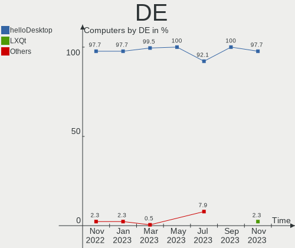
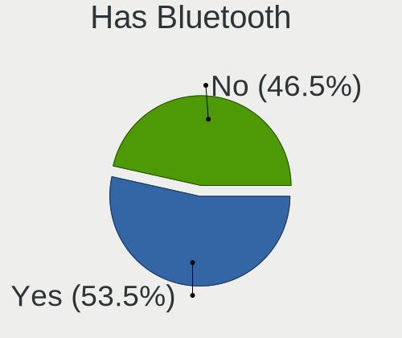
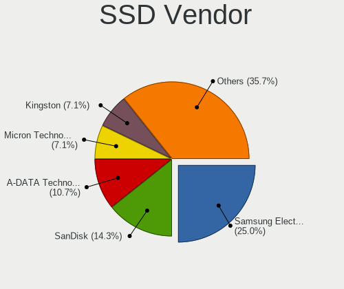
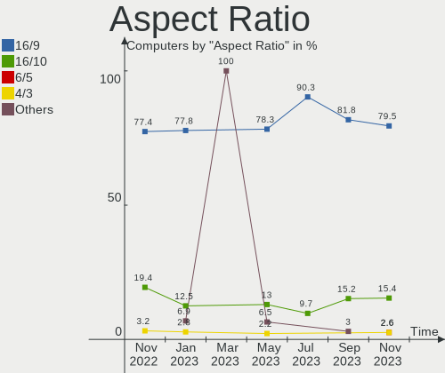
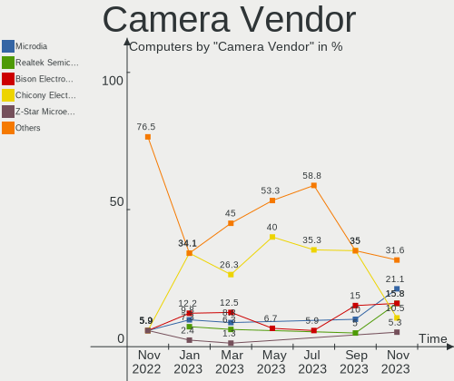

helloSystem - Hardware Trends
-----------------------------

A project to identify most popular hardware characteristics and track their change
over time based on data collected by BSD users at https://BSD-Hardware.info.

Anyone can contribute to this report by the [hw-probe](https://github.com/linuxhw/hw-probe/blob/master/INSTALL.BSD.md) tool:

    hw-probe -all -upload

This is a report for all computer types. See also reports for [desktops](/Dist/helloSystem/Desktop/README.md) and [notebooks](/Dist/helloSystem/Notebook/README.md).

This report is for one last month. Overall report since the beginning of time: [TestDays](https://github.com/bsdhw/TestDays)

Period: Oct, 2023.

Contents
--------

* [ System ](#system)
  - [ OS                       ](#os)
  - [ OS Family                ](#os-family)
  - [ Arch                     ](#arch)
  - [ DE                       ](#de)
  - [ Display Server           ](#display-server)
  - [ Display Manager          ](#display-manager)
  - [ OS Lang                  ](#os-lang)
  - [ Boot Mode                ](#boot-mode)
  - [ Filesystem               ](#filesystem)
  - [ Part. scheme             ](#part-scheme)

* [ Board ](#board)
  - [ Vendor                   ](#vendor)
  - [ Model                    ](#model)
  - [ Model Family             ](#model-family)
  - [ MFG Year                 ](#mfg-year)
  - [ Form Factor              ](#form-factor)
  - [ Coreboot                 ](#coreboot)
  - [ RAM Size                 ](#ram-size)
  - [ RAM Used                 ](#ram-used)
  - [ Total Drives             ](#total-drives)
  - [ Has CD-ROM               ](#has-cd-rom)
  - [ Has Ethernet             ](#has-ethernet)
  - [ Has WiFi                 ](#has-wifi)
  - [ Has Bluetooth            ](#has-bluetooth)

* [ Location ](#location)
  - [ Country                  ](#country)
  - [ City                     ](#city)

* [ Drives ](#drives)
  - [ Drive Vendor             ](#drive-vendor)
  - [ Drive Model              ](#drive-model)
  - [ HDD Vendor               ](#hdd-vendor)
  - [ SSD Vendor               ](#ssd-vendor)
  - [ Drive Kind               ](#drive-kind)
  - [ Drive Connector          ](#drive-connector)
  - [ Drive Size               ](#drive-size)
  - [ Space Total              ](#space-total)
  - [ Space Used               ](#space-used)
  - [ Malfunc. Drives          ](#malfunc-drives)
  - [ Malfunc. Drive Vendor    ](#malfunc-drive-vendor)
  - [ Malfunc. HDD Vendor      ](#malfunc-hdd-vendor)
  - [ Malfunc. Drive Kind      ](#malfunc-drive-kind)
  - [ Failed Drives            ](#failed-drives)
  - [ Failed Drive Vendor      ](#failed-drive-vendor)
  - [ Drive Status             ](#drive-status)

* [ Storage controller ](#storage-controller)
  - [ Storage Vendor           ](#storage-vendor)
  - [ Storage Model            ](#storage-model)
  - [ Storage Kind             ](#storage-kind)

* [ Processor ](#processor)
  - [ CPU Vendor               ](#cpu-vendor)
  - [ CPU Model                ](#cpu-model)
  - [ CPU Model Family         ](#cpu-model-family)
  - [ CPU Cores                ](#cpu-cores)
  - [ CPU Sockets              ](#cpu-sockets)
  - [ CPU Threads              ](#cpu-threads)
  - [ CPU Microarch            ](#cpu-microarch)

* [ Graphics ](#graphics)
  - [ GPU Vendor               ](#gpu-vendor)
  - [ GPU Model                ](#gpu-model)
  - [ GPU Combo                ](#gpu-combo)
  - [ GPU Driver               ](#gpu-driver)
  - [ GPU Memory               ](#gpu-memory)

* [ Monitor ](#monitor)
  - [ Monitor Vendor           ](#monitor-vendor)
  - [ Monitor Model            ](#monitor-model)
  - [ Monitor Resolution       ](#monitor-resolution)
  - [ Monitor Diagonal         ](#monitor-diagonal)
  - [ Monitor Width            ](#monitor-width)
  - [ Aspect Ratio             ](#aspect-ratio)
  - [ Monitor Area             ](#monitor-area)
  - [ Pixel Density            ](#pixel-density)
  - [ Multiple Monitors        ](#multiple-monitors)

* [ Network ](#network)
  - [ Net Controller Vendor    ](#net-controller-vendor)
  - [ Net Controller Model     ](#net-controller-model)
  - [ Wireless Vendor          ](#wireless-vendor)
  - [ Wireless Model           ](#wireless-model)
  - [ Ethernet Vendor          ](#ethernet-vendor)
  - [ Ethernet Model           ](#ethernet-model)
  - [ Net Controller Kind      ](#net-controller-kind)
  - [ Used Controller          ](#used-controller)
  - [ NICs                     ](#nics)
  - [ IPv6                     ](#ipv6)

* [ Bluetooth ](#bluetooth)
  - [ Bluetooth Vendor         ](#bluetooth-vendor)
  - [ Bluetooth Model          ](#bluetooth-model)

* [ Sound ](#sound)
  - [ Sound Vendor             ](#sound-vendor)
  - [ Sound Model              ](#sound-model)

* [ Memory ](#memory)
  - [ Memory Vendor            ](#memory-vendor)
  - [ Memory Model             ](#memory-model)
  - [ Memory Kind              ](#memory-kind)
  - [ Memory Form Factor       ](#memory-form-factor)
  - [ Memory Size              ](#memory-size)
  - [ Memory Speed             ](#memory-speed)

* [ Printers & scanners ](#printers--scanners)
  - [ Printer Vendor           ](#printer-vendor)
  - [ Printer Model            ](#printer-model)
  - [ Scanner Vendor           ](#scanner-vendor)
  - [ Scanner Model            ](#scanner-model)

* [ Camera ](#camera)
  - [ Camera Vendor            ](#camera-vendor)
  - [ Camera Model             ](#camera-model)

* [ Security ](#security)
  - [ Fingerprint Vendor       ](#fingerprint-vendor)
  - [ Fingerprint Model        ](#fingerprint-model)
  - [ Chipcard Vendor          ](#chipcard-vendor)
  - [ Chipcard Model           ](#chipcard-model)

* [ Unsupported ](#unsupported)
  - [ Unsupported Devices      ](#unsupported-devices)
  - [ Unsupported Device Types ](#unsupported-device-types)

System
------

OS
--

Installed operating systems

| Name              | Computers | Percent |
|-------------------|-----------|---------|
| helloSystem 0.8.1 | 20        | 62.5%   |
| helloSystem 0.9.0 | 11        | 34.38%  |
| helloSystem 0.6.0 | 1         | 3.13%   |

OS Family
---------

OS without a version

| Name        | Computers | Percent |
|-------------|-----------|---------|
| helloSystem | 32        | 100%    |

Arch
----

OS architecture (x86_64, i586, etc.)

| Name  | Computers | Percent |
|-------|-----------|---------|
| amd64 | 32        | 100%    |

DE
--

Desktop Environment

| Name         | Computers | Percent |
|--------------|-----------|---------|
| helloDesktop | 32        | 100%    |

Display Server
--------------

X11 or Wayland

| Name | Computers | Percent |
|------|-----------|---------|
| X11  | 32        | 100%    |

Display Manager
---------------

SDDM, LightDM, etc.

| Name | Computers | Percent |
|------|-----------|---------|
| SLiM | 32        | 100%    |

OS Lang
-------

Language

| Lang    | Computers | Percent |
|---------|-----------|---------|
| Unknown | 11        | 34.38%  |
| en_US   | 10        | 31.25%  |
| fr_FR   | 3         | 9.38%   |
| de_DE   | 2         | 6.25%   |
| C       | 2         | 6.25%   |
| tr_TR   | 1         | 3.13%   |
| ru_RU   | 1         | 3.13%   |
| fi_DK   | 1         | 3.13%   |
| es_ES   | 1         | 3.13%   |

Boot Mode
---------

EFI or BIOS

| Mode | Computers | Percent |
|------|-----------|---------|
| EFI  | 32        | 100%    |

Filesystem
----------

Type of filesystem

| Type   | Computers | Percent |
|--------|-----------|---------|
| Zfs    | 17        | 53.13%  |
| Cd9660 | 15        | 46.88%  |

Part. scheme
------------

Scheme of partitioning

| Type | Computers | Percent |
|------|-----------|---------|
| GPT  | 32        | 100%    |

Board
-----

Vendor
------

Motherboard manufacturer

| Name                | Computers | Percent |
|---------------------|-----------|---------|
| Gigabyte Technology | 6         | 18.75%  |
| Lenovo              | 5         | 15.63%  |
| ASUSTek Computer    | 4         | 12.5%   |
| Apple               | 4         | 12.5%   |
| Hewlett-Packard     | 3         | 9.38%   |
| Dell                | 3         | 9.38%   |
| Toshiba             | 2         | 6.25%   |
| Acer                | 2         | 6.25%   |
| TUXEDO              | 1         | 3.13%   |
| Intel               | 1         | 3.13%   |
| ASRock              | 1         | 3.13%   |

Model
-----

Motherboard model

| Name                                 | Computers | Percent |
|--------------------------------------|-----------|---------|
| TUXEDO Aura 15 Gen1                  | 1         | 3.13%   |
| Toshiba Satellite C55-A              | 1         | 3.13%   |
| Lenovo Z50-70 20354                  | 1         | 3.13%   |
| Lenovo ThinkPad T520 42405FG         | 1         | 3.13%   |
| Lenovo ThinkPad T480 20L5000UUS      | 1         | 3.13%   |
| Lenovo ThinkPad E14 Gen 2 20TA0054TX | 1         | 3.13%   |
| Lenovo IdeaPad 3 17ITL6 82H9         | 1         | 3.13%   |
| Intel DB75EN AAG39650-302            | 1         | 3.13%   |
| HP ZBook 15 G3                       | 1         | 3.13%   |
| HP Pavilion g6                       | 1         | 3.13%   |
| HP Compaq 6200 Pro MT PC             | 1         | 3.13%   |
| Gigabyte Z370 AORUS Gaming 7         | 1         | 3.13%   |
| Gigabyte Z170-D3H                    | 1         | 3.13%   |
| Gigabyte H61M-S1                     | 1         | 3.13%   |
| Gigabyte H55M-D2H                    | 1         | 3.13%   |
| Gigabyte B550M DS3H                  | 1         | 3.13%   |
| Gigabyte B250M-D3H                   | 1         | 3.13%   |
| Dell Latitude D830                   | 1         | 3.13%   |
| Dell Latitude 3440                   | 1         | 3.13%   |
| Dell Inspiron 5559                   | 1         | 3.13%   |
| ASUS PRIME B560-PLUS AC-HES          | 1         | 3.13%   |
| ASUS PRIME B250M-A                   | 1         | 3.13%   |
| ASUS M5A78L-M/USB3                   | 1         | 3.13%   |
| ASUS K73E                            | 1         | 3.13%   |
| ASRock X300M-STX                     | 1         | 3.13%   |
| Apple MacBookPro9,2                  | 1         | 3.13%   |
| Apple MacBookPro9,1                  | 1         | 3.13%   |
| Apple MacBook5,2                     | 1         | 3.13%   |
| Apple MacBook5,1                     | 1         | 3.13%   |
| Acer Aspire ES1-571                  | 1         | 3.13%   |
| Acer Aspire 5336                     | 1         | 3.13%   |
| Unknown                              | 1         | 3.13%   |

Model Family
------------

Motherboard model prefix

| Name               | Computers | Percent |
|--------------------|-----------|---------|
| Lenovo ThinkPad    | 3         | 9.38%   |
| Dell Latitude      | 2         | 6.25%   |
| ASUS PRIME         | 2         | 6.25%   |
| Apple MacBookPro9  | 2         | 6.25%   |
| Apple MacBook5     | 2         | 6.25%   |
| Acer Aspire        | 2         | 6.25%   |
| TUXEDO Aura        | 1         | 3.13%   |
| Toshiba Satellite  | 1         | 3.13%   |
| Lenovo Z50-70      | 1         | 3.13%   |
| Lenovo IdeaPad     | 1         | 3.13%   |
| Intel DB75EN       | 1         | 3.13%   |
| HP ZBook           | 1         | 3.13%   |
| HP Pavilion        | 1         | 3.13%   |
| HP Compaq          | 1         | 3.13%   |
| Gigabyte Z370      | 1         | 3.13%   |
| Gigabyte Z170-D3H  | 1         | 3.13%   |
| Gigabyte H61M-S1   | 1         | 3.13%   |
| Gigabyte H55M-D2H  | 1         | 3.13%   |
| Gigabyte B550M     | 1         | 3.13%   |
| Gigabyte B250M-D3H | 1         | 3.13%   |
| Dell Inspiron      | 1         | 3.13%   |
| ASUS M5A78L-M      | 1         | 3.13%   |
| ASUS K73E          | 1         | 3.13%   |
| ASRock X300M-STX   | 1         | 3.13%   |
| Unknown            | 1         | 3.13%   |

MFG Year
--------

Motherboard manufacture year

| Year | Computers | Percent |
|------|-----------|---------|
| 2011 | 5         | 15.63%  |
| 2013 | 4         | 12.5%   |
| 2021 | 3         | 9.38%   |
| 2020 | 3         | 9.38%   |
| 2018 | 3         | 9.38%   |
| 2016 | 3         | 9.38%   |
| 2022 | 2         | 6.25%   |
| 2015 | 2         | 6.25%   |
| 2012 | 2         | 6.25%   |
| 2019 | 1         | 3.13%   |
| 2017 | 1         | 3.13%   |
| 2010 | 1         | 3.13%   |
| 2009 | 1         | 3.13%   |
| 2008 | 1         | 3.13%   |

Form Factor
-----------

Physical design of the computer

| Name     | Computers | Percent |
|----------|-----------|---------|
| Notebook | 20        | 62.5%   |
| Desktop  | 12        | 37.5%   |

Coreboot
--------

Have coreboot on board

| Used | Computers | Percent |
|------|-----------|---------|
| No   | 32        | 100%    |

RAM Size
--------

Total RAM memory

| Size in GB  | Computers | Percent |
|-------------|-----------|---------|
| 16.01-24.0  | 10        | 31.25%  |
| 4.01-8.0    | 9         | 28.13%  |
| 8.01-16.0   | 8         | 25%     |
| 32.01-64.0  | 4         | 12.5%   |
| 64.01-256.0 | 1         | 3.13%   |

RAM Used
--------

Used RAM memory

| Used GB  | Computers | Percent |
|----------|-----------|---------|
| 0.01-0.5 | 17        | 53.13%  |
| 0.51-1.0 | 8         | 25%     |
| 1.01-2.0 | 6         | 18.75%  |
| 4.01-8.0 | 1         | 3.13%   |

Total Drives
------------

Number of drives on board

| Drives | Computers | Percent |
|--------|-----------|---------|
| 1      | 17        | 53.13%  |
| 2      | 8         | 25%     |
| 3      | 4         | 12.5%   |
| 0      | 3         | 9.38%   |

Has CD-ROM
----------

Has CD-ROM on board

| Presented | Computers | Percent |
|-----------|-----------|---------|
| Yes       | 17        | 53.13%  |
| No        | 15        | 46.88%  |

Has Ethernet
------------

Has Ethernet on board

| Presented | Computers | Percent |
|-----------|-----------|---------|
| Yes       | 31        | 96.88%  |
| No        | 1         | 3.13%   |

Has WiFi
--------

Has WiFi module

| Presented | Computers | Percent |
|-----------|-----------|---------|
| Yes       | 23        | 71.88%  |
| No        | 9         | 28.13%  |

Has Bluetooth
-------------

Has Bluetooth module

| Presented | Computers | Percent |
|-----------|-----------|---------|
| Yes       | 18        | 56.25%  |
| No        | 14        | 43.75%  |

Location
--------

Country
-------

Geographic location (country)

| Country     | Computers | Percent |
|-------------|-----------|---------|
| USA         | 6         | 18.75%  |
| Russia      | 4         | 12.5%   |
| Taiwan      | 3         | 9.38%   |
| Italy       | 3         | 9.38%   |
| UK          | 2         | 6.25%   |
| Turkey      | 2         | 6.25%   |
| Germany     | 2         | 6.25%   |
| Finland     | 2         | 6.25%   |
| Ukraine     | 1         | 3.13%   |
| Spain       | 1         | 3.13%   |
| Netherlands | 1         | 3.13%   |
| Mexico      | 1         | 3.13%   |
| Lithuania   | 1         | 3.13%   |
| India       | 1         | 3.13%   |
| China       | 1         | 3.13%   |
| Bulgaria    | 1         | 3.13%   |

City
----

Geographic location (city)

| City                | Computers | Percent |
|---------------------|-----------|---------|
| Taichung            | 3         | 9.38%   |
| St Petersburg       | 2         | 6.25%   |
| Vilnius             | 1         | 3.13%   |
| Temple              | 1         | 3.13%   |
| Tallahassee         | 1         | 3.13%   |
| Surgut              | 1         | 3.13%   |
| Sofia               | 1         | 3.13%   |
| Simferopol          | 1         | 3.13%   |
| Seattle             | 1         | 3.13%   |
| Rosignano Marittimo | 1         | 3.13%   |
| Rome                | 1         | 3.13%   |
| Reading             | 1         | 3.13%   |
| Peterborough        | 1         | 3.13%   |
| Orizaba             | 1         | 3.13%   |
| Ocean Springs       | 1         | 3.13%   |
| Neuwied             | 1         | 3.13%   |
| Nampa               | 1         | 3.13%   |
| Naaldwijk           | 1         | 3.13%   |
| Los Angeles         | 1         | 3.13%   |
| Kuznechikha         | 1         | 3.13%   |
| Iglesias            | 1         | 3.13%   |
| Helsinki            | 1         | 3.13%   |
| Friesenheim         | 1         | 3.13%   |
| Espoo               | 1         | 3.13%   |
| Chongqing           | 1         | 3.13%   |
| Cartagena           | 1         | 3.13%   |
| Ankara              | 1         | 3.13%   |
| Ahmedabad           | 1         | 3.13%   |
| Adana               | 1         | 3.13%   |

Drives
------

Drive Vendor
------------

Hard drive vendors

| Vendor              | Computers | Drives | Percent |
|---------------------|-----------|--------|---------|
| Samsung Electronics | 7         | 8      | 16.28%  |
| WDC                 | 6         | 8      | 13.95%  |
| Toshiba             | 3         | 3      | 6.98%   |
| Seagate             | 3         | 3      | 6.98%   |
| Hitachi             | 3         | 3      | 6.98%   |
| SanDisk             | 2         | 2      | 4.65%   |
| Kingston            | 2         | 2      | 4.65%   |
| A-DATA Technology   | 2         | 2      | 4.65%   |
| Transcend           | 1         | 1      | 2.33%   |
| SK hynix            | 1         | 1      | 2.33%   |
| Silicon Motion      | 1         | 1      | 2.33%   |
| SemsoTai            | 1         | 1      | 2.33%   |
| Phison              | 1         | 1      | 2.33%   |
| Patriot             | 1         | 1      | 2.33%   |
| Micron Technology   | 1         | 1      | 2.33%   |
| Maxtor              | 1         | 1      | 2.33%   |
| LITEONIT            | 1         | 1      | 2.33%   |
| Intel               | 1         | 1      | 2.33%   |
| Fujitsu             | 1         | 1      | 2.33%   |
| Crucial             | 1         | 1      | 2.33%   |
| Apple               | 1         | 1      | 2.33%   |
| Apacer              | 1         | 1      | 2.33%   |
| AMD                 | 1         | 1      | 2.33%   |

Drive Model
-----------

Hard drive models

| Model                                  | Computers | Percent |
|----------------------------------------|-----------|---------|
| Samsung HD161GJ 160GB                  | 2         | 4.35%   |
| Hitachi HTS541612J9SA00 120GB          | 2         | 4.35%   |
| WDC WDS500G2B0A-00SM50 500GB           | 1         | 2.17%   |
| WDC WDS240G2G0A-00JH30 240GB           | 1         | 2.17%   |
| WDC WDS120G2G0A-00JH30 120GB           | 1         | 2.17%   |
| WDC WD7500BPKX-00HPJT0 752GB           | 1         | 2.17%   |
| WDC WD40EFRX-68N32N0 4TB               | 1         | 2.17%   |
| WDC WD3200BPVT-80ZEST0 320GB           | 1         | 2.17%   |
| WDC WD20EADS-00W4B0 2TB                | 1         | 2.17%   |
| WDC WD20EADS-00S2B0 2TB                | 1         | 2.17%   |
| Transcend TS120GSSD220S 120GB          | 1         | 2.17%   |
| Toshiba THNSN5512GPU7 512GB            | 1         | 2.17%   |
| Toshiba MQ01ABF050 500GB               | 1         | 2.17%   |
| Toshiba MK5065GSX 500GB                | 1         | 2.17%   |
| SK hynix SKHynix_HFM256GD3HX015N 256GB | 1         | 2.17%   |
| Silicon Motion T70 2242 1TB            | 1         | 2.17%   |
| SemsoTai L150 SSD 1TB                  | 1         | 2.17%   |
| Seagate ST500LT012-1DG142 500GB        | 1         | 2.17%   |
| Seagate ST3500418AS 500GB              | 1         | 2.17%   |
| Seagate ST3360320AS 360GB              | 1         | 2.17%   |
| SanDisk SD8SBAT256G1122 256GB          | 1         | 2.17%   |
| SanDisk SD8SBAT128G1122 128GB          | 1         | 2.17%   |
| Samsung SSD 980 1TB                    | 1         | 2.17%   |
| Samsung SSD 970 EVO Plus 1TB           | 1         | 2.17%   |
| Samsung SSD 960 EVO 500GB              | 1         | 2.17%   |
| Samsung SSD 870 EVO 250GB              | 1         | 2.17%   |
| Samsung MZMPA128HMFU-000H1 128GB       | 1         | 2.17%   |
| Samsung HD160JJ 160GB                  | 1         | 2.17%   |
| Phison Viper M.2 VPN100 1TB            | 1         | 2.17%   |
| Patriot P210 512GB                     | 1         | 2.17%   |
| Micron M510_2.5_7MM_256GB              | 1         | 2.17%   |
| Maxtor STM3160211AS 160GB              | 1         | 2.17%   |
| LITEONIT LCS-256M6S 2.5 7mm 256GB      | 1         | 2.17%   |
| Kingston SVP200S37A120G 120GB          | 1         | 2.17%   |
| Kingston SV300S37A120G 120GB           | 1         | 2.17%   |
| Intel SSDSC2CT240A3 240GB              | 1         | 2.17%   |
| Hitachi HTS547575A9E384 752GB          | 1         | 2.17%   |
| Fujitsu MHZ2160BH FFS G1 160GB         | 1         | 2.17%   |
| Crucial CT1000P1SSD8 1TB               | 1         | 2.17%   |
| Apple HDD HTS541010A9E682 1TB          | 1         | 2.17%   |

HDD Vendor
----------

Hard disk drive vendors

| Vendor              | Computers | Drives | Percent |
|---------------------|-----------|--------|---------|
| WDC                 | 4         | 5      | 23.53%  |
| Seagate             | 3         | 3      | 17.65%  |
| Hitachi             | 3         | 3      | 17.65%  |
| Toshiba             | 2         | 2      | 11.76%  |
| Samsung Electronics | 2         | 3      | 11.76%  |
| Maxtor              | 1         | 1      | 5.88%   |
| Fujitsu             | 1         | 1      | 5.88%   |
| Apple               | 1         | 1      | 5.88%   |

SSD Vendor
----------

Solid state drive vendors

| Vendor              | Computers | Drives | Percent |
|---------------------|-----------|--------|---------|
| WDC                 | 3         | 3      | 17.65%  |
| SanDisk             | 2         | 2      | 11.76%  |
| Samsung Electronics | 2         | 2      | 11.76%  |
| Kingston            | 2         | 2      | 11.76%  |
| Transcend           | 1         | 1      | 5.88%   |
| SemsoTai            | 1         | 1      | 5.88%   |
| Patriot             | 1         | 1      | 5.88%   |
| Micron Technology   | 1         | 1      | 5.88%   |
| LITEONIT            | 1         | 1      | 5.88%   |
| Intel               | 1         | 1      | 5.88%   |
| Apacer              | 1         | 1      | 5.88%   |
| A-DATA Technology   | 1         | 1      | 5.88%   |

Drive Kind
----------

HDD or SSD

| Kind | Computers | Drives | Percent |
|------|-----------|--------|---------|
| SSD  | 16        | 17     | 42.11%  |
| HDD  | 13        | 19     | 34.21%  |
| NVMe | 9         | 10     | 23.68%  |

Drive Connector
---------------

SATA, SAS, NVMe, etc.

| Type | Computers | Drives | Percent |
|------|-----------|--------|---------|
| SATA | 24        | 36     | 72.73%  |
| NVMe | 9         | 10     | 27.27%  |

Drive Size
----------

Size of hard drive

| Size in TB | Computers | Drives | Percent |
|------------|-----------|--------|---------|
| 0.01-0.5   | 21        | 27     | 75%     |
| 0.51-1.0   | 5         | 6      | 17.86%  |
| 3.01-4.0   | 1         | 1      | 3.57%   |
| 1.01-2.0   | 1         | 2      | 3.57%   |

Space Total
-----------

Amount of disk space available on the file system

| Size in GB | Computers | Percent |
|------------|-----------|---------|
| 1-20       | 13        | 40.63%  |
| 51-100     | 7         | 21.88%  |
| 101-250    | 6         | 18.75%  |
| 251-500    | 3         | 9.38%   |
| 21-50      | 1         | 3.13%   |
| 1001-2000  | 1         | 3.13%   |
| 501-1000   | 1         | 3.13%   |

Space Used
----------

Amount of used disk space

| Used GB  | Computers | Percent |
|----------|-----------|---------|
| 1-20     | 29        | 90.63%  |
| 21-50    | 1         | 3.13%   |
| 101-250  | 1         | 3.13%   |
| 501-1000 | 1         | 3.13%   |

Malfunc. Drives
---------------

Drive models with a malfunction

| Model                                        | Computers | Drives | Percent |
|----------------------------------------------|-----------|--------|---------|
| Samsung Electronics HD161GJ 160GB            | 2         | 2      | 15.38%  |
| WDC WDS240G2G0A-00JH30 240GB                 | 1         | 1      | 7.69%   |
| WDC WD3200BPVT-80ZEST0 320GB                 | 1         | 1      | 7.69%   |
| WDC WD20EADS-00W4B0 2TB                      | 1         | 1      | 7.69%   |
| Transcend TS120GSSD220S 120GB                | 1         | 1      | 7.69%   |
| Toshiba MK5065GSX 500GB                      | 1         | 1      | 7.69%   |
| Seagate ST3500418AS 500GB                    | 1         | 1      | 7.69%   |
| Seagate ST3360320AS 360GB                    | 1         | 1      | 7.69%   |
| SanDisk SD8SBAT256G1122 256GB                | 1         | 1      | 7.69%   |
| Samsung Electronics MZMPA128HMFU-000H1 128GB | 1         | 1      | 7.69%   |
| Samsung Electronics HD160JJ 160GB            | 1         | 1      | 7.69%   |
| A-DATA Technology SX7000NP 128GB             | 1         | 1      | 7.69%   |

Malfunc. Drive Vendor
---------------------

Vendors of faulty drives

| Vendor              | Computers | Drives | Percent |
|---------------------|-----------|--------|---------|
| WDC                 | 3         | 3      | 25%     |
| Samsung Electronics | 3         | 4      | 25%     |
| Seagate             | 2         | 2      | 16.67%  |
| Transcend           | 1         | 1      | 8.33%   |
| Toshiba             | 1         | 1      | 8.33%   |
| SanDisk             | 1         | 1      | 8.33%   |
| A-DATA Technology   | 1         | 1      | 8.33%   |

Malfunc. HDD Vendor
-------------------

Vendors of faulty HDD drives

| Vendor              | Computers | Drives | Percent |
|---------------------|-----------|--------|---------|
| WDC                 | 2         | 2      | 28.57%  |
| Seagate             | 2         | 2      | 28.57%  |
| Samsung Electronics | 2         | 3      | 28.57%  |
| Toshiba             | 1         | 1      | 14.29%  |

Malfunc. Drive Kind
-------------------

Kinds of faulty drives

| Kind | Computers | Drives | Percent |
|------|-----------|--------|---------|
| HDD  | 6         | 8      | 54.55%  |
| SSD  | 4         | 4      | 36.36%  |
| NVMe | 1         | 1      | 9.09%   |

Failed Drives
-------------

Failed drive models

Zero info for selected period =(

Failed Drive Vendor
-------------------

Failed drive vendors

Zero info for selected period =(

Drive Status
------------

Number of failed and malfunc. drives

| Status   | Computers | Drives | Percent |
|----------|-----------|--------|---------|
| Works    | 24        | 31     | 66.67%  |
| Malfunc  | 10        | 13     | 27.78%  |
| Detected | 2         | 2      | 5.56%   |

Storage controller
------------------

Storage Vendor
--------------

Storage controller vendors

| Vendor                    | Computers | Percent |
|---------------------------|-----------|---------|
| Intel                     | 24        | 57.14%  |
| Silicon Motion            | 3         | 7.14%   |
| Samsung Electronics       | 3         | 7.14%   |
| AMD                       | 3         | 7.14%   |
| SanDisk                   | 2         | 4.76%   |
| Nvidia                    | 2         | 4.76%   |
| Toshiba                   | 1         | 2.38%   |
| SK hynix                  | 1         | 2.38%   |
| Phison Electronics        | 1         | 2.38%   |
| Micron/Crucial Technology | 1         | 2.38%   |
| JMicron Technology        | 1         | 2.38%   |

Storage Model
-------------

Storage controller models

| Model                                                                                   | Computers | Percent |
|-----------------------------------------------------------------------------------------|-----------|---------|
| Intel 8 Series SATA Controller 1 [AHCI mode]                                            | 3         | 6.38%   |
| Intel 7 Series Chipset Family 6-port SATA Controller [AHCI mode]                        | 3         | 6.38%   |
| Intel 200 Series PCH SATA controller [AHCI mode]                                        | 3         | 6.38%   |
| Silicon Motion SM2263EN/SM2263XT (DRAM-less) NVMe SSD Controllers                       | 2         | 4.26%   |
| Nvidia MCP79 AHCI Controller                                                            | 2         | 4.26%   |
| Intel Sunrise Point-LP SATA Controller [AHCI mode]                                      | 2         | 4.26%   |
| Intel Q170/Q150/B150/H170/H110/Z170/CM236 Chipset SATA Controller [AHCI Mode]           | 2         | 4.26%   |
| Intel 6 Series/C200 Series Chipset Family 6 port Mobile SATA AHCI Controller            | 2         | 4.26%   |
| Toshiba XG3 NVMe SSD Controller                                                         | 1         | 2.13%   |
| SK hynix Gold P31/BC711/PC711 NVMe Solid State Drive                                    | 1         | 2.13%   |
| Silicon Motion SM2260 NVMe SSD Controller                                               | 1         | 2.13%   |
| Sandisk WD Blue SN570 NVMe SSD 2TB                                                      | 1         | 2.13%   |
| SanDisk Ultra 3D / WD Blue SN570 NVMe SSD (DRAM-less)                                   | 1         | 2.13%   |
| Samsung NVMe SSD Controller SM981/PM981/PM983                                           | 1         | 2.13%   |
| Samsung NVMe SSD Controller SM961/PM961/SM963                                           | 1         | 2.13%   |
| Samsung NVMe SSD Controller 980 (DRAM-less)                                             | 1         | 2.13%   |
| Phison E12 NVMe Controller                                                              | 1         | 2.13%   |
| Micron/Crucial P1 NVMe PCIe SSD[Frampton]                                               | 1         | 2.13%   |
| JMicron JMB368 IDE controller                                                           | 1         | 2.13%   |
| Intel Volume Management Device NVMe RAID Controller                                     | 1         | 2.13%   |
| Intel Tiger Lake-LP SATA Controller                                                     | 1         | 2.13%   |
| Intel 82801IBM/IEM (ICH9M/ICH9M-E) 4 port SATA Controller [AHCI mode]                   | 1         | 2.13%   |
| Intel 82801HM/HEM (ICH8M/ICH8M-E) SATA Controller [AHCI mode]                           | 1         | 2.13%   |
| Intel 82801HM/HEM (ICH8M/ICH8M-E) IDE Controller                                        | 1         | 2.13%   |
| Intel 7 Series/C210 Series Chipset Family 6-port SATA Controller [AHCI mode]            | 1         | 2.13%   |
| Intel 6 Series/C200 Series Chipset Family Desktop SATA Controller (IDE mode, ports 4-5) | 1         | 2.13%   |
| Intel 6 Series/C200 Series Chipset Family Desktop SATA Controller (IDE mode, ports 0-3) | 1         | 2.13%   |
| Intel 6 Series/C200 Series Chipset Family 6 port Desktop SATA AHCI Controller           | 1         | 2.13%   |
| Intel 500 Series Chipset Family SATA AHCI Controller                                    | 1         | 2.13%   |
| Intel 5 Series/3400 Series Chipset 4 port SATA IDE Controller                           | 1         | 2.13%   |
| Intel 5 Series/3400 Series Chipset 4 port SATA AHCI Controller                          | 1         | 2.13%   |
| Intel 5 Series/3400 Series Chipset 2 port SATA IDE Controller                           | 1         | 2.13%   |
| AMD SB7x0/SB8x0/SB9x0 SATA Controller [IDE mode]                                        | 1         | 2.13%   |
| AMD SB7x0/SB8x0/SB9x0 IDE Controller                                                    | 1         | 2.13%   |
| AMD FCH SATA Controller [AHCI mode]                                                     | 1         | 2.13%   |
| AMD 500 Series Chipset SATA Controller                                                  | 1         | 2.13%   |

Storage Kind
------------

Kind of storage controller (IDE, SATA, NVMe, SAS, ...)

| Kind | Computers | Percent |
|------|-----------|---------|
| SATA | 26        | 63.41%  |
| NVMe | 10        | 24.39%  |
| IDE  | 4         | 9.76%   |
| RAID | 1         | 2.44%   |

Processor
---------

CPU Vendor
----------

Processor vendors

| Vendor | Computers | Percent |
|--------|-----------|---------|
| Intel  | 27        | 84.38%  |
| AMD    | 5         | 15.63%  |

CPU Model
---------

Processor models

| Model                                       | Computers | Percent |
|---------------------------------------------|-----------|---------|
| Intel Core 2 Duo CPU P7350 @ 2.00GHz        | 2         | 6.25%   |
| Intel Xeon CPU E3-1505M v5 @ 2.80GHz        | 1         | 3.13%   |
| Intel Pentium Gold 7505 @ 2.00GHz           | 1         | 3.13%   |
| Intel Core i7-8700K CPU @ 3.70GHz           | 1         | 3.13%   |
| Intel Core i7-8550U CPU @ 1.80GHz           | 1         | 3.13%   |
| Intel Core i7-3615QM CPU @ 2.30GHz          | 1         | 3.13%   |
| Intel Core i7 CPU Q 720 @ 1.60GHz           | 1         | 3.13%   |
| Intel Core i5-7400 CPU @ 3.00GHz            | 1         | 3.13%   |
| Intel Core i5-6500 CPU @ 3.20GHz            | 1         | 3.13%   |
| Intel Core i5-6200U CPU @ 2.30GHz           | 1         | 3.13%   |
| Intel Core i5-4210U CPU @ 1.70GHz           | 1         | 3.13%   |
| Intel Core i5-3470 CPU @ 3.20GHz            | 1         | 3.13%   |
| Intel Core i5-3210M CPU @ 2.50GHz           | 1         | 3.13%   |
| Intel Core i5-2320 CPU @ 3.00GHz            | 1         | 3.13%   |
| Intel Core i3-7100 CPU @ 3.90GHz            | 1         | 3.13%   |
| Intel Core i3-4030U CPU @ 1.90GHz           | 1         | 3.13%   |
| Intel Core i3-2350M CPU @ 2.30GHz           | 1         | 3.13%   |
| Intel Core i3-2310M CPU @ 2.10GHz           | 1         | 3.13%   |
| Intel Core i3-2100 CPU @ 3.10GHz            | 1         | 3.13%   |
| Intel Core i3 CPU                           | 1         | 3.13%   |
| Intel Core 2 Duo                            | 1         | 3.13%   |
| Intel Celeron Dual-Core CPU T3500 @ 2.10GHz | 1         | 3.13%   |
| Intel Celeron CPU 1037U @ 1.80GHz           | 1         | 3.13%   |
| Intel Celeron 2957U @ 1.40GHz               | 1         | 3.13%   |
| Intel 11th Gen Core i5-11400F @ 2.60GHz     | 1         | 3.13%   |
| Intel 11th Gen Core i5-1135G7 @ 2.40GHz     | 1         | 3.13%   |
| AMD Ryzen 7 5700G with Radeon Graphics      | 1         | 3.13%   |
| AMD Ryzen 7 4700U with Radeon Graphics      | 1         | 3.13%   |
| AMD Ryzen 5 5600G with Radeon Graphics      | 1         | 3.13%   |
| AMD Athlon II X2 250 Processor              | 1         | 3.13%   |
| AMD A10-5750M APU with Radeon HD Graphics   | 1         | 3.13%   |

CPU Model Family
----------------

Processor model prefix

| Model                   | Computers | Percent |
|-------------------------|-----------|---------|
| Intel Core i5           | 7         | 21.88%  |
| Intel Core i3           | 6         | 18.75%  |
| Intel Core i7           | 4         | 12.5%   |
| Intel Core 2 Duo        | 3         | 9.38%   |
| Other                   | 2         | 6.25%   |
| Intel Celeron           | 2         | 6.25%   |
| AMD Ryzen 7             | 2         | 6.25%   |
| Intel Xeon              | 1         | 3.13%   |
| Intel Pentium Gold      | 1         | 3.13%   |
| Intel Celeron Dual-Core | 1         | 3.13%   |
| AMD Ryzen 5             | 1         | 3.13%   |
| AMD Athlon II X2        | 1         | 3.13%   |
| AMD A10                 | 1         | 3.13%   |

CPU Cores
---------

Number of processor cores

| Number  | Computers | Percent |
|---------|-----------|---------|
| 2       | 14        | 43.75%  |
| 4       | 10        | 31.25%  |
| Unknown | 3         | 9.38%   |
| 6       | 2         | 6.25%   |
| 16      | 1         | 3.13%   |
| 12      | 1         | 3.13%   |
| 8       | 1         | 3.13%   |

CPU Sockets
-----------

Number of sockets

| Number | Computers | Percent |
|--------|-----------|---------|
| 1      | 30        | 93.75%  |
| 2      | 2         | 6.25%   |

CPU Threads
-----------

Threads per core (Hyper-Threading)

| Number  | Computers | Percent |
|---------|-----------|---------|
| 2       | 17        | 53.13%  |
| 1       | 12        | 37.5%   |
| Unknown | 3         | 9.38%   |

CPU Microarch
-------------

Microarchitecture

| Name        | Computers | Percent |
|-------------|-----------|---------|
| SandyBridge | 4         | 12.5%   |
| Penryn      | 4         | 12.5%   |
| KabyLake    | 4         | 12.5%   |
| IvyBridge   | 4         | 12.5%   |
| Skylake     | 3         | 9.38%   |
| Haswell     | 3         | 9.38%   |
| Zen 3       | 2         | 6.25%   |
| TigerLake   | 2         | 6.25%   |
| Zen 2       | 1         | 3.13%   |
| Westmere    | 1         | 3.13%   |
| Piledriver  | 1         | 3.13%   |
| Nehalem     | 1         | 3.13%   |
| K10         | 1         | 3.13%   |
| Unknown     | 1         | 3.13%   |

Graphics
--------

GPU Vendor
----------

Vendors of graphics cards

| Vendor | Computers | Percent |
|--------|-----------|---------|
| Intel  | 16        | 42.11%  |
| Nvidia | 12        | 31.58%  |
| AMD    | 10        | 26.32%  |

GPU Model
---------

Graphics card models

| Model                                                                     | Computers | Percent |
|---------------------------------------------------------------------------|-----------|---------|
| Intel Haswell-ULT Integrated Graphics Controller                          | 3         | 7.89%   |
| Intel 3rd Gen Core processor Graphics Controller                          | 3         | 7.89%   |
| Nvidia GF108 [GeForce GT 440]                                             | 2         | 5.26%   |
| Intel HD Graphics 630                                                     | 2         | 5.26%   |
| Intel 2nd Generation Core Processor Family Integrated Graphics Controller | 2         | 5.26%   |
| AMD Vega 10 XL/XT [Radeon RX Vega 56/64]                                  | 2         | 5.26%   |
| AMD Ellesmere [Radeon RX 470/480/570/570X/580/580X/590]                   | 2         | 5.26%   |
| AMD Cezanne [Radeon Vega Series / Radeon Vega Mobile Series]              | 2         | 5.26%   |
| Nvidia TU117M [GeForce MX450]                                             | 1         | 2.63%   |
| Nvidia GT216M [GeForce GT 330M]                                           | 1         | 2.63%   |
| Nvidia GM107GLM [Quadro M2000M]                                           | 1         | 2.63%   |
| Nvidia GK107M [GeForce GT 650M Mac Edition]                               | 1         | 2.63%   |
| Nvidia GF117M [GeForce 610M/710M/810M/820M / GT 620M/625M/630M/720M]      | 1         | 2.63%   |
| Nvidia GA104 [GeForce RTX 3060 Ti]                                        | 1         | 2.63%   |
| Nvidia G92 [GeForce 8800 GT]                                              | 1         | 2.63%   |
| Nvidia G86M [Quadro NVS 140M]                                             | 1         | 2.63%   |
| Nvidia C79 [GeForce 9400M]                                                | 1         | 2.63%   |
| Nvidia C79 [GeForce 9400M G]                                              | 1         | 2.63%   |
| Intel UHD Graphics 620                                                    | 1         | 2.63%   |
| Intel TigerLake-LP GT2 [Iris Xe Graphics]                                 | 1         | 2.63%   |
| Intel Tiger Lake-LP GT2 [UHD Graphics G4]                                 | 1         | 2.63%   |
| Intel Skylake GT2 [HD Graphics 520]                                       | 1         | 2.63%   |
| Intel Mobile 4 Series Chipset Integrated Graphics Controller              | 1         | 2.63%   |
| Intel HD Graphics P530                                                    | 1         | 2.63%   |
| AMD RS780L [Radeon 3000]                                                  | 1         | 2.63%   |
| AMD Richland [Radeon HD 8650G]                                            | 1         | 2.63%   |
| AMD Renoir [Radeon RX Vega 6 (Ryzen 4000/5000 Mobile Series)]             | 1         | 2.63%   |
| AMD Caicos [Radeon HD 6450/7450/8450 / R5 230 OEM]                        | 1         | 2.63%   |

GPU Combo
---------

Combinations of graphics cards

| Name                     | Computers | Percent |
|--------------------------|-----------|---------|
| 1 x Intel                | 10        | 31.25%  |
| 1 x AMD                  | 9         | 28.13%  |
| 1 x Nvidia               | 7         | 21.88%  |
| Intel + Nvidia           | 4         | 12.5%   |
| 2 x Intel                | 1         | 3.13%   |
| Intel + AMD + 1 x Nvidia | 1         | 3.13%   |

GPU Driver
----------

Free vs proprietary

| Driver      | Computers | Percent |
|-------------|-----------|---------|
| Free        | 26        | 81.25%  |
| Proprietary | 5         | 15.63%  |
| Unknown     | 1         | 3.13%   |

GPU Memory
----------

Total video memory

| Size in GB | Computers | Percent |
|------------|-----------|---------|
| Unknown    | 23        | 71.88%  |
| 0.51-1.0   | 4         | 12.5%   |
| 7.01-8.0   | 2         | 6.25%   |
| 0.01-0.5   | 2         | 6.25%   |
| 3.01-4.0   | 1         | 3.13%   |

Monitor
-------

Monitor Vendor
--------------

Monitor vendors

| Vendor                  | Computers | Percent |
|-------------------------|-----------|---------|
| LG Display              | 4         | 15.38%  |
| Acer                    | 4         | 15.38%  |
| Samsung Electronics     | 3         | 11.54%  |
| Chimei Innolux          | 3         | 11.54%  |
| Goldstar                | 2         | 7.69%   |
| BenQ                    | 2         | 7.69%   |
| AU Optronics            | 2         | 7.69%   |
| ViewSonic               | 1         | 3.85%   |
| Fujitsu Siemens         | 1         | 3.85%   |
| Chi Mei Optoelectronics | 1         | 3.85%   |
| BOE                     | 1         | 3.85%   |
| Apple                   | 1         | 3.85%   |
| Ancor Communications    | 1         | 3.85%   |

Monitor Model
-------------

Monitor models

| Model                                                                    | Computers | Percent |
|--------------------------------------------------------------------------|-----------|---------|
| ViewSonic VA2418-FHD VSCD739 1920x1080 530x300mm 24.0-inch               | 1         | 3.85%   |
| Samsung Electronics SyncMaster SAM05C5 1920x1080                         | 1         | 3.85%   |
| Samsung Electronics LCD Monitor SDC5344 1920x1080 340x190mm 15.3-inch    | 1         | 3.85%   |
| Samsung Electronics LCD Monitor SDC280F 1366x768 340x190mm 15.3-inch     | 1         | 3.85%   |
| LG Display LCD Monitor LGD044B 1366x768 340x190mm 15.3-inch              | 1         | 3.85%   |
| LG Display LCD Monitor LGD0384 1366x768 340x190mm 15.3-inch              | 1         | 3.85%   |
| LG Display LCD Monitor LGD02E3 1366x768 340x190mm 15.3-inch              | 1         | 3.85%   |
| LG Display LCD Monitor LGD02D1 1600x900 380x210mm 17.1-inch              | 1         | 3.85%   |
| Goldstar LG HDR 4K GSM7707 3840x2160 600x340mm 27.2-inch                 | 1         | 3.85%   |
| Goldstar 22M35 GSM5A31 1920x1080 480x270mm 21.7-inch                     | 1         | 3.85%   |
| Fujitsu Siemens L19-1 FUS07DB 1280x1024 380x300mm 19.1-inch              | 1         | 3.85%   |
| Chimei Innolux LCD Monitor CMN15D7 1920x1080 340x190mm 15.3-inch         | 1         | 3.85%   |
| Chimei Innolux LCD Monitor CMN14B1 1920x1080 310x170mm 13.9-inch         | 1         | 3.85%   |
| Chimei Innolux LCD Monitor CMN1475 1366x768 310x170mm 13.9-inch          | 1         | 3.85%   |
| Chi Mei Optoelectronics LCD Monitor CMO15A7 1366x768 350x190mm 15.7-inch | 1         | 3.85%   |
| BOE LCD Monitor BOE09C1 1920x1080 380x220mm 17.3-inch                    | 1         | 3.85%   |
| BenQ LCD BNQ801B 2560x1440 530x300mm 24.0-inch                           | 1         | 3.85%   |
| BenQ G2420HDBL BNQ785F 1920x1080 530x290mm 23.8-inch                     | 1         | 3.85%   |
| AU Optronics LCD Monitor AUO403D 1920x1080 310x170mm 13.9-inch           | 1         | 3.85%   |
| AU Optronics LCD Monitor AUO12EC 1366x768 340x190mm 15.3-inch            | 1         | 3.85%   |
| Apple LCD Monitor APP9CCB 1280x800 290x180mm 13.4-inch                   | 1         | 3.85%   |
| Ancor Communications ASUS VW227 ACI22E1 1920x1080 480x270mm 21.7-inch    | 1         | 3.85%   |
| Acer X183H ACR006A 1366x768 410x230mm 18.5-inch                          | 1         | 3.85%   |
| Acer KA272 ACR072C 1920x1080 600x340mm 27.2-inch                         | 1         | 3.85%   |
| Acer HA240Y ACR0583 1920x1080 530x300mm 24.0-inch                        | 1         | 3.85%   |
| Acer G227HQL ACR03DE 1920x1080 480x270mm 21.7-inch                       | 1         | 3.85%   |

Monitor Resolution
------------------

Monitor screen resolution

| Resolution       | Computers | Percent |
|------------------|-----------|---------|
| 1920x1080 (FHD)  | 13        | 50%     |
| 1366x768 (WXGA)  | 8         | 30.77%  |
| 3840x2160 (4K)   | 1         | 3.85%   |
| 2560x1440 (QHD)  | 1         | 3.85%   |
| 1600x900 (HD+)   | 1         | 3.85%   |
| 1280x800 (WXGA)  | 1         | 3.85%   |
| 1280x1024 (SXGA) | 1         | 3.85%   |

Monitor Diagonal
----------------

Diagonal size in inches

| Inches  | Computers | Percent |
|---------|-----------|---------|
| 15      | 8         | 30.77%  |
| 13      | 4         | 15.38%  |
| 24      | 3         | 11.54%  |
| 21      | 3         | 11.54%  |
| 27      | 2         | 7.69%   |
| 17      | 2         | 7.69%   |
| 23      | 1         | 3.85%   |
| 19      | 1         | 3.85%   |
| 18      | 1         | 3.85%   |
| Unknown | 1         | 3.85%   |

Monitor Width
-------------

Physical width

| Width in mm | Computers | Percent |
|-------------|-----------|---------|
| 301-350     | 11        | 42.31%  |
| 501-600     | 6         | 23.08%  |
| 401-500     | 4         | 15.38%  |
| 351-400     | 3         | 11.54%  |
| 201-300     | 1         | 3.85%   |
| Unknown     | 1         | 3.85%   |

Aspect Ratio
------------

Proportional relationship between the width and the height

| Ratio | Computers | Percent |
|-------|-----------|---------|
| 16/9  | 24        | 92.31%  |
| 5/4   | 1         | 3.85%   |
| 16/10 | 1         | 3.85%   |

Monitor Area
------------

Area in inch

| Area in inch | Computers | Percent |
|----------------|-----------|---------|
| 201-250        | 7         | 26.92%  |
| 91-100         | 7         | 26.92%  |
| 81-90          | 4         | 15.38%  |
| 301-350        | 2         | 7.69%   |
| 121-130        | 2         | 7.69%   |
| 151-200        | 1         | 3.85%   |
| 141-150        | 1         | 3.85%   |
| 101-110        | 1         | 3.85%   |
| Unknown        | 1         | 3.85%   |

Pixel Density
-------------

Pixels per inch

| Density | Computers | Percent |
|---------|-----------|---------|
| 101-120 | 11        | 42.31%  |
| 51-100  | 7         | 26.92%  |
| 121-160 | 6         | 23.08%  |
| 161-240 | 1         | 3.85%   |
| Unknown | 1         | 3.85%   |

Multiple Monitors
-----------------

Total monitors connected

| Total | Computers | Percent |
|-------|-----------|---------|
| 1     | 26        | 81.25%  |
| 0     | 6         | 18.75%  |

Network
-------

Net Controller Vendor
---------------------

Controller vendors

| Vendor                | Computers | Percent |
|-----------------------|-----------|---------|
| Realtek Semiconductor | 17        | 32.08%  |
| Intel                 | 14        | 26.42%  |
| Broadcom              | 8         | 15.09%  |
| Qualcomm Atheros      | 6         | 11.32%  |
| Samsung Electronics   | 3         | 5.66%   |
| Nvidia                | 2         | 3.77%   |
| Xiaomi                | 1         | 1.89%   |
| Ralink                | 1         | 1.89%   |
| Arduino SA            | 1         | 1.89%   |

Net Controller Model
--------------------

Controller models

| Model                                                             | Computers | Percent |
|-------------------------------------------------------------------|-----------|---------|
| Realtek RTL8111/8168/8411 PCI Express Gigabit Ethernet Controller | 13        | 21.67%  |
| Samsung Galaxy series, misc. (tethering mode)                     | 3         | 5%      |
| Realtek RTL810xE PCI Express Fast Ethernet controller             | 2         | 3.33%   |
| Nvidia MCP79 Ethernet                                             | 2         | 3.33%   |
| Intel Wi-Fi 6 AX201                                               | 2         | 3.33%   |
| Intel Ethernet Connection (2) I219-V                              | 2         | 3.33%   |
| Intel 82579LM Gigabit Network Connection (Lewisville)             | 2         | 3.33%   |
| Broadcom NetXtreme BCM57765 Gigabit Ethernet PCIe                 | 2         | 3.33%   |
| Broadcom BCM4331 802.11a/b/g/n                                    | 2         | 3.33%   |
| Broadcom BCM4322 802.11a/b/g/n Wireless LAN Controller            | 2         | 3.33%   |
| Xiaomi Mi/Redmi series (RNDIS + ADB)                              | 1         | 1.67%   |
| Realtek RTL8723BE PCIe Wireless Network Adapter                   | 1         | 1.67%   |
| Realtek RTL8188EE Wireless Network Adapter                        | 1         | 1.67%   |
| Realtek Bluetooth Adapter                                         | 1         | 1.67%   |
| Ralink RT5390 Wireless 802.11n 1T/1R PCIe                         | 1         | 1.67%   |
| Qualcomm Atheros QCA9565 / AR9565 Wireless Network Adapter        | 1         | 1.67%   |
| Qualcomm Atheros Killer E2500 Gigabit Ethernet Controller         | 1         | 1.67%   |
| Qualcomm Atheros AR9485 Wireless Network Adapter                  | 1         | 1.67%   |
| Qualcomm Atheros AR9285 Wireless Network Adapter (PCI-Express)    | 1         | 1.67%   |
| Qualcomm Atheros AR8162 Fast Ethernet                             | 1         | 1.67%   |
| Qualcomm Atheros AR8151 v2.0 Gigabit Ethernet                     | 1         | 1.67%   |
| Intel Wireless 8265 / 8275                                        | 1         | 1.67%   |
| Intel Wireless 8260                                               | 1         | 1.67%   |
| Intel Wireless 3160                                               | 1         | 1.67%   |
| Intel Wi-Fi 6 AX200                                               | 1         | 1.67%   |
| Intel Tiger Lake PCH CNVi WiFi                                    | 1         | 1.67%   |
| Intel PRO/Wireless 4965 AG or AGN [Kedron] Network Connection     | 1         | 1.67%   |
| Intel Ethernet Connection (4) I219-V                              | 1         | 1.67%   |
| Intel Ethernet Connection (2) I219-LM                             | 1         | 1.67%   |
| Intel Ethernet Connection (14) I219-V                             | 1         | 1.67%   |
| Intel Dual Band Wireless-AC 3168NGW [Stone Peak]                  | 1         | 1.67%   |
| Intel Centrino Wireless-N 1000 [Condor Peak]                      | 1         | 1.67%   |
| Intel 82579V Gigabit Network Connection                           | 1         | 1.67%   |
| Broadcom NetXtreme BCM5755M Gigabit Ethernet PCI Express          | 1         | 1.67%   |
| Broadcom NetLink BCM57780 Gigabit Ethernet PCIe                   | 1         | 1.67%   |
| Broadcom BCM4360 802.11ac Dual Band Wireless Network Adapter      | 1         | 1.67%   |
| Broadcom BCM4313 802.11bgn Wireless Network Adapter               | 1         | 1.67%   |
| Arduino SA Leonardo (CDC ACM, HID)                                | 1         | 1.67%   |

Wireless Vendor
---------------

Wireless vendors

| Vendor                | Computers | Percent |
|-----------------------|-----------|---------|
| Intel                 | 10        | 43.48%  |
| Broadcom              | 6         | 26.09%  |
| Realtek Semiconductor | 3         | 13.04%  |
| Qualcomm Atheros      | 3         | 13.04%  |
| Ralink                | 1         | 4.35%   |

Wireless Model
--------------

Wireless models

| Model                                                          | Computers | Percent |
|----------------------------------------------------------------|-----------|---------|
| Intel Wi-Fi 6 AX201                                            | 2         | 8.7%    |
| Broadcom BCM4331 802.11a/b/g/n                                 | 2         | 8.7%    |
| Broadcom BCM4322 802.11a/b/g/n Wireless LAN Controller         | 2         | 8.7%    |
| Realtek RTL8723BE PCIe Wireless Network Adapter                | 1         | 4.35%   |
| Realtek RTL8188EE Wireless Network Adapter                     | 1         | 4.35%   |
| Realtek Bluetooth Adapter                                      | 1         | 4.35%   |
| Ralink RT5390 Wireless 802.11n 1T/1R PCIe                      | 1         | 4.35%   |
| Qualcomm Atheros QCA9565 / AR9565 Wireless Network Adapter     | 1         | 4.35%   |
| Qualcomm Atheros AR9485 Wireless Network Adapter               | 1         | 4.35%   |
| Qualcomm Atheros AR9285 Wireless Network Adapter (PCI-Express) | 1         | 4.35%   |
| Intel Wireless 8265 / 8275                                     | 1         | 4.35%   |
| Intel Wireless 8260                                            | 1         | 4.35%   |
| Intel Wireless 3160                                            | 1         | 4.35%   |
| Intel Wi-Fi 6 AX200                                            | 1         | 4.35%   |
| Intel Tiger Lake PCH CNVi WiFi                                 | 1         | 4.35%   |
| Intel PRO/Wireless 4965 AG or AGN [Kedron] Network Connection  | 1         | 4.35%   |
| Intel Dual Band Wireless-AC 3168NGW [Stone Peak]               | 1         | 4.35%   |
| Intel Centrino Wireless-N 1000 [Condor Peak]                   | 1         | 4.35%   |
| Broadcom BCM4360 802.11ac Dual Band Wireless Network Adapter   | 1         | 4.35%   |
| Broadcom BCM4313 802.11bgn Wireless Network Adapter            | 1         | 4.35%   |

Ethernet Vendor
---------------

Ethernet vendors

| Vendor                | Computers | Percent |
|-----------------------|-----------|---------|
| Realtek Semiconductor | 15        | 41.67%  |
| Intel                 | 8         | 22.22%  |
| Broadcom              | 4         | 11.11%  |
| Samsung Electronics   | 3         | 8.33%   |
| Qualcomm Atheros      | 3         | 8.33%   |
| Nvidia                | 2         | 5.56%   |
| Xiaomi                | 1         | 2.78%   |

Ethernet Model
--------------

Ethernet models

| Model                                                             | Computers | Percent |
|-------------------------------------------------------------------|-----------|---------|
| Realtek RTL8111/8168/8411 PCI Express Gigabit Ethernet Controller | 13        | 36.11%  |
| Samsung Galaxy series, misc. (tethering mode)                     | 3         | 8.33%   |
| Realtek RTL810xE PCI Express Fast Ethernet controller             | 2         | 5.56%   |
| Nvidia MCP79 Ethernet                                             | 2         | 5.56%   |
| Intel Ethernet Connection (2) I219-V                              | 2         | 5.56%   |
| Intel 82579LM Gigabit Network Connection (Lewisville)             | 2         | 5.56%   |
| Broadcom NetXtreme BCM57765 Gigabit Ethernet PCIe                 | 2         | 5.56%   |
| Xiaomi Mi/Redmi series (RNDIS + ADB)                              | 1         | 2.78%   |
| Qualcomm Atheros Killer E2500 Gigabit Ethernet Controller         | 1         | 2.78%   |
| Qualcomm Atheros AR8162 Fast Ethernet                             | 1         | 2.78%   |
| Qualcomm Atheros AR8151 v2.0 Gigabit Ethernet                     | 1         | 2.78%   |
| Intel Ethernet Connection (4) I219-V                              | 1         | 2.78%   |
| Intel Ethernet Connection (2) I219-LM                             | 1         | 2.78%   |
| Intel Ethernet Connection (14) I219-V                             | 1         | 2.78%   |
| Intel 82579V Gigabit Network Connection                           | 1         | 2.78%   |
| Broadcom NetXtreme BCM5755M Gigabit Ethernet PCI Express          | 1         | 2.78%   |
| Broadcom NetLink BCM57780 Gigabit Ethernet PCIe                   | 1         | 2.78%   |

Net Controller Kind
-------------------

Ethernet, WiFi or modem

| Kind     | Computers | Percent |
|----------|-----------|---------|
| Ethernet | 31        | 56.36%  |
| WiFi     | 23        | 41.82%  |
| Modem    | 1         | 1.82%   |

Used Controller
---------------

Currently used network controller

| Kind     | Computers | Percent |
|----------|-----------|---------|
| Ethernet | 18        | 66.67%  |
| WiFi     | 9         | 33.33%  |

NICs
----

Total network controllers on board

| Total | Computers | Percent |
|-------|-----------|---------|
| 2     | 20        | 62.5%   |
| 1     | 11        | 34.38%  |
| 3     | 1         | 3.13%   |

IPv6
----

IPv6 vs IPv4

| Used | Computers | Percent |
|------|-----------|---------|
| No   | 30        | 93.75%  |
| Yes  | 2         | 6.25%   |

Bluetooth
---------

Bluetooth Vendor
----------------

Controller vendors

| Vendor                          | Computers | Percent |
|---------------------------------|-----------|---------|
| Intel                           | 8         | 44.44%  |
| Apple                           | 5         | 27.78%  |
| Realtek Semiconductor           | 1         | 5.56%   |
| Qualcomm Atheros Communications | 1         | 5.56%   |
| Foxconn / Hon Hai               | 1         | 5.56%   |
| Dell                            | 1         | 5.56%   |
| Broadcom                        | 1         | 5.56%   |

Bluetooth Model
---------------

Controller models

| Model                                                       | Computers | Percent |
|-------------------------------------------------------------|-----------|---------|
| Intel Bluetooth wireless interface                          | 3         | 15.79%  |
| Apple Bluetooth Host Controller                             | 3         | 15.79%  |
| Intel AX201 Bluetooth                                       | 2         | 10.53%  |
| Realtek RTL8723B Bluetooth                                  | 1         | 5.26%   |
| Qualcomm Atheros AR9462 Bluetooth                           | 1         | 5.26%   |
| Intel Wireless-AC 3168 Bluetooth                            | 1         | 5.26%   |
| Intel Bluetooth 9460/9560 Jefferson Peak (JfP)              | 1         | 5.26%   |
| Intel AX200 Bluetooth                                       | 1         | 5.26%   |
| Foxconn / Hon Hai Qualcomm Atheros AR3012 Bluetooth Adapter | 1         | 5.26%   |
| Dell Wireless 360 Bluetooth                                 | 1         | 5.26%   |
| Broadcom BCM2045B (BDC-2.1)                                 | 1         | 5.26%   |
| Apple Built-in iSight (no firmware loaded)                  | 1         | 5.26%   |
| Apple Built-in Bluetooth 2.0+EDR HCI                        | 1         | 5.26%   |
| Apple Broadcom Built-in Bluetooth                           | 1         | 5.26%   |

Sound
-----

Sound Vendor
------------

Sound card vendors

| Vendor              | Computers | Percent |
|---------------------|-----------|---------|
| Intel               | 24        | 55.81%  |
| AMD                 | 10        | 23.26%  |
| Nvidia              | 7         | 16.28%  |
| Creative Technology | 1         | 2.33%   |
| C-Media Electronics | 1         | 2.33%   |

Sound Model
-----------

Sound card models

| Model                                                                             | Computers | Percent |
|-----------------------------------------------------------------------------------|-----------|---------|
| Intel 7 Series/C216 Chipset Family High Definition Audio Controller               | 4         | 8%      |
| Intel 6 Series/C200 Series Chipset Family High Definition Audio Controller        | 4         | 8%      |
| Intel 8 Series HD Audio Controller                                                | 3         | 6%      |
| Intel 200 Series PCH HD Audio                                                     | 3         | 6%      |
| AMD Renoir Radeon High Definition Audio Controller                                | 3         | 6%      |
| AMD Family 17h/19h HD Audio Controller                                            | 3         | 6%      |
| Nvidia MCP79 High Definition Audio                                                | 2         | 4%      |
| Nvidia GF108 High Definition Audio Controller                                     | 2         | 4%      |
| Intel Tiger Lake-LP Smart Sound Technology Audio Controller                       | 2         | 4%      |
| Intel Sunrise Point-LP HD Audio                                                   | 2         | 4%      |
| Intel Haswell-ULT HD Audio Controller                                             | 2         | 4%      |
| Intel 5 Series/3400 Series Chipset High Definition Audio                          | 2         | 4%      |
| AMD Vega 10 HDMI Audio [Radeon Vega 56/64]                                        | 2         | 4%      |
| AMD Ellesmere HDMI Audio [Radeon RX 470/480 / 570/580/590]                        | 2         | 4%      |
| Nvidia GT216 HDMI Audio Controller                                                | 1         | 2%      |
| Nvidia GK107 HDMI Audio Controller                                                | 1         | 2%      |
| Nvidia GA104 High Definition Audio Controller                                     | 1         | 2%      |
| Intel Tiger Lake-H HD Audio Controller                                            | 1         | 2%      |
| Intel 82801I (ICH9 Family) HD Audio Controller                                    | 1         | 2%      |
| Intel 82801H (ICH8 Family) HD Audio Controller                                    | 1         | 2%      |
| Intel 100 Series/C230 Series Chipset Family HD Audio Controller                   | 1         | 2%      |
| Creative Technology Sound Blaster Play! 2                                         | 1         | 2%      |
| C-Media Electronics TONOR TC-777 Audio Device                                     | 1         | 2%      |
| AMD Trinity HDMI Audio Controller                                                 | 1         | 2%      |
| AMD SBx00 Azalia (Intel HDA)                                                      | 1         | 2%      |
| AMD RS780 HDMI Audio [Radeon 3000/3100 / HD 3200/3300]                            | 1         | 2%      |
| AMD FCH Azalia Controller                                                         | 1         | 2%      |
| AMD Caicos HDMI Audio [Radeon HD 6450 / 7450/8450/8490 OEM / R5 230/235/235X OEM] | 1         | 2%      |

Memory
------

Memory Vendor
-------------

Memory module vendors

| Vendor              | Computers | Percent |
|---------------------|-----------|---------|
| Samsung Electronics | 9         | 23.68%  |
| Micron Technology   | 5         | 13.16%  |
| Unknown             | 4         | 10.53%  |
| Kingston            | 4         | 10.53%  |
| Crucial             | 3         | 7.89%   |
| SK hynix            | 2         | 5.26%   |
| G.Skill             | 2         | 5.26%   |
| Unknown             | 2         | 5.26%   |
| Transcend           | 1         | 2.63%   |
| Team                | 1         | 2.63%   |
| SemsoTai            | 1         | 2.63%   |
| GOODRAM             | 1         | 2.63%   |
| Elpida              | 1         | 2.63%   |
| Corsair             | 1         | 2.63%   |
| Apacer              | 1         | 2.63%   |

Memory Model
------------

Memory module models

| Model                                                       | Computers | Percent |
|-------------------------------------------------------------|-----------|---------|
| Unknown RAM Module 8GB SODIMM DDR3 1600MT/s                 | 2         | 5%      |
| Unknown RAM Module 4GB DIMM 1333MT/s                        | 2         | 5%      |
| Unknown                                                     | 2         | 5%      |
| Transcend RAM JM1333KLN-4G 4GB DIMM DDR3 1333MT/s           | 1         | 2.5%    |
| Transcend RAM JM1333KLH-8G 8GB DIMM DDR3 1333MT/s           | 1         | 2.5%    |
| Team RAM TEAMGROUP-UD4-3200 8GB DIMM DDR4 3200MT/s          | 1         | 2.5%    |
| SK hynix RAM Module 8GB SODIMM DDR3 1600MT/s                | 1         | 2.5%    |
| SK hynix RAM HMA41GU6AFR8N-TF 8GB DIMM DDR4 2133MT/s        | 1         | 2.5%    |
| SemsoTai RAM Module 16GB SODIMM DDR4 2400MT/s               | 1         | 2.5%    |
| Samsung RAM Module 2GB DIMM DDR3 1333MT/s                   | 1         | 2.5%    |
| Samsung RAM Module 16GB SODIMM DDR4 2133MT/s                | 1         | 2.5%    |
| Samsung RAM M471B5673FH0-CF8 2GB SODIMM DDR3 1067MT/s       | 1         | 2.5%    |
| Samsung RAM M471B5273DH0-CH9 4GB SODIMM DDR3 1334MT/s       | 1         | 2.5%    |
| Samsung RAM M471B5173QH0-YK0 4GB SODIMM DDR3 1600MT/s       | 1         | 2.5%    |
| Samsung RAM M471B1G73BH0-YK0 8GB SODIMM DDR3 1600MT/s       | 1         | 2.5%    |
| Samsung RAM M471A5244CB0-CWE 4GB Row Of Chips DDR4 3200MT/s | 1         | 2.5%    |
| Samsung RAM M471A2K43CB1-CTD 16GB SODIMM DDR4 2667MT/s      | 1         | 2.5%    |
| Samsung RAM M378B5773CH0-CH9 2GB DIMM DDR3 1333MT/s         | 1         | 2.5%    |
| Samsung RAM M378B5173QH0-CK0 4GB DIMM DDR3 1600MT/s         | 1         | 2.5%    |
| Micron RAM Module 2GB DIMM DDR3 1333MT/s                    | 1         | 2.5%    |
| Micron RAM 8KTF51264HZ-1G6P1 4GB SODIMM DDR3 1600MT/s       | 1         | 2.5%    |
| Micron RAM 8KTF51264HZ-1G6E1 4GB SODIMM DDR3 1600MT/s       | 1         | 2.5%    |
| Micron RAM 8JTF51264AZ-1G6E1 4GB DIMM DDR3 1600MT/s         | 1         | 2.5%    |
| Micron RAM 8ATF1G64AZ-2G3E1 8GB DIMM DDR4 2400MT/s          | 1         | 2.5%    |
| Kingston RAM Module 4GB SODIMM DDR 667MT/s                  | 1         | 2.5%    |
| Kingston RAM ASU1333S9-4G-ECEWG 4GB SODIMM DDR3 1333MT/s    | 1         | 2.5%    |
| Kingston RAM ACR16D3LS1KFG/4G 4GB SODIMM DDR3 1600MT/s      | 1         | 2.5%    |
| Kingston RAM 9905471-023.A00LF 8GB DIMM DDR3 1333MT/s       | 1         | 2.5%    |
| GOODRAM RAM GR1333S364L9S/4G 4GB SODIMM DDR3 1333MT/s       | 1         | 2.5%    |
| G.Skill RAM F4-3200C16-8GFX 8GB DIMM DDR4 3200MT/s          | 1         | 2.5%    |
| G.Skill RAM F4-2133C15-16GIS 16GB DIMM DDR4 2133MT/s        | 1         | 2.5%    |
| Elpida RAM Module 2GB SODIMM DDR3 1067MT/s                  | 1         | 2.5%    |
| Crucial RAM Module 2GB SODIMM DDR2 667MT/s                  | 1         | 2.5%    |
| Crucial RAM CT8G4DFD824A.C16FDD2 8GB DIMM DDR4 2400MT/s     | 1         | 2.5%    |
| Crucial RAM CT16G4SFRA32A.C8FF 16GB SODIMM DDR4 3200MT/s    | 1         | 2.5%    |
| Corsair RAM CMK32GX4M2D3200C16 16GB DIMM DDR4 3200MT/s      | 1         | 2.5%    |
| Apacer RAM D22.27553S.001 16GB SODIMM DDR4 3200MT/s         | 1         | 2.5%    |

Memory Kind
-----------

Memory module kinds

| Kind    | Computers | Percent |
|---------|-----------|---------|
| DDR3    | 15        | 46.88%  |
| DDR4    | 12        | 37.5%   |
| Unknown | 3         | 9.38%   |
| DDR2    | 1         | 3.13%   |
| DDR     | 1         | 3.13%   |

Memory Form Factor
------------------

Physical design of the memory module

| Name         | Computers | Percent |
|--------------|-----------|---------|
| SODIMM       | 21        | 63.64%  |
| DIMM         | 11        | 33.33%  |
| Row Of Chips | 1         | 3.03%   |

Memory Size
-----------

Memory module size

| Size  | Computers | Percent |
|-------|-----------|---------|
| 4096  | 12        | 33.33%  |
| 8192  | 9         | 25%     |
| 16384 | 7         | 19.44%  |
| 2048  | 6         | 16.67%  |
| 32768 | 2         | 5.56%   |

Memory Speed
------------

Memory module speed

| Speed | Computers | Percent |
|-------|-----------|---------|
| 1600  | 9         | 27.27%  |
| 3200  | 6         | 18.18%  |
| 1333  | 6         | 18.18%  |
| 2133  | 3         | 9.09%   |
| 2400  | 2         | 6.06%   |
| 1067  | 2         | 6.06%   |
| 667   | 2         | 6.06%   |
| 2667  | 1         | 3.03%   |
| 1334  | 1         | 3.03%   |
| 800   | 1         | 3.03%   |

Printers & scanners
-------------------

Printer Vendor
--------------

Printer device vendors

Zero info for selected period =(

Printer Model
-------------

Printer device models

Zero info for selected period =(

Scanner Vendor
--------------

Scanner device vendors

Zero info for selected period =(

Scanner Model
-------------

Scanner device models

Zero info for selected period =(

Camera
------

Camera Vendor
-------------

Camera device vendors

| Vendor                                 | Computers | Percent |
|----------------------------------------|-----------|---------|
| Chicony Electronics                    | 3         | 16.67%  |
| Syntek                                 | 2         | 11.11%  |
| Apple                                  | 2         | 11.11%  |
| Sunplus Innovation Technology          | 1         | 5.56%   |
| Microdia                               | 1         | 5.56%   |
| Logitech                               | 1         | 5.56%   |
| Intel                                  | 1         | 5.56%   |
| Importek                               | 1         | 5.56%   |
| IMC Networks                           | 1         | 5.56%   |
| GEMBIRD                                | 1         | 5.56%   |
| Cubeternet                             | 1         | 5.56%   |
| Cheng Uei Precision Industry (Foxlink) | 1         | 5.56%   |
| Bison Electronics                      | 1         | 5.56%   |
| ALi                                    | 1         | 5.56%   |

Camera Model
------------

Camera device models

| Model                                               | Computers | Percent |
|-----------------------------------------------------|-----------|---------|
| Apple FaceTime HD Camera                            | 2         | 11.11%  |
| Syntek Lenovo EasyCamera                            | 1         | 5.56%   |
| Syntek Integrated Camera                            | 1         | 5.56%   |
| Sunplus hama C-600 Pro Webcam                       | 1         | 5.56%   |
| Microdia Integrated_Webcam_HD                       | 1         | 5.56%   |
| Logitech Webcam C170                                | 1         | 5.56%   |
| Intel RealSense 3D Camera (Front F200)              | 1         | 5.56%   |
| Importek TOSHIBA HD Web Camera                      | 1         | 5.56%   |
| IMC Networks UVC VGA Webcam                         | 1         | 5.56%   |
| GEMBIRD USB2.0 PC CAMERA                            | 1         | 5.56%   |
| Cubeternet WebCam                                   | 1         | 5.56%   |
| Chicony Toshiba Integrated Webcam                   | 1         | 5.56%   |
| Chicony Lenovo Integrated Camera (0.3MP)            | 1         | 5.56%   |
| Chicony Integrated Camera                           | 1         | 5.56%   |
| Cheng Uei Precision Industry (Foxlink) HP HD Camera | 1         | 5.56%   |
| Bison SunplusIT Integrated Camera                   | 1         | 5.56%   |
| ALi Gateway Webcam                                  | 1         | 5.56%   |

Security
--------

Fingerprint Vendor
------------------

Fingerprint sensor vendors

| Vendor                | Computers | Percent |
|-----------------------|-----------|---------|
| Validity Sensors      | 1         | 25%     |
| Upek                  | 1         | 25%     |
| STMicroelectronics    | 1         | 25%     |
| Elan Microelectronics | 1         | 25%     |

Fingerprint Model
-----------------

Fingerprint sensor models

| Model                                                  | Computers | Percent |
|--------------------------------------------------------|-----------|---------|
| Validity Sensors VFS495 Fingerprint Reader             | 1         | 25%     |
| Upek Biometric Touchchip/Touchstrip Fingerprint Sensor | 1         | 25%     |
| STMicroelectronics Fingerprint Reader                  | 1         | 25%     |
| Elan Fingerprint Sensor                                | 1         | 25%     |

Chipcard Vendor
---------------

Chipcard module vendors

Zero info for selected period =(

Chipcard Model
--------------

Chipcard module models

Zero info for selected period =(

Unsupported
-----------

Unsupported Devices
-------------------

Total unsupported devices on board

| Total | Computers | Percent |
|-------|-----------|---------|
| 1     | 18        | 56.25%  |
| 2     | 8         | 25%     |
| 0     | 5         | 15.63%  |
| 3     | 1         | 3.13%   |

Unsupported Device Types
------------------------

Types of unsupported devices

| Type                     | Computers | Percent |
|--------------------------|-----------|---------|
| Communication controller | 23        | 63.89%  |
| Fingerprint reader       | 4         | 11.11%  |
| Card reader              | 4         | 11.11%  |
| Net/wireless             | 3         | 8.33%   |
| Sound                    | 1         | 2.78%   |
| Bluetooth                | 1         | 2.78%   |

