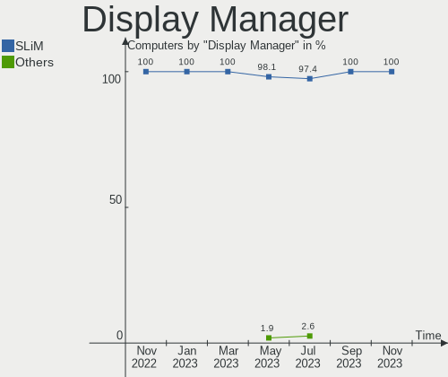
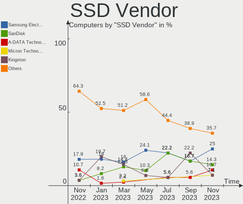
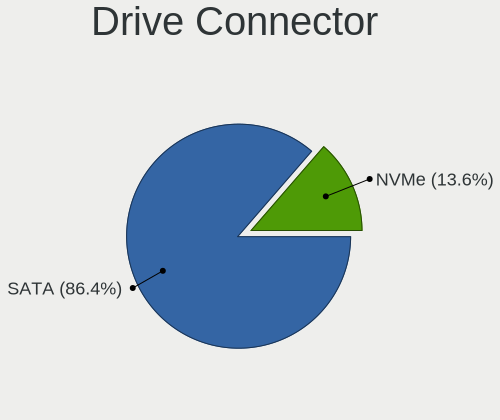
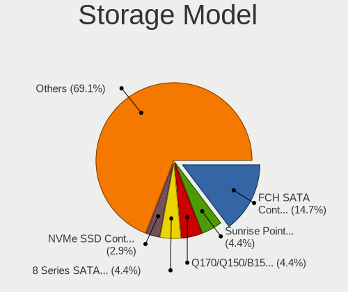
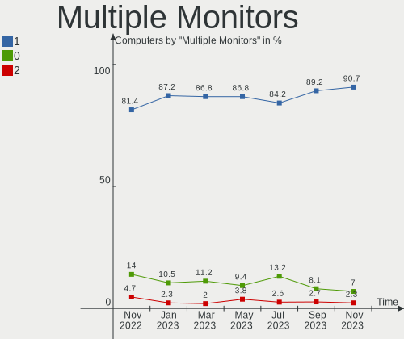

helloSystem Hardware Trends
---------------------------

A project to identify most popular hardware characteristics and track their change
over time based on data collected by helloSystem users at https://BSD-Hardware.info.

Anyone can contribute to this report by the [hw-probe](https://github.com/linuxhw/hw-probe/blob/master/INSTALL.BSD.md) tool:

    hw-probe -all -upload

This is a report for all computer types. See also reports for [desktops](/Dist/helloSystem/Desktop/README.md) and [notebooks](/Dist/helloSystem/Notebook/README.md).

Full-feature report is available here: https://bsd-hardware.info/?view=trends

Period: Oct, 2021.

Contents
--------

* [ System ](#system)
  - [ OS                       ](#os)
  - [ OS Family                ](#os-family)
  - [ Arch                     ](#arch)
  - [ DE                       ](#de)
  - [ Display Server           ](#display-server)
  - [ Display Manager          ](#display-manager)
  - [ OS Lang                  ](#os-lang)
  - [ Boot Mode                ](#boot-mode)
  - [ Filesystem               ](#filesystem)
  - [ Part. scheme             ](#part-scheme)

* [ Board ](#board)
  - [ Vendor                   ](#vendor)
  - [ Model                    ](#model)
  - [ Model Family             ](#model-family)
  - [ MFG Year                 ](#mfg-year)
  - [ Form Factor              ](#form-factor)
  - [ Coreboot                 ](#coreboot)
  - [ RAM Size                 ](#ram-size)
  - [ RAM Used                 ](#ram-used)
  - [ Total Drives             ](#total-drives)
  - [ Has CD-ROM               ](#has-cd-rom)
  - [ Has Ethernet             ](#has-ethernet)
  - [ Has WiFi                 ](#has-wifi)
  - [ Has Bluetooth            ](#has-bluetooth)

* [ Location ](#location)
  - [ Country                  ](#country)
  - [ City                     ](#city)

* [ Drives ](#drives)
  - [ Drive Vendor             ](#drive-vendor)
  - [ Drive Model              ](#drive-model)
  - [ HDD Vendor               ](#hdd-vendor)
  - [ SSD Vendor               ](#ssd-vendor)
  - [ Drive Kind               ](#drive-kind)
  - [ Drive Connector          ](#drive-connector)
  - [ Drive Size               ](#drive-size)
  - [ Space Total              ](#space-total)
  - [ Space Used               ](#space-used)
  - [ Malfunc. Drives          ](#malfunc-drives)
  - [ Malfunc. Drive Vendor    ](#malfunc-drive-vendor)
  - [ Malfunc. HDD Vendor      ](#malfunc-hdd-vendor)
  - [ Malfunc. Drive Kind      ](#malfunc-drive-kind)
  - [ Failed Drives            ](#failed-drives)
  - [ Failed Drive Vendor      ](#failed-drive-vendor)
  - [ Drive Status             ](#drive-status)

* [ Storage controller ](#storage-controller)
  - [ Storage Vendor           ](#storage-vendor)
  - [ Storage Model            ](#storage-model)
  - [ Storage Kind             ](#storage-kind)

* [ Processor ](#processor)
  - [ CPU Vendor               ](#cpu-vendor)
  - [ CPU Model                ](#cpu-model)
  - [ CPU Model Family         ](#cpu-model-family)
  - [ CPU Cores                ](#cpu-cores)
  - [ CPU Sockets              ](#cpu-sockets)
  - [ CPU Threads              ](#cpu-threads)
  - [ CPU Microarch            ](#cpu-microarch)

* [ Graphics ](#graphics)
  - [ GPU Vendor               ](#gpu-vendor)
  - [ GPU Model                ](#gpu-model)
  - [ GPU Combo                ](#gpu-combo)
  - [ GPU Driver               ](#gpu-driver)
  - [ GPU Memory               ](#gpu-memory)

* [ Monitor ](#monitor)
  - [ Monitor Vendor           ](#monitor-vendor)
  - [ Monitor Model            ](#monitor-model)
  - [ Monitor Resolution       ](#monitor-resolution)
  - [ Monitor Diagonal         ](#monitor-diagonal)
  - [ Monitor Width            ](#monitor-width)
  - [ Aspect Ratio             ](#aspect-ratio)
  - [ Monitor Area             ](#monitor-area)
  - [ Pixel Density            ](#pixel-density)
  - [ Multiple Monitors        ](#multiple-monitors)

* [ Network ](#network)
  - [ Net Controller Vendor    ](#net-controller-vendor)
  - [ Net Controller Model     ](#net-controller-model)
  - [ Wireless Vendor          ](#wireless-vendor)
  - [ Wireless Model           ](#wireless-model)
  - [ Ethernet Vendor          ](#ethernet-vendor)
  - [ Ethernet Model           ](#ethernet-model)
  - [ Net Controller Kind      ](#net-controller-kind)
  - [ Used Controller          ](#used-controller)
  - [ NICs                     ](#nics)
  - [ IPv6                     ](#ipv6)

* [ Bluetooth ](#bluetooth)
  - [ Bluetooth Vendor         ](#bluetooth-vendor)
  - [ Bluetooth Model          ](#bluetooth-model)

* [ Sound ](#sound)
  - [ Sound Vendor             ](#sound-vendor)
  - [ Sound Model              ](#sound-model)

* [ Memory ](#memory)
  - [ Memory Vendor            ](#memory-vendor)
  - [ Memory Model             ](#memory-model)
  - [ Memory Kind              ](#memory-kind)
  - [ Memory Form Factor       ](#memory-form-factor)
  - [ Memory Size              ](#memory-size)
  - [ Memory Speed             ](#memory-speed)

* [ Printers & scanners ](#printers--scanners)
  - [ Printer Vendor           ](#printer-vendor)
  - [ Printer Model            ](#printer-model)
  - [ Scanner Vendor           ](#scanner-vendor)
  - [ Scanner Model            ](#scanner-model)

* [ Camera ](#camera)
  - [ Camera Vendor            ](#camera-vendor)
  - [ Camera Model             ](#camera-model)

* [ Security ](#security)
  - [ Fingerprint Vendor       ](#fingerprint-vendor)
  - [ Fingerprint Model        ](#fingerprint-model)
  - [ Chipcard Vendor          ](#chipcard-vendor)
  - [ Chipcard Model           ](#chipcard-model)

* [ Unsupported ](#unsupported)
  - [ Unsupported Devices      ](#unsupported-devices)
  - [ Unsupported Device Types ](#unsupported-device-types)

System
------

OS
--

Installed operating systems

| Name              | Computers | Percent |
|-------------------|-----------|---------|
| helloSystem 0.6.0 | 52        | 76.47%  |
| helloSystem 0.5.0 | 14        | 20.59%  |
| helloSystem 0.7.0 | 2         | 2.94%   |

OS Family
---------

OS without a version

| Name        | Computers | Percent |
|-------------|-----------|---------|
| helloSystem | 68        | 100%    |

Arch
----

OS architecture (x86_64, i586, etc.)

| Name  | Computers | Percent |
|-------|-----------|---------|
| amd64 | 68        | 100%    |

DE
--

Desktop Environment

| Name         | Computers | Percent |
|--------------|-----------|---------|
| helloDesktop | 67        | 98.53%  |
| XFCE         | 1         | 1.47%   |

Display Server
--------------

X11 or Wayland

| Name | Computers | Percent |
|------|-----------|---------|
| X11  | 68        | 100%    |

Display Manager
---------------

SDDM, LightDM, etc.

| Name | Computers | Percent |
|------|-----------|---------|
| SLiM | 68        | 100%    |

OS Lang
-------

Language

| Lang    | Computers | Percent |
|---------|-----------|---------|
| en_US   | 67        | 98.53%  |
| Unknown | 1         | 1.47%   |

Boot Mode
---------

EFI or BIOS

| Mode | Computers | Percent |
|------|-----------|---------|
| EFI  | 57        | 83.82%  |
| BIOS | 11        | 16.18%  |

Filesystem
----------

Type of filesystem

| Type | Computers | Percent |
|------|-----------|---------|
| Zfs  | 68        | 100%    |

Part. scheme
------------

Scheme of partitioning

| Type | Computers | Percent |
|------|-----------|---------|
| GPT  | 68        | 100%    |

Board
-----

Vendor
------

Motherboard manufacturer

| Name                | Computers | Percent |
|---------------------|-----------|---------|
| Lenovo              | 12        | 17.65%  |
| Hewlett-Packard     | 11        | 16.18%  |
| ASUSTek Computer    | 11        | 16.18%  |
| Dell                | 6         | 8.82%   |
| MSI                 | 4         | 5.88%   |
| Gigabyte Technology | 4         | 5.88%   |
| Toshiba             | 3         | 4.41%   |
| ASRock              | 3         | 4.41%   |
| Apple               | 3         | 4.41%   |
| Acer                | 3         | 4.41%   |
| Intel               | 2         | 2.94%   |
| Sony                | 1         | 1.47%   |
| Medion              | 1         | 1.47%   |
| Itautec             | 1         | 1.47%   |
| Chuwi               | 1         | 1.47%   |
| Acidanthera         | 1         | 1.47%   |
| Unknown             | 1         | 1.47%   |

Model
-----

Motherboard model

| Name                                       | Computers | Percent |
|--------------------------------------------|-----------|---------|
| Unknown                                    | 2         | 2.94%   |
| Toshiba Satellite S55t-B                   | 1         | 1.47%   |
| Toshiba dynabook Satellite B453/L          | 1         | 1.47%   |
| Toshiba dynabook RX3 SM240E/3HD            | 1         | 1.47%   |
| Sony SVS1511AJB                            | 1         | 1.47%   |
| MSI MS-7B93                                | 1         | 1.47%   |
| MSI MS-7A40                                | 1         | 1.47%   |
| MSI MS-7592                                | 1         | 1.47%   |
| MSI MS-16F1                                | 1         | 1.47%   |
| Medion H61H2-LM3                           | 1         | 1.47%   |
| Lenovo Yoga 3 Pro-1370 80HE                | 1         | 1.47%   |
| Lenovo ThinkPad X250 20CLS2A11K            | 1         | 1.47%   |
| Lenovo ThinkPad X230 Tablet 343522U        | 1         | 1.47%   |
| Lenovo ThinkPad X230 23254G7               | 1         | 1.47%   |
| Lenovo ThinkPad X1 Carbon Gen 9 20XWA003CD | 1         | 1.47%   |
| Lenovo ThinkPad X1 Carbon 2nd 20A70066UK   | 1         | 1.47%   |
| Lenovo ThinkPad T490s 20NYS3TU00           | 1         | 1.47%   |
| Lenovo ThinkPad T14s Gen 1 20T1S0Q200      | 1         | 1.47%   |
| Lenovo ThinkPad R500 2718W92               | 1         | 1.47%   |
| Lenovo ThinkPad L440 20ASS0FP00            | 1         | 1.47%   |
| Lenovo S20-30 Touch 20434                  | 1         | 1.47%   |
| Lenovo G500s 20245                         | 1         | 1.47%   |
| Itautec Infoway w7530                      | 1         | 1.47%   |
| Intel NUC8i7BEH                            | 1         | 1.47%   |
| Intel H61                                  | 1         | 1.47%   |
| HP ProLiant ML350 G5                       | 1         | 1.47%   |
| HP ProBook 470 G4                          | 1         | 1.47%   |
| HP Presario CQ43                           | 1         | 1.47%   |
| HP Pavilion Gaming Laptop 15-ec2xxx        | 1         | 1.47%   |
| HP Pavilion Gaming Desktop 690-00xx        | 1         | 1.47%   |
| HP Pavilion dv3                            | 1         | 1.47%   |
| HP Compaq Elite 8300 USDT                  | 1         | 1.47%   |
| HP Compaq Elite 8300 SFF                   | 1         | 1.47%   |
| HP 24-g038ur                               | 1         | 1.47%   |
| HP 15                                      | 1         | 1.47%   |
| Gigabyte H410M S2 V2                       | 1         | 1.47%   |
| Gigabyte G41MT-S2                          | 1         | 1.47%   |
| Gigabyte B450 AORUS M                      | 1         | 1.47%   |
| Gigabyte 990FXA-UD3                        | 1         | 1.47%   |
| Dell Studio 1747                           | 1         | 1.47%   |
| Dell Precision M4600                       | 1         | 1.47%   |
| Dell OptiPlex 3020M                        | 1         | 1.47%   |
| Dell Latitude E4300                        | 1         | 1.47%   |
| Dell Inspiron 3521                         | 1         | 1.47%   |
| Dell Inspiron 24-3459                      | 1         | 1.47%   |
| Chuwi MiniBook                             | 1         | 1.47%   |
| ASUS X441BA                                | 1         | 1.47%   |
| ASUS UX21A                                 | 1         | 1.47%   |
| ASUS U33Jc                                 | 1         | 1.47%   |
| ASUS TUF GAMING X570-PLUS                  | 1         | 1.47%   |
| ASUS TUF B450M-PRO GAMING                  | 1         | 1.47%   |
| ASUS PRIME Z390M-PLUS                      | 1         | 1.47%   |
| ASUS P5P43TD PRO                           | 1         | 1.47%   |
| ASUS F2A85-M                               | 1         | 1.47%   |
| ASUS CROSSHAIR V FORMULA-Z                 | 1         | 1.47%   |
| ASUS ASUSPROART D940MX_D940MX              | 1         | 1.47%   |
| ASUS All Series                            | 1         | 1.47%   |
| ASRock X300M-STX                           | 1         | 1.47%   |
| ASRock B365M-ITX/ac                        | 1         | 1.47%   |
| ASRock A320M-DGS                           | 1         | 1.47%   |

Model Family
------------

Motherboard model prefix

| Name                | Computers | Percent |
|---------------------|-----------|---------|
| Lenovo ThinkPad     | 9         | 13.24%  |
| HP Pavilion         | 3         | 4.41%   |
| Toshiba dynabook    | 2         | 2.94%   |
| HP Compaq           | 2         | 2.94%   |
| Dell Inspiron       | 2         | 2.94%   |
| ASUS TUF            | 2         | 2.94%   |
| Acer Aspire         | 2         | 2.94%   |
| Unknown             | 2         | 2.94%   |
| Toshiba Satellite   | 1         | 1.47%   |
| Sony SVS1511AJB     | 1         | 1.47%   |
| MSI MS-7B93         | 1         | 1.47%   |
| MSI MS-7A40         | 1         | 1.47%   |
| MSI MS-7592         | 1         | 1.47%   |
| MSI MS-16F1         | 1         | 1.47%   |
| Medion H61H2-LM3    | 1         | 1.47%   |
| Lenovo Yoga         | 1         | 1.47%   |
| Lenovo S20-30       | 1         | 1.47%   |
| Lenovo G500s        | 1         | 1.47%   |
| Itautec Infoway     | 1         | 1.47%   |
| Intel NUC8i7BEH     | 1         | 1.47%   |
| Intel H61           | 1         | 1.47%   |
| HP ProLiant         | 1         | 1.47%   |
| HP ProBook          | 1         | 1.47%   |
| HP Presario         | 1         | 1.47%   |
| HP 24-g038ur        | 1         | 1.47%   |
| HP 15               | 1         | 1.47%   |
| Gigabyte H410M      | 1         | 1.47%   |
| Gigabyte G41MT-S2   | 1         | 1.47%   |
| Gigabyte B450       | 1         | 1.47%   |
| Gigabyte 990FXA-UD3 | 1         | 1.47%   |
| Dell Studio         | 1         | 1.47%   |
| Dell Precision      | 1         | 1.47%   |
| Dell OptiPlex       | 1         | 1.47%   |
| Dell Latitude       | 1         | 1.47%   |
| Chuwi MiniBook      | 1         | 1.47%   |
| ASUS X441BA         | 1         | 1.47%   |
| ASUS UX21A          | 1         | 1.47%   |
| ASUS U33Jc          | 1         | 1.47%   |
| ASUS PRIME          | 1         | 1.47%   |
| ASUS P5P43TD        | 1         | 1.47%   |
| ASUS F2A85-M        | 1         | 1.47%   |
| ASUS CROSSHAIR      | 1         | 1.47%   |
| ASUS ASUSPROART     | 1         | 1.47%   |
| ASUS All            | 1         | 1.47%   |
| ASRock X300M-STX    | 1         | 1.47%   |
| ASRock B365M-ITX    | 1         | 1.47%   |
| ASRock A320M-DGS    | 1         | 1.47%   |
| Apple MacPro5       | 1         | 1.47%   |
| Apple MacBookPro4   | 1         | 1.47%   |
| Apple MacBookAir5   | 1         | 1.47%   |
| Acidanthera iMac15  | 1         | 1.47%   |
| Acer Veriton        | 1         | 1.47%   |

MFG Year
--------

Motherboard manufacture year

| Year | Computers | Percent |
|------|-----------|---------|
| 2021 | 13        | 19.12%  |
| 2019 | 11        | 16.18%  |
| 2020 | 7         | 10.29%  |
| 2018 | 5         | 7.35%   |
| 2012 | 5         | 7.35%   |
| 2011 | 5         | 7.35%   |
| 2010 | 5         | 7.35%   |
| 2015 | 4         | 5.88%   |
| 2013 | 4         | 5.88%   |
| 2014 | 3         | 4.41%   |
| 2009 | 3         | 4.41%   |
| 2017 | 1         | 1.47%   |
| 2016 | 1         | 1.47%   |
| 2008 | 1         | 1.47%   |

Form Factor
-----------

Physical design of the computer

| Name       | Computers | Percent |
|------------|-----------|---------|
| Notebook   | 35        | 51.47%  |
| Desktop    | 29        | 42.65%  |
| All in one | 3         | 4.41%   |
| Mini pc    | 1         | 1.47%   |

Coreboot
--------

Have coreboot on board

| Used | Computers | Percent |
|------|-----------|---------|
| No   | 68        | 100%    |

RAM Size
--------

Total RAM memory

| Size in GB  | Computers | Percent |
|-------------|-----------|---------|
| 8.01-16.0   | 25        | 36.76%  |
| 4.01-8.0    | 22        | 32.35%  |
| 16.01-24.0  | 13        | 19.12%  |
| 32.01-64.0  | 6         | 8.82%   |
| 64.01-256.0 | 2         | 2.94%   |

RAM Used
--------

Used RAM memory

| Used GB  | Computers | Percent |
|----------|-----------|---------|
| 0.01-0.5 | 40        | 58.82%  |
| 0.51-1.0 | 20        | 29.41%  |
| 1.01-2.0 | 8         | 11.76%  |

Total Drives
------------

Number of drives on board

| Drives | Computers | Percent |
|--------|-----------|---------|
| 1      | 43        | 63.24%  |
| 2      | 12        | 17.65%  |
| 4      | 5         | 7.35%   |
| 3      | 4         | 5.88%   |
| 5      | 2         | 2.94%   |
| 0      | 2         | 2.94%   |

Has CD-ROM
----------

Has CD-ROM on board

| Presented | Computers | Percent |
|-----------|-----------|---------|
| Yes       | 34        | 50%     |
| No        | 34        | 50%     |

Has Ethernet
------------

Has Ethernet on board

| Presented | Computers | Percent |
|-----------|-----------|---------|
| Yes       | 64        | 94.12%  |
| No        | 4         | 5.88%   |

Has WiFi
--------

Has WiFi module

| Presented | Computers | Percent |
|-----------|-----------|---------|
| Yes       | 47        | 69.12%  |
| No        | 21        | 30.88%  |

Has Bluetooth
-------------

Has Bluetooth module

| Presented | Computers | Percent |
|-----------|-----------|---------|
| No        | 35        | 51.47%  |
| Yes       | 33        | 48.53%  |

Location
--------

Country
-------

Geographic location (country)

| Country     | Computers | Percent |
|-------------|-----------|---------|
| Russia      | 9         | 13.24%  |
| USA         | 6         | 8.82%   |
| Spain       | 5         | 7.35%   |
| Germany     | 4         | 5.88%   |
| China       | 4         | 5.88%   |
| Canada      | 4         | 5.88%   |
| Brazil      | 4         | 5.88%   |
| Ukraine     | 3         | 4.41%   |
| UK          | 2         | 2.94%   |
| Switzerland | 2         | 2.94%   |
| Poland      | 2         | 2.94%   |
| New Zealand | 2         | 2.94%   |
| Japan       | 2         | 2.94%   |
| Italy       | 2         | 2.94%   |
| India       | 2         | 2.94%   |
| Chile       | 2         | 2.94%   |
| Venezuela   | 1         | 1.47%   |
| Turkey      | 1         | 1.47%   |
| Thailand    | 1         | 1.47%   |
| South Korea | 1         | 1.47%   |
| Peru        | 1         | 1.47%   |
| Mexico      | 1         | 1.47%   |
| Malta       | 1         | 1.47%   |
| Lithuania   | 1         | 1.47%   |
| Libya       | 1         | 1.47%   |
| Indonesia   | 1         | 1.47%   |
| Guatemala   | 1         | 1.47%   |
| Denmark     | 1         | 1.47%   |
| Czechia     | 1         | 1.47%   |

City
----

Geographic location (city)

| City                    | Computers | Percent |
|-------------------------|-----------|---------|
| Santiago                | 2         | 2.94%   |
| Hicksville              | 2         | 2.94%   |
| Barcelona               | 2         | 2.94%   |
| Yeongdong-gun           | 1         | 1.47%   |
| Yekaterinburg           | 1         | 1.47%   |
| Xiamen                  | 1         | 1.47%   |
| Wroclaw                 | 1         | 1.47%   |
| Wellington              | 1         | 1.47%   |
| Voronezh                | 1         | 1.47%   |
| Vilnius                 | 1         | 1.47%   |
| Tyumen                  | 1         | 1.47%   |
| Tripoli                 | 1         | 1.47%   |
| Torre del Mar           | 1         | 1.47%   |
| Taito                   | 1         | 1.47%   |
| Surabaya                | 1         | 1.47%   |
| Stuttgart               | 1         | 1.47%   |
| St Petersburg           | 1         | 1.47%   |
| Smiths Falls            | 1         | 1.47%   |
| Shepetivka              | 1         | 1.47%   |
| Seattle                 | 1         | 1.47%   |
| Rostov-on-Don           | 1         | 1.47%   |
| Riehen                  | 1         | 1.47%   |
| Richmond                | 1         | 1.47%   |
| Reriutaba               | 1         | 1.47%   |
| Qingdao                 | 1         | 1.47%   |
| Plattsburgh             | 1         | 1.47%   |
| Pilsen                  | 1         | 1.47%   |
| Petergof                | 1         | 1.47%   |
| Olympia                 | 1         | 1.47%   |
| Odessa                  | 1         | 1.47%   |
| New Plymouth            | 1         | 1.47%   |
| Munich                  | 1         | 1.47%   |
| Mumbai                  | 1         | 1.47%   |
| Moscow                  | 1         | 1.47%   |
| Monte Belo              | 1         | 1.47%   |
| Mission                 | 1         | 1.47%   |
| Maracaibo               | 1         | 1.47%   |
| Malo                    | 1         | 1.47%   |
| Macerata                | 1         | 1.47%   |
| Lima                    | 1         | 1.47%   |
| Langnau am Albis        | 1         | 1.47%   |
| La Paz                  | 1         | 1.47%   |
| Kyiv                    | 1         | 1.47%   |
| Krasnodar               | 1         | 1.47%   |
| Kosekoy                 | 1         | 1.47%   |
| Katowice                | 1         | 1.47%   |
| Irkutsk                 | 1         | 1.47%   |
| Inhapim                 | 1         | 1.47%   |
| Heidelberg              | 1         | 1.47%   |
| Guatemala City          | 1         | 1.47%   |
| Guangzhou               | 1         | 1.47%   |
| Fuente Carreteros       | 1         | 1.47%   |
| Frederiksberg           | 1         | 1.47%   |
| Finchley                | 1         | 1.47%   |
| Ernakulam               | 1         | 1.47%   |
| Edmonton                | 1         | 1.47%   |
| Dulles                  | 1         | 1.47%   |
| Detmold                 | 1         | 1.47%   |
| Chengdu                 | 1         | 1.47%   |
| Cabo de Santo Agostinho | 1         | 1.47%   |

Drives
------

Drive Vendor
------------

Hard drive vendors

| Vendor              | Computers | Drives | Percent |
|---------------------|-----------|--------|---------|
| Seagate             | 18        | 21     | 18.75%  |
| WDC                 | 16        | 21     | 16.67%  |
| Samsung Electronics | 11        | 12     | 11.46%  |
| Toshiba             | 8         | 9      | 8.33%   |
| Crucial             | 8         | 10     | 8.33%   |
| Kingston            | 5         | 8      | 5.21%   |
| Hitachi             | 4         | 4      | 4.17%   |
| SanDisk             | 3         | 3      | 3.13%   |
| Intel               | 3         | 3      | 3.13%   |
| PLEXTOR             | 2         | 2      | 2.08%   |
| Corsair             | 2         | 2      | 2.08%   |
| Apacer              | 2         | 2      | 2.08%   |
| A-DATA Technology   | 2         | 2      | 2.08%   |
| SPCC                | 1         | 1      | 1.04%   |
| Smartbuy            | 1         | 1      | 1.04%   |
| SK Hynix            | 1         | 1      | 1.04%   |
| PNY                 | 1         | 1      | 1.04%   |
| Patriot             | 1         | 1      | 1.04%   |
| OCZ                 | 1         | 1      | 1.04%   |
| LITEONIT            | 1         | 1      | 1.04%   |
| HGST                | 1         | 1      | 1.04%   |
| Hewlett-Packard     | 1         | 1      | 1.04%   |
| EMTEC               | 1         | 1      | 1.04%   |
| Apple               | 1         | 1      | 1.04%   |
| AMD                 | 1         | 1      | 1.04%   |

Drive Model
-----------

Hard drive models

| Model                                   | Computers | Percent |
|-----------------------------------------|-----------|---------|
| Toshiba DT01ACA100 1TB                  | 3         | 2.75%   |
| Toshiba MQ01ABF050 500GB                | 2         | 1.83%   |
| Seagate ST9500325AS 500GB               | 2         | 1.83%   |
| Seagate ST1000LM035-1RK172 1TB          | 2         | 1.83%   |
| Seagate ST1000LM024 HN-M101MBB 1TB      | 2         | 1.83%   |
| Samsung HD322HJ 320GB                   | 2         | 1.83%   |
| Crucial CT500MX500SSD1 500GB            | 2         | 1.83%   |
| WDC WDS120G1G0A-00SS50 120GB            | 1         | 0.92%   |
| WDC WDS100T2B0C-00PXH0 1TB              | 1         | 0.92%   |
| WDC WD80EZAZ-11TDBA0 8TB                | 1         | 0.92%   |
| WDC WD5000LPCX-00VHAT0 500GB            | 1         | 0.92%   |
| WDC WD5000BEKT-60KA9T0 500GB            | 1         | 0.92%   |
| WDC WD5000AAKS-00V1A0 500GB             | 1         | 0.92%   |
| WDC WD3200BPVT-22JJ5T0 320GB            | 1         | 0.92%   |
| WDC WD3200BEVT-80A0RT0 320GB            | 1         | 0.92%   |
| WDC WD3200AAKS-00UU3A0 320GB            | 1         | 0.92%   |
| WDC WD30EZRZ-00WN9B0 3TB                | 1         | 0.92%   |
| WDC WD30EZRX-22D8PB0 3TB                | 1         | 0.92%   |
| WDC WD3003FZEX-00Z4SA0 3TB              | 1         | 0.92%   |
| WDC WD1600BEVT-22ZCT0 160GB             | 1         | 0.92%   |
| WDC WD1600AAJS-00WAA0 160GB             | 1         | 0.92%   |
| WDC WD1600AAJS-00V4A0 160GB             | 1         | 0.92%   |
| WDC WD10SDZW-11UMGS0 1TB                | 1         | 0.92%   |
| WDC WD10JPVX-75JC3T0 1TB                | 1         | 0.92%   |
| WDC WD10JMVW-11AJGS4 1TB                | 1         | 0.92%   |
| WDC WD10EZEX-75WN4A1 1TB                | 1         | 0.92%   |
| WDC WD1002FAEX-00Y9A0 1TB               | 1         | 0.92%   |
| Toshiba Q300 240GB                      | 1         | 0.92%   |
| Toshiba MQ02ABD100H 1TB                 | 1         | 0.92%   |
| Toshiba MQ01UBD100 1TB                  | 1         | 0.92%   |
| Toshiba DT01ACA050 500GB                | 1         | 0.92%   |
| SPCC M.2 PCIe SSD 256GB                 | 1         | 0.92%   |
| Smartbuy SSD 240GB                      | 1         | 0.92%   |
| SK Hynix BC501 HFM128GDJTNG-8310A 128GB | 1         | 0.92%   |
| Seagate ST9320325AS 320GB               | 1         | 0.92%   |
| Seagate ST9160412ASG 160GB              | 1         | 0.92%   |
| Seagate ST500LM021-1KJ152 500GB         | 1         | 0.92%   |
| Seagate ST500LM012 HN-M500MBB 500GB     | 1         | 0.92%   |
| Seagate ST500DM002-1SB10A 500GB         | 1         | 0.92%   |
| Seagate ST4000DM004-2CV104 4TB          | 1         | 0.92%   |
| Seagate ST3500413AS 500GB               | 1         | 0.92%   |
| Seagate ST3500312CS 500GB               | 1         | 0.92%   |
| Seagate ST3160813AS 160GB               | 1         | 0.92%   |
| Seagate ST31000524AS 1TB                | 1         | 0.92%   |
| Seagate ST3000DM001-1CH166 3TB          | 1         | 0.92%   |
| Seagate ST2000DX001-1CM164 2TB          | 1         | 0.92%   |
| Seagate ST2000DL003-9VT166 2TB          | 1         | 0.92%   |
| Seagate ST1000LM049-2GH172 1TB          | 1         | 0.92%   |
| Seagate ST1000DM010-2EP102 1TB          | 1         | 0.92%   |
| SanDisk SDSSDA240G 240GB                | 1         | 0.92%   |
| SanDisk SDSSDA120G 120GB                | 1         | 0.92%   |
| SanDisk SD5SE2256G1002E 256GB           | 1         | 0.92%   |
| Samsung SSD PM871b M.2 2280 128GB       | 1         | 0.92%   |
| Samsung SSD 970 EVO Plus 500GB          | 1         | 0.92%   |
| Samsung SSD 860 EVO 500GB               | 1         | 0.92%   |
| Samsung SSD 860 EVO 250GB               | 1         | 0.92%   |
| Samsung SSD 850 EVO 250GB               | 1         | 0.92%   |
| Samsung MZVLB1T0HALR-00000 1TB          | 1         | 0.92%   |
| Samsung MZVL21T0HCLR-00BL7 1TB          | 1         | 0.92%   |
| Samsung MZNTE256HMHP-000L2 256GB        | 1         | 0.92%   |

HDD Vendor
----------

Hard disk drive vendors

| Vendor              | Computers | Drives | Percent |
|---------------------|-----------|--------|---------|
| Seagate             | 18        | 21     | 37.5%   |
| WDC                 | 15        | 19     | 31.25%  |
| Toshiba             | 7         | 8      | 14.58%  |
| Hitachi             | 4         | 4      | 8.33%   |
| Samsung Electronics | 2         | 3      | 4.17%   |
| HGST                | 1         | 1      | 2.08%   |
| Hewlett-Packard     | 1         | 1      | 2.08%   |

SSD Vendor
----------

Solid state drive vendors

| Vendor              | Computers | Drives | Percent |
|---------------------|-----------|--------|---------|
| Crucial             | 8         | 10     | 20%     |
| Samsung Electronics | 6         | 6      | 15%     |
| Kingston            | 4         | 7      | 10%     |
| SanDisk             | 3         | 3      | 7.5%    |
| PLEXTOR             | 2         | 2      | 5%      |
| Intel               | 2         | 2      | 5%      |
| Apacer              | 2         | 2      | 5%      |
| A-DATA Technology   | 2         | 2      | 5%      |
| WDC                 | 1         | 1      | 2.5%    |
| Toshiba             | 1         | 1      | 2.5%    |
| Smartbuy            | 1         | 1      | 2.5%    |
| PNY                 | 1         | 1      | 2.5%    |
| Patriot             | 1         | 1      | 2.5%    |
| OCZ                 | 1         | 1      | 2.5%    |
| LITEONIT            | 1         | 1      | 2.5%    |
| EMTEC               | 1         | 1      | 2.5%    |
| Corsair             | 1         | 1      | 2.5%    |
| Apple               | 1         | 1      | 2.5%    |
| AMD                 | 1         | 1      | 2.5%    |

Drive Kind
----------

HDD or SSD

| Kind | Computers | Drives | Percent |
|------|-----------|--------|---------|
| HDD  | 38        | 57     | 47.5%   |
| SSD  | 33        | 45     | 41.25%  |
| NVMe | 9         | 9      | 11.25%  |

Drive Connector
---------------

SATA, SAS, NVMe, etc.

| Type | Computers | Drives | Percent |
|------|-----------|--------|---------|
| SATA | 62        | 102    | 87.32%  |
| NVMe | 9         | 9      | 12.68%  |

Drive Size
----------

Size of hard drive

| Size in TB | Computers | Drives | Percent |
|------------|-----------|--------|---------|
| 0.01-0.5   | 52        | 70     | 64.2%   |
| 0.51-1.0   | 20        | 21     | 24.69%  |
| 2.01-3.0   | 4         | 5      | 4.94%   |
| 1.01-2.0   | 3         | 3      | 3.7%    |
| 3.01-4.0   | 1         | 1      | 1.23%   |
| 4.01-10.0  | 1         | 2      | 1.23%   |

Space Total
-----------

Amount of disk space available on the file system

| Size in GB | Computers | Percent |
|------------|-----------|---------|
| 1-20       | 44        | 64.71%  |
| 101-250    | 12        | 17.65%  |
| 251-500    | 8         | 11.76%  |
| 501-1000   | 3         | 4.41%   |
| 51-100     | 1         | 1.47%   |

Space Used
----------

Amount of used disk space

| Used GB | Computers | Percent |
|---------|-----------|---------|
| 1-20    | 68        | 100%    |

Malfunc. Drives
---------------

Drive models with a malfunction

| Model                              | Computers | Drives | Percent |
|------------------------------------|-----------|--------|---------|
| Toshiba DT01ACA100 1TB             | 2         | 2      | 10%     |
| Samsung Electronics HD322HJ 320GB  | 2         | 2      | 10%     |
| WDC WD5000AAKS-00V1A0 500GB        | 1         | 1      | 5%      |
| WDC WD3200BPVT-22JJ5T0 320GB       | 1         | 1      | 5%      |
| WDC WD3200BEVT-80A0RT0 320GB       | 1         | 1      | 5%      |
| WDC WD3200AAKS-00UU3A0 320GB       | 1         | 1      | 5%      |
| WDC WD30EZRX-22D8PB0 3TB           | 1         | 1      | 5%      |
| Toshiba MQ01UBD100 1TB             | 1         | 1      | 5%      |
| Toshiba MQ01ABF050 500GB           | 1         | 1      | 5%      |
| Seagate ST9320325AS 320GB          | 1         | 1      | 5%      |
| Seagate ST500LM021-1KJ152 500GB    | 1         | 1      | 5%      |
| Seagate ST3500413AS 500GB          | 1         | 1      | 5%      |
| Seagate ST1000LM035-1RK172 1TB     | 1         | 1      | 5%      |
| Seagate ST1000LM024 HN-M101MBB 1TB | 1         | 1      | 5%      |
| Samsung Electronics HD161HJ 160GB  | 1         | 1      | 5%      |
| Hitachi HTS541080G9SA00 80GB       | 1         | 1      | 5%      |
| HGST HTS541010A9E680 1TB           | 1         | 1      | 5%      |
| Crucial CT525MX300SSD1 528GB       | 1         | 1      | 5%      |

Malfunc. Drive Vendor
---------------------

Vendors of faulty drives

| Vendor              | Computers | Drives | Percent |
|---------------------|-----------|--------|---------|
| WDC                 | 5         | 5      | 26.32%  |
| Seagate             | 5         | 5      | 26.32%  |
| Toshiba             | 4         | 4      | 21.05%  |
| Samsung Electronics | 2         | 3      | 10.53%  |
| Hitachi             | 1         | 1      | 5.26%   |
| HGST                | 1         | 1      | 5.26%   |
| Crucial             | 1         | 1      | 5.26%   |

Malfunc. HDD Vendor
-------------------

Vendors of faulty HDD drives

| Vendor              | Computers | Drives | Percent |
|---------------------|-----------|--------|---------|
| WDC                 | 5         | 5      | 27.78%  |
| Seagate             | 5         | 5      | 27.78%  |
| Toshiba             | 4         | 4      | 22.22%  |
| Samsung Electronics | 2         | 3      | 11.11%  |
| Hitachi             | 1         | 1      | 5.56%   |
| HGST                | 1         | 1      | 5.56%   |

Malfunc. Drive Kind
-------------------

Kinds of faulty drives

| Kind | Computers | Drives | Percent |
|------|-----------|--------|---------|
| HDD  | 17        | 19     | 94.44%  |
| SSD  | 1         | 1      | 5.56%   |

Failed Drives
-------------

Failed drive models

Zero info for selected period =(

Failed Drive Vendor
-------------------

Failed drive vendors

Zero info for selected period =(

Drive Status
------------

Number of failed and malfunc. drives

| Status   | Computers | Drives | Percent |
|----------|-----------|--------|---------|
| Works    | 56        | 90     | 74.67%  |
| Malfunc  | 18        | 20     | 24%     |
| Detected | 1         | 1      | 1.33%   |

Storage controller
------------------

Storage Vendor
--------------

Storage controller vendors

| Vendor                      | Computers | Percent |
|-----------------------------|-----------|---------|
| Intel                       | 53        | 67.95%  |
| AMD                         | 12        | 15.38%  |
| Samsung Electronics         | 3         | 3.85%   |
| Phison Electronics          | 2         | 2.56%   |
| ASMedia Technology          | 2         | 2.56%   |
| SK Hynix                    | 1         | 1.28%   |
| Sandisk                     | 1         | 1.28%   |
| Lite-On IT Corp. / Plextor  | 1         | 1.28%   |
| Kingston Technology Company | 1         | 1.28%   |
| JMicron Technology          | 1         | 1.28%   |
| Hewlett-Packard             | 1         | 1.28%   |

Storage Model
-------------

Storage controller models

| Model                                                                          | Computers | Percent |
|--------------------------------------------------------------------------------|-----------|---------|
| Intel 7 Series Chipset Family 6-port SATA Controller [AHCI mode]               | 9         | 10.23%  |
| AMD FCH SATA Controller [AHCI mode]                                            | 9         | 10.23%  |
| Intel Sunrise Point-LP SATA Controller [AHCI mode]                             | 4         | 4.55%   |
| Intel Wildcat Point-LP SATA Controller [AHCI Mode]                             | 3         | 3.41%   |
| Intel 82801 Mobile SATA Controller [RAID mode]                                 | 3         | 3.41%   |
| Intel 8 Series/C220 Series Chipset Family 6-port SATA Controller 1 [AHCI mode] | 3         | 3.41%   |
| Intel 7 Series/C210 Series Chipset Family 6-port SATA Controller [AHCI mode]   | 3         | 3.41%   |
| Intel 5 Series/3400 Series Chipset 4 port SATA AHCI Controller                 | 3         | 3.41%   |
| AMD 400 Series Chipset SATA Controller                                         | 3         | 3.41%   |
| Samsung NVMe SSD Controller SM981/PM981/PM983                                  | 2         | 2.27%   |
| Intel NM10/ICH7 Family SATA Controller [IDE mode]                              | 2         | 2.27%   |
| Intel Comet Lake SATA AHCI Controller                                          | 2         | 2.27%   |
| Intel Cannon Lake PCH SATA AHCI Controller                                     | 2         | 2.27%   |
| Intel 82801IBM/IEM (ICH9M/ICH9M-E) 4 port SATA Controller [AHCI mode]          | 2         | 2.27%   |
| Intel 8 Series SATA Controller 1 [AHCI mode]                                   | 2         | 2.27%   |
| Intel 6 Series/C200 Series Chipset Family 6 port Desktop SATA AHCI Controller  | 2         | 2.27%   |
| Intel 5 Series/3400 Series Chipset 6 port SATA AHCI Controller                 | 2         | 2.27%   |
| ASMedia ASM1062 Serial ATA Controller                                          | 2         | 2.27%   |
| AMD SB7x0/SB8x0/SB9x0 SATA Controller [AHCI mode]                              | 2         | 2.27%   |
| SK Hynix BC501 NVMe Solid State Drive                                          | 1         | 1.14%   |
| Sandisk WD Blue SN550 NVMe SSD                                                 | 1         | 1.14%   |
| Samsung NVMe SSD Controller PM9A1/PM9A3/980PRO                                 | 1         | 1.14%   |
| Phison E16 PCIe4 NVMe Controller                                               | 1         | 1.14%   |
| Phison E12 NVMe Controller                                                     | 1         | 1.14%   |
| Lite-On IT Corp. / Plextor M6e PCI Express SSD [Marvell 88SS9183]              | 1         | 1.14%   |
| JMicron JMB361 AHCI/IDE                                                        | 1         | 1.14%   |
| Intel SSD Pro 7600p/760p/E 6100p Series                                        | 1         | 1.14%   |
| Intel SATA Controller [RAID mode]                                              | 1         | 1.14%   |
| Intel Q170/Q150/B150/H170/H110/Z170/CM236 Chipset SATA Controller [AHCI Mode]  | 1         | 1.14%   |
| Intel Atom Processor E3800 Series SATA AHCI Controller                         | 1         | 1.14%   |
| Intel 82801JI (ICH10 Family) SATA AHCI Controller                              | 1         | 1.14%   |
| Intel 82801JI (ICH10 Family) 4 port SATA IDE Controller #1                     | 1         | 1.14%   |
| Intel 82801JI (ICH10 Family) 2 port SATA IDE Controller #2                     | 1         | 1.14%   |
| Intel 82801HM/HEM (ICH8M/ICH8M-E) SATA Controller [AHCI mode]                  | 1         | 1.14%   |
| Intel 82801HM/HEM (ICH8M/ICH8M-E) IDE Controller                               | 1         | 1.14%   |
| Intel 82801G (ICH7 Family) IDE Controller                                      | 1         | 1.14%   |
| Intel 8 Series/C220 Series Chipset Family 2-port SATA Controller 2 [IDE mode]  | 1         | 1.14%   |
| Intel 8 Series Chipset Family 4-port SATA Controller 1 [IDE mode] - Mobile     | 1         | 1.14%   |
| Intel 631xESB/632xESB IDE Controller                                           | 1         | 1.14%   |
| Intel 6 Series/C200 Series Chipset Family 6 port Mobile SATA AHCI Controller   | 1         | 1.14%   |
| Intel 200 Series PCH SATA controller [AHCI mode]                               | 1         | 1.14%   |
| HP Smart Array E200i (SAS Controller)                                          | 1         | 1.14%   |
| HP Smart Array Controller                                                      | 1         | 1.14%   |
| AMD SB7x0/SB8x0/SB9x0 SATA Controller [IDE mode]                               | 1         | 1.14%   |
| AMD SB7x0/SB8x0/SB9x0 IDE Controller                                           | 1         | 1.14%   |
| AMD FCH SATA Controller D                                                      | 1         | 1.14%   |
| Unknown                                                                        | 1         | 1.14%   |

Storage Kind
------------

Kind of storage controller (IDE, SATA, NVMe, SAS, ...)

| Kind | Computers | Percent |
|------|-----------|---------|
| SATA | 54        | 72%     |
| NVMe | 9         | 12%     |
| IDE  | 7         | 9.33%   |
| RAID | 5         | 6.67%   |

Processor
---------

CPU Vendor
----------

Processor vendors

| Vendor | Computers | Percent |
|--------|-----------|---------|
| Intel  | 55        | 80.88%  |
| AMD    | 13        | 19.12%  |

CPU Model
---------

Processor models

| Model                                      | Computers | Percent |
|--------------------------------------------|-----------|---------|
| Intel Core i5-3320M CPU @ 2.60GHz          | 2         | 2.94%   |
| Intel Core i3-6100U CPU @ 2.30GHz          | 2         | 2.94%   |
| Intel Xeon CPU W3680 @ 3.33GHz             | 1         | 1.47%   |
| Intel Xeon CPU E5-2690 0 @ 2.90GHz         | 1         | 1.47%   |
| Intel Xeon                                 | 1         | 1.47%   |
| Intel Processor 5Y70 CPU @ 1.10GHz         | 1         | 1.47%   |
| Intel Pentium CPU N3530 @ 2.16GHz          | 1         | 1.47%   |
| Intel CPU Version                          | 1         | 1.47%   |
| Intel Core m3-8100Y CPU @ 1.10GHz          | 1         | 1.47%   |
| Intel Core i7-9700K CPU @ 3.60GHz          | 1         | 1.47%   |
| Intel Core i7-9700F CPU @ 3.00GHz          | 1         | 1.47%   |
| Intel Core i7-8665U CPU @ 1.90GHz          | 1         | 1.47%   |
| Intel Core i7-8559U CPU @ 2.70GHz          | 1         | 1.47%   |
| Intel Core i7-7700 CPU @ 3.60GHz           | 1         | 1.47%   |
| Intel Core i7-7500U CPU @ 2.70GHz          | 1         | 1.47%   |
| Intel Core i7-3770 CPU @ 3.40GHz           | 1         | 1.47%   |
| Intel Core i7-3632QM CPU @ 2.20GHz         | 1         | 1.47%   |
| Intel Core i7-3520M CPU @ 2.90GHz          | 1         | 1.47%   |
| Intel Core i7-3517U CPU @ 1.90GHz          | 1         | 1.47%   |
| Intel Core i7-2640M CPU @ 2.80GH           | 1         | 1.47%   |
| Intel Core i7-10700 CPU @ 2.90GHz          | 1         | 1.47%   |
| Intel Core i7-10610U CPU @ 1.80GHz         | 1         | 1.47%   |
| Intel Core i5-9400 CPU @ 2.90GHz           | 1         | 1.47%   |
| Intel Core i5-8400 CPU @ 2.80GHz           | 1         | 1.47%   |
| Intel Core i5-5300U CPU @ 2.30GHz          | 1         | 1.47%   |
| Intel Core i5-5200U CPU @ 2.20GHz          | 1         | 1.47%   |
| Intel Core i5-4570 CPU @ 3.20GHz           | 1         | 1.47%   |
| Intel Core i5-4460 CPU @ 3.20GHz           | 1         | 1.47%   |
| Intel Core i5-4300U CPU @ 1.90GHz          | 1         | 1.47%   |
| Intel Core i5-4300M CPU @ 2.60GHz          | 1         | 1.47%   |
| Intel Core i5-4210U CPU @ 1.70GHz          | 1         | 1.47%   |
| Intel Core i5-3317U CPU @ 1.70GHz          | 1         | 1.47%   |
| Intel Core i5-2320 CPU @ 3.00GHz           | 1         | 1.47%   |
| Intel Core i5 CPU M 520 @ 2.40GHz          | 1         | 1.47%   |
| Intel Core i5 CPU M 460 @ 2.53GHz          | 1         | 1.47%   |
| Intel Core i3-4150T CPU @ 3.00GHz          | 1         | 1.47%   |
| Intel Core i3-3240 CPU @ 3.40GHz           | 1         | 1.47%   |
| Intel Core i3-3227U CPU @ 1.90GHz          | 1         | 1.47%   |
| Intel Core i3-3110M CPU @ 2.40GHz          | 1         | 1.47%   |
| Intel Core i3-2120 CPU @ 3.30GHz           | 1         | 1.47%   |
| Intel Core i3 CPU M 370 @ 2.40GH           | 1         | 1.47%   |
| Intel Core i3 CPU M 330 @ 2.13GHz          | 1         | 1.47%   |
| Intel Core 2 Quad CPU Q8400 @ 2.66GHz      | 1         | 1.47%   |
| Intel Core 2 Duo CPU T8300 @ 2.40GHz       | 1         | 1.47%   |
| Intel Core 2 Duo CPU T6500 @ 2.10GHz       | 1         | 1.47%   |
| Intel Core 2 Duo CPU P8600 @ 2.40GHz       | 1         | 1.47%   |
| Intel Core 2 Duo CPU E7500 @ 2.93GHz       | 1         | 1.47%   |
| Intel Core 2 Duo CPU                       | 1         | 1.47%   |
| Intel Core 2 Duo                           | 1         | 1.47%   |
| Intel Celeron CPU B815 @ 1.60GHz           | 1         | 1.47%   |
| Intel Celeron CPU 847 @ 1.10GHz            | 1         | 1.47%   |
| Intel Celeron CPU 1005M @ 1.90GHz          | 1         | 1.47%   |
| Intel 11th Gen Core i7-1165G7 @ 2.80GHz    | 1         | 1.47%   |
| AMD Ryzen 9 3900X 12-Core Processor        | 1         | 1.47%   |
| AMD Ryzen 7 3800X 8-Core Processor         | 1         | 1.47%   |
| AMD Ryzen 7 2700X Eight-Core Processor     | 1         | 1.47%   |
| AMD Ryzen 5 PRO 4650G with Radeon Graphics | 1         | 1.47%   |
| AMD Ryzen 5 5600H with Radeon Graphics     | 1         | 1.47%   |
| AMD Ryzen 5 2600 Six-Core Processor        | 1         | 1.47%   |
| AMD Ryzen 5 1600 Six-Core Processor        | 1         | 1.47%   |

CPU Model Family
----------------

Processor model prefix

| Model             | Computers | Percent |
|-------------------|-----------|---------|
| Intel Core i5     | 15        | 22.06%  |
| Intel Core i7     | 13        | 19.12%  |
| Intel Core i3     | 9         | 13.24%  |
| Intel Core 2 Duo  | 6         | 8.82%   |
| Other             | 3         | 4.41%   |
| Intel Xeon        | 3         | 4.41%   |
| Intel Celeron     | 3         | 4.41%   |
| AMD Ryzen 5       | 3         | 4.41%   |
| AMD Ryzen 7       | 2         | 2.94%   |
| AMD FX            | 2         | 2.94%   |
| Intel Pentium     | 1         | 1.47%   |
| Intel Core m3     | 1         | 1.47%   |
| Intel Core 2 Quad | 1         | 1.47%   |
| AMD Ryzen 9       | 1         | 1.47%   |
| AMD Ryzen 5 PRO   | 1         | 1.47%   |
| AMD Ryzen 3       | 1         | 1.47%   |
| AMD Phenom II X6  | 1         | 1.47%   |
| AMD A6            | 1         | 1.47%   |
| AMD A10           | 1         | 1.47%   |

CPU Cores
---------

Number of processor cores

| Number  | Computers | Percent |
|---------|-----------|---------|
| 2       | 31        | 45.59%  |
| 4       | 16        | 23.53%  |
| 8       | 5         | 7.35%   |
| 6       | 5         | 7.35%   |
| 12      | 4         | 5.88%   |
| Unknown | 4         | 5.88%   |
| 16      | 2         | 2.94%   |
| 24      | 1         | 1.47%   |

CPU Sockets
-----------

Number of sockets

| Number | Computers | Percent |
|--------|-----------|---------|
| 1      | 66        | 97.06%  |
| 2      | 2         | 2.94%   |

CPU Threads
-----------

Threads per core (Hyper-Threading)

| Number  | Computers | Percent |
|---------|-----------|---------|
| 2       | 36        | 52.94%  |
| 1       | 28        | 41.18%  |
| Unknown | 4         | 5.88%   |

CPU Microarch
-------------

Microarchitecture

| Name        | Computers | Percent |
|-------------|-----------|---------|
| IvyBridge   | 11        | 16.18%  |
| KabyLake    | 10        | 14.71%  |
| Penryn      | 8         | 11.76%  |
| SandyBridge | 6         | 8.82%   |
| Haswell     | 6         | 8.82%   |
| Westmere    | 5         | 7.35%   |
| Zen+        | 3         | 4.41%   |
| Zen 2       | 3         | 4.41%   |
| Piledriver  | 3         | 4.41%   |
| Broadwell   | 3         | 4.41%   |
| Skylake     | 2         | 2.94%   |
| Zen 3       | 1         | 1.47%   |
| Zen         | 1         | 1.47%   |
| TigerLake   | 1         | 1.47%   |
| Silvermont  | 1         | 1.47%   |
| Nehalem     | 1         | 1.47%   |
| K10         | 1         | 1.47%   |
| Excavator   | 1         | 1.47%   |
| CometLake   | 1         | 1.47%   |

Graphics
--------

GPU Vendor
----------

Vendors of graphics cards

| Vendor | Computers | Percent |
|--------|-----------|---------|
| Intel  | 39        | 52%     |
| Nvidia | 23        | 30.67%  |
| AMD    | 13        | 17.33%  |

GPU Model
---------

Graphics card models

| Model                                                                       | Computers | Percent |
|-----------------------------------------------------------------------------|-----------|---------|
| Intel 3rd Gen Core processor Graphics Controller                            | 9         | 12%     |
| Nvidia TU116 [GeForce GTX 1660 SUPER]                                       | 3         | 4%      |
| Intel Mobile 4 Series Chipset Integrated Graphics Controller                | 3         | 4%      |
| Intel 2nd Generation Core Processor Family Integrated Graphics Controller   | 3         | 4%      |
| Nvidia GP107 [GeForce GTX 1050 Ti]                                          | 2         | 2.67%   |
| Nvidia GM206 [GeForce GTX 950]                                              | 2         | 2.67%   |
| Nvidia GF119 [GeForce GT 610]                                               | 2         | 2.67%   |
| Intel Xeon E3-1200 v3/4th Gen Core Processor Integrated Graphics Controller | 2         | 2.67%   |
| Intel Skylake GT2 [HD Graphics 520]                                         | 2         | 2.67%   |
| Intel HD Graphics 5500                                                      | 2         | 2.67%   |
| Intel Haswell-ULT Integrated Graphics Controller                            | 2         | 2.67%   |
| Intel Core Processor Integrated Graphics Controller                         | 2         | 2.67%   |
| AMD Oland PRO [Radeon R7 240/340]                                           | 2         | 2.67%   |
| AMD Ellesmere [Radeon RX 470/480/570/570X/580/580X/590]                     | 2         | 2.67%   |
| Nvidia TU117M                                                               | 1         | 1.33%   |
| Nvidia TU104GL [Quadro RTX 4000]                                            | 1         | 1.33%   |
| Nvidia GT218M [GeForce 310M]                                                | 1         | 1.33%   |
| Nvidia GT215 [GeForce GT 220]                                               | 1         | 1.33%   |
| Nvidia GM108M [GeForce 930MX]                                               | 1         | 1.33%   |
| Nvidia GK208B [GeForce GT 710]                                              | 1         | 1.33%   |
| Nvidia GK107M [GeForce GT 640M LE]                                          | 1         | 1.33%   |
| Nvidia GK104 [GeForce GTX 770]                                              | 1         | 1.33%   |
| Nvidia GK104 [GeForce GTX 680]                                              | 1         | 1.33%   |
| Nvidia GF117M [GeForce 610M/710M/810M/820M / GT 620M/625M/630M/720M]        | 1         | 1.33%   |
| Nvidia GF108GLM [Quadro 1000M]                                              | 1         | 1.33%   |
| Nvidia GF108 [GeForce GT 440]                                               | 1         | 1.33%   |
| Nvidia GF106M [GeForce GTX 460M]                                            | 1         | 1.33%   |
| Nvidia G84M [GeForce 8600M GT]                                              | 1         | 1.33%   |
| Intel Xeon E3-1200 v2/3rd Gen Core processor Graphics Controller            | 1         | 1.33%   |
| Intel WhiskeyLake-U GT2 [UHD Graphics 620]                                  | 1         | 1.33%   |
| Intel UHD Graphics 615                                                      | 1         | 1.33%   |
| Intel TigerLake-LP GT2 [Iris Xe Graphics]                                   | 1         | 1.33%   |
| Intel HD Graphics 630                                                       | 1         | 1.33%   |
| Intel HD Graphics 620                                                       | 1         | 1.33%   |
| Intel HD Graphics 5300                                                      | 1         | 1.33%   |
| Intel CometLake-U GT2 [UHD Graphics]                                        | 1         | 1.33%   |
| Intel CometLake-S GT2 [UHD Graphics 630]                                    | 1         | 1.33%   |
| Intel CoffeeLake-U GT3e [Iris Plus Graphics 655]                            | 1         | 1.33%   |
| Intel CoffeeLake-S GT2 [UHD Graphics 630]                                   | 1         | 1.33%   |
| Intel Atom Processor Z36xxx/Z37xxx Series Graphics & Display                | 1         | 1.33%   |
| Intel 4th Generation Core Processor Family Integrated Graphics Controller   | 1         | 1.33%   |
| Intel 4th Gen Core Processor Integrated Graphics Controller                 | 1         | 1.33%   |
| AMD Turks XT [Radeon HD 6670/7670]                                          | 1         | 1.33%   |
| AMD Trinity [Radeon HD 7660D]                                               | 1         | 1.33%   |
| AMD Stoney [Radeon R2/R3/R4/R5 Graphics]                                    | 1         | 1.33%   |
| AMD RV730/M96 [Mobility Radeon HD 4650/5165]                                | 1         | 1.33%   |
| AMD RS880 [Radeon HD 4250]                                                  | 1         | 1.33%   |
| AMD Renoir                                                                  | 1         | 1.33%   |
| AMD Oland [Radeon HD 8570 / R5 430 OEM / R7 240/340 / Radeon 520 OEM]       | 1         | 1.33%   |
| AMD Lexa PRO [Radeon 540/540X/550/550X / RX 540X/550/550X]                  | 1         | 1.33%   |
| AMD Cezanne                                                                 | 1         | 1.33%   |

GPU Combo
---------

Combinations of graphics cards

| Name           | Computers | Percent |
|----------------|-----------|---------|
| 1 x Intel      | 30        | 44.12%  |
| 1 x Nvidia     | 17        | 25%     |
| 1 x AMD        | 11        | 16.18%  |
| Intel + Nvidia | 5         | 7.35%   |
| 2 x Intel      | 3         | 4.41%   |
| Intel + AMD    | 1         | 1.47%   |
| AMD + Nvidia   | 1         | 1.47%   |

GPU Driver
----------

Free vs proprietary

| Driver      | Computers | Percent |
|-------------|-----------|---------|
| Free        | 50        | 73.53%  |
| Proprietary | 10        | 14.71%  |
| Unknown     | 8         | 11.76%  |

GPU Memory
----------

Total video memory

| Size in GB | Computers | Percent |
|------------|-----------|---------|
| Unknown    | 49        | 72.06%  |
| 1.01-2.0   | 6         | 8.82%   |
| 7.01-8.0   | 3         | 4.41%   |
| 5.01-6.0   | 3         | 4.41%   |
| 0.51-1.0   | 3         | 4.41%   |
| 0.01-0.5   | 3         | 4.41%   |
| 3.01-4.0   | 1         | 1.47%   |

Monitor
-------

Monitor Vendor
--------------

Monitor vendors

| Vendor                  | Computers | Percent |
|-------------------------|-----------|---------|
| LG Display              | 8         | 16.67%  |
| AU Optronics            | 6         | 12.5%   |
| Samsung Electronics     | 5         | 10.42%  |
| Chimei Innolux          | 4         | 8.33%   |
| BenQ                    | 3         | 6.25%   |
| Lenovo                  | 2         | 4.17%   |
| Hewlett-Packard         | 2         | 4.17%   |
| Goldstar                | 2         | 4.17%   |
| Dell                    | 2         | 4.17%   |
| Acer                    | 2         | 4.17%   |
| Vizio                   | 1         | 2.08%   |
| ViewSonic               | 1         | 2.08%   |
| Philips                 | 1         | 2.08%   |
| Medion                  | 1         | 2.08%   |
| Iiyama                  | 1         | 2.08%   |
| Haier                   | 1         | 2.08%   |
| Eizo                    | 1         | 2.08%   |
| Chi Mei Optoelectronics | 1         | 2.08%   |
| ASUSTek Computer        | 1         | 2.08%   |
| Apple                   | 1         | 2.08%   |
| AOC                     | 1         | 2.08%   |
| Ancor Communications    | 1         | 2.08%   |

Monitor Model
-------------

Monitor models

| Model                                                                    | Computers | Percent |
|--------------------------------------------------------------------------|-----------|---------|
| Vizio LCD Monitor VIZ0022 1920x540 480x270mm 21.7-inch                   | 1         | 2.08%   |
| ViewSonic VX2458-mhd VSC0437 1920x1080 520x290mm 23.4-inch               | 1         | 2.08%   |
| Samsung Electronics T22D390 SAM0B69 1920x1080 480x270mm 21.7-inch        | 1         | 2.08%   |
| Samsung Electronics SyncMaster SAM05CD 1920x1080                         | 1         | 2.08%   |
| Samsung Electronics LCD Monitor SEC5742 1366x768 310x170mm 13.9-inch     | 1         | 2.08%   |
| Samsung Electronics LCD Monitor SEC414C 1366x768 310x170mm 13.9-inch     | 1         | 2.08%   |
| Samsung Electronics LCD Monitor SDC434A 3200x1800 290x170mm 13.2-inch    | 1         | 2.08%   |
| Philips PHL 193V5 PHLC0CD 1366x768 410x230mm 18.5-inch                   | 1         | 2.08%   |
| Medion MD21281 MED3947 1366x768 410x230mm 18.5-inch                      | 1         | 2.08%   |
| LG Display LCD Monitor LGD11F9 1280x800 290x180mm 13.4-inch              | 1         | 2.08%   |
| LG Display LCD Monitor LGD0470 1920x1080 350x190mm 15.7-inch             | 1         | 2.08%   |
| LG Display LCD Monitor LGD0419 2560x1440 310x170mm 13.9-inch             | 1         | 2.08%   |
| LG Display LCD Monitor LGD03ED 1366x768 280x160mm 12.7-inch              | 1         | 2.08%   |
| LG Display LCD Monitor LGD03AB 1366x768 340x190mm 15.3-inch              | 1         | 2.08%   |
| LG Display LCD Monitor LGD0323 1920x1080 350x190mm 15.7-inch             | 1         | 2.08%   |
| LG Display LCD Monitor LGD02D8 1366x768 280x160mm 12.7-inch              | 1         | 2.08%   |
| LG Display LCD Monitor LGD021D 1600x900 380x210mm 17.1-inch              | 1         | 2.08%   |
| Lenovo LEN-M73Z-D LEN00A0 1600x900 440x240mm 19.7-inch                   | 1         | 2.08%   |
| Lenovo LCD Monitor LEN4050 1280x800 330x210mm 15.4-inch                  | 1         | 2.08%   |
| Iiyama PLE2407HDS IVM560D 1920x1080 520x300mm 23.6-inch                  | 1         | 2.08%   |
| Hewlett-Packard LCD Monitor HWP4267 1920x1080 530x300mm 24.0-inch        | 1         | 2.08%   |
| Hewlett-Packard E243m HPN3465 1920x1080 530x300mm 24.0-inch              | 1         | 2.08%   |
| Haier HT-20216B(C) HAI2031 1920x1080 480x270mm 21.7-inch                 | 1         | 2.08%   |
| Goldstar LG HDR 4K GSM7707 3840x2160 600x340mm 27.2-inch                 | 1         | 2.08%   |
| Goldstar L1553S GSM3BB0 1024x768 300x230mm 14.9-inch                     | 1         | 2.08%   |
| Eizo EV2316W ENC2394 1920x1080 510x290mm 23.1-inch                       | 1         | 2.08%   |
| Dell LCD Monitor DEL40C8 1920x1080 530x300mm 24.0-inch                   | 1         | 2.08%   |
| Dell 1708FP DEL4024 1280x1024 340x270mm 17.1-inch                        | 1         | 2.08%   |
| Chimei Innolux LCD Monitor CMN15AB 1366x768 340x190mm 15.3-inch          | 1         | 2.08%   |
| Chimei Innolux LCD Monitor CMN14F2 1920x1080 310x170mm 13.9-inch         | 1         | 2.08%   |
| Chimei Innolux LCD Monitor CMN1492 1366x768 310x170mm 13.9-inch          | 1         | 2.08%   |
| Chimei Innolux LCD Monitor CMN1124 1920x1080 260x140mm 11.6-inch         | 1         | 2.08%   |
| Chi Mei Optoelectronics LCD Monitor CMO1318 1366x768 290x160mm 13.0-inch | 1         | 2.08%   |
| BenQ GW2765 BNQ78D6 2560x1440 600x340mm 27.2-inch                        | 1         | 2.08%   |
| BenQ GW2260 BNQ78C4 1920x1080 480x270mm 21.7-inch                        | 1         | 2.08%   |
| BenQ G925HDA BNQ7843 1366x768 410x230mm 18.5-inch                        | 1         | 2.08%   |
| AU Optronics LCD Monitor AUO46EC 1366x768 340x190mm 15.3-inch            | 1         | 2.08%   |
| AU Optronics LCD Monitor AUO45EC 1366x768 340x190mm 15.3-inch            | 1         | 2.08%   |
| AU Optronics LCD Monitor AUO315C 1366x768 260x140mm 11.6-inch            | 1         | 2.08%   |
| AU Optronics LCD Monitor AUO22EC 1366x768 340x190mm 15.3-inch            | 1         | 2.08%   |
| AU Optronics LCD Monitor AUO219E 1600x900 380x210mm 17.1-inch            | 1         | 2.08%   |
| AU Optronics LCD Monitor AUO106C 1366x768 280x160mm 12.7-inch            | 1         | 2.08%   |
| ASUSTek Computer VP228 AUS22A1 1920x1080 480x270mm 21.7-inch             | 1         | 2.08%   |
| Apple Color LCD APP9CF3 1366x768 260x140mm 11.6-inch                     | 1         | 2.08%   |
| AOC LE19W037 AOC1907 1360x768 410x230mm 18.5-inch                        | 1         | 2.08%   |
| Ancor Communications VS248 ACI2498 1920x1080 530x300mm 24.0-inch         | 1         | 2.08%   |
| Acer R271 ACR0496 1920x1080 600x340mm 27.2-inch                          | 1         | 2.08%   |
| Acer B223W ACR0018 1680x1050 470x300mm 22.0-inch                         | 1         | 2.08%   |

Monitor Resolution
------------------

Monitor screen resolution

| Resolution         | Computers | Percent |
|--------------------|-----------|---------|
| 1920x1080 (FHD)    | 17        | 35.42%  |
| 1366x768 (WXGA)    | 17        | 35.42%  |
| 1600x900 (HD+)     | 3         | 6.25%   |
| 2560x1440 (QHD)    | 2         | 4.17%   |
| 1280x800 (WXGA)    | 2         | 4.17%   |
| 3840x2160 (4K)     | 1         | 2.08%   |
| 3200x1800 (QHD+)   | 1         | 2.08%   |
| 1920x540           | 1         | 2.08%   |
| 1680x1050 (WSXGA+) | 1         | 2.08%   |
| 1360x768           | 1         | 2.08%   |
| 1280x1024 (SXGA)   | 1         | 2.08%   |
| 1024x768 (XGA)     | 1         | 2.08%   |

Monitor Diagonal
----------------

Diagonal size in inches

| Inches  | Computers | Percent |
|---------|-----------|---------|
| 15      | 8         | 16.67%  |
| 13      | 8         | 16.67%  |
| 21      | 5         | 10.42%  |
| 24      | 4         | 8.33%   |
| 18      | 4         | 8.33%   |
| 27      | 3         | 6.25%   |
| 23      | 3         | 6.25%   |
| 17      | 3         | 6.25%   |
| 12      | 3         | 6.25%   |
| 11      | 3         | 6.25%   |
| 22      | 1         | 2.08%   |
| 19      | 1         | 2.08%   |
| 14      | 1         | 2.08%   |
| Unknown | 1         | 2.08%   |

Monitor Width
-------------

Physical width

| Width in mm | Computers | Percent |
|-------------|-----------|---------|
| 301-350     | 14        | 29.17%  |
| 401-500     | 11        | 22.92%  |
| 501-600     | 10        | 20.83%  |
| 201-300     | 10        | 20.83%  |
| 351-400     | 2         | 4.17%   |
| Unknown     | 1         | 2.08%   |

Aspect Ratio
------------

Proportional relationship between the width and the height

| Ratio | Computers | Percent |
|-------|-----------|---------|
| 16/9  | 43        | 89.58%  |
| 16/10 | 3         | 6.25%   |
| 5/4   | 1         | 2.08%   |
| 4/3   | 1         | 2.08%   |

Monitor Area
------------

Area in inch

| Area in inch | Computers | Percent |
|----------------|-----------|---------|
| 201-250        | 13        | 27.08%  |
| 81-90          | 6         | 12.5%   |
| 141-150        | 5         | 10.42%  |
| 101-110        | 5         | 10.42%  |
| 91-100         | 4         | 8.33%   |
| 61-70          | 3         | 6.25%   |
| 51-60          | 3         | 6.25%   |
| 301-350        | 3         | 6.25%   |
| 71-80          | 2         | 4.17%   |
| 121-130        | 2         | 4.17%   |
| 151-200        | 1         | 2.08%   |
| Unknown        | 1         | 2.08%   |

Pixel Density
-------------

Pixels per inch

| Density       | Computers | Percent |
|---------------|-----------|---------|
| 51-100        | 19        | 39.58%  |
| 101-120       | 15        | 31.25%  |
| 121-160       | 9         | 18.75%  |
| 161-240       | 3         | 6.25%   |
| More than 240 | 1         | 2.08%   |
| Unknown       | 1         | 2.08%   |

Multiple Monitors
-----------------

Total monitors connected

| Total | Computers | Percent |
|-------|-----------|---------|
| 1     | 47        | 69.12%  |
| 0     | 20        | 29.41%  |
| 2     | 1         | 1.47%   |

Network
-------

Net Controller Vendor
---------------------

Controller vendors

| Vendor                            | Computers | Percent |
|-----------------------------------|-----------|---------|
| Intel                             | 35        | 35.71%  |
| Realtek Semiconductor             | 34        | 34.69%  |
| Broadcom                          | 10        | 10.2%   |
| Qualcomm Atheros                  | 8         | 8.16%   |
| Ralink                            | 2         | 2.04%   |
| VIA Technologies                  | 1         | 1.02%   |
| Sierra Wireless                   | 1         | 1.02%   |
| Ralink Technology                 | 1         | 1.02%   |
| NetGear                           | 1         | 1.02%   |
| Marvell Technology Group          | 1         | 1.02%   |
| Huawei Technologies               | 1         | 1.02%   |
| Google                            | 1         | 1.02%   |
| Ericsson Business Mobile Networks | 1         | 1.02%   |
| Aquantia                          | 1         | 1.02%   |

Net Controller Model
--------------------

Controller models

| Model                                                             | Computers | Percent |
|-------------------------------------------------------------------|-----------|---------|
| Realtek RTL8111/8168/8411 PCI Express Gigabit Ethernet Controller | 25        | 20.83%  |
| Realtek RTL810xE PCI Express Fast Ethernet controller             | 8         | 6.67%   |
| Intel Wireless 7265                                               | 5         | 4.17%   |
| Intel 82579LM Gigabit Network Connection (Lewisville)             | 5         | 4.17%   |
| Realtek RTL8723BE PCIe Wireless Network Adapter                   | 2         | 1.67%   |
| Realtek RTL8188CE 802.11b/g/n WiFi Adapter                        | 2         | 1.67%   |
| Qualcomm Atheros AR9485 Wireless Network Adapter                  | 2         | 1.67%   |
| Intel Wireless 7260                                               | 2         | 1.67%   |
| Intel Wireless 3160                                               | 2         | 1.67%   |
| Intel Ethernet Connection I217-LM                                 | 2         | 1.67%   |
| Intel Ethernet Connection (7) I219-V                              | 2         | 1.67%   |
| Intel Dual Band Wireless-AC 3168NGW [Stone Peak]                  | 2         | 1.67%   |
| Intel Centrino Advanced-N 6205 [Taylor Peak]                      | 2         | 1.67%   |
| Intel Cannon Point-LP CNVi [Wireless-AC]                          | 2         | 1.67%   |
| Broadcom BCM4360 802.11ac Wireless Network Adapter                | 2         | 1.67%   |
| Broadcom BCM4322 802.11a/b/g/n Wireless LAN Controller            | 2         | 1.67%   |
| VIA VT6105/VT6106S [Rhine-III]                                    | 1         | 0.83%   |
| Sierra Wireless Sierra Wireless EM7345 4G LTE                     | 1         | 0.83%   |
| Realtek RTL8852AE 802.11ax PCIe Wireless Network Adapter          | 1         | 0.83%   |
| Realtek RTL8822BE 802.11a/b/g/n/ac WiFi adapter                   | 1         | 0.83%   |
| Realtek RTL8821CE 802.11ac PCIe Wireless Network Adapter          | 1         | 0.83%   |
| Realtek RTL8188EUS 802.11n Wireless Network Adapter               | 1         | 0.83%   |
| Realtek RTL8188EE Wireless Network Adapter                        | 1         | 0.83%   |
| Ralink RT3072 Wireless Adapter                                    | 1         | 0.83%   |
| Ralink RT3290 Wireless 802.11n 1T/1R PCIe                         | 1         | 0.83%   |
| Ralink RT2561/RT61 rev B 802.11g                                  | 1         | 0.83%   |
| Qualcomm Atheros QCA9565 / AR9565 Wireless Network Adapter        | 1         | 0.83%   |
| Qualcomm Atheros QCA8172 Fast Ethernet                            | 1         | 0.83%   |
| Qualcomm Atheros AR928X Wireless Network Adapter (PCI-Express)    | 1         | 0.83%   |
| Qualcomm Atheros AR8151 v1.0 Gigabit Ethernet                     | 1         | 0.83%   |
| Qualcomm Atheros AR8131 Gigabit Ethernet                          | 1         | 0.83%   |
| Qualcomm Atheros AR8121/AR8113/AR8114 Gigabit or Fast Ethernet    | 1         | 0.83%   |
| NetGear A6100 AC600 DB Wireless Adapter [Realtek RTL8811AU]       | 1         | 0.83%   |
| Marvell Group 88E8058 PCI-E Gigabit Ethernet Controller           | 1         | 0.83%   |
| Intel WiFi Link 5100                                              | 1         | 0.83%   |
| Intel Wi-Fi 6 AX201                                               | 1         | 0.83%   |
| Intel Wi-Fi 6 AX200                                               | 1         | 0.83%   |
| Intel PRO/Wireless 5100 AGN [Shiloh] Network Connection           | 1         | 0.83%   |
| Intel I211 Gigabit Network Connection                             | 1         | 0.83%   |
| Intel Ethernet Connection I218-LM                                 | 1         | 0.83%   |
| Intel Ethernet Connection (6) I219-V                              | 1         | 0.83%   |
| Intel Ethernet Connection (6) I219-LM                             | 1         | 0.83%   |
| Intel Ethernet Connection (3) I218-LM                             | 1         | 0.83%   |
| Intel Ethernet Connection (2) I219-V                              | 1         | 0.83%   |
| Intel Ethernet Connection (11) I219-V                             | 1         | 0.83%   |
| Intel Ethernet Connection (10) I219-LM                            | 1         | 0.83%   |
| Intel Comet Lake PCH-LP CNVi WiFi                                 | 1         | 0.83%   |
| Intel Centrino Wireless-N 6150                                    | 1         | 0.83%   |
| Intel Centrino Wireless-N 135                                     | 1         | 0.83%   |
| Intel Centrino Wireless-N 1000 [Condor Peak]                      | 1         | 0.83%   |
| Intel Centrino WiMAX 6150                                         | 1         | 0.83%   |
| Intel Centrino Ultimate-N 6300                                    | 1         | 0.83%   |
| Intel Centrino Advanced-N 6235                                    | 1         | 0.83%   |
| Intel 82583V Gigabit Network Connection                           | 1         | 0.83%   |
| Intel 82579V Gigabit Network Connection                           | 1         | 0.83%   |
| Intel 82577LC Gigabit Network Connection                          | 1         | 0.83%   |
| Intel 82574L Gigabit Network Connection                           | 1         | 0.83%   |
| Intel 82567LM Gigabit Network Connection                          | 1         | 0.83%   |
| Huawei USB Composite Device                                       | 1         | 0.83%   |
| Google Nexus/Pixel Device (tether)                                | 1         | 0.83%   |

Wireless Vendor
---------------

Wireless vendors

| Vendor                | Computers | Percent |
|-----------------------|-----------|---------|
| Intel                 | 25        | 50%     |
| Realtek Semiconductor | 8         | 16%     |
| Broadcom              | 8         | 16%     |
| Qualcomm Atheros      | 4         | 8%      |
| Ralink                | 2         | 4%      |
| Sierra Wireless       | 1         | 2%      |
| Ralink Technology     | 1         | 2%      |
| NetGear               | 1         | 2%      |

Wireless Model
--------------

Wireless models

| Model                                                          | Computers | Percent |
|----------------------------------------------------------------|-----------|---------|
| Intel Wireless 7265                                            | 5         | 9.62%   |
| Realtek RTL8723BE PCIe Wireless Network Adapter                | 2         | 3.85%   |
| Realtek RTL8188CE 802.11b/g/n WiFi Adapter                     | 2         | 3.85%   |
| Qualcomm Atheros AR9485 Wireless Network Adapter               | 2         | 3.85%   |
| Intel Wireless 7260                                            | 2         | 3.85%   |
| Intel Wireless 3160                                            | 2         | 3.85%   |
| Intel Dual Band Wireless-AC 3168NGW [Stone Peak]               | 2         | 3.85%   |
| Intel Centrino Advanced-N 6205 [Taylor Peak]                   | 2         | 3.85%   |
| Intel Cannon Point-LP CNVi [Wireless-AC]                       | 2         | 3.85%   |
| Broadcom BCM4360 802.11ac Wireless Network Adapter             | 2         | 3.85%   |
| Broadcom BCM4322 802.11a/b/g/n Wireless LAN Controller         | 2         | 3.85%   |
| Sierra Wireless Sierra Wireless EM7345 4G LTE                  | 1         | 1.92%   |
| Realtek RTL8852AE 802.11ax PCIe Wireless Network Adapter       | 1         | 1.92%   |
| Realtek RTL8822BE 802.11a/b/g/n/ac WiFi adapter                | 1         | 1.92%   |
| Realtek RTL8821CE 802.11ac PCIe Wireless Network Adapter       | 1         | 1.92%   |
| Realtek RTL8188EUS 802.11n Wireless Network Adapter            | 1         | 1.92%   |
| Realtek RTL8188EE Wireless Network Adapter                     | 1         | 1.92%   |
| Ralink RT3072 Wireless Adapter                                 | 1         | 1.92%   |
| Ralink RT3290 Wireless 802.11n 1T/1R PCIe                      | 1         | 1.92%   |
| Ralink RT2561/RT61 rev B 802.11g                               | 1         | 1.92%   |
| Qualcomm Atheros QCA9565 / AR9565 Wireless Network Adapter     | 1         | 1.92%   |
| Qualcomm Atheros AR928X Wireless Network Adapter (PCI-Express) | 1         | 1.92%   |
| NetGear A6100 AC600 DB Wireless Adapter [Realtek RTL8811AU]    | 1         | 1.92%   |
| Intel WiFi Link 5100                                           | 1         | 1.92%   |
| Intel Wi-Fi 6 AX201                                            | 1         | 1.92%   |
| Intel Wi-Fi 6 AX200                                            | 1         | 1.92%   |
| Intel PRO/Wireless 5100 AGN [Shiloh] Network Connection        | 1         | 1.92%   |
| Intel Comet Lake PCH-LP CNVi WiFi                              | 1         | 1.92%   |
| Intel Centrino Wireless-N 6150                                 | 1         | 1.92%   |
| Intel Centrino Wireless-N 135                                  | 1         | 1.92%   |
| Intel Centrino Wireless-N 1000 [Condor Peak]                   | 1         | 1.92%   |
| Intel Centrino WiMAX 6150                                      | 1         | 1.92%   |
| Intel Centrino Ultimate-N 6300                                 | 1         | 1.92%   |
| Intel Centrino Advanced-N 6235                                 | 1         | 1.92%   |
| Broadcom BCM43225 802.11b/g/n                                  | 1         | 1.92%   |
| Broadcom BCM43224 802.11a/b/g/n                                | 1         | 1.92%   |
| Broadcom BCM4321 802.11a/b/g/n                                 | 1         | 1.92%   |
| Broadcom BCM43142 802.11b/g/n                                  | 1         | 1.92%   |

Ethernet Vendor
---------------

Ethernet vendors

| Vendor                   | Computers | Percent |
|--------------------------|-----------|---------|
| Realtek Semiconductor    | 33        | 49.25%  |
| Intel                    | 22        | 32.84%  |
| Qualcomm Atheros         | 4         | 5.97%   |
| Broadcom                 | 3         | 4.48%   |
| VIA Technologies         | 1         | 1.49%   |
| Marvell Technology Group | 1         | 1.49%   |
| Huawei Technologies      | 1         | 1.49%   |
| Google                   | 1         | 1.49%   |
| Aquantia                 | 1         | 1.49%   |

Ethernet Model
--------------

Ethernet models

| Model                                                             | Computers | Percent |
|-------------------------------------------------------------------|-----------|---------|
| Realtek RTL8111/8168/8411 PCI Express Gigabit Ethernet Controller | 25        | 37.31%  |
| Realtek RTL810xE PCI Express Fast Ethernet controller             | 8         | 11.94%  |
| Intel 82579LM Gigabit Network Connection (Lewisville)             | 5         | 7.46%   |
| Intel Ethernet Connection I217-LM                                 | 2         | 2.99%   |
| Intel Ethernet Connection (7) I219-V                              | 2         | 2.99%   |
| VIA VT6105/VT6106S [Rhine-III]                                    | 1         | 1.49%   |
| Qualcomm Atheros QCA8172 Fast Ethernet                            | 1         | 1.49%   |
| Qualcomm Atheros AR8151 v1.0 Gigabit Ethernet                     | 1         | 1.49%   |
| Qualcomm Atheros AR8131 Gigabit Ethernet                          | 1         | 1.49%   |
| Qualcomm Atheros AR8121/AR8113/AR8114 Gigabit or Fast Ethernet    | 1         | 1.49%   |
| Marvell Group 88E8058 PCI-E Gigabit Ethernet Controller           | 1         | 1.49%   |
| Intel I211 Gigabit Network Connection                             | 1         | 1.49%   |
| Intel Ethernet Connection I218-LM                                 | 1         | 1.49%   |
| Intel Ethernet Connection (6) I219-V                              | 1         | 1.49%   |
| Intel Ethernet Connection (6) I219-LM                             | 1         | 1.49%   |
| Intel Ethernet Connection (3) I218-LM                             | 1         | 1.49%   |
| Intel Ethernet Connection (2) I219-V                              | 1         | 1.49%   |
| Intel Ethernet Connection (11) I219-V                             | 1         | 1.49%   |
| Intel Ethernet Connection (10) I219-LM                            | 1         | 1.49%   |
| Intel 82583V Gigabit Network Connection                           | 1         | 1.49%   |
| Intel 82579V Gigabit Network Connection                           | 1         | 1.49%   |
| Intel 82577LC Gigabit Network Connection                          | 1         | 1.49%   |
| Intel 82574L Gigabit Network Connection                           | 1         | 1.49%   |
| Intel 82567LM Gigabit Network Connection                          | 1         | 1.49%   |
| Huawei USB Composite Device                                       | 1         | 1.49%   |
| Google Nexus/Pixel Device (tether)                                | 1         | 1.49%   |
| Broadcom NetXtreme II BCM5708 Gigabit Ethernet                    | 1         | 1.49%   |
| Broadcom NetLink BCM5787M Gigabit Ethernet PCI Express            | 1         | 1.49%   |
| Broadcom NetLink BCM57780 Gigabit Ethernet PCIe                   | 1         | 1.49%   |
| Aquantia AQC107 NBase-T/IEEE 802.3bz Ethernet Controller [AQtion] | 1         | 1.49%   |

Net Controller Kind
-------------------

Ethernet, WiFi or modem

| Kind     | Computers | Percent |
|----------|-----------|---------|
| Ethernet | 64        | 57.14%  |
| WiFi     | 47        | 41.96%  |
| Modem    | 1         | 0.89%   |

Used Controller
---------------

Currently used network controller

| Kind     | Computers | Percent |
|----------|-----------|---------|
| Ethernet | 62        | 62.63%  |
| WiFi     | 36        | 36.36%  |
| Modem    | 1         | 1.01%   |

NICs
----

Total network controllers on board

| Total | Computers | Percent |
|-------|-----------|---------|
| 2     | 43        | 63.24%  |
| 1     | 24        | 35.29%  |
| 3     | 1         | 1.47%   |

IPv6
----

IPv6 vs IPv4

| Used | Computers | Percent |
|------|-----------|---------|
| No   | 67        | 98.53%  |
| Yes  | 1         | 1.47%   |

Bluetooth
---------

Bluetooth Vendor
----------------

Controller vendors

| Vendor                  | Computers | Percent |
|-------------------------|-----------|---------|
| Intel                   | 16        | 48.48%  |
| Apple                   | 5         | 15.15%  |
| Realtek Semiconductor   | 4         | 12.12%  |
| Broadcom                | 3         | 9.09%   |
| Cambridge Silicon Radio | 2         | 6.06%   |
| Ralink                  | 1         | 3.03%   |
| Lite-On Technology      | 1         | 3.03%   |
| Foxconn / Hon Hai       | 1         | 3.03%   |

Bluetooth Model
---------------

Controller models

| Model                                               | Computers | Percent |
|-----------------------------------------------------|-----------|---------|
| Intel Bluetooth wireless interface                  | 8         | 23.53%  |
| Realtek  Bluetooth 4.2 Adapter                      | 2         | 5.88%   |
| Intel Wireless-AC 3168 Bluetooth                    | 2         | 5.88%   |
| Intel AX201 Bluetooth                               | 2         | 5.88%   |
| Intel AX200 Bluetooth                               | 2         | 5.88%   |
| Cambridge Silicon Radio Bluetooth Dongle (HCI mode) | 2         | 5.88%   |
| Apple Built-in Bluetooth 2.0+EDR HCI                | 2         | 5.88%   |
| Apple Apple Broadcom Built-in Bluetooth             | 2         | 5.88%   |
| Realtek RTL8723B Bluetooth                          | 1         | 2.94%   |
| Realtek  Bluetooth 4.0 Adapter                      | 1         | 2.94%   |
| Realtek Bluetooth Radio                             | 1         | 2.94%   |
| Ralink RT3290 Bluetooth                             | 1         | 2.94%   |
| Lite-On Qualcomm Atheros Bluetooth 4.0 + HS         | 1         | 2.94%   |
| Intel Centrino Bluetooth Wireless Transceiver       | 1         | 2.94%   |
| Intel Bluetooth 9460/9560 Jefferson Peak (JfP)      | 1         | 2.94%   |
| Foxconn / Hon Hai Atheros AR3012 Bluetooth          | 1         | 2.94%   |
| Broadcom BCM92046DG-CL1ROM Bluetooth 2.1 Adapter    | 1         | 2.94%   |
| Broadcom BCM43142 Bluetooth 4.0                     | 1         | 2.94%   |
| Broadcom BCM20702 Bluetooth 4.0 [ThinkPad]          | 1         | 2.94%   |
| Apple Bluetooth HCI                                 | 1         | 2.94%   |

Sound
-----

Sound Vendor
------------

Sound card vendors

| Vendor                  | Computers | Percent |
|-------------------------|-----------|---------|
| Intel                   | 54        | 56.25%  |
| Nvidia                  | 19        | 19.79%  |
| AMD                     | 16        | 16.67%  |
| C-Media Electronics     | 2         | 2.08%   |
| XMOS                    | 1         | 1.04%   |
| Texas Instruments       | 1         | 1.04%   |
| Plantronics             | 1         | 1.04%   |
| Hewlett-Packard         | 1         | 1.04%   |
| BEHRINGER International | 1         | 1.04%   |

Sound Model
-----------

Sound card models

| Model                                                                      | Computers | Percent |
|----------------------------------------------------------------------------|-----------|---------|
| Intel 7 Series/C216 Chipset Family High Definition Audio Controller        | 13        | 11.5%   |
| Intel 5 Series/3400 Series Chipset High Definition Audio                   | 5         | 4.42%   |
| Intel Sunrise Point-LP HD Audio                                            | 4         | 3.54%   |
| Intel 8 Series/C220 Series Chipset High Definition Audio Controller        | 4         | 3.54%   |
| Intel 6 Series/C200 Series Chipset Family High Definition Audio Controller | 4         | 3.54%   |
| Nvidia TU116 High Definition Audio Controller                              | 3         | 2.65%   |
| Intel Xeon E3-1200 v3/4th Gen Core Processor HD Audio Controller           | 3         | 2.65%   |
| Intel Wildcat Point-LP High Definition Audio Controller                    | 3         | 2.65%   |
| Intel Cannon Lake PCH cAVS                                                 | 3         | 2.65%   |
| Intel Broadwell-U Audio Controller                                         | 3         | 2.65%   |
| Intel 82801I (ICH9 Family) HD Audio Controller                             | 3         | 2.65%   |
| AMD SBx00 Azalia (Intel HDA)                                               | 3         | 2.65%   |
| AMD Oland/Hainan/Cape Verde/Pitcairn HDMI Audio [Radeon HD 7000 Series]    | 3         | 2.65%   |
| AMD Family 17h (Models 10h-1fh) HD Audio Controller                        | 3         | 2.65%   |
| AMD Family 17h (Models 00h-0fh) HD Audio Controller                        | 3         | 2.65%   |
| Nvidia High Definition Audio Controller                                    | 2         | 1.77%   |
| Nvidia GP107GL High Definition Audio Controller                            | 2         | 1.77%   |
| Nvidia GM206 High Definition Audio Controller                              | 2         | 1.77%   |
| Nvidia GK104 HDMI Audio Controller                                         | 2         | 1.77%   |
| Nvidia GF119 HDMI Audio Controller                                         | 2         | 1.77%   |
| Nvidia GF108 High Definition Audio Controller                              | 2         | 1.77%   |
| Intel NM10/ICH7 Family High Definition Audio Controller                    | 2         | 1.77%   |
| Intel Haswell-ULT HD Audio Controller                                      | 2         | 1.77%   |
| Intel Cannon Point-LP High Definition Audio Controller                     | 2         | 1.77%   |
| Intel 82801JI (ICH10 Family) HD Audio Controller                           | 2         | 1.77%   |
| Intel 8 Series HD Audio Controller                                         | 2         | 1.77%   |
| AMD Starship/Matisse HD Audio Controller                                   | 2         | 1.77%   |
| AMD Ellesmere HDMI Audio [Radeon RX 470/480 / 570/580/590]                 | 2         | 1.77%   |
| XMOS retrieving string failed                                              | 1         | 0.88%   |
| Texas Instruments PCM2902 Audio Codec                                      | 1         | 0.88%   |
| Plantronics Plantronics Blackwire 325.1                                    | 1         | 0.88%   |
| Nvidia TU107 GeForce GTX 1650 High Definition Audio Controller             | 1         | 0.88%   |
| Nvidia TU104 HD Audio Controller                                           | 1         | 0.88%   |
| Nvidia GK208 HDMI/DP Audio Controller                                      | 1         | 0.88%   |
| Nvidia GF106 High Definition Audio Controller                              | 1         | 0.88%   |
| Intel Tiger Lake-LP Smart Sound Technology Audio Controller                | 1         | 0.88%   |
| Intel Comet Lake PCH-LP cAVS                                               | 1         | 0.88%   |
| Intel Comet Lake PCH cAVS                                                  | 1         | 0.88%   |
| Intel Atom Processor Z36xxx/Z37xxx Series High Definition Audio Controller | 1         | 0.88%   |
| Intel 82801H (ICH8 Family) HD Audio Controller                             | 1         | 0.88%   |
| Intel 200 Series PCH HD Audio                                              | 1         | 0.88%   |
| Intel 100 Series/C230 Series Chipset Family HD Audio Controller            | 1         | 0.88%   |
| Hewlett-Packard E243m                                                      | 1         | 0.88%   |
| C-Media Electronics CM102-A+/102S+ Audio Controller                        | 1         | 0.88%   |
| C-Media Electronics Audio Adapter                                          | 1         | 0.88%   |
| BEHRINGER International UMC202HD 192k                                      | 1         | 0.88%   |
| AMD Turks HDMI Audio [Radeon HD 6500/6600 / 6700M Series]                  | 1         | 0.88%   |
| AMD Trinity HDMI Audio Controller                                          | 1         | 0.88%   |
| AMD RV710/730 HDMI Audio [Radeon HD 4000 series]                           | 1         | 0.88%   |
| AMD RS880 HDMI Audio [Radeon HD 4200 Series]                               | 1         | 0.88%   |
| AMD Renoir Radeon High Definition Audio Controller                         | 1         | 0.88%   |
| AMD High Definition Audio Controller                                       | 1         | 0.88%   |
| AMD FCH Azalia Controller                                                  | 1         | 0.88%   |
| AMD Family 15h (Models 60h-6fh) Audio Controller                           | 1         | 0.88%   |
| AMD Baffin HDMI/DP Audio [Radeon RX 550 640SP / RX 560/560X]               | 1         | 0.88%   |

Memory
------

Memory Vendor
-------------

Memory module vendors

| Vendor              | Computers | Percent |
|---------------------|-----------|---------|
| Samsung Electronics | 16        | 19.05%  |
| SK Hynix            | 15        | 17.86%  |
| Kingston            | 15        | 17.86%  |
| Micron Technology   | 8         | 9.52%   |
| Unknown             | 7         | 8.33%   |
| Crucial             | 4         | 4.76%   |
| Unknown             | 4         | 4.76%   |
| Team                | 3         | 3.57%   |
| Teikon              | 2         | 2.38%   |
| Nanya Technology    | 2         | 2.38%   |
| Elpida              | 2         | 2.38%   |
| A-DATA Technology   | 2         | 2.38%   |
| Smart               | 1         | 1.19%   |
| Patriot             | 1         | 1.19%   |
| Corsair             | 1         | 1.19%   |
| ASint Technology    | 1         | 1.19%   |

Memory Model
------------

Memory module models

| Model                                                       | Computers | Percent |
|-------------------------------------------------------------|-----------|---------|
| Unknown                                                     | 4         | 4.65%   |
| SK Hynix RAM HMT451S6BFR8A-PB 4GB SODIMM DDR3 1600MT/s      | 2         | 2.33%   |
| SK Hynix RAM HMT351S6EFR8A-PB 4GB SODIMM DDR3 1600MT/s      | 2         | 2.33%   |
| SK Hynix RAM HMT351S6CFR8C-PB 4GB SODIMM DDR3 1600MT/s      | 2         | 2.33%   |
| Samsung RAM M471B5173QH0-YK0 4GB SODIMM DDR3 1600MT/s       | 2         | 2.33%   |
| Kingston RAM KHX3200C16D4/8GX 8GB DIMM DDR4 3200MT/s        | 2         | 2.33%   |
| Unknown RAM Module 4GB SODIMM DDR3 1600MT/s                 | 1         | 1.16%   |
| Unknown RAM Module 4GB SODIMM DDR3                          | 1         | 1.16%   |
| Unknown RAM Module 4GB FB-DIMM DDR2 667MT/s                 | 1         | 1.16%   |
| Unknown RAM Module 4GB DIMM 400MT/s                         | 1         | 1.16%   |
| Unknown RAM Module 2GB SODIMM DDR2 667MT/s                  | 1         | 1.16%   |
| Unknown RAM Module 2GB DIMM DDR3 1333MT/s                   | 1         | 1.16%   |
| Unknown RAM Module 2GB DIMM 1333MT/s                        | 1         | 1.16%   |
| Teikon RAM TMT451S6BFR8A-PBHC 4GB SODIMM DDR3 1333MT/s      | 1         | 1.16%   |
| Teikon RAM TMT41GS6BFR8A-PBSC 8GB SODIMM DDR3 1600MT/s      | 1         | 1.16%   |
| Team RAM TEAMGROUP-UD4-3200 16GB DIMM DDR4 3200MT/s         | 1         | 1.16%   |
| Team RAM TEAMGROUP-SD3-1066 4GB SODIMM DDR3 1067MT/s        | 1         | 1.16%   |
| Team RAM Elite-1333 4GB SODIMM DDR3 1333MT/s                | 1         | 1.16%   |
| Smart RAM SH564568FH8NZPHSCR 2GB SODIMM DDR3 1334MT/s       | 1         | 1.16%   |
| SK Hynix RAM Module 8GB Row Of Chips LPDDR3 1600MT/s        | 1         | 1.16%   |
| SK Hynix RAM Module 2GB SODIMM DDR3 1600MT/s                | 1         | 1.16%   |
| SK Hynix RAM HMT451U6BFR8C-PB 4GB DIMM DDR3 1600MT/s        | 1         | 1.16%   |
| SK Hynix RAM HMT451S6BCFR8A-PB 4GB DIMM DDR3                | 1         | 1.16%   |
| SK Hynix RAM HMT451S6AFR8A-PB 4GB SODIMM DDR3 1600MT/s      | 1         | 1.16%   |
| SK Hynix RAM HMT351S6CFR8C-H9 4GB SODIMM DDR3 1333MT/s      | 1         | 1.16%   |
| SK Hynix RAM HMT351S6CFR8A-PB 4GB SODIMM DDR3 1600MT/s      | 1         | 1.16%   |
| SK Hynix RAM HMT351S6CFR8A-PB 4GB SODIMM DDR3 1333MT/s      | 1         | 1.16%   |
| SK Hynix RAM HMA81GS6MFR8N-UH 8GB SODIMM DDR4 2400MT/s      | 1         | 1.16%   |
| SK Hynix RAM HMA81GS6JJR8N-VK 8GB SODIMM DDR4 2667MT/s      | 1         | 1.16%   |
| Samsung RAM Module 2GB DIMM DDR3 400MT/s                    | 1         | 1.16%   |
| Samsung RAM Module 16GB DIMM DDR3 1333MT/s                  | 1         | 1.16%   |
| Samsung RAM M471B5773CHS-CH9 2GB SODIMM DDR3 1333MT/s       | 1         | 1.16%   |
| Samsung RAM M471B5674QH0-YK0 2GB SODIMM DDR3 1600MT/s       | 1         | 1.16%   |
| Samsung RAM M471B5674-H0-YK0--- 4GB Chip DDR3 1600MT/s      | 1         | 1.16%   |
| Samsung RAM M471B5673FH0-CH9 2GB SODIMM DDR3 1333MT/s       | 1         | 1.16%   |
| Samsung RAM M471B5273DH0-CK0 4GB SODIMM DDR3 1600MT/s       | 1         | 1.16%   |
| Samsung RAM M471B5173DB0-YK0 4GB SODIMM DDR3 1600MT/s       | 1         | 1.16%   |
| Samsung RAM M471B1G73DB0-YK0 8GB SODIMM DDR3 1600MT/s       | 1         | 1.16%   |
| Samsung RAM M471A5143EB0-CPB 4GB SODIMM DDR4 2133MT/s       | 1         | 1.16%   |
| Samsung RAM M471A1G44AB0-CWE 8GB SODIMM DDR4 3200MT/s       | 1         | 1.16%   |
| Samsung RAM M393B1K70DH0 8GB DIMM DDR3 1600MT/s             | 1         | 1.16%   |
| Samsung RAM M378B5673FH0-CH9 2GB DIMM DDR3                  | 1         | 1.16%   |
| Samsung RAM M378B1G73DB0-CK0 8GB DIMM DDR3 1600MT/s         | 1         | 1.16%   |
| Patriot RAM 1600 CL9 Series 4GB DIMM DDR3 1600MT/s          | 1         | 1.16%   |
| Nanya RAM NT2GC64B8HA1NS-BE 2GB SODIMM DDR3 1066MT/s        | 1         | 1.16%   |
| Nanya RAM M2F4G64CB8HG5N-CG 4GB DIMM DDR3 1333MT/s          | 1         | 1.16%   |
| Nanya RAM M2F2G64CB88G7N-CG 2GB DIMM DDR3 1333MT/s          | 1         | 1.16%   |
| Micron RAM Module 2GB SODIMM DDR3 1333MT/s                  | 1         | 1.16%   |
| Micron RAM 8JSF25664HZ-1G4D1 2GB SODIMM DDR3 1333MT/s       | 1         | 1.16%   |
| Micron RAM 53E1G32D2NP-046 2GB Row Of Chips LPDDR4 4267MT/s | 1         | 1.16%   |
| Micron RAM 4ATS1G64HZ-2G6E1 8GB SODIMM DDR4 2667MT/s        | 1         | 1.16%   |
| Micron RAM 4ATF1G64HZ-3G2E2 8GB SODIMM DDR4 3200MT/s        | 1         | 1.16%   |
| Micron RAM 16JSF25664HY-1G1D1 2GB SODIMM DDR3 1066MT/s      | 1         | 1.16%   |
| Micron RAM 16HTF25664HY-800G1 2GB SODIMM DDR2 800MT/s       | 1         | 1.16%   |
| Micron RAM 16ATF2G64HZ-2G6E1 16GB SODIMM DDR4 2667MT/s      | 1         | 1.16%   |
| Kingston RAM TSB16D3LS1KFG/4G 4GB SODIMM DDR3 1600MT/s      | 1         | 1.16%   |
| Kingston RAM Module 8GB DIMM DDR4 2666MT/s                  | 1         | 1.16%   |
| Kingston RAM KX830D-ELC 4GB SODIMM DDR3 1333MT/s            | 1         | 1.16%   |
| Kingston RAM KHX3466C19D4/16G 16GB DIMM DDR4 3200MT/s       | 1         | 1.16%   |
| Kingston RAM KHX2400C14S4/16G 16GB SODIMM DDR4 2400MT/s     | 1         | 1.16%   |

Memory Kind
-----------

Memory module kinds

| Kind    | Computers | Percent |
|---------|-----------|---------|
| DDR3    | 39        | 57.35%  |
| DDR4    | 20        | 29.41%  |
| DDR2    | 3         | 4.41%   |
| LPDDR3  | 2         | 2.94%   |
| Unknown | 2         | 2.94%   |
| SDRAM   | 1         | 1.47%   |
| LPDDR4  | 1         | 1.47%   |

Memory Form Factor
------------------

Physical design of the memory module

| Name         | Computers | Percent |
|--------------|-----------|---------|
| SODIMM       | 39        | 57.35%  |
| DIMM         | 25        | 36.76%  |
| Row Of Chips | 2         | 2.94%   |
| FB-DIMM      | 1         | 1.47%   |
| Chip         | 1         | 1.47%   |

Memory Size
-----------

Memory module size

| Size  | Computers | Percent |
|-------|-----------|---------|
| 4096  | 29        | 38.16%  |
| 2048  | 20        | 26.32%  |
| 8192  | 19        | 25%     |
| 16384 | 8         | 10.53%  |

Memory Speed
------------

Memory module speed

| Speed   | Computers | Percent |
|---------|-----------|---------|
| 1600    | 24        | 32.43%  |
| 1333    | 15        | 20.27%  |
| 3200    | 6         | 8.11%   |
| 2667    | 6         | 8.11%   |
| 2400    | 4         | 5.41%   |
| 2666    | 3         | 4.05%   |
| 1066    | 3         | 4.05%   |
| 2133    | 2         | 2.7%    |
| 1067    | 2         | 2.7%    |
| 667     | 2         | 2.7%    |
| 400     | 2         | 2.7%    |
| Unknown | 2         | 2.7%    |
| 4267    | 1         | 1.35%   |
| 1334    | 1         | 1.35%   |
| 800     | 1         | 1.35%   |

Printers & scanners
-------------------

Printer Vendor
--------------

Printer device vendors

Zero info for selected period =(

Printer Model
-------------

Printer device models

Zero info for selected period =(

Scanner Vendor
--------------

Scanner device vendors

Zero info for selected period =(

Scanner Model
-------------

Scanner device models

Zero info for selected period =(

Camera
------

Camera Vendor
-------------

Camera device vendors

| Vendor                                 | Computers | Percent |
|----------------------------------------|-----------|---------|
| Chicony Electronics                    | 7         | 20%     |
| IMC Networks                           | 4         | 11.43%  |
| Suyin                                  | 3         | 8.57%   |
| Cheng Uei Precision Industry (Foxlink) | 3         | 8.57%   |
| Acer                                   | 3         | 8.57%   |
| Sunplus Innovation Technology          | 2         | 5.71%   |
| Microdia                               | 2         | 5.71%   |
| Z-Star Microelectronics                | 1         | 2.86%   |
| Tripath Technology                     | 1         | 2.86%   |
| Syntek                                 | 1         | 2.86%   |
| Realtek Semiconductor                  | 1         | 2.86%   |
| Luxvisions Innotech Limited            | 1         | 2.86%   |
| Lite-On Technology                     | 1         | 2.86%   |
| Lenovo                                 | 1         | 2.86%   |
| Hewlett-Packard                        | 1         | 2.86%   |
| HD WEBCAM                              | 1         | 2.86%   |
| Foxconn / Hon Hai                      | 1         | 2.86%   |
| Apple                                  | 1         | 2.86%   |

Camera Model
------------

Camera device models

| Model                                                       | Computers | Percent |
|-------------------------------------------------------------|-----------|---------|
| Chicony Integrated Camera                                   | 3         | 8.57%   |
| Z-Star A4 TECH USB2.0 PC Camera J                           | 1         | 2.86%   |
| Tripath 2M Front Camera                                     | 1         | 2.86%   |
| Syntek Lenovo EasyCamera                                    | 1         | 2.86%   |
| Suyin Integrated_Webcam_HD                                  | 1         | 2.86%   |
| Suyin Acer/Lenovo Webcam [CN0316]                           | 1         | 2.86%   |
| Suyin 1.3M WebCam (notebook emachines E730, Acer sub-brand) | 1         | 2.86%   |
| Sunplus Lenovo EasyCamera                                   | 1         | 2.86%   |
| Sunplus Laptop_Integrated_Webcam_FHD                        | 1         | 2.86%   |
| Realtek Integrated_Webcam_HD                                | 1         | 2.86%   |
| Microdia Laptop_Integrated_Webcam_2M                        | 1         | 2.86%   |
| Microdia ASUS USB2.0 Webcam                                 | 1         | 2.86%   |
| Luxvisions Innotech Limited HP TrueVision HD Camera         | 1         | 2.86%   |
| Lite-On Integrated Camera                                   | 1         | 2.86%   |
| Lenovo Integrated Webcam                                    | 1         | 2.86%   |
| IMC Networks XHC Camera                                     | 1         | 2.86%   |
| IMC Networks USB2.0 VGA UVC WebCam                          | 1         | 2.86%   |
| IMC Networks Integrated Camera                              | 1         | 2.86%   |
| IMC Networks 2M Integrated Webcam                           | 1         | 2.86%   |
| HP Premium Starter Webcam                                   | 1         | 2.86%   |
| HD WEBCAM HD WEBCAM                                         | 1         | 2.86%   |
| Foxconn / Hon Hai USB2.0 Camera                             | 1         | 2.86%   |
| Chicony TOSHIBA Web Camera - HD                             | 1         | 2.86%   |
| Chicony Integrated Camera [ThinkPad]                        | 1         | 2.86%   |
| Chicony HP Display Camera                                   | 1         | 2.86%   |
| Chicony Asus 720p CMOS webcam                               | 1         | 2.86%   |
| Cheng Uei Precision Industry (Foxlink) HP Webcam-101        | 1         | 2.86%   |
| Cheng Uei Precision Industry (Foxlink) HP Universal Camera  | 1         | 2.86%   |
| Cheng Uei Precision Industry (Foxlink) HP Integrated Webcam | 1         | 2.86%   |
| Apple FaceTime HD Camera (Built-in)                         | 1         | 2.86%   |
| Acer ThinkPad Integrated Camera                             | 1         | 2.86%   |
| Acer Lenovo EasyCamera                                      | 1         | 2.86%   |
| Acer Integrated Camera                                      | 1         | 2.86%   |

Security
--------

Fingerprint Vendor
------------------

Fingerprint sensor vendors

| Vendor           | Computers | Percent |
|------------------|-----------|---------|
| Validity Sensors | 3         | 50%     |
| AuthenTec        | 2         | 33.33%  |
| Synaptics        | 1         | 16.67%  |

Fingerprint Model
-----------------

Fingerprint sensor models

| Model                                             | Computers | Percent |
|---------------------------------------------------|-----------|---------|
| Validity Sensors VFS 5011 fingerprint sensor      | 2         | 33.33%  |
| Validity Sensors VFS495 Fingerprint Reader        | 1         | 16.67%  |
| Synaptics Prometheus MIS Touch Fingerprint Reader | 1         | 16.67%  |
| AuthenTec AuthenTec Inc. AES1660                  | 1         | 16.67%  |
| AuthenTec AES2810                                 | 1         | 16.67%  |

Chipcard Vendor
---------------

Chipcard module vendors

Zero info for selected period =(

Chipcard Model
--------------

Chipcard module models

Zero info for selected period =(

Unsupported
-----------

Unsupported Devices
-------------------

Total unsupported devices on board

| Total | Computers | Percent |
|-------|-----------|---------|
| 1     | 27        | 39.71%  |
| 2     | 16        | 23.53%  |
| 0     | 15        | 22.06%  |
| 3     | 8         | 11.76%  |
| 6     | 1         | 1.47%   |
| 4     | 1         | 1.47%   |

Unsupported Device Types
------------------------

Types of unsupported devices

| Type                     | Computers | Percent |
|--------------------------|-----------|---------|
| Communication controller | 42        | 47.73%  |
| Card reader              | 14        | 15.91%  |
| Net/wireless             | 12        | 13.64%  |
| Fingerprint reader       | 6         | 6.82%   |
| Sound                    | 4         | 4.55%   |
| Firewire controller      | 4         | 4.55%   |
| Bluetooth                | 3         | 3.41%   |
| Storage                  | 2         | 2.27%   |
| Net/ethernet             | 1         | 1.14%   |

