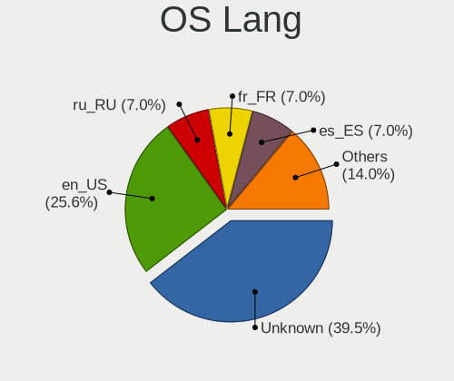
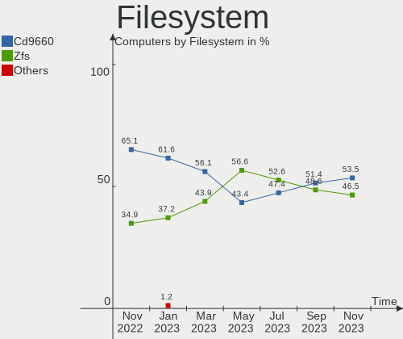
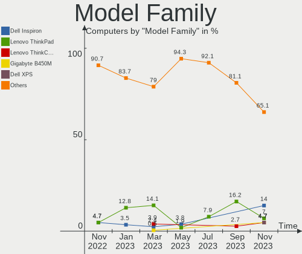
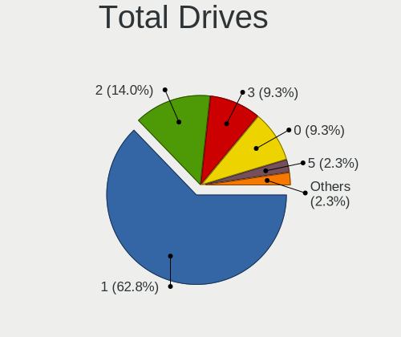
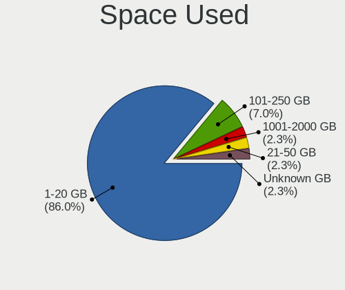
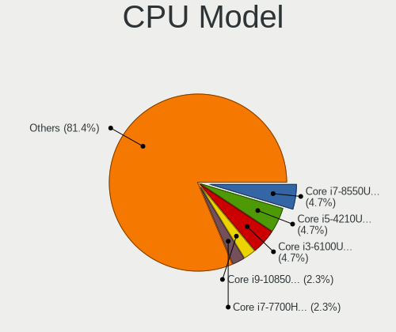
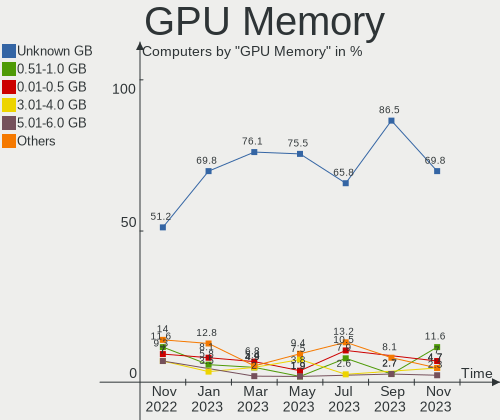
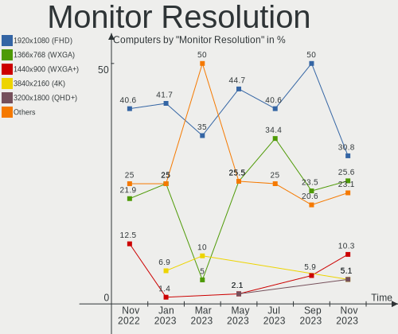
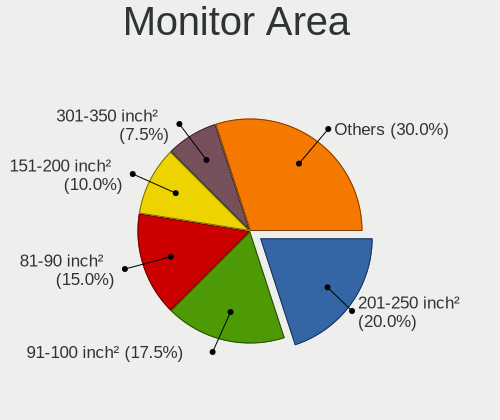
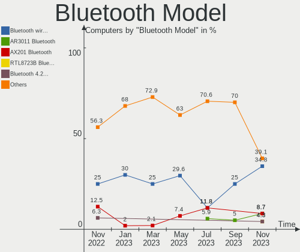

helloSystem - Hardware Trends
-----------------------------

A project to identify most popular hardware characteristics and track their change
over time based on data collected by BSD users at https://BSD-Hardware.info.

Anyone can contribute to this report by the [hw-probe](https://github.com/linuxhw/hw-probe/blob/master/INSTALL.BSD.md) tool:

    hw-probe -all -upload

This is a report for all computer types. See also reports for [desktops](/Dist/helloSystem/Desktop/README.md) and [notebooks](/Dist/helloSystem/Notebook/README.md).

This report is for one last month. Overall report since the beginning of time: [TestCoverage](https://github.com/bsdhw/TestCoverage)

Period: Nov, 2022.

Contents
--------

* [ System ](#system)
  - [ OS                       ](#os)
  - [ OS Family                ](#os-family)
  - [ Arch                     ](#arch)
  - [ DE                       ](#de)
  - [ Display Server           ](#display-server)
  - [ Display Manager          ](#display-manager)
  - [ OS Lang                  ](#os-lang)
  - [ Boot Mode                ](#boot-mode)
  - [ Filesystem               ](#filesystem)
  - [ Part. scheme             ](#part-scheme)

* [ Board ](#board)
  - [ Vendor                   ](#vendor)
  - [ Model                    ](#model)
  - [ Model Family             ](#model-family)
  - [ MFG Year                 ](#mfg-year)
  - [ Form Factor              ](#form-factor)
  - [ Coreboot                 ](#coreboot)
  - [ RAM Size                 ](#ram-size)
  - [ RAM Used                 ](#ram-used)
  - [ Total Drives             ](#total-drives)
  - [ Has CD-ROM               ](#has-cd-rom)
  - [ Has Ethernet             ](#has-ethernet)
  - [ Has WiFi                 ](#has-wifi)
  - [ Has Bluetooth            ](#has-bluetooth)

* [ Location ](#location)
  - [ Country                  ](#country)
  - [ City                     ](#city)

* [ Drives ](#drives)
  - [ Drive Vendor             ](#drive-vendor)
  - [ Drive Model              ](#drive-model)
  - [ HDD Vendor               ](#hdd-vendor)
  - [ SSD Vendor               ](#ssd-vendor)
  - [ Drive Kind               ](#drive-kind)
  - [ Drive Connector          ](#drive-connector)
  - [ Drive Size               ](#drive-size)
  - [ Space Total              ](#space-total)
  - [ Space Used               ](#space-used)
  - [ Malfunc. Drives          ](#malfunc-drives)
  - [ Malfunc. Drive Vendor    ](#malfunc-drive-vendor)
  - [ Malfunc. HDD Vendor      ](#malfunc-hdd-vendor)
  - [ Malfunc. Drive Kind      ](#malfunc-drive-kind)
  - [ Failed Drives            ](#failed-drives)
  - [ Failed Drive Vendor      ](#failed-drive-vendor)
  - [ Drive Status             ](#drive-status)

* [ Storage controller ](#storage-controller)
  - [ Storage Vendor           ](#storage-vendor)
  - [ Storage Model            ](#storage-model)
  - [ Storage Kind             ](#storage-kind)

* [ Processor ](#processor)
  - [ CPU Vendor               ](#cpu-vendor)
  - [ CPU Model                ](#cpu-model)
  - [ CPU Model Family         ](#cpu-model-family)
  - [ CPU Cores                ](#cpu-cores)
  - [ CPU Sockets              ](#cpu-sockets)
  - [ CPU Threads              ](#cpu-threads)
  - [ CPU Microarch            ](#cpu-microarch)

* [ Graphics ](#graphics)
  - [ GPU Vendor               ](#gpu-vendor)
  - [ GPU Model                ](#gpu-model)
  - [ GPU Combo                ](#gpu-combo)
  - [ GPU Driver               ](#gpu-driver)
  - [ GPU Memory               ](#gpu-memory)

* [ Monitor ](#monitor)
  - [ Monitor Vendor           ](#monitor-vendor)
  - [ Monitor Model            ](#monitor-model)
  - [ Monitor Resolution       ](#monitor-resolution)
  - [ Monitor Diagonal         ](#monitor-diagonal)
  - [ Monitor Width            ](#monitor-width)
  - [ Aspect Ratio             ](#aspect-ratio)
  - [ Monitor Area             ](#monitor-area)
  - [ Pixel Density            ](#pixel-density)
  - [ Multiple Monitors        ](#multiple-monitors)

* [ Network ](#network)
  - [ Net Controller Vendor    ](#net-controller-vendor)
  - [ Net Controller Model     ](#net-controller-model)
  - [ Wireless Vendor          ](#wireless-vendor)
  - [ Wireless Model           ](#wireless-model)
  - [ Ethernet Vendor          ](#ethernet-vendor)
  - [ Ethernet Model           ](#ethernet-model)
  - [ Net Controller Kind      ](#net-controller-kind)
  - [ Used Controller          ](#used-controller)
  - [ NICs                     ](#nics)
  - [ IPv6                     ](#ipv6)

* [ Bluetooth ](#bluetooth)
  - [ Bluetooth Vendor         ](#bluetooth-vendor)
  - [ Bluetooth Model          ](#bluetooth-model)

* [ Sound ](#sound)
  - [ Sound Vendor             ](#sound-vendor)
  - [ Sound Model              ](#sound-model)

* [ Memory ](#memory)
  - [ Memory Vendor            ](#memory-vendor)
  - [ Memory Model             ](#memory-model)
  - [ Memory Kind              ](#memory-kind)
  - [ Memory Form Factor       ](#memory-form-factor)
  - [ Memory Size              ](#memory-size)
  - [ Memory Speed             ](#memory-speed)

* [ Printers & scanners ](#printers--scanners)
  - [ Printer Vendor           ](#printer-vendor)
  - [ Printer Model            ](#printer-model)
  - [ Scanner Vendor           ](#scanner-vendor)
  - [ Scanner Model            ](#scanner-model)

* [ Camera ](#camera)
  - [ Camera Vendor            ](#camera-vendor)
  - [ Camera Model             ](#camera-model)

* [ Security ](#security)
  - [ Fingerprint Vendor       ](#fingerprint-vendor)
  - [ Fingerprint Model        ](#fingerprint-model)
  - [ Chipcard Vendor          ](#chipcard-vendor)
  - [ Chipcard Model           ](#chipcard-model)

* [ Unsupported ](#unsupported)
  - [ Unsupported Devices      ](#unsupported-devices)
  - [ Unsupported Device Types ](#unsupported-device-types)

System
------

OS
--

Installed operating systems

| Name              | Computers | Percent |
|-------------------|-----------|---------|
| helloSystem 0.7.0 | 29        | 67.44%  |
| helloSystem 0.8.0 | 12        | 27.91%  |
| helloSystem 0.6.0 | 1         | 2.33%   |
| helloSystem 0.5.0 | 1         | 2.33%   |

OS Family
---------

OS without a version

| Name        | Computers | Percent |
|-------------|-----------|---------|
| helloSystem | 43        | 100%    |

Arch
----

OS architecture (x86_64, i586, etc.)

| Name  | Computers | Percent |
|-------|-----------|---------|
| amd64 | 43        | 100%    |

DE
--

Desktop Environment

| Name         | Computers | Percent |
|--------------|-----------|---------|
| helloDesktop | 42        | 97.67%  |
| Window Maker | 1         | 2.33%   |

Display Server
--------------

X11 or Wayland

| Name | Computers | Percent |
|------|-----------|---------|
| X11  | 43        | 100%    |

Display Manager
---------------

SDDM, LightDM, etc.

| Name | Computers | Percent |
|------|-----------|---------|
| SLiM | 43        | 100%    |

OS Lang
-------

Language

| Lang  | Computers | Percent |
|-------|-----------|---------|
| en_US | 40        | 93.02%  |
| es_ES | 3         | 6.98%   |

Boot Mode
---------

EFI or BIOS

| Mode | Computers | Percent |
|------|-----------|---------|
| EFI  | 43        | 100%    |

Filesystem
----------

Type of filesystem

| Type   | Computers | Percent |
|--------|-----------|---------|
| Cd9660 | 28        | 65.12%  |
| Zfs    | 15        | 34.88%  |

Part. scheme
------------

Scheme of partitioning

| Type | Computers | Percent |
|------|-----------|---------|
| GPT  | 43        | 100%    |

Board
-----

Vendor
------

Motherboard manufacturer

| Name                | Computers | Percent |
|---------------------|-----------|---------|
| ASUSTek Computer    | 10        | 23.26%  |
| Dell                | 7         | 16.28%  |
| Gigabyte Technology | 6         | 13.95%  |
| Hewlett-Packard     | 4         | 9.3%    |
| MSI                 | 3         | 6.98%   |
| Lenovo              | 3         | 6.98%   |
| Acer                | 2         | 4.65%   |
| Toshiba             | 1         | 2.33%   |
| Samsung Electronics | 1         | 2.33%   |
| QIYIDA              | 1         | 2.33%   |
| Pegatron            | 1         | 2.33%   |
| Intel               | 1         | 2.33%   |
| GPD                 | 1         | 2.33%   |
| ASRock              | 1         | 2.33%   |
| Apple               | 1         | 2.33%   |

Model
-----

Motherboard model

| Name                                | Computers | Percent |
|-------------------------------------|-----------|---------|
| Toshiba TECRA Z40-C-12Z             | 1         | 2.33%   |
| Samsung 300E4C/300E5C/300E7C        | 1         | 2.33%   |
| QIYIDA X99-H9 V2.0                  | 1         | 2.33%   |
| Pegatron IPM41-D3                   | 1         | 2.33%   |
| MSI MS-7C51                         | 1         | 2.33%   |
| MSI MS-7B43                         | 1         | 2.33%   |
| MSI MS-7977                         | 1         | 2.33%   |
| Lenovo ThinkStation S30 0569A93     | 1         | 2.33%   |
| Lenovo ThinkPad X1 Carbon 3448AWU   | 1         | 2.33%   |
| Lenovo ThinkPad T460 20FMS0XL23     | 1         | 2.33%   |
| Intel H61                           | 1         | 2.33%   |
| HP Pavilion Gaming Laptop 15-ec1xxx | 1         | 2.33%   |
| HP EliteDesk 800 G2 TWR             | 1         | 2.33%   |
| HP EliteDesk 700 G1 SFF             | 1         | 2.33%   |
| HP Compaq 6000 Pro SFF PC           | 1         | 2.33%   |
| GPD P3 MAX                          | 1         | 2.33%   |
| Gigabyte P61-USB3-B3                | 1         | 2.33%   |
| Gigabyte H61M-S1                    | 1         | 2.33%   |
| Gigabyte H270M-DS3H                 | 1         | 2.33%   |
| Gigabyte G31M-S2L                   | 1         | 2.33%   |
| Gigabyte E2500N                     | 1         | 2.33%   |
| Gigabyte 970A-D3P                   | 1         | 2.33%   |
| Dell Studio 540                     | 1         | 2.33%   |
| Dell Precision T3610                | 1         | 2.33%   |
| Dell OptiPlex 960                   | 1         | 2.33%   |
| Dell OptiPlex 5490 AIO              | 1         | 2.33%   |
| Dell Latitude D630                  | 1         | 2.33%   |
| Dell Inspiron 5558                  | 1         | 2.33%   |
| Dell Inspiron 3421                  | 1         | 2.33%   |
| ASUS ZenBook UX431DA_UM431DA        | 1         | 2.33%   |
| ASUS TUF Gaming FX504GD_FX80GD      | 1         | 2.33%   |
| ASUS ROG STRIX B450-F GAMING II     | 1         | 2.33%   |
| ASUS PRIME Z390M-PLUS               | 1         | 2.33%   |
| ASUS PRIME A320M-K                  | 1         | 2.33%   |
| ASUS P5KPL-VM-TWPC                  | 1         | 2.33%   |
| ASUS P5E-VM SE                      | 1         | 2.33%   |
| ASUS K55VD                          | 1         | 2.33%   |
| ASUS All Series                     | 1         | 2.33%   |
| ASUS A55BM-K                        | 1         | 2.33%   |
| ASRock N68-S                        | 1         | 2.33%   |

Model Family
------------

Motherboard model prefix

| Name                 | Computers | Percent |
|----------------------|-----------|---------|
| Lenovo ThinkPad      | 2         | 4.65%   |
| HP EliteDesk         | 2         | 4.65%   |
| Dell OptiPlex        | 2         | 4.65%   |
| Dell Inspiron        | 2         | 4.65%   |
| ASUS PRIME           | 2         | 4.65%   |
| Acer Aspire          | 2         | 4.65%   |
| Toshiba TECRA        | 1         | 2.33%   |
| Samsung 300E4C       | 1         | 2.33%   |
| QIYIDA X99-H9        | 1         | 2.33%   |
| Pegatron IPM41-D3    | 1         | 2.33%   |
| MSI MS-7C51          | 1         | 2.33%   |
| MSI MS-7B43          | 1         | 2.33%   |
| MSI MS-7977          | 1         | 2.33%   |
| Lenovo ThinkStation  | 1         | 2.33%   |
| Intel H61            | 1         | 2.33%   |
| HP Pavilion          | 1         | 2.33%   |
| HP Compaq            | 1         | 2.33%   |
| GPD P3               | 1         | 2.33%   |
| Gigabyte P61-USB3-B3 | 1         | 2.33%   |
| Gigabyte H61M-S1     | 1         | 2.33%   |
| Gigabyte H270M-DS3H  | 1         | 2.33%   |
| Gigabyte G31M-S2L    | 1         | 2.33%   |
| Gigabyte E2500N      | 1         | 2.33%   |
| Gigabyte 970A-D3P    | 1         | 2.33%   |
| Dell Studio          | 1         | 2.33%   |
| Dell Precision       | 1         | 2.33%   |
| Dell Latitude        | 1         | 2.33%   |
| ASUS ZenBook         | 1         | 2.33%   |
| ASUS TUF             | 1         | 2.33%   |
| ASUS ROG             | 1         | 2.33%   |
| ASUS P5KPL-VM-TWPC   | 1         | 2.33%   |
| ASUS P5E-VM          | 1         | 2.33%   |
| ASUS K55VD           | 1         | 2.33%   |
| ASUS All             | 1         | 2.33%   |
| ASUS A55BM-K         | 1         | 2.33%   |
| ASRock N68-S         | 1         | 2.33%   |
| Apple MacBook5       | 1         | 2.33%   |

MFG Year
--------

Motherboard manufacture year

| Year | Computers | Percent |
|------|-----------|---------|
| 2021 | 5         | 11.63%  |
| 2013 | 5         | 11.63%  |
| 2012 | 5         | 11.63%  |
| 2008 | 5         | 11.63%  |
| 2010 | 4         | 9.3%    |
| 2020 | 3         | 6.98%   |
| 2019 | 3         | 6.98%   |
| 2018 | 3         | 6.98%   |
| 2017 | 3         | 6.98%   |
| 2015 | 2         | 4.65%   |
| 2014 | 2         | 4.65%   |
| 2022 | 1         | 2.33%   |
| 2016 | 1         | 2.33%   |
| 2009 | 1         | 2.33%   |

Form Factor
-----------

Physical design of the computer

| Name       | Computers | Percent |
|------------|-----------|---------|
| Desktop    | 27        | 62.79%  |
| Notebook   | 15        | 34.88%  |
| All in one | 1         | 2.33%   |

Coreboot
--------

Have coreboot on board

| Used | Computers | Percent |
|------|-----------|---------|
| No   | 43        | 100%    |

RAM Size
--------

Total RAM memory

| Size in GB  | Computers | Percent |
|-------------|-----------|---------|
| 8.01-16.0   | 20        | 46.51%  |
| 4.01-8.0    | 10        | 23.26%  |
| 32.01-64.0  | 5         | 11.63%  |
| 16.01-24.0  | 5         | 11.63%  |
| 24.01-32.0  | 2         | 4.65%   |
| 64.01-256.0 | 1         | 2.33%   |

RAM Used
--------

Used RAM memory

| Used GB  | Computers | Percent |
|----------|-----------|---------|
| 0.01-0.5 | 23        | 53.49%  |
| 0.51-1.0 | 12        | 27.91%  |
| 1.01-2.0 | 7         | 16.28%  |
| 2.01-3.0 | 1         | 2.33%   |

Total Drives
------------

Number of drives on board

| Drives | Computers | Percent |
|--------|-----------|---------|
| 1      | 26        | 60.47%  |
| 2      | 7         | 16.28%  |
| 3      | 3         | 6.98%   |
| 0      | 3         | 6.98%   |
| 6      | 2         | 4.65%   |
| 5      | 1         | 2.33%   |
| 4      | 1         | 2.33%   |

Has CD-ROM
----------

Has CD-ROM on board

| Presented | Computers | Percent |
|-----------|-----------|---------|
| No        | 28        | 65.12%  |
| Yes       | 15        | 34.88%  |

Has Ethernet
------------

Has Ethernet on board

| Presented | Computers | Percent |
|-----------|-----------|---------|
| Yes       | 39        | 90.7%   |
| No        | 4         | 9.3%    |

Has WiFi
--------

Has WiFi module

| Presented | Computers | Percent |
|-----------|-----------|---------|
| Yes       | 23        | 53.49%  |
| No        | 20        | 46.51%  |

Has Bluetooth
-------------

Has Bluetooth module

| Presented | Computers | Percent |
|-----------|-----------|---------|
| No        | 27        | 62.79%  |
| Yes       | 16        | 37.21%  |

Location
--------

Country
-------

Geographic location (country)

| Country     | Computers | Percent |
|-------------|-----------|---------|
| Spain       | 9         | 20.93%  |
| Taiwan      | 4         | 9.3%    |
| USA         | 3         | 6.98%   |
| Brazil      | 3         | 6.98%   |
| Venezuela   | 2         | 4.65%   |
| Sweden      | 2         | 4.65%   |
| Mexico      | 2         | 4.65%   |
| Italy       | 2         | 4.65%   |
| UK          | 1         | 2.33%   |
| South Korea | 1         | 2.33%   |
| Slovenia    | 1         | 2.33%   |
| Singapore   | 1         | 2.33%   |
| Russia      | 1         | 2.33%   |
| Romania     | 1         | 2.33%   |
| Portugal    | 1         | 2.33%   |
| Panama      | 1         | 2.33%   |
| India       | 1         | 2.33%   |
| Greece      | 1         | 2.33%   |
| Egypt       | 1         | 2.33%   |
| Cuba        | 1         | 2.33%   |
| Colombia    | 1         | 2.33%   |
| China       | 1         | 2.33%   |
| Chile       | 1         | 2.33%   |
| Argentina   | 1         | 2.33%   |

City
----

Geographic location (city)

| City                | Computers | Percent |
|---------------------|-----------|---------|
| Aquan               | 4         | 9.3%    |
| Willingboro         | 1         | 2.33%   |
| West Linn           | 1         | 2.33%   |
| Valencia            | 1         | 2.33%   |
| Urnieta             | 1         | 2.33%   |
| Trieste             | 1         | 2.33%   |
| Temuco              | 1         | 2.33%   |
| Stockbridge         | 1         | 2.33%   |
| Singapore           | 1         | 2.33%   |
| Shimla              | 1         | 2.33%   |
| Shenzhen            | 1         | 2.33%   |
| Seville             | 1         | 2.33%   |
| Sever do Vouga      | 1         | 2.33%   |
| Sao Paulo           | 1         | 2.33%   |
| Sanlucar la Mayor   | 1         | 2.33%   |
| San Cristóbal      | 1         | 2.33%   |
| Rosignano Marittimo | 1         | 2.33%   |
| Rivas-Vaciamadrid   | 1         | 2.33%   |
| Podvelka            | 1         | 2.33%   |
| Perito Moreno       | 1         | 2.33%   |
| Panama City         | 1         | 2.33%   |
| Outeiro de Rei      | 1         | 2.33%   |
| Mexico City         | 1         | 2.33%   |
| Maringá            | 1         | 2.33%   |
| Madrid              | 1         | 2.33%   |
| Lys'va              | 1         | 2.33%   |
| Kode                | 1         | 2.33%   |
| Japeri              | 1         | 2.33%   |
| Havana              | 1         | 2.33%   |
| Coyoacán           | 1         | 2.33%   |
| Cluj-Napoca         | 1         | 2.33%   |
| Caracas             | 1         | 2.33%   |
| Busan               | 1         | 2.33%   |
| Borensberg          | 1         | 2.33%   |
| Bogotá             | 1         | 2.33%   |
| Barton upon Humber  | 1         | 2.33%   |
| Barcelona           | 1         | 2.33%   |
| Arta                | 1         | 2.33%   |
| Alcobendas          | 1         | 2.33%   |
| Al Ma`adi           | 1         | 2.33%   |

Drives
------

Drive Vendor
------------

Hard drive vendors

| Vendor              | Computers | Drives | Percent |
|---------------------|-----------|--------|---------|
| WDC                 | 12        | 17     | 20.34%  |
| Samsung Electronics | 9         | 12     | 15.25%  |
| Seagate             | 7         | 8      | 11.86%  |
| Toshiba             | 6         | 7      | 10.17%  |
| Crucial             | 6         | 7      | 10.17%  |
| Hitachi             | 4         | 4      | 6.78%   |
| A-DATA Technology   | 3         | 3      | 5.08%   |
| Team                | 1         | 1      | 1.69%   |
| SanDisk             | 1         | 1      | 1.69%   |
| PNY                 | 1         | 1      | 1.69%   |
| Nfortec             | 1         | 1      | 1.69%   |
| LITEONIT            | 1         | 1      | 1.69%   |
| KIOXIA              | 1         | 1      | 1.69%   |
| Kingston            | 1         | 1      | 1.69%   |
| Kingchuxing         | 1         | 1      | 1.69%   |
| Intel               | 1         | 1      | 1.69%   |
| Emtec               | 1         | 1      | 1.69%   |
| Corsair             | 1         | 1      | 1.69%   |
| BIWIN               | 1         | 1      | 1.69%   |

Drive Model
-----------

Hard drive models

| Model                                | Computers | Percent |
|--------------------------------------|-----------|---------|
| WDC WDS500G2B0A-00SM50 500GB         | 2         | 3.08%   |
| Samsung SSD 980 PRO 1TB              | 2         | 3.08%   |
| Crucial CT500MX500SSD1 500GB         | 2         | 3.08%   |
| WDC WDS100T2B0A-00SM50 1TB           | 1         | 1.54%   |
| WDC WD5000LPLX-08ZNTT0 500GB         | 1         | 1.54%   |
| WDC WD5000AVCS-632DY1 500GB          | 1         | 1.54%   |
| WDC WD5000AAKX-00ERMA0 500GB         | 1         | 1.54%   |
| WDC WD5000AAKS-00YGA0 500GB          | 1         | 1.54%   |
| WDC WD2500BEVT-75A23T0 250GB         | 1         | 1.54%   |
| WDC WD20EARS-42S0XB0 2TB             | 1         | 1.54%   |
| WDC WD1600AVVS-63L2B0 160GB          | 1         | 1.54%   |
| WDC WD1200BEVS-22UST0 120GB          | 1         | 1.54%   |
| WDC WD10EFRX-68JCSN0 1TB             | 1         | 1.54%   |
| WDC WD10EFRX-68FYTN0 1TB             | 1         | 1.54%   |
| WDC PC SN520 SDAPNUW-256G-1006 256GB | 1         | 1.54%   |
| Toshiba Q300 Pro 128GB               | 1         | 1.54%   |
| Toshiba Q300 240GB                   | 1         | 1.54%   |
| Toshiba MQ01ACF050 500GB             | 1         | 1.54%   |
| Toshiba MK3261GSYN 320GB             | 1         | 1.54%   |
| Toshiba MK1255GSX H 120GB            | 1         | 1.54%   |
| Toshiba KSG60ZMV256G 256GB           | 1         | 1.54%   |
| Team TM8FP6256G 256GB                | 1         | 1.54%   |
| Seagate ST9500325AS 500GB            | 1         | 1.54%   |
| Seagate ST500LT012-9WS142 500GB      | 1         | 1.54%   |
| Seagate ST500LT012-1DG142 500GB      | 1         | 1.54%   |
| Seagate ST500LM012 HN-M500MBB 500GB  | 1         | 1.54%   |
| Seagate ST500DM002-1BD142 500GB      | 1         | 1.54%   |
| Seagate ST3500414CS 500GB            | 1         | 1.54%   |
| Seagate ST3160211AS 160GB            | 1         | 1.54%   |
| Seagate ST1000DM003-9YN162 1TB       | 1         | 1.54%   |
| SanDisk SD9TB8W512G1001 512GB        | 1         | 1.54%   |
| Samsung SSD 970 EVO Plus 500GB       | 1         | 1.54%   |
| Samsung SSD 970 EVO 500GB            | 1         | 1.54%   |
| Samsung SSD 860 QVO 1TB              | 1         | 1.54%   |
| Samsung SSD 860 EVO 1TB              | 1         | 1.54%   |
| Samsung SSD 850 EVO 120GB            | 1         | 1.54%   |
| Samsung SSD 840 Series 120GB         | 1         | 1.54%   |
| Samsung SSD 750 EVO 250GB            | 1         | 1.54%   |
| Samsung MZVLQ512HALU-00000 512GB     | 1         | 1.54%   |
| Samsung HM250HI 250GB                | 1         | 1.54%   |

HDD Vendor
----------

Hard disk drive vendors

| Vendor              | Computers | Drives | Percent |
|---------------------|-----------|--------|---------|
| WDC                 | 9         | 13     | 37.5%   |
| Seagate             | 7         | 8      | 29.17%  |
| Hitachi             | 4         | 4      | 16.67%  |
| Toshiba             | 3         | 3      | 12.5%   |
| Samsung Electronics | 1         | 2      | 4.17%   |

SSD Vendor
----------

Solid state drive vendors

| Vendor              | Computers | Drives | Percent |
|---------------------|-----------|--------|---------|
| Crucial             | 6         | 7      | 21.43%  |
| Samsung Electronics | 5         | 5      | 17.86%  |
| WDC                 | 3         | 3      | 10.71%  |
| Toshiba             | 3         | 4      | 10.71%  |
| A-DATA Technology   | 3         | 3      | 10.71%  |
| SanDisk             | 1         | 1      | 3.57%   |
| PNY                 | 1         | 1      | 3.57%   |
| LITEONIT            | 1         | 1      | 3.57%   |
| Kingston            | 1         | 1      | 3.57%   |
| Kingchuxing         | 1         | 1      | 3.57%   |
| Intel               | 1         | 1      | 3.57%   |
| Emtec               | 1         | 1      | 3.57%   |
| Corsair             | 1         | 1      | 3.57%   |

Drive Kind
----------

HDD or SSD

| Kind | Computers | Drives | Percent |
|------|-----------|--------|---------|
| HDD  | 22        | 30     | 43.14%  |
| SSD  | 20        | 30     | 39.22%  |
| NVMe | 9         | 10     | 17.65%  |

Drive Connector
---------------

SATA, SAS, NVMe, etc.

| Type | Computers | Drives | Percent |
|------|-----------|--------|---------|
| SATA | 37        | 60     | 80.43%  |
| NVMe | 9         | 10     | 19.57%  |

Drive Size
----------

Size of hard drive

| Size in TB | Computers | Drives | Percent |
|------------|-----------|--------|---------|
| 0.01-0.5   | 31        | 45     | 73.81%  |
| 0.51-1.0   | 7         | 11     | 16.67%  |
| 1.01-2.0   | 4         | 4      | 9.52%   |

Space Total
-----------

Amount of disk space available on the file system

| Size in GB | Computers | Percent |
|------------|-----------|---------|
| 1-20       | 27        | 62.79%  |
| 101-250    | 8         | 18.6%   |
| 251-500    | 4         | 9.3%    |
| 501-1000   | 2         | 4.65%   |
| 51-100     | 2         | 4.65%   |

Space Used
----------

Amount of used disk space

| Used GB | Computers | Percent |
|---------|-----------|---------|
| 1-20    | 42        | 97.67%  |
| 21-50   | 1         | 2.33%   |

Malfunc. Drives
---------------

Drive models with a malfunction

| Model                                 | Computers | Drives | Percent |
|---------------------------------------|-----------|--------|---------|
| Toshiba MK1255GSX H 120GB             | 1         | 1      | 10%     |
| Seagate ST500LT012-9WS142 500GB       | 1         | 1      | 10%     |
| Seagate ST500LT012-1DG142 500GB       | 1         | 1      | 10%     |
| Seagate ST500LM012 HN-M500MBB 500GB   | 1         | 1      | 10%     |
| Seagate ST500DM002-1BD142 500GB       | 1         | 1      | 10%     |
| Seagate ST3500414CS 500GB             | 1         | 1      | 10%     |
| Seagate ST3160211AS 160GB             | 1         | 1      | 10%     |
| Samsung Electronics SSD 970 EVO 500GB | 1         | 1      | 10%     |
| Hitachi HTS542525K9A300 250GB         | 1         | 1      | 10%     |
| Hitachi HDS728080PLA380 82GB          | 1         | 1      | 10%     |

Malfunc. Drive Vendor
---------------------

Vendors of faulty drives

| Vendor              | Computers | Drives | Percent |
|---------------------|-----------|--------|---------|
| Seagate             | 5         | 6      | 55.56%  |
| Hitachi             | 2         | 2      | 22.22%  |
| Toshiba             | 1         | 1      | 11.11%  |
| Samsung Electronics | 1         | 1      | 11.11%  |

Malfunc. HDD Vendor
-------------------

Vendors of faulty HDD drives

| Vendor  | Computers | Drives | Percent |
|---------|-----------|--------|---------|
| Seagate | 5         | 6      | 62.5%   |
| Hitachi | 2         | 2      | 25%     |
| Toshiba | 1         | 1      | 12.5%   |

Malfunc. Drive Kind
-------------------

Kinds of faulty drives

| Kind | Computers | Drives | Percent |
|------|-----------|--------|---------|
| HDD  | 7         | 9      | 87.5%   |
| NVMe | 1         | 1      | 12.5%   |

Failed Drives
-------------

Failed drive models

Zero info for selected period =(

Failed Drive Vendor
-------------------

Failed drive vendors

Zero info for selected period =(

Drive Status
------------

Number of failed and malfunc. drives

| Status   | Computers | Drives | Percent |
|----------|-----------|--------|---------|
| Works    | 33        | 56     | 75%     |
| Malfunc  | 8         | 10     | 18.18%  |
| Detected | 3         | 4      | 6.82%   |

Storage controller
------------------

Storage Vendor
--------------

Storage controller vendors

| Vendor                       | Computers | Percent |
|------------------------------|-----------|---------|
| Intel                        | 31        | 59.62%  |
| AMD                          | 9         | 17.31%  |
| Samsung Electronics          | 4         | 7.69%   |
| Shenzhen Longsys Electronics | 2         | 3.85%   |
| Nvidia                       | 2         | 3.85%   |
| Toshiba                      | 1         | 1.92%   |
| SanDisk                      | 1         | 1.92%   |
| JMicron Technology           | 1         | 1.92%   |
| Biwin Storage Technology     | 1         | 1.92%   |

Storage Model
-------------

Storage controller models

| Model                                                                                   | Computers | Percent |
|-----------------------------------------------------------------------------------------|-----------|---------|
| AMD FCH SATA Controller [AHCI mode]                                                     | 5         | 7.58%   |
| Intel 7 Series Chipset Family 6-port SATA Controller [AHCI mode]                        | 4         | 6.06%   |
| Intel NM10/ICH7 Family SATA Controller [IDE mode]                                       | 3         | 4.55%   |
| Samsung NVMe SSD Controller SM981/PM981/PM983                                           | 2         | 3.03%   |
| Samsung NVMe SSD Controller PM9A1/PM9A3/980PRO                                          | 2         | 3.03%   |
| Intel Sunrise Point-LP SATA Controller [AHCI mode]                                      | 2         | 3.03%   |
| Intel Q170/Q150/B150/H170/H110/Z170/CM236 Chipset SATA Controller [AHCI Mode]           | 2         | 3.03%   |
| Intel 8 Series/C220 Series Chipset Family 6-port SATA Controller 1 [AHCI mode]          | 2         | 3.03%   |
| Intel 6 Series/C200 Series Chipset Family Desktop SATA Controller (IDE mode, ports 4-5) | 2         | 3.03%   |
| Intel 6 Series/C200 Series Chipset Family Desktop SATA Controller (IDE mode, ports 0-3) | 2         | 3.03%   |
| Intel 200 Series PCH SATA controller [AHCI mode]                                        | 2         | 3.03%   |
| AMD SB7x0/SB8x0/SB9x0 IDE Controller                                                    | 2         | 3.03%   |
| AMD FCH SATA Controller D                                                               | 2         | 3.03%   |
| Unknown                                                                                 | 2         | 3.03%   |
| Toshiba XG6 NVMe SSD Controller                                                         | 1         | 1.52%   |
| Shenzhen Longsys SM2263EN/SM2263XT-based OEM SSD                                        | 1         | 1.52%   |
| SanDisk WD Blue SN500 / PC SN520 NVMe SSD                                               | 1         | 1.52%   |
| Samsung NVMe SSD Controller 980                                                         | 1         | 1.52%   |
| Nvidia MCP79 AHCI Controller                                                            | 1         | 1.52%   |
| Nvidia MCP61 SATA Controller                                                            | 1         | 1.52%   |
| Nvidia MCP61 IDE                                                                        | 1         | 1.52%   |
| JMicron JMB368 IDE controller                                                           | 1         | 1.52%   |
| Intel Wildcat Point-LP SATA Controller [AHCI Mode]                                      | 1         | 1.52%   |
| Intel SATA Controller [RAID mode]                                                       | 1         | 1.52%   |
| Intel Cannon Lake PCH SATA AHCI Controller                                              | 1         | 1.52%   |
| Intel Cannon Lake Mobile PCH SATA AHCI Controller                                       | 1         | 1.52%   |
| Intel C604/X79 series chipset 4-Port SATA/SAS Storage Control Unit                      | 1         | 1.52%   |
| Intel C600/X79 series chipset SATA RAID Controller                                      | 1         | 1.52%   |
| Intel C600/X79 series chipset IDE-r Controller                                          | 1         | 1.52%   |
| Intel C600/X79 series chipset 6-Port SATA AHCI Controller                               | 1         | 1.52%   |
| Intel 9 Series Chipset Family SATA Controller [AHCI Mode]                               | 1         | 1.52%   |
| Intel 82801JI (ICH10 Family) 4 port SATA IDE Controller #1                              | 1         | 1.52%   |
| Intel 82801JI (ICH10 Family) 2 port SATA IDE Controller #2                              | 1         | 1.52%   |
| Intel 82801JD/DO (ICH10 Family) SATA AHCI Controller                                    | 1         | 1.52%   |
| Intel 82801IBM/IEM (ICH9M/ICH9M-E) 4 port SATA Controller [AHCI mode]                   | 1         | 1.52%   |
| Intel 82801IB (ICH9) 2 port SATA Controller [IDE mode]                                  | 1         | 1.52%   |
| Intel 82801I (ICH9 Family) 2 port SATA Controller [IDE mode]                            | 1         | 1.52%   |
| Intel 82801HM/HEM (ICH8M/ICH8M-E) SATA Controller [AHCI mode]                           | 1         | 1.52%   |
| Intel 82801HM/HEM (ICH8M/ICH8M-E) IDE Controller                                        | 1         | 1.52%   |
| Intel 82801G (ICH7 Family) IDE Controller                                               | 1         | 1.52%   |

Storage Kind
------------

Kind of storage controller (IDE, SATA, NVMe, SAS, ...)

| Kind | Computers | Percent |
|------|-----------|---------|
| SATA | 31        | 55.36%  |
| IDE  | 13        | 23.21%  |
| NVMe | 9         | 16.07%  |
| RAID | 2         | 3.57%   |
| SAS  | 1         | 1.79%   |

Processor
---------

CPU Vendor
----------

Processor vendors

| Vendor | Computers | Percent |
|--------|-----------|---------|
| Intel  | 33        | 76.74%  |
| AMD    | 10        | 23.26%  |

CPU Model
---------

Processor models

| Model                                         | Computers | Percent |
|-----------------------------------------------|-----------|---------|
| Intel Core i5-3470 CPU @ 3.20GHz              | 2         | 4.65%   |
| Intel Xeon CPU E5-2690 0 @ 2.90GHz            | 1         | 2.33%   |
| Intel Xeon CPU E5-2630 v3 @ 2.40GHz           | 1         | 2.33%   |
| Intel Xeon CPU E5-1650 v2 @ 3.50GHz           | 1         | 2.33%   |
| Intel Pentium Silver N6000 @ 1.10GHz          | 1         | 2.33%   |
| Intel CPU Version                             | 1         | 2.33%   |
| Intel Core i7-8700K CPU @ 3.70GHz             | 1         | 2.33%   |
| Intel Core i7-7700 CPU @ 3.60GHz              | 1         | 2.33%   |
| Intel Core i7-6700K CPU @ 4.00GHz             | 1         | 2.33%   |
| Intel Core i7-3667U CPU @ 2.00GHz             | 1         | 2.33%   |
| Intel Core i7-3610QM CPU @ 2.30GHz            | 1         | 2.33%   |
| Intel Core i5-9400 CPU @ 2.90GHz              | 1         | 2.33%   |
| Intel Core i5-8300H CPU @ 2.30GHz             | 1         | 2.33%   |
| Intel Core i5-6500 CPU @ 3.20GHz              | 1         | 2.33%   |
| Intel Core i5-6300U CPU @ 2.40GHz             | 1         | 2.33%   |
| Intel Core i5-6200U CPU @ 2.30GHz             | 1         | 2.33%   |
| Intel Core i5-4590 CPU @ 3.30GHz              | 1         | 2.33%   |
| Intel Core i5-4460 CPU @ 3.20GHz              | 1         | 2.33%   |
| Intel Core i5-3210M CPU @ 2.50GHz             | 1         | 2.33%   |
| Intel Core i5-10500T CPU @ 2.30GHz            | 1         | 2.33%   |
| Intel Core i3-5005U CPU @ 2.00GHz             | 1         | 2.33%   |
| Intel Core i3-3217U CPU @ 1.80GHz             | 1         | 2.33%   |
| Intel Core i3-2120 CPU                        | 1         | 2.33%   |
| Intel Core 2 Quad CPU Q8400 @ 2.66GHz         | 1         | 2.33%   |
| Intel Core 2 Quad CPU Q6600 @ 2.40GHz         | 1         | 2.33%   |
| Intel Core 2 Quad CPU                         | 1         | 2.33%   |
| Intel Core 2 Quad                             | 1         | 2.33%   |
| Intel Core 2 Duo CPU P7350 @ 2.00GHz          | 1         | 2.33%   |
| Intel Core 2 Duo CPU E8400 @ 3.00GHz          | 1         | 2.33%   |
| Intel Core 2 Duo CPU E7500 @ 2.93GHz          | 1         | 2.33%   |
| Intel Core 2 Duo                              | 1         | 2.33%   |
| Intel Core 2 CPU 6600 @ 2.40GHz               | 1         | 2.33%   |
| AMD V120 Processor                            | 1         | 2.33%   |
| AMD Ryzen 5 4600H with Radeon Graphics        | 1         | 2.33%   |
| AMD Ryzen 5 3600 6-Core Processor             | 1         | 2.33%   |
| AMD Ryzen 5 3500U with Radeon Vega Mobile Gfx | 1         | 2.33%   |
| AMD Ryzen 5 3400G with Radeon Vega Graphics   | 1         | 2.33%   |
| AMD Ryzen 3 1200 Quad-Core Processor          | 1         | 2.33%   |
| AMD Phenom II X4 970 Processor                | 1         | 2.33%   |
| AMD Phenom II X4 810 Processor                | 1         | 2.33%   |

CPU Model Family
----------------

Processor model prefix

| Model                | Computers | Percent |
|----------------------|-----------|---------|
| Intel Core i5        | 11        | 25.58%  |
| Intel Core i7        | 5         | 11.63%  |
| Intel Core 2 Quad    | 4         | 9.3%    |
| Intel Core 2 Duo     | 4         | 9.3%    |
| AMD Ryzen 5          | 4         | 9.3%    |
| Intel Xeon           | 3         | 6.98%   |
| Intel Core i3        | 3         | 6.98%   |
| AMD Phenom II X4     | 2         | 4.65%   |
| Other                | 1         | 2.33%   |
| Intel Pentium Silver | 1         | 2.33%   |
| Intel Core 2         | 1         | 2.33%   |
| AMD V120             | 1         | 2.33%   |
| AMD Ryzen 3          | 1         | 2.33%   |
| AMD E1               | 1         | 2.33%   |
| AMD A8               | 1         | 2.33%   |

CPU Cores
---------

Number of processor cores

| Number  | Computers | Percent |
|---------|-----------|---------|
| 4       | 16        | 37.21%  |
| 2       | 12        | 27.91%  |
| 8       | 4         | 9.3%    |
| 6       | 4         | 9.3%    |
| Unknown | 4         | 9.3%    |
| 12      | 2         | 4.65%   |
| 1       | 1         | 2.33%   |

CPU Sockets
-----------

Number of sockets

| Number | Computers | Percent |
|--------|-----------|---------|
| 1      | 42        | 97.67%  |
| 2      | 1         | 2.33%   |

CPU Threads
-----------

Threads per core (Hyper-Threading)

| Number  | Computers | Percent |
|---------|-----------|---------|
| 1       | 23        | 53.49%  |
| 2       | 16        | 37.21%  |
| Unknown | 4         | 9.3%    |

CPU Microarch
-------------

Microarchitecture

| Name        | Computers | Percent |
|-------------|-----------|---------|
| Penryn      | 7         | 16.28%  |
| IvyBridge   | 7         | 16.28%  |
| Skylake     | 4         | 9.3%    |
| KabyLake    | 4         | 9.3%    |
| Zen+        | 3         | 6.98%   |
| K10         | 3         | 6.98%   |
| Haswell     | 3         | 6.98%   |
| Core        | 3         | 6.98%   |
| Zen 2       | 2         | 4.65%   |
| SandyBridge | 2         | 4.65%   |
| Piledriver  | 1         | 2.33%   |
| Jaguar      | 1         | 2.33%   |
| CometLake   | 1         | 2.33%   |
| Broadwell   | 1         | 2.33%   |
| Unknown     | 1         | 2.33%   |

Graphics
--------

GPU Vendor
----------

Vendors of graphics cards

| Vendor | Computers | Percent |
|--------|-----------|---------|
| Nvidia | 22        | 46.81%  |
| Intel  | 18        | 38.3%   |
| AMD    | 7         | 14.89%  |

GPU Model
---------

Graphics card models

| Model                                                                       | Computers | Percent |
|-----------------------------------------------------------------------------|-----------|---------|
| Intel 3rd Gen Core processor Graphics Controller                            | 4         | 8.33%   |
| Nvidia GP106 [GeForce GTX 1060 6GB]                                         | 2         | 4.17%   |
| Nvidia GF119M [GeForce 610M]                                                | 2         | 4.17%   |
| Nvidia G96C [GeForce 9500 GT]                                               | 2         | 4.17%   |
| Intel Xeon E3-1200 v3/4th Gen Core Processor Integrated Graphics Controller | 2         | 4.17%   |
| Intel Skylake GT2 [HD Graphics 520]                                         | 2         | 4.17%   |
| Nvidia TU117 [GeForce GTX 1650]                                             | 1         | 2.08%   |
| Nvidia TU116 [GeForce GTX 1660 SUPER]                                       | 1         | 2.08%   |
| Nvidia GT218 [GeForce 210]                                                  | 1         | 2.08%   |
| Nvidia GT215 [GeForce GT 240]                                               | 1         | 2.08%   |
| Nvidia GP108 [GeForce GT 1030]                                              | 1         | 2.08%   |
| Nvidia GP107M [GeForce GTX 1050 Mobile]                                     | 1         | 2.08%   |
| Nvidia GP107M [GeForce GTX 1050 3 GB Max-Q]                                 | 1         | 2.08%   |
| Nvidia GP107 [GeForce GTX 1050 Ti]                                          | 1         | 2.08%   |
| Nvidia GM204 [GeForce GTX 970]                                              | 1         | 2.08%   |
| Nvidia GK208B [GeForce GT 710]                                              | 1         | 2.08%   |
| Nvidia GK106GL [Quadro K4000]                                               | 1         | 2.08%   |
| Nvidia GF119 [GeForce GT 620 OEM]                                           | 1         | 2.08%   |
| Nvidia GF108 [GeForce GT 630]                                               | 1         | 2.08%   |
| Nvidia GF108 [GeForce GT 440]                                               | 1         | 2.08%   |
| Nvidia GF100GL [Quadro 5000]                                                | 1         | 2.08%   |
| Nvidia C79 [GeForce 9400M]                                                  | 1         | 2.08%   |
| Intel Xeon E3-1200 v2/3rd Gen Core processor Graphics Controller            | 1         | 2.08%   |
| Intel Mobile GM965/GL960 Integrated Graphics Controller (secondary)         | 1         | 2.08%   |
| Intel Mobile GM965/GL960 Integrated Graphics Controller (primary)           | 1         | 2.08%   |
| Intel JasperLake [UHD Graphics]                                             | 1         | 2.08%   |
| Intel HD Graphics 630                                                       | 1         | 2.08%   |
| Intel HD Graphics 5500                                                      | 1         | 2.08%   |
| Intel HD Graphics 530                                                       | 1         | 2.08%   |
| Intel CometLake-S GT2 [UHD Graphics 630]                                    | 1         | 2.08%   |
| Intel CoffeeLake-H GT2 [UHD Graphics 630]                                   | 1         | 2.08%   |
| Intel 82G35 Express Integrated Graphics Controller                          | 1         | 2.08%   |
| Intel 82G33/G31 Express Integrated Graphics Controller                      | 1         | 2.08%   |
| AMD Trinity [Radeon HD 7560D]                                               | 1         | 2.08%   |
| AMD RV710/M92 [Mobility Radeon HD 4530/4570/545v]                           | 1         | 2.08%   |
| AMD RV710 [Radeon HD 4350/4550]                                             | 1         | 2.08%   |
| AMD RS880M [Mobility Radeon HD 4225/4250]                                   | 1         | 2.08%   |
| AMD Renoir                                                                  | 1         | 2.08%   |
| AMD Picasso/Raven 2 [Radeon Vega Series / Radeon Vega Mobile Series]        | 1         | 2.08%   |
| AMD Kabini [Radeon HD 8240 / R3 Series]                                     | 1         | 2.08%   |

GPU Combo
---------

Combinations of graphics cards

| Name           | Computers | Percent |
|----------------|-----------|---------|
| 1 x Nvidia     | 18        | 41.86%  |
| 1 x Intel      | 14        | 32.56%  |
| 1 x AMD        | 6         | 13.95%  |
| Intel + Nvidia | 3         | 6.98%   |
| 2 x Intel      | 1         | 2.33%   |
| AMD + Nvidia   | 1         | 2.33%   |

GPU Driver
----------

Free vs proprietary

| Driver      | Computers | Percent |
|-------------|-----------|---------|
| Free        | 26        | 60.47%  |
| Proprietary | 16        | 37.21%  |
| Unknown     | 1         | 2.33%   |

GPU Memory
----------

Total video memory

| Size in GB | Computers | Percent |
|------------|-----------|---------|
| Unknown    | 22        | 51.16%  |
| 0.51-1.0   | 5         | 11.63%  |
| 0.01-0.5   | 4         | 9.3%    |
| 5.01-6.0   | 3         | 6.98%   |
| 3.01-4.0   | 3         | 6.98%   |
| 2.01-3.0   | 3         | 6.98%   |
| 1.01-2.0   | 3         | 6.98%   |

Monitor
-------

Monitor Vendor
--------------

Monitor vendors

| Vendor                  | Computers | Percent |
|-------------------------|-----------|---------|
| Samsung Electronics     | 3         | 9.09%   |
| LG Display              | 3         | 9.09%   |
| Hewlett-Packard         | 3         | 9.09%   |
| Dell                    | 3         | 9.09%   |
| AOC                     | 3         | 9.09%   |
| PANDA                   | 2         | 6.06%   |
| Goldstar                | 2         | 6.06%   |
| Chimei Innolux          | 2         | 6.06%   |
| BenQ                    | 2         | 6.06%   |
| Acer                    | 2         | 6.06%   |
| Philips                 | 1         | 3.03%   |
| LG Philips              | 1         | 3.03%   |
| Iiyama                  | 1         | 3.03%   |
| Chi Mei Optoelectronics | 1         | 3.03%   |
| BOE                     | 1         | 3.03%   |
| AU Optronics            | 1         | 3.03%   |
| Apple                   | 1         | 3.03%   |
| Ancor Communications    | 1         | 3.03%   |

Monitor Model
-------------

Monitor models

| Model                                                                    | Computers | Percent |
|--------------------------------------------------------------------------|-----------|---------|
| Acer G227HQL ACR03DE 1920x1080 480x270mm 21.7-inch                       | 2         | 6.06%   |
| Samsung Electronics SyncMaster SAM05C5 1920x1080                         | 1         | 3.03%   |
| Samsung Electronics SMT22A300 SAM087B 1920x1080 480x270mm 21.7-inch      | 1         | 3.03%   |
| Samsung Electronics SME2020 SAM06A0 1600x900 440x250mm 19.9-inch         | 1         | 3.03%   |
| Philips PHL BDM3270 PHL08E7 2560x1440 710x400mm 32.1-inch                | 1         | 3.03%   |
| PANDA LCD Monitor NCP0035 1920x1080 310x170mm 13.9-inch                  | 1         | 3.03%   |
| PANDA LCD Monitor NCP0029 1920x1080 340x190mm 15.3-inch                  | 1         | 3.03%   |
| LG Philips LCD Monitor LPL00E5 1440x900 300x190mm 14.0-inch              | 1         | 3.03%   |
| LG Display LCD Monitor LGD0569 1920x1080 310x170mm 13.9-inch             | 1         | 3.03%   |
| LG Display LCD Monitor LGD03B7 1366x768 310x170mm 13.9-inch              | 1         | 3.03%   |
| LG Display LCD Monitor LGD0382 1600x900 310x170mm 13.9-inch              | 1         | 3.03%   |
| Iiyama PLX2283H IVM5638 1920x1080 480x270mm 21.7-inch                    | 1         | 3.03%   |
| Hewlett-Packard W2072a HWP3000 1600x900 440x250mm 19.9-inch              | 1         | 3.03%   |
| Hewlett-Packard LCD Monitor HPN351A 1920x1080 700x390mm 31.5-inch        | 1         | 3.03%   |
| Hewlett-Packard L1506 HWP265B 1024x768 300x230mm 14.9-inch               | 1         | 3.03%   |
| Goldstar L192WS GSM4B32 1440x900 410x260mm 19.1-inch                     | 1         | 3.03%   |
| Goldstar 22EA63 GSM598F 1920x1080 480x270mm 21.7-inch                    | 1         | 3.03%   |
| Dell U3014 DEL4082 2560x1600 640x400mm 29.7-inch                         | 1         | 3.03%   |
| Dell LCD Monitor DELF003 1440x900 410x260mm 19.1-inch                    | 1         | 3.03%   |
| Dell LCD Monitor DEL9408 1920x1080 520x290mm 23.4-inch                   | 1         | 3.03%   |
| Chimei Innolux LCD Monitor CMN1490 1366x768 310x170mm 13.9-inch          | 1         | 3.03%   |
| Chimei Innolux LCD Monitor CMN1480 1366x768 310x170mm 13.9-inch          | 1         | 3.03%   |
| Chi Mei Optoelectronics LCD Monitor CMO1558 1366x768 350x190mm 15.7-inch | 1         | 3.03%   |
| BOE LCD Monitor BOE0615 1366x768 340x190mm 15.3-inch                     | 1         | 3.03%   |
| BenQ GW2780 BNQ78E6 1920x1080 600x340mm 27.2-inch                        | 1         | 3.03%   |
| BenQ GL2480 BNQ78ED 1920x1080 530x300mm 24.0-inch                        | 1         | 3.03%   |
| AU Optronics LCD Monitor AUO26EC 1366x768 340x190mm 15.3-inch            | 1         | 3.03%   |
| Apple LCD Monitor APP9C89 1280x800 290x180mm 13.4-inch                   | 1         | 3.03%   |
| AOC 2050W AOC2050 1600x900 430x240mm 19.4-inch                           | 1         | 3.03%   |
| AOC 1950 AOC1950 1440x900 410x260mm 19.1-inch                            | 1         | 3.03%   |
| AOC 1621w AOC1621 1366x768 340x190mm 15.3-inch                           | 1         | 3.03%   |
| Ancor Communications VG248 ACI24A5 1920x1080 530x300mm 24.0-inch         | 1         | 3.03%   |

Monitor Resolution
------------------

Monitor screen resolution

| Resolution       | Computers | Percent |
|------------------|-----------|---------|
| 1920x1080 (FHD)  | 13        | 40.63%  |
| 1366x768 (WXGA)  | 7         | 21.88%  |
| 1600x900 (HD+)   | 4         | 12.5%   |
| 1440x900 (WXGA+) | 4         | 12.5%   |
| 2560x1600        | 1         | 3.13%   |
| 2560x1440 (QHD)  | 1         | 3.13%   |
| 1280x800 (WXGA)  | 1         | 3.13%   |
| 1024x768 (XGA)   | 1         | 3.13%   |

Monitor Diagonal
----------------

Diagonal size in inches

| Inches  | Computers | Percent |
|---------|-----------|---------|
| 13      | 7         | 21.21%  |
| 19      | 6         | 18.18%  |
| 21      | 5         | 15.15%  |
| 15      | 5         | 15.15%  |
| 24      | 2         | 6.06%   |
| 14      | 2         | 6.06%   |
| 32      | 1         | 3.03%   |
| 31      | 1         | 3.03%   |
| 29      | 1         | 3.03%   |
| 27      | 1         | 3.03%   |
| 23      | 1         | 3.03%   |
| Unknown | 1         | 3.03%   |

Monitor Width
-------------

Physical width

| Width in mm | Computers | Percent |
|-------------|-----------|---------|
| 401-500     | 11        | 33.33%  |
| 301-350     | 11        | 33.33%  |
| 501-600     | 4         | 12.12%  |
| 201-300     | 3         | 9.09%   |
| 601-700     | 2         | 6.06%   |
| 701-800     | 1         | 3.03%   |
| Unknown     | 1         | 3.03%   |

Aspect Ratio
------------

Proportional relationship between the width and the height

| Ratio | Computers | Percent |
|-------|-----------|---------|
| 16/9  | 24        | 77.42%  |
| 16/10 | 6         | 19.35%  |
| 4/3   | 1         | 3.23%   |

Monitor Area
------------

Area in inch²

| Area in inch² | Computers | Percent |
|----------------|-----------|---------|
| 81-90          | 8         | 24.24%  |
| 201-250        | 8         | 24.24%  |
| 151-200        | 6         | 18.18%  |
| 91-100         | 4         | 12.12%  |
| 351-500        | 3         | 9.09%   |
| 101-110        | 2         | 6.06%   |
| 301-350        | 1         | 3.03%   |
| Unknown        | 1         | 3.03%   |

Pixel Density
-------------

Pixels per inch

| Density | Computers | Percent |
|---------|-----------|---------|
| 51-100  | 14        | 43.75%  |
| 101-120 | 12        | 37.5%   |
| 121-160 | 5         | 15.63%  |
| Unknown | 1         | 3.13%   |

Multiple Monitors
-----------------

Total monitors connected

| Total | Computers | Percent |
|-------|-----------|---------|
| 1     | 35        | 81.4%   |
| 0     | 6         | 13.95%  |
| 2     | 2         | 4.65%   |

Network
-------

Net Controller Vendor
---------------------

Controller vendors

| Vendor                | Computers | Percent |
|-----------------------|-----------|---------|
| Realtek Semiconductor | 21        | 35.59%  |
| Intel                 | 21        | 35.59%  |
| Qualcomm Atheros      | 9         | 15.25%  |
| Broadcom              | 5         | 8.47%   |
| Ralink Technology     | 1         | 1.69%   |
| Nvidia                | 1         | 1.69%   |
| D-Link System         | 1         | 1.69%   |

Net Controller Model
--------------------

Controller models

| Model                                                                         | Computers | Percent |
|-------------------------------------------------------------------------------|-----------|---------|
| Realtek RTL8111/8168/8411 PCI Express Gigabit Ethernet Controller             | 16        | 23.88%  |
| Realtek RTL810xE PCI Express Fast Ethernet controller                         | 3         | 4.48%   |
| Qualcomm Atheros AR9485 Wireless Network Adapter                              | 3         | 4.48%   |
| Qualcomm Atheros Attansic L1 Gigabit Ethernet                                 | 2         | 2.99%   |
| Qualcomm Atheros AR928X Wireless Network Adapter (PCI-Express)                | 2         | 2.99%   |
| Intel Wireless 8265 / 8275                                                    | 2         | 2.99%   |
| Intel Wireless 8260                                                           | 2         | 2.99%   |
| Intel 82579LM Gigabit Network Connection (Lewisville)                         | 2         | 2.99%   |
| Intel 82567LM-3 Gigabit Network Connection                                    | 2         | 2.99%   |
| Realtek RTL8822CE 802.11ac PCIe Wireless Network Adapter                      | 1         | 1.49%   |
| Realtek RTL8188SU 802.11n WLAN Adapter                                        | 1         | 1.49%   |
| Realtek RTL8188FTV 802.11b/g/n 1T1R 2.4G WLAN Adapter                         | 1         | 1.49%   |
| Realtek RTL8188EUS 802.11n Wireless Network Adapter                           | 1         | 1.49%   |
| Realtek RTL8188CUS 802.11n WLAN Adapter                                       | 1         | 1.49%   |
| Realtek RTL-8100/8101L/8139 PCI Fast Ethernet Adapter                         | 1         | 1.49%   |
| Ralink MT7601U Wireless Adapter                                               | 1         | 1.49%   |
| Qualcomm Atheros AR9287 Wireless Network Adapter (PCI-Express)                | 1         | 1.49%   |
| Qualcomm Atheros AR9285 Wireless Network Adapter (PCI-Express)                | 1         | 1.49%   |
| Nvidia MCP79 Ethernet                                                         | 1         | 1.49%   |
| Intel Wi-Fi 6 AX201 160MHz                                                    | 1         | 1.49%   |
| Intel Tiger Lake PCH CNVi WiFi                                                | 1         | 1.49%   |
| Intel PRO/Wireless 4965 AG or AGN [Kedron] Network Connection                 | 1         | 1.49%   |
| Intel I211 Gigabit Network Connection                                         | 1         | 1.49%   |
| Intel Ethernet Connection I219-V                                              | 1         | 1.49%   |
| Intel Ethernet Connection I219-LM                                             | 1         | 1.49%   |
| Intel Ethernet Connection I217-LM                                             | 1         | 1.49%   |
| Intel Ethernet Connection (7) I219-V                                          | 1         | 1.49%   |
| Intel Ethernet Connection (2) I219-V                                          | 1         | 1.49%   |
| Intel Ethernet Connection (2) I219-LM                                         | 1         | 1.49%   |
| Intel Ethernet Connection (2) I218-V                                          | 1         | 1.49%   |
| Intel Ethernet Connection (14) I219-LM                                        | 1         | 1.49%   |
| Intel Dual Band Wireless-AC 3165 Plus Bluetooth                               | 1         | 1.49%   |
| Intel Centrino Advanced-N 6205 [Taylor Peak]                                  | 1         | 1.49%   |
| Intel Cannon Lake PCH CNVi WiFi                                               | 1         | 1.49%   |
| Intel 82574L Gigabit Network Connection                                       | 1         | 1.49%   |
| Intel 82571EB/82571GB Gigabit Ethernet Controller D0/D1 (copper applications) | 1         | 1.49%   |
| D-Link System AirPlus G DWL-G122 Wireless Adapter(rev.C1) [Ralink RT2571W]    | 1         | 1.49%   |
| Broadcom NetXtreme BCM5755M Gigabit Ethernet PCI Express                      | 1         | 1.49%   |
| Broadcom NetLink BCM5784M Gigabit Ethernet PCIe                               | 1         | 1.49%   |
| Broadcom NetLink BCM57780 Gigabit Ethernet PCIe                               | 1         | 1.49%   |

Wireless Vendor
---------------

Wireless vendors

| Vendor                | Computers | Percent |
|-----------------------|-----------|---------|
| Intel                 | 10        | 38.46%  |
| Qualcomm Atheros      | 7         | 26.92%  |
| Realtek Semiconductor | 5         | 19.23%  |
| Broadcom              | 2         | 7.69%   |
| Ralink Technology     | 1         | 3.85%   |
| D-Link System         | 1         | 3.85%   |

Wireless Model
--------------

Wireless models

| Model                                                                      | Computers | Percent |
|----------------------------------------------------------------------------|-----------|---------|
| Qualcomm Atheros AR9485 Wireless Network Adapter                           | 3         | 11.54%  |
| Qualcomm Atheros AR928X Wireless Network Adapter (PCI-Express)             | 2         | 7.69%   |
| Intel Wireless 8265 / 8275                                                 | 2         | 7.69%   |
| Intel Wireless 8260                                                        | 2         | 7.69%   |
| Realtek RTL8822CE 802.11ac PCIe Wireless Network Adapter                   | 1         | 3.85%   |
| Realtek RTL8188SU 802.11n WLAN Adapter                                     | 1         | 3.85%   |
| Realtek RTL8188FTV 802.11b/g/n 1T1R 2.4G WLAN Adapter                      | 1         | 3.85%   |
| Realtek RTL8188EUS 802.11n Wireless Network Adapter                        | 1         | 3.85%   |
| Realtek RTL8188CUS 802.11n WLAN Adapter                                    | 1         | 3.85%   |
| Ralink MT7601U Wireless Adapter                                            | 1         | 3.85%   |
| Qualcomm Atheros AR9287 Wireless Network Adapter (PCI-Express)             | 1         | 3.85%   |
| Qualcomm Atheros AR9285 Wireless Network Adapter (PCI-Express)             | 1         | 3.85%   |
| Intel Wi-Fi 6 AX201 160MHz                                                 | 1         | 3.85%   |
| Intel Tiger Lake PCH CNVi WiFi                                             | 1         | 3.85%   |
| Intel PRO/Wireless 4965 AG or AGN [Kedron] Network Connection              | 1         | 3.85%   |
| Intel Dual Band Wireless-AC 3165 Plus Bluetooth                            | 1         | 3.85%   |
| Intel Centrino Advanced-N 6205 [Taylor Peak]                               | 1         | 3.85%   |
| Intel Cannon Lake PCH CNVi WiFi                                            | 1         | 3.85%   |
| D-Link System AirPlus G DWL-G122 Wireless Adapter(rev.C1) [Ralink RT2571W] | 1         | 3.85%   |
| Broadcom BCM4322 802.11a/b/g/n Wireless LAN Controller                     | 1         | 3.85%   |
| Broadcom BCM4318 [AirForce One 54g] 802.11g Wireless LAN Controller        | 1         | 3.85%   |

Ethernet Vendor
---------------

Ethernet vendors

| Vendor                | Computers | Percent |
|-----------------------|-----------|---------|
| Realtek Semiconductor | 20        | 48.78%  |
| Intel                 | 15        | 36.59%  |
| Broadcom              | 3         | 7.32%   |
| Qualcomm Atheros      | 2         | 4.88%   |
| Nvidia                | 1         | 2.44%   |

Ethernet Model
--------------

Ethernet models

| Model                                                                         | Computers | Percent |
|-------------------------------------------------------------------------------|-----------|---------|
| Realtek RTL8111/8168/8411 PCI Express Gigabit Ethernet Controller             | 16        | 39.02%  |
| Realtek RTL810xE PCI Express Fast Ethernet controller                         | 3         | 7.32%   |
| Qualcomm Atheros Attansic L1 Gigabit Ethernet                                 | 2         | 4.88%   |
| Intel 82579LM Gigabit Network Connection (Lewisville)                         | 2         | 4.88%   |
| Intel 82567LM-3 Gigabit Network Connection                                    | 2         | 4.88%   |
| Realtek RTL-8100/8101L/8139 PCI Fast Ethernet Adapter                         | 1         | 2.44%   |
| Nvidia MCP79 Ethernet                                                         | 1         | 2.44%   |
| Intel I211 Gigabit Network Connection                                         | 1         | 2.44%   |
| Intel Ethernet Connection I219-V                                              | 1         | 2.44%   |
| Intel Ethernet Connection I219-LM                                             | 1         | 2.44%   |
| Intel Ethernet Connection I217-LM                                             | 1         | 2.44%   |
| Intel Ethernet Connection (7) I219-V                                          | 1         | 2.44%   |
| Intel Ethernet Connection (2) I219-V                                          | 1         | 2.44%   |
| Intel Ethernet Connection (2) I219-LM                                         | 1         | 2.44%   |
| Intel Ethernet Connection (2) I218-V                                          | 1         | 2.44%   |
| Intel Ethernet Connection (14) I219-LM                                        | 1         | 2.44%   |
| Intel 82574L Gigabit Network Connection                                       | 1         | 2.44%   |
| Intel 82571EB/82571GB Gigabit Ethernet Controller D0/D1 (copper applications) | 1         | 2.44%   |
| Broadcom NetXtreme BCM5755M Gigabit Ethernet PCI Express                      | 1         | 2.44%   |
| Broadcom NetLink BCM5784M Gigabit Ethernet PCIe                               | 1         | 2.44%   |
| Broadcom NetLink BCM57780 Gigabit Ethernet PCIe                               | 1         | 2.44%   |

Net Controller Kind
-------------------

Ethernet, WiFi or modem

| Kind     | Computers | Percent |
|----------|-----------|---------|
| Ethernet | 39        | 62.9%   |
| WiFi     | 23        | 37.1%   |

Used Controller
---------------

Currently used network controller

| Kind     | Computers | Percent |
|----------|-----------|---------|
| Ethernet | 30        | 76.92%  |
| WiFi     | 9         | 23.08%  |

NICs
----

Total network controllers on board

| Total | Computers | Percent |
|-------|-----------|---------|
| 1     | 24        | 55.81%  |
| 2     | 17        | 39.53%  |
| 4     | 1         | 2.33%   |
| 0     | 1         | 2.33%   |

IPv6
----

IPv6 vs IPv4

| Used | Computers | Percent |
|------|-----------|---------|
| No   | 43        | 100%    |

Bluetooth
---------

Bluetooth Vendor
----------------

Controller vendors

| Vendor                          | Computers | Percent |
|---------------------------------|-----------|---------|
| Intel                           | 7         | 43.75%  |
| Cambridge Silicon Radio         | 3         | 18.75%  |
| Realtek Semiconductor           | 1         | 6.25%   |
| Qualcomm Atheros Communications | 1         | 6.25%   |
| Integrated System Solution      | 1         | 6.25%   |
| Dell                            | 1         | 6.25%   |
| Broadcom                        | 1         | 6.25%   |
| Apple                           | 1         | 6.25%   |

Bluetooth Model
---------------

Controller models

| Model                                               | Computers | Percent |
|-----------------------------------------------------|-----------|---------|
| Intel Bluetooth wireless interface                  | 4         | 25%     |
| Cambridge Silicon Radio Bluetooth Dongle (HCI mode) | 3         | 18.75%  |
| Intel AX201 Bluetooth                               | 2         | 12.5%   |
| Realtek  Bluetooth 4.2 Adapter                      | 1         | 6.25%   |
| Qualcomm Atheros Dell Wireless 1703 Bluetooth       | 1         | 6.25%   |
| Intel Bluetooth 9460/9560 Jefferson Peak (JfP)      | 1         | 6.25%   |
| Integrated System Solution Bluetooth Device         | 1         | 6.25%   |
| Dell Wireless 350 Bluetooth                         | 1         | 6.25%   |
| Broadcom BCM20702 Bluetooth 4.0 [ThinkPad]          | 1         | 6.25%   |
| Apple Bluetooth Host Controller                     | 1         | 6.25%   |

Sound
-----

Sound Vendor
------------

Sound card vendors

| Vendor                  | Computers | Percent |
|-------------------------|-----------|---------|
| Intel                   | 31        | 47.69%  |
| Nvidia                  | 18        | 27.69%  |
| AMD                     | 11        | 16.92%  |
| C-Media Electronics     | 2         | 3.08%   |
| Texas Instruments       | 1         | 1.54%   |
| Logitech                | 1         | 1.54%   |
| BEHRINGER International | 1         | 1.54%   |

Sound Model
-----------

Sound card models

| Model                                                                      | Computers | Percent |
|----------------------------------------------------------------------------|-----------|---------|
| Intel 7 Series/C216 Chipset Family High Definition Audio Controller        | 4         | 5.63%   |
| Intel NM10/ICH7 Family High Definition Audio Controller                    | 3         | 4.23%   |
| Intel 6 Series/C200 Series Chipset Family High Definition Audio Controller | 3         | 4.23%   |
| AMD Family 17h/19h HD Audio Controller                                     | 3         | 4.23%   |
| Nvidia High Definition Audio Controller                                    | 2         | 2.82%   |
| Nvidia GP107GL High Definition Audio Controller                            | 2         | 2.82%   |
| Nvidia GP106 High Definition Audio Controller                              | 2         | 2.82%   |
| Nvidia GF108 High Definition Audio Controller                              | 2         | 2.82%   |
| Intel Xeon E3-1200 v3/4th Gen Core Processor HD Audio Controller           | 2         | 2.82%   |
| Intel Sunrise Point-LP HD Audio                                            | 2         | 2.82%   |
| Intel Cannon Lake PCH cAVS                                                 | 2         | 2.82%   |
| Intel C600/X79 series chipset High Definition Audio Controller             | 2         | 2.82%   |
| Intel 82801JD/DO (ICH10 Family) HD Audio Controller                        | 2         | 2.82%   |
| Intel 82801I (ICH9 Family) HD Audio Controller                             | 2         | 2.82%   |
| Intel 8 Series/C220 Series Chipset High Definition Audio Controller        | 2         | 2.82%   |
| Intel 100 Series/C230 Series Chipset Family HD Audio Controller            | 2         | 2.82%   |
| AMD SBx00 Azalia (Intel HDA)                                               | 2         | 2.82%   |
| AMD RV710/730 HDMI Audio [Radeon HD 4000 series]                           | 2         | 2.82%   |
| AMD FCH Azalia Controller                                                  | 2         | 2.82%   |
| Texas Instruments PCM2902 Audio Codec                                      | 1         | 1.41%   |
| Nvidia TU116 High Definition Audio Controller                              | 1         | 1.41%   |
| Nvidia TU107 GeForce GTX 1650 High Definition Audio Controller             | 1         | 1.41%   |
| Nvidia MCP79 High Definition Audio                                         | 1         | 1.41%   |
| Nvidia MCP61 High Definition Audio                                         | 1         | 1.41%   |
| Nvidia GP108 High Definition Audio Controller                              | 1         | 1.41%   |
| Nvidia GM204 High Definition Audio Controller                              | 1         | 1.41%   |
| Nvidia GK208 HDMI/DP Audio Controller                                      | 1         | 1.41%   |
| Nvidia GK106 HDMI Audio Controller                                         | 1         | 1.41%   |
| Nvidia GF119 HDMI Audio Controller                                         | 1         | 1.41%   |
| Nvidia GF100 High Definition Audio Controller                              | 1         | 1.41%   |
| Logitech HD Webcam C510                                                    | 1         | 1.41%   |
| Intel Wildcat Point-LP High Definition Audio Controller                    | 1         | 1.41%   |
| Intel Jasper Lake HD Audio                                                 | 1         | 1.41%   |
| Intel Broadwell-U Audio Controller                                         | 1         | 1.41%   |
| Intel 9 Series Chipset Family HD Audio Controller                          | 1         | 1.41%   |
| Intel 82801JI (ICH10 Family) HD Audio Controller                           | 1         | 1.41%   |
| Intel 82801H (ICH8 Family) HD Audio Controller                             | 1         | 1.41%   |
| Intel 200 Series PCH HD Audio                                              | 1         | 1.41%   |
| C-Media Electronics Audio Adapter (Unitek Y-247A)                          | 1         | 1.41%   |
| C-Media Electronics Audio Adapter                                          | 1         | 1.41%   |

Memory
------

Memory Vendor
-------------

Memory module vendors

| Vendor              | Computers | Percent |
|---------------------|-----------|---------|
| Samsung Electronics | 9         | 16.67%  |
| Kingston            | 9         | 16.67%  |
| SK hynix            | 7         | 12.96%  |
| Unknown             | 6         | 11.11%  |
| Transcend           | 3         | 5.56%   |
| Crucial             | 3         | 5.56%   |
| Corsair             | 3         | 5.56%   |
| Micron Technology   | 2         | 3.7%    |
| Unknown             | 2         | 3.7%    |
| Unknown (D386)      | 1         | 1.85%   |
| Teikon              | 1         | 1.85%   |
| Team                | 1         | 1.85%   |
| Smart               | 1         | 1.85%   |
| Ramaxel Technology  | 1         | 1.85%   |
| Nanya Technology    | 1         | 1.85%   |
| Kllisre             | 1         | 1.85%   |
| G.Skill             | 1         | 1.85%   |
| Elpida              | 1         | 1.85%   |
| A-DATA Technology   | 1         | 1.85%   |

Memory Model
------------

Memory module models

| Model                                                            | Computers | Percent |
|------------------------------------------------------------------|-----------|---------|
| Transcend RAM JM1333KLN-4G 4GB DIMM DDR3 1333MT/s                | 2         | 3.33%   |
| Kingston RAM KF3200C16D4/8GX 8GB DIMM DDR4 3200MT/s              | 2         | 3.33%   |
| Unknown                                                          | 2         | 3.33%   |
| Unknown RAM Module 4GB DIMM DDR3 1333MT/s                        | 1         | 1.67%   |
| Unknown RAM Module 4GB DIMM 1333MT/s                             | 1         | 1.67%   |
| Unknown RAM Module 2GB DIMM DDR2 800MT/s                         | 1         | 1.67%   |
| Unknown RAM Module 2GB DIMM DDR2 667MT/s                         | 1         | 1.67%   |
| Unknown RAM Module 2GB DIMM DDR2                                 | 1         | 1.67%   |
| Unknown RAM Module 2GB DIMM 800MT/s                              | 1         | 1.67%   |
| Unknown RAM Module 2GB DIMM 1333MT/s                             | 1         | 1.67%   |
| Unknown (D386) RAM Module 16GB DIMM DDR4 2133MT/s                | 1         | 1.67%   |
| Transcend RAM JM1600KSN-4G 4GB SODIMM DDR3 1600MT/s              | 1         | 1.67%   |
| Transcend RAM JM1333KLH-8G 8GB DIMM DDR3 1333MT/s                | 1         | 1.67%   |
| Teikon RAM TML251S6EFR8A-PBHC 4GB SODIMM DDR3 1600MT/s           | 1         | 1.67%   |
| Team RAM Elite-13 4GB DIMM DDR3 667MT/s                          | 1         | 1.67%   |
| Team RAM Elite-1 2GB DIMM DDR3 667MT/s                           | 1         | 1.67%   |
| Smart RAM SG564568FG8N6KFSQR 2GB DIMM DDR2 800MT/s               | 1         | 1.67%   |
| SK hynix RAM HMT41GU6DFR8A-PB 8GB DIMM DDR3                      | 1         | 1.67%   |
| SK hynix RAM HMT41GS6DFR8A-PB 8GB SODIMM DDR3 1600MT/s           | 1         | 1.67%   |
| SK hynix RAM HMT41GR7AFR8A 8GB DIMM DDR3 1600MT/s                | 1         | 1.67%   |
| SK hynix RAM HMT351S6CFR8C-PB 4GB SODIMM DDR3 1600MT/s           | 1         | 1.67%   |
| SK hynix RAM HMAA1GS6CJR6N-XN 8GB SODIMM DDR4 3200MT/s           | 1         | 1.67%   |
| SK hynix RAM HMA81GS6CJR8N-VK 8GB SODIMM DDR4 2667MT/s           | 1         | 1.67%   |
| SK hynix RAM 53D512M64D4RQ-046 16GB Row Of Chips LPDDR4 4267MT/s | 1         | 1.67%   |
| Samsung RAM Module 8GB DIMM DDR4 2133MT/s                        | 1         | 1.67%   |
| Samsung RAM M471B5673EH1-CF8 2GB SODIMM 1067MT/s                 | 1         | 1.67%   |
| Samsung RAM M471B1G73QH0-YK0 8GB SODIMM DDR3 1867MT/s            | 1         | 1.67%   |
| Samsung RAM M471B1G73EB0-YK0 8GB SODIMM DDR3 1600MT/s            | 1         | 1.67%   |
| Samsung RAM M471A5244CB0-CWE 4GB SODIMM DDR4 3200MT/s            | 1         | 1.67%   |
| Samsung RAM M471A5244CB0-CTD 4GB SODIMM DDR4 2667MT/s            | 1         | 1.67%   |
| Samsung RAM M393B1G70QH0-CMA 8GB DIMM DDR3 1866MT/s              | 1         | 1.67%   |
| Samsung RAM M393A2G40DB0-CPB 16GB DIMM DDR4 2133MT/s             | 1         | 1.67%   |
| Samsung RAM M393A1G43DB0-CPB 8GB DIMM DDR4 2133MT/s              | 1         | 1.67%   |
| Samsung RAM M378B5773DH0-CH9 2GB DIMM DDR3 1333MT/s              | 1         | 1.67%   |
| Ramaxel RAM RMT3160MP68FAF1600 8GB SODIMM DDR3 1600MT/s          | 1         | 1.67%   |
| Nanya RAM NT2GC64B88B0NF-CG 2GB DIMM DDR3 1333MT/s               | 1         | 1.67%   |
| Micron RAM 18KSF51272AZ-1G4M1 4GB DIMM DDR3 1333MT/s             | 1         | 1.67%   |
| Micron RAM 16KTF1G64HZ-1G6N1 8GB SODIMM DDR3 1600MT/s            | 1         | 1.67%   |
| Kllisre RAM DDR2 2G 2GB DIMM DDR2 800MT/s                        | 1         | 1.67%   |
| Kingston RAM KHX3200C16D4/8GX 8GB DIMM DDR4 3200MT/s             | 1         | 1.67%   |

Memory Kind
-----------

Memory module kinds

| Kind    | Computers | Percent |
|---------|-----------|---------|
| DDR3    | 20        | 46.51%  |
| DDR4    | 13        | 30.23%  |
| DDR2    | 7         | 16.28%  |
| Unknown | 2         | 4.65%   |
| LPDDR4  | 1         | 2.33%   |

Memory Form Factor
------------------

Physical design of the memory module

| Name         | Computers | Percent |
|--------------|-----------|---------|
| DIMM         | 27        | 62.79%  |
| SODIMM       | 14        | 32.56%  |
| Row Of Chips | 1         | 2.33%   |
| Chip         | 1         | 2.33%   |

Memory Size
-----------

Memory module size

| Size  | Computers | Percent |
|-------|-----------|---------|
| 8192  | 17        | 33.33%  |
| 4096  | 17        | 33.33%  |
| 2048  | 11        | 21.57%  |
| 16384 | 6         | 11.76%  |

Memory Speed
------------

Memory module speed

| Speed   | Computers | Percent |
|---------|-----------|---------|
| 1600    | 9         | 19.57%  |
| 1333    | 9         | 19.57%  |
| 3200    | 6         | 13.04%  |
| 800     | 4         | 8.7%    |
| 2667    | 3         | 6.52%   |
| 2133    | 3         | 6.52%   |
| 667     | 3         | 6.52%   |
| 1067    | 2         | 4.35%   |
| Unknown | 2         | 4.35%   |
| 4267    | 1         | 2.17%   |
| 2400    | 1         | 2.17%   |
| 1867    | 1         | 2.17%   |
| 1866    | 1         | 2.17%   |
| 400     | 1         | 2.17%   |

Printers & scanners
-------------------

Printer Vendor
--------------

Printer device vendors

| Vendor             | Computers | Percent |
|--------------------|-----------|---------|
| Brother Industries | 1         | 100%    |

Printer Model
-------------

Printer device models

| Model               | Computers | Percent |
|---------------------|-----------|---------|
| Brother MFC-L2685DW | 1         | 100%    |

Scanner Vendor
--------------

Scanner device vendors

Zero info for selected period =(

Scanner Model
-------------

Scanner device models

Zero info for selected period =(

Camera
------

Camera Vendor
-------------

Camera device vendors

| Vendor                        | Computers | Percent |
|-------------------------------|-----------|---------|
| Suyin                         | 3         | 17.65%  |
| IMC Networks                  | 2         | 11.76%  |
| Z-Star Microelectronics       | 1         | 5.88%   |
| Sunplus Innovation Technology | 1         | 5.88%   |
| Quanta                        | 1         | 5.88%   |
| Microdia                      | 1         | 5.88%   |
| Logitech                      | 1         | 5.88%   |
| icSpring                      | 1         | 5.88%   |
| Genesys Logic                 | 1         | 5.88%   |
| Creative Technology           | 1         | 5.88%   |
| Chicony Electronics           | 1         | 5.88%   |
| Arkmicro Technologies         | 1         | 5.88%   |
| Alcor Micro                   | 1         | 5.88%   |
| Acer                          | 1         | 5.88%   |

Camera Model
------------

Camera device models

| Model                                                       | Computers | Percent |
|-------------------------------------------------------------|-----------|---------|
| IMC Networks USB2.0 HD UVC WebCam                           | 2         | 11.76%  |
| Z-Star WebCam SC-03FFL11739P                                | 1         | 5.88%   |
| Suyin Integrated_Webcam_HD                                  | 1         | 5.88%   |
| Suyin Acer/HP Integrated Webcam [CN0314]                    | 1         | 5.88%   |
| Suyin 1.3M WebCam (notebook emachines E730, Acer sub-brand) | 1         | 5.88%   |
| Sunplus Integrated_Webcam_FHD                               | 1         | 5.88%   |
| Quanta HP TrueVision HD Camera                              | 1         | 5.88%   |
| Microdia Dell Laptop Integrated Webcam HD                   | 1         | 5.88%   |
| Logitech HD Pro Webcam C920                                 | 1         | 5.88%   |
| icSpring icspring camera                                    | 1         | 5.88%   |
| Genesys Logic Digital Microscope                            | 1         | 5.88%   |
| Creative Webcam Instant                                     | 1         | 5.88%   |
| Chicony TOSHIBA Web Camera - FHD                            | 1         | 5.88%   |
| Arkmicro USB2.0 PC CAMERA                                   | 1         | 5.88%   |
| Alcor Micro Asus Integrated Webcam                          | 1         | 5.88%   |
| Acer Integrated Camera                                      | 1         | 5.88%   |

Security
--------

Fingerprint Vendor
------------------

Fingerprint sensor vendors

| Vendor           | Computers | Percent |
|------------------|-----------|---------|
| Validity Sensors | 1         | 100%    |

Fingerprint Model
-----------------

Fingerprint sensor models

| Model                                   | Computers | Percent |
|-----------------------------------------|-----------|---------|
| Validity Sensors VFS Fingerprint sensor | 1         | 100%    |

Chipcard Vendor
---------------

Chipcard module vendors

Zero info for selected period =(

Chipcard Model
--------------

Chipcard module models

Zero info for selected period =(

Unsupported
-----------

Unsupported Devices
-------------------

Total unsupported devices on board

| Total | Computers | Percent |
|-------|-----------|---------|
| 1     | 19        | 44.19%  |
| 0     | 16        | 37.21%  |
| 2     | 6         | 13.95%  |
| 4     | 1         | 2.33%   |
| 3     | 1         | 2.33%   |

Unsupported Device Types
------------------------

Types of unsupported devices

| Type                     | Computers | Percent |
|--------------------------|-----------|---------|
| Communication controller | 24        | 68.57%  |
| Net/wireless             | 5         | 14.29%  |
| Bluetooth                | 3         | 8.57%   |
| Card reader              | 2         | 5.71%   |
| Fingerprint reader       | 1         | 2.86%   |

