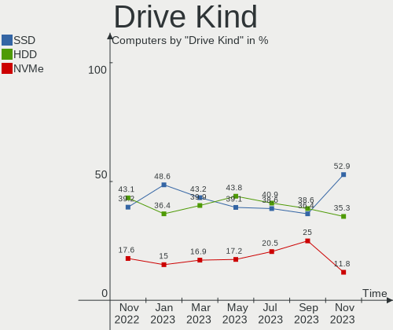
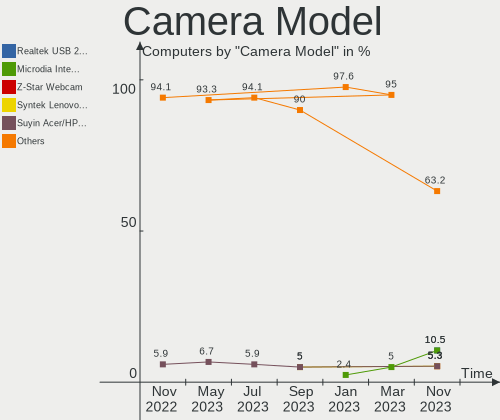
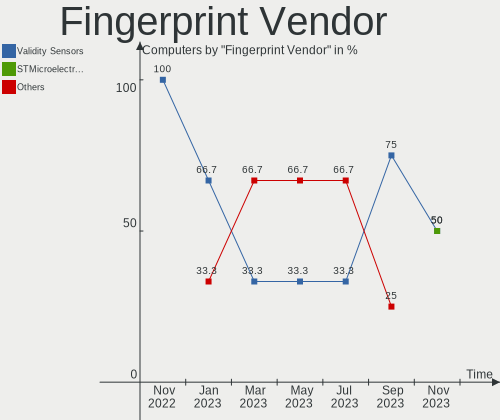

helloSystem Hardware Trends
---------------------------

A project to identify most popular hardware characteristics and track their change
over time based on data collected by helloSystem users at https://BSD-Hardware.info.

Anyone can contribute to this report by the [hw-probe](https://github.com/linuxhw/hw-probe/blob/master/INSTALL.BSD.md) tool:

    hw-probe -all -upload

This is a report for all computer types. See also reports for [desktops](/Dist/helloSystem/Desktop/README.md) and [notebooks](/Dist/helloSystem/Notebook/README.md).

Full-feature report is available here: https://bsd-hardware.info/?view=trends

Period: Dec, 2021.

Contents
--------

* [ System ](#system)
  - [ OS                       ](#os)
  - [ OS Family                ](#os-family)
  - [ Arch                     ](#arch)
  - [ DE                       ](#de)
  - [ Display Server           ](#display-server)
  - [ Display Manager          ](#display-manager)
  - [ OS Lang                  ](#os-lang)
  - [ Boot Mode                ](#boot-mode)
  - [ Filesystem               ](#filesystem)
  - [ Part. scheme             ](#part-scheme)

* [ Board ](#board)
  - [ Vendor                   ](#vendor)
  - [ Model                    ](#model)
  - [ Model Family             ](#model-family)
  - [ MFG Year                 ](#mfg-year)
  - [ Form Factor              ](#form-factor)
  - [ Coreboot                 ](#coreboot)
  - [ RAM Size                 ](#ram-size)
  - [ RAM Used                 ](#ram-used)
  - [ Total Drives             ](#total-drives)
  - [ Has CD-ROM               ](#has-cd-rom)
  - [ Has Ethernet             ](#has-ethernet)
  - [ Has WiFi                 ](#has-wifi)
  - [ Has Bluetooth            ](#has-bluetooth)

* [ Location ](#location)
  - [ Country                  ](#country)
  - [ City                     ](#city)

* [ Drives ](#drives)
  - [ Drive Vendor             ](#drive-vendor)
  - [ Drive Model              ](#drive-model)
  - [ HDD Vendor               ](#hdd-vendor)
  - [ SSD Vendor               ](#ssd-vendor)
  - [ Drive Kind               ](#drive-kind)
  - [ Drive Connector          ](#drive-connector)
  - [ Drive Size               ](#drive-size)
  - [ Space Total              ](#space-total)
  - [ Space Used               ](#space-used)
  - [ Malfunc. Drives          ](#malfunc-drives)
  - [ Malfunc. Drive Vendor    ](#malfunc-drive-vendor)
  - [ Malfunc. HDD Vendor      ](#malfunc-hdd-vendor)
  - [ Malfunc. Drive Kind      ](#malfunc-drive-kind)
  - [ Failed Drives            ](#failed-drives)
  - [ Failed Drive Vendor      ](#failed-drive-vendor)
  - [ Drive Status             ](#drive-status)

* [ Storage controller ](#storage-controller)
  - [ Storage Vendor           ](#storage-vendor)
  - [ Storage Model            ](#storage-model)
  - [ Storage Kind             ](#storage-kind)

* [ Processor ](#processor)
  - [ CPU Vendor               ](#cpu-vendor)
  - [ CPU Model                ](#cpu-model)
  - [ CPU Model Family         ](#cpu-model-family)
  - [ CPU Cores                ](#cpu-cores)
  - [ CPU Sockets              ](#cpu-sockets)
  - [ CPU Threads              ](#cpu-threads)
  - [ CPU Microarch            ](#cpu-microarch)

* [ Graphics ](#graphics)
  - [ GPU Vendor               ](#gpu-vendor)
  - [ GPU Model                ](#gpu-model)
  - [ GPU Combo                ](#gpu-combo)
  - [ GPU Driver               ](#gpu-driver)
  - [ GPU Memory               ](#gpu-memory)

* [ Monitor ](#monitor)
  - [ Monitor Vendor           ](#monitor-vendor)
  - [ Monitor Model            ](#monitor-model)
  - [ Monitor Resolution       ](#monitor-resolution)
  - [ Monitor Diagonal         ](#monitor-diagonal)
  - [ Monitor Width            ](#monitor-width)
  - [ Aspect Ratio             ](#aspect-ratio)
  - [ Monitor Area             ](#monitor-area)
  - [ Pixel Density            ](#pixel-density)
  - [ Multiple Monitors        ](#multiple-monitors)

* [ Network ](#network)
  - [ Net Controller Vendor    ](#net-controller-vendor)
  - [ Net Controller Model     ](#net-controller-model)
  - [ Wireless Vendor          ](#wireless-vendor)
  - [ Wireless Model           ](#wireless-model)
  - [ Ethernet Vendor          ](#ethernet-vendor)
  - [ Ethernet Model           ](#ethernet-model)
  - [ Net Controller Kind      ](#net-controller-kind)
  - [ Used Controller          ](#used-controller)
  - [ NICs                     ](#nics)
  - [ IPv6                     ](#ipv6)

* [ Bluetooth ](#bluetooth)
  - [ Bluetooth Vendor         ](#bluetooth-vendor)
  - [ Bluetooth Model          ](#bluetooth-model)

* [ Sound ](#sound)
  - [ Sound Vendor             ](#sound-vendor)
  - [ Sound Model              ](#sound-model)

* [ Memory ](#memory)
  - [ Memory Vendor            ](#memory-vendor)
  - [ Memory Model             ](#memory-model)
  - [ Memory Kind              ](#memory-kind)
  - [ Memory Form Factor       ](#memory-form-factor)
  - [ Memory Size              ](#memory-size)
  - [ Memory Speed             ](#memory-speed)

* [ Printers & scanners ](#printers--scanners)
  - [ Printer Vendor           ](#printer-vendor)
  - [ Printer Model            ](#printer-model)
  - [ Scanner Vendor           ](#scanner-vendor)
  - [ Scanner Model            ](#scanner-model)

* [ Camera ](#camera)
  - [ Camera Vendor            ](#camera-vendor)
  - [ Camera Model             ](#camera-model)

* [ Security ](#security)
  - [ Fingerprint Vendor       ](#fingerprint-vendor)
  - [ Fingerprint Model        ](#fingerprint-model)
  - [ Chipcard Vendor          ](#chipcard-vendor)
  - [ Chipcard Model           ](#chipcard-model)

* [ Unsupported ](#unsupported)
  - [ Unsupported Devices      ](#unsupported-devices)
  - [ Unsupported Device Types ](#unsupported-device-types)

System
------

OS
--

Installed operating systems

| Name              | Computers | Percent |
|-------------------|-----------|---------|
| helloSystem 0.7.0 | 57        | 75%     |
| helloSystem 0.6.0 | 16        | 21.05%  |
| helloSystem 0.5.0 | 3         | 3.95%   |

OS Family
---------

OS without a version

| Name        | Computers | Percent |
|-------------|-----------|---------|
| helloSystem | 76        | 100%    |

Arch
----

OS architecture (x86_64, i586, etc.)

| Name  | Computers | Percent |
|-------|-----------|---------|
| amd64 | 76        | 100%    |

DE
--

Desktop Environment

| Name         | Computers | Percent |
|--------------|-----------|---------|
| helloDesktop | 75        | 98.68%  |
| GNOME        | 1         | 1.32%   |

Display Server
--------------

X11 or Wayland

| Name | Computers | Percent |
|------|-----------|---------|
| X11  | 76        | 100%    |

Display Manager
---------------

SDDM, LightDM, etc.

| Name | Computers | Percent |
|------|-----------|---------|
| SLiM | 76        | 100%    |

OS Lang
-------

Language

| Lang  | Computers | Percent |
|-------|-----------|---------|
| en_US | 73        | 96.05%  |
| de_DE | 3         | 3.95%   |

Boot Mode
---------

EFI or BIOS

| Mode | Computers | Percent |
|------|-----------|---------|
| EFI  | 73        | 96.05%  |
| BIOS | 3         | 3.95%   |

Filesystem
----------

Type of filesystem

| Type   | Computers | Percent |
|--------|-----------|---------|
| Cd9660 | 40        | 52.63%  |
| Zfs    | 36        | 47.37%  |

Part. scheme
------------

Scheme of partitioning

| Type | Computers | Percent |
|------|-----------|---------|
| GPT  | 75        | 98.68%  |
| MBR  | 1         | 1.32%   |

Board
-----

Vendor
------

Motherboard manufacturer

| Name                | Computers | Percent |
|---------------------|-----------|---------|
| ASUSTek Computer    | 18        | 23.68%  |
| Lenovo              | 10        | 13.16%  |
| Hewlett-Packard     | 8         | 10.53%  |
| Dell                | 8         | 10.53%  |
| Gigabyte Technology | 7         | 9.21%   |
| Acer                | 6         | 7.89%   |
| MSI                 | 3         | 3.95%   |
| Apple               | 3         | 3.95%   |
| Toshiba             | 2         | 2.63%   |
| Intel               | 2         | 2.63%   |
| ASRock              | 2         | 2.63%   |
| Samsung Electronics | 1         | 1.32%   |
| Quanta              | 1         | 1.32%   |
| Positivo            | 1         | 1.32%   |
| Philco              | 1         | 1.32%   |
| Pegatron            | 1         | 1.32%   |
| Packard Bell        | 1         | 1.32%   |
| Acidanthera         | 1         | 1.32%   |

Model
-----

Motherboard model

| Name                                  | Computers | Percent |
|---------------------------------------|-----------|---------|
| Toshiba Satellite L550                | 1         | 1.32%   |
| Toshiba Satellite C50-B               | 1         | 1.32%   |
| Samsung 305E4A/305E5A/305E7A          | 1         | 1.32%   |
| Quanta 120-1135                       | 1         | 1.32%   |
| Positivo C14CR01                      | 1         | 1.32%   |
| Philco 10B                            | 1         | 1.32%   |
| Pegatron IPM41-D3                     | 1         | 1.32%   |
| Packard Bell EasyNote_MX61-B-038      | 1         | 1.32%   |
| MSI MS-7C91                           | 1         | 1.32%   |
| MSI MS-7C02                           | 1         | 1.32%   |
| MSI MS-7A33                           | 1         | 1.32%   |
| Lenovo ThinkPad X270 W10DG 20K5S0BM01 | 1         | 1.32%   |
| Lenovo ThinkPad X250 20CLS1WP01       | 1         | 1.32%   |
| Lenovo ThinkPad T460 20FMS75800       | 1         | 1.32%   |
| Lenovo ThinkPad T440p 20AW007QMS      | 1         | 1.32%   |
| Lenovo ThinkPad T410 2537EA8          | 1         | 1.32%   |
| Lenovo ThinkPad SL510 2847R96         | 1         | 1.32%   |
| Lenovo ThinkPad E580 20KS005BRI       | 1         | 1.32%   |
| Lenovo ThinkPad 13 20GJCTO1WW         | 1         | 1.32%   |
| Lenovo IdeaPad 510-15IKB 80SV         | 1         | 1.32%   |
| Lenovo G500 20236                     | 1         | 1.32%   |
| Intel NUC8i3BEH                       | 1         | 1.32%   |
| Intel NUC10i7FNH                      | 1         | 1.32%   |
| HP ZBook Studio G4                    | 1         | 1.32%   |
| HP ProBook 655 G1                     | 1         | 1.32%   |
| HP Pavilion Gaming Laptop 16-a0xxx    | 1         | 1.32%   |
| HP Pavilion Gaming Desktop 690-00xx   | 1         | 1.32%   |
| HP Laptop 15-dw0xxx                   | 1         | 1.32%   |
| HP EliteDesk 800 G2 SFF               | 1         | 1.32%   |
| HP EliteBook 2560p                    | 1         | 1.32%   |
| HP 15 Notebook PC                     | 1         | 1.32%   |
| Gigabyte Z77X-UD3H                    | 1         | 1.32%   |
| Gigabyte X58A-UD5                     | 1         | 1.32%   |
| Gigabyte H270M-DS3H                   | 1         | 1.32%   |
| Gigabyte H170-D3HP                    | 1         | 1.32%   |
| Gigabyte E3000N                       | 1         | 1.32%   |
| Gigabyte B450 I AORUS PRO WIFI        | 1         | 1.32%   |
| Gigabyte 970A-DS3P                    | 1         | 1.32%   |
| Dell Vostro 3667                      | 1         | 1.32%   |
| Dell Precision T1700                  | 1         | 1.32%   |
| Dell OptiPlex 780                     | 1         | 1.32%   |
| Dell Latitude E6540                   | 1         | 1.32%   |
| Dell Latitude E5470                   | 1         | 1.32%   |
| Dell Inspiron 3891                    | 1         | 1.32%   |
| Dell Inspiron 3521                    | 1         | 1.32%   |
| Dell Inspiron 3195                    | 1         | 1.32%   |
| ASUS Z170-P                           | 1         | 1.32%   |
| ASUS X540LA                           | 1         | 1.32%   |
| ASUS X502CA                           | 1         | 1.32%   |
| ASUS UX31A                            | 1         | 1.32%   |
| ASUS TUF GAMING X570-PLUS             | 1         | 1.32%   |
| ASUS S550CA                           | 1         | 1.32%   |
| ASUS ROG STRIX Z370-E GAMING          | 1         | 1.32%   |
| ASUS ROG STRIX X570-E GAMING          | 1         | 1.32%   |
| ASUS Q170M-C                          | 1         | 1.32%   |
| ASUS Pro WS X570-ACE                  | 1         | 1.32%   |
| ASUS PRIME B450M-A                    | 1         | 1.32%   |
| ASUS PRIME B350M-A                    | 1         | 1.32%   |
| ASUS PRIME A320M-K                    | 1         | 1.32%   |
| ASUS P8Z77-V LX                       | 1         | 1.32%   |

Model Family
------------

Motherboard model prefix

| Name                  | Computers | Percent |
|-----------------------|-----------|---------|
| Lenovo ThinkPad       | 8         | 10.53%  |
| Dell Inspiron         | 3         | 3.95%   |
| ASUS PRIME            | 3         | 3.95%   |
| Acer Aspire           | 3         | 3.95%   |
| Toshiba Satellite     | 2         | 2.63%   |
| HP Pavilion           | 2         | 2.63%   |
| Dell Latitude         | 2         | 2.63%   |
| ASUS ROG              | 2         | 2.63%   |
| Samsung 305E4A        | 1         | 1.32%   |
| Quanta 120-1135       | 1         | 1.32%   |
| Positivo C14CR01      | 1         | 1.32%   |
| Philco 10B            | 1         | 1.32%   |
| Pegatron IPM41-D3     | 1         | 1.32%   |
| Packard Bell EasyNote | 1         | 1.32%   |
| MSI MS-7C91           | 1         | 1.32%   |
| MSI MS-7C02           | 1         | 1.32%   |
| MSI MS-7A33           | 1         | 1.32%   |
| Lenovo IdeaPad        | 1         | 1.32%   |
| Lenovo G500           | 1         | 1.32%   |
| Intel NUC8i3BEH       | 1         | 1.32%   |
| Intel NUC10i7FNH      | 1         | 1.32%   |
| HP ZBook              | 1         | 1.32%   |
| HP ProBook            | 1         | 1.32%   |
| HP Laptop             | 1         | 1.32%   |
| HP EliteDesk          | 1         | 1.32%   |
| HP EliteBook          | 1         | 1.32%   |
| HP 15                 | 1         | 1.32%   |
| Gigabyte Z77X-UD3H    | 1         | 1.32%   |
| Gigabyte X58A-UD5     | 1         | 1.32%   |
| Gigabyte H270M-DS3H   | 1         | 1.32%   |
| Gigabyte H170-D3HP    | 1         | 1.32%   |
| Gigabyte E3000N       | 1         | 1.32%   |
| Gigabyte B450         | 1         | 1.32%   |
| Gigabyte 970A-DS3P    | 1         | 1.32%   |
| Dell Vostro           | 1         | 1.32%   |
| Dell Precision        | 1         | 1.32%   |
| Dell OptiPlex         | 1         | 1.32%   |
| ASUS Z170-P           | 1         | 1.32%   |
| ASUS X540LA           | 1         | 1.32%   |
| ASUS X502CA           | 1         | 1.32%   |
| ASUS UX31A            | 1         | 1.32%   |
| ASUS TUF              | 1         | 1.32%   |
| ASUS S550CA           | 1         | 1.32%   |
| ASUS Q170M-C          | 1         | 1.32%   |
| ASUS Pro              | 1         | 1.32%   |
| ASUS P8Z77-V          | 1         | 1.32%   |
| ASUS P5VD2-VM         | 1         | 1.32%   |
| ASUS N56VB            | 1         | 1.32%   |
| ASUS M5A78L           | 1         | 1.32%   |
| ASUS H110M-K          | 1         | 1.32%   |
| ASRock X570           | 1         | 1.32%   |
| ASRock H110M-DGS      | 1         | 1.32%   |
| Apple Macmini3        | 1         | 1.32%   |
| Apple MacBookAir1     | 1         | 1.32%   |
| Apple iMac9           | 1         | 1.32%   |
| Acidanthera iMac19    | 1         | 1.32%   |
| Acer TravelMate       | 1         | 1.32%   |
| Acer Swift            | 1         | 1.32%   |
| Acer RevoOne          | 1         | 1.32%   |

MFG Year
--------

Motherboard manufacture year

| Year | Computers | Percent |
|------|-----------|---------|
| 2021 | 20        | 26.32%  |
| 2013 | 9         | 11.84%  |
| 2015 | 6         | 7.89%   |
| 2020 | 5         | 6.58%   |
| 2018 | 5         | 6.58%   |
| 2012 | 5         | 6.58%   |
| 2011 | 5         | 6.58%   |
| 2019 | 4         | 5.26%   |
| 2017 | 4         | 5.26%   |
| 2016 | 4         | 5.26%   |
| 2010 | 3         | 3.95%   |
| 2009 | 2         | 2.63%   |
| 2007 | 2         | 2.63%   |
| 2014 | 1         | 1.32%   |
| 2008 | 1         | 1.32%   |

Form Factor
-----------

Physical design of the computer

| Name        | Computers | Percent |
|-------------|-----------|---------|
| Notebook    | 36        | 47.37%  |
| Desktop     | 34        | 44.74%  |
| Mini pc     | 3         | 3.95%   |
| All in one  | 2         | 2.63%   |
| Convertible | 1         | 1.32%   |

Coreboot
--------

Have coreboot on board

| Used | Computers | Percent |
|------|-----------|---------|
| No   | 76        | 100%    |

RAM Size
--------

Total RAM memory

| Size in GB  | Computers | Percent |
|-------------|-----------|---------|
| 4.01-8.0    | 24        | 31.58%  |
| 16.01-24.0  | 21        | 27.63%  |
| 8.01-16.0   | 16        | 21.05%  |
| 32.01-64.0  | 9         | 11.84%  |
| 3.01-4.0    | 2         | 2.63%   |
| 2.01-3.0    | 2         | 2.63%   |
| 24.01-32.0  | 1         | 1.32%   |
| 64.01-256.0 | 1         | 1.32%   |

RAM Used
--------

Used RAM memory

| Used GB   | Computers | Percent |
|-----------|-----------|---------|
| 0.01-0.5  | 33        | 43.42%  |
| 0.51-1.0  | 28        | 36.84%  |
| 1.01-2.0  | 10        | 13.16%  |
| 3.01-4.0  | 2         | 2.63%   |
| 2.01-3.0  | 2         | 2.63%   |
| 8.01-16.0 | 1         | 1.32%   |

Total Drives
------------

Number of drives on board

| Drives | Computers | Percent |
|--------|-----------|---------|
| 1      | 41        | 53.95%  |
| 2      | 17        | 22.37%  |
| 3      | 6         | 7.89%   |
| 4      | 4         | 5.26%   |
| 0      | 4         | 5.26%   |
| 5      | 3         | 3.95%   |
| 6      | 1         | 1.32%   |

Has CD-ROM
----------

Has CD-ROM on board

| Presented | Computers | Percent |
|-----------|-----------|---------|
| No        | 44        | 57.89%  |
| Yes       | 32        | 42.11%  |

Has Ethernet
------------

Has Ethernet on board

| Presented | Computers | Percent |
|-----------|-----------|---------|
| Yes       | 70        | 92.11%  |
| No        | 6         | 7.89%   |

Has WiFi
--------

Has WiFi module

| Presented | Computers | Percent |
|-----------|-----------|---------|
| Yes       | 55        | 72.37%  |
| No        | 21        | 27.63%  |

Has Bluetooth
-------------

Has Bluetooth module

| Presented | Computers | Percent |
|-----------|-----------|---------|
| Yes       | 39        | 51.32%  |
| No        | 37        | 48.68%  |

Location
--------

Country
-------

Geographic location (country)

| Country     | Computers | Percent |
|-------------|-----------|---------|
| USA         | 13        | 17.11%  |
| Russia      | 6         | 7.89%   |
| Romania     | 5         | 6.58%   |
| Germany     | 5         | 6.58%   |
| Poland      | 4         | 5.26%   |
| France      | 4         | 5.26%   |
| Canada      | 4         | 5.26%   |
| Brazil      | 4         | 5.26%   |
| Ukraine     | 3         | 3.95%   |
| Italy       | 3         | 3.95%   |
| Hungary     | 3         | 3.95%   |
| Bulgaria    | 3         | 3.95%   |
| Vietnam     | 2         | 2.63%   |
| Spain       | 2         | 2.63%   |
| Netherlands | 2         | 2.63%   |
| India       | 2         | 2.63%   |
| UK          | 1         | 1.32%   |
| Taiwan      | 1         | 1.32%   |
| Slovakia    | 1         | 1.32%   |
| Philippines | 1         | 1.32%   |
| Peru        | 1         | 1.32%   |
| Norway      | 1         | 1.32%   |
| Mexico      | 1         | 1.32%   |
| Finland     | 1         | 1.32%   |
| Denmark     | 1         | 1.32%   |
| Cuba        | 1         | 1.32%   |
| China       | 1         | 1.32%   |

City
----

Geographic location (city)

| City                 | Computers | Percent |
|----------------------|-----------|---------|
| Warsaw               | 2         | 2.63%   |
| Suceava              | 2         | 2.63%   |
| Maraba               | 2         | 2.63%   |
| Hanoi                | 2         | 2.63%   |
| Bucharest            | 2         | 2.63%   |
| Zaporizhzhya         | 1         | 1.32%   |
| Yunlin               | 1         | 1.32%   |
| Wolgast              | 1         | 1.32%   |
| Ugarchin             | 1         | 1.32%   |
| Tula de Allende      | 1         | 1.32%   |
| Torokszentmiklos     | 1         | 1.32%   |
| Szeged               | 1         | 1.32%   |
| Sz?©kesfeh?©rv??r    | 1         | 1.32%   |
| Surgut               | 1         | 1.32%   |
| Stara Zagora         | 1         | 1.32%   |
| St Petersburg        | 1         | 1.32%   |
| Sofia                | 1         | 1.32%   |
| Smiths Falls         | 1         | 1.32%   |
| Sevastopol           | 1         | 1.32%   |
| Seattle              | 1         | 1.32%   |
| Santa Maria          | 1         | 1.32%   |
| San Antonio          | 1         | 1.32%   |
| Rzesz??w             | 1         | 1.32%   |
| Rome                 | 1         | 1.32%   |
| Renfrew              | 1         | 1.32%   |
| Qu?©bec              | 1         | 1.32%   |
| Pruszcz Gdanski      | 1         | 1.32%   |
| Patterson            | 1         | 1.32%   |
| Paso Robles          | 1         | 1.32%   |
| Padova               | 1         | 1.32%   |
| Ourense              | 1         | 1.32%   |
| Old Town             | 1         | 1.32%   |
| Novosibirsk          | 1         | 1.32%   |
| Nogent-sur-Marne     | 1         | 1.32%   |
| New Delhi            | 1         | 1.32%   |
| Nesttun              | 1         | 1.32%   |
| Myski                | 1         | 1.32%   |
| Moscow               | 1         | 1.32%   |
| Montreal             | 1         | 1.32%   |
| Memphis              | 1         | 1.32%   |
| Longfield            | 1         | 1.32%   |
| Liptovsk?? Mikul???? | 1         | 1.32%   |
| Lima                 | 1         | 1.32%   |
| Laurel               | 1         | 1.32%   |
| Kottayam             | 1         | 1.32%   |
| Kirkkonummi          | 1         | 1.32%   |
| Katowice             | 1         | 1.32%   |
| Hvidovre             | 1         | 1.32%   |
| Hoogeveen            | 1         | 1.32%   |
| Havana               | 1         | 1.32%   |
| Hangzhou             | 1         | 1.32%   |
| Hackettstown         | 1         | 1.32%   |
| Front Royal          | 1         | 1.32%   |
| Follonica            | 1         | 1.32%   |
| Escondido            | 1         | 1.32%   |
| Elche                | 1         | 1.32%   |
| Dreieich             | 1         | 1.32%   |
| Donauw?¶rth          | 1         | 1.32%   |
| Dijon                | 1         | 1.32%   |
| D??sseldorf          | 1         | 1.32%   |

Drives
------

Drive Vendor
------------

Hard drive vendors

| Vendor              | Computers | Drives | Percent |
|---------------------|-----------|--------|---------|
| Samsung Electronics | 23        | 27     | 19.83%  |
| Seagate             | 20        | 28     | 17.24%  |
| WDC                 | 18        | 19     | 15.52%  |
| Kingston            | 11        | 12     | 9.48%   |
| Toshiba             | 9         | 9      | 7.76%   |
| Crucial             | 5         | 5      | 4.31%   |
| SK Hynix            | 4         | 4      | 3.45%   |
| SanDisk             | 4         | 4      | 3.45%   |
| Intel               | 4         | 5      | 3.45%   |
| HGST                | 3         | 3      | 2.59%   |
| XPG                 | 2         | 2      | 1.72%   |
| Hitachi             | 2         | 2      | 1.72%   |
| A-DATA Technology   | 2         | 2      | 1.72%   |
| Transcend           | 1         | 1      | 0.86%   |
| SSSTC               | 1         | 1      | 0.86%   |
| Phison              | 1         | 1      | 0.86%   |
| OCZ                 | 1         | 1      | 0.86%   |
| KingSpec            | 1         | 1      | 0.86%   |
| Integral            | 1         | 1      | 0.86%   |
| Hewlett-Packard     | 1         | 1      | 0.86%   |
| GOODRAM             | 1         | 1      | 0.86%   |
| China               | 1         | 1      | 0.86%   |

Drive Model
-----------

Hard drive models

| Model                                   | Computers | Percent |
|-----------------------------------------|-----------|---------|
| Kingston SA400S37120G 120GB             | 5         | 3.88%   |
| Seagate ST4000DM004-2CV104 4TB          | 3         | 2.33%   |
| Samsung SSD 850 EVO 250GB               | 3         | 2.33%   |
| XPG GAMMIX S11 Pro 1TB                  | 2         | 1.55%   |
| Toshiba HDWD110 1TB                     | 2         | 1.55%   |
| Seagate ST1000DM010-2EP102 1TB          | 2         | 1.55%   |
| Samsung SSD 860 EVO 500GB               | 2         | 1.55%   |
| Samsung SSD 860 EVO 250GB               | 2         | 1.55%   |
| Kingston SA400S37960G 960GB             | 2         | 1.55%   |
| HGST HTS545050A7E680 500GB              | 2         | 1.55%   |
| Crucial CT500MX500SSD1 500GB            | 2         | 1.55%   |
| WDC WDS500G2B0A-00SM50 500GB            | 1         | 0.78%   |
| WDC WDS250G1B0A-00H9H0 250GB            | 1         | 0.78%   |
| WDC WDS240G2G0A-00JH30 240GB            | 1         | 0.78%   |
| WDC WDS120G2G0A-00JH30 120GB            | 1         | 0.78%   |
| WDC WDS100T3X0C-00SJG0 1TB              | 1         | 0.78%   |
| WDC WDS100T2B0A-00SM50 1TB              | 1         | 0.78%   |
| WDC WDBNCE5000PNC 500GB                 | 1         | 0.78%   |
| WDC WD5000LPVX-22V0TT0 500GB            | 1         | 0.78%   |
| WDC WD5000LPLX-60ZNTT1 500GB            | 1         | 0.78%   |
| WDC WD5000BPVT-22HXZT3 500GB            | 1         | 0.78%   |
| WDC WD5000AAKX-08ERMA0 500GB            | 1         | 0.78%   |
| WDC WD5000AAKX-00ERMA0 500GB            | 1         | 0.78%   |
| WDC WD40EZRZ-00GXCB0 4TB                | 1         | 0.78%   |
| WDC WD3003FZEX-00Z4SA0 3TB              | 1         | 0.78%   |
| WDC WD20SMZW-11YFCS0 2TB                | 1         | 0.78%   |
| WDC WD1200BEVS-07RST0 120GB             | 1         | 0.78%   |
| WDC WD10SPZX-22Z10T0 1TB                | 1         | 0.78%   |
| WDC WD10EZEX-00KUWA0 1TB                | 1         | 0.78%   |
| WDC WD10EADX-00TDHB0 1TB                | 1         | 0.78%   |
| Transcend TS120GMTS420S 120GB           | 1         | 0.78%   |
| Toshiba MQ01ABF050 500GB                | 1         | 0.78%   |
| Toshiba MQ01ABD100 1TB                  | 1         | 0.78%   |
| Toshiba MQ01ABD075 752GB                | 1         | 0.78%   |
| Toshiba MQ01ABD050 500GB                | 1         | 0.78%   |
| Toshiba MK3261GSYN 320GB                | 1         | 0.78%   |
| Toshiba DT01ACA100 1TB                  | 1         | 0.78%   |
| Toshiba DT01ACA050 500GB                | 1         | 0.78%   |
| SSSTC CVB-8D128-HP 128GB                | 1         | 0.78%   |
| SK Hynix SHGS31-1000GS-2 1TB            | 1         | 0.78%   |
| SK Hynix HFS256G39TND-N210A 256GB       | 1         | 0.78%   |
| SK Hynix BC711 NVMe 256GB               | 1         | 0.78%   |
| SK Hynix BC501 HFM128GDJTNG-8310A 128GB | 1         | 0.78%   |
| Seagate ST980813AS 80GB                 | 1         | 0.78%   |
| Seagate ST9500420AS 500GB               | 1         | 0.78%   |
| Seagate ST9320423AS 320GB               | 1         | 0.78%   |
| Seagate ST9160821AS 160GB               | 1         | 0.78%   |
| Seagate ST4000NC001-1FS168 4TB          | 1         | 0.78%   |
| Seagate ST4000NC000-1FR168 4TB          | 1         | 0.78%   |
| Seagate ST3500413AS 500GB               | 1         | 0.78%   |
| Seagate ST3400633AS 400GB               | 1         | 0.78%   |
| Seagate ST320LT012-9WS14C 320GB         | 1         | 0.78%   |
| Seagate ST32000641AS 2TB                | 1         | 0.78%   |
| Seagate ST3000DM008-2DM166 3TB          | 1         | 0.78%   |
| Seagate ST3000DM001-1CH166 3TB          | 1         | 0.78%   |
| Seagate ST2000LX001-1RG174 2TB          | 1         | 0.78%   |
| Seagate ST2000DM008-2FR102 2TB          | 1         | 0.78%   |
| Seagate ST2000DM006-2DM164 2TB          | 1         | 0.78%   |
| Seagate ST2000DM005-2CW102 2TB          | 1         | 0.78%   |
| Seagate ST2000DM001-1ER164 2TB          | 1         | 0.78%   |

HDD Vendor
----------

Hard disk drive vendors

| Vendor              | Computers | Drives | Percent |
|---------------------|-----------|--------|---------|
| Seagate             | 19        | 27     | 40.43%  |
| WDC                 | 12        | 12     | 25.53%  |
| Toshiba             | 9         | 9      | 19.15%  |
| HGST                | 3         | 3      | 6.38%   |
| Samsung Electronics | 2         | 2      | 4.26%   |
| Hitachi             | 2         | 2      | 4.26%   |

SSD Vendor
----------

Solid state drive vendors

| Vendor              | Computers | Drives | Percent |
|---------------------|-----------|--------|---------|
| Samsung Electronics | 15        | 15     | 27.78%  |
| Kingston            | 10        | 11     | 18.52%  |
| WDC                 | 5         | 6      | 9.26%   |
| Crucial             | 5         | 5      | 9.26%   |
| SanDisk             | 4         | 4      | 7.41%   |
| Intel               | 3         | 3      | 5.56%   |
| SK Hynix            | 2         | 2      | 3.7%    |
| A-DATA Technology   | 2         | 2      | 3.7%    |
| Transcend           | 1         | 1      | 1.85%   |
| SSSTC               | 1         | 1      | 1.85%   |
| OCZ                 | 1         | 1      | 1.85%   |
| KingSpec            | 1         | 1      | 1.85%   |
| Integral            | 1         | 1      | 1.85%   |
| Hewlett-Packard     | 1         | 1      | 1.85%   |
| GOODRAM             | 1         | 1      | 1.85%   |
| China               | 1         | 1      | 1.85%   |

Drive Kind
----------

HDD or SSD

| Kind | Computers | Drives | Percent |
|------|-----------|--------|---------|
| SSD  | 44        | 56     | 43.56%  |
| HDD  | 40        | 55     | 39.6%   |
| NVMe | 17        | 20     | 16.83%  |

Drive Connector
---------------

SATA, SAS, NVMe, etc.

| Type | Computers | Drives | Percent |
|------|-----------|--------|---------|
| SATA | 68        | 111    | 80%     |
| NVMe | 17        | 20     | 20%     |

Drive Size
----------

Size of hard drive

| Size in TB | Computers | Drives | Percent |
|------------|-----------|--------|---------|
| 0.01-0.5   | 53        | 67     | 58.89%  |
| 0.51-1.0   | 21        | 23     | 23.33%  |
| 1.01-2.0   | 9         | 9      | 10%     |
| 3.01-4.0   | 4         | 8      | 4.44%   |
| 2.01-3.0   | 3         | 4      | 3.33%   |

Space Total
-----------

Amount of disk space available on the file system

| Size in GB | Computers | Percent |
|------------|-----------|---------|
| 1-20       | 49        | 64.47%  |
| 251-500    | 13        | 17.11%  |
| 101-250    | 7         | 9.21%   |
| 501-1000   | 4         | 5.26%   |
| 21-50      | 2         | 2.63%   |
| 51-100     | 1         | 1.32%   |

Space Used
----------

Amount of used disk space

| Used GB | Computers | Percent |
|---------|-----------|---------|
| 1-20    | 76        | 100%    |

Malfunc. Drives
---------------

Drive models with a malfunction

| Model                               | Computers | Drives | Percent |
|-------------------------------------|-----------|--------|---------|
| WDC WD5000LPLX-60ZNTT1 500GB        | 1         | 1      | 4.35%   |
| WDC WD5000BPVT-22HXZT3 500GB        | 1         | 1      | 4.35%   |
| WDC WD5000AAKX-08ERMA0 500GB        | 1         | 1      | 4.35%   |
| WDC WD5000AAKX-00ERMA0 500GB        | 1         | 1      | 4.35%   |
| Toshiba MQ01ABD100 1TB              | 1         | 1      | 4.35%   |
| Toshiba MQ01ABD075 752GB            | 1         | 1      | 4.35%   |
| Toshiba MQ01ABD050 500GB            | 1         | 1      | 4.35%   |
| Toshiba MK3261GSYN 320GB            | 1         | 1      | 4.35%   |
| Toshiba DT01ACA100 1TB              | 1         | 1      | 4.35%   |
| SSSTC CVB-8D128-HP 128GB            | 1         | 1      | 4.35%   |
| Seagate ST9500420AS 500GB           | 1         | 1      | 4.35%   |
| Seagate ST9320423AS 320GB           | 1         | 1      | 4.35%   |
| Seagate ST9160821AS 160GB           | 1         | 1      | 4.35%   |
| Seagate ST3500413AS 500GB           | 1         | 1      | 4.35%   |
| Seagate ST320LT012-9WS14C 320GB     | 1         | 1      | 4.35%   |
| SanDisk SD5SE2256G1002E 256GB       | 1         | 1      | 4.35%   |
| Samsung Electronics SSD 870 EVO 1TB | 1         | 1      | 4.35%   |
| Samsung Electronics SSD 860 EVO 1TB | 1         | 1      | 4.35%   |
| Samsung Electronics HS082HB 80GB    | 1         | 1      | 4.35%   |
| Hitachi HTS543232L9SA02 320GB       | 1         | 1      | 4.35%   |
| Hitachi HTS541680J9SA00 80GB        | 1         | 1      | 4.35%   |
| HGST HTS545050A7E680 500GB          | 1         | 1      | 4.35%   |
| Crucial CT240M500SSD1 240GB         | 1         | 1      | 4.35%   |

Malfunc. Drive Vendor
---------------------

Vendors of faulty drives

| Vendor              | Computers | Drives | Percent |
|---------------------|-----------|--------|---------|
| Toshiba             | 5         | 5      | 21.74%  |
| Seagate             | 5         | 5      | 21.74%  |
| WDC                 | 4         | 4      | 17.39%  |
| Samsung Electronics | 3         | 3      | 13.04%  |
| Hitachi             | 2         | 2      | 8.7%    |
| SSSTC               | 1         | 1      | 4.35%   |
| SanDisk             | 1         | 1      | 4.35%   |
| HGST                | 1         | 1      | 4.35%   |
| Crucial             | 1         | 1      | 4.35%   |

Malfunc. HDD Vendor
-------------------

Vendors of faulty HDD drives

| Vendor              | Computers | Drives | Percent |
|---------------------|-----------|--------|---------|
| Toshiba             | 5         | 5      | 27.78%  |
| Seagate             | 5         | 5      | 27.78%  |
| WDC                 | 4         | 4      | 22.22%  |
| Hitachi             | 2         | 2      | 11.11%  |
| Samsung Electronics | 1         | 1      | 5.56%   |
| HGST                | 1         | 1      | 5.56%   |

Malfunc. Drive Kind
-------------------

Kinds of faulty drives

| Kind | Computers | Drives | Percent |
|------|-----------|--------|---------|
| HDD  | 18        | 18     | 78.26%  |
| SSD  | 5         | 5      | 21.74%  |

Failed Drives
-------------

Failed drive models

Zero info for selected period =(

Failed Drive Vendor
-------------------

Failed drive vendors

Zero info for selected period =(

Drive Status
------------

Number of failed and malfunc. drives

| Status  | Computers | Drives | Percent |
|---------|-----------|--------|---------|
| Works   | 57        | 108    | 71.25%  |
| Malfunc | 23        | 23     | 28.75%  |

Storage controller
------------------

Storage Vendor
--------------

Storage controller vendors

| Vendor                      | Computers | Percent |
|-----------------------------|-----------|---------|
| Intel                       | 52        | 55.32%  |
| AMD                         | 20        | 21.28%  |
| Samsung Electronics         | 8         | 8.51%   |
| SK Hynix                    | 2         | 2.13%   |
| Nvidia                      | 2         | 2.13%   |
| Marvell Technology Group    | 2         | 2.13%   |
| ADATA Technology            | 2         | 2.13%   |
| VIA Technologies            | 1         | 1.06%   |
| Seagate Technology          | 1         | 1.06%   |
| Sandisk                     | 1         | 1.06%   |
| Phison Electronics          | 1         | 1.06%   |
| Kingston Technology Company | 1         | 1.06%   |
| JMicron Technology          | 1         | 1.06%   |

Storage Model
-------------

Storage controller models

| Model                                                                            | Computers | Percent |
|----------------------------------------------------------------------------------|-----------|---------|
| AMD FCH SATA Controller [AHCI mode]                                              | 14        | 13.08%  |
| Intel Q170/Q150/B150/H170/H110/Z170/CM236 Chipset SATA Controller [AHCI Mode]    | 8         | 7.48%   |
| Intel 7 Series Chipset Family 6-port SATA Controller [AHCI mode]                 | 7         | 6.54%   |
| Intel Sunrise Point-LP SATA Controller [AHCI mode]                               | 6         | 5.61%   |
| Samsung NVMe SSD Controller SM981/PM981/PM983                                    | 4         | 3.74%   |
| Samsung NVMe SSD Controller SM961/PM961/SM963                                    | 3         | 2.8%    |
| Intel 8 Series/C220 Series Chipset Family 6-port SATA Controller 1 [AHCI mode]   | 3         | 2.8%    |
| Intel 6 Series/C200 Series Chipset Family 6 port Mobile SATA AHCI Controller     | 3         | 2.8%    |
| AMD 400 Series Chipset SATA Controller                                           | 3         | 2.8%    |
| Nvidia MCP79 AHCI Controller                                                     | 2         | 1.87%   |
| Intel Cannon Lake PCH SATA AHCI Controller                                       | 2         | 1.87%   |
| Intel 82801 Mobile SATA Controller [RAID mode]                                   | 2         | 1.87%   |
| Intel 7 Series/C210 Series Chipset Family 6-port SATA Controller [AHCI mode]     | 2         | 1.87%   |
| Intel 5 Series/3400 Series Chipset 4 port SATA AHCI Controller                   | 2         | 1.87%   |
| AMD SB7x0/SB8x0/SB9x0 SATA Controller [AHCI mode]                                | 2         | 1.87%   |
| ADATA XPG SX8200 Pro PCIe Gen3x4 M.2 2280 Solid State Drive                      | 2         | 1.87%   |
| VIA VT82C586A/B/VT82C686/A/B/VT823x/A/C PIPC Bus Master IDE                      | 1         | 0.93%   |
| VIA VT8237A SATA 2-Port Controller                                               | 1         | 0.93%   |
| SK Hynix Gold P31 SSD                                                            | 1         | 0.93%   |
| SK Hynix BC501 NVMe Solid State Drive                                            | 1         | 0.93%   |
| Seagate FireCuda 510 SSD                                                         | 1         | 0.93%   |
| Sandisk WD Black 2018/SN750 / PC SN720 NVMe SSD                                  | 1         | 0.93%   |
| Samsung NVMe SSD Controller PM9A1/PM9A3/980PRO                                   | 1         | 0.93%   |
| Samsung NVMe SSD Controller 980                                                  | 1         | 0.93%   |
| Phison E12 NVMe Controller                                                       | 1         | 0.93%   |
| Marvell Group 88SE9172 SATA 6Gb/s Controller                                     | 1         | 0.93%   |
| Marvell Group 88SE9128 PCIe SATA 6 Gb/s RAID controller                          | 1         | 0.93%   |
| Kingston Company U-SNS8154P3 NVMe SSD                                            | 1         | 0.93%   |
| JMicron JMB363 SATA/IDE Controller                                               | 1         | 0.93%   |
| Intel Wildcat Point-LP SATA Controller [AHCI Mode]                               | 1         | 0.93%   |
| Intel SATA Controller [RAID mode]                                                | 1         | 0.93%   |
| Intel NM10/ICH7 Family SATA Controller [IDE mode]                                | 1         | 0.93%   |
| Intel NM10/ICH7 Family SATA Controller [AHCI mode]                               | 1         | 0.93%   |
| Intel Comet Lake SATA AHCI Controller                                            | 1         | 0.93%   |
| Intel Celeron/Pentium Silver Processor SATA Controller                           | 1         | 0.93%   |
| Intel Cannon Point-LP SATA Controller [AHCI Mode]                                | 1         | 0.93%   |
| Intel Atom/Celeron/Pentium Processor x5-E8000/J3xxx/N3xxx Series SATA Controller | 1         | 0.93%   |
| Intel Atom Processor E3800 Series SATA AHCI Controller                           | 1         | 0.93%   |
| Intel 82801JI (ICH10 Family) SATA AHCI Controller                                | 1         | 0.93%   |
| Intel 82801JD/DO (ICH10 Family) 4-port SATA IDE Controller                       | 1         | 0.93%   |
| Intel 82801JD/DO (ICH10 Family) 2-port SATA IDE Controller                       | 1         | 0.93%   |
| Intel 82801IBM/IEM (ICH9M/ICH9M-E) 4 port SATA Controller [AHCI mode]            | 1         | 0.93%   |
| Intel 82801HM/HEM (ICH8M/ICH8M-E) SATA Controller [AHCI mode]                    | 1         | 0.93%   |
| Intel 82801HM/HEM (ICH8M/ICH8M-E) IDE Controller                                 | 1         | 0.93%   |
| Intel 8 Series SATA Controller 1 [AHCI mode]                                     | 1         | 0.93%   |
| Intel 500 Series Chipset Family SATA AHCI Controller                             | 1         | 0.93%   |
| Intel 5 Series/3400 Series Chipset 6 port SATA AHCI Controller                   | 1         | 0.93%   |
| Intel 4 Series Chipset PT IDER Controller                                        | 1         | 0.93%   |
| Intel 200 Series PCH SATA controller [AHCI mode]                                 | 1         | 0.93%   |
| AMD X370 Series Chipset SATA Controller                                          | 1         | 0.93%   |
| AMD Starship/Matisse Chipset SATA Controller [AHCI mode]                         | 1         | 0.93%   |
| AMD SB7x0/SB8x0/SB9x0 SATA Controller [IDE mode]                                 | 1         | 0.93%   |
| AMD SB7x0/SB8x0/SB9x0 IDE Controller                                             | 1         | 0.93%   |
| AMD SB600 Non-Raid-5 SATA                                                        | 1         | 0.93%   |
| AMD SB600 IDE                                                                    | 1         | 0.93%   |
| AMD FCH SATA Controller D                                                        | 1         | 0.93%   |
| AMD 300 Series Chipset SATA Controller                                           | 1         | 0.93%   |
| Unknown                                                                          | 1         | 0.93%   |

Storage Kind
------------

Kind of storage controller (IDE, SATA, NVMe, SAS, ...)

| Kind | Computers | Percent |
|------|-----------|---------|
| SATA | 67        | 72.04%  |
| NVMe | 17        | 18.28%  |
| IDE  | 6         | 6.45%   |
| RAID | 3         | 3.23%   |

Processor
---------

CPU Vendor
----------

Processor vendors

| Vendor | Computers | Percent |
|--------|-----------|---------|
| Intel  | 56        | 73.68%  |
| AMD    | 20        | 26.32%  |

CPU Model
---------

Processor models

| Model                                       | Computers | Percent |
|---------------------------------------------|-----------|---------|
| Intel Core i7-7700 CPU @ 3.60GHz            | 2         | 2.63%   |
| Intel Core i5-6500 CPU @ 3.20GHz            | 2         | 2.63%   |
| Intel Core i5-6300U CPU @ 2.40GHz           | 2         | 2.63%   |
| AMD Ryzen 5 3600 6-Core Processor           | 2         | 2.63%   |
| Intel Xeon CPU E3-1230 V2 @ 3.30GHz         | 1         | 1.32%   |
| Intel Pentium Silver N5030 CPU @ 1.10GHz    | 1         | 1.32%   |
| Intel Pentium Dual-Core CPU E6700 @ 3.20GHz | 1         | 1.32%   |
| Intel Pentium CPU N3530 @ 2.16GHz           | 1         | 1.32%   |
| Intel Pentium CPU B960 @ 2.20GHz            | 1         | 1.32%   |
| Intel CPU Version                           | 1         | 1.32%   |
| Intel Core i7-8700K CPU @ 3.70GHz           | 1         | 1.32%   |
| Intel Core i7-8550U CPU @ 1.80GHz           | 1         | 1.32%   |
| Intel Core i7-6700 CPU @ 3.40GHz            | 1         | 1.32%   |
| Intel Core i7-6600U CPU @ 2.60GHz           | 1         | 1.32%   |
| Intel Core i7-4810MQ CPU @ 2.80GHz          | 1         | 1.32%   |
| Intel Core i7-4770 CPU @ 3.40GHz            | 1         | 1.32%   |
| Intel Core i7-4712MQ CPU @ 2.30GHz          | 1         | 1.32%   |
| Intel Core i7-3630QM CPU @ 2.40GHz          | 1         | 1.32%   |
| Intel Core i7-10710U CPU @ 1.10GHz          | 1         | 1.32%   |
| Intel Core i7 CPU                           | 1         | 1.32%   |
| Intel Core i5-9400 CPU @ 2.90GHz            | 1         | 1.32%   |
| Intel Core i5-8400 CPU @ 2.80GHz            | 1         | 1.32%   |
| Intel Core i5-8250U CPU @ 1.60GHz           | 1         | 1.32%   |
| Intel Core i5-7300HQ CPU @ 2.50GHz          | 1         | 1.32%   |
| Intel Core i5-7200U CPU @ 2.50GHz           | 1         | 1.32%   |
| Intel Core i5-6400 CPU @ 2.70GHz            | 1         | 1.32%   |
| Intel Core i5-5200U CPU @ 2.20GHz           | 1         | 1.32%   |
| Intel Core i5-3475S CPU @ 2.90GHz           | 1         | 1.32%   |
| Intel Core i5-3317U CPU @ 1.70GHz           | 1         | 1.32%   |
| Intel Core i5-2520M CPU @ 2.50GHz           | 1         | 1.32%   |
| Intel Core i5-2410M CPU @ 2.30GHz           | 1         | 1.32%   |
| Intel Core i5-10300H CPU @ 2.50GHz          | 1         | 1.32%   |
| Intel Core i5 CPU M 520 @ 2.40GHz           | 1         | 1.32%   |
| Intel Core i3-8109U CPU @ 3.00GHz           | 1         | 1.32%   |
| Intel Core i3-6320 CPU @ 3.90GHz            | 1         | 1.32%   |
| Intel Core i3-6300 CPU @ 3.80GHz            | 1         | 1.32%   |
| Intel Core i3-6100U CPU @ 2.30GHz           | 1         | 1.32%   |
| Intel Core i3-5010U CPU @ 2.10GHz           | 1         | 1.32%   |
| Intel Core i3-4005U CPU @ 1.70GHz           | 1         | 1.32%   |
| Intel Core i3-3227U CPU @ 1.90GHz           | 1         | 1.32%   |
| Intel Core i3-3217U CPU @ 1.80GHz           | 1         | 1.32%   |
| Intel Core i3-2330M CPU @ 2.20GHz           | 1         | 1.32%   |
| Intel Core i3 CPU M 370 @ 2.40GHz           | 1         | 1.32%   |
| Intel Core i3 CPU M 330 @ 2.13GHz           | 1         | 1.32%   |
| Intel Core 2 Duo CPU P7500 @ 1.60GHz        | 1         | 1.32%   |
| Intel Core 2 Duo CPU P7350 @ 2.00GHz        | 1         | 1.32%   |
| Intel Core 2 Duo CPU E8135 @ 2.66GHz        | 1         | 1.32%   |
| Intel Core 2 Duo                            | 1         | 1.32%   |
| Intel Core 2 CPU 4300 @ 1.80GHz             | 1         | 1.32%   |
| Intel Celeron CPU N3050 @ 1.60GHz           | 1         | 1.32%   |
| Intel Celeron CPU 1007U @ 1.50GHz           | 1         | 1.32%   |
| Intel Celeron CPU 1005M @ 1.90GHz           | 1         | 1.32%   |
| Intel Atom CPU D425 @ 1.80GHz               | 1         | 1.32%   |
| Intel 11th Gen Core i5-11400 @ 2.60GHz      | 1         | 1.32%   |
| AMD Turion 64 X2 Mobile Technology TL-60    | 1         | 1.32%   |
| AMD Ryzen 9 3900X 12-Core Processor         | 1         | 1.32%   |
| AMD Ryzen 7 5800X 8-Core Processor          | 1         | 1.32%   |
| AMD Ryzen 7 5700G with Radeon Graphics      | 1         | 1.32%   |
| AMD Ryzen 7 3700X 8-Core Processor          | 1         | 1.32%   |
| AMD Ryzen 7 1800X Eight-Core Processor      | 1         | 1.32%   |

CPU Model Family
----------------

Processor model prefix

| Model                   | Computers | Percent |
|-------------------------|-----------|---------|
| Intel Core i5           | 17        | 22.37%  |
| Intel Core i7           | 12        | 15.79%  |
| Intel Core i3           | 11        | 14.47%  |
| AMD Ryzen 5             | 6         | 7.89%   |
| Intel Core 2 Duo        | 4         | 5.26%   |
| AMD Ryzen 7             | 4         | 5.26%   |
| Other                   | 3         | 3.95%   |
| Intel Celeron           | 3         | 3.95%   |
| Intel Pentium           | 2         | 2.63%   |
| AMD E                   | 2         | 2.63%   |
| Intel Xeon              | 1         | 1.32%   |
| Intel Pentium Silver    | 1         | 1.32%   |
| Intel Pentium Dual-Core | 1         | 1.32%   |
| Intel Core 2            | 1         | 1.32%   |
| Intel Atom              | 1         | 1.32%   |
| AMD Turion 64 X2 Mobile | 1         | 1.32%   |
| AMD Ryzen 9             | 1         | 1.32%   |
| AMD Phenom II X4        | 1         | 1.32%   |
| AMD FX                  | 1         | 1.32%   |
| AMD E2                  | 1         | 1.32%   |
| AMD A6                  | 1         | 1.32%   |
| AMD A10                 | 1         | 1.32%   |

CPU Cores
---------

Number of processor cores

| Number  | Computers | Percent |
|---------|-----------|---------|
| 2       | 32        | 42.11%  |
| 4       | 22        | 28.95%  |
| 6       | 6         | 7.89%   |
| 12      | 4         | 5.26%   |
| Unknown | 4         | 5.26%   |
| 16      | 3         | 3.95%   |
| 8       | 2         | 2.63%   |
| 24      | 1         | 1.32%   |
| 14      | 1         | 1.32%   |
| 1       | 1         | 1.32%   |

CPU Sockets
-----------

Number of sockets

| Number | Computers | Percent |
|--------|-----------|---------|
| 1      | 73        | 96.05%  |
| 2      | 3         | 3.95%   |

CPU Threads
-----------

Threads per core (Hyper-Threading)

| Number  | Computers | Percent |
|---------|-----------|---------|
| 2       | 36        | 47.37%  |
| 1       | 36        | 47.37%  |
| Unknown | 4         | 5.26%   |

CPU Microarch
-------------

Microarchitecture

| Name          | Computers | Percent |
|---------------|-----------|---------|
| Skylake       | 10        | 13.16%  |
| KabyLake      | 10        | 13.16%  |
| IvyBridge     | 8         | 10.53%  |
| Zen 2         | 5         | 6.58%   |
| Penryn        | 5         | 6.58%   |
| SandyBridge   | 4         | 5.26%   |
| Haswell       | 4         | 5.26%   |
| Zen           | 3         | 3.95%   |
| Westmere      | 3         | 3.95%   |
| Zen 3         | 2         | 2.63%   |
| Silvermont    | 2         | 2.63%   |
| Piledriver    | 2         | 2.63%   |
| Core          | 2         | 2.63%   |
| CometLake     | 2         | 2.63%   |
| Broadwell     | 2         | 2.63%   |
| Bobcat        | 2         | 2.63%   |
| Zen+          | 1         | 1.32%   |
| Nehalem       | 1         | 1.32%   |
| K8 Hammer     | 1         | 1.32%   |
| K10 Llano     | 1         | 1.32%   |
| K10           | 1         | 1.32%   |
| Jaguar        | 1         | 1.32%   |
| Goldmont plus | 1         | 1.32%   |
| Excavator     | 1         | 1.32%   |
| Bonnell       | 1         | 1.32%   |
| Unknown       | 1         | 1.32%   |

Graphics
--------

GPU Vendor
----------

Vendors of graphics cards

| Vendor | Computers | Percent |
|--------|-----------|---------|
| Intel  | 44        | 51.76%  |
| Nvidia | 22        | 25.88%  |
| AMD    | 19        | 22.35%  |

GPU Model
---------

Graphics card models

| Model                                                                                    | Computers | Percent |
|------------------------------------------------------------------------------------------|-----------|---------|
| Intel 3rd Gen Core processor Graphics Controller                                         | 6         | 6.98%   |
| Intel Skylake GT2 [HD Graphics 520]                                                      | 4         | 4.65%   |
| Intel HD Graphics 530                                                                    | 4         | 4.65%   |
| Intel 2nd Generation Core Processor Family Integrated Graphics Controller                | 4         | 4.65%   |
| Intel HD Graphics 630                                                                    | 3         | 3.49%   |
| AMD Ellesmere [Radeon RX 470/480/570/570X/580/580X/590]                                  | 3         | 3.49%   |
| Nvidia GP107 [GeForce GTX 1050 Ti]                                                       | 2         | 2.33%   |
| Nvidia C79 [GeForce 9400]                                                                | 2         | 2.33%   |
| Intel UHD Graphics 620                                                                   | 2         | 2.33%   |
| Intel HD Graphics 5500                                                                   | 2         | 2.33%   |
| Intel 4th Gen Core Processor Integrated Graphics Controller                              | 2         | 2.33%   |
| Nvidia TU116M [GeForce GTX 1660 Ti Mobile]                                               | 1         | 1.16%   |
| Nvidia GP107 [GeForce GTX 1050]                                                          | 1         | 1.16%   |
| Nvidia GP106 [GeForce GTX 1060 6GB]                                                      | 1         | 1.16%   |
| Nvidia GP106 [GeForce GTX 1060 3GB]                                                      | 1         | 1.16%   |
| Nvidia GP104 [GeForce GTX 1070]                                                          | 1         | 1.16%   |
| Nvidia GP104 [GeForce GTX 1070 Ti]                                                       | 1         | 1.16%   |
| Nvidia GM206 [GeForce GTX 950]                                                           | 1         | 1.16%   |
| Nvidia GM108M [GeForce 940MX]                                                            | 1         | 1.16%   |
| Nvidia GM107 [GeForce GTX 750]                                                           | 1         | 1.16%   |
| Nvidia GK208B [GeForce GT 710]                                                           | 1         | 1.16%   |
| Nvidia GK107M [GeForce GT 740M]                                                          | 1         | 1.16%   |
| Nvidia GK104 [GeForce GTX 760]                                                           | 1         | 1.16%   |
| Nvidia GF119M [GeForce GT 520M]                                                          | 1         | 1.16%   |
| Nvidia GF119 [GeForce GT 610]                                                            | 1         | 1.16%   |
| Nvidia GF108M [GeForce GT 420M]                                                          | 1         | 1.16%   |
| Nvidia GA104 [GeForce RTX 3070 Lite Hash Rate]                                           | 1         | 1.16%   |
| Nvidia G86 [GeForce 8500 GT]                                                             | 1         | 1.16%   |
| Nvidia G72 [GeForce 7300 LE]                                                             | 1         | 1.16%   |
| Intel Xeon E3-1200 v3/4th Gen Core Processor Integrated Graphics Controller              | 1         | 1.16%   |
| Intel RocketLake-S GT1 [UHD Graphics 730]                                                | 1         | 1.16%   |
| Intel Mobile GM965/GL960 Integrated Graphics Controller (secondary)                      | 1         | 1.16%   |
| Intel Mobile GM965/GL960 Integrated Graphics Controller (primary)                        | 1         | 1.16%   |
| Intel Mobile 4 Series Chipset Integrated Graphics Controller                             | 1         | 1.16%   |
| Intel IvyBridge GT2 [HD Graphics 4000]                                                   | 1         | 1.16%   |
| Intel HD Graphics 620                                                                    | 1         | 1.16%   |
| Intel Haswell-ULT Integrated Graphics Controller                                         | 1         | 1.16%   |
| Intel GeminiLake [UHD Graphics 605]                                                      | 1         | 1.16%   |
| Intel Core Processor Integrated Graphics Controller                                      | 1         | 1.16%   |
| Intel CometLake-H GT2 [UHD Graphics]                                                     | 1         | 1.16%   |
| Intel Comet Lake UHD Graphics                                                            | 1         | 1.16%   |
| Intel CoffeeLake-U GT3e [Iris Plus Graphics 655]                                         | 1         | 1.16%   |
| Intel CoffeeLake-S GT2 [UHD Graphics 630]                                                | 1         | 1.16%   |
| Intel Atom/Celeron/Pentium Processor x5-E8000/J3xxx/N3xxx Integrated Graphics Controller | 1         | 1.16%   |
| Intel Atom Processor Z36xxx/Z37xxx Series Graphics & Display                             | 1         | 1.16%   |
| Intel Atom Processor D4xx/D5xx/N4xx/N5xx Integrated Graphics Controller                  | 1         | 1.16%   |
| Intel 4 Series Chipset Integrated Graphics Controller                                    | 1         | 1.16%   |
| AMD Wrestler [Radeon HD 6320]                                                            | 1         | 1.16%   |
| AMD Wrestler [Radeon HD 6310]                                                            | 1         | 1.16%   |
| AMD Topaz XT [Radeon R7 M260/M265 / M340/M360 / M440/M445 / 530/535 / 620/625 Mobile]    | 1         | 1.16%   |
| AMD Sumo [Radeon HD 6520G]                                                               | 1         | 1.16%   |
| AMD Stoney [Radeon R2/R3/R4/R5 Graphics]                                                 | 1         | 1.16%   |
| AMD RV730/M96 [Mobility Radeon HD 4650/5165]                                             | 1         | 1.16%   |
| AMD RV610/M72-S [Mobility Radeon HD 2400]                                                | 1         | 1.16%   |
| AMD Richland [Radeon HD 8650G]                                                           | 1         | 1.16%   |
| AMD Redwood XT [Radeon HD 5670/5690/5730]                                                | 1         | 1.16%   |
| AMD Raven Ridge [Radeon Vega Series / Radeon Vega Mobile Series]                         | 1         | 1.16%   |
| AMD Picasso/Raven 2 [Radeon Vega Series / Radeon Vega Mobile Series]                     | 1         | 1.16%   |
| AMD Navi 10 [Radeon RX 5600 OEM/5600 XT / 5700/5700 XT]                                  | 1         | 1.16%   |
| AMD Mars XTX [Radeon HD 8790M]                                                           | 1         | 1.16%   |

GPU Combo
---------

Combinations of graphics cards

| Name           | Computers | Percent |
|----------------|-----------|---------|
| 1 x Intel      | 32        | 42.11%  |
| 1 x Nvidia     | 16        | 21.05%  |
| 1 x AMD        | 16        | 21.05%  |
| Intel + Nvidia | 6         | 7.89%   |
| 2 x Intel      | 3         | 3.95%   |
| Intel + AMD    | 3         | 3.95%   |

GPU Driver
----------

Free vs proprietary

| Driver      | Computers | Percent |
|-------------|-----------|---------|
| Free        | 60        | 78.95%  |
| Proprietary | 14        | 18.42%  |
| Unknown     | 2         | 2.63%   |

GPU Memory
----------

Total video memory

| Size in GB | Computers | Percent |
|------------|-----------|---------|
| Unknown    | 49        | 64.47%  |
| 0.01-0.5   | 8         | 10.53%  |
| 3.01-4.0   | 5         | 6.58%   |
| 1.01-2.0   | 5         | 6.58%   |
| 7.01-8.0   | 4         | 5.26%   |
| 0.51-1.0   | 4         | 5.26%   |
| 5.01-6.0   | 1         | 1.32%   |

Monitor
-------

Monitor Vendor
--------------

Monitor vendors

| Vendor                  | Computers | Percent |
|-------------------------|-----------|---------|
| Samsung Electronics     | 10        | 13.51%  |
| LG Display              | 8         | 10.81%  |
| Hewlett-Packard         | 7         | 9.46%   |
| Chimei Innolux          | 6         | 8.11%   |
| BenQ                    | 6         | 8.11%   |
| Dell                    | 5         | 6.76%   |
| BOE                     | 5         | 6.76%   |
| Goldstar                | 4         | 5.41%   |
| AU Optronics            | 4         | 5.41%   |
| AOC                     | 4         | 5.41%   |
| Lenovo                  | 3         | 4.05%   |
| Apple                   | 2         | 2.7%    |
| Acer                    | 2         | 2.7%    |
| Philips                 | 1         | 1.35%   |
| Medion                  | 1         | 1.35%   |
| LG Philips              | 1         | 1.35%   |
| InfoVision              | 1         | 1.35%   |
| Iiyama                  | 1         | 1.35%   |
| Fujitsu Siemens         | 1         | 1.35%   |
| Chi Mei Optoelectronics | 1         | 1.35%   |
| Ancor Communications    | 1         | 1.35%   |

Monitor Model
-------------

Monitor models

| Model                                                                    | Computers | Percent |
|--------------------------------------------------------------------------|-----------|---------|
| Samsung Electronics LCD Monitor SEC334A 1366x768 340x190mm 15.3-inch     | 2         | 2.67%   |
| BenQ GW2780 BNQ78E6 1920x1080 600x340mm 27.2-inch                        | 2         | 2.67%   |
| Samsung Electronics T24E390 SAM0C20 1920x1080 520x290mm 23.4-inch        | 1         | 1.33%   |
| Samsung Electronics SyncMaster SAM05FF 1600x900 440x250mm 19.9-inch      | 1         | 1.33%   |
| Samsung Electronics SyncMaster SAM05C5 1920x1080                         | 1         | 1.33%   |
| Samsung Electronics SyncMaster SAM027D 1680x1050 430x270mm 20.0-inch     | 1         | 1.33%   |
| Samsung Electronics SMBX2250 SAM071B 1920x1080 480x270mm 21.7-inch       | 1         | 1.33%   |
| Samsung Electronics LCD Monitor SEC384A 1366x768 340x190mm 15.3-inch     | 1         | 1.33%   |
| Samsung Electronics LCD Monitor SEC314C 1920x1080 340x190mm 15.3-inch    | 1         | 1.33%   |
| Samsung Electronics LCD Monitor SDC4C48 1920x1080 240x130mm 10.7-inch    | 1         | 1.33%   |
| Samsung Electronics LCD Monitor SDC4347 1366x768 340x190mm 15.3-inch     | 1         | 1.33%   |
| Philips PHL 278E1 PHLC217 3840x2160 600x340mm 27.2-inch                  | 1         | 1.33%   |
| Medion MD 20160 MED3625 1920x1080 520x290mm 23.4-inch                    | 1         | 1.33%   |
| LG Philips LCD Monitor LPLE300 1280x800 330x210mm 15.4-inch              | 1         | 1.33%   |
| LG Display LCD Monitor LGD0521 1920x1080 310x170mm 13.9-inch             | 1         | 1.33%   |
| LG Display LCD Monitor LGD048C 1920x1080 290x170mm 13.2-inch             | 1         | 1.33%   |
| LG Display LCD Monitor LGD0465 1366x768 340x190mm 15.3-inch              | 1         | 1.33%   |
| LG Display LCD Monitor LGD03AB 1366x768 340x190mm 15.3-inch              | 1         | 1.33%   |
| LG Display LCD Monitor LGD0385 1366x768 310x170mm 13.9-inch              | 1         | 1.33%   |
| LG Display LCD Monitor LGD02DC 1366x768 340x190mm 15.3-inch              | 1         | 1.33%   |
| LG Display LCD Monitor LGD0250 1366x768 350x190mm 15.7-inch              | 1         | 1.33%   |
| LG Display LCD Monitor LGD01CA 1600x900 380x210mm 17.1-inch              | 1         | 1.33%   |
| Lenovo LEN P27q-10 LEN61A8 2560x1440 600x340mm 27.2-inch                 | 1         | 1.33%   |
| Lenovo LCD Monitor LEN40B0 1366x768 340x190mm 15.3-inch                  | 1         | 1.33%   |
| Lenovo LCD Monitor LEN4035 1280x800 300x190mm 14.0-inch                  | 1         | 1.33%   |
| InfoVision LCD Monitor IVO03F4 1024x600 220x130mm 10.1-inch              | 1         | 1.33%   |
| Iiyama PLE2407HDS IVM560D 1920x1080 520x300mm 23.6-inch                  | 1         | 1.33%   |
| Hewlett-Packard ZR22w HWP2867 1920x1080 480x270mm 21.7-inch              | 1         | 1.33%   |
| Hewlett-Packard Z24n G2 HPN3485 1920x1200 520x320mm 24.0-inch            | 1         | 1.33%   |
| Hewlett-Packard LCD Monitor HWP4218 1600x900 440x250mm 19.9-inch         | 1         | 1.33%   |
| Hewlett-Packard LCD Monitor HPN3425 1920x1080 540x300mm 24.3-inch        | 1         | 1.33%   |
| Hewlett-Packard 24fw HPN3545 1920x1080 530x300mm 24.0-inch               | 1         | 1.33%   |
| Hewlett-Packard 2009 HWP2827 1600x900 440x250mm 19.9-inch                | 1         | 1.33%   |
| Hewlett-Packard 19ka HWP3328 1366x768 410x230mm 18.5-inch                | 1         | 1.33%   |
| Goldstar M2280D GSM57B9 1920x1080 480x270mm 21.7-inch                    | 1         | 1.33%   |
| Goldstar LG HDR 4K GSM7706 3840x2160 600x340mm 27.2-inch                 | 1         | 1.33%   |
| Goldstar LCD Monitor GSM5AB8 1920x1080 480x270mm 21.7-inch               | 1         | 1.33%   |
| Goldstar 19MB35 GSM4C23 1280x1024 380x300mm 19.1-inch                    | 1         | 1.33%   |
| Fujitsu Siemens E19-5 FUS07CD 1280x1024 380x300mm 19.1-inch              | 1         | 1.33%   |
| Dell U3415W DELA0A6 3440x1440 800x330mm 34.1-inch                        | 1         | 1.33%   |
| Dell U2713HM DEL407E 2560x1440 600x340mm 27.2-inch                       | 1         | 1.33%   |
| Dell U2415 DELA0BA 1920x1200 520x320mm 24.0-inch                         | 1         | 1.33%   |
| Dell U2412M DELA07B 1920x1200 520x320mm 24.0-inch                        | 1         | 1.33%   |
| Dell P2311H DEL4067 1920x1080 510x290mm 23.1-inch                        | 1         | 1.33%   |
| Chimei Innolux LCD Monitor CMN1602 1920x1080 360x200mm 16.2-inch         | 1         | 1.33%   |
| Chimei Innolux LCD Monitor CMN15CA 1366x768 340x190mm 15.3-inch          | 1         | 1.33%   |
| Chimei Innolux LCD Monitor CMN15C0 1920x1080 340x190mm 15.3-inch         | 1         | 1.33%   |
| Chimei Innolux LCD Monitor CMN14C9 1920x1080 310x170mm 13.9-inch         | 1         | 1.33%   |
| Chimei Innolux LCD Monitor CMN1482 1600x900 310x170mm 13.9-inch          | 1         | 1.33%   |
| Chimei Innolux LCD Monitor CMN1348 1920x1080 280x160mm 12.7-inch         | 1         | 1.33%   |
| Chi Mei Optoelectronics LCD Monitor CMO15A7 1366x768 350x190mm 15.7-inch | 1         | 1.33%   |
| BOE LCD Monitor BOE06FF 1920x1080 340x190mm 15.3-inch                    | 1         | 1.33%   |
| BOE LCD Monitor BOE06CE 1366x768 280x160mm 12.7-inch                     | 1         | 1.33%   |
| BOE LCD Monitor BOE0662 1366x768 340x190mm 15.3-inch                     | 1         | 1.33%   |
| BOE LCD Monitor BOE065E 1920x1080 340x190mm 15.3-inch                    | 1         | 1.33%   |
| BOE LCD Monitor BOE0653 1920x1080 310x170mm 13.9-inch                    | 1         | 1.33%   |
| BenQ GW2260 BNQ78C4 1920x1080 480x270mm 21.7-inch                        | 1         | 1.33%   |
| BenQ GL2460 BNQ78CE 1920x1080 530x300mm 24.0-inch                        | 1         | 1.33%   |
| BenQ EW3270U BNQ7950 3840x2160 700x390mm 31.5-inch                       | 1         | 1.33%   |
| BenQ EW2440L BNQ7938 1920x1080 530x300mm 24.0-inch                       | 1         | 1.33%   |

Monitor Resolution
------------------

Monitor screen resolution

| Resolution         | Computers | Percent |
|--------------------|-----------|---------|
| 1920x1080 (FHD)    | 31        | 42.47%  |
| 1366x768 (WXGA)    | 18        | 24.66%  |
| 1600x900 (HD+)     | 5         | 6.85%   |
| 3840x2160 (4K)     | 3         | 4.11%   |
| 2560x1440 (QHD)    | 3         | 4.11%   |
| 1920x1200 (WUXGA)  | 3         | 4.11%   |
| 1680x1050 (WSXGA+) | 3         | 4.11%   |
| 1280x800 (WXGA)    | 3         | 4.11%   |
| 1280x1024 (SXGA)   | 2         | 2.74%   |
| 3440x1440          | 1         | 1.37%   |
| 1024x600           | 1         | 1.37%   |

Monitor Diagonal
----------------

Diagonal size in inches

| Inches  | Computers | Percent |
|---------|-----------|---------|
| 15      | 20        | 26.67%  |
| 24      | 10        | 13.33%  |
| 27      | 7         | 9.33%   |
| 13      | 7         | 9.33%   |
| 21      | 6         | 8%      |
| 23      | 5         | 6.67%   |
| 19      | 5         | 6.67%   |
| 12      | 4         | 5.33%   |
| 20      | 2         | 2.67%   |
| 18      | 2         | 2.67%   |
| 34      | 1         | 1.33%   |
| 31      | 1         | 1.33%   |
| 17      | 1         | 1.33%   |
| 16      | 1         | 1.33%   |
| 14      | 1         | 1.33%   |
| 10      | 1         | 1.33%   |
| Unknown | 1         | 1.33%   |

Monitor Width
-------------

Physical width

| Width in mm | Computers | Percent |
|-------------|-----------|---------|
| 301-350     | 25        | 34.72%  |
| 501-600     | 20        | 27.78%  |
| 401-500     | 11        | 15.28%  |
| 201-300     | 8         | 11.11%  |
| 351-400     | 5         | 6.94%   |
| 701-800     | 1         | 1.39%   |
| 601-700     | 1         | 1.39%   |
| Unknown     | 1         | 1.39%   |

Aspect Ratio
------------

Proportional relationship between the width and the height

| Ratio | Computers | Percent |
|-------|-----------|---------|
| 16/9  | 58        | 82.86%  |
| 16/10 | 8         | 11.43%  |
| 5/4   | 2         | 2.86%   |
| 3/2   | 1         | 1.43%   |
| 21/9  | 1         | 1.43%   |

Monitor Area
------------

Area in inch²

| Area in inch² | Computers | Percent |
|----------------|-----------|---------|
| 91-100         | 17        | 22.97%  |
| 201-250        | 16        | 21.62%  |
| 151-200        | 8         | 10.81%  |
| 81-90          | 7         | 9.46%   |
| 301-350        | 7         | 9.46%   |
| 61-70          | 4         | 5.41%   |
| 251-300        | 4         | 5.41%   |
| 101-110        | 3         | 4.05%   |
| 351-500        | 2         | 2.7%    |
| 71-80          | 1         | 1.35%   |
| 41-50          | 1         | 1.35%   |
| 141-150        | 1         | 1.35%   |
| 121-130        | 1         | 1.35%   |
| 111-120        | 1         | 1.35%   |
| Unknown        | 1         | 1.35%   |

Pixel Density
-------------

Pixels per inch

| Density | Computers | Percent |
|---------|-----------|---------|
| 101-120 | 28        | 37.33%  |
| 51-100  | 28        | 37.33%  |
| 121-160 | 13        | 17.33%  |
| 161-240 | 5         | 6.67%   |
| Unknown | 1         | 1.33%   |

Multiple Monitors
-----------------

Total monitors connected

| Total | Computers | Percent |
|-------|-----------|---------|
| 1     | 64        | 84.21%  |
| 2     | 7         | 9.21%   |
| 0     | 5         | 6.58%   |

Network
-------

Net Controller Vendor
---------------------

Controller vendors

| Vendor                | Computers | Percent |
|-----------------------|-----------|---------|
| Realtek Semiconductor | 44        | 41.12%  |
| Intel                 | 32        | 29.91%  |
| Qualcomm Atheros      | 17        | 15.89%  |
| Broadcom              | 9         | 8.41%   |
| Nvidia                | 2         | 1.87%   |
| JMicron Technology    | 2         | 1.87%   |
| Dell                  | 1         | 0.93%   |

Net Controller Model
--------------------

Controller models

| Model                                                                         | Computers | Percent |
|-------------------------------------------------------------------------------|-----------|---------|
| Realtek RTL8111/8168/8411 PCI Express Gigabit Ethernet Controller             | 29        | 21.8%   |
| Qualcomm Atheros AR9485 Wireless Network Adapter                              | 7         | 5.26%   |
| Realtek RTL810xE PCI Express Fast Ethernet controller                         | 6         | 4.51%   |
| Intel Wi-Fi 6 AX200                                                           | 5         | 3.76%   |
| Qualcomm Atheros QCA9565 / AR9565 Wireless Network Adapter                    | 4         | 3.01%   |
| Intel Wireless 8260                                                           | 4         | 3.01%   |
| Intel I211 Gigabit Network Connection                                         | 4         | 3.01%   |
| Realtek RTL8188EE Wireless Network Adapter                                    | 3         | 2.26%   |
| Qualcomm Atheros AR8161 Gigabit Ethernet                                      | 3         | 2.26%   |
| Intel Ethernet Connection I219-LM                                             | 3         | 2.26%   |
| Intel Ethernet Connection I217-LM                                             | 3         | 2.26%   |
| Intel Ethernet Connection (2) I219-LM                                         | 3         | 2.26%   |
| Realtek RTL8822BE 802.11a/b/g/n/ac WiFi adapter                               | 2         | 1.5%    |
| Realtek RTL8188EUS 802.11n Wireless Network Adapter                           | 2         | 1.5%    |
| Qualcomm Atheros AR8151 v2.0 Gigabit Ethernet                                 | 2         | 1.5%    |
| Nvidia MCP79 Ethernet                                                         | 2         | 1.5%    |
| Intel Wireless 7265                                                           | 2         | 1.5%    |
| Intel Wireless 7260                                                           | 2         | 1.5%    |
| Intel Ethernet Connection (2) I219-V                                          | 2         | 1.5%    |
| Intel Dual Band Wireless-AC 3165 Plus Bluetooth                               | 2         | 1.5%    |
| Broadcom BCM4321 802.11a/b/g/n                                                | 2         | 1.5%    |
| Realtek RTL8821CE 802.11ac PCIe Wireless Network Adapter                      | 1         | 0.75%   |
| Realtek RTL8821AE 802.11ac PCIe Wireless Network Adapter                      | 1         | 0.75%   |
| Realtek RTL8192CU 802.11n WLAN Adapter                                        | 1         | 0.75%   |
| Realtek RTL8188CUS 802.11n WLAN Adapter                                       | 1         | 0.75%   |
| Realtek RTL8125 2.5GbE Controller                                             | 1         | 0.75%   |
| Realtek RTL-8110SC/8169SC Gigabit Ethernet                                    | 1         | 0.75%   |
| Realtek RTL-8100/8101L/8139 PCI Fast Ethernet Adapter                         | 1         | 0.75%   |
| Qualcomm Atheros QCA8172 Fast Ethernet                                        | 1         | 0.75%   |
| Qualcomm Atheros AR93xx Wireless Network Adapter                              | 1         | 0.75%   |
| Qualcomm Atheros AR9287 Wireless Network Adapter (PCI-Express)                | 1         | 0.75%   |
| Qualcomm Atheros AR9285 Wireless Network Adapter (PCI-Express)                | 1         | 0.75%   |
| Qualcomm Atheros AR8152 v2.0 Fast Ethernet                                    | 1         | 0.75%   |
| Qualcomm Atheros AR242x / AR542x Wireless Network Adapter (PCI-Express)       | 1         | 0.75%   |
| JMicron JMC260 PCI Express Fast Ethernet Controller                           | 1         | 0.75%   |
| JMicron JMC250 PCI Express Gigabit Ethernet Controller                        | 1         | 0.75%   |
| Intel Wireless-AC 9260                                                        | 1         | 0.75%   |
| Intel Wireless 3165                                                           | 1         | 0.75%   |
| Intel I210 Gigabit Network Connection                                         | 1         | 0.75%   |
| Intel Ethernet Connection I219-V                                              | 1         | 0.75%   |
| Intel Ethernet Connection (6) I219-V                                          | 1         | 0.75%   |
| Intel Ethernet Connection (3) I218-LM                                         | 1         | 0.75%   |
| Intel Ethernet Connection (10) I219-V                                         | 1         | 0.75%   |
| Intel Comet Lake PCH-LP CNVi WiFi                                             | 1         | 0.75%   |
| Intel Centrino Wireless-N 1000 [Condor Peak]                                  | 1         | 0.75%   |
| Intel Centrino Ultimate-N 6300                                                | 1         | 0.75%   |
| Intel Centrino Advanced-N 6235                                                | 1         | 0.75%   |
| Intel Centrino Advanced-N 6205 [Taylor Peak]                                  | 1         | 0.75%   |
| Intel Centrino Advanced-N 6200                                                | 1         | 0.75%   |
| Intel Cannon Point-LP CNVi [Wireless-AC]                                      | 1         | 0.75%   |
| Intel 82579LM Gigabit Network Connection (Lewisville)                         | 1         | 0.75%   |
| Intel 82577LM Gigabit Network Connection                                      | 1         | 0.75%   |
| Intel 82571EB/82571GB Gigabit Ethernet Controller D0/D1 (copper applications) | 1         | 0.75%   |
| Intel 82567LM-3 Gigabit Network Connection                                    | 1         | 0.75%   |
| Dell Hub of E-Port Replicator                                                 | 1         | 0.75%   |
| Broadcom NetXtreme BCM5761 Gigabit Ethernet PCIe                              | 1         | 0.75%   |
| Broadcom NetLink BCM57780 Gigabit Ethernet PCIe                               | 1         | 0.75%   |
| Broadcom BCM4360 802.11ac Wireless Network Adapter                            | 1         | 0.75%   |
| Broadcom BCM43228 802.11a/b/g/n                                               | 1         | 0.75%   |
| Broadcom BCM43227 802.11b/g/n                                                 | 1         | 0.75%   |

Wireless Vendor
---------------

Wireless vendors

| Vendor                | Computers | Percent |
|-----------------------|-----------|---------|
| Intel                 | 24        | 41.38%  |
| Qualcomm Atheros      | 15        | 25.86%  |
| Realtek Semiconductor | 11        | 18.97%  |
| Broadcom              | 7         | 12.07%  |
| Dell                  | 1         | 1.72%   |

Wireless Model
--------------

Wireless models

| Model                                                                   | Computers | Percent |
|-------------------------------------------------------------------------|-----------|---------|
| Qualcomm Atheros AR9485 Wireless Network Adapter                        | 7         | 12.07%  |
| Intel Wi-Fi 6 AX200                                                     | 5         | 8.62%   |
| Qualcomm Atheros QCA9565 / AR9565 Wireless Network Adapter              | 4         | 6.9%    |
| Intel Wireless 8260                                                     | 4         | 6.9%    |
| Realtek RTL8188EE Wireless Network Adapter                              | 3         | 5.17%   |
| Realtek RTL8822BE 802.11a/b/g/n/ac WiFi adapter                         | 2         | 3.45%   |
| Realtek RTL8188EUS 802.11n Wireless Network Adapter                     | 2         | 3.45%   |
| Intel Wireless 7265                                                     | 2         | 3.45%   |
| Intel Wireless 7260                                                     | 2         | 3.45%   |
| Intel Dual Band Wireless-AC 3165 Plus Bluetooth                         | 2         | 3.45%   |
| Broadcom BCM4321 802.11a/b/g/n                                          | 2         | 3.45%   |
| Realtek RTL8821CE 802.11ac PCIe Wireless Network Adapter                | 1         | 1.72%   |
| Realtek RTL8821AE 802.11ac PCIe Wireless Network Adapter                | 1         | 1.72%   |
| Realtek RTL8192CU 802.11n WLAN Adapter                                  | 1         | 1.72%   |
| Realtek RTL8188CUS 802.11n WLAN Adapter                                 | 1         | 1.72%   |
| Qualcomm Atheros AR93xx Wireless Network Adapter                        | 1         | 1.72%   |
| Qualcomm Atheros AR9287 Wireless Network Adapter (PCI-Express)          | 1         | 1.72%   |
| Qualcomm Atheros AR9285 Wireless Network Adapter (PCI-Express)          | 1         | 1.72%   |
| Qualcomm Atheros AR242x / AR542x Wireless Network Adapter (PCI-Express) | 1         | 1.72%   |
| Intel Wireless-AC 9260                                                  | 1         | 1.72%   |
| Intel Wireless 3165                                                     | 1         | 1.72%   |
| Intel Comet Lake PCH-LP CNVi WiFi                                       | 1         | 1.72%   |
| Intel Centrino Wireless-N 1000 [Condor Peak]                            | 1         | 1.72%   |
| Intel Centrino Ultimate-N 6300                                          | 1         | 1.72%   |
| Intel Centrino Advanced-N 6235                                          | 1         | 1.72%   |
| Intel Centrino Advanced-N 6205 [Taylor Peak]                            | 1         | 1.72%   |
| Intel Centrino Advanced-N 6200                                          | 1         | 1.72%   |
| Intel Cannon Point-LP CNVi [Wireless-AC]                                | 1         | 1.72%   |
| Dell Hub of E-Port Replicator                                           | 1         | 1.72%   |
| Broadcom BCM4360 802.11ac Wireless Network Adapter                      | 1         | 1.72%   |
| Broadcom BCM43228 802.11a/b/g/n                                         | 1         | 1.72%   |
| Broadcom BCM43227 802.11b/g/n                                           | 1         | 1.72%   |
| Broadcom BCM4322 802.11a/b/g/n Wireless LAN Controller                  | 1         | 1.72%   |
| Broadcom BCM43142 802.11b/g/n                                           | 1         | 1.72%   |

Ethernet Vendor
---------------

Ethernet vendors

| Vendor                | Computers | Percent |
|-----------------------|-----------|---------|
| Realtek Semiconductor | 37        | 50%     |
| Intel                 | 24        | 32.43%  |
| Qualcomm Atheros      | 7         | 9.46%   |
| Nvidia                | 2         | 2.7%    |
| JMicron Technology    | 2         | 2.7%    |
| Broadcom              | 2         | 2.7%    |

Ethernet Model
--------------

Ethernet models

| Model                                                                         | Computers | Percent |
|-------------------------------------------------------------------------------|-----------|---------|
| Realtek RTL8111/8168/8411 PCI Express Gigabit Ethernet Controller             | 29        | 39.19%  |
| Realtek RTL810xE PCI Express Fast Ethernet controller                         | 6         | 8.11%   |
| Intel I211 Gigabit Network Connection                                         | 4         | 5.41%   |
| Qualcomm Atheros AR8161 Gigabit Ethernet                                      | 3         | 4.05%   |
| Intel Ethernet Connection I219-LM                                             | 3         | 4.05%   |
| Intel Ethernet Connection I217-LM                                             | 3         | 4.05%   |
| Intel Ethernet Connection (2) I219-LM                                         | 3         | 4.05%   |
| Qualcomm Atheros AR8151 v2.0 Gigabit Ethernet                                 | 2         | 2.7%    |
| Nvidia MCP79 Ethernet                                                         | 2         | 2.7%    |
| Intel Ethernet Connection (2) I219-V                                          | 2         | 2.7%    |
| Realtek RTL-8110SC/8169SC Gigabit Ethernet                                    | 1         | 1.35%   |
| Realtek RTL-8100/8101L/8139 PCI Fast Ethernet Adapter                         | 1         | 1.35%   |
| Qualcomm Atheros QCA8172 Fast Ethernet                                        | 1         | 1.35%   |
| Qualcomm Atheros AR8152 v2.0 Fast Ethernet                                    | 1         | 1.35%   |
| JMicron JMC260 PCI Express Fast Ethernet Controller                           | 1         | 1.35%   |
| JMicron JMC250 PCI Express Gigabit Ethernet Controller                        | 1         | 1.35%   |
| Intel I210 Gigabit Network Connection                                         | 1         | 1.35%   |
| Intel Ethernet Connection I219-V                                              | 1         | 1.35%   |
| Intel Ethernet Connection (6) I219-V                                          | 1         | 1.35%   |
| Intel Ethernet Connection (3) I218-LM                                         | 1         | 1.35%   |
| Intel Ethernet Connection (10) I219-V                                         | 1         | 1.35%   |
| Intel 82579LM Gigabit Network Connection (Lewisville)                         | 1         | 1.35%   |
| Intel 82577LM Gigabit Network Connection                                      | 1         | 1.35%   |
| Intel 82571EB/82571GB Gigabit Ethernet Controller D0/D1 (copper applications) | 1         | 1.35%   |
| Intel 82567LM-3 Gigabit Network Connection                                    | 1         | 1.35%   |
| Broadcom NetXtreme BCM5761 Gigabit Ethernet PCIe                              | 1         | 1.35%   |
| Broadcom NetLink BCM57780 Gigabit Ethernet PCIe                               | 1         | 1.35%   |

Net Controller Kind
-------------------

Ethernet, WiFi or modem

| Kind     | Computers | Percent |
|----------|-----------|---------|
| Ethernet | 70        | 55.56%  |
| WiFi     | 55        | 43.65%  |
| Unknown  | 1         | 0.79%   |

Used Controller
---------------

Currently used network controller

| Kind     | Computers | Percent |
|----------|-----------|---------|
| Ethernet | 70        | 63.06%  |
| WiFi     | 41        | 36.94%  |

NICs
----

Total network controllers on board

| Total | Computers | Percent |
|-------|-----------|---------|
| 2     | 45        | 59.21%  |
| 1     | 27        | 35.53%  |
| 3     | 3         | 3.95%   |
| 4     | 1         | 1.32%   |

IPv6
----

IPv6 vs IPv4

| Used | Computers | Percent |
|------|-----------|---------|
| No   | 69        | 90.79%  |
| Yes  | 7         | 9.21%   |

Bluetooth
---------

Bluetooth Vendor
----------------

Controller vendors

| Vendor                          | Computers | Percent |
|---------------------------------|-----------|---------|
| Intel                           | 18        | 46.15%  |
| Qualcomm Atheros Communications | 4         | 10.26%  |
| Apple                           | 4         | 10.26%  |
| IMC Networks                    | 3         | 7.69%   |
| Cambridge Silicon Radio         | 3         | 7.69%   |
| Realtek Semiconductor           | 2         | 5.13%   |
| Broadcom                        | 2         | 5.13%   |
| Integrated System Solution      | 1         | 2.56%   |
| Hewlett-Packard                 | 1         | 2.56%   |
| ASUSTek Computer                | 1         | 2.56%   |

Bluetooth Model
---------------

Controller models

| Model                                                       | Computers | Percent |
|-------------------------------------------------------------|-----------|---------|
| Intel Bluetooth wireless interface                          | 9         | 23.08%  |
| Intel AX200 Bluetooth                                       | 4         | 10.26%  |
| Cambridge Silicon Radio Bluetooth Dongle (HCI mode)         | 3         | 7.69%   |
| Realtek  Bluetooth 4.2 Adapter                              | 2         | 5.13%   |
| Qualcomm Atheros Dell Wireless 1707 Bluetooth 4.0 LE Device | 2         | 5.13%   |
| Intel AX201 Bluetooth                                       | 2         | 5.13%   |
| Qualcomm Atheros AR3012 Bluetooth 4.0                       | 1         | 2.56%   |
| Qualcomm Atheros AR3011 Bluetooth (no firmware)             | 1         | 2.56%   |
| Intel Wireless-AC 9260 Bluetooth Adapter                    | 1         | 2.56%   |
| Intel Centrino Bluetooth Wireless Transceiver               | 1         | 2.56%   |
| Intel Bluetooth 9460/9560 Jefferson Peak (JfP)              | 1         | 2.56%   |
| Integrated System Solution KY-BT100 Bluetooth Adapter       | 1         | 2.56%   |
| IMC Networks Realtek Bluetooth 4.0 Adapter                  | 1         | 2.56%   |
| IMC Networks Qualcomm Atheros Bluetooth 4.0 + HS            | 1         | 2.56%   |
| IMC Networks Atheros AR3012 Bluetooth 4.0 Adapter           | 1         | 2.56%   |
| HP Broadcom 2070 Bluetooth Combo                            | 1         | 2.56%   |
| Broadcom BCM43142 Bluetooth 4.0                             | 1         | 2.56%   |
| Broadcom BCM2045B (BDC-2.1)                                 | 1         | 2.56%   |
| ASUS Bluetooth Controller                                   | 1         | 2.56%   |
| Apple Built-in Bluetooth 2.0+EDR HCI                        | 1         | 2.56%   |
| Apple Broadcom Bluetooth 2.1 module                         | 1         | 2.56%   |
| Apple Bluetooth USB Host Controller                         | 1         | 2.56%   |
| Apple Apple Broadcom Built-in Bluetooth                     | 1         | 2.56%   |

Sound
-----

Sound Vendor
------------

Sound card vendors

| Vendor                    | Computers | Percent |
|---------------------------|-----------|---------|
| Intel                     | 53        | 49.53%  |
| AMD                       | 22        | 20.56%  |
| Nvidia                    | 17        | 15.89%  |
| C-Media Electronics       | 5         | 4.67%   |
| GN Netcom                 | 3         | 2.8%    |
| Yamaha                    | 1         | 0.93%   |
| VIA Technologies          | 1         | 0.93%   |
| Sennheiser Communications | 1         | 0.93%   |
| Nektar                    | 1         | 0.93%   |
| Logitech                  | 1         | 0.93%   |
| Kingston Technology       | 1         | 0.93%   |
| Creative Labs             | 1         | 0.93%   |

Sound Model
-----------

Sound card models

| Model                                                                                             | Computers | Percent |
|---------------------------------------------------------------------------------------------------|-----------|---------|
| Intel 7 Series/C216 Chipset Family High Definition Audio Controller                               | 9         | 7.2%    |
| Intel Sunrise Point-LP HD Audio                                                                   | 7         | 5.6%    |
| Intel 100 Series/C230 Series Chipset Family HD Audio Controller                                   | 7         | 5.6%    |
| AMD Starship/Matisse HD Audio Controller                                                          | 5         | 4%      |
| AMD SBx00 Azalia (Intel HDA)                                                                      | 4         | 3.2%    |
| AMD FCH Azalia Controller                                                                         | 4         | 3.2%    |
| Nvidia GP107GL High Definition Audio Controller                                                   | 3         | 2.4%    |
| Intel Xeon E3-1200 v3/4th Gen Core Processor HD Audio Controller                                  | 3         | 2.4%    |
| Intel 8 Series/C220 Series Chipset High Definition Audio Controller                               | 3         | 2.4%    |
| Intel 6 Series/C200 Series Chipset Family High Definition Audio Controller                        | 3         | 2.4%    |
| Intel 5 Series/3400 Series Chipset High Definition Audio                                          | 3         | 2.4%    |
| AMD Family 17h (Models 10h-1fh) HD Audio Controller                                               | 3         | 2.4%    |
| AMD Ellesmere HDMI Audio [Radeon RX 470/480 / 570/580/590]                                        | 3         | 2.4%    |
| Nvidia MCP79 High Definition Audio                                                                | 2         | 1.6%    |
| Nvidia GP106 High Definition Audio Controller                                                     | 2         | 1.6%    |
| Nvidia GP104 High Definition Audio Controller                                                     | 2         | 1.6%    |
| Intel Wildcat Point-LP High Definition Audio Controller                                           | 2         | 1.6%    |
| Intel NM10/ICH7 Family High Definition Audio Controller                                           | 2         | 1.6%    |
| Intel Cannon Lake PCH cAVS                                                                        | 2         | 1.6%    |
| Intel Broadwell-U Audio Controller                                                                | 2         | 1.6%    |
| Intel 200 Series PCH HD Audio                                                                     | 2         | 1.6%    |
| AMD Raven/Raven2/Fenghuang HDMI/DP Audio Controller                                               | 2         | 1.6%    |
| AMD Family 17h (Models 00h-0fh) HD Audio Controller                                               | 2         | 1.6%    |
| Yamaha Steinberg UR12                                                                             | 1         | 0.8%    |
| VIA Technologies VX900/VT8xxx High Definition Audio Controller                                    | 1         | 0.8%    |
| Sennheiser Communications Sennheiser 3D G4ME1                                                     | 1         | 0.8%    |
| Nvidia TU116 High Definition Audio Controller                                                     | 1         | 0.8%    |
| Nvidia GM206 High Definition Audio Controller                                                     | 1         | 0.8%    |
| Nvidia GM107 High Definition Audio Controller [GeForce 940MX]                                     | 1         | 0.8%    |
| Nvidia GK208 HDMI/DP Audio Controller                                                             | 1         | 0.8%    |
| Nvidia GK104 HDMI Audio Controller                                                                | 1         | 0.8%    |
| Nvidia GF119 HDMI Audio Controller                                                                | 1         | 0.8%    |
| Nvidia GF108 High Definition Audio Controller                                                     | 1         | 0.8%    |
| Nvidia GA104 High Definition Audio Controller                                                     | 1         | 0.8%    |
| Nektar Impact GX61                                                                                | 1         | 0.8%    |
| Logitech HD Webcam C510                                                                           | 1         | 0.8%    |
| Kingston Technology HyperX 7.1 Audio                                                              | 1         | 0.8%    |
| Intel Tiger Lake-H HD Audio Controller                                                            | 1         | 0.8%    |
| Intel Haswell-ULT HD Audio Controller                                                             | 1         | 0.8%    |
| Intel Comet Lake PCH-LP cAVS                                                                      | 1         | 0.8%    |
| Intel Comet Lake PCH cAVS                                                                         | 1         | 0.8%    |
| Intel CM238 HD Audio Controller                                                                   | 1         | 0.8%    |
| Intel Celeron/Pentium Silver Processor High Definition Audio                                      | 1         | 0.8%    |
| Intel Cannon Point-LP High Definition Audio Controller                                            | 1         | 0.8%    |
| Intel Atom/Celeron/Pentium Processor x5-E8000/J3xxx/N3xxx Series High Definition Audio Controller | 1         | 0.8%    |
| Intel Atom Processor Z36xxx/Z37xxx Series High Definition Audio Controller                        | 1         | 0.8%    |
| Intel 82801JI (ICH10 Family) HD Audio Controller                                                  | 1         | 0.8%    |
| Intel 82801JD/DO (ICH10 Family) HD Audio Controller                                               | 1         | 0.8%    |
| Intel 82801I (ICH9 Family) HD Audio Controller                                                    | 1         | 0.8%    |
| Intel 82801H (ICH8 Family) HD Audio Controller                                                    | 1         | 0.8%    |
| Intel 8 Series HD Audio Controller                                                                | 1         | 0.8%    |
| GN Netcom Jabra UC VOICE 150a MS                                                                  | 1         | 0.8%    |
| GN Netcom Jabra Speak 710                                                                         | 1         | 0.8%    |
| GN Netcom Jabra SPEAK 510 USB                                                                     | 1         | 0.8%    |
| Creative Labs Sound Core3D [Sound Blaster Recon3D / Z-Series]                                     | 1         | 0.8%    |
| C-Media Electronics Digital Hifi Audio Digital Hifi Audio SPDIFs                                  | 1         | 0.8%    |
| C-Media Electronics CMI8788 [Oxygen HD Audio]                                                     | 1         | 0.8%    |
| C-Media Electronics Cmedia Audio                                                                  | 1         | 0.8%    |
| C-Media Electronics CM108 Audio Controller                                                        | 1         | 0.8%    |
| C-Media Electronics Audio Adapter (Unitek Y-247A)                                                 | 1         | 0.8%    |

Memory
------

Memory Vendor
-------------

Memory module vendors

| Vendor              | Computers | Percent |
|---------------------|-----------|---------|
| Samsung Electronics | 21        | 23.6%   |
| Kingston            | 12        | 13.48%  |
| SK Hynix            | 9         | 10.11%  |
| Unknown             | 7         | 7.87%   |
| G.Skill             | 6         | 6.74%   |
| Crucial             | 5         | 5.62%   |
| Corsair             | 4         | 4.49%   |
| Ramaxel Technology  | 3         | 3.37%   |
| Nanya Technology    | 3         | 3.37%   |
| Micron Technology   | 3         | 3.37%   |
| Team                | 2         | 2.25%   |
| Elpida              | 2         | 2.25%   |
| AMD                 | 2         | 2.25%   |
| Unknown             | 2         | 2.25%   |
| Unifosa             | 1         | 1.12%   |
| Smart               | 1         | 1.12%   |
| SHARETRONIC         | 1         | 1.12%   |
| Kingmax             | 1         | 1.12%   |
| GOODRAM             | 1         | 1.12%   |
| Goldkey             | 1         | 1.12%   |
| Apacer              | 1         | 1.12%   |
| A-DATA Technology   | 1         | 1.12%   |

Memory Model
------------

Memory module models

| Model                                                    | Computers | Percent |
|----------------------------------------------------------|-----------|---------|
| Samsung RAM M471B5773DH0-CH9 2GB SODIMM 1334MT/s         | 2         | 2.13%   |
| Samsung RAM M471B5773CHS-CH9 2GB SODIMM 1333MT/s         | 2         | 2.13%   |
| Samsung RAM M471B5173EB0-YK0 4GB SODIMM DDR3 1600MT/s    | 2         | 2.13%   |
| Samsung RAM M471B1G73DB0-YK0 8GB SODIMM DDR3 1600MT/s    | 2         | 2.13%   |
| Unknown                                                  | 2         | 2.13%   |
| Unknown RAM Module 4GB SODIMM DDR2 800MT/s               | 1         | 1.06%   |
| Unknown RAM Module 4GB DIMM DDR3 1333MT/s                | 1         | 1.06%   |
| Unknown RAM Module 4GB DIMM 1333MT/s                     | 1         | 1.06%   |
| Unknown RAM Module 2GB DIMM DDR2 667MT/s                 | 1         | 1.06%   |
| Unknown RAM Module 2GB DIMM DDR2                         | 1         | 1.06%   |
| Unknown RAM Module 2GB DIMM 400MT/s                      | 1         | 1.06%   |
| Unknown RAM Module 1GB SODIMM DDR2 667MT/s               | 1         | 1.06%   |
| Unifosa RAM GU512303EP0202 2GB DIMM DDR3 1333MT/s        | 1         | 1.06%   |
| Team RAM TEAMGROUP-UD4-3200 16GB DIMM DDR4 3200MT/s      | 1         | 1.06%   |
| Team RAM TEAMGROUP-UD4-2133 8GB DIMM DDR4 2133MT/s       | 1         | 1.06%   |
| Smart RAM SH564128FH8NZPHSCR 4GB SODIMM DDR3 1333MT/s    | 1         | 1.06%   |
| SK Hynix RAM Module 4GB SODIMM DDR3 1600MT/s             | 1         | 1.06%   |
| SK Hynix RAM Module 2GB SODIMM DDR3 1067MT/s             | 1         | 1.06%   |
| SK Hynix RAM Module 1GB SODIMM DDR3 1067MT/s             | 1         | 1.06%   |
| SK Hynix RAM HMT41GS6BFR8A-PB 8GB SODIMM DDR3 1600MT/s   | 1         | 1.06%   |
| SK Hynix RAM HMT351S6EFR8A-PB 4GB SODIMM DDR3 1600MT/s   | 1         | 1.06%   |
| SK Hynix RAM HMT351S6CFR8C-PB 4GB SODIMM DDR3 1600MT/s   | 1         | 1.06%   |
| SK Hynix RAM HMAA1GU6CJR6N-XN 8GB DIMM DDR4 3200MT/s     | 1         | 1.06%   |
| SK Hynix RAM HMA851S6DJR6N-XN 4GB SODIMM DDR4 2400MT/s   | 1         | 1.06%   |
| SK Hynix RAM HMA81GS6CJR8N-VK 8GB SODIMM DDR4 2667MT/s   | 1         | 1.06%   |
| SHARETRONIC RAM Module 2GB SODIMM DDR3 1600MT/s          | 1         | 1.06%   |
| Samsung RAM Module 8GB SODIMM DDR4 2400MT/s              | 1         | 1.06%   |
| Samsung RAM Module 8GB DIMM DDR4 2133MT/s                | 1         | 1.06%   |
| Samsung RAM M471B5674QH0-YK0 2GB SODIMM DDR3 1600MT/s    | 1         | 1.06%   |
| Samsung RAM M471B5273DH0-CH9 4GB DIMM DDR3 1333MT/s      | 1         | 1.06%   |
| Samsung RAM M471B5273CM0-CH9 4GB SODIMM DDR3 1333MT/s    | 1         | 1.06%   |
| Samsung RAM M471B5273CH0-YK0 4GB SODIMM DDR3 1600MT/s    | 1         | 1.06%   |
| Samsung RAM M471B5273CH0-CH9 4GB SODIMM DDR3 1333MT/s    | 1         | 1.06%   |
| Samsung RAM M471B5173QH0-YK0 4GB SODIMM DDR3 1600MT/s    | 1         | 1.06%   |
| Samsung RAM M471B5173BH0-CK0 4GB SODIMM DDR3 1600MT/s    | 1         | 1.06%   |
| Samsung RAM M471B1G73QH0-YK0 8GB SODIMM DDR3 1600MT/s    | 1         | 1.06%   |
| Samsung RAM M471B1G73EB0-YK0 8GB SODIMM DDR3 1600MT/s    | 1         | 1.06%   |
| Samsung RAM M471A5644EB0-CRC 2GB SODIMM DDR4 2400MT/s    | 1         | 1.06%   |
| Samsung RAM M471A5244CB0-CTD 4GB SODIMM DDR4 2667MT/s    | 1         | 1.06%   |
| Samsung RAM M471A5244BB0-CPB 4GB SODIMM DDR4 2133MT/s    | 1         | 1.06%   |
| Samsung RAM M471A2K43CB1-CTD 16GB SODIMM DDR4 2667MT/s   | 1         | 1.06%   |
| Samsung RAM M471A1K43CB1-CRC 8GB SODIMM DDR4 2400MT/s    | 1         | 1.06%   |
| Samsung RAM M378A5244CB0-CRC 4GB DIMM DDR4 2666MT/s      | 1         | 1.06%   |
| Ramaxel RAM RMT3190ME76F8F1600 2GB SODIMM DDR3 1067MT/s  | 1         | 1.06%   |
| Ramaxel RAM RMT1970ED48E8F1066 2GB SODIMM DDR3 1066MT/s  | 1         | 1.06%   |
| Ramaxel RAM RMSA3230KB78HAF2133 8GB SODIMM DDR4 2133MT/s | 1         | 1.06%   |
| Nanya RAM NT4GC64B8HB0NS-CG 4GB SODIMM DDR3 1067MT/s     | 1         | 1.06%   |
| Nanya RAM NT2GC64B8HA1NS-BE 2GB SODIMM DDR3 1067MT/s     | 1         | 1.06%   |
| Nanya RAM NT2GC64B88B0NS-CG 2GB SODIMM DDR3 1334MT/s     | 1         | 1.06%   |
| Micron RAM 8KTF5126 4HZ-1G6D1 4GB SODIMM DDR3 1600MT/s   | 1         | 1.06%   |
| Micron RAM 4ATF51264AZ-3G2J1 4GB DIMM DDR4 3200MT/s      | 1         | 1.06%   |
| Micron RAM 16KTF1G64HZ-1G6P1 8GB SODIMM DDR3 1600MT/s    | 1         | 1.06%   |
| Kingston RAM Module 8GB DIMM DDR4 2666MT/s               | 1         | 1.06%   |
| Kingston RAM KHX3200C16D4/16GX 16GB DIMM DDR4 3200MT/s   | 1         | 1.06%   |
| Kingston RAM KHX2666C16/16G 16GB DIMM DDR4 2666MT/s      | 1         | 1.06%   |
| Kingston RAM KHX2133C14D4/4G 4GB DIMM DDR4 2133MT/s      | 1         | 1.06%   |
| Kingston RAM KHX2133C14/8G 8GB DIMM DDR4 2133MT/s        | 1         | 1.06%   |
| Kingston RAM KHX1866C10D3/4G 4GB DIMM DDR3 1867MT/s      | 1         | 1.06%   |
| Kingston RAM CL16-18-18 D4-3000 8GB DIMM DDR4 3000MT/s   | 1         | 1.06%   |
| Kingston RAM ACR256X64D3S1066C7 2GB SODIMM DDR3 1067MT/s | 1         | 1.06%   |

Memory Kind
-----------

Memory module kinds

| Kind    | Computers | Percent |
|---------|-----------|---------|
| DDR4    | 34        | 45.95%  |
| DDR3    | 33        | 44.59%  |
| DDR2    | 5         | 6.76%   |
| Unknown | 2         | 2.7%    |

Memory Form Factor
------------------

Physical design of the memory module

| Name   | Computers | Percent |
|--------|-----------|---------|
| SODIMM | 42        | 56.76%  |
| DIMM   | 32        | 43.24%  |

Memory Size
-----------

Memory module size

| Size  | Computers | Percent |
|-------|-----------|---------|
| 4096  | 28        | 33.33%  |
| 8192  | 27        | 32.14%  |
| 2048  | 16        | 19.05%  |
| 16384 | 9         | 10.71%  |
| 1024  | 3         | 3.57%   |
| 32768 | 1         | 1.19%   |

Memory Speed
------------

Memory module speed

| Speed   | Computers | Percent |
|---------|-----------|---------|
| 1600    | 19        | 23.46%  |
| 2133    | 13        | 16.05%  |
| 1333    | 9         | 11.11%  |
| 2400    | 8         | 9.88%   |
| 1067    | 6         | 7.41%   |
| 3200    | 5         | 6.17%   |
| 2667    | 4         | 4.94%   |
| 2666    | 4         | 4.94%   |
| 1334    | 3         | 3.7%    |
| 800     | 2         | 2.47%   |
| 667     | 2         | 2.47%   |
| 3000    | 1         | 1.23%   |
| 1867    | 1         | 1.23%   |
| 1066    | 1         | 1.23%   |
| 400     | 1         | 1.23%   |
| 333     | 1         | 1.23%   |
| Unknown | 1         | 1.23%   |

Printers & scanners
-------------------

Printer Vendor
--------------

Printer device vendors

| Vendor              | Computers | Percent |
|---------------------|-----------|---------|
| Prolific Technology | 1         | 50%     |
| Brother Industries  | 1         | 50%     |

Printer Model
-------------

Printer device models

| Model                         | Computers | Percent |
|-------------------------------|-----------|---------|
| Prolific PL2305 Parallel Port | 1         | 50%     |
| Brother HL-L2310D series      | 1         | 50%     |

Scanner Vendor
--------------

Scanner device vendors

Zero info for selected period =(

Scanner Model
-------------

Scanner device models

Zero info for selected period =(

Camera
------

Camera Vendor
-------------

Camera device vendors

| Vendor                                 | Computers | Percent |
|----------------------------------------|-----------|---------|
| Chicony Electronics                    | 11        | 31.43%  |
| Lite-On Technology                     | 3         | 8.57%   |
| Sunplus Innovation Technology          | 2         | 5.71%   |
| Realtek Semiconductor                  | 2         | 5.71%   |
| Quanta                                 | 2         | 5.71%   |
| Lenovo                                 | 2         | 5.71%   |
| IMC Networks                           | 2         | 5.71%   |
| Z-Star Microelectronics                | 1         | 2.86%   |
| Suyin                                  | 1         | 2.86%   |
| Microdia                               | 1         | 2.86%   |
| Luxvisions Innotech Limited            | 1         | 2.86%   |
| Logitech                               | 1         | 2.86%   |
| Hewlett-Packard                        | 1         | 2.86%   |
| Cheng Uei Precision Industry (Foxlink) | 1         | 2.86%   |
| ARC International                      | 1         | 2.86%   |
| ALi                                    | 1         | 2.86%   |
| Alcor Micro                            | 1         | 2.86%   |
| Acer                                   | 1         | 2.86%   |

Camera Model
------------

Camera device models

| Model                                               | Computers | Percent |
|-----------------------------------------------------|-----------|---------|
| Chicony Integrated Camera                           | 2         | 5.71%   |
| Z-Star WebCam SC-03FFL11739P                        | 1         | 2.86%   |
| Suyin Integrated_Webcam_HD                          | 1         | 2.86%   |
| Sunplus Integrated_Webcam_HD                        | 1         | 2.86%   |
| Sunplus HP Universal Camera                         | 1         | 2.86%   |
| Realtek USB Camera                                  | 1         | 2.86%   |
| Realtek Integrated_Webcam_HD                        | 1         | 2.86%   |
| Quanta HP Webcam                                    | 1         | 2.86%   |
| Quanta HP TrueVision HD Camera                      | 1         | 2.86%   |
| Microdia Integrated Webcam                          | 1         | 2.86%   |
| Luxvisions Innotech Limited HP TrueVision HD Camera | 1         | 2.86%   |
| Logitech Webcam C930e                               | 1         | 2.86%   |
| Lite-On TOSHIBA Web Camera - HD                     | 1         | 2.86%   |
| Lite-On Integrated Camera                           | 1         | 2.86%   |
| Lite-On HP HD Camera                                | 1         | 2.86%   |
| Lenovo Integrated Webcam [R5U877]                   | 1         | 2.86%   |
| Lenovo Integrated Webcam                            | 1         | 2.86%   |
| IMC Networks USB2.0 UVC HD Webcam                   | 1         | 2.86%   |
| IMC Networks EasyCamera                             | 1         | 2.86%   |
| HP Realtek PC Camera                                | 1         | 2.86%   |
| Chicony WebCam                                      | 1         | 2.86%   |
| Chicony UVC 1.00 device HD UVC WebCam               | 1         | 2.86%   |
| Chicony USB2.0 VGA UVC WebCam                       | 1         | 2.86%   |
| Chicony USB2.0 HD UVC WebCam                        | 1         | 2.86%   |
| Chicony HP 0.3MP Webcam                             | 1         | 2.86%   |
| Chicony HD WebCam                                   | 1         | 2.86%   |
| Chicony EasyCamera                                  | 1         | 2.86%   |
| Chicony Chicony USB 2.0 Camera                      | 1         | 2.86%   |
| Chicony 1.3M Webcam                                 | 1         | 2.86%   |
| Cheng Uei Precision Industry (Foxlink) HP HD Webcam | 1         | 2.86%   |
| ARC International Camera                            | 1         | 2.86%   |
| ALi M5602 Video Camera Controller                   | 1         | 2.86%   |
| Alcor Micro Acer Integrated Webcam                  | 1         | 2.86%   |
| Acer ThinkPad P50 Integrated Camera                 | 1         | 2.86%   |

Security
--------

Fingerprint Vendor
------------------

Fingerprint sensor vendors

| Vendor                | Computers | Percent |
|-----------------------|-----------|---------|
| Validity Sensors      | 4         | 57.14%  |
| Upek                  | 1         | 14.29%  |
| Synaptics             | 1         | 14.29%  |
| LighTuning Technology | 1         | 14.29%  |

Fingerprint Model
-----------------

Fingerprint sensor models

| Model                                                  | Computers | Percent |
|--------------------------------------------------------|-----------|---------|
| Validity Sensors VFS 5011 fingerprint sensor           | 2         | 28.57%  |
| Validity Sensors VFS495 Fingerprint Reader             | 1         | 14.29%  |
| Validity Sensors Synaptics WBDI                        | 1         | 14.29%  |
| Upek Biometric Touchchip/Touchstrip Fingerprint Sensor | 1         | 14.29%  |
| Synaptics Metallica MOH Touch Fingerprint Reader       | 1         | 14.29%  |
| LighTuning EgisTec Touch Fingerprint Sensor            | 1         | 14.29%  |

Chipcard Vendor
---------------

Chipcard module vendors

Zero info for selected period =(

Chipcard Model
--------------

Chipcard module models

Zero info for selected period =(

Unsupported
-----------

Unsupported Devices
-------------------

Total unsupported devices on board

| Total | Computers | Percent |
|-------|-----------|---------|
| 2     | 23        | 30.26%  |
| 0     | 23        | 30.26%  |
| 1     | 19        | 25%     |
| 3     | 7         | 9.21%   |
| 4     | 4         | 5.26%   |

Unsupported Device Types
------------------------

Types of unsupported devices

| Type                     | Computers | Percent |
|--------------------------|-----------|---------|
| Communication controller | 46        | 49.46%  |
| Net/wireless             | 16        | 17.2%   |
| Card reader              | 9         | 9.68%   |
| Bluetooth                | 9         | 9.68%   |
| Fingerprint reader       | 7         | 7.53%   |
| Sound                    | 2         | 2.15%   |
| Network                  | 2         | 2.15%   |
| Net/ethernet             | 1         | 1.08%   |
| Firewire controller      | 1         | 1.08%   |

