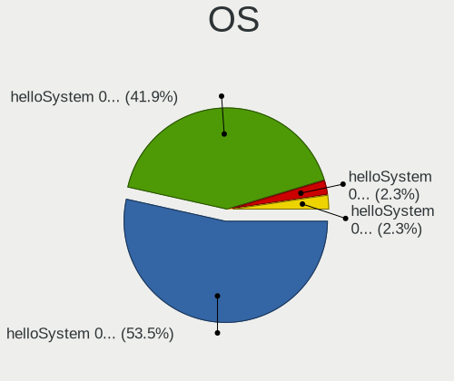
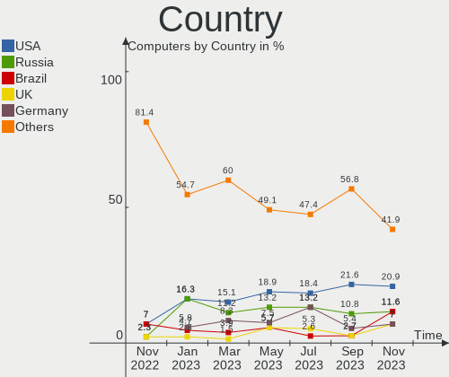
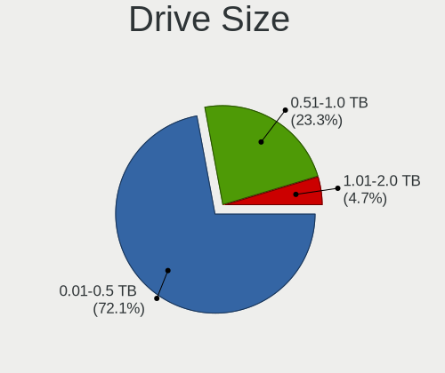

helloSystem - Hardware Trends
-----------------------------

A project to identify most popular hardware characteristics and track their change
over time based on data collected by BSD users at https://BSD-Hardware.info.

Anyone can contribute to this report by the [hw-probe](https://github.com/linuxhw/hw-probe/blob/master/INSTALL.BSD.md) tool:

    hw-probe -all -upload

This is a report for all computer types. See also reports for [desktops](/Dist/helloSystem/Desktop/README.md) and [notebooks](/Dist/helloSystem/Notebook/README.md).

This report is for one last month. Overall report since the beginning of time: [TestDays](https://github.com/bsdhw/TestDays)

Period: Aug, 2023.

Contents
--------

* [ System ](#system)
  - [ OS                       ](#os)
  - [ OS Family                ](#os-family)
  - [ Arch                     ](#arch)
  - [ DE                       ](#de)
  - [ Display Server           ](#display-server)
  - [ Display Manager          ](#display-manager)
  - [ OS Lang                  ](#os-lang)
  - [ Boot Mode                ](#boot-mode)
  - [ Filesystem               ](#filesystem)
  - [ Part. scheme             ](#part-scheme)

* [ Board ](#board)
  - [ Vendor                   ](#vendor)
  - [ Model                    ](#model)
  - [ Model Family             ](#model-family)
  - [ MFG Year                 ](#mfg-year)
  - [ Form Factor              ](#form-factor)
  - [ Coreboot                 ](#coreboot)
  - [ RAM Size                 ](#ram-size)
  - [ RAM Used                 ](#ram-used)
  - [ Total Drives             ](#total-drives)
  - [ Has CD-ROM               ](#has-cd-rom)
  - [ Has Ethernet             ](#has-ethernet)
  - [ Has WiFi                 ](#has-wifi)
  - [ Has Bluetooth            ](#has-bluetooth)

* [ Location ](#location)
  - [ Country                  ](#country)
  - [ City                     ](#city)

* [ Drives ](#drives)
  - [ Drive Vendor             ](#drive-vendor)
  - [ Drive Model              ](#drive-model)
  - [ HDD Vendor               ](#hdd-vendor)
  - [ SSD Vendor               ](#ssd-vendor)
  - [ Drive Kind               ](#drive-kind)
  - [ Drive Connector          ](#drive-connector)
  - [ Drive Size               ](#drive-size)
  - [ Space Total              ](#space-total)
  - [ Space Used               ](#space-used)
  - [ Malfunc. Drives          ](#malfunc-drives)
  - [ Malfunc. Drive Vendor    ](#malfunc-drive-vendor)
  - [ Malfunc. HDD Vendor      ](#malfunc-hdd-vendor)
  - [ Malfunc. Drive Kind      ](#malfunc-drive-kind)
  - [ Failed Drives            ](#failed-drives)
  - [ Failed Drive Vendor      ](#failed-drive-vendor)
  - [ Drive Status             ](#drive-status)

* [ Storage controller ](#storage-controller)
  - [ Storage Vendor           ](#storage-vendor)
  - [ Storage Model            ](#storage-model)
  - [ Storage Kind             ](#storage-kind)

* [ Processor ](#processor)
  - [ CPU Vendor               ](#cpu-vendor)
  - [ CPU Model                ](#cpu-model)
  - [ CPU Model Family         ](#cpu-model-family)
  - [ CPU Cores                ](#cpu-cores)
  - [ CPU Sockets              ](#cpu-sockets)
  - [ CPU Threads              ](#cpu-threads)
  - [ CPU Microarch            ](#cpu-microarch)

* [ Graphics ](#graphics)
  - [ GPU Vendor               ](#gpu-vendor)
  - [ GPU Model                ](#gpu-model)
  - [ GPU Combo                ](#gpu-combo)
  - [ GPU Driver               ](#gpu-driver)
  - [ GPU Memory               ](#gpu-memory)

* [ Monitor ](#monitor)
  - [ Monitor Vendor           ](#monitor-vendor)
  - [ Monitor Model            ](#monitor-model)
  - [ Monitor Resolution       ](#monitor-resolution)
  - [ Monitor Diagonal         ](#monitor-diagonal)
  - [ Monitor Width            ](#monitor-width)
  - [ Aspect Ratio             ](#aspect-ratio)
  - [ Monitor Area             ](#monitor-area)
  - [ Pixel Density            ](#pixel-density)
  - [ Multiple Monitors        ](#multiple-monitors)

* [ Network ](#network)
  - [ Net Controller Vendor    ](#net-controller-vendor)
  - [ Net Controller Model     ](#net-controller-model)
  - [ Wireless Vendor          ](#wireless-vendor)
  - [ Wireless Model           ](#wireless-model)
  - [ Ethernet Vendor          ](#ethernet-vendor)
  - [ Ethernet Model           ](#ethernet-model)
  - [ Net Controller Kind      ](#net-controller-kind)
  - [ Used Controller          ](#used-controller)
  - [ NICs                     ](#nics)
  - [ IPv6                     ](#ipv6)

* [ Bluetooth ](#bluetooth)
  - [ Bluetooth Vendor         ](#bluetooth-vendor)
  - [ Bluetooth Model          ](#bluetooth-model)

* [ Sound ](#sound)
  - [ Sound Vendor             ](#sound-vendor)
  - [ Sound Model              ](#sound-model)

* [ Memory ](#memory)
  - [ Memory Vendor            ](#memory-vendor)
  - [ Memory Model             ](#memory-model)
  - [ Memory Kind              ](#memory-kind)
  - [ Memory Form Factor       ](#memory-form-factor)
  - [ Memory Size              ](#memory-size)
  - [ Memory Speed             ](#memory-speed)

* [ Printers & scanners ](#printers--scanners)
  - [ Printer Vendor           ](#printer-vendor)
  - [ Printer Model            ](#printer-model)
  - [ Scanner Vendor           ](#scanner-vendor)
  - [ Scanner Model            ](#scanner-model)

* [ Camera ](#camera)
  - [ Camera Vendor            ](#camera-vendor)
  - [ Camera Model             ](#camera-model)

* [ Security ](#security)
  - [ Fingerprint Vendor       ](#fingerprint-vendor)
  - [ Fingerprint Model        ](#fingerprint-model)
  - [ Chipcard Vendor          ](#chipcard-vendor)
  - [ Chipcard Model           ](#chipcard-model)

* [ Unsupported ](#unsupported)
  - [ Unsupported Devices      ](#unsupported-devices)
  - [ Unsupported Device Types ](#unsupported-device-types)

System
------

OS
--

Installed operating systems

| Name              | Computers | Percent |
|-------------------|-----------|---------|
| helloSystem 0.8.1 | 33        | 61.11%  |
| helloSystem 0.8.2 | 13        | 24.07%  |
| helloSystem 0.9.0 | 6         | 11.11%  |
| helloSystem 0.8.0 | 2         | 3.7%    |

OS Family
---------

OS without a version

| Name        | Computers | Percent |
|-------------|-----------|---------|
| helloSystem | 54        | 100%    |

Arch
----

OS architecture (x86_64, i586, etc.)

| Name  | Computers | Percent |
|-------|-----------|---------|
| amd64 | 54        | 100%    |

DE
--

Desktop Environment

| Name         | Computers | Percent |
|--------------|-----------|---------|
| helloDesktop | 52        | 96.3%   |
| XFCE         | 1         | 1.85%   |
| KDE5         | 1         | 1.85%   |

Display Server
--------------

X11 or Wayland

| Name | Computers | Percent |
|------|-----------|---------|
| X11  | 54        | 100%    |

Display Manager
---------------

SDDM, LightDM, etc.

| Name    | Computers | Percent |
|---------|-----------|---------|
| SLiM    | 53        | 98.15%  |
| LightDM | 1         | 1.85%   |

OS Lang
-------

Language

| Lang    | Computers | Percent |
|---------|-----------|---------|
| Unknown | 16        | 29.63%  |
| en_US   | 14        | 25.93%  |
| fr_FR   | 7         | 12.96%  |
| pt_BR   | 4         | 7.41%   |
| it_IT   | 3         | 5.56%   |
| es_ES   | 2         | 3.7%    |
| en      | 2         | 3.7%    |
| ru_RU   | 1         | 1.85%   |
| pl_PL   | 1         | 1.85%   |
| nl_NL   | 1         | 1.85%   |
| jp_JP   | 1         | 1.85%   |
| en_UK   | 1         | 1.85%   |
| de_DE   | 1         | 1.85%   |

Boot Mode
---------

EFI or BIOS

| Mode | Computers | Percent |
|------|-----------|---------|
| EFI  | 54        | 100%    |

Filesystem
----------

Type of filesystem

| Type   | Computers | Percent |
|--------|-----------|---------|
| Cd9660 | 30        | 55.56%  |
| Zfs    | 24        | 44.44%  |

Part. scheme
------------

Scheme of partitioning

| Type | Computers | Percent |
|------|-----------|---------|
| GPT  | 54        | 100%    |

Board
-----

Vendor
------

Motherboard manufacturer

| Name                | Computers | Percent |
|---------------------|-----------|---------|
| Lenovo              | 10        | 18.52%  |
| ASUSTek Computer    | 9         | 16.67%  |
| Hewlett-Packard     | 7         | 12.96%  |
| Gigabyte Technology | 5         | 9.26%   |
| MSI                 | 4         | 7.41%   |
| Intel               | 3         | 5.56%   |
| Dell                | 3         | 5.56%   |
| Acer                | 3         | 5.56%   |
| ASRock              | 2         | 3.7%    |
| Toshiba             | 1         | 1.85%   |
| Star Labs           | 1         | 1.85%   |
| NVN-ED01            | 1         | 1.85%   |
| Fujitsu             | 1         | 1.85%   |
| Daten Tecnologia    | 1         | 1.85%   |
| Compaq              | 1         | 1.85%   |
| AZW                 | 1         | 1.85%   |
| ATOPNUC             | 1         | 1.85%   |

Model
-----

Motherboard model

| Name                                     | Computers | Percent |
|------------------------------------------|-----------|---------|
| Toshiba Satellite S55t-B                 | 1         | 1.85%   |
| Star Labs Lite                           | 1         | 1.85%   |
| MSI MS-7C83                              | 1         | 1.85%   |
| MSI MS-7B24                              | 1         | 1.85%   |
| MSI MS-7B17                              | 1         | 1.85%   |
| MSI MS-7996                              | 1         | 1.85%   |
| Lenovo ThinkPad X220 4286CTO             | 1         | 1.85%   |
| Lenovo ThinkPad X200 7458WNZ             | 1         | 1.85%   |
| Lenovo ThinkPad X1 Carbon 2nd 20A7002FUS | 1         | 1.85%   |
| Lenovo ThinkPad T60 1951CZ1              | 1         | 1.85%   |
| Lenovo ThinkPad T490 20RYS06R00          | 1         | 1.85%   |
| Lenovo ThinkPad T450 20BUS0370P          | 1         | 1.85%   |
| Lenovo ThinkPad P50 20EN0009MS           | 1         | 1.85%   |
| Lenovo ThinkCentre M715q 10M2S02Q00      | 1         | 1.85%   |
| Lenovo IdeaPad Gaming 3 15IHU6 82K1      | 1         | 1.85%   |
| Lenovo IdeaPad 110S-11IBR 80WG           | 1         | 1.85%   |
| Intel NUC11TNHi5                         | 1         | 1.85%   |
| Intel Jasper Lake Client Platform        | 1         | 1.85%   |
| Intel H81                                | 1         | 1.85%   |
| HP Z2 Mini G3 Workstation                | 1         | 1.85%   |
| HP ProDesk 400 G3 DM                     | 1         | 1.85%   |
| HP Pavilion dv3500                       | 1         | 1.85%   |
| HP ENVY Notebook 13-ab0XX                | 1         | 1.85%   |
| HP EliteBook 840 G5                      | 1         | 1.85%   |
| HP Compaq dc7800 Convertible Minitower   | 1         | 1.85%   |
| HP 2000                                  | 1         | 1.85%   |
| Gigabyte Z170-HD3 DDR3                   | 1         | 1.85%   |
| Gigabyte GA-880GA-UD3H                   | 1         | 1.85%   |
| Gigabyte G41M-ES2L                       | 1         | 1.85%   |
| Gigabyte F2A88XM-D3H                     | 1         | 1.85%   |
| Gigabyte B550 AORUS ELITE V2             | 1         | 1.85%   |
| Fujitsu FMVA0803D                        | 1         | 1.85%   |
| Dell OptiPlex 7010                       | 1         | 1.85%   |
| Dell Latitude E6420                      | 1         | 1.85%   |
| Dell Latitude E4310                      | 1         | 1.85%   |
| Daten Tecnologia DH110MXV                | 1         | 1.85%   |
| Compaq Presario CQ-17                    | 1         | 1.85%   |
| AZW U59                                  | 1         | 1.85%   |
| ATOPNUC MA90                             | 1         | 1.85%   |
| ASUS X553MA                              | 1         | 1.85%   |

Model Family
------------

Motherboard model prefix

| Name                      | Computers | Percent |
|---------------------------|-----------|---------|
| Lenovo ThinkPad           | 7         | 12.96%  |
| Lenovo IdeaPad            | 2         | 3.7%    |
| Dell Latitude             | 2         | 3.7%    |
| Acer Aspire               | 2         | 3.7%    |
| Toshiba Satellite         | 1         | 1.85%   |
| Star Labs Lite            | 1         | 1.85%   |
| MSI MS-7C83               | 1         | 1.85%   |
| MSI MS-7B24               | 1         | 1.85%   |
| MSI MS-7B17               | 1         | 1.85%   |
| MSI MS-7996               | 1         | 1.85%   |
| Lenovo ThinkCentre        | 1         | 1.85%   |
| Intel NUC11TNHi5          | 1         | 1.85%   |
| Intel Jasper              | 1         | 1.85%   |
| Intel H81                 | 1         | 1.85%   |
| HP Z2                     | 1         | 1.85%   |
| HP ProDesk                | 1         | 1.85%   |
| HP Pavilion               | 1         | 1.85%   |
| HP ENVY                   | 1         | 1.85%   |
| HP EliteBook              | 1         | 1.85%   |
| HP Compaq                 | 1         | 1.85%   |
| HP 2000                   | 1         | 1.85%   |
| Gigabyte Z170-HD3         | 1         | 1.85%   |
| Gigabyte GA-880GA-UD3H    | 1         | 1.85%   |
| Gigabyte G41M-ES2L        | 1         | 1.85%   |
| Gigabyte F2A88XM-D3H      | 1         | 1.85%   |
| Gigabyte B550             | 1         | 1.85%   |
| Fujitsu FMVA0803D         | 1         | 1.85%   |
| Dell OptiPlex             | 1         | 1.85%   |
| Daten Tecnologia DH110MXV | 1         | 1.85%   |
| Compaq Presario           | 1         | 1.85%   |
| AZW U59                   | 1         | 1.85%   |
| ATOPNUC MA90              | 1         | 1.85%   |
| ASUS X553MA               | 1         | 1.85%   |
| ASUS S500CA               | 1         | 1.85%   |
| ASUS ROG                  | 1         | 1.85%   |
| ASUS PRIME                | 1         | 1.85%   |
| ASUS P5QL                 | 1         | 1.85%   |
| ASUS P5G41T-M             | 1         | 1.85%   |
| ASUS M5A78L-M             | 1         | 1.85%   |
| ASUS M4A88TD-M            | 1         | 1.85%   |

MFG Year
--------

Motherboard manufacture year

| Year | Computers | Percent |
|------|-----------|---------|
| 2016 | 8         | 14.81%  |
| 2022 | 7         | 12.96%  |
| 2019 | 6         | 11.11%  |
| 2020 | 4         | 7.41%   |
| 2011 | 4         | 7.41%   |
| 2010 | 4         | 7.41%   |
| 2021 | 3         | 5.56%   |
| 2017 | 3         | 5.56%   |
| 2014 | 3         | 5.56%   |
| 2018 | 2         | 3.7%    |
| 2015 | 2         | 3.7%    |
| 2012 | 2         | 3.7%    |
| 2009 | 2         | 3.7%    |
| 2023 | 1         | 1.85%   |
| 2008 | 1         | 1.85%   |
| 2007 | 1         | 1.85%   |
| 2006 | 1         | 1.85%   |

Form Factor
-----------

Physical design of the computer

| Name     | Computers | Percent |
|----------|-----------|---------|
| Notebook | 25        | 46.3%   |
| Desktop  | 24        | 44.44%  |
| Mini pc  | 5         | 9.26%   |

Coreboot
--------

Have coreboot on board

| Used | Computers | Percent |
|------|-----------|---------|
| No   | 54        | 100%    |

RAM Size
--------

Total RAM memory

| Size in GB  | Computers | Percent |
|-------------|-----------|---------|
| 8.01-16.0   | 23        | 42.59%  |
| 16.01-24.0  | 12        | 22.22%  |
| 4.01-8.0    | 10        | 18.52%  |
| 32.01-64.0  | 4         | 7.41%   |
| 24.01-32.0  | 2         | 3.7%    |
| 3.01-4.0    | 1         | 1.85%   |
| 2.01-3.0    | 1         | 1.85%   |
| 64.01-256.0 | 1         | 1.85%   |

RAM Used
--------

Used RAM memory

| Used GB  | Computers | Percent |
|----------|-----------|---------|
| 0.01-0.5 | 27        | 50%     |
| 0.51-1.0 | 19        | 35.19%  |
| 1.01-2.0 | 6         | 11.11%  |
| 3.01-4.0 | 1         | 1.85%   |
| 2.01-3.0 | 1         | 1.85%   |

Total Drives
------------

Number of drives on board

| Drives | Computers | Percent |
|--------|-----------|---------|
| 1      | 35        | 64.81%  |
| 2      | 6         | 11.11%  |
| 0      | 6         | 11.11%  |
| 3      | 3         | 5.56%   |
| 13     | 1         | 1.85%   |
| 6      | 1         | 1.85%   |
| 5      | 1         | 1.85%   |
| 4      | 1         | 1.85%   |

Has CD-ROM
----------

Has CD-ROM on board

| Presented | Computers | Percent |
|-----------|-----------|---------|
| No        | 35        | 64.81%  |
| Yes       | 19        | 35.19%  |

Has Ethernet
------------

Has Ethernet on board

| Presented | Computers | Percent |
|-----------|-----------|---------|
| Yes       | 48        | 88.89%  |
| No        | 6         | 11.11%  |

Has WiFi
--------

Has WiFi module

| Presented | Computers | Percent |
|-----------|-----------|---------|
| Yes       | 39        | 72.22%  |
| No        | 15        | 27.78%  |

Has Bluetooth
-------------

Has Bluetooth module

| Presented | Computers | Percent |
|-----------|-----------|---------|
| Yes       | 31        | 57.41%  |
| No        | 23        | 42.59%  |

Location
--------

Country
-------

Geographic location (country)

| Country     | Computers | Percent |
|-------------|-----------|---------|
| USA         | 14        | 25.93%  |
| Russia      | 4         | 7.41%   |
| Brazil      | 4         | 7.41%   |
| UK          | 3         | 5.56%   |
| Italy       | 3         | 5.56%   |
| France      | 3         | 5.56%   |
| Canada      | 3         | 5.56%   |
| Poland      | 2         | 3.7%    |
| Peru        | 2         | 3.7%    |
| Indonesia   | 2         | 3.7%    |
| Ukraine     | 1         | 1.85%   |
| Spain       | 1         | 1.85%   |
| Serbia      | 1         | 1.85%   |
| Romania     | 1         | 1.85%   |
| Netherlands | 1         | 1.85%   |
| Mexico      | 1         | 1.85%   |
| Jamaica     | 1         | 1.85%   |
| Hungary     | 1         | 1.85%   |
| Germany     | 1         | 1.85%   |
| Czechia     | 1         | 1.85%   |
| China       | 1         | 1.85%   |
| Belgium     | 1         | 1.85%   |
| Australia   | 1         | 1.85%   |
| Argentina   | 1         | 1.85%   |

City
----

Geographic location (city)

| City             | Computers | Percent |
|------------------|-----------|---------|
| New York         | 2         | 3.7%    |
| Lima             | 2         | 3.7%    |
| Zarautz          | 1         | 1.85%   |
| Wroclaw          | 1         | 1.85%   |
| Winnipeg         | 1         | 1.85%   |
| Vladivostok      | 1         | 1.85%   |
| Trieste          | 1         | 1.85%   |
| Toronto          | 1         | 1.85%   |
| Tianjin          | 1         | 1.85%   |
| Swindon          | 1         | 1.85%   |
| Superior         | 1         | 1.85%   |
| St Petersburg    | 1         | 1.85%   |
| Samatan          | 1         | 1.85%   |
| Redondo Beach    | 1         | 1.85%   |
| Redmond          | 1         | 1.85%   |
| Pruhonice        | 1         | 1.85%   |
| Poltava          | 1         | 1.85%   |
| Paris            | 1         | 1.85%   |
| Oshawa           | 1         | 1.85%   |
| Orlando          | 1         | 1.85%   |
| New Braunfels    | 1         | 1.85%   |
| Mosina           | 1         | 1.85%   |
| Milwaukee        | 1         | 1.85%   |
| Marion           | 1         | 1.85%   |
| Manvel           | 1         | 1.85%   |
| Manoel Vitorino  | 1         | 1.85%   |
| Manchester       | 1         | 1.85%   |
| Lower Belle      | 1         | 1.85%   |
| Los Angeles      | 1         | 1.85%   |
| London           | 1         | 1.85%   |
| Largo            | 1         | 1.85%   |
| Kingston         | 1         | 1.85%   |
| Kingisepp        | 1         | 1.85%   |
| Jakarta          | 1         | 1.85%   |
| Indianapolis     | 1         | 1.85%   |
| Grottaglie       | 1         | 1.85%   |
| Fleurus          | 1         | 1.85%   |
| Fiorano Modenese | 1         | 1.85%   |
| Farges           | 1         | 1.85%   |
| Eger             | 1         | 1.85%   |

Drives
------

Drive Vendor
------------

Hard drive vendors

| Vendor              | Computers | Drives | Percent |
|---------------------|-----------|--------|---------|
| Samsung Electronics | 9         | 10     | 13.04%  |
| WDC                 | 8         | 14     | 11.59%  |
| Seagate             | 8         | 17     | 11.59%  |
| Crucial             | 6         | 6      | 8.7%    |
| Toshiba             | 5         | 5      | 7.25%   |
| Kingston            | 5         | 5      | 7.25%   |
| SPCC                | 2         | 2      | 2.9%    |
| SanDisk             | 2         | 2      | 2.9%    |
| China               | 2         | 2      | 2.9%    |
| WALRAM              | 1         | 1      | 1.45%   |
| Transcend           | 1         | 1      | 1.45%   |
| Star Drive          | 1         | 1      | 1.45%   |
| SK hynix            | 1         | 1      | 1.45%   |
| SCY                 | 1         | 1      | 1.45%   |
| Pioneer             | 1         | 1      | 1.45%   |
| Phison              | 1         | 1      | 1.45%   |
| Micron Technology   | 1         | 1      | 1.45%   |
| Maxtor              | 1         | 1      | 1.45%   |
| KingSpec            | 1         | 1      | 1.45%   |
| Intenso             | 1         | 1      | 1.45%   |
| Intel               | 1         | 1      | 1.45%   |
| Hitachi             | 1         | 1      | 1.45%   |
| HGST                | 1         | 1      | 1.45%   |
| HEORIADY            | 1         | 1      | 1.45%   |
| GOODRAM             | 1         | 1      | 1.45%   |
| Gigabyte Technology | 1         | 1      | 1.45%   |
| Fujitsu             | 1         | 1      | 1.45%   |
| Corsair             | 1         | 1      | 1.45%   |
| BHT                 | 1         | 1      | 1.45%   |
| Azerty              | 1         | 1      | 1.45%   |
| A-DATA Technology   | 1         | 1      | 1.45%   |

Drive Model
-----------

Hard drive models

| Model                                        | Computers | Percent |
|----------------------------------------------|-----------|---------|
| Crucial CT500MX500SSD1 500GB                 | 2         | 2.5%    |
| WDC WD5000AAKX-60U6AA0 500GB                 | 1         | 1.25%   |
| WDC WD40EFRX-68N32N0 4TB                     | 1         | 1.25%   |
| WDC WD3200BPVT-80JJ5T0 320GB                 | 1         | 1.25%   |
| WDC WD3200BPVT-75JJ5T0 320GB                 | 1         | 1.25%   |
| WDC WD20EZRZ-22Z5HB0 2TB                     | 1         | 1.25%   |
| WDC WD20EZRX-00D8PB0 2TB                     | 1         | 1.25%   |
| WDC WD20EFRX-68EUZN0 2TB                     | 1         | 1.25%   |
| WDC WD20EARS-00MVWB0 2TB                     | 1         | 1.25%   |
| WDC WD10SPZX-00Z10T0 1TB                     | 1         | 1.25%   |
| WDC WD10EZEX-60WN4A1 1TB                     | 1         | 1.25%   |
| WDC WD10EZEX-60M2NA0 1TB                     | 1         | 1.25%   |
| WDC WD10EADS-11M2B2 1TB                      | 1         | 1.25%   |
| WDC PC SN530 SDBPNPZ-256G-1014 256GB         | 1         | 1.25%   |
| WALRAM SSD 1TB                               | 1         | 1.25%   |
| Transcend TS512GMTE220S 512GB                | 1         | 1.25%   |
| Toshiba Q300 240GB                           | 1         | 1.25%   |
| Toshiba MQ01ABD100 1TB                       | 1         | 1.25%   |
| Toshiba MQ01ABD050V 500GB                    | 1         | 1.25%   |
| Toshiba MK8034GSX 80GB                       | 1         | 1.25%   |
| Toshiba HDWD110 1TB                          | 1         | 1.25%   |
| Star Drive SATA SSD 240GB                    | 1         | 1.25%   |
| SPCC Solid State Disk 128GB                  | 1         | 1.25%   |
| SPCC M.2 PCIE SSD 512GB                      | 1         | 1.25%   |
| SK hynix BC501 HFM128GDJTNG-8310A 128GB      | 1         | 1.25%   |
| Seagate ST8000VN0022-2EL112 8TB              | 1         | 1.25%   |
| Seagate ST8000DM004-2U9188 8TB               | 1         | 1.25%   |
| Seagate ST8000DM004-2CX188 8TB               | 1         | 1.25%   |
| Seagate ST3250312AS 250GB                    | 1         | 1.25%   |
| Seagate ST31000528AS 1TB                     | 1         | 1.25%   |
| Seagate ST250DM000-1BD141 250GB              | 1         | 1.25%   |
| Seagate ST2000DM006-2DM164 2TB               | 1         | 1.25%   |
| Seagate ST2000DM001-1ER164 2TB               | 1         | 1.25%   |
| Seagate ST1000LM025 HN-M101ABB 1TB           | 1         | 1.25%   |
| Seagate ST1000DM010-2EP102 1TB               | 1         | 1.25%   |
| Seagate ST1000DM005 HD103SJ 1TB              | 1         | 1.25%   |
| Seagate ST1000DM003-1CH162 1TB               | 1         | 1.25%   |
| Seagate BarraCuda 510 SSD ZP512CM30011 512GB | 1         | 1.25%   |
| SCY SNM4BBG12800D 128GB                      | 1         | 1.25%   |
| SanDisk SD8SN8U128G1002 128GB                | 1         | 1.25%   |

HDD Vendor
----------

Hard disk drive vendors

| Vendor  | Computers | Drives | Percent |
|---------|-----------|--------|---------|
| WDC     | 8         | 13     | 34.78%  |
| Seagate | 7         | 16     | 30.43%  |
| Toshiba | 4         | 4      | 17.39%  |
| Maxtor  | 1         | 1      | 4.35%   |
| Hitachi | 1         | 1      | 4.35%   |
| HGST    | 1         | 1      | 4.35%   |
| Fujitsu | 1         | 1      | 4.35%   |

SSD Vendor
----------

Solid state drive vendors

| Vendor              | Computers | Drives | Percent |
|---------------------|-----------|--------|---------|
| Crucial             | 5         | 5      | 16.67%  |
| Samsung Electronics | 4         | 5      | 13.33%  |
| Kingston            | 3         | 3      | 10%     |
| SanDisk             | 2         | 2      | 6.67%   |
| China               | 2         | 2      | 6.67%   |
| WALRAM              | 1         | 1      | 3.33%   |
| Toshiba             | 1         | 1      | 3.33%   |
| Star Drive          | 1         | 1      | 3.33%   |
| SPCC                | 1         | 1      | 3.33%   |
| SCY                 | 1         | 1      | 3.33%   |
| Pioneer             | 1         | 1      | 3.33%   |
| KingSpec            | 1         | 1      | 3.33%   |
| Intenso             | 1         | 1      | 3.33%   |
| HEORIADY            | 1         | 1      | 3.33%   |
| GOODRAM             | 1         | 1      | 3.33%   |
| Corsair             | 1         | 1      | 3.33%   |
| BHT                 | 1         | 1      | 3.33%   |
| Azerty              | 1         | 1      | 3.33%   |
| A-DATA Technology   | 1         | 1      | 3.33%   |

Drive Kind
----------

HDD or SSD

| Kind | Computers | Drives | Percent |
|------|-----------|--------|---------|
| SSD  | 26        | 31     | 40.63%  |
| HDD  | 21        | 37     | 32.81%  |
| NVMe | 17        | 17     | 26.56%  |

Drive Connector
---------------

SATA, SAS, NVMe, etc.

| Type | Computers | Drives | Percent |
|------|-----------|--------|---------|
| SATA | 39        | 68     | 69.64%  |
| NVMe | 17        | 17     | 30.36%  |

Drive Size
----------

Size of hard drive

| Size in TB | Computers | Drives | Percent |
|------------|-----------|--------|---------|
| 0.01-0.5   | 31        | 34     | 60.78%  |
| 0.51-1.0   | 13        | 17     | 25.49%  |
| 1.01-2.0   | 5         | 10     | 9.8%    |
| 3.01-4.0   | 1         | 2      | 1.96%   |
| 4.01-10.0  | 1         | 5      | 1.96%   |

Space Total
-----------

Amount of disk space available on the file system

| Size in GB | Computers | Percent |
|------------|-----------|---------|
| 1-20       | 26        | 48.15%  |
| 251-500    | 13        | 24.07%  |
| 101-250    | 5         | 9.26%   |
| 51-100     | 4         | 7.41%   |
| 21-50      | 3         | 5.56%   |
| 501-1000   | 2         | 3.7%    |
| 1001-2000  | 1         | 1.85%   |

Space Used
----------

Amount of used disk space

| Used GB | Computers | Percent |
|---------|-----------|---------|
| 1-20    | 51        | 94.44%  |
| 101-250 | 2         | 3.7%    |
| 251-500 | 1         | 1.85%   |

Malfunc. Drives
---------------

Drive models with a malfunction

| Model                               | Computers | Drives | Percent |
|-------------------------------------|-----------|--------|---------|
| WDC WD5000AAKX-60U6AA0 500GB        | 1         | 1      | 9.09%   |
| WDC WD20EARS-00MVWB0 2TB            | 1         | 1      | 9.09%   |
| WDC WD10EZEX-60M2NA0 1TB            | 1         | 1      | 9.09%   |
| WDC WD10EADS-11M2B2 1TB             | 1         | 1      | 9.09%   |
| Toshiba MK8034GSX 80GB              | 1         | 1      | 9.09%   |
| Seagate ST3250312AS 250GB           | 1         | 1      | 9.09%   |
| Samsung Electronics SSD 870 EVO 2TB | 1         | 1      | 9.09%   |
| Samsung Electronics SSD 850 EVO 1TB | 1         | 1      | 9.09%   |
| Maxtor 6Y120M0 122GB                | 1         | 1      | 9.09%   |
| Hitachi HTS545050A7E380 500GB       | 1         | 1      | 9.09%   |
| HGST HTS725050A7E635 OPAL 500GB     | 1         | 1      | 9.09%   |

Malfunc. Drive Vendor
---------------------

Vendors of faulty drives

| Vendor              | Computers | Drives | Percent |
|---------------------|-----------|--------|---------|
| WDC                 | 3         | 4      | 33.33%  |
| Toshiba             | 1         | 1      | 11.11%  |
| Seagate             | 1         | 1      | 11.11%  |
| Samsung Electronics | 1         | 2      | 11.11%  |
| Maxtor              | 1         | 1      | 11.11%  |
| Hitachi             | 1         | 1      | 11.11%  |
| HGST                | 1         | 1      | 11.11%  |

Malfunc. HDD Vendor
-------------------

Vendors of faulty HDD drives

| Vendor  | Computers | Drives | Percent |
|---------|-----------|--------|---------|
| WDC     | 3         | 4      | 37.5%   |
| Toshiba | 1         | 1      | 12.5%   |
| Seagate | 1         | 1      | 12.5%   |
| Maxtor  | 1         | 1      | 12.5%   |
| Hitachi | 1         | 1      | 12.5%   |
| HGST    | 1         | 1      | 12.5%   |

Malfunc. Drive Kind
-------------------

Kinds of faulty drives

| Kind | Computers | Drives | Percent |
|------|-----------|--------|---------|
| HDD  | 8         | 9      | 88.89%  |
| SSD  | 1         | 2      | 11.11%  |

Failed Drives
-------------

Failed drive models

| Model              | Computers | Drives | Percent |
|--------------------|-----------|--------|---------|
| SanDisk pSSD 256GB | 1         | 1      | 100%    |

Failed Drive Vendor
-------------------

Failed drive vendors

| Vendor  | Computers | Drives | Percent |
|---------|-----------|--------|---------|
| SanDisk | 1         | 1      | 100%    |

Drive Status
------------

Number of failed and malfunc. drives

| Status   | Computers | Drives | Percent |
|----------|-----------|--------|---------|
| Works    | 42        | 72     | 79.25%  |
| Malfunc  | 9         | 11     | 16.98%  |
| Detected | 1         | 1      | 1.89%   |
| Failed   | 1         | 1      | 1.89%   |

Storage controller
------------------

Storage Vendor
--------------

Storage controller vendors

| Vendor                      | Computers | Percent |
|-----------------------------|-----------|---------|
| Intel                       | 41        | 56.94%  |
| AMD                         | 11        | 15.28%  |
| Samsung Electronics         | 5         | 6.94%   |
| Silicon Motion              | 2         | 2.78%   |
| Phison Electronics          | 2         | 2.78%   |
| Kingston Technology Company | 2         | 2.78%   |
| VIA Technologies            | 1         | 1.39%   |
| SK hynix                    | 1         | 1.39%   |
| Seagate Technology          | 1         | 1.39%   |
| SanDisk                     | 1         | 1.39%   |
| Micron/Crucial Technology   | 1         | 1.39%   |
| Micron Technology           | 1         | 1.39%   |
| Marvell Technology Group    | 1         | 1.39%   |
| JMicron Technology          | 1         | 1.39%   |
| ASMedia Technology          | 1         | 1.39%   |

Storage Model
-------------

Storage controller models

| Model                                                                            | Computers | Percent |
|----------------------------------------------------------------------------------|-----------|---------|
| Intel Q170/Q150/B150/H170/H110/Z170/CM236 Chipset SATA Controller [AHCI Mode]    | 6         | 6.98%   |
| AMD FCH SATA Controller [AHCI mode]                                              | 6         | 6.98%   |
| AMD SB7x0/SB8x0/SB9x0 SATA Controller [IDE mode]                                 | 3         | 3.49%   |
| AMD SB7x0/SB8x0/SB9x0 IDE Controller                                             | 3         | 3.49%   |
| AMD 400 Series Chipset SATA Controller                                           | 3         | 3.49%   |
| Samsung NVMe SSD Controller SM961/PM961/SM963                                    | 2         | 2.33%   |
| Samsung NVMe SSD Controller SM951/PM951                                          | 2         | 2.33%   |
| Intel Wildcat Point-LP SATA Controller [AHCI Mode]                               | 2         | 2.33%   |
| Intel Tiger Lake-LP SATA Controller                                              | 2         | 2.33%   |
| Intel NM10/ICH7 Family SATA Controller [IDE mode]                                | 2         | 2.33%   |
| Intel Jasper Lake SATA AHCI Controller                                           | 2         | 2.33%   |
| Intel Celeron N3350/Pentium N4200/Atom E3900 Series SATA AHCI Controller         | 2         | 2.33%   |
| Intel Cannon Lake PCH SATA AHCI Controller                                       | 2         | 2.33%   |
| Intel 82801IBM/IEM (ICH9M/ICH9M-E) 4 port SATA Controller [AHCI mode]            | 2         | 2.33%   |
| Intel 82801G (ICH7 Family) IDE Controller                                        | 2         | 2.33%   |
| Intel 8 Series/C220 Series Chipset Family 6-port SATA Controller 1 [AHCI mode]   | 2         | 2.33%   |
| Intel 8 Series SATA Controller 1 [AHCI mode]                                     | 2         | 2.33%   |
| Intel 6 Series/C200 Series Chipset Family 6 port Mobile SATA AHCI Controller     | 2         | 2.33%   |
| VIA VT6415 PATA IDE Host Controller                                              | 1         | 1.16%   |
| SK hynix BC501 NVMe Solid State Drive                                            | 1         | 1.16%   |
| Silicon Motion SM2263EN/SM2263XT (DRAM-less) NVMe SSD Controllers                | 1         | 1.16%   |
| Silicon Motion SM2262/SM2262EN SSD Controller                                    | 1         | 1.16%   |
| Seagate FireCuda/IronWolf 510 SSD                                                | 1         | 1.16%   |
| SanDisk WD Blue SN550 NVMe SSD                                                   | 1         | 1.16%   |
| Samsung NVMe SSD Controller SM981/PM981/PM983                                    | 1         | 1.16%   |
| Phison PS5013 E13 NVMe Controller                                                | 1         | 1.16%   |
| Phison E12 NVMe Controller                                                       | 1         | 1.16%   |
| Micron/Crucial P5 NVMe PCIe SSD[SlashP5]                                         | 1         | 1.16%   |
| Micron 2210 NVMe SSD [Cobain]                                                    | 1         | 1.16%   |
| Marvell Group 88SE9215 PCIe 2.0 x1 4-port SATA 6 Gb/s Controller                 | 1         | 1.16%   |
| Kingston Company unknown                                                         | 1         | 1.16%   |
| Kingston Company OM8PCP Design-In PCIe 3 NVMe SSD (DRAM-less)                    | 1         | 1.16%   |
| JMicron JMB363 SATA/IDE Controller                                               | 1         | 1.16%   |
| Intel Volume Management Device NVMe RAID Controller                              | 1         | 1.16%   |
| Intel Sunrise Point-LP SATA Controller [AHCI mode]                               | 1         | 1.16%   |
| Intel NVMe Optane Memory Series                                                  | 1         | 1.16%   |
| Intel Ice Lake-LP SATA Controller [AHCI mode]                                    | 1         | 1.16%   |
| Intel HM170/QM170 Chipset SATA Controller [AHCI Mode]                            | 1         | 1.16%   |
| Intel Celeron/Pentium Silver Processor SATA Controller                           | 1         | 1.16%   |
| Intel Atom/Celeron/Pentium Processor x5-E8000/J3xxx/N3xxx Series SATA Controller | 1         | 1.16%   |

Storage Kind
------------

Kind of storage controller (IDE, SATA, NVMe, SAS, ...)

| Kind | Computers | Percent |
|------|-----------|---------|
| SATA | 43        | 59.72%  |
| NVMe | 17        | 23.61%  |
| IDE  | 10        | 13.89%  |
| RAID | 2         | 2.78%   |

Processor
---------

CPU Vendor
----------

Processor vendors

| Vendor | Computers | Percent |
|--------|-----------|---------|
| Intel  | 43        | 79.63%  |
| AMD    | 11        | 20.37%  |

CPU Model
---------

Processor models

| Model                                | Computers | Percent |
|--------------------------------------|-----------|---------|
| Intel Celeron N5105 @ 2.00GHz        | 2         | 3.7%    |
| Intel Xeon CPU E3-1535M v5 @ 2.90GHz | 1         | 1.85%   |
| Intel Pentium Dual-Core CPU E5       | 1         | 1.85%   |
| Intel Pentium CPU N4200 @ 1.10GHz    | 1         | 1.85%   |
| Intel Core i7-8700K CPU @ 3.70GHz    | 1         | 1.85%   |
| Intel Core i7-8550U CPU @ 1.80GHz    | 1         | 1.85%   |
| Intel Core i7-7700HQ CPU @ 2.80GHz   | 1         | 1.85%   |
| Intel Core i7-6700 CPU @ 3.40GHz     | 1         | 1.85%   |
| Intel Core i7-3770 CPU @ 3.40GHz     | 1         | 1.85%   |
| Intel Core i7-2620M CPU @ 2.70GHz    | 1         | 1.85%   |
| Intel Core i7-10510U CPU @ 1.80GHz   | 1         | 1.85%   |
| Intel Core i5-8400 CPU @ 2.80GHz     | 1         | 1.85%   |
| Intel Core i5-7600 CPU @ 3.50GHz     | 1         | 1.85%   |
| Intel Core i5-7500T CPU @ 2.70GHz    | 1         | 1.85%   |
| Intel Core i5-7200U CPU @ 2.50GHz    | 1         | 1.85%   |
| Intel Core i5-6600 CPU @ 3.30GHz     | 1         | 1.85%   |
| Intel Core i5-6500 CPU @ 3.20GHz     | 1         | 1.85%   |
| Intel Core i5-5300U CPU @ 2.30GHz    | 1         | 1.85%   |
| Intel Core i5-5200U CPU @ 2.20GHz    | 1         | 1.85%   |
| Intel Core i5-4440 CPU @ 3.10GHz     | 1         | 1.85%   |
| Intel Core i5-4210M CPU @ 2.60GHz    | 1         | 1.85%   |
| Intel Core i5-4200U CPU @ 1.60GHz    | 1         | 1.85%   |
| Intel Core i5-3317U CPU @ 1.70GHz    | 1         | 1.85%   |
| Intel Core i5-2540M CPU @ 2.60GH     | 1         | 1.85%   |
| Intel Core i5-10400F CPU @ 2.90GHz   | 1         | 1.85%   |
| Intel Core i5-1035G1 CPU @ 1.00GHz   | 1         | 1.85%   |
| Intel Core i5 CPU M 540 @ 2.53GH     | 1         | 1.85%   |
| Intel Core i3-6100 CPU @ 3.70GHz     | 1         | 1.85%   |
| Intel Core i3-4030U CPU @ 1.90GHz    | 1         | 1.85%   |
| Intel Core 2 Duo CPU P8600 @ 2.40GHz | 1         | 1.85%   |
| Intel Core 2 Duo CPU P7350 @ 2.00GHz | 1         | 1.85%   |
| Intel Core 2 Duo CPU E8500 @ 3.16GHz | 1         | 1.85%   |
| Intel Core 2 Duo CPU E7400 @ 2.80GHz | 1         | 1.85%   |
| Intel Core 2 Duo CPU E4400 @ 2.00GHz | 1         | 1.85%   |
| Intel Core 2 CPU                     | 1         | 1.85%   |
| Intel Celeron N4000 CPU @ 1.10GHz    | 1         | 1.85%   |
| Intel Celeron CPU N3350 @ 1.10GHz    | 1         | 1.85%   |
| Intel Celeron CPU N3060 @ 1.60GHz    | 1         | 1.85%   |
| Intel Celeron CPU N2840 @ 2.16GHz    | 1         | 1.85%   |
| Intel Celeron CPU 887 @ 1.50GHz      | 1         | 1.85%   |

CPU Model Family
----------------

Processor model prefix

| Model                   | Computers | Percent |
|-------------------------|-----------|---------|
| Intel Core i5           | 16        | 29.63%  |
| Intel Core i7           | 7         | 12.96%  |
| Intel Celeron           | 7         | 12.96%  |
| Intel Core 2 Duo        | 5         | 9.26%   |
| AMD Ryzen 5             | 4         | 7.41%   |
| Other                   | 3         | 5.56%   |
| Intel Core i3           | 2         | 3.7%    |
| Intel Xeon              | 1         | 1.85%   |
| Intel Pentium Dual-Core | 1         | 1.85%   |
| Intel Pentium           | 1         | 1.85%   |
| Intel Core 2            | 1         | 1.85%   |
| AMD PRO A10             | 1         | 1.85%   |
| AMD Phenom II X6        | 1         | 1.85%   |
| AMD FX                  | 1         | 1.85%   |
| AMD E2                  | 1         | 1.85%   |
| AMD Athlon II X2        | 1         | 1.85%   |
| AMD A8                  | 1         | 1.85%   |

CPU Cores
---------

Number of processor cores

| Number  | Computers | Percent |
|---------|-----------|---------|
| 2       | 22        | 40.74%  |
| 4       | 20        | 37.04%  |
| 6       | 4         | 7.41%   |
| Unknown | 4         | 7.41%   |
| 12      | 2         | 3.7%    |
| 8       | 2         | 3.7%    |

CPU Sockets
-----------

Number of sockets

| Number | Computers | Percent |
|--------|-----------|---------|
| 1      | 54        | 100%    |

CPU Threads
-----------

Threads per core (Hyper-Threading)

| Number  | Computers | Percent |
|---------|-----------|---------|
| 1       | 28        | 51.85%  |
| 2       | 22        | 40.74%  |
| Unknown | 4         | 7.41%   |

CPU Microarch
-------------

Microarchitecture

| Name          | Computers | Percent |
|---------------|-----------|---------|
| KabyLake      | 8         | 14.81%  |
| Skylake       | 5         | 9.26%   |
| Penryn        | 5         | 9.26%   |
| Haswell       | 4         | 7.41%   |
| SandyBridge   | 3         | 5.56%   |
| Zen+          | 2         | 3.7%    |
| TigerLake     | 2         | 3.7%    |
| Silvermont    | 2         | 3.7%    |
| K10           | 2         | 3.7%    |
| IvyBridge     | 2         | 3.7%    |
| Goldmont      | 2         | 3.7%    |
| Excavator     | 2         | 3.7%    |
| Core          | 2         | 3.7%    |
| Broadwell     | 2         | 3.7%    |
| Unknown       | 2         | 3.7%    |
| Zen 3         | 1         | 1.85%   |
| Zen           | 1         | 1.85%   |
| Westmere      | 1         | 1.85%   |
| Steamroller   | 1         | 1.85%   |
| Piledriver    | 1         | 1.85%   |
| IceLake       | 1         | 1.85%   |
| Goldmont plus | 1         | 1.85%   |
| CometLake     | 1         | 1.85%   |
| Bobcat        | 1         | 1.85%   |

Graphics
--------

GPU Vendor
----------

Vendors of graphics cards

| Vendor | Computers | Percent |
|--------|-----------|---------|
| Intel  | 34        | 59.65%  |
| AMD    | 13        | 22.81%  |
| Nvidia | 10        | 17.54%  |

GPU Model
---------

Graphics card models

| Model                                                                                    | Computers | Percent |
|------------------------------------------------------------------------------------------|-----------|---------|
| Intel HD Graphics 630                                                                    | 3         | 5.17%   |
| Intel 2nd Generation Core Processor Family Integrated Graphics Controller                | 3         | 5.17%   |
| Intel TigerLake-LP GT2 [Iris Xe Graphics]                                                | 2         | 3.45%   |
| Intel JasperLake [UHD Graphics]                                                          | 2         | 3.45%   |
| Intel HD Graphics 5500                                                                   | 2         | 3.45%   |
| Intel HD Graphics 530                                                                    | 2         | 3.45%   |
| Intel Haswell-ULT Integrated Graphics Controller                                         | 2         | 3.45%   |
| Nvidia TU117M [GeForce GTX 1650 Mobile / Max-Q]                                          | 1         | 1.72%   |
| Nvidia TU106 [GeForce RTX 2070 Rev. A]                                                   | 1         | 1.72%   |
| Nvidia GP107M [GeForce GTX 1050 Mobile]                                                  | 1         | 1.72%   |
| Nvidia GP106 [GeForce GTX 1060 6GB]                                                      | 1         | 1.72%   |
| Nvidia GP102 [GeForce GTX 1080 Ti]                                                       | 1         | 1.72%   |
| Nvidia GM107GLM [Quadro M620 Mobile]                                                     | 1         | 1.72%   |
| Nvidia GM107GLM [Quadro M2000M]                                                          | 1         | 1.72%   |
| Nvidia GK208B [GeForce GT 710]                                                           | 1         | 1.72%   |
| Nvidia G98M [GeForce 9300M GS]                                                           | 1         | 1.72%   |
| Nvidia G84GL [Quadro FX 570]                                                             | 1         | 1.72%   |
| Intel Xeon E3-1200 v3/4th Gen Core Processor Integrated Graphics Controller              | 1         | 1.72%   |
| Intel UHD Graphics 620                                                                   | 1         | 1.72%   |
| Intel Mobile 945GM/GMS/GME, 943/940GML Express Integrated Graphics Controller            | 1         | 1.72%   |
| Intel Mobile 945GM/GMS, 943/940GML Express Integrated Graphics Controller                | 1         | 1.72%   |
| Intel Mobile 4 Series Chipset Integrated Graphics Controller                             | 1         | 1.72%   |
| Intel IvyBridge GT2 [HD Graphics 4000]                                                   | 1         | 1.72%   |
| Intel Iris Plus Graphics G1 (Ice Lake)                                                   | 1         | 1.72%   |
| Intel HD Graphics P530                                                                   | 1         | 1.72%   |
| Intel HD Graphics 620                                                                    | 1         | 1.72%   |
| Intel HD Graphics 500                                                                    | 1         | 1.72%   |
| Intel GeminiLake [UHD Graphics 600]                                                      | 1         | 1.72%   |
| Intel Core Processor Integrated Graphics Controller                                      | 1         | 1.72%   |
| Intel CometLake-U GT2 [UHD Graphics]                                                     | 1         | 1.72%   |
| Intel Atom/Celeron/Pentium Processor x5-E8000/J3xxx/N3xxx Integrated Graphics Controller | 1         | 1.72%   |
| Intel Atom Processor Z36xxx/Z37xxx Series Graphics & Display                             | 1         | 1.72%   |
| Intel Apollo Lake [HD Graphics 505]                                                      | 1         | 1.72%   |
| Intel 82Q35 Express Integrated Graphics Controller                                       | 1         | 1.72%   |
| Intel 4th Gen Core Processor Integrated Graphics Controller                              | 1         | 1.72%   |
| Intel 3rd Gen Core processor Graphics Controller                                         | 1         | 1.72%   |
| AMD Wrestler [Radeon HD 7340]                                                            | 1         | 1.72%   |
| AMD Wani [Radeon R5/R6/R7 Graphics]                                                      | 1         | 1.72%   |
| AMD Vega 10 XL/XT [Radeon RX Vega 56/64]                                                 | 1         | 1.72%   |
| AMD Stoney [Radeon R2/R3/R4/R5 Graphics]                                                 | 1         | 1.72%   |

GPU Combo
---------

Combinations of graphics cards

| Name           | Computers | Percent |
|----------------|-----------|---------|
| 1 x Intel      | 28        | 51.85%  |
| 1 x AMD        | 13        | 24.07%  |
| 1 x Nvidia     | 7         | 12.96%  |
| 2 x Intel      | 3         | 5.56%   |
| Intel + Nvidia | 3         | 5.56%   |

GPU Driver
----------

Free vs proprietary

| Driver      | Computers | Percent |
|-------------|-----------|---------|
| Free        | 47        | 87.04%  |
| Proprietary | 6         | 11.11%  |
| Unknown     | 1         | 1.85%   |

GPU Memory
----------

Total video memory

| Size in GB | Computers | Percent |
|------------|-----------|---------|
| Unknown    | 42        | 77.78%  |
| 0.51-1.0   | 4         | 7.41%   |
| 7.01-8.0   | 2         | 3.7%    |
| 1.01-2.0   | 2         | 3.7%    |
| 0.01-0.5   | 2         | 3.7%    |
| 5.01-6.0   | 1         | 1.85%   |
| 8.01-16.0  | 1         | 1.85%   |

Monitor
-------

Monitor Vendor
--------------

Monitor vendors

| Vendor                  | Computers | Percent |
|-------------------------|-----------|---------|
| AU Optronics            | 6         | 13.33%  |
| LG Display              | 5         | 11.11%  |
| Goldstar                | 5         | 11.11%  |
| BenQ                    | 4         | 8.89%   |
| AOC                     | 3         | 6.67%   |
| Sharp                   | 2         | 4.44%   |
| Lenovo                  | 2         | 4.44%   |
| Hewlett-Packard         | 2         | 4.44%   |
| Chimei Innolux          | 2         | 4.44%   |
| Chi Mei Optoelectronics | 2         | 4.44%   |
| BOE                     | 2         | 4.44%   |
| ViewSonic               | 1         | 2.22%   |
| Samsung Electronics     | 1         | 2.22%   |
| RS                      | 1         | 2.22%   |
| ITE                     | 1         | 2.22%   |
| InfoVision              | 1         | 2.22%   |
| Gigabyte Technology     | 1         | 2.22%   |
| Dell                    | 1         | 2.22%   |
| ASUSTek Computer        | 1         | 2.22%   |
| Ancor Communications    | 1         | 2.22%   |
| Acer                    | 1         | 2.22%   |

Monitor Model
-------------

Monitor models

| Model                                                                    | Computers | Percent |
|--------------------------------------------------------------------------|-----------|---------|
| ViewSonic VX2250 SERIES VSCCB25 1920x1080 480x270mm 21.7-inch            | 1         | 2.22%   |
| Sharp LCD Monitor SHP143B 3840x2160 350x190mm 15.7-inch                  | 1         | 2.22%   |
| Sharp HDMI SHP0FD0 1360x768                                              | 1         | 2.22%   |
| Samsung Electronics LF27T370F SAM711E 1920x1080 600x340mm 27.2-inch      | 1         | 2.22%   |
| RS LM-1702 BTC1702 1280x1024 340x270mm 17.1-inch                         | 1         | 2.22%   |
| LG Display LCD Monitor LGD04E8 1920x1080 380x210mm 17.1-inch             | 1         | 2.22%   |
| LG Display LCD Monitor LGD04A7 1920x1080 340x190mm 15.3-inch             | 1         | 2.22%   |
| LG Display LCD Monitor LGD0470 1920x1080 350x190mm 15.7-inch             | 1         | 2.22%   |
| LG Display LCD Monitor LGD02D3 1366x768 280x160mm 12.7-inch              | 1         | 2.22%   |
| LG Display LCD Monitor LGD024D 1366x768 290x170mm 13.2-inch              | 1         | 2.22%   |
| Lenovo LCD Monitor LEN4022 1400x1050 290x210mm 14.1-inch                 | 1         | 2.22%   |
| Lenovo LCD Monitor LEN4010 1280x800 260x160mm 12.0-inch                  | 1         | 2.22%   |
| ITE DP2VGA V235 ITE6516 1920x1080 600x340mm 27.2-inch                    | 1         | 2.22%   |
| InfoVision LCD Monitor IVO048E 1366x768 260x140mm 11.6-inch              | 1         | 2.22%   |
| Hewlett-Packard w2007 HWP26A6 1680x1050 430x270mm 20.0-inch              | 1         | 2.22%   |
| Hewlett-Packard 32 Display HPN351A 1920x1080 700x390mm 31.5-inch         | 1         | 2.22%   |
| Goldstar W1934 GSM4B7A 1440x900 410x260mm 19.1-inch                      | 1         | 2.22%   |
| Goldstar LG IPS FULLHD GSM5AB8 1920x1080 480x270mm 21.7-inch             | 1         | 2.22%   |
| Goldstar E2242 GSM58BE 1920x1080 480x270mm 21.7-inch                     | 1         | 2.22%   |
| Goldstar 22EA53 GSM59A6 1920x1080 480x270mm 21.7-inch                    | 1         | 2.22%   |
| Goldstar 20EN43 GSM4EE3 1600x900 450x250mm 20.3-inch                     | 1         | 2.22%   |
| Gigabyte Technology G27Q GBT2709 2560x1440 600x330mm 27.0-inch           | 1         | 2.22%   |
| Dell S2421H DEL41EF 1920x1080 530x300mm 24.0-inch                        | 1         | 2.22%   |
| Chimei Innolux LCD Monitor CMN15E7 1920x1080 340x190mm 15.3-inch         | 1         | 2.22%   |
| Chimei Innolux LCD Monitor CMN1365 1920x1080 290x170mm 13.2-inch         | 1         | 2.22%   |
| Chi Mei Optoelectronics LCD Monitor CMO15A2 1366x768 340x190mm 15.3-inch | 1         | 2.22%   |
| Chi Mei Optoelectronics LCD Monitor CMO1464 1366x768 300x170mm 13.6-inch | 1         | 2.22%   |
| BOE LCD Monitor BOE0A81 1920x1080 340x190mm 15.3-inch                    | 1         | 2.22%   |
| BOE LCD Monitor BOE072C 1920x1080 310x170mm 13.9-inch                    | 1         | 2.22%   |
| BenQ GW2780 BNQ78E6 1920x1080 600x340mm 27.2-inch                        | 1         | 2.22%   |
| BenQ GW2480 BNQ78E7 1920x1080 530x300mm 24.0-inch                        | 1         | 2.22%   |
| BenQ GW2283 BNQ78E9 1920x1080 480x270mm 21.7-inch                        | 1         | 2.22%   |
| BenQ EW3270U BNQ7950 3840x2160 700x390mm 31.5-inch                       | 1         | 2.22%   |
| AU Optronics LCD Monitor AUO45EC 1366x768 340x190mm 15.3-inch            | 1         | 2.22%   |
| AU Optronics LCD Monitor AUO323D 1920x1080 310x170mm 13.9-inch           | 1         | 2.22%   |
| AU Optronics LCD Monitor AUO2D3C 1366x768 310x170mm 13.9-inch            | 1         | 2.22%   |
| AU Optronics LCD Monitor AUO2A3C 1366x768 310x170mm 13.9-inch            | 1         | 2.22%   |
| AU Optronics LCD Monitor AUO132C 1366x768 290x160mm 13.0-inch            | 1         | 2.22%   |
| AU Optronics LCD Monitor AUO123D 1920x1080 310x170mm 13.9-inch           | 1         | 2.22%   |
| ASUSTek Computer VA32U AUS32A4 3840x2160 700x390mm 31.5-inch             | 1         | 2.22%   |

Monitor Resolution
------------------

Monitor screen resolution

| Resolution         | Computers | Percent |
|--------------------|-----------|---------|
| 1920x1080 (FHD)    | 23        | 52.27%  |
| 1366x768 (WXGA)    | 10        | 22.73%  |
| 3840x2160 (4K)     | 3         | 6.82%   |
| 2560x1440 (QHD)    | 1         | 2.27%   |
| 1680x1050 (WSXGA+) | 1         | 2.27%   |
| 1600x900 (HD+)     | 1         | 2.27%   |
| 1440x900 (WXGA+)   | 1         | 2.27%   |
| 1400x1050          | 1         | 2.27%   |
| 1360x768           | 1         | 2.27%   |
| 1280x800 (WXGA)    | 1         | 2.27%   |
| 1280x1024 (SXGA)   | 1         | 2.27%   |

Monitor Diagonal
----------------

Diagonal size in inches

| Inches  | Computers | Percent |
|---------|-----------|---------|
| 13      | 9         | 20%     |
| 21      | 7         | 15.56%  |
| 15      | 7         | 15.56%  |
| 27      | 5         | 11.11%  |
| 31      | 3         | 6.67%   |
| 24      | 2         | 4.44%   |
| 20      | 2         | 4.44%   |
| 17      | 2         | 4.44%   |
| 12      | 2         | 4.44%   |
| 23      | 1         | 2.22%   |
| 19      | 1         | 2.22%   |
| 18      | 1         | 2.22%   |
| 14      | 1         | 2.22%   |
| 11      | 1         | 2.22%   |
| Unknown | 1         | 2.22%   |

Monitor Width
-------------

Physical width

| Width in mm | Computers | Percent |
|-------------|-----------|---------|
| 301-350     | 13        | 28.89%  |
| 401-500     | 11        | 24.44%  |
| 501-600     | 8         | 17.78%  |
| 201-300     | 8         | 17.78%  |
| 601-700     | 3         | 6.67%   |
| 351-400     | 1         | 2.22%   |
| Unknown     | 1         | 2.22%   |

Aspect Ratio
------------

Proportional relationship between the width and the height

| Ratio | Computers | Percent |
|-------|-----------|---------|
| 16/9  | 39        | 88.64%  |
| 16/10 | 3         | 6.82%   |
| 5/4   | 1         | 2.27%   |
| 4/3   | 1         | 2.27%   |

Monitor Area
------------

Area in inch

| Area in inch | Computers | Percent |
|----------------|-----------|---------|
| 201-250        | 10        | 22.22%  |
| 81-90          | 5         | 11.11%  |
| 301-350        | 5         | 11.11%  |
| 91-100         | 5         | 11.11%  |
| 71-80          | 4         | 8.89%   |
| 351-500        | 3         | 6.67%   |
| 151-200        | 3         | 6.67%   |
| 101-110        | 3         | 6.67%   |
| 61-70          | 2         | 4.44%   |
| 141-150        | 2         | 4.44%   |
| 51-60          | 1         | 2.22%   |
| 121-130        | 1         | 2.22%   |
| Unknown        | 1         | 2.22%   |

Pixel Density
-------------

Pixels per inch

| Density       | Computers | Percent |
|---------------|-----------|---------|
| 121-160       | 15        | 33.33%  |
| 51-100        | 14        | 31.11%  |
| 101-120       | 13        | 28.89%  |
| More than 240 | 1         | 2.22%   |
| 161-240       | 1         | 2.22%   |
| Unknown       | 1         | 2.22%   |

Multiple Monitors
-----------------

Total monitors connected

| Total | Computers | Percent |
|-------|-----------|---------|
| 1     | 45        | 83.33%  |
| 0     | 6         | 11.11%  |
| 2     | 3         | 5.56%   |

Network
-------

Net Controller Vendor
---------------------

Controller vendors

| Vendor                 | Computers | Percent |
|------------------------|-----------|---------|
| Realtek Semiconductor  | 30        | 39.47%  |
| Intel                  | 29        | 38.16%  |
| Qualcomm Atheros       | 9         | 11.84%  |
| Samsung Electronics    | 2         | 2.63%   |
| Ralink                 | 1         | 1.32%   |
| Qualcomm               | 1         | 1.32%   |
| National Semiconductor | 1         | 1.32%   |
| Dell                   | 1         | 1.32%   |
| D-Link                 | 1         | 1.32%   |
| Broadcom               | 1         | 1.32%   |

Net Controller Model
--------------------

Controller models

| Model                                                               | Computers | Percent |
|---------------------------------------------------------------------|-----------|---------|
| Realtek RTL8111/8168/8411 PCI Express Gigabit Ethernet Controller   | 24        | 26.09%  |
| Intel Wireless 3165                                                 | 5         | 5.43%   |
| Intel Wireless 7265                                                 | 3         | 3.26%   |
| Intel 82579LM Gigabit Network Connection (Lewisville)               | 3         | 3.26%   |
| Realtek RTL8188EUS 802.11n Wireless Network Adapter                 | 2         | 2.17%   |
| Realtek RTL8188CUS 802.11n WLAN Adapter                             | 2         | 2.17%   |
| Realtek RTL810xE PCI Express Fast Ethernet controller               | 2         | 2.17%   |
| Qualcomm Atheros AR9485 Wireless Network Adapter                    | 2         | 2.17%   |
| Qualcomm Atheros AR9462 Wireless Network Adapter                    | 2         | 2.17%   |
| Intel Wireless 7260                                                 | 2         | 2.17%   |
| Intel Ethernet Connection (2) I219-LM                               | 2         | 2.17%   |
| Samsung GT-I9070 (network tethering, USB debugging enabled)         | 1         | 1.09%   |
| Samsung Galaxy series, misc. (tethering mode)                       | 1         | 1.09%   |
| Realtek RTL8822CE 802.11ac PCIe Wireless Network Adapter            | 1         | 1.09%   |
| Realtek RTL8822BE 802.11a/b/g/n/ac WiFi adapter                     | 1         | 1.09%   |
| Realtek RTL8821CE 802.11ac PCIe Wireless Network Adapter            | 1         | 1.09%   |
| Realtek RTL8192CU 802.11n WLAN Adapter                              | 1         | 1.09%   |
| Realtek RTL8125 2.5GbE Controller                                   | 1         | 1.09%   |
| Ralink RT2500 Wireless 802.11bg                                     | 1         | 1.09%   |
| Qualcomm MDM9207-MTP _SN:22C5CE5F RNDIS Control RNDIS Ethernet Data | 1         | 1.09%   |
| Qualcomm Atheros QCA9565 / AR9565 Wireless Network Adapter          | 1         | 1.09%   |
| Qualcomm Atheros AR93xx Wireless Network Adapter                    | 1         | 1.09%   |
| Qualcomm Atheros AR9285 Wireless Network Adapter (PCI-Express)      | 1         | 1.09%   |
| Qualcomm Atheros AR8161 Gigabit Ethernet                            | 1         | 1.09%   |
| Qualcomm Atheros AR8121/AR8113/AR8114 Gigabit or Fast Ethernet      | 1         | 1.09%   |
| Qualcomm Atheros AR5212 802.11abg NIC                               | 1         | 1.09%   |
| National DP83815 (MacPhyter) Ethernet Controller                    | 1         | 1.09%   |
| Intel Wireless 8265 / 8275                                          | 1         | 1.09%   |
| Intel Wireless 8260                                                 | 1         | 1.09%   |
| Intel Wireless 3160                                                 | 1         | 1.09%   |
| Intel Wi-Fi 6 AX201                                                 | 1         | 1.09%   |
| Intel Ultimate N WiFi Link 5300                                     | 1         | 1.09%   |
| Intel Ice Lake-LP PCH CNVi WiFi                                     | 1         | 1.09%   |
| Intel I211 Gigabit Network Connection                               | 1         | 1.09%   |
| Intel Ethernet Controller I225-V                                    | 1         | 1.09%   |
| Intel Ethernet Controller I225-LM                                   | 1         | 1.09%   |
| Intel Ethernet Connection I218-V                                    | 1         | 1.09%   |
| Intel Ethernet Connection (7) I219-V                                | 1         | 1.09%   |
| Intel Ethernet Connection (6) I219-V                                | 1         | 1.09%   |
| Intel Ethernet Connection (4) I219-V                                | 1         | 1.09%   |

Wireless Vendor
---------------

Wireless vendors

| Vendor                | Computers | Percent |
|-----------------------|-----------|---------|
| Intel                 | 20        | 50%     |
| Realtek Semiconductor | 8         | 20%     |
| Qualcomm Atheros      | 8         | 20%     |
| Ralink                | 1         | 2.5%    |
| Dell                  | 1         | 2.5%    |
| D-Link                | 1         | 2.5%    |
| Broadcom              | 1         | 2.5%    |

Wireless Model
--------------

Wireless models

| Model                                                                | Computers | Percent |
|----------------------------------------------------------------------|-----------|---------|
| Intel Wireless 3165                                                  | 5         | 12.5%   |
| Intel Wireless 7265                                                  | 3         | 7.5%    |
| Realtek RTL8188EUS 802.11n Wireless Network Adapter                  | 2         | 5%      |
| Realtek RTL8188CUS 802.11n WLAN Adapter                              | 2         | 5%      |
| Qualcomm Atheros AR9485 Wireless Network Adapter                     | 2         | 5%      |
| Qualcomm Atheros AR9462 Wireless Network Adapter                     | 2         | 5%      |
| Intel Wireless 7260                                                  | 2         | 5%      |
| Realtek RTL8822CE 802.11ac PCIe Wireless Network Adapter             | 1         | 2.5%    |
| Realtek RTL8822BE 802.11a/b/g/n/ac WiFi adapter                      | 1         | 2.5%    |
| Realtek RTL8821CE 802.11ac PCIe Wireless Network Adapter             | 1         | 2.5%    |
| Realtek RTL8192CU 802.11n WLAN Adapter                               | 1         | 2.5%    |
| Ralink RT2500 Wireless 802.11bg                                      | 1         | 2.5%    |
| Qualcomm Atheros QCA9565 / AR9565 Wireless Network Adapter           | 1         | 2.5%    |
| Qualcomm Atheros AR93xx Wireless Network Adapter                     | 1         | 2.5%    |
| Qualcomm Atheros AR9285 Wireless Network Adapter (PCI-Express)       | 1         | 2.5%    |
| Qualcomm Atheros AR5212 802.11abg NIC                                | 1         | 2.5%    |
| Intel Wireless 8265 / 8275                                           | 1         | 2.5%    |
| Intel Wireless 8260                                                  | 1         | 2.5%    |
| Intel Wireless 3160                                                  | 1         | 2.5%    |
| Intel Wi-Fi 6 AX201                                                  | 1         | 2.5%    |
| Intel Ultimate N WiFi Link 5300                                      | 1         | 2.5%    |
| Intel Ice Lake-LP PCH CNVi WiFi                                      | 1         | 2.5%    |
| Intel Dual Band Wireless-AC 3165 Plus Bluetooth                      | 1         | 2.5%    |
| Intel Comet Lake PCH-LP CNVi WiFi                                    | 1         | 2.5%    |
| Intel Centrino Ultimate-N 6300                                       | 1         | 2.5%    |
| Intel Cannon Lake PCH CNVi WiFi                                      | 1         | 2.5%    |
| Dell Gobi 2000 Wireless Modem (QDL mode)                             | 1         | 2.5%    |
| D-Link DWA-171 AC600 DB Wireless Adapter(rev.A1) [Realtek RTL8811AU] | 1         | 2.5%    |
| Broadcom BCM43228 802.11a/b/g/n                                      | 1         | 2.5%    |

Ethernet Vendor
---------------

Ethernet vendors

| Vendor                 | Computers | Percent |
|------------------------|-----------|---------|
| Realtek Semiconductor  | 27        | 51.92%  |
| Intel                  | 19        | 36.54%  |
| Samsung Electronics    | 2         | 3.85%   |
| Qualcomm Atheros       | 2         | 3.85%   |
| Qualcomm               | 1         | 1.92%   |
| National Semiconductor | 1         | 1.92%   |

Ethernet Model
--------------

Ethernet models

| Model                                                               | Computers | Percent |
|---------------------------------------------------------------------|-----------|---------|
| Realtek RTL8111/8168/8411 PCI Express Gigabit Ethernet Controller   | 24        | 46.15%  |
| Intel 82579LM Gigabit Network Connection (Lewisville)               | 3         | 5.77%   |
| Realtek RTL810xE PCI Express Fast Ethernet controller               | 2         | 3.85%   |
| Intel Ethernet Connection (2) I219-LM                               | 2         | 3.85%   |
| Samsung GT-I9070 (network tethering, USB debugging enabled)         | 1         | 1.92%   |
| Samsung Galaxy series, misc. (tethering mode)                       | 1         | 1.92%   |
| Realtek RTL8125 2.5GbE Controller                                   | 1         | 1.92%   |
| Qualcomm MDM9207-MTP _SN:22C5CE5F RNDIS Control RNDIS Ethernet Data | 1         | 1.92%   |
| Qualcomm Atheros AR8161 Gigabit Ethernet                            | 1         | 1.92%   |
| Qualcomm Atheros AR8121/AR8113/AR8114 Gigabit or Fast Ethernet      | 1         | 1.92%   |
| National DP83815 (MacPhyter) Ethernet Controller                    | 1         | 1.92%   |
| Intel I211 Gigabit Network Connection                               | 1         | 1.92%   |
| Intel Ethernet Controller I225-V                                    | 1         | 1.92%   |
| Intel Ethernet Controller I225-LM                                   | 1         | 1.92%   |
| Intel Ethernet Connection I218-V                                    | 1         | 1.92%   |
| Intel Ethernet Connection (7) I219-V                                | 1         | 1.92%   |
| Intel Ethernet Connection (6) I219-V                                | 1         | 1.92%   |
| Intel Ethernet Connection (4) I219-V                                | 1         | 1.92%   |
| Intel Ethernet Connection (3) I218-LM                               | 1         | 1.92%   |
| Intel Ethernet Connection (2) I219-V                                | 1         | 1.92%   |
| Intel 82579V Gigabit Network Connection                             | 1         | 1.92%   |
| Intel 82577LM Gigabit Network Connection                            | 1         | 1.92%   |
| Intel 82573L Gigabit Ethernet Controller                            | 1         | 1.92%   |
| Intel 82567LM Gigabit Network Connection                            | 1         | 1.92%   |
| Intel 82566DM-2 Gigabit Network Connection                          | 1         | 1.92%   |

Net Controller Kind
-------------------

Ethernet, WiFi or modem

| Kind     | Computers | Percent |
|----------|-----------|---------|
| Ethernet | 48        | 55.17%  |
| WiFi     | 39        | 44.83%  |

Used Controller
---------------

Currently used network controller

| Kind     | Computers | Percent |
|----------|-----------|---------|
| Ethernet | 30        | 61.22%  |
| WiFi     | 19        | 38.78%  |

NICs
----

Total network controllers on board

| Total | Computers | Percent |
|-------|-----------|---------|
| 2     | 25        | 46.3%   |
| 1     | 25        | 46.3%   |
| 3     | 3         | 5.56%   |
| 0     | 1         | 1.85%   |

IPv6
----

IPv6 vs IPv4

| Used | Computers | Percent |
|------|-----------|---------|
| No   | 52        | 96.3%   |
| Yes  | 2         | 3.7%    |

Bluetooth
---------

Bluetooth Vendor
----------------

Controller vendors

| Vendor                  | Computers | Percent |
|-------------------------|-----------|---------|
| Intel                   | 18        | 58.06%  |
| Lite-On Technology      | 2         | 6.45%   |
| IMC Networks            | 2         | 6.45%   |
| Broadcom                | 2         | 6.45%   |
| ASUSTek Computer        | 2         | 6.45%   |
| Realtek Semiconductor   | 1         | 3.23%   |
| Hewlett-Packard         | 1         | 3.23%   |
| Fujitsu                 | 1         | 3.23%   |
| Dell                    | 1         | 3.23%   |
| Cambridge Silicon Radio | 1         | 3.23%   |

Bluetooth Model
---------------

Controller models

| Model                                                      | Computers | Percent |
|------------------------------------------------------------|-----------|---------|
| Intel Bluetooth wireless interface                         | 14        | 45.16%  |
| Intel AX201 Bluetooth                                      | 3         | 9.68%   |
| Realtek Bluetooth Adapter                                  | 1         | 3.23%   |
| Lite-On Qualcomm Atheros Bluetooth 4.0 + HS                | 1         | 3.23%   |
| Lite-On Atheros AR3012 Bluetooth                           | 1         | 3.23%   |
| Intel Bluetooth 9460/9560 Jefferson Peak (JfP)             | 1         | 3.23%   |
| IMC Networks Realtek Bluetooth Adapter                     | 1         | 3.23%   |
| IMC Networks Qualcomm Atheros AR3012 Bluetooth 4.0 + HS    | 1         | 3.23%   |
| HP Bluetooth 2.0 Interface [Broadcom BCM2045]              | 1         | 3.23%   |
| Fujitsu Qualcomm Atheros AR9462 Bluetooth 4.0 + HS Adapter | 1         | 3.23%   |
| Dell DW375 Bluetooth Module                                | 1         | 3.23%   |
| Cambridge Silicon Radio Bluetooth Dongle (HCI mode)        | 1         | 3.23%   |
| Broadcom BCM2045B (BDC-2.1) [Bluetooth Controller]         | 1         | 3.23%   |
| Broadcom BCM2045B (BDC-2) [Bluetooth Controller]           | 1         | 3.23%   |
| ASUS USB-BT500                                             | 1         | 3.23%   |
| ASUS Bluetooth Controller                                  | 1         | 3.23%   |

Sound
-----

Sound Vendor
------------

Sound card vendors

| Vendor                   | Computers | Percent |
|--------------------------|-----------|---------|
| Intel                    | 41        | 56.94%  |
| AMD                      | 15        | 20.83%  |
| Nvidia                   | 5         | 6.94%   |
| C-Media Electronics      | 4         | 5.56%   |
| KTMicro                  | 1         | 1.39%   |
| JMTek                    | 1         | 1.39%   |
| Hewlett-Packard          | 1         | 1.39%   |
| HECATE G2 GAMING HEADSET | 1         | 1.39%   |
| GN Netcom                | 1         | 1.39%   |
| Generalplus Technology   | 1         | 1.39%   |
| Unknown                  | 1         | 1.39%   |

Sound Model
-----------

Sound card models

| Model                                                                                             | Computers | Percent |
|---------------------------------------------------------------------------------------------------|-----------|---------|
| Intel 100 Series/C230 Series Chipset Family HD Audio Controller                                   | 6         | 6.82%   |
| Intel NM10/ICH7 Family High Definition Audio Controller                                           | 3         | 3.41%   |
| Intel 82801I (ICH9 Family) HD Audio Controller                                                    | 3         | 3.41%   |
| Intel 7 Series/C216 Chipset Family High Definition Audio Controller                               | 3         | 3.41%   |
| C-Media Electronics Audio Adapter (Unitek Y-247A)                                                 | 3         | 3.41%   |
| AMD SBx00 Azalia (Intel HDA)                                                                      | 3         | 3.41%   |
| Intel Xeon E3-1200 v3/4th Gen Core Processor HD Audio Controller                                  | 2         | 2.27%   |
| Intel Wildcat Point-LP High Definition Audio Controller                                           | 2         | 2.27%   |
| Intel Sunrise Point-LP HD Audio                                                                   | 2         | 2.27%   |
| Intel Jasper Lake HD Audio                                                                        | 2         | 2.27%   |
| Intel Haswell-ULT HD Audio Controller                                                             | 2         | 2.27%   |
| Intel Celeron N3350/Pentium N4200/Atom E3900 Series Audio Cluster                                 | 2         | 2.27%   |
| Intel Broadwell-U Audio Controller                                                                | 2         | 2.27%   |
| Intel 8 Series/C220 Series Chipset High Definition Audio Controller                               | 2         | 2.27%   |
| Intel 8 Series HD Audio Controller                                                                | 2         | 2.27%   |
| Intel 6 Series/C200 Series Chipset Family High Definition Audio Controller                        | 2         | 2.27%   |
| AMD Raven/Raven2/Fenghuang HDMI/DP Audio Controller                                               | 2         | 2.27%   |
| AMD Navi 21/23 HDMI/DP Audio Controller                                                           | 2         | 2.27%   |
| AMD FCH Azalia Controller                                                                         | 2         | 2.27%   |
| AMD Family 17h/19h HD Audio Controller                                                            | 2         | 2.27%   |
| AMD Family 15h (Models 60h-6fh) Audio Controller                                                  | 2         | 2.27%   |
| Nvidia TU106 High Definition Audio Controller                                                     | 1         | 1.14%   |
| Nvidia GP106 High Definition Audio Controller                                                     | 1         | 1.14%   |
| Nvidia GP102 HDMI Audio Controller                                                                | 1         | 1.14%   |
| Nvidia GM107 High Definition Audio Controller [GeForce 940MX]                                     | 1         | 1.14%   |
| Nvidia GK208 HDMI/DP Audio Controller                                                             | 1         | 1.14%   |
| KTMicro KT USB Audio                                                                              | 1         | 1.14%   |
| JMTek USB PnP Audio Device                                                                        | 1         | 1.14%   |
| Intel USB2.0 Device                                                                               | 1         | 1.14%   |
| Intel Tiger Lake-LP Smart Sound Technology Audio Controller                                       | 1         | 1.14%   |
| Intel Ice Lake-LP Smart Sound Technology Audio Controller                                         | 1         | 1.14%   |
| Intel Comet Lake PCH-V cAVS                                                                       | 1         | 1.14%   |
| Intel Comet Lake PCH-LP cAVS                                                                      | 1         | 1.14%   |
| Intel CM238 HD Audio Controller                                                                   | 1         | 1.14%   |
| Intel Celeron/Pentium Silver Processor High Definition Audio                                      | 1         | 1.14%   |
| Intel Cannon Lake PCH cAVS                                                                        | 1         | 1.14%   |
| Intel Atom/Celeron/Pentium Processor x5-E8000/J3xxx/N3xxx Series High Definition Audio Controller | 1         | 1.14%   |
| Intel Atom Processor Z36xxx/Z37xxx Series High Definition Audio Controller                        | 1         | 1.14%   |
| Intel 82801JI (ICH10 Family) HD Audio Controller                                                  | 1         | 1.14%   |
| Intel 5 Series/3400 Series Chipset High Definition Audio                                          | 1         | 1.14%   |

Memory
------

Memory Vendor
-------------

Memory module vendors

| Vendor              | Computers | Percent |
|---------------------|-----------|---------|
| Samsung Electronics | 10        | 15.38%  |
| SK hynix            | 9         | 13.85%  |
| Micron Technology   | 9         | 13.85%  |
| Unknown             | 7         | 10.77%  |
| Kingston            | 4         | 6.15%   |
| Crucial             | 4         | 6.15%   |
| Unknown             | 4         | 6.15%   |
| Corsair             | 3         | 4.62%   |
| Unknown (ABCD)      | 2         | 3.08%   |
| Nanya Technology    | 2         | 3.08%   |
| G.Skill             | 2         | 3.08%   |
| A-DATA Technology   | 2         | 3.08%   |
| Wodposit            | 1         | 1.54%   |
| Unknown (8A02)      | 1         | 1.54%   |
| Team                | 1         | 1.54%   |
| Patriot             | 1         | 1.54%   |
| Multilaser          | 1         | 1.54%   |
| Atermiter           | 1         | 1.54%   |
| Apacer              | 1         | 1.54%   |

Memory Model
------------

Memory module models

| Model                                                            | Computers | Percent |
|------------------------------------------------------------------|-----------|---------|
| Unknown                                                          | 4         | 5.71%   |
| SK hynix RAM HMT451S6BFR8A-PB 4GB SODIMM DDR3 1600MT/s           | 3         | 4.29%   |
| Unknown (ABCD) RAM 123456789012345678 4GB SODIMM LPDDR4 2400MT/s | 2         | 2.86%   |
| Samsung RAM M471A1K43CB1-CRC 8GB SODIMM DDR4 2667MT/s            | 2         | 2.86%   |
| Micron RAM 8JTF51264AZ-1G6E1 4GB DIMM DDR3 1600MT/s              | 2         | 2.86%   |
| Wodposit RAM WPBH26D408SWA-8G 8GB SODIMM DDR4 2400MT/s           | 1         | 1.43%   |
| Unknown RAM Module 8GB SODIMM DDR3 1333MT/s                      | 1         | 1.43%   |
| Unknown RAM Module 4GB DIMM DDR3 1600MT/s                        | 1         | 1.43%   |
| Unknown RAM Module 4GB DIMM 1600MT/s                             | 1         | 1.43%   |
| Unknown RAM Module 2GB SODIMM DDR2                               | 1         | 1.43%   |
| Unknown RAM Module 2GB DIMM DDR 667MT/s                          | 1         | 1.43%   |
| Unknown RAM Module 2GB DIMM 800MT/s                              | 1         | 1.43%   |
| Unknown RAM Module 2GB DIMM 1066MT/s                             | 1         | 1.43%   |
| Unknown RAM Module 1GB SODIMM DDR2                               | 1         | 1.43%   |
| Unknown RAM Module 1GB DIMM DDR 667MT/s                          | 1         | 1.43%   |
| Unknown (8A02) RAM Module 8GB DIMM DDR3 1600MT/s                 | 1         | 1.43%   |
| Team RAM TEAMGROUP-UD4-2400 8GB DIMM DDR4 2667MT/s               | 1         | 1.43%   |
| SK hynix RAM Module 8GB SODIMM DDR4 2400MT/s                     | 1         | 1.43%   |
| SK hynix RAM Module 16GB SODIMM DDR4 2400MT/s                    | 1         | 1.43%   |
| SK hynix RAM HMT451S6AFR6A-PB N0 2GB Chip DDR3 1600MT/s          | 1         | 1.43%   |
| SK hynix RAM HMT351U6CFR8C-H9 4GB DIMM DDR3 1333MT/s             | 1         | 1.43%   |
| SK hynix RAM HMAB2GS6AMR6N-XN 16GB SODIMM DDR4 3200MT/s          | 1         | 1.43%   |
| SK hynix RAM HMA41GS7AFR8N-TF 8GB DIMM DDR4 2133MT/s             | 1         | 1.43%   |
| Samsung RAM Module 2GB SODIMM DDR3 1600MT/s                      | 1         | 1.43%   |
| Samsung RAM Module 2GB SODIMM DDR3 1333MT/s                      | 1         | 1.43%   |
| Samsung RAM M471B5273DH0-YKO 8GB SODIMM DDR3 1600MT/s            | 1         | 1.43%   |
| Samsung RAM M471B5273DH0-CH9 4GB SODIMM DDR3 1334MT/s            | 1         | 1.43%   |
| Samsung RAM M471B5173DB0-YK0 4GB SODIMM DDR3 1600MT/s            | 1         | 1.43%   |
| Samsung RAM M471A1K43DB1-CWE 8GB SODIMM DDR4 3200MT/s            | 1         | 1.43%   |
| Samsung RAM M471A1G44AB0-CWE 8GB SODIMM DDR4 3200MT/s            | 1         | 1.43%   |
| Samsung RAM M3 78T2953EZ3-CE6 1GB DIMM DDR2 667MT/s              | 1         | 1.43%   |
| Samsung RAM M3 78T2863DZS-CE6 1GB DIMM DDR2 667MT/s              | 1         | 1.43%   |
| Samsung RAM K4E6E304EB-EGCF 4GB Row Of Chips LPDDR3 1867MT/s     | 1         | 1.43%   |
| Patriot RAM 3200 C16 Series 8GB DIMM DDR4 3200MT/s               | 1         | 1.43%   |
| Nanya RAM NT4GC64B88B1NF-DI 4GB DIMM DDR3 1600MT/s               | 1         | 1.43%   |
| Nanya RAM NT2GT64U8HD0BY-AD 2GB DIMM DDR2 800MT/s                | 1         | 1.43%   |
| Multilaser RAM MS3512NSZ-CA3G1 4GB SODIMM DDR3 1600MT/s          | 1         | 1.43%   |
| Micron RAM Module 8GB SODIMM DDR4 2133MT/s                       | 1         | 1.43%   |
| Micron RAM ITC 4GB SODIMM DDR2 667MT/s                           | 1         | 1.43%   |
| Micron RAM AFLD44FK2P 4GB DIMM DDR4 2133MT/s                     | 1         | 1.43%   |

Memory Kind
-----------

Memory module kinds

| Kind    | Computers | Percent |
|---------|-----------|---------|
| DDR4    | 22        | 40.74%  |
| DDR3    | 21        | 38.89%  |
| Unknown | 4         | 7.41%   |
| DDR2    | 3         | 5.56%   |
| LPDDR4  | 2         | 3.7%    |
| LPDDR3  | 1         | 1.85%   |
| DDR     | 1         | 1.85%   |

Memory Form Factor
------------------

Physical design of the memory module

| Name         | Computers | Percent |
|--------------|-----------|---------|
| SODIMM       | 31        | 57.41%  |
| DIMM         | 21        | 38.89%  |
| Row Of Chips | 1         | 1.85%   |
| Chip         | 1         | 1.85%   |

Memory Size
-----------

Memory module size

| Size  | Computers | Percent |
|-------|-----------|---------|
| 8192  | 23        | 36.51%  |
| 4096  | 20        | 31.75%  |
| 2048  | 8         | 12.7%   |
| 16384 | 7         | 11.11%  |
| 1024  | 4         | 6.35%   |
| 32768 | 1         | 1.59%   |

Memory Speed
------------

Memory module speed

| Speed   | Computers | Percent |
|---------|-----------|---------|
| 1600    | 16        | 26.67%  |
| 3200    | 8         | 13.33%  |
| 2667    | 8         | 13.33%  |
| 2400    | 6         | 10%     |
| 1333    | 5         | 8.33%   |
| 2133    | 4         | 6.67%   |
| 667     | 3         | 5%      |
| 1066    | 2         | 3.33%   |
| 800     | 2         | 3.33%   |
| Unknown | 2         | 3.33%   |
| 3000    | 1         | 1.67%   |
| 1867    | 1         | 1.67%   |
| 1866    | 1         | 1.67%   |
| 1334    | 1         | 1.67%   |

Printers & scanners
-------------------

Printer Vendor
--------------

Printer device vendors

Zero info for selected period =(

Printer Model
-------------

Printer device models

Zero info for selected period =(

Scanner Vendor
--------------

Scanner device vendors

Zero info for selected period =(

Scanner Model
-------------

Scanner device models

Zero info for selected period =(

Camera
------

Camera Vendor
-------------

Camera device vendors

| Vendor                        | Computers | Percent |
|-------------------------------|-----------|---------|
| Chicony Electronics           | 6         | 31.58%  |
| Realtek Semiconductor         | 2         | 10.53%  |
| IMC Networks                  | 2         | 10.53%  |
| Alcor Micro                   | 2         | 10.53%  |
| Sunplus Innovation Technology | 1         | 5.26%   |
| Primax Electronics            | 1         | 5.26%   |
| Microdia                      | 1         | 5.26%   |
| Lite-On Technology            | 1         | 5.26%   |
| Importek                      | 1         | 5.26%   |
| Genesys Logic                 | 1         | 5.26%   |
| Bison Electronics             | 1         | 5.26%   |

Camera Model
------------

Camera device models

| Model                                      | Computers | Percent |
|--------------------------------------------|-----------|---------|
| Realtek USB Camera                         | 2         | 10.53%  |
| Chicony Integrated Camera                  | 2         | 10.53%  |
| Sunplus Laptop Integrated WebCam HD        | 1         | 5.26%   |
| Primax Dell Laptop Integrated Webcam 2Mpix | 1         | 5.26%   |
| Microdia Webcam Vitade AF                  | 1         | 5.26%   |
| Lite-On Integrated Camera                  | 1         | 5.26%   |
| Importek HP Webcam                         | 1         | 5.26%   |
| IMC Networks USB2.0 HD UVC WebCam          | 1         | 5.26%   |
| IMC Networks Integrated Camera             | 1         | 5.26%   |
| Genesys Logic Digital Microscope           | 1         | 5.26%   |
| Chicony USB Video Device                   | 1         | 5.26%   |
| Chicony Lenovo Integrated Camera (0.3MP)   | 1         | 5.26%   |
| Chicony HP HD Camera                       | 1         | 5.26%   |
| Chicony EasyCamera                         | 1         | 5.26%   |
| Bison VGA WebCam                           | 1         | 5.26%   |
| Alcor Micro USB2.0 Camera                  | 1         | 5.26%   |
| Alcor Micro USB 2.0 Camera                 | 1         | 5.26%   |

Security
--------

Fingerprint Vendor
------------------

Fingerprint sensor vendors

| Vendor           | Computers | Percent |
|------------------|-----------|---------|
| Validity Sensors | 2         | 50%     |
| Broadcom         | 2         | 50%     |

Fingerprint Model
-----------------

Fingerprint sensor models

| Model                                                                        | Computers | Percent |
|------------------------------------------------------------------------------|-----------|---------|
| Broadcom BCM5880 Secure Applications Processor with fingerprint swipe sensor | 2         | 50%     |
| Validity Sensors VFS7500 Touch Fingerprint Sensor                            | 1         | 25%     |
| Validity Sensors VFS101 Fingerprint Reader                                   | 1         | 25%     |

Chipcard Vendor
---------------

Chipcard module vendors

Zero info for selected period =(

Chipcard Model
--------------

Chipcard module models

Zero info for selected period =(

Unsupported
-----------

Unsupported Devices
-------------------

Total unsupported devices on board

| Total | Computers | Percent |
|-------|-----------|---------|
| 1     | 26        | 48.15%  |
| 0     | 14        | 25.93%  |
| 2     | 10        | 18.52%  |
| 3     | 3         | 5.56%   |
| 4     | 1         | 1.85%   |

Unsupported Device Types
------------------------

Types of unsupported devices

| Type                     | Computers | Percent |
|--------------------------|-----------|---------|
| Communication controller | 37        | 68.52%  |
| Card reader              | 6         | 11.11%  |
| Net/wireless             | 4         | 7.41%   |
| Fingerprint reader       | 4         | 7.41%   |
| Storage                  | 1         | 1.85%   |
| Network                  | 1         | 1.85%   |
| Bluetooth                | 1         | 1.85%   |

