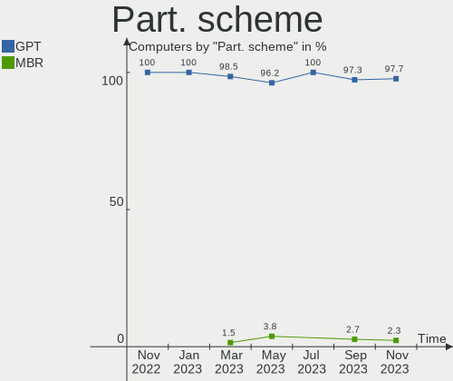
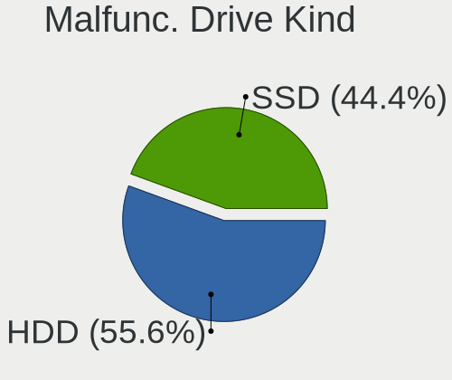
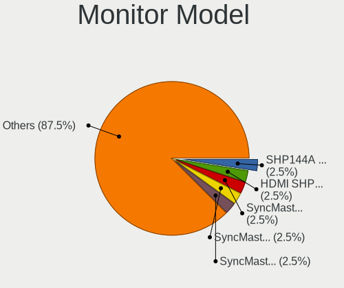
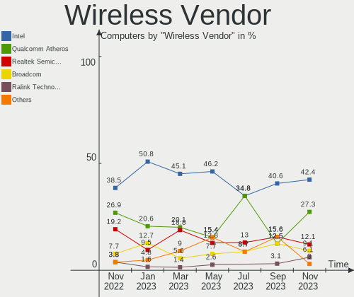
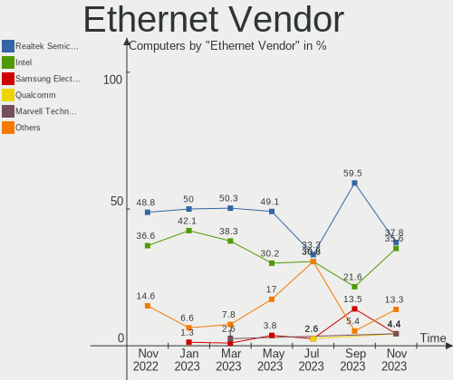

helloSystem - Hardware Trends
-----------------------------

A project to identify most popular hardware characteristics and track their change
over time based on data collected by BSD users at https://BSD-Hardware.info.

Anyone can contribute to this report by the [hw-probe](https://github.com/linuxhw/hw-probe/blob/master/INSTALL.BSD.md) tool:

    hw-probe -all -upload

This is a report for all computer types. See also reports for [desktops](/Dist/helloSystem/Desktop/README.md) and [notebooks](/Dist/helloSystem/Notebook/README.md).

This report is for one last month. Overall report since the beginning of time: [TestDays](https://github.com/bsdhw/TestDays)

Period: Apr, 2023.

Contents
--------

* [ System ](#system)
  - [ OS                       ](#os)
  - [ OS Family                ](#os-family)
  - [ Arch                     ](#arch)
  - [ DE                       ](#de)
  - [ Display Server           ](#display-server)
  - [ Display Manager          ](#display-manager)
  - [ OS Lang                  ](#os-lang)
  - [ Boot Mode                ](#boot-mode)
  - [ Filesystem               ](#filesystem)
  - [ Part. scheme             ](#part-scheme)

* [ Board ](#board)
  - [ Vendor                   ](#vendor)
  - [ Model                    ](#model)
  - [ Model Family             ](#model-family)
  - [ MFG Year                 ](#mfg-year)
  - [ Form Factor              ](#form-factor)
  - [ Coreboot                 ](#coreboot)
  - [ RAM Size                 ](#ram-size)
  - [ RAM Used                 ](#ram-used)
  - [ Total Drives             ](#total-drives)
  - [ Has CD-ROM               ](#has-cd-rom)
  - [ Has Ethernet             ](#has-ethernet)
  - [ Has WiFi                 ](#has-wifi)
  - [ Has Bluetooth            ](#has-bluetooth)

* [ Location ](#location)
  - [ Country                  ](#country)
  - [ City                     ](#city)

* [ Drives ](#drives)
  - [ Drive Vendor             ](#drive-vendor)
  - [ Drive Model              ](#drive-model)
  - [ HDD Vendor               ](#hdd-vendor)
  - [ SSD Vendor               ](#ssd-vendor)
  - [ Drive Kind               ](#drive-kind)
  - [ Drive Connector          ](#drive-connector)
  - [ Drive Size               ](#drive-size)
  - [ Space Total              ](#space-total)
  - [ Space Used               ](#space-used)
  - [ Malfunc. Drives          ](#malfunc-drives)
  - [ Malfunc. Drive Vendor    ](#malfunc-drive-vendor)
  - [ Malfunc. HDD Vendor      ](#malfunc-hdd-vendor)
  - [ Malfunc. Drive Kind      ](#malfunc-drive-kind)
  - [ Failed Drives            ](#failed-drives)
  - [ Failed Drive Vendor      ](#failed-drive-vendor)
  - [ Drive Status             ](#drive-status)

* [ Storage controller ](#storage-controller)
  - [ Storage Vendor           ](#storage-vendor)
  - [ Storage Model            ](#storage-model)
  - [ Storage Kind             ](#storage-kind)

* [ Processor ](#processor)
  - [ CPU Vendor               ](#cpu-vendor)
  - [ CPU Model                ](#cpu-model)
  - [ CPU Model Family         ](#cpu-model-family)
  - [ CPU Cores                ](#cpu-cores)
  - [ CPU Sockets              ](#cpu-sockets)
  - [ CPU Threads              ](#cpu-threads)
  - [ CPU Microarch            ](#cpu-microarch)

* [ Graphics ](#graphics)
  - [ GPU Vendor               ](#gpu-vendor)
  - [ GPU Model                ](#gpu-model)
  - [ GPU Combo                ](#gpu-combo)
  - [ GPU Driver               ](#gpu-driver)
  - [ GPU Memory               ](#gpu-memory)

* [ Monitor ](#monitor)
  - [ Monitor Vendor           ](#monitor-vendor)
  - [ Monitor Model            ](#monitor-model)
  - [ Monitor Resolution       ](#monitor-resolution)
  - [ Monitor Diagonal         ](#monitor-diagonal)
  - [ Monitor Width            ](#monitor-width)
  - [ Aspect Ratio             ](#aspect-ratio)
  - [ Monitor Area             ](#monitor-area)
  - [ Pixel Density            ](#pixel-density)
  - [ Multiple Monitors        ](#multiple-monitors)

* [ Network ](#network)
  - [ Net Controller Vendor    ](#net-controller-vendor)
  - [ Net Controller Model     ](#net-controller-model)
  - [ Wireless Vendor          ](#wireless-vendor)
  - [ Wireless Model           ](#wireless-model)
  - [ Ethernet Vendor          ](#ethernet-vendor)
  - [ Ethernet Model           ](#ethernet-model)
  - [ Net Controller Kind      ](#net-controller-kind)
  - [ Used Controller          ](#used-controller)
  - [ NICs                     ](#nics)
  - [ IPv6                     ](#ipv6)

* [ Bluetooth ](#bluetooth)
  - [ Bluetooth Vendor         ](#bluetooth-vendor)
  - [ Bluetooth Model          ](#bluetooth-model)

* [ Sound ](#sound)
  - [ Sound Vendor             ](#sound-vendor)
  - [ Sound Model              ](#sound-model)

* [ Memory ](#memory)
  - [ Memory Vendor            ](#memory-vendor)
  - [ Memory Model             ](#memory-model)
  - [ Memory Kind              ](#memory-kind)
  - [ Memory Form Factor       ](#memory-form-factor)
  - [ Memory Size              ](#memory-size)
  - [ Memory Speed             ](#memory-speed)

* [ Printers & scanners ](#printers--scanners)
  - [ Printer Vendor           ](#printer-vendor)
  - [ Printer Model            ](#printer-model)
  - [ Scanner Vendor           ](#scanner-vendor)
  - [ Scanner Model            ](#scanner-model)

* [ Camera ](#camera)
  - [ Camera Vendor            ](#camera-vendor)
  - [ Camera Model             ](#camera-model)

* [ Security ](#security)
  - [ Fingerprint Vendor       ](#fingerprint-vendor)
  - [ Fingerprint Model        ](#fingerprint-model)
  - [ Chipcard Vendor          ](#chipcard-vendor)
  - [ Chipcard Model           ](#chipcard-model)

* [ Unsupported ](#unsupported)
  - [ Unsupported Devices      ](#unsupported-devices)
  - [ Unsupported Device Types ](#unsupported-device-types)

System
------

OS
--

Installed operating systems

| Name              | Computers | Percent |
|-------------------|-----------|---------|
| helloSystem 0.8.1 | 44        | 74.58%  |
| helloSystem 0.8.2 | 12        | 20.34%  |
| helloSystem 0.8.0 | 3         | 5.08%   |

OS Family
---------

OS without a version

| Name        | Computers | Percent |
|-------------|-----------|---------|
| helloSystem | 59        | 100%    |

Arch
----

OS architecture (x86_64, i586, etc.)

| Name  | Computers | Percent |
|-------|-----------|---------|
| amd64 | 59        | 100%    |

DE
--

Desktop Environment

| Name         | Computers | Percent |
|--------------|-----------|---------|
| helloDesktop | 57        | 96.61%  |
| KDE5         | 1         | 1.69%   |
| GNOME        | 1         | 1.69%   |

Display Server
--------------

X11 or Wayland

| Name | Computers | Percent |
|------|-----------|---------|
| X11  | 59        | 100%    |

Display Manager
---------------

SDDM, LightDM, etc.

| Name | Computers | Percent |
|------|-----------|---------|
| SLiM | 59        | 100%    |

OS Lang
-------

Language

| Lang    | Computers | Percent |
|---------|-----------|---------|
| en_US   | 31        | 52.54%  |
| fr_FR   | 9         | 15.25%  |
| es_ES   | 5         | 8.47%   |
| Unknown | 4         | 6.78%   |
| en      | 3         | 5.08%   |
| it_IT   | 2         | 3.39%   |
| de_DE   | 2         | 3.39%   |
| ru_RU   | 1         | 1.69%   |
| pt_BR   | 1         | 1.69%   |
| pl_PL   | 1         | 1.69%   |

Boot Mode
---------

EFI or BIOS

| Mode | Computers | Percent |
|------|-----------|---------|
| EFI  | 59        | 100%    |

Filesystem
----------

Type of filesystem

| Type   | Computers | Percent |
|--------|-----------|---------|
| Zfs    | 30        | 50.85%  |
| Cd9660 | 29        | 49.15%  |

Part. scheme
------------

Scheme of partitioning

| Type | Computers | Percent |
|------|-----------|---------|
| GPT  | 59        | 100%    |

Board
-----

Vendor
------

Motherboard manufacturer

| Name                | Computers | Percent |
|---------------------|-----------|---------|
| Lenovo              | 10        | 16.95%  |
| ASUSTek Computer    | 9         | 15.25%  |
| Gigabyte Technology | 6         | 10.17%  |
| Dell                | 6         | 10.17%  |
| Acer                | 6         | 10.17%  |
| Hewlett-Packard     | 5         | 8.47%   |
| Google              | 3         | 5.08%   |
| Samsung Electronics | 2         | 3.39%   |
| ASRock              | 2         | 3.39%   |
| Apple               | 2         | 3.39%   |
| Toshiba             | 1         | 1.69%   |
| Pegatron            | 1         | 1.69%   |
| Packard Bell        | 1         | 1.69%   |
| NCR                 | 1         | 1.69%   |
| Medion              | 1         | 1.69%   |
| Intel               | 1         | 1.69%   |
| Fujitsu             | 1         | 1.69%   |
| AZW                 | 1         | 1.69%   |

Model
-----

Motherboard model

| Name                                 | Computers | Percent |
|--------------------------------------|-----------|---------|
| ASUS PRIME B250M-A                   | 2         | 3.39%   |
| Acer Spin SP314-21                   | 2         | 3.39%   |
| Toshiba PORTEGE R700                 | 1         | 1.69%   |
| Samsung 370E4K                       | 1         | 1.69%   |
| Samsung 340XAA/350XAA/550XAA         | 1         | 1.69%   |
| Pegatron Compaq dx2450 Microtower    | 1         | 1.69%   |
| Packard Bell DOT SE                  | 1         | 1.69%   |
| NCR 7703-1515-8801                   | 1         | 1.69%   |
| Medion E15302                        | 1         | 1.69%   |
| Lenovo Yoga Slim 7 14ITL05 82A3      | 1         | 1.69%   |
| Lenovo ThinkPad X270 20HMS06Q1D      | 1         | 1.69%   |
| Lenovo ThinkPad X1 Carbon 34487SM    | 1         | 1.69%   |
| Lenovo ThinkPad L540 20AUA34DJP      | 1         | 1.69%   |
| Lenovo ThinkPad L15 Gen 2 20X3CTO1WW | 1         | 1.69%   |
| Lenovo ThinkCentre M75e 5065A11      | 1         | 1.69%   |
| Lenovo ThinkBook 14-IML 20RV         | 1         | 1.69%   |
| Lenovo Legion 5 Pro 16ACH6H 82JQ     | 1         | 1.69%   |
| Lenovo G570 20079                    | 1         | 1.69%   |
| Lenovo G500 20236                    | 1         | 1.69%   |
| Intel NUC7i3DNKE                     | 1         | 1.69%   |
| HP ProBook 640 G4                    | 1         | 1.69%   |
| HP Laptop 15-bw0xx                   | 1         | 1.69%   |
| HP EliteDesk 800 G2 DM 65W           | 1         | 1.69%   |
| HP EliteDesk 800 G2 DM 35W           | 1         | 1.69%   |
| HP Compaq Elite 8300 SFF             | 1         | 1.69%   |
| Google Wolf                          | 1         | 1.69%   |
| Google Terra                         | 1         | 1.69%   |
| Google Peppy                         | 1         | 1.69%   |
| Gigabyte M52L-S3P                    | 1         | 1.69%   |
| Gigabyte H81M-S2PH                   | 1         | 1.69%   |
| Gigabyte H61M-S2PH                   | 1         | 1.69%   |
| Gigabyte F2A85X-UP4                  | 1         | 1.69%   |
| Gigabyte B450M DS3H V2               | 1         | 1.69%   |
| Gigabyte A520M DS3H AC               | 1         | 1.69%   |
| Fujitsu CELSIUS H920                 | 1         | 1.69%   |
| Dell XPS 13 9343                     | 1         | 1.69%   |
| Dell Precision Tower 3420            | 1         | 1.69%   |
| Dell Latitude E5570                  | 1         | 1.69%   |
| Dell Latitude 7410                   | 1         | 1.69%   |
| Dell Inspiron 3910                   | 1         | 1.69%   |

Model Family
------------

Motherboard model prefix

| Name                | Computers | Percent |
|---------------------|-----------|---------|
| Lenovo ThinkPad     | 4         | 6.78%   |
| ASUS ROG            | 3         | 5.08%   |
| ASUS PRIME          | 3         | 5.08%   |
| HP EliteDesk        | 2         | 3.39%   |
| Dell Latitude       | 2         | 3.39%   |
| Dell Inspiron       | 2         | 3.39%   |
| Acer Spin           | 2         | 3.39%   |
| Acer Aspire         | 2         | 3.39%   |
| Toshiba PORTEGE     | 1         | 1.69%   |
| Samsung 370E4K      | 1         | 1.69%   |
| Samsung 340XAA      | 1         | 1.69%   |
| Pegatron Compaq     | 1         | 1.69%   |
| Packard Bell DOT    | 1         | 1.69%   |
| NCR 7703-1515-8801  | 1         | 1.69%   |
| Medion E15302       | 1         | 1.69%   |
| Lenovo Yoga         | 1         | 1.69%   |
| Lenovo ThinkCentre  | 1         | 1.69%   |
| Lenovo ThinkBook    | 1         | 1.69%   |
| Lenovo Legion       | 1         | 1.69%   |
| Lenovo G570         | 1         | 1.69%   |
| Lenovo G500         | 1         | 1.69%   |
| Intel NUC7i3DNKE    | 1         | 1.69%   |
| HP ProBook          | 1         | 1.69%   |
| HP Laptop           | 1         | 1.69%   |
| HP Compaq           | 1         | 1.69%   |
| Google Wolf         | 1         | 1.69%   |
| Google Terra        | 1         | 1.69%   |
| Google Peppy        | 1         | 1.69%   |
| Gigabyte M52L-S3P   | 1         | 1.69%   |
| Gigabyte H81M-S2PH  | 1         | 1.69%   |
| Gigabyte H61M-S2PH  | 1         | 1.69%   |
| Gigabyte F2A85X-UP4 | 1         | 1.69%   |
| Gigabyte B450M      | 1         | 1.69%   |
| Gigabyte A520M      | 1         | 1.69%   |
| Fujitsu CELSIUS     | 1         | 1.69%   |
| Dell XPS            | 1         | 1.69%   |
| Dell Precision      | 1         | 1.69%   |
| AZW SER             | 1         | 1.69%   |
| ASUS X58C           | 1         | 1.69%   |
| ASUS X200MA         | 1         | 1.69%   |

MFG Year
--------

Motherboard manufacture year

| Year | Computers | Percent |
|------|-----------|---------|
| 2022 | 9         | 15.25%  |
| 2021 | 7         | 11.86%  |
| 2013 | 5         | 8.47%   |
| 2008 | 5         | 8.47%   |
| 2019 | 4         | 6.78%   |
| 2012 | 4         | 6.78%   |
| 2011 | 4         | 6.78%   |
| 2023 | 3         | 5.08%   |
| 2020 | 3         | 5.08%   |
| 2018 | 3         | 5.08%   |
| 2017 | 3         | 5.08%   |
| 2016 | 3         | 5.08%   |
| 2014 | 3         | 5.08%   |
| 2010 | 2         | 3.39%   |
| 2015 | 1         | 1.69%   |

Form Factor
-----------

Physical design of the computer

| Name        | Computers | Percent |
|-------------|-----------|---------|
| Notebook    | 30        | 50.85%  |
| Desktop     | 25        | 42.37%  |
| Convertible | 2         | 3.39%   |
| Mini pc     | 2         | 3.39%   |

Coreboot
--------

Have coreboot on board

| Used | Computers | Percent |
|------|-----------|---------|
| No   | 56        | 94.92%  |
| Yes  | 3         | 5.08%   |

RAM Size
--------

Total RAM memory

| Size in GB  | Computers | Percent |
|-------------|-----------|---------|
| 8.01-16.0   | 23        | 38.98%  |
| 16.01-24.0  | 12        | 20.34%  |
| 4.01-8.0    | 11        | 18.64%  |
| 2.01-3.0    | 6         | 10.17%  |
| 32.01-64.0  | 5         | 8.47%   |
| 64.01-256.0 | 2         | 3.39%   |

RAM Used
--------

Used RAM memory

| Used GB  | Computers | Percent |
|----------|-----------|---------|
| 0.01-0.5 | 26        | 44.07%  |
| 0.51-1.0 | 22        | 37.29%  |
| 1.01-2.0 | 8         | 13.56%  |
| 3.01-4.0 | 2         | 3.39%   |
| 2.01-3.0 | 1         | 1.69%   |

Total Drives
------------

Number of drives on board

| Drives | Computers | Percent |
|--------|-----------|---------|
| 1      | 33        | 55.93%  |
| 2      | 12        | 20.34%  |
| 3      | 5         | 8.47%   |
| 0      | 5         | 8.47%   |
| 4      | 2         | 3.39%   |
| 10     | 1         | 1.69%   |
| 9      | 1         | 1.69%   |

Has CD-ROM
----------

Has CD-ROM on board

| Presented | Computers | Percent |
|-----------|-----------|---------|
| No        | 43        | 72.88%  |
| Yes       | 16        | 27.12%  |

Has Ethernet
------------

Has Ethernet on board

| Presented | Computers | Percent |
|-----------|-----------|---------|
| Yes       | 48        | 81.36%  |
| No        | 11        | 18.64%  |

Has WiFi
--------

Has WiFi module

| Presented | Computers | Percent |
|-----------|-----------|---------|
| Yes       | 42        | 71.19%  |
| No        | 17        | 28.81%  |

Has Bluetooth
-------------

Has Bluetooth module

| Presented | Computers | Percent |
|-----------|-----------|---------|
| Yes       | 37        | 62.71%  |
| No        | 22        | 37.29%  |

Location
--------

Country
-------

Geographic location (country)

| Country     | Computers | Percent |
|-------------|-----------|---------|
| USA         | 14        | 23.73%  |
| Canada      | 5         | 8.47%   |
| Brazil      | 4         | 6.78%   |
| Spain       | 3         | 5.08%   |
| Russia      | 3         | 5.08%   |
| Romania     | 3         | 5.08%   |
| Germany     | 3         | 5.08%   |
| Poland      | 2         | 3.39%   |
| Mexico      | 2         | 3.39%   |
| Italy       | 2         | 3.39%   |
| Indonesia   | 2         | 3.39%   |
| France      | 2         | 3.39%   |
| China       | 2         | 3.39%   |
| Vietnam     | 1         | 1.69%   |
| San Marino  | 1         | 1.69%   |
| Portugal    | 1         | 1.69%   |
| Peru        | 1         | 1.69%   |
| Paraguay    | 1         | 1.69%   |
| Netherlands | 1         | 1.69%   |
| Hungary     | 1         | 1.69%   |
| Chile       | 1         | 1.69%   |
| Belgium     | 1         | 1.69%   |
| Austria     | 1         | 1.69%   |
| Australia   | 1         | 1.69%   |
| Argentina   | 1         | 1.69%   |

City
----

Geographic location (city)

| City              | Computers | Percent |
|-------------------|-----------|---------|
| St. Jean Baptiste | 4         | 6.78%   |
| Sao Paulo         | 2         | 3.39%   |
| Pensacola         | 2         | 3.39%   |
| Milan             | 2         | 3.39%   |
| Zhengzhou         | 1         | 1.69%   |
| Vitória          | 1         | 1.69%   |
| Vienna            | 1         | 1.69%   |
| Victoria          | 1         | 1.69%   |
| Union Grove       | 1         | 1.69%   |
| Union             | 1         | 1.69%   |
| Tucson            | 1         | 1.69%   |
| Timișoara        | 1         | 1.69%   |
| Temple            | 1         | 1.69%   |
| Targoviste        | 1         | 1.69%   |
| Surabaya          | 1         | 1.69%   |
| St Petersburg     | 1         | 1.69%   |
| Spartanburg       | 1         | 1.69%   |
| Saratov           | 1         | 1.69%   |
| Santiago          | 1         | 1.69%   |
| Río Cuarto       | 1         | 1.69%   |
| Ribeirao Preto    | 1         | 1.69%   |
| Poznan            | 1         | 1.69%   |
| Porto             | 1         | 1.69%   |
| Portage           | 1         | 1.69%   |
| Opole             | 1         | 1.69%   |
| Monterrey         | 1         | 1.69%   |
| Moers             | 1         | 1.69%   |
| Mexico City       | 1         | 1.69%   |
| Melbourne         | 1         | 1.69%   |
| Mechelen          | 1         | 1.69%   |
| Marbella          | 1         | 1.69%   |
| Manchester        | 1         | 1.69%   |
| Les Mureaux       | 1         | 1.69%   |
| Leipzig           | 1         | 1.69%   |
| Independence      | 1         | 1.69%   |
| Huamachuco        | 1         | 1.69%   |
| Hanoi             | 1         | 1.69%   |
| Gulf Breeze       | 1         | 1.69%   |
| Guangzhou         | 1         | 1.69%   |
| Glendale          | 1         | 1.69%   |

Drives
------

Drive Vendor
------------

Hard drive vendors

| Vendor              | Computers | Drives | Percent |
|---------------------|-----------|--------|---------|
| Seagate             | 15        | 15     | 18.29%  |
| WDC                 | 11        | 13     | 13.41%  |
| Samsung Electronics | 10        | 18     | 12.2%   |
| Kingston            | 8         | 8      | 9.76%   |
| Toshiba             | 5         | 5      | 6.1%    |
| Hitachi             | 5         | 5      | 6.1%    |
| SanDisk             | 4         | 4      | 4.88%   |
| Crucial             | 3         | 3      | 3.66%   |
| Transcend           | 2         | 2      | 2.44%   |
| SPCC                | 2         | 7      | 2.44%   |
| SK hynix            | 2         | 2      | 2.44%   |
| Micron Technology   | 2         | 2      | 2.44%   |
| V-GeN               | 1         | 1      | 1.22%   |
| Silicon Motion      | 1         | 1      | 1.22%   |
| PNY                 | 1         | 1      | 1.22%   |
| Patriot             | 1         | 1      | 1.22%   |
| Mushkin             | 1         | 4      | 1.22%   |
| Maxtor              | 1         | 1      | 1.22%   |
| KIOXIA-EXCERIA      | 1         | 1      | 1.22%   |
| KIOXIA              | 1         | 1      | 1.22%   |
| Intel               | 1         | 1      | 1.22%   |
| HGST                | 1         | 2      | 1.22%   |
| Corsair             | 1         | 1      | 1.22%   |
| China               | 1         | 1      | 1.22%   |
| A-DATA Technology   | 1         | 1      | 1.22%   |

Drive Model
-----------

Hard drive models

| Model                                     | Computers | Percent |
|-------------------------------------------|-----------|---------|
| WDC PC SN520 SDAPNUW-128G-1014 128GB      | 2         | 2.2%    |
| Seagate ST1000LM024 HN-M101MBB 1TB        | 2         | 2.2%    |
| Kingston SA400S37240G 240GB               | 2         | 2.2%    |
| WDC WDS120G1G0A-00SS50 120GB              | 1         | 1.1%    |
| WDC WDS100T2G0A-00JH30 1TB                | 1         | 1.1%    |
| WDC WDBNCE5000PNC 500GB                   | 1         | 1.1%    |
| WDC WD60EZRX-00MVLB1 6TB                  | 1         | 1.1%    |
| WDC WD5000AAKX-08U6AA0 500GB              | 1         | 1.1%    |
| WDC WD40EZAZ-00ZGHB0 4TB                  | 1         | 1.1%    |
| WDC WD40EFRX-68WT0N0 4TB                  | 1         | 1.1%    |
| WDC WD3200AAJS-00L7A0 320GB               | 1         | 1.1%    |
| WDC WD1600BEVT-22ZCT0 160GB               | 1         | 1.1%    |
| WDC WD1600AAJS-60Z0A0 160GB               | 1         | 1.1%    |
| WDC WD10SPZX-35Z10T0 1TB                  | 1         | 1.1%    |
| V-GeN V-GEN08SM22AR256SDK 256GB           | 1         | 1.1%    |
| Transcend TS256GSSD340 256GB              | 1         | 1.1%    |
| Transcend TS128GMTE110S 128GB             | 1         | 1.1%    |
| Toshiba MQ01ACF050 500GB                  | 1         | 1.1%    |
| Toshiba MK6461GSYN 640GB                  | 1         | 1.1%    |
| Toshiba KXG6AZNV256G 256GB                | 1         | 1.1%    |
| Toshiba DT01ACA100 1TB                    | 1         | 1.1%    |
| Toshiba DT01ACA050 500GB                  | 1         | 1.1%    |
| SPCC Solid State Disk 2TB                 | 1         | 1.1%    |
| SPCC Solid State Disk 256GB               | 1         | 1.1%    |
| SK hynix BC711 NVMe 256GB                 | 1         | 1.1%    |
| SK hynix BC511 NVMe 512GB                 | 1         | 1.1%    |
| Silicon Motion Asgard AN1TNVMe-M.2-80 1TB | 1         | 1.1%    |
| Seagate ST9160827AS 160GB                 | 1         | 1.1%    |
| Seagate ST500LM021-1KJ152 500GB           | 1         | 1.1%    |
| Seagate ST500DM002-1BD142 500GB           | 1         | 1.1%    |
| Seagate ST3500418AS 500GB                 | 1         | 1.1%    |
| Seagate ST3320620AS 320GB                 | 1         | 1.1%    |
| Seagate ST320LT020-9YG142 320GB           | 1         | 1.1%    |
| Seagate ST320LT012-9WS14C 320GB           | 1         | 1.1%    |
| Seagate ST3160815AS 160GB                 | 1         | 1.1%    |
| Seagate ST2000DM008-2FR102 2TB            | 1         | 1.1%    |
| Seagate ST2000DL003-9VT166 2TB            | 1         | 1.1%    |
| Seagate ST1000VM002-1SD102 1TB            | 1         | 1.1%    |
| Seagate ST1000DM010-2EP102 1TB            | 1         | 1.1%    |
| Seagate ST1000DM003-1ER162 1TB            | 1         | 1.1%    |

HDD Vendor
----------

Hard disk drive vendors

| Vendor              | Computers | Drives | Percent |
|---------------------|-----------|--------|---------|
| Seagate             | 15        | 15     | 44.12%  |
| WDC                 | 7         | 8      | 20.59%  |
| Hitachi             | 5         | 5      | 14.71%  |
| Toshiba             | 4         | 4      | 11.76%  |
| Samsung Electronics | 1         | 1      | 2.94%   |
| Maxtor              | 1         | 1      | 2.94%   |
| HGST                | 1         | 2      | 2.94%   |

SSD Vendor
----------

Solid state drive vendors

| Vendor              | Computers | Drives | Percent |
|---------------------|-----------|--------|---------|
| Kingston            | 6         | 6      | 19.35%  |
| Samsung Electronics | 5         | 10     | 16.13%  |
| SanDisk             | 4         | 4      | 12.9%   |
| Crucial             | 3         | 3      | 9.68%   |
| WDC                 | 2         | 3      | 6.45%   |
| SPCC                | 2         | 7      | 6.45%   |
| V-GeN               | 1         | 1      | 3.23%   |
| Transcend           | 1         | 1      | 3.23%   |
| PNY                 | 1         | 1      | 3.23%   |
| Patriot             | 1         | 1      | 3.23%   |
| Mushkin             | 1         | 4      | 3.23%   |
| KIOXIA-EXCERIA      | 1         | 1      | 3.23%   |
| Intel               | 1         | 1      | 3.23%   |
| China               | 1         | 1      | 3.23%   |
| A-DATA Technology   | 1         | 1      | 3.23%   |

Drive Kind
----------

HDD or SSD

| Kind | Computers | Drives | Percent |
|------|-----------|--------|---------|
| HDD  | 29        | 36     | 40.28%  |
| SSD  | 27        | 45     | 37.5%   |
| NVMe | 16        | 20     | 22.22%  |

Drive Connector
---------------

SATA, SAS, NVMe, etc.

| Type | Computers | Drives | Percent |
|------|-----------|--------|---------|
| SATA | 47        | 81     | 74.6%   |
| NVMe | 16        | 20     | 25.4%   |

Drive Size
----------

Size of hard drive

| Size in TB | Computers | Drives | Percent |
|------------|-----------|--------|---------|
| 0.01-0.5   | 42        | 52     | 68.85%  |
| 0.51-1.0   | 11        | 14     | 18.03%  |
| 1.01-2.0   | 4         | 6      | 6.56%   |
| 3.01-4.0   | 2         | 2      | 3.28%   |
| 2.01-3.0   | 1         | 6      | 1.64%   |
| 4.01-10.0  | 1         | 1      | 1.64%   |

Space Total
-----------

Amount of disk space available on the file system

| Size in GB | Computers | Percent |
|------------|-----------|---------|
| 1-20       | 23        | 38.98%  |
| 101-250    | 15        | 25.42%  |
| 251-500    | 9         | 15.25%  |
| 51-100     | 5         | 8.47%   |
| 501-1000   | 3         | 5.08%   |
| 21-50      | 2         | 3.39%   |
| 1001-2000  | 2         | 3.39%   |

Space Used
----------

Amount of used disk space

| Used GB | Computers | Percent |
|---------|-----------|---------|
| 1-20    | 56        | 94.92%  |
| 101-250 | 2         | 3.39%   |
| 21-50   | 1         | 1.69%   |

Malfunc. Drives
---------------

Drive models with a malfunction

| Model                                     | Computers | Drives | Percent |
|-------------------------------------------|-----------|--------|---------|
| WDC WD1600AAJS-60Z0A0 160GB               | 1         | 1      | 5.56%   |
| Toshiba MQ01ACF050 500GB                  | 1         | 1      | 5.56%   |
| Toshiba DT01ACA050 500GB                  | 1         | 1      | 5.56%   |
| Silicon Motion Asgard AN1TNVMe-M.2-80 1TB | 1         | 1      | 5.56%   |
| Seagate ST9160827AS 160GB                 | 1         | 1      | 5.56%   |
| Seagate ST500LM021-1KJ152 500GB           | 1         | 1      | 5.56%   |
| Seagate ST500DM002-1BD142 500GB           | 1         | 1      | 5.56%   |
| Seagate ST3500418AS 500GB                 | 1         | 1      | 5.56%   |
| Seagate ST3320620AS 320GB                 | 1         | 1      | 5.56%   |
| Seagate ST320LT020-9YG142 320GB           | 1         | 1      | 5.56%   |
| Seagate ST320LT012-9WS14C 320GB           | 1         | 1      | 5.56%   |
| SanDisk SSD PLUS 240GB                    | 1         | 1      | 5.56%   |
| Samsung Electronics HM320JI 320GB         | 1         | 1      | 5.56%   |
| Hitachi HTS547550A9E384 500GB             | 1         | 1      | 5.56%   |
| Hitachi HTS542516K9SA00 160GB             | 1         | 1      | 5.56%   |
| Hitachi HDS721616PLA380 160GB             | 1         | 1      | 5.56%   |
| HGST HTS541010A9E680 1TB                  | 1         | 1      | 5.56%   |
| Crucial CT500MX500SSD1 500GB              | 1         | 1      | 5.56%   |

Malfunc. Drive Vendor
---------------------

Vendors of faulty drives

| Vendor              | Computers | Drives | Percent |
|---------------------|-----------|--------|---------|
| Seagate             | 7         | 7      | 38.89%  |
| Hitachi             | 3         | 3      | 16.67%  |
| Toshiba             | 2         | 2      | 11.11%  |
| WDC                 | 1         | 1      | 5.56%   |
| Silicon Motion      | 1         | 1      | 5.56%   |
| SanDisk             | 1         | 1      | 5.56%   |
| Samsung Electronics | 1         | 1      | 5.56%   |
| HGST                | 1         | 1      | 5.56%   |
| Crucial             | 1         | 1      | 5.56%   |

Malfunc. HDD Vendor
-------------------

Vendors of faulty HDD drives

| Vendor              | Computers | Drives | Percent |
|---------------------|-----------|--------|---------|
| Seagate             | 7         | 7      | 46.67%  |
| Hitachi             | 3         | 3      | 20%     |
| Toshiba             | 2         | 2      | 13.33%  |
| WDC                 | 1         | 1      | 6.67%   |
| Samsung Electronics | 1         | 1      | 6.67%   |
| HGST                | 1         | 1      | 6.67%   |

Malfunc. Drive Kind
-------------------

Kinds of faulty drives

| Kind | Computers | Drives | Percent |
|------|-----------|--------|---------|
| HDD  | 13        | 15     | 81.25%  |
| SSD  | 2         | 2      | 12.5%   |
| NVMe | 1         | 1      | 6.25%   |

Failed Drives
-------------

Failed drive models

| Model                       | Computers | Drives | Percent |
|-----------------------------|-----------|--------|---------|
| WDC WD1600BEVT-22ZCT0 160GB | 1         | 1      | 100%    |

Failed Drive Vendor
-------------------

Failed drive vendors

| Vendor | Computers | Drives | Percent |
|--------|-----------|--------|---------|
| WDC    | 1         | 1      | 100%    |

Drive Status
------------

Number of failed and malfunc. drives

| Status  | Computers | Drives | Percent |
|---------|-----------|--------|---------|
| Works   | 46        | 82     | 73.02%  |
| Malfunc | 16        | 18     | 25.4%   |
| Failed  | 1         | 1      | 1.59%   |

Storage controller
------------------

Storage Vendor
--------------

Storage controller vendors

| Vendor                           | Computers | Percent |
|----------------------------------|-----------|---------|
| Intel                            | 35        | 46.67%  |
| AMD                              | 14        | 18.67%  |
| SanDisk                          | 5         | 6.67%   |
| Samsung Electronics              | 5         | 6.67%   |
| Nvidia                           | 3         | 4%      |
| ASMedia Technology               | 3         | 4%      |
| Micron Technology                | 2         | 2.67%   |
| Kingston Technology Company      | 2         | 2.67%   |
| Toshiba                          | 1         | 1.33%   |
| SK hynix                         | 1         | 1.33%   |
| Silicon Motion                   | 1         | 1.33%   |
| Silicon Integrated Systems [SiS] | 1         | 1.33%   |
| Phison Electronics               | 1         | 1.33%   |
| KIOXIA                           | 1         | 1.33%   |

Storage Model
-------------

Storage controller models

| Model                                                                                   | Computers | Percent |
|-----------------------------------------------------------------------------------------|-----------|---------|
| AMD FCH SATA Controller [AHCI mode]                                                     | 8         | 9.76%   |
| Intel Sunrise Point-LP SATA Controller [AHCI mode]                                      | 5         | 6.1%    |
| Intel 7 Series Chipset Family 6-port SATA Controller [AHCI mode]                        | 5         | 6.1%    |
| Intel Q170/Q150/B150/H170/H110/Z170/CM236 Chipset SATA Controller [AHCI Mode]           | 4         | 4.88%   |
| Samsung NVMe SSD Controller SM981/PM981/PM983                                           | 3         | 3.66%   |
| AMD 500 Series Chipset SATA Controller                                                  | 3         | 3.66%   |
| SanDisk WD Blue SN500 / PC SN520 NVMe SSD                                               | 2         | 2.44%   |
| Sandisk WD Black SN770 NVMe SSD                                                         | 2         | 2.44%   |
| Nvidia MCP61 SATA Controller                                                            | 2         | 2.44%   |
| Micron NVMe Storage Controller                                                          | 2         | 2.44%   |
| Intel Wildcat Point-LP SATA Controller [AHCI Mode]                                      | 2         | 2.44%   |
| Intel 82801HM/HEM (ICH8M/ICH8M-E) SATA Controller [AHCI mode]                           | 2         | 2.44%   |
| Intel 82801HM/HEM (ICH8M/ICH8M-E) IDE Controller                                        | 2         | 2.44%   |
| Intel 8 Series/C220 Series Chipset Family 6-port SATA Controller 1 [AHCI mode]          | 2         | 2.44%   |
| Intel 8 Series SATA Controller 1 [AHCI mode]                                            | 2         | 2.44%   |
| Intel 200 Series PCH SATA controller [AHCI mode]                                        | 2         | 2.44%   |
| AMD SB7x0/SB8x0/SB9x0 SATA Controller [AHCI mode]                                       | 2         | 2.44%   |
| Unknown                                                                                 | 2         | 2.44%   |
| Toshiba XG6 NVMe SSD Controller                                                         | 1         | 1.22%   |
| SK hynix BC511                                                                          | 1         | 1.22%   |
| Silicon Motion SM2263EN/SM2263XT SSD Controller                                         | 1         | 1.22%   |
| Silicon Integrated Systems [SiS] SATA Controller / IDE mode                             | 1         | 1.22%   |
| SanDisk WD Blue SN570 NVMe SSD 1TB                                                      | 1         | 1.22%   |
| Samsung NVMe SSD Controller SM961/PM961/SM963                                           | 1         | 1.22%   |
| Samsung NVMe SSD Controller 980                                                         | 1         | 1.22%   |
| Nvidia MCP79 AHCI Controller                                                            | 1         | 1.22%   |
| Nvidia MCP61 IDE                                                                        | 1         | 1.22%   |
| KIOXIA NVMe SSD Controller BG4                                                          | 1         | 1.22%   |
| Kingston Company NVMe Controller                                                        | 1         | 1.22%   |
| Intel Volume Management Device NVMe RAID Controller                                     | 1         | 1.22%   |
| Intel SATA Controller [RAID mode]                                                       | 1         | 1.22%   |
| Intel NM10/ICH7 Family SATA Controller [AHCI mode]                                      | 1         | 1.22%   |
| Intel Comet Lake SATA AHCI Controller                                                   | 1         | 1.22%   |
| Intel Atom Processor E3800 Series SATA AHCI Controller                                  | 1         | 1.22%   |
| Intel Alder Lake-S PCH SATA Controller [AHCI Mode]                                      | 1         | 1.22%   |
| Intel 7 Series/C210 Series Chipset Family 6-port SATA Controller [AHCI mode]            | 1         | 1.22%   |
| Intel 6 Series/C200 Series Chipset Family Desktop SATA Controller (IDE mode, ports 4-5) | 1         | 1.22%   |
| Intel 6 Series/C200 Series Chipset Family Desktop SATA Controller (IDE mode, ports 0-3) | 1         | 1.22%   |
| Intel 6 Series/C200 Series Chipset Family 6 port Mobile SATA AHCI Controller            | 1         | 1.22%   |
| Intel 6 Series/C200 Series Chipset Family 6 port Desktop SATA AHCI Controller           | 1         | 1.22%   |

Storage Kind
------------

Kind of storage controller (IDE, SATA, NVMe, SAS, ...)

| Kind | Computers | Percent |
|------|-----------|---------|
| SATA | 48        | 65.75%  |
| NVMe | 17        | 23.29%  |
| IDE  | 6         | 8.22%   |
| RAID | 2         | 2.74%   |

Processor
---------

CPU Vendor
----------

Processor vendors

| Vendor | Computers | Percent |
|--------|-----------|---------|
| Intel  | 41        | 69.49%  |
| AMD    | 18        | 30.51%  |

CPU Model
---------

Processor models

| Model                                   | Computers | Percent |
|-----------------------------------------|-----------|---------|
| Intel Core i5-8250U CPU @ 1.60GHz       | 2         | 3.39%   |
| Intel Core i5-7400 CPU @ 3.00GHz        | 2         | 3.39%   |
| Intel Celeron 2955U @ 1.40GHz           | 2         | 3.39%   |
| AMD Ryzen 3 3250U with Radeon Graphics  | 2         | 3.39%   |
| Intel Xeon CPU E3-1270 v5 @ 3.60GHz     | 1         | 1.69%   |
| Intel Core i9-10900 CPU @ 2.80GHz       | 1         | 1.69%   |
| Intel Core i7-6700T CPU @ 2.80GHz       | 1         | 1.69%   |
| Intel Core i7-6600U CPU @ 2.60GHz       | 1         | 1.69%   |
| Intel Core i7-5500U CPU @ 2.40GHz       | 1         | 1.69%   |
| Intel Core i7-3770 CPU @ 3.40GHz        | 1         | 1.69%   |
| Intel Core i7-3720QM CPU @ 2.60GHz      | 1         | 1.69%   |
| Intel Core i7-10610U CPU @ 1.80GHz      | 1         | 1.69%   |
| Intel Core i5-7300U CPU @ 2.60GHz       | 1         | 1.69%   |
| Intel Core i5-6500TE CPU @ 2.30GHz      | 1         | 1.69%   |
| Intel Core i5-6500 CPU @ 3.20GHz        | 1         | 1.69%   |
| Intel Core i5-3570 CPU @ 3.40GHz        | 1         | 1.69%   |
| Intel Core i5-3470S CPU @ 2.90GHz       | 1         | 1.69%   |
| Intel Core i5-3427U CPU @ 1.80GHz       | 1         | 1.69%   |
| Intel Core i5-3337U CPU @ 1.80GHz       | 1         | 1.69%   |
| Intel Core i5-3330 CPU @ 3.00GHz        | 1         | 1.69%   |
| Intel Core i5-2450M CPU @ 2.50GHz       | 1         | 1.69%   |
| Intel Core i5-10210U CPU @ 1.60GHz      | 1         | 1.69%   |
| Intel Core i5 CPU M 520 @ 2.40GHz       | 1         | 1.69%   |
| Intel Core i3-7100U CPU @ 2.40GHz       | 1         | 1.69%   |
| Intel Core i3-5005U CPU @ 2.00GHz       | 1         | 1.69%   |
| Intel Core i3-4160 CPU @ 3.60GHz        | 1         | 1.69%   |
| Intel Core i3-4100M CPU @ 2.50GHz       | 1         | 1.69%   |
| Intel Core 2 Duo CPU T7500 @ 2.20GHz    | 1         | 1.69%   |
| Intel Core 2 Duo CPU P7350 @ 2.00GHz    | 1         | 1.69%   |
| Intel Celeron D CPU 220 @ 1.20GHz       | 1         | 1.69%   |
| Intel Celeron CPU N3060 @ 1.60GHz       | 1         | 1.69%   |
| Intel Celeron CPU N2830 @ 2.16GHz       | 1         | 1.69%   |
| Intel Celeron CPU 560 @ 2.13GHz         | 1         | 1.69%   |
| Intel Celeron CPU 1007U @ 1.50GHz       | 1         | 1.69%   |
| Intel Celeron CPU 1005M @ 1.90GHz       | 1         | 1.69%   |
| Intel Atom CPU N550 @ 1.50GHz           | 1         | 1.69%   |
| Intel 12th Gen Core i5-12400            | 1         | 1.69%   |
| Intel 11th Gen Core i7-1165G7 @ 2.80GHz | 1         | 1.69%   |
| Intel 11th Gen Core i3-1115G4 @ 3.00GHz | 1         | 1.69%   |
| AMD Ryzen 9 5950X 16-Core Processor     | 1         | 1.69%   |

CPU Model Family
----------------

Processor model prefix

| Model            | Computers | Percent |
|------------------|-----------|---------|
| Intel Core i5    | 15        | 25.42%  |
| Intel Celeron    | 7         | 11.86%  |
| Intel Core i7    | 6         | 10.17%  |
| Other            | 4         | 6.78%   |
| Intel Core i3    | 4         | 6.78%   |
| AMD Ryzen 5      | 4         | 6.78%   |
| AMD Ryzen 3      | 3         | 5.08%   |
| Intel Core 2 Duo | 2         | 3.39%   |
| AMD Ryzen 9      | 2         | 3.39%   |
| AMD Ryzen 7      | 2         | 3.39%   |
| AMD Athlon II X2 | 2         | 3.39%   |
| Intel Xeon       | 1         | 1.69%   |
| Intel Core i9    | 1         | 1.69%   |
| Intel Celeron D  | 1         | 1.69%   |
| Intel Atom       | 1         | 1.69%   |
| AMD E            | 1         | 1.69%   |
| AMD Athlon X2    | 1         | 1.69%   |
| AMD Athlon       | 1         | 1.69%   |
| AMD A10          | 1         | 1.69%   |

CPU Cores
---------

Number of processor cores

| Number  | Computers | Percent |
|---------|-----------|---------|
| 2       | 24        | 40.68%  |
| 4       | 20        | 33.9%   |
| 12      | 3         | 5.08%   |
| 16      | 2         | 3.39%   |
| 8       | 2         | 3.39%   |
| 1       | 2         | 3.39%   |
| Unknown | 2         | 3.39%   |
| 32      | 1         | 1.69%   |
| 24      | 1         | 1.69%   |
| 10      | 1         | 1.69%   |
| 6       | 1         | 1.69%   |

CPU Sockets
-----------

Number of sockets

| Number | Computers | Percent |
|--------|-----------|---------|
| 1      | 57        | 96.61%  |
| 2      | 2         | 3.39%   |

CPU Threads
-----------

Threads per core (Hyper-Threading)

| Number  | Computers | Percent |
|---------|-----------|---------|
| 1       | 31        | 52.54%  |
| 2       | 24        | 40.68%  |
| Unknown | 4         | 6.78%   |

CPU Microarch
-------------

Microarchitecture

| Name        | Computers | Percent |
|-------------|-----------|---------|
| IvyBridge   | 9         | 15.25%  |
| KabyLake    | 8         | 13.56%  |
| Zen 3       | 5         | 8.47%   |
| Skylake     | 5         | 8.47%   |
| Zen+        | 4         | 6.78%   |
| Haswell     | 4         | 6.78%   |
| K10         | 3         | 5.08%   |
| Core        | 3         | 5.08%   |
| TigerLake   | 2         | 3.39%   |
| Silvermont  | 2         | 3.39%   |
| Broadwell   | 2         | 3.39%   |
| Unknown     | 2         | 3.39%   |
| Zen 2       | 1         | 1.69%   |
| Zen         | 1         | 1.69%   |
| Westmere    | 1         | 1.69%   |
| SandyBridge | 1         | 1.69%   |
| Piledriver  | 1         | 1.69%   |
| Penryn      | 1         | 1.69%   |
| Excavator   | 1         | 1.69%   |
| CometLake   | 1         | 1.69%   |
| Bonnell     | 1         | 1.69%   |
| Bobcat      | 1         | 1.69%   |

Graphics
--------

GPU Vendor
----------

Vendors of graphics cards

| Vendor                           | Computers | Percent |
|----------------------------------|-----------|---------|
| Intel                            | 37        | 57.81%  |
| AMD                              | 17        | 26.56%  |
| Nvidia                           | 9         | 14.06%  |
| Silicon Integrated Systems [SiS] | 1         | 1.56%   |

GPU Model
---------

Graphics card models

| Model                                                                                    | Computers | Percent |
|------------------------------------------------------------------------------------------|-----------|---------|
| Intel 3rd Gen Core processor Graphics Controller                                         | 5         | 7.58%   |
| AMD Picasso/Raven 2 [Radeon Vega Series / Radeon Vega Mobile Series]                     | 4         | 6.06%   |
| Intel HD Graphics 530                                                                    | 3         | 4.55%   |
| Intel Xeon E3-1200 v2/3rd Gen Core processor Graphics Controller                         | 2         | 3.03%   |
| Intel UHD Graphics 620                                                                   | 2         | 3.03%   |
| Intel Mobile GM965/GL960 Integrated Graphics Controller (secondary)                      | 2         | 3.03%   |
| Intel Mobile GM965/GL960 Integrated Graphics Controller (primary)                        | 2         | 3.03%   |
| Intel HD Graphics 630                                                                    | 2         | 3.03%   |
| Intel HD Graphics 620                                                                    | 2         | 3.03%   |
| Intel HD Graphics 5500                                                                   | 2         | 3.03%   |
| Intel Haswell-ULT Integrated Graphics Controller                                         | 2         | 3.03%   |
| Intel CometLake-U GT2 [UHD Graphics]                                                     | 2         | 3.03%   |
| AMD Navi 23 [Radeon RX 6650 XT / 6700S / 6800S]                                          | 2         | 3.03%   |
| Silicon Integrated Systems [SiS] 771/671 PCIE VGA Display Adapter                        | 1         | 1.52%   |
| Nvidia TU116 [GeForce GTX 1660 SUPER]                                                    | 1         | 1.52%   |
| Nvidia GM107 [GeForce GTX 750 Ti]                                                        | 1         | 1.52%   |
| Nvidia GK208B [GeForce GT 710]                                                           | 1         | 1.52%   |
| Nvidia GK107 [GeForce GTX 650]                                                           | 1         | 1.52%   |
| Nvidia GK104GLM [Quadro K3000M]                                                          | 1         | 1.52%   |
| Nvidia GA104M [GeForce RTX 3070 Mobile / Max-Q]                                          | 1         | 1.52%   |
| Nvidia G94 [GeForce 9600 GT]                                                             | 1         | 1.52%   |
| Nvidia G72 [GeForce 7300 LE]                                                             | 1         | 1.52%   |
| Nvidia C79 [GeForce 9400M]                                                               | 1         | 1.52%   |
| Intel TigerLake-LP GT2 [Iris Xe Graphics]                                                | 1         | 1.52%   |
| Intel Tiger Lake-LP GT2 [UHD Graphics G4]                                                | 1         | 1.52%   |
| Intel Skylake GT2 [HD Graphics 520]                                                      | 1         | 1.52%   |
| Intel IvyBridge GT2 [HD Graphics 4000]                                                   | 1         | 1.52%   |
| Intel DG2 [Arc A770]                                                                     | 1         | 1.52%   |
| Intel Core Processor Integrated Graphics Controller                                      | 1         | 1.52%   |
| Intel Atom/Celeron/Pentium Processor x5-E8000/J3xxx/N3xxx Integrated Graphics Controller | 1         | 1.52%   |
| Intel Atom Processor Z36xxx/Z37xxx Series Graphics & Display                             | 1         | 1.52%   |
| Intel Atom Processor D4xx/D5xx/N4xx/N5xx Integrated Graphics Controller                  | 1         | 1.52%   |
| Intel Alder Lake-S GT1 [UHD Graphics 730]                                                | 1         | 1.52%   |
| Intel 4th Generation Core Processor Family Integrated Graphics Controller                | 1         | 1.52%   |
| Intel 4th Gen Core Processor Integrated Graphics Controller                              | 1         | 1.52%   |
| Intel 2nd Generation Core Processor Family Integrated Graphics Controller                | 1         | 1.52%   |
| AMD Wrestler [Radeon HD 6310]                                                            | 1         | 1.52%   |
| AMD Topaz XT [Radeon R7 M260/M265 / M340/M360 / M440/M445 / 530/535 / 620/625 Mobile]    | 1         | 1.52%   |
| AMD Stoney [Radeon R2/R3/R4/R5 Graphics]                                                 | 1         | 1.52%   |
| AMD Robson CE [Radeon HD 6370M/7370M]                                                    | 1         | 1.52%   |

GPU Combo
---------

Combinations of graphics cards

| Name           | Computers | Percent |
|----------------|-----------|---------|
| 1 x Intel      | 29        | 49.15%  |
| 1 x AMD        | 13        | 22.03%  |
| 1 x Nvidia     | 8         | 13.56%  |
| Intel + AMD    | 4         | 6.78%   |
| 2 x Intel      | 3         | 5.08%   |
| 1 x SiS        | 1         | 1.69%   |
| Intel + Nvidia | 1         | 1.69%   |

GPU Driver
----------

Free vs proprietary

| Driver      | Computers | Percent |
|-------------|-----------|---------|
| Free        | 47        | 79.66%  |
| Proprietary | 6         | 10.17%  |
| Unknown     | 6         | 10.17%  |

GPU Memory
----------

Total video memory

| Size in GB | Computers | Percent |
|------------|-----------|---------|
| Unknown    | 47        | 79.66%  |
| 0.01-0.5   | 3         | 5.08%   |
| 7.01-8.0   | 2         | 3.39%   |
| 3.01-4.0   | 2         | 3.39%   |
| 1.01-2.0   | 2         | 3.39%   |
| 0.51-1.0   | 2         | 3.39%   |
| 5.01-6.0   | 1         | 1.69%   |

Monitor
-------

Monitor Vendor
--------------

Monitor vendors

| Vendor         | Computers | Percent |
|----------------|-----------|---------|
| Unknown        | 2         | 66.67%  |
| LG Electronics | 1         | 33.33%  |

Monitor Model
-------------

Monitor models

| Model                                           | Computers | Percent |
|-------------------------------------------------|-----------|---------|
| Unknown                                         | 2         | 66.67%  |
| LG Electronics LCD Monitor LG FULL HD 1920x1080 | 1         | 33.33%  |

Monitor Resolution
------------------

Monitor screen resolution

| Resolution      | Computers | Percent |
|-----------------|-----------|---------|
| 2560x1600       | 1         | 33.33%  |
| 1920x1080 (FHD) | 1         | 33.33%  |
| 1366x768 (WXGA) | 1         | 33.33%  |

Monitor Diagonal
----------------

Diagonal size in inches

| Inches  | Computers | Percent |
|---------|-----------|---------|
| Unknown | 3         | 100%    |

Monitor Width
-------------

Physical width

| Width in mm | Computers | Percent |
|-------------|-----------|---------|
| Unknown     | 3         | 100%    |

Aspect Ratio
------------

Proportional relationship between the width and the height

| Ratio   | Computers | Percent |
|---------|-----------|---------|
| Unknown | 3         | 100%    |

Monitor Area
------------

Area in inch²

| Area in inch² | Computers | Percent |
|----------------|-----------|---------|
| Unknown        | 3         | 100%    |

Pixel Density
-------------

Pixels per inch

| Density | Computers | Percent |
|---------|-----------|---------|
| Unknown | 3         | 100%    |

Multiple Monitors
-----------------

Total monitors connected

| Total | Computers | Percent |
|-------|-----------|---------|
| 1     | 46        | 77.97%  |
| 0     | 11        | 18.64%  |
| 2     | 2         | 3.39%   |

Network
-------

Net Controller Vendor
---------------------

Controller vendors

| Vendor                           | Computers | Percent |
|----------------------------------|-----------|---------|
| Intel                            | 28        | 34.57%  |
| Realtek Semiconductor            | 22        | 27.16%  |
| Qualcomm Atheros                 | 13        | 16.05%  |
| Broadcom                         | 5         | 6.17%   |
| TP-Link                          | 3         | 3.7%    |
| Marvell Technology Group         | 2         | 2.47%   |
| Xiaomi                           | 1         | 1.23%   |
| Silicon Integrated Systems [SiS] | 1         | 1.23%   |
| Samsung Electronics              | 1         | 1.23%   |
| Ralink                           | 1         | 1.23%   |
| Nvidia                           | 1         | 1.23%   |
| MediaTek                         | 1         | 1.23%   |
| Google                           | 1         | 1.23%   |
| Belkin Components                | 1         | 1.23%   |

Net Controller Model
--------------------

Controller models

| Model                                                                   | Computers | Percent |
|-------------------------------------------------------------------------|-----------|---------|
| Realtek RTL8111/8168/8411 PCI Express Gigabit Ethernet Controller       | 14        | 14.43%  |
| Realtek RTL810xE PCI Express Fast Ethernet controller                   | 4         | 4.12%   |
| Intel Ethernet Connection (2) I219-LM                                   | 4         | 4.12%   |
| Qualcomm Atheros AR9485 Wireless Network Adapter                        | 3         | 3.09%   |
| Intel Wireless 8265 / 8275                                              | 3         | 3.09%   |
| Intel 82579LM Gigabit Network Connection (Lewisville)                   | 3         | 3.09%   |
| TP-Link AC600 wireless Realtek RTL8811AU [Archer T2U Nano]              | 2         | 2.06%   |
| Qualcomm Atheros QCA9565 / AR9565 Wireless Network Adapter              | 2         | 2.06%   |
| Qualcomm Atheros QCA6174 802.11ac Wireless Network Adapter              | 2         | 2.06%   |
| Qualcomm Atheros AR9462 Wireless Network Adapter                        | 2         | 2.06%   |
| Qualcomm Atheros AR9285 Wireless Network Adapter (PCI-Express)          | 2         | 2.06%   |
| Qualcomm Atheros AR8152 v2.0 Fast Ethernet                              | 2         | 2.06%   |
| Intel Wireless 7265                                                     | 2         | 2.06%   |
| Intel Wireless 7260                                                     | 2         | 2.06%   |
| Intel Wi-Fi 6 AX200                                                     | 2         | 2.06%   |
| Intel Ethernet Controller I225-V                                        | 2         | 2.06%   |
| Intel Ethernet Connection I219-LM                                       | 2         | 2.06%   |
| Intel Comet Lake PCH-LP CNVi WiFi                                       | 2         | 2.06%   |
| Xiaomi Mi/Redmi series (RNDIS)                                          | 1         | 1.03%   |
| TP-Link Archer T2U PLUS [RTL8821AU]                                     | 1         | 1.03%   |
| Silicon Integrated Systems [SiS] 191 Gigabit Ethernet Adapter           | 1         | 1.03%   |
| Samsung Galaxy series, misc. (tethering mode)                           | 1         | 1.03%   |
| Realtek RTL8852AE 802.11ax PCIe Wireless Network Adapter                | 1         | 1.03%   |
| Realtek RTL8188EUS 802.11n Wireless Network Adapter                     | 1         | 1.03%   |
| Realtek RTL8125 2.5GbE Controller                                       | 1         | 1.03%   |
| Realtek RTL-8100/8101L/8139 PCI Fast Ethernet Adapter                   | 1         | 1.03%   |
| Realtek 8811CU Wireless LAN 802.11ac USB NIC                            | 1         | 1.03%   |
| Ralink RT3290 Wireless 802.11n 1T/1R PCIe                               | 1         | 1.03%   |
| Qualcomm Atheros QCA9377 802.11ac Wireless Network Adapter              | 1         | 1.03%   |
| Qualcomm Atheros QCA8172 Fast Ethernet                                  | 1         | 1.03%   |
| Qualcomm Atheros AR8152 v1.1 Fast Ethernet                              | 1         | 1.03%   |
| Qualcomm Atheros AR242x / AR542x Wireless Network Adapter (PCI-Express) | 1         | 1.03%   |
| Nvidia MCP79 Ethernet                                                   | 1         | 1.03%   |
| MediaTek MT7921 802.11ax PCI Express Wireless Network Adapter           | 1         | 1.03%   |
| Marvell Group 88E8058 PCI-E Gigabit Ethernet Controller                 | 1         | 1.03%   |
| Marvell Group 88E8057 PCI-E Gigabit Ethernet Controller                 | 1         | 1.03%   |
| Intel Wireless 8260                                                     | 1         | 1.03%   |
| Intel Wireless 3165                                                     | 1         | 1.03%   |
| Intel WiFi Link 5100                                                    | 1         | 1.03%   |
| Intel Wi-Fi 6 AX210/AX211/AX411 160MHz                                  | 1         | 1.03%   |

Wireless Vendor
---------------

Wireless vendors

| Vendor                | Computers | Percent |
|-----------------------|-----------|---------|
| Intel                 | 21        | 44.68%  |
| Qualcomm Atheros      | 13        | 27.66%  |
| Broadcom              | 4         | 8.51%   |
| TP-Link               | 3         | 6.38%   |
| Realtek Semiconductor | 3         | 6.38%   |
| Ralink                | 1         | 2.13%   |
| MediaTek              | 1         | 2.13%   |
| Belkin Components     | 1         | 2.13%   |

Wireless Model
--------------

Wireless models

| Model                                                                   | Computers | Percent |
|-------------------------------------------------------------------------|-----------|---------|
| Qualcomm Atheros AR9485 Wireless Network Adapter                        | 3         | 6.38%   |
| Intel Wireless 8265 / 8275                                              | 3         | 6.38%   |
| TP-Link AC600 wireless Realtek RTL8811AU [Archer T2U Nano]              | 2         | 4.26%   |
| Qualcomm Atheros QCA9565 / AR9565 Wireless Network Adapter              | 2         | 4.26%   |
| Qualcomm Atheros QCA6174 802.11ac Wireless Network Adapter              | 2         | 4.26%   |
| Qualcomm Atheros AR9462 Wireless Network Adapter                        | 2         | 4.26%   |
| Qualcomm Atheros AR9285 Wireless Network Adapter (PCI-Express)          | 2         | 4.26%   |
| Intel Wireless 7265                                                     | 2         | 4.26%   |
| Intel Wireless 7260                                                     | 2         | 4.26%   |
| Intel Wi-Fi 6 AX200                                                     | 2         | 4.26%   |
| Intel Comet Lake PCH-LP CNVi WiFi                                       | 2         | 4.26%   |
| TP-Link Archer T2U PLUS [RTL8821AU]                                     | 1         | 2.13%   |
| Realtek RTL8852AE 802.11ax PCIe Wireless Network Adapter                | 1         | 2.13%   |
| Realtek RTL8188EUS 802.11n Wireless Network Adapter                     | 1         | 2.13%   |
| Realtek 8811CU Wireless LAN 802.11ac USB NIC                            | 1         | 2.13%   |
| Ralink RT3290 Wireless 802.11n 1T/1R PCIe                               | 1         | 2.13%   |
| Qualcomm Atheros QCA9377 802.11ac Wireless Network Adapter              | 1         | 2.13%   |
| Qualcomm Atheros AR242x / AR542x Wireless Network Adapter (PCI-Express) | 1         | 2.13%   |
| MediaTek MT7921 802.11ax PCI Express Wireless Network Adapter           | 1         | 2.13%   |
| Intel Wireless 8260                                                     | 1         | 2.13%   |
| Intel Wireless 3165                                                     | 1         | 2.13%   |
| Intel WiFi Link 5100                                                    | 1         | 2.13%   |
| Intel Wi-Fi 6 AX210/AX211/AX411 160MHz                                  | 1         | 2.13%   |
| Intel Wi-Fi 6 AX201                                                     | 1         | 2.13%   |
| Intel Dual Band Wireless-AC 3168NGW [Stone Peak]                        | 1         | 2.13%   |
| Intel Centrino Wireless-N 2200                                          | 1         | 2.13%   |
| Intel Centrino Advanced-N 6205 [Taylor Peak]                            | 1         | 2.13%   |
| Intel Centrino Advanced-N 6200                                          | 1         | 2.13%   |
| Intel Alder Lake-S PCH CNVi WiFi                                        | 1         | 2.13%   |
| Broadcom BCM4352 802.11ac Wireless Network Adapter                      | 1         | 2.13%   |
| Broadcom BCM4322 802.11a/b/g/n Wireless LAN Controller                  | 1         | 2.13%   |
| Broadcom BCM4321 802.11a/b/g/n                                          | 1         | 2.13%   |
| Broadcom BCM4312 802.11b/g LP-PHY                                       | 1         | 2.13%   |
| Belkin Components F5D7050 Wireless G Adapter v4000 [Zydas ZD1211B]      | 1         | 2.13%   |

Ethernet Vendor
---------------

Ethernet vendors

| Vendor                           | Computers | Percent |
|----------------------------------|-----------|---------|
| Realtek Semiconductor            | 20        | 40.82%  |
| Intel                            | 17        | 34.69%  |
| Qualcomm Atheros                 | 4         | 8.16%   |
| Marvell Technology Group         | 2         | 4.08%   |
| Broadcom                         | 2         | 4.08%   |
| Xiaomi                           | 1         | 2.04%   |
| Silicon Integrated Systems [SiS] | 1         | 2.04%   |
| Samsung Electronics              | 1         | 2.04%   |
| Nvidia                           | 1         | 2.04%   |

Ethernet Model
--------------

Ethernet models

| Model                                                             | Computers | Percent |
|-------------------------------------------------------------------|-----------|---------|
| Realtek RTL8111/8168/8411 PCI Express Gigabit Ethernet Controller | 14        | 28.57%  |
| Realtek RTL810xE PCI Express Fast Ethernet controller             | 4         | 8.16%   |
| Intel Ethernet Connection (2) I219-LM                             | 4         | 8.16%   |
| Intel 82579LM Gigabit Network Connection (Lewisville)             | 3         | 6.12%   |
| Qualcomm Atheros AR8152 v2.0 Fast Ethernet                        | 2         | 4.08%   |
| Intel Ethernet Controller I225-V                                  | 2         | 4.08%   |
| Intel Ethernet Connection I219-LM                                 | 2         | 4.08%   |
| Xiaomi Mi/Redmi series (RNDIS)                                    | 1         | 2.04%   |
| Silicon Integrated Systems [SiS] 191 Gigabit Ethernet Adapter     | 1         | 2.04%   |
| Samsung Galaxy series, misc. (tethering mode)                     | 1         | 2.04%   |
| Realtek RTL8125 2.5GbE Controller                                 | 1         | 2.04%   |
| Realtek RTL-8100/8101L/8139 PCI Fast Ethernet Adapter             | 1         | 2.04%   |
| Qualcomm Atheros QCA8172 Fast Ethernet                            | 1         | 2.04%   |
| Qualcomm Atheros AR8152 v1.1 Fast Ethernet                        | 1         | 2.04%   |
| Nvidia MCP79 Ethernet                                             | 1         | 2.04%   |
| Marvell Group 88E8058 PCI-E Gigabit Ethernet Controller           | 1         | 2.04%   |
| Marvell Group 88E8057 PCI-E Gigabit Ethernet Controller           | 1         | 2.04%   |
| Intel I211 Gigabit Network Connection                             | 1         | 2.04%   |
| Intel Ethernet Connection I217-V                                  | 1         | 2.04%   |
| Intel Ethernet Connection (4) I219-V                              | 1         | 2.04%   |
| Intel Ethernet Connection (4) I219-LM                             | 1         | 2.04%   |
| Intel Ethernet Connection (13) I219-V                             | 1         | 2.04%   |
| Intel 82577LM Gigabit Network Connection                          | 1         | 2.04%   |
| Broadcom NetLink BCM5906M Fast Ethernet PCI Express               | 1         | 2.04%   |
| Broadcom NetLink BCM57785 Gigabit Ethernet PCIe                   | 1         | 2.04%   |

Net Controller Kind
-------------------

Ethernet, WiFi or modem

| Kind     | Computers | Percent |
|----------|-----------|---------|
| Ethernet | 48        | 52.75%  |
| WiFi     | 42        | 46.15%  |
| Unknown  | 1         | 1.1%    |

Used Controller
---------------

Currently used network controller

| Kind     | Computers | Percent |
|----------|-----------|---------|
| Ethernet | 27        | 52.94%  |
| WiFi     | 24        | 47.06%  |

NICs
----

Total network controllers on board

| Total | Computers | Percent |
|-------|-----------|---------|
| 2     | 30        | 50.85%  |
| 1     | 25        | 42.37%  |
| 0     | 3         | 5.08%   |
| 3     | 1         | 1.69%   |

IPv6
----

IPv6 vs IPv4

| Used | Computers | Percent |
|------|-----------|---------|
| No   | 52        | 88.14%  |
| Yes  | 7         | 11.86%  |

Bluetooth
---------

Bluetooth Vendor
----------------

Controller vendors

| Vendor                          | Computers | Percent |
|---------------------------------|-----------|---------|
| Intel                           | 17        | 44.74%  |
| Qualcomm Atheros Communications | 4         | 10.53%  |
| Foxconn / Hon Hai               | 3         | 7.89%   |
| Broadcom                        | 3         | 7.89%   |
| Realtek Semiconductor           | 2         | 5.26%   |
| Lite-On Technology              | 2         | 5.26%   |
| IMC Networks                    | 2         | 5.26%   |
| Cambridge Silicon Radio         | 2         | 5.26%   |
| Apple                           | 2         | 5.26%   |
| Ralink                          | 1         | 2.63%   |

Bluetooth Model
---------------

Controller models

| Model                                                    | Computers | Percent |
|----------------------------------------------------------|-----------|---------|
| Intel Bluetooth wireless interface                       | 9         | 23.68%  |
| Intel AX201 Bluetooth                                    | 3         | 7.89%   |
| Realtek Bluetooth Adapter                                | 2         | 5.26%   |
| Lite-On Bluetooth USB Module                             | 2         | 5.26%   |
| Intel AX200 Bluetooth                                    | 2         | 5.26%   |
| Cambridge Silicon Radio Bluetooth Dongle (HCI mode)      | 2         | 5.26%   |
| Ralink RT3290 Bluetooth                                  | 1         | 2.63%   |
| Qualcomm Atheros QCA9377 Bluetooth 4.1                   | 1         | 2.63%   |
| Qualcomm Atheros Dell Wireless 1901 Bluetooth            | 1         | 2.63%   |
| Qualcomm Atheros Dell Wireless 1703 Bluetooth            | 1         | 2.63%   |
| Qualcomm Atheros AR3012 Bluetooth 4.0                    | 1         | 2.63%   |
| Intel Wireless-AC 3168 Bluetooth                         | 1         | 2.63%   |
| Intel Bluetooth 9460/9560 Jefferson Peak (JfP)           | 1         | 2.63%   |
| Intel AX210 Bluetooth                                    | 1         | 2.63%   |
| IMC Networks Qualcomm Atheros Bluetooth 4.0 + HS         | 1         | 2.63%   |
| IMC Networks MediaTek Bluetooth Adapter                  | 1         | 2.63%   |
| Foxconn / Hon Hai Broadcom Bluetooth 2.1 Device          | 1         | 2.63%   |
| Foxconn / Hon Hai Broadcom BCM20702 Bluetooth USB Device | 1         | 2.63%   |
| Foxconn / Hon Hai Bluetooth USB Module                   | 1         | 2.63%   |
| Broadcom BCM20702A0 Bluetooth 4.0                        | 1         | 2.63%   |
| Broadcom BCM20702A0 Bluetooth                            | 1         | 2.63%   |
| Broadcom BCM20702 Bluetooth 4.0 [ThinkPad]               | 1         | 2.63%   |
| Apple Built-in iSight (no firmware loaded)               | 1         | 2.63%   |
| Apple Bluetooth Host Controller                          | 1         | 2.63%   |

Sound
-----

Sound Vendor
------------

Sound card vendors

| Vendor                           | Computers | Percent |
|----------------------------------|-----------|---------|
| Intel                            | 39        | 56.52%  |
| AMD                              | 20        | 28.99%  |
| Nvidia                           | 8         | 11.59%  |
| Texas Instruments                | 1         | 1.45%   |
| Silicon Integrated Systems [SiS] | 1         | 1.45%   |

Sound Model
-----------

Sound card models

| Model                                                                                             | Computers | Percent |
|---------------------------------------------------------------------------------------------------|-----------|---------|
| Intel 7 Series/C216 Chipset Family High Definition Audio Controller                               | 7         | 8.14%   |
| AMD Family 17h/19h HD Audio Controller                                                            | 7         | 8.14%   |
| Intel Sunrise Point-LP HD Audio                                                                   | 5         | 5.81%   |
| Intel 100 Series/C230 Series Chipset Family HD Audio Controller                                   | 4         | 4.65%   |
| AMD Starship/Matisse HD Audio Controller                                                          | 4         | 4.65%   |
| AMD Raven/Raven2/Fenghuang HDMI/DP Audio Controller                                               | 4         | 4.65%   |
| AMD Oland/Hainan/Cape Verde/Pitcairn HDMI Audio [Radeon HD 7000 Series]                           | 3         | 3.49%   |
| Nvidia MCP61 High Definition Audio                                                                | 2         | 2.33%   |
| Intel Xeon E3-1200 v3/4th Gen Core Processor HD Audio Controller                                  | 2         | 2.33%   |
| Intel Tiger Lake-LP Smart Sound Technology Audio Controller                                       | 2         | 2.33%   |
| Intel Haswell-ULT HD Audio Controller                                                             | 2         | 2.33%   |
| Intel Comet Lake PCH-LP cAVS                                                                      | 2         | 2.33%   |
| Intel Broadwell-U Audio Controller                                                                | 2         | 2.33%   |
| Intel 82801H (ICH8 Family) HD Audio Controller                                                    | 2         | 2.33%   |
| Intel 8 Series/C220 Series Chipset High Definition Audio Controller                               | 2         | 2.33%   |
| Intel 8 Series HD Audio Controller                                                                | 2         | 2.33%   |
| Intel 6 Series/C200 Series Chipset Family High Definition Audio Controller                        | 2         | 2.33%   |
| Intel 200 Series PCH HD Audio                                                                     | 2         | 2.33%   |
| AMD SBx00 Azalia (Intel HDA)                                                                      | 2         | 2.33%   |
| AMD Renoir Radeon High Definition Audio Controller                                                | 2         | 2.33%   |
| AMD Navi 21/23 HDMI/DP Audio Controller                                                           | 2         | 2.33%   |
| Texas Instruments PCM2704 16-bit stereo audio DAC                                                 | 1         | 1.16%   |
| Silicon Integrated Systems [SiS] Azalia Audio Controller                                          | 1         | 1.16%   |
| Nvidia TU116 High Definition Audio Controller                                                     | 1         | 1.16%   |
| Nvidia MCP79 High Definition Audio                                                                | 1         | 1.16%   |
| Nvidia GM107 High Definition Audio Controller [GeForce 940MX]                                     | 1         | 1.16%   |
| Nvidia GK208 HDMI/DP Audio Controller                                                             | 1         | 1.16%   |
| Nvidia GK107 HDMI Audio Controller                                                                | 1         | 1.16%   |
| Nvidia GA104 High Definition Audio Controller                                                     | 1         | 1.16%   |
| Intel Wildcat Point-LP High Definition Audio Controller                                           | 1         | 1.16%   |
| Intel USB Audio                                                                                   | 1         | 1.16%   |
| Intel Smart Sound Technology (SST) Audio Controller                                               | 1         | 1.16%   |
| Intel NM10/ICH7 Family High Definition Audio Controller                                           | 1         | 1.16%   |
| Intel DG2 Audio Controller                                                                        | 1         | 1.16%   |
| Intel Atom/Celeron/Pentium Processor x5-E8000/J3xxx/N3xxx Series High Definition Audio Controller | 1         | 1.16%   |
| Intel Atom Processor Z36xxx/Z37xxx Series High Definition Audio Controller                        | 1         | 1.16%   |
| Intel Alder Lake-S HD Audio Controller                                                            | 1         | 1.16%   |
| Intel 5 Series/3400 Series Chipset High Definition Audio                                          | 1         | 1.16%   |
| AMD Trinity HDMI Audio Controller                                                                 | 1         | 1.16%   |
| AMD High Definition Audio Controller                                                              | 1         | 1.16%   |

Memory
------

Memory Vendor
-------------

Memory module vendors

| Vendor              | Computers | Percent |
|---------------------|-----------|---------|
| Samsung Electronics | 15        | 22.06%  |
| SK hynix            | 12        | 17.65%  |
| Kingston            | 8         | 11.76%  |
| Micron Technology   | 6         | 8.82%   |
| Crucial             | 6         | 8.82%   |
| Corsair             | 5         | 7.35%   |
| G.Skill             | 3         | 4.41%   |
| Unknown             | 3         | 4.41%   |
| Unknown             | 2         | 2.94%   |
| Smart               | 2         | 2.94%   |
| Nanya Technology    | 2         | 2.94%   |
| SHARETRONIC         | 1         | 1.47%   |
| Elpida              | 1         | 1.47%   |
| Avant               | 1         | 1.47%   |
| Apacer              | 1         | 1.47%   |

Memory Model
------------

Memory module models

| Model                                                        | Computers | Percent |
|--------------------------------------------------------------|-----------|---------|
| Unknown                                                      | 3         | 4%      |
| SK hynix RAM HMT425S6AFR6A-PB 2GB SODIMM DDR3 3200MT/s       | 2         | 2.67%   |
| SK hynix RAM HMA851S6DJR6N-XN 4GB Row Of Chips DDR4 3200MT/s | 2         | 2.67%   |
| Samsung RAM M471A5244CB0-CRC 4GB SODIMM DDR4 2400MT/s        | 2         | 2.67%   |
| Unknown RAM Module 2GB SODIMM DDR3 667MT/s                   | 1         | 1.33%   |
| Unknown RAM Module 2GB DIMM 800MT/s                          | 1         | 1.33%   |
| Smart RAM SH564128FH8N0QNSCG 4GB DIMM DDR3 1600MT/s          | 1         | 1.33%   |
| Smart RAM SF4641G8CK8IEGKSBG 8GB SODIMM DDR4 2400MT/s        | 1         | 1.33%   |
| SK hynix RAM Module 16GB SODIMM DDR4 2133MT/s                | 1         | 1.33%   |
| SK hynix RAM HMT851S6AMR6R-PB 4GB Chip DDR3 1600MT/s         | 1         | 1.33%   |
| SK hynix RAM HMT42556MFR6A-G7 2GB Chip DDR3 1333MT/s         | 1         | 1.33%   |
| SK hynix RAM HMT41GS6MFR8C-PB 8GB SODIMM DDR3 1600MT/s       | 1         | 1.33%   |
| SK hynix RAM HMAA2GU6CJR8N-XN 16GB DIMM DDR4 2400MT/s        | 1         | 1.33%   |
| SK hynix RAM HMAA1GS6CMR6N-VK 8GB SODIMM DDR4 2667MT/s       | 1         | 1.33%   |
| SK hynix RAM HMA81GS6AFR8N-UH 8GB SODIMM DDR4 2400MT/s       | 1         | 1.33%   |
| SK hynix RAM HMA451U6AFR8N-TF 4GB DIMM DDR4 2133MT/s         | 1         | 1.33%   |
| SHARETRONIC RAM Module 2GB SODIMM DDR3 1600MT/s              | 1         | 1.33%   |
| Samsung RAM Module 1GB DIMM DDR2 533MT/s                     | 1         | 1.33%   |
| Samsung RAM M471B5273CH0-CH9 4GB SODIMM DDR3 1334MT/s        | 1         | 1.33%   |
| Samsung RAM M471B5173DB0-YK0 4GB SODIMM DDR3 1600MT/s        | 1         | 1.33%   |
| Samsung RAM M471B1G73QH0-YK0 8GB SODIMM DDR3 1867MT/s        | 1         | 1.33%   |
| Samsung RAM M471B1G73BH0-CK0 8GB SODIMM DDR3 1600MT/s        | 1         | 1.33%   |
| Samsung RAM M471A5244CB0-CWE 4GB SODIMM DDR4 3200MT/s        | 1         | 1.33%   |
| Samsung RAM M471A5143SB1-CRC 4GB SODIMM DDR4 2400MT/s        | 1         | 1.33%   |
| Samsung RAM M471A5143DB0-CPB 4GB SODIMM DDR4 2133MT/s        | 1         | 1.33%   |
| Samsung RAM M471A2G43AB2-CWE 16GB SODIMM DDR4 3200MT/s       | 1         | 1.33%   |
| Samsung RAM M471A1K43CB1-CRC 8GB SODIMM DDR4 2400MT/s        | 1         | 1.33%   |
| Samsung RAM M471A1K43BB1-CTD 8GB Row Of Chips DDR4 2667MT/s  | 1         | 1.33%   |
| Samsung RAM M471A1G44AB0-CWE 8GB Row Of Chips DDR4 3200MT/s  | 1         | 1.33%   |
| Samsung RAM M378B5773DH0-CH9 2GB DIMM DDR3 1333MT/s          | 1         | 1.33%   |
| Samsung RAM M378A5244CB0-CWE 4GB DIMM DDR4 3200MT/s          | 1         | 1.33%   |
| Samsung RAM M378A2G43AB3-CWE 16GB DIMM DDR4 3200MT/s         | 1         | 1.33%   |
| Nanya RAM NT4GC64B8HB0NS-CG 4GB SODIMM DDR3 1067MT/s         | 1         | 1.33%   |
| Nanya RAM Module 4GB SODIMM DDR4 2400MT/s                    | 1         | 1.33%   |
| Micron RAM Module 8GB SODIMM DDR4 2133MT/s                   | 1         | 1.33%   |
| Micron RAM EDF8132A3MA-GD-F 2GB LPDDR3 1600MT/s              | 1         | 1.33%   |
| Micron RAM 8KTF25664HZ-1G4M1 2GB SODIMM DDR3 1333MT/s        | 1         | 1.33%   |
| Micron RAM 8ATF1G64HZ-3G2R1 8GB SODIMM DDR4 3200MT/s         | 1         | 1.33%   |
| Micron RAM 16JSF25664HZ-1G1F1 2GB SODIMM DDR3 1067MT/s       | 1         | 1.33%   |
| Micron RAM 16ATF1G64HZ-2G1B1 8GB SODIMM DDR4 2133MT/s        | 1         | 1.33%   |

Memory Kind
-----------

Memory module kinds

| Kind    | Computers | Percent |
|---------|-----------|---------|
| DDR4    | 31        | 51.67%  |
| DDR3    | 22        | 36.67%  |
| DDR2    | 3         | 5%      |
| SDRAM   | 2         | 3.33%   |
| LPDDR3  | 1         | 1.67%   |
| Unknown | 1         | 1.67%   |

Memory Form Factor
------------------

Physical design of the memory module

| Name         | Computers | Percent |
|--------------|-----------|---------|
| SODIMM       | 30        | 50%     |
| DIMM         | 23        | 38.33%  |
| Row Of Chips | 4         | 6.67%   |
| Chip         | 2         | 3.33%   |
| Unknown      | 1         | 1.67%   |

Memory Size
-----------

Memory module size

| Size  | Computers | Percent |
|-------|-----------|---------|
| 8192  | 25        | 35.71%  |
| 4096  | 21        | 30%     |
| 2048  | 13        | 18.57%  |
| 16384 | 7         | 10%     |
| 1024  | 3         | 4.29%   |
| 32768 | 1         | 1.43%   |

Memory Speed
------------

Memory module speed

| Speed   | Computers | Percent |
|---------|-----------|---------|
| 3200    | 13        | 20.63%  |
| 1600    | 12        | 19.05%  |
| 2400    | 11        | 17.46%  |
| 1333    | 6         | 9.52%   |
| 2133    | 5         | 7.94%   |
| 2667    | 4         | 6.35%   |
| 1067    | 3         | 4.76%   |
| 800     | 2         | 3.17%   |
| 667     | 2         | 3.17%   |
| 3600    | 1         | 1.59%   |
| 1867    | 1         | 1.59%   |
| 1334    | 1         | 1.59%   |
| 533     | 1         | 1.59%   |
| Unknown | 1         | 1.59%   |

Printers & scanners
-------------------

Printer Vendor
--------------

Printer device vendors

| Vendor             | Computers | Percent |
|--------------------|-----------|---------|
| Brother Industries | 2         | 100%    |

Printer Model
-------------

Printer device models

| Model                    | Computers | Percent |
|--------------------------|-----------|---------|
| Brother HL-L2300D series | 1         | 50%     |
| Brother DCP-J152W        | 1         | 50%     |

Scanner Vendor
--------------

Scanner device vendors

Zero info for selected period =(

Scanner Model
-------------

Scanner device models

Zero info for selected period =(

Camera
------

Camera Vendor
-------------

Camera device vendors

| Vendor                                 | Computers | Percent |
|----------------------------------------|-----------|---------|
| Sunplus Innovation Technology          | 5         | 20.83%  |
| Realtek Semiconductor                  | 4         | 16.67%  |
| Chicony Electronics                    | 4         | 16.67%  |
| Bison Electronics                      | 3         | 12.5%   |
| Silicon Motion                         | 2         | 8.33%   |
| Microdia                               | 2         | 8.33%   |
| Suyin                                  | 1         | 4.17%   |
| Luxvisions Innotech Limited            | 1         | 4.17%   |
| Lite-On Technology                     | 1         | 4.17%   |
| Cheng Uei Precision Industry (Foxlink) | 1         | 4.17%   |

Camera Model
------------

Camera device models

| Model                                                       | Computers | Percent |
|-------------------------------------------------------------|-----------|---------|
| Realtek Integrated_Webcam_HD                                | 3         | 12.5%   |
| Bison Integrated Camera                                     | 2         | 8.33%   |
| Suyin 1.3M WebCam (notebook emachines E730, Acer sub-brand) | 1         | 4.17%   |
| Sunplus USB 2.0 Camera                                      | 1         | 4.17%   |
| Sunplus SPCA2650 AV Camera                                  | 1         | 4.17%   |
| Sunplus Integrated_Webcam_FHD                               | 1         | 4.17%   |
| Sunplus HP TrueVision HD Camera                             | 1         | 4.17%   |
| Sunplus 1.3M HD WebCam                                      | 1         | 4.17%   |
| Silicon Motion Realtek DMFT RGB                             | 1         | 4.17%   |
| Silicon Motion ATIV VGA Camera                              | 1         | 4.17%   |
| Realtek USB 2.0 PC Camera                                   | 1         | 4.17%   |
| Microdia REDRAGON Live Camera Audio                         | 1         | 4.17%   |
| Microdia Dell Laptop Integrated Webcam HD                   | 1         | 4.17%   |
| Luxvisions Innotech Limited Integrated Camera               | 1         | 4.17%   |
| Lite-On Integrated Camera                                   | 1         | 4.17%   |
| Chicony USB2.0 VGA UVC WebCam                               | 1         | 4.17%   |
| Chicony USB2.0 HD UVC WebCam                                | 1         | 4.17%   |
| Chicony Integrated Camera                                   | 1         | 4.17%   |
| Chicony FJ Camera                                           | 1         | 4.17%   |
| Cheng Uei Precision Industry (Foxlink) Webcam               | 1         | 4.17%   |
| Bison Lenovo Integrated Webcam                              | 1         | 4.17%   |

Security
--------

Fingerprint Vendor
------------------

Fingerprint sensor vendors

| Vendor                     | Computers | Percent |
|----------------------------|-----------|---------|
| Validity Sensors           | 2         | 40%     |
| AuthenTec                  | 2         | 40%     |
| Shenzhen Goodix Technology | 1         | 20%     |

Fingerprint Model
-----------------

Fingerprint sensor models

| Model                                      | Computers | Percent |
|--------------------------------------------|-----------|---------|
| Validity Sensors VFS495 Fingerprint Reader | 1         | 20%     |
| Validity Sensors Synaptics WBDI            | 1         | 20%     |
| Shenzhen Goodix Fingerprint Reader SGX     | 1         | 20%     |
| AuthenTec AES2660                          | 1         | 20%     |
| AuthenTec AES1660                          | 1         | 20%     |

Chipcard Vendor
---------------

Chipcard module vendors

Zero info for selected period =(

Chipcard Model
--------------

Chipcard module models

Zero info for selected period =(

Unsupported
-----------

Unsupported Devices
-------------------

Total unsupported devices on board

| Total | Computers | Percent |
|-------|-----------|---------|
| 1     | 19        | 32.2%   |
| 0     | 19        | 32.2%   |
| 2     | 15        | 25.42%  |
| 3     | 5         | 8.47%   |
| 4     | 1         | 1.69%   |

Unsupported Device Types
------------------------

Types of unsupported devices

| Type                     | Computers | Percent |
|--------------------------|-----------|---------|
| Communication controller | 32        | 50.79%  |
| Net/wireless             | 8         | 12.7%   |
| Bluetooth                | 8         | 12.7%   |
| Fingerprint reader       | 5         | 7.94%   |
| Card reader              | 5         | 7.94%   |
| Sound                    | 4         | 6.35%   |
| Network                  | 1         | 1.59%   |

