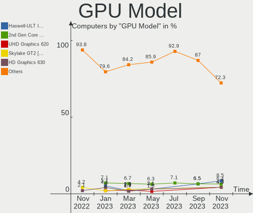
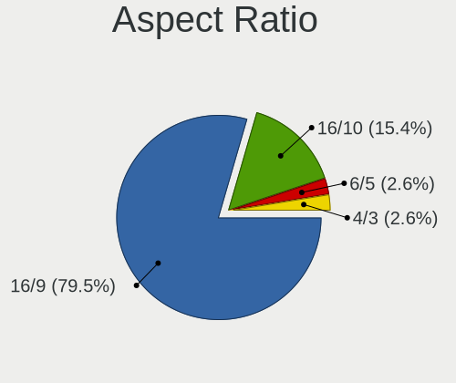
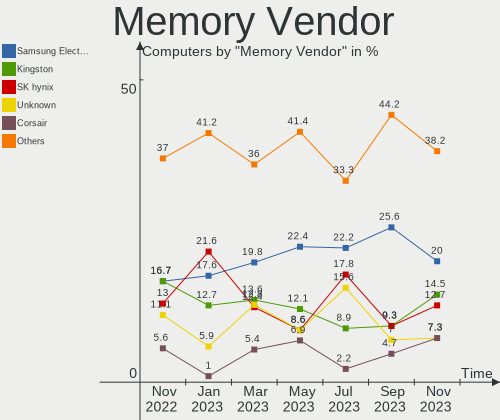
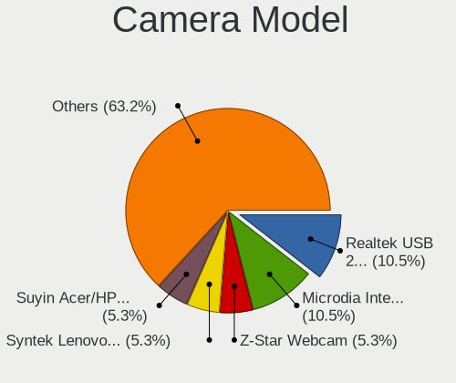
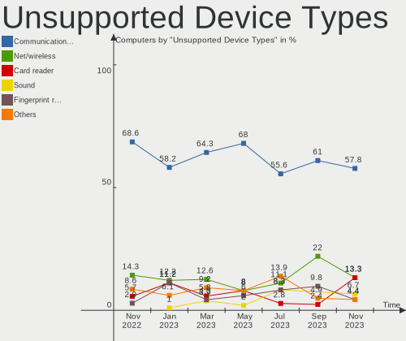

helloSystem - Hardware Trends
-----------------------------

A project to identify most popular hardware characteristics and track their change
over time based on data collected by BSD users at https://BSD-Hardware.info.

Anyone can contribute to this report by the [hw-probe](https://github.com/linuxhw/hw-probe/blob/master/INSTALL.BSD.md) tool:

    hw-probe -all -upload

This is a report for all computer types. See also reports for [desktops](/Dist/helloSystem/Desktop/README.md) and [notebooks](/Dist/helloSystem/Notebook/README.md).

This report is for one last month. Overall report since the beginning of time: [TestCoverage](https://github.com/bsdhw/TestCoverage)

Period: Sep, 2022.

Contents
--------

* [ System ](#system)
  - [ OS                       ](#os)
  - [ OS Family                ](#os-family)
  - [ Arch                     ](#arch)
  - [ DE                       ](#de)
  - [ Display Server           ](#display-server)
  - [ Display Manager          ](#display-manager)
  - [ OS Lang                  ](#os-lang)
  - [ Boot Mode                ](#boot-mode)
  - [ Filesystem               ](#filesystem)
  - [ Part. scheme             ](#part-scheme)

* [ Board ](#board)
  - [ Vendor                   ](#vendor)
  - [ Model                    ](#model)
  - [ Model Family             ](#model-family)
  - [ MFG Year                 ](#mfg-year)
  - [ Form Factor              ](#form-factor)
  - [ Coreboot                 ](#coreboot)
  - [ RAM Size                 ](#ram-size)
  - [ RAM Used                 ](#ram-used)
  - [ Total Drives             ](#total-drives)
  - [ Has CD-ROM               ](#has-cd-rom)
  - [ Has Ethernet             ](#has-ethernet)
  - [ Has WiFi                 ](#has-wifi)
  - [ Has Bluetooth            ](#has-bluetooth)

* [ Location ](#location)
  - [ Country                  ](#country)
  - [ City                     ](#city)

* [ Drives ](#drives)
  - [ Drive Vendor             ](#drive-vendor)
  - [ Drive Model              ](#drive-model)
  - [ HDD Vendor               ](#hdd-vendor)
  - [ SSD Vendor               ](#ssd-vendor)
  - [ Drive Kind               ](#drive-kind)
  - [ Drive Connector          ](#drive-connector)
  - [ Drive Size               ](#drive-size)
  - [ Space Total              ](#space-total)
  - [ Space Used               ](#space-used)
  - [ Malfunc. Drives          ](#malfunc-drives)
  - [ Malfunc. Drive Vendor    ](#malfunc-drive-vendor)
  - [ Malfunc. HDD Vendor      ](#malfunc-hdd-vendor)
  - [ Malfunc. Drive Kind      ](#malfunc-drive-kind)
  - [ Failed Drives            ](#failed-drives)
  - [ Failed Drive Vendor      ](#failed-drive-vendor)
  - [ Drive Status             ](#drive-status)

* [ Storage controller ](#storage-controller)
  - [ Storage Vendor           ](#storage-vendor)
  - [ Storage Model            ](#storage-model)
  - [ Storage Kind             ](#storage-kind)

* [ Processor ](#processor)
  - [ CPU Vendor               ](#cpu-vendor)
  - [ CPU Model                ](#cpu-model)
  - [ CPU Model Family         ](#cpu-model-family)
  - [ CPU Cores                ](#cpu-cores)
  - [ CPU Sockets              ](#cpu-sockets)
  - [ CPU Threads              ](#cpu-threads)
  - [ CPU Microarch            ](#cpu-microarch)

* [ Graphics ](#graphics)
  - [ GPU Vendor               ](#gpu-vendor)
  - [ GPU Model                ](#gpu-model)
  - [ GPU Combo                ](#gpu-combo)
  - [ GPU Driver               ](#gpu-driver)
  - [ GPU Memory               ](#gpu-memory)

* [ Monitor ](#monitor)
  - [ Monitor Vendor           ](#monitor-vendor)
  - [ Monitor Model            ](#monitor-model)
  - [ Monitor Resolution       ](#monitor-resolution)
  - [ Monitor Diagonal         ](#monitor-diagonal)
  - [ Monitor Width            ](#monitor-width)
  - [ Aspect Ratio             ](#aspect-ratio)
  - [ Monitor Area             ](#monitor-area)
  - [ Pixel Density            ](#pixel-density)
  - [ Multiple Monitors        ](#multiple-monitors)

* [ Network ](#network)
  - [ Net Controller Vendor    ](#net-controller-vendor)
  - [ Net Controller Model     ](#net-controller-model)
  - [ Wireless Vendor          ](#wireless-vendor)
  - [ Wireless Model           ](#wireless-model)
  - [ Ethernet Vendor          ](#ethernet-vendor)
  - [ Ethernet Model           ](#ethernet-model)
  - [ Net Controller Kind      ](#net-controller-kind)
  - [ Used Controller          ](#used-controller)
  - [ NICs                     ](#nics)
  - [ IPv6                     ](#ipv6)

* [ Bluetooth ](#bluetooth)
  - [ Bluetooth Vendor         ](#bluetooth-vendor)
  - [ Bluetooth Model          ](#bluetooth-model)

* [ Sound ](#sound)
  - [ Sound Vendor             ](#sound-vendor)
  - [ Sound Model              ](#sound-model)

* [ Memory ](#memory)
  - [ Memory Vendor            ](#memory-vendor)
  - [ Memory Model             ](#memory-model)
  - [ Memory Kind              ](#memory-kind)
  - [ Memory Form Factor       ](#memory-form-factor)
  - [ Memory Size              ](#memory-size)
  - [ Memory Speed             ](#memory-speed)

* [ Printers & scanners ](#printers--scanners)
  - [ Printer Vendor           ](#printer-vendor)
  - [ Printer Model            ](#printer-model)
  - [ Scanner Vendor           ](#scanner-vendor)
  - [ Scanner Model            ](#scanner-model)

* [ Camera ](#camera)
  - [ Camera Vendor            ](#camera-vendor)
  - [ Camera Model             ](#camera-model)

* [ Security ](#security)
  - [ Fingerprint Vendor       ](#fingerprint-vendor)
  - [ Fingerprint Model        ](#fingerprint-model)
  - [ Chipcard Vendor          ](#chipcard-vendor)
  - [ Chipcard Model           ](#chipcard-model)

* [ Unsupported ](#unsupported)
  - [ Unsupported Devices      ](#unsupported-devices)
  - [ Unsupported Device Types ](#unsupported-device-types)

System
------

OS
--

Installed operating systems

| Name                | Computers | Percent |
|---------------------|-----------|---------|
| helloSystem 0.7.0   | 13        | 61.9%   |
| helloSystem 0.8.0   | 6         | 28.57%  |
| helloSystem 13.1-p2 | 1         | 4.76%   |
| helloSystem 13.1    | 1         | 4.76%   |

OS Family
---------

OS without a version

| Name        | Computers | Percent |
|-------------|-----------|---------|
| helloSystem | 21        | 100%    |

Arch
----

OS architecture (x86_64, i586, etc.)

| Name  | Computers | Percent |
|-------|-----------|---------|
| amd64 | 21        | 100%    |

DE
--

Desktop Environment

| Name         | Computers | Percent |
|--------------|-----------|---------|
| helloDesktop | 21        | 100%    |

Display Server
--------------

X11 or Wayland

| Name | Computers | Percent |
|------|-----------|---------|
| X11  | 21        | 100%    |

Display Manager
---------------

SDDM, LightDM, etc.

| Name    | Computers | Percent |
|---------|-----------|---------|
| SLiM    | 19        | 90.48%  |
| Console | 2         | 9.52%   |

OS Lang
-------

Language

| Lang  | Computers | Percent |
|-------|-----------|---------|
| en_US | 17        | 80.95%  |
| C     | 2         | 9.52%   |
| ru_RU | 1         | 4.76%   |
| fr_FR | 1         | 4.76%   |

Boot Mode
---------

EFI or BIOS

| Mode | Computers | Percent |
|------|-----------|---------|
| EFI  | 21        | 100%    |

Filesystem
----------

Type of filesystem

| Type   | Computers | Percent |
|--------|-----------|---------|
| Cd9660 | 14        | 66.67%  |
| Zfs    | 7         | 33.33%  |

Part. scheme
------------

Scheme of partitioning

| Type | Computers | Percent |
|------|-----------|---------|
| GPT  | 21        | 100%    |

Board
-----

Vendor
------

Motherboard manufacturer

| Name             | Computers | Percent |
|------------------|-----------|---------|
| Lenovo           | 6         | 28.57%  |
| Dell             | 5         | 23.81%  |
| Apple            | 3         | 14.29%  |
| ASUSTek Computer | 2         | 9.52%   |
| ASRock           | 2         | 9.52%   |
| Pegatron         | 1         | 4.76%   |
| Kraftway         | 1         | 4.76%   |
| Hewlett-Packard  | 1         | 4.76%   |

Model
-----

Motherboard model

| Name                                   | Computers | Percent |
|----------------------------------------|-----------|---------|
| Dell Precision 7710                    | 2         | 9.52%   |
| Pegatron IPM41-D3                      | 1         | 4.76%   |
| Lenovo ThinkPad X61 Tablet 7763AD6     | 1         | 4.76%   |
| Lenovo ThinkPad X270 20HMS2LL00        | 1         | 4.76%   |
| Lenovo ThinkPad X250 20CLS1WP01        | 1         | 4.76%   |
| Lenovo ThinkPad T440 20B7S2LT00        | 1         | 4.76%   |
| Lenovo Legion Y540-17IRH 81Q4          | 1         | 4.76%   |
| Lenovo G50-30 80G0                     | 1         | 4.76%   |
| Kraftway KW10T                         | 1         | 4.76%   |
| HP ProDesk 400 G7 Small Form Factor PC | 1         | 4.76%   |
| Dell OptiPlex 7040                     | 1         | 4.76%   |
| Dell OptiPlex 3010                     | 1         | 4.76%   |
| Dell Latitude E5550                    | 1         | 4.76%   |
| ASUS TUF B450M-PRO GAMING              | 1         | 4.76%   |
| ASUS All Series                        | 1         | 4.76%   |
| ASRock ConRoeXFire-eSATA2              | 1         | 4.76%   |
| ASRock A320M-HD                        | 1         | 4.76%   |
| Apple MacPro5,1                        | 1         | 4.76%   |
| Apple MacBookPro5,1                    | 1         | 4.76%   |
| Apple MacBook5,2                       | 1         | 4.76%   |

Model Family
------------

Motherboard model prefix

| Name                      | Computers | Percent |
|---------------------------|-----------|---------|
| Lenovo ThinkPad           | 4         | 19.05%  |
| Dell Precision            | 2         | 9.52%   |
| Dell OptiPlex             | 2         | 9.52%   |
| Pegatron IPM41-D3         | 1         | 4.76%   |
| Lenovo Legion             | 1         | 4.76%   |
| Lenovo G50-30             | 1         | 4.76%   |
| Kraftway KW10T            | 1         | 4.76%   |
| HP ProDesk                | 1         | 4.76%   |
| Dell Latitude             | 1         | 4.76%   |
| ASUS TUF                  | 1         | 4.76%   |
| ASUS All                  | 1         | 4.76%   |
| ASRock ConRoeXFire-eSATA2 | 1         | 4.76%   |
| ASRock A320M-HD           | 1         | 4.76%   |
| Apple MacPro5             | 1         | 4.76%   |
| Apple MacBookPro5         | 1         | 4.76%   |
| Apple MacBook5            | 1         | 4.76%   |

MFG Year
--------

Motherboard manufacture year

| Year | Computers | Percent |
|------|-----------|---------|
| 2016 | 3         | 14.29%  |
| 2022 | 2         | 9.52%   |
| 2020 | 2         | 9.52%   |
| 2019 | 2         | 9.52%   |
| 2014 | 2         | 9.52%   |
| 2013 | 2         | 9.52%   |
| 2010 | 2         | 9.52%   |
| 2018 | 1         | 4.76%   |
| 2017 | 1         | 4.76%   |
| 2015 | 1         | 4.76%   |
| 2012 | 1         | 4.76%   |
| 2011 | 1         | 4.76%   |
| 2009 | 1         | 4.76%   |

Form Factor
-----------

Physical design of the computer

| Name     | Computers | Percent |
|----------|-----------|---------|
| Notebook | 12        | 57.14%  |
| Desktop  | 9         | 42.86%  |

Coreboot
--------

Have coreboot on board

| Used | Computers | Percent |
|------|-----------|---------|
| No   | 21        | 100%    |

RAM Size
--------

Total RAM memory

| Size in GB  | Computers | Percent |
|-------------|-----------|---------|
| 4.01-8.0    | 8         | 38.1%   |
| 16.01-24.0  | 4         | 19.05%  |
| 8.01-16.0   | 4         | 19.05%  |
| 32.01-64.0  | 3         | 14.29%  |
| 2.01-3.0    | 1         | 4.76%   |
| 64.01-256.0 | 1         | 4.76%   |

RAM Used
--------

Used RAM memory

| Used GB  | Computers | Percent |
|----------|-----------|---------|
| 0.01-0.5 | 10        | 47.62%  |
| 0.51-1.0 | 5         | 23.81%  |
| 1.01-2.0 | 4         | 19.05%  |
| 3.01-4.0 | 1         | 4.76%   |
| 2.01-3.0 | 1         | 4.76%   |

Total Drives
------------

Number of drives on board

| Drives | Computers | Percent |
|--------|-----------|---------|
| 1      | 12        | 57.14%  |
| 2      | 6         | 28.57%  |
| 4      | 2         | 9.52%   |
| 3      | 1         | 4.76%   |

Has CD-ROM
----------

Has CD-ROM on board

| Presented | Computers | Percent |
|-----------|-----------|---------|
| No        | 18        | 85.71%  |
| Yes       | 3         | 14.29%  |

Has Ethernet
------------

Has Ethernet on board

| Presented | Computers | Percent |
|-----------|-----------|---------|
| Yes       | 18        | 85.71%  |
| No        | 3         | 14.29%  |

Has WiFi
--------

Has WiFi module

| Presented | Computers | Percent |
|-----------|-----------|---------|
| Yes       | 13        | 61.9%   |
| No        | 8         | 38.1%   |

Has Bluetooth
-------------

Has Bluetooth module

| Presented | Computers | Percent |
|-----------|-----------|---------|
| Yes       | 11        | 52.38%  |
| No        | 10        | 47.62%  |

Location
--------

Country
-------

Geographic location (country)

| Country     | Computers | Percent |
|-------------|-----------|---------|
| Russia      | 4         | 19.05%  |
| USA         | 2         | 9.52%   |
| UK          | 2         | 9.52%   |
| Switzerland | 2         | 9.52%   |
| Brazil      | 2         | 9.52%   |
| Spain       | 1         | 4.76%   |
| Poland      | 1         | 4.76%   |
| Netherlands | 1         | 4.76%   |
| Hungary     | 1         | 4.76%   |
| Germany     | 1         | 4.76%   |
| France      | 1         | 4.76%   |
| Czechia     | 1         | 4.76%   |
| Belgium     | 1         | 4.76%   |
| Argentina   | 1         | 4.76%   |

City
----

Geographic location (city)

| City           | Computers | Percent |
|----------------|-----------|---------|
| Krasnodar      | 2         | 9.52%   |
| Wroclaw        | 1         | 4.76%   |
| Volgograd      | 1         | 4.76%   |
| Ufa            | 1         | 4.76%   |
| Southminster   | 1         | 4.76%   |
| San Bernardino | 1         | 4.76%   |
| Prague         | 1         | 4.76%   |
| Mendoza        | 1         | 4.76%   |
| Lutry          | 1         | 4.76%   |
| Leganés       | 1         | 4.76%   |
| Krefeld        | 1         | 4.76%   |
| Kazincbarcika  | 1         | 4.76%   |
| Irece          | 1         | 4.76%   |
| Dover          | 1         | 4.76%   |
| Curitiba       | 1         | 4.76%   |
| Bourges        | 1         | 4.76%   |
| Basel          | 1         | 4.76%   |
| Antwerp        | 1         | 4.76%   |
| Amsterdam      | 1         | 4.76%   |
| Abingdon       | 1         | 4.76%   |

Drives
------

Drive Vendor
------------

Hard drive vendors

| Vendor              | Computers | Drives | Percent |
|---------------------|-----------|--------|---------|
| Samsung Electronics | 6         | 8      | 19.35%  |
| Seagate             | 4         | 5      | 12.9%   |
| Hitachi             | 4         | 4      | 12.9%   |
| WDC                 | 3         | 3      | 9.68%   |
| Toshiba             | 3         | 3      | 9.68%   |
| XrayDisk            | 1         | 1      | 3.23%   |
| Silicon Motion      | 1         | 1      | 3.23%   |
| SanDisk             | 1         | 1      | 3.23%   |
| Lexar               | 1         | 1      | 3.23%   |
| Leven               | 1         | 1      | 3.23%   |
| KIOXIA              | 1         | 1      | 3.23%   |
| Kingston            | 1         | 3      | 3.23%   |
| KingSpec            | 1         | 1      | 3.23%   |
| Intel               | 1         | 1      | 3.23%   |
| Fujitsu             | 1         | 1      | 3.23%   |
| FORESEE             | 1         | 1      | 3.23%   |

Drive Model
-----------

Hard drive models

| Model                              | Computers | Percent |
|------------------------------------|-----------|---------|
| Hitachi HTS541680J9SA00 80GB       | 2         | 5.71%   |
| XrayDisk SSD 240GB                 | 1         | 2.86%   |
| WDC WDBNCE5000PNC 500GB            | 1         | 2.86%   |
| WDC WD5000LPCX-60VHAT0 500GB       | 1         | 2.86%   |
| WDC WD10EZEX-00WN4A0 1TB           | 1         | 2.86%   |
| Toshiba MQ01UBD100 1TB             | 1         | 2.86%   |
| Toshiba MK8034GSX 80GB             | 1         | 2.86%   |
| Toshiba DT01ACA100 1TB             | 1         | 2.86%   |
| Silicon Motion NE-256 256GB        | 1         | 2.86%   |
| Seagate ST9160412AS 160GB          | 1         | 2.86%   |
| Seagate ST3250310AS 250GB          | 1         | 2.86%   |
| Seagate ST250LT003-9YG14C 250GB    | 1         | 2.86%   |
| Seagate ST2000LM003 HN-M201RAD 2TB | 1         | 2.86%   |
| Seagate ST1000DM003-1ER162 1TB     | 1         | 2.86%   |
| SanDisk SD8SB8U128G1001 128GB      | 1         | 2.86%   |
| Samsung SSD 980 1TB                | 1         | 2.86%   |
| Samsung SSD 970 EVO Plus 500GB     | 1         | 2.86%   |
| Samsung SSD 850 EVO 500GB          | 1         | 2.86%   |
| Samsung SSD 850 EVO 250GB          | 1         | 2.86%   |
| Samsung SSD 840 PRO Series 256GB   | 1         | 2.86%   |
| Samsung SP0812C 80GB               | 1         | 2.86%   |
| Samsung SM951 NVMe 512GB           | 1         | 2.86%   |
| Samsung PM961 NVMe 256GB           | 1         | 2.86%   |
| Lexar SSD 120GB                    | 1         | 2.86%   |
| Leven JAJS300M240C 240GB           | 1         | 2.86%   |
| KIOXIA KBG40ZNV512G 512GB          | 1         | 2.86%   |
| Kingston SUV400S37240G 240GB       | 1         | 2.86%   |
| Kingston SA400S37240G 240GB        | 1         | 2.86%   |
| KingSpec NT-256 256GB              | 1         | 2.86%   |
| Intel SSDPEKNW020T8 2TB            | 1         | 2.86%   |
| Hitachi HDT721032SLA360 320GB      | 1         | 2.86%   |
| Hitachi HDS721050CLA662 500GB      | 1         | 2.86%   |
| Fujitsu MHZ2160BH FFS G1 160GB     | 1         | 2.86%   |
| FORESEE 128GB SSD                  | 1         | 2.86%   |

HDD Vendor
----------

Hard disk drive vendors

| Vendor              | Computers | Drives | Percent |
|---------------------|-----------|--------|---------|
| Seagate             | 4         | 5      | 26.67%  |
| Hitachi             | 4         | 4      | 26.67%  |
| Toshiba             | 3         | 3      | 20%     |
| WDC                 | 2         | 2      | 13.33%  |
| Samsung Electronics | 1         | 1      | 6.67%   |
| Fujitsu             | 1         | 1      | 6.67%   |

SSD Vendor
----------

Solid state drive vendors

| Vendor              | Computers | Drives | Percent |
|---------------------|-----------|--------|---------|
| Samsung Electronics | 3         | 3      | 27.27%  |
| XrayDisk            | 1         | 1      | 9.09%   |
| WDC                 | 1         | 1      | 9.09%   |
| SanDisk             | 1         | 1      | 9.09%   |
| Lexar               | 1         | 1      | 9.09%   |
| Leven               | 1         | 1      | 9.09%   |
| Kingston            | 1         | 3      | 9.09%   |
| KingSpec            | 1         | 1      | 9.09%   |
| FORESEE             | 1         | 1      | 9.09%   |

Drive Kind
----------

HDD or SSD

| Kind | Computers | Drives | Percent |
|------|-----------|--------|---------|
| HDD  | 11        | 16     | 40.74%  |
| SSD  | 10        | 13     | 37.04%  |
| NVMe | 6         | 7      | 22.22%  |

Drive Connector
---------------

SATA, SAS, NVMe, etc.

| Type | Computers | Drives | Percent |
|------|-----------|--------|---------|
| SATA | 19        | 29     | 76%     |
| NVMe | 6         | 7      | 24%     |

Drive Size
----------

Size of hard drive

| Size in TB | Computers | Drives | Percent |
|------------|-----------|--------|---------|
| 0.01-0.5   | 16        | 24     | 76.19%  |
| 0.51-1.0   | 4         | 4      | 19.05%  |
| 1.01-2.0   | 1         | 1      | 4.76%   |

Space Total
-----------

Amount of disk space available on the file system

| Size in GB | Computers | Percent |
|------------|-----------|---------|
| 1-20       | 13        | 61.9%   |
| 101-250    | 5         | 23.81%  |
| 251-500    | 2         | 9.52%   |
| 21-50      | 1         | 4.76%   |

Space Used
----------

Amount of used disk space

| Used GB | Computers | Percent |
|---------|-----------|---------|
| 1-20    | 21        | 100%    |

Malfunc. Drives
---------------

Drive models with a malfunction

| Model                          | Computers | Drives | Percent |
|--------------------------------|-----------|--------|---------|
| XrayDisk SSD 240GB             | 1         | 1      | 14.29%  |
| WDC WD5000LPCX-60VHAT0 500GB   | 1         | 1      | 14.29%  |
| Toshiba MQ01UBD100 1TB         | 1         | 1      | 14.29%  |
| Toshiba MK8034GSX 80GB         | 1         | 1      | 14.29%  |
| Seagate ST9160412AS 160GB      | 1         | 1      | 14.29%  |
| Hitachi HTS541680J9SA00 80GB   | 1         | 1      | 14.29%  |
| Fujitsu MHZ2160BH FFS G1 160GB | 1         | 1      | 14.29%  |

Malfunc. Drive Vendor
---------------------

Vendors of faulty drives

| Vendor   | Computers | Drives | Percent |
|----------|-----------|--------|---------|
| Toshiba  | 2         | 2      | 28.57%  |
| XrayDisk | 1         | 1      | 14.29%  |
| WDC      | 1         | 1      | 14.29%  |
| Seagate  | 1         | 1      | 14.29%  |
| Hitachi  | 1         | 1      | 14.29%  |
| Fujitsu  | 1         | 1      | 14.29%  |

Malfunc. HDD Vendor
-------------------

Vendors of faulty HDD drives

| Vendor  | Computers | Drives | Percent |
|---------|-----------|--------|---------|
| Toshiba | 2         | 2      | 33.33%  |
| WDC     | 1         | 1      | 16.67%  |
| Seagate | 1         | 1      | 16.67%  |
| Hitachi | 1         | 1      | 16.67%  |
| Fujitsu | 1         | 1      | 16.67%  |

Malfunc. Drive Kind
-------------------

Kinds of faulty drives

| Kind | Computers | Drives | Percent |
|------|-----------|--------|---------|
| HDD  | 4         | 6      | 80%     |
| SSD  | 1         | 1      | 20%     |

Failed Drives
-------------

Failed drive models

Zero info for selected period =(

Failed Drive Vendor
-------------------

Failed drive vendors

Zero info for selected period =(

Drive Status
------------

Number of failed and malfunc. drives

| Status   | Computers | Drives | Percent |
|----------|-----------|--------|---------|
| Works    | 17        | 25     | 73.91%  |
| Malfunc  | 5         | 7      | 21.74%  |
| Detected | 1         | 4      | 4.35%   |

Storage controller
------------------

Storage Vendor
--------------

Storage controller vendors

| Vendor              | Computers | Percent |
|---------------------|-----------|---------|
| Intel               | 17        | 65.38%  |
| Samsung Electronics | 3         | 11.54%  |
| Nvidia              | 2         | 7.69%   |
| AMD                 | 2         | 7.69%   |
| Silicon Motion      | 1         | 3.85%   |
| KIOXIA              | 1         | 3.85%   |

Storage Model
-------------

Storage controller models

| Model                                                                          | Computers | Percent |
|--------------------------------------------------------------------------------|-----------|---------|
| Intel Q170/Q150/B150/H170/H110/Z170/CM236 Chipset SATA Controller [AHCI Mode]  | 3         | 9.38%   |
| Nvidia MCP79 AHCI Controller                                                   | 2         | 6.25%   |
| Intel Atom Processor E3800 Series SATA AHCI Controller                         | 2         | 6.25%   |
| AMD FCH SATA Controller [AHCI mode]                                            | 2         | 6.25%   |
| Silicon Motion SM2263EN/SM2263XT SSD Controller                                | 1         | 3.13%   |
| Samsung NVMe SSD Controller SM981/PM981/PM983                                  | 1         | 3.13%   |
| Samsung NVMe SSD Controller SM961/PM961/SM963                                  | 1         | 3.13%   |
| Samsung NVMe SSD Controller SM951/PM951                                        | 1         | 3.13%   |
| Samsung NVMe SSD Controller 980                                                | 1         | 3.13%   |
| KIOXIA NVMe SSD Controller BG4                                                 | 1         | 3.13%   |
| Intel Wildcat Point-LP SATA Controller [AHCI Mode]                             | 1         | 3.13%   |
| Intel Sunrise Point-LP SATA Controller [AHCI mode]                             | 1         | 3.13%   |
| Intel SSD 660P Series                                                          | 1         | 3.13%   |
| Intel NM10/ICH7 Family SATA Controller [IDE mode]                              | 1         | 3.13%   |
| Intel NM10/ICH7 Family SATA Controller [AHCI mode]                             | 1         | 3.13%   |
| Intel Comet Lake SATA AHCI Controller                                          | 1         | 3.13%   |
| Intel Cannon Lake Mobile PCH SATA AHCI Controller                              | 1         | 3.13%   |
| Intel 82801JI (ICH10 Family) SATA AHCI Controller                              | 1         | 3.13%   |
| Intel 82801HM/HEM (ICH8M/ICH8M-E) SATA Controller [AHCI mode]                  | 1         | 3.13%   |
| Intel 82801HM/HEM (ICH8M/ICH8M-E) IDE Controller                               | 1         | 3.13%   |
| Intel 82801G (ICH7 Family) IDE Controller                                      | 1         | 3.13%   |
| Intel 82801 Mobile SATA Controller [RAID mode]                                 | 1         | 3.13%   |
| Intel 8 Series/C220 Series Chipset Family 6-port SATA Controller 1 [AHCI mode] | 1         | 3.13%   |
| Intel 8 Series SATA Controller 1 [AHCI mode]                                   | 1         | 3.13%   |
| Intel 6 Series/C200 Series Chipset Family 6 port Desktop SATA AHCI Controller  | 1         | 3.13%   |
| AMD FCH SATA Controller D                                                      | 1         | 3.13%   |
| AMD 400 Series Chipset SATA Controller                                         | 1         | 3.13%   |

Storage Kind
------------

Kind of storage controller (IDE, SATA, NVMe, SAS, ...)

| Kind | Computers | Percent |
|------|-----------|---------|
| SATA | 19        | 65.52%  |
| NVMe | 6         | 20.69%  |
| IDE  | 3         | 10.34%  |
| RAID | 1         | 3.45%   |

Processor
---------

CPU Vendor
----------

Processor vendors

| Vendor | Computers | Percent |
|--------|-----------|---------|
| Intel  | 19        | 90.48%  |
| AMD    | 2         | 9.52%   |

CPU Model
---------

Processor models

| Model                                       | Computers | Percent |
|---------------------------------------------|-----------|---------|
| Intel Xeon CPU X5550 @ 2.67GHz              | 1         | 4.76%   |
| Intel Pentium Dual-Core CPU E6700 @ 3.20GHz | 1         | 4.76%   |
| Intel Pentium Dual-Core CPU E5200 @ 2.50GHz | 1         | 4.76%   |
| Intel Core i7-9750H CPU @ 2.60GHz           | 1         | 4.76%   |
| Intel Core i7-6920HQ CPU @ 2.90GHz          | 1         | 4.76%   |
| Intel Core i7-6820HQ CPU @ 2.70GHz          | 1         | 4.76%   |
| Intel Core i7-6700 CPU @ 3.40GHz            | 1         | 4.76%   |
| Intel Core i5-7300U CPU @ 2.60GHz           | 1         | 4.76%   |
| Intel Core i5-5300U CPU @ 2.30GHz           | 1         | 4.76%   |
| Intel Core i5-5200U CPU @ 2.20GHz           | 1         | 4.76%   |
| Intel Core i5-4440 CPU @ 3.10GHz            | 1         | 4.76%   |
| Intel Core i5-4200U CPU @ 1.60GHz           | 1         | 4.76%   |
| Intel Core i5-10500 CPU @ 3.10GHz           | 1         | 4.76%   |
| Intel Core i3-3220 CPU @ 3.30GHz            | 1         | 4.76%   |
| Intel Core 2 Duo CPU T9600 @ 2.80GHz        | 1         | 4.76%   |
| Intel Core 2 Duo CPU P7450 @ 2.13GHz        | 1         | 4.76%   |
| Intel Core 2 Duo CPU L7500 @ 1.60GHz        | 1         | 4.76%   |
| Intel Celeron CPU N2840 @ 2.16GHz           | 1         | 4.76%   |
| Intel Atom CPU E3825 @ 1.33GHz              | 1         | 4.76%   |
| AMD Ryzen 7 2700X Eight-Core Processor      | 1         | 4.76%   |
| AMD Athlon 3000G with Radeon Vega Graphics  | 1         | 4.76%   |

CPU Model Family
----------------

Processor model prefix

| Model                   | Computers | Percent |
|-------------------------|-----------|---------|
| Intel Core i5           | 6         | 28.57%  |
| Intel Core i7           | 4         | 19.05%  |
| Intel Core 2 Duo        | 3         | 14.29%  |
| Intel Pentium Dual-Core | 2         | 9.52%   |
| Intel Xeon              | 1         | 4.76%   |
| Intel Core i3           | 1         | 4.76%   |
| Intel Celeron           | 1         | 4.76%   |
| Intel Atom              | 1         | 4.76%   |
| AMD Ryzen 7             | 1         | 4.76%   |
| AMD Athlon              | 1         | 4.76%   |

CPU Cores
---------

Number of processor cores

| Number  | Computers | Percent |
|---------|-----------|---------|
| 2       | 8         | 38.1%   |
| 4       | 5         | 23.81%  |
| Unknown | 4         | 19.05%  |
| 6       | 2         | 9.52%   |
| 16      | 1         | 4.76%   |
| 8       | 1         | 4.76%   |

CPU Sockets
-----------

Number of sockets

| Number | Computers | Percent |
|--------|-----------|---------|
| 1      | 18        | 85.71%  |
| 2      | 3         | 14.29%  |

CPU Threads
-----------

Threads per core (Hyper-Threading)

| Number  | Computers | Percent |
|---------|-----------|---------|
| 2       | 11        | 52.38%  |
| 1       | 6         | 28.57%  |
| Unknown | 4         | 19.05%  |

CPU Microarch
-------------

Microarchitecture

| Name       | Computers | Percent |
|------------|-----------|---------|
| Penryn     | 4         | 19.05%  |
| Skylake    | 3         | 14.29%  |
| Zen+       | 2         | 9.52%   |
| Silvermont | 2         | 9.52%   |
| KabyLake   | 2         | 9.52%   |
| Haswell    | 2         | 9.52%   |
| Broadwell  | 2         | 9.52%   |
| Nehalem    | 1         | 4.76%   |
| IvyBridge  | 1         | 4.76%   |
| Core       | 1         | 4.76%   |
| CometLake  | 1         | 4.76%   |

Graphics
--------

GPU Vendor
----------

Vendors of graphics cards

| Vendor | Computers | Percent |
|--------|-----------|---------|
| Intel  | 12        | 50%     |
| Nvidia | 8         | 33.33%  |
| AMD    | 4         | 16.67%  |

GPU Model
---------

Graphics card models

| Model                                                                | Computers | Percent |
|----------------------------------------------------------------------|-----------|---------|
| Intel HD Graphics 530                                                | 3         | 11.54%  |
| Intel HD Graphics 5500                                               | 2         | 7.69%   |
| Intel Atom Processor Z36xxx/Z37xxx Series Graphics & Display         | 2         | 7.69%   |
| Nvidia TU116 [GeForce GTX 1660 SUPER]                                | 1         | 3.85%   |
| Nvidia TU106M [GeForce RTX 2060 Mobile]                              | 1         | 3.85%   |
| Nvidia GM204GLM [Quadro M4000M]                                      | 1         | 3.85%   |
| Nvidia GM204GLM [Quadro M3000M]                                      | 1         | 3.85%   |
| Nvidia GK107 [GeForce GT 640 OEM]                                    | 1         | 3.85%   |
| Nvidia G96CM [GeForce 9600M GT]                                      | 1         | 3.85%   |
| Nvidia G84 [GeForce 8600 GTS]                                        | 1         | 3.85%   |
| Nvidia C79 [GeForce 9400M]                                           | 1         | 3.85%   |
| Nvidia C79 [GeForce 9400M G]                                         | 1         | 3.85%   |
| Intel Xeon E3-1200 v2/3rd Gen Core processor Graphics Controller     | 1         | 3.85%   |
| Intel Mobile GM965/GL960 Integrated Graphics Controller (secondary)  | 1         | 3.85%   |
| Intel Mobile GM965/GL960 Integrated Graphics Controller (primary)    | 1         | 3.85%   |
| Intel HD Graphics 620                                                | 1         | 3.85%   |
| Intel Haswell-ULT Integrated Graphics Controller                     | 1         | 3.85%   |
| Intel CometLake-S GT2 [UHD Graphics 630]                             | 1         | 3.85%   |
| AMD Redwood XT [Radeon HD 5670/5690/5730]                            | 1         | 3.85%   |
| AMD Picasso/Raven 2 [Radeon Vega Series / Radeon Vega Mobile Series] | 1         | 3.85%   |
| AMD Oland XT [Radeon HD 8670 / R5 340X OEM / R7 250/350/350X OEM]    | 1         | 3.85%   |
| AMD Cedar [Radeon HD 5000/6000/7350/8350 Series]                     | 1         | 3.85%   |

GPU Combo
---------

Combinations of graphics cards

| Name           | Computers | Percent |
|----------------|-----------|---------|
| 1 x Intel      | 8         | 38.1%   |
| 1 x Nvidia     | 5         | 23.81%  |
| 1 x AMD        | 3         | 14.29%  |
| Intel + Nvidia | 2         | 9.52%   |
| 2 x Nvidia     | 1         | 4.76%   |
| 2 x Intel      | 1         | 4.76%   |
| Intel + AMD    | 1         | 4.76%   |

GPU Driver
----------

Free vs proprietary

| Driver      | Computers | Percent |
|-------------|-----------|---------|
| Free        | 14        | 66.67%  |
| Proprietary | 6         | 28.57%  |
| Unknown     | 1         | 4.76%   |

GPU Memory
----------

Total video memory

| Size in GB | Computers | Percent |
|------------|-----------|---------|
| Unknown    | 11        | 52.38%  |
| 0.01-0.5   | 3         | 14.29%  |
| 5.01-6.0   | 2         | 9.52%   |
| 3.01-4.0   | 2         | 9.52%   |
| 1.01-2.0   | 2         | 9.52%   |
| 0.51-1.0   | 1         | 4.76%   |

Monitor
-------

Monitor Vendor
--------------

Monitor vendors

| Vendor              | Computers | Percent |
|---------------------|-----------|---------|
| LG Display          | 3         | 13.64%  |
| Dell                | 3         | 13.64%  |
| Samsung Electronics | 2         | 9.09%   |
| AU Optronics        | 2         | 9.09%   |
| Apple               | 2         | 9.09%   |
| Acer                | 2         | 9.09%   |
| Philips             | 1         | 4.55%   |
| Lenovo              | 1         | 4.55%   |
| InfoVision          | 1         | 4.55%   |
| Goldstar            | 1         | 4.55%   |
| Fujitsu Siemens     | 1         | 4.55%   |
| Chimei Innolux      | 1         | 4.55%   |
| BOE                 | 1         | 4.55%   |
| BenQ                | 1         | 4.55%   |

Monitor Model
-------------

Monitor models

| Model                                                                | Computers | Percent |
|----------------------------------------------------------------------|-----------|---------|
| LG Display LCD Monitor LGD0459 1920x1080 380x210mm 17.1-inch         | 2         | 8.7%    |
| Samsung Electronics SyncMaster SAM0601 1600x900                      | 1         | 4.35%   |
| Samsung Electronics LCD Monitor SDC4852 1366x768 340x190mm 15.3-inch | 1         | 4.35%   |
| Philips PHL 221V8 PHLC211 1920x1080 480x270mm 21.7-inch              | 1         | 4.35%   |
| LG Display LCD Monitor LGD046F 1920x1080 340x190mm 15.3-inch         | 1         | 4.35%   |
| Lenovo LCD Monitor LEN4002 1024x768 250x180mm 12.1-inch              | 1         | 4.35%   |
| InfoVision LCD Monitor IVO04E3 1366x768 280x160mm 12.7-inch          | 1         | 4.35%   |
| Goldstar L1918S GSM4B31 1280x1024 380x300mm 19.1-inch                | 1         | 4.35%   |
| Fujitsu Siemens S19-1 FUS0517 1280x1024 380x300mm 19.1-inch          | 1         | 4.35%   |
| Dell U2412M DELA07B 1920x1200 520x320mm 24.0-inch                    | 1         | 4.35%   |
| Dell U2412M DELA07A 1920x1200 520x320mm 24.0-inch                    | 1         | 4.35%   |
| Dell S2721QS DELA198 3840x2160 600x340mm 27.2-inch                   | 1         | 4.35%   |
| Dell P2412H DELA07D 1920x1080 530x300mm 24.0-inch                    | 1         | 4.35%   |
| Chimei Innolux LCD Monitor CMN1490 1366x768 310x170mm 13.9-inch      | 1         | 4.35%   |
| BOE LCD Monitor BOE06CE 1366x768 280x160mm 12.7-inch                 | 1         | 4.35%   |
| BenQ GW2765 BNQ78D6 2560x1440 600x340mm 27.2-inch                    | 1         | 4.35%   |
| AU Optronics LCD Monitor AUO449D 1920x1080 380x220mm 17.3-inch       | 1         | 4.35%   |
| AU Optronics LCD Monitor AUO4100 1920x1200 220x140mm 10.3-inch       | 1         | 4.35%   |
| Apple LCD Monitor APP9C84 1440x900 330x210mm 15.4-inch               | 1         | 4.35%   |
| Apple Color LCD APP9C5C 1280x800 290x180mm 13.4-inch                 | 1         | 4.35%   |
| Acer X223HQ ACR0098 1920x1080 470x270mm 21.3-inch                    | 1         | 4.35%   |
| Acer GN246HL ACR02FA 1920x1080 530x300mm 24.0-inch                   | 1         | 4.35%   |

Monitor Resolution
------------------

Monitor screen resolution

| Resolution        | Computers | Percent |
|-------------------|-----------|---------|
| 1920x1080 (FHD)   | 8         | 38.1%   |
| 1366x768 (WXGA)   | 3         | 14.29%  |
| 1920x1200 (WUXGA) | 2         | 9.52%   |
| 1280x1024 (SXGA)  | 2         | 9.52%   |
| 3840x2160 (4K)    | 1         | 4.76%   |
| 2560x1440 (QHD)   | 1         | 4.76%   |
| 1600x900 (HD+)    | 1         | 4.76%   |
| 1440x900 (WXGA+)  | 1         | 4.76%   |
| 1280x800 (WXGA)   | 1         | 4.76%   |
| 1024x768 (XGA)    | 1         | 4.76%   |

Monitor Diagonal
----------------

Diagonal size in inches

| Inches  | Computers | Percent |
|---------|-----------|---------|
| 24      | 3         | 13.64%  |
| 17      | 3         | 13.64%  |
| 15      | 3         | 13.64%  |
| 12      | 3         | 13.64%  |
| 27      | 2         | 9.09%   |
| 21      | 2         | 9.09%   |
| 19      | 2         | 9.09%   |
| 13      | 2         | 9.09%   |
| 10      | 1         | 4.55%   |
| Unknown | 1         | 4.55%   |

Monitor Width
-------------

Physical width

| Width in mm | Computers | Percent |
|-------------|-----------|---------|
| 501-600     | 5         | 22.73%  |
| 351-400     | 5         | 22.73%  |
| 201-300     | 5         | 22.73%  |
| 301-350     | 4         | 18.18%  |
| 401-500     | 2         | 9.09%   |
| Unknown     | 1         | 4.55%   |

Aspect Ratio
------------

Proportional relationship between the width and the height

| Ratio | Computers | Percent |
|-------|-----------|---------|
| 16/9  | 14        | 66.67%  |
| 16/10 | 4         | 19.05%  |
| 5/4   | 2         | 9.52%   |
| 4/3   | 1         | 4.76%   |

Monitor Area
------------

Area in inch²

| Area in inch² | Computers | Percent |
|----------------|-----------|---------|
| 61-70          | 3         | 13.64%  |
| 201-250        | 3         | 13.64%  |
| 151-200        | 3         | 13.64%  |
| 121-130        | 3         | 13.64%  |
| 81-90          | 2         | 9.09%   |
| 301-350        | 2         | 9.09%   |
| 101-110        | 2         | 9.09%   |
| 41-50          | 1         | 4.55%   |
| 251-300        | 1         | 4.55%   |
| 91-100         | 1         | 4.55%   |
| Unknown        | 1         | 4.55%   |

Pixel Density
-------------

Pixels per inch

| Density | Computers | Percent |
|---------|-----------|---------|
| 101-120 | 8         | 36.36%  |
| 121-160 | 6         | 27.27%  |
| 51-100  | 5         | 22.73%  |
| 161-240 | 2         | 9.09%   |
| Unknown | 1         | 4.55%   |

Multiple Monitors
-----------------

Total monitors connected

| Total | Computers | Percent |
|-------|-----------|---------|
| 1     | 19        | 90.48%  |
| 2     | 2         | 9.52%   |

Network
-------

Net Controller Vendor
---------------------

Controller vendors

| Vendor                        | Computers | Percent |
|-------------------------------|-----------|---------|
| Intel                         | 12        | 41.38%  |
| Realtek Semiconductor         | 9         | 31.03%  |
| Broadcom                      | 3         | 10.34%  |
| Nvidia                        | 2         | 6.9%    |
| Ralink Technology             | 1         | 3.45%   |
| OnePlus Technology (Shenzhen) | 1         | 3.45%   |
| Huawei Technologies           | 1         | 3.45%   |

Net Controller Model
--------------------

Controller models

| Model                                                             | Computers | Percent |
|-------------------------------------------------------------------|-----------|---------|
| Realtek RTL8111/8168/8411 PCI Express Gigabit Ethernet Controller | 8         | 23.53%  |
| Intel Wireless 7265                                               | 3         | 8.82%   |
| Nvidia MCP79 Ethernet                                             | 2         | 5.88%   |
| Intel Wireless 8260                                               | 2         | 5.88%   |
| Intel Ethernet Connection (2) I219-LM                             | 2         | 5.88%   |
| Broadcom BCM4322 802.11a/b/g/n Wireless LAN Controller            | 2         | 5.88%   |
| Realtek RTL8188CUS 802.11n WLAN Adapter                           | 1         | 2.94%   |
| Ralink RT5370 Wireless Adapter                                    | 1         | 2.94%   |
| OnePlus (Shenzhen) OnePlus RNDIS Control RNDIS Ethernet Data      | 1         | 2.94%   |
| Intel Wireless 8265 / 8275                                        | 1         | 2.94%   |
| Intel Wireless 7260                                               | 1         | 2.94%   |
| Intel PRO/Wireless 3945ABG [Golan] Network Connection             | 1         | 2.94%   |
| Intel Ethernet Connection I218-V                                  | 1         | 2.94%   |
| Intel Ethernet Connection (4) I219-LM                             | 1         | 2.94%   |
| Intel Ethernet Connection (3) I218-LM                             | 1         | 2.94%   |
| Intel Ethernet Connection (11) I219-LM                            | 1         | 2.94%   |
| Intel Cannon Lake PCH CNVi WiFi                                   | 1         | 2.94%   |
| Intel 82574L Gigabit Network Connection                           | 1         | 2.94%   |
| Intel 82566MM Gigabit Network Connection                          | 1         | 2.94%   |
| Huawei ME936 LTE/HSDPA+ 4G modem                                  | 1         | 2.94%   |
| Broadcom BCM43142 802.11b/g/n                                     | 1         | 2.94%   |

Wireless Vendor
---------------

Wireless vendors

| Vendor                | Computers | Percent |
|-----------------------|-----------|---------|
| Intel                 | 9         | 64.29%  |
| Broadcom              | 3         | 21.43%  |
| Realtek Semiconductor | 1         | 7.14%   |
| Ralink Technology     | 1         | 7.14%   |

Wireless Model
--------------

Wireless models

| Model                                                  | Computers | Percent |
|--------------------------------------------------------|-----------|---------|
| Intel Wireless 7265                                    | 3         | 21.43%  |
| Intel Wireless 8260                                    | 2         | 14.29%  |
| Broadcom BCM4322 802.11a/b/g/n Wireless LAN Controller | 2         | 14.29%  |
| Realtek RTL8188CUS 802.11n WLAN Adapter                | 1         | 7.14%   |
| Ralink RT5370 Wireless Adapter                         | 1         | 7.14%   |
| Intel Wireless 8265 / 8275                             | 1         | 7.14%   |
| Intel Wireless 7260                                    | 1         | 7.14%   |
| Intel PRO/Wireless 3945ABG [Golan] Network Connection  | 1         | 7.14%   |
| Intel Cannon Lake PCH CNVi WiFi                        | 1         | 7.14%   |
| Broadcom BCM43142 802.11b/g/n                          | 1         | 7.14%   |

Ethernet Vendor
---------------

Ethernet vendors

| Vendor                        | Computers | Percent |
|-------------------------------|-----------|---------|
| Realtek Semiconductor         | 8         | 42.11%  |
| Intel                         | 8         | 42.11%  |
| Nvidia                        | 2         | 10.53%  |
| OnePlus Technology (Shenzhen) | 1         | 5.26%   |

Ethernet Model
--------------

Ethernet models

| Model                                                             | Computers | Percent |
|-------------------------------------------------------------------|-----------|---------|
| Realtek RTL8111/8168/8411 PCI Express Gigabit Ethernet Controller | 8         | 42.11%  |
| Nvidia MCP79 Ethernet                                             | 2         | 10.53%  |
| Intel Ethernet Connection (2) I219-LM                             | 2         | 10.53%  |
| OnePlus (Shenzhen) OnePlus RNDIS Control RNDIS Ethernet Data      | 1         | 5.26%   |
| Intel Ethernet Connection I218-V                                  | 1         | 5.26%   |
| Intel Ethernet Connection (4) I219-LM                             | 1         | 5.26%   |
| Intel Ethernet Connection (3) I218-LM                             | 1         | 5.26%   |
| Intel Ethernet Connection (11) I219-LM                            | 1         | 5.26%   |
| Intel 82574L Gigabit Network Connection                           | 1         | 5.26%   |
| Intel 82566MM Gigabit Network Connection                          | 1         | 5.26%   |

Net Controller Kind
-------------------

Ethernet, WiFi or modem

| Kind     | Computers | Percent |
|----------|-----------|---------|
| Ethernet | 18        | 56.25%  |
| WiFi     | 13        | 40.63%  |
| Modem    | 1         | 3.13%   |

Used Controller
---------------

Currently used network controller

| Kind     | Computers | Percent |
|----------|-----------|---------|
| Ethernet | 11        | 57.89%  |
| WiFi     | 8         | 42.11%  |

NICs
----

Total network controllers on board

| Total | Computers | Percent |
|-------|-----------|---------|
| 1     | 11        | 52.38%  |
| 2     | 10        | 47.62%  |

IPv6
----

IPv6 vs IPv4

| Used | Computers | Percent |
|------|-----------|---------|
| No   | 20        | 95.24%  |
| Yes  | 1         | 4.76%   |

Bluetooth
---------

Bluetooth Vendor
----------------

Controller vendors

| Vendor                | Computers | Percent |
|-----------------------|-----------|---------|
| Intel                 | 5         | 45.45%  |
| Apple                 | 3         | 27.27%  |
| Realtek Semiconductor | 1         | 9.09%   |
| Broadcom              | 1         | 9.09%   |
| Bluetooth Device      | 1         | 9.09%   |

Bluetooth Model
---------------

Controller models

| Model                                                    | Computers | Percent |
|----------------------------------------------------------|-----------|---------|
| Intel Bluetooth wireless interface                       | 4         | 33.33%  |
| Apple Built-in Bluetooth 2.0+EDR HCI                     | 2         | 16.67%  |
| Realtek  Bluetooth Adapter                               | 1         | 8.33%   |
| Intel Bluetooth 9460/9560 Jefferson Peak (JfP)           | 1         | 8.33%   |
| Broadcom BCM43142A0 Bluetooth Module                     | 1         | 8.33%   |
| Bluetooth Device Silicon Wave Bluetooth Wireless Adapter | 1         | 8.33%   |
| Apple Built-in iSight (no firmware loaded)               | 1         | 8.33%   |
| Apple Bluetooth Host Controller                          | 1         | 8.33%   |

Sound
-----

Sound Vendor
------------

Sound card vendors

| Vendor                  | Computers | Percent |
|-------------------------|-----------|---------|
| Intel                   | 17        | 58.62%  |
| Nvidia                  | 5         | 17.24%  |
| AMD                     | 5         | 17.24%  |
| GN Netcom               | 1         | 3.45%   |
| BEHRINGER International | 1         | 3.45%   |

Sound Model
-----------

Sound card models

| Model                                                                      | Computers | Percent |
|----------------------------------------------------------------------------|-----------|---------|
| Intel 100 Series/C230 Series Chipset Family HD Audio Controller            | 3         | 9.09%   |
| Nvidia MCP79 High Definition Audio                                         | 2         | 6.06%   |
| Intel Wildcat Point-LP High Definition Audio Controller                    | 2         | 6.06%   |
| Intel NM10/ICH7 Family High Definition Audio Controller                    | 2         | 6.06%   |
| Intel Broadwell-U Audio Controller                                         | 2         | 6.06%   |
| Intel Atom Processor Z36xxx/Z37xxx Series High Definition Audio Controller | 2         | 6.06%   |
| Nvidia TU116 High Definition Audio Controller                              | 1         | 3.03%   |
| Nvidia TU106 High Definition Audio Controller                              | 1         | 3.03%   |
| Nvidia GK107 HDMI Audio Controller                                         | 1         | 3.03%   |
| Intel Sunrise Point-LP HD Audio                                            | 1         | 3.03%   |
| Intel Haswell-ULT HD Audio Controller                                      | 1         | 3.03%   |
| Intel Comet Lake PCH cAVS                                                  | 1         | 3.03%   |
| Intel Cannon Lake PCH cAVS                                                 | 1         | 3.03%   |
| Intel 82801JI (ICH10 Family) HD Audio Controller                           | 1         | 3.03%   |
| Intel 82801H (ICH8 Family) HD Audio Controller                             | 1         | 3.03%   |
| Intel 8 Series/C220 Series Chipset High Definition Audio Controller        | 1         | 3.03%   |
| Intel 8 Series HD Audio Controller                                         | 1         | 3.03%   |
| Intel 6 Series/C200 Series Chipset Family High Definition Audio Controller | 1         | 3.03%   |
| GN Netcom Jabra EVOLVE 20                                                  | 1         | 3.03%   |
| BEHRINGER International UMC202HD 192k                                      | 1         | 3.03%   |
| AMD Redwood HDMI Audio [Radeon HD 5000 Series]                             | 1         | 3.03%   |
| AMD Raven/Raven2/Fenghuang HDMI/DP Audio Controller                        | 1         | 3.03%   |
| AMD Oland/Hainan/Cape Verde/Pitcairn HDMI Audio [Radeon HD 7000 Series]    | 1         | 3.03%   |
| AMD Family 17h/19h HD Audio Controller                                     | 1         | 3.03%   |
| AMD Family 17h (Models 00h-0fh) HD Audio Controller                        | 1         | 3.03%   |
| AMD Cedar HDMI Audio [Radeon HD 5400/6300/7300 Series]                     | 1         | 3.03%   |

Memory
------

Memory Vendor
-------------

Memory module vendors

| Vendor              | Computers | Percent |
|---------------------|-----------|---------|
| Unknown             | 4         | 18.18%  |
| SK hynix            | 4         | 18.18%  |
| Samsung Electronics | 4         | 18.18%  |
| Micron Technology   | 3         | 13.64%  |
| Kingston            | 3         | 13.64%  |
| Unknown             | 2         | 9.09%   |
| Nanya Technology    | 1         | 4.55%   |
| A-DATA Technology   | 1         | 4.55%   |

Memory Model
------------

Memory module models

| Model                                                   | Computers | Percent |
|---------------------------------------------------------|-----------|---------|
| Unknown                                                 | 2         | 8.7%    |
| Unknown RAM Module 4GB DIMM DDR3 1067MT/s               | 1         | 4.35%   |
| Unknown RAM Module 2GB DIMM SDRAM                       | 1         | 4.35%   |
| Unknown RAM Module 2GB DIMM DDR2                        | 1         | 4.35%   |
| Unknown RAM Module 1GB SODIMM DDR2 667MT/s              | 1         | 4.35%   |
| Unknown RAM Module 1GB DIMM SDRAM                       | 1         | 4.35%   |
| SK hynix RAM HMT451U6AFR8C-PB 4GB DIMM DDR3 1600MT/s    | 1         | 4.35%   |
| SK hynix RAM HMT41GS6BFR8A-PB 8GB SODIMM DDR3 1600MT/s  | 1         | 4.35%   |
| SK hynix RAM HMA82GS6MFR8N-TF 16GB SODIMM DDR4 2133MT/s | 1         | 4.35%   |
| SK hynix RAM HMA41GS6AFR8N-TF 8GB SODIMM DDR4 2133MT/s  | 1         | 4.35%   |
| Samsung RAM Module 2GB SODIMM DDR3 1067MT/s             | 1         | 4.35%   |
| Samsung RAM Module 16GB DIMM DDR3 1066MT/s              | 1         | 4.35%   |
| Samsung RAM M471B5173DB0-YK0 4GB SODIMM DDR3 1600MT/s   | 1         | 4.35%   |
| Samsung RAM M471A1K43CB1-CRC 8GB SODIMM DDR4 2400MT/s   | 1         | 4.35%   |
| Nanya RAM Module 2GB SODIMM DDR2 800MT/s                | 1         | 4.35%   |
| Micron RAM Module 16GB DIMM DDR4 3200MT/s               | 1         | 4.35%   |
| Micron RAM 16KTF1G64HZ-1G9P1 8GB Chip DDR3 1867MT/s     | 1         | 4.35%   |
| Micron RAM 16KTF1G64HZ-1G6P1 8GB SODIMM DDR3 1600MT/s   | 1         | 4.35%   |
| Kingston RAM KHX3200C16D4/8GX 8GB DIMM DDR4 3200MT/s    | 1         | 4.35%   |
| Kingston RAM 99U5428-018.A00LF 8GB SODIMM DDR3 1600MT/s | 1         | 4.35%   |
| Kingston RAM 99U5402-052.A00LF 4GB DIMM DDR3 1600MT/s   | 1         | 4.35%   |
| A-DATA RAM Module 16GB SODIMM DDR4 2667MT/s             | 1         | 4.35%   |

Memory Kind
-----------

Memory module kinds

| Kind  | Computers | Percent |
|-------|-----------|---------|
| DDR3  | 9         | 45%     |
| DDR4  | 7         | 35%     |
| DDR2  | 3         | 15%     |
| SDRAM | 1         | 5%      |

Memory Form Factor
------------------

Physical design of the memory module

| Name   | Computers | Percent |
|--------|-----------|---------|
| SODIMM | 10        | 50%     |
| DIMM   | 9         | 45%     |
| Chip   | 1         | 5%      |

Memory Size
-----------

Memory module size

| Size  | Computers | Percent |
|-------|-----------|---------|
| 8192  | 6         | 27.27%  |
| 4096  | 6         | 27.27%  |
| 16384 | 4         | 18.18%  |
| 2048  | 4         | 18.18%  |
| 1024  | 2         | 9.09%   |

Memory Speed
------------

Memory module speed

| Speed   | Computers | Percent |
|---------|-----------|---------|
| 1600    | 5         | 25%     |
| 3200    | 2         | 10%     |
| 2667    | 2         | 10%     |
| 2133    | 2         | 10%     |
| 1067    | 2         | 10%     |
| Unknown | 2         | 10%     |
| 2400    | 1         | 5%      |
| 1867    | 1         | 5%      |
| 1066    | 1         | 5%      |
| 800     | 1         | 5%      |
| 667     | 1         | 5%      |

Printers & scanners
-------------------

Printer Vendor
--------------

Printer device vendors

Zero info for selected period =(

Printer Model
-------------

Printer device models

Zero info for selected period =(

Scanner Vendor
--------------

Scanner device vendors

Zero info for selected period =(

Scanner Model
-------------

Scanner device models

Zero info for selected period =(

Camera
------

Camera Vendor
-------------

Camera device vendors

| Vendor                        | Computers | Percent |
|-------------------------------|-----------|---------|
| Realtek Semiconductor         | 4         | 50%     |
| Z-Star Microelectronics       | 1         | 12.5%   |
| Sunplus Innovation Technology | 1         | 12.5%   |
| Chicony Electronics           | 1         | 12.5%   |
| Arkmicro Technologies         | 1         | 12.5%   |

Camera Model
------------

Camera device models

| Model                            | Computers | Percent |
|----------------------------------|-----------|---------|
| Realtek Integrated_Webcam_HD     | 2         | 25%     |
| Z-Star Venus USB2.0 Camera       | 1         | 12.5%   |
| Sunplus Integrated_Webcam_HD     | 1         | 12.5%   |
| Realtek Realtek USB2.0 PC Camera | 1         | 12.5%   |
| Realtek Lenovo EasyCamera        | 1         | 12.5%   |
| Chicony Integrated Camera        | 1         | 12.5%   |
| Arkmicro Webcam Carrefour        | 1         | 12.5%   |

Security
--------

Fingerprint Vendor
------------------

Fingerprint sensor vendors

| Vendor   | Computers | Percent |
|----------|-----------|---------|
| Broadcom | 1         | 100%    |

Fingerprint Model
-----------------

Fingerprint sensor models

| Model                                                                        | Computers | Percent |
|------------------------------------------------------------------------------|-----------|---------|
| Broadcom BCM5880 Secure Applications Processor with fingerprint swipe sensor | 1         | 100%    |

Chipcard Vendor
---------------

Chipcard module vendors

Zero info for selected period =(

Chipcard Model
--------------

Chipcard module models

Zero info for selected period =(

Unsupported
-----------

Unsupported Devices
-------------------

Total unsupported devices on board

| Total | Computers | Percent |
|-------|-----------|---------|
| 1     | 7         | 33.33%  |
| 0     | 7         | 33.33%  |
| 2     | 4         | 19.05%  |
| 3     | 3         | 14.29%  |

Unsupported Device Types
------------------------

Types of unsupported devices

| Type                     | Computers | Percent |
|--------------------------|-----------|---------|
| Communication controller | 11        | 52.38%  |
| Bluetooth                | 5         | 23.81%  |
| Sound                    | 1         | 4.76%   |
| Network                  | 1         | 4.76%   |
| Net/wireless             | 1         | 4.76%   |
| Fingerprint reader       | 1         | 4.76%   |
| Card reader              | 1         | 4.76%   |

