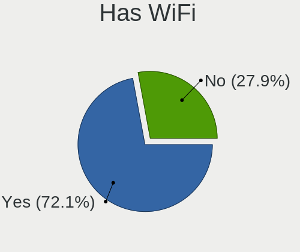
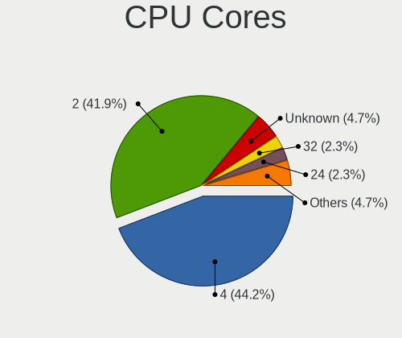
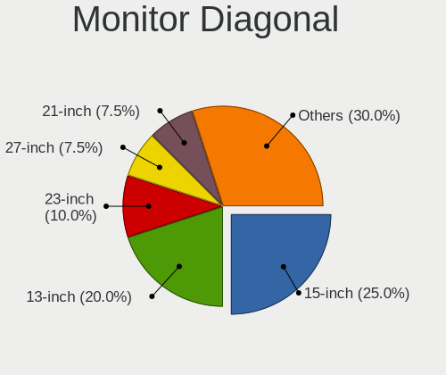
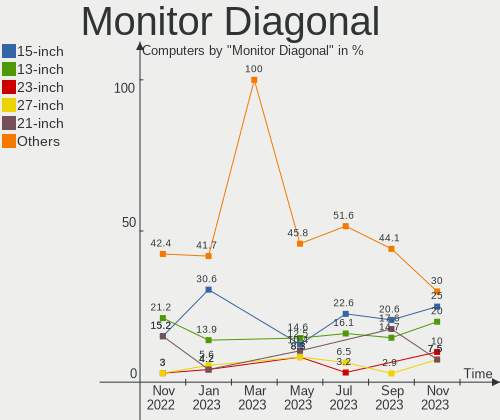

helloSystem - Hardware Trends
-----------------------------

A project to identify most popular hardware characteristics and track their change
over time based on data collected by BSD users at https://BSD-Hardware.info.

Anyone can contribute to this report by the [hw-probe](https://github.com/linuxhw/hw-probe/blob/master/INSTALL.BSD.md) tool:

    hw-probe -all -upload

This is a report for all computer types. See also reports for [desktops](/Dist/helloSystem/Desktop/README.md) and [notebooks](/Dist/helloSystem/Notebook/README.md).

This report is for one last month. Overall report since the beginning of time: [TestDays](https://github.com/bsdhw/TestDays)

Period: Jul, 2023.

Contents
--------

* [ System ](#system)
  - [ OS                       ](#os)
  - [ OS Family                ](#os-family)
  - [ Arch                     ](#arch)
  - [ DE                       ](#de)
  - [ Display Server           ](#display-server)
  - [ Display Manager          ](#display-manager)
  - [ OS Lang                  ](#os-lang)
  - [ Boot Mode                ](#boot-mode)
  - [ Filesystem               ](#filesystem)
  - [ Part. scheme             ](#part-scheme)

* [ Board ](#board)
  - [ Vendor                   ](#vendor)
  - [ Model                    ](#model)
  - [ Model Family             ](#model-family)
  - [ MFG Year                 ](#mfg-year)
  - [ Form Factor              ](#form-factor)
  - [ Coreboot                 ](#coreboot)
  - [ RAM Size                 ](#ram-size)
  - [ RAM Used                 ](#ram-used)
  - [ Total Drives             ](#total-drives)
  - [ Has CD-ROM               ](#has-cd-rom)
  - [ Has Ethernet             ](#has-ethernet)
  - [ Has WiFi                 ](#has-wifi)
  - [ Has Bluetooth            ](#has-bluetooth)

* [ Location ](#location)
  - [ Country                  ](#country)
  - [ City                     ](#city)

* [ Drives ](#drives)
  - [ Drive Vendor             ](#drive-vendor)
  - [ Drive Model              ](#drive-model)
  - [ HDD Vendor               ](#hdd-vendor)
  - [ SSD Vendor               ](#ssd-vendor)
  - [ Drive Kind               ](#drive-kind)
  - [ Drive Connector          ](#drive-connector)
  - [ Drive Size               ](#drive-size)
  - [ Space Total              ](#space-total)
  - [ Space Used               ](#space-used)
  - [ Malfunc. Drives          ](#malfunc-drives)
  - [ Malfunc. Drive Vendor    ](#malfunc-drive-vendor)
  - [ Malfunc. HDD Vendor      ](#malfunc-hdd-vendor)
  - [ Malfunc. Drive Kind      ](#malfunc-drive-kind)
  - [ Failed Drives            ](#failed-drives)
  - [ Failed Drive Vendor      ](#failed-drive-vendor)
  - [ Drive Status             ](#drive-status)

* [ Storage controller ](#storage-controller)
  - [ Storage Vendor           ](#storage-vendor)
  - [ Storage Model            ](#storage-model)
  - [ Storage Kind             ](#storage-kind)

* [ Processor ](#processor)
  - [ CPU Vendor               ](#cpu-vendor)
  - [ CPU Model                ](#cpu-model)
  - [ CPU Model Family         ](#cpu-model-family)
  - [ CPU Cores                ](#cpu-cores)
  - [ CPU Sockets              ](#cpu-sockets)
  - [ CPU Threads              ](#cpu-threads)
  - [ CPU Microarch            ](#cpu-microarch)

* [ Graphics ](#graphics)
  - [ GPU Vendor               ](#gpu-vendor)
  - [ GPU Model                ](#gpu-model)
  - [ GPU Combo                ](#gpu-combo)
  - [ GPU Driver               ](#gpu-driver)
  - [ GPU Memory               ](#gpu-memory)

* [ Monitor ](#monitor)
  - [ Monitor Vendor           ](#monitor-vendor)
  - [ Monitor Model            ](#monitor-model)
  - [ Monitor Resolution       ](#monitor-resolution)
  - [ Monitor Diagonal         ](#monitor-diagonal)
  - [ Monitor Width            ](#monitor-width)
  - [ Aspect Ratio             ](#aspect-ratio)
  - [ Monitor Area             ](#monitor-area)
  - [ Pixel Density            ](#pixel-density)
  - [ Multiple Monitors        ](#multiple-monitors)

* [ Network ](#network)
  - [ Net Controller Vendor    ](#net-controller-vendor)
  - [ Net Controller Model     ](#net-controller-model)
  - [ Wireless Vendor          ](#wireless-vendor)
  - [ Wireless Model           ](#wireless-model)
  - [ Ethernet Vendor          ](#ethernet-vendor)
  - [ Ethernet Model           ](#ethernet-model)
  - [ Net Controller Kind      ](#net-controller-kind)
  - [ Used Controller          ](#used-controller)
  - [ NICs                     ](#nics)
  - [ IPv6                     ](#ipv6)

* [ Bluetooth ](#bluetooth)
  - [ Bluetooth Vendor         ](#bluetooth-vendor)
  - [ Bluetooth Model          ](#bluetooth-model)

* [ Sound ](#sound)
  - [ Sound Vendor             ](#sound-vendor)
  - [ Sound Model              ](#sound-model)

* [ Memory ](#memory)
  - [ Memory Vendor            ](#memory-vendor)
  - [ Memory Model             ](#memory-model)
  - [ Memory Kind              ](#memory-kind)
  - [ Memory Form Factor       ](#memory-form-factor)
  - [ Memory Size              ](#memory-size)
  - [ Memory Speed             ](#memory-speed)

* [ Printers & scanners ](#printers--scanners)
  - [ Printer Vendor           ](#printer-vendor)
  - [ Printer Model            ](#printer-model)
  - [ Scanner Vendor           ](#scanner-vendor)
  - [ Scanner Model            ](#scanner-model)

* [ Camera ](#camera)
  - [ Camera Vendor            ](#camera-vendor)
  - [ Camera Model             ](#camera-model)

* [ Security ](#security)
  - [ Fingerprint Vendor       ](#fingerprint-vendor)
  - [ Fingerprint Model        ](#fingerprint-model)
  - [ Chipcard Vendor          ](#chipcard-vendor)
  - [ Chipcard Model           ](#chipcard-model)

* [ Unsupported ](#unsupported)
  - [ Unsupported Devices      ](#unsupported-devices)
  - [ Unsupported Device Types ](#unsupported-device-types)

System
------

OS
--

Installed operating systems

| Name              | Computers | Percent |
|-------------------|-----------|---------|
| helloSystem 0.8.1 | 25        | 65.79%  |
| helloSystem 0.8.2 | 11        | 28.95%  |
| helloSystem 0.8.0 | 2         | 5.26%   |

OS Family
---------

OS without a version

| Name        | Computers | Percent |
|-------------|-----------|---------|
| helloSystem | 38        | 100%    |

Arch
----

OS architecture (x86_64, i586, etc.)

| Name  | Computers | Percent |
|-------|-----------|---------|
| amd64 | 38        | 100%    |

DE
--

Desktop Environment

| Name         | Computers | Percent |
|--------------|-----------|---------|
| helloDesktop | 35        | 92.11%  |
| XFCE         | 1         | 2.63%   |
| KDE5         | 1         | 2.63%   |
| JWM          | 1         | 2.63%   |

Display Server
--------------

X11 or Wayland

| Name | Computers | Percent |
|------|-----------|---------|
| X11  | 38        | 100%    |

Display Manager
---------------

SDDM, LightDM, etc.

| Name | Computers | Percent |
|------|-----------|---------|
| SLiM | 37        | 97.37%  |
| GDM  | 1         | 2.63%   |

OS Lang
-------

Language

| Lang    | Computers | Percent |
|---------|-----------|---------|
| en_US   | 15        | 39.47%  |
| de_DE   | 5         | 13.16%  |
| ru_RU   | 4         | 10.53%  |
| fr_FR   | 3         | 7.89%   |
| Unknown | 2         | 5.26%   |
| zh_TW   | 1         | 2.63%   |
| zh_CN   | 1         | 2.63%   |
| pt_PT   | 1         | 2.63%   |
| pt_BR   | 1         | 2.63%   |
| nl_NL   | 1         | 2.63%   |
| ko      | 1         | 2.63%   |
| jp_JP   | 1         | 2.63%   |
| fr      | 1         | 2.63%   |
| es_ES   | 1         | 2.63%   |

Boot Mode
---------

EFI or BIOS

| Mode | Computers | Percent |
|------|-----------|---------|
| EFI  | 38        | 100%    |

Filesystem
----------

Type of filesystem

| Type   | Computers | Percent |
|--------|-----------|---------|
| Zfs    | 20        | 52.63%  |
| Cd9660 | 18        | 47.37%  |

Part. scheme
------------

Scheme of partitioning

| Type | Computers | Percent |
|------|-----------|---------|
| GPT  | 38        | 100%    |

Board
-----

Vendor
------

Motherboard manufacturer

| Name                | Computers | Percent |
|---------------------|-----------|---------|
| ASUSTek Computer    | 8         | 21.05%  |
| Lenovo              | 7         | 18.42%  |
| Hewlett-Packard     | 6         | 15.79%  |
| ASRock              | 4         | 10.53%  |
| Dell                | 3         | 7.89%   |
| Apple               | 2         | 5.26%   |
| Acer                | 2         | 5.26%   |
| SLIMBOOK            | 1         | 2.63%   |
| Samsung Electronics | 1         | 2.63%   |
| Panasonic           | 1         | 2.63%   |
| Fujitsu             | 1         | 2.63%   |
| ECS                 | 1         | 2.63%   |
| ATOPNUC             | 1         | 2.63%   |

Model
-----

Motherboard model

| Name                                 | Computers | Percent |
|--------------------------------------|-----------|---------|
| SLIMBOOK PROX-AMD5                   | 1         | 2.63%   |
| Samsung RC530/RC730                  | 1         | 2.63%   |
| Panasonic CF-F9JYFNDR                | 1         | 2.63%   |
| Lenovo ThinkPad X270 20HNA04GCD      | 1         | 2.63%   |
| Lenovo ThinkPad X230 23202DG         | 1         | 2.63%   |
| Lenovo ThinkPad R14 Gen 4 21E5A05RCD | 1         | 2.63%   |
| Lenovo Legion 5 15IMH05 82AU         | 1         | 2.63%   |
| Lenovo IdeaPad S210 Touch 20257      | 1         | 2.63%   |
| Lenovo IdeaPad S145-14AST 81ST       | 1         | 2.63%   |
| Lenovo IdeaPad 5 15ALC05 82LN        | 1         | 2.63%   |
| HP Z4 G4 Workstation                 | 1         | 2.63%   |
| HP Pavilion g6                       | 1         | 2.63%   |
| HP Notebook                          | 1         | 2.63%   |
| HP EliteDesk 800 G4 SFF              | 1         | 2.63%   |
| HP Compaq Pro 6300 MT                | 1         | 2.63%   |
| HP Compaq Presario CQ61              | 1         | 2.63%   |
| Fujitsu ESPRIMO P710                 | 1         | 2.63%   |
| ECS H61H2-M17                        | 1         | 2.63%   |
| Dell OptiPlex 3020                   | 1         | 2.63%   |
| Dell Latitude E6420                  | 1         | 2.63%   |
| Dell Latitude 5480                   | 1         | 2.63%   |
| ATOPNUC MA90                         | 1         | 2.63%   |
| ASUS X541UVK                         | 1         | 2.63%   |
| ASUS P5QL PRO                        | 1         | 2.63%   |
| ASUS P5B SE                          | 1         | 2.63%   |
| ASUS K42Jr                           | 1         | 2.63%   |
| ASUS All Series                      | 1         | 2.63%   |
| ASUS A8N-E                           | 1         | 2.63%   |
| ASUS 1015PX                          | 1         | 2.63%   |
| ASUS 1005PXD                         | 1         | 2.63%   |
| ASRock P67 Pro3 SE                   | 1         | 2.63%   |
| ASRock H61M-VG3                      | 1         | 2.63%   |
| ASRock H61M-GS                       | 1         | 2.63%   |
| ASRock A300M-STX                     | 1         | 2.63%   |
| Apple MacPro5,1                      | 1         | 2.63%   |
| Apple MacBookPro9,2                  | 1         | 2.63%   |
| Acer Spin SP314-21                   | 1         | 2.63%   |
| Acer Aspire 4736Z                    | 1         | 2.63%   |

Model Family
------------

Motherboard model prefix

| Name                  | Computers | Percent |
|-----------------------|-----------|---------|
| Lenovo ThinkPad       | 3         | 7.89%   |
| Lenovo IdeaPad        | 3         | 7.89%   |
| HP Compaq             | 2         | 5.26%   |
| Dell Latitude         | 2         | 5.26%   |
| SLIMBOOK PROX-AMD5    | 1         | 2.63%   |
| Samsung RC530         | 1         | 2.63%   |
| Panasonic CF-F9JYFNDR | 1         | 2.63%   |
| Lenovo Legion         | 1         | 2.63%   |
| HP Z4                 | 1         | 2.63%   |
| HP Pavilion           | 1         | 2.63%   |
| HP Notebook           | 1         | 2.63%   |
| HP EliteDesk          | 1         | 2.63%   |
| Fujitsu ESPRIMO       | 1         | 2.63%   |
| ECS H61H2-M17         | 1         | 2.63%   |
| Dell OptiPlex         | 1         | 2.63%   |
| ATOPNUC MA90          | 1         | 2.63%   |
| ASUS X541UVK          | 1         | 2.63%   |
| ASUS P5QL             | 1         | 2.63%   |
| ASUS P5B              | 1         | 2.63%   |
| ASUS K42Jr            | 1         | 2.63%   |
| ASUS All              | 1         | 2.63%   |
| ASUS A8N-E            | 1         | 2.63%   |
| ASUS 1015PX           | 1         | 2.63%   |
| ASUS 1005PXD          | 1         | 2.63%   |
| ASRock P67            | 1         | 2.63%   |
| ASRock H61M-VG3       | 1         | 2.63%   |
| ASRock H61M-GS        | 1         | 2.63%   |
| ASRock A300M-STX      | 1         | 2.63%   |
| Apple MacPro5         | 1         | 2.63%   |
| Apple MacBookPro9     | 1         | 2.63%   |
| Acer Spin             | 1         | 2.63%   |
| Acer Aspire           | 1         | 2.63%   |

MFG Year
--------

Motherboard manufacture year

| Year | Computers | Percent |
|------|-----------|---------|
| 2011 | 6         | 15.79%  |
| 2013 | 4         | 10.53%  |
| 2012 | 4         | 10.53%  |
| 2010 | 4         | 10.53%  |
| 2022 | 3         | 7.89%   |
| 2023 | 2         | 5.26%   |
| 2021 | 2         | 5.26%   |
| 2019 | 2         | 5.26%   |
| 2017 | 2         | 5.26%   |
| 2015 | 2         | 5.26%   |
| 2008 | 2         | 5.26%   |
| 2020 | 1         | 2.63%   |
| 2018 | 1         | 2.63%   |
| 2016 | 1         | 2.63%   |
| 2009 | 1         | 2.63%   |
| 2006 | 1         | 2.63%   |

Form Factor
-----------

Physical design of the computer

| Name        | Computers | Percent |
|-------------|-----------|---------|
| Notebook    | 21        | 55.26%  |
| Desktop     | 15        | 39.47%  |
| Convertible | 1         | 2.63%   |
| Mini pc     | 1         | 2.63%   |

Coreboot
--------

Have coreboot on board

| Used | Computers | Percent |
|------|-----------|---------|
| No   | 38        | 100%    |

RAM Size
--------

Total RAM memory

| Size in GB | Computers | Percent |
|------------|-----------|---------|
| 4.01-8.0   | 12        | 31.58%  |
| 8.01-16.0  | 10        | 26.32%  |
| 16.01-24.0 | 9         | 23.68%  |
| 2.01-3.0   | 3         | 7.89%   |
| 32.01-64.0 | 2         | 5.26%   |
| 3.01-4.0   | 1         | 2.63%   |
| 24.01-32.0 | 1         | 2.63%   |

RAM Used
--------

Used RAM memory

| Used GB  | Computers | Percent |
|----------|-----------|---------|
| 0.01-0.5 | 18        | 47.37%  |
| 0.51-1.0 | 15        | 39.47%  |
| 1.01-2.0 | 3         | 7.89%   |
| 2.01-3.0 | 2         | 5.26%   |

Total Drives
------------

Number of drives on board

| Drives | Computers | Percent |
|--------|-----------|---------|
| 1      | 25        | 65.79%  |
| 2      | 9         | 23.68%  |
| 3      | 3         | 7.89%   |
| 4      | 1         | 2.63%   |

Has CD-ROM
----------

Has CD-ROM on board

| Presented | Computers | Percent |
|-----------|-----------|---------|
| No        | 25        | 65.79%  |
| Yes       | 13        | 34.21%  |

Has Ethernet
------------

Has Ethernet on board

| Presented | Computers | Percent |
|-----------|-----------|---------|
| Yes       | 37        | 97.37%  |
| No        | 1         | 2.63%   |

Has WiFi
--------

Has WiFi module

| Presented | Computers | Percent |
|-----------|-----------|---------|
| Yes       | 23        | 60.53%  |
| No        | 15        | 39.47%  |

Has Bluetooth
-------------

Has Bluetooth module

| Presented | Computers | Percent |
|-----------|-----------|---------|
| No        | 21        | 55.26%  |
| Yes       | 17        | 44.74%  |

Location
--------

Country
-------

Geographic location (country)

| Country     | Computers | Percent |
|-------------|-----------|---------|
| USA         | 7         | 18.42%  |
| Russia      | 5         | 13.16%  |
| Germany     | 5         | 13.16%  |
| UK          | 2         | 5.26%   |
| Hungary     | 2         | 5.26%   |
| China       | 2         | 5.26%   |
| Australia   | 2         | 5.26%   |
| Taiwan      | 1         | 2.63%   |
| South Korea | 1         | 2.63%   |
| Portugal    | 1         | 2.63%   |
| Netherlands | 1         | 2.63%   |
| Mexico      | 1         | 2.63%   |
| Kyrgyzstan  | 1         | 2.63%   |
| Japan       | 1         | 2.63%   |
| India       | 1         | 2.63%   |
| Cyprus      | 1         | 2.63%   |
| Canada      | 1         | 2.63%   |
| Bulgaria    | 1         | 2.63%   |
| Brazil      | 1         | 2.63%   |
| Belgium     | 1         | 2.63%   |

City
----

Geographic location (city)

| City          | Computers | Percent |
|---------------|-----------|---------|
| Penza         | 2         | 5.26%   |
| Manchester    | 2         | 5.26%   |
| Yunlin        | 1         | 2.63%   |
| Woodbridge    | 1         | 2.63%   |
| Whitby        | 1         | 2.63%   |
| Tokmok        | 1         | 2.63%   |
| Temple        | 1         | 2.63%   |
| Stuttgart     | 1         | 2.63%   |
| St Petersburg | 1         | 2.63%   |
| Springfield   | 1         | 2.63%   |
| Sofia         | 1         | 2.63%   |
| Shenzhen      | 1         | 2.63%   |
| Shanghai      | 1         | 2.63%   |
| Sapporo       | 1         | 2.63%   |
| Pensacola     | 1         | 2.63%   |
| Orlando       | 1         | 2.63%   |
| Orizaba       | 1         | 2.63%   |
| Nicosia       | 1         | 2.63%   |
| Moscow        | 1         | 2.63%   |
| Miami Beach   | 1         | 2.63%   |
| Melbourne     | 1         | 2.63%   |
| Mainz         | 1         | 2.63%   |
| Los Angeles   | 1         | 2.63%   |
| Lisbon        | 1         | 2.63%   |
| Krasnoyarsk   | 1         | 2.63%   |
| Hohenhameln   | 1         | 2.63%   |
| Gold Coast    | 1         | 2.63%   |
| Goianinha     | 1         | 2.63%   |
| Eger          | 1         | 2.63%   |
| Dobong-gu     | 1         | 2.63%   |
| Budapest      | 1         | 2.63%   |
| Brussels      | 1         | 2.63%   |
| Blomberg      | 1         | 2.63%   |
| Bengaluru     | 1         | 2.63%   |
| Augsburg      | 1         | 2.63%   |
| Almere Stad   | 1         | 2.63%   |

Drives
------

Drive Vendor
------------

Hard drive vendors

| Vendor              | Computers | Drives | Percent |
|---------------------|-----------|--------|---------|
| Samsung Electronics | 10        | 10     | 18.87%  |
| WDC                 | 8         | 8      | 15.09%  |
| Seagate             | 6         | 6      | 11.32%  |
| Hitachi             | 6         | 7      | 11.32%  |
| SanDisk             | 4         | 4      | 7.55%   |
| Toshiba             | 3         | 4      | 5.66%   |
| Crucial             | 3         | 4      | 5.66%   |
| Kingston            | 2         | 2      | 3.77%   |
| UMIS                | 1         | 1      | 1.89%   |
| Transcend           | 1         | 1      | 1.89%   |
| TAMMUZ              | 1         | 1      | 1.89%   |
| SPCC                | 1         | 1      | 1.89%   |
| SCY                 | 1         | 1      | 1.89%   |
| Maxtor              | 1         | 1      | 1.89%   |
| Lexar               | 1         | 1      | 1.89%   |
| Intenso             | 1         | 1      | 1.89%   |
| Gigabyte Technology | 1         | 1      | 1.89%   |
| CLOVER              | 1         | 1      | 1.89%   |
| A-DATA Technology   | 1         | 1      | 1.89%   |

Drive Model
-----------

Hard drive models

| Model                                | Computers | Percent |
|--------------------------------------|-----------|---------|
| WDC WD800AAJS-00PSA0 80GB            | 1         | 1.82%   |
| WDC WD3200BPVT-80JJ5T0 320GB         | 1         | 1.82%   |
| WDC WD3200BEVT-60ZCT1 320GB          | 1         | 1.82%   |
| WDC WD10SPZX-24Z10 1TB               | 1         | 1.82%   |
| WDC WD10EZEX-00WN4A0 1TB             | 1         | 1.82%   |
| WDC PC SN730 SDBQNTY-256G-1001 256GB | 1         | 1.82%   |
| WDC PC SN730 SDBPNTY-512G-1101 512GB | 1         | 1.82%   |
| WDC PC SN520 SDAPNUW-128G-1014 128GB | 1         | 1.82%   |
| UMIS RPJYJ512MKN1QWQ 512GB           | 1         | 1.82%   |
| Transcend TS128GSSD340 128GB         | 1         | 1.82%   |
| Toshiba MQ01ACF050 500GB             | 1         | 1.82%   |
| Toshiba MQ01ABF050 500GB             | 1         | 1.82%   |
| Toshiba DT01ACA200 2TB               | 1         | 1.82%   |
| TAMMUZ SSD 240GB                     | 1         | 1.82%   |
| SPCC Solid State Disk 128GB          | 1         | 1.82%   |
| Seagate ST9120821AS 120GB            | 1         | 1.82%   |
| Seagate ST500DM002-1BD142 496GB      | 1         | 1.82%   |
| Seagate ST3250312AS 250GB            | 1         | 1.82%   |
| Seagate ST3160211AS 160GB            | 1         | 1.82%   |
| Seagate ST2000DM006-2DM164 2TB       | 1         | 1.82%   |
| Seagate ST1000LM024 HN-M101MBB 1TB   | 1         | 1.82%   |
| SCY SNM4BBG12800D 128GB              | 1         | 1.82%   |
| SanDisk X400 M.2 2280 128GB          | 1         | 1.82%   |
| SanDisk SDSSDP064G 64GB              | 1         | 1.82%   |
| SanDisk SD8SB8U128G1001 128GB        | 1         | 1.82%   |
| SanDisk pSSD 16GB                    | 1         | 1.82%   |
| Samsung SSD 980 1TB                  | 1         | 1.82%   |
| Samsung SSD 970 EVO Plus 500GB       | 1         | 1.82%   |
| Samsung SSD 860 EVO 500GB            | 1         | 1.82%   |
| Samsung SSD 850 EVO 120GB            | 1         | 1.82%   |
| Samsung SSD 840 EVO 250GB            | 1         | 1.82%   |
| Samsung SP0812C 80GB                 | 1         | 1.82%   |
| Samsung SM961 NVMe 1024GB            | 1         | 1.82%   |
| Samsung MZALQ512HBLU-00BL2 512GB     | 1         | 1.82%   |
| Samsung MZAL41T0HBLB-00BL1 1TB       | 1         | 1.82%   |
| Samsung MZ7TD256HAFV-000L9 256GB     | 1         | 1.82%   |
| Maxtor 6L080P0 82GB                  | 1         | 1.82%   |
| Lexar SSD 128GB                      | 1         | 1.82%   |
| Kingston SA400S37960G 960GB          | 1         | 1.82%   |
| Kingston SA2000M8500G 500GB          | 1         | 1.82%   |

HDD Vendor
----------

Hard disk drive vendors

| Vendor              | Computers | Drives | Percent |
|---------------------|-----------|--------|---------|
| Seagate             | 6         | 6      | 26.09%  |
| Hitachi             | 6         | 7      | 26.09%  |
| WDC                 | 5         | 5      | 21.74%  |
| Toshiba             | 3         | 4      | 13.04%  |
| Samsung Electronics | 1         | 1      | 4.35%   |
| Maxtor              | 1         | 1      | 4.35%   |
| CLOVER              | 1         | 1      | 4.35%   |

SSD Vendor
----------

Solid state drive vendors

| Vendor              | Computers | Drives | Percent |
|---------------------|-----------|--------|---------|
| SanDisk             | 4         | 4      | 22.22%  |
| Samsung Electronics | 4         | 4      | 22.22%  |
| Crucial             | 2         | 2      | 11.11%  |
| Transcend           | 1         | 1      | 5.56%   |
| TAMMUZ              | 1         | 1      | 5.56%   |
| SPCC                | 1         | 1      | 5.56%   |
| SCY                 | 1         | 1      | 5.56%   |
| Lexar               | 1         | 1      | 5.56%   |
| Kingston            | 1         | 1      | 5.56%   |
| Intenso             | 1         | 1      | 5.56%   |
| A-DATA Technology   | 1         | 1      | 5.56%   |

Drive Kind
----------

HDD or SSD

| Kind | Computers | Drives | Percent |
|------|-----------|--------|---------|
| HDD  | 18        | 25     | 40.91%  |
| SSD  | 17        | 18     | 38.64%  |
| NVMe | 9         | 13     | 20.45%  |

Drive Connector
---------------

SATA, SAS, NVMe, etc.

| Type | Computers | Drives | Percent |
|------|-----------|--------|---------|
| SATA | 33        | 43     | 78.57%  |
| NVMe | 9         | 13     | 21.43%  |

Drive Size
----------

Size of hard drive

| Size in TB | Computers | Drives | Percent |
|------------|-----------|--------|---------|
| 0.01-0.5   | 29        | 34     | 80.56%  |
| 0.51-1.0   | 5         | 6      | 13.89%  |
| 1.01-2.0   | 2         | 3      | 5.56%   |

Space Total
-----------

Amount of disk space available on the file system

| Size in GB | Computers | Percent |
|------------|-----------|---------|
| 1-20       | 12        | 31.58%  |
| 51-100     | 9         | 23.68%  |
| 101-250    | 6         | 15.79%  |
| 251-500    | 5         | 13.16%  |
| 501-1000   | 3         | 7.89%   |
| 21-50      | 2         | 5.26%   |
| 1001-2000  | 1         | 2.63%   |

Space Used
----------

Amount of used disk space

| Used GB | Computers | Percent |
|---------|-----------|---------|
| 1-20    | 35        | 92.11%  |
| 251-500 | 1         | 2.63%   |
| 21-50   | 1         | 2.63%   |
| 51-100  | 1         | 2.63%   |

Malfunc. Drives
---------------

Drive models with a malfunction

| Model                              | Computers | Drives | Percent |
|------------------------------------|-----------|--------|---------|
| Toshiba MQ01ABF050 500GB           | 1         | 1      | 11.11%  |
| Seagate ST9120821AS 120GB          | 1         | 1      | 11.11%  |
| Seagate ST3250312AS 250GB          | 1         | 1      | 11.11%  |
| Seagate ST2000DM006-2DM164 2TB     | 1         | 1      | 11.11%  |
| Seagate ST1000LM024 HN-M101MBB 1TB | 1         | 1      | 11.11%  |
| Maxtor 6L080P0 82GB                | 1         | 1      | 11.11%  |
| Hitachi HTS721060G9SA00 64GB       | 1         | 1      | 11.11%  |
| Hitachi HTS542512K9SA00 120GB      | 1         | 1      | 11.11%  |
| Hitachi HDP725025GLA380 250GB      | 1         | 1      | 11.11%  |

Malfunc. Drive Vendor
---------------------

Vendors of faulty drives

| Vendor  | Computers | Drives | Percent |
|---------|-----------|--------|---------|
| Seagate | 4         | 4      | 44.44%  |
| Hitachi | 3         | 3      | 33.33%  |
| Toshiba | 1         | 1      | 11.11%  |
| Maxtor  | 1         | 1      | 11.11%  |

Malfunc. HDD Vendor
-------------------

Vendors of faulty HDD drives

| Vendor  | Computers | Drives | Percent |
|---------|-----------|--------|---------|
| Seagate | 4         | 4      | 44.44%  |
| Hitachi | 3         | 3      | 33.33%  |
| Toshiba | 1         | 1      | 11.11%  |
| Maxtor  | 1         | 1      | 11.11%  |

Malfunc. Drive Kind
-------------------

Kinds of faulty drives

| Kind | Computers | Drives | Percent |
|------|-----------|--------|---------|
| HDD  | 8         | 9      | 100%    |

Failed Drives
-------------

Failed drive models

Zero info for selected period =(

Failed Drive Vendor
-------------------

Failed drive vendors

Zero info for selected period =(

Drive Status
------------

Number of failed and malfunc. drives

| Status   | Computers | Drives | Percent |
|----------|-----------|--------|---------|
| Works    | 32        | 44     | 74.42%  |
| Malfunc  | 8         | 9      | 18.6%   |
| Detected | 3         | 3      | 6.98%   |

Storage controller
------------------

Storage Vendor
--------------

Storage controller vendors

| Vendor                                  | Computers | Percent |
|-----------------------------------------|-----------|---------|
| Intel                                   | 29        | 59.18%  |
| Samsung Electronics                     | 5         | 10.2%   |
| AMD                                     | 5         | 10.2%   |
| SanDisk                                 | 3         | 6.12%   |
| Micron/Crucial Technology               | 2         | 4.08%   |
| Shenzhen Unionmemory Information System | 1         | 2.04%   |
| Phison Electronics                      | 1         | 2.04%   |
| Nvidia                                  | 1         | 2.04%   |
| Kingston Technology Company             | 1         | 2.04%   |
| JMicron Technology                      | 1         | 2.04%   |

Storage Model
-------------

Storage controller models

| Model                                                                                  | Computers | Percent |
|----------------------------------------------------------------------------------------|-----------|---------|
| AMD FCH SATA Controller [AHCI mode]                                                    | 5         | 9.43%   |
| Intel 6 Series/C200 Series Chipset Family 6 port Desktop SATA AHCI Controller          | 4         | 7.55%   |
| Intel Sunrise Point-LP SATA Controller [AHCI mode]                                     | 3         | 5.66%   |
| Intel 7 Series Chipset Family 6-port SATA Controller [AHCI mode]                       | 3         | 5.66%   |
| SanDisk WD Black SN750 / PC SN730 NVMe SSD                                             | 2         | 3.77%   |
| Samsung NVMe SSD Controller 980                                                        | 2         | 3.77%   |
| Micron/Crucial P2 [Nick P2] / P3 / P3 Plus NVMe PCIe SSD (DRAM-less)                   | 2         | 3.77%   |
| Intel 82801JI (ICH10 Family) 4 port SATA IDE Controller #1                             | 2         | 3.77%   |
| Intel 82801JI (ICH10 Family) 2 port SATA IDE Controller #2                             | 2         | 3.77%   |
| Intel 82801IBM/IEM (ICH9M/ICH9M-E) 4 port SATA Controller [AHCI mode]                  | 2         | 3.77%   |
| Intel 82801 Mobile SATA Controller [RAID mode]                                         | 2         | 3.77%   |
| Intel 7 Series/C210 Series Chipset Family 6-port SATA Controller [AHCI mode]           | 2         | 3.77%   |
| SanDisk WD Blue SN500 / PC SN520 NVMe SSD                                              | 1         | 1.89%   |
| Samsung NVMe SSD Controller SM981/PM981/PM983                                          | 1         | 1.89%   |
| Samsung NVMe SSD Controller SM961/PM961/SM963                                          | 1         | 1.89%   |
| Samsung NVMe SSD Controller PM9B1                                                      | 1         | 1.89%   |
| Phison PS5013 E13 NVMe Controller                                                      | 1         | 1.89%   |
| Nvidia CK804 IDE                                                                       | 1         | 1.89%   |
| Kingston Company A2000 NVMe SSD                                                        | 1         | 1.89%   |
| JMicron JMB363 SATA/IDE Controller                                                     | 1         | 1.89%   |
| Intel SATA Controller [RAID mode]                                                      | 1         | 1.89%   |
| Intel NM10/ICH7 Family SATA Controller [IDE mode]                                      | 1         | 1.89%   |
| Intel NM10/ICH7 Family SATA Controller [AHCI mode]                                     | 1         | 1.89%   |
| Intel Cannon Lake PCH SATA AHCI Controller                                             | 1         | 1.89%   |
| Intel C600/X79 series chipset SATA RAID Controller                                     | 1         | 1.89%   |
| Intel 82801HR/HO/HH (ICH8R/DO/DH) 2 port SATA Controller [IDE mode]                    | 1         | 1.89%   |
| Intel 82801H (ICH8 Family) 4 port SATA Controller [IDE mode]                           | 1         | 1.89%   |
| Intel 8 Series/C220 Series Chipset Family 6-port SATA Controller 1 [AHCI mode]         | 1         | 1.89%   |
| Intel 6 Series/C200 Series Chipset Family Mobile SATA Controller (IDE mode, ports 4-5) | 1         | 1.89%   |
| Intel 6 Series/C200 Series Chipset Family Mobile SATA Controller (IDE mode, ports 0-3) | 1         | 1.89%   |
| Intel 5 Series/3400 Series Chipset 6 port SATA AHCI Controller                         | 1         | 1.89%   |
| Intel 5 Series/3400 Series Chipset 4 port SATA AHCI Controller                         | 1         | 1.89%   |
| Intel 400 Series Chipset Family SATA AHCI Controller                                   | 1         | 1.89%   |
| Unknown                                                                                | 1         | 1.89%   |

Storage Kind
------------

Kind of storage controller (IDE, SATA, NVMe, SAS, ...)

| Kind | Computers | Percent |
|------|-----------|---------|
| SATA | 25        | 56.82%  |
| NVMe | 9         | 20.45%  |
| IDE  | 6         | 13.64%  |
| RAID | 4         | 9.09%   |

Processor
---------

CPU Vendor
----------

Processor vendors

| Vendor | Computers | Percent |
|--------|-----------|---------|
| Intel  | 30        | 78.95%  |
| AMD    | 8         | 21.05%  |

CPU Model
---------

Processor models

| Model                                        | Computers | Percent |
|----------------------------------------------|-----------|---------|
| Intel Core i5-7200U CPU @ 2.50GHz            | 2         | 5.26%   |
| Intel Xeon W-2125 CPU @ 4.00GHz              | 1         | 2.63%   |
| Intel Xeon CPU W3670 @ 3.20GHz               | 1         | 2.63%   |
| Intel Xeon CPU E31220 @ 3.10GHz              | 1         | 2.63%   |
| Intel Pentium Dual-Core CPU T4300 @ 2.10GHz  | 1         | 2.63%   |
| Intel Pentium Dual-Core CPU T4200 @ 2.00GHz  | 1         | 2.63%   |
| Intel Pentium CPU G850 @ 2.90GHz             | 1         | 2.63%   |
| Intel Pentium CPU 2117U @ 1.80GHz            | 1         | 2.63%   |
| Intel Core i7-8700 CPU @ 3.20GHz             | 1         | 2.63%   |
| Intel Core i7-4790 CPU @ 3.60GHz             | 1         | 2.63%   |
| Intel Core i7-3770 CPU @ 3.40GHz             | 1         | 2.63%   |
| Intel Core i7-2670QM CPU                     | 1         | 2.63%   |
| Intel Core i7-2600 CPU @ 3.40GHz             | 1         | 2.63%   |
| Intel Core i5-7300U CPU @ 2.60GHz            | 1         | 2.63%   |
| Intel Core i5-3210M CPU @ 2.50GHz            | 1         | 2.63%   |
| Intel Core i5-2310 CPU @ 2.90GHz             | 1         | 2.63%   |
| Intel Core i5-10300H CPU @ 2.50GHz           | 1         | 2.63%   |
| Intel Core i5 CPU M 520 @ 2.40GHz            | 1         | 2.63%   |
| Intel Core i5 CPU M 430 @ 2.27GHz            | 1         | 2.63%   |
| Intel Core i3-7100U CPU @ 2.40GHz            | 1         | 2.63%   |
| Intel Core i3-4130 CPU @ 3.40GHz             | 1         | 2.63%   |
| Intel Core i3-2370M CPU @ 2.40GHz            | 1         | 2.63%   |
| Intel Core i3-2330M CPU @ 2.20GH             | 1         | 2.63%   |
| Intel Core 2 Duo CPU E7400 @ 2.80GHz         | 1         | 2.63%   |
| Intel Core 2 Duo CPU E7200 @ 2.53GHz         | 1         | 2.63%   |
| Intel Celeron CPU G1620 @ 2.70GHz            | 1         | 2.63%   |
| Intel Atom CPU N570 @ 1.66GHz                | 1         | 2.63%   |
| Intel Atom CPU N455 @ 1.66GHz                | 1         | 2.63%   |
| Intel 12th Gen Core i5-1240P                 | 1         | 2.63%   |
| AMD Ryzen 7 5700U with Radeon Graphics       | 1         | 2.63%   |
| AMD Ryzen 5 5500U with Radeon Graphics       | 1         | 2.63%   |
| AMD Ryzen 3 3250U with Radeon Graphics       | 1         | 2.63%   |
| AMD Ryzen 3 3200G with Radeon Vega Graphics  | 1         | 2.63%   |
| AMD Athlon 64 Processor 3200+                | 1         | 2.63%   |
| AMD A9-9400 RADEON R5, 5 COMPUTE CORES 2C+3G | 1         | 2.63%   |
| AMD A4-9125 RADEON R3, 4 COMPUTE CORES 2C+2G | 1         | 2.63%   |
| AMD A10-5750M APU with Radeon HD Graphics    | 1         | 2.63%   |

CPU Model Family
----------------

Processor model prefix

| Model                   | Computers | Percent |
|-------------------------|-----------|---------|
| Intel Core i5           | 8         | 21.05%  |
| Intel Core i7           | 5         | 13.16%  |
| Intel Core i3           | 4         | 10.53%  |
| Intel Xeon              | 3         | 7.89%   |
| Other                   | 2         | 5.26%   |
| Intel Pentium Dual-Core | 2         | 5.26%   |
| Intel Pentium           | 2         | 5.26%   |
| Intel Core 2 Duo        | 2         | 5.26%   |
| Intel Atom              | 2         | 5.26%   |
| AMD Ryzen 3             | 2         | 5.26%   |
| Intel Celeron           | 1         | 2.63%   |
| AMD Ryzen 7             | 1         | 2.63%   |
| AMD Ryzen 5             | 1         | 2.63%   |
| AMD Athlon 64           | 1         | 2.63%   |
| AMD A4                  | 1         | 2.63%   |
| AMD A10                 | 1         | 2.63%   |

CPU Cores
---------

Number of processor cores

| Number  | Computers | Percent |
|---------|-----------|---------|
| 2       | 17        | 44.74%  |
| 4       | 11        | 28.95%  |
| Unknown | 3         | 7.89%   |
| 16      | 2         | 5.26%   |
| 6       | 2         | 5.26%   |
| 1       | 2         | 5.26%   |
| 12      | 1         | 2.63%   |

CPU Sockets
-----------

Number of sockets

| Number | Computers | Percent |
|--------|-----------|---------|
| 1      | 38        | 100%    |

CPU Threads
-----------

Threads per core (Hyper-Threading)

| Number  | Computers | Percent |
|---------|-----------|---------|
| 2       | 20        | 52.63%  |
| 1       | 15        | 39.47%  |
| Unknown | 3         | 7.89%   |

CPU Microarch
-------------

Microarchitecture

| Name        | Computers | Percent |
|-------------|-----------|---------|
| SandyBridge | 7         | 18.42%  |
| KabyLake    | 5         | 13.16%  |
| Penryn      | 4         | 10.53%  |
| IvyBridge   | 4         | 10.53%  |
| Westmere    | 3         | 7.89%   |
| Unknown     | 3         | 7.89%   |
| Zen+        | 2         | 5.26%   |
| Haswell     | 2         | 5.26%   |
| Excavator   | 2         | 5.26%   |
| Bonnell     | 2         | 5.26%   |
| Skylake     | 1         | 2.63%   |
| Piledriver  | 1         | 2.63%   |
| K8 Hammer   | 1         | 2.63%   |
| CometLake   | 1         | 2.63%   |

Graphics
--------

GPU Vendor
----------

Vendors of graphics cards

| Vendor | Computers | Percent |
|--------|-----------|---------|
| Intel  | 19        | 45.24%  |
| AMD    | 12        | 28.57%  |
| Nvidia | 11        | 26.19%  |

GPU Model
---------

Graphics card models

| Model                                                                                 | Computers | Percent |
|---------------------------------------------------------------------------------------|-----------|---------|
| Intel HD Graphics 620                                                                 | 4         | 9.52%   |
| Intel 2nd Generation Core Processor Family Integrated Graphics Controller             | 3         | 7.14%   |
| Intel Mobile 4 Series Chipset Integrated Graphics Controller                          | 2         | 4.76%   |
| Intel Atom Processor D4xx/D5xx/N4xx/N5xx Integrated Graphics Controller               | 2         | 4.76%   |
| Intel 3rd Gen Core processor Graphics Controller                                      | 2         | 4.76%   |
| AMD Stoney [Radeon R2/R3/R4/R5 Graphics]                                              | 2         | 4.76%   |
| AMD Picasso/Raven 2 [Radeon Vega Series / Radeon Vega Mobile Series]                  | 2         | 4.76%   |
| AMD Lucienne                                                                          | 2         | 4.76%   |
| Nvidia TU117M [GeForce GTX 1650 Ti Mobile]                                            | 1         | 2.38%   |
| Nvidia GT218 [GeForce 210]                                                            | 1         | 2.38%   |
| Nvidia GP107 [GeForce GTX 1050]                                                       | 1         | 2.38%   |
| Nvidia GM204 [GeForce GTX 980]                                                        | 1         | 2.38%   |
| Nvidia GM108M [GeForce 920MX]                                                         | 1         | 2.38%   |
| Nvidia GK208B [GeForce GT 730]                                                        | 1         | 2.38%   |
| Nvidia GK208B [GeForce GT 710]                                                        | 1         | 2.38%   |
| Nvidia GK104 [GeForce GTX 680]                                                        | 1         | 2.38%   |
| Nvidia GF119 [GeForce GT 610]                                                         | 1         | 2.38%   |
| Nvidia GF116 [GeForce GTS 450 Rev. 2]                                                 | 1         | 2.38%   |
| Nvidia G92 [GeForce GTS 250]                                                          | 1         | 2.38%   |
| Intel Xeon E3-1200 v2/3rd Gen Core processor Graphics Controller                      | 1         | 2.38%   |
| Intel Core Processor Integrated Graphics Controller                                   | 1         | 2.38%   |
| Intel CometLake-H GT2 [UHD Graphics]                                                  | 1         | 2.38%   |
| Intel CoffeeLake-S GT2 [UHD Graphics 630]                                             | 1         | 2.38%   |
| Intel Alder Lake-P Integrated Graphics Controller                                     | 1         | 2.38%   |
| Intel 4th Generation Core Processor Family Integrated Graphics Controller             | 1         | 2.38%   |
| AMD Turks GL [FirePro V3900]                                                          | 1         | 2.38%   |
| AMD Topaz XT [Radeon R7 M260/M265 / M340/M360 / M440/M445 / 530/535 / 620/625 Mobile] | 1         | 2.38%   |
| AMD RV670 [Radeon HD 3690/3850]                                                       | 1         | 2.38%   |
| AMD Richland [Radeon HD 8650G]                                                        | 1         | 2.38%   |
| AMD Park [Mobility Radeon HD 5430/5450/5470]                                          | 1         | 2.38%   |
| AMD Oland [Radeon HD 8570 / R5 430 OEM / R7 240/340 / Radeon 520 OEM]                 | 1         | 2.38%   |

GPU Combo
---------

Combinations of graphics cards

| Name           | Computers | Percent |
|----------------|-----------|---------|
| 1 x Intel      | 11        | 28.95%  |
| 1 x AMD        | 10        | 26.32%  |
| 1 x Nvidia     | 9         | 23.68%  |
| 2 x Intel      | 4         | 10.53%  |
| Intel + Nvidia | 2         | 5.26%   |
| Intel + AMD    | 2         | 5.26%   |

GPU Driver
----------

Free vs proprietary

| Driver      | Computers | Percent |
|-------------|-----------|---------|
| Free        | 30        | 78.95%  |
| Proprietary | 6         | 15.79%  |
| Unknown     | 2         | 5.26%   |

GPU Memory
----------

Total video memory

| Size in GB | Computers | Percent |
|------------|-----------|---------|
| Unknown    | 25        | 65.79%  |
| 1.01-2.0   | 5         | 13.16%  |
| 0.01-0.5   | 4         | 10.53%  |
| 0.51-1.0   | 3         | 7.89%   |
| 3.01-4.0   | 1         | 2.63%   |

Monitor
-------

Monitor Vendor
--------------

Monitor vendors

| Vendor                  | Computers | Percent |
|-------------------------|-----------|---------|
| Samsung Electronics     | 6         | 18.75%  |
| Chimei Innolux          | 4         | 12.5%   |
| BOE                     | 4         | 12.5%   |
| AU Optronics            | 4         | 12.5%   |
| Apple                   | 2         | 6.25%   |
| Sharp                   | 1         | 3.13%   |
| LG Display              | 1         | 3.13%   |
| Lenovo                  | 1         | 3.13%   |
| InfoVision              | 1         | 3.13%   |
| Iiyama                  | 1         | 3.13%   |
| HannStar                | 1         | 3.13%   |
| Goldstar                | 1         | 3.13%   |
| Eizo                    | 1         | 3.13%   |
| Dell                    | 1         | 3.13%   |
| CVT                     | 1         | 3.13%   |
| Chi Mei Optoelectronics | 1         | 3.13%   |
| Acer                    | 1         | 3.13%   |

Monitor Model
-------------

Monitor models

| Model                                                                    | Computers | Percent |
|--------------------------------------------------------------------------|-----------|---------|
| Sharp HDMI SHP0FD0 1360x768                                              | 1         | 3.13%   |
| Samsung Electronics SA300/SA350 SAM078D 1600x900 440x250mm 19.9-inch     | 1         | 3.13%   |
| Samsung Electronics S19B150 SAM08A2 1366x768 410x230mm 18.5-inch         | 1         | 3.13%   |
| Samsung Electronics Odyssey G50A SAM7181 2560x1440 600x340mm 27.2-inch   | 1         | 3.13%   |
| Samsung Electronics LCD Monitor SEC3245 1366x768 340x190mm 15.3-inch     | 1         | 3.13%   |
| Samsung Electronics LCD Monitor SEC3050 1366x768 320x190mm 14.7-inch     | 1         | 3.13%   |
| Samsung Electronics LCD Monitor SAM0C3C 1366x768 530x300mm 24.0-inch     | 1         | 3.13%   |
| LG Display LCD Monitor LGD0384 1366x768 340x190mm 15.3-inch              | 1         | 3.13%   |
| Lenovo D27-30 LEN66B8 1920x1080 600x340mm 27.2-inch                      | 1         | 3.13%   |
| InfoVision LCD Monitor IVO03F4 1024x600 220x130mm 10.1-inch              | 1         | 3.13%   |
| Iiyama PL2283H IVM562E 1920x1080 500x290mm 22.8-inch                     | 1         | 3.13%   |
| HannStar LCD Monitor HSD03E9 1024x600 220x130mm 10.1-inch                | 1         | 3.13%   |
| Goldstar LG ULTRAGEAR GSM775B 1920x1080 700x390mm 31.5-inch              | 1         | 3.13%   |
| Eizo FS2331 ENC2211 1920x1080 510x290mm 23.1-inch                        | 1         | 3.13%   |
| Dell P2414H DELA09B 1920x1080 530x300mm 24.0-inch                        | 1         | 3.13%   |
| CVT LM201XD CVT0001 1680x1050 410x256mm 19.0-inch                        | 1         | 3.13%   |
| Chimei Innolux LCD Monitor CMN1738 1920x1080 380x210mm 17.1-inch         | 1         | 3.13%   |
| Chimei Innolux LCD Monitor CMN152D 1920x1080 340x190mm 15.3-inch         | 1         | 3.13%   |
| Chimei Innolux LCD Monitor CMN14E5 1920x1080 310x170mm 13.9-inch         | 1         | 3.13%   |
| Chimei Innolux LCD Monitor CMN14D6 1366x768 310x170mm 13.9-inch          | 1         | 3.13%   |
| Chi Mei Optoelectronics LCD Monitor CMO1558 1366x768 350x190mm 15.7-inch | 1         | 3.13%   |
| BOE LCD Monitor BOE08E2 1920x1080 340x190mm 15.3-inch                    | 1         | 3.13%   |
| BOE LCD Monitor BOE06E2 1920x1080 310x170mm 13.9-inch                    | 1         | 3.13%   |
| BOE LCD Monitor BOE06CE 1366x768 280x160mm 12.7-inch                     | 1         | 3.13%   |
| BOE LCD Monitor BOE0610 1920x1080 340x190mm 15.3-inch                    | 1         | 3.13%   |
| AU Optronics LCD Monitor AUOD1ED 1920x1080 340x190mm 15.3-inch           | 1         | 3.13%   |
| AU Optronics LCD Monitor AUO315C 1366x768 260x140mm 11.6-inch            | 1         | 3.13%   |
| AU Optronics LCD Monitor AUO193C 1366x768 310x170mm 13.9-inch            | 1         | 3.13%   |
| AU Optronics LCD Monitor AUO106C 1366x768 280x160mm 12.7-inch            | 1         | 3.13%   |
| Apple LCD Monitor APP9CC3 1280x800 290x180mm 13.4-inch                   | 1         | 3.13%   |
| Apple Cinema HD Dis APP921F 1920x1200 490x310mm 22.8-inch                | 1         | 3.13%   |
| Acer G246HL ACR02FF 1920x1080 530x300mm 24.0-inch                        | 1         | 3.13%   |

Monitor Resolution
------------------

Monitor screen resolution

| Resolution         | Computers | Percent |
|--------------------|-----------|---------|
| 1920x1080 (FHD)    | 13        | 40.63%  |
| 1366x768 (WXGA)    | 11        | 34.38%  |
| 1024x600           | 2         | 6.25%   |
| 2560x1440 (QHD)    | 1         | 3.13%   |
| 1920x1200 (WUXGA)  | 1         | 3.13%   |
| 1680x1050 (WSXGA+) | 1         | 3.13%   |
| 1600x900 (HD+)     | 1         | 3.13%   |
| 1360x768           | 1         | 3.13%   |
| 1280x800 (WXGA)    | 1         | 3.13%   |

Monitor Diagonal
----------------

Diagonal size in inches

| Inches  | Computers | Percent |
|---------|-----------|---------|
| 15      | 7         | 22.58%  |
| 13      | 5         | 16.13%  |
| 27      | 2         | 6.45%   |
| 24      | 2         | 6.45%   |
| 22      | 2         | 6.45%   |
| 19      | 2         | 6.45%   |
| 12      | 2         | 6.45%   |
| 10      | 2         | 6.45%   |
| 31      | 1         | 3.23%   |
| 23      | 1         | 3.23%   |
| 18      | 1         | 3.23%   |
| 17      | 1         | 3.23%   |
| 14      | 1         | 3.23%   |
| 11      | 1         | 3.23%   |
| Unknown | 1         | 3.23%   |

Monitor Width
-------------

Physical width

| Width in mm | Computers | Percent |
|-------------|-----------|---------|
| 301-350     | 12        | 38.71%  |
| 201-300     | 6         | 19.35%  |
| 501-600     | 5         | 16.13%  |
| 401-500     | 5         | 16.13%  |
| 601-700     | 1         | 3.23%   |
| 351-400     | 1         | 3.23%   |
| Unknown     | 1         | 3.23%   |

Aspect Ratio
------------

Proportional relationship between the width and the height

| Ratio | Computers | Percent |
|-------|-----------|---------|
| 16/9  | 28        | 90.32%  |
| 16/10 | 3         | 9.68%   |

Monitor Area
------------

Area in inch

| Area in inch | Computers | Percent |
|----------------|-----------|---------|
| 91-100         | 7         | 22.58%  |
| 81-90          | 5         | 16.13%  |
| 201-250        | 5         | 16.13%  |
| 61-70          | 2         | 6.45%   |
| 41-50          | 2         | 6.45%   |
| 301-350        | 2         | 6.45%   |
| 151-200        | 2         | 6.45%   |
| 51-60          | 1         | 3.23%   |
| 351-500        | 1         | 3.23%   |
| 141-150        | 1         | 3.23%   |
| 121-130        | 1         | 3.23%   |
| 101-110        | 1         | 3.23%   |
| Unknown        | 1         | 3.23%   |

Pixel Density
-------------

Pixels per inch

| Density | Computers | Percent |
|---------|-----------|---------|
| 121-160 | 10        | 32.26%  |
| 101-120 | 10        | 32.26%  |
| 51-100  | 10        | 32.26%  |
| Unknown | 1         | 3.23%   |

Multiple Monitors
-----------------

Total monitors connected

| Total | Computers | Percent |
|-------|-----------|---------|
| 1     | 32        | 84.21%  |
| 0     | 5         | 13.16%  |
| 2     | 1         | 2.63%   |

Network
-------

Net Controller Vendor
---------------------

Controller vendors

| Vendor                | Computers | Percent |
|-----------------------|-----------|---------|
| Realtek Semiconductor | 15        | 27.78%  |
| Intel                 | 15        | 27.78%  |
| Qualcomm Atheros      | 14        | 25.93%  |
| Broadcom              | 2         | 3.7%    |
| Xiaomi                | 1         | 1.85%   |
| Samsung Electronics   | 1         | 1.85%   |
| Ralink                | 1         | 1.85%   |
| Qualcomm              | 1         | 1.85%   |
| Motorola PCS          | 1         | 1.85%   |
| MediaTek              | 1         | 1.85%   |
| JMicron Technology    | 1         | 1.85%   |
| Google                | 1         | 1.85%   |

Net Controller Model
--------------------

Controller models

| Model                                                                                | Computers | Percent |
|--------------------------------------------------------------------------------------|-----------|---------|
| Realtek RTL8111/8168/8411 PCI Express Gigabit Ethernet Controller                    | 7         | 10.77%  |
| Realtek RTL810xE PCI Express Fast Ethernet controller                                | 5         | 7.69%   |
| Qualcomm Atheros AR9285 Wireless Network Adapter (PCI-Express)                       | 5         | 7.69%   |
| Qualcomm Atheros AR8152 v2.0 Fast Ethernet                                           | 3         | 4.62%   |
| Intel 82579LM Gigabit Network Connection (Lewisville)                                | 3         | 4.62%   |
| Qualcomm Atheros AR9485 Wireless Network Adapter                                     | 2         | 3.08%   |
| Qualcomm Atheros AR8151 v2.0 Gigabit Ethernet                                        | 2         | 3.08%   |
| Qualcomm Atheros AR8121/AR8113/AR8114 Gigabit or Fast Ethernet                       | 2         | 3.08%   |
| Intel Wireless 8265 / 8275                                                           | 2         | 3.08%   |
| Xiaomi Mi/Redmi series (RNDIS)                                                       | 1         | 1.54%   |
| Samsung GT-I9070 (network tethering, USB debugging enabled)                          | 1         | 1.54%   |
| Realtek RTL8822CE 802.11ac PCIe Wireless Network Adapter                             | 1         | 1.54%   |
| Realtek RTL8821CE 802.11ac PCIe Wireless Network Adapter                             | 1         | 1.54%   |
| Realtek RTL8723BE PCIe Wireless Network Adapter                                      | 1         | 1.54%   |
| Realtek RTL-8100/8101L/8139 PCI Fast Ethernet Adapter                                | 1         | 1.54%   |
| Ralink RT2790 Wireless 802.11n 1T/2R PCIe                                            | 1         | 1.54%   |
| Qualcomm MDM9207-MTP _SN:22C5CE5F RNDIS Control RNDIS Ethernet Data                  | 1         | 1.54%   |
| Qualcomm Atheros QCA6174 802.11ac Wireless Network Adapter                           | 1         | 1.54%   |
| Qualcomm Atheros Attansic L1 Gigabit Ethernet                                        | 1         | 1.54%   |
| Motorola PCS USB RNDIS Device                                                        | 1         | 1.54%   |
| MediaTek MT7921 802.11ax PCI Express Wireless Network Adapter                        | 1         | 1.54%   |
| JMicron JMC250 PCI Express Gigabit Ethernet Controller                               | 1         | 1.54%   |
| Intel WiMAX Connection 2400m                                                         | 1         | 1.54%   |
| Intel Wi-Fi 6 AX200                                                                  | 1         | 1.54%   |
| Intel I210 Gigabit Network Connection                                                | 1         | 1.54%   |
| Intel Ethernet Controller I225-V                                                     | 1         | 1.54%   |
| Intel Ethernet Connection (7) I219-LM                                                | 1         | 1.54%   |
| Intel Ethernet Connection (4) I219-V                                                 | 1         | 1.54%   |
| Intel Ethernet Connection (4) I219-LM                                                | 1         | 1.54%   |
| Intel Ethernet Connection (2) I219-LM                                                | 1         | 1.54%   |
| Intel Ethernet Connection (16) I219-V                                                | 1         | 1.54%   |
| Intel Comet Lake PCH CNVi WiFi                                                       | 1         | 1.54%   |
| Intel Centrino Wireless-N 100                                                        | 1         | 1.54%   |
| Intel Centrino Advanced-N 6205 [Taylor Peak]                                         | 1         | 1.54%   |
| Intel Centrino Advanced-N + WiMAX 6250 [Kilmer Peak]                                 | 1         | 1.54%   |
| Intel Alder Lake-P PCH CNVi WiFi                                                     | 1         | 1.54%   |
| Intel 82579V Gigabit Network Connection                                              | 1         | 1.54%   |
| Intel 82577LM Gigabit Network Connection                                             | 1         | 1.54%   |
| Intel 82574L Gigabit Network Connection                                              | 1         | 1.54%   |
| Google Pixel 6 Pro CDC Network Control Model (NCM) CDC Network Data CDC Network Data | 1         | 1.54%   |

Wireless Vendor
---------------

Wireless vendors

| Vendor                | Computers | Percent |
|-----------------------|-----------|---------|
| Qualcomm Atheros      | 8         | 34.78%  |
| Intel                 | 8         | 34.78%  |
| Realtek Semiconductor | 3         | 13.04%  |
| Broadcom              | 2         | 8.7%    |
| Ralink                | 1         | 4.35%   |
| MediaTek              | 1         | 4.35%   |

Wireless Model
--------------

Wireless models

| Model                                                          | Computers | Percent |
|----------------------------------------------------------------|-----------|---------|
| Qualcomm Atheros AR9285 Wireless Network Adapter (PCI-Express) | 5         | 21.74%  |
| Qualcomm Atheros AR9485 Wireless Network Adapter               | 2         | 8.7%    |
| Intel Wireless 8265 / 8275                                     | 2         | 8.7%    |
| Realtek RTL8822CE 802.11ac PCIe Wireless Network Adapter       | 1         | 4.35%   |
| Realtek RTL8821CE 802.11ac PCIe Wireless Network Adapter       | 1         | 4.35%   |
| Realtek RTL8723BE PCIe Wireless Network Adapter                | 1         | 4.35%   |
| Ralink RT2790 Wireless 802.11n 1T/2R PCIe                      | 1         | 4.35%   |
| Qualcomm Atheros QCA6174 802.11ac Wireless Network Adapter     | 1         | 4.35%   |
| MediaTek MT7921 802.11ax PCI Express Wireless Network Adapter  | 1         | 4.35%   |
| Intel Wi-Fi 6 AX200                                            | 1         | 4.35%   |
| Intel Comet Lake PCH CNVi WiFi                                 | 1         | 4.35%   |
| Intel Centrino Wireless-N 100                                  | 1         | 4.35%   |
| Intel Centrino Advanced-N 6205 [Taylor Peak]                   | 1         | 4.35%   |
| Intel Centrino Advanced-N + WiMAX 6250 [Kilmer Peak]           | 1         | 4.35%   |
| Intel Alder Lake-P PCH CNVi WiFi                               | 1         | 4.35%   |
| Broadcom BCM4331 802.11a/b/g/n                                 | 1         | 4.35%   |
| Broadcom BCM4322 802.11a/b/g/n Wireless LAN Controller         | 1         | 4.35%   |

Ethernet Vendor
---------------

Ethernet vendors

| Vendor                | Computers | Percent |
|-----------------------|-----------|---------|
| Realtek Semiconductor | 13        | 33.33%  |
| Intel                 | 12        | 30.77%  |
| Qualcomm Atheros      | 8         | 20.51%  |
| Xiaomi                | 1         | 2.56%   |
| Samsung Electronics   | 1         | 2.56%   |
| Qualcomm              | 1         | 2.56%   |
| Motorola PCS          | 1         | 2.56%   |
| JMicron Technology    | 1         | 2.56%   |
| Broadcom              | 1         | 2.56%   |

Ethernet Model
--------------

Ethernet models

| Model                                                               | Computers | Percent |
|---------------------------------------------------------------------|-----------|---------|
| Realtek RTL8111/8168/8411 PCI Express Gigabit Ethernet Controller   | 7         | 17.5%   |
| Realtek RTL810xE PCI Express Fast Ethernet controller               | 5         | 12.5%   |
| Qualcomm Atheros AR8152 v2.0 Fast Ethernet                          | 3         | 7.5%    |
| Intel 82579LM Gigabit Network Connection (Lewisville)               | 3         | 7.5%    |
| Qualcomm Atheros AR8151 v2.0 Gigabit Ethernet                       | 2         | 5%      |
| Qualcomm Atheros AR8121/AR8113/AR8114 Gigabit or Fast Ethernet      | 2         | 5%      |
| Xiaomi Mi/Redmi series (RNDIS)                                      | 1         | 2.5%    |
| Samsung GT-I9070 (network tethering, USB debugging enabled)         | 1         | 2.5%    |
| Realtek RTL-8100/8101L/8139 PCI Fast Ethernet Adapter               | 1         | 2.5%    |
| Qualcomm MDM9207-MTP _SN:22C5CE5F RNDIS Control RNDIS Ethernet Data | 1         | 2.5%    |
| Qualcomm Atheros Attansic L1 Gigabit Ethernet                       | 1         | 2.5%    |
| Motorola PCS USB RNDIS Device                                       | 1         | 2.5%    |
| JMicron JMC250 PCI Express Gigabit Ethernet Controller              | 1         | 2.5%    |
| Intel I210 Gigabit Network Connection                               | 1         | 2.5%    |
| Intel Ethernet Controller I225-V                                    | 1         | 2.5%    |
| Intel Ethernet Connection (7) I219-LM                               | 1         | 2.5%    |
| Intel Ethernet Connection (4) I219-V                                | 1         | 2.5%    |
| Intel Ethernet Connection (4) I219-LM                               | 1         | 2.5%    |
| Intel Ethernet Connection (2) I219-LM                               | 1         | 2.5%    |
| Intel Ethernet Connection (16) I219-V                               | 1         | 2.5%    |
| Intel 82579V Gigabit Network Connection                             | 1         | 2.5%    |
| Intel 82577LM Gigabit Network Connection                            | 1         | 2.5%    |
| Intel 82574L Gigabit Network Connection                             | 1         | 2.5%    |
| Broadcom NetXtreme BCM57765 Gigabit Ethernet PCIe                   | 1         | 2.5%    |

Net Controller Kind
-------------------

Ethernet, WiFi or modem

| Kind     | Computers | Percent |
|----------|-----------|---------|
| Ethernet | 37        | 59.68%  |
| WiFi     | 23        | 37.1%   |
| Unknown  | 2         | 3.23%   |

Used Controller
---------------

Currently used network controller

| Kind     | Computers | Percent |
|----------|-----------|---------|
| Ethernet | 26        | 81.25%  |
| WiFi     | 6         | 18.75%  |

NICs
----

Total network controllers on board

| Total | Computers | Percent |
|-------|-----------|---------|
| 2     | 19        | 50%     |
| 1     | 17        | 44.74%  |
| 3     | 2         | 5.26%   |

IPv6
----

IPv6 vs IPv4

| Used | Computers | Percent |
|------|-----------|---------|
| No   | 37        | 97.37%  |
| Yes  | 1         | 2.63%   |

Bluetooth
---------

Bluetooth Vendor
----------------

Controller vendors

| Vendor                          | Computers | Percent |
|---------------------------------|-----------|---------|
| Intel                           | 5         | 29.41%  |
| Realtek Semiconductor           | 2         | 11.76%  |
| Qualcomm Atheros Communications | 2         | 11.76%  |
| Apple                           | 2         | 11.76%  |
| Lite-On Technology              | 1         | 5.88%   |
| IMC Networks                    | 1         | 5.88%   |
| Foxconn / Hon Hai               | 1         | 5.88%   |
| Cambridge Silicon Radio         | 1         | 5.88%   |
| Broadcom                        | 1         | 5.88%   |
| ASUSTek Computer                | 1         | 5.88%   |

Bluetooth Model
---------------

Controller models

| Model                                               | Computers | Percent |
|-----------------------------------------------------|-----------|---------|
| Intel Bluetooth wireless interface                  | 2         | 11.76%  |
| Intel AX201 Bluetooth                               | 2         | 11.76%  |
| Realtek Bluetooth Adapter                           | 1         | 5.88%   |
| Realtek Bluetooth 4.0 Adapter                       | 1         | 5.88%   |
| Qualcomm Atheros AR3012 Bluetooth 4.0               | 1         | 5.88%   |
| Qualcomm Atheros AR3011 Bluetooth                   | 1         | 5.88%   |
| Lite-On Bluetooth USB Module                        | 1         | 5.88%   |
| Intel AX200 Bluetooth                               | 1         | 5.88%   |
| IMC Networks Realtek Bluetooth Adapter              | 1         | 5.88%   |
| Foxconn / Hon Hai MediaTek Bluetooth Adapter        | 1         | 5.88%   |
| Cambridge Silicon Radio Bluetooth Dongle (HCI mode) | 1         | 5.88%   |
| Broadcom BCM20702A0 Bluetooth 4.0                   | 1         | 5.88%   |
| ASUS BT-270 Bluetooth Adapter                       | 1         | 5.88%   |
| Apple Built-in Bluetooth 2.0+EDR HCI                | 1         | 5.88%   |
| Apple Broadcom Built-in Bluetooth                   | 1         | 5.88%   |

Sound
-----

Sound Vendor
------------

Sound card vendors

| Vendor                 | Computers | Percent |
|------------------------|-----------|---------|
| Intel                  | 29        | 56.86%  |
| AMD                    | 11        | 21.57%  |
| Nvidia                 | 9         | 17.65%  |
| Harman                 | 1         | 1.96%   |
| Generalplus Technology | 1         | 1.96%   |

Sound Model
-----------

Sound card models

| Model                                                                      | Computers | Percent |
|----------------------------------------------------------------------------|-----------|---------|
| Intel 7 Series/C216 Chipset Family High Definition Audio Controller        | 5         | 8.33%   |
| Intel 6 Series/C200 Series Chipset Family High Definition Audio Controller | 5         | 8.33%   |
| Intel Sunrise Point-LP HD Audio                                            | 4         | 6.67%   |
| AMD Family 17h/19h HD Audio Controller                                     | 4         | 6.67%   |
| Nvidia GK208 HDMI/DP Audio Controller                                      | 2         | 3.33%   |
| Intel NM10/ICH7 Family High Definition Audio Controller                    | 2         | 3.33%   |
| Intel 82801JI (ICH10 Family) HD Audio Controller                           | 2         | 3.33%   |
| Intel 82801I (ICH9 Family) HD Audio Controller                             | 2         | 3.33%   |
| Intel 5 Series/3400 Series Chipset High Definition Audio                   | 2         | 3.33%   |
| AMD Renoir Radeon High Definition Audio Controller                         | 2         | 3.33%   |
| AMD Raven/Raven2/Fenghuang HDMI/DP Audio Controller                        | 2         | 3.33%   |
| AMD High Definition Audio Controller                                       | 2         | 3.33%   |
| AMD Family 15h (Models 60h-6fh) Audio Controller                           | 2         | 3.33%   |
| Nvidia TU107 GeForce GTX 1650 High Definition Audio Controller             | 1         | 1.67%   |
| Nvidia High Definition Audio Controller                                    | 1         | 1.67%   |
| Nvidia GP107GL High Definition Audio Controller                            | 1         | 1.67%   |
| Nvidia GM204 High Definition Audio Controller                              | 1         | 1.67%   |
| Nvidia GK104 HDMI Audio Controller                                         | 1         | 1.67%   |
| Nvidia GF119 HDMI Audio Controller                                         | 1         | 1.67%   |
| Nvidia GF116 High Definition Audio Controller                              | 1         | 1.67%   |
| Nvidia CK804 AC'97 Audio Controller                                        | 1         | 1.67%   |
| Intel Xeon E3-1200 v3/4th Gen Core Processor HD Audio Controller           | 1         | 1.67%   |
| Intel Comet Lake PCH cAVS                                                  | 1         | 1.67%   |
| Intel Cannon Lake PCH cAVS                                                 | 1         | 1.67%   |
| Intel Alder Lake PCH-P High Definition Audio Controller                    | 1         | 1.67%   |
| Intel 9 Series Chipset Family HD Audio Controller                          | 1         | 1.67%   |
| Intel 82801H (ICH8 Family) HD Audio Controller                             | 1         | 1.67%   |
| Intel 8 Series/C220 Series Chipset High Definition Audio Controller        | 1         | 1.67%   |
| Intel 200 Series PCH HD Audio                                              | 1         | 1.67%   |
| Harman Harman/Kardon SoundSticks                                           | 1         | 1.67%   |
| Generalplus Technology USB Audio Device                                    | 1         | 1.67%   |
| AMD Turks HDMI Audio [Radeon HD 6500/6600 / 6700M Series]                  | 1         | 1.67%   |
| AMD Trinity HDMI Audio Controller                                          | 1         | 1.67%   |
| AMD RV670/680 HDMI Audio [Radeon HD 3690/3800 Series]                      | 1         | 1.67%   |
| AMD Oland/Hainan/Cape Verde/Pitcairn HDMI Audio [Radeon HD 7000 Series]    | 1         | 1.67%   |
| AMD FCH Azalia Controller                                                  | 1         | 1.67%   |
| AMD Cedar HDMI Audio [Radeon HD 5400/6300/7300 Series]                     | 1         | 1.67%   |

Memory
------

Memory Vendor
-------------

Memory module vendors

| Vendor              | Computers | Percent |
|---------------------|-----------|---------|
| Samsung Electronics | 10        | 22.22%  |
| SK hynix            | 8         | 17.78%  |
| Unknown             | 7         | 15.56%  |
| Kingston            | 4         | 8.89%   |
| Micron Technology   | 3         | 6.67%   |
| Wodposit            | 1         | 2.22%   |
| Transcend           | 1         | 2.22%   |
| Smart               | 1         | 2.22%   |
| SHARETRONIC         | 1         | 2.22%   |
| Lenovo              | 1         | 2.22%   |
| Kingmax             | 1         | 2.22%   |
| High Bridge         | 1         | 2.22%   |
| GOODRAM             | 1         | 2.22%   |
| Elpida              | 1         | 2.22%   |
| Crucial             | 1         | 2.22%   |
| Corsair             | 1         | 2.22%   |
| AMD                 | 1         | 2.22%   |
| A-DATA Technology   | 1         | 2.22%   |

Memory Model
------------

Memory module models

| Model                                                        | Computers | Percent |
|--------------------------------------------------------------|-----------|---------|
| Samsung RAM M471A1K43CB1-CRC 8GB SODIMM DDR4 2667MT/s        | 2         | 4.26%   |
| Wodposit RAM WPBH26D408SWA-8G 8GB SODIMM DDR4 2400MT/s       | 1         | 2.13%   |
| Unknown RAM Module 8GB SODIMM DDR3 1600MT/s                  | 1         | 2.13%   |
| Unknown RAM Module 2GB SODIMM DDR3 800MT/s                   | 1         | 2.13%   |
| Unknown RAM Module 2GB SODIMM DDR2 667MT/s                   | 1         | 2.13%   |
| Unknown RAM Module 2GB SODIMM 667MT/s                        | 1         | 2.13%   |
| Unknown RAM Module 2GB DIMM DDR 667MT/s                      | 1         | 2.13%   |
| Unknown RAM Module 1GB DIMM SDRAM 667MT/s                    | 1         | 2.13%   |
| Unknown RAM Module 1GB DIMM DDR 667MT/s                      | 1         | 2.13%   |
| Unknown RAM Module 1GB DIMM 400MT/s                          | 1         | 2.13%   |
| Transcend RAM JM800QSU-2G 2GB SODIMM DDR2 667MT/s            | 1         | 2.13%   |
| Smart RAM SH564128FJ8NWRNSQG 4GB SODIMM DDR3 1600MT/s        | 1         | 2.13%   |
| SK hynix RAM Module 4GB SODIMM DDR3 1600MT/s                 | 1         | 2.13%   |
| SK hynix RAM HMT41GS6AFR8A-PB 8GB SODIMM DDR3 1600MT/s       | 1         | 2.13%   |
| SK hynix RAM HMT351U6CFR8C-H9 4GB DIMM DDR3 1067MT/s         | 1         | 2.13%   |
| SK hynix RAM HMT351S6CFR8C-PB 4GB SODIMM DDR3 1600MT/s       | 1         | 2.13%   |
| SK hynix RAM HMT112S6AFP6C-G7 1GB SODIMM 800MT/s             | 1         | 2.13%   |
| SK hynix RAM HMA851S6DJR6N-XN 4GB Row Of Chips DDR4 3200MT/s | 1         | 2.13%   |
| SK hynix RAM HMA851S6AFR6N-UH 4GB SODIMM DDR4 2400MT/s       | 1         | 2.13%   |
| SK hynix RAM HMA425S6AFR6N-UH 2GB SODIMM DDR4 2400MT/s       | 1         | 2.13%   |
| SHARETRONIC RAM Module 4GB SODIMM DDR3 1600MT/s              | 1         | 2.13%   |
| Samsung RAM Module 8GB DIMM DDR3 1066MT/s                    | 1         | 2.13%   |
| Samsung RAM M471B5673EH1-CF8 2GB SODIMM 1067MT/s             | 1         | 2.13%   |
| Samsung RAM M471A5244CB0-CWE 4GB Row Of Chips DDR4 3200MT/s  | 1         | 2.13%   |
| Samsung RAM M471A5143EB0-CPB 4GB SODIMM DDR4 2133MT/s        | 1         | 2.13%   |
| Samsung RAM M471A1G44BB0-CWE 8GB SODIMM DDR4 3200MT/s        | 1         | 2.13%   |
| Samsung RAM M393A2G40DB0-CPB 16GB DIMM DDR4 2133MT/s         | 1         | 2.13%   |
| Samsung RAM M378B5773DH0-CH9 2GB DIMM DDR3 1333MT/s          | 1         | 2.13%   |
| Samsung RAM M378B5773CH0-CH9 2GB DIMM DDR3 1333MT/s          | 1         | 2.13%   |
| Samsung RAM M378B5173QH0-CK0 4GB DIMM DDR3 1600MT/s          | 1         | 2.13%   |
| Micron RAM Module 8GB DIMM DDR4 2667MT/s                     | 1         | 2.13%   |
| Micron RAM 4ATF51264HZ-2G6E1 4GB SODIMM DDR4 2667MT/s        | 1         | 2.13%   |
| Micron RAM 4ATF1G64HZ-3G2E1 8GB SODIMM DDR4 3200MT/s         | 1         | 2.13%   |
| Lenovo RAM Module 32GB SODIMM DDR4 3200MT/s                  | 1         | 2.13%   |
| Kingston RAM KHX1600C9D3/4GX 4GB DIMM DDR3 1600MT/s          | 1         | 2.13%   |
| Kingston RAM 99U5471-011.A01LF 2GB DIMM DDR3 1333MT/s        | 1         | 2.13%   |
| Kingston RAM 9965646-004.A01G 8GB SODIMM DDR4 2133MT/s       | 1         | 2.13%   |
| Kingston RAM 9905471-006.A01LF 4GB DIMM DDR3 1333MT/s        | 1         | 2.13%   |
| Kingmax RAM FLGF65F-D8KJB 4GB DIMM DDR3 1333MT/s             | 1         | 2.13%   |
| High Bridge RAM HB3SU004GFM8MMD33 4GB SODIMM DDR3 1333MT/s   | 1         | 2.13%   |

Memory Kind
-----------

Memory module kinds

| Kind    | Computers | Percent |
|---------|-----------|---------|
| DDR3    | 18        | 45%     |
| DDR4    | 14        | 35%     |
| Unknown | 3         | 7.5%    |
| SDRAM   | 2         | 5%      |
| DDR2    | 2         | 5%      |
| DDR     | 1         | 2.5%    |

Memory Form Factor
------------------

Physical design of the memory module

| Name         | Computers | Percent |
|--------------|-----------|---------|
| SODIMM       | 22        | 57.89%  |
| DIMM         | 14        | 36.84%  |
| Row Of Chips | 2         | 5.26%   |

Memory Size
-----------

Memory module size

| Size  | Computers | Percent |
|-------|-----------|---------|
| 4096  | 14        | 32.56%  |
| 8192  | 13        | 30.23%  |
| 2048  | 10        | 23.26%  |
| 1024  | 4         | 9.3%    |
| 32768 | 1         | 2.33%   |
| 16384 | 1         | 2.33%   |

Memory Speed
------------

Memory module speed

| Speed   | Computers | Percent |
|---------|-----------|---------|
| 1600    | 9         | 20.93%  |
| 1333    | 6         | 13.95%  |
| 3200    | 5         | 11.63%  |
| 667     | 5         | 11.63%  |
| 2667    | 4         | 9.3%    |
| 2400    | 3         | 6.98%   |
| 2133    | 3         | 6.98%   |
| 1067    | 3         | 6.98%   |
| 800     | 2         | 4.65%   |
| 1066    | 1         | 2.33%   |
| 400     | 1         | 2.33%   |
| Unknown | 1         | 2.33%   |

Printers & scanners
-------------------

Printer Vendor
--------------

Printer device vendors

Zero info for selected period =(

Printer Model
-------------

Printer device models

Zero info for selected period =(

Scanner Vendor
--------------

Scanner device vendors

Zero info for selected period =(

Scanner Model
-------------

Scanner device models

Zero info for selected period =(

Camera
------

Camera Vendor
-------------

Camera device vendors

| Vendor                                 | Computers | Percent |
|----------------------------------------|-----------|---------|
| Chicony Electronics                    | 6         | 35.29%  |
| IMC Networks                           | 3         | 17.65%  |
| Syntek                                 | 2         | 11.76%  |
| Suyin                                  | 1         | 5.88%   |
| Silicon Motion                         | 1         | 5.88%   |
| Cheng Uei Precision Industry (Foxlink) | 1         | 5.88%   |
| Bison Electronics                      | 1         | 5.88%   |
| Apple                                  | 1         | 5.88%   |
| Alcor Micro                            | 1         | 5.88%   |

Camera Model
------------

Camera device models

| Model                                                   | Computers | Percent |
|---------------------------------------------------------|-----------|---------|
| Chicony Integrated Camera                               | 3         | 17.65%  |
| Syntek Integrated Camera                                | 1         | 5.88%   |
| Syntek EasyCamera                                       | 1         | 5.88%   |
| Suyin Acer/HP Integrated Webcam [CN0314]                | 1         | 5.88%   |
| Silicon Motion WebCam SCB-1100N                         | 1         | 5.88%   |
| IMC Networks UVC VGA Webcam                             | 1         | 5.88%   |
| IMC Networks USB2.0 VGA UVC WebCam                      | 1         | 5.88%   |
| IMC Networks USB 2.0 UVC VGA WebCam                     | 1         | 5.88%   |
| Chicony Integrated IR Camera                            | 1         | 5.88%   |
| Chicony Integrated Camera [ThinkPad]                    | 1         | 5.88%   |
| Chicony 2.0M UVC Webcam / CNF7129                       | 1         | 5.88%   |
| Cheng Uei Precision Industry (Foxlink) Realtek DMFT RGB | 1         | 5.88%   |
| Bison HP Webcam-101                                     | 1         | 5.88%   |
| Apple FaceTime HD Camera                                | 1         | 5.88%   |
| Alcor Micro Lenovo EasyCamera                           | 1         | 5.88%   |

Security
--------

Fingerprint Vendor
------------------

Fingerprint sensor vendors

| Vendor            | Computers | Percent |
|-------------------|-----------|---------|
| Validity Sensors  | 1         | 33.33%  |
| Fingerprint Cards | 1         | 33.33%  |
| Broadcom          | 1         | 33.33%  |

Fingerprint Model
-----------------

Fingerprint sensor models

| Model                                                                        | Computers | Percent |
|------------------------------------------------------------------------------|-----------|---------|
| Validity Sensors Synaptics WBDI                                              | 1         | 33.33%  |
| Fingerprint Cards FPC Fingerprint Reader                                     | 1         | 33.33%  |
| Broadcom BCM5880 Secure Applications Processor with fingerprint swipe sensor | 1         | 33.33%  |

Chipcard Vendor
---------------

Chipcard module vendors

Zero info for selected period =(

Chipcard Model
--------------

Chipcard module models

Zero info for selected period =(

Unsupported
-----------

Unsupported Devices
-------------------

Total unsupported devices on board

| Total | Computers | Percent |
|-------|-----------|---------|
| 1     | 19        | 50%     |
| 0     | 13        | 34.21%  |
| 4     | 2         | 5.26%   |
| 3     | 2         | 5.26%   |
| 2     | 2         | 5.26%   |

Unsupported Device Types
------------------------

Types of unsupported devices

| Type                     | Computers | Percent |
|--------------------------|-----------|---------|
| Communication controller | 20        | 55.56%  |
| Net/wireless             | 4         | 11.11%  |
| Sound                    | 3         | 8.33%   |
| Fingerprint reader       | 3         | 8.33%   |
| Bluetooth                | 3         | 8.33%   |
| Storage                  | 1         | 2.78%   |
| Network                  | 1         | 2.78%   |
| Card reader              | 1         | 2.78%   |

