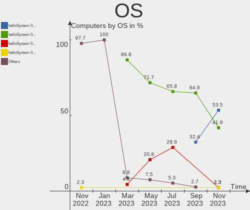
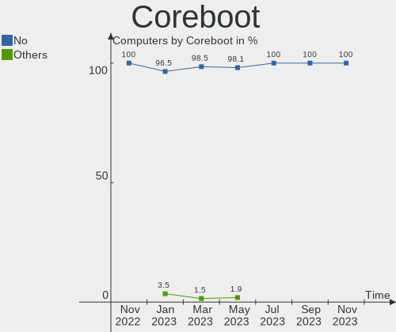
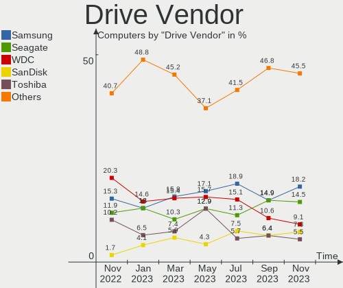
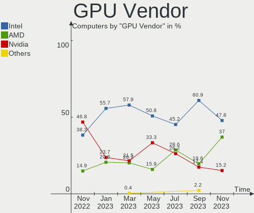
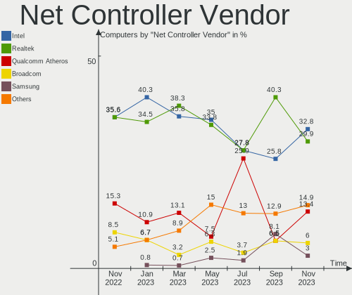

helloSystem - Hardware Trends
-----------------------------

A project to identify most popular hardware characteristics and track their change
over time based on data collected by BSD users at https://BSD-Hardware.info.

Anyone can contribute to this report by the [hw-probe](https://github.com/linuxhw/hw-probe/blob/master/INSTALL.BSD.md) tool:

    hw-probe -all -upload

This is a report for all computer types. See also reports for [desktops](/Dist/helloSystem/Desktop/README.md) and [notebooks](/Dist/helloSystem/Notebook/README.md).

This report is for one last month. Overall report since the beginning of time: [TestCoverage](https://github.com/bsdhw/TestCoverage)

Period: Dec, 2022.

Contents
--------

* [ System ](#system)
  - [ OS                       ](#os)
  - [ OS Family                ](#os-family)
  - [ Arch                     ](#arch)
  - [ DE                       ](#de)
  - [ Display Server           ](#display-server)
  - [ Display Manager          ](#display-manager)
  - [ OS Lang                  ](#os-lang)
  - [ Boot Mode                ](#boot-mode)
  - [ Filesystem               ](#filesystem)
  - [ Part. scheme             ](#part-scheme)

* [ Board ](#board)
  - [ Vendor                   ](#vendor)
  - [ Model                    ](#model)
  - [ Model Family             ](#model-family)
  - [ MFG Year                 ](#mfg-year)
  - [ Form Factor              ](#form-factor)
  - [ Coreboot                 ](#coreboot)
  - [ RAM Size                 ](#ram-size)
  - [ RAM Used                 ](#ram-used)
  - [ Total Drives             ](#total-drives)
  - [ Has CD-ROM               ](#has-cd-rom)
  - [ Has Ethernet             ](#has-ethernet)
  - [ Has WiFi                 ](#has-wifi)
  - [ Has Bluetooth            ](#has-bluetooth)

* [ Location ](#location)
  - [ Country                  ](#country)
  - [ City                     ](#city)

* [ Drives ](#drives)
  - [ Drive Vendor             ](#drive-vendor)
  - [ Drive Model              ](#drive-model)
  - [ HDD Vendor               ](#hdd-vendor)
  - [ SSD Vendor               ](#ssd-vendor)
  - [ Drive Kind               ](#drive-kind)
  - [ Drive Connector          ](#drive-connector)
  - [ Drive Size               ](#drive-size)
  - [ Space Total              ](#space-total)
  - [ Space Used               ](#space-used)
  - [ Malfunc. Drives          ](#malfunc-drives)
  - [ Malfunc. Drive Vendor    ](#malfunc-drive-vendor)
  - [ Malfunc. HDD Vendor      ](#malfunc-hdd-vendor)
  - [ Malfunc. Drive Kind      ](#malfunc-drive-kind)
  - [ Failed Drives            ](#failed-drives)
  - [ Failed Drive Vendor      ](#failed-drive-vendor)
  - [ Drive Status             ](#drive-status)

* [ Storage controller ](#storage-controller)
  - [ Storage Vendor           ](#storage-vendor)
  - [ Storage Model            ](#storage-model)
  - [ Storage Kind             ](#storage-kind)

* [ Processor ](#processor)
  - [ CPU Vendor               ](#cpu-vendor)
  - [ CPU Model                ](#cpu-model)
  - [ CPU Model Family         ](#cpu-model-family)
  - [ CPU Cores                ](#cpu-cores)
  - [ CPU Sockets              ](#cpu-sockets)
  - [ CPU Threads              ](#cpu-threads)
  - [ CPU Microarch            ](#cpu-microarch)

* [ Graphics ](#graphics)
  - [ GPU Vendor               ](#gpu-vendor)
  - [ GPU Model                ](#gpu-model)
  - [ GPU Combo                ](#gpu-combo)
  - [ GPU Driver               ](#gpu-driver)
  - [ GPU Memory               ](#gpu-memory)

* [ Monitor ](#monitor)
  - [ Monitor Vendor           ](#monitor-vendor)
  - [ Monitor Model            ](#monitor-model)
  - [ Monitor Resolution       ](#monitor-resolution)
  - [ Monitor Diagonal         ](#monitor-diagonal)
  - [ Monitor Width            ](#monitor-width)
  - [ Aspect Ratio             ](#aspect-ratio)
  - [ Monitor Area             ](#monitor-area)
  - [ Pixel Density            ](#pixel-density)
  - [ Multiple Monitors        ](#multiple-monitors)

* [ Network ](#network)
  - [ Net Controller Vendor    ](#net-controller-vendor)
  - [ Net Controller Model     ](#net-controller-model)
  - [ Wireless Vendor          ](#wireless-vendor)
  - [ Wireless Model           ](#wireless-model)
  - [ Ethernet Vendor          ](#ethernet-vendor)
  - [ Ethernet Model           ](#ethernet-model)
  - [ Net Controller Kind      ](#net-controller-kind)
  - [ Used Controller          ](#used-controller)
  - [ NICs                     ](#nics)
  - [ IPv6                     ](#ipv6)

* [ Bluetooth ](#bluetooth)
  - [ Bluetooth Vendor         ](#bluetooth-vendor)
  - [ Bluetooth Model          ](#bluetooth-model)

* [ Sound ](#sound)
  - [ Sound Vendor             ](#sound-vendor)
  - [ Sound Model              ](#sound-model)

* [ Memory ](#memory)
  - [ Memory Vendor            ](#memory-vendor)
  - [ Memory Model             ](#memory-model)
  - [ Memory Kind              ](#memory-kind)
  - [ Memory Form Factor       ](#memory-form-factor)
  - [ Memory Size              ](#memory-size)
  - [ Memory Speed             ](#memory-speed)

* [ Printers & scanners ](#printers--scanners)
  - [ Printer Vendor           ](#printer-vendor)
  - [ Printer Model            ](#printer-model)
  - [ Scanner Vendor           ](#scanner-vendor)
  - [ Scanner Model            ](#scanner-model)

* [ Camera ](#camera)
  - [ Camera Vendor            ](#camera-vendor)
  - [ Camera Model             ](#camera-model)

* [ Security ](#security)
  - [ Fingerprint Vendor       ](#fingerprint-vendor)
  - [ Fingerprint Model        ](#fingerprint-model)
  - [ Chipcard Vendor          ](#chipcard-vendor)
  - [ Chipcard Model           ](#chipcard-model)

* [ Unsupported ](#unsupported)
  - [ Unsupported Devices      ](#unsupported-devices)
  - [ Unsupported Device Types ](#unsupported-device-types)

System
------

OS
--

Installed operating systems

| Name              | Computers | Percent |
|-------------------|-----------|---------|
| helloSystem 0.7.0 | 20        | 80%     |
| helloSystem 0.8.0 | 5         | 20%     |

OS Family
---------

OS without a version

| Name        | Computers | Percent |
|-------------|-----------|---------|
| helloSystem | 25        | 100%    |

Arch
----

OS architecture (x86_64, i586, etc.)

| Name  | Computers | Percent |
|-------|-----------|---------|
| amd64 | 25        | 100%    |

DE
--

Desktop Environment

| Name         | Computers | Percent |
|--------------|-----------|---------|
| helloDesktop | 25        | 100%    |

Display Server
--------------

X11 or Wayland

| Name | Computers | Percent |
|------|-----------|---------|
| X11  | 25        | 100%    |

Display Manager
---------------

SDDM, LightDM, etc.

| Name | Computers | Percent |
|------|-----------|---------|
| SLiM | 25        | 100%    |

OS Lang
-------

Language

| Lang  | Computers | Percent |
|-------|-----------|---------|
| en_US | 21        | 84%     |
| zh_TW | 1         | 4%      |
| fr    | 1         | 4%      |
| en    | 1         | 4%      |
| de    | 1         | 4%      |

Boot Mode
---------

EFI or BIOS

| Mode | Computers | Percent |
|------|-----------|---------|
| EFI  | 25        | 100%    |

Filesystem
----------

Type of filesystem

| Type   | Computers | Percent |
|--------|-----------|---------|
| Cd9660 | 18        | 72%     |
| Zfs    | 7         | 28%     |

Part. scheme
------------

Scheme of partitioning

| Type | Computers | Percent |
|------|-----------|---------|
| GPT  | 25        | 100%    |

Board
-----

Vendor
------

Motherboard manufacturer

| Name                | Computers | Percent |
|---------------------|-----------|---------|
| Dell                | 5         | 20%     |
| Hewlett-Packard     | 4         | 16%     |
| Gigabyte Technology | 3         | 12%     |
| Apple               | 3         | 12%     |
| Lenovo              | 2         | 8%      |
| ASUSTek Computer    | 2         | 8%      |
| Sony                | 1         | 4%      |
| Pegatron            | 1         | 4%      |
| Intel               | 1         | 4%      |
| HASEE Computer      | 1         | 4%      |
| Acidanthera         | 1         | 4%      |
| Acer                | 1         | 4%      |

Model
-----

Motherboard model

| Name                                         | Computers | Percent |
|----------------------------------------------|-----------|---------|
| Sony VPCSB11FX                               | 1         | 4%      |
| Pegatron Compaq dx2450 Microtower            | 1         | 4%      |
| Lenovo ThinkPad X1 Extreme Gen 4i 20Y5001DMX | 1         | 4%      |
| Lenovo G510 20238                            | 1         | 4%      |
| Intel X99                                    | 1         | 4%      |
| HP Pavilion dv4                              | 1         | 4%      |
| HP Compaq Elite 8300 SFF                     | 1         | 4%      |
| HP 245 G6                                    | 1         | 4%      |
| HP 2000                                      | 1         | 4%      |
| HASEE N95XKP6                                | 1         | 4%      |
| Gigabyte X399 AORUS Gaming 7                 | 1         | 4%      |
| Gigabyte M68MT-S2P                           | 1         | 4%      |
| Gigabyte H81M-DS2                            | 1         | 4%      |
| Dell OptiPlex 3020                           | 1         | 4%      |
| Dell Latitude 5590                           | 1         | 4%      |
| Dell Inspiron 3442                           | 1         | 4%      |
| Dell Inspiron 15-3552                        | 1         | 4%      |
| Dell Dimension E521                          | 1         | 4%      |
| ASUS CM1530                                  | 1         | 4%      |
| ASUS AIO                                     | 1         | 4%      |
| Apple MacPro5,1                              | 1         | 4%      |
| Apple MacBookAir5,1                          | 1         | 4%      |
| Apple MacBook3,1                             | 1         | 4%      |
| Acidanthera MacBookPro15,1                   | 1         | 4%      |
| Acer Aspire ES1-533                          | 1         | 4%      |

Model Family
------------

Motherboard model prefix

| Name                     | Computers | Percent |
|--------------------------|-----------|---------|
| Dell Inspiron            | 2         | 8%      |
| Sony VPCSB11FX           | 1         | 4%      |
| Pegatron Compaq          | 1         | 4%      |
| Lenovo ThinkPad          | 1         | 4%      |
| Lenovo G510              | 1         | 4%      |
| Intel X99                | 1         | 4%      |
| HP Pavilion              | 1         | 4%      |
| HP Compaq                | 1         | 4%      |
| HP 245                   | 1         | 4%      |
| HP 2000                  | 1         | 4%      |
| HASEE N95XKP6            | 1         | 4%      |
| Gigabyte X399            | 1         | 4%      |
| Gigabyte M68MT-S2P       | 1         | 4%      |
| Gigabyte H81M-DS2        | 1         | 4%      |
| Dell OptiPlex            | 1         | 4%      |
| Dell Latitude            | 1         | 4%      |
| Dell Dimension           | 1         | 4%      |
| ASUS CM1530              | 1         | 4%      |
| ASUS AIO                 | 1         | 4%      |
| Apple MacPro5            | 1         | 4%      |
| Apple MacBookAir5        | 1         | 4%      |
| Apple MacBook3           | 1         | 4%      |
| Acidanthera MacBookPro15 | 1         | 4%      |
| Acer Aspire              | 1         | 4%      |

MFG Year
--------

Motherboard manufacture year

| Year | Computers | Percent |
|------|-----------|---------|
| 2022 | 3         | 12%     |
| 2019 | 3         | 12%     |
| 2014 | 3         | 12%     |
| 2010 | 3         | 12%     |
| 2017 | 2         | 8%      |
| 2012 | 2         | 8%      |
| 2011 | 2         | 8%      |
| 2020 | 1         | 4%      |
| 2018 | 1         | 4%      |
| 2016 | 1         | 4%      |
| 2015 | 1         | 4%      |
| 2009 | 1         | 4%      |
| 2008 | 1         | 4%      |
| 2007 | 1         | 4%      |

Form Factor
-----------

Physical design of the computer

| Name       | Computers | Percent |
|------------|-----------|---------|
| Notebook   | 14        | 56%     |
| Desktop    | 10        | 40%     |
| All in one | 1         | 4%      |

Coreboot
--------

Have coreboot on board

| Used | Computers | Percent |
|------|-----------|---------|
| No   | 25        | 100%    |

RAM Size
--------

Total RAM memory

| Size in GB | Computers | Percent |
|------------|-----------|---------|
| 8.01-16.0  | 9         | 36%     |
| 4.01-8.0   | 6         | 24%     |
| 16.01-24.0 | 5         | 20%     |
| 32.01-64.0 | 3         | 12%     |
| 3.01-4.0   | 1         | 4%      |
| 0.51-1.0   | 1         | 4%      |

RAM Used
--------

Used RAM memory

| Used GB  | Computers | Percent |
|----------|-----------|---------|
| 0.01-0.5 | 15        | 60%     |
| 0.51-1.0 | 6         | 24%     |
| 1.01-2.0 | 4         | 16%     |

Total Drives
------------

Number of drives on board

| Drives | Computers | Percent |
|--------|-----------|---------|
| 1      | 16        | 64%     |
| 2      | 5         | 20%     |
| 3      | 2         | 8%      |
| 0      | 2         | 8%      |

Has CD-ROM
----------

Has CD-ROM on board

| Presented | Computers | Percent |
|-----------|-----------|---------|
| No        | 15        | 60%     |
| Yes       | 10        | 40%     |

Has Ethernet
------------

Has Ethernet on board

| Presented | Computers | Percent |
|-----------|-----------|---------|
| Yes       | 21        | 84%     |
| No        | 4         | 16%     |

Has WiFi
--------

Has WiFi module

| Presented | Computers | Percent |
|-----------|-----------|---------|
| Yes       | 17        | 68%     |
| No        | 8         | 32%     |

Has Bluetooth
-------------

Has Bluetooth module

| Presented | Computers | Percent |
|-----------|-----------|---------|
| Yes       | 14        | 56%     |
| No        | 11        | 44%     |

Location
--------

Country
-------

Geographic location (country)

| Country   | Computers | Percent |
|-----------|-----------|---------|
| USA       | 5         | 20%     |
| China     | 3         | 12%     |
| Canada    | 3         | 12%     |
| Italy     | 2         | 8%      |
| Germany   | 2         | 8%      |
| Vietnam   | 1         | 4%      |
| Taiwan    | 1         | 4%      |
| Spain     | 1         | 4%      |
| Russia    | 1         | 4%      |
| Mexico    | 1         | 4%      |
| Iraq      | 1         | 4%      |
| India     | 1         | 4%      |
| Ecuador   | 1         | 4%      |
| Brazil    | 1         | 4%      |
| Argentina | 1         | 4%      |

City
----

Geographic location (city)

| City              | Computers | Percent |
|-------------------|-----------|---------|
| St. Jean Baptiste | 2         | 8%      |
| Yuefeng           | 1         | 4%      |
| Stuttgart         | 1         | 4%      |
| Shantou           | 1         | 4%      |
| Saint-Zotique     | 1         | 4%      |
| Quito             | 1         | 4%      |
| Nizhniy Novgorod  | 1         | 4%      |
| Mumbai            | 1         | 4%      |
| Karbala           | 1         | 4%      |
| Ho Chi Minh City  | 1         | 4%      |
| Guangzhou         | 1         | 4%      |
| Devils Lake       | 1         | 4%      |
| Dayuan            | 1         | 4%      |
| Dayton            | 1         | 4%      |
| Curitiba          | 1         | 4%      |
| Córdoba          | 1         | 4%      |
| Concordia         | 1         | 4%      |
| Charlotte         | 1         | 4%      |
| Cerea             | 1         | 4%      |
| Brighton          | 1         | 4%      |
| Blomberg          | 1         | 4%      |
| Austin            | 1         | 4%      |
| Alcobendas        | 1         | 4%      |
| Agrate Brianza    | 1         | 4%      |

Drives
------

Drive Vendor
------------

Hard drive vendors

| Vendor              | Computers | Drives | Percent |
|---------------------|-----------|--------|---------|
| WDC                 | 9         | 9      | 31.03%  |
| Seagate             | 4         | 5      | 13.79%  |
| Samsung Electronics | 2         | 3      | 6.9%    |
| PNY                 | 2         | 2      | 6.9%    |
| Apple               | 2         | 3      | 6.9%    |
| Zheino              | 1         | 1      | 3.45%   |
| Toshiba             | 1         | 1      | 3.45%   |
| SK hynix            | 1         | 1      | 3.45%   |
| Plextor             | 1         | 1      | 3.45%   |
| Phison              | 1         | 1      | 3.45%   |
| Patriot             | 1         | 1      | 3.45%   |
| Kingston            | 1         | 1      | 3.45%   |
| Hitachi             | 1         | 1      | 3.45%   |
| Hikvision           | 1         | 1      | 3.45%   |
| Hewlett-Packard     | 1         | 1      | 3.45%   |

Drive Model
-----------

Hard drive models

| Model                              | Computers | Percent |
|------------------------------------|-----------|---------|
| Zheino CHN-25SATAC3-120 120GB      | 1         | 3.23%   |
| WDC WD5000AAKX-75U6AA0 500GB       | 1         | 3.23%   |
| WDC WD4000FYYZ-05UL1B0 4TB         | 1         | 3.23%   |
| WDC WD3200LPVX-60V0TT0 320GB       | 1         | 3.23%   |
| WDC WD3200BEVT-60A23T0 320GB       | 1         | 3.23%   |
| WDC WD3200AAKS-75SBA0 320GB        | 1         | 3.23%   |
| WDC WD3200AAKS-75L9A0 320GB        | 1         | 3.23%   |
| WDC WD1600AAJS-60Z0A0 160GB        | 1         | 3.23%   |
| WDC WD10SPZX-21Z10T0 1TB           | 1         | 3.23%   |
| WDC WD10SPSX-22A6WT0 1TB           | 1         | 3.23%   |
| Toshiba MQ01ABD100 1TB             | 1         | 3.23%   |
| SK hynix BC711 NVMe 512GB          | 1         | 3.23%   |
| Seagate ST9320320AS 320GB          | 1         | 3.23%   |
| Seagate ST500LM030-1RK17D 500GB    | 1         | 3.23%   |
| Seagate ST3320620AS 320GB          | 1         | 3.23%   |
| Seagate ST2000LX001-1RG174 2TB     | 1         | 3.23%   |
| Seagate ST1000LM024 HN-M101MBB 1TB | 1         | 3.23%   |
| Samsung SSD 970 EVO Plus 500GB     | 1         | 3.23%   |
| Samsung SSD 970 EVO 250GB          | 1         | 3.23%   |
| Samsung SSD 860 EVO 500GB          | 1         | 3.23%   |
| PNY CS900 250GB SSD                | 1         | 3.23%   |
| PNY CS900 240GB SSD                | 1         | 3.23%   |
| Plextor PX-512M8VC 512GB           | 1         | 3.23%   |
| Phison SATA SSD 256GB              | 1         | 3.23%   |
| Patriot Burst Elite 240GB          | 1         | 3.23%   |
| Kingston SNVS2000G 2TB             | 1         | 3.23%   |
| Hitachi HDS721616PLA380 160GB      | 1         | 3.23%   |
| Hikvision HS-SSD-C2000Pro 512GB    | 1         | 3.23%   |
| HP SSD S700 250GB                  | 1         | 3.23%   |
| Apple SSD TS128E 121GB             | 1         | 3.23%   |
| Apple SSD SM512E 500GB             | 1         | 3.23%   |

HDD Vendor
----------

Hard disk drive vendors

| Vendor  | Computers | Drives | Percent |
|---------|-----------|--------|---------|
| WDC     | 9         | 9      | 60%     |
| Seagate | 4         | 5      | 26.67%  |
| Toshiba | 1         | 1      | 6.67%   |
| Hitachi | 1         | 1      | 6.67%   |

SSD Vendor
----------

Solid state drive vendors

| Vendor              | Computers | Drives | Percent |
|---------------------|-----------|--------|---------|
| PNY                 | 2         | 2      | 20%     |
| Apple               | 2         | 3      | 20%     |
| Zheino              | 1         | 1      | 10%     |
| Samsung Electronics | 1         | 1      | 10%     |
| Plextor             | 1         | 1      | 10%     |
| Phison              | 1         | 1      | 10%     |
| Patriot             | 1         | 1      | 10%     |
| Hewlett-Packard     | 1         | 1      | 10%     |

Drive Kind
----------

HDD or SSD

| Kind | Computers | Drives | Percent |
|------|-----------|--------|---------|
| HDD  | 14        | 16     | 50%     |
| SSD  | 10        | 11     | 35.71%  |
| NVMe | 4         | 5      | 14.29%  |

Drive Connector
---------------

SATA, SAS, NVMe, etc.

| Type | Computers | Drives | Percent |
|------|-----------|--------|---------|
| SATA | 22        | 27     | 84.62%  |
| NVMe | 4         | 5      | 15.38%  |

Drive Size
----------

Size of hard drive

| Size in TB | Computers | Drives | Percent |
|------------|-----------|--------|---------|
| 0.01-0.5   | 17        | 20     | 70.83%  |
| 0.51-1.0   | 5         | 5      | 20.83%  |
| 3.01-4.0   | 1         | 1      | 4.17%   |
| 1.01-2.0   | 1         | 1      | 4.17%   |

Space Total
-----------

Amount of disk space available on the file system

| Size in GB | Computers | Percent |
|------------|-----------|---------|
| 1-20       | 17        | 68%     |
| 251-500    | 4         | 16%     |
| 101-250    | 3         | 12%     |
| 501-1000   | 1         | 4%      |

Space Used
----------

Amount of used disk space

| Used GB | Computers | Percent |
|---------|-----------|---------|
| 1-20    | 25        | 100%    |

Malfunc. Drives
---------------

Drive models with a malfunction

| Model                              | Computers | Drives | Percent |
|------------------------------------|-----------|--------|---------|
| WDC WD3200BEVT-60A23T0 320GB       | 1         | 1      | 16.67%  |
| WDC WD3200AAKS-75L9A0 320GB        | 1         | 1      | 16.67%  |
| WDC WD1600AAJS-60Z0A0 160GB        | 1         | 1      | 16.67%  |
| WDC WD10SPZX-21Z10T0 1TB           | 1         | 1      | 16.67%  |
| Seagate ST1000LM024 HN-M101MBB 1TB | 1         | 1      | 16.67%  |
| Hitachi HDS721616PLA380 160GB      | 1         | 1      | 16.67%  |

Malfunc. Drive Vendor
---------------------

Vendors of faulty drives

| Vendor  | Computers | Drives | Percent |
|---------|-----------|--------|---------|
| WDC     | 4         | 4      | 66.67%  |
| Seagate | 1         | 1      | 16.67%  |
| Hitachi | 1         | 1      | 16.67%  |

Malfunc. HDD Vendor
-------------------

Vendors of faulty HDD drives

| Vendor  | Computers | Drives | Percent |
|---------|-----------|--------|---------|
| WDC     | 4         | 4      | 66.67%  |
| Seagate | 1         | 1      | 16.67%  |
| Hitachi | 1         | 1      | 16.67%  |

Malfunc. Drive Kind
-------------------

Kinds of faulty drives

| Kind | Computers | Drives | Percent |
|------|-----------|--------|---------|
| HDD  | 6         | 6      | 100%    |

Failed Drives
-------------

Failed drive models

Zero info for selected period =(

Failed Drive Vendor
-------------------

Failed drive vendors

Zero info for selected period =(

Drive Status
------------

Number of failed and malfunc. drives

| Status  | Computers | Drives | Percent |
|---------|-----------|--------|---------|
| Works   | 18        | 26     | 75%     |
| Malfunc | 6         | 6      | 25%     |

Storage controller
------------------

Storage Vendor
--------------

Storage controller vendors

| Vendor                      | Computers | Percent |
|-----------------------------|-----------|---------|
| Intel                       | 17        | 60.71%  |
| AMD                         | 4         | 14.29%  |
| Nvidia                      | 3         | 10.71%  |
| SK hynix                    | 1         | 3.57%   |
| Silicon Motion              | 1         | 3.57%   |
| Samsung Electronics         | 1         | 3.57%   |
| Kingston Technology Company | 1         | 3.57%   |

Storage Model
-------------

Storage controller models

| Model                                                                            | Computers | Percent |
|----------------------------------------------------------------------------------|-----------|---------|
| AMD FCH SATA Controller [AHCI mode]                                              | 3         | 9.38%   |
| Nvidia MCP61 SATA Controller                                                     | 2         | 6.25%   |
| Intel 8 Series/C220 Series Chipset Family 6-port SATA Controller 1 [AHCI mode]   | 2         | 6.25%   |
| Intel 200 Series PCH SATA controller [AHCI mode]                                 | 2         | 6.25%   |
| SK hynix Gold P31/PC711 NVMe Solid State Drive                                   | 1         | 3.13%   |
| Silicon Motion SM2262/SM2262EN SSD Controller                                    | 1         | 3.13%   |
| Samsung NVMe SSD Controller SM981/PM981/PM983                                    | 1         | 3.13%   |
| Nvidia MCP51 Serial ATA Controller                                               | 1         | 3.13%   |
| Intel Sunrise Point-LP SATA Controller [AHCI mode]                               | 1         | 3.13%   |
| Intel Celeron N3350/Pentium N4200/Atom E3900 Series SATA AHCI Controller         | 1         | 3.13%   |
| Intel Cannon Lake Mobile PCH SATA AHCI Controller                                | 1         | 3.13%   |
| Intel C610/X99 series chipset 6-Port SATA Controller [AHCI mode]                 | 1         | 3.13%   |
| Intel Atom/Celeron/Pentium Processor x5-E8000/J3xxx/N3xxx Series SATA Controller | 1         | 3.13%   |
| Intel 82801JI (ICH10 Family) SATA AHCI Controller                                | 1         | 3.13%   |
| Intel 82801IBM/IEM (ICH9M/ICH9M-E) 4 port SATA Controller [AHCI mode]            | 1         | 3.13%   |
| Intel 82801HM/HEM (ICH8M/ICH8M-E) SATA Controller [AHCI mode]                    | 1         | 3.13%   |
| Intel 82801HM/HEM (ICH8M/ICH8M-E) IDE Controller                                 | 1         | 3.13%   |
| Intel 8 Series/C220 Series Chipset Family 4-port SATA Controller 1 [IDE mode]    | 1         | 3.13%   |
| Intel 8 Series/C220 Series Chipset Family 2-port SATA Controller 2 [IDE mode]    | 1         | 3.13%   |
| Intel 8 Series SATA Controller 1 [AHCI mode]                                     | 1         | 3.13%   |
| Intel 7 Series/C210 Series Chipset Family 6-port SATA Controller [AHCI mode]     | 1         | 3.13%   |
| Intel 7 Series Chipset Family 6-port SATA Controller [AHCI mode]                 | 1         | 3.13%   |
| Intel 6 Series/C200 Series Chipset Family 6 port Mobile SATA AHCI Controller     | 1         | 3.13%   |
| AMD X399 Series Chipset SATA Controller                                          | 1         | 3.13%   |
| AMD SB7x0/SB8x0/SB9x0 SATA Controller [IDE mode]                                 | 1         | 3.13%   |
| AMD SB7x0/SB8x0/SB9x0 IDE Controller                                             | 1         | 3.13%   |
| Unknown                                                                          | 1         | 3.13%   |

Storage Kind
------------

Kind of storage controller (IDE, SATA, NVMe, SAS, ...)

| Kind | Computers | Percent |
|------|-----------|---------|
| SATA | 19        | 65.52%  |
| IDE  | 6         | 20.69%  |
| NVMe | 4         | 13.79%  |

Processor
---------

CPU Vendor
----------

Processor vendors

| Vendor | Computers | Percent |
|--------|-----------|---------|
| Intel  | 18        | 72%     |
| AMD    | 7         | 28%     |

CPU Model
---------

Processor models

| Model                                         | Computers | Percent |
|-----------------------------------------------|-----------|---------|
| Intel Xeon CPU W3565 @ 3.20GHz                | 1         | 4%      |
| Intel Xeon CPU E5-2630 v3 @ 2.40GHz           | 1         | 4%      |
| Intel Xeon CPU E3-1231 v3 @ 3.40GHz           | 1         | 4%      |
| Intel Pentium Dual CPU T3400 @ 2.16GHz        | 1         | 4%      |
| Intel Core i7-8650U CPU @ 1.90GHz             | 1         | 4%      |
| Intel Core i7-4700MQ CPU @ 2.40GHz            | 1         | 4%      |
| Intel Core i5-9400 CPU @ 2.90GHz              | 1         | 4%      |
| Intel Core i5-8400 CPU @ 2.80GHz              | 1         | 4%      |
| Intel Core i5-8300H CPU @ 2.30GHz             | 1         | 4%      |
| Intel Core i5-4590 CPU @ 3.30GHz              | 1         | 4%      |
| Intel Core i5-4210U CPU @ 1.70GHz             | 1         | 4%      |
| Intel Core i5-3570 CPU @ 3.40GHz              | 1         | 4%      |
| Intel Core i5-3317U CPU @ 1.70GHz             | 1         | 4%      |
| Intel Core i5-2410M CPU @ 2.30GHz             | 1         | 4%      |
| Intel Core 2 Duo CPU T7300 @ 2.00GHz          | 1         | 4%      |
| Intel Celeron CPU N3450 @ 1.10GHz             | 1         | 4%      |
| Intel Celeron CPU N3060 @ 1.60GHz             | 1         | 4%      |
| Intel 11th Gen Core i7-11800H @ 2.30GHz       | 1         | 4%      |
| AMD Ryzen Threadripper 1900X 8-Core Processor | 1         | 4%      |
| AMD E1-2500 APU with Radeon HD Graphics       | 1         | 4%      |
| AMD Athlon II X4 645 Processor                | 1         | 4%      |
| AMD Athlon II X2 250 Processor                | 1         | 4%      |
| AMD Athlon Dual Core Processor 5200B          | 1         | 4%      |
| AMD Athlon 64 X2 Dual Core Processor 3600+    | 1         | 4%      |
| AMD A9-9420 RADEON R5, 5 COMPUTE CORES 2C+3G  | 1         | 4%      |

CPU Model Family
----------------

Processor model prefix

| Model                  | Computers | Percent |
|------------------------|-----------|---------|
| Intel Core i5          | 8         | 32%     |
| Intel Xeon             | 3         | 12%     |
| Other                  | 2         | 8%      |
| Intel Core i7          | 2         | 8%      |
| Intel Celeron          | 2         | 8%      |
| Intel Pentium Dual     | 1         | 4%      |
| Intel Core 2 Duo       | 1         | 4%      |
| AMD Ryzen Threadripper | 1         | 4%      |
| AMD E1                 | 1         | 4%      |
| AMD Athlon II X4       | 1         | 4%      |
| AMD Athlon II X2       | 1         | 4%      |
| AMD Athlon Dual Core   | 1         | 4%      |
| AMD Athlon 64 X2       | 1         | 4%      |

CPU Cores
---------

Number of processor cores

| Number  | Computers | Percent |
|---------|-----------|---------|
| 4       | 9         | 36%     |
| 2       | 9         | 36%     |
| 8       | 2         | 8%      |
| 6       | 2         | 8%      |
| Unknown | 2         | 8%      |
| 16      | 1         | 4%      |

CPU Sockets
-----------

Number of sockets

| Number | Computers | Percent |
|--------|-----------|---------|
| 1      | 24        | 96%     |
| 2      | 1         | 4%      |

CPU Threads
-----------

Threads per core (Hyper-Threading)

| Number  | Computers | Percent |
|---------|-----------|---------|
| 1       | 13        | 52%     |
| 2       | 10        | 40%     |
| Unknown | 2         | 8%      |

CPU Microarch
-------------

Microarchitecture

| Name        | Computers | Percent |
|-------------|-----------|---------|
| Haswell     | 5         | 20%     |
| KabyLake    | 4         | 16%     |
| K8 Hammer   | 2         | 8%      |
| K10         | 2         | 8%      |
| IvyBridge   | 2         | 8%      |
| Core        | 2         | 8%      |
| Zen         | 1         | 4%      |
| Silvermont  | 1         | 4%      |
| SandyBridge | 1         | 4%      |
| Nehalem     | 1         | 4%      |
| Jaguar      | 1         | 4%      |
| Goldmont    | 1         | 4%      |
| Excavator   | 1         | 4%      |
| Unknown     | 1         | 4%      |

Graphics
--------

GPU Vendor
----------

Vendors of graphics cards

| Vendor | Computers | Percent |
|--------|-----------|---------|
| Intel  | 15        | 50%     |
| Nvidia | 8         | 26.67%  |
| AMD    | 7         | 23.33%  |

GPU Model
---------

Graphics card models

| Model                                                                                    | Computers | Percent |
|------------------------------------------------------------------------------------------|-----------|---------|
| Intel CoffeeLake-S GT2 [UHD Graphics 630]                                                | 2         | 6.45%   |
| Nvidia TU116 [GeForce GTX 1660 Ti]                                                       | 1         | 3.23%   |
| Nvidia GP107M [GeForce GTX 1050 Ti Mobile]                                               | 1         | 3.23%   |
| Nvidia GP107 [GeForce GTX 1050 Ti]                                                       | 1         | 3.23%   |
| Nvidia GP106M [GeForce GTX 1060 Mobile]                                                  | 1         | 3.23%   |
| Nvidia GA107M [GeForce RTX 3050 Ti Mobile]                                               | 1         | 3.23%   |
| Nvidia G72 [GeForce 7300 LE]                                                             | 1         | 3.23%   |
| Nvidia C61 [GeForce 7025 / nForce 630a]                                                  | 1         | 3.23%   |
| Nvidia C51 [GeForce 6150 LE]                                                             | 1         | 3.23%   |
| Intel Xeon E3-1200 v3/4th Gen Core Processor Integrated Graphics Controller              | 1         | 3.23%   |
| Intel Xeon E3-1200 v2/3rd Gen Core processor Graphics Controller                         | 1         | 3.23%   |
| Intel UHD Graphics 620                                                                   | 1         | 3.23%   |
| Intel TigerLake-H GT1 [UHD Graphics]                                                     | 1         | 3.23%   |
| Intel Mobile GM965/GL960 Integrated Graphics Controller (secondary)                      | 1         | 3.23%   |
| Intel Mobile GM965/GL960 Integrated Graphics Controller (primary)                        | 1         | 3.23%   |
| Intel Mobile 4 Series Chipset Integrated Graphics Controller                             | 1         | 3.23%   |
| Intel HD Graphics 500                                                                    | 1         | 3.23%   |
| Intel Haswell-ULT Integrated Graphics Controller                                         | 1         | 3.23%   |
| Intel CoffeeLake-H GT2 [UHD Graphics 630]                                                | 1         | 3.23%   |
| Intel Atom/Celeron/Pentium Processor x5-E8000/J3xxx/N3xxx Integrated Graphics Controller | 1         | 3.23%   |
| Intel 4th Gen Core Processor Integrated Graphics Controller                              | 1         | 3.23%   |
| Intel 3rd Gen Core processor Graphics Controller                                         | 1         | 3.23%   |
| Intel 2nd Generation Core Processor Family Integrated Graphics Controller                | 1         | 3.23%   |
| AMD Stoney [Radeon R2/R3/R4/R5 Graphics]                                                 | 1         | 3.23%   |
| AMD Seymour [Radeon HD 6400M/7400M Series]                                               | 1         | 3.23%   |
| AMD RS780L [Radeon 3000]                                                                 | 1         | 3.23%   |
| AMD Opal XT [Radeon R7 M265/M365X/M465]                                                  | 1         | 3.23%   |
| AMD Navi 14 [Radeon RX 5500/5500M / Pro 5500M]                                           | 1         | 3.23%   |
| AMD Kabini [Radeon HD 8240 / R3 Series]                                                  | 1         | 3.23%   |
| AMD Juniper XT [Radeon HD 5770]                                                          | 1         | 3.23%   |

GPU Combo
---------

Combinations of graphics cards

| Name           | Computers | Percent |
|----------------|-----------|---------|
| 1 x Intel      | 8         | 32%     |
| 1 x Nvidia     | 5         | 20%     |
| 1 x AMD        | 5         | 20%     |
| Intel + Nvidia | 3         | 12%     |
| 2 x Intel      | 2         | 8%      |
| Intel + AMD    | 2         | 8%      |

GPU Driver
----------

Free vs proprietary

| Driver      | Computers | Percent |
|-------------|-----------|---------|
| Free        | 21        | 84%     |
| Proprietary | 4         | 16%     |

GPU Memory
----------

Total video memory

| Size in GB | Computers | Percent |
|------------|-----------|---------|
| Unknown    | 18        | 72%     |
| 0.01-0.5   | 3         | 12%     |
| 3.01-4.0   | 2         | 8%      |
| 5.01-6.0   | 1         | 4%      |
| 0.51-1.0   | 1         | 4%      |

Monitor
-------

Monitor Vendor
--------------

Monitor vendors

| Vendor                  | Computers | Percent |
|-------------------------|-----------|---------|
| BOE                     | 4         | 19.05%  |
| LG Display              | 3         | 14.29%  |
| Apple                   | 3         | 14.29%  |
| Acer                    | 3         | 14.29%  |
| Samsung Electronics     | 2         | 9.52%   |
| PANDA                   | 1         | 4.76%   |
| Hewlett-Packard         | 1         | 4.76%   |
| Dell                    | 1         | 4.76%   |
| Chi Mei Optoelectronics | 1         | 4.76%   |
| BenQ                    | 1         | 4.76%   |
| AU Optronics            | 1         | 4.76%   |

Monitor Model
-------------

Monitor models

| Model                                                                    | Computers | Percent |
|--------------------------------------------------------------------------|-----------|---------|
| Samsung Electronics LCD Monitor SEC5441 1366x768 340x190mm 15.3-inch     | 1         | 4.76%   |
| Samsung Electronics LCD Monitor SAM0C26 1920x1080 700x390mm 31.5-inch    | 1         | 4.76%   |
| PANDA LM156LF1L03 NCP001C 1920x1080 340x190mm 15.3-inch                  | 1         | 4.76%   |
| LG Display LCD Monitor LGD06AA 3840x2400 340x210mm 15.7-inch             | 1         | 4.76%   |
| LG Display LCD Monitor LGD05CF 1920x1080 340x190mm 15.3-inch             | 1         | 4.76%   |
| LG Display LCD Monitor LGD033A 1366x768 340x190mm 15.3-inch              | 1         | 4.76%   |
| Hewlett-Packard 24w HPN3431 1920x1080 530x300mm 24.0-inch                | 1         | 4.76%   |
| Dell U2913WM DEL408B 2560x1080 670x280mm 28.6-inch                       | 1         | 4.76%   |
| Chi Mei Optoelectronics LCD Monitor CMO1425 1280x800 300x190mm 14.0-inch | 1         | 4.76%   |
| BOE LCD Monitor BOE06BD 1366x768 310x170mm 13.9-inch                     | 1         | 4.76%   |
| BOE LCD Monitor BOE0675 1366x768 340x190mm 15.3-inch                     | 1         | 4.76%   |
| BOE LCD Monitor BOE0671 1366x768 340x190mm 15.3-inch                     | 1         | 4.76%   |
| BOE LCD Monitor BOE05EF 1366x768 310x170mm 13.9-inch                     | 1         | 4.76%   |
| BenQ GW2270 BNQ78DB 1920x1080 480x270mm 21.7-inch                        | 1         | 4.76%   |
| AU Optronics LCD Monitor AUO63ED 1920x1080 340x190mm 15.3-inch           | 1         | 4.76%   |
| Apple LCD Monitor APP9C5F 1280x800 290x180mm 13.4-inch                   | 1         | 4.76%   |
| Apple Color LCD APP9CF3 1366x768 260x140mm 11.6-inch                     | 1         | 4.76%   |
| Apple Cinema Display APP921D 1680x1050 430x270mm 20.0-inch               | 1         | 4.76%   |
| Acer S240HL ACR0289 1920x1080 530x300mm 24.0-inch                        | 1         | 4.76%   |
| Acer B276HL ACR0332 1920x1080 600x340mm 27.2-inch                        | 1         | 4.76%   |
| Acer AL2216W ACRAD74 1680x1050 470x300mm 22.0-inch                       | 1         | 4.76%   |

Monitor Resolution
------------------

Monitor screen resolution

| Resolution         | Computers | Percent |
|--------------------|-----------|---------|
| 1920x1080 (FHD)    | 7         | 35%     |
| 1366x768 (WXGA)    | 7         | 35%     |
| 1680x1050 (WSXGA+) | 2         | 10%     |
| 1280x800 (WXGA)    | 2         | 10%     |
| 3840x2400          | 1         | 5%      |
| 2560x1080          | 1         | 5%      |

Monitor Diagonal
----------------

Diagonal size in inches

| Inches | Computers | Percent |
|--------|-----------|---------|
| 15     | 8         | 38.1%   |
| 13     | 3         | 14.29%  |
| 24     | 2         | 9.52%   |
| 31     | 1         | 4.76%   |
| 28     | 1         | 4.76%   |
| 27     | 1         | 4.76%   |
| 22     | 1         | 4.76%   |
| 21     | 1         | 4.76%   |
| 20     | 1         | 4.76%   |
| 14     | 1         | 4.76%   |
| 11     | 1         | 4.76%   |

Monitor Width
-------------

Physical width

| Width in mm | Computers | Percent |
|-------------|-----------|---------|
| 301-350     | 10        | 47.62%  |
| 501-600     | 3         | 14.29%  |
| 401-500     | 3         | 14.29%  |
| 201-300     | 3         | 14.29%  |
| 601-700     | 2         | 9.52%   |

Aspect Ratio
------------

Proportional relationship between the width and the height

| Ratio | Computers | Percent |
|-------|-----------|---------|
| 16/9  | 13        | 65%     |
| 16/10 | 6         | 30%     |
| 21/9  | 1         | 5%      |

Monitor Area
------------

Area in inch²

| Area in inch² | Computers | Percent |
|----------------|-----------|---------|
| 91-100         | 6         | 28.57%  |
| 81-90          | 4         | 19.05%  |
| 201-250        | 4         | 19.05%  |
| 51-60          | 1         | 4.76%   |
| 351-500        | 1         | 4.76%   |
| 301-350        | 1         | 4.76%   |
| 251-300        | 1         | 4.76%   |
| 151-200        | 1         | 4.76%   |
| 111-120        | 1         | 4.76%   |
| 101-110        | 1         | 4.76%   |

Pixel Density
-------------

Pixels per inch

| Density       | Computers | Percent |
|---------------|-----------|---------|
| 101-120       | 8         | 40%     |
| 51-100        | 7         | 35%     |
| 121-160       | 4         | 20%     |
| More than 240 | 1         | 5%      |

Multiple Monitors
-----------------

Total monitors connected

| Total | Computers | Percent |
|-------|-----------|---------|
| 1     | 22        | 88%     |
| 2     | 2         | 8%      |
| 0     | 1         | 4%      |

Network
-------

Net Controller Vendor
---------------------

Controller vendors

| Vendor                   | Computers | Percent |
|--------------------------|-----------|---------|
| Realtek Semiconductor    | 13        | 39.39%  |
| Intel                    | 8         | 24.24%  |
| Qualcomm Atheros         | 6         | 18.18%  |
| Broadcom                 | 4         | 12.12%  |
| Marvell Technology Group | 1         | 3.03%   |
| Google                   | 1         | 3.03%   |

Net Controller Model
--------------------

Controller models

| Model                                                                   | Computers | Percent |
|-------------------------------------------------------------------------|-----------|---------|
| Realtek RTL8111/8168/8411 PCI Express Gigabit Ethernet Controller       | 10        | 25%     |
| Realtek RTL810xE PCI Express Fast Ethernet controller                   | 3         | 7.5%    |
| Qualcomm Atheros QCA9565 / AR9565 Wireless Network Adapter              | 3         | 7.5%    |
| Intel Wireless 8265 / 8275                                              | 2         | 5%      |
| Intel Dual Band Wireless-AC 3168NGW [Stone Peak]                        | 2         | 5%      |
| Realtek RTL8821CE 802.11ac PCIe Wireless Network Adapter                | 1         | 2.5%    |
| Realtek RTL8723DE Wireless Network Adapter                              | 1         | 2.5%    |
| Realtek RTL8188EUS 802.11n Wireless Network Adapter                     | 1         | 2.5%    |
| Realtek RTL8188CE 802.11b/g/n WiFi Adapter                              | 1         | 2.5%    |
| Realtek Realtek Bluetooth 4.2 Adapter                                   | 1         | 2.5%    |
| Qualcomm Atheros QCA8172 Fast Ethernet                                  | 1         | 2.5%    |
| Qualcomm Atheros Killer E2500 Gigabit Ethernet Controller               | 1         | 2.5%    |
| Qualcomm Atheros AR9485 Wireless Network Adapter                        | 1         | 2.5%    |
| Qualcomm Atheros AR242x / AR542x Wireless Network Adapter (PCI-Express) | 1         | 2.5%    |
| Marvell Group 88E8058 PCI-E Gigabit Ethernet Controller                 | 1         | 2.5%    |
| Intel Wi-Fi 6 AX210/AX211/AX411 160MHz                                  | 1         | 2.5%    |
| Intel Ethernet Connection (4) I219-LM                                   | 1         | 2.5%    |
| Intel Cannon Lake PCH CNVi WiFi                                         | 1         | 2.5%    |
| Intel 82579LM Gigabit Network Connection (Lewisville)                   | 1         | 2.5%    |
| Intel 82574L Gigabit Network Connection                                 | 1         | 2.5%    |
| Google Nexus/Pixel Device (tether)                                      | 1         | 2.5%    |
| Broadcom BCM4401-B0 100Base-TX                                          | 1         | 2.5%    |
| Broadcom BCM43224 802.11a/b/g/n                                         | 1         | 2.5%    |
| Broadcom BCM4322 802.11a/b/g/n Wireless LAN Controller                  | 1         | 2.5%    |
| Broadcom BCM4313 802.11bgn Wireless Network Adapter                     | 1         | 2.5%    |

Wireless Vendor
---------------

Wireless vendors

| Vendor                | Computers | Percent |
|-----------------------|-----------|---------|
| Intel                 | 6         | 33.33%  |
| Qualcomm Atheros      | 5         | 27.78%  |
| Realtek Semiconductor | 4         | 22.22%  |
| Broadcom              | 3         | 16.67%  |

Wireless Model
--------------

Wireless models

| Model                                                                   | Computers | Percent |
|-------------------------------------------------------------------------|-----------|---------|
| Qualcomm Atheros QCA9565 / AR9565 Wireless Network Adapter              | 3         | 15.79%  |
| Intel Wireless 8265 / 8275                                              | 2         | 10.53%  |
| Intel Dual Band Wireless-AC 3168NGW [Stone Peak]                        | 2         | 10.53%  |
| Realtek RTL8821CE 802.11ac PCIe Wireless Network Adapter                | 1         | 5.26%   |
| Realtek RTL8723DE Wireless Network Adapter                              | 1         | 5.26%   |
| Realtek RTL8188EUS 802.11n Wireless Network Adapter                     | 1         | 5.26%   |
| Realtek RTL8188CE 802.11b/g/n WiFi Adapter                              | 1         | 5.26%   |
| Realtek Realtek Bluetooth 4.2 Adapter                                   | 1         | 5.26%   |
| Qualcomm Atheros AR9485 Wireless Network Adapter                        | 1         | 5.26%   |
| Qualcomm Atheros AR242x / AR542x Wireless Network Adapter (PCI-Express) | 1         | 5.26%   |
| Intel Wi-Fi 6 AX210/AX211/AX411 160MHz                                  | 1         | 5.26%   |
| Intel Cannon Lake PCH CNVi WiFi                                         | 1         | 5.26%   |
| Broadcom BCM43224 802.11a/b/g/n                                         | 1         | 5.26%   |
| Broadcom BCM4322 802.11a/b/g/n Wireless LAN Controller                  | 1         | 5.26%   |
| Broadcom BCM4313 802.11bgn Wireless Network Adapter                     | 1         | 5.26%   |

Ethernet Vendor
---------------

Ethernet vendors

| Vendor                   | Computers | Percent |
|--------------------------|-----------|---------|
| Realtek Semiconductor    | 13        | 61.9%   |
| Intel                    | 3         | 14.29%  |
| Qualcomm Atheros         | 2         | 9.52%   |
| Marvell Technology Group | 1         | 4.76%   |
| Google                   | 1         | 4.76%   |
| Broadcom                 | 1         | 4.76%   |

Ethernet Model
--------------

Ethernet models

| Model                                                             | Computers | Percent |
|-------------------------------------------------------------------|-----------|---------|
| Realtek RTL8111/8168/8411 PCI Express Gigabit Ethernet Controller | 10        | 47.62%  |
| Realtek RTL810xE PCI Express Fast Ethernet controller             | 3         | 14.29%  |
| Qualcomm Atheros QCA8172 Fast Ethernet                            | 1         | 4.76%   |
| Qualcomm Atheros Killer E2500 Gigabit Ethernet Controller         | 1         | 4.76%   |
| Marvell Group 88E8058 PCI-E Gigabit Ethernet Controller           | 1         | 4.76%   |
| Intel Ethernet Connection (4) I219-LM                             | 1         | 4.76%   |
| Intel 82579LM Gigabit Network Connection (Lewisville)             | 1         | 4.76%   |
| Intel 82574L Gigabit Network Connection                           | 1         | 4.76%   |
| Google Nexus/Pixel Device (tether)                                | 1         | 4.76%   |
| Broadcom BCM4401-B0 100Base-TX                                    | 1         | 4.76%   |

Net Controller Kind
-------------------

Ethernet, WiFi or modem

| Kind     | Computers | Percent |
|----------|-----------|---------|
| Ethernet | 21        | 55.26%  |
| WiFi     | 17        | 44.74%  |

Used Controller
---------------

Currently used network controller

| Kind     | Computers | Percent |
|----------|-----------|---------|
| Ethernet | 13        | 65%     |
| WiFi     | 7         | 35%     |

NICs
----

Total network controllers on board

| Total | Computers | Percent |
|-------|-----------|---------|
| 2     | 13        | 52%     |
| 1     | 9         | 36%     |
| 0     | 2         | 8%      |
| 3     | 1         | 4%      |

IPv6
----

IPv6 vs IPv4

| Used | Computers | Percent |
|------|-----------|---------|
| No   | 25        | 100%    |

Bluetooth
---------

Bluetooth Vendor
----------------

Controller vendors

| Vendor                          | Computers | Percent |
|---------------------------------|-----------|---------|
| Intel                           | 6         | 42.86%  |
| Qualcomm Atheros Communications | 3         | 21.43%  |
| Apple                           | 3         | 21.43%  |
| Realtek Semiconductor           | 1         | 7.14%   |
| Hewlett-Packard                 | 1         | 7.14%   |

Bluetooth Model
---------------

Controller models

| Model                                                       | Computers | Percent |
|-------------------------------------------------------------|-----------|---------|
| Intel Wireless-AC 3168 Bluetooth                            | 2         | 14.29%  |
| Intel Bluetooth wireless interface                          | 2         | 14.29%  |
| Apple Built-in Bluetooth 2.0+EDR HCI                        | 2         | 14.29%  |
| Realtek  Bluetooth Adapter                                  | 1         | 7.14%   |
| Qualcomm Atheros Dell Wireless 1707 Bluetooth 4.0 LE Device | 1         | 7.14%   |
| Qualcomm Atheros AR9462 Bluetooth                           | 1         | 7.14%   |
| Qualcomm Atheros AR3012 Bluetooth 4.0                       | 1         | 7.14%   |
| Intel Bluetooth 9460/9560 Jefferson Peak (JfP)              | 1         | 7.14%   |
| Intel AX210 Bluetooth                                       | 1         | 7.14%   |
| HP Bluetooth 2.0 Interface [Broadcom BCM2045]               | 1         | 7.14%   |
| Apple Built-in iSight (no firmware loaded)                  | 1         | 7.14%   |

Sound
-----

Sound Vendor
------------

Sound card vendors

| Vendor | Computers | Percent |
|--------|-----------|---------|
| Intel  | 18        | 60%     |
| AMD    | 6         | 20%     |
| Nvidia | 5         | 16.67%  |
| JMTek  | 1         | 3.33%   |

Sound Model
-----------

Sound card models

| Model                                                                                             | Computers | Percent |
|---------------------------------------------------------------------------------------------------|-----------|---------|
| Intel 8 Series/C220 Series Chipset High Definition Audio Controller                               | 3         | 8.33%   |
| Intel Xeon E3-1200 v3/4th Gen Core Processor HD Audio Controller                                  | 2         | 5.56%   |
| Intel 7 Series/C216 Chipset Family High Definition Audio Controller                               | 2         | 5.56%   |
| Intel 200 Series PCH HD Audio                                                                     | 2         | 5.56%   |
| Nvidia TU116 High Definition Audio Controller                                                     | 1         | 2.78%   |
| Nvidia MCP61 High Definition Audio                                                                | 1         | 2.78%   |
| Nvidia MCP51 High Definition Audio                                                                | 1         | 2.78%   |
| Nvidia GP107GL High Definition Audio Controller                                                   | 1         | 2.78%   |
| JMTek USB PnP Audio Device                                                                        | 1         | 2.78%   |
| Intel Tiger Lake-H HD Audio Controller                                                            | 1         | 2.78%   |
| Intel Sunrise Point-LP HD Audio                                                                   | 1         | 2.78%   |
| Intel Haswell-ULT HD Audio Controller                                                             | 1         | 2.78%   |
| Intel Celeron N3350/Pentium N4200/Atom E3900 Series Audio Cluster                                 | 1         | 2.78%   |
| Intel Cannon Lake PCH cAVS                                                                        | 1         | 2.78%   |
| Intel C610/X99 series chipset HD Audio Controller                                                 | 1         | 2.78%   |
| Intel Atom/Celeron/Pentium Processor x5-E8000/J3xxx/N3xxx Series High Definition Audio Controller | 1         | 2.78%   |
| Intel 82801JI (ICH10 Family) HD Audio Controller                                                  | 1         | 2.78%   |
| Intel 82801I (ICH9 Family) HD Audio Controller                                                    | 1         | 2.78%   |
| Intel 82801H (ICH8 Family) HD Audio Controller                                                    | 1         | 2.78%   |
| Intel 8 Series HD Audio Controller                                                                | 1         | 2.78%   |
| Intel 6 Series/C200 Series Chipset Family High Definition Audio Controller                        | 1         | 2.78%   |
| AMD SBx00 Azalia (Intel HDA)                                                                      | 1         | 2.78%   |
| AMD RS780 HDMI Audio [Radeon 3000/3100 / HD 3200/3300]                                            | 1         | 2.78%   |
| AMD Navi 10 HDMI Audio                                                                            | 1         | 2.78%   |
| AMD Kabini HDMI/DP Audio                                                                          | 1         | 2.78%   |
| AMD Juniper HDMI Audio [Radeon HD 5700 Series]                                                    | 1         | 2.78%   |
| AMD High Definition Audio Controller                                                              | 1         | 2.78%   |
| AMD FCH Azalia Controller                                                                         | 1         | 2.78%   |
| AMD Family 17h (Models 00h-0fh) HD Audio Controller                                               | 1         | 2.78%   |
| AMD Family 15h (Models 60h-6fh) Audio Controller                                                  | 1         | 2.78%   |
| Unknown                                                                                           | 1         | 2.78%   |

Memory
------

Memory Vendor
-------------

Memory module vendors

| Vendor                       | Computers | Percent |
|------------------------------|-----------|---------|
| Kingston                     | 6         | 19.35%  |
| SK hynix                     | 4         | 12.9%   |
| Unknown                      | 3         | 9.68%   |
| Unknown                      | 3         | 9.68%   |
| Micron Technology            | 2         | 6.45%   |
| Crucial                      | 2         | 6.45%   |
| Unknown (8AFD)               | 1         | 3.23%   |
| Unknown (0x3D7F000000000000) | 1         | 3.23%   |
| Transcend                    | 1         | 3.23%   |
| Samsung Electronics          | 1         | 3.23%   |
| Ramaxel Technology           | 1         | 3.23%   |
| PNY                          | 1         | 3.23%   |
| Nanya Technology             | 1         | 3.23%   |
| Corsair                      | 1         | 3.23%   |
| Avant                        | 1         | 3.23%   |
| Atermiter                    | 1         | 3.23%   |
| A-DATA Technology            | 1         | 3.23%   |

Memory Model
------------

Memory module models

| Model                                                           | Computers | Percent |
|-----------------------------------------------------------------|-----------|---------|
| Unknown                                                         | 3         | 9.09%   |
| Kingston RAM KHX1600C10D3/4G 4GB DIMM DDR3 1600MT/s             | 2         | 6.06%   |
| Unknown RAM Module 4GB SODIMM DDR3                              | 1         | 3.03%   |
| Unknown RAM Module 4GB DIMM 1600MT/s                            | 1         | 3.03%   |
| Unknown RAM Module 2GB DIMM 1066MT/s                            | 1         | 3.03%   |
| Unknown (8AFD) RAM SED2666S1908 8GB SODIMM DDR4 2667MT/s        | 1         | 3.03%   |
| Unknown (0x3D7F000000000000) RAM Module 2GB SODIMM DDR2 667MT/s | 1         | 3.03%   |
| Transcend RAM TS4GSH64V2E3 32GB SODIMM DDR4 3200MT/s            | 1         | 3.03%   |
| SK hynix RAM Module 2GB SODIMM DDR3 1600MT/s                    | 1         | 3.03%   |
| SK hynix RAM Module 2GB SODIMM DDR2 667MT/s                     | 1         | 3.03%   |
| SK hynix RAM HMT451U6BFR8A-PB 4GB DIMM DDR3 1600MT/s            | 1         | 3.03%   |
| SK hynix RAM HMA81GS6CJR8N-VK 8GB SODIMM DDR4 2667MT/s          | 1         | 3.03%   |
| Samsung RAM M471A1K43CB1-CRC 8GB SODIMM DDR4 2400MT/s           | 1         | 3.03%   |
| Ramaxel RAM RMT3170EB68F9W1600 4GB SODIMM DDR3 1600MT/s         | 1         | 3.03%   |
| PNY RAM M4S16S682LJJJ43-12 16GB SODIMM DDR4 2667MT/s            | 1         | 3.03%   |
| Nanya RAM Module 8GB DIMM DDR3 1066MT/s                         | 1         | 3.03%   |
| Micron RAM 8HTF6464AY-667D7 512MB DIMM DDR2 667MT/s             | 1         | 3.03%   |
| Micron RAM 8ATF1G64HZ-2G6E1 8GB SODIMM DDR4 2667MT/s            | 1         | 3.03%   |
| Kingston RAM Module 8GB SODIMM DDR3 1600MT/s                    | 1         | 3.03%   |
| Kingston RAM KNWMX1-ETB 4GB SODIMM DDR3 1600MT/s                | 1         | 3.03%   |
| Kingston RAM KHX1600C10D3/8G 4GB DIMM DDR3 1600MT/s             | 1         | 3.03%   |
| Kingston RAM ACR16D3LS1KBGR/8G 8GB SODIMM DDR3 1600MT/s         | 1         | 3.03%   |
| Kingston RAM 99P5700-005.A00G 8GB SODIMM DDR4 2666MT/s          | 1         | 3.03%   |
| Crucial RAM CT12864AA800.S8F 1GB DIMM DDR2 800MT/s              | 1         | 3.03%   |
| Crucial RAM CT12864AA800.K8F 1GB DIMM DDR2 800MT/s              | 1         | 3.03%   |
| Crucial RAM BL16G32C16U4BL.M8FB1 16GB DIMM DDR4 2666MT/s        | 1         | 3.03%   |
| Corsair RAM CMZ8GX3M1A1600C10 8GB DIMM DDR3 1600MT/s            | 1         | 3.03%   |
| Avant RAM F6456U61E6800F 2GB DIMM DDR2 800MT/s                  | 1         | 3.03%   |
| Atermiter RAM Module 4GB DIMM DDR4 2400MT/s                     | 1         | 3.03%   |
| A-DATA RAM AM1L16BC4R1-B1GS 4GB SODIMM DDR3 1333MT/s            | 1         | 3.03%   |

Memory Kind
-----------

Memory module kinds

| Kind    | Computers | Percent |
|---------|-----------|---------|
| DDR3    | 11        | 44%     |
| DDR4    | 8         | 32%     |
| DDR2    | 4         | 16%     |
| Unknown | 2         | 8%      |

Memory Form Factor
------------------

Physical design of the memory module

| Name   | Computers | Percent |
|--------|-----------|---------|
| SODIMM | 15        | 60%     |
| DIMM   | 10        | 40%     |

Memory Size
-----------

Memory module size

| Size  | Computers | Percent |
|-------|-----------|---------|
| 8192  | 9         | 31.03%  |
| 4096  | 9         | 31.03%  |
| 2048  | 5         | 17.24%  |
| 16384 | 2         | 6.9%    |
| 1024  | 2         | 6.9%    |
| 32768 | 1         | 3.45%   |
| 512   | 1         | 3.45%   |

Memory Speed
------------

Memory module speed

| Speed   | Computers | Percent |
|---------|-----------|---------|
| 1600    | 9         | 36%     |
| 2667    | 3         | 12%     |
| 667     | 3         | 12%     |
| 2666    | 2         | 8%      |
| 2400    | 2         | 8%      |
| 1066    | 2         | 8%      |
| 3200    | 1         | 4%      |
| 1333    | 1         | 4%      |
| 800     | 1         | 4%      |
| Unknown | 1         | 4%      |

Printers & scanners
-------------------

Printer Vendor
--------------

Printer device vendors

Zero info for selected period =(

Printer Model
-------------

Printer device models

Zero info for selected period =(

Scanner Vendor
--------------

Scanner device vendors

Zero info for selected period =(

Scanner Model
-------------

Scanner device models

Zero info for selected period =(

Camera
------

Camera Vendor
-------------

Camera device vendors

| Vendor                | Computers | Percent |
|-----------------------|-----------|---------|
| Microdia              | 3         | 25%     |
| Chicony Electronics   | 3         | 25%     |
| Realtek Semiconductor | 2         | 16.67%  |
| Syntek                | 1         | 8.33%   |
| Suyin                 | 1         | 8.33%   |
| IMC Networks          | 1         | 8.33%   |
| Apple                 | 1         | 8.33%   |

Camera Model
------------

Camera device models

| Model                                   | Computers | Percent |
|-----------------------------------------|-----------|---------|
| Microdia Integrated_Webcam_HD           | 2         | 16.67%  |
| Syntek Lenovo EasyCamera                | 1         | 8.33%   |
| Suyin HP webcam [dv6-1190en]            | 1         | 8.33%   |
| Realtek Integrated_Webcam_HD            | 1         | 8.33%   |
| Realtek Acer 640 x 480 laptop camera    | 1         | 8.33%   |
| Microdia USB 2.0 Camera                 | 1         | 8.33%   |
| IMC Networks Integrated RGB Camera      | 1         | 8.33%   |
| Chicony Realtek DMFT - RGB              | 1         | 8.33%   |
| Chicony Integrated Camera (1280x720@30) | 1         | 8.33%   |
| Chicony Chicony USB2.0 Camera           | 1         | 8.33%   |
| Apple FaceTime HD Camera (Built-in)     | 1         | 8.33%   |

Security
--------

Fingerprint Vendor
------------------

Fingerprint sensor vendors

| Vendor           | Computers | Percent |
|------------------|-----------|---------|
| Validity Sensors | 1         | 100%    |

Fingerprint Model
-----------------

Fingerprint sensor models

| Model                                      | Computers | Percent |
|--------------------------------------------|-----------|---------|
| Validity Sensors VFS101 Fingerprint Reader | 1         | 100%    |

Chipcard Vendor
---------------

Chipcard module vendors

Zero info for selected period =(

Chipcard Model
--------------

Chipcard module models

Zero info for selected period =(

Unsupported
-----------

Unsupported Devices
-------------------

Total unsupported devices on board

| Total | Computers | Percent |
|-------|-----------|---------|
| 0     | 10        | 40%     |
| 1     | 8         | 32%     |
| 2     | 4         | 16%     |
| 3     | 3         | 12%     |

Unsupported Device Types
------------------------

Types of unsupported devices

| Type                     | Computers | Percent |
|--------------------------|-----------|---------|
| Communication controller | 11        | 45.83%  |
| Card reader              | 4         | 16.67%  |
| Bluetooth                | 4         | 16.67%  |
| Net/wireless             | 3         | 12.5%   |
| Sound                    | 1         | 4.17%   |
| Fingerprint reader       | 1         | 4.17%   |

