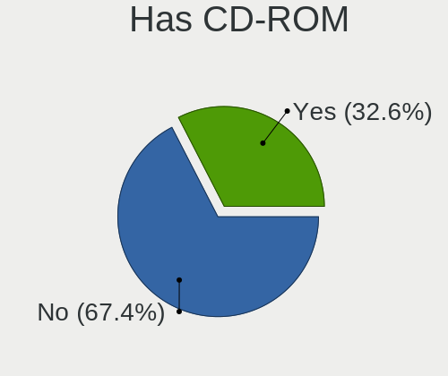
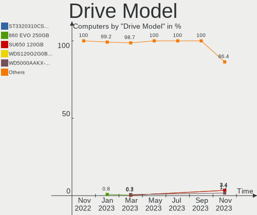
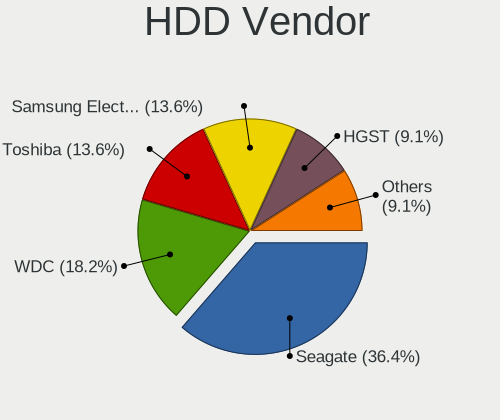
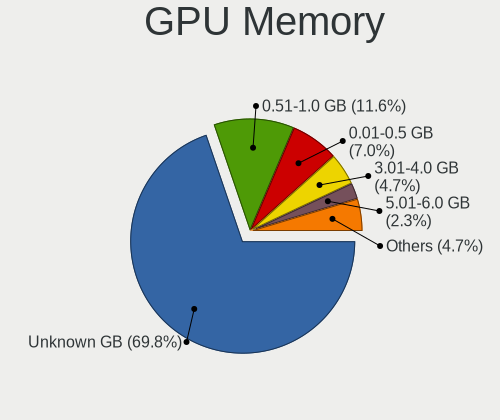
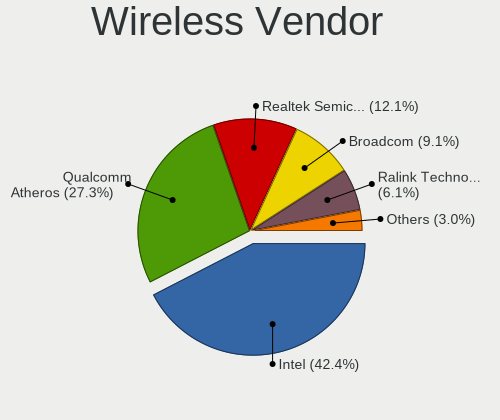
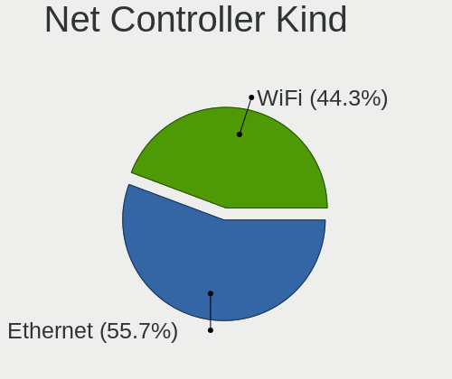
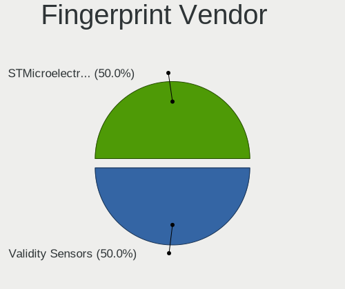

helloSystem Hardware Trends
---------------------------

A project to identify most popular hardware characteristics and track their change
over time based on data collected by helloSystem users at https://BSD-Hardware.info.

Anyone can contribute to this report by the [hw-probe](https://github.com/linuxhw/hw-probe/blob/master/INSTALL.BSD.md) tool:

    hw-probe -all -upload

This is a report for all computer types. See also reports for [desktops](/Dist/helloSystem/Desktop/README.md) and [notebooks](/Dist/helloSystem/Notebook/README.md).

Full-feature report is available here: https://bsd-hardware.info/?view=trends

Period: Nov, 2021.

Contents
--------

* [ System ](#system)
  - [ OS                       ](#os)
  - [ OS Family                ](#os-family)
  - [ Arch                     ](#arch)
  - [ DE                       ](#de)
  - [ Display Server           ](#display-server)
  - [ Display Manager          ](#display-manager)
  - [ OS Lang                  ](#os-lang)
  - [ Boot Mode                ](#boot-mode)
  - [ Filesystem               ](#filesystem)
  - [ Part. scheme             ](#part-scheme)

* [ Board ](#board)
  - [ Vendor                   ](#vendor)
  - [ Model                    ](#model)
  - [ Model Family             ](#model-family)
  - [ MFG Year                 ](#mfg-year)
  - [ Form Factor              ](#form-factor)
  - [ Coreboot                 ](#coreboot)
  - [ RAM Size                 ](#ram-size)
  - [ RAM Used                 ](#ram-used)
  - [ Total Drives             ](#total-drives)
  - [ Has CD-ROM               ](#has-cd-rom)
  - [ Has Ethernet             ](#has-ethernet)
  - [ Has WiFi                 ](#has-wifi)
  - [ Has Bluetooth            ](#has-bluetooth)

* [ Location ](#location)
  - [ Country                  ](#country)
  - [ City                     ](#city)

* [ Drives ](#drives)
  - [ Drive Vendor             ](#drive-vendor)
  - [ Drive Model              ](#drive-model)
  - [ HDD Vendor               ](#hdd-vendor)
  - [ SSD Vendor               ](#ssd-vendor)
  - [ Drive Kind               ](#drive-kind)
  - [ Drive Connector          ](#drive-connector)
  - [ Drive Size               ](#drive-size)
  - [ Space Total              ](#space-total)
  - [ Space Used               ](#space-used)
  - [ Malfunc. Drives          ](#malfunc-drives)
  - [ Malfunc. Drive Vendor    ](#malfunc-drive-vendor)
  - [ Malfunc. HDD Vendor      ](#malfunc-hdd-vendor)
  - [ Malfunc. Drive Kind      ](#malfunc-drive-kind)
  - [ Failed Drives            ](#failed-drives)
  - [ Failed Drive Vendor      ](#failed-drive-vendor)
  - [ Drive Status             ](#drive-status)

* [ Storage controller ](#storage-controller)
  - [ Storage Vendor           ](#storage-vendor)
  - [ Storage Model            ](#storage-model)
  - [ Storage Kind             ](#storage-kind)

* [ Processor ](#processor)
  - [ CPU Vendor               ](#cpu-vendor)
  - [ CPU Model                ](#cpu-model)
  - [ CPU Model Family         ](#cpu-model-family)
  - [ CPU Cores                ](#cpu-cores)
  - [ CPU Sockets              ](#cpu-sockets)
  - [ CPU Threads              ](#cpu-threads)
  - [ CPU Microarch            ](#cpu-microarch)

* [ Graphics ](#graphics)
  - [ GPU Vendor               ](#gpu-vendor)
  - [ GPU Model                ](#gpu-model)
  - [ GPU Combo                ](#gpu-combo)
  - [ GPU Driver               ](#gpu-driver)
  - [ GPU Memory               ](#gpu-memory)

* [ Monitor ](#monitor)
  - [ Monitor Vendor           ](#monitor-vendor)
  - [ Monitor Model            ](#monitor-model)
  - [ Monitor Resolution       ](#monitor-resolution)
  - [ Monitor Diagonal         ](#monitor-diagonal)
  - [ Monitor Width            ](#monitor-width)
  - [ Aspect Ratio             ](#aspect-ratio)
  - [ Monitor Area             ](#monitor-area)
  - [ Pixel Density            ](#pixel-density)
  - [ Multiple Monitors        ](#multiple-monitors)

* [ Network ](#network)
  - [ Net Controller Vendor    ](#net-controller-vendor)
  - [ Net Controller Model     ](#net-controller-model)
  - [ Wireless Vendor          ](#wireless-vendor)
  - [ Wireless Model           ](#wireless-model)
  - [ Ethernet Vendor          ](#ethernet-vendor)
  - [ Ethernet Model           ](#ethernet-model)
  - [ Net Controller Kind      ](#net-controller-kind)
  - [ Used Controller          ](#used-controller)
  - [ NICs                     ](#nics)
  - [ IPv6                     ](#ipv6)

* [ Bluetooth ](#bluetooth)
  - [ Bluetooth Vendor         ](#bluetooth-vendor)
  - [ Bluetooth Model          ](#bluetooth-model)

* [ Sound ](#sound)
  - [ Sound Vendor             ](#sound-vendor)
  - [ Sound Model              ](#sound-model)

* [ Memory ](#memory)
  - [ Memory Vendor            ](#memory-vendor)
  - [ Memory Model             ](#memory-model)
  - [ Memory Kind              ](#memory-kind)
  - [ Memory Form Factor       ](#memory-form-factor)
  - [ Memory Size              ](#memory-size)
  - [ Memory Speed             ](#memory-speed)

* [ Printers & scanners ](#printers--scanners)
  - [ Printer Vendor           ](#printer-vendor)
  - [ Printer Model            ](#printer-model)
  - [ Scanner Vendor           ](#scanner-vendor)
  - [ Scanner Model            ](#scanner-model)

* [ Camera ](#camera)
  - [ Camera Vendor            ](#camera-vendor)
  - [ Camera Model             ](#camera-model)

* [ Security ](#security)
  - [ Fingerprint Vendor       ](#fingerprint-vendor)
  - [ Fingerprint Model        ](#fingerprint-model)
  - [ Chipcard Vendor          ](#chipcard-vendor)
  - [ Chipcard Model           ](#chipcard-model)

* [ Unsupported ](#unsupported)
  - [ Unsupported Devices      ](#unsupported-devices)
  - [ Unsupported Device Types ](#unsupported-device-types)

System
------

OS
--

Installed operating systems

| Name              | Computers | Percent |
|-------------------|-----------|---------|
| helloSystem 0.6.0 | 31        | 63.27%  |
| helloSystem 0.7.0 | 15        | 30.61%  |
| helloSystem 0.5.0 | 3         | 6.12%   |

OS Family
---------

OS without a version

| Name        | Computers | Percent |
|-------------|-----------|---------|
| helloSystem | 49        | 100%    |

Arch
----

OS architecture (x86_64, i586, etc.)

| Name  | Computers | Percent |
|-------|-----------|---------|
| amd64 | 49        | 100%    |

DE
--

Desktop Environment

| Name         | Computers | Percent |
|--------------|-----------|---------|
| helloDesktop | 49        | 100%    |

Display Server
--------------

X11 or Wayland

| Name | Computers | Percent |
|------|-----------|---------|
| X11  | 49        | 100%    |

Display Manager
---------------

SDDM, LightDM, etc.

| Name | Computers | Percent |
|------|-----------|---------|
| SLiM | 49        | 100%    |

OS Lang
-------

Language

| Lang  | Computers | Percent |
|-------|-----------|---------|
| en_US | 48        | 97.96%  |
| de_DE | 1         | 2.04%   |

Boot Mode
---------

EFI or BIOS

| Mode | Computers | Percent |
|------|-----------|---------|
| EFI  | 40        | 81.63%  |
| BIOS | 9         | 18.37%  |

Filesystem
----------

Type of filesystem

| Type   | Computers | Percent |
|--------|-----------|---------|
| Zfs    | 42        | 85.71%  |
| Cd9660 | 7         | 14.29%  |

Part. scheme
------------

Scheme of partitioning

| Type | Computers | Percent |
|------|-----------|---------|
| GPT  | 49        | 100%    |

Board
-----

Vendor
------

Motherboard manufacturer

| Name                | Computers | Percent |
|---------------------|-----------|---------|
| Lenovo              | 9         | 18.37%  |
| Hewlett-Packard     | 9         | 18.37%  |
| Dell                | 5         | 10.2%   |
| ASUSTek Computer    | 4         | 8.16%   |
| Toshiba             | 3         | 6.12%   |
| Gigabyte Technology | 3         | 6.12%   |
| ASRock              | 3         | 6.12%   |
| Apple               | 3         | 6.12%   |
| Intel               | 2         | 4.08%   |
| T-bao               | 1         | 2.04%   |
| Shuttle             | 1         | 2.04%   |
| Semp Toshiba        | 1         | 2.04%   |
| Itautec             | 1         | 2.04%   |
| Gateway             | 1         | 2.04%   |
| Fujitsu             | 1         | 2.04%   |
| Biostar             | 1         | 2.04%   |
| Acer                | 1         | 2.04%   |

Model
-----

Motherboard model

| Name                                | Computers | Percent |
|-------------------------------------|-----------|---------|
| Toshiba Satellite S55t-B            | 1         | 2.04%   |
| Toshiba Satellite C640              | 1         | 2.04%   |
| Toshiba PORTEGE M780                | 1         | 2.04%   |
| T-bao MINI PC                       | 1         | 2.04%   |
| Shuttle SH61R                       | 1         | 2.04%   |
| Semp Toshiba STI NA 1401            | 1         | 2.04%   |
| Lenovo V310-14IKB 80T2              | 1         | 2.04%   |
| Lenovo ThinkPad X240 20AMS2QDOC     | 1         | 2.04%   |
| Lenovo ThinkPad W520 4276CTO        | 1         | 2.04%   |
| Lenovo ThinkPad T60 1951FEG         | 1         | 2.04%   |
| Lenovo ThinkPad T450s 20BX001PUS    | 1         | 2.04%   |
| Lenovo ThinkPad T430u 3352AA5       | 1         | 2.04%   |
| Lenovo ThinkPad T420 4180EE8        | 1         | 2.04%   |
| Lenovo ThinkCentre E73z 10BD004RRU  | 1         | 2.04%   |
| Lenovo IdeaPad Z360                 | 1         | 2.04%   |
| Itautec Infoway ST-4344             | 1         | 2.04%   |
| Intel H81                           | 1         | 2.04%   |
| Intel DG41TY AAE47335-300           | 1         | 2.04%   |
| HP [AH877AV] _ Currency Bulk P      | 1         | 2.04%   |
| HP Pavilion Gaming Desktop 690-00xx | 1         | 2.04%   |
| HP Laptop 15-db0xxx                 | 1         | 2.04%   |
| HP EliteDesk 800 G1 DM              | 1         | 2.04%   |
| HP EliteBook 840 G5                 | 1         | 2.04%   |
| HP EliteBook 840 G3                 | 1         | 2.04%   |
| HP EliteBook 2560p                  | 1         | 2.04%   |
| HP 844C                             | 1         | 2.04%   |
| HP 14                               | 1         | 2.04%   |
| Gigabyte X570 AORUS ELITE           | 1         | 2.04%   |
| Gigabyte F2A78M-DS2                 | 1         | 2.04%   |
| Gigabyte B450 I AORUS PRO WIFI      | 1         | 2.04%   |
| Gateway DX4840                      | 1         | 2.04%   |
| Fujitsu D3220-A1                    | 1         | 2.04%   |
| Dell Studio 1747                    | 1         | 2.04%   |
| Dell OptiPlex 755                   | 1         | 2.04%   |
| Dell OptiPlex 390                   | 1         | 2.04%   |
| Dell Inspiron 5566                  | 1         | 2.04%   |
| Dell Inspiron 3195                  | 1         | 2.04%   |
| Biostar B365MHC                     | 1         | 2.04%   |
| ASUS TUF GAMING X570-PLUS           | 1         | 2.04%   |
| ASUS ROG STRIX X470-F GAMING        | 1         | 2.04%   |
| ASUS M5A78L-M/USB3                  | 1         | 2.04%   |
| ASUS K52Jc                          | 1         | 2.04%   |
| ASRock X370 Gaming X                | 1         | 2.04%   |
| ASRock AB350 Pro4                   | 1         | 2.04%   |
| ASRock 775i945GZ                    | 1         | 2.04%   |
| Apple MacBookPro9,2                 | 1         | 2.04%   |
| Apple MacBookAir5,1                 | 1         | 2.04%   |
| Apple iMac9,1                       | 1         | 2.04%   |
| Acer Aspire 5742G                   | 1         | 2.04%   |

Model Family
------------

Motherboard model prefix

| Name                | Computers | Percent |
|---------------------|-----------|---------|
| Lenovo ThinkPad     | 6         | 12.24%  |
| HP EliteBook        | 3         | 6.12%   |
| Toshiba Satellite   | 2         | 4.08%   |
| Dell OptiPlex       | 2         | 4.08%   |
| Dell Inspiron       | 2         | 4.08%   |
| Toshiba PORTEGE     | 1         | 2.04%   |
| T-bao MINI          | 1         | 2.04%   |
| Shuttle SH61R       | 1         | 2.04%   |
| Semp Toshiba STI    | 1         | 2.04%   |
| Lenovo V310-14IKB   | 1         | 2.04%   |
| Lenovo ThinkCentre  | 1         | 2.04%   |
| Lenovo IdeaPad      | 1         | 2.04%   |
| Itautec Infoway     | 1         | 2.04%   |
| Intel H81           | 1         | 2.04%   |
| Intel DG41TY        | 1         | 2.04%   |
| HP [AH877AV]        | 1         | 2.04%   |
| HP Pavilion         | 1         | 2.04%   |
| HP Laptop           | 1         | 2.04%   |
| HP EliteDesk        | 1         | 2.04%   |
| HP 844C             | 1         | 2.04%   |
| HP 14               | 1         | 2.04%   |
| Gigabyte X570       | 1         | 2.04%   |
| Gigabyte F2A78M-DS2 | 1         | 2.04%   |
| Gigabyte B450       | 1         | 2.04%   |
| Gateway DX4840      | 1         | 2.04%   |
| Fujitsu D3220-A1    | 1         | 2.04%   |
| Dell Studio         | 1         | 2.04%   |
| Biostar B365MHC     | 1         | 2.04%   |
| ASUS TUF            | 1         | 2.04%   |
| ASUS ROG            | 1         | 2.04%   |
| ASUS M5A78L-M       | 1         | 2.04%   |
| ASUS K52Jc          | 1         | 2.04%   |
| ASRock X370         | 1         | 2.04%   |
| ASRock AB350        | 1         | 2.04%   |
| ASRock 775i945GZ    | 1         | 2.04%   |
| Apple MacBookPro9   | 1         | 2.04%   |
| Apple MacBookAir5   | 1         | 2.04%   |
| Apple iMac9         | 1         | 2.04%   |
| Acer Aspire         | 1         | 2.04%   |

MFG Year
--------

Motherboard manufacture year

| Year | Computers | Percent |
|------|-----------|---------|
| 2021 | 7         | 14.29%  |
| 2020 | 5         | 10.2%   |
| 2019 | 5         | 10.2%   |
| 2010 | 5         | 10.2%   |
| 2018 | 4         | 8.16%   |
| 2012 | 4         | 8.16%   |
| 2016 | 3         | 6.12%   |
| 2013 | 3         | 6.12%   |
| 2011 | 3         | 6.12%   |
| 2017 | 2         | 4.08%   |
| 2015 | 2         | 4.08%   |
| 2014 | 2         | 4.08%   |
| 2007 | 2         | 4.08%   |
| 2009 | 1         | 2.04%   |
| 2006 | 1         | 2.04%   |

Form Factor
-----------

Physical design of the computer

| Name        | Computers | Percent |
|-------------|-----------|---------|
| Desktop     | 24        | 48.98%  |
| Notebook    | 23        | 46.94%  |
| Convertible | 1         | 2.04%   |
| All in one  | 1         | 2.04%   |

Coreboot
--------

Have coreboot on board

| Used | Computers | Percent |
|------|-----------|---------|
| No   | 49        | 100%    |

RAM Size
--------

Total RAM memory

| Size in GB | Computers | Percent |
|------------|-----------|---------|
| 8.01-16.0  | 19        | 38.78%  |
| 4.01-8.0   | 16        | 32.65%  |
| 16.01-24.0 | 7         | 14.29%  |
| 32.01-64.0 | 4         | 8.16%   |
| 2.01-3.0   | 2         | 4.08%   |
| 0.51-1.0   | 1         | 2.04%   |

RAM Used
--------

Used RAM memory

| Used GB  | Computers | Percent |
|----------|-----------|---------|
| 0.01-0.5 | 34        | 69.39%  |
| 0.51-1.0 | 10        | 20.41%  |
| 1.01-2.0 | 4         | 8.16%   |
| 3.01-4.0 | 1         | 2.04%   |

Total Drives
------------

Number of drives on board

| Drives | Computers | Percent |
|--------|-----------|---------|
| 1      | 30        | 61.22%  |
| 2      | 13        | 26.53%  |
| 4      | 2         | 4.08%   |
| 3      | 2         | 4.08%   |
| 0      | 2         | 4.08%   |

Has CD-ROM
----------

Has CD-ROM on board

| Presented | Computers | Percent |
|-----------|-----------|---------|
| No        | 27        | 55.1%   |
| Yes       | 22        | 44.9%   |

Has Ethernet
------------

Has Ethernet on board

| Presented | Computers | Percent |
|-----------|-----------|---------|
| Yes       | 48        | 97.96%  |
| No        | 1         | 2.04%   |

Has WiFi
--------

Has WiFi module

| Presented | Computers | Percent |
|-----------|-----------|---------|
| Yes       | 34        | 69.39%  |
| No        | 15        | 30.61%  |

Has Bluetooth
-------------

Has Bluetooth module

| Presented | Computers | Percent |
|-----------|-----------|---------|
| No        | 29        | 59.18%  |
| Yes       | 20        | 40.82%  |

Location
--------

Country
-------

Geographic location (country)

| Country     | Computers | Percent |
|-------------|-----------|---------|
| Germany     | 8         | 16.33%  |
| Brazil      | 6         | 12.24%  |
| USA         | 5         | 10.2%   |
| Poland      | 3         | 6.12%   |
| Canada      | 3         | 6.12%   |
| Ukraine     | 2         | 4.08%   |
| Peru        | 2         | 4.08%   |
| Italy       | 2         | 4.08%   |
| Indonesia   | 2         | 4.08%   |
| Denmark     | 2         | 4.08%   |
| Australia   | 2         | 4.08%   |
| UK          | 1         | 2.04%   |
| Taiwan      | 1         | 2.04%   |
| Sweden      | 1         | 2.04%   |
| Spain       | 1         | 2.04%   |
| Slovenia    | 1         | 2.04%   |
| Singapore   | 1         | 2.04%   |
| Norway      | 1         | 2.04%   |
| Netherlands | 1         | 2.04%   |
| India       | 1         | 2.04%   |
| Guatemala   | 1         | 2.04%   |
| Cuba        | 1         | 2.04%   |
| Colombia    | 1         | 2.04%   |

City
----

Geographic location (city)

| City              | Computers | Percent |
|-------------------|-----------|---------|
| Smiths Falls      | 2         | 4.08%   |
| S??o Paulo        | 2         | 4.08%   |
| Lima              | 2         | 4.08%   |
| Jakarta           | 2         | 4.08%   |
| Hobart            | 2         | 4.08%   |
| Warrenton         | 1         | 2.04%   |
| V?¤ster??s        | 1         | 2.04%   |
| Stralsund         | 1         | 2.04%   |
| Stade             | 1         | 2.04%   |
| Singapore         | 1         | 2.04%   |
| Siedlce           | 1         | 2.04%   |
| Pruszcz Gdanski   | 1         | 2.04%   |
| Oldenburg         | 1         | 2.04%   |
| Oegstgeest        | 1         | 2.04%   |
| Odense            | 1         | 2.04%   |
| Mykolayiv         | 1         | 2.04%   |
| Munich            | 1         | 2.04%   |
| Mission           | 1         | 2.04%   |
| Medell?­n         | 1         | 2.04%   |
| Manaus            | 1         | 2.04%   |
| Ljubljana         | 1         | 2.04%   |
| Lehrte            | 1         | 2.04%   |
| Leatherhead       | 1         | 2.04%   |
| Laurel            | 1         | 2.04%   |
| Kyiv              | 1         | 2.04%   |
| Kochi             | 1         | 2.04%   |
| Katowice          | 1         | 2.04%   |
| Jag??ey Grande    | 1         | 2.04%   |
| Ilh?©us           | 1         | 2.04%   |
| Idaho Falls       | 1         | 2.04%   |
| Ibiuna            | 1         | 2.04%   |
| Hsinchu           | 1         | 2.04%   |
| Hayfork           | 1         | 2.04%   |
| Guatemala City    | 1         | 2.04%   |
| Frankfurt am Main | 1         | 2.04%   |
| Farneto           | 1         | 2.04%   |
| Esbjerg           | 1         | 2.04%   |
| Detmold           | 1         | 2.04%   |
| Chapec??          | 1         | 2.04%   |
| Buttelborn        | 1         | 2.04%   |
| Bari              | 1         | 2.04%   |
| Balestrand        | 1         | 2.04%   |
| Anaheim           | 1         | 2.04%   |
| A Valenza         | 1         | 2.04%   |

Drives
------

Drive Vendor
------------

Hard drive vendors

| Vendor              | Computers | Drives | Percent |
|---------------------|-----------|--------|---------|
| WDC                 | 14        | 16     | 21.88%  |
| Samsung Electronics | 10        | 11     | 15.63%  |
| Seagate             | 8         | 9      | 12.5%   |
| Toshiba             | 7         | 7      | 10.94%  |
| Hitachi             | 4         | 5      | 6.25%   |
| Kingston            | 3         | 3      | 4.69%   |
| SanDisk             | 2         | 2      | 3.13%   |
| KingSpec            | 2         | 2      | 3.13%   |
| Intel               | 2         | 2      | 3.13%   |
| Crucial             | 2         | 3      | 3.13%   |
| Transcend           | 1         | 1      | 1.56%   |
| SK Hynix            | 1         | 1      | 1.56%   |
| Silicon Motion      | 1         | 1      | 1.56%   |
| PNY                 | 1         | 1      | 1.56%   |
| Micron Technology   | 1         | 1      | 1.56%   |
| HGST                | 1         | 1      | 1.56%   |
| GOODRAM             | 1         | 1      | 1.56%   |
| Corsair             | 1         | 1      | 1.56%   |
| Apple               | 1         | 1      | 1.56%   |
| A-DATA Technology   | 1         | 1      | 1.56%   |

Drive Model
-----------

Hard drive models

| Model                                   | Computers | Percent |
|-----------------------------------------|-----------|---------|
| Seagate ST1000LM048-2E7172 1TB          | 2         | 2.99%   |
| Samsung SSD 860 EVO 1TB                 | 2         | 2.99%   |
| WDC WDS500G2B0A-00SM50 500GB            | 1         | 1.49%   |
| WDC WDS250G1B0A-00H9H0 250GB            | 1         | 1.49%   |
| WDC WDS240G2G0A-00JH30 240GB            | 1         | 1.49%   |
| WDC WD800JD-00LSA0 80GB                 | 1         | 1.49%   |
| WDC WD5000BPKX-22HPJT0 500GB            | 1         | 1.49%   |
| WDC WD5000BPKT-00PK4T0 500GB            | 1         | 1.49%   |
| WDC WD5000AAKS-08V0A0 500GB             | 1         | 1.49%   |
| WDC WD2500JD-75HBB0 250GB               | 1         | 1.49%   |
| WDC WD2500BEVS-22UST0 250GB             | 1         | 1.49%   |
| WDC WD1600BPVT-11JJ5T0 160GB            | 1         | 1.49%   |
| WDC WD1500HLFS-01G6U4 150GB             | 1         | 1.49%   |
| WDC WD1200BEVS-07RST0 120GB             | 1         | 1.49%   |
| WDC WD10JPCX-24UE4T0 1TB                | 1         | 1.49%   |
| WDC WD10EZEX-60WN4A0 1TB                | 1         | 1.49%   |
| WDC WD10EFRX-68FYTN0 1TB                | 1         | 1.49%   |
| Transcend TS240GMTS420S 240GB           | 1         | 1.49%   |
| Toshiba MQ01ABF050 500GB                | 1         | 1.49%   |
| Toshiba MQ01ABD100 1TB                  | 1         | 1.49%   |
| Toshiba MK3265GSXN 320GB                | 1         | 1.49%   |
| Toshiba MK3261GSYN 320GB                | 1         | 1.49%   |
| Toshiba KBG30ZMV256G 256GB              | 1         | 1.49%   |
| Toshiba HDWE160 6TB                     | 1         | 1.49%   |
| Toshiba DT01ACA100 1TB                  | 1         | 1.49%   |
| SK Hynix BC501 HFM128GDJTNG-8310A 128GB | 1         | 1.49%   |
| Silicon Motion ASint AS806 128GB        | 1         | 1.49%   |
| Seagate ST9640320AS 640GB               | 1         | 1.49%   |
| Seagate ST9500420AS 500GB               | 1         | 1.49%   |
| Seagate ST500DM002-1BD142 500GB         | 1         | 1.49%   |
| Seagate ST3750640AS 752GB               | 1         | 1.49%   |
| Seagate ST3500312CS 500GB               | 1         | 1.49%   |
| Seagate ST2000LX001-1RG174 2TB          | 1         | 1.49%   |
| Seagate ST2000DM008-2FR102 2TB          | 1         | 1.49%   |
| SanDisk SSD U110 16GB                   | 1         | 1.49%   |
| SanDisk SDSSDA120G 120GB                | 1         | 1.49%   |
| Samsung SSD 970 EVO Plus 500GB          | 1         | 1.49%   |
| Samsung SSD 970 EVO 250GB               | 1         | 1.49%   |
| Samsung SSD 970 EVO 1TB                 | 1         | 1.49%   |
| Samsung SSD 850 EVO 500GB               | 1         | 1.49%   |
| Samsung SSD 850 EVO 250GB               | 1         | 1.49%   |
| Samsung SSD 840 EVO 250GB               | 1         | 1.49%   |
| Samsung MZ7TE128HMGR-000L1 128GB        | 1         | 1.49%   |
| Samsung HD204UI 2TB                     | 1         | 1.49%   |
| PNY CS900 120GB SSD                     | 1         | 1.49%   |
| Micron MTFDDAV256TBN-1AR15ABHA 256GB    | 1         | 1.49%   |
| Kingston SUV300S37A120G 120GB           | 1         | 1.49%   |
| Kingston SA400S37480G 480GB             | 1         | 1.49%   |
| Kingston SA2000M81000G 1TB              | 1         | 1.49%   |
| KingSpec P4-120 120GB                   | 1         | 1.49%   |
| KingSpec MT-256 256GB                   | 1         | 1.49%   |
| Intel SSDSC2BF180A4L 180GB              | 1         | 1.49%   |
| Intel SSDPEKKW256G8 256GB               | 1         | 1.49%   |
| Hitachi HUA722010CLA330 1TB             | 1         | 1.49%   |
| Hitachi HTS545025B9A300 250GB           | 1         | 1.49%   |
| Hitachi HTS541680J9SA00 80GB            | 1         | 1.49%   |
| Hitachi HDT721064SLA360 640GB           | 1         | 1.49%   |
| HGST HTS725050A7E630 500GB              | 1         | 1.49%   |
| GOODRAM SSDPR-CX400-512-G2 512GB        | 1         | 1.49%   |
| Crucial CT500MX500SSD4 500GB            | 1         | 1.49%   |

HDD Vendor
----------

Hard disk drive vendors

| Vendor              | Computers | Drives | Percent |
|---------------------|-----------|--------|---------|
| WDC                 | 12        | 13     | 37.5%   |
| Seagate             | 8         | 9      | 25%     |
| Toshiba             | 6         | 6      | 18.75%  |
| Hitachi             | 4         | 5      | 12.5%   |
| Samsung Electronics | 1         | 2      | 3.13%   |
| HGST                | 1         | 1      | 3.13%   |

SSD Vendor
----------

Solid state drive vendors

| Vendor              | Computers | Drives | Percent |
|---------------------|-----------|--------|---------|
| Samsung Electronics | 6         | 6      | 25%     |
| WDC                 | 2         | 3      | 8.33%   |
| SanDisk             | 2         | 2      | 8.33%   |
| Kingston            | 2         | 2      | 8.33%   |
| KingSpec            | 2         | 2      | 8.33%   |
| Crucial             | 2         | 3      | 8.33%   |
| Transcend           | 1         | 1      | 4.17%   |
| PNY                 | 1         | 1      | 4.17%   |
| Micron Technology   | 1         | 1      | 4.17%   |
| Intel               | 1         | 1      | 4.17%   |
| GOODRAM             | 1         | 1      | 4.17%   |
| Corsair             | 1         | 1      | 4.17%   |
| Apple               | 1         | 1      | 4.17%   |
| A-DATA Technology   | 1         | 1      | 4.17%   |

Drive Kind
----------

HDD or SSD

| Kind | Computers | Drives | Percent |
|------|-----------|--------|---------|
| HDD  | 29        | 36     | 49.15%  |
| SSD  | 22        | 26     | 37.29%  |
| NVMe | 8         | 8      | 13.56%  |

Drive Connector
---------------

SATA, SAS, NVMe, etc.

| Type | Computers | Drives | Percent |
|------|-----------|--------|---------|
| SATA | 42        | 62     | 84%     |
| NVMe | 8         | 8      | 16%     |

Drive Size
----------

Size of hard drive

| Size in TB | Computers | Drives | Percent |
|------------|-----------|--------|---------|
| 0.01-0.5   | 31        | 42     | 64.58%  |
| 0.51-1.0   | 13        | 15     | 27.08%  |
| 1.01-2.0   | 3         | 4      | 6.25%   |
| 4.01-10.0  | 1         | 1      | 2.08%   |

Space Total
-----------

Amount of disk space available on the file system

| Size in GB | Computers | Percent |
|------------|-----------|---------|
| 1-20       | 30        | 61.22%  |
| 101-250    | 12        | 24.49%  |
| 251-500    | 2         | 4.08%   |
| 501-1000   | 2         | 4.08%   |
| 51-100     | 2         | 4.08%   |
| 21-50      | 1         | 2.04%   |

Space Used
----------

Amount of used disk space

| Used GB | Computers | Percent |
|---------|-----------|---------|
| 1-20    | 49        | 100%    |

Malfunc. Drives
---------------

Drive models with a malfunction

| Model                                           | Computers | Drives | Percent |
|-------------------------------------------------|-----------|--------|---------|
| WDC WD5000AAKS-08V0A0 500GB                     | 1         | 1      | 7.14%   |
| Toshiba MQ01ABF050 500GB                        | 1         | 1      | 7.14%   |
| Toshiba MK3265GSXN 320GB                        | 1         | 1      | 7.14%   |
| Toshiba MK3261GSYN 320GB                        | 1         | 1      | 7.14%   |
| Toshiba DT01ACA100 1TB                          | 1         | 1      | 7.14%   |
| Seagate ST9640320AS 640GB                       | 1         | 1      | 7.14%   |
| Seagate ST9500420AS 500GB                       | 1         | 1      | 7.14%   |
| Seagate ST500DM002-1BD142 500GB                 | 1         | 1      | 7.14%   |
| Seagate ST3750640AS 752GB                       | 1         | 1      | 7.14%   |
| Seagate ST1000LM048-2E7172 1TB                  | 1         | 1      | 7.14%   |
| Micron Technology MTFDDAV256TBN-1AR15ABHA 256GB | 1         | 1      | 7.14%   |
| Hitachi HTS541680J9SA00 80GB                    | 1         | 1      | 7.14%   |
| Hitachi HDT721064SLA360 640GB                   | 1         | 1      | 7.14%   |
| Corsair Force GT 120GB                          | 1         | 1      | 7.14%   |

Malfunc. Drive Vendor
---------------------

Vendors of faulty drives

| Vendor            | Computers | Drives | Percent |
|-------------------|-----------|--------|---------|
| Seagate           | 5         | 5      | 35.71%  |
| Toshiba           | 4         | 4      | 28.57%  |
| Hitachi           | 2         | 2      | 14.29%  |
| WDC               | 1         | 1      | 7.14%   |
| Micron Technology | 1         | 1      | 7.14%   |
| Corsair           | 1         | 1      | 7.14%   |

Malfunc. HDD Vendor
-------------------

Vendors of faulty HDD drives

| Vendor  | Computers | Drives | Percent |
|---------|-----------|--------|---------|
| Seagate | 5         | 5      | 41.67%  |
| Toshiba | 4         | 4      | 33.33%  |
| Hitachi | 2         | 2      | 16.67%  |
| WDC     | 1         | 1      | 8.33%   |

Malfunc. Drive Kind
-------------------

Kinds of faulty drives

| Kind | Computers | Drives | Percent |
|------|-----------|--------|---------|
| HDD  | 11        | 12     | 84.62%  |
| SSD  | 2         | 2      | 15.38%  |

Failed Drives
-------------

Failed drive models

Zero info for selected period =(

Failed Drive Vendor
-------------------

Failed drive vendors

Zero info for selected period =(

Drive Status
------------

Number of failed and malfunc. drives

| Status   | Computers | Drives | Percent |
|----------|-----------|--------|---------|
| Works    | 36        | 55     | 72%     |
| Malfunc  | 13        | 14     | 26%     |
| Detected | 1         | 1      | 2%      |

Storage controller
------------------

Storage Vendor
--------------

Storage controller vendors

| Vendor                      | Computers | Percent |
|-----------------------------|-----------|---------|
| Intel                       | 37        | 63.79%  |
| AMD                         | 12        | 20.69%  |
| Samsung Electronics         | 3         | 5.17%   |
| Toshiba                     | 1         | 1.72%   |
| SK Hynix                    | 1         | 1.72%   |
| Silicon Motion              | 1         | 1.72%   |
| Nvidia                      | 1         | 1.72%   |
| Kingston Technology Company | 1         | 1.72%   |
| ASMedia Technology          | 1         | 1.72%   |

Storage Model
-------------

Storage controller models

| Model                                                                                   | Computers | Percent |
|-----------------------------------------------------------------------------------------|-----------|---------|
| AMD FCH SATA Controller [AHCI mode]                                                     | 10        | 14.08%  |
| Intel Sunrise Point-LP SATA Controller [AHCI mode]                                      | 4         | 5.63%   |
| Intel 7 Series Chipset Family 6-port SATA Controller [AHCI mode]                        | 4         | 5.63%   |
| Intel 5 Series/3400 Series Chipset 4 port SATA AHCI Controller                          | 4         | 5.63%   |
| Samsung NVMe SSD Controller SM981/PM981/PM983                                           | 3         | 4.23%   |
| Intel NM10/ICH7 Family SATA Controller [IDE mode]                                       | 3         | 4.23%   |
| Intel 82801G (ICH7 Family) IDE Controller                                               | 3         | 4.23%   |
| Intel 8 Series/C220 Series Chipset Family 6-port SATA Controller 1 [AHCI mode]          | 3         | 4.23%   |
| Intel 6 Series/C200 Series Chipset Family 6 port Mobile SATA AHCI Controller            | 3         | 4.23%   |
| Intel Wildcat Point-LP SATA Controller [AHCI Mode]                                      | 2         | 2.82%   |
| Intel Cannon Lake PCH SATA AHCI Controller                                              | 2         | 2.82%   |
| Intel 5 Series/3400 Series Chipset 6 port SATA AHCI Controller                          | 2         | 2.82%   |
| AMD SB7x0/SB8x0/SB9x0 SATA Controller [AHCI mode]                                       | 2         | 2.82%   |
| AMD 400 Series Chipset SATA Controller                                                  | 2         | 2.82%   |
| Toshiba BG3 NVMe SSD Controller                                                         | 1         | 1.41%   |
| SK Hynix BC501 NVMe Solid State Drive                                                   | 1         | 1.41%   |
| Silicon Motion SM2263EN/SM2263XT SSD Controller                                         | 1         | 1.41%   |
| Nvidia MCP79 AHCI Controller                                                            | 1         | 1.41%   |
| Kingston Company A2000 NVMe SSD                                                         | 1         | 1.41%   |
| Intel SSD Pro 7600p/760p/E 6100p Series                                                 | 1         | 1.41%   |
| Intel 82Q35 Express PT IDER Controller                                                  | 1         | 1.41%   |
| Intel 82801IR/IO/IH (ICH9R/DO/DH) 6 port SATA Controller [AHCI mode]                    | 1         | 1.41%   |
| Intel 82801H (ICH8 Family) 4 port SATA Controller [IDE mode]                            | 1         | 1.41%   |
| Intel 82801GBM/GHM (ICH7-M Family) SATA Controller [AHCI mode]                          | 1         | 1.41%   |
| Intel 8 Series/C220 Series Chipset Family 4-port SATA Controller 1 [IDE mode]           | 1         | 1.41%   |
| Intel 8 Series SATA Controller 1 [AHCI mode]                                            | 1         | 1.41%   |
| Intel 6 Series/C200 Series Chipset Family Mobile SATA Controller (IDE mode, ports 4-5)  | 1         | 1.41%   |
| Intel 6 Series/C200 Series Chipset Family Mobile SATA Controller (IDE mode, ports 0-3)  | 1         | 1.41%   |
| Intel 6 Series/C200 Series Chipset Family Desktop SATA Controller (IDE mode, ports 4-5) | 1         | 1.41%   |
| Intel 6 Series/C200 Series Chipset Family Desktop SATA Controller (IDE mode, ports 0-3) | 1         | 1.41%   |
| Intel 6 Series/C200 Series Chipset Family 6 port Desktop SATA AHCI Controller           | 1         | 1.41%   |
| Intel 5 Series/3400 Series Chipset 4 port SATA IDE Controller                           | 1         | 1.41%   |
| Intel 5 Series/3400 Series Chipset 2 port SATA IDE Controller                           | 1         | 1.41%   |
| Intel 200 Series PCH SATA controller [AHCI mode]                                        | 1         | 1.41%   |
| ASMedia ASM1062 Serial ATA Controller                                                   | 1         | 1.41%   |
| AMD X370 Series Chipset SATA Controller                                                 | 1         | 1.41%   |
| AMD SB7x0/SB8x0/SB9x0 IDE Controller                                                    | 1         | 1.41%   |
| AMD 300 Series Chipset SATA Controller                                                  | 1         | 1.41%   |

Storage Kind
------------

Kind of storage controller (IDE, SATA, NVMe, SAS, ...)

| Kind | Computers | Percent |
|------|-----------|---------|
| SATA | 42        | 68.85%  |
| IDE  | 11        | 18.03%  |
| NVMe | 8         | 13.11%  |

Processor
---------

CPU Vendor
----------

Processor vendors

| Vendor | Computers | Percent |
|--------|-----------|---------|
| Intel  | 37        | 75.51%  |
| AMD    | 12        | 24.49%  |

CPU Model
---------

Processor models

| Model                                         | Computers | Percent |
|-----------------------------------------------|-----------|---------|
| Intel Core i5-5200U CPU @ 2.20GHz             | 2         | 4.08%   |
| Intel Core i5-3317U CPU @ 1.70GHz             | 2         | 4.08%   |
| Intel Core i5-2520M CPU @ 2.50GHz             | 2         | 4.08%   |
| Intel Core i3 CPU M 370 @ 2.40GHz             | 2         | 4.08%   |
| AMD Ryzen 5 1600 Six-Core Processor           | 2         | 4.08%   |
| Intel Pentium Dual-Core CPU E5700 @ 3.00GHz   | 1         | 2.04%   |
| Intel Genuine CPU 2160 @ 1.80GHz              | 1         | 2.04%   |
| Intel Genuine CPU                             | 1         | 2.04%   |
| Intel CPU Version                             | 1         | 2.04%   |
| Intel Core i7-8700 CPU @ 3.20GHz              | 1         | 2.04%   |
| Intel Core i7-7500U CPU @ 2.70GHz             | 1         | 2.04%   |
| Intel Core i7-4600U CPU @ 2.10GHz             | 1         | 2.04%   |
| Intel Core i7-3520M CPU @ 2.90GHz             | 1         | 2.04%   |
| Intel Core i7-2860QM CPU @ 2.50GHz            | 1         | 2.04%   |
| Intel Core i5-9400F CPU @ 2.90GHz             | 1         | 2.04%   |
| Intel Core i5-8400 CPU @ 2.80GHz              | 1         | 2.04%   |
| Intel Core i5-8350U CPU @ 1.70GHz             | 1         | 2.04%   |
| Intel Core i5-7200U CPU @ 2.50GHz             | 1         | 2.04%   |
| Intel Core i5-6300U CPU @ 2.40GHz             | 1         | 2.04%   |
| Intel Core i5-4590T CPU @ 2.00GHz             | 1         | 2.04%   |
| Intel Core i5-4590 CPU @ 3.30GHz              | 1         | 2.04%   |
| Intel Core i5-4570S CPU @ 2.90GHz             | 1         | 2.04%   |
| Intel Core i5-3320M CPU @ 2.60GHz             | 1         | 2.04%   |
| Intel Core i5-2500 CPU @ 3.30GHz              | 1         | 2.04%   |
| Intel Core i5 CPU 750 @ 2.67GHz               | 1         | 2.04%   |
| Intel Core i3-4130 CPU @ 3.40GHz              | 1         | 2.04%   |
| Intel Core i3-2120 CPU @ 3.30GH               | 1         | 2.04%   |
| Intel Core i3 CPU M 390 @ 2.67GHz             | 1         | 2.04%   |
| Intel Core i3 CPU M 350 @ 2.27GH              | 1         | 2.04%   |
| Intel Core 2 Duo CPU E8335 @ 2.93GHz          | 1         | 2.04%   |
| Intel Core 2 Duo CPU E7500 @ 2.93GHz          | 1         | 2.04%   |
| Intel Core 2 Duo CPU E4700 @ 2.60GHz          | 1         | 2.04%   |
| Intel Core 2 Duo                              | 1         | 2.04%   |
| Intel Core 2 CPU                              | 1         | 2.04%   |
| AMD Ryzen 9 5900X 12-Core Processor           | 1         | 2.04%   |
| AMD Ryzen 9 3900X 12-Core Processor           | 1         | 2.04%   |
| AMD Ryzen 7 5700G with Radeon Graphics        | 1         | 2.04%   |
| AMD Ryzen 7 1700X Eight-Core Processor        | 1         | 2.04%   |
| AMD Ryzen 3 2200U with Radeon Vega Mobile Gfx | 1         | 2.04%   |
| AMD FX-8350 Eight-Core Processor              | 1         | 2.04%   |
| AMD C-60 APU with Radeon HD Graphics          | 1         | 2.04%   |
| AMD A9-9420e RADEON R5, 5 COMPUTE CORES 2C+3G | 1         | 2.04%   |
| AMD A6-9225 RADEON R4, 5 COMPUTE CORES 2C+3G  | 1         | 2.04%   |
| AMD A4-7300 APU with Radeon HD Graphics       | 1         | 2.04%   |

CPU Model Family
----------------

Processor model prefix

| Model                   | Computers | Percent |
|-------------------------|-----------|---------|
| Intel Core i5           | 17        | 34.69%  |
| Intel Core i3           | 6         | 12.24%  |
| Intel Core i7           | 5         | 10.2%   |
| Intel Core 2 Duo        | 4         | 8.16%   |
| Other                   | 2         | 4.08%   |
| Intel Genuine           | 2         | 4.08%   |
| AMD Ryzen 9             | 2         | 4.08%   |
| AMD Ryzen 7             | 2         | 4.08%   |
| AMD Ryzen 5             | 2         | 4.08%   |
| Intel Pentium Dual-Core | 1         | 2.04%   |
| Intel Core 2            | 1         | 2.04%   |
| AMD Ryzen 3             | 1         | 2.04%   |
| AMD FX                  | 1         | 2.04%   |
| AMD C-60                | 1         | 2.04%   |
| AMD A6                  | 1         | 2.04%   |
| AMD A4                  | 1         | 2.04%   |

CPU Cores
---------

Number of processor cores

| Number  | Computers | Percent |
|---------|-----------|---------|
| 2       | 26        | 53.06%  |
| 4       | 9         | 18.37%  |
| Unknown | 4         | 8.16%   |
| 6       | 3         | 6.12%   |
| 24      | 2         | 4.08%   |
| 16      | 2         | 4.08%   |
| 12      | 2         | 4.08%   |
| 8       | 1         | 2.04%   |

CPU Sockets
-----------

Number of sockets

| Number | Computers | Percent |
|--------|-----------|---------|
| 1      | 47        | 95.92%  |
| 2      | 2         | 4.08%   |

CPU Threads
-----------

Threads per core (Hyper-Threading)

| Number  | Computers | Percent |
|---------|-----------|---------|
| 2       | 23        | 46.94%  |
| 1       | 22        | 44.9%   |
| Unknown | 4         | 8.16%   |

CPU Microarch
-------------

Microarchitecture

| Name        | Computers | Percent |
|-------------|-----------|---------|
| KabyLake    | 6         | 12.24%  |
| Westmere    | 5         | 10.2%   |
| SandyBridge | 5         | 10.2%   |
| Haswell     | 5         | 10.2%   |
| Zen         | 4         | 8.16%   |
| IvyBridge   | 4         | 8.16%   |
| Core        | 4         | 8.16%   |
| Penryn      | 3         | 6.12%   |
| Zen 3       | 2         | 4.08%   |
| Piledriver  | 2         | 4.08%   |
| Nehalem     | 2         | 4.08%   |
| Excavator   | 2         | 4.08%   |
| Broadwell   | 2         | 4.08%   |
| Zen 2       | 1         | 2.04%   |
| Skylake     | 1         | 2.04%   |
| Bobcat      | 1         | 2.04%   |

Graphics
--------

GPU Vendor
----------

Vendors of graphics cards

| Vendor | Computers | Percent |
|--------|-----------|---------|
| Intel  | 27        | 54%     |
| Nvidia | 12        | 24%     |
| AMD    | 11        | 22%     |

GPU Model
---------

Graphics card models

| Model                                                                         | Computers | Percent |
|-------------------------------------------------------------------------------|-----------|---------|
| Intel 2nd Generation Core Processor Family Integrated Graphics Controller     | 5         | 9.8%    |
| Intel Core Processor Integrated Graphics Controller                           | 4         | 7.84%   |
| Intel 3rd Gen Core processor Graphics Controller                              | 4         | 7.84%   |
| Nvidia GK208B [GeForce GT 710]                                                | 2         | 3.92%   |
| Intel Xeon E3-1200 v3/4th Gen Core Processor Integrated Graphics Controller   | 2         | 3.92%   |
| Intel HD Graphics 620                                                         | 2         | 3.92%   |
| Intel HD Graphics 5500                                                        | 2         | 3.92%   |
| Intel 4 Series Chipset Integrated Graphics Controller                         | 2         | 3.92%   |
| AMD Stoney [Radeon R2/R3/R4/R5 Graphics]                                      | 2         | 3.92%   |
| Nvidia TU116 [GeForce GTX 1660]                                               | 1         | 1.96%   |
| Nvidia GP107 [GeForce GTX 1050 Ti]                                            | 1         | 1.96%   |
| Nvidia GP104 [GeForce GTX 1080]                                               | 1         | 1.96%   |
| Nvidia GM206 [GeForce GTX 950]                                                | 1         | 1.96%   |
| Nvidia GM204 [GeForce GTX 970]                                                | 1         | 1.96%   |
| Nvidia GF119 [GeForce GT 610]                                                 | 1         | 1.96%   |
| Nvidia GF108M [GeForce GT 420M]                                               | 1         | 1.96%   |
| Nvidia GF106GLM [Quadro 2000M]                                                | 1         | 1.96%   |
| Nvidia G94 [GeForce 9600 GT]                                                  | 1         | 1.96%   |
| Nvidia G92 [GeForce GT 330]                                                   | 1         | 1.96%   |
| Intel UHD Graphics 620                                                        | 1         | 1.96%   |
| Intel Skylake GT2 [HD Graphics 520]                                           | 1         | 1.96%   |
| Intel Mobile 945GM/GMS/GME, 943/940GML Express Integrated Graphics Controller | 1         | 1.96%   |
| Intel Mobile 945GM/GMS, 943/940GML Express Integrated Graphics Controller     | 1         | 1.96%   |
| Intel Haswell-ULT Integrated Graphics Controller                              | 1         | 1.96%   |
| Intel 82Q963/Q965 Integrated Graphics Controller                              | 1         | 1.96%   |
| Intel 82Q35 Express Integrated Graphics Controller                            | 1         | 1.96%   |
| AMD Wrestler [Radeon HD 6290]                                                 | 1         | 1.96%   |
| AMD Turks XT [Radeon HD 6670/7670]                                            | 1         | 1.96%   |
| AMD RV730/M96 [Mobility Radeon HD 4650/5165]                                  | 1         | 1.96%   |
| AMD RS780L [Radeon 3000]                                                      | 1         | 1.96%   |
| AMD Richland [Radeon HD 8470D]                                                | 1         | 1.96%   |
| AMD Raven Ridge [Radeon Vega Series / Radeon Vega Mobile Series]              | 1         | 1.96%   |
| AMD Ellesmere [Radeon RX 470/480/570/570X/580/580X/590]                       | 1         | 1.96%   |
| AMD Cezanne                                                                   | 1         | 1.96%   |
| AMD Baffin [Radeon RX 550 640SP / RX 560/560X]                                | 1         | 1.96%   |

GPU Combo
---------

Combinations of graphics cards

| Name           | Computers | Percent |
|----------------|-----------|---------|
| 1 x Intel      | 22        | 44.9%   |
| 1 x Nvidia     | 11        | 22.45%  |
| 1 x AMD        | 11        | 22.45%  |
| 2 x Intel      | 4         | 8.16%   |
| Intel + Nvidia | 1         | 2.04%   |

GPU Driver
----------

Free vs proprietary

| Driver      | Computers | Percent |
|-------------|-----------|---------|
| Free        | 38        | 77.55%  |
| Proprietary | 9         | 18.37%  |
| Unknown     | 2         | 4.08%   |

GPU Memory
----------

Total video memory

| Size in GB | Computers | Percent |
|------------|-----------|---------|
| Unknown    | 31        | 63.27%  |
| 0.01-0.5   | 6         | 12.24%  |
| 3.01-4.0   | 4         | 8.16%   |
| 1.01-2.0   | 4         | 8.16%   |
| 0.51-1.0   | 2         | 4.08%   |
| 7.01-8.0   | 1         | 2.04%   |
| 5.01-6.0   | 1         | 2.04%   |

Monitor
-------

Monitor Vendor
--------------

Monitor vendors

| Vendor                  | Computers | Percent |
|-------------------------|-----------|---------|
| Samsung Electronics     | 5         | 11.63%  |
| LG Display              | 5         | 11.63%  |
| Lenovo                  | 4         | 9.3%    |
| AU Optronics            | 4         | 9.3%    |
| Dell                    | 3         | 6.98%   |
| Chimei Innolux          | 3         | 6.98%   |
| Apple                   | 3         | 6.98%   |
| AOC                     | 3         | 6.98%   |
| Goldstar                | 2         | 4.65%   |
| Ancor Communications    | 2         | 4.65%   |
| Philips                 | 1         | 2.33%   |
| NEC Computers           | 1         | 2.33%   |
| InfoVision              | 1         | 2.33%   |
| Iiyama                  | 1         | 2.33%   |
| Hewlett-Packard         | 1         | 2.33%   |
| Chi Mei Optoelectronics | 1         | 2.33%   |
| BOE                     | 1         | 2.33%   |
| BenQ                    | 1         | 2.33%   |
| ASUSTek Computer        | 1         | 2.33%   |

Monitor Model
-------------

Monitor models

| Model                                                                    | Computers | Percent |
|--------------------------------------------------------------------------|-----------|---------|
| Samsung Electronics U28E590 SAM0C4E 3840x2160 610x350mm 27.7-inch        | 1         | 2.33%   |
| Samsung Electronics SMS24A450 SAM083A 1920x1200 520x320mm 24.0-inch      | 1         | 2.33%   |
| Samsung Electronics S24F350 SAM0D20 1920x1080 520x290mm 23.4-inch        | 1         | 2.33%   |
| Samsung Electronics S24D390 SAM0B65 1920x1080 520x290mm 23.4-inch        | 1         | 2.33%   |
| Samsung Electronics LCD Monitor SEC3143 1366x768 310x180mm 14.1-inch     | 1         | 2.33%   |
| Philips PHL 243V7 PHLC155 1920x1080 530x300mm 24.0-inch                  | 1         | 2.33%   |
| NEC Computers LCD1770VX NEC6696 1280x1024 340x270mm 17.1-inch            | 1         | 2.33%   |
| LG Display LCD Monitor LGD0470 1920x1080 350x190mm 15.7-inch             | 1         | 2.33%   |
| LG Display LCD Monitor LGD03CD 1366x768 280x160mm 12.7-inch              | 1         | 2.33%   |
| LG Display LCD Monitor LGD0385 1366x768 310x170mm 13.9-inch              | 1         | 2.33%   |
| LG Display LCD Monitor LGD029B 1366x768 310x170mm 13.9-inch              | 1         | 2.33%   |
| LG Display LCD Monitor LGD021D 1600x900 380x210mm 17.1-inch              | 1         | 2.33%   |
| Lenovo LEN-E73Z-D LEN00A1 1600x900 440x240mm 19.7-inch                   | 1         | 2.33%   |
| Lenovo LEN X24A LEN60CF 1920x1080 530x300mm 24.0-inch                    | 1         | 2.33%   |
| Lenovo LCD Monitor LEN40B2 1920x1080 340x190mm 15.3-inch                 | 1         | 2.33%   |
| Lenovo LCD Monitor LEN4040 1024x768 300x230mm 14.9-inch                  | 1         | 2.33%   |
| InfoVision LCD Monitor IVO057F 1920x1080 310x170mm 13.9-inch             | 1         | 2.33%   |
| Iiyama PLE2407HDS IVM560D 1920x1080 520x300mm 23.6-inch                  | 1         | 2.33%   |
| Hewlett-Packard 24fw HPN3545 1920x1080 530x300mm 24.0-inch               | 1         | 2.33%   |
| Goldstar D2342P GSM5840 1920x1080 510x290mm 23.1-inch                    | 1         | 2.33%   |
| Goldstar 700E GSM4317 1280x1024 330x250mm 16.3-inch                      | 1         | 2.33%   |
| Dell U3415W DELA0A6 3440x1440 800x330mm 34.1-inch                        | 1         | 2.33%   |
| Dell U2515H DELD06F 2560x1440 550x310mm 24.9-inch                        | 1         | 2.33%   |
| Dell E228WFP DELD014 1680x1050 470x300mm 22.0-inch                       | 1         | 2.33%   |
| Chimei Innolux LCD Monitor CMN15C6 1366x768 340x190mm 15.3-inch          | 1         | 2.33%   |
| Chimei Innolux LCD Monitor CMN14A7 1920x1080 310x170mm 13.9-inch         | 1         | 2.33%   |
| Chimei Innolux LCD Monitor CMN1490 1366x768 310x170mm 13.9-inch          | 1         | 2.33%   |
| Chi Mei Optoelectronics LCD Monitor CMO1593 1366x768 340x190mm 15.3-inch | 1         | 2.33%   |
| BOE LCD Monitor BOE05B1 1366x768 310x170mm 13.9-inch                     | 1         | 2.33%   |
| BenQ LCD Monitor BNQ7725 1920x1080 480x270mm 21.7-inch                   | 1         | 2.33%   |
| AU Optronics LCD Monitor AUO313C 1366x768 310x170mm 13.9-inch            | 1         | 2.33%   |
| AU Optronics LCD Monitor AUO303E 1600x900 310x170mm 13.9-inch            | 1         | 2.33%   |
| AU Optronics LCD Monitor AUO253C 1366x768 310x170mm 13.9-inch            | 1         | 2.33%   |
| AU Optronics LCD Monitor AUO206C 1366x768 280x160mm 12.7-inch            | 1         | 2.33%   |
| ASUSTek Computer VP247 AUS24CA 1920x1080 520x290mm 23.4-inch             | 1         | 2.33%   |
| Apple LCD Monitor APP9CC3 1280x800 290x180mm 13.4-inch                   | 1         | 2.33%   |
| Apple Color LCD APP9CF3 1366x768 260x140mm 11.6-inch                     | 1         | 2.33%   |
| Apple Color LCD APP9C96 1920x1200 520x320mm 24.0-inch                    | 1         | 2.33%   |
| AOC Q32G2WG3 AOC3202 2560x1440 700x390mm 31.5-inch                       | 1         | 2.33%   |
| AOC 22V2WG5 AOC2202 1920x1080 480x270mm 21.7-inch                        | 1         | 2.33%   |
| AOC 2260W AOC2260 1920x1080 480x270mm 21.7-inch                          | 1         | 2.33%   |
| Ancor Communications PB248 ACI24A3 1920x1200 520x320mm 24.0-inch         | 1         | 2.33%   |
| Ancor Communications BE24A ACI24AB 1920x1200 520x320mm 24.0-inch         | 1         | 2.33%   |

Monitor Resolution
------------------

Monitor screen resolution

| Resolution         | Computers | Percent |
|--------------------|-----------|---------|
| 1920x1080 (FHD)    | 14        | 33.33%  |
| 1366x768 (WXGA)    | 12        | 28.57%  |
| 1920x1200 (WUXGA)  | 4         | 9.52%   |
| 1600x900 (HD+)     | 3         | 7.14%   |
| 2560x1440 (QHD)    | 2         | 4.76%   |
| 1280x1024 (SXGA)   | 2         | 4.76%   |
| 3840x2160 (4K)     | 1         | 2.38%   |
| 3440x1440          | 1         | 2.38%   |
| 1680x1050 (WSXGA+) | 1         | 2.38%   |
| 1280x800 (WXGA)    | 1         | 2.38%   |
| 1024x768 (XGA)     | 1         | 2.38%   |

Monitor Diagonal
----------------

Diagonal size in inches

| Inches | Computers | Percent |
|--------|-----------|---------|
| 13     | 10        | 23.26%  |
| 24     | 8         | 18.6%   |
| 23     | 5         | 11.63%  |
| 15     | 4         | 9.3%    |
| 21     | 3         | 6.98%   |
| 17     | 2         | 4.65%   |
| 14     | 2         | 4.65%   |
| 12     | 2         | 4.65%   |
| 34     | 1         | 2.33%   |
| 31     | 1         | 2.33%   |
| 27     | 1         | 2.33%   |
| 22     | 1         | 2.33%   |
| 19     | 1         | 2.33%   |
| 16     | 1         | 2.33%   |
| 11     | 1         | 2.33%   |

Monitor Width
-------------

Physical width

| Width in mm | Computers | Percent |
|-------------|-----------|---------|
| 301-350     | 16        | 38.1%   |
| 501-600     | 12        | 28.57%  |
| 401-500     | 5         | 11.9%   |
| 201-300     | 5         | 11.9%   |
| 601-700     | 2         | 4.76%   |
| 701-800     | 1         | 2.38%   |
| 351-400     | 1         | 2.38%   |

Aspect Ratio
------------

Proportional relationship between the width and the height

| Ratio | Computers | Percent |
|-------|-----------|---------|
| 16/9  | 30        | 75%     |
| 16/10 | 6         | 15%     |
| 4/3   | 2         | 5%      |
| 5/4   | 1         | 2.5%    |
| 21/9  | 1         | 2.5%    |

Monitor Area
------------

Area in inch²

| Area in inch² | Computers | Percent |
|----------------|-----------|---------|
| 201-250        | 12        | 27.91%  |
| 81-90          | 11        | 25.58%  |
| 251-300        | 5         | 11.63%  |
| 91-100         | 3         | 6.98%   |
| 61-70          | 2         | 4.65%   |
| 351-500        | 2         | 4.65%   |
| 121-130        | 2         | 4.65%   |
| 101-110        | 2         | 4.65%   |
| 51-60          | 1         | 2.33%   |
| 301-350        | 1         | 2.33%   |
| 151-200        | 1         | 2.33%   |
| 141-150        | 1         | 2.33%   |

Pixel Density
-------------

Pixels per inch

| Density | Computers | Percent |
|---------|-----------|---------|
| 101-120 | 17        | 39.53%  |
| 51-100  | 17        | 39.53%  |
| 121-160 | 9         | 20.93%  |

Multiple Monitors
-----------------

Total monitors connected

| Total | Computers | Percent |
|-------|-----------|---------|
| 1     | 37        | 75.51%  |
| 0     | 8         | 16.33%  |
| 2     | 4         | 8.16%   |

Network
-------

Net Controller Vendor
---------------------

Controller vendors

| Vendor                            | Computers | Percent |
|-----------------------------------|-----------|---------|
| Realtek Semiconductor             | 24        | 35.29%  |
| Intel                             | 18        | 26.47%  |
| Qualcomm Atheros                  | 9         | 13.24%  |
| Broadcom                          | 8         | 11.76%  |
| JMicron Technology                | 2         | 2.94%   |
| Ericsson Business Mobile Networks | 2         | 2.94%   |
| Xiaomi                            | 1         | 1.47%   |
| Ralink                            | 1         | 1.47%   |
| Nvidia                            | 1         | 1.47%   |
| Google                            | 1         | 1.47%   |
| Belkin Components                 | 1         | 1.47%   |

Net Controller Model
--------------------

Controller models

| Model                                                                       | Computers | Percent |
|-----------------------------------------------------------------------------|-----------|---------|
| Realtek RTL8111/8168/8411 PCI Express Gigabit Ethernet Controller           | 18        | 20.69%  |
| Qualcomm Atheros AR9285 Wireless Network Adapter (PCI-Express)              | 4         | 4.6%    |
| Intel I211 Gigabit Network Connection                                       | 4         | 4.6%    |
| Realtek RTL810xE PCI Express Fast Ethernet controller                       | 3         | 3.45%   |
| Intel 82579LM Gigabit Network Connection (Lewisville)                       | 3         | 3.45%   |
| Realtek RTL8822BE 802.11a/b/g/n/ac WiFi adapter                             | 2         | 2.3%    |
| Qualcomm Atheros AR9485 Wireless Network Adapter                            | 2         | 2.3%    |
| Qualcomm Atheros AR8152 v1.1 Fast Ethernet                                  | 2         | 2.3%    |
| JMicron JMC250 PCI Express Gigabit Ethernet Controller                      | 2         | 2.3%    |
| Intel Ethernet Connection I217-V                                            | 2         | 2.3%    |
| Intel Centrino Advanced-N 6205 [Taylor Peak]                                | 2         | 2.3%    |
| Ericsson Business Mobile Networks F5521 gw Mobile Broadband Serial Port III | 2         | 2.3%    |
| Broadcom BCM4360 802.11ac Wireless Network Adapter                          | 2         | 2.3%    |
| Xiaomi Mi/Redmi series (RNDIS)                                              | 1         | 1.15%   |
| Realtek RTL8821CE 802.11ac PCIe Wireless Network Adapter                    | 1         | 1.15%   |
| Realtek RTL8723DE Wireless Network Adapter                                  | 1         | 1.15%   |
| Realtek RTL8188EUS 802.11n Wireless Network Adapter                         | 1         | 1.15%   |
| Realtek RTL8188EE Wireless Network Adapter                                  | 1         | 1.15%   |
| Realtek RTL8188CE 802.11b/g/n WiFi Adapter                                  | 1         | 1.15%   |
| Realtek RTL-8100/8101L/8139 PCI Fast Ethernet Adapter                       | 1         | 1.15%   |
| Realtek Realtek Bluetooth 4.2 Adapter                                       | 1         | 1.15%   |
| Ralink RT2500 Wireless 802.11bg                                             | 1         | 1.15%   |
| Qualcomm Atheros QCA9565 / AR9565 Wireless Network Adapter                  | 1         | 1.15%   |
| Qualcomm Atheros QCA9377 802.11ac Wireless Network Adapter                  | 1         | 1.15%   |
| Qualcomm Atheros AR9287 Wireless Network Adapter (PCI-Express)              | 1         | 1.15%   |
| Nvidia MCP79 Ethernet                                                       | 1         | 1.15%   |
| Intel Wireless-AC 9260                                                      | 1         | 1.15%   |
| Intel Wireless 8265 / 8275                                                  | 1         | 1.15%   |
| Intel Wireless 8260                                                         | 1         | 1.15%   |
| Intel Wireless 7265                                                         | 1         | 1.15%   |
| Intel Wireless 7260                                                         | 1         | 1.15%   |
| Intel Wireless 3160                                                         | 1         | 1.15%   |
| Intel PRO/Wireless 3945ABG [Golan] Network Connection                       | 1         | 1.15%   |
| Intel Ethernet Connection I219-LM                                           | 1         | 1.15%   |
| Intel Ethernet Connection I218-LM                                           | 1         | 1.15%   |
| Intel Ethernet Connection I217-LM                                           | 1         | 1.15%   |
| Intel Ethernet Connection (4) I219-LM                                       | 1         | 1.15%   |
| Intel Ethernet Connection (3) I218-V                                        | 1         | 1.15%   |
| Intel Centrino Wireless-N 105                                               | 1         | 1.15%   |
| Intel Centrino Ultimate-N 6300                                              | 1         | 1.15%   |
| Intel 82577LC Gigabit Network Connection                                    | 1         | 1.15%   |
| Intel 82573L Gigabit Ethernet Controller                                    | 1         | 1.15%   |
| Intel 82566DM-2 Gigabit Network Connection                                  | 1         | 1.15%   |
| Google Nexus/Pixel Device (tether)                                          | 1         | 1.15%   |
| Broadcom NetXtreme BCM57765 Gigabit Ethernet PCIe                           | 1         | 1.15%   |
| Broadcom NetXtreme BCM5755 Gigabit Ethernet PCI Express                     | 1         | 1.15%   |
| Broadcom NetLink BCM57780 Gigabit Ethernet PCIe                             | 1         | 1.15%   |
| Broadcom BCM4331 802.11a/b/g/n                                              | 1         | 1.15%   |
| Broadcom BCM43224 802.11a/b/g/n                                             | 1         | 1.15%   |
| Broadcom BCM4322 802.11a/b/g/n Wireless LAN Controller                      | 1         | 1.15%   |
| Broadcom BCM4313 802.11bgn Wireless Network Adapter                         | 1         | 1.15%   |
| Belkin Components F5D7050 Wireless G Adapter v4000 [Zydas ZD1211B]          | 1         | 1.15%   |

Wireless Vendor
---------------

Wireless vendors

| Vendor                | Computers | Percent |
|-----------------------|-----------|---------|
| Intel                 | 11        | 32.35%  |
| Qualcomm Atheros      | 9         | 26.47%  |
| Realtek Semiconductor | 6         | 17.65%  |
| Broadcom              | 6         | 17.65%  |
| Ralink                | 1         | 2.94%   |
| Belkin Components     | 1         | 2.94%   |

Wireless Model
--------------

Wireless models

| Model                                                              | Computers | Percent |
|--------------------------------------------------------------------|-----------|---------|
| Qualcomm Atheros AR9285 Wireless Network Adapter (PCI-Express)     | 4         | 11.11%  |
| Realtek RTL8822BE 802.11a/b/g/n/ac WiFi adapter                    | 2         | 5.56%   |
| Qualcomm Atheros AR9485 Wireless Network Adapter                   | 2         | 5.56%   |
| Intel Centrino Advanced-N 6205 [Taylor Peak]                       | 2         | 5.56%   |
| Broadcom BCM4360 802.11ac Wireless Network Adapter                 | 2         | 5.56%   |
| Realtek RTL8821CE 802.11ac PCIe Wireless Network Adapter           | 1         | 2.78%   |
| Realtek RTL8723DE Wireless Network Adapter                         | 1         | 2.78%   |
| Realtek RTL8188EUS 802.11n Wireless Network Adapter                | 1         | 2.78%   |
| Realtek RTL8188EE Wireless Network Adapter                         | 1         | 2.78%   |
| Realtek RTL8188CE 802.11b/g/n WiFi Adapter                         | 1         | 2.78%   |
| Realtek Realtek Bluetooth 4.2 Adapter                              | 1         | 2.78%   |
| Ralink RT2500 Wireless 802.11bg                                    | 1         | 2.78%   |
| Qualcomm Atheros QCA9565 / AR9565 Wireless Network Adapter         | 1         | 2.78%   |
| Qualcomm Atheros QCA9377 802.11ac Wireless Network Adapter         | 1         | 2.78%   |
| Qualcomm Atheros AR9287 Wireless Network Adapter (PCI-Express)     | 1         | 2.78%   |
| Intel Wireless-AC 9260                                             | 1         | 2.78%   |
| Intel Wireless 8265 / 8275                                         | 1         | 2.78%   |
| Intel Wireless 8260                                                | 1         | 2.78%   |
| Intel Wireless 7265                                                | 1         | 2.78%   |
| Intel Wireless 7260                                                | 1         | 2.78%   |
| Intel Wireless 3160                                                | 1         | 2.78%   |
| Intel PRO/Wireless 3945ABG [Golan] Network Connection              | 1         | 2.78%   |
| Intel Centrino Wireless-N 105                                      | 1         | 2.78%   |
| Intel Centrino Ultimate-N 6300                                     | 1         | 2.78%   |
| Broadcom BCM4331 802.11a/b/g/n                                     | 1         | 2.78%   |
| Broadcom BCM43224 802.11a/b/g/n                                    | 1         | 2.78%   |
| Broadcom BCM4322 802.11a/b/g/n Wireless LAN Controller             | 1         | 2.78%   |
| Broadcom BCM4313 802.11bgn Wireless Network Adapter                | 1         | 2.78%   |
| Belkin Components F5D7050 Wireless G Adapter v4000 [Zydas ZD1211B] | 1         | 2.78%   |

Ethernet Vendor
---------------

Ethernet vendors

| Vendor                | Computers | Percent |
|-----------------------|-----------|---------|
| Realtek Semiconductor | 22        | 44.9%   |
| Intel                 | 17        | 34.69%  |
| Broadcom              | 3         | 6.12%   |
| Qualcomm Atheros      | 2         | 4.08%   |
| JMicron Technology    | 2         | 4.08%   |
| Xiaomi                | 1         | 2.04%   |
| Nvidia                | 1         | 2.04%   |
| Google                | 1         | 2.04%   |

Ethernet Model
--------------

Ethernet models

| Model                                                             | Computers | Percent |
|-------------------------------------------------------------------|-----------|---------|
| Realtek RTL8111/8168/8411 PCI Express Gigabit Ethernet Controller | 18        | 36.73%  |
| Intel I211 Gigabit Network Connection                             | 4         | 8.16%   |
| Realtek RTL810xE PCI Express Fast Ethernet controller             | 3         | 6.12%   |
| Intel 82579LM Gigabit Network Connection (Lewisville)             | 3         | 6.12%   |
| Qualcomm Atheros AR8152 v1.1 Fast Ethernet                        | 2         | 4.08%   |
| JMicron JMC250 PCI Express Gigabit Ethernet Controller            | 2         | 4.08%   |
| Intel Ethernet Connection I217-V                                  | 2         | 4.08%   |
| Xiaomi Mi/Redmi series (RNDIS)                                    | 1         | 2.04%   |
| Realtek RTL-8100/8101L/8139 PCI Fast Ethernet Adapter             | 1         | 2.04%   |
| Nvidia MCP79 Ethernet                                             | 1         | 2.04%   |
| Intel Ethernet Connection I219-LM                                 | 1         | 2.04%   |
| Intel Ethernet Connection I218-LM                                 | 1         | 2.04%   |
| Intel Ethernet Connection I217-LM                                 | 1         | 2.04%   |
| Intel Ethernet Connection (4) I219-LM                             | 1         | 2.04%   |
| Intel Ethernet Connection (3) I218-V                              | 1         | 2.04%   |
| Intel 82577LC Gigabit Network Connection                          | 1         | 2.04%   |
| Intel 82573L Gigabit Ethernet Controller                          | 1         | 2.04%   |
| Intel 82566DM-2 Gigabit Network Connection                        | 1         | 2.04%   |
| Google Nexus/Pixel Device (tether)                                | 1         | 2.04%   |
| Broadcom NetXtreme BCM57765 Gigabit Ethernet PCIe                 | 1         | 2.04%   |
| Broadcom NetXtreme BCM5755 Gigabit Ethernet PCI Express           | 1         | 2.04%   |
| Broadcom NetLink BCM57780 Gigabit Ethernet PCIe                   | 1         | 2.04%   |

Net Controller Kind
-------------------

Ethernet, WiFi or modem

| Kind     | Computers | Percent |
|----------|-----------|---------|
| Ethernet | 48        | 57.14%  |
| WiFi     | 34        | 40.48%  |
| Unknown  | 2         | 2.38%   |

Used Controller
---------------

Currently used network controller

| Kind     | Computers | Percent |
|----------|-----------|---------|
| Ethernet | 46        | 62.16%  |
| WiFi     | 26        | 35.14%  |
| Unknown  | 2         | 2.7%    |

NICs
----

Total network controllers on board

| Total | Computers | Percent |
|-------|-----------|---------|
| 2     | 31        | 63.27%  |
| 1     | 18        | 36.73%  |

IPv6
----

IPv6 vs IPv4

| Used | Computers | Percent |
|------|-----------|---------|
| No   | 47        | 95.92%  |
| Yes  | 2         | 4.08%   |

Bluetooth
---------

Bluetooth Vendor
----------------

Controller vendors

| Vendor                          | Computers | Percent |
|---------------------------------|-----------|---------|
| Intel                           | 6         | 30%     |
| Apple                           | 5         | 25%     |
| Realtek Semiconductor           | 3         | 15%     |
| Broadcom                        | 3         | 15%     |
| Qualcomm Atheros Communications | 2         | 10%     |
| Hewlett-Packard                 | 1         | 5%      |

Bluetooth Model
---------------

Controller models

| Model                                                       | Computers | Percent |
|-------------------------------------------------------------|-----------|---------|
| Intel Bluetooth wireless interface                          | 5         | 25%     |
| Apple Apple Broadcom Built-in Bluetooth                     | 3         | 15%     |
| Realtek  Bluetooth 4.2 Adapter                              | 2         | 10%     |
| Apple Built-in Bluetooth 2.0+EDR HCI                        | 2         | 10%     |
| Realtek  Bluetooth Adapter                                  | 1         | 5%      |
| Qualcomm Atheros  QCA9377 Bluetooth 4.1                     | 1         | 5%      |
| Qualcomm Atheros Dell Wireless 1707 Bluetooth 4.0 LE Device | 1         | 5%      |
| Intel Wireless-AC 9260 Bluetooth Adapter                    | 1         | 5%      |
| HP Broadcom 2070 Bluetooth Combo                            | 1         | 5%      |
| Broadcom Broadcom Bluetooth 4.0                             | 1         | 5%      |
| Broadcom BCM2045B (BDC-2.1)                                 | 1         | 5%      |
| Broadcom BCM2045B (BDC-2) [Bluetooth Controller]            | 1         | 5%      |

Sound
-----

Sound Vendor
------------

Sound card vendors

| Vendor            | Computers | Percent |
|-------------------|-----------|---------|
| Intel             | 36        | 55.38%  |
| AMD               | 15        | 23.08%  |
| Nvidia            | 10        | 15.38%  |
| Texas Instruments | 2         | 3.08%   |
| XMOS              | 1         | 1.54%   |
| JMTek             | 1         | 1.54%   |

Sound Model
-----------

Sound card models

| Model                                                                      | Computers | Percent |
|----------------------------------------------------------------------------|-----------|---------|
| Intel 5 Series/3400 Series Chipset High Definition Audio                   | 7         | 9.21%   |
| Intel 6 Series/C200 Series Chipset Family High Definition Audio Controller | 5         | 6.58%   |
| Intel Sunrise Point-LP HD Audio                                            | 4         | 5.26%   |
| Intel NM10/ICH7 Family High Definition Audio Controller                    | 4         | 5.26%   |
| Intel 8 Series/C220 Series Chipset High Definition Audio Controller        | 4         | 5.26%   |
| Intel 7 Series/C216 Chipset Family High Definition Audio Controller        | 4         | 5.26%   |
| AMD Family 17h (Models 00h-0fh) HD Audio Controller                        | 3         | 3.95%   |
| Nvidia GK208 HDMI/DP Audio Controller                                      | 2         | 2.63%   |
| Intel Wildcat Point-LP High Definition Audio Controller                    | 2         | 2.63%   |
| Intel Cannon Lake PCH cAVS                                                 | 2         | 2.63%   |
| Intel Broadwell-U Audio Controller                                         | 2         | 2.63%   |
| AMD Starship/Matisse HD Audio Controller                                   | 2         | 2.63%   |
| AMD SBx00 Azalia (Intel HDA)                                               | 2         | 2.63%   |
| AMD High Definition Audio Controller                                       | 2         | 2.63%   |
| AMD Family 17h (Models 10h-1fh) HD Audio Controller                        | 2         | 2.63%   |
| AMD Family 15h (Models 60h-6fh) Audio Controller                           | 2         | 2.63%   |
| XMOS retrieving string failed                                              | 1         | 1.32%   |
| Texas Instruments PCM2902 Audio Codec                                      | 1         | 1.32%   |
| Texas Instruments PCM2900 Audio Codec                                      | 1         | 1.32%   |
| Nvidia TU116 High Definition Audio Controller                              | 1         | 1.32%   |
| Nvidia MCP79 High Definition Audio                                         | 1         | 1.32%   |
| Nvidia GP107GL High Definition Audio Controller                            | 1         | 1.32%   |
| Nvidia GP104 High Definition Audio Controller                              | 1         | 1.32%   |
| Nvidia GM206 High Definition Audio Controller                              | 1         | 1.32%   |
| Nvidia GM204 High Definition Audio Controller                              | 1         | 1.32%   |
| Nvidia GF119 HDMI Audio Controller                                         | 1         | 1.32%   |
| Nvidia GF108 High Definition Audio Controller                              | 1         | 1.32%   |
| JMTek USB PnP Audio Device                                                 | 1         | 1.32%   |
| Intel Xeon E3-1200 v3/4th Gen Core Processor HD Audio Controller           | 1         | 1.32%   |
| Intel Haswell-ULT HD Audio Controller                                      | 1         | 1.32%   |
| Intel 82801I (ICH9 Family) HD Audio Controller                             | 1         | 1.32%   |
| Intel 82801H (ICH8 Family) HD Audio Controller                             | 1         | 1.32%   |
| Intel 8 Series HD Audio Controller                                         | 1         | 1.32%   |
| Intel 200 Series PCH HD Audio                                              | 1         | 1.32%   |
| AMD Wrestler HDMI Audio                                                    | 1         | 1.32%   |
| AMD Turks HDMI Audio [Radeon HD 6500/6600 / 6700M Series]                  | 1         | 1.32%   |
| AMD RV710/730 HDMI Audio [Radeon HD 4000 series]                           | 1         | 1.32%   |
| AMD RS780 HDMI Audio [Radeon 3000/3100 / HD 3200/3300]                     | 1         | 1.32%   |
| AMD Renoir Radeon High Definition Audio Controller                         | 1         | 1.32%   |
| AMD Raven/Raven2/Fenghuang HDMI/DP Audio Controller                        | 1         | 1.32%   |
| AMD FCH Azalia Controller                                                  | 1         | 1.32%   |
| AMD Ellesmere HDMI Audio [Radeon RX 470/480 / 570/580/590]                 | 1         | 1.32%   |
| AMD Baffin HDMI/DP Audio [Radeon RX 550 640SP / RX 560/560X]               | 1         | 1.32%   |

Memory
------

Memory Vendor
-------------

Memory module vendors

| Vendor              | Computers | Percent |
|---------------------|-----------|---------|
| Kingston            | 10        | 18.18%  |
| Samsung Electronics | 9         | 16.36%  |
| SK Hynix            | 8         | 14.55%  |
| Unknown             | 5         | 9.09%   |
| Nanya Technology    | 4         | 7.27%   |
| G.Skill             | 3         | 5.45%   |
| Crucial             | 3         | 5.45%   |
| Micron Technology   | 2         | 3.64%   |
| Corsair             | 2         | 3.64%   |
| Avant               | 2         | 3.64%   |
| Transcend           | 1         | 1.82%   |
| Smart               | 1         | 1.82%   |
| Ramaxel Technology  | 1         | 1.82%   |
| Patriot             | 1         | 1.82%   |
| Hikvision           | 1         | 1.82%   |
| A-DATA Technology   | 1         | 1.82%   |
| Unknown             | 1         | 1.82%   |

Memory Model
------------

Memory module models

| Model                                                    | Computers | Percent |
|----------------------------------------------------------|-----------|---------|
| Samsung RAM M471A5244CB0-CTD 4GB SODIMM DDR4 2667MT/s    | 2         | 3.51%   |
| Unknown RAM Module 8GB DIMM 1600MT/s                     | 1         | 1.75%   |
| Unknown RAM Module 4GB DIMM DDR3 800MT/s                 | 1         | 1.75%   |
| Unknown RAM Module 2GB SODIMM DDR2                       | 1         | 1.75%   |
| Unknown RAM Module 1GB DIMM SDRAM                        | 1         | 1.75%   |
| Unknown RAM Module 1GB DIMM DDR2 667MT/s                 | 1         | 1.75%   |
| Transcend RAM Module 2GB DIMM DDR3 1333MT/s              | 1         | 1.75%   |
| Smart RAM SH564128FJ8NWRNSQG 4GB SODIMM DDR3 1600MT/s    | 1         | 1.75%   |
| SK Hynix RAM Module 8GB SODIMM DDR4 2400MT/s             | 1         | 1.75%   |
| SK Hynix RAM Module 2GB SODIMM DDR3 1600MT/s             | 1         | 1.75%   |
| SK Hynix RAM HMT451S6BCFR8A-PB 4GB DIMM DDR3 1600MT/s    | 1         | 1.75%   |
| SK Hynix RAM HMT351U6CFR8C-PB 4GB DIMM DDR3 1600MT/s     | 1         | 1.75%   |
| SK Hynix RAM HMT351S6EFR8C-PB 4GB SODIMM DDR3 1600MT/s   | 1         | 1.75%   |
| SK Hynix RAM HMT351S6CFR8C-PB 4GB SODIMM DDR3 1600MT/s   | 1         | 1.75%   |
| SK Hynix RAM HMT351S6BFR8C-H9 4GB SODIMM DDR3 1333MT/s   | 1         | 1.75%   |
| SK Hynix RAM HMT325S6BFR8C-H9 2GB SODIMM DDR3 1333MT/s   | 1         | 1.75%   |
| Samsung RAM M471B5673FH0-CH9 2GB SODIMM DDR3 1333MT/s    | 1         | 1.75%   |
| Samsung RAM M471B5673FH0-CF8 2GB SODIMM DDR3 1067MT/s    | 1         | 1.75%   |
| Samsung RAM M471B5273DH0-CK0 4GB SODIMM DDR3 1600MT/s    | 1         | 1.75%   |
| Samsung RAM M471B5273DH0-CH9 4GB SODIMM DDR3 1334MT/s    | 1         | 1.75%   |
| Samsung RAM M471B5273CH0-CF8 4GB SODIMM DDR3 1067MT/s    | 1         | 1.75%   |
| Samsung RAM M471A1K43BB0-CPB 8GB SODIMM DDR4 2133MT/s    | 1         | 1.75%   |
| Samsung RAM M3 78T2953EZ3-CE6 1GB DIMM DDR2 667MT/s      | 1         | 1.75%   |
| Samsung RAM K4B8G1646B-MYK0 4GB SODIMM DDR3 1600MT/s     | 1         | 1.75%   |
| Ramaxel RAM RMT3190ME76F8F1600 2GB SODIMM DDR3 1067MT/s  | 1         | 1.75%   |
| Patriot RAM Module 2GB DIMM DDR2 533MT/s                 | 1         | 1.75%   |
| Nanya RAM NT4GC72B8PB0NF-CG 4GB DIMM DDR3 1333MT/s       | 1         | 1.75%   |
| Nanya RAM NT2GC64B8HA1NS-BE 2GB SODIMM DDR3 1067MT/s     | 1         | 1.75%   |
| Nanya RAM NT1GT64U8HB0BY-3C 1GB DIMM DDR2 667MT/s        | 1         | 1.75%   |
| Nanya RAM M2F4G64CC88D7N-DI 4GB DIMM DDR3 1600MT/s       | 1         | 1.75%   |
| Micron RAM 4ATF51264HZ-2G6B1 4GB SODIMM DDR4 1200MT/s    | 1         | 1.75%   |
| Micron RAM 16KTF1G64HZ-1G6N1 8GB SODIMM DDR3 1600MT/s    | 1         | 1.75%   |
| Kingston RAM TSB16D3LS1KFG/4G 4GB SODIMM DDR3 1600MT/s   | 1         | 1.75%   |
| Kingston RAM TSB1066D3S7ELF/2G 2GB SODIMM DDR3 1067MT/s  | 1         | 1.75%   |
| Kingston RAM Module 8GB DIMM DDR4 2666MT/s               | 1         | 1.75%   |
| Kingston RAM KHX2666C16/16G 16GB DIMM DDR4 2666MT/s      | 1         | 1.75%   |
| Kingston RAM KHX2400C15/8G 8GB DIMM DDR4 2400MT/s        | 1         | 1.75%   |
| Kingston RAM KFYHV1-HYC 4GB SODIMM DDR3 1600MT/s         | 1         | 1.75%   |
| Kingston RAM ASU1333D3S9DR8/2G 2GB SODIMM DDR3 1333MT/s  | 1         | 1.75%   |
| Kingston RAM ACR256X64D3S1066C7 2GB SODIMM DDR3 1067MT/s | 1         | 1.75%   |
| Kingston RAM 99U5594-001.A00LF 2GB SODIMM DDR3 1067MT/s  | 1         | 1.75%   |
| Kingston RAM 99U5471-012.A00LF 4GB DIMM DDR3 1333MT/s    | 1         | 1.75%   |
| Kingston RAM 9905428-012.A00LF 4GB SODIMM DDR3 1333MT/s  | 1         | 1.75%   |
| Hikvision RAM HKED3041AAB3H3HA1 4GB DIMM DDR3 1600MT/s   | 1         | 1.75%   |
| G.Skill RAM F4-3600C16-16GTZNC 16GB DIMM DDR4 3600MT/s   | 1         | 1.75%   |
| G.Skill RAM F4-3200C16-8GTZR 8GB DIMM DDR4 3200MT/s      | 1         | 1.75%   |
| G.Skill RAM F4-2400C15-8GFT 8GB DIMM DDR4 2400MT/s       | 1         | 1.75%   |
| Crucial RAM Module 8GB SODIMM DDR3 1600MT/s              | 1         | 1.75%   |
| Crucial RAM CT16G4DFD8266.C16FP 16GB DIMM DDR4 2666MT/s  | 1         | 1.75%   |
| Crucial RAM BL8G30C15U4B.M8FE 8GB DIMM DDR4 2666MT/s     | 1         | 1.75%   |
| Corsair RAM CMV4GX3M1A133 4GB DIMM DDR3 1333MT/s         | 1         | 1.75%   |
| Corsair RAM CMSA8GX3M1A1600C11 8GB SODIMM DDR3 1600MT/s  | 1         | 1.75%   |
| Avant RAM W641GU49J9266N6 8192MB DIMM DDR4 2667MT/s      | 1         | 1.75%   |
| Avant RAM Module 4GB SODIMM DDR3 1067MT/s                | 1         | 1.75%   |
| A-DATA RAM Module 1GB DIMM DDR2 533MT/s                  | 1         | 1.75%   |
| Unknown                                                  | 1         | 1.75%   |

Memory Kind
-----------

Memory module kinds

| Kind    | Computers | Percent |
|---------|-----------|---------|
| DDR3    | 25        | 55.56%  |
| DDR4    | 14        | 31.11%  |
| DDR2    | 4         | 8.89%   |
| SDRAM   | 1         | 2.22%   |
| Unknown | 1         | 2.22%   |

Memory Form Factor
------------------

Physical design of the memory module

| Name   | Computers | Percent |
|--------|-----------|---------|
| SODIMM | 24        | 53.33%  |
| DIMM   | 21        | 46.67%  |

Memory Size
-----------

Memory module size

| Size  | Computers | Percent |
|-------|-----------|---------|
| 4096  | 19        | 38%     |
| 8192  | 12        | 24%     |
| 2048  | 12        | 24%     |
| 1024  | 4         | 8%      |
| 16384 | 3         | 6%      |

Memory Speed
------------

Memory module speed

| Speed   | Computers | Percent |
|---------|-----------|---------|
| 1600    | 13        | 26.53%  |
| 1333    | 9         | 18.37%  |
| 1067    | 6         | 12.24%  |
| 2666    | 4         | 8.16%   |
| 2667    | 3         | 6.12%   |
| 2400    | 3         | 6.12%   |
| 667     | 2         | 4.08%   |
| Unknown | 2         | 4.08%   |
| 3600    | 1         | 2.04%   |
| 3200    | 1         | 2.04%   |
| 2133    | 1         | 2.04%   |
| 1334    | 1         | 2.04%   |
| 1200    | 1         | 2.04%   |
| 800     | 1         | 2.04%   |
| 533     | 1         | 2.04%   |

Printers & scanners
-------------------

Printer Vendor
--------------

Printer device vendors

| Vendor             | Computers | Percent |
|--------------------|-----------|---------|
| Brother Industries | 1         | 100%    |

Printer Model
-------------

Printer device models

| Model                         | Computers | Percent |
|-------------------------------|-----------|---------|
| Brother HL-1430 Laser Printer | 1         | 100%    |

Scanner Vendor
--------------

Scanner device vendors

Zero info for selected period =(

Scanner Model
-------------

Scanner device models

Zero info for selected period =(

Camera
------

Camera Vendor
-------------

Camera device vendors

| Vendor                                 | Computers | Percent |
|----------------------------------------|-----------|---------|
| Chicony Electronics                    | 8         | 34.78%  |
| Acer                                   | 3         | 13.04%  |
| Microdia                               | 2         | 8.7%    |
| Cheng Uei Precision Industry (Foxlink) | 2         | 8.7%    |
| Apple                                  | 2         | 8.7%    |
| Z-Star Microelectronics                | 1         | 4.35%   |
| Sunplus Innovation Technology          | 1         | 4.35%   |
| Realtek Semiconductor                  | 1         | 4.35%   |
| Importek                               | 1         | 4.35%   |
| IMC Networks                           | 1         | 4.35%   |
| Hewlett-Packard                        | 1         | 4.35%   |

Camera Model
------------

Camera device models

| Model                                                          | Computers | Percent |
|----------------------------------------------------------------|-----------|---------|
| Acer Integrated Camera                                         | 2         | 8.7%    |
| Z-Star Integrated Camera                                       | 1         | 4.35%   |
| Sunplus HP Universal Camera                                    | 1         | 4.35%   |
| Realtek Integrated_Webcam_HD                                   | 1         | 4.35%   |
| Microdia Laptop_Integrated_Webcam_2M                           | 1         | 4.35%   |
| Microdia Integrated Webcam HD                                  | 1         | 4.35%   |
| Importek TOSHIBA Web Camera                                    | 1         | 4.35%   |
| IMC Networks XHC Camera                                        | 1         | 4.35%   |
| HP Premium Starter Webcam                                      | 1         | 4.35%   |
| Chicony USB 2.0 VGA UVC WebCam                                 | 1         | 4.35%   |
| Chicony TOSHIBA Web Camera - HD                                | 1         | 4.35%   |
| Chicony Lenovo Integrated Camera (0.3MP)                       | 1         | 4.35%   |
| Chicony Lenovo EasyCamera                                      | 1         | 4.35%   |
| Chicony integrated camera                                      | 1         | 4.35%   |
| Chicony HP HD Camera                                           | 1         | 4.35%   |
| Chicony EasyCamera                                             | 1         | 4.35%   |
| Chicony 1.3M Webcam                                            | 1         | 4.35%   |
| Cheng Uei Precision Industry (Foxlink) HP Universal Camera     | 1         | 4.35%   |
| Cheng Uei Precision Industry (Foxlink) HP TrueVision HD Camera | 1         | 4.35%   |
| Apple FaceTime HD Camera (Built-in)                            | 1         | 4.35%   |
| Apple FaceTime HD Camera                                       | 1         | 4.35%   |
| Acer HD Webcam                                                 | 1         | 4.35%   |

Security
--------

Fingerprint Vendor
------------------

Fingerprint sensor vendors

| Vendor             | Computers | Percent |
|--------------------|-----------|---------|
| Validity Sensors   | 4         | 44.44%  |
| Upek               | 3         | 33.33%  |
| STMicroelectronics | 1         | 11.11%  |
| AuthenTec          | 1         | 11.11%  |

Fingerprint Model
-----------------

Fingerprint sensor models

| Model                                                                      | Computers | Percent |
|----------------------------------------------------------------------------|-----------|---------|
| Upek Biometric Touchchip/Touchstrip Fingerprint Sensor                     | 3         | 33.33%  |
| Validity Sensors VFS5011 Fingerprint Reader                                | 1         | 11.11%  |
| Validity Sensors VFS495 Fingerprint Reader                                 | 1         | 11.11%  |
| Validity Sensors VFS 5011 fingerprint sensor                               | 1         | 11.11%  |
| Validity Sensors Synaptics VFS7552 Touch Fingerprint Sensor with PurePrint | 1         | 11.11%  |
| STMicroelectronics Fingerprint Reader                                      | 1         | 11.11%  |
| AuthenTec AES1600                                                          | 1         | 11.11%  |

Chipcard Vendor
---------------

Chipcard module vendors

Zero info for selected period =(

Chipcard Model
--------------

Chipcard module models

Zero info for selected period =(

Unsupported
-----------

Unsupported Devices
-------------------

Total unsupported devices on board

| Total | Computers | Percent |
|-------|-----------|---------|
| 1     | 21        | 42.86%  |
| 0     | 14        | 28.57%  |
| 2     | 5         | 10.2%   |
| 4     | 4         | 8.16%   |
| 3     | 4         | 8.16%   |
| 5     | 1         | 2.04%   |

Unsupported Device Types
------------------------

Types of unsupported devices

| Type                     | Computers | Percent |
|--------------------------|-----------|---------|
| Communication controller | 28        | 47.46%  |
| Net/wireless             | 9         | 15.25%  |
| Fingerprint reader       | 9         | 15.25%  |
| Card reader              | 7         | 11.86%  |
| Firewire controller      | 3         | 5.08%   |
| Bluetooth                | 2         | 3.39%   |
| Storage                  | 1         | 1.69%   |

