helloSystem - Hardware Trends
-----------------------------

A project to identify most popular hardware characteristics and track their change
over time based on data collected by BSD users at https://BSD-Hardware.info.

Anyone can contribute to this report by the [hw-probe](https://github.com/linuxhw/hw-probe/blob/master/INSTALL.BSD.md) tool:

    hw-probe -all -upload

This is a report for all computer types. See also reports for [desktops](/Dist/helloSystem/Desktop/README.md) and [notebooks](/Dist/helloSystem/Notebook/README.md).

This report is for one last month. Overall report since the beginning of time: [TestDays](https://github.com/bsdhw/TestDays)

Period: Feb, 2023.

Contents
--------

* [ System ](#system)
  - [ OS                       ](#os)
  - [ OS Family                ](#os-family)
  - [ Arch                     ](#arch)
  - [ DE                       ](#de)
  - [ Display Server           ](#display-server)
  - [ Display Manager          ](#display-manager)
  - [ OS Lang                  ](#os-lang)
  - [ Boot Mode                ](#boot-mode)
  - [ Filesystem               ](#filesystem)
  - [ Part. scheme             ](#part-scheme)

* [ Board ](#board)
  - [ Vendor                   ](#vendor)
  - [ Model                    ](#model)
  - [ Model Family             ](#model-family)
  - [ MFG Year                 ](#mfg-year)
  - [ Form Factor              ](#form-factor)
  - [ Coreboot                 ](#coreboot)
  - [ RAM Size                 ](#ram-size)
  - [ RAM Used                 ](#ram-used)
  - [ Total Drives             ](#total-drives)
  - [ Has CD-ROM               ](#has-cd-rom)
  - [ Has Ethernet             ](#has-ethernet)
  - [ Has WiFi                 ](#has-wifi)
  - [ Has Bluetooth            ](#has-bluetooth)

* [ Location ](#location)
  - [ Country                  ](#country)
  - [ City                     ](#city)

* [ Drives ](#drives)
  - [ Drive Vendor             ](#drive-vendor)
  - [ Drive Model              ](#drive-model)
  - [ HDD Vendor               ](#hdd-vendor)
  - [ SSD Vendor               ](#ssd-vendor)
  - [ Drive Kind               ](#drive-kind)
  - [ Drive Connector          ](#drive-connector)
  - [ Drive Size               ](#drive-size)
  - [ Space Total              ](#space-total)
  - [ Space Used               ](#space-used)
  - [ Malfunc. Drives          ](#malfunc-drives)
  - [ Malfunc. Drive Vendor    ](#malfunc-drive-vendor)
  - [ Malfunc. HDD Vendor      ](#malfunc-hdd-vendor)
  - [ Malfunc. Drive Kind      ](#malfunc-drive-kind)
  - [ Failed Drives            ](#failed-drives)
  - [ Failed Drive Vendor      ](#failed-drive-vendor)
  - [ Drive Status             ](#drive-status)

* [ Storage controller ](#storage-controller)
  - [ Storage Vendor           ](#storage-vendor)
  - [ Storage Model            ](#storage-model)
  - [ Storage Kind             ](#storage-kind)

* [ Processor ](#processor)
  - [ CPU Vendor               ](#cpu-vendor)
  - [ CPU Model                ](#cpu-model)
  - [ CPU Model Family         ](#cpu-model-family)
  - [ CPU Cores                ](#cpu-cores)
  - [ CPU Sockets              ](#cpu-sockets)
  - [ CPU Threads              ](#cpu-threads)
  - [ CPU Microarch            ](#cpu-microarch)

* [ Graphics ](#graphics)
  - [ GPU Vendor               ](#gpu-vendor)
  - [ GPU Model                ](#gpu-model)
  - [ GPU Combo                ](#gpu-combo)
  - [ GPU Driver               ](#gpu-driver)
  - [ GPU Memory               ](#gpu-memory)

* [ Monitor ](#monitor)
  - [ Monitor Vendor           ](#monitor-vendor)
  - [ Monitor Model            ](#monitor-model)
  - [ Monitor Resolution       ](#monitor-resolution)
  - [ Monitor Diagonal         ](#monitor-diagonal)
  - [ Monitor Width            ](#monitor-width)
  - [ Aspect Ratio             ](#aspect-ratio)
  - [ Monitor Area             ](#monitor-area)
  - [ Pixel Density            ](#pixel-density)
  - [ Multiple Monitors        ](#multiple-monitors)

* [ Network ](#network)
  - [ Net Controller Vendor    ](#net-controller-vendor)
  - [ Net Controller Model     ](#net-controller-model)
  - [ Wireless Vendor          ](#wireless-vendor)
  - [ Wireless Model           ](#wireless-model)
  - [ Ethernet Vendor          ](#ethernet-vendor)
  - [ Ethernet Model           ](#ethernet-model)
  - [ Net Controller Kind      ](#net-controller-kind)
  - [ Used Controller          ](#used-controller)
  - [ NICs                     ](#nics)
  - [ IPv6                     ](#ipv6)

* [ Bluetooth ](#bluetooth)
  - [ Bluetooth Vendor         ](#bluetooth-vendor)
  - [ Bluetooth Model          ](#bluetooth-model)

* [ Sound ](#sound)
  - [ Sound Vendor             ](#sound-vendor)
  - [ Sound Model              ](#sound-model)

* [ Memory ](#memory)
  - [ Memory Vendor            ](#memory-vendor)
  - [ Memory Model             ](#memory-model)
  - [ Memory Kind              ](#memory-kind)
  - [ Memory Form Factor       ](#memory-form-factor)
  - [ Memory Size              ](#memory-size)
  - [ Memory Speed             ](#memory-speed)

* [ Printers & scanners ](#printers--scanners)
  - [ Printer Vendor           ](#printer-vendor)
  - [ Printer Model            ](#printer-model)
  - [ Scanner Vendor           ](#scanner-vendor)
  - [ Scanner Model            ](#scanner-model)

* [ Camera ](#camera)
  - [ Camera Vendor            ](#camera-vendor)
  - [ Camera Model             ](#camera-model)

* [ Security ](#security)
  - [ Fingerprint Vendor       ](#fingerprint-vendor)
  - [ Fingerprint Model        ](#fingerprint-model)
  - [ Chipcard Vendor          ](#chipcard-vendor)
  - [ Chipcard Model           ](#chipcard-model)

* [ Unsupported ](#unsupported)
  - [ Unsupported Devices      ](#unsupported-devices)
  - [ Unsupported Device Types ](#unsupported-device-types)

System
------

OS
--

Installed operating systems

| Name              | Computers | Percent |
|-------------------|-----------|---------|
| helloSystem 0.8.0 | 79        | 86.81%  |
| helloSystem 0.8.1 | 9         | 9.89%   |
| helloSystem 0.7.0 | 3         | 3.3%    |

OS Family
---------

OS without a version

| Name        | Computers | Percent |
|-------------|-----------|---------|
| helloSystem | 91        | 100%    |

Arch
----

OS architecture (x86_64, i586, etc.)

| Name  | Computers | Percent |
|-------|-----------|---------|
| amd64 | 91        | 100%    |

DE
--

Desktop Environment

| Name         | Computers | Percent |
|--------------|-----------|---------|
| helloDesktop | 89        | 97.8%   |
| KDE5         | 1         | 1.1%    |
| GNOME        | 1         | 1.1%    |

Display Server
--------------

X11 or Wayland

| Name | Computers | Percent |
|------|-----------|---------|
| X11  | 91        | 100%    |

Display Manager
---------------

SDDM, LightDM, etc.

| Name | Computers | Percent |
|------|-----------|---------|
| SLiM | 91        | 100%    |

OS Lang
-------

Language

| Lang  | Computers | Percent |
|-------|-----------|---------|
| en    | 44        | 48.35%  |
| fr    | 10        | 10.99%  |
| en_US | 8         | 8.79%   |
| pt    | 6         | 6.59%   |
| es    | 5         | 5.49%   |
| de_DE | 3         | 3.3%    |
| de    | 3         | 3.3%    |
| pl    | 2         | 2.2%    |
| nl    | 2         | 2.2%    |
| it    | 2         | 2.2%    |
| tr_TR | 1         | 1.1%    |
| sv    | 1         | 1.1%    |
| ru    | 1         | 1.1%    |
| pt_BR | 1         | 1.1%    |
| es_ES | 1         | 1.1%    |
| en_GB | 1         | 1.1%    |

Boot Mode
---------

EFI or BIOS

| Mode | Computers | Percent |
|------|-----------|---------|
| EFI  | 91        | 100%    |

Filesystem
----------

Type of filesystem

| Type   | Computers | Percent |
|--------|-----------|---------|
| Cd9660 | 53        | 58.24%  |
| Zfs    | 38        | 41.76%  |

Part. scheme
------------

Scheme of partitioning

| Type | Computers | Percent |
|------|-----------|---------|
| GPT  | 91        | 100%    |

Board
-----

Vendor
------

Motherboard manufacturer

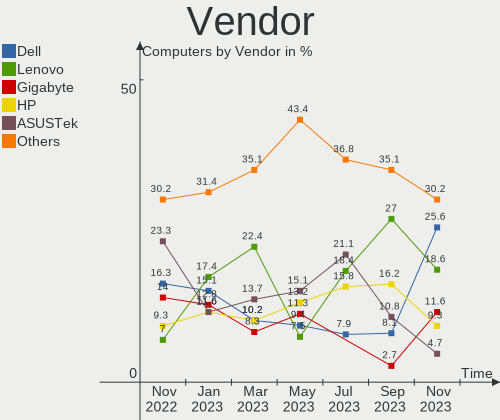

| Name                | Computers | Percent |
|---------------------|-----------|---------|
| Lenovo              | 20        | 21.98%  |
| ASUSTek Computer    | 13        | 14.29%  |
| Hewlett-Packard     | 10        | 10.99%  |
| Dell                | 7         | 7.69%   |
| Gigabyte Technology | 6         | 6.59%   |
| Intel               | 5         | 5.49%   |
| ASRock              | 4         | 4.4%    |
| MSI                 | 3         | 3.3%    |
| Notebook            | 2         | 2.2%    |
| Biostar             | 2         | 2.2%    |
| Acer                | 2         | 2.2%    |
| Unknown             | 2         | 2.2%    |
| Toshiba             | 1         | 1.1%    |
| Sony                | 1         | 1.1%    |
| SLIMBOOK            | 1         | 1.1%    |
| Samsung Electronics | 1         | 1.1%    |
| Plaisio             | 1         | 1.1%    |
| Monster             | 1         | 1.1%    |
| Medion              | 1         | 1.1%    |
| MECHREVO S1 Series  | 1         | 1.1%    |
| Huanan              | 1         | 1.1%    |
| Google              | 1         | 1.1%    |
| Fujitsu Siemens     | 1         | 1.1%    |
| Fujitsu             | 1         | 1.1%    |
| AZW                 | 1         | 1.1%    |
| Apple               | 1         | 1.1%    |
| AOpen               | 1         | 1.1%    |

Model
-----

Motherboard model

| Name                                     | Computers | Percent |
|------------------------------------------|-----------|---------|
| HP Notebook                              | 2         | 2.2%    |
| Unknown                                  | 2         | 2.2%    |
| Toshiba dynabook R63/P                   | 1         | 1.1%    |
| Sony SVF1421E4E                          | 1         | 1.1%    |
| SLIMBOOK PROX-AMD5                       | 1         | 1.1%    |
| Samsung 270E5K/270E5Q/271E5K/2570EK      | 1         | 1.1%    |
| Plaisio Turbo X                          | 1         | 1.1%    |
| Notebook NV4XMB,ME,MZ                    | 1         | 1.1%    |
| Notebook N2x0WU                          | 1         | 1.1%    |
| MSI MS-7C37                              | 1         | 1.1%    |
| MSI MS-7918                              | 1         | 1.1%    |
| MSI GF76 12UE                            | 1         | 1.1%    |
| Monster ABRA A7 V11.2                    | 1         | 1.1%    |
| Medion S4401 MD61519                     | 1         | 1.1%    |
| MECHREVO S1 Series S1 Series             | 1         | 1.1%    |
| Lenovo ThinkPad X380 Yoga 20LH0018US     | 1         | 1.1%    |
| Lenovo ThinkPad X1 Carbon 3448AWU        | 1         | 1.1%    |
| Lenovo ThinkPad X1 Carbon 2nd 20A7002FUS | 1         | 1.1%    |
| Lenovo ThinkPad T61p 6457UN2             | 1         | 1.1%    |
| Lenovo ThinkPad T520 4243F39             | 1         | 1.1%    |
| Lenovo ThinkPad T430u 33522D5            | 1         | 1.1%    |
| Lenovo ThinkPad T410 2537B94             | 1         | 1.1%    |
| Lenovo ThinkPad P51 20HH001RMX           | 1         | 1.1%    |
| Lenovo ThinkPad P15 Gen 2i 20YQ0014FR    | 1         | 1.1%    |
| Lenovo ThinkPad L450 20DSS1S402          | 1         | 1.1%    |
| Lenovo ThinkCentre M93p 10AB004DUS       | 1         | 1.1%    |
| Lenovo ThinkCentre M82 2929AZ6           | 1         | 1.1%    |
| Lenovo SKYBAY 31900002 WIN 1801931923964 | 1         | 1.1%    |
| Lenovo IdeaPadFlex 5 14ITL05 82LT        | 1         | 1.1%    |
| Lenovo IdeaPad 3 15ITL6 82H8             | 1         | 1.1%    |
| Lenovo IdeaPad 3 15IML05 82BS            | 1         | 1.1%    |
| Lenovo IdeaPad 3 14IML05 81WA            | 1         | 1.1%    |
| Lenovo G70-70 80HW006AGE                 | 1         | 1.1%    |
| Lenovo G400s 20244                       | 1         | 1.1%    |
| Lenovo B50-80 80EW                       | 1         | 1.1%    |
| Intel NUC7i5BNB J31144-305               | 1         | 1.1%    |
| Intel NUC11TNHi5                         | 1         | 1.1%    |
| Intel NUC11PAHi5                         | 1         | 1.1%    |
| Intel NUC10i7FNH                         | 1         | 1.1%    |
| Intel DG41TY AAE47335-300                | 1         | 1.1%    |

Model Family
------------

Motherboard model prefix

| Name                  | Computers | Percent |
|-----------------------|-----------|---------|
| Lenovo ThinkPad       | 10        | 10.99%  |
| Dell OptiPlex         | 4         | 4.4%    |
| Lenovo IdeaPad        | 3         | 3.3%    |
| Lenovo ThinkCentre    | 2         | 2.2%    |
| HP Notebook           | 2         | 2.2%    |
| Dell Inspiron         | 2         | 2.2%    |
| ASUS VivoBook         | 2         | 2.2%    |
| ASUS PRIME            | 2         | 2.2%    |
| ASUS P8Z68-V          | 2         | 2.2%    |
| Acer Aspire           | 2         | 2.2%    |
| Unknown               | 2         | 2.2%    |
| Toshiba dynabook      | 1         | 1.1%    |
| Sony SVF1421E4E       | 1         | 1.1%    |
| SLIMBOOK PROX-AMD5    | 1         | 1.1%    |
| Samsung 270E5K        | 1         | 1.1%    |
| Plaisio Turbo         | 1         | 1.1%    |
| Notebook NV4XMB       | 1         | 1.1%    |
| Notebook N2x0WU       | 1         | 1.1%    |
| MSI MS-7C37           | 1         | 1.1%    |
| MSI MS-7918           | 1         | 1.1%    |
| MSI GF76              | 1         | 1.1%    |
| Monster ABRA          | 1         | 1.1%    |
| Medion S4401          | 1         | 1.1%    |
| MECHREVO S1 Series S1 | 1         | 1.1%    |
| Lenovo SKYBAY         | 1         | 1.1%    |
| Lenovo IdeaPadFlex    | 1         | 1.1%    |
| Lenovo G70-70         | 1         | 1.1%    |
| Lenovo G400s          | 1         | 1.1%    |
| Lenovo B50-80         | 1         | 1.1%    |
| Intel NUC7i5BNB       | 1         | 1.1%    |
| Intel NUC11TNHi5      | 1         | 1.1%    |
| Intel NUC11PAHi5      | 1         | 1.1%    |
| Intel NUC10i7FNH      | 1         | 1.1%    |
| Intel DG41TY          | 1         | 1.1%    |
| Huanan X99-TF         | 1         | 1.1%    |
| HP ProDesk            | 1         | 1.1%    |
| HP OMEN               | 1         | 1.1%    |
| HP Mini               | 1         | 1.1%    |
| HP Laptop             | 1         | 1.1%    |
| HP ENVY               | 1         | 1.1%    |

MFG Year
--------

Motherboard manufacture year

| Year    | Computers | Percent |
|---------|-----------|---------|
| 2022    | 13        | 14.29%  |
| 2013    | 12        | 13.19%  |
| 2018    | 8         | 8.79%   |
| 2021    | 7         | 7.69%   |
| 2020    | 7         | 7.69%   |
| 2012    | 7         | 7.69%   |
| 2019    | 6         | 6.59%   |
| 2015    | 5         | 5.49%   |
| 2014    | 5         | 5.49%   |
| 2011    | 5         | 5.49%   |
| 2010    | 5         | 5.49%   |
| 2017    | 4         | 4.4%    |
| 2016    | 4         | 4.4%    |
| 2023    | 1         | 1.1%    |
| 2007    | 1         | 1.1%    |
| Unknown | 1         | 1.1%    |

Form Factor
-----------

Physical design of the computer

| Name        | Computers | Percent |
|-------------|-----------|---------|
| Notebook    | 47        | 51.65%  |
| Desktop     | 33        | 36.26%  |
| Mini pc     | 5         | 5.49%   |
| Convertible | 3         | 3.3%    |
| All in one  | 2         | 2.2%    |
| Server      | 1         | 1.1%    |

Coreboot
--------

Have coreboot on board

| Used | Computers | Percent |
|------|-----------|---------|
| No   | 90        | 98.9%   |
| Yes  | 1         | 1.1%    |

RAM Size
--------

Total RAM memory

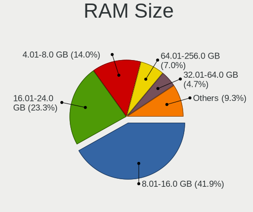

| Size in GB  | Computers | Percent |
|-------------|-----------|---------|
| 8.01-16.0   | 41        | 45.05%  |
| 16.01-24.0  | 18        | 19.78%  |
| 4.01-8.0    | 15        | 16.48%  |
| 32.01-64.0  | 5         | 5.49%   |
| 64.01-256.0 | 5         | 5.49%   |
| 2.01-3.0    | 3         | 3.3%    |
| 0.51-1.0    | 2         | 2.2%    |
| 3.01-4.0    | 1         | 1.1%    |
| 24.01-32.0  | 1         | 1.1%    |

RAM Used
--------

Used RAM memory

| Used GB  | Computers | Percent |
|----------|-----------|---------|
| 0.01-0.5 | 48        | 52.75%  |
| 0.51-1.0 | 24        | 26.37%  |
| 1.01-2.0 | 13        | 14.29%  |
| 2.01-3.0 | 5         | 5.49%   |
| 4.01-8.0 | 1         | 1.1%    |

Total Drives
------------

Number of drives on board

| Drives | Computers | Percent |
|--------|-----------|---------|
| 1      | 51        | 56.04%  |
| 2      | 22        | 24.18%  |
| 0      | 7         | 7.69%   |
| 3      | 6         | 6.59%   |
| 4      | 3         | 3.3%    |
| 6      | 1         | 1.1%    |
| 5      | 1         | 1.1%    |

Has CD-ROM
----------

Has CD-ROM on board

| Presented | Computers | Percent |
|-----------|-----------|---------|
| No        | 60        | 65.93%  |
| Yes       | 31        | 34.07%  |

Has Ethernet
------------

Has Ethernet on board

| Presented | Computers | Percent |
|-----------|-----------|---------|
| Yes       | 81        | 89.01%  |
| No        | 10        | 10.99%  |

Has WiFi
--------

Has WiFi module

| Presented | Computers | Percent |
|-----------|-----------|---------|
| Yes       | 65        | 71.43%  |
| No        | 26        | 28.57%  |

Has Bluetooth
-------------

Has Bluetooth module

| Presented | Computers | Percent |
|-----------|-----------|---------|
| Yes       | 52        | 57.14%  |
| No        | 39        | 42.86%  |

Location
--------

Country
-------

Geographic location (country)

| Country     | Computers | Percent |
|-------------|-----------|---------|
| USA         | 17        | 18.68%  |
| Germany     | 11        | 12.09%  |
| Brazil      | 10        | 10.99%  |
| Spain       | 5         | 5.49%   |
| Netherlands | 4         | 4.4%    |
| Indonesia   | 4         | 4.4%    |
| Canada      | 4         | 4.4%    |
| Hungary     | 3         | 3.3%    |
| China       | 3         | 3.3%    |
| Belgium     | 3         | 3.3%    |
| Thailand    | 2         | 2.2%    |
| Poland      | 2         | 2.2%    |
| Peru        | 2         | 2.2%    |
| Italy       | 2         | 2.2%    |
| India       | 2         | 2.2%    |
| France      | 2         | 2.2%    |
| UK          | 1         | 1.1%    |
| Turkey      | 1         | 1.1%    |
| Sweden      | 1         | 1.1%    |
| Russia      | 1         | 1.1%    |
| Romania     | 1         | 1.1%    |
| Portugal    | 1         | 1.1%    |
| Malaysia    | 1         | 1.1%    |
| Japan       | 1         | 1.1%    |
| Ireland     | 1         | 1.1%    |
| Czechia     | 1         | 1.1%    |
| Colombia    | 1         | 1.1%    |
| Chile       | 1         | 1.1%    |
| Bulgaria    | 1         | 1.1%    |
| Australia   | 1         | 1.1%    |
| Argentina   | 1         | 1.1%    |

City
----

Geographic location (city)

| City                   | Computers | Percent |
|------------------------|-----------|---------|
| Valencia               | 2         | 2.2%    |
| Québec                | 2         | 2.2%    |
| Lima                   | 2         | 2.2%    |
| Jakarta                | 2         | 2.2%    |
| Hangzhou               | 2         | 2.2%    |
| Gistel                 | 2         | 2.2%    |
| Cologne                | 2         | 2.2%    |
| Zwolle                 | 1         | 1.1%    |
| Zaragoza               | 1         | 1.1%    |
| Yekaterinburg          | 1         | 1.1%    |
| Yala                   | 1         | 1.1%    |
| Wroclaw                | 1         | 1.1%    |
| Vigonza                | 1         | 1.1%    |
| Valledupar             | 1         | 1.1%    |
| Trebujena              | 1         | 1.1%    |
| Tallahassee            | 1         | 1.1%    |
| Szigetszentmiklos      | 1         | 1.1%    |
| Szentistvan            | 1         | 1.1%    |
| Sofia                  | 1         | 1.1%    |
| Shenzhen               | 1         | 1.1%    |
| Seville                | 1         | 1.1%    |
| Semarang               | 1         | 1.1%    |
| Saskatoon              | 1         | 1.1%    |
| Sao Paulo              | 1         | 1.1%    |
| Sao Domingos das Dores | 1         | 1.1%    |
| Santiago               | 1         | 1.1%    |
| Santa Cruz             | 1         | 1.1%    |
| Salem                  | 1         | 1.1%    |
| Rockville              | 1         | 1.1%    |
| Rhinelander            | 1         | 1.1%    |
| Remshalden             | 1         | 1.1%    |
| Recklinghausen         | 1         | 1.1%    |
| Rathmore               | 1         | 1.1%    |
| Prague                 | 1         | 1.1%    |
| Portland               | 1         | 1.1%    |
| Pflugerville           | 1         | 1.1%    |
| Petaling Jaya          | 1         | 1.1%    |
| Pelotas                | 1         | 1.1%    |
| Pattaya                | 1         | 1.1%    |
| Paris                  | 1         | 1.1%    |

Drives
------

Drive Vendor
------------

Hard drive vendors

| Vendor              | Computers | Drives | Percent |
|---------------------|-----------|--------|---------|
| Samsung Electronics | 26        | 31     | 21.31%  |
| WDC                 | 19        | 23     | 15.57%  |
| Seagate             | 13        | 13     | 10.66%  |
| Kingston            | 9         | 10     | 7.38%   |
| Toshiba             | 7         | 7      | 5.74%   |
| Hitachi             | 6         | 8      | 4.92%   |
| Crucial             | 6         | 7      | 4.92%   |
| A-DATA Technology   | 6         | 7      | 4.92%   |
| SanDisk             | 4         | 4      | 3.28%   |
| Gigabyte Technology | 3         | 3      | 2.46%   |
| Transcend           | 2         | 2      | 1.64%   |
| Micron Technology   | 2         | 2      | 1.64%   |
| Intel               | 2         | 2      | 1.64%   |
| HGST                | 2         | 2      | 1.64%   |
| Verbatim            | 1         | 1      | 0.82%   |
| SSSTC               | 1         | 1      | 0.82%   |
| Silicon Motion      | 1         | 1      | 0.82%   |
| Reletech            | 1         | 1      | 0.82%   |
| Phison              | 1         | 1      | 0.82%   |
| OCZ                 | 1         | 1      | 0.82%   |
| Netac               | 1         | 1      | 0.82%   |
| MyDigitalSSD        | 1         | 1      | 0.82%   |
| Lexar               | 1         | 1      | 0.82%   |
| Intenso             | 1         | 1      | 0.82%   |
| Hewlett-Packard     | 1         | 1      | 0.82%   |
| GOODRAM             | 1         | 1      | 0.82%   |
| FORESEE             | 1         | 1      | 0.82%   |
| China               | 1         | 1      | 0.82%   |
| Apple               | 1         | 1      | 0.82%   |

Drive Model
-----------

Hard drive models

| Model                                | Computers | Percent |
|--------------------------------------|-----------|---------|
| Samsung SSD 850 EVO 250GB            | 3         | 2.24%   |
| WDC WDS120G2G0A-00JH30 120GB         | 2         | 1.49%   |
| Seagate ST9250410AS 250GB            | 2         | 1.49%   |
| Seagate ST500DM002-1BD142 500GB      | 2         | 1.49%   |
| Samsung SSD 980 1TB                  | 2         | 1.49%   |
| Samsung SSD 970 EVO Plus 250GB       | 2         | 1.49%   |
| Samsung SSD 860 EVO 500GB            | 2         | 1.49%   |
| Samsung SSD 860 EVO 1TB              | 2         | 1.49%   |
| Samsung HD322HJ 320GB                | 2         | 1.49%   |
| Kingston SNV2S500G 500GB             | 2         | 1.49%   |
| A-DATA SU800 256GB                   | 2         | 1.49%   |
| WDC WDS500G3XHC-00SJG0 500GB         | 1         | 0.75%   |
| WDC WDS500G2B0A 500GB                | 1         | 0.75%   |
| WDC WDS250G2B0A-00SM50 250GB         | 1         | 0.75%   |
| WDC WDS120G2G0B-00EPW0 120GB         | 1         | 0.75%   |
| WDC WD50NPZZ-00A9JT0 5TB             | 1         | 0.75%   |
| WDC WD5000AAKX-00U6AA0 500GB         | 1         | 0.75%   |
| WDC WD3200BPVT-75JJ5T0 320GB         | 1         | 0.75%   |
| WDC WD3200BEVT-00ZCT0 320GB          | 1         | 0.75%   |
| WDC WD3200AAKS-75L9A0 320GB          | 1         | 0.75%   |
| WDC WD20EZAZ-22L9GB0 2TB             | 1         | 0.75%   |
| WDC WD2002FAEX-007BA0 2TB            | 1         | 0.75%   |
| WDC WD1600AAJS-61WAA0 160GB          | 1         | 0.75%   |
| WDC WD10SPZX-35Z10T0 1TB             | 1         | 0.75%   |
| WDC WD10SPZX-24Z10 1TB               | 1         | 0.75%   |
| WDC WD10EZEX-75WN4A1 1TB             | 1         | 0.75%   |
| WDC WD10EZEX-08WN4A0 1TB             | 1         | 0.75%   |
| WDC WD10EZEX-00BN5A0 1TB             | 1         | 0.75%   |
| WDC WD10EACS-00D6B1 1TB              | 1         | 0.75%   |
| WDC PC SN720 SDAQNTW-512G-1001 512GB | 1         | 0.75%   |
| WDC PC SN520 SDAPNUW-256G-1006 256GB | 1         | 0.75%   |
| Verbatim Vi550 S3 SSD 512GB          | 1         | 0.75%   |
| Transcend TS240GESD240C 240GB        | 1         | 0.75%   |
| Transcend TS128GMTS400S 128GB        | 1         | 0.75%   |
| Toshiba TR200 240GB                  | 1         | 0.75%   |
| Toshiba THNSNJ256GMCY 256GB          | 1         | 0.75%   |
| Toshiba MQ04ABF100 1TB               | 1         | 0.75%   |
| Toshiba MQ01ABF050 500GB             | 1         | 0.75%   |
| Toshiba MK5065GSXF 500GB             | 1         | 0.75%   |
| Toshiba KXG50ZNV512G NVMe 512GB      | 1         | 0.75%   |

HDD Vendor
----------

Hard disk drive vendors

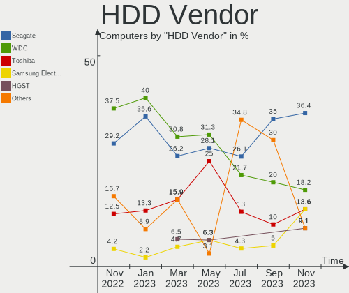

| Vendor              | Computers | Drives | Percent |
|---------------------|-----------|--------|---------|
| Seagate             | 13        | 13     | 30.23%  |
| WDC                 | 12        | 14     | 27.91%  |
| Hitachi             | 6         | 8      | 13.95%  |
| Samsung Electronics | 5         | 5      | 11.63%  |
| Toshiba             | 4         | 4      | 9.3%    |
| HGST                | 2         | 2      | 4.65%   |
| Apple               | 1         | 1      | 2.33%   |

SSD Vendor
----------

Solid state drive vendors

| Vendor              | Computers | Drives | Percent |
|---------------------|-----------|--------|---------|
| Samsung Electronics | 10        | 11     | 19.61%  |
| Kingston            | 6         | 6      | 11.76%  |
| WDC                 | 5         | 6      | 9.8%    |
| A-DATA Technology   | 5         | 6      | 9.8%    |
| SanDisk             | 4         | 4      | 7.84%   |
| Crucial             | 4         | 5      | 7.84%   |
| Transcend           | 2         | 2      | 3.92%   |
| Toshiba             | 2         | 2      | 3.92%   |
| Intel               | 2         | 2      | 3.92%   |
| Gigabyte Technology | 2         | 2      | 3.92%   |
| Verbatim            | 1         | 1      | 1.96%   |
| Silicon Motion      | 1         | 1      | 1.96%   |
| OCZ                 | 1         | 1      | 1.96%   |
| MyDigitalSSD        | 1         | 1      | 1.96%   |
| Micron Technology   | 1         | 1      | 1.96%   |
| Intenso             | 1         | 1      | 1.96%   |
| Hewlett-Packard     | 1         | 1      | 1.96%   |
| GOODRAM             | 1         | 1      | 1.96%   |
| China               | 1         | 1      | 1.96%   |

Drive Kind
----------

HDD or SSD

| Kind | Computers | Drives | Percent |
|------|-----------|--------|---------|
| SSD  | 43        | 55     | 40.57%  |
| HDD  | 35        | 47     | 33.02%  |
| NVMe | 28        | 34     | 26.42%  |

Drive Connector
---------------

SATA, SAS, NVMe, etc.

| Type | Computers | Drives | Percent |
|------|-----------|--------|---------|
| SATA | 67        | 102    | 70.53%  |
| NVMe | 28        | 34     | 29.47%  |

Drive Size
----------

Size of hard drive

| Size in TB | Computers | Drives | Percent |
|------------|-----------|--------|---------|
| 0.01-0.5   | 59        | 76     | 71.95%  |
| 0.51-1.0   | 17        | 19     | 20.73%  |
| 1.01-2.0   | 5         | 6      | 6.1%    |
| 4.01-10.0  | 1         | 1      | 1.22%   |

Space Total
-----------

Amount of disk space available on the file system

| Size in GB | Computers | Percent |
|------------|-----------|---------|
| 1-20       | 45        | 49.45%  |
| 101-250    | 20        | 21.98%  |
| 251-500    | 8         | 8.79%   |
| 501-1000   | 7         | 7.69%   |
| 51-100     | 7         | 7.69%   |
| 21-50      | 3         | 3.3%    |
| 1001-2000  | 1         | 1.1%    |

Space Used
----------

Amount of used disk space

| Used GB | Computers | Percent |
|---------|-----------|---------|
| 1-20    | 88        | 96.7%   |
| 101-250 | 2         | 2.2%    |
| 21-50   | 1         | 1.1%    |

Malfunc. Drives
---------------

Drive models with a malfunction

| Model                                 | Computers | Drives | Percent |
|---------------------------------------|-----------|--------|---------|
| WDC WD10EACS-00D6B1 1TB               | 1         | 1      | 5%      |
| Toshiba MQ04ABF100 1TB                | 1         | 1      | 5%      |
| Seagate ST9500325AS 500GB             | 1         | 1      | 5%      |
| Seagate ST9250410AS 250GB             | 1         | 1      | 5%      |
| Seagate ST9160412AS 160GB             | 1         | 1      | 5%      |
| Seagate ST500DM002-1BD142 500GB       | 1         | 1      | 5%      |
| Seagate ST1000DM010-2EP102 1TB        | 1         | 1      | 5%      |
| SanDisk SSD PLUS 240GB                | 1         | 1      | 5%      |
| Samsung Electronics SSD 970 EVO 2TB   | 1         | 1      | 5%      |
| Samsung Electronics SSD 870 EVO 500GB | 1         | 1      | 5%      |
| Samsung Electronics SSD 860 EVO 1TB   | 1         | 1      | 5%      |
| Samsung Electronics HD322HJ 320GB     | 1         | 1      | 5%      |
| Kingston SUV400S37240G 240GB          | 1         | 1      | 5%      |
| Hitachi HTS545050A7E380 500GB         | 1         | 1      | 5%      |
| Hitachi HTS541680J9SA00 80GB          | 1         | 1      | 5%      |
| Hitachi HDT721010SLA360 1TB           | 1         | 1      | 5%      |
| HGST HTS725050A7E630 500GB            | 1         | 1      | 5%      |
| Crucial CT1050MX300SSD1 1TB           | 1         | 1      | 5%      |
| Apple HDD HTS541010A9E632 1TB         | 1         | 1      | 5%      |
| A-DATA Technology SU800 256GB         | 1         | 1      | 5%      |

Malfunc. Drive Vendor
---------------------

Vendors of faulty drives

| Vendor              | Computers | Drives | Percent |
|---------------------|-----------|--------|---------|
| Seagate             | 5         | 5      | 26.32%  |
| Samsung Electronics | 3         | 4      | 15.79%  |
| Hitachi             | 3         | 3      | 15.79%  |
| WDC                 | 1         | 1      | 5.26%   |
| Toshiba             | 1         | 1      | 5.26%   |
| SanDisk             | 1         | 1      | 5.26%   |
| Kingston            | 1         | 1      | 5.26%   |
| HGST                | 1         | 1      | 5.26%   |
| Crucial             | 1         | 1      | 5.26%   |
| Apple               | 1         | 1      | 5.26%   |
| A-DATA Technology   | 1         | 1      | 5.26%   |

Malfunc. HDD Vendor
-------------------

Vendors of faulty HDD drives

| Vendor              | Computers | Drives | Percent |
|---------------------|-----------|--------|---------|
| Seagate             | 5         | 5      | 38.46%  |
| Hitachi             | 3         | 3      | 23.08%  |
| WDC                 | 1         | 1      | 7.69%   |
| Toshiba             | 1         | 1      | 7.69%   |
| Samsung Electronics | 1         | 1      | 7.69%   |
| HGST                | 1         | 1      | 7.69%   |
| Apple               | 1         | 1      | 7.69%   |

Malfunc. Drive Kind
-------------------

Kinds of faulty drives

| Kind | Computers | Drives | Percent |
|------|-----------|--------|---------|
| HDD  | 13        | 13     | 65%     |
| SSD  | 6         | 6      | 30%     |
| NVMe | 1         | 1      | 5%      |

Failed Drives
-------------

Failed drive models

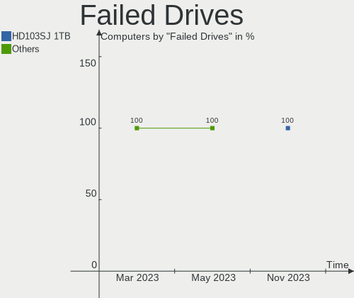

| Model                           | Computers | Drives | Percent |
|---------------------------------|-----------|--------|---------|
| Seagate ST3250310AS 250GB       | 1         | 1      | 33.33%  |
| SanDisk pSSD 32GB               | 1         | 1      | 33.33%  |
| Samsung Electronics HD103SJ 1TB | 1         | 1      | 33.33%  |

Failed Drive Vendor
-------------------

Failed drive vendors

| Vendor              | Computers | Drives | Percent |
|---------------------|-----------|--------|---------|
| Seagate             | 1         | 1      | 33.33%  |
| SanDisk             | 1         | 1      | 33.33%  |
| Samsung Electronics | 1         | 1      | 33.33%  |

Drive Status
------------

Number of failed and malfunc. drives

| Status   | Computers | Drives | Percent |
|----------|-----------|--------|---------|
| Works    | 72        | 110    | 75%     |
| Malfunc  | 19        | 20     | 19.79%  |
| Failed   | 3         | 3      | 3.13%   |
| Detected | 2         | 3      | 2.08%   |

Storage controller
------------------

Storage Vendor
--------------

Storage controller vendors

| Vendor                           | Computers | Percent |
|----------------------------------|-----------|---------|
| Intel                            | 66        | 55%     |
| AMD                              | 14        | 11.67%  |
| Samsung Electronics              | 13        | 10.83%  |
| SanDisk                          | 5         | 4.17%   |
| Kingston Technology Company      | 4         | 3.33%   |
| Phison Electronics               | 3         | 2.5%    |
| Micron/Crucial Technology        | 2         | 1.67%   |
| ASMedia Technology               | 2         | 1.67%   |
| Solid State Storage Technology   | 1         | 0.83%   |
| Silicon Motion                   | 1         | 0.83%   |
| Silicon Integrated Systems [SiS] | 1         | 0.83%   |
| Shenzhen Longsys Electronics     | 1         | 0.83%   |
| Nvidia                           | 1         | 0.83%   |
| Micron Technology                | 1         | 0.83%   |
| Marvell Technology Group         | 1         | 0.83%   |
| JMicron Technology               | 1         | 0.83%   |
| Broadcom / LSI                   | 1         | 0.83%   |
| ADATA Technology                 | 1         | 0.83%   |
| Adaptec                          | 1         | 0.83%   |

Storage Model
-------------

Storage controller models

| Model                                                                                   | Computers | Percent |
|-----------------------------------------------------------------------------------------|-----------|---------|
| Samsung NVMe SSD Controller SM981/PM981/PM983                                           | 10        | 7.25%   |
| AMD FCH SATA Controller [AHCI mode]                                                     | 9         | 6.52%   |
| Unknown                                                                                 | 7         | 5.07%   |
| Intel Sunrise Point-LP SATA Controller [AHCI mode]                                      | 6         | 4.35%   |
| Intel 7 Series Chipset Family 6-port SATA Controller [AHCI mode]                        | 6         | 4.35%   |
| Intel Wildcat Point-LP SATA Controller [AHCI Mode]                                      | 5         | 3.62%   |
| Intel 6 Series/C200 Series Chipset Family 6 port Desktop SATA AHCI Controller           | 5         | 3.62%   |
| Intel 8 Series SATA Controller 1 [AHCI mode]                                            | 4         | 2.9%    |
| Samsung NVMe SSD Controller 980                                                         | 3         | 2.17%   |
| Intel Tiger Lake-LP SATA Controller                                                     | 3         | 2.17%   |
| Intel Comet Lake SATA AHCI Controller                                                   | 3         | 2.17%   |
| Intel 7 Series/C210 Series Chipset Family 6-port SATA Controller [AHCI mode]            | 3         | 2.17%   |
| AMD SB7x0/SB8x0/SB9x0 SATA Controller [IDE mode]                                        | 3         | 2.17%   |
| AMD SB7x0/SB8x0/SB9x0 IDE Controller                                                    | 3         | 2.17%   |
| AMD FCH SATA Controller D                                                               | 3         | 2.17%   |
| AMD 400 Series Chipset SATA Controller                                                  | 3         | 2.17%   |
| SanDisk WD PC SN810 / Black SN850 NVMe SSD                                              | 2         | 1.45%   |
| SanDisk WD Black 2018/SN750 / PC SN720 NVMe SSD                                         | 2         | 1.45%   |
| Samsung NVMe SSD Controller PM9A1/PM9A3/980PRO                                          | 2         | 1.45%   |
| Micron/Crucial P2 NVMe PCIe SSD                                                         | 2         | 1.45%   |
| Intel Q170/Q150/B150/H170/H110/Z170/CM236 Chipset SATA Controller [AHCI Mode]           | 2         | 1.45%   |
| Intel Cannon Lake PCH SATA AHCI Controller                                              | 2         | 1.45%   |
| Intel 82801 Mobile SATA Controller [RAID mode]                                          | 2         | 1.45%   |
| Intel 8 Series/C220 Series Chipset Family 6-port SATA Controller 1 [AHCI mode]          | 2         | 1.45%   |
| Intel 6 Series/C200 Series Chipset Family Desktop SATA Controller (IDE mode, ports 4-5) | 2         | 1.45%   |
| Intel 6 Series/C200 Series Chipset Family Desktop SATA Controller (IDE mode, ports 0-3) | 2         | 1.45%   |
| Intel 6 Series/C200 Series Chipset Family 6 port Mobile SATA AHCI Controller            | 2         | 1.45%   |
| Intel 5 Series/3400 Series Chipset 6 port SATA AHCI Controller                          | 2         | 1.45%   |
| ASMedia ASM1062 Serial ATA Controller                                                   | 2         | 1.45%   |
| Silicon Motion SM2263EN/SM2263XT SSD Controller                                         | 1         | 0.72%   |
| Silicon Integrated Systems [SiS] SATA Controller / IDE mode                             | 1         | 0.72%   |
| Silicon Integrated Systems [SiS] 5513 IDE Controller                                    | 1         | 0.72%   |
| SanDisk WD Blue SN500 / PC SN520 NVMe SSD                                               | 1         | 0.72%   |
| Phison PS5013 E13 NVMe Controller                                                       | 1         | 0.72%   |
| Phison E16 PCIe4 NVMe Controller                                                        | 1         | 0.72%   |
| Phison E12 NVMe Controller                                                              | 1         | 0.72%   |
| Nvidia MCP79 SATA Controller                                                            | 1         | 0.72%   |
| Kingston Company A2000 NVMe SSD                                                         | 1         | 0.72%   |
| JMicron JMB58x AHCI SATA controller                                                     | 1         | 0.72%   |
| Intel Volume Management Device NVMe RAID Controller                                     | 1         | 0.72%   |

Storage Kind
------------

Kind of storage controller (IDE, SATA, NVMe, SAS, ...)

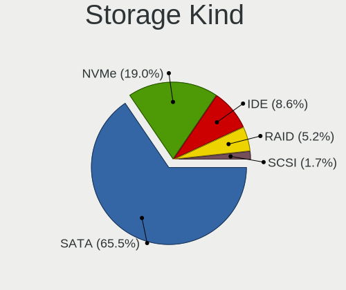

| Kind | Computers | Percent |
|------|-----------|---------|
| SATA | 70        | 60.34%  |
| NVMe | 28        | 24.14%  |
| IDE  | 12        | 10.34%  |
| RAID | 5         | 4.31%   |
| SCSI | 1         | 0.86%   |

Processor
---------

CPU Vendor
----------

Processor vendors

| Vendor | Computers | Percent |
|--------|-----------|---------|
| Intel  | 75        | 82.42%  |
| AMD    | 16        | 17.58%  |

CPU Model
---------

Processor models

| Model                                   | Computers | Percent |
|-----------------------------------------|-----------|---------|
| Intel Core i5-5200U CPU @ 2.20GHz       | 3         | 3.3%    |
| Intel 11th Gen Core i5-1135G7 @ 2.40GHz | 3         | 3.3%    |
| Intel Core i5-8250U CPU @ 1.60GHz       | 2         | 2.2%    |
| Intel Core i5-4200U CPU @ 1.60GHz       | 2         | 2.2%    |
| Intel Core i3-4005U CPU @ 1.70GHz       | 2         | 2.2%    |
| Intel Core 2 Duo                        | 2         | 2.2%    |
| Intel 12th Gen Core i7-12700H           | 2         | 2.2%    |
| Intel Xeon CPU E5-2678 v3 @ 2.50GHz     | 1         | 1.1%    |
| Intel Xeon CPU E3-1220L V2 @ 2.30GHz    | 1         | 1.1%    |
| Intel Unknown                           | 1         | 1.1%    |
| Intel Pentium CPU P6200 @ 2.13GHz       | 1         | 1.1%    |
| Intel Pentium CPU G620 @ 2.60GHz        | 1         | 1.1%    |
| Intel Pentium CPU G2020 @ 2.90GHz       | 1         | 1.1%    |
| Intel Pentium CPU 987 @ 1.50GHz         | 1         | 1.1%    |
| Intel Pentium CPU 6405U @ 2.40GHz       | 1         | 1.1%    |
| Intel Core i9-9900KS CPU @ 4.00GHz      | 1         | 1.1%    |
| Intel Core i7-8850H CPU @ 2.60GHz       | 1         | 1.1%    |
| Intel Core i7-8650U CPU @ 1.90GHz       | 1         | 1.1%    |
| Intel Core i7-7820HQ CPU @ 2.90GHz      | 1         | 1.1%    |
| Intel Core i7-7500U CPU @ 2.70GHz       | 1         | 1.1%    |
| Intel Core i7-4770 CPU @ 3.40GHz        | 1         | 1.1%    |
| Intel Core i7-3667U CPU @ 2.00GHz       | 1         | 1.1%    |
| Intel Core i7-3610QM CPU @ 2.30GHz      | 1         | 1.1%    |
| Intel Core i7-2630QM CPU @ 2.00GHz      | 1         | 1.1%    |
| Intel Core i7-10750H CPU @ 2.60GHz      | 1         | 1.1%    |
| Intel Core i7-10710U CPU @ 1.10GHz      | 1         | 1.1%    |
| Intel Core i5-8500 CPU @ 3.00GHz        | 1         | 1.1%    |
| Intel Core i5-7360U CPU @ 2.30GHz       | 1         | 1.1%    |
| Intel Core i5-7260U CPU @ 2.20GHz       | 1         | 1.1%    |
| Intel Core i5-5300U CPU @ 2.30GHz       | 1         | 1.1%    |
| Intel Core i5-4670 CPU @ 3.40GHz        | 1         | 1.1%    |
| Intel Core i5-4590T CPU @ 2.00GHz       | 1         | 1.1%    |
| Intel Core i5-3570 CPU @ 3.40GHz        | 1         | 1.1%    |
| Intel Core i5-3470S CPU @ 2.90GHz       | 1         | 1.1%    |
| Intel Core i5-3470 CPU @ 3.20GHz        | 1         | 1.1%    |
| Intel Core i5-3337U CPU @ 1.80GHz       | 1         | 1.1%    |
| Intel Core i5-3230M CPU @ 2.60GHz       | 1         | 1.1%    |
| Intel Core i5-2520M CPU @ 2.50GHz       | 1         | 1.1%    |
| Intel Core i5-2500K CPU @ 3.30GHz       | 1         | 1.1%    |
| Intel Core i5-2500 CPU @ 3.30GHz        | 1         | 1.1%    |

CPU Model Family
----------------

Processor model prefix

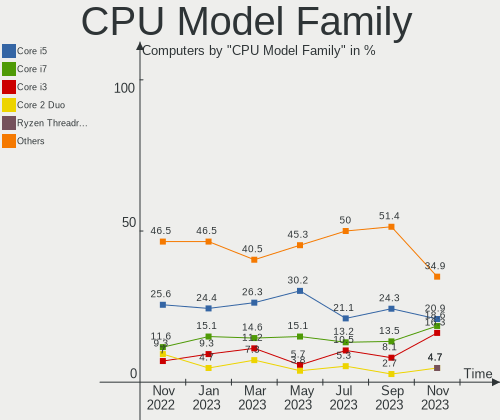

| Model            | Computers | Percent |
|------------------|-----------|---------|
| Intel Core i5    | 26        | 28.57%  |
| Intel Core i3    | 13        | 14.29%  |
| Intel Core i7    | 10        | 10.99%  |
| Other            | 9         | 9.89%   |
| Intel Pentium    | 5         | 5.49%   |
| Intel Core 2 Duo | 4         | 4.4%    |
| Intel Celeron    | 3         | 3.3%    |
| AMD Ryzen 7      | 3         | 3.3%    |
| Intel Xeon       | 2         | 2.2%    |
| Intel Atom       | 2         | 2.2%    |
| AMD Ryzen 9      | 2         | 2.2%    |
| AMD Ryzen 5      | 2         | 2.2%    |
| AMD Phenom II X4 | 2         | 2.2%    |
| Intel Core i9    | 1         | 1.1%    |
| AMD Ryzen 3 PRO  | 1         | 1.1%    |
| AMD Ryzen 3      | 1         | 1.1%    |
| AMD FX           | 1         | 1.1%    |
| AMD E1           | 1         | 1.1%    |
| AMD Athlon       | 1         | 1.1%    |
| AMD A8           | 1         | 1.1%    |
| AMD A10          | 1         | 1.1%    |

CPU Cores
---------

Number of processor cores

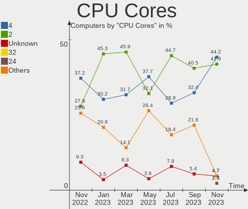

| Number  | Computers | Percent |
|---------|-----------|---------|
| 2       | 40        | 43.96%  |
| 4       | 29        | 31.87%  |
| 6       | 6         | 6.59%   |
| 8       | 4         | 4.4%    |
| 16      | 3         | 3.3%    |
| 12      | 2         | 2.2%    |
| 10      | 2         | 2.2%    |
| 1       | 2         | 2.2%    |
| Unknown | 2         | 2.2%    |
| 24      | 1         | 1.1%    |

CPU Sockets
-----------

Number of sockets

| Number | Computers | Percent |
|--------|-----------|---------|
| 1      | 91        | 100%    |

CPU Threads
-----------

Threads per core (Hyper-Threading)

| Number  | Computers | Percent |
|---------|-----------|---------|
| 2       | 52        | 57.14%  |
| 1       | 36        | 39.56%  |
| Unknown | 3         | 3.3%    |

CPU Microarch
-------------

Microarchitecture

| Name          | Computers | Percent |
|---------------|-----------|---------|
| KabyLake      | 14        | 15.38%  |
| SandyBridge   | 10        | 10.99%  |
| IvyBridge     | 9         | 9.89%   |
| Haswell       | 9         | 9.89%   |
| Zen+          | 5         | 5.49%   |
| TigerLake     | 5         | 5.49%   |
| Broadwell     | 5         | 5.49%   |
| Unknown       | 4         | 4.4%    |
| Westmere      | 3         | 3.3%    |
| Skylake       | 3         | 3.3%    |
| Penryn        | 3         | 3.3%    |
| CometLake     | 3         | 3.3%    |
| Zen 3         | 2         | 2.2%    |
| Piledriver    | 2         | 2.2%    |
| K10           | 2         | 2.2%    |
| Goldmont plus | 2         | 2.2%    |
| Core          | 2         | 2.2%    |
| Bonnell       | 2         | 2.2%    |
| Zen 2         | 1         | 1.1%    |
| Zen           | 1         | 1.1%    |
| Steamroller   | 1         | 1.1%    |
| Silvermont    | 1         | 1.1%    |
| IceLake       | 1         | 1.1%    |
| Bobcat        | 1         | 1.1%    |

Graphics
--------

GPU Vendor
----------

Vendors of graphics cards

| Vendor                           | Computers | Percent |
|----------------------------------|-----------|---------|
| Intel                            | 63        | 58.88%  |
| Nvidia                           | 24        | 22.43%  |
| AMD                              | 18        | 16.82%  |
| Silicon Integrated Systems [SiS] | 1         | 0.93%   |
| ASPEED Technology                | 1         | 0.93%   |

GPU Model
---------

Graphics card models

| Model                                                                         | Computers | Percent |
|-------------------------------------------------------------------------------|-----------|---------|
| Intel 2nd Generation Core Processor Family Integrated Graphics Controller     | 8         | 7.48%   |
| Intel HD Graphics 5500                                                        | 5         | 4.67%   |
| Intel TigerLake-LP GT2 [Iris Xe Graphics]                                     | 4         | 3.74%   |
| Intel Haswell-ULT Integrated Graphics Controller                              | 4         | 3.74%   |
| Intel 3rd Gen Core processor Graphics Controller                              | 4         | 3.74%   |
| Intel Xeon E3-1200 v3/4th Gen Core Processor Integrated Graphics Controller   | 3         | 2.8%    |
| Intel Xeon E3-1200 v2/3rd Gen Core processor Graphics Controller              | 3         | 2.8%    |
| Intel UHD Graphics 620                                                        | 3         | 2.8%    |
| Intel Core Processor Integrated Graphics Controller                           | 3         | 2.8%    |
| AMD Picasso/Raven 2 [Radeon Vega Series / Radeon Vega Mobile Series]          | 3         | 2.8%    |
| Nvidia TU117M                                                                 | 2         | 1.87%   |
| Nvidia GF117M [GeForce 610M/710M/810M/820M / GT 620M/625M/630M/720M]          | 2         | 1.87%   |
| Nvidia GA106M [GeForce RTX 3060 Mobile / Max-Q]                               | 2         | 1.87%   |
| Intel Skylake GT2 [HD Graphics 520]                                           | 2         | 1.87%   |
| Intel Iris Plus Graphics 640                                                  | 2         | 1.87%   |
| Intel HD Graphics 620                                                         | 2         | 1.87%   |
| Intel GeminiLake [UHD Graphics 600]                                           | 2         | 1.87%   |
| Intel CoffeeLake-S GT2 [UHD Graphics 630]                                     | 2         | 1.87%   |
| Intel Alder Lake-P Integrated Graphics Controller                             | 2         | 1.87%   |
| AMD Sun XT [Radeon HD 8670A/8670M/8690M / R5 M330 / M430 / Radeon 520 Mobile] | 2         | 1.87%   |
| AMD Ellesmere [Radeon RX 470/480/570/570X/580/580X/590]                       | 2         | 1.87%   |
| Silicon Integrated Systems [SiS] 771/671 PCIE VGA Display Adapter             | 1         | 0.93%   |
| Nvidia TU117GLM [T1200 Laptop GPU]                                            | 1         | 0.93%   |
| Nvidia TU117 [GeForce GTX 1650]                                               | 1         | 0.93%   |
| Nvidia TU116 [GeForce GTX 1660 SUPER]                                         | 1         | 0.93%   |
| Nvidia TU102 [GeForce RTX 2080 Ti Rev. A]                                     | 1         | 0.93%   |
| Nvidia GT218 [GeForce 210]                                                    | 1         | 0.93%   |
| Nvidia GP108M [GeForce MX150]                                                 | 1         | 0.93%   |
| Nvidia GP107 [GeForce GTX 1050 Ti]                                            | 1         | 0.93%   |
| Nvidia GM206GLM [Quadro M2200 Mobile]                                         | 1         | 0.93%   |
| Nvidia GM206 [GeForce GTX 960]                                                | 1         | 0.93%   |
| Nvidia GM206 [GeForce GTX 950]                                                | 1         | 0.93%   |
| Nvidia GM107 [GeForce GTX 750]                                                | 1         | 0.93%   |
| Nvidia GK107M [GeForce GT 650M]                                               | 1         | 0.93%   |
| Nvidia GF119 [GeForce GT 625 OEM]                                             | 1         | 0.93%   |
| Nvidia GF108M [GeForce GT 540M]                                               | 1         | 0.93%   |
| Nvidia GF106GL [Quadro 2000]                                                  | 1         | 0.93%   |
| Nvidia G84GLM [Quadro FX 570M]                                                | 1         | 0.93%   |
| Nvidia G84GL [Quadro FX 570]                                                  | 1         | 0.93%   |
| Nvidia C79 [GeForce 9400M / ION]                                              | 1         | 0.93%   |

GPU Combo
---------

Combinations of graphics cards

| Name           | Computers | Percent |
|----------------|-----------|---------|
| 1 x Intel      | 46        | 50.55%  |
| 1 x Nvidia     | 13        | 14.29%  |
| 1 x AMD        | 13        | 14.29%  |
| Intel + Nvidia | 11        | 12.09%  |
| Intel + AMD    | 4         | 4.4%    |
| 2 x Intel      | 2         | 2.2%    |
| 1 x SiS        | 1         | 1.1%    |
| AMD + ASPEED   | 1         | 1.1%    |

GPU Driver
----------

Free vs proprietary

| Driver      | Computers | Percent |
|-------------|-----------|---------|
| Free        | 76        | 83.52%  |
| Proprietary | 11        | 12.09%  |
| Unknown     | 4         | 4.4%    |

GPU Memory
----------

Total video memory

| Size in GB | Computers | Percent |
|------------|-----------|---------|
| Unknown    | 74        | 81.32%  |
| 3.01-4.0   | 5         | 5.49%   |
| 1.01-2.0   | 5         | 5.49%   |
| 0.51-1.0   | 3         | 3.3%    |
| 0.01-0.5   | 2         | 2.2%    |
| 5.01-6.0   | 1         | 1.1%    |
| 8.01-16.0  | 1         | 1.1%    |

Monitor
-------

Monitor Vendor
--------------

Monitor vendors

| Vendor               | Computers | Percent |
|----------------------|-----------|---------|
| BenQ                 | 2         | 16.67%  |
| Acer                 | 2         | 16.67%  |
| Philips              | 1         | 8.33%   |
| LG Electronics       | 1         | 8.33%   |
| Lenovo Group Limited | 1         | 8.33%   |
| Idek Iiyama          | 1         | 8.33%   |
| Dell                 | 1         | 8.33%   |
| AU Optronics         | 1         | 8.33%   |
| AOC                  | 1         | 8.33%   |
| Unknown              | 1         | 8.33%   |

Monitor Model
-------------

Monitor models

| Model                                                         | Computers | Percent |
|---------------------------------------------------------------|-----------|---------|
| Philips LCD Monitor PHL 243V7 3840x1080                       | 1         | 8.33%   |
| LG Electronics LCD Monitor E2441 3840x1080                    | 1         | 8.33%   |
| Lenovo Group Limited LCD Monitor C24-25 1920x1080             | 1         | 8.33%   |
| Idek Iiyama LCD Monitor PL3270Q 2560x1440                     | 1         | 8.33%   |
| Dell LCD Monitor E2014H                                       | 1         | 8.33%   |
| BenQ LCD Monitor V2220H 1920x1080                             | 1         | 8.33%   |
| BenQ LCD Monitor GW2260 1920x1080                             | 1         | 8.33%   |
| AU Optronics LCD Monitor AUO32EC 1366x768 340x190mm 15.3-inch | 1         | 8.33%   |
| AOC 2752 AOC2752 1920x1080 580x340mm 26.5-inch                | 1         | 8.33%   |
| Acer LCD Monitor VG270U 2560x1440                             | 1         | 8.33%   |
| Acer LCD Monitor G226HQL 3520x1080                            | 1         | 8.33%   |
| Unknown                                                       | 1         | 8.33%   |

Monitor Resolution
------------------

Monitor screen resolution

| Resolution      | Computers | Percent |
|-----------------|-----------|---------|
| 1920x1080 (FHD) | 5         | 45.45%  |
| 2560x1440 (QHD) | 2         | 18.18%  |
| 3840x1080       | 1         | 9.09%   |
| 3520x1080       | 1         | 9.09%   |
| 1366x768 (WXGA) | 1         | 9.09%   |
| Unknown         | 1         | 9.09%   |

Monitor Diagonal
----------------

Diagonal size in inches

| Inches  | Computers | Percent |
|---------|-----------|---------|
| Unknown | 8         | 80%     |
| 26      | 1         | 10%     |
| 15      | 1         | 10%     |

Monitor Width
-------------

Physical width

| Width in mm | Computers | Percent |
|-------------|-----------|---------|
| Unknown     | 8         | 80%     |
| 501-600     | 1         | 10%     |
| 301-350     | 1         | 10%     |

Aspect Ratio
------------

Proportional relationship between the width and the height

| Ratio   | Computers | Percent |
|---------|-----------|---------|
| Unknown | 8         | 88.89%  |
| 16/9    | 1         | 11.11%  |

Monitor Area
------------

Area in inch²

| Area in inch² | Computers | Percent |
|----------------|-----------|---------|
| Unknown        | 8         | 80%     |
| 301-350        | 1         | 10%     |
| 91-100         | 1         | 10%     |

Pixel Density
-------------

Pixels per inch

| Density | Computers | Percent |
|---------|-----------|---------|
| Unknown | 8         | 80%     |
| 101-120 | 1         | 10%     |
| 51-100  | 1         | 10%     |

Multiple Monitors
-----------------

Total monitors connected

| Total | Computers | Percent |
|-------|-----------|---------|
| 1     | 76        | 83.52%  |
| 0     | 9         | 9.89%   |
| 2     | 6         | 6.59%   |

Network
-------

Net Controller Vendor
---------------------

Controller vendors

| Vendor                            | Computers | Percent |
|-----------------------------------|-----------|---------|
| Intel                             | 51        | 38.06%  |
| Realtek Semiconductor             | 48        | 35.82%  |
| Qualcomm Atheros                  | 14        | 10.45%  |
| Broadcom                          | 6         | 4.48%   |
| Ralink                            | 3         | 2.24%   |
| Edimax Technology                 | 2         | 1.49%   |
| Xiaomi                            | 1         | 0.75%   |
| TP-Link                           | 1         | 0.75%   |
| Silicon Integrated Systems [SiS]  | 1         | 0.75%   |
| Sierra Wireless                   | 1         | 0.75%   |
| Ralink Technology                 | 1         | 0.75%   |
| NetGear                           | 1         | 0.75%   |
| MediaTek                          | 1         | 0.75%   |
| Ericsson Business Mobile Networks | 1         | 0.75%   |
| D-Link                            | 1         | 0.75%   |
| BUFFALO                           | 1         | 0.75%   |

Net Controller Model
--------------------

Controller models

| Model                                                                                         | Computers | Percent |
|-----------------------------------------------------------------------------------------------|-----------|---------|
| Realtek RTL8111/8168/8411 PCI Express Gigabit Ethernet Controller                             | 32        | 19.63%  |
| Realtek RTL810xE PCI Express Fast Ethernet controller                                         | 7         | 4.29%   |
| Realtek RTL8188EUS 802.11n Wireless Network Adapter                                           | 5         | 3.07%   |
| Intel 82579LM Gigabit Network Connection (Lewisville)                                         | 5         | 3.07%   |
| Intel Wireless 8265 / 8275                                                                    | 4         | 2.45%   |
| Intel Wi-Fi 6 AX201                                                                           | 4         | 2.45%   |
| Realtek RTL8821CE 802.11ac PCIe Wireless Network Adapter                                      | 3         | 1.84%   |
| Qualcomm Atheros AR9485 Wireless Network Adapter                                              | 3         | 1.84%   |
| Intel Wireless 7260                                                                           | 3         | 1.84%   |
| Intel Wi-Fi 6 AX210/AX211/AX411 160MHz                                                        | 3         | 1.84%   |
| Intel Comet Lake PCH-LP CNVi WiFi                                                             | 3         | 1.84%   |
| Intel 82574L Gigabit Network Connection                                                       | 3         | 1.84%   |
| Realtek RTL8723BE PCIe Wireless Network Adapter                                               | 2         | 1.23%   |
| Realtek RTL8188CUS 802.11n WLAN Adapter                                                       | 2         | 1.23%   |
| Qualcomm Atheros QCA9565 / AR9565 Wireless Network Adapter                                    | 2         | 1.23%   |
| Qualcomm Atheros AR9285 Wireless Network Adapter (PCI-Express)                                | 2         | 1.23%   |
| Qualcomm Atheros AR8151 v2.0 Gigabit Ethernet                                                 | 2         | 1.23%   |
| Intel Wireless 7265                                                                           | 2         | 1.23%   |
| Intel Wireless 3165                                                                           | 2         | 1.23%   |
| Intel Ethernet Controller I225-V                                                              | 2         | 1.23%   |
| Intel Ethernet Connection I217-LM                                                             | 2         | 1.23%   |
| Intel Ethernet Connection (7) I219-LM                                                         | 2         | 1.23%   |
| Intel Ethernet Connection (3) I218-V                                                          | 2         | 1.23%   |
| Intel Centrino Wireless-N 2230                                                                | 2         | 1.23%   |
| Intel Centrino Advanced-N 6205 [Taylor Peak]                                                  | 2         | 1.23%   |
| Intel Cannon Lake PCH CNVi WiFi                                                               | 2         | 1.23%   |
| Intel Alder Lake-P PCH CNVi WiFi                                                              | 2         | 1.23%   |
| Intel 82577LM Gigabit Network Connection                                                      | 2         | 1.23%   |
| Edimax EW-7811Un 802.11n Wireless Adapter [Realtek RTL8188CUS]                                | 2         | 1.23%   |
| Broadcom BCM43142 802.11b/g/n                                                                 | 2         | 1.23%   |
| Xiaomi Mi/Redmi series (RNDIS)                                                                | 1         | 0.61%   |
| TP-Link Archer T2U PLUS [RTL8821AU]                                                           | 1         | 0.61%   |
| Silicon Integrated Systems [SiS] 191 Gigabit Ethernet Adapter                                 | 1         | 0.61%   |
| Sierra Wireless Sierra Wireless EM7345 4G LTE                                                 | 1         | 0.61%   |
| Realtek RTL8192EE PCIe Wireless Network Adapter                                               | 1         | 0.61%   |
| Realtek RTL8191SEvA Wireless LAN Controller                                                   | 1         | 0.61%   |
| Realtek RTL8188SU 802.11n WLAN Adapter                                                        | 1         | 0.61%   |
| Realtek RTL8125 2.5GbE Controller                                                             | 1         | 0.61%   |
| Realtek Realtek 8812AU/8821AU 802.11ac WLAN Adapter [USB Wireless Dual-Band Adapter 2.4/5Ghz] | 1         | 0.61%   |
| Ralink RT5370 Wireless Adapter                                                                | 1         | 0.61%   |

Wireless Vendor
---------------

Wireless vendors

| Vendor                | Computers | Percent |
|-----------------------|-----------|---------|
| Intel                 | 35        | 44.87%  |
| Realtek Semiconductor | 15        | 19.23%  |
| Qualcomm Atheros      | 10        | 12.82%  |
| Broadcom              | 6         | 7.69%   |
| Ralink                | 3         | 3.85%   |
| Edimax Technology     | 2         | 2.56%   |
| TP-Link               | 1         | 1.28%   |
| Sierra Wireless       | 1         | 1.28%   |
| Ralink Technology     | 1         | 1.28%   |
| NetGear               | 1         | 1.28%   |
| MediaTek              | 1         | 1.28%   |
| D-Link                | 1         | 1.28%   |
| BUFFALO               | 1         | 1.28%   |

Wireless Model
--------------

Wireless models

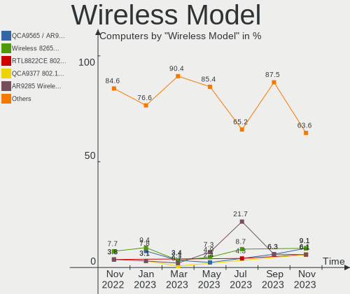

| Model                                                                                         | Computers | Percent |
|-----------------------------------------------------------------------------------------------|-----------|---------|
| Realtek RTL8188EUS 802.11n Wireless Network Adapter                                           | 5         | 6.33%   |
| Intel Wireless 8265 / 8275                                                                    | 4         | 5.06%   |
| Intel Wi-Fi 6 AX201                                                                           | 4         | 5.06%   |
| Realtek RTL8821CE 802.11ac PCIe Wireless Network Adapter                                      | 3         | 3.8%    |
| Qualcomm Atheros AR9485 Wireless Network Adapter                                              | 3         | 3.8%    |
| Intel Wireless 7260                                                                           | 3         | 3.8%    |
| Intel Wi-Fi 6 AX210/AX211/AX411 160MHz                                                        | 3         | 3.8%    |
| Intel Comet Lake PCH-LP CNVi WiFi                                                             | 3         | 3.8%    |
| Realtek RTL8723BE PCIe Wireless Network Adapter                                               | 2         | 2.53%   |
| Realtek RTL8188CUS 802.11n WLAN Adapter                                                       | 2         | 2.53%   |
| Qualcomm Atheros QCA9565 / AR9565 Wireless Network Adapter                                    | 2         | 2.53%   |
| Qualcomm Atheros AR9285 Wireless Network Adapter (PCI-Express)                                | 2         | 2.53%   |
| Intel Wireless 7265                                                                           | 2         | 2.53%   |
| Intel Wireless 3165                                                                           | 2         | 2.53%   |
| Intel Centrino Wireless-N 2230                                                                | 2         | 2.53%   |
| Intel Centrino Advanced-N 6205 [Taylor Peak]                                                  | 2         | 2.53%   |
| Intel Cannon Lake PCH CNVi WiFi                                                               | 2         | 2.53%   |
| Intel Alder Lake-P PCH CNVi WiFi                                                              | 2         | 2.53%   |
| Edimax EW-7811Un 802.11n Wireless Adapter [Realtek RTL8188CUS]                                | 2         | 2.53%   |
| Broadcom BCM43142 802.11b/g/n                                                                 | 2         | 2.53%   |
| TP-Link Archer T2U PLUS [RTL8821AU]                                                           | 1         | 1.27%   |
| Sierra Wireless Sierra Wireless EM7345 4G LTE                                                 | 1         | 1.27%   |
| Realtek RTL8192EE PCIe Wireless Network Adapter                                               | 1         | 1.27%   |
| Realtek RTL8191SEvA Wireless LAN Controller                                                   | 1         | 1.27%   |
| Realtek RTL8188SU 802.11n WLAN Adapter                                                        | 1         | 1.27%   |
| Realtek Realtek 8812AU/8821AU 802.11ac WLAN Adapter [USB Wireless Dual-Band Adapter 2.4/5Ghz] | 1         | 1.27%   |
| Ralink RT5370 Wireless Adapter                                                                | 1         | 1.27%   |
| Ralink RT5390R 802.11bgn PCIe Wireless Network Adapter                                        | 1         | 1.27%   |
| Ralink RT3290 Wireless 802.11n 1T/1R PCIe                                                     | 1         | 1.27%   |
| Ralink RT2500 Wireless 802.11bg                                                               | 1         | 1.27%   |
| Qualcomm Atheros QCA9377 802.11ac Wireless Network Adapter                                    | 1         | 1.27%   |
| Qualcomm Atheros AR9227 Wireless Network Adapter                                              | 1         | 1.27%   |
| Qualcomm Atheros AR5418 Wireless Network Adapter [AR5008E 802.11(a)bgn] (PCI-Express)         | 1         | 1.27%   |
| NetGear A6100 AC600 DB Wireless Adapter [Realtek RTL8811AU]                                   | 1         | 1.27%   |
| MediaTek MT7921K (RZ608) Wi-Fi 6E 80MHz                                                       | 1         | 1.27%   |
| Intel Wi-Fi 6 AX200                                                                           | 1         | 1.27%   |
| Intel PRO/Wireless 5100 AGN [Shiloh] Network Connection                                       | 1         | 1.27%   |
| Intel Ice Lake-LP PCH CNVi WiFi                                                               | 1         | 1.27%   |
| Intel Dual Band Wireless-AC 3168NGW [Stone Peak]                                              | 1         | 1.27%   |
| Intel Comet Lake PCH CNVi WiFi                                                                | 1         | 1.27%   |

Ethernet Vendor
---------------

Ethernet vendors

| Vendor                           | Computers | Percent |
|----------------------------------|-----------|---------|
| Realtek Semiconductor            | 40        | 48.78%  |
| Intel                            | 31        | 37.8%   |
| Qualcomm Atheros                 | 8         | 9.76%   |
| Xiaomi                           | 1         | 1.22%   |
| Silicon Integrated Systems [SiS] | 1         | 1.22%   |
| Broadcom                         | 1         | 1.22%   |

Ethernet Model
--------------

Ethernet models

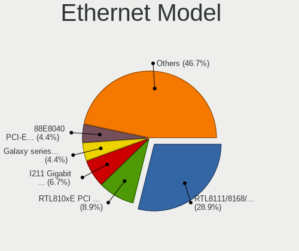

| Model                                                             | Computers | Percent |
|-------------------------------------------------------------------|-----------|---------|
| Realtek RTL8111/8168/8411 PCI Express Gigabit Ethernet Controller | 32        | 38.55%  |
| Realtek RTL810xE PCI Express Fast Ethernet controller             | 7         | 8.43%   |
| Intel 82579LM Gigabit Network Connection (Lewisville)             | 5         | 6.02%   |
| Intel 82574L Gigabit Network Connection                           | 3         | 3.61%   |
| Qualcomm Atheros AR8151 v2.0 Gigabit Ethernet                     | 2         | 2.41%   |
| Intel Ethernet Controller I225-V                                  | 2         | 2.41%   |
| Intel Ethernet Connection I217-LM                                 | 2         | 2.41%   |
| Intel Ethernet Connection (7) I219-LM                             | 2         | 2.41%   |
| Intel Ethernet Connection (3) I218-V                              | 2         | 2.41%   |
| Intel 82577LM Gigabit Network Connection                          | 2         | 2.41%   |
| Xiaomi Mi/Redmi series (RNDIS)                                    | 1         | 1.2%    |
| Silicon Integrated Systems [SiS] 191 Gigabit Ethernet Adapter     | 1         | 1.2%    |
| Realtek RTL8125 2.5GbE Controller                                 | 1         | 1.2%    |
| Qualcomm Atheros QCA8172 Fast Ethernet                            | 1         | 1.2%    |
| Qualcomm Atheros QCA8171 Gigabit Ethernet                         | 1         | 1.2%    |
| Qualcomm Atheros Killer E220x Gigabit Ethernet Controller         | 1         | 1.2%    |
| Qualcomm Atheros AR8161 Gigabit Ethernet                          | 1         | 1.2%    |
| Qualcomm Atheros AR8152 v2.0 Fast Ethernet                        | 1         | 1.2%    |
| Qualcomm Atheros AR8132 Fast Ethernet                             | 1         | 1.2%    |
| Intel I211 Gigabit Network Connection                             | 1         | 1.2%    |
| Intel Ethernet Controller I225-LM                                 | 1         | 1.2%    |
| Intel Ethernet Connection I219-LM                                 | 1         | 1.2%    |
| Intel Ethernet Connection I218-V                                  | 1         | 1.2%    |
| Intel Ethernet Connection I218-LM                                 | 1         | 1.2%    |
| Intel Ethernet Connection (7) I219-V                              | 1         | 1.2%    |
| Intel Ethernet Connection (5) I219-LM                             | 1         | 1.2%    |
| Intel Ethernet Connection (4) I219-V                              | 1         | 1.2%    |
| Intel Ethernet Connection (4) I219-LM                             | 1         | 1.2%    |
| Intel Ethernet Connection (10) I219-V                             | 1         | 1.2%    |
| Intel 82579V Gigabit Network Connection                           | 1         | 1.2%    |
| Intel 82567LM-3 Gigabit Network Connection                        | 1         | 1.2%    |
| Intel 82566MM Gigabit Network Connection                          | 1         | 1.2%    |
| Intel 82566DM-2 Gigabit Network Connection                        | 1         | 1.2%    |
| Broadcom NetXtreme BCM57766 Gigabit Ethernet PCIe                 | 1         | 1.2%    |

Net Controller Kind
-------------------

Ethernet, WiFi or modem

| Kind     | Computers | Percent |
|----------|-----------|---------|
| Ethernet | 81        | 55.1%   |
| WiFi     | 65        | 44.22%  |
| Unknown  | 1         | 0.68%   |

Used Controller
---------------

Currently used network controller

| Kind     | Computers | Percent |
|----------|-----------|---------|
| Ethernet | 56        | 70.89%  |
| WiFi     | 23        | 29.11%  |

NICs
----

Total network controllers on board

| Total | Computers | Percent |
|-------|-----------|---------|
| 2     | 53        | 58.24%  |
| 1     | 37        | 40.66%  |
| 3     | 1         | 1.1%    |

IPv6
----

IPv6 vs IPv4

| Used | Computers | Percent |
|------|-----------|---------|
| No   | 86        | 94.51%  |
| Yes  | 5         | 5.49%   |

Bluetooth
---------

Bluetooth Vendor
----------------

Controller vendors

| Vendor                          | Computers | Percent |
|---------------------------------|-----------|---------|
| Intel                           | 30        | 57.69%  |
| Realtek Semiconductor           | 5         | 9.62%   |
| Broadcom                        | 4         | 7.69%   |
| Qualcomm Atheros Communications | 3         | 5.77%   |
| IMC Networks                    | 2         | 3.85%   |
| Cambridge Silicon Radio         | 2         | 3.85%   |
| ASUSTek Computer                | 2         | 3.85%   |
| Ralink                          | 1         | 1.92%   |
| MediaTek                        | 1         | 1.92%   |
| Foxconn / Hon Hai               | 1         | 1.92%   |
| Apple                           | 1         | 1.92%   |

Bluetooth Model
---------------

Controller models

| Model                                                  | Computers | Percent |
|--------------------------------------------------------|-----------|---------|
| Intel Bluetooth wireless interface                     | 10        | 19.23%  |
| Intel Bluetooth 9460/9560 Jefferson Peak (JfP)         | 6         | 11.54%  |
| Intel AX201 Bluetooth                                  | 6         | 11.54%  |
| Intel AX210 Bluetooth                                  | 3         | 5.77%   |
| Qualcomm Atheros AR3012 Bluetooth 4.0                  | 2         | 3.85%   |
| Intel Centrino Bluetooth Wireless Transceiver          | 2         | 3.85%   |
| Cambridge Silicon Radio Bluetooth Dongle (HCI mode)    | 2         | 3.85%   |
| Realtek RTL8723B Bluetooth                             | 1         | 1.92%   |
| Realtek  Bluetooth Adapter                             | 1         | 1.92%   |
| Realtek  Bluetooth 4.2 Adapter                         | 1         | 1.92%   |
| Realtek  Bluetooth 4.0 Adapter                         | 1         | 1.92%   |
| Realtek Bluetooth Radio                                | 1         | 1.92%   |
| Ralink RT3290 Bluetooth                                | 1         | 1.92%   |
| Qualcomm Atheros  QCA9377 Bluetooth 4.1                | 1         | 1.92%   |
| MediaTek Wireless_Device                               | 1         | 1.92%   |
| Intel Wireless-AC 3168 Bluetooth                       | 1         | 1.92%   |
| Intel Intel Wireless Bluetooth                         | 1         | 1.92%   |
| Intel AX200 Bluetooth                                  | 1         | 1.92%   |
| IMC Networks Realtek Bluetooth Adapter                 | 1         | 1.92%   |
| IMC Networks Asus Integrated Bluetooth module [AR3011] | 1         | 1.92%   |
| Foxconn / Hon Hai BCM43142 Bluetooth Adapter           | 1         | 1.92%   |
| Broadcom BCM43142A0 Bluetooth 4.0                      | 1         | 1.92%   |
| Broadcom BCM20702 Bluetooth 4.0 [ThinkPad]             | 1         | 1.92%   |
| Broadcom BCM2045B (BDC-2.1)                            | 1         | 1.92%   |
| Broadcom BCM2045B (BDC-2) [Bluetooth Controller]       | 1         | 1.92%   |
| ASUS BT-270 Bluetooth Adapter                          | 1         | 1.92%   |
| ASUS Broadcom BCM20702A0 Bluetooth                     | 1         | 1.92%   |
| Apple Bluetooth USB Host Controller                    | 1         | 1.92%   |

Sound
-----

Sound Vendor
------------

Sound card vendors

| Vendor                           | Computers | Percent |
|----------------------------------|-----------|---------|
| Intel                            | 68        | 60.71%  |
| AMD                              | 19        | 16.96%  |
| Nvidia                           | 15        | 13.39%  |
| C-Media Electronics              | 3         | 2.68%   |
| Generalplus Technology           | 2         | 1.79%   |
| VIA Technologies                 | 1         | 0.89%   |
| Silicon Integrated Systems [SiS] | 1         | 0.89%   |
| Razer USA                        | 1         | 0.89%   |
| GN Netcom                        | 1         | 0.89%   |
| ASUSTek Computer                 | 1         | 0.89%   |

Sound Model
-----------

Sound card models

| Model                                                                       | Computers | Percent |
|-----------------------------------------------------------------------------|-----------|---------|
| Intel Sunrise Point-LP HD Audio                                             | 9         | 6.57%   |
| Intel 7 Series/C216 Chipset Family High Definition Audio Controller         | 9         | 6.57%   |
| Intel 6 Series/C200 Series Chipset Family High Definition Audio Controller  | 6         | 4.38%   |
| AMD Family 17h/19h HD Audio Controller                                      | 6         | 4.38%   |
| Intel Wildcat Point-LP High Definition Audio Controller                     | 5         | 3.65%   |
| Intel Tiger Lake-LP Smart Sound Technology Audio Controller                 | 5         | 3.65%   |
| Intel Broadwell-U Audio Controller                                          | 5         | 3.65%   |
| Intel Xeon E3-1200 v3/4th Gen Core Processor HD Audio Controller            | 4         | 2.92%   |
| Intel Haswell-ULT HD Audio Controller                                       | 4         | 2.92%   |
| Intel 8 Series HD Audio Controller                                          | 4         | 2.92%   |
| AMD Raven/Raven2/Fenghuang HDMI/DP Audio Controller                         | 4         | 2.92%   |
| Nvidia TU107 GeForce GTX 1650 High Definition Audio Controller              | 3         | 2.19%   |
| Intel Comet Lake PCH-LP cAVS                                                | 3         | 2.19%   |
| Intel Cannon Lake PCH cAVS                                                  | 3         | 2.19%   |
| Intel 8 Series/C220 Series Chipset High Definition Audio Controller         | 3         | 2.19%   |
| Intel 5 Series/3400 Series Chipset High Definition Audio                    | 3         | 2.19%   |
| AMD FCH Azalia Controller                                                   | 3         | 2.19%   |
| AMD Ellesmere HDMI Audio [Radeon RX 470/480 / 570/580/590]                  | 3         | 2.19%   |
| Nvidia GM206 High Definition Audio Controller                               | 2         | 1.46%   |
| Nvidia GA106 High Definition Audio Controller                               | 2         | 1.46%   |
| Intel NM10/ICH7 Family High Definition Audio Controller                     | 2         | 1.46%   |
| Intel Celeron/Pentium Silver Processor High Definition Audio                | 2         | 1.46%   |
| Intel Alder Lake PCH-P High Definition Audio Controller                     | 2         | 1.46%   |
| Generalplus Technology USB Audio Device                                     | 2         | 1.46%   |
| AMD Starship/Matisse HD Audio Controller                                    | 2         | 1.46%   |
| AMD SBx00 Azalia (Intel HDA)                                                | 2         | 1.46%   |
| AMD Renoir Radeon High Definition Audio Controller                          | 2         | 1.46%   |
| AMD Family 17h (Models 00h-0fh) HD Audio Controller                         | 2         | 1.46%   |
| VIA Technologies VT1720/24 [Envy24PT/HT] PCI Multi-Channel Audio Controller | 1         | 0.73%   |
| Silicon Integrated Systems [SiS] Azalia Audio Controller                    | 1         | 0.73%   |
| Razer USA Nari Ultimate                                                     | 1         | 0.73%   |
| Nvidia TU116 High Definition Audio Controller                               | 1         | 0.73%   |
| Nvidia TU102 High Definition Audio Controller                               | 1         | 0.73%   |
| Nvidia MCP79 High Definition Audio                                          | 1         | 0.73%   |
| Nvidia High Definition Audio Controller                                     | 1         | 0.73%   |
| Nvidia GP107GL High Definition Audio Controller                             | 1         | 0.73%   |
| Nvidia GM107 High Definition Audio Controller [GeForce 940MX]               | 1         | 0.73%   |
| Nvidia GF119 HDMI Audio Controller                                          | 1         | 0.73%   |
| Nvidia GF106 High Definition Audio Controller                               | 1         | 0.73%   |
| Intel USB2.0 Device                                                         | 1         | 0.73%   |

Memory
------

Memory Vendor
-------------

Memory module vendors

| Vendor              | Computers | Percent |
|---------------------|-----------|---------|
| Samsung Electronics | 25        | 22.52%  |
| Micron Technology   | 15        | 13.51%  |
| Kingston            | 14        | 12.61%  |
| SK hynix            | 12        | 10.81%  |
| Unknown             | 7         | 6.31%   |
| Crucial             | 6         | 5.41%   |
| Unknown             | 4         | 3.6%    |
| Ramaxel Technology  | 3         | 2.7%    |
| Patriot             | 3         | 2.7%    |
| G.Skill             | 3         | 2.7%    |
| A-DATA Technology   | 3         | 2.7%    |
| Team                | 2         | 1.8%    |
| Smart               | 2         | 1.8%    |
| Elpida              | 2         | 1.8%    |
| Transcend           | 1         | 0.9%    |
| Teikon              | 1         | 0.9%    |
| Smart Brazil        | 1         | 0.9%    |
| PNY                 | 1         | 0.9%    |
| Nayna               | 1         | 0.9%    |
| High Bridge         | 1         | 0.9%    |
| GeIL                | 1         | 0.9%    |
| Essencore           | 1         | 0.9%    |
| Corsair             | 1         | 0.9%    |
| Atermiter           | 1         | 0.9%    |

Memory Model
------------

Memory module models

| Model                                                              | Computers | Percent |
|--------------------------------------------------------------------|-----------|---------|
| Samsung RAM M471B5173QH0-YK0 4GB SODIMM DDR3 1600MT/s              | 4         | 3.31%   |
| Unknown                                                            | 4         | 3.31%   |
| Micron RAM 8KTF51264HZ-1G6E1 4GB SODIMM DDR3 1600MT/s              | 3         | 2.48%   |
| SK hynix RAM HMA81GS6AFR8N-UH 8GB SODIMM DDR4 2400MT/s             | 2         | 1.65%   |
| Samsung RAM M471A5244CB0-CWE 4GB SODIMM DDR4 3200MT/s              | 2         | 1.65%   |
| Unknown RAM Module 4GB SODIMM DDR3 1333MT/s                        | 1         | 0.83%   |
| Unknown RAM Module 4GB SODIMM DDR3                                 | 1         | 0.83%   |
| Unknown RAM Module 2GB SODIMM DDR3                                 | 1         | 0.83%   |
| Unknown RAM Module 2GB SODIMM DDR2 667MT/s                         | 1         | 0.83%   |
| Unknown RAM Module 2GB DIMM DDR3 1333MT/s                          | 1         | 0.83%   |
| Unknown RAM Module 2GB DIMM 1333MT/s                               | 1         | 0.83%   |
| Unknown RAM Module 1GB SODIMM DDR2 667MT/s                         | 1         | 0.83%   |
| Unknown RAM Module 1GB DIMM DDR2 667MT/s                           | 1         | 0.83%   |
| Unknown RAM Module 1GB DIMM DDR2 400MT/s                           | 1         | 0.83%   |
| Transcend RAM TS512MLK72V6N 4GB DIMM DDR3 1600MT/s                 | 1         | 0.83%   |
| Teikon RAM TMA451S6AFR8N-TFSC 4GB SODIMM DDR4 2133MT/s             | 1         | 0.83%   |
| Team RAM TEAMGROUP-UD4-3200 16GB DIMM DDR4 3200MT/s                | 1         | 0.83%   |
| Team RAM TEAMGROUP-SD4-2400 8GB SODIMM DDR4 2400MT/s               | 1         | 0.83%   |
| Smart RAM SH564128FJ8NWRNSQR 4GB SODIMM DDR3 1600MT/s              | 1         | 0.83%   |
| Smart RAM SH564128FH8NZPHSCR 4GB SODIMM DDR3 1333MT/s              | 1         | 0.83%   |
| Smart Brazil RAM SMS4WEC3C0K0446SCG 4GB SODIMM DDR4 2667MT/s       | 1         | 0.83%   |
| Smart Brazil RAM SDQC8G8W16XCWE9N1T 4GB Row Of Chips DDR4 2667MT/s | 1         | 0.83%   |
| SK hynix RAM Module 8GB DIMM DDR4 2667MT/s                         | 1         | 0.83%   |
| SK hynix RAM Module 2GB DIMM DDR3 1066MT/s                         | 1         | 0.83%   |
| SK hynix RAM HMT451S6MFR8A-PB 4GB SODIMM DDR3 800MT/s              | 1         | 0.83%   |
| SK hynix RAM HMT451S6AFR6A-PB N0 2GB Chip DDR3 1600MT/s            | 1         | 0.83%   |
| SK hynix RAM HMT41GS6BFR8A-PB 8GB SODIMM DDR3 1600MT/s             | 1         | 0.83%   |
| SK hynix RAM HMT125U7TFR8C-H9 2GB DIMM DDR3 1067MT/s               | 1         | 0.83%   |
| SK hynix RAM HMT125U6AFP8C-G7 2GB DIMM DDR3 1066MT/s               | 1         | 0.83%   |
| SK hynix RAM HMCG66MEBSA092N 8GB SODIMM DDR5 4800MT/s              | 1         | 0.83%   |
| SK hynix RAM HMAA51S6AMR6N-UH 8GB SODIMM DDR4 2400MT/s             | 1         | 0.83%   |
| SK hynix RAM HMA851S6JJR6N-VK 4GB SODIMM DDR4 2667MT/s             | 1         | 0.83%   |
| Samsung RAM Module 4GB SODIMM DDR3 1600MT/s                        | 1         | 0.83%   |
| Samsung RAM M471B5773DH0-CH9 2GB SODIMM DDR3 1334MT/s              | 1         | 0.83%   |
| Samsung RAM M471B5273DH0-CK0 4GB SODIMM DDR3 1600MT/s              | 1         | 0.83%   |
| Samsung RAM M471B5273CH0-YK0 4GB SODIMM DDR3 1600MT/s              | 1         | 0.83%   |
| Samsung RAM M471B5174QM0-YK0 4GB SODIMM DDR3 1600MT/s              | 1         | 0.83%   |
| Samsung RAM M471B5173EB0-YK0 4GB SODIMM DDR3 1600MT/s              | 1         | 0.83%   |
| Samsung RAM M471B5173DB0-YK0 4GB SODIMM DDR3 1600MT/s              | 1         | 0.83%   |
| Samsung RAM M471A5244CB0-CWE 4GB Row Of Chips DDR4 3200MT/s        | 1         | 0.83%   |

Memory Kind
-----------

Memory module kinds

| Kind    | Computers | Percent |
|---------|-----------|---------|
| DDR4    | 41        | 46.07%  |
| DDR3    | 39        | 43.82%  |
| DDR2    | 5         | 5.62%   |
| SDRAM   | 1         | 1.12%   |
| DRAM    | 1         | 1.12%   |
| DDR5    | 1         | 1.12%   |
| Unknown | 1         | 1.12%   |

Memory Form Factor
------------------

Physical design of the memory module

| Name         | Computers | Percent |
|--------------|-----------|---------|
| SODIMM       | 54        | 58.7%   |
| DIMM         | 33        | 35.87%  |
| Row Of Chips | 3         | 3.26%   |
| Chip         | 2         | 2.17%   |

Memory Size
-----------

Memory module size

| Size  | Computers | Percent |
|-------|-----------|---------|
| 4096  | 41        | 41%     |
| 8192  | 27        | 27%     |
| 2048  | 14        | 14%     |
| 16384 | 11        | 11%     |
| 1024  | 4         | 4%      |
| 32768 | 3         | 3%      |

Memory Speed
------------

Memory module speed

| Speed   | Computers | Percent |
|---------|-----------|---------|
| 1600    | 23        | 23.96%  |
| 3200    | 14        | 14.58%  |
| 2400    | 13        | 13.54%  |
| 2667    | 9         | 9.38%   |
| 1333    | 9         | 9.38%   |
| 2133    | 5         | 5.21%   |
| 667     | 4         | 4.17%   |
| 2666    | 3         | 3.13%   |
| 1066    | 3         | 3.13%   |
| 1334    | 2         | 2.08%   |
| 800     | 2         | 2.08%   |
| Unknown | 2         | 2.08%   |
| 4800    | 1         | 1.04%   |
| 3000    | 1         | 1.04%   |
| 2048    | 1         | 1.04%   |
| 1867    | 1         | 1.04%   |
| 1866    | 1         | 1.04%   |
| 1067    | 1         | 1.04%   |
| 400     | 1         | 1.04%   |

Printers & scanners
-------------------

Printer Vendor
--------------

Printer device vendors

Zero info for selected period =(

Printer Model
-------------

Printer device models

Zero info for selected period =(

Scanner Vendor
--------------

Scanner device vendors

| Vendor | Computers | Percent |
|--------|-----------|---------|
| Canon  | 1         | 100%    |

Scanner Model
-------------

Scanner device models

| Model                   | Computers | Percent |
|-------------------------|-----------|---------|
| Canon CanoScan LiDE 120 | 1         | 100%    |

Camera
------

Camera Vendor
-------------

Camera device vendors

| Vendor                        | Computers | Percent |
|-------------------------------|-----------|---------|
| Chicony Electronics           | 11        | 24.44%  |
| Bison Electronics             | 10        | 22.22%  |
| Sunplus Innovation Technology | 4         | 8.89%   |
| IMC Networks                  | 3         | 6.67%   |
| Suyin                         | 2         | 4.44%   |
| Realtek Semiconductor         | 2         | 4.44%   |
| Microdia                      | 2         | 4.44%   |
| Luxvisions Innotech Limited   | 2         | 4.44%   |
| Alcor Micro                   | 2         | 4.44%   |
| Unknown                       | 1         | 2.22%   |
| Trust                         | 1         | 2.22%   |
| Sonix Technology              | 1         | 2.22%   |
| Silicon Motion                | 1         | 2.22%   |
| Lenovo                        | 1         | 2.22%   |
| ARC International             | 1         | 2.22%   |
| Apple                         | 1         | 2.22%   |

Camera Model
------------

Camera device models

| Model                                                | Computers | Percent |
|------------------------------------------------------|-----------|---------|
| Bison Integrated Camera                              | 6         | 13.33%  |
| Chicony Integrated Camera                            | 3         | 6.67%   |
| Chicony Chicony USB2.0 Camera                        | 2         | 4.44%   |
| Bison Lenovo EasyCamera                              | 2         | 4.44%   |
| Unknown Realtek PC Camera                            | 1         | 2.22%   |
| Trust Trust Full HD Webcam                           | 1         | 2.22%   |
| Suyin WebCam                                         | 1         | 2.22%   |
| Suyin Integrated_Webcam_HD                           | 1         | 2.22%   |
| Sunplus Integrated_Webcam_HD                         | 1         | 2.22%   |
| Sunplus Integrated Camera                            | 1         | 2.22%   |
| Sunplus HD WebCam                                    | 1         | 2.22%   |
| Sunplus Asus Webcam                                  | 1         | 2.22%   |
| Sonix USB2.0 VGAUVC WebCam                           | 1         | 2.22%   |
| Silicon Motion HP Webcam-50                          | 1         | 2.22%   |
| Realtek Realtek PC Camera                            | 1         | 2.22%   |
| Realtek Integrated Webcam HD                         | 1         | 2.22%   |
| Microdia REDRAGON  Live Camera                       | 1         | 2.22%   |
| Microdia Integrated_Webcam_HD                        | 1         | 2.22%   |
| Luxvisions Innotech Limited Integrated Camera        | 1         | 2.22%   |
| Luxvisions Innotech Limited HP Wide Vision HD Camera | 1         | 2.22%   |
| Lenovo Integrated Webcam [R5U877]                    | 1         | 2.22%   |
| IMC Networks UVC VGA Webcam                          | 1         | 2.22%   |
| IMC Networks USB2.0 VGA UVC WebCam                   | 1         | 2.22%   |
| IMC Networks Integrated Camera                       | 1         | 2.22%   |
| Chicony Lenovo Integrated Camera (0.3MP)             | 1         | 2.22%   |
| Chicony Lenovo EasyCamera                            | 1         | 2.22%   |
| Chicony Integrated IR Camera                         | 1         | 2.22%   |
| Chicony HP TrueVision HD Camera                      | 1         | 2.22%   |
| Chicony HP HD Webcam [Fixed]                         | 1         | 2.22%   |
| Chicony HD Webcam                                    | 1         | 2.22%   |
| Bison HD Webcam                                      | 1         | 2.22%   |
| Bison Front Camera                                   | 1         | 2.22%   |
| ARC International Camera                             | 1         | 2.22%   |
| Apple FaceTime HD Camera (Built-in)                  | 1         | 2.22%   |
| Alcor Micro USB 2.0 Camera                           | 1         | 2.22%   |
| Alcor Micro Asus Integrated Webcam                   | 1         | 2.22%   |

Security
--------

Fingerprint Vendor
------------------

Fingerprint sensor vendors

| Vendor                | Computers | Percent |
|-----------------------|-----------|---------|
| Validity Sensors      | 4         | 40%     |
| Synaptics             | 3         | 30%     |
| Upek                  | 1         | 10%     |
| STMicroelectronics    | 1         | 10%     |
| LighTuning Technology | 1         | 10%     |

Fingerprint Model
-----------------

Fingerprint sensor models

| Model                                                  | Computers | Percent |
|--------------------------------------------------------|-----------|---------|
| Validity Sensors Synaptics WBDI                        | 2         | 20%     |
| Validity Sensors VFS5011 Fingerprint Reader            | 1         | 10%     |
| Validity Sensors VFS 5011 fingerprint sensor           | 1         | 10%     |
| Upek Biometric Touchchip/Touchstrip Fingerprint Sensor | 1         | 10%     |
| Synaptics Prometheus MIS Touch Fingerprint Reader      | 1         | 10%     |
| Synaptics product 0x00be                               | 1         | 10%     |
| STMicroelectronics Fingerprint Reader                  | 1         | 10%     |
| LighTuning Fingerprint Sensor                          | 1         | 10%     |
| Unknown                                                | 1         | 10%     |

Chipcard Vendor
---------------

Chipcard module vendors

Zero info for selected period =(

Chipcard Model
--------------

Chipcard module models

Zero info for selected period =(

Unsupported
-----------

Unsupported Devices
-------------------

Total unsupported devices on board

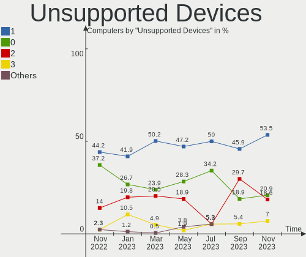

| Total | Computers | Percent |
|-------|-----------|---------|
| 1     | 34        | 37.36%  |
| 2     | 25        | 27.47%  |
| 0     | 16        | 17.58%  |
| 3     | 13        | 14.29%  |
| 5     | 2         | 2.2%    |
| 4     | 1         | 1.1%    |

Unsupported Device Types
------------------------

Types of unsupported devices

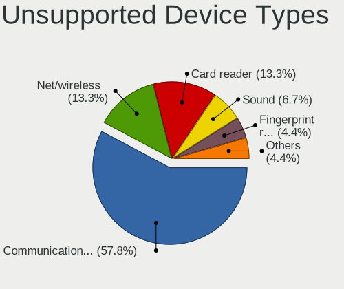

| Type                     | Computers | Percent |
|--------------------------|-----------|---------|
| Communication controller | 67        | 54.03%  |
| Net/wireless             | 15        | 12.1%   |
| Card reader              | 14        | 11.29%  |
| Fingerprint reader       | 10        | 8.06%   |
| Bluetooth                | 10        | 8.06%   |
| Sound                    | 6         | 4.84%   |
| Storage/raid             | 1         | 0.81%   |
| Net/ethernet             | 1         | 0.81%   |

