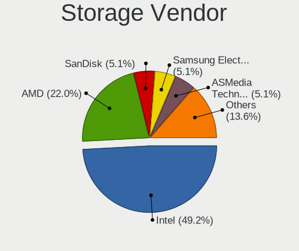
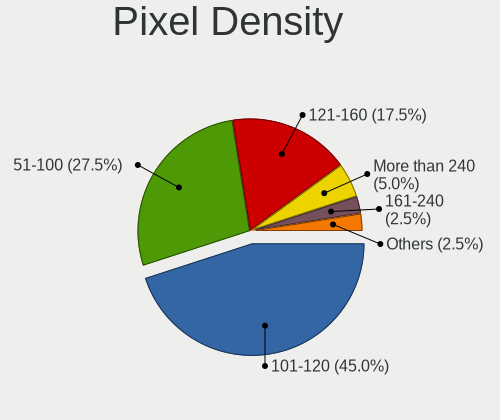
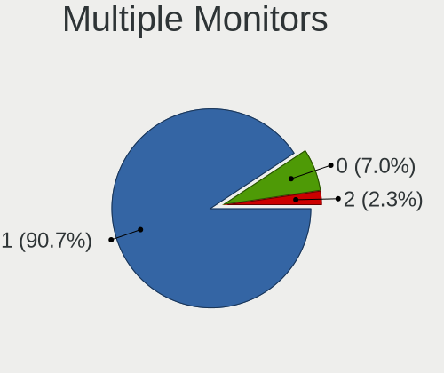

helloSystem Hardware Trends
---------------------------

A project to identify most popular hardware characteristics and track their change
over time based on data collected by helloSystem users at https://BSD-Hardware.info.

Anyone can contribute to this report by the [hw-probe](https://github.com/linuxhw/hw-probe/blob/master/INSTALL.BSD.md) tool:

    hw-probe -all -upload

This is a report for all computer types. See also reports for [desktops](/Dist/helloSystem/Desktop/README.md) and [notebooks](/Dist/helloSystem/Notebook/README.md).

This report is for one last month. Overall report since the beginning of time: [TestCoverage](https://github.com/bsdhw/TestCoverage)

Period: Apr, 2022.

Contents
--------

* [ System ](#system)
  - [ OS                       ](#os)
  - [ OS Family                ](#os-family)
  - [ Arch                     ](#arch)
  - [ DE                       ](#de)
  - [ Display Server           ](#display-server)
  - [ Display Manager          ](#display-manager)
  - [ OS Lang                  ](#os-lang)
  - [ Boot Mode                ](#boot-mode)
  - [ Filesystem               ](#filesystem)
  - [ Part. scheme             ](#part-scheme)

* [ Board ](#board)
  - [ Vendor                   ](#vendor)
  - [ Model                    ](#model)
  - [ Model Family             ](#model-family)
  - [ MFG Year                 ](#mfg-year)
  - [ Form Factor              ](#form-factor)
  - [ Coreboot                 ](#coreboot)
  - [ RAM Size                 ](#ram-size)
  - [ RAM Used                 ](#ram-used)
  - [ Total Drives             ](#total-drives)
  - [ Has CD-ROM               ](#has-cd-rom)
  - [ Has Ethernet             ](#has-ethernet)
  - [ Has WiFi                 ](#has-wifi)
  - [ Has Bluetooth            ](#has-bluetooth)

* [ Location ](#location)
  - [ Country                  ](#country)
  - [ City                     ](#city)

* [ Drives ](#drives)
  - [ Drive Vendor             ](#drive-vendor)
  - [ Drive Model              ](#drive-model)
  - [ HDD Vendor               ](#hdd-vendor)
  - [ SSD Vendor               ](#ssd-vendor)
  - [ Drive Kind               ](#drive-kind)
  - [ Drive Connector          ](#drive-connector)
  - [ Drive Size               ](#drive-size)
  - [ Space Total              ](#space-total)
  - [ Space Used               ](#space-used)
  - [ Malfunc. Drives          ](#malfunc-drives)
  - [ Malfunc. Drive Vendor    ](#malfunc-drive-vendor)
  - [ Malfunc. HDD Vendor      ](#malfunc-hdd-vendor)
  - [ Malfunc. Drive Kind      ](#malfunc-drive-kind)
  - [ Failed Drives            ](#failed-drives)
  - [ Failed Drive Vendor      ](#failed-drive-vendor)
  - [ Drive Status             ](#drive-status)

* [ Storage controller ](#storage-controller)
  - [ Storage Vendor           ](#storage-vendor)
  - [ Storage Model            ](#storage-model)
  - [ Storage Kind             ](#storage-kind)

* [ Processor ](#processor)
  - [ CPU Vendor               ](#cpu-vendor)
  - [ CPU Model                ](#cpu-model)
  - [ CPU Model Family         ](#cpu-model-family)
  - [ CPU Cores                ](#cpu-cores)
  - [ CPU Sockets              ](#cpu-sockets)
  - [ CPU Threads              ](#cpu-threads)
  - [ CPU Microarch            ](#cpu-microarch)

* [ Graphics ](#graphics)
  - [ GPU Vendor               ](#gpu-vendor)
  - [ GPU Model                ](#gpu-model)
  - [ GPU Combo                ](#gpu-combo)
  - [ GPU Driver               ](#gpu-driver)
  - [ GPU Memory               ](#gpu-memory)

* [ Monitor ](#monitor)
  - [ Monitor Vendor           ](#monitor-vendor)
  - [ Monitor Model            ](#monitor-model)
  - [ Monitor Resolution       ](#monitor-resolution)
  - [ Monitor Diagonal         ](#monitor-diagonal)
  - [ Monitor Width            ](#monitor-width)
  - [ Aspect Ratio             ](#aspect-ratio)
  - [ Monitor Area             ](#monitor-area)
  - [ Pixel Density            ](#pixel-density)
  - [ Multiple Monitors        ](#multiple-monitors)

* [ Network ](#network)
  - [ Net Controller Vendor    ](#net-controller-vendor)
  - [ Net Controller Model     ](#net-controller-model)
  - [ Wireless Vendor          ](#wireless-vendor)
  - [ Wireless Model           ](#wireless-model)
  - [ Ethernet Vendor          ](#ethernet-vendor)
  - [ Ethernet Model           ](#ethernet-model)
  - [ Net Controller Kind      ](#net-controller-kind)
  - [ Used Controller          ](#used-controller)
  - [ NICs                     ](#nics)
  - [ IPv6                     ](#ipv6)

* [ Bluetooth ](#bluetooth)
  - [ Bluetooth Vendor         ](#bluetooth-vendor)
  - [ Bluetooth Model          ](#bluetooth-model)

* [ Sound ](#sound)
  - [ Sound Vendor             ](#sound-vendor)
  - [ Sound Model              ](#sound-model)

* [ Memory ](#memory)
  - [ Memory Vendor            ](#memory-vendor)
  - [ Memory Model             ](#memory-model)
  - [ Memory Kind              ](#memory-kind)
  - [ Memory Form Factor       ](#memory-form-factor)
  - [ Memory Size              ](#memory-size)
  - [ Memory Speed             ](#memory-speed)

* [ Printers & scanners ](#printers--scanners)
  - [ Printer Vendor           ](#printer-vendor)
  - [ Printer Model            ](#printer-model)
  - [ Scanner Vendor           ](#scanner-vendor)
  - [ Scanner Model            ](#scanner-model)

* [ Camera ](#camera)
  - [ Camera Vendor            ](#camera-vendor)
  - [ Camera Model             ](#camera-model)

* [ Security ](#security)
  - [ Fingerprint Vendor       ](#fingerprint-vendor)
  - [ Fingerprint Model        ](#fingerprint-model)
  - [ Chipcard Vendor          ](#chipcard-vendor)
  - [ Chipcard Model           ](#chipcard-model)

* [ Unsupported ](#unsupported)
  - [ Unsupported Devices      ](#unsupported-devices)
  - [ Unsupported Device Types ](#unsupported-device-types)

System
------

OS
--

Installed operating systems

| Name                 | Computers | Percent |
|----------------------|-----------|---------|
| helloSystem 0.7.0    | 40        | 81.63%  |
| helloSystem 0.8.0    | 5         | 10.2%   |
| helloSystem 13.0-p11 | 1         | 2.04%   |
| helloSystem 0.6.0    | 1         | 2.04%   |
| helloSystem 0.5.0    | 1         | 2.04%   |
| helloSystem 0.4.0    | 1         | 2.04%   |

OS Family
---------

OS without a version

| Name        | Computers | Percent |
|-------------|-----------|---------|
| helloSystem | 49        | 100%    |

Arch
----

OS architecture (x86_64, i586, etc.)

| Name  | Computers | Percent |
|-------|-----------|---------|
| amd64 | 48        | 97.96%  |
| arm64 | 1         | 2.04%   |

DE
--

Desktop Environment

| Name         | Computers | Percent |
|--------------|-----------|---------|
| helloDesktop | 49        | 100%    |

Display Server
--------------

X11 or Wayland

| Name | Computers | Percent |
|------|-----------|---------|
| X11  | 49        | 100%    |

Display Manager
---------------

SDDM, LightDM, etc.

| Name | Computers | Percent |
|------|-----------|---------|
| SLiM | 49        | 100%    |

OS Lang
-------

Language

| Lang  | Computers | Percent |
|-------|-----------|---------|
| en_US | 42        | 85.71%  |
| es_ES | 2         | 4.08%   |
| C     | 2         | 4.08%   |
| it_IT | 1         | 2.04%   |
| fr_FR | 1         | 2.04%   |
| de_DE | 1         | 2.04%   |

Boot Mode
---------

EFI or BIOS

| Mode | Computers | Percent |
|------|-----------|---------|
| EFI  | 49        | 100%    |

Filesystem
----------

Type of filesystem

| Type   | Computers | Percent |
|--------|-----------|---------|
| Cd9660 | 25        | 51.02%  |
| Zfs    | 23        | 46.94%  |
| Ufs    | 1         | 2.04%   |

Part. scheme
------------

Scheme of partitioning

| Type | Computers | Percent |
|------|-----------|---------|
| GPT  | 49        | 100%    |

Board
-----

Vendor
------

Motherboard manufacturer

| Name                    | Computers | Percent |
|-------------------------|-----------|---------|
| ASUSTek Computer        | 11        | 22.45%  |
| Lenovo                  | 6         | 12.24%  |
| Dell                    | 5         | 10.2%   |
| Hewlett-Packard         | 4         | 8.16%   |
| Gigabyte Technology     | 3         | 6.12%   |
| Apple                   | 3         | 6.12%   |
| TUXEDO                  | 2         | 4.08%   |
| Sony                    | 2         | 4.08%   |
| MSI                     | 2         | 4.08%   |
| Intel                   | 2         | 4.08%   |
| ASRock                  | 2         | 4.08%   |
| Supermicro              | 1         | 2.04%   |
| Raspberry Pi Foundation | 1         | 2.04%   |
| Panasonic               | 1         | 2.04%   |
| LG Electronics          | 1         | 2.04%   |
| DNS                     | 1         | 2.04%   |
| BESSTAR Tech            | 1         | 2.04%   |
| Acidanthera             | 1         | 2.04%   |

Model
-----

Motherboard model

| Name                                  | Computers | Percent |
|---------------------------------------|-----------|---------|
| TUXEDO Aura 15 Gen1                   | 2         | 4.08%   |
| Supermicro X9DAL                      | 1         | 2.04%   |
| Sony VGN-AW21S_B                      | 1         | 2.04%   |
| Sony SVZ1311C5E                       | 1         | 2.04%   |
| RPi Raspberry Pi                      | 1         | 2.04%   |
| Panasonic CF-B11JWCYS                 | 1         | 2.04%   |
| MSI MS-7369                           | 1         | 2.04%   |
| MSI GF65 Thin 10SER                   | 1         | 2.04%   |
| LG E300-A.CP20T                       | 1         | 2.04%   |
| Lenovo ThinkPad X61 7675K2U           | 1         | 2.04%   |
| Lenovo ThinkPad X270 W10DG 20K5S0BB00 | 1         | 2.04%   |
| Lenovo ThinkPad T420 4236BD5          | 1         | 2.04%   |
| Lenovo ThinkCentre M720q 10T7002CUS   | 1         | 2.04%   |
| Lenovo ThinkCentre M700 10GS          | 1         | 2.04%   |
| Lenovo G51-35 80M8                    | 1         | 2.04%   |
| Intel NUC7CJYH                        | 1         | 2.04%   |
| Intel H55                             | 1         | 2.04%   |
| HP Pavilion 11                        | 1         | 2.04%   |
| HP EliteDesk 700 G1 SFF               | 1         | 2.04%   |
| HP Compaq dc7800p Small Form Factor   | 1         | 2.04%   |
| HP 2000                               | 1         | 2.04%   |
| Gigabyte OPTIMA B0307                 | 1         | 2.04%   |
| Gigabyte E3000N                       | 1         | 2.04%   |
| Gigabyte B450 AORUS M                 | 1         | 2.04%   |
| DNS W9x0LU                            | 1         | 2.04%   |
| Dell OptiPlex 990                     | 1         | 2.04%   |
| Dell OptiPlex 7040                    | 1         | 2.04%   |
| Dell Latitude E6540                   | 1         | 2.04%   |
| Dell Latitude E5470                   | 1         | 2.04%   |
| Dell Inspiron 5437                    | 1         | 2.04%   |
| BESSTAR Tech UM250                    | 1         | 2.04%   |
| ASUS X556UJ                           | 1         | 2.04%   |
| ASUS TUF B450-PRO GAMING              | 1         | 2.04%   |
| ASUS PRIME Z390M-PLUS                 | 1         | 2.04%   |
| ASUS PRIME X399-A                     | 1         | 2.04%   |
| ASUS PRIME B350-PLUS                  | 1         | 2.04%   |
| ASUS P8Z77-V LX                       | 1         | 2.04%   |
| ASUS P5G41T-M LX3                     | 1         | 2.04%   |
| ASUS M5A97 LE R2.0                    | 1         | 2.04%   |
| ASUS M4A88T-M                         | 1         | 2.04%   |
| ASUS CROSSHAIR V FORMULA-Z            | 1         | 2.04%   |
| ASUS 1001PX                           | 1         | 2.04%   |
| ASRock X570 Phantom Gaming 4          | 1         | 2.04%   |
| ASRock G950                           | 1         | 2.04%   |
| Apple MacBookPro5,5                   | 1         | 2.04%   |
| Apple MacBookPro3,1                   | 1         | 2.04%   |
| Apple iMac9,1                         | 1         | 2.04%   |
| Acidanthera MacPro6,1                 | 1         | 2.04%   |

Model Family
------------

Motherboard model prefix

| Name                  | Computers | Percent |
|-----------------------|-----------|---------|
| Lenovo ThinkPad       | 3         | 6.12%   |
| ASUS PRIME            | 3         | 6.12%   |
| TUXEDO Aura           | 2         | 4.08%   |
| Lenovo ThinkCentre    | 2         | 4.08%   |
| Dell OptiPlex         | 2         | 4.08%   |
| Dell Latitude         | 2         | 4.08%   |
| Supermicro X9DAL      | 1         | 2.04%   |
| Sony VGN-AW21S        | 1         | 2.04%   |
| Sony SVZ1311C5E       | 1         | 2.04%   |
| RPi Raspberry         | 1         | 2.04%   |
| Panasonic CF-B11JWCYS | 1         | 2.04%   |
| MSI MS-7369           | 1         | 2.04%   |
| MSI GF65              | 1         | 2.04%   |
| LG E300-A.CP20T       | 1         | 2.04%   |
| Lenovo G51-35         | 1         | 2.04%   |
| Intel NUC7CJYH        | 1         | 2.04%   |
| Intel H55             | 1         | 2.04%   |
| HP Pavilion           | 1         | 2.04%   |
| HP EliteDesk          | 1         | 2.04%   |
| HP Compaq             | 1         | 2.04%   |
| HP 2000               | 1         | 2.04%   |
| Gigabyte OPTIMA       | 1         | 2.04%   |
| Gigabyte E3000N       | 1         | 2.04%   |
| Gigabyte B450         | 1         | 2.04%   |
| DNS W9x0LU            | 1         | 2.04%   |
| Dell Inspiron         | 1         | 2.04%   |
| BESSTAR Tech UM250    | 1         | 2.04%   |
| ASUS X556UJ           | 1         | 2.04%   |
| ASUS TUF              | 1         | 2.04%   |
| ASUS P8Z77-V          | 1         | 2.04%   |
| ASUS P5G41T-M         | 1         | 2.04%   |
| ASUS M5A97            | 1         | 2.04%   |
| ASUS M4A88T-M         | 1         | 2.04%   |
| ASUS CROSSHAIR        | 1         | 2.04%   |
| ASUS 1001PX           | 1         | 2.04%   |
| ASRock X570           | 1         | 2.04%   |
| ASRock G950           | 1         | 2.04%   |
| Apple MacBookPro5     | 1         | 2.04%   |
| Apple MacBookPro3     | 1         | 2.04%   |
| Apple iMac9           | 1         | 2.04%   |
| Acidanthera MacPro6   | 1         | 2.04%   |

MFG Year
--------

Motherboard manufacture year

| Year | Computers | Percent |
|------|-----------|---------|
| 2021 | 7         | 14.29%  |
| 2020 | 5         | 10.2%   |
| 2019 | 5         | 10.2%   |
| 2018 | 5         | 10.2%   |
| 2016 | 4         | 8.16%   |
| 2011 | 4         | 8.16%   |
| 2010 | 4         | 8.16%   |
| 2015 | 3         | 6.12%   |
| 2012 | 3         | 6.12%   |
| 2009 | 3         | 6.12%   |
| 2014 | 2         | 4.08%   |
| 2008 | 2         | 4.08%   |
| 2013 | 1         | 2.04%   |
| 2007 | 1         | 2.04%   |

Form Factor
-----------

Physical design of the computer

| Name           | Computers | Percent |
|----------------|-----------|---------|
| Desktop        | 24        | 48.98%  |
| Notebook       | 21        | 42.86%  |
| Mini pc        | 2         | 4.08%   |
| System on chip | 1         | 2.04%   |
| All in one     | 1         | 2.04%   |

Coreboot
--------

Have coreboot on board

| Used | Computers | Percent |
|------|-----------|---------|
| No   | 49        | 100%    |

RAM Size
--------

Total RAM memory

| Size in GB  | Computers | Percent |
|-------------|-----------|---------|
| 4.01-8.0    | 14        | 28.57%  |
| 16.01-24.0  | 13        | 26.53%  |
| 8.01-16.0   | 12        | 24.49%  |
| 32.01-64.0  | 3         | 6.12%   |
| 64.01-256.0 | 3         | 6.12%   |
| 2.01-3.0    | 2         | 4.08%   |
| 3.01-4.0    | 1         | 2.04%   |
| 24.01-32.0  | 1         | 2.04%   |

RAM Used
--------

Used RAM memory

| Used GB  | Computers | Percent |
|----------|-----------|---------|
| 0.01-0.5 | 21        | 42.86%  |
| 0.51-1.0 | 18        | 36.73%  |
| 1.01-2.0 | 8         | 16.33%  |
| 2.01-3.0 | 2         | 4.08%   |

Total Drives
------------

Number of drives on board

| Drives | Computers | Percent |
|--------|-----------|---------|
| 1      | 32        | 65.31%  |
| 2      | 9         | 18.37%  |
| 4      | 3         | 6.12%   |
| 3      | 2         | 4.08%   |
| 0      | 2         | 4.08%   |
| 9      | 1         | 2.04%   |

Has CD-ROM
----------

Has CD-ROM on board

| Presented | Computers | Percent |
|-----------|-----------|---------|
| No        | 27        | 55.1%   |
| Yes       | 22        | 44.9%   |

Has Ethernet
------------

Has Ethernet on board

| Presented | Computers | Percent |
|-----------|-----------|---------|
| Yes       | 48        | 97.96%  |
| No        | 1         | 2.04%   |

Has WiFi
--------

Has WiFi module

| Presented | Computers | Percent |
|-----------|-----------|---------|
| Yes       | 32        | 65.31%  |
| No        | 17        | 34.69%  |

Has Bluetooth
-------------

Has Bluetooth module

| Presented | Computers | Percent |
|-----------|-----------|---------|
| No        | 28        | 57.14%  |
| Yes       | 21        | 42.86%  |

Location
--------

Country
-------

Geographic location (country)

| Country             | Computers | Percent |
|---------------------|-----------|---------|
| USA                 | 8         | 16.33%  |
| Germany             | 7         | 14.29%  |
| Russia              | 4         | 8.16%   |
| Italy               | 3         | 6.12%   |
| Brazil              | 3         | 6.12%   |
| Turkey              | 2         | 4.08%   |
| Spain               | 2         | 4.08%   |
| Poland              | 2         | 4.08%   |
| France              | 2         | 4.08%   |
| Ukraine             | 1         | 2.04%   |
| UK                  | 1         | 2.04%   |
| Trinidad and Tobago | 1         | 2.04%   |
| Taiwan              | 1         | 2.04%   |
| Portugal            | 1         | 2.04%   |
| Panama              | 1         | 2.04%   |
| Netherlands         | 1         | 2.04%   |
| Mexico              | 1         | 2.04%   |
| India               | 1         | 2.04%   |
| Iceland             | 1         | 2.04%   |
| Denmark             | 1         | 2.04%   |
| China               | 1         | 2.04%   |
| Chile               | 1         | 2.04%   |
| Belarus             | 1         | 2.04%   |
| Argentina           | 1         | 2.04%   |
| Albania             | 1         | 2.04%   |

City
----

Geographic location (city)

| City                    | Computers | Percent |
|-------------------------|-----------|---------|
| Frankfurt am Main       | 2         | 4.08%   |
| Zhaoqing                | 1         | 2.04%   |
| Yunlin                  | 1         | 2.04%   |
| Washington              | 1         | 2.04%   |
| Tolyatti                | 1         | 2.04%   |
| Tampa                   | 1         | 2.04%   |
| Stuttgart               | 1         | 2.04%   |
| St Petersburg           | 1         | 2.04%   |
| Sparta                  | 1         | 2.04%   |
| Senftenberg             | 1         | 2.04%   |
| Scottsdale              | 1         | 2.04%   |
| Santiago                | 1         | 2.04%   |
| Reykjavik               | 1         | 2.04%   |
| Port of Spain           | 1         | 2.04%   |
| Paris                   | 1         | 2.04%   |
| Panama City             | 1         | 2.04%   |
| Moscow                  | 1         | 2.04%   |
| Minsk                   | 1         | 2.04%   |
| Massa Lombarda          | 1         | 2.04%   |
| Lakeville               | 1         | 2.04%   |
| La Pobla de Farnals     | 1         | 2.04%   |
| Kyiv                    | 1         | 2.04%   |
| Kiselëvsk              | 1         | 2.04%   |
| Katowice                | 1         | 2.04%   |
| Jedlicze                | 1         | 2.04%   |
| Istanbul                | 1         | 2.04%   |
| Independence            | 1         | 2.04%   |
| Hyères                 | 1         | 2.04%   |
| Hvidovre                | 1         | 2.04%   |
| Glasgow                 | 1         | 2.04%   |
| Gaildorf                | 1         | 2.04%   |
| Farka e Madhe           | 1         | 2.04%   |
| Diamantino              | 1         | 2.04%   |
| Curitiba                | 1         | 2.04%   |
| Cruzeiro do Sul         | 1         | 2.04%   |
| Ciudad Satelite         | 1         | 2.04%   |
| Chennai                 | 1         | 2.04%   |
| Chemnitz                | 1         | 2.04%   |
| Champlin                | 1         | 2.04%   |
| Castilleja de la Cuesta | 1         | 2.04%   |
| Cardito                 | 1         | 2.04%   |
| Caranguejeira           | 1         | 2.04%   |
| Buenos Aires            | 1         | 2.04%   |
| Bolivar                 | 1         | 2.04%   |
| Bergambacht             | 1         | 2.04%   |
| Belluno                 | 1         | 2.04%   |
| Bad Honnef              | 1         | 2.04%   |
| Ankara                  | 1         | 2.04%   |

Drives
------

Drive Vendor
------------

Hard drive vendors

| Vendor              | Computers | Drives | Percent |
|---------------------|-----------|--------|---------|
| Seagate             | 10        | 12     | 15.63%  |
| WDC                 | 9         | 13     | 14.06%  |
| Samsung Electronics | 9         | 13     | 14.06%  |
| Toshiba             | 4         | 4      | 6.25%   |
| Kingston            | 3         | 3      | 4.69%   |
| Intenso             | 3         | 4      | 4.69%   |
| Hitachi             | 3         | 3      | 4.69%   |
| Crucial             | 3         | 3      | 4.69%   |
| A-DATA Technology   | 3         | 4      | 4.69%   |
| SanDisk             | 2         | 2      | 3.13%   |
| LITEON              | 2         | 2      | 3.13%   |
| HGST                | 2         | 2      | 3.13%   |
| PNY                 | 1         | 1      | 1.56%   |
| Phison              | 1         | 1      | 1.56%   |
| Patriot             | 1         | 1      | 1.56%   |
| OCZ                 | 1         | 1      | 1.56%   |
| Micron Technology   | 1         | 1      | 1.56%   |
| Leven               | 1         | 2      | 1.56%   |
| Intel               | 1         | 1      | 1.56%   |
| Gigabyte Technology | 1         | 1      | 1.56%   |
| Fujitsu             | 1         | 1      | 1.56%   |
| EMTEC               | 1         | 1      | 1.56%   |
| Apple               | 1         | 1      | 1.56%   |

Drive Model
-----------

Hard drive models

| Model                               | Computers | Percent |
|-------------------------------------|-----------|---------|
| WDC WDS100T2B0C-00PXH0 1TB          | 2         | 2.78%   |
| Seagate ST1000DM003-1ER162 1TB      | 2         | 2.78%   |
| Kingston SA400S37120G 120GB         | 2         | 2.78%   |
| Crucial CT240BX500SSD1 240GB        | 2         | 2.78%   |
| WDC WDS240G2G0A-00JH30 240GB        | 1         | 1.39%   |
| WDC WDS200T2B0C-00PXH0 2TB          | 1         | 1.39%   |
| WDC WD60EZRZ-00RWYB1 6TB            | 1         | 1.39%   |
| WDC WD5000LPLX-08ZNTT0 500GB        | 1         | 1.39%   |
| WDC WD3200AAJS-00YZCA0 320GB        | 1         | 1.39%   |
| WDC WD1600AAJS-40H3A0 160GB         | 1         | 1.39%   |
| WDC WD10JPCX-24UE4T0 1TB            | 1         | 1.39%   |
| WDC WD10EZEX-00BN5A0 1TB            | 1         | 1.39%   |
| Toshiba MQ01ABF050 500GB            | 1         | 1.39%   |
| Toshiba HDWE140 4TB                 | 1         | 1.39%   |
| Toshiba HDWD240 4TB                 | 1         | 1.39%   |
| Toshiba HDWD110 1TB                 | 1         | 1.39%   |
| Seagate ST980813AS 80GB             | 1         | 1.39%   |
| Seagate ST8000NM0055-1RM112 8TB     | 1         | 1.39%   |
| Seagate ST6000DM003-2CY186 6TB      | 1         | 1.39%   |
| Seagate ST500LT012-9WS142 500GB     | 1         | 1.39%   |
| Seagate ST3500418AS 500GB           | 1         | 1.39%   |
| Seagate ST3500413AS 500GB           | 1         | 1.39%   |
| Seagate ST320LT020-9YG142 320GB     | 1         | 1.39%   |
| Seagate ST320LT014-9YK142 320GB     | 1         | 1.39%   |
| Seagate ST12000NM0008-2H3101 12TB   | 1         | 1.39%   |
| Seagate ST1000DM010-2EP102 1TB      | 1         | 1.39%   |
| SanDisk SDSSDH2128G 128GB           | 1         | 1.39%   |
| SanDisk SDSSDA120G 120GB            | 1         | 1.39%   |
| Samsung SSD 980 PRO 500GB           | 1         | 1.39%   |
| Samsung SSD 980 PRO 1TB             | 1         | 1.39%   |
| Samsung SSD 970 EVO Plus 2TB        | 1         | 1.39%   |
| Samsung SSD 960 EVO 1TB             | 1         | 1.39%   |
| Samsung SSD 870 EVO 500GB           | 1         | 1.39%   |
| Samsung SSD 870 EVO 2TB             | 1         | 1.39%   |
| Samsung SSD 860 EVO 500GB           | 1         | 1.39%   |
| Samsung SSD 860 EVO 250GB           | 1         | 1.39%   |
| Samsung SSD 750 EVO 250GB           | 1         | 1.39%   |
| Samsung MZVLW256HEHP-000L7 256GB    | 1         | 1.39%   |
| Samsung MZVLB256HAHQ-000L7 256GB    | 1         | 1.39%   |
| Samsung MZRPC256HADR-000SO 128GB    | 1         | 1.39%   |
| PNY SSD2SC120G1CS1754D117-551 120GB | 1         | 1.39%   |
| Phison Sabrent Rocket Q 1TB         | 1         | 1.39%   |
| Patriot Burst 240GB                 | 1         | 1.39%   |
| OCZ PETROL 256GB                    | 1         | 1.39%   |
| Micron 2210_MTFDHBA512QFD 512GB     | 1         | 1.39%   |
| LITEON LCH-256V2S 256GB             | 1         | 1.39%   |
| LITEON CV8-8E128-HP 128GB           | 1         | 1.39%   |
| Leven JAJS600M256C 256GB            | 1         | 1.39%   |
| Kingston OM8P0S3256B-A0 256GB       | 1         | 1.39%   |
| Intenso SSD SATAIII 256GB           | 1         | 1.39%   |
| Intenso SSD SATA III 480GB          | 1         | 1.39%   |
| Intenso SSD Sata III 256GB          | 1         | 1.39%   |
| Intenso SSD 240GB                   | 1         | 1.39%   |
| Intel SSDSCKKF256H6 SATA 256GB      | 1         | 1.39%   |
| Hitachi HTS723216L9SA60 160GB       | 1         | 1.39%   |
| Hitachi HTS547550A9E384 500GB       | 1         | 1.39%   |
| Hitachi HTS541612J9SA00 120GB       | 1         | 1.39%   |
| HGST HTS545050A7E680 500GB          | 1         | 1.39%   |
| HGST HTS541075A7E630 752GB          | 1         | 1.39%   |
| Gigabyte GP-GSTFS31240GNTD 240GB    | 1         | 1.39%   |

HDD Vendor
----------

Hard disk drive vendors

| Vendor  | Computers | Drives | Percent |
|---------|-----------|--------|---------|
| Seagate | 10        | 12     | 40%     |
| WDC     | 6         | 6      | 24%     |
| Toshiba | 4         | 4      | 16%     |
| Hitachi | 3         | 3      | 12%     |
| HGST    | 2         | 2      | 8%      |

SSD Vendor
----------

Solid state drive vendors

| Vendor              | Computers | Drives | Percent |
|---------------------|-----------|--------|---------|
| Samsung Electronics | 6         | 7      | 19.35%  |
| Kingston            | 3         | 3      | 9.68%   |
| Intenso             | 3         | 4      | 9.68%   |
| Crucial             | 3         | 3      | 9.68%   |
| SanDisk             | 2         | 2      | 6.45%   |
| LITEON              | 2         | 2      | 6.45%   |
| A-DATA Technology   | 2         | 2      | 6.45%   |
| WDC                 | 1         | 1      | 3.23%   |
| PNY                 | 1         | 1      | 3.23%   |
| Patriot             | 1         | 1      | 3.23%   |
| OCZ                 | 1         | 1      | 3.23%   |
| Leven               | 1         | 2      | 3.23%   |
| Intel               | 1         | 1      | 3.23%   |
| Gigabyte Technology | 1         | 1      | 3.23%   |
| Fujitsu             | 1         | 1      | 3.23%   |
| EMTEC               | 1         | 1      | 3.23%   |
| Apple               | 1         | 1      | 3.23%   |

Drive Kind
----------

HDD or SSD

| Kind | Computers | Drives | Percent |
|------|-----------|--------|---------|
| SSD  | 25        | 34     | 42.37%  |
| HDD  | 23        | 27     | 38.98%  |
| NVMe | 11        | 16     | 18.64%  |

Drive Connector
---------------

SATA, SAS, NVMe, etc.

| Type | Computers | Drives | Percent |
|------|-----------|--------|---------|
| SATA | 43        | 61     | 79.63%  |
| NVMe | 11        | 16     | 20.37%  |

Drive Size
----------

Size of hard drive

| Size in TB | Computers | Drives | Percent |
|------------|-----------|--------|---------|
| 0.01-0.5   | 38        | 47     | 74.51%  |
| 0.51-1.0   | 7         | 7      | 13.73%  |
| 3.01-4.0   | 2         | 2      | 3.92%   |
| 4.01-10.0  | 2         | 3      | 3.92%   |
| 10.01-20.0 | 1         | 1      | 1.96%   |
| 1.01-2.0   | 1         | 1      | 1.96%   |

Space Total
-----------

Amount of disk space available on the file system

| Size in GB | Computers | Percent |
|------------|-----------|---------|
| 1-20       | 26        | 53.06%  |
| 101-250    | 12        | 24.49%  |
| 251-500    | 6         | 12.24%  |
| 21-50      | 2         | 4.08%   |
| 51-100     | 2         | 4.08%   |
| 501-1000   | 1         | 2.04%   |

Space Used
----------

Amount of used disk space

| Used GB | Computers | Percent |
|---------|-----------|---------|
| 1-20    | 48        | 97.96%  |
| 21-50   | 1         | 2.04%   |

Malfunc. Drives
---------------

Drive models with a malfunction

| Model                             | Computers | Drives | Percent |
|-----------------------------------|-----------|--------|---------|
| WDC WD60EZRZ-00RWYB1 6TB          | 1         | 1      | 8.33%   |
| WDC WD1600AAJS-40H3A0 160GB       | 1         | 1      | 8.33%   |
| Seagate ST8000NM0055-1RM112 8TB   | 1         | 1      | 8.33%   |
| Seagate ST6000DM003-2CY186 6TB    | 1         | 1      | 8.33%   |
| Seagate ST3500413AS 500GB         | 1         | 1      | 8.33%   |
| Seagate ST320LT014-9YK142 320GB   | 1         | 1      | 8.33%   |
| Seagate ST1000DM003-1ER162 1TB    | 1         | 1      | 8.33%   |
| LITEON CV8-8E128-HP 128GB         | 1         | 1      | 8.33%   |
| Hitachi HTS723216L9SA60 160GB     | 1         | 1      | 8.33%   |
| Hitachi HTS541612J9SA00 120GB     | 1         | 1      | 8.33%   |
| HGST HTS541075A7E630 752GB        | 1         | 1      | 8.33%   |
| A-DATA Technology SX8200PNP 512GB | 1         | 1      | 8.33%   |

Malfunc. Drive Vendor
---------------------

Vendors of faulty drives

| Vendor            | Computers | Drives | Percent |
|-------------------|-----------|--------|---------|
| Seagate           | 5         | 5      | 41.67%  |
| WDC               | 2         | 2      | 16.67%  |
| Hitachi           | 2         | 2      | 16.67%  |
| LITEON            | 1         | 1      | 8.33%   |
| HGST              | 1         | 1      | 8.33%   |
| A-DATA Technology | 1         | 1      | 8.33%   |

Malfunc. HDD Vendor
-------------------

Vendors of faulty HDD drives

| Vendor  | Computers | Drives | Percent |
|---------|-----------|--------|---------|
| Seagate | 5         | 5      | 50%     |
| WDC     | 2         | 2      | 20%     |
| Hitachi | 2         | 2      | 20%     |
| HGST    | 1         | 1      | 10%     |

Malfunc. Drive Kind
-------------------

Kinds of faulty drives

| Kind | Computers | Drives | Percent |
|------|-----------|--------|---------|
| HDD  | 9         | 10     | 81.82%  |
| NVMe | 1         | 1      | 9.09%   |
| SSD  | 1         | 1      | 9.09%   |

Failed Drives
-------------

Failed drive models

| Model                        | Computers | Drives | Percent |
|------------------------------|-----------|--------|---------|
| WDC WD3200AAJS-00YZCA0 320GB | 1         | 1      | 100%    |

Failed Drive Vendor
-------------------

Failed drive vendors

| Vendor | Computers | Drives | Percent |
|--------|-----------|--------|---------|
| WDC    | 1         | 1      | 100%    |

Drive Status
------------

Number of failed and malfunc. drives

| Status  | Computers | Drives | Percent |
|---------|-----------|--------|---------|
| Works   | 39        | 64     | 78%     |
| Malfunc | 10        | 12     | 20%     |
| Failed  | 1         | 1      | 2%      |

Storage controller
------------------

Storage Vendor
--------------

Storage controller vendors

| Vendor                | Computers | Percent |
|-----------------------|-----------|---------|
| Intel                 | 25        | 41.67%  |
| AMD                   | 15        | 25%     |
| Samsung Electronics   | 6         | 10%     |
| Sandisk               | 3         | 5%      |
| Nvidia                | 3         | 5%      |
| Broadcom / LSI        | 2         | 3.33%   |
| Realtek Semiconductor | 1         | 1.67%   |
| Phison Electronics    | 1         | 1.67%   |
| Micron Technology     | 1         | 1.67%   |
| JMicron Technology    | 1         | 1.67%   |
| ASMedia Technology    | 1         | 1.67%   |
| ADATA Technology      | 1         | 1.67%   |

Storage Model
-------------

Storage controller models

| Model                                                                            | Computers | Percent |
|----------------------------------------------------------------------------------|-----------|---------|
| AMD FCH SATA Controller [AHCI mode]                                              | 10        | 14.08%  |
| Unknown                                                                          | 3         | 4.23%   |
| Sandisk WD Blue SN550 NVMe SSD                                                   | 2         | 2.82%   |
| Samsung NVMe SSD Controller SM981/PM981/PM983                                    | 2         | 2.82%   |
| Samsung NVMe SSD Controller SM961/PM961/SM963                                    | 2         | 2.82%   |
| Samsung NVMe SSD Controller PM9A1/PM9A3/980PRO                                   | 2         | 2.82%   |
| Nvidia MCP79 AHCI Controller                                                     | 2         | 2.82%   |
| Intel SATA Controller [RAID mode]                                                | 2         | 2.82%   |
| Intel Q170/Q150/B150/H170/H110/Z170/CM236 Chipset SATA Controller [AHCI Mode]    | 2         | 2.82%   |
| Intel Cannon Lake PCH SATA AHCI Controller                                       | 2         | 2.82%   |
| Intel C602 chipset 4-Port SATA Storage Control Unit                              | 2         | 2.82%   |
| Intel 8 Series/C220 Series Chipset Family 6-port SATA Controller 1 [AHCI mode]   | 2         | 2.82%   |
| AMD SB7x0/SB8x0/SB9x0 SATA Controller [AHCI mode]                                | 2         | 2.82%   |
| AMD 400 Series Chipset SATA Controller                                           | 2         | 2.82%   |
| Phison E12 NVMe Controller                                                       | 1         | 1.41%   |
| Nvidia MCP65 AHCI Controller                                                     | 1         | 1.41%   |
| JMicron JMB368 IDE controller                                                    | 1         | 1.41%   |
| Intel Sunrise Point-LP SATA Controller [AHCI mode]                               | 1         | 1.41%   |
| Intel NM10/ICH7 Family SATA Controller [IDE mode]                                | 1         | 1.41%   |
| Intel NM10/ICH7 Family SATA Controller [AHCI mode]                               | 1         | 1.41%   |
| Intel Celeron/Pentium Silver Processor SATA Controller                           | 1         | 1.41%   |
| Intel C600/X79 series chipset SATA RAID Controller                               | 1         | 1.41%   |
| Intel C600/X79 series chipset IDE-r Controller                                   | 1         | 1.41%   |
| Intel C600/X79 series chipset 6-Port SATA AHCI Controller                        | 1         | 1.41%   |
| Intel Atom/Celeron/Pentium Processor x5-E8000/J3xxx/N3xxx Series SATA Controller | 1         | 1.41%   |
| Intel 82Q35 Express PT IDER Controller                                           | 1         | 1.41%   |
| Intel 82801IR/IO/IH (ICH9R/DO/DH) 6 port SATA Controller [AHCI mode]             | 1         | 1.41%   |
| Intel 82801IBM/IEM (ICH9M/ICH9M-E) 4 port SATA Controller [AHCI mode]            | 1         | 1.41%   |
| Intel 82801HM/HEM (ICH8M/ICH8M-E) SATA Controller [IDE mode]                     | 1         | 1.41%   |
| Intel 82801HM/HEM (ICH8M/ICH8M-E) SATA Controller [AHCI mode]                    | 1         | 1.41%   |
| Intel 82801HM/HEM (ICH8M/ICH8M-E) IDE Controller                                 | 1         | 1.41%   |
| Intel 82801G (ICH7 Family) IDE Controller                                        | 1         | 1.41%   |
| Intel 82801 Mobile SATA Controller [RAID mode]                                   | 1         | 1.41%   |
| Intel 8 Series SATA Controller 1 [AHCI mode]                                     | 1         | 1.41%   |
| Intel 7 Series/C210 Series Chipset Family 6-port SATA Controller [AHCI mode]     | 1         | 1.41%   |
| Intel 7 Series Chipset Family 6-port SATA Controller [AHCI mode]                 | 1         | 1.41%   |
| Intel 6 Series/C200 Series Chipset Family 6 port Mobile SATA AHCI Controller     | 1         | 1.41%   |
| Intel 5 Series/3400 Series Chipset 4 port SATA AHCI Controller                   | 1         | 1.41%   |
| Broadcom / LSI SAS2008 PCI-Express Fusion-MPT SAS-2 [Falcon]                     | 1         | 1.41%   |
| Broadcom / LSI MegaRAID SAS 1078                                                 | 1         | 1.41%   |
| ASMedia ASM1062 Serial ATA Controller                                            | 1         | 1.41%   |
| AMD X399 Series Chipset SATA Controller                                          | 1         | 1.41%   |
| AMD SB7x0/SB8x0/SB9x0 SATA Controller [IDE mode]                                 | 1         | 1.41%   |
| AMD SB7x0/SB8x0/SB9x0 IDE Controller                                             | 1         | 1.41%   |
| AMD SB600 Non-Raid-5 SATA                                                        | 1         | 1.41%   |
| AMD SB600 IDE                                                                    | 1         | 1.41%   |
| AMD 300 Series Chipset SATA Controller                                           | 1         | 1.41%   |
| ADATA XPG SX8200 Pro PCIe Gen3x4 M.2 2280 Solid State Drive                      | 1         | 1.41%   |

Storage Kind
------------

Kind of storage controller (IDE, SATA, NVMe, SAS, ...)

| Kind | Computers | Percent |
|------|-----------|---------|
| SATA | 35        | 56.45%  |
| NVMe | 11        | 17.74%  |
| IDE  | 8         | 12.9%   |
| RAID | 5         | 8.06%   |
| SAS  | 3         | 4.84%   |

Processor
---------

CPU Vendor
----------

Processor vendors

| Vendor | Computers | Percent |
|--------|-----------|---------|
| Intel  | 31        | 63.27%  |
| AMD    | 17        | 34.69%  |
| ARM    | 1         | 2.04%   |

CPU Model
---------

Processor models

| Model                                           | Computers | Percent |
|-------------------------------------------------|-----------|---------|
| Intel Core 2 Duo CPU P7550 @ 2.26GHz            | 2         | 4.08%   |
| AMD Ryzen 7 4700U with Radeon Graphics          | 2         | 4.08%   |
| AMD Ryzen 5 3600 6-Core Processor               | 2         | 4.08%   |
| Intel Xeon CPU E5-2403 v2 @ 1.80GHz             | 1         | 2.04%   |
| Intel Xeon CPU E5-1620 @ 3.60GHz                | 1         | 2.04%   |
| Intel Pentium CPU N3700 @ 1.60GHz               | 1         | 2.04%   |
| Intel Pentium CPU G4400 @ 3.30GHz               | 1         | 2.04%   |
| Intel Core i7-6700 CPU @ 3.40GHz                | 1         | 2.04%   |
| Intel Core i7-6500U CPU @ 2.50GHz               | 1         | 2.04%   |
| Intel Core i7-4810MQ CPU @ 2.80GHz              | 1         | 2.04%   |
| Intel Core i7-3612QM CPU @ 2.10GHz              | 1         | 2.04%   |
| Intel Core i5-9400 CPU @ 2.90GHz                | 1         | 2.04%   |
| Intel Core i5-8400T CPU @ 1.70GHz               | 1         | 2.04%   |
| Intel Core i5-6440HQ CPU @ 2.60GHz              | 1         | 2.04%   |
| Intel Core i5-6300U CPU @ 2.40GHz               | 1         | 2.04%   |
| Intel Core i5-4590 CPU @ 3.30GHz                | 1         | 2.04%   |
| Intel Core i5-4570 CPU @ 3.20GHz                | 1         | 2.04%   |
| Intel Core i5-4200U CPU @ 1.60GHz               | 1         | 2.04%   |
| Intel Core i5-3450 CPU @ 3.10GHz                | 1         | 2.04%   |
| Intel Core i5-3320M CPU @ 2.60GHz               | 1         | 2.04%   |
| Intel Core i5-2520M CPU @ 2.50GHz               | 1         | 2.04%   |
| Intel Core i5-2400S CPU @ 2.50GH                | 1         | 2.04%   |
| Intel Core i5-10300H CPU @ 2.50GHz              | 1         | 2.04%   |
| Intel Core i5 CPU 650 @ 3.20GHz                 | 1         | 2.04%   |
| Intel Core 2 Quad CPU Q8300 @ 2.50GHz           | 1         | 2.04%   |
| Intel Core 2 Duo CPU T8300 @ 2.40GHz            | 1         | 2.04%   |
| Intel Core 2 Duo CPU T7700 @ 2.40GHz            | 1         | 2.04%   |
| Intel Core 2 Duo CPU T7250 @ 2.00GHz            | 1         | 2.04%   |
| Intel Core 2 Duo CPU P8600 @ 2.40GHz            | 1         | 2.04%   |
| Intel Core 2 Duo CPU E6750 @ 2.66GHz            | 1         | 2.04%   |
| Intel Celeron J4005 CPU @ 2.00GHz               | 1         | 2.04%   |
| Intel Atom CPU N450 @ 1.66GHz                   | 1         | 2.04%   |
| ARM Cortex-A72 r0p3                             | 1         | 2.04%   |
| AMD Ryzen Threadripper 2970WX 24-Core Processor | 1         | 2.04%   |
| AMD Ryzen 9 5950X 16-Core Processor             | 1         | 2.04%   |
| AMD Ryzen 9 3900X 12-Core Processor             | 1         | 2.04%   |
| AMD Ryzen 7 2700X Eight-Core Processor          | 1         | 2.04%   |
| AMD Ryzen 5 PRO 2500U w/ Radeon Vega Mobile Gfx | 1         | 2.04%   |
| AMD FX-8320 Eight-Core Processor                | 1         | 2.04%   |
| AMD FX-8300 Eight-Core Processor                | 1         | 2.04%   |
| AMD E2-3000 APU with Radeon HD Graphics         | 1         | 2.04%   |
| AMD E2-1800 APU with Radeon HD Graphics         | 1         | 2.04%   |
| AMD Athlon II X4 635 Processor                  | 1         | 2.04%   |
| AMD Athlon Dual Core Processor 4850e            | 1         | 2.04%   |
| AMD A8-7410 APU with AMD Radeon R5 Graphics     | 1         | 2.04%   |
| AMD A6-1450 APU with Radeon HD Graphics         | 1         | 2.04%   |

CPU Model Family
----------------

Processor model prefix

| Model                  | Computers | Percent |
|------------------------|-----------|---------|
| Intel Core i5          | 13        | 26.53%  |
| Intel Core 2 Duo       | 7         | 14.29%  |
| Intel Core i7          | 4         | 8.16%   |
| AMD Ryzen 7            | 3         | 6.12%   |
| Intel Xeon             | 2         | 4.08%   |
| Intel Pentium          | 2         | 4.08%   |
| AMD Ryzen 9            | 2         | 4.08%   |
| AMD Ryzen 5            | 2         | 4.08%   |
| AMD FX                 | 2         | 4.08%   |
| AMD E2                 | 2         | 4.08%   |
| Intel Core 2 Quad      | 1         | 2.04%   |
| Intel Celeron          | 1         | 2.04%   |
| Intel Atom             | 1         | 2.04%   |
| ARM Cortex             | 1         | 2.04%   |
| AMD Ryzen Threadripper | 1         | 2.04%   |
| AMD Ryzen 5 PRO        | 1         | 2.04%   |
| AMD Athlon II X4       | 1         | 2.04%   |
| AMD Athlon Dual Core   | 1         | 2.04%   |
| AMD A8                 | 1         | 2.04%   |
| AMD A6                 | 1         | 2.04%   |

CPU Cores
---------

Number of processor cores

| Number  | Computers | Percent |
|---------|-----------|---------|
| 4       | 15        | 30.61%  |
| 2       | 12        | 24.49%  |
| Unknown | 7         | 14.29%  |
| 8       | 6         | 12.24%  |
| 12      | 2         | 4.08%   |
| 6       | 2         | 4.08%   |
| 48      | 1         | 2.04%   |
| 32      | 1         | 2.04%   |
| 24      | 1         | 2.04%   |
| 16      | 1         | 2.04%   |
| 1       | 1         | 2.04%   |

CPU Sockets
-----------

Number of sockets

| Number  | Computers | Percent |
|---------|-----------|---------|
| 1       | 44        | 89.8%   |
| 2       | 4         | 8.16%   |
| Unknown | 1         | 2.04%   |

CPU Threads
-----------

Threads per core (Hyper-Threading)

| Number  | Computers | Percent |
|---------|-----------|---------|
| 1       | 30        | 61.22%  |
| 2       | 12        | 24.49%  |
| Unknown | 7         | 14.29%  |

CPU Microarch
-------------

Microarchitecture

| Name          | Computers | Percent |
|---------------|-----------|---------|
| Zen 2         | 5         | 10.2%   |
| Skylake       | 5         | 10.2%   |
| Penryn        | 5         | 10.2%   |
| IvyBridge     | 4         | 8.16%   |
| Haswell       | 4         | 8.16%   |
| SandyBridge   | 3         | 6.12%   |
| Core          | 3         | 6.12%   |
| Zen+          | 2         | 4.08%   |
| Piledriver    | 2         | 4.08%   |
| KabyLake      | 2         | 4.08%   |
| Jaguar        | 2         | 4.08%   |
| Zen 3         | 1         | 2.04%   |
| Zen           | 1         | 2.04%   |
| Westmere      | 1         | 2.04%   |
| Silvermont    | 1         | 2.04%   |
| Puma          | 1         | 2.04%   |
| K8 Hammer     | 1         | 2.04%   |
| K10           | 1         | 2.04%   |
| Goldmont plus | 1         | 2.04%   |
| CometLake     | 1         | 2.04%   |
| Bonnell       | 1         | 2.04%   |
| Bobcat        | 1         | 2.04%   |
| Unknown       | 1         | 2.04%   |

Graphics
--------

GPU Vendor
----------

Vendors of graphics cards

| Vendor | Computers | Percent |
|--------|-----------|---------|
| Intel  | 20        | 38.46%  |
| Nvidia | 16        | 30.77%  |
| AMD    | 16        | 30.77%  |

GPU Model
---------

Graphics card models

| Model                                                                                    | Computers | Percent |
|------------------------------------------------------------------------------------------|-----------|---------|
| Nvidia GT218 [GeForce 210]                                                               | 2         | 3.77%   |
| Intel Xeon E3-1200 v3/4th Gen Core Processor Integrated Graphics Controller              | 2         | 3.77%   |
| Intel Skylake GT2 [HD Graphics 520]                                                      | 2         | 3.77%   |
| Intel HD Graphics 530                                                                    | 2         | 3.77%   |
| Intel 3rd Gen Core processor Graphics Controller                                         | 2         | 3.77%   |
| AMD Renoir                                                                               | 2         | 3.77%   |
| AMD Ellesmere [Radeon RX 470/480/570/570X/580/580X/590]                                  | 2         | 3.77%   |
| Nvidia TU117 [GeForce GTX 1650]                                                          | 1         | 1.89%   |
| Nvidia TU116 [GeForce GTX 1660 Ti]                                                       | 1         | 1.89%   |
| Nvidia TU116 [GeForce GTX 1660 SUPER]                                                    | 1         | 1.89%   |
| Nvidia TU106M [GeForce RTX 2060 Mobile]                                                  | 1         | 1.89%   |
| Nvidia GK208M [GeForce GT 740M]                                                          | 1         | 1.89%   |
| Nvidia GK208BM [GeForce 920M]                                                            | 1         | 1.89%   |
| Nvidia GF119 [GeForce GT 610]                                                            | 1         | 1.89%   |
| Nvidia GF114 [GeForce GTX 560]                                                           | 1         | 1.89%   |
| Nvidia GF108 [GeForce GT 730]                                                            | 1         | 1.89%   |
| Nvidia GA104 [GeForce RTX 3070 Ti]                                                       | 1         | 1.89%   |
| Nvidia G96CM [GeForce 9600M GT]                                                          | 1         | 1.89%   |
| Nvidia G84M [GeForce 8600M GT]                                                           | 1         | 1.89%   |
| Nvidia C79 [GeForce 9400]                                                                | 1         | 1.89%   |
| Nvidia C79 [GeForce 9400M]                                                               | 1         | 1.89%   |
| Intel Xeon E3-1200 v2/3rd Gen Core processor Graphics Controller                         | 1         | 1.89%   |
| Intel Mobile GM965/GL960 Integrated Graphics Controller (secondary)                      | 1         | 1.89%   |
| Intel Mobile GM965/GL960 Integrated Graphics Controller (primary)                        | 1         | 1.89%   |
| Intel HD Graphics 510                                                                    | 1         | 1.89%   |
| Intel Haswell-ULT Integrated Graphics Controller                                         | 1         | 1.89%   |
| Intel GeminiLake [UHD Graphics 600]                                                      | 1         | 1.89%   |
| Intel Core Processor Integrated Graphics Controller                                      | 1         | 1.89%   |
| Intel CometLake-H GT2 [UHD Graphics]                                                     | 1         | 1.89%   |
| Intel CoffeeLake-S GT2 [UHD Graphics 630]                                                | 1         | 1.89%   |
| Intel Atom/Celeron/Pentium Processor x5-E8000/J3xxx/N3xxx Integrated Graphics Controller | 1         | 1.89%   |
| Intel Atom Processor D4xx/D5xx/N4xx/N5xx Integrated Graphics Controller                  | 1         | 1.89%   |
| Intel 4th Gen Core Processor Integrated Graphics Controller                              | 1         | 1.89%   |
| Intel 2nd Generation Core Processor Family Integrated Graphics Controller                | 1         | 1.89%   |
| AMD Wrestler [Radeon HD 7340]                                                            | 1         | 1.89%   |
| AMD Turks XT [Radeon HD 6670/7670]                                                       | 1         | 1.89%   |
| AMD Temash [Radeon HD 8250/8280G]                                                        | 1         | 1.89%   |
| AMD RS880 [Radeon HD 4250]                                                               | 1         | 1.89%   |
| AMD RS600M [Radeon Xpress 1250]                                                          | 1         | 1.89%   |
| AMD Raven Ridge [Radeon Vega Series / Radeon Vega Mobile Series]                         | 1         | 1.89%   |
| AMD Navi 22 [Radeon RX 6700/6700 XT/6750 XT / 6800M]                                     | 1         | 1.89%   |
| AMD Navi 21 [Radeon RX 6800/6800 XT / 6900 XT]                                           | 1         | 1.89%   |
| AMD Mullins [Radeon R4/R5 Graphics]                                                      | 1         | 1.89%   |
| AMD Mars XTX [Radeon HD 8790M]                                                           | 1         | 1.89%   |
| AMD Kabini [Radeon HD 8280 / R3 Series]                                                  | 1         | 1.89%   |
| AMD Baffin [Radeon RX 550 640SP / RX 560/560X]                                           | 1         | 1.89%   |

GPU Combo
---------

Combinations of graphics cards

| Name           | Computers | Percent |
|----------------|-----------|---------|
| 1 x AMD        | 15        | 30.61%  |
| 1 x Intel      | 14        | 28.57%  |
| 1 x Nvidia     | 13        | 26.53%  |
| Intel + Nvidia | 3         | 6.12%   |
| 2 x Intel      | 2         | 4.08%   |
| Other          | 1         | 2.04%   |
| Intel + AMD    | 1         | 2.04%   |

GPU Driver
----------

Free vs proprietary

| Driver      | Computers | Percent |
|-------------|-----------|---------|
| Free        | 35        | 71.43%  |
| Proprietary | 9         | 18.37%  |
| Unknown     | 5         | 10.2%   |

GPU Memory
----------

Total video memory

| Size in GB | Computers | Percent |
|------------|-----------|---------|
| Unknown    | 29        | 59.18%  |
| 0.01-0.5   | 9         | 18.37%  |
| 0.51-1.0   | 5         | 10.2%   |
| 3.01-4.0   | 3         | 6.12%   |
| 5.01-6.0   | 2         | 4.08%   |
| 7.01-8.0   | 1         | 2.04%   |

Monitor
-------

Monitor Vendor
--------------

Monitor vendors

| Vendor                  | Computers | Percent |
|-------------------------|-----------|---------|
| Goldstar                | 6         | 16.67%  |
| Dell                    | 4         | 11.11%  |
| AU Optronics            | 4         | 11.11%  |
| ViewSonic               | 2         | 5.56%   |
| Samsung Electronics     | 2         | 5.56%   |
| Lenovo                  | 2         | 5.56%   |
| Chimei Innolux          | 2         | 5.56%   |
| Apple                   | 2         | 5.56%   |
| Toshiba                 | 1         | 2.78%   |
| Sony                    | 1         | 2.78%   |
| Nvidia                  | 1         | 2.78%   |
| LG Display              | 1         | 2.78%   |
| Hewlett-Packard         | 1         | 2.78%   |
| HannStar                | 1         | 2.78%   |
| Chi Mei Optoelectronics | 1         | 2.78%   |
| BOE                     | 1         | 2.78%   |
| ASUSTek Computer        | 1         | 2.78%   |
| AOC                     | 1         | 2.78%   |
| Ancor Communications    | 1         | 2.78%   |
| Acer                    | 1         | 2.78%   |

Monitor Model
-------------

Monitor models

| Model                                                                    | Computers | Percent |
|--------------------------------------------------------------------------|-----------|---------|
| ViewSonic VX1940w VSC6A20 1680x1050 410x260mm 19.1-inch                  | 1         | 2.5%    |
| ViewSonic LCD Monitor VSCBD2B 1920x1080 480x270mm 21.7-inch              | 1         | 2.5%    |
| Toshiba TV TSB0110 1920x1080 1110x620mm 50.1-inch                        | 1         | 2.5%    |
| Sony LCD SNY06FA 1600x900 290x160mm 13.0-inch                            | 1         | 2.5%    |
| Samsung Electronics SyncMaster SAM0601 1600x900                          | 1         | 2.5%    |
| Samsung Electronics SyncMaster SAM0116 1024x768 280x210mm 13.8-inch      | 1         | 2.5%    |
| Samsung Electronics S27C350 SAM0A3E 1920x1080 600x340mm 27.2-inch        | 1         | 2.5%    |
| Samsung Electronics LCD Monitor SDC4C48 1920x1080 340x190mm 15.3-inch    | 1         | 2.5%    |
| Nvidia LCD Monitor NVD0200 1920x1080 320x180mm 14.5-inch                 | 1         | 2.5%    |
| LG Display LCD Monitor LGD04E2 1366x768 340x190mm 15.3-inch              | 1         | 2.5%    |
| Lenovo LEN L193pC LEN114F 1280x1024 400x320mm 20.2-inch                  | 1         | 2.5%    |
| Lenovo LCD Monitor LEN4031 1280x800 290x180mm 13.4-inch                  | 1         | 2.5%    |
| Lenovo LCD Monitor LEN4000 1024x768 250x180mm 12.1-inch                  | 1         | 2.5%    |
| Hewlett-Packard LCD Monitor HPN351A 1920x1080 700x390mm 31.5-inch        | 1         | 2.5%    |
| HannStar LCD Monitor HSD03E9 1024x600 220x130mm 10.1-inch                | 1         | 2.5%    |
| Goldstar W2043 GSM4E9D 1600x900 450x250mm 20.3-inch                      | 1         | 2.5%    |
| Goldstar LG Ultra HD GSM5B09 3840x2160 600x340mm 27.2-inch               | 1         | 2.5%    |
| Goldstar LG HDR WFHD GSM7714 2560x1080 800x340mm 34.2-inch               | 1         | 2.5%    |
| Goldstar LG FULL HD GSM5B55 1920x1080 480x270mm 21.7-inch                | 1         | 2.5%    |
| Goldstar LCD Monitor GSM5AB7 1920x1080 480x270mm 21.7-inch               | 1         | 2.5%    |
| Goldstar LCD Monitor GSM5AB6 1920x1080 480x270mm 21.7-inch               | 1         | 2.5%    |
| Dell U2412M DELA07A 1920x1200 520x320mm 24.0-inch                        | 1         | 2.5%    |
| Dell SE2417HGX DELD0F7 1920x1080 520x290mm 23.4-inch                     | 1         | 2.5%    |
| Dell S2418HN/NX DEL4123 1920x1080 530x300mm 24.0-inch                    | 1         | 2.5%    |
| Dell IN2020M DELF029 1600x900 440x250mm 19.9-inch                        | 1         | 2.5%    |
| Chimei Innolux LCD Monitor CMN1731 1600x900 390x220mm 17.6-inch          | 1         | 2.5%    |
| Chimei Innolux LCD Monitor CMN1118 1366x768 260x140mm 11.6-inch          | 1         | 2.5%    |
| Chi Mei Optoelectronics LCD Monitor CMO15A2 1366x768 340x190mm 15.3-inch | 1         | 2.5%    |
| BOE LCD Monitor BOE0960 1366x768 340x190mm 15.3-inch                     | 1         | 2.5%    |
| AU Optronics LCD Monitor AUOAF90 1920x1080 340x190mm 15.3-inch           | 1         | 2.5%    |
| AU Optronics LCD Monitor AUO313C 1366x768 310x170mm 13.9-inch            | 1         | 2.5%    |
| AU Optronics LCD Monitor AUO303C 1366x768 310x170mm 13.9-inch            | 1         | 2.5%    |
| AU Optronics LCD Monitor AUO226D 1920x1080 280x160mm 12.7-inch           | 1         | 2.5%    |
| ASUSTek Computer VZ279 AUS27C0 1920x1080 600x340mm 27.2-inch             | 1         | 2.5%    |
| Apple Color LCD APP9CA0 1280x800 290x190mm 13.6-inch                     | 1         | 2.5%    |
| Apple Color LCD APP9C93 1680x1050 430x270mm 20.0-inch                    | 1         | 2.5%    |
| AOC 24G2W1G4 AOC2402 1920x1080 530x300mm 24.0-inch                       | 1         | 2.5%    |
| Ancor Communications ASUS VW198 ACI19AA 1680x1050 400x250mm 18.6-inch    | 1         | 2.5%    |
| Acer KA242Y ACR073C 1920x1080 530x300mm 24.0-inch                        | 1         | 2.5%    |
| Acer EG240Y ACR077B 1920x1080 530x300mm 24.0-inch                        | 1         | 2.5%    |

Monitor Resolution
------------------

Monitor screen resolution

| Resolution         | Computers | Percent |
|--------------------|-----------|---------|
| 1920x1080 (FHD)    | 16        | 42.11%  |
| 1366x768 (WXGA)    | 6         | 15.79%  |
| 1600x900 (HD+)     | 5         | 13.16%  |
| 1680x1050 (WSXGA+) | 3         | 7.89%   |
| 1280x800 (WXGA)    | 2         | 5.26%   |
| 3840x2160 (4K)     | 1         | 2.63%   |
| 2560x1080          | 1         | 2.63%   |
| 1920x1200 (WUXGA)  | 1         | 2.63%   |
| 1280x1024 (SXGA)   | 1         | 2.63%   |
| 1024x768 (XGA)     | 1         | 2.63%   |
| 1024x600           | 1         | 2.63%   |

Monitor Diagonal
----------------

Diagonal size in inches

| Inches  | Computers | Percent |
|---------|-----------|---------|
| 15      | 5         | 12.82%  |
| 13      | 5         | 12.82%  |
| 24      | 4         | 10.26%  |
| 21      | 4         | 10.26%  |
| 27      | 3         | 7.69%   |
| 20      | 3         | 7.69%   |
| 23      | 2         | 5.13%   |
| 19      | 2         | 5.13%   |
| 14      | 2         | 5.13%   |
| 50      | 1         | 2.56%   |
| 34      | 1         | 2.56%   |
| 31      | 1         | 2.56%   |
| 18      | 1         | 2.56%   |
| 17      | 1         | 2.56%   |
| 12      | 1         | 2.56%   |
| 11      | 1         | 2.56%   |
| 10      | 1         | 2.56%   |
| Unknown | 1         | 2.56%   |

Monitor Width
-------------

Physical width

| Width in mm | Computers | Percent |
|-------------|-----------|---------|
| 501-600     | 9         | 23.08%  |
| 401-500     | 8         | 20.51%  |
| 301-350     | 8         | 20.51%  |
| 201-300     | 7         | 17.95%  |
| 351-400     | 3         | 7.69%   |
| 701-800     | 1         | 2.56%   |
| 601-700     | 1         | 2.56%   |
| 1001-1500   | 1         | 2.56%   |
| Unknown     | 1         | 2.56%   |

Aspect Ratio
------------

Proportional relationship between the width and the height

| Ratio | Computers | Percent |
|-------|-----------|---------|
| 16/9  | 28        | 75.68%  |
| 16/10 | 5         | 13.51%  |
| 5/4   | 1         | 2.7%    |
| 4/3   | 1         | 2.7%    |
| 3/2   | 1         | 2.7%    |
| 21/9  | 1         | 2.7%    |

Monitor Area
------------

Area in inch²

| Area in inch² | Computers | Percent |
|----------------|-----------|---------|
| 201-250        | 9         | 23.08%  |
| 151-200        | 6         | 15.38%  |
| 81-90          | 5         | 12.82%  |
| 91-100         | 5         | 12.82%  |
| 301-350        | 3         | 7.69%   |
| 351-500        | 2         | 5.13%   |
| More than 1000 | 1         | 2.56%   |
| 71-80          | 1         | 2.56%   |
| 61-70          | 1         | 2.56%   |
| 51-60          | 1         | 2.56%   |
| 41-50          | 1         | 2.56%   |
| 251-300        | 1         | 2.56%   |
| 131-140        | 1         | 2.56%   |
| 101-110        | 1         | 2.56%   |
| Unknown        | 1         | 2.56%   |

Pixel Density
-------------

Pixels per inch

| Density | Computers | Percent |
|---------|-----------|---------|
| 51-100  | 15        | 39.47%  |
| 101-120 | 14        | 36.84%  |
| 121-160 | 5         | 13.16%  |
| 161-240 | 2         | 5.26%   |
| 1-50    | 1         | 2.63%   |
| Unknown | 1         | 2.63%   |

Multiple Monitors
-----------------

Total monitors connected

| Total | Computers | Percent |
|-------|-----------|---------|
| 1     | 33        | 67.35%  |
| 0     | 11        | 22.45%  |
| 2     | 5         | 10.2%   |

Network
-------

Net Controller Vendor
---------------------

Controller vendors

| Vendor                   | Computers | Percent |
|--------------------------|-----------|---------|
| Realtek Semiconductor    | 26        | 35.14%  |
| Intel                    | 25        | 33.78%  |
| Qualcomm Atheros         | 6         | 8.11%   |
| Broadcom                 | 4         | 5.41%   |
| Marvell Technology Group | 3         | 4.05%   |
| Nvidia                   | 2         | 2.7%    |
| Sierra Wireless          | 1         | 1.35%   |
| Ralink Technology        | 1         | 1.35%   |
| Ralink                   | 1         | 1.35%   |
| OPPO Electronics         | 1         | 1.35%   |
| Huawei Technologies      | 1         | 1.35%   |
| Edimax Technology        | 1         | 1.35%   |
| Dell                     | 1         | 1.35%   |
| D-Link System            | 1         | 1.35%   |

Net Controller Model
--------------------

Controller models

| Model                                                                   | Computers | Percent |
|-------------------------------------------------------------------------|-----------|---------|
| Realtek RTL8111/8168/8411 PCI Express Gigabit Ethernet Controller       | 19        | 21.35%  |
| Realtek RTL810xE PCI Express Fast Ethernet controller                   | 4         | 4.49%   |
| Intel Wi-Fi 6 AX200                                                     | 4         | 4.49%   |
| Intel 82579LM Gigabit Network Connection (Lewisville)                   | 4         | 4.49%   |
| Intel I211 Gigabit Network Connection                                   | 3         | 3.37%   |
| Realtek RTL8723BE PCIe Wireless Network Adapter                         | 2         | 2.25%   |
| Realtek RTL8192CU 802.11n WLAN Adapter                                  | 2         | 2.25%   |
| Nvidia MCP79 Ethernet                                                   | 2         | 2.25%   |
| Intel Wireless 8260                                                     | 2         | 2.25%   |
| Intel Ethernet Connection I217-LM                                       | 2         | 2.25%   |
| Intel Ethernet Connection (7) I219-V                                    | 2         | 2.25%   |
| Intel Ethernet Connection (2) I219-LM                                   | 2         | 2.25%   |
| Intel Centrino Advanced-N 6205 [Taylor Peak]                            | 2         | 2.25%   |
| Broadcom BCM4322 802.11a/b/g/n Wireless LAN Controller                  | 2         | 2.25%   |
| Sierra Wireless EM7455                                                  | 1         | 1.12%   |
| Realtek RTL8821AE 802.11ac PCIe Wireless Network Adapter                | 1         | 1.12%   |
| Realtek RTL8188EUS 802.11n Wireless Network Adapter                     | 1         | 1.12%   |
| Realtek RTL8188CUS 802.11n WLAN Adapter                                 | 1         | 1.12%   |
| Realtek 802.11n WLAN Adapter                                            | 1         | 1.12%   |
| Ralink RT2870/RT3070 Wireless Adapter                                   | 1         | 1.12%   |
| Ralink RT3290 Wireless 802.11n 1T/1R PCIe                               | 1         | 1.12%   |
| Qualcomm Atheros QCA9565 / AR9565 Wireless Network Adapter              | 1         | 1.12%   |
| Qualcomm Atheros AR9485 Wireless Network Adapter                        | 1         | 1.12%   |
| Qualcomm Atheros AR93xx Wireless Network Adapter                        | 1         | 1.12%   |
| Qualcomm Atheros AR9285 Wireless Network Adapter (PCI-Express)          | 1         | 1.12%   |
| Qualcomm Atheros AR8151 v2.0 Gigabit Ethernet                           | 1         | 1.12%   |
| Qualcomm Atheros AR8132 Fast Ethernet                                   | 1         | 1.12%   |
| Qualcomm Atheros AR242x / AR542x Wireless Network Adapter (PCI-Express) | 1         | 1.12%   |
| OPPO SDM720G-IDP _SN:AB3CB1F6 RNDIS Control RNDIS Ethernet Data         | 1         | 1.12%   |
| Marvell Group 88E8058 PCI-E Gigabit Ethernet Controller                 | 1         | 1.12%   |
| Marvell Group 88E8055 PCI-E Gigabit Ethernet Controller                 | 1         | 1.12%   |
| Marvell Group 88E8039 PCI-E Fast Ethernet Controller                    | 1         | 1.12%   |
| Intel Wireless 8265 / 8275                                              | 1         | 1.12%   |
| Intel Wireless 7265                                                     | 1         | 1.12%   |
| Intel WiFi Link 5100                                                    | 1         | 1.12%   |
| Intel PRO/Wireless 4965 AG or AGN [Kedron] Network Connection           | 1         | 1.12%   |
| Intel Gemini Lake PCH CNVi WiFi                                         | 1         | 1.12%   |
| Intel Ethernet Connection I219-LM                                       | 1         | 1.12%   |
| Intel Comet Lake PCH CNVi WiFi                                          | 1         | 1.12%   |
| Intel Centrino Ultimate-N 6300                                          | 1         | 1.12%   |
| Intel Centrino Advanced-N 6235                                          | 1         | 1.12%   |
| Intel 82583V Gigabit Network Connection                                 | 1         | 1.12%   |
| Intel 82574L Gigabit Network Connection                                 | 1         | 1.12%   |
| Intel 82566MM Gigabit Network Connection                                | 1         | 1.12%   |
| Intel 82566DM-2 Gigabit Network Connection                              | 1         | 1.12%   |
| Huawei ME936 LTE/HSDPA+ 4G modem                                        | 1         | 1.12%   |
| Edimax EW-7811Un 802.11n Wireless Adapter [Realtek RTL8188CUS]          | 1         | 1.12%   |
| Dell Hub of E-Port Replicator                                           | 1         | 1.12%   |
| D-Link System DGE-528T Gigabit Ethernet Adapter                         | 1         | 1.12%   |
| Broadcom BCM4360 802.11ac Wireless Network Adapter                      | 1         | 1.12%   |
| Broadcom BCM4321 802.11a/b/g/n                                          | 1         | 1.12%   |

Wireless Vendor
---------------

Wireless vendors

| Vendor                | Computers | Percent |
|-----------------------|-----------|---------|
| Intel                 | 16        | 42.11%  |
| Realtek Semiconductor | 8         | 21.05%  |
| Qualcomm Atheros      | 5         | 13.16%  |
| Broadcom              | 4         | 10.53%  |
| Sierra Wireless       | 1         | 2.63%   |
| Ralink Technology     | 1         | 2.63%   |
| Ralink                | 1         | 2.63%   |
| Edimax Technology     | 1         | 2.63%   |
| Dell                  | 1         | 2.63%   |

Wireless Model
--------------

Wireless models

| Model                                                                   | Computers | Percent |
|-------------------------------------------------------------------------|-----------|---------|
| Intel Wi-Fi 6 AX200                                                     | 4         | 10.53%  |
| Realtek RTL8723BE PCIe Wireless Network Adapter                         | 2         | 5.26%   |
| Realtek RTL8192CU 802.11n WLAN Adapter                                  | 2         | 5.26%   |
| Intel Wireless 8260                                                     | 2         | 5.26%   |
| Intel Centrino Advanced-N 6205 [Taylor Peak]                            | 2         | 5.26%   |
| Broadcom BCM4322 802.11a/b/g/n Wireless LAN Controller                  | 2         | 5.26%   |
| Sierra Wireless EM7455                                                  | 1         | 2.63%   |
| Realtek RTL8821AE 802.11ac PCIe Wireless Network Adapter                | 1         | 2.63%   |
| Realtek RTL8188EUS 802.11n Wireless Network Adapter                     | 1         | 2.63%   |
| Realtek RTL8188CUS 802.11n WLAN Adapter                                 | 1         | 2.63%   |
| Realtek 802.11n WLAN Adapter                                            | 1         | 2.63%   |
| Ralink RT2870/RT3070 Wireless Adapter                                   | 1         | 2.63%   |
| Ralink RT3290 Wireless 802.11n 1T/1R PCIe                               | 1         | 2.63%   |
| Qualcomm Atheros QCA9565 / AR9565 Wireless Network Adapter              | 1         | 2.63%   |
| Qualcomm Atheros AR9485 Wireless Network Adapter                        | 1         | 2.63%   |
| Qualcomm Atheros AR93xx Wireless Network Adapter                        | 1         | 2.63%   |
| Qualcomm Atheros AR9285 Wireless Network Adapter (PCI-Express)          | 1         | 2.63%   |
| Qualcomm Atheros AR242x / AR542x Wireless Network Adapter (PCI-Express) | 1         | 2.63%   |
| Intel Wireless 8265 / 8275                                              | 1         | 2.63%   |
| Intel Wireless 7265                                                     | 1         | 2.63%   |
| Intel WiFi Link 5100                                                    | 1         | 2.63%   |
| Intel PRO/Wireless 4965 AG or AGN [Kedron] Network Connection           | 1         | 2.63%   |
| Intel Gemini Lake PCH CNVi WiFi                                         | 1         | 2.63%   |
| Intel Comet Lake PCH CNVi WiFi                                          | 1         | 2.63%   |
| Intel Centrino Ultimate-N 6300                                          | 1         | 2.63%   |
| Intel Centrino Advanced-N 6235                                          | 1         | 2.63%   |
| Edimax EW-7811Un 802.11n Wireless Adapter [Realtek RTL8188CUS]          | 1         | 2.63%   |
| Dell Hub of E-Port Replicator                                           | 1         | 2.63%   |
| Broadcom BCM4360 802.11ac Wireless Network Adapter                      | 1         | 2.63%   |
| Broadcom BCM4321 802.11a/b/g/n                                          | 1         | 2.63%   |

Ethernet Vendor
---------------

Ethernet vendors

| Vendor                   | Computers | Percent |
|--------------------------|-----------|---------|
| Realtek Semiconductor    | 23        | 46%     |
| Intel                    | 18        | 36%     |
| Marvell Technology Group | 3         | 6%      |
| Qualcomm Atheros         | 2         | 4%      |
| Nvidia                   | 2         | 4%      |
| OPPO Electronics         | 1         | 2%      |
| D-Link System            | 1         | 2%      |

Ethernet Model
--------------

Ethernet models

| Model                                                             | Computers | Percent |
|-------------------------------------------------------------------|-----------|---------|
| Realtek RTL8111/8168/8411 PCI Express Gigabit Ethernet Controller | 19        | 38%     |
| Realtek RTL810xE PCI Express Fast Ethernet controller             | 4         | 8%      |
| Intel 82579LM Gigabit Network Connection (Lewisville)             | 4         | 8%      |
| Intel I211 Gigabit Network Connection                             | 3         | 6%      |
| Nvidia MCP79 Ethernet                                             | 2         | 4%      |
| Intel Ethernet Connection I217-LM                                 | 2         | 4%      |
| Intel Ethernet Connection (7) I219-V                              | 2         | 4%      |
| Intel Ethernet Connection (2) I219-LM                             | 2         | 4%      |
| Qualcomm Atheros AR8151 v2.0 Gigabit Ethernet                     | 1         | 2%      |
| Qualcomm Atheros AR8132 Fast Ethernet                             | 1         | 2%      |
| OPPO SDM720G-IDP _SN:AB3CB1F6 RNDIS Control RNDIS Ethernet Data   | 1         | 2%      |
| Marvell Group 88E8058 PCI-E Gigabit Ethernet Controller           | 1         | 2%      |
| Marvell Group 88E8055 PCI-E Gigabit Ethernet Controller           | 1         | 2%      |
| Marvell Group 88E8039 PCI-E Fast Ethernet Controller              | 1         | 2%      |
| Intel Ethernet Connection I219-LM                                 | 1         | 2%      |
| Intel 82583V Gigabit Network Connection                           | 1         | 2%      |
| Intel 82574L Gigabit Network Connection                           | 1         | 2%      |
| Intel 82566MM Gigabit Network Connection                          | 1         | 2%      |
| Intel 82566DM-2 Gigabit Network Connection                        | 1         | 2%      |
| D-Link System DGE-528T Gigabit Ethernet Adapter                   | 1         | 2%      |

Net Controller Kind
-------------------

Ethernet, WiFi or modem

| Kind     | Computers | Percent |
|----------|-----------|---------|
| Ethernet | 48        | 59.26%  |
| WiFi     | 32        | 39.51%  |
| Modem    | 1         | 1.23%   |

Used Controller
---------------

Currently used network controller

| Kind     | Computers | Percent |
|----------|-----------|---------|
| Ethernet | 31        | 72.09%  |
| WiFi     | 12        | 27.91%  |

NICs
----

Total network controllers on board

| Total | Computers | Percent |
|-------|-----------|---------|
| 2     | 30        | 61.22%  |
| 1     | 17        | 34.69%  |
| 3     | 1         | 2.04%   |
| 0     | 1         | 2.04%   |

IPv6
----

IPv6 vs IPv4

| Used | Computers | Percent |
|------|-----------|---------|
| No   | 44        | 89.8%   |
| Yes  | 5         | 10.2%   |

Bluetooth
---------

Bluetooth Vendor
----------------

Controller vendors

| Vendor                          | Computers | Percent |
|---------------------------------|-----------|---------|
| Intel                           | 10        | 45.45%  |
| Realtek Semiconductor           | 3         | 13.64%  |
| Cambridge Silicon Radio         | 2         | 9.09%   |
| Apple                           | 2         | 9.09%   |
| Ralink                          | 1         | 4.55%   |
| Qualcomm Atheros Communications | 1         | 4.55%   |
| Integrated System Solution      | 1         | 4.55%   |
| Broadcom                        | 1         | 4.55%   |
| Alps Electric                   | 1         | 4.55%   |

Bluetooth Model
---------------

Controller models

| Model                                               | Computers | Percent |
|-----------------------------------------------------|-----------|---------|
| Intel Bluetooth wireless interface                  | 4         | 18.18%  |
| Intel AX200 Bluetooth                               | 3         | 13.64%  |
| Cambridge Silicon Radio Bluetooth Dongle (HCI mode) | 2         | 9.09%   |
| Realtek RTL8821A Bluetooth                          | 1         | 4.55%   |
| Realtek  Bluetooth 4.0 Adapter                      | 1         | 4.55%   |
| Realtek  Bluetooth 4.0 + High Speed Chip            | 1         | 4.55%   |
| Ralink RT3290 Bluetooth                             | 1         | 4.55%   |
| Qualcomm Atheros AR9462 Bluetooth                   | 1         | 4.55%   |
| Intel Centrino Bluetooth Wireless Transceiver       | 1         | 4.55%   |
| Intel Bluetooth 9460/9560 Jefferson Peak (JfP)      | 1         | 4.55%   |
| Intel AX201 Bluetooth                               | 1         | 4.55%   |
| Integrated System Solution Bluetooth Device         | 1         | 4.55%   |
| Broadcom BCM2045B (BDC-2) [Bluetooth Controller]    | 1         | 4.55%   |
| Apple Bluetooth Host Controller                     | 1         | 4.55%   |
| Apple Apple Broadcom Built-in Bluetooth             | 1         | 4.55%   |
| Alps Electric BCM2046 Bluetooth Device              | 1         | 4.55%   |

Sound
-----

Sound Vendor
------------

Sound card vendors

| Vendor                      | Computers | Percent |
|-----------------------------|-----------|---------|
| Intel                       | 28        | 43.75%  |
| AMD                         | 19        | 29.69%  |
| Nvidia                      | 12        | 18.75%  |
| Logitech                    | 1         | 1.56%   |
| Lenovo                      | 1         | 1.56%   |
| JMTek                       | 1         | 1.56%   |
| FiiO Electronics Technology | 1         | 1.56%   |
| Creative Technology         | 1         | 1.56%   |

Sound Model
-----------

Sound card models

| Model                                                                                             | Computers | Percent |
|---------------------------------------------------------------------------------------------------|-----------|---------|
| AMD Starship/Matisse HD Audio Controller                                                          | 4         | 4.88%   |
| AMD SBx00 Azalia (Intel HDA)                                                                      | 4         | 4.88%   |
| AMD FCH Azalia Controller                                                                         | 4         | 4.88%   |
| Intel Xeon E3-1200 v3/4th Gen Core Processor HD Audio Controller                                  | 3         | 3.66%   |
| Intel 8 Series/C220 Series Chipset High Definition Audio Controller                               | 3         | 3.66%   |
| Intel 7 Series/C216 Chipset Family High Definition Audio Controller                               | 3         | 3.66%   |
| Intel 100 Series/C230 Series Chipset Family HD Audio Controller                                   | 3         | 3.66%   |
| AMD Kabini HDMI/DP Audio                                                                          | 3         | 3.66%   |
| AMD Family 17h/19h HD Audio Controller                                                            | 3         | 3.66%   |
| Nvidia TU116 High Definition Audio Controller                                                     | 2         | 2.44%   |
| Nvidia MCP79 High Definition Audio                                                                | 2         | 2.44%   |
| Nvidia High Definition Audio Controller                                                           | 2         | 2.44%   |
| Intel Sunrise Point-LP HD Audio                                                                   | 2         | 2.44%   |
| Intel NM10/ICH7 Family High Definition Audio Controller                                           | 2         | 2.44%   |
| Intel Cannon Lake PCH cAVS                                                                        | 2         | 2.44%   |
| Intel C600/X79 series chipset High Definition Audio Controller                                    | 2         | 2.44%   |
| Intel 82801I (ICH9 Family) HD Audio Controller                                                    | 2         | 2.44%   |
| Intel 82801H (ICH8 Family) HD Audio Controller                                                    | 2         | 2.44%   |
| Intel 6 Series/C200 Series Chipset Family High Definition Audio Controller                        | 2         | 2.44%   |
| AMD Renoir Radeon High Definition Audio Controller                                                | 2         | 2.44%   |
| AMD Navi 21/23 HDMI/DP Audio Controller                                                           | 2         | 2.44%   |
| AMD Family 17h (Models 00h-0fh) HD Audio Controller                                               | 2         | 2.44%   |
| AMD Ellesmere HDMI Audio [Radeon RX 470/480 / 570/580/590]                                        | 2         | 2.44%   |
| Nvidia TU107 GeForce GTX 1650 High Definition Audio Controller                                    | 1         | 1.22%   |
| Nvidia TU106 High Definition Audio Controller                                                     | 1         | 1.22%   |
| Nvidia MCP65 High Definition Audio                                                                | 1         | 1.22%   |
| Nvidia GF119 HDMI Audio Controller                                                                | 1         | 1.22%   |
| Nvidia GF114 HDMI Audio Controller                                                                | 1         | 1.22%   |
| Nvidia GF108 High Definition Audio Controller                                                     | 1         | 1.22%   |
| Nvidia GA104 High Definition Audio Controller                                                     | 1         | 1.22%   |
| Logitech G560 Gaming Speaker                                                                      | 1         | 1.22%   |
| Lenovo Lenovo USB Soundbar                                                                        | 1         | 1.22%   |
| JMTek USB PnP Audio Device                                                                        | 1         | 1.22%   |
| Intel Haswell-ULT HD Audio Controller                                                             | 1         | 1.22%   |
| Intel Comet Lake PCH cAVS                                                                         | 1         | 1.22%   |
| Intel Celeron/Pentium Silver Processor High Definition Audio                                      | 1         | 1.22%   |
| Intel Atom/Celeron/Pentium Processor x5-E8000/J3xxx/N3xxx Series High Definition Audio Controller | 1         | 1.22%   |
| Intel 8 Series HD Audio Controller                                                                | 1         | 1.22%   |
| Intel 5 Series/3400 Series Chipset High Definition Audio                                          | 1         | 1.22%   |
| FiiO Electronics Technology FiiO M3K                                                              | 1         | 1.22%   |
| Creative Technology Sound BlasterX G1                                                             | 1         | 1.22%   |
| AMD Wrestler HDMI Audio                                                                           | 1         | 1.22%   |
| AMD Turks HDMI Audio [Radeon HD 6500/6600 / 6700M Series]                                         | 1         | 1.22%   |
| AMD RS880 HDMI Audio [Radeon HD 4200 Series]                                                      | 1         | 1.22%   |
| AMD RS600 HDMI Audio [Radeon Xpress 1250]                                                         | 1         | 1.22%   |
| AMD Raven/Raven2/Fenghuang HDMI/DP Audio Controller                                               | 1         | 1.22%   |
| AMD Baffin HDMI/DP Audio [Radeon RX 550 640SP / RX 560/560X]                                      | 1         | 1.22%   |

Memory
------

Memory Vendor
-------------

Memory module vendors

| Vendor                       | Computers | Percent |
|------------------------------|-----------|---------|
| Unknown                      | 11        | 18.03%  |
| Samsung Electronics          | 9         | 14.75%  |
| Kingston                     | 9         | 14.75%  |
| Micron Technology            | 6         | 9.84%   |
| SK Hynix                     | 3         | 4.92%   |
| Corsair                      | 3         | 4.92%   |
| Transcend                    | 2         | 3.28%   |
| Nanya Technology             | 2         | 3.28%   |
| Crucial                      | 2         | 3.28%   |
| A-DATA Technology            | 2         | 3.28%   |
| Unknown (0x7F7F7F94FFFFFFFF) | 1         | 1.64%   |
| Unifosa                      | 1         | 1.64%   |
| Team                         | 1         | 1.64%   |
| TakeMS                       | 1         | 1.64%   |
| Super Talent                 | 1         | 1.64%   |
| Smart                        | 1         | 1.64%   |
| Silicon Power                | 1         | 1.64%   |
| Ramaxel Technology           | 1         | 1.64%   |
| Goldkey                      | 1         | 1.64%   |
| G.Skill                      | 1         | 1.64%   |
| Elpida                       | 1         | 1.64%   |
| Unknown                      | 1         | 1.64%   |

Memory Model
------------

Memory module models

| Model                                                           | Computers | Percent |
|-----------------------------------------------------------------|-----------|---------|
| Unknown RAM Module 2GB SODIMM DDR2 667MT/s                      | 2         | 2.9%    |
| Kingston RAM KHX3200C16D4/8GX 8GB DIMM DDR4 3200MT/s            | 2         | 2.9%    |
| Corsair RAM CMK16GX4M2A2666C16 8GB DIMM DDR4 2667MT/s           | 2         | 2.9%    |
| Unknown RAM Module 8GB SODIMM DDR3 1600MT/s                     | 1         | 1.45%   |
| Unknown RAM Module 4GB SODIMM DDR3 1067MT/s                     | 1         | 1.45%   |
| Unknown RAM Module 4GB SODIMM DDR3                              | 1         | 1.45%   |
| Unknown RAM Module 4GB DIMM SDRAM                               | 1         | 1.45%   |
| Unknown RAM Module 4GB DIMM DDR3 1333MT/s                       | 1         | 1.45%   |
| Unknown RAM Module 4GB DIMM 1600MT/s                            | 1         | 1.45%   |
| Unknown RAM Module 2GB SODIMM DDR2                              | 1         | 1.45%   |
| Unknown RAM Module 2GB DIMM DDR2                                | 1         | 1.45%   |
| Unknown RAM Module 2GB DIMM 1333MT/s                            | 1         | 1.45%   |
| Unknown (0x7F7F7F94FFFFFFFF) RAM Module 2GB SODIMM DDR2 667MT/s | 1         | 1.45%   |
| Unifosa RAM GU512303EP0202 2GB DIMM DDR3 1333MT/s               | 1         | 1.45%   |
| Transcend RAM TS512MSK64W6H 4GB SODIMM DDR3 1600MT/s            | 1         | 1.45%   |
| Transcend RAM TS128MLQ64V8U 1GB DIMM DDR2 800MT/s               | 1         | 1.45%   |
| Team RAM TEAMGROUP-UD4-3200 16GB DIMM DDR4 3200MT/s             | 1         | 1.45%   |
| TakeMS RAM TMS1GB264C081665QI 1GB DIMM DDR2 667MT/s             | 1         | 1.45%   |
| Super Talent RAM SUPERTALENT02 4GB DIMM DDR3 1333MT/s           | 1         | 1.45%   |
| Smart RAM SH564128FJ8NZRNSDG 4GB SODIMM DDR3 1600MT/s           | 1         | 1.45%   |
| SK Hynix RAM Module 2GB SODIMM DDR3 1333MT/s                    | 1         | 1.45%   |
| SK Hynix RAM HMT41GS6BFR8A-PB 8GB SODIMM DDR3 1600MT/s          | 1         | 1.45%   |
| SK Hynix RAM HMA41GU6AFR8N-TF 8GB DIMM DDR4 2133MT/s            | 1         | 1.45%   |
| Silicon Power RAM SP004GLSTU160N02 4GB SODIMM DDR3 1600MT/s     | 1         | 1.45%   |
| Samsung RAM M471B5273DH0-YH9 4GB SODIMM DDR3 1333MT/s           | 1         | 1.45%   |
| Samsung RAM M471B5273BH1-CF8 4GB SODIMM DDR3 1067MT/s           | 1         | 1.45%   |
| Samsung RAM M471A4G43AB1-CWE 32GB SODIMM DDR4 3200MT/s          | 1         | 1.45%   |
| Samsung RAM M471A2K43CB1-CTD 16GB SODIMM DDR4 2667MT/s          | 1         | 1.45%   |
| Samsung RAM M471A2K43CB1-CRC 16GB SODIMM DDR4 2400MT/s          | 1         | 1.45%   |
| Samsung RAM M471A1K43CB1-CTD 8GB SODIMM DDR4 2667MT/s           | 1         | 1.45%   |
| Samsung RAM M471A1K43CB1-CRC 8GB SODIMM DDR4 2400MT/s           | 1         | 1.45%   |
| Samsung RAM M393B1G70QH0 8GB DIMM DDR3 1333MT/s                 | 1         | 1.45%   |
| Samsung RAM M391B5673EH1-CH9 2048MB DIMM DDR3 1333MT/s          | 1         | 1.45%   |
| Samsung RAM M378B5773DH0-CH9 2GB DIMM DDR3 1333MT/s             | 1         | 1.45%   |
| Ramaxel RAM RMT3160ME68FAF1600 8GB SODIMM DDR3 1600MT/s         | 1         | 1.45%   |
| Nanya RAM NT8GA64D88CX3S-JR 8GB SODIMM DDR4 3200MT/s            | 1         | 1.45%   |
| Nanya RAM NT2GC64B88B0NF-CG 2GB DIMM DDR3 1333MT/s              | 1         | 1.45%   |
| Micron RAM 9KSF25672AZ-1G6K1 2048MB DIMM DDR3 1600MT/s          | 1         | 1.45%   |
| Micron RAM 8KTF51264HZ-1G6E1 4GB SODIMM DDR3 1600MT/s           | 1         | 1.45%   |
| Micron RAM 8KTF51264HDZ-1G6E1 4GB SODIMM DDR3 1600MT/s          | 1         | 1.45%   |
| Micron RAM 8JTF25664HZ-1G4H1 2GB SODIMM DDR3 1067MT/s           | 1         | 1.45%   |
| Micron RAM 4ATF51264HZ-2G6E1 4GB SODIMM DDR4 2667MT/s           | 1         | 1.45%   |
| Micron RAM 18KSF51272AZ-1G4M1 4GB DIMM DDR3 1333MT/s            | 1         | 1.45%   |
| Kingston RAM Module 1GB DIMM DDR2 667MT/s                       | 1         | 1.45%   |
| Kingston RAM KF3200C16D4/8GX 8GB DIMM DDR4 2400MT/s             | 1         | 1.45%   |
| Kingston RAM HP497157-D88-ELFWG 2GB DIMM DDR3 1333MT/s          | 1         | 1.45%   |
| Kingston RAM CBD26D4S9S1ME-8 8GB SODIMM DDR4 2667MT/s           | 1         | 1.45%   |
| Kingston RAM ACR16D3LS1KNG/8G 8GB SODIMM DDR3 1600MT/s          | 1         | 1.45%   |
| Kingston RAM 99U5702-095.A00G 8GB DIMM DDR4 2667MT/s            | 1         | 1.45%   |
| Kingston RAM 99U5471-047.A00LF 8GB DIMM DDR3 1333MT/s           | 1         | 1.45%   |
| Kingston RAM 99U5471-012.A00LF 4GB DIMM DDR3 1333MT/s           | 1         | 1.45%   |
| Kingston RAM 99U5471-002.A01LF 2GB DIMM DDR3 1333MT/s           | 1         | 1.45%   |
| Kingston RAM 99U5471-002.A00LF 2GB DIMM DDR3 1333MT/s           | 1         | 1.45%   |
| Kingston RAM 99U5403-002.A00G 2GB DIMM DDR3 1333MT/s            | 1         | 1.45%   |
| Kingston RAM 9905624-051.A00G 8GB SODIMM DDR4 2400MT/s          | 1         | 1.45%   |
| Kingston RAM 9905403-011.A03LF 2GB DIMM DDR3 1333MT/s           | 1         | 1.45%   |
| Goldkey RAM GKH200UD12808-1333 2GB DIMM DDR3 1333MT/s           | 1         | 1.45%   |
| G.Skill RAM F4-3600C16-16GVKC 16GB DIMM DDR4 3600MT/s           | 1         | 1.45%   |
| Elpida RAM Module 2GB SODIMM DDR3 1333MT/s                      | 1         | 1.45%   |
| Crucial RAM CT51264BA160B.C16F 4GB DIMM DDR3 1600MT/s           | 1         | 1.45%   |

Memory Kind
-----------

Memory module kinds

| Kind    | Computers | Percent |
|---------|-----------|---------|
| DDR3    | 21        | 43.75%  |
| DDR4    | 17        | 35.42%  |
| DDR2    | 6         | 12.5%   |
| Unknown | 2         | 4.17%   |
| SDRAM   | 1         | 2.08%   |
| DRAM    | 1         | 2.08%   |

Memory Form Factor
------------------

Physical design of the memory module

| Name   | Computers | Percent |
|--------|-----------|---------|
| SODIMM | 24        | 50%     |
| DIMM   | 24        | 50%     |

Memory Size
-----------

Memory module size

| Size  | Computers | Percent |
|-------|-----------|---------|
| 8192  | 17        | 31.48%  |
| 4096  | 16        | 29.63%  |
| 2048  | 14        | 25.93%  |
| 16384 | 5         | 9.26%   |
| 32768 | 1         | 1.85%   |
| 1024  | 1         | 1.85%   |

Memory Speed
------------

Memory module speed

| Speed   | Computers | Percent |
|---------|-----------|---------|
| 1600    | 12        | 21.05%  |
| 1333    | 11        | 19.3%   |
| 2667    | 7         | 12.28%  |
| 3200    | 5         | 8.77%   |
| 2400    | 5         | 8.77%   |
| Unknown | 5         | 8.77%   |
| 667     | 4         | 7.02%   |
| 2133    | 2         | 3.51%   |
| 1067    | 2         | 3.51%   |
| 800     | 2         | 3.51%   |
| 3600    | 1         | 1.75%   |
| 3400    | 1         | 1.75%   |

Printers & scanners
-------------------

Printer Vendor
--------------

Printer device vendors

| Vendor          | Computers | Percent |
|-----------------|-----------|---------|
| Hewlett-Packard | 1         | 100%    |

Printer Model
-------------

Printer device models

| Model                                                                                                             | Computers | Percent |
|-------------------------------------------------------------------------------------------------------------------|-----------|---------|
| HP HP LaserJet MFP E52645 LaserJet 0 LaserJet 0 LaserJet 1 LaserJet 1 LaserJet 2 LaserJet 2 LaserJet 3 LaserJet 3 | 1         | 100%    |

Scanner Vendor
--------------

Scanner device vendors

Zero info for selected period =(

Scanner Model
-------------

Scanner device models

Zero info for selected period =(

Camera
------

Camera Vendor
-------------

Camera device vendors

| Vendor                | Computers | Percent |
|-----------------------|-----------|---------|
| Microdia              | 3         | 23.08%  |
| Realtek Semiconductor | 2         | 15.38%  |
| Acer                  | 2         | 15.38%  |
| Syntek                | 1         | 7.69%   |
| Ricoh                 | 1         | 7.69%   |
| Logitech              | 1         | 7.69%   |
| IMC Networks          | 1         | 7.69%   |
| Genesys Logic         | 1         | 7.69%   |
| Chicony Electronics   | 1         | 7.69%   |

Camera Model
------------

Camera device models

| Model                                     | Computers | Percent |
|-------------------------------------------|-----------|---------|
| Syntek Lenovo EasyCamera                  | 1         | 7.69%   |
| Ricoh USB2.0 Camera                       | 1         | 7.69%   |
| Realtek USB Camera                        | 1         | 7.69%   |
| Realtek Integrated_Webcam_HD              | 1         | 7.69%   |
| Microdia Sonix USB 2.0 Camera             | 1         | 7.69%   |
| Microdia Integrated Webcam                | 1         | 7.69%   |
| Microdia Dell Laptop Integrated Webcam HD | 1         | 7.69%   |
| Logitech C922 Pro Stream Webcam           | 1         | 7.69%   |
| IMC Networks USB2.0 UVC VGA WebCam        | 1         | 7.69%   |
| Genesys Logic Digital Microscope          | 1         | 7.69%   |
| Chicony Chicony USB 2.0 Camera            | 1         | 7.69%   |
| Acer Integrated Camera                    | 1         | 7.69%   |
| Acer HD Webcam                            | 1         | 7.69%   |

Security
--------

Fingerprint Vendor
------------------

Fingerprint sensor vendors

| Vendor             | Computers | Percent |
|--------------------|-----------|---------|
| Validity Sensors   | 1         | 33.33%  |
| STMicroelectronics | 1         | 33.33%  |
| AuthenTec          | 1         | 33.33%  |

Fingerprint Model
-----------------

Fingerprint sensor models

| Model                                 | Computers | Percent |
|---------------------------------------|-----------|---------|
| Validity Sensors Synaptics WBDI       | 1         | 33.33%  |
| STMicroelectronics Fingerprint Reader | 1         | 33.33%  |
| AuthenTec AES1660 Fingerprint Sensor  | 1         | 33.33%  |

Chipcard Vendor
---------------

Chipcard module vendors

Zero info for selected period =(

Chipcard Model
--------------

Chipcard module models

Zero info for selected period =(

Unsupported
-----------

Unsupported Devices
-------------------

Total unsupported devices on board

| Total | Computers | Percent |
|-------|-----------|---------|
| 0     | 20        | 40.82%  |
| 1     | 15        | 30.61%  |
| 2     | 11        | 22.45%  |
| 3     | 2         | 4.08%   |
| 5     | 1         | 2.04%   |

Unsupported Device Types
------------------------

Types of unsupported devices

| Type                     | Computers | Percent |
|--------------------------|-----------|---------|
| Communication controller | 20        | 43.48%  |
| Net/wireless             | 12        | 26.09%  |
| Bluetooth                | 6         | 13.04%  |
| Fingerprint reader       | 3         | 6.52%   |
| Card reader              | 3         | 6.52%   |
| Network                  | 2         | 4.35%   |

