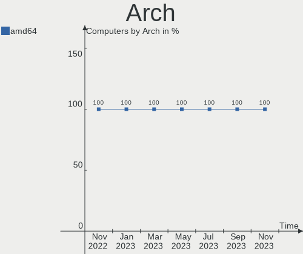
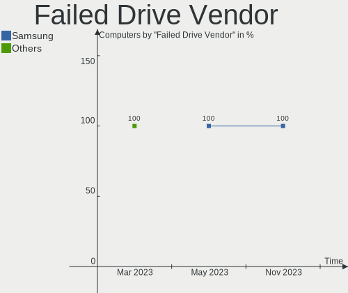
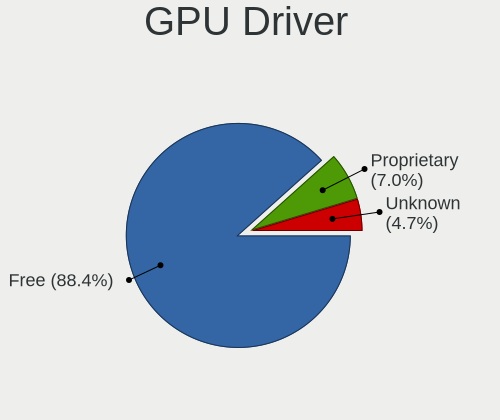
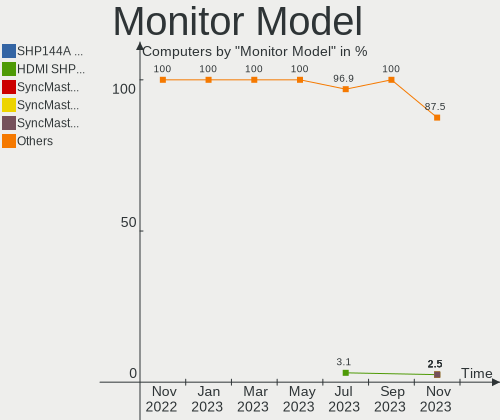
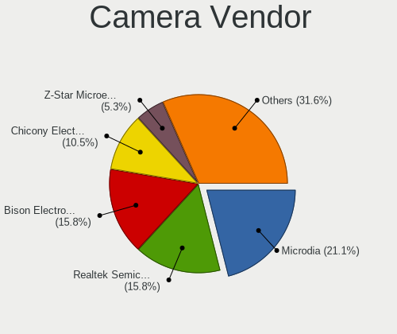
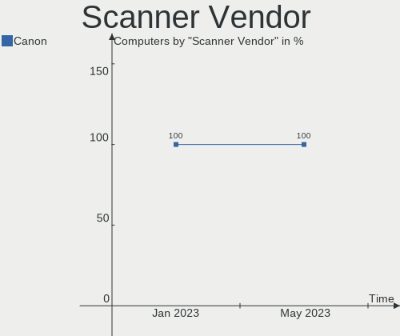
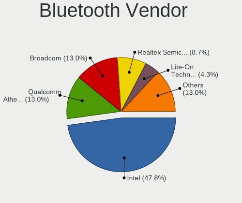

helloSystem Hardware Trends
---------------------------

A project to identify most popular hardware characteristics and track their change
over time based on data collected by helloSystem users at https://BSD-Hardware.info.

Anyone can contribute to the study by uploading probes of their computers by
the [hw-probe](https://github.com/linuxhw/hw-probe/blob/master/INSTALL.BSD.md) tool:

    hw-probe -all -upload

This is a report for all computer types. See also reports for [desktops](/Dist/helloSystem/Desktop/README.md) and [notebooks](/Dist/helloSystem/Notebook/README.md).

Full-feature report is available here: https://bsd-hardware.info/?view=trends

Period: Feb, 2021.

Contents
--------

- [ OS                       ](#os)
- [ OS Family                ](#os-family)
- [ Arch                     ](#arch)
- [ DE                       ](#de)
- [ Display Server           ](#display-server)
- [ Display Manager          ](#display-manager)
- [ OS Lang                  ](#os-lang)
- [ Boot Mode                ](#boot-mode)
- [ Filesystem               ](#filesystem)
- [ Part. scheme             ](#part-scheme)
- [ Country                  ](#country)
- [ City                     ](#city)
- [ Vendor                   ](#vendor)
- [ Model                    ](#model)
- [ Model Family             ](#model-family)
- [ MFG Year                 ](#mfg-year)
- [ Form Factor              ](#form-factor)
- [ Coreboot                 ](#coreboot)
- [ RAM Size                 ](#ram-size)
- [ RAM Used                 ](#ram-used)
- [ Has CD-ROM               ](#has-cd-rom)
- [ Total Drives             ](#total-drives)
- [ Has Ethernet             ](#has-ethernet)
- [ Drive Vendor             ](#drive-vendor)
- [ Drive Model              ](#drive-model)
- [ HDD Vendor               ](#hdd-vendor)
- [ SSD Vendor               ](#ssd-vendor)
- [ Drive Kind               ](#drive-kind)
- [ Drive Connector          ](#drive-connector)
- [ Drive Size               ](#drive-size)
- [ Space Total              ](#space-total)
- [ Space Used               ](#space-used)
- [ Malfunc. Drives          ](#malfunc-drives)
- [ Malfunc. Drive Vendor    ](#malfunc-drive-vendor)
- [ Malfunc. HDD Vendor      ](#malfunc-hdd-vendor)
- [ Malfunc. Drive Kind      ](#malfunc-drive-kind)
- [ Failed Drives            ](#failed-drives)
- [ Failed Drive Vendor      ](#failed-drive-vendor)
- [ Drive Status             ](#drive-status)
- [ Storage Vendor           ](#storage-vendor)
- [ Storage Model            ](#storage-model)
- [ Storage Kind             ](#storage-kind)
- [ CPU Vendor               ](#cpu-vendor)
- [ CPU Model                ](#cpu-model)
- [ CPU Model Family         ](#cpu-model-family)
- [ CPU Cores                ](#cpu-cores)
- [ CPU Sockets              ](#cpu-sockets)
- [ CPU Threads              ](#cpu-threads)
- [ CPU Microarch            ](#cpu-microarch)
- [ GPU Vendor               ](#gpu-vendor)
- [ GPU Model                ](#gpu-model)
- [ GPU Combo                ](#gpu-combo)
- [ GPU Driver               ](#gpu-driver)
- [ GPU Memory               ](#gpu-memory)
- [ Monitor Vendor           ](#monitor-vendor)
- [ Monitor Model            ](#monitor-model)
- [ Monitor Resolution       ](#monitor-resolution)
- [ Monitor Diagonal         ](#monitor-diagonal)
- [ Monitor Width            ](#monitor-width)
- [ Aspect Ratio             ](#aspect-ratio)
- [ Monitor Area             ](#monitor-area)
- [ Pixel Density            ](#pixel-density)
- [ Multiple Monitors        ](#multiple-monitors)
- [ Net Controller Vendor    ](#net-controller-vendor)
- [ Net Controller Model     ](#net-controller-model)
- [ Wireless Vendor          ](#wireless-vendor)
- [ Wireless Model           ](#wireless-model)
- [ Ethernet Vendor          ](#ethernet-vendor)
- [ Ethernet Model           ](#ethernet-model)
- [ Net Controller Kind      ](#net-controller-kind)
- [ Used Controller          ](#used-controller)
- [ NICs                     ](#nics)
- [ Memory Vendor            ](#memory-vendor)
- [ Memory Model             ](#memory-model)
- [ Memory Kind              ](#memory-kind)
- [ Memory Form Factor       ](#memory-form-factor)
- [ Memory Size              ](#memory-size)
- [ Memory Speed             ](#memory-speed)
- [ Sound Vendor             ](#sound-vendor)
- [ Sound Model              ](#sound-model)
- [ Camera Vendor            ](#camera-vendor)
- [ Camera Model             ](#camera-model)
- [ Fingerprint Vendor       ](#fingerprint-vendor)
- [ Fingerprint Model        ](#fingerprint-model)
- [ Chipcard Vendor          ](#chipcard-vendor)
- [ Chipcard Model           ](#chipcard-model)
- [ Printer Vendor           ](#printer-vendor)
- [ Printer Model            ](#printer-model)
- [ Scanner Vendor           ](#scanner-vendor)
- [ Scanner Model            ](#scanner-model)
- [ Bluetooth Vendor         ](#bluetooth-vendor)
- [ Bluetooth Model          ](#bluetooth-model)
- [ Unsupported Devices      ](#unsupported-devices)
- [ Unsupported Device Types ](#unsupported-device-types)

OS
--

Installed operating systems

| Name              | Computers | Percent |
|-------------------|-----------|---------|
| helloSystem 0.4.0 | 133       | 74.3%   |
| helloSystem 0.5.0 | 41        | 22.91%  |
| helloSystem 0.3.0 | 5         | 2.79%   |

OS Family
---------

OS without a version

| Name        | Computers | Percent |
|-------------|-----------|---------|
| helloSystem | 179       | 100%    |

Arch
----

OS architecture (x86_64, i586, etc.)

| Name  | Computers | Percent |
|-------|-----------|---------|
| amd64 | 179       | 100%    |

DE
--

Desktop Environment

| Name         | Computers | Percent |
|--------------|-----------|---------|
| helloDesktop | 178       | 99.44%  |
| KDE5         | 1         | 0.56%   |

Display Server
--------------

X11 or Wayland

| Name | Computers | Percent |
|------|-----------|---------|
| X11  | 179       | 100%    |

Display Manager
---------------

SDDM, LightDM, etc.

| Name | Computers | Percent |
|------|-----------|---------|
| SLiM | 178       | 99.44%  |
| SDDM | 1         | 0.56%   |

OS Lang
-------

Language

| Lang  | Computers | Percent |
|-------|-----------|---------|
| en_US | 175       | 97.77%  |
| es_ES | 3         | 1.68%   |
| fr_FR | 1         | 0.56%   |

Boot Mode
---------

EFI or BIOS

| Mode | Computers | Percent |
|------|-----------|---------|
| EFI  | 159       | 88.83%  |
| BIOS | 20        | 11.17%  |

Filesystem
----------

Type of filesystem

| Type | Computers | Percent |
|------|-----------|---------|
| Zfs  | 179       | 100%    |

Part. scheme
------------

Scheme of partitioning

| Type | Computers | Percent |
|------|-----------|---------|
| GPT  | 179       | 100%    |

Country
-------

Geographic location (country)

| Country            | Computers | Percent |
|--------------------|-----------|---------|
| Germany            | 30        | 16.76%  |
| USA                | 23        | 12.85%  |
| Brazil             | 17        | 9.5%    |
| Italy              | 12        | 6.7%    |
| Spain              | 10        | 5.59%   |
| France             | 9         | 5.03%   |
| UK                 | 8         | 4.47%   |
| China              | 8         | 4.47%   |
| Netherlands        | 6         | 3.35%   |
| Russia             | 5         | 2.79%   |
| Sweden             | 4         | 2.23%   |
| Portugal           | 4         | 2.23%   |
| Hungary            | 4         | 2.23%   |
| Australia          | 4         | 2.23%   |
| Ukraine            | 2         | 1.12%   |
| Taiwan             | 2         | 1.12%   |
| Switzerland        | 2         | 1.12%   |
| Slovakia           | 2         | 1.12%   |
| Mexico             | 2         | 1.12%   |
| Macau              | 2         | 1.12%   |
| Korea, Republic of | 2         | 1.12%   |
| Greece             | 2         | 1.12%   |
| Croatia            | 2         | 1.12%   |
| Canada             | 2         | 1.12%   |
| South Africa       | 1         | 0.56%   |
| Philippines        | 1         | 0.56%   |
| Peru               | 1         | 0.56%   |
| Lithuania          | 1         | 0.56%   |
| Latvia             | 1         | 0.56%   |
| Japan              | 1         | 0.56%   |
| Guatemala          | 1         | 0.56%   |
| Finland            | 1         | 0.56%   |
| Estonia            | 1         | 0.56%   |
| Colombia           | 1         | 0.56%   |
| Chile              | 1         | 0.56%   |
| Bulgaria           | 1         | 0.56%   |
| Belgium            | 1         | 0.56%   |
| Argentina          | 1         | 0.56%   |
| Unknown            | 1         | 0.56%   |

City
----

Geographic location (city)

| City                   | Computers | Percent |
|------------------------|-----------|---------|
| Linschoten             | 5         | 2.79%   |
| Franconville           | 3         | 1.68%   |
| Taipa                  | 2         | 1.12%   |
| São Paulo             | 2         | 1.12%   |
| Stourbridge            | 2         | 1.12%   |
| Sankt Augustin         | 2         | 1.12%   |
| Rudersberg             | 2         | 1.12%   |
| Oklahoma City          | 2         | 1.12%   |
| Madrid                 | 2         | 1.12%   |
| Hook                   | 2         | 1.12%   |
| Hamburg                | 2         | 1.12%   |
| Curitiba               | 2         | 1.12%   |
| Bologna                | 2         | 1.12%   |
| Čakovec               | 1         | 0.56%   |
| Zovon                  | 1         | 0.56%   |
| Yekaterinburg          | 1         | 0.56%   |
| Xi'an                  | 1         | 0.56%   |
| Wuhan                  | 1         | 0.56%   |
| West Jordan            | 1         | 0.56%   |
| Vitória               | 1         | 0.56%   |
| Visconde do Rio Branco | 1         | 0.56%   |
| Vilnius                | 1         | 0.56%   |
| Villejuif              | 1         | 0.56%   |
| Vigo                   | 1         | 0.56%   |
| Viamão                | 1         | 0.56%   |
| Vereeniging            | 1         | 0.56%   |
| Velika Gorica          | 1         | 0.56%   |
| Valencia               | 1         | 0.56%   |
| Union Grove            | 1         | 0.56%   |
| Ufa                    | 1         | 0.56%   |
| Trieste                | 1         | 0.56%   |
| Toronto                | 1         | 0.56%   |
| Terrassa               | 1         | 0.56%   |
| Taoyuan District       | 1         | 0.56%   |
| Tangara                | 1         | 0.56%   |
| Tallinn                | 1         | 0.56%   |
| São José dos Pinhais | 1         | 0.56%   |
| Sydney                 | 1         | 0.56%   |
| Stuttgart              | 1         | 0.56%   |
| Steinau an der Strasse | 1         | 0.56%   |
| St Petersburg          | 1         | 0.56%   |
| St Louis               | 1         | 0.56%   |
| Sparta                 | 1         | 0.56%   |
| Solarino               | 1         | 0.56%   |
| Slijk-Ewijk            | 1         | 0.56%   |
| Seattle                | 1         | 0.56%   |
| Schorndorf             | 1         | 0.56%   |
| Schmalkalden           | 1         | 0.56%   |
| San Benigno Canavese   | 1         | 0.56%   |
| Salzwedel              | 1         | 0.56%   |
| Rockford               | 1         | 0.56%   |
| Riga                   | 1         | 0.56%   |
| Reutlingen             | 1         | 0.56%   |
| Renens                 | 1         | 0.56%   |
| Quinta Normal          | 1         | 0.56%   |
| Qinnan                 | 1         | 0.56%   |
| Qingdao                | 1         | 0.56%   |
| Popovo                 | 1         | 0.56%   |
| Piacenza               | 1         | 0.56%   |
| Pfullingen             | 1         | 0.56%   |

Vendor
------

Motherboard manufacturer

| Name                | Computers | Percent |
|---------------------|-----------|---------|
| ASUSTek Computer    | 41        | 22.91%  |
| Lenovo              | 33        | 18.44%  |
| Dell                | 25        | 13.97%  |
| Hewlett-Packard     | 15        | 8.38%   |
| Gigabyte Technology | 10        | 5.59%   |
| ASRock              | 10        | 5.59%   |
| Apple               | 10        | 5.59%   |
| Samsung Electronics | 5         | 2.79%   |
| Intel               | 5         | 2.79%   |
| MSI                 | 4         | 2.23%   |
| Fujitsu             | 3         | 1.68%   |
| Toshiba             | 2         | 1.12%   |
| Medion              | 2         | 1.12%   |
| Google              | 2         | 1.12%   |
| Acer                | 2         | 1.12%   |
| Pegatron            | 1         | 0.56%   |
| Packard Bell        | 1         | 0.56%   |
| LG Electronics      | 1         | 0.56%   |
| HARDKERNEL          | 1         | 0.56%   |
| Hampoo              | 1         | 0.56%   |
| eMachines           | 1         | 0.56%   |
| Clevo               | 1         | 0.56%   |
| Biostar             | 1         | 0.56%   |
| Acidanthera         | 1         | 0.56%   |
| Unknown             | 1         | 0.56%   |

Model
-----

Motherboard model

| Name                                        | Computers | Percent |
|---------------------------------------------|-----------|---------|
| Dell Latitude E4300                         | 2         | 1.12%   |
| Dell Inspiron 3521                          | 2         | 1.12%   |
| ASUS All Series                             | 2         | 1.12%   |
| Toshiba TECRA M11                           | 1         | 0.56%   |
| Toshiba Satellite U500                      | 1         | 0.56%   |
| Samsung RV411/RV511/E3511/S3511/RV711/E3411 | 1         | 0.56%   |
| Samsung Galaxy Book 12                      | 1         | 0.56%   |
| Samsung 910S3K/9310SK/910S3P/911S3K         | 1         | 0.56%   |
| Samsung 300V3Z/300V4Z/300V5Z                | 1         | 0.56%   |
| Samsung 300E5M/300E5L                       | 1         | 0.56%   |
| Pegatron IPM41-D3                           | 1         | 0.56%   |
| Packard Bell EasyNote TS11HR                | 1         | 0.56%   |
| MSI MS-7C37                                 | 1         | 0.56%   |
| MSI MS-7850                                 | 1         | 0.56%   |
| MSI MS-7721                                 | 1         | 0.56%   |
| MSI MS-7592                                 | 1         | 0.56%   |
| Medion P6812                                | 1         | 0.56%   |
| Medion H81H3-EM2                            | 1         | 0.56%   |
| LG 14Z980-G.BH51P1                          | 1         | 0.56%   |
| Lenovo ZIUS6                                | 1         | 0.56%   |
| Lenovo Z50-70 20354                         | 1         | 0.56%   |
| Lenovo U310                                 | 1         | 0.56%   |
| Lenovo ThinkStation S30 43511K5             | 1         | 0.56%   |
| Lenovo ThinkPad X260 20F5S1H800             | 1         | 0.56%   |
| Lenovo ThinkPad X240 20AMS4V000             | 1         | 0.56%   |
| Lenovo ThinkPad X200 7459ZLW                | 1         | 0.56%   |
| Lenovo ThinkPad X1 Carbon 5th 20HQS02100    | 1         | 0.56%   |
| Lenovo ThinkPad X1 Carbon 4th 20FCS2K000    | 1         | 0.56%   |
| Lenovo ThinkPad T580 20LAS2TG00             | 1         | 0.56%   |
| Lenovo ThinkPad T490 20RYS06R00             | 1         | 0.56%   |
| Lenovo ThinkPad T470s 20HGS1VD00            | 1         | 0.56%   |
| Lenovo ThinkPad T470p 20J6A012CD            | 1         | 0.56%   |
| Lenovo ThinkPad T460s 20F90037LM            | 1         | 0.56%   |
| Lenovo ThinkPad T440s 20ARS10P05            | 1         | 0.56%   |
| Lenovo ThinkPad T440p 20AWS0U500            | 1         | 0.56%   |
| Lenovo ThinkPad T430 2349PMP                | 1         | 0.56%   |
| Lenovo ThinkPad T430 2349GCG                | 1         | 0.56%   |
| Lenovo ThinkPad T430 23427YU                | 1         | 0.56%   |
| Lenovo ThinkPad T410 253722U                | 1         | 0.56%   |
| Lenovo ThinkPad T400 2768WGC                | 1         | 0.56%   |
| Lenovo ThinkPad L512 25975XU                | 1         | 0.56%   |
| Lenovo ThinkPad L470 20J5S09500             | 1         | 0.56%   |
| Lenovo ThinkPad E490 20N8CTO1WW             | 1         | 0.56%   |
| Lenovo ThinkPad E420 1141A83                | 1         | 0.56%   |
| Lenovo ThinkCentre M92 3229AM4              | 1         | 0.56%   |
| Lenovo ThinkCentre M90p 5864W1S             | 1         | 0.56%   |
| Lenovo ThinkCentre M73 10AY0020US           | 1         | 0.56%   |
| Lenovo Legion Y530-15ICH 81FV               | 1         | 0.56%   |
| Lenovo IdeaPad S145-15IWL 81S9              | 1         | 0.56%   |
| Lenovo G500 20236                           | 1         | 0.56%   |
| Lenovo G470 20078                           | 1         | 0.56%   |
| Lenovo 70A0S02K00 ThinkServer TS140         | 1         | 0.56%   |
| Intel NUC7PJYH                              | 1         | 0.56%   |
| Intel NUC7i7DNKE                            | 1         | 0.56%   |
| Intel H61                                   | 1         | 0.56%   |
| Intel DN2820FYK H24582-201                  | 1         | 0.56%   |
| Intel DG41RQ AAE54511-203                   | 1         | 0.56%   |
| HP Slim Desktop S01-pF1xxx                  | 1         | 0.56%   |
| HP ProBook 470 G4                           | 1         | 0.56%   |
| HP ProBook 440 G2                           | 1         | 0.56%   |

Model Family
------------

Motherboard model prefix

| Name                  | Computers | Percent |
|-----------------------|-----------|---------|
| Lenovo ThinkPad       | 21        | 11.73%  |
| Dell Latitude         | 10        | 5.59%   |
| ASUS PRIME            | 5         | 2.79%   |
| Dell OptiPlex         | 4         | 2.23%   |
| Dell Inspiron         | 4         | 2.23%   |
| ASUS ROG              | 4         | 2.23%   |
| Lenovo ThinkCentre    | 3         | 1.68%   |
| HP EliteBook          | 3         | 1.68%   |
| Dell XPS              | 3         | 1.68%   |
| ASUS P8Z77-V          | 3         | 1.68%   |
| HP ProBook            | 2         | 1.12%   |
| HP OMEN               | 2         | 1.12%   |
| HP Compaq             | 2         | 1.12%   |
| Fujitsu LIFEBOOK      | 2         | 1.12%   |
| Dell Precision        | 2         | 1.12%   |
| ASUS VivoBook         | 2         | 1.12%   |
| ASUS M5A78L-M         | 2         | 1.12%   |
| ASUS All              | 2         | 1.12%   |
| ASRock AB350          | 2         | 1.12%   |
| Acer Aspire           | 2         | 1.12%   |
| Toshiba TECRA         | 1         | 0.56%   |
| Toshiba Satellite     | 1         | 0.56%   |
| Samsung RV411         | 1         | 0.56%   |
| Samsung Galaxy        | 1         | 0.56%   |
| Samsung 910S3K        | 1         | 0.56%   |
| Samsung 300V3Z        | 1         | 0.56%   |
| Samsung 300E5M        | 1         | 0.56%   |
| Pegatron IPM41-D3     | 1         | 0.56%   |
| Packard Bell EasyNote | 1         | 0.56%   |
| MSI MS-7C37           | 1         | 0.56%   |
| MSI MS-7850           | 1         | 0.56%   |
| MSI MS-7721           | 1         | 0.56%   |
| MSI MS-7592           | 1         | 0.56%   |
| Medion P6812          | 1         | 0.56%   |
| Medion H81H3-EM2      | 1         | 0.56%   |
| LG 14Z980-G.BH51P1    | 1         | 0.56%   |
| Lenovo ZIUS6          | 1         | 0.56%   |
| Lenovo Z50-70         | 1         | 0.56%   |
| Lenovo U310           | 1         | 0.56%   |
| Lenovo ThinkStation   | 1         | 0.56%   |
| Lenovo Legion         | 1         | 0.56%   |
| Lenovo IdeaPad        | 1         | 0.56%   |
| Lenovo G500           | 1         | 0.56%   |
| Lenovo G470           | 1         | 0.56%   |
| Lenovo 70A0S02K00     | 1         | 0.56%   |
| Intel NUC7PJYH        | 1         | 0.56%   |
| Intel NUC7i7DNKE      | 1         | 0.56%   |
| Intel H61             | 1         | 0.56%   |
| Intel DN2820FYK       | 1         | 0.56%   |
| Intel DG41RQ          | 1         | 0.56%   |
| HP Slim               | 1         | 0.56%   |
| HP Pavilion           | 1         | 0.56%   |
| HP EliteDesk          | 1         | 0.56%   |
| HP 500-311ns          | 1         | 0.56%   |
| HP 260-p026           | 1         | 0.56%   |
| HP 23-r103la          | 1         | 0.56%   |
| HARDKERNEL ODROID-H2  | 1         | 0.56%   |
| Hampoo NA123          | 1         | 0.56%   |
| Google Panther        | 1         | 0.56%   |
| Google Guado          | 1         | 0.56%   |

MFG Year
--------

Motherboard manufacture year

| Year | Computers | Percent |
|------|-----------|---------|
| 2020 | 41        | 22.91%  |
| 2019 | 23        | 12.85%  |
| 2018 | 19        | 10.61%  |
| 2013 | 17        | 9.5%    |
| 2014 | 15        | 8.38%   |
| 2015 | 10        | 5.59%   |
| 2011 | 9         | 5.03%   |
| 2016 | 8         | 4.47%   |
| 2012 | 8         | 4.47%   |
| 2017 | 7         | 3.91%   |
| 2010 | 7         | 3.91%   |
| 2009 | 6         | 3.35%   |
| 2008 | 5         | 2.79%   |
| 2021 | 2         | 1.12%   |
| 2007 | 1         | 0.56%   |
| 2006 | 1         | 0.56%   |

Form Factor
-----------

Physical design of the computer

| Name       | Computers | Percent |
|------------|-----------|---------|
| Notebook   | 87        | 48.6%   |
| Desktop    | 84        | 46.93%  |
| Mini pc    | 3         | 1.68%   |
| All in one | 3         | 1.68%   |
| Tablet     | 1         | 0.56%   |
| Server     | 1         | 0.56%   |

Coreboot
--------

Have coreboot on board

| Used | Computers | Percent |
|------|-----------|---------|
| No   | 177       | 98.88%  |
| Yes  | 2         | 1.12%   |

RAM Size
--------

Total RAM memory

| Size in GB  | Computers | Percent |
|-------------|-----------|---------|
| 8.01-16.0   | 68        | 37.99%  |
| 4.01-8.0    | 49        | 27.37%  |
| 16.01-24.0  | 46        | 25.7%   |
| 32.01-64.0  | 10        | 5.59%   |
| 24.01-32.0  | 3         | 1.68%   |
| 64.01-256.0 | 3         | 1.68%   |

RAM Used
--------

Used RAM memory

| Used GB  | Computers | Percent |
|----------|-----------|---------|
| 0.01-0.5 | 101       | 56.42%  |
| 0.51-1.0 | 60        | 33.52%  |
| 1.01-2.0 | 12        | 6.7%    |
| 2.01-3.0 | 6         | 3.35%   |

Has CD-ROM
----------

Has CD-ROM on board

| Presented | Computers | Percent |
|-----------|-----------|---------|
| No        | 100       | 55.87%  |
| Yes       | 79        | 44.13%  |

Total Drives
------------

Number of drives on board

| Drives | Computers | Percent |
|--------|-----------|---------|
| 1      | 103       | 57.54%  |
| 2      | 35        | 19.55%  |
| 3      | 18        | 10.06%  |
| 4      | 10        | 5.59%   |
| 0      | 8         | 4.47%   |
| 6      | 2         | 1.12%   |
| 5      | 2         | 1.12%   |
| 7      | 1         | 0.56%   |

Has Ethernet
------------

Has Ethernet on board

| Presented | Computers | Percent |
|-----------|-----------|---------|
| Yes       | 168       | 93.85%  |
| No        | 11        | 6.15%   |

Drive Vendor
------------

Hard drive vendors

| Vendor              | Computers | Drives | Percent |
|---------------------|-----------|--------|---------|
| WDC                 | 43        | 54     | 16.48%  |
| Samsung Electronics | 42        | 57     | 16.09%  |
| Seagate             | 37        | 45     | 14.18%  |
| Crucial             | 21        | 25     | 8.05%   |
| Kingston            | 18        | 18     | 6.9%    |
| Toshiba             | 15        | 15     | 5.75%   |
| SanDisk             | 15        | 16     | 5.75%   |
| Hitachi             | 10        | 12     | 3.83%   |
| SPCC                | 7         | 7      | 2.68%   |
| Intel               | 7         | 7      | 2.68%   |
| PNY                 | 4         | 4      | 1.53%   |
| Micron Technology   | 4         | 4      | 1.53%   |
| OCZ                 | 3         | 3      | 1.15%   |
| LITEON              | 3         | 3      | 1.15%   |
| Transcend           | 2         | 2      | 0.77%   |
| SK Hynix            | 2         | 2      | 0.77%   |
| HGST                | 2         | 2      | 0.77%   |
| Corsair             | 2         | 2      | 0.77%   |
| Apple               | 2         | 2      | 0.77%   |
| Silicon Motion      | 1         | 1      | 0.38%   |
| Phison              | 1         | 1      | 0.38%   |
| Patriot             | 1         | 1      | 0.38%   |
| OWC                 | 1         | 1      | 0.38%   |
| MyDigitalSSD        | 1         | 1      | 0.38%   |
| MAXTOR              | 1         | 1      | 0.38%   |
| LITEONIT            | 1         | 1      | 0.38%   |
| Lexar               | 1         | 1      | 0.38%   |
| Lenovo              | 1         | 1      | 0.38%   |
| KingSpec            | 1         | 1      | 0.38%   |
| Intenso             | 1         | 1      | 0.38%   |
| Hikvision           | 1         | 1      | 0.38%   |
| Hewlett-Packard     | 1         | 1      | 0.38%   |
| GOODRAM             | 1         | 1      | 0.38%   |
| Gigabyte Technology | 1         | 1      | 0.38%   |
| Fujitsu             | 1         | 1      | 0.38%   |
| Enmotus             | 1         | 1      | 0.38%   |
| EMTEC               | 1         | 1      | 0.38%   |
| CLOVER              | 1         | 1      | 0.38%   |
| China               | 1         | 1      | 0.38%   |
| Apacer              | 1         | 1      | 0.38%   |
| A-DATA Technology   | 1         | 1      | 0.38%   |

Drive Model
-----------

Hard drive models

| Model                               | Computers | Percent |
|-------------------------------------|-----------|---------|
| Samsung SSD 850 EVO 250GB           | 5         | 1.69%   |
| Crucial CT500MX500SSD1 500GB        | 5         | 1.69%   |
| Samsung SSD 860 EVO 500GB           | 4         | 1.36%   |
| Kingston SV300S37A120G 120GB        | 4         | 1.36%   |
| Kingston SA400S37240G 240GB         | 4         | 1.36%   |
| WDC WDS240G2G0A-00JH30 240GB        | 3         | 1.02%   |
| WDC WDS100T2B0A-00SM50 1TB          | 3         | 1.02%   |
| Toshiba MQ01ABD100 1TB              | 3         | 1.02%   |
| SPCC Solid State Disk 512GB         | 3         | 1.02%   |
| Samsung HD103SI 1TB                 | 3         | 1.02%   |
| WDC WD20EARX-00PASB0 2TB            | 2         | 0.68%   |
| WDC WD1600BEVS-08VAT2 160GB         | 2         | 0.68%   |
| Toshiba Q300 240GB                  | 2         | 0.68%   |
| Toshiba MQ01ABF050 500GB            | 2         | 0.68%   |
| Seagate ST8000VN0022-2EL112 8TB     | 2         | 0.68%   |
| Seagate ST750LM022 HN-M750MBB 752GB | 2         | 0.68%   |
| Seagate ST500LX025-1U717D 500GB     | 2         | 0.68%   |
| Seagate ST500DM002-1BD142 500GB     | 2         | 0.68%   |
| Seagate ST2000DM006-2DM164 2TB      | 2         | 0.68%   |
| Seagate ST1000LM049-2GH172 1TB      | 2         | 0.68%   |
| Seagate ST1000LM035-1RK172 1TB      | 2         | 0.68%   |
| Seagate ST1000DM010-2EP102 1TB      | 2         | 0.68%   |
| Seagate ST1000DM003-1ER162 1TB      | 2         | 0.68%   |
| SanDisk SDSSDA240G 240GB            | 2         | 0.68%   |
| SanDisk pSSD 32GB                   | 2         | 0.68%   |
| Samsung SSD 970 EVO 250GB           | 2         | 0.68%   |
| Samsung SSD 960 EVO 500GB           | 2         | 0.68%   |
| Samsung SSD 960 EVO 250GB           | 2         | 0.68%   |
| Samsung SSD 860 EVO 250GB           | 2         | 0.68%   |
| Samsung SSD 860 EVO 1TB             | 2         | 0.68%   |
| Samsung SSD 840 EVO 1TB             | 2         | 0.68%   |
| Samsung SSD 840 EVO 120GB           | 2         | 0.68%   |
| Samsung MZVLW256HEHP-000L7 256GB    | 2         | 0.68%   |
| Samsung HD753LJ 752GB               | 2         | 0.68%   |
| PNY CS900 240GB SSD                 | 2         | 0.68%   |
| Micron 1100 SATA 256GB              | 2         | 0.68%   |
| Kingston SA400S37480G 480GB         | 2         | 0.68%   |
| Crucial M4-CT128M4SSD2 128GB        | 2         | 0.68%   |
| Crucial CT500MX500SSD4 500GB        | 2         | 0.68%   |
| Crucial CT250MX500SSD1 250GB        | 2         | 0.68%   |
| Crucial CT240BX500SSD1 240GB        | 2         | 0.68%   |
| WDC WDS500G2B0A-00SM50 500GB        | 1         | 0.34%   |
| WDC WDS250G2B0A-00SM50 250GB        | 1         | 0.34%   |
| WDC WDS120G2G0A-00JH30 120GB        | 1         | 0.34%   |
| WDC WDS120G1G0A-00SS50 120GB        | 1         | 0.34%   |
| WDC WDS100T2G0A-00JH30 1TB          | 1         | 0.34%   |
| WDC WD7500BPKX-00HPJT0 752GB        | 1         | 0.34%   |
| WDC WD7500AAVS-00D7B0 752GB         | 1         | 0.34%   |
| WDC WD60EMAZ-11LW3B0 6TB            | 1         | 0.34%   |
| WDC WD5003ABYZ-011FA0 500GB         | 1         | 0.34%   |
| WDC WD5003ABYX-88 LEN 500GB         | 1         | 0.34%   |
| WDC WD5000LPCX-24VHAT0 500GB        | 1         | 0.34%   |
| WDC WD5000LPCX-24C6HT0 500GB        | 1         | 0.34%   |
| WDC WD5000LPCX-21VHAT0 500GB        | 1         | 0.34%   |
| WDC WD5000BEVT-00A03T0 500GB        | 1         | 0.34%   |
| WDC WD5000AVCS-632DY1 500GB         | 1         | 0.34%   |
| WDC WD5000AAKX-00ERMA0 500GB        | 1         | 0.34%   |
| WDC WD5000AAKS-00E4A0 500GB         | 1         | 0.34%   |
| WDC WD5000AADS-00S9B0 500GB         | 1         | 0.34%   |
| WDC WD40EFRX-68WT0N0 4TB            | 1         | 0.34%   |

HDD Vendor
----------

Hard disk drive vendors

| Vendor              | Computers | Drives | Percent |
|---------------------|-----------|--------|---------|
| Seagate             | 37        | 45     | 35.58%  |
| WDC                 | 33        | 40     | 31.73%  |
| Toshiba             | 10        | 10     | 9.62%   |
| Hitachi             | 10        | 12     | 9.62%   |
| Samsung Electronics | 9         | 13     | 8.65%   |
| HGST                | 2         | 2      | 1.92%   |
| MAXTOR              | 1         | 1      | 0.96%   |
| Fujitsu             | 1         | 1      | 0.96%   |
| CLOVER              | 1         | 1      | 0.96%   |

SSD Vendor
----------

Solid state drive vendors

| Vendor              | Computers | Drives | Percent |
|---------------------|-----------|--------|---------|
| Samsung Electronics | 26        | 30     | 19.85%  |
| Crucial             | 19        | 23     | 14.5%   |
| Kingston            | 16        | 16     | 12.21%  |
| SanDisk             | 15        | 16     | 11.45%  |
| WDC                 | 10        | 11     | 7.63%   |
| SPCC                | 6         | 6      | 4.58%   |
| PNY                 | 4         | 4      | 3.05%   |
| Micron Technology   | 4         | 4      | 3.05%   |
| Toshiba             | 3         | 3      | 2.29%   |
| OCZ                 | 3         | 3      | 2.29%   |
| LITEON              | 3         | 3      | 2.29%   |
| Intel               | 3         | 3      | 2.29%   |
| Transcend           | 2         | 2      | 1.53%   |
| Apple               | 2         | 2      | 1.53%   |
| SK Hynix            | 1         | 1      | 0.76%   |
| Patriot             | 1         | 1      | 0.76%   |
| OWC                 | 1         | 1      | 0.76%   |
| MyDigitalSSD        | 1         | 1      | 0.76%   |
| LITEONIT            | 1         | 1      | 0.76%   |
| Lexar               | 1         | 1      | 0.76%   |
| Lenovo              | 1         | 1      | 0.76%   |
| KingSpec            | 1         | 1      | 0.76%   |
| Intenso             | 1         | 1      | 0.76%   |
| Hikvision           | 1         | 1      | 0.76%   |
| Hewlett-Packard     | 1         | 1      | 0.76%   |
| GOODRAM             | 1         | 1      | 0.76%   |
| EMTEC               | 1         | 1      | 0.76%   |
| China               | 1         | 1      | 0.76%   |
| Apacer              | 1         | 1      | 0.76%   |

Drive Kind
----------

HDD or SSD

| Kind | Computers | Drives | Percent |
|------|-----------|--------|---------|
| SSD  | 106       | 141    | 47.32%  |
| HDD  | 86        | 125    | 38.39%  |
| NVMe | 32        | 36     | 14.29%  |

Drive Connector
---------------

SATA, SAS, NVMe, etc.

| Type | Computers | Drives | Percent |
|------|-----------|--------|---------|
| SATA | 160       | 266    | 83.33%  |
| NVMe | 32        | 36     | 16.67%  |

Drive Size
----------

Size of hard drive

| Size in TB | Computers | Drives | Percent |
|------------|-----------|--------|---------|
| 0.01-0.5   | 134       | 185    | 67.68%  |
| 0.51-1.0   | 46        | 60     | 23.23%  |
| 1.01-2.0   | 12        | 14     | 6.06%   |
| 4.01-10.0  | 4         | 5      | 2.02%   |
| 3.01-4.0   | 2         | 2      | 1.01%   |

Space Total
-----------

Amount of disk space available on the file system

| Size in GB | Computers | Percent |
|------------|-----------|---------|
| 1-20       | 134       | 74.86%  |
| 101-250    | 27        | 15.08%  |
| 251-500    | 11        | 6.15%   |
| 501-1000   | 5         | 2.79%   |
| 21-50      | 1         | 0.56%   |
| 51-100     | 1         | 0.56%   |

Space Used
----------

Amount of used disk space

| Used GB | Computers | Percent |
|---------|-----------|---------|
| 1-20    | 179       | 100%    |

Malfunc. Drives
---------------

Drive models with a malfunction

| Model                               | Computers | Drives | Percent |
|-------------------------------------|-----------|--------|---------|
| Toshiba MQ01ABD100 1TB              | 2         | 2      | 4.44%   |
| Seagate ST500DM002-1BD142 500GB     | 2         | 2      | 4.44%   |
| WDC WDS240G2G0A-00JH30 240GB        | 1         | 1      | 2.22%   |
| WDC WD5000AVCS-632DY1 500GB         | 1         | 1      | 2.22%   |
| WDC WD5000AAKS-00E4A0 500GB         | 1         | 1      | 2.22%   |
| WDC WD20EVDS-63T3B0 2TB             | 1         | 1      | 2.22%   |
| WDC WD20EARX-00PASB0 2TB            | 1         | 1      | 2.22%   |
| WDC WD2002FYPS-01U1B1 2TB           | 1         | 1      | 2.22%   |
| WDC WD1600BEVS-60RST0 160GB         | 1         | 1      | 2.22%   |
| WDC WD10JMVW-11AJGS0 1TB            | 1         | 1      | 2.22%   |
| WDC WD10EAVS-00D7B0 1TB             | 1         | 1      | 2.22%   |
| Toshiba MK3276GSX 320GB             | 1         | 1      | 2.22%   |
| Toshiba MK2555GSXF 250GB            | 1         | 1      | 2.22%   |
| Seagate ST9500420AS 500GB           | 1         | 1      | 2.22%   |
| Seagate ST750LM022 HN-M750MBB 752GB | 1         | 1      | 2.22%   |
| Seagate ST380815AS 80GB             | 1         | 1      | 2.22%   |
| Seagate ST3250410AS 250GB           | 1         | 1      | 2.22%   |
| Seagate ST320LT012-9WS14C 320GB     | 1         | 1      | 2.22%   |
| Seagate ST3160215AS 160GB           | 1         | 1      | 2.22%   |
| Seagate ST31500341AS 1.5TB          | 1         | 1      | 2.22%   |
| Seagate ST31000528AS 1TB            | 1         | 1      | 2.22%   |
| Seagate ST1000LM049-2GH172 1TB      | 1         | 1      | 2.22%   |
| Seagate ST1000DM003-9YN162 1TB      | 1         | 1      | 2.22%   |
| SanDisk SSD PLUS 480GB              | 1         | 1      | 2.22%   |
| Samsung Electronics SP2514N 250GB   | 1         | 1      | 2.22%   |
| Samsung Electronics HM320JI 320GB   | 1         | 1      | 2.22%   |
| Samsung Electronics HD753LJ 752GB   | 1         | 1      | 2.22%   |
| Samsung Electronics HD252HJ 250GB   | 1         | 1      | 2.22%   |
| Samsung Electronics HD103SI 1TB     | 1         | 1      | 2.22%   |
| Micron Technology 1100 SATA 256GB   | 1         | 1      | 2.22%   |
| LITEON LJH-64V2G-11 M.2 2260 64GB   | 1         | 1      | 2.22%   |
| Kingston SA400S37480G 480GB         | 1         | 1      | 2.22%   |
| Kingston RBU-SNS8350DES3128GP 128GB | 1         | 1      | 2.22%   |
| Intel SSDSC2CT180A3 180GB           | 1         | 1      | 2.22%   |
| Intel SSDSC2BF180A4L 180GB          | 1         | 1      | 2.22%   |
| Intel SSDPEKKW512G7 512GB           | 1         | 1      | 2.22%   |
| Hitachi HTS725050A9A364 500GB       | 1         | 1      | 2.22%   |
| Hitachi HTS723232A7A364 320GB       | 1         | 1      | 2.22%   |
| Hitachi HTS541612J9SA00 120GB       | 1         | 1      | 2.22%   |
| Hitachi HDP725025GLA380 250GB       | 1         | 1      | 2.22%   |
| Hitachi HCS5C1050CLA382 500GB       | 1         | 1      | 2.22%   |
| HGST HTS545032A7E380 320GB          | 1         | 1      | 2.22%   |
| Crucial CT525MX300SSD1 528GB        | 1         | 1      | 2.22%   |

Malfunc. Drive Vendor
---------------------

Vendors of faulty drives

| Vendor              | Computers | Drives | Percent |
|---------------------|-----------|--------|---------|
| Seagate             | 11        | 12     | 26.19%  |
| WDC                 | 9         | 9      | 21.43%  |
| Hitachi             | 5         | 5      | 11.9%   |
| Toshiba             | 4         | 4      | 9.52%   |
| Samsung Electronics | 3         | 5      | 7.14%   |
| Intel               | 3         | 3      | 7.14%   |
| Kingston            | 2         | 2      | 4.76%   |
| SanDisk             | 1         | 1      | 2.38%   |
| Micron Technology   | 1         | 1      | 2.38%   |
| LITEON              | 1         | 1      | 2.38%   |
| HGST                | 1         | 1      | 2.38%   |
| Crucial             | 1         | 1      | 2.38%   |

Malfunc. HDD Vendor
-------------------

Vendors of faulty HDD drives

| Vendor              | Computers | Drives | Percent |
|---------------------|-----------|--------|---------|
| Seagate             | 11        | 12     | 34.38%  |
| WDC                 | 8         | 8      | 25%     |
| Hitachi             | 5         | 5      | 15.63%  |
| Toshiba             | 4         | 4      | 12.5%   |
| Samsung Electronics | 3         | 5      | 9.38%   |
| HGST                | 1         | 1      | 3.13%   |

Malfunc. Drive Kind
-------------------

Kinds of faulty drives

| Kind | Computers | Drives | Percent |
|------|-----------|--------|---------|
| HDD  | 29        | 35     | 74.36%  |
| SSD  | 9         | 9      | 23.08%  |
| NVMe | 1         | 1      | 2.56%   |

Failed Drives
-------------

Failed drive models

| Model                      | Computers | Drives | Percent |
|----------------------------|-----------|--------|---------|
| HGST HTS725050A7E630 500GB | 1         | 1      | 100%    |

Failed Drive Vendor
-------------------

Failed drive vendors

| Vendor | Computers | Drives | Percent |
|--------|-----------|--------|---------|
| HGST   | 1         | 1      | 100%    |

Drive Status
------------

Number of failed and malfunc. drives

| Status   | Computers | Drives | Percent |
|----------|-----------|--------|---------|
| Works    | 153       | 255    | 78.87%  |
| Malfunc  | 39        | 45     | 20.1%   |
| Detected | 1         | 1      | 0.52%   |
| Failed   | 1         | 1      | 0.52%   |

Storage Vendor
--------------

Storage controller vendors

| Vendor                      | Computers | Percent |
|-----------------------------|-----------|---------|
| Intel                       | 149       | 68.35%  |
| AMD                         | 22        | 10.09%  |
| Samsung Electronics         | 13        | 5.96%   |
| ASMedia Technology          | 6         | 2.75%   |
| Phison Electronics          | 4         | 1.83%   |
| JMicron Technology          | 4         | 1.83%   |
| Sandisk                     | 3         | 1.38%   |
| Nvidia                      | 3         | 1.38%   |
| Toshiba                     | 2         | 0.92%   |
| Micron/Crucial Technology   | 2         | 0.92%   |
| Marvell Technology Group    | 2         | 0.92%   |
| Kingston Technology Company | 2         | 0.92%   |
| SK Hynix                    | 1         | 0.46%   |
| Silicon Motion              | 1         | 0.46%   |
| Realtek Semiconductor       | 1         | 0.46%   |
| Enmotus                     | 1         | 0.46%   |
| Broadcom / LSI              | 1         | 0.46%   |
| Broadcom                    | 1         | 0.46%   |

Storage Model
-------------

Storage controller models

| Model                                                                          | Computers | Percent |
|--------------------------------------------------------------------------------|-----------|---------|
| Intel Sunrise Point-LP SATA Controller [AHCI mode]                             | 14        | 5.56%   |
| AMD FCH SATA Controller [AHCI mode]                                            | 14        | 5.56%   |
| Intel 7 Series Chipset Family 6-port SATA Controller [AHCI mode]               | 13        | 5.16%   |
| Intel 8 Series SATA Controller 1 [AHCI mode]                                   | 12        | 4.76%   |
| Intel 8 Series/C220 Series Chipset Family 6-port SATA Controller 1 [AHCI mode] | 11        | 4.37%   |
| Intel 6 Series/C200 Series Chipset Family 6 port Mobile SATA AHCI Controller   | 8         | 3.17%   |
| Intel 6 Series/C200 Series Chipset Family 6 port Desktop SATA AHCI Controller  | 8         | 3.17%   |
| Samsung NVMe SSD Controller SM961/PM961/SM963                                  | 7         | 2.78%   |
| Samsung NVMe SSD Controller SM981/PM981/PM983                                  | 6         | 2.38%   |
| Intel 7 Series/C210 Series Chipset Family 6-port SATA Controller [AHCI mode]   | 6         | 2.38%   |
| ASMedia ASM1062 Serial ATA Controller                                          | 6         | 2.38%   |
| Unknown                                                                        | 6         | 2.38%   |
| Intel Q170/Q150/B150/H170/H110/Z170/CM236 Chipset SATA Controller [AHCI Mode]  | 5         | 1.98%   |
| Intel 82801IBM/IEM (ICH9M/ICH9M-E) 4 port SATA Controller [AHCI mode]          | 5         | 1.98%   |
| Intel 82801 Mobile SATA Controller [RAID mode]                                 | 5         | 1.98%   |
| Intel 5 Series/3400 Series Chipset 6 port SATA AHCI Controller                 | 5         | 1.98%   |
| Intel 200 Series PCH SATA controller [AHCI mode]                               | 5         | 1.98%   |
| Intel Wildcat Point-LP SATA Controller [AHCI Mode]                             | 4         | 1.59%   |
| Intel Cannon Lake PCH SATA AHCI Controller                                     | 4         | 1.59%   |
| AMD SB7x0/SB8x0/SB9x0 IDE Controller                                           | 4         | 1.59%   |
| AMD 400 Series Chipset SATA Controller                                         | 4         | 1.59%   |
| Intel NM10/ICH7 Family SATA Controller [IDE mode]                              | 3         | 1.19%   |
| Intel HM170/QM170 Chipset SATA Controller [AHCI Mode]                          | 3         | 1.19%   |
| Intel Celeron/Pentium Silver Processor SATA Controller                         | 3         | 1.19%   |
| Intel 5 Series/3400 Series Chipset 4 port SATA IDE Controller                  | 3         | 1.19%   |
| Intel 5 Series/3400 Series Chipset 4 port SATA AHCI Controller                 | 3         | 1.19%   |
| Intel 5 Series/3400 Series Chipset 2 port SATA IDE Controller                  | 3         | 1.19%   |
| AMD SB7x0/SB8x0/SB9x0 SATA Controller [IDE mode]                               | 3         | 1.19%   |
| Phison E12 NVMe Controller                                                     | 2         | 0.79%   |
| Nvidia MCP79 AHCI Controller                                                   | 2         | 0.79%   |
| Marvell Group 88SE9172 SATA 6Gb/s Controller                                   | 2         | 0.79%   |
| JMicron JMB363 SATA/IDE Controller                                             | 2         | 0.79%   |
| Intel SSD 660P Series                                                          | 2         | 0.79%   |
| Intel SATA Controller [RAID mode]                                              | 2         | 0.79%   |
| Intel Mobile 4 Series Chipset PT IDER Controller                               | 2         | 0.79%   |
| Intel Comet Lake PCH-LP SATA RAID Premium Controller                           | 2         | 0.79%   |
| Intel Celeron N3350/Pentium N4200/Atom E3900 Series SATA AHCI Controller       | 2         | 0.79%   |
| Intel Cannon Point-LP SATA Controller [AHCI Mode]                              | 2         | 0.79%   |
| Intel 9 Series Chipset Family SATA Controller [AHCI Mode]                      | 2         | 0.79%   |
| Intel 82801I (ICH9 Family) 2 port SATA Controller [IDE mode]                   | 2         | 0.79%   |
| Intel 82801G (ICH7 Family) IDE Controller                                      | 2         | 0.79%   |
| Intel 631xESB/632xESB SATA AHCI Controller                                     | 2         | 0.79%   |
| Intel 631xESB/632xESB IDE Controller                                           | 2         | 0.79%   |
| AMD SB7x0/SB8x0/SB9x0 SATA Controller [AHCI mode]                              | 2         | 0.79%   |
| AMD 300 Series Chipset SATA Controller                                         | 2         | 0.79%   |
| Toshiba XG6 NVMe SSD Controller                                                | 1         | 0.4%    |
| Toshiba XG4 NVMe SSD Controller                                                | 1         | 0.4%    |
| SK Hynix BC501 NVMe Solid State Drive 512GB                                    | 1         | 0.4%    |
| Silicon Motion SM2263EN/SM2263XT SSD Controller                                | 1         | 0.4%    |
| Sandisk WD Blue SN550 NVMe SSD                                                 | 1         | 0.4%    |
| Sandisk WD Black SN750 / PC SN730 NVMe SSD                                     | 1         | 0.4%    |
| Sandisk PC SN520 NVMe SSD                                                      | 1         | 0.4%    |
| Samsung NVMe SSD Controller SM951/PM951                                        | 1         | 0.4%    |
| Phison PS5013 E13 NVMe Controller                                              | 1         | 0.4%    |
| Phison E16 PCIe4 NVMe Controller                                               | 1         | 0.4%    |
| Nvidia MCP73 IDE Controller                                                    | 1         | 0.4%    |
| Nvidia GeForce 7100/nForce 630i SATA                                           | 1         | 0.4%    |
| Micron/Crucial P1 NVMe PCIe SSD                                                | 1         | 0.4%    |
| Kingston Company A2000 NVMe SSD                                                | 1         | 0.4%    |
| JMicron JMB368 IDE controller                                                  | 1         | 0.4%    |

Storage Kind
------------

Kind of storage controller (IDE, SATA, NVMe, SAS, ...)

| Kind | Computers | Percent |
|------|-----------|---------|
| SATA | 146       | 67.28%  |
| NVMe | 31        | 14.29%  |
| IDE  | 28        | 12.9%   |
| RAID | 10        | 4.61%   |
| SAS  | 1         | 0.46%   |
| SCSI | 1         | 0.46%   |

CPU Vendor
----------

Processor vendors

| Vendor | Computers | Percent |
|--------|-----------|---------|
| Intel  | 156       | 87.15%  |
| AMD    | 23        | 12.85%  |

CPU Model
---------

Processor models

| Model                                       | Computers | Percent |
|---------------------------------------------|-----------|---------|
| Intel Core i5-7200U CPU @ 2.50GHz           | 4         | 2.23%   |
| Intel Core i5-3320M CPU @ 2.60GHz           | 4         | 2.23%   |
| Intel Core i7-8700 CPU @ 3.20GHz            | 3         | 1.68%   |
| Intel Core i7-7600U CPU @ 2.80GHz           | 3         | 1.68%   |
| Intel Core i7-6600U CPU @ 2.60GHz           | 3         | 1.68%   |
| Intel Core i5-4210U CPU @ 1.70GHz           | 3         | 1.68%   |
| Intel Core i5-3570K CPU @ 3.40GHz           | 3         | 1.68%   |
| Intel Core i3-3227U CPU @ 1.90GHz           | 3         | 1.68%   |
| Intel Core 2 Duo                            | 3         | 1.68%   |
| Intel Xeon                                  | 2         | 1.12%   |
| Intel Genuine CPU                           | 2         | 1.12%   |
| Intel Core i7-7500U CPU @ 2.70GHz           | 2         | 1.12%   |
| Intel Core i7-4790 CPU @ 3.60GHz            | 2         | 1.12%   |
| Intel Core i7-4770 CPU @ 3.40GHz            | 2         | 1.12%   |
| Intel Core i7-4702MQ CPU @ 2.20GHz          | 2         | 1.12%   |
| Intel Core i7-4510U CPU @ 2.00GHz           | 2         | 1.12%   |
| Intel Core i7-3770K CPU @ 3.50GHz           | 2         | 1.12%   |
| Intel Core i7 CPU M 620 @ 2.67GHz           | 2         | 1.12%   |
| Intel Core i5-9400F CPU @ 2.90GHz           | 2         | 1.12%   |
| Intel Core i5-9400 CPU @ 2.90GHz            | 2         | 1.12%   |
| Intel Core i5-6200U CPU @ 2.30GHz           | 2         | 1.12%   |
| Intel Core i5-5200U CPU @ 2.20GHz           | 2         | 1.12%   |
| Intel Core i5-4200U CPU @ 1.60GHz           | 2         | 1.12%   |
| Intel Core i5-3317U CPU @ 1.70GHz           | 2         | 1.12%   |
| Intel Core i5 CPU M 520 @ 2.40GHz           | 2         | 1.12%   |
| Intel Core i3-6100T CPU @ 3.20GHz           | 2         | 1.12%   |
| Intel Core i3-6100 CPU @ 3.70GHz            | 2         | 1.12%   |
| Intel Core i3-2350M CPU @ 2.30GHz           | 2         | 1.12%   |
| Intel Core 2 Duo CPU P8600 @ 2.40GHz        | 2         | 1.12%   |
| Intel Core 2 Duo CPU E7200 @ 2.53GHz        | 2         | 1.12%   |
| AMD Ryzen 5 3600 6-Core Processor           | 2         | 1.12%   |
| AMD Ryzen 5 1600 Six-Core Processor         | 2         | 1.12%   |
| Intel Xeon CPU X                            | 1         | 0.56%   |
| Intel Xeon CPU E5-2620 0 @ 2.00GHz          | 1         | 0.56%   |
| Intel Xeon CPU E31245 @ 3.30GH              | 1         | 0.56%   |
| Intel Xeon CPU E3-1245 v3 @ 3.40GHz         | 1         | 0.56%   |
| Intel Xeon CPU E3-1230 v3 @ 3.30GHz         | 1         | 0.56%   |
| Intel Pentium Silver J5005 CPU @ 1.50GHz    | 1         | 0.56%   |
| Intel Pentium Dual-Core CPU T4400 @ 2.20GHz | 1         | 0.56%   |
| Intel Pentium Dual-Core CPU E6700 @ 3.20GHz | 1         | 0.56%   |
| Intel Pentium Dual-Core CPU E5200 @ 2.50GHz | 1         | 0.56%   |
| Intel Pentium CPU P6200 @ 2.13GHz           | 1         | 0.56%   |
| Intel Pentium CPU N4200 @ 1.10GHz           | 1         | 0.56%   |
| Intel Pentium CPU G640 @ 2.80GHz            | 1         | 0.56%   |
| Intel Pentium CPU G2030 @ 3.00GHz           | 1         | 0.56%   |
| Intel Pentium CPU G2020T @ 2.50GHz          | 1         | 0.56%   |
| Intel Pentium CPU G2020 @ 2.90GHz           | 1         | 0.56%   |
| Intel Pentium 4 CPU 3.60GHz                 | 1         | 0.56%   |
| Intel Pentium 3558U @ 1.70GHz               | 1         | 0.56%   |
| Intel CPU Version                           | 1         | 0.56%   |
| Intel Core M-5Y10c CPU @ 0.80GHz            | 1         | 0.56%   |
| Intel Core i7-8750H CPU @ 2.20GHz           | 1         | 0.56%   |
| Intel Core i7-8700K CPU @ 3.70GHz           | 1         | 0.56%   |
| Intel Core i7-8650U CPU @ 1.90GHz           | 1         | 0.56%   |
| Intel Core i7-8565U CPU @ 1.80GHz           | 1         | 0.56%   |
| Intel Core i7-7700HQ CPU @ 2.80GHz          | 1         | 0.56%   |
| Intel Core i7-7700 CPU @ 3.60GHz            | 1         | 0.56%   |
| Intel Core i7-6700K CPU @ 4.00GHz           | 1         | 0.56%   |
| Intel Core i7-4790K CPU @ 4.00GHz           | 1         | 0.56%   |
| Intel Core i7-4600U CPU @ 2.10GHz           | 1         | 0.56%   |

CPU Model Family
----------------

Processor model prefix

| Model                   | Computers | Percent |
|-------------------------|-----------|---------|
| Intel Core i5           | 50        | 27.93%  |
| Intel Core i7           | 39        | 21.79%  |
| Intel Core i3           | 21        | 11.73%  |
| Intel Core 2 Duo        | 13        | 7.26%   |
| Intel Celeron           | 9         | 5.03%   |
| Intel Xeon              | 7         | 3.91%   |
| Intel Pentium           | 7         | 3.91%   |
| AMD Ryzen 5             | 7         | 3.91%   |
| AMD FX                  | 4         | 2.23%   |
| Intel Pentium Dual-Core | 3         | 1.68%   |
| AMD Ryzen 3             | 3         | 1.68%   |
| AMD A8                  | 3         | 1.68%   |
| Other                   | 2         | 1.12%   |
| Intel Genuine           | 2         | 1.12%   |
| AMD Ryzen 7             | 2         | 1.12%   |
| Intel Pentium Silver    | 1         | 0.56%   |
| Intel Pentium 4         | 1         | 0.56%   |
| Intel Core M            | 1         | 0.56%   |
| Intel Core 2 Quad       | 1         | 0.56%   |
| AMD Ryzen Threadripper  | 1         | 0.56%   |
| AMD Ryzen 9             | 1         | 0.56%   |
| AMD Phenom II X4        | 1         | 0.56%   |

CPU Cores
---------

Number of processor cores

| Number  | Computers | Percent |
|---------|-----------|---------|
| 2       | 89        | 49.72%  |
| 4       | 54        | 30.17%  |
| 6       | 11        | 6.15%   |
| Unknown | 10        | 5.59%   |
| 8       | 6         | 3.35%   |
| 12      | 5         | 2.79%   |
| 16      | 2         | 1.12%   |
| 48      | 1         | 0.56%   |
| 24      | 1         | 0.56%   |

CPU Sockets
-----------

Number of sockets

| Number | Computers | Percent |
|--------|-----------|---------|
| 1      | 174       | 97.21%  |
| 2      | 4         | 2.23%   |
| 8      | 1         | 0.56%   |

CPU Threads
-----------

Threads per core (Hyper-Threading)

| Number  | Computers | Percent |
|---------|-----------|---------|
| 2       | 99        | 55.31%  |
| 1       | 70        | 39.11%  |
| Unknown | 10        | 5.59%   |

CPU Microarch
-------------

Microarchitecture

| Name          | Computers | Percent |
|---------------|-----------|---------|
| KabyLake      | 31        | 17.32%  |
| Haswell       | 28        | 15.64%  |
| IvyBridge     | 25        | 13.97%  |
| Penryn        | 19        | 10.61%  |
| SandyBridge   | 15        | 8.38%   |
| Skylake       | 13        | 7.26%   |
| Westmere      | 10        | 5.59%   |
| Zen+          | 6         | 3.35%   |
| Zen 2         | 6         | 3.35%   |
| Piledriver    | 6         | 3.35%   |
| Broadwell     | 4         | 2.23%   |
| Goldmont plus | 3         | 1.68%   |
| Zen           | 2         | 1.12%   |
| Goldmont      | 2         | 1.12%   |
| Core          | 2         | 1.12%   |
| Silvermont    | 1         | 0.56%   |
| NetBurst      | 1         | 0.56%   |
| Nehalem       | 1         | 0.56%   |
| K8 Hammer     | 1         | 0.56%   |
| K10           | 1         | 0.56%   |
| CometLake     | 1         | 0.56%   |
| Bulldozer     | 1         | 0.56%   |

GPU Vendor
----------

Vendors of graphics cards

| Vendor | Computers | Percent |
|--------|-----------|---------|
| Intel  | 113       | 55.67%  |
| Nvidia | 58        | 28.57%  |
| AMD    | 32        | 15.76%  |

GPU Model
---------

Graphics card models

| Model                                                                       | Computers | Percent |
|-----------------------------------------------------------------------------|-----------|---------|
| Intel 3rd Gen Core processor Graphics Controller                            | 14        | 6.86%   |
| Intel Haswell-ULT Integrated Graphics Controller                            | 13        | 6.37%   |
| Intel 2nd Generation Core Processor Family Integrated Graphics Controller   | 12        | 5.88%   |
| Intel HD Graphics 620                                                       | 10        | 4.9%    |
| Intel Skylake GT2 [HD Graphics 520]                                         | 7         | 3.43%   |
| Intel Mobile 4 Series Chipset Integrated Graphics Controller                | 7         | 3.43%   |
| Intel Core Processor Integrated Graphics Controller                         | 7         | 3.43%   |
| Intel Xeon E3-1200 v3/4th Gen Core Processor Integrated Graphics Controller | 5         | 2.45%   |
| Intel Xeon E3-1200 v2/3rd Gen Core processor Graphics Controller            | 5         | 2.45%   |
| Intel CometLake-S GT2 [UHD Graphics 630]                                    | 5         | 2.45%   |
| AMD Picasso                                                                 | 5         | 2.45%   |
| AMD Ellesmere [Radeon RX 470/480/570/570X/580/580X/590]                     | 5         | 2.45%   |
| Nvidia GM206 [GeForce GTX 960]                                              | 3         | 1.47%   |
| Nvidia GM107 [GeForce GTX 750 Ti]                                           | 3         | 1.47%   |
| Nvidia GF117M [GeForce 610M/710M/810M/820M / GT 620M/625M/630M/720M]        | 3         | 1.47%   |
| Intel WhiskeyLake-U GT2 [UHD Graphics 620]                                  | 3         | 1.47%   |
| Intel HD Graphics 630                                                       | 3         | 1.47%   |
| Intel HD Graphics 5500                                                      | 3         | 1.47%   |
| Intel CometLake-U GT2 [UHD Graphics]                                        | 3         | 1.47%   |
| Nvidia GP107 [GeForce GTX 1050 Ti]                                          | 2         | 0.98%   |
| Nvidia GP106 [GeForce GTX 1060 6GB]                                         | 2         | 0.98%   |
| Nvidia GM108M [GeForce 940MX]                                               | 2         | 0.98%   |
| Nvidia GK208B [GeForce GT 730]                                              | 2         | 0.98%   |
| Nvidia GK208B [GeForce GT 720]                                              | 2         | 0.98%   |
| Nvidia GK208B [GeForce GT 710]                                              | 2         | 0.98%   |
| Nvidia GK107 [GeForce GTX 650]                                              | 2         | 0.98%   |
| Nvidia GF119 [GeForce GT 610]                                               | 2         | 0.98%   |
| Nvidia GF106 [GeForce GTS 450]                                              | 2         | 0.98%   |
| Intel UHD Graphics 620                                                      | 2         | 0.98%   |
| Intel HD Graphics 530                                                       | 2         | 0.98%   |
| Intel GeminiLake [UHD Graphics 600]                                         | 2         | 0.98%   |
| Intel 4th Gen Core Processor Integrated Graphics Controller                 | 2         | 0.98%   |
| AMD Navi 10 [Radeon RX 5600 OEM/5600 XT / 5700/5700 XT]                     | 2         | 0.98%   |
| AMD Lexa PRO [Radeon 540/540X/550/550X / RX 540X/550/550X]                  | 2         | 0.98%   |
| Nvidia TU116M [GeForce GTX 1660 Ti Mobile]                                  | 1         | 0.49%   |
| Nvidia TU116 [GeForce GTX 1660]                                             | 1         | 0.49%   |
| Nvidia TU116 [GeForce GTX 1660 SUPER]                                       | 1         | 0.49%   |
| Nvidia TU104 [GeForce RTX 2080 Rev. A]                                      | 1         | 0.49%   |
| Nvidia NV43 [GeForce 6600]                                                  | 1         | 0.49%   |
| Nvidia GT218 [GeForce 210]                                                  | 1         | 0.49%   |
| Nvidia GT216M [NVS 5100M]                                                   | 1         | 0.49%   |
| Nvidia GT216M [GeForce GT 330M]                                             | 1         | 0.49%   |
| Nvidia GP108 [GeForce GT 1030]                                              | 1         | 0.49%   |
| Nvidia GP107M [GeForce GTX 1050 Ti Mobile]                                  | 1         | 0.49%   |
| Nvidia GP107M [GeForce GTX 1050 Mobile]                                     | 1         | 0.49%   |
| Nvidia GP104 [GeForce GTX 1060 6GB]                                         | 1         | 0.49%   |
| Nvidia GM204 [GeForce GTX 970]                                              | 1         | 0.49%   |
| Nvidia GM108M [GeForce 930MX]                                               | 1         | 0.49%   |
| Nvidia GM108M [GeForce 840M]                                                | 1         | 0.49%   |
| Nvidia GM107M [GeForce GTX 950M]                                            | 1         | 0.49%   |
| Nvidia GK208 [GeForce GT 720]                                               | 1         | 0.49%   |
| Nvidia GK110 [GeForce GTX 780]                                              | 1         | 0.49%   |
| Nvidia GK107GL [Quadro K600]                                                | 1         | 0.49%   |
| Nvidia GK107 [GeForce GT 740]                                               | 1         | 0.49%   |
| Nvidia GK106 [GeForce GTX 660]                                              | 1         | 0.49%   |
| Nvidia GF119M [GeForce GT 520MX]                                            | 1         | 0.49%   |
| Nvidia GF116M [GeForce GT 555M/635M]                                        | 1         | 0.49%   |
| Nvidia GF108 [GeForce GT 630]                                               | 1         | 0.49%   |
| Nvidia GF108 [GeForce GT 430]                                               | 1         | 0.49%   |
| Nvidia G98 [GeForce 8400 GS Rev. 2]                                         | 1         | 0.49%   |

GPU Combo
---------

Combinations of graphics cards

| Name           | Computers | Percent |
|----------------|-----------|---------|
| 1 x Intel      | 83        | 46.37%  |
| 1 x Nvidia     | 39        | 21.79%  |
| 1 x AMD        | 26        | 14.53%  |
| Intel + Nvidia | 17        | 9.5%    |
| 2 x Intel      | 8         | 4.47%   |
| Intel + AMD    | 4         | 2.23%   |
| 2 x Nvidia     | 1         | 0.56%   |
| AMD + Nvidia   | 1         | 0.56%   |

GPU Driver
----------

Free vs proprietary

| Driver      | Computers | Percent |
|-------------|-----------|---------|
| Free        | 130       | 72.63%  |
| Proprietary | 28        | 15.64%  |
| Unknown     | 21        | 11.73%  |

GPU Memory
----------

Total video memory

| Size in GB | Computers | Percent |
|------------|-----------|---------|
| Unknown    | 134       | 74.86%  |
| 1.01-2.0   | 17        | 9.5%    |
| 0.51-1.0   | 9         | 5.03%   |
| 3.01-4.0   | 8         | 4.47%   |
| 5.01-6.0   | 4         | 2.23%   |
| 7.01-8.0   | 3         | 1.68%   |
| 0.01-0.5   | 3         | 1.68%   |
| 2.01-3.0   | 1         | 0.56%   |

Monitor Vendor
--------------

Monitor vendors

| Vendor                  | Computers | Percent |
|-------------------------|-----------|---------|
| LG Display              | 20        | 14.93%  |
| AU Optronics            | 18        | 13.43%  |
| Samsung Electronics     | 11        | 8.21%   |
| Goldstar                | 10        | 7.46%   |
| Chimei Innolux          | 8         | 5.97%   |
| Lenovo                  | 7         | 5.22%   |
| Hewlett-Packard         | 6         | 4.48%   |
| Dell                    | 5         | 3.73%   |
| ViewSonic               | 4         | 2.99%   |
| Philips                 | 4         | 2.99%   |
| BOE                     | 4         | 2.99%   |
| BenQ                    | 4         | 2.99%   |
| Acer                    | 4         | 2.99%   |
| Eizo                    | 3         | 2.24%   |
| Chi Mei Optoelectronics | 3         | 2.24%   |
| Apple                   | 3         | 2.24%   |
| AOC                     | 3         | 2.24%   |
| Ancor Communications    | 3         | 2.24%   |
| Packard Bell            | 2         | 1.49%   |
| InfoVision              | 2         | 1.49%   |
| Iiyama                  | 2         | 1.49%   |
| Toshiba                 | 1         | 0.75%   |
| Sony                    | 1         | 0.75%   |
| Sharp                   | 1         | 0.75%   |
| KJT                     | 1         | 0.75%   |
| HannStar                | 1         | 0.75%   |
| CVT                     | 1         | 0.75%   |
| CAN                     | 1         | 0.75%   |
| ASUSTek Computer        | 1         | 0.75%   |

Monitor Model
-------------

Monitor models

| Model                                                                 | Computers | Percent |
|-----------------------------------------------------------------------|-----------|---------|
| Philips LCD Monitor PHLC0B1 1920x1080 480x270mm 21.7-inch             | 2         | 1.49%   |
| LG Display LCD Monitor LGD11F9 1280x800 290x180mm 13.4-inch           | 2         | 1.49%   |
| LG Display LCD Monitor LGD03AB 1366x768 340x190mm 15.3-inch           | 2         | 1.49%   |
| Goldstar E2441 GSM581F 1920x1080 530x300mm 24.0-inch                  | 2         | 1.49%   |
| Chimei Innolux LCD Monitor CMN14C0 1920x1080 310x170mm 13.9-inch      | 2         | 1.49%   |
| Chimei Innolux LCD Monitor CMN14B1 1920x1080 310x170mm 13.9-inch      | 2         | 1.49%   |
| BenQ GW2765 BNQ78D6 2560x1440 600x340mm 27.2-inch                     | 2         | 1.49%   |
| ViewSonic VX2433wm VSC3822 1920x1080 520x290mm 23.4-inch              | 1         | 0.75%   |
| ViewSonic VX1940w VSC6A20 1680x1050 410x260mm 19.1-inch               | 1         | 0.75%   |
| ViewSonic VA2026w VSC5020 1680x1050 430x270mm 20.0-inch               | 1         | 0.75%   |
| ViewSonic LCD Monitor VSC941C 1280x1024 340x270mm 17.1-inch           | 1         | 0.75%   |
| Toshiba TV TSB0218 3840x2160                                          | 1         | 0.75%   |
| Sony TV SNY9C01 1360x768                                              | 1         | 0.75%   |
| Sharp LCD Monitor SHP1453 1920x1080 350x190mm 15.7-inch               | 1         | 0.75%   |
| Samsung Electronics SyncMaster SAM0600 1600x900 440x250mm 19.9-inch   | 1         | 0.75%   |
| Samsung Electronics SyncMaster SAM05C5 1920x1080                      | 1         | 0.75%   |
| Samsung Electronics SyncMaster SAM036C 1920x1200 550x340mm 25.5-inch  | 1         | 0.75%   |
| Samsung Electronics SMBX2231 SAM076D 1920x1080 480x270mm 21.7-inch    | 1         | 0.75%   |
| Samsung Electronics S24E390 SAM0C1A 1920x1080 520x290mm 23.4-inch     | 1         | 0.75%   |
| Samsung Electronics S24C350 SAM0A3A 1920x1080 530x300mm 24.0-inch     | 1         | 0.75%   |
| Samsung Electronics LCD Monitor SEC324A 1366x768 340x190mm 15.3-inch  | 1         | 0.75%   |
| Samsung Electronics LCD Monitor SDC5441 1366x768 340x190mm 15.3-inch  | 1         | 0.75%   |
| Samsung Electronics LCD Monitor SDC4C48 1920x1080 240x130mm 10.7-inch | 1         | 0.75%   |
| Samsung Electronics LCD Monitor SDC324A 1366x768 290x170mm 13.2-inch  | 1         | 0.75%   |
| Samsung Electronics LCD Monitor SAM03A2 1440x900 410x260mm 19.1-inch  | 1         | 0.75%   |
| Philips PHL 328E1 PHLC204 3840x2160 700x390mm 31.5-inch               | 1         | 0.75%   |
| Philips PHL 278E9Q PHLC17F 1920x1080 600x340mm 27.2-inch              | 1         | 0.75%   |
| Packard Bell Viseo223DX PKB0385 1920x1080 480x270mm 21.7-inch         | 1         | 0.75%   |
| Packard Bell Viseo 200Ws PKB00C2 1600x900 440x250mm 19.9-inch         | 1         | 0.75%   |
| LG Display LCD Monitor LGDCF01 1366x768 340x190mm 15.3-inch           | 1         | 0.75%   |
| LG Display LCD Monitor LGD05E5 1920x1080 340x190mm 15.3-inch          | 1         | 0.75%   |
| LG Display LCD Monitor LGD05B1 1920x1080 310x170mm 13.9-inch          | 1         | 0.75%   |
| LG Display LCD Monitor LGD059B 1920x1080 290x170mm 13.2-inch          | 1         | 0.75%   |
| LG Display LCD Monitor LGD0573 1920x1080 340x190mm 15.3-inch          | 1         | 0.75%   |
| LG Display LCD Monitor LGD055F 2560x1440 310x170mm 13.9-inch          | 1         | 0.75%   |
| LG Display LCD Monitor LGD0532 1920x1080 340x190mm 15.3-inch          | 1         | 0.75%   |
| LG Display LCD Monitor LGD04A3 1366x768 280x160mm 12.7-inch           | 1         | 0.75%   |
| LG Display LCD Monitor LGD045C 1366x768 350x190mm 15.7-inch           | 1         | 0.75%   |
| LG Display LCD Monitor LGD039F 1366x768 350x190mm 15.7-inch           | 1         | 0.75%   |
| LG Display LCD Monitor LGD0390 1600x900 380x210mm 17.1-inch           | 1         | 0.75%   |
| LG Display LCD Monitor LGD037E 1920x1080 350x190mm 15.7-inch          | 1         | 0.75%   |
| LG Display LCD Monitor LGD034C 1366x768 290x160mm 13.0-inch           | 1         | 0.75%   |
| LG Display LCD Monitor LGD02E9 1366x768 310x170mm 13.9-inch           | 1         | 0.75%   |
| LG Display LCD Monitor LGD02DF 1600x900 310x170mm 13.9-inch           | 1         | 0.75%   |
| LG Display LCD Monitor LGD0213 1600x900 310x170mm 13.9-inch           | 1         | 0.75%   |
| Lenovo LCD Monitor LEN60A1 1920x1080 480x270mm 21.7-inch              | 1         | 0.75%   |
| Lenovo LCD Monitor LEN40BA 1920x1080 340x190mm 15.3-inch              | 1         | 0.75%   |
| Lenovo LCD Monitor LEN40B0 1366x768 340x190mm 15.3-inch               | 1         | 0.75%   |
| Lenovo LCD Monitor LEN4035 1280x800 300x190mm 14.0-inch               | 1         | 0.75%   |
| Lenovo LCD Monitor LEN4031 1280x800 300x190mm 14.0-inch               | 1         | 0.75%   |
| Lenovo LCD Monitor LEN4010 1280x800 260x160mm 12.0-inch               | 1         | 0.75%   |
| Lenovo C24-25 LEN66B0 1920x1080 530x300mm 24.0-inch                   | 1         | 0.75%   |
| KJT KJT4K2K60DP KJT5AFD 3840x2160 600x340mm 27.2-inch                 | 1         | 0.75%   |
| InfoVision LCD Monitor IVO0579 1366x768 310x170mm 13.9-inch           | 1         | 0.75%   |
| InfoVision LCD Monitor IVO0533 1366x768 290x160mm 13.0-inch           | 1         | 0.75%   |
| Iiyama PLG2888UH IVM710C 3840x2160 620x340mm 27.8-inch                | 1         | 0.75%   |
| Iiyama PL4071UH IVM000A 3840x2160 880x490mm 39.7-inch                 | 1         | 0.75%   |
| Hewlett-Packard w1907 HWP26A3 1440x900 410x260mm 19.1-inch            | 1         | 0.75%   |
| Hewlett-Packard LCD Monitor HWP2915 1920x1080 510x290mm 23.1-inch     | 1         | 0.75%   |
| Hewlett-Packard LA2405 HWP284A 1920x1200 520x320mm 24.0-inch          | 1         | 0.75%   |

Monitor Resolution
------------------

Monitor screen resolution

| Resolution         | Computers | Percent |
|--------------------|-----------|---------|
| 1920x1080 (FHD)    | 54        | 40.91%  |
| 1366x768 (WXGA)    | 29        | 21.97%  |
| 2560x1440 (QHD)    | 8         | 6.06%   |
| 1600x900 (HD+)     | 8         | 6.06%   |
| 1280x800 (WXGA)    | 7         | 5.3%    |
| 3840x2160 (4K)     | 6         | 4.55%   |
| 1920x1200 (WUXGA)  | 4         | 3.03%   |
| 1680x1050 (WSXGA+) | 4         | 3.03%   |
| 1440x900 (WXGA+)   | 4         | 3.03%   |
| 2560x1080          | 3         | 2.27%   |
| 1280x1024 (SXGA)   | 2         | 1.52%   |
| 3440x1440          | 1         | 0.76%   |
| 2048x1152          | 1         | 0.76%   |
| 1360x768           | 1         | 0.76%   |

Monitor Diagonal
----------------

Diagonal size in inches

| Inches  | Computers | Percent |
|---------|-----------|---------|
| 13      | 32        | 23.88%  |
| 15      | 25        | 18.66%  |
| 27      | 13        | 9.7%    |
| 21      | 12        | 8.96%   |
| 24      | 10        | 7.46%   |
| 19      | 8         | 5.97%   |
| 23      | 7         | 5.22%   |
| 12      | 5         | 3.73%   |
| 17      | 3         | 2.24%   |
| Unknown | 3         | 2.24%   |
| 34      | 2         | 1.49%   |
| 31      | 2         | 1.49%   |
| 28      | 2         | 1.49%   |
| 18      | 2         | 1.49%   |
| 14      | 2         | 1.49%   |
| 54      | 1         | 0.75%   |
| 39      | 1         | 0.75%   |
| 25      | 1         | 0.75%   |
| 22      | 1         | 0.75%   |
| 20      | 1         | 0.75%   |
| 10      | 1         | 0.75%   |

Monitor Width
-------------

Physical width

| Width in mm | Computers | Percent |
|-------------|-----------|---------|
| 301-350     | 47        | 35.34%  |
| 501-600     | 29        | 21.8%   |
| 401-500     | 23        | 17.29%  |
| 201-300     | 19        | 14.29%  |
| 601-700     | 5         | 3.76%   |
| 351-400     | 3         | 2.26%   |
| Unknown     | 3         | 2.26%   |
| 701-800     | 2         | 1.5%    |
| 801-900     | 1         | 0.75%   |
| 1001-1500   | 1         | 0.75%   |

Aspect Ratio
------------

Proportional relationship between the width and the height

| Ratio | Computers | Percent |
|-------|-----------|---------|
| 16/9  | 105       | 80.77%  |
| 16/10 | 19        | 14.62%  |
| 21/9  | 4         | 3.08%   |
| 5/4   | 2         | 1.54%   |

Monitor Area
------------

Area in inch²

| Area in inch² | Computers | Percent |
|----------------|-----------|---------|
| 81-90          | 28        | 21.21%  |
| 201-250        | 24        | 18.18%  |
| 91-100         | 19        | 14.39%  |
| 301-350        | 13        | 9.85%   |
| 151-200        | 9         | 6.82%   |
| 251-300        | 7         | 5.3%    |
| 71-80          | 6         | 4.55%   |
| 101-110        | 6         | 4.55%   |
| 61-70          | 5         | 3.79%   |
| 351-500        | 4         | 3.03%   |
| 141-150        | 3         | 2.27%   |
| Unknown        | 3         | 2.27%   |
| 121-130        | 2         | 1.52%   |
| More than 1000 | 1         | 0.76%   |
| 41-50          | 1         | 0.76%   |
| 501-1000       | 1         | 0.76%   |

Pixel Density
-------------

Pixels per inch

| Density | Computers | Percent |
|---------|-----------|---------|
| 101-120 | 48        | 36.09%  |
| 51-100  | 43        | 32.33%  |
| 121-160 | 32        | 24.06%  |
| 161-240 | 7         | 5.26%   |
| Unknown | 3         | 2.26%   |

Multiple Monitors
-----------------

Total monitors connected

| Total | Computers | Percent |
|-------|-----------|---------|
| 1     | 129       | 72.07%  |
| 0     | 45        | 25.14%  |
| 2     | 5         | 2.79%   |

Net Controller Vendor
---------------------

Controller vendors

| Vendor                            | Computers | Percent |
|-----------------------------------|-----------|---------|
| Intel                             | 94        | 39.33%  |
| Realtek Semiconductor             | 80        | 33.47%  |
| Qualcomm Atheros                  | 33        | 13.81%  |
| Broadcom Inc. and subsidiaries    | 17        | 7.11%   |
| Nvidia                            | 3         | 1.26%   |
| Ralink Technology                 | 2         | 0.84%   |
| Sierra Wireless                   | 1         | 0.42%   |
| Ralink                            | 1         | 0.42%   |
| MediaTek                          | 1         | 0.42%   |
| Marvell Technology Group          | 1         | 0.42%   |
| JMicron Technology                | 1         | 0.42%   |
| Hewlett-Packard                   | 1         | 0.42%   |
| Ericsson Business Mobile Networks | 1         | 0.42%   |
| Edimax Technology                 | 1         | 0.42%   |
| D-Link System                     | 1         | 0.42%   |
| Bluegiga Technologies             | 1         | 0.42%   |

Net Controller Model
--------------------

Controller models

| Model                                                                   | Computers | Percent |
|-------------------------------------------------------------------------|-----------|---------|
| Realtek RTL8111/8168/8411 PCI Express Gigabit Ethernet Controller       | 67        | 22.26%  |
| Intel Wireless 8265 / 8275                                              | 14        | 4.65%   |
| Qualcomm Atheros AR9485 Wireless Network Adapter                        | 12        | 3.99%   |
| Intel 82579LM Gigabit Network Connection (Lewisville)                   | 11        | 3.65%   |
| Intel Wireless 7260                                                     | 10        | 3.32%   |
| Realtek RTL810xE PCI Express Fast Ethernet controller                   | 9         | 2.99%   |
| Intel I211 Gigabit Network Connection                                   | 5         | 1.66%   |
| Intel Ethernet Connection (4) I219-LM                                   | 5         | 1.66%   |
| Intel Centrino Advanced-N 6205 [Taylor Peak]                            | 5         | 1.66%   |
| Intel Wireless 8260                                                     | 4         | 1.33%   |
| Intel Ethernet Connection I219-LM                                       | 4         | 1.33%   |
| Intel Ethernet Connection I217-LM                                       | 4         | 1.33%   |
| Intel Ethernet Connection (2) I219-V                                    | 4         | 1.33%   |
| Intel Centrino Advanced-N 6200                                          | 4         | 1.33%   |
| Intel 82577LM Gigabit Network Connection                                | 4         | 1.33%   |
| Intel 82567LM Gigabit Network Connection                                | 4         | 1.33%   |
| Broadcom Inc. and subsidiaries BCM43224 802.11a/b/g/n                   | 4         | 1.33%   |
| Qualcomm Atheros QCA9565 / AR9565 Wireless Network Adapter              | 3         | 1%      |
| Qualcomm Atheros QCA9377 802.11ac Wireless Network Adapter              | 3         | 1%      |
| Qualcomm Atheros AR8161 Gigabit Ethernet                                | 3         | 1%      |
| Intel Wireless-AC 9260                                                  | 3         | 1%      |
| Intel Wireless 7265                                                     | 3         | 1%      |
| Intel Wi-Fi 6 AX200                                                     | 3         | 1%      |
| Intel Ethernet Connection I218-LM                                       | 3         | 1%      |
| Intel Ethernet Connection I217-V                                        | 3         | 1%      |
| Intel Ethernet Connection (7) I219-V                                    | 3         | 1%      |
| Intel Ethernet Connection (4) I219-V                                    | 3         | 1%      |
| Intel Comet Lake PCH-LP CNVi WiFi                                       | 3         | 1%      |
| Broadcom Inc. and subsidiaries NetXtreme BCM57765 Gigabit Ethernet PCIe | 3         | 1%      |
| Broadcom Inc. and subsidiaries BCM4331 802.11a/b/g/n                    | 3         | 1%      |
| Realtek RTL8723BE PCIe Wireless Network Adapter                         | 2         | 0.66%   |
| Realtek RTL8125 2.5GbE Controller                                       | 2         | 0.66%   |
| Ralink RT5370 Wireless Adapter                                          | 2         | 0.66%   |
| Qualcomm Atheros QCA6174 802.11ac Wireless Network Adapter              | 2         | 0.66%   |
| Qualcomm Atheros Attansic L1 Gigabit Ethernet                           | 2         | 0.66%   |
| Qualcomm Atheros AR9285 Wireless Network Adapter (PCI-Express)          | 2         | 0.66%   |
| Qualcomm Atheros AR8151 v2.0 Gigabit Ethernet                           | 2         | 0.66%   |
| Qualcomm Atheros AR8121/AR8113/AR8114 Gigabit or Fast Ethernet          | 2         | 0.66%   |
| Nvidia MCP79 Ethernet                                                   | 2         | 0.66%   |
| Intel WiFi Link 5100                                                    | 2         | 0.66%   |
| Intel PRO/Wireless 5100 AGN [Shiloh] Network Connection                 | 2         | 0.66%   |
| Intel Ethernet Connection (2) I219-LM                                   | 2         | 0.66%   |
| Intel Dual Band Wireless-AC 3168NGW [Stone Peak]                        | 2         | 0.66%   |
| Intel Dual Band Wireless-AC 3165 Plus Bluetooth                         | 2         | 0.66%   |
| Intel Centrino Wireless-N 2230                                          | 2         | 0.66%   |
| Intel 82578DM Gigabit Network Connection                                | 2         | 0.66%   |
| Broadcom Inc. and subsidiaries NetXtreme BCM5764M Gigabit Ethernet PCIe | 2         | 0.66%   |
| Broadcom Inc. and subsidiaries BCM43225 802.11b/g/n                     | 2         | 0.66%   |
| Sierra Wireless EM7455                                                  | 1         | 0.33%   |
| Realtek RTL8822CE 802.11ac PCIe Wireless Network Adapter                | 1         | 0.33%   |
| Realtek RTL8821CE 802.11ac PCIe Wireless Network Adapter                | 1         | 0.33%   |
| Realtek RTL8821AE 802.11ac PCIe Wireless Network Adapter                | 1         | 0.33%   |
| Realtek RTL8812AU 802.11a/b/g/n/ac 2T2R DB WLAN Adapter                 | 1         | 0.33%   |
| Realtek RTL8192CU 802.11n WLAN Adapter                                  | 1         | 0.33%   |
| Realtek RTL8191SEvB Wireless LAN Controller                             | 1         | 0.33%   |
| Realtek RTL8188SU 802.11n WLAN Adapter                                  | 1         | 0.33%   |
| Realtek RTL8188EE Wireless Network Adapter                              | 1         | 0.33%   |
| Realtek RTL8188CUS 802.11n WLAN Adapter                                 | 1         | 0.33%   |
| Ralink RT5360 Wireless 802.11n 1T/1R                                    | 1         | 0.33%   |
| Qualcomm Atheros QCA8172 Fast Ethernet                                  | 1         | 0.33%   |

Wireless Vendor
---------------

Wireless vendors

| Vendor                         | Computers | Percent |
|--------------------------------|-----------|---------|
| Intel                          | 68        | 55.28%  |
| Qualcomm Atheros               | 27        | 21.95%  |
| Broadcom Inc. and subsidiaries | 12        | 9.76%   |
| Realtek Semiconductor          | 11        | 8.94%   |
| Ralink Technology              | 2         | 1.63%   |
| Sierra Wireless                | 1         | 0.81%   |
| Ralink                         | 1         | 0.81%   |
| Edimax Technology              | 1         | 0.81%   |

Wireless Model
--------------

Wireless models

| Model                                                                                 | Computers | Percent |
|---------------------------------------------------------------------------------------|-----------|---------|
| Intel Wireless 8265 / 8275                                                            | 14        | 11.38%  |
| Qualcomm Atheros AR9485 Wireless Network Adapter                                      | 12        | 9.76%   |
| Intel Wireless 7260                                                                   | 10        | 8.13%   |
| Intel Centrino Advanced-N 6205 [Taylor Peak]                                          | 5         | 4.07%   |
| Intel Wireless 8260                                                                   | 4         | 3.25%   |
| Intel Centrino Advanced-N 6200                                                        | 4         | 3.25%   |
| Broadcom Inc. and subsidiaries BCM43224 802.11a/b/g/n                                 | 4         | 3.25%   |
| Qualcomm Atheros QCA9565 / AR9565 Wireless Network Adapter                            | 3         | 2.44%   |
| Qualcomm Atheros QCA9377 802.11ac Wireless Network Adapter                            | 3         | 2.44%   |
| Intel Wireless-AC 9260                                                                | 3         | 2.44%   |
| Intel Wireless 7265                                                                   | 3         | 2.44%   |
| Intel Wi-Fi 6 AX200                                                                   | 3         | 2.44%   |
| Intel Comet Lake PCH-LP CNVi WiFi                                                     | 3         | 2.44%   |
| Broadcom Inc. and subsidiaries BCM4331 802.11a/b/g/n                                  | 3         | 2.44%   |
| Realtek RTL8723BE PCIe Wireless Network Adapter                                       | 2         | 1.63%   |
| Ralink RT5370 Wireless Adapter                                                        | 2         | 1.63%   |
| Qualcomm Atheros QCA6174 802.11ac Wireless Network Adapter                            | 2         | 1.63%   |
| Qualcomm Atheros AR9285 Wireless Network Adapter (PCI-Express)                        | 2         | 1.63%   |
| Intel WiFi Link 5100                                                                  | 2         | 1.63%   |
| Intel PRO/Wireless 5100 AGN [Shiloh] Network Connection                               | 2         | 1.63%   |
| Intel Dual Band Wireless-AC 3168NGW [Stone Peak]                                      | 2         | 1.63%   |
| Intel Dual Band Wireless-AC 3165 Plus Bluetooth                                       | 2         | 1.63%   |
| Intel Centrino Wireless-N 2230                                                        | 2         | 1.63%   |
| Broadcom Inc. and subsidiaries BCM43225 802.11b/g/n                                   | 2         | 1.63%   |
| Sierra Wireless EM7455                                                                | 1         | 0.81%   |
| Realtek RTL8822CE 802.11ac PCIe Wireless Network Adapter                              | 1         | 0.81%   |
| Realtek RTL8821CE 802.11ac PCIe Wireless Network Adapter                              | 1         | 0.81%   |
| Realtek RTL8821AE 802.11ac PCIe Wireless Network Adapter                              | 1         | 0.81%   |
| Realtek RTL8812AU 802.11a/b/g/n/ac 2T2R DB WLAN Adapter                               | 1         | 0.81%   |
| Realtek RTL8192CU 802.11n WLAN Adapter                                                | 1         | 0.81%   |
| Realtek RTL8191SEvB Wireless LAN Controller                                           | 1         | 0.81%   |
| Realtek RTL8188SU 802.11n WLAN Adapter                                                | 1         | 0.81%   |
| Realtek RTL8188EE Wireless Network Adapter                                            | 1         | 0.81%   |
| Realtek RTL8188CUS 802.11n WLAN Adapter                                               | 1         | 0.81%   |
| Ralink RT5360 Wireless 802.11n 1T/1R                                                  | 1         | 0.81%   |
| Qualcomm Atheros AR9462 Wireless Network Adapter                                      | 1         | 0.81%   |
| Qualcomm Atheros AR93xx Wireless Network Adapter                                      | 1         | 0.81%   |
| Qualcomm Atheros AR928X Wireless Network Adapter (PCI-Express)                        | 1         | 0.81%   |
| Qualcomm Atheros AR9287 Wireless Network Adapter (PCI-Express)                        | 1         | 0.81%   |
| Qualcomm Atheros AR5418 Wireless Network Adapter [AR5008E 802.11(a)bgn] (PCI-Express) | 1         | 0.81%   |
| Intel Wireless 3165                                                                   | 1         | 0.81%   |
| Intel PRO/Wireless 4965 AG or AGN [Kedron] Network Connection                         | 1         | 0.81%   |
| Intel Centrino Wireless-N 130                                                         | 1         | 0.81%   |
| Intel Centrino Wireless-N 1030 [Rainbow Peak]                                         | 1         | 0.81%   |
| Intel Centrino Wireless-N 1000 [Condor Peak]                                          | 1         | 0.81%   |
| Intel Centrino Advanced-N 6235                                                        | 1         | 0.81%   |
| Intel Centrino Advanced-N 6230 [Rainbow Peak]                                         | 1         | 0.81%   |
| Intel Cannon Point-LP CNVi [Wireless-AC]                                              | 1         | 0.81%   |
| Intel AC 1550i Wireless                                                               | 1         | 0.81%   |
| Edimax EW-7811Un 802.11n Wireless Adapter [Realtek RTL8188CUS]                        | 1         | 0.81%   |
| Broadcom Inc. and subsidiaries BCM4322 802.11a/b/g/n Wireless LAN Controller          | 1         | 0.81%   |
| Broadcom Inc. and subsidiaries BCM43142 802.11b/g/n                                   | 1         | 0.81%   |
| Broadcom Inc. and subsidiaries 802.11ac Network Adapter                               | 1         | 0.81%   |

Ethernet Vendor
---------------

Ethernet vendors

| Vendor                         | Computers | Percent |
|--------------------------------|-----------|---------|
| Realtek Semiconductor          | 77        | 45.29%  |
| Intel                          | 65        | 38.24%  |
| Qualcomm Atheros               | 11        | 6.47%   |
| Broadcom Inc. and subsidiaries | 10        | 5.88%   |
| Nvidia                         | 3         | 1.76%   |
| MediaTek                       | 1         | 0.59%   |
| Marvell Technology Group       | 1         | 0.59%   |
| JMicron Technology             | 1         | 0.59%   |
| D-Link System                  | 1         | 0.59%   |

Ethernet Model
--------------

Ethernet models

| Model                                                                         | Computers | Percent |
|-------------------------------------------------------------------------------|-----------|---------|
| Realtek RTL8111/8168/8411 PCI Express Gigabit Ethernet Controller             | 67        | 38.51%  |
| Intel 82579LM Gigabit Network Connection (Lewisville)                         | 11        | 6.32%   |
| Realtek RTL810xE PCI Express Fast Ethernet controller                         | 9         | 5.17%   |
| Intel I211 Gigabit Network Connection                                         | 5         | 2.87%   |
| Intel Ethernet Connection (4) I219-LM                                         | 5         | 2.87%   |
| Intel Ethernet Connection I219-LM                                             | 4         | 2.3%    |
| Intel Ethernet Connection I217-LM                                             | 4         | 2.3%    |
| Intel Ethernet Connection (2) I219-V                                          | 4         | 2.3%    |
| Intel 82577LM Gigabit Network Connection                                      | 4         | 2.3%    |
| Intel 82567LM Gigabit Network Connection                                      | 4         | 2.3%    |
| Qualcomm Atheros AR8161 Gigabit Ethernet                                      | 3         | 1.72%   |
| Intel Ethernet Connection I218-LM                                             | 3         | 1.72%   |
| Intel Ethernet Connection I217-V                                              | 3         | 1.72%   |
| Intel Ethernet Connection (7) I219-V                                          | 3         | 1.72%   |
| Intel Ethernet Connection (4) I219-V                                          | 3         | 1.72%   |
| Broadcom Inc. and subsidiaries NetXtreme BCM57765 Gigabit Ethernet PCIe       | 3         | 1.72%   |
| Qualcomm Atheros Attansic L1 Gigabit Ethernet                                 | 2         | 1.15%   |
| Qualcomm Atheros AR8151 v2.0 Gigabit Ethernet                                 | 2         | 1.15%   |
| Qualcomm Atheros AR8121/AR8113/AR8114 Gigabit or Fast Ethernet                | 2         | 1.15%   |
| Nvidia MCP79 Ethernet                                                         | 2         | 1.15%   |
| Intel Ethernet Connection (2) I219-LM                                         | 2         | 1.15%   |
| Intel 82578DM Gigabit Network Connection                                      | 2         | 1.15%   |
| Broadcom Inc. and subsidiaries NetXtreme BCM5764M Gigabit Ethernet PCIe       | 2         | 1.15%   |
| Realtek RTL8125 2.5GbE Controller                                             | 1         | 0.57%   |
| Qualcomm Atheros QCA8172 Fast Ethernet                                        | 1         | 0.57%   |
| Qualcomm Atheros AR8152 v2.0 Fast Ethernet                                    | 1         | 0.57%   |
| Nvidia MCP73 Ethernet                                                         | 1         | 0.57%   |
| MediaTek USB Ethernet-RNDIS                                                   | 1         | 0.57%   |
| Marvell Group 88E8056 PCI-E Gigabit Ethernet Controller                       | 1         | 0.57%   |
| Marvell Group 88E8001 Gigabit Ethernet Controller                             | 1         | 0.57%   |
| JMicron JMC260 PCI Express Fast Ethernet Controller                           | 1         | 0.57%   |
| Intel Ethernet Connection I219-V                                              | 1         | 0.57%   |
| Intel Ethernet Connection (6) I219-V                                          | 1         | 0.57%   |
| Intel Ethernet Connection (5) I219-V                                          | 1         | 0.57%   |
| Intel Ethernet Connection (2) I218-V                                          | 1         | 0.57%   |
| Intel Ethernet Connection (10) I219-LM                                        | 1         | 0.57%   |
| Intel 82579V Gigabit Network Connection                                       | 1         | 0.57%   |
| Intel 82571EB/82571GB Gigabit Ethernet Controller D0/D1 (copper applications) | 1         | 0.57%   |
| Intel 82567LM-3 Gigabit Network Connection                                    | 1         | 0.57%   |
| Intel 82566DM-2 Gigabit Network Connection                                    | 1         | 0.57%   |
| Intel 82557/8/9/0/1 Ethernet Pro 100                                          | 1         | 0.57%   |
| Intel 80003ES2LAN Gigabit Ethernet Controller (Copper)                        | 1         | 0.57%   |
| D-Link System DGE-528T Gigabit Ethernet Adapter                               | 1         | 0.57%   |
| Broadcom Inc. and subsidiaries NetXtreme BCM57766 Gigabit Ethernet PCIe       | 1         | 0.57%   |
| Broadcom Inc. and subsidiaries NetXtreme BCM5754 Gigabit Ethernet PCI Express | 1         | 0.57%   |
| Broadcom Inc. and subsidiaries NetXtreme BCM5721 Gigabit Ethernet PCI Express | 1         | 0.57%   |
| Broadcom Inc. and subsidiaries NetLink BCM57785 Gigabit Ethernet PCIe         | 1         | 0.57%   |
| Broadcom Inc. and subsidiaries NetLink BCM57780 Gigabit Ethernet PCIe         | 1         | 0.57%   |

Net Controller Kind
-------------------

Ethernet, WiFi or modem

| Kind     | Computers | Percent |
|----------|-----------|---------|
| Ethernet | 169       | 58.48%  |
| WiFi     | 116       | 40.14%  |
| Modem    | 3         | 1.04%   |
| Unknown  | 1         | 0.35%   |

Used Controller
---------------

Currently used network controller

| Kind     | Computers | Percent |
|----------|-----------|---------|
| Ethernet | 168       | 63.4%   |
| WiFi     | 95        | 35.85%  |
| Modem    | 2         | 0.75%   |

NICs
----

Total network controllers on board

| Total | Computers | Percent |
|-------|-----------|---------|
| 2     | 105       | 58.66%  |
| 1     | 70        | 39.11%  |
| 3     | 4         | 2.23%   |

Memory Vendor
-------------

Memory module vendors

| Vendor                     | Computers | Percent |
|----------------------------|-----------|---------|
| Samsung Electronics        | 45        | 21.13%  |
| SK Hynix                   | 32        | 15.02%  |
| Kingston                   | 25        | 11.74%  |
| Micron Technology          | 22        | 10.33%  |
| Crucial                    | 21        | 9.86%   |
| Unknown                    | 20        | 9.39%   |
| G.Skill                    | 10        | 4.69%   |
| Corsair                    | 9         | 4.23%   |
| Elpida                     | 5         | 2.35%   |
| Transcend                  | 3         | 1.41%   |
| Ramaxel Technology         | 3         | 1.41%   |
| A-DATA Technology          | 3         | 1.41%   |
| Unknown (ABCD)             | 2         | 0.94%   |
| Nanya Technology           | 2         | 0.94%   |
| Avant                      | 2         | 0.94%   |
| Unknown (7F7F7F94FFFFFFFF) | 1         | 0.47%   |
| Unknown (09A4)             | 1         | 0.47%   |
| Team                       | 1         | 0.47%   |
| Smart Brazil               | 1         | 0.47%   |
| SHARETRONIC                | 1         | 0.47%   |
| PNY                        | 1         | 0.47%   |
| Patriot                    | 1         | 0.47%   |
| KomputerBay                | 1         | 0.47%   |
| High Bridge                | 1         | 0.47%   |

Memory Model
------------

Memory module models

| Model                                                              | Computers | Percent |
|--------------------------------------------------------------------|-----------|---------|
| Unknown RAM Module 2048MB DIMM DDR2 800MT/s                        | 3         | 1.31%   |
| Samsung RAM Module 2048MB SODIMM DDR3 1333MT/s                     | 3         | 1.31%   |
| Samsung RAM M471B5173DB0-YK0 4096MB SODIMM DDR3 1600MT/s           | 3         | 1.31%   |
| Samsung RAM M471A5244CB0-CTD 4096MB SODIMM DDR4 2667MT/s           | 3         | 1.31%   |
| Unknown RAM Module 4096MB DIMM 1600MT/s                            | 2         | 0.87%   |
| Unknown RAM Module 2048MB SODIMM DDR2 667MT/s                      | 2         | 0.87%   |
| Unknown (ABCD) RAM 123456789012345678 1536MB DIMM LPDDR4 2400MT/s  | 2         | 0.87%   |
| SK Hynix RAM HMT451S6BFR8A-PB 4GB SODIMM DDR3 1600MT/s             | 2         | 0.87%   |
| SK Hynix RAM HMT451S6AFR8A-PB 4096MB SODIMM DDR3 1600MT/s          | 2         | 0.87%   |
| SK Hynix RAM HMT351S6EFR8A-PB 4GB SODIMM DDR3 1600MT/s             | 2         | 0.87%   |
| SK Hynix RAM HMT325S6CFR8C-H9 2048MB SODIMM DDR3 1333MT/s          | 2         | 0.87%   |
| Samsung RAM M471B5773CHS-CH9 2048MB SODIMM DDR3 1333MT/s           | 2         | 0.87%   |
| Samsung RAM M471B5273CH0-CH9 4GB SODIMM 1333MT/s                   | 2         | 0.87%   |
| Samsung RAM M471B5173QH0-YK0 4GB SODIMM DDR3 1600MT/s              | 2         | 0.87%   |
| Samsung RAM M471A5244CB0-CRC 4GB SODIMM DDR4 2400MT/s              | 2         | 0.87%   |
| Samsung RAM M378B5273DH0-CH9 4096MB DIMM DDR3 1333MT/s             | 2         | 0.87%   |
| Micron RAM 8KTF51264HZ-1G6N1 4GB SODIMM DDR3 1600MT/s              | 2         | 0.87%   |
| Micron RAM 8ATF1G64HZ-3G2J1 8192MB SODIMM DDR4 3200MT/s            | 2         | 0.87%   |
| Kingston RAM Module 2048MB DIMM DDR2 800MT/s                       | 2         | 0.87%   |
| Kingston RAM KHX3200C16D4/8GX 8192MB DIMM DDR4 3200MT/s            | 2         | 0.87%   |
| Kingston RAM 99U5471-025.A00LF 4096MB DIMM DDR3                    | 2         | 0.87%   |
| Elpida RAM Module 4096MB SODIMM DDR3 1600MT/s                      | 2         | 0.87%   |
| Crucial RAM CT16G4SFD824A.C16FDD 16GB SODIMM DDR4 2400MT/s         | 2         | 0.87%   |
| Crucial RAM BLS8G3D1609DS1S00. 8GB DIMM DDR3 1600MT/s              | 2         | 0.87%   |
| Unknown SODIMM 2048MB SODIMM DDR2 667MT/s                          | 1         | 0.44%   |
| Unknown RAM TMKS8G68ALFBCH-266 8192MB SODIMM DDR4 2400MT/s         | 1         | 0.44%   |
| Unknown RAM Module 8192MB DIMM 1600MT/s                            | 1         | 0.44%   |
| Unknown RAM Module 4096MB SODIMM DDR4 2133MT/s                     | 1         | 0.44%   |
| Unknown RAM Module 4096MB SODIMM DDR3 667MT/s                      | 1         | 0.44%   |
| Unknown RAM Module 4096MB SODIMM DDR2                              | 1         | 0.44%   |
| Unknown RAM Module 4096MB SODIMM 1066MT/s                          | 1         | 0.44%   |
| Unknown RAM Module 4096MB DIMM DDR3 1067MT/s                       | 1         | 0.44%   |
| Unknown RAM Module 4096MB DIMM DDR2                                | 1         | 0.44%   |
| Unknown RAM Module 2048MB SODIMM DDR3 1600MT/s                     | 1         | 0.44%   |
| Unknown RAM Module 2048MB DIMM SDRAM 800MT/s                       | 1         | 0.44%   |
| Unknown RAM Module 2048MB DIMM SDRAM 1066MT/s                      | 1         | 0.44%   |
| Unknown RAM Module 2048MB DIMM DDR2                                | 1         | 0.44%   |
| Unknown RAM Module 2048MB DIMM 1333MT/s                            | 1         | 0.44%   |
| Unknown RAM Module 1024MB DIMM SDRAM 667MT/s                       | 1         | 0.44%   |
| Unknown (7F7F7F94FFFFFFFF) RAM 996593PCGH 2048MB DIMM DDR2 800MT/s | 1         | 0.44%   |
| Unknown (09A4) RAM 08S2400CL170H 8192MB DIMM DDR4 2133MT/s         | 1         | 0.44%   |
| Transcend RAM TS512MSH64V6H 4096MB SODIMM DDR4 2667MT/s            | 1         | 0.44%   |
| Transcend RAM TS1GLH64V1H 8192MB DIMM DDR4 2133MT/s                | 1         | 0.44%   |
| Transcend RAM JM1600KSH-8G 8192MB SODIMM DDR3 1333MT/s             | 1         | 0.44%   |
| Team RAM Elite-1600 8192MB DIMM DDR3 1600MT/s                      | 1         | 0.44%   |
| Smart Brazil RAM SMS4TDC3C0K0446SCG 4096MB SODIMM DDR4 2400MT/s    | 1         | 0.44%   |
| SK Hynix RAM Module 4096MB SODIMM DDR3 1333MT/s                    | 1         | 0.44%   |
| SK Hynix RAM Module 4096MB FB-DIMM DDR2 667MT/s                    | 1         | 0.44%   |
| SK Hynix RAM Module 1024MB SODIMM DDR3 1067MT/s                    | 1         | 0.44%   |
| SK Hynix RAM HYMP525F72CP4N3-Y5 2048MB FB-DIMM DDR2 533MT/s        | 1         | 0.44%   |
| SK Hynix RAM HYMP151P72CP4-S5 4096MB DIMM DDR2 800MT/s             | 1         | 0.44%   |
| SK Hynix RAM HMT851S6AMR6A-PB 4096MB Chip DDR3 1600MT/s            | 1         | 0.44%   |
| SK Hynix RAM HMT451U6BFR8A-PB 4096MB DIMM DDR3 1600MT/s            | 1         | 0.44%   |
| SK Hynix RAM HMT42GR7MFR4A 16384MB DIMM DDR3 1333MT/s              | 1         | 0.44%   |
| SK Hynix RAM HMT425S6AFR6A-PB 2048MB SODIMM DDR3 1600MT/s          | 1         | 0.44%   |
| SK Hynix RAM HMT41GS6BFR8A-PB 8GB SODIMM DDR3 1600MT/s             | 1         | 0.44%   |
| SK Hynix RAM HMT351U6EFR8C-PB 4096MB DIMM DDR3 1600MT/s            | 1         | 0.44%   |
| SK Hynix RAM HMT351U6CFR8C-H9 4096MB DIMM DDR3 1333MT/s            | 1         | 0.44%   |
| SK Hynix RAM HMT351S6CFR8C-PB 4GB SODIMM DDR3 1600MT/s             | 1         | 0.44%   |
| SK Hynix RAM HMT351S6CFR8C-H9 4GB SODIMM DDR3 1333MT/s             | 1         | 0.44%   |

Memory Kind
-----------

Memory module kinds

| Kind    | Computers | Percent |
|---------|-----------|---------|
| DDR3    | 90        | 51.43%  |
| DDR4    | 57        | 32.57%  |
| DDR2    | 15        | 8.57%   |
| LPDDR3  | 4         | 2.29%   |
| Unknown | 4         | 2.29%   |
| SDRAM   | 3         | 1.71%   |
| LPDDR4  | 2         | 1.14%   |

Memory Form Factor
------------------

Physical design of the memory module

| Name         | Computers | Percent |
|--------------|-----------|---------|
| SODIMM       | 97        | 54.8%   |
| DIMM         | 73        | 41.24%  |
| Row Of Chips | 2         | 1.13%   |
| FB-DIMM      | 2         | 1.13%   |
| Chip         | 2         | 1.13%   |
| Unknown      | 1         | 0.56%   |

Memory Size
-----------

Memory module size

| Size  | Computers | Percent |
|-------|-----------|---------|
| 4096  | 82        | 41.41%  |
| 8192  | 56        | 28.28%  |
| 2048  | 39        | 19.7%   |
| 16384 | 18        | 9.09%   |
| 1024  | 2         | 1.01%   |
| 32768 | 1         | 0.51%   |

Memory Speed
------------

Memory module speed

| Speed   | Computers | Percent |
|---------|-----------|---------|
| 1600    | 50        | 27.03%  |
| 1333    | 37        | 20%     |
| 2400    | 28        | 15.14%  |
| 2667    | 13        | 7.03%   |
| 3200    | 11        | 5.95%   |
| 2133    | 9         | 4.86%   |
| 800     | 9         | 4.86%   |
| 667     | 7         | 3.78%   |
| 1867    | 6         | 3.24%   |
| 1067    | 3         | 1.62%   |
| 1066    | 3         | 1.62%   |
| 2666    | 2         | 1.08%   |
| 1334    | 2         | 1.08%   |
| Unknown | 2         | 1.08%   |
| 2933    | 1         | 0.54%   |
| 2800    | 1         | 0.54%   |
| 533     | 1         | 0.54%   |

Sound Vendor
------------

Sound card vendors

| Vendor              | Computers | Percent |
|---------------------|-----------|---------|
| Intel               | 152       | 63.07%  |
| Nvidia              | 41        | 17.01%  |
| AMD                 | 37        | 15.35%  |
| C-Media Electronics | 5         | 2.07%   |
| Texas Instruments   | 2         | 0.83%   |
| Creative Labs       | 2         | 0.83%   |
| Elgato Systems      | 1         | 0.41%   |
| Bose                | 1         | 0.41%   |

Sound Model
-----------

Sound card models

| Model                                                                      | Computers | Percent |
|----------------------------------------------------------------------------|-----------|---------|
| Intel 7 Series/C216 Chipset Family High Definition Audio Controller        | 20        | 7.14%   |
| Intel Sunrise Point-LP HD Audio                                            | 19        | 6.79%   |
| Intel 6 Series/C200 Series Chipset Family High Definition Audio Controller | 17        | 6.07%   |
| Intel Haswell-ULT HD Audio Controller                                      | 13        | 4.64%   |
| Intel 8 Series HD Audio Controller                                         | 13        | 4.64%   |
| Intel 8 Series/C220 Series Chipset High Definition Audio Controller        | 12        | 4.29%   |
| Intel 5 Series/3400 Series Chipset High Definition Audio                   | 11        | 3.93%   |
| Intel 82801I (ICH9 Family) HD Audio Controller                             | 9         | 3.21%   |
| Nvidia GK208 HDMI/DP Audio Controller                                      | 7         | 2.5%    |
| Intel Xeon E3-1200 v3/4th Gen Core Processor HD Audio Controller           | 7         | 2.5%    |
| Intel 100 Series/C230 Series Chipset Family HD Audio Controller            | 7         | 2.5%    |
| Intel 200 Series PCH HD Audio                                              | 6         | 2.14%   |
| AMD Family 17h (Models 10h-1fh) HD Audio Controller                        | 6         | 2.14%   |
| Intel Cannon Lake PCH cAVS                                                 | 5         | 1.79%   |
| AMD Starship/Matisse HD Audio Controller                                   | 5         | 1.79%   |
| AMD SBx00 Azalia (Intel HDA)                                               | 5         | 1.79%   |
| AMD Raven/Raven2/Fenghuang HDMI/DP Audio Controller                        | 5         | 1.79%   |
| AMD Ellesmere HDMI Audio [Radeon RX 470/480 / 570/580/590]                 | 5         | 1.79%   |
| Nvidia GK107 HDMI Audio Controller                                         | 4         | 1.43%   |
| Intel Broadwell-U Audio Controller                                         | 4         | 1.43%   |
| AMD Oland/Hainan/Cape Verde/Pitcairn HDMI Audio [Radeon HD 7000 Series]    | 4         | 1.43%   |
| AMD Family 17h (Models 00h-0fh) HD Audio Controller                        | 4         | 1.43%   |
| Nvidia TU116 High Definition Audio Controller                              | 3         | 1.07%   |
| Nvidia GM206 High Definition Audio Controller                              | 3         | 1.07%   |
| Nvidia GM107 High Definition Audio Controller [GeForce 940MX]              | 3         | 1.07%   |
| Intel Wildcat Point-LP High Definition Audio Controller                    | 3         | 1.07%   |
| Intel NM10/ICH7 Family High Definition Audio Controller                    | 3         | 1.07%   |
| Intel Comet Lake PCH-LP cAVS                                               | 3         | 1.07%   |
| Intel Celeron/Pentium Silver Processor High Definition Audio               | 3         | 1.07%   |
| Intel Cannon Point-LP High Definition Audio Controller                     | 3         | 1.07%   |
| Intel 9 Series Chipset Family HD Audio Controller                          | 3         | 1.07%   |
| Intel 82801H (ICH8 Family) HD Audio Controller                             | 3         | 1.07%   |
| AMD Navi 10 HDMI Audio                                                     | 3         | 1.07%   |
| AMD FCH Azalia Controller                                                  | 3         | 1.07%   |
| AMD Cedar HDMI Audio [Radeon HD 5400/6300/7300 Series]                     | 3         | 1.07%   |
| Nvidia MCP79 High Definition Audio                                         | 2         | 0.71%   |
| Nvidia GT216 HDMI Audio Controller                                         | 2         | 0.71%   |
| Nvidia GP107GL High Definition Audio Controller                            | 2         | 0.71%   |
| Nvidia GP106 High Definition Audio Controller                              | 2         | 0.71%   |
| Nvidia GF119 HDMI Audio Controller                                         | 2         | 0.71%   |
| Nvidia GF108 High Definition Audio Controller                              | 2         | 0.71%   |
| Nvidia GF106 High Definition Audio Controller                              | 2         | 0.71%   |
| Intel CM238 HD Audio Controller                                            | 2         | 0.71%   |
| Intel Celeron N3350/Pentium N4200/Atom E3900 Series Audio Cluster          | 2         | 0.71%   |
| Intel 631xESB/632xESB High Definition Audio Controller                     | 2         | 0.71%   |
| C-Media Electronics Audio Adapter (Unitek Y-247A)                          | 2         | 0.71%   |
| AMD Juniper HDMI Audio [Radeon HD 5700 Series]                             | 2         | 0.71%   |
| AMD Baffin HDMI/DP Audio [Radeon RX 550 640SP / RX 560/560X]               | 2         | 0.71%   |
| Texas Instruments PCM2902 Audio Codec                                      | 1         | 0.36%   |
| Texas Instruments PCM2704 16-bit stereo audio DAC                          | 1         | 0.36%   |
| Nvidia TU104 HD Audio Controller                                           | 1         | 0.36%   |
| Nvidia MCP73 High Definition Audio                                         | 1         | 0.36%   |
| Nvidia High Definition Audio Controller                                    | 1         | 0.36%   |
| Nvidia GP108 High Definition Audio Controller                              | 1         | 0.36%   |
| Nvidia GP104 High Definition Audio Controller                              | 1         | 0.36%   |
| Nvidia GM204 High Definition Audio Controller                              | 1         | 0.36%   |
| Nvidia GK110 High Definition Audio Controller                              | 1         | 0.36%   |
| Nvidia GK106 HDMI Audio Controller                                         | 1         | 0.36%   |
| Intel C600/X79 series chipset High Definition Audio Controller             | 1         | 0.36%   |
| Intel Atom Processor Z36xxx/Z37xxx Series High Definition Audio Controller | 1         | 0.36%   |

Camera Vendor
-------------

Camera device vendors

| Vendor                                 | Computers | Percent |
|----------------------------------------|-----------|---------|
| Chicony Electronics                    | 22        | 25.29%  |
| Realtek Semiconductor                  | 10        | 11.49%  |
| Microdia                               | 7         | 8.05%   |
| IMC Networks                           | 7         | 8.05%   |
| Acer                                   | 6         | 6.9%    |
| Sunplus Innovation Technology          | 5         | 5.75%   |
| Lite-On Technology                     | 5         | 5.75%   |
| Silicon Motion                         | 4         | 4.6%    |
| Apple                                  | 4         | 4.6%    |
| Suyin                                  | 3         | 3.45%   |
| Z-Star Microelectronics                | 2         | 2.3%    |
| Syntek                                 | 2         | 2.3%    |
| ARC International                      | 2         | 2.3%    |
| Alcor Micro                            | 2         | 2.3%    |
| Luxvisions Innotech Limited            | 1         | 1.15%   |
| Logitech                               | 1         | 1.15%   |
| Lenovo                                 | 1         | 1.15%   |
| KYE Systems (Mouse Systems)            | 1         | 1.15%   |
| Generalplus Technology                 | 1         | 1.15%   |
| Cheng Uei Precision Industry (Foxlink) | 1         | 1.15%   |

Camera Model
------------

Camera device models

| Model                                                      | Computers | Percent |
|------------------------------------------------------------|-----------|---------|
| Chicony Integrated Camera                                  | 5         | 5.68%   |
| Lite-On Integrated Camera                                  | 4         | 4.55%   |
| Sunplus Integrated_Webcam_HD                               | 3         | 3.41%   |
| Apple FaceTime HD Camera                                   | 3         | 3.41%   |
| Suyin Laptop_Integrated_Webcam_HD                          | 2         | 2.27%   |
| Realtek USB Camera                                         | 2         | 2.27%   |
| Realtek Realtek USB2.0 PC Camera                           | 2         | 2.27%   |
| Realtek Integrated_Webcam_HD                               | 2         | 2.27%   |
| Microdia Integrated_Webcam_HD                              | 2         | 2.27%   |
| IMC Networks USB2.0 HD UVC WebCam                          | 2         | 2.27%   |
| IMC Networks EasyCamera                                    | 2         | 2.27%   |
| Chicony USB2.0 HD UVC WebCam                               | 2         | 2.27%   |
| Chicony FJ Camera                                          | 2         | 2.27%   |
| ARC International Camera                                   | 2         | 2.27%   |
| Acer Lenovo Integrated Webcam                              | 2         | 2.27%   |
| Acer Integrated Camera                                     | 2         | 2.27%   |
| Z-Star Venus USB2.0 Camera                                 | 1         | 1.14%   |
| Z-Star Vega USB 2.0 Camera                                 | 1         | 1.14%   |
| Syntek Lenovo EasyCamera                                   | 1         | 1.14%   |
| Syntek EasyCamera                                          | 1         | 1.14%   |
| Suyin 1.3M HD WebCam                                       | 1         | 1.14%   |
| Sunplus Laptop_Integrated_Webcam_FHD                       | 1         | 1.14%   |
| Sunplus Aukey-PC-LM1E Camera                               | 1         | 1.14%   |
| Silicon Motion WebCam SCX Series                           | 1         | 1.14%   |
| Silicon Motion WebCam SCB-1100N                            | 1         | 1.14%   |
| Silicon Motion Web Camera                                  | 1         | 1.14%   |
| Silicon Motion ATIV Real HD Camera                         | 1         | 1.14%   |
| Realtek LG Camera                                          | 1         | 1.14%   |
| Realtek Integrated_Webcam_FHD                              | 1         | 1.14%   |
| Realtek Integrated_Webcam_8M                               | 1         | 1.14%   |
| Realtek Integrated Webcam HD                               | 1         | 1.14%   |
| Realtek Acer 640 x 480 laptop camera                       | 1         | 1.14%   |
| Microdia Webcam Vitade AF                                  | 1         | 1.14%   |
| Microdia Integrated Webcam                                 | 1         | 1.14%   |
| Microdia Dell Laptop Integrated Webcam HD                  | 1         | 1.14%   |
| Microdia Dell Integrated HD Webcam                         | 1         | 1.14%   |
| Microdia ASUS USB2.0 Webcam                                | 1         | 1.14%   |
| Luxvisions Innotech Limited HP Wide Vision HD Camera       | 1         | 1.14%   |
| Logitech Webcam C310                                       | 1         | 1.14%   |
| Lite-On HP IR Camera                                       | 1         | 1.14%   |
| Lenovo Integrated Webcam [R5U877]                          | 1         | 1.14%   |
| KYE Systems (Mouse Systems) AUKEY PC-LM1E Camera           | 1         | 1.14%   |
| IMC Networks VGA UVC WebCam                                | 1         | 1.14%   |
| IMC Networks USB2.0 UVC HD Webcam                          | 1         | 1.14%   |
| IMC Networks USB Camera                                    | 1         | 1.14%   |
| Generalplus GENERAL WEBCAM                                 | 1         | 1.14%   |
| Chicony UVC 1.00 device HD UVC WebCam                      | 1         | 1.14%   |
| Chicony USB2.0 VGA UVC WebCam                              | 1         | 1.14%   |
| Chicony thinkpad t430s camera                              | 1         | 1.14%   |
| Chicony Sonix ST50220 USB Video Camera                     | 1         | 1.14%   |
| Chicony Lenovo EasyCamera                                  | 1         | 1.14%   |
| Chicony HP Webcam [2 MP Macro]                             | 1         | 1.14%   |
| Chicony HP Integrated Webcam                               | 1         | 1.14%   |
| Chicony HP HD Webcam [Fixed]                               | 1         | 1.14%   |
| Chicony HP HD Camera                                       | 1         | 1.14%   |
| Chicony Chicony USB 2.0 Camera                             | 1         | 1.14%   |
| Chicony 2.0M UVC Webcam / CNF7129                          | 1         | 1.14%   |
| Chicony 1.3M Webcam                                        | 1         | 1.14%   |
| Chicony 1.3 MPixel UVC Webcam                              | 1         | 1.14%   |
| Cheng Uei Precision Industry (Foxlink) HP Universal Camera | 1         | 1.14%   |

Fingerprint Vendor
------------------

Fingerprint sensor vendors

| Vendor                | Computers | Percent |
|-----------------------|-----------|---------|
| Validity Sensors      | 9         | 56.25%  |
| Broadcom              | 2         | 12.5%   |
| AuthenTec             | 2         | 12.5%   |
| Upek                  | 1         | 6.25%   |
| Synaptics             | 1         | 6.25%   |
| Elan Microelectronics | 1         | 6.25%   |

Fingerprint Model
-----------------

Fingerprint sensor models

| Model                                                                        | Computers | Percent |
|------------------------------------------------------------------------------|-----------|---------|
| Validity Sensors VFS7500 Touch Fingerprint Sensor                            | 2         | 12.5%   |
| Validity Sensors VFS495 Fingerprint Reader                                   | 2         | 12.5%   |
| Validity Sensors VFS451 Fingerprint Reader                                   | 2         | 12.5%   |
| Validity Sensors Synaptics WBDI                                              | 2         | 12.5%   |
| Broadcom BCM5880 Secure Applications Processor with fingerprint swipe sensor | 2         | 12.5%   |
| Validity Sensors VFS 5011 fingerprint sensor                                 | 1         | 6.25%   |
| Upek Biometric Touchchip/Touchstrip Fingerprint Sensor                       | 1         | 6.25%   |
| Synaptics Metallica MOH Touch Fingerprint Reader                             | 1         | 6.25%   |
| Elan ELAN WBF Fingerprint Sensor                                             | 1         | 6.25%   |
| AuthenTec AuthenTec Inc. AES2660                                             | 1         | 6.25%   |
| AuthenTec AuthenTec Inc. AES1660                                             | 1         | 6.25%   |

Chipcard Vendor
---------------

Chipcard module vendors

Zero info for selected period =(

Chipcard Model
--------------

Chipcard module models

Zero info for selected period =(

Printer Vendor
--------------

Printer device vendors

| Vendor             | Computers | Percent |
|--------------------|-----------|---------|
| Ricoh              | 1         | 33.33%  |
| Kyocera            | 1         | 33.33%  |
| Brother Industries | 1         | 33.33%  |

Printer Model
-------------

Printer device models

| Model              | Computers | Percent |
|--------------------|-----------|---------|
| Ricoh SP 112       | 1         | 33.33%  |
| Kyocera FS-1025MFP | 1         | 33.33%  |
| Brother MFC-J200   | 1         | 33.33%  |

Scanner Vendor
--------------

Scanner device vendors

| Vendor      | Computers | Percent |
|-------------|-----------|---------|
| Seiko Epson | 1         | 50%     |
| Canon       | 1         | 50%     |

Scanner Model
-------------

Scanner device models

| Model                                                                               | Computers | Percent |
|-------------------------------------------------------------------------------------|-----------|---------|
| Seiko Epson WF-2860 Series EPSON Scanner USB2.0 Printer EPSON Utility USB2.0 Faxout | 1         | 50%     |
| Canon CanoScan LiDE 110                                                             | 1         | 50%     |

Bluetooth Vendor
----------------

Controller vendors

| Vendor                          | Computers | Percent |
|---------------------------------|-----------|---------|
| Intel                           | 47        | 46.08%  |
| Cambridge Silicon Radio         | 10        | 9.8%    |
| Apple                           | 10        | 9.8%    |
| Qualcomm Atheros Communications | 8         | 7.84%   |
| Broadcom                        | 8         | 7.84%   |
| Realtek Semiconductor           | 5         | 4.9%    |
| IMC Networks                    | 4         | 3.92%   |
| ASUSTek Computer                | 4         | 3.92%   |
| Lite-On Technology              | 2         | 1.96%   |
| Hewlett-Packard                 | 2         | 1.96%   |
| Integrated System Solution      | 1         | 0.98%   |
| Dell                            | 1         | 0.98%   |

Bluetooth Model
---------------

Controller models

| Model                                                   | Computers | Percent |
|---------------------------------------------------------|-----------|---------|
| Intel Bluetooth wireless interface                      | 31        | 30.39%  |
| Cambridge Silicon Radio Bluetooth Dongle (HCI mode)     | 10        | 9.8%    |
| Apple Built-in Bluetooth 2.0+EDR HCI                    | 5         | 4.9%    |
| Intel Wireless-AC 9260 Bluetooth Adapter                | 3         | 2.94%   |
| Intel Intel Wireless Bluetooth                          | 3         | 2.94%   |
| Intel Centrino Bluetooth Wireless Transceiver           | 3         | 2.94%   |
| Intel AX200 Bluetooth                                   | 3         | 2.94%   |
| Apple Bluetooth Host Controller                         | 3         | 2.94%   |
| Realtek  Bluetooth 4.2 Adapter                          | 2         | 1.96%   |
| Qualcomm Atheros  QCA9377 Bluetooth 4.1                 | 2         | 1.96%   |
| Qualcomm Atheros QCA61x4 Bluetooth 4.0                  | 2         | 1.96%   |
| Qualcomm Atheros Dell Wireless 1703 Bluetooth           | 2         | 1.96%   |
| Intel Wireless-AC 3168 Bluetooth                        | 2         | 1.96%   |
| HP Broadcom 2070 Bluetooth Combo                        | 2         | 1.96%   |
| Broadcom BCM20702A0 Bluetooth 4.0                       | 2         | 1.96%   |
| Broadcom BCM2045B (BDC-2.1) [Bluetooth Controller]      | 2         | 1.96%   |
| ASUS ASUS USB-BT500                                     | 2         | 1.96%   |
| Apple Apple Broadcom Built-in Bluetooth                 | 2         | 1.96%   |
| Realtek RTL8723B Bluetooth                              | 1         | 0.98%   |
| Realtek  Bluetooth Adapter                              | 1         | 0.98%   |
| Realtek  Bluetooth 4.0 Adapter                          | 1         | 0.98%   |
| Qualcomm Atheros AR9462 Bluetooth                       | 1         | 0.98%   |
| Qualcomm Atheros AR3012 Bluetooth 4.0                   | 1         | 0.98%   |
| Lite-On Qualcomm Atheros Bluetooth 4.0 + HS             | 1         | 0.98%   |
| Lite-On Atheros Bluetooth                               | 1         | 0.98%   |
| Intel Centrino Advanced-N 6230 Bluetooth adapter        | 1         | 0.98%   |
| Intel Bluetooth 9460/9560 Jefferson Peak (JfP)          | 1         | 0.98%   |
| Integrated System Solution Bluetooth Device             | 1         | 0.98%   |
| IMC Networks Qualcomm Atheros Bluetooth 4.1             | 1         | 0.98%   |
| IMC Networks Qualcomm Atheros AR9462 Bluetooth 4.0 + HS | 1         | 0.98%   |
| IMC Networks Qualcomm Atheros AR3012 Bluetooth 4.0 + HS | 1         | 0.98%   |
| IMC Networks Bluetooth Module                           | 1         | 0.98%   |
| Dell DW375 Bluetooth Module                             | 1         | 0.98%   |
| Broadcom Broadcom 4371 Bluetooth 4.1 Adapter            | 1         | 0.98%   |
| Broadcom BCM43142 Bluetooth 4.0                         | 1         | 0.98%   |
| Broadcom BCM20702 Bluetooth 4.0 [ThinkPad]              | 1         | 0.98%   |
| Broadcom BCM2045B (BDC-2.1)                             | 1         | 0.98%   |
| ASUS Realtek Bluetooth 4.0 + High Speed Chip            | 1         | 0.98%   |
| ASUS BT-183 Bluetooth 2.0+EDR adapter                   | 1         | 0.98%   |

Unsupported Devices
-------------------

Total unsupported devices on board

| Total | Computers | Percent |
|-------|-----------|---------|
| 1     | 67        | 37.43%  |
| 2     | 46        | 25.7%   |
| 0     | 34        | 18.99%  |
| 3     | 22        | 12.29%  |
| 4     | 7         | 3.91%   |
| 5     | 2         | 1.12%   |
| 6     | 1         | 0.56%   |

Unsupported Device Types
------------------------

Types of unsupported devices

| Type                     | Computers | Percent |
|--------------------------|-----------|---------|
| Communication controller | 133       | 51.15%  |
| Card reader              | 46        | 17.69%  |
| Net/wireless             | 24        | 9.23%   |
| Bluetooth                | 23        | 8.85%   |
| Fingerprint reader       | 16        | 6.15%   |
| Sound                    | 7         | 2.69%   |
| Firewire controller      | 4         | 1.54%   |
| Storage/raid             | 2         | 0.77%   |
| Network                  | 2         | 0.77%   |
| Net/ethernet             | 2         | 0.77%   |
| Storage                  | 1         | 0.38%   |

