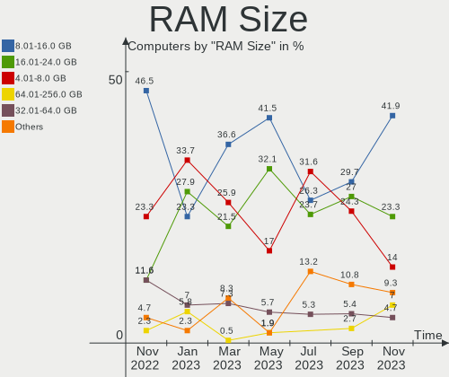
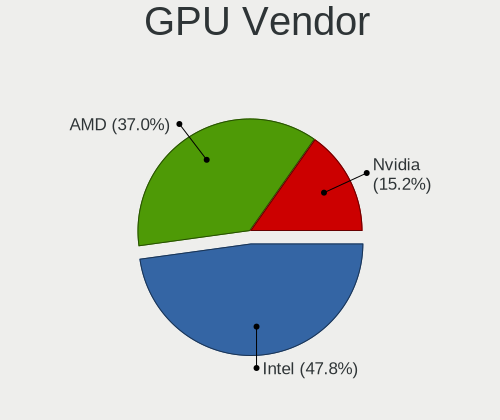
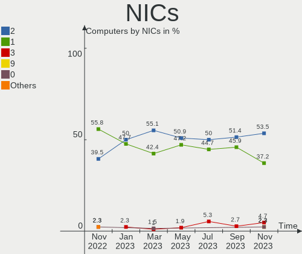
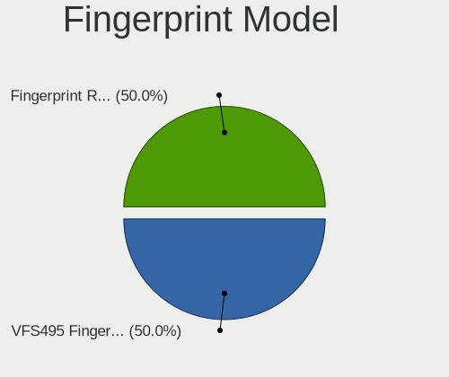

helloSystem - Hardware Trends
-----------------------------

A project to identify most popular hardware characteristics and track their change
over time based on data collected by BSD users at https://BSD-Hardware.info.

Anyone can contribute to this report by the [hw-probe](https://github.com/linuxhw/hw-probe/blob/master/INSTALL.BSD.md) tool:

    hw-probe -all -upload

This is a report for all computer types. See also reports for [desktops](/Dist/helloSystem/Desktop/README.md) and [notebooks](/Dist/helloSystem/Notebook/README.md).

This report is for one last month. Overall report since the beginning of time: [TestCoverage](https://github.com/bsdhw/TestCoverage)

Period: Aug, 2022.

Contents
--------

* [ System ](#system)
  - [ OS                       ](#os)
  - [ OS Family                ](#os-family)
  - [ Arch                     ](#arch)
  - [ DE                       ](#de)
  - [ Display Server           ](#display-server)
  - [ Display Manager          ](#display-manager)
  - [ OS Lang                  ](#os-lang)
  - [ Boot Mode                ](#boot-mode)
  - [ Filesystem               ](#filesystem)
  - [ Part. scheme             ](#part-scheme)

* [ Board ](#board)
  - [ Vendor                   ](#vendor)
  - [ Model                    ](#model)
  - [ Model Family             ](#model-family)
  - [ MFG Year                 ](#mfg-year)
  - [ Form Factor              ](#form-factor)
  - [ Coreboot                 ](#coreboot)
  - [ RAM Size                 ](#ram-size)
  - [ RAM Used                 ](#ram-used)
  - [ Total Drives             ](#total-drives)
  - [ Has CD-ROM               ](#has-cd-rom)
  - [ Has Ethernet             ](#has-ethernet)
  - [ Has WiFi                 ](#has-wifi)
  - [ Has Bluetooth            ](#has-bluetooth)

* [ Location ](#location)
  - [ Country                  ](#country)
  - [ City                     ](#city)

* [ Drives ](#drives)
  - [ Drive Vendor             ](#drive-vendor)
  - [ Drive Model              ](#drive-model)
  - [ HDD Vendor               ](#hdd-vendor)
  - [ SSD Vendor               ](#ssd-vendor)
  - [ Drive Kind               ](#drive-kind)
  - [ Drive Connector          ](#drive-connector)
  - [ Drive Size               ](#drive-size)
  - [ Space Total              ](#space-total)
  - [ Space Used               ](#space-used)
  - [ Malfunc. Drives          ](#malfunc-drives)
  - [ Malfunc. Drive Vendor    ](#malfunc-drive-vendor)
  - [ Malfunc. HDD Vendor      ](#malfunc-hdd-vendor)
  - [ Malfunc. Drive Kind      ](#malfunc-drive-kind)
  - [ Failed Drives            ](#failed-drives)
  - [ Failed Drive Vendor      ](#failed-drive-vendor)
  - [ Drive Status             ](#drive-status)

* [ Storage controller ](#storage-controller)
  - [ Storage Vendor           ](#storage-vendor)
  - [ Storage Model            ](#storage-model)
  - [ Storage Kind             ](#storage-kind)

* [ Processor ](#processor)
  - [ CPU Vendor               ](#cpu-vendor)
  - [ CPU Model                ](#cpu-model)
  - [ CPU Model Family         ](#cpu-model-family)
  - [ CPU Cores                ](#cpu-cores)
  - [ CPU Sockets              ](#cpu-sockets)
  - [ CPU Threads              ](#cpu-threads)
  - [ CPU Microarch            ](#cpu-microarch)

* [ Graphics ](#graphics)
  - [ GPU Vendor               ](#gpu-vendor)
  - [ GPU Model                ](#gpu-model)
  - [ GPU Combo                ](#gpu-combo)
  - [ GPU Driver               ](#gpu-driver)
  - [ GPU Memory               ](#gpu-memory)

* [ Monitor ](#monitor)
  - [ Monitor Vendor           ](#monitor-vendor)
  - [ Monitor Model            ](#monitor-model)
  - [ Monitor Resolution       ](#monitor-resolution)
  - [ Monitor Diagonal         ](#monitor-diagonal)
  - [ Monitor Width            ](#monitor-width)
  - [ Aspect Ratio             ](#aspect-ratio)
  - [ Monitor Area             ](#monitor-area)
  - [ Pixel Density            ](#pixel-density)
  - [ Multiple Monitors        ](#multiple-monitors)

* [ Network ](#network)
  - [ Net Controller Vendor    ](#net-controller-vendor)
  - [ Net Controller Model     ](#net-controller-model)
  - [ Wireless Vendor          ](#wireless-vendor)
  - [ Wireless Model           ](#wireless-model)
  - [ Ethernet Vendor          ](#ethernet-vendor)
  - [ Ethernet Model           ](#ethernet-model)
  - [ Net Controller Kind      ](#net-controller-kind)
  - [ Used Controller          ](#used-controller)
  - [ NICs                     ](#nics)
  - [ IPv6                     ](#ipv6)

* [ Bluetooth ](#bluetooth)
  - [ Bluetooth Vendor         ](#bluetooth-vendor)
  - [ Bluetooth Model          ](#bluetooth-model)

* [ Sound ](#sound)
  - [ Sound Vendor             ](#sound-vendor)
  - [ Sound Model              ](#sound-model)

* [ Memory ](#memory)
  - [ Memory Vendor            ](#memory-vendor)
  - [ Memory Model             ](#memory-model)
  - [ Memory Kind              ](#memory-kind)
  - [ Memory Form Factor       ](#memory-form-factor)
  - [ Memory Size              ](#memory-size)
  - [ Memory Speed             ](#memory-speed)

* [ Printers & scanners ](#printers--scanners)
  - [ Printer Vendor           ](#printer-vendor)
  - [ Printer Model            ](#printer-model)
  - [ Scanner Vendor           ](#scanner-vendor)
  - [ Scanner Model            ](#scanner-model)

* [ Camera ](#camera)
  - [ Camera Vendor            ](#camera-vendor)
  - [ Camera Model             ](#camera-model)

* [ Security ](#security)
  - [ Fingerprint Vendor       ](#fingerprint-vendor)
  - [ Fingerprint Model        ](#fingerprint-model)
  - [ Chipcard Vendor          ](#chipcard-vendor)
  - [ Chipcard Model           ](#chipcard-model)

* [ Unsupported ](#unsupported)
  - [ Unsupported Devices      ](#unsupported-devices)
  - [ Unsupported Device Types ](#unsupported-device-types)

System
------

OS
--

Installed operating systems

| Name              | Computers | Percent |
|-------------------|-----------|---------|
| helloSystem 0.7.0 | 15        | 62.5%   |
| helloSystem 0.8.0 | 9         | 37.5%   |

OS Family
---------

OS without a version

| Name        | Computers | Percent |
|-------------|-----------|---------|
| helloSystem | 24        | 100%    |

Arch
----

OS architecture (x86_64, i586, etc.)

| Name  | Computers | Percent |
|-------|-----------|---------|
| amd64 | 24        | 100%    |

DE
--

Desktop Environment

| Name         | Computers | Percent |
|--------------|-----------|---------|
| helloDesktop | 24        | 100%    |

Display Server
--------------

X11 or Wayland

| Name | Computers | Percent |
|------|-----------|---------|
| X11  | 24        | 100%    |

Display Manager
---------------

SDDM, LightDM, etc.

| Name | Computers | Percent |
|------|-----------|---------|
| SLiM | 24        | 100%    |

OS Lang
-------

Language

| Lang  | Computers | Percent |
|-------|-----------|---------|
| en_US | 24        | 100%    |

Boot Mode
---------

EFI or BIOS

| Mode | Computers | Percent |
|------|-----------|---------|
| EFI  | 24        | 100%    |

Filesystem
----------

Type of filesystem

| Type   | Computers | Percent |
|--------|-----------|---------|
| Zfs    | 14        | 58.33%  |
| Cd9660 | 10        | 41.67%  |

Part. scheme
------------

Scheme of partitioning

| Type | Computers | Percent |
|------|-----------|---------|
| GPT  | 24        | 100%    |

Board
-----

Vendor
------

Motherboard manufacturer

| Name                | Computers | Percent |
|---------------------|-----------|---------|
| ASUSTek Computer    | 7         | 29.17%  |
| Gigabyte Technology | 3         | 12.5%   |
| Lenovo              | 2         | 8.33%   |
| Hewlett-Packard     | 2         | 8.33%   |
| Dell                | 2         | 8.33%   |
| ASRock              | 2         | 8.33%   |
| TUXEDO              | 1         | 4.17%   |
| Toshiba             | 1         | 4.17%   |
| Intel               | 1         | 4.17%   |
| Fujitsu             | 1         | 4.17%   |
| eMachines           | 1         | 4.17%   |
| Acer                | 1         | 4.17%   |

Model
-----

Motherboard model

| Name                                 | Computers | Percent |
|--------------------------------------|-----------|---------|
| TUXEDO Pulse 14 Gen1                 | 1         | 4.17%   |
| Toshiba Satellite S55t-B             | 1         | 4.17%   |
| Lenovo ThinkPad T420 4178A72         | 1         | 4.17%   |
| Lenovo ThinkCentre M93z 10AD002UUS   | 1         | 4.17%   |
| Intel NUC8i7BEK                      | 1         | 4.17%   |
| HP ProBook 4540s                     | 1         | 4.17%   |
| HP Compaq 6200 Pro SFF PC            | 1         | 4.17%   |
| Gigabyte X570 AORUS PRO              | 1         | 4.17%   |
| Gigabyte X570 AORUS ELITE WIFI       | 1         | 4.17%   |
| Gigabyte A320M-S2H V2                | 1         | 4.17%   |
| Fujitsu ESPRIMO P2560                | 1         | 4.17%   |
| eMachines eME728                     | 1         | 4.17%   |
| Dell Studio 1537                     | 1         | 4.17%   |
| Dell Precision 5540                  | 1         | 4.17%   |
| ASUS VivoBook 15_ASUS Laptop X540UBR | 1         | 4.17%   |
| ASUS TUF Gaming FX505DT_FX505DT      | 1         | 4.17%   |
| ASUS ROG STRIX B550-I GAMING         | 1         | 4.17%   |
| ASUS P5QL-ASUS-SE                    | 1         | 4.17%   |
| ASUS P5GC-MX/CKD/SI                  | 1         | 4.17%   |
| ASUS K30AM-J                         | 1         | 4.17%   |
| ASUS F6A                             | 1         | 4.17%   |
| ASRock Z370 Pro4                     | 1         | 4.17%   |
| ASRock X570 Phantom Gaming 4         | 1         | 4.17%   |
| Acer Aspire 5930                     | 1         | 4.17%   |

Model Family
------------

Motherboard model prefix

| Name               | Computers | Percent |
|--------------------|-----------|---------|
| Gigabyte X570      | 2         | 8.33%   |
| TUXEDO Pulse       | 1         | 4.17%   |
| Toshiba Satellite  | 1         | 4.17%   |
| Lenovo ThinkPad    | 1         | 4.17%   |
| Lenovo ThinkCentre | 1         | 4.17%   |
| Intel NUC8i7BEK    | 1         | 4.17%   |
| HP ProBook         | 1         | 4.17%   |
| HP Compaq          | 1         | 4.17%   |
| Gigabyte A320M-S2H | 1         | 4.17%   |
| Fujitsu ESPRIMO    | 1         | 4.17%   |
| eMachines eME728   | 1         | 4.17%   |
| Dell Studio        | 1         | 4.17%   |
| Dell Precision     | 1         | 4.17%   |
| ASUS VivoBook      | 1         | 4.17%   |
| ASUS TUF           | 1         | 4.17%   |
| ASUS ROG           | 1         | 4.17%   |
| ASUS P5QL-ASUS-SE  | 1         | 4.17%   |
| ASUS P5GC-MX       | 1         | 4.17%   |
| ASUS K30AM-J       | 1         | 4.17%   |
| ASUS F6A           | 1         | 4.17%   |
| ASRock Z370        | 1         | 4.17%   |
| ASRock X570        | 1         | 4.17%   |
| Acer Aspire        | 1         | 4.17%   |

MFG Year
--------

Motherboard manufacture year

| Year | Computers | Percent |
|------|-----------|---------|
| 2020 | 4         | 16.67%  |
| 2019 | 4         | 16.67%  |
| 2011 | 3         | 12.5%   |
| 2022 | 2         | 8.33%   |
| 2021 | 2         | 8.33%   |
| 2014 | 2         | 8.33%   |
| 2010 | 2         | 8.33%   |
| 2008 | 2         | 8.33%   |
| 2018 | 1         | 4.17%   |
| 2009 | 1         | 4.17%   |
| 2007 | 1         | 4.17%   |

Form Factor
-----------

Physical design of the computer

| Name     | Computers | Percent |
|----------|-----------|---------|
| Desktop  | 12        | 50%     |
| Notebook | 11        | 45.83%  |
| Mini pc  | 1         | 4.17%   |

Coreboot
--------

Have coreboot on board

| Used | Computers | Percent |
|------|-----------|---------|
| No   | 24        | 100%    |

RAM Size
--------

Total RAM memory

| Size in GB | Computers | Percent |
|------------|-----------|---------|
| 4.01-8.0   | 7         | 29.17%  |
| 8.01-16.0  | 6         | 25%     |
| 16.01-24.0 | 5         | 20.83%  |
| 32.01-64.0 | 4         | 16.67%  |
| 3.01-4.0   | 2         | 8.33%   |

RAM Used
--------

Used RAM memory

| Used GB  | Computers | Percent |
|----------|-----------|---------|
| 0.01-0.5 | 13        | 54.17%  |
| 1.01-2.0 | 6         | 25%     |
| 0.51-1.0 | 3         | 12.5%   |
| 4.01-8.0 | 1         | 4.17%   |
| 2.01-3.0 | 1         | 4.17%   |

Total Drives
------------

Number of drives on board

| Drives | Computers | Percent |
|--------|-----------|---------|
| 1      | 16        | 66.67%  |
| 2      | 4         | 16.67%  |
| 3      | 2         | 8.33%   |
| 4      | 1         | 4.17%   |
| 0      | 1         | 4.17%   |

Has CD-ROM
----------

Has CD-ROM on board

| Presented | Computers | Percent |
|-----------|-----------|---------|
| No        | 15        | 62.5%   |
| Yes       | 9         | 37.5%   |

Has Ethernet
------------

Has Ethernet on board

| Presented | Computers | Percent |
|-----------|-----------|---------|
| Yes       | 23        | 95.83%  |
| No        | 1         | 4.17%   |

Has WiFi
--------

Has WiFi module

| Presented | Computers | Percent |
|-----------|-----------|---------|
| Yes       | 15        | 62.5%   |
| No        | 9         | 37.5%   |

Has Bluetooth
-------------

Has Bluetooth module

| Presented | Computers | Percent |
|-----------|-----------|---------|
| Yes       | 12        | 50%     |
| No        | 12        | 50%     |

Location
--------

Country
-------

Geographic location (country)

| Country     | Computers | Percent |
|-------------|-----------|---------|
| USA         | 4         | 16.67%  |
| Russia      | 4         | 16.67%  |
| Germany     | 3         | 12.5%   |
| Spain       | 2         | 8.33%   |
| Peru        | 2         | 8.33%   |
| Venezuela   | 1         | 4.17%   |
| Poland      | 1         | 4.17%   |
| Netherlands | 1         | 4.17%   |
| Mexico      | 1         | 4.17%   |
| Latvia      | 1         | 4.17%   |
| Italy       | 1         | 4.17%   |
| Iran        | 1         | 4.17%   |
| Canada      | 1         | 4.17%   |
| Brazil      | 1         | 4.17%   |

City
----

Geographic location (city)

| City                | Computers | Percent |
|---------------------|-----------|---------|
| Lima                | 2         | 8.33%   |
| Vladivostok         | 1         | 4.17%   |
| Vancouver           | 1         | 4.17%   |
| Tver                | 1         | 4.17%   |
| Tehran              | 1         | 4.17%   |
| Tarragona           | 1         | 4.17%   |
| Tampa               | 1         | 4.17%   |
| Smolensk            | 1         | 4.17%   |
| Sesto San Giovanni  | 1         | 4.17%   |
| Sao Paulo           | 1         | 4.17%   |
| Riga                | 1         | 4.17%   |
| Perm                | 1         | 4.17%   |
| Munich              | 1         | 4.17%   |
| Medford             | 1         | 4.17%   |
| Idstein             | 1         | 4.17%   |
| Guadalupe           | 1         | 4.17%   |
| Fillmore            | 1         | 4.17%   |
| Caracas             | 1         | 4.17%   |
| Boise               | 1         | 4.17%   |
| Biłgoraj           | 1         | 4.17%   |
| Berlin              | 1         | 4.17%   |
| Amsterdam           | 1         | 4.17%   |
| Alcalá de Guadaira | 1         | 4.17%   |

Drives
------

Drive Vendor
------------

Hard drive vendors

| Vendor              | Computers | Drives | Percent |
|---------------------|-----------|--------|---------|
| Seagate             | 8         | 8      | 26.67%  |
| Samsung Electronics | 6         | 9      | 20%     |
| Toshiba             | 3         | 3      | 10%     |
| SanDisk             | 3         | 3      | 10%     |
| Kingston            | 3         | 3      | 10%     |
| WDC                 | 2         | 2      | 6.67%   |
| Micron Technology   | 2         | 2      | 6.67%   |
| Intel               | 1         | 1      | 3.33%   |
| GOODRAM             | 1         | 2      | 3.33%   |
| Crucial             | 1         | 1      | 3.33%   |

Drive Model
-----------

Hard drive models

| Model                              | Computers | Percent |
|------------------------------------|-----------|---------|
| Seagate ST1000LM035-1RK172 1TB     | 3         | 9.38%   |
| WDC WDS100T2B0C-00PXH0 1TB         | 1         | 3.13%   |
| WDC WD2500BEVT-00ZCT0 250GB        | 1         | 3.13%   |
| Toshiba MQ01ABF050 500GB           | 1         | 3.13%   |
| Toshiba MQ01ABD025 250GB           | 1         | 3.13%   |
| Toshiba DT01ACA100 1TB             | 1         | 3.13%   |
| Seagate ST320LM000 HM321HI 320GB   | 1         | 3.13%   |
| Seagate ST3160815AS 160GB          | 1         | 3.13%   |
| Seagate ST3160023AS 160GB          | 1         | 3.13%   |
| Seagate ST1000LM024 HN-M101MBB 1TB | 1         | 3.13%   |
| Seagate ST1000DM003-1CH162 1TB     | 1         | 3.13%   |
| SanDisk SSD PLUS 120GB             | 1         | 3.13%   |
| SanDisk SSD P4 8GB                 | 1         | 3.13%   |
| SanDisk SDSA5GK-016G-1006 16GB     | 1         | 3.13%   |
| Samsung SSD 980 PRO 1TB            | 1         | 3.13%   |
| Samsung SSD 980 500GB              | 1         | 3.13%   |
| Samsung SSD 970 EVO Plus 250GB     | 1         | 3.13%   |
| Samsung SSD 970 EVO Plus 1TB       | 1         | 3.13%   |
| Samsung MZ7PD128HCFV-000H1 128GB   | 1         | 3.13%   |
| Samsung HD322HJ 320GB              | 1         | 3.13%   |
| Samsung HD081GJ 80GB               | 1         | 3.13%   |
| Micron 2200V_MTFDHBA512TCK 512GB   | 1         | 3.13%   |
| Micron 2200S NVMe 512GB            | 1         | 3.13%   |
| Kingston SV300S37A120G 120GB       | 1         | 3.13%   |
| Kingston SA400S37240G 240GB        | 1         | 3.13%   |
| Kingston OM8SBP3512K-AH 512GB      | 1         | 3.13%   |
| Intel SSDPEKKW512G8 512GB          | 1         | 3.13%   |
| GOODRAM IRP-SSDPR-S25C-256 256GB   | 1         | 3.13%   |
| GOODRAM IR-SSDPR-S25A-240 240GB    | 1         | 3.13%   |
| Crucial CT240BX500SSD1 240GB       | 1         | 3.13%   |

HDD Vendor
----------

Hard disk drive vendors

| Vendor              | Computers | Drives | Percent |
|---------------------|-----------|--------|---------|
| Seagate             | 8         | 8      | 57.14%  |
| Toshiba             | 3         | 3      | 21.43%  |
| Samsung Electronics | 2         | 2      | 14.29%  |
| WDC                 | 1         | 1      | 7.14%   |

SSD Vendor
----------

Solid state drive vendors

| Vendor              | Computers | Drives | Percent |
|---------------------|-----------|--------|---------|
| SanDisk             | 3         | 3      | 37.5%   |
| Kingston            | 2         | 2      | 25%     |
| Samsung Electronics | 1         | 1      | 12.5%   |
| GOODRAM             | 1         | 2      | 12.5%   |
| Crucial             | 1         | 1      | 12.5%   |

Drive Kind
----------

HDD or SSD

| Kind | Computers | Drives | Percent |
|------|-----------|--------|---------|
| HDD  | 11        | 14     | 39.29%  |
| NVMe | 9         | 11     | 32.14%  |
| SSD  | 8         | 9      | 28.57%  |

Drive Connector
---------------

SATA, SAS, NVMe, etc.

| Type | Computers | Drives | Percent |
|------|-----------|--------|---------|
| SATA | 18        | 23     | 66.67%  |
| NVMe | 9         | 11     | 33.33%  |

Drive Size
----------

Size of hard drive

| Size in TB | Computers | Drives | Percent |
|------------|-----------|--------|---------|
| 0.01-0.5   | 13        | 17     | 68.42%  |
| 0.51-1.0   | 6         | 6      | 31.58%  |

Space Total
-----------

Amount of disk space available on the file system

| Size in GB | Computers | Percent |
|------------|-----------|---------|
| 1-20       | 9         | 37.5%   |
| 101-250    | 7         | 29.17%  |
| 501-1000   | 5         | 20.83%  |
| 251-500    | 3         | 12.5%   |

Space Used
----------

Amount of used disk space

| Used GB | Computers | Percent |
|---------|-----------|---------|
| 1-20    | 22        | 91.67%  |
| 101-250 | 1         | 4.17%   |
| 51-100  | 1         | 4.17%   |

Malfunc. Drives
---------------

Drive models with a malfunction

| Model                            | Computers | Drives | Percent |
|----------------------------------|-----------|--------|---------|
| Toshiba MQ01ABF050 500GB         | 1         | 1      | 25%     |
| Toshiba MQ01ABD025 250GB         | 1         | 1      | 25%     |
| Seagate ST320LM000 HM321HI 320GB | 1         | 1      | 25%     |
| Samsung Electronics HD081GJ 80GB | 1         | 1      | 25%     |

Malfunc. Drive Vendor
---------------------

Vendors of faulty drives

| Vendor              | Computers | Drives | Percent |
|---------------------|-----------|--------|---------|
| Toshiba             | 2         | 2      | 50%     |
| Seagate             | 1         | 1      | 25%     |
| Samsung Electronics | 1         | 1      | 25%     |

Malfunc. HDD Vendor
-------------------

Vendors of faulty HDD drives

| Vendor              | Computers | Drives | Percent |
|---------------------|-----------|--------|---------|
| Toshiba             | 2         | 2      | 50%     |
| Seagate             | 1         | 1      | 25%     |
| Samsung Electronics | 1         | 1      | 25%     |

Malfunc. Drive Kind
-------------------

Kinds of faulty drives

| Kind | Computers | Drives | Percent |
|------|-----------|--------|---------|
| HDD  | 4         | 4      | 100%    |

Failed Drives
-------------

Failed drive models

Zero info for selected period =(

Failed Drive Vendor
-------------------

Failed drive vendors

Zero info for selected period =(

Drive Status
------------

Number of failed and malfunc. drives

| Status  | Computers | Drives | Percent |
|---------|-----------|--------|---------|
| Works   | 21        | 30     | 84%     |
| Malfunc | 4         | 4      | 16%     |

Storage controller
------------------

Storage Vendor
--------------

Storage controller vendors

| Vendor                      | Computers | Percent |
|-----------------------------|-----------|---------|
| Intel                       | 17        | 51.52%  |
| AMD                         | 7         | 21.21%  |
| Samsung Electronics         | 4         | 12.12%  |
| Micron Technology           | 2         | 6.06%   |
| SanDisk                     | 1         | 3.03%   |
| Kingston Technology Company | 1         | 3.03%   |
| JMicron Technology          | 1         | 3.03%   |

Storage Model
-------------

Storage controller models

| Model                                                                          | Computers | Percent |
|--------------------------------------------------------------------------------|-----------|---------|
| AMD FCH SATA Controller [AHCI mode]                                            | 5         | 14.29%  |
| Intel 82801IBM/IEM (ICH9M/ICH9M-E) 4 port SATA Controller [AHCI mode]          | 4         | 11.43%  |
| Unknown                                                                        | 3         | 8.57%   |
| Samsung NVMe SSD Controller SM981/PM981/PM983                                  | 2         | 5.71%   |
| Intel NM10/ICH7 Family SATA Controller [IDE mode]                              | 2         | 5.71%   |
| SanDisk WD Blue SN550 NVMe SSD                                                 | 1         | 2.86%   |
| Samsung NVMe SSD Controller PM9A1/PM9A3/980PRO                                 | 1         | 2.86%   |
| Samsung NVMe SSD Controller 980                                                | 1         | 2.86%   |
| JMicron JMB368 IDE controller                                                  | 1         | 2.86%   |
| Intel Wildcat Point-LP SATA Controller [AHCI Mode]                             | 1         | 2.86%   |
| Intel Sunrise Point-LP SATA Controller [AHCI mode]                             | 1         | 2.86%   |
| Intel SSD Pro 7600p/760p/E 6100p Series                                        | 1         | 2.86%   |
| Intel SATA Controller [RAID mode]                                              | 1         | 2.86%   |
| Intel Cannon Point-LP SATA Controller [AHCI Mode]                              | 1         | 2.86%   |
| Intel Cannon Lake Mobile PCH SATA AHCI Controller                              | 1         | 2.86%   |
| Intel Atom Processor E3800 Series SATA AHCI Controller                         | 1         | 2.86%   |
| Intel 82801JI (ICH10 Family) SATA AHCI Controller                              | 1         | 2.86%   |
| Intel 82801G (ICH7 Family) IDE Controller                                      | 1         | 2.86%   |
| Intel 8 Series/C220 Series Chipset Family 6-port SATA Controller 1 [AHCI mode] | 1         | 2.86%   |
| Intel 7 Series Chipset Family 6-port SATA Controller [AHCI mode]               | 1         | 2.86%   |
| Intel 6 Series/C200 Series Chipset Family 6 port Mobile SATA AHCI Controller   | 1         | 2.86%   |
| Intel 6 Series/C200 Series Chipset Family 6 port Desktop SATA AHCI Controller  | 1         | 2.86%   |
| AMD 500 Series Chipset SATA Controller                                         | 1         | 2.86%   |
| AMD 300 Series Chipset SATA Controller                                         | 1         | 2.86%   |

Storage Kind
------------

Kind of storage controller (IDE, SATA, NVMe, SAS, ...)

| Kind | Computers | Percent |
|------|-----------|---------|
| SATA | 21        | 61.76%  |
| NVMe | 9         | 26.47%  |
| IDE  | 3         | 8.82%   |
| RAID | 1         | 2.94%   |

Processor
---------

CPU Vendor
----------

Processor vendors

| Vendor | Computers | Percent |
|--------|-----------|---------|
| Intel  | 17        | 70.83%  |
| AMD    | 7         | 29.17%  |

CPU Model
---------

Processor models

| Model                                         | Computers | Percent |
|-----------------------------------------------|-----------|---------|
| Intel CPU Version                             | 2         | 8.33%   |
| Intel Xeon E-2276M CPU @ 2.80GHz              | 1         | 4.17%   |
| Intel Pentium Dual-Core CPU T4500 @ 2.30GHz   | 1         | 4.17%   |
| Intel Pentium CPU 4417U @ 2.30GHz             | 1         | 4.17%   |
| Intel Core i7-8700 CPU @ 3.20GHz              | 1         | 4.17%   |
| Intel Core i7-8559U CPU @ 2.70GHz             | 1         | 4.17%   |
| Intel Core i7-2620M CPU @ 2.70GHz             | 1         | 4.17%   |
| Intel Core i5-5200U CPU @ 2.20GHz             | 1         | 4.17%   |
| Intel Core i5-4590S CPU @ 3.00GHz             | 1         | 4.17%   |
| Intel Core i3-3110M CPU @ 2.40GHz             | 1         | 4.17%   |
| Intel Core i3-2100 CPU @ 3.10GHz              | 1         | 4.17%   |
| Intel Core 2 Quad CPU Q6600 @ 2.40GHz         | 1         | 4.17%   |
| Intel Core 2 Duo CPU P8400 @ 2.26GHz          | 1         | 4.17%   |
| Intel Core 2 Duo CPU E7500                    | 1         | 4.17%   |
| Intel Core 2 Duo CPU E4500 @ 2.20GHz          | 1         | 4.17%   |
| Intel Celeron CPU J1800 @ 2.41GHz             | 1         | 4.17%   |
| AMD Ryzen 9 3900X 12-Core Processor           | 1         | 4.17%   |
| AMD Ryzen 7 4800H with Radeon Graphics        | 1         | 4.17%   |
| AMD Ryzen 7 3750H with Radeon Vega Mobile Gfx | 1         | 4.17%   |
| AMD Ryzen 7 3700X 8-Core Processor            | 1         | 4.17%   |
| AMD Ryzen 5 5600X 6-Core Processor            | 1         | 4.17%   |
| AMD Ryzen 5 5600G with Radeon Graphics        | 1         | 4.17%   |
| AMD Ryzen 3 3200G with Radeon Vega Graphics   | 1         | 4.17%   |

CPU Model Family
----------------

Processor model prefix

| Model                   | Computers | Percent |
|-------------------------|-----------|---------|
| Intel Core i7           | 3         | 12.5%   |
| Intel Core 2 Duo        | 3         | 12.5%   |
| AMD Ryzen 7             | 3         | 12.5%   |
| Other                   | 2         | 8.33%   |
| Intel Core i5           | 2         | 8.33%   |
| Intel Core i3           | 2         | 8.33%   |
| AMD Ryzen 5             | 2         | 8.33%   |
| Intel Xeon              | 1         | 4.17%   |
| Intel Pentium Dual-Core | 1         | 4.17%   |
| Intel Pentium           | 1         | 4.17%   |
| Intel Core 2 Quad       | 1         | 4.17%   |
| Intel Celeron           | 1         | 4.17%   |
| AMD Ryzen 9             | 1         | 4.17%   |
| AMD Ryzen 3             | 1         | 4.17%   |

CPU Cores
---------

Number of processor cores

| Number  | Computers | Percent |
|---------|-----------|---------|
| 2       | 11        | 45.83%  |
| 4       | 4         | 16.67%  |
| 16      | 2         | 8.33%   |
| 12      | 2         | 8.33%   |
| 6       | 2         | 8.33%   |
| 24      | 1         | 4.17%   |
| 8       | 1         | 4.17%   |
| Unknown | 1         | 4.17%   |

CPU Sockets
-----------

Number of sockets

| Number | Computers | Percent |
|--------|-----------|---------|
| 1      | 24        | 100%    |

CPU Threads
-----------

Threads per core (Hyper-Threading)

| Number  | Computers | Percent |
|---------|-----------|---------|
| 1       | 15        | 62.5%   |
| 2       | 8         | 33.33%  |
| Unknown | 1         | 4.17%   |

CPU Microarch
-------------

Microarchitecture

| Name        | Computers | Percent |
|-------------|-----------|---------|
| Penryn      | 5         | 20.83%  |
| KabyLake    | 4         | 16.67%  |
| Zen 2       | 3         | 12.5%   |
| Zen+        | 2         | 8.33%   |
| Zen 3       | 2         | 8.33%   |
| SandyBridge | 2         | 8.33%   |
| Core        | 2         | 8.33%   |
| Silvermont  | 1         | 4.17%   |
| IvyBridge   | 1         | 4.17%   |
| Haswell     | 1         | 4.17%   |
| Broadwell   | 1         | 4.17%   |

Graphics
--------

GPU Vendor
----------

Vendors of graphics cards

| Vendor | Computers | Percent |
|--------|-----------|---------|
| Intel  | 13        | 46.43%  |
| AMD    | 8         | 28.57%  |
| Nvidia | 7         | 25%     |

GPU Model
---------

Graphics card models

| Model                                                                       | Computers | Percent |
|-----------------------------------------------------------------------------|-----------|---------|
| Intel Mobile 4 Series Chipset Integrated Graphics Controller                | 2         | 7.14%   |
| Intel 2nd Generation Core Processor Family Integrated Graphics Controller   | 2         | 7.14%   |
| AMD Picasso/Raven 2 [Radeon Vega Series / Radeon Vega Mobile Series]        | 2         | 7.14%   |
| Nvidia TU117M [GeForce GTX 1650 Mobile / Max-Q]                             | 1         | 3.57%   |
| Nvidia TU117GLM [Quadro T1000 Mobile]                                       | 1         | 3.57%   |
| Nvidia GP102 [GeForce GTX 1080 Ti]                                          | 1         | 3.57%   |
| Nvidia GM108M [GeForce MX110]                                               | 1         | 3.57%   |
| Nvidia GK104 [GeForce GTX 760]                                              | 1         | 3.57%   |
| Nvidia GF119M [Quadro NVS 4200M]                                            | 1         | 3.57%   |
| Nvidia G96CM [GeForce 9600M GT]                                             | 1         | 3.57%   |
| Intel Xeon E3-1200 v3/4th Gen Core Processor Integrated Graphics Controller | 1         | 3.57%   |
| Intel Kaby Lake-U GT1 Integrated Graphics Controller                        | 1         | 3.57%   |
| Intel HD Graphics 5500                                                      | 1         | 3.57%   |
| Intel CoffeeLake-U GT3e [Iris Plus Graphics 655]                            | 1         | 3.57%   |
| Intel CoffeeLake-H GT2 [UHD Graphics 630]                                   | 1         | 3.57%   |
| Intel Atom Processor Z36xxx/Z37xxx Series Graphics & Display                | 1         | 3.57%   |
| Intel 82945G/GZ Integrated Graphics Controller                              | 1         | 3.57%   |
| Intel 4 Series Chipset Integrated Graphics Controller                       | 1         | 3.57%   |
| Intel 3rd Gen Core processor Graphics Controller                            | 1         | 3.57%   |
| AMD RV620/M82 [Mobility Radeon HD 3450/3470]                                | 1         | 3.57%   |
| AMD Renoir                                                                  | 1         | 3.57%   |
| AMD Navi 23 [Radeon RX 6600/6600 XT/6600M]                                  | 1         | 3.57%   |
| AMD Navi 21 [Radeon RX 6800/6800 XT / 6900 XT]                              | 1         | 3.57%   |
| AMD Ellesmere [Radeon RX 470/480/570/570X/580/580X/590]                     | 1         | 3.57%   |
| AMD Cezanne                                                                 | 1         | 3.57%   |

GPU Combo
---------

Combinations of graphics cards

| Name           | Computers | Percent |
|----------------|-----------|---------|
| 1 x Intel      | 8         | 33.33%  |
| 1 x AMD        | 7         | 29.17%  |
| 1 x Nvidia     | 3         | 12.5%   |
| Intel + Nvidia | 3         | 12.5%   |
| 2 x Intel      | 2         | 8.33%   |
| AMD + Nvidia   | 1         | 4.17%   |

GPU Driver
----------

Free vs proprietary

| Driver      | Computers | Percent |
|-------------|-----------|---------|
| Free        | 21        | 87.5%   |
| Proprietary | 2         | 8.33%   |
| Unknown     | 1         | 4.17%   |

GPU Memory
----------

Total video memory

| Size in GB | Computers | Percent |
|------------|-----------|---------|
| Unknown    | 17        | 70.83%  |
| 0.01-0.5   | 3         | 12.5%   |
| 7.01-8.0   | 1         | 4.17%   |
| 3.01-4.0   | 1         | 4.17%   |
| 1.01-2.0   | 1         | 4.17%   |
| 8.01-16.0  | 1         | 4.17%   |

Monitor
-------

Monitor Vendor
--------------

Monitor vendors

| Vendor              | Computers | Percent |
|---------------------|-----------|---------|
| Samsung Electronics | 4         | 18.18%  |
| Goldstar            | 3         | 13.64%  |
| AU Optronics        | 3         | 13.64%  |
| LG Display          | 2         | 9.09%   |
| Vizio               | 1         | 4.55%   |
| Sharp               | 1         | 4.55%   |
| PANDA               | 1         | 4.55%   |
| LG Philips          | 1         | 4.55%   |
| Lenovo              | 1         | 4.55%   |
| Hewlett-Packard     | 1         | 4.55%   |
| Chimei Innolux      | 1         | 4.55%   |
| BenQ                | 1         | 4.55%   |
| Apple               | 1         | 4.55%   |
| Acer                | 1         | 4.55%   |

Monitor Model
-------------

Monitor models

| Model                                                                | Computers | Percent |
|----------------------------------------------------------------------|-----------|---------|
| Vizio D43-D2 VIZ1004 1920x1080 930x520mm 41.9-inch                   | 1         | 4.55%   |
| Sharp LCD Monitor SHP14BA 1920x1080 340x190mm 15.3-inch              | 1         | 4.55%   |
| Samsung Electronics U32J59x SAM0F35 3840x2160 700x390mm 31.5-inch    | 1         | 4.55%   |
| Samsung Electronics SyncMaster SAM02E3 1440x900 370x230mm 17.2-inch  | 1         | 4.55%   |
| Samsung Electronics S24H85x SAM0E0C 2560x1440 530x300mm 24.0-inch    | 1         | 4.55%   |
| Samsung Electronics LCD Monitor SEC5441 1280x800 330x210mm 15.4-inch | 1         | 4.55%   |
| PANDA LCD Monitor NCP002D 1920x1080 340x190mm 15.3-inch              | 1         | 4.55%   |
| LG Philips LCD Monitor LPL3B01 1280x800 330x210mm 15.4-inch          | 1         | 4.55%   |
| LG Display LCD Monitor LGD0470 1920x1080 350x190mm 15.7-inch         | 1         | 4.55%   |
| LG Display LCD Monitor LGD0395 1366x768 340x190mm 15.3-inch          | 1         | 4.55%   |
| Lenovo LEN-M93z-B  LEN0093 1920x1080 510x290mm 23.1-inch             | 1         | 4.55%   |
| Hewlett-Packard LE1711 HWP2856 1280x1024 340x270mm 17.1-inch         | 1         | 4.55%   |
| Goldstar W1943 GSM4BAD 1360x768 410x230mm 18.5-inch                  | 1         | 4.55%   |
| Goldstar LG ULTRAWIDE GSM59F1 2560x1080 800x340mm 34.2-inch          | 1         | 4.55%   |
| Goldstar 2D FHD LG TV GSM59C6 1920x1080 510x290mm 23.1-inch          | 1         | 4.55%   |
| Chimei Innolux LCD Monitor CMN14D5 1920x1080 310x170mm 13.9-inch     | 1         | 4.55%   |
| BenQ FP222WH BNQ76CE 1680x1050 470x300mm 22.0-inch                   | 1         | 4.55%   |
| AU Optronics LCD Monitor AUO71EC 1366x768 340x190mm 15.3-inch        | 1         | 4.55%   |
| AU Optronics LCD Monitor AUO26EC 1366x768 340x190mm 15.3-inch        | 1         | 4.55%   |
| AU Optronics LCD Monitor AUO213E 1600x900 310x170mm 13.9-inch        | 1         | 4.55%   |
| Apple Color LCD APP9C5C 1280x800 290x180mm 13.4-inch                 | 1         | 4.55%   |
| Acer V193 ACR004C 1280x1024 380x300mm 19.1-inch                      | 1         | 4.55%   |

Monitor Resolution
------------------

Monitor screen resolution

| Resolution         | Computers | Percent |
|--------------------|-----------|---------|
| 1920x1080 (FHD)    | 7         | 31.82%  |
| 1366x768 (WXGA)    | 4         | 18.18%  |
| 1280x800 (WXGA)    | 2         | 9.09%   |
| 1280x1024 (SXGA)   | 2         | 9.09%   |
| 3840x2160 (4K)     | 1         | 4.55%   |
| 2560x1440 (QHD)    | 1         | 4.55%   |
| 2560x1080          | 1         | 4.55%   |
| 1680x1050 (WSXGA+) | 1         | 4.55%   |
| 1600x900 (HD+)     | 1         | 4.55%   |
| 1440x900 (WXGA+)   | 1         | 4.55%   |
| 1360x768           | 1         | 4.55%   |

Monitor Diagonal
----------------

Diagonal size in inches

| Inches | Computers | Percent |
|--------|-----------|---------|
| 15     | 8         | 36.36%  |
| 13     | 3         | 13.64%  |
| 23     | 2         | 9.09%   |
| 17     | 2         | 9.09%   |
| 41     | 1         | 4.55%   |
| 34     | 1         | 4.55%   |
| 31     | 1         | 4.55%   |
| 24     | 1         | 4.55%   |
| 22     | 1         | 4.55%   |
| 19     | 1         | 4.55%   |
| 18     | 1         | 4.55%   |

Monitor Width
-------------

Physical width

| Width in mm | Computers | Percent |
|-------------|-----------|---------|
| 301-350     | 11        | 50%     |
| 501-600     | 3         | 13.64%  |
| 401-500     | 2         | 9.09%   |
| 351-400     | 2         | 9.09%   |
| 701-800     | 1         | 4.55%   |
| 601-700     | 1         | 4.55%   |
| 201-300     | 1         | 4.55%   |
| 901-1000    | 1         | 4.55%   |

Aspect Ratio
------------

Proportional relationship between the width and the height

| Ratio | Computers | Percent |
|-------|-----------|---------|
| 16/9  | 14        | 63.64%  |
| 16/10 | 5         | 22.73%  |
| 5/4   | 2         | 9.09%   |
| 21/9  | 1         | 4.55%   |

Monitor Area
------------

Area in inch²

| Area in inch² | Computers | Percent |
|----------------|-----------|---------|
| 91-100         | 5         | 22.73%  |
| 201-250        | 4         | 18.18%  |
| 81-90          | 3         | 13.64%  |
| 101-110        | 3         | 13.64%  |
| 351-500        | 2         | 9.09%   |
| 141-150        | 2         | 9.09%   |
| 151-200        | 1         | 4.55%   |
| 131-140        | 1         | 4.55%   |
| 501-1000       | 1         | 4.55%   |

Pixel Density
-------------

Pixels per inch

| Density | Computers | Percent |
|---------|-----------|---------|
| 51-100  | 11        | 50%     |
| 121-160 | 7         | 31.82%  |
| 101-120 | 4         | 18.18%  |

Multiple Monitors
-----------------

Total monitors connected

| Total | Computers | Percent |
|-------|-----------|---------|
| 1     | 20        | 83.33%  |
| 0     | 3         | 12.5%   |
| 2     | 1         | 4.17%   |

Network
-------

Net Controller Vendor
---------------------

Controller vendors

| Vendor                   | Computers | Percent |
|--------------------------|-----------|---------|
| Intel                    | 15        | 44.12%  |
| Realtek Semiconductor    | 11        | 32.35%  |
| Qualcomm Atheros         | 3         | 8.82%   |
| Xiaomi                   | 2         | 5.88%   |
| Samsung Electronics      | 1         | 2.94%   |
| Marvell Technology Group | 1         | 2.94%   |
| Broadcom                 | 1         | 2.94%   |

Net Controller Model
--------------------

Controller models

| Model                                                             | Computers | Percent |
|-------------------------------------------------------------------|-----------|---------|
| Realtek RTL8111/8168/8411 PCI Express Gigabit Ethernet Controller | 9         | 23.08%  |
| Intel WiFi Link 5100                                              | 3         | 7.69%   |
| Intel I211 Gigabit Network Connection                             | 3         | 7.69%   |
| Realtek RTL8821CE 802.11ac PCIe Wireless Network Adapter          | 2         | 5.13%   |
| Intel Wi-Fi 6 AX200                                               | 2         | 5.13%   |
| Intel 82579LM Gigabit Network Connection (Lewisville)             | 2         | 5.13%   |
| Xiaomi Mi/Redmi series (RNDIS)                                    | 1         | 2.56%   |
| Xiaomi Mi/Redmi series (RNDIS + ADB)                              | 1         | 2.56%   |
| Samsung GT-I9070 (network tethering, USB debugging enabled)       | 1         | 2.56%   |
| Realtek RTL8188CE 802.11b/g/n WiFi Adapter                        | 1         | 2.56%   |
| Qualcomm Atheros QCA9565 / AR9565 Wireless Network Adapter        | 1         | 2.56%   |
| Qualcomm Atheros Attansic L2 Fast Ethernet                        | 1         | 2.56%   |
| Qualcomm Atheros AR9287 Wireless Network Adapter (PCI-Express)    | 1         | 2.56%   |
| Qualcomm Atheros AR8131 Gigabit Ethernet                          | 1         | 2.56%   |
| Marvell Group 88E8071 PCI-E Gigabit Ethernet Controller           | 1         | 2.56%   |
| Intel Wireless-AC 9260                                            | 1         | 2.56%   |
| Intel Wireless 7260                                               | 1         | 2.56%   |
| Intel Wireless 3160                                               | 1         | 2.56%   |
| Intel Ethernet Controller I225-V                                  | 1         | 2.56%   |
| Intel Ethernet Connection I217-LM                                 | 1         | 2.56%   |
| Intel Ethernet Connection (6) I219-V                              | 1         | 2.56%   |
| Intel Ethernet Connection (2) I219-V                              | 1         | 2.56%   |
| Intel Dual Band Wireless-AC 3168NGW [Stone Peak]                  | 1         | 2.56%   |
| Broadcom NetLink BCM5784M Gigabit Ethernet PCIe                   | 1         | 2.56%   |

Wireless Vendor
---------------

Wireless vendors

| Vendor                | Computers | Percent |
|-----------------------|-----------|---------|
| Intel                 | 9         | 64.29%  |
| Realtek Semiconductor | 3         | 21.43%  |
| Qualcomm Atheros      | 2         | 14.29%  |

Wireless Model
--------------

Wireless models

| Model                                                          | Computers | Percent |
|----------------------------------------------------------------|-----------|---------|
| Intel WiFi Link 5100                                           | 3         | 21.43%  |
| Realtek RTL8821CE 802.11ac PCIe Wireless Network Adapter       | 2         | 14.29%  |
| Intel Wi-Fi 6 AX200                                            | 2         | 14.29%  |
| Realtek RTL8188CE 802.11b/g/n WiFi Adapter                     | 1         | 7.14%   |
| Qualcomm Atheros QCA9565 / AR9565 Wireless Network Adapter     | 1         | 7.14%   |
| Qualcomm Atheros AR9287 Wireless Network Adapter (PCI-Express) | 1         | 7.14%   |
| Intel Wireless-AC 9260                                         | 1         | 7.14%   |
| Intel Wireless 7260                                            | 1         | 7.14%   |
| Intel Wireless 3160                                            | 1         | 7.14%   |
| Intel Dual Band Wireless-AC 3168NGW [Stone Peak]               | 1         | 7.14%   |

Ethernet Vendor
---------------

Ethernet vendors

| Vendor                   | Computers | Percent |
|--------------------------|-----------|---------|
| Realtek Semiconductor    | 9         | 36%     |
| Intel                    | 9         | 36%     |
| Xiaomi                   | 2         | 8%      |
| Qualcomm Atheros         | 2         | 8%      |
| Samsung Electronics      | 1         | 4%      |
| Marvell Technology Group | 1         | 4%      |
| Broadcom                 | 1         | 4%      |

Ethernet Model
--------------

Ethernet models

| Model                                                             | Computers | Percent |
|-------------------------------------------------------------------|-----------|---------|
| Realtek RTL8111/8168/8411 PCI Express Gigabit Ethernet Controller | 9         | 36%     |
| Intel I211 Gigabit Network Connection                             | 3         | 12%     |
| Intel 82579LM Gigabit Network Connection (Lewisville)             | 2         | 8%      |
| Xiaomi Mi/Redmi series (RNDIS)                                    | 1         | 4%      |
| Xiaomi Mi/Redmi series (RNDIS + ADB)                              | 1         | 4%      |
| Samsung GT-I9070 (network tethering, USB debugging enabled)       | 1         | 4%      |
| Qualcomm Atheros Attansic L2 Fast Ethernet                        | 1         | 4%      |
| Qualcomm Atheros AR8131 Gigabit Ethernet                          | 1         | 4%      |
| Marvell Group 88E8071 PCI-E Gigabit Ethernet Controller           | 1         | 4%      |
| Intel Ethernet Controller I225-V                                  | 1         | 4%      |
| Intel Ethernet Connection I217-LM                                 | 1         | 4%      |
| Intel Ethernet Connection (6) I219-V                              | 1         | 4%      |
| Intel Ethernet Connection (2) I219-V                              | 1         | 4%      |
| Broadcom NetLink BCM5784M Gigabit Ethernet PCIe                   | 1         | 4%      |

Net Controller Kind
-------------------

Ethernet, WiFi or modem

| Kind     | Computers | Percent |
|----------|-----------|---------|
| Ethernet | 23        | 62.16%  |
| WiFi     | 14        | 37.84%  |

Used Controller
---------------

Currently used network controller

| Kind     | Computers | Percent |
|----------|-----------|---------|
| Ethernet | 14        | 63.64%  |
| WiFi     | 8         | 36.36%  |

NICs
----

Total network controllers on board

| Total | Computers | Percent |
|-------|-----------|---------|
| 2     | 12        | 50%     |
| 1     | 12        | 50%     |

IPv6
----

IPv6 vs IPv4

| Used | Computers | Percent |
|------|-----------|---------|
| No   | 23        | 95.83%  |
| Yes  | 1         | 4.17%   |

Bluetooth
---------

Bluetooth Vendor
----------------

Controller vendors

| Vendor                          | Computers | Percent |
|---------------------------------|-----------|---------|
| Intel                           | 5         | 41.67%  |
| IMC Networks                    | 2         | 16.67%  |
| TP-Link                         | 1         | 8.33%   |
| Qualcomm Atheros Communications | 1         | 8.33%   |
| Cambridge Silicon Radio         | 1         | 8.33%   |
| Broadcom                        | 1         | 8.33%   |
| ASUSTek Computer                | 1         | 8.33%   |

Bluetooth Model
---------------

Controller models

| Model                                               | Computers | Percent |
|-----------------------------------------------------|-----------|---------|
| Intel AX200 Bluetooth                               | 2         | 16.67%  |
| IMC Networks Realtek Bluetooth Adapter              | 2         | 16.67%  |
| TP-Link TP-Link UB500 Adapter                       | 1         | 8.33%   |
| Qualcomm Atheros AR3012 Bluetooth                   | 1         | 8.33%   |
| Intel Wireless-AC 9260 Bluetooth Adapter            | 1         | 8.33%   |
| Intel Wireless-AC 3168 Bluetooth                    | 1         | 8.33%   |
| Intel Bluetooth wireless interface                  | 1         | 8.33%   |
| Cambridge Silicon Radio Bluetooth Dongle (HCI mode) | 1         | 8.33%   |
| Broadcom BCM2045B (BDC-2.1)                         | 1         | 8.33%   |
| ASUS BT-253 Bluetooth Adapter                       | 1         | 8.33%   |

Sound
-----

Sound Vendor
------------

Sound card vendors

| Vendor          | Computers | Percent |
|-----------------|-----------|---------|
| Intel           | 17        | 58.62%  |
| AMD             | 8         | 27.59%  |
| Nvidia          | 3         | 10.34%  |
| SteelSeries ApS | 1         | 3.45%   |

Sound Model
-----------

Sound card models

| Model                                                                      | Computers | Percent |
|----------------------------------------------------------------------------|-----------|---------|
| Intel 82801I (ICH9 Family) HD Audio Controller                             | 4         | 10.81%  |
| AMD Family 17h/19h HD Audio Controller                                     | 4         | 10.81%  |
| AMD Starship/Matisse HD Audio Controller                                   | 3         | 8.11%   |
| Intel NM10/ICH7 Family High Definition Audio Controller                    | 2         | 5.41%   |
| Intel 6 Series/C200 Series Chipset Family High Definition Audio Controller | 2         | 5.41%   |
| AMD Renoir Radeon High Definition Audio Controller                         | 2         | 5.41%   |
| AMD Navi 21/23 HDMI/DP Audio Controller                                    | 2         | 5.41%   |
| SteelSeries ApS Arctis 7P+                                                 | 1         | 2.7%    |
| Nvidia TU107 GeForce GTX 1650 High Definition Audio Controller             | 1         | 2.7%    |
| Nvidia GP102 HDMI Audio Controller                                         | 1         | 2.7%    |
| Nvidia GK104 HDMI Audio Controller                                         | 1         | 2.7%    |
| Intel Xeon E3-1200 v3/4th Gen Core Processor HD Audio Controller           | 1         | 2.7%    |
| Intel Wildcat Point-LP High Definition Audio Controller                    | 1         | 2.7%    |
| Intel Sunrise Point-LP HD Audio                                            | 1         | 2.7%    |
| Intel Cannon Point-LP High Definition Audio Controller                     | 1         | 2.7%    |
| Intel Cannon Lake PCH cAVS                                                 | 1         | 2.7%    |
| Intel Broadwell-U Audio Controller                                         | 1         | 2.7%    |
| Intel Atom Processor Z36xxx/Z37xxx Series High Definition Audio Controller | 1         | 2.7%    |
| Intel 82801JI (ICH10 Family) HD Audio Controller                           | 1         | 2.7%    |
| Intel 8 Series/C220 Series Chipset High Definition Audio Controller        | 1         | 2.7%    |
| Intel 7 Series/C216 Chipset Family High Definition Audio Controller        | 1         | 2.7%    |
| Intel 200 Series PCH HD Audio                                              | 1         | 2.7%    |
| AMD RV620 HDMI Audio [Radeon HD 3450/3470/3550/3570]                       | 1         | 2.7%    |
| AMD Raven/Raven2/Fenghuang HDMI/DP Audio Controller                        | 1         | 2.7%    |
| AMD Ellesmere HDMI Audio [Radeon RX 470/480 / 570/580/590]                 | 1         | 2.7%    |

Memory
------

Memory Vendor
-------------

Memory module vendors

| Vendor              | Computers | Percent |
|---------------------|-----------|---------|
| SK hynix            | 5         | 18.52%  |
| Unknown             | 3         | 11.11%  |
| Team                | 3         | 11.11%  |
| Samsung Electronics | 3         | 11.11%  |
| Unknown             | 3         | 11.11%  |
| Micron Technology   | 2         | 7.41%   |
| Kingston            | 2         | 7.41%   |
| Ramaxel Technology  | 1         | 3.7%    |
| GOODRAM             | 1         | 3.7%    |
| GeIL                | 1         | 3.7%    |
| G.Skill             | 1         | 3.7%    |
| Crucial             | 1         | 3.7%    |
| Corsair             | 1         | 3.7%    |

Memory Model
------------

Memory module models

| Model                                                   | Computers | Percent |
|---------------------------------------------------------|-----------|---------|
| Team RAM TEAMGROUP-UD4-3200 16GB DIMM DDR4 3200MT/s     | 3         | 9.68%   |
| Unknown                                                 | 3         | 9.68%   |
| Unknown RAM Module 2GB SODIMM DDR2 800MT/s              | 1         | 3.23%   |
| Unknown RAM Module 2GB SODIMM DDR2 667MT/s              | 1         | 3.23%   |
| Unknown RAM Module 2GB DIMM DDR2 800MT/s                | 1         | 3.23%   |
| Unknown RAM Module 1GB SODIMM DDR2 800MT/s              | 1         | 3.23%   |
| Unknown RAM Module 1GB SODIMM DDR2 667MT/s              | 1         | 3.23%   |
| SK hynix RAM HYMP125S64CP8-S6 2GB SODIMM DDR2 975MT/s   | 1         | 3.23%   |
| SK hynix RAM HMT351S6EFR8A-PB 4GB SODIMM DDR3 1600MT/s  | 1         | 3.23%   |
| SK hynix RAM HMA851S6AFR6N-UH 4GB SODIMM DDR4 2400MT/s  | 1         | 3.23%   |
| SK hynix RAM HMA851S6AFR6N-TF 4GB SODIMM DDR4 2133MT/s  | 1         | 3.23%   |
| SK hynix RAM HMA82GS6DJR8N-VK 16GB SODIMM DDR4 2667MT/s | 1         | 3.23%   |
| SK hynix RAM HMA81GS6JJR8N-VK 8GB SODIMM DDR4 2667MT/s  | 1         | 3.23%   |
| Samsung RAM Module 4GB DIMM DDR3 1333MT/s               | 1         | 3.23%   |
| Samsung RAM M471B5173QH0-YK0 4GB SODIMM DDR3 1600MT/s   | 1         | 3.23%   |
| Samsung RAM M471B5173DB0-YK0 4GB SODIMM DDR3 1600MT/s   | 1         | 3.23%   |
| Samsung RAM M471A2K43DB1-CWE 16GB SODIMM DDR4 3200MT/s  | 1         | 3.23%   |
| Ramaxel RAM RMT3170EB68F9W1600 4GB DIMM DDR3 1600MT/s   | 1         | 3.23%   |
| Micron RAM Module 4GB DIMM DDR3 1333MT/s                | 1         | 3.23%   |
| Micron RAM 16KTF51264HZ-1G6M1 4GB SODIMM DDR3 1600MT/s  | 1         | 3.23%   |
| Kingston RAM TSB16D3LS1KFG/4G 4GB SODIMM DDR3 1600MT/s  | 1         | 3.23%   |
| Kingston RAM 9905624-051.A00G 8GB SODIMM DDR4 2400MT/s  | 1         | 3.23%   |
| GOODRAM RAM GR1333S364L9S/4G 4GB SODIMM DDR3 1333MT/s   | 1         | 3.23%   |
| GeIL RAM CL11-11-11 D3-1600 4GB SODIMM DDR3 1333MT/s    | 1         | 3.23%   |
| G.Skill RAM F4-3200C16-8GTZR 8GB DIMM DDR4 3200MT/s     | 1         | 3.23%   |
| Crucial RAM BL8G32C16U4BL.M8FE 8GB DIMM DDR4 2667MT/s   | 1         | 3.23%   |
| Corsair RAM CMK32GX4M4Z3200C16 8GB DIMM DDR4 3200MT/s   | 1         | 3.23%   |

Memory Kind
-----------

Memory module kinds

| Kind    | Computers | Percent |
|---------|-----------|---------|
| DDR4    | 11        | 45.83%  |
| DDR3    | 6         | 25%     |
| DDR2    | 6         | 25%     |
| Unknown | 1         | 4.17%   |

Memory Form Factor
------------------

Physical design of the memory module

| Name   | Computers | Percent |
|--------|-----------|---------|
| SODIMM | 13        | 54.17%  |
| DIMM   | 11        | 45.83%  |

Memory Size
-----------

Memory module size

| Size  | Computers | Percent |
|-------|-----------|---------|
| 4096  | 9         | 33.33%  |
| 2048  | 6         | 22.22%  |
| 16384 | 5         | 18.52%  |
| 8192  | 5         | 18.52%  |
| 1024  | 2         | 7.41%   |

Memory Speed
------------

Memory module speed

| Speed | Computers | Percent |
|-------|-----------|---------|
| 3200  | 6         | 22.22%  |
| 1600  | 5         | 18.52%  |
| 2667  | 3         | 11.11%  |
| 1333  | 3         | 11.11%  |
| 800   | 3         | 11.11%  |
| 2400  | 2         | 7.41%   |
| 2133  | 1         | 3.7%    |
| 1067  | 1         | 3.7%    |
| 975   | 1         | 3.7%    |
| 667   | 1         | 3.7%    |
| 333   | 1         | 3.7%    |

Printers & scanners
-------------------

Printer Vendor
--------------

Printer device vendors

Zero info for selected period =(

Printer Model
-------------

Printer device models

Zero info for selected period =(

Scanner Vendor
--------------

Scanner device vendors

Zero info for selected period =(

Scanner Model
-------------

Scanner device models

Zero info for selected period =(

Camera
------

Camera Vendor
-------------

Camera device vendors

| Vendor              | Computers | Percent |
|---------------------|-----------|---------|
| Chicony Electronics | 5         | 45.45%  |
| IMC Networks        | 2         | 18.18%  |
| Suyin               | 1         | 9.09%   |
| Microdia            | 1         | 9.09%   |
| Logitech            | 1         | 9.09%   |
| ALi                 | 1         | 9.09%   |

Camera Model
------------

Camera device models

| Model                              | Computers | Percent |
|------------------------------------|-----------|---------|
| Suyin HD Video WebCam              | 1         | 9.09%   |
| Microdia Integrated Webcam         | 1         | 9.09%   |
| Logitech Webcam C270               | 1         | 9.09%   |
| IMC Networks USB2.0 VGA UVC WebCam | 1         | 9.09%   |
| IMC Networks USB2.0 HD UVC WebCam  | 1         | 9.09%   |
| Chicony TOSHIBA Web Camera - HD    | 1         | 9.09%   |
| Chicony integrated camera          | 1         | 9.09%   |
| Chicony HP HD Webcam [Fixed]       | 1         | 9.09%   |
| Chicony HD Webcam                  | 1         | 9.09%   |
| Chicony 1.3M UVC Webcam            | 1         | 9.09%   |
| ALi Gateway Webcam                 | 1         | 9.09%   |

Security
--------

Fingerprint Vendor
------------------

Fingerprint sensor vendors

| Vendor                     | Computers | Percent |
|----------------------------|-----------|---------|
| AuthenTec                  | 2         | 66.67%  |
| Shenzhen Goodix Technology | 1         | 33.33%  |

Fingerprint Model
-----------------

Fingerprint sensor models

| Model                              | Computers | Percent |
|------------------------------------|-----------|---------|
| AuthenTec AES1600                  | 2         | 66.67%  |
| Shenzhen Goodix Fingerprint Reader | 1         | 33.33%  |

Chipcard Vendor
---------------

Chipcard module vendors

Zero info for selected period =(

Chipcard Model
--------------

Chipcard module models

Zero info for selected period =(

Unsupported
-----------

Unsupported Devices
-------------------

Total unsupported devices on board

| Total | Computers | Percent |
|-------|-----------|---------|
| 0     | 11        | 45.83%  |
| 1     | 9         | 37.5%   |
| 2     | 4         | 16.67%  |

Unsupported Device Types
------------------------

Types of unsupported devices

| Type                     | Computers | Percent |
|--------------------------|-----------|---------|
| Communication controller | 9         | 56.25%  |
| Net/wireless             | 2         | 12.5%   |
| Fingerprint reader       | 2         | 12.5%   |
| Bluetooth                | 2         | 12.5%   |
| Card reader              | 1         | 6.25%   |

